Neural Networks and Deep Learning

# 神经网络与深度学习

# 《神经网络与深度学习》(第二版)

# Neural Networks and Deep Learning (Ed. 2)

https://nndl.ai/

邱锡鹏

xpqiu@fudan.edu.cn

2026年7月23日

## 前 言

自本书第一版出版以来，人工智能，特别是神经网络与深度学习的发展，进入了一个前所未有的快速演进阶段.短短几年间，深度学习已经从以图像识别、语音识别、文本分类等任务为代表的专用技术，逐步发展为支撑生成式人工智能、跨模态学习、大语言模型以及智能体系统的重要基础，以表示学习为起点的神经网络，正在不断拓展其能力边界，从“感知”走向“生成”，从“建模单一任务”走向“处理开放环境中的复杂问题”，深刻影响着科学研究、产业应用以及人们获取和使用知识的方式

与此同时，这一领域的知识体系也发生了显著变化.一方面，深度学习在模型结构、训练方法和应用范式上不断突破，注意力机制、Transformer、预训练模型、扩散模型、大语言模型等技术快速发展，并逐渐成为当前人工智能研究与应用的重要主线；另一方面，深度学习与强化学习、知识表示、因果推断、多模态建模、外部工具调用等方向不断交叉融合，使得“神经网络与深度学习”这门课程的内涵比几年前更加丰富，也更具挑战性.对于初学者而言，相关概念、方法和模型层出不穷，既令人兴奋，也容易感到碎片化和无所适从，因此，在这样一个快速变化的阶段，重新梳理这一领域的核心问题、基本方法与统一脉络，就显得更加必要.

本书的写作目的没有改变，依然是希望读者能够较为系统地掌握神经网络与深度学习的基本原理，既知其然，也知其所以然.和第一版相比，第二版在保持原有主线的基础上，对全书内容进行了较为系统的修订和补充.一些章节的内容做了更新，一些章节的结构与表述做了调整，也补充了近年来较有代表性的方法和模型.修订过程中，我仍然尽量坚持一个基本想法：教材不应只是罗列方法，更重要的是帮助读者建立起对这一领域的整体理解.

需要说明的是，尽管近年来人工智能技术取得了令人瞩目的进展，但我们仍应对其能力边界保持清醒认识.无论是大语言模型，还是多模态模型与智能体系统，它们都在许多任务上展现出强大的性能，甚至表现出一定程度的通用性；但从根本上看，当前的人工智能系统距离真正稳定、可靠、可解释并能够持续适应开放环境的通用智能，仍有相当长的路要走，数据依赖、训练代价、可控性、鲁棒性、对齐、安全性等问题，依然是这一领域的重要挑战，也正因为如此，今天学习神经网络与深度学习，不能只停留在“会调用模型”或“会复现结果”的层面，而更需要理解这些方法背后的假设、优势、局限以及它们适用的条件

本书依然是一本以基础原理为核心的教材．我希望它既能为初学者提供一个较为清晰的入门路径，也能为已有一定基础的读者提供进一步梳理知识体系的参考.对于教学而言，我希望这本书不仅能够帮助学生掌握神经网络与深度学习的基本内容，更能激发他们对人工智能更深层问题的思考；对于研究与实践而言，我也希望它能够帮助读者在纷繁复杂的技术演进中，建立起自己的判断力与方法论.

第一版的写作，起始于2015年我在复旦大学开设“神经网络与深度学习”课程期间所整理的讲义.那时国内关于深度学习的系统教材还较少，很多内容需要边教学、边理解、边梳理，如今再回头看，第一版中很多表述仍显粗浅，甚至有些内容已经明显带有时代局限，但也正是这些年的教学、研究和实践，使我更加体会到，教材的价值并不在于完整罗列某一时期的全部技术细节，而在于帮助读者抓住一个领域中相对稳定、可以迁移、能够不断生长的知识骨架，从这个意义上说，第二版既是对第一版的修订，也是我自己对这一领域理解的再次整理与更新.

本书第二版能够完成，首先要感谢长期以来在教学、科研和写作过程中给予我帮助和支持的老师、同事、学生以及广大读者.很多读者在过去几年中通过邮件、网络平台和课程交流等方式指出书中的错误，提出了许多具体而中肯的建议，这些反馈对本书的修订帮助很大，也感谢出版社编辑老师在本书修订过程中付出的耐心和努力.与此同时，我还要感谢我的家人.写作和修订一本教材需要投入大量连续而安静的时间，没有他们的理解与支持，这项工作很难顺利完成

限于个人水平和时间精力，本书第二版仍然难免存在疏漏与不足.神经网络与深度学习本身也是一个仍在快速发展的领域，书中的一些内容未来也可能需要继续修订和完善.恳请读者在使用过程中批评指正

邱锡鹏

于上海

2026年4月

## 如何阅读本书

本书共分为三大部分和附录.三大部分对应深度学习的不同发展阶段，附录提供必要的数学基础

## 本书结构

第一部分“机器学习基础”介绍机器学习的基本概念与线性模型，是后续深度神经网络的逻辑起点．第二部分“基础模型”介绍前馈、卷积、循环、Trans-former与图神经网络等核心架构，并讨论网络的优化与正则化，第三部分“进阶主题”介绍无监督学习、模型独立的学习方式、深度强化学习、大语言模型与智能体、概率图模型与深度生成模型.三部分大体上沿“判别建模→表示与序列建模→决策与生成”的路径展开.附录系统整理本书所需的微积分、线性代数、概率统计、信息论与数学优化等数学基础

## 阅读路径建议

不同读者可以根据自己的背景与兴趣选择不同的入门路径.下面给出四条典型路径，供参考.

零基础读者或本科生 建议按章节顺序阅读，从绪论开始，依次完成机器学习概述与线性模型，再进入前馈、卷积、循环神经网络以及注意力机制与Trans-former.这一路径覆盖深度学习中最稳定的基础知识，是后续学习其他主题的前置.

数学基础较强的读者可以先快速浏览附录中的数学基础，然后从线性模型与网络优化与正则化入手．这一路径以最小化的篇幅打通“模型→优化→泛化”的核心链条，再按兴趣分别进入深度生成模型或深度强化学习.

工程实践导向的读者 可以略读机器学习概述与线性模型，重点研读卷积神经网络、循环神经网络与注意力机制及Transformer，然后直接进入大语言模型与智能体，再回头补充模型独立的学习方式中关于迁移、元学习与多任务学习的内容.这一路径优先关注当前主流模型与应用范式

研究导向的读者可以从注意力机制与Transformer出发，了解图神经网络在结构化数据上的扩展，再进入深度强化学习、深度生成模型与大语言模型与智能体.准备阅读深度生成模型的读者，建议先浏览概率图模型中关于EM算法、变分推断和采样方法的内容，以便更顺畅地理解隐变量模型与生成过程.阅读时可重点关注每章末尾的“总结和扩展阅读”中所列的最新文献，进一步追踪研究前沿.

无论选择哪条路径，附录中的数学基础都可以随时作为前置知识查询；正文中需要相关数学背景的位置，也会以侧栏边注的形式给出指引.

## 书内元素的使用方式

为了便于读者按需阅读，正文以外的素材采用以下约定：

• 侧栏边注：补充背景知识、相关文献、易错提示或指向附录的数学细节.初读时可以略过，回顾时常常有用.

· 术语强调：每章首次出现的关键术语以加粗形式给出中英文对照，并进入索引;后续重复出现时不再强调

·习题：每章末尾的习题包含概念理解、公式推导和实现验证等不同类型，可以根据学习目标选择性完成.

• 交叉引用：对前置或后继内容给出指引,方便回看与跳读.

## 对教学的建议

本书内容较多，作为一学期课程使用时，建议根据学时与学生背景选取主线章节.基础课程可以覆盖第一、第二部分以及第三部分中若于代表性章节；进阶课程则可以围绕第三部分展开，并配合相关论文阅读.每章末尾的“总结和扩展阅读”给出了进一步学习的入口.

## 常用符号表

<table><tr><td>符号</td><td>含义</td></tr><tr><td> $x , y , m , n , t$ </td><td>标量，通常为变量</td></tr><tr><td> $K , L , D , M , N , T$ </td><td>标量，通常为超参数</td></tr><tr><td> $\pmb { x } \in \mathbb { R } ^ { D }$ </td><td>D维列向量</td></tr><tr><td> $[ x _ { 1 } , \cdots , x _ { D } ]$ </td><td>D维行向量</td></tr><tr><td> $[ x _ { 1 } , \cdots , x _ { D } ] ^ { \intercal }$  or  $[ x _ { 1 } ; \cdots ; x _ { D } ]$ </td><td>D维列向量</td></tr><tr><td> $\textbf { 0 o r } \mathbf { 0 } _ { D }$ </td><td>(D维)全0向量</td></tr><tr><td> $\textbf { 1 o r 1 } _ { D }$ </td><td>(D维)全1向量</td></tr><tr><td> $\mathbb { I } _ { i } { \mathrm { ~ o r ~ } } \mathbb { I } _ { i } ( x )$ </td><td>第i维为1(或x),其余为0的one-hot列向量</td></tr><tr><td> $\mathbf { \pmb { x } } ^ { \mathsf { T } }$ </td><td>向量x的转置</td></tr><tr><td> $\pmb { A } \in \mathbb { R } ^ { K \times D }$ </td><td>大小为  $K \times D$  的矩阵</td></tr><tr><td> ${ \pmb X } = [ { \pmb x } ^ { ( 1 ) } , \cdots , { \pmb x } ^ { ( N ) } ] \in \mathbb { R } ^ { D \times N }$ </td><td>样本矩阵，每一列为一个样本</td></tr><tr><td> $\pmb { Y } = [ \pmb { y } ^ { ( 1 ) } , \cdots , \pmb { y } ^ { ( N ) } ] \in \mathbb { R } ^ { C \times N }$ </td><td>标签矩阵，每一列为一个样本的标签向量</td></tr><tr><td> $\pmb { x } \in \mathbb { R } ^ { K D }$ </td><td>(KD)维的向量</td></tr><tr><td> $\mathbb { M } _ { i } \ \mathrm { o r } \ \mathbb { M } _ { i } ( { \pmb x } )$ </td><td>第i列为1(或x),其余为0的矩阵</td></tr><tr><td> $\operatorname { d i a g } ( { \pmb x } )$ </td><td>对角矩阵，其对角线元素为x</td></tr><tr><td> $I _ { N } \ \mathrm { o r } \ I$ </td><td> $( N \times N$  的）单位阵</td></tr><tr><td> $\operatorname { d i a g } ( A )$ </td><td>列向量，其元素为A的对角线元素</td></tr><tr><td> $A ^ { \intercal }$ </td><td>矩阵A的转置</td></tr><tr><td> $A ^ { - 1 }$ </td><td>矩阵A的逆</td></tr><tr><td> $\operatorname* { d e t } ( A ) { \mathrm { ~ o r ~ } } | A |$ </td><td>方阵A的行列式</td></tr><tr><td> $\mathcal { A } \in \mathbb { R } ^ { D _ { 1 } \times D _ { 2 } \times \dots \times D _ { K } }$ </td><td>大小为  $D _ { 1 } \times D _ { 2 } \times \cdots \times D _ { K }$  的张量</td></tr><tr><td> $\scriptstyle { \pmb { x } } \odot { \pmb { y } }$ </td><td>逐元素(Hadamard)乘积</td></tr><tr><td> $W \otimes X$ </td><td>卷积运算</td></tr><tr><td> $\boldsymbol { x } \cdot \boldsymbol { y } \ \mathrm { o r } \ \boldsymbol { x } ^ { \top } \boldsymbol { y }$ </td><td>向量内积</td></tr><tr><td>符号</td><td>含义(续)</td></tr><tr><td> $\| { \boldsymbol { \mathbf { x } } } \| _ { p }$ </td><td>向量x的  $\ell _ { p }$  范数  $; p = 2$  时为欧氏范数，  $\mathbf { \nabla } \cdot p = 1$  时 为  $\ell _ { 1 }$  范数</td></tr><tr><td> $\| \pmb { x } \|$ </td><td>向量x的范数，默认为  $\ell _ { 2 }$  范数</td></tr><tr><td> $\left\| A \right\| _ { F }$ </td><td>矩阵 A的 Frobenius 范数</td></tr><tr><td> ${ \begin{array} { l } { { \frac { \partial y } { \partial x } } \ \mathrm { o r } \ { \frac { \partial f ( \mathbf { x } ) } { \partial x } } } \end{array} }$ </td><td>偏导数，本书对向量/矩阵采用分母布局</td></tr><tr><td> $\nabla f ( { \pmb x } )$ </td><td>函数f在x处的梯度</td></tr><tr><td> $\nabla ^ { 2 } f ( { \pmb x } )$ </td><td>函数 f在 x 处的 Hessian矩阵</td></tr><tr><td> $\textstyle { \frac { \partial y } { \partial x } }$ </td><td>雅可比矩阵(的转置）</td></tr><tr><td> $\mathcal { C } \mathrm { ~ o r ~ } \{ x ^ { ( n ) } \} _ { n = 1 } ^ { N }$ </td><td>集合</td></tr><tr><td> $\mathcal { D } \mathrm { ~ o r ~ } \{ ( \boldsymbol { x } ^ { ( n ) } , y ^ { ( n ) } ) \} _ { n = 1 } ^ { N }$ </td><td>数据集</td></tr><tr><td> $\mathbb { R } ^ { D }$ </td><td>D维实数空间</td></tr><tr><td>|e|</td><td>集合C的元素个数(基数)</td></tr><tr><td> $p ( x )$ </td><td>随机变量x的概率分布</td></tr><tr><td> $p ( y | x )$ </td><td>随机变量y在给定x条件下的条件概率分布</td></tr><tr><td> $\mathcal { N } ( \boldsymbol { \mu } , \boldsymbol { \Sigma } )$  or  $\mathcal { N } ( \boldsymbol { x } ; \mu , \Sigma )$ </td><td>（变量x服从）均值为  $\mu .$  方差为Σ的正态（高</td></tr><tr><td> $\mathbb { E } _ { { \pmb x } \sim p ( { \pmb x } ) } [ f ( { \pmb x } ) ]$ </td><td>斯)分布 期望</td></tr><tr><td> $\operatorname { v a r } _ { { \pmb x } \sim p ( { \pmb x } ) } [ f ( { \pmb x } ) ]$ </td><td>方差</td></tr><tr><td> $H ( p )$ </td><td>分布p的熵</td></tr><tr><td> $H ( p , q )$ </td><td>分布p与q的交叉熵</td></tr><tr><td> $\mathrm { K L } ( p \| q ) \ \mathrm { o r } \ D _ { \mathrm { K L } } ( p \| q )$ </td><td>分布p到q的KL散度</td></tr><tr><td>exp(x)</td><td>以自然常数e为底的自然指数函数</td></tr><tr><td>log(x)</td><td>以自然常数e为底的自然对数函数</td></tr><tr><td> $\begin{array} { r } { \sigma ( x ) = \frac { 1 } { 1 + \exp ( - x ) } } \end{array}$ </td><td>Logistic（Sigmoid)函数</td></tr><tr><td> $\begin{array} { r } { \mathrm { s o f t m a x } ( z ) _ { c } = \frac { \exp ( z _ { c } ) } { \sum _ { c ^ { \prime } } \exp ( z _ { c ^ { \prime } } ) } } \end{array}$ </td><td>Softmax 函数</td></tr><tr><td> ${ \mathrm { R e L U } } ( x ) = \operatorname* { m a x } ( 0 , x )$ </td><td> $\mathrm { R e L U }$  （修正线性单元）函数</td></tr><tr><td>tanh(x)</td><td>双曲正切函数</td></tr><tr><td>三</td><td>定义符号</td></tr><tr><td> $I ( x )$ </td><td>指示函数.当x为真时，  $I ( x ) = 1$  ;否则  $I ( x ) = 0$ </td></tr><tr><td> $\operatorname { s g n } ( x )$ </td><td>符号函数</td></tr><tr><td> $\arg \operatorname* { m a x } _ { x } f ( x )$ </td><td>使 f(x)取最大值的x</td></tr><tr><td> $\mathrm { a r g m i n } _ { x } f ( x )$ </td><td>使  $f ( x )$  取最小值的x</td></tr></table>

## 目 录

前言  
如何阅读本书  
常用符号表  
第一部分 机器学习基础  
第1章 绪论  
1.1 人工智能. 3  
1.2 机器学习 8  
1.3 表示学习. 10  
1.4 深度学习. 13  
1.5 神经网络.. 15  
1.6 本书的知识体系 21  
1.7 常用的深度学习框架 23  
1.8 总结和扩展阅读. 24  
第2章 机器学习概述  
2.1 基本概念... 28  
2.2 机器学习的基本要素 29  
2.3 机器学习的简单示例—线性回归 40  
2.4 偏差-方差分解... 45  
2.5 机器学习算法的类型 48  
2.6 数据的特征表示. 50  
2.7 理论和定理 53  
2.8 总结和扩展阅读 56  
第3章 线性模型  
3.1 线性判别函数和决策边界 61  
3.2 Logistic 回归. 65  
3.3 Softmax 回归 67  
3.4 感知器. 72  
3.5 支持向量机 79  
3.6 损失函数对比 83  
3.7 总结和扩展阅读 85  
第二部分 基础模型  
第4章 前馈神经网络  
4.1 前馈网络的结构与表示能力. 90  
4.2 前馈网络的学习.. 93  
4.3 自动微分与梯度计算 99  
4.4 训练中的优化问题. 104  
4.5 激活函数与门控激活单元 106  
4.6 总结和扩展阅读. 113  
第5章 卷积神经网络  
5.1 卷积 ... 118  
5.2 卷积神经网络 124  
5.3 参数学习. 130  
5.4 几种典型的卷积神经网络 132  
5.5 其他卷积方式 138  
5.6 总结和扩展阅读 143  
第6章 循环神经网络  
6.1 给网络增加记忆能力 149  
6.2 简单循环网络 150  
6.3 应用到机器学习 153  
6.4 参数学习.. 157  
6.5 长程依赖问题 160  
6.6 基于门控的循环神经网络 162  
6.7 深层循环神经网络.. 166  
6.8 从序列到更一般的结构 168  
6.9 总结和扩展阅读. 169  
第7章 网络优化与正则化  
7.1 网络优化. 174  
7.2 优化算法. 177  
7.3 参数初始化 190  
7.4 数据预处理 195  
7.5 逐层规范化 197  
7.6 超参数优化 201  
7.7 网络正则化 206  
7.8 训练过程诊断 213  
7.9 总结和扩展阅读. 214  
第8章 注意力机制与Transformer  
8.1 认知神经学中的注意力 220  
8.2 注意力机制 220  
8.3 自注意力.. 224  
8.4 Transformer模型. 228  
8.5 Transformer 的三种常见架构范式 235  
8.6 现代 Transformer的常见优化.. 236  
8.7 总结和扩展阅读. 245  
第9章 图神经网络  
9.1 图数据与基本概念. 250  
9.2 图上的机器学习任务 254  
9.3 图神经网络 257  
9.4 经典图神经网络 259  
9.5 图神经网络中的共性问题 271  
9.6 总结和扩展阅读. 273  
第三部分 进阶主题  
第10章 无监督学习  
10.1 经典无监督特征学习 280  
10.2 概率密度估计 288  
10.3 聚类 . .. 293  
10.4 自监督学习 293  
10.5 总结和扩展阅读. 297  
第11章 模型独立的学习方式  
11.1 集成学习. 301  
11.2 半监督学习 306  
11.3 多任务学习 308  
11.4 迁移学习. 311  
11.5 持续学习. 317  
11.6 元学习. 320  
11.7 总结和扩展阅读 323  
第12章 深度强化学习  
12.1 强化学习问题 330  
12.2 基于值函数的学习方法 336  
12.3 基于策略函数的学习方法 344  
12.4 演员-评论员算法.. 349  
12.5 信赖域思想与近端策略优化. 350  
12.6 环境模型、离线数据与奖励建模 355  
12.7 在大语言模型中的应用 356  
12.8 总结和扩展阅读 357  
第13章 大语言模型与智能体  
13.1 语言模型回顾 362  
13.2 大语言模型的预训练 365  
13.3 涌现能力. 369  
13.4 指令微调. 371  
13.5 基于人类反馈的对齐 373  
13.6 推理增强.. 379  
13.7 智能体的框架与规划 382  
13.8 工具使用与多智能体 384  
13.9 智能体评估与流程治理 387  
13.10 总结和扩展阅读 387  
第14章 概率图模型  
14.1 模型表示. 395  
14.2 学习 404  
14.3 推断 412  
14.4 变分推断. 416  
14.5 基于采样法的近似推断 418  
14.6 总结和扩展阅读 425  
第15章 深度信念网络  
15.1 玻尔兹曼机 429  
15.2 受限玻尔兹曼机 436  
15.3 深度信念网络 442  
15.4 总结和扩展阅读 447  
第16章 深度生成模型  
16.1 概率生成模型 453  
16.2 变分自编码器 455  
16.3 生成对抗网络 462  
16.4 扩散模型. 472  
16.5 流匹配. 487  
16.6 总结和扩展阅读 496

附录 数学基础

附录A 线性代数

附录 B 微积分

附录 C 数学优化

附录 D 概率论

附录 E 信息论

第一部分

机器学习基础

## 第1章 绪论

一个人在不接触对方的情况下，通过一种特殊的方式，和对方进行一系列的问答.如果在相当长时间内，他无法根据这些问题判断对方是人还是计算机，那么就可以认为这个计算机是智能的.

——阿兰·图灵(Alan Turing)

《Computing Machinery and Intelligence》

近年来，人工智能系统在图像识别、语音交互、机器翻译、自动驾驶、代码生成以及复杂推理等任务上取得了令人瞩目的进展.尤其是以深度学习和大模型为代表的方法，不仅显著提升了传统感知任务的性能，也在语言理解、内容生成、工具使用和多轮交互等方面展现出越来越强的能力.面对这些现象，一个自然的问题是：为什么深度学习会逐渐成为这一轮人工智能发展的主流方法？

要回答这个问题，就需要把视野从当前的技术现象拉回到人工智能发展的整体脉络之中.深度学习并不是孤立出现的技术，而是人工智能研究范式不断演化、机器学习内部从“人工设计特征”走向“自动学习表示”的结果.进一步地，还需要继续追问：在深度学习这一范式中，为什么神经网络又成为最主要的模型载体？沿着这条线索，本章将先从人工智能的总体目标和发展脉络出发，说明研究者为什么从“规则驱动”逐步转向“数据驱动”；再介绍机器学习、表示学习与深度学习之间的内在联系；接着说明神经网络为何能够成为深度学习最主要的实现方式;最后给出本书的知识地图，帮助读者建立后续各章之间的整体联系.

在这一过程中，深度学习（DeepLearning）逐渐成为最具代表性的一类方法.从学科关系看，它属于机器学习范畴，研究如何从数据中自动学习复杂的输入一输出映射，并把学到的规律推广到新的样本上，例如，在疾病诊断中，可以从历史病例中学习症状与疾病之间的关系，并据此判断新病人的病情

与传统机器学习相比，深度学习通常采用由多层线性或非线性组件（com-ponent）复合而成的模型．信息在这些组件中逐层变换，从原始输入逐步形成更抽象的表示.模型越复杂，就越难判断最终结果应归因于哪些中间组件如何分配这种归因，称为贡献度分配问题（Credit Assignment Problem，CAP）[Minsky，1961]（将在第1.4节详细讨论），它直接关系到模型参数应如何学习，是深度学习中的一个核心问题.

在深度学习中，解决贡献度分配问题最成功的一类模型是人工神经网络(Artificial Neural Network，ANN）.人工神经网络简称神经网络，是一种受生物神经系统启发而构造的数学模型.它由人工神经元及其连接构成，可以看作一个由参数控制的复杂函数，并通过数据驱动的方式学习这些参数.由于神经网络能够通过多层结构逐步加工信息，因此成为深度学习中最主要的模型载体

贡献度分配问题也经常翻译为信用分配问题或功劳分配问题.

需要注意的是，神经网络和深度学习并不完全等同.深度学习可以采用神经网络，也可以采用其他深层模型（例如某些深度生成模型与概率图模型有密切关系).虽然深度学习最初主要用于解决机器学习中的表示学习问题，但随着模型能力的提升，它已经广泛应用于感知、推理、决策、规划和生成等更一般的人工智能任务.

表示学习参见第1.3节.

本书主要介绍神经网络与深度学习的基本概念、主要模型、学习方法及其应用．在本章中，我们先回顾人工智能的发展脉络，再依次引入机器学习、表示学习、深度学习与神经网络等基本概念，并说明本书的知识结构.

## 1.1 人工智能

智能（Intelligence）是现代生活中很常见的一个词，比如智能手机、智能家居、智能驾驶等.在不同使用场合中，智能的含义也不太一样.比如“智能手机”中的“智能”一般是指由计算机控制并具有某种智能行为.这里的“计算机控制”+“智能行为”隐含了对人工智能的简单定义.

“智能”可以理解为“智力”和“能力”.前者是智能的基础，后者是指获取和运用知识求解的能力.

简单地讲，人工智能（Artificial Intelligence，AI）就是让机器具有人类的智能，这也是人们长期追求的目标.这里关于什么是“智能”并没有一个很明确的定义，但一般认为智能（或特指人类智能）是知识和智力的总和，都和大脑的思维活动有关.

从更具体的研究目标来看，人工智能关心的并不是“把所有人类行为逐项复制到机器上”，而是希望构建能够完成感知、学习、推理、决策与行动等任务的计算系统.也正因为这一目标过于宏大，人工智能的发展历史并不是一条单一直线，而是一系列“如何实现智能”的方法选择与范式转换.

人类大脑是经过了上亿年的进化才形成了如此复杂的结构，但我们至今仍然没有完全了解其工作机理.虽然随着神经科学、认知心理学等学科的发展，人们对大脑的结构有了一定程度的了解，但对大脑的智能究竟是怎么产生的还知道得很少.我们并不完全理解大脑的运作原理，以及如何产生意识、情感、记忆等功能.因此，直接通过“复制”人脑来实现人工智能在现阶段仍缺乏可操作性

1950年，阿兰·图灵（AlanTuring）发表了一篇有着重要影响力的论文《Computing Machinery and Intelligence》，讨论了创造一种“智能机器”的可能性.由于“智能”一词比较难以定义，他提出了著名的图灵测试：“一个人在不接触对方的情况下，通过一种特殊的方式和对方进行一系列的问答．如果在相当长时间内，他无法根据这些问题判断对方是人还是计算机，那么就可以认为这个计算机是智能的”.图灵测试是促使人工智能从哲学探讨到科学研究的一个重要因素，引导了人工智能的很多研究方向．因为要使得计算机能通过图灵测试，计算机就必须具备理解语言、学习、记忆、推理、决策等能力．这样，人工智能就延伸出了很多不同的子学科，比如机器感知（计算机视觉、语音信息处理）、学习（模式识别、机器学习、强化学习）、语言（自然语言处理）、记忆（知识表示）、决策（规划、数据挖掘）等.所有这些研究领域都可以看成是人工智能的研究范畴.近年来，人们在评估“机器是否智能”时，除了语言对话能力，也更加关注其在复杂推理、编程、数学、现实决策以及安全对齐等方面的综合表现

人工智能是计算机科学的一个分支，主要研究、开发用于模拟、延伸和扩展人类智能的理论、方法、技术及应用系统等.和很多其他学科不同，人工智能这个学科的诞生有着明确的标志性事件，就是1956年的达特茅斯（Dartmouth）会议.在这次会议上，“人工智能”被提出并作为本研究领域的名称.同时，人工智能研究的使命也得以确定.JohnMcCarthy提出了人工智能的定义：人工智能就是要让机器的行为看起来就像是人所表现出的智能行为一样.

从研究内容看，人工智能的主要领域大体上可以分为以下几个方面：

John McCarthy(1927\~2011)，人工智能学科奠基人之一，1971年图灵奖得主.

（1）感知：模拟人的感知能力，对外部刺激信息（视觉和语音等）进行感知和加工.主要研究领域包括语音信息处理和计算机视觉等.

（2）学习：模拟人的学习能力，主要研究如何从样例或从与环境的交互中进行学习.主要研究领域包括监督学习、无监督学习和强化学习等.

（3）认知：模拟人的认知能力，主要研究领域包括知识表示、自然语言理解、推理、规划、决策等.

（4）行动与交互：研究智能系统如何在环境中调用工具、执行动作、与人协作并根据反馈持续调整行为.近年来的智能体（Agent）系统就是这一方向的重要代表.

近年来，以大语言模型和基础模型为代表的新一代人工智能系统在以上各方面都取得了显著进展，也改变了人工智能研究的组织方式和应用模式（下节将作进一步讨论).

## 1.1.1 人工智能的发展历史

人工智能从诞生至今，经历了一次又一次的繁荣与低谷．若从“主要依靠什么来实现智能”这一角度看，其发展历程大体上可以概括为“推理期”“知识期”“学习期”和“大模型期”.这种划分并不意味着后一个阶段彻底替代前一个阶段，而是说明不同时期研究者对“智能来自哪里”这一问题有不同的侧重.

## 1.1.1.1 推理期

1956年达特茅斯会议之后，研究者对人工智能的热情高涨，之后的十几年是人工智能的黄金时期，大部分早期研究者都通过人类的经验，基于逻辑或者事实归纳出来一些规则，然后通过编写程序来让计算机完成一个任务，这个时期中，研究者开发了一系列的智能系统，比如几何定理证明器、语言翻译器等．这些初步的研究成果也使得研究者对开发出具有人类智能的机器过于乐观，低估了实现人工智能的难度.有些研究者甚至认为：“二十年内，机器将能完成人能做到的一切工作”，“在三到八年的时间里可以研发出一台具有人类平均智能的机器”.但随着研究的深入，研究者意识到这些推理规则过于简单，对项目难度评估不足，原来的乐观预期受到严重打击．人工智能的研究开始陷入低谷，很多人工智能项目的研究经费也被消减

## 1.1.1.2 知识期

到了20世纪70年代，研究者意识到知识对于人工智能系统的重要性.特别是对于一些复杂的任务，需要专家来构建知识库.在这一时期，出现了各种各样的专家系统（Expert System），并在特定的专业领域取得了很多成果.专家系统可以简单理解为“知识库+推理机”，是一类具有专门知识和经验的计算机智能程序系统.专家系统一般采用知识表示和知识推理等技术来完成通常由领域专家才能解决的复杂问题，因此专家系统也被称为基于知识的系统.一个专家系统必须具备三要素：1）领域专家级知识；2）模拟专家思维；3）达到专家级的水平.在这一时期，Prolog(Programming in Logic)语言是主要的开发工具，用来建造专家系统、智能知识库以及处理自然语言理解等.

人工智能低谷，也叫人工智能冬天(AI Win-ter)，指人工智能史上研究资金及学术界研究兴趣都大幅减少的时期.人工智能领域经历过好几次低谷期.每次狂热高潮之后，紧接着是失望、批评以及研究资金断绝，然后在几十年后又重燃研究兴趣.1974\~1980年及1987\~1993年是两个主要的低谷时期，其他还有几个较小的低谷.

## 1.1.1.3 学习期

对于人类的很多智能行为（比如语言理解、图像理解等），我们很难知道其中的原理，也无法描述这些智能行为背后的“知识”．因此，我们也很难通过知识和推理的方式来实现这些行为的智能系统.为了解决这类问题，研究者开始将研究重点转向让计算机从数据中自己学习.事实上，“学习”本身也是一种智能行为.从人工智能的萌芽时期开始，就有一些研究者尝试让机器来自动学习，即机器学习（MachineLearning，ML）.机器学习的主要目的是设计和分析一些学习算法，让计算机可以从数据（经验）中自动分析并获得规律，之后利用学习到

Prolog是一种基于逻辑学理论而创建的逻辑编程语言，最初被运用于自然语言、逻辑推理等研究领域.

的规律对未知数据进行预测，从而帮助人们完成一些特定任务，提高开发效率.机器学习的研究内容也十分广泛，涉及线性代数、概率论、统计学、数学优化、计算复杂性等多门学科.在人工智能领域，机器学习从一开始就是一个重要的研究方向.但直到1980年后，机器学习因其在很多领域的出色表现，才逐渐成为热门学科.2010年代中后期以来，随着数据规模和计算能力的快速提升，深度神经网络逐渐取代线性模型，成为主要的机器学习模型，并在计算机视觉、自然语言处理等领域取得了突破性进展.这一阶段的后期已经开始向以大模型为核心的新阶段过渡.

## 1.1.1.4 大模型期

2018年后，人工智能逐渐迈入以大模型（LargeModel）为核心的新阶段.深度学习模型的规模持续增长，海量数据与高性能计算设备使得训练具有数十亿乃至更大参数规模的模型成为可能.实践表明，随着模型规模、数据规模与计算量同步扩大，模型在广泛任务上的性能往往会持续提升，这种经验现象被称为规模法则（ScalingLaw）,并成为推动大模型时代到来的重要动力.后续研究进一步揭示了模型参数与训练数据之间存在最优比例关系.近年来，规模法则的概念还从训练阶段扩展到推理阶段：通过在推理时分配更多计算资源（如让模型生成更长的推理链)，同样可以显著提升模型在复杂任务上的表现

这一时期最具影响力的技术突破之一是Transformer结构的提出.借助Transformer的强大建模能力，研究者开始利用海量未标注数据进行自监督预训练，训练出能够捕捉广泛统计规律和语义结构的大语言模型（LargeLanguageModel,LLM).

在这一基础上，预训练模型沿着“数据规模一模型规模一任务泛化能力”的方向持续演进.早期的BERT、GPT等模型主要面向语言理解或语言生成任务，但随着规模不断提升，模型表现出更强的跨任务迁移能力．特别是2020年代以来，以GPT系列、Claude系列、LLaMA系列等为代表的大语言模型，不仅在对话、问答、翻译等任务上取得突破，也在编程、数学推理、逻辑分析等复杂任务上展现出很强的能力.在一些标准评测和边界清晰的应用中，这些系统已经表现出接近甚至达到专业水平的能力.

大语言模型带来的最重要变化之一是范式转换．传统机器学习依赖大量标注数据和精细的任务工程，而大模型更多依靠海量未标注数据完成预训练，再通过少量样本或自然语言提示来适应新任务，这种能力被称为上下文学习（in-context learning）.此外，指令微调（Instruction Tuning）进一步提升了模型对人类意图的理解和遵循能力.这里需要区分几个相关概念：提示（prompting）是用自然语言描述任务；上下文学习是模型在输入上下文中完成任务适配；提示学习（Prompt Learning）则常常指将提示本身设计为可学习的参数化结构.

规模法则参见第13.2.3节.

与此同时，大模型的能力也逐渐从单一模态扩展到多模态，联合建模文本、图像、语音、视频、动作等不同模态的信号，推动人工智能从“理解语言”走向“理解与生成更丰富的世界表示”，在大模型能力不断增强的同时，其使用方式也从“模型本身”逐渐扩展为“模型+工具+记忆+规划”的系统级能力.需要注意的是，模型与智能体并不完全等同：模型是核心能力载体，而智能体（Agent）通常是由模型、工具调用、外部记忆、规划执行机制以及环境反馈共同组成的系统.这类系统能够分解复杂任务、生成计划并依序执行，使人工智能朝着更具自主性和通用性的方向前进

总的来看，大模型期的到来不仅是一次算法和算力的突破，更是人工智能研究范式的重要变化：学习方式从依赖大量标注的任务学习扩展到大规模预训练，模型从任务特定走向具有迁移能力的通用基础，系统从静态预测走向交互式推理与行动.随着模型规模不断增大、训练范式不断演化以及多模态能力持续提升，大模型正在成为人工智能技术的重要基础设施.

在发展了60多年后，以大模型为代表的新一代人工智能系统，已经在很多任务上展现出很强的能力，并推动了人工智能从“实验室技术”走向“基础平台与通用能力底座”的转变.

图1.1给出了人工智能发展史上的重要事件

基础模型（Founda-tion Model)更强调模型的通用性和可迁移性；大模型更强调规模，二者高度相关，但并不完全等同.

  
图 1.1 人工智能发展史

## 1.1.2 人工智能的流派

我们对人类智能的机理依然知之甚少，还没有一个通用的理论来指导如何构建一个人工智能系统.不同的研究者都有各自的理解，因此在人工智能的研究过程中产生了很多不同的流派，比如一些研究者认为人工智能应该通过研究人类智能的机理来构建一个仿生的模拟系统，而另外一些研究者则认为可以使用其他方法来实现人类的某种智能行为，一个著名的例子是让机器具有飞行能力不需要模拟鸟的飞行方式，而是应该研究空气动力学.

尽管人工智能的流派非常多，但主流的方法大体上可以归结为以下两种：

（1）符号主义（Symbolism），又称逻辑主义、心理学派或计算机学派，是指通过分析人类智能的功能，然后用计算机来实现这些功能的一类方法.符号主义有两个基本假设：a）信息可以用符号来表示；b）符号可以通过显式的规则

关于人工智能的流派并没有严格的划分定义，也不严格对立.

有很多文献将人工智能流派分为符号主义、连接主义和行为主义三种，其中行为主义(Actionism)主要从生物进化的角度考虑，主张从和外界环境的互动中获取智能.

（比如逻辑运算）来操作.人类的认知过程可以看作符号操作过程.在人工智能的推理期和知识期，符号主义的方法比较盛行，并取得了大量的成果.

（2）连接主义（Connectionism），又称仿生学派或生理学派，是认知科学领域中的一类信息处理的方法和理论.在认知科学领域，人类的认知过程可以看作一种信息处理过程，连接主义认为人类的认知过程是由大量简单神经元构成的神经网络中的信息处理过程，而不是符号运算，因此，连接主义模型的主要结构是由大量简单的信息处理单元组成的互联网络，具有非线性、分布式、并行化、局部性计算以及自适应性等特性

符号主义方法通常具有较强的可解释性；相比之下，连接主义方法在表示能力和数据驱动学习能力方面更强，但其内部机制往往较难解释.深度学习的主要模型神经网络就是一种连接主义模型，随着深度学习和大模型的发展，越来越多的研究者开始关注如何融合符号主义和连接主义，建立一种既高效又具有较强可解释性的神经符号（neuro-symbolic）模型．例如，用逻辑规则约束神经网络的输出、用神经网络学习符号结构、或者在神经网络上实现可微推理等，都是这一方向的代表工作.

从本书的组织方式看，后续内容会以连接主义主线为主，系统介绍神经网络与深度学习模型；但在概率图模型、推理、知识表示以及智能体等问题上，我们也会不断回到结构化知识与符号处理的视角，换句话说，本书虽然以神经网络为中心展开，但并不把人工智能简单理解为单一流派的胜利，而是把它看成多种建模思想在不同任务和阶段中的不断融合.

## 1.2 机器学习

机器学习（MachineLearning，ML）是指从有限的观测数据中学习（或“猜测”）出具有一般性的规律，并利用这些规律对未知数据进行预测的方法.机器学习是人工智能的一个重要分支，并逐渐成为推动人工智能发展的关键因素.

机器学习的详细介绍参见第2章.

从一个具体系统看，机器学习通常包含训练和推断两个阶段，训练阶段利用已有数据调整模型参数，推断阶段把学到的规律应用到新的样本上.二者之间的核心要求是泛化：模型不能只是记住训练样本，而应在未见过的数据上仍然保持稳定表现.因此，机器学习不仅要关心训练误差，也要通过验证集、测试集等方式评估模型在未知数据上的表现；在医疗、金融、自动驾驶等风险较高的场景中，还需要进一步关心模型置信度是否可靠、错误代价如何控制以及数据分布变化时是否稳定.第2章会进一步讨论这些评价问题

传统的机器学习主要关注如何学习一个预测模型.一般需要首先将数据表示为一组特征（Feature），特征的表示形式可以是连续的数值、离散的符号或其他形式.然后将这些特征输入到预测模型，并输出预测结果.这类机器学习可以看作浅层学习（ShallowLearning）．典型的浅层学习方法包括支持向量机、Logistic回归、决策树等.浅层学习的一个重要特点是不涉及特征学习，其特征主要靠人工经验或特征转换方法来抽取.

因此，传统机器学习中的难点往往不只在于“选择哪个预测模型”，还在于“如何把原始数据表示成合适的特征”.很多时候，模型性能的上限并不是由分类器或回归器本身决定的，而是由特征是否有效决定的.这也正是后面要引入表示学习的直接原因

当我们用机器学习来解决实际任务时，会面对多种多样的数据形式，比如声音、图像、文本等.不同数据的特征构造方式差异很大.对于图像这类数据，我们可以很自然地将其表示为一个连续的向量.而对于文本数据，因为其一般由离散符号组成，并且每个符号在计算机内部都表示为无意义的编码，所以通常很难找到合适的表示方式.因此，在实际任务中使用机器学习模型一般会包含以下几个步骤(如图1.2所示):

（1）数据预处理：对数据的原始形式进行初步的数据清理（比如去掉一些有缺失特征的样本，或去掉一些冗余的数据特征等）和加工（对数值特征进行缩放和归一化等），并构建成可用于训练机器学习模型的数据集.

（2）特征提取：从数据的原始特征中提取一些对特定机器学习任务有用的高质量特征.比如在图像分类中提取边缘、尺度不变特征变换（ScaleInvariantFeature Transform,SIFT）特征，在文本分类中去除停用词等.

（3）特征转换：对特征进行进一步的加工，比如降维和升维.降维包括特征抽取（Feature Extraction）和特征选择（Feature Selection）两种途径.常用的特征转换方法有主成分分析（Principal Components Analysis,PCA）、线性判别分析(Linear Discriminant Analysis,LDA)等.

（4）预测：机器学习的核心部分，学习一个函数并进行预测

  
图1.2 传统机器学习的数据处理流程

上述流程中，每步特征处理以及预测一般都是分开进行的．传统的机器学习模型主要关注最后一步，即构建预测函数.但是实际操作过程中，不同预测模型的性能相差不多，而前三步中的特征处理对最终系统的准确性有着十分关键的作用，特征处理一般都需要人工于预完成，利用人类的经验来选取好的特征，并最终提高机器学习系统的性能.因此，很多的机器学习问题变成了特征工程

将图像数据表示为向量的方法有很多种，比如直接将一幅图像的所有像素值(灰度值或RGB值)组成一个连续向量.

(Feature Engineering）问题.开发一个机器学习系统的主要工作量都消耗在了预处理、特征提取以及特征转换上.

从这个意义上讲，传统机器学习的主要瓶颈之一，就是表示依赖人工设计如果不能自动学习适合任务的特征，那么无论后续预测模型多么精巧，系统能力都会受到限制.在深度学习和基础模型出现之后，越来越多的系统采用“端到端的方式，由模型自动学习从原始数据到高层表示的映射，显著减少了特征工程的工作量.本章后面会介绍表示学习和深度学习的基本思想

## 1.3 表示学习

为了提高机器学习系统的准确率，我们就需要将输入信息转换为有效的特征，或者更一般性地称为表示（Representation）.如果有一种算法可以自动地学习出有效的特征，并提高最终机器学习模型的性能，那么这种学习就可以叫作表示学习（Representation Learning).

“表示学习”也常被称 为“表征学习”.

因此，表示学习真正要解决的问题并不是“再设计一种特征”，而是尽可能让模型自己发现什么样的表示更有利于后续任务．它是从传统机器学习走向深度学习的关键过渡：一端连接“特征工程”，另一端连接“自动学习多层次表示”

语义鸿沟表示学习的关键是解决语义鸿沟（Semantic Gap）问题.语义鸿沟问题是指输入数据的底层特征和高层语义信息之间的不一致性和差异性.比如给定一些关于“车”的图片，由于图片中每辆车的颜色和形状等属性都不尽相同，因此不同图片在像素级别上的表示（即底层特征）差异性也会非常大.但是我们理解这些图片是建立在比较抽象的高层语义概念上的.如果一个预测模型直接建立在底层特征之上，会导致对预测模型的能力要求过高.如果可以有一个好的表示在某种程度上能够反映出数据的高层语义特征，那么我们就能相对容易地构建后续的机器学习模型.

在表示学习中，有两个核心问题：一是“什么是一个好的表示”；二是“如何学习到好的表示”.

## 1.3.1 局部表示和分布式表示

“好的表示”是一个非常主观的概念，没有一个明确的标准.但一般而言，一个好的表示具有以下几个优点：

（1）一个好的表示应该具有很强的表示能力，即同样大小的向量可以表示更多信息.

（2）一个好的表示应该使后续的学习任务变得简单，即需要包含更高层的语义信息.

（3）一个好的表示应该具有一般性，是任务或领域独立的.虽然许多表示学习方法仍然基于某个任务来学习，但我们期望其学到的表示可以比较容易地迁移到其他任务上.

在机器学习中，我们经常使用两种方式来表示特征：局部表示（Local Rep-resentation）和分布式表示（Distributed Representation).

以颜色表示为例，我们可以用很多词来形容不同的颜色¹，除了基本的“红”“蓝”“绿”“白”“黑”等之外，还有很多以地区或物品命名的，比如“中国红”“天蓝色”“咖啡色”“琥珀色”等.如果要在计算机中表示颜色，一般有两种表示方法.

一种表示颜色的方法是以不同名字来命名不同的颜色，这种表示方式叫作局部表示，也称为离散表示或符号表示.局部表示通常可以表示为one-hot向量的形式．假设所有颜色的名字构成一个词表γ，词表大小为.我们可以用一个|V|维的one-hot向量来表示每一种颜色.在第i种颜色对应的one-hot向量中，第i维的值为1,其他都为0.

局部表示有两个优点：1）这种离散的表示方式具有很好的解释性，有利于人工归纳和总结特征，并通过特征组合进行高效的特征工程；2）通过多种特征组合得到的表示向量通常是稀疏的二值向量，当用于线性模型时计算效率非常高.但局部表示有两个不足之处：1）one-hot向量的维数很高，且不能扩展.如果有一种新的颜色，我们就需要增加一维来表示；2）不同颜色之间的相似度都为0，即我们无法知道“红色”和“中国红”的相似度要高于“红色”和“黑色”的相似度.

另一种表示颜色的方法是用RGB值来表示颜色，不同颜色对应到R、G、B三维空间中一个点，这种表示方式叫作分布式表示.分布式表示通常可以表示为低维的稠密向量.

和局部表示相比，分布式表示的表示能力要强很多，分布式表示的向量维度一般都比较低．我们只需要用一个三维的稠密向量就可以表示所有颜色.并且，分布式表示也很容易表示新的颜色名．此外，不同颜色之间的相似度也很容易计算.

将分布式表示叫作分散式表示可能更容易理解，即一种颜色的语义分散到语义空间中的不同基向量上.

表1.1列出了4种颜色的局部表示和分布式表示.

我们可以使用神经网络来将高维的局部表示空间R映射到一个非常低维的分布式表示空间RD， $D \ll | \mathcal { V } |$ 在这个低维空间中，每个特征不再是坐标轴上的点，而是分散在整个低维空间中．在机器学习中，这个过程也称为嵌入（Em-bedding）．嵌入通常指将高维的离散符号映射到低维的连续向量空间中，同时尽可能使语义相近的对象在向量空间中也相互靠近.比如自然语言中词的分布式表示，也经常叫作词嵌人.在自然语言处理中，one-hot向量和词嵌入之间的关系就类似于上面颜色例子中的局部表示和分布式表示.

表1.1 局部表示和分布式表示示例
<table><tr><td>颜色</td><td>局部表示</td><td>分布式表示</td></tr><tr><td>琥珀色</td><td>[1, 0, 0, 0]T</td><td>[1.00, 0.75, 0.00]†</td></tr><tr><td>天蓝色</td><td>[0, 1, 0, 0]T</td><td>[0.00, 0.5, 1.00]†</td></tr><tr><td>中国红</td><td>[0, 0, 1, 0]™</td><td>[0.67, 0.22, 0.12]†</td></tr><tr><td>咖啡色</td><td>[0, 0, 0, 1]T</td><td>[0.44, 0.31, 0.22]†</td></tr></table>

图1.3展示了一个3维one-hot向量空间和一个2维嵌入空间的对比.图中有三个样本 $w _ { 1 } , w _ { 2 }$ 和 $w _ { 3 } .$ 在one-hot向量空间中，每个样本都位于坐标轴上，每个坐标轴上一个样本.而在低维的嵌入空间中，每个样本都不在坐标轴上，样本之间可以计算相似度.

  
图 1.3 one-hot 向量空间与嵌入空间

## 1.3.2 深层表示的学习

要学习到一种好的高层语义表示（一般为分布式表示），通常需要从底层特征开始，经过多步非线性转换才能得到．这里的“非线性”至关重要：若每层都只做线性变换，如 $f ( \pmb { x } ) = W _ { 1 } W _ { 2 } \cdots W _ { n } \pmb { x }$ ，则多层的效果等价于一次线性变换Wx（其中 $W = W _ { 1 } W _ { 2 } \cdots W _ { n } ~ )$ ，无法增加模型的表达能力.因此，每层之间必须引入非线性激活函数，才能使深层结构真正发挥作用.深层结构的优点是可以增加特征的重用性，从而指数级地增加表示能力．因此，表示学习的关键是构建具有一定深度的多层次特征表示[Bengio et al., 2013].

在传统的机器学习中，也有很多有关特征学习的方法，比如主成分分析、线性判别分析、独立成分分析等.但是，传统的特征学习一般是通过人为地设计一些准则，然后根据这些准则来选取有效的特征.特征的学习是和最终预测模型的学习分开进行的，因此学习到的特征不一定可以提升最终模型的性能.需要注意的是，表示学习并不必然等同于深度学习；前者强调目标是“学到有用表示”，后者强调手段是“通过多层模型自动学习多层次表示”．深度学习之所以重要，是因为它为表示学习提供了一种特别有效、并且能够与最终任务联合优化的实现方式.

## 1.4 深度学习

为了学习一种好的表示，需要构建具有一定“深度”的模型，并通过学习算法来让模型自动学习出好的特征表示（从底层特征，到中层特征，再到高层特征），从而最终提升预测模型的准确率.所谓“深度”是指原始数据进行非线性特征转换的次数.如果把一个表示学习系统看作一个有向图结构，深度也可以看作从输入节点到输出节点所经过的最长路径的长度

这样我们就需要一种学习方法可以从数据中学习一个“深度模型”，这就是深度学习（DeepLearning，DL）.深度学习可以看作一类以多层可学习表示为核心的机器学习方法.表示学习回答的是“希望学到什么”，而深度学习回答的是“如何通过多层可学习结构把这些表示自动学出来”.它早期主要用于表示学习，后来逐步扩展到预测、生成、推理、决策等更广泛的任务中.

图1.4给出了深度学习的数据处理流程，通过多层的特征转换，把原始数据变成更高层次、更抽象的表示.这些学习到的表示可以替代人工设计的特征，从而避免“特征工程”.

  
图1.4 深度学习的数据处理流程

和“浅层学习”不同，深度学习需要解决的关键问题是贡献度分配问题，即系统中不同组件（component）或其参数对最终输出结果的贡献如何分配.以围棋为例，每当下完一盘棋，最后的结果要么赢要么输.我们会思考哪几步棋导致了最后的胜利，或者哪几步棋导致了最后的败局—如何判断每一步棋的贡献，就是贡献度分配问题

值得一提的是，深度学习与强化学习（Reinforcement Learning，RL）都面

强化学习参见第12章.

临延迟归因的困难：内部步骤往往不能立即获得清晰的监督信号，需要依赖更后面的整体反馈．但二者并不等同：深度学习通常仍有明确的监督目标，而强化学习面对的是环境反馈下的序列决策问题

深度学习采用的模型主要是神经网络模型，其主要原因是神经网络模型可以使用误差反向传播算法，从而可以比较好地解决贡献度分配问题.广义上，只要是包含多层非线性变换的神经网络，都可以视为深度模型；在实际研究中，人们通常更关注具有较强表示学习能力的多层神经网络体系，随着深度学习的快速发展，模型深度也从早期的5～10层逐步增加到数十层甚至数百层.随着模型深度和宽度的不断增加，其特征表示的能力也越来越强，从而使后续的预测和决策更加容易.

从学科关系上说，深度学习是一种方法范式，而神经网络则是这一范式最成功、最常用的模型载体.二者密切相关，但并不完全等同．为了理解现代深度学习，接下来需要进一步说明神经网络是什么，以及为什么它最终成为这一范式的主角.

## 1.4.1 端到端学习

在一些复杂任务中，传统机器学习方法需要将一个任务的输入和输出之间人为地切割成很多子模块（或多个阶段），每个子模块分开学习．比如一个自然语言理解任务，一般需要分词、词性标注、句法分析、语义分析、语义推理等步骤；一个传统的语音识别系统一般包括特征提取、声学模型、语言模型、解码等多个模块.这种学习方式有两个问题：一是每一个模块都需要单独优化，并且其优化目标和任务总体目标并不能保证一致；二是错误传播，即前一步的错误会对后续的模型造成很大的影响.这样就增加了机器学习方法在实际应用中的难度

端到端学习（End-to-EndLearning），也称端到端训练，是指在学习过程中不进行分模块或分阶段训练，直接优化任务的总体目标.在端到端学习中，一般不需要明确地给出不同模块或阶段的功能，中间过程不需要人为十预，端到端学习的训练数据为“输入-输出”对的形式，无须提供其他额外信息.因此，端到端学习和深度学习一样，都需要解决前面介绍过的贡献度分配问题.大部分采用神经网络模型的深度学习也可以看作一种端到端的学习.

以自然语言处理为例，过去的系统通常采用“特征工程+多个子任务管线”的方式，如分词、句法分析、语义角色标注等.现在，大规模预训练语言模型可以直接从原始文本或少量标注样例出发，通过端到端的方式输出翻译、摘要、问答、代码等结果.在语音、图像等领域，也出现了从“传统管线”向“端到端模型”的明显转变.

需要注意的是，端到端并不意味着现实系统没有模块化结构.实际应用中往往会在端到端模型的基础上，引人检索、工具调用、规划等外部模块，形成“深度模型+系统工程”的整体解决方案.

## 1.5 神经网络

人类的智能行为与大脑活动密切相关.人类大脑是一个可以产生意识、思想和情感的器官.受到人脑神经系统的启发，早期的研究者构造了一种模仿人脑神经系统的数学模型，称为人工神经网络，简称神经网络.在机器学习领域，神经网络是指由很多人工神经元构成的网络结构模型，这些人工神经元之间的连接强度是可学习的参数

## 1.5.1 人脑神经网络

人类大脑是人体最复杂的器官，由神经元、神经胶质细胞、神经干细胞和血管组成.其中,神经元(Neuron），也叫神经细胞（NerveCell）,是携带和传输信息的细胞，是人脑神经系统中最基本的单元.人脑神经系统是一个非常复杂的组织，包含近860亿个神经元[Azevedo et al.,2009]，每个神经元有上千个突触和其他神经元相连接.这些神经元和它们之间的连接形成巨大的复杂网络，其中神经连接的总长度可达数千公里．我们人造的复杂网络，比如全球的计算机网络，和大脑神经网络相比要“简单”得多.

早在1904年，生物学家就已经发现了神经元的结构．典型的神经元结构大致可分为细胞体和细胞突起.

（1）细胞体（Soma）中的神经细胞膜上有各种受体和离子通道，胞膜的受体可与相应的化学物质神经递质结合，引起离子通透性及膜内外电位差发生改变，产生相应的生理活动：兴奋或抑制.

（2）细胞突起是由细胞体延伸出来的细长部分，又可分为树突和轴突.

a）树突（Dendrite）可以接收刺激并将兴奋传入细胞体.每个神经元可以有一或多个树突.

b）轴突（Axon）可以把自身的兴奋状态从胞体传送到另一个神经元或其他组织.每个神经元只有一个轴突.

神经元可以接收其他神经元的信息，也可以发送信息给其他神经元.神经元之间没有物理连接，两个“连接”的神经元之间留有20纳米左右的缝隙，并靠突触（Synapse）进行互联来传递信息，形成一个神经网络，即神经系统.突触可以理解为神经元之间的连接“接口”，将一个神经元的兴奋状态传到另一个神经元一个神经元可被视为一种只有两种状态的细胞：兴奋和抑制.神经元的状态取决于从其他的神经细胞收到的输入信号量，以及突触的强度（抑制或加强）.当信号量总和超过了某个阈值时，细胞体就会兴奋，产生电脉冲.电脉冲沿着轴突并通过突触传递到其他神经元.图1.5给出了一种典型的神经元结构.

  
图 1.5 典型神经元结构1

从学习的角度看，人脑神经网络的关键不在于单个神经元本身，而在于神经元之间如何连接以及这些连接如何随经验而改变.不同神经元之间的突触有强有弱，其强度可以随着刺激和经验不断变化，这种性质称为可塑性.不同的连接模式形成了不同的记忆印痕.1949年，加拿大心理学家DonaldHebb在《行为的组织》（The Organization of Behavior）一书中提出突触可塑性的基本原理，这一思想后来被概括为赫布规则（Hebb'sRule）:如果两个神经元经常共同激活，它们之间的连接会被加强.这样的学习方式被称为赫布型学习（Hebbianlearning).这一思想对后来人工神经网络中“通过调整连接强度进行学习”的观念产生了重要影响

Donald Hebb (1904\~1985)，加拿大神经心理学家，认知心理生理学的开创者.

## 1.5.2 人工神经网络

人工神经网络是为模拟人脑神经网络而设计的一种计算模型，它从结构、实现机理和功能上模拟人脑神经网络.人工神经网络与生物神经元类似，由多个节点（人工神经元）互相连接而成，可以用来对数据之间的复杂关系进行建模.不同节点之间的连接被赋予了不同的权重，每个权重代表了一个节点对另一个节点的影响大小.每个节点代表一种特定函数，来自其他节点的信息经过其相应的权重综合计算，输入到一个激活函数中并得到一个新的活性值（兴奋或抑制）.从系统观点看，人工神经网络是由大量神经元通过极其丰富和完善的连接而构成的自适应非线性动态系统.

虽然我们可以比较容易地构造一个人工神经网络，但是如何让人工神经网络具有学习能力并不是一件容易的事情.早期的神经网络模型并不具备学习能力.首个可学习的人工神经网络是赫布网络，采用一种基于赫布规则的无监督学习方法.感知器是最早的具有机器学习思想的神经网络，但其学习方法无法扩展到多层的神经网络上.直到1980年代，反向传播算法（最早由Werbos于1974年提出，后经Rumelhart等人于1986年推广）才被广泛应用于多层神经网络的训练，并成为最为流行的神经网络学习算法.

人工神经网络诞生之初并不是用来解决机器学习问题.由于人工神经网络可以用作一个通用的函数逼近器（一个两层的神经网络可以逼近任意的函数），因此我们可以将人工神经网络看作一个可学习的函数，并将其应用到机器学习中．理论上，只要有足够的训练数据和神经元数量，人工神经网络就可以学到很多复杂的函数.我们可以把一个人工神经网络塑造复杂函数的能力称为网络容量（NetworkCapacity）,这与可以被储存在网络中的信息的复杂度以及数量相关.在大模型时代，人们还发现，随着模型参数量、训练数据量和计算量的持续增大，模型性能往往呈现出前述的规模法则，这从经验上刻画了网络容量、数据和计算之间的关系.

在本书中，我们主要关注采用误差反向传播来进行学习的神经网络，即作为一种机器学习模型的神经网络.从机器学习的角度来看，神经网络可以看作一类由可学习参数控制的非线性模型.其基本组成单元是带有非线性激活函数的神经元，神经元之间的连接权重就是需要学习的参数，可以在机器学习框架下通过梯度下降等方法进行优化.

## 1.5.3 网络结构

一个生物神经细胞的功能已经相对简单，而人工神经元则是生物神经细胞的进一步理想化和简化实现.要想模拟人脑的能力，单一神经元远远不够，必须让大量神经元按照一定的连接方式和信息传递机制协同工作，这样形成的整体就是神经网络.

围绕不同任务形式和结构先验，研究者已经提出了各种各样的神经网络结构.为了建立整体认识，这里只做一个简要分类.常见的神经网络结构大致可以从信息组织方式上概括为以下四种：

## 1.5.3.1 前馈网络

在本书中，人工神经网络主要是作为一种映射函数，即机器学习中的模型.

感知器参见第3.4节.

前馈网络中各个神经元按接收信息的先后分为不同的组.每一组可以看作一个神经层.每一层中的神经元接收前一层神经元的输出，并输出到下一层神经元.整个网络中的信息是朝一个方向传播，没有反向的信息传播，可以用一个有向无环路图表示.前馈网络包括全连接前馈神经网络（第4.1.2节）和卷积神经网络(第5章)等.

虽然这里将神经网络结构大体上分为四种类型，但是大多数网络都是复合型结构，即一个神经网络中包括多种网络结构.本章后续将主要聚焦前馈网络.

前馈网络可以看作一个函数，通过简单非线性函数的多次复合，实现输入空间到输出空间的复杂映射.这种网络结构简单，易于实现

## 1.5.3.2 记忆网络

记忆网络，也称为反馈网络，网络中的神经元不但可以接收其他神经元的信息，也可以接收自己的历史信息．和前馈网络相比，记忆网络中的神经元具有记忆功能，在不同的时刻具有不同的状态.记忆神经网络中的信息传播可以是单向或双向传递，因此可用一个有向循环图或无向图来表示.记忆网络包括循环神经网络(第6章）等.记忆网络可以看作一个程序，具有更强的计算和记忆能力.

## 1.5.3.3 注意力网络

近年来，以注意力机制为核心的Transformer已成为深度学习中非常重要的一类架构.与前馈网络和记忆网络不同，注意力网络通过自注意力机制让序列中任意两个位置直接交互，从而绕过了循环网络逐步传递信息的限制.Trans-former将多头自注意力、位置编码、前馈网络、残差连接和规范化组合成统一的可堆叠模块，既可以高效并行训练，也可以灵活地建模长距离依赖关系．如今，Transformer已成为自然语言处理、计算机视觉、多模态学习以及大语言模型的重要基础架构(第8章).

## 1.5.3.4 图网络

实际应用中很多数据是图结构的数据，比如知识图谱、社交网络、分子网络等.前馈网络和记忆网络很难处理图结构的数据.

图网络是定义在图结构数据上的神经网络（第9章). 图中每个节点都由一个或一组神经元构成.节点之间的连接可以是有向的，也可以是无向的．每个节点可以收到来自相邻节点或自身的信息.

图1.6给出了四种网络结构的示例，前馈网络将输入向量通过分层结构映射为输出向量．记忆网络对序列数据进行顺序处理，隐状态沿时间步传递记忆信息，图网络在图结构数据上进行消息传递，每个节点聚合其邻居的信息（红色箭头标出了一个节点接收邻居消息的过程).注意力网络同样处理序列数据，但通过自注意力机制（红色虚线）让所有位置并行交互，而非像记忆网络那样逐步传递.

## 1.5.4 神经网络的发展历史

从整体上看，神经网络的发展并不是一条线性上升的道路，而是经历了“模型提出一遭遇质疑一因学习算法复兴一在深度学习中崛起一在大模型时代走向统一与系统化”的过程，其背后的关键转折，主要来自三个因素：模型结构是否足够有表达力、学习算法是否可行以及计算与数据条件是否成熟.

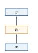  
(a) 前馈网络

  
(b) 记忆网络

  
(c) 图网络

  
(d) 注意力网络  
图 1.6 四种不同的网络结构示例

第一阶段：模型萌芽（1943年\~1969年）这一阶段的核心问题是：能否用一个可计算的模型来抽象神经元及其连接. 1943年，Warren McCulloch和WalterPitts提出了基于简单逻辑运算的MP模型，开启了人工神经网络研究.1948年，Alan Turing提出“B型图灵机”，尝试把学习机制引入网络. 1951年，MarvinMinsky建造了第一台神经网络机 SNARC. 1958年，Rosenblatt 提出了感知器(Perceptron）及其学习算法[Rosenblatt，1958]，使神经网络第一次具备了从数据中学习的雏形.这一时期的意义在于：研究者初步回答了“神经网络是什么”这一问题，但还没有真正解决“多层网络如何有效学习”这一更关键的问题

第二阶段：第一次低谷（1969年\~1983年） 神经网络的第一次低谷，根本原因并不是“网络思想错误”，而是早期模型的能力和当时的计算条件都存在明显限制.1969年，Minsky在《感知器》一书中指出，单层感知器无法表示异或等简单非线性函数，而当时的计算机也难以支撑更大规模网络训练.这些批评使神经网络研究明显降温

Marvin Minsky(1927\~2016)，人工智能领域的重要奠基者之一，麻省理工学院人工智能实验室创始人之一，1969年获图灵奖.

不过，这一阶段并非完全停滞，而是在酝酿后来的复兴.1974年，PaulWer-bos提出了反向传播算法（BackPropagation，BP）[Werbos，1974]；1980年，福岛邦彦提出了带卷积和子采样操作的新知机（Neocognitron）[Fukushima,1980].前者为多层网络学习奠定了方法基础，后者则展示了分层局部连接结构在感知任务中的潜力.

第三阶段：反向传播带来的复兴（1983年\~1995年）这一阶段的关键转折是：神经网络开始从“受生物启发的模型”走向“可训练的机器学习模型”．1983年，John Hopfield提出用于联想记忆（Associative Memory）的Hopfield 网络，说明网络可以具有稳定动力学和记忆能力.1984年，GeoffreyHinton提出玻尔兹曼机（BoltzmannMachine），进一步推动了连接主义模型的发展.

真正使这一阶段形成研究高潮的，是反向传播算法在多层网络中的成功应用. 20 世纪80年代中后期，分布式并行处理（Parallel Distributed Processing，PDP）模型[McClelland et al.,1986]广泛传播，使“分布式表示、连接存储知识、通过连接强度变化进行学习”成为连接主义的重要观点.随后，[LeCun et al.,1989]将反向传播引入卷积神经网络，并在手写体识别上取得成功[LeCun et al.,

玻尔兹曼机参见第15.1节.

1998].这一阶段表明：一旦学习算法有效，神经网络就不仅是认知模拟工具，也可以成为强有力的机器学习模型.

与此同时，研究者也逐渐意识到深层或循环结构会遭遇梯度消失问题(Vanishing Gradient Problem).例如,[Schmidhuber, 1992]尝试通过“逐层无监督预训练+监督微调”的方式训练多层循环网络.这说明神经网络虽然重新兴起，但深层训练仍然存在明显瓶颈

第四阶段：统计学习方法占优（1995年\~2006年）这一时期，神经网络在机器学习中的主导地位再次被削弱.原因并不复杂：一方面，网络规模一旦增大，计算开销迅速上升：另一方面，当时的数据规模、硬件能力和训练技巧都不足以支撑深层模型稳定训练.相比之下，以支持向量机为代表的方法具有更清晰的理论基础，也更容易在中小规模数据上获得可靠结果.因此，在这一阶段，神经网络的研究热度相对下降.

第五阶段：深度学习的崛起（2006年\~2015年）神经网络重新成为主流，关键不在于“提出了全新的网络”，而在于研究者逐步掌握了训练深层网络的方法.[Hinton et al.,2006]通过逐层预训练学习深度信念网络，再将其参数作为多层前馈网络的初始化并结合反向传播微调.这种“预训练+微调”的策略有效缓解了深层网络难训练的问题.

更重要的是，训练条件在这一时期发生了系统性变化：GPU和大规模并行计算提升了算力，互联网推动了数据规模增长，自动微分和深度学习框架降低了构建复杂网络的门槛.随着深度神经网络在语音识别[Hinton et al., 2012]和图像分类[Krizhevsky et al., 2012]上的突破，神经网络迎来了第三次高潮. 此后，端到端训练逐渐替代早期复杂的逐层预训练，自动微分技术的出现也使得深层神经网络的搭建更加便捷，成为现代深度学习训练体系的基础.

第六阶段：基础模型与大模型阶段（2018年至今）2018年后，神经网络的发展进入了新的阶段.其关键变化并不只是参数量持续增大，更重要的是神经网络开始从“面向单一任务的模型”转向“面向多任务迁移与系统集成的基础能力载体”.

这一阶段至少体现出三个趋势.第一，结构逐渐统一：以Transformer为代表的架构成为自然语言处理、多模态学习以及部分视觉、语音任务中的核心结构.第二，训练范式发生变化：预训练、指令微调和对齐训练使模型具备更强的迁移和泛化能力.第三，模型开始系统化：神经网络与检索、工具调用、外部记忆和环境交互机制结合，成为更复杂智能系统中的核心组件.

因此，当前阶段更适合被理解为神经网络发展的新范式：神经网络不再只是一个针对特定任务设计的预测模型，而逐渐演化为可迁移、可适配、可组合的基础模型.其影响不仅体现在性能提升上，也体现在研究组织方式和应用形态的变

化上.

## 1.6 本书的知识体系

本书虽然以神经网络与深度学习为主线，但相关内容并不只属于某一种单独的模型．更合适的理解方式是：本书涉及的核心知识主要分布在机器学习、神经网络和概率图模型这三个彼此联系的知识域中.图1.7从“知识关系”的角度，而不是从“目录层级”的角度，对这些内容之间的联系做了一个概括.

如果从阅读路径而不是知识分类的角度看，全书可以进一步概括为五条相互交织的主线：

（1）机器学习基础线：回答“什么是模型、学习准则与优化算法”，对应第2章和第3章.

（2）神经网络结构线：回答“不同网络如何组织信息与归纳偏置”，对应第4章至第11章.

（3）概率与生成线：回答“如何从概率建模角度理解学习与生成”，对应第14章至第16章

（4）决策与交互线：回答“智能体如何在环境中学习和行动”，对应第12章和第13章中的智能体相关内容.

（5）现代基础模型线：回答“为什么Transformer、大语言模型与智能体代表新的阶段”，对应第8章和第13章.

读者可以把这五条主线理解为从“基础概念”逐步走向“现代系统”的一张路线图：先建立机器学习语言，再掌握主要神经网络结构，随后扩展到概率建模、生成建模与决策问题，最终理解大模型与智能体所代表的新范式

机器学习机器学习为全书提供了最基本的研究视角和方法语言.一般来说，机器学习主要关注如何从数据中学习规律，并利用这些规律进行预测、生成或决策.围绕这一目标，我们通常从三个方面来理解一个机器学习问题：一是模型，即用什么形式来刻画输入与输出之间的关系；二是学习准则，即如何定义“学得好不好”；三是优化算法，即如何求解模型参数.按照任务类型，机器学习又可以分为监督学习、无（自）监督学习和强化学习等.其中，监督学习主要包括分类、回归和结构化预测；无（自）监督学习与自编码器、密度估计和深度生成模型密切相关;强化学习则关注智能体如何通过与环境交互来学习策略.从本书的安排来看，第2章和第3章主要建立这一部分的基础.特别地，神经网络可以看成一类重要的非线性模型，因此机器学习是理解后续神经网络和深度学习内容的出发点.

  
图1.7 机器学习、神经网络与概率图模型之间的关系

神经网络神经网络是本书的核心主线，也是深度学习最主要的模型载体.从结构上看，神经网络并不是单一模型，而是一族具有不同归纳偏置和适用场景的模型，前馈网络是最基础的形式，其中既包括全连接网络，也包括擅长处理图像等局部结构数据的卷积网络；记忆网络强调对历史信息的保持与更新，其中循环网络和记忆增强网络是典型代表；图网络面向图结构数据；而以注意力机制为核心的Transformer则已经成为当前大模型的重要基础架构，它们共同体现了一个事实：神经网络本质上是一类可组合、可扩展的非线性函数族，可以通过多层次的信息变换逐步学习更加抽象的表示，本书第4章到第11章围绕这条主线展开，系统介绍前馈网络、卷积网络、循环网络、优化与正则化、注意力机制与Transformer、图神经网络、无监督学习以及模型独立的学习方式等内容.这一部分构成了全书最主要的主体.

概率图模型概率图模型提供了另一种理解机器学习与深度学习的重要视角.和神经网络更强调函数逼近与表示学习不同，概率图模型更强调随机变量之间的依赖关系及其概率化描述，它主要包括三个核心问题：一是模型，即如何用有向图或无向图来表达变量之间的条件依赖结构；二是推断，即在给定部分变量时如何计算其他变量的后验分布，这里既包括精确推断，也包括近似推断：三是学习，即如何根据数据估计模型参数或结构，EM算法就是其中的重要方法之一.概率图模型与深度学习并不是彼此割裂的.一方面，很多机器学习方法都可以从概率建模的角度获得更统一的解释；另一方面，深度生成模型、深度信念网络等内容又与概率图模型有着紧密联系.因此，本书在后续章节中还会介绍概率图模型、玻尔兹曼机、深度信念网络以及深度生成模型等内容，使读者从“函数逼近”

的视角进一步扩展到“概率建模”的视角.

总体来看，这三部分内容并不是并列割裂的.机器学习提供统一的问题定义和方法框架，神经网络是其中最重要的一类非线性模型，概率图模型则提供了另一种更强调概率结构与推断机制的建模方式；而现代深度学习中的不少内容，特别是深度生成模型，恰恰处在这些知识域的交汇处.对应到本书的组织方式上，第2章和第3章帮助读者建立机器学习基础，第4章到第11章构成神经网络与深度学习的主体，第14章到第16章则进一步引入概率图模型与生成模型，第12章介绍深度强化学习，附录部分提供线性代数、微积分、数学优化、概率论和信息论等数学基础.这样安排的目的，是让读者既能把握神经网络这条主线，又能看到它与更广泛机器学习方法之间的联系.

## 1.7 常用的深度学习框架

在深度学习中，一般通过误差反向传播算法来进行参数学习．采用手工方式来计算梯度再写代码实现的方式会非常低效，并且容易出错.此外，深度学习模型需要的计算资源较多，往往需要利用GPU等硬件加速器进行大规模并行计算，模型的开发和训练复杂度也比较高.因此，一些支持自动梯度计算、多种硬件后端适配以及分布式训练等功能的深度学习框架就应运而生.

从学习本书的角度看，理解这些框架的重点并不在于记住某个具体API，而在于理解它们共同依赖的几个抽象：张量表示、计算图、自动微分以及面向硬件加速的大规模数值计算，只要掌握了这些共同机制，后续无论使用哪一种框架，实现思路都是相通的. 比较有代表性的框架包括:TensorFlow、PyTorch等2.

（1）PyTorch³：学术界和工业界广泛使用的深度学习框架之一，接口风格与Python/NumPy十分接近. PyTorch 以动态计算图和灵活的编程范式见长，适合快速原型验证和复杂模型开发；同时也支持图优化和编译机制（如torch.compile)，以兼顾易用性与执行效率．许多大规模预训练模型和开源项目均基于PyTorch构建.

（2） TensorFlow4：由Google推出的深度学习框架，其名称来源于多维数组“张量”(Tensor).早期版本以静态计算图为主，后续版本引入了更灵活的即时执行模式，并集成了高层APIKeras，降低了使用门槛.TensorFlow在工业部署和移动端推断方面有较为成熟的工具链.

(3) $\mathrm { J A X ^ { 5 } }$ :由Google推出的面向数值计算和机器学习的库，以函数式编程风格为特点，支持自动微分、向量化和即时编译等可组合的程序变换，在需要高性能科学计算和灵活定制训练流程的研究场景中较受欢迎

（4）国内深度学习框架：如百度的飞桨（PaddlePaddle）6、华为的Mind-Spore7等.这些框架在中文社区生态、国产硬件适配以及产业化部署方面具有一定优势，也在持续完善对大模型训练和推断的支持.

本书在介绍具体算法时，主要采用与框架无关的数学形式，以便读者将这些算法迁移到任意框架中实现.读者在实践中可以根据自己的需求选用合适的深度学习框架.

## 1.8 总结和扩展阅读

本章从人工智能、机器学习、表示学习、深度学习到神经网络，给出了一个由浅入深的整体导引.若用一句话概括本章主线，那就是：人工智能的问题目标催生了机器学习的方法框架，机器学习中的表示瓶颈推动了表示学习，而深度学习与神经网络则为自动学习多层次表示提供了最成功的实现路径.

读完本章后，读者应当至少带走以下几个判断：

（1）人工智能并不是单一技术，而是一组围绕“如何实现智能”不断演化的方法体系.

（2）机器学习的关键不仅在于学习预测函数，也在于学习合适的数据表示，并检验模型能否泛化到新的样本.

（3）表示学习是从传统机器学习走向深度学习的核心桥梁

（4）深度学习是一种方法范式，神经网络是这一范式最主要的模型载体

（5）大模型与智能体代表的不是简单的规模扩大，而是训练范式、迁移能力和系统形态的整体变化

从方法上看，深度学习之所以有效，一个关键原因在于它能够把表示学习、模型学习和任务优化更紧密地结合起来.其核心挑战在于贡献度分配问题：当一个系统由许多层组件构成时，如何把最终误差信号有效地分配到中间各层，是模型能否成功学习的关键，神经网络结合反向传播和自动微分，使多层模型的端到端训练成为可能，这也是深度学习迅速发展的重要基础

从发展趋势上看，近年来人工智能正在从“针对单一任务设计模型”逐步走向“构建可迁移、可适配、可组合的基础模型”.大语言模型、多模态模型以及与检索、工具调用、规划执行、环境交互结合的智能体系统，正在推动人工智能从静态预测走向更复杂的推理与行动.与此同时，模型压缩与高效训练、长上下文建模、安全对齐、可解释性、多模态生成、神经符号结合以及AIforScience等方向，也正在持续扩展深度学习的边界.

本书的具体章节安排已在上节介绍.建议读者带着本章建立的整体框架进入后续章节，在学习具体方法的同时，关注各类模型之间的联系以及它们在人工智能体系中的位置.

深度学习的研究进展非常迅速，最新的研究成果通常发表在学术会议或以预印本形式公开.与深度学习直接相关的主要会议有ICLR、NeurIPS和ICML；人工智能领域的综合性会议有IJCAI和AAAI;此外，计算机视觉领域的CVPR、ICCV，自然语言处理领域的ACL、EMNLP等专业会议也发表了大量深度学习和大模型的研究工作.

由于该领域发展极为迅速，很多重要成果会先以预印本形式发表在arXiv8上，部分大模型的技术报告也以此方式公开.关注arXiv上机器学习（cs.LG）、计算与语言（cs.CL）、计算机视觉（cs.CV）等分类下的最新论文，是跟踪前沿进展的重要途径.

## 习题

## 基础题

（1）人工智能、机器学习、深度学习之间是什么关系？请用Venn图表示，并分别举一个属于机器学习但不属于深度学习、属于深度学习但不属于传统机器学习的方法示例.

（2）什么是贡献度分配问题？它在围棋博弈和神经网络训练中各如何体现?

（3）局部表示（one-hot）和分布式表示（词嵌入）各有什么优缺点？请从表示能力、相似度计算和可扩展性三个角度进行比较

（4）什么是端到端学习？与传统的“管线式”（pipeline）学习方式相比，端到端学习有哪些优势和可能的不足？

## 提高题

（5）为什么“连续多次的线性变换等价于一次线性变换”？请给出数学证明，并说明这一性质对深度学习中激活函数设计的启示.

（6）规模法则（ScalingLaw）意味着什么？如果模型性能主要由参数量、数据量和计算量决定，那么在固定的计算预算下，应该如何分配资源（是训练更大的模型、还是用更多的数据训练较小的模型)？

（7）符号主义和连接主义各自的核心假设是什么?两种方法能否结合?请举出一个“神经符号”方法的例子.

## 参考文献

AZEVEDO F A, CARVALHO L R, GRINBERG L T, et al., 2009. Equal numbers of neuronal and nonneuronal cells make the human brain an isometrically scaled-up primate brain[J]. Journal of Comparative Neurology, 513(5): 532-541.

BENGIO Y, COURVILLE A, VINCENT P, 2013. Representation learning: a review and new perspectives[J]. IEEE transactions on pattern analysis and machine intelligence, 35(8): 1798- 1828.

FUKUSHIMA K, 1980. Neocognitron: a self-organizing neural network model for a mechanism of pattern recognition unaffected by shift in position[J]. Biological cybernetics, 36(4): 193-202.

HINTON G E, SALAKHUTDINOV R R, 2006. Reducing the dimensionality of data with neural networks[J]. Science, 313(5786): 504-507.

HINTON G E, DENG L, YU D, et al., 2012. Deep neural networks for acoustic modeling in speech recognition: the shared views of four research groups[J]. IEEE Signal Processing Magazine, 29(6): 82-97.

KRIZHEVSKY A, SUTSKEVER I, HINTON G E, 2012. ImageNet classification with deep convolutional neural networks[C]//Advances in Neural Information Processing Systems 25. 1106-1114.

LECUN Y, BOSER B, DENKER J S, et al., 1989. Backpropagation applied to handwritten zip code recognition[J]. Neural computation, 1(4): 541-551.

LECUN Y, BOTTOU L, BENGIO Y, et al., 1998. Gradient-based learning applied to document recognition[J]. Proceedings of the IEEE, 86(11): 2278-2324.

MCCLELLAND J L, RUMELHART D E, GROUP P R, 1986. Parallel distributed processing: explorations in the microstructure of cognition. volume I: foundations & volume II: psychological and biological models[M]. MIT Press.

MINSKY M, 1961. Steps toward artificial intelligence[J]. Proceedings of the IRE, 49(1): 8-30.

ROSENBLATT F, 1958. The perceptron: a probabilistic model for information storage and organization in the brain.[J]. Psychological review, 65(6): 386.

SCHMIDHUBER J, 1992. Learning complex, extended sequences using the principle of history compression[J]. Neural Computation, 4(2): 234-242.

WERBOS P, 1974. Beyond regression: new tools for prediction and analysis in the behavioral sciences[D]. Harvard University.

# 第2章 机器学习概述

机器学习是对能通过经验自动改进的计算机算法的研究.

——汤姆·米切尔(Tom Mitchell)[Mitchell，1997]

通俗地讲，机器学习（MachineLearning，ML）就是让计算机从数据中进行自动学习，得到某种知识（或规律）.作为一门学科，机器学习通常指一类问题以及解决这类问题的方法，即如何从观测数据（样本）中寻找规律，并利用学习到的规律（模型）对未知或无法观测的数据进行预测.

在早期的工程领域，机器学习也经常称为模式识别（PatternRecognition，PR），但模式识别更偏向于具体的应用任务，比如光学字符识别、语音识别、人脸识别等.这些任务的特点是，对于我们人类而言，这些任务很容易完成，但我们不知道自己是如何做到的，因此也很难人工设计一个计算机程序来完成这些任务.一个可行的方法是设计一个算法可以让计算机自己从有标注的样本上学习其中的规律，并用来完成各种识别任务．随着机器学习技术的应用越来越广，现在机器学习的概念逐渐替代模式识别，成为这一类问题及其解决方法的统称.

以手写体数字识别为例，我们需要让计算机能自动识别手写的数字.比如图2.1中的例子，将5识别为数字5,将 $\scriptstyle ( { \boldsymbol { \theta } } \cdot { \boldsymbol { \mathbf { \mathit { \Omega } } } } )$ 识别为数字6.手写数字识别是一个经典的机器学习任务，对人来说很简单，但对计算机来说却十分困难.我们很难总结每个数字的手写体特征，或者区分不同数字的规则，因此设计一套识别算法是一项几乎不可能的任务.在现实生活中，很多问题都类似于手写体数字识别这类问题，比如物体识别、语音识别等.对于这类问题，我们不知道如何设计一个计算机程序来解决，即使可以通过一些启发式规则来实现，其过程也是极其复杂的.因此，人们开始尝试采用另一种思路，即让计算机“看”大量的样本，并从中学习到一些经验，然后用这些经验来识别新的样本.要识别手写体数字，首先通过人工标注大量的手写体数字图像（即每张图像都通过人工标记了它是什么数字），这些图像作为训练数据，然后通过学习算法自动生成一套模型，并依靠它来识别新的手写体数字.这个过程和人类学习过程也比较类似，我们教小孩子识别数字也是这样的过程.这种通过数据来学习的方法就称为机器学习的方法.

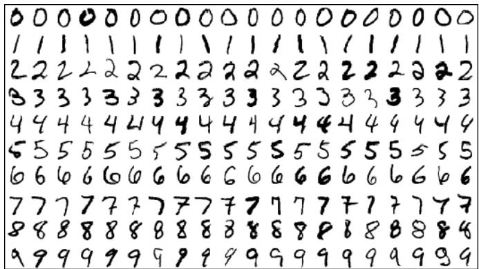  
图 2.1 手写体数字识别示例（图片来源: [LeCun et al., 1998]）

本章先介绍机器学习的基本概念和基本要素，并较详细地描述一个简单的机器学习例子——线性回归.

## 2.1 基本概念

首先我们以一个生活中的例子来介绍机器学习中的一些基本概念：样本、特征、标签、模型、学习算法等.假设我们要到市场上购买芒果，但是之前毫无挑选芒果的经验，那么如何通过学习来获取这些知识？

我们可以随机选取一些芒果，记录每个芒果的特征（Feature），比如颜色、大小、形状、产地和品牌等，并给出我们关心的标签（Label）．标签可以是连续值（比如关于芒果甜度、水分和成熟度的综合打分），也可以是离散值(比如“好”“坏”两类标签).一个同时包含特征和标签的芒果样本就称为样本（Sample），也常称为示例（Instance）.

特征也可以称为属性(Attribute).

我们通常用一个D维向量 $\pmb { x } = [ x _ { 1 } , x _ { 2 } , \cdots , x _ { D } ] ^ { \intercal }$ 表示一个芒果的所有特征构成的向量，称为特征向量（FeatureVector），其中每一维表示一个特征.而芒果的标签通常用标量y来表示.

并不是所有的样本特征都是数值型，需要通过转换表示为特征向量，参见第2.6节.

假设训练集D由N个样本组成，可以记为

$$
{ \mathcal D } = \{ ( { \pmb x } ^ { ( 1 ) } , y ^ { ( 1 ) } ) , ( { \pmb x } ^ { ( 2 ) } , y ^ { ( 2 ) } ) , \cdots , ( { \pmb x } ^ { ( N ) } , y ^ { ( N ) } ) \} .\tag{2.1}
$$

给定训练集D，我们希望让计算机从一个函数集合 $\mathcal { F } = \{ f _ { 1 } ( \pmb { x } ) , f _ { 2 } ( \pmb { x } ) , \cdots \}$ 中自动寻找一个“最优”的函数 $f ^ { * } ( x )$ ，来近似特征向量x和标签y之间的真实关

系.对于一个样本 $_ { \textbf { \em x } }$ ,我们可以通过函数 $f ^ { * } ( x )$ 来预测其标签值

$$
{ \hat { y } } = f ^ { * } ( { \boldsymbol { \mathbf { x } } } ) ,\tag{2.2}
$$

或预测其标签的条件概率

$$
{ \hat { p } } ( y | \mathbf { x } ) = f _ { y } ^ { * } ( \mathbf { x } ) .\tag{2.3}
$$

如何从函数集合 $\mathcal { F }$ 中找到合适的函数 $f ^ { * } ( x )$ 是机器学习的关键.这个过程一般需要通过学习算法（Learning Algorithm）A来完成.学习算法利用训练数据不断调整模型参数，使模型不仅在训练样本上表现良好，而且在新样本上也具有较好的泛化能力.

在有些文献中，学习算法也叫作学习器(Learner).

当模型训练完成后，我们再用独立的测试集 $\mathcal { D } ^ { \prime }$ 来评估模型性能.例如，对于分类问题，可以在测试集上计算预测准确率

第2.2.5节中会介绍更多的评价方法.

$$
A c c ( f ^ { * } ( \pmb { x } ) ) = \frac { 1 } { | \mathscr { D } ^ { \prime } | } \sum _ { ( \pmb { x } , y ) \in \mathscr { D } ^ { \prime } } I ( f ^ { * } ( \pmb { x } ) = y ) ,\tag{2.4}
$$

其中I(·)为指示函数， $| \mathcal { D } ^ { \prime } |$ 为测试集大小.

图2.2给出了机器学习的基本流程.对一个预测任务，输入特征向量为 $_ { x }$ ，输出标签为 $y$ ，我们选择一个函数集合 $\mathcal { F }$ ，通过学习算法A和一组训练样本D，从$\mathcal { F }$ 中学习到函数 $f ^ { * } ( x )$ .如果还需要进行模型选择或超参数调整，则通常再引入一个验证集.这样对新的输入 $_ { x }$ ,就可以用函数 $f ^ { * } ( x )$ 进行预测.

  
图2.2 机器学习基本流程示意图

## 2.2 机器学习的基本要素

机器学习是从有限的观测数据中学习（或“猜测”）出具有一般性的规律，并可以将总结出来的规律推广应用到未观测样本上.机器学习方法可以从以下几个基本要素来描述：数据、模型、学习准则、优化算法和评价指标

## 2.2.1 数据

一组样本构成的集合称为数据集（Dataset）．在很多领域，数据集也经常称为语料库（Corpus）．在机器学习中，数据通常被划分为三部分：训练集（Training Set）、验证集（Validation Set）和测试集（Test Set）.训练集中的样本用于学习模型参数；验证集用于模型选择、超参数调整以及提前停止；测试集仅用于最终评估模型的泛化性能，不参与模型设计过程.若测试集被反复用于调参，就会造成数据泄露（DataLeakage），从而使测试结果过于乐观

在经典监督学习中，通常假设这些样本是独立同分布的（IdenticallyandIndependentlyDistributed，IID），即独立地从相同的数据分布中抽取的.这个假设便于理论分析和模型设计，但在真实场景中并不总是严格成立，比如时间序列、领域迁移以及分布漂移等任务往往需要额外处理.

## 2.2.2 模型

对于一个机器学习任务，首先要确定其输入空间x和输出空间 $\mathcal { Y } .$ 不同机器学习任务的主要区别在于输出空间不同.在二分类问题中 $\mathcal { Y } = \{ + 1 , - 1 \}$ ，在 $C$ 分类问题中 $\mathcal { Y } = \{ 1 , 2 , \cdots , C \}$ ，而在回归问题中 $\mathcal { Y } = \mathbb { R }$

这里，输入空间默认为样本的特征空间.

输入空间X和输出空间y构成了一个样本空间.对于样本空间中的样本$( \boldsymbol { x } , \boldsymbol { y } ) \in \mathcal { X } \times \mathcal { Y }$ ，假定x和y之间的关系可以通过一个未知的真实映射函数 $y =$ $g ( { \pmb x } )$ 或真实条件概率分布 $\dot { p } _ { r } ( y | x )$ 来描述，机器学习的目标是找到一个模型来近似真实映射函数 $g ( { \pmb x } )$ 或真实条件概率分布 $p _ { r } ( y | \mathbf { \boldsymbol { x } } )$

映射函数 $g : \mathcal X  \mathcal Y .$

由于我们不知道真实的映射函数 $g ( { \pmb x } )$ 或条件概率分布 $p _ { r } ( y | \mathbf { \boldsymbol { x } } )$ 的具体形式，因而只能根据经验来假设一个函数集合 $\mathcal { F }$ ，称为假设空间（Hypothesis Space），然后通过观测其在训练集 $\mathcal { D }$ 上的特性，从中选择一个理想的假设（Hypothe-sis) $f ^ { * } \in \mathcal F$

假设空间 $\mathcal { F }$ 通常为一个参数化的函数族

$$
\mathcal { F } = \{ f ( \pmb { x } ; \theta ) | \theta \in \mathbb { R } ^ { D } \} ,\tag{2.5}
$$

其中 $f ( \pmb { x } ; \theta )$ 是参数为θ的函数，也称为模型（Model），D为参数的数量.

常见的假设空间可以分为线性和非线性两种，对应的模型 $f$ 也分别称为线 性模型和非线性模型

## 2.2.2.1 线性模型

线性模型的假设空间为一个参数化的线性函数族，即

$$
f ( \pmb { x } ; \pmb { \theta } ) = \pmb { w } ^ { \top } \pmb { x } + b ,\tag{2.6}
$$

对于分类问题，一般为广义线性函数，参见公式(3.3).

其中参数 $\theta$ 包含了权重向量ω和偏置b.

## 2.2.2.2 非线性模型

广义的非线性模型可以写为多个非线性基函数 $\mathbf { \hat { \phi } } _ { \cdot \phi } ( { \boldsymbol { \mathbf { \hat { x } } } } )$ 的线性组合

$$
f ( \pmb { x } ; \theta ) = \pmb { w } ^ { \top } \phi ( \pmb { x } ) + b ,\tag{2.7}
$$

其中 ${ \phi } ( { \pmb x } ) = [ \phi _ { 1 } ( { \pmb x } ) , \phi _ { 2 } ( { \pmb x } ) , \cdots , \phi _ { K } ( { \pmb x } ) ] ^ { \top }$ 为K个非线性基函数组成的向量，参数θ包含了权重向量w和偏置b.

如果 $\phi ( { \pmb x } )$ 本身为可学习的基函数，比如

$$
\begin{array} { r } { \phi _ { k } ( { \pmb x } ) = h ( { \pmb w } _ { k } ^ { \top } \phi ^ { \prime } ( { \pmb x } ) + b _ { k } ) , \forall 1 \leq k \leq K , } \end{array}\tag{2.8}
$$

其中 $h ( \cdot )$ 为非线性函数， $\phi ^ { \prime } ( { \pmb x } )$ 为另一组基函数， ${ \pmb w } _ { k }$ 和 $b _ { k }$ 为可学习的参数，则$f ( \pmb { x } ; \theta )$ 就等价于神经网络模型.

## 2.2.3 学习准则

令训练集 $\mathcal { D } = \{ ( { \pmb x } ^ { ( n ) } , y ^ { ( n ) } ) \} _ { n = 1 } ^ { N }$ 由N个样本组成.在经典监督学习设定中，通常假设每个样本 $( \boldsymbol { x } , \boldsymbol { y } ) \in \mathcal { X } \times \mathcal { Y }$ 独立地从某个未知但固定的数据分布 $p _ { r } ( { \pmb x } , { \pmb y } )$ 中抽取，这个假设使得我们可以把训练集视为未来测试样本的一个代表性近似并在此基础上讨论泛化问题

机器学习的目标不是简单地“记住”训练样本，而是学习出能够推广到未见样本的模型.因此，我们通常希望模型 $f ( \pmb { x } ; \theta )$ 在真实数据分布 $p _ { r } ( { \pmb x } , { \pmb y } )$ 下具有较小的平均损失.模型 $f ( \pmb { x } ; \theta )$ 的好坏可以通过期望风险(Expected Risk)R(θ)来衡量，其定义为

期望风险也经常 称为期望错误（Expected Error).

$$
\mathscr { R } ( \theta ) = \mathbb { E } _ { ( \pmb { x } , \pmb { y } ) \sim p _ { r } ( \pmb { x } , \pmb { y } ) } [ \mathscr { L } \big ( \pmb { y } , \pmb { f } ( \pmb { x } ; \theta ) \big ) ] ,\tag{2.9}
$$

其中 $\mathcal { L } ( y , f ( \pmb { x } ; \theta ) )$ 为损失函数，用来量化模型预测与真实标签之间的差异

由于真实分布 $p _ { r } ( { \pmb x } , { \pmb y } )$ 一般未知，因此期望风险往往无法直接计算.实际训练时，我们通常先选定一个损失函数，再利用训练数据来近似优化期望风险.对分类任务而言，经常还会用一个条件概率分布 $f _ { y } ( \pmb { x } ; \theta )$ 来表示模型对类别y的预测概率.

## 2.2.3.1 损失函数

损失函数是一个非负实数函数，用来量化模型预测和真实标签之间的差异下面介绍几种常用的损失函数

0-1损失函数 最直观的损失函数是模型在训练集上的错误率，即0-1损失函数(0-1 Loss Function) :

$$
\mathcal { L } ( y , f ( \pmb { x } ; \theta ) ) = \left\{ \begin{array} { l l } { 0 } & { \mathrm { i f } y = f ( \pmb { x } ; \theta ) } \\ { 1 } & { \mathrm { i f } y \neq f ( \pmb { x } ; \theta ) } \end{array} \right.\tag{2.10}
$$

https://nndl.ai/

$$
{ \bf \xi } = I ( y \neq f ( { \pmb x } ; \theta ) ) ,\tag{2.11}
$$

其中I(·)是指示函数.

虽然0-1损失函数能够客观地评价模型的好坏，但其缺点是数学性质不是很好：不连续且导数为0，难以优化.因此经常用连续可微的损失函数替代.

平方损失函数平方损失函数（Quadratic Loss Function）经常用在预测标签$y$ 为实数值的任务中，定义为

$$
\mathcal { L } ( y , f ( \mathbf { x } ; \theta ) ) = \frac { 1 } { 2 } \Big ( y - f ( \mathbf { x } ; \theta ) \Big ) ^ { 2 } .\tag{2.12}
$$

平方损失函数一般不适用于分类问题

参见习题2-3.

交叉熵损失函数 交叉熵损失函数（Cross-Entropy Loss Function)一般用于分类问题.假设样本的标签 $y \in \{ 1 , \cdots , C \}$ 为离散的类别，模型 $f ( \pmb { x } ; \theta ) \in [ 0 , 1 ] ^ { C }$ 的输出为类别标签的条件概率分布，即

$$
p ( \boldsymbol { y } = c | \mathbf { r } ; \boldsymbol { \theta } ) = f _ { c } ( \mathbf { r } ; \boldsymbol { \theta } ) ,\tag{2.13}
$$

并满足

$f _ { c } ( { \pmb x } ; { \theta } )$ 表示 $f ( { \pmb x } ; { \boldsymbol \theta } )$ 的输出向量的第c维.

$$
f _ { c } ( \pmb { x } ; \theta ) \in [ 0 , 1 ] , \qquad \sum _ { c = 1 } ^ { C } f _ { c } ( \pmb { x } ; \theta ) = 1 .\tag{2.14}
$$

我们可以用一个C维的one-hot向量 $\textbf {  { y } }$ 来表示样本标签.假设样本的标签为k,那么标签向量y只有第k维的值为1,其余元素的值都为0.标签向量y可以看作样本标签的真实条件概率分布 $p _ { r } ( \pmb { y } | \pmb { x } )$ ，即第c维（记为 $y _ { c } , 1 \leq c \leq C )$ 是类别为c的真实条件概率，假设样本的类别为k，那么它属于第k类的概率为1，属于其他类的概率为0.

对于两个概率分布，一般可以用交叉熵来衡量它们的差异.标签的真实分布$\textbf {  { y } }$ 和模型预测分布 $f ( \pmb { x } ; \theta )$ 之间的交叉熵为

交叉熵参见第E.3.1节.

$$
\mathcal { L } ( \pmb { y } , f ( \pmb { x } ; \theta ) ) = - \pmb { y } ^ { \top } \log f ( \pmb { x } ; \theta )\tag{2.15}
$$

$$
{ \bf \xi } = - \sum _ { c = 1 } ^ { C } y _ { c } \log f _ { c } ( { \bf x } ; \boldsymbol { \theta } ) .\tag{2.16}
$$

比如对于三分类问题，一个样本的标签向量为 $\pmb { y } = [ 0 , 0 , 1 ] ^ { \top }$ ，模型预测的标签分布为 $f ( \pmb { x } ; \theta ) = [ 0 . 3 , 0 . 3 , 0 . 4 ] ^ { \top }$ ，则它们的交叉熵为 $- ( 0 \times \log ( 0 . 3 ) + 0 \times$ $\log ( 0 . 3 ) + 1 \times \log ( 0 . 4 ) ) = - \log ( 0 . 4 )$

## 数学小知识|交叉熵与KL散度

给定两个概率分布 $p$ 和 $q$ ,交叉熵定义为 $\begin{array} { r } { H ( p , q ) = - \sum _ { c } p _ { c } \log q _ { c } } \end{array}$   
衡量用 $q$ 来编码服从 $p$ 的数据所需的平均信息量.交叉熵可以分解为  
$H ( p , q ) = H ( p ) + D _ { \mathrm { K L } } ( p \Vert q )$ ，其中 $H ( p )$ 是 $p$ 的熵， $D _ { \mathrm { K L } } ( p \Vert q ) \geq 0$ 是  
KL散度.因此,最小化交叉熵等价于最小化KL散度,即让预测分布 $q$ 尽  
可能接近真实分布 $p .$ 交叉熵与KL散度参见竺

因为 $\textbf {  { y } }$ 为one-hot向量，公式(2.16)也可以写为

$$
\begin{array} { r } { \mathcal { L } ( y , f ( \pmb { x } ; \theta ) ) = - \log f _ { y } ( \pmb { x } ; \theta ) , } \end{array}\tag{2.17}
$$

其中 $f _ { y } ( \pmb { x } ; \theta )$ 可以看作真实类别 $y$ 的似然函数.因此，交叉熵损失函数也就是负对数似然函数(Negative Log-Likelihood).

Hinge损失函数 对于二分类问题，假设 $y$ 的取值为 $\{ - 1 , + 1 \} , f ( \pmb { x } ; \theta ) \in \mathbb { R }$ Hinge损失函数(Hinge Loss Function)为

参见第3.5.3节.

$$
\mathcal { L } ( y , f ( \pmb { x } ; \theta ) ) = \operatorname* { m a x } \left( 0 , 1 - y f ( \pmb { x } ; \theta ) \right)\tag{2.18}
$$

$$
\triangleq [ 1 - y f ( \pmb { x } ; \theta ) ] _ { + } ,\tag{2.19}
$$

其中 $[ x ] _ { + } = \operatorname* { m a x } ( 0 , x )$

## 2.2.3.2 风险最小化准则

由于真实的数据分布未知，实际训练时通常只能在训练集上计算模型的平均损失，即经验风险（Empirical Risk)

经验风险也称为经验错误（Empirical Er-ror).

$$
\mathcal { R } _ { \mathcal { D } } ^ { e m p } ( \theta ) = \frac { 1 } { N } \sum _ { n = 1 } ^ { N } \mathcal { L } \big ( y ^ { ( n ) } , f ( \pmb { x } ^ { ( n ) } ; \theta ) \big ) .\tag{2.20}
$$

因此，一个切实可行的学习准则是寻找一组参数 $\theta ^ { * }$ ，使经验风险最小，即

$$
\theta ^ { * } = \arg \operatorname* { m i n } _ { \theta } \mathcal { R } _ { \mathcal { D } } ^ { e m p } ( \theta ) ,\tag{2.21}
$$

这就是经验风险最小化（Empirical Risk Minimization,ERM)准则.

仅仅最小化训练集上的经验风险并不能保证模型具有良好的泛化能力.模型复杂度过高时，即使训练误差很低，也可能在未见样本上性能较差，这就是过拟合（Overfitting）现象.

定义 2.1－过拟合：给定一个假设空间 $\mathcal { F }$ ，一个假设f属于 $\mathcal { F }$ ,如果存在其他的假设 $f ^ { \prime }$ 也属于 $\mathcal { F }$ ，使得在训练集上 $f$ 的损失比 $f ^ { \prime }$ 的损失小，但在整个样本空间上 $f ^ { \prime }$ 的损失比 $f$ 的损失小，那么就说假设 $f$ 过度拟合训练数据.

和过拟合相反的一个概念是欠拟合（Underfitting），即模型不能很好地拟合训练数据，在训练集上的错误率比较高.欠拟合一般是由于模型能力不足造成的.图2.3给出了欠拟合和过拟合的示例.

  
图2.3 欠拟合和过拟合示例

为了在拟合训练数据和控制模型复杂度之间取得平衡，常在经验风险最小化的基础上加入一个复杂度惩罚项，从而得到结构风险最小化（StructuralRiskMinimization,SRM)准则:

$$
\theta ^ { * } = \arg \operatorname* { m i n } _ { \theta } \mathcal { R } _ { \mathcal { D } } ^ { e m p } ( \theta ) + \lambda \Omega ( \theta ) ,\tag{2.22}
$$

其中 $\Omega ( \theta )$ 用来衡量模型复杂度， $\lambda \geq 0$ 为权衡系数.在线性模型和神经网络中，$\ell _ { 2 }$ 正则化是最常见的实现形式之一．正则化项也可以使用其他函数，比如 $\ell _ { 1 }$ 范数. $\ell _ { 1 }$ 范数的引入通常会使得参数有一定稀疏性，因此在很多算法中也经常使用.从贝叶斯学习的角度来讲，正则化是引入了参数的先验分布，使其不完全依赖训练数据.

$\ell _ { 1 }$ 范数的稀疏性参见第7.7.1节.

正则化的贝叶斯解释参见第2.3.1.4节.

在实际机器学习流程中，ERM或SRM通常用于训练阶段，而模型选择、正则化强度和其他超参数的确定，则依赖验证集上的性能.当训练数据较少时，也可以采用交叉验证来近似完成模型选择与性能估计.

交叉验证交叉验证（Cross-Validation）是一种常用的模型选择与评价方法，可以在数据量较少时更稳定地评价模型.常见的K折交叉验证做法是:把原始数据集划分为K个互不重叠的子集，每次选K一1个子集作为训练集，剩下的一个子集作为验证集，共进行K轮训练与验证，并将K次验证结果取平均.需要注意的是，交叉验证通常用于模型选择和超参数调整；如果有独立测试集，最终结果仍应在测试集上评测

## 2.2.4 优化算法

在确定了训练集D、假设空间以及学习准则后，如何找到最优的模型$f ( x ; theta ^ { * } )$ 就成了一个最优化（Optimization）问题.机器学习的训练过程本质上就是最优化问题的求解过程.

参数与超参数在机器学习中，优化通常可以分为参数优化和超参数优化.模型$f ( \pmb { x } ; \theta )$ 中的θ称为模型参数，可以通过优化算法直接学习.除此之外，还有一类参数用于定义模型结构或优化策略，比如正则化系数、学习率、网络层数、聚类类别数等,这类参数称为超参数（Hyper-Parameter).

在贝叶斯方法中，超参数可以理解为参数的参数，即控制模型参数分布的参数.

超参数通常不能像模型参数那样直接由训练过程学习得到，而是需要结合验证集表现进行选择．常见的方法包括人工经验设定、网格搜索、随机搜索以及更系统的贝叶斯优化等.

## 2.2.4.1 梯度下降法

为了充分利用最优化中一些高效、成熟的方法，很多机器学习方法都会选择合适的模型和损失函数，以构造便于优化的目标函数．对于凸目标，往往能够较稳定地求得全局最优解；而对于神经网络等非凸模型，则通常只能求得局部最优解或足够好的近似解

在机器学习中，最简单且最常用的优化算法是梯度下降法.梯度 $\nabla _ { \boldsymbol { \theta } } \mathcal { R } ( { \boldsymbol { \theta } } )$ 指向函数值增大最快的方向，因此沿负梯度方向移动可以最快地降低损失.设参数的初值为 $\theta _ { 0 }$ ,则第t次迭代的更新公式为

$$
\theta _ { t + 1 } = \theta _ { t } - \alpha \frac { \partial \mathcal { R } _ { \mathcal { D } } ( \theta ) } { \partial \theta }\tag{2.23}
$$

$$
= \theta _ { t } - \alpha \frac { 1 } { N } \sum _ { n = 1 } ^ { N } \frac { \partial \mathcal { L } \Big ( y ^ { ( n ) } , f ( \pmb { x } ^ { ( n ) } ; \pmb { \theta } ) \Big ) } { \partial \pmb { \theta } } ,\tag{2.24}
$$

其中 $\theta _ { t }$ 为第t次迭代时的参数值， $\alpha$ 为步长．在机器学习中，α一般称为学习率(Learning Rate).

## 2.2.4.2 提前停止

除了显式加入正则化项之外，还可以通过提前停止（EarlyStopping）来缓解过拟合．其基本思想是：随着训练轮次增加，模型在训练集上的损失通常会持续下降，但验证集上的误差可能先下降后上升.因此，在验证集性能不再提升时终止训练，往往可以获得更好的泛化能力.

在实际应用中，提前停止通常与验证集配合使用.如果原始数据量较小，也可以从训练集中再划分出一部分数据作为验证集.图2.4给出了提前停止的示例.

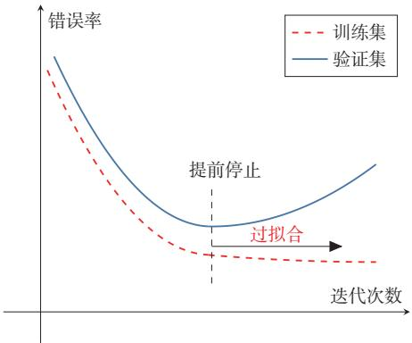  
图2.4 提前停止的示例

## 2.2.4.3随机梯度下降法

在公式(2.23)中，梯度下降法每次都需要利用整个训练集来计算梯度，这种方式称为批量梯度下降法（Batch Gradient Descent，BGD）.当训练集规模很大时，这种做法的时间和空间开销都比较高.

如果将一个样本的损失梯度视为真实梯度的随机近似，就得到随机梯度下降法（Stochastic Gradient Descent，SGD）.SGD每次仅利用一个训练样本更新参数，因此单次迭代代价较低，并且在非凸优化中常常更容易跳出较差的局部区域，当经过足够次数的迭代时，随机梯度下降也可以收敛到局部最优解[Nemirovski et al., 2009].

随机梯度下降法的训练过程如算法2.1所示.

算法 2.1 随机梯度下降法  
输入: 训练集D = {(x(n), y(n))}n=1,验证集ν,学习率α  
1 随机初始化 θ;  
2 repeat  
3 对训练集D中的样本随机排序;  
4 for n = 1 ·. N do  
5 从训练集D中选取样本(x(n), y(n));  
∂L(y(n), f(x(n); θ))  
6 θ ← θ − α //更新参数  
∂θ  
7 end  
8 until 模型 f(x; θ)在验证集 γ上的性能不再提升;  
输出：θ

批量梯度下降和随机梯度下降的主要区别在于：前者使用全体样本的平均损失来更新参数，后者使用单个样本的损失来更新参数.由于实现简单、单步开销小，随机梯度下降及其变体在现代机器学习中被广泛采用.

## 2.2.4.4 小批量梯度下降

随机梯度下降法的一个缺点是无法充分利用计算机的并行计算能力.小批量梯度下降（Mini-Batch Gradient Descent）是批量梯度下降和随机梯度下降的折中：每次迭代时随机选取一小部分训练样本来估计梯度，从而兼顾计算效率与优化稳定性.

第t次迭代时，随机选取一个包含K个样本的子集 $\mathcal { S } _ { t }$ ,计算该子集上的平均梯度并更新参数：

$$
\theta _ { t + 1 }  \theta _ { t } - \alpha \frac { 1 } { K } \sum _ { ( \pmb { x } , \pmb { y } ) \in \mathcal { S } _ { t } } \frac { \partial \mathcal { L } \Big ( \pmb { y } , \pmb { f } ( \pmb { x } ; \theta ) \Big ) } { \partial \theta } .
$$

K通常不会设置很大，一般在1～100之间.在实际应用中为了提高计算效率，通常设置为2的幂2n.

(2.25)

在实际应用中，小批量梯度下降兼具收敛速度快、内存友好和便于并行实现等优点，因此已经成为大规模机器学习和深度学习中的主流优化方式[Bottou,2010].

## 2.2.5 评价指标

为了衡量一个机器学习模型的好坏，需要给定一个测试集，用模型对测试集中的每一个样本进行预测，并根据预测结果计算评价分数.

对于分类问题，常见的评价标准有准确率、精确率、召回率和F值等.给定测试集 $\mathcal { T } = \{ ( \mathbf { x } ^ { ( 1 ) } , y ^ { ( 1 ) } ) , \cdots , ( \mathbf { x } ^ { ( N ) } , y ^ { ( N ) } ) \}$ ，假设标签 $y ^ { ( n ) } \in \{ 1 , \cdots , C \}$ ，用学习好的模型 $f ( { \pmb x } ; { \pmb \theta } ^ { * } )$ 对测试集中的每一个样本进行预测，结果为 $\{ \hat { y } ^ { ( 1 ) } , \cdots , \hat { y } ^ { ( N ) } \}$

准确率 最常用的评价指标为准确率（Accuracy）：

$$
\mathcal { A } = \frac { 1 } { N } \sum _ { n = 1 } ^ { N } I ( y ^ { ( n ) } = \hat { y } ^ { ( n ) } ) ,\tag{2.26}
$$

由于中文的模糊性，关于准确率和下文提到的精确率的定义在有些文献中刚好相反，具体含义需要根据上下文进行判断.

其中I(·) 为指示函数.

错误率 和准确率相对应的就是错误率（Error Rate）:

$$
\mathcal { E } = 1 - \mathcal { A }\tag{2.27}
$$

$$
= \frac { 1 } { N } \sum _ { n = 1 } ^ { N } I ( y ^ { ( n ) } \neq \hat { y } ^ { ( n ) } ) .\tag{2.28}
$$

精确率和召回率准确率是所有类别整体性能的平均，如果希望对每个类都进行性能估计，就需要计算精确率（Precision）和召回率（Recall）.精确率和召回率是广泛用于信息检索和统计学分类领域的两个度量值，在机器学习的评价中也被大量使用.

对于类别c来说，模型在测试集上的结果可以分为以下四种情况：

（1）真正例（TruePositive，TP)：一个样本的真实类别为c并且模型正确地预测为类别c.这类样本数量记为

$$
T P _ { c } = \sum _ { n = 1 } ^ { N } I ( y ^ { ( n ) } = \hat { y } ^ { ( n ) } = c ) .\tag{2.29}
$$

（2）假负例（FalseNegative，FN）：一个样本的真实类别为 $c ,$ 模型错误地预测为其他类.这类样本数量记为

$$
F N _ { c } = \sum _ { n = 1 } ^ { N } I ( y ^ { ( n ) } = c \wedge \hat { y } ^ { ( n ) } \neq c ) .\tag{2.30}
$$

(3）假正例（FalsePositive,FP):一个样本的真实类别为其他类，模型错误地预测为类别 $c .$ 这类样本数量记为

$$
F P _ { c } = \sum _ { n = 1 } ^ { N } I ( y ^ { ( n ) } \neq c \land \hat { y } ^ { ( n ) } = c ) .\tag{2.31}
$$

(4）真负例（TrueNegative，TN)：一个样本的真实类别为其他类，模型也预测为其他类.这类样本数量记为 $T N _ { c }$ 对于类别 $c$ 来说，这种情况一般不需要关注.

这四种情况的关系可以用如图2.5所示的混淆矩阵（Confusion Matrix）来表示.

  
图 2.5 类别c的预测结果的混淆矩阵

根据上面的定义，我们可以进一步定义查准率、查全率和F值.

精确率（Precision）:所有预测为类别 $c$ 的样本中预测正确的样本比例

精确率也叫精度或查 准率.

$$
\mathcal { P } _ { c } = \frac { T P _ { c } } { T P _ { c } + F P _ { c } } .\tag{2.32}
$$

召回率（Recall）:真实属于类别c的样本中，正确预测的样本比例.

召回率也叫查全率.

$$
\mathcal { R } _ { c } = \frac { T P _ { c } } { T P _ { c } + F N _ { c } } .\tag{2.33}
$$

F值（FMeasure）是一个综合指标，为精确率和召回率的调和平均：

$$
\mathcal { F } _ { c } = \frac { ( 1 + \beta ^ { 2 } ) \times \mathcal { P } _ { c } \times \mathcal { R } _ { c } } { \beta ^ { 2 } \times \mathcal { P } _ { c } + \mathcal { R } _ { c } } ,\tag{2.34}
$$

其中 $\beta$ 用于平衡精确率和召回率的重要性，一般取值为1. $\beta = 1$ 时的F值称为F1值，是精确率和召回率的调和平均.

宏平均和微平均 为了计算分类算法在所有类别上的总体精确率、召回率和F1值，经常使用两种平均方法，分别称为宏平均（MacroAverage）和微平均（Mi-cro Average) [Yang, 1999].

宏平均是先分别计算每一类的指标，再对各类做算术平均：

$$
\mathcal { P } _ { m a c r o } = \frac { 1 } { C } \sum _ { c = 1 } ^ { C } \mathcal { P } _ { c } ,\tag{2.35}
$$

$$
\mathcal { R } _ { m a c r o } = \frac { 1 } { C } \sum _ { c = 1 } ^ { C } \mathcal { R } _ { c } ,\tag{2.36}
$$

$$
\mathcal { F } 1 _ { m a c r o } = \frac { 2 \times \mathcal { P } _ { m a c r o } \times \mathcal { R } _ { m a c r o } } { \mathcal { P } _ { m a c r o } + \mathcal { R } _ { m a c r o } } .\tag{2.37}
$$

值得注意的是，在有些文献中，宏平均F1也定义为 $\begin{array} { r } { \mathcal { F } 1 _ { m a c r o } = \frac { 1 } { C } \sum _ { c = 1 } ^ { C } \mathcal { F } 1 _ { c } } \end{array}$ .两种写法都较常见，因此在比较结果时需要留意具体定义

微平均是先在所有类别上汇总统计量，再计算整体指标.对于单标签多分类任务，精确率、召回率和F1值的微平均往往相同，且与准确率关系密切.当不同类别的样本数量不均衡时，宏平均通常更能反映小类别上的性能，而微平均更容易受到大类别的影响.

在实际应用中，我们也可以通过调整分类模型的阈值来进行更全面的评价，比如 AUC(Area Under Curve)、ROC(Receiver Operating Characteristic)曲线、PR（Precision-Recall）曲线等.此外，很多任务还有自己专门的评价方式，比如 TopN 准确率.

关于更详细的模型评价指标，可以参考《机器学习》[周志华，2016]的第2章.

概率校准和不确定性上述指标主要评价模型的预测标签是否正确，或者评价在不同阈值下正确率和错误率如何变化.但在很多实际场景中，我们还希望知道模型给出的预测概率是否可信．例如，一个分类模型如果经常给出0.9的预测概率，那么在这些预测中大约应有90%是正确的；若实际正确率只有60%，模型虽然可能有较高准确率，但它的置信度明显偏高．这类问题称为概率校准(Probability Calibration).

概率校准和不确定性估计（UncertaintyEstimation）密切相关.一个模型的不确定性通常来自两方面：一是数据本身存在噪声或类别边界模糊，即使有无限数据也难以完全消除：二是训练数据有限或分布变化导致模型对某些区域了解不足.前者常称为数据不确定性，后者常称为模型不确定性.在医疗诊断、金融风控、自动驾驶等高风险任务中，模型不仅要给出预测结果，还应尽可能给出可靠的置信度，并在不确定性较高时交给人工复核或采取更保守的决策策略.

图2.6给出了机器学习的完整流程，包含模型训练和模型评价两个阶段.模型训练阶段需要用到训练集、验证集、待学习的模型、损失函数、优化算法，输出学习到的模型.模型评价阶段需要用到测试集、学习到的模型、评价指标，得到模型的性能评价.

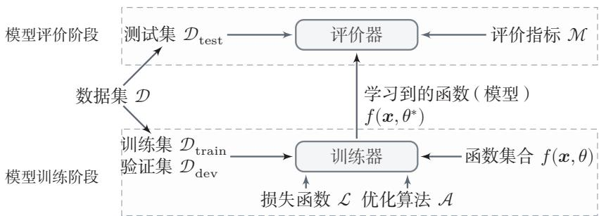  
图2.6 机器学习基本流程示意图

## 2.3 机器学习的简单示例线性回归

在本节中，我们通过一个简单的模型（线性回归）来具体了解机器学习的一般过程，以及不同学习准则（经验风险最小化、结构风险最小化、最大似然估计、最大后验估计）之间的关系.

线性回归（LinearRegression）是机器学习和统计学中最基础和最广泛应用的模型，是一种对自变量和因变量之间关系进行建模的回归分析.自变量数量为1时称为简单回归，自变量数量大于1时称为多元回归.

从机器学习的角度来看，自变量就是样本的特征向量 $\pmb { x } \in \mathbb { R } ^ { D }$ (每一维对应一个自变量)，因变量是标签 $y$ ,这里 $y \in$ R是连续值（实数或连续整数).假设空间是一组参数化的线性函数

$$
f ( \pmb { x } ; \pmb { w } , b ) = \pmb { w } ^ { \top } \pmb { x } + b ,\tag{2.38}
$$

其中权重向量 $\pmb { w } \in \mathbb { R } ^ { D }$ 和偏置 $b \in$ R都是可学习的参数，函数 $f ( \pmb { x } ; \pmb { w } , b ) \in \mathbb { I }$ R也称为线性模型.

为简单起见，我们将公式(2.38)写为

$$
f ( \boldsymbol x ; \hat { \boldsymbol w } ) = \hat { \boldsymbol w } ^ { \intercal } \hat { \boldsymbol x } ,\tag{2.39}
$$

其中 $\hat { w }$ 和分别称为增广权重向量和增广特征向量：

$$
\begin{array} { r } { \hat { \pmb { x } } = \pmb { x } \oplus 1 \triangleq \left[ \begin{array} { c } { { \bf \sigma } } \\ { { \bf x } } \\ { { \bf x } } \\ { 1 } \end{array} \right] = \left[ \begin{array} { c } { x _ { 1 } } \\ { \vdots } \\ { x _ { D } } \\ { 1 } \end{array} \right] , } \end{array}\tag{2.40}
$$

$$
\hat { w } = w \oplus b \triangleq [ \begin{array} { c } { [ \begin{array} { c } { [ w _ { 1 } } \\ { w } \\ { [ w ] } \\ { w } \end{array} ] } \end{array} ] = [ \begin{array} { c } { w _ { 1 } } \\ { \vdots } \\ { w _ { D } } \\ { b } \end{array} ] ,\tag{2.41}
$$

其中④定义为两个向量的拼接操作.

不失一般性，在本章后面的描述中我们采用简化的表示方法，直接用ω和x分别表示增广权重向量和增广特征向量．这样，线性回归的模型简写为$f ( \pmb { x } ; \pmb { w } ) = \pmb { w } ^ { \top } \pmb { x }$

## 2.3.1 参数学习

给定一组包含N个训练样本的训练集 $\mathcal { D } = \{ ( { \boldsymbol { x } } ^ { ( n ) } , y ^ { ( n ) } ) \} _ { n = 1 } ^ { N }$ ，我们希望能够学习一个最优的线性回归的模型参数w.

我们介绍四种不同的参数估计方法：经验风险最小化、结构风险最小化、最大似然估计、最大后验估计.

## 2.3.1.1 经验风险最小化

由于线性回归的标签 $y$ 和模型输出都为连续的实数值，因此平方损失函数非常合适衡量真实标签和预测标签之间的差异.

平方损失函数参见第2.2.3.1节.

根据经验风险最小化准则，训练集D上的经验风险定义为

$$
\mathcal { R } ( \pmb { w } ) = \sum _ { n = 1 } ^ { N } \mathcal { L } ( y ^ { ( n ) } , f ( \pmb { x } ^ { ( n ) } ; \pmb { w } ) )\tag{2.42}
$$

为了简化起见，这里的风险函数省略了 $\textstyle { \frac { 1 } { N } }$

$$
\mathbf { \Sigma } = \frac { 1 } { 2 } \sum _ { n = 1 } ^ { N } \Big ( y ^ { ( n ) } - w ^ { \top } \pmb { x } ^ { ( n ) } \Big ) ^ { 2 }\tag{2.43}
$$

$$
\mathbf { \Omega } = \frac 1 2 \| \pmb { y } - \pmb { X } ^ { \top } \pmb { w } \| ^ { 2 } ,\tag{2.44}
$$

其中 $\pmb { y } = [ y ^ { ( 1 ) } , \cdots , y ^ { ( N ) } ] ^ { \intercal } \in \mathbb { R } ^ { N }$ 是由所有样本的真实标签组成的列向量，而 $\boldsymbol { X } \in$ $\mathbb { R } ^ { ( D + 1 ) \times N }$ 是由所有样本的输入特征 $\pmb { x } ^ { ( 1 ) } , \cdots , \pmb { x } ^ { ( N ) }$ 组成的矩阵：

$$
\begin{array} { r } { X = \left[ { \begin{array} { c c c c } { x _ { 1 } ^ { ( 1 ) } } & { x _ { 1 } ^ { ( 2 ) } } & { \cdots } & { x _ { 1 } ^ { ( N ) } } \\ { \vdots } & { \vdots } & { \ddots } & { \vdots } \\ { x _ { D } ^ { ( 1 ) } } & { x _ { D } ^ { ( 2 ) } } & { \cdots } & { x _ { D } ^ { ( N ) } } \\ { 1 } & { 1 } & { \cdots } & { 1 } \end{array} } \right] . } \end{array}\tag{2.45}
$$

风险函数 $\mathcal { R } ( \boldsymbol { w } )$ 是关于w的凸函数，其对ω的偏导数为

参见习题2-9.

$$
\begin{array} { r } { \frac { \partial \mathcal { R } ( \pmb { w } ) } { \partial \pmb { w } } = \frac { 1 } { 2 } \frac { \partial \ \| \pmb { y } - \pmb { X } ^ { \top } \pmb { w } \| ^ { 2 } } { \partial \pmb { w } } } \\ { = - \pmb { X } ( \pmb { y } - \pmb { X } ^ { \top } \pmb { w } ) , } \end{array}\tag{2.46}
$$

(2.47)

令 $\begin{array} { r } { \frac { \partial } { \partial { \bf w } } \mathcal { R } ( { \bf w } ) = 0 } \end{array}$ ,得到最优的参数 $\ b { w } ^ { * }$ 为

$( \pmb { X } \pmb { X } ^ { \top } ) ^ { - 1 } .$ X也称为 $\pmb { X } ^ { \top }$ 的伪逆矩阵.

$$
\pmb { w } ^ { * } = ( \pmb { X } \pmb { X } ^ { \top } ) ^ { - 1 } \pmb { X } \pmb { y }\tag{2.48}
$$

$$
= { \biggl ( } \sum _ { n = 1 } ^ { N } \mathbf { x } ^ { ( n ) } { \bigl ( } \mathbf { x } ^ { ( n ) } { \bigr ) } ^ { \top } { \biggr ) } ^ { - 1 } { \biggl ( } \sum _ { n = 1 } ^ { N } \mathbf { x } ^ { ( n ) } y ^ { ( n ) } { \biggr ) } .\tag{2.49}
$$

这种求解线性回归参数的方法也叫最小二乘法（Least SquareMethod，LSM).图2.7给出了用最小二乘法来进行线性回归参数学习的示例

在古代汉语中“平方”称为“二乘”.

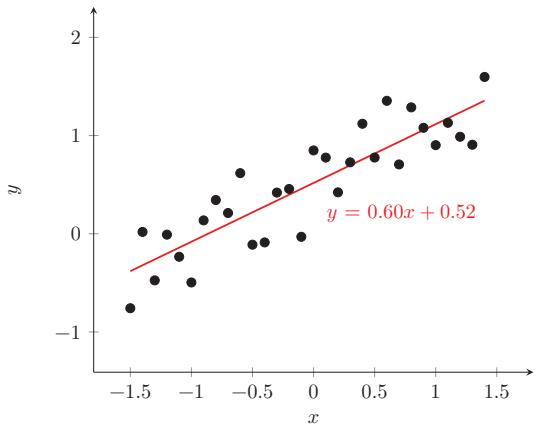  
图2.7 用最小二乘法来进行线性回归参数学习的示例

若要直接使用式(2.48)给出的闭式解， $X X ^ { \mathsf { \scriptscriptstyle T } } \in \mathbb { R } ^ { ( D + 1 ) \times ( D + 1 ) }$ 必须存在逆矩阵，即 $X X ^ { \top }$ 是满秩的 $( \mathrm { \ r a n k } ( X X ^ { \mathsf { T } } ) = D + 1 )$ .也就是说，X中的行向量之间是线性不相关的，即X的各行向量（各特征维度）之间线性无关.一种常见的

$X X ^ { \top }$ 不可逆情况是样本数量N小于特征数量 $( D + 1 )$ ， $X X ^ { \top }$ 的秩为N.这时会存在很多解 $\boldsymbol { w } ^ { * }$ ，可以使得 $\mathcal { R } ( w ^ { * } ) = 0$

参见习题2-8.

当 $X X ^ { \top }$ 不可逆时，可以通过下面两种方法来估计参数：1）先使用主成分分析等方法来预处理数据，消除不同特征之间的相关性，然后再使用最小二乘法来估计参数；2）使用梯度下降法来估计参数.先初始化 $w = 0$ ，然后通过下面公式进行迭代：

$$
\pmb { w }  \pmb { w } + \alpha \pmb { X } ( \pmb { y } - \pmb { X } ^ { \top } \pmb { w } ) ,\tag{2.50}
$$

其中 $\alpha$ 是学习率.这种利用梯度下降法来求解的方法也称为最小均方（LeastMean Squares,LMS)算法.

## 2.3.1.2 结构风险最小化

最小二乘法的基本要求是各个特征之间要互相独立，保证 $X X ^ { \top }$ 可逆．但即使 $X X ^ { \top }$ 可逆，如果特征之间有较大的多重共线性（Multicollinearity），也会使得 $X X ^ { \top }$ 的逆在数值上无法准确计算.数据集X上一些小的扰动就会导致$( X X ^ { \mathsf { T } } ) ^ { - 1 }$ 发生大的改变，进而使得最小二乘法的计算变得很不稳定.为了解决这个问题， [Hoerl et al.,1970] 提出了岭回归（Ridge Regression），给 $X X ^ { \top }$ 的对角线元素都加上一个常数λ使得 $( X X ^ { \top } + \lambda I )$ 满秩，即其行列式不为0.最优的参数 $\mathbf { \Delta } w ^ { * }$ 为

共线性（Collinearity）是指一个特征可以通过其他特征的线性组合来较准确地预测.

$$
\pmb { w } ^ { * } = ( \pmb { X } \pmb { X } ^ { \top } + \lambda I ) ^ { - 1 } \pmb { X } \pmb { y } ,\tag{2.51}
$$

其中 $\lambda > 0$ 为预先设置的超参数，I为单位矩阵.

岭回归的解 $\boldsymbol { w } ^ { * }$ 可以看作结构风险最小化准则下的最小二乘法估计，其目标函数可以写为

$$
\mathcal { R } ( \pmb { w } ) = \frac { 1 } { 2 } \| \pmb { y } - \pmb { X } ^ { \top } \pmb { w } \| ^ { 2 } + \frac { 1 } { 2 } \lambda \| \pmb { w } \| ^ { 2 } ,\tag{2.52}
$$

其中 $\lambda > 0$ 为正则化系数.

## 2.3.1.3 最大似然估计

机器学习任务可以分为两类：一类是样本的特征向量x和标签 $y$ 之间存在未知的函数关系 $y \ = \ h ( \pmb { x } )$ ，另一类是条件概率 $p ( y | \mathbf { \boldsymbol { x } } )$ 服从某个未知分布.第2.3.1.1节中介绍的最小二乘法是属于第一类，直接建模x和标签 $y$ 之间的函数关系.此外，线性回归还可以从建模条件概率 $p ( y | \mathbf { \boldsymbol { x } } )$ 的角度来进行参数估计.

假设标签 $y$ 为一个随机变量，并由函数 $f ( \pmb { x } ; \pmb { w } ) = \pmb { w } ^ { \top } \pmb { x }$ 加上一个随机噪声€决定，即

这里把x看作确定值的参数.

$$
y = f ( \pmb { x } ; \pmb { w } ) + \epsilon ,\tag{2.53}
$$

$$
= \pmb { w } ^ { \intercal } \pmb { x } + \epsilon ,\tag{2.54}
$$

其中∈服从均值为0、方差为 $\sigma ^ { 2 }$ 的高斯分布.这样，y服从均值为 ${ \pmb w } ^ { \top } { \pmb x }$ 、方差为 $\sigma ^ { 2 }$ 的高斯分布：

$$
p ( y | \mathbf x ; \mathbf w , \boldsymbol \sigma ) = \mathcal N ( y ; \mathbf w ^ { \top } \mathbf x , \boldsymbol \sigma ^ { 2 } )\tag{2.55}
$$

$$
{ \bf \Gamma } = \frac { 1 } { \sqrt { 2 \pi } \sigma } \exp \Big ( - \frac { ( y - { \pmb w } ^ { \top } { \pmb x } ) ^ { 2 } } { 2 \sigma ^ { 2 } } \Big ) .\tag{2.56}
$$

参数w在训练集D上的似然函数（Likelihood）为

似然函数是关于统计模型的参数的函数.

$$
p ( \pmb { y } | \pmb { X } ; \pmb { w } , \sigma ) = \prod _ { n = 1 } ^ { N } p ( \pmb { y } ^ { ( n ) } | \pmb { x } ^ { ( n ) } ; \pmb { w } , \sigma )\tag{2.57}
$$

$$
= \prod _ { n = 1 } ^ { N } \mathcal { N } ( y ^ { ( n ) } ; { \pmb w } ^ { \top } { \pmb x } ^ { ( n ) } , \sigma ^ { 2 } ) ,\tag{2.58}
$$

其中 $\pmb { y } = [ y ^ { ( 1 ) } , \cdots , y ^ { ( N ) } ] ^ { \intercal }$ 为所有样本标签组成的向量， $\pmb { X } = [ \pmb { x } ^ { ( 1 ) } , \cdots , \pmb { x } ^ { ( N ) } ]$ 为所有样本特征向量组成的矩阵.

似然 $L ( w | x )$ 和概率$p ( x | w ) \dot { z }$ 间的区别在于：概率 $p ( x | w )$ 是描述固定参数w时随机变量x的分布情况，而似然 $L ( w | x )$ 则是描述已知随机变量x时不同的参数w对其分布的影响.

为了方便计算，对似然函数取对数得到对数似然函数（LogLikelihood）：

$$
\log p ( \pmb { y } | \pmb { X } ; \pmb { w } , \sigma ) = \sum _ { n = 1 } ^ { N } \log \mathcal { N } ( \pmb { y } ^ { ( n ) } ; \pmb { w } ^ { \top } \pmb { x } ^ { ( n ) } , \sigma ^ { 2 } ) .\tag{2.59}
$$

最大似然估计（Maximum Likelihood Estimation，MLE）是指找到一组参数w使得似然函数 $p ( \pmb { y } | \pmb { X } ; \pmb { w } , \sigma )$ 最大，等价于对数似然函数 $\log p ( \pmb { y } | \pmb { X } ; \pmb { w } , \sigma )$ 最大.

$$
\begin{array} { r } { \underset { \vec { \mathbf { \sigma } } } { \iff } \frac { \partial \log p ( \pmb { y } | \pmb { X } ; \pmb { w } , \sigma ) } { \partial \pmb { w } } = 0 , \acute { \underset { \pmb { \mathcal { H } } } { \rtimes } } \pmb { \mathcal { E } } | \pmb { J } } \end{array}
$$

参见习题2-14.

$$
\pmb { w } ^ { M L } = ( \pmb { X } \pmb { X } ^ { \top } ) ^ { - 1 } \pmb { X } \pmb { y } .\tag{2.60}
$$

可以看出，最大似然估计的解和最小二乘法的解相同

最小二乘法参见公式(2.48).

## 2.3.1.4 最大后验估计

最大似然估计的一个缺点是当训练数据比较少时会发生过拟合，估计的参数可能不准确.为了避免过拟合，我们可以给参数加上一些先验知识

假设参数w为一个随机向量，并服从一个先验分布 $p ( \pmb { w } ; \nu )$ .为简单起见，一般令 $p ( \pmb { w } ; \nu )$ 为各向同性的高斯分布：

$$
p ( \pmb { w } ; \nu ) = \mathcal { N } ( \pmb { w } ; \mathbf { 0 } , \nu ^ { 2 } I ) ,\tag{2.61}
$$

其中 $\nu ^ { 2 }$ 为每一维上的方差.

根据贝叶斯公式，参数w的后验分布（Posterior Distribution）为

贝叶斯公式参见公式(D.33).

$$
p ( \pmb { w } | \pmb { X } , \pmb { y } ; \nu , \sigma ) = \frac { p ( \pmb { w } , \pmb { y } | \pmb { X } ; \nu , \sigma ) } { p ( \pmb { y } | \pmb { X } ; \nu , \sigma ) }\tag{2.62}
$$

$$
\propto p ( \pmb { y } | \pmb { X } , \pmb { w } ; \sigma ) p ( \pmb { w } ; \nu ) ,\tag{2.63}
$$

这里将w视为待推断的随机变量，故写在条件栏中；分号后的 $\sigma , \nu$ 表示给定的分布参数.

其中 $p ( \pmb { y } | \pmb { X } , \pmb { w } ; \sigma )$ 为w的似然函数， $p ( \pmb { w } ; \nu )$ 为w的先验.

这种估计参数w的后验概率分布的方法称为贝叶斯估计（Bayesian Esti-mation），是一种统计推断问题.采用贝叶斯估计的线性回归也称为贝叶斯线性回归(Bayesian Linear Regression).

似然函数的定义参见公式(2.57).

统计推断参见

贝叶斯估计是一种参数的区间估计，即参数在一个区间上的分布．如果我们希望得到一个最优的参数值（即点估计），可以使用最大后验估计．最大后验估计（Maximum A Posteriori Estimation，MAP）是指最优参数为后验分布$p ( \boldsymbol { w } | \boldsymbol { X } , \boldsymbol { y } ; \nu , \sigma )$ 中概率密度最高的参数：

第14.3节.

$$
{ \pmb w } ^ { M A P } = \arg \operatorname* { m a x } _ { { \pmb w } } p ( { \pmb y } | { \pmb X } , { \pmb w } ; { \sigma } ) p ( { \pmb w } ; { \nu } ) ,\tag{2.64}
$$

令似然函数 $p ( \pmb { y } | \pmb { X } , \pmb { w } ; \sigma )$ 为公式(2.58)中定义的高斯密度函数，则后验分布 $p ( \boldsymbol { w } | \boldsymbol { X } , \boldsymbol { y } ; \nu , \sigma )$ 的对数为

$$
\log p ( { \pmb w } | { \pmb X } , { \pmb y } ; \nu , \sigma ) \propto \log p ( { \pmb y } | { \pmb X } , { \pmb w } ; \sigma ) + \log p ( { \pmb w } ; \nu )\tag{2.65}
$$

$$
\propto - \frac { 1 } { 2 \sigma ^ { 2 } } \sum _ { n = 1 } ^ { N } \Big ( y ^ { ( n ) } - w ^ { \top } x ^ { ( n ) } \Big ) ^ { 2 } - \frac { 1 } { 2 \nu ^ { 2 } } w ^ { \top } w ,\tag{2.66}
$$

$$
\mathbf { \Sigma } = - \frac { 1 } { 2 \sigma ^ { 2 } } \| \pmb { y } - \pmb { X } ^ { \top } \pmb { w } \| ^ { 2 } - \frac { 1 } { 2 \nu ^ { 2 } } \pmb { w } ^ { \top } \pmb { w } .\tag{2.67}
$$

可以看出，最大后验概率等价于平方损失的结构风险最小化，其中正则化系数$\lambda = \sigma ^ { 2 } / \nu ^ { 2 }$

最大似然估计和贝叶斯估计可以分别看作频率学派和贝叶斯学派对需要估计的参数w的不同解释.当 $\nu \to \infty$ 时，先验分布 $p ( \pmb { w } ; \nu )$ 退化为均匀分布，称为无信息先验（Non-Informative Prior），最大后验估计退化为最大似然估计.

## 2.4 偏差-方差分解

为了避免过拟合，我们经常会在模型的拟合能力和复杂度之间进行权衡.拟合能力强的模型一般复杂度会比较高，容易导致过拟合．相反，如果限制模型的复杂度，降低其拟合能力，又可能会导致欠拟合，因此，如何在模型的拟合能力和复杂度之间取得一个较好的平衡，对一个机器学习算法来讲十分重要．偏差-方差分解（Bias-Variance Decomposition）为我们提供了一个很好的分析和指导工具.

本节介绍的偏差-方差分解以回归问题为例，但其结论同样适用于分类问题.

以回归问题为例，假设样本的真实分布为 $p _ { r } ( { \pmb x } , { \pmb y } )$ ,并采用平方损失函数，模型 $f ( { \pmb x } )$ 的期望错误为

为简单起见，省略了模 型 $f ( { \pmb x } , { \boldsymbol \theta } )$ 的参数θ.

$$
\mathscr { R } ( f ) = \mathbb { E } _ { ( \pmb { x } , \pmb { y } ) \sim p _ { r } ( \pmb { x } , \pmb { y } ) } \Big [ \big ( \pmb { y } - f ( \pmb { x } ) \big ) ^ { 2 } \Big ] .\tag{2.68}
$$

那么最优的模型为

参见习题2-11.

$$
f ^ { * } ( { \pmb x } ) = \mathbb { E } _ { { \pmb y } \sim p _ { r } ( { \pmb y } | { \pmb x } ) } [ { \pmb y } ] .\tag{2.69}
$$

其中 $p _ { r } ( y | \mathbf { \boldsymbol { x } } )$ 为样本的真实条件分布， $f ^ { * } ( x )$ 为使用平方损失作为优化目标的最优模型，其损失为

$$
\epsilon = \mathbb { E } _ { ( \pmb { x } , \pmb { y } ) \sim p _ { r } ( \pmb { x } , \pmb { y } ) } \Big [ \big ( \pmb { y } - \pmb { f } ^ { * } ( \pmb { x } ) \big ) ^ { 2 } \Big ] .\tag{2.70}
$$

损失∈通常是由于样本分布以及噪声引起的，无法通过优化模型来减少

期望错误可以分解为

$$
\mathcal { R } ( f ) = \mathbb { E } _ { ( \pmb { x } , \pmb { y } ) \sim p _ { r } ( \pmb { x } , \pmb { y } ) } \bigg [ \bigg ( \pmb { y } - \pmb { f } ^ { * } ( \pmb { x } ) + \pmb { f } ^ { * } ( \pmb { x } ) - \pmb { f } ( \pmb { x } ) \bigg ) ^ { 2 } \bigg ]\tag{2.71}
$$

$$
= \mathbb { E } _ { { \pmb x } \sim p _ { r } ( { \pmb x } ) } \bigg [ \Big ( { \pmb f } ( { \pmb x } ) - { \pmb f } ^ { * } ( { \pmb x } ) \Big ) ^ { 2 } \bigg ] + \epsilon ,\tag{2.72}
$$

根据公式(2.69)可知，$\mathbb { E } _ { \pmb { x } } \mathbb { E } _ { y } [ y - f ^ { * } ( \pmb { x } ) ] = 0 .$

其中第一项是当前模型和最优模型之间的差距，是机器学习算法可以优化的真实目标.

在实际训练一个模型 $f ( { \pmb x } )$ 时，训练集D是从真实分布 $p _ { r } ( { \pmb x } , { \pmb y } )$ 上独立同分布地采样出来的有限样本集合.不同的训练集会得到不同的模型.令 $f _ { \mathcal { D } } ( \pmb { x } )$ 表示在训练集D上学习到的模型，一个机器学习算法（包括模型以及优化算法）的能力可以用不同训练集上的模型的平均性能来评价.

对于单个样本x，不同训练集D得到模型 $f _ { \mathcal { D } } ( \pmb { x } )$ 和最优模型 $f ^ { * } ( x )$ 的期望差距为

$$
\begin{array} { r l } & { \mathbb { E } _ { \mathcal { D } } \bigg [ \Big ( f _ { \mathcal { D } } ( \boldsymbol { x } ) - f ^ { * } ( \boldsymbol { x } ) \Big ) ^ { 2 } \bigg ] } \\ & { \quad = \mathbb { E } _ { \mathcal { D } } \bigg [ \Big ( f _ { \mathcal { D } } ( \boldsymbol { x } ) - \mathbb { E } _ { \mathcal { D } } \big [ f _ { \mathcal { D } } ( \boldsymbol { x } ) \big ] + \mathbb { E } _ { \mathcal { D } } \big [ f _ { \mathcal { D } } ( \boldsymbol { x } ) \big ] - f ^ { * } ( \boldsymbol { x } ) \Big ) ^ { 2 } \bigg ] } \\ & { \quad = \underbrace { \bigg ( \mathbb { E } _ { \mathcal { D } } \big [ f _ { \mathcal { D } } ( \boldsymbol { x } ) \big ] - f ^ { * } ( \boldsymbol { x } ) \Big ) ^ { 2 } } _ { \mathrm { ( b i a s . x ) ^ { 2 } } } + \underbrace { \mathbb { E } _ { \mathcal { D } } \bigg [ \Big ( f _ { \mathcal { D } } ( \boldsymbol { x } ) - \mathbb { E } _ { \mathcal { D } } \big [ f _ { \mathcal { D } } ( \boldsymbol { x } ) \big ] \Big ) ^ { 2 } \bigg ] } _ { \mathrm { v a r i a n c e . x } } , } \end{array}\tag{2.73}
$$

(2.74)

参见习题2-17.

https://nndl.ai/

其中第一项为偏差（Bias），是指一个模型在不同训练集上的平均性能和最优模型的差异，可以用来衡量一个模型的拟合能力.第二项是方差（Variance），是指一个模型在不同训练集上的差异，可以用来衡量一个模型是否容易过拟合.

用 $\mathbb { E } _ { \mathcal { D } } \big [ \big ( f _ { \mathcal { D } } ( \pmb { x } ) - f ^ { * } ( \pmb { x } ) \big ) ^ { 2 } \big ]$ 来代替公式(2.72)中的 ${ \Bigl ( } f ( \pmb { x } ) - f ^ { * } ( \pmb { x } ) { \Bigr ) } ^ { 2 }$ ,期望错误可以进一步写为

$$
\begin{array} { r } { \mathcal { R } ( f ) = \mathbb { E } _ { \pmb { x } \sim p _ { r } ( \pmb { x } ) } \Big [ \mathbb { E } _ { \mathcal { D } } \big [ \big ( f _ { \mathcal { D } } ( \pmb { x } ) - f ^ { * } ( \pmb { x } ) \big ) ^ { 2 } \big ] \Big ] + \epsilon , } \end{array}\tag{2.75}
$$

$$
= \left( { \mathrm { b i a s } } \right) ^ { 2 } + { \mathrm { v a r i a n c e } } + \epsilon .\tag{2.76}
$$

其中

$$
\begin{array} { r } { \left( \mathrm { b i a s } \right) ^ { 2 } = \mathbb { E } _ { \pmb { x } } \bigg [ \Big ( \mathbb { E } _ { \mathcal { D } } \big [ f _ { \mathcal { D } } ( \pmb { x } ) \big ] - f ^ { * } ( \pmb { x } ) \Big ) ^ { 2 } \bigg ] , } \end{array}\tag{2.77}
$$

$$
\begin{array} { r } { \mathrm { v a r i a n c e } = \mathbb { E } _ { \pmb { x } } \bigg [ \mathbb { E } _ { \mathcal { D } } \bigg [ \big ( f _ { \mathcal { D } } ( \pmb { x } ) - \mathbb { E } _ { \mathcal { D } } \big [ f _ { \mathcal { D } } ( \pmb { x } ) \big ] \big ) ^ { 2 } \bigg ] \bigg ] . } \end{array}\tag{2.78}
$$

最小化期望错误等价于最小化偏差和方差之和

图2.8给出了机器学习模型的四种偏差和方差组合情况.每个图的中心点为最优模型 $f ^ { * } ( x )$ ，蓝点为不同训练集D上得到的模型 $f _ { \mathcal { D } } ( \pmb { x } )$ .图2.8a给出了一种理想情况，方差和偏差都比较低，图2.8b为高偏差低方差的情况，表示模型的泛化能力很好，但拟合能力不足.图2.8c为低偏差高方差的情况，表示模型的拟合能力很好，但泛化能力比较差.当训练数据比较少时会导致过拟合．图2.8d为高偏差高方差的情况，是一种最差的情况

参见习题2-5.

方差一般会随着训练样本的增加而减少.当样本比较多时，方差比较少，这时可以选择能力强的模型来减少偏差.然而在很多机器学习任务上，训练集往往都比较有限，最优的偏差和最优的方差就无法兼顾

随着模型复杂度的增加，模型的拟合能力变强，偏差减少而方差增大，从而导致过拟合.以结构风险最小化为例，我们可以调整正则化系数λ来控制模型的复杂度．当入变大时，模型复杂度会降低，可以有效地减少方差，避免过拟合，但偏差会上升.当λ过大时，总的期望错误反而会上升.因此，一个好的正则化系数λ需要在偏差和方差之间取得比较好的平衡．图2.9给出了机器学习模型的期望错误、偏差和方差随复杂度的变化情况，其中红色虚线表示最优模型.最优模型并不一定是偏差曲线和方差曲线的交点.

结构风险最小化参见公式(2.52).

偏差和方差分解给机器学习模型提供了一种分析途径，但在实际操作中难以直接衡量，一般来说，当一个模型在训练集上的错误率比较高时，说明模型的拟合能力不够，偏差比较高.这种情况可以通过增加数据特征、提高模型复杂度、减小正则化系数等操作来改进.当模型在训练集上的错误率比较低，但验证集上的错误率比较高时，说明模型过拟合，方差比较高，这种情况可以通过降低模型复杂度、加大正则化系数、引入先验等方法来缓解.此外，还有一种有效降低方差的方法为集成模型，即通过多个高方差模型的平均来降低方差.

  
图2.8 机器学习模型的四种偏差和方差组合情况

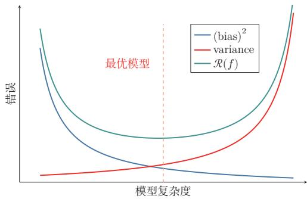  
图2.9 机器学习模型的期望错误、偏差和方差随复杂度的变化情况

集成模型可以降低方差的原理参见第11.1节.

## 2.5 机器学习算法的类型

机器学习算法可以按照不同的标准进行分类.比如，按照模型形式的不同，可以分为线性模型和非线性模型；按照学习准则的不同，也可以分为判别式方法和生成式方法.更常见的一种分类方式，是依据训练样本中提供的信息以及学习过程中的反馈形式来区分不同范式.

监督学习 如果机器学习的目标是建模样本特征x和标签y之间的关系： $y =$ $f ( \pmb { x } ; \theta )$ 或 $p ( \boldsymbol { y } | \boldsymbol { x } ; \boldsymbol { \theta } )$ ，并且训练集中每个样本都带有标签，那么这类学习称为监督学习（Supervised Learning，SL）.根据标签类型的不同，监督学习又可以分为回归问题、分类问题和结构化学习问题

（1）回归（Regression）问题中的标签y是连续值，模型输出也是连续值

（2）分类（Classification）问题中的标签y是离散类别.分类问题根据类别数量又可分为二分类（Binary Classification）和多分类（Multi-class Classi-fication）问题.

（3）结构化学习（Structured Learning）问题的输出通常是序列、树或图等结构化对象.由于输出空间通常很大，一般定义联合特征 $\phi ( { \pmb x } , { \pmb y } )$ ,并通过

一种基于感知器的结构化学习参见第3.4.4节.

$$
\hat { \pmb { y } } = \underset { \pmb { y } \in \mathsf { G e n } ( \pmb { x } ) } { \arg \operatorname* { m a x } } f \bigg ( \phi ( \pmb { x } , \pmb { y } ) ; \theta \bigg )\tag{2.79}
$$

来预测输出，其中Gen(x)表示输入x的所有候选输出集合.计算argmax的过程也称为解码（Decoding).

无监督学习 无监督学习（Unsupervised Learning，UL）是指从不包含目标标签的训练样本中自动学习有价值的信息.典型任务包括聚类、密度估计、降维以及表示学习等．与监督学习相比，无监督学习更强调发现数据内部结构，而不是直接预测给定标签.

强化学习强化学习（Reinforcement Learning，RL）是一类通过交互来学习的机器学习方法．在强化学习中，智能体根据环境状态采取动作，并从环境中获得即时或延时的奖励；学习目标是通过不断试错，找到能够最大化期望总回报的策略.

半监督学习在很多实际问题中，标注数据较少而无标注数据很多.此时可以采用半监督学习（Semi-Supervised Learning），即同时利用少量标注样本和大量无标注样本进行学习.半监督学习位于监督学习与无监督学习之间，核心目标是在降低标注成本的同时提升模型性能.

自监督学习自监督学习（Self-Supervised Learning，SSL）通过数据自身构造监督信号，而不依赖人工标注．例如，在自然语言处理中，可以通过“预测被遮蔽的词元”或“预测下一个词元”来学习文本表示；在视觉任务中，也可以通过图像重建、对比学习等方式学习通用表示．自监督学习已成为大规模预训练(Pre-Training）的重要范式.

迁移学习迁移学习（TransferLearning）强调将一个任务或领域中学习到的知识迁移到另一个相关任务中．现代机器学习中常见的“预训练一微调”流程就属于迁移学习：先在大规模数据上学习通用表示，再在具体下游任务上做适配.很多实际系统都会同时结合监督学习、自监督学习和迁移学习

## 2.6 数据的特征表示

在实际应用中，数据的类型多种多样，比如文本、音频、图像、视频以及传感器信号等.不同类型的数据，其原始空间也不相同．比如一张灰度图像（像素数量为D)的原始空间可以表示为[0,255]D；一个长度为L的自然语言句子，其离散符号空间可以表示为 $\mathcal { V } ^ { L }$ ，其中ν为词表集合.很多机器学习算法要求输入是可计算的数值表示，因此在学习之前通常需要把这些不同类型的数据转换为向量、矩阵或张量形式.

也有一些机器学习算法（比如决策树)不一定要求固定维数的向量形式.

图像特征 在手写体数字识别任务中，样本x为待识别的图像.最直接的做法是将大小为 $M \times N$ 的图像展开为MN维向量，每一维对应一个像素值.为了提升模型效果，也可以人工加入直方图、宽高比、纹理、边缘以及局部描述子等特征.假设最终抽取了D个特征，则一个图像样本可以表示为特征向量 $\pmb { x } \in \mathbb { R } ^ { D }$

文本特征 在文本情感分类任务中，样本x为自然语言文本，类别 $y \in \{ + 1 , - 1 \}$ 分别表示正面或负面的评价.为了将文本x转换为向量形式，一种最简单的方法是使用词袋（Bag-of-Words,BoW）模型.假设训练集合中的词都来自一个词表ν,大小为|ν|,则每个样本可以表示为一个ν|维向量 $\pmb { x } \in \mathbb { R } ^ { | \mathcal { V } | }$ .向量x中第i维的值表示词表中的第i个词是否在x中出现.

词袋模型在信息检索中也叫作向量空间模型(Vector SpaceModel, VSM).

比如两个文本“我喜欢读书”和“我讨厌读书”中共有“我”“喜欢”“讨厌”“读书”四个词，它们的BoW表示分别为

$$
\begin{array} { r } { \pmb { x } _ { 1 } = [ 1 \mathrm { ~ 1 ~ 0 ~ 1 ] ^ r } , } \\ { \pmb { x } _ { 2 } = [ 1 \mathrm { ~ 0 ~ 1 ~ 1 ] ^ r } . } \end{array}
$$

单独一个单词的BoW表示为 one-hot 向量.

词袋模型把文本看作词的集合，不考虑词序信息，难以精确表达句法和语义.一种改进方式是使用N元特征（N-Gram Feature），即每N个连续词构成一个基本单元，然后再用词袋模型进行表示.以最简单的二元特征为例，上面的两个文本中共有“\$我”“我喜欢”“我讨厌”“喜欢读书”“讨厌读书”“读书#”六个特征单元，它们的二元特征BoW表示分别为

\$和#分别表示文本的开始和结束.

$$
\begin{array} { r } { \pmb { x } _ { 1 } = [ 1 \mathrm { ~ 1 ~ 0 ~ 1 ~ 0 ~ 1 ~ } ] ^ { \mathsf { T } } , } \\ { \pmb { x } _ { 2 } = [ 1 \mathrm { ~ 0 ~ 1 ~ 0 ~ 1 ~ } 1 ] ^ { \mathsf { T } } . } \end{array}
$$

参见习题2-4.

随着N的增长，N元特征的数量会快速上升，其上限可达到 $| \mathcal { V } | ^ { N }$ .因此，传统文本表示往往具有高维、稀疏和难以表达相似性的特点.

表示学习如果直接使用原始特征来进行预测，对机器学习模型的能力要求通常较高.原始特征可能存在以下不足：1）表达能力有限，需要复杂的非线性组合才能发挥作用；2）特征之间冗余较高；3）并非所有特征都与目标预测相关；4）特征容易受噪声和表面变化影响.为了提高模型能力，我们希望自动学习出更有效、更稳定的表示，这就是表示学习（Representation Learning).

表示学习可以看作一个特殊的机器学习任务，即有自己的模型、学习准则和优化方法.

## 2.6.1 传统的特征学习

传统的特征学习一般通过人工设计准则来选择或构造特征，具体又可以分为特征选择（Feature Selection）和特征抽取（Feature Extraction）两类.

## 2.6.1.1 特征选择

特征选择是在原始特征集合中选取一个有效子集，使得基于该子集训练出的模型性能较好.简单地说，特征选择就是保留有用特征，移除冗余或无关特征.

子集搜索一种直接的特征选择方法为子集搜索（Subset Search）．假设原始特征数为 $D$ ，则共有 $2 ^ { D }$ 个候选子集.直接穷举所有候选子集往往代价过高，因此实际中经常采用贪心策略：由空集合开始逐步加入最优特征，称为前向搜索（Forward Search）；或者由全体特征开始逐步删除最无用的特征，称为反向搜索(Backward Search).

子集搜索方法又可以分为过滤式方法和包裹式方法.（1）过滤式方法（FilterMethod）不依赖具体机器学习模型，而是根据特征与标签的相关性或信息量进行筛选.[Hall，1999]（2）包裹式方法（WrapperMethod）则直接使用后续模型的性能作为评价标准，在特征选择的过程中把模型训练“包裹”在内部.

$\ell _ { 1 }$ 正则化 此外，我们还可以通过 $\ell _ { 1 }$ 正则化来实现特征选择.由于 $\ell _ { 1 }$ 正则化倾向于得到稀疏解，因此可以间接实现特征筛选

$\ell _ { 1 }$ 正则化参见第7.7.1节.

## 2.6.1.2 特征抽取

特征抽取是构造一个新的特征空间，并将原始特征投影到新的空间中得到新的表示.以线性投影为例，令 $\pmb { x } \in \mathbb { R } ^ { D }$ 为原始特征向量， $\pmb { x } ^ { \prime } \in \mathbb { R } ^ { K }$ 为新空间中的特征向量，则有

$$
\mathbf { { x } ^ { \prime } } = \mathbf { { W } } \mathbf { { x } } ,\tag{2.80}
$$

其中 $W \in \mathbb { R } ^ { K \times D }$ 为映射矩阵.

特征抽取又可以分为监督和无监督两类.监督式特征学习希望抽取对某个特定预测任务最有用的特征，比如线性判别分析（Linear Discriminant Analy-sis，LDA）；无监督式特征学习则更强调去除冗余、压缩信息和发现潜在结构，比如主成分分析（Principal Component Analysis，PCA）和自编码器（Auto-Encoder,AE).

表2.1列出了一些传统的特征选择和特征抽取方法.

主成分分析参见第10.1.1节. 自编码器参见第10.1.3节.

表2.1 传统的特征选择和特征抽取方法
<table><tr><td></td><td>监督学习</td><td>无监督学习</td></tr><tr><td>特征选择</td><td>标签相关的子集搜索、  $\ell _ { 1 }$  正则化、决策树</td><td>标签无关的子集搜索</td></tr><tr><td>特征抽取</td><td>线性判别分析</td><td>主成分分析、独立成分分 析、流形学习、自编码器</td></tr></table>

特征选择和特征抽取的优点是可以用较少的特征保留原始特征中的主要相关信息，去掉部分噪声,并提高计算效率、缓解维度灾难（Curse of Dimensional-ity).因此，它们也经常被统称为维数约减或降维（DimensionalityReduction） 正则化参见第7.7节.

## 2.6.2 分布式表示

传统特征工程往往依赖人工设计规则，难以充分表达复杂语义.现代机器学习更常使用分布式表示（DistributedRepresentation），即用一个低维、稠密、可学习的向量来表示对象.与one-hot或BoW这类高维稀疏表示相比，分布式表示能够更自然地表达“相似对象在表示空间中更接近”这一性质.

深度学习方法传统特征抽取一般与预测模型的学习分离：先通过主成分分析或线性判别分析等方法抽取特征，再基于这些特征训练具体模型.深度学习则倾向于将表示学习和预测学习统一到同一个端到端模型中，使得中间表示能够直接服务于最终任务.

这种端到端学习方法称为深度学习（DeepLearning，DL）.在深度模型中，越靠近输入层的表示往往更偏向局部和通用信息，越靠近输出层的表示通常越任务相关.

进一步地，现代大规模机器学习系统常采用预训练（Pre-Training）在海量数据上通过自监督目标学习通用表示，再在具体下游任务上进行微调.这种“预训练一微调”的流程，本质上将表示学习与迁移学习结合起来，进一步提升表示能力，已成为许多任务的基础范式

表2.2给出了机器学习中特征表示方法的演化

<table><tr><td rowspan=1 colspan=1>阶段</td><td rowspan=1 colspan=1>代表方法</td><td rowspan=1 colspan=1>核心特点</td><td rowspan=1 colspan=1>典型局限或优势</td></tr><tr><td rowspan=1 colspan=1>人工设计特征</td><td rowspan=1 colspan=1>BoW,     N-Gram, SIFT,HOG</td><td rowspan=1 colspan=1>依赖人工经验构造特征表示</td><td rowspan=1 colspan=1>高维、稀疏，依赖领域知识，迁移能力较弱</td></tr><tr><td rowspan=1 colspan=1>浅层可学习表示</td><td rowspan=1 colspan=1>PCA,词向量</td><td rowspan=1 colspan=1>从数据中学习低维稠密表示</td><td rowspan=1 colspan=1>比手工特征更紧凑，能表达部分相似性，但表示能力有限</td></tr><tr><td rowspan=1 colspan=1>深度学习</td><td rowspan=1 colspan=1>CNN, RNN,Transformer</td><td rowspan=1 colspan=1>通过多层网络端到端学习任务相关表示</td><td rowspan=1 colspan=1>表示能力强，可自动提取高层特征，但通常依赖较多数据与计算资源</td></tr><tr><td rowspan=1 colspan=1>预训练表示</td><td rowspan=1 colspan=1>预训练+微调</td><td rowspan=1 colspan=1>先学习通用表示，再迁移到下游任务</td><td rowspan=1 colspan=1>具有较强迁移能力，已成为现代机器学习尤其是大模型的重要范式</td></tr></table>

表2.2 机器学习中特征表示方法的演化

## 2.7 理论和定理

在机器学习中，有一些非常有名的理论或定理，对理解机器学习的内在特性非常有帮助.

## 2.7.1 PAC学习理论

当使用机器学习方法来解决某个特定问题时，通常靠经验或者多次试验来选择合适的模型、训练样本数量以及学习算法收敛的速度等.但是经验判断或多次试验往往成本比较高，也不太可靠，因此希望有一套理论能够分析问题难度、计算模型能力，为学习算法提供理论保证，并指导机器学习模型和学习算法的设计. 这就是计算学习理论. 计算学习理论（Computational Learning The-ory）是机器学习的理论基础，其中最基础的理论就是可能近似正确（ProbablyApproximately Correct,PAC)学习理论.

机器学习中一个很关键的问题是期望错误和经验错误之间的差异，称为泛化错误（Generalization Error）.泛化错误可以衡量一个机器学习模型 f是否可以很好地泛化到未知数据.

泛化错误在有些文献中也指期望错误，指在未知样本上的错误.

$$
\mathcal { G } _ { \mathcal { D } } ( \boldsymbol { f } ) = \mathcal { R } ( \boldsymbol { f } ) - \mathcal { R } _ { \mathcal { D } } ^ { e m p } ( \boldsymbol { f } ) .\tag{2.81}
$$

根据大数定律，当训练集大小D趋向于无穷大时，泛化错误趋向于0，即经

验风险趋近于期望风险

$$
\operatorname* { l i m } _ { | \mathcal { D } |  \infty } \mathcal { R } ( f ) - \mathcal { R } _ { \mathcal { D } } ^ { e m p } ( f ) = 0 .\tag{2.82}
$$

由于我们不知道真实的数据分布 $p ( { \pmb x } , { \pmb y } )$ ，也不知道真实的目标函数 $g ( { \pmb x } )$ 因此期望从有限的训练样本上学习到一个期望错误为0的函数f(x)并不现实.因此，需要降低对学习算法能力的期望，只要求学习算法可以以一定的概率学习到一个近似正确的假设，即PAC学习（PACLearning）.一个PAC可学习(PAC-Learnable)的算法是指该学习算法能够在多项式时间内从合理数量的训练数据中学习到一个近似正确的 f(x).

## PAC学习可以分为两部分：

(1）近似正确（Approximately Correct）：一个假设 $f \in \mathcal F$ 是“近似正确”的，是指其在泛化错误 $\mathcal { G } _ { \mathcal { D } } ( f )$ 小于一个界限∈. ∈一般为0到 $\frac { 1 } { 2 }$ 之间的数，$\begin{array} { r } { 0 < \epsilon < \frac { 1 } { 2 } } \end{array}$ .如果 $\mathcal { G _ { D } } ( f )$ 比较大，说明模型不能用来做正确的“预测”.

(2）可能（Probably)：一个学习算法A有“可能”以1—δ的概率学习到这样一个“近似正确”的假设.δ一般为0到 $\frac { 1 } { 2 }$ 之间的数， $\begin{array} { r } { 0 < \delta < \frac { 1 } { 2 } } \end{array}$

PAC学习可以用下面公式描述：

$$
\begin{array} { r } { P \bigg ( ( \mathcal { R } ( f ) - \mathcal { R } _ { \mathcal { D } } ^ { e m p } ( f ) ) \leq \epsilon \bigg ) \geq 1 - \delta , } \end{array}\tag{2.83}
$$

其中 $\epsilon , \delta$ 是和样本数量N以及假设空间F相关的变量.如果固定∈、δ，可以反过来计算出需要的样本数量

$$
N ( \epsilon , \delta ) \geq \frac { 1 } { 2 \epsilon ^ { 2 } } ( \log | \mathcal { F } | + \log \frac { 2 } { \delta } ) ,\tag{2.84}
$$

其中 $| \mathcal F |$ 为假设空间的大小.从上面公式可以看出，模型越复杂，即假设空间 $\mathcal { F }$ 越大，模型的泛化能力越差．要达到相同的泛化能力，越复杂的模型需要的样本数量越多.为了提高模型的泛化能力，通常需要正则化（Regularization）来限制模型复杂度.

正则化参见第7.7节.

PAC学习理论也可以帮助分析一个机器学习方法在什么条件下可以学习到一个近似正确的分类器.从公式(2.84)可以看出，如果希望模型的假设空间越大，泛化错误越小，其需要的样本数量越多.

## 2.7.2 没有免费午餐定理

没有免费午餐定理（No Free Lunch Theorem,NFL)是1997年由 Wolpert和Macready在最优化理论中提出的.没有免费午餐定理证明：对于基于迭代的最优化算法，不存在某种算法对所有问题（有限的搜索空间内）都有效．如果一

个算法对某些问题有效，那么它一定在另外一些问题上比纯随机搜索算法更差也就是说，不能脱离具体问题来谈论算法的优劣，任何算法都有局限性，需要“具体问题具体分析”.

没有免费午餐定理对于机器学习算法也同样适用，不存在一种机器学习算法适合于任何领域或任务．如果有人宣称自己的模型在所有问题上都好于其他模型，那么这与没有免费午餐定理的结论相悖.

## 2.7.3 奥卡姆剃刀原理

奥卡姆剃刀（Occam's Razor）原理是由14世纪逻辑学家William of Oc-cam提出的一个解决问题的法则：“如无必要，勿增实体”.奥卡姆剃刀的思想和机器学习中的正则化思想十分类似：简单的模型泛化能力更好.如果有两个性能相近的模型，我们应该选择更简单的模型.因此，在机器学习的学习准则上，我们经常会引入参数正则化来限制模型能力，避免过拟合.

奥卡姆剃刀的一种形式化是最小描述长度（Minimum DescriptionLength，MDL）原则，即对一个数据集D，最好的模型 $\textit { f } \in \textit { F }$ 会使得数据集的压缩效果最好，即编码长度最小.

最小描述长度也可以通过贝叶斯学习的观点来解释[MacKay，2003]. 模型f在数据集D上的对数后验概率为

$$
\operatorname* { m a x } _ { f } \log p ( f | \mathcal D ) = \operatorname* { m a x } _ { f } \log p ( \mathcal D | f ) + \log p ( f )\tag{2.85}
$$

$$
= \operatorname* { m i n } _ { f } - \log p ( \mathcal { D } | f ) - \log p ( f ) ,\tag{2.86}
$$

其中 $\dot { \mathbf { \omega } } - \log p ( f )$ 和 $- \log p ( \mathcal { D } | f )$ 可以分别看作模型f的编码长度和在该模型下数据集D的编码长度.也就是说，我们不但要使得模型f可以编码数据集D，也要使得模型f尽可能简单.

## 2.7.4 丑小鸭定理

丑小鸭定理（UglyDucklingTheorem）是1969年由渡边慧提出的[Watanabe，1969].“丑小鸭与白天鹅之间的区别和两只白天鹅之间的区别一样大”.这个定理初看好像不符合常识，但是仔细思考后是非常有道理的.因为世界上不存在相似性的客观标准，一切相似性的标准都是主观的.如果从体型大小或外貌的角度来看，丑小鸭和白天鹅的区别大于两只白天鹅的区别；但是如果从基因的角度来看，丑小鸭与它父母的差别要小于它父母和其他白天鹅之间的差别.

这里的“丑小鸭”是指白天鹅的幼雏，而不是“丑陋的小鸭子”.渡边慧(1910\~1993)，美籍日本学者，理论物理学家，也是模式识别的最早研究者之一.

## 2.7.5 归纳偏置

在机器学习中，很多学习算法经常会对学习的问题做一些假设，这些假设就称为归纳偏置（InductiveBias）.比如在最近邻分类器中，我们会假设在特征空间中，一个小的局部区域中的大部分样本同属一类.在朴素贝叶斯分类器中，我们会假设每个特征的条件概率是互相独立的.

深度学习中各种网络结构也隐含着不同的归纳偏置.例如，卷积神经网络假设数据具有局部性和平移不变性（第5章），循环神经网络假设数据具有序列依赖性（第6章），Transformer假设序列中任意位置之间都可能存在依赖关系(第8章），图神经网络假设节点的表示应当受邻居影响（第9章).选择合适的归纳偏置是模型设计的重要环节.

归纳偏置在贝叶斯学习中也经常称为先验(Prior).

## 2.8 总结和扩展阅读

本章介绍了机器学习的基本概念、三个基本要素以及一个简单但重要的例子线性回归.机器学习虽然方法繁多，但大多数方法都可以放在“模型一学习准则一优化算法”这一统一框架下理解：模型决定表达能力，学习准则定义优化目标，优化算法负责求解参数

从训练流程上看，一个完整的机器学习系统不仅包括训练集上的参数学习，还包括验证集上的模型选择和测试集上的最终评估.机器学习的核心不是简单记忆训练样本，而是获得对未见数据的泛化能力．因此，经验风险最小化、正则化、提前停止、交叉验证以及偏差一方差权衡等概念，都是围绕“如何提升泛化能力”展开的.对于需要依据模型输出采取行动的系统，评价还应关注预测概率是否校准、不确定性是否能够被识别，以及当数据分布发生变化时模型是否仍然可靠.

从方法演进上看，机器学习也经历了从传统特征工程到表示学习、再到深度学习与预训练表示的持续发展.早期方法更依赖人工设计特征；深度学习强调从数据中自动学习层次化表示；许多任务进一步采用“自监督预训练+下游适配”的范式.这些变化并没有改变机器学习的基本问题，但显著改变了获取有效表示和构建系统的方式.

如果需要快速全面地了解机器学习的基本概念和体系，可以阅读《PatternClassification》[Duda et al., 2001]、《Machine Learning: a Probabilistic Per-spective》[Murphy,2012]、《机器学习》[周志华,2016]和《统计学习方法》[李航，2019]. Murphy 于 2022年出版了新版《Probabilistic Machine Learning:

An Introduction》，内容更加全面，反映了深度学习时代较新的进展，推荐作为本章内容的深入参考.此外，Bishop和Bishop于2024年出版的《Deep Learn-ing: Foundations and Concepts》也是一本优秀的现代教材. 想进一步了解统计学习,可以阅读《Pattern Recognition and Machine Learning》[Bishop, 2007]和《The Elements of Statistical Learning: Data Mining, Inference, and Pre-diction》[Hastie et al.,2009];关于统计学习理论的知识,可以参考《StatisticalLearning Theory》[Vapnik,1998]. 此外，表示学习方面可以参考综述[Bengioet al., 2013].

## 习题

## 基础题

习题2-1 请说明训练集、验证集和测试集各自的作用.为什么测试集不应参与模型选择和超参数调节?

习题2-2 某二分类模型在训练集上的准确率为99%，在验证集上的准确率为72%.请分析其可能原因，并给出至少三种改进方法.

习题2-3 分析为什么平方损失函数不适用于分类问题

习题2-4分别用一元、二元和三元特征的词袋模型表示文本“我帮了张三”和“张三帮了我”，并分析不同模型的优缺点.

习题2-5 试分析什么因素会导致模型出现图2.8所示的高偏差和高方差情况

习题2-6 对于一个三分类问题，数据集的真实标签和模型的预测标签如下：

<table><tr><td>真实标签</td><td></td><td>1 1 2</td><td></td><td>2</td><td>2</td><td>2 3</td><td>3 3</td><td>3 3</td><td>3</td></tr><tr><td>预测标签</td><td></td><td>1 2</td><td></td><td></td><td>3 3</td><td></td><td>3 1 2</td><td></td><td></td></tr></table>

分别计算模型的精确率、召回率、F1值以及它们的宏平均和微平均

## 提高题

习题2-7在一个正负样本比例为1：99的二分类任务中，一个模型将所有样本都预测为负类.1）计算该模型的准确率；2）说明为什么该模型并不好；3）应结合哪些评价指标进行分析？

习题2-8 证明在线性回归中，如果样本数量N小于特征数量D+1,则XX的秩最大为N.

习题2-9 在线性回归中，如果我们给每个样本 $( \mathbf { \boldsymbol { x } } ^ { ( n ) } , \boldsymbol { y } ^ { ( n ) } )$ 赋予一个权重 $r ^ { ( n ) }$ ,经验风险函数为

$$
\mathcal { R } ( \pmb { w } ) = \frac { 1 } { 2 } \sum _ { n = 1 } ^ { N } r ^ { ( n ) } \Big ( \pmb { y } ^ { ( n ) } - \pmb { w } ^ { \top } \pmb { x } ^ { ( n ) } \Big ) ^ { 2 } ,\tag{2.87}
$$

计算其最优参数 $\ b { w } ^ { * }$ ,并分析权重 $r ^ { ( n ) }$ 的作用.

习题2-10 比较one-hot表示、词袋模型、N元特征和稠密向量表示的优缺点，并说明它们各自更适合什么场景.

习题 2-11 验证公式(2.69).

## 拓展题

习题2-12 为什么经典机器学习通常假设训练集和测试集独立同分布?如果这一假设不成立，会给模型训练和评估带来哪些影响？

习题2-13 在线性回归中，验证岭回归的解为结构风险最小化准则下的最小二乘法估计，见公式(2.52).

习题2-14 在线性回归中，若假设标签 $y \sim \mathcal { N } ( \pmb { w } ^ { \top } \pmb { x } , \beta )$ ,并用最大似然估计来优化参数，验证最优参数为公式(2.60)的解.

习题2-15 假设有N个样本 $x ^ { ( 1 ) } , x ^ { ( 2 ) } , \cdots , x ^ { ( N ) }$ 服从正态分布 ${ \mathcal { N } } ( \mu , \sigma ^ { 2 } )$ ，其中 $\mu$ 未知.1）使用最大似然估计求解最优参数 $\mu ^ { M L } ; 2 )$ 若参数 $\mu$ 为随机变量，并服从正态分布 $\mathcal { N } ( \mu _ { 0 } , \sigma _ { 0 } ^ { 2 } )$ ，使用最大后验估计求解最优参数 $\mu ^ { M A P }$

习题2-16 在习题2-15中，证明当 $N  \infty$ 时，最大后验估计趋向于最大似然估计.

习题 2-17 验证公式(2.74).

## 参考文献

李航，2019. 统计学习方法[M]. 2版. 北京：清华大学出版社.

周志华，2016. 机器学习[M]. 北京：清华大学出版社.

BENGIO Y, COURVILLE A, VINCENT P, 2013. Representation learning: a review and new perspectives[J]. IEEE transactions on pattern analysis and machine intelligence, 35(8): 1798- 1828.

BISHOP C M, 2007. Information science and statistics: pattern recognition and machine learning[M]. 5th ed. Springer.

BLUM A, HOPCROFT J, KANNAN R, 2016. Foundations of data science[J]. Vorabversion eines Lehrbuchs.

BOTTOU L, 2010. Large-scale machine learning with stochastic gradient descent[M]// Proceedings of COMPSTAT. Springer: 177-186.

DUDA R O, HART P E, STORK D G, 2001. Pattern classification[M]. 2nd ed. Wiley.

HALL M A, 1999. Correlation-based feature selection for machine learning[D]. University of Waikato Hamilton.

HASTIE T, TIBSHIRANI R, FRIEDMAN J H, 2009. Springer series in statistics: the elements of statistical learning: data mining, inference, and prediction[M]. 2nd ed. Springer.

HOERL A E, KENNARD R W, 1970. Ridge regression: biased estimation for nonorthogonal problems[J]. Technometrics, 12(1): 55-67.

LECUN Y, CORTES C, BURGES C J, 1998. MNIST handwritten digit database[EB/OL]. http://yann.lecun.com/exdb/mnist.

MACKAY D J C, 2003. Information theory, inference, and learning algorithms[M]. Cambridge University Press.

MITCHELL T M, 1997. McGraw hill series in computer science: machine learning[M]. McGraw-Hill.

MURPHY K P, 2012. Adaptive computation and machine learning series: machine learning - a probabilistic perspective[M]. MIT Press.

NEMIROVSKI A, JUDITSKY A, LAN G, et al., 2009. Robust stochastic approximation approach to stochastic programming[J]. SIAM Journal on optimization, 19(4): 1574-1609.

VAPNIK V, 1998. Statistical learning theory[M]. New York: Wiley.

WATANABE S, 1969. Knowing and guessing: a quantitative study of inference and information [M]. Wiley.

YANG Y, 1999. An evaluation of statistical approaches to text categorization[J]. Information retrieval, 1(1-2): 69-90.

## 第3章 线性模型

正确的判断来自于经验，而经验来自于错误的判断.——弗雷德里克·布鲁克斯(Frederick P. Brooks)1999年图灵奖获得者

线性模型（LinearModel）是机器学习中最基础、最常用的模型之一，指通过样本特征的线性组合来进行预测的模型.给定一个D维样本$\pmb { x } = [ x _ { 1 } , \cdots , x _ { D } ] ^ { \intercal }$ ，其线性组合函数为

$$
f ( \pmb { x } ; \pmb { w } ) = w _ { 1 } x _ { 1 } + w _ { 2 } x _ { 2 } + \cdots + w _ { D } x _ { D } + b\tag{3.1}
$$

$$
= { \pmb w } ^ { \top } { \pmb x } + b ,\tag{3.2}
$$

为简单起见，这里我们用 $f ( \pmb { x } ; \pmb { w } )$ 来表示$f ( \pmb { x } ; \pmb { w } , b )$

其中 $\pmb { w } = [ w _ { 1 } , \cdots , w _ { D } ] ^ { \intercal }$ 为D维的权重向量，b为偏置.上一章中介绍的线性回归就是典型的线性模型，直接用 $f ( \pmb { x } ; \pmb { w } )$ 来预测输出目标 $y = f ( \pmb { x } ; \pmb { w } )$

在分类问题中，由于输出目标 $y$ 是一些离散的标签，而 $f ( { \pmb x } ; { \pmb w } )$ 的值域为实数，因此无法直接用 $f ( \pmb { x } ; \pmb { w } )$ 来进行预测，需要引入一个非线性的决策函数(Decision Function) $g ( \cdot )$ 来预测输出目标

$$
y = g ( f ( { \pmb x } ; { \pmb w } ) ) ,\tag{3.3}
$$

其中 $f ( \pmb { x } ; \pmb { w } )$ 也称为判别函数(Discriminant Function).

对于二分类问题， $g ( \cdot )$ 可以是符号函数（Sign Function）,定义为

$$
g \big ( f ( \pmb { x } ; \pmb { w } ) \big ) = \mathrm { s g n } \big ( f ( \pmb { x } ; \pmb { w } ) \big )\tag{3.4}
$$

$$
\triangleq \left\{ \begin{array} { l l } { + 1 } & { \mathrm { i f } f ( x ; w ) > 0 , } \\ { 0 } & { \mathrm { i f } f ( x ; w ) = 0 , } \\ { - 1 } & { \mathrm { i f } f ( x ; w ) < 0 . } \end{array} \right.\tag{3.5}
$$

当 $f ( { \pmb x } ; { \pmb w } ) = 0$ 时，模型输出0，表示位于决策边界上，暂不做正负类判断.公式(3.5)定义了一个典型的二分类问题的决策函数，其结构如图3.1所示.

  
图 3.1 二分类的线性模型

在后续训练算法中，通常把 $y f ( \pmb { x } ; \pmb { w } ) \le 0$ 都视为错误或不确定的情形，需要进一步更新参数.

在本章，我们主要介绍四种不同线性分类模型：Logistic回归、Softmax回归、感知器和支持向量机.这些模型的判别函数都建立在线性函数 $f ( { \pmb x } ; { \pmb w } )$ 之上，这些模型的核心差别主要体现在损失函数和相应的学习准则上.

线性模型也是理解神经网络的起点.一个人工神经元本质上先计算线性加权和 ${ \pmb w } ^ { \top } { \pmb x } + b$ ，再经过非线性激活函数；而多分类神经网络的最后一层通常正是Softmax回归.换句话说，后续章节中的深层网络可以看作先学习一个新的表示$\pmb { h } ( \pmb { x } )$ ，再在这个表示空间中使用线性分类器.线性模型的决策边界、损失函数和梯度更新，都会在神经网络中反复出现.

## 3.1 线性判别函数和决策边界

从公式(3.3)可知，一个线性分类模型或线性分类器（Linear Classifier），是由一个（或多个）线性的判别函数 $f ( \pmb { x } ; \pmb { w } ) = \pmb { w } ^ { \top } \pmb { x } + b$ 和非线性的决策函数 $g ( \cdot )$ 组成.我们首先考虑二分类的情况，然后再扩展到多分类的情况.

## 3.1.1 二分类

二分类（BinaryClassification）问题的类别标签y只有两种取值，通常可以设为 $\{ + 1 , - 1 \}$ 或{0,1}. 在二分类问题中，常用正例（Positive Sample）和负例（Negative Sample)来分别表示属于类别+1和—1的样本.

在二分类问题中，我们只需要一个线性判别函数 $f ( \pmb { x } ; \pmb { w } ) = \pmb { w } ^ { \top } \pmb { x } + b$ 特征空间 $\mathbb { R } ^ { D }$ 中所有满足 $f ( { \pmb x } ; { \pmb w } ) = 0$ 的点组成一个分割超平面（Hyperplane），称为决策边界（Decision Boundary)或决策平面（Decision Surface).决策边界将特征空间一分为二，每个区域对应一个类别.

所谓“线性分类模型”就是指其决策边界是线性超平面.该超平面与权重向量w正交.特征空间中每个样本点到决策边界的有向距离（Signed Distance）

超平面就是三维空间中的平面在更高维空间的推广.D维空间中的超平面是D-1维的.在二维空间中，决策边界是一条直线；在三维空间中，决策边界是一个平面；在更高维空间中，决策边界是一个超平面.

为

$$
\gamma = \frac { f ( \pmb { x } ; \pmb { w } ) } { \| \pmb { w } \| } .\tag{3.6}
$$

参见习题3-2.

γ也可以看作点x在w方向上的投影.

图3.2给出了一个二分类问题的线性决策边界示例，其中样本特征向量 ${ \textbf { \em x } } =$ $[ x _ { 1 } , x _ { 2 } ]$ ,权重向量 $\pmb { w } = [ w _ { 1 } , w _ { 2 } ]$

  
图 3.2 二分类的决策边界示例

给定N个样本的训练集 $\mathcal { D } = \{ ( { \pmb x } ^ { ( n ) } , y ^ { ( n ) } ) \} _ { n = 1 } ^ { N }$ ，其中 $y ^ { ( n ) } \in \{ + 1 , - 1 \}$ ，线性模型试图学习到参数 $\ b { w } ^ { * }$ ，使得对于每个样本 $( \mathbf { \boldsymbol { x } } ^ { ( n ) } , \boldsymbol { y } ^ { ( n ) } )$ 尽量满足

$$
\begin{array} { r l } { f ( \pmb { x } ^ { ( n ) } ; \pmb { w } ^ { * } ) > 0 \quad } & { \mathrm { i f } \quad y ^ { ( n ) } = 1 , } \\ { f ( \pmb { x } ^ { ( n ) } ; \pmb { w } ^ { * } ) < 0 \quad } & { \mathrm { i f } \quad y ^ { ( n ) } = - 1 . } \end{array}\tag{3.7}
$$

上面两个公式也可以合并，即参数 $\boldsymbol { w } ^ { * }$ 尽量满足

$$
y ^ { ( n ) } f ( { \pmb x } ^ { ( n ) } ; { \pmb w } ^ { \ast } ) > 0 , \qquad \forall n \in [ 1 , N ] .\tag{3.8}
$$

定义3.1-两类线性可分：对于训练集 $\mathcal { D } = \left\{ ( { \boldsymbol { x } } ^ { ( n ) } , y ^ { ( n ) } ) \right\} _ { n = 1 } ^ { N }$ ，如果存在权重向量 $\ b { w } ^ { * }$ ，使得对所有样本都满足

$$
y ^ { ( n ) } f ( { \pmb x } ^ { ( n ) } ; { \pmb w } ^ { \ast } ) > 0 , \qquad \forall n \in \{ 1 , \cdots , N \} ,\tag{3.9}
$$

那么训练集D是线性可分的.

为了学习参数 $\textbf { \em w }$ ，我们需要定义合适的损失函数以及优化方法.对于二分类问题，最直接的损失函数为0-1损失函数，即

$$
\mathcal { L } _ { 0 1 } \big ( y , f ( \pmb { x } ; \pmb { w } ) \big ) = I \big ( y f ( \pmb { x } ; \pmb { w } ) < 0 \big ) ,\tag{3.10}
$$

其中 $I ( \cdot )$ 为指示函数.但0-1损失函数是不连续且非凸的：它关于参数ω几乎处处梯度为0，而在分类边界处又不可导，因此很难直接用基于梯度的方法来优化w.

## 数学小知识|替代损失函数

0-1损失是阶跃型函数：错分类时为常数1，正确时为0，其梯度几乎处处为0，无法为参数更新提供有效信号.实际中常使用连续、凸的替代损失（SurrogateLoss）来近似0-1损失，如Hinge损失、交叉熵损失Logistic损失等.替代损失函数通常是0-1损失的连续上界，使得最小化替代损失的模型在0-1损失上也有较好的表现.

## 3.1.2 多分类

多分类(Multi-class Classification)问题是指分类的类别数C大于2.多分类一般需要多个线性判别函数，但设计这些判别函数有很多种方式.

假设一个多分类问题的类别为 $\{ 1 , 2 , \cdots , C \}$ ，常用的方式有以下三种：

（1）“一对其余”方式：把多分类问题转换为C个“一对其余”的二分类问题.这种方式共需要C个判别函数，其中第c个判别函数 $f _ { c }$ 是将类别c的样本和不属于类别c的样本分开.

（2）“一对一”方式：把多分类问题转换为 $C ( C - 1 ) / 2$ 个“一对一”的二分类问题.这种方式共需要 $C ( C - 1 ) / 2$ 个判别函数，其中第(i,j)个判别函数是把类别i和类别 $j$ 的样本分开.

$$
1 \leq i < j \leq C
$$

（3）“argmax”方式：这是一种改进的“一对其余”方式，共需要C个判别函数

$$
f _ { c } ( \pmb { x } ; \pmb { w } _ { c } ) = \pmb { w } _ { c } ^ { \top } \pmb { x } + b _ { c } , \qquad c \in \{ 1 , \cdots , C \}\tag{3.11}
$$

对于样本x，如果存在一个类别c，相对于所有的其他类别 $\tilde { c } ( \tilde { c } \mathrm { ~ \scriptsize ~ \neq ~ \ c \ ) ~ }$ 有$f _ { c } ( { \pmb x } ; { \pmb w } _ { c } ) > f _ { \tilde { c } } ( { \pmb x } ; { \pmb w } _ { \tilde { c } } )$ ,那么x属于类别c.“argmax”方式的预测函数定义为

$$
y = \underset { c = 1 } { \arg \operatorname* { m a x } } f _ { c } ( \pmb { x } ; \pmb { w } _ { c } ) .\tag{3.12}
$$

前两种方式本质上都是把多分类问题分解为多个二分类问题，而“argmax”方式则直接给出一个统一的多类线性模型.后续的Softmax回归主要采用的就是这种统一建模方式

“一对其余”方式和“一对一”方式都存在一个缺陷：特征空间中可能出现一些难以确定类别的区域，而“argmax”方式可以避免这一问题.图3.3给出了用这三种方式进行多分类的示例，其中红色直线表示判别函数f(·)=0的直线，不同颜色的区域表示预测的三个类别的区域 $( \omega _ { 1 } , \omega _ { 2 }$ 和 $\omega _ { 3 } ~ )$ 和难以确定类别的区域（?’).在“argmax”方式中，相邻两类i和 $j$ 的决策边界实际上是由$f _ { i } ( { \pmb x } ; { \pmb w } _ { i } ) - f _ { j } ( { \pmb x } ; { \pmb w } _ { j } ) = 0$ 决定，其法向量为 ${ \pmb w } _ { i } - { \pmb w } _ { j }$

  
(a)“一对其余”方式

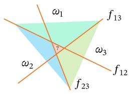  
(b)“一对一”方式

  
(c) “argmax”方式  
图3.3 多分类问题的三种方式

定义3.2-多类线性可分：对于训练集 $\mathcal { D } = \left\{ ( { \pmb x } ^ { ( n ) } , y ^ { ( n ) } ) \right\} _ { n = 1 } ^ { N }$ ，如果存在C个权重向量 $\pmb { w } _ { 1 } ^ { * } , \cdots , \pmb { w } _ { C } ^ { * }$ ，使得对任意样本 $( \mathbf { \boldsymbol { x } } ^ { ( n ) } , \boldsymbol { y } ^ { ( n ) } )$ ，当 $y ^ { ( n ) } = c$ 时，都有

$$
f _ { c } ( \pmb { x } ^ { ( n ) } ; \pmb { w } _ { c } ^ { * } ) > f _ { \widetilde { c } } ( \pmb { x } ^ { ( n ) } ; \pmb { w } _ { \widetilde { c } } ^ { * } ) , \qquad \forall \widetilde { c } \neq c ,\tag{3.13}
$$

那么训练集D是线性可分的.

从上面定义可知，如果数据集是多类线性可分的，那么一定存在一个“argmax”方式的线性分类器可以将它们正确分开.

参见习题3-5.

## 3.2 Logistic 回归

Logistic回归（Logistic Regression,LR）是一种常用的处理二分类问题的线性模型.与前面的符号函数只能输出类别不同，Logistic回归进一步把线性打分映射为条件概率.在本节中，我们采用 $y \in \{ 0 , 1 \}$ 以符合Logistic回归的描述习惯.

为了解决连续的线性函数不适合进行分类的问题，我们引入非线性函数 $g$ .一 $\mathbb { R } \to ( 0 , 1 )$ 来预测类别标签的条件概率 $p ( y = 1 | x )$

$$
p ( \boldsymbol { y } = 1 | \boldsymbol { x } ) = g ( f ( \boldsymbol { x } ; \boldsymbol { w } ) ) ,\tag{3.14}
$$

其中 $g ( \cdot )$ 通常称为激活函数（ActivationFunction），其作用是把线性函数的值域从实数区间“挤压”到了(0,1)之间，可以用来表示概率.在统计文献中， $g ( \cdot )$ 的逆函数 $g ^ { - 1 } ( \cdot )$ 也称为联系函数(Link Function).

在Logistic回归中，我们使用Logistic函数来作为激活函数.虽然输出概率经过了非线性映射，但模型的决策边界仍由线性方程 ${ \pmb w } ^ { \top } { \pmb x } = 0$ 决定，因此它依然属于线性分类模型.样本x的标签 $y = 1$ 的条件概率为

$$
p ( y = 1 | \pmb { x } ) = \sigma ( \pmb { w } ^ { \top } \pmb { x } ) \triangleq \frac { 1 } { 1 + \exp ( - \pmb { w } ^ { \top } \pmb { x } ) } ,\tag{3.15}
$$

为简单起见，这里 $\pmb { x } = [ x _ { 1 } , \cdots , x _ { D }$ 1] 和 $\pmb { w } = [ w _ { 1 } , \cdots , w _ { D } , b ] ^ { \intercal }$ 分别为 $D + 1$ 维的增广特征向量和增广权重向量.

将公式(3.15)进行变换后得到

$$
\pmb { w } ^ { \mathsf { T } } \pmb { x } = \log \frac { p ( y = 1 | \pmb { x } ) } { 1 - p ( y = 1 | \pmb { x } ) }\tag{3.16}
$$

$$
= \log { \frac { p ( y = 1 | x ) } { p ( y = 0 | x ) } } ,\tag{3.17}
$$

其中 $\frac { p ( y = 1 | \pmb { x } ) } { p ( y = 0 | \pmb { x } ) }$ 为样本x属于正例和负例的条件概率比值，称为几率（Odds），几率的对数称为对数几率（Log Odds，或Logit). 公式(3.16) 中等号的左边是线性函数，这样Logistic回归可以看作预测值为“标签的对数几率”的线性回归模型.因此，Logistic回归也称为对数几率回归（Logit Regression），简称对率回归.

图3.4给出了使用线性回归和Logistic回归来解决一维数据的二分类问题的示例.

  
(a) 线性回归

  
(b) Logistic 回归  
图3.4 一维数据的二分类问题示例

## 3.2.1 参数学习

Logistic回归采用交叉熵作为损失函数，并使用梯度下降法来对参数进行优化.

给定N个训练样本 $\{ ( \pmb { x } ^ { ( n ) } , y ^ { ( n ) } ) \} _ { n = 1 } ^ { N }$ ，用Logistic回归模型对每个样本 $\mathbf { \boldsymbol { x } } ^ { ( n ) }$ 进行预测，输出其标签为1的条件概率，记为 $\hat { y } ^ { ( n ) }$

$$
\hat { y } ^ { ( n ) } = \sigma ( \pmb { w } ^ { \top } \pmb { x } ^ { ( n ) } ) , \qquad 1 \leq n \leq N .\tag{3.18}
$$

如果把所有增广样本写成样本矩阵，则记为

$$
\begin{array} { r } { \pmb { X } = [ \pmb { x } ^ { ( 1 ) } , \cdots , \pmb { x } ^ { ( N ) } ] \in \mathbb { R } ^ { ( D + 1 ) \times N } , } \end{array}\tag{3.19}
$$

并将所有标签和预测组成列向量

$$
\begin{array} { r } { \pmb { y } = [ \pmb { y } ^ { ( 1 ) } , \cdots , \pmb { y } ^ { ( N ) } ] ^ { \top } , \qquad \hat { \pmb { y } } = [ \hat { y } ^ { ( 1 ) } , \cdots , \hat { y } ^ { ( N ) } ] ^ { \top } = \sigma ( \pmb { X } ^ { \top } \pmb { w } ) \in \mathbb { R } ^ { N } , } \end{array}\tag{3.20}
$$

其中 $\sigma ( \cdot )$ 逐元素作用.

由于 $y ^ { ( n ) } \in \{ 0 , 1 \}$ ,样本 $( \mathbf { \boldsymbol { x } } ^ { ( n ) } , \boldsymbol { y } ^ { ( n ) } )$ 的真实条件概率可以表示为

该写法与本书“每一列为一个样本”的约定保持一致.

$$
p _ { r } ( y ^ { ( n ) } = 1 | x ^ { ( n ) } ) = y ^ { ( n ) } ,\tag{3.21}
$$

$$
p _ { r } ( y ^ { ( n ) } = 0 | x ^ { ( n ) } ) = 1 - y ^ { ( n ) } .\tag{3.22}
$$

使用交叉熵损失函数，其风险函数为

为简单起见，这里忽略了正则化项.

$$
\mathcal { R } ( \pmb { w } ) = - \frac { 1 } { N } \sum _ { n = 1 } ^ { N } \bigg ( p _ { r } ( y ^ { ( n ) } = 1 | \pmb { x } ^ { ( n ) } ) \log \hat { y } ^ { ( n ) } + p _ { r } ( y ^ { ( n ) } = 0 | \pmb { x } ^ { ( n ) } ) \log ( 1 - \hat { y } ^ { ( n ) } ) \bigg )\tag{3.23}
$$

$$
= - \frac { 1 } { N } \sum _ { n = 1 } ^ { N } \bigg ( y ^ { ( n ) } \log \hat { y } ^ { ( n ) } + ( 1 - y ^ { ( n ) } ) \log ( 1 - \hat { y } ^ { ( n ) } ) \bigg ) .\tag{3.24}
$$

等价地，上式可以写成矩阵形式

$$
\mathcal { R } ( \pmb { w } ) = - \frac { 1 } { N } \left( \pmb { y } ^ { \top } \log \hat { \pmb { y } } + ( \pmb { 1 } _ { N } - \pmb { y } ) ^ { \top } \log ( \pmb { 1 } _ { N } - \hat { \pmb { y } } ) \right) ,\tag{3.25}
$$

其中 $\log ( \cdot )$ 逐元素作用.

利用Logistic函数的导数性质 $\sigma ^ { \prime } ( z ) = \sigma ( z ) ( 1 - \sigma ( z ) )$ ，对风险函数关于 $\textbf { \em w }$ 应用链式法则，可得

风险函数 $\mathcal { R } ( \boldsymbol { w } )$ 关于参数w的偏导数为

$$
\frac { \partial \mathcal { R } ( w ) } { \partial w } = - \frac { 1 } { N } \sum _ { n = 1 } ^ { N } \left( y ^ { ( n ) } \frac { \hat { y } ^ { ( n ) } ( 1 - \hat { y } ^ { ( n ) } ) } { \hat { y } ^ { ( n ) } } \pmb { x } ^ { ( n ) } - ( 1 - y ^ { ( n ) } ) \frac { \hat { y } ^ { ( n ) } ( 1 - \hat { y } ^ { ( n ) } ) } { 1 - \hat { y } ^ { ( n ) } } \pmb { x } ^ { ( n ) } \right)\tag{3.26}
$$

$$
= - { \frac { 1 } { N } } \sum _ { n = 1 } ^ { N } \left( y ^ { ( n ) } ( 1 - { \hat { y } } ^ { ( n ) } ) x ^ { ( n ) } - ( 1 - y ^ { ( n ) } ) { \hat { y } } ^ { ( n ) } x ^ { ( n ) } \right)
$$

y 为 Logistic 函数，因此有 $\begin{array} { r } { \frac { \partial \hat { y } } { \partial w ^ { \top } x } = } \end{array}$ $\hat { y } ^ { ( n ) } ( 1 - \hat { y } ^ { ( n ) } )$ . 参见第B.4.2.1节.

(3.27)

$$
= - \frac { 1 } { N } \sum _ { n = 1 } ^ { N } \pmb { x } ^ { ( n ) } \big ( \pmb { y } ^ { ( n ) } - \hat { \pmb { y } } ^ { ( n ) } \big ) .\tag{3.28}
$$

其矩阵形式为

$$
\frac { \partial \mathcal { R } ( \pmb w ) } { \partial \pmb w } = - \frac { 1 } { N } X ( \pmb y - \hat { \pmb y } ) .\tag{3.29}
$$

采用梯度下降法，Logistic回归的训练过程为：初始化 $\pmb { w } _ { 0 } \gets 0$ ，然后通过下式来迭代更新参数：

$$
{ \pmb w } _ { t + 1 }  { \pmb w } _ { t } + \alpha \frac { 1 } { N } \sum _ { n = 1 } ^ { N } { \pmb x } ^ { ( n ) } \bigg ( y ^ { ( n ) } - \hat { y } _ { { \pmb w } _ { t } } ^ { ( n ) } \bigg ) ,\tag{3.30}
$$

按照本书的样本矩阵记号，上式也可以写为

$$
\pmb { w } _ { t + 1 }  \pmb { w } _ { t } + \alpha \frac { 1 } { N } \pmb { X } ( \pmb { y } - \hat { \pmb { y } } _ { \pmb { w } _ { t } } ) ,\tag{3.31}
$$

其中 $\alpha$ 是学习率， $\hat { y } _ { w _ { t } } ^ { ( n ) }$ 是当参数为 ${ \mathbf { } } w _ { t }$ 时，Logistic 回归模型的输出.

从公式(3.24)可知，风险函数 $\mathcal { R } ( \boldsymbol { w } )$ 是关于参数w的连续可微的凸函数.因此除了梯度下降法之外，Logistic回归还可以用高阶的优化方法（比如牛顿法）来进行优化.

## 3.3 Softmax 回归

## 数学小知识|Softmax函数

Softmax函数将任意实数向量 $z _ { \mathbf { \Sigma } } \in \mathbb { R } ^ { C }$ 映射为概率分布：$\begin{array} { r } { \operatorname { s o f t m a x } ( z ) _ { c } = \frac { \exp ( z _ { c } ) } { \sum _ { c ^ { \prime } = 1 } ^ { C } \exp ( z _ { c ^ { \prime } } ) } } \end{array}$ ，其中每个输出分量都为正数，且所有分量之和为1，因此可以解释为概率.Softmax通过指数函数放大了输入向量中各分量的差异，使最大值对应的概率最大.当C=2时，Softmax退化为Logistic函数.在实际计算中，为防止指数溢出，通常先减去z的最大值： $\begin{array} { r } { \mathrm { ; s o f t m a x } ( z ) _ { c } = \frac { \exp ( z _ { c } - \operatorname* { m a x } _ { j } z _ { j } ) } { \sum _ { c ^ { \prime } } \exp ( z _ { c ^ { \prime } } - \operatorname* { m a x } _ { j } z _ { j } ) } . } \end{array}$

Softmax回归（Softmax Regression），也称为多项（Multinomial)或多类(Multi-Class)的Logistic回归，是Logistic回归在多分类问题上的推广.

对于多类问题，类别标签 $y \in \{ 1 , 2 , \cdots , C \}$ 可以有C个取值.给定一个样本x,令

Softmax 回 归也可以看作一种条件最大熵模型，参见第14.1.5.1节.

$$
\begin{array} { r } { \hat { \pmb y } = \mathrm { s o f t m a x } ( \pmb { W } ^ { \top } \pmb x ) , } \end{array}\tag{3.32}
$$

其中 $\hat { \pmb y } \in \mathbb R ^ { C }$ 为所有类别的预测条件概率组成的向量.于是，样本x属于类别c的条件概率为

$$
\begin{array} { r l } { p ( y = c | \pmb { x } ) = [ \pmb { \hat { y } } ] _ { c } } & { } \\ { = \frac { \exp ( \pmb { w } _ { c } ^ { \top } \pmb { x } ) } { \sum _ { c ^ { \prime } = 1 } ^ { C } \exp ( \pmb { w } _ { c ^ { \prime } } ^ { \top } \pmb { x } ) } , } \end{array}\tag{3.33}
$$

(3.34)

其中 ${ \pmb w } _ { c }$ 是第c类的权重向量.

Softmax回归的决策函数可以表示为

$$
\hat { y } = \underset { c = 1 } { \arg \operatorname* { m a x } } p ( y = c | \pmb { x } )\tag{3.35}
$$

$$
\mathbf { \Psi } = \underset { c = 1 } { \arg \operatorname* { m a x } } \pmb { w } _ { c } ^ { \top } \pmb { x } .\tag{3.36}
$$

图3.5表示Softmax回归在二维特征空间中的三分类示意图.每个区域 $\omega _ { c }$ 对应类别c的条件概率最大，相邻类别的决策边界由两个类别得分相等决定.

与Logistic 回归的关系 当类别数C = 2时,Softmax回归的决策函数为

$$
\hat { y } = \arg \operatorname* { m a x } _ { y \in \{ 0 , 1 \} } w _ { y } ^ { \top } x\tag{3.37}
$$

$$
{ \mathbf { \Psi } } = I \Big ( \pmb { w } _ { 1 } ^ { \top } \pmb { x } - \pmb { w } _ { 0 } ^ { \top } \pmb { x } > 0 \Big )\tag{3.38}
$$

$$
\begin{array} { r } { { \bf \sigma } = { \cal I } \Big ( ( { \pmb w } _ { 1 } - { \pmb w } _ { 0 } ) ^ { \top } { \pmb x } > 0 \Big ) , } \end{array}\tag{3.39}
$$

其中I(·)是指示函数. 对比公式(3.5) 中的二分类决策函数，可以发现二分类中的权重向量 $\pmb { w } = \pmb { w } _ { 1 } - \pmb { w } _ { 0 }$

  
图 3.5 Softmax回归在二维特征空间中的三分类示意图

向量表示上式用向量形式可以写为

$$
\hat { \pmb { y } } = \operatorname { s o f t m a x } ( \pmb { W } ^ { \top } \pmb { x } )\tag{3.40}
$$

$$
{ \bf \Omega } = \frac { \exp ( W ^ { \top } { \pmb x } ) } { { \bf 1 } _ { C } ^ { \top } \exp \left( W ^ { \top } { \pmb x } \right) } ,\tag{3.41}
$$

其中 $\pmb { W } = [ \pmb { w } _ { 1 } , \cdots , \pmb { w } _ { C } ]$ 是由C个类的权重向量组成的矩阵， ${ \bf 1 } _ { C }$ 为 $C$ 维的全1向量， $\hat { \pmb y } \in \mathbb R ^ { C }$ 为所有类别的预测条件概率组成的向量，第c维的值是第c类的预测条件概率.

## 3.3.1 参数学习

给定N个训练样本 $\{ ( \pmb { x } ^ { ( n ) } , y ^ { ( n ) } ) \} _ { n = 1 } ^ { N }$ ,Softmax回归使用交叉熵损失函数来学习最优的参数矩阵W.

为了方便起见，我们用C维的one-hot向量 ${ \pmb y } \in \{ 0 , 1 \} ^ { C }$ 来表示类别标签.对于类别c,其向量表示为

$$
\pmb { y } = [ I ( 1 = c ) , I ( 2 = c ) , \cdots , I ( C = c ) ] ^ { \top } ,\tag{3.42}
$$

其中I(·)是指示函数.

如果把所有样本和标签分别写成矩阵，则本书统一记为

$$
\ b { X } = [ \ b { x } ^ { ( 1 ) } , \cdots , \ b { x } ^ { ( N ) } ] \in \mathbb { R } ^ { D \times N } , \qquad \ b { Y } = [ \ b { y } ^ { ( 1 ) } , \cdots , \ b { y } ^ { ( N ) } ] \in \{ 0 , 1 \} ^ { C \times N } ,\tag{3.43}
$$

即每一列对应一个样本及其one-hot标签.相应地，所有样本的预测概率可以写为

$$
\begin{array} { r } { \hat { Y } = \mathrm { s o f t m a x } ( { \cal W } ^ { \top } { \cal X } ) \in \mathbb { R } ^ { C \times N } , } \end{array}\tag{3.44}
$$

其中 softmax(·)按列作用.

采用交叉熵损失函数，Softmax回归模型的风险函数为

为简单起见，这里忽略了正则化项.

$$
\mathcal { R } ( W ) = - \frac { 1 } { N } \sum _ { n = 1 } ^ { N } \sum _ { c = 1 } ^ { C } { \pmb { y } } _ { c } ^ { ( n ) } \log \hat { { \pmb { y } } } _ { c } ^ { ( n ) }\tag{3.45}
$$

$$
= - \frac { 1 } { N } \sum _ { n = 1 } ^ { N } ( \pmb { y } ^ { ( n ) } ) ^ { \top } \log \hat { \pmb { y } } ^ { ( n ) } ,\tag{3.46}
$$

其中 $\hat { \pmb y } ^ { ( n ) } = \mathrm { s o f t m a x } ( \pmb { W } ^ { \top } \pmb { x } ^ { ( n ) } )$ 为样本 $\pmb { x } ^ { ( n ) }$ 属于不同类别的条件概率．等价地，风险函数也可以写成矩阵形式

$$
\mathcal { R } ( W ) = - \frac { 1 } { N } \mathrm { t r } \left( Y ^ { \intercal } \log \hat { Y } \right) ,\tag{3.47}
$$

其中 $\log ( \cdot )$ 逐元素作用.

风险函数 ${ \mathcal { R } } ( W )$ 关于W的梯度为

$$
\frac { \partial \mathcal { R } ( \pmb { W } ) } { \partial \pmb { W } } = - \frac { 1 } { N } \sum _ { n = 1 } ^ { N } \pmb { x } ^ { ( n ) } \left( \pmb { y } ^ { ( n ) } - \hat { \pmb { y } } ^ { ( n ) } \right) ^ { \top } .\tag{3.48}
$$

按照本书的样本矩阵记号，上式等价于

$$
\frac { \partial \mathcal { R } ( W ) } { \partial W } = - \frac { 1 } { N } X \left( Y - \hat { Y } \right) ^ { \intercal } .\tag{3.49}
$$

证明．计算公式(3.48)中的梯度，关键在于计算每个样本的损失函数

$$
\mathscr { L } ^ { ( n ) } ( W ) = - ( \pmb { y } ^ { ( n ) } ) ^ { \intercal } \log \hat { \pmb { y } } ^ { ( n ) }
$$

关于参数W的梯度，其中需要用到的两个导数公式为

（1）若 $\pmb { y } = \mathrm { s o f t m a x } ( z )$ ,则 $\begin{array} { r } { \frac { \partial \pmb { y } } { \partial \pmb { z } } = \mathrm { d i a g } \left( \pmb { y } \right) - \pmb { y } \pmb { y } ^ { \top } . } \end{array}$

（2）若 $\begin{array} { r } { \boldsymbol { z } = \boldsymbol { W } ^ { \intercal } \boldsymbol { x } = [ \boldsymbol { w } _ { 1 } ^ { \intercal } \boldsymbol { x } , \boldsymbol { w } _ { 2 } ^ { \intercal } \boldsymbol { x } , \cdots , \boldsymbol { w } _ { C } ^ { \intercal } \boldsymbol { x } ] ^ { \intercal } } \end{array}$ ,则 $\frac { \partial z } { \partial w _ { c } }$ 为第c列为 $_ { \textbf { \em x } }$ ,其余为0的矩阵.

Softmax函数的导数 参见第B.4.2.2节.

$$
\frac { \partial z } { \partial w _ { c } } = [ \frac { \partial w _ { 1 } ^ { \top } \pmb { x } } { \partial w _ { c } } , \frac { \partial w _ { 2 } ^ { \top } \pmb { x } } { \partial w _ { c } } , \cdots , \frac { \partial w _ { C } ^ { \top } \pmb { x } } { \partial w _ { c } } ]\tag{3.50}
$$

$$
\mathbf { \Phi } = [ \mathbf { 0 } , \mathbf { 0 } , \cdots , \mathbf { x } , \cdots , \mathbf { 0 } ]\tag{3.51}
$$

$$
{ \triangleq } \mathbb { M } _ { c } ( { \pmb x } ) .\tag{3.52}
$$

https://nndl.ai/

根据链式法则， $\mathscr { L } ^ { ( n ) } ( W ) = - ( \pmb { y } ^ { ( n ) } ) ^ { \intercal } \log \hat { \pmb { y } } ^ { ( n ) }$ 关于 ${ \pmb w } _ { c }$ 的偏导数为

$$
\frac { \partial \mathcal { L } ^ { ( n ) } ( W ) } { \partial { w _ { c } } } = - \frac { \partial \left( ( { \pmb y } ^ { ( n ) } ) ^ { \top } \log \hat { \pmb y } ^ { ( n ) } \right) } { \partial { w _ { c } } }\tag{3.53}
$$

$$
= - \frac { \partial z ^ { ( n ) } } { \partial w _ { c } } \frac { \partial \hat { \pmb { y } } ^ { ( n ) } } { \partial z ^ { ( n ) } } \frac { \partial \log \hat { \pmb { y } } ^ { ( n ) } } { \partial \hat { \pmb { y } } ^ { ( n ) } } \pmb { y } ^ { ( n ) }\tag{3.54}
$$

$$
= - \mathbb { M } _ { c } ( { \pmb x } ^ { ( n ) } ) \left( \mathrm { d i a g } \left( \hat { \pmb y } ^ { ( n ) } \right) - \hat { \pmb y } ^ { ( n ) } ( \hat { \pmb y } ^ { ( n ) } ) ^ { \top } \right) \left( \mathrm { d i a g } ( \hat { \pmb y } ^ { ( n ) } ) \right) ^ { - 1 } { \pmb y } ^ { ( n ) }\tag{3.55}
$$

$$
\mathbf { \Sigma } = - \mathbb { M } _ { c } ( \pmb { x } ^ { ( n ) } ) \left( \pmb { I } - \hat { \pmb { y } } ^ { ( n ) } \mathbf { 1 } _ { C } ^ { \top } \right) \pmb { y } ^ { ( n ) }\tag{3.56}
$$

$$
= - \mathbb { M } _ { c } ( { \pmb x } ^ { ( n ) } ) \left( { \pmb y } ^ { ( n ) } - \hat { \pmb y } ^ { ( n ) } { \mathbf 1 } _ { C } ^ { \top } { \pmb y } ^ { ( n ) } \right)\tag{3.57}
$$

$$
= - \mathbb { M } _ { c } ( { \pmb x } ^ { ( n ) } ) \left( { \pmb y } ^ { ( n ) } - { \hat { \pmb y } } ^ { ( n ) } \right)
$$

y为 one-hot 向量，所以 $\mathbf { 1 } _ { C } ^ { \intercal } \mathbf { y } = 1$

(3.58)

$$
= - { \pmb x } ^ { ( n ) } \left[ { \pmb y } ^ { ( n ) } - \hat { \pmb y } ^ { ( n ) } \right] _ { c } .\tag{3.59}
$$

公式(3.59)也可以表示为非向量形式，即

$$
\frac { \partial \mathcal { L } ^ { ( n ) } ( W ) } { \partial w _ { c } } = - \pmb { x } ^ { ( n ) } \left( I ( y ^ { ( n ) } = c ) - \hat { \pmb { y } } _ { c } ^ { ( n ) } \right) ,\tag{3.60}
$$

其中 $I ( \cdot )$ 是指示函数.

根据公式(3.59) 可以得到

$$
\frac { \partial \mathcal { L } ^ { ( n ) } ( W ) } { \partial W } = - \pmb { x } ^ { ( n ) } \left( \pmb { y } ^ { ( n ) } - \hat { \pmb { y } } ^ { ( n ) } \right) ^ { \top } .\tag{3.61}
$$

采用梯度下降法，Softmax回归的训练过程为：初始化 $W _ { 0 }  0$ ，然后通过下式进行迭代更新：

$$
W _ { t + 1 }  W _ { t } + \alpha ( \frac { 1 } { N } \sum _ { n = 1 } ^ { N } \pmb { x } ^ { ( n ) } ( \pmb { y } ^ { ( n ) } - \hat { \pmb { y } } _ { W _ { t } } ^ { ( n ) } ) ^ { \top } ) ,\tag{3.62}
$$

按照本书的样本矩阵记号，上式也可以写为

$$
\boldsymbol { W _ { t + 1 } }  \boldsymbol { W _ { t } } + \alpha \frac { 1 } { N } \boldsymbol { X } ( \boldsymbol { Y } - \boldsymbol { \hat { Y } _ { W _ { t } } } ) ^ { \top } ,\tag{3.63}
$$

其中 $\alpha$ 是学习率， $\hat { y } _ { W _ { t } } ^ { ( n ) }$ 是当参数为 $\mathbf { } W _ { t }$ 时，Softmax回归模型的输出.

Softmax回归中使用的C个权重向量存在参数冗余：如果对所有权重向量同时减去同一个向量v，模型输出不会改变.这说明真正决定预测类别的是不同类别之间的打分差，而不是各类别权重向量的绝对位置.因此，Softmax回归通常需要借助正则化来约束参数；这一性质也常被用来改写Softmax的计算形式，以避免数值上溢出.

## 3.4 感知器

感知器（Perceptron）由Frank Rosenblatt 于1957年提出，是一种广泛使用的线性分类器.感知器可谓是最简单的人工神经网络，只有一个神经元.

感知器是对生物神经元的简单数学模拟，有与生物神经元相对应的部件，如权重（突触）、偏置（阈值）及激活函数（细胞体），输出为+1或－1.

Frank Rosenblatt(1928\~1971)，美国心理学家，人工智能领域开拓者.

感知器是一种简单的两类线性分类模型，其分类准则与公式(3.5)相同，即

$$
\hat { y } = \operatorname { s g n } ( \pmb { w } ^ { \intercal } \pmb { x } ) .\tag{3.64}
$$

最早发明的感知器是一台机器而不是一种算法，后来才被实现为IBM 704机器上可运行的程序.

## 3.4.1 参数学习

感知器学习算法也是一个经典的线性分类器的参数学习算法.

给定N个样本的训练集： $\{ ( \pmb { x } ^ { ( n ) } , y ^ { ( n ) } ) \} _ { n = 1 } ^ { N }$ ，其中 $y ^ { ( n ) } \in \{ + 1 , - 1 \}$ ，感知器学习算法试图找到一组参数 $\mathbf { \Delta } w ^ { * }$ ，使得对于每个样本 $( \mathbf { \boldsymbol { x } } ^ { ( n ) } , \boldsymbol { y } ^ { ( n ) } )$ 有

$$
y ^ { ( n ) } { { w ^ { * } } ^ { \top } } { { x } ^ { ( n ) } } > 0 , \qquad \forall n \in \{ 1 , \cdots , N \} .\tag{3.65}
$$

感知器的学习算法是一种典型的错误驱动在线学习算法[Rosenblatt,1958].先初始化一个权重向量 $w \gets 0$ （通常是全零向量），然后每次分错一个样本 $( { \pmb x } , y )$ ,或者样本恰好落在决策边界上时，即 $y w ^ { \top } x \leq 0$ ，就用这个样本来更新权重.

$$
\pmb { w }  \pmb { w } + y \pmb { x } .\tag{3.66}
$$

具体的感知器参数学习策略如算法3.1所示.

感知器的学习策略对应于对以下损失函数进行（次）梯度下降，该损失函数称为

$$
\begin{array} { r } { \mathcal { L } ( \pmb { w } ; \pmb { x } , y ) = \operatorname* { m a x } ( 0 , - y \pmb { w } ^ { \top } \pmb { x } ) . } \end{array}\tag{3.67}
$$

采用随机梯度下降，其每次更新的梯度为

$$
\begin{array} { r } { \frac { \partial \mathcal { L } ( \pmb { w } ; \pmb { x } , \pmb { y } ) } { \partial \pmb { w } } = \left\{ \begin{array} { l l } { 0 \qquad } & { \mathrm { i f } \quad y \pmb { w } ^ { \top } \pmb { x } > 0 , } \\ { - y \pmb { x } \qquad \mathrm { i f } \quad y \pmb { w } ^ { \top } \pmb { x } < 0 . } \end{array} \right. } \end{array}\tag{3.68}
$$

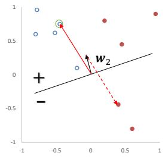

算法 3.1 两类感知器的参数学习算法  
输入：训练集 $\mathcal { D } = \{ ( { \pmb x } ^ { ( n ) } , y ^ { ( n ) } ) \} _ { n = 1 } ^ { N }$ ,最大迭代次数T  
1 初始化： ${ \pmb w } _ { 0 } \gets 0 , k \gets 0 , t \gets 0$ in  
2 repeat  
3 对训练集D中的样本随机排序;  
4 for $n = 1 \cdots N$ do  
5 选取一个样本 $( \mathbf { \boldsymbol { x } } ^ { ( n ) } , \boldsymbol { y } ^ { ( n ) } )$ üi  
6 if ${ \pmb w } _ { k } ^ { \top } ( { \pmb y } ^ { ( n ) } { \pmb x } ^ { ( n ) } ) \le 0$ then  
7 ${ \pmb w } _ { k + 1 }  { \pmb w } _ { k } + y ^ { ( n ) } { \pmb x } ^ { ( n ) } ;$   
8 $k \gets k + 1 ;$   
9 end  
10 t ← t + 1;  
11 if t = T then break; //达到最大迭代次数  
12 end  
13 until $t = T ;$   
输出： ${ \pmb w } _ { k }$

图3.6给出了感知器参数学习的更新过程，其中红色实心点为正例，蓝色空心点为负例.黑色箭头表示当前的权重向量，红色虚线箭头表示权重的更新方向.

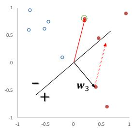  
图3.6 感知器参数学习的更新过程

## 3.4.2 感知器的收敛性

[Novikoff，1963]证明对于两类问题，如果训练集是线性可分的，那么感知器算法可以在有限次迭代后收敛.然而，如果训练集不是线性可分的，那么这个算法则不能确保会收敛

参见定义3.1.

当数据集是两类线性可分时，对于训练集 $\mathcal { D } = \left\{ ( { \pmb x } ^ { ( n ) } , y ^ { ( n ) } ) \right\} _ { n = 1 } ^ { N }$ ,其中 $\mathbf { \boldsymbol { x } } ^ { ( n ) }$ 为样本的增广特征向量， $y ^ { ( n ) } \in \{ - 1 , 1 \}$ ，那么存在一个正的常数 $\gamma ( \gamma > 0 )$ 和权重向量 $\boldsymbol { w } ^ { * }$ ,并且 $\| \pmb { w } ^ { * } \| = 1$ ,对所有n都满足 $( { \pmb w } ^ { * } ) ^ { \top } ( y ^ { ( n ) } { \pmb x } ^ { ( n ) } ) \ge \gamma$ .我们可以证明如下定理.

定理3.1－感知器收敛性：给定训练集 $\mathcal { D } = \left\{ ( { \pmb x } ^ { ( n ) } , y ^ { ( n ) } ) \right\} _ { n = 1 } ^ { N }$ ,令R是训练集中最大的特征向量的模，即

$$
R = \operatorname* { m a x } _ { n } \| \pmb { x } ^ { ( n ) } \| .
$$

如果训练集D线性可分，两类感知器的参数学习算法3.1的权重更新次数不超过 $\textstyle { \frac { R ^ { 2 } } { \gamma ^ { 2 } } }$

证明．感知器的权重向量的更新方式为

$$
\begin{array} { r } { \pmb { w } _ { k } = \pmb { w } _ { k - 1 } + \pmb { y } ^ { ( k ) } \pmb { x } ^ { ( k ) } , } \end{array}\tag{3.69}
$$

其中 $\boldsymbol { x } ^ { ( k ) } , \boldsymbol { y } ^ { ( k ) }$ 表示第k个错误分类的样本.

因为初始权重向量为0,在第K次更新时感知器的权重向量为

$$
{ \pmb w } _ { K } = \sum _ { k = 1 } ^ { K } y ^ { ( k ) } { \pmb x } ^ { ( k ) } .\tag{3.70}
$$

分别计算 $\| \pmb { w } _ { K } \| ^ { 2 }$ 的上下界：

(1)| $\lvert \boldsymbol { w } _ { K } \rvert \rvert ^ { 2 }$ 的上界为

$$
\| \pmb { w } _ { K } \| ^ { 2 } = \| \pmb { w } _ { K - 1 } + \pmb { y } ^ { ( K ) } \pmb { x } ^ { ( K ) } \| ^ { 2 }\tag{3.71}
$$

$$
= \| \pmb { w } _ { K - 1 } \| ^ { 2 } + \| y ^ { ( K ) } \pmb { x } ^ { ( K ) } \| ^ { 2 } + 2 y ^ { ( K ) } \pmb { w } _ { K - 1 } ^ { \top } \pmb { x } ^ { ( K ) }\tag{3.72}
$$

$$
y _ { k } { \pmb w } _ { K - 1 } ^ { \top } { \pmb x } ^ { ( K ) } \le 0 .
$$

$$
\leq \| \pmb { w } _ { K - 1 } \| ^ { 2 } + R ^ { 2 }\tag{3.73}
$$

$$
\leq \| \pmb { w } _ { K - 2 } \| ^ { 2 } + 2 R ^ { 2 }\tag{3.74}
$$

$$
\leq K R ^ { 2 } .\tag{3.75}
$$

(2)| $\lvert \boldsymbol { w } _ { K } \rvert \rvert ^ { 2 }$ 的下界为

$$
\| \pmb { w } _ { K } \| ^ { 2 } = \overset { \textstyle \bigcap } \{ \pmb { w } ^ { * } \} \| ^ { 2 } \cdot \| \pmb { w } _ { K } \| ^ { 2 }
$$

$$
\geq \| \boldsymbol { w } ^ { * ^ { \intercal } } \boldsymbol { w } _ { K } \| ^ { 2 }\tag{3.76}
$$

$$
= \| \boldsymbol { w ^ { * } } ^ { \top } \sum _ { k = 1 } ^ { K } ( \boldsymbol { y } ^ { ( k ) } \boldsymbol { x } ^ { ( k ) } ) \| ^ { 2 }\tag{3.77}
$$

$\| \pmb { w } ^ { * } \| = 1$ .两个向量内积的平方一定小于等于这两个向量的模的乘积.

(3.78)

$$
= \| \sum _ { k = 1 } ^ { K } { \pmb w } ^ { * } ^ { \mathsf { T } } ( y ^ { ( k ) } { \pmb x } ^ { ( k ) } ) \| ^ { 2 }\tag{3.79}
$$

$$
\begin{array} { l } { { { \pmb w } ^ { * } { } ^ { \top } ( y ^ { ( n ) } { \pmb x } ^ { ( n ) } ) } } \\ { { \gamma , \forall n . } } \end{array}
$$

$$
\geq K ^ { 2 } \gamma ^ { 2 } .\tag{3.80}
$$

由公式(3.75)和公式(3.80),得到

$$
K ^ { 2 } \gamma ^ { 2 } \leq \lvert \lvert \pmb { w } _ { K } \rvert \rvert ^ { 2 } \leq K R ^ { 2 } .\tag{3.81}
$$

取最左和最右的两项，进一步得到， $K ^ { 2 } \gamma ^ { 2 } \le K R ^ { 2 }$ 然后两边都除K，最终得到 $\begin{array} { r } { K \le \frac { R ^ { 2 } } { \gamma ^ { 2 } } } \end{array}$ .因此，在线性可分的条件下，算法3.1会在 $\textstyle { \frac { R ^ { 2 } } { \gamma ^ { 2 } } }$ 步内收敛. □

虽然感知器在线性可分的数据上可以保证收敛，但其存在以下不足：

（1）在数据集线性可分时，感知器虽然可以找到一个超平面把两类数据分开，但并不能保证其泛化能力.

（2）感知器对样本顺序比较敏感.每次迭代的顺序不一致时，找到的分割超平面也往往不一致

（3）如果训练集不是线性可分的，就不能保证在有限步内收敛

## 3.4.3 参数平均感知器

根据定理3.1，如果训练数据是线性可分的，那么感知器可以找到一个判别函数来分割不同类的数据．间隔γ越大，收敛越快；但感知器并不能保证找到泛化能力最好的判别函数

感知器学习到的权重向量和训练样本的顺序相关.在迭代次序上排在后面的错误样本比前面的错误样本，对最终的权重向量影响更大.比如有1000个训练样本，在迭代100个样本后，感知器已经学习到一个很好的权重向量，在接下来的899个样本上都预测正确，也没有更新权重向量.但是，在最后第1000个样本时预测错误，并更新了权重.这次更新可能反而使得权重向量变差

为了提高感知器的鲁棒性和泛化能力，我们可以将在感知器学习过程中的所有K个权重向量保存起来，并赋予每个权重向量 ${ \pmb w } _ { k }$ 一个置信系数 $c _ { k } \ : ( 1 \ : \leq$

K为感知器在训练 中权重向量的总更新 次数.

$k \leq K )$ .最终的分类结果通过这K个不同权重的感知器投票决定，这个模型也称为投票感知器(Voted Perceptron) [Freund et al., 1999].

令 $\tau _ { k }$ 为第k次更新权重 ${ \pmb w } _ { k }$ 时的迭代次数（即训练过的样本数量）， $\tau _ { k + 1 }$ 为下次权重更新时的迭代次数，则权重 ${ \pmb w } _ { k }$ 的置信系数 $c _ { k }$ 设置为从 $\tau _ { k }$ 到 $\tau _ { k + 1 }$ 之间间隔的迭代次数，即 $c _ { k } = \tau _ { k + 1 } - \tau _ { k }$ .置信系数ck越大，说明权重 $c _ { k }$ ${ \pmb w } _ { k }$ 在之后的训练过程中正确分类样本的数量越多，越值得信赖.

这样，投票感知器的形式为

$$
\hat { y } = \mathrm { s g n } \Big ( \sum _ { k = 1 } ^ { K } c _ { k } \mathrm { s g n } ( \pmb { w } _ { k } ^ { \top } \pmb { x } ) \Big ) ,
$$

投票感知器是一种集成模型，参见第11.1节.

(3.82)

其中 sgn(·)为符号函数.

投票感知器虽然提高了感知器的泛化能力，但是需要保存K个权重向量在实际操作中会带来额外的开销．因此，人们经常会使用一个简化的版本，通过使用“参数平均”的策略来减少投票感知器的参数数量，也叫作平均感知器(Averaged Perceptron)[Collins, 2002]. 平均感知器的形式为

$$
\hat { y } = \mathrm { s g n } \left( \frac { 1 } { T } \sum _ { k = 1 } ^ { K } c _ { k } ( \pmb { w } _ { k } ^ { \top } \pmb { x } ) \right)\tag{3.83}
$$

$$
= \operatorname { s g n } \Big ( \frac { 1 } { T } ( \sum _ { k = 1 } ^ { K } c _ { k } w _ { k } ) ^ { \top } \pmb { x } \Big )\tag{3.84}
$$

$$
= \operatorname { s g n } { \Big ( } { \big ( } { \frac { 1 } { T } } \sum _ { t = 1 } ^ { T } w _ { t } ) ^ { \intercal } { \boldsymbol { x } } { \Big ) }\tag{3.85}
$$

$$
{ \bf \Psi } = \mathrm { s g n } ( \bar { \bf w } ^ { \mathrm { \scriptscriptstyle T } } { \bf x } ) ,\tag{3.86}
$$

其中 $T$ 为训练过程中处理样本的总步数，w为这T步对应的平均权重向量.最直接的实现方式是在算法3.1中增加一个 $\bar { \mathbf { \Gamma } } _ { \bar { \mathbf { \Gamma } } } \bar { \mathbf { \Gamma } } _ { \bar { \mathbf { \Gamma } } }$ ,并在每次迭代时更新它：

$$
\bar { \mathbf { } w } \gets \bar { \mathbf { } w } + \mathbf { \epsilon w } _ { t } .\tag{3.87}
$$

但这种写法需要在处理每一个样本时都更新w.由于 $\bar { \mathbf { \Gamma } } _ { \bar { \mathbf { \Gamma } } } \bar { \mathbf { \Gamma } } _ { \bar { \mathbf { \Gamma } } }$ 和 ${ \mathbf { } } { \mathbf { } } w _ { t }$ 通常都是稠密向量，这一操作开销较大．为提高迭代效率，可以只在发生错误预测时进行等价更新.

算法3.2给出了一个改进的平均感知器算法的训练过程[Daumé III,2012].

参见习题3-9.

算法 3.2 一种改进的平均感知器参数学习算法  
输入：训练集 $\mathcal { D } = \{ ( { \pmb x } ^ { ( n ) } , y ^ { ( n ) } ) \} _ { n = 1 } ^ { N }$ ,最大处理步数T  
1初始化:w ← 0, u ← 0, t← 1;  
2 repeat  
3 对训练集D中的样本随机排序;  
4 for n = 1 ·. N do  
5 选取一个样本(x(n), y(n));  
6 计算预测类别 $\hat { y } ^ { ( n ) } = \mathrm { s g n } ( \boldsymbol { w } ^ { \top } \boldsymbol { x } ^ { ( n ) } )$   
7 if y(n) ≠ y(n) then  
8 w ← w + y(n)x(n);  
9 u ← u + t y(n)x(n);  
10 end  
11 t ← t + 1;  
12 if t > T then break; //达到最大处理步数  
13 end  
14 until t > T;  
15 w = w − −u ;  
输出：w

## 3.4.4 扩展到多分类

原始的感知器是一种二分类模型，但也可以很容易地扩展到多分类问题，甚至是更一般的结构化学习问题

之前介绍的分类模型中，分类函数都是在输入x的特征空间上.为了使得感知器可以处理更复杂的输出，我们引入一个构建在输入输出联合空间上的特征函数 $\phi ( { \pmb x } , { \pmb y } )$ ,将样本对 $( { \pmb x } , { \pmb y } )$ 映射到一个特征向量空间

在联合特征空间中，我们可以建立一个广义的感知器模型，

$$
\begin{array} { r } { \hat { \pmb { y } } = \underset { \pmb { y } \in \mathtt { G e n } ( \pmb { x } ) } { \arg \operatorname* { m a x } } \pmb { w } ^ { \top } \phi ( \pmb { x } , \pmb { y } ) , } \end{array}\tag{3.88}
$$

通过引入特征函数φ(x,y)，感知器不但可以用于多分类问题，也可以用于结构化学习问题，比如输出是序列形式.

其中w为权重向量，Gen(x)表示输入x所有的输出目标集合

广义感知器模型一般用来处理结构化学习问题.当用广义感知器模型来处理C分类问题时， ${ \pmb y } \in \{ 0 , 1 \} ^ { C }$ 为类别的one-hot向量表示.在C分类问题中，一种常用的特征函数 $\phi ( { \pmb x } , { \pmb y } )$ 是x和y的外积，即

外积的定义参见公式(A.29).

$$
\begin{array} { r } { \phi ( \pmb { x } , \pmb { y } ) = \mathrm { v e c } ( \pmb { x } \pmb { y } ^ { \top } ) \in \mathbb { R } ^ { D C } , } \end{array}\tag{3.89}
$$

其中 $\mathrm { v e c } ( \cdot )$ 是向量化算子，φ(x,y)为DC维的向量.

给定样本 $( { \pmb x } , { \pmb y } )$ ,若 $\pmb { x } \in \mathbb { R } ^ { D }$ ,y为第c维为1的one-hot向量，则

…   
0   
x1 ←第(c−1)×D+1行   
φ(x, y) = … (3.90)   
xD ←第(c−1)×D+D行   
0   
…

广义感知器算法的训练过程如算法3.3所示.

算法 3.3 广义感知器参数学习算法  
输入：训练集： $\{ ( \pmb { x } ^ { ( n ) } , \pmb { y } ^ { ( n ) } ) \} _ { n = 1 } ^ { N }$ ，最大迭代次数T  
1 初始化:w0 ← 0, k ← 0, t ← 0 ；  
2 repeat  
3 对训练集D中的样本随机排序;  
4 for n = 1 ·. N do  
5 选取一个样本 (x(n), y(n));  
6 用公式(3.88) 计算预测类别 $\hat { \pmb y } ^ { ( n ) }$   
7 if y(n) ≠ y(n) then  
8 ${ \pmb w } _ { k + 1 }  { \pmb w } _ { k } + ( \phi ( { \pmb x } ^ { ( n ) } , { \pmb y } ^ { ( n ) } ) - \phi ( { \pmb x } ^ { ( n ) } , \hat { \pmb y } ^ { ( n ) } ) )$   
9 k = k + 1 ;  
10 end  
11 t = t + 1 ;  
12 if t = T then break; // 达到最大迭代次数  
13 end  
14 until t = T;  
输出： ${ \pmb w } _ { k }$

## 3.4.4.1 广义感知器的收敛性

广义感知器在满足广义线性可分条件时，也能够保证在有限步骤内收敛.广义线性可分条件的定义如下：

定义3.3-广义线性可分：对于训练集 $\mathcal { D } = \left\{ ( { \pmb x } ^ { ( n ) } , { \pmb y } ^ { ( n ) } ) \right\} _ { n = 1 } ^ { N }$ ,如果存在一个正的常数 $\gamma ( \gamma > 0 )$ 和权重向量 $\boldsymbol { w } ^ { * }$ ，并且 $\| \pmb { w } ^ { * } \| = 1$ ，对所有n都满足$\langle { \pmb w } ^ { * } , \phi ( { \pmb x } ^ { ( n ) } , { \pmb y } ^ { ( n ) } ) \rangle - \langle { \pmb w } ^ { * } , \phi ( { \pmb x } ^ { ( n ) } , { \pmb y } ) \rangle \geq \gamma , { \pmb y } \neq { \pmb y } ^ { ( n ) } ( \phi ( { \pmb x } ^ { ( n ) } , { \pmb y } ^ { ( n ) } )$ 为样本$\mathbf { \boldsymbol { x } } ^ { ( n ) } , \mathbf { \boldsymbol { y } } ^ { ( n ) }$ 的联合特征向量），那么训练集 $\mathcal { D }$ 在联合特征向量空间中是线性可分的.

广义线性可分是多类线性可分的扩展，参见定义3.2.

广义感知器的收敛性定义如下：

定理3.2-广义感知器收敛性：如果训练集 $\mathcal { D } = \left\{ ( { \pmb x } ^ { ( n ) } , { \pmb y } ^ { ( n ) } ) \right\} _ { n = 1 } ^ { N }$ 是广义线性可分的，并令R是所有样本中真实标签和错误标签在特征空间 $\phi ( { \pmb x } , { \pmb y } )$ 最远的距离，即

$$
R = \operatorname* { m a x } _ { n } \operatorname* { m a x } _ { z \neq y ^ { ( n ) } } \| \phi ( \pmb { x } ^ { ( n ) } , \pmb { y } ^ { ( n ) } ) - \phi ( \pmb { x } ^ { ( n ) } , z ) \| ,\tag{3.91}
$$

那么广义感知器参数学习算法3.3的权重更新次数不超过 $\textstyle { \frac { R ^ { 2 } } { \gamma ^ { 2 } } }$

原始论文给出了广义感知器在广义线性可分的收敛性证明，具体推导过程和两类感知器比较类似.

参见习题3-11.

## 3.5 支持向量机

支持向量机（Support Vector Machine,SVM）是一个经典的二分类算法.它通过最大化分类间隔来寻找更稳健的分割超平面，因此被广泛应用于多种分类任务.

给定一个二分类数据集 $\mathcal { D } = \{ ( { \pmb x } ^ { ( n ) } , y ^ { ( n ) } ) \} _ { n = 1 } ^ { N }$ ,其中 $y ^ { ( n ) } \in \{ + 1 , - 1 \}$ ,如果两类样本是线性可分的，即存在一个超平面

本节中不使用增广的特征向量和特征权重.

$$
\pmb { w } ^ { \top } \pmb { x } + b = 0\tag{3.92}
$$

将两类样本分开，那么对于每个样本都有 $y ^ { ( n ) } ( { \pmb w } ^ { \top } { \pmb x } ^ { ( n ) } + b ) > 0$

数据集D中每个样本 $\mathbf { \boldsymbol { x } } ^ { ( n ) }$ 到分割超平面的距离为：

$$
\gamma ^ { ( n ) } = \frac { | \pmb { w } ^ { \top } \pmb { x } ^ { ( n ) } + b | } { \| \pmb { w } \| } = \frac { y ^ { ( n ) } ( \pmb { w } ^ { \top } \pmb { x } ^ { ( n ) } + b ) } { \| \pmb { w } \| } .\tag{3.93}
$$

我们定义间隔（Margin）γ为整个数据集 $\mathcal { D }$ 中所有样本到分割超平面的最短距离：

$$
\gamma = \operatorname* { m i n } _ { n } \gamma ^ { ( n ) } .\tag{3.94}
$$

https://nndl.ai/

如果间隔 $\gamma$ 越大，其分割超平面对两个数据集的划分越稳定，不容易受噪声等因素影响.支持向量机的目标是寻找一个超平面 $( w ^ { * } , b ^ { * } )$ 使得 $\gamma$ 最大,即

$$
\begin{array} { r l } { \underset { \pmb { w } , b } { \operatorname* { m a x } } } & { \quad \gamma } \\ { \mathrm { s . t . } } & { \quad \frac { y ^ { ( n ) } ( \pmb { w } ^ { \top } \pmb { x } ^ { ( n ) } + b ) } { \| \pmb { w } \| } \geq \gamma , \forall n \in \{ 1 , \cdots , N \} . } \end{array}\tag{3.95}
$$

由于同时缩放 w → kw 和 b → kb不会改变样本 $\pmb { x } ^ { ( n ) }$ 到分割超平面的距离，我们可以限制 $\| \pmb { w } \| \cdot \gamma = 1$ ,则公式(3.95)等价于

间隔为 $\begin{array} { r } { \gamma = \frac { 1 } { \| \pmb { w } \| } } \end{array}$

$$
\begin{array} { r l } { \underset { \pmb { w } , \boldsymbol { b } } { \operatorname* { m a x } } \quad } & { \frac { 1 } { \| \pmb { w } \| ^ { 2 } } } \\ { \mathrm { s . t . } \quad } & { y ^ { ( n ) } ( \pmb { w } ^ { \top } \pmb { x } ^ { ( n ) } + b ) \geq 1 , \forall n \in \{ 1 , \cdots , N \} . } \end{array}\tag{3.96}
$$

数据集中所有满足 $y ^ { ( n ) } ( { \pmb w } ^ { \top } { \pmb x } ^ { ( n ) } + b ) = 1$ 的样本点，都称为支持向量（Sup-$\mathrm { p o r t ~ V e c t o r ~ } )$

对于一个线性可分的数据集，其分割超平面有很多个，但是间隔最大的超平面是唯一的．图3.7给定了支持向量机的最大间隔分割超平面的示例，其中轮廓线加粗的样本点为支持向量.

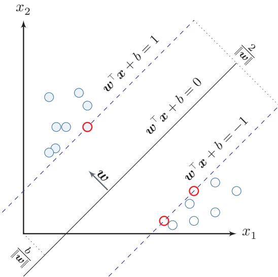  
图 3.7 支持向量机示例

## 3.5.1 参数学习

为了找到最大间隔分割超平面，将公式(3.96)的目标函数写为凸优化问题

$$
\operatorname* { m i n } _ { \boldsymbol { w } , b } \qquad \frac { 1 } { 2 } \| \boldsymbol { w } \| ^ { 2 }\tag{3.97}
$$

https://nndl.ai/

$$
\begin{array} { r } { \mathrm { s . t . } \qquad 1 - y ^ { ( n ) } ( \pmb { w } ^ { \top } \pmb { x } ^ { ( n ) } + b ) \leq 0 , \qquad \forall n \in \{ 1 , \cdots , N \} . } \end{array}
$$

使用拉格朗日乘数法，公式(3.97)的拉格朗日函数为

$$
\Lambda ( \pmb { w } , b , \lambda ) = \frac { 1 } { 2 } \| \pmb { w } \| ^ { 2 } + \sum _ { n = 1 } ^ { N } \lambda _ { n } \Big ( 1 - y ^ { ( n ) } ( \pmb { w } ^ { \top } \pmb { x } ^ { ( n ) } + b ) \Big ) ,
$$

拉格朗日乘数法与KKT条件参见第C.3节.

(3.98)

其中 $\lambda _ { 1 } \ge 0 , \cdots , \lambda _ { N } \ge 0$ 为拉格朗日乘数.计算 $\Lambda ( w , b , \lambda )$ 关于 $\textbf { \em w }$ 和b的导数，并令其等于0，得到

$$
{ \pmb w } = \sum _ { n = 1 } ^ { N } \lambda _ { n } y ^ { ( n ) } { \pmb x } ^ { ( n ) } ,\tag{3.99}
$$

$$
0 = \sum _ { n = 1 } ^ { N } \lambda _ { n } y ^ { ( n ) } .\tag{3.100}
$$

将公式(3.99)代入公式(3.98),并利用公式(3.100),得到拉格朗日对偶函数

$$
\Gamma ( \lambda ) = - \frac { 1 } { 2 } \sum _ { n = 1 } ^ { N } \sum _ { m = 1 } ^ { N } \lambda _ { m } \lambda _ { n } y ^ { ( m ) } y ^ { ( n ) } ( { \pmb x } ^ { ( m ) } ) ^ { \top } { \pmb x } ^ { ( n ) } + \sum _ { n = 1 } ^ { N } \lambda _ { n } .\tag{3.101}
$$

支持向量机的主优化问题为凸优化问题，满足强对偶性，即主优化问题可以通过最大化对偶函数 $\mathrm { m a x } _ { \lambda \ge 0 } \Gamma ( \lambda )$ 来求解.凸优化问题在满足Slater条件（即存在严格可行点）时成立强对偶性.SVM的约束为线性不等式，天然满足此条件，因此主问题的最优值等于对偶问题的最优值.对偶函数 $\Gamma ( \lambda )$ 是一个凹函数，因此最大化对偶函数是一个凸优化问题，可以通过多种凸优化方法来进行求解，得到拉格朗日乘数的最优值λ\*.但由于其约束条件的数量为训练样本数量，一般的优化方法代价比较高，因此在实践中通常采用比较高效的优化方法，比如序列最小优化(Sequential Minimal Optimization,SMO)算法[Platt，1998]等.

根据KKT条件中的互补松弛条件，最优解满足 $\lambda _ { n } ^ { * } \big ( 1 - y ^ { ( n ) } ( w ^ { * ^ { \top } } x ^ { ( n ) }$ 十$b ^ { * } ) ) = 0$ 如果样本 $\pmb { x } ^ { ( n ) }$ 不在约束边界上， ${ \lambda } _ { n } ^ { * } = 0$ ，其约束失效；如果样本 $\mathbf { \boldsymbol { x } } ^ { ( n ) }$ 在约束边界上， $\lambda _ { n } ^ { * } \geq 0 .$ 这些位于约束边界上的样本点称为支持向量（SupportVector），也就是离决策边界最近的点.

参见公式(C.26).

在计算出 $\lambda ^ { * }$ 后，根据公式(3.99)计算出最优权重 $\boldsymbol { w } ^ { * }$ ，最优偏置 $b ^ { * }$ 可以通过任选一个支持向量 $( \tilde { \boldsymbol { x } } , \tilde { \boldsymbol { y } } )$ 计算得到：

$$
b ^ { * } = \tilde { y } - \boldsymbol { w } ^ { * ^ { \intercal } } \tilde { x } .\tag{3.102}
$$

最优参数的支持向量机的决策函数为

$$
f ( \pmb { x } ) = \mathrm { s g n } ( \pmb { w } ^ { * ^ { \top } } \pmb { x } + b ^ { * } )\tag{3.103}
$$

https://nndl.ai/

$$
\mathbf { \Psi } = \operatorname { s g n } \left( \sum _ { n = 1 } ^ { N } \lambda _ { n } ^ { * } y ^ { ( n ) } ( { \pmb x } ^ { ( n ) } ) ^ { \top } { \pmb x } + b ^ { * } \right) .\tag{3.104}
$$

支持向量机的决策函数只依赖于 $\lambda _ { n } ^ { * } > 0$ 的样本点，即支持向量

支持向量机的目标函数是凸优化问题，可以通过SMO等方法求得全局最优解；在中小规模数据或高维稀疏特征场景下，它通常具有较好的泛化性能.此外，支持向量机的决策函数只依赖于支持向量，因此在预测时往往只需要使用一部分训练样本.

## 3.5.2 核函数

支持向量机还有一个重要的优点是可以使用核函数（KernelFunction）隐式地将样本从原始特征空间映射到更高维的空间，并解决原始特征空间中的线性不可分问题.比如在一个变换后的特征空间 $\phi$ 中，支持向量机的决策函数为

$$
f ( \pmb { x } ) = \mathrm { s g n } ( \pmb { w } ^ { * \top } \phi ( \pmb { x } ) + b ^ { * } )\tag{3.105}
$$

$$
= \operatorname { s g n } \left( \sum _ { n = 1 } ^ { N } \lambda _ { n } ^ { * } y ^ { ( n ) } k ( { \pmb x } ^ { ( n ) } , { \pmb x } ) + b ^ { * } \right) ,\tag{3.106}
$$

其中 $k ( { \pmb x } , z ) = \phi ( { \pmb x } ) ^ { \top } \phi ( z )$ 为核函数.核化后的支持向量机在线性意义上对应的是特征空间中的超平面，但在原始输入空间中对应的决策边界通常是非线性的一般不需要显式给出 $\phi ( { \pmb x } )$ 的具体形式，而是通过核技巧（KernelTrick）来构造.比如以 $\boldsymbol { x } , \boldsymbol { z } \in \mathbb { R } ^ { 2 }$ 为例，我们可以构造一个核函数：

$$
k ( \pmb { x } , z ) = ( 1 + \pmb { x } ^ { \top } z ) ^ { 2 } = \phi ( \pmb { x } ) ^ { \top } \phi ( z ) ,\tag{3.107}
$$

参见习题3-13.

来隐式地计算 $x , z$ 在特征空间 $\phi$ 中的内积，其中

$$
\phi ( { \pmb x } ) = [ 1 , \sqrt { 2 } x _ { 1 } , \sqrt { 2 } x _ { 2 } , \sqrt { 2 } x _ { 1 } x _ { 2 } , x _ { 1 } ^ { 2 } , x _ { 2 } ^ { 2 } ] ^ { \top } .\tag{3.108}
$$

对于图3.8中的同心圆型数据，样本在原始空间中线性不可分．我们可以使用与半径平方相关的特征映射，或直接采用高斯核

$$
k ( { \pmb x } , z ) = \exp ( - \gamma | { \pmb x } - z | ^ { 2 } ) ,\tag{3.109}
$$

其中 $\gamma$ 为超参数.高斯核不需要显式写出 $\phi ( { \pmb x } )$ ，但能把这类非线性结构映射到高维空间后线性分开

## 3.5.3 软间隔

在支持向量机的优化问题中，约束条件比较严格.如果训练集中的样本在特征空间中不是线性可分的，就无法找到最优解.为了能够容忍部分不满足约束的

  
图3.8 核函数将样本从原始空间映射到高维特征空间示意图

样本，我们可以引入松弛变量（SlackVariable)ξ,将优化问题变为

$$
\begin{array} { l } { \displaystyle \underset { w , b } { \operatorname* { m i n } } \quad } & { \frac { 1 } { 2 } \| w \| ^ { 2 } + C \displaystyle \sum _ { n = 1 } ^ { N } \xi _ { n } } \\ { \mathrm { s . t . } \quad } & { 1 - y ^ { ( n ) } ( w ^ { \top } \pmb { x } ^ { ( n ) } + b ) - \xi _ { n } \leq 0 , \qquad \forall n \in \{ 1 , \cdots , N \} } \\ { \quad } & { \xi _ { n } \geq 0 , \qquad \forall n \in \{ 1 , \cdots , N \} } \end{array}\tag{3.110}
$$

其中参数 $C > 0$ 用来控制间隔和松弛变量惩罚的平衡.引入松弛变量的间隔称为软间隔（Soft Margin）.对于固定的w和b,约束 $\xi _ { n } \geq 1 - y ^ { ( n ) } ( { \pmb w } ^ { \top } { \pmb x } ^ { ( n ) } + b )$ 在最优解处取等号，即 $\xi _ { n } ^ { * } = \operatorname* { m a x } ( 0 , 1 - y ^ { ( n ) } ( { \pmb w } ^ { \top } { \pmb x } ^ { ( n ) } + b ) )$ . 将其代入目标函数，即得到基于Hinge损失的无约束优化形式：公式(3.110)也可以表示为经验风险+正则化项的形式：

$$
\operatorname* { m i n } _ { w , b } \qquad \sum _ { n = 1 } ^ { N } \operatorname* { m a x } \Big ( 0 , 1 - y ^ { ( n ) } ( { \pmb w } ^ { \top } { \pmb x } ^ { ( n ) } + b ) \Big ) + \frac { 1 } { 2 C } \| { \pmb w } \| ^ { 2 } ,\tag{3.111}
$$

其中可以把 $\operatorname* { m a x } \Big ( 0 , 1 - y ^ { ( n ) } ( { \pmb w } ^ { \top } { \pmb x } ^ { ( n ) } + b ) \Big )$ 看作损失函数，称为Hinge损失函数(Hinge Loss Function),把 $\frac { 1 } { 2 C } \| \pmb { w } \| ^ { 2 }$ 看作正则化项， $\textstyle { \frac { 1 } { C } }$ 是正则化系数

参见公式(2.18).

软间隔支持向量机的参数学习和原始支持向量机类似，其最终决策函数也只和支持向量有关，即满足 $1 - y ^ { ( n ) } ( { \pmb w } ^ { \top } { \pmb x } ^ { ( n ) } + b ) - \xi _ { n } = 0$ 的样本.

参见习题3-14.

## 3.6 损失函数对比

本章介绍了三种二分类模型:Logistic回归、感知器和支持向量机.虽然它们的决策函数相同，但由于使用了不同的损失函数以及相应的优化方法，导致它们在实际任务上的表现存在一定的差异.

为了比较这些损失函数，我们统一定义类别标签 $y \in \{ + 1 , - 1 \}$ ，并定义$f ( \pmb { x } ; \pmb { w } ) = \pmb { w } ^ { \top } \pmb { x } + b$ 这样对于样本 $( { \pmb x } , y )$ ，若 $y f ( { \pmb x } ; { \pmb w } ) > 0$ ，则分类正确；若

$y f ( \pmb { x } ; \pmb { w } ) < 0$ ，则分类错误.这样，为了方便比较这些模型，我们可以将它们的损失函数都表述为定义在 $y f ( \pmb { x } ; \pmb { w } )$ 上的函数.

Logistic回归的损失函数可以改写为

$$
\begin{array} { r l r l } & { \mathcal { L } _ { L R } = - I ( y = 1 ) \log \sigma \big ( f ( x ; w ) \big ) - I ( y = - 1 ) \log \Big ( 1 - \sigma \big ( f ( x ; w ) \big ) \Big ) } & &  I ( \cdot ) \mathcal { H } \frac { 1 } { \mathcal { H } } \frac { 1 } { \mathcal { H } } \frac { 1 } { \mathcal { H } } \frac { 1 } { \mathcal { H } } \frac { 1 } { \mathcal { H } } \frac { 1 } { \mathcal { H } } \frac { 1 } { \mathcal { H } } \frac { 1 } { \mathcal { H } } \frac { 1 } { \mathcal { H } } \frac { 1 } { \mathcal { H } } \frac { 1 } { \mathcal { H } } \frac { 1 } { \mathcal { H } } \frac { 1 } { \mathcal { H } } \frac { 1 } { \mathcal { H } } \frac { 1 } { \mathcal { H } } \frac { 1 } { \mathcal { H } } \frac { 1 } { \mathcal { H } } \frac { 1 } { \mathcal { H } } \frac { 1 } { \mathcal { H } } \frac { 1 } { \mathcal { H } } \frac { 1 } { \mathcal { H } } \frac { 1 } { \mathcal { H } } \frac { 1 } { \mathcal { H } } \frac { 1 } { \mathcal { H } } \frac { 1 } { \mathcal { H } } \frac { 1 } { \mathcal { H } } \frac { 1 } { \mathcal { H } } \frac { 1 } { \mathcal { H } } \frac { 1 } { \mathcal { H } } \frac { 1 } { \mathcal { H } } \frac { 1 } { \mathcal { H } } \frac { 1 } { \mathcal { H } } \frac { 1 } { \mathcal { H } } \frac { 1 } { \mathcal { H } } \frac { 1 } { \mathcal { H } } \frac { 1 } { \mathcal { H } } \frac { 1 } { \mathcal { H } } \frac { 1 } { \mathcal { H } } \frac { 1 } { \mathcal { H } } \frac { 1 } { \mathcal { H } } \frac { 1 } { \mathcal { H } } \frac { 1 } { \mathcal { H } } \frac { 1 } { \mathcal { H } } \frac { 1 } { \mathcal { H } } \frac { 1 } { \mathcal { H } } \frac { 1 } { \mathcal { H } } \frac { 1 } { \mathcal { H } } \frac { 1 }  \mathcal  \end{array}\tag{3.112}
$$

(3.113)

(3.114)

(3.115)

感知器的损失函数为

$$
\begin{array} { r } { \mathcal { L } _ { p } = \operatorname* { m a x } \big ( 0 , - y f ( \pmb { x } ; \pmb { w } ) \big ) . } \end{array}\tag{3.116}
$$

软间隔支持向量机的损失函数为

$$
\mathcal { L } _ { h i n g e } = \operatorname* { m a x } { \left( 0 , 1 - y f ( \pmb { x } ; \pmb { w } ) \right) } .\tag{3.117}
$$

从建模思想上看，Logistic损失是平滑的并带有概率解释；感知器损失只关心是否错分;Hinge损失不仅要求分对，还要求分类结果留出一定间隔.

平方损失可以重写为

$$
\mathcal { L } _ { s q u a r e d } = \left( y - f ( \pmb { x } ; \pmb { w } ) \right) ^ { 2 }\tag{3.118}
$$

$$
{ \bf \xi } = 1 - 2 y f ( { \bf x } ; { \pmb w } ) + ( y f ( { \bf x } ; { \pmb w } ) ) ^ { 2 }\tag{3.119}
$$

$$
y ^ { 2 } = 1 .
$$

$$
{ \bf \omega } = { \left( 1 - y f ( { \bf x } ; { \bf w } ) \right) } ^ { 2 } .\tag{3.120}
$$

图3.9给出了不同损失函数的对比.对于二分类来说，当 $y f ( { \pmb x } ; { \pmb w } ) > 0$ 时,分类器预测正确，并且 $y f ( \pmb { x } ; \pmb { w } )$ 越大，模型的预测越正确；当 $y f ( \pmb { x } ; \pmb { w } ) < 0$ 时，分类器预测错误，并且 $y f ( \pmb { x } ; \pmb { w } )$ 越小，模型的预测越错误.因此，一个好的损失函数应该随着 $y f ( \pmb { x } ; \pmb { w } )$ 的增大而减少.从图3.9中看出，除了平方损失，其他损失函数都比较适合于二分类问题

  
图 3.9 不同损失函数的对比

## 3.7 总结和扩展阅读

和回归问题不同，分类问题中的目标标签y是离散的类别标签，因此分类问题中的决策函数需要输出离散值或是标签的条件概率．线性分类模型一般是一个广义线性函数，即一个或多个线性判别函数加上一个非线性激活函数，所谓“线性”是指决策边界由一个或多个超平面组成.

表3.1给出了几种常见的线性模型的比较.虽然这些模型都建立在线性打分之上，但它们分别对应概率建模、错误驱动学习和间隔最大化等不同思路．在Logistic 回归和Softmax回归中,y为类别的one-hot向量表示;在感知器和支持向量机中,y为{+1,−1}.

表 3.1 几种常见的线性模型对比
<table><tr><td>线性模型</td><td>激活函数</td><td>损失函数</td><td>优化方法</td></tr><tr><td>线性回归</td><td></td><td>平方损失</td><td>最小二乘、梯度下降</td></tr><tr><td>Logistic 回归</td><td> $\sigma ( \pmb { w } ^ { \top } \pmb { x } )$ </td><td>二分类交叉熵损失 梯度下降</td><td></td></tr><tr><td>Softmax 回归</td><td> $\operatorname { s o f t m a x } ( W ^ { \intercal } x )$ </td><td>多类交叉熵损失</td><td>梯度下降</td></tr><tr><td>感知器</td><td> $\mathrm { s g n } ( { \pmb w } ^ { \top } { \pmb x } )$ </td><td>感知器损失</td><td>随机梯度下降</td></tr><tr><td>支持向量机</td><td> $\mathrm { s g n } ( { \pmb w } ^ { \top } { \pmb x } )$ </td><td>Hinge损失</td><td>二次规划、SMO等</td></tr></table>

Logistic 回归是一种概率模型，它通过Logistic 函数将实数映射到 [0, 1]区间．类似地，正态分布的累积分布函数也可以起到这一作用，对应的模型称为probit 回归. 相关内容可参考《Pattern Recognition and Machine Learning》[Bishop, 2007]第4章.

感知器是最简单的线性分类模型之一，其学习算法直观且具有代表性[Rosenblatt, 1958]. [Freund et al., 1999]提出了使用核技巧改进感知器学习算法，并用投票感知器来提高泛化能力.[Collins,2002]将感知器算法扩展到结构化学习，给出了相应的收敛性证明，并且提出一种更加有效并且实用的参数平均化策略.

要深入了解支持向量机以及核方法，可以参考文献《Learning with Ker-nels: Support Vector Machines, Regularization, Optimization, and Beyond[Scholkopf et al., 2001].

本章介绍的Logistic回归的交叉熵损失函数和梯度更新公式，与后续多层神经网络(第4章)输出层的处理完全一致，为理解反向传播算法奠定了基础.

## 习题

## 基础题

习题3-1 证明在两类线性分类中，权重向量w与决策边界正交

习题3-2 在线性空间中，证明一个点x到超平面 $f ( \pmb { x } ; \pmb { w } ) = \pmb { w } ^ { \top } \pmb { x } + b = 0$ 的距离为 $| f ( \pmb { x } ; \pmb { w } ) | / \| \pmb { w } \|$

习题3-3 已知 $\pmb { w } = [ 2 , - 1 ] ^ { \intercal } , b = 1$ ，分别计算点 $\pmb { x } _ { 1 } = [ 1 , 1 ] ^ { \tau } , \pmb { x } _ { 2 } = [ 0 , 2 ] ^ { \tau }$ 和$\pmb { x } _ { 3 } = [ - 1 , 0 ] ^ { \top }$ 到超平面 $\pmb { w } ^ { \top } \pmb { x } + b = 0$ 的有向距离，并判断它们的预测类别

习题3-4 在线性分类中，决策区域是凸的.即若点 $\scriptstyle { \mathbf { { x } } } _ { 1 }$ 和 $\mathbf { { x } } _ { 2 }$ 被分为类别c,则点$\rho \pmb { x } _ { 1 } + ( 1 - \rho ) \pmb { x } _ { 2 }$ 也会被分为类别c,其中 $\rho \in ( 0 , 1 )$

## 提高题

习题3-5 给定一个多分类的数据集，证明：1）如果数据集中每个类的样本都和除该类之外的样本是线性可分的，则该数据集一定是线性可分的；2）如果数据集中每两个类的样本是线性可分的，则该数据集不一定是线性可分的.

习题3-6 在Logistic 回归中，设 $\hat { y } = \sigma ( { \pmb w } ^ { \top } { \pmb x } )$ .讨论以平方损失 $( y - \hat { y } ) ^ { 2 }$ 作为目标函数时，其关于参数w的优化问题是否仍是凸优化问题，并与交叉熵损失进行比较.

习题3-7 对同一个样本，设y=1,分别在 $f ( \pmb { x } ; \pmb { w } ) = 2 , 0 . 5 , - 1$ 时计算Logistic损失、感知器损失和Hinge损失，并比较这三种损失函数对“分类正确但置信度不高”与“分类错误”两类情形的刻画差异.

习题3-8在Softmax回归的风险函数（公式(3.46)）中加入 $L _ { 2 }$ 正则化项$\frac \lambda 2 \| W \| _ { F } ^ { 2 }$ ，写出新的目标函数及其梯度，并说明正则化对参数冗余和过拟合的影响.

习题3-9 验证平均感知器训练算法3.2中给出的平均权重向量的计算方式和公式(3.87) 等价.

习题3-10 设初始权重向量 ${ \pmb w } _ { 0 } = { \bf 0 }$ ,训练样本依次为

$$
( [ 1 , 1 ] ^ { \tau } , + 1 ) , \quad ( [ 2 , - 1 ] ^ { \tau } , - 1 ) , \quad ( [ - 1 , 1 ] ^ { \tau } , + 1 ) .
$$

按照算法3.1手工执行一轮感知器更新，写出每一步处理后的权重向量.

## 拓展题

习题3-11 证明定理3.2.

习题3-12 若数据集线性可分，证明支持向量机中将两类样本正确分开的最大间隔分割超平面存在且唯一

习题3-13 验证公式(3.107).

习题3-14 在软间隔支持向量机中，试给出原始优化问题的对偶问题，并列出其KKT条件.

## 参考文献

BISHOP C M, 2007. Information science and statistics: pattern recognition and machine learning[M]. 5th ed. Springer.

COLLINS M, 2002. Discriminative training methods for hidden markov models: theory and experiments with perceptron algorithms[C]//Proceedings of the conference on Empirical methods in natural language processing. 1-8.

Daumé III H, 2012. A course in machine learning[EB/OL]. http://ciml.info/.

FREUND Y, SCHAPIRE R E, 1999. Large margin classification using the perceptron algorithm [J]. Machine learning, 37(3): 277-296.

NOVIKOFF A B, 1963. On convergence proofs for perceptrons[R]. DTIC Document.

PLATT J, 1998. Sequential minimal optimization: a fast algorithm for training support vector machines[R]. 21.

ROSENBLATT F, 1958. The perceptron: a probabilistic model for information storage and organization in the brain.[J]. Psychological review, 65(6): 386.

SCHOLKOPF B, SMOLA A J, 2001. Learning with kernels: support vector machines, regularization, optimization, and beyond[M]. MIT press.

第二部分

基础模型

## 第4章 前馈神经网络

神经网络是一种大规模的并行分布式处理器，天然具有存储并使用经验知识的能力.它从两个方面上模拟大脑：（1）网络获取的知识是通过学习来获取的；(2)内部神经元的连接强度，即突触权重，用于储存获取的知识.

——西蒙·赫金(Simon Haykin) [Haykin, 1994]

人工神经网络（Artificial Neural Network,ANN）是指一系列受生物学和神经科学启发的数学模型.这些模型通过对生物神经系统的信息处理方式进行抽象，构建人工神经元，并按照一定的拓扑结构组织神经元之间的连接，从而形成能够表示复杂非线性映射的计算模型.在人工智能领域，人工神经网络也常常简称为神经网络(Neural Network,NN)或神经模型(Neural Model).

在众多神经网络模型中，前馈神经网络（Feedforward Neural Network，FNN）是最基础的一类模型.它的特点是信息沿着网络从输入到输出单向传播，不存在反馈连接.尽管这一结构形式相对简单，但很多深度学习中的核心概念—如神经元、层的堆叠、非线性变换、反向传播、自动微分以及训练中的优化困难都可以在前馈神经网络中得到比较清晰的体现.因此，前馈神经网络既是理解深度学习的起点，也是后续卷积神经网络、循环神经网络以及Transformer等更复杂模型的重要基础

本章将围绕前馈神经网络的三个基本问题展开：第一，前馈网络由什么结构组成，具有什么样的表示能力；第二，如何利用训练数据学习网络中的参数；第三，激活函数如何影响网络的表示与优化性质．为此，本章首先介绍神经元和前馈网络的结构，并讨论其通用近似能力；然后介绍前馈网络在机器学习中的应用、参数学习、反向传播和自动微分；最后结合训练中的优化问题，系统比较常见激活函数及其在现代深度学习模型中的应用.

## 4.1 前馈网络的结构与表示能力

神经网络可以看作由许多神经元按照一定连接方式组成的计算模型.不同的连接方式对应不同的网络拓扑结构，其中基础且常见的一类是前馈网络.前馈神经网络是最早提出的一类简单人工神经网络．前馈神经网络也经常称为多层感知器（Multi-Layer Perceptron，MLP）.但“多层感知器”这一叫法并不是十分严格，因为前馈神经网络通常由多层连续非线性变换复合而成，而感知器本身对应的是不连续的阈值单元 [Bishop, 2007].

## 4.1.1 神经元

为了理解前馈网络，先从它的基本组成单元—人工神经元（ArtificialNeuron），简称神经元（Neuron）—开始.神经元主要模拟生物神经元的结构和特性，接收一组输入信号并产生输出.

生物学家在20世纪初就发现了生物神经元的结构.一个生物神经元通常具有多个树突和一条轴突.树突用来接收信息，轴突用来发送信息.当神经元所获得的输入信号的积累超过某个阈值时，它就处于兴奋状态，产生电脉冲.轴突尾端有许多末梢可以给其他神经元的树突产生连接（突触），并将电脉冲信号传递给其他神经元

1943年，心理学家McCulloch和数学家Pitts根据生物神经元的结构，提出了一种非常简单的神经元模型，MP 神经元[McCulloch et al.,1943]. 现代神经网络中的神经元和MP神经元的结构并无太多变化.不同的是，MP神经元中的激活函数f为0或1的阶跃函数，而现代神经元中的激活函数通常要求是分段连续且几乎处处可导的函数(允许有限个不可导点，如ReLU在x=0处），以便利用梯度下降进行参数学习.

假设一个神经元接收D个输入 $x _ { 1 } , x _ { 2 } , \cdots , x _ { D }$ ，令向量 ${ \pmb x } = [ x _ { 1 } ; x _ { 2 } ; \cdots ; x _ { D } ]$ 来表示这组输入,并用净输入（Net Input)z∈R表示一个神经元所获得的输入信号x的加权和，

$$
z = \sum _ { d = 1 } ^ { D } w _ { d } x _ { d } + b\tag{4.1}
$$

$$
= { \pmb w } ^ { \top } { \pmb x } + b ,\tag{4.2}
$$

其中 ${ \pmb w } = [ w _ { 1 } ; w _ { 2 } ; \cdots ; w _ { D } ] \in \mathbb { R } ^ { D }$ 是D维的权重向量， $b \in \mathbb { R }$ 是偏置.

净输入z在经过一个非线性函数后，得到神经元的活性值（Activation）a，

$$
a = f ( z ) ,\tag{4.3}
$$

其中非线性函数 $f ( \cdot )$ 称为激活函数（Activation Function）.激活函数可以根据不同的需要来设置，比如Logistic函数.

图4.1给出了一个典型的神经元结构示例.

更多激活函数参考参见第4.5节.

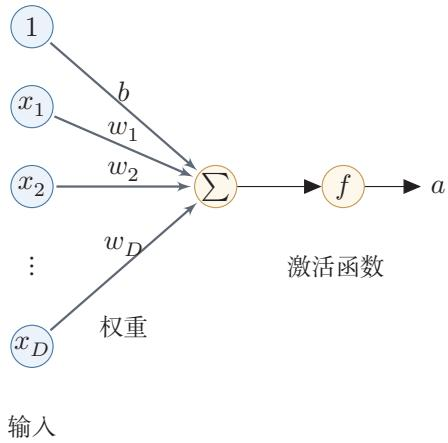  
图 4.1 典型的神经元结构

## 4.1.2 前馈网络结构

在了解神经元之后，可以进一步将多个神经元按层组织起来，构成前馈神经网络.在前馈神经网络中，各神经元分别属于不同的层.每一层的神经元接收前一层神经元的输出，并将结果传递给下一层.第0层称为输入层，最后一层称为输出层，中间各层称为隐藏层.整个网络中不存在反馈连接，信号始终从输入层向输出层单向传播，因此可以用一个有向无环图来表示.

图4.2给出了前馈神经网络的示例.

  
图4.2 多层前馈神经网络

表4.1给出了描述前馈神经网络的记号.

表4.1 前馈神经网络的记号
<table><tr><td>记号</td><td>含义</td></tr><tr><td> $L$ </td><td>神经网络的层数</td></tr><tr><td> $M _ { l }$ </td><td>第l层神经元的个数</td></tr><tr><td> $f _ { l } ( \cdot )$ </td><td>第l层神经元的激活函数</td></tr><tr><td> ${ \pmb W } ^ { ( l ) } \in \mathbb { R } ^ { M _ { l } \times M _ { l - 1 } }$ </td><td>第l—1层到第l层的权重矩阵</td></tr><tr><td> $\pmb { b } ^ { ( l ) } \in \mathbb { R } ^ { M _ { l } }$ </td><td>第l-1层到第l层的偏置</td></tr><tr><td> $\boldsymbol { z } ^ { ( l ) } \in \mathbb { R } ^ { M _ { l } }$ </td><td>第l层神经元的净输入(净活性值)</td></tr><tr><td> $\pmb { a } ^ { ( l ) } \in \mathbb { R } ^ { M _ { l } }$ </td><td>第l层神经元的输出（活性值）</td></tr></table>

层数L一般只考虑隐藏层和输出层.

$\mathbf { \boldsymbol { a } } ^ { ( 0 ) } = \mathbf { \boldsymbol { x } }$ ,前馈神经网络通过不断迭代下面公式进行信息传播：

$$
\pmb { z } ^ { ( l ) } = \pmb { W } ^ { ( l ) } \pmb { a } ^ { ( l - 1 ) } + \pmb { b } ^ { ( l ) } ,\tag{4.4}
$$

$$
\begin{array} { r } { \pmb { a } ^ { ( l ) } = f _ { l } ( \pmb { z } ^ { ( l ) } ) . } \end{array}\tag{4.5}
$$

首先根据第l-1层神经元的活性值 $\mathbf { \Delta } a ^ { ( l - 1 ) }$ 计算出第l层神经元的净活性值 $\boldsymbol { z } ^ { ( l ) }$ ,然后经过一个激活函数得到第l层神经元的活性值.因此，我们也可以把每个神经层看作一个仿射变换（AffineTransformation）和一个非线性变换.

公式(4.4)和公式(4.5)也可以合并写为：

仿射变换参见 第A.2.2节.

$$
\pmb { z } ^ { ( l ) } = \pmb { W } ^ { ( l ) } f _ { l - 1 } ( \pmb { z } ^ { ( l - 1 ) } ) + \pmb { b } ^ { ( l ) } ,\tag{4.6}
$$

或者

$$
\pmb { a } ^ { ( l ) } = f _ { l } ( \pmb { W } ^ { ( l ) } \pmb { a } ^ { ( l - 1 ) } + \pmb { b } ^ { ( l ) } ) .\tag{4.7}
$$

这样，前馈神经网络可以通过逐层的信息传递，得到网络最后的输出 $\mathbf { \pmb { a } } ^ { ( L ) }$ 整个网络可以看作一个复合函数 $\phi ( { \boldsymbol { x } } ; W , b )$ ，将向量x作为第1层的输入 $\mathbf { \delta } _ { \mathbf { a } } ( 0 )$ 将第L层的输出 $\mathbf { \pmb { a } } ^ { ( L ) }$ 作为整个函数的输出.

$$
\pmb { x } = \pmb { a } ^ { ( 0 ) }  z ^ { ( 1 ) }  \pmb { a } ^ { ( 1 ) }  z ^ { ( 2 ) }  \cdots  \pmb { a } ^ { ( L - 1 ) }  z ^ { ( L ) }  \pmb { a } ^ { ( L ) } = \phi ( \pmb { x } ; \pmb { W } , b ) ,\tag{4.8}
$$

其中W,b表示网络中所有层的连接权重和偏置

需要特别强调的是，前馈网络的表示能力不仅来自“层数多”，还来自层与层之间的非线性激活函数.如果所有激活函数都是恒等映射，那么多层仿射变换的复合仍然等价于一个仿射变换，整个网络会退化为第3章中的线性模型.正是因为每一层在线性变换后引入非线性，网络才能逐层形成更复杂的表示，并刻画非线性决策边界.

## 4.1.3 通用近似定理

在给出前馈网络的结构之后，一个自然的问题是：这种网络究竟具有多强的表示能力？通用近似定理说明，前馈神经网络具有很强的函数逼近能力，很多连续非线性函数都可以用它来近似

定理4.1-通用近似定理（Universal Approximation Theorem）[Cybenko, 1989; Hornik et al., 1989]: 令 $\phi ( \cdot )$ 是一个非常数、有界、单调递增的连续函数， ${ \mathcal { I } } _ { D }$ 是一个D维的单位超立方体 $[ 0 , 1 ] ^ { D } , C ( \mathcal { I } _ { D } )$ 是定义在 ${ \mathcal { I } } _ { D }$ 上的连续函数集合.对于任意给定的一个函数 $f \in C ( \mathcal { I } _ { D } )$ ,存在一个整数M,和一组实数 $v _ { m } , b _ { m } \in$ R以及实数向量 $\pmb { w } _ { m } \in \mathbb { R } ^ { D } , m = 1 , \cdots , M$ 以至于我们可以定义函数

$$
F ( \pmb { x } ) = \sum _ { m = 1 } ^ { M } v _ { m } \phi ( \pmb { w } _ { m } ^ { \top } \pmb { x } + b _ { m } ) ,\tag{4.9}
$$

作为函数 f的近似实现,即

$$
| F ( { \pmb x } ) - f ( { \pmb x } ) | < \epsilon , \forall { \pmb x } \in \mathcal { I } _ { D } ,\tag{4.10}
$$

其中 $\epsilon > 0$ 是一个很小的正数.

通用近似定理在实数空间 $\mathbb { R } ^ { D }$ 中的有界闭集上依然成立

根据通用近似定理，对于具有线性输出层和至少一个使用“挤压”性质的激活函数的隐藏层组成的前馈神经网络，只要其隐藏层神经元的数量足够，它可以以任意的精度来近似任何一个定义在实数空间 $\mathbb { R } ^ { D }$ 中的有界闭集上的连续函数[Funahashi et al., 1993]. 所谓“挤压”性质的函数是指像Sigmoid 函数的有界函数，但神经网络的通用近似性质也被证明对于其他类型的激活函数，比如ReLU，也都是适用的.

定义在实数空间RD中的有界闭集上的连续函数都是Borel可测函数，但Borel可测函数不一定连续.

参见习题4-10.

通用近似定理只是说明了神经网络的表示能力足以近似给定的连续函数，但并没有给出如何找到这样一个网络，以及是否是最优的.此外，当应用到机器学习时，真实的映射函数并不知道，一般是通过经验风险最小化和正则化来进行参数学习.由于神经网络表示能力较强，也更容易在训练集上过拟合.

## 4.2 前馈网络的学习

了解了前馈网络的结构及其表示能力之后，接下来的问题是如何利用数据来确定网络中的参数.本节先说明前馈网络在机器学习中的基本作用，再介绍如

何通过训练数据学习其参数.

## 4.2.1 前馈网络在机器学习中的作用

有了前馈网络的表示能力之后，接下来的问题是如何将它用于具体的机器学习任务.根据通用近似定理，神经网络在一定程度上可以作为一个“万能”函数来使用，可以用来进行复杂的特征转换，或逼近一个复杂的条件分布.

在机器学习中，输入样本的特征对分类器的影响很大.以监督学习为例，好的特征可以极大提高分类器的性能.因此，要取得好的分类效果，需要将样本的原始特征向量x转换到更有效的特征向量 $\phi ( { \pmb x } )$ ，这个过程叫作特征抽取.

参见第2.6.1.2节.

多层前馈神经网络可以看作一个非线性复合函数 $\phi : \mathbb { R } ^ { D } \to \mathbb { R } ^ { D ^ { \prime } }$ ，将输入$\pmb { x } \in \mathbb { R } ^ { D }$ 映射到输出 $\boldsymbol { \phi } ( \mathbf { x } ) \in \mathbb { R } ^ { D ^ { \prime } }$ .因此，多层前馈神经网络也可以看成是一种特征转换方法，其输出 $\phi ( { \pmb x } )$ 作为分类器的输入进行分类.

给定一个训练样本 $( { \pmb x } , y )$ ，先利用多层前馈神经网络将x映射到 $\phi ( { \pmb x } )$ ，然后再将 $\phi ( { \pmb x } )$ 输入到分类器 $g ( \cdot )$ ,即

$$
\hat { y } = g ( \phi ( \pmb { x } ) ; \theta ) ,\tag{4.11}
$$

其中 $g ( \cdot )$ 为线性或非线性的分类器，θ为分类器 $g ( \cdot )$ 的参数， $\hat { y }$ 为分类器的输出.

特别地，如果分类器 $g ( \cdot )$ 为Logistic回归分类器或Softmax回归分类器，那么 $g ( \cdot )$ 也可以看成是网络的最后一层，即神经网络直接输出不同类别的条件概率 $p ( y | \mathbf { \boldsymbol { x } } )$

反之，Logistic 回归或Softmax 回 归也可以看作只有一层的神经网络.  
Logistic 回归参见  
第3.2节.

对于二分类问题 $y \in \{ 0 , 1 \}$ ,并采用Logistic回归,那么Logistic回归分类器可以看成神经网络的最后一层.也就是说，网络的最后一层只用一个神经元，并且其激活函数为Logistic函数.记网络输出为 $\hat { y } = a ^ { ( L ) }$ ，则其可以直接作为类别$y = 1$ 的条件概率，

$$
\begin{array} { r } { p ( y = 1 | \pmb { x } ) = \hat { y } = a ^ { ( L ) } , } \end{array}\tag{4.12}
$$

其中 ${ \hat { y } } \in \mathbb { R }$ 为第L层神经元的活性值.

对于多分类问题 $y \in \{ 1 , \cdots , C \}$ ，如果使用Softmax回归分类器，相当于网络最后一层设置C个神经元，其激活函数为Softmax函数.记网络最后一层(第L层)的输出为 $\mathbf { \pmb { a } } ^ { ( L ) }$ ,则

Softmax回归参见第3.3节.

$$
\pmb { \hat { y } } = \pmb { a } ^ { ( L ) } = \mathrm { s o f t m a x } ( z ^ { ( L ) } ) ,\tag{4.13}
$$

其中 $z ^ { ( L ) } \in \mathbb { R } ^ { C }$ 为第L层神经元的净输入； $\pmb { \hat { y } } = \pmb { a } ^ { ( L ) } \in \mathbb { R } ^ { C }$ 为第 $L$ 层神经元的活性值，每一维分别表示不同类别标签的预测条件概率.

## 4.2.2 学习目标与参数更新

将前馈网络用于分类或回归任务之后，接下来的核心问题就是如何根据训练数据来学习网络中的参数.下面以分类任务和交叉熵损失为例进行说明.若对于样本 $( { \pmb x } , y )$ 采用交叉熵损失函数，其损失函数为

$$
\begin{array} { r } { \mathcal { L } ( \pmb { y } , \hat { \pmb { y } } ) = - \pmb { y } ^ { \top } \log \hat { \pmb { y } } , } \end{array}\tag{4.14}
$$

其中 ${ \pmb y } \in \{ 0 , 1 \} ^ { C }$ 为标签y对应的one-hot 向量表示.

给定训练集为 $\mathcal { D } = \{ ( { \pmb x } ^ { ( n ) } , y ^ { ( n ) } ) \} _ { n = 1 } ^ { N }$ ，将每个样本 $\mathbf { \boldsymbol { x } } ^ { ( n ) }$ 输入给前馈神经网络，得到网络输出为 $\hat { \pmb y } ^ { ( n ) }$ ，其在数据集D上的正则化经验风险函数为

$$
\mathcal { R } ( W , b ) = \frac { 1 } { N } \sum _ { n = 1 } ^ { N } \mathcal { L } ( \pmb { y } ^ { ( n ) } , \hat { \pmb { y } } ^ { ( n ) } ) + \frac { 1 } { 2 } \lambda \| \pmb { W } \| _ { F } ^ { 2 } ,\tag{4.15}
$$

其中 $W$ 和b分别表示网络中所有的权重矩阵和偏置向量； $\| \mathbf { W } \| _ { F } ^ { 2 }$ 是正则化项，用来防止过拟合； $\lambda > 0$ 为超参数.λ越大， $W$ 越接近于0.这里的 $\| \mathbf { W } \| _ { F } ^ { 2 }$ 一般使用Frobenius 范数：

注意这里的正则化项只包含权重参数W，而不包含偏置b.

$$
\| \boldsymbol { W } \| _ { F } ^ { 2 } = \sum _ { l = 1 } ^ { L } \sum _ { i = 1 } ^ { M _ { l } } \sum _ { j = 1 } ^ { M _ { l - 1 } } ( \boldsymbol { w } _ { i j } ^ { ( l ) } ) ^ { 2 } .\tag{4.16}
$$

有了学习准则和训练样本，网络参数可以通过梯度下降法来进行学习.在梯度下降方法的每次迭代中，第l层的权重 $W ^ { ( l ) }$ 和偏置 $\mathbf { \delta } _ { b } ( l )$ 的更新方式为

$$
\boldsymbol { W } ^ { ( l ) }  \boldsymbol { W } ^ { ( l ) } - \alpha \frac { \partial \mathcal { R } ( \boldsymbol { W } , b ) } { \partial \boldsymbol { W } ^ { ( l ) } }\tag{4.17}
$$

$$
= W ^ { ( l ) } - \alpha \left( \frac { 1 } { N } \sum _ { n = 1 } ^ { N } ( \frac { \partial \mathcal { L } ( y ^ { ( n ) } , \hat { y } ^ { ( n ) } ) } { \partial W ^ { ( l ) } } ) + \lambda W ^ { ( l ) } \right) ,\tag{4.18}
$$

$$
\pmb { b } ^ { ( l ) } \gets \pmb { b } ^ { ( l ) } - \alpha \frac { \partial \mathcal { R } ( \pmb { W } , \pmb { b } ) } { \partial \pmb { b } ^ { ( l ) } }\tag{4.19}
$$

$$
= \boldsymbol { b } ^ { ( l ) } - \alpha \left( \frac { 1 } { N } \sum _ { n = 1 } ^ { N } \frac { \partial \mathcal { L } ( \boldsymbol { y } ^ { ( n ) } , \hat { \boldsymbol { y } } ^ { ( n ) } ) } { \partial \boldsymbol { b } ^ { ( l ) } } \right) ,\tag{4.20}
$$

其中α为学习率.

梯度下降法需要计算损失函数对参数的偏导数，如果通过链式法则逐一对每个参数进行求偏导比较低效.在神经网络的训练中经常使用反向传播算法来高效地计算梯度.

## 4.2.3 反向传播算法

为了利用梯度下降更新网络参数，关键在于高效计算损失函数关于各层参数的导数.对于前馈网络，这一任务可以通过反向传播算法（Back-Propagation，

BP）来完成.假设采用随机梯度下降进行参数学习，给定一个样本 $( { \boldsymbol { x } } , { \boldsymbol { y } } )$ ，将其输入到神经网络模型中，得到网络输出 $\hat { y }$ ;再设损失函数为 $\mathcal { L } ( \pmb { y } , \hat { \pmb { y } } )$ ，则参数学习的关键就是计算该损失函数关于每个参数的梯度.

## 数学小知识|分母布局

在矩阵微积分中，标量 $f$ 对列向量 $z \in \mathbb { R } ^ { M }$ 的导数 $\frac { \partial f } { \partial z }$ 在分母布局下  
为M维列向量，其第m个分量为 $\frac { \partial f } { \partial z _ { m } }$ 本书的反向传播推导采用分母布  
局. 矩阵微积分参见第B.3节.

不失一般性，下面以第l层中的参数 $W ^ { ( l ) }$ 和 $\mathbf { \delta } _ { b } ( l )$ 为例来说明其梯度的计算过程.

这里使用向量或矩阵来表示多变量函数的偏导数，并使用分母布局表示，参见第B.3节.

因为 $\frac { \partial \mathcal { L } ( y , \hat { y } ) } { \partial W ^ { ( l ) } }$ 的计算涉及向量对矩阵的微分，十分繁琐，因此我们先计算$\mathcal { L } ( \pmb { y } , \hat { \pmb { y } } )$ 关于参数矩阵中每个元素的偏导数 $\frac { \partial \mathcal { L } ( \pmb { y } , \hat { \pmb { y } } ) } { \partial w _ { i j } ^ { ( l ) } }$ .根据链式法则，

$$
\frac { \partial \mathcal { L } ( \pmb { y } , \hat { \pmb { y } } ) } { \partial w _ { i j } ^ { ( l ) } } = \frac { \partial z ^ { ( l ) } } { \partial w _ { i j } ^ { ( l ) } } \frac { \partial \mathcal { L } ( \pmb { y } , \hat { \pmb { y } } ) } { \partial z ^ { ( l ) } } ,
$$

链式法则参见公式(B.19).

(4.21)

$$
\frac { \partial \mathcal { L } ( \pmb { y } , \hat { \pmb { y } } ) } { \partial \pmb { b } ^ { ( l ) } } = \frac { \partial \pmb { z } ^ { ( l ) } } { \partial \pmb { b } ^ { ( l ) } } \frac { \partial \mathcal { L } ( \pmb { y } , \hat { \pmb { y } } ) } { \partial \pmb { z } ^ { ( l ) } } .\tag{4.22}
$$

公式(4.21)和公式(4.22)中的第二项都是目标函数关于第l层的神经元 $z ^ { ( l ) }$ 的偏导数，称为误差项，可以一次计算得到.这样我们只需要计算三个偏导数，分别为 $\frac { \partial z ^ { ( l ) } } { \partial w _ { i j } ^ { ( l ) } } , \frac { \partial z ^ { ( l ) } } { \partial b ^ { ( l ) } }$ 和 $\frac { \partial \mathcal { L } ( y , \hat { y } ) } { \partial z ^ { ( l ) } }$

下面分别来计算这三个偏导数.

(1)计算偏导数 $\frac { \partial z ^ { ( l ) } } { \partial w _ { i j } ^ { ( l ) } }$ 因 $\pmb { z } ^ { ( l ) } = \pmb { W } ^ { ( l ) } \pmb { a } ^ { ( l - 1 ) } + \pmb { b } ^ { ( l ) }$ ,偏导数

$$
\frac { \partial \boldsymbol { z } ^ { ( l ) } } { \partial \boldsymbol { w } _ { i j } ^ { ( l ) } } = [ \frac { \partial z _ { 1 } ^ { ( l ) } } { \partial \boldsymbol { w } _ { i j } ^ { ( l ) } } , \cdots , \frac { \partial z _ { i } ^ { ( l ) } } { \partial \boldsymbol { w } _ { i j } ^ { ( l ) } } ] \cdots , \frac { \partial \boldsymbol { z } _ { M _ { l } } ^ { ( l ) } } { \partial \boldsymbol { w } _ { i j } ^ { ( l ) } } ]
$$

这里的矩阵微分采用分母布局，即一个列向量关于标量的偏导数为行向量，参见第B.3节.

(4.23)

$$
\mathbf { \epsilon } = \Bigg [ 0 , \cdots , \Bigg [ \frac { \partial ( \mathbf { w } _ { i \cdot } ^ { ( l ) } \pmb { a } ^ { ( l - 1 ) } + b _ { i } ^ { ( l ) } ) } { \partial \mathbf { w } _ { i j } ^ { ( l ) } } \Bigg ] \cdots , 0 \Bigg ]\tag{4.24}
$$

$$
\mathbf { \Omega } = \left[ 0 , \cdots , a _ { j } ^ { ( l - 1 ) } , \cdots , 0 \right]\tag{4.25}
$$

$$
\begin{array} { r l } { \triangleq \mathbb { I } _ { i } ( a _ { j } ^ { ( l - 1 ) } ) } & { { } \in \mathbb { R } ^ { 1 \times M _ { l } } , } \end{array}\tag{4.26}
$$

其中 $\pmb { w } _ { i : } ^ { ( l ) }$ 为权重矩阵 $W ^ { ( l ) }$ 的第i行， $\mathbb { I } _ { i } ( a _ { j } ^ { ( l - 1 ) } )$ 表示第i个元素为 $a _ { j } ^ { ( l - 1 ) }$ ,其余为0的行向量.

(2)计算偏导数 $\frac { \partial z ^ { ( l ) } } { \partial b ^ { ( l ) } }$ 因为 $z ^ { ( l ) }$ 和 $\mathbf { \delta } _ { b } ( l )$ 的函数关系为 $z ^ { ( l ) } = W ^ { ( l ) } { \pmb a } ^ { ( l - 1 ) } +$ $\mathbf { \delta } _ { b } ( l )$ ，因此偏导数

$$
\frac { \partial \pmb { z } ^ { ( l ) } } { \partial \pmb { b } ^ { ( l ) } } = \pmb { I } _ { M _ { l } } \quad \in \mathbb { R } ^ { M _ { l } \times M _ { l } } ,\tag{4.27}
$$

为 $M _ { l } \times M _ { l }$ 的单位矩阵.

(3）计算偏导数 $\frac { \partial \mathcal { L } ( y , \hat { y } ) } { \partial z ^ { ( l ) } }$ 偏导数 $\frac { \partial \mathcal { L } ( y , \hat { y } ) } { \partial z ^ { ( l ) } }$ 表示第l层神经元对最终损失的影响，也反映了最终损失对第l层神经元的敏感程度，因此一般称为第l层神经元的误差项，用 $\delta ^ { ( l ) }$ 来表示.

$$
\delta ^ { ( l ) } \triangleq \frac { \partial \mathcal { L } ( \pmb { y } , \hat { \pmb { y } } ) } { \partial \pmb { z } ^ { ( l ) } } \quad \in \mathbb { R } ^ { M _ { l } } .\tag{4.28}
$$

误差项 $\delta ^ { ( l ) }$ 也间接反映了不同神经元对网络能力的贡献程度，从而比较好地解决了贡献度分配问题(Credit Assignment Problem,CAP).

根据 $\pmb { z } ^ { ( l + 1 ) } = \pmb { W } ^ { ( l + 1 ) } \pmb { a } ^ { ( l ) } + \pmb { b } ^ { ( l + 1 ) }$ ,有

$$
\frac { \partial z ^ { ( l + 1 ) } } { \partial \pmb { a } ^ { ( l ) } } = ( \pmb { W } ^ { ( l + 1 ) } ) ^ { \top } \quad \in \mathbb { R } ^ { M _ { l } \times M _ { l + 1 } } .\tag{4.29}
$$

根据 $\mathbf { } a ^ { ( l ) } = f _ { l } ( z ^ { ( l ) } )$ ,其中 $f _ { l } ( \cdot )$ 为按位计算的函数，因此有

$$
\begin{array} { r l } { \displaystyle \frac { \partial \pmb { a } ^ { ( l ) } } { \partial \pmb { z } ^ { ( l ) } } = \frac { \partial f _ { l } ( \pmb { z } ^ { ( l ) } ) } { \partial \pmb { z } ^ { ( l ) } } } & { { } } \\ { = \mathrm { d i a g } ( f _ { l } ^ { \prime } ( \pmb { z } ^ { ( l ) } ) ) } & { { } \in \mathbb { R } ^ { M _ { l } \times M _ { l } } . } \end{array}\tag{4.30}
$$

(4.31)

因此，根据链式法则，第l层的误差项为

$$
\delta ^ { ( l ) } \triangleq \frac { \partial \mathcal { L } ( \pmb { y } , \hat { \pmb { y } } ) } { \partial \pmb { z } ^ { ( l ) } }\tag{4.32}
$$

$$
= \left( \frac { \partial \pmb { a } ^ { ( l ) } } { \partial \pmb { z } ^ { ( l ) } } \right) \cdot \left( \frac { \partial \pmb { z } ^ { ( l + 1 ) } } { \partial \pmb { a } ^ { ( l ) } } \right) \cdot \left( \frac { \partial \pmb { \mathcal { L } } ( \pmb { y } , \hat { \pmb { y } } ) } { \partial \pmb { z } ^ { ( l + 1 ) } } \right)\tag{4.33}
$$

$$
\mathrm { = } \biggl ( \mathrm { d i a g } \bigl ( f _ { l } ^ { \prime } ( z ^ { ( l ) } ) \bigr ) \biggr ) \biggl ( \left( W ^ { ( l + 1 ) } \right) ^ { \mathsf { T } } \Bigl ) \cdot \bigl ( \delta ^ { ( l + 1 ) } \Bigr )\tag{4.34}
$$

$$
= f _ { l } ^ { \prime } ( z ^ { ( l ) } ) \odot \left( ( W ^ { ( l + 1 ) } ) ^ { \intercal } \delta ^ { ( l + 1 ) } \right) \quad \in \mathbb { R } ^ { M _ { l } } ,\tag{4.35}
$$

其中是向量的Hadamard积运算符，表示每个元素相乘.

Hadamard 积参见 第A.2.3节.

从公式(4.35)可以看出，第l层的误差项可以通过第l+1层的误差项计算得到，这就是误差的反向传播（Back-Propagation，BP).反向传播算法的含义是：第l层的一个神经元的误差项（或敏感性）是所有与该神经元相连的第l+1层的神经元的误差项的权重和.然后，再乘上该神经元激活函数的梯度.

对于输出层，误差项往往还可以进一步简化.若第L层为二分类输出层，并采用Logistic函数和交叉熵损失，记 $\hat { y } = a ^ { ( L ) }$ ,则有

$$
\delta ^ { ( L ) } = \hat { y } - y .\tag{4.36}
$$

若第L层为多分类输出层，并采用Softmax函数和交叉熵损失，记 $\hat { y } = \pmb { a } ^ { ( L ) }$ ,则有

$$
\delta ^ { ( L ) } = \hat { \pmb { y } } - \pmb { y } .\tag{4.37}
$$

这两个结果在实际实现中十分常用，因为它们直接给出了反向传播的起点.

在计算出上面三个偏导数之后，公式(4.21)可以写为

$$
\frac { \partial \mathcal { L } ( \pmb { y } , \hat { \pmb { y } } ) } { \partial w _ { i j } ^ { ( l ) } } = \mathbb { I } _ { i } ( a _ { j } ^ { ( l - 1 ) } ) \delta ^ { ( l ) }\tag{4.38}
$$

$$
= \big [ 0 , \cdots , a _ { j } ^ { ( l - 1 ) } , \cdots , 0 \big ] \big [ \delta _ { 1 } ^ { ( l ) } , \cdots , \delta _ { i } ^ { ( l ) } , \cdots , \delta _ { M _ { l } } ^ { ( l ) } \big ] ^ { \intercal }\tag{4.39}
$$

$$
= \delta _ { i } ^ { ( l ) } a _ { j } ^ { ( l - 1 ) } ,\tag{4.40}
$$

其中 $\delta _ { i } ^ { ( l ) } a _ { j } ^ { ( l - 1 ) }$ 相当于向量 $\delta ^ { ( l ) }$ 和向量 $\mathbf { \Delta } \mathbf { a } ^ { ( l - 1 ) }$ 的外积的第 $i , j$ 个元素.上式可以进一步写为

外积参见公式(A.29).

$$
\left[ \frac { \partial \mathcal { L } ( \pmb { y } , \hat { \pmb { y } } ) } { \partial \pmb { W } ^ { ( l ) } } \right] _ { i j } = \left[ \delta ^ { ( l ) } ( \pmb { a } ^ { ( l - 1 ) } ) ^ { \top } \right] _ { i j } .\tag{4.41}
$$

因此， $\mathcal { L } ( \pmb { y } , \hat { \pmb { y } } )$ 关于第l层权重 $W ^ { ( l ) }$ 的梯度为

$$
\frac { \partial \mathcal { L } ( \pmb { y } , \hat { \pmb { y } } ) } { \partial \pmb { W } ^ { ( l ) } } = \delta ^ { ( l ) } ( \pmb { a } ^ { ( l - 1 ) } ) ^ { \top } \quad \in \mathbb { R } ^ { M _ { l } \times M _ { l - 1 } } .\tag{4.42}
$$

同理， $\mathcal { L } ( \pmb { y } , \hat { \pmb { y } } )$ 关于第l层偏置 $\mathbf { \delta } _ { b } ( l )$ 的梯度为

$$
\frac { \partial \mathcal { L } ( \pmb { y } , \hat { \pmb { y } } ) } { \partial \pmb { b } ^ { ( l ) } } = \delta ^ { ( l ) } \quad \in \mathbb { R } ^ { M _ { l } } .\tag{4.43}
$$

在计算出每一层的误差项之后，我们就可以得到每一层参数的梯度.因此，使用误差反向传播算法的前馈神经网络训练过程可以分为以下三步：

（1）前馈计算每一层的净输入 $z ^ { ( l ) }$ 和激活值 $\mathbf { \Omega } _  \mathbf { \Omega } \mathbf { \Omega } \mathbf { \Omega } \mathbf { \Omega } \mathbf { \Omega } \mathbf { \Omega } \mathbf { \Omega } \mathbf { \Omega } \mathbf { \Omega } \mathbf { \Omega } \mathbf { \Omega } \mathbf { \Omega } \mathbf { \Omega } \mathbf { \Omega } \mathbf { a } ^ { ( l ) }$ ，直到最后一层；

（2）反向传播计算每一层的误差项 $\delta ^ { ( l ) }$

（3）计算每一层参数的偏导数，并更新参数.

算法4.1给出使用反向传播算法的随机梯度下降训练过程

算法4.1 使用反向传播算法的随机梯度下降训练过程  
输入：训练集 $\mathcal { D } = \{ ( { \pmb x } ^ { ( n ) } , y ^ { ( n ) } ) \} _ { n = 1 } ^ { N }$ ，验证集γ,学习率α，正则化系数λ，网络  
层数L，神经元数量 $M _ { l } , 1 \le l \le L$   
1 随机初始化 W, b ；  
2 repeat  
3 对训练集D中的样本随机重排序;  
4 for $n = 1 \cdots N$ do  
5 从训练集D中选取样本 $( \mathbf { \boldsymbol { x } } ^ { ( n ) } , \mathbf { \boldsymbol { y } } ^ { ( n ) } ) ;$   
6 前馈计算每一层的净输入 $z ^ { ( l ) }$ 和激活值 $\mathbf { \Omega } _  \mathbf { \Omega } \mathbf { \Omega } \mathbf { \Omega } \mathbf { \Omega } \mathbf { \Omega } \mathbf { \Omega } \mathbf { \Omega } \mathbf { \Omega } \mathbf { \Omega } \mathbf { \Omega } \mathbf { \Omega } \mathbf { \Omega } \mathbf { \Omega } \mathbf { \Omega } \mathbf { a } ^ { ( l ) }$ ，直到最后一层;  
7 反向传播计算每一层的误差 $\delta ^ { ( l ) }$ //公式(4.35)  
$/ /$ 计算每一层参数的导数  
8 $\forall l ,$ $\begin{array} { r } { \frac { \partial \mathcal { L } ( \pmb { y } ^ { ( n ) } , \hat { \pmb { y } } ^ { ( n ) } ) } { \partial \pmb { W } ^ { ( l ) } } = \delta ^ { ( l ) } ( \pmb { a } ^ { ( l - 1 ) } ) ^ { \top } , } \end{array}$ //公式(4.42)  
9 $\forall l ,$ $\begin{array} { r } { \frac { \partial \mathcal { L } ( \pmb { y } ^ { ( n ) } , \hat { \pmb { y } } ^ { ( n ) } ) } { \partial \pmb { b } ^ { ( l ) } } = \delta ^ { ( l ) } ; } \end{array}$ //公式(4.43)  
$/ /$ 更新参数  
10 ll, $\pmb { W } ^ { ( l ) }  \pmb { W } ^ { ( l ) } - \alpha ( \delta ^ { ( l ) } ( \pmb { a } ^ { ( l - 1 ) } ) ^ { \top } + \lambda \pmb { W } ^ { ( l ) } )$   
11 ∀l, $\pmb { b } ^ { ( l ) } \gets \pmb { b } ^ { ( l ) } - \alpha \delta ^ { ( l ) } ;$   
12 end  
13 until 神经网络模型在验证集ν上的错误率不再下降;  
输出：W,b

## 4.3自动微分与梯度计算

前面在推导反向传播时，是手动利用链式法则来计算各层参数的梯度.在实际实现中，这一过程往往十分琐碎且容易出错．实际上，梯度的计算可以交给计算机自动完成：我们只需实现前向计算过程，系统便能够自动得到所需的梯度.常见的深度学习框架都提供了这一能力.

从方法上看，与求导相关的自动计算大致可以分为三类：数值微分、符号微分和自动微分.三者之中，自动微分既不依赖有限差分近似，也不直接操作完整的解析表达式，而是针对具体的数值计算过程来累积导数，因此兼顾了数值精度与计算效率.

## 4.3.1 数值微分

数值微分（Numerical Differentiation）是用数值方法来计算函数 $f ( x )$ 导数. 函数f(x)的点x的导数定义为

$$
f ^ { \prime } ( x ) = \operatorname* { l i m } _ { \Delta x \to 0 } { \frac { f ( x + \Delta x ) - f ( x ) } { \Delta x } } .\tag{4.44}
$$

要计算函数 $f ( x )$ 在点x的导数，可以对x加上一个很小的非零的扰动 $\Delta x$ 通过上述定义来直接计算函数 $f ( x )$ 的梯度.数值微分方法非常容易实现，但找到一个合适的扰动 $\Delta x$ 却十分困难.如果 $\Delta x$ 过小，会引起数值计算问题，比如舍入误差;如果 $\Delta x$ 过大，会增加截断误差，使得导数计算不准确.因此，数值微分的实用性比较差.

在实际应用中，经常使用下面公式来计算梯度，可以减少截断误差

舍入误差（Round-offError)是指数值计算中由于数字舍入造成的近似值和精确值之间的差异，比如用浮点数来表示实数.

$$
f ^ { \prime } ( x ) = \operatorname* { l i m } _ { \Delta x \to 0 } { \frac { f ( x + \Delta x ) - f ( x - \Delta x ) } { 2 \Delta x } } .\tag{4.45}
$$

截断误差（Truncation Error)是数学模 型的理论解与数值计 算问题的精确解之间 的误差.

数值微分的另外一个问题是计算复杂度.假设参数数量为N，则每个参数都需要单独施加扰动，并计算梯度.假设每次正向传播的计算复杂度为 $O ( N )$ ,则计算数值微分的总体时间复杂度为 $O ( N ^ { 2 } )$

## 4.3.2 符号微分

符号微分（SymbolicDifferentiation）是一种基于符号计算的自动求导方法.符号计算也叫代数计算，是指用计算机来处理带有变量的数学表达式.这里的变量被看作符号(Symbols)，一般不需要代入具体的值.符号计算的输入和输出都是数学表达式，一般包括对数学表达式的化简、因式分解、微分、积分、解代数方程、求解常微分方程等运算.

和符号计算相对应的概念是数值计算，即将数值代入数学表示中进行计算.

比如数学表达式的化简：

$$
\widehat { \ddag \iiiint } : 3 x - x + 2 x + 1\tag{4.46}
$$

$$
\# \mathbb { H } \mathbb { H } : 4 x + 1 .\tag{4.47}
$$

符号计算一般来讲是对输入的表达式，通过迭代或递归使用一些事先定义的规则进行转换.当转换结果不能再继续使用变换规则时，便停止计算.

符号微分可以在编译时就计算梯度的数学表示，并进一步利用符号计算方法进行优化.此外，符号计算的一个优点是符号计算和平台无关，可以在CPU或GPU上运行.符号微分也有一些不足之处：1）编译时间较长，特别是对于循环，需要很长时间进行编译；2）为了进行符号微分，一般需要设计一种专门的语言来表示数学表达式，并且要对变量（符号）进行预先声明；3）很难对程序进行调试.

## 4.3.3 自动微分

自动微分（AutomaticDifferentiation，AD）是一种可以对一个（程序）函数自动计算导数的方法.自动微分既不是通过有限差分来近似导数的数值微分，也不是直接操作解析表达式的符号微分；它的处理对象是一段具体的数值计算过程.

自动微分的基本原理是：所有的数值计算都可以分解为一些基本操作，包含$+ , - , \times , /$ 以及exp,log, sin, cos等初等函数，然后在计算过程中利用链式法则来递归地累积梯度.因此，自动微分通常既具有较高的数值精度，也具有较好的计算效率.

自动微分能够在保持机器精度的同时高效计算梯度，因此已成为深度学习框架的核心机制之一.

为简单起见，这里以一个神经网络中常见的复合函数的例子来说明自动微分的过程.令复合函数 $f ( x ; w , b )$ 为

$$
f ( x ; w , b ) = \frac { 1 } { \exp \big ( - ( w x + b ) \big ) + 1 } ,\tag{4.48}
$$

其中x为输入标量，ω和b分别为权重和偏置参数

首先，我们将复合函数 $f ( x ; w , b )$ 分解为一系列的基本操作，并构成一个计算图（Computational Graph）.计算图是数学运算的图形化表示. 计算图中的每个非叶子节点表示一个基本操作，每个叶子节点为一个输入变量或常量.图4.3给出了当 $x = 1 , w = 0 , b = 0$ 时复合函数 $f ( x ; w , b )$ 的计算图，其中连边上的红色数字表示前向计算时复合函数中每个变量的实际取值.

  
图 4.3 复合函数 $f ( x ; w , b )$ 的计算图

从计算图上可以看出，复合函数 $f ( x ; w , b )$ 由6个基本函数 $h _ { i } , 1 \leq i \leq 6$ 组成.如表4.2所示，每个基本函数的导数都十分简单，可以通过规则来实现.

整个复合函数 $f ( x ; w , b )$ 关于参数ω和b的导数可以通过计算图上的节点$f ( x ; w , b )$ 与参数ω和b之间路径上所有的导数连乘来得到，即

$$
\begin{array} { r l } & { \frac { \partial f ( x ; w , b ) } { \partial w } = \frac { \partial f ( x ; w , b ) } { \partial h _ { 6 } } \frac { \partial h _ { 6 } } { \partial h _ { 5 } } \frac { \partial h _ { 5 } } { \partial h _ { 4 } } \frac { \partial h _ { 4 } } { \partial h _ { 3 } } \frac { \partial h _ { 3 } } { \partial h _ { 2 } } \frac { \partial h _ { 2 } } { \partial h _ { 1 } } \frac { \partial h _ { 1 } } { \partial w } , } \\ & { \frac { \partial f ( x ; w , b ) } { \partial b } = \frac { \partial f ( x ; w , b ) } { \partial h _ { 6 } } \frac { \partial h _ { 6 } } { \partial h _ { 5 } } \frac { \partial h _ { 5 } } { \partial h _ { 4 } } \frac { \partial h _ { 4 } } { \partial h _ { 3 } } \frac { \partial h _ { 3 } } { \partial h _ { 2 } } \frac { \partial h _ { 2 } } { \partial b } . } \end{array}\tag{4.49}
$$

(4.50)

以 $\frac { \partial f ( x ; w , b ) } { \partial w }$ 为例,当 $x = 1 , w = 0 , b = 0$ 时，可以得到

$$
\frac { \partial f ( x ; w , b ) } { \partial w } \vert _ { x = 1 , w = 0 , b = 0 } = \frac { \partial f ( x ; w , b ) } { \partial h _ { 6 } } \frac { \partial h _ { 6 } } { \partial h _ { 5 } } \frac { \partial h _ { 5 } } { \partial h _ { 4 } } \frac { \partial h _ { 4 } } { \partial h _ { 3 } } \frac { \partial h _ { 3 } } { \partial h _ { 2 } } \frac { \partial h _ { 2 } } { \partial h _ { 1 } } \frac { \partial h _ { 1 } } { \partial w }\tag{4.51}
$$

表 4.2 复合函数 $f ( x ; w , b )$ 的6个基本函数及其导数
<table><tr><td>函数 导数</td><td colspan="3"></td></tr><tr><td> $h _ { 1 } = x \times w$ </td><td> ${ \frac { \partial h _ { 1 } } { \partial w } } = x$ </td><td></td><td> $\frac { \partial h _ { 1 } } { \partial x } = w$ </td></tr><tr><td>h2 = h1 + b</td><td>∂h2 =1</td><td>∂h2</td><td>= 1</td></tr><tr><td></td><td>∂h1 ∂h3 = -1</td><td>∂b</td><td></td></tr><tr><td>h3 = h2 × −1</td><td>∂h2 ∂h4</td><td></td><td></td></tr><tr><td>h4 = exp(h3)</td><td>= exp(h3) ∂h3 ∂h5</td><td></td><td></td></tr><tr><td>h5 = h4 + 1</td><td>=1 ∂h4 ∂h6 1</td><td></td><td></td></tr><tr><td>h6 = 1/h5</td><td>∂h5 h</td><td></td><td></td></tr><tr><td></td><td>= 1 × −0.25 × 1 × 1 × −1 × 1 × 1</td><td></td><td>(4.52)</td></tr></table>

如果函数和参数之间有多条路径，可以将这多条路径上的导数再进行相加，得到最终的梯度

按照计算导数的顺序，自动微分可以分为两种模式：前向模式和反向模式前向模式 前向模式是按计算图中计算方向的相同方向来递归地计算梯度.以$\frac { \partial f ( x ; w , b ) } { \partial w }$ 为例，当 $x = 1 , w = 0 , b = 0$ 时，前向模式的累积计算顺序如下：

$$
\frac { \partial h _ { 1 } } { \partial w } = x = 1 ,\tag{4.54}
$$

$$
\frac { \partial h _ { 2 } } { \partial w } = \frac { \partial h _ { 2 } } { \partial h _ { 1 } } \frac { \partial h _ { 1 } } { \partial w } = 1 \times 1 = 1 ,\tag{4.55}
$$

$$
\frac { \partial h _ { 3 } } { \partial w } = \frac { \partial h _ { 3 } } { \partial h _ { 2 } } \frac { \partial h _ { 2 } } { \partial w } = - 1 \times 1 ,\tag{4.56}
$$

$$
\frac { \partial h _ { 6 } } { \partial w } = \frac { \partial h _ { 6 } } { \partial h _ { 5 } } \frac { \partial h _ { 5 } } { \partial w } = - 0 . 2 5 \times - 1 = 0 . 2 5 ,\tag{4.57}
$$

$$
\frac { \partial f ( x ; w , b ) } { \partial w } = \frac { \partial f ( x ; w , b ) } { \partial h _ { 6 } } \frac { \partial h _ { 6 } } { \partial w } = 1 \times 0 . 2 5 = 0 . 2 5 .\tag{4.58}
$$

反向模式 反向模式是按计算图中计算方向的相反方向来递归地计算梯度．以$\frac { \partial f ( x ; w , b ) } { \partial w }$ 为例，当 $x = 1 , w = 0 , b = 0$ 时，反向模式的累积计算顺序如下：

$$
\frac { \partial f ( x ; w , b ) } { \partial h _ { 6 } } = 1 ,\tag{4.59}
$$

$$
\frac { \partial f ( x ; w , b ) } { \partial h _ { 5 } } = \frac { \partial f ( x ; w , b ) } { \partial h _ { 6 } } \frac { \partial h _ { 6 } } { \partial h _ { 5 } } = 1 \times - 0 . 2 5 ,\tag{4.60}
$$

$$
\frac { \partial f ( x ; w , b ) } { \partial h _ { 4 } } = \frac { \partial f ( x ; w , b ) } { \partial h _ { 5 } } \frac { \partial h _ { 5 } } { \partial h _ { 4 } } = - 0 . 2 5 \times 1 = - 0 . 2 5 ,\tag{4.61}
$$

(4.62)

$$
\frac { \partial f ( x ; w , b ) } { \partial w } = \frac { \partial f ( x ; w , b ) } { \partial h _ { 1 } } \frac { \partial h _ { 1 } } { \partial w } = 0 . 2 5 \times 1 = 0 . 2 5 .\tag{4.63}
$$

前向模式和反向模式可以看作应用链式法则的两种梯度累积方式.从反向模式的计算顺序可以看出，反向模式和反向传播的计算梯度方式本质上是一致的.

对于一般的函数形式 $f : \mathbb { R } ^ { N } \to \mathbb { R } ^ { M }$ ，前向模式更适合输入维度较小、输出维度较大的情形；反向模式更适合输入维度很高、输出维度较小的情形.特别地，当输出是标量损失函数时，反向模式可以在一次反向遍历中同时得到该标量关于大量参数的梯度，因此，在前馈神经网络和深度学习模型的训练中，最常用的就是反向模式自动微分.

从更抽象的角度看，前向模式对应的是雅可比向量积，反向模式对应的是向量雅可比积.由于神经网络训练通常需要计算一个标量损失函数关于大量参数的梯度，因此反向模式更为合适；误差反向传播算法也可以看作神经网络上的反向模式自动微分.

需要注意的是，反向模式通常需要保存前向计算中的中间结果，因此会带来额外的存储开销.在训练深层网络和大模型时，常常需要配合重计算等技术来降低显存占用.

静态计算图和动态计算图计算图按构建方式可以分为静态计算图（StatidComputational Graph）和动态计算图（Dynamic Computational Graph）.静态计算图通常在执行前先构建和优化整张计算图，便于进行全局优化和并行调度；动态计算图则在程序运行时按实际控制流即时构建，灵活性更高，也更便于调试.

现代深度学习框架已经不再简单地割裂为“静态图”或“动态图”两类，而是往往同时支持动态求导和图执行优化.

从常见框架的设计看，PyTorch通常在前向计算时动态记录运算图，并通过 backward()进行反向自动微分；TensorFlow 2主要通过 tf.GradientTape在eager模式下记录计算，也可以配合tf.function转换为图执行；JAX则把grad、jvp、vjp等自动微分操作视为程序变换，可以与jit等机制组合使用.因而，从工程实践上看，自动微分已经成为深度学习系统的基础能力，而不再只是某一种特定框架的附加功能.

符号微分和自动微分符号微分和自动微分都利用计算图和链式法则来求解导数，但二者关注的对象不同.符号微分直接操作解析表达式，目标是得到导数的显式表达式；自动微分则直接作用在数值程序上，在执行过程中记录基本操作，并以数值方式累积局部梯度.相比数值微分，自动微分不依赖有限差分近似；相比符号微分，它通常更适合复杂程序、控制流以及大规模张量计算.

图4.4给出了符号微分与自动微分的对比.

  
图4.4 符号微分与自动微分对比

## 4.4 训练中的优化问题

即使可以通过反向传播或自动微分高效计算梯度，神经网络的训练仍然比线性模型更加困难.其主要原因有两点：1）优化问题通常是非凸的；2）在深层网络中还容易出现梯度消失.

## 4.4.1 非凸优化问题

神经网络的优化问题通常是一个非凸优化问题.以一个最简单的1-1-1结构的两层神经网络为例，

$$
\hat { y } = \sigma ( w _ { 2 } \sigma ( w _ { 1 } x ) ) ,\tag{4.64}
$$

其中 $w _ { 1 }$ 和 $w _ { 2 }$ 为网络参数， $\sigma ( \cdot )$ 为Logistic函数,y为网络输出.

假设分别使用两种损失函数.第一种损失函数为平方误差损失：

$$
\mathcal { L } ( w _ { 1 } , w _ { 2 } ) = ( y - \hat { y } ) ^ { 2 } ,\tag{4.65}
$$

第二种损失函数为交叉熵损失：

$$
\mathcal { L } ( w _ { 1 } , w _ { 2 } ) = - \log \hat { y } .\tag{4.66}
$$

给定一个样本 $( x , y ) = ( 1 , 1 )$ ，损失函数与参数 $w _ { 1 }$ 和 $w _ { 2 }$ 的关系如图4.5所示，可以看出两种损失函数都是关于参数的非凸函数

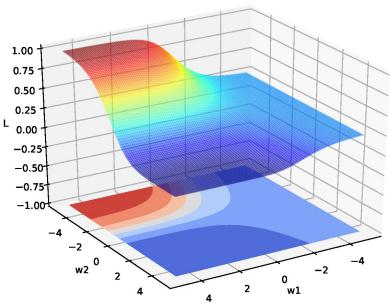  
(a) 平方误差损失

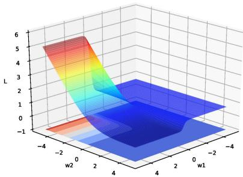  
(b) 交叉熵损失  
图 4.5 神经网络 $\hat { y } = \sigma ( w _ { 2 } \sigma ( w _ { 1 } x ) )$ 的损失函数

## 4.4.2 梯度消失与爆炸问题

在神经网络中误差反向传播的迭代公式为

$$
\begin{array} { r } { \delta ^ { ( l ) } = f _ { l } ^ { \prime } ( z ^ { ( l ) } ) \odot \left( { W ^ { ( l + 1 ) } } \right) ^ { \top } \delta ^ { ( l + 1 ) } . } \end{array}\tag{4.67}
$$

误差从输出层反向传播时，在每一层都要乘以该层的激活函数的导数.当我们使用Sigmoid型函数:Logistic函数σ(x)或Tanh函数时，其导数为

$$
\sigma ^ { \prime } ( x ) = \sigma ( x ) ( 1 - \sigma ( x ) ) \in [ 0 , 0 . 2 5 ] ,\tag{4.68}
$$

$$
\operatorname { t a n h } ^ { \prime } ( x ) = 1 - \left( \operatorname { t a n h } ( x ) \right) ^ { 2 } \in [ 0 , 1 ] .\tag{4.69}
$$

Sigmoid型函数的导数的值域都小于或等于1,如图4.6所示

  
(a) Logistic 函数的导数

  
(b) Tanh 函数的导数  
图 4.6 Sigmoid型函数的导数

由于Sigmoid型函数的饱和性，饱和区的导数更是接近于0.这样，误差经过每一层传递都会不断衰减.当网络层数很深时，梯度就会不停衰减，甚至消失，使得整个网络很难训练.这就是所谓的梯度消失问题（Vanishing GradientProblem），也称为梯度弥散问题

梯度消失曾长期是深层网络训练的核心困难之一.减轻梯度消失问题的方法有很多种.一种简单有效的方式是使用导数相对较大的激活函数，比如ReLU等；此外，合理的参数初始化、规范化方法以及残差连接等技术也都能够显著缓解这一问题.

除了梯度消失，深层网络还可能出现梯度爆炸（GradientExplosion)问题：当权重矩阵的范数大于1时，误差信号在反向传播过程中会指数级增长，导致参数更新过大甚至溢出（NaN）. 常用的缓解方法是梯度截断（Gradient Clip-ping），即当梯度范数超过预设阈值时，将梯度等比例缩小.此外，合理的参数初始化（如Xavier初始化、He初始化）对缓解梯度消失和爆炸都至关重要.

本节用最简单的网络示例说明了“深层网络为什么训练困难”，目的是建立直觉而非给出完整处方.后续将从高维参数空间的角度对这些现象做系统分析，包括鞍点的普遍性、平坦最小值与泛化的关系、局部最小解的等价性，并给出针对性的工程方法：自适应优化算法、参数初始化策略、逐层规范化、暂退法与权重衰减等.

## 4.5 激活函数与门控激活单元

前面在介绍神经元、反向传播和优化问题时，已经多次用到激活函数及其导数.现在可以从表示能力和优化性质两个角度，对常用的非线性结构作一个更系统的总结，本节将介绍两类非线性结构：一类是传统意义上的激活函数，即作用在标量净输入上的逐元素非线性映射f：R→R，如Sigmoid、ReLU、Swish、GELU等；另一类是门控激活单元，它们不是严格意义上的激活函数，而是包含若干线性变换和激活函数的复合模块，典型代表是门控线性单元（GLU）及其变体以及Maxout单元，在现代大型神经网络模型（特别是Transformer的前馈子层）中被广泛使用

一般来说，为了增强网络的表示能力和学习能力，激活函数通常希望具备以下几点性质：

（1）连续并可导（允许少数点上不可导）的非线性函数.可导的激活函数可以直接利用数值优化的方法来学习网络参数.

（2）激活函数及其导函数要尽可能的简单，有利于提高网络计算效率.

（3）激活函数的导函数的值域要在一个合适的区间内，不能太大也不能太小，否则会影响训练的效率和稳定性

下面先介绍几种常用的逐元素激活函数，再介绍门控激活单元

## 4.5.1 Sigmoid型函数

Sigmoid型函数是指一类S型曲线函数，为两端饱和函数.常用的Sigmoid型函数有Logistic 函数和 Tanh 函数.

## 数学小知识|饱和

对于函数 $f ( x )$ ,若 $x \to - \infty$ 时，其导数 $f ^ { \prime } ( x )  0$ ,则称其为左饱和.若 $x \to + \infty$ 时，其导数 $f ^ { \prime } ( x )  0$ ，则称其为右饱和.当同时满足左、右饱和时，就称为两端饱和

Logistic 函数 Logistic 函数定义为

$$
\sigma ( x ) = \frac { 1 } { 1 + \exp ( - x ) } .\tag{4.70}
$$

Logistic函数可以看成是一个“挤压”函数，把一个实数域的输入“挤压”到(0,1). 当输入值在0附近时，Sigmoid型函数近似为线性函数；当输入值靠近两端时，对输入进行抑制.输入越小，越接近于0；输入越大，越接近于1.这样的特点也和生物神经元类似，对一些输入会产生兴奋（输出为1），对另一些输入产生抑制（输出为0). 和感知器使用的阶跃激活函数相比，Logistic函数是连续可导的，其数学性质更好

因为Logistic函数的性质，使得装备了Logistic激活函数的神经元具有以下两点特点：1）在二分类任务的输出层中，其输出可以解释为类别 $y = 1$ 的条件概率，因此神经网络可以更好地和统计学习模型进行结合；2）其也可以看作一个软性门（Soft Gate），用来控制其他神经元输出信息的数量．在隐藏层中，Logistic函数更多是作为一种连续、可导的非线性变换.

Tanh函数 Tanh 函数也是一种 Sigmoid型函数.其定义为

$$
\operatorname { t a n h } ( x ) = { \frac { \exp ( x ) - \exp ( - x ) } { \exp ( x ) + \exp ( - x ) } } .\tag{4.71}
$$

Tanh函数可以看作放大并平移的Logistic函数，其值域是(—1,1).

$$
\operatorname { t a n h } ( x ) = 2 \sigma ( 2 x ) - 1 .\tag{4.72}
$$

图4.7给出了Logistic 函数和 Tanh函数的形状. Tanh函数的输出是零中心化的（Zero-Centered），而Logistic函数的输出恒大于0.非零中心化的输出会使得其后一层的神经元的输入发生偏置偏移（BiasShift），并进一步使得梯度下降的收敛速度变慢.

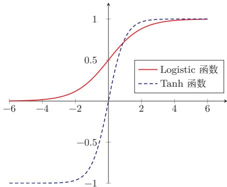  
图 4.7 Logistic 函数和 Tanh 函数

## 4.5.2 ReLU函数

ReLU（Rectified Linear Unit，修正线性单元）[Nair et al., 2010]，也叫Rectifier 函数 [Glorot et al., 2011]，是深度神经网络中常用的激活函数. ReLU实际上是一个斜坡（ramp）函数，定义为

$$
\begin{array} { r } { \mathrm { R e L U } ( x ) = \left\{ \begin{array} { l l } { x } & { x \geq 0 } \\ { 0 } & { x < 0 } \end{array} \right. } \\ { = \operatorname* { m a x } ( 0 , x ) . } \end{array}\tag{4.73}
$$

(4.74)

优点 采用ReLU的神经元只需要进行加、乘和比较的操作，计算上更加高效ReLU函数也被认为具有生物学合理性（Biological Plausibility），比如单侧抑制、宽兴奋边界（即兴奋程度可以非常高）.在生物神经网络中，同时处于兴奋状态的神经元非常稀疏，人脑中在同一时刻大概只有1%～4%的神经元处于活跃状态.Sigmoid型激活函数会导致一个非稀疏的神经网络，而ReLU却具有很好的稀疏性，大约50%的神经元会处于激活状态.

在优化方面，相比于Sigmoid型函数的两端饱和，ReLU函数为左饱和函数，且在 $x > 0$ 时导数为1，在一定程度上缓解了神经网络的梯度消失问题，加速梯度下降的收敛速度.

参见第4.4.2节.

缺点 ReLU函数的输出是非零中心化的，给后一层的神经网络引入偏置偏移，会影响梯度下降的效率．此外，ReLU神经元在训练时比较容易“死亡”．在训练时，如果参数在一次不恰当的更新后，第一个隐藏层中的某个ReLU神经元在所有的训练数据上都不能被激活，那么只要后续数据仍落在非激活区，这个神经元自身参数的梯度会持续为0，在后续训练过程中很难再恢复激活．这种现象称为死亡ReLU问题（DyingReLU Problem），并且也有可能会发生在其他隐藏层.

ReLU神经元指采用ReLU作为激活函数的神经元.

参见公式(4.40).

参见习题4-3.

在实际使用中，为了缓解上述问题，可以使用若干ReLU的变种.

## 4.5.2.1 带泄露的ReLU

带泄露的 ReLU（LeakyReLU)在输入 $x < 0$ 时，保持一个很小的梯度 $\gamma$ 这样当神经元非激活时也能有一个非零的梯度可以更新参数，降低长期不能被激活的风险 [Maas et al., 2013]. 带泄露的 ReLU的定义如下:

$$
{ \mathrm { L e a k y R e L U } } ( x ) = { \left\{ \begin{array} { l l } { x } & { { \mathrm { i f ~ } } x > 0 } \\ { \gamma x } & { { \mathrm { i f ~ } } x \leq 0 } \end{array} \right. }\tag{4.75}
$$

$$
\begin{array} { r } { = \operatorname* { m a x } ( 0 , x ) + \gamma \operatorname* { m i n } ( 0 , x ) , } \end{array}\tag{4.76}
$$

其中 $\gamma$ 是一个很小的常数，比如0.01.当 $\gamma < 1$ 时，带泄露的ReLU也可以写为

$$
\mathrm { L e a k y R e L U } ( x ) = \operatorname* { m a x } ( x , \gamma x ) ,\tag{4.77}
$$

相当于是一个比较简单的maxout单元.

参见第4.5.6节.

## 4.5.2.2 带参数的ReLU

带参数的ReLU(Parametric ReLU，PReLU)引入一个可学习的参数，不同神经元可以有不同的参数[He et al., 2015]. 对于第i个神经元，其PReLU的定义为

$$
{ \mathrm { P R e L U } } _ { i } ( x ) = { \left\{ \begin{array} { l l } { x } & { { \mathrm { i f ~ } } x > 0 } \\ { \gamma _ { i } x } & { { \mathrm { i f ~ } } x \leq 0 } \end{array} \right. }\tag{4.78}
$$

$$
\begin{array} { r } { = \operatorname* { m a x } ( 0 , x ) + \gamma _ { i } \operatorname* { m i n } ( 0 , x ) , } \end{array}\tag{4.79}
$$

其中 $\gamma _ { i }$ 为 $x \leq 0$ 时函数的斜率.因此，PReLU是非饱和函数.如果 $\gamma _ { i } = 0$ ，那么PReLU就退化为ReLU.如果 $\gamma _ { i }$ 为一个很小的常数，则PReLU可以看作带泄露的ReLU.PReLU可以允许不同神经元具有不同的参数，也可以让一组神经元共享一个参数.

## 4.5.2.3 ELU函数

ELU(Exponential Linear Unit,指数线性单元) [Clevert et al., 2016] 是一个近似的零中心化的非线性函数，其定义为

$$
{ \mathrm { E L U } } ( x ) = { \left\{ \begin{array} { l l } { x } & { { \mathrm { i f ~ } } x > 0 } \\ { \gamma ( \exp ( x ) - 1 ) } & { { \mathrm { i f ~ } } x \leq 0 } \end{array} \right. }\tag{4.80}
$$

$$
= \operatorname* { m a x } ( 0 , x ) + \operatorname* { m i n } ( 0 , \gamma ( \exp ( x ) - 1 ) ) ,\tag{4.81}
$$

其中 $\gamma \geq 0$ 是一个超参数，决定 $x \le 0$ 时的饱和曲线，并调整输出均值在0附近

参见第7.5.1节.

## 4.5.2.4 Softplus 函数

Softplus 函数[Dugas et al., 2001] 可以看作 Rectifier 函数的平滑版本，其定义为

$$
{ \mathrm { S o f t p l u s } } ( x ) = \log ( 1 + \exp ( x ) ) .\tag{4.82}
$$

Softplus 函数的导数刚好是Logistic 函数. Softplus 函数虽然也具有单侧抑制、宽兴奋边界的特性，却没有稀疏激活性.

图4.8给出了ReLU、Leaky ReLU、ELU以及 Softplus函数的示例.

  
图 4.8 ReLU、Leaky ReLU、ELU 以及 Softplus 函数

## 4.5.3 Swish 函数

Swish 函数[Ramachandran et al., 2018]是一种自门控（Self-Gated)激活函数，定义为

$$
\operatorname { s w i s h } ( x ) = x \sigma ( \beta x ) ,\tag{4.83}
$$

其中 $\sigma ( \cdot )$ 为Logistic 函数， $\beta$ 为可学习的参数或一个固定超参数. $\sigma ( \cdot ) \in ( 0 , 1 )$ 可以看作一种软性的门控机制.当 $\sigma ( \beta x )$ 接近于1时，门处于“开”状态，激活函数的输出近似于 $x$ 本身；当 $\sigma ( \beta x )$ 接近于0时，门的状态为“关”，激活函数的输出近似于0.

图4.9给出了Swish函数的示例.

当 $\beta = 0$ 时，Swish函数变成线性函数 $x / 2 .$ 当 $\beta = 1$ 时，Swish函数在 $x > 0$ 时近似线性，在 $x < 0$ 时近似饱和，同时具有一定的非单调性.当 $\beta = 1$ 时,Swish函数也称为SiLU(Sigmoid Linear Unit).当 $\beta \to + \infty$ 时， $\sigma ( \beta x )$ 趋向于离散的0-1函数，Swish函数近似为ReLU函数.因此，Swish函数可以看作线性函数和ReLU函数之间的非线性插值函数，其程度由参数 $\beta$ 控制.

SiLU是后续介绍的SwiGLU的基本构件，参见第4.5.5节.

  
图 4.9 Swish 函数

## 4.5.4 GELU函数

GELU（Gaussian Error Linear Unit，高斯误差线性单元）[Hendryckset al.,2016]也是一种通过门控机制来调整其输出值的激活函数，和Swish函数比较类似.

$$
\mathrm { { G E L U } } ( x ) = x \Phi ( x ) ,\tag{4.84}
$$

其中Φ(x)是标准正态分布N(0,1)的累积分布函数.由于高斯分布的累积分布函数为S型函数，因此GELU函数可以用Tanh函数或Logistic函数来近似，

$$
\operatorname { G E L U } ( x ) \approx 0 . 5 x { \Big ( } 1 + \operatorname { t a n h } { \big ( } { \sqrt { \frac { 2 } { \pi } } } ( x + 0 . 0 4 4 7 1 5 x ^ { 3 } ) { \big ) } { \Big ) } ,\tag{4.85}
$$

$$
\begin{array} { r } { \sharp \qquad \mathrm { G E L U } ( x ) \approx x \sigma ( 1 . 7 0 2 x ) . } \end{array}\tag{4.86}
$$

当用Logistic函数近似高斯CDF时，GELU的形式在数值上与特定参数的Swish函数接近，但二者的设计动机不同.不少框架同时提供基于误差函数(erf)的精确实现和近似实现，实际使用中可按数值效率和兼容性选择.

表4.3给出了常见激活函数及其导数.

表中的激活函数主要面向传统前馈神经网络.对于Transformer和大语言模型，其前馈子层中还经常采用SwiGLU、GeGLU等基于GLU的门控激活结构.

## 4.5.5 门控线性单元

前面介绍的激活函数都作用在神经元的标量净输入上.在向量形式的一层网络中，它们通常逐元素地应用到每个分量上.在一些现代大型神经网络模型中，还常采用另一类思路：先对输入向量做两组不同的线性变换，再用其中一组去“门控”另一组的输出，即门控线性单元（Gated Linear Unit，GLU）[Dauphin et al., 2017; Shazeer, 2020].

表4.3 常见激活函数及其导数
<table><tr><td>激活函数</td><td>函数</td><td>导数</td></tr><tr><td>Logistic 函数</td><td> $\begin{array} { r } { f ( x ) = \frac { 1 } { 1 + \exp ( - x ) } } \end{array}$ </td><td> $f ^ { \prime } ( x ) = f ( x ) ( 1 - f ( x ) )$ </td></tr><tr><td>Tanh 函数</td><td> $\begin{array} { r } { f ( x ) = \frac { \exp ( x ) - \exp ( - x ) } { \exp ( x ) + \exp ( - x ) } } \end{array}$ </td><td> $f ^ { \prime } ( x ) = 1 - f ( x ) ^ { 2 }$ </td></tr><tr><td>ReLU函数</td><td> $f ( x ) = \operatorname* { m a x } ( 0 , x )$ </td><td> $f ^ { \prime } ( x ) = I ( x > 0 )$ </td></tr><tr><td>ELU函数</td><td> $f ( x ) \ = \ \operatorname* { m a x } ( 0 , x ) \ +$   $\operatorname* { m i n } { \Big ( } 0 , \gamma { \big ( } \exp ( x ) - 1 { \big ) } { \Big ) }$ </td><td> $f ^ { \prime } ( x ) = I ( x > 0 ) + I ( x \leq 0 ) \cdot \gamma \exp ( x )$ </td></tr><tr><td>SoftPlus 函数</td><td> $f ( x ) = \log \left( 1 + \exp ( x ) \right)$ </td><td> $\begin{array} { r } { f ^ { \prime } ( x ) = \frac { 1 } { 1 + \exp ( - x ) } } \end{array}$ </td></tr><tr><td>Swish 函数</td><td> $f ( x ) = x \sigma ( \beta x )$ </td><td> $f ^ { \prime } ( x ) = \sigma ( \beta x ) + \beta x \sigma ( \beta x ) ( 1 - \sigma ( \beta x ) )$ </td></tr><tr><td>GELU函数</td><td> $f ( x ) = x \Phi ( x )$ </td><td> $f ^ { \prime } ( x ) = \Phi ( x ) + x \Phi ^ { \prime } ( x )$ </td></tr></table>

需要说明的是，GLU并不是严格意义上的激活函数，而是一个包含激活函数的复合模块它由线性变换、逐元素非线性激活和门控乘法共同组成，自身带有可学习参数，向量输入到向量输出的维度也可以不同.从功能上看，GLU更接近于传统FFN层的替代品，而不是放在FFN层内部的某个激活函数.本节将其与激活函数放在一起介绍，主要是因为它同样为网络引入非线性，并且在现代模型中常常替代“线性层+激活函数”这一经典组合.

对于输入向量x，GLU通过两组线性变换分别构造“值分支”和“门分支”，然后将二者逐元素相乘：

$$
\boldsymbol { h } = \phi ( W _ { g } \boldsymbol { x } + b _ { g } ) \odot ( W _ { v } \boldsymbol { x } + b _ { v } ) ,\tag{4.87}
$$

其中 $\phi ( \cdot )$ 为门分支上的非线性函数，表示逐元素乘法.这里 ${ \boldsymbol { W } _ { \boldsymbol { v } } } \pm \boldsymbol { b } _ { \boldsymbol { v } }$ 产生候选表示，而 $\phi ( { \pmb W } _ { g } { \pmb x } + { \pmb b } _ { g } )$ 通常取值在(0,1)之间，用来控制哪些信息可以通过.与普通逐元素激活相比，GLU不是在单一路径上直接施加非线性，而是通过“值分支”和“门分支”的耦合实现更灵活的表示.

门控后的结果通常还会再经过一个线性变换，得到模块的输出：

$$
o = W _ { o } h + b _ { o } .\tag{4.88}
$$

门分支上的函数 $\phi ( \cdot )$ 可以设为Logistic函数 $\sigma ( \cdot )$ ，也可以设为其他非线性函数，从而得到不同的GLU变体.当门分支采用Swish函数时，可得到SwiGLU函数：

$$
\mathrm { S w i G L U } ( \pmb { x } ) = \mathrm { s w i s h } ( \pmb { W _ { g } } \pmb { x } + \pmb { b _ { g } } ) \odot ( \pmb { W _ { v } } \pmb { x } + \pmb { b _ { v } } ) .\tag{4.89}
$$

当门分支采用GELU函数时，可得到GeGLU函数：

$$
\mathrm { G e G L U } ( \boldsymbol { x } ) = \mathrm { G E L U } ( W _ { g } \boldsymbol { x } + b _ { g } ) \odot ( W _ { v } \boldsymbol { x } + b _ { v } ) .\tag{4.90}
$$

https://nndl.ai/

其中SwiGLU和GeGLU都已成为Transformer前馈子层中常见的门控变体;具体模型会根据训练稳定性、计算代价和经验效果选择不同形式

## 4.5.6 Maxout 单元

与GLU类似,Maxout 单元[Goodfellow et al., 2013]也不再是作用于单个标量净输入的普通激活函数，而是一种建立在向量输入之上的更复杂非线性单元. 对于Maxout单元，其输入是上一层神经元的全部原始输出，即一个向量$\pmb { x } = [ x _ { 1 } ; x _ { 2 } ; \cdots ; x _ { D } ]$

这里x为列向量，其元素按分号隔开.

每个Maxout单元有K个权重向量 ${ \pmb w } _ { k } \in \mathbb { R } ^ { D }$ 和偏置 $b _ { k } \ ( 1 \leq k \leq K )$ .对于输入x，可以得到K个净输入 $z _ { k } , 1 \le k \le K$

$$
\boldsymbol { z } _ { k } = \boldsymbol { w } _ { k } ^ { \intercal } \boldsymbol { x } + \boldsymbol { b } _ { k } ,\tag{4.91}
$$

其中 $\pmb { w } _ { k } = [ w _ { k , 1 } , \cdots , w _ { k , D } ] ^ { \intercal }$ 为第k个权重向量.

Maxout单元的非线性函数定义为

$$
\operatorname* { m a x o u t } ( \pmb { x } ) = \operatorname* { m a x } _ { k \in [ 1 , K ] } ( z _ { k } ) .\tag{4.92}
$$

和GLU一样，Maxout单元也不是传统意义上的激活函数，而是自身带有可学习参数（K组 ${ \pmb w } _ { k }$ 和 $b _ { k }$ )的复合非线性模块；它整体学习输入到输出之间的非线性映射关系，而不是单纯对净输入做逐元素变换.Maxout单元可以看作任意凸函数的分段线性近似，并且在有限的点上是不可微的

采用 Maxout单元的神经网络也叫作Maxout网络.

## 4.6 总结和扩展阅读

前馈神经网络是深度学习中基础而重要的一类模型.它以神经元为基本组成单元，通过多层仿射变换与非线性变换的复合，实现从输入到输出的逐层映射，从表示角度看，前馈网络能够逼近复杂的非线性函数；从计算角度看，它提供了一个统一而清晰的建模框架，为后续更复杂的神经网络模型奠定了基础.

前馈神经网络在20世纪80年代后期就已被广泛使用，早期常见实现多采用两层网络结构（即一个隐藏层和一个输出层），神经元的激活函数基本上都是Sigmoid型函数，并且使用的损失函数也大多数是平方损失.虽然当时前馈神经网络的参数学习依然有很多难点，但其作为一种连接主义的典型模型，标志人工智能从高度符号化的知识期向低符号化的学习期开始转变

本章围绕前馈网络的结构、表示能力与学习方法展开.首先介绍了神经元及前馈网络的基本结构，说明了网络如何通过层与层之间的组合实现更加丰富的特征变换；随后讨论了前馈网络的通用近似能力，说明具有适当非线性激活函数的前馈网络可以逼近较广泛的目标函数，前馈神经网络作为一种能力很强的非线性模型，其能力可以由通用近似定理来保证.关于通用近似定理的详细介绍可以参考[Haykin,2009].在此基础上，本章进一步介绍了参数学习的基本目标，推导了反向传播算法，并说明了自动微分在现代深度学习框架中的作用.这些内容共同构成了前馈网络从模型定义到参数训练的完整链条.

本章还讨论了前馈网络训练中的若干典型优化问题，如梯度消失、非凸优化以及不同非线性结构对训练动态的影响.非线性结构不仅决定了网络是否具有表示能力，也会显著影响梯度传播、收敛速度和训练稳定性.从早期常用的Lo-gistic函数和双曲正切函数，到深层网络中广泛使用的ReLU及其变体、Swish、GELU等逐元素激活函数，再到大模型中常见的GLU、SwiGLU、GeGLU等门控激活单元，非线性结构的演化反映了神经网络设计从“能够表示复杂函数”逐步走向“更加易于训练、更加适合深层结构和大规模模型”的发展过程.

进一步阅读时，可以重点关注以下几个方向，第一，前馈网络表示能力的理论基础，例如通用近似定理及其在不同激活函数和不同网络宽度、深度条件下的推广结果；第二，反向传播算法与自动微分之间的关系，以及前向模式与反向模式自动微分在不同问题中的适用性；第三，激活函数与网络结构设计的演化，特别是ReLU类函数、平滑激活函数以及门控非线性结构在现代深度学习模型中的作用.后续章节中的卷积神经网络、循环神经网络以及Transformer模型，都可以看作是在本章所介绍的基本思想上的进一步发展与扩展.

TensorFlow游乐场1提供了一个非常好的神经网络训练过程可视化系统

## 习题

## 基础题

习题4-1 设第l-1层的输出为 $\pmb { a } ^ { ( l - 1 ) } \in \mathbb { R } ^ { M _ { l - 1 } }$ ，第l层的权重矩阵为 $W ^ { ( l ) } \in$ $\mathbb { R } ^ { M _ { l } \times M _ { l - 1 } }$ ，偏置为 $\pmb { b } ^ { ( l ) } \in \mathbb { R } ^ { M _ { l } }$ .请写出第l层的净输入 $z ^ { ( l ) }$ 和输出 $\mathbf { \Omega } _  \mathbf { \Omega } \mathbf { \Omega } \mathbf { \Omega } \mathbf { \Omega } \mathbf { \Omega } \mathbf { \Omega } \mathbf { \Omega } \mathbf { \Omega } \mathbf { \Omega } \mathbf { \Omega } \mathbf { \Omega } \mathbf { \Omega } \mathbf { \Omega } \mathbf { \Omega } \mathrm { ~ \Omega ~ } \mathrm { ~ \Omega ~ } \mathrm { ~ \Omega ~ } \mathrm { ~ \Omega ~ } \mathrm { ~ \Omega ~ } \mathrm { ~ \Omega ~ } \mathrm { ~ \Omega ~ } \mathrm { ~ \Omega ~ } \mathrm { ~ \Omega ~ } \mathrm { ~ \Omega ~ } \mathrm { ~ \Omega ~ } \mathrm { ~ \Omega ~ } \mathrm { ~ \Omega ~ } \mathrm { ~ \Omega ~ } \mathrm { ~ \Omega ~ }$ ，并说明各变量的维度.

习题4-2 对于一个神经元 $\sigma ( \pmb { w } ^ { \top } \pmb { x } + b )$ ，并使用梯度下降优化参数ω时，如果输入x恒大于0,其收敛速度会比零均值化的输入更慢.请说明原因.

习题4-3 试举例说明“死亡ReLU问题”，并提出至少两种缓解方法.

习题4-4 计算Swish函数和GELU函数的导数，并说明它们与ReLU函数在平滑性上的差异.

## 提高题

习题4-5 试设计一个前馈神经网络来解决XOR问题，要求该前馈神经网络具有两个隐藏神经元和一个输出神经元，并使用ReLU作为激活函数.

习题4-6 对于多分类问题，设输出层采用Softmax函数，损失函数采用交叉熵.请推导输出层误差项

$$
\delta ^ { ( L ) } = \frac { \partial \mathcal { L } } { \partial z ^ { ( L ) } }\tag{4.93}
$$

的具体表达式.

习题4-7如果限制一个神经网络的总神经元数量（不考虑输入层）为N+1，输入层大小为 $M _ { 0 }$ ，输出层大小为1，隐藏层的层数为L，每个隐藏层的神经元数量为 $\textstyle { \frac { N } { L } }$ ,试分析参数数量和隐藏层层数L的关系.

习题4-8 比较ReLU、GELU与SwiGLU三类非线性在结构形式、平滑性以及表达能力上的差异，并说明为什么Transformer和大语言模型中的前馈子层常采用门控激活结构，而不仅仅是逐元素激活函数

习题4-9 为什么在神经网络模型的正则化经验风险函数中通常不对偏置b进行正则化?

## 拓展题

习题4-10 证明通用近似定理对于具有线性输出层和至少一个使用ReLU激活函数的隐藏层组成的前馈神经网络，也都是适用的.

习题4-11 将单样本前馈神经网络的前向传播和反向传播公式推广到小批量情形,写出 $\pmb { Z } ^ { ( l ) } , \pmb { A } ^ { ( l ) }$ 以及参数梯度的矩阵形式

习题4-12 为什么在用反向传播算法进行参数学习时要采用随机参数初始化的方式，而不是直接令 $\begin{array} { r } { W = 0 , b = 0 ? } \end{array}$

习题4-13 梯度消失问题是否可以通过单纯增加学习率来缓解?请说明理由.

## 参考文献

BISHOP C M, 2007. Information science and statistics: pattern recognition and machine learning[M]. 5th ed. Springer.

CLEVERT D A, UNTERTHINER T, HOCHREITER S, 2016. Fast and accurate deep network learning by exponential linear units (elus)[C]//Proceedings of 4th International Conference on Learning Representations.

CYBENKO G, 1989. Approximations by superpositions of a sigmoidal function[J]. Mathematics of Control, Signals and Systems, 2: 183-192.

DAUPHIN Y N, FAN A, AULI M, et al., 2017. Language modeling with gated convolutional networks[C]//Proceedings of 34th International Conference on Machine Learning. 933-941.

DUGAS C, BENGIO Y, BÉLISLE F, et al., 2001. Incorporating second-order functional knowledge for better option pricing[J]. Advances in Neural Information Processing Systems: 472- 478.

FUNAHASHI K I, NAKAMURA Y, 1993. Approximation of dynamical systems by continuous time recurrent neural networks[J]. Neural networks, 6(6): 801-806.

GLOROT X, BORDES A, BENGIO Y, 2011. Deep sparse rectifier neural networks[C]// Proceedings of International Conference on Artificial Intelligence and Statistics. 315-323.

GOODFELLOW I J, WARDE-FARLEY D, MIRZA M, et al., 2013. Maxout networks[C]// Proceedings of the International Conference on Machine Learning. 1319-1327.

HAYKIN S, 1994. Neural networks: a comprehensive foundation: macmillan college publishing company[M]. New York.

HAYKIN S, 2009. Neural networks and learning machines[M]. 3rd ed. Pearson.

HE K, ZHANG X, REN S, et al., 2015. Delving deep into rectifiers: surpassing human-level performance on imagenet classification|C//Proceedings of the IEEE International Conference on Computer Vision. 1026-1034.

HENDRYCKS D, GIMPEL K, 2016. Gaussian error linear units (GELUs)[A/OL]. arXiv (2016). https://arxiv.org/abs/1606.08415.

HORNIK K, STINCHCOMBE M, WHITE H, 1989. Multilayer feedforward networks are universal approximators[J]. Neural networks, 2(5): 359-366.

MAAS A L, HANNUN A Y, NG A Y, 2013. Rectifier nonlinearities improve neural network acoustic models[C]//Proceedings of the International Conference on Machine Learning.

MCCULLOCH W S, PITTS W, 1943. A logical calculus of the ideas immanent in nervous activity[J]. The bulletin of mathematical biophysics, 5(4): 115-133.

NAIR V, HINTON G E, 2010. Rectified linear units improve restricted boltzmann machines [C]//Proceedings of the International Conference on Machine Learning. 807-814.

RAMACHANDRAN P, ZOPH B, LE Q V, 2018. Searching for activation functions[C]// Proceedings of 6th International Conference on Learning Representations.

SHAZEER N, 2020. GLU variants improve transformer[A/OL]. arXiv (2020). https://arxiv. org/abs/2002.05202.

## 第5章 卷积神经网络

一切都应该尽可能地简单，但不能过于简单.

——艾伯特·爱因斯坦(Albert Einstein)

卷积神经网络（Convolutional Neural Network,CNN)是一种具有局部连接、权重共享等结构先验的深层前馈神经网络.

卷积神经网络最早主要用于处理图像信息.在用全连接前馈网络来处理图像时，会存在以下两个问题：

（1）参数太多：如果输入图像大小为 $1 0 0 \times 1 0 0 \times 3$ （即图像高度为100、宽度为100、颜色通道数为3），在全连接前馈网络中，第一个隐藏层的每个神经元到输入层都有 $1 0 0 \times 1 0 0 \times 3 = 3 0 0 0 0$ 个互相独立的连接，每个连接都对应一个权重参数.假设隐藏层仅有256个神经元，参数量就已达到约7.68百万，随着隐藏层数和神经元数量的增多，参数规模会急剧增加.这会导致网络训练效率较低，也更容易出现过拟合

（2）没有利用图像的局部结构先验：自然图像中的像素通常具有较强的局部相关性，同一种局部模式也可能出现在图像的不同位置，全连接前馈网络没有显式利用这种空间局部结构和平移先验，因此统计效率较低；为了增强模型对平移、缩放、旋转等变化的鲁棒性，通常还需要结合数据增强等方法.

卷积神经网络是受生物学上感受野机制的启发而提出的.感受野（ReceptiveField）机制主要是指听觉、视觉等神经系统中一些神经元的特性，即神经元只接受其所支配的刺激区域内的信号.在视觉神经系统中，视觉皮层中的神经细胞的输出依赖于视网膜上的光感受器.视网膜上的光感受器受刺激兴奋时，将神经冲动信号传到视觉皮层，但不是所有视觉皮层中的神经元都会接受这些信号.一个神经元的感受野是指视网膜上的特定区域，只有这个区域内的刺激才能够激活该神经元.

经典的卷积神经网络通常由卷积层、汇聚层和全连接层构成；而现代卷积神经网络更常见的结构是由若干卷积块堆叠而成，并结合规范化、残差连接、步长卷积、全局平均汇聚等组件.卷积神经网络有三个核心的结构特性：局部连接、权重共享以及汇聚/下采样.其中，卷积运算更直接地带来的是对平移的等变性，而一定程度上的平移不变性通常来自卷积、汇聚、步长、全局平均汇聚以及数据增强等机制的共同作用；对于尺度和旋转变化的鲁棒性，则往往需要借助数据增强或专门的结构设计.和全连接前馈网络相比，卷积神经网络的参数通常更少，也更适合建模图像中的空间结构.

## 数学小知识|等变性与不变性

对于函数f和变换T,若 $f ( T ( \pmb { x } ) ) = T ( f ( \pmb { x } ) )$ ，即变换作用在输入上的效果会“传递”到输出上，则称f对T具有等变性（Equivariance).例如，图像平移后做卷积等价于先做卷积再平移输出.若 $f ( T ( \pmb { x } ) ) = f ( \pmb { x } )$ 即变换不改变输出，则称f对T具有不变性（Invariance).例如，无论目标出现在图像哪个位置，分类结果不变.卷积运算本身具有平移等变性而分类任务所需的平移不变性通常来自汇聚操作、数据增强、全局汇聚等多种机制的共同作用.

## 5.1 卷积

## 5.1.1 卷积的定义

卷积（Convolution），也叫褶积，是分析数学中一种重要的运算.在信号处理或图像处理中，经常使用一维或二维卷积.

## 5.1.1.1 一维卷积

这里我们只考虑离散序列的情况.

一维卷积经常用在信号处理中，用于计算信号的延迟累积.假设一个信号发生器每个时刻t产生一个信号 $x _ { t }$ ，其信息的衰减率为 $w _ { k }$ ，即在k一1个时间步长后，信息为原来的 $w _ { k }$ 倍.假设 $w _ { 1 } = 1 , w _ { 2 } = 1 / 2 , w _ { 3 } = 1 / 4$ ,那么在时刻t收到的信号 $y _ { t }$ 为当前时刻产生的信息和以前时刻延迟信息的叠加，

$$
y _ { t } = 1 \times x _ { t } + 1 / 2 \times x _ { t - 1 } + 1 / 4 \times x _ { t - 2 }\tag{5.1}
$$

$$
= w _ { 1 } \times x _ { t } + w _ { 2 } \times x _ { t - 1 } + w _ { 3 } \times x _ { t - 2 }\tag{5.2}
$$

$$
= \sum _ { k = 1 } ^ { 3 } w _ { k } x _ { t - k + 1 } .\tag{5.3}
$$

我们把 $w _ { 1 } , w _ { 2 } ,$ …称为滤波器（Filter）或卷积核（ConvolutionKernel）.卷积本质上可以看作一种局部加权求和运算.假设滤波器长度为K，它和一个信号序列 $x _ { 1 } , x _ { 2 } , \cdots$ 的卷积为

$$
y _ { t } = \sum _ { k = 1 } ^ { K } w _ { k } x _ { t - k + 1 } .\tag{5.4}
$$

为了简单起见，这里假设卷积的输出 $y _ { t }$ 的下标t从K开始.

信号序列x和滤波器w的卷积定义为

$$
y = { w } * x ,\tag{5.5}
$$

其中\*表示卷积运算.一般情况下滤波器的长度K远小于信号序列x的长度.

我们可以设计不同的滤波器来提取信号序列的不同特征.比如，当令滤波器${ \pmb w } = [ 1 / K , \cdots , 1 / K ]$ 时，卷积相当于信号序列的简单移动平均（窗口大小为K)；当令滤波器 $\pmb { w } = [ 1 , - 2 , 1 ]$ 时，可以近似实现对信号序列的二阶微分，即

$$
x ^ { \prime \prime } ( t ) = x ( t + 1 ) + x ( t - 1 ) - 2 x ( t ) .\tag{5.6}
$$

移动平均（MovingAverage,MA)是在分析时间序列数据时的一种简单平滑技术，能有效地消除数据中的随机波动.

这里将 $x ( t ) = x _ { t }$ 看作关于时间t的函数.参见习题5-5.

图5.1给出了两个滤波器的一维卷积示例．可以看出，两个滤波器分别提取了输入序列的不同特征.滤波器 $\pmb { w } = [ 1 / 3 , 1 / 3 , 1 / 3 ]$ 可以检测信号序列中的低频信息，而滤波器 $\pmb { w } = [ 1 , - 2 , 1 ]$ 可以检测信号序列中的高频信息.在传统信号处理或图像处理中，这些滤波器往往由人工设计；而在卷积神经网络中，卷积核通常作为可学习参数从数据中自动学习得到.

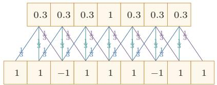  
(a) 滤波器[1/3,1/3,1/3]

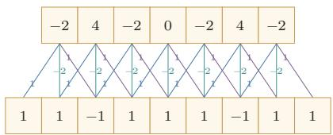  
图 5.1 一维卷积示例  
(b) 滤波器 [1,-2,1]

这里的高频和低频指 信号变化的强烈程度.

下层为输入信号序列，上层为卷积结果.连接边上的数字为滤波器中的权重.

左图的卷积结果为近似值.

## 5.1.1.2 二维卷积

卷积也经常用在图像处理中.因为图像为一个二维结构，所以需要将一维卷积进行扩展.给定一个图像 $\pmb { X } \in \mathbb { R } ^ { M \times N }$ 和一个滤波器 $\pmb { W } \in \mathbb { R } ^ { U \times V }$ ，一般$U \ll M , V \ll N$ ,其卷积为

$$
y _ { i j } = \sum _ { u = 1 } ^ { U } \sum _ { v = 1 } ^ { V } w _ { u v } x _ { i - u + 1 , j - v + 1 } .\tag{5.7}
$$

为了简单起见，这里假设卷积的输出 $y _ { i j }$ 的下标 (i, j) 从(U, V)开始.

输入信息X和滤波器W的二维卷积定义为

$$
Y = W * X ,\tag{5.8}
$$

其中\*表示二维卷积运算.图5.2给出了二维卷积示例.

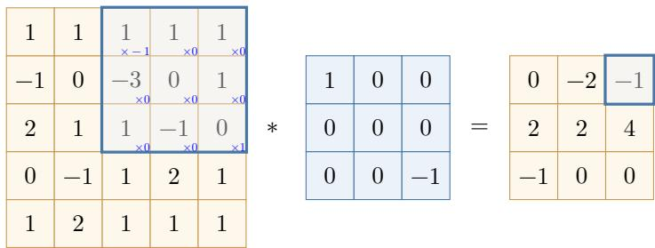  
图 5.2 二维卷积示例

根据卷积定义，左图的计算需要进行卷积核翻转.

在图像处理中常用的均值滤波（MeanFilter）就是一种二维卷积，将当前位置的像素值设为滤波器窗口中所有像素的平均值，即 $\begin{array} { r } { w _ { u v } = \frac { 1 } { U V } } \end{array}$

在图像处理中，卷积经常作为特征提取的有效方法.一幅图像在经过卷积操作后得到结果称为特征图（FeatureMap）.在卷积神经网络中，卷积的目标不再是预先设计滤波器，而是通过任务驱动的训练自动学习适合当前任务的卷积核.图5.3给出在图像处理中几种常用的滤波器，以及其对应的特征图.图中最上面的滤波器是常用的高斯滤波器，可以用来对图像进行平滑去噪：中间和最下面的滤波器可以用来提取边缘特征

  
图 5.3 图像处理中几种常用的滤波器示例

## 5.1.2 互相关

在机器学习和图像处理领域，卷积的主要功能是在一个图像（或某种特征）上滑动一个卷积核（即滤波器），通过卷积操作得到一组新的特征.在计算卷积的过程中，需要进行卷积核翻转，在具体实现上，一般会以互相关操作来代替卷积，从而会减少一些不必要的操作或开销.互相关（Cross-Correlation）是一个衡量两个序列相关性的函数，通常是用滑动窗口的点积计算来实现.给定一个图像 $\pmb { X } \in \mathbb { R } ^ { M \times N }$ 和卷积核 $\pmb { W } \in \mathbb { R } ^ { U \times V }$ ,它们的互相关为

翻转指从两个维度(从上到下、从左到右)颠倒次序，即旋转180度.

$$
y _ { i j } = \sum _ { u = 1 } ^ { U } \sum _ { v = 1 } ^ { V } w _ { u v } x _ { i + u - 1 , j + v - 1 } .\tag{5.9}
$$

和公式(5.7)对比可知，互相关和卷积的区别仅仅在于卷积核是否进行翻转.因此互相关也可以称为不翻转卷积

互相关和卷积的区别也可以理解为图像是否进行翻转.

公式(5.9) 可以表述为

$$
Y = W \otimes X\tag{5.10}
$$

$$
= \mathrm { r o t 1 8 0 } ( W ) * X ,\tag{5.11}
$$

其中 $\otimes$ 表示互相关运算，rot180(·)表示旋转180度， $\pmb { Y } \in \mathbb { R } ^ { M - U + 1 , N - V + 1 }$ 为输出矩阵.

在神经网络中使用卷积是为了进行特征抽取，卷积核是否进行翻转和其特征抽取的能力无关.特别是当卷积核是可学习的参数时，卷积和互相关在表示能力上是等价的.因此，为了实现上（或描述上）的方便起见，我们通常用互相关来代替卷积.事实上，很多深度学习工具中的“卷积”操作，其实现实际上都是互相关.

## 5.1.3 卷积的变种

在卷积的标准定义基础上，还可以引入卷积核的滑动步长和零填充来增加卷积的多样性，可以更灵活地进行特征抽取

步长（Stride）是指卷积核在滑动时的时间间隔.图5.4给出了步长与零填充两种卷积变种的示例，其中图5.4a为步长为2的情形.

零填充（Zero Padding)是在输入向量两端进行补零.图5.4b给出了输入的两端各补一个零后的卷积示例.

在本书之后描述中，除非特别声明，卷积一般指“互相关”.卷积符号用⊗来表示，即不翻转卷积.真正的卷积用\*来表示.

从尺寸变化的角度看，转置卷积可以对应于普通卷积步长大于1时的逆向尺寸变化，参见第5.5.1节.

(a) 步长 S = 2  
  
(b) 零填充 P = 1  
图 5.4 卷积的步长和零填充（滤波器为[-1,0,1])

假设卷积层的输入神经元个数为M，卷积大小为K，步长为S，在输入两端各填补P个0(zero padding),那么该卷积层的输出长度为

$$
M ^ { \prime } = \left\lfloor { \frac { M - K + 2 P } { S } } \right\rfloor + 1 .\tag{5.12}
$$

通常可以通过选择合适的卷积大小、步长和零填充，使输出长度为整数.

二维卷积时，如果输入大小为 $M \times N$ ,卷积核大小为 $U \times V$ ，在两个方向上的步长分别为 $S _ { h } , S _ { w }$ ,零填充分别为 $P _ { h } , P _ { w }$ ，则输出大小为

$$
M ^ { \prime } = \left\lfloor \frac { M - U + 2 P _ { h } } { S _ { h } } \right\rfloor + 1 , \qquad N ^ { \prime } = \left\lfloor \frac { N - V + 2 P _ { w } } { S _ { w } } \right\rfloor + 1 .\tag{5.13}
$$

一般常用的卷积有以下三类：

（1）窄卷积（Narrow Convolution）：步长 S = 1,两端不补零P = 0,卷积后输出长度为 M - K + 1.

(2) 宽卷积（Wide Convolution):步长 S = 1,两端补零 P = K − 1,卷 积后输出长度 M + K − 1.

在早期文献中，卷积常默认为窄卷积；在许多深度学习文献和框架说明中，卷积常默认使用等宽设置.更多的卷积变种参见第5.5节.

(3）等宽卷积（Equal-Width Convolution）:步长 $S = 1$ ，当卷积核大小K为奇数时，两端补零 $P = ( K - 1 ) / 2$ ，卷积后输出长度为M. 图5.4b就是一个等宽卷积示例.当K为偶数时，通常需要使用非对称的零填充来实现等宽卷积.

## 5.1.4 卷积的数学性质

卷积有很多很好的数学性质．在本节中，我们介绍一些二维卷积的数学性质，这些数学性质同样可以适用到一维卷积的情况

## 5.1.4.1 交换性

如果不限制两个卷积信号的长度，真正的翻转卷积是具有交换性的，即 $^ { \textbf { \em x } * }$ $y = y * x .$ 对于互相关的“卷积”，也同样具有一定的“交换性”.

我们先介绍宽卷积（WideConvolution）的定义.给定一个二维图像 $\boldsymbol { X } \in$ $\mathbb { R } ^ { M \times N }$ 和一个二维卷积核 $\pmb { W } \in \mathbb { R } ^ { U \times V }$ ,对图像X进行零填充，两端各补U-1和V-1个零，得到全填充（Full Padding）的图像 $\tilde { \pmb { X } } \in \mathbb { R } ^ { ( M + 2 U - 2 ) \times ( N + 2 V - 2 ) }$ . 图像X和卷积核W的宽卷积定义为

$$
W \tilde { \otimes } X \triangleq W \otimes \tilde { X } ,\tag{5.14}
$$

其中 $\tilde { \otimes }$ 表示宽卷积运算.

当输入信息和卷积核有固定长度时，它们的宽卷积依然具有交换性，即

参见习题5-10.

$$
\mathrm { r o t 1 8 0 } ( W ) \tilde { \otimes } X = \mathrm { r o t 1 8 0 } ( X ) \tilde { \otimes } W ,\tag{5.15}
$$

其中rot180(·)表示旋转180度.也就是说，卷积层的参数梯度可以看作“输入与输出梯度的互相关”，而输入梯度可以看作“旋转后的卷积核与输出梯度的宽互相关”.

## 5.1.4.2 导数

假设 $\pmb { Y } = \pmb { W } \otimes \pmb { X }$ ,其中 $\pmb { X } \in \mathbb { R } ^ { M \times N } , \pmb { W } \in \mathbb { R } ^ { U \times V } , \pmb { Y } \in \mathbb { R } ^ { ( M - U + 1 ) \times ( N - V + 1 ) }$ 函数 $f ( \mathbf { Y } ) \in \mathbb { R }$ 为一个标量函数，则

$$
\frac { \partial f ( \pmb { Y } ) } { \partial w _ { u v } } = \sum _ { i = 1 } ^ { M - U + 1 } \sum _ { j = 1 } ^ { N - V + 1 } \frac { \partial y _ { i j } } { \partial w _ { u v } } \frac { \partial f ( \pmb { Y } ) } { \partial y _ { i j } }\tag{5.16}
$$

$$
= \sum _ { i = 1 } ^ { M - U + 1 } \sum _ { j = 1 } ^ { N - V + 1 } x _ { i + u - 1 , j + v - 1 } \frac { \partial f ( \pmb { Y } ) } { \partial y _ { i j } }\tag{5.17}
$$

$$
\begin{array} { r l } { { } } & { { y _ { i j } } } \\ { \displaystyle \sum _ { u , v } w _ { u v } x _ { i + u - 1 , j + v - 1 } . } \end{array}
$$

$$
= \sum _ { i = 1 } ^ { M - U + 1 } \sum _ { j = 1 } ^ { N - V + 1 } \frac { \partial f ( \pmb { Y } ) } { \partial y _ { i j } } x _ { u + i - 1 , v + j - 1 } .\tag{5.18}
$$

从公式(5.18)可以看出， $f ( \mathbf { Y } )$ 关于W的偏导数可以写成输入X和输出梯度 $\frac { \partial f ( \pmb { Y } ) } { \partial \pmb { Y } }$ 的互相关

$$
{ \frac { \partial f ( \boldsymbol { Y } ) } { \partial W } } = { \frac { \partial f ( \boldsymbol { Y } ) } { \partial \boldsymbol { Y } } } \otimes \boldsymbol { X } .\tag{5.19}
$$

即参数梯度等于上游梯度与输入的互相关操作.

同理得到，

$$
\begin{array} { r l } & { \displaystyle \frac { \partial f ( \pmb { Y } ) } { \partial x _ { s t } } = \sum _ { i = 1 } ^ { M - U + 1 } \sum _ { j = 1 } ^ { N - V + 1 } \frac { \partial y _ { i j } } { \partial x _ { s t } } \frac { \partial f ( \pmb { Y } ) } { \partial y _ { i j } } } \\ & { \displaystyle = \sum _ { i = 1 } ^ { M - U + 1 } \sum _ { j = 1 } ^ { N - V + 1 } w _ { s - i + 1 , t - j + 1 } \frac { \partial f ( \pmb { Y } ) } { \partial y _ { i j } } , } \end{array}\tag{5.20}
$$

(5.21)

其中当 $( s - i + 1 ) < 1$ ,或 $( s - i + 1 ) > U$ ,或 $( t - j + 1 ) < 1$ ,或 $( t - j + 1 ) > V$ 时， $w _ { s - i + 1 , t - j + 1 } = 0$ .即相当于对W进行了 $P = ( M - U , N - V )$ 的零填充.

从公式(5.21)可以看出，f(Y)关于X的偏导数为卷积核W和输出梯度$\frac { \partial f ( \pmb { Y } ) } { \partial \pmb { Y } }$ 的宽卷积.公式(5.21)中的卷积是真正的卷积而不是互相关，为了一致性，我们用互相关的“卷积”来写，即

$$
\frac { \partial f ( \pmb { Y } ) } { \partial \pmb { X } } = \mathrm { r o t } 1 8 0 ( \frac { \partial f ( \pmb { Y } ) } { \partial \pmb { Y } } ) \tilde { \otimes } \pmb { W }\tag{5.22}
$$

$$
= \mathrm { r o t } 1 8 0 ( W ) \tilde { \otimes } \frac { \partial f ( { \cal Y } ) } { \partial { \cal Y } } ,\tag{5.23}
$$

其中rot180(·)表示旋转180度.即输入梯度等于将卷积核翻转180度后与上游梯度做宽卷积，这与全连接层中前向/反向对应矩阵转置的关系完全类比.

## 5.2 卷积神经网络

卷积神经网络一般由卷积层、汇聚层以及顶层分类器构成.经典卷积神经网络在顶部常使用一个或多个全连接层，而现代卷积神经网络更常见的做法是使用若干卷积块进行特征抽取，再通过全局平均汇聚和一个较小的线性分类器完成预测.

## 5.2.1 用卷积来代替全连接

在全连接前馈神经网络中，如果第l层有 $M _ { l }$ 个神经元，第l—1层有 $M _ { l - 1 }$ 个神经元，那么连接边有 $M _ { l } \times M _ { l - 1 }$ 个，也就是权重矩阵有 $M _ { l } \times M _ { l - 1 }$ 个参数.当$M _ { l }$ 和 $M _ { l - 1 }$ 都很大时，权重矩阵的参数非常多，训练效率会很低

如果采用卷积来代替全连接，第l层的净输入 $z ^ { ( l ) }$ 为第l－1层活性值 $\mathbf { \Delta } \mathbf { a } ^ { ( l - 1 ) }$ 和卷积核 $\pmb { w } ^ { ( l ) } \in \mathbb { R } ^ { K }$ 的卷积，即

$$
\pmb { z } ^ { ( l ) } = \pmb { w } ^ { ( l ) } \otimes \pmb { a } ^ { ( l - 1 ) } + b ^ { ( l ) } ,\tag{5.24}
$$

其中卷积核 $\pmb { w } ^ { ( l ) } \in \mathbb { R } ^ { K }$ 为可学习的权重向量， $b ^ { ( l ) } \in \mathbb { R }$ 为可学习的偏置.

根据卷积的定义，卷积层有两个很重要的性质：

局部连接 在卷积层（假设是第l层）中的每一个神经元都只和前一层（第l—1层）中某个局部窗口内的神经元相连，构成一个局部连接网络．如图5.5所示，与全连接层（图5.5a）相比，卷积层（图5.5b）和前一层之间的连接数大大减少，由原来的 $M _ { l } \times M _ { l - 1 }$ 个连接变为 $M _ { l } \times K$ 个连接，K为卷积核大小.除了减少参数量，更重要的是它显式利用了输入数据中的局部结构先验.

权重共享 从公式(5.24)可以看出，作为参数的卷积核 $\mathbf { \nabla } w ^ { ( l ) }$ 对于第l层的所有神经元都是相同的.如图5.5b中，所有同颜色连接上的权重是相同的．权重共享可以理解为一个卷积核在整个输入空间上寻找同一种局部模式，因此如果要提取多种特征，就需要使用多个不同的卷积核.

  
(a) 全连接层

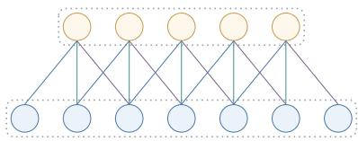  
(b) 卷积层  
图 5.5 全连接层和卷积层对比

由于局部连接和权重共享，卷积层的参数只有一个K维的权重 $\mathbf { \boldsymbol { w } } ^ { ( l ) }$ 和1维的偏置 $b ^ { ( l ) }$ ,共 $K + 1$ 个参数.参数个数和神经元数量无关.此外，第l层神经元的个数不是任意选择的，而是满足 $M _ { l } = M _ { l - 1 } - K + 1$ 因此，卷积不仅减少了参数量，也把“同一种局部模式可能出现在不同位置”这一先验显式编码进了网络结构中.

这里默认步长为1，无零填充.

## 5.2.2 卷积层

卷积层的作用是提取一个局部区域的特征，不同的卷积核相当于不同的特征提取器.上一节中描述的卷积层神经元和全连接网络一样都是一维结构.由于卷积网络主要应用在图像处理上，而图像为二维结构，因此为了更充分地利用图像的局部信息，通常将神经元组织为三维结构的神经层，其大小为高度×宽度×深度，由多个二维特征图构成.

  
图5.6 卷积层的三维结构表示

特征图（FeatureMap）为一幅图像（或其他特征图）在经过卷积提取后得到的特征，每个特征图可以看作一类被抽取出来的图像特征.为了提高卷积网络的表示能力，可以在每一层使用多个不同的特征图，以更好地表示图像的特征.

在输入层，特征图就是图像本身，如果是灰度图像，就只有一个特征图，输入层的深度 $D = 1$ ；如果是彩色图像，则分别有RGB三个颜色通道的特征图，输入层的深度D = 3.

不失一般性，假设一个卷积层的结构如下：

（1）输入特征图组： $\mathcal { X } \in \mathbb { R } ^ { M \times N \times D }$ 为三维张量，其中每个切片矩阵 $\pmb { X } ^ { ( d ) } \in$ R $M \times N$ 为一个输入特征图， $. 1 \leq d \leq D$

（2）输出特征图组： $ { \mathcal { Y } } \in \mathbb { R } ^ { M ^ { \prime } \times N ^ { \prime } \times P }$ 为三维张量，其中每个切片矩阵$\pmb { Y } ^ { ( p ) } \in \mathbb { R } ^ { M ^ { \prime } \times N ^ { \prime } }$ 为一个输出特征图， $1 \leq p \leq P$

（3）卷积核： $\mathcal { W } \in \mathbb { R } ^ { U \times V \times P \times D }$ 为四维张量，其中每个切片矩阵 $W ^ { ( p , d ) } \in$ R $U \times V$ 为一个二维卷积核， $1 \leq p \leq P , 1 \leq d \leq D$

图5.6给出卷积层的三维结构表示.

为了计算输出特征图 $\mathbf { \Delta } _ { Y ^ { ( p ) } }$ ，用卷积核 $W ^ { ( p , 1 ) } , W ^ { ( p , 2 ) } , \cdots , W ^ { ( p , D ) }$ 分别对输入特征图 $\pmb { X } ^ { ( 1 ) } , \pmb { X } ^ { ( 2 ) } , \cdots , \pmb { X } ^ { ( D ) }$ 进行卷积，然后将卷积结果相加，并加上一个标量偏置 $b ^ { ( p ) }$ 得到卷积层的净输入 $Z ^ { ( p ) }$ ，再经过非线性激活函数后得到输出特征图$\mathbf { \Delta } _ { Y ^ { ( p ) } }$

这里净输入是指没有经过非线性激活函数的净活性值(Net Ac-tivation).

$$
\pmb { Z } ^ { ( p ) } = \sum _ { d = 1 } ^ { D } \pmb { W } ^ { ( p , d ) } \otimes \pmb { X } ^ { ( d ) } + b ^ { ( p ) } ,\tag{5.25}
$$

$$
Y ^ { ( p ) } = f ( Z ^ { ( p ) } ) ,\tag{5.26}
$$

其中 $f ( \cdot )$ 为非线性激活函数，一般可取ReLU函数.这里的偏置 $b ^ { ( p ) }$ 是一个标量，它在空间维度上会广播到输出特征图的每个位置.

整个计算过程如图5.7所示.如果希望卷积层输出P个特征图，可以将上述计算过程重复P次，得到P个输出特征图 ${ \pmb Y } ^ { ( 1 ) } , { \pmb Y } ^ { ( 2 ) } , \cdots , { \pmb Y } ^ { ( P ) }$

  
图5.7 卷积层中从输入特征图组X到输出特征图 $Y ^ { \left( p \right) }$ 的计算示例

在输入为 $\mathcal { X } \in \mathbb { R } ^ { M \times N \times D }$ 、输出为 $\mathcal { Y } \in \mathbb { R } ^ { M ^ { \prime } \times N ^ { \prime } \times P }$ 的卷积层中，每一个输出特征图都需要D个卷积核以及一个偏置.假设每个卷积核的大小为 $U \times V$ ,那么共需要

$$
P \times D \times ( U \times V ) + P\tag{5.27}
$$

个参数.注意参数量和输入特征图的空间大小 $M \times N$ 无关，只与卷积核大小、输入通道数和输出通道数有关.

当卷积核大小为 $1 \times 1$ 时，卷积主要在通道维度上进行线性变换，因此常用于通道数的升维、降维或不同通道特征的重组.在很多现代卷积网络中， $1 \times 1$ 卷积是一个重要的基本组件.

## 5.2.3 汇聚层

汇聚层（Pooling Layer)也叫子采样层（Subsampling Layer），其主要作用是对局部区域进行汇总和下采样，从而降低空间分辨率、减少计算量、扩大后续单元的感受野，并在一定程度上提升模型对局部平移扰动的鲁棒性.

卷积层虽然可以显著减少网络中连接边的数量，但特征图组中的神经元个数并没有显著减少．如果后面接一个分类器，分类器的输入维数依然很高，很容易出现过拟合．为了解决这个问题，可以在卷积层之后加上一个汇聚层，从而降低特征维数.

假设汇聚层的输入特征图组为 $\mathcal { X } ~ \in ~ \mathbb { R } ^ { M \times N \times D }$ .对于其中每一个特征图$\pmb { X } ^ { ( d ) } \in \mathbb { R } ^ { M \times N } , 1 \le d \le D$ ，将其划分为很多区域 $R _ { m , n } ^ { ( d ) } , 1 \leq m \leq M ^ { \prime } , 1 \leq$

减少特征维数也可以通过增加卷积步长来实现.

$n \leq N ^ { \prime }$ ，这些区域可以重叠，也可以不重叠.汇聚(Pooling）是指对每个区域进行下采样（(Downsampling）得到一个值，作为这个区域的概括.

常用的汇聚函数有两种：

（1）最大汇聚（Maximum Pooling或Max Pooling）：对于一个区域$R _ { m , n } ^ { ( d ) }$ ,选择这个区域内所有神经元的最大活性值作为这个区域的表示，即

$$
y _ { m , n } ^ { ( d ) } = \operatorname* { m a x } _ { i \in R _ { m , n } ^ { ( d ) } } x _ { i } ,\tag{5.28}
$$

其中 $x _ { i }$ 为区域 $R _ { m , n } ^ { ( d ) }$ 内每个神经元的活性值

（2）平均汇聚（MeanPooling）:一般取区域内所有神经元活性值的平均值,即

$$
y _ { m , n } ^ { ( d ) } = \frac { 1 } { | R _ { m , n } ^ { ( d ) } | } \sum _ { i \in R _ { m , n } ^ { ( d ) } } x _ { i } .\tag{5.29}
$$

对每一个输入特征图 $\pmb { X } ^ { ( d ) }$ 的 $M ^ { \prime } \times N ^ { \prime }$ 个区域进行子采样，得到汇聚层的输出特征图 ${ \cal Y } ^ { ( d ) } = \{ y _ { m , n } ^ { ( d ) } \} , 1 \le m \le M ^ { \prime } , 1 \le n \le N ^ { \prime }$

图5.8给出了采用最大汇聚进行子采样操作的示例．可以看出，汇聚层不但可以有效地减少神经元数量，还可以使网络对一些小的局部形态变化具有更强的鲁棒性，并拥有更大的感受野

  
图5.8 汇聚层中最大汇聚过程示例

常见现代卷积网络中的汇聚层通常仅包含下采样操作.但在早期的一些卷积网络（比如LeNet-5）中，有时也会在汇聚层使用非线性激活函数，比如

$$
\begin{array} { r } { { \cal Y } ^ { \prime ( d ) } = f \left( w ^ { ( d ) } { \cal Y } ^ { ( d ) } + b ^ { ( d ) } \right) , } \end{array}\tag{5.30}
$$

其中 $\mathbf { \nabla } Y ^ { \prime ( d ) }$ 为汇聚层的输出， $f ( \cdot )$ 为非线性激活函数， $w ^ { ( d ) }$ 和 $b ^ { ( d ) }$ 为可学习的标量权重和偏置.

典型的汇聚层是将每个特征图划分为2×2大小的不重叠区域，然后使用最大汇聚方式进行下采样．汇聚层也可以看作一个特殊的卷积层：卷积核大小为$K \times K$ ,步长为 $S \times S$ ,卷积核对应的运算为max函数或mean函数.过大的采样区域会急剧减少神经元数量，也会造成过多的信息损失.

除了局部汇聚外，在现代卷积网络中还经常使用全局平均汇聚（GlobalAv-eragePooling，GAP）．它将每个通道上的所有空间位置取平均，从而把一个$M \times N \times D$ 的特征图组压缩为一个D维向量.GAP常用于替代大规模全连接层，以减少参数量并降低过拟合风险.

## 5.2.4 卷积网络的整体结构

一个典型的卷积网络通常由多个卷积块堆叠而成，并在顶部接分类器.经典卷积网络常采用“卷积层-汇聚层-全连接层”的组合方式；而现代卷积网络更常见的结构是：若干卷积块用于特征抽取，下采样通过汇聚层或步长卷积实现，最后使用全局平均汇聚和线性分类器输出结果.

常见卷积网络整体结构如图5.9所示.一个卷积块通常由若干卷积层以及非线性激活、下采样等操作构成.为了改善深层卷积网络的优化性质，通常也会在卷积层之间加入批量规范化层和残差连接，以提高训练稳定性.

残差连接参见第5.4.5节.

一个卷积网络中可以堆叠多个连续的卷积块，然后在后面接一个较小的分类模块.

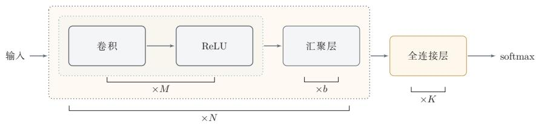  
图 5.9 常用的卷积网络整体结构

现代卷积网络的结构设计大致呈现以下趋势：

（1）使用更小的卷积核（比如 $1 \times 1$ 和 $3 \times 3 )$ 并通过堆叠来扩大感受野；

（2）使用步长卷积替代部分汇聚层来完成下采样；

（3）通过分组卷积、深度可分离卷积等结构提高效率；

参见第5.5节.

（4）使用全局平均汇聚替代大规模全连接层，以减少参数量.

虽然“卷积层、汇聚层和全连接层”仍是理解卷积网络的基本出发点，但现代卷积网络已经更强调卷积块的设计、网络的深度以及效率与性能之间的平衡.

## 5.3 参数学习

在卷积网络中，参数主要为卷积核中的权重以及偏置.和全连接前馈网络类似，卷积网络也可以通过误差反向传播算法来进行参数学习.两者的核心思想都是利用链式法则计算损失函数对参数的偏导数

在全连接前馈神经网络中，梯度主要通过每一层的误差项δ进行反向传播，并进一步计算每层参数的梯度.

参见公式(4.35).

在卷积神经网络中，主要有两种不同功能的神经层：卷积层和汇聚层．卷积层包含参数，而汇聚层通常不包含参数，因此只需要重点计算卷积层中参数的梯度.卷积层和全连接层的一个重要差别在于：卷积核参数在不同空间位置上是共享的，因此一个卷积核参数的梯度需要累加所有空间位置对它的贡献

这里假设汇聚层中没有参数.

不失一般性，对第l层为卷积层，第l－1层的输入特征图为 $\mathcal { X } ^ { ( l - 1 ) } \in$ R $M \times N \times D$ ，通过卷积计算得到第l层的特征图净输入 $\mathcal { Z } ^ { ( l ) } \in \mathbb { R } ^ { M ^ { \prime } \times N ^ { \prime } \times P }$ .第l层的第 $p ( 1 \leq p \leq P )$ 个特征图净输入为

参见公式(5.25).

$$
\pmb { Z } ^ { ( l , p ) } = \sum _ { d = 1 } ^ { D } \pmb { W } ^ { ( l , p , d ) } \otimes \pmb { X } ^ { ( l - 1 , d ) } + b ^ { ( l , p ) } ,\tag{5.31}
$$

其中 $W ^ { ( l , p , d ) }$ 和 $b ^ { ( l , p ) }$ 分别为卷积核以及偏置.第l层中共有 $P \times D$ 个卷积核和 $P$ 个偏置，可以分别使用链式法则来计算其梯度.

根据公式(5.19)和公式(5.31)，损失函数L关于第l层卷积核 $W ^ { ( l , p , d ) }$ 的偏导数为

参见公式(5.19).

$$
\frac { \partial \mathcal { L } } { \partial W ^ { ( l , p , d ) } } = \frac { \partial \mathcal { L } } { \partial Z ^ { ( l , p ) } } \otimes X ^ { ( l - 1 , d ) }\tag{5.32}
$$

$$
= \delta ^ { ( l , p ) } \otimes { \cal X } ^ { ( l - 1 , d ) } ,\tag{5.33}
$$

其中 $\begin{array} { r } { \delta ^ { ( l , p ) } = \frac { \partial \mathcal { L } } { \partial Z ^ { ( l , p ) } } } \end{array}$ 为损失函数关于第l层第 $p$ 个特征图净输入 $Z ^ { ( l , p ) }$ 的偏导数.

同理可得，损失函数关于第l层第 $p$ 个偏置 $b ^ { ( l , p ) }$ 的偏导数为

$$
\frac { \partial \mathcal { L } } { \partial b ^ { ( l , p ) } } = \sum _ { i , j } [ \delta ^ { ( l , p ) } ] _ { i , j } .\tag{5.34}
$$

在卷积网络中，每层参数的梯度依赖其所在层的误差项 $\delta ^ { ( l , p ) }$ .和全连接层类似，卷积层的误差项也需要由后一层的误差项反向传播得到

## 5.3.1 卷积神经网络的反向传播算法

卷积层和汇聚层中误差项的计算有所不同，因此我们分别计算其误差项汇聚层 当第l+1层为汇聚层时，因为汇聚层是下采样操作，l+1层的每个神经元的误差项δ对应于第l层相应特征图的一个区域.l层第 $p$ 个特征图中的每个神经元都有一条边和l+1层第 $p \cdot$ 个特征图中的一个神经元相连.根据链式法则，第l层一个特征图的误差项 $\delta ^ { ( l , p ) }$ ，只需要将l+1层对应特征图的误差项 $\delta ^ { ( l + 1 , p ) }$ 进行上采样操作（和第l层大小一样），再和l层特征图的激活值偏导数逐元素相乘，就得到了 $\delta ^ { ( l , p ) }$

第l层第 $p$ 个特征图的误差项 $\delta ^ { ( l , p ) }$ 的具体推导过程如下：

$$
\delta ^ { ( l , p ) } \triangleq \frac { \partial \mathcal { L } } { \partial Z ^ { ( l , p ) } }\tag{5.35}
$$

$$
\partial { \cal X } ^ { ( l , p ) } \partial { \cal Z } ^ { ( l + 1 , p ) } \partial { \cal { L } }
$$

$$
= \overline { { \partial \pmb { Z } ^ { ( l , p ) } } } \overline { { \partial \pmb { X } ^ { ( l , p ) } } } \overline { { \partial \pmb { Z } ^ { ( l + 1 , p ) } } }\tag{5.36}
$$

$$
= f _ { l } ^ { \prime } ( Z ^ { ( l , p ) } ) \odot \operatorname* { u p } ( \delta ^ { ( l + 1 , p ) } ) ,\tag{5.37}
$$

其中 $f _ { l } ^ { \prime } ( \cdot )$ 为第l层使用的激活函数导数，up为上采样函数(up sampling)，与汇聚层中使用的下采样操作刚好相反.如果下采样是最大汇聚，误差项 $\delta ^ { ( l + 1 , p ) }$ 中每个值会直接传递到前一层对应区域中的最大值所对应的神经元，该区域中其他神经元的误差项都设为0.如果下采样是平均汇聚，误差项 $\delta ^ { ( l + 1 , p ) }$ 中每个值会被平均分配到前一层对应区域中的所有神经元上.若汇聚区域之间存在重叠，则某个位置可能同时接收到多个区域传回的误差，其总误差为这些贡献的累加.

卷积并非真正的矩阵乘积，因此这里计算的偏导数并非真正的矩阵偏导数，我们可以把X,Z都看作向量.

卷积层当l+1层为卷积层时，假设特征图净输入 $\mathcal { Z } ^ { ( l + 1 ) } \in \mathbb { R } ^ { M ^ { \prime } \times N ^ { \prime } \times P }$ ,其中第$p ( 1 \leq p \leq P )$ 个特征图净输入为

参见公式(5.25).

$$
\pmb { Z } ^ { ( l + 1 , p ) } = \sum _ { d = 1 } ^ { D } \pmb { W } ^ { ( l + 1 , p , d ) } \otimes \pmb { X } ^ { ( l , d ) } + b ^ { ( l + 1 , p ) } ,\tag{5.38}
$$

其中 $W ^ { ( l + 1 , p , d ) }$ 和 $b ^ { ( l + 1 , p ) }$ 为第l+1层的卷积核以及偏置.第l+1层中共有 $P \times D$ 个卷积核和P个偏置.

第l层第d个特征图的误差项 $\delta ^ { ( l , d ) }$ 的具体推导过程如下：

$$
\delta ^ { ( l , d ) } \triangleq \frac { \partial \mathcal { L } } { \partial Z ^ { ( l , d ) } }\tag{5.39}
$$

$$
= \frac { \partial \boldsymbol { X } ^ { ( l , d ) } } { \partial \boldsymbol { Z } ^ { ( l , d ) } } \frac { \partial \boldsymbol { \mathcal { L } } } { \partial \boldsymbol { X } ^ { ( l , d ) } }\tag{5.40}
$$

$$
= f _ { l } ^ { \prime } ( \pmb { Z } ^ { ( l , d ) } ) \odot \sum _ { p = 1 } ^ { P } \left( \mathrm { r o t } 1 8 0 ( W ^ { ( l + 1 , p , d ) } ) \tilde { \otimes } \frac { \partial \mathcal { L } } { \partial \pmb { Z } ^ { ( l + 1 , p ) } } \right)\tag{5.41}
$$

根据公式(5.23)

参见习题5-11.

$$
= f _ { l } ^ { \prime } ( \pmb { Z } ^ { ( l , d ) } ) \odot \sum _ { p = 1 } ^ { P } \left( \mathrm { r o t 1 8 0 } ( W ^ { ( l + 1 , p , d ) } ) \tilde { \otimes } \delta ^ { ( l + 1 , p ) } \right) ,\tag{5.42}
$$

该公式表明：当前层某个输入通道的误差来自后一层所有依赖该通道的输出通道，因此需要对所有相关卷积核带来的误差贡献进行累加.最后再与当前层激活函数的导数逐元素相乘，得到该层的误差项

总的来说，卷积网络中的反向传播流程与前馈网络类似：先计算输出层误差，再逐层向前传播.不同之处在于，汇聚层需要做与下采样相反的上采样操作，而卷积层则需要利用旋转后的卷积核进行宽互相关来传播误差.

## 5.4 几种典型的卷积神经网络

本节介绍几种广泛使用、并且对卷积网络发展具有代表意义的典型深层卷积神经网络.

## 5.4.1 LeNet-5

LeNet-5[LeCun et al., 1998]虽然提出时间较早,但它是一个非常成功的卷积神经网络模型.基于LeNet-5的手写数字识别系统在20世纪90年代被美国很多银行使用，用来识别支票上的手写数字.LeNet-5的网络结构如图5.10所示，它代表了早期卷积网络“卷积-下采样-分类器”的经典范式

  
图 5.10 LeNet-5 网络结构（图片根据 [LeCun et al., 1998]绘制）

LeNet-5共有7层，接受输入图像大小为 $3 2 \times 3 2 = 1 0 2 4$ ,输出对应10个类别的得分.LeNet-5中的每一层结构如下：

（1）C1层是卷积层，使用6个 $5 \times 5$ 的卷积核，得到6组大小为 $2 8 \times 2 8 =$ 784的特征图.因此，C1层的神经元数量为 $6 \times 7 8 4 = 4 7 0 4$ ,可训练参数数量为$6 \times 2 5 + 6 = 1 5 6$ ,连接数为 $1 5 6 \times 7 8 4 = 1 2 2 3 0 4$ (包括偏置在内，下同).

（2）S2层为汇聚层，采样窗口为2×2，使用平均汇聚，并使用一个如公式(5.30)的非线性函数. 神经元个数为 $6 \times 1 4 \times 1 4 = 1 1 7 6$ ,可训练参数数量为$6 \times ( 1 + 1 ) = 1 2$ ,连接数为 $6 \times 1 9 6 \times ( 4 + 1 ) = 5 8 8 0$

（3）C3层为卷积层.LeNet-5中用一个连接表来定义输入和输出特征图之间的依赖关系，如图5.11所示，C3层得到16组大小为 $1 0 \times 1 0$ 的特征图；若按

连接表参见公式(5.43).

连接表中的输入-输出特征图连接来展开，则共有60个5×5的二维连接核.神经元数量为 $1 6 \times 1 0 0 = 1 6 0 0$ ,可训练参数数量为 $( 6 0 \times 2 5 ) + 1 6 = 1 5 1 6$ ，连接数为 $1 0 0 \times 1 5 1 6 = 1 5 1 6 0 0 .$

如果不使用连接表，则需要96个5×5的卷积核.

（4）S4层是一个汇聚层，采样窗口为2×2,得到16个5×5大小的特征图，可训练参数数量为 $1 6 \times 2 = 3 2$ ,连接数为 $1 6 \times 2 5 \times ( 4 + 1 ) = 2 0 0 0 .$

（5）C5层是一个卷积层，使用120×16=1920个5×5的卷积核，得到120组大小为1×1的特征图.C5层的神经元数量为120，可训练参数数量为$1 9 2 0 \times 2 5 + 1 2 0 = 4 8 1 2 0$ ,连接数为 $1 2 0 \times ( 1 6 \times 2 5 + 1 ) = 4 8 1 2 0$

（6）F6层是一个全连接层，有84个神经元，可训练参数数量为84×(120+1)=10164.连接数和可训练参数个数相同，为10164.

(7）输出层：输出层由 10个径向基函数（Radial Basis Function，RBF） 组成.这里不再详述.

以上各层的参数量总计约6万，连接数约34万.LeNet-5的设计体现了卷积网络的核心思想：通过局部连接和权重共享大幅减少参数量，同时通过逐层的卷积-汇聚结构逐步提取更抽象的特征.RBF输出层在现代分类网络中通常由Softmax分类器替代，因为后者更易于优化，也更自然地给出概率解释.

连接表 从公式(5.25)可以看出，卷积层的每一个输出特征图都依赖于所有输入特征图，相当于卷积层的输入和输出特征图之间是全连接的关系．实际上，这种全连接关系不是必须的.我们可以让每一个输出特征图只依赖于少数几个输入特征图.定义一个连接表（LinkTable)T来描述输入和输出特征图之间的连接关系.在LeNet-5中，连接表的基本设定如图5.11所示.C3层的第0-5个特征图依赖于S2层特征图组的每3个连续子集，第6-11个特征图依赖于S2层特征图组的每4个连续子集，第12-14个特征图依赖于S2层特征图的每4个不连续子集，第15个特征图依赖于S2层的所有特征图.

<table><tr><td>15</td><td>XXXXXX</td></tr><tr><td>14 13</td><td>X XX XX XX</td></tr><tr><td>12</td><td>XX XX</td></tr><tr><td>11</td><td>X X X</td></tr><tr><td>10</td><td>XX XX</td></tr><tr><td>9</td><td>X XXX</td></tr><tr><td>8</td><td>XXXX XXXX</td></tr><tr><td>7</td><td>XXXX</td></tr><tr><td>6</td><td>XX</td></tr><tr><td>5</td><td>X XX</td></tr><tr><td>4</td><td>XXX</td></tr><tr><td>3</td><td>XXX</td></tr><tr><td>2</td><td>XXX</td></tr><tr><td>1</td><td>X XX</td></tr><tr><td>0</td><td></td></tr><tr><td></td><td>1 23 45</td></tr></table>

图 5.11 LeNet-5 中 C3层的连接表（图片来源: [LeCun et al., 1998])

如果第p个输出特征图依赖于第d个输入特征图，则 $T _ { p , d } = 1$ ,否则为0. $Y ^ { p }$

为

$$
Y ^ { p } = f \left( \sum _ { d , \tiny { d } } W ^ { p , d } \otimes X ^ { d } + b ^ { p } \right) ,\tag{5.43}
$$

其中T为 $P \times D$ 大小的连接表.假设连接表T的非零个数为K，每个卷积核的大小为 $U \times V$ ,那么共需要 $K \times U \times V + P$ 个参数.

## 5.4.2 AlexNet

AlexNet[Krizhevsky et al., 2012]是深度学习在大规模图像分类任务上取得突破的代表性模型.它赢得了2012年ImageNet图像分类竞赛的冠军，并显著推动了深度卷积神经网络的发展.

AlexNet的重要意义不仅在于网络结构本身，还在于它系统地结合了很多后来被广泛采用的训练技术，比如使用GPU进行并行训练、采用ReLU作为非线性激活函数、使用暂退法（Dropout）防止过拟合，以及通过数据增强来提高模型准确率等.

LeNet-5中的平均汇聚、连接表、RBF输出层等设计都带有明显的时代特征，但它所体现的“卷积提取局部特征、下采样降低分辨率、逐层形成高层表示”的思想，对后续卷积网络的发展影响深远.

AlexNet的结构如图5.12所示，包括5个卷积层、3个汇聚层和3个全连接层(其中最后一层是使用Softmax函数的输出层). 由于网络规模超出了当时单个GPU的内存限制，AlexNet将网络拆为两半，分别放在两个GPU上，GPU间只在某些层（比如第3层）进行通信

  
图 5.12 AlexNet 网络结构1

AlexNet 的输入为 $2 2 4 \times 2 2 4 \times 3$ 的图像，输出为1000个类别的条件概率，具体结构如下：

这里的卷积核使用四维张量来描述.

（1）第一个卷积层，使用两个大小为 $1 1 \times 1 1 \times 3 \times 4 8$ 的卷积核，步长$S = 4$ 零填充 $P = 3$ ,得到两个大小为 $5 5 \times 5 5 \times 4 8$ 的特征图组.

（2）第一个汇聚层，使用大小为 $3 \times 3$ 的最大汇聚操作，步长 $S = 2$ ,得到两个27 $\times 2 7 \times 4 8$ 的特征图组.

这里的汇聚操作是有重叠的，以提取更多的特征.

（3）第二个卷积层，使用两个大小为 $5 \times 5 \times 4 8 \times 1 2 8$ 的卷积核，步长$S = 1$ ,零填充 $P = 2$ ,得到两个大小为 $2 7 \times 2 7 \times 1 2 8$ 的特征图组.

（4）第二个汇聚层，使用大小为 $3 \times 3$ 的最大汇聚操作，步长 $S = 2$ ,得到两个大小为 $1 3 \times 1 3 \times 1 2 8$ 的特征图组.

（5）第三个卷积层为两个路径的融合，使用一个大小为 $3 \times 3 \times 2 5 6 \times 3 8 4$ 的卷积核，步长 $S = 1$ ，零填充 $P = 1$ ，得到两个大小为 $1 3 \times 1 3 \times 1 9 2$ 的特征图组.

（6）第四个卷积层，使用两个大小为 $3 \times 3 \times 1 9 2 \times 1 9 2$ 的卷积核，步长$S = 1$ ,零填充 $P = 1$ ,得到两个大小为 $1 3 \times 1 3 \times 1 9 2$ 的特征图组.

（7）第五个卷积层，使用两个大小为 $3 \times 3 \times 1 9 2 \times 1 2 8$ 的卷积核，步长$S = 1$ ,零填充 $P = 1$ ,得到两个大小为 $1 3 \times 1 3 \times 1 2 8$ 的特征图组.

（8）第三个汇聚层，使用大小为 $3 \times 3$ 的最大汇聚操作，步长 $S = 2$ ,得到两个大小为 $6 \times 6 \times 1 2 8$ 的特征图组.

（9）三个全连接层，神经元数量分别为4096、4096和1000.

此外，AlexNet还在前两个汇聚层之后使用了局部响应规范化（Local Re-sponse Normalization,LRN)以增强模型的泛化能力.

## 5.4.3 VGG 网络

VGG 网络[Simonyan et al., 2015]是现代卷积网络发展中的一个重要代表.它的核心思想是：使用多个连续的小卷积核（主要是 $3 \times 3$ 卷积）来替代较大的卷积核，并通过加深网络来提升模型表示能力，这种设计有两个优点：一是多个小卷积核堆叠后可以在保持较大感受野的同时减少参数量；二是多层非线性变换能够增强模型的表达能力.比如，两层 $3 \times 3$ 卷积的感受野相当于一层 $5 \times 5$ 卷积，但参数量更少 $( 2 \times 3 ^ { 2 } = 1 8 < 5 ^ { 2 } = 2 5 )$

需要说明的是，LRN在今天已经不是主流组件，更多具有历史意义；现代卷积网络通常更倾向于使用批量规范化等方法来提高训练稳定性.局部响应规范化参见第7.5.4节.

VGG网络的结构较为规整，通常由若干卷积块和若干汇聚层交替堆叠而成，每个卷积块内部使用多个 $3 \times 3$ 卷积，最后接全连接分类器.VGG网络清楚地展示了“小卷积核+深层网络”这一设计思想，对后续很多卷积网络结构都产生了重要影响.不过，VGG网络顶部全连接层参数较多，整体计算与存储开销也比较大.

## 5.4.4 Inception 网络

在卷积网络中，如何设置卷积核大小是一个十分关键的问题.在Inception网络中，一个卷积模块内部包含多个不同大小的卷积操作，称为Inception模块.Inception网络由多个Inception模块和少量汇聚层堆叠而成.

Inception模块同时使用 $1 \times 1 . 3 \times 3 . 5 \times 5$ 等不同大小的卷积核，并将得到的特征图在深度方向上拼接起来作为输出特征图.这种设计可以在同一层中同时捕捉不同尺度的特征.

Inception模块受到了 模型“Network in Network" [Lin et al., 2014]的启发.

图5.13给出了v1版本的Inception模块结构，采用了4组平行的特征抽取方式，分别为 $1 \times 1 . 3 \times 3 . 5 \times 5$ 的卷积和3×3的最大汇聚.同时，为了提高计算效率、减少参数量，Inception模块在进行 $3 \times 3 . 5 \times 5$ 卷积之前以及3×3最大汇聚之后，都会先进行一次1×1卷积来减少特征图的深度.因此，1×1卷积不仅可以进行跨通道的信息融合，也经常承担降维的作用.

  
图 5.13 Inception v1 的模块结构  
GoogLeNet 不写为GoogleNet，是为了向LeNet 致敬.

Inception网络有多个版本，其中最早的Inception v1版本就是非常著名的GoogLeNet [Szegedy et al., 2015]. GoogLeNet 赢得了 2014年 ImageNet 图像分类竞赛的冠军.

GoogLeNet 由9个Inception v1模块、5个汇聚层以及其他一些卷积层构成，总共为22层网络，如图5.14所示.为了缓解深层网络训练中的梯度消失问题，GoogLeNet在中间层引入了两个辅助分类器来加强监督信息.

  
图 5.14 GoogLeNet 网络结构示意（根据 [Szegedy et al., 2015]绘制）

Inception 网络有多个改进版本，其中比较有代表性的有Inception v3 网络[Szegedy et al., 2016]. Inception v3用多层小卷积核来替换大卷积核，以减少计算量和参数量，并保持感受野不变.具体包括：1）使用两层3×3卷积替换v1中的 $5 \times 5$ 卷积；2）使用连续的K×1和1×K卷积替换 $K \times K$ 卷积.此外，Inception v3网络也引入了标签平滑和批量规范化等训练技巧.

## 5.4.5 残差网络

残差网络（Residual Network，ResNet）通过给非线性的卷积层增加直连边（Shortcut Connection）（也称为残差连接（Residual Connection））的方式来提高信息的传播效率.

残差网络的思想并不局限于卷积神经网络.

假设在一个深度网络中，我们期望一个非线性单元（可以为一层或多层卷积层） $f ( \pmb { x } ; \theta )$ 去逼近一个目标函数 $h ( { \pmb x } )$ .如果将目标函数拆分成两部分：恒等函数(Identity Function) x 和残差函数(Residue Function) h(x) - x，

$$
\begin{array} { r } { h ( \pmb { x } ) = \underbrace { \pmb { x } } _ { \sharp \sharp \sharp \sharp \sharp \mathcal { K } } + \underbrace { \big ( h ( \pmb { x } ) - \pmb { x } \big ) } _ { \sharp \sharp \sharp \mathcal { E } } . } \end{array}\tag{5.44}
$$

为了简便起见，这里假 设输入x与h(x)的维 度一致.

根据通用近似定理，一个由神经网络构成的非线性单元有足够的能力来近似逼近原始目标函数或残差函数，但在实际优化中，后者通常更容易学习[He et al.2016].当最优映射接近恒等映射时，直接学习残差往往比直接学习完整映射更容易；同时，残差连接也有助于缓解深层网络中的梯度传播困难

因此，原来的优化问题可以转换为：让非线性单元 $f ( \pmb { x } ; \theta )$ 去近似残差函数 $h ( { \boldsymbol { x } } ) - { \boldsymbol { x } }$ ,并用 $f ( \pmb { x } ; \theta ) + \pmb { x }$ 去逼近 $h ( { \boldsymbol { x } } )$

图5.15给出了一个典型的残差单元示例.残差单元由多个级联的（等宽）卷积层和一个跨层的直连边组成，再经过ReLU激活后得到输出.

  
图 5.15 一个简单的残差单元结构

当输入和输出的维度一致时，直连边可以直接使用恒等映射；当维度不一致时，通常需要使用1×1卷积或带步长的投影分支来匹配维度.更深的ResNet还常使用 $1 \times 1 { - } 3 \times 3 { - } 1 \times 1$ 的瓶颈（bottleneck）结构，以在控制计算量的同时继续加深网络.

残差网络就是将很多个残差单元串联起来构成的一个非常深的网络．和残差网络类似的还有 Highway Network[Srivastava et al., 2015]. 残差连接后来也成为现代深度神经网络设计中的基础模块，并不限于卷积网络.

## 5.5 其他卷积方式

在第5.1.3节中介绍了一些卷积的变种，可以通过步长和零填充来进行不同的卷积操作.本节再介绍几种在现代卷积网络中常见的重要卷积方式

## 5.5.1 转置卷积

我们通常通过卷积操作来实现高维特征到低维特征的映射．比如在一维卷积中，一个5维输入特征经过一个大小为3的卷积核后，输出为3维特征；如果步长大于1，还可以进一步降低输出特征的维数.但在一些任务中，我们需要将低维特征映射到高维特征，并且依然希望通过一种“卷积型”的线性算子来实现，这就引出了转置卷积

假设有一个高维向量 $\pmb { x } \in \mathbb { R } ^ { d }$ 和一个低维向量 $z \in \mathbb { R } ^ { p }$ ,其中 $p < d .$ 如果用仿射变换（Affine Transformation）来实现高维到低维的映射，

$$
z = W x ,\tag{5.45}
$$

其中 $W \in \mathbb { R } ^ { p \times d }$ 为变换矩阵.我们可以很容易地通过转置W来实现低维到高维的反向映射，即

$$
\begin{array} { r } { \pmb { x } = \pmb { W } ^ { \top } \pmb { z } . } \end{array}\tag{5.46}
$$

需要说明的是，公式(5.45)和公式(5.46)并不是逆运算，两个映射只是形式上的转置关系.

在全连接网络中，忽略激活函数时，前向计算和反向传播就是一种转置关系.比如前向计算时，第l+1层的净输入为 $z ^ { ( l + 1 ) } = W ^ { ( l + 1 ) } z ^ { ( l ) }$ ，反向传播时，第l层的误差项为 $\delta ^ { ( l ) } = ( W ^ { ( l + 1 ) } ) ^ { \top } \delta ^ { ( l + 1 ) }$

参见公式(4.35).

卷积操作也可以写为仿射变换的形式.假设一个5维向量x，经过大小为3的卷积核 $\pmb { w } = [ w _ { 1 } , w _ { 2 } , w _ { 3 } ] ^ { \intercal }$ 进行卷积，得到3维向量z.卷积操作可以写为

$$
z = w \otimes x\tag{5.47}
$$

$$
\begin{array} { r } { \left[ { \begin{array} { l l l l l l } { w _ { 1 } } & { w _ { 2 } } & { w _ { 3 } } & { 0 } & { 0 } \\ { 0 } & { w _ { 1 } } & { w _ { 2 } } & { w _ { 3 } } & { 0 } \\ { 0 } & { 0 } & { w _ { 1 } } & { w _ { 2 } } & { w _ { 3 } } \end{array} } \right] x } \\ { = C x , } \end{array}\tag{5.48}
$$

参见习题5-8.

(5.49)

其中C是一个稀疏矩阵，其非零元素来自卷积核ω中的元素.

如果要实现3维向量z到5维向量x的映射，可以通过仿射矩阵的转置来实现，即

$$
\begin{array} { r l } { x } & { = C ^ { \top } z } \\ & { } \\ & { = \left[ \begin{array} { l l l } { w _ { 1 } } & { 0 } & { 0 } \\ { w _ { 2 } } & { w _ { 1 } } & { 0 } \\ { w _ { 3 } } & { w _ { 2 } } & { w _ { 1 } } \\ { 0 } & { w _ { 3 } } & { w _ { 2 } } \\ { 0 } & { 0 } & { w _ { 3 } } \end{array} \right] z } \\ & { = \mathrm { r o t } 1 8 0 ( w ) \widetilde { \otimes } z , } \end{array}\tag{5.50}
$$

(5.51)

(5.52)

其中rot180(·)表示旋转180度.

从公式(5.48)和公式(5.51)可以看出，从仿射变换的角度来看，两个卷积操作 $z = w \otimes x$ 和 ${ \pmb x } = \mathrm { r o t } 1 8 0 ( { \pmb w } ) \tilde { \otimes } z$ 也是形式上的转置关系．因此，我们将这种把低维特征映射到高维特征的卷积型线性算子称为转置卷积（TransposedConvolution）[Dumoulin et al.,2016]，也常被称为反卷积（Deconvolution）[Zeiler et al., 2011].

将转置卷积称为反卷积（Deconvo-lution）并不太恰当，它不是指卷积的逆运算.

在卷积网络中，卷积层的前向计算和反向传播也是一种转置关系.

参见习题5-11.

对一个M维向量z和一个大小为K的卷积核，如果希望通过卷积操作映射到更高维的向量，只需要对向量z进行两端补零 $P = K - 1$ ，然后进行卷积，就可以得到 $M + K - 1$ 维的向量.

即宽卷积.

转置卷积同样适用于二维卷积. 图5.16给出了一个步长 $S = 1$ 、无零填充$P = 0$ 的二维卷积和其对应的转置卷积.

微步卷积从尺寸变化的角度看，如果普通卷积使用步长 $S > 1$ 实现下采样，那么其对应的转置卷积可以看作一种“分数步长”的上采样操作，因此也常被称为微步卷积(Fractionally-Strided Convolution) [Long et al., 2015]. 需要强调的是，在具体实现中通常并不会真的把步长设为 $S < 1$ ，而是通过在输入特征之间插入0,再进行步长为1的普通卷积来等效实现.

  
(a) 卷积, S = 1, P = 0

  
(b) 转置卷积, S = 1, P = 2  
图 5.16 步长S = 1,无零填充P = 0的二维卷积和其对应的转置卷积

如果卷积操作的步长为 $S > 1$ ，希望其对应的转置卷积实现相应的上采样，则需要在输入特征之间插入 $S - 1$ 个0来使其移动速度变慢.

以一维转置卷积为例，对一个M维向量z和大小为K的卷积核，通过对向量z进行两端补零 $P = K - 1$ ，并且在每两个向量元素之间插入D个0，然后进行步长为1的卷积，可以得到 $( D + 1 ) \times ( M - 1 ) + K$ 维的向量.

图5.17给出了一个步长 $S = 2$ 、无零填充 $P = 0$ 的二维卷积和其对应的转置卷积.

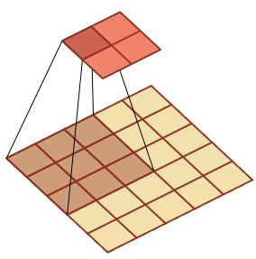  
(a) 卷积, S = 2, P = 0

  
(b) 转置卷积, S = 1, P = 2, D = 1  
图 5.17 步长S =2,无零填充P = 0的二维卷积和其对应的转置卷积

需要注意的是，转置卷积虽然很适合做上采样，但在生成任务中有时会带来棋盘状伪影(checkerboard artifacts).因此，在一些应用中也会使用“先插值上采样，再普通卷积”的方式作为替代

## 5.5.2 空洞卷积

对于一个卷积层，如果希望增加输出单元的感受野，一般可以通过三种方式实现：1）增加卷积核的大小；2）增加层数，比如两层 $3 \times 3$ 卷积可以近似一层$5 \times 5$ 卷积的效果；3)在卷积之前进行汇聚操作.前两种方式会增加参数数量，而第三种方式会丢失一些信息.

空洞卷积（AtrousConvolution）是一种在不增加参数数量的情况下扩大感受野的方法,也称为膨胀卷积(Dilated Convolution)[Chen et al., 2018; Yuet al.,2016].它特别适合那些既希望获得较大感受野、又希望保持较高空间分辨率的任务，比如语义分割.

Atrous一词来源于法语à trous，意为“空洞，多孔”.

空洞卷积通过给卷积核插入“空洞”来变相地增加其大小.如果在卷积核的每两个元素之间插入D-1个空洞，卷积核的有效大小为

$$
K ^ { \prime } = K + ( K - 1 ) \times ( D - 1 ) ,\tag{5.53}
$$

其中 D称为膨胀率(Dilation Rate). 对于二维的 $K \times K$ 卷积核，上式同样可以理解为其有效感受野的边长.当D=1时，卷积核退化为普通卷积核.

图5.18给出了空洞卷积的示例.

  
(a) 膨胀率 D = 2

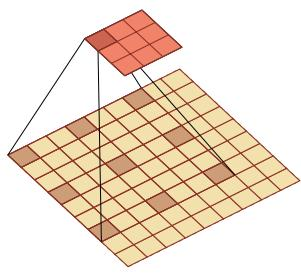  
(b) 膨胀率 D = 3  
图 5.18 空洞卷积

## 5.5.3 分组卷积

随着卷积网络逐渐加深，如何在保持性能的同时降低计算量和参数量变得越来越重要.在标准卷积中，每个输出通道通常依赖于所有输入通道.分组卷积（Group Convolution）是一类非常重要的高效卷积结构.在分组卷积中，输入通道会被划分为若干组，每组只与对应的一部分输出通道相连.这样可以显著减少参数量和计算量.

AlexNet中由于两块GPU分开计算，实际上就包含了分组卷积的思想；后续很多高效网络也进一步系统化地使用了分组卷积.

图5.19从结构上展示了标准卷积与分组卷积之间的区别.

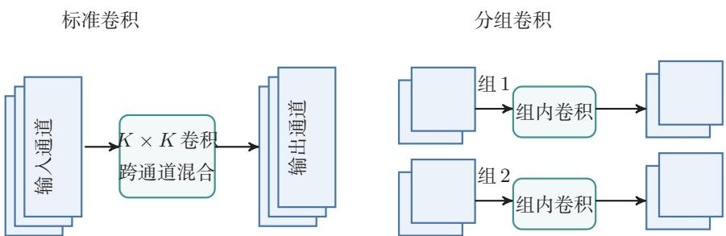  
图 5.19 标准卷积与分组卷积

## 5.5.4 深度可分离卷积

深度可分离卷积（DepthwiseSeparable Convolution）的核心思想是将“空间卷积”和“通道混合”这两类操作解耦，从而在尽量保持表示能力的同时显著降低开销.

具体来说，深度可分离卷积可以分解为两个步骤：

（1）逐通道卷积（depthwise convolution）：对每个输入通道分别使用一个K×K卷积核做空间卷积.因此它只负责提取每个通道内部的局部空间模式，而不在不同通道之间做信息融合．若输入通道数为D，则这一阶段共有D个卷积核.

（2）逐点卷积（pointwise convolution）:再使用P个1×1卷积核对上一步得到的D个中间特征图做线性组合，从而完成不同通道之间的信息融合，并生成P个输出特征图.

图5.20展示了深度可分离卷积的两步分解：先做逐通道卷积，再做逐点卷积.

逐通道卷积可以看作分组卷积的特例，即分组数等于输入通道数D.

  
图 5.20 深度可分离卷积

因此，深度可分离卷积并不是简单地“减少卷积核个数”，而是把标准卷积中原本同时完成的两项工作拆开：第一步负责空间特征提取，第二步负责跨通道特征组合.从这个角度看，它是一种结构化的参数分解方法.

设输入特征图大小为 $M \times N \times D$ ,卷积核大小为 $K \times K$ ,输出通道数为 $P .$ 对于标准卷积，其参数量为 $K ^ { 2 } D P$ ,对应的乘加次数约为 $M N K ^ { 2 } D P$ 对于深度可分离卷积，逐通道卷积的参数量为 $K ^ { 2 } D$ ，逐点卷积的参数量为 $D P$ ，因此总参数量为 $K ^ { 2 } D + D P$ 对应的乘加次数约为 $M N K ^ { 2 } D + M N D P$ .两者相比，参数量之比约为 $\begin{array} { r } { \frac { K ^ { 2 } D + D P } { K ^ { 2 } D P } = \frac { 1 } { P } + \frac { 1 } { K ^ { 2 } } } \end{array}$ .例如当 $K = 3$ 且 $P$ 较大时，深度可分离卷积的参数量和计算量往往大约为标准卷积的 $1 / 9$ 到 $1 / 8$

当然，这种分解也带来一定限制：逐通道卷积阶段并不进行跨通道的信息交互，因此其表示能力通常弱于同规模的标准卷积，更适合用于对效率要求较高的轻量级网络．在计算资源较充足、追求更高精度或更强表示能力的场景下，标准卷积仍然十分常用.

## 5.6 总结和扩展阅读

本章围绕卷积神经网络的基本思想、关键结构和典型演化路径展开.对于图像这类具有局部相关性和空间结构的数据，如果仍然使用普通的全连接层，不但参数规模庞大，而且难以有效利用“局部模式会在不同位置重复出现”这一重要先验.卷积层通过局部连接和权重共享，将这种先验直接编码到网络结构中；汇聚、步长卷积以及全局平均汇聚等机制则进一步实现特征压缩、扩大感受野并提升一定程度的平移鲁棒性.因此，卷积神经网络并不只是“把卷积运算放进神经网络”，而是围绕空间结构数据所形成的一整套表示学习方法.

从知识结构上看，本章可以归结为三条主线.第一条主线是卷积运算本身：包括卷积与互相关的关系、零填充、步长、等宽卷积以及输出尺寸的计算.第二条主线是卷积网络的基本组件：包括卷积层、汇聚层以及由这些部件构成的卷积块.第三条主线是结构设计与演化：从LeNet-5到AlexNet、VGG、Inception和ResNet，再到分组卷积、空洞卷积与深度可分离卷积，反映出卷积神经网络始终围绕几个核心目标不断演化：一是更好地提取多尺度特征，二是让网络更深且更易训练，三是在保证性能的同时降低参数量和计算量.对于卷积运算尺寸变化及不同卷积形式的可视化示例，还可以参考https://github.com/vdumoulin/conv\_arithmetic.

如果从更高层次来理解卷积神经网络，其发展并不是若于孤立技巧的简单叠加，而是由几条相互关联的设计原则共同推动的．其一是局部性（locality），即利用局部感受野捕捉邻域模式；其二是层次性（hierarchy），即通过多层堆叠逐步从边缘、纹理过渡到部件和语义；其三是参数共享（parametersharing），即通过共享卷积核显著降低模型复杂度；其四是模块化（modularity），即把卷积、规范化、激活、下采样、残差连接等组织成可复用的结构单元，理解了这几条原则，就不难把握不同卷积结构之间“变的是什么、不变的又是什么”．例如，Inception改变的是多尺度建模方式，ResNet改变的是信息与梯度的传播路径，深度可分离卷积改变的是卷积的参数化方式，但它们都没有脱离上述基本原则

从结构演化的角度看，LeNet-5代表了卷积网络的早期经典范式；AlexNet系统展示了GPU训练、ReLU、暂退法和数据增强等技术如何与深层卷积网络结合，从而推动深度学习在大规模视觉任务中的突破；VGG网络说明了通过堆叠小卷积核也可以有效扩大感受野，并形成规则、统一的网络结构；Inception系列强调多尺度并行特征提取以及1×1卷积的降维作用；残差网络则表明，当网络足够深时，结构设计的重点已经不仅是“表达能力是否足够”，更是“信息和梯度能否稳定传播”.再往后，分组卷积和深度可分离卷积把“高效”作为重要目标，空洞卷积则在保持较高空间分辨率的同时扩大感受野.这些结构变化共同说明：卷积网络的发展，本质上是在表示能力、可训练性与计算效率三者之间不断寻找更优平衡.

如果希望继续深入，可以从三个层面扩展阅读．第一，沿着历史脉络阅读LeNet、AlexNet、VGG、GoogLeNet和ResNet等代表性工作，理解卷积网络设计思想是如何逐步演化的；第二，沿着结构改进阅读关于批量规范化、残差连接、分组卷积、深度可分离卷积和空洞卷积的相关文献，理解不同模块分别解决了什么问题：第三，沿着任务与系统阅读卷积网络在检测、分割、视频理解、移动端推断等方向上的应用，体会同一种基本结构如何在不同约束下被重新组织与改造

卷积神经网络中的设计思想，比如局部连接、参数共享、层次表示和模块化设计，在后续很多模型中都会反复出现.因此，学习卷积神经网络的意义，不仅在于掌握一种具体结构，更在于掌握一种围绕数据结构组织模型的方法，后续章节中，无论是序列建模、注意力机制与Transformer，还是面向不同任务的深度结构设计，都会继续面对类似的问题：如何利用数据本身的结构先验，如何设计更有效的表示单元，如何在模型能力、训练稳定性与计算代价之间取得平衡.从这个意义上说，卷积神经网络是理解现代深度学习结构设计方法的一块重要基石.

在视觉建模中，卷积网络和基于注意力机制的模型提供了两类不同的归纳偏置，卷积通过局部连接和权重共享强调局部模式的平移等变性，参数效率高、数据效率好，适合端侧推断、视频处理和计算受限场景；注意力机制更擅长全局交互和长距离依赖，在大规模数据和算力支持下表现突出.Vision Transformer(ViT) [Dosovitskiy et al., 2021]和 ConvNeXt[Liu et al., 2022]等工作说明,现代视觉模型的发展不是简单的“卷积被替代”，而是在局部结构先验、全局建模能力、训练策略和计算效率之间重新组合.因而，卷积与注意力机制的融合，而不是简单替代，是理解现代视觉模型演化的更稳妥视角.

在轻量级网络设计方面，Howard等人提出的MobileNet（2017）和Tan等人提出的EficientNet（2019）是重要的代表工作.它们体现了卷积结构在资源受限场景中的长期价值，也说明结构设计需要同时考虑精度、延迟、能耗和部署条件.

## 习题

## 基础题

习题5-1 给定 $4 \times 4$ 的输入矩阵 $X = { \left( \begin{array} { l l l l } { 1 } & { 0 } & { 1 } & { 0 } \\ { 0 } & { 1 } & { 0 } & { 1 } \\ { 1 } & { 0 } & { 1 } & { 0 } \\ { 0 } & { 1 } & { 0 } & { 1 } \end{array} \right) }$ 和 $2 \times 2$ 的卷积核 $W =$ $\left( \begin{array} { c c } { { 1 } } & { { 0 } } \\ { { } } & { { } } \\ { { 0 } } & { { 1 } } \end{array} \right)$ ，手工计算窄卷积（无填充、步长为1）的输出矩阵.

习题5-2 设输入特征图组大小为 $3 2 \times 3 2 \times 3$ ,卷积层使用64个 $3 \times 3$ 卷积核，步长为1，零填充为1.1）求该卷积层输出特征图组的大小；2）求该卷积层的参数量(含偏置)；3）若其后接一个窗口大小为 $2 \times 2$ 、步长为2的最大汇聚层，求汇聚后的输出大小.

习题5-3 分析卷积神经网络中使用 $1 \times 1$ 卷积核的主要作用，并说明它为什么既可以进行通道变换，又可以用于降低计算量.

习题5-4 在空洞卷积中，当卷积核大小为K、膨胀率为D时，如何设置零填充P使卷积为等宽卷积?当 $K = 3 , D = 2$ 时，给出对应的P值

## 提高题

习题5-5 1)证明公式(5.6)可以近似为离散信号序列 $x ( t )$ 关于t的二阶微分;2)对于二维卷积，设计一种滤波器来近似实现对二维输入信号的二阶微分.

习题5-6 对于一个输入为 $1 0 0 \times 1 0 0 \times 2 5 6$ 的特征图组，使用 $3 \times 3$ 的卷积核，输出为 $1 0 0 \times 1 0 0 \times 2 5 6$ 的特征图组的卷积层，求其时间复杂度和空间复杂度.如果先引人一个1×1卷积层，将特征图组变换为 $1 0 0 \times 1 0 0 \times 6 4$ ，再进行 $3 \times 3$ 卷积并得到 $1 0 0 \times 1 0 0 \times 2 5 6$ 的特征图组，求新的时间复杂度和空间复杂度，并比较两种方案的差异.

习题5-7 请分别说明卷积运算的平移等变性和分类任务所需平移不变性的区别.为什么卷积层本身通常带来等变性，而汇聚、步长卷积、全局平均汇聚和数据增强等机制有助于获得不变性？

习题5-8 对于一个二维卷积，输入大小为 $3 \times 3$ ，卷积核大小为 $2 \times 2$ ，试将卷积操作重写为仿射变换的形式，并类比公式(5.48)写出对应的矩阵表达.

习题5-9 1)设 $y = \operatorname* { m a x } ( x _ { 1 } , \cdots , x _ { D } )$ ,求 $y$ 关于各个输入 $x _ { i }$ 的梯度；2)讨论函数$y = \arg \operatorname* { m a x } ( x _ { 1 } , \cdots , x _ { D } )$ 在什么情况下不可导，并说明为什么它不能直接作为神经网络中的常规可导算子参与反向传播.

## 拓展题

习题5-10 证明宽卷积具有交换性，即公式(5.15).

习题5-11 忽略激活函数，分析卷积网络中卷积层的前向计算和反向传播（公式(5.42))之间的转置关系，并说明这一关系与转置卷积之间的联系.

习题5-12 设输入特征图组大小为 $M \times N \times D$ ,卷积核大小为 $K \times K$ ，输出通道数为P.1）分别写出标准卷积和深度可分离卷积的参数量；2）比较二者的时间复杂度；3）当 $K = 3 , D = 1 2 8 , P = 2 5 6$ 时，计算两者参数量之比，并分析深度可分离卷积为何适合轻量级网络.

习题5-13 设一个卷积网络由三个卷积层构成，第一层核大小 $3 \times 3$ 、步长1;第二层核大小 $3 \times 3$ 、步长2;第三层核大小 $3 \times 3$ 、步长1.计算第三层每个输出单元在输入图像上的感受野大小.与使用一层 $7 \times 7$ 卷积核（步长1）相比，哪种方式的参数量更少?

## 参考文献

CHEN L C, PAPANDREOU G, KOKKINOS I, et al., 2018. Deeplab: semantic image segmentation with deep convolutional nets, atrous convolution, and fully connected CRFs[J]. IEEE transactions on pattern analysis and machine intelligence, 40(4): 834-848.

DOSOVITSKIY A, BEYER L, KOLESNIKOV A, et al., 2021. An image is worth 16x16 words: transformers for image recognition at scale[C]//International Conference on Learning Representations.

Dumoulin V, Visin F, 2016. A guide to convolution arithmetic for deep learning[A]. arXiv (2016).

HE K, ZHANG X, REN S, et al., 2016. Deep residual learning for image recognition[C]// Proceedings of the IEEE conference on computer vision and pattern recognition. 770-778.

KRIZHEVSKY A, SUTSKEVER I, HINTON G E, 2012. ImageNet classification with deep convolutional neural networks[C]//Advances in Neural Information Processing Systems 25. 1106-1114.

LECUN Y, BOTTOU L, BENGIO Y, et al., 1998. Gradient-based learning applied to document recognition[J]. Proceedings of the IEEE, 86(11): 2278-2324.

LIN M, CHEN Q, YAN S, 2014. Network in network[C]//Proceedings of 2nd International Conference on Learning Representations.

LIU Z, MAO H, WU C Y, et al., 2022. A ConvNet for the 2020s[C]//Proceedings of the IEEE/CVF Conference on Computer Vision and Pattern Recognition. 11976-11986.

LONG J, SHELHAMER E, DARRELL T, 2015. Fully convolutional networks for semantic segmentation[C]//Proceedings of the IEEE conference on computer vision and pattern recognition. 3431-3440.

SIMONYAN K, ZISSERMAN A, 2015. Very deep convolutional networks for large-scale image recognition[C]//Proceedings of 3rd International Conference on Learning Representations.

SRIVASTAVA R K, GREFF K, SCHMIDHUBER J, 2015. Highway networks[A/OL]. arXiv (2015). https://arxiv.org/abs/1505.00387.

SZEGEDY C, LIU W, JIA Y, et al., 2015. Going deeper with convolutions[C]//Proceedings of the IEEE Conference on Computer Vision and Pattern Recognition. 1-9.

SZEGEDY C, VANHOUCKE V, IOFFE S, et al., 2016. Rethinking the inception architecture for computer vision[C]//Proceedings of the IEEE Conference on Computer Vision and Pattern Recognition. 2818-2826.

YU F, KOLTUN V, 2016. Multi-scale context aggregation by dilated convolutions[C]// Proceedings of 4th International Conference on Learning Representations.

ZEILER M D, TAYLOR G W, FERGUS R, 2011. Adaptive deconvolutional networks for mid and high level feature learning[C]//Proceedings of the IEEE International Conference on Computer Vision. IEEE: 2018-2025.

## 第6章 循环神经网络

经验是智慧之父，记忆是智慧之母.

——谚语

前馈神经网络中的信息传递是单向的，因此网络在一次计算中只能依赖当前输入，而无法显式利用历史上下文.这种结构虽然便于训练，但也限制了模型处理时序数据的能力，在很多现实任务中，当前时刻的输出不仅依赖当前输入，也依赖过去一段时间内的状态和输出.例如，在语音、文本、视频以及一般时间序列建模中，输入长度往往是不固定的，且不同时间步之间存在显著相关性；而标准前馈神经网络通常要求输入和输出维数固定，因此难以直接处理这类问题

循环神经网络（Recurrent Neural Network，RNN）正是为此提出的一类模型.它通过在时间维度上传递隐状态，使网络能够将当前输入与历史信息结合起来，从而具备一定的短期记忆能力．与前馈神经网络相比，循环神经网络不再把每次输入看作彼此独立的样本，而是把序列中的各个时刻联系起来建模，因此被广泛应用于语言模型、语音识别、文本生成以及一般时序预测等任务中.

循环神经网络的参数通常通过随时间反向传播算法[Werbos,1990]进行学习.该算法将误差信号沿时间逆序传播，但当序列较长时，梯度在多步传播过程中容易出现爆炸或消失，从而导致难以学习远距离时刻之间的依赖关系，这就是长程依赖问题[Bengio et al., 1994; Hochreiter et al., 1997, 2001]. 围绕这一问题，本章将依次介绍循环神经网络的基本形式、训练方法、长程依赖的根源，以及LSTM、GRU等基于门控机制（GatingMechanism）的改进模型.

本章的组织如下：首先介绍几种为神经网络增加短期记忆能力的基本思路，并给出最基本的循环神经网络形式；随后讨论循环神经网络在不同机器学习任务中的应用方式，以及如何通过随时间反向传播进行训练；接着分析长程依赖问题产生的原因，并说明LSTM、GRU等门控结构如何缓解这一问题；最后简要说明从序列上的状态传播过渡到更一般结构化建模的思路.

## 6.1 给网络增加记忆能力

为了处理这些时序数据并利用其历史信息，我们需要让网络具有短期记忆能力.而前馈网络是一种静态网络，不具备这种记忆能力.

一般来讲，我们可以通过以下三种方法来给网络增加短期记忆能力.

## 6.1.1 延时神经网络

一种简单的利用历史信息的方法是建立一个额外的延时单元，用来存储网络的历史信息（可以包括输入、输出、隐状态等）.比较有代表性的模型是延时神经网络(Time Delay Neural Network, TDNN) [Lang et al., 1990; Waibelet al., 1989].

延时神经网络是在前馈网络中的非输出层都添加一个延时器，记录神经元的最近几次活性值.在第t个时刻，第l层神经元的活性值依赖于第l－1层神经元的最近K个时刻的活性值，即

延时神经网络在时间维度上共享权值，以降低参数数量.因此对于序列输入来讲，延时神经网络就相当于卷积神经网络.

$$
\pmb { h } _ { t } ^ { ( l ) } = f \Big ( \pmb { h } _ { t } ^ { ( l - 1 ) } , \pmb { h } _ { t - 1 } ^ { ( l - 1 ) } , \cdots , \pmb { h } _ { t - K } ^ { ( l - 1 ) } \Big ) ,\tag{6.1}
$$

其中 $\boldsymbol { h } _ { t } ^ { ( l ) } \in \mathbb { R } ^ { M _ { l } }$ 表示第l层神经元在时刻t的活性值， $M _ { l }$ 为第l层神经元的数量.  
通过延时器，前馈网络就具有了短期记忆的能力.

## 6.1.2 有外部输入的非线性自回归模型

自回归模型（AutoRegressive Model,AR）是统计学上常用的一类时间序列模型，用一个变量 $\scriptstyle { \pmb { y } } _ { t }$ 的历史信息来预测自己.

$$
{ \pmb y } _ { t } = { \pmb w } _ { 0 } + \sum _ { k = 1 } ^ { K } w _ { k } { \pmb y } _ { t - k } + { \epsilon } _ { t } ,\tag{6.2}
$$

其中K为超参数， $w _ { 0 } , \cdots , w _ { K }$ 为可学习参数， $\mathbf { \boldsymbol { \epsilon } } _ { t } \sim \mathcal { N } ( 0 , \sigma ^ { 2 } )$ 为第t个时刻的噪声，方差 $\sigma ^ { 2 }$ 和时间无关.

有外部输入的非线性自回归模型（Nonlinear AutoRegressive with Exoge-nous Inputs Model, NARX) [Leontaritis et al., 1985] 是自回归模型的扩展，在每个时刻t都有一个外部输入 ${ \mathbf { } } x _ { t } , \vec { J } ^ { \mathrm { { r } } }$ 生一个输出 $\mathbf { \mathscr { y } } _ { t }$ .NARX通过一个延时器记录最近 $K _ { x }$ 次的外部输入和最近 $K _ { y }$ 次的输出，第t个时刻的输出 $\mathbf { \nabla } _  \mathbf { } \mathbf { } \mathbf { } \mathbf { } \mathbf { } \mathbf { } \mathbf { } \mathbf { } \mathbf { } \mathbf { } \mathbf { } \mathbf { } \mathbf { } \mathbf { } \mathbf { } \mathbf { } \mathbf { } \mathbf { } \mathbf { } \mathbf { } \mathbf { } \mathbf { } \mathbf { } \mathbf { } \mathbf { } \mathbf { } \mathbf { } \mathbf { } \mathbf { } \mathbf { } \mathbf { } \mathbf { } \mathbf { } \mathbf { } \mathbf { } \mathbf { } \mathbf { } \mathbf { } \mathbf { } \mathbf { } \mathbf { } \mathbf { } \mathbf { } \mathbf { } \mathbf { } \mathbf { } \mathbf { } \mathbf { } \mathbf { } \mathbf { } \mathbf { } \mathbf { } \mathbf { } \mathbf { } \mathbf { } \mathbf { } \mathbf { } \nabla \mathbf { } \mathbf { } \mathbf { } \mathbf { } \mathbf { } \mathbf { } \mathbf { } \mathbf { } \mathbf { } \nabla \mathbf { } \mathbf { } \mathbf { } \mathbf { } \mathbf { } \mathbf { } \mathbf { } \nabla \mathbf { } \mathbf { } \mathbf { } \mathbf { } \mathbf { } \mathbf { } \nabla \mathbf { } \mathbf { } \mathbf { } \mathbf { } \mathbf { } \nabla \mathbf { } \mathbf { } \mathbf { } \mathbf { } \mathbf { } \nabla \mathbf { } \mathbf { } \mathbf { } \mathbf { } \nabla \mathbf { } \mathbf { } \mathbf { } \mathbf { } \nabla \mathbf { } \mathbf { } \mathbf { } \nabla \mathbf { } \mathbf { } \mathbf { } \nabla \mathbf { } \mathbf { } \mathbf { } \nabla \mathbf { } \mathbf { } \nabla \mathbf { } \mathbf { } \nabla \mathbf { } \mathbf { } \nabla \mathbf { } \mathbf { } \nabla \mathbf { } \mathbf { } \nabla \mathbf { } \mathbf { } \nabla \mathbf { } \nabla \mathbf { } \mathbf { } \nabla \mathbf { } \nabla \mathbf { } \nabla \mathbf { } \mathbf { } \nabla \mathbf { } \nabla \mathbf { } \nabla \mathbf { } \nabla \mathbf  \nabla \nabla \nabla \mathbf { } \mathbf { } \nabla \mathbf \nabla \nabla \mathbf { } \mathbf { } \nabla \mathbf \nabla \nabla \nabla \mathbf { } \mathbf \nabla \nabla \nabla \mathbf { } \mathbf \nabla \nabla \nabla \mathbf \nabla \nabla \mathbf { } \mathbf \nabla \nabla \nabla \mathbf \nabla \nabla \mathbf { } \mathbf \nabla \nabla \mathbf \nabla $ 为

$$
\pmb { y } _ { t } = f ( \pmb { x } _ { t } , \pmb { x } _ { t - 1 } , \cdots , \pmb { x } _ { t - K _ { x } } , \pmb { y } _ { t - 1 } , \pmb { y } _ { t - 2 } , \cdots , \pmb { y } _ { t - K _ { y } } ) ,\tag{6.3}
$$

其中 $f ( \cdot )$ 表示非线性函数，可以是一个前馈网络， $K _ { x }$ 和 $K _ { y }$ 为超参数.

## 6.1.3 循环神经网络

循环神经网络（Recurrent Neural Network，RNN）通过使用带自反馈的神经元，能够处理任意长度的时序数据.

给定一个输入序列 ${ \pmb x } _ { 1 : T } = ( { \pmb x } _ { 1 } , { \pmb x } _ { 2 } , \dots , { \pmb x } _ { t } , \dots , { \pmb x } _ { T } )$ ，循环神经网络通过下面公式更新带反馈边的隐藏层的活性值 $\boldsymbol { h } _ { t }$

$$
\begin{array} { r } { \begin{array} { r } { h _ { t } = f ( h _ { t - 1 } , x _ { t } ) , } \end{array} } \end{array}\tag{6.4}
$$

其中 $\pmb { h } _ { 0 } = 0 , f ( \cdot )$ 为一个非线性函数，可以是一个前馈网络.

图6.1给出了循环神经网络的示例，其中“延时器”为一个虚拟单元，记录神经元的最近一次(或几次)活性值.

  
图6.1 循环神经网络

从数学上讲，公式(6.4)可以看成一个动力系统.因此，隐藏层的活性值 $\boldsymbol { h } _ { t }$ 在很多文献中也称为状态（State）或隐状态（Hidden State）.

从“按时间展开”的角度看，循环神经网络可以理解为一个在时间维度上共享参数的深层网络.这个视角既说明了它为何能够处理变长序列，也为后续的训练算法分析提供了基础，理论上，循环神经网络具有很强的表达能力，可以近似一般的非线性动力系统；但从本章的主线来看，更重要的问题是：状态如何在时间上传播，以及这种传播为什么会在训练中带来长程依赖困难

## 6.2 简单循环网络

动力系统（Dynami-cal System)是一个数学上的概念，指系统状态按照一定的规律随时间变化的系统.具体地讲，动力系统是使用一个函数来描述一个给定空间（如某个物理系统的状态空间）中所有点随时间的变化情况. 生活中很多现象(比如钟摆晃动、台球轨迹等)都可以用动力系统来描述.

简单循环网络（Simple Recurrent Network, SRN）[Elman，1990]是一个非常简单的循环神经网络，只有一个隐藏层的神经网络.在一个两层的前馈神经网络中，连接存在相邻的层与层之间，隐藏层的节点之间是无连接的．而简单循环网络增加了从隐藏层到隐藏层的反馈连接.

令向量 $\pmb { x } _ { t } \in \mathbb { R } ^ { M }$ 表示在时刻t时网络的输入， $\boldsymbol { h } _ { t } \in \mathbb { R } ^ { D }$ 表示隐藏层状态（即隐藏层神经元活性值），则 $\boldsymbol { h } _ { t }$ 不仅和当前时刻的输入 $\mathbf { \boldsymbol { x } } _ { t }$ 相关，也和上一个时刻的隐藏层状态 $\boldsymbol { h } _ { t - 1 }$ 相关.简单循环网络在时刻t的更新公式为

$$
z _ { t } = U h _ { t - 1 } + W x _ { t } + b ,\tag{6.5}
$$

$$
\begin{array} { r } { h _ { t } = f ( z _ { t } ) , } \end{array}\tag{6.6}
$$

其中 $\scriptstyle { z _ { t } }$ 为隐藏层的净输入， $\pmb { U } \in \mathbb { R } ^ { D \times D }$ 为状态-状态权重矩阵， $W \in \mathbb { R } ^ { D \times M }$ 为状态-输入权重矩阵， $\pmb { b } \in \mathbb { R } ^ { D }$ 为偏置向量， $f ( \cdot )$ 是非线性激活函数，通常为Logistic函数或Tanh函数. 公式(6.5)和公式(6.6)也经常直接写为

$$
\begin{array} { r } { \pmb { h } _ { t } = f ( \pmb { U } \pmb { h } _ { t - 1 } + \pmb { W } \pmb { x } _ { t } + \pmb { b } ) . } \end{array}\tag{6.7}
$$

如果我们把每个时刻的状态都看作前馈神经网络的一层，循环神经网络可以看作在时间维度上权值共享的神经网络.图6.2给出了按时间展开的循环神经网络.

  
图6.2 按时间展开的循环神经网络

## 6.2.1 循环神经网络的表达能力

我们先定义一个完全连接的循环神经网络，其输入为 $\mathbf { \boldsymbol { x } } _ { t }$ ,输出为 $\mathbf { \mathscr { y } } _ { t }$

$$
\begin{array} { r } { \pmb { h } _ { t } = f ( \pmb { U } \pmb { h } _ { t - 1 } + \pmb { W } \pmb { x } _ { t } + \pmb { b } ) , } \end{array}
$$

$$
\begin{array} { r } { \boldsymbol { y } _ { t } = \boldsymbol { V } \boldsymbol { h } _ { t } , } \end{array}\tag{6.8}
$$

(6.9)

这一小节从理论上说明循环神经网络的表达能力，属于对正文主线的补充阅读，补充了解即可.

其中h为隐状态， $f ( \cdot )$ 为非线性激活函数，U、W、b和V为网络参数.

## 6.2.1.1循环神经网络的通用近似定理

循环神经网络具有较强的动力系统建模能力.在适当条件下，一个完全连接的循环网络可以近似一大类非线性动力系统.

定理6.1－循环神经网络的通用近似定理[Haykin，2009]：如果一个完全连接的循环神经网络有足够数量的Sigmoid型隐藏神经元，它可以以任意的准确率去近似满足相应可测性和连续性条件的非线性动力系统

$$
\begin{array} { r } { \pmb { s } _ { t } = \pmb { g } ( \pmb { s } _ { t - 1 } , \pmb { x } _ { t } ) , } \end{array}\tag{6.10}
$$

$$
\begin{array} { r } { \pmb { y } _ { t } = \pmb { o } ( \pmb { s } _ { t } ) , } \end{array}\tag{6.11}
$$

其中 $s _ { t }$ 为每个时刻的隐状态， $\mathbf { \boldsymbol { x } } _ { t }$ 是外部输入， $g ( \cdot )$ 是可测的状态转换函数，$o ( \cdot )$ 是连续输出函数，并且对状态空间的紧致性没有限制

证明．这里给出证明思路.根据前馈神经网络的通用近似定理，状态转移函数$g ( \pmb { s } _ { t - 1 } , \pmb { x } _ { t } )$ 和输出函数 $o ( s _ { t } )$ 都可以分别由两层前馈神经网络以任意精度逼近.于是，动力系统中“由上一时刻状态和当前输入得到下一时刻状态”这一计算，可以写成一个共享参数的前馈映射；再把这个映射沿时间维度反复应用，就得到一个循环结构.

通用近似定理参见第4.1.3节.

更具体地，状态转移函数可以由一个两层的神经网络，近似写为

$$
\pmb { s } _ { t } ^ { \prime } = f ( \pmb { A } \pmb { s } _ { t - 1 } + \pmb { B } \pmb { x } _ { t } + \pmb { b } )\tag{6.12}
$$

$$
= f ( A C s _ { t - 1 } ^ { \prime } + B x _ { t } + b ) ,\tag{6.13}
$$

$$
\begin{array} { r } { \mathbf { { s } } _ { t } = \boldsymbol { C } \boldsymbol { s } _ { t } ^ { \prime } , } \end{array}\tag{6.14}
$$

其中A,B,C为权重矩阵，b为偏置向量.

输出函数同样可由一个两层前馈网络近似，

$$
\pmb { y } _ { t } ^ { \prime } = f ( \pmb { A } ^ { \prime } \pmb { s } _ { t - 1 } + \pmb { B } ^ { \prime } \pmb { x } _ { t } + \pmb { b } ^ { \prime } )
$$

本证明参考文献[Schäfer et al., 2006].

(6.15)

$$
= f ( A ^ { \prime } C s _ { t - 1 } ^ { \prime } + B ^ { \prime } x _ { t } + b ^ { \prime } ) ,\tag{6.16}
$$

$$
\begin{array} { r } { \pmb { y } _ { t } = \pmb { D } \pmb { y } _ { t } ^ { \prime } , } \end{array}\tag{6.17}
$$

其中 $A ^ { \prime }$ 2 $B ^ { \prime }$ ,D为权重矩阵，b′为偏置向量.

(2)公式(6.13)和公式(6.16)可以合并为

$$
\left[ \begin{array} { l } { s _ { t } ^ { \prime } } \\ { y _ { t } ^ { \prime } } \end{array} \right] = f \left( \left[ \begin{array} { l l } { A C } & { 0 } \\ { A ^ { \prime } C } & { 0 } \end{array} \right] \left[ \begin{array} { l } { s _ { t - 1 } ^ { \prime } } \\ { y _ { t - 1 } ^ { \prime } } \end{array} \right] + \left[ \begin{array} { l } { B } \\ { B ^ { \prime } } \end{array} \right] x _ { t } + \left[ \begin{array} { l } { b } \\ { b ^ { \prime } } \end{array} \right] \right) .\tag{6.18}
$$

公式(6.17)可以改写为

$$
{ \pmb y } _ { t } = \left[ 0 D \right] \left[ \begin{array} { c c c } { { \pmb s } _ { t } ^ { \prime } } \\ { { \pmb y } _ { t } ^ { \prime } } \end{array} \right] .\tag{6.19}
$$

将二者合并，并令 $\begin{array} { r } { \mathbf { \Sigma } _ { h _ { t } } ~ = ~ \left[ \mathbf { \mathbf { \Sigma } } \mathbf { \mathbf { } } s _ { t } ^ { \prime } ; \mathbf { \mathbf { \Sigma } } \mathbf { \mathbf { } } y _ { t } ^ { \prime } \right] } \end{array}$ ，就可以构造出一个完全连接的循环神经网络

$$
\begin{array} { r } { \pmb { h } _ { t } = f ( \pmb { U } \pmb { h } _ { t - 1 } + \pmb { W } \pmb { x } _ { t } + \pmb { b } ) , } \end{array}\tag{6.20}
$$

$$
\begin{array} { r } { \boldsymbol { y } _ { t } = \boldsymbol { V } \boldsymbol { h } _ { t } , } \end{array}\tag{6.21}
$$

使其以任意精度逼近原动力系统，其中 $U = \left[ \begin{array} { l l } { { A C } } & { { 0 } } \\ { { } } & { { } } \\ { { A ^ { \prime } C } } & { { 0 } } \end{array} \right]$ $W = \left[ \begin{array} { l } { B } \\ { B } \\ { B ^ { \prime } } \end{array} \right] , b =$ ${ \left[ \begin{array} { l } { b } \\ { , V = { \Big [ } 0 } \end{array} \right. } D { \Big ] }$ □

## 6.2.1.2 图灵完备

证明的关键在于：前馈网络可以逼近单步状态转移，而循环结构则负责在时间上反复施加这一近似映射.

图灵完备（Turing Completeness）是指一种数据操作规则，比如一种计算机编程语言，可以实现图灵机（TuringMachine）的所有功能，解决所有的可计算问题.常见的通用编程语言（比如 $\mathrm { C + + , J a v a , P y t h o n }$ 等）都是图灵完备的.

定理6.2-图灵完备[Siegelmann et al.， 1991]：所有的图灵机都可以被一个由使用Sigmoid型激活函数的神经元构成的全连接循环网络来进行模拟.

图灵机是一种抽象的信息处理装置，可以用来解决所有的可计算问题.

因此，从理论构造的角度看，完全连接的循环神经网络具有非常强的计算表达能力.需要注意的是，这并不意味着有限规模、可训练的循环神经网络在实际中都能有效求解任意可计算问题；理论表达能力和可学习性、计算效率、泛化能力仍是不同层面的问题

## 6.3 应用到机器学习

循环神经网络可以应用到很多不同类型的机器学习任务．按照输出形式和依赖结构，我们将循环神经网络的常见应用模式归纳为四类（见表6.1）：序列分类模式、序列标注模式、自回归序列建模和条件序列生成模式

下面分别介绍这四种应用模式

## 6.3.1 序列分类

表6.1 循环神经网络的四种典型应用模式
<table><tr><td>应用模式</td><td>输入输出结构</td><td>是否自回归</td><td>典型任务</td></tr><tr><td>序列分类</td><td>多对一</td><td>否</td><td>文本分类、情感分析</td></tr><tr><td>序列标注</td><td>多对多(等长对齐)</td><td>否</td><td>词性标注、命名实体识别</td></tr><tr><td>自回归序列建模</td><td>单序列逐步预测</td><td>是</td><td>语言模型、时间序列预测</td></tr><tr><td>条件序列生成</td><td>多对多(条件生成)</td><td>是</td><td>机器翻译、语音识别</td></tr></table>

序列分类（SequenceClassification）主要用于序列数据的分类问题：输入为序列，输出为类别.比如在文本分类中，输入数据为词元或单词的序列，输出为该文本的类别.

假设一个样本 ${ \pmb x } _ { 1 : T } = ( { \pmb x } _ { 1 } , \cdots , { \pmb x } _ { T } )$ 为一个长度为T的序列，输出为一个类别 $y \in \{ 1 , \cdots , C \}$ .我们可以将样本x按不同时刻输入到循环神经网络中，并得到不同时刻的隐藏状态 $\boldsymbol { h } _ { 1 } , \cdots , \boldsymbol { h } _ { { T } }$ .我们可以将 $h _ { T }$ 看作整个序列的最终表示（或特征),并输入给分类器 $g ( \cdot )$ 进行分类（如图6.3所示）,即

$$
\hat { y } = g ( h _ { T } ) ,\tag{6.22}
$$

其中 $g ( \cdot )$ 可以是简单的线性分类器（比如Logistic回归）或复杂的分类器（比如多层前馈神经网络).

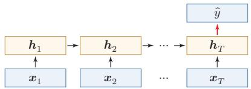  
(a) 末时刻状态模式

  
(b) 按时间平均模式  
图 6.3 序列分类模式

除了将最后时刻的状态作为整个序列的表示之外，我们还可以对整个序列的所有状态进行平均，并用这个平均状态来作为整个序列的表示（如图6.3b所示),即

$$
\hat { y } = g \Big ( \frac { 1 } { T } \sum _ { t = 1 } ^ { T } h _ { t } \Big ) .\tag{6.23}
$$

## 6.3.2 序列标注

序列标注（SequenceLabeling）是指对输入序列的每一时刻都标注相应的类别，输入序列和输出序列的长度相同，并且二者在位置上是一一对齐的.比如在词性标注（Part-of-SpeechTagging）中，每一个单词都需要标注其对应的词性标签.

在序列标注模式（如图6.4所示）中，输入为一个长度为T的序列 $\pmb { x } _ { 1 : T } ~ =$ $( \pmb { x } _ { 1 } , \cdots , \pmb { x } _ { T } )$ ，输出为序列 $y _ { 1 : T } = ( y _ { 1 } , \cdots , y _ { T } )$ .样本x按不同时刻输入到循环神经网络中，并得到不同时刻的隐状态 $\boldsymbol { h } _ { 1 } , \cdots , \boldsymbol { h } _ { { T } }$ .每个时刻的隐状态 $\boldsymbol { h } _ { t }$ 代表了当前时刻及其历史的信息，并输入给分类器 $g ( \cdot )$ 得到当前位置的标签 $\hat { y } _ { t }$ ,即

$$
\hat { y } _ { t } = g ( h _ { t } ) , \qquad \forall t \in [ 1 , T ] .\tag{6.24}
$$

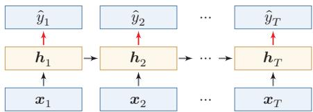  
图 6.4 序列标注模式

## 6.3.3 自回归序列建模

自回归序列建模（Autoregressive Sequence Modelling）主要用于根据历史前缀逐步预测后续符号.给定一个符号序列 $y _ { 1 : M } = ( y _ { 1 } , \cdots , y _ { M } )$ ，模型在第t个时刻根据历史 $y _ { 1 : t - 1 }$ 来预测下一个符号 $y _ { t }$ .语言模型就是其中最典型的一类任务.

在自回归序列建模中，循环神经网络在每一时刻接收前一个符号 $\hat { y } _ { t - 1 }$ 对应的向量表示 $\hat { \mathbf { y } } _ { t - 1 }$ ,并输出对当前符号 $y _ { t }$ 的预测，即

$$
\begin{array} { r l r l } & { \boldsymbol { h } _ { t } = f ( \boldsymbol { h } _ { t - 1 } , \hat { \boldsymbol { y } } _ { t - 1 } ) , } & & { \qquad \forall t \in [ 1 , M ] , } \\ & { } & \\ & { \hat { \boldsymbol { y } } _ { t } = g ( \boldsymbol { h } _ { t } ) , } & & { \qquad \forall t \in [ 1 , M ] , } \end{array}\tag{6.25}
$$

(6.26)

其中t =1时的输入通常为开始符号(BOS)的向量表示.

图6.5给出了自回归序列建模示例，其中(BOS)表示开始符号，虚线表示将上一个时刻生成的符号作为下一个时刻的输入.

  
图 6.5 自回归序列建模

在语言建模任务中，下一个词元预测（Next Token Prediction,NTP）也常常以这种形式出现.训练时，模型通常使用真实历史作为输入；生成时，则使用上一时刻的预测结果作为下一时刻的输入.

这里需要区分训练阶段和生成阶段的数据流.训练时，常见做法是把真实序列整体右移一位作为输入，并让模型在每个位置预测下一个真实符号，这种做法通常称为教师强制（TeacherForcing）．它的优点是可以并行计算所有位置的损失，并避免早期错误影响后续训练信号；但在生成阶段，模型只能看到自己已经生成的历史，一旦某一步预测错误，后续状态就会在错误历史上继续展开.这种训练和生成条件不完全一致的现象常称为暴露偏差（ExposureBias）.理解这一点，有助于把本节的自回归建模和后续Transformer语言模型中的“从前缀到logits再到采样”的数据流联系起来.

## 6.3.4 条件序列生成模式

条件序列生成（Conditional Sequence Generation）是指在一个输入序列的条件下生成另一个输出序列.与自回归序列建模相比，这类任务不仅依赖已经生成的历史输出，还显式依赖另一条输入序列．机器翻译、语音识别、人机对话等任务都属于这一类.传统上，这一类也常被称为编码器-解码器（Encoder-Decoder)模型.

在条件序列生成模式中，输入为长度为T的序列 ${ \pmb x } _ { 1 : T } = ( { \pmb x } _ { 1 } , \cdots , { \pmb x } _ { T } )$ ，输出为长度为M的序列 $y _ { 1 : M } = ( y _ { 1 } , \cdots , y _ { M } )$ .通常先将样本x按不同时刻输入到一个循环神经网络（编码器）中，并得到其编码；然后再使用另一个循环神经网络（解码器）逐步生成输出序列 $\hat { y } _ { 1 : M }$ ，为了建立输出序列之间的依赖关系，解码器通常采用自回归方式

令 $f _ { 1 } ( \cdot )$ 和 $f _ { 2 } ( \cdot )$ 分别为用作编码器和解码器的循环神经网络，则编码器-解码器模型可以写为

$$
h _ { t } = f _ { 1 } ( h _ { t - 1 } , x _ { t } ) ,
$$

$$
\forall t \in [ 1 , T ] ,\tag{6.27}
$$

$$
h _ { T + t } = f _ { 2 } ( h _ { T + t - 1 } , \hat { { \bf y } } _ { t - 1 } ) ,
$$

$$
\forall t \in [ 1 , M ] ,\tag{6.28}
$$

$$
\hat { y } _ { t } = g ( h _ { T + t } ) ,
$$

$$
\forall t \in [ 1 , M ] .\tag{6.29}
$$

其中 $g ( \cdot )$ 为分类器， $\hat { y } _ { t }$ 表示第t个时刻预测得到的离散符号， $\hat { \ b { y } } _ { t }$ 为该符号对应的向量表示（例如词嵌入）.在解码器中通常采用自回归模型，每个时刻的输入为上一时刻的预测结果 $\hat { y } _ { t - 1 }$ .在实际训练中，也经常使用目标序列中的真实前一符号作为解码器输入；而在推断或生成时，通常需要使用模型上一时刻生成的符号.这一点和前面的自回归序列建模完全一致.

自回归模型参见第6.1.2节.

图6.6给出了条件序列生成模式示例，其中(EOS)表示输入序列的结束，虚线表示将上一个时刻的输出作为下一个时刻的输入.

  
图 6.6 条件序列生成

需要注意的是，这类模型通常要把整个输入序列压缩为一个或少数几个状态向量，因此当输入很长时容易形成信息瓶颈. 这一局限进一步促使人们引入注意力机制，使解码器能够在生成过程中动态访问编码器不同位置的信息.参见第8.2节.

## 6.4 参数学习

循环神经网络的参数可以通过梯度下降方法来进行学习.

以随机梯度下降为例，给定一个训练样本 $( { \boldsymbol { x } } , { \boldsymbol { y } } )$ ，其中 ${ \pmb x } _ { 1 : T } = ( { \pmb x } _ { 1 } , \cdots , { \pmb x } _ { T } )$ 为长度是T的输入序列， $y _ { 1 : T } = ( y _ { 1 } , \cdots , y _ { T } )$ 是长度为T的标签序列.即在每个时刻t,都有一个监督信息 $y _ { t }$ ,我们定义时刻t的损失函数为

不失一般性，这里我们以序列标注模式为例来介绍循环神经网络的参数学习.

$$
\mathcal { L } _ { t } = \mathcal { L } ( y _ { t } , g ( h _ { t } ) ) ,\tag{6.30}
$$

其中 $g ( h _ { t } )$ 为第t时刻的输出，为可微分的损失函数，比如交叉熵.那么整个序列的损失函数为

$$
\mathcal { L } = \sum _ { t = 1 } ^ { T } \mathcal { L } _ { t } .\tag{6.31}
$$

整个序列的损失函数L关于参数U的梯度为

$$
\frac { \partial \mathcal { L } } { \partial U } = \sum _ { t = 1 } ^ { T } \frac { \partial \mathcal { L } _ { t } } { \partial U } ,\tag{6.32}
$$

即每个时刻损失 ${ \mathcal { L } } _ { t }$ 对参数U的偏导数之和.

循环神经网络中存在一个递归调用的函数f(·)，因此其计算参数梯度的方式和前馈神经网络不太相同.在循环神经网络中主要有两种计算梯度的方式：随时间反向传播(BPTT)算法和实时循环学习（RTRL)算法.

从直观上看，参数学习的关键在于回答三个问题：每个时刻的误差如何得到；这些误差如何沿时间反向传递到更早时刻；以及由于各时刻共享同一组参数，来自不同时间步的梯度应如何累加.BPTT正是围绕这三个问题展开的.

## 6.4.1随时间反向传播算法

随时间反向传播(Back-Propagation Through Time,BPTT)算法的主要思想是通过类似前馈神经网络的误差反向传播算法来计算梯度.

BPTT算法将循环神经网络看作一个展开的多层前馈网络，其中“每一层”对应循环网络中的“每个时刻”（见图6.2).这样，循环神经网络就可以按照前馈网络中的反向传播算法计算参数梯度.在“展开”的前馈网络中，所有层的参数是共享的，因此参数的真实梯度是所有“展开层”的参数梯度之和.

计算偏导数 $\frac { \partial \mathcal { L } _ { t } } { \partial U }$ 先来计算公式(6.32)中第t时刻损失对参数U的偏导数 $\frac { \partial \mathcal { L } _ { t } } { \partial U }$

因为参数U和隐藏层在每个时刻 $k ( 1 \leq k \leq t )$ 的净输入 $z _ { k } = U h _ { k - 1 } +$ $W { \pmb x } _ { k } + b$ 有关，因此第t时刻的损失函数 ${ \mathcal { L } } _ { t }$ 关于参数 $u _ { i j }$ 的梯度为：

$$
\frac { \partial \mathcal { L } _ { t } } { \partial u _ { i j } } = \sum _ { k = 1 } ^ { t } \frac { \partial ^ { + } z _ { k } } { \partial u _ { i j } } \frac { \partial \mathcal { L } _ { t } } { \partial z _ { k } } ,\tag{6.33}
$$

链式法则参见公式(B.19).

其中 $\frac { { \partial } ^ { + } { z } _ { k } } { \partial { u } _ { i j } }$ 表示“直接”偏导数，即公式 $z _ { k } = U h _ { k - 1 } + W x _ { k } + b$ 中保持 $ { h _ { k - 1 } }$ 不变,对 $u _ { i j }$ 进行求偏导数，得到

$$
\frac { \partial ^ { + } z _ { k } } { \partial u _ { i j } } = [ 0 , \cdots , ] [ h _ { k - 1 } ] _ { j } \backslash \cdots , 0 ]\tag{6.34}
$$

$$
\triangleq \mathbb { I } _ { i } ( [ h _ { k - 1 } ] _ { j } ) ,\tag{6.35}
$$

其中 $[ h _ { k - 1 } ] _ { j }$ 为第k-1时刻隐状态的第 $j$ 维； $\mathbb { I } _ { i } ( x )$ 除了第i个元素的值为x外，其余都为0的行向量.

定义误差项 $\begin{array} { r } { \delta _ { t , k } = \frac { \partial \mathcal { L } _ { t } } { \partial z _ { k } } } \end{array}$ 为第t时刻的损失对第k时刻隐藏神经层的净输入$z _ { k }$ 的导数，则当 $1 \leq k < t$ 时

$$
\delta _ { t , k } = \frac { \partial \mathcal { L } _ { t } } { \partial z _ { k } }\tag{6.36}
$$

$$
= \frac { \partial h _ { k } } { \partial z _ { k } } \frac { \partial z _ { k + 1 } } { \partial h _ { k } } \frac { \partial \mathcal { L } _ { t } } { \partial z _ { k + 1 } }\tag{6.37}
$$

$$
= \mathrm { d i a g } ( f ^ { \prime } ( z _ { k } ) ) U ^ { \top } \delta _ { t , k + 1 } .\tag{6.38}
$$

直观上，误差信号从时刻t沿时间反向传播到时刻k，每经过一步都乘以$\mathrm { d i a g } ( f ^ { \prime } ( z _ { k } ) ) U ^ { \top } -$ 其中 $U ^ { \top }$ 的出现源于前向传播时 $z _ { k + 1 } = U h _ { k } + \cdots$ 对 $h _ { k }$ 求导后的转置， $\mathrm { d i a g } ( f ^ { \prime } ( z _ { k } ) )$ 则来自激活函数的逐元素导数.

将公式(6.38)和公式(6.35)代入公式(6.33)得到

$$
\frac { \partial \mathcal { L } _ { t } } { \partial u _ { i j } } = \sum _ { k = 1 } ^ { t } [ \delta _ { t , k } ] _ { i } [ h _ { k - 1 } ] _ { j } .\tag{6.39}
$$

将上式写成矩阵形式为

$$
\frac { \partial \mathcal { L } _ { t } } { \partial U } = \sum _ { k = 1 } ^ { t } \delta _ { t , k } h _ { k - 1 } ^ { \top } .\tag{6.40}
$$

图6.7给出了误差项随时间进行反向传播算法的示例

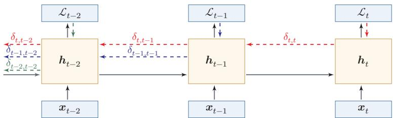  
图6.7 误差项随时间反向传播算法示例

参数梯度 将公式(6.40)代入到公式(6.32),得到整个序列的损失函数L关于参数U的梯度

$$
\frac { \partial \mathcal { L } } { \partial U } = \sum _ { t = 1 } ^ { T } \sum _ { k = 1 } ^ { t } \delta _ { t , k } h _ { k - 1 } ^ { \scriptscriptstyle \top } .\tag{6.41}
$$

同理可得，∠关于权重W和偏置b的梯度为

$$
\frac { \partial \mathcal { L } } { \partial W } = \sum _ { t = 1 } ^ { T } \sum _ { k = 1 } ^ { t } \delta _ { t , k } \pmb { x } _ { k } ^ { \top } ,\tag{6.42}
$$

$$
\frac { \partial \mathcal { L } } { \partial \boldsymbol { b } } = \sum _ { t = 1 } ^ { T } \sum _ { k = 1 } ^ { t } \delta _ { t , k } .\tag{6.43}
$$

计算复杂度 在BPTT算法中，参数的梯度需要在一个完整的“前向”计算和“反向”计算后才能得到并进行参数更新.

## 6.4.2 实时循环学习算法

与反向传播的BPTT算法不同的是，实时循环学习（Real-Time RecurrentLearning,RTRL)是通过前向传播的方式来计算梯度 [Williams et al., 1995].

这一小节作为补充了解即可.

假设循环神经网络中第t+1时刻的状态 $\boldsymbol { h } _ { t + 1 }$ 为

$$
\begin{array} { r } { \pmb { h } _ { t + 1 } = f ( \pmb { z } _ { t + 1 } ) = f ( \pmb { U } \pmb { h } _ { t } + \pmb { W } \pmb { x } _ { t + 1 } + \pmb { b } ) , } \end{array}
$$

梯度前向传播可以参考自动微分中的前向模式，参见第4.3.3节.

(6.44)

其关于参数 $u _ { i j }$ 的偏导数为

$$
\frac { \partial h _ { t + 1 } } { \partial u _ { i j } } = \Big ( \frac { \partial ^ { + } z _ { t + 1 } } { \partial u _ { i j } } + \frac { \partial h _ { t } } { \partial u _ { i j } } U ^ { \top } \Big ) \frac { \partial h _ { t + 1 } } { \partial z _ { t + 1 } }\tag{6.45}
$$

https://nndl.ai/

$$
= \left( \mathbb { I } _ { i } ( [ h _ { t } ] _ { j } ) + \frac { \partial h _ { t } } { \partial u _ { i j } } U ^ { \top } \right) \mathrm { d i a g } ( f ^ { \prime } ( z _ { t + 1 } ) )\tag{6.46}
$$

$$
= \Big ( \mathbb { I } _ { i } ( [ h _ { t } ] _ { j } ) + \frac { \partial h _ { t } } { \partial u _ { i j } } U ^ { \top } \Big ) \odot \big ( f ^ { \prime } ( z _ { t + 1 } ) \big ) ^ { \top } ,\tag{6.47}
$$

其中 $\mathbb { I } _ { i } ( x )$ 是除了第i列值为x外，其余都为0的行向量.

RTRL算法从第1个时刻开始，除了计算循环神经网络的隐状态之外，还利用公式(6.47)依次前向计算偏导数 $\frac { \partial h _ { 1 } } { \partial u _ { i j } } , \frac { \partial h _ { 2 } } { \partial u _ { i j } } , \frac { \partial h _ { 3 } } { \partial u _ { i j } } , \cdots$

这样，假设第t个时刻存在一个监督信息，其损失函数为 ${ \mathcal { L } } _ { t }$ ，就可以同时计算损失函数对 $u _ { i j }$ 的偏导数

$$
\frac { \partial \mathcal { L } _ { t } } { \partial u _ { i j } } = \frac { \partial h _ { t } } { \partial u _ { i j } } \frac { \partial \mathcal { L } _ { t } } { \partial h _ { t } } .\tag{6.48}
$$

这样在第t时刻，可以实时地计算损失 ${ \mathcal { L } } _ { t }$ 关于参数U的梯度，并更新参数.参数W和b的梯度也可以同样按上述方法实时计算.

两种算法比较RTRL算法和BPTT算法都是基于梯度下降的算法，分别通过前向模式和反向模式应用链式法则来计算梯度．在循环神经网络中，一般网络输出维度远低于输入维度，因此BPTT算法的计算量会更小，但是BPTT算法需要保存前向计算中的中间状态，空间复杂度较高.RTRL算法不需要沿时间反向回传误差，形式上适合在线学习或无限序列任务；但完整RTRL需要维护状态对参数的偏导数，计算和存储开销很高，因此实际应用中往往需要近似或截断版本.

## 6.5 长程依赖问题

循环神经网络在学习过程中的主要困难在于，梯度在跨时间传播时容易消失或爆炸，因此模型很难稳定地捕捉长时间间隔状态之间的依赖关系.

在BPTT算法中，将公式(6.38)展开得到

$$
\delta _ { t , k } = \prod _ { \tau = k } ^ { t - 1 } \Big ( \mathrm { d i a g } ( f ^ { \prime } ( \boldsymbol { z } _ { \tau } ) ) \boldsymbol { U } ^ { \intercal } \Big ) \delta _ { t , t } .\tag{6.49}
$$

如果定义 $\gamma \cong \| \mathrm { d i a g } ( f ^ { \prime } ( z _ { \tau } ) ) U ^ { \top } \|$ ,则

$$
\delta _ { t , k } \cong \gamma ^ { t - k } \delta _ { t , t } .\tag{6.50}
$$

若 $\gamma > 1$ ,当t − k → ∞时， $\gamma ^ { t - k } \to \infty$ 当间隔t—k比较大时，梯度也变得很大,会造成系统不稳定,称为梯度爆炸问题(Gradient Exploding Problem).

相反，若 $\gamma < 1$ ，当 $t - k \to \infty$ 时， $\gamma ^ { t - k }  0 .$ 当间隔t—k比较大时，梯度也变得非常小，会出现和深层前馈神经网络类似的梯度消失问题（VanishingGradient Problem）.更精确的分析可通过权重矩阵U的谱半径来刻画:若其最大特征值的模大于1,则梯度倾向于爆炸;若小于1,则倾向于消失.

要注意的是，在循环神经网络中的梯度消失不是说 $\frac { \partial \mathcal { L } _ { t } } { \partial U }$ 的梯度消失了，而是 $\frac { \partial \mathcal { L } _ { t } } { \partial h _ { k } }$ 的梯度消失了（当间隔t—k比较大时).也就是说，参数U的更新主要靠当前时刻t的几个相邻状态 $h _ { k }$ 来更新，长距离的状态对参数U没有影响.

由于循环神经网络经常使用Logistic函数或Tanh函数作为非线性激活函数，其导数值都小于1，并且权重矩阵 $\| \pmb { U } \|$ 也不会太大，因此如果时间间隔t—k过大， $\delta _ { t , k }$ 会趋向于0,因而经常会出现梯度消失问题.

虽然简单循环网络理论上可以建立长时间间隔的状态之间的依赖关系，但是由于梯度爆炸或消失问题，实际上只能学习到短期的依赖关系．这样，如果时刻t的输出 $y _ { t }$ 依赖于时刻k的输入 $\scriptstyle { \pmb x } _ { k }$ ，当间隔t一k比较大时，简单神经网络很难建模这种长距离的依赖关系，称为长程依赖问题（Long-Term DependenciesProblem).

长程依赖问题也称为长期依赖问题或长距离依赖问题.

## 6.5.1 改进方案

为了避免梯度爆炸或消失问题，一种最直接的方式就是选取合适的参数，同时使用非饱和的激活函数，尽量使得 $\mathrm { d i a g } ( f ^ { \prime } ( z ) ) U ^ { \intercal } \approx 1$ ，这种方式需要足够的人工调参经验，限制了模型的广泛应用.比较有效的方式是通过改进模型或优化方法来缓解循环网络的梯度爆炸和梯度消失问题

梯度爆炸一般而言，循环网络的梯度爆炸问题比较容易解决，一般通过权重衰减或梯度截断来避免.

梯度截断是一种启发式的解决梯度爆炸问题的有效方法，参见第7.2.4.6节.

权重衰减是通过给参数增加 $\ell _ { 1 }$ 或 $\ell _ { 2 }$ 范数的正则化项来限制参数的取值范围，从而使得 $\gamma \leq 1$ .梯度截断是另一种有效的启发式方法，当梯度的模大于一定阈值时，就将它截断成为一个较小的数.

梯度消失 梯度消失是循环网络的主要问题.除了使用一些优化技巧外，更有效的方式就是改变模型，比如让 $U = I$ ,同时令 $\begin{array} { r } { \frac { \partial h _ { t } } { \partial h _ { t - 1 } } = I } \end{array}$ 为单位矩阵，即

$$
\begin{array} { r } { \pmb { h } _ { t } = \pmb { h } _ { t - 1 } + g ( \pmb { x } _ { t } ; \pmb { \theta } ) , } \end{array}\tag{6.51}
$$

其中 $g ( \cdot )$ 是一个非线性函数，θ为参数.

公式(6.51)中， $\boldsymbol { h } _ { t }$ 和 $\boldsymbol { h } _ { t - 1 }$ 之间为线性依赖关系，且权重系数为1，这样就不存在梯度爆炸或消失问题.但是，这种改变也丢失了神经元在反馈边上的非线性激活的性质，因此也降低了模型的表示能力.

为了避免这个缺点，我们可以采用一种更加有效的改进策略：

$$
h _ { t } = h _ { t - 1 } + g ( \boldsymbol { x } _ { t } , h _ { t - 1 } ; \boldsymbol { \theta } ) ,
$$

这种改进策略和残差连接的思想十分类似，参见第5.4.5节.

(6.52)

这样 $\boldsymbol { h } _ { t }$ 和 $\boldsymbol { h } _ { t - 1 }$ 之间为既有线性关系，也有非线性关系，并且可以缓解梯度消失问题.但这种改进依然存在两个问题：

（1）梯度爆炸问题：令 $z _ { k } = U h _ { k - 1 } + W x _ { k } + b$ 为在第k时刻函数 $g ( \cdot )$ 的输入，在计算公式(6.36)中的误差项 $\begin{array} { r } { \delta _ { t , k } = \frac { \partial \mathcal { L } _ { t } } { \partial z _ { k } } } \end{array}$ 时，梯度可能会过大，从而导致梯度爆炸问题.

（2）记忆容量（MemoryCapacity）问题：随着 $\boldsymbol { h } _ { t }$ 不断累积存储新的输入信息，会发生饱和现象.假设 $g ( \cdot )$ 为Logistic函数，则随着时间t的增长， $\boldsymbol { h } _ { t }$ 会变得越来越大，从而导致h变得饱和.也就是说，隐状态 $\boldsymbol { h } _ { t }$ 可以存储的信息是有限的，随着记忆单元存储的内容越来越多，其丢失的信息也越来越多.

为了解决这两个问题，可以通过引入门控机制来进一步改进模型

## 6.6 基于门控的循环神经网络

为了改善循环神经网络的长程依赖问题，一种常用而有效的思路是在公式(6.52)的基础上引入门控机制来控制信息的累积速度，包括有选择地加入新的信息，并有选择地遗忘之前累积的信息.这一类网络可以称为基于门控的循环神经网络（GatedRNN）.本节中，主要介绍两种基于门控的循环神经网络：长短期记忆网络和门控循环单元网络.

## 6.6.1 长短期记忆网络

长短期记忆(Long Short-Term Memory,LSTM) 网络 [Gers et al., 2000]是循环神经网络的一个变体，可以有效缓解简单循环神经网络中的长程依赖问题，尤其是梯度消失问题.

在公式(6.52)的基础上，LSTM网络主要改进在以下两个方面：

新的内部状态LSTM网络引入一个新的内部状态（internal state） $\boldsymbol { c } _ { t } \in \mathbb { R } ^ { D }$ 专门进行线性的循环信息传递，同时（非线性地）输出信息给隐藏层的外部状态$\boldsymbol { h } _ { t } \in \mathbb { R } ^ { D }$ .内部状态 $\mathbf { } c _ { t }$ 通过下面公式计算：

$$
\pmb { c } _ { t } = \pmb { f } _ { t } \odot \pmb { c } _ { t - 1 } + \pmb { i } _ { t } \odot \tilde { \pmb { c } } _ { t } ,\tag{6.53}
$$

https://nndl.ai/

$$
h _ { t } = o _ { t } \odot \operatorname { t a n h } ( c _ { t } ) ,\tag{6.54}
$$

其中 $\mathbf { \Delta } f _ { t } \in [ 0 , 1 ] ^ { D } , i _ { t } \in [ 0 , 1 ] ^ { D }$ 和 ${ \boldsymbol { o } } _ { t } \in [ 0 , 1 ] ^ { D }$ 为三个门（gate）来控制信息传递的路径： $\odot$ 为向量元素乘积； $c _ { t - 1 }$ 为上一时刻的记忆单元； $\tilde { \boldsymbol { c } } _ { t } \in \mathbb { R } ^ { D }$ 是通过非线性函数得到的候选状态：

$$
\tilde { c } _ { t } = \operatorname { t a n h } ( W _ { c } \mathbf { x } _ { t } + U _ { c } h _ { t - 1 } + b _ { c } ) .
$$

公式(6.55) \~ 公式(6.58)中的W\*, U\*, $^ { b _ { * } }$ 为可学习的网络参数，其中$* \in \{ i , f , o , c \}$

(6.55)

在每个时刻t,LSTM网络的内部状态 $\mathbf { } c _ { t }$ 记录了到当前时刻为止的历史信息.门控机制在数字电路中，门（gate）为一个二值变量{0,1}，0代表关闭状态，不许任何信息通过；1代表开放状态，允许所有信息通过

LSTM网络引入门控机制（GatingMechanism）来控制信息传递的路径.公式(6.53)和公式(6.54)中三个“门”分别为输入门 $| i _ { t }$ 、遗忘门 $\pmb { f } _ { t }$ 和输出门 $\mathbf { } _ { o _ { t } }$ .这三个门的作用为

（1）遗忘门 $\pmb { f } _ { t }$ 控制上一个时刻的内部状态 $c _ { t - 1 }$ 需要遗忘多少信息

（2）输入门 $i _ { t }$ 控制当前时刻的候选状态 $\tilde { c } _ { t }$ 有多少信息需要保存

（3）输出门 $\mathbf { } _ { o _ { t } }$ 控制当前时刻的内部状态 $\mathbf { } c _ { t }$ 有多少信息需要输出给外部状态 $\boldsymbol { h } _ { t }$

当 $\pmb { f } _ { t } = \mathbf 0 , \pmb { i } _ { t } = \mathbf 1$ 时，记忆单元将上一时刻内部状态 $c _ { t - 1 }$ 中的信息清空，并将候选状态向量 $\tilde { c } _ { t }$ 写入.需要注意的是，候选状态和门值本身仍由当前输入 $\mathbf { \boldsymbol { x } } _ { t }$ 与上一时刻外部状态 $\boldsymbol { h } _ { t - 1 }$ 共同决定.当 $\mathbf { \Delta } f _ { t } = 1 , i _ { t } = 0$ 时，记忆单元将复制上一时刻的内容，不写入新的信息.

LSTM网络中的“门”是一种“软”门，取值在(0,1)之间，表示以一定的比例允许信息通过.三个门的计算方式为：

$$
i _ { t } = \sigma ( W _ { i } x _ { t } + U _ { i } h _ { t - 1 } + b _ { i } ) ,
$$

$$
\pmb { f } _ { t } = \sigma ( \pmb { W } _ { f } \pmb { x } _ { t } + \pmb { U } _ { f } \pmb { h } _ { t - 1 } + \pmb { b } _ { f } ) ,\tag{6.56}
$$

(6.57)

$$
\begin{array} { r } { \pmb { o } _ { t } = \sigma ( \pmb { W } _ { o } \pmb { x } _ { t } + \pmb { U } _ { o } \pmb { h } _ { t - 1 } + \pmb { b } _ { o } ) , } \end{array}\tag{6.58}
$$

其中 $\sigma ( \cdot )$ 为Logistic函数,其输出区间为(0,1)， $\mathbf { \boldsymbol { x } } _ { t }$ 为当前时刻的输入， $\boldsymbol { h } _ { t - 1 }$ 为上一时刻的外部状态.

图6.8给出了LSTM网络的循环单元结构，其计算过程为：1）首先利用上一时刻的外部状态 $\boldsymbol { h } _ { t - 1 }$ 和当前时刻的输入 ${ \mathbf { } } _ { { \mathbf { } } _ { \pmb { x } _ { t } } }$ ，计算出三个门，以及候选状态 $\tilde { c } _ { t } ; 2 $ 结合遗忘门 $\pmb { f } _ { t }$ 和输入门 $i _ { t }$ 来更新记忆单元c；3)结合输出门o₄，将内部状态的 $\mathbf { } c _ { t }$ $\mathbf { } _ { o _ { t } }$ 信息传递给外部状态 $\boldsymbol { h } _ { t }$

LSTM避免梯度消失的关键在于：记忆单元$\mathbf { c } _ { t }$ 的更新是加法形式$( \mathbf { \Delta } \mathbf { c } _ { t } = \mathbf { \Delta } \mathbf { f } _ { t } \odot \mathbf { c } _ { t - 1 } + i _ { t } \odot $ $\tilde { c } _ { t } )$ ，当 $\mathbf { \nabla } f _ { t } \approx \mathbf { 1 }$ 时梯度可近似恒等传播；而普通RNN的隐状态为乘法形式，反向传播中权重矩阵的累乘容易导致梯度消失或爆炸.

一般在深度网络参数学习时，权重参数初始化得比较小. 训练LSTM网络时，遗忘门偏置 $b _ { f }$ 常初始化为正值 $( \ - \not \mathtt { k } \mathtt { m } \ ]$ 或2).使训练

  
图 6.8 LSTM 网络的循环单元结构

通过LSTM循环单元，整个网络可以建立较长距离的时序依赖关系.公式(6.53)\~公式(6.58)可以简洁地描述为

$$
\left[ \begin{array} { c } { \tilde { c } _ { t } } \\ { o _ { t } } \\ { i _ { t } } \\ { f _ { t } } \end{array} \right] = \left[ \begin{array} { c } { \operatorname { t a n h } } \\ { \sigma } \\ { \sigma } \\ { \sigma } \\ { \sigma } \end{array} \right] \left( W \left[ \begin{array} { c } { x _ { t } } \\ { h _ { t - 1 } } \end{array} \right] + b \right) ,\tag{6.59}
$$

$$
\pmb { c } _ { t } = \pmb { f } _ { t } \odot \pmb { c } _ { t - 1 } + \pmb { i } _ { t } \odot \tilde { \pmb { c } } _ { t } ,\tag{6.60}
$$

$$
h _ { t } = \pmb { \sigma } _ { t } \odot \operatorname { t a n h } \left( \pmb { c } _ { t } \right) ,\tag{6.61}
$$

其中 $\pmb { x } _ { t } \in \mathbb { R } ^ { M }$ 为当前时刻的输入， $W \in \mathbb { R } ^ { 4 D \times ( M + D ) }$ 和 $\pmb { b } \in \mathbb { R } ^ { 4 D }$ 为网络参数.记忆 循环神经网络中的隐状态h存储了历史信息，可以看作一种记忆（Mem-ory）.在简单循环网络中，隐状态每个时刻都会被重写，因此可以看作一种短期记忆（Short-Term Memory）.在神经网络中，长期记忆（Long-Term Memory）可以看作网络参数，隐含了从训练数据中学到的经验，其更新周期要远远慢于短期记忆.而在LSTM网络中，记忆单元c可以在某个时刻捕捉到某个关键信息，并有能力将此关键信息保存一定的时间间隔.记忆单元c中保存信息的生命周期要长于短期记忆h，但又远远短于长期记忆，因此称为长短期记忆（LongShort-Term Memory).

长短期记忆是指长的“短期记忆”.

## 6.6.2 门控循环单元网络

门控循环单元（Gated Recurrent Unit，GRU）网络 [Cho et al.,2014; Chung et al., 2014]是一种比LSTM网络更加简单的循环神经网络.

GRU网络引入门控机制来控制信息更新的方式. 和LSTM不同，GRU不引入额外的记忆单元，GRU网络也是在公式(6.52)的基础上引入一个更新门

（UpdateGate）来控制当前状态需要从历史状态中保留多少信息（不经过非线性变换)，以及需要从候选状态中接受多少新信息，即

$$
\pmb { h } _ { t } = \pmb { z } _ { t } \odot \pmb { h } _ { t - 1 } + ( 1 - \pmb { z } _ { t } ) \odot g ( \pmb { x } _ { t } , \pmb { h } _ { t - 1 } ; \theta ) ,\tag{6.62}
$$

其中 $\boldsymbol { z } _ { t } \in [ 0 , 1 ] ^ { D }$ 为更新门：

$$
z _ { t } = \sigma ( W _ { z } { \pmb x } _ { t } + { U } _ { z } { \pmb h } _ { t - 1 } + b _ { z } ) .\tag{6.63}
$$

GRU网络直接使用一个更新门来控制“保留旧状态”和“写入候选状态”之间的平衡，相当于把保留和写入两种作用压缩为一组互补权重.当 $z _ { t } = 0$ 时，当前状态 $\boldsymbol { h } _ { t }$ 和前一时刻的状态 $\boldsymbol { h } _ { t - 1 }$ 之间为非线性函数关系；当 $z _ { t } = 1$ 时， $\boldsymbol { h } _ { t }$ 和$\boldsymbol { h } _ { t - 1 }$ 之间为线性函数关系.

公式(6.63)\~ 公式(6.65)中的$W _ { * } , U _ { * } , b _ { * }$ 为可学习的网络参数，其中$* \in \{ h , r , z \}$

在GRU网络中，函数 $g ( \pmb { x } _ { t } , \pmb { h } _ { t - 1 } ; \theta )$ 的定义为

$$
\tilde { \boldsymbol { h } } _ { t } = \operatorname { t a n h } \Big ( \boldsymbol { W } _ { h } \boldsymbol { x } _ { t } + \boldsymbol { U } _ { h } ( \boldsymbol { r } _ { t } \odot \boldsymbol { h } _ { t - 1 } ) + \boldsymbol { b } _ { h } \Big ) ,
$$

这里使用 Tanh 函数是由于其导数有比较大的值域，能够缓解梯度消失问题.

(6.64)

其中 $\tilde { h } _ { t }$ 表示当前时刻的候选状态， $\boldsymbol { r } _ { t } \in [ 0 , 1 ] ^ { D }$ 为重置门(Reset Gate)

$$
\boldsymbol { r } _ { t } = \sigma ( \boldsymbol { W } _ { r } \boldsymbol { x } _ { t } + \boldsymbol { U } _ { r } \boldsymbol { h } _ { t - 1 } + \boldsymbol { b } _ { r } ) ,\tag{6.65}
$$

用来控制候选状态 $\tilde { \mathbf { \Lambda } } _ { }$ 的计算是否依赖上一时刻的状态 $\boldsymbol { h } _ { t - 1 }$

当 $\boldsymbol { r } _ { t } = \mathbf { 0 }$ 时，候选状态 $\tilde { \boldsymbol { h } } _ { t } = \operatorname { t a n h } ( \boldsymbol { W } _ { h } \boldsymbol { x } _ { t } + \boldsymbol { b } _ { h } )$ 只和当前输入 $\mathbf { \boldsymbol { x } } _ { t }$ 相关，,和历史状态无关.当 $\boldsymbol { r } _ { t } = 1$ 时，候选状态 $\tilde { \pmb { h } } _ { t } = \operatorname { t a n h } ( \pmb { W } _ { h } \pmb { x } _ { t } + \pmb { U } _ { h } \pmb { h } _ { t - 1 } + \pmb { b } _ { h } )$ 和当前输入 $\mathbf { \boldsymbol { x } } _ { t }$ 以及历史状态 $\boldsymbol { h } _ { t - 1 }$ 相关，和简单循环网络一致.

综上，GRU网络的状态更新方式为

$$
\pmb { h } _ { t } = z _ { t } \odot \pmb { h } _ { t - 1 } + ( 1 - z _ { t } ) \odot \tilde { \pmb { h } } _ { t } .\tag{6.66}
$$

可以看出，当 ${ \boldsymbol { z } } _ { t } = \mathbf { 0 } , { \boldsymbol { r } } _ { t } = \mathbf { 1 }$ 时，GRU网络退化为简单循环网络；若 ${ \boldsymbol { z } } _ { t } = \mathbf { 0 } , { \boldsymbol { r } } _ { t } =$ 0时，当前状态 $\boldsymbol { h } _ { t }$ 只和当前输入 $\mathbf { \boldsymbol { x } } _ { t }$ 相关，和历史状态 $\boldsymbol { h } _ { t - 1 }$ 无关.当 $z _ { t } = 1$ 时，当前状态 $h _ { t } = h _ { t - 1 }$ 等于上一时刻状态 $\boldsymbol { h } _ { t - 1 }$ ，和当前输入 $\mathbf { \boldsymbol { x } } _ { t }$ 无关.

图6.9给出了GRU网络的循环单元结构.

从教材学习的角度看，可以将SRN、LSTM和GRU作一个并列比较，如表6.2所示.SRN结构最紧凑，但难以稳定建模长程依赖；LSTM通过额外的记忆单元和三个门来显式控制信息流；GRU则在保留门控思想的同时，进一步简化了结构.

  
图 6.9 GRU网络的循环单元结构

表 6.2 SRN、LSTM与GRU的比较
<table><tr><td>模型</td><td>状态变量</td><td>门控结构</td><td>特点</td></tr><tr><td>SRN</td><td> $\boldsymbol { h } _ { t }$ </td><td>无</td><td>结构简单，但难以稳定建模长程 依赖</td></tr><tr><td>LSTM</td><td> $\boldsymbol { h } _ { t } , \boldsymbol { c } _ { t }$ </td><td>输入门、遗忘门、输出 门</td><td>控制更细致，表达能力强，但参数 较多</td></tr><tr><td>GRU</td><td> $\boldsymbol { h } _ { t }$ </td><td>更新门、重置门</td><td>结构更紧凑，训练和实现相对简 单</td></tr></table>

## 6.7 深层循环神经网络

如果将深度定义为网络中信息传递路径长度的话，循环神经网络可以看作既“深”又“浅”的网络.一方面来说，如果我们把循环网络按时间展开，长时间间隔的状态之间的路径很长，循环网络可以看作一个非常深的网络.从另一方面来说，如果同一时刻网络输入到输出之间的路径 $\mathbf { \boldsymbol { x } } _ { t } \to \mathbf { \boldsymbol { y } } _ { t }$ ,这个网络是非常浅的.

因此，可以通过增加同一时刻输入到输出之间的非线性变换层数，来增强循环神经网络的表示能力.换言之，循环网络不仅可以沿时间方向变“深”，也可以在每个时间步内部继续加深.

## 6.7.1 堆叠循环神经网络

一种常见的增加循环神经网络深度的做法是将多个循环网络堆叠起来，称为堆叠循环神经网络（Stacked Recurrent Neural Network，SRNN）. 一个堆叠的简单循环网络（Stacked SRN）也称为循环多层感知器（Recurrent Multi-

Layer Perceptron,RMLP) [Parlos et al., 1991].

图6.10给出了按时间展开的堆叠循环神经网络.第l层网络的输入是第l—1层网络的输出.我们定义 $h _ { t } ^ { ( l ) }$ 为在时刻t时第l层的隐状态

$$
\pmb { h } _ { t } ^ { ( l ) } = f ( \pmb { U } ^ { ( l ) } \pmb { h } _ { t - 1 } ^ { ( l ) } + \pmb { W } ^ { ( l ) } \pmb { h } _ { t } ^ { ( l - 1 ) } + \pmb { b } ^ { ( l ) } ) ,\tag{6.67}
$$

其中 $U ^ { ( l ) }$ $W ^ { ( l ) }$ 和 $\mathbf { \delta } _ { b } ( l )$ 为权重矩阵和偏置向量 ${ \pmb h } _ { t } ^ { ( 0 ) } = { \pmb x } _ { t }$

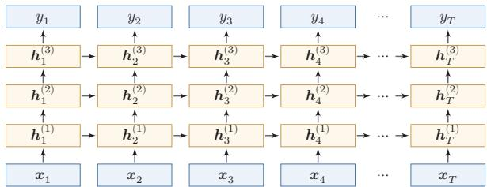  
图6.10 按时间展开的堆叠循环神经网络

## 6.7.2 双向循环神经网络

在有些任务中，一个时刻的输出不但和过去时刻的信息有关，也和后续时刻的信息有关．比如给定一个句子，其中一个词的词性由它的上下文决定，即包含左右两边的信息.因此，在这些任务中，我们可以增加一个按照时间的逆序来传递信息的网络层，来增强网络的能力.

双向循环神经网络(Bidirectional Recurrent Neural Network，Bi-RNN)由两层循环神经网络组成，它们的输入相同，只是信息传递的方向不同.

假设第1层按时间顺序，第2层按时间逆序，在时刻t时的隐状态定义为 $h _ { t } ^ { ( 1 ) }$ 和 $h _ { t } ^ { ( 2 ) }$ ,则

$$
\pmb { h } _ { t } ^ { ( 1 ) } = f ( \pmb { U } ^ { ( 1 ) } \pmb { h } _ { t - 1 } ^ { ( 1 ) } + \pmb { W } ^ { ( 1 ) } \pmb { x } _ { t } + \pmb { b } ^ { ( 1 ) } ) ,\tag{6.68}
$$

$$
\pmb { h } _ { t } ^ { ( 2 ) } = f ( \pmb { U } ^ { ( 2 ) } \pmb { h } _ { t + 1 } ^ { ( 2 ) } + \pmb { W } ^ { ( 2 ) } \pmb { x } _ { t } + \pmb { b } ^ { ( 2 ) } ) ,\tag{6.69}
$$

$$
\pmb { h } _ { t } = \pmb { h } _ { t } ^ { ( 1 ) } \oplus \pmb { h } _ { t } ^ { ( 2 ) } ,\tag{6.70}
$$

其中⊕为向量拼接操作.

图6.11给出了按时间展开的双向循环神经网络.

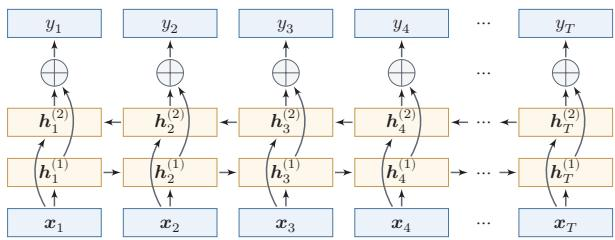  
图6.11 按时间展开的双向循环神经网络

## 6.8 从序列到更一般的结构

如果将循环神经网络按时间展开，并把每个时刻的隐状态 $\boldsymbol { h } _ { t }$ 看作一个节点，那么这些节点就构成了一条链式结构：每个节点接收来自前一时刻的消息，更新自身状态，再将信息传递给后继节点.从这个角度看，循环神经网络本质上是在链式结构上进行状态传播与参数共享的模型

这一视角的意义在于，它揭示了序列模型与更一般结构化模型之间的联系：当底层结构从链扩展到树时，可以得到递归神经网络（Recursive Neural Net-work，RvNN）；当底层结构进一步扩展到一般图时，则发展为图神经网络(Graph Neural Network，GNN）.尽管这些模型面对的数据结构不同，但都可以统一地理解为“信息传递一状态更新一表示读出”这一基本框架.

图神经网络参见第9章.

递归神经网络（Recursive Neural Network,RvNN）是循环神经网络在有向无循环图上的扩展[Pollack,1990]. 递归神经网络的一般结构为树状的层次结构，如图6.12所示.

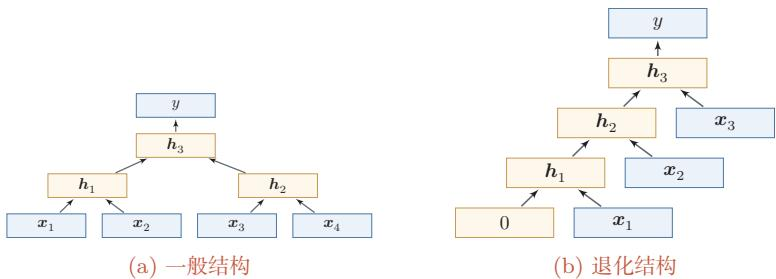  
图 6.12 递归神经网络

以图6.12a中的结构为例，有三个隐藏层 $h _ { 1 } , h _ { 2 }$ 和 $h _ { 3 }$ ，其中 $\pmb { h } _ { 1 }$ 由两个输入层 $\mathbf { \boldsymbol { x } } _ { 1 }$ 和 $\scriptstyle { \pmb { x } } _ { 2 }$ 计算得到， $h _ { 2 }$ 由另外两个输入层 $\mathbf { { x } _ { 3 } }$ 和 $\mathbf { \boldsymbol { x } } _ { 4 }$ 计算得到， $h _ { 3 }$ 由两个隐藏层$h _ { 1 }$ 和 $h _ { 2 }$ 计算得到.

对于一个节点 $\boldsymbol { h } _ { i }$ ，它可以接受来自子节点或前驱节点集合 $\pi _ { i }$ 中所有节点的

消息，并更新自己的状态

$$
\begin{array} { r } { h _ { i } = f ( h _ { \pi _ { i } } ) , } \end{array}\tag{6.71}
$$

其中 $\boldsymbol { h } _ { \pi _ { i } }$ 表示集合 $\pi _ { i }$ 中所有节点状态的拼接， $f ( \cdot )$ 是一个和节点位置无关的非线性函数，可以为一个单层的前馈神经网络．比如图6.12a所示的递归神经网络具体可以写为

$$
\begin{array} { r } { h _ { 1 } = \sigma ( W [ { \pmb x } _ { 1 } ; { \pmb x } _ { 2 } ] + { \pmb b } ) , } \end{array}\tag{6.72}
$$

$$
h _ { 2 } = \sigma ( W [ { \pmb x } _ { 3 } ; { \pmb x } _ { 4 } ] + { \pmb b } ) ,\tag{6.73}
$$

$$
\begin{array} { r } { h _ { 3 } = \sigma ( W [ h _ { 1 } ; h _ { 2 } ] + b ) , } \end{array}\tag{6.74}
$$

其中 $\sigma ( \cdot )$ 表示非线性激活函数， $W$ 和b是可学习的参数.同样，输出层 $y$ 可以为一个分类器，比如

$$
y = g ( W ^ { \prime } h _ { 3 } + \boldsymbol { b } ^ { \prime } ) ,\tag{6.75}
$$

其中 $g ( \cdot )$ 为分类器， $W ^ { \prime }$ 和 ${ \pmb { b } } ^ { \prime }$ 为分类器的参数.

当递归神经网络的结构退化为线性序列结构（见图6.12b）时，递归神经网络就等价于简单循环网络.

参见习题6-11.

递归神经网络主要用来建模自然语言句子的语义.给定一个句子的语法结构（一般为树状结构），可以使用递归神经网络来按照句法的组合关系来合成一个句子的语义.句子中每个短语成分又可以分成一些子成分，即每个短语的语义都可以由它的子成分语义组合而来，并进而合成整句的语义.

循环神经网络不仅是序列建模的重要起点，也为后续理解树结构和图结构上的表示学习提供了直观基础.考虑到图神经网络在建模对象、传播方式和训练目标上都具有自身特点，这里只保留这一过渡性说明，其具体模型与方法将在后续章节中专门介绍

## 6.9 总结和扩展阅读

本章围绕“如何让神经网络处理序列数据”这一问题展开.与前馈神经网络不同，循环神经网络通过隐状态在时间维度上传递信息，使模型能够把当前输入与历史上下文结合起来，从而适用于文本、语音以及一般时间序列等长度可变的数据.沿着这条主线，本章依次介绍了三种增加短期记忆能力的方法：延时器、非线性自回归建模以及循环连接.其中，循环神经网络提供了一种更加紧凑、也更一般的状态建模方式

从计算视角看，循环神经网络可以看作“在时间维度上展开、并在各时刻共享参数”的前馈神经网络，这个视角一方面说明了随时间反向传播算法的来源，另一方面也揭示了循环神经网络训练的核心困难：误差信号需要跨越多个时间步传播，因而容易出现梯度爆炸或梯度消失问题.也正因为如此，简单循环网络虽然在理论上具有很强的表达能力，但在实践中往往只能稳定地建模较短程的依赖关系.

为了解决这一矛盾，本章进一步介绍了门控机制.LSTM通过记忆单元以及输入门、遗忘门、输出门，为信息的保留、覆盖和输出建立了可控的通路；GRU则以更紧凑的结构实现了类似思想.它们表明，序列建模的关键不只是“让状态循环起来”，更重要的是“让哪些信息沿着什么路径传播，并保留多久”.这一思想在后续很多模型中都得到了延续，例如残差连接、注意力机制以及更一般的消息传递结构.

从更广的角度看，循环神经网络是理解后续序列模型的重要起点.编码器一解码器结构将RNN推广到机器翻译等复杂生成任务中，但固定长度状态表示也暴露出新的瓶颈，并进一步催生了注意力机制.同时，若把RNN理解为一种在链式结构上进行信息传递与状态更新的模型，那么它也自然成为通向树结构模型与图表示学习的概念桥梁.因此，本章既是序列建模的基础章节，也是后续注意力模型、Transformer以及图神经网络章节的重要过渡.虽然很多长序列任务后来逐步转向注意力机制和Transformer，但RNN的核心思想并未过时.近年来，以Mamba为代表的状态空间模型（State Space Model，SSM）将循环神经网络的递推思想与连续时间线性系统理论相结合，通过结构化参数化和输入依赖的选择性机制，在长序列建模中以线性计算复杂度达到了与同规模Transformer相当的性能.这表明RNN范式正在以新的形式复兴—其局限性不仅可以通过门控机制解决，也正在通过线性化和结构化参数化得到新的突破.此后，Mamba-2提出了结构化状态空间对偶理论，在数学上统一了线性注意力和状态空间模型的框架[Dao et al., 2024]. 这些进展表明，RNN式的递推计算与 Transformer式的并行注意力机制之间的边界正在模糊化，统一理解两类方法是当前的研究前沿．此外，RNN在流式处理、在线预测以及低延迟时序建模中仍然具有独特价值.

扩展阅读 如果希望把握循环神经网络的基本思想，可以结合Elman网络[El-man，1990]与BPTT算法[Werbos,1990]来理解“状态”“展开”“参数共享”这三个核心概念；如果希望理解长程依赖问题的根源，可以重点阅读关于梯度消失与梯度爆炸的经典分析 [Bengio et al., 1994; Hochreiter et al., 2001];如果希望理解为什么LSTM和GRU在实践中更加有效，则应重点关注门控机制如何改变梯度传播路径 [Chung et al., 2014; Gers et al., 2000; Hochreiter et al., 1997].

进一步地，如果希望把握序列建模范式如何继续演化，可以顺着“编码器一解码器[Sutskever et al., 2014] → 注意力机制 → Transformer”的线索阅读后续章节；如果对更一般的结构化建模感兴趣，则可以将本章关于序列上的状态传播，与树结构和图结构中的消息传递放在一起理解[Battaglia et al., 2018; Scarselliet al.,2009].这样阅读时，不宜将这些工作看成彼此孤立的模型改进，而应将其理解为围绕“记忆、依赖与信息流”这一主线展开的连续演化.

## 习题

## 基础题

习题6-1比较延时神经网络、卷积神经网络和循环神经网络在“历史信息利用方式”“参数共享方式”以及“适用任务”上的异同

习题6-2将简单循环网络按时间展开为一个前馈网络，并说明：（1）展开后哪些参数在不同时刻共享；(2）为什么循环神经网络能够处理长度可变的输入序列习题6-3 分别说明序列分类模式、序列标注模式、自回归序列建模和条件序列生成模式四类任务的输入输出形式，并各举一个典型应用.

习题6-4 以自回归语言模型为例，说明训练阶段和生成阶段的数据流有什么不同.什么是教师强制？为什么训练时使用真实历史、生成时使用模型历史可能导致暴露偏差？

## 提高题

习题6-5 推导公式(6.42)和公式(6.43) 中的梯度,并写出相应的矩阵形式.

习题6-6根据公式(6.38)的递推展开，说明为什么当时间间隔t一k增大时，简单循环网络容易出现梯度消失或梯度爆炸，并分析这与长程依赖问题之间的关系.习题6-7 当使用公式(6.52)作为循环神经网络的状态更新公式时，分析其为什么能够缓解梯度消失问题，又为什么仍然可能出现梯度爆炸问题，并给出至少两种可行的改进思路

习题6-8 比较LSTM网络与GRU网络在状态变量、门控结构、参数规模以及适用场景上的异同，并说明二者为何都比简单循环网络更容易建模长程依赖.

## 拓展题

习题6-9 结合公式(6.53)-(6.58)，分析LSTM中记忆单元 $\mathbf { } c _ { t }$ 上的梯度传播路径，并说明遗忘门取值对长期信息保留有什么影响.

习题6-10 除了堆叠循环神经网络外，还有哪些结构化方式可以增加循环神经网络的表达能力或有效深度?可从双向结构、跨层连接或门控路径等角度讨论.

习题6-11 证明当递归神经网络的结构退化为线性序列结构时，递归神经网络可看作简单循环网络的一种等价形式

习题6-12 从“信息如何在结构中传播”的角度，比较循环神经网络、递归神经网络和图神经网络三者的共性与差异，并思考：为什么从RNN进一步发展，容易自然过渡到后续的注意力机制或图表示学习？

## 参考文献

BATTAGLIA P W, HAMRICK J B, BAPST V, et al., 2018. Relational inductive biases, deep learning, and graph networks[A/OL]. arXiv (2018). https://arxiv.org/abs/1806.01261.

BENGIO Y, SIMARD P, FRASCONI P, 1994. Learning long-term dependencies with gradient descent is difficult[J]. Neural Networks, IEEE Transactions on, 5(2): 157-166.

CHO K, VAN MERRIÉNBOER B, GULCEHRE C, et al., 2014. Learning phrase representations using RNN encoder-decoder for statistical machine translation[C/OL]//Proceedings of the 2014 Conference on Empirical Methods in Natural Language Processing. 1724-1734. DOI: 10.3115/v1/d14-1179.

CHUNG J, GULCEHRE C, CHO K, et al., 2014. Empirical evaluation of gated recurrent neural networks on sequence modeling[A/OL]. arXiv (2014). https://arxiv.org/abs/1412.3555.

DAO T, GU A, 2024. Transformers are SSMs: generalized models and efficient algorithms through structured state space duality[C//Proceedings of 41st International Conference on Machine Learning. 10041-10071.

ELMAN J L, 1990. Finding structure in time[J]. Cognitive science, 14(2): 179-211.

GERS F A, SCHMIDHUBER J, CUMMINS F, 2000. Learning to forget: continual prediction with LSTM[J]. Neural Computation.

HAYKIN S, 2009. Neural networks and learning machines[M]. 3rd ed. Pearson.

HOCHREITER S, SCHMIDHUBER J, 1997. Long short-term memory[J]. Neural computation, 9(8): 1735-1780.

HOCHREITER S, BENGIO Y, FRASCONI P, et al., 2001. Gradient flow in recurrent nets: the difficulty of learning LongTerm dependencies[M/OL]//Kolen J F, Kremer S C. A Field Guide to Dynamical Recurrent Networks. IEEE: 237-243. https://ieeexplore.ieee.org/document/ 5264952.

LANG K J, WAIBEL A H, HINTON G E, 1990. A time-delay neural network architecture for isolated word recognition[J]. Neural networks, 3(1): 23-43.

LEONTARITIS I, BILLINGS S A, 1985. Input-output parametric models for non-linear systems part I: deterministic non-linear systems[J]. International journal of control, 41(2): 303-328.

PARLOS A, ATIYA A, CHONG K, et al., 1991. Recurrent multilayer perceptron for nonlinear system identification[C]//International Joint Conference on Neural Networks: Vol. 2. IEEE: 537-540.

POLLACK J B, 1990. Recursive distributed representations[J]. Artificial Intelligence, 46(1): 77-105.

SCARSELLI F, GORI M, TSOI A C, et al., 2009. The graph neural network model[J]. IEEE Transactions on Neural Networks, 20(1): 61-80.

SCHÄFER A M, ZIMMERMANN H G, 2006. Recurrent neural networks are universal approximators[C]//International Conference on Artificial Neural Networks. Springer: 632-640.

SIEGELMANN H T, SONTAG E D, 1991. Turing computability with neural nets[J]. Applied Mathematics Letters, 4(6): 77-80.

SUTSKEVER I, VINYALS O, LE Q V, 2014. Sequence to sequence learning with neural networks[C]//Advances in Neural Information Processing Systems. 3104-3112.

WAIBEL A, HANAZAWA T, HINTON G, et al., 1989. Phoneme recognition using time-delay neural networks[J]. IEEE transactions on acoustics, speech, and signal processing, 37(3): 328-339.

WERBOS P J, 1990. Backpropagation through time: what it does and how to do it[J]. Proceedings of the IEEE, 78(10): 1550-1560.

WILLIAMS R J, ZIPSER D, 1995. Gradient-based learning algorithms for recurrent networks and their computational complexity[J]. Backpropagation: Theory, architectures, and applications, 1: 433-486.

# 第7章 网络优化与正则化

任何数学技巧都不能弥补信息的缺失.

科尼利厄斯·兰佐斯(Cornelius Lanczos)

匈牙利数学家、物理学家

虽然神经网络具有很强的表达能力，但是当应用神经网络模型到机器学习时依然存在一些难点问题.主要分为两大类：

（1）优化问题：深度神经网络的优化十分困难.首先，神经网络的损失函数是一个非凸函数，找到全局最优解通常比较困难.其次，深度神经网络的参数通常非常多，训练数据也比较大，因此很难直接使用计算代价很高的二阶优化方法，而一阶优化方法又可能收敛较慢或不稳定．此外，深度神经网络存在梯度消失或爆炸问题，会进一步增加基于梯度的优化难度.

（2）泛化问题：由于深度神经网络的复杂度比较高，并且拟合能力很强，很容易在训练集上产生过拟合.因此在训练深度神经网络时，同时也需要通过一定的正则化方法来改进网络的泛化能力.

研究者从大量的实践中总结了一些经验方法，在神经网络的表示能力、复杂度、学习效率和泛化能力之间找到比较好的平衡，并得到一个好的网络模型.本章从网络优化和网络正则化两个方面来介绍这些方法，在网络优化方面，介绍一些常用的优化算法、参数初始化方法、数据预处理方法、逐层规范化方法和超参数优化方法.在网络正则化方面，介绍一些提高网络泛化能力的方法，包括 $\ell _ { 1 }$ 和$\ell _ { 2 }$ 正则化、权重衰减、提前停止、暂退法、数据增强和标签平滑.

## 7.1 网络优化

网络优化是指寻找一个神经网络模型来使得经验（或结构）风险最小化的过程，包括模型选择以及参数学习等.深度神经网络是一个高度非线性的模型，

其风险函数是一个非凸函数，因此风险最小化是一个非凸优化问题．此外，深度神经网络还存在梯度消失问题.因此，深度神经网络的优化是一个具有挑战性的问题.本节概要地介绍神经网络优化的一些特点和改善方法.

## 7.1.1 网络结构多样性

神经网络的种类很多，比如卷积网络、循环网络、图网络等.不同网络的结构也可能差异明显，有些比较深，有些比较宽.不同参数在网络中的作用也有差异，比如连接权重和偏置的不同，以及循环网络中循环连接上的权重和其他权重的不同.

由于网络结构的多样性，我们很难找到一种通用的优化方法.不同优化方法在不同网络结构上的表现也有比较大的差异.

此外，网络的超参数一般比较多，这也给优化带来很大的挑战

## 7.1.2 高维变量的非凸优化

低维空间的非凸优化问题主要是存在一些局部最优点.基于梯度下降的优化方法会陷入局部最优点，因此在低维空间中非凸优化的主要难点是如何选择初始化参数和逃离局部最优点．深度神经网络的参数非常多，其参数学习是在非常高维空间中的非凸优化问题，其挑战和在低维空间中的非凸优化问题有所不同.

鞍点在高维空间中，非凸优化的难点并不在于如何逃离局部最优点，而是如何逃离鞍点（Saddle Point)[Dauphin et al., 2014]. 鞍点的梯度是0,但是在一些维度上是最高点，在另一些维度上是最低点，如图7.1所示.

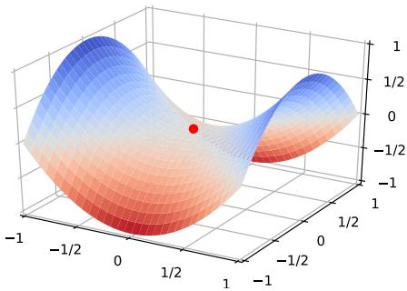  
图 7.1 鞍点示例

鞍点的叫法是因为其鞍然參弗驚鞍点的特征是一阶梯度为0，但是二阶梯度的 Hessian矩阵不是半正定矩阵，参见定理C.2.

直观地看，在高维空间中，局部最小值（LocalMinima）要求在许多方向上都不再下降，这比低维空间中更苛刻.为了说明这一点，可以做一个粗略类比：假设网络有10,000维参数，梯度为0的点（即驻点（StationaryPoint））在某一维附近表现为局部最小值的概率为p，那么在所有方向上同时表现为局部最小值的概率会随维数快速下降.因此，在高维非凸优化中，驻点往往更可能表现为鞍点或近似鞍点.

这里的独立性假设只是帮助理解高维直觉，并不是严格的理论结论.

基于梯度下降的优化方法会在鞍点附近接近于停滞，很难从这些鞍点中逃离．因此，随机梯度下降对于高维空间中的非凸优化问题十分重要，通过在梯度方向上引入随机性，可以有效地逃离鞍点.

平坦最小值深度神经网络的参数非常多，并且有一定的冗余性，这使得每单个参数对最终损失的影响都比较小，因此会导致损失函数在局部最小解附近通常是一个平坦的区域，称为平坦最小值（Flat Minima）[Hochreiter et al.，1997;Li et al.,2018]. 图7.2给出了平坦最小值和尖锐最小值（Sharp Minima）的示例.

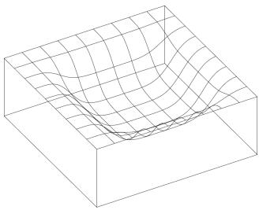  
(a) 平坦最小值

  
(b) 尖锐最小值  
图 7.2 平坦最小值和尖锐最小值的示例（图片来源: [Hochreiter et al., 1997]）

在一个平坦最小值的邻域内，所有点对应的训练损失都比较接近，表明我们在训练神经网络时，不需要精确地找到一个局部最小解，只要在一个局部最小解的邻域内就足够了.平坦最小值通常被认为和模型泛化能力有一定的关系.一般而言，当一个模型收敛到一个平坦的局部最小值时，其鲁棒性会更好，即微小的参数变动不会剧烈影响模型能力；而当一个模型收敛到一个尖锐的局部最小值时，其鲁棒性也会比较差．具备良好泛化能力的模型通常应该是鲁棒的，因此理想的局部最小值应该是平坦的.

这里的很多描述都是经验性的，并没有很好的理论证明.

局部最小解的等价性 在规模较大的神经网络中，许多局部最小解在训练损失和测试性能上可能比较接近．此外，一些理论和实证研究表明，局部最小解对应的训练损失可以非常接近全局最小解对应的训练损失[Choromanska et al.,2015].虽然神经网络仍有可能收敛到较差的局部最小值，但实践中更重要的往往是找到泛化性能较好的解，而不是精确追求训练损失的全局最小值；过度追求训练集上的最优也可能导致过拟合.

## 7.1.3 神经网络优化的改善方法

改善神经网络优化的目标是找到泛化性能更好的局部解，并提高优化效率实践中常用的经验性改善方法通常分为以下几个方面：

（1）使用更有效的优化算法（第7.2节）来提高梯度下降优化方法的效率和稳定性，比如动态学习率调整、梯度估计修正等.

（2）使用更好的参数初始化方法（第7.3节）、数据预处理方法（第7.4节）来提高优化效率.

（3）修改网络结构来得到更好的优化地形（Optimization Landscape），比如使用ReLU激活函数、残差连接、逐层规范化（第7.5节）等.

（4）使用更好的超参数优化方法（第7.6节）.

优化地形指在高维空间中损失函数的曲面形状. 好的优化地形通常比较平滑.

通过上面的方法，我们通常可以高效地、端到端地训练一个深度神经网络.

## 7.2 优化算法

深度神经网络的参数学习主要通过梯度下降法来寻找一组可以最小化结构风险的参数，在具体实现中，梯度下降法可以分为：批量梯度下降、随机梯度下降以及小批量梯度下降三种形式.根据不同的数据量和参数量，可以选择一种具体的实现形式.本节介绍一些在训练神经网络时常用的优化算法.这些优化算法大体上可以分为三类：1）调整学习率，使得优化更稳定；2）修正梯度估计，以提高训练速度；3）显式利用参数结构或局部平坦性，以进一步提升训练效率和泛化性能.

## 7.2.1 小批量梯度下降

在训练深度神经网络时，训练数据的规模通常都比较大.如果在梯度下降时，每次迭代都要计算整个训练数据上的梯度，这就需要比较多的计算资源.另外大规模训练集中的数据通常会非常冗余，也没有必要在整个训练集上计算梯度．因此，在训练深度神经网络时，经常使用小批量梯度下降（Mini-BatchGradient Descent) .

令 $f ( \pmb { x } ; \theta )$ 表示一个深度神经网络，θ为网络参数，在使用小批量梯度下降进行优化时，每次选取K个训练样本 $\mathcal { S } _ { t } = \{ ( \boldsymbol { \mathbf { \mathit { x } } } ^ { ( k ) } , \boldsymbol { \mathbf { \mathit { y } } } ^ { ( k ) } ) \} _ { k = 1 } ^ { K }$ .第t次迭代（Itera-tion)时损失函数关于参数θ的偏导数为

$$
{ \mathfrak { g } } _ { t } ( \theta ) = { \frac { 1 } { K } } \sum _ { ( \pmb { x } , \pmb { y } ) \in \mathcal { S } _ { t } } { \frac { \partial { \mathcal { L } } ( \pmb { y } , f ( \pmb { x } ; \theta ) ) } { \partial \theta } } ,\tag{7.1}
$$

这里的损失函数忽略了正则化项.加上 $\ell _ { p }$ 正则化的损失函数参见第7.7.1节.

其中 $\mathcal { L } ( \cdot )$ 为可微分的损失函数，K称为批大小（Batch Size).

第t次更新的梯度 $\mathbf { g } _ { t }$ 定义为

$$
\mathbf { g } _ { t } \triangleq \mathfrak { g } _ { t } ( \theta _ { t - 1 } ) .\tag{7.2}
$$

使用梯度下降来更新参数，

$$
\begin{array} { r } { \theta _ { t }  \theta _ { t - 1 } - \alpha \mathbf { g } _ { t } , } \end{array}\tag{7.3}
$$

其中 $\alpha > 0$ 为学习率.

每次迭代时参数更新的差值 $\Delta \theta _ { t }$ 定义为

$$
\Delta \theta _ { t } \triangleq \theta _ { t } - \theta _ { t - 1 } .\tag{7.4}
$$

$\Delta \theta _ { t }$ 和梯度 $\mathbf { \pmb { g } } _ { t }$ 并不需要完全一致. $\Delta \theta _ { t }$ 为每次迭代时参数的实际更新方向，即$\theta _ { t } = \theta _ { t - 1 } + \Delta \theta _ { t }$ .在标准的小批量梯度下降中， $\Delta \theta _ { t } = - \alpha \mathbf { g } _ { t }$

从上面公式可以看出，影响小批量梯度下降的主要因素有：1）批大小K、2）学习率α、3）梯度估计．为了更有效地训练深度神经网络，在标准的小批量梯度下降的基础上，也经常使用一些改进方法以加快优化速度，比如如何选择批大小、如何调整学习率以及如何修正梯度估计，我们分别从这三个方面来介绍在神经网络优化中常用的算法，这些改进的优化算法也同样可以应用在批量或随机梯度下降法上.

## 7.2.2 批大小选择

在小批量梯度下降中，批大小（BatchSize）对网络优化有重要影响.一般而言，批大小不影响随机梯度的期望，但是会影响随机梯度的方差.批大小越大随机梯度的方差越小，引入的噪声也越小，训练也越稳定，因此可以设置较大的学习率.而批大小较小时，通常需要设置较小的学习率，否则训练容易不稳定.学习率通常要随着批大小的增大而相应地增大.一个简单有效的方法是线性缩放规则（Linear Scaling Rule)[Goyal et al., 2017]:当批大小增加 m倍时,学习率也增加m倍，线性缩放规则往往在批大小比较小时适用，当批大小非常大时，线性缩放会使得训练不稳定.

参见习题7-1.

参见第7.2.3.2节.

图7.3给出了从轮（Epoch）和迭代（Iteration）的角度，批大小对损失下降的影响.每一次小批量更新为一次迭代，所有训练集的样本更新一遍为一轮，两者的关系为

$$
1 \sharp _ { \mathbb { K } } ( \mathrm { E p o c h } ) = \Big ( \frac { \mathbb { M } | | \sharp _ { \mathbb { K } } ^ { \prime } | \neq \mathbb { K } \mathbb { M } ^ { \prime } \mathbb { M } \mathbb { K } } { \mathbb { H } \mathbb { K } \mathcal { K } \mathcal { K } } \Big ) \times \mathbb { M } \mathbb { K } \dag \mathbb { K } ( \mathrm { I t e r a t i o n } ) .
$$

  
(a）按迭代（Iteration）的损失变化

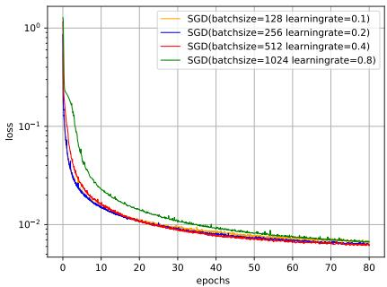  
(b)按回合（Epoch)的损失变化  
图7.3 在MNIST数据集上批大小对损失下降的影响

值得注意的是，图7.3中的4种批大小对应的学习率设置不同，因此并不是严格对比.

从图7.3a可以看出，批大小越大，下降效果越明显，并且下降曲线越平滑.但从图7.3b可以看出，如果按整个数据集上的回合（Epoch）数来看，则是批量样本数越小，下降效果越明显.适当小的批量会导致更快的收敛.

此外，批大小和模型的泛化能力也有一定的关系. [Keskar et al., 2017]通过实验发现：批量越大，越有可能收敛到尖锐最小值；批量越小，越有可能收敛到平坦最小值.

梯度累积在实际训练中，受限于显存容量，有时无法直接使用期望的大批量梯度累积（GradientAccumulation）提供了一种简单的替代方案：将一个大批量拆分为若于个小批量，依次前向传播并计算梯度，但不立即更新参数，而是将多步梯度累加起来，等累积到指定步数后再执行一次参数更新.在不考虑批量规范化统计量、暂退掩码和优化器内部状态等额外因素时，这在数学上等价于使用更大批量的梯度下降，但每一步只需占用较小批量所需的显存.梯度累积与批大小选择、学习率缩放等策略配合使用，是大模型训练中常用的工程手段

## 7.2.3 学习率调整

学习率是神经网络优化时的重要超参数.在梯度下降法中，学习率α的取值非常关键，如果过大就可能不收敛，如果过小则收敛速度太慢.常用的学习率调整方法包括学习率衰减、学习率预热、周期性学习率调整以及一些自适应调整学习率的方法，比如AdaGrad、RMSprop、AdaDelta等.自适应学习率方法可以针对每个参数设置不同的学习率

## 7.2.3.1 学习率衰减

从经验上看，学习率在一开始要保持大些来保证收敛速度，在收敛到最优点附近时要小些以避免来回振荡．比较简单的学习率调整可以通过学习率衰减(Learning Rate Decay）的方式来实现，也称为学习率退火（Learning RateAnnealing).

不失一般性，这里的衰减方式设置为按迭代次数进行衰减

假设初始化学习率为 $\alpha _ { 0 }$ ,在第t次迭代时的学习率 $\alpha _ { t } .$ 常见的衰减方法有以下几种：

分段常数衰减（Piecewise Constant Decay）:即每经过 $T _ { 1 } , T _ { 2 } , \cdots , T _ { m }$ 次迭代将学习率衰减为原来的 $\beta _ { 1 } , \beta _ { 2 } , \cdots , \beta _ { m }$ 倍,其中 $T _ { m }$ 和 $\beta _ { m } < 1$ 为根据经验设置的超参数.分段常数衰减也称为阶梯衰减（Step Decay）.

学习率衰减是按每次迭代（Iteration）进行，也可以按每 $_ m$ 次迭代或每个回合(Epoch)进行. 衰减率通常和总迭代次数相关.

逆时衰减(Inverse Time Decay):

$$
\alpha _ { t } = \alpha _ { 0 } \frac { 1 } { 1 + \beta \times t } .\tag{7.5}
$$

β为衰减率.

指数衰减（Exponential Decay):

$$
\alpha _ { t } = \alpha _ { 0 } \beta ^ { t } .\tag{7.6}
$$

$\beta < 1$ 为衰减率.

自然指数衰减(Natural Exponential Decay):

$$
\alpha _ { t } = \alpha _ { 0 } \exp ( - \beta \times t ) .\tag{7.7}
$$

β为衰减率.

余弦衰减（Cosine Decay）：

$$
\alpha _ { t } = \frac { 1 } { 2 } \alpha _ { 0 } \Big ( 1 + \cos \big ( \frac { t \pi } { T } \big ) \Big ) .\tag{7.8}
$$

T为总的迭代次数.

图7.4给出了不同衰减方法的示例（假设初始学习率为1).

  
图 7.4 不同学习率衰减方法的比较

## 7.2.3.2 学习率预热

在小批量梯度下降中，当批大小的设置比较大时，通常需要比较大的学习率.但在刚开始训练时，由于参数是随机初始化的，梯度往往也比较大，再加上比较大的初始学习率，会使得训练不稳定.

为了提高训练稳定性，我们可以在最初几轮迭代时，采用比较小的学习率，等梯度下降到一定程度后再恢复到初始的学习率，这种方法称为学习率预热(Learning Rate Warmup).

一个常用的学习率预热方法是逐渐预热（Gradual Warmup）.假设预热的迭代次数为 $T ^ { \prime }$ ,初始学习率为 $\alpha _ { 0 }$ ,在预热过程中，每次更新的学习率为

$$
\alpha _ { t } ^ { \prime } = \frac { t } { T ^ { \prime } } \alpha _ { 0 } , \qquad 1 \leq t \leq T ^ { \prime } .\tag{7.9}
$$

当预热过程结束，再选择一种学习率衰减方法来逐渐降低学习率.

## 7.2.3.3周期性学习率调整

为了使得梯度下降法能够逃离鞍点或尖锐最小值，一种经验性的方式是在训练过程中周期性地增大学习率.当参数处于尖锐最小值附近时，增大学习率有助于逃离尖锐最小值；当参数处于平坦最小值附近时，增大学习率依然有可能在该平坦最小值的吸引域（Basin of Attraction）内.因此，周期性地增大学习率虽然可能短期内损害优化过程，使得网络收敛的稳定性变差，但从长期来看有助于找到更好的局部最优解.

本节介绍两种常用的周期性调整学习率的方法：循环学习率和带热重启的随机梯度下降.

循环学习率一种简单的方法是使用循环学习率（Cyclic Learning Rate）[Smith，2017]，即让学习率在一个区间内周期性地增大和缩小. 通常可以使用线性缩放来调整学习率，称为三角循环学习率（TriangularCyclic LearningRate）.假设每个循环周期的长度相等都为 $2 \Delta T$ ,其中前 $\Delta T$ 步为学习率线性增大阶段，后 $\Delta T$ 步为学习率线性缩小阶段.在第t次迭代时，其所在的循环周期数m为

$$
m = \lfloor 1 + \frac { t } { 2 \Delta T } \rfloor ,\tag{7.10}
$$

其中·」表示“向下取整”函数.第t次迭代的学习率为

$$
\alpha _ { t } = \alpha _ { m i n } ^ { m } + ( \alpha _ { m a x } ^ { m } - \alpha _ { m i n } ^ { m } ) \Bigl ( \operatorname* { m a x } ( 0 , 1 - b ) \Bigr ) ,\tag{7.11}
$$

其中 $\alpha _ { m a x } ^ { m }$ 和 $\alpha _ { m i n } ^ { m }$ 分别为第m个周期中学习率的上界和下界，可以随着m的增大而逐渐降低； $b \in [ 0 , 1 ]$ 的计算为

$$
b = | \frac { t } { \Delta T } - 2 m + 1 | .\tag{7.12}
$$

带热重启的随机梯度下降带热重启的随机梯度下降（StochasticGradientDescent with Warm Restarts,SGDR) [Loshchilov et al., 2017] 是用热重启方式来替代学习率衰减的方法．学习率每间隔一定周期后重新初始化为某个预先设定值，然后逐渐衰减.每次重启后模型参数不是从头开始优化，而是从重启前的参数基础上继续优化

假设在梯度下降过程中重启M次，第m次重启在上次重启开始第 $T _ { m }$ 个回合后进行， $T _ { m }$ 称为重启周期.在第m次重启之前，采用余弦衰减来降低学习率.第t次迭代的学习率为

$$
\alpha _ { t } = \alpha _ { m i n } ^ { m } + \frac { 1 } { 2 } \big ( \alpha _ { m a x } ^ { m } - \alpha _ { m i n } ^ { m } \big ) \Big ( 1 + \cos \big ( \frac { T _ { c u r } } { T _ { m } } \pi \big ) \Big ) ,\tag{7.13}
$$

当 $\alpha _ { m a x } ^ { m } = \alpha _ { 0 } , \alpha _ { m i n } ^ { m } =$ 0，并不进行重启时，公式(7.13)退化为公式(7.8).

其中 $\alpha _ { m a x } ^ { m }$ 和 $\alpha _ { m i n } ^ { m }$ 分别为第m个周期中学习率的上界和下界，可以随着m的增大而逐渐降低； $T _ { c u r }$ 为从上次重启之后的回合(Epoch)数. $T _ { c u r }$ 可以取小数，比如0.1、0.2等，这样可以在一个回合内部进行学习率衰减.重启周期 $T _ { m }$ 可以随着重启次数逐渐增加，比如 $T _ { m } = T _ { m - 1 } \times \kappa$ ,其中 $\kappa \geq 1$ 为放大因子.

图7.5给出了两种周期性学习率调整的示例（假设初始学习率为1），每个周期中学习率的上界也逐步衰减.

  
(a) 三角循环学习率

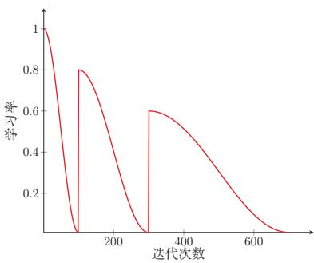  
(b) 带热重启的余弦衰减  
图 7.5 周期性学习率调整

## 7.2.3.4 AdaGrad算法

在标准的梯度下降法中，每个参数在每次迭代时都使用相同的学习率.由于每个参数的维度上收敛速度都不相同，因此根据不同参数的收敛情况分别设置学习率.

AdaGrad算法(Adaptive Gradient Algorithm) [Duchi et al., 2011]根据每个参数梯度的历史累计量，每次迭代时自适应地调整每个参数的学习率：累计梯度较大的参数使用较小的学习率，累计梯度较小的参数使用较大的学习率.具

体地，在第t次迭代时，先计算每个参数梯度平方的累计值

$$
G _ { t } = \sum _ { \tau = 1 } ^ { t } \pmb { g } _ { \tau } \odot \pmb { g } _ { \tau } ,\tag{7.14}
$$

其中 $\odot$ 为按元素乘积， $\pmb { g } _ { \tau } \in \mathbb { R } ^ { | \theta | }$ 是第 $\tau$ 次迭代时的梯度.

AdaGrad算法的参数更新差值为

$$
\Delta \theta _ { t } = - \frac { \alpha } { \sqrt { G _ { t } + \epsilon } } \odot { \bf { g } } _ { t } ,\tag{7.15}
$$

其中 $\alpha$ 是初始的学习率， $\epsilon$ 是为了保持数值稳定性而设置的非常小的常数，一般取值 $1 0 ^ { - 7 }$ 到 $1 0 ^ { - 1 0 }$ .此外，这里的开平方、除、加运算都是按元素进行的操作.

在AdaGrad算法中，如果某个参数的偏导数累积比较大，其学习率相对较小；相反，如果其偏导数累积较小，其学习率相对较大.但整体是随着迭代次数的增加，学习率逐渐缩小.

AdaGrad算法的缺点是在经过一定次数的迭代后，累计梯度会使有效学习率持续变小;如果此时仍未接近较好的解，后续更新可能会变得过慢.

## 7.2.3.5 RMSprop算法

RMSprop算法是杰弗里·辛顿（Geoffrey Hinton)提出的一种自适应学习率的方法[Tieleman et al., 2012],可以在有些情况下避免 AdaGrad算法中学习率不断单调下降以至于过早衰减的缺点.

RMSprop算法首先计算每次迭代梯度 $\mathbf { \pmb { g } } _ { t }$ 平方的指数衰减移动平均，

$$
G _ { t } = \beta G _ { t - 1 } + ( 1 - \beta ) { \pmb g } _ { t } \odot { \pmb g } _ { t }\tag{7.16}
$$

$$
= ( 1 - \beta ) \sum _ { \tau = 1 } ^ { t } \beta ^ { t - \tau } { \pmb g } _ { \tau } \odot { \pmb g } _ { \tau } ,\tag{7.17}
$$

其中 $\beta$ 为衰减率，一般取值为0.9.

RMSprop算法的参数更新差值为

$$
\Delta \theta _ { t } = - \frac { \alpha } { \sqrt { G _ { t } + \epsilon } } \odot { \bf { g } } _ { t } ,\tag{7.18}
$$

其中 $\alpha$ 是初始的学习率，比如0.001.

从上式可以看出，RMSprop算法和AdaGrad算法的区别在于 $G _ { t }$ 的计算由累积方式变成了指数衰减移动平均.在迭代过程中，每个参数的学习率并不是呈衰减趋势，既可以变小也可以变大.

## 7.2.3.6 AdaDelta算法

AdaDelta算法[Zeiler, 2012]也是 AdaGrad算法的一个改进. 和 RMSprop算法类似，AdaDelta算法通过梯度平方的指数衰减移动平均来调整学习率.此外，AdaDelta算法还引入了每次参数更新差值 $\Delta \theta$ 的平方的指数衰减权移动平均.

第t次迭代时，参数更新差值 $\Delta \theta$ 的平方的指数衰减权移动平均为

$$
\Delta X _ { t - 1 } ^ { 2 } = \beta _ { 1 } \Delta X _ { t - 2 } ^ { 2 } + ( 1 - \beta _ { 1 } ) \Delta \theta _ { t - 1 } \odot \Delta \theta _ { t - 1 } ,\tag{7.19}
$$

其中 $\beta _ { 1 }$ 为衰减率.此时 $\Delta \theta _ { t }$ 还未知，因此只能计算到 $\Delta X _ { t - 1 }$

AdaDelta算法的参数更新差值为

$$
\Delta \theta _ { t } = - \frac { \sqrt { \Delta X _ { t - 1 } ^ { 2 } + \epsilon } } { \sqrt { G _ { t } + \epsilon } } \mathbf { g } _ { t } ,\tag{7.20}
$$

其中 $G _ { t }$ 的计算方式和RMSprop算法一样（公式(7.16))， $\Delta X _ { t - 1 } ^ { 2 }$ 为参数更新差值 $\Delta \theta$ 的指数衰减权移动平均.

从上式可以看出，AdaDelta算法将RMSprop算法中的初始学习率α改为动态计算的 $\sqrt { \Delta X _ { t - 1 } ^ { 2 } }$ ，在一定程度上平抑了学习率的波动.

## 7.2.4 梯度估计修正

除了调整学习率之外，还可以进行梯度估计（Gradient Estimation）的修正.从图7.3看出，在随机（小批量）梯度下降法中，如果每次选取样本数量比较小，损失会呈现振荡的方式下降，也就是说，随机梯度下降方法中每次迭代的梯度估计和整个训练集上的最优梯度并不一致，具有一定的随机性.一种缓解梯度估计随机性的方式是使用最近一段时间内的平均梯度来代替当前时刻的随机梯度作为参数更新方向，从而提高优化速度

增加批大小也是缓解随机性的一种方式.

## 7.2.4.1 动量法

动量（Momentum）是模拟物理中的概念.一个物体的动量指的是该物体在它运动方向上保持运动的趋势，是该物体的质量和速度的乘积.动量法（Mo-mentumMethod）是用之前积累动量来替代真正的梯度.每次迭代的梯度可以看作加速度.

在第t次迭代时，计算负梯度的“加权移动平均”作为参数的更新方向，

每个参数的实际更新差值取决于最近一段时间内梯度的加权平均值.

$$
\Delta \theta _ { t } = \rho \Delta \theta _ { t - 1 } - \alpha \pmb { g } _ { t } = - \alpha \sum _ { \tau = 1 } ^ { t } \rho ^ { t - \tau } \pmb { g } _ { \tau } ,\tag{7.21}
$$

其中 $\rho$ 为动量因子，通常设为0.9,α为学习率.

这样，当某个参数在最近一段时间内的梯度方向不一致时，其真实的参数更新幅度变小；相反，当在最近一段时间内的梯度方向都一致时，其真实的参数更新幅度变大，起到加速作用.一般而言，在迭代初期，梯度方向都比较一致，动量法会起到加速作用，可以更快地到达最优点，在迭代后期，梯度方向会不一致，在收敛值附近振荡，动量法会起到减速作用，增加稳定性.需要注意的是，动量法利用的是历史一阶梯度信息，并不显式计算Hessian矩阵.它可以在狭长谷底等场景中产生类似“加速”和“阻尼”的效果，但不能简单等同于二阶优化方法

## 7.2.4.2 Nesterov 加速梯度

Nesterov加速梯度（Nesterov Accelerated Gradient，NAG）是一种对动 量法的改进[Nesterov, 2013; Sutskever et al., 2013]，也称为Nesterov 动量法 (Nesterov Momentum).

在动量法中，实际的参数更新方向 $\Delta \theta _ { t }$ 为上一步的参数更新方向 $\Delta \theta _ { t - 1 }$ 和当前梯度的反方向 $- \mathbf { \nabla } _ { \mathbf { \nabla } } \mathbf { \textbf {  { g } } } _ { t }$ 的叠加.这样， $\Delta \theta _ { t }$ 可以被拆分为两步进行，先根据 $\Delta \theta _ { t - 1 }$ 更新一次得到参数 ${ \widehat { \theta } } .$ 再用 $\mathbf { - } \pmb { g } _ { t }$ 进行更新.

$$
\hat { \theta } = \theta _ { t - 1 } + \rho \Delta \theta _ { t - 1 } ,\tag{7.22}
$$

$$
{ \theta } _ { t } = \hat { \theta } - \alpha \pmb { g } _ { t } ,\tag{7.23}
$$

其中梯度 $\mathbf { \mathscr { g } } _ { t }$ 为点 $\theta _ { t - 1 }$ 上的梯度，因此在第二步更新中有些不太合理.更合理的更新方向应该为 $\hat { \theta }$ 上的梯度.

这样，合并后的更新方向为

$$
\Delta \theta _ { t } = \rho \Delta \theta _ { t - 1 } - \alpha \mathsf { g } _ { t } ( \theta _ { t - 1 } + \rho \Delta \theta _ { t - 1 } ) ,\tag{7.24}
$$

其中 $\mathfrak { g } _ { t } ( \theta _ { t - 1 } + \rho \Delta \theta _ { t - 1 } )$ 表示损失函数在点 $\hat { \theta } = \theta _ { t - 1 } + \rho \Delta \theta _ { t - 1 }$ 上的偏导数.图7.6给出了动量法和Nesterov加速梯度在参数更新时的比较.

偏导数 ${ \mathfrak { g } } _ { t }$ 的定义参见公式(7.1).

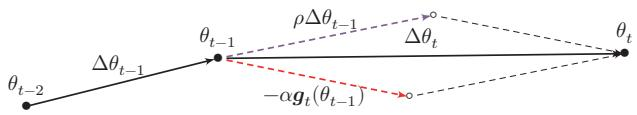  
(a) 动量法

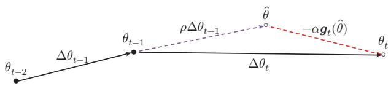  
(b) Nesterov 加速梯度  
图 7.6 动量法和Nesterov加速梯度的比较

## 7.2.4.3 Adam 算法

Adam算法(Adaptive Moment Estimation Algorithm) [Kingma et al.2015]可以看作动量法和RMSprop算法的结合，不但使用动量作为参数更新方向，而且可以自适应调整学习率.

Adam算法一方面计算梯度平方 $\mathbf { g } _ { t } ^ { 2 }$ 的指数加权平均（和RMSprop算法类似)，另一方面计算梯度 $\mathbf { g } _ { t }$ 的指数加权平均（和动量法类似).

$$
M _ { t } = \beta _ { 1 } M _ { t - 1 } + ( 1 - \beta _ { 1 } ) \pmb { g } _ { t } ,\tag{7.25}
$$

$$
G _ { t } = \beta _ { 2 } G _ { t - 1 } + ( 1 - \beta _ { 2 } ) { \pmb g } _ { t } \odot { \pmb g } _ { t }\tag{7.26}
$$

其中 $\beta _ { 1 }$ 和 $\beta _ { 2 }$ 分别为两个移动平均的衰减率，通常取值为 $\beta _ { 1 } = 0 . 9 , \beta _ { 2 } = 0 . 9 9 9 .$ 我们可以把 $M _ { t }$ 和 $G _ { t }$ 分别看作梯度的均值（一阶矩）和未减去均值的方差（二阶矩).

假设 $M _ { 0 } = 0 , G _ { 0 } = 0$ ,那么在迭代初期 $M _ { t }$ 和 $G _ { t }$ 的值会比真实的均值和方差要小. 特别是当 $\beta _ { 1 }$ 和 $\beta _ { 2 }$ 都接近于1时，偏差会很大.因此，需要对偏差进行修正.

参见习题7-2.

$$
\hat { M } _ { t } = \frac { M _ { t } } { 1 - \beta _ { 1 } ^ { t } } ,\tag{7.27}
$$

$$
\hat { G } _ { t } = \frac { G _ { t } } { 1 - \beta _ { 2 } ^ { t } } .\tag{7.28}
$$

Adam算法的参数更新差值为

$$
\Delta \theta _ { t } = - \frac { \alpha } { \sqrt { \hat { G } _ { t } + \epsilon } } \hat { M } _ { t } ,\tag{7.29}
$$

其中学习率 $\alpha$ 通常设为0.001,并且也可以配合学习率调度一起使用.

Adam算法结合了动量法和RMSprop算法，在很多任务上都有较好的优化效果.

## 7.2.4.4 Muon 优化器

在实际训练中，Adam常常与解耦权重衰减结合形成AdamW，相关思想将在7.7.2中进一步介绍.

在前面介绍的优化方法中，无论是Adam还是RMSprop，都是对每个参数独立地调整学习率．然而，神经网络中的权重通常以矩阵的形式存在，矩阵中各元素之间存在着结构性的关联，一个自然的想法是：能否把权重矩阵看作一个整体，利用其矩阵结构来设计更好的更新方式？

Muon 优化器(Muon) [Jordan et al., 2024; Liu et al., 2025] 就是沿着这一思路的一类代表性方法. Muon 的名字来自MomentUm Orthogonalized byNewton-Schulz,其核心思想可以分为两步理解:先用动量法算出一个更新方向，再对这个方向做“正交化”处理.

为了理解正交化的直觉含义，可以考虑一个简单的类比.梯度告诉我们权重矩阵在各个方向上应该如何改变，但不同方向的信号强度往往差异很大一某些方向的梯度特别大，另一些方向的梯度则很小.如果直接按梯度更新，强方向会主导整个更新过程，弱方向的有用信息容易被淹没.Muon的做法是：保留所有方向的信息，但将各方向的幅度统一拉平，使得更新在各个方向上更加均衡，

具体来说，设某一隐藏层的权重矩阵为 $W _ { t }$ ,其梯度为 $\mathbf { \nabla } \mathbf { g } _ { t } = \partial \mathcal { L } / \partial \mathbf { W } _ { t }$ . Muon首先计算动量形式的更新方向

$$
M _ { t } = \rho M _ { t - 1 } + ( 1 - \rho ) \mathbf { { g } } _ { t } ,\tag{7.30}
$$

其中 $\rho$ 为动量因子.

接下来是关键的正交化步骤.如果将 $M _ { t }$ 做奇异值分解 $M _ { t } = U \Sigma V ^ { \intercal }$ ,其中对角矩阵Σ的奇异值反映了各方向的幅度大小.正交化的效果相当于将所有奇异值都置为1，只保留“方向”信息而丢弃“幅度”差异：

奇异值分解参见第A.2.6.2节.

$$
\widetilde { M } _ { t } = \mathrm { O r t h o } ( M _ { t } ) \approx U V ^ { \top } .\tag{7.31}
$$

在实际计算中，直接做奇异值分解的代价较高，Muon使用Newton-Schulz迭代来高效近似这一过程.最终，参数更新为

$$
\Delta W _ { t } = - \alpha \widetilde { M } _ { t } ,\tag{7.32}
$$

其中 $\alpha$ 为学习率.

这种做法避免了少数强方向主导更新，使得网络能更充分地利用梯度中各个方向的信息，从而在一些任务上表现出更高的训练效率

需要注意的是，正交化操作要求参数具有矩阵结构，因此Muon主要适用于隐藏层中的二维权重矩阵.对于偏置向量、规范化层参数以及嵌入层参数等，通常仍然配合AdamW来优化.因此，Muon在实践中更多地作为一种混合优化策略使用:对隐藏层矩阵参数使用Muon,对其余参数使用AdamW.

从优化器设计的角度看，Muon的意义不在于取代AdamW，而是提示我们：现代优化器可以不只在逐元素学习率上做自适应调整，也可以显式利用权重矩阵的几何结构.实际训练中，是否采用这类矩阵结构优化器，还需要结合模型结构、参数分组、数值稳定性和硬件实现来权衡.

## 7.2.4.5 SAM算法

在现代深度神经网络中，仅仅最小化训练损失并不一定能带来最好的泛化性能. SAM算法(Sharpness-Aware Minimization, SAM) [Foret et al., 2021]试图同时最小化损失函数的取值以及损失地形的“尖锐程度”．其优化目标可