以写为

$$
\operatorname* { m i n } _ { \theta } \operatorname* { m a x } _ { \| \epsilon \| \leq \rho } \mathcal { L } ( \theta + \epsilon ) ,\tag{7.33}
$$

其中 $\rho$ 控制在参数邻域内所考虑的扰动大小

直观上，SAM希望找到这样一组参数：即使在其附近加入一个小扰动，损失函数也不会迅速增大.这样的解通常位于更平坦的极小值区域，因此往往具有更好的泛化性能.

在实际计算中，SAM通常采用两步近似：先沿当前梯度方向找到一个“最坏扰动”，再在扰动后的位置计算梯度并更新参数．因此，SAM可以看作在标准梯度下降外增加了一层“局部鲁棒性”约束.SAM及其若干变体常被用来连接“优化”和“正则化”两种视角，虽然SAM常被视为一种具有正则化效应的方法，但它是通过修改参数更新准则来实现的，因此这里仍将其放在优化算法中介绍.

## 7.2.4.6 梯度截断

在深度神经网络或循环神经网络中，除了梯度消失之外，梯度爆炸也是影响学习效率的主要因素．在基于梯度下降的优化过程中，如果梯度突然增大，用大的梯度更新参数反而会导致其远离最优点.为了避免这种情况，当梯度的模大于一定阈值时，就对梯度进行截断，称为梯度截断（Gradient Clipping）[Pascanuet al., 2013].

图7.7给出了一个循环神经网络的损失函数关于参数的曲面.图中的曲面为只有一个隐藏神经元的循环神经网络 $h _ { t } = \sigma ( w h _ { t - 1 } + b )$ 的损失函数，其中 $w$ 和b为参数.假如 $h _ { 0 }$ 初始值为0.3,损失函数为 $\mathcal { L } = ( h _ { 1 0 0 } - 0 . 6 5 ) ^ { 2 }$ . 从图7.7中可以看出，损失函数关于参数 $w , b$ 的梯度在某个区域会突然变大.

  
图 7.7 梯度爆炸问题示例

梯度截断是一种比较简单的启发式方法，把梯度的模限定在一个区间，当梯度的模小于或大于这个区间时就进行截断.一般截断的方式有以下几种：

按值截断在第t次迭代时，梯度为 $\mathbf { \pmb { g } } _ { t }$ ，给定一个区间 $[ a , b ]$ ，如果一个参数的梯度小于 $a$ 时，就将其设为a;如果大于b时，就将其设为b.

$$
\begin{array} { r } { \pmb { g } _ { t } = \operatorname* { m a x } ( \operatorname* { m i n } ( \pmb { g } _ { t } , b ) , a ) . } \end{array}\tag{7.34}
$$

按模截断 按模截断是将梯度的模截断到一个给定的截断阈值b.

如果 $\| \pmb { g } _ { t } \| ^ { 2 } \leq b$ ,保持 $\mathbf { \pmb { g } } _ { t }$ 不变.如果 $\| \pmb { g } _ { t } \| ^ { 2 } > b$ ,令

$$
g _ { t } = { \frac { b } { \left\| g _ { t } \right\| } } g _ { t } .\tag{7.35}
$$

截断阈值b是一个超参数，也可以根据一段时间内的平均梯度来自动调整．实验中发现，训练过程对阈值b并不十分敏感，通常一个小的阈值就可以得到很好的结果.

在训练循环神经网络时，按模截断是避免梯度爆炸问题的有效方法.

## 7.2.5 优化算法小结

本节介绍的优化方法大体上可以分为三类：1）调整学习率，使得优化更稳定；2）修正梯度估计，以提高训练速度；3）显式利用参数结构或局部平坦性，以进一步提升训练效率和泛化性能.

表7.1汇总了本节介绍的几种神经网络常用优化算法.

表7.1 神经网络常用优化方法的汇总
<table><tr><td>类别</td><td></td><td>优化算法</td></tr><tr><td></td><td>固定衰减学习率 周期性学习率 自适应学习率</td><td>分段常数衰减、逆时衰减、（自然）指数衰减、余弦衰减 循环学习率、SGDR</td></tr><tr><td colspan="2">梯度估计修正</td><td> $\mathrm { A d a G r a d . R M S p r o p . A d a D e l t a }$  动量法、Nesterov加速梯度、梯度截断</td></tr><tr><td rowspan="2">器进</td><td>逐元素自适应</td><td>Adam、AdamW</td></tr><tr><td>矩阵结构优化</td><td>Muon（常与AdamW混合使用）</td></tr><tr><td></td><td>平坦性优化</td><td>SAM</td></tr></table>

这些优化算法可以使用下面公式来统一描述概括：

$$
\Delta \theta _ { t } = - \frac { \alpha _ { t } } { \sqrt { G _ { t } + \epsilon } } M _ { t } ,\tag{7.36}
$$

$$
G _ { t } = \psi ( \pmb { g } _ { 1 } , \cdots , \pmb { g } _ { t } ) ,\tag{7.37}
$$

参见习题7-8.

$$
M _ { t } = \phi ( \pmb { g } _ { 1 } , \cdots , \pmb { g } _ { t } ) ,\tag{7.38}
$$

其中 $\mathbf { \pmb { g } } _ { t }$ 是第t步的梯度； $\alpha _ { t }$ 是第t步的学习率，可以进行衰减，也可以不变； $\psi ( \cdot )$ 是学习率缩放函数，可以取1或历史梯度模长的累计量； $\phi ( \cdot )$ 是优化后的参数更新方向，可以取当前梯度 $\mathbf { \pmb { g } } _ { t }$ 或历史梯度的移动平均.

图7.8给出了这几种优化方法在MNIST数据集上收敛性的比较（学习率为0.001,批大小为128).

  
图 7.8 不同优化方法的比较

## 7.3 参数初始化

神经网络的参数学习是一个非凸优化问题.当使用梯度下降法来进行优化网络参数时，参数初始值的选取十分关键，关系到网络的优化效率和泛化能力.参数初始化的方式通常有以下三种：

（1）预训练初始化：不同的参数初始值会收敛到不同的局部最优解．虽然这些局部最优解在训练集上的损失比较接近，但是它们的泛化能力差异很大.一个好的初始值会使得网络收敛到一个泛化能力高的局部最优解.通常情况下，一个已经在大规模数据上训练过的模型可以提供一个好的参数初始值，这种初始化方法称为预训练初始化（Pre-trained Initialization）.

预训练初始化通常会提升模型泛化能力的一种解释是预训练任务起到一定的正则化作用.

预训练任务可以为监督学习或无监督学习任务．由于无监督学习任务更容易获取大规模的训练数据，因此被广泛采用.预训练模型在目标任务上的学习过程也称为微调（Fine-Tuning).

（2）随机初始化：在线性模型的训练（比如感知器和Logistic回归）中，我们一般将参数全部初始化为0.但是这在神经网络的训练中会存在一些问题因为如果参数都为0，在第一遍前向计算时，所有的隐藏层神经元的激活值都相同；在反向传播时，所有权重的更新也都相同，这样会导致隐藏层神经元没有区分性.这种现象也称为对称权重现象.为了打破这个平衡，比较好的方式是对每个参数都随机初始化（RandomInitialization），使得不同神经元之间的区分性更好.

（3）固定值初始化：对于一些特殊的参数，我们可以根据经验用一个特殊的固定值来进行初始化.比如偏置（Bias）通常用0来初始化，但是有时可以设置某些经验值以提高优化效率.在LSTM网络的遗忘门中，偏置通常初始化为1或2，使训练初期的遗忘门更偏向保留上一时刻记忆，从而有助于长距离信息和梯度的传播，对于使用ReLU的神经元，有时也可以将偏置设为0.01，使得ReLU神经元在训练初期更容易激活，从而获得一定的梯度来进行误差反向传播.

遗忘门参见公式(6.57).

虽然预训练初始化通常具有更好的收敛性和泛化性，但是灵活性不够，不能在目标任务上任意地调整网络结构，因此，好的随机初始化方法对训练神经网络模型来说依然十分重要.这里我们介绍三类常用的随机初始化方法：基于固定方差的参数初始化、基于方差缩放的参数初始化和正交初始化方法

随机初始化通常只应用在神经网络的权重矩阵上.

## 7.3.1 基于固定方差的参数初始化

一种最简单的随机初始化方法是从一个固定均值（通常为0）和方差 $\sigma ^ { 2 }$ 的分布中采样来生成参数的初始值.基于固定方差的参数初始化方法主要有以下两种：

（1）高斯分布初始化：使用一个高斯分布 ${ \mathcal { N } } ( 0 , \sigma ^ { 2 } )$ 对每个参数进行随机初始化.

这里的“固定”的含义是方差 $\sigma ^ { 2 }$ 为一个预设值，和神经元的输入、激活函数以及所在层数无关.

（2）均匀分布初始化：在一个给定的区间[—r,r]内采用均匀分布来初始化参数.假设随机变量x在区间 $[ a , b ]$ 内均匀分布，则其方差为

$$
\operatorname { v a r } ( x ) = { \frac { ( b - a ) ^ { 2 } } { 1 2 } } .\tag{7.39}
$$

因此，若使用区间为 $[ - r , r ]$ 的均匀分布来采样，并满足 $\operatorname { v a r } ( x ) = \sigma ^ { 2 }$ 时，则 $r$ 的取值为

$$
r = { \sqrt { 3 \sigma ^ { 2 } } } .\tag{7.40}
$$

在基于固定方差的随机初始化方法中，比较关键的是如何设置方差 $\sigma ^ { 2 }$ 如果参数范围取的太小，一是会导致神经元的输出过小，经过多层之后信号就慢慢消失了；二是还会使得Sigmoid型激活函数丢失非线性的能力.以Sigmoid型函数为例，在0附近基本上是近似线性的.这样多层神经网络的优势也就不存在了.如果参数范围取的太大，会导致输入状态过大.对于Sigmoid型激活函数来说，激活值变得饱和，梯度接近于0,从而导致梯度消失问题.

为了降低固定方差对网络性能以及优化效率的影响，基于固定方差的随机初始化方法一般需要配合逐层规范化来使用.

逐层规范化参见 第7.5节.

## 7.3.2 基于方差缩放的参数初始化

要高效地训练神经网络，给参数选取一个合适的随机初始化区间是非常重要的.一般而言，参数初始化的区间应该根据神经元的性质进行差异化的设置如果一个神经元的输入连接很多，它的每个输入连接上的权重就应该小一些，以避免神经元的输出过大（当激活函数为ReLU时）或过饱和（当激活函数为Sigmoid 函数时).

初始化一个深度网络时，为了缓解梯度消失或爆炸问题，我们尽可能保持每个神经元的输入和输出的方差一致，根据神经元的连接数量来自适应地调整初始化分布的方差，这类方法称为方差缩放（Variance Scaling）.

## 7.3.2.1 Xavier初始化

假设在一个神经网络中，第l层的一个神经元 $a ^ { ( l ) }$ ，其接收前一层的 $M _ { l - 1 }$ 个神经元的输出 $a _ { i } ^ { ( l - 1 ) } , 1 \le i \le M _ { l - 1 }$

偏置b初始化为0.

$$
a ^ { ( l ) } = f \bigg ( \sum _ { i = 1 } ^ { M _ { l - 1 } } w _ { i } ^ { ( l ) } a _ { i } ^ { ( l - 1 ) } \bigg ) ,\tag{7.41}
$$

其中 $f ( \cdot )$ 为激活函数， $w _ { i } ^ { ( l ) }$ 为参数， $M _ { l - 1 }$ 是第l-1层神经元个数.为简单起见，这里令激活函数 $f ( \cdot )$ 为恒等函数，即 $f ( x ) = x$

假设 $w _ { i } ^ { ( l ) }$ 和 $a _ { i } ^ { ( l - 1 ) }$ 的均值都为0，并且互相独立，则 $a ^ { ( l ) }$ 的均值为

$$
{ \mathbb E } [ a ^ { ( l ) } ] = { \mathbb E } \Big [ \sum _ { i = 1 } ^ { M _ { l - 1 } } w _ { i } ^ { ( l ) } a _ { i } ^ { ( l - 1 ) } \Big ] = \sum _ { i = 1 } ^ { M _ { l - 1 } } { \mathbb E } [ w _ { i } ^ { ( l ) } ] { \mathbb E } [ a _ { i } ^ { ( l - 1 ) } ] = 0 .\tag{7.42}
$$

$a ^ { ( l ) }$ 的方差为

$$
\mathrm { v a r } ( a ^ { ( l ) } ) = \mathrm { v a r } \Big ( \sum _ { i = 1 } ^ { M _ { l - 1 } } w _ { i } ^ { ( l ) } a _ { i } ^ { ( l - 1 ) } \Big )\tag{7.43}
$$

$$
= \sum _ { i = 1 } ^ { M _ { l - 1 } } \operatorname { v a r } ( w _ { i } ^ { ( l ) } ) \operatorname { v a r } ( a _ { i } ^ { ( l - 1 ) } )\tag{7.44}
$$

$$
= M _ { l - 1 } \operatorname { v a r } ( w _ { i } ^ { ( l ) } ) \operatorname { v a r } ( a _ { i } ^ { ( l - 1 ) } ) .\tag{7.45}
$$

也就是说，输入信号的方差在经过该神经元后被放大或缩小了 $M _ { l - 1 } \mathrm { v a r } ( w _ { i } ^ { ( l ) } )$ 倍.为了使得在经过多层网络后，信号不被过分放大或过分减弱，我们尽可能保持每个神经元的输入和输出的方差一致.这样 $M _ { l - 1 } \mathrm { v a r } ( w _ { i } ^ { ( l ) } )$ 设为1比较合理，即

$$
\operatorname { v a r } ( w _ { i } ^ { ( l ) } ) = \frac { 1 } { M _ { l - 1 } } .\tag{7.46}
$$

同理，为了使得在反向传播中，误差信号也不被放大或缩小，需要将 $w _ { i } ^ { ( l ) }$ 的方差保持为

$$
\operatorname { v a r } ( w _ { i } ^ { ( l ) } ) = \frac { 1 } { M _ { l } } .\tag{7.47}
$$

参见习题7-9.

作为折中，同时考虑信号在前向和反向传播中都不被放大或缩小，可以设置

$$
\mathrm { v a r } ( w _ { i } ^ { ( l ) } ) = \frac { 2 } { M _ { l - 1 } + M _ { l } } .\tag{7.48}
$$

在计算出参数的理想方差后，可以通过高斯分布或均匀分布来随机初始化参数.若采用高斯分布来随机初始化参数，连接权重 $w _ { i } ^ { ( l ) }$ 可以按 $\begin{array} { r } { \mathcal { N } \Big ( 0 , \frac { 2 } { M _ { l - 1 } + M _ { l } } \Big ) } \end{array}$ 的高斯分布进行初始化.若采用区间为 $[ - r , r ]$ 的均匀分布来初始化 $w _ { i } ^ { ( l ) }$ ，则 $r$ 的取值为 $\sqrt { \frac { 6 } { M _ { l - 1 } + M _ { l } } }$ .这种根据每层的神经元数量来自动计算初始化参数方差的方法称为Xavier 初始化[Glorot et al., 2010].

参见公式(7.40).

虽然在Xavier初始化中我们假设激活函数为恒等函数，但是Xavier初始化也适用于Logistic函数和Tanh函数.这是因为神经元的参数和输入的绝对值通常比较小，处于激活函数的线性区间. 这时Logistic函数和Tanh函数可以近似为线性函数.由于Logistic函数在线性区间的斜率约为0.25，因此其参数初始化的方差约为 $\begin{array} { r } { 1 6 \times \frac { 2 } { M _ { l - 1 } + M _ { l } } } \end{array}$ .在实际应用中，使用Logistic函数或Tanh函数的神经层通常将方差 $\frac { 2 } { M _ { l - 1 } + M _ { l } }$ 乘以一个缩放因子 $\rho .$

Xavier初始化方法中，Xavier是发明者Xavier Glorot 的名字. Xavier初始化也称为Glorot初始化.

$\rho$ 根据经验设定.

## 7.3.2.2 He初始化

当第l层神经元使用ReLU激活函数时，通常有一半的神经元输出为0，因此其分布的方差也近似为使用恒等函数时的一半.这样，只考虑前向传播时，参数$w _ { i } ^ { ( l ) }$ 的理想方差为

$$
\mathrm { v a r } ( w _ { i } ^ { ( l ) } ) = \frac { 2 } { M _ { l - 1 } } ,\tag{7.49}
$$

参见习题7-10.

其中 $M _ { l - 1 }$ 是第l-1层神经元个数.

因此当使用ReLU激活函数时，若采用高斯分布来初始化参数 $w _ { i } ^ { ( l ) }$ ，其方差为 $\frac { 2 } { M _ { l - 1 } }$ ;若采用区间为[—r,r]的均匀分布来初始化参数 $w _ { i } ^ { ( l ) }$ ，则 $\begin{array} { r } { r = \sqrt { \frac { 6 } { M _ { l - 1 } } } } \end{array}$ . 这种初始化方法称为He初始化[He et al., 2015].

表7.2给出了Xavier初始化和He初始化的具体设置情况.

表 7.2 Xavier初始化和He初始化的具体设置情况
<table><tr><td>初始化方法</td><td>激活函数</td><td>均匀分布  $[ - r , r ]$ </td><td>高斯分布  ${ \mathcal { N } } ( 0 , \sigma ^ { 2 } )$ </td></tr><tr><td>Xavier 初始化</td><td>Logistic</td><td> $\begin{array} { r } { r = 4 \sqrt { \frac { 6 } { M _ { l - 1 } + M _ { l } } } } \end{array}$ </td><td> $\begin{array} { r } { \sigma ^ { 2 } = 1 6 \times \frac { 2 } { M _ { l - 1 } + M _ { l } } } \end{array}$ </td></tr><tr><td>Xavier 初始化</td><td>Tanh</td><td> $\begin{array} { r } { r = \sqrt { \frac { 6 } { M _ { l - 1 } + M _ { l } } } } \end{array}$ </td><td> $\begin{array} { r } { \sigma ^ { 2 } = \frac { 2 } { M _ { l - 1 } + M _ { l } } } \end{array}$ </td></tr><tr><td>He初始化</td><td>ReLU</td><td> $\begin{array} { r } { r = \sqrt { \frac { 6 } { M _ { l - 1 } } } } \end{array}$ </td><td> $\begin{array} { r } { \sigma ^ { 2 } = \frac { 2 } { M _ { l - 1 } } } \end{array}$ </td></tr></table>

## 7.3.3 正交初始化

上面介绍的两种基于方差的初始化方法都是对权重矩阵中的每个参数进行独立采样.由于采样的随机性，采样出来的权重矩阵依然可能存在梯度消失或梯度爆炸问题.

假设一个L层的等宽线性网络（激活函数为恒等函数）为

这里假设每一层的偏置初始化为0.

$$
\pmb { y } = \pmb { W } ^ { ( L ) } \pmb { W } ^ { ( L - 1 ) } \cdots \pmb { W } ^ { ( 1 ) } \pmb { x } ,\tag{7.50}
$$

其中 $W ^ { ( l ) } \in \mathbb { R } ^ { M \times M } ( 1 \le l \le L )$ 为神经网络的第l层权重矩阵.在反向传播中，误差项δ的反向传播公式为 $\delta ^ { ( l - 1 ) } = ( \mathbf { W } ^ { ( l ) } ) ^ { \top } \delta ^ { ( l ) }$ .为了避免梯度消失或梯度爆炸问题，我们希望误差项在反向传播中具有范数保持性（Norm-Preserving），即$\lVert \delta ^ { ( l - 1 ) } \rVert ^ { 2 } = \lVert \delta ^ { ( l ) } \rVert ^ { 2 } = \lVert ( \mathbf { W } ^ { ( l ) } ) ^ { \top } \delta ^ { ( l ) } \rVert$ 2.如果我们以均值为0、方差为 $\frac { 1 } { M }$ 的高斯分布来随机生成权重矩阵 $W ^ { ( l ) }$ 中每个元素的初始值，那么当 $M \to \infty$ 时，范数保持性成立.但是当M不足够大时，这种对每个参数进行独立采样的初始化方式难以保证范数保持性.

误差项参见公式(4.35).

因此，一种更加直接的方式是将 $W ^ { ( l ) }$ 初始化为正交矩阵，即 $W ^ { ( l ) } ( W ^ { ( l ) } ) ^ { \top } =$ I，这种方法称为正交初始化（Orthogonal Initialization）[Saxe et al.,2014].正交初始化的具体实现过程可以分为两步：1）用均值为0、方差为1的高斯分布初始化一个矩阵；2）将这个矩阵用奇异值分解得到两个正交矩阵，并使用其中之一作为权重矩阵.

根据正交矩阵的性质，这个线性网络在信息的前向传播过程和误差的反向传播过程中都具有范数保持性，从而可以避免在训练开始时就出现梯度消失或梯度爆炸现象.

当在非线性神经网络中应用正交初始化时，通常需要将正交矩阵乘以一个缩放系数 $\rho .$ 比如当激活函数为ReLU时，激活函数在0附近的平均梯度可以近似为0.5.为了保持范数不变，缩放系数 $\rho$ 可以设置为 ${ \sqrt { 2 } } .$

正交初始化通常用在循环神经网络中循环边上的权重矩阵上.

## 7.4 数据预处理

一般而言，样本特征由于来源以及度量单位不同，它们的尺度（Scale）（即取值范围)往往差异很大.以描述长度的特征为例，当用“米”作单位时令其值为x，那么当用“厘米”作单位时其值为100x.不同机器学习模型对数据特征尺度的敏感程度不一样.如果一个机器学习算法在缩放全部或部分特征后不影响它的学习和预测，我们就称该算法具有尺度不变性（ScaleInvariance）.比如线性分类器是尺度不变的，而最近邻分类器就是尺度敏感的，当我们计算不同样本之间的欧氏距离时，尺度大的特征会起到主导作用.因此，对于尺度敏感的模型，通常需要先对样本进行预处理，将各个维度的特征转换到相近的取值区间，并尽量减弱不同特征之间的相关性，才能获得比较理想的结果.

从表示能力上看，神经网络可以通过参数调整来适应不同特征的尺度.但在实际优化过程中，尺度不同的输入特征会增加训练难度.假设一个只有一层的网络 $y = \operatorname { t a n h } ( w _ { 1 } x _ { 1 } + w _ { 2 } x _ { 2 } + b )$ ,其中 $x _ { 1 } \in [ 0 , 1 0 ] , x _ { 2 } \in [ 0 , 1 ]$ .之前我们提到tanh函数的导数只在区间[-2,2]上比较显著，在该区间之外导数接近于0.因此，如果 $w _ { 1 } x _ { 1 } + w _ { 2 } x _ { 2 } + b$ 过大或过小，都会导致梯度过小，难以训练.为了提高训练效率，我们需要使 $w _ { 1 } x _ { 1 } + w _ { 2 } x _ { 2 } + b$ 在[-2,2]区间，因此需要将 $w _ { 1 }$ 设得小一点，比如在[-0.1,0.1]之间.可以想象，如果数据维数很多时，我们很难这样精心去选择每一个参数.因此，如果每一个特征的尺度相似，比如[0,1]或者[-1,1]，我们就不太需要区别对待每一个参数，从而减少人工干预.

除了参数初始化比较困难之外，不同输入特征的尺度差异比较大时，梯度下降法的效率也会受到影响． 图7.9给出了数据规范化对梯度的影响. 其中，图7.9a为未规范化数据的等高线图.尺度不同会造成在大多数位置上的梯度方向并不是最优的搜索方向.当使用梯度下降法寻求最优解时，会导致需要很多次迭代才能收敛．如果我们把数据规范化为相同尺度，如图7.9b所示，大部分位置的梯度方向近似于最优搜索方向．这样，在梯度下降求解时，每一步梯度的方向都基本指向最小值，训练效率会大大提高.

规范化（Normalization）方法泛指把数据特征转换为相同尺度的方法，比如把数据特征映射到[0,1]或[-1,1]区间内，或者映射为服从均值为0、方差为1的标准正态分布.规范化的方法有很多种，比如之前我们介绍的Sigmoid型函数等都可以将不同尺度的特征挤压到一个比较受限的区间.这里，我们介绍几种在

  
(a) 未规范化数据的梯度

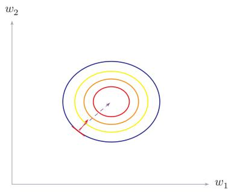  
(b) 规范化数据的梯度  
图 7.9 数据规范化对梯度的影响

神经网络中经常使用的规范化方法.

最小最大值规范化最小最大值规范化（Min-MaxNormalization）是一种非常简单的规范化方法，通过缩放将每一个特征的取值范围映射到[0,1]或[-1,1]之间.假设有N个样本 $\{ \mathbf { } x ^ { ( n ) } \} _ { n = 1 } ^ { N }$ ，对于每一维特征x，规范化后的特征为

$$
{ \hat { x } } ^ { ( n ) } = { \frac { x ^ { ( n ) } - \operatorname* { m i n } _ { n } ( x ^ { ( n ) } ) } { \operatorname* { m a x } _ { n } ( x ^ { ( n ) } ) - \operatorname* { m i n } _ { n } ( x ^ { ( n ) } ) } } ,\tag{7.51}
$$

其中 $\operatorname* { m i n } ( x )$ 和max(x)分别是特征x在所有样本上的最小值和最大值.

标准化 标准化（Standardization）也叫Z值规范化（Z-Score Normalization），来源于统计上的标准分数.将每一个维特征都调整为均值为0，方差为1.假设有N个样本 $\{ \boldsymbol { x } ^ { ( n ) } \} _ { n = 1 } ^ { N }$ ，对于每一维特征x，我们先计算它的均值和方差：

$$
\mu = \frac { 1 } { N } \sum _ { n = 1 } ^ { N } x ^ { ( n ) } ,\tag{7.52}
$$

$$
\sigma ^ { 2 } = \frac { 1 } { N } \sum _ { n = 1 } ^ { N } ( x ^ { ( n ) } - \mu ) ^ { 2 } .\tag{7.53}
$$

然后，将特征 $x ^ { ( n ) }$ 减去均值，并除以标准差，得到新的特征值x(n)：

$$
\hat { x } ^ { ( n ) } = \frac { x ^ { ( n ) } - \mu } { \sigma } ,\tag{7.54}
$$

其中标准差 $\sigma$ 不能为0.如果标准差为0，说明这一维特征没有任何区分性，可以直接删掉.

白化白化（Whitening）是一种重要的预处理方法，用来降低输入数据特征之间的冗余性.输入数据经过白化处理后，特征之间相关性较低，并且所有特征具有相同的方差.白化的一个主要实现方式是使用主成分分析（Principal Com-ponent Analysis,PCA)方法去除掉各个成分之间的相关性.

参见第10.1.1节.

图7.10给出了标准化和PCA白化的比较.

  
图 7.10 标准化和 PCA 白化

## 7.5 逐层规范化

逐层规范化（Layer-wise Normalization）是将传统机器学习中的数据规范化方法应用到深度神经网络中，对神经网络中隐藏层的输入进行规范化，从而使得网络更容易训练.

逐层规范化可以有效提高训练效率的原因有以下几个方面：

（1）更好的尺度不变性：在深度神经网络中，一个神经层的输入是之前神经层的输出.给定一个神经层l,它之前的神经层(1，…,l-1)的参数变化会导致其输入的分布发生较大的改变.当使用随机梯度下降来训练网络时，每次参数更新都会导致该神经层的输入分布发生改变.越高的层，其输入分布会改变得越明显.就像一栋高楼，低楼层发生一个较小的偏移，可能会导致高楼层较大的偏移从机器学习角度来看，如果一个神经层的输入分布发生了改变，那么其参数需要重新学习，这种现象叫作内部协变量偏移（Internal Covariate Shift）.为了缓解这个问题，我们可以对每一个神经层的输入进行规范化操作，使其分布保持相对稳定.

把每个神经层的输入分布都规范化到一个相对稳定的尺度范围，可以使得每个神经层对其输入具有更好的尺度不变性.不论低层的参数如何变化，高层的输入保持相对稳定.另外，尺度不变性也有助于更加高效地进行参数初始化以及超参数选择.

（2）更平滑的优化地形:逐层规范化一方面可以使得大部分神经层的输入处于不饱和区域，从而让梯度变大，避免梯度消失问题；另一方面还可以使得神经网络的优化地形（Optimization Landscape)更加平滑，以及使梯度变得更加稳定，从而允许我们使用更大的学习率，并提高收敛速度[Bjorck et al., 2018;Santurkar et al., 2018]

下面介绍几种比较常用的逐层规范化方法：批量规范化、层规范化、RMS规范化、权重规范化和局部响应规范化

这里的逐层规范化方法是指可以应用在深度神经网络中的任何一个中间层.实际上并不需要对所有层都进行规范化.

协变量偏移参见第11.4.2节.

## 7.5.1 批量规范化

批量规范化（Batch Normalization，BN）方法[Ioffe et al.,2015]是一种有效的逐层规范化方法，可以对神经网络中任意的中间层进行规范化操作．批量规范化最初的提出动机是减少内部协变量偏移（Internal Covariate Shift），即各层输入分布随训练过程不断变化的现象.然而后续研究发现，批量规范化的主要作用并不在于减少内部协变量偏移，而在于使损失函数的优化地形（losslandscape)更加平滑，从而允许使用更大的学习率并加速收敛.

对于一个深度神经网络，令第l层的净输入为 $z ^ { ( l ) }$ ，神经元的输出为 $\mathbf { \Omega } _  \mathbf { \Omega } \mathbf { \Omega } \mathbf { \Omega } \mathbf { \Omega } \mathbf { \Omega } \mathbf { \Omega } \mathbf { \Omega } \mathbf { \Omega } \mathbf { \Omega } \mathbf { \Omega } \mathbf { \Omega } \mathbf { \Omega } \mathbf { \Omega } \mathrm { ~ \Omega ~ } \mathrm { ~ \Omega ~ } \mathrm { ~ \Omega ~ } \mathrm { ~ \Omega ~ } \mathrm { ~ \Omega ~ } \mathrm { ~ \Omega ~ } \mathrm { ~ \Omega ~ } \mathrm { ~ \Omega ~ } \mathrm { ~ \Omega ~ } \mathrm { ~ \Omega ~ } \mathrm { ~ \Omega ~ } \mathrm { ~ \Omega ~ } \mathrm { ~ \Omega ~ }$ ,即

$$
\pmb { a } ^ { ( l ) } = f ( \pmb { z } ^ { ( l ) } ) = f ( \pmb { W } \pmb { a } ^ { ( l - 1 ) } + \pmb { b } ) ,\tag{7.55}
$$

其中 $f ( \cdot )$ 是激活函数，W和b是可学习的参数.

为了提高优化效率，就要使得净输入 $z ^ { ( l ) }$ 的分布一致，比如都规范化到标准正态分布．虽然规范化操作也可以应用在输入 $\mathbf { \delta } \mathbf { a } ^ { ( l - 1 ) }$ 上，但对 $z ^ { ( l ) }$ 进行规范化更加有利于优化.因此，在实践中规范化操作一般应用在仿射变换（AfineTransformation) $W a ^ { ( l - 1 ) } + b$ 之后、激活函数之前.

参见习题7-3.

利用第7.4节中介绍的数据预处理方法对 $z ^ { ( l ) }$ 进行规范化，相当于每一层都进行一次数据预处理，从而加速收敛速度.但是逐层规范化需要在中间层进行操作，要求效率比较高，因此复杂度比较高的白化方法就不太合适.为了提高规范化效率，一般使用标准化将净输入 $z ^ { ( l ) }$ 的每一维变换到均值为0、方差为1的尺度.

$$
\hat { z } ^ { ( l ) } = \frac { z ^ { ( l ) } - \mathbb { E } [ z ^ { ( l ) } ] } { \sqrt { \operatorname { v a r } ( z ^ { ( l ) } ) + \epsilon } } ,\tag{7.56}
$$

€是为了保持数值稳定性而设置的非常小的常数.

其中 $\mathbb { E } [ z ^ { ( l ) } ]$ 和 $\mathrm { v a r } ( z ^ { ( l ) } )$ 是指当前参数下， $z ^ { ( l ) }$ 的每一维在整个训练集上的期望和方差.由于神经网络训练通常基于小批量随机梯度下降，准确计算 $z ^ { ( l ) }$ 在整个训练集上的期望和方差代价较高.因此， $z ^ { ( l ) }$ 的期望和方差通常用当前小批量样本集的均值和方差近似估计.

给定一个包含K个样本的小批量样本集合，第l层神经元的净输入$z ^ { ( 1 , l ) } , \cdots , z ^ { ( K , l ) }$ 的均值和方差为

$$
\displaystyle \mu _ { \mathcal { B } } = \frac { 1 } { K } \sum _ { k = 1 } ^ { K } z ^ { ( k , l ) } ,\tag{7.57}
$$

$$
\pmb { \sigma } _ { \mathscr { B } } ^ { 2 } = \frac { 1 } { K } \sum _ { k = 1 } ^ { K } ( \pmb { z } ^ { ( k , l ) } - \pmb { \mu } _ { \mathscr { B } } ) \odot ( \pmb { z } ^ { ( k , l ) } - \pmb { \mu } _ { \mathscr { B } } ) .\tag{7.58}
$$

对净输入 $z ^ { ( l ) }$ 进行标准化会使得其取值集中到0附近，如果使用Sigmoid型激活函数时，这个取值区间刚好是接近线性变换的区间，减弱了神经网络的非线

性性质.因此，为了使得规范化不对网络的表示能力造成负面影响，可以通过一个附加的缩放和平移变换改变取值区间.

$$
\hat { z } ^ { ( l ) } = \frac { z ^ { ( l ) } - \pmb { \mu } _ { \mathcal { B } } } { \sqrt { \pmb { \sigma } _ { \mathcal { B } } ^ { 2 } + \epsilon } } \odot \gamma + \beta\tag{7.59}
$$

参见习题7-4.

$$
\triangleq \operatorname { B N } _ { \gamma , \beta } ( z ^ { ( l ) } ) ,\tag{7.60}
$$

其中 $\gamma$ 和 $\beta$ 分别代表缩放和平移的参数向量.从最保守的角度考虑，可以通过标准化的逆变换来使得规范化后的变量可以被还原为原来的值.当 $\gamma = \sqrt { \sigma _ { \mathcal B } ^ { 2 } }$ $\beta = \mu _ { \mathcal { B } }$ 时， $\hat { z } ^ { ( l ) } = z ^ { ( l ) }$

批量规范化操作可以看作一个特殊的神经层，加在每一层非线性激活函数 之前,即

$$
\begin{array} { r } { \pmb { a } ^ { ( l ) } = f \big ( \mathrm { B N } _ { \gamma , \beta } ( z ^ { ( l ) } ) \big ) = f \left( \mathrm { B N } _ { \gamma , \beta } ( \pmb { W } \pmb { a } ^ { ( l - 1 ) } ) \right) , } \end{array}\tag{7.61}
$$

其中因为批量规范化本身具有平移变换，所以仿射变换 ${ \mathbf { } } W a ^ { ( l - 1 ) }$ 不再需要偏置参数.

这里要注意的是，每次小批量样本的 $\pmb { \mu } _ { \mathcal { B } }$ 和方差 $\sigma _ { \mathcal { B } } ^ { 2 }$ 是净输入 $z ^ { ( l ) }$ 的函数，而不是常量.因此在计算参数梯度时需要考虑 $\pmb { \mu } _ { \mathcal { B } }$ 和 $\sigma _ { \mathcal { B } } ^ { 2 }$ 的影响.当训练完成时，用整个数据集上的均值 $\pmb { \mu }$ 和方差 $\sigma ^ { 2 }$ 来分别代替每次小批量样本的μ和方差 $\pmb { \mu } _ { \mathcal { B } }$ $\sigma _ { \mathcal { B } } ^ { 2 }$ 在实践中， $\pmb { \mu } _ { \mathcal { B } }$ 和 $\sigma _ { \mathcal { B } } ^ { 2 }$ 也可以用移动平均来计算.

值得一提的是，逐层规范化不但可以提高优化效率，还可以作为一种隐形的正则化方法.在训练时，神经网络对一个样本的预测不仅和该样本自身相关，也和同一批次中的其他样本相关.由于在选取批次时具有随机性，因此使得神经网络不会“过拟合”到某个特定样本，从而提高网络的泛化能力[Luo et al.,2019].

## 7.5.2 层规范化

批量规范化是对一个中间层的单个神经元进行规范化操作，因此要求小批量样本的数量不能太小，否则难以计算单个神经元的统计信息.此外，如果一个神经元净输入的分布在神经网络中是动态变化的，比如循环神经网络，那么就难以直接应用批量规范化操作.

参见习题7-5.

层规范化（Layer Normalization,LN）[Ba et al., 2016]是和批量规范化非常类似的方法.和批量规范化不同的是，层规范化是对一个中间层的所有神经元进行规范化.

对于一个深度神经网络，令第l层神经元的净输入为 $z ^ { ( l ) }$ ，其均值和方差为

$$
\mu ^ { ( l ) } = \frac { 1 } { M _ { l } } \sum _ { i = 1 } ^ { M _ { l } } z _ { i } ^ { ( l ) } ,\tag{7.62}
$$

https://nndl.ai/

$$
{ \sigma ^ { ( l ) } } ^ { 2 } = \frac { 1 } { M _ { l } } \sum _ { i = 1 } ^ { M _ { l } } ( z _ { i } ^ { ( l ) } - \mu ^ { ( l ) } ) ^ { 2 } ,\tag{7.63}
$$

其中 $M _ { l }$ 为第l层神经元的数量.

层规范化定义为

$$
\hat { z } ^ { ( l ) } = \frac { z ^ { ( l ) } - \mu ^ { ( l ) } } { \sqrt { { \sigma ^ { ( l ) } } ^ { 2 } + \epsilon } } \odot \gamma + \beta\tag{7.64}
$$

$$
\triangleq \operatorname { L N } _ { \gamma , \beta } ( z ^ { ( l ) } ) ,\tag{7.65}
$$

其中 $\gamma$ 和 $\beta$ 分别代表缩放和平移的参数向量，和 $z ^ { ( l ) }$ 维数相同.

循环神经网络中的层规范化 层规范化可以应用在循环神经网络中，对循环神经层进行规范化操作.假设在时刻t，循环神经网络的隐藏层为 $\boldsymbol { h } _ { t }$ ,其层规范化的更新为

参见公式(6.6).

$$
z _ { t } = U h _ { t - 1 } + W x _ { t } ,\tag{7.66}
$$

$$
\begin{array} { r } { \pmb { h } _ { t } = f ( \mathrm { L N } _ { \gamma , \beta } ( \pmb { z } _ { t } ) ) , } \end{array}\tag{7.67}
$$

其中输入 $\mathbf { \boldsymbol { x } } _ { t }$ 为第t时刻的输入， $U$ 和 $W$ 为网络参数.

在标准循环神经网络中，循环神经层的净输入一般会随着时间慢慢变大或变小，从而导致梯度爆炸或消失.而层规范化可以有效缓解这种状况.

层规范化和批量规范化整体上是十分类似的，差别在于统计量的计算维度不同.对于K个样本的一个小批量集合 $Z ^ { ( l ) } = [ z ^ { ( 1 , l ) } , \cdots , z ^ { ( K , l ) } ]$ ，如果将每个样本按列堆叠，则层规范化是对矩阵 $Z ^ { ( l ) }$ 的每一列进行规范化，而批量规范化是对每一行进行规范化.一般而言，在卷积神经网络和批量较大的视觉任务中，批量规范化仍然是更常见的选择；在循环神经网络、Transformer以及批量较小的场景中，层规范化往往更加自然

## 7.5.3 均方根规范化

在序列建模和大语言模型中，均方根规范化（Root Mean Square Normal-ization，RMSNorm）[Zhang et al.,2019]是一种常用规范化方法. 与层规范化相比，RMS规范化不再对输入做均值中心化，而只根据均方根（Root MeanSquare,RMS)来调整尺度，因此计算更简单.

给定一层的净输入 $\boldsymbol { z } ^ { ( l ) } \in \mathbb { R } ^ { M _ { l } }$ ,其均方根为

$$
\mathrm { R M S } ( z ^ { ( l ) } ) = \sqrt { \frac { 1 } { M _ { l } } \sum _ { i = 1 } ^ { M _ { l } } ( z _ { i } ^ { ( l ) } ) ^ { 2 } + \epsilon } .\tag{7.68}
$$

https://nndl.ai/

RMS规范化定义为

$$
\hat { z } ^ { ( l ) } = \frac { z ^ { ( l ) } } { \mathrm { R M S } ( z ^ { ( l ) } ) } \odot \gamma\tag{7.69}
$$

$$
\triangleq \mathrm { R M S N o r m } _ { \gamma } ( z ^ { ( l ) } ) ,\tag{7.70}
$$

其中 $\gamma$ 为可学习的缩放参数

和层规范化相比，RMS规范化少了减均值这一步，因此计算和实现都更简单；同时，它仍然保留了对输入尺度变化的抑制作用.从实践上看，RMS规范化尤其适合Transformer类模型，因此在很多现代大模型中比层规范化更常见.

## 7.5.4 权重规范化

权重规范化（Weight Normalization）[Salimans et al., 2016] 是对神经网络的连接权重进行规范化，通过再参数化（Reparameterization）方法，将连接权重分解为长度和方向两种参数.假设第l层神经元 $\pmb { a } ^ { ( l ) } = f ( \pmb { W } \pmb { a } ^ { ( l - 1 ) } + \pmb { b } )$ ,我们将W再参数化为

$$
W _ { i , : } = \frac { g _ { i } } { \| \pmb { v } _ { i } \| } \pmb { v } _ { i } , \qquad 1 \leq i \leq M _ { l }\tag{7.71}
$$

其中 $W _ { i , : }$ 表示权重W的第i行， $M _ { l }$ 为神经元数量.新引入的参数 $g _ { i }$ 为标量， ${ \boldsymbol { v } } _ { i }$ 和 $\mathbf { \delta } \mathbf { a } ^ { ( l - 1 ) }$ 维数相同.

由于在神经网络中权重经常是共享的，权重数量往往比神经元数量要少，因此权重规范化的开销会比较小.

局部响应规范化 局部响应规范化（Local Response Normalization,LRN)是AlexNet（2012年）中使用的早期规范化方法，其思想是对每个神经元的活性值，用其空间邻域内其他神经元的活性值进行规范化，随着批量规范化、层规范化等方法的发展，LRN在现代深度网络中已经较少使用，因此不再详述，有兴趣的读者可参考 [Krizhevsky et al., 2012].

## 7.6 超参数优化

在神经网络中，除了可学习的参数之外，还存在很多超参数.这些超参数对网络性能的影响也很大.不同的机器学习任务往往需要不同的超参数.常见的超参数有以下三类：

（1）网络结构，包括神经元之间的连接关系、层数、每层的神经元数量、激活函数的类型等.

（2）优化参数，包括优化方法、学习率、小批量的样本数量等

## （3）正则化系数.

超参数优化（Hyperparameter Optimization）主要存在两方面的困难：1）超参数优化是一个组合优化问题，无法像一般参数那样直接通过梯度下降方法来优化，也没有一种适用于所有任务的通用方法；2）评估一组超参数配置（Configuration）的时间代价非常高，从而导致一些优化方法（比如演化算法(Evolution Algorithm))在超参数优化中难以应用.

假设一个神经网络中总共有K个超参数，每个超参数配置表示为一个向量$\pmb { x } \in \mathcal { X } , \mathcal { X } \subset \mathbb { R } ^ { K }$ 是超参数配置的取值空间. 超参数优化的目标函数定义为$f ( \pmb { x } ) : \mathcal { X }  \mathbb { R } , f ( \pmb { x } )$ 是衡量一组超参数配置x效果的函数，一般设置为验证集上的错误率.目标函数f(x)可以看作一个黑盒（black-box）函数，不需要知道其具体形式.虽然在神经网络的超参数优化中，f(x)的函数形式已知，但 $f ( { \pmb x } )$ 不是关于x的连续函数，并且x不同，f(x)的函数形式也不同，因此无法使用梯度下降等优化方法.

对于超参数的配置，常见的方法有网格搜索、随机搜索、贝叶斯优化、动态资源分配和神经架构搜索.

## 7.6.1 网格搜索

网格搜索（Grid Search）是一种通过尝试所有超参数的组合来寻找一组较合适超参数配置的方法.假设总共有K个超参数，第k个超参数可以取 $m _ { k }$ 个值.那么总共的配置组合数量为 $m _ { 1 } \times m _ { 2 } \times \cdots \times m _ { K }$ .如果超参数是连续的，可以将超参数离散化，选择几个“经验”值.比如学习率α，我们可以设置

$$
\alpha \in \{ 0 . 0 1 , 0 . 1 , 0 . 5 , 1 . 0 \} .
$$

一般而言，对于连续的超参数，我们不能按等间隔的方式进行离散化，需要根据超参数自身的特点进行离散化

网格搜索根据这些超参数的不同组合分别训练一个模型，然后测试这些模型在验证集上的性能，选取一组性能最好的配置.

## 7.6.2 随机搜索

不同超参数对模型性能的影响有很大差异，有些超参数（比如正则化系数）对模型性能的影响有限，而另一些超参数（比如学习率）对模型性能影响比较大.在这种情况下，采用网格搜索会在不重要的超参数上进行不必要的尝试.一种在实践中比较有效的改进方法是对超参数进行随机组合，然后选取一个性能最好的配置，这就是随机搜索（Random Search) [Bergstra et al., 2012]. 随机搜索在实践中更容易实现，在许多情况下比网格搜索更有效.

网格搜索和随机搜索都没有利用不同超参数组合之间的相关性，即如果模型的超参数组合比较类似，其模型性能也是比较接近的.因此这两种搜索方式一般都比较低效.下面我们介绍两种自适应的超参数优化方法：贝叶斯优化和动态资源分配.

## 7.6.3 贝叶斯优化

贝叶斯优化(Bayesian Optimization) [Bergstra et al., 2011; Snoek et al.,2012是一种自适应的超参数优化方法，根据当前已经试验的超参数组合，来预测下一个可能带来最大收益的组合.

一种比较常用的贝叶斯优化方法为时序模型优化（Sequential Model-Based Optimization，SMBO) [Hutter et al., 2011]. 假设超参数优化的函数f(x)服从高斯过程，则 $p ( f ( { \pmb x } ) | { \pmb x } )$ 为一个正态分布.贝叶斯优化过程是根据已有的N组试验结果 $\mathcal { H } = \{ \boldsymbol { x } _ { n } , \boldsymbol { y } _ { n } \} _ { n = 1 } ^ { N } \left( \begin{array} { l } { \boldsymbol { y } _ { n } } \end{array} \right.$ 为 $f ( { \pmb x } _ { n } )$ 的观测值）来建模高斯过程，并计算f(x)的后验分布 $p _ { \mathcal { G P } } ( f ( \pmb { x } ) | \pmb { x } , \mathcal { H } )$

为了使得 $p _ { \mathcal { G P } } ( f ( \pmb { x } ) | \pmb { x } , \mathcal { H } )$ 接近其真实分布，就需要对样本空间进行足够多的采样.但是超参数优化中每一个样本的生成成本很高，需要用尽可能少的样本来使得 $p _ { \mathcal { G P } } ( f ( \pmb { x } ) | \pmb { x } , \mathcal { H } )$ 接近于真实分布.因此，需要通过定义一个收益函数（Acquisition Function） $a ( x , { \mathcal { H } } )$ 来判断一个样本是否能够给建模$p _ { \mathcal { G P } } ( f ( \pmb { x } ) | \pmb { x } , \mathcal { H } )$ 提供更多的收益.收益越大，其修正的高斯过程会越接近目标函数的真实分布.

收益函数的定义有很多种方式.一个常用的是期望改善（Expected Im-provement，EI）函数.假设目标是最小化验证错误，且 $y ^ { * } = \operatorname* { m i n } \{ y _ { n } , 1 \leq n \leq$ N}是当前已有样本中的最优值，期望改善函数为

$$
\mathbf { E I } ( x , \mathcal { H } ) = \int _ { - \infty } ^ { \infty } \operatorname* { m a x } ( y ^ { * } - y , 0 ) p _ { \mathcal { G P } } ( y | \mathbf { x } , \mathcal { H } ) \mathrm { d } y .\tag{7.72}
$$

期望改善刻画的是：在当前模型 $p _ { \mathcal { G P } } ( f ( \pmb { x } ) | \pmb { x } , \mathcal { H } )$ 下，候选配置 $_ { \textbf { \em x } }$ 使目标值低于当前最优值 $y ^ { * }$ 的期望幅度.除了期望改善函数之外，收益函数还有其他定义形式，比如改善概率（Probability of Improvement）、高斯过程置信上界（GPUpper Confidence Bound, GP-UCB) 等.

时序模型优化方法如算法7.1所示.贝叶斯优化的一个缺点是高斯过程建模需要计算协方差矩阵的逆，时间复杂度是 $O ( N ^ { 3 } )$ ，因此不能很好地处理高维情况.深度神经网络的超参数一般比较多，为了使用贝叶斯优化来搜索神经网络的超参数，需要一些更高效的高斯过程建模.也有一些方法可以将时间复杂度从$O ( N ^ { 3 } )$ 降低到 O(N)[Snoek et al., 2015].

算法7.1 时序模型优化（SMBO）方法  
输入：优化目标函数 $f ( x )$ ,迭代次数T，收益函数 $a ( x , { \mathcal { H } } )$   
1 ${ \mathcal { H } } \gets \emptyset ;$   
2随机初始化高斯过程，并计算 $p _ { \mathcal { G P } } ( f ( \pmb { x } ) | \pmb { x } , \mathcal { H } ) ;$   
3 for t ← 1 to T do  
4 $\begin{array} { r } { \pmb { x } ^ { \prime }  \arg \operatorname* { m a x } _ { x } a ( x , \mathcal { H } ) ; } \end{array}$   
5 评价 $y ^ { \prime } = f ( \pmb { x } ^ { \prime } )$ 。2 //代价高  
6 ${ \mathcal { H } }  { \mathcal { H } } \cup ( \mathbf { x } ^ { \prime } , y ^ { \prime } ) ;$   
7 根据重新建模高斯过程，并计算 $p _ { \mathcal { G P } } ( f ( \pmb { x } ) | \pmb { x } , \mathcal { H } )$   
8 end  
输出： $\mathcal { H }$

## 7.6.4 动态资源分配

在超参数优化中，每组超参数配置的评估代价比较高.如果我们可以在较早的阶段就估计出一组配置的效果会比较差，那么我们就可以中止这组配置的评估，将更多的资源留给其他配置，这个问题可以归结为多臂赌博机问题的一个泛化问题：最优臂问题（Best-ArmProblem），即在给定有限的机会次数下，如何玩这些赌博机并找到收益最大的臂.和多臂赌博机问题类似，最优臂问题也是在利用和探索之间找到最佳的平衡.

由于神经网络的优化过程通常会产生逐步变化的训练曲线，因此我们可以通过一组超参数的学习曲线来预估这组超参数配置是否有希望得到比较好的结果.如果一组超参数配置的学习曲线不收敛或者收敛比较差，我们可以应用提前停止（Early Stopping）策略来中止当前的训练.

动态资源分配的关键是将有限的资源分配给更有可能带来收益的超参数组合.一种有效方法是逐次减半（Successive Halving）方法[Jamieson et al.,2016]，将超参数优化看作一种非随机的最优臂问题.假设要尝试N组超参数配置，总共可利用的资源预算（摇臂的次数）为B，我们可以通过 $T = \lceil \log _ { 2 } ( N ) \rceil$ 轮逐次减半的方法来选取最优的配置，具体过程如算法7.2所示.

在逐次减半方法中，尝试的超参数配置数量N十分关键.如果N越大，得到最佳配置的机会也越大，但每组配置分到的资源就越少，这样早期的评估结果可能不准确，反之，如果N越小，每组超参数配置的评估会越准确，但有可能无法得到最优的配置.因此，如何设置N是平衡“利用-探索”的一个关键因素.一种改进的方法是HyperBand方法[Li et al., 2017],通过尝试不同的 N来选取最优

```latex
算法 7.2 一种逐次减半的动态资源分配方法
输入：预算B,N个超参数配置 $\{ \pmb { x } _ { n } \} _ { n = 1 } ^ { N }$
1 $T \gets \lceil \log _ { 2 } ( N ) \rceil$
2 随机初始化 $\mathcal { S } _ { 0 } = \{  { \boldsymbol { { x } } } _ { n } \} _ { n = 1 } ^ { N }$
3 for $t \gets 0$ to $T - 1$ do
4 $r _ { t } \gets \lfloor \frac { B } { | \mathcal { S } _ { t } | \times T } \rfloor ;$
5 给 $\mathcal { S } _ { t }$ 中的每组配置分配 $r _ { t }$ 的资源;
6 运行 $\mathcal { S } _ { t }$ 中所有配置，评估结果为 $\begin{array} { r } { \mathbf { \nabla } \pmb { y } _ { t } \mathbf { ; \nabla } } \end{array}$
7 根据评估结果，选取 $| \mathcal { S } _ { t } | / 2$ 组最优的配置;
8 $\mathcal { S } _ { t + 1 }  \mathrm { a r g m a x } ( \mathcal { S } _ { t } , y _ { t } , \vert \mathcal { S } _ { t } \vert / 2 ) ; / / \mathrm { a r g m a x } ( \mathcal { S } , y , m )$ 为从集合S中选取
m个元素，对应最优的m个评估结果.
9 end
输出：最优配置 ${ \mathcal { S } } _ { T }$
```

参数.

## 7.6.5 神经架构搜索

上面介绍的超参数优化方法都是在固定（或变化比较小）的超参数空间x中进行最优配置搜索，而神经网络架构本身往往仍需要由有经验的研究者或工程师来设计.

从某种角度来讲，深度学习使得机器学习中的“特征工程”问题转变为“网络架构工程”问题.

神经架构搜索(Neural Architecture Search, NAS)[Zoph et al., 2017]是一类自动化网络架构设计方法，目标是减少过度依赖人工经验设计结构的成本.一个神经网络的架构可以用一个变长的字符串来描述，利用元学习的思想，神经架构搜索利用一个控制器来生成另一个子网络的架构描述.控制器可以由一个循环神经网络来实现.控制器的训练可以通过强化学习来完成，其奖励信号为生成的子网络在验证集上的准确率

在大规模模型训练中，还可以先在较小模型上调节超参数，再将其迁移到更大的模型上.在合适的参数化方式下，一些最优超参数在模型尺度变化时能够保持相对稳定.这说明，超参数优化不仅是在搜索更好的配置，也是在探索“如何更便宜地搜索”.

## 7.7 网络正则化

机器学习模型的关键是泛化问题，即在样本真实分布上的期望风险最小化而训练数据集上的经验风险最小化和期望风险并不一致.由于神经网络的拟合能力很强，其在训练数据上的错误率往往可以降到很低，甚至接近0，从而导致过拟合.因此，如何提高神经网络的泛化能力成为影响模型能力的关键因素.

正则化（Regularization）是一类通过限制模型复杂度，从而避免过拟合，提高泛化能力的方法，比如引入约束、增加先验、提前停止等.

在传统的机器学习中，提高泛化能力的方法主要是限制模型复杂度，比如采用 $\ell _ { 1 }$ 和 $\ell _ { 2 }$ 正则化等方式.而在训练深度神经网络时，特别是在过度参数化(Over-Parameterization)时， $\ell _ { 1 }$ 和 $\ell _ { 2 }$ 正则化的效果往往不如浅层机器学习模型中显著.因此训练深度学习模型时，往往还会使用其他的正则化方法，比如数据增强、提前停止、暂退法、标签平滑等.

过度参数化是指模型参数的数量远远大于训练数据的数量.

## 7.7.1 $\ell _ { 1 }$ 和 $\ell _ { 2 }$ 正则化

$\ell _ { 1 }$ 和 $\ell _ { 2 }$ 正则化是机器学习中最常用的正则化方法，通过约束参数的 $\ell _ { 1 }$ 和 $\ell _ { 2 }$ 范数来减小模型在训练数据集上的过拟合现象.

范数参见第A.1.3节.

通过加入 $\ell _ { 1 }$ 和 $\ell _ { 2 }$ 正则化，优化问题可以写为

$$
\theta ^ { * } = \underset { \theta } { \arg \operatorname* { m i n } } \frac { 1 } { N } \sum _ { n = 1 } ^ { N } \mathcal { L } \big ( y ^ { ( n ) } , f ( \pmb { x } ^ { ( n ) } ; \theta ) \big ) + \lambda \ell _ { p } ( \theta ) ,\tag{7.73}
$$

其中 $\mathcal { L } ( \cdot )$ 为损失函数，N为训练样本数量， $f ( \cdot )$ 为待学习的神经网络，θ为其参数， $\ell _ { p }$ 为范数函数， $p$ 的取值通常为{1,2}代表 $\ell _ { 1 }$ 和 $\ell _ { 2 }$ 范数，λ为正则化系数.

带正则化的优化问题可以等价地写为下面带约束条件的优化问题.对某个 与λ对应的常数 $c > 0$ ,有

参见第C.1.2节.

$$
\theta ^ { * } = \underset { \theta } { \arg \operatorname* { m i n } } \frac { 1 } { N } \sum _ { n = 1 } ^ { N } \mathcal { L } \big ( y ^ { ( n ) } , f ( \pmb { x } ^ { ( n ) } ; \theta ) \big ) ,\tag{7.74}
$$

$$
\quad \quad \quad \ell _ { p } ( \theta ) \leq c .\tag{7.75}
$$

$\ell _ { 1 }$ 范数在零点不可导，因此经常用下式来近似：

$$
\ell _ { 1 } ( \theta ) = \sum _ { d = 1 } ^ { D } \sqrt { \theta _ { d } ^ { 2 } + \epsilon }\tag{7.76}
$$

其中D为参数数量，∈为一个非常小的常数

图7.11给出了不同范数约束条件下的最优化问题示例，红线表示函数 $\ell _ { p } =$ 1, $\mathcal { F }$ 为函数 $f ( \theta )$ 的等高线（为简单起见，这里用直线表示）.可以看出， $\ell _ { 1 }$ 范数的约束通常会使得最优解位于坐标轴上，从而使得最终的参数为稀疏性向量.

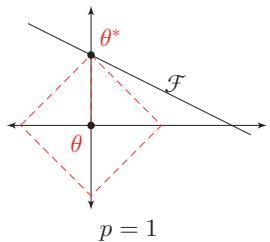

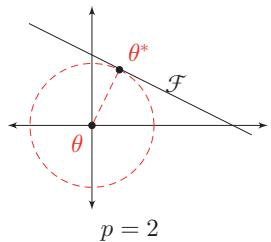

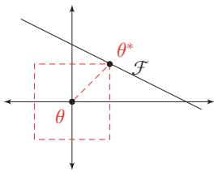  
图7.11 不同范数约束条件下的最优化问题示例

一种折中的正则化方法是同时加入 $\ell _ { 1 }$ 和 $\ell _ { 2 }$ 正则化，称为弹性网络正则化(Elastic Net Regularization) [Zou et al., 2005].

$$
\theta ^ { * } = \underset { \theta } { \arg \operatorname* { m i n } } \frac { 1 } { N } \sum _ { n = 1 } ^ { N } \mathcal { L } \big ( y ^ { ( n ) } , f ( x ^ { ( n ) } ; \theta ) \big ) + \lambda _ { 1 } \ell _ { 1 } ( \theta ) + \lambda _ { 2 } \ell _ { 2 } ( \theta ) ,\tag{7.77}
$$

其中 $\lambda _ { 1 }$ 和 $\lambda _ { 2 }$ 分别为两个正则化项的系数.

## 7.7.2 权重衰减

权重衰减（Weight Decay）是一种有效的正则化方法[Hanson et al.,1989]，在每次参数更新时，引入一个衰减系数.若将其与 $\ell _ { 2 }$ 正则化对应起来，则有 $\beta = \alpha \lambda$

$$
\begin{array} { r } { \theta _ { t }  ( 1 - \beta ) \theta _ { t - 1 } - \alpha \mathbf { g } _ { t } , } \end{array}\tag{7.78}
$$

其中 $\mathbf { g } _ { t }$ 为第t步更新时的梯度， $\alpha$ 为学习率，β为权重衰减系数，一般取值比较小，比如0.0005.

从正则化的角度来看，权重衰减和 $\ell _ { 2 }$ 正则化都旨在抑制参数过大，从而降低模型复杂度并改善泛化能力.对于标准随机梯度下降，这两种方式恰好等价.

在损失函数加入 $\ell _ { 2 }$ 正则化：

$$
\tilde { \mathcal { L } } ( \theta ) = \mathcal { L } ( \theta ) + \frac { \lambda } { 2 } \| \theta \| _ { 2 } ^ { 2 } .\tag{7.79}
$$

此时，第t步的正则化梯度为

$$
\tilde { \pmb { g } } _ { t } = \pmb { g } _ { t } + \lambda \theta _ { t - 1 } ,\tag{7.80}
$$

其中 $\pmb { g } _ { t } = \nabla _ { \theta } \mathcal { L } ( \theta _ { t - 1 } )$ 为原始损失函数的梯度.因此，参数更新为

$$
\theta _ { t }  ( 1 - \alpha \lambda ) \theta _ { t - 1 } - \alpha \mathbf { g } _ { t } ,\tag{7.81}
$$

在一些深度学习框架中，权重衰减一般通过 $\ell _ { 2 }$ 正则化来实现

但对于 Adam 自适应优化算法，二者一般并不等价 [Loshchilov et al.2019]. 若直接用Adam最小化这个带 $\ell _ { 2 }$ 正则化的目标函数，则其一阶矩、二阶矩和参数更新分别为

$$
M _ { t } = \beta _ { 1 } M _ { t - 1 } + ( 1 - \beta _ { 1 } ) \tilde { \mathbf { g } } _ { t } ,\tag{7.82}
$$

$$
G _ { t } = \beta _ { 2 } G _ { t - 1 } + ( 1 - \beta _ { 2 } ) \tilde { g } _ { t } \odot \tilde { g } _ { t } ,\tag{7.83}
$$

$$
\hat { M } _ { t } = \frac { M _ { t } } { 1 - \beta _ { 1 } ^ { t } } , \qquad \hat { G } _ { t } = \frac { G _ { t } } { 1 - \beta _ { 2 } ^ { t } } ,\tag{7.84}
$$

$$
\theta _ { t } = \theta _ { t - 1 } - \alpha { \frac { \hat { M } _ { t } } { \sqrt { \hat { G } _ { t } + \epsilon } } } .\tag{7.85}
$$

可以看到，正则项 $\lambda \theta _ { t - 1 }$ 会与任务梯度 $\mathbf { \mathscr { g } } _ { t }$ 一起进入一阶矩和二阶矩估计，并被$1 / \sqrt { \hat { G } _ { t } + \epsilon }$ 按坐标自适应地缩放.因此，在Adam中直接加入 $\ell _ { 2 }$ 正则化时，不同参数的实际收缩强度会受到历史梯度统计的影响，参数范数的控制不再是均匀、直接的.换言之，此时“优化目标”和“参数抑制”两种作用是耦合在一起的.

基于这一点，更合理的做法是将参数衰减与梯度更新显式分开：Adam的自适应部分负责依据任务梯度优化损失函数，而权重衰减部分则单独负责抑制参数过大、控制模型复杂度，因此在现代深度学习实践中，更常采用解耦权重衰减而不是 $\mathrm { \dot { \cdot } A d a m } + \ell _ { 2 }$ 正则化”的组合.

## 7.7.2.1 AdamW 算法

AdamW算法的核心思想是:在Adam更新之外，单独对参数施加权重衰减，从而将“梯度驱动的优化”与“参数范数控制”解耦开来.AdamW与Adam算法的一阶矩估计、二阶矩估计以及偏差修正过程相同，即仍然使用公式(7.25)、(7.26)、(7.27)和(7.28)计算 $\hat { M } _ { t }$ 和 $\hat { G } _ { t } ^ { } .$ 不同之处在于，AdamW将权重衰减与梯度更新解耦，其参数更新公式为

$$
\theta _ { t } = \theta _ { t - 1 } - \alpha \frac { \hat { M } _ { t } } { \sqrt { \hat { G } _ { t } + \epsilon } } - \alpha \lambda \theta _ { t - 1 }\tag{7.86}
$$

$$
= ( 1 - \alpha \lambda ) \theta _ { t - 1 } - \alpha \frac { \hat { M } _ { t } } { \sqrt { \hat { G } _ { t } + \epsilon } } ,\tag{7.87}
$$

其中λ为权重衰减系数.上式中，第二项是标准的Adam更新，用于根据任务梯度优化目标函数；第一项则对应显式的权重衰减，用于直接收缩参数

AdamW和Adam的主要区别在于：Adam把正则化项混入损失函数梯度中，再经过自适应学习率缩放；而AdamW则显式地把参数按比例缩小，再根据损失函数梯度进行更新.这样一来，权重衰减系数λ和学习率α的作用被更清楚地分离开，有利于超参数调节.

这种解耦带来几个直接好处：首先，正则化作用更加直接、可控，参数衰减直接作用在参数本身，不再经过矩估计，因此更接近“持续压缩参数范数”的原始目标；其次，优化与正则化的角色分工更加清晰，前者负责降低训练误差，后者负责控制模型复杂度，二者不再相互干扰；再次，超参数更容易解释和调节，权重衰减系数λ更直接地对应参数收缩强度，而不会被Adam的自适应机制进一步扭曲；最后，经验上往往具有更好的泛化表现.

在训练Transformer等现代深度神经网络时,AdamW常被作为默认优化器之一.与Adam相比，AdamW通常具有更稳定的训练行为，并能得到更好的泛化性能.

提前停止（EarlyStopping）对于深度神经网络来说是一种简单有效的正则化方法.由于深度神经网络的拟合能力非常强，因此比较容易在训练集上过拟

## 7.7.3 提前停止

AdamW不是不使用正则化，而是不再通过将 $\ell _ { 2 }$ 正则项直接加入损失函数、再把它混入梯度统计的方式来实现参数收缩，而是改用解耦权重衰减(decoupled weightdecay).

提前停止也可以参见第2.2.4.2节.

合．在使用梯度下降法进行优化时，我们可以使用一个和训练集独立的样本集合，称为验证集（ValidationSet），并用验证集上的错误来代替期望错误.当验证集上的错误率不再下降，就停止迭代.

然而在实际操作中，验证集上的错误率变化曲线并不一定像图2.4中所示那样平滑，而可能出现先升高后又降低的局部波动.因此，提前停止的具体停止标准需要根据实际任务进行调整[Prechelt, 1998].

## 7.7.4 暂退法

当训练一个深度神经网络时，我们可以随机将一部分神经元的输出暂时置零（同时屏蔽其对应的连接边）来避免过拟合，这种方法称为暂退法（Dropout）[Srivastava et al., 2014]. 每次选择哪些神经元被暂时屏蔽都是随机的. 最简单的做法是设置一个固定的保留率 $\dot { \bar { \cdot } } p$ ,表示每个神经元在训练时以概率 $\mathbf { \nabla } _ { p }$ 被保留.

对于一个神经层 $\pmb { y } = f ( \pmb { W } \pmb { x } + \pmb { b } )$ ，我们可以引入一个掩码函数mask(·)，使得 ${ \pmb y } = f ( { \pmb W } \operatorname* { m a s k } ( { \pmb x } ) + { \pmb b } )$ .在现代深度学习框架中，通常采用反向缩放的暂退法(inverted dropout),其定义为

$$
\mathrm { m a s k } ( \pmb { x } ) = \left\{ \begin{array} { l l } { \displaystyle \frac { m \odot \pmb { x } } { p } } & { \triangleq \pmb { \mathbb { 1 } } \pmb { \mathbb { 1 } } | | \boldsymbol { \underline { { \xi } } } \pmb { \mathbb { 1 } } | | \mathbf { \underline { { \xi } } } \mathbf { \mathbb { M } } | \mathbf { \hat { \xi } } \mathbf { \hat { \xi } } \mathbf { \hat { \xi } } \mathbf { \hat { \xi } } \mathbf { \hat { \xi } } \mathbf { \hat { \xi } } \mathbf { \hat { \xi } } \mathbf { \hat { \xi } } \mathbf { \hat { \xi } } \mathbf { \hat { \xi } } \mathbf { \hat { \xi } } \mathbf { \hat { \xi } } \mathbf { \hat { \xi } } } \\ { \qquad \vdots \qquad } & { \triangleq \pmb { \mathbb { 1 } } \pmb { \mathbb { 1 } } | | \mathbf { \hat { \xi } } \mathbf { \hat { \xi } } \mathbf { \hat { \xi } } | \mathbf { \hat { \xi } } \mathbf { \hat { \xi } } \mathbf { \hat { \xi } } \mathbf { \hat { \xi } } \mathbf { \hat { \xi } } \mathbf { \hat { \xi } } \mathbf { \hat { \xi } } \mathbf { \hat { \xi } } \mathbf { \hat { \xi } } \mathbf { \hat { \xi } } \mathbf { \hat { \xi } } \mathbf { \hat { \xi } } \mathbf { \hat { \xi } } \mathbf { \hat { \xi } } \mathbf { \hat { \xi } } \mathbf { \hat { \xi } } \mathbf { \hat { \xi } } } \end{array} \right.\tag{7.88}
$$

其中 $m \in \{ 0 , 1 \} ^ { D }$ 是暂退掩码（Dropout Mask），通过参数为 $p$ 的伯努利分布随机生成.由于训练阶段额外除以 $p _ { \cdot }$ 因此在训练和测试时，神经元输出的期望尺度保持一致，不需要在测试阶段再额外缩放.

D为输入x的维度.

暂退法的直观作用是降低神经元之间的复杂共适应关系，使得模型不能过度依赖某些局部特征或少数路径，从而提高泛化能力.对输入层使用暂退法时，可以看作给输入增加噪声；对隐藏层使用暂退法时，则相当于在训练过程中随机采样不同的子网络.

一般而言，输入层的保留率通常设得更接近1，以免对原始输入造成过大扰动；隐藏层的保留率则可以更小一些.不同任务和不同网络结构下的最佳保留率并不相同，需要结合验证集进行调节

暂退法一般是针对神经元输出进行随机屏蔽，但也可以扩展到对神经元之间的连接进行随机屏蔽[Wan et al.，2013]，或对整块特征进行随机屏蔽.图7.12给出了一个网络应用暂退法后的示例.

  
(a) 标准网络

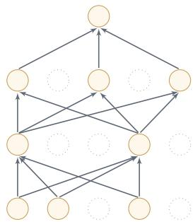  
(b) 应用暂退法后的网络  
图 7.12 暂退法示例

集成学习角度的解释每做一次暂退，相当于从原始网络中采样得到一个子网络.如果一个神经网络有n个神经元，那么总共可以采样出 $2 ^ { n }$ 个子网络.每次迭代都相当于训练一个不同的子网络，这些子网络都共享原始网络的参数，因此，最终的网络可以近似看作集成了指数级多个不同网络的组合模型.

贝叶斯学习角度的解释 暂退法也可以解释为一种贝叶斯学习的近似[Galet al., 2016a]. 用 $y = f ( \pmb { x } ; \theta )$ 来表示要学习的神经网络，贝叶斯学习是假设参数θ为随机向量，并且先验分布为 $q ( \theta )$ ，贝叶斯方法的预测为

$$
\mathbb { E } _ { q ( \theta ) } [ y ] = \int f ( \pmb { x } ; \theta ) q ( \theta ) d \theta\tag{7.89}
$$

$$
\approx \frac { 1 } { M } \sum _ { m = 1 } ^ { M } f ( \pmb { x } ; \pmb { \theta } _ { m } ) ,\tag{7.90}
$$

其中 $f ( x ; \theta _ { m } )$ 为第m次应用暂退法后的网络，其参数 $\theta _ { m }$ 为对全部参数θ的一次采样.

## 7.7.4.1 循环神经网络上的暂退法

当在循环神经网络上应用暂退法时，不能直接对每个时刻的隐状态进行独立的随机屏蔽，这样会损害循环网络在时间维度上的记忆能力.一种简单的方法是只对非时间维度的连接（即非循环连接）进行随机屏蔽[Zaremba et al..2014]. 如图7.13所示，虚线边表示进行随机屏蔽，不同的颜色表示不同的暂退掩码.

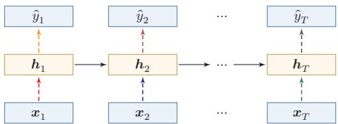  
图7.13 针对非循环连接的暂退法

然而根据贝叶斯学习的解释，暂退法可以看作一种对参数θ的采样.每次采样得到的参数在时间维度上应保持一致.因此，在循环神经网络中使用暂退法时，可以对参数矩阵的元素进行随机屏蔽，并在所有时刻共享同一个暂退掩码.这种方法称为变分暂退法(Variational Dropout)[Gal et al., 2016b]. 图7.14给出了变分暂退法的示例，相同颜色表示使用相同的暂退掩码.

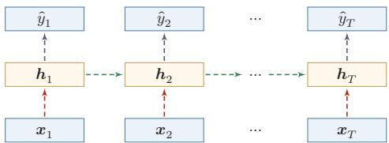  
图 7.14 变分暂退法

## 7.7.5 数据增强

深度神经网络通常需要大量训练数据才能获得比较理想的效果.在数据量有限的情况下，可以通过数据增强（Data Augmentation）来提高样本多样性，增强模型鲁棒性，并缓解过拟合.图像领域中的数据增强最为成熟；在文本、语音和时序数据中，也可以使用同样的思想，但需要更加注意增强后样本的语义与标签是否保持一致

最基本的数据增强方法是在原始样本上施加保持标签不变的变换.对于图像数据，常见做法包括：

（1）旋转（Rotation):将图像按顺时针或逆时针方向随机旋转一定角度；

(2）翻转（Flip):将图像沿水平或垂直方向随机翻转；

(3）缩放（ZoomIn/Out):将图像放大或缩小一定比例；

(4）平移（Shift):将图像沿水平或垂直方向平移一定步长；

(5）加噪声（Noise）:加入随机噪声或随机遮挡.

除了这类几何变换和噪声扰动外，另一类常用方法是样本混合增强.mixup(mixup)[Zhang et al., 2018]通过对两个样本及其标签做凸组合来构造新样本：

$$
\begin{array} { r } { \tilde { \pmb { x } } = \lambda \pmb { x } _ { i } + ( 1 - \lambda ) \pmb { x } _ { j } , } \end{array}\tag{7.91}
$$

$$
\begin{array} { r } { \tilde { \pmb { y } } = \lambda \pmb { y } _ { i } + ( 1 - \lambda ) \pmb { y } _ { j } , } \end{array}\tag{7.92}
$$

其中 $\lambda \in [ 0 , 1 ]$ 通常服从Beta分布.mixup能够鼓励模型在样本之间学习更平滑的判别边界，从而提升泛化能力.

从更一般的角度来看，数据增强的目标并不是“制造更多数据”，而是将任务中合理的不变性（invariance）或平滑性（smoothness）显式编码到训练过程中.

## 7.7.6 标签平滑

在数据增强中，我们可以给样本特征加入随机噪声来避免过拟合.同样，也可以给样本标签引入一定的噪声．假设训练数据集中有一些样本的标签存在错误，或者某些类别边界本身较为模糊，那么一味最小化这些样本上的损失函数会导致模型过于自信.一种改善的正则化方法是标签平滑（Label Smoothing），即在输出标签中加入少量噪声来避免模型过拟合 [M”uller et al., 2019; Szegedyet al., 2016].

一个样本x的标签可以用one-hot向量表示，即

$$
\begin{array} { r } { \pmb { y } = [ 0 , \cdots , 0 , 1 , 0 , \cdots , 0 ] ^ { \top } . } \end{array}
$$

这种标签可以看作硬目标（Hard Target）.如果使用Softmax分类器并使用交叉熵损失函数，最小化损失函数会使得正确类和其他类的权重差异变得很大.根据Softmax函数的性质可知，如果要使得某一类的输出概率接近于1，其未规范化得分需要远大于其他类的得分，这会使模型变得过于自信，并可能导致过拟合.

为了改善这种情况，我们可以引人入一个噪声对标签进行平滑，即假设样本以∈的概率属于其他类别.平滑后的标签为

$$
\tilde { \pmb { y } } = [ \frac { \epsilon } { K - 1 } , \cdots , \frac { \epsilon } { K - 1 } , 1 - \epsilon , \frac { \epsilon } { K - 1 } , \cdots , \frac { \epsilon } { K - 1 } ] ^ { \top } .
$$

其中K为类别数量，这种标签可以看作软目标（Soft Target）.标签平滑通常可以减弱模型对硬目标的过度拟合，并改善预测概率的校准性质.

参见习题7-6.

上面的标签平滑方法给其他K－1个标签分配相同的概率 $\frac { \epsilon } { K - 1 }$ ，没有考虑类别之间的相关性.一种更强的做法是按照类别相关性给其他标签分配不同的概率.比如先训练另外一个更复杂（一般为多个网络的集成）的教师网络（TeacherNetwork），并使用大网络的输出作为软目标来训练学生网络（Stu-dent Network).这种方法也称为知识蒸馏（Knowledge Distillation)[Hintonet al., 2015].

集成学习参见第11.1节.

需要注意的是，标签平滑虽然通常有利于泛化和校准，但会减弱不同类别之间的相似性信息.因此，如果教师网络本身使用了较强的标签平滑，那么它在知识蒸馏中的效果可能反而会变差.

## 7.8 训练过程诊断

实际训练神经网络时，不能只看最终的测试集指标，更重要的是持续观察训练集和验证集上的损失、评价指标、梯度范数、参数范数以及预测置信度等信号.

训练过程诊断的目标，是尽早判断问题来自优化失败、模型容量不足、过拟合，还 是来自数据划分、标注噪声或评价指标设置不当.

表7.3给出了一些常见现象和优先排查方向．它不是机械的调参公式，而是一个实践中的排错框架.

表7.3 训练过程中的常见现象和诊断方向
<table><tr><td>现象</td><td>优先检查</td><td>常见处理方式</td></tr><tr><td>都较高</td><td>训练损失和验证损失模型容量、学习率、初始增大模型或训练步数，调整学习 化、输入预处理</td><td>率和初始化，检查数据预处理</td></tr><tr><td></td><td>训练损失很低但验证过拟合、数据划分、数据增强正则化，使用数据增强或提</td><td></td></tr><tr><td>损失较高</td><td>泄漏、分布差异</td><td>前停止，重新检查数据划分</td></tr><tr><td>NaN</td><td></td><td>损失剧烈振荡或出现学习率过大、梯度爆炸、降低学习率，使用学习率预热、 梯度截断或混合精度损失缩放</td></tr><tr><td></td><td>数值精度问题</td><td></td></tr><tr><td>不可靠</td><td>标签噪声</td><td>准确率较高但置信度概率校准、类别不平衡、检查校准误差，考虑标签平滑、 温度缩放或更合适的评价指标</td></tr></table>

训练诊断还需要遵守数据使用边界：训练集用于更新参数，验证集用于选择模型和调节超参数，测试集只应用于最终评估.若反复根据测试集结果修改模型，就会把测试集变成隐含的验证集，导致评估结果过于乐观.类似地，超参数搜索次数越多，模型越可能对验证集产生“二次过拟合”，因此在重要应用中还需要保留独立测试集，或使用交叉验证、重复实验和置信区间来报告更稳健的结论

## 7.9 总结和扩展阅读

深度神经网络的优化和正则化是既对立又统一的关系.一方面，我们希望优化算法能找到一个损失更低、训练更稳定的解；另一方面，我们又不希望模型仅仅在训练集上拟合得过好而失去泛化能力.优化和正则化的共同目标，仍然是期望风险最小化.

在优化方面，训练神经网络的主要难点包括高维非凸优化、梯度消失与爆炸，以及大规模训练中的效率问题.随着深度学习技术的发展，我们已经能够较为高效地端到端训练深层神经网络.概括来看，提高训练效率的方法主要包括以下几类：1）修改网络结构以改善优化地形，比如残差连接、ReLU类激活函数和各种规范化方法；2）设计更有效的优化算法，比如学习率预热、余弦衰减、AdamW、Muon和SAM等；3）采用更合理的参数初始化与数据预处理策略.

在规范化方法上，不同模型常有不同偏好：在卷积神经网络和视觉任务中，批量规范化仍然非常重要；在循环神经网络、Transformer以及大语言模型中，层规范化和RMS规范化更为常见.局部响应规范化则更多具有历史意义.

在泛化方面，传统机器学习中的 $\ell _ { 1 }$ 或 $\ell _ { 2 }$ 正则化依然重要，但对于深度神经网络来说，很多更“工程化”的做法往往同样关键，比如权重衰减、提前停止、暂退法、数据增强、标签平滑以及利用平坦极小值思想的SAM等.这些方法并不一定都来自完备的理论推导，但在大量实践中被证明是有效的.

从现代训练实践看，一个常见的默认配方是：采用合适的参数初始化和数据预处理，配合AdamW+学习率预热+余弦衰减进行训练；在需要时加入规范化、权重衰减、数据增强和标签平滑等机制；对于更大规模的模型，还会进一步引入RMS规范化、矩阵结构优化或平坦性优化等方法.需要强调的是，训练配方不是孤立技巧的堆叠，而应通过训练曲线、验证集表现、梯度范数、参数范数和预测置信度等信号持续诊断

此外，在大规模训练中，混合精度训练（Mixed Precision Training）已成为一项基础技术.其核心思想是：在前向传播和反向传播中使用较低精度浮点数（通常为FP16或BF16,部分场景也会使用FP8等格式）以降低显存占用并加速计算，同时在参数更新、梯度累积或关键归约操作中保留较高精度（如FP32），以避免数值精度不足导致的训练不稳定.配合梯度累积和梯度截断等手段，混合精度训练使得在有限硬件条件下训练大规模模型成为可能

## 习题

## 基础题

习题7-1 在小批量梯度下降中，试分析为什么学习率常常需要随批大小一起调整.

习题7-2在Adam算法中，说明指数加权平均的偏差修正的合理性（即公式(7.27)和公式(7.28)).

习题7-3 在批量规范化中，以f(·)取Logistic函数或ReLU函数为例，分析以下两种规范化方法的差异： $f ( \mathrm { B N } ( \pmb { W } \pmb { a } ^ { ( l - 1 ) } + \pmb { b } ) )$ 和 $f ( W \mathrm { B N } ( \pmb { a } ^ { ( l - 1 ) } ) + \pmb { b } )$

参见公式(7.55).

习题7-4 从再参数化的角度来分析批量规范化中缩放和平移的意义

参见公式(7.59).

习题7-5 分析为什么批量规范化不能直接应用于循环神经网络.

习题7-6 若使用标签平滑正则化方法，给出其交叉熵损失函数.

习题7-7设一个模型在训练集上的损失持续下降，但验证集损失先下降后上升；另一个模型在训练集和验证集上的损失都长期较高．请分别判断这两种现象更可能对应什么问题，并给出优先尝试的优化或正则化措施

## 提高题

习题7-8 给出公式(7.37)和公式(7.38)中的函数 $\psi ( \cdot )$ 和 $\phi ( \cdot )$ 在不同优化算法中的具体形式，并分析这些优化算法之间的联系与差异.

习题 7-9 证明公式(7.47).

习题 7-10 证明公式(7.49).

习题7-11 试分析为什么不能在循环神经网络中的循环连接上直接应用暂退法

习题7-12 比较层规范化与RMS规范化的异同，并分析为什么RMS规范化在Transformer类模型中往往更受欢迎.

## 拓展题

习题7-13 设SAM的目标函数为 $\begin{array} { r } { \operatorname* { m i n } _ { \theta } \operatorname* { m a x } _ { \| \epsilon \| \leq \rho } \mathcal { L } ( \theta + \epsilon ) } \end{array}$ .尝试从一阶近似的角度说明：为什么SAM会倾向于寻找更平坦的极小值

习题7-14 试比较基本几何增强、mixup和CutMix三类数据增强方法在“保持标签不变”与“改变样本分布平滑性”上的差异.

习题7-15 结合Muon的定义，分析为什么它更适合用于隐藏层中的二维权重矩阵，而不直接用于偏置向量、规范化层参数或嵌入层参数.

习题7-16 给定一个一维参数 $\theta _ { 0 } = 1 . 0$ ,学习率 $\alpha = 0 . 0 1 , \beta _ { 1 } = 0 . 9 , \beta _ { 2 } = 0 . 9 9 9$ $\epsilon = 1 0 ^ { - 8 }$ .假设前三步的梯度分别为 $g _ { 1 } = 0 . 1 , g _ { 2 } = 0 . 2 , g _ { 3 } = 0 . 1 5$ ，手动计算Adam算法第3步更新后的参数值 $\theta _ { 3 }$ (需考虑偏差修正).

习题7-17 设有一个三层全连接网络，各层维度分别为 $1 0 0  2 5 6  1 2 8 $ 10.分别给出使用Xavier初始化和He初始化时，各层权重的高斯分布方差值.

## 参考文献

BA L J, KIROS R, HINTON G E, 2016. Layer normalization[J/OL]. CoRR, abs/1607.06450. http://arxiv.org/abs/1607.06450.

BERGSTRA J, BENGIO Y, 2012. Random search for hyper-parameter optimization[J]. Journal of Machine Learning Research, 13(Feb): 281-305.

BERGSTRA J S, BARDENET R, BENGIO Y, et al., 2011. Algorithms for hyper-parameter optimization[C]//Advances in neural information processing systems. 2546-2554.

BJORCK N, GOMES C P, SELMAN B, et al., 2018. Understanding batch normalization[C]// Advances in Neural Information Processing Systems. 7694-7705.

CHOROMANSKA A, HENAFF M, MATHIEU M, et al., 2015. The loss surfaces of multilayer networks[C]//Artificial Intelligence and Statistics. 192-204.

DAUPHIN Y N, PASCANU R, GULCEHRE C, et al., 2014. Identifying and attacking the saddle point problem in high-dimensional non-convex optimization[C]//Advances in neural information processing systems. 2933-2941.

DUCHI J, HAZAN E, SINGER Y, 2011. Adaptive subgradient methods for online learning and stochastic optimization[J[. The Journal of Machine Learning Research, 12: 2121-2159.

FORET P, KLEINER A, MOBAHI H, et al., 2021. Sharpness-aware minimization for efficiently improving generalization[C]//International Conference on Learning Representations.

GAL Y, GHAHRAMANI Z, 2016a. Dropout as a bayesian approximation: representing model uncertainty in deep learning[C]//international conference on machine learning. 1050-1059.

GAL Y, GHAHRAMANI Z, 2016b. A theoretically grounded application of dropout in recurrent neural networks[C]//Advances in neural information processing systems. 1019-1027.

GLOROT X, BENGIO Y, 2010. Understanding the difficulty of training deep feedforward neural networks[C]//Proceedings of International conference on artificial intelligence and statistics. 249-256.

GOYAL P, DOLLÁR P, GIRSHICK R, et al., 2017. Accurate, large minibatch sgd: training imagenet in 1 hour[A/OL]. arXiv (2017). https://arxiv.org/abs/1706.02677.

HANSON S J, PRATT L Y, 1989. Comparing biases for minimal network construction with back-propagation[C]//Advances in neural information processing systems. 177-185.

HE K, ZHANG X, REN S, et al., 2015. Delving deep into rectifiers: surpassing human-level performance on imagenet classification[C]//Proceedings of the IEEE International Conference on Computer Vision. 1026-1034.

HINTON G, VINYALS O, DEAN J, 2015. Distilling the knowledge in a neural network[A/OL]. arXiv (2015). https://arxiv.org/abs/1503.02531.

HOCHREITER S, SCHMIDHUBER J, 1997. Flat minima[J]. Neural Computation, 9(1): 1-42.

HUTTER F, HOOS H H, LEYTON-BROWN K, 2011. Sequential model-based optimization for general algorithm configuration|C//International Conference on Learning and Intelligent Optimization. Springer: 507-523.

IOFFE S, SZEGEDY C, 2015. Batch normalization: accelerating deep network training by reducing internal covariate shift[C]//Proceedings of the 32nd International Conference on Machine Learning. 448-456

JAMIESON K, TALWALKAR A, 2016. Non-stochastic best arm identification and hyperparameter optimization[C]//Artificial Intelligence and Statistics. 240-248.

JORDAN K, JIN Y, BOZA V, et al., 2024. Muon: an optimizer for hidden layers in neural networks[EB/OL]. https://kellerjordan.github.io/posts/muon/.

KESKAR N S, MUDIGERE D, NOCEDAL J, et al., 2017. On large-batch training for deep learning: generalization gap and sharp minima[C]//Proceedings of 5th International Conference on Learning Representations.

KINGMA D, BA J, 2015. Adam: a method for stochastic optimization[C]//Proceedings of International Conference on Learning Representations.

KRIZHEVSKY A, SUTSKEVER I, HINTON G E, 2012. ImageNet classification with deep convolutional neural networks[C]//Advances in Neural Information Processing Systems 25. 1106-1114.

LI H, XU Z, TAYLOR G, et al., 2018. Visualizing the loss landscape of neural nets[C]//Advances in Neural Information Processing Systems 31. 6391-6401.

LI L, JAMIESON K, DESALVO G, et al., 2017. Hyperband: bandit-based configuration evaluation for hyperparameter optimization[C]//Proceedings of 5th International Conference on Learning Representations.

LIU J, SU J, YAO X, et al., 2025. Muon is scalable for LLM training[A/OL]. arXiv (2025). https://arxiv.org/abs/2502.16982.

LOSHCHILOV I, HUTTER F, 2017. SGDR: stochastic gradient descent with warm restarts [C]//Proceedings of 5th International Conference on Learning Representations.

LOSHCHILOV I, HUTTER F, 2019. Fixing weight decay regularization in adam[C]// Proceedings of 7th International Conference on Learning Representations.

LUO P, WANG X, SHAO W, et al., 2019. Towards understanding regularization in batch normalization[C]//Proceedings of 7th International Conference on Learning Representations.

M"uLLER R, KORNBLITH S, HINTON G E, 2019. When does label smoothing help?[C]// Advances in Neural Information Processing Systems: Vol. 32.

NESTEROV Y, 2013. Gradient methods for minimizing composite functions[J]. Mathematical Programming, 140(1): 125-161.

PASCANU R, MIKOLOV T, BENGIO Y, 2013. On the difficulty of training recurrent neural networks[C]//Proceedings of the International Conference on Machine Learning. 1310-1318.

PRECHELT L, 1998. Early stopping-but when?[M]//Neural Networks: Tricks of the trade. Springer: 55-69.

SALIMANS T, KINGMA D P, 2016. Weight normalization: a simple reparameterization to accelerate training of deep neural networks[C]//Advances in Neural Information Processing Systems. 901-909.

SANTURKAR S, TSIPRAS D, ILYAS A, et al., 2018. How does batch normalization help optimization?(no, it is not about internal covariate shift)|C//Advances in Neural Information Processing Systems 31. 2488-2498.

SAXE A M, MCCLELLAND J L, GANGULI S, 2014. Exact solutions to the nonlinear dynamics of learning in deep linear neural network[C]//International Conference on Learning Representations.

SMITH L N, 2017. Cyclical learning rates for training neural networks[C]//IEEE Winter Conference on Applications of Computer Vision (WACV). IEEE: 464-472.

SNOEK J, LAROCHELLE H, ADAMS R P, 2012. Practical bayesian optimization of machine learning algorithms[C]//Advances in neural information processing systems. 2951-2959.

SNOEK J, RIPPEL O, SWERSKY K, et al., 2015. Scalable bayesian optimization using deep neural networks[C]//International Conference on Machine Learning. 2171-2180.

SRIVASTAVA N, HINTON G, KRIZHEVSKY A, et al., 2014. Dropout: a simple way to prevent neural networks from overfitting[J]. The Journal of Machine Learning Research, 15 (1): 1929-1958.

SUTSKEVER I, MARTENS J, DAHL G, et al., 2013. On the importance of initialization and momentum in deep learning[C]//International conference on machine learning. 1139-1147.

SZEGEDY C, VANHOUCKE V, IOFFE S, et al., 2016. Rethinking the inception architecture for computer vision[C]//Proceedings of the IEEE Conference on Computer Vision and Pattern Recognition. 2818-2826.

TIELEMAN T, HINTON G, 2012. Lecture 6.5-RMSProp: divide the gradient by a running average of its recent magnitude[Z].

WAN L, ZEILER M, ZHANG S, et al., 2013. Regularization of neural networks using dropconnect[C]//International Conference on Machine Learning. 1058-1066.

ZAREMBA W, SUTSKEVER I, VINYALS O, 2014. Recurrent neural network regularization [A/OL]. arXiv (2014). https://arxiv.org/abs/1409.2329.

ZEILER M D, 2012. ADADELTA: an adaptive learning rate method[A/OL]. arXiv (2012). https://arxiv.org/abs/1212.5701.

ZHANG B, SENNRICH R, 2019. Root mean square layer normalization[J]. Advances in Neural Information Processing Systems, 32.

ZHANG H, CISSE M, DAUPHIN Y N, et al., 2018. mixup: beyond empirical risk minimization [J]. International Conference on Learning Representations.

ZOPH B, LE Q V, 2017. Neural architecture search with reinforcement learning[C]//Proceedings of 5th International Conference on Learning Representations.

ZOU H, HASTIE T, 2005. Regularization and variable selection via the elastic net[J]. Journal of the Royal Statistical Society: Series B (Statistical Methodology), 67(2): 301-320.

# 第8章 注意力机制与Transformer

智慧的艺术是知道该忽视什么.

——威廉·詹姆斯(William James)

美国心理学家和哲学家

根据通用近似定理，前馈网络和循环网络都具有很强的表达能力.但由于优化算法、训练数据和计算资源的限制，在实践中很难真正达到通用近似所暗示的能力上界.特别是在处理复杂任务时，比如需要同时处理大量输入信息，或者需要跨越较长距离建立依赖关系时，模型往往面临两个直接挑战：一是如何在有限计算预算下有效筛选信息，二是如何在不过度增加参数规模的前提下提升表示能力.

为了降低模型复杂度并增强归纳偏置，我们已经引入了局部连接、权重共享以及汇聚操作等机制.这些机制在很多任务上取得了成功，但它们本质上仍然是在固定结构下进行信息处理.对于需要动态选择信息的任务，仅依靠固定连接方式通常是不够的．以阅读理解任务为例，给定的背景文章一般比较长，如果用循环神经网络将其压缩为单个向量，那么这个编码向量很难完整保留文章中的所有语义信息，在比较简单的任务（比如文本分类）中，只需要编码对分类有用的关键信息，因此用一个向量来表示文本语义是可行的；但在阅读理解任务中，编码时还不知道后续会接收到什么问题，而这些问题可能涉及背景文章中的任意细节，因此丢失任何关键信息都可能导致无法正确回答.

受人脑注意力现象的启发，神经网络中的注意力机制（AttentionMecha-nism）并不是简单地“压缩”全部输入，而是根据当前任务和上下文，动态决定应该聚合哪些信息.这使得模型能够在保留关键信息的同时，更灵活地建立不同位置、不同模态或不同粒度信息之间的联系.

本章首先介绍注意力机制的基本思想，然后讨论自注意力和Transformer模型.其中，Transformer模型将多头自注意力、位置编码、前馈网络、残差连接和规范化等模块有机结合起来，已成为现代自然语言处理、多模态学习以及大语言模

阅读理解任务是让机器阅读一篇背景文章，然后询问一些相关的问题，来测试机器是否理解了这篇文章.

在循环神经网络中，丢失信息的另外一个重要因素是长程依赖问题.

型的重要基础架构之一.

## 8.1 认知神经学中的注意力

注意力是一种重要的认知功能，指人在面对大量外界刺激或内部思维活动时，能够优先处理部分信息、并忽略其他信息的能力，在日常生活中，我们通过视觉、听觉、触觉等方式接收大量感觉输入，但人脑并不会对所有信息进行等强度处理，而是会根据目标、环境和刺激的显著性，有选择地分配处理资源.这种对信息进行有选择加工的能力，就称为注意力（Attention），注意力既可以作用在外部刺激（听觉、视觉、味觉等）上，也可以作用在内部意识活动（思考、回忆等）上.

注意力一般分为两种：

（1）自上而下的有意识注意力，称为聚焦式注意力（FocusedAttention）.聚焦式注意力依赖于当前任务目标，是一种主动的、有意图的信息选择机制

聚焦式注意力也常称为选择性注意力（Se-lective Attention).

（2）自下而上的无意识注意力，称为显著性注意力（Saliency-Based At-tention）.它由外界刺激驱动，与任务无关.若某个对象在局部环境中具有明显差异，就更容易自动吸引注意.

一个典型例子是鸡尾酒会效应.当一个人在喧闹的鸡尾酒会上与朋友交谈时，尽管周围噪音很多，他仍然可以集中注意力听清朋友的谈话内容（聚焦式注意力）；但如果背景声音中突然出现自己的名字，又会立刻注意到（显著性注意力).

除非特别声明，在本节及以后章节中，注意力机制通常指自上而下的聚焦式注意力.

在人工智能中，我们主要借鉴的是这种“根据当前任务动态选择信息”的思想，而不是试图完整模拟生物神经系统的实现细节.后续讨论的注意力机制，本质上是一种可微、可学习的信息选择与聚合机制

## 8.2 注意力机制

在神经网络中，注意力机制是一类基于内容的动态信息选择与聚合机制.它的核心并不一定是减少总计算量，而是让模型根据当前任务或上下文，动态决定应该关注哪些输入、忽略哪些输入，并据此形成更有效的表示.

在现有神经网络模型中，我们也可以将最大汇聚（MaxPooling）和门控（Gating）机制近似地看作自下而上的显著性注意力机制.除此之外，自上而下的聚焦式注意力也是一种十分有效的信息选择方式.以阅读理解任务为例，给定一篇较长的文章并基于文章内容进行提问时，问题往往只和其中一小部分句子相关.此时，如果后续计算能够优先利用这些相关片段，而不是无差别地处理所有内容，就可以更有效地完成任务.

用 ${ \pmb X } = [ { \pmb x } _ { 1 } , \cdots , { \pmb x } _ { T } ] \in \mathbb { R } ^ { D \times T }$ 表示T组输入信息，其中D维向量 $\mathbf { \boldsymbol { x } } _ { t } ~ \in$ $\mathbb { R } ^ { D } , t \in [ 1 , T ]$ 表示一组输入信息.注意力机制的计算通常可以分为两步：一是计算不同输入的注意力分布，二是根据这个分布对输入信息进行加权聚合.

注意力分布 为了从T个输入向量 $[ \pmb { x } _ { 1 } , \cdots , \pmb { x } _ { T } ]$ 中选择与当前任务最相关的信息，我们引入一个和任务相关的表示，称为查询向量（QueryVector）,并通过一个打分函数来计算每个输入向量和查询向量之间的相关性

给定一个和任务相关的查询向量 $\pmb q$ ，我们用注意力变量z ∈[1,T]来表示被选中信息的索引位置，即z=t表示选择第t个输入向量.为了便于端到端训练，我们通常采用“软性”的信息选择机制.首先计算在给定 $\pmb q$ 和X下，选择第t个输入向量的概率 $\alpha _ { t }$ .

查询向量q可以是动态生成的，也可以是可学习的参数.

$$
\begin{array} { l } { \alpha _ { t } = p ( z = t | X , \pmb q ) \qquad } \\ { = \displaystyle \frac { \exp \Big ( s ( \pmb x _ { t } , \pmb q ) \Big ) } { \sum _ { j = 1 } ^ { T } \exp \Big ( s ( \pmb x _ { j } , \pmb q ) \Big ) } , } \end{array}\tag{8.1}
$$

其中 $\alpha _ { t }$ 称为注意力分布（Attention Distribution）， $s ( \pmb { x } , \pmb { q } )$ 为注意力打分函数，可以使用以下几种方式来计算：

$$
\begin{array} { r l } { { \mathfrak { J } } \parallel \parallel ^ { \prime } { \pm } \mathrm { f i r f } \pmb { \operatorname { \mathbb { E } } } ^ { + } \qquad } & { { } s ( \pmb { x } , \pmb { q } ) = \pmb { v } ^ { \top } \operatorname { t a n h } ( \pmb { W } \pmb { x } + \pmb { U } \pmb { q } ) , } \end{array}\tag{8.2}
$$

$$
\begin{array} { r } { \bot \stackrel {  } { \operatorname* { m i n } } \bot \stackrel { \dagger } { \operatorname* { m i n } } \bot \stackrel { \dagger } { \operatorname* { m i n } } \bot } \end{array}\tag{8.3}
$$

$$
\frac { 4 \pi } { 1 4 } \pi \times \frac { 1 } { 4 \pi } + \frac { 2 \pi } { 1 4 } + \frac { 2 \pi } { 1 4 } + \frac { 2 \pi } { 1 4 } + \frac { 2 \pi } { 1 4 } \pi \times \frac { 1 } { 4 } = \frac { \pi ^ { 5 } q } { \sqrt { \cal D } } ,\tag{8.4}
$$

$$
\begin{array} { r } { \mathbb { X } \mathbb { X } \mathbb { Z } \mathbb { \underline { { \xi } } } \mathbb { \underline { { \hat { \mathbf { k } } } } } \mathbb { \underline { { \hat { \mathbf { \psi } } } } } \mathbb { \underline { { \hat { \mathbf { k } } } } } \mathbb { \underline { { \hat { \mathbf { \psi } } } } } \mathbb { \underline { { \hat { \mathbf { \psi } } } } } \mathbb { \underline { { \hat { \mathbf { \psi } } } } } } \\  \mathbb { X } \mathbb { X } \mathbb { \underline { { \xi } } } \mathbb { \underline { { \hat { \mathbf { k } } } } } \mathbb { \underline { { \hat { \mathbf { \psi } } } } } \mathbb { \underline { { \hat { \mathbf { \psi } } } } } \mathbb { \underline { { \hat { \mathbf { \psi } } } } } \mathbb { \underline { { \hat { \mathbf { \psi } } } } } \mathbb { \underline { { \hat { \mathbf { \psi } } } } } \mathbb { \underline { { \hat { \mathbf { \psi } } } } } \mathbb { \underline { { \hat { \mathbf { \psi } } } } } \mathbb { \underline { { \hat { \mathbf { \psi } } } } } \mathbb { \underline { { \hat { \mathbf { \psi } } } } } \mathbb { \underline { { \hat { \mathbf { \psi } } } } } \mathbb { \underline { { \hat { \mathbf { \psi } } } } } \mathbb { \underline { { \hat { \mathbf { \psi } } } } } \mathbb { \underline { { \hat { \mathbf { \psi } } } } } \mathbb { \underline { { \hat { \mathbf { \psi } } } } } \mathbb { \underline { { \hat { \mathbf { \psi } } } } } \mathbb { \underline { { \hat { \mathbf { \psi } } } } } \mathbb { \underline { { \hat \mathbf { \psi } } } } \mathbb { \underline { { \hat \mathbf { \psi } } } } \mathbb { \underline { { \hat \mathbf { \psi } } } } \mathbb { \underline { { \hat \mathbf { \psi } } } } \mathbb { \underline { { \mathbf { \psi } } } } \mathbb { \underline { { \hat \mathbf { \psi } } } } \mathbb { \underline { { \mathbf { \psi } } } } \mathbb { \hat { \mathbf { \psi } } } \mathbb  \underline  \mathbf  \ \end{array}\tag{8.5}
$$

其中W,U,v为可学习的参数，D为输入向量的维度.

理论上，加性模型和点积模型的复杂度相近，但点积模型在实现上可以更好地利用矩阵乘法，因此计算效率更高.当输入向量的维度D比较高时，点积模型的值通常有较大的方差，从而使Softmax函数更容易进入梯度较小的区域.若查询和键向量都是D维向量，且各分量独立同分布（均值为0、方差为1），则二者点积的方差为D.除以 $\sqrt { D }$ 可将方差归一化回1，防止Softmax进入梯度饱和区.因此，缩放点积模型可以较好地缓解这个问题，双线性模型是一种泛化的点积模型. 假设公式(8.5)中 $W = U ^ { \top } V$ ，双线性模型可以写为 $s ( x , q ) = { x } ^ { \mathsf { T } } U ^ { \top } V q =$ $( U x ) ^ { \mathsf { T } } ( V q )$ ，即分别对x和q进行线性变换后再计算点积.相比点积模型，双线性模型在计算相似度时引入了非对称性.

参见习题8-2.

加权平均注意力分布 $\alpha _ { t }$ 可以解释为在给定任务相关查询 $\pmb q$ 时，第t个输入向量受关注的程度.我们采用一种“软性”的信息选择机制对输入信息进行汇总，即

$$
\operatorname { a t t } ( X , { \pmb q } ) = \sum _ { t = 1 } ^ { T } \alpha _ { t } { \pmb x } _ { t } ,\tag{8.6}
$$

$$
\begin{array} { r } { = \mathbb { E } _ { z \sim p ( z | X , q ) } [ \pmb { x } _ { z } ] . } \end{array}\tag{8.7}
$$

公式(8.7)称为软性注意力机制（Soft Attention Mechanism）.图8.1给出注意力机制的示例，其中图8.1a为软性注意力的普通模式.

  
(a) 普通模式

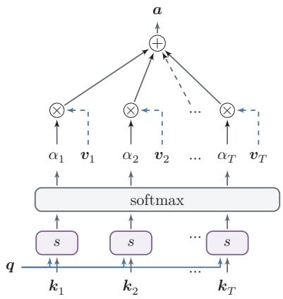  
(b) 键值对模式  
图 8.1 注意力机制

注意力机制既可以单独使用，也更常作为神经网络中的一个组件，用于增强已有网络的信息聚合能力

## 8.2.1 注意力机制的变体

除了上面介绍的基本模式外，注意力机制还存在一些常见变体.

## 8.2.1.1 硬性注意力

公式(8.7)提到的注意力是软性注意力，其输出是所有输入向量在注意力分布下的期望.此外，还有一种注意力只关注某一个输入向量，叫作硬性注意力(Hard Attention).

硬性注意力有两种实现方式：

（1）一种是选取最高概率的一个输入向量，即

$$
\operatorname { a t t } ( X , q ) = x _ { \hat { t } } ,\tag{8.8}
$$

其中 $\hat { t }$ 为概率最大的输入向量的下标，即 $\hat { t } = \underset { t = 1 } { \arg \operatorname* { m a x } } \alpha _ { t }$

(2）另一种方式是在注意力分布上随机采样，只保留采样得到的位置

硬性注意力的一个缺点是基于最大选择或随机采样的信息选择过程通常不可导，难以直接使用反向传播算法进行训练，因此往往需要借助强化学习等技术.为了便于端到端训练，一般更多使用软性注意力来代替硬性注意力.

## 8.2.1.2 键值对注意力

更一般地，我们可以用键值对（key-valuepair）格式来表示输入信息，其中“键”用来计算注意力分布 $\alpha _ { t }$ ，“值”用来计算聚合结果.

用 $( K , V ) = [ ( k _ { 1 } , v _ { 1 } ) , \cdots , ( k _ { T } , v _ { T } ) ]$ 表示T组输入信息，给定任务相关的查询向量 $\pmb q$ 时，注意力函数为

$$
\begin{array} { r l } & { \mathrm { a t t } \Big ( ( K , V ) , q \Big ) = \displaystyle \sum _ { t = 1 } ^ { T } \alpha _ { t } v _ { t } , } \\ & { \qquad = \displaystyle \sum _ { t = 1 } ^ { T } \frac { \exp { \Big ( s ( k _ { t } , q ) \Big ) } } { \sum _ { j } \exp { \Big ( s ( k _ { j } , q ) \Big ) } } v _ { t } , } \end{array}\tag{8.9}
$$

(8.10)

其中 $s ( k _ { t } , q )$ 为打分函数.

图8.1b给出键值对注意力机制的示例. 当K = V时，键值对模式就等价于普通的注意力机制

## 8.2.1.3 多头注意力

多头注意力（Multi-Head Attention）是利用多个查询 $Q = [ \pmb { q } _ { 1 } , \cdots , \pmb { q } _ { M } ]$ 并行地从输入信息中选取多组不同的信息.每个注意力头可以关注输入信息的不同部分，或者学习不同类型的匹配关系.

$$
\operatorname { a t t } \Bigl ( ( K , V ) , Q \Bigr ) = \operatorname { a t t } \Bigl ( ( K , V ) , q _ { 1 } \Bigr ) \oplus \cdots \oplus \operatorname { a t t } \Bigl ( ( K , V ) , q _ { M } \Bigr ) ,\tag{8.11}
$$

其中⊕表示向量拼接.

## 8.2.1.4 指针网络

注意力机制通常包含两步：一是计算注意力分布，二是根据该分布对输入信息进行加权平均.我们也可以只利用第一步，将注意力分布作为一个软性的指针（pointer）来指出相关信息的位置.

指针网络（Pointer Network）[Vinyals et al.,2015]是一种序列到序列模型，输入是长度为T的向量序列 $\pmb { X } = \pmb { x } _ { 1 } , \cdots , \pmb { x } _ { T }$ ，输出是长度为M的下标序列$\pmb { c } _ { 1 : M } = c _ { 1 } , c _ { 2 } , \cdots , c _ { M }$ ,其中 $c _ { m } \in [ 1 , T ] , \forall m$

和一般的序列到序列任务不同，这里的输出序列是输入序列的下标.比如输入一组乱序的数字，输出为按从大到小排序后的输入数字序列所对应的下标.若输入为20,5,10,则输出可以为1,3,2.

条件概率 $p ( \boldsymbol { c } _ { 1 : M } | \mathbf { x } _ { 1 : T } )$ 可以写为

$$
p ( \boldsymbol { c } _ { 1 : M } | \pmb { x } _ { 1 : T } ) = \prod _ { m = 1 } ^ { M } p ( \boldsymbol { c } _ { m } | \boldsymbol { c } _ { 1 : ( m - 1 ) } , \pmb { x } _ { 1 : T } )\tag{8.12}
$$

$$
\approx \prod _ { m = 1 } ^ { M } p ( c _ { m } | \pmb { x } _ { c _ { 1 } } , \cdots , \pmb { x } _ { c _ { m - 1 } } , \pmb { x } _ { 1 : T } ) ,\tag{8.13}
$$

其中条件概率 $p ( \boldsymbol { c } _ { m } | \pmb { x } _ { c _ { 1 } } , \cdots , \pmb { x } _ { c _ { m - 1 } } , \pmb { x } _ { 1 : T } )$ 可以通过注意力分布来计算.假设用一个循环神经网络对 $\pmb { x } _ { c _ { 1 } } , \cdots , \pmb { x } _ { c _ { m - 1 } } , \pmb { x } _ { 1 : T }$ 进行编码得到向量 $h _ { m }$ ,则

$$
p ( c _ { m } = t | c _ { 1 : ( m - 1 ) } , x _ { 1 : T } ) = \frac { \exp ( s _ { m , t } ) } { \sum _ { j = 1 } ^ { T } \exp ( s _ { m , j } ) } , \qquad t \in [ 1 , T ] ,\tag{8.14}
$$

其中 $s _ { m , t }$ 为在解码过程第m步时，对第t个输入位置的未归一化打分，即

$$
s _ { m , t } = { \pmb v } ^ { \top } \operatorname { t a n h } ( { \pmb W } { \pmb x } _ { t } + { \pmb U } { \pmb h } _ { m } ) , \qquad { \forall t } \in [ 1 , T ] ,\tag{8.15}
$$

其中 $v , W , U$ 为可学习的参数.

图8.2给出了指针网络的示例，其中 $h _ { 1 } , h _ { 2 } , h _ { 3 }$ 为输入数字20,5,10经过循环神经网络后的隐状态， $h _ { 0 }$ 对应一个特殊字符 $^ 6 < 2$ 当输入 $\mathbf { \bar { \Psi } } > \mathbf { \bar { \Psi } }$ 时，网络一步一步输出三个输入数字按从大到小排序后的下标.

  
图 8.2 指针网络

## 8.3 自注意力

当使用神经网络来处理一个变长的向量序列时，我们通常可以使用卷积网络或循环网络进行编码，从而得到一个相同长度的输出向量序列，如图8.3所示.

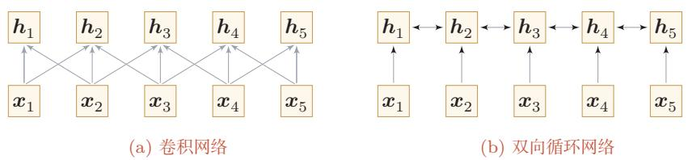  
图8.3 基于卷积网络和循环网络的变长序列编码

基于卷积或循环网络的序列编码本质上都是局部的信息交互方式.卷积网络擅长利用局部邻域建模，而循环网络通过逐步递推来传播上下文.虽然循环网络在理论上可以建立长距离依赖关系，但由于信息传递路径较长以及梯度消失等问题，实际中往往更擅长建模局部或中等距离依赖.

如果希望更加直接地建立输入序列中任意两个位置之间的依赖关系，一种方法是增加网络层数，通过更深的层级逐步传递信息；另一种方法是使用全连接网络.但全连接网络难以处理变长输入，因为不同长度的输入需要不同规模的连接结构.这时我们就可以利用注意力机制来“动态”生成不同位置之间的连接权重,这就是自注意力（Self-Attention) [Vaswani et al., 2017].

自注意力也称为内部注意力（Intra-Attention).

自注意力常采用查询-键-值（Query-Key-Value，QKV）模式，以引入可学习投影并提升模型能力．其计算过程如图8.4所示，其中红色字母表示矩阵的维度.

  
图 8.4 自注意力模型的计算过程

设 $\pmb { X } = [ \pmb { x } _ { 1 } , \cdots , \pmb { x } _ { T } ] \in \mathbb { R } ^ { D _ { x } \times T }$ 为输入序列， $\pmb { H } = [ \pmb { h } _ { 1 } , \cdots , \pmb { h } _ { T } ] \in \mathbb { R } ^ { D _ { v } \times T }$ 为输出序列.自注意力模型的具体计算过程如下：

（1）对于每个输入 $\mathbf { \boldsymbol { x } } _ { i }$ ，先将其线性映射到三个不同的空间，得到查询向量 $\mathbf { q } _ { i } \in \mathbb { R } ^ { D _ { k } }$ 、键向量 $\pmb { k } _ { i } \in \mathbb { R } ^ { D _ { k } }$ 和值向量 $\boldsymbol { v } _ { i } \in \mathbb { R } ^ { D _ { \tau } }$

对于整个输入序列X,线性映射过程可以简写为

$$
Q = W _ { q } \pmb { X } \in \mathbb { R } ^ { D _ { k } \times T } ,\tag{8.16}
$$

由于在自注意力中通常使用点积来计算注意力打分，因此查询向量和键向量的维度通常相同.

$$
\pmb { K } = \pmb { W } _ { k } \pmb { X } \in \mathbb { R } ^ { D _ { k } \times T } ,\tag{8.17}
$$

$$
V = W _ { v } \pmb { X } \in \mathbb { R } ^ { D _ { v } \times T } ,\tag{8.18}
$$

其中 $W _ { q } \in \mathbb { R } ^ { D _ { k } \times D _ { x } } , W _ { k } \in \mathbb { R } ^ { D _ { k } \times D _ { x } } , W _ { v } \in \mathbb { R } ^ { D _ { v } \times D _ { x } }$ 分别为线性映射的参数矩阵， $\pmb { Q } = [ \pmb { q } _ { 1 } , \cdots , \pmb { q } _ { T } ] , \pmb { K } = [ \pmb { k } _ { 1 } , \cdots , \pmb { k } _ { T } ] , \pmb { V } = [ \pmb { v } _ { 1 } , \cdots , \pmb { v } _ { T } ]$ 分别是由查询向量、键向量和值向量构成的矩阵.

(2)对于每一个查询向量 $\pmb q _ { t } \in \pmb Q$ ，利用公式(8.9)的键值对注意力机制，可以得到输出向量 $\boldsymbol { h } _ { t }$

$$
\alpha _ { j , t } = \frac { \exp \left( s ( k _ { j } , q _ { t } ) \right) } { \sum _ { j ^ { \prime } = 1 } ^ { T } \exp \left( s ( k _ { j ^ { \prime } } , q _ { t } ) \right) } ,\tag{8.19}
$$

$$
h _ { t } = \sum _ { j = 1 } ^ { T } \alpha _ { j , t } v _ { j } ,\tag{8.20}
$$

其中 $\alpha _ { j , t }$ 表示第t个输出位置对第j个输入位置的注意力权重.

如果使用缩放点积作为注意力打分函数，则输出向量序列可以简写为

$$
H = V \mathrm { s o f t m a x } \left( \frac { K ^ { \top } Q } { \sqrt { D _ { k } } } \right) ,\tag{8.21}
$$

其中softmax(·)为按列进行归一化的函数.需要注意的是，本书采用列向量表示，因此缩放点积注意力写为 $V \operatorname { s o f t m a x } ( K ^ { \intercal } Q / \sqrt { D _ { k } } )$ ；若采用按行组织序列的记号，则常见写法会变成 $\mathrm { s o f t m a x } ( Q K ^ { \intercal } / \sqrt { D _ { k } } ) V .$ 两者在数学意义上是等价的，只是矩阵排布方式不同

图8.5给出全连接层和自注意力层的对比，其中实线表示可学习的权重，虚线表示动态生成的权重.由于自注意力层的连接权重由输入内容动态决定，因此能够自然地处理变长信息序列.

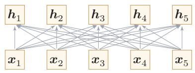  
(a) 全连接层

  
(b) 自注意力层  
图8.5 全连接层和自注意力层

自注意力层可以作为神经网络中的一层来使用，既可以用来替换卷积层和循环层，也可以和它们交替使用（比如X可以是卷积层或循环层的输出).

与循环结构相比，自注意力可以直接建立任意两个位置之间的联系，显著缩短信息传播路径；与固定窗口卷积相比，它又能够根据输入内容动态决定不同位置之间的依赖强弱.

表8.1给出卷积网络、循环网络和自注意力在若干维度上的一个粗略比较设序列长度为T、表示维度为D、卷积核宽度为k.

表8.1 卷积、循环与自注意力的比较
<table><tr><td>模型</td><td>单层计算复杂度</td><td>顺序操作数</td><td>任意两位置最大路径长度</td></tr><tr><td>循环网络</td><td> $O ( T D ^ { 2 } )$ </td><td>O(T)</td><td>O(T)</td></tr><tr><td>卷积网络</td><td>O(kTD2)</td><td>0(1)</td><td>O(T/k)</td></tr><tr><td>自注意力</td><td> $O ( T ^ { 2 } D )$ </td><td>0(1)</td><td>0(1)</td></tr></table>

由此可以看出，自注意力的优势在于并行性强、任意两位置之间的信息交互路径最短，因此更容易建模长距离依赖；但其代价是标准全注意力需要显式构造$T \times T$ 的相关性矩阵，当序列很长时，计算和存储开销都会迅速增加

## 8.3.1 多头自注意力

单头自注意力只在一个投影空间中计算不同位置之间的相关性．为了让模型在不同表示子空间中同时捕捉不同类型的依赖关系，可以并行地使用多个自注意力头，这就是多头自注意力（Multi-Head Self-Attention,MHSA）.

假设输入序列表示为 $\pmb { H } = [ \pmb { h } _ { 1 } , \cdots , \pmb { h } _ { T } ] \in \mathbb { R } ^ { D _ { h } \times T }$ ，则第m个注意力头的计算为

$$
Q _ { m } = W _ { q } ^ { m } H , \qquad K _ { m } = W _ { k } ^ { m } H , \qquad V _ { m } = W _ { v } ^ { m } H ,\tag{8.22}
$$

$$
\mathrm { h e a d } _ { m } = \mathrm { A t t } ( Q _ { m } , K _ { m } , V _ { m } ) = V _ { m } \mathrm { s o f t m a x } \left( { \frac { K _ { m } ^ { \top } Q _ { m } } { \sqrt { d _ { k } } } } \right) ,\tag{8.23}
$$

其中 ${ \cal W } _ { q } ^ { m }$ ${ \cal W } _ { k } ^ { m }$ $\boldsymbol { W } _ { v } ^ { m }$ 分别为第m个头对应的查询、键和值的投影矩阵， $d _ { k }$ 为每个头中查询和键的维度．将M个注意力头的输出拼接后再进行一次线性变换，就得到多头自注意力层的输出：

$$
\mathrm { M u l t i H e a d } ( H ) = W _ { o } [ \mathrm { h e a d } _ { 1 } ; \cdots ; \mathrm { h e a d } _ { M } ] ,\tag{8.24}
$$

其中 $W _ { o } \in \mathbb { R } ^ { D _ { h } \times M D _ { \iota } }$ 为输出投影矩阵.

https://nndl.ai/

多头机制的直观含义是：不同的注意力头可以分别关注不同的特征组合关系，从而使模型在同一层内并行提取多种组合模式

## 8.4 Transformer 模型

自注意力层给出了任意两个位置之间的直接交互机制，但单层自注意力还不足以构成一个完整的神经网络.Transformer模型进一步将多头自注意力、位置编码、逐位置前馈网络、残差连接和规范化等模块组织成统一的深层结构，从而成为现代序列建模中的核心架构之一，其核心计算模块也逐渐演化为现代大语言模型和多模态模型的基础组件.

原始Transformer模型整体上遵循编码器-解码器范式，但用自注意力替代了传统的循环结构，如图8.6所示.

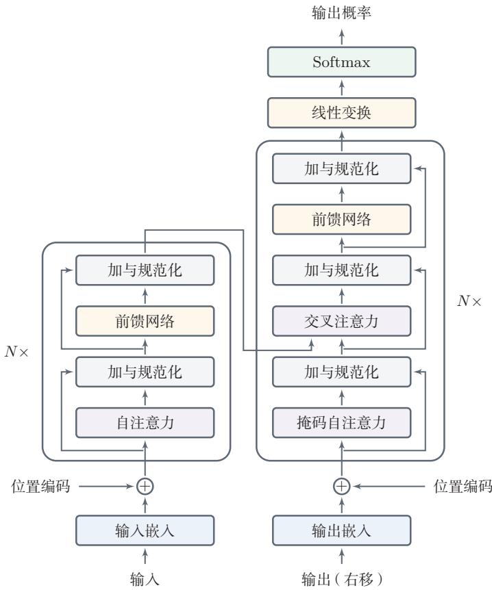  
图 8.6 Transformer 网络结构

## 8.4.1 位置编码

自注意力可以更直接地建立远距离位置之间的交互关系，但其权重只依赖于内容相关性，而不直接包含位置信息.因此，在单独使用时，自注意力模型通常需要显式加入位置编码信息.从现代Transformer的角度看，位置建模已经形成了一条重要的演化主线：从绝对位置编码发展到相对位置建模，再到面向长上下文的位置外推技术

## 8.4.1.1 绝对位置编码

由于自注意力中的权重仅由内容相关性决定，并不天然包含顺序信息，因此Transformer需要显式注入位置信息.换句话说，仅有自注意力还不足以区分“位置不同但内容相同”的两个词元.对于输入序列 $\pmb { x } _ { 1 : T }$ ，令其初始表示为

$$
{ \pmb H } ^ { ( 0 ) } = [ { \pmb e } _ { x _ { 1 } } + { \pmb p } _ { 1 } , \cdots , { \pmb e } _ { x _ { T } } + { \pmb p } _ { T } ] ,\tag{8.25}
$$

其中 $\boldsymbol { e } _ { x _ { t } } \in \mathbb { R } ^ { D }$ 为词 $x _ { t }$ 的嵌入向量， $\pmb { p } _ { t } \in \mathbb { R } ^ { D }$ 为位置t的编码向量.位置编码既可以作为可学习参数，也可以采用正弦一余弦位置编码：

$$
\begin{array} { r } { \pmb { p } _ { t , 2 i } = \mathrm { s i n } ( t / 1 0 0 0 0 ^ { 2 i / D } ) , } \end{array}\tag{8.26}
$$

$$
p _ { t , 2 i + 1 } = \cos ( t / 1 0 0 0 0 ^ { 2 i / D } ) ,
$$

参见习题8-5.

(8.27)

其中 $\mathbf { \Delta } p _ { t , 2 i }$ 表示第t个位置编码向量的第2i维.这种位置编码的一个优点是：不同位置之间的相对距离可以通过线性变换来表示.

位置编码本质上是一个和位置相关的正弦曲线，每个维度的正弦波的频率和大小不一样，取值范围在[-1,1]之间.图8.7展示了D=512时，第4,5,20维随位置t的取值.

  
图 8.7 位置编码的可视化

理解正弦一余弦位置编码的一个直观角度，是将其看作由不同频率的周期信号叠加而成.低维度对应较高频率，位置变化时取值变化更快，因此更敏感于邻近位置之间的差异，可用于描述局部位置关系；高维度对应较低频率，取值

变化更平缓，因此更适合描述较大范围内的位置模式，可用于表达全局位置信息.由此，正弦一余弦位置编码实际上提供了一种多尺度的位置表示，使Trans-former能够同时感知局部和全局的位置信息.

不过，正弦一余弦位置编码也存在一定局限性.

第一，它本质上是周期函数的组合．当序列长度不断增大时，不同位置的编码可能在某些维度上出现重复或近似重复，从而使极长序列中的位置区分能力下降.

第二，这种位置编码是预先定义的固定函数，而不是通过数据学习得到的，因此其表达能力具有一定先验性，不能根据具体任务自适应地调整.在需要精细建模局部依赖或特殊结构时，其效果可能受到限制.

第三，位置编码提供的是静态的位置信息，而注意力机制建模的是不同位置之间动态的语义相关性.二者的信息性质并不相同，因此仅依赖固定位置编码，并不能完全满足复杂任务中对位置关系建模的需求.

第四，对于超长上下文任务，仅依赖固定的绝对位置编码，往往难以获得稳定的长度外推能力.

## 8.4.1.2 相对位置编码

绝对位置编码直接告诉模型“当前位置是第几个位置”，但在很多任务中，模型更关心的是“两个位置之间相隔多远”.因此，后续研究又提出了多种相对位置编码方法[Press et al., 2022; Shaw et al., 2018]:它们不是为每个位置单独给出一个位置向量，而是直接在注意力打分中引入与相对距离相关的修正项

一种较为直接的做法是令注意力分数写为

$$
s _ { j , t } = \frac { k _ { j } ^ { \intercal } \pmb { q } _ { t } } { \sqrt { d _ { k } } } + b _ { j , t } ,\tag{8.28}
$$

其中 $b _ { j , t }$ 由位置 $j$ 和t之间的相对距离决定.例如，线性偏置注意力（Attentionwith LinearBiases，ALiBi）采用一个与距离近似成线性的偏置项，在不显式增加位置向量的情况下将“越远越不容易被关注”的归纳偏置直接写入注意力分数.这类方法的一个优点是实现简单，并且在训练长度之外往往具有更好的长度外推能力.

## 8.4.1.3 旋转位置编码

在很多现代大语言模型中，常采用旋转位置编码（Rotary Position Em-bedding，RoPE）[Su et al.,2024]来替代“位置向量直接相加”的做法. 其基本思想不是把位置编码加到输入表示上，而是在计算查询向量和键向量时，对每一对相邻维度施加一个与位置相关的二维旋转.


## 数学小知识|旋转矩阵

二维旋转矩阵 $R ( \theta ) = { \binom { \cos \theta } { \sin \theta } } - \sin \theta { \Biggr ) }$ 将向量逆时针旋转θ角旋转矩阵是正交矩阵，满足 $\pmb { R } ( \theta ) ^ { \top } = \pmb { R } ( - \theta )$ (即转置等于反向旋转)，以及中 $\pmb { R } ( \alpha ) \pmb { R } ( \beta ) = \pmb { R } ( \alpha + \beta )$ (旋转角度可相加).这些性质是RoPE推导${ \pmb R } _ { t } ^ { \top } { \pmb R } _ { j } = { \pmb R } _ { j - t }$ 成立的数学基础.

设二维向量v，逆时针旋转角度θ后的新坐标为

$$
\pmb { v } ^ { \prime } \triangleq \pmb { R } ( \theta ) \pmb { v } = \left[ \begin{array} { c c } { \cos ( \theta ) } & { - \sin ( \theta ) } \\ { \sin ( \theta ) } & { \cos ( \theta ) } \end{array} \right] \pmb { v } ,\tag{8.29}
$$

其中 $\scriptstyle { R ( \theta ) }$ 定义为旋转矩阵.

设 $\tilde { \pmb q } _ { t } , \tilde { \pmb k } _ { t } \in \mathbb { R } ^ { D }$ 分别表示位置t处尚未加入位置信息的查询和键，且D为偶数.对于第i个二维子空间，可以定义

$$
[ \begin{array} { l } { q _ { t , 2 i } } \\  ( \begin{array} { l } { R ( t \theta _ { i } ) } \\ { 2 i + 1 } \end{array} ] = R ( t \theta _ { i } ) [ \begin{array} { l } { \tilde { q } _ { t , 2 i } } \\ { \tilde { q } _ { t , 2 i + 1 } } \end{array} ] , \end{array}\tag{8.30}
$$

$$
\left[ \begin{array} { l } { k _ { t , 2 i } } \\ { k _ { t , 2 i + 1 } } \end{array} \right] = \boldsymbol { R } ( t \theta _ { i } ) \left[ \begin{array} { l } { \tilde { k } _ { t , 2 i } } \\ { \tilde { k } _ { t , 2 i + 1 } } \end{array} \right] ,\tag{8.31}
$$

其中 $\theta _ { i }$ 为不同维度对应的旋转频率，通常设置为 $1 0 0 0 0 ^ { - 2 i / D }$

对于位置t,我们可以定义其在D维空间的旋转矩阵

$$
\begin{array} { r } { \pmb { R _ { t } } = \left( \begin{array} { c c c c c c c } { \cos t \theta _ { 0 } } & { - \sin t \theta _ { 0 } } & { 0 } & { 0 } & { \cdots } & { 0 } & { 0 } \\ { \sin t \theta _ { 0 } } & { \cos t \theta _ { 0 } } & { 0 } & { 0 } & { \cdots } & { 0 } & { 0 } \\ { 0 } & { 0 } & { \cos t \theta _ { 1 } } & { - \sin t \theta _ { 1 } } & { \cdots } & { 0 } & { 0 } \\ { 0 } & { 0 } & { \sin t \theta _ { 1 } } & { \cos t \theta _ { 1 } } & { \cdots } & { 0 } & { 0 } \\ { \vdots } & { \vdots } & { \vdots } & { \vdots } & { \ddots } & { \vdots } & { \vdots } \\ { 0 } & { 0 } & { 0 } & { 0 } & { \cdots } & { \cos t \theta _ { D / 2 - 1 } } & { - \sin t \theta _ { D / 2 - 1 } } \\ { 0 } & { 0 } & { 0 } & { 0 } & { \cdots } & { \sin t \theta _ { D / 2 - 1 } } & { \cos t \theta _ { D / 2 - 1 } } \end{array} \right) } \end{array}\tag{8.32}
$$

对于位置 $t , j$ 上的查询和键向量 $\mathbf { \Delta } q _ { t } , k _ { j }$ ,有

$$
\begin{array} { r } { { \pmb q } _ { t } ^ { \intercal } { \pmb k } _ { j } = \tilde { { \pmb q } } _ { t } ^ { \intercal } { \pmb R } _ { t } ^ { \intercal } { \pmb R } _ { j } \tilde { { \pmb k } } _ { j } = \tilde { { \pmb q } } _ { t } ^ { \intercal } { \pmb R } _ { j - t } \tilde { { \pmb k } } _ { j } , } \end{array}\tag{8.33}
$$

因此注意力打分天然与相对位置j一t相关.与绝对位置向量直接相加相比，RoPE更容易融入缩放点积注意力，并且在现代大语言模型中应用广泛

图8.8概括了绝对位置编码、ALiBi和RoPE三类代表性思路的差异:绝对位置编码将位置向量直接加到输入表示上，相对位置偏置在打分中加入与距离相关的修正项，而RoPE则通过对q,k做位置相关旋转，将相对位置信息写入点积

  
图 8.8 三种不同的位置编码

## 8.4.2 编码器

编码器由多层相同结构的Transformer编码块堆叠而成，一个编码块包含多头自注意力和逐位置前馈网络两个核心模块

给定输入序列 $\pmb { x } _ { 1 : S }$ ，编码器输出一个上下文表示序列

$$
\begin{array} { r } { H ^ { \mathrm { e n c } } = [ \pmb { h } _ { 1 } ^ { \mathrm { e n c } } , \cdots , \pmb { h } _ { S } ^ { \mathrm { e n c } } ] . } \end{array}\tag{8.34}
$$

我们可以定义Transformer块（Transformer Block）为一个基本单元.在一个Transformer编码块中，先利用多头自注意力在全局范围内进行信息交互，再利用逐位置前馈网络对每个位置做非线性变换，最后通过残差连接和层规范化保证深层训练的稳定性.

这里先采用原始Transformer中的典型Post-Norm写法说明其基本结构;后续在“现代Transformer的常见优化”一节中，再介绍更常见于大语言模型的Pre-Norm等现代变体.

一个Transformer编码块的结构包含四个模块：多头自注意力层、加与规范化层、前馈层、加与规范化层.

给定编码块的输入H,Transformer编码块可以写为

$$
Z = \operatorname { n o r m } \Bigl ( H + \operatorname { S e l f } - \operatorname { A t t n } ( H ) \Bigr ) ,\tag{8.35}
$$

$$
\begin{array} { r } { H ^ { \prime } = \operatorname { n o r m } \Bigl ( Z + \mathrm { F F N } ( Z ) \Bigr ) , } \end{array}\tag{8.36}
$$

其中norm(·)表示层规范化,FFN(·)表示逐位置前馈网络.

加与规范（Add&Norm）层的主要功能是加入残差连接（ResidualCon-nection）与层规范化（LayerNormalization，LN）两个组件，使得网络可以更

稳定地训练.残差连接有助于缓解深度网络中的梯度消失问题，而层规范化有助于稳定中间表示的尺度与分布，从而提高训练稳定性

逐位置前馈网络（Position-wise Feed-Forward Network）是两层全连接神经网络，使用ReLU激活函数.它对每个位置的表示分别进行相同的非线性变换，类似于核大小为1的卷积.

对于某个位置上的向量z,前馈网络一般写为

$$
\mathrm { F F N } ( z ) = W _ { 2 } \mathrm { R e L U } ( W _ { 1 } z + b _ { 1 } ) + b _ { 2 } ,\tag{8.37}
$$

其中 $W _ { 1 }$ $W _ { 2 }$ $b _ { 1 }$ う $b _ { 2 }$ 为可学习参数.

一个深度Transformer模型通常由多个Transformer块堆叠而成.

## 8.4.3 解码器

解码器以自回归方式生成目标序列.解码器由多层的Transformer解码块堆叠而成.每层解码块包含三个子模块：

（1）掩码自注意力：对已经生成的前缀序列进行编码．为了避免当前位置看到未来信息，需要使用因果掩码（CausalMask）屏蔽右侧位置，因此这一模块也称为掩码自注意力(Masked Self-Attention).

（2）编码器-解码器注意力：将解码器当前状态映射为查询向量，并通过键值对注意力从编码器输出中选择与当前生成最相关的源端信息.这一模块也常称为交叉注意力（Cross-Attention）.

（3）逐位置前馈网络：对融合后的表示进行进一步变换.

设掩码矩阵为 $M \in \mathbb { R } ^ { T \times T }$ ，则带掩码的注意力可以写为

$$
\mathrm { M a s k e d - S e l f - A t t n } ( Q , K , V ; M ) = V \mathrm { s o f t m a x } \left( \frac { K ^ { \top } Q } { \sqrt { D _ { k } } } + M \right) ,\tag{8.38}
$$

其中softmax(·)仍按列归一化.对于因果掩码，若第t个查询位置不允许看到未来的第j个键位置，则令

$$
M _ { j , t } = \left\{ { \begin{array} { l l } { 0 , } & { j \leq t , } \\ { - \infty , } & { j > t . } \end{array} } \right.\tag{8.39}
$$

这样在第t个位置计算注意力时，所有未来位置对应的概率都会变为零.图8.9给出了因果掩码的直观示意，其中下三角区域表示允许访问的历史位置，上三角区域表示被屏蔽的未来位置

<table><tr><td rowspan=1 colspan=1>0</td><td rowspan=1 colspan=1>-∞</td><td rowspan=1 colspan=1>-∞</td><td rowspan=1 colspan=1>-∞</td></tr><tr><td rowspan=1 colspan=1>0</td><td rowspan=1 colspan=1>0</td><td rowspan=1 colspan=1>-∞</td><td rowspan=1 colspan=1>-∞</td></tr><tr><td rowspan=1 colspan=1>0</td><td rowspan=1 colspan=1>0</td><td rowspan=1 colspan=1>0</td><td rowspan=1 colspan=1>-∞</td></tr><tr><td rowspan=1 colspan=1>0</td><td rowspan=1 colspan=1>0</td><td rowspan=1 colspan=1>0</td><td rowspan=1 colspan=1>0</td></tr></table>

图 8.9 因果掩码

若将解码器当前表示记为 $\boldsymbol { Q } ^ { \mathrm { d e c } }$ ，编码器输出记为 $K ^ { \mathrm { e n c } } , V ^ { \mathrm { e n c } }$ ，则编码器-解码器注意力（交叉注意力）可以写为

$$
\mathrm { C r o s s A t t n } ( Q ^ { \mathrm { d e c } } , K ^ { \mathrm { e n c } } , V ^ { \mathrm { e n c } } ) = V ^ { \mathrm { e n c } } \mathrm { s o f t m a x } \left( \frac { ( K ^ { \mathrm { e n c } } ) ^ { \top } Q ^ { \mathrm { d e c } } } { \sqrt { D _ { k } } } \right) .\tag{8.40}
$$

其中查询来自解码器当前状态，而键和值来自编码器输出，因此交叉注意力负责从源序列中检索与当前生成最相关的信息

在实际实现中，还常需要配合填充掩码（PaddingMask）来忽略补齐位置.

将上述结构重复堆叠多层后，解码器最后通过线性变换和Softmax来预测下一位置的输出概率

## 8.4.4 从输入到输出的数据流

前面介绍的解码器结构说明了“如何用因果掩码保证自回归信息流”，但在语言模型中，还需要把文本、离散词元、连续向量和输出概率连接成一条完整的数据流.以仅解码器Transformer语言模型为例，整个过程可以分为以下几个步骤.

首先，分词器（Tokenizer)将输入文本转换为词元序列

$$
w _ { 1 : T } = ( w _ { 1 } , \cdots , w _ { T } ) , \qquad w _ { t } \in \{ 1 , \cdots , | \mathcal { V } | \} ,
$$

其中γ为词表.词元可以是字、词、子词片段或字节片段，具体粒度由分词器决定.模型本身并不直接处理原始字符串，而是处理这些离散词元编号.

其次，模型通过词元嵌入矩阵 $\pmb { { \cal E } } \in \mathbb { R } ^ { D \times | \mathcal { V } | }$ 把每个词元编号映射为连续向量，并加入位置信息：

$$
\begin{array} { r } { \pmb { x } _ { t } = \pmb { { E } } \mathbb { I } _ { w _ { t } } + \pmb { p } _ { t } , \qquad \pmb { X } = [ \pmb { x } _ { 1 } , \cdots , \pmb { x } _ { T } ] \in \mathbb { R } ^ { D \times T } . } \end{array}\tag{8.41}
$$

https://nndl.ai/

这里 $\mathbb { I } _ { w _ { t } }$ 表示第 $w _ { t }$ 维为 1的 one-hot 向量， $\mathbf { \nabla } _ { \mathbf { \mathcal { P } } _ { t } }$ 为第t个位置的位置表示.若采用RoPE等位置编码方式，位置信息可能不是直接加到 ${ \mathbf { } } _ { { \mathbf { } } _ { \pmb { x } _ { t } } }$ 上，而是在计算查询向量和键向量时注入;但从数据流角度看，其作用仍然是让模型区分不同位置.

然后，X依次经过 $L$ 个带因果掩码的Transformer块，得到最后一层的隐藏表示

$$
\pmb { H } ^ { ( L ) } = [ \pmb { h } _ { 1 } ^ { ( L ) } , \cdots , \pmb { h } _ { T } ^ { ( L ) } ] .
$$

因果掩码保证第t个位置的隐藏状态 ${ \mathbf { } } h _ { t } ^ { ( L ) }$ 只能依赖前缀 $w _ { 1 : t }$ ，不能依赖未来词元$w _ { t + 1 : T }$ .因此， ${ h } _ { t } ^ { ( L ) }$ 可以看作模型对当前前缀 $w _ { 1 : t }$ 的连续表示.

最后，模型通过输出层把隐藏表示映射到词表大小的未归一化分数（Log-its) :

$$
z _ { t } = W _ { o } h _ { t } ^ { ( L ) } + b _ { o } , \qquad z _ { t } \in \mathbb { R } ^ { | \mathcal { V } | } .\tag{8.42}
$$

其中 $z _ { t }$ 的第 $v$ 维表示“下一个词元为 $v '$ 的未归一化得分.经过Softmax后得到下一个词元的条件分布：

$$
p ( w _ { t + 1 } = v | w _ { 1 : t } ) = \mathrm { s o f t m a x } ( z _ { t } ) _ { v } = \frac { \exp ( z _ { t , v } ) } { \sum _ { v ^ { \prime } \in \mathcal { V } } \exp ( z _ { t , v ^ { \prime } } ) } .\tag{8.43}
$$

训练时，常用目标是最大化真实下一个词元的概率，等价于最小化逐位置交叉熵：

$$
\mathcal { L } = - \sum _ { t = 1 } ^ { T - 1 } \log p ( w _ { t + 1 } \vert w _ { 1 : t } ) .\tag{8.44}
$$

由于训练阶段已知完整序列，通常可以一次性输入前缀序列 $w _ { 1 : ( T - 1 ) }$ 并预测目标序列 $w _ { 2 : T }$ ；若显式加入起始词元 $w _ { 0 }$ ，也可以理解为将右移后的目标序列(Right-Shifted Output) $w _ { 0 : ( T - 1 ) }$ 作为输入并预测 $w _ { 1 : T }$ .这种并行计算所有位置损失的训练方式称为教师强制（Teacher Forcing).推断阶段则只能从已有前缀开始，每一步根据 $z _ { t }$ 得到分布，再通过贪心搜索、温度采样、Top-k采样或核采样等策略选出下一个词元，并把新词元追加到前缀中继续生成.由此可以看到，Transformer语言模型的输出并不是直接生成文本，而是反复执行“前缀→隐藏表示→logits→下一个词元”的循环

## 8.5Transformer的三种常见架构范式

随着应用场景的发展，Transformer逐渐形成了三种常见的结构范式：

（1）仅编码器结构（Encoder-only）：只保留编码器，适合理解类任务，如文本分类、序列标注和句子匹配等.

（2）仅解码器结构（Decoder-only）：只保留带因果掩码的解码器，适合自回归生成任务，是许多大语言模型采用的架构形式.

（3）编码器-解码器结构（Encoder-Decoder）：同时保留编码器和解码器，适合条件生成任务，比如机器翻译、摘要和问答生成等.

从本质上看，这三种结构都建立在相同的注意力计算之上，只是在信息流方向和训练目标上有所不同

图8.10给出了三种典型Transformer架构的信息流示意.

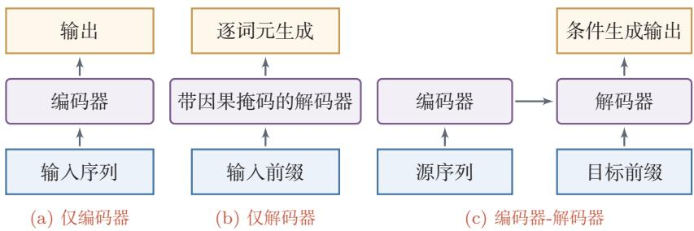  
图 8.10 Transformer 的三种典型架构

## 8.6 现代 Transformer的常见优化

Transformer既可以理解为一种具体的网络结构，也可以理解为一种组织序列计算的通用模板：先通过注意力在不同位置之间建立动态连接，再通过前馈网络对每个位置进行非线性变换，最后借助残差连接和规范化稳定深层训练.

下面主要围绕许多大语言模型中具有代表性的几条演化线展开，而不试图穷尽所有Transformer变体.

原始Transformer主要回答的是“如何用自注意力替代循环结构”；而现代大语言模型进一步关心的是：当模型更深、参数更多、上下文更长、服务并发更高时，如何让这一模板仍然可训练、可扩展、可部署.因此，现代Transformer的演化并不是若干孤立技巧的堆叠，而是沿着多个层面同步展开：

（1）块内结构优化：改进位置编码、规范化、残差路径和前馈层，以提升训练稳定性与表示能力；

（2）长上下文优化：围绕位置外推、注意力连接模式和高效实现，缓解长序列下的计算与存储瓶颈；

（3）推断系统优化：围绕KV缓存、头共享、内存管理和解码策略，降低自回归生成时的延迟与显存压力；

（4）容量扩展：在计算预算相对可控的前提下显著扩大模型参数规模，例如MoE.

从这个角度看，现代Transformer虽然仍保留了“注意力+前馈网络+残差连接”的基本骨架，但其中几乎每一个组成部分都经历了重新设计.图8.11给出了这一节涉及的主要优化方向及其关注重点

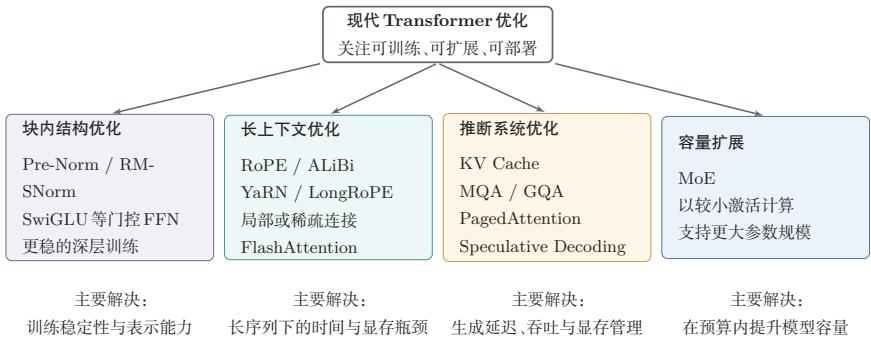  
图 8.11 现代 Transformer 常见优化的整体框架

## 8.6.1 训练稳定性与基本块演化

Transformer的主流形态已经不再局限于原始论文中的“编码器-解码器”结构.在大语言模型中，更常见的是仅解码器架构，并配合因果掩码进行自回归建模；位置编码上也更常采用RoPE等更有利于相对位置建模的方案.

对于单个Transformer块而言，现代改造首先集中在规范化与残差路径以及前馈层这两个位置，因为它们直接影响深层网络中的梯度传播、训练稳定性和表示效率.

加与规范化层 在Transformer的具体实现中，层规范化操作根据与其他层的相对位置可以分为两种，分别称为Pre-Norm和Post-Norm. 假设要给非线性Z = f(X) 加上“加与规范化”,则 Pre-Norm 和 Post-Norm 分别定义为：

$$
\mathrm { P r e N o r m : } \qquad Z ^ { \prime } = X + f \bigl ( \mathrm { n o r m } ( X ) \bigr ) ,\tag{8.45}
$$

$$
\mathrm { P o s t N o r m : } \qquad Z ^ { \prime } = \mathrm { n o r m } ( f ( X ) + X ) .\tag{8.46}
$$

原始Transformer采用的是残差连接后再做层规范化的Post-Norm结构.但在大语言模型中，模型通常采用先规范化再进入子层的Pre-Norm结构[Xionget al.,2020]. 直观地说，Pre-Norm为每个子层提供了更稳定的输入尺度，通常更利于深层网络中的梯度传播，因此更容易训练

此外，层规范化还常被替换为更简洁的RMS规范化.对于输入向量 $\boldsymbol { h } \in \mathbb { R } ^ { D }$

RMS规范化参见 第7.5.3节.

RMSNorm可以写为

$$
\mathrm { R M S N o r m } ( h ) = \pmb { g } \odot \frac { h } { \sqrt { \frac { 1 } { D } \sum _ { i = 1 } ^ { D } h _ { i } ^ { 2 } + \epsilon } } ,\tag{8.47}
$$

其中 $\pmb { g } \in \mathbb { R } ^ { D }$ 为可学习缩放参数，表示按元素乘法.与层规范化相比，RM-SNorm去掉了均值中心化步骤，形式更简单，也更适合大规模实现.

前馈层 原始Transformer前馈层通常使用ReLU或GELU等逐元素非线性激活.现代模型中一类常见改进是门控前馈网络（Gated FFN），例如SwiGLU：

门控线性单元参见第4.5.5节.

$$
\mathrm { F F N } _ { \mathrm { S w i G L U } } ( z ) = W _ { 2 } \Big ( \mathrm { s w i s h } ( W _ { 1 } z ) \odot ( W _ { 3 } z ) \Big ) ,\tag{8.48}
$$

其中 $\mathrm { s w i s h } ( x ) = x \sigma ( x )$ .与普通两层前馈网络相比，这类门控结构通过额外的门分支对信息流进行调制，通常能在相近计算预算下提升表示能力.

因此，一个典型的现代Transformer块可以抽象地写为

$$
\begin{array} { r } { Z = H + \mathrm { S e l f - A t t n } ( \mathrm { n o r m } ( H ) ) , } \end{array}\tag{8.49}
$$

$$
H ^ { \prime } = Z + \mathrm { F F N } _ { \mathrm { g a t e d } } ( \operatorname { n o r m } ( Z ) ) .\tag{8.50}
$$

这说明：现代块结构的核心变化并不是抛弃Transformer，而是在不改变总体骨架的前提下，对块内部的信息流路径做更适合大规模训练的改造.

图8.12对比了原始Transformer块与现代Transformer块的典型结构.

这类改动的共同特点是：它们主要改变的是单个Transformer块内部的计算路径，目标是在相近计算预算下提升训练稳定性与表示能力；它们通常不会直接改变标准自注意力的渐近复杂度.

## 8.6.2 闪存注意力

标准注意力通常先显式构造相关性矩阵 $\begin{array} { r } { S = \frac { K ^ { \top } Q } { \sqrt { D _ { k } } } } \end{array}$ ，再对其做Softmax并与V相乘．这种实现方式虽然形式简单，但在长序列下往往需要频繁地在显存和片上高速缓存之间读写大规模中间结果，真正的瓶颈常常不只是算术运算量，而是访存开销.

闪存注意力（FlashAttention）从系统实现角度对注意力计算进行了优化[Dao et al., 2022]. 它的核心思想可以概括为三点：

（1）按块处理：将查询、键和值分成若干小块，而不是一次性构造完整的$T \times T$ 打分矩阵；

（2）块内计算、块间累积：对每个查询块 $\boldsymbol { Q } ^ { ( i ) }$ 与键值块 $\pmb { K } ^ { ( j ) } , \pmb { V } ^ { ( j ) }$ ,先计算局部打分

这里的“Flash”更接近“面向片上高速存储的高效访存”这一含义，而不只是泛指“计算更快”.

$$
S ^ { ( i , j ) } = \frac { \left( K ^ { ( j ) } \right) ^ { \top } Q ^ { ( i ) } } { \sqrt { D _ { k } } } ,\tag{8.51}
$$

https://nndl.ai/

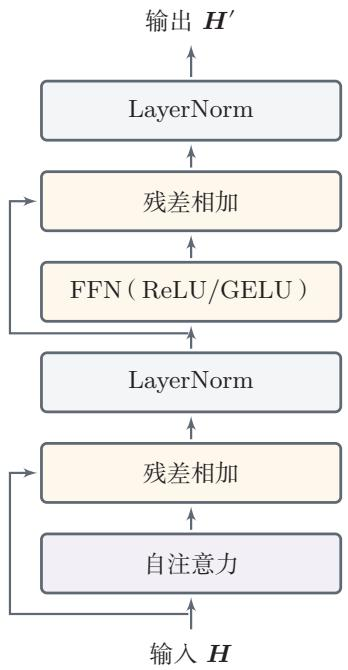  
(a) 原始 Transformer块

  
(b) 现代 Transformer块  
图 8.12 原始Transformer块与现代 Transformer块的典型结构对比

然后逐块更新当前查询块对应的Softmax归一化量和输出累积值；

（3）在线Softmax：在扫描所有键值块的过程中，始终维护每一行的最大值与归一化常数，因此虽然没有显式保存完整注意力矩阵，但最终得到的结果与标准Softmax注意力保持一致.

因此，闪存注意力并不是通过“少算一些位置”来加速，也不是一种近似注意力；它仍然计算的是 $\begin{array} { r } { O = V \operatorname { s o f t m a x } \left( { \frac { K ^ { \top } Q } { \sqrt { D _ { k } } } } \right) } \end{array}$ ，只是把实现方式改成了“边分块计算、边完成归一化与累积”的实现方式，这样做的直接收益是：将中间激活存储从显式的二次规模压到更接近线性规模，并显著减少显存读写，因此在长序列训练和前缀填充阶段尤其有效

## 8.6.3 长上下文优化

标准自注意力需要计算所有位置两两之间的相关性，因此时间复杂度和空间复杂度都会随着序列长度呈平方增长.当序列较长时，这会成为Transformer的主要瓶颈.对于现代大模型而言，长上下文问题并不只是公式层面的 $O ( T ^ { 2 } )$ 复杂度，而是至少同时涉及三方面挑战：

需要特别区分的是：FlashAttention并没有改变注意力的数学结果，它属于精确实现优化；而局部窗口、稀疏注意力、线性注意力等高效注意力方法则属于改变连接模式或近似形式的优化.

（1）注意力计算本身的平方增长：当T增大时，相关性矩阵和中间激活会迅速膨胀；

（2）位置表示的外推问题：模型在较短长度上训练后，未必能自然泛化到更长位置；

（3）推断时缓存的持续增长：在解码器模型中，历史KV缓存会随上下文长度线性增长.

因此，长上下文建模通常不是单一技巧可以解决的，而是位置编码、注意力连接模式与系统实现的联合优化问题.学习这一部分时，一个很重要的区分是：有些方法改变模型的数学结构，有些方法不改变数学结果，只改变实现方式

## 8.6.3.1 位置外推:RoPE、ALiBi、YaRN与LongRoPE

从位置建模角度看，RoPE通过对查询向量和键向量施加与位置相关的旋转，使点积中自然包含相对位置信息；因此，在现代大语言模型中，它常被作为长上下文建模的基础位置方案.ALiBi则通过在线性偏置中直接引入距离惩罚，提供了一种更简单的长度外推机制.在此基础上，YaRN、LongRoPE等方法进一步建立在RoPE之上，通过重新缩放或插值位置频率来延长可用上下文窗口[Ding et al., 2024; Peng et al., 2024].

它们的共同点在于：尽量不改变Transformer主干结构，而是通过修改位置表示方式，让模型在训练长度之外仍能保持较稳定的行为.需要强调的是，长上下文并不意味着模型一定真正“理解”了所有长距离信息．更大的上下文窗口首先提供的是可访问范围，至于模型能否有效利用这些信息，还取决于训练数据、目标任务以及注意力模式本身.

## 8.6.3.2局部窗口、分块与稀疏注意力

除了位置外推之外，现代模型还常从注意力连接模式上进行简化.一种典型思路是局部窗口注意力：每个位置只与相邻窗口中的若干位置交互，从而将全局两两交互改为局部交互.这种方法虽然牺牲了一部分全局感受野，但常能显著降低长序列下的计算与存储开销：若再配合跨块连接、滑动窗口或少量全局词元，模型仍然可以逐层传播远距离信息.

更一般地，分块、稀疏连接和线性注意力等方法都可以视为在“连接范围”和“计算开销”之间做权衡.它们属于改变注意力连接模式或近似形式的优化，因此和仅改变系统实现方式的方法应当区分开来.

## 8.6.3.3线性注意力与状态空间模型

标准自注意力的计算复杂度为 $O ( T ^ { 2 } )$ ，这在序列很长时会成为严重瓶颈.线性注意力（LinearAttention）试图通过核函数近似来消除Softmax归一化中的非线性耦合，使注意力计算可以重新排列为O(T)复杂度的矩阵乘法．例如，

Performer[Choromanski et al., 2021]通过随机特征映射来近似 Softmax核，使得注意力矩阵不需要显式计算．线性注意力的一个重要理论意义在于：当查询键交互被简化为线性形式后，整个注意力层可以等价地写成一个递推更新的形式，即每个时间步只需根据当前输入更新一个固定大小的“状态矩阵”，而不必回顾所有历史位置.这意味着线性注意力在数学上可以看作一种特殊的循环神经网络.

状态空间模型（State Space Model，SSM）正是沿着这一方向发展的另一条重要路线.SSM借鉴连续时间线性系统理论，将序列建模表述为一个隐状态的递推演化过程：

$$
\begin{array} { r } { \pmb { h } _ { t } = \pmb { \bar { A } } \pmb { h } _ { t - 1 } + \pmb { \bar { B } } \pmb { x } _ { t } , } \end{array}\tag{8.52}
$$

$$
y _ { t } = C h _ { t } ,\tag{8.53}
$$

其中 ${ \bar { A } } .$ B是经过离散化得到的参数矩阵. 早期的结构化 SSM(如 S4[Gu et al.,2022）通过对A施加特殊结构（如对角化或HiPPO初始化）来实现长程记忆，同时利用卷积视角实现训练时的高效并行计算

Mamba[Gu et al.,2023]在此基础上引入了选择性机制：让 $\bar { B }$ 和C等参数依赖于当前输入，使模型能够根据内容动态决定“记住什么、忘记什么”.这一改进使SSM具备了类似门控机制的内容感知能力，在语言建模等任务上达到了与同规模Transformer相当的性能，同时保持了线性的序列计算复杂度和恒定的推断内存开销.

从更高层面看，标准Transformer、线性注意力和SSM代表了序列建模中三种不同的权衡方式：Transformer以 $O ( T ^ { 2 } )$ 的代价换取更灵活的全局交互；线性注意力和SSM以固定大小的状态压缩历史信息，获得 $O ( T )$ 复杂度，但可能在需要精确回溯长距离细节时受限，一种常见思路是将两者结合，例如在同一模型中交替使用注意力层和SSM层，以兼顾全局建模能力和长序列效率.

## 8.6.4 推断系统优化

训练阶段和推断阶段面临的瓶颈并不相同.训练时，目标序列已知，通常采用教师强制并行送入整段序列，主要瓶颈是长序列激活存储、注意力矩阵计算和反向传播开销；这时一般不需要KV缓存．推断时，模型按自回归方式逐词元生成，不再反向传播，但会重复执行大量小步前向计算，因此系统更关注单步延迟、显存占用和访存带宽

在大语言模型推断中，通常还会区分两个阶段：

（1）前缀填充阶段：将用户输入的整段上下文送入模型，计算出各层的历史键和值并写入缓存.该阶段序列较长、并行度较高，往往更接近训练时的矩阵

计算模式.

（2）逐词元解码阶段（Decode）：此后每生成一个新词元，只需基于当前查询向量与历史缓存交互.该阶段单步计算量较小，但高度依赖KV缓存的读取效率，因此常常更受显存带宽和缓存管理方式的影响

图8.13给出前缀填充、解码与KV缓存之间的关系.与前面较抽象的流程图相比，这里更强调两个阶段在计算形态上的差别：前缀填充阶段对整段前缀做并行计算，并一次性写入缓存；解码阶段则围绕历史KV缓存反复执行“读取缓存-计算当前词元-追加新缓存”的小步迭代

  
图8.13 前缀填充、解码与KV缓存的关系示意

## 8.6.4.1 KV缓存与增量解码

在自回归生成时，第t步只需要输出当前位置对应的隐状态，因此没有必要在每一步都重新计算整个前缀序列的键和值.设第l层在第t一1步已经缓存的键和值分别为 $\bar { K } _ { 1 : ( t - 1 ) } ^ { ( l ) }$ 和 $\bar { V } _ { 1 : ( t - 1 ) } ^ { ( l ) }$ ，当新词元到来时，只需计算当前词元对应的

$$
\begin{array} { r } { \mathbf q _ { t } ^ { ( l ) } , \mathbf k _ { t } ^ { ( l ) } , \mathbf v _ { t } ^ { ( l ) } , } \end{array}\tag{8.54}
$$

并将其追加到缓存中：

$$
\bar { \mathbf { K } } _ { 1 : t } ^ { ( l ) } = [ \bar { \mathbf { K } } _ { 1 : ( t - 1 ) } ^ { ( l ) } , \mathbf { \Delta } \mathbf { k } _ { t } ^ { ( l ) } ] ,\tag{8.55}
$$

$$
\begin{array} { r } { \bar { V } _ { 1 : t } ^ { ( l ) } = [ \bar { V } _ { 1 : ( t - 1 ) } ^ { ( l ) } , v _ { t } ^ { ( l ) } ] . } \end{array}\tag{8.56}
$$

这样，第t步的自注意力只需计算

$$
\begin{array} { r } { \pmb { h } _ { t } ^ { ( l ) } = \mathrm { A t t } \Big ( \pmb { q } _ { t } ^ { ( l ) } , \bar { \pmb { K } } _ { 1 : t } ^ { ( l ) } , \bar { \pmb { V } } _ { 1 : t } ^ { ( l ) } \Big ) . } \end{array}\tag{8.57}
$$

这就是KV缓存（KVCache）的基本思想.它可以显著减少解码时的重复计算，因此是大语言模型推断系统中的关键优化技术之一.

## 8.6.4.2 分组查询注意力

在标准多头注意力中，每个查询头都对应独立的键头和值头，因此在自回归推断时需要缓存大量历史键值.为了降低这一开销，可以让多个查询头共享同一组键和值.

多查询注意力（Multi-Query Attention，MQA）[Shazeer，2019]使用一组共享的键和值头；更一般地，分组查询注意力（Grouped-Query Attention，GQA)[Ainslie et al., 2023]将 M 个查询头划分为 G组,其中 $G \leq M$ ,同组查询头共享键和值.若第m个查询头属于第 $g ( m )$ 组，则其注意力计算可以写为

$$
{ \mathrm { h e a d } } _ { m } = \operatorname { A t t } ( \pmb { Q } _ { m } , \pmb { K } _ { g ( m ) } , \pmb { V } _ { g ( m ) } ) .\tag{8.58}
$$

当 $G = M$ 时，GQA退化为标准多头注意力；当G=1时，则退化为MQA.这类方法特别适合解码器式模型，因为它们能够在尽量保持生成质量的同时显著降低KV缓存的显存占用和访存带宽需求.

图8.14对比了两种键值头组织方式

  
(a) 标准多头注意力

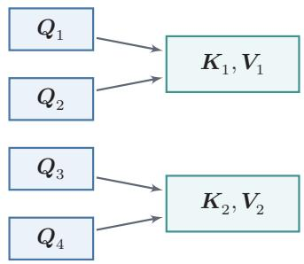  
(b) 分组查询注意力  
图8.14 标准多头注意力与分组查询注意力

## 8.6.4.3 分页注意力与投机解码

从系统视角看，KV缓存不仅会越来越大，而且在真实服务中还会随着请求到达、结束和分叉而动态变化.分页注意力（PagedAttention）[Kwon et al.,2023]通过类似分页的方式组织KV缓存，以减少连续扩容和内存碎片，并提高多请求并发场景下的缓存利用率.它说明：现代Transformer的优化已经不再只发生在网络结构内部，也发生在模型服务系统的内存组织方式中.

另一类典型优化是投机解码（Speculative Decoding）[Leviathan et al.,2023].其基本思想是先由一个更小、更快的草稿模型提出若干候选词，再由目标模型并行验证这些候选词，从而在尽量保持输出分布不变的前提下降低平均生成时延.从这个角度看，现代Transformer不仅是一种网络结构，也是一套围绕训练与部署共同演化的计算系统.

## 8.6.5 容量扩展:混合专家

现代 Transformer 的一条容量扩展路线是混合专家（Mixture of Experts，MoE)[Shazeer et al., 2017]. 它的基本思想是:在前馈层位置准备多个专家网络

$$
\mathrm { E x p e r t _ { 1 } } , \mathrm { E x p e r t _ { 2 } } , \cdots , \mathrm { E x p e r t } _ { E } ,\tag{8.59}
$$

再由一个路由器根据当前输入选择其中少数几个专家参与计算．若对某个位置的输入表示记为h，路由器产生门控分数 $\mathbf { \pmb { g } } ( \pmb { h } )$ ,并选择其中得分最高的k个专家，则MoE层可写为

$$
\mathrm { M o E } ( { \pmb h } ) = \sum _ { e \in \mathrm { T o p K } ( { \pmb g } ( { \pmb h } ) , { \pmb k } ) } \alpha _ { e } ( { \pmb h } ) \mathrm { E x p e r t } _ { e } ( { \pmb h } ) ,\tag{8.60}
$$

其中 $\alpha _ { e } ( h )$ 表示归一化后的门控权重.

MoE的关键优点在于：总参数规模可以很大，但每个位置实际只激活少数几个专家，因此单次前向的计算量不必与总参数量同比增长.这使得模型可以在计算预算相对可控的前提下显著提高容量，不过，MoE也会带来新的问题，例如专家负载不均衡、路由不稳定以及多设备通信开销等．许多MoE设计都会围绕这几个问题展开：例如引入共享专家以保证基础能力，通过细粒度专家提高专家选择的灵活性，利用辅助的负载均衡损失改善路由稳定性，或采用由专家选择词元的路由策略来控制负载，从结构上看，MoE并不是对注意力本身的优化，而更适合看作Transformer在容量扩展方向上的一条独立演化路线.

## 现代Transformer中的常见改造归纳为表8.2.

这些方法分别解决Transformer不同层面的问题:RoPE、ALiBi(线性偏置注意力）等主要解决位置建模与长度外推；局部窗口、稀疏连接等主要改变注意力连接模式;FlashAttention主要优化精确注意力的实现方式;KV缓存、GQA、PagedAttention和投机解码主要服务于自回归推断系统；而MoE则对应容量扩展.

表 8.2 从标准Transformer到现代Transformer/LLM块的常见演化方向
<table><tr><td>组成部分</td><td>标准形式</td><td>现代常见优化方向</td></tr><tr><td>整体架构</td><td>编码器-解码器</td><td>仅编码器、仅解码器、编码器-解码器三种 范式并存，其中LLM多为仅解码器</td></tr><tr><td rowspan="2">位置编码</td><td>正弦位置编码或绝</td><td>相对位置编码、ALiBi、RoPE，以及</td></tr><tr><td>对位置编码</td><td>YaRN/LongRoPE等长度外推方法</td></tr><tr><td>规范化与残差</td><td>Post-Norm</td><td>Pre-Norm、RMSNorm、更稳健的残差设 计与深层训练技巧</td></tr><tr><td>前馈层</td><td>ReLU/GELU 两 层FFN</td><td>SwiGLU等门控前馈网络，或以MoE替换 为条件计算模块</td></tr><tr><td></td><td>注意力头组织标准多头注意力</td><td>MQA、GQA,以及更激进的KV压缩形式</td></tr><tr><td>长序列建模</td><td></td><td>全局全连接注意力局部窗口、分块/稀疏连接、线性注意力，以 及闪存注意力等精确实现优化</td></tr><tr><td>推断系统</td><td>朴素自回归解码</td><td>KV缓存、分页注意力、投机解码、批处理 调度优化</td></tr></table>

## 8.7 总结和扩展阅读

注意力机制是一类受人类信息选择过程启发的神经网络机制，其核心思想是：在给定当前任务或上下文时，模型不必对所有输入一视同仁，而是可以动态地为不同信息分配不同权重.在神经网络中，注意力机制通常由相关性打分和加权聚合两步组成，因此既可以作为独立模块使用，也可以嵌入更大的网络结构中.

在人工智能领域，注意力这一概念最早主要出现在计算机视觉中，用来提取图像中的显著区域.[Itti et al.，1998]提出了一种自下而上的注意力模型，通过提取局部低级视觉特征来发现潜在的显著区域. 在神经网络中，[Mnih et al..2014]在循环神经网络模型上使用注意力机制进行图像分类，[Bahdanau et al.2015]则在机器翻译任务中使用注意力机制联合完成翻译与对齐.注意力机制已经在语音识别、图像描述、阅读理解、文本分类、机器翻译等多个任务上取得了很好的效果.

注意力机制的一个重要发展是自注意力．自注意力可以作为神经网络中的一层来使用，能够直接建模任意两个位置之间的依赖关系，从而更有效地处理长距离依赖问题[Vaswani et al.,2017]. 在此基础上，Transformer 将多头自注意力、位置编码、前馈网络、残差连接和规范化组合成统一架构，提升了深层网络的表达能力和可训练性，推动了序列建模从循环结构向全注意力结构的转变，并逐渐成为现代自然语言处理、多模态学习以及大语言模型的基础架构Transformer的成功并不只是因为“注意力”，更在于它用一种统一、可堆叠且易于并行计算的方式组织了序列中的全局交互

对于仅解码器语言模型，还需要把Transformer块放入完整的自回归数据流中理解：文本先由分词器转换为词元编号，再经过词元嵌入和位置编码形成输入表示；带因果掩码的Transformer块把每个位置的前缀信息编码为隐藏状态；输出层将隐藏状态映射为词表上的未归一化分数（logits）；Softmax再把logits转换为下一个词元的概率分布.训练阶段用右移目标并行计算交叉熵，推断阶段则反复执行“前缀→logits→采样→追加词元”的循环.

随着大语言模型的发展，Transformer在保持总体框架不变的同时，也演化出一批重要优化.在保持Transformer基本骨架不变的前提下，研究者不断在“全局表达能力”和“长序列可计算性”之间寻找新的平衡．例如用RoPE编码相对位置信息，用KV缓存、分页注意力和分组查询注意力降低自回归推断开销，用FlashAttention（闪存注意力）提升长序列场景下的实际运行效率，以及用RMSNorm、门控前馈网络和MoE等方式提升大规模训练的稳定性、容量与表达能力．进一步看，现代Transformer已经不只是一个静态网络结构，而是一个围绕训练、长上下文建模和高吞吐推断共同设计的系统.后续值得继续深入的方向还包括：更灵活的位置编码方式、更高效的长序列注意力机制、更加稳定的规范化与残差设计，以及适配不同任务需求的Transformer变体等

## 习题

大语言模型的预训 练、对齐与智能体参 见第13章.

基础题

习题8-1 说明单头注意力与多头注意力的差异，并分析多头注意力能够提升模型表达能力的原因.

习题8-2 分析缩放点积模型可以缓解Softmax函数梯度过小问题的原因.

习题8-3 设解码器长度为T，写出因果掩码矩阵M的形式，并说明它如何保证第t个位置不能访问未来位置的信息.

参见公式(8.4).

习题8-4 比较仅编码器、仅解码器和编码器-解码器三种Transformer架构在信息流动方式和适用任务上的差异.

## 提高题

习题8-5 证明公式(8.26)和公式(8.27)中位置编码可以刻画一个序列中任意两个词之间的相对距离.

习题8-6 比较绝对位置编码、ALiBi和RoPE三种位置建模方式在信息注入位置、是否显式依赖相对距离以及长度外推能力上的差异，并说明为什么RoPE更容易与现代大语言模型结合.

习题8-7分析标准自注意力在长序列场景下面临的主要计算瓶颈，并从“数学结构改变”和“系统实现优化”两个角度各给出一种改进思路.

习题8-8 说明FlashAttention与GQA分别试图解决什么问题. 二者是否改变标准注意力的数学形式？它们更适合被看作训练阶段优化、长上下文优化，还是推断阶段优化?请分别说明理由.

## 拓展题

习题8-9 从训练稳定性的角度，讨论为什么现代大语言模型常采用Pre-Norm、RMSNorm和门控前馈网络（如SwiGLU）的组合，而较少直接沿用原始Trans-former 中的 Post-Norm + 普通 FFN设计.

习题8-10 设想你要设计一个支持长上下文、高并发生成的大语言模型推断系统. 请围绕KV缓存组织、PagedAttention、投机解码以及MQA/GQA等机制，说明你会如何权衡显存占用、吞吐量与生成时延

## 参考文献

AINSLIE J, LEE-THORP J, DE JONG M, et al., 2023. GQA: training generalized multi-query transformer models from multi-head checkpoints[C/OL]//Proceedings of the 2023 Conference on Empirical Methods in Natural Language Processing. Singapore: Association for Computational Linguistics: 4895-4901. https://aclanthology.org/2023.emnlp-main.298/. DOI: 10.18653/v1/2023.emnlp-main.298.

BAHDANAU D, CHO K, BENGIO Y, 2015. Neural machine translation by jointly learning to align and translate[C]//Proceedings of 3rd International Conference on Learning Representations.

CHOROMANSKI K M, LIKHOSHERSTOV V, DOHAN D, et al., 2021. Rethinking attention with performers[C]//Proceedings of the 9th International Conference on Learning Representations.

DAO T, FU D Y, ERMON S, et al., 2022. FlashAttention: fast and memory-efficient exact attention with IO-awareness[C]//Advances in Neural Information Processing Systems 35. 16344-16359.

DING Y, ZHANG L L, ZHANG C, et al., 2024. LongRoPE: extending LLM context window beyond 2 million tokens[C]//Proceedings of 41st International Conference on Machine Learning. 11091-11104.

GU A, DAO T, 2023. Mamba: linear-time sequence modeling with selective state spaces[A/OL]. arXiv (2023). https://arxiv.org/abs/2312.00752.

GU A, GOEL K, RÉ C, 2022. Efficiently modeling long sequences with structured state spaces [C]//Proceedings of the 10th International Conference on Learning Representations.

ITTI L, KOCH C, NIEBUR E, 1998. A model of saliency-based visual attention for rapid scene analysis[J]. IEEE Transactions on Pattern Analysis & Machine Intelligence(11): 1254-1259.

KWON W, LI Z, ZHUANG S, et al., 2023. Efficient memory management for large language model serving with PagedAttention[C/OL]//Proceedings of the 29th ACM Symposium on Operating Systems Principles. 611-626. DOI: 10.1145/3600006.3613165.

LEVIATHAN Y, KALMAN M, MATIAS Y, 2023. Fast inference from transformers via speculative decoding[C]//Proceedings of 40th International Conference on Machine Learning. 19274- 19286.

MNIH V, HEESS N, GRAVES A, et al., 2014. Recurrent models of visual attention[C]// Advances in Neural Information Processing Systems. 2204-2212.

PENG B, QUESNELLE J, FAN H, et al., 2024. YaRN: efficient context window extension of large language models[C//Proceedings of 12th International Conference on Learning Representations.

PRESS O, SMITH N A, LEWIS M, 2022. Train short, test long: attention with linear biases enables input length extrapolation|C//Proceedings of 10th International Conference on Learning Representations.

SHAW P, USZKOREIT J, VASWANI A, 2018. Self-attention with relative position representations[C/OL]//Proceedings of the 2018 Conference of the North American Chapter of the Association for Computational Linguistics: Human Language Technologies, Volume 2 (Short Papers). New Orleans, Louisiana: Association for Computational Linguistics: 464- 468. https://aclanthology.org/N18-2074/. DOI: 10.18653/v1/N18-2074.

SHAZEER N, 2019. Fast transformer decoding: one write-head is all you need[A/OL]. arXiv (2019). https://arxiv.org/abs/1911.02150. DOI: 10.48550/arXiv.1911.02150.

SHAZEER N, MIRHOSEINI A, MAZIARZ K, et al., 2017. Outrageously large neural networks: the sparsely-gated mixture-of-experts layer[C//Proceedings of 5th International Conference on Learning Representations.

SU J, LU Y, PAN S, et al., 2024. RoFormer: enhanced transformer with rotary position embedding[J/OL]. Neurocomputing, 568: 127063. DOI: 10.1016/j.neucom.2023.127063.

VASWANI A, SHAZEER N, PARMAR N, et al., 2017. Attention is all you need[C]//Advances in Neural Information Processing Systems. 6000-6010.

VINYALS O, FORTUNATO M, JAITLY N, 2015. Pointer networks[C]//Advances in Neural Information Processing Systems. 2692-2700.

XIONG R, YANG Y, HE D, et al., 2020. On layer normalization in the transformer architecture [C]//Proceedings of 37th International Conference on Machine Learning. 10524-10533.

## 第9章 图神经网络

在许多实际问题中，数据并不是规则地排列在一维序列或二维网格上，而是以“实体一关系”的形式自然组织起来.例如，社交网络中的用户及其关注关系、引文网络中的论文及其引用关系、推荐系统中的用户与物品、分子中的原子与化学键，都更适合表示为图（Graph）．与向量、序列或图像相比，图数据具有结构不规则、邻居数量不固定、节点之间相互依赖等特点.这使得许多面向欧氏空间（EuclideanSpace）设计的模型难以直接应用于图数据.所谓欧氏空间，是指像一维序列、二维图像这类具有规则坐标系和固定邻域结构的数据空间：与之相对，图属于非欧氏结构（Non-EuclideanStructure），其邻居关系由连接边决定，而不是由规则坐标位置决定

从深度学习的角度看，图神经网络可以理解为卷积神经网络和序列模型在非欧氏结构上的自然推广：卷积神经网络擅长在规则网格上利用局部邻域进行参数共享，序列模型擅长在链式结构上沿时间步传播状态，而图神经网络则进一步把“局部交互一状态更新”的思想推广到一般图结构上.它所要解决的核心问题是：如何同时利用节点或边的属性信息以及图的连接结构，学习到适用于下游任务的有效表示.

围绕这一问题，研究者提出了大量面向节点、边和整图的学习方法.其中，图神经网络（Graph Neural Network,GNN）通过在图上进行局部信息传递与逐层表示更新，是图学习中有代表性的一类模型.本章首先介绍图的基本概念、图上的主要学习任务与一个贯穿全文的引文网络示例；随后从消息传递的统一视角出发介绍图神经网络的一般框架，并说明GCN、GraphSAGE、GAT和GIN四类经典模型分别如何在这一框架下进行具体设计；最后讨论图神经网络中的几个共性问题，包括过度平滑、过压缩和面向大图的可扩展性.通过本章的学习，读者应能够从“图表示一消息传递一具体模型一现实约束”这一主线出发，建立对图神经网络的整体认识.

## 9.1 图数据与基本概念

图（Graph）由节点（Nodes）与边（Edges）构成，用于同时刻画实体及其关系.通常记一个图为 $\mathcal { G } = ( \mathcal { V } , \mathcal { E } )$ ，其中γ为节点集合，ε为边集合.节点可以表示用户、论文、原子或道路交叉口等实体，边则表示实体之间的交互、依赖或连接关系．与只强调局部排列的序列和图像不同，图数据的关键在于：对象本身的属性与对象之间的连接结构同样重要.因此，图成为建模复杂系统的一种基本数据形式.

图9.1展示了无向图与有向图的区别.无向图中的边表示对称关系，有向图中的边表示带方向的关系.

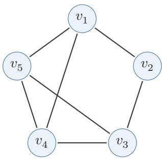  
(a) 无向图

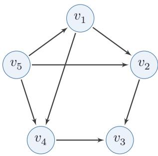  
(b) 有向图  
图 9.1 无向图与有向图

## 9.1.1 无向图与有向图

无向图（Undirected Graph）是一种边没有方向的图.在无向图中，如果节点 $v _ { i }$ 和节点 $v _ { j }$ 之间存在一条边 $e _ { i j }$ ，则边 $e _ { i j }$ 同时连接 $v _ { i }$ 和 $v _ { j }$ ，即 $v _ { i }$ 和 $v _ { j }$ 之间的关系是双向的.这种图常用于表示对称关系，如社交网络中的好友关系.

有向图（Directed Graph）是一种边有方向的图.在有向图中，如果节点 $v _ { i }$ 和节点 $v _ { j }$ 之间存在一条边 $e _ { i j }$ ，则边 $e _ { i j }$ 从 $v _ { i }$ 指向 $v _ { j }$ ，即 $v _ { i }$ 和 $v _ { j }$ 之间的关系是单向的.这种图常用于表示非对称关系，如论文之间的引用关系.

## 9.1.2 同质图与异质图

同质图（Homogeneous Graph）是指所有节点属于同一类型、所有边也属于同一类型的图.该类图适合描述单一实体及其单一关系构成的网络，例如社交网络中的用户及好友关系、引文网络中的论文及引用关系.

异质图（Heterogeneous Graph）是指节点和边可能具有多种类型的图.与同质图相比，异质图能够更自然地表达复杂系统中的多类实体及多种关系，例如学术网络中的作者、论文、会议，以及“撰写”“引用”“发表于”等不同关系．在异质图学习中，除了节点属性外，模型还往往需要显式区分节点类型、边类型以及它们之间的交互模式，因此通常需要专门的建模方式，如关系图卷积网络、异质图注意力网络和异质图 Transformer等 [Hu et al., 2020; Schlichtkrull et al.,2018; Wang et al., 2019].

图9.2展示了同质图与异质图的区别.同质图中的节点和边类型单一，而异质图可以同时包含多类节点与多类关系.

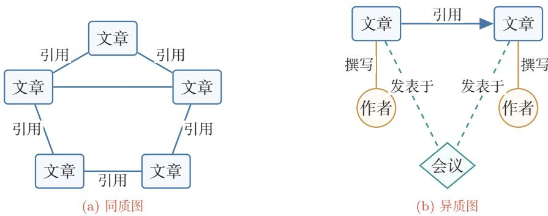  
图 9.2 同质图与异质图

## 9.1.3 图的表示方法

为了将图输入到计算机中进行存储和计算，需要选择合适的表示方式.对于不同规模、不同类型的图，表示方式也会影响后续算法的效率.

同质图的表示方法有多种，常见的有以下几种.

邻接矩阵（AdjacencyMatrix）是一种表示图的方阵.对于一个有n个节点的图，邻接矩阵是一个n ×n的矩阵A,其中 $A _ { i j }$ 表示节点 $v _ { i }$ 和节点 $v _ { j }$ 之间是否存在边.对于无向图，邻接矩阵是对称的；对于有向图，邻接矩阵不一定对称.

$$
A = { \left( \begin{array} { l l l l } { a _ { 1 1 } } & { a _ { 1 2 } } & { \cdots } & { a _ { 1 n } } \\ { a _ { 2 1 } } & { a _ { 2 2 } } & { \cdots } & { a _ { 2 n } } \\ { \vdots } & { \vdots } & { \ddots } & { \vdots } \\ { a _ { n 1 } } & { a _ { n 2 } } & { \cdots } & { a _ { n n } } \end{array} \right) }\tag{9.1}
$$

邻接矩阵写公式最方便，但对于大规模稀疏图，若直接采用稠密矩阵存储，内存开销会很大.

邻接表（AdjacencyList）是一种按节点存储邻居集合的表示方式.对于每个节点，邻接表记录一个列表，其中包含与该节点相连的所有节点.邻接表更适合表示稀疏图，因为它只存储实际存在的边.

边列表（EdgeList）是一种把图看成边的集合的表示方式.边列表存储图中所有的边，每条边由其两个端点表示.边列表适合处理边操作较多的场景，在消息传递实现中也很常见.

异质图可以看作由多类关系子图组成.若一条边的类型记为三元组 $( p , r , q )$ 其中p、r、q分别表示起点类型、关系类型和终点类型，那么异质图就可以拆解为若干个对应不同三元组类型的关系子图.在实现层面，常用字典等数据结构分别存储不同关系类型对应的边信息.

## 9.1.4 图的数学性质

图结构有一些重要的数学量，既帮助我们分析图本身的性质，也构成许多图神经网络公式的基础

度（Degree）是指与某个节点直接相连的边的数量.对于无向图，节点的度等于其相邻边的总数；对于有向图，则通常区分入度（In-degree）和出度（Out-degree).入度表示有多少条边指向该节点，出度表示有多少条边从该节点出发.

同质性（Homophily）描述了具有相似属性或标签的节点倾向于相互连接的现象.它反映了图中“相似节点是否更容易相连”这一结构偏好.常见的一个衡量方式是计算同质比例：

$$
\begin{array} { r } { H _ { \mathrm { r a t i o } } = \frac { \mathrm { i } \underline { { \sharp } } \mathrm { j } _ { \mathcal { X } } ^ { \pm } | \overline { { \mathsf { H } } } | \overline { { \jmath } } _ { \mathcal { R } } ^ { \mathrm { j } \pm } \overline { { \mathsf { H } } } _ { \mathrm { r a t i o } } ^ { \mathrm { E } } \mathrm { i } \overline { { \jmath } } _ { \mathcal { X } } ^ { \mathrm { j } \pm } \overline { { \mathsf { X } } } } { \mathrm { i } _ { \mathrm { r a t i } } ^ { \mathrm { \prime } } \mathrm { i } _ { \mathcal { X } } ^ { \mathrm { \prime } } \overline { { \jmath } } _ { \mathcal { X } } ^ { \mathrm { \prime } } \overline { { \jmath } } } \in [ 0 , 1 ] . } \end{array}\tag{9.2}
$$

当 $H _ { \mathrm { r a t i o } }$ 接近1时，说明图具有较强的同质性；当 $H _ { \mathrm { r a t i o } }$ 接近0时，说明边更多地连接不同类别的节点，图的同质性较弱．经典的GCN类模型往往默认邻居信息对中心节点有帮助，因此通常更适合具有一定同质性的图；当图的同质性较低时，简单的邻域平均可能会削弱模型效果.

与同质性相对，异配性（Heterophily）是指不同属性或不同标签的节点更容易相连的现象.异配性不等同于前面介绍的异质图：异质图强调节点或边的类型不同，异配性则强调连接两端节点的标签或语义是否相似.区分这两个概念，有助于理解为什么某些图虽然形式上是同质图，却并不适合直接采用简单的邻域平均.

拉普拉斯矩阵 对于一个有n个节点的无向图，设A为邻接矩阵，D为度矩阵(其对角线元素 $D _ { i i } = d _ { i }$ 表示节点 $v _ { i }$ 的度)，则图的拉普拉斯矩阵（LaplacianMatrix)定义为

$$
\pmb { { \cal L } } = \pmb { { \cal D } } - \pmb { { \cal A } } .\tag{9.3}
$$

从元素形式看，L的对角线给出节点的度，非对角线则描述节点之间是否相连，因此它同时编码了局部连接关系与整体拓扑结构.

以图9.1a中的无向图为例，其邻接矩阵、度矩阵和拉普拉斯矩阵分别为

$$
A = \left( \begin{array} { l l l l l } { 0 } & { 1 } & { 0 } & { 1 } & { 1 } \\ { 1 } & { 0 } & { 1 } & { 0 } & { 0 } \\ { 0 } & { 1 } & { 0 } & { 1 } & { 1 } \\ { 1 } & { 0 } & { 1 } & { 0 } & { 1 } \\ { 1 } & { 0 } & { 1 } & { 1 } & { 0 } \end{array} \right) ,
$$

$$
D = \left( \begin{array} { c c c c c } { { 3 } } & { { 0 } } & { { 0 } } & { { 0 } } & { { 0 } } \\ { { 0 } } & { { 2 } } & { { 0 } } & { { 0 } } & { { 0 } } \\ { { 0 } } & { { 0 } } & { { 3 } } & { { 0 } } & { { 0 } } \\ { { 0 } } & { { 0 } } & { { 0 } } & { { 3 } } & { { 0 } } \\ { { 0 } } & { { 0 } } & { { 0 } } & { { 0 } } & { { 3 } } \end{array} \right) ,\tag{9.4}
$$

因此

$$
L = \left( \begin{array} { c c c c c c } { { 3 } } & { { - 1 } } & { { 0 } } & { { - 1 } } & { { - 1 } } \\ { { - 1 } } & { { 2 } } & { { - 1 } } & { { 0 } } & { { 0 } } \\ { { 0 } } & { { - 1 } } & { { 3 } } & { { - 1 } } & { { - 1 } } \\ { { - 1 } } & { { 0 } } & { { - 1 } } & { { 3 } } & { { - 1 } } \\ { { - 1 } } & { { 0 } } & { { - 1 } } & { { - 1 } } & { { 3 } } \end{array} \right) .\tag{9.5}
$$

若 $\pmb { x } = ( x _ { 1 } , \dots , x _ { 5 } ) ^ { \top }$ 表示定义在这些节点上的一个图信号（Graph Signal），也就是“每个节点上都附着一个数值或向量”的信号，则

$$
( { \bf L } { \bf x } ) _ { 1 } = 3 x _ { 1 } - x _ { 2 } - x _ { 4 } - x _ { 5 } ,\tag{9.6}
$$

也就是“节点 $v _ { 1 }$ 自身的值减去其邻居值的加权和”.更一般地，

$$
( { \pmb L } { \pmb x } ) _ { i } = d _ { i } x _ { i } - \sum _ { j } { \pmb A } _ { i j } x _ { j } = \sum _ { j } { \pmb A } _ { i j } ( x _ { i } - x _ { j } ) .\tag{9.7}
$$

这个式子表明， $\pmb { L x }$ 衡量的是每个节点与其邻居之间的局部差异．如果某个节点的取值与邻居都很接近，那么对应的 $( { \pmb { L } } { \pmb x } ) _ { 3 }$ 就会比较小；如果差异很大，则该值会变大.

这一点也可以从拉普拉斯矩阵的二次型看得更清楚.对于定义在节点上的一个图信号 $\textbf { \textit { x } } \in \mathbf { \beta } \mathbb { R } ^ { n }$ ，展开可得： $\begin{array} { l } { { { \pmb x } ^ { \top } { \pmb L } { \pmb x } \ = \ { \pmb x } ^ { \top } ( { \pmb D } - { \pmb A } ) { \pmb x } \ = \ \sum _ { i } d _ { i } x _ { i } ^ { 2 } \ - } } \end{array}$ $\begin{array} { r } { \sum _ { i , j } A _ { i j } x _ { i } x _ { j } = \frac { 1 } { 2 } \sum _ { i , j } A _ { i j } ( x _ { i } - x _ { j } ) ^ { 2 } } \end{array}$ ，其中最后一步利用了无向图 $A _ { i j } = A _ { j i }$ 以及 $\textstyle \sum _ { j } A _ { i j } = d _ { i }$ .因此有

$$
x ^ { \top } L x = \frac { 1 } { 2 } \sum _ { i , j } A _ { i j } ( x _ { i } - x _ { j } ) ^ { 2 } .\tag{9.8}
$$

https://nndl.ai/

该式表明：如果相邻节点上的信号值越接近，则 $\mathbf { \boldsymbol { x } } ^ { \intercal } \mathbf { \boldsymbol { L } } \mathbf { \boldsymbol { x } }$ 越小；反之，如果相邻节点差异很大，则该值越大.因此，拉普拉斯矩阵常被用来衡量图信号的平滑性（Smoothness）.这也是它后来能够用于图正则化、谱聚类以及图卷积定义的根本原因.

归一化拉普拉斯矩阵（Normalized Laplacian Matrix)则定义为

$$
L _ { \mathrm { n o r m } } = I - D ^ { - 1 / 2 } A D ^ { - 1 / 2 } ,\tag{9.9}
$$

其中I是单位矩阵.与未归一化形式相比，它消除了节点度差异带来的尺度影响，因此在谱图分析和图卷积推导中更常使用.

从式(9.7)及其二次型可以看出，拉普拉斯矩阵刻画了图信号在相邻节点之间的变化程度，正因为如此，它既能用于分析图上的平滑性，也会在后文中成为定义图傅里叶变换和谱图卷积的数学基础.本节只需先记住一点：拉普拉斯矩阵不仅反映局部邻接关系，也为后续的谱方法提供了统一的代数工具

## 9.2 图上的机器学习任务

围绕图结构数据，机器学习任务通常可以分为节点级、边级和图级三个层次，分别以节点、边或整图作为预测对象.三类任务在监督信号和读出（Readout）方式上各不相同.尽管任务形式不同，它们都共享同一个核心步骤：先学习节点表示，再针对不同预测对象设计相应的输出层.

为了便于理解，本章将经常使用一个贯穿性的引文网络（Citation Net-work）示例：把论文看作节点，把引用关系看作边，把论文标题、摘要关键词或文本编码向量看作节点特征.若要预测论文所属研究方向，就是节点分类；若要预测两篇论文之间未来是否会出现引用关系，就是链接预测；若把一组论文及其引用关系组成一个子图，并判断该子图对应的学科领域，则是图级任务.

读出是指把已经学到的节点表示进一步变换为任务输出的步骤，例如直接取某个节点的表示、组合一对节点的表示，或把整张图的节点表示汇聚为一个图表示.

## 9.2.1 节点级任务

节点级任务以单个节点作为预测对象，核心是学习每个节点的表示 $h _ { v }$ ，再基于该表示完成分类、回归或排序等任务.

节点分类 节点分类是指根据节点特征和图结构预测节点所属类别.例如，在引文网络中，可以根据论文内容及其引用关系预测论文所属领域；在社交网络中，可以根据用户行为和社交关系预测用户兴趣.对这类任务而言，模型最终输出的是每个节点的表示，再通过分类器得到预测标签

节点回归节点回归是指预测节点的连续值属性.例如，在交通网络中预测道路节点的交通流量，在金融网络中预测公司节点的风险得分．此时节点表示 $h _ { v }$ 通常会接一个回归头，从而输出一个实值预测

节点表示学习节点表示学习的目标是把节点映射为低维向量，使得结构或语义上相近的节点在表示空间中更加接近.这些表示既可以直接用于聚类、检索和可视化，也可以作为下游任务的输入特征.

## 9.2.2 边级任务

边级任务关注节点对之间的关系，常见形式包括判断边是否存在、边属于哪一类，或者边的权重是多少.此时往往需要先得到节点表示，再构造节点对表示链接预测链接预测（LinkPrediction）是指预测图中两个节点之间是否存在连接.这一任务在推荐系统、社交网络和生物信息学中有广泛应用.例如，在推荐系统中，可以预测用户是否会与某个物品发生交互；在蛋白质相互作用网络中，可以预测潜在的相互作用关系.若记节点u和υ的表示分别为 $h _ { u }$ 和 $h _ { v }$ ，一个简单的打分函数可以写为

$$
s ( u , v ) = h _ { u } ^ { \top } h _ { v } ,\tag{9.10}
$$

也可以使用更灵活的形式，如

$$
s ( u , v ) = \mathrm { M L P } ( h _ { u } \oplus h _ { v } ) .\tag{9.11}
$$

边分类与边回归 边分类（Edge Classification）是指判断一条边对应的关系类型，例如在交易网络中区分正常交易与异常交易；边回归（EdgeRegression）则是预测边的连续值属性，例如交通网络中的道路拥堵程度.边级任务常常需要同时利用两端节点表示和边本身的特征.

## 9.2.3 图级任务

图级任务以整张图作为预测对象，因此需要先把节点表示汇总为整图表示$h _ { \mathcal { G } }$ ，再进行分类、回归或生成.

图分类 图分类是指为整张图预测一个离散标签.例如，在分子图中，可根据分子结构判断其是否具有某种活性；在程序分析中，可根据程序依赖图判断程序类别.图级任务中通常需要一个读出函数，把所有节点表示汇总为整图表示.

图回归图回归是指预测整张图的连续值属性.例如，在分子图中预测溶解度、沸点等理化性质；在金融网络中预测企业关联网络的整体风险水平.

图生成 图生成是指根据某种目标分布或约束生成新的图结构，例如生成满足特定条件的新分子结构或新的知识图谱片段.图生成通常比图分类更复杂，需要同时考虑结构有效性和属性约束.代表性方法既包括基于变分自编码器的GraphVAE，也包括自回归生成模型 GraphRNN 等 [Simonovsky et al., 2018;You et al., 2018].

## 9.2.4 训练、验证与测试划分

图学习中的评估比普通独立同分布样本更容易出错，因为节点、边和整图之间可能存在显式连接或隐含依赖.划分训练集、验证集和测试集时，首先要明确预测对象是什么，并保证模型在训练阶段不能使用测试目标的信息.

对于节点级任务，常见做法是在同一张图上划分训练节点、验证节点和测试节点，传导式设置中，模型可以看到整张图的结构和节点特征，但训练损失只在训练节点的标签上计算，验证和测试节点的标签必须保留到相应阶段才使用；归纳式设置则更严格，要求模型能够泛化到训练阶段未出现过的新节点或新图，因此需要把这些节点或图从训练计算图中隔离出来.对于边级任务，尤其是链接预测，通常要划分正例边，并在训练图中删除或遮蔽验证、测试正例边，否则模型可能直接通过已存在的边得到答案；负例边的采样规则也要在训练、验证和测试中保持一致.若图随时间演化，还应优先采用时间划分，避免用未来边或未来邻域信息预测过去．对于图级任务，划分单位应是整张图，而不是一张图内部的节点或边；在分子、程序、知识图谱子图等场景中，还需要注意近重复样本、同源结构或同一实体家族同时出现在训练集和测试集中所带来的泄漏.

评价指标也应与任务目标匹配.节点分类常使用准确率、宏/微平均 $F _ { 1 }$ 等指标；类别极不平衡时，宏平均指标或PR曲线往往比总体准确率更能反映少数类效果.链接预测常使用ROC-AUC、Average Precision、Hits@K或MRR等排序指标；图回归则常用平均绝对误差或均方误差.若模型输出概率分数，还应结合第2章讨论的概率校准思想，检查高置信度预测是否真的可靠；在低度节点、跨图泛化或分布外子图上，还应关注预测不确定性是否随证据不足而上升.

## 9.2.5 小结

从统一视角看，图学习任务之间的差别主要体现在“预测对象”上，而图神经网络的共同基础则是节点表示学习：

• 对于节点级任务，直接使用节点表示 $ { \boldsymbol { h } } _ { v }$

• 对于边级任务，组合节点对表示，如 $[ \boldsymbol { h } _ { u } \oplus \boldsymbol { h } _ { v } ]$

• 对于图级任务，通过求和、平均、最大值等全局汇聚得到整图表示 $h _ { \mathcal { G } }$ 同时，训练、验证和测试的划分必须与预测对象保持一致：节点任务关注节点标签的隔离，边任务要防止目标边泄漏，图级任务则应以整张图为划分单位.因此，后续不同GNN模型的主要差别，并不在于任务类别本身，而在于它们如何设计消息传递、邻域聚合与表示更新，从而学到更有效的节点表示.

## 9.3 图神经网络

图神经网络是一类面向图结构数据的深度学习模型.与卷积神经网络主要处理规则网格数据、循环神经网络主要处理序列数据不同，图神经网络直接以图结构作为计算对象，通过在节点之间传播和聚合信息来学习表示.从统一框架看，图神经网络最核心的思想是消息传递机制（Message Passing Mechanism）:在图上反复进行局部信息传递、邻域聚合与表示更新，使每个节点逐步融合其周围的结构与属性信息.

## 9.3.1 消息传递机制

图上的一次消息传递通常只能直接聚合一阶邻居的信息，因此若希望节点表示感知更远范围的结构，就需要堆叠多层图神经网络．以引文网络为例，一层GNN只能让一篇论文接收到其直接相邻论文的信息；两层GNN则能够进一步接触到这些邻居的邻居，从而把更远一层的上下文纳入表示之中.一般地，L层图神经网络至多能够使节点表示覆盖L跳邻域的信息，因此层数决定了模型在图上的感受野（ReceptiveField）.这里所谓感受野，是指一个节点的表示在当前层能够“看到”多大范围的邻域.

需要注意的是，层数增加虽然能够扩大感受野，但也可能带来过度平滑、过压缩以及训练开销增加等问题.因此，在图神经网络中，层数并非越深越好，而需要在信息传播范围与建模代价之间取得平衡.

对图 $\mathcal { G } = ( \mathcal { V } , \mathcal { E } )$ ，记其第l层节点υv的状态向量为 $\boldsymbol { h } _ { v } ^ { ( l ) }$ ,边 $e _ { u v }$ 的状态向量为$h _ { e _ { u v } } ^ { ( l - 1 ) }$ ，节点υ的邻居集合为 $\mathcal { N } ( v )$ ,则一层典型的GNN计算通常包括两个步骤：消息传递与聚合在消息传递步骤中，每个节点从其邻居接收信息

$$
m _ { u  v } ^ { ( l ) } = f ( h _ { v } ^ { ( l - 1 ) } , h _ { u } ^ { ( l - 1 ) } , h _ { e _ { u v } } ^ { ( l - 1 ) } ) ,\tag{9.12}
$$

$$
\begin{array} { r } { \pmb { m } _ { \pmb { v } } ^ { ( l ) } = \mathrm { A G G R E G A T E } ^ { ( l ) } ( \{ \pmb { m } _ { u  v } ^ { ( l ) } : u \in \mathcal { N } ( v ) \} ) , } \end{array}\tag{9.13}
$$

其中 $m _ { u  v } ^ { ( l ) }$ 表示第l层从节点u传递到节点υ的消息， ${ m } _ { v } ^ { ( l ) }$ 表示第l层节点v从邻居聚合得到的消息

由于邻居本质上构成一个集合，聚合函数通常需要满足对邻居排列顺序的不变性，否则模型输出会受到邻居枚举顺序的影响．常见的聚合函数包括求和、

平均和最大值等.例如，最简单的求和聚合可写为

$$
m _ { v } ^ { ( l ) } = \sum _ { u \in \mathcal { N } ( v ) } m _ { u  v } ^ { ( l ) } .\tag{9.14}
$$

这类从“消息构造—邻域聚合一状态更新”角度统一刻画GNN的方法，通常可放在消息传递神经网络（Message Passing Neural Network,MPNN)这一更一般的框架下理解 [Gilmer et al., 2017].

节点更新 在节点更新步骤中，每个节点将聚合后的消息与自身表示结合，得到新的节点表示.

$$
\pmb { h } _ { v } ^ { ( l ) } = \mathrm { U P D A T E } ^ { ( l ) } ( \pmb { h } _ { v } ^ { ( l - 1 ) } , \pmb { m } _ { v } ^ { ( l ) } ) ,\tag{9.15}
$$

例如，一个常见的更新形式为

$$
\pmb { h } _ { v } ^ { ( l ) } = \mathrm { R e L U } \left( \pmb { W } ^ { ( l ) } [ \pmb { h } _ { v } ^ { ( l - 1 ) } \oplus \pmb { m } _ { v } ^ { ( l ) } ] \right) ,\tag{9.16}
$$

其中 $W ^ { ( l ) }$ 是可学习参数.

图9.3展示了图神经网络的消息传递机制．左图表示节点v从邻居接收消息并完成聚合；右图表示节点υ将聚合消息与自身状态结合后得到新的表示.

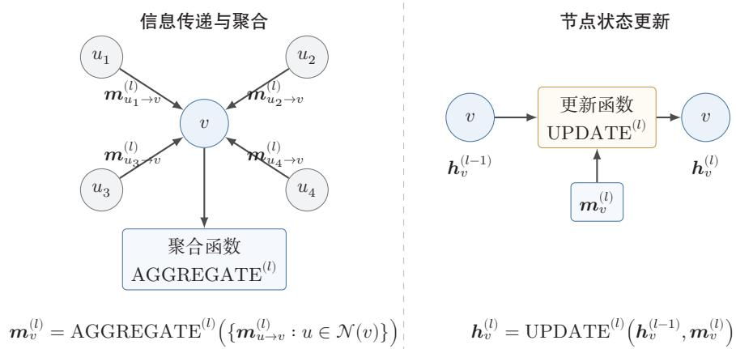  
图9.3 图神经网络的消息传递机制

## 9.3.2 全局汇聚与读出

对于图级任务（如图分类），仅有单个节点的表示还不够，还需要把整张图中所有节点的信息汇总为一个全局表示.全局汇聚（GlobalPooling）是实现这一目标的常用方法.它可以视为图级任务中的一种特殊读出操作，即把节点级表

示变成整图表示.常见的汇聚方式包括求和汇聚、平均汇聚和最大汇聚等．以求和汇聚为例，有

$$
\boldsymbol { h } _ { \mathcal { G } } = \sum _ { v \in \mathcal { V } } \boldsymbol { h } _ { v } ^ { ( L ) } ,\tag{9.17}
$$

其中 $h _ { \mathcal { G } }$ 表示整张图的表示，L是网络层数.对于节点级任务，读出函数是“直接取某个节点的表示”；对于边级任务，读出函数常体现为节点对表示的组合；对于图级任务，则需要通过全局汇聚把局部表示变成整图表示.

## 9.3.3 图神经网络的计算流程

综合上述讨论，一个典型图神经网络的计算流程可以概括如下：

（1）初始化节点表示：通常使用节点的原始特征向量作为 ${ \pmb H } ^ { ( 0 ) }$

（2）逐层消息传递：每一层都执行邻居聚合与节点更新；

（3）读出表示：根据任务类别得到节点、边或整图表示；

（4）任务预测：利用读出后的表示完成节点分类、链接预测或图分类等下游任务.

不同的图神经网络都可以看作是对“如何聚合邻居、如何更新表示”这两个问题给出的不同答案．也正因为如此，后续各种经典模型虽然形式不同，但本质上都可以放在同一消息传递框架下理解.

## 9.4 经典图神经网络

在掌握图神经网络的一般框架后，下面按照“基本思想一关键公式一适用特点”的线索，介绍几类有代表性的经典模型

## 9.4.1 图卷积网络

图卷积网络（Graph Convolutional Network,GCN)是图神经网络中的经典模型之一[Kipf et al., 2017]. 其核心思想是：在每一层中，节点利用图结构从其邻域中汇聚信息，并通过共享参数的线性变换与非线性映射，得到新的节点表示.

图卷积和普通卷积类似，也具有两个基本特征：局部连接与参数共享．在一维序列上，位置i处的卷积可以写为

$$
y _ { i } = \sum _ { \delta = - K } ^ { K } w _ { \delta } x _ { i + \delta } .
$$

由于图卷积网络形式简洁、物理意义明确，而且能够把“图上的邻域聚合”与“卷积的谱域定义”联系起来，因此它通常被视为理解图神经网络的一个重要起点.

(9.18)

这里，卷积核只作用于当前位置附近的一个局部窗口；同时，同一组参数 $\{ w _ { \delta } \}$ 在所有位置上重复使用．图数据虽然不再排列成规则网格，但仍然具有局部结构：对于节点v，其一阶邻居集合 $\mathcal { N } ( v )$ 自然构成了它的局部感受野.因此，图卷积的基本想法就是把欧氏空间中的局部卷积推广为图上的邻域聚合：节点在更新时，只利用自身及其邻居的信息，并在全图范围内共享同一组变换参数

图9.4给出了普通一维卷积与图卷积的对比.一维卷积在固定窗口内进行信息聚合；图卷积则在节点的局部邻域内进行信息聚合.尽管两者的数据组织形式不同，但都体现了局部建模与参数共享这两个核心思想.

  
图9.4 从一维卷积到图卷积

我们了解了图卷积的基本思想，但其实现方法还需要借助谱图方法.在后续小节中，我们按照“卷积定理→傅里叶变换→图傅里叶变换→谱图卷积→局部近似”来介绍图卷积的具体实现方法.

这里涉及较多的谱图理论知识，想深度了解的读者需阅读专门教材.

## 9.4.1.1 卷积定理与傅里叶变换

在连续空间中，两个函数 $f$ 和g的卷积定义为

$$
( f * g ) ( t ) = \int _ { - \infty } ^ { + \infty } f ( \tau ) g ( t - \tau ) d \tau .\tag{9.19}
$$

傅里叶变换（FourierTransform）的基本作用，是把时域（或空间域）中的信号表示转换到频域表示，从而揭示信号在不同频率分量上的组成情况.对于连续信号 $f ( t )$ ，其傅里叶变换及其相应的逆变换定义为

$$
\hat { f } ( \omega ) = \mathcal { F } \{ f \} ( \omega ) = \int _ { - \infty } ^ { + \infty } f ( t ) e ^ { - \mathrm { i } \omega t } d t ,\tag{9.20}
$$

$$
f ( t ) = { \mathcal { F } } ^ { - 1 } \{ { \hat { f } } \} ( t ) = { \frac { 1 } { 2 \pi } } \int _ { - \infty } ^ { + \infty } { \hat { f } } ( \omega ) e ^ { \mathrm { i } \omega t } d \omega ,\tag{9.21}
$$

其中 $\scriptstyle { \hat { f } } ( \omega )$ 表示信号在频率 $\omega$ 处的频谱系数.直观地说，低频分量描述信号缓慢变化的整体趋势，高频分量则描述快速变化的局部细节.

傅里叶变换之所以与卷积密切相关，是因为它把卷积运算转化为频域中的逐点乘法.

定理9.1－卷积定理：时域中的卷积，等价于频域中的逐点乘法，即

$$
{ \mathcal { F } } \{ f * g \} = { \mathcal { F } } \{ f \} \odot { \mathcal { F } } \{ g \} ,\tag{9.22}
$$

从而

$$
f * g = { \mathcal { F } } ^ { - 1 } ( { \mathcal { F } } \{ f \} \odot { \mathcal { F } } \{ g \} ) .\tag{9.23}
$$

频率基 卷积定理表明，卷积并不依赖于某个特定的积分形式，其本质是：先把信号表示变换到一组适当的基下，在该基下进行逐点乘法，再变换回原空间．这里“基”通常称为频率基（FrequencyBasis）,是指一组用来展开信号的基函数.

在经典傅里叶分析中，这组基函数就是不同频率的复指数函数 $e ^ { \mathrm { i } \omega t }$ .任意一个信号都可以看作这些基函数的线性组合，而各个频率对应的展开系数刻画了信号在不同变化尺度上的成分.一般而言，变化缓慢的成分对应低频，变化迅速的成分对应高频.

## 9.4.1.2 图傅里叶变换

从更抽象的角度看，卷积的关键并不是某个具体的积分公式，而在于能否找到一组适合该空间结构的“频率基”，使卷积在该基下变为简单的逐点乘法．因此，要把卷积推广到图上，核心问题就转化为：图上的频率基应当如何定义？

要回答这个问题，先回顾连续空间中的情形.在欧氏空间中，拉普拉斯算子（Laplacian）通常记为 $\Delta$ ，它描述函数在局部区域内的变化程度；在一维情形下，$\begin{array} { r } { \Delta f ( t ) = \frac { d ^ { 2 } f ( t ) } { d t ^ { 2 } } } \end{array}$ ，在二维或三维情形下，它是各个坐标方向二阶偏导数之和.若某个函数 $\phi$ 满足

$$
- \Delta \phi = \lambda \phi ,\tag{9.24}
$$

则称 $\phi$ 是拉普拉斯算子的特征函数（Eigenfunction），λ是对应的特征值.特征函数的意义与矩阵的特征向量类似：它们是在某个线性算子作用下“方向不变、只发生尺度变化”的特殊函数，因此常可作为展开一般函数的一组基.

在经典傅里叶分析中，复指数函数 $e ^ { \mathrm { i } \omega t }$ 正是连续拉普拉斯算子的特征函数，因为它满足

$$
- \Delta e ^ { \mathrm { i } \omega t } = \omega ^ { 2 } e ^ { \mathrm { i } \omega t } .\tag{9.25}
$$

这说明，传统傅里叶变换本质上可以理解为：在拉普拉斯算子的特征函数基下展开信号．这个观察为图上的推广提供了直接启发：图虽然没有天然的正弦、余弦基，但具有图拉普拉斯矩阵，因此也可以借助其特征分解来构造图上的频率基

对于无向图，常用归一化拉普拉斯矩阵（以下在谱方法的讨论中，为简化记号，统一将其记为L)

$$
L = I _ { N } - D ^ { - 1 / 2 } A D ^ { - 1 / 2 } .\tag{9.26}
$$

由于L是实对称矩阵，因此可以进行特征分解：

$$
\pmb { L } = \pmb { U } \pmb { \Lambda } \pmb { U } ^ { \top } ,\tag{9.27}
$$

其中 $U = [ { \pmb u } _ { 1 } , \dots , { \pmb u } _ { N } ]$ 由特征向量组成， $\pmb { \Lambda } = \mathrm { d i a g } ( \lambda _ { 1 } , \dots , \lambda _ { N } )$ 为特征值对角矩阵.于是，可以把L的特征向量看作图上的一组正交频率基，并将图信号 $\pmb { x } \in \mathbb { R } ^ { N }$ 的图傅里叶变换（Graph Fourier Transform）及其逆变换定义为

$$
\begin{array} { r } { \hat { \pmb { x } } = \mathcal { F } _ { G } ( \pmb { x } ) = \pmb { U } ^ { \top } \pmb { x } , } \end{array}\tag{9.28}
$$

$$
\pmb { x } = \mathcal { F } _ { G } ^ { - 1 } ( \hat { \pmb { x } } ) = \pmb { U } \hat { \pmb { x } } ,\tag{9.29}
$$

其中特征值 $\lambda _ { i }$ 可以理解为图上的“频率”.一般来说，较小的特征值对应较平滑的变化模式，即相邻节点上的信号取值更接近；较大的特征值对应更剧烈的变化模式，即信号在相邻节点之间振荡更强.因此，图傅里叶变换可以看作是把节点域中的信号表示转换到图频域中的过程.

## 9.4.1.3 谱图卷积

有了图傅里叶变换，就可以直接仿照连续空间中的卷积定理，在图频域中定义卷积.设x是图信号，g是滤波器，则图卷积可写为

$$
g * _ { G } \mathbf { \Delta } x = { \mathcal { F } } _ { G } ^ { - 1 } ( { \mathcal { F } } _ { G } ( g ) \odot { \mathcal { F } } _ { G } ( \pmb { x } ) ) = U { \big ( } ( U ^ { \top } g ) \odot ( U ^ { \top } \pmb { x } ) { \big ) } .\tag{9.30}
$$

在实际使用中，通常不再把滤波器g直接看作节点域中的一个向量，而是把它写成特征值的函数 $g _ { \theta } ( \pmb { \Lambda } )$ .这样便得到更常用的谱图卷积（Spectral Graph Con-volution)形式：

$$
g _ { \theta } * _ { G } { \pmb x } = { \cal U } g _ { \theta } ( { \pmb \Lambda } ) { \cal U } ^ { \top } { \pmb x } .
$$

之所以称为“谱图卷积”，正是因为卷积的定义依赖于图拉普拉斯矩阵的谱分解.

(9.31)

该式与普通卷积的形式相似：先把信号变换到频域，再乘以一个频域滤波器，最后再变换回节点域.

然而，这一定义仍然存在两方面局限.其一，显式计算L的特征分解代价较高，不利于大规模图上的应用；其二，滤波器 $g _ { \theta } ( \pmb { \Lambda } )$ 作用于整个图谱，其对应的节点域算子未必天然局部，而卷积神经网络通常希望每一层主要利用局部邻域信息.因此，还需要进一步引入局部近似

推导目标：我们已经在频域定义了图卷积 $U g _ { \theta } ( \pmb { \Lambda } ) U ^ { \top } \pmb { x }$ ，但其计算代价为 $O ( N ^ { 2 } )$ 且滤波器不具有空间局部性.下面通过多项式近似同时解决这两个问题

## 9.4.1.4 从谱图卷积到局部近似

为了使图卷积既具有局部性，又便于高效计算，一个自然的思路是把谱域滤波器近似为拉普拉斯矩阵的多项式.若

$$
g _ { \theta } ( L ) = \sum _ { k = 0 } ^ { K } \alpha _ { k } L ^ { k } ,\tag{9.32}
$$

则

$$
g _ { \theta } * _ { G } { \pmb x } = g _ { \theta } ( { \pmb L } ) { \pmb x } = \sum _ { k = 0 } ^ { K } \alpha _ { k } { \pmb L } ^ { k } { \pmb x } .\tag{9.33}
$$

由于 $\pmb { L } ^ { k } \pmb { x }$ 只依赖于至多k跳邻域的信息，因此K阶多项式滤波器天然对应一个K跳局部算子.这也就解释了为什么图卷积能够具有局部感受野

ChebNet 进一步利用 Chebyshev 多项式对谱域滤波器进行近似 [Deffer-rard et al., 2016]:

$$
g _ { \theta ^ { \prime } } * _ { G } { \pmb x } \approx \sum _ { k = 0 } ^ { K } \theta _ { k } ^ { \prime } T _ { k } ( { \tilde { \pmb L } } ) { \pmb x } , \qquad { \tilde { \pmb L } } = \frac { 2 } { \lambda _ { \mathrm { m a x } } } { \pmb L } - { \cal I } _ { N } ,\tag{9.34}
$$

其中 $T _ { k } ( \cdot )$ 表示 Chebyshev多项式.

这样的写法一方面避免了显式特征分解，另一方面又保留了局部性，因此比直接

## 数学小知识|Chebyshev多项式

Chebyshev多项式由递推关系定义： $T _ { 0 } ( x ) \ = \ 1 , T _ { 1 } ( x ) \ = \ x$ $T _ { k } ( x ) = 2 x T _ { k - 1 } ( x ) - T _ { k - 2 } ( x )$ . Chebyshev多项式在 $[ - 1 , 1 ]$ 上具有正交性和最优逼近性质，可以用较少的项数高效逼近连续函数.在谱图卷积中，使用Chebyshev多项式近似滤波器函数，可以避免显式的特征分解，将计算复杂度从 $O ( N ^ { 3 } )$ 降到O(KE)(E为边数，K为多项式阶数).


使用谱定义更便于实现

Kipf等人在这一思路上进一步做出了简化.取K =1,并近似令 $\lambda _ { \operatorname* { m a x } } \approx 2$ 则有

$$
g _ { \theta ^ { \prime } } * _ { G } { \bf x } \approx \theta _ { 0 } ^ { \prime } { \bf x } + \theta _ { 1 } ^ { \prime } ( L - I _ { N } ) { \bf x } = \theta _ { 0 } ^ { \prime } { \bf x } - \theta _ { 1 } ^ { \prime } D ^ { - 1 / 2 } A D ^ { - 1 / 2 } { \bf x } .\tag{9.35}
$$

https://nndl.ai/

再令两个参数共享为 $\theta = \theta _ { 0 } ^ { \prime } = - \theta _ { 1 } ^ { \prime }$ ,便得到

$$
g _ { \theta } * _ { G } { \bf { x } } \approx \theta \bigl ( { I _ { N } + D ^ { - 1 / 2 } A D ^ { - 1 / 2 } } \bigr ) { \bf { x } } .\tag{9.36}
$$

为了使多层传播更加稳定，可以引入重规范化技巧（RenormalizationTrick）：先在图中加入自环，记

$$
\tilde { A } = A + I _ { N } , \qquad \tilde { D } _ { i i } = \sum _ { j } \tilde { A } _ { i j } ,\tag{9.37}
$$

再将传播矩阵写为

$$
\tilde { D } ^ { - 1 / 2 } \tilde { A } \tilde { D } ^ { - 1 / 2 } .\tag{9.38}
$$

于是，谱图卷积最终可近似为

$$
g _ { \theta } * _ { G } { \pmb x } \approx \theta \tilde { \cal D } ^ { - 1 / 2 } \tilde { \cal A } \tilde { \cal D } ^ { - 1 / 2 } { \pmb x } .\tag{9.39}
$$

最后，把标量参数 $\theta$ 推广为可学习的权重矩阵，并接上非线性激活函数，就得到图卷积网络的一层传播公式.这里采用GNN文献中常见的矩阵写法，将N个节点的表示按行堆叠为 $\pmb { H } ^ { ( l ) } \in \mathbb { R } ^ { N \times F _ { l } }$ ;单个节点表示仍记为列向量 $h _ { v } ^ { ( l ) }$

$$
\pmb { H } ^ { ( l + 1 ) } = \sigma \big ( \tilde { D } ^ { - 1 / 2 } \tilde { A } \tilde { D } ^ { - 1 / 2 } \pmb { H } ^ { ( l ) } \pmb { W } ^ { ( l ) } \big ) .\tag{9.40}
$$

至此，从谱域出发，经过多项式近似（ChebNet）和一阶简化（GCN），最终化为简洁的局部传播算子 $\tilde { D } ^ { - 1 / 2 } \tilde { A } \tilde { D } ^ { - 1 / 2 }$ ——每个节点只需聚合其一阶邻域和自身的信息.

综上，图卷积网络可以看作谱图卷积在一阶局部近似下的一个简洁实现.它既保留了卷积的谱域来源，又将最终计算形式化为适合图学习的局部邻域传播.

## 9.4.1.5 节点级展开与归一化传播

式(9.40)给出了图卷积网络的一层矩阵传播形式.若把该式按节点υ展开，就得到更直观的节点级更新公式：

$$
\pmb { h } _ { v } ^ { ( l + 1 ) } = \sigma \left( \sum _ { u \in \mathcal { N } ( v ) \cup \{ v \} } \frac { 1 } { \sqrt { \tilde { d } _ { u } \tilde { d } _ { v } } } \pmb { W } ^ { ( l ) } \pmb { h } _ { u } ^ { ( l ) } \right) ,\tag{9.41}
$$

其中 $\tilde { d } _ { u }$ 和 $\tilde { d } _ { v }$ 分别表示加入自环后节点u和υv的度.

图卷积网络本质上执行的是一种带对称归一化的邻域聚合：节点v在更新时，同时汇聚自身和邻居节点的表示，并通过归一化系数 $\frac { 1 } { \sqrt { \tilde { d } _ { u } \tilde { d } _ { v } } }$ 平衡不同节点对聚合结果的影响.每一层的计算可以概括为以下三个步骤：

• 保留自身信息：通过 $\tilde { \pmb { A } } = \pmb { A } + \pmb { I } _ { N }$ 为每个节点加入自环；

• 进行归一化聚合:通过 $\tilde { D } ^ { - 1 / 2 } \tilde { A } \tilde { D } ^ { - 1 / 2 }$ 减弱节点度差异带来的尺度不平衡；

• 执行共享变换：对所有节点统一施加线性变换 $W ^ { ( l ) }$ ，并通过非线性函数$\sigma ( \cdot )$ 得到新的表示.

因此，矩阵形式强调的是“整张图上的并行传播”，而节点形式强调的是“单个节点如何从局部邻域汇聚信息”.二者本质上等价，只是观察问题的角度不同.

## 9.4.1.6 一个三节点链图示例

考虑一个简单的三节点链图 $u - v - w$ ，并假设三个节点的一维初始特征分别为

$$
h _ { u } ^ { ( 0 ) } = 1 , \qquad h _ { v } ^ { ( 0 ) } = 2 , \qquad h _ { w } ^ { ( 0 ) } = 0 .
$$

若只考虑一层GCN，取 $W ^ { ( 0 ) } = 1$ 且忽略激活函数，则加入自环后有

$$
\tilde { d } _ { u } = 2 , \qquad \tilde { d } _ { v } = 3 , \qquad \tilde { d } _ { w } = 2 .
$$

此时，中心节点v的更新为

$$
h _ { v } ^ { ( 1 ) } = \frac { 1 } { \sqrt { 3 \cdot 2 } } h _ { u } ^ { ( 0 ) } + \frac { 1 } { \sqrt { 3 \cdot 3 } } h _ { v } ^ { ( 0 ) } + \frac { 1 } { \sqrt { 3 \cdot 2 } } h _ { w } ^ { ( 0 ) } = \frac { 1 } { \sqrt { 6 } } + \frac { 2 } { 3 } .\tag{9.42}
$$

这个例子说明，GCN在更新节点v时，并不是简单地对邻居特征做平均，而是将自身特征与邻居特征共同纳入计算，并通过归一化系数控制不同来源信息的贡献.堆叠多层之后，节点表示便能够逐步融合更大范围内的结构信息

## 9.4.2 GraphSAGE

GraphSAGE（Graph Sample and Aggregation)是一种强调可扩展性的图神经网络模型[Hamilton et al., 2017]. 它的重要贡献不只是提出了新的聚合方式，更在于系统地把邻居采样和归纳学习纳入图神经网络的训练流程中，从而使GNN能够更自然地适应大规模图和未见节点场景.

这里所谓归纳学习（InductiveLearning），是指模型在训练完成后能够推广到训练阶段未出现过的新节点，甚至新图；它不同于转导学习（TransductiveLearning），后者通常是在一个固定图上，针对训练阶段已经出现过的节点进行预测.GraphSAGE的核心思想是在执行消息传递之前，先为每个节点采样一部分邻居，再对采样邻居的表示进行聚合与更新．与依赖全图传播的模型相比，它显式地把“邻居采样”作为计算图的一部分，因此更适合大规模图上的小批量训练.

## 9.4.2.1 邻居采样

在每一层，GraphSAGE为每个节点随机采样一部分邻居节点，以减少计算开销.设节点υ的邻居集合为 $\mathcal { N } ( v )$ ，采样后的邻居集合为 $\mathcal { N } _ { S } ( v ) \subseteq \mathcal { N } ( v )$ .若每层最多采样S个邻居，则多层展开时计算规模不再随着全图邻居数量线性增长，而是被控制在一个可管理的范围内.

图9.5给出了GraphSAGE的邻居采样示意.每层只对部分邻居进行采样与聚合，从而降低大图训练的计算与存储开销.

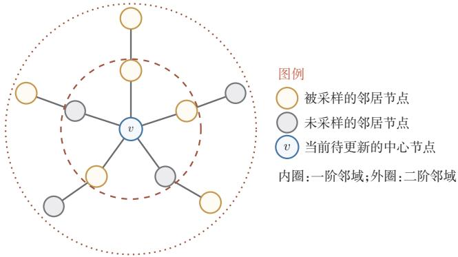  
图 9.5 GraphSAGE 的邻居采样示意

## 9.4.2.2 聚合函数

在采样得到邻居后，GraphSAGE再对这些邻居的表示进行聚合.原始工作中给出了多种可选的聚合函数，常见形式包括：

平均聚合（Mean Aggregator):

$$
\pmb { h } _ { \mathcal { N } _ { S } ( v ) } ^ { ( l + 1 ) } = \frac { 1 } { | \mathcal { N } _ { S } ( v ) | } \sum _ { u \in \mathcal { N } _ { S } ( v ) } \pmb { h } _ { u } ^ { ( l ) } .\tag{9.43}
$$

LSTM聚合(LSTM Aggregator):

$$
\pmb { h } _ { \mathcal { N } _ { S } ( v ) } ^ { ( l + 1 ) } = \mathrm { L S T M } \left( \{ \pmb { h } _ { u } ^ { ( l ) } : u \in \mathcal { N } _ { S } ( v ) \} \right) .\tag{9.44}
$$

需要注意的是，邻居本质上是一个无序集合，而LSTM对输入顺序敏感，因此这种聚合方式通常需要通过随机打乱顺序来近似处理集合输入.

汇聚聚合(Pooling Aggregator):

$$
\boldsymbol { h } _ { \mathcal { N } _ { S } ( v ) } ^ { ( l + 1 ) } = \operatorname* { m a x } _ { \boldsymbol { u } \in \mathcal { N } _ { S } ( v ) } \sigma \left( \boldsymbol { W } _ { \mathrm { p o o l } } \boldsymbol { h } _ { \boldsymbol { u } } ^ { ( l ) } + \boldsymbol { b } _ { \mathrm { p o o l } } \right) ,\tag{9.45}
$$

其中 $W _ { \mathrm { p o o l } }$ 和 $b _ { \mathrm { p o o l } }$ 是可学习参数， $\sigma$ 是激活函数.

## 9.4.2.3 节点更新与训练方式

聚合完邻居节点的特征后，GraphSAGE通过节点自身特征与聚合后的邻居特征共同更新节点表示：

$$
\pmb { h } _ { v } ^ { ( l + 1 ) } = \sigma \left( \pmb { W } ^ { ( l ) } \left[ \pmb { h } _ { v } ^ { ( l ) } \oplus \pmb { h } _ { \mathcal { N } _ { S } ( v ) } ^ { ( l + 1 ) } \right] \right) .\tag{9.46}
$$

随后常对节点表示做 $\ell _ { 2 }$ 归一化：

$$
h _ { v } ^ { ( l + 1 ) } = h _ { v } ^ { ( l + 1 ) } / \| h _ { v } ^ { ( l + 1 ) } \| _ { 2 } .\tag{9.47}
$$

GraphSAGE通常采用小批量训练.每次迭代只围绕一部分目标节点及其采样邻域构造局部计算图，再完成聚合与更新.正因为不必在每一步都访问整张图，GraphSAGE在大规模图和归纳式场景中具有更好的可扩展性.

## 9.4.3 图注意力网络

图注意力网络（Graph Attention Network,GAT）是一种将注意力机制引入图神经网络的模型[Velickovic et al., 2018]. 它的关键思想是: 不同邻居对中心节点的重要性并不相同，因此不应对所有邻居使用统一的固定权重，而应由模型根据特征关系自适应地分配权重.

GAT在每个节点的局部邻域内计算注意力分数，并据此对邻居表示进行加权聚合.需要注意的是，GAT中的注意力通常仍然局限在局部邻域内，而不是像标准Transformer那样在所有节点之间进行全连接自注意力． 因此，GAT仍然属于消息传递式模型，只是把固定权重的邻域聚合改成了可学习的注意力加权聚合.

## 9.4.3.1 注意力系数与权重

对于节点υ及其一个邻居节点u,GAT首先计算未归一化的注意力系数 $e _ { v u }$ ..

$$
\begin{array} { r } { \boldsymbol { e } _ { v u } = \mathrm { L e a k y R e L U } \left( \boldsymbol { a } ^ { \top } [ W h _ { v } \oplus W h _ { u } ] \right) , } \end{array}\tag{9.48}
$$

其中 $^ { a }$ 是可学习的注意力向量，W是可学习的线性变换矩阵.为了使不同邻居之间的分数具有可比性，再使用softmax对其进行归一化，得到注意力权重

$$
\alpha _ { v u } = \frac { \exp ( e _ { v u } ) } { \sum _ { k \in \mathcal { N } ( v ) \cup \{ v \} } \exp ( e _ { v k } ) } .\tag{9.49}
$$

这里将节点自身也纳入归一化范围，等价于在注意力聚合中保留自环信息.

## 9.4.3.2 特征聚合与多头注意力

GAT利用注意力权重对邻居节点的特征进行加权聚合，得到节点υ的新的特征表示：

$$
\pmb { h } _ { v } ^ { \prime } = \sigma \left( \sum _ { u \in \mathcal { N } ( v ) \cup \{ v \} } \alpha _ { v u } \pmb { W } \pmb { h } _ { u } \right) .\tag{9.50}
$$

为了提高训练稳定性并增强表示能力，GAT通常采用多头注意力（Multi-HeadAttention）机制.也就是说，模型会并行计算多组彼此独立的注意力权重，再将各头的聚合结果进行拼接或平均：

$$
h _ { v } ^ { \prime } = \bigoplus _ { k = 1 } ^ { K } \sigma \left( \sum _ { u \in \mathcal { N } ( v ) \cup \{ v \} } \alpha _ { v u } ^ { k } W ^ { k } h _ { u } \right) ,\tag{9.51}
$$

或

$$
h _ { v } ^ { \prime } = \sigma \left( \frac { 1 } { K } \sum _ { k = 1 } ^ { K } \sum _ { u \in \mathcal { N } ( v ) \cup \{ v \} } \alpha _ { v u } ^ { k } W ^ { k } h _ { u } \right) .\tag{9.52}
$$

实践中，中间层常用拼接以增加表达能力，输出层常用平均以保持维度稳定

原始GAT的注意力系数关于节点对 $( v , u )$ 是线性函数，表达能力有限GATv2 调整了线性变换与非线性操作的顺序 [Brody et al., 2022]，使得注意力系数变为 $e _ { v u } = { a \mathrm { { ^ T L e a k y R e L U } } ( W [ h _ { v } \oplus h _ { u } ] ) }$ ，从而缓解原始GAT中静态注意力的表达限制.

## 9.4.4 图同构网络

在图级任务中，模型是否能够区分不同的图结构，是决定其表达能力的一个关键问题.图同构网络（Graph Isomorphism Network，GIN）正是围绕这一问题提出的模型[Xu et al., 2019]. 它并不主要追求更高的计算效率，而是强调:聚合函数本身的设计会直接影响图神经网络的判别能力.

图同构如果两个图只是“节点编号不同、画法不同”，但连接关系完全一致，那么它们本质上是同一个图，称为图同构（Graph Isomorphism）.更严格地说，设两个图分别为 $\mathcal { G } _ { 1 } = ( \mathcal { V } _ { 1 } , \mathcal { E } _ { 1 } )$ 和 $\mathcal { G } _ { 2 } = ( \mathcal { V } _ { 2 } , \mathcal { E } _ { 2 } )$ .如果存在一个双射 $f : \mathcal { V } _ { 1 } \to \mathcal { V } _ { 2 }$ 使得对任意 $u , v \in \mathcal { V } _ { 1 }$

$$
( u , v ) \in \mathcal { E } _ { 1 } \iff ( f ( u ) , f ( v ) ) \in \mathcal { E } _ { 2 } ,\tag{9.53}
$$

则称 $\mathcal { G } _ { 1 }$ 与 $\mathcal { G } _ { 2 }$ 同构，记为 ${ \mathcal { G } } _ { 1 } \cong { \mathcal { G } } _ { 2 }$ .例如，一个三角形图无论把三个节点编号成(1,2,3)还是(a,b,c),只要三条边仍然两两相连，它们就是同构的.

判断两个图是否同构并不总是容易，尤其当图很大时，仅凭肉眼很难看出两个图是否只是“换了编号”.因此，人们往往先使用一些计算上更高效的判别方法来尝试区分不同图，其中经典的一类就是Weisfeiler-Lehman同构测试(Weisfeiler-Lehman Isomorphism Test , WL-Test ) [Leman et al., 1968]. WL-Test的思想是：反复把节点自身标签与其邻居标签的多重集合（Multiset）组合起来，并映射成新标签.如果两个图在某一轮迭代后产生了不同的标签分布，那么它们一定不同构.虽然WL-Test不能解决所有图同构问题，但它为我们提供了一个重要启发：如果一个图神经网络的聚合函数无法区分不同的邻域多重集合，那么它也难以区分某些不同的图结构.

多重集合与普通集合不同，它不仅关心“有哪些元素”，还关心“每个元素出现了多少次”，因此能够区分例如{a, a, b} 与 {a, b} 这类情况.

1-WL测试（1-dimensional Weisfeiler-Lehman Test）也常被称为颜色细化（ColorRefinement），是通过反复细化节点标签，尽可能发现两个图在局部结构上的差异.其基本过程如下：

设节点v在第t轮的标签为 $c _ { v } ^ { ( t ) }$ .如果图中没有给定节点属性，通常令所有节点在初始时具有相同标签，即 $c _ { v } ^ { ( 0 ) }$ 相同.第t轮更新时，先收集节点v所有邻居在上一轮的标签多重集合

$$
\begin{array} { r } { m _ { v } ^ { ( t ) } = ⨏ _ { \mathbb { C } _ { u } ^ { ( t - 1 ) } } : u \in \mathcal { N } ( v ) ⨏ _ { \mathbb { Y } } , } \end{array}\tag{9.54}
$$

再将“自身标签+邻居标签多重集合”组合起来，映射成一个新标签：

$$
c _ { v } ^ { ( t ) } = \mathrm { H A S H } \left( c _ { v } ^ { ( t - 1 ) } , m _ { v } ^ { ( t ) } \right) ,\tag{9.55}
$$

其中HASH(·)能够将不同的输入组合尽量赋予不同的新标签.因此，WL-Test真正比较的不是节点编号，而是每一轮中各类标签的分布情况.如果两个图在某一轮得到的标签分布不同，那么它们一定不同构；如果迭代直到稳定后标签分布始终相同，WL-Test也只能说明它未能区分这两个图，而不能据此断定二者一定同构.

图9.6给出了一个具体例子.初始时t =0，所有节点颜色相同.到t =1时，右上和左上的两个节点由于度为3，其邻居标签多重集合与其余三个度为2的节点不同，因此被赋予另一种颜色.到t=2时，虽然顶部节点和底部两个节点在t=1时同为绿色，但它们的邻居颜色组合已经不同：顶部节点连接了两个黄色节点，而底部两个节点各自连接了一个黄色节点和一个绿色节点，因此顶部节点又被进一步细分出来.这个过程说明，WL-Test会随着迭代逐步把“更远一层的局部结构差异”编码到当前节点标签中，逐步反映更丰富的局部结构信息.

再看一个更直接的比较：如果把图9.6左侧的图与一个五边形环 $C _ { 5 }$ 相比，那么在初始时两者都可以看成“所有节点同色”；但在第一轮细化后， $C _ { 5 }$ 中的五个节点仍然完全等价，而图9.6中的节点会分成“两个度为3的节点”和“三个度为2的节点”两类，因此两者在t=1时的标签分布已经不同，WL-Test便可立即判定它们不同构.

  
t = 0

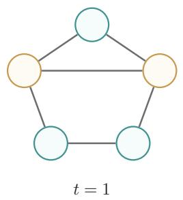

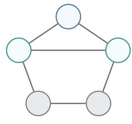  
t = 2  
图 9.6 WL-Test 的颜色细化过程示意

当然，1-WL测试并不是完美的.确实存在一些不同构图在每一轮中都得到相同的标签分布，因此1-WL无法区分它们.但对许多常见场景而言，它已经提供了一个很有价值的判别能力基准：如果一个图神经网络连1-WL能区分的邻域多重集合都区分不开，那么它的结构表达能力通常就会受到明显限制.

## 9.4.4.1 聚合与更新

GIN受到WL-Test的启发，目标是通过更强的聚合函数提升模型对图结构差异的区分能力.其聚合与更新过程如下：

$$
\pmb { h } _ { v } ^ { ( l ) } = \mathrm { M L P } ^ { ( l ) } \left( \left( 1 + \epsilon ^ { ( l ) } \right) \pmb { h } _ { v } ^ { ( l - 1 ) } + \sum _ { u \in \mathcal { N } ( v ) } \pmb { h } _ { u } ^ { ( l - 1 ) } \right) ,\tag{9.56}
$$

其中 $\mathrm { M L P } ^ { ( l ) }$ 是第l层的多层感知器， $\epsilon ^ { ( l ) }$ 是一个可学习或固定的标量，用于调整中心节点特征的权重.

GIN的关键做法是使用求和聚合并配合MLP进行非线性变换，从而尽量保留邻域多重集合中的结构信息.与一些表达能力较弱的平均聚合相比，GIN更强调“不同结构应得到不同表示”.

GIN从理论上说明了：聚合函数的设计并不是实现细节，而是直接决定模型能够区分哪些结构差异.借助求和聚合与MLP，GIN在判别能力上可以与1-WL测试相对应，因此在图分类等任务中具有重要意义.

## 9.4.5 几类经典模型的比较

为了更清楚地把握这些模型之间的联系与差异，可以从“聚合方式一主要动机一适用特点”的角度进行横向比较，如表9.1所示.

这四类模型都可以视为消息传递框架的具体实例：GCN关注如何做归一化聚合，GraphSAGE关注如何在大图上高效训练，GAT关注如何区分邻居的重要

表9.1 几类经典图神经网络的比较
<table><tr><td>模型</td><td>核心思想</td><td>聚合方式</td><td>训练特点</td><td>主要特点与局限</td></tr><tr><td>GCN</td><td>归一化聚合</td><td>对邻域进行固定权重的 平均聚合</td><td>常见形式为 全图训练</td><td>结构简洁，适合作为入门 模型；但对图同质性依赖较</td></tr><tr><td>GraphSAGE</td><td>邻居采样后 再聚合</td><td>平均聚合、支持小批量 LSTM聚合、训练 汇聚聚合等</td><td></td><td>强，深层时容易过度平滑. 更适合大规模图与归纳式 场景；但采样会带来近似误 差.</td></tr><tr><td>GAT</td><td>学习不同邻 居的重要性</td><td>邻域内注意 力加权聚合</td><td>注意力</td><td>常配合多头对邻居重要性建模更灵 活；但计算开销通常高于 GCN.</td></tr><tr><td>GIN</td><td>强化聚合函求和聚合 数的判别能</td><td></td><td>类</td><td>常用于图分理论表达能力较强；但不直 接解决大图训练和长程依 赖问题.</td></tr></table>

性，GIN则关注聚合函数本身的表达能力.从这一比较可以看到，经典模型的发展脉络，本质上就是围绕“局部聚合如何设计、计算代价如何控制、结构表达能力如何提升”这三类问题逐步展开的.

## 9.5图神经网络中的共性问题

前面介绍的各类模型虽然形式不同，但只要采用消息传递这一基本范式，就往往会面临一些共同挑战.尤其当网络不断加深、图规模持续增大时，这些问题会变得更加突出，本节围绕三个具有代表性的共性问题展开：过度平滑、过压缩与可扩展性.

## 9.5.1 过度平滑

过度平滑（Oversmoothing）是指随着图神经网络层数增加，节点表示在反复聚合后逐渐趋同，最终使原本不同的节点难以区分.这一现象会显著削弱模型在节点分类等任务中的判别能力.

如果把一层消息传递理解为“把邻居信息做一次局部平均或混合”，那么多层堆叠就相当于不断重复这一过程.随着层数增加，相邻节点乃至更远节点的表示会越来越接近，最终出现“整张图上的节点表示都差不多”的现象.这就是过度平滑的直观来源

一种常见的过度平滑测量方法是Dirichlet 能量（Dirichlet Energy）[Zhouet al.,2021].它衡量的是相邻节点表示之间的总体差异：若相邻节点越相似，则该能量越小；若差异越大，则该能量越大.对于给定的节点特征矩阵 $\pmb { H } \in \mathbb { R } ^ { N \times F }$ 和邻接矩阵A,Dirichlet能量定义为

$$
E ( H ) = \frac { 1 } { 2 } \sum _ { v , u } A _ { v u } \| h _ { v } - h _ { u } \| _ { 2 } ^ { 2 } .\tag{9.57}
$$

随着网络层数的增加，若相邻节点表示越来越接近，则Dirichlet能量会逐渐减小；当其趋于零时，说明节点表示已经高度相似.

缓解过度平滑的思路通常包括：

· 残差连接：通过在深层网络中保留初始特征或浅层特征，减轻多层传播导致的信息过度混合；

• 随机扰动：通过随机删除边（如DropEdge等方法），引入随机性来减少过强的平滑效应；

• 规范化与正则化：通过特征规范化保持节点之间的相对距离，或通过控制每层的Dirichlet能量范围等显式约束来减轻过度平滑.

## 9.5.2 过压缩

过压缩（Oversquashing）是指大量远距离信息在经过若干层消息传递后，被迫通过少数边或少量低维表示“挤压”到某个节点中，从而导致重要信息在传播过程中丢失．它与过度平滑不同：过度平滑强调“表示越来越相似”，而过压缩强调“信息虽然理论上可达，但在传播通道中被压缩得过于严重，导致难以有效保留”.

这一现象在图中存在长距离依赖、树状扩张或瓶颈结构时尤其明显.例如，一个节点若需要同时接收大量远距离节点的信息，那么这些信息会在少数关键边上汇聚.即使模型层数足够深，也可能因为传播通道过窄而难以有效利用这些信息.

缓解过压缩的思路通常包括：

· 改造图结构，例如添加长程边或重连边，以缩短有效传播路径；

• 引入残差、跳连或全局注意力，减少信息必须逐边压缩传播的程度；

· 使用更强的读出或记忆机制，在深层传播中保留更多中间信息.

从这个角度看，消息传递式图神经网络的局限并不只来自“层太深”，也来自“长距离依赖必须经过狭窄结构传播”.

## 9.5.3 面向大图的可扩展性问题

可扩展性（Scalability）问题是指当图的节点数和边数迅速增长时，图神经网络在训练和推断阶段都会面临明显的效率瓶颈.其根源在于：消息传递需要频繁访问邻域结构，而多层堆叠又会不断扩大感受野，从而带来高昂的计算与存储成本.

可扩展性问题主要体现在以下几个方面：

• 邻域爆炸:随着层数加深，参与计算的节点数可能快速增长；

• 高存储需求：大图上的节点表示、边关系和中间激活都需要占用大量显存或内存；

• 训练与推断低效：如果每一步都要访问整张图，则代价很高.

可扩展性问题的典型解决思路包括：

· 邻居采样：邻居采样方法以节点为中心，在每一层只保留部分邻居参与聚合. GraphSAGE就是最典型的例子.它把全图传播改写为“围绕目标节点采样局部计算图”，从而支持小批量训练

• 子图采样：子图采样方法不是逐节点采样邻居，而是直接从原图中通过节点、边或随机游走等方式采样一个较小的子图，再在这个子图上训练，从而在效率和统计偏差之间取得平衡．GraphSAINT就是这一思路的代表方法 [Zeng et al., 2020].

• 图划分与分块训练：首先将原图划分为多个簇，然后在每个簇或若干簇组成的子图上训练网络．这样既能利用图的局部结构，又能显著降低大规模训练的内存和通信开销．Cluster-GCN就是这一路线中的代表方法[Chiang et al., 2019].

从整体上看，面向大图的可扩展性问题并没有唯一答案，而是需要根据图规模、任务类型和训练资源，在模型精度、采样偏差和计算效率之间做权衡.

## 9.6 总结和扩展阅读

综合本章内容，图神经网络可以统一地理解为一种面向图结构的表示学习方法.其基本机制是消息传递：节点在每一层中从邻居接收信息、完成聚合，并更新自身表示.无论后续模型名称如何变化，这一机制始终是理解图神经网络的主线.

围绕这一主线，本章首先介绍了图的基本概念，为后续介绍图神经网络中的邻域、传播、平滑和谱分析等内容铺垫了数学基础.进一步说明了图上的机器学习任务可以分为节点级、边级和图级三类，虽然三类任务的预测对象不同，但它们共享同一个核心步骤：先学习节点表示，再根据任务需要设计相应的读出方式：同时，图学习评估还必须注意训练、验证和测试之间的结构边界，避免通过节点标签、目标边或近重复图样本泄漏测试信息

在此基础上，介绍了几类有代表性的经典模型.GCN说明了如何把卷积从欧氏空间推广到图上，并将谱图卷积化为简洁的局部传播公式；GraphSAGE说明了当图规模很大时，模型设计需要与采样和训练机制结合考虑；GAT说明了邻居的重要性并不一定相同，聚合权重可以由模型自适应学习；GIN则进一步说明，聚合函数的形式会直接影响模型对图结构差异的区分能力.将这些模型放在一起看，可以更清楚地把握经典GNN的几条核心设计线索：局部聚合、权重分配、表达能力与可扩展性

本章最后讨论的过度平滑、过压缩和可扩展性问题，则提示我们：消息传递式图神经网络虽然有效，但并不是没有边界．层数加深并不一定带来更好的表示，长距离依赖也不一定能够被顺利传播，而大规模图上的训练更要求模型、采样与系统实现共同配合．这些局限也促使后续模型继续探索更强的全局建模能力、更高效的训练方法以及更丰富的结构表达机制.

若希望继续深入，本章之后的学习可以沿着以下三条线索展开.第一条线索是理论基础：继续学习谱图理论、图信号处理以及WL测试等内容，进一步理解图傅里叶变换、谱卷积和表达能力分析的数学来源.第二条线索是工程与规模化：围绕邻居采样、子图采样、图划分和小批量训练等主题，理解图神经网络在大规模场景中的实现方式.第三条线索是模型拓展：从经典消息传递模型继续走向图 Transformer[Ying et al., 2021]、图自监督学习 [Hou et al., 2022; You et al.,2020]、图生成模型 [Simonovsky et al., 2018; You et al., 2018]、时空图网络 [Liet al., 2018; Yu et al., 2018] 以及异质图学习 [Hu et al., 2020; Schlichtkrullet al., 2018; Wang et al., 2019]等方向. 顺着这三条线索展开，读者可以从“会用图神经网络”进一步过渡到“理解图神经网络为何这样设计，以及它还能向何处发展”.

## 习题

基础题

习题9-1 说明无向图（Undirected Graph）与有向图（Directed Graph）、同 质图（Homogeneous Graph）与异质图（Heterogeneous Graph）的区别，并分 https://nndl.ai/

别给出一个可能的应用场景.

习题9-2 设图的邻接矩阵为A、度矩阵为D、拉普拉斯矩阵为 $\pmb { { \cal L } } = \pmb { { \cal D } } - \pmb { { \cal A } } .$ 请说明这三个矩阵各自刻画了图的什么信息，并解释为什么 $\mathbf { \boldsymbol { x } } ^ { \intercal } \mathbf { \boldsymbol { L } } \mathbf { \boldsymbol { x } }$ 可以用来衡量图信号在图上的平滑程度.

习题9-3图上的机器学习任务通常分为节点级、边级和图级三类.请分别说明这三类任务的预测对象是什么，并各举一个实际例子.

习题9-4对节点分类、链接预测和图分类三类任务，分别说明训练集、验证集和测试集通常应该以什么对象为单位划分．为什么在链接预测中不能直接把验证或测试正例边保留在训练图里？

习题9-5从消息传递的角度看，一层图神经网络通常包含“消息构造、邻域聚合、状态更新”三个步骤.请简要说明这三个步骤各自的作用.

习题9-6在GCN中，为什么通常要在邻接矩阵中加入自环，并使用$\tilde { D } ^ { - 1 / 2 } \tilde { A } \tilde { D } ^ { - 1 / 2 }$ 进行对称归一化？如果不这样做，节点表示的更新可能会出现什么问题？

## 提高题

习题9-7 沿着“卷积定理 → 傅里叶变换 →图傅里叶变换 → 谱图卷积”这条线，说明为什么图上的卷积可以写成

$$
\pmb { y } = \pmb { U } g _ { \theta } ( \mathbf { A } ) \pmb { U } ^ { \top } \pmb { x } .
$$

其中U和Λ分别表示什么 $? g _ { \theta } ( \pmb { \Lambda } )$ 又表示什么？

习题9-8 谱图卷积虽然具有明确的理论来源，但直接使用仍有局限.请说明其至少两方面的问题，并解释为什么进一步采用多项式近似和局部化近似有助于得到更实用的模型.

习题9-9 设一个三节点链图 $u - v - w$ 的初始特征分别为 $h _ { u } ^ { ( 0 ) } = 1 , h _ { v } ^ { ( 0 ) } = 2$ $h _ { w } ^ { ( 0 ) } = 0 .$ 若采用一层GCN，取 $W ^ { ( 0 ) } = 1$ 且忽略激活函数，请写出节点υ的更新结果，并解释归一化系数在其中的作用.

习题9-10 比较GCN、GraphSAGE、GAT和GIN在邻域信息聚合方式上的主要差异，并说明它们分别希望解决什么问题，或分别在哪些场景下更有优势.

## 拓展题

习题9-11 从消息传递的角度解释L层图神经网络为何最多能够聚合到L跳邻域的信息，并进一步分析为什么层数增加并不一定总能带来更好的效果.

习题9-12 为什么说过度平滑与过压缩不是同一个问题？请分别给出它们的直观定义、产生原因，并讨论可能的缓解思路.

习题9-13 面对大规模图时，GraphSAGE、GraphSAINT和Cluster-GCN都试图降低训练开销，但思路并不相同.请从采样粒度、计算图构造方式或偏差-方差权衡等角度进行比较.

习题9-14 本章中的图神经网络可以看作在图结构上的局部信息传播机制.请比较图神经网络与卷积神经网络、Transformer在信息交互方式上的异同，并讨论图Transformer产生的动机.

## 参考文献

BRODY S, ALON U, YAHAV E, 2022. How attentive are graph attention networks?[C]// International Conference on Learning Representations.

CHIANG W, LIU X, SI S, et al., 2019. Cluster-GCN: an efficient algorithm for training deep and large graph convolutional networks[C]//Proceedings of the 25th ACM SIGKDD International Conference on Knowledge Discovery and Data Mining (KDD 2019). 257-266.

DEFFERRARD M, BRESSON X, VANDERGHEYNST P, 2016. Convolutional neural networks on graphs with fast localized spectral filtering[C/OL]//Advances in Neural Information Processing Systems 29 (NeurIPS 2016). https://proceedings.neurips.cc/paper/2016/hash/ 04df4d434d481c5bb723be1b6df1ee65-Abstract.html.

GILMER J, SCHOENHOLZ S S, RILEY P F, et al., 2017. Neural message passing for quantum chemistry[C]//Proceedings of the 34th International Conference on Machine Learning (ICML). 1263-1272.

HAMILTON W L, YING R, LESKOVEC J, 2017. Inductive representation learning on large graphs[C]//Proceedings of the 31st International Conference on Neural Information Processing Systems. 1025-1035.

HOU Z, LIU X, CEN Y, et al., 2022. GraphMAE: self-supervised masked graph autoencoders [C/OL]//Proceedings of the 28th ACM SIGKDD Conference on Knowledge Discovery and Data Mining (KDD 2022). 594-604. https://doi.org/10.1145/3534678.3539321.

HU Z, DONG Y, WANG K, et al., 2020. Heterogeneous graph transformer[C/OL]//Proceedings of The Web Conference 2020 (WWW 2020). 2704-2710. https://doi.org/10.1145/3366423. 3380027.

KIPF T N, WELLING M, 2017. Semi-supervised classification with graph convolutional networks[C]//ICLR.

LEMAN A, WEISFEILER B, 1968. A reduction of a graph to a canonical form and an algebra arising during this reduction[J]. Nauchno-Technicheskaya Informatsiya, 2(9): 12-16.

LI Y, YU R, SHAHABI C, et al., 2018. Diffusion convolutional recurrent neural network: data-driven traffic forecasting[C/OL]//International Conference on Learning Representations (ICLR). https://openreview.net/forum?id=SJiHXGWAZ.

SCHLICHTKRULL M, KIPF T N, BLOEM P, et al., 2018. Modeling relational data with graph convolutional networks[C/OL]//The Semantic Web: 15th International Conference (ESWC 2018). 593-607. https://doi.org/10.1007/978-3-319-93417-4\_38.

SIMONOVSKY M, KOMODAKIS N, 2018. GraphVAE: towards generation of small graphs using variational autoencoders[C/OL]//Artificial Neural Networks and Machine Learning - ICANN 2018. 412-422. DOI: 10.1007/978-3-030-01418-6\_41.

VELICKOVIC P, CUCURULL G, CASANOVA A, et al., 2018. Graph attention networks[C]// 6th International Conference on Learning Representations, ICLR.

WANG X, YE D, AGGARWAL C, et al., 2019. Heterogeneous graph attention network[C/OL]// Proceedings of the World Wide Web Conference (WWW 2019). 2022-2032. https://doi.org/ 10.1145/3308558.3313562.

XU K, HU W, LESKOVEC J, et al., 2019. How powerful are graph neural networks?[C]// Proceedings of 7th International Conference on Learning Representations.

YING C, CAI T, LUO S, et al., 2021. Do transformers really perform bad for graph representation?[C/OL]//Advances in Neural Information Processing Systems 34 (NeurIPS 2021). https://proceedings.neurips.cc/paper/2021/hash/f1c1592588411002af340cbaedd6fc33- Abstract.html.

YOU J, YING R, REN X, et al., 2018. GraphRNN: generating realistic graphs with deep auto-regressive models[C/OL]//Proceedings of the 35th International Conference on Machine Learning (ICML). 5708-5717. https://proceedings.mlr.press/v80/you18a.html.

YOU Y, CHEN T, SUI Y, et al., 2020. Graph contrastive learning with augmentations[C/OL]// Advances in Neural Information Processing Systems 33 (NeurIPS 2020). https://proceedings. neurips.cc/paper/2020/hash/3fe230348e9a12c13120749e3f9fa4cd-Abstract.html.

YU B, YIN H, ZHU Z, 2018. Spatio-temporal graph convolutional networks: a deep learning framework for traffic forecasting[C/OL]//Proceedings of the 27th International Joint Conference on Artificial Intelligence (IJCAI 2018). 3634-3640. https://www.ijcai.org/proceedings/ 2018/0505.pdf.

ZENG H, ZHOU H, SRIVASTAVA A, et al., 2020. GraphSAINT: graph sampling based inductive learning method[C/OL]//International Conference on Learning Representations (ICLR). https://openreview.net/forum?id=BJe8pkHFwS.

ZHOU K, HUANG X, ZHA D, et al., 2021. Dirichlet energy constrained learning for deep graph neural networks[J]. Advances in Neural Information Processing Systems, 34: 21834-21846.

第三部分

进阶主题

## 第10章 无监督学习

大脑有大约1014个突触，我们只能活大约109秒.所以我们有比数据更多的参数.这启发了我们必须进行大量无监督学习的想法，因为感知输入（包括本体感受）是我们可以获得每秒105维约束的唯一途径.

这里数字是指数量级. 更早的正式描述见[Hinton et al., 1999].

——杰弗里·辛顿(Geoffrey Hinton)2018年图灵奖获得者

无监督学习（Unsupervised Learning，UL）是指从无标签的数据中学习出一些有用的模式.无监督学习算法一般直接从原始数据中学习，不依赖人工给出的标签或反馈．如果监督学习是建立输入-输出之间的映射关系，那么无监督学习就是发现数据中隐藏的有价值信息，包括有效的特征、类别、结构以及概率分布等.

典型的无监督学习问题可以分为以下几类：

（1）无监督特征学习（Unsupervised Feature Learning）是从无标签的训练数据中挖掘有效的特征或表示.无监督特征学习一般用来进行降维、数据可视化或监督学习前期的数据预处理

特征学习也包含很多的监督学习算法，比如线性判别分析等.

（2）概率密度估计（ProbabilisticDensityEstimation）简称密度估计，是根据一组训练样本来估计样本空间的概率密度，密度估计可以分为参数密度估计和非参数密度估计．参数密度估计是假设数据服从某个已知概率密度函数形式的分布（比如高斯分布），然后根据训练样本去估计概率密度函数的参数.非参数密度估计是不假设数据服从某个已知分布，只利用训练样本对密度进行估计，可以进行任意形状密度的估计，非参数密度估计的方法有直方图、核密度估计等.

（3）聚类（Clustering）是将一组样本根据一定的准则划分到不同的组（也称为簇（Cluster））.一个比较通用的准则是组内样本的相似性要高于组间样本的相似性.常见的聚类算法包括K-Means算法、谱聚类等.

（4）自监督学习（Self-Supervised Learning，SSL）是从数据自身构造监督信号来学习表示的方法．它通常不依赖人工标注，而是通过预测、重构、对比、判别等预训练任务，从大量无标注数据中学习可迁移的表示.在现代预训练模型中，自监督学习是一条重要的技术路线.

和监督学习一样，无监督学习方法也包含三个基本要素：模型、学习准则和优化算法.无监督学习的准则有多种，比如最大似然估计、最小重构误差等.在无监督特征学习中，经常使用的准则为最小化重构误差，同时也经常对特征施加一些约束，比如低维性、独立性、非负性或稀疏性等；而在密度估计中，经常采用最大似然估计来进行学习.

本章首先介绍主成分分析、稀疏编码和自编码器等经典无监督特征学习方法；然后介绍概率密度估计和聚类；最后介绍现代自监督学习及其在大语言模型中的典型任务.

## 10.1 经典无监督特征学习

经典无监督特征学习关注如何从无标注的数据中自动学习有效表示，从而为后续机器学习模型提供更合适的输入表示.本节主要介绍几种典型的经典方法，包括主成分分析、稀疏编码和自编码器等.它们虽然形式不同，但都在试图回答同一个问题：在没有人工标签的情况下，如何从数据本身提取出更紧凑、更稳定或更有解释性的表示.

## 10.1.1 主成分分析

主成分分析(Principal Component Analysis,PCA)是一种常用的数据降维方法，使得在转换后的空间中数据的方差最大.如图10.1所示的二维数据，如果将这些数据投影到一维空间中，选择数据方差最大的方向进行投影，就能尽量保留原始数据中由线性方差刻画的主要变化.

假设有一组D维的样本 $\pmb { x } ^ { ( n ) } \in \mathbb { R } ^ { D } , 1 \leq n \leq N$ ，我们希望将其投影到一维空间中，投影向量为 $\pmb { w } \in \mathbb { R } ^ { D }$ .不失一般性，我们限制ω的模为1，即 $\mathbf { \nabla } w ^ { \top } w = 1$ 每个样本点 $\pmb { x } ^ { ( n ) }$ 投影之后的表示为

$$
z ^ { ( n ) } = { w ^ { \top } } { x ^ { ( n ) } } .\tag{10.1}
$$

用矩阵 $\pmb { X } = [ \pmb { x } ^ { ( 1 ) } , \pmb { x } ^ { ( 2 ) } , \cdots , \pmb { x } ^ { ( N ) } ]$ 表示输入样本， $\begin{array} { r } { \bar { \mathbf { x } } = \frac { 1 } { N } \sum _ { n = 1 } ^ { N } \mathbf { \ d { x } } ^ { ( n ) } } \end{array}$ 为原始样本的中心点，所有样本投影后的方差为

$$
\sigma ( X ; \pmb { w } ) = \frac { 1 } { N } \sum _ { n = 1 } ^ { N } ( \pmb { w } ^ { \top } \pmb { x } ^ { ( n ) } - \pmb { w } ^ { \top } \bar { \pmb { x } } ) ^ { 2 }\tag{10.2}
$$

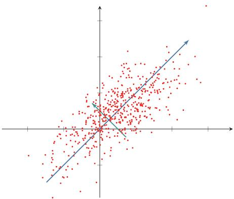  
图 10.1 主成分分析

$$
= \frac { 1 } { N } ( { \pmb w } ^ { \top } { \pmb X } - { \pmb w } ^ { \top } \bar { \pmb X } ) ( { \pmb w } ^ { \top } { \pmb X } - { \pmb w } ^ { \top } \bar { \pmb X } ) ^ { \top }\tag{10.3}
$$

$$
\begin{array} { r } { \mathbf { \Sigma } = \pmb { w } ^ { \intercal } \pmb { \Sigma } \pmb { w } , } \end{array}\tag{10.4}
$$

其中 $\bar { \mathbf { X } } = \bar { \mathbf { x } } \mathbf { 1 } _ { N } ^ { \top }$ 是向量x和N维全1向量 ${ \mathbf { 1 } } _ { N }$ 的外积，即有N列x组成的矩阵，$\begin{array} { r } { \Sigma = \frac { 1 } { N } ( X - \bar { X } ) ( X - \bar { X } ) ^ { \intercal } } \end{array}$ 是原始样本的协方差矩阵.

最大化投影方差 $\sigma ( X ; w )$ 并满足 $\mathbf { \nabla } w ^ { \top } w = 1$ ，利用拉格朗日方法转换为无约束优化问题，

$$
\operatorname* { m a x } _ { \boldsymbol { w } } \boldsymbol { w } ^ { \intercal } \Sigma \boldsymbol { w } + \lambda ( 1 - \boldsymbol { w } ^ { \intercal } \boldsymbol { w } ) ,\tag{10.5}
$$

其中λ为拉格朗日乘子.对上式求导并令导数等于0，可得

$$
\Sigma { \boldsymbol { w } } = \lambda { \boldsymbol { w } } .\tag{10.6}
$$

从上式可知， $\textbf { \em w }$ 是协方差矩阵Σ的特征向量，λ为特征值.同时

$$
\sigma ( X ; w ) = w ^ { \intercal } \Sigma w = w ^ { \intercal } \lambda w = \lambda .\tag{10.7}
$$

λ也是投影后样本的方差.因此，主成分分析可以转换成一个矩阵特征值分解问题，投影向量w为矩阵∑的最大特征值对应的特征向量.

如果要通过投影矩阵 $\pmb { W } \in \mathbb { R } ^ { D \times D ^ { \prime } }$ 将样本投到 $D ^ { \prime }$ 维空间，投影矩阵满足$W ^ { \top } W = I$ 为单位阵，只需要将∑的特征值从大到小排列，保留前 $D ^ { \prime }$ 个特征向量，其对应的特征向量即是最优的投影矩阵.

$$
\Sigma W = W \mathrm { d i a g } ( \lambda ) ,\tag{10.8}
$$

其中 $\lambda = [ \lambda _ { 1 } , \cdots , \lambda _ { D ^ { \prime } } ]$ 为Σ的前 $D ^ { \prime }$ 个最大的特征值.

主成分分析是一种无监督学习方法，可以作为监督学习的数据预处理方法，用来去除噪声并减少特征之间的相关性，但是它并不能保证投影后数据的类别

可分性更好．提高两类可分性的方法一般为监督学习方法，比如线性判别分析(Linear Discriminant Analysis,LDA).

参见习题10-6.

## 10.1.2 稀疏编码

稀疏编码（Sparse Coding）也是一种受哺乳动物视觉系统中简单细胞感受野而启发的模型.在哺乳动物的初级视觉皮层（Primary Visual Cortex）中，每个神经元仅对处于其感受野中特定的刺激信号（比如特定方向的边缘、条纹等特征）做出响应.局部感受野可以被描述为具有空间局部性、方向性和带通性[Olshausen et al.,1996]. 也就是说，外界信息经过编码后仅有一小部分神经元激活，即外界刺激在视觉神经系统的表示具有很高的稀疏性.编码的稀疏性在一定程度上符合生物学的低功耗特性

在数学上，(线性)编码是指给定一组基向量 $\pmb { A } = [ \pmb { a } _ { 1 } , \cdots , \pmb { a } _ { M } ]$ ，将输入样本$\pmb { x } \in \mathbb { R } ^ { D }$ 表示为这些基向量的线性组合

带通性是指不同尺度下空间结构的敏感性.比如，带通滤波器(Bandpass Filter)是指容许某个频率范围的信号通过，同时屏蔽其他频段的设备.

$$
\boldsymbol { x } = \sum _ { m = 1 } ^ { M } z _ { m } \boldsymbol { a } _ { m }\tag{10.9}
$$

$$
\ d s = \mathbf { A } \boldsymbol { z } ,\tag{10.10}
$$

其中基向量的系数 $\boldsymbol { z } = [ z _ { 1 } , \cdots , z _ { M } ]$ 称为输入样本x的编码（Encoding），基向量A也称为字典（Dictionary）.

编码是对D维空间中的样本x找到其在M维空间中的表示（或投影）.不同的编码方法会对表示施加不同的约束，比如低维、低相关、稀疏、独立、可重构等.主成分分析也可以看作一种编码方法，但它得到的表示通常是稠密向量，没有显式的稀疏性约束

## 数学小知识|完备性

如果一组基向量能够张成 $\mathbb { R } ^ { D }$ ,则称这组基向量在 $\mathbb { R } ^ { D }$ 上是完备的.

如果基向量的个数等于空间维度，即 $M = D$ ，并且它们能够张成 $\mathbb { R } ^ { D }$ ,则这组基向量构成一组完备基.如果基向量的个数满足 $M > D$ ,但 仍然张成 $\mathbb { R } ^ { D }$ ,则称这组基向量是过完备的（overcomplete)或冗余的.


“过完备”意味着基向量个数多于支撑空间的维度，因此这些基向量一般不具备独立、正交等性质

为了得到稀疏的编码，我们通常需要找到一组“过完备”的基向量（即 $M >$ D）来进行编码.在过完备基向量之间往往会存在一些冗余性，因此对于同一个输入样本，往往存在多组可以较好重构输入的编码.加入稀疏性约束后，可以缩小解空间，并更有可能得到稳定、可辨识的稀疏表示.

给定一组N个输入向量 $\pmb { x } ^ { ( 1 ) } , \cdots , \pmb { x } ^ { ( N ) }$ ,其稀疏编码的目标函数定义为

$$
\mathcal { L } ( A , Z ) = \sum _ { n = 1 } ^ { N } \left( \left\| x ^ { ( n ) } - A z ^ { ( n ) } \right\| ^ { 2 } + \eta \rho ( z ^ { ( n ) } ) \right) ,\tag{10.11}
$$

其中 $Z = [ z ^ { ( 1 ) } , \cdots , z ^ { ( N ) } ]$ $\rho ( \cdot )$ 是一个稀疏性衡量函数，η是一个超参数，用来控制稀疏性的强度

对于一个向量 $z \in \mathbb { R } ^ { M }$ ，其稀疏性可以理解为非零元素所占比例很低.如果一个向量只有很少的几个非零元素，就说这个向量是稀疏的．稀疏性衡量函数$\rho ( z )$ 是给向量 $_ { z }$ 一个标量分数.z越稀疏， $\rho ( z )$ 越小.

稀疏性衡量函数有多种选择，最直接的衡量向量z稀疏性的函数是 $\ell _ { 0 }$ 范数

由于通常比较难以得到严格的稀疏向量，因此如果一个向量只有少数几个远大于零的元素，其他元素都接近于0，我们也称这个向量为稀疏向量.

$$
\rho ( z ) = \sum _ { m = 1 } ^ { M } I ( | z _ { m } | > 0 ) .\tag{10.12}
$$

但 $\ell _ { 0 }$ 范数不满足连续可导，因此很难进行优化.在实际中，稀疏性衡量函数通常使用 $\ell _ { 1 }$ 范数

$$
\rho ( z ) = \sum _ { m = 1 } ^ { M } | z _ { m } | ,\tag{10.13}
$$

或对数函数

$$
\rho ( z ) = \sum _ { m = 1 } ^ { M } \log ( 1 + z _ { m } ^ { 2 } ) ,\tag{10.14}
$$

或指数函数

参见习题10-2.

$$
\rho ( z ) = \sum _ { m = 1 } ^ { M } - \exp ( - z _ { m } ^ { 2 } ) .\tag{10.15}
$$

## 10.1.2.1 训练方法

给定一组N个输入向量 $\{ \boldsymbol { x } ^ { ( n ) } \} _ { n = 1 } ^ { N }$ ，需要同时学习基向量A以及每个输入样本对应的稀疏编码 $\{ z ^ { ( n ) } \} _ { n = 1 } ^ { N }$

稀疏编码的训练过程一般用交替优化的方法进行.

1)固定基向量A,对每个输入 $\mathbf { \boldsymbol { x } } ^ { ( n ) }$ ，计算其对应的最优编码

$$
\operatorname* { m i n } _ { z ^ { ( n ) } } { \left\| { \pmb x } ^ { ( n ) } - { \pmb A } z ^ { ( n ) } \right\| } ^ { 2 } + \eta \rho ( z ^ { ( n ) } ) , 1 \leq n \leq N .\tag{10.16}
$$

2)固定上一步得到的编码 $\{ z ^ { ( n ) } \} _ { n = 1 } ^ { N }$ ,计算其最优的基向量

$$
\operatorname* { m i n } _ { \pmb { A } } \sum _ { n = 1 } ^ { N } \left( \left\| \pmb { x } ^ { ( n ) } - \pmb { A } \pmb { z } ^ { ( n ) } \right\| ^ { 2 } \right) + \lambda \frac { 1 } { 2 } \| \pmb { A } \| ^ { 2 } ,\tag{10.17}
$$

其中第二项为正则化项，λ为正则化项系数

## 10.1.2.2 稀疏编码的优点

稀疏编码的每一维都可以被看作一种特征.和基于稠密向量的分布式表示相比，稀疏编码具有较好的可解释性，并且在后续计算中能够利用稀疏结构提升效率.

（1）可解释性因为稀疏编码只有少数的非零元素，相当于将一个输入样本表示为少数几个相关的特征.这样我们可以更好地描述其特征，并易于理解.

（2）特征选择稀疏性带来的一个好处是可以实现特征的自动选择，只突出和输入样本最相关的少数特征，从而更高效地表示输入样本，降低噪声并减轻过拟合.

（3）计算效率需要注意的是，学习稀疏编码本身往往需要迭代优化，并不一定比稠密表示更便宜；但当表示已经学好之后，若后续模型能够显式利用稀疏结构，则可以减少存储和计算开销.

## 10.1.3 自编码器

自编码器（Auto-Encoder，AE）是通过无监督的方式来学习一组数据的有效编码(或表示).

假设有一组D维的样本 $\pmb { x } ^ { ( n ) } \in \mathbb { R } ^ { D } , 1 \leq n \leq N$ ，自编码器将这组数据映射到特征空间得到每个样本的编码 $z ^ { ( n ) } \in \mathbb { R } ^ { M } , 1 \le n \le N$ ，并且希望这组编码可以重构出原来的样本.

自编码器的结构可分为两部分：

(1）编码器（Encoder)f :RD → RM；

（2）解码器 $( \mathrm { D e c o d e r } ) \boldsymbol { g } : \mathbb { R } ^ { M }  \mathbb { R } ^ { D } .$

自编码器的学习目标是最小化重构错误（Reconstruction Error）：

$$
\mathcal { L } = \sum _ { n = 1 } ^ { N } \| \pmb { x } ^ { ( n ) } - g ( f ( \pmb { x } ^ { ( n ) } ) ) \| ^ { 2 }\tag{10.18}
$$

$$
= \sum _ { n = 1 } ^ { N } \| \pmb { x } ^ { ( n ) } - ( g \circ f ) ( \pmb { x } ^ { ( n ) } ) \| ^ { 2 } .\tag{10.19}
$$

如果特征空间的维度M小于原始空间的维度D，自编码器相当于是一种降维或特征抽取方法.如果 $M \geq D$ 且模型容量足够大，自编码器很容易退化为近似的恒等函数（IdentityFunction），从而仅仅“复制”输入.这样的解虽然重构误差很小，但学到的表示未必有意义．因此，通常还需要引入额外约束，比如编码的低维性、稀疏性、噪声鲁棒性、取值范围，或对f和q的具体形式进行限制如果进一步限制编码只能取K个不同的值 $( K < N )$ ，那么自编码器也可以从另

恒等函数 I(x) = x.

一个角度看作一种向量量化（Vector Quantization）或K类聚类（Clustering）问题.

最简单的自编码器是如图10.2所示的两层神经网络．输入层到隐藏层用来编码，隐藏层到输出层用来解码，层与层之间互相全连接.

  
图10.2 两层网络结构的自编码器

对于样本 $_ { \textbf { \em x } }$ ，自编码器中间隐藏层的活性值为x的编码，即

$$
\pmb { z } = f ( \pmb { W } ^ { ( 1 ) } \pmb { x } + \pmb { b } ^ { ( 1 ) } ) ,\tag{10.20}
$$

自编码器的输出为重构的数据

$$
\pmb { x } ^ { \prime } = g ( \pmb { W } ^ { ( 2 ) } z + \pmb { b } ^ { ( 2 ) } ) ,\tag{10.21}
$$

其中 $W ^ { ( 1 ) } , W ^ { ( 2 ) } , b ^ { ( 1 ) } , b ^ { ( 2 ) }$ 为网络参数， $f ( \cdot )$ 和 $g ( \cdot )$ 分别为编码器和解码器的激活函数.如果 $\underset { \smile } { \spadesuit } W ^ { ( 2 ) }$ 等于 $W ^ { ( 1 ) }$ 的转置，即 $\boldsymbol { W } ^ { ( 2 ) } = \boldsymbol { W } ^ { ( 1 ) } ^ { \top }$ ,称为捆绑权重（TiedWeight）.捆绑权重自编码器的参数更少，因此更容易学习.此外，捆绑权重还在一定程度上起到正则化的作用

在线性激活函数、平方误差以及适当约束下，线性自编码器学习到的主子空间与主成分分析是密切相关的.因此，可以将自编码器看作主成分分析在线性情形下的一种推广，而非线性激活函数则进一步增强了它表示复杂数据流形的能力.

给定一组样本 $\pmb { x } ^ { ( n ) } \in [ 0 , 1 ] ^ { D } , 1 \leq n \leq N$ ，其重构损失可以写为

$$
\mathcal { L } = \sum _ { n = 1 } ^ { N } \Vert \pmb { x } ^ { ( n ) } - \pmb { x } ^ { \prime ( n ) } \Vert ^ { 2 } + \lambda \Vert \pmb { W } \Vert _ { F } ^ { 2 } .\tag{10.22}
$$

其中λ为正则化项系数.如果进一步将每一维输出解释为伯努利分布的参数，也可以使用交叉熵作为重构损失；平方误差则对应于更常见的高斯观测假设

我们使用自编码器是为了得到有效的数据表示，因此在训练结束后，一般会去掉解码器，只保留编码器.编码器的输出可以直接作为后续机器学习模型的输入.

## 10.1.4 稀疏自编码器

自编码器除了可以学习低维编码之外，也能够学习高维的稀疏编码.假设中间隐藏层z的维度M大于输入样本x的维度D，并让z尽量稀疏，这就是稀疏自编码器（Sparse Autoencoder,SAE）.和稀疏编码一样，稀疏自编码器的优点是有很高的可解释性，并同时进行了隐式的特征选择.

通过给自编码器中隐藏层单元z加上稀疏性限制，自编码器可以学习到数据中一些有用的结构.给定N个训练样本 $\{ \boldsymbol { x } ^ { ( n ) } \} _ { n = 1 } ^ { N }$ ，稀疏自编码器的目标函数为

$$
\mathcal { L } = \sum _ { n = 1 } ^ { N } \| \pmb { x } ^ { ( n ) } - \pmb { x } ^ { \prime ( n ) } \| ^ { 2 } + \eta \rho ( \pmb { Z } ) + \lambda \| \pmb { W } \| ^ { 2 } ,\tag{10.23}
$$

其中 $Z = [ z ^ { ( 1 ) } , \cdots , z ^ { ( N ) } ]$ 表示所有训练样本的编码， $\rho ( Z )$ 为稀疏性度量函数， $W$ 表示自编码器中的参数

稀疏性度量函数 $\rho ( Z )$ 可以使用公式(10.13)\~公式(10.15)中的稀疏性定义，分别计算每个编码 $z ^ { ( n ) }$ 的稀疏度，再进行求和.此外， $\rho ( Z )$ 还可以定义为一组训练样本中每一个神经元激活的概率.这里通常要求隐藏层激活值 $z _ { j } ^ { ( n ) }$ 位于[0,1]区间内，例如采用sigmoid激活函数，此时平均活性值可近似解释为神经元的激活概率.

给定N个训练样本，隐藏层第 $j$ 个神经元平均活性值为

$$
\hat { \rho } _ { j } = \frac { 1 } { N } \sum _ { n = 1 } ^ { N } z _ { j } ^ { ( n ) } ,\tag{10.24}
$$

其中 ${ \hat { \rho } } _ { j }$ 可以近似地看作第 $j$ 个神经元激活的概率.我们希望 $\hat { \rho } _ { j }$ 接近于一个事先给定的值 $\rho ^ { * }$ ，比如0.05，可以通过KL距离来衡量 $\hat { \rho } _ { j }$ 和 $\rho ^ { * }$ 的差异，即

$$
\mathrm { K L } ( \rho ^ { * } \| \hat { \rho } _ { j } ) = \rho ^ { * } \log \frac { \rho ^ { * } } { \hat { \rho } _ { j } } + ( 1 - \rho ^ { * } ) \log \frac { 1 - \rho ^ { * } } { 1 - \hat { \rho } _ { j } } .\tag{10.25}
$$

如果 $\hat { \rho } _ { j } = \rho ^ { * }$ ,则KL $_ { \ i } ( \rho ^ { * } \| \hat { \rho } _ { j } ) = 0$

稀疏性度量函数定义为

$$
\rho ( Z ) = \sum _ { j = 1 } ^ { M } \mathrm { K L } ( \rho ^ { * } \| \widehat { \rho } _ { j } ) .\tag{10.26}
$$

## 10.1.5 堆叠自编码器

对于很多数据来说，仅使用两层神经网络的自编码器还不足以获取一种好的数据表示.为了获取更好的数据表示，可以使用更深层的神经网络．深层神经网络作为自编码器提取的数据表示一般会更加抽象，能够更好地捕捉到数据的语义信息.在实践中，可以使用逐层堆叠的方式来训练一个深层的自编码器，称为堆叠自编码器（Stacked Auto-Encoder,SAE）.堆叠自编码器一般采用逐层训练(Layer-Wise Training)来学习网络参数[Bengio et al., 2007].

需要说明的是，堆叠自编码器在深度学习早期具有重要的历史意义：当时深层网络较难直接优化，逐层无监督预训练可以提供较好的参数初始化.随着更大规模的数据、更稳定的优化方法以及更深网络结构的发展，逐层预训练已不再是主流训练方式，但其“先通过无标注数据学习表示，再迁移到下游任务”的思想，对后来的自监督预训练产生了深远影响.

## 10.1.6 降噪自编码器

我们使用自编码器是为了得到有效的数据表示，而有效的数据表示除了具有较小的重构误差或稀疏性等性质之外，还可以要求其具备其他性质，比如对数据随机损坏（Corruption）的鲁棒性.高维数据（比如图像）一般都具有一定的信息冗余，比如我们可以根据一张部分破损的图像联想出其完整内容.因此，我们希望自编码器也能够从部分损坏的数据中得到有效的数据表示，并能够恢复出完整的原始信息.

降噪自编码器（Denoising Auto-Encoder，DAE）就是一种通过引入噪声来增加编码鲁棒性的自编码器[Vincent et al., 2008]. 对于一个向量x,我们首先根据一个比例 $\mu$ 随机将x的一些维度的值设置为0，得到一个被损坏的向量x.然后将被损坏的向量输入给自编码器得到编码z,并重构出无损的原始输入x.

损坏比例μ一般不超过0.5. 也可以使用其他的方法来损坏数据，比如引入高斯噪声.

降噪自编码器的思想十分简单：通过引入噪声来学习更鲁棒的数据编码，并提高模型的泛化能力.它也可以看作现代自监督学习中“去噪重构”类目标的一个早期代表.图10.3给出了自编码器和降噪自编码器的对比，其中 $f _ { \theta }$ 为编码器，$g _ { \theta ^ { \prime } }$ 为解码器， $\boldsymbol { \mathcal { L } } ( \boldsymbol { x } , \boldsymbol { x } ^ { \prime } )$ 为重构误差.

  
(a) 自编码器

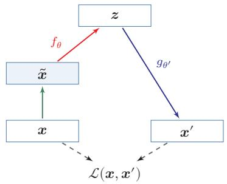  
(b) 降噪自编码器  
图 10.3 自编码器和降噪自编码器

## 10.2 概率密度估计

概率密度估计（Probabilistic Density Estimation），简称密度估计（Den-sityEstimation），是基于一些观测样本来估计一个随机变量的概率密度函数.密度估计是数据建模和机器学习中的常见基础问题.

密度估计方法可以分为两类:参数密度估计和非参数密度估计

## 10.2.1 参数密度估计

参数密度估计（Parametric Density Estimation）是根据先验知识假设随机变量服从某种分布，然后通过训练样本来估计分布的参数.

令 $\mathcal { D } = \{ \pmb { x } ^ { ( n ) } \} _ { n = 1 } ^ { N }$ 为从某个未知分布中独立抽取的N个训练样本，假设这些样本服从一个概率分布函数 $p ( { \boldsymbol { x } } ; { \boldsymbol { \theta } } )$ ,其对数似然函数为

$$
\log p ( \mathcal { D } ; \theta ) = \sum _ { n = 1 } ^ { N } \log p ( \mathbf { \mathcal { x } } ^ { ( n ) } ; \theta ) .\tag{10.27}
$$

使用最大似然估计（Maximum Likelihood Estimation，MLE）来寻找参数θ使得 $\log p ( \mathcal { D } ; \theta )$ 最大.这样参数估计问题就转化为最优化问题：

$$
\theta ^ { M L } = \underset { \theta } { \arg \operatorname* { m a x } } \sum _ { n = 1 } ^ { N } \log p ( \pmb { x } ^ { ( n ) } ; \theta ) .\tag{10.28}
$$

正态分布 假设样本 $\pmb { x } \in \mathbb { R } ^ { D }$ 服从正态分布

$$
\mathcal { N } ( { \pmb x } | { \pmb \mu } , { \pmb \Sigma } ) = \frac { 1 } { ( 2 \pi ) ^ { D / 2 } | { \pmb \Sigma } | ^ { 1 / 2 } } \exp \Big ( - \frac { 1 } { 2 } ( { \pmb x } - { \pmb \mu } ) ^ { \mathstrut \scriptscriptstyle \top } { \pmb \Sigma } ^ { - 1 } ( { \pmb x } - { \pmb \mu } ) \Big ) ,\tag{10.29}
$$

其中 $\pmb { \mu }$ 和Σ分别为正态分布的均值和协方差矩阵.

数据集 $\mathcal { D } = \{ \pmb { x } ^ { ( n ) } \} _ { n = 1 } ^ { N }$ 的对数似然函数为

$$
\log p ( \mathcal { D } | \mu , \Sigma ) = - \frac { N } { 2 } \log \Big ( ( 2 \pi ) ^ { D } | \Sigma | \Big ) - \frac { 1 } { 2 } \sum _ { n = 1 } ^ { N } ( { \pmb x } ^ { ( n ) } - { \pmb \mu } ) ^ { \top } \Sigma ^ { - 1 } ( { \pmb x } ^ { ( n ) } - { \pmb \mu } ) .\tag{10.30}
$$

分别求上式关于 $\mu , \Sigma$ 的偏导数，并令其等于0.可得，

$$
\mu ^ { M L } = \frac { 1 } { N } \sum _ { n = 1 } ^ { N } \pmb { x } ^ { ( n ) } ,\tag{10.31}
$$

$$
\pmb { \Sigma } ^ { M L } = \frac { 1 } { N } \sum _ { n = 1 } ^ { N } ( \pmb { x } ^ { ( n ) } - \pmb { \mu } ^ { M L } ) ( \pmb { x } ^ { ( n ) } - \pmb { \mu } ^ { M L } ) ^ { \top } .\tag{10.32}
$$

多项分布 假设样本服从K个状态的多项分布，令one-hot向量 ${ \pmb x } \in \{ 0 , 1 \} ^ { K }$ 来表示第k个状态，即 $x _ { k } = 1$ ，其余 $x _ { i , i \neq k } = 0$ 这里讨论的是一次离散取值的情形，因此 $p ( { \pmb x } | { \pmb \mu } )$ 更准确地说是概率质量函数：

多项分布参见第D.2.2.1节.

$$
p ( { \pmb x } | { \pmb \mu } ) = \prod _ { k = 1 } ^ { K } \mu _ { k } ^ { x _ { k } } ,\tag{10.33}
$$

其中 $\mu _ { k }$ 为第k个状态的概率，并满足 $\textstyle \sum _ { k = 1 } ^ { K } \mu _ { k } = 1$

数据集 $\mathcal { D } = \{ \pmb { x } ^ { ( n ) } \} _ { n = 1 } ^ { N }$ 的对数似然函数为

这里没有多项式系数.

$$
\log p ( \mathcal { D } | \mu ) = \sum _ { n = 1 } ^ { N } \sum _ { k = 1 } ^ { K } x _ { k } ^ { ( n ) } \log ( \mu _ { k } ) .\tag{10.34}
$$

多项分布的参数估计为约束优化问题.引入拉格朗日乘子λ，将原问题转换为无约束优化问题

拉格朗日乘子参考参见第C.3节.

$$
\operatorname* { m a x } _ { \mu , \lambda } \quad \sum _ { n = 1 } ^ { N } \sum _ { k = 1 } ^ { K } x _ { k } ^ { ( n ) } \log ( \mu _ { k } ) + \lambda \Big ( \sum _ { k = 1 } ^ { K } \mu _ { k } - 1 \Big ) .\tag{10.35}
$$

分别求上式关于 $\mu _ { k } , \lambda$ 的偏导数，并令其等于0.可得，

$$
\mu _ { k } ^ { M L } = \frac { m _ { k } } { N } , \qquad 1 \leq k \leq K\tag{10.36}
$$

其中 $\begin{array} { r } { m _ { k } = \sum _ { n = 1 } ^ { N } x _ { k } ^ { ( n ) } } \end{array}$ 为数据集中取值为第k个状态的样本数量.

在实际应用中，参数密度估计一般存在以下问题：

（1）模型选择问题：即如何选择数据分布的密度函数.实际数据的分布往往比简单的正态分布或多项分布更复杂.

（2）不可观测变量问题：即用来训练的样本可能只包含部分可观测变量，而一些影响数据生成过程的关键因素无法直接观测，这会增加估计真实分布的难度.

包含不可观测变量的密度估计问题一般需要使用EM算法，参见第14.2.2.1节.

（3）维度灾难问题：即高维数据的参数估计通常更困难.随着维度增加，估计分布所需的样本数量往往会快速增加；在样本不足时，模型容易过拟合.

## 10.2.2 非参数密度估计

非参数密度估计（Nonparametric Density Estimation）是不假设数据服从某种分布，通过将样本空间划分为不同的区域并估计每个区域的概率来近似数据的概率密度函数

对于高维空间中的一个随机向量x，假设其服从一个未知分布 $p ( { \pmb x } )$ ,则x落入空间中的小区域R的概率为

$$
\begin{array} { r } { P = \int _ { \mathcal { R } } p ( \pmb { x } ) d \pmb { x } . } \end{array}\tag{10.37}
$$

给定N个训练样本 $\mathcal { D } = \{ \pmb { x } ^ { ( n ) } \} _ { n = 1 } ^ { N }$ ，落入区域R的样本数量K服从二项分布：

$$
P _ { K } = \binom { N } { K } P ^ { K } ( 1 - P ) ^ { N - K } ,\tag{10.38}
$$

其中 $K / N$ 的期望为E $[ K / N ] = P$ ,方差为 $\mathrm { v a r } ( K / N ) = P ( 1 - P ) / N$ 当N足够大时，我们可以近似认为

$$
P \approx { \frac { K } { N } } .\tag{10.39}
$$

假设区域R足够小，其内部的概率密度是相同的，则有

$$
\begin{array} { r } { P \approx p ( \pmb { x } ) V , } \end{array}\tag{10.40}
$$

其中V为区域R的体积.结合上述两个公式，得到

$$
p ( { \pmb x } ) \approx \frac { K } { N V } .\tag{10.41}
$$

根据公式(10.41),要准确地估计 $p ( { \pmb x } )$ ，需要尽量使得样本数量N足够大，区域体积V尽可能地小.但在具体应用中，样本数量一般是有限的，过小的区域会导致落入该区域的样本比较少，这样估计的概率密度就不太准确．因此，实践中非参数密度估计通常使用两种方式：1）固定区域大小V，统计落入不同区域的数量，这种方式包括直方图方法和核方法两种；2）改变区域大小以使得落入每个区域的样本数量为K，这种方式称为K近邻方法.

直方图方法 直方图方法（Histogram Method)是一种直观的估计连续变量密度函数的方法，可以表示为一种柱状图

以一维随机变量为例，首先将其取值范围分成M个连续的、不重叠的区间(bin)，每个区间的宽度为 $\Delta _ { m }$ .给定N个训练样本 $\mathcal { D } = \{ x ^ { ( n ) } \} _ { n = 1 } ^ { N }$ ，我们统计这些样本落入每个区间的数量 $K _ { m }$ ，然后将它们归一化为密度函数.

Histogram 源自希腊语 histos(竖立)和gramma（描绘)，由英国统计学家卡尔·皮尔逊于1895年提出.

$$
p _ { m } = \frac { K _ { m } } { N \Delta _ { m } } , \qquad 1 \leq m \leq M\tag{10.42}
$$

其中区间宽度 $\Delta _ { m }$ 通常设为相同的值 $\Delta .$ 直方图方法的关键问题是如何选取一个合适的区间宽度 $\Delta .$ 如果 $\Delta$ 太小，那么落入每个区间的样本数量会比较少，其估计的区间密度也具有很大的随机性.如果 $\Delta$ 太大，其估计的密度函数变得十分平滑，很难反映出真实的数据分布．图10.4给出了直方图密度估计的例子，其中蓝线表示真实的密度函数，红色的柱状图为直方图方法估计的密度

  
(a) 10个区间（bin)

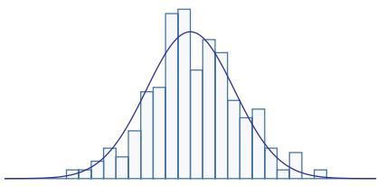  
(b) 30个区间（bin)  
图 10.4 直方图密度估计

直方图通常用来处理低维变量，可以快速地对数据的分布进行可视化，但其缺点是不易扩展到高维变量．假设一个D维的随机向量，如果每一维都划分为M个区间，那么整个空间的区间数量为 $M ^ { D }$ 个.直方图方法需要的样本数量会随着维度D的增加而快速增长，从而导致维度灾难（Curse of Dimensionality）问题.

核方法 核密度估计（Kernel Density Estimation）,也叫Parzen窗方法，是一种直方图方法的改进

假设R为D维空间中的一个以点x为中心的“超立方体”，并定义核函数(Kernel Function)为

$$
\phi \Bigl ( \frac { z - \mathbf { x } } { H } \Bigr ) = \left\{ \begin{array} { l l } { 1 \qquad \mathrm { i f ~ } | z _ { i } - x _ { i } | < \frac { H } { 2 } , 1 \le i \le D } \\ { 0 \qquad \mathrm { e l s e } } \end{array} \right.\tag{10.43}
$$

来表示一个样本 $_ z$ 是否落入该超立方体中，其中H为超立方体的边长，也称为核函数的宽度.

给定N个训练样本 $\mathcal { D } = \{ \pmb { x } ^ { ( n ) } \} _ { n = 1 } ^ { N }$ ,落入区域R的样本数量K为

$$
K = \sum _ { n = 1 } ^ { N } \phi \Bigl ( \frac { { \pmb x } ^ { ( n ) } - { \pmb x } } { H } \Bigr ) ,\tag{10.44}
$$

则点x的密度估计为

$$
p ( { \pmb x } ) = \frac { K } { N H ^ { D } } = \frac { 1 } { N H ^ { D } } \sum _ { n = 1 } ^ { N } \phi \Big ( \frac { { \pmb x } ^ { ( n ) } - { \pmb x } } { H } \Big ) ,\tag{10.45}
$$

其中 $H ^ { D }$ 表示超立方体R的体积.

除了超立方体的核函数之外，我们还可以选择更加平滑的核函数，比如高斯核函数：

$$
\phi \Bigl ( { \frac { z - { \pmb x } } { H } } \Bigr ) = { \frac { 1 } { ( 2 \pi ) ^ { D / 2 } H ^ { D } } } \exp \Big ( - { \frac { \| z - { \pmb x } \| ^ { 2 } } { 2 H ^ { 2 } } } \Bigr ) ,\tag{10.46}
$$

其中H控制高斯核函数的宽度.这样，点x的密度估计为

$$
p ( \pmb { x } ) = \frac { 1 } { N } \sum _ { n = 1 } ^ { N } \frac { 1 } { ( 2 \pi ) ^ { D / 2 } H ^ { D } } \exp \Big ( - \frac { \| \pmb { x } ^ { ( n ) } - \pmb { x } \| ^ { 2 } } { 2 H ^ { 2 } } \Big ) .\tag{10.47}
$$

K近邻方法 核密度估计方法中的核宽度是固定的，因此同一个宽度可能对高密度的区域过大，而对低密度的区域过小，一种更灵活的方式是设置一种可变宽度的区域，并使得落入每个区域中样本数量为固定的K.要估计点x的密度，首先找到一个以x为中心的球体，使得落入球体的样本数量为K，然后根据公式(10.41),就可以计算出点x的密度.因为落入球体的样本也是离x最近的K个样本，所以这种方法称为K近邻方法（K-Nearest Neighbor Method).

K近邻方法并不是一个严格的密度函数估计方法，参见习题10-10.

在K近邻方法中，K的选择也十分关键.如果K太小，无法有效地估计密度函数；而K太大也会使得局部的密度不准确，并且增加计算开销.

K近邻方法也经常用于分类问题,称为K近邻分类器（K-Nearest NeighborClassifier）.当K = 1时，也称为最近邻分类器（Nearest Neighbor Classifier）.最近邻分类器的一个性质是，当 $N  \infty$ 时，其分类错误率不超过最优分类器错误率的两倍[Cover et al., 1967].

从生成建模的角度看，概率密度估计也是重要基础.扩散模型（DiffusionModel）和得分建模（Score-based Modeling）等现代生成方法虽然在具体形式上与本节介绍的经典方法不同，但它们的核心目标仍然是学习数据分布或与数据分布相关的梯度信息.也就是说，经典密度估计方法提供了理解现代生成模型的一条重要入口.

## 10.3 聚类

聚类（Clustering）的目标是在没有人工类别标签的情况下，根据样本之间的相似性把数据划分为若干个簇.与前面介绍的特征学习不同，聚类的输出通常不是一个连续表示，而是一组离散的簇编号；与密度估计不同，聚类不一定显式给出完整的数据分布，而是更关注“哪些样本应当被看作同一类”.因此，聚类可以看作无监督学习中介于表示学习和结构发现之间的一类任务

经典的聚类方法之一是K-Means算法（K-Means Algorithm）.给定样本集合 $\{ \mathbf { \boldsymbol { x } } ^ { ( n ) } \} _ { n = 1 } ^ { N }$ 和簇数K，K-Means希望同时找到每个样本的簇分配 $r _ { n } \in$ $\{ 1 , \cdots , K \}$ 以及每个簇的中心 $\pmb { \mu } _ { k }$ ，使组内平方距离之和最小：

$$
\operatorname* { m i n } _ { \{ r _ { n } \} , \{ \pmb { \mu } _ { k } \} _ { k = 1 } ^ { K } } \sum _ { n = 1 } ^ { N } \left\| \pmb { x } ^ { ( n ) } - \pmb { \mu } _ { r _ { n } } \right\| ^ { 2 } .\tag{10.48}
$$

这一目标通常通过交替优化来求解：先在固定簇中心时把每个样本分配给最近的中心，再在固定分配时把每个簇中心更新为簇内样本的平均值，这个过程简单高效，但也有明显限制：需要预先指定K，对初始化和特征尺度敏感，容易收敛到局部最优，并且隐含了“簇近似为球形、距离度量有意义”的假设.

理解聚类时要特别注意它和表示学习的关系．聚类结果强烈依赖所使用的特征空间和距离度量：在原始像素空间中接近的图像未必语义相近，而在经过自编码器、自监督模型或其他表示学习方法得到的表征空间中，聚类结果往往更能反映语义结构．因此，聚类既可以作为一个独立的无监督任务，也常被用来评估或辅助表示学习.

聚类的评价也没有统一答案.如果完全没有标签，可以使用组内平方误差、轮廓系数等内部指标来衡量簇的紧凑性和分离性；如果只把少量人工标签作为事后评估信息，则可以使用纯度、归一化互信息等外部指标.但这些指标都只能反映某一类偏好，不能自动保证聚类结果符合真实任务需求．例如，在同一批文档上，按主题聚类、按写作风格聚类或按时间聚类都可能是合理的，只是对应的问题不同.如果聚类结果还要作为下游模型的输入或伪标签，也应在验证集或独立样本上检查其稳定性，避免把偶然的簇结构当作可靠类别

## 10.4 自监督学习

自监督学习（Self-SupervisedLearning，SSL）是一类不依赖人工标注、而是直接从数据自身构造监督信号的学习方法.从训练形式上看，自监督学习和监督学习并没有本质区别：都是通过“输入-目标”对来学习一个映射函数；但不同之处在于，这里的“目标”不是由人工标注得到的，而是由原始数据自动生成的因此，自监督学习通常也被看作无监督学习的一种重要实现方式

从广义上讲，自编码器也可以看作自监督学习方法，因为它直接以输入自身作为学习目标，通过“输入→编码→重构输入”的方式学习表示.尤其是降噪自编码器，更接近现代自监督学习中常见的“去噪重构”任务.不过，在现代文献中提到“自监督学习”时，通常更强调面向预训练的任务设计以及表示的迁移能力，比如下一个词元预测、掩码建模、对比学习等.

自监督学习的核心思想是：利用输入数据的一部分去预测另一部分，或者通过比较不同样本（或同一样本的不同视图）来学习有效表示.

和主成分分析、稀疏编码、自编码器等经典无监督特征学习方法相比，自监督学习更强调预训练（Pre-Training）任务的设计.一个好的预训练任务应当使模型能够从大量无标注数据中学习到可迁移的表示.

从训练目标来看，现代自监督学习中的预训练任务大致可以分为几类：预测型任务（如下一个词元预测）、掩码重构型任务（如掩码建模和去噪重构）、对比型任务（拉近正样本并拉远负样本）以及跨模态任务（利用图像、文本、语音等不同模态之间的天然对应关系来学习共享表示).这一分类有助于从更统一的角度理解各种自监督方法之间的联系.

## 10.4.1 下一个词元预测

在自然语言处理，尤其是大语言模型中，常用的一类自监督任务是预测下一个词元（Next-TokenPrediction，NTP），也常称为因果语言建模（CausalLanguageModeling，CLM）.其基本思想是：给定前面的词元（Token）序列，让模型预测当前位置最可能出现的下一个词元.

设一个词元序列为 ${ \pmb x } = [ x _ { 1 } , x _ { 2 } , \cdots , x _ { T } ]$ ，则自回归语言模型将整个序列的概率分解为

$$
p ( \pmb { x } ) = \prod _ { t = 1 } ^ { T } p ( x _ { t } \mid x _ { < t } ) ,\tag{10.49}
$$

其中 $\boldsymbol { x } _ { < t } = [ x _ { 1 } , \cdots , x _ { t - 1 } ]$ 表示位置t之前的上下文.对训练集上的最大似然学习可以写为最小化负对数似然：

$$
\mathcal { L } _ { \mathrm { N T P } } = - \sum _ { n = 1 } ^ { N } \sum _ { t = 1 } ^ { T _ { n } } \log p ( x _ { t } ^ { ( n ) } \mid x _ { < t } ^ { ( n ) } ) .\tag{10.50}
$$

这种训练方式的监督信号完全来自原始文本自身：对于序列中的每一个位置，真实出现的下一个词元就是天然的学习目标，因此它是一种典型的自监督学习任务.通过在海量文本上进行这种训练，模型能够逐步学习词法、句法、语义、常识以及一定程度上的推理模式. $\mathrm { G P T }$ 系列、LLaMA系列等大语言模型都主要采用这一训练目标 [Brown et al., 2020; Touvron et al., 2023]. 实践表明，当模型规模、数据规模和训练计算同时扩大时，仅依靠这一看似简单的自监督目标，也能够学习到具有较强迁移能力和少样本泛化能力的参数表示.这种规律被称为规模法则（Scaling Law).

大语言模型的预训练参见第13.2节.

## 10.4.2 掩码建模

掩码建模是一类最常见的自监督学习方法，其基本思想是：先将输入中的一部分信息遮蔽掉，再让模型根据其余部分恢复被遮蔽的内容.掩码预测可以看作掩码建模在离散符号上的一种具体形式.

以词元序列为例，设输入词元序列为 ${ \pmb x } = [ x _ { 1 } , x _ { 2 } , \cdots , x _ { T } ] , m ( { \pmb x } )$ 表示被掩码的位置集合， ${ \pmb x } _ { \backprime m ( \pmb x ) }$ 表示剩余未被遮蔽的部分，则掩码建模的目标为

$$
\mathcal { L } _ { \mathrm { M L M } } = - \sum _ { t \in m ( \pmb { x } ) } \log p \big ( x _ { t } \mid \pmb { x } _ { \backslash m ( \pmb { x } ) } \big ) .\tag{10.51}
$$

这种方法的优点在于：模型在预测被遮蔽内容时，需要综合利用上下文信息，因此能够学习到更强的双向表示能力，BERT采用了这种训练方式，并显著推动了自然语言处理中的预训练模型发展[Devlin et al.,2019]. 类似地，在视觉任务中，也可以随机遮蔽图像中的一部分区域或图像块，再让模型恢复这些缺失内容，从而学习图像表示.这种思路也可用于视觉中的掩码自编码建模，例如MAE（MaskedAutoencoder）通过随机遮蔽大量图像块并重构缺失内容来学习图像表示[He et al.,2022],说明“掩码建模”是一种跨模态的通用自监督范式.

下一个词元预测与掩码建模都属于“从上下文中恢复缺失信息”的自监督任务，但两者也存在明显差异，下一个词元预测采用从左到右的单向建模方式，更适合文本生成；而掩码建模通常利用双向上下文来恢复被遮蔽位置，更适合理解型表示学习.二者共同构成了现代自然语言预训练的两条重要技术路线.

## 10.4.3 对比学习

另一类重要的自监督学习方法是对比学习（Contrastive Learning）.其基本思想是：让模型学会“相似样本的表示更接近，不相似样本的表示更远离”.

设x为一个样本， ${ \pmb x } ^ { + }$ 为与其语义相关的正样本， ${ \mathbf { } } { \mathbf { } } { \mathbf { } } { \mathbf { } } { \mathbf { } } { \mathbf { } } { \mathbf { } } { \mathbf { } } { \mathbf { } } { \mathbf { } } { \mathbf { } } { \mathbf { } } { \mathbf { } } { \mathbf { } } { \mathbf { } } { \mathbf { } } { \mathbf { } } { \mathbf { } } { \mathbf { } } { \mathbf { } } { \mathbf { } } { \mathbf { } } { \mathbf { } } { \mathbf { } } { \mathbf { } } { \mathbf { } } { \mathbf { } } { \mathbf { } } { \mathbf { } } { \mathbf { } } { \mathbf { } } { \mathbf { } } { \mathbf { } { } \mathbf { } { } } { \mathbf { } } { \mathbf { } } { \mathbf { } { } \mathbf { } { } \mathbf { } { } } { \mathbf { } \mathbf { } { } } { \mathbf { } \mathbf { } { } \mathbf { } { } \mathbf { } } { \mathbf { } } { \mathbf { } \mathbf { } { } \mathbf { } } { \mathbf { } \mathbf { } { } \mathbf { } } { \mathbf { } \mathbf { } { } \mathbf { } } { \mathbf { } \mathbf { } }$ 为负样本.记编码器为$f ( \cdot )$ ,样本表示为

$$
z = f ( { \pmb x } ) , \qquad z ^ { + } = f ( { \pmb x } ^ { + } ) , \qquad z ^ { - } = f ( { \pmb x } ^ { - } ) .\tag{10.52}
$$

则一个常见的对比学习目标为

$$
\mathcal { L } _ { \mathrm { C T L } } = - \log \frac { \exp { ( \sin ( z , z ^ { + } ) / \tau ) } } { \exp { ( \sin ( z , z ^ { + } ) / \tau ) } + \sum _ { z ^ { - } \in \mathcal { N } } \exp { ( \sin ( z , z ^ { - } ) / \tau ) } } ,\tag{10.53}
$$

其中sim(·,·)表示相似度函数(如点积或余弦相似度)，τ为温度参数，N表示负样本集合.

对比学习的关键在于如何构造正样本和负样本.例如，同一个样本经过不同的数据增强后可以构成正样本对，不同样本之间可构成负样本对.通过这种“比较式”的训练，模型能够学习到更具有判别性的表示.以SimCLR为代表的方法系统展示了对比学习在视觉表示学习中的有效性[Chen et al., 2020]. 对比学习的思想也可以迁移到语音、自然语言处理等领域.

后续工作进一步改进了这类表示学习方法的效率和简洁性.MoCo使用动量编码器和队列机制,降低了对大批量负样本的依赖[He et al., 2020]. BYOL和SimSiam等非对比式方法不显式构造负样本，而是通过“停止梯度”等技巧避免表示坍塌 [Chen et al., 2021; Grill et al., 2020].

## 10.4.4 联合嵌入预测

除了重构原始输入和进行显式对比之外，自监督学习还可以直接预测表示本身，而不必恢复低层细节．这类方法有时也可以看作一种联合嵌入预测（Joint-EmbeddingPredictive Learning）：模型首先把输入映射到某种表征空间中，再利用一个视图或上下文去预测另一个视图或被遮蔽区域的表征

这类方法的一个重要特点是：它不一定要求恢复像素、词元等原始信号，而是直接学习更抽象的语义特征.从这个角度看，自监督学习的目标已经不仅是“重构输入”，也可以是“预测有意义的高层表示”．这种思想进一步丰富了现代自监督学习的任务设计空间. I-JEPA就是这一方向的一个代表性例子[Assranet al., 2023].

## 10.4.5 多模态自监督学习

自监督学习并不局限于单一模态.当不同模态之间天然成对出现时，例如图像与文本、语音与文本、视频与音频，就可以利用这种对应关系来构造自监督任务，例如，可以要求模型判断图文是否匹配，或者通过跨模态对比学习，使匹配的图像和文本在表示空间中更接近，而不匹配的样本更远离.以CLIP风格的方法为例，给定一批图像-文本对，模型可以通过比较正确配对与错误配对之间的相似度,学习共享的语义表示空间 [Radford et al., 2021].

多模态自监督学习的重要意义在于：它能够学习不同模态之间的共享语义空间，从而为多模态检索、视觉问答以及多模态大模型奠定基础.从这个角度看，自监督学习已经从“单模态表示学习”发展为“跨模态知识对齐”的重要范式

与监督学习不同，无监督学习和自监督学习往往没有一个统一、直接的评价标准，因此，在实践中，人们通常通过下游任务表现来间接评估学到的表示是否有效．例如，可以用线性探测、微调后的验证集性能、检索指标、重构误差或生成样本质量等方式进行评估.需要注意的是，预训练损失、聚类内部指标或重构误差只是代理指标，未必总能反映真实任务需求；在用自监督模型输出概率分数时，也应结合第2章中的校准思想检查其置信度是否可靠.

## 10.4.6 自监督学习的特点

自监督学习的主要优点包括：

（1）无需人工标注：可以充分利用海量无标注数据；

（2）表示可迁移：预训练得到的表示可以迁移到多个下游任务；

（3）任务灵活：可以根据数据类型设计不同的预训练任务，如预测、重构、对比、判别等.

自监督学习是深度学习中学习通用表示的重要方法之一，在标注数据较少、预训练数据与下游任务相关时，模型先通过大规模无标注数据进行自监督预训练，再利用少量标注数据进行微调，通常能够提升下游任务表现；但最终效果仍取决于数据分布、预训练任务和微调方式是否匹配.

## 10.5 总结和扩展阅读

无监督学习的核心任务是在没有人工标签的条件下，从数据中发现有用结构.本章围绕四条主线展开了这一主题.

第一条主线是经典无监督特征学习．主成分分析通过保留方差最大的方向来实现降维；稀疏编码通过“少量特征激活”的方式得到更有解释性的表示；自编码器则通过重构输入来学习特征表示，并进一步引出了稀疏自编码器、堆叠自编码器和降噪自编码器等扩展形式.这些方法虽然目标函数不同，但共同体现了一个基本思想：好的表示应当保留数据中的关键信息，同时去除冗余、噪声或不稳定因素.

第二条主线是概率密度估计．与前一类方法强调“学习表示”不同，密度估计更关注“学习分布”．参数密度估计通过假设数据服从某个参数化分布并估计其参数来建模数据：非参数密度估计则尽量减少分布形式上的先验假设，直接根据样本估计密度.沿着这条思路继续深入，就会自然过渡到本书后续的概率图模型、隐变量模型以及更复杂的深度生成模型.

第三条主线是聚类.聚类把样本划分为若干个簇，试图发现数据中潜在的离散结构.K-Means等方法强调组内相似、组间差异，但聚类结果依赖特征空间、距离度量和簇数选择，因此它既可以作为独立的结构发现任务，也可以作为表示学习的一种评估或辅助工具.

第四条主线是自监督学习.现代大模型的发展说明，来自数据自身的监督信号可以成为表示学习的重要来源.下一个词元预测、掩码建模、去噪重构、对比学习、非对比学习以及多模态自监督学习，虽然预训练任务的形式不同，但都体现了同一个核心思想：通过设计合适的代理任务，让模型在大量无标注数据上学习可迁移的表示，换句话说，现代自监督学习并没有脱离无监督学习，而是在更大规模数据、更强模型和更明确的预训练目标下，发展出了新的训练范式

从全章来看，表示学习、概率建模、结构发现与预训练任务设计构成了理解无监督学习的四个关键词.前三者奠定了经典机器学习中“如何从数据中提取结构”的基础，后一者则成为理解预训练模型、大语言模型和多模态模型的重要入口.

如果希望从经典机器学习的视角进一步理解本章内容，可以沿着“表示学习”“结构发现”和“概率建模”几条线继续阅读.对于聚类问题，可参考《机器学习》[周志华，2016]第9章；对于无监督特征学习，可参考《机器学习》[周志华，2016]第10章以及《Pattern Classification》[Duda et al., 2001]第10章；对于非参数密度估计的一般方法和理论背景,则可参考[Duda et al., 2001]、[Bishop,2007]和[Devroye et al., 1985]. 阅读这些内容时,建议特别关注不同方法究竞是在学习“表示”、学习“分布”、发现“簇结构”，还是在完成某种中间代理任务，这有助于把看似分散的方法统一到同一个视角下.

如果希望从现代深度学习的视角延伸本章内容，则可以把注意力放在“预训练任务”上.下一个词元预测对应自回归建模，掩码建模和去噪重构强调从局部缺失中恢复信息，对比学习关注如何直接学习判别性表示，联合嵌入预测强调直接预测高层表征，而多模态自监督学习则进一步利用不同模态之间的天然对应关系.可以把这些方法看作几条相互关联的技术路线：预测型任务、重构型任务、对比型任务以及跨模态对齐任务．它们虽然形式不同，但都服务于“先用无标注数据学习通用表示，再迁移到下游任务”这一共同目标.

如果希望把经典概率建模与现代生成模型联系起来，可以将本章的概率密度估计看作一个出发点，在第14章中，我们会通过概率图模型介绍更一般的参数估计和含隐变量建模方法；在第15章和第16章中，会进一步介绍玻尔兹曼机、深度信念网络、变分自编码器和对抗生成网络等模型.

## 习题

## 基础题

习题10-1 分析主成分分析为什么具有数据降噪能力.

习题10-2 分析公式(10.14)和(10.15)在衡量稀疏性时各自的特点，并说明它们与 $\ell _ { 1 }$ 范数相比有什么异同.

习题10-3 自编码器为什么可以从广义上看作一种自监督学习方法?它和大语言模型中的“预测下一个词元”任务在训练信号来源上有什么共同点和不同点？

习题10-4说明聚类、无监督特征学习和概率密度估计三类任务的输出分别是什么.为什么说同一个数据集可以得到多种都合理的聚类结果?

## 提高题

习题10-5 证明对于N个样本（样本维数 $D > N )$ 组成的数据集，主成分分析的有效投影子空间维数不超过N-1.

习题10-6 对于一个二分类问题，试举例说明什么样的数据分布会使得主成分分析得到的特征反而降低分类性能，并分析其原因

习题10-7 对于一个C类分类问题，使用K近邻方法估计每个类 $c \ ( 1 \leq c \leq C )$ 的类条件密度函数 $p ( { \pmb x } \mid c )$ ，并结合贝叶斯公式写出后验概率 $p ( c \mid \pmb { x } )$ 的表达式.

习题10-8比较“下一个词元预测”和“掩码建模”两种自监督任务：它们的训练目标、上下文利用方式以及更适合支持的下游任务分别有什么不同？

## 拓展题

习题10-9 设中心化后的数据矩阵为 $X ^ { \prime } = X - { \bar { X } }$ 证明：若对 $X ^ { \prime }$ 做奇异值分解 $\pmb { X } ^ { \prime } = \pmb { U } \pmb { \Sigma } \pmb { V } ^ { \top }$ ,则U的列向量给出了主成分分析中的主方向.

习题10-10 举例说明，K近邻方法得到的密度估计一般不是严格意义上的概率密度函数，即其在整个空间上的积分不一定等于1，并解释这与它作为局部密度估计方法的关系.

习题10-11 选取一种数据类型（如文本、图像、语音或图文对），尝试设计一个自监督预训练任务，并说明：1）模型的输入是什么；2）监督信号如何由数据自身构造；3)该任务更适合学习什么类型的表示；4）它与掩码建模、对比学习或下一个词元预测相比有什么优点和局限

习题10-12 给定三个二维样本 $\pmb { x } ^ { ( 1 ) } = ( 1 , 2 ) ^ { \top } , \pmb { x } ^ { ( 2 ) } = ( 3 , 4 ) ^ { \top } , \pmb { x } ^ { ( 3 ) } = ( 5 , 6 ) ^ { \top }$ ,手动计算这组数据的协方差矩阵及其特征值和特征向量，并说明将数据投影到第一主成分方向后的一维表示.

## 参考文献

周志华，2016. 机器学习[M]. 北京：清华大学出版社.

ASSRAN M, DUVAL Q, MISRA I, et al., 2023. Self-supervised learning from images with a joint-embedding predictive architecture[C]//Proceedings of the IEEE/CVF Conference on Computer Vision and Pattern Recognition. 15619-15629.

BENGIO Y, LAMBLIN P, POPOVICI D, et al., 2007. Greedy layer-wise training of deep networks[C]//Advances in neural information processing systems. 153-160.

BISHOP C M, 2007. Information science and statistics: pattern recognition and machine learning[M]. 5th ed. Springer.

BROWN T B, MANN B, RYDER N, et al., 2020. Language models are few-shot learners[C]// Advances in Neural Information Processing Systems: Vol. 33. 1877-1901.

CHEN T, KORNBLITH S, NOROUZI M, et al., 2020. A simple framework for contrastive learning of visual representations[C//Proceedings of the 37th International Conference on Machine Learning. 1597-1607.

CHEN X, HE K, 2021. Exploring simple siamese representation learning[C]//Proceedings of the IEEE/CVF Conference on Computer Vision and Pattern Recognition. 15750-15758.

COVER T, HART P, 1967. Nearest neighbor pattern classification[J]. IEEE transactions on information theory, 13(1): 21-27.

DEVLIN J, CHANG M W, LEE K, et al., 2019. BERT: pre-training of deep bidirectional transformers for language understanding[C]//Proceedings of the 2019 Conference of the North American Chapter of the Association for Computational Linguistics: Human Language Technologies. 4171-4186.

DEVROYE L, GYORFI L, 1985. Wiley series in probability and statistics: nonparametric density estimation: the L1 view[M]. Wiley.

DUDA R O, HART P E, STORK D G, 2001. Pattern classification[M]. 2nd ed. Wiley.

GRILL J B, STRUB F, ALTCHÉ F, et al., 2020. Bootstrap your own latent: a new approach to self-supervised learning[C]//Advances in Neural Information Processing Systems: Vol. 33. 21271-21284.

HE K, FAN H, WU Y, et al., 2020. Momentum contrast for unsupervised visual representation learning[C]//Proceedings of the IEEE/CVF Conference on Computer Vision and Pattern Recognition. 9729-9738.

HE K, CHEN X, XIE S, et al., 2022. Masked autoencoders are scalable vision learners[C]// Proceedings of the IEEE/CVF Conference on Computer Vision and Pattern Recognition. 16000-16009.

HINTON G E, SEJNOWSKI T J, POGGIO T A, 1999. Unsupervised learning: foundations of neural computation[M]. MIT press.

OLSHAUSEN B A, et al., 1996. Emergence of simple-cell receptive field properties by learning a sparse code for natural images[J]. Nature, 381(6583): 607-609.

RADFORD A, KIM J W, HALLACY C, et al., 2021. Learning transferable visual models from natural language supervision[C]//Proceedings of the 38th International Conference on Machine Learning. 8748-8763.

TOUVRON H, LAVRIL T, IZACARD G, et al., 2023. LLaMA: open and efficient foundation language models[A/OL]. arXiv (2023). https://arxiv.org/abs/2302.13971.

VINCENT P, LAROCHELLE H, BENGIO Y, et al., 2008. Extracting and composing robust features with denoising autoencoders[C//Proceedings of the International Conference on Machine Learning. 1096-1103.

# 第11章 模型独立的学习方式

三个臭皮匠赛过诸葛亮.

——谚语

在前面的章节中，我们已经介绍了监督学习、无监督学习以及表示学习等基本内容.尤其是前一章介绍的自监督学习，为模型提供了从大规模无标注数据中获取通用表示的重要途径.然而，仅仅获得一个较好的表示还不够，在实际应用中还经常会遇到以下问题：训练数据和测试数据的分布不一致，目标任务的标注数据很少，新任务不断出现，或者我们希望模型能够在少样本下快速适应一个新任务.此时，如果仍然让每个任务都从零开始学习，就会受到数据规模、训练成本和泛化能力等多方面的限制

因此，人们开始关注一些超越“单任务、从零训练、一次性完成训练”的学习方式.本章介绍一些“模型独立的学习方式”，比如集成学习、半监督学习、多任务学习、迁移学习、持续学习和元学习等.这里“模型独立”是指这些学习方式并不依赖于某一种特定模型结构，不管是线性模型、决策树还是神经网络，都可以在合适的条件下采用这些学习方式.不过，这些学习方式的关注点并不是“模型形式”本身，而是如何复用已有知识、如何利用额外信息、以及如何让模型更快地适应不断变化的任务环境.

## 11.1 集成学习

给定一个学习任务，假设输入x和输出y的真实关系为 $\begin{array} { r } { \boldsymbol { y } = h ( \boldsymbol { x } ) } \end{array}$ .对于M个不同的模型 $f _ { 1 } ( { \pmb x } ) , \cdots , f _ { M } ( { \pmb x } )$ ，每个模型的期望错误为

$$
\mathcal { R } ( f _ { m } ) = \mathbb { E } _ { \pmb { x } } \Big [ \Big ( f _ { m } ( \pmb { x } ) - h ( \pmb { x } ) \Big ) ^ { 2 } \Big ]\tag{11.1}
$$

$$
\begin{array} { r } { \mathbf { \Psi } = \mathbb { E } _ { \pmb { x } } \Big [ \epsilon _ { m } ( \pmb { x } ) ^ { 2 } \Big ] , } \end{array}\tag{11.2}
$$

其中 $\epsilon _ { m } ( { \pmb x } ) = f _ { m } ( { \pmb x } ) - h ( { \pmb x } )$ 为模型m在样本x上的错误

那么所有的模型的平均错误为

$$
\bar { \mathcal { R } } ( f ) = \frac { 1 } { M } \sum _ { m = 1 } ^ { M } \mathbb { E } _ { \pmb { x } } [ \epsilon _ { m } ( \pmb { x } ) ^ { 2 } ] .\tag{11.3}
$$

集成学习（EnsembleLearning）就是通过某种策略将多个模型集成起来，通过群体决策来提高决策准确率.集成学习首要的问题是如何集成多个模型.比较常用的集成策略有直接平均、加权平均等.

最直接的集成学习策略是直接平均：对于回归值或分类得分，可以对多个模型输出取平均；当模型直接输出类别时，也可以把它理解为投票.基于平均的集成模型 $F ( { \pmb x } )$ 为

$$
F ( \pmb { x } ) = \frac { 1 } { M } \sum _ { m = 1 } ^ { M } f _ { m } ( \pmb { x } ) .\tag{11.4}
$$

定理11.1：对于M个不同的模型 $f _ { 1 } ( { \pmb x } ) , \cdots , f _ { M } ( { \pmb x } )$ ，其平均期望错误为$\bar { \mathcal { R } } ( f )$ .基于简单平均机制的集成模型 $F ( \pmb { x } ) = \frac { 1 } { M } \sum _ { m = 1 } ^ { M } f _ { m } ( \pmb { x } )$ 满足 $\mathcal { R } ( F ) \leq$ $\bar { \mathcal { R } } ( f )$ .特别地，当不同模型的错误两两不相关时， $\begin{array} { r } { \mathcal { R } ( F ) = \frac { 1 } { M } \bar { \mathcal { R } } ( f ) } \end{array}$ ;当所有模型的错误完全相同时 $\mathcal { R } ( F ) = \bar { \mathcal { R } } ( f )$

证明．根据定义，集成模型的期望错误为

$$
\mathcal { R } ( F ) = \mathbb { E } _ { \pmb { x } } \Big [ \Big ( \frac { 1 } { M } \sum _ { m = 1 } ^ { M } f _ { m } ( \pmb { x } ) - h ( \pmb { x } ) \Big ) ^ { 2 } \Big ]\tag{11.5}
$$

$$
= \mathbb { E } _ { \pmb { x } } \Big [ \Big ( \frac { 1 } { M } \sum _ { m = 1 } ^ { M } \epsilon _ { m } ( \pmb { x } ) \Big ) ^ { 2 } \Big ]\tag{11.6}
$$

$$
= \frac { 1 } { M ^ { 2 } } \mathbb { E } _ { \pmb { x } } \Big [ \sum _ { m = 1 } ^ { M } \sum _ { n = 1 } ^ { M } \epsilon _ { m } ( \pmb { x } ) \epsilon _ { n } ( \pmb { x } ) \Big ]\tag{11.7}
$$

$$
= \frac { 1 } { M ^ { 2 } } \sum _ { m = 1 } ^ { M } \sum _ { n = 1 } ^ { M } \mathbb { E } _ { \pmb { x } } \Big [ \epsilon _ { m } ( \pmb { x } ) \epsilon _ { n } ( \pmb { x } ) \Big ] ,\tag{11.8}
$$

其中 $\mathbb { E } _ { \pmb { x } } [ \epsilon _ { m } ( \pmb { x } ) \epsilon _ { n } ( \pmb { x } ) ]$ 反映了两个模型错误之间的相关性.如果每个模型的错误互不相关,即 $\forall m$ ≠ $n , \mathbb { E } _ { { \pmb x } } [ \epsilon _ { m } ( { \pmb x } ) \epsilon _ { n } ( { \pmb x } ) ] = 0$ ,则

$$
\mathcal { R } ( F ) = \frac { 1 } { M ^ { 2 } } \sum _ { m = 1 } ^ { M } \mathbb { E } _ { \pmb { x } } [ \epsilon _ { m } ( \pmb { x } ) ^ { 2 } ] = \frac { 1 } { M } \bar { \mathcal { R } } ( f ) .\tag{11.9}
$$

https://nndl.ai/

另一方面，由于平方函数是凸函数，根据Jensen不等式可得

$$
\mathcal { R } ( F ) = \mathbb { E } _ { \pmb { x } } \Big [ \Big ( \frac { 1 } { M } \sum _ { m = 1 } ^ { M } \epsilon _ { m } ( \pmb { x } ) \Big ) ^ { 2 } \Big ] \leq \frac { 1 } { M } \sum _ { m = 1 } ^ { M } \mathbb { E } _ { \pmb { x } } [ \epsilon _ { m } ( \pmb { x } ) ^ { 2 } ] = \bar { \mathcal { R } } ( f ) .\tag{11.10}
$$

当所有模型的错误完全相同时，即 $\epsilon _ { m } ( { \pmb x } ) = \epsilon _ { n } ( { \pmb x } ) , 1 \leq m , n \leq M$ , Jensen 不等式取等号， $\mathcal { R } ( F ) = \bar { \mathcal { R } } ( f )$ .因此，集成模型的期望错误不超过所有模型的平均期望错误；当不同模型的错误相关性较低时，集成模型还可能进一步降低误差.□

参见习题11-6.

从定理11.1可知，为了得到更好的集成效果，既要求每个基模型本身具有一定的准确率，也要求不同模型之间具有一定的差异性.通常来说，在单个模型质量较高且模型错误相关性较低时，增加模型数量有助于进一步降低泛化误差，但这种收益会逐渐减弱

集成学习的思想可以用一句古老的谚语来描述：“三个臭皮匠赛过诸葛亮”.但是一个有效的集成需要各个基模型的差异尽可能大.为了增加模型之间的差异性，可以采取Bagging和Boosting这两类方法.

Bagging类方法 Bagging类方法是通过随机构造训练样本、随机选择特征等方法来增加基模型之间的差异性、降低错误相关性，代表性方法有Bagging和随机森林等.

Bagging（Bootstrap Aggregating）是通过构造不同的训练子集来提高不同模型之间的差异性．具体来说，我们在原始训练集上进行有放回的随机采样，得到M个与原训练集规模相同但样本组成不同的自助采样集（bootstrap sam-ples),并分别训练M个模型，最后再通过投票或平均的方法进行模型集成.

随机森林（Random Forest）[Breiman,2001]是在Bagging的基础上再引入随机特征，进一步增加基模型之间的差异性.在随机森林中，每个基模型都是一棵决策树.

Boosting类方法 Boosting类方法是按照一定的顺序来训练不同的基模型，每个模型都针对前序模型的错误进行训练.根据前序模型的结果调整训练样本权重，可以让后续基模型更加关注难以分类的样本.当基模型的准确率比随机猜测高且错误模式能够被后续模型逐步修正时，Boosting类方法通常可以提高集成模型的准确率. 代表性方法有 AdaBoost[Freund et al., 1996] 等.

## 11.1.1 AdaBoost 算法

Boosting类集成模型的目标是学习一个加性模型（Additive Model)

$$
F ( \pmb { x } ) = \sum _ { m = 1 } ^ { M } \alpha _ { m } f _ { m } ( \pmb { x } ) ,\tag{11.11}
$$

https://nndl.ai/

其中 $f _ { m } ( { \pmb x } )$ 为弱分类器（Weak Classifier）,或基分类器（Base Classifier）， $\alpha _ { m }$ 为弱分类器的集成权重， $F ( { \pmb x } )$ 称为强分类器（Strong Classifier).

Boosting类方法的关键是如何训练每个弱分类器 $f _ { m } ( { \pmb x } )$ 及其权重 $\alpha _ { m }$ .为了提高集成的效果，应当让后续弱分类器和已有弱分类器形成互补.一种有效的算法是采用迭代的方法来学习每个弱分类器，即按照一定的顺序依次训练每个弱分类器．假设已经训练了m个弱分类器，在训练第 $m + 1$ 个弱分类器时，增加已有弱分类器分错样本的权重，使得第 $m + 1$ 个弱分类器“更关注”于已有弱分类器分错的样本.这样增加每个弱分类器的差异，最终提升集成分类器的准确率.这种方法称为AdaBoost(Adaptive Boosting)算法.

AdaBoost算法是一种迭代式的训练算法，通过改变数据分布来提高弱分类器的差异.在每一轮训练中，增加分错样本的权重，减少分对样本的权重，从而得到一个新的数据分布.

以二分类为例，弱分类器 $f _ { m } ( x ) \in \{ + 1 , - 1 \}$ ,AdaBoost算法的训练过程如算法11.1所示.最初赋予每个样本同样的权重．在每一轮迭代中，根据当前的样本权重训练一个新的弱分类器．然后根据这个弱分类器的错误率来计算其集成权重，并调整样本权重

```latex
算法 11.1二分类的 AdaBoost算法
输入：训练集 $\{ ( \pmb { x } ^ { ( n ) } , y ^ { ( n ) } ) \} _ { n = 1 } ^ { N }$ ,迭代次数M
1 初始样本权重： $\begin{array} { r } { w _ { 1 } ^ { ( n ) }  \frac { 1 } { N } , 1 \leq n \leq N ; } \end{array}$
2 for $m = 1 \cdots M$ do
3 按照样本权重 $w _ { m } ^ { ( 1 ) } , \cdots , w _ { m } ^ { ( N ) }$ ，学习弱分类器 $f _ { m }$
4 计算弱分类器 $f _ { m }$ 在数据集上的加权错误 $\epsilon _ { m } ;$
5 计算分类器的集成权重：
$\alpha _ { m }  \frac { 1 } { 2 } \log \frac { 1 - \epsilon _ { m } } { \epsilon _ { m } } ;$
6 调整样本权重：
$w _ { m + 1 } ^ { ( n ) }  w _ { m } ^ { ( n ) } \exp \big ( - \alpha _ { m } y ^ { ( n ) } f _ { m } ( \pmb { x } ^ { ( n ) } ) \big ) , 1 \leq n \leq N ;$
归一化样本权重，使得 $\begin{array} { r } { \sum _ { n = 1 } ^ { N } w _ { m + 1 } ^ { ( n ) } = 1 } \end{array}$
7 end
输出： $\begin{array} { r } { F ( \pmb { x } ) = \mathrm { s g n } \left( \sum _ { m = 1 } ^ { M } \alpha _ { m } f _ { m } ( \pmb { x } ) \right) } \end{array}$
```

AdaBoost算法的统计学解释 AdaBoost算法也可以看作一种分步（Stage-Wise)优化的加性模型[Friedman et al., 2000],其损失函数定义为

$$
\mathcal { L } ( F ) = \exp \big ( - y F ( \pmb { x } ) \big )\tag{11.12}
$$

$$
\mathbf { \alpha } = \exp \big ( - y \sum _ { m = 1 } ^ { M } \alpha _ { m } f _ { m } ( \pmb { x } ) \big ) ,\tag{11.13}
$$

其中 $y , f _ { m } ( x ) \in \{ + 1 , - 1 \}$

假设经过m-1次迭代，得到

$$
F _ { m - 1 } ( { \pmb x } ) = \sum _ { t = 1 } ^ { m - 1 } \alpha _ { t } f _ { t } ( { \pmb x } ) ,\tag{11.14}
$$

则第m次迭代的目标是找一个 $\alpha _ { m }$ 和 $f _ { m } ( { \pmb x } )$ 使得下面的损失函数最小.

$$
\mathcal { L } ( \alpha _ { m } , f _ { m } ( \pmb { x } ) ) = \sum _ { n = 1 } ^ { N } \mathrm { e x p } \Big ( - y ^ { ( n ) } \big ( F _ { m - 1 } ( \pmb { x } ^ { ( n ) } ) + \alpha _ { m } f _ { m } ( \pmb { x } ^ { ( n ) } ) \big ) \Big ) .\tag{11.15}
$$

$w _ { m } ^ { ( n ) } = \exp \big ( - y ^ { ( n ) } F _ { m - 1 } ( \pmb { x } ^ { ( n ) } ) \big )$ ,则损失函数可以写为

$$
\mathcal { L } ( \alpha _ { m } , f _ { m } ( \pmb { x } ) ) = \sum _ { n = 1 } ^ { N } w _ { m } ^ { ( n ) } \exp \big ( - \alpha _ { m } y ^ { ( n ) } f _ { m } ( \pmb { x } ^ { ( n ) } ) \big ) .\tag{11.16}
$$

因为 $y , f _ { m } ( x ) \in \{ + 1 , - 1 \}$ ,有

$$
y f _ { m } ( \pmb { x } ) = 1 - 2 I ( y \neq f _ { m } ( \pmb { x } ) ) ,\tag{11.17}
$$

其中I(x)为指示函数.

将损失函数在 $- \alpha _ { m } y ^ { ( n ) } f _ { m } ( { \pmb x } ^ { ( n ) } )$ =0处进行二阶泰勒展开，有

$$
\mathcal { L } ( \alpha _ { m } , f _ { m } ( \pmb { x } ) ) = \sum _ { n = 1 } ^ { N } w _ { m } ^ { ( n ) } \bigg ( 1 - \alpha _ { m } y ^ { ( n ) } f _ { m } ( \pmb { x } ^ { ( n ) } ) + \frac { 1 } { 2 } \alpha _ { m } ^ { 2 } \bigg )
$$

指数函数exp(x)在$x = 0$ 处的二阶泰勒展开公式为 $1 + x + { \textstyle { \frac { x ^ { 2 } } { 2 ! } } }$

(11.18)

$$
\propto \alpha _ { m } \sum _ { n = 1 } ^ { N } w _ { m } ^ { ( n ) } I \Bigl ( y ^ { ( n ) } \ne f _ { m } ( { \pmb x } ^ { ( n ) } ) \Bigr ) .\tag{11.19}
$$

从上式可以看出，当 $\alpha _ { m } > 0$ 时，最优的分类器 $f _ { m } ( { \pmb x } )$ 为使得在样本权重为$w _ { m } ^ { ( n ) } , 1 \leq n \leq N$ 时的加权错误率最小的分类器.

在求解出 $f _ { m } ( { \pmb x } )$ 之后，公式(11.16)可以写为

$$
\mathcal { L } ( \alpha _ { m } , f _ { m } ( \pmb { x } ) ) = \sum _ { y ^ { ( n ) } = f _ { m } ( \pmb { x } ^ { ( n ) } ) } w _ { m } ^ { ( n ) } \exp ( - \alpha _ { m } ) + \sum _ { y ^ { ( n ) } \neq f _ { m } ( \pmb { x } ^ { ( n ) } ) } w _ { m } ^ { ( n ) } \exp ( \alpha _ { m } )\tag{11.20}
$$

$$
\propto ( 1 - \epsilon _ { m } ) \exp ( - \alpha _ { m } ) + \epsilon _ { m } \exp ( \alpha _ { m } ) ,\tag{11.21}
$$

其中 $\epsilon _ { m }$ 为分类器 $f _ { m } ( { \pmb x } )$ 的加权错误率，

$$
\epsilon _ { m } = \frac { \sum _ { \boldsymbol { y } ^ { ( n ) } \neq f _ { m } ( \pmb { x } ^ { ( n ) } ) } w _ { m } ^ { ( n ) } } { \sum _ { n } w _ { m } ^ { ( n ) } } .\tag{11.22}
$$

https://nndl.ai/

求上式关于 $\alpha _ { m }$ 的导数并令其为0,得到

$$
\alpha _ { m } = \frac { 1 } { 2 } \log \frac { 1 - \epsilon _ { m } } { \epsilon _ { m } } .\tag{11.23}
$$

## 11.2 半监督学习

监督学习往往需要大量的标注数据，而标注数据的获取成本通常比较高.相比之下，无标注数据往往更容易收集．因此，如何利用大量无标注数据来辅助模型学习，是机器学习中的一个重要问题，一般地，利用少量标注数据和大量无标注数据共同训练模型的方式称为半监督学习（Semi-Supervised Learning）.

## 11.2.1 半监督学习的基本设定

在半监督学习中，通常给定一个标注数据集 $\mathcal { L } = \{ (  { \mathbf { x } } ^ { ( n ) } , y ^ { ( n ) } ) \} _ { n = 1 } ^ { N }$ 和一个无标注数据集 $\mathcal { U } = \{ \pmb { x } ^ { ( m ) } \} _ { m = 1 } ^ { M }$ ,其中 $M \gg N .$ 学习目标仍然是得到一个能够在目标任务上泛化良好的预测模型，只是在训练过程中除了使用标注数据外，还要尽可能从无标注数据中挖掘有价值的信息.

半监督学习成功的关键在于：无标注数据中蕴含的结构信息能够为分类边界或特征表示提供额外约束.如果无标注数据与目标任务分布相差很大，或者模型给出的伪标签质量较差，那么无标注数据反而可能带来干扰.本节介绍两种经典的半监督学习方法：自训练和协同训练.

## 11.2.2 自训练

自训练（Self-Training，或Self-Teaching），也叫自举法（Bootstrapping），是一种直接的半监督学习算法 [Scudder, 1965; Yarowsky, 1995].

自训练是首先使用标注数据来训练一个模型，并使用这个模型来预测无标注样本的标签，把预测置信度比较高的样本及其预测的伪标签加入训练集，然后重新训练新的模型，并不断重复这个过程，算法11.2给出了自训练的训练过程

自训练和密度估计中EM算法有一定的相似之处，通过不断地迭代来提高模型能力.但自训练的缺点是无法保证每次加入训练集的样本的伪标签是正确的，如果选择样本的伪标签是错误的，反而会损害模型的预测能力，因此，自训练的关键步骤是如何设置挑选样本的标准.由于模型输出的置信度不一定等于真实正确率，实际使用时常需要在验证集上设置阈值，并结合概率校准或人工抽查来降低误差累积的风险.

EM算法参见第14.2.2.1节.

参见习题11-7.

算法 11.2 自训练的训练过程  
输入：标注数据集 $\boldsymbol { \mathcal { L } } = \{ ( \boldsymbol { x } ^ { ( n ) } , y ^ { ( n ) } ) \} _ { n = 1 } ^ { N } ;$   
无标注数据集 $\mathcal { U } = \{ \boldsymbol { x } ^ { ( m ) } \} _ { m = 1 } ^ { M }$ 。2  
迭代次数 $T ;$ 每次迭代增加样本数量 $P ;$   
1 for t = 1 · ·· T do  
2 根据训练集 $\mathcal { L }$ ,训练模型 $f ;$   
3 使用模型 $f$ 对无标注数据集U的样本进行预测，选出预测置信度高的P  
个样本 $\mathcal { P } = \{ ( { \pmb x } ^ { ( p ) } , f ( { \pmb x } ^ { ( p ) } ) ) \} _ { p = 1 } ^ { P }$ 。2  
4 更新训练集：  
$\begin{array} { r } { \mathcal { L }  \mathcal { L } \cup \mathcal { P } , \mathcal { U }  \mathcal { U } - \mathcal { P } . } \end{array}$   
5 end  
输出：模型 $f$

## 11.2.3 协同训练

协同训练（Co-Training）是自训练的一种改进方法，通过两个基于不同视角（view）的分类器来互相促进．很多数据都有相对独立的不同视角．比如互联网上的每个网页都由两种视角组成：文字内容（text）和指向其他网页的链接(hyperlink).如果要确定一个网页的类别，既可以根据文字内容来判断，也可根据网页之间的链接关系来判断.

假设一个样本 $\pmb { x } = [ \pmb { x } _ { 1 } , \pmb { x } _ { 2 } ]$ ，其中 $\scriptstyle { \mathbf { { x } } } _ { 1 }$ 和 $\mathbf { { x } } _ { 2 }$ 分别表示两种不同视角 $V _ { 1 }$ 和 $V _ { 2 }$ 的特征，并满足下面两个假设.1）条件独立性：给定样本标签 $y$ 时，两种特征条件独立 $p ( \pmb { x } _ { 1 } , \pmb { x } _ { 2 } | y ) = p ( \pmb { x } _ { 1 } | y ) p ( \pmb { x } _ { 2 } | y ) ; 2 )$ 充足和冗余性：当数据充分时，每种视角的特征都足以单独训练出一个较好的分类器.令 $y = g ( \pmb { x } )$ 为需要学习的真实映射函数， $f _ { 1 }$ 和 $f _ { 2 }$ 分别为两个视角的分类器，理想情况下有

$$
\exists f _ { 1 } , f _ { 2 } , \quad \forall x \in { \mathcal { X } } , \qquad f _ { 1 } ( x _ { 1 } ) = f _ { 2 } ( x _ { 2 } ) = g ( x ) ,\tag{11.24}
$$

其中X为样本x的取值空间.

算法11.3给出了协同训练的训练过程.协同算法通常要求两种视角具有一定的条件独立性和互补性.如果两种视角高度重合，则协同训练的效果会接近自训练算法.

由于不同视角的条件独立性，在不同视角上训练出来的模型就相当于从不同视角来理解问题，具有一定的互补性.协同训练就是利用这种互补性来进行自训练的一种方法.首先在训练集上根据不同视角分别训练两个模型 $f _ { 1 }$ 和 $f _ { 2 }$ ，然后用 $f _ { 1 }$ 和 $f _ { 2 }$ 在无标注数据集上进行预测，各选取预测置信度比较高的样本加入训练集，重新训练两个不同视角的模型，并不断重复这个过程

算法11.3 协同训练的训练过程  
输入：标注数据集 $\boldsymbol { \mathcal { L } } = \{ ( \boldsymbol { x } ^ { ( n ) } , y ^ { ( n ) } ) \} _ { n = 1 } ^ { N } ;$   
无标注数据集 $\mathcal { U } = \{ \boldsymbol { x } ^ { ( m ) } \} _ { m = 1 } ^ { M }$ 2  
迭代次数 $T ;$ 候选池大小 $K ;$ 每次迭代增加样本数量 $2 P ;$   
1 for $t = 1 \cdots T$ do  
2 根据训练集 $\mathcal { L }$ 的视角 $V _ { 1 }$ 训练模型 $f _ { 1 } ;$   
3 根据训练集 $\mathcal { L }$ 的视角 $V _ { 2 }$ 训练模型 $f _ { 2 } ;$   
4 从无标注数据集U上随机选取一些样本放入候选池 $\mathcal { U } ^ { \prime }$ ,使得 $| \mathcal { U } ^ { \prime } | = K$   
5 for $f \in \{ f _ { 1 } , f _ { 2 } \}$ do  
6 使用模型f预测候选池 $\mathcal { U } ^ { \prime }$ 中的样本的伪标签;  
7 for $p = 1 \cdots P$ do  
8 根据标签分布，随机选取一个标签 $y ;$   
9 从 $\mathcal { U } ^ { \prime }$ 中选出伪标签为 $y .$ 并且预测置信度最高的样本 ${ \pmb x } ;$   
10 更新训练集：  
$\begin{array} { r l r } { \mathcal { L }  \mathcal { L } \cup \{ ( { \pmb x } , y ) \} , } & { { } } & { \mathcal { U } ^ { \prime }  \mathcal { U } ^ { \prime } - \{ ( { \pmb x } , y ) \} . } \end{array}$   
11 end  
12 end  
13 end  
输出：模型 $f _ { 1 } , f _ { 2 }$

## 11.3 多任务学习

一般的机器学习模型都是针对单一的特定任务，比如手写体数字识别、物体检测等.不同任务的模型都是在各自的训练集上单独学习得到的.如果有两个任务比较相关，它们之间会存在一定的共享知识，这些知识对两个任务都会有所帮助.这些共享的知识可以是表示（特征）、模型参数或学习算法等．在神经网络中，常见的多任务学习方法主要关注表示层面的共享.

多任务学习（Multi-taskLearning）是指同时学习多个相关任务，让这些任务在学习过程中共享知识，利用多个任务之间的相关性来改进模型在每个任务上的性能和泛化能力．多任务学习可以看作一种归纳迁移学习（InductiveTransferLearning），即通过利用包含在相关任务中的信息作为归纳偏置（In-ductive Bias)来提高泛化能力 [Caruana, 1997].

共享机制 多任务学习的主要挑战在于如何设计多任务之间的共享机制.在传统的机器学习算法中，引入共享信息往往需要额外设计特征、先验或正则项．神经网络通过共享层、共享表示或共享子模块，提供了较为直接的多任务建模方式. 多任务学习的共享机制比较灵活，有很多种共享模式.图11.1给出了多任务学习中四种常见的共享模式，其中A、B和C表示三个不同的任务，红色框表示共享模块，蓝色框表示任务特定模块

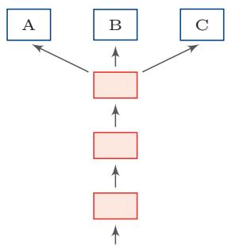  
(a) 硬共享模式

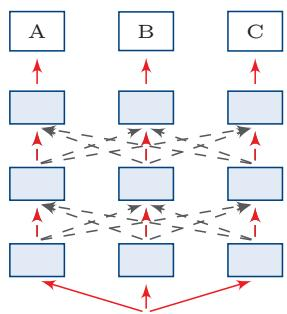  
(b) 软共享模式

  
(c) 层次共享模式

  
(d) 共享-私有模式  
图11.1 多任务学习中四种常见的共享模式

这四种常见的共享模式分别为：

（1）硬共享模式：让不同任务的神经网络模型共同使用一些共享模块（一般是低层）来提取一些通用特征，然后再针对每个不同的任务设置一些私有模块（一般是高层）来提取一些任务特定的特征.

（2）软共享模式：不显式地设置共享模块，但每个任务都可以从其他任务中借用一些信息来提高自己的能力．借用的方式包括直接复制使用其他任务的隐状态，或使用注意力机制来主动选取有用的信息

（3）层次共享模式：一般神经网络中不同层抽取的特征类型不同，低层一般抽取一些低级的局部特征，高层抽取一些高级的抽象语义特征，因此如果多任务学习中不同任务也有级别高低之分，那么一个合理的共享模式是让低级任务在低层输出，高级任务在高层输出.

（4）共享-私有模式：一个更加分工明确的方式是将共享模块和任务特定（私有）模块的责任分开.共享模块捕捉一些跨任务的共享特征，而私有模块只捕捉和特定任务相关的特征.最终的表示由共享特征和私有特征共同构成

学习步骤 在多任务学习中，每个任务都可以有自己单独的训练集.为了让所有任务同时学习，我们通常会使用交替训练的方式来“近似”地实现同时学习.

假设有M个相关任务，第m个任务的训练集为 $\mathcal { D } _ { m }$ ,包含 $N _ { m }$ 个样本.

$$
\mathcal { D } _ { m } = \{ ( { \pmb x } ^ { ( m , n ) } , y ^ { ( m , n ) } ) \} _ { n = 1 } ^ { N _ { m } } ,\tag{11.25}
$$

其中 $\mathbf { \boldsymbol { x } } ^ { ( m , n ) }$ 和 $y ^ { ( m , n ) }$ 表示第m个任务中的第n个样本以及它的标签.

假设这M个任务对应的模型分别为 $f _ { m } ( { \pmb x } ; \theta ) , 1 \le m \le M$ ，多任务学习的联合目标函数为所有任务损失函数的线性加权

$$
\mathcal { L } ( \theta ) = \sum _ { m = 1 } ^ { M } \sum _ { n = 1 } ^ { N _ { m } } \eta _ { m } \mathcal { L } _ { m } \Big ( f _ { m } ( \boldsymbol { x } ^ { ( m , n ) } ; \theta ) , y ^ { ( m , n ) } \Big ) ,\tag{11.26}
$$

其中 $\mathcal { L } _ { m } ( \cdot )$ 为第m个任务的损失函数， $\eta _ { m }$ 是第m个任务的权重，θ表示包含了共享模块和私有模块在内的所有参数，权重可以根据不同任务的重要程度来赋值，也可以根据任务的难易程度来赋值.通常情况下，所有任务设置相同的权重，即 $\eta _ { m } = 1 , 1 \leq m \leq M$

多任务学习的流程可以分为两个阶段：

（1）联合训练阶段：每次迭代时，随机挑选一个任务，然后从这个任务中随机选择一些训练样本，计算梯度并更新参数.多任务学习中联合训练阶段的具体过程如算法11.4所示

（2）单任务微调阶段：基于多任务学习得到的参数，分别在每个单独任务进行微调（Fine-Tuning）.其中单任务微调阶段为可选阶段.当多个任务的差异性比较大时，在每个单任务上继续优化参数可以进一步提升模型能力.

在任务相关且共享机制合理时，多任务学习常常可以获得比单任务学习更好的泛化能力，主要有以下几个原因：

（1）多任务学习在多个任务的数据集上进行训练，比单任务学习的训练集更大.由于多个任务之间有一定的相关性，因此多任务学习相当于是一种隐式的数据增强，可以提高模型的泛化能力.

（2）多任务学习中的共享模块需要兼顾所有任务，这在一定程度上避免了模型过拟合到单个任务的训练集，可以看作一种正则化.

（3）如果一个表示能够服务于多个相关任务，它往往会捕捉更稳定的因素.多任务学习通过这种约束有机会获得更通用的表示.

（4）在多任务学习中，每个任务都可以“选择性”利用其他任务中学习到的隐藏特征，从而提高自身的表现

算法11.4 多任务学习中联合训练过程  
输入：M个任务的数据集 $\mathcal { D } _ { m } , 1 \leq m \leq M ;$   
每个任务的批大小 $K _ { m } , 1 \leq m \leq M ;$   
最大迭代次数T,学习率α;  
1 随机初始化参数 $\theta ;$   
2 for $t = 1 \cdots T$ do  
//准备M个任务的数据  
3 for $m = 1 \cdots M$ do  
4 将任务m的训练集 $\mathcal { D } _ { m }$ 中随机划分为 $\begin{array} { r } { c = \frac { N _ { m } } { K _ { m } } } \end{array}$ 个小批量集合：  
$\mathcal { B } _ { m } = \{ \mathcal { I } _ { m , 1 } , \cdots , \mathcal { I } _ { m , c } \}$   
5 end  
6 合并所有小批量样本 $\bar { \mathcal { B } } = \mathcal { B } _ { 1 } \cup \mathcal { B } _ { 2 } \cup \dots \cup \mathcal { B } _ { M } ;$   
7 随机排序B;  
8 foreach $\mathcal { I } \in \bar { \mathcal { B } }$ do  
9 计算小批量样本J上的损失 $\mathcal { L } ( \boldsymbol { \theta } )$ //只计算J在对应任务上的损失  
10 更新参数： $\theta \gets \theta - \alpha \cdot \nabla _ { \theta } \mathcal { L } ( \theta )$   
11 end  
12 end  
输出：模型 $f _ { m } , 1 \leq m \leq M$

但是，多任务学习并不一定总是有益的.如果多个任务之间相关性较弱，或者共享机制设计不合理，就可能出现负迁移（NegativeTransfer）：来自其他任务的信息非但不能帮助当前任务，反而会干扰其学习过程.因此，多任务学习的关键并不只是“让多个任务一起学习”，更重要的是设计合理的共享方式，并控制任务之间的相互影响

## 11.4 迁移学习

前一章介绍的自监督学习和表示学习告诉我们：模型可以先在大规模数据上获得具有迁移性的表示，再在下游任务中加以复用.迁移学习进一步关注的问题是：当源任务和目标任务并不完全相同时，如何将已经学到的知识高效地迁移到新的任务或新的数据分布上.

标准机器学习通常假设训练数据和测试数据服从相同分布，并目模型针对某一个固定任务进行训练，如果这一假设不成立，比如目标任务的标注数据很少、源任务和目标任务的数据分布不同，或者目标任务本身与已有任务不完全一致，那么直接在目标任务上从零开始训练模型往往代价较高、效果也不理想.此时，如果存在一个相关的源任务已经积累了大量数据或已经训练好了一个性能较好的模型，那么就有可能将其中可泛化的知识迁移到目标任务上，这就是迁移学习（Transfer Learning)要解决的问题.

为了更清楚地描述迁移学习，通常将机器学习问题分为领域（Domain）和任务（Task）两个部分.设输入空间为X、输出空间为y，则一个领域可以写为

$$
{ \mathcal { D } } = ( { \mathcal { X } } , p ( { \pmb x } ) ) ,\tag{11.27}
$$

其中 $p ( { \pmb x } )$ 表示输入样本的边际分布；一个任务可以写为

$$
\mathcal { T } = ( \mathcal { Y } , p ( \mathcal { Y } | \pmb { x } ) ) ,\tag{11.28}
$$

其中 $p ( y | \mathbf { \boldsymbol { x } } )$ 刻画了给定输入后如何预测输出.给定两个领域，如果它们的输入空间或输入分布不同，则认为两个领域不同；给定两个任务，如果它们的输出空间或条件分布不同，则认为两个任务不同.

迁移学习是指利用源领域(Source Domain) $\mathcal { D } _ { S }$ 和源任务（Source Task）$\mathcal { T } _ { S }$ 中学到的知识，来帮助目标领域（Target Domain） $\mathcal { D } _ { T }$ 和目标任务（TargetTask) $\mathcal { T } _ { T }$ 上的学习.通常情况下，源领域中的数据规模远大于目标领域，或者源领域中已经存在性能较好的预训练模型.

表11.1给出了迁移学习和标准机器学习的比较

表11.1 迁移学习和标准机器学习的比较
<table><tr><td rowspan=1 colspan=1>学习类型</td><td rowspan=1 colspan=1>领域</td><td rowspan=1 colspan=1>任务</td></tr><tr><td rowspan=1 colspan=1>标准机器学习</td><td rowspan=1 colspan=1> $\mathcal { D } _ { S } = \mathcal { D } _ { T }$ </td><td rowspan=1 colspan=1> $\mathcal { T } _ { S } = \mathcal { T } _ { T }$ </td></tr><tr><td rowspan=1 colspan=1>迁移学习</td><td rowspan=1 colspan=2> $\mathcal { D } _ { S } \neq \mathcal { D } _ { T }$ 或 $\mathcal { T } _ { S } \ne \mathcal { T } _ { T }$ </td></tr></table>

迁移学习根据不同的迁移方式又分为两个类型：归纳迁移学习（InductiveTransfer Learning)和转导迁移学习（Transductive Transfer Learning).这两个类型分别对应两个机器学习的范式：归纳学习（InductiveLearning）和转导学习（Transductive Learning）[Vapnik,1998]. 一般的机器学习都是指归纳学习，即希望在训练数据集上学习到使得期望风险最小的模型.而转导学习的目标是学习一种在给定测试集上错误率最小的模型，在训练阶段可以利用测试集的信息.

归纳迁移学习是指先在源领域和源任务上学习出较为一般的知识，再将其迁移到目标任务上；而转导迁移学习是一种从样本到样本的迁移，直接利用源领域和目标领域的样本进行迁移学习.

## 11.4.1 归纳迁移学习

在归纳迁移学习中，源任务和目标任务通常并不完全相同，但它们之间具有一定的相关性.一般来说，源领域拥有大量训练样本，这些样本可以是有标注的，也可以是无标注的；而目标任务上通常只有较少的标注数据.因此，归纳迁移学习的核心思想是：先在源领域上学习一个具有较强泛化能力的表示或模型，再将其迁移到目标任务上

从数据来源来看，归纳迁移学习大致有两种常见情况：

（1）当源领域只有大量无标注数据时，源任务可以设计为无监督或自监督任务，比如自编码、密度估计或语言建模等.通过这些预训练任务学习一种可迁移的表示，然后再将这种表示迁移到目标任务上.这种学习方式和自学习（SelfTaught Learning) [Raina et al., 2007]以及半监督学习比较类似. 比如在自然语言处理领域，由于标注数据相对稀缺，而无标注文本极为丰富，因此一种自然的思路是在大规模文本上先进行预训练，再迁移到下游任务上.从早期的预训练词向量(比如 word2vec [Mikolov et al., 2013] 和 GloVe [Pennington et al., 2014]等)到句子级表示（比如 ELMO [Peters et al., 2018]、OpenAI GPT [Radfordet al., 2018]以及 BERT[Devlin et al., 2019]等),都体现了这一思路.

自编码器参见第10.1.3节. 概率密度估计参见第10.2节.

（2）当源领域有大量的标注数据时，可以直接将源领域上训练好的模型迁移到目标任务上. 比如在计算机视觉领域，ImageNet [Deng et al.2009]提供了大规模图像分类数据集；很多在ImageNet上训练好的模型，如AlexNet[Krizhevsky et al., 2012]、VGG [Simonyan et al., 2015] 和 ResNet[Heet al.,2016]等，都可以作为目标任务的预训练模型.

在归纳迁移学习中，由于源领域的训练数据规模通常较大，预训练模型往往能够学习到具有较强迁移性的表示.将预训练模型迁移到目标任务上，常见方式包括：

（1）基于特征的方式:将预训练模型的输出或者中间隐藏层的输出作为特征，直接输入目标任务的学习模型中.目标任务的模型可以是一般的浅层分类器(比如支持向量机等)，也可以是新的神经网络模型.

（2）微调的方式：在目标任务上复用预训练模型的部分组件，并对其参数进行微调（Fine-Tuning）.这也是很常见的迁移方式之一.

（3）参数高效适配的方式：当预训练模型规模很大时，也可以只增加或更新少量任务相关参数，从而以较小代价完成对目标任务的适配.对于大规模模型，全量微调需要更新所有参数，计算和存储代价较高．参数高效微调（Parameter-Efficient Fine-Tuning，PEFT）通过只训练少量新增参数来适配下游任务．代表性方法包括：Adapter在每层插入小型瓶颈模块；Prefix

Tuning在输入前拼接可学习的前缀向量；LoRA（Low-Rank Adaptation）[Hu et al., 2022]将权重更新分解为两个低秩矩阵 $\Delta W = B A \mid ( A \in \mathbb { R } ^ { r \times d _ { \mathrm { i n } } }$ 9$B \in \mathbb { R } ^ { d _ { \mathrm { o u t } } \times r } , r \ll \operatorname* { m i n } ( d _ { \mathrm { i n } } , d _ { \mathrm { o u t } } ) \ )$ ，训练时只更新A和B，因此常用于大规模预训练模型的低成本适配

假设预训练模型是一个深度神经网络，这个预训练网络中每一层的可迁移性也不尽相同[Yosinski et al., 2014]. 通常来说，网络的低层学习一些通用的低层特征，中层或高层学习抽象的高级语义特征，而最后几层一般学习和特定任务相关的特征.因此，根据目标任务的自身特点以及和源任务的相关性，可以有针对性地选择预训练模型的不同层来迁移到目标任务中.

当源任务和目标任务具有足够相关性时，将预训练模型迁移到目标任务上往往比从零开始学习更有利，主要体现在以下三点[Torrey et al.,2010]:1）初始模型的性能一般比随机初始化的模型要好；2）训练时模型的学习速度比从零开始学习要快，收敛性更 $\hbar \vec { \mathrm { f } } ; 3 ~ )$ 模型的最终性能可能更好，具有更好的泛化性.

归纳迁移学习和多任务学习也比较类似，但有下面两点区别：1）多任务学习是同时学习多个不同任务，而归纳迁移学习通常分为两个阶段，即源任务上的学习阶段和目标任务上的迁移学习阶段；2)归纳迁移学习是单向的知识迁移，希望提高模型在目标任务上的性能，而多任务学习是希望提高所有任务的性能

## 11.4.2 转导迁移学习

转导迁移学习是一种从样本到样本的迁移，直接利用源领域和目标领域的样本进行迁移学习[Arnold et al., 2007]. 转导迁移学习可以看作一种特殊的转导学习（Transductive Learning）[Joachims，1999].转导迁移学习通常假设源领域有大量的标注数据，而目标领域没有（或只有少量）标注数据，但是有大量的无标注数据.目标领域的数据在训练阶段是可见的.

转导迁移学习的一个常见子问题是领域适应（Domain Adaptation）.在领域适应问题中，一般假设源领域和目标领域有相同的样本空间，但是数据分布不同 $p _ { S } ( { \pmb x } , y ) \neq p _ { T } ( { \pmb x } , y )$

根据贝叶斯公式， $p ( \pmb { x } , y ) = p ( \pmb { x } | y ) p ( y ) = p ( y | \pmb { x } ) p ( \pmb { x } )$ ，因此数据分布的不一致通常由三种情况造成：

（1）协变量偏移（CovariateShift）：源领域和目标领域的输入边际分布不同 $p _ { S } ( { \pmb x } )$ ≠ $p _ { T } ( { \pmb x } )$ ，但后验分布相同 $p _ { S } ( y | { \pmb x } ) = p _ { T } ( y | { \pmb x } )$ ，即学习任务相同$\mathcal { T } _ { S } = \mathcal { T } _ { T }$

（2）概念偏移（Concept Shift）：输入边际分布相同 $p _ { S } ( { \pmb x } ) = p _ { T } ( { \pmb x } )$ ，但后验分布不同 $p _ { S } ( y | { \pmb x } ) \neq p _ { T } ( y | { \pmb x } )$ ，即学习任务不同 $\mathcal { T } _ { S } \neq \mathcal { T } _ { T }$

（3）先验偏移（PriorShift）：源领域和目标领域中的输出标签 $y$ 的先验分布不同 $p _ { S } ( y )$ $p _ { T } ( y )$ ，条件分布相同 $p _ { S } ( { \pmb x } | y ) = p _ { T } ( { \pmb x } | y )$ .在这种情况下，通常需要通过少量标注样本或其他先验信息来估计目标领域的标签分布.

## 机器学习小知识|协变量偏移

协变量是一个统计学概念，是可能影响预测结果的统计变量.在机器学习中，协变量可以看作输入.一般的机器学习算法都要求输入在训练集和测试集上的分布是相似的．协变量偏移（CovariateShift）一般指输入在训练集和测试集上的分布不同.这样，在训练集上学习到的模型在测试集上的表现会比较差.


广义的领域适应问题可能包含上述一种或多种偏移情况.许多领域适应方法主要关注协变量偏移，这样领域适应问题的关键就在于如何学习领域无关（Domain-Invariant）的表示.假设 $p _ { S } ( y | { \pmb x } ) = p _ { T } ( y | { \pmb x } )$ ，领域适应的目标是学习一个模型 $f : \mathcal X  \mathcal Y$ 使得

$$
\mathcal { R } _ { T } ( \theta _ { f } ) = \mathbb { E } _ { ( \pmb { x } , \pmb { y } ) \sim p _ { T } ( \pmb { x } , \pmb { y } ) } [ \mathcal { L } ( f ( \pmb { x } ; \theta _ { f } ) , y ) ]\tag{11.29}
$$

$$
= \mathbb { E } _ { ( { \pmb x } , { \pmb y } ) \sim p _ { S } ( { \pmb x } , { \pmb y } ) } \frac { p _ { T } ( { \pmb x } , { \pmb y } ) } { p _ { S } ( { \pmb x } , { \pmb y } ) } [ \mathcal { L } ( f ( { \pmb x } ; { \pmb \theta } _ { f } ) , { \pmb y } ) ]\tag{11.30}
$$

$$
= \mathbb { E } _ { ( \pmb { x } , \pmb { y } ) \sim p _ { S } ( \pmb { x } , \pmb { y } ) } \frac { p _ { T } ( \pmb { x } ) } { p _ { S } ( \pmb { x } ) } [ \mathcal { L } ( \pmb { f } ( \pmb { x } ; \boldsymbol { \theta } _ { f } ) , \pmb { y } ) ] ,\tag{11.31}
$$

其中 $\mathcal { L } ( \cdot )$ 为损失函数， $\theta _ { f }$ 为模型参数

如果我们可以学习一个映射函数 $g : \mathcal { X }  \mathbb { R } ^ { d }$ ，将x映射到一个特征空间中，并在这个特征空间中使得源领域和目标领域的边际分布尽量接近，例如希望 $p _ { S } ( g ( \mathbf { x } ; \theta _ { g } ) ) \approx p _ { T } ( g ( \mathbf { x } ; \theta _ { g } ) )$ ，其中 $\theta _ { g }$ 为映射函数的参数，那么目标函数可以近似为

$$
\mathcal { R } _ { T } ( \theta _ { f } , \theta _ { g } ) = \mathbb { E } _ { ( \boldsymbol { x } , \boldsymbol { y } ) \sim p _ { S } ( \boldsymbol { x } , \boldsymbol { y } ) } \Biggl [ \mathcal { L } \biggl ( f \bigl ( \boldsymbol { g } ( \boldsymbol { x } ; \boldsymbol { \theta } _ { g } ) ; \boldsymbol { \theta } _ { f } \bigr ) , \boldsymbol { y } \biggr ) \Biggr ] + \gamma d _ { g } ( \boldsymbol { S } , T )\tag{11.32}
$$

$$
\mathbf { \Omega } = \mathcal { R } _ { S } ( \theta _ { f } , \theta _ { g } ) + \gamma d _ { g } ( S , T ) ,\tag{11.33}
$$

其中 $\mathcal { R } _ { S } ( \theta _ { f } , \theta _ { g } )$ 为源领域上的期望风险函数， $d _ { g } ( S , T )$ 是一个分布差异的度量函数，用来计算在映射特征空间中源领域和目标领域的样本分布的距离，γ为一个超参数，用来平衡两个子目标的重要性比例.这样，学习的目标是优化参数 $\theta _ { f } , \theta _ { g }$ 使得提取的特征是领域无关的，并且在源领域上损失最小

$$
\mathcal D _ { S } = \{ ( \pmb x _ { S } ^ { ( n ) } , y _ { S } ^ { ( n ) } ) \} _ { n = 1 } ^ { N } \sim p _ { S } ( \pmb x , y ) ,\tag{11.34}
$$

$$
\begin{array} { r } { \mathcal { D } _ { T } = \{ \pmb { x } _ { T } ^ { ( m ) } \} _ { m = 1 } ^ { M } \sim p _ { T } ( \pmb { x } , \pmb { y } ) , } \end{array}\tag{11.35}
$$

分别为源领域和目标领域的训练数据，我们首先用映射函数 $g ( \pmb { x } ; \theta _ { g } )$ 将两个领域中训练样本的输入x映射到特征空间，并优化参数 $\theta _ { g }$ 使得映射后两个领域的输入分布差异最小.分布差异一般可以通过一些度量函数来计算，比如MMD(Maximum Mean Discrepancy) [Gretton et al., 2007]、CMD (Central Mo-ment Discrepancy) [Zellinger et al., 2017]等，也可以通过领域对抗学习来得到领域无关的表示 [Bousmalis et al., 2016; Ganin et al., 2016].

以对抗学习为例，我们可以引入一个领域判别器c来判断一个样本是来自于哪个领域.如果领域判别器c无法判断一个映射特征的领域信息，就可以认为这个特征是一种领域无关的表示.

对于训练集中的每一个样本x，我们都赋 $\mathcal { F } z \in \{ 1 , 0 \}$ 表示它是来自于源领域还是目标领域，领域判别器 $c ( h , \theta _ { c } )$ 根据其映射特征 $\pmb { h } = g ( \pmb { x } , \theta _ { g } )$ 来预测它来自于源领域的概率 $p ( z = 1 | \pmb { x } )$ .由于领域判别是一个两分类问题， $^ { h }$ 来自于目标领域的概率为 $1 - c ( \boldsymbol { h } , \boldsymbol { \theta } _ { c } )$

因此，领域判别器的对数似然函数为：

$$
\mathcal { L } _ { c } ( \theta _ { g } , \theta _ { c } ) = \frac { 1 } { N } \sum _ { n = 1 } ^ { N } \log c ( h _ { S } ^ { ( n ) } , \theta _ { c } ) + \frac { 1 } { M } \sum _ { m = 1 } ^ { M } \log \big ( 1 - c ( h _ { T } ^ { ( m ) } , \theta _ { c } ) \big ) ,\tag{11.36}
$$

其中 $\begin{array} { r } { \pmb { h } _ { S } ^ { ( n ) } = g ( \pmb { x } _ { S } ^ { ( n ) } , \pmb { \theta } _ { g } ) , \pmb { h } _ { T } ^ { ( m ) } = g ( \pmb { x } _ { T } ^ { ( m ) } , \pmb { \theta } _ { g } ) } \end{array}$ 分别为样本 $\pmb { x } _ { S } ^ { ( n ) }$ 和 ${ \pmb x } _ { T } ^ { ( m ) }$ 的特征向量.

这样，领域迁移的目标函数可以分解为两个对抗的目标.一方面，要学习参数 $\theta _ { c }$ 使得领域判别器 $c ( h , \theta _ { c } )$ 尽可能区分出一个表示 $\pmb { h } = g ( \pmb { x } , \theta _ { g } )$ 是来自于哪个领域；另一方面，要学习参数 $\theta _ { g }$ 使得提取的表示h无法被领域判别器 $c ( h , \theta _ { c } )$ 预测出来，并同时学习参数 $\theta _ { f }$ 使得模型 $f ( h ; \theta _ { f } )$ 在源领域的损失最小.

$$
\operatorname* { m a x } _ { \theta _ { c } } \qquad \mathcal { L } _ { c } ( \theta _ { g } , \theta _ { c } ) ,\tag{11.37}
$$

$$
\operatorname* { m i n } _ { \theta _ { f } , \theta _ { g } } \quad \ \sum _ { n = 1 } ^ { N } \mathcal { L } \left( f \Big ( g ( x _ { S } ^ { ( n ) } ; \theta _ { g } ) ; \theta _ { f } \Big ) , y _ { S } ^ { ( n ) } \right) - \gamma \mathcal { L } _ { c } ( \theta _ { g } , \theta _ { c } ) .\tag{11.38}
$$

## 11.4.3 多任务学习、迁移学习与半监督学习的联系

多任务学习、迁移学习和半监督学习都在尝试突破“单任务、全监督、从零训练”的传统设定，但三者的关注点并不相同.多任务学习强调多个相关任务同时学习，通过共享参数或表示来提升所有任务的性能：迁移学习强调知识从源任务向目标任务的单向迁移，通常先在源领域进行训练，再迁移到目标任务；半监督学习则是在任务不变的前提下，利用无标注数据来辅助当前任务的学习.理解这三者之间的区别，有助于把握本章各类方法之间的内在联系.

## 11.5 持续学习

许多深度学习模型是在固定数据分布和固定任务设定下训练的，一旦训练结束，模型参数通常保持不变，不再继续吸收新任务中的经验.当数据分布、任务目标或用户需求随时间变化时，模型需要在学习新知识的同时保留已有能力.一个只在围棋任务上训练的系统通常不会自动具备象棋能力；如果直接用象棋数据继续更新同一组参数，还可能损害原有围棋能力.持续学习关心的正是这种“不断学习而尽量不遗忘”的问题.人类学习具有持续性，可以通过记忆和巩固机制不断累积知识，并在不同任务之间复用已有经验.在新的知识建立之后，部分信息还会经过较长时间的处理而转化为更稳定的记忆.由于这种知识累积，人类在学习新任务时往往不需要完全从零开始

持续学习（Continual Learning），也常被称为终身学习（Lifelong Learn-ing），是指让模型具有持续学习能力，根据历史任务中学到的经验和知识来帮助学习不断出现的新任务，并且让这些经验和知识持续累积，尽量避免因为学习新任务而遗忘旧知识 [Chen et al., 2016; Thrun, 1998].

在终身学习中，假设一个终身学习算法已经在历史任务 $\mathcal { T } _ { 1 } , \mathcal { T } _ { 2 } , \cdots , \mathcal { T } _ { m }$ 上学习到一个模型，当出现一个新任务 $\mathcal { T } _ { m + 1 }$ 时，这个算法可以根据过去在 $m$ 个任务上学习的知识来帮助学习第 $m + 1$ 个任务，同时累积所有的m+1个任务上的知识.这个设定和归纳迁移学习比较类似，但归纳迁移学习的目标是优化目标任务的性能，而不一定关心长期知识累积.终身学习的目标则是持续学习和知识累积.另外，终身学习和多任务学习也比较类似，但不同之处在于终身学习并不在所有任务上同时学习.多任务学习通常使用所有任务的数据进行联合学习，而终身学习强调任务按时间顺序逐个到来.

在终身学习中，一个关键的问题是如何避免灾难性遗忘（Catastrophic

Forgetting），即按照一定顺序学习多个任务时，在学习新任务的同时不忘记先前学会的历史任务[French, 1999; Kirkpatrick et al., 2017]. 比如在神经网络模型中，一些参数对任务 $\mathcal { T } _ { A }$ 非常重要，如果在学习任务 $\mathcal { T } _ { B }$ 时被改变了，就可能给任务 $\mathcal { T } _ { A }$ 造成不好的影响.

在网络容量有限时，学习一个新的任务一般需要遗忘一些历史任务的知识.而现代神经网络常常具有较高的参数冗余度，对于任务 $\mathcal { T } _ { A }$ 而言有很多参数组合都可以达到相近的性能.这样，在学习任务 $\mathcal { T } _ { B }$ 时，有可能找到一组尽量不影响任务 $\mathcal { T } _ { A }$ 而又能使得任务 $\mathcal { T } _ { B }$ 表现较好的参数.

解决灾难性遗忘的方法有很多．我们这里介绍一种弹性权重巩固（ElasticWeight Consolidation)方法.

不失一般性，以两个任务的持续学习为例，假设任务 $\mathcal { T } _ { A }$ 和任务 $\mathcal { T } _ { B }$ 的数据集分别为 ${ \mathcal { D } } _ { A }$ 和 ${ \mathcal { D } } _ { B } .$ 从贝叶斯的角度来看，将模型参数θ看作随机向量，给定两个任务时θ的后验分布为

$$
\log p ( \theta | \mathcal { D } ) = \log p ( \mathcal { D } | \theta ) + \log p ( \theta ) - \log p ( \mathcal { D } ) ,\tag{11.39}
$$

其中 $\mathcal { D } = \mathcal { D } _ { A } \cup \mathcal { D } _ { B }$ .根据独立同分布假设，上式可以写为

$$
\log p ( \theta | \mathcal { D } ) = \log p ( \mathcal { D } _ { A } | \theta ) + \log p ( \mathcal { D } _ { B } | \theta ) + \log p ( \theta ) - \log p ( \mathcal { D } _ { A } ) - \log p ( \mathcal { D } _ { B } )\tag{11.40}
$$

$$
= \log p ( \mathcal { D } _ { B } | \theta ) + \underline { { \log p ( \theta | \mathcal { D } _ { A } ) } } - \log p ( \mathcal { D } _ { B } ) ,\tag{11.41}
$$

其中 $p ( \theta | \mathcal { D } _ { A } )$ 包含了所有在任务 $\mathcal { T } _ { A }$ 上学习到的信息.当顺序地学习任务 $\mathcal { T } _ { B }$ 时，参数在两个任务上的后验分布和其在任务 $\mathcal { T } _ { A }$ 的后验分布有关.

由于后验分布比较难以建模，我们可以通过一个近似的方法来估计．假设$p ( \theta | \mathcal { D } _ { A } )$ 为高斯分布，期望为在任务 $\mathcal { T } _ { A }$ 上学习到的参数 $\theta _ { A } ^ { * }$ ，精度矩阵（即协方差矩阵的逆）可以用参数θ在数据集 $\mathcal { D } _ { A }$ 上的Fisher信息矩阵来近似，即

参考 [Bishop， 2007] 中第4章中的拉普拉斯近似.

$$
p ( \theta | \mathcal { D } _ { A } ) = \mathcal { N } ( \theta _ { A } ^ { * } , F ^ { - 1 } ) ,\tag{11.42}
$$

其中F为Fisher信息矩阵.为了提高计算效率，F可以简化为对角矩阵，由Fisher信息矩阵对角线构成.

Fisher 信息矩阵 Fisher信息矩阵(Fisher Information Matrix）是一种测量似然函数 $p ( x ; \theta )$ 携带的关于参数θ的信息量的方法.通常一个参数对分布的影响可以通过对数似然函数的梯度来衡量.令打分函数 $\cdot s ( \theta )$ 为

$$
s ( \theta ) = \nabla _ { \theta } \log p ( x ; \theta ) ,\tag{11.43}
$$

则 $s ( \theta )$ 的期望为0.

https://nndl.ai/

证明.

$$
\mathbb { E } [ s ( \theta ) ] = \int \nabla _ { \theta } \log p ( x ; \theta ) p ( x ; \theta ) \mathrm { d } x\tag{11.44}
$$

$$
\mathrm { ~  ~ \Gamma ~ } = \int \frac { \nabla _ { \theta } p ( x ; \theta ) } { p ( x ; \theta ) } p ( x ; \theta ) \mathrm { d } x\tag{11.45}
$$

$$
\mathrm { \Gamma } = \int \nabla _ { \theta } p ( x ; \theta ) \mathrm { d } x\tag{11.46}
$$

$$
\mathrm { \Phi } = \nabla _ { \theta } \int \boldsymbol { p } ( \boldsymbol { x } ; \theta ) \mathrm { d } \boldsymbol { x }\tag{11.47}
$$

$$
\ d = \nabla _ { \theta } 1 = 0 .\tag{11.48}
$$

$s ( \theta )$ 的协方差矩阵称为Fisher信息矩阵，可以衡量参数θ的估计的不确定性.Fisher信息矩阵的定义为

$$
F ( \boldsymbol { \theta } ) = \mathbb { E } [ s ( \boldsymbol { \theta } ) s ( \boldsymbol { \theta } ) ^ { \top } ]\tag{11.49}
$$

$$
= \mathbb { E } [ \nabla _ { \theta } \log p ( x ; \theta ) ( \nabla _ { \theta } \log p ( x ; \theta ) ) ^ { \top } ] .\tag{11.50}
$$

由于我们不知道似然函数 $p ( x ; \theta )$ 的具体形式，Fisher信息矩阵可以用经验分布来进行估计.给定一个数据集 $\{ x ^ { ( 1 ) } , \cdots , x ^ { ( N ) } \}$ ,Fisher信息矩阵可以近似为

$$
\boldsymbol { F } ( \theta ) = \frac { 1 } { N } \sum _ { n = 1 } ^ { N } \boldsymbol { \nabla } _ { \theta } \log p ( x ^ { ( n ) } ; \theta ) ( \boldsymbol { \nabla } _ { \theta } \log p ( x ^ { ( n ) } ; \theta ) ) ^ { \intercal } .\tag{11.51}
$$

Fisher信息矩阵的对角线的值反映了对应参数在通过最大似然进行估计时的不确定性，其值越大，表示该参数估计值的方差越小，估计更可靠，其携带的关于数据分布的信息越多.

因此，对于任务 $\mathcal { T } _ { A }$ 的数据集 ${ \mathcal { D } } _ { A }$ ，我们可以用Fisher信息矩阵来衡量一个参数携带的关于 $\mathcal { D } _ { A }$ 的信息量，即

$$
F ^ { A } ( \theta ) = \frac { 1 } { N } \sum _ { ( \pmb { x } , \pmb { y } ) \in \mathcal { D } _ { A } } \nabla _ { \theta } \log p ( \pmb { y } | \pmb { x } ; \theta ) ( \nabla _ { \theta } \log p ( \pmb { y } | \pmb { x } ; \theta ) ) ^ { \top } .\tag{11.52}
$$

通过上面的近似，在训练任务 $\mathcal { T } _ { B }$ 时的损失函数为

$$
\mathcal { L } ( \theta ) = \mathcal { L } _ { B } ( \theta ) + \sum _ { i = 1 } ^ { P } \frac { \lambda } { 2 } F _ { i } ^ { A } \cdot ( \theta _ { i } - \theta _ { A , i } ^ { * } ) ^ { 2 } ,\tag{11.53}
$$

参见习题11-8.

其中 $\mathcal { L } _ { B } ( \boldsymbol { \theta } )$ 为任务 $\mathcal { T } _ { B }$ 的损失函数， $F _ { i } ^ { A }$ 为Fisher信息矩阵的第i个对角线元素，$\theta _ { A } ^ { * }$ 为在任务 $\mathcal { T } _ { A }$ 上学习到的参数，λ为平衡两个任务重要性的超参数，P为参数的总数量.

持续学习方法概览EWC属于一种基于正则化的持续学习方法，其核心思想是：对旧任务重要的参数在学习新任务时不应被大幅修改，除此之外，持续学习中还有两类常见思路.第一类是重放方法，即保存一部分旧任务样本，或通过生成模型重建旧样本，在学习新任务时与新数据混合训练；第二类是参数隔离或结构扩展方法，即为不同任务分配不同的参数子空间，或者在新任务到来时动态增加网络结构，从而减少新旧任务之间的相互十扰，从更高层次看，这些方法都在回答同一个问题:如何在学习新知识的同时尽量保留旧知识.

## 11.6 元学习

根据没有免费午餐定理，没有一种通用的学习算法可以在所有任务上都有效．因此，当使用机器学习算法解决某个任务时，我们通常需要“就事论事”，根据任务的特点来选择合适的模型、损失函数、优化算法以及超参数.那么，是否可以自动地从一组任务中总结出一种更适合新任务的学习策略呢?事实上，人脑中的学习机制就具有这种能力：面对不同任务时，人们并不是完全从零开始，而是会利用以往经验快速形成新的学习策略.这种“学习如何学习”的能力称为元学习（Meta-Learning），也称为学习的学习(Learning to Learn)[Thrun et al.,2012].

元学习的目标是从已有任务中学习一种学习方法或元知识，从而加速新任务的学习．从这个角度来说，元学习和归纳迁移学习有一定联系，但元学习更强调在任务分布层面学习一种快速适应机制

## 11.6.1 元学习与少样本学习

和元学习密切相关的另一个问题是少样本学习（Few-shot Learning），即模型在极少量样本上的快速学习能力．假设每个类别只有K个标注样本，且K较小;如果 K = 1,称为单样本学习（One-shot Learning）;如果 K = 0,称为零样本学习（Zero-shot Learning）.少样本学习更关注“样本很少时如何取得较好的性能”，而元学习更关注“如何从多个任务中学到一种快速适应新任务的机制”.很多元学习方法都可以用于少样本学习，但两者并不完全等价.

这里我们主要介绍两种典型的元学习方法：基于优化器的元学习和模型无关的元学习.

## 11.6.2 基于优化器的元学习

神经网络中常见的学习方式是定义一个目标损失函数 $\mathcal { L } ( \boldsymbol { \theta } )$ ，并通过梯度下降算法来最小化 L(θ): ${ \mathcal { L } } ( \theta )$

$$
\boldsymbol { \theta } _ { t } \gets \boldsymbol { \theta } _ { t - 1 } - \alpha \nabla _ { \boldsymbol { \theta } } \mathcal { L } ( \boldsymbol { \theta } _ { t - 1 } ) ,\tag{11.54}
$$

其中 $\theta _ { t }$ 为第t步时的模型参数， $\nabla _ { \theta } \mathcal { L } ( \theta _ { t - 1 } )$ 为梯度，α为学习率.根据没有免费午餐定理，没有一种通用的优化算法可以在所有任务上都有效.因此在不同的任务上，我们需要选择不同的学习率以及不同的优化方法，比如动量法、Adam等.这些选择会显著影响具体学习过程.对于一个新的任务，我们往往通过经验或超参搜索来选择一个合适的设置

参见第7.2节.

不同的优化算法的区别在于更新参数的规则不同，因此一种很自然的元学习就是自动学习一种更新参数的规则，即通过另一个神经网络（比如循环神经网络)来建模梯度下降的过程[Andrychowicz et al., 2016; Schmidhuber, 1992;Younger et al., 2001]. 图11.2给出了基于优化器的元学习的示例.

  
图11.2 基于优化器的元学习

我们用函数 $g _ { t } ( \cdot )$ 来预测第t步时参数更新的差值 $\Delta \theta _ { t } = \theta _ { t } - \theta _ { t - 1 }$ . 函数$g _ { t } ( \cdot )$ 称为优化器，输入是当前时刻的梯度值，输出是参数的更新差值 $\Delta \theta _ { t }$ .这样，第t步的更新规则可以写为

$$
\theta _ { t + 1 } = \theta _ { t } + g _ { t } \big ( \nabla \mathcal { L } ( \theta _ { t } ) ; \phi \big )\tag{11.55}
$$

其中 $\phi$ 为优化器 $g _ { t } ( \cdot )$ 的参数.

学习优化器 $g _ { t } ( \cdot )$ 的过程可以看作一种元学习过程，其目标是找到一个适用于多个不同任务的优化器.在标准梯度下降中，每步迭代的目标是使得 $\mathcal { L } ( \boldsymbol { \theta } )$ 下降.而在优化器的元学习中，我们希望经过若于步更新后 $\mathcal { L } ( \boldsymbol { \theta } )$ 尽可能小，具体的目标函数为

$$
\mathcal { L } ( \phi ) = \mathbb { E } _ { f } [ \sum _ { t = 1 } ^ { T } w _ { t } \mathcal { L } ( \theta _ { t } ) ] ,\tag{11.56}
$$

$$
\theta _ { t } = \theta _ { t - 1 } + \pmb { g } _ { t } ,\tag{11.57}
$$

$$
[ \pmb { g } _ { t } ; \pmb { h } _ { t } ] = \mathrm { L S T M } ( \nabla \mathcal { L } ( \theta _ { t - 1 } ) , \pmb { h } _ { t - 1 } ; \phi ) ,\tag{11.58}
$$

其中T为最大迭代次数， $w _ { t } > 0$ 为每一步的权重，一般可以设置 $w _ { t } = 1$ , ∀t. 由于LSTM网络可以记忆梯度的历史信息，学习到的优化器可以看作一个高阶的优化方法.

在每步训练时，随机初始化模型参数，计算每一步的 $\mathcal { L } ( \boldsymbol { \theta } _ { t } )$ ，以及元学习的损失函数 ${ \mathcal { L } } ( \phi )$ ，并使用梯度下降更新参数.由于神经网络的参数很多，LSTM网络的输入和输出都会非常高维，直接训练这样一个大型网络代价很高．因此，一种简化的方法是为每个参数都使用一个共享的LSTM网络来进行更新，这样可以使用一个较小的共享LSTM网络来更新参数.

## 11.6.3 模型无关的元学习

元学习的目标之一是快速学习的能力，即在多个不同的任务上学习一个模型，让其在新任务上经过少量的迭代，甚至是单步迭代，就可以取得较好的性能，并且减少在新任务上的过拟合.

模型无关的元学习（Model-Agnostic Meta-Learning，MAML）是一个简单的模型无关、任务无关的元学习算法[Finn et al., 2017]. 假设所有的任务都来自于一个任务空间，其分布为 $p ( \mathcal T )$ ，我们可以在这个任务空间的所有任务上学习一种通用的表示，这种表示可以经过梯度下降方法在一个特定的单任务上进行微调. 假设一个模型为 $f _ { \theta }$ ，如果我们让这个模型适应到一个新任务 $\mathcal { T } _ { m }$ 上，通过一步或多步的梯度下降更新，学习到的任务适配参数为

$$
\theta _ { m } ^ { \prime } = \theta - \alpha \nabla _ { \theta } \mathcal { L } _ { \mathcal { T } _ { m } } ( f _ { \theta } ) ,\tag{11.59}
$$

其中 $\alpha$ 为学习率.这里 $\theta _ { m } ^ { \prime }$ 可以理解为关于θ的函数，而不是真正的参数更新.

MAML的目标是学习一个参数θ，使得其经过一步或少量几步梯度迭代后，可以在新任务上取得较低损失，即

$$
\operatorname* { m i n } _ { \theta } \sum _ { \substack { \mathcal { T } _ { m } \sim p ( \mathcal { T } ) } } \mathcal { L } _ { \mathcal { T } _ { m } } \bigl ( f _ { \theta _ { m } ^ { \prime } } \bigr ) = \operatorname* { m i n } _ { \theta } \sum _ { \substack { \mathcal { T } _ { m } \sim p ( \mathcal { T } ) } } \mathcal { L } _ { \mathcal { T } _ { m } } \Bigl ( f \bigl ( \underbrace { \theta - \alpha \nabla _ { \theta } \mathcal { L } _ { \mathcal { T } _ { m } } \left( f _ { \theta } \right) } _ { \theta _ { m } ^ { \prime } } \bigr ) \Bigr ) .\tag{11.60}
$$

在所有任务上的元优化（Meta-Optimization）也采用梯度下降来进行优化,即

$$
\theta \gets \theta - \beta \nabla _ { \theta } \sum _ { m = 1 } ^ { M } \mathcal { L } _ { \mathcal { T } _ { m } } ( f _ { \theta _ { m } ^ { \prime } } )\tag{11.61}
$$

https://nndl.ai/

$$
\begin{array} { r l } { \displaystyle } & { \displaystyle = \theta - \beta \sum _ { m = 1 } ^ { M } \nabla _ { \theta _ { m } ^ { \prime } } \mathcal { L } _ { \mathcal { T } _ { m } } ( f _ { \theta _ { m } ^ { \prime } } ) \Big ( I - \alpha \nabla _ { \theta } ^ { 2 } \mathcal { L } _ { \mathcal { T } _ { m } } ( f _ { \theta } ) \Big ) , } \end{array}\tag{11.62}
$$

其中 $\beta$ 为元学习率，I为单位阵.这一步是一个真正的参数更新步骤.这里可以看出，当α比较小时，MAML和普通的多任务学习在形式上会比较接近；同时MAML需要计算关于θ的二阶梯度，但采用一阶近似的方法通常也可以达到比较好的性能.

MAML的具体过程如算法11.5所示.

算法 11.5 模型无关的元学习过程  
输入：任务分布 $p ( \mathcal T )$ 。2  
最大迭代次数T，学习率 $\alpha , \beta ;$   
1 随机初始化参数 $\theta ;$   
2 for $t = 1 \cdots T$ do  
3 根据 $p ( \mathcal T )$ 采样一个任务集合 $\lbrace \mathcal { T } _ { m } \rbrace _ { m = 1 } ^ { M } ;$   
4 for $m = 1 \cdots M$ do  
5 计算 $\nabla _ { \theta } \mathcal { L } _ { \mathcal { T } _ { m } } ( f _ { \theta } ) ;$   
6 计算任务适配的参数 $: \theta _ { m } ^ { \prime } \gets \theta - \alpha \nabla _ { \theta } \mathcal { L } _ { \mathcal { T } _ { m } } ( f _ { \theta } )$   
7 end  
8 更新参数 $\begin{array} { r } { \mathrm { \Omega } ; \theta \gets \theta - \beta \nabla _ { \theta } \sum _ { m = 1 } ^ { M } \mathcal { L } _ { \mathcal { T } _ { m } } ( f _ { \theta _ { m } ^ { \prime } } ) \mathrm { ; } } \end{array}$   
9 end  
输出：模型 $f _ { \theta }$

## 11.7 总结和扩展阅读

本章方法都不是单独规定某种网络结构，而是在不同训练条件下引入额外信息或改变训练组织方式.为了避免概念混淆，可以先从三个问题理解它们：额外信息来自哪里，训练是在同一时间、先后时间还是任务分布上进行，以及主要风险是什么.表11.2给出了一个简单比较.

集成学习通过组合多个基模型的预测结果来提升整体性能，其关键不在于简单地“多训练几个模型”，而在于让基模型既具有一定的准确率，又保留适当差异性.半监督学习进一步说明，当标注数据有限而无标注数据丰富时，模型仍然可以借助伪标签或多视角信息继续改进.前者强调多个模型之间的互补，后者强调标注信息与无标注信息之间的协同，它们都突破了“只使用单一监督信号”的训练方式.

多任务学习、迁移学习、持续学习和元学习则更直接地体现了“知识复用”的层次差异.多任务学习关注同时学习多个相关任务，通过共享表示来提升各任务的泛化能力；迁移学习关注先后学习不同任务或领域，使源任务中的知识能够帮助目标任务；持续学习关注任务依次到来时如何不断吸收新知识并尽量避免遗忘旧知识；元学习则更进一步，试图在任务分布层面学习一种快速适应机制，使模型在面对新任务时可以用更少的数据和更少的更新步骤完成学习.

表11.2 几类模型独立学习方式的比较
<table><tr><td>学习方式</td><td>额外信息来源</td><td>训练组织方式</td><td>主要收益与风险</td></tr><tr><td>集成学习</td><td>得到的模型差异</td><td>练后组合预测</td><td>多个基模型或多次采样多个模型独立或顺序训降低方差、提升稳健性；若模型错误高 度相关，收益有限.</td></tr><tr><td>半监督学习</td><td>标注数据</td><td>角约束扩充监督信号</td><td>少量标注数据和大量无用伪标签、一致性或多视降低标注需求；伪标签错误和分布不 匹配会放大噪声.</td></tr><tr><td>多任务学习</td><td>损失</td><td>享部分表示或参数</td><td>多个相关任务的数据和多个任务联合训练并共学到更通用表示；任务相关性弱时可 能出现负迁移.</td></tr><tr><td>迁移学习</td><td>参数或数据</td><td>目标任务</td><td>源领域或源任务的表示、先在源任务学习，再适配减少目标任务标注需求；源目标差异 大时可能负迁移或过度适配</td></tr><tr><td>持续学习</td><td>验</td><td>并保留旧任务能力</td><td>依次到来的历史任务经按时间顺序学习新任务支持长期知识累积；主要风险是灾难 性遗忘.</td></tr><tr><td>元学习</td><td>布</td><td>应机制</td><td>多个任务构成的任务分在任务层面学习快速适提升少样本适应能力；若训练任务分 布与测试任务分布差异大，泛化会受 限.</td></tr></table>

在大语言模型中，一种常见的少样本学习机制是上下文学习（In-ContextLearning，ICL）．在上下文学习中，模型不需要进行任何梯度更新，而是仅通过在输入提示中提供少量示例，就能在推断时直接完成新任务.从元学习的角度看，上下文学习可以理解为一种隐式的元学习：大规模预训练使模型内化了“如何从少量示例中归纳模式”的能力，推断时的前向传播过程本身就扮演了“内循环适应”的角色.这与MAML等显式梯度元学习方法形成了有趣的对比：两者都致力于快速适应新任务，但前者通过模型内部的注意力机制隐式实现，后者通过显式的梯度更新实现

如果从“知识来源”的角度看，本章几类方法分别利用了不同类型的信息：集成学习利用多个模型，半监督学习利用无标注数据，多任务学习利用相关任务，迁移学习利用已有表示或参数，持续学习利用历史任务经验，元学习利用任务分布本身的规律.它们共同构成了现代机器学习中“知识复用与快速适应”的基本图景.

若想深入理解集成学习，可以从随机森林和AdaBoost两类经典方法入手[Breiman, 2001; Freund et al., 1996]. 前者代表通过采样和投票来降低方差的思路，后者代表通过逐步关注困难样本来提升分类边界的思路.将这两类方法对照起来阅读，有助于理解“模型差异性”和“样本重加权”这两条不同的技术路线.

半监督学习方面，可以先阅读半监督学习综述[Zhu,2006]，建立“少量标注数据+大量无标注数据”的基本问题设定，再结合自训练[Scudder，1965]和协同训练[Blum et al.,1998]理解两种最经典的思路：一种是依赖模型自身产生伪标签，另一种是依赖不同视角之间的互补性.阅读时值得特别思考：无标注数据并不会自动带来收益，真正重要的是伪标签质量、数据分布匹配程度以及不同视角是否足够互补.

对于迁移学习和领域适应，建议先从[Pan et al.,2010]建立基本概念，再阅读领域对抗学习 [Ganin et al., 2016]与领域适应理论分析 [Ben-David et al.,2010; Zhang et al., 2013]. 前者展示了如何通过对抗训练学习领域无关表示，后者则帮助理解为什么分布偏移会影响泛化，以及在什么条件下迁移才可能有效.把这几篇文献连起来阅读，会更容易理解为什么现代预训练模型虽然具备很强的迁移能力，但在目标领域发生显著变化时仍然需要进一步适配.

如果希望把握“模型如何在时间维度上持续演化”，则可以将持续学习与元学习放在一起阅读.关于持续学习，可以从灾难性遗忘的经验研究[Goodfellowet al., 2014]和EWC 方法 [Kirkpatrick et al., 2017]入手,再结合终身学习早期工作[Chen et al.,2016]理解“正则化、重放、参数隔离”三类基本思路

关于元学习，则可以从学习的学习这一总体思想[Thrun et al., 2012]出发，再阅读MAML[Finn et al.,2017]理解“在任务分布上学习一个易于快速适应的初始化”这一核心思想.持续学习关注“学了新任务以后如何不忘旧任务”，元学习关注“面对新任务时如何更快学会”，二者从不同角度延伸了本章“知识复用”的主题.

总的来说，当监督信号有限、任务不断变化、分布发生偏移或样本极其稀缺时，我们需要的不只是更大的模型，还需要更高效的知识组织、迁移与适应机制

## 习题

## 基础题

习题11-1 为什么说集成学习中基模型既要“有一定准确率”，又要“保持适当差异性”?请结合偏差与方差的角度简要分析

习题11-2 给定一个新应用场景，请从额外信息来源、训练组织方式和主要风险三个角度，判断应优先考虑集成学习、半监督学习、多任务学习、迁移学习、持续学习还是元学习.

习题11-3 比较自训练和协同训练的基本假设、训练流程与适用条件，并说明它们各自可能出现的问题

习题11-4 多任务学习和迁移学习都试图利用已有知识来帮助目标任务.请说明二者在训练方式、任务关系以及知识共享方式上的主要区别.

习题11-5 什么是灾难性遗忘?为什么神经网络在顺序学习多个任务时容易出现这一现象?EWC缓解这一问题的基本思想是什么？

## 提高题

习题11-6 证明定理11.1中集成模型的期望错误不超过平均期望错误 $\bar { \mathcal { R } } ( f )$ ;并说明当所有模型错误两两不相关时 $\begin{array} { r } { \mathcal { R } ( F ) = \frac { 1 } { M } \bar { \mathcal { R } } ( f ) } \end{array}$ ，当所有模型错误完全相同(即 $\epsilon _ { m } ( { \pmb x } ) = \epsilon _ { n } ( { \pmb x } ) , 1 \leq m , n \leq M \}$ 时 $\mathcal { R } ( F ) = \bar { \mathcal { R } } ( f )$

习题11-7 分析自训练和EM算法之间的联系与差异.特别地，请说明二者分别如何处理隐变量或未标注样本，以及为什么自训练可能出现误差累积.

习题11-8 根据最大后验估计推导公式(11.53),并解释Fisher信息矩阵在EWC中的作用.

习题11-9 结合MAML的目标函数，说明为什么当内层学习率 $\alpha$ 较小时，MAML在形式上会与普通多任务学习更接近.

## 拓展题

习题11-10集成学习是否可以避免过拟合?请分别从Bagging类方法、Boosting类方法以及深度神经网络中的集成实践出发进行讨论.

习题11-11 设想一个实际应用场景，例如医疗诊断、自动驾驶、个性化推荐或科学研究辅助系统.请分析在该场景中，半监督学习、多任务学习、迁移学习、持续学习和元学习分别可能扮演什么角色，并说明哪些方法更适合优先采用.

习题11-12 前一章介绍了自监督学习，本章介绍了迁移学习、持续学习和元学习.请从“表示如何获得”“知识如何迁移”“模型如何持续演化”三个角度，讨论这些学习方式之间的联系，并说明它们如何共同支撑现代大规模预训练模型的训练与适配.

习题11-13 给定5个训练样本 $( x _ { 1 } , + 1 ) , ( x _ { 2 } , - 1 ) , ( x _ { 3 } , + 1 ) , ( x _ { 4 } , - 1 ) , ( x _ { 5 } , + 1 )$ 初始权重均为 $1 / 5 .$ 假设第一轮弱分类器 $f _ { 1 }$ 将 $x _ { 3 }$ 错误分类（其余正确），手动计算第一轮AdaBoost的集成权重 $\alpha _ { 1 }$ 以及更新后的样本权重 $w _ { 2 } ^ { ( 1 ) } , \ldots , w _ { 2 } ^ { ( 5 ) }$

## 参考文献

ANDRYCHOWICZ M, DENIL M, GOMEZ S, et al., 2016. Learning to learn by gradient descent by gradient descent[C]//Advances in Neural Information Processing Systems. 3981-3989.

ARNOLD A, NALLAPATI R, COHEN W W, 2007. A comparative study of methods for transductive transfer learning[C]//icdmw. IEEE: 77-82.

BEN-DAVID S, BLITZER J, CRAMMER K, et al., 2010. A theory of learning from different domains[J]. Machine learning, 79(1-2): 151-175.

BISHOP C M, 2007. Information science and statistics: pattern recognition and machine learning[M]. 5th ed. Springer.

BLUM A, MITCHELL T, 1998. Combining labeled and unlabeled data with co-training[C]// Proceedings of the eleventh annual conference on Computational learning theory. 92-100.

BOUSMALIS K, TRIGEORGIS G, SILBERMAN N, et al., 2016. Domain separation networks [C]//Advances in Neural Information Processing Systems. 343-351.

BREIMAN L, 2001. Random forests[J]. Machine learning, 45(1): 5-32.

CARUANA R, 1997. Multi-task learning[J]. Machine Learning, 28(1): 41-75.

CHEN Z, LIU B, 2016. Lifelong machine learning[J]. Synthesis Lectures on Artificial Intelligence and Machine Learning, 10(3): 1-145.

DENG J, DONG W, SOCHER R, et al., 2009. Imagenet: a large-scale hierarchical image database[C]//Computer Vision and Pattern Recognition, 2009. CVPR 2009. IEEE Conference on. IEEE: 248-255.

DEVLIN J, CHANG M W, LEE K, et al., 2019. BERT: pre-training of deep bidirectional transformers for language understanding[C/OL]//Proceedings of the 2019 Conference of the North American Chapter of the Association for Computational Linguistics: Human Language Technologies. 4171-4186. DOI: 10.18653/v1/n19-1423.

FINN C, ABBEEL P, LEVINE S, 2017. Model-agnostic meta-learning for fast adaptation of deep networks[C//Proceedings of the 34th International Conference on Machine Learning-Volume 70. JMLR. org: 1126-1135.

FRENCH R M, 1999. Catastrophic forgetting in connectionist networks[J]. Trends in cognitive sciences, 3(4): 128-135.

FREUND Y, SCHAPIRE R E, et al., 1996. Experiments with a new boosting algorithm[C]// Proceedings of the International Conference on Machine Learning: Vol. 96. 148-156.

FRIEDMAN J, HASTIE T, TIBSHIRANI R, et al., 2000. Additive logistic regression: a statistical view of boosting[J]. The annals of statistics, 28(2): 337-407.

GANIN Y, USTINOVA E, AJAKAN H, et al., 2016. Domain-adversarial training of neural networks[J]. Journal of Machine Learning Research, 17(59): 1-35.

GOODFELLOW I J, MIRZA M, XIAO D, et al., 2014. An empirical investigation of catastrophic forgetting in gradient-based neural networks[C//Proceedings of 2nd International Conference on Learning Representations.

GRETTON A, BORGWARDT K M, RASCH M, et al., 2007. A kernel method for the twosample-problem[C]//Advances in neural information processing systems. 513-520.

HE K, ZHANG X, REN S, et al., 2016. Deep residual learning for image recognition[C]// Proceedings of the IEEE conference on computer vision and pattern recognition. 770-778.

HU E J, SHEN Y, WALLIS P, et al., 2022. LoRA: low-rank adaptation of large language models [C]//Proceedings of the 10th International Conference on Learning Representations.

JOACHIMS T, 1999. Transductive inference for text classification using support vector machines [C]//ICML: Vol. 99. 200-209.

KIRKPATRICK J, PASCANU R, RABINOWITZ N, et al., 2017. Overcoming catastrophic forgetting in neural networks[J]. Proceedings of the national academy of sciences, 114(13): 3521-3526.

KRIZHEVSKY A, SUTSKEVER I, HINTON G E, 2012. ImageNet classification with deep convolutional neural networks[C]//Advances in Neural Information Processing Systems 25. 1106-1114.

MIKOLOV T, SUTSKEVER I, CHEN K, et al., 2013. Distributed representations of words and phrases and their compositionality[C]//Advances in neural information processing systems. 3111-3119.

PAN S J, YANG Q, 2010. A survey on transfer learning[J]. IEEE Transactions on knowledge and data engineering, 22(10): 1345-1359.

PENNINGTON J, SOCHER R, MANNING C, 2014. Glove: global vectors for word representation[C]//Proceedings of the 2014 conference on empirical methods in natural language processing (EMNLP). 1532-1543.

PETERS M E, NEUMANN M, IYYER M, et al., 2018. Deep contextualized word representations[C/OL]//Proceedings of the 2018 Conference of the North American Chapter of the Association for Computational Linguistics: Human Language Technologies. 2227-2237. DOI: 10.18653/v1/n18-1202.

RADFORD A, NARASIMHAN K, SALIMANS T, et al., 2018. Improving language understanding by generative pre-training[EB/OL]. https://s3-us-west-2.amazonaws.com/openai-assets/ research-covers/languageunsupervised/languageunderstandingpaper.pdf.

RAINA R, BATTLE A, LEE H, et al., 2007. Self-taught learning: transfer learning from unlabeled data[C]//Proceedings of the 24th international conference on Machine learning. 759-766.

SCHMIDHUBER J, 1992. Learning to control fast-weight memories: an alternative to dynamic recurrent networks[J]. Neural Computation, 4(1): 131-139.

SCUDDER H, 1965. Probability of error of some adaptive pattern-recognition machines[J]. IEEE Transactions on Information Theory, 11(3): 363-371.

SIMONYAN K, ZISSERMAN A, 2015. Very deep convolutional networks for large-scale image recognition[C]//Proceedings of 3rd International Conference on Learning Representations.

THRUN S, 1998. Lifelong learning algorithms[M]//Learning to learn. Springer: 181-209.

THRUN S, PRATT L, 2012. Learning to learn[M]. Springer Science & Business Media.

TORREY L, SHAVLIK J, 2010. Transfer learning[M]//Handbook of Research on Machine Learning Applications and Trends: Algorithms, Methods, and Techniques. IGI Global: 242- 264.

VAPNIK V, 1998. Statistical learning theory[M]. New York: Wiley.

YAROWSKY D, 1995. Unsupervised word sense disambiguation rivaling supervised methods [C]//Proceedings of the 33rd annual meeting on Association for Computational Linguistics. 189-196.

YOSINSKI J, CLUNE J, BENGIO Y, et al., 2014. How transferable are features in deep neural networks?[C]//Advances in neural information processing systems. 3320-3328.

YOUNGER A S, HOCHREITER S, CONWELL P R, 2001. Meta-learning with backpropagation [C]//Proceedings of International Joint Conference on Neural Networks: Vol. 3. IEEE.

ZELLINGER W, GRUBINGER T, LUGHOFER E, et al., 2017. Central moment discrepancy (CMD) for domain-invariant representation learning[C]//Proceedings of 5th International Conference on Learning Representations.

ZHANG K, SCHÖLKOPF B, MUANDET K, et al., 2013. Domain adaptation under target and conditional shift[C]//International Conference on Machine Learning. 819-827.

ZHU X, 2006. Semi-supervised learning literature survey[J]. Computer Science, University of Wisconsin-Madison, 2(3): 4.

## 第12章 深度强化学习

除了试图直接去建立一个可以模拟成人大脑的程序之外，为什么不试图建立一个可以模拟小孩大脑的程序呢？如果它接受适当的教育，就可能成长为成人的大脑.

——阿兰·图灵(Alan Turing)

在之前的章节中，我们主要关注监督学习，而监督学习通常需要大量带标签的数据.在很多应用场景中，通过人工标注来获得这类标签往往并不可行．比如要通过监督学习训练一个模型自动下围棋，就需要把当前棋盘状态作为输入、把“最佳落子位置”作为标签.这样的数据很难大规模构造：一方面，对很多棋局状态，即使是专家也难以给出唯一正确的动作；另一方面，收集高质量标注的成本也很高.对于下棋这类任务，我们虽然很难知道每一步是否“正确”，却很容易判断一局棋的最终输赢.因此，如果能够通过与环境不断交互，并根据最终结果反过来评估中间动作的好坏，从而学习到更优策略，这就是强化学习要解决的问题.

强化学习（ReinforcementLearning，RL），也叫增强学习，是指一类通过与环境交互、依据奖励信号不断改进决策策略的问题及其求解方法.与监督学习相比，强化学习至少有三点主要不同：第一，它处理的是序列决策问题，当前动作会影响未来能够看到的数据：第二，它面对的是延迟奖励，监督信息往往不会立即出现；第三，它需要处理探索与利用之间的权衡，即既要利用当前已知的较优行为，又要尝试新的行为以发现更优策略.

强化学习同样面临贡献度分配问题[Minsky，1961]，即系统最终获得的奖励应如何分配给一连串动作和中间状态.由于奖励通常具有延迟性，模型不能像监督学习那样直接得到每一步的“正确答案”，而需要通过长期交互来逐步修正策略.

强化学习也是机器学习中的一个重要分支.它并不要求给出“正确”的决策

贡献度分配问题即一个系统中不同组件（component）对最终输出结果的贡献或影响.

标签，而是要求智能体通过与环境交互获得尽可能大的期望回报.后续各类强化学习算法，无论是基于值函数的方法、基于策略函数的方法，还是演员-评论员方法，本质上都围绕这一目标展开.

## 12.1 强化学习问题

本节介绍强化学习问题的基本定义和相关概念.

## 12.1.1 典型例子

强化学习可以用于很多领域，比如电子游戏、棋类游戏、迷宫类游戏、控制系统、推荐等.这里我们介绍几个比较典型的强化学习例子.

多臂赌博机问题给定K个赌博机，拉动每个赌博机的拉杆（arm），赌博机会按照一个事先设定的概率掉出一块钱或不掉钱.每个赌博机掉钱的概率不同.多臂赌博机问题（Multi-Armed Bandit Problem）是指，在有限的尝试次数T内，如何选择各个赌博机，才能使期望累积收益最大化，多臂赌博机问题在广告推荐、投资组合等领域有重要应用.需要注意的是，多臂赌博机问题通常不显式建模状态转移，因此可以看作强化学习中较简单的一类情形；一般的强化学习问题则还需要考虑动作对未来状态分布的影响

也称为K臂赌博机问题(K-Armed BanditProblem).

悬崖行走问题 在一个网格世界（Grid World）中，每个格子表示一个状态.如图12.1所示的一个网格世界，每个状态为 $( i , j ) , 1 \le i \le 7 , 1 \le j \le 3$ ，其中格子(2,1)到(6,1)是悬崖(Cliff). 一个智能体需要从左下角的开始位置S走到右下角的目标位置E.如果走到悬崖，智能体会跌落并受到较大惩罚.智能体可以在每个状态选择行走方向：上下左右.动作空间 $\mathcal { A } = \{ \uparrow , \downarrow , \left. , \right. \}$ .但每走一步，都有一定的概率滑落到周围其他格子.智能体的目标是安全地到达目标位置.

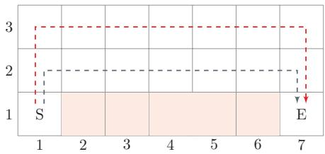  
图 12.1 悬崖行走问题

## 12.1.2 强化学习定义

我们先形式化描述强化学习任务.一个标准的强化学习问题通常可以表示为一个折扣马尔可夫决策过程

$$
( \mathcal { S } , \mathcal { A } , p , r , \gamma ) ,\tag{12.1}
$$

其中 $\mathcal { S }$ 为状态空间， $\mathcal { A }$ 为动作空间， $p ( s ^ { \prime } | s , a )$ 为状态转移概率， $r ( s , a , s ^ { \prime } )$ 为即时奖励函数， $\gamma \in [ 0 , 1 ]$ 为折扣率.后续强化学习算法的目标，就是围绕这一决策过程学习一个尽可能优的策略.

在强化学习中，有两个相互作用的对象：智能体和环境.

（1）智能体（Agent）负责感知环境状态、选择动作，并根据奖励信号调整策略.

（2）环境（Environment）根据智能体的动作改变自身状态，并返回新的状态以及相应奖励.

从建模角度看，强化学习的基本要素包括：

（1）状态s是对环境的描述，可以是离散的或连续的，其状态空间为S；

(2）动作a是对智能体行为的描述，可以是离散的或连续的，其动作空间为A;

（3）策略 $\pi ( a | s )$ 描述智能体在状态s下选择动作a的方式；

（4）状态转移概率 $\operatorname { i } \angle p ( s ^ { \prime } | s , a )$ 描述环境在状态s下接收动作 $a$ 后转移到状态 $s ^ { \prime }$ 的概率；

（5）即时奖励 $r ( s , a , s ^ { \prime } )$ 是环境对动作效果的反馈

策略 策略（Policy）刻画了智能体如何根据状态选择动作，通常可以分为确定性策略（Deterministic Policy）和随机性策略（Stochastic Policy）两种.

确定性策略是从状态空间到动作空间的映射函数 $\pi : \mathcal { S }  \mathcal { A }$ ；随机性策略表示在给定状态s时，智能体选择各个动作的概率分布：

$$
\pi ( a | s ) \triangleq p ( a | s ) ,\tag{12.2}
$$

$$
\sum _ { a \in { \mathcal { A } } } \pi ( a | s ) = 1 .\tag{12.3}
$$

在强化学习中，随机性策略往往更常见.一方面，它能够在学习过程中引入随机性以更充分地探索环境；另一方面，在多智能体博弈等场景中，随机性策略还可以避免行为完全可预测.对于连续动作空间问题，随机性策略也更便于定义可微的策略模型和梯度更新.

参考利用-探索策略.参见第12.2.2节.

## 12.1.3 马尔可夫决策过程

为简单起见，我们将智能体与环境的交互看作离散的时间序列.智能体从感知到的初始状态 $s _ { 0 }$ 开始，然后决定做一个相应的动作 $a _ { 0 }$ ，环境相应地发生改变到新的状态 $s _ { 1 }$ ，并反馈给智能体一个即时奖励 $r _ { 1 }$ ，然后智能体又根据状态 $s _ { 1 }$ 做一个动作 $a _ { 1 }$ ,环境相应改变为 $s _ { 2 }$ ,并反馈奖励 $r _ { 2 } .$ 这样的交互可以一直进行下去.

$$
s _ { 0 } , a _ { 0 } , s _ { 1 } , r _ { 1 } , a _ { 1 } , \cdots , s _ { t - 1 } , r _ { t - 1 } , a _ { t - 1 } , s _ { t } , r _ { t } , \cdots ,\tag{12.4}
$$

其中 $r _ { t } = r ( s _ { t - 1 } , a _ { t - 1 } , s _ { t } )$ 是第t时刻的即时奖励.图12.2给出了智能体与环境的交互.

  
图 12.2 智能体与环境的交互

智能体与环境的交互过程可以看作一个马尔可夫决策过程（MarkovDeci-sion Process，MDP）.更形式化地说，MDP通常由五元组 $( \mathcal S , \mathcal A , p , r , \gamma )$ 给出，其中γ控制未来奖励的折扣程度.

马尔可夫过程（MarkovProcess）是一组具有马尔可夫性质的随机变量序列 $s _ { 0 } , s _ { 1 } , \cdots , s _ { t } \in \mathcal { S }$ ,其中下一个时刻的状态 $s _ { t + 1 }$ 只取决于当前状态 $s _ { t }$

马尔可夫过程参见第D.3.1节.

$$
p ( s _ { t + 1 } | s _ { t } , \cdots , s _ { 0 } ) = p ( s _ { t + 1 } | s _ { t } ) ,\tag{12.5}
$$

其中 $p ( s _ { t + 1 } | s _ { t } )$ 称为状态转移概率， $\sum _ { s _ { t + 1 } \in \mathcal S } p ( s _ { t + 1 } | s _ { t } ) = 1$

马尔可夫决策过程在马尔可夫过程中加入一个额外的变量：动作 $: a$ ，下一个时刻的状态 $s _ { t + 1 }$ 不但和当前时刻的状态 $s _ { t }$ 相关，而且和动作 $a _ { t }$ 相关，

$$
p ( s _ { t + 1 } | s _ { t } , a _ { t } , \cdots , s _ { 0 } , a _ { 0 } ) = p ( s _ { t + 1 } | s _ { t } , a _ { t } ) ,\tag{12.6}
$$

其中 $p ( s _ { t + 1 } | s _ { t } , a _ { t } )$ 为状态转移概率

图12.3给出了马尔可夫决策过程的图模型表示.

给定策略 $\pi ( a | s )$ ,马尔可夫决策过程的一个轨迹（Trajectory）

$$
\tau = s _ { 0 } , a _ { 0 } , s _ { 1 } , r _ { 1 } , a _ { 1 } , \cdots , s _ { T - 1 } , a _ { T - 1 } , s _ { T } , r _ { T }
$$

的概率为

$$
p ( \tau ) = p ( s _ { 0 } , a _ { 0 } , s _ { 1 } , a _ { 1 } , \cdots )\tag{12.7}
$$

https://nndl.ai/

  
图 12.3 马尔可夫决策过程

$$
= p ( s _ { 0 } ) \prod _ { t = 0 } ^ { T - 1 } \pi ( a _ { t } | s _ { t } ) p ( s _ { t + 1 } | s _ { t } , a _ { t } ) .\tag{12.8}
$$

## 12.1.4 强化学习的目标函数

## 12.1.4.1 总回报

给定一条轨迹

$$
\tau = s _ { 0 } , a _ { 0 } , s _ { 1 } , r _ { 1 } , a _ { 1 } , \cdots , s _ { T } , r _ { T } ,\tag{12.9}
$$

从时刻t开始所得到的回报（Return)定义为

$$
G _ { t } = \sum _ { k = 0 } ^ { T - t - 1 } \gamma ^ { k } r _ { t + k + 1 } .\tag{12.10}
$$

当 $t = 0$ 时， $G _ { 0 }$ 表示一轮交互过程的总回报.

回报 $G _ { t }$ 是关于τ的函数.简单起见，本节以后省略为 $G _ { t }$

假设环境中有一个或多个特殊的终止状态（Terminal State），当到达终止状态时，一轮智能体与环境的交互就结束了．这一轮交互过程称为一个回合（Episode）或试验（Trial）.一般的强化学习任务（比如下棋、游戏）都属于这种回合式任务（Episodic Task).

如果环境中没有终止状态（比如持续运行的机器人系统），即 $T = \infty$ ，称为持续式任务（ContinuingTask）．这时直接累加奖励可能发散，因此通常引入折扣率 $\gamma \in [ 0 , 1 ]$ 来降低远期奖励的权重.当 $\gamma$ 接近于0时，智能体更关注短期收益；当 $\gamma$ 接近于1时，长期回报更重要.

## 12.1.4.2 目标函数

由于策略和状态转移都可能带有随机性，每次试验得到的轨迹一般不同，其回报 $G _ { 0 }$ 也随之变化.强化学习的目标是学习到一个策略 $\pi _ { \theta } ( a | s )$ 来最大化期望回报（Expected Return），即希望智能体执行一系列的动作来获得尽可能多的平均回报.

强化学习的目标函数为在持续式任务中，强化学习的优化目标也可以定义为MDP到达平稳分布时“即时奖励”的期望.

$$
\mathcal { J } ( \theta ) = \mathbb { E } _ { \tau \sim p _ { \theta } ( \tau ) } [ G _ { 0 } ] = \mathbb { E } _ { \tau \sim p _ { \theta } ( \tau ) } \left[ \sum _ { t = 0 } ^ { T - 1 } \gamma ^ { t } r _ { t + 1 } \right] ,\tag{12.11}
$$

其中θ为策略函数的参数

## 12.1.5 值函数

为了评估策略π的期望回报，我们定义两个值函数：状态值函数和状态-动作值函数.

## 12.1.5.1 状态值函数

策略π的期望回报可以写为初始状态分布上的期望：

$$
\mathbb { E } _ { \tau \sim p ( \tau ) } [ G _ { 0 } ] = \mathbb { E } _ { s \sim p ( s _ { 0 } ) } \left[ V ^ { \pi } ( s ) \right] ,\tag{12.12}
$$

其中 $V ^ { \pi } ( s )$ 称为状态值函数（State Value Function），表示在时刻t处于状态$s _ { t } = s$ 时，后续按照策略π执行所能获得的期望回报：

$$
V ^ { \pi } ( s ) = \mathbb { E } _ { \pi } [ G _ { t } \mid s _ { t } = s ] .\tag{12.13}
$$

通常 $G _ { t }$ 和 $s _ { t } = s$ 一起出现时，特指从满足 $s _ { t } = s$ 的时刻开始计算的回报.

根据马尔可夫性质，状态值函数满足

$$
V ^ { \pi } ( s ) = \mathbb { E } _ { a \sim \pi ( a \mid s ) } \mathbb { E } _ { s ^ { \prime } \sim p ( s ^ { \prime } \mid s , a ) } \left[ r ( s , a , s ^ { \prime } ) + \gamma V ^ { \pi } ( s ^ { \prime } ) \right] .\tag{12.14}
$$

公式(12.14)称为贝尔曼方程（BellmanEquation），表示当前状态的值函数可以通过下一状态的值函数递推得到.

如果给定策略 $\pi ( a | s )$ 、状态转移概率 $p ( s ^ { \prime } | s , a )$ 和奖励函数 $r ( s , a , s ^ { \prime } )$ ，我们就可以通过反复应用贝尔曼方程来计算 $V ^ { \pi } ( s )$ .更准确地说，在折扣情形下，相应的贝尔曼算子是一个压缩映射，因此迭代会收敛到唯一不动点.

贝尔曼方程因其提出者、美国国家科学院院士、动态规划创始人理查德·贝尔曼(RichardBellman,1920\~1984)而得名，也叫作“动态规划方程”.

## 12.1.5.2 状态-动作值函数

状态-动作值函数（State-Action Value Function）表示在状态s执行动作$a$ 之后，再按照策略π继续执行所能获得的期望回报：

$$
Q ^ { \pi } ( s , a ) = \mathbb { E } _ { \pi } [ G _ { t } \mid s _ { t } = s , a _ { t } = a ] .\tag{12.15}
$$

通常 $G _ { t }$ 和 $s _ { t } = s , a _ { t } = a$ 一起出现时，特指从满足 $s _ { t } = s , a _ { t } = a$ 的时刻开始计算的回报.状态-动作值函数也经常称为Q函数（Q-Function）.

状态值函数 $V ^ { \pi } ( s )$ 是Q函数 $Q ^ { \pi } ( s , a )$ 关于动作a的期望，即

$$
V ^ { \pi } ( s ) = \mathbb { E } _ { a \sim \pi ( a | s ) } [ Q ^ { \pi } ( s , a ) ] .\tag{12.16}
$$

结合公式(12.15)和公式(12.16),Q函数满足

$$
\begin{array} { r } { Q ^ { \pi } ( s , a ) = \mathbb { E } _ { s ^ { \prime } \sim p ( s ^ { \prime } \mid s , a ) } \biggl [ r ( s , a , s ^ { \prime } ) + \gamma \mathbb { E } _ { a ^ { \prime } \sim \pi ( a ^ { \prime } \mid s ^ { \prime } ) } [ Q ^ { \pi } ( s ^ { \prime } , a ^ { \prime } ) ] \biggr ] , } \end{array}\tag{12.17}
$$

这就是关于 $\mathrm { Q }$ 函数的贝尔曼方程.

## 12.1.5.3值函数的作用

值函数可以评估策略π，并用来优化策略.假设在状态s，有一个动作 $a ^ { * }$ 使得$Q ^ { \pi } ( s , a ^ { * } ) > V ^ { \pi } ( s )$ ，说明执行动作 $a ^ { * }$ 的回报比当前的策略 $\pi ( a | s )$ 要高，我们就可以调整参数使得策略中动作 $a ^ { * }$ 的概率 $\boldsymbol { p } ( \boldsymbol { a } ^ { * } | \boldsymbol { s } )$ 增加.

## 12.1.6 深度强化学习

在早期强化学习问题中，状态和动作要么本身离散且有限，要么可以被离散化后再存入表格.当状态空间和动作空间较小时，这种建模方式清晰且有效．但在很多真实任务中，状态和动作往往非常复杂，表格方法就难以直接应用

也称为表格型强化学习.

比如，围棋的棋局有 $3 ^ { 3 6 1 } \approx 1 0 ^ { 1 7 0 }$ 种状态，动作（即落子位置）数量为361；在自动驾驶中，状态往往来自摄像头、激光雷达、速度计等多种传感器，通常是高维连续信号，而动作也可能是连续的转向、加速度和制动控制，对于这类问题，我们更希望学习一个具有泛化能力的函数，而不是为每个状态或状态-动作对单独存一张表.

深度强化学习（DeepReinforcement Learning）是将强化学习和深度学习结合起来：前者给出交互式决策问题的建模方式与优化目标，后者则用深度神经网络来近似值函数、策略函数，甚至环境模型.这样做的结果是，强化学习不再局限于小规模离散问题，而能够扩展到高维感知、复杂控制和长时程决策等更接近真实应用的场景.

从本章后续内容看，深度强化学习主要沿着四条思路展开：

（1）值函数近似：用神经网络近似 $Q ^ { \pi } ( s , a )$ 或 $V ^ { \pi } ( s )$ ,代表方法是DQN；

（2）策略函数近似：直接用可微策略 $\pi _ { \theta } ( a | s )$ 建模决策分布，代表方法是REINFORCE;

本章前半部分更多是在建立强化学习的基础概念与经典算法.从DQN开始，我们正式进入深度强化学习的讨论.

（3）演员-评论员方法：同时学习策略和值函数，在样本效率与训练稳定性之间取得平衡，代表方法包括Actor-Critic、PPO及其后续发展；

（4）环境模型学习：用神经网络近似状态转移、奖励或隐状态演化，再借助模型进行规划、虚拟轨迹生成或策略改进

## 12.2 基于值函数的学习方法

值函数是对策略π的评估.如果状态数和动作数都有限，那么策略空间也是有限的，理论上可以对所有策略进行评估并选出最优策略π\*.

$$
\forall \pi , \forall s , \qquad V ^ { \pi ^ { * } } ( s ) \geq V ^ { \pi } ( s ) .\tag{12.18}
$$

但这种方式在实践中很难实现.假设状态空间S和动作空间A都是离散且有限的，策略空间为 $| \mathcal { A } | ^ { | \mathcal { S } | }$ ,往往也非常大.

一种可行的方式是通过迭代的方法不断改进策略.对于一个策略 $\pi ( a | s )$ ,其$\mathrm { Q }$ 函数为 $Q ^ { \pi } ( s , a )$ ,我们可以设置一个新的策略 $\pi ^ { \prime } ( a | s )$

$$
\pi ^ { \prime } ( a | s ) = \left\{ \begin{array} { l l } { { 1 } } & { { \mathrm { i f } a = \arg \operatorname* { m a x } _ { \hat { a } } Q ^ { \pi } ( s , \hat { a } ) , } } \\ { { } } & { { } } \\ { { 0 } } & { { \mathrm { o t h e r w i s e , } } } \end{array} \right.\tag{12.19}
$$

即 $\pi ^ { \prime } ( a | s )$ 为一个确定性的策略，也可以直接写为

$$
\pi ^ { \prime } ( s ) = \arg \operatorname* { m a x } _ { a } Q ^ { \pi } ( s , a ) .\tag{12.20}
$$

如果执行 $\pi ^ { \prime }$ ,会有

$$
\forall s , \qquad V ^ { \pi ^ { \prime } } ( s ) \geq V ^ { \pi } ( s ) .\tag{12.21}
$$

参见习题12-4.

因此，学习最优策略的思路为：先随机初始化一个策略，计算该策略的值函数，并根据公式(12.20)来设置新的策略，然后反复迭代直到策略稳定.

基于值函数的策略学习方法中，关键是如何计算或估计策略π的值函数按照是否已知环境模型，可以从动态规划、蒙特卡罗和时序差分学习等方法来理解.

## 12.2.1 动态规划算法

从贝尔曼方程可知，如果知道马尔可夫决策过程的状态转移概率 $p ( s ^ { \prime } | s , a )$ 和奖励 $r ( s , a , s ^ { \prime } )$ ，就可以直接通过贝尔曼方程来迭代计算其值函数.这种模型已知的强化学习算法也称为基于模型的强化学习（Model-Based ReinforcementLearning）算法，这里的模型是指环境的状态转移和奖励机制，而不是神经网络结构.

在模型已知时，可以通过动态规划的方法来计算.常用的方法主要有策略迭代算法和值迭代算法.

后文的“环境模型”也是这个含义：它刻画动作如何影响后续状态和奖励.

## 12.2.1.1 策略迭代算法

策略迭代（PolicyIteration)算法中，每次迭代可以分为两步：

（1）策略评估（PolicyEvaluation）:计算当前策略下每个状态的值函数，即算法12.1中的3-6步.策略评估可以通过贝尔曼方程进行迭代计算 $V ^ { \pi } ( s )$

（2）策略改进（PolicyImprovement）：根据值函数来更新策略，即算法12.1中的7-8步.

如果状态数有限，也可以通过直接求解贝尔曼方程来得到 $V ^ { \pi } ( s )$ 贝尔曼方程参见公式(12.14).

策略迭代算法如算法12.1所示.

算法 12.1 策略迭代算法  
输入：MDP五元组： $\mathcal { S } , \mathcal { A } , p , r , \gamma ;$   
1 初始化： $\begin{array} { r } { \forall s , \forall a , \pi ( a | s ) = \frac { 1 } { | \mathcal { A } | } } \end{array}$   
2 repeat  
// 策略评估  
3 repeat  
4 根据贝尔曼方程(公式(12.14)),计算 $V ^ { \pi } ( s )$ , ∀s;  
5 until $\forall s , V ^ { \pi } ( s )$ 收敛;  
// 策略改进  
6 根据公式(12.15),计算 $Q ( s , a ) ;$   
7 $\forall s , \pi ( s ) = \arg \operatorname* { m a x } _ { a } Q ( s , a ) ;$   
8 until $\forall s , \pi ( s )$ 收敛;  
输出：策略π

## 12.2.1.2 值迭代算法

策略迭代算法中的策略评估和策略改进是交替轮流进行，其中策略评估也是通过一个内部迭代来进行计算，其计算量比较大.事实上，我们不需要每次计算出每次策略对应的精确的值函数，也就是说内部迭代不需要执行到完全收敛

值迭代（ValueIteration）算法将策略评估和策略改进两个过程合并，来直接计算出最优策略.最优策略 $\pi ^ { * }$ 对应的值函数称为最优值函数，其中包括最优状态值函数 $V ^ { * } ( s )$ 和最优状态-动作值函数 $Q ^ { * } ( s , a )$ ，它们之间的关系为

$$
V ^ { * } ( s ) = \operatorname* { m a x } _ { a } Q ^ { * } ( s , a ) .\tag{12.22}
$$

根据贝尔曼方程，我们可以通过迭代的方式来计算最优状态值函数 $V ^ { \ast } ( s )$ 和最优状态-动作值函数 $Q ^ { * } ( s , a )$

$$
V ^ { * } ( s ) = \operatorname* { m a x } _ { a } \mathbb { E } _ { s ^ { \prime } \sim p ( s ^ { \prime } \mid s , a ) } \biggl [ r ( s , a , s ^ { \prime } ) + \gamma V ^ { * } ( s ^ { \prime } ) \biggr ] ,\tag{12.23}
$$

$$
Q ^ { * } ( s , a ) = \mathbb { E } _ { s ^ { \prime } \sim p ( s ^ { \prime } \mid s , a ) } \biggl [ r ( s , a , s ^ { \prime } ) + \gamma \operatorname* { m a x } _ { a ^ { \prime } } Q ^ { * } ( s ^ { \prime } , a ^ { \prime } ) \biggr ] ,\tag{12.24}
$$

这两个公式称为贝尔曼最优方程(Bellman Optimality Equation).

值迭代算法通过直接优化贝尔曼最优方程（见公式(12.23)），迭代计算最优值函数.值迭代算法如算法12.2所示.

算法 12.2 值迭代算法  
输入：MDP五元组： $\langle \mathcal { S } , \mathcal { A } , p , r , \gamma ;$   
1 初始化 $\forall s \in { \mathcal { S } } , V ( s ) = 0$ •n  
2 repeat  
3 $\forall s , V ( s ) \gets \operatorname* { m a x } _ { a } \mathbb { E } _ { s ^ { \prime } \sim p ( s ^ { \prime } | s , a ) } \biggl [ r ( s , a , s ^ { \prime } ) + \gamma V ( s ^ { \prime } ) \biggr ]$ ;  
4 until $\forall s , V ( s )$ 收敛;  
5 根据公式(12.15) 计算 $Q ( s , a )$   
6 $\forall s , \pi ( s ) = \arg \operatorname* { m a x } _ { a } Q ( s , a ) ;$   
输出：策略π

策略迭代算法与值迭代算法的对比 策略迭代算法和值迭代算法都基于贝尔曼方程，但侧重点不同.策略迭代在每一轮中先进行较充分的策略评估，再执行一次策略改进，因此单轮计算量通常更大，但所需轮数可能较少；值迭代则直接利用贝尔曼最优方程更新值函数，单轮更新更简单，但往往需要更多轮迭代才能收敛.

上述模型已知的算法可以看作动态规划式方法．在实际应用中有以下两点限制：

两者都可能需要较多迭代步数才能完全收敛.在实际应用中，通常并不要求严格达到理论收敛点，而是当值函数或策略变化足够小时就停止，以获得近似最优策略.

（1）要求模型已知，即要给出马尔可夫决策过程的状态转移概率 $p ( s ^ { \prime } | s , a )$ 和奖励函数 $r ( s , a , s ^ { \prime } )$ .但实际应用中这个要求很难满足，如果我们事先不知道模型，可以先让智能体通过探索策略与环境交互，收集状态转移和奖励样本，在收集一定样本后，可以估计一个近似环境模型来刻画马尔可夫决策过程.但是，对大规模状态空间直接重构完整转移表的代价很高，通常只适用于状态数较少的场合.

（2）效率问题，即当状态数量较多时，算法效率比较低.但在实际应用中，很多问题的状态数量和动作数量都很大，不管是值迭代还是策略迭代，直接枚举所有状态-动作对通常都难以实现.一种有效的方法是通过一个函数（比如神经网络）来近似计算值函数，以减少复杂度，并提高泛化能力.

## 12.2.2 蒙特卡罗方法

在很多应用场景中，马尔可夫决策过程的状态转移概率 $p ( s ^ { \prime } | s , a )$ 和奖励函数 $r ( s , a , s ^ { \prime } )$ 都是未知的．在这种情况下，我们一般需要智能体和环境进行交互，并收集一些样本，然后再根据这些样本来求解马尔可夫决策过程最优策略.

这种模型未知且基于采样的学习算法也称为模型无关的强化学习（Model-FreeReinforcement Learning)算法.

模型无关的强化学习也叫作无模型的强化学习.

Q函数 $Q ^ { \pi } ( s , a )$ 表示在状态s执行动作a后，按照策略 $\pi$ 继续执行所能获得的期望回报：

$$
Q ^ { \pi } ( s , a ) = \mathbb { E } _ { \pi } [ G _ { t } \mid s _ { t } = s , a _ { t } = a ] ,
$$

$\mathrm { \Delta Q }$ 函数的定义参见公式(12.15).

(12.25)

其中 $G _ { t }$ 特指从满足 $s _ { t } = s , a _ { t } = a$ 的时刻开始计算的总回报.

如果模型未知，Q函数可以通过采样来进行计算，这就是蒙特卡罗方法.对于一个策略 $\pi$ ，智能体从状态s执行动作a开始，然后通过随机游走的方法来探索环境，并计算其得到的总回报.假设我们进行N次试验，得到N个从 $( s , a )$ 出发的采样片段，其对应回报分别为 $G _ { t } ^ { ( 1 ) } , G _ { t } ^ { ( 2 ) } , \cdots , G _ { t } ^ { ( N ) }$ .则Q函数可以近似为

$$
Q ^ { \pi } ( s , a ) \approx \hat { Q } ^ { \pi } ( s , a ) = \frac { 1 } { N } \sum _ { n = 1 } ^ { N } G _ { t } ^ { ( n ) } .\tag{12.26}
$$

其中 $G _ { t } ^ { ( n ) }$ 表示第n次试验中从 $( s , a )$ 出发直到终止时刻的总回报.当 $N \to \infty$ 时，${ \hat { Q } } ^ { \pi } ( s , a )  Q ^ { \pi } ( s , a )$

在近似估计出Q函数 $\hat { Q } ^ { \pi } ( s , a )$ 之后，就可以进行策略改进.然后在新的策略下重新通过采样来估计 $\mathrm { Q }$ 函数，并不断重复，直至收敛.

利用和探索但在蒙特卡罗方法中，如果策略过于确定、且探索不足，那么采样轨迹可能只能覆盖很有限的一部分状态-动作对，只能较好地估计 $Q ^ { \pi } ( s , \pi ( s ) )$ 而难以比较其他动作 $a ^ { \prime }$ 的价值，因此也无法有效改进策略.这种情况仅仅是对当前策略的利用（exploitation），而缺少对环境的探索（exploration).为了找到更好的策略，采样轨迹需要尽可能覆盖足够多的状态和动作.

这也可以看作一个多臂赌博机问题.

为了平衡利用和探索，我们可以采用€-贪心法（∈-greedyMethod）.对于一个目标策略 $\pi$ ,其对应的∈-贪心法策略为

$$
\pi ^ { \epsilon } ( s ) = \left\{ \begin{array} { c c } { { \pi ( s ) , } } & { { \ddag \ddag \mathrm { H } \acute { s } \acute { \pi } \acute { s } 1 - \epsilon , } } \\ { { \ b \notin \acute { s } \acute { \pi } [ \acute { x } \acute { \pi } \acute { s } ] \acute { \mp } \acute { \mathcal { A } } \ddag \mathrm { H } \acute { s } \acute { \jmath } \overrightarrow { \mathcal { Z } } \} \vphantom { \ b } \mathcal { H } \mathrm { F } , } } & { { \ddag \ddag \mathrm { H } \acute { s } \acute { \jmath } \acute { \mathcal { Z } } \acute { s } \epsilon } . } \end{array} \right.\tag{12.27}
$$

这样，∈-贪心法将一个仅利用的策略转为带探索的策略.每次选择动作 $\pi ( s )$ 的概率为 $1 - \epsilon + \frac { \epsilon } { | \mathcal { A } | }$ ,其他动作的概率为 $\frac { \epsilon } { | \mathcal { A } | }$

同策略 在蒙特卡罗方法中，如果采样策略是 $\pi ^ { \epsilon } ( s )$ ，不断改进策略也是 $\pi ^ { \epsilon } ( s )$ 而不是目标策略 $\pi ( s )$ .这种采样与改进策略相同（即都是 $\pi ^ { \epsilon } ( s )$ ）的强化学习方法叫作同策略（On-Policy)方法.

异策略 如果采样策略是 $\pi ^ { \epsilon } ( s )$ ，而优化目标是策略π，可以通过重要性采样，引入重要性权重来实现对目标策略π的优化.这种采样与改进分别使用不同策略的强化学习方法叫作异策略(Off-Policy)方法.

## 12.2.3 时序差分学习方法

蒙特卡罗方法一般需要拿到完整的轨迹，才能对策略进行评估并更新模型，因此效率也比较低.时序差分学习（Temporal-DifferenceLearning）方法是蒙特卡罗方法的一种改进，通过引入动态规划算法来提高学习效率[Sutton et al.,2018].时序差分学习方法是模拟一段轨迹，每行动一步(或者几步)，就利用贝尔曼方程来评估行动前状态的价值

首先，将蒙特卡罗方法中Q函数 $\hat { Q } ^ { \pi } ( s , a )$ 的估计改为增量计算的方式，假设第N次试验后值函数 $\hat { Q } _ { N } ^ { \pi } ( s , a )$ 的平均为

当时序差分学习方法中每次更新的动作数为最大步数时，就等价于蒙特卡罗方法.

$$
\hat { Q } _ { N } ^ { \pi } ( s , a ) = \frac { 1 } { N } \sum _ { n = 1 } ^ { N } G _ { t } ^ { ( n ) }\tag{12.28}
$$

$$
= \frac { 1 } { N } \Big ( G _ { t } ^ { ( N ) } + \sum _ { n = 1 } ^ { N - 1 } G _ { t } ^ { ( n ) } \Big )\tag{12.29}
$$

$$
= \frac { 1 } { N } \Big ( G _ { t } ^ { ( N ) } + ( N - 1 ) \hat { Q } _ { N - 1 } ^ { \pi } ( s , a ) \Big )\tag{12.30}
$$

$$
= \hat { Q } _ { N - 1 } ^ { \pi } ( s , a ) + \frac { 1 } { N } \Bigl ( G _ { t } ^ { ( N ) } - \hat { Q } _ { N - 1 } ^ { \pi } ( s , a ) \Bigr ) ,\tag{12.31}
$$

其中 $G _ { t } ^ { ( n ) }$ 表示第n次试验中从 $( s , a )$ 出发直到终止时刻的总回报.

值函数 $\hat { Q } ^ { \pi } ( s , a )$ 在第N次试验后的平均等于第N-1次试验后的平均加上一个增量.更一般性地，我们将权重系数 $\textstyle { \frac { 1 } { N } }$ 改为一个比较小的正数α.这样每次采用一个新的从(s,a)出发的采样片段,就可以更新 $\hat { Q } ^ { \pi } ( s , a )$

$$
\hat { Q } ^ { \pi } ( s , a ) \longleftarrow \hat { Q } ^ { \pi } ( s , a ) + \alpha \Big ( G _ { t } - \hat { Q } ^ { \pi } ( s , a ) \Big ) ,\tag{12.32}
$$

其中增量 $\delta \triangleq G _ { t } - { \hat { Q } } ^ { \pi } ( s , a )$ 称为蒙特卡罗误差（Monte Carlo Error），表示当前采样回报 $G _ { t }$ 与期望回报 $\hat { Q } ^ { \pi } ( s , a )$ 之间的差距.

为了提高效率，可以借助动态规划思想对 $G _ { t }$ 进行近似，而不必等到完整轨迹结束.从s,a开始，采样下一步的状态和动作 $( s ^ { \prime } , a ^ { \prime } )$ ,并得到奖励 $r ( s , a , s ^ { \prime } )$ ,然后利用贝尔曼方程来近似估计 $G _ { t }$

贝尔曼方程参见公式(12.17).

$$
G _ { t } = r ( s , a , s ^ { \prime } ) + \gamma G _ { t + 1 }\tag{12.33}
$$

$$
\approx r ( s , a , s ^ { \prime } ) + \gamma \hat { Q } ^ { \pi } ( s ^ { \prime } , a ^ { \prime } ) ,\tag{12.34}
$$

其中 $\hat { Q } ^ { \pi } ( s ^ { \prime } , a ^ { \prime } )$ 是当前的Q函数的近似估计.

参见习题12-3.

结合公式(12.32)和公式(12.34)，有

$$
\hat { Q } ^ { \pi } ( s , a ) \gets \hat { Q } ^ { \pi } ( s , a ) + \alpha \Big ( r ( s , a , s ^ { \prime } ) + \gamma \hat { Q } ^ { \pi } ( s ^ { \prime } , a ^ { \prime } ) - \hat { Q } ^ { \pi } ( s , a ) \Big ) ,\tag{12.35}
$$

因此，更新 $\hat { Q } ^ { \pi } ( s , a )$ 只需要知道当前状态s和动作 $a \mathrm { . }$ 奖励 $r ( s , a , s ^ { \prime } )$ 、下一步的状态 $s ^ { \prime }$ 和动作 $a ^ { \prime }$ 这种策略学习方法称为SARSA算法（State Action RewardState Action,SARSA) [Rummery et al., 1994].

SARSA算法的学习过程如算法12.3所示.

算法 12.3 SARSA：一种同策略的时序差分学习算法  
输入：状态空间 $\mathcal { S }$ 动作空间.A,折扣率γ，学习率 $\alpha$   
1 $\forall s , \forall a$ ,随机初始化 $Q ( s , a )$ 根据 $\mathrm { Q }$ 函数构建策略 $\pi ;$   
2 repeat  
3 初始化起始状态 $s ;$ 选择动作 $a = \pi ^ { \epsilon } ( s )$ $/ / \pi ^ { \epsilon } ( s )$ 参见公式(12.27)  
4 repeat  
5 执行动作a,得到即时奖励r和新状态 $s ^ { \prime } ;$   
6 在状态 $s ^ { \prime }$ ，选择动作 $a ^ { \prime } = \pi ^ { \epsilon } ( s ^ { \prime } )$   
7 $Q ( s , a )  Q ( s , a ) + \alpha \Big ( r + \gamma Q ( s ^ { \prime } , a ^ { \prime } ) - Q ( s , a ) \Big )$ //更新Q函数  
8 $\pi ( s ) = \arg \operatorname* { m a x } _ { a \in \mathcal { A } } Q ( s , a ) ;$ // 更新策略  
9 $s \gets s ^ { \prime } , a \gets a ^ { \prime } ;$   
10 until s为终止状态;  
11 until $\forall s , a , Q ( s , a )$ 收敛;  
输出：策略 $\pi ( s )$

SARSA算法采样和优化的策略都是 $\pi ^ { \epsilon }$ ,因此是一种同策略算法.

为了提高计算效率，我们不需要对环境中所有的s,a组合进行穷举，并计算值函数.只需要将当前的探索 $( s , a , r , s ^ { \prime } , a ^ { \prime } )$ 中$s ^ { \prime } , a ^ { \prime }$ 作为下一次估计的起始状态和动作.

时序差分学习是强化学习的主要学习方法，其关键步骤就是在每次迭代中优化Q函数来减小实际目标 $r + \gamma Q ( s ^ { \prime } , a ^ { \prime } )$ 和当前估计 $Q ( s , a )$ 之间的差距.这一误差信号和动物学习中的奖励预测误差有相似之处.在大脑神经元中，多巴胺释放机制与奖励预测误差之间存在对应关系.[Schultz，1998]的一个实验中，通过监测猴子大脑释放的多巴胺浓度，发现如果猴子获得比预期更多的果汁，或者在没有预想到的时间喝到果汁，多巴胺释放大增，如果没有喝到本来预期的果汁，多巴胺的释放就会大减，多巴胺的释放，来自对于实际奖励和预期奖励的差异，而不是奖励本身.

多巴胺是一种神经传导物质，传递开心、兴奋有关的信息.

时序差分学习方法和蒙特卡罗方法的主要不同为：蒙特卡罗方法需要一条完整的路径才能知道其总回报，也不依赖马尔可夫性质；而时序差分学习方法只需要一步，其总回报需要通过马尔可夫性质来进行近似估计

## 12.2.3.1 Q学习

Q学习（Q-Learning）算法[Watkins et al.，1992]是一种异策略的时序差分学习方法.在 $\mathrm { Q }$ 学习中， $\mathrm { Q }$ 函数的估计方法为

$$
Q ( s , a )  Q ( s , a ) + \alpha \Big ( r + \gamma \operatorname* { m a x } _ { a ^ { \prime } } Q ( s ^ { \prime } , a ^ { \prime } ) - Q ( s , a ) \Big ) ,\tag{12.36}
$$

Q学习和SARSA均为时序差分学习的变体，前者采用异策略方式，后者采用同策略方式.

相当于让 $Q ( s , a )$ 直接去估计最优状态-动作值函数 $Q ^ { * } ( s , a )$

与SARSA算法不同，Q学习算法在更新目标中不使用 $\pi ^ { \epsilon }$ 实际采样得到的下一步动作 $a ^ { \prime }$ ，而是使用下一状态下最大的Q值.因此，Q学习的目标对应贪心策略，而采样过程仍可以使用∈-贪心策略来保证探索.

算法12.4给出了Q学习的学习过程.

```perl
算法12.4 Q学习：一种异策略的时序差分学习算法
输入：状态空间S,动作空间A,折扣率γ，学习率α
1 $\forall s , \forall a$ ,随机初始化 $Q ( s , a )$ ;根据Q函数构建策略 $\pi ;$
2 repeat
3 初始化起始状态 $s ;$
4 repeat
5 在状态s,选择动作 $a = \pi ^ { \epsilon } ( s ) ;$
6 执行动作a,得到即时奖励r和新状态 $s ^ { \prime } { \mathrm { : } }$
7 $Q ( s , a )  Q ( s , a ) + \alpha \Big ( r + \gamma \operatorname* { m a x } _ { a ^ { \prime } } Q ( s ^ { \prime } , a ^ { \prime } ) - Q ( s , a ) \Big )$ ；//更新Q函数
8 $s  s ^ { \prime } ;$
9 until s 为终止状态;
10 until $\forall s , a , Q ( s , a )$ 收敛;
输出：策略 $\pi ( s ) = \arg \operatorname* { m a x } _ { a \in \mathcal { A } } Q ( s , a )$
```

## 12.2.4 深度Q网络

当状态空间很大、甚至是连续空间时，我们很难再用表格记录每个状态-动作对对应的值函数，这时就需要使用值函数近似（Value Function Approxima-tion）．其基本思想是：用一个参数化函数 $Q _ { \phi } ( s , \pmb { a } )$ 来逼近真实的动作值函数$Q ^ { \pi } ( s , a )$

$$
\begin{array} { r } { Q _ { \phi } ( \pmb { \mathscr { s } } , \pmb { a } ) \approx Q ^ { \pi } ( \pmb { \mathscr { s } } , \pmb { a } ) , } \end{array}\tag{12.37}
$$

其中 s,a分别是状态s和动作a的向量表示；函数 $Q _ { \phi } ( s , \pmb { a } )$ 通常取为参数为 $\phi$ 的神经网络，输出为一个实数，称为Q网络（Q-network).

需要特别说明的是：值函数近似本身既可以处理高维离散状态，也可以处理连续状态；但标准DQN通常仍主要面向离散动作空间.原因在于，DQN的核心更新需要计算 $\operatorname* { m a x } _ { a ^ { \prime } } Q ( s ^ { \prime } , a ^ { \prime } )$ ，如果动作空间是连续的，就很难像离散情形那样显式遍历所有动作.正因为如此，连续动作控制通常更自然地转向策略梯度或演员-评论员方法.

如果动作空间为有限离散的M个动作 $a _ { 1 } , \cdots , a _ { M }$ ，我们可以让 $\mathrm { Q }$ 网络输出

一个M维向量，其中第m维表示 $Q _ { \phi } ( \pmb { s } , a _ { m } )$ ,对应值函数 $Q ^ { \pi } ( s , a _ { m } )$ 的近似值.

$$
\begin{array} { r } { Q _ { \phi } ( s ) = \left[ \begin{array} { c } { Q _ { \phi } ( s , a _ { 1 } ) } \\ { \vdots } \\ { Q _ { \phi } ( s , a _ { M } ) } \end{array} \right] \approx \left[ \begin{array} { c } { Q ^ { \pi } ( s , a _ { 1 } ) } \\ { \vdots } \\ { Q ^ { \pi } ( s , a _ { M } ) } \end{array} \right] . } \end{array}\tag{12.38}
$$

我们需要学习一个参数 $\phi$ 来使得函数 $Q _ { \phi } ( s , \pmb { a } )$ 可以逼近值函数 $Q ^ { \pi } ( s , a )$ .如果采用蒙特卡罗方法，就直接让 $Q _ { \phi } ( s , \pmb { a } )$ 去逼近平均的总回报 $\hat { Q } ^ { \pi } ( s , a )$ ;如果采用时序差分学习方法，就让 $Q _ { \phi } ( s , \pmb { a } )$ 去逼近E $\dot { } { } _ { s ^ { \prime } , a ^ { \prime } } [ r + \gamma Q _ { \phi } ( s ^ { \prime } , { } a ^ { \prime } ) ]$

以 $\mathrm { \Delta Q }$ 学习为例，采用随机梯度下降时，可以先构造时序差分目标

$$
y = r + \gamma \operatorname* { m a x } _ { a ^ { \prime } } Q _ { \hat { \phi } } ( s ^ { \prime } , a ^ { \prime } ) ,\tag{12.39}
$$

再最小化

$$
\mathcal { L } ( s , a , r , s ^ { \prime } | \phi ) = \big ( y - Q _ { \phi } ( \pmb { s } , \pmb { a } ) \big ) ^ { 2 } ,\tag{12.40}
$$

其中 $\scriptstyle { s ^ { \prime } }$ 是下一时刻状态 $s ^ { \prime }$ 的向量表示， $a ^ { \prime }$ 为下一时刻的候选动作， $\hat { \phi }$ 表示用于计算目标的参数.在普通 $\mathrm { Q }$ 网络中可以令 ${ \hat { \phi } } = \phi$ ;在DQN中通常使用单独的目标网络参数来稳定学习.

然而，这个目标函数存在两个问题：一是目标不稳定，参数学习的目标依赖于参数本身；二是样本之间有很强的相关性.为了解决这两个问题，[Mnih et al.,2015]提出了一种深度 $\mathrm { \Delta Q }$ 网络（Deep Q-Networks, DQN).深度 $\mathrm { Q }$ 网络采取两个措施：一是目标网络冻结(Freezing Target Networks),即在一个时间段内固定目标中的参数，来稳定学习目标；二是经验回放（ExperienceReplay），即构建一个经验池（ReplayBuffer）来减弱相邻样本之间的相关性.经验池是由智能体最近的经历组成的数据集.

经验回放可以形象地理解为在回忆中学习.

训练时，随机从经验池中抽取样本来代替当前样本进行训练.这样既可以打破相邻样本之间的强相关性，也能提高样本利用率，从而使训练更加稳定．经验回放在一定程度上类似于监督学习中的“先收集数据、再重复利用数据进行训练”．从更一般的角度看，DQN中的目标网络和经验回放共同缓解了函数逼近、自举和异策略学习叠加所带来的不稳定性.

整体上，在基于值函数的学习方法中，策略一般为确定性策略．策略优化通常都依赖于值函数，比如贪心策略 $\pi ( s ) = \arg \operatorname* { m a x } _ { a } Q ( s , a )$ .最优策略一般需要遍历当前状态 $s$ 下的所有动作，并找出最大的 $Q ( s , a )$ .当动作空间离散但是很大时，遍历求最大需要很高的时间复杂度；当动作空间是连续的并且 $Q ( s , a )$ 非凸时，也很难求解出最优策略.

深度Q网络的学习过程如算法12.5所示.

算法 12.5 带经验回放的深度Q网络  
输入：状态空间S,动作空间A,折扣率 $\gamma$ ,学习率 $\alpha$ ,参数更新间隔 $C ;$   
1 初始化经验池D，容量为 $N ;$   
2 随机初始化 $Q$ 网络的参数 $\phi ;$   
3 令目标Q网络的参数 $\hat { \phi }  \phi ;$   
4 repeat  
5 初始化起始状态 $s ;$   
6 repeat  
7 在状态 $s .$ 按∈-贪心策略选择动作 $a \sim \pi ^ { \epsilon } ( \cdot | s )$ 2  
8 执行动作 $a$ ,观测环境，得到即时奖励r和新的状态 $s ^ { \prime } ;$   
9 将 $s , a , r , s ^ { \prime }$ 放入D中;  
10 从D中随机采样一批样本 $( s , a , r , s ^ { \prime } ) ;$   
$\begin{array} { r } { y = \left\{ \begin{array} { l } { r , } \\ { r + \gamma \operatorname* { m a x } _ { a ^ { \prime } } } \end{array} \right. } \end{array}$ $\scriptstyle { s ^ { \prime } }$ 为终止状态，  
11  
$\boxed { r + \gamma \operatorname* { m a x } _ { a ^ { \prime } } Q _ { \hat { \phi } } ( \pmb { s } ^ { \prime } , a ^ { \prime } ) }$ 否则  
12 以 $\big ( y - Q _ { \phi } ( s , a ) \big ) ^ { 2 }$ 为损失函数来训练 $Q$ 网络；  
13 $s  s ^ { \prime } ;$   
14 每隔C步， $\hat { \phi }  \phi ;$   
15 until s 为终止状态;  
16 until $\forall s , a , Q _ { \phi } ( s , a )$ 收敛;  
输出：Q网络 $Q _ { \phi } ( s , \pmb { a } )$

## 12.3 基于策略函数的学习方法

基于值函数的方法通过“先估计价值，再按价值改进策略”来完成学习：而基于策略函数的方法则试图直接回答另一个问题：既然最终目标是学到一个好的策略，能否直接在策略空间中优化参数，而不再显式枚举所有动作的值？一种直接的方法是在策略空间直接搜索来得到较优策略，称为策略搜索（PolicySearch）.策略搜索本质是一个优化问题，可以分为基于梯度的优化和无梯度优化.与基于值函数的方法相比，策略搜索可以不显式学习完整的动作值函数，而是直接优化参数化策略.参数化策略既可以表示随机性策略，也更便于处理连续状态和连续动作.策略梯度（PolicyGradient）是一种基于梯度的强化学习方法.假设 $\pi _ { \theta } ( a | s )$ 是一个关于θ的连续可微函数，我们可以用梯度上升的方法来优化参数θ使得目标函数 $\mathcal { J } ( \theta )$ 最大.

目标函数 $\mathcal { J } ( \theta )$ 关于策略参数θ的导数为

$$
\frac { \partial \mathcal { J } ( \theta ) } { \partial \theta } = \frac { \partial } { \partial \theta } \int p _ { \theta } ( \tau ) G _ { 0 } \mathrm { d } \tau\tag{12.41}
$$

$$
G _ { 0 } = \sum _ { t = 0 } ^ { T - 1 } \gamma ^ { t } r _ { t + 1 } .
$$

$$
= \int \left( \frac { \partial } { \partial \theta } p _ { \theta } ( \tau ) \right) G _ { 0 } \mathrm { d } \tau\tag{12.42}
$$

$$
= \int p _ { \theta } ( \tau ) \left( { \frac { 1 } { p _ { \theta } ( \tau ) } } { \frac { \partial } { \partial \theta } } p _ { \theta } ( \tau ) \right) G _ { 0 } \mathrm { d } \tau\tag{12.43}
$$

$$
= \int p _ { \theta } ( \tau ) \left( { \frac { \partial } { \partial \theta } } \log p _ { \theta } ( \tau ) \right) G _ { 0 } \mathrm { d } \tau\tag{12.44}
$$

$$
= \mathbb { E } _ { \tau \sim p _ { \theta } ( \tau ) } \left[ \frac { \partial } { \partial \theta } \log p _ { \theta } ( \tau ) G _ { 0 } \right] ,\tag{12.45}
$$

其中 $\begin{array} { r } { \frac { \partial } { \partial \theta } \log p _ { \theta } ( \tau ) \ } \end{array}$ 为函数 $\log p _ { \theta } ( \tau )$ 关于θ的偏导数.从公式(12.45)中可以看出，参数θ优化的方向是使得总回报 $G ( \tau )$ 越大的轨迹τ的概率 $p _ { \theta } ( \tau )$ 也越大.

$\begin{array} { r } { \frac { \partial } { \partial \theta } \log p _ { \theta } ( \tau ) \ } \end{array}$ 可以进一步分解为

$$
\frac { \partial } { \partial \theta } \log p _ { \theta } ( \tau ) = \frac { \partial } { \partial \theta } \log \left( p ( s _ { 0 } ) \prod _ { t = 0 } ^ { T - 1 } \pi _ { \theta } ( a _ { t } | s _ { t } ) p ( s _ { t + 1 } | s _ { t } , a _ { t } ) \right)\tag{12.46}
$$

$$
= \frac { \partial } { \partial \theta } \left( \log p ( s _ { 0 } ) + \sum _ { t = 0 } ^ { T - 1 } \log \pi _ { \theta } ( a _ { t } | s _ { t } ) + \sum _ { t = 0 } ^ { T - 1 } \log p ( s _ { t + 1 } | s _ { t } , a _ { t } ) \right)\tag{12.47}
$$

$$
= \sum _ { t = 0 } ^ { T - 1 } \frac { \partial } { \partial \theta } \log \pi _ { \theta } ( a _ { t } | s _ { t } ) .\tag{12.48}
$$

可以看出， $\begin{array} { r } { \frac { \partial } { \partial \theta } \log p _ { \theta } ( \tau ) } \end{array}$ 是和状态转移概率无关，只和策略函数相关

因此，策略梯度 $\frac { \partial \mathcal { J } ( \theta ) } { \partial \theta }$ 可写为

$$
\frac { \partial \mathcal { J } ( \theta ) } { \partial \theta } = \mathbb { E } _ { \tau \sim p _ { \theta } ( \tau ) } \left[ \left( \sum _ { t = 0 } ^ { T - 1 } \frac { \partial } { \partial \theta } \log \pi _ { \theta } ( a _ { t } | s _ { t } ) \right) G _ { 0 } \right] .\tag{12.49}
$$

总回报可分解为

$$
G _ { 0 } = G _ { < t } + \gamma ^ { t } G _ { t } .\tag{12.50}
$$

$$
G _ { t } = \sum _ { k = 0 } ^ { T - t - 1 } \gamma ^ { k } r _ { t + k + 1 } ,
$$

这里 $G _ { < t }$ 表示时刻t之前的累计折扣回报， $G _ { t }$ 表示从时刻t开始的回报.

$$
G _ { < t } = \sum _ { k = 0 } ^ { t - 1 } \gamma ^ { k } r _ { k + 1 } .
$$

令 $h _ { t } = s _ { 0 } , a _ { 0 } , s _ { 1 } , r _ { 1 } , a _ { 1 } , \cdots , a _ { t - 1 } , s _ { t }$ ，由于 $G _ { < t }$ 只依赖于时刻t之前的历史$h _ { t }$ ，而不依赖于当前动作 $a _ { t }$ 及其后的未来动作.

$$
\tau \sim p _ { \theta } ( \tau )
$$

$$
\begin{array} { l } { { \mathbb { E } _ { \tau } \left[ \displaystyle \frac { \partial } { \partial \theta } \log \pi _ { \theta } ( a _ { t } | s _ { t } ) G _ { < t } \right] } } \\ { { = \mathbb { E } _ { h _ { t } } \left[ \displaystyle G _ { < t } \sum _ { a _ { t } } \pi _ { \theta } ( a _ { t } | s _ { t } ) \displaystyle \frac { \partial } { \partial \theta } \log \pi _ { \theta } ( a _ { t } | s _ { t } ) \right] } } \end{array}\tag{12.51}
$$

(12.52)

https://nndl.ai/

$$
= \mathbb { E } _ { h _ { t } } \left[ G _ { < t } \sum _ { a _ { t } } { \frac { \partial } { \partial \theta } \pi _ { \theta } ( a _ { t } | s _ { t } ) } \right]\tag{12.53}
$$

$$
= \mathbb { E } _ { h _ { t } } \left[ G _ { < t } \frac { \partial } { \partial \theta } \sum _ { a _ { t } } \pi _ { \theta } ( a _ { t } | s _ { t } ) \right]\tag{12.54}
$$

$$
= \mathbb { E } _ { h _ { t } } \left[ G _ { < t } \frac { \partial } { \partial \theta } 1 \right] = 0 .\tag{12.55}
$$

因此，策略梯度可写为

$$
\frac { \partial \mathcal { J } ( \theta ) } { \partial \theta } = \mathbb { E } _ { \tau \sim p _ { \theta } ( \tau ) } \left[ \sum _ { t = 0 } ^ { T - 1 } \Big ( \frac { \partial } { \partial \theta } \log \pi _ { \theta } ( a _ { t } | s _ { t } ) \gamma ^ { t } G _ { t } \Big ) \right] .\tag{12.56}
$$

更新时刻t的策略参数时，更合理的权重是从该时刻开始的后续回报 $\gamma ^ { t } G _ { t }$ ，而不是与当前动作无关的更早奖励

## 12.3.1 REINFORCE算法

公式(12.56)中，期望可以通过采样的方法来近似. 根据当前策略 $\pi _ { \theta }$ ，通过随机游走的方式来采集多个轨迹 $\tau ^ { ( 1 ) } , \tau ^ { ( 2 ) } , \cdots , \tau ^ { ( N ) }$ ，其中每一条轨迹 $\tau ^ { ( n ) } =$ $s _ { 0 } ^ { ( n ) } , a _ { 0 } ^ { ( n ) } , s _ { 1 } ^ { ( n ) } , a _ { 1 } ^ { ( n ) } , \cdots$ 这样，策略梯度 $\frac { \partial \mathcal { J } ( \theta ) } { \partial \theta }$ 可以写为

$$
\frac { \partial \mathcal { J } ( \theta ) } { \partial \theta } \approx \frac { 1 } { N } \sum _ { n = 1 } ^ { N } \left( \sum _ { t = 0 } ^ { T - 1 } \frac { \partial } { \partial \theta } \log \pi _ { \theta } ( a _ { t } ^ { ( n ) } | s _ { t } ^ { ( n ) } ) \gamma ^ { t } G _ { t } ^ { ( n ) } \right) .\tag{12.57}
$$

结合随机梯度上升算法，我们可以每次采集一条轨迹，计算每个时刻的梯度并更新参数,这称为REINFORCE算法[Williams, 1992],如算法12.6所示.

算法12.6 REINFORCE算法  
输入：状态空间S，动作空间A，可微分的策略函数 $\pi _ { \theta } ( a | s )$ ，折扣率 $\gamma ,$ 学习率  
$\alpha ;$   
1 随机初始化参数 $\theta ;$   
2 repeat  
3 根据策略 $\pi _ { \theta } ( a | s )$ 生成一条轨迹 $: \tau = s _ { 0 } , a _ { 0 } , s _ { 1 } , a _ { 1 } , \cdots , s _ { T - 1 } , a _ { T - 1 } , s _ { T } ;$   
4 for t=0 to T-1 do  
5 计算 $G _ { t } ;$   
6 $\theta \gets \theta + \alpha \gamma ^ { t } G _ { t } \frac { \partial } { \partial \theta } \log \pi _ { \theta } ( a _ { t } | s _ { t } )$ //更新策略函数参数  
7 end  
8 until $\pi _ { \theta }$ 收敛;  
输出：策略 $\pi _ { \theta }$

## 12.3.2 带基准线的REINFORCE算法

REINFORCE算法的一个主要缺点是不同路径之间的方差很大，导致训练不稳定，这是在高维空间中使用蒙特卡罗方法的通病.一种减少方差的通用方法是引入一个控制变量.假设要估计函数f的期望，为了减少f的方差，我们引入一个已知期望的函数 $g$ 令

$$
\hat { f } = f - \alpha ( g - \mathbb { E } [ g ] ) .\tag{12.58}
$$

因为 $\mathbb { E } [ \hat { f } ] = \mathbb { E } [ f ]$ ，我们可以用 $\hat { f }$ 的期望来估计函数 $f$ 的期望，同时利用函数 $g$ 来減小 $\hat { f }$ 的方差.

函数 $\hat { f }$ 的方差为

$$
\operatorname { v a r } ( { \hat { f } } ) = \operatorname { v a r } ( f ) - 2 \alpha \operatorname { c o v } ( f , g ) + \alpha ^ { 2 } \operatorname { v a r } ( g ) ,\tag{12.59}
$$

其中 $\mathrm { v a r } ( \cdot )$ 和 $\operatorname { c o v } ( \cdot , \cdot )$ 分别表示方差和协方差.

如果要使得 $\operatorname { v a r } ( { \hat { f } } )$ 最小,令 $\frac { \partial \operatorname { v a r } ( \hat { f } ) } { \partial \alpha } = 0$ ,得到

$$
\alpha = { \frac { \operatorname { c o v } ( f , g ) } { \operatorname { v a r } ( g ) } } .\tag{12.60}
$$

因此，

$$
\begin{array} { l } { \operatorname { v a r } ( \hat { f } ) = \left( 1 - { \frac { \operatorname { c o v } ( f , g ) ^ { 2 } } { \operatorname { v a r } ( g ) \operatorname { v a r } ( f ) } } \right) \operatorname { v a r } ( f ) } \\ { = \left( 1 - \operatorname { c o r r } ( f , g ) ^ { 2 } \right) \operatorname { v a r } ( f ) , } \end{array}\tag{12.61}
$$

(12.62)

其中 $\operatorname { c o r r } ( f , g )$ 为函数f和g的相关性.如果相关性越高，则 $\hat { f }$ 的方差越小.带基准线的REINFORCE算法 在每个时刻t,其策略梯度为

$$
\frac { \partial \mathcal { J } _ { t } ( \theta ) } { \partial \theta } = \mathbb { E } _ { s _ { t } } \left[ \mathbb { E } _ { a _ { t } } [ \gamma ^ { t } G _ { t } \frac { \partial } { \partial \theta } \log \pi _ { \theta } ( a _ { t } \vert s _ { t } ) ] \right] .\tag{12.63}
$$

为了减小策略梯度的方差，我们引入一个和 $a _ { t }$ 无关的基准函数 $b ( s _ { t } )$

$$
\frac { \partial \hat { \mathcal { J } } _ { t } ( \theta ) } { \partial \theta } = \mathbb { E } _ { s _ { t } } \left[ \mathbb { E } _ { a _ { t } } \big [ \gamma ^ { t } \Big ( G _ { t } - b ( s _ { t } ) \Big ) \frac { \partial } { \partial \theta } \log \pi _ { \theta } ( a _ { t } | s _ { t } ) \big ] \right] .\tag{12.64}
$$

因为 $b ( s _ { t } )$ 和 $a _ { t }$ 无关,有

$$
\mathbb { E } _ { a _ { t } \sim \pi _ { \theta } ( \cdot | s _ { t } ) } \bigg [ b ( s _ { t } ) \frac { \partial } { \partial \theta } \log \pi _ { \theta } ( a _ { t } | s _ { t } ) \bigg ] = b ( s _ { t } ) \sum _ { a _ { t } } \pi _ { \theta } ( a _ { t } | s _ { t } ) \frac { \partial } { \partial \theta } \log \pi _ { \theta } ( a _ { t } | s _ { t } )\tag{12.65}
$$

$$
= b ( s _ { t } ) \sum _ { a _ { t } } \frac { \partial } { \partial \theta } \pi _ { \theta } ( a _ { t } | s _ { t } )\tag{12.66}
$$

$$
= b ( s _ { t } ) \frac { \partial } { \partial \theta } \sum _ { a _ { t } } \pi _ { \theta } ( a _ { t } | s _ { t } ) = 0 .\tag{12.67}
$$

因此， $\frac { \partial \hat { \mathcal { J } } _ { t } ( \theta ) } { \partial \theta } = \frac { \partial \mathcal { J } _ { t } ( \theta ) } { \partial \theta }$

为了有效减小方差， $b ( s _ { t } )$ 和 $G _ { t }$ 越相关越好，一个很自然的选择是令 $b ( s _ { t } )$ 为值函数 $V ^ { \pi _ { \theta } } ( s _ { t } )$ .但是由于值函数未知，我们可以用一个可学习的函数 $V _ { \phi } ( s _ { t } )$ 来近似值函数，目标函数为

$$
\mathcal { L } ( \phi | s _ { t } , \pi _ { \theta } ) = \Big ( V ^ { \pi _ { \theta } } ( s _ { t } ) - V _ { \phi } ( s _ { t } ) \Big ) ^ { 2 } ,\tag{12.68}
$$

其中 $V ^ { \pi _ { \theta } } ( s _ { t } ) = \mathbb { E } [ G _ { t } ]$ 也可以用蒙特卡罗方法进行估计.采用随机梯度下降法，参数 $\phi$ 的梯度为

$$
\frac { \partial \mathcal { L } ( \phi | s _ { t } , \pi _ { \theta } ) } { \partial \phi } = - \Big ( G _ { t } - V _ { \phi } ( s _ { t } ) \Big ) \frac { \partial V _ { \phi } ( s _ { t } ) } { \partial \phi } .\tag{12.69}
$$

策略函数参数θ的梯度为

$$
\frac { \partial \hat { \mathcal { J } } _ { t } ( \theta ) } { \partial \theta } = \mathbb { E } _ { s _ { t } } \left[ \mathbb { E } _ { a _ { t } } \Big [ \gamma ^ { t } \Big ( G _ { t } - V _ { \phi } ( s _ { t } ) \Big ) \frac { \partial } { \partial \theta } \log \pi _ { \theta } ( a _ { t } | s _ { t } ) \Big ] \right] .\tag{12.70}
$$

算法12.7给出了带基准线的REINFORCE算法.

算法 12.7 带基准线的REINFORCE算法  
输入：状态空间S，动作空间.A，可微分的策略函数 $\pi _ { \theta } ( a | s )$ ，可微分的状态值  
函数 $V _ { \phi } ( s )$ ,折扣率 $\gamma$ ,学习率 $\alpha , \beta ;$   
1 随机初始化参数 $\theta , \phi ;$   
2 repeat  
3 根据策略 $\pi _ { \theta } ( a | s )$ 生成一条轨迹： $\tau = s _ { 0 } , a _ { 0 } , s _ { 1 } , a _ { 1 } , \cdots , s _ { T - 1 } , a _ { T - 1 } , s _ { T } ;$   
4 for t=0 to T-1 do  
5 计算 $G _ { t } ;$   
6 $\delta  G _ { t } - V _ { \phi } ( s _ { t } ) ;$   
7 $\begin{array} { r } { \phi  \phi + \beta \delta \frac { \partial } { \partial \phi } V _ { \phi } ( s _ { t } ) } \end{array}$ //更新值函数参数  
8 $\theta \gets \theta + \alpha \gamma ^ { t } \delta \frac { \partial } { \partial \theta } \log \pi _ { \theta } ( a _ { t } | s _ { t } )$ //更新策略函数参数  
9 end  
10 until $\pi _ { \theta }$ 收敛;  
输出：策略 $\pi _ { \theta }$

## 12.4 演员-评论员算法

在REINFORCE算法中，每次需要根据一个策略采集一条完整的轨迹，并计算这条轨迹上的回报.这种采样方式的方差比较大，学习效率也比较低.我们可以借鉴时序差分学习的思想，使用动态规划方法来提高采样的效率，即从状态s开始的总回报可以通过当前动作的即时奖励 $r ( s , a , s ^ { \prime } )$ 和下一个状态 $s ^ { \prime }$ 的值函数来近似估计.

演员-评论员（Actor-Critic，AC）算法是一种结合策略梯度和时序差分学习的强化学习方法.其中演员（Actor）是指策略函数 $\pi _ { \theta } ( a | s )$ ，即学习一个策略来得到尽量高的回报，评论员（Critic）是指值函数 $V _ { \phi } ( s )$ ，对当前策略的值函数进行估计，即评估演员的好坏.借助于值函数，演员-评论员算法可以进行单步更新参数，不需要等到回合结束才进行更新.

在演员-评论员算法中，策略函数 $\pi _ { \theta } ( a | s )$ 和值函数 $V _ { \phi } ( s )$ 都是待学习的函数，需要在训练过程中同时学习.

假设从时刻t开始的回报 $G _ { t }$ ,我们用下面公式近似计算：

$$
\hat { G } _ { t } = r _ { t + 1 } + \gamma V _ { \phi } ( s _ { t + 1 } ) ,\tag{12.71}
$$

其中 $s _ { t + 1 }$ 是 $t + 1$ 时刻的状态， $r _ { t + 1 }$ 是即时奖励.

在每步更新中，分别进行策略函数 $\pi _ { \theta } ( a | s )$ 和值函数 $V _ { \phi } ( s )$ 的学习.一方面，更新参数 $\phi$ 使得值函数 $V _ { \phi } ( s _ { t } )$ 接近于估计的真实回报 $\hat { G } _ { t }$ ,即

$$
\operatorname* { m i n } _ { \phi } \bigg ( \hat { G } _ { t } - V _ { \phi } ( s _ { t } ) \bigg ) ^ { 2 } ,\tag{12.72}
$$

另一方面，将值函数 $V _ { \phi } ( s _ { t } )$ 作为基线函数来更新参数θ,减少策略梯度的方差，即

$$
\theta \gets \theta + \alpha \gamma ^ { t } \bigg ( \hat { G } _ { t } - V _ { \phi } ( s _ { t } ) \bigg ) \frac { \partial } { \partial \theta } \log \pi _ { \theta } ( a _ { t } | s _ { t } ) .\tag{12.73}
$$

在每一步更新中，演员根据当前状态s按策略 $\pi _ { \theta } ( \cdot | s )$ 采样动作 $a$ ，环境转移到新状态 $s ^ { \prime }$ 并返回即时奖励r.评论员利用一步时序差分误差

$$
\delta _ { t } = r + \gamma V _ { \phi } ( s ^ { \prime } ) - V _ { \phi } ( s )\tag{12.74}
$$

来修正自己对状态价值的估计；演员再依据这一误差信号调整策略参数，使更优的动作在类似状态下出现得更频繁.开始训练时，演员和评论员都较为随机；随着学习进行，评论员的估计越来越准确，演员的决策也会逐步改进.

算法12.8给出了演员-评论员算法的训练过程.

参见习题12-10.

算法 12.8 演员-评论员算法  
输入：状态空间S，动作空间.A，可微分的策略函数 $\pi _ { \theta } ( a | s )$ ，可微分的状态值  
函数 $V _ { \phi } ( s )$ ,折扣率 $\gamma$ ,学习率 $\alpha > 0 , \beta > 0 ;$   
1 随机初始化参数 $\theta , \phi ;$   
2 repeat  
3 初始化起始状态 $s ; w = 1 ;$   
4 repeat  
5 在状态s,按策略采样动作 $a \sim \pi _ { \theta } ( \cdot | s ) ;$   
6 执行动作a，得到即时奖励r和新状态 $s ^ { \prime } ;$   
7 $\delta  r + \gamma V _ { \phi } ( s ^ { \prime } ) - V _ { \phi } ( s )$   
8 $\begin{array} { r } { \phi  \phi + \beta \delta \frac { \partial } { \partial \phi } V _ { \phi } ( s ) } \end{array}$ in //更新值函数参数  
9 $\begin{array} { r } { \theta  \theta + \alpha w \delta \frac { \partial } { \partial \theta } \log \pi _ { \theta } ( a | s ) } \end{array}$ in //更新策略函数参数  
10 w ← γw;  
11 $s  s ^ { \prime } ;$   
12 until s 为终止状态;  
13 until θ收敛;  
输出：策略 $\pi _ { \theta }$

演员-评论员算法给出了一个基本框架：用演员学习策略，用评论员估计值函数，并通过时序差分误差把两者连接起来.虽然带基准线的REINFORCE算法也同时学习策略函数和值函数，但它并不是典型的演员-评论员算法，因为其中值函数主要作为基线以减少方差，而不是直接通过时序差分来估计一步或多步回报.

## 12.5 信赖域思想与近端策略优化

前面的演员-评论员算法已经说明：我们可以利用评论员给出的价值估计来更新策略.但如果每次都沿着策略梯度直接迈出较大一步，策略可能会因为采样噪声或优势估计误差而突然变差．于是，一个自然的问题是：能否既利用梯度提升策略，又避免每次更新过大？

这正是信赖域（trust region）方法要解决的问题.它的基本想法是：只在一个足够小的邻域内相信当前的局部近似，并要求新策略不要偏离旧策略太远TRPO(Trust Region Policy Optimization) 和 $\mathrm { P P O }$ (Proximal Policy Opti-mization)都体现了这一思想.

## 12.5.1 为什么需要信赖域

普通策略梯度方法虽然形式简单，但存在三个常见问题

1. 更新步长难以控制 如果学习率过大，策略可能一次更新就偏离原来较好的区域，导致性能明显下降；如果学习率过小，训练又会非常缓慢.

2. 样本利用率较低 策略梯度通常用当前策略采样一批轨迹，更新一次参数后，这批数据就不再严格服从新策略的分布，因此往往不能继续直接复用.换句话说，普通策略梯度常常是“采样一次，更新一次，数据即废弃”.

3. 更新缺少显式约束 即使策略梯度方向是正确的，如果一步走得太远，旧策略下估计出的优势函数对新策略也未必仍然可靠.

因此， $\mathrm { T R P O }$ 和PPO的出发点都可以概括为：利用旧策略采样的数据，在保证新旧策略差异不要太大的前提下，尽可能稳定地改进策略.

在介绍具体算法前，先回顾优势函数（advantage function）

$$
A ^ { \pi } ( s , a ) = Q ^ { \pi } ( s , a ) - V ^ { \pi } ( s ) ,\tag{12.75}
$$

它衡量的是:在状态 $s$ 下执行动作 $a$ ，相对于“按当前策略平均行动”，到底更好还是更差.

## 12.5.2 从策略改进到代理目标

设旧策略为 $\pi _ { \theta _ { \mathrm { o l d } } } ( a | s )$ ,新策略为 $\pi _ { \theta } ( a | s )$ .两者的期望回报满足

$$
\mathcal { J } ( \theta ) = \mathcal { J } ( \theta _ { \mathrm { o l d } } ) + \mathbb { E } _ { \tau \sim \pi _ { \theta } } \left[ \sum _ { t = 0 } ^ { T - 1 } \gamma ^ { t } A ^ { \pi _ { \theta _ { \mathrm { o l d } } } } ( s _ { t } , a _ { t } ) \right] .\tag{12.76}
$$

新策略比旧策略好多少，等于采用新策略采样的轨迹上“累积优势”的期望.优势为正，新策略更好.

其推导只需把优势函数写成

$$
A ^ { \pi _ { \theta _ { \mathrm { o l d } } } } ( s _ { t } , a _ { t } ) = r _ { t + 1 } + \gamma V ^ { \pi _ { \theta _ { \mathrm { o l d } } } } ( s _ { t + 1 } ) - V ^ { \pi _ { \theta _ { \mathrm { o l d } } } } ( s _ { t } )\tag{12.77}
$$

并代入式(12.76)右侧，即有

$$
\begin{array} { r l } & { \mathbb { E } _ { \tau \sim \pi _ { \theta } } \left[ \displaystyle \sum _ { t = 0 } ^ { T - 1 } \gamma ^ { t } A ^ { \pi _ { \theta _ { \mathrm { o l d } } } } ( s _ { t } , a _ { t } ) \right] } \\ & { = \mathbb { E } _ { \tau \sim \pi _ { \theta } } \left[ \displaystyle \sum _ { t = 0 } ^ { T - 1 } \gamma ^ { t } r _ { t + 1 } + \displaystyle \sum _ { t = 0 } ^ { T - 1 } \gamma ^ { t + 1 } V ^ { \pi _ { \theta _ { \mathrm { o l d } } } } ( s _ { t + 1 } ) - \displaystyle \sum _ { t = 0 } ^ { T - 1 } \gamma ^ { t } V ^ { \pi _ { \theta _ { \mathrm { o l d } } } } ( s _ { t } ) \right] } \end{array}\tag{12.78}
$$

(12.79)

$$
\begin{array} { r l } & { = \mathbb { E } _ { \tau \sim \pi _ { \theta } } \left[ \displaystyle \sum _ { t = 0 } ^ { T - 1 } \gamma ^ { t } r _ { t + 1 } - V ^ { \pi _ { \theta _ { \mathrm { o l d } } } } ( s _ { 0 } ) \right] } \\ & { = \mathbb { E } _ { \tau \sim \pi _ { \theta } } \left[ \displaystyle \sum _ { t = 0 } ^ { T - 1 } \gamma ^ { t } r _ { t + 1 } \right] - \mathbb { E } _ { s _ { 0 } } \left[ V ^ { \pi _ { \theta _ { \mathrm { o l d } } } } ( s _ { 0 } ) \right] } \\ & { = \mathcal { J } ( \theta ) - \mathcal { J } ( \theta _ { \mathrm { o l d } } ) . } \end{array}\tag{12.80}
$$

(12.81)

$s _ { 0 }$ 为起始状态，和策略$\pi _ { \theta }$ 无关.

(12.82)

将公式(12.76)展开，

$$
\mathcal { J } ( \theta ) = \mathcal { J } ( \theta _ { \mathrm { o l d } } ) + \sum _ { t = 0 } ^ { T - 1 } \sum _ { s } P ( s _ { t } = s \mid \pi _ { \theta } ) \sum _ { a } \pi _ { \theta } ( a | s ) \gamma ^ { t } A ^ { \pi _ { \theta _ { \mathrm { o l d } } } } ( s , a )\tag{12.83}
$$

$$
= \mathcal { J } ( \theta _ { \mathrm { o l d } } ) + \sum _ { s } \sum _ { t = 0 } ^ { T - 1 } \gamma ^ { t } P ( s _ { t } = s \mid \pi ) \sum _ { a } \pi _ { \theta } ( a | s ) A ^ { \pi _ { \theta _ { \mathrm { o l d } } } } ( s , a )\tag{12.84}
$$

$$
= \mathcal { J } ( \theta _ { \mathrm { o l d } } ) + \sum _ { s } \rho ^ { \pi _ { \theta } } ( s ) \sum _ { a } \pi _ { \theta } ( a | s ) A ^ { \pi _ { \theta _ { \mathrm { o l d } } } } ( s , a ) ,\tag{12.85}
$$

其中

$$
\rho ^ { \pi } ( s ) = \sum _ { t = 0 } ^ { T - 1 } \gamma ^ { t } P ( s _ { t } = s \mid \pi )\tag{12.86}
$$

称为折扣状态访问频率（Discounted State Visitation Frequency），也常称 为占用度量（Occupancy Measure).

若对 $\mathcal { J } ( \theta )$ 求梯度，(12.85)中有两处与新策略 $\pi _ { \theta }$ 相关，难以优化.

如果新旧策略足够接近，那么它们访问到的状态分布通常也不会差太多，于是可用旧策略的占用度量近似新策略的占用度量，得到

$$
\mathcal { L } _ { \theta _ { \mathrm { o l d } } } ( \theta ) = \mathcal { J } ( \theta _ { \mathrm { o l d } } ) + \sum _ { s } \rho ^ { \pi _ { \theta _ { \mathrm { o l d } } } } ( s ) \sum _ { a } \pi _ { \theta } ( a | s ) A ^ { \pi _ { \theta _ { \mathrm { o l d } } } } ( s , a ) .\tag{12.87}
$$

这称为代理目标（SurrogateObjective），其关键思想:在旧策略附近，用一个更容易优化的局部目标来近似真实目标

(12.87)成立的前提是新策略不要离旧策略太远. 于是，TRPO直接把“不要走太远”写成约束条件.常用的度量方式是KL散度（Kullback-Leibler Diver-gence)

$$
\mathrm { K L } \big ( \pi _ { \theta _ { \mathrm { o l d } } } ( \cdot | s ) \| \pi _ { \theta } ( \cdot | s ) \big ) ,\tag{12.88}
$$

并要求其不超过一个较小阈值δ.

实际训练时，轨迹通常由旧策略 $\pi _ { \theta _ { \mathrm { o l d } } }$ 采样得到.为了在这批旧数据上评估新策略,需要引入重要性采样(Importance Sampling).令

$$
r _ { t } ( \theta ) = \frac { \pi _ { \theta } ( a _ { t } | s _ { t } ) } { \pi _ { \theta _ { \mathrm { o l d } } } ( a _ { t } | s _ { t } ) } .\tag{12.89}
$$


于是，TRPO的优化问题可以写成

$$
\operatorname* { m a x } _ { \theta } ~ \mathbb { E } _ { s _ { t } , a _ { t } \sim \pi _ { \theta _ { \mathrm { o l d } } } } \left[ r _ { t } ( \theta ) A _ { t } \right]\tag{12.90}
$$

$$
\begin{array} { r l } { \mathrm { s . t . } } & { \mathbb { E } _ { s _ { t } \sim \pi _ { \theta _ { \mathrm { o l d } } } } \left[ \mathrm { K L } \left( \pi _ { \theta _ { \mathrm { o l d } } } ( \cdot | s _ { t } ) \| \pi _ { \theta } ( \cdot | s _ { t } ) \right) \right] \leq \delta , } \end{array}\tag{12.91}
$$

其中 $A _ { t } = A ^ { \pi _ { \theta _ { \mathrm { o l d } } } } ( s _ { t } , a _ { t } )$

这个形式可以理解为：先用旧策略采样；再在旧数据上评估新策略是否会更好；同时要求新策略不能和旧策略差得太远.

TRPO需要求解一个带约束的优化问题，通常要用共轭梯度等近似二阶方法，工程实现相对复杂.

当新旧策略的KL散度足够小时，代理目标和真实目标之间的差距可以被控制住.因此，信赖域约束的作用并不是让学习变保守，而是保证局部近似仍然可信.

## 12.5.3 PPO:更简单的近端更新

PPO保留了TRPO的核心思想，即不要让策略更新过大，但不再显式求解复杂的约束优化问题，而是把这一思想融入一个更容易用一阶梯度优化的目标函数中.

## 12.5.3.1 带KL惩罚的形式

一种写法是在代理目标中直接加入KL惩罚项：

$$
\operatorname* { m a x } _ { \theta } \quad \mathbb { E } _ { s _ { t } , a _ { t } \sim \pi _ { \theta _ { \mathrm { o l d } } } } [ r _ { t } ( \theta ) A _ { t } ] - \beta \operatorname { K L } \big ( \pi _ { \theta _ { \mathrm { o l d } } } \| \pi _ { \theta } \big ) ,\tag{12.92}
$$

其中 $\beta > 0$ 控制“追求更大收益”和“限制策略变化”之间的平衡.

## 12.5.3.2 裁剪的重要性采样比值

更常用的PPO形式是裁剪目标(clipped objective）

$$
\begin{array} { r } { \mathcal { L } ^ { \mathrm { c l i p } } ( \theta ) = \mathbb { E } _ { s _ { t } , a _ { t } \sim \pi _ { \theta _ { \mathrm { o l d } } } } \left[ \operatorname* { m i n } \left( r _ { t } ( \theta ) A _ { t } , \mathrm { c l i p } ( r _ { t } ( \theta ) , 1 - \epsilon , 1 + \epsilon ) A _ { t } \right) \right] , } \end{array}\tag{12.93}
$$

其中∈是一个较小常数.

这个目标的含义可以分两种情况来理解

当 $A _ { t } > 0$ 时，说明动作 $a _ { t }$ 比平均水平更好，我们希望适当增大它在状态 $s _ { t }$ 下的概率;但如果 $r _ { t } ( \theta )$ 已经超过1±∈，就不再继续鼓励，以免更新过大

当 $A _ { t } < 0$ 时，说明动作 $a _ { t }$ 比平均水平更差，我们希望减小它的概率；但如果$r _ { t } ( \theta )$ 已经低于1一∈，也不再继续惩罚.

因此，PPO裁剪目标实际上给策略更新加上了一个“软边界”：可以朝着提高回报的方向调整，但超过边界后，目标函数就不再继续奖励这种过大的变化

与 $\mathrm { T R P O }$ 相比，PPO实现更简单，经验效果常常相近，因此在实践中更常用.它还有一个直接的工程优势：可以固定一份由旧策略采样得到的数据，在多个epoch上反复使用，而不必每更新一步就重新采样.

## 12.5.4 广义优势估计

无论是TRPO还是PPO，都需要估计优势函数 $A ^ { \pi _ { \theta _ { \mathrm { o l d } } } } ( s _ { t } , a _ { t } )$ .实际中常用的方法之一是广义优势估计(Generalized Advantage Estimation,GAE).

GAE的出发点是偏差与方差之间的折中．若仅使用一步时序差分误差，方差较小，但偏差可能较大；若使用更长的回报，偏差会减小，但方差会增大

设评论员给出的值函数估计为 $V _ { \phi } ( s _ { t } )$ ，定义一步时序差分误差（TemporalDifference Error)

$$
\delta _ { t } = r _ { t + 1 } + \gamma V _ { \phi } ( s _ { t + 1 } ) - V _ { \phi } ( s _ { t } ) .\tag{12.94}
$$

若直接用 $\delta _ { t }$ 作为优势估计，则有

$$
\hat { A } _ { t } ^ { ( 1 ) } = \delta _ { t } .\tag{12.95}
$$

如果把未来若干步的时序差分也累积进来，就得到

$$
\hat { A } _ { t } ^ { ( 2 ) } = \delta _ { t } + \gamma \delta _ { t + 1 } ,\tag{12.96}
$$

$$
\hat { A } _ { t } ^ { ( 3 ) } = \delta _ { t } + \gamma \delta _ { t + 1 } + \gamma ^ { 2 } \delta _ { t + 2 } ,\tag{12.97}
$$

GAE用一个衰减系数 $\lambda \in [ 0 , 1 ]$ 对这些多步估计做指数加权，得到

$$
\hat { A } _ { t } ^ { \mathrm { G A E } ( \gamma , \lambda ) } = \sum _ { l = 0 } ^ { T - t - 1 } ( \gamma \lambda ) ^ { l } \delta _ { t + l } .\tag{12.98}
$$

在有限时域情形下，上式只累积到当前轨迹结束为止.当λ=0时，GAE退化为一步时序差分估计；当λ=1时，它更接近使用整段回报的高阶估计.因而，λ越小，估计通常越稳定但偏差更大；λ越大，估计通常越接近真实优势但方差也更大.

在PPO中，GAE和裁剪目标往往配合使用：前者负责提供较平滑的优势估计，后者负责限制策略更新幅度，两者结合后通常能得到较稳定的训练过程

## 12.6环境模型、离线数据与奖励建模

前面介绍的DQN、REINFORCE、演员-评论员和PPO主要直接利用真实交互样本来估计价值或更新策略，并不显式学习环境的状态转移模型.这类方法通常称为无模型强化学习（Model-Free Reinforcement Learning）.与之相对，基于模型的强化学习（Model-Based Reinforcement Learning）会显式学习或利用环境模型，例如状态转移模型 $\hat { p } _ { \psi } ( s ^ { \prime } | s , a )$ 和奖励模型 $\hat { r } _ { \psi } ( s , a , s ^ { \prime } )$ ，再借助这个模型进行规划、生成虚拟轨迹或辅助策略改进

从贝尔曼方程的角度看，动态规划算法已经体现了“有模型再规划”的思想：如果 $p ( s ^ { \prime } | s , a )$ 和 $r ( s , a , s ^ { \prime } )$ 已知，就可以通过枚举后继状态来更新值函数.深度强化学习中基于模型的方法则进一步把模型本身也作为可学习对象.当原始观测很高维时，模型不一定直接预测像素级的未来观测，而可以先学习一个隐状态$z _ { t }$ ，再预测隐空间中的状态演化、奖励和终止信号．这类方法常被称为世界模型（WorldModel）.世界模型的价值在于，它让智能体可以在内部模型中做“想象式”推演，从而减少真实环境交互；但它的风险也很明确：如果模型误差在长时程推演中不断累积，策略可能会利用模型缺陷，而不是学到真实环境中有效的行为.

强化学习还可以按照样本来源来区分．在线强化学习（OnlineReinforce-ment Learning）允许智能体不断与环境交互并收集新数据；离线强化学习（Offline Reinforcement Learning)则只能使用一个固定数据集

$$
\mathcal { D } _ { \mathrm { o f f } } = \{ ( s _ { i } , a _ { i } , r _ { i } , s _ { i } ^ { \prime } ) \} _ { i = 1 } ^ { N }\tag{12.99}
$$

来学习策略，训练过程中不能随意探索环境.离线设置和监督学习很像，但目标并不是简单模仿数据中的动作，而是要在固定数据支持范围内优化长期回报.它的核心困难是分布外动作：如果策略倾向于选择数据集中很少出现的动作，价值函数就可能对这些动作过度乐观，导致部署时性能下降.因此，离线强化学习通常需要保守的价值估计、策略约束或不确定性惩罚.

在很多现实系统中，奖励函数本身也不是天然给定的.比如在语言模型对齐任务中，我们很难直接写出一个精确奖励函数来刻画回答的有用性、真实性和安全性.此时可以先根据人类偏好或AI反馈训练一个奖励模型 $R _ { \omega } ( x , y )$ ,再用策略优化方法更新语言模型策略.这就是基于人类反馈的强化学习（ReinforcementLearning from Human Feedback,RLHF)的基本思想 [Christiano et al., 2017;Ouyang et al., 2022]. 需要注意的是，奖励模型也是近似模型，因此同样会带来分布偏移、奖励过度优化和评估失真等风险．表12.1对在线/离线、有模型/无模型以及奖励建模等几类设置的样本来源、核心用途与主要风险做了对比.

表12.1 强化学习中几类样本与模型来源的比较
<table><tr><td>学习设置</td><td>样本或模型来源</td><td>核心用途</td><td>主要风险</td></tr><tr><td>学习</td><td>在线无模型强化当前策略或旧策略与真直接估计价值函数、优真实交互成本高，探索 实环境交互得到样本势函数或策略梯度</td><td></td><td>可能不安全，样本利用 率有限.</td></tr><tr><td></td><td>基于模型的强化已知或学习得到的转在模型中规划、生成虚模型偏差会在长时程推</td><td>移、奖励或隐空间动力拟轨迹或做模型预测控演中累积，策略可能利</td><td></td></tr><tr><td>学习</td><td>学模型</td><td>制</td><td>用模型误差.</td></tr><tr><td>离线强化学习</td><td>数据集</td><td>由行为策略收集的固定在不能继续探索环境时分布外动作的价值估计 学习新策略</td><td>不可靠，容易产生过度 乐观的策略.</td></tr><tr><td>RLHF</td><td>偏好反馈与人类偏好、AI反馈或其将主观偏好转化为可优奖励模型可能被过度优 他评价信号训练出的奖化的回报信号 励模型</td><td></td><td>化，需要约束策略偏离 和持续评估.</td></tr></table>

由此可见，强化学习的关键不只是选择哪一种策略更新算法，还包括判断样本从哪里来、奖励由谁定义、是否需要学习环境模型，以及模型或数据的误差会怎样影响策略.这个视角也能帮助读者理解后续大语言模型与智能体章节中的对齐、工具使用和多轮交互问题

## 12.7 在大语言模型中的应用

强化学习的思想可以用于大语言模型对齐与智能体优化.从强化学习视角看，语言模型天然就是一个参数化策略 $\pi _ { \theta } ( y _ { t } \mid x , y _ { < t } )$ :状态为当前输入与生成历史，动作为下一个生成词元，轨迹为一整段回答，回报则刻画回答在有用性、真实性、安全性等方面的综合质量，在这一框架下，本章的策略梯度、优势估计、KL约束与PPO裁剪目标都可以直接迁移.不过，大语言模型中的“环境”和“奖励”通常并不像游戏或控制任务那样清晰.很多时候，奖励来自人类偏好、规则反馈、自动评测器或任务执行结果，而策略更新还需要受到参考模型KL约束、数据分布和安全边界的限制.因此，RLHF可以看作强化学习思想在“奖励需要学习、环境部分可观测、评估标准带有主观性”的场景中的一种应用.具体的RLHF、直接偏好优化以及工具使用、多轮交互等智能体场景，将在第13章中展开.

## 12.8 总结和扩展阅读

强化学习关注的是在交互中学习决策的问题.与监督学习直接从给定样本中学习输入到输出的映射不同，强化学习中的智能体需要在环境中持续试错，根据奖励信号调整策略，并以最大化长期期望回报为目标.正因为如此，强化学习比监督学习多出了三个核心挑战：动作会影响后续数据分布，奖励往往具有延迟性，同时智能体还必须在探索与利用之间进行权衡

围绕这一目标，本章首先用马尔可夫决策过程刻画强化学习问题的基本结构，明确了状态、动作、策略、奖励、折扣回报等核心概念，在此基础上，本章介绍了四条彼此关联的方法主线.第一条主线是基于值函数的方法：通过学习状态值函数或动作值函数来间接改进策略，代表方法包括动态规划、蒙特卡罗方法、时序差分学习、SARSA、Q学习和DQN.第二条主线是基于策略的方法：直接对参数化策略进行优化，代表方法是REINFORCE.第三条主线是演员-评论员方法：同时学习策略和价值估计，用评论员提供的时序差分信号降低策略梯度估计的方差，并进一步发展出PPO等更稳定的策略优化方法.第四条主线是环境模型、离线数据与奖励建模：它关注样本从哪里来、奖励由谁定义，以及是否可以借助学习到的环境模型进行规划或策略改进

如果从“如何估计回报”和“如何更新策略”两个角度看，本章中的主要算法可以形成一条清晰脉络：蒙特卡罗方法依赖完整轨迹，估计无偏但方差较大；时序差分方法利用自举思想进行一步或多步更新，样本效率更高，但会引入一定偏差；基于值函数的方法通常通过贪心或∈-贪心策略选择动作，更适合离散动作空间；基于策略的方法则可以自然处理随机策略和连续动作控制；演员-评论员方法则将两者结合起来，在优化稳定性和样本效率之间取得平衡.不同强化学习算法之间的关系如图12.4所示.

进一步看，这些方法虽然形式各异，但大多都可以概括为一个统一的学习闭环：执行当前策略生成样本，利用样本估计回报或价值，再根据估计结果更新策略或价值函数.表12.2给出了SARSA、Q学习、REINFORCE和演员-评论员算法在这一统一视角下的比较.把握这一共同结构，有助于读者在面对新的强化学习算法时迅速判断：它到底是在改进采样方式、改进回报估计方式，还是改进策略更新方式.

从本书整体脉络看，本章将前面以静态样本为中心的学习问题进一步扩展到交互式、序列化、目标驱动的学习问题.这一视角不仅有助于理解机器人控制、自动驾驶、游戏智能体等典型任务，也为后续理解大模型对齐、智能体规划以及更复杂的人机交互学习机制提供了一个统一的决策框架.换言之，本章的重点并不只是掌握若于具体算法，更重要的是建立这样一种认识：当学习对象不再是“给定数据上的预测器”，而是“能够持续行动并影响环境的决策体”时，建模方式、优化目标和学习信号都会发生系统性变化

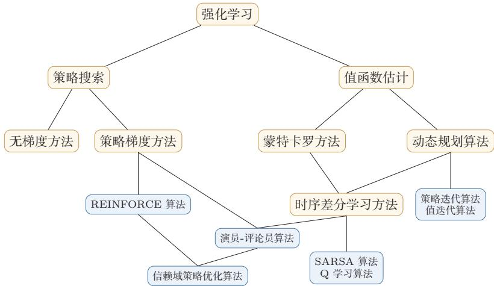  
图12.4 不同强化学习算法之间的关系

如果希望夯实基础，最重要的参考仍然是Sutton和Barto的《Reinforce-ment Learning: An Introduction》[Sutton et al., 2018]. 这本书的价值不只是覆盖了动态规划、蒙特卡罗方法、时序差分学习和策略梯度等经典内容，更在于它提供了一种统一理解强化学习的方法论：很多看似不同的算法，其实都可以放在“回报估计一策略改进”这一共同框架下理解.

如果希望进一步理解深度强化学习为何能够在复杂任务上取得突破，可以重点关注DQN[Mnih et al., 2015]及其后续工作. DQN的重要性不只在于它将Q学习与深度网络结合起来，更在于它通过目标网络和经验回放缓解了函数逼近、自举更新和异策略学习共同带来的训练不稳定问题.在这一脉络下，双Q网络[Van Hasselt et al., 2016]、优先级经验回放 [Schaul et al., 2016] 和决斗网络[Wang et al.,2016]等工作展示了如何围绕“更稳定的价值估计”持续改进算法.

如果对连续控制、策略优化和高维动作空间更感兴趣，那么可以沿着“策略梯度→演员-评论员→近端策略优化”这条线继续阅读.确定性策略梯度[Silveret al., 2014]和 DDPG[Lillicrap et al., 2016]说明了如何在连续动作空间中直接学习策略;A3C[Mnih et al., 2016]展示了并行采样与异步更新对训练效率的帮助；而TD3、SAC等后续方法则进一步围绕“更准确的评论员估计”和“更稳定的连续控制训练”展开改进.顺着这一条线学习时，读者会更容易形成现代Actor-Critic的整体认识.

除了标准的全可观测设置之外，实际问题往往还会带来新的建模需求，这也自然引出了下面几个重要扩展方向.

表12.2 4种强化学习算法优化步骤的比较
<table><tr><td>算法</td><td>步骤</td></tr><tr><td>SARSA</td><td>(1)执行策略，生成样本  $: s , a , r , s ^ { \prime } , a ^ { \prime }$  (2)估计回报  $: Q ( s , a )  Q ( s , a ) + \alpha \Big ( r + \gamma Q ( s ^ { \prime } , a ^ { \prime } ) - Q ( s , a ) \Big )$  (3)更新策略  $: \pi ( s ) = \arg \operatorname* { m a x } _ { a \in \mathcal { A } } Q ( s , a )$ </td></tr><tr><td>Q学习</td><td>(1)执行策略，生成样本  $: s , a , r , s ^ { \prime }$  (2)估计回报：  $\begin{array} { r } { { \mathrm { : } } Q ( s , a ) \xleftarrow { } Q ( s , a ) + \alpha \Big ( r + \gamma \operatorname* { m a x } _ { a ^ { \prime } } Q ( s ^ { \prime } , a ^ { \prime } ) - Q ( s , a ) \Big ) } \end{array}$  (3)更新策略  $: \pi ( s ) = \arg \operatorname* { m a x } _ { a \in \mathcal { A } } Q ( s , a )$ </td></tr><tr><td>REINFORCE（2）估计回报： (3)更新策略</td><td>(1)执行策略，生成样本  $: \tau = s _ { 0 } , a _ { 0 } , s _ { 1 } , a _ { 1 } , \cdots$   $\mathrm { \partial } _ { \cdot } G _ { t } = \sum _ { k = 0 } ^ { T - t - 1 } \gamma ^ { k } r _ { t + k + 1 }$   $\begin{array} { r } { \colon \theta \gets \theta + \sum _ { t = 0 } ^ { T - 1 } \Big ( \frac { \partial } { \partial \theta } \log \pi _ { \theta } ( a _ { t } | s _ { t } ) \gamma ^ { t } G _ { t } \Big ) } \end{array}$ </td></tr><tr><td>演员-评论员</td><td>(1)执行策略，生成样本  $: s , a , s ^ { \prime } , r$  (2)估计回报  $: \hat { G } _ { t } = r + \gamma V _ { \phi } ( s ^ { \prime } )$   $\phi  \phi + \beta \Big ( \hat { G } _ { t } - V _ { \phi } ( s ) \Big )$   $V _ { \phi } ( s )$  (3)更新策略</td></tr></table>

基于模型的强化学习与世界模型基于模型的强化学习关注如何学习或利用环境模型，再借助模型进行规划、控制或策略优化，早期的相关方法往往假设状态转移概率已知：而在现代深度强化学习中，更常见的情形是利用神经网络学习近似环境模型，再在模型中进行“想象式”推演.这样做的一个直接好处是：真实环境交互通常昂贵，而在模型中进行规划或生成虚拟轨迹则更便宜

从知识结构上看，这一方向可以视为对本章中动态规划思想的一种现代扩展：前面动态规划假设模型已知，而世界模型方法则试图把“模型”本身也一并学出来.对更长时程、更高样本效率的决策任务而言，这一路线值得进一步关注.

部分可观测马尔可夫决策过程部分可观测马尔可夫决策过程（PartiallyOb-servable Markov Decision Processes，POMDP）是马尔可夫决策过程的一种泛化.在POMDP中，智能体无法直接观测环境真实状态s，只能获得部分观测o.比如在自动驾驶中，智能体只能根据传感器采集到的局部信息进行决策

POMDP可以用一个7元组描述：(S, A,T,R,Ω,O,γ)，其中S表示状态空间，为隐变量，A为动作空间， $T ( s ^ { \prime } | s , a )$ 为状态转移概率，R为奖励函数，$\Omega ( o | s , a )$ 为观测概率，O为观测空间，γ为折扣系数.对于这类问题，读者可以进一步关注如何利用循环神经网络、记忆机制或信念状态来弥补观测不完全所带来的信息缺失.

逆向强化学习强化学习通常假设智能体能够从环境得到奖励信号．但在某些情况下，智能体只能观察到一组专家轨迹示例（demonstration），却不知道专家在每个时刻实际优化的奖励函数.比如在自动驾驶中，我们可以获得人类司机的一组驾驶轨迹，却不知道其对应的即时奖励.

逆向强化学习（Inverse Reinforcement Learning,IRL）就是指在不给定奖励函数的情况下，根据专家的行为轨迹反推出奖励函数 $r ( s , a , s ^ { \prime } )$ ，再据此学习策略.与只模仿表层行为的行为克隆相比，逆向强化学习试图恢复行为背后的偏好结构，因此具有更强的泛化潜力.沿着这一方向继续学习，有助于理解“奖励从哪里来”这一在现代强化学习中越来越重要的问题.

分层强化学习分层强化学习（Hierarchical Reinforcement Learning，HRL)是指将一个复杂的强化学习问题分解为多个较简单的子问题[Barto et al.,2003]，每个子问题都可以单独用马尔可夫决策过程建模.这样，智能体的策略可以分为高层策略和低层策略：高层策略决定“做什么”，低层策略决定“如何做”，从而更高效地处理长时程、复杂结构的任务.对于长时程规划、多步骤工具使用和复杂智能体系统而言，这一方向也具有直接的启发意义.

## 习题

## 基础题

习题12-1让一个智能体通过强化学习来学习走迷宫，如果智能体走出迷宫，奖励为+1，其他状态奖励为0.智能体的目标是最大化期望回报.当折扣率γ=1时，智能体是否容易学会走迷宫的技巧？请结合回报定义分析原因，并给出一种可行的改进思路.

参见公式(12.11).

习题12-2 结合更新目标、采样方式和学习到的策略特点，分析SARSA算法和Q学习算法的不同.进一步说明为什么前者通常被看作同策略方法，而后者通常被看作异策略方法.

习题12-3比较贝尔曼期望方程（公式(12.17)）与时序差分更新公式（公式(12.34))的联系与区别，并说明“自举”这一思想在时序差分学习中的含义.

## 提高题

习题12-4 证明公式(12.21),并说明该结论在策略迭代算法中的作用.

习题12-5 证明公式(12.23)和公式(12.24)对应的不动点是最优值函数，并说明值迭代为何能够据此逼近最优策略.

习题12-6 证明公式(12.56)，并解释为何在策略梯度方法中引入基准线不会改变梯度估计的期望.

## 拓展题

LILLICRAP T P, HUNT J J, PRITZEL A, et al., 2016. Continuous control with deep reinforcement learning[C]//Proceedings of 4th International Conference on Learning Representations.

习题12-7 DQN使用了目标网络和经验回放两项关键技术.请从样本相关性、训练稳定性和价值估计误差传播三个角度分析：如果去掉其中任意一项，训练可能出现什么问题？

习题12-8 PPO通过对重要性采样比值进行裁剪来限制策略更新幅度.请结合策略梯度与信赖域思想，说明为什么“限制更新步长”能够提高训练稳定性；同时分析如果裁剪区间设置得过大或过小，分别可能带来什么影响.

习题12-9比较在线无模型强化学习、基于模型的强化学习、离线强化学习和RLHF.请分别说明它们的样本来源、是否需要显式环境模型或奖励模型，以及各自最容易出现的误差来源.

习题12-10 在演员-评论员算法和生成对抗网络中都有两个可学习的模型，其中一个模型用来评估另一个模型的质量.请分析演员-评论员算法和生成对抗网络在学习目标、信息传递方式以及训练稳定性问题上的异同点.

## 参考文献

BARTO A G, MAHADEVAN S, 2003. Recent advances in hierarchical reinforcement learning [J]. Discrete Event Dynamic Systems, 13(4): 341-379.

CHRISTIANO P F, LEIKE J, BROWN T B, et al., 2017. Deep reinforcement learning from human preferences[C]//Advances in Neural Information Processing Systems: Vol. 30.

MINSKY M, 1961. Steps toward artificial intelligence[J]. Proceedings of the IRE, 49(1): 8-30.

MNIH V, KAVUKCUOGLU K, SILVER D, et al., 2015. Human-level control through deep reinforcement learning[J]. Nature, 518(7540): 529-533.

MNIH V, BADIA A P, MIRZA M, et al., 2016. Asynchronous methods for deep reinforcement learning[C]//Proceedings of International Conference on Machine Learning. 1928-1937.

OUYANG L, WU J, JIANG X, et al., 2022. Training language models to follow instructions with human feedback[J]. Advances in neural information processing systems, 35: 27730-27744.

RUMMERY G A, NIRANJAN M, 1994. On-line Q-learning using connectionist systems[R]. Department of Engineering, University of Cambridge.

SCHAUL T, QUAN J, ANTONOGLOU I, et al., 2016. Prioritized experience replay[C]// Proceedings of 4th International Conference on Learning Representations.

SCHULTZ W, 1998. Predictive reward signal of dopamine neurons[J]. Journal of neurophysiology, 80(1): 1-27.

SILVER D, LEVER G, HEESS N, et al., 2014. Deterministic policy gradient algorithms[C]// Proceedings of International Conference on Machine Learning. 387-395.

SUTTON R S, BARTO A G, 2018. Reinforcement learning: an introduction[M]. MIT press.

VAN HASSELT H, GUEZ A, SILVER D, 2016. Deep reinforcement learning with double Qlearning[C]//AAAI. 2094-2100.

WANG Z, SCHAUL T, HESSEL M, et al., 2016. Dueling network architectures for deep reinforcement learning[C]//Proceedings of 33rd International Conference on Machine Learning. 1995-2003.

WATKINS C J, DAYAN P, 1992. Q-learning[J]. Machine learning, 8(3): 279-292.

WILLIAMS R J, 1992. Simple statistical gradient-following algorithms for connectionist reinforcement learning[J]. Machine learning, 8(3-4): 229-256.

# 第13章 大语言模型与智能体

语言是思维的边界.

——路德维希·维特根斯坦(Ludwig Wittgenstein)

奥地利哲学家

前面章节介绍了注意力机制与Transformer架构，它们为处理序列数据提供了高效且灵活的建模框架.一个自然的问题是：如果将这种架构在大规模文本语料上进行训练，并不断增大模型规模和数据规模，会发生什么？

这正是大语言模型（Large Language Model，LLM）兴起的核心线索.从2018年的GPT和BERT开始，研究者发现，当语言模型的参数量从数亿增长到数千亿时，模型不仅在传统任务上表现越来越好，还逐步展现出少样本学习、复杂推理和代码生成等新能力．这些涌现能力（Emergent Abilities）使得大语言模型不再只是文本生成工具，而是逐渐成为通用智能系统的重要基础组件之一.

本章将围绕大语言模型的基础知识展开，我们首先回顾语言模型的基本定义与发展脉络，然后介绍预训练方法、规模法则，接着讨论涌现能力与上下文学习、指令微调、对齐技术和推理增强，最后介绍大语言模型智能体的基本框架、工具使用、协作方式以及评估治理问题

大语言模型一般是指参数量超过数十亿的语言模型，但这一界限并不严格，更重要的特征是其展现出的能力跃升.

## 13.1 语言模型回顾

语言模型（LanguageModel）的核心任务是对文本序列的概率分布进行建模.给定由T个词元组成的序列 ${ \pmb x } = ( x _ { 1 } , x _ { 2 } , \dots , x _ { T } )$ ，根据概率的链式法则，联合概率可以精确分解为

$$
p ( x _ { 1 } , x _ { 2 } , \ldots , x _ { T } ) = \prod _ { t = 1 } ^ { T } p ( x _ { t } \mid x _ { < t } ) ,\tag{13.1}
$$

其中 $\boldsymbol { x } _ { < t } = \left( x _ { 1 } , \dots , x _ { t - 1 } \right)$ .这种从左到右逐步预测下一个词元的方式称为自回归语言模型（Autoregressive Language Model).常用的评价指标是困惑度（Per-$\begin{array} { r } { \mathrm { p l e x i t y } , \mathrm { P P L } ) = \exp \big ( - \frac { 1 } { T } \sum _ { t = 1 } ^ { T } \log p ( x _ { t } \mid x _ { < t } ) \big ) } \end{array}$ ，可以直观理解为模型在每个位置上的平均“选择数”，困惑度越低，预测越准确.

要具体计算条件概率 $p _ { \theta } ( x _ { t } \mid x _ { < t } )$ ，需要一个能接受变长历史、输出词元概率分布的神经网络.

• N元模型用频率计数近似 $p ( x _ { t } \mid x _ { t - N + 1 } , \ldots , x _ { t - 1 } )$ ，N受稀疏性限制通常很小，难以刻画长程依赖；

• 循环神经网络语言模型用隐藏状态 $\boldsymbol { h } _ { t }$ 递归地压缩历史 $x _ { < t }$ ，再由输出层给出下一个词元的分布，理论上可处理任意长程依赖，但记忆容量有限；

语言模型的参数化经历了N元统计模型→前馈神经网络→循环神经网 络 →Transformer的演进

• Transformer通过自注意力直接建模任意位置间的依赖，既有强大的表示能力，也天然支持训练时并行.

许多生成式大语言模型采用仅解码器（Decoder-only）Transformer架构，通过因果掩码确保自回归性质.

Transformer 架构细 节参见第8.4节.

## 13.1.1 训练策略

给定训练语料， $p _ { \theta } ( x _ { t } \mid x _ { < t } )$ 的参数θ通过最大化真实序列的对数似然学习，等价于最小化负对数似然损失：

$$
\mathcal { L } _ { \mathrm { A R } } ( \theta ) = - \frac { 1 } { T } \sum _ { t = 1 } ^ { T } \log p _ { \theta } ( x _ { t } \mid x _ { < t } ) .\tag{13.2}
$$

朴素地看，这需要对每个位置t分别前向传播一次，共需T次.但仅解码器Trans-former通过教师强制（Teacher Forcing）与因果掩码（Causal Mask）的配合，能够在单次前向传播中并行计算所有位置的损失.

教师强制训练时模型以真实前缀 $x _ { < t }$ （而非模型自己之前的预测）作为输入来预测 $x _ { t } .$ 教师强制与下面的因果掩码结合，使各位置的预测相互独立，从而整段损失可并行计算；若改用模型自身预测作前缀，则每一步必须等待前一步输出，无法并行，此外，教师强制也避免了训练初期因预测不准而导致的误差累积，使优化更稳定.

暴露偏差教师强制带来并行效率，但也带来一个理论问题：训练时模型看到的前缀是真实数据，推断时看到的却是模型自己生成的词元，两者的分布未必一致.这种训练与推断分布的不匹配称为暴露偏差（ExposureBias）.当模型在推断中犯错时，后续预测会建立在错误前缀之上，可能产生误差累积.对大规模预训练模型而言，这一问题相对温和；后续的指令微调、偏好对齐以及推理增强等阶段也在一定程度上缓解了这一偏差.

## 13.1.2 解码策略

推断时，模型在每一步给出词元的条件概率分布 $p ( x _ { t } \mid x _ { < t } )$ ，如何从中选取下一个词元由解码策略（Decoding Strategy）决定.解码策略大致可分为两类：确定性解码在每一步选择一个确定的词元，适合翻译、代码生成等追求准确性的任务；随机采样从分布中按概率抽取词元，适合对话、创意写作等需要多样性的任务.

贪心解码 贪心解码（GreedyDecoding)在每一步选择概率最高的词元：

$$
x _ { t } = \arg \operatorname* { m a x } _ { x } p ( x \mid x _ { < t } ) .\tag{13.3}
$$

贪心解码简单高效，但只考虑单步最优，容易错过整体更优的序列，也容易出现重复.

束搜索束搜索（BeamSearch）在每一步维护k个累计概率最高的候选序列(称为束)，并基于这些候选继续扩展.在第t步，对当前的k个候选，枚举所有下一个词元的扩展，从kν|个新候选中保留累计对数概率最高的k个，其中ν|为词表大小.k称为束宽，k=1时退化为贪心解码，k越大搜索越充分但代价越高.束搜索相比贪心解码能在一定范围内发现更优序列，但仍是确定性的，在开放式生成上容易产生单调、重复的文本.

Top-k 采样 Top-k采样（Top-k Sampling) [Fan et al., 2018] 只保留概率最高的k个词元，将概率归一化后采样：

$$
p ^ { \prime } ( x \mid x _ { < t } ) \propto { \left\{ { p ( x \mid x _ { < t } ) , } \atop 0 , } { \right. } x \in V _ { k } ,\tag{13.4}
$$

其中 $V _ { k }$ 是概率前k大的词元集合.Top-k屏蔽了长尾的低概率词元，避免了生成“奇怪”的词，同时保留了一定的多样性.但固定k难以适应分布形状的变化：当分布平坦（多个词都合理）时k可能太小，当分布尖锐（只有少数词合理）时又可能把低概率词误纳入.

Top-p 核采样 Top-p采样（Top-p Sampling）也称核采样（Nucleus Sam-pling） [Holtzman et al., 2020] 动态选择一个最小词元集合 $V _ { p }$ ，使其累积概率达到阈值 $p$

$$
V _ { p } = \arg \operatorname* { m i n } _ { V ^ { \prime } } \Big \{ | V ^ { \prime } | \ : \ \sum _ { x \in V ^ { \prime } } p ( x \mid x _ { < t } ) \geq p \Big \} ,\tag{13.5}
$$

再在 $V _ { p }$ 中归一化并采样．核采样根据分布形状自适应调整候选集大小：分布尖锐时 $V _ { p }$ 小（接近贪心），分布平坦时 $V _ { p }$ 大（多样性高），因此在实践中往往比Top-k更稳健.典型取值 $p \in [ 0 . 9 , 0 . 9 5 ]$

温度调节 温度（Temperature)τ通过改变softmax的锐利程度来控制分布的随机性. 给定logits z,带温度的 softmax为

$$
p _ { \tau } ( x \mid x _ { < t } ) = \frac { \exp ( z _ { x } / \tau ) } { \sum _ { x ^ { \prime } } \exp ( z _ { x ^ { \prime } } / \tau ) } .\tag{13.6}
$$

$\tau = 1$ 保持原分布； $\tau < 1$ 使分布更尖锐，输出更确定 $( \tau  0$ 退化为贪心）；  
$\tau > 1$ 使分布更平坦，增加多样性.温度通常与采样方法组合使用.

实际部署中，常见组合是温度调节 $+ ~ \mathrm { T o p } { - } p$ :先用较小的τ削减低概率尾部，再用 $\mathrm { T o p } { - p }$ 截断候选集.解码策略的选择应与任务目标匹配：确定性任务用贪心或束搜索，开放式生成用核采样.

## 13.2 大语言模型的预训练

大语言模型的核心训练范式是预训练（Pre-Training）：在大规模无标注文本语料上，通过自监督学习来训练模型的语言理解和生成能力.预训练得到的模型可以作为通用的语言表示基础，后续再通过微调或提示等方式适配到具体的下游任务.预训练范式的成功基于一个关键假设：在足够大的数据上学习语言的统计规律，模型能够隐式地获取关于世界的广泛知识.

这一假设的合理性可以从信息论角度理解．要准确预测文本中的下一个词元，模型不仅需要掌握语法规则，还需要理解事实知识、常识推理等各种现象，因此，准确的语言建模能力隐含地要求模型压缩并存储大量关于世界的知识.从机器学习角度看，预训练本质上是一种自监督学习训练信号直接来自数据本身，不需要人工标注，可以利用互联网上海量的文本数据

## 13.2.1 预训练范式

根据训练目标和架构的不同，预训练方法主要分为三种范式.

自回归语言模型 自回归语言模型采用仅解码器架构，训练目标是从左到右预测下一个词元，目标函数即公式(13.2). GPT-1[Radford et al., 2018] 首先展示了“预训练 +微调”范式的有效性；GPT-2[Radford et al., 2019]将参数量扩展到15亿，探索了零样本任务迁移；GPT-3[Brown et al.,2020]将参数量增加到1750亿，发现了上下文学习等涌现能力.许多生成式大语言模型都沿用了自回归范式.

掩码语言模型 掩码语言模型（Masked Language Model,MLM)采用仅编码器架构，训练时随机掩码部分词元，让模型根据双向上下文预测被掩码的词元掩码语言模型的优势在于可以同时利用双向上下文进行预测，特别适合文本分

这一观点与信息论中的“预测即压缩”思想一致：一个好的预测模型等价于一个好的数据压缩器.

自监督学习参见第10.4节.

GPT系列是自回归语言模型的代表.

BERT是掩码语言模型的代表.

掩码语言模型参见第10.4节.

类、命名实体识别等理解任务.但它也存在训练-推断不一致等局限，在文本生成任务上不如自回归模型.

编码器-解码器模型 编码器-解码器（Encoder-Decoder）模型同时包含编码器和解码器. T5[Raffel et al.,2020]是这一范式的代表，将所有任务统一为“文本到文本”格式，预训练采用跨度损坏策略.编码器-解码器模型结合了双向编码和自回归生成的优点，适合条件生成任务.

在大规模生成式语言模型中，自回归模型因为架构简单、易于扩展和统一建模各类任务而成为常见选择.仅解码器架构只需一种注意力模式(因果注意力），参数效率更高，且可以将所有任务统一为“给定前缀，预测后续”的格式.

## 13.2.2 数据与分词

大语言模型的预训练需要大规模、高质量、多样化的文本数据，通常来源于互联网网页（如Common Crawl）、书籍、学术论文、代码仓库（如GitHub）、百科全书等，数据预处理包括去重、质量过滤、隐私信息移除和有害内容过滤等步骤.数据的混合比例也是重要的设计决策—网页数据量大但噪声多，书籍数据质量高但领域有限，代码数据有助于提升推理能力.

分词 在将文本输入模型之前，需要通过分词器（Tokenizer）将其切分为离散的词元（Token）序列.最朴素的做法有两种：词级分词以空格或词典为单位，词表大但仍难以覆盖所有词形，罕见词会成为未登录词（Out-of-Vocabulary，OOV）；字符级分词用单个字符作为词元，词表极小但序列极长，模型难以捕捉词级语义．现代大语言模型普遍采用子词分词，在两者之间折中：高频完整词保留为单个词元，低频词被拆分为若干子词（如“unhappiness”→“un”+“happiness”),在有限词表下既能保持语义粒度，又能覆盖任意字符串.

数据质量会直接影响预训练效率和下游可靠性.高质量数据上的较小模型有时可以接近甚至超过低质量数据上的较大模型.

从端到端数据流看，分词器先把原始文本映射为词元ID序列；词元ID通过嵌入矩阵转换为向量表示；Transformer逐层更新每个位置的隐藏状态；最后的语言模型头把隐藏状态投影到词表维度，得到每个候选词元的logits，再经softmax得到下一个词元分布.解码策略正是在这个分布上选择或采样下一个词元.

BPE算法 字节对编码(Byte Pair Encoding, BPE) [Sennrich et al., 2016]是一类常用的分词方法.其核心思想是：在训练语料上，从字符级的初始词表出发，反复合并出现频率最高的相邻词元对，直到词表达到预设大小.具体流程为：

（1）初始化词表为语料中所有单字符（或单字节）的集合；

（2）将语料中每个词拆成字符序列，末尾附加特殊结束符；

（3）统计所有相邻词元对的出现频次；

（4）选出频次最高的一对 $( a , b )$ ,将其合并为新词元ab,加入词表；

(5）重复步骤3-4,直到词表达到目标大小（如32K).

以小规模语料“low low low lower lower newer”为例:初始词表为 {1, o, w, e, r,n}；第一步统计相邻对，“1 $\mathrm { ~ o ~ } ^ { \mathfrak { N } }$ 出现5次频次最高，合并为 $" \mathrm { l o } ^ { \prime \prime }$ ;接着“lo $\mathrm { w } ^ { \prime \prime }$ 再被合并为“low”;依此类推，最终“low”“er”“new”等高频片段都会被学成整体词元，而罕见词仍可回落到更细的子词.

字节级BPE 在多语言和代码场景中，仅用字符作初始单元会面临两个问题：一是非英文字符（如中文、表情）数量庞大，会吃掉大量词表空间；二是任何训练中未见的字符都会变成OOV.GPT-2提出的字节级BPE(Byte-level BPE)将文本先编码为UTF-8字节流（初始词表仅256个字节），再在字节上执行BPE合并．这样任何输入（中英日韩文、表情、二进制数据）都能无损表示，消除了OOV问题，因此成为多语言和代码模型中的常见方案.

其他分词方法 BERT 采用的WordPiece（WordPiece） [Devlin et al.，2019]与BPE类似，区别在于合并准则不是频次最高，而是最大化合并后语料的似然.SentencePiece（SentencePiece）则是一个跨语言分词工具包，把空格也视为普通字符，从而可以直接处理没有空格分隔的语言（如中文、日文），它既支持BPE也支持基于一元语法语言模型的分词准则.不同方案在合并准则上有差别，但最终输出形态相似，实用上可以互换.

词表大小的权衡词表过小会使序列过长、计算和显存代价上升；词表过大则嵌入矩阵参数膨胀、罕见词元训练不充分.典型的大语言模型词表大小在32K到128K之间，多语言和面向代码的模型往往取较大值以覆盖更多脚本和符号.

## 13.2.3 规模法则

大语言模型发展中的一个重要经验发现，是模型性能与规模之间存在可预测的规模法则（Scaling Law).

Kaplan规模法则 通过在不同规模上系统训练语言模型，研究者发现模型的交叉熵损失L与模型参数量N（不包括嵌入层参数）、训练数据量D（以词元数计）和训练计算量C（以浮点运算次数计）之间分别存在幂律关系[Kaplanet al., 2020] :

$$
L ( N ) \approx \left( { \frac { N _ { c } } { N } } \right) ^ { \alpha _ { N } } , \qquad L ( D ) \approx \left( { \frac { D _ { c } } { D } } \right) ^ { \alpha _ { D } } , \qquad L ( C ) \approx \left( { \frac { C _ { c } } { C } } \right) ^ { \alpha _ { C } } ,\tag{13.7}
$$

规模法则表明，模型性能随规模增大而平滑提升，且在对数-对数坐标下近似为直线.

其中 $\alpha _ { N } \approx 0 . 0 7 6 , \alpha _ { D } \approx 0 . 0 9 5 , \alpha _ { C } \approx 0 . 0 5 0$ .当模型规模和数据规模同时变化时，损失可以用统一公式描述：

$$
L ( N , D ) \approx \left[ \left( \frac { N _ { c } } { N } \right) ^ { \alpha _ { N } / \alpha _ { D } } + \frac { D _ { c } } { D } \right] ^ { \alpha _ { D } } .\tag{13.8}
$$

Chinchilla最优配比 后续更系统的实验修正了上述结论[Hoffmann et al.,2022].核心问题是：给定固定的计算预算C，如何在参数量N和训练词元数D之间分配?由于训练计算量近似为 $C \approx 6 N D$ (每个词元在前向和反向传播中约需6N次浮点运算），增大N必然减少D.通过拟合超过400个实验结果，发现最优的参数量和数据量应以近似相等的比例增长：

$$
N ^ { * } \propto C ^ { 0 . 5 0 } , \quad D ^ { * } \propto C ^ { 0 . 5 0 } .\tag{13.9}
$$

更具体地，最优训练词元数约为参数量的20倍：

$$
D ^ { * } \approx 2 0 N ^ { * } .\tag{13.10}
$$

这意味着一个100亿参数的模型应使用约2000亿词元进行训练.Chinchilla法则的实际意义在于：在固定计算预算下，将计算量分配给更小的模型和更多的数据，往往可以获得更好的训练效果.

## 13.2.4 代表性模型概览

大语言模型的具体模型列表变化很快，但若从架构谱系看，可以抓住几条相对稳定的线索：自回归范式、数据配比调整、长上下文能力、多模态扩展，以及混合专家（Mixture of Experts,MoE）等容量扩展方法. MoE将前馈网络层替换为多个并行的“专家”网络，通过路由函数决定每个词元由哪些专家处理，实现了高容量与低计算量的平衡. 比如,DeepSeek-V3[DeepSeek-AI, 2024]总参数量为671B,但每个词元仅激活约37B参数.

尽管不同模型在训练数据和超参数上各有差异，许多架构设计呈现明显趋同：仅解码器架构、RoPE位置编码、RMSNorm层规范化（Pre-Norm形式）、SwiGLU前馈网络、分组查询注意力以及BPE分词.这种趋同反映了一个实用原则：在大规模训练和推理部署的共同约束下，架构选择不仅取决于模型效果，也取决于训练稳定性、推理效率和工程可实现性

开源模型在大语言模型发展中扮演了重要角色，加速了技术验证、应用部署和安全研究，与闭源模型相比，开源模型更便于研究者分析训练策略、复现实验并构建领域模型；与小模型相比，大模型通常能力更强，但小语言模型在低成本部署、端侧应用和领域微调中仍有重要价值

Chinchilla法则以验证模型 Chinchilla命名，该模型用与 Gopher 相同的计算量但更小的参数量和更多的数据训练，取得了更好的性能.

在实际部署中，推理成本也是重要考量.LLaMA等模型选择“过度训练”——使用远超 Chinchilla 比例的数据来降低推理成本. 例如LLaMA-7B使用了1T词元训练，远超 Chinchilla建议的约140B词元.

混合专家参见第8.4节.

RoPE、GQA、RM-SNorm 等现代 Trans-former优化参见第8.4节.

## 13.3 涌现能力

当语言模型的规模超过一定阈值后，会展现出一些在小模型上不明显的新能力,被称为涌现能力[Wei et al., 2022b].

## 13.3.1 涌现能力

涌现能力通常指一种在小模型上不明显、但在大模型上表现突出的能力.更精确地说，如果某项能力在模型规模低于某个阈值时接近随机水平，而在超过该阈值后性能快速提升，则称这种能力是涌现的.

涌现能力的典型例子包括：

（1）少样本学习：模型仅通过提示中的少量示例就能完成新任务，无需更新参数.

（2）多步推理:模型能在算术运算、逻辑推理等任务上进行多步推导.

（3）指令遵循:模型能理解并执行用自然语言描述的任意新指令

（4）代码生成:模型能根据自然语言描述生成正确的程序代码

（5）跨语言迁移：在一种语言上学到的能力可以迁移到其他语言上

（6）工具使用:模型能学会在适当时候调用外部工具并解析返回结果.

涌现能力的“突然出现”特征引发了广泛讨论.一种解释认为模型内部发生了类似物理相变的现象—模型参数量扮演“温度”的角色，而涌现能力对应于相变后出现的新性质.另一种解释从组合能力角度出发：复杂任务通常需要多种基础能力的组合（如语义理解+逻辑推理+知识检索），只有当所有必需的基础能力都达到阈值时，复杂任务的表现才会突然提升.

涌现是复杂系统理论中的重要概念，指系统整体表现出其组成部分所不具有的性质.

也有研究指出部分“涌现”可能是评估指标非线性导致的统计假象[Schaef-fer et al.,2023]. 例如使用精确匹配作为指标时，模型只有在输出完全正确时才得分，使性能曲线呈阶跃式跳变；如果使用更平滑的指标，性能增长可能是连续的，更稳妥地说，涌现能力提醒我们：复杂能力的评估结果可能同时受到模型规模、任务构造和评价指标的影响.

涌现能力的存在意味着在小规模实验上的结论未必能推广到大模型上，这使得“小模型代理实验”的方法论受到挑战.从应用角度看，它为大语言模型的通用性提供了依据：一个足够大的模型不需要为每个任务单独训练，而是可以通过适当的提示来激活其涌现出的多种能力.

## 13.3.2上下文学习

上下文学习（In-Context Learning,ICL）是大语言模型最引人注目的涌现能力之一.通过在提示中提供少量任务示例，模型就能在不更新参数的情况下执行新任务：

$$
\hat { y } _ { \mathrm { t e s t } } = \arg \operatorname* { m a x } _ { y } \ p _ { \theta } ( y \mid x _ { 1 } , y _ { 1 } , \ldots , x _ { K } , y _ { K } , x _ { \mathrm { t e s t } } ) .\tag{13.11}
$$

根据演示数量K的不同，分为零样本 $( K = 0 )$ 、单样本 $( K = 1 )$ 和少样本$( K > 1 )$ 学习.

上下文学习的一个特点是，它对演示样例的选择、排列顺序和格式都比较敏感.研究发现，不同的演示顺序可能导致性能从近似随机到接近最优的较大波动[Lu et al., 2022]. 有趣的是，即使将演示中的标签随机替换为错误标签，性能下降也相对有限[Min et al.,2022]，表明演示还通过提供输入分布、标签空间和格式等信息来帮助模型理解任务.

上下文学习与元学习的联系上下文学习与元学习（Meta-Learning）有深刻联系.预训练语料中包含大量不同“任务”的分布（如问答、翻译、摘要等），模型在预训练中隐式地习得了从上下文识别任务模式并快速适应的能力．更形式化地看，假设预训练数据可分解为多个隐含任务 $\tau _ { i }$ ，则自回归预训练可近似看作在任务分布上进行优化：

$$
\operatorname* { m i n } _ { \theta } \ \mathbb { E } _ { \tau \sim p ( \mathcal { T } ) } \left[ \mathbb { E } _ { ( \boldsymbol { x } , \boldsymbol { y } ) \sim \tau } \left[ - \log p _ { \theta } ( \boldsymbol { y } \mid \boldsymbol { x } ) \right] \right] ,\tag{13.12}
$$

元学习参见第11.6节.

这与经典元学习目标（如MAML[Finn et al.,2017])在形式上高度相似.

## 13.3.3 思维链推理

思维链（Chain of Thought,CoT）推理[Wei et al., 2022c通过在演示中加入中间推理步骤，引导模型逐步推导，常能提升复杂推理任务的表现.从形式上看，思维链将直接预测 $p ( y \mid x )$ 转化为通过中间推理链c的间接预测：

$$
p ( y \mid x ) = \sum _ { c } p ( c \mid x ) p ( y \mid x , c ) \approx p ( c ^ { * } \mid x ) p ( y \mid x , c ^ { * } ) .\tag{13.13}
$$

思维链推理的有效性可以从多个角度理解：通过中间步骤将复杂问题分解为简单子问题；为模型提供额外的“计算空间”增加输出序列长度间接增加可用的计算步骤；使推理过程可解释、可验证.

思维链效果具有明显的规模依赖性：只有在足够大的模型上才能稳定提升推理能力.

零样本思维链 研究发现，仅在提示中加入“Let's think step by step”就能激发零样本思维链（Zero-shot CoT）推理[Kojima et al., 2022],表明模型在预训练中已通过海量文本隐式学会了分步推理模式

思维链的扩展 在思维链基础上，研究者提出了多种扩展：

（1） 自一致性（Self-Consistency）[Wang et al., 2023a]:对同一问题采样多条不同的推理路径，通过多数投票选择最一致的答案.其核心直觉是：正确的推理路径通常收敛到同一答案，而错误路径则产生不同的错误答案.

(2） 思维树（Tree-of-Thoughts,ToT）[Yao et al., 2023a]:将推理从线性链扩展为树形结构，在每个步骤探索多个候选方向，并通过搜索算法选择最优路径，支持推理过程中的回溯和修正.

（3）测试时扩展（Test-timeScaling）：在推断时投入更多计算（如更长推理链、更多次采样），常能带来性能提升.许多推理模型都验证了这一范式：模型可以在生成最终答案之前分配更多词元给中间推理、搜索和自我检查，并用可验证奖励或外部验证器筛选更可靠的答案

## 13.4 指令微调

经过大规模自监督预训练之后，语言模型已经获得了丰富的语言知识和世界知识，但它仍然只是一个“文本续写器”——给定前缀，模型按照训练语料的分布继续生成后续文本，而不一定能准确理解并遵循用户的指令．例如，当用户提问“中国的首都是哪里？”时，预训练模型可能不会直接回答“北京”，而是继续补全为“中国的首都是哪里?这是一道常见的地理题……”.指令微调(InstructionTuning），也称监督微调（Supervised Fine-Tuning，SFT），通过在高质量的“指令-回答”数据上继续训练，使模型学会理解用户意图、遵循指令格式，并生成有用的回答 [Ouyang et al., 2022; Wei et al., 2022a].

## 13.4.1监督微调的基本流程

给定指令x和参考回答 $y = ( y _ { 1 } , y _ { 2 } , \cdots , y _ { T } )$ ,SFT的训练损失为

$$
\mathcal { L } _ { \operatorname { S F T } } ( \theta ) = - \sum _ { t = 1 } ^ { T } \log \pi _ { \theta } ( y _ { t } \mid x , y _ { < t } ) ,\tag{13.14}
$$

其中 $\pi _ { \theta }$ 表示参数为θ的语言模型.注意，在计算损失时通常只对回答部分 $_ y$ 进行反向传播，而指令部分x的词元不参与损失计算.

与预训练的不同之处在于：(1)数据规模更小，通常从数千到数十万条；(2)数据质量要求更高；(3)训练轮数通常较少（1-3个epoch)，过多训练容易过拟合.指令和回答按特定对话模板格式化（如<|user|>指令<|assistant|>回答<|end|>),使模型能区分不同角色的发言.

这一做法避免了模型学习“生成指令”的行为，有时称为“只训练补全”（train-on-completions-only)策略.在多轮对话中，通常也只对助手回答部分计算损失.

## 13.4.2 参数高效微调

当模型参数量达到数百亿甚至上千亿时，全量微调的计算和存储成本变得非常高—全量微调需要为每个参数存储梯度和优化器状态，显存占用通常是参数本身的3-4倍.参数高效微调（Parameter-Efficient Fine-Tuning，PEFT)方法通过只更新少量额外参数来实现微调，其中最具代表性的是低秩适配(Low-Rank Adaptation,LoRA) [Hu et al., 2022]. LoRA 在预训练模型的每个线性层旁添加一对低秩矩阵 $\pmb { A } \in \mathbb { R } ^ { r \times d _ { \mathrm { i n } } }$ 和 $B \in \mathbb { R } ^ { d _ { \mathrm { o u t } } \times r } \left( r \ll \operatorname* { m i n } ( d _ { \mathrm { i n } } , d _ { \mathrm { o u t } } ) \right.$ ,通常取8到64),结构如图13.1所示，使得该层输出变为

$$
\begin{array} { r } { h ^ { \prime } = W x + B A x , } \end{array}\tag{13.15}
$$

其中A初始化为随机高斯分布，B初始化为零矩阵，使得训练开始时增量$\Delta W = B A = 0$ 预训练权重W保持冻结，只训练A和B，可训练参数量仅为全量微调的百分之一左右，但在很多任务上能取得相当的效果.LoRA还可以方便地为同一预训练模型维护多组适配器参数，在推理时切换即可.参数高效微调同样适用于后续的偏好对齐阶段

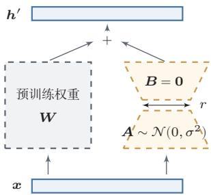  
图 13.1 LoRA示意图

LoRA的成功表明，微调过程中权重变化△W具有低秩结构，即微调只需在参数空间的一个低维子空间中调整.

## 13.4.3指令数据的构建与质量

高质量的指令数据需要满足几个条件：任务覆盖的多样性（问答、摘要、翻译、代码等）、回答的准确性与规范性、指令表述的多样性.FLAN的实验表明，当指令数据覆盖的任务类型增加到上百种时，模型在未见过的任务上的零样本表现会显著提升.

指令数据的来源主要有两类.第一类是人工标注，质量高但成本大.第二类是模型合成，利用已有的强大模型自动生成指令数据[Sun et al.,2024; Taoriet al., 2023; Wang et al., 2023b]. Self-Instruct 从少量种子指令出发,让语言模型迭代生成新的指令和回答，可低成本获取大量数据.

研究表明，指令数据的质量往往比数量更重要. LIMA[Zhou et al., 2023a]显示，仅使用约1000条精心筛选的高质量样本进行监督微调，就可以获得与使用数万条样本相当的对齐效果—“少而精”原则

## 13.4.4 从预训练到监督微调的能力变化

SFT的主要作用并非注入新知识，而是激活和对齐预训练阶段已获得的能力一为模型提供一个“接口”，让它知道如何组织和呈现回答.这也解释了为什么少量高质量数据就能取得良好效果：如果SFT的本质是“格式对齐”而非“知识注入”，模型只需看到足够多样的指令-回答格式示例即可.

从另一个角度看，SFT也可以理解为一种分布调整：将模型的输出分布从“像互联网文本”调整为“像高质量助手回答”，使模型在采样时更倾向于生成有帮助、结构清晰且准确的回答.

SFT还有一个值得注意的现象：在多种不同任务上进行微调后，模型往往在未见过的任务上也能表现良好.这种多任务泛化能力也从侧面印证了SFT的主要作用是激活已有能力的观点.

然而，SFT只能让模型模仿参考回答，无法让模型理解“什么样的回答更好”它解决的是“怎么做”的问题，但没有解决“做到什么程度才算好”的问题面对回答质量的微妙维度（如有用性、诚实性、无害性之间的权衡），单纯的模仿学习力不从心.要进一步提升质量并符合人类偏好，需要引入某种形式的偏好反馈.

## 13.5 基于人类反馈的对齐

监督微调虽然赋予了模型遵循指令的基本能力，但它本质上是在“模仿”参考回答，无法直接优化模型输出相对于人类偏好的质量．为了让模型不仅“会回答”，而且“回答得好”，需要引入人类反馈作为额外的监督信号.本节介绍基于人类反馈的对齐（Alignment from Human Feedback）的基本框架和几种代表性方法.

完整流程分为三个主要阶段（如图13.2所示）：（1）预训练，在大规模无标注语料上学习语言建模能力；（2）监督微调，在指令-回答数据上获得指令跟随能力；(3)偏好对齐，利用人类反馈进一步提升回答质量.

  
图13.2 从预训练到对齐的三阶段流程

## 13.5.1 偏好数据与 Bradley-Terry模型

对齐方法的核心输入是偏好数据（PreferenceData）.其收集过程如下：对于同一条指令 $x$ ，让模型生成两个不同的回答 $y _ { 1 }$ 和 $y _ { 2 }$ ，然后由人类标注者判断哪个更好，记为 $y _ { w }$ （胜出回答）和 $y _ { l }$ (落败回答），收集大量偏好对得到数据集$\mathcal { D } = \{ ( x ^ { ( i ) } , y _ { w } ^ { ( i ) } , y _ { l } ^ { ( i ) } ) \} _ { i = 1 } ^ { N }$ 1

与直接标注“好回答”相比，偏好标注（判断“哪个更好”）通常更加容易和一致—不同标注者对“好回答”的定义可能不同，但相对优劣的比较更容易达成共识.

为将偏好数据转化为可优化的模型，采用Bradley-Terry模型（Bradley-Terry Model) [Bradley et al., 1952],假设存在潜在的奖励函数 $r ( x , y )$

$$
p ( y _ { w } \succ y _ { l } \mid x ) = \sigma \big ( r ( x , y _ { w } ) - r ( x , y _ { l } ) \big ) ,\tag{13.16}
$$

其中 $\sigma ( \cdot )$ 是Logistic函数.直观地理解，当 $r ( x , y _ { w } )$ 显著大于 $r ( x , y _ { l } )$ 时，偏好概率接近1；当两者相近时，偏好概率接近0.5.

值得注意的是，Bradley-Terry模型中的奖励函数 $r ( x , y )$ 存在一个自由度：如果对所有y同时加上一个只依赖于x的常数 $c ( x )$ ，偏好概率不变.这意味着偏好数据只能确定奖励函数的相对值而非绝对值.这一性质在后面DPO的推导中将起到关键作用

Bradley-Terry模型最初是为体育比赛中的胜负预测提出的. Elo评分系统就是其特殊形式.

## 13.5.2 奖励模型训练

基于Bradley-Terry模型，可以训练一个参数化的奖励模型（RewardModel) $r _ { \phi } ( x , y )$ .奖励模型通常以预训练语言模型为骨干网络初始化，取输入序列最后一个词元位置的隐藏表示，通过线性变换得到标量奖励值：

$$
r _ { \phi } ( x , y ) = w ^ { \top } h _ { \mathrm { l a s t } } + b .\tag{13.17}
$$

给定偏好数据集D，训练目标为最大化正确预测人类偏好的对数似然：

$$
\begin{array} { r } { \mathcal { L } _ { \mathrm { R M } } ( \phi ) = - \mathbb { E } _ { ( x , y _ { w } , y _ { l } ) \sim \mathcal { D } } \Big [ \log \sigma \big ( r _ { \phi } ( x , y _ { w } ) - r _ { \phi } ( x , y _ { l } ) \big ) \Big ] . } \end{array}\tag{13.18}
$$

## 13.5.3 RLHF:策略优化与KL 约束

基于人类反馈的强化学习(Reinforcement Learning from Human Feed-back, RLHF)[Christiano et al., 2017]将语言模型视为策略 $\pi _ { \theta }$ ，用奖励模型输出作为回报.为防止奖励过度优化（Reward Over-optimization），加入KL散

度惩罚：

$$
\begin{array} { r l } { \underset { \theta } { \operatorname* { m a x } } } & { \mathbb { E } _ { \boldsymbol { x } \sim \mathcal { D } , \boldsymbol { y } \sim \pi _ { \theta } ( \cdot \vert \boldsymbol { x } ) } \Big [ r _ { \phi } ( \boldsymbol { x } , \boldsymbol { y } ) - \beta \mathrm { K L } \big ( \pi _ { \theta } ( \cdot \vert \boldsymbol { x } ) \| \pi _ { \mathrm { r e f } } ( \cdot \vert \boldsymbol { x } ) \big ) \Big ] , } \end{array}\tag{13.19}
$$

奖励过度优化与 Goodhart 定律一致：“当一个度量变成目标时，它就不再是一个好的度量.”

其中 $\beta > 0$ 控制KL惩罚强度. $\beta$ 越大，新策略越接近参考策略； $\beta$ 越小，优化自由度越大但更容易出现奖励过度优化.

实际训练中最常用近端策略优化（PPO）[Schulman et al.,2017]算法，其训练步骤包括：（1）用当前策略采样回答；（2）用奖励模型打分并计算KL惩罚；（3）利用价值函数网络估计优势；（4）用PPO裁剪目标更新策略.RLHF-PPO需要同时维护策略模型、参考模型、奖励模型和价值函数模型四个模型，工程复杂度较高.

PPO算法参见第12章.

## 13.5.4 直接偏好优化

直接偏好优化（Direct Preference Optimization,DPO)[Rafailov et al.,2023]提出了一种直接的解决方案：利用RLHF目标函数的解析解，将奖励函数用策略本身来表示，从而不再显式训练独立的奖励模型，也避免了常规RLHF中的在线策略采样阶段，将对齐问题转化为一个类似于监督学习的优化问题.

DPO的推导展示了如何通过数学分析将一个看似复杂的强化学习问题转化为简单的监督学习问题，并说明偏好学习与策略优化之间的联系.下面分三个步骤详细展开.

第一步：从RLHF目标到最优策略的解析解 对于固定的 $x$ ，RLHF目标（公式(13.19))可以写为

$$
\operatorname* { m a x } _ { \pi } \mathbb { E } _ { y \sim \pi ( \cdot | x ) } \left[ r ( x , y ) - \beta \log \frac { \pi ( y \mid x ) } { \pi _ { \mathrm { r e f } } ( y \mid x ) } \right] .\tag{13.20}
$$

将期望展开为对所有可能回答 $y$ 的求和：

$$
\operatorname* { m a x } _ { \pi } \ \sum _ { y } \pi ( y \mid x ) \left[ r ( x , y ) - \beta \log { \frac { \pi ( y \mid x ) } { \pi _ { \mathrm { r e f } } ( y \mid x ) } } \right] .\tag{13.21}
$$

这是关于分布 $\pi ( \cdot \mid x )$ 的严格凹优化问题（第一项关于π是线性的，第二项$- \beta \mathrm { K L }$ 是严格凹函数），存在唯一的全局最大值．在 $\begin{array} { r } { \sum _ { y } \pi ( y \mid x ) = 1 } \end{array}$ 约束下，利用拉格朗日乘子法求解.对 $\pi ( y \mid x )$ 求导并令其为零：

$$
r ( x , y ) - \beta \log \frac { \pi ( y \mid x ) } { \pi _ { \mathrm { r e f } } ( y \mid x ) } - \beta = \lambda ,\tag{13.22}
$$

其中λ是归一化约束对应的拉格朗日乘子.整理可得

$$
\pi ^ { * } ( y \mid x ) = \pi _ { \mathrm { r e f } } ( y \mid x ) \cdot \exp \left( { \frac { 1 } { \beta } } r ( x , y ) \right) \cdot \exp \left( - 1 - { \frac { \lambda } { \beta } } \right) .\tag{13.23}
$$

https://nndl.ai/

定义配分函数 $\begin{array} { r } { Z ( x ) = \sum _ { y } \pi _ { \mathrm { r e f } } ( y \mid x ) \exp \bigl ( \frac { 1 } { \beta } r ( x , y ) \bigr ) } \end{array}$ ，利用归一化条件 $\textstyle \sum _ { y } \pi ^ { * } ( y$ $x ) = 1$ 确定 $\exp ( - 1 - \lambda / \beta ) = 1 / Z ( x )$ ，得到最优策略：

$$
\pi ^ { * } ( y \mid x ) = \frac { 1 } { Z ( x ) } \pi _ { \mathrm { r e f } } ( y \mid x ) \exp \left( \frac { 1 } { \beta } r ( x , y ) \right) .
$$

最优策略是参考策略经过奖励加权后的“玻尔兹曼分布”，β控制偏离参考策略的程度.

(13.24)

第二步：用策略表示奖励函数 对公式(13.24)两侧取对数并整理：

$$
r ( x , y ) = \beta \log \frac { \pi ^ { * } ( y \mid x ) } { \pi _ { \mathrm { r e f } } ( y \mid x ) } + \beta \log Z ( x ) .\tag{13.25}
$$

奖励函数可以完全由最优策略和参考策略的对数概率比来表示，关键是 $Z ( x )$ 只依赖于x而与 $y$ 无关.

第三步：消去奖励模型，得到 DPO损失 将公式(13.25)代入Bradley-Terry偏好模型（公式(13.16)). 对于偏好对 $( y _ { w } , y _ { l } )$ ，两个回答的奖励之差 $r ( x , y _ { w } ) -$ $r ( x , y _ { l } )$ 为

$$
\beta \log \frac { \pi ^ { * } ( y _ { w } \mid x ) } { \pi _ { \mathrm { r e f } } ( y _ { w } \mid x ) } + \underbrace { \beta \log Z ( x ) - \beta \log Z ( x ) } _ { = 0 } - \beta \log \frac { \pi ^ { * } ( y _ { l } \mid x ) } { \pi _ { \mathrm { r e f } } ( y _ { l } \mid x ) } .\tag{13.26}
$$

$\beta \log Z ( x )$ 项在相减时被消去—这是DPO推导中最关键的一步．配分函数$Z ( x )$ 在语言生成的指数级大空间中无法精确计算，但由于它只依赖于x，在比较同一指令下两个回答时恰好被消去.偏好概率简化为

$$
p ( y _ { w } \succ y _ { l } \mid x ) = \sigma \bigg ( \beta \log \frac { \pi ^ { * } ( y _ { w } \mid x ) } { \pi _ { \mathrm { r e f } } ( y _ { w } \mid x ) } - \beta \log \frac { \pi ^ { * } ( y _ { l } \mid x ) } { \pi _ { \mathrm { r e f } } ( y _ { l } \mid x ) } \bigg ) .\tag{13.27}
$$

将 $\pi ^ { * }$ 替换为参数化策略 $\pi _ { \theta }$ ，通过最大化偏好数据的对数似然来优化，得到DPO损失：

$$
\begin{array} { r } { \mathcal { L } _ { \mathrm { D P O } } ( \boldsymbol { \theta } ) = - \mathbb { E } _ { ( x , y _ { w } , y _ { l } ) \sim \mathcal { D } } \left[ \log \sigma \left( \beta \log \frac { \pi _ { \theta } ( y _ { w } \mid x ) } { \pi _ { \mathrm { r e f } } ( y _ { w } \mid x ) } - \beta \log \frac { \pi _ { \theta } ( y _ { l } \mid x ) } { \pi _ { \mathrm { r e f } } ( y _ { l } \mid x ) } \right) \right] . } \end{array}\tag{13.28}
$$

DPO损失的直观理解定义隐式奖励为

$$
\hat { r } _ { \theta } ( x , y ) \triangleq \beta \log \frac { \pi _ { \theta } ( y \mid x ) } { \pi _ { \mathrm { r e f } } ( y \mid x ) } ,\tag{13.29}
$$

那么DPO损失可以改写为

$$
\mathcal { L } _ { \mathrm { D P O } } ( \boldsymbol { \theta } ) = - \mathbb { E } _ { ( \boldsymbol { x } , \boldsymbol { y } _ { w } , \boldsymbol { y } _ { l } ) } \left[ \log \sigma ( \hat { \boldsymbol { r } } _ { \boldsymbol { \theta } } ( \boldsymbol { x } , \boldsymbol { y } _ { w } ) - \boldsymbol { \hat { r } } _ { \boldsymbol { \theta } } ( \boldsymbol { x } , \boldsymbol { y } _ { l } ) ) \right] .\tag{13.30}
$$

可以看出，DPO的训练目标与奖励模型的训练目标（公式(13.18)）形式相近—区别在于DPO使用策略本身相对于参考策略的对数概率比作为隐式奖励训练过程会增大胜出回答的隐式奖励，同时减小落败回答的隐式奖励.

DPO中β的作用与RLHF中的KL惩罚系数一致. 实践中β通常取0.1到0.5之间.

DPO的梯度分析 对DPO损失求梯度：

$$
\begin{array} { r } { \nabla _ { \theta } \mathcal { L } _ { \mathrm { D P O } } = - \beta \mathbb { E } \Big [ \underbrace { \sigma ( \hat { r } _ { \theta } ( x , y _ { l } ) - \hat { r } _ { \theta } ( x , y _ { w } ) ) } _ { \mathbb { K } \mathbb { H } \mathbb { H } \times \mathbb { H } ^ { \mathrm { s } _ { 3 } \times \{ 3 \} } \mathbb { H } \mathbb { H } ^ { \mathrm { H } \times \mathrm { H } \times \mathrm { H } \times \mathrm { H } \times \mathrm { H } \times \mathrm { H } ^ { \mathrm { H } \times \mathrm { H } } } } \big ( \underbrace { \nabla _ { \theta } \log \pi _ { \theta } ( y _ { w } \mid x ) } _ { \mathbb { H } _ { m } ^ { \mathrm { a i r } } \mathbb { H } \mathbb { H } ^ { \mathrm { H } \times \mathrm { H } \times \mathrm { H } \times \mathrm { H } ^ { \mathrm { H } \times \mathrm { H } } } } - \underbrace { \nabla _ { \theta } \log \pi _ { \theta } ( y _ { l } \mid x ) } _ { \mathbb { H } \mathbb { H } \times \mathrm { H } ^ { \mathrm { H } \times \mathrm { H } \times \mathrm { H } \times \mathrm { H } } } \big ) \Big ] . } \end{array}\tag{13.31}
$$

这个梯度表达式揭示了DPO的自适应学习机制：

• 当模型已经正确地给胜出回答更高的隐式奖励时（即 $\begin{array} { r l } { \hat { r } _ { \theta } ( x , y _ { w } ) } & { { } > } \end{array}$ $\hat { r } _ { \theta } ( x , y _ { l } ) ~ )$ ，权重 $\sigma ( \cdot ) ~ < ~ 0 . 5$ ，梯度更新幅度较小，模型对已学好的样本不再过多关注.

• 当模型错误地偏好落败回答时（即 $\hat { r } _ { \theta } ( x , y _ { l } ) > \hat { r } _ { \theta } ( x , y _ { w } ) \ )$ ，权重 $\sigma ( \cdot ) >$ 0.5,梯度更新幅度较大，模型自动聚焦于“难样本”.

这种机制类似于在线难例挖掘，有助于提高训练效率.

DPO相比RLHF的主要优势：（1）不需要训练独立的奖励模型；（2）不需要在训练过程中进行策略采样；(3）训练流程与监督微调类似，实现简便且训练稳定；(4）不需要维护价值函数网络.DPO的局限在于只能利用离线偏好数据，随着策略更新可能出现分布漂移问题，且对偏好数据质量敏感

DPO与RLHF的等价性回顾整个推导过程,DPO的核心贡献可以概括为一个优雅的数学等价关系：

$$
\begin{array} { r } { \chi + \{ | \frac { \partial _ { 1 } } { \partial t } + \mathcal { J } | \neq \frac { \partial _ { 1 } } { \partial x } \} \| \{ \vec { x } : \} \| \{ \vec { y } \} \ = \emptyset | | \frac { \mathcal { J } \mathcal { J } } { \partial x } \iff \{ \pm \mathcal { K } L \mathcal { L } \notin \mathbb { J } \} \underset { \mathbb { K } } { \mathbb { E } } \int \frac { \Theta } { \mathbb { E } } \langle | \frac { \mathcal { L } \mathcal { L } } { \partial x } \pm \mathcal { K } \rangle \langle | \mathcal { L } | \frac { \partial _ { 1 } } { \partial x } \pm \mathcal { K } \rangle \big | \widehat { y } \big \} \lesssim \langle | \mathcal { L } | \mathcal { L } | \mathcal { L } \rangle \big ( \widehat { \xi } \big ) . } \end{array}
$$

左侧是DPO实际执行的操作：一个简单的二分类损失；右侧是RLHF试图求解的优化问题.DPO通过分析最优策略的解析形式，将右侧的复杂优化问题转化为了左侧的简单学习问题.这一等价关系不仅简化了训练流程，也加深了我们对偏好学习本质的理解：对齐优化本质上就是在学习一个偏好分类器，而这个分类器恰好可以用策略本身来参数化.

## 13.5.5 组相对策略优化

组相对策略优化（Group Relative Policy Optimization，GRPO）[Shaoet al., 2024]是另一种简化RLHF 的方法. 与DPO从离线学习的角度消除强化学习不同，GRPO从在线强化学习角度出发，通过组内相对比较来替代价值函数基线，在保留强化学习框架的同时大幅降低训练复杂度.

在标准PPO中，需要训练一个与策略模型参数量相当的价值函数网络作为基线，带来额外开销.GRPO的核心思想是：用同一指令下多个采样回答的相对奖励来替代价值函数基线．对于每条指令x，从当前策略 $\pi _ { \theta _ { \mathrm { o l d } } }$ 中采样G个回答$\{ y _ { 1 } , \cdots , y _ { G } \}$ ，用奖励模型或规则对每个回答打分，以组内均值和标准差对奖励归一化，得到组相对优势：

$$
\hat { A } _ { i } = \frac { r _ { i } - \mathrm { m e a n } ( \{ r _ { 1 } , \cdots , r _ { G } \} ) } { \mathrm { s t d } ( \{ r _ { 1 } , \cdots , r _ { G } \} ) } , \quad i = 1 , 2 , \cdots , G .\tag{13.32}
$$

策略优化目标采用PPO的裁剪机制并加入KL正则项：

$$
\mathcal { L } _ { \mathrm { G R P O } } ( \theta ) = - \frac { 1 } { G } \sum _ { i = 1 } ^ { G } \left[ \operatorname* { m i n } \Bigl ( \rho _ { i } ( \theta ) \hat { A } _ { i } \cdot \mathrm { c l i p } ( \rho _ { i } ( \theta ) , 1 - \epsilon , 1 + \epsilon ) \hat { A } _ { i } \Bigr ) - \beta \mathrm { K L } \bigl ( \pi _ { \theta } \| \pi _ { \mathrm { r e f } } \bigr ) \right] ,\tag{13.33}
$$

其中 $\rho _ { i } ( \theta ) = \pi _ { \theta } ( y _ { i } \mid x ) / \pi _ { \theta _ { \mathrm { o l d } } } ( y _ { i } \mid x )$ 是重要性采样比.

归一化后的优势值自然以零为中心：组内高于平均水平的回答获得正优势，低于平均水平的获得负优势.采样组大小G通常取8～64,在统计稳定性和计算效率之间取得平衡.

GRPO特别适合具有可验证奖励的任务（如数学、代码），可以用规则直接判断对错，减少奖励模型的近似误差．使用规则奖励时奖励信号通常更直接，但仍可能受到测试覆盖、格式约束或评价规则漏洞的影响.作为在线方法，GRPO每轮用当前策略重新采样，可以减轻离线偏好数据带来的分布漂移问题，且省去了价值函数网络，将模型数量从四个减少到三个（使用规则奖励时仅需两个).

从方法发展脉络看，RLHF、DPO和GRPO体现了两条并行趋势：简化训练流程和适应不同的奖励来源.实践中三者并非互斥，常在不同训练阶段组合使用：例如先用DPO进行初步对齐，再用GRPO在特定任务上进一步优化推理能力.

GRPO 是 DeepSeek-R1等推理增强模型采用的代表性训练方法之一.

对齐技术的扩展 除了RLHF和DPO之外，对齐领域还有若干重要进展.宪法 AI（Constitutional AI，CAI） [Bai et al.,2022]让模型根据一组预设的原则（“宪法”）进行自我批评和修改，减少对人工标注偏好数据的依赖.RLAIF(Reinforcement Learning from AI Feedback)进一步用更强的 AI模型代替人类标注者提供偏好反馈.DPO的变体也不断涌现，例如SimPO简化了参考模型的使用，KTO基于前景理论处理非成对的偏好数据.此外，安全对齐（SafetyAlignment）是确保大模型行为安全可控的关键方向，涉及防御越狱攻击（jail-break）、提示注入（Prompt Injection）等对抗性攻击，以及通过红队测试（redteaming）系统性地发现模型的安全漏洞.如何在提升模型能力的同时保持安全可控，是大模型时代的核心挑战之一.

幻觉问题大语言模型在生成文本时可能产生幻觉（Hallucination），即生成看似流畅但与事实不符的内容.幻觉产生的根本原因在于：模型的训练目标是下一个词元预测，这一目标并不直接惩罚事实性错误，缓解幻觉的主要方法包括：利用检索增强生成（RAG）引入外部知识源、在对齐训练中引入事实性奖励信号、以及让模型在不确定时表达不确定性而非编造答案，评估时还需要关注置信度校准：模型给出的概率、自评置信或流畅程度并不必然等价于事实可靠性，因此应结合证据一致性、可验证任务和人工抽查来判断.

## 13.6 推理增强

前面讨论的对齐方法主要关注“如何让模型生成更符合人类偏好的回答”，但对于需要复杂推理的任务—如数学证明、多步规划和代码调试—仅靠对齐未必足以稳定提升推理能力.本节介绍几类常见的推理增强（ReasoningEn-hancement）技术，它们通过改进奖励信号的精细度、增加推理时的计算量，或结合强化学习来提升模型的推理表现

## 13.6.1 过程奖励与结果奖励

在标准RLHF框架中，奖励模型通常对整个回答给出一个单一的标量评分，这种方式称为结果奖励模型（Outcome Reward Model,ORM）.ORM的优势是标注简便，但对于多步推理任务存在明显局限：即使最终答案正确，推理过程也可能包含错误步骤；反之，大部分推理步骤正确但最终答案可能因为一步之差而错误.ORM无法区分这些情况，导致信用分配不精确.

过程奖励模型（Process Reward Model,PRM) [Lightman et al., 2024] 旨在对推理过程的每一步而非仅对最终结果给出评价.给定指令x和包含K个推理步骤的回答 $y = ( s _ { 1 } , \cdots , s _ { K } )$ ,PRM为每步给出评分 $r _ { \mathrm { P R M } } ( x , s _ { 1 } , \cdots , s _ { k } )$ ,提供稠密奖励信号，有助于精确定位错误步骤.PRM的整条路径评分常取所有步骤的最小值：

$$
R _ { \mathrm { P R M } } ( x , y ) = \operatorname* { m i n } _ { k = 1 , \cdots , K } r _ { \mathrm { P R M } } ( x , s _ { 1 } , \cdots , s _ { k } ) .\tag{13.34}
$$

PRM还可以在推理阶段与束搜索结合，对候选推理步骤进行评分和筛选.PRM标注成本较高，可通过蒙特卡罗估计实现自动化.实践中两者可结合使用：ORM粗筛，PRM精细评估.

## 13.6.2 测试时扩展

传统的提升模型能力的方式主要集中在训练阶段：增大参数量、增加训练数据或延长训练时间.相关研究表明，在推理阶段投入更多计算资源同样可以提升模型表现,这一思路被称为测试时扩展[Snell et al., 2024].

测试时扩展的核心思想是：让模型在回答前花更多时间“思考”—这与人类经验一致：简单问题可以迅速作答，复杂问题需要仔细推敲.实现方式包括：

长程推理一类推理模型会在生成最终答案之前分配更多词元给中间推理过程，进行假设提出、验证、回溯和修正等操作，本质上是将推理阶段的计算量转化为更长的生成序列—模型生成的词元越多，执行的“计算”也就越多

在数学、代码和规划等可验证任务中，推理模型通常把强化学习、拒绝采样、过程监督或测试时搜索结合起来.训练时可以利用正确答案、单元测试或规则验证器提供奖励信号，让模型学习更长的推理链、自我检查和错误修正.需要注意的是，更长推理并不自动等于更可靠：如果验证器不可靠或任务目标定义不清，额外计算也可能放大错误.

理论分析表明，允许中间步骤的Trans-former可以解决仅靠直接预测无法解决的计算问题.

搜索与验证 另一种方式是在推理阶段引入搜索.对给定问题生成N条不同推理路径，通过验证机制选择得分最高或最可靠的回答：

· 多数投票:选择出现最多次的最终答案，不需要额外验证模型

• 奖励模型打分:用ORM或PRM对每条路径评分，选择得分最高的路径.

• 树搜索：在每一步用PRM评估各分支质量，选择性地展开最有前途的分支.

其中Best-of-N采样（Best-of-N Sampling）是最简单的方式：生成N条独立回答，用奖励模型选择最优.研究表明，在同等计算预算下，多路径生成+验证往往优于单条更长路径.

测试时扩展的规律 测试时扩展的收益存在类似训练阶段的规模法则：增加推理计算可预测地提升表现，在某些情况下一个较小但充分搜索验证的模型可以超过更大但只做单次生成的模型．这引出一个实际问题：给定固定总计算预算，如何在训练和推理阶段之间分配计算资源?

## 13.6.3 强化学习与推理能力提升

训练阶段计算和测试时扩展的权衡可类比人类的学习与考试：学习提升基础能力，考试时思考提升具体问题的解答质量.

相关工作表明，强化学习是提升可验证推理任务表现的重要训练范式．以DeepSeek-R1等可验证推理训练工作为例[DeepSeek-AI, 2025]，一条技术路线是在SFT模型基础上，通过大规模GRPO训练（参见13.5.5节），以数学和代码任务的正确性作为奖励信号，促使模型生成更长的推理、自我验证和反思纠错等行为.

DeepSeek-R1的奖励设计值得注意:对于数学任务，如果最终答案与标准答案匹配则奖励为1，否则为0；对于代码任务则通过运行测试用例判断正确性.此外加入格式奖励鼓励模型将推理过程放在特定词元之间．这类简洁奖励设计说明，在目标可验证时，复杂推理行为可以从基本的正确性信号中形成，而不一定需要对“如何推理”给出逐步标注.

训练过程中观察到了几个涌现现象：

• 推理长度的自然增长:模型倾向于在回答前生成更长的中间推理.

· 自我反思的涌现:模型开始在推理中出现自我检查和纠错行为.

• 探索策略的多样化：当一种方法走不通时，模型学会换一种思路.

·阶段性跃迁：推理准确率可能在某些训练阶段后出现明显变化

纯粹的RL训练也面临挑战：训练初期不稳定性（模型长时间无法获得正奖励）、推理链可读性不佳、以及对于开放式推理任务难以定义奖励函数.因此，实际系统通常采用多阶段训练：

（1）SFT冷启动：用少量高质量推理示例进行监督微调，提供基本推理链格式和能力.

(2）RL大规模训练:在SFT模型基础上用GRPO等算法训练，以可验证的正确性作为奖励.

（3）拒绝采样与蒸馏：用RL模型生成大量推理样本，筛选高质量样本对新模型微调，将推理能力“蒸馏”到更规范的模型中.

SFT和RL在推理能力培养中互补：SFT提供推理的“格式”和“起点”，RL提供推理的“质量”和“深度”

从更宏观角度看，推理增强代表了大语言模型发展中一个重要的方向转变：从单纯依赖预训练阶段的知识积累，转向在训练和推理两个阶段同时投入计算资源来提升问题求解能力，训练阶段的缩放赋予模型知识和基础能力，推理阶段的缩放让模型在面对具体问题时能够充分发挥这些能力.这种计算资源分配的灵活性也带来了部署优势：对于简单问题可快速回答（少量推理计算），对复杂问题则投入更多计算保证质量—这种自适应计算能力使系统可以根据问题难度动态调整资源分配.

将强化学习用于提升推理能力，与 AlphaGo通过自我对弈提升棋力的思路在精神上是一致的.

这一趋势也揭示了语言模型与传统人工智能方法之间的汇合：早期AI系统主要依赖显式的搜索和推理但缺乏灵活的语言理解，而早期大语言模型拥有强大的语言能力但推理是“直觉式”的.推理增强技术正在将两种能力整合：语言模型提供灵活的问题表示和假设生成，搜索和验证提供系统的推理保障

综合本节讨论，从指令微调到偏好对齐再到推理增强，每一步演进都回应了前一步的局限性：SFT缓解了预训练模型未必遵循指令的问题；偏好对齐通过人类反馈解决了质量区分的问题；推理增强则通过精细化奖励信号和额外测试时扩展来提升困难问题上的表现.从方法论角度看，核心思想可统一为一个简洁框架：定义一个好的目标函数，然后用合适的优化方法去逼近它

## 13.7 智能体的框架与规划

前面几节讨论了大语言模型如何从预训练、对齐到推理增强逐步获得强大的语言理解与生成能力.然而，这些能力本质上仍以“生成文本”为核心.在许多实际场景中—例如信息检索、代码调试、数据分析我们更需要模型能够在外部环境中持续行动并完成目标，这一需求自然引出了智能体（Agent）的概念

## 13.7.1 从语言模型到智能体

基于大语言模型的智能体（LLM-based Agent）是指以大语言模型为核心“大脑”，通过感知环境、调用工具、执行操作并根据反馈修正计划来完成复杂任务的系统[Wang et al., 2024; Yao et al., 2023b]. 与传统的一次性文本生成不同，智能体需要在多轮交互中不断接收新信息、做出决策并采取行动，整个过程可能跨越多个步骤甚至多个子任务.

这一转变随着大语言模型在以下几方面能力的提升而自然涌现：指令遵循能力使模型能准确执行复杂的多步指令；推理与规划能力使模型能进行多步推理和任务分解；格式化输出能力使模型能按约定格式（如JSON）生成结构化的工具调用请求；上下文学习能力使模型能从反馈中快速调整行为.这些能力的汇聚，使得将大语言模型作为智能体的核心控制器成为可能

## 13.7.2 核心组件

一个典型的大语言模型智能体通常包含以下四个核心组件[Xi et al., 2025]，整体框架如图13.3所示.

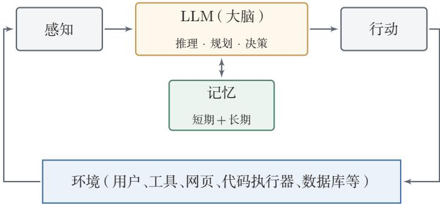  
图 13.3 基于大语言模型的智能体框架

感知（Perception）:智能体从外部环境获取信息，包括用户指令、工具返回值、检索结果、网页内容甚至多模态信号.感知模块还需对原始输入进行信息筛选与压缩，以便在有限的上下文窗口内高效利用信息.

规划（Planning）：面对复杂目标，智能体需将其分解为可执行的子任务并确定执行顺序.好的规划不仅要考虑任务本身的逻辑结构，还要考虑可用工具的能力范围、可能的失败场景以及备选方案.

行动（Action）：智能体的动作空间远比普通语言模型丰富，除了生成文本，还包括调用搜索引擎、执行代码、操作文件系统、访问数据库、调用外部API等.智能体按照预定义的格式（如JSON）生成动作描述，由外部执行器解析并执行，再将结果反馈给智能体

记忆（Memory）:分为短期记忆（当前任务的上下文窗口，包含对话历史和中间推理过程，容量受限于上下文长度）和长期记忆（通过外部存储如向量数据库保存跨任务的经验和知识，使智能体能从过去的成功和失败中学习).

这四个组件在大语言模型的统一调度下紧密协作：感知模块从环境获取信息送入LLM大脑，大脑结合记忆进行推理和规划，再通过行动模块作用于环境，形成感知-思考-行动的持续闭环.

## 13.7.3 推理-行动交替:ReAct

ReAct（ReAct）提出了一种将推理（Reasoning）与行动（Acting）交替进行的循环范式.其核心思想是：在每一步中，智能体先用自然语言进行“思考”（Thought），明确当前的推理状态和下一步计划；然后执行一个具体“行动”（Action），如调用搜索引擎或查询数据库；最后接收环境返回的“观察”（Observation),据此更新认知并进入下一轮循环：

$$
\begin{array} { r } { \underset { t \in \mathcal { T } } { \mathbb { H } } \underset { \ b { \mathscr { T } } _ { t } } { \mathbb { H } }  \widehat { \mathbb { H } } \overrightarrow { \mathfrak { H } } \mathfrak { J } _ { t }  \widehat { \mathbb { H } } \underset { t  \mathfrak { T } } { \mathbb { H } } \underset { \ b { \mathscr { H } } \times \mathfrak { T } _ { t } } { \mathbb { H } } \longrightarrow \underset { t \in \mathfrak { T } } { \mathbb { H } } \underset { \ b { \mathscr { T } } _ { t + 1 } } { \mathbb { H } }  \widehat { \mathbb { H } } \overrightarrow { \mathfrak { T } } \mathfrak { H } _ { t + 1 }  \cdots } \end{array}\tag{13.35}
$$

与纯推理方法（如思维链）相比，ReAct能在推理过程中引入外部信息，从而减少幻觉并提升事实准确性.与纯行动方法（直接调用工具而不显式思考）相比，ReAct的显式思考步骤使决策过程更加透明和可解释.从实现角度看，ReAct可通过提示模板自然实现，无需修改模型参数

## 13.7.4 任务分解

面对复杂任务，直接生成完整的行动序列往往不可行.任务分解（TaskDe-composition）是将高层目标分解为多个较简单的子任务，再依次或并行地完成它们 [Khot et al., 2023; Zhou et al., 2023b]. 层次规划可以采用多种策略:自顶向下分解先制定包含所有子任务及其依赖关系的总体计划再逐步执行，如Least-to-Most Prompting从最简单的子问题开始逐步求解；逐步展开在每一步完成后根据当前状态动态决定下一步，适合不确定性较高的场景；规划-执行-再规划先制定初始计划，执行后根据实际进展修正剩余计划，结合了全局规划和动态调整的优势.

## 13.7.5 反思与自我修正

智能体在执行过程中不可避免地会犯错.反思（Reflection）机制使智能体 能够回顾自身的行为和结果，识别错误并进行自我修正[Madaan et al.,2023; Shinn et al., 2023].

Reflexion在任务失败后，让智能体对失败过程进行反思，生成自然语言形式的“经验总结”存入记忆，在下一次尝试时作为额外上下文避免重复犯错.这可以视为一种不更新模型参数的“学习”将学习信号编码为自然语言，利用上下文学习能力实现行为改进.Self-Refine则关注单次生成的迭代改进:模型先生成初始输出，再对自身输出进行评价和批评，然后根据评价意见修改输出，可迭代多轮.

反思机制使智能体具备了一种元认知能力——不仅能够执行任务，还能审视自己的执行过程并主动改进

## 13.7.6 搜索与验证

智能体还可以利用系统化的搜索策略来提升规划质量.一种常用策略是在多个候选行动方案中进行评估与选择，如Tree-of-Thoughts将推理过程组织为树结构，在每个节点探索多个推理分支并通过评估函数剪枝，另一种重要策略是引入外部验证器来检验行动结果，例如在代码生成中通过编译器和单元测试验证，在数学推理中通过符号计算系统验证，提供比模型自我评估更客观可靠的反馈信号.

## 13.8 工具使用与多智能体

智能体的行动能力在很大程度上取决于它所能使用的工具.通过工具调用，大语言模型的能力从纯文本生成扩展到与外部世界的实际交互.

## 13.8.1 工具调用

工具调用（ToolUse）是指智能体在推理过程中选择并调用外部工具来完成特定操作，常见的工具类型包括：函数调用—智能体生成结构化的调用请求（如JSON格式），由外部系统解析、执行并返回结果；API使用—调用搜索引擎、天气查询、数据库查询等外部API，获取模型自身不具备的信息；代码执行—生成代码片段并提交给解释器执行，利用编程语言的精确计算能力弥补纯语言推理的不足. Toolformer[Schick et al., 2023] 通过自监督方法使模型学会在生成文本的合适位置自动插入API调用，是工具使用研究的早期代表工作

工具调用的一个关键设计问题是工具选择与参数生成：当可用工具数量较多时，通常通过在系统提示中提供工具的名称、参数格式和功能描述列表，让模型根据描述选择合适的工具.当工具数量超出上下文窗口的承载能力时，还需引入工具检索机制先根据当前任务从工具库中检索相关工具子集，再让模型从中选择.

函数调用与Agent工程框架 在工程实现中，工具调用通常被设计为结构化接口：系统预先声明工具名称、参数类型、返回格式和调用权限，模型只生成受约束的调用请求，执行器负责校验、执行和返回结果.结构化输出（StructuredOutputs)通过JSON Schema等约束减少格式错误，提升工具调用可靠性.

当工具调用从单次API扩展到多步任务时，工程框架通常会把工作流表示为状态机、图或消息队列：每一步显式记录输入、工具调用、执行结果和下一步状态.这样做的价值不只在于方便编排，也在于支持错误回放、权限审计和失败恢复.

## 13.8.2 检索增强生成

检索增强生成（Retrieval-Augmented Generation，RAG）[Lewis et al.,2020将外部知识检索与语言模型生成相结合：给定用户查询，先从外部知识库中检索相关内容，再将检索结果作为上下文辅助模型生成更准确的回答.

RAG的基本流程分为三个阶段：（1）索引阶段：将外部文档切分为片段，通过编码器将每个片段映射为稠密向量表示 $d _ { i } = { \mathrm { E n c o d e r } } ( \operatorname { d o c } _ { i } )$ ，存入向量数据库.（2）检索阶段：将用户查询映射为向量 $\pmb q = \mathrm { E n c o d e r ( q u e r y ) }$ ，通过相似度搜索找到最相关的k个文档片段：

$$
{ \mathcal { D } } _ { k } = \mathrm { T o p } { - k _ { i } \sin ( { \pmb q } , { \pmb d } _ { i } ) } .\tag{13.36}
$$

(3)生成阶段:将检索到的片段与原始查询拼接后输入语言模型：

$$
\begin{array} { r } { y = \operatorname { L L M } ( q , \mathcal { D } _ { k } ) . } \end{array}\tag{13.37}
$$

RAG的核心优势在于使语言模型能够利用外部的、领域特定的、可更新的知识而无需重新训练，对缓解知识过时和幻觉问题尤为有效.从智能体角度看，检索本身就是一种工具调用，可与其他工具灵活组合.更复杂的RAG系统还引入了查询改写、重排序和多跳检索等优化策略.

## 13.8.3 多模态交互

随着多模态大语言模型的发展，智能体的感知和行动能力进一步扩展到视觉、听觉等模态.例如，具备视觉理解能力的智能体可以直接“看到”应用程序界面截图，理解按钮、菜单等界面元素，通过模拟点击和键盘输入完成操作，而无需依赖专门的API接口.多模态能力还使智能体能够理解图片、分析图表、协助设计以及在虚拟或物理环境中导航.

多模态大语言模型随着大语言模型能力的提升，将视觉、语音等模态与语言模型联合建模成为重要方向.多模态大语言模型（MultimodalLLM）的核心思路是将非文本模态（如图像、视频、音频）通过专用编码器转换为与文本词元兼容的表示，再输入语言模型进行联合处理.

从架构上看，多模态大模型大致可分为两类：一是模块拼接式架构，如LLaVA[Liu et al.,2023]，先用视觉编码器（如CLIP的 ViT）提取图像特征，再通过投影层将其映射为语言模型可处理的“视觉词元”，与文本词元拼接后输入语言模型；二是原生多模态架构，从训练阶段就将多种模态统一建模，支持任意模态之间的输入和输出.原生多模态架构在模态交互的深度和自然度上具有优势，但训练复杂度也更高.

主要的多模态能力包括图像理解（场景描述、QCR、图表分析）、视频理解（时序推理、动作识别）以及实时语音交互等．多模态大模型正在推动人工智能从“理解语言”走向“理解并生成更丰富的世界表示”.

## 13.8.4 多智能体协作

单个智能体在面对需要多种专业技能或多角度分析的任务时可能受限.多智能体系统（Multi-Agent System）通过让多个智能体协作来克服这些限制[Liet al.，2023; Wu et al.,2023]. 根据协作方式的不同，主要有三种模式：分工协作—不同智能体被分配不同角色和职责，如在软件开发中设置“架构师”“程序员”“测试工程师”等角色各司其职[Hong et al.,2024]；讨论——多个智能体围绕同一问题展开讨论，各自提出观点，通过多轮对话逐步完善答案[Du et al.2023]；辩论—通过相互质疑和批评，发现并纠正单个智能体难以自行发现的错误 [Liang et al., 2024].

多智能体系统的有效运行依赖于合理的通信机制.消息传递是最直接的方式，其拓扑结构可以是链式（流水线式分工）、星形（中心协调者汇总决策）或全连接（充分讨论），共享记忆通过公共信息存储空间实现间接协作，降低通信复杂度并支持异步协作，多智能体系统的核心挑战是协调开销随着智能体数量增加，通信成本和潜在冲突增大，且可能出现“群体思维”导致多样性丧失.

## 13.9 智能体评估与流程治理

当大语言模型只生成文本时，评估重点主要是回答质量：当它被放入智能体系统并能够调用工具、读与外部状态或与其他智能体协作时，评估对象就变成了一个完整流程，此时不仅要看最终答案是否正确，还要看中间检索是否覆盖关键证据、工具参数是否合规、行动是否越权、失败后能否回滚，以及长期记忆是否引入错误或隐私风险.表13.1从任务效果、工具执行、权限边界、记忆管理和过程安全等维度，归纳了智能体系统评估与治理的关注点与常见做法.

表13.1 智能体系统评估与治理的几个维度
<table><tr><td>维度</td><td>关注问题</td><td>常见做法</td></tr><tr><td>任务效果</td><td>是否完成目标，答案是否正确、任务成功率、人工评价、基准集、回 完整、可验证</td><td>归测试、引用一致性检查.</td></tr><tr><td>工具执行</td><td>执行结果是否被正确解释</td><td>工具是否选对，参数是否有效，工具模式校验、参数类型检查、执行 日志、失败重试与超时控制.</td></tr><tr><td>权限边界</td><td>险操作或敏感数据</td><td>行动是否越权，是否触及高风最小权限、沙箱执行、人工确认、读 写隔离、危险操作白名单.</td></tr><tr><td>记忆管理</td><td>过度暴露隐私</td><td>长期记忆是否准确、可追溯、不写入审核、来源记录、过期策略、冲 突消解、用户可删除机制.</td></tr><tr><td>过程安全</td><td>污染或错误级联影响</td><td>是否受到提示注入、工具返回输入隔离、指令优先级、来源标注、 异常检测、回滚和审计.</td></tr></table>

对于RAG系统，评估还应拆分为检索质量和生成忠实性：前者检查是否找到了相关证据，后者检查回答是否真正受到证据支持.对于代码执行、文件操作或数据库访问等工具，系统应保存可重放的执行日志，并在高风险步骤前引入人工确认.对于多智能体协作，除了单个智能体能力，还要评估通信开销、角色冲突、错误传播和最终责任归属.

因此，智能体工程更像是把语言模型嵌入一个受约束的软件系统，而不是简单地给模型增加几个工具.一个可靠的智能体系统通常需要明确的工具接口、权限模型、评估集、日志审计、失败恢复和人工监督．只有把这些流程工程做好，模型能力才能稳定地转化为可部署的任务完成能力.

## 13.10总结和扩展阅读

本章围绕两条核心线索展开.