第一条线索关注大语言模型自身能力的演进，其主线是“预训练→对齐→推理增强”.预训练通过大规模自监督学习使模型获得广泛的语言能力，ScalingLaws为资源分配提供了理论依据.对齐通过SFT和RLHF使模型输出符合人类意图，DPO和GRPO进一步简化了训练流程.推理增强通过思维链、自一致性和测试时搜索等机制，代表了从“训练时扩展”到“推理时扩展”的范式转变

第二条线索关注从生成文本到在环境中行动的转变，其主线是“感知→规划→行动→反思”.ReAct范式将推理与行动交替进行；工具使用和RAG扩展了智能体的能力边界；反思机制使智能体能从错误中学习；多智能体协作进一步提升了系统解决复杂任务的能力；评估与流程治理则决定这些能力能否可靠部署.

这两条线索深度交织：对齐为智能体提供了遵循指令和安全行动的基础，推理增强为规划和决策提供了更强的思考能力，而智能体在环境中的实际表现反过来又为模型改进提供了信号.

尽管已展现出令人瞩目的能力，仍有许多重要的开放问题：安全对齐—如何确保智能体在具备工具调用能力后的行为安全；幻觉—如何从根本上提升模型的事实可靠性：长期记忆一如何高效组织和更新大规模记忆以支持持续学习；流程治理如何为工具调用、长期记忆和多智能体协作建立可审计、可回滚的工程边界；可解释性如何验证智能体的决策逻辑并建立合理信任

## 习题

## 基础题

习题13-1 设词表大小为V，句子 ${ \pmb x } = ( x _ { 1 } , x _ { 2 } , \cdots , x _ { T } )$ 由T个词元组成.写出自回归语言模型计算句子概率 $P ( { \pmb x } )$ 的公式，并说明为什么自回归分解能够缓解高维空间中直接估计联合概率的困难

习题13-2 比较监督微调（SFT）和基于人类反馈的强化学习（RLHF）在训练数据形式、优化目标和适用场景上的差异.为什么仅靠SFT通常不足以使模型很好地遵循复杂的人类偏好?

习题13-3 描述ReAct范式中“思考-行动-观察”循环的基本流程，并用一个具体示例说明该流程的执行过程.与纯思维链方法相比，ReAct在解决需要外部信息的任务时有何优势？

习题13-4 在Chinchilla规模法则中，给定计算预算 $C \approx 6 N D$ ,最优的模型参数量 $N ^ { * }$ 和训练数据量 $D ^ { * }$ 应如何随C增长?如果一个团队有足够的计算预算训练一个10B参数的模型，按照Chinchilla最优比例，大约需要多少词元的训练数

据？在实际工程中，为什么LLaMA等模型选择了远超Chinchilla比例的训练数据量?

习题13-5上下文学习（In-Context Learning）与传统的监督微调在“学习新任务”时有何本质区别?请从参数更新、数据需求和泛化机制三个方面进行比较上下文学习对演示样例的选择和排列顺序敏感性意味着什么实际限制？

习题13-6 解释思维链（Chain-of-Thought）推理如何提升大语言模型在数学推理任务上的表现.自一致性（Self-Consistency）方法如何进一步改进思维链的可靠性?请分析思维链方法在什么情况下可能失效.

习题13-7 检索增强生成（RAG）的核心流程包括哪几个步骤？与直接增大模型上下文窗口相比，RAG在处理知识密集型任务时有何优势和局限性？

## 提高题

习题13-8 DPO的损失函数为

$$
\begin{array} { r } { \mathcal { L } _ { \mathrm { D P O } } ( \boldsymbol { \theta } ) = - \mathbb { E } _ { ( \boldsymbol { x } , \boldsymbol { y } _ { w } , \boldsymbol { y } _ { l } ) } \left[ \log \sigma \left( \beta \log \frac { \pi _ { \boldsymbol { \theta } } \left( \boldsymbol { y } _ { w } | \boldsymbol { x } \right) } { \pi _ { \mathrm { r e f } } \left( \boldsymbol { y } _ { w } | \boldsymbol { x } \right) } - \beta \log \frac { \pi _ { \boldsymbol { \theta } } \left( \boldsymbol { y } _ { l } | \boldsymbol { x } \right) } { \pi _ { \mathrm { r e f } } \left( \boldsymbol { y } _ { l } | \boldsymbol { x } \right) } \right) \right] . } \end{array}
$$

请从Bradley-Terry偏好模型和带KL约束的RLHF目标出发,推导上述损失函数，并说明DPO如何避免了显式训练奖励模型.

习题13-9在DPO的损失函数 $\mathcal { L } _ { \mathrm { D P O } }$ 中，参数β控制策略偏离参考模型的程度.分析当 $\beta  0$ 和 $\beta \to \infty$ 时，DPO的优化目标分别退化为什么形式？各有什么问题?

习题13-10 设想你需要设计一个能够自动完成“查找并总结某一研究主题代表性进展”的智能体.描述其核心组件（感知、规划、行动、记忆）的具体实现方案，列出需要使用的工具集合，并分析执行过程中可能遇到的主要困难及应对策略

习题13-11 当智能体被赋予工具调用和环境操作能力后，安全问题尤为重要.请从提示注入攻击、工具滥用和错误级联三个角度分析智能体系统面临的安全风险，并讨论可能的防御措施.

习题13-12 设计一个带工具调用和RAG能力的智能体评估方案.请分别给出任务成功率、检索质量、生成忠实性、工具调用正确性、权限安全和失败恢复的评估指标，并说明哪些环节需要人工确认或日志审计，

## 拓展题

习题13-13 在GRPO中，组相对优势定义为 $\hat { A } _ { i } = ( r _ { i } - \mathrm { m e a n } ( r ) ) / \mathrm { s t d } ( r )$ . 试分析这种归一化方式相比使用固定基线（如常数0）有何好处.当组内所有回答的奖励相同时会出现什么问题?如何处理？

习题13-14 说明GRPO中组内奖励归一化 $\hat { A } _ { i } = ( r _ { i } - \bar { r } ) / \sigma _ { r }$ 为什么等价于使用组均值r作为基线的REINFORCE估计.与传统的带基准线REINFORCE相比，GRPO的基线估计有什么优势？

习题13-15 大语言模型的“幻觉”（Hallucination）是指模型生成看似合理但事实上不正确的内容.请从训练目标（下一个词元预测）和数据分布的角度分析幻觉产生的根本原因，并讨论检索增强生成（RAG）、过程奖励模型（PRM）和思维链推理各自在缓解幻觉方面的作用和局限.

习题13-16 多智能体辩论是一种让多个大语言模型实例就同一问题交换观点、逐步修正答案的方法.试设计一个包含三个智能体的辩论系统来解决事实性问答任务，描述辩论的具体流程（包括初始回答、质疑、修正和共识判定），并分析这种方法相比单模型自一致性（Self-Consistency）的优势和额外开销.

## 参考文献

BAI Y, KADAVATH S, KUNDU S, et al., 2022. Constitutional AI: harmlessness from AI feedback[A/OL]. arXiv (2022). https://arxiv.org/abs/2212.08073.

BRADLEY R A, TERRY M E, 1952. Rank analysis of incomplete block designs: I. the method of paired comparisons[J]. Biometrika, 39(3/4): 324-345.

BROWN T, MANN B, RYDER N, et al., 2020. Language models are few-shot learners[C]// Advances in Neural Information Processing Systems: Vol. 33. 1877-1901.

CHRISTIANO P F, LEIKE J, BROWN T B, et al., 2017. Deep reinforcement learning from human preferences[C]//Advances in Neural Information Processing Systems: Vol. 30.

DeepSeek-AI, 2024. DeepSeek-V3 technical report[A/OL]. arXiv (2024). https://arxiv.org/abs/ 2412.19437.

DeepSeek-AI, 2025. DeepSeek-R1: incentivizing reasoning capability in LLMs via reinforcement learning[A/OL]. arXiv (2025). https://arxiv.org/abs/2501.12948.

DEVLIN J, CHANG M W, LEE K, et al., 2019. BERT: pre-training of deep bidirectional transformers for language understanding[C]//Proceedings of the 2019 Conference of the North American Chapter of the Association for Computational Linguistics: Human Language Technologies. 4171-4186.

DU Y, LI S, TORRALBA A, et al., 2023. Improving factuality and reasoning in language models through multiagent debate[A/OL]. arXiv (2023). https://arxiv.org/abs/2305.14325.

FAN A, LEWIS M, DAUPHIN Y, 2018. Hierarchical neural story generation[C]//Proceedings of the 56th Annual Meeting of the Association for Computational Linguistics. 889-898.

FINN C, ABBEEL P, LEVINE S, 2017. Model-agnostic meta-learning for fast adaptation of deep networks[C//Proceedings of the 34th International Conference on Machine Learning-Volume 70. JMLR. org: 1126-1135.

HOFFMANN J, BORGEAUD S, MENSCH A, et al., 2022. Training compute-optimal large language models[C]//Advances in Neural Information Processing Systems: Vol. 35. 30016- 30030.

HOLTZMAN A, BUYS J, DU L, et al., 2020. The curious case of neural text degeneration[C]// Proceedings of the 8th International Conference on Learning Representations.

HONG S, ZHUGE M, CHEN J, et al., 2024. MetaGPT: meta programming for A multi-agent collaborative framework[C]//Proceedings of the 12th International Conference on Learning Representations.

HU E J, SHEN Y, WALLIS P, et al., 2022. LoRA: low-rank adaptation of large language models [C]//Proceedings of the 10th International Conference on Learning Representations.

KAPLAN J, MCCANDLISH S, HENIGHAN T, et al., 2020. Scaling laws for neural language models[A/OL]. arXiv (2020). https://arxiv.org/abs/2001.08361.

KHOT T, TRIVEDI H, FINLAYSON M, et al., 2023. Decomposed prompting: a modular approach for solving complex tasks[C//Proceedings of the 11th International Conference on Learning Representations.

KOJIMA T, GU S S, REID M, et al., 2022. Large language models are zero-shot reasoners[C]// Advances in Neural Information Processing Systems: Vol. 35. 22199-22213.

LEWIS P, PEREZ E, PIKTUS A, et al., 2020. Retrieval-augmented generation for knowledgeintensive NLP tasks[C]//Advances in Neural Information Processing Systems: Vol. 33. 9459- 9474.

LI G, HAMMOUD H A A K, ITANI H, et al., 2023. CAMEL: communicative agents for "Mind" exploration of large language model society[C]//Advances in Neural Information Processing Systems: Vol. 36.

LIANG T, HE Z, JIAO W, et al., 2024. Encouraging divergent thinking in large language models through multi-agent debate[C/OL]//Proceedings of the 2024 Conference on Empirical Methods in Natural Language Processing. 17889-17904. DOI: 10.18653/v1/2024.emnlp-main. 992.

LIGHTMAN H, KOSARAJU V, BURDA Y, et al., 2024. Let's verify step by step[C]// Proceedings of 12th International Conference on Learning Representations.

LIU H, LI C, WU Q, et al., 2023. Visual instruction tuning[C]//Advances in Neural Information Processing Systems: Vol. 36.

LU Y, BARTOLO M, MOORE A, et al., 2022. Fantastically ordered prompts and where to find them: overcoming few-shot prompt order sensitivity[C]//Proceedings of the 60th Annual Meeting of the Association for Computational Linguistics. 8086-8098.

MADAAN A, TANDON N, GUPTA P, et al., 2023. Self-refine: iterative refinement with selffeedback[C]//Advances in Neural Information Processing Systems: Vol. 36.

MIN S, LYU X, HOLTZMAN A, et al., 2022. Rethinking the role of demonstrations: what makes in-context learning work?[C]//Proceedings of the 2022 Conference on Empirical Methods in Natural Language Processing. 11048-11064.

OUYANG L, WU J, JIANG X, et al., 2022. Training language models to follow instructions with human feedback[J]. Advances in neural information processing systems, 35: 27730-27744.

RADFORD A, NARASIMHAN K, SALIMANS T, et al., 2018. Improving language understanding by generative pre-training[EB/OL]. https://s3-us-west-2.amazonaws.com/openai-assets/ research-covers/languageunsupervised/languageunderstandingpaper.pdf.

RADFORD A, WU J, CHILD R, et al., 2019. Language models are unsupervised multitask learners[J]. OpenAI blog.

RAFAILOV R, SHARMA A, MITCHELL E, et al., 2023. Direct preference optimization: your language model is secretly a reward model[C//Advances in Neural Information Processing Systems: Vol. 36.

RAFFEL C, SHAZEER N, ROBERTS A, et al., 2020. Exploring the limits of transfer learning with a unified text-to-text transformer[J]. Journal of Machine Learning Research, 21(140): 1-67.

SCHAEFFER R, MIRANDA B, KOYEJO S, 2023. Are emergent abilities of large language models a mirage?[C]//Advances in Neural Information Processing Systems: Vol. 36.

SCHICK T, DWIVEDI-YU J, DESSI R, et al., 2023. Toolformer: language models can teach themselves to use tools[C]//Advances in Neural Information Processing Systems: Vol. 36.

SCHULMAN J, WOLSKI F, DHARIWAL P, et al., 2017. Proximal policy optimization algorithms[A/OL]. arXiv (2017). https://arxiv.org/abs/1707.06347.

SENNRICH R, HADDOW B, BIRCH A, 2016. Neural machine translation of rare words with subword units[C]//Proceedings of the 54th Annual Meeting of the Association for Computational Linguistics. 1715-1725.

SHAO Z, WANG P, ZHU Q, et al., 2024. DeepSeekMath: pushing the limits of mathematical reasoning in open language models[A/OL]. arXiv (2024). https://arxiv.org/abs/2402.03300.

SHINN N, CASSANO F, GOPINATH A, et al., 2023. Reflexion: language agents with verbal reinforcement learning[C]//Advances in Neural Information Processing Systems: Vol. 36.

SNELL C, LEE J, XU K, et al., 2024. Scaling LLM test-time compute optimally can be more effective than scaling model parameters[A/OL]. arXiv (2024). https://arxiv.org/abs/2408. 03314.

SUN T, ZHANG X, HE Z, et al., 2024. MOSS: an open conversational large language model [J/OL]. Machine Intelligence Research, 21(5): 888-905. DOI: 10.1007/s11633-024-1502-8.

TAORI R, GULRAJANI I, ZHANG T, et al., 2023. Stanford alpaca: an instruction-following LLaMA model[EB/OL]. https://github.com/tatsu-lab/stanford\_alpaca.

WANG L, MA C, FENG X, et al., 2024. A survey on large language model based autonomous agents[J]. Frontiers of Computer Science, 18(6): 186345.

WANG X, WEI J, SCHUURMANS D, et al., 2023a. Self-consistency improves chain of thought reasoning in language models[C]//Proceedings of the 11th International Conference on Learning Representations.

WANG Y, KORDI Y, MISHRA S, et al., 2023b. Self-instruct: aligning language models with self-generated instructions[C//Proceedings of the 61st Annual Meeting of the Association for Computational Linguistics. 13484-13508.

WEI J, BOSMA M, ZHAO V Y, et al., 2022a. Finetuned language models are zero-shot learners [C]//Proceedings of the 10th International Conference on Learning Representations.

WEI J, TAY Y, BOMMASANI R, et al., 2022b. Emergent abilities of large language models[J] Transactions on Machine Learning Research.

WEI J, WANG X, SCHUURMANS D, et al., 2022c. Chain-of-thought prompting elicits reasoning in large language models[C]//Advances in Neural Information Processing Systems: Vol. 35. 24824-24837.

WU Q, BANSAL G, ZHANG J, et al., 2023. AutoGen: enabling next-gen LLM applications via multi-agent conversation[A/OL]. arXiv (2023). https://arxiv.org/abs/2308.08155.

XI Z, CHEN W, GUO X, et al., 2025. The rise and potential of large language model based agents: a survey[J/OL]. Science China Information Sciences, 68. DOI: 10.1007/s11432-024- 4222-0.

YAO S, YU D, ZHAO J, et al., 2023a. Tree of thoughts: deliberate problem solving with large language models[C]//Advances in Neural Information Processing Systems: Vol. 36.

YAO S, ZHAO J, YU D, et al., 2023b. ReAct: synergizing reasoning and acting in language models[C]//International Conference on Learning Representations.

ZHOU C, LIU P, XU P, et al., 2023a. LIMA: less is more for alignment[C]//Advances in Neural Information Processing Systems: Vol. 36.

ZHOU D, SCHÄRLI N, HOU L, et al., 2023b. Least-to-most prompting enables complex reasoning in large language models[C//Proceedings of the 11th International Conference on Learning Representations.

## 第14章 概率图模型

概率论只不过是把常识归纳为计算问题.

——皮埃尔-西蒙·拉普拉斯(Pierre-Simon Laplace)

概率图模型（Probabilistic Graphical Model，PGM），简称图模型（Graphical Model,GM），是指一种用图结构来描述多元随机变量之间条件独立关系的概率模型，从而给研究高维空间中的概率模型带来了很大的便捷性.

对于一个K维随机向量 $\pmb { X } = [ X _ { 1 } , X _ { 2 } , \cdots , X _ { K } ] ^ { \intercal }$ ，其联合概率为高维空间中的分布，一般难以直接建模.假设每个变量为离散变量并有M个取值，在不作任何独立假设条件下，则需要 $M ^ { K }$ -1个参数才能表示其概率分布.当 $M = 2 , K =$ 100时，参数量约为 $1 0 ^ { 3 0 }$ ，远远超出了实际建模和计算能够直接承受的规模.

一种有效减少参数量的方法是独立性假设.一个K维随机向量X的联合概率分解为K个条件概率的乘积，

在本书中，随机变量用斜体的大写字母表示，其取值用斜体的小写字母表示；随机向量用粗斜体的大写字母表示，其取值用粗斜体的小写字母表示.

$$
p ( { \pmb x } ) \triangleq P ( { \pmb X } = { \pmb x } )\tag{14.1}
$$

$$
= \prod _ { k = 1 } ^ { K } p ( x _ { k } | x _ { 1 } , \cdots , x _ { k - 1 } ) ,\tag{14.2}
$$

其中 $x _ { k }$ 表示变量 $X _ { k }$ 的取值.如果某些变量之间存在条件独立，其参数量就可以大幅减少.

假设有四个二值变量 $X _ { 1 } , X _ { 2 } , X _ { 3 } , X _ { 4 }$ ，在不知道这几个变量依赖关系的情况下，可以用一个联合概率表来记录每一种取值的概率 $p ( \pmb { x } _ { 1 : 4 } )$ ,共需要 $2 ^ { 4 } - 1 =$ 15个参数.假设在已知 $X _ { 1 }$ 时， $X _ { 2 }$ 和 $X _ { 3 }$ 独立，即有

$$
\begin{array} { r } { p ( x _ { 2 } | x _ { 1 } , x _ { 3 } ) = p ( x _ { 2 } | x _ { 1 } ) , } \end{array}\tag{14.3}
$$

$$
\begin{array} { r } { p ( x _ { 3 } | x _ { 1 } , x _ { 2 } ) = p ( x _ { 3 } | x _ { 1 } ) . } \end{array}\tag{14.4}
$$

在已知 $X _ { 2 }$ 和 $X _ { 3 }$ 时， $X _ { 4 }$ 也和 $X _ { 1 }$ 独立，即有

$$
\begin{array} { r } { p ( x _ { 4 } | x _ { 1 } , x _ { 2 } , x _ { 3 } ) = p ( x _ { 4 } | x _ { 2 } , x _ { 3 } ) , } \end{array}\tag{14.5}
$$

那么其联合概率 $p ( { \pmb x } )$ 可以分解为

$$
p ( { \pmb x } ) = p ( x _ { 1 } ) p ( x _ { 2 } | x _ { 1 } ) p ( x _ { 3 } | x _ { 1 } , x _ { 2 } ) p ( x _ { 4 } | x _ { 1 } , x _ { 2 } , x _ { 3 } ) ,\tag{14.6}
$$

$$
= p ( x _ { 1 } ) p ( x _ { 2 } | x _ { 1 } ) p ( x _ { 3 } | x _ { 1 } ) p ( x _ { 4 } | x _ { 2 } , x _ { 3 } ) ,\tag{14.7}
$$

即4个局部条件概率的乘积.如果分别用4个表格来记录这4个条件概率的话，只需要 $1 + 2 + 2 + 4 = 9$ 个独立参数.

当概率模型中的变量数量比较多时，其条件依赖关系也比较复杂．我们可以使用图结构的方式将概率模型可视化，以一种直观、简单的方式描述随机变量之间的条件独立性，并可以将一个复杂的联合概率模型分解为一些简单条件概率模型的组合.图14.1给出了上述例子中4个变量之间的条件独立性的图形化描述.图中每个节点表示一个变量，每条连边表示变量之间的依赖关系.

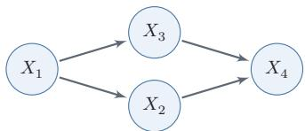  
图 14.1 变量 $X _ { 1 }$ 2 $X _ { 2 }$ $X _ { 3 }$ $X _ { 4 }$ 之间条件独立性的图形化表示

图模型的基本问题 图模型有三个基本问题：

（1）表示问题：对于一个概率模型，如何通过图结构来描述变量之间的依赖关系.

（2）学习问题：图模型的学习包括图结构的学习和参数的学习.在本章中，我们只关注在给定图结构时的参数学习，即参数估计问题

（3）推断问题:在已知部分变量时，计算其他变量的条件概率分布

图模型与机器学习很多机器学习模型都可以归结为概率模型，即建模输入和输出之间的条件概率分布.因此，图模型提供了一套统一语言：先明确哪些变量可观测、哪些变量不可观测，再写出联合分布如何分解，最后讨论如何学习参数和如何做后验推断，这个视角有助于理解不同模型之间的联系，也有助于设计新模型.即使在神经网络模型中，图模型思想仍然很有用：神经网络常被用来参数化局部条件分布、势函数或近似后验分布，而图模型则说明这些模块应如何组合成一个一致的概率模型

## 14.1 模型表示

图由一组节点和节点之间的边组成.在概率图模型中，每个节点都表示一个随机变量（或一组随机变量），边表示这些随机变量之间的概率依赖关系.

常见的概率图模型可以分为两类:有向图模型和无向图模型

(1)有向图模型使用有向非循环图（Directed Acyclic Graph,DAG）来描述变量之间的条件依赖关系.如果两个节点之间有连边，表示在该图的分解结构下，一个变量的局部条件分布会直接依赖于另一个变量；只有在额外赋予因果语义时，这种连边才可以进一步解释为因果影响.

(2)无向图模型使用无向图（Undirected Graph)来描述变量之间的关系.每条边代表两个变量之间存在直接的概率依赖关系，但通常不区分方向，也不直接表达因果语义.

图14.2给出了两个代表性图模型（有向图和无向图）的示例，分别表示了四个变量 $\{ X _ { 1 } , X _ { 2 } , X _ { 3 } , X _ { 4 } \}$ 之间的依赖关系．图中带阴影的节点表示可观测到的变量，不带阴影的节点表示隐变量，连边表示两变量间的条件依赖关系.

在本章后文中，节点、随机变量、变量的概念会经常混用.每个节点对应一个随机变量.

  
(a) 有向图：贝叶斯网络

  
(b) 无向图:马尔可夫随机场  
图14.2 有向图和无向图示例

## 14.1.1 有向图模型

有向图模型（Directed Graphical Model），也称为贝叶斯网络（BayesianNetwork）或信念网络（Belief Network，BN），是一类用有向图来描述随机向量概率分布的模型.

定义14.1-贝叶斯网络：对于一个K维随机向量X和一个有K个节点的有向非循环图G,G中的每个节点都对应一个随机变量，每个连接 $e _ { i j }$ 表示两个随机变量 $X _ { i }$ 和 $X _ { j }$ 之间存在直接的条件依赖关系.令 $X _ { \pi _ { k } }$ 表示变量$X _ { k }$ 的所有父节点变量集合， $P ( X _ { k } | X _ { \pi _ { k } } )$ 表示每个随机变量的局部条件概率分布(Local Conditional Probability Distribution). 如果 X 的联合概率分布可以分解为每个随机变量 $X _ { k }$ 的局部条件概率的连乘形式，即

$$
p ( \pmb { x } ) = \prod _ { k = 1 } ^ { K } p ( x _ { k } | \pmb { x } _ { \pi _ { k } } ) ,\tag{14.8}
$$

那么(G,X)构成了一个贝叶斯网络.

条件独立性 在贝叶斯网络中，如果两个节点是直接连接的，它们一般表示存在直接的概率依赖关系.父节点出现在子节点的局部条件分布中；只有在额外引入因果假设时，父子关系才可以进一步解释为“因”和“果”.

如果两个节点不是直接连接的，但可以由一条经过其他节点的路径来连接，那么这两个节点之间是否条件独立，就取决于路径上的局部结构以及哪些变量已被观测.以三个节点的贝叶斯网络为例，给定三个节点 $X _ { 1 } , X _ { 2 } , X _ { 3 }$ ,其中 $X _ { 1 }$ 和$X _ { 3 }$ 不直接连接，而是通过节点 $X _ { 2 }$ 连接.这三个节点之间可以有四种基本结构，如图14.3所示.在图14.3a和图14.3b中， $X _ { 1 }$ $X _ { 3 } | \emptyset$ ,但 $X _ { 1 } \bot \bot X _ { 3 } | X _ { 2 }$ ;在图14.3c中，$X _ { 1 }$ $X _ { 3 } | \emptyset$ ,但 $X _ { 1 }$ $X _ { 3 } | X _ { 2 }$ ;在图14.3d中， $X _ { 1 }$ $X _ { 3 } | \emptyset$ ,但 $X _ { 1 } \downarrow \downarrow X _ { 3 } | X _ { 2 }$

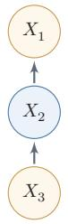  
(a)

  
(b)

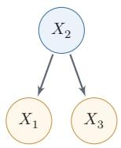  
(c)

  
(d)  
图14.3 三个变量的依赖关系示例

图14.3中的四种关系分别为：

参见习题14-2.

（1）链式结构（图14.3a）：当 $X _ { 2 }$ 已知时， $X _ { 1 }$ 和 $X _ { 3 }$ 条件独立，即 $X _ { 1 }$ Ⅱ$X _ { 3 } | X _ { 2 }$

（2）链式结构（图14.3b）：当 $X _ { 2 }$ 已知时， $X _ { 1 }$ 和 $X _ { 3 }$ 条件独立，即 $X _ { 1 }$ $X _ { 3 } | X _ { 2 }$

(3）分叉结构（图14.3c)：当 $X _ { 2 }$ 未知时， $X _ { 1 }$ 和 $X _ { 3 }$ 一般不独立；当 $X _ { 2 }$ 已知时， $X _ { 1 }$ 和 $X _ { 3 }$ 条件独立，即 $X _ { 1 }$ Ⅱ $X _ { 3 } | X _ { 2 }$

（4）汇聚结构（图14.3d)：当 $X _ { 2 }$ 未知时， $X _ { 1 }$ 和 $X _ { 3 }$ 独立；当 $X _ { 2 }$ 已知时， $X _ { 1 }$ 和 $X _ { 3 }$ 一般不独立，即 $X _ { 1 }$ 4 $X _ { 3 } | X _ { 2 }$ .这种“观测结果后反而引入依赖”的现象也称为解释消除.

这三类局部结构—链式结构、分叉结构和汇聚结构—构成了贝叶斯网络中更一般条件独立性判断的基础，也就是d-分离（d-separation）的核心直觉：在链式和分叉结构中，观测中间节点会阻断路径；而在汇聚结构中，未观测汇聚节点及其后代时路径是阻断的，一旦观测汇聚节点或其后代，路径就会被打开

局部马尔可夫性质 对一个更一般的贝叶斯网络，其局部马尔可夫性质为：每个随机变量在给定父节点的情况下，条件独立于它的非后代节点

$$
X _ { k } \perp \perp Z | X _ { \pi _ { k } } ,
$$

从公式(14.2)和公式(14.8) 可得到. 参见习题14-5.

(14.9)

其中 $Z$ 为 $X _ { k }$ 的非后代变量.

## 14.1.2 常见的有向图模型

很多经典的机器学习模型可以使用有向图模型来描述，比如朴素贝叶斯分类器、隐马尔可夫模型、深度信念网络等.

## 14.1.2.1 Sigmoid信念网络

为了减少模型参数，可以使用参数化模型来建模有向图模型中的条件概率分布.一种简单的参数化模型为 Sigmoid 信念网络[Neal, 1992].

更复杂的深度信念网络，参见第15.3节.

Sigmoid信念网络（Sigmoid Belief Network，SBN）中的变量取值为{0, 1}. 对于变量 $X _ { k }$ 和它的父节点集合 $\pi _ { k }$ ,其条件概率分布表示为

$$
p ( x _ { k } = 1 | \pmb { x } _ { \pi _ { k } } ; \theta ) = \sigma ( \theta _ { 0 } + \sum _ { x _ { i } \in \pmb { x } _ { \pi _ { k } } } \theta _ { i } x _ { i } ) ,\tag{14.10}
$$

其中 $\sigma ( \cdot )$ 是 Logistic 函数， $\theta _ { i }$ 是可学习的参数． 假设变量 $X _ { k }$ 的父节点数量为M，如果使用表格来记录条件概率需要 $2 ^ { M }$ 个参数，如果使用参数化模型只需要M+1个参数.如果对不同的变量的条件概率都共享使用一个参数化模型，其参数数量又可以大幅减少.

值得一提的是，Sigmoid信念网络与Logistic回归模型都采用Logistic函数来计算条件概率．如果假设Sigmoid信念网络中只有一个叶子节点，其所有的父节点之间没有连接，且取值为实数，那么Sigmoid信念网络的网络结构和Logistic回归模型类似，如图14.4所示.但是，这两个模型的区别在于，Logistic回归模型中的x通常作为给定的观测输入，而不是需要由模型解释的随机变量.因此，Logistic回归模型只建模条件概率 $p ( y | \mathbf { \boldsymbol { x } } )$ ，是一种判别模型；而Sigmoid信念网络建模联合概率 $p ( { \pmb x } , { \pmb y } )$ ，是一种生成模型

Logistic 回归模型也经 常被看作一种条件无 向图模型.

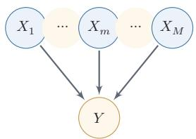  
(a) 只有一层的简单Sigmoid信念网络

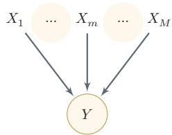  
(b) Logistic 回归模型  
图 14.4 Sigmoid信念网络和Logistic回归模型的比较

## 14.1.2.2 朴素贝叶斯分类器

朴素贝叶斯（NaiveBayes，NB）分类器是一类简单的概率分类器，在强(朴素)独立性假设的条件下运用贝叶斯公式来计算每个类别的条件概率.

给定一个有M维特征的样本x和类别 $y$ ,类别y的条件概率为

$$
\begin{array} { c } { { p ( y | x ; \theta ) = \displaystyle \frac { p ( x _ { 1 } , \cdots , x _ { M } | y ; \theta ) p ( y ; \theta ) } { p ( x _ { 1 } , \cdots , x _ { M } ) } } } \\ { { \propto p ( x _ { 1 } , \cdots , x _ { M } | y ; \theta ) p ( y ; \theta ) , } } \end{array}\tag{14.11}
$$

(14.12)

其中θ为概率分布的参数

在朴素贝叶斯分类器中，假设在给定Y的情况下， $X _ { m }$ 之间是条件独立的，即 $X _ { m }$ $X _ { k } | Y , \forall m \neq k .$ 图14.5给出了朴素贝叶斯分类器的图模型表示.

  
图 14.5 朴素贝叶斯模型

条件概率分布 $p ( y | \mathbf { \boldsymbol { x } } )$ 可以分解为

$$
p ( \boldsymbol { y } | \boldsymbol { x } ; \boldsymbol { \theta } ) \propto p ( \boldsymbol { y } | \boldsymbol { \theta } _ { c } ) \prod _ { m = 1 } ^ { M } p ( x _ { m } | \boldsymbol { y } ; \boldsymbol { \theta } _ { m } ) ,\tag{14.13}
$$

其中 $\theta _ { c }$ 是 $y$ 的先验概率分布的参数， $\theta _ { m }$ 是条件概率分布 $p ( x _ { m } | y ; \theta _ { m } )$ 的参数.若$x _ { m }$ 为连续值， $p ( x _ { m } | y ; \theta _ { m } )$ 可以用高斯分布建模；若 $x _ { m }$ 为离散值， $p ( x _ { m } | y ; \theta _ { m } )$ 可以用多项分布建模.

虽然朴素贝叶斯分类器的条件独立性假设很强，但是在实际应用中，它在不少任务上仍能得到有竞争力的结果，并且模型简单，在少样本场景下不易过拟合.

## 14.1.2.3 隐马尔可夫模型

隐马尔可夫模型(Hidden Markov Model, HMM) [Baum et al., 1966] 是用来表示一种含有隐变量的马尔可夫过程

图14.6给出隐马尔可夫模型的图模型表示，其中 $X _ { 1 : T }$ 为可观测变量， $Y _ { 1 : T }$ 为隐变量．所有的隐变量构成一个马尔可夫链，每个可观测标量 $X _ { t }$ 依赖当前时刻的隐变量 $Y _ { t }$

  
图 14.6 隐马尔可夫模型

隐马尔可夫模型的联合概率可以分解为

$$
p ( \pmb { x } , \pmb { y } ; \theta ) = \prod _ { t = 1 } ^ { T } p ( y _ { t } | y _ { t - 1 } ; \theta _ { \mathrm { s } } ) p ( x _ { t } | y _ { t } ; \theta _ { \mathrm { o } } ) ,\tag{14.14}
$$

为了描述方便，这里用$p ( y _ { 1 } | y _ { 0 } )$ 表示 $p ( y _ { 1 } )$

其中x和 $\textbf {  { y } }$ 分别为可观测变量和隐变量的取值，条件概率 $p ( x _ { t } | y _ { t } ; \theta _ { \mathrm { o } } )$ 称为输出概率，条件概率 $p ( y _ { t } | y _ { t - 1 } ; \theta _ { \mathrm { s } } )$ 称为转移概率， $\theta _ { \mathrm { s } }$ 和 $\theta _ { \mathrm { o } }$ 分别表示两类条件概率的参数.

## 14.1.3 无向图模型

无向图模型，也称为马尔可夫随机场(Markov Random Field,MRF)或马尔可夫网络（MarkovNetwork），是一类用无向图来描述一组具有局部马尔可夫性质的随机向量X的联合概率分布的模型

定义14.2-马尔可夫随机场：对于一个随机向量 $\pmb { X } = [ X _ { 1 } , \cdots , X _ { K } ] ^ { \intercal }$ 和一个有K个节点的无向图 $G ( \mathcal { V } , \mathcal { E } )$ (可以存在循环)，图G中的节点k表示随机变量 $X _ { k } , 1 \le k \le K$ .如果(G,X)满足局部马尔可夫性质，即一个变量$X _ { k }$ 在给定它的邻居的情况下独立于所有其他变量，

$$
p ( \boldsymbol { x } _ { k } | \boldsymbol { x } _ { \setminus k } ) = p ( \boldsymbol { x } _ { k } | \boldsymbol { x } _ { \mathcal { N } ( k ) } ) ,\tag{14.15}
$$

其中 $\mathcal { N } ( k )$ 为变量 $X _ { k }$ 的邻居集合，\k为除 $X _ { k }$ 外其他变量的集合，那么$( G , X )$ 就构成了一个马尔可夫随机场.

无向图的局部马尔可夫性质 无向图中的局部马尔可夫性质可以表示为

$$
X _ { k } \perp \perp X _ { \setminus \mathcal { N } ( k ) , \setminus k } \mid X _ { \mathcal { N } ( k ) } ,
$$

其中 $X _ { \backslash \mathcal { N } ( k ) , \backslash k }$ 表示除 $X _ { \mathcal { N } ( k ) }$ 和 $X _ { k }$ 外的其他变量.

对于图14.2b中的4个变量，根据马尔可夫性质，可以得到 $X _ { 1 } \perp \perp X _ { 4 } | X _ { 2 } , X _ { 3 }$ 和 $X _ { 2 }$ Ⅱ $X _ { 3 } | X _ { 1 } , X _ { 4 }$

## 14.1.4 无向图模型的概率分解

团由于无向图模型并不提供一个变量的拓扑顺序，因此无法用链式法则对$p ( { \pmb x } )$ 进行逐一分解.无向图模型的联合概率一般以全连通子图为单位进行分解.无向图中的一个全连通子图，称为团（Clique），即团内的所有节点之间都连边，在图14.7所示的无向图中共有7个团，包括 $\left\{ X _ { 1 } , X _ { 2 } \right\} , \left\{ X _ { 1 } , X _ { 3 } \right\} , \left\{ X _ { 2 } , X _ { 3 } \right\}$ $\left\{ X _ { 3 } , X _ { 4 } \right\} , \left\{ X _ { 2 } , X _ { 4 } \right\} , \left\{ X _ { 1 } , X _ { 2 } , X _ { 3 } \right\} , \left\{ X _ { 2 } , X _ { 3 } , X _ { 4 } \right\}$

在所有团中，如果一个团不能被其他的团包含，这个团就是一个最大团(Maximal Clique).

  
图14.7 无向图模型中的团和最大团

因子分解无向图中的联合概率可以分解为一系列定义在最大团上的非负函数的乘积形式.

定理14.1-Hammersley-Clifford定理：如果一个分布 $p ( { \pmb x } ) > 0$ 满足无向图G中的局部马尔可夫性质，当且仅当 $p ( { \pmb x } )$ 可以表示为一系列定义在最大团上的非负函数的乘积形式，即

$$
p ( \pmb { x } ) = \frac { 1 } { Z } \prod _ { c \in \mathcal { C } } \phi _ { c } ( \pmb { x } _ { c } ) ,\tag{14.16}
$$

其中 $\mathcal { C }$ 为 $G$ 中的最大团集合， $\phi _ { c } ( { \pmb x } _ { c } ) \geq 0$ 是定义在团c上的势能函数（Po-tential Function）,Z是配分函数（Partition Function）,用来将乘积归—化为概率形式：

$$
Z = \sum _ { \pmb { x } \in \mathcal { X } } \prod _ { c \in \mathcal { C } } \phi _ { c } ( \pmb { x } _ { c } ) ,\tag{14.17}
$$

其中 X 为随机向量 X的取值空间.

Hammersley-Clifford 定理的证明可以参考 [Koller et al., 2009]. 无向图模型与有向图模型的一个重要区别是有配分函数Z. 配分函数的计算复杂度是指数级的，因此在推断和参数学习时都需要重点考虑

配分函数的计算参见第14.3.1.2节.

吉布斯分布 公式(14.16)中定义的分布形式也称为吉布斯分布(Gibbs Distri-bution）.根据Hammersley-Clifford定理，在正分布条件下，无向图模型和吉布斯分布是一致的：吉布斯分布满足马尔可夫随机场的条件独立性质，马尔可夫随机场的概率分布也可以表示成吉布斯分布.

为了保证势能函数为正，我们通常将其定义为

$$
\phi _ { c } ( \pmb { x } _ { c } ) = \exp ( - E _ { c } ( \pmb { x } _ { c } ) ) ,\tag{14.18}
$$

其中 $E _ { c } ( { \pmb x } _ { c } )$ 为能量函数（Energy Function).

这里的负号是遵从物理上习惯，即能量越低意味着概率越高.

因此，无向图上定义的概率分布可以表示为

$$
P ( \pmb { x } ) = \frac { 1 } { Z } \prod _ { c \in \mathcal { C } } \exp ( - E _ { c } ( \pmb { x } _ { c } ) )\tag{14.19}
$$

$$
= \frac { 1 } { Z } \exp \Big ( \sum _ { c \in \mathcal { C } } - E _ { c } ( \pmb { x } _ { c } ) \Big ) .\tag{14.20}
$$

这种形式的分布又称为玻尔兹曼分布（Boltzmann Distribution）.满足上述正性条件的无向图模型都可以用公式(14.20)来表示其联合概率.

玻尔兹曼分布参见第15.1节.

## 14.1.5 常见的无向图模型

很多经典的机器学习模型可以使用无向图模型来描述，比如对数线性模型(也叫最大熵模型)、条件随机场、玻尔兹曼机、受限玻尔兹曼机等.

玻尔兹曼机参见第15.1节.

## 14.1.5.1 对数线性模型

受限玻尔兹曼机参见第15.2节.

势能函数一般定义为

$$
\phi _ { c } ( \pmb { x } _ { c } | \theta _ { c } ) = \exp { \Big ( \theta _ { c } ^ { \top } f _ { c } ( \pmb { x } _ { c } ) \Big ) } ,\tag{14.21}
$$

其中函数 $f _ { c } ( { \pmb x } _ { c } )$ 为定义在 $\mathbf { \delta } _ { \mathbf { x } _ { c } }$ 上的特征向量， $\theta _ { c }$ 为权重向量.这样联合概率 $p ( { \pmb x } )$ 的对数形式为

$$
\log p ( \pmb { x } ; \theta ) = \sum _ { c \in \mathcal { C } } \theta _ { c } ^ { \top } f _ { c } ( \pmb { x } _ { c } ) - \log Z ( \theta ) ,\tag{14.22}
$$

其中θ代表所有势能函数中的参数 $\theta _ { c } .$ 这种形式的无向图模型也称为对数线性模型(Log-Linear Model)或最大熵模型(Maximum Entropy Model) [Bergeret al., 1996; Della Pietra et al., 1997]. 图14.8a所示是一个常用的最大熵模型.

如果用对数线性模型来建模条件概率 $p ( y | \mathbf { \boldsymbol { x } } )$

$$
p ( \boldsymbol { y } | \mathbf { x } ; \boldsymbol { \theta } ) = \frac { 1 } { Z ( \mathbf { x } ; \boldsymbol { \theta } ) } \exp \Big ( \boldsymbol { \theta } ^ { \intercal } f ( \mathbf { x } , \boldsymbol { y } ) \Big ) ,\tag{14.23}
$$

其中 $\begin{array} { r } { Z ( \mathbf { \boldsymbol { x } } ; \boldsymbol { \theta } ) = \sum _ { \boldsymbol { y } ^ { \prime } \in \mathcal { Y } } \exp \left( \theta ^ { \intercal } \boldsymbol { f } ( \mathbf { \boldsymbol { x } } , \boldsymbol { y } ^ { \prime } ) \right) } \end{array}$ 为归一化因子，求和遍历所有候选类别对数线性模型也称为条件最大熵模型或Softmax回归模型.

## 14.1.5.2 条件随机场

条件随机场(Conditional Random Field, CRF) [Lafferty et al., 2001]是一种直接建模条件概率的无向图模型.

和条件最大熵模型不同，条件随机场建模的条件概率 $p ( \pmb { y } | \pmb { x } )$ 中，y一般为随机向量，因此需要对 $p ( \pmb { y } | \pmb { x } )$ 进行因子分解．假设条件随机场的最大团集合为C，其条件概率为

$$
p ( \pmb { y } | \pmb { x } ; \theta ) = \frac { 1 } { Z ( \pmb { x } ; \theta ) } \exp \Big ( \sum _ { c \in \mathcal { C } } \theta _ { c } ^ { \top } f _ { c } ( \pmb { x } , \pmb { y } _ { c } ) \Big ) ,\tag{14.24}
$$

其中 $\begin{array} { r } { Z ( \pmb { x } ; \theta ) = \sum _ { \pmb { u } } \mathrm { e x p } ( \sum _ { c \in \mathcal { C } } f _ { c } ( \pmb { x } , \pmb { y } _ { c } ) ^ { \top } \theta _ { c } ) } \end{array}$ 为归一化项.

一种常见的条件随机场为图14.8中所示的链式结构，称为线性链条件随机场（Linear-Chain CRF）,其条件概率为

$$
p ( \pmb { y } | \pmb { x } ; \theta ) = \frac { 1 } { Z ( \pmb { x } ; \theta ) } \exp \Big ( \sum _ { t = 1 } ^ { T } \theta _ { 1 } ^ { \top } f _ { 1 } ( \pmb { x } , y _ { t } ) + \sum _ { t = 1 } ^ { T - 1 } \theta _ { 2 } ^ { \top } f _ { 2 } ( \pmb { x } , y _ { t } , y _ { t + 1 } ) \Big ) ,\tag{14.25}
$$

其中 $f _ { 1 } ( x , y _ { t } )$ 为状态特征，一般和位置t相关， $f _ { 2 } ( x , y _ { t } , y _ { t + 1 } )$ 为转移特征，一般可以简化为 $f _ { 2 } ( y _ { t } , y _ { t + 1 } )$ 并使用状态转移矩阵来表示.

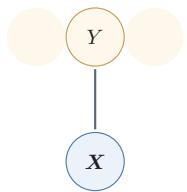  
(a) 最大熵模型

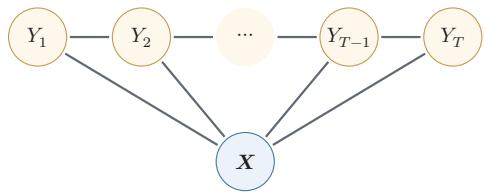  
(b) 线性链的条件随机场  
图14.8 最大熵模型和线性链条件随机场

## 14.1.6 有向图和无向图之间的转换

有向图和无向图可以相互转换，但将无向图转为有向图通常比较困难.在实际应用中，将有向图转为无向图更加重要，这样可以利用无向图上的精确推断算法，比如联合树算法(Junction Tree Algorithm).

无向图模型可以自然表示有向图模型不便表达的一些对称依赖关系，比如循环依赖；但它不区分边的方向，因此不能直接表示有向图中由方向编码的非对称关系.只有在额外引入因果语义时，这种非对称关系才可以进一步解释为因果方向.

以图14.9中的有向图（图14.9a）为例，其联合概率分布可以分解为

$$
\begin{array} { r } { p ( { \pmb x } ) = p ( x _ { 1 } ) p ( x _ { 2 } ) p ( x _ { 3 } ) p ( x _ { 4 } | x _ { 1 } , x _ { 2 } , x _ { 3 } ) , } \end{array}\tag{14.26}
$$

其中 $p ( x _ { 4 } | x _ { 1 } , x _ { 2 } , x _ { 3 } )$ 和四个变量都相关．如果要转换为无向图，需要将这四个变量都归属于一个团中．因此，需要将 $x _ { 4 }$ 的三个父节点之间都加上连边，如图14.9b所示.这个过程称为道德化（Moralization）.转换后的无向图称为道德图（Moral Graph）.在道德化的过程中，原来有向图的一些独立性会丢失，比如上面例子中 $X _ { 1 } , X _ { 2 }$ 和 $X _ { 3 }$ 在无观测时相互独立这一性质，在道德图中不再成立

道德化的名称来源是：有共同儿子的父节点都必须结婚（即有连边).

  
(a) 有向图

  
(b) 道德图  
图14.9 具有“共果关系”的有向图的道德化示例

## 14.2 学习

图模型的学习可以分为两部分：一是网络结构学习，即寻找适合数据和先验假设的网络结构；二是网络参数估计，即已知网络结构，估计每个条件概率分布的参数.

网络结构学习比较困难，可以依赖领域知识，也可以通过打分搜索、条件独立性检验或带约束的结构优化来完成；如果图具有因果解释，还需要额外的因果假设.本节只讨论在给定网络结构条件下的参数估计问题.图模型的参数估计问题又分为不包含隐变量时的参数估计问题和包含隐变量时的参数估计问题．需要注意的是，含隐变量模型的学习通常离不开对隐变量后验分布的推断，因此参数学习和推断并不是完全分离的两个问题；其中EM算法正是“先推断隐变量后验、再更新参数”的典型代表.

## 14.2.1 不含隐变量的参数估计

如果图模型中不包含隐变量，即所有变量都是可观测的，那么网络参数一般可以直接通过最大似然来进行估计.

有向图模型在有向图模型中，所有变量x的联合概率分布可以分解为每个随机变量 $x _ { k }$ 的局部条件概率 $p ( x _ { k } | x _ { \pi _ { k } } ; \theta _ { k } )$ 的连乘形式，其中 $\theta _ { k }$ 为第k个变量的局部条件概率的参数

给定N个训练样本 $\mathcal { D } = \{ \pmb { x } ^ { ( n ) } \} _ { n = 1 } ^ { N }$ ,其对数似然函数为

$$
\begin{array} { l } { \displaystyle \mathcal { L } ( \mathcal { D } ; \theta ) = \frac { 1 } { N } \sum _ { n = 1 } ^ { N } \log p ( \pmb { x } ^ { ( n ) } ; \theta ) } \\ { \displaystyle \ = \frac { 1 } { N } \sum _ { n = 1 } ^ { N } \sum _ { k = 1 } ^ { K } \log p ( x _ { k } ^ { ( n ) } | x _ { \pi _ { k } } ^ { ( n ) } ; \theta _ { k } ) , } \end{array}\tag{14.27}
$$

(14.28)

其中 $\theta _ { k }$ 为第k个局部条件分布的参数

因为所有变量都是可观测的，最大化对数似然 $\mathcal { L } ( \mathcal { D } ; \theta )$ ，只需要分别最大化每个变量的条件似然来估计其参数.

$$
\theta _ { k } = \arg \operatorname* { m a x } \sum _ { n = 1 } ^ { N } \log p ( x _ { k } ^ { ( n ) } | x _ { \pi _ { k } } ^ { ( n ) } ; \theta _ { k } ) .\tag{14.29}
$$

如果变量x是离散的，简单直接的方式是在训练集上统计每个变量的条件概率表.但是条件概率表需要的参数比较多.假设条件概率 $p ( x _ { k } | x _ { \pi _ { k } } )$ 的父节点数量为M，所有变量为二值变量，其条件概率表需要 $2 ^ { M }$ 个参数.为了减少参数数量，可以使用参数化的模型，比如Sigmoid信念网络.如果变量x是连续的，可以使用高斯函数来表示条件概率分布，称为高斯信念网络.在此基础上，还可以通过让所有的条件概率分布共享使用同一组参数来进一步减少参数的数量.

无向图模型在无向图模型中，所有变量x的联合概率分布可以分解为定义在最大团上的势能函数的连乘形式.以对数线性模型为例，

$$
p ( \pmb { x } ; \theta ) = \frac { 1 } { Z ( \theta ) } \exp \bigg ( \sum _ { c \in \mathcal { C } } \theta _ { c } ^ { \top } f _ { c } ( \pmb { x } _ { c } ) \bigg ) ,\tag{14.30}
$$

其中 $\begin{array} { r } { Z ( \theta ) = \sum _ { \pmb { x } } \exp ( \sum _ { c \in \mathcal { C } } \theta _ { c } ^ { \top } f _ { c } ( \pmb { x } _ { c } ) ) } \end{array}$

给定N个训练样本 $\mathcal { D } = \{ \pmb { x } ^ { ( n ) } \} _ { n = 1 } ^ { N }$ ,其对数似然函数为

$$
\begin{array} { l } { \displaystyle \mathcal { L } ( \mathcal { D } ; \theta ) = \frac { 1 } { N } \sum _ { n = 1 } ^ { N } \log p ( \pmb { x } ^ { ( n ) } ; \theta ) } \\ { \displaystyle \ = \frac { 1 } { N } \sum _ { n = 1 } ^ { N } \Big ( \sum _ { c \in \mathcal { C } } \theta _ { c } ^ { \top } f _ { c } ( \pmb { x } _ { c } ^ { ( n ) } ) \Big ) - \log Z ( \theta ) , } \end{array}\tag{14.31}
$$

(14.32)

其中 $\theta _ { c }$ 为定义在团 $c$ 上的势能函数的参数

采用梯度上升方法进行最大似然估计， $\mathcal { L } ( \mathcal { D } ; \theta )$ 关于参数 $\theta _ { c }$ 的偏导数为

$$
\frac { \partial \mathcal { L } ( \mathcal { D } ; \theta ) } { \partial \theta _ { c } } = \frac { 1 } { N } \sum _ { n = 1 } ^ { N } \left( f _ { c } ( \pmb { x } _ { c } ^ { ( n ) } ) \right) - \frac { \partial \log Z ( \theta ) } { \partial \theta _ { c } }\tag{14.33}
$$

其中

$$
\begin{array} { r } { \displaystyle \frac { \partial \log Z ( \theta ) } { \partial \theta _ { c } } = \sum _ { \pmb { x } } \frac { 1 } { Z ( \theta ) } \cdot \exp \Big ( \sum _ { c \in \mathcal { C } } \theta _ { c } ^ { \top } f _ { c } ( \pmb { x } _ { c } ) \Big ) \cdot f _ { c } ( \pmb { x } _ { c } ) } \\ { \displaystyle = \sum _ { \pmb { x } } p ( \pmb { x } ; \theta ) f _ { c } ( \pmb { x } _ { c } ) \triangleq \mathbb { E } _ { \pmb { x } \sim p ( \pmb { x } ; \theta ) } \Big [ f _ { c } ( \pmb { x } _ { c } ) \Big ] . } \end{array}\tag{14.34}
$$

(14.35)

因此，

$$
\begin{array} { r l r } {  { \frac { \partial \mathcal { L } ( \mathcal { D } ; \theta ) } { \partial \theta _ { c } } = \frac { 1 } { N } \sum _ { n = 1 } ^ { N } f _ { c } ( \pmb { x } _ { c } ^ { ( n ) } ) - \mathbb { E } _ { \pmb { x } \sim p ( \pmb { x } ; \theta ) } \bigg [ f _ { c } ( \pmb { x } _ { c } ) \bigg ] } } \\ & { } & { = \mathbb { E } _ { \pmb { x } \sim \widetilde { p } ( \pmb { x } ) } \bigg [ f _ { c } ( \pmb { x } _ { c } ) \bigg ] - \mathbb { E } _ { \pmb { x } \sim p ( \pmb { x } ; \theta ) } \bigg [ f _ { c } ( \pmb { x } _ { c } ) \bigg ] , } \end{array}\tag{14.36}
$$

(14.37)

其中 $\tilde { p } ( { \boldsymbol { x } } )$ 定义为经验分布（Empirical Distribution）.由于在最优点时梯度为0，因此无向图的最大似然估计的优化目标等价于：对于每个团c上的特征$f _ { c } ( { \pmb x } _ { c } )$ ,使得其在经验分布 $\tilde { p } ( { \boldsymbol x } )$ 下的期望等于其在模型分布 $p ( { \pmb x } ; { \boldsymbol \theta } )$ 下的期望.

对比公式(14.29)和公式(14.37)可以看出，无向图模型的参数估计通常比有向图更复杂.在参数不共享时，有向图中每个局部条件概率的参数可以分开估计；而在无向图中，配分函数把所有参数耦合在一起，无法直接分解为彼此独立的局部估计问题

对于一般的无向图模型，公式(14.37)中的 $\mathbb { E } _ { { \pmb x } \sim p ( { \pmb x } ; \theta ) } [ f _ { c } ( { \pmb x } _ { c } ) ]$ 往往很难计算，因为涉及在联合概率分布 $p ( { \boldsymbol { x } } ; { \boldsymbol { \theta } } )$ 下计算期望.当模型变量比较多时，这个计算往往无法实现.因此，无向图的参数估计通常采用近似的方法：1）利用采样或变分方法近似计算模型期望；2）采用伪似然等局部替代目标绕开全局配分函数；3）在玻尔兹曼机等模型中使用对比散度或随机梯度方法进行近似学习.

## 14.2.2 含隐变量的参数估计

如果图模型中包含隐变量，即有部分变量是不可观测的，参数估计通常需要同时处理隐变量后验推断问题，常用方法包括EM算法、变分方法和采样方法.

## 14.2.2.1 EM算法

在一个包含隐变量的图模型中，令X定义可观测变量集合，Z定义隐变量集合，一个样本 x的边际似然函数（Marginal Likelihood)为

$$
p ( \pmb { x } ; \theta ) = \sum _ { z } p ( \pmb { x } , z ; \theta ) ,\tag{14.38}
$$

其中θ为模型参数.边际似然也称为证据（Evidence）.

图14.10给出了带隐变量的贝叶斯网络的图模型结构，其中矩形表示其中的变量重复N次. 这种表示方法称为盘子表示法（PlateNotation），是图模型中表示重复变量的方法.

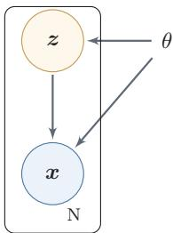  
图14.10 带隐变量的贝叶斯网络

给定N个训练样本 $\mathcal { D } = \{ \pmb { x } ^ { ( n ) } \} _ { n = 1 } ^ { N }$ ,整个训练集的对数边际似然为

$$
\begin{array} { c l l } { \displaystyle \mathcal { L } ( \mathcal { D } ; \theta ) = \frac { 1 } { N } \sum _ { n = 1 } ^ { N } \log p ( \pmb { x } ^ { ( n ) } ; \theta ) } \\ { \displaystyle = \frac { 1 } { N } \sum _ { n = 1 } ^ { N } \log \sum _ { z } p ( \pmb { x } ^ { ( n ) } , z ; \theta ) . } \end{array}\tag{14.39}
$$

(14.40)

通过最大化整个训练集的对数边际似然 $\mathcal { L } ( \mathcal { D } ; \theta )$ ，可以估计出最优的参数$\theta ^ { * }$ .然而计算边际似然函数时涉及 $p ( x )$ 的推断问题，需要在对数函数的内部进行求和（或积分）.这样，当计算参数θ的梯度时，这个求和操作依然存在.除非$p ( \pmb { x } , \pmb { z } ; \theta )$ 的形式非常简单，否则这个求和难以直接计算.

为了计算 $\log p ( { \pmb x } ; { \boldsymbol \theta } )$ ，我们引入一个额外的变分函数 $q ( z ) , q ( z )$ 为定义在隐变量Z上的分布.样本x的对数边际似然函数为

$$
\log p ( \pmb { x } ; \theta ) = \log \sum _ { z } q ( z ) \frac { p ( \pmb { x } , z ; \theta ) } { q ( z ) }\tag{14.41}
$$

$$
\geq \sum _ { z } q ( z ) \log { \frac { p ( x , z ; \theta ) } { q ( z ) } }\tag{14.42}
$$

$$
\triangleq E L B O ( q , \pmb { x } ; \theta ) ,\tag{14.43}
$$

其中 $E L B O ( q , \pmb { x } ; \theta )$ 为对数边际似然函数 $\log p ( { \pmb x } ; { \boldsymbol \theta } )$ 的下界，称为证据下界(Evidence Lower BOund,ELBO).

公式(14.42)使用了Jensen不等式，即对于凹函数 $g , g \left( \mathbb { E } [ X ] \right) \geq \mathbb { E } \left[ g ( X ) \right]$ 成立.由Jensen不等式的性质可知，仅当 $q ( \pmb { z } ) = p ( \pmb { z } | \pmb { x } ; \theta )$ 时，对数边际似然函数$\log p ( { \pmb x } ; { \boldsymbol \theta } )$ 和其下界 $E L B O ( q , \pmb { x } ; \theta )$ 相等,即 $\log p ( \pmb { x } ; \theta ) = E L B O ( q , \pmb { x } ; \theta )$

这样，在后验分布可以精确计算时，最大化对数边际似然函数 $\log p ( { \pmb x } ; { \boldsymbol \theta } )$ 的过程可以分解为两个步骤：

(1)先找到近似分布 $q ( z )$ 使得 $\log p ( \pmb { x } ; \theta ) = E L B O ( q , \pmb { x } ; \theta )$

（2）再寻找参数θ最大化 $E L B O ( q , \pmb { x } ; \theta )$ ，即期望最大化（Expectation-Maximization,EM)算法.

EM算法是含隐变量图模型的常用参数估计方法，通过迭代的方法来最大化边际似然.EM算法具体分为两个步骤：E步和M步.这两步不断重复，直到收敛到某个局部最优解.在第t步更新时，E步和M步分别为：

(1)E步（Expectation Step)：固定参数 $\theta _ { t }$ ，找到一个分布 $q _ { t + 1 } ( z )$ 使得证据下界 $E L B O ( q , \pmb { x } ; \theta _ { t } )$ 等于 $\log p ( { \pmb x } ; { \boldsymbol \theta } _ { t } )$

根据Jensen不等式的性质， $q ( \boldsymbol { z } ) = p ( \boldsymbol { z } | \mathbf { { x } } ; \boldsymbol { \theta } _ { t } )$ 时， $E L B O ( q , \pmb { x } ; \theta _ { t } )$ 最大. 因此在精确E步中，最理想的分布 $q ( z )$ 等于后验分布 $p ( \boldsymbol { z } | \boldsymbol { x } ; \boldsymbol { \theta } _ { t } )$ .而计算后验分布$p ( z | \mathbf { \boldsymbol { x } } ; \boldsymbol { \theta } _ { t } )$ 是一个推断(Inference)问题.如果 $_ z$ 是有限的一维离散变量（比如混合高斯模型中的类别变量)， $p ( z | \mathbf { \boldsymbol { x } } ; \boldsymbol { \theta } _ { t } )$ 计算起来还比较容易；否则， $p ( z | \mathbf { x } ; \theta _ { t } ) -$ 般很难计算，需要通过变分推断或采样方法来进行近似估计.

推断参见第14.3节.

(2)M步（Maximization Step)：固定 $q _ { t + 1 } ( z )$ ，找到一组参数使得证据下界最大,即

$$
\boldsymbol { \theta } _ { t + 1 } = \mathop { \arg \operatorname* { m a x } } _ { \boldsymbol { \theta } } E L B O ( q _ { t + 1 } , \boldsymbol { x } ; \boldsymbol { \theta } ) .\tag{14.44}
$$

https://nndl.ai/

这一步可以看作全观测变量图模型的参数估计问题，可以使用第14.2.1节中方法进行参数估计.

收敛性证明 假设在第t步时的模型参数为 $\theta _ { t }$ ，在E步时找到一个分布 $q _ { t + 1 } ( z )$ 使得 $\log p ( \pmb { x } ; \theta _ { t } ) = E L B O ( q _ { t + 1 } , \pmb { x } ; \theta _ { t } )$ .在M步时固定 $q _ { t + 1 } ( z )$ 找到一组参数$\theta _ { t + 1 }$ ,使得 $E L B O ( q _ { t + 1 } , \pmb { x } ; \theta _ { t + 1 } ) \geq E L B O ( q _ { t + 1 } , \pmb { x } ; \theta _ { t } )$ .因此有

$$
\log p ( \pmb { x } ; \theta _ { t + 1 } ) \geq E L B O ( q _ { t + 1 } , \pmb { x } ; \theta _ { t + 1 } ) \geq E L B O ( q _ { t + 1 } , \pmb { x } ; \theta _ { t } ) = \log p ( \pmb { x } ; \theta _ { t } ) ,\tag{14.45}
$$

即每经过一次迭代，对数边际似然增加，即 $\log p ( \pmb { x } ; \theta _ { t + 1 } ) \geq \log p ( \pmb { x } ; \theta _ { t } )$

信息论的视角对数边际似然 $\log p ( { \pmb x } ; { \boldsymbol \theta } )$ 可以通过下面方式进行分解：

首先因为 $p ( \pmb { x } , \pmb { z } ; \theta ) = p ( \pmb { z } | \pmb { x } ; \theta ) p ( \pmb { x } ; \theta )$ ,有 $\log p ( { \pmb x } , { \pmb z } ; \theta ) = \log p ( { \pmb z } | { \pmb x } ; \theta ) +$ $\log p ( { \pmb x } ; { \boldsymbol \theta } )$ ,进一步有 $\log p ( { \pmb x } ; \theta ) = \log p ( { \pmb x } , z ; \theta ) - \log p ( z | { \pmb x } ; \theta )$

这样，对数边际似然 $\log p ( { \pmb x } ; { \boldsymbol \theta } )$ 可以分解为

$$
\log p ( { \pmb x } ; \theta ) = \sum _ { z } q ( z ) \log p ( { \pmb x } ; \theta )\tag{14.46}
$$

$$
\begin{array} { r } { \sum _ { z } q ( z ) = 1 . } \end{array}
$$

$$
= \sum _ { z } q ( z ) \Big ( \log p ( { \pmb x } , z ; \theta ) - \log p ( { z } | { \pmb x } ; \theta ) \Big )\tag{14.47}
$$

$$
= \sum _ { z } q ( z ) \log \frac { p ( { \pmb x } , z ; \theta ) } { q ( { \pmb z } ) } - \sum _ { z } q ( z ) \log \frac { p ( { z } | { \pmb x } ; \theta ) } { q ( z ) }\tag{14.48}
$$

$$
\begin{array} { r } { = E L B O ( q , \pmb { x } ; \theta ) + \mathrm { K L } ( q ( \pmb { z } ) \| p ( \pmb { z } | \pmb { x } ; \theta ) ) , } \end{array}\tag{14.49}
$$

其中KL $\displaystyle | \boldsymbol { q } ( \boldsymbol { z } ) \| p ( \boldsymbol { z } | \boldsymbol { x } ; \boldsymbol { \theta } ) )$ 为分布 q(z)和后验分布 $p ( \boldsymbol { z } | \boldsymbol { x } ; \boldsymbol { \theta } )$ 的KL散度.

参见第E.3.2节.

由于 $\mathrm { K L } ( q ( \boldsymbol { z } ) \| p ( \boldsymbol { z } | \boldsymbol { x } ; \theta ) ) \ge 0$ ，因此 $E L B O ( q , \pmb { x } ; \theta )$ 为 $\log p ( { \pmb x } ; { \boldsymbol \theta } )$ 的一个下界. 当且仅当 $q ( \pmb { z } ) = p ( \pmb { z } | \pmb { x } ; \theta )$ 时， $\mathrm { K L } ( q ( \boldsymbol { z } ) \| p ( \boldsymbol { z } | \boldsymbol { x } ; \boldsymbol { \theta } ) ) = 0 , E L B O ( q , \boldsymbol { x } ; \boldsymbol { \theta } ) =$ $\log p ( { \pmb x } ; { \boldsymbol \theta } )$

图14.11为EM算法在第t步迭代时的示例.

（1）图14.11a表示第t步迭代时的初始状态.

此时参数为 $\theta _ { t }$ ,并且通常有 $\mathrm { K L } ( q ( \boldsymbol { z } ) \| p ( \boldsymbol { z } | \boldsymbol { x } ; \boldsymbol { \theta } _ { t } ) ) > 0$

(2)图14.11b表示E步更新.

固定参数 $\theta _ { t }$ ，找到分布 $q _ { t + 1 } ( z )$ 使得 $\mathrm { K L } ( q _ { t + 1 } ( \boldsymbol { z } ) \| p ( \boldsymbol { z } | \mathbf { x } ; \boldsymbol { \theta } _ { t } ) ) = 0$ ，这时证据下界 $E L B O ( q _ { t + 1 } , \pmb { x } ; \theta _ { t } )$ 和 $\log p ( \pmb { x } ; \boldsymbol { \theta } _ { t } )$ 相等.

(3)图14.11c表示M步更新.

固定分布 $q _ { t + 1 } ( z )$ ，寻找参数 $\theta _ { t + 1 }$ 使得证据下界 $E L B O ( q _ { t + 1 } , x ; \theta _ { t + 1 } )$ 最大.由公式(14.49)可知，新的对数边际似然不小于新的证据下界，因此在精确EM中有 $\log p ( \pmb { x } ; \theta _ { t + 1 } ) \geq \log p ( \pmb { x } ; \theta _ { t } )$

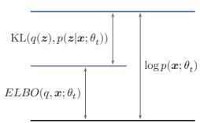  
(a) 初始状态

  
(b) E步更新

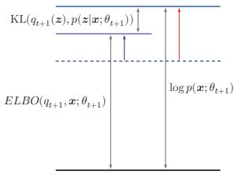  
图 14.11 EM算法在第t步迭代时的示例  
(c) M步更新

## 14.2.2.2 高斯混合模型

本节介绍一个EM算法的应用例子:高斯混合模型

高斯混合模型（Gaussian Mixture Model,GMM）是由多个高斯分布组成的模型，其总体密度函数为多个高斯密度函数的加权组合.如果一个连续随机变量或连续随机向量的分布比较复杂，那么可以用高斯混合模型来近似其多峰或分群结构.

不失一般性，这里考虑一维的情况.假设样本x是从K个高斯分布中的一个分布生成的，但是无法观测到具体由哪个分布生成.我们引入一个隐变量 $z \in$ $\{ 1 , \cdots , K \}$ 来表示样本x来自于哪个高斯分布，z服从多项分布：

$$
p ( z = k ; \pi ) = \pi _ { k } , \qquad 1 \leq k \leq K ,\tag{14.50}
$$

其中 ${ \pmb \pi } = [ \pi _ { 1 } , \pi _ { 2 } , \cdots , \pi _ { K } ]$ 为多项分布的参数，并满足 $\begin{array} { r } { \pi _ { k } \geq 0 , \forall k , \sum _ { k = 1 } ^ { K } \pi _ { k } = 1 } \end{array}$ $\pi _ { k }$ 表示样本x由第k个高斯分布生成的概率.

给定z = k,条件分布 $p ( x | z = k )$ 为高斯分布：

$$
\begin{array} { l } { \displaystyle { p ( x | z = k ; \mu _ { k } , \sigma _ { k } ) = \mathcal N ( x ; \mu _ { k } , \sigma _ { k } ) } } \\ { \displaystyle { \quad = \frac { 1 } { \sqrt { 2 \pi } \sigma _ { k } } \exp \Big ( - \frac { ( x - \mu _ { k } ) ^ { 2 } } { 2 \sigma _ { k } ^ { 2 } } \Big ) } , } \end{array}\tag{14.51}
$$

(14.52)

其中 $\mu _ { k }$ 和 $\sigma _ { k }$ 分别为第k个高斯分布的均值和标准差，方差为 $\sigma _ { k } ^ { 2 } .$

从高斯混合模型中生成一个样本x的过程可以分为两步：

（1）首先根据多项分布 $p ( z ; \pi )$ 随机选取一个高斯分布.

（2）假设选中第k个高斯分布（即 $z = k )$ ，再从高斯分布 $\mathcal N ( \boldsymbol x ; \boldsymbol \mu _ { k } , \boldsymbol \sigma _ { k } )$ 中选取一个样本x.

图14.12给出了高斯混合模型的图模型表示.

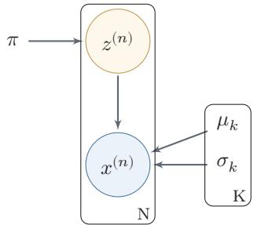  
图 14.12 高斯混合模型

在高斯混合模型中，随机变量x的概率密度函数为

$$
p ( x ) = \sum _ { k = 1 } ^ { K } \pi _ { k } \mathcal { N } ( x ; \mu _ { k } , \sigma _ { k } ) .\tag{14.53}
$$

参数估计 给定N个由高斯混合模型生成的训练样本 $x ^ { ( 1 ) } , x ^ { ( 2 ) } , \cdots , x ^ { ( N ) }$ ，希望能学习其中的参数 $\pi _ { k } , \mu _ { k } , \sigma _ { k } , 1 \leq k \leq K$ 由于我们无法观测样本 $x ^ { ( n ) }$ 是从哪个高斯分布生成的，直接最大化边际似然通常没有闭式更新，因此可用EM算法交替估计后验责任度和模型参数.

对每个样本 $x ^ { ( n ) }$ ,其对数边际分布为

$$
\begin{array} { r } { \log p ( \boldsymbol { x } ^ { ( n ) } ) = \log \displaystyle \sum _ { z ^ { ( n ) } } p ( z ^ { ( n ) } ) p ( \boldsymbol { x } ^ { ( n ) } | z ^ { ( n ) } ) } \\ { = \log \displaystyle \sum _ { k = 1 } ^ { K } \pi _ { k } \mathcal { N } ( \boldsymbol { x } ^ { ( n ) } ; \boldsymbol { \mu } _ { k } , \boldsymbol { \sigma } _ { k } ) . } \end{array}\tag{14.54}
$$

(14.55)

根据EM算法，参数估计可以分为两步进行迭代：

(1)E步 先固定参数 $\pi , \mu , \sigma$ ,计算后验分布 $p ( z ^ { ( n ) } | x ^ { ( n ) } )$ ,即

$$
\begin{array} { r l } & { \gamma _ { n k } \triangleq p ( z ^ { ( n ) } = k | x ^ { ( n ) } ) } \\ & { \quad = \frac { p ( z ^ { ( n ) } ) p ( x ^ { ( n ) } | z ^ { ( n ) } ) } { p ( x ^ { ( n ) } ) } } \\ & { \quad = \frac { \pi _ { k } \mathcal { N } ( x ^ { ( n ) } ; \mu _ { k } , \sigma _ { k } ) } { \sum _ { j = 1 } ^ { K } \pi _ { j } \mathcal { N } ( x ^ { ( n ) } ; \mu _ { j } , \sigma _ { j } ) } , } \end{array}\tag{14.56}
$$

(14.57)

(14.58)

其中 $\gamma _ { n k }$ 定义了样本 $x ^ { ( n ) }$ 属于第k个高斯分布的后验概率.

(2)M步令 $q ( z = k ) = \gamma _ { n k }$ ，训练集D的证据下界为

$$
\begin{array} { l } { \displaystyle \mathit { E L B O } ( \gamma , \mathcal { D } ; \pi , \mu , \sigma ) = \sum _ { n = 1 } ^ { N } \sum _ { k = 1 } ^ { K } \gamma _ { n k } \log \frac { p ( x ^ { ( n ) } , z ^ { ( n ) } = k ) } { \gamma _ { n k } } } \\ { \displaystyle = \sum _ { n = 1 } ^ { N } \sum _ { k = 1 } ^ { K } \gamma _ { n k } \bigg ( \log \mathcal { N } ( x ^ { ( n ) } ; \mu _ { k } , \sigma _ { k } ) + \log \frac { \pi _ { k } } { \gamma _ { n k } } \bigg ) } \end{array}\tag{14.59}
$$

(14.60)

$$
= \sum _ { n = 1 } ^ { N } \sum _ { k = 1 } ^ { K } \gamma _ { n k } \left( \frac { - ( x ^ { ( n ) } - \mu _ { k } ) ^ { 2 } } { 2 \sigma _ { k } ^ { 2 } } - \log \sigma _ { k } + \log \pi _ { k } \right) + C ,\tag{14.61}
$$

其中C为和参数无关的常数.

将参数估计问题转为优化问题：

$$
\begin{array} { l } { \displaystyle \operatorname* { m a x } _ { \boldsymbol { \pi } , \mu , \boldsymbol { \sigma } } E L B O ( \gamma , \mathcal { D } ; \boldsymbol { \pi } , \mu , \boldsymbol { \sigma } ) , } \\ { \mathrm { s . t . } \quad \displaystyle \sum _ { k = 1 } ^ { K } \pi _ { k } = 1 . } \end{array}\tag{14.62}
$$

利用拉格朗日乘数法来求解上面的等式约束优化问题，分别求拉格朗日函数 $\begin{array} { r } { E L B O ( \gamma , \mathcal { D } ; \pi , \mu , \sigma ) + \lambda ( \sum _ { k = 1 } ^ { K } \pi _ { k } - 1 ) } \end{array}$ 关于 $\pi _ { k } , \mu _ { k } , \sigma _ { k }$ 的偏导数，并令其等于0.可得

$$
\pi _ { k } = \frac { N _ { k } } { N } ,\tag{14.63}
$$

$$
\mu _ { k } = \frac { 1 } { N _ { k } } \sum _ { n = 1 } ^ { N } \gamma _ { n k } x ^ { ( n ) } ,\tag{14.64}
$$

参见习题14-11.

$$
\sigma _ { k } ^ { 2 } = \frac { 1 } { N _ { k } } \sum _ { n = 1 } ^ { N } \gamma _ { n k } ( x ^ { ( n ) } - \mu _ { k } ) ^ { 2 } ,\tag{14.65}
$$

其中

$$
N _ { k } = \sum _ { n = 1 } ^ { N } \gamma _ { n k } .\tag{14.66}
$$

高斯混合模型的参数学习过程如算法14.1所示

算法 14.1 高斯混合模型的参数学习过程  
输入：训练样本 $: x ^ { ( 1 ) } , x ^ { ( 2 ) } , \cdots , x ^ { ( N ) }$ 10  
1 随机初始化参数 $: \pi _ { k } , \mu _ { k } , \sigma _ { k } , 1 \leq k \leq K ;$   
2 repeat  
$/ /$ E步  
3 固定参数，根据公式(14.58)计算 $\gamma _ { n k } , 1 \le k \le K , 1 \le n \le N ;$   
$/ /$ M步  
4 固定 $\gamma _ { n k }$ ,根据公式(14.63)、公式(14.64)和公式(14.65),计算 $\pi _ { k } , \mu _ { k } , \sigma _ { k } ^ { 2 }$   
$1 \leq k \leq K ;$   
5 until 对数边际分布 $\textstyle \sum _ { n = 1 } ^ { N } \log p ( x ^ { ( n ) } )$ 收敛;  
输出： $\pi _ { k } , \mu _ { k } , \sigma _ { k } , 1 \leq k \leq K$

图14.13给出一个高斯混合模型训练过程的简单示例.给定一组数据，我们用两个高斯分布来估计这组数据的分布情况.

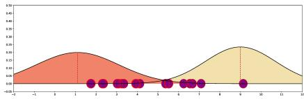  
(a) 初始化

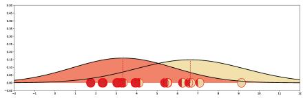  
(b) 第1次迭代

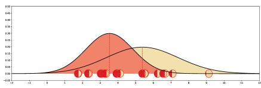  
(c) 第4次迭代

  
(d) 第8次迭代

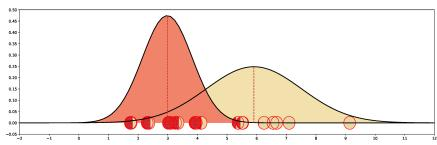  
(e) 第12次迭代

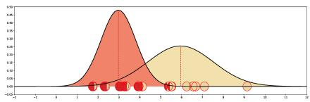  
(f) 第16次迭代  
图 14.13 高斯混合模型训练过程示例

## 14.3 推断

在图模型中，推断（Inference）是指在观测到部分变量 $\boldsymbol { e } = \{ e _ { 1 } , e _ { 2 } , \cdots , e _ { M } \}$ 时，计算其他变量的某个子集 $\pmb q = \{ q _ { 1 } , q _ { 2 } , \cdots , q _ { N } \}$ 的条件概率 $p ( \pmb q | \pmb { e } )$

假设一个图模型中，除了变量 $_ { e , q }$ 外，其余变量表示为z.根据贝叶斯公式有

$$
p ( { \pmb q } | { \boldsymbol e } ) = \frac { p ( { \pmb q } , { \pmb e } ) } { p ( { \pmb e } ) }
$$

不失一般性，这里假设所有变量都为离散变量.

(14.67)

$$
= \frac { \sum _ { z } p ( \pmb { q } , \pmb { e } , z ) } { \sum _ { \pmb { q } , z } p ( \pmb { q } , \pmb { e } , z ) } .\tag{14.68}
$$

因此，图模型的推断问题的关键为求任意一个变量子集的边际概率分布问题

在图模型中，常用的推断算法可以分为精确推断算法和近似推断算法两类

## 14.3.1 精确推断

精确推断（Exact Inference）算法是指可以计算出条件概率 $p ( \pmb q | \pmb { e } )$ 的精确解的算法.

## 14.3.1.1 变量消除法

以图14.2a的有向图为例，假设推断问题为计算后验概率 $p ( x _ { 1 } | x _ { 4 } )$ ，需要计算两个边际概率 $p ( x _ { 1 } , x _ { 4 } )$ 和 $p ( x _ { 4 } )$

根据条件独立性假设，有

$$
p ( x _ { 1 } , x _ { 4 } ) = \sum _ { x _ { 2 } , x _ { 3 } } p ( x _ { 1 } ) p ( x _ { 2 } | x _ { 1 } ) p ( x _ { 3 } | x _ { 1 } ) p ( x _ { 4 } | x _ { 2 } , x _ { 3 } ) ,\tag{14.69}
$$

假设每个变量取K个值，计算上面的边际分布需要 $K ^ { 2 }$ 次加法以及 $K ^ { 2 } \times 3$ 次乘法.

根据乘法的分配律，

$$
a b + a c = a ( b + c ) ,\tag{14.70}
$$

边际概率 $p ( x _ { 1 } , x _ { 4 } )$ 可以写为

$$
p ( x _ { 1 } , x _ { 4 } ) = p ( x _ { 1 } ) \sum _ { x _ { 3 } } p ( x _ { 3 } | x _ { 1 } ) \sum _ { x _ { 2 } } p ( x _ { 2 } | x _ { 1 } ) p ( x _ { 4 } | x _ { 2 } , x _ { 3 } ) .\tag{14.71}
$$

这样计算量可以减少到 $K ^ { 2 } + K$ 次加法和 $K ^ { 2 } + K + 1$ 次乘法.

这种方法是利用动态规划的思想，每次消除一个变量，来减少计算边际分布的计算复杂度，称为变量消除法（Variable Elimination Algorithm）.变量消除法的计算量与消除顺序密切相关，好的消除顺序可以减小中间因子的规模

变量消除法可以按照不同的顺序来消除变量．比如上面的推断问题也可以按照 $x _ { 3 } , x _ { 2 }$ 的消除顺序进行计算

同理，边际概率 $p ( x _ { 4 } )$ 可以通过以下方式计算：

$$
p ( x _ { 4 } ) = \sum _ { x _ { 3 } } \sum _ { x _ { 2 } } p ( x _ { 4 } | x _ { 2 } , x _ { 3 } ) \sum _ { x _ { 1 } } p ( x _ { 3 } | x _ { 1 } ) p ( x _ { 2 } | x _ { 1 } ) p ( x _ { 1 } ) .\tag{14.72}
$$

变量消除法的一个缺点是在计算多个边际分布时存在很多重复的计算.比如在上面的图模型中，计算边际概率 $p ( x _ { 4 } )$ 和 $p ( x _ { 3 } )$ 时很多局部的求和计算是一样的.

## 14.3.1.2 信念传播算法

信念传播（Belief Propagation，BP）算法，也称为和积（Sum-Product）算法或消息传递（MessagePassing）算法，是将变量消除法中的和积（Sum-Product）操作看作消息（Message），并保存起来，这样可以节省大量的计算资源.

我们先介绍链式结构上的信念传播算法

  
图14.14 无向马尔可夫链的消息传递过程

本节以无向图为例来介绍信念传播算法，但其同样适用于有向图.

以图14.14所示的无向马尔可夫链为例，其联合概率 $p ( { \pmb x } )$ 为

$$
\begin{array} { l } { \displaystyle { p ( \pmb { x } ) = \frac { 1 } { Z } \prod _ { c \in \mathcal { C } } \phi _ { c } ( \pmb { x } _ { c } ) } } \\ { \displaystyle { \phantom { \frac { 1 } { Z } } } } \\ { \displaystyle { \phantom { \frac { 1 } { Z } } } } \end{array}\tag{14.73}
$$

(14.74)

其中 $\phi ( x _ { t } , x _ { t + 1 } )$ 是定义在团 $( x _ { t } , x _ { t + 1 } )$ 上的势能函数.

第t个变量的边际概率 $p ( x _ { t } )$ 为

$$
\begin{array} { l } { p ( x _ { t } ) = \displaystyle \sum _ { x _ { 1 } } \cdots \sum _ { x _ { t - 1 } } \sum _ { x _ { t + 1 } } \cdots \sum _ { x _ { T } } p ( \pmb { x } ) } \\ { \quad = \displaystyle \frac { 1 } { Z } \sum _ { x _ { 1 } } \cdots \sum _ { x _ { t - 1 } } \sum _ { x _ { t + 1 } } \cdots \sum _ { x _ { T } } \prod _ { t = 1 } ^ { T - 1 } \phi ( x _ { t } , x _ { t + 1 } ) . } \end{array}\tag{14.75}
$$

(14.76)

假设每个变量取K个值，不考虑归一化项，通过公式(14.76)计算边际分布需要$K ^ { T - 1 }$ 次加法以及 $K ^ { T - 1 } \times ( T - 1 )$ 次乘法.

根据乘法的分配律，边际概率 $p ( x _ { t } )$ 可以通过下面方式进行计算：

$$
\begin{array} { c } { \displaystyle p ( x _ { t } ) = \frac { 1 } { Z } \left( \sum _ { x _ { 1 } } \cdots \sum _ { x _ { t - 1 } } ^ { t - 1 } \prod _ { j = 1 } ^ { t - 1 } \phi ( x _ { j } , x _ { j + 1 } ) \right) \cdot \left( \sum _ { x _ { t + 1 } } \cdots \sum _ { x _ { T } } \prod _ { j = t } ^ { T - 1 } \phi ( x _ { j } , x _ { j + 1 } ) \right) } \\ { = \displaystyle \frac { 1 } { Z } \left( \sum _ { x _ { t - 1 } } \phi ( x _ { t - 1 } , x _ { t } ) \cdots \left( \sum _ { x _ { 2 } } \phi ( x _ { 2 } , x _ { 3 } ) \Big ( \sum _ { x _ { 1 } } \phi ( x _ { 1 } , x _ { 2 } ) \Big ) \right) \right) \cdot } \\ { \displaystyle \left( \sum _ { x _ { t + 1 } } \phi ( x _ { t } , x _ { t + 1 } ) \cdots \left( \sum _ { x _ { T - 1 } } \phi ( x _ { T - 2 } , x _ { T - 1 } ) \Big ( \sum _ { x _ { T } } \phi ( x _ { T - 1 } , x _ { T } ) \Big ) \right) \right) } \\ { = \displaystyle \frac { 1 } { Z } \mu _ { t - 1 , t } ( x _ { t } ) \mu _ { t + 1 , t } ( x _ { t } ) , } \end{array}
$$

其中 $\mu _ { t - 1 , t } ( x _ { t } )$ 定义为变量 $X _ { t - 1 }$ 向变量 $X _ { t }$ 传递的消息，定义为

$$
\mu _ { t - 1 , t } ( x _ { t } ) \triangleq \sum _ { x _ { t - 1 } } \phi ( x _ { t - 1 } , x _ { t } ) \mu _ { t - 2 , t - 1 } ( x _ { t - 1 } ) .\tag{14.78}
$$

$\mu _ { t + 1 , t } ( x _ { t } )$ 是变量 $X _ { t + 1 }$ 向变量 $X _ { t }$ 传递的消息，定义为

$$
\mu _ { t + 1 , t } ( x _ { t } ) \triangleq \sum _ { x _ { t + 1 } } \phi ( x _ { t } , x _ { t + 1 } ) \mu _ { t + 2 , t + 1 } ( x _ { t + 1 } ) .\tag{14.79}
$$

$\mu _ { t - 1 , t } ( x _ { t } )$ 和 $\mu _ { t + 1 , t } ( x _ { t } )$ 都可以递归计算，因此，边际概率 $p ( x _ { t } )$ 的计算复杂度减少为 $O ( T K ^ { 2 } )$ .如果要计算整个序列上所有变量的边际概率，不需要将消息传递的过程重复T次，因为其中每两个相邻节点上的消息是相同的.

链式结构图模型的消息传递过程为：

（1）依次计算前向传递的消息 $\mu _ { t - 1 , t } ( x _ { t } ) , t = 1 , \cdots , T - 1$

（2）依次计算反向传递的消息 $\mu _ { t + 1 , t } ( x _ { t } ) , t = T - 1 , \cdots , 1 .$

（3）在任意节点t上计算配分函数Z，

$$
Z = \sum _ { x _ { t } } \mu _ { t - 1 , t } ( x _ { t } ) \mu _ { t + 1 , t } ( x _ { t } ) .\tag{14.80}
$$

这样，我们可以通过公式(14.77)计算所有变量的边际概率.

树结构上的信念传播算法信念传播算法也可以推广到具有树结构的图模型上．如果一个有向图满足任意两个变量只有一条路径（忽略方向），且只有一个没有父节点的节点，那么这个有向图为树结构，其中唯一没有父节点的节点称为根节点.如果一个无向图满足任意两个变量只有一条路径，那么这个无向图也为树结构.在树结构的无向图中，任意一个节点都可以作为根节点.

树结构图模型的消息传递过程为：

（1）从叶子节点到根节点依次计算并传递消息.

（2）从根节点开始到叶子节点，依次计算并传递消息.

（3）在每个节点上计算所有接收消息的乘积（如果是无向图还需要归一化），就得到了所有变量的边际概率.

如果图结构中存在环路，可以使用联合树算法（Junction Tree Algorithm)[Lauritzen et al., 1988]来将图结构转换为无环图.

## 14.3.2 近似推断

在实际应用中，精确推断一般用于结构比较简单的推断问题.当图模型的结构比较复杂时，精确推断的计算开销会比较大.此外，如果图模型中的变量是连续的，并且其积分函数没有闭式（Closed-Form）解，那么也无法使用精确推断.因此，在很多情况下也常常采用近似的方法来进行推断

近似推断（Approximate Inference）主要有以下三种方法：

（1）环路信念传播：当图模型中存在环路，使用信念传播算法时，消息会在环路中反复传递，可能收敛也可能不收敛.环路信念传播（LoopyBeliefPropagation，LBP）是在具有环路的图上依然使用信念传播算法；它一般不能保证精确，但在一些任务中可以给出有用的近似.

（2）变分推断：图模型中有些变量的局部条件分布可能非常复杂，或其积分无法计算.变分推断（Variational Inference）是引入一个变分分布（通常是比较简单的分布）来近似目标后验分布，然后通过迭代的方法进行计算．首先更新变分分布的参数来减小变分分布和真实后验的差异（比如KL散度），然后再根据变分分布来进行推断

（3）采样法（SamplingMethod）：通过模拟的方式来采集符合某个分布$p ( { \pmb x } )$ 的一些样本，并用这些样本来估计和分布 $p ( { \pmb x } )$ 有关的运算，比如期望等.

其中，环路信念传播依然沿用信念传播的消息更新思想，但由于图中存在环，算法可能收敛也可能不收敛；即使收敛，也不一定得到精确解.本章重点介绍后两类更具普适性的近似推断方法.

## 14.4 变分推断

变分法（Calculus of Variations）是17世纪末发展起来的一个数学分支，主要研究变分问题，即泛函的极值问题

函数（Function）是表示自变量到因变量的映射关系： $y = f ( x )$ ．而泛函（Functional）是函数的函数，即它的输入是函数，输出是实数： $F ( f ( x ) )$ ，一般称$F ( f ( x ) )$ 为 $f ( x )$ 的泛函.具体的变分问题会规定允许搜索的函数空间，并可能要求函数满足一定的边界条件和光滑性条件.一个泛函的例子是熵，其输入是一个概率分布 $p ( x )$ ,输出是该分布的不确定性.

概率分布可以看作一个函数.熵的定义参见第E.1节.

传统的微积分通常可以用来寻找函数 $f ( x )$ 的极值点，而变分法则是用来寻找一个函数 $f ( x )$ 使得泛函 $F ( f ( x ) )$ 取得极大或极小值.变分法的应用十分广泛，比如最大熵问题，即寻找一个概率分布，使得该概率分布的熵最大

假设在一个贝叶斯模型中，x为一组观测变量，z为一组隐变量（参数也看作随机变量，包含在z中），我们的推断问题为计算条件概率密度 $p ( \boldsymbol { z } | \boldsymbol { x } )$ . 根据贝叶斯公式，条件概率密度 $p ( \boldsymbol { z } | \boldsymbol { x } )$ 可以写为

不失一般性，这里假设x和z为连续随机向量.

$$
p ( z | \boldsymbol { x } ) = \frac { p ( \boldsymbol { x } , z ) } { p ( \boldsymbol { x } ) } = \frac { p ( \boldsymbol { x } , z ) } { \int p ( \boldsymbol { x } , z ) \mathrm { d } z } .\tag{14.81}
$$

对于很多模型来说，计算上面公式中的积分是不可行的，要么积分没有闭式解，要么是指数级的计算复杂度.

变分推断（Variational Inference）是变分法在推断问题中的应用，是寻找一个简单分布 $q ^ { * } ( z )$ 来近似条件概率密度 $p ( \boldsymbol { z } | \boldsymbol { x } )$ ，也称为变分贝叶斯（Varia-tional Bayesian）.这样，推断问题转换为一个泛函优化问题：

闭式解是指问题的解为闭式（closed-form)函数，从解的函数中就可以算出任何对应值.闭式解也称为解析解，和数值解相对应.

$$
\begin{array} { r l } & { q ^ { * } ( z ) = \underset { q ( z ) \in \mathcal { Q } } { \arg \operatorname* { m i n } } \mathrm { K L } \big ( q ( z ) \| p ( z | x ) \big ) , } \end{array}\tag{14.82}
$$

参见习题14-13.

其中 $\mathcal { Q }$ 为候选的概率分布族.由于 $p ( \boldsymbol { z } | \boldsymbol { x } )$ 难以直接计算，因此我们不能直接优化上面公式的KL散度.

我们在EM算法中已经证明

EM 算法参见第14.2.2.1节.

$$
\begin{array} { r } { \log p ( \pmb { x } ) = E L B O ( q , \pmb { x } ) + \mathrm { K L } ( q ( \pmb { z } ) \| p ( \pmb { z } | \pmb { x } ) ) . } \end{array}\tag{14.83}
$$

参见公式(14.49).

https://nndl.ai/

在EM算法的E步中，我们假设 $p ( \boldsymbol { z } | \boldsymbol { x } )$ 是可计算的，并让 $q ( \boldsymbol { z } ) = p ( \boldsymbol { z } | \boldsymbol { x } )$ ，这样$E L B O ( q , x )$ 等于 $\log p ( { \pmb x } )$ ．而变分推断可以看作EM算法的扩展版，主要处理不能精确推断 $p ( \boldsymbol { z } | \boldsymbol { x } )$ 的情况.

结合公式(14.82)和公式(14.83),有

$$
q ^ { * } ( z ) = \underset { q ( z ) \in \mathcal { Q } } { \arg \operatorname* { m i n } } \left( \log p ( \pmb { x } ) - E L B O ( q , \pmb { x } ) \right)\tag{14.84}
$$

$$
\begin{array} { r } { = \underset { q ( z ) \in \mathcal { Q } } { \arg \operatorname* { m a x } } E L B O ( q , \pmb { x } ) . } \end{array}\tag{14.85}
$$

这样，公式(14.82)中优化问题转换为寻找一个简单分布 $q ^ { * } ( z )$ 来最大化证据下界$E L B O ( q , x )$

在变分推断中，候选分布族Q的复杂性决定了优化问题的复杂性.一个通常的选择是平均场（mean-field）分布族，即z可以分拆为多组相互独立的变量.概率密度 $q ( z )$ 可以分解为

$$
q ( \boldsymbol { z } ) = \prod _ { m = 1 } ^ { M } q _ { m } ( z _ { m } ) ,\tag{14.86}
$$

其中 $z _ { m }$ 是隐变量的子集，可以是单变量，也可以是一组多元变量.

证据下界 $E L B O ( q , x )$ 可以写为

(14.87)

$$
\begin{array} { r l r } {  { E L B O ( q , \pmb { x } ) = \int q ( z ) \log \frac { p ( \pmb { x } , z ) } { q ( z ) } \mathrm { d } z } } \\ & { } & { \quad = \int q ( z ) \Big ( \log p ( \pmb { x } , z ) - \log q ( z ) \Big ) \mathrm { d } z } \\ & { } & { \quad = \displaystyle \int \prod _ { m = 1 } ^ { M } q _ { m } ( z _ { m } ) \Big ( \log p ( \pmb { x } , z ) - \sum _ { m = 1 } ^ { M } \log q _ { m } ( z _ { m } ) \Big ) \mathrm { d } z . } \end{array}\tag{14.88}
$$

(14.89)

假设只关心隐变量的子集 $z _ { j }$ 的近似分布 $q _ { j } ( z _ { j } )$ ，上式可以写为

$$
\begin{array} { r l } { E L B O ( q , \pmb { x } ) = \displaystyle \int q _ { j } \left( \underbrace { \int \prod _ { m \neq j } q _ { m } \log p ( \pmb { x } , z ) \mathrm { d } z _ { m } } _ { - \displaystyle \int q _ { j } \log q _ { j } \mathrm { d } z _ { j } + \mathrm { c o n s t } } \right) \mathrm { d } z _ { j } } & { } \\ { \displaystyle } & { = \displaystyle \int q _ { j } \overbrace { \log \tilde { p } ( \pmb { x } , z _ { j } ) } ^ { \mathrm { ~ d ~ } } \mathrm { d } z _ { j } - \int q _ { j } \log q _ { j } \mathrm { d } z _ { j } + \mathrm { c o n s t } , } \end{array}
$$

这里 $q _ { m } ( z _ { m } )$ 用简写$q _ { m }$ 表示.

(14.90)

const 为一个常数.

(14.91)

其中 $\tilde { p } ( \boldsymbol { x } , z _ { j } )$ 可以看作一个关于 $z _ { j }$ 的未归一化的分布，并有

$$
\log \tilde { p } ( \pmb { x } , z _ { j } ) = \int \prod _ { m \neq j } q _ { m } \log p ( \pmb { x } , z ) \mathrm { d } z _ { m }\tag{14.92}
$$

https://nndl.ai/

$$
= \mathbb { E } _ { q ( \boldsymbol { z } _ { \backslash j } ) } [ \log p ( \boldsymbol { x } , \boldsymbol { z } ) ] + \mathrm { c o n s t } ,\tag{14.93}
$$

其中 $z _ { \mathrm { \backslash } j }$ 为除变量子集 $z _ { j }$ 外的其他隐变量.

假设我们固定 $z _ { \backslash j }$ 不变，先优化 $q _ { j } ( z _ { j } )$ 使得 $E L B O ( q , x )$ 最大. 根据公式(14.91), $E L B O ( q , x )$ 可以看作一 $\mathrm { K L } ( q _ { j } ( \boldsymbol { z } _ { j } ) \| \tilde { p } ( \boldsymbol { x } , \boldsymbol { z } _ { j } ) )$ 加上一个常数.因此，最小化KL散度 $\mathrm { K L } ( q _ { j } ( \boldsymbol { z } _ { j } ) \| \tilde { p } ( \boldsymbol { x } , \boldsymbol { z } _ { j } ) )$ 就等价于最大化公式(14.91)，即最优的$q _ { j } ^ { * } ( z _ { j } )$ 正比于对数联合概率密度 $\log p ( { \pmb x } , { \pmb z } )$ 的期望的指数：

$$
q _ { j } ^ { * } ( z _ { j } ) = \tilde { p } ( \pmb { x } , z _ { j } ) \propto \exp \Big ( \mathbb { E } _ { q ( z _ { \backslash j } ) } [ \log p ( \pmb { x } , z ) ] \Big ) ,\tag{14.94}
$$

其中期望是根据 $q ( z _ { \backslash j } )$ 计算的.我们可以通过选择合适的 $q _ { m } ( z _ { m } ) , 1 \leq m \leq M$ 使得这个期望具有闭式解.

由于 $q _ { j } ^ { * } ( z _ { j } )$ 的计算要依赖于其他隐变量，我们可以用坐标上升法（Coordi-nate Ascent Algorithm)来迭代地优化每个 $q _ { j } ^ { * } ( z _ { j } ) , j = 1 , \cdots , M$ 通过不断循环迭代地应用公式(14.94)，证据下界 $E L B O ( q , x )$ 通常会单调改进，并收敛到一个局部最优解或驻点

传统的坐标上升变分推断逐变量迭代更新，在大规模数据上效率较低.常见的扩展包括：随机变分推断（Stochastic Variational Inference，SVI）利用随机梯度下降处理大规模数据集；黑盒变分推断（Black-Box Variational Inference,BBVI）通过分数函数估计器（REINFORCE）或重参数化技巧估计ELBO的梯度，使得变分推断可以适用于更广泛的概率模型；摊销变分推断（AmortizedVariational Inference）则用神经网络直接将观测数据映射到变分参数，避免对每个数据点做独立优化—这正是变分自编码器(VAE，第16章)的核心思想.

变分推断通常和参数学习一起使用，比如应用在EM算法的E步中来近似条件分布 $p ( z | \boldsymbol { x } )$ .在变分推断中，我们通常选择一些比较简单的分布 $q ( z )$ 来近似推断 $p ( \boldsymbol { z } | \boldsymbol { x } )$ .当 $p ( \boldsymbol { z } | \boldsymbol { x } )$ 比较复杂时，近似效果不佳.这时可以利用神经网络的强大拟合能力来近似 $p ( \boldsymbol { z } | \boldsymbol { x } )$ ，这种思想被应用在变分自编码器中.

## 14.5 基于采样法的近似推断

在很多实际机器学习任务中，推断某个概率分布并不是最终目的，而是基于这个概率分布进一步计算并作出决策.通常这些计算和期望相关

采样也叫抽样.

不失一般性，假设要推断的概率分布为 $p ( x )$ ，并基于 $p ( x )$ 来计算函数 $f ( x )$ 的期望：

$$
\mathbb { E } _ { p } [ f ( x ) ] = \int _ { x } f ( x ) p ( x ) \mathrm { d } x .\tag{14.95}
$$

在本节中，我们假设x为连续变量. 如果 x是离散变量，可以将积分替换为求和.

当 $p ( x )$ 比较复杂或难以精确推断时，我们可以通过采样法来近似计算期望$\mathbb { E } _ { p } [ f ( x ) ]$ 的解.

## 14.5.1 采样法

采样法（SamplingMethod)也称为蒙特卡罗方法(Monte Carlo Method)或统计模拟方法，是20世纪40年代中期提出的一种通过随机采样来近似估计一些计算问题数值解的方法.随机采样指从给定概率密度函数 $p ( x )$ 中抽取出符合其概率分布的样本.

蒙特卡罗方法诞生于20世纪40年代美国的“曼哈顿计划”，其名字来源于摩纳哥的一个以赌博业闻名的城市蒙特卡罗，象征概率.

由于电子计算机的出现和快速发展，这种方法作为一种独立方法被提出来，使得当时很多难以计算的问题都可以通过随机模拟的方法来进行估计

为了计算公式(14.95)中的 $\mathbb { E } _ { p } [ f ( x ) ]$ ，我们可以通过数值解的方法来近似计算.首先从 $p ( x )$ 中独立抽取N个样本 $x ^ { ( 1 ) } , x ^ { ( 2 ) } , \cdots , x ^ { ( N ) } , f ( x )$ 的期望可以用这N个样本的均值 $\bar { f } _ { N }$ 来近似，即

数值解就是用数值方法求出解，给出一系列对应的自变量和解.数值解和解析解或闭式解相对应.

$$
\bar { f } _ { N } = \frac { 1 } { N } \left( f ( x ^ { ( 1 ) } ) + \cdots + f ( x ^ { ( N ) } ) \right) .\tag{14.96}
$$

根据大数定律，当N趋向于无穷大时，样本均值收敛于期望值

$$
{ \bar { f } } _ { N } \stackrel { P } {  } \mathbb { E } _ { p } [ f ( x ) ] \quad \quad { \\stackrel { \mathrm { \tiny ~ { \underline { { * } } } \underline { { { \cal V } } } } } {  } } N  \infty .\tag{14.97}
$$

这就是采样法的理论依据.

采样法的一个最简单的应用例子是计算圆周率 $\pi .$ 我们知道半径为r的圆的面积为 $\pi r ^ { 2 }$ ，而直径为 $2 r$ 的正方形的面积为 $4 r ^ { 2 }$ .当我们用正方形去嵌套一个相切的圆时，它们的面积之比是 $\scriptstyle { \frac { 1 } { 4 } } \pi$ .当不知道 $\pi$ 时，我们无法计算圆的面积.因此，需要通过模拟的方法来进行近似估计，首先在正方形内部按均匀采样的方式随机生成若十点，计算它们与圆心点的距离，从而判断它们是否落在圆的内部.然后去统计落在圆内部的点占到所有点的比例.当样本数量足够大时，这个比例会接近于 $\scriptstyle { \frac { 1 } { 4 } } \pi$ ,从而近似估算出π的值.

随机采样 采样法的难点是如何进行随机采样，即如何让计算机生成满足概率密度函数 $p ( x )$ 的样本.我们知道，计算机可以比较容易地随机生成一个在[0,1]区间上均布分布的样本 $\xi .$ 如果要随机生成服从某个非均匀分布的样本，就需要一些间接的采样方法.

如果一个分布的概率密度函数为 $p ( x )$ ，其累积分布函数 $\operatorname { c d f } ( x )$ 为连续的严格增函数，且存在逆函数 $\operatorname { c d f } ^ { - 1 } ( y ) , y \in [ 0 , 1 ]$ ，那么我们可以利用累积分布函数的逆函数来生成服从该随机分布的样本.假设 $\xi$ 是[0,1]区间上均匀分布的随机变量,则 $\operatorname { c d f } ^ { - 1 } ( \xi )$ 服从概率密度函数为 $p ( x )$ 的分布.

参见习题14-10.

但当 $p ( x )$ 非常复杂，其累积分布函数的逆函数难以计算，或者不知道 $p ( x )$ 的精确值，只知道未归一化的分布 $\hat { p } ( x )$ 时，就难以直接对 $p ( x )$ 进行采样，往往需要使用一些间接的采样策略，比如拒绝采样、重要性采样、马尔可夫链蒙特卡罗采样等，这些方法一般是先根据一个比较容易采样的分布进行采样，然后通过一些策略来间接得到符合 $p ( x )$ 分布的样本.

$\boldsymbol { p } ( \boldsymbol { x } ) = \frac { 1 } { Z } \hat { \boldsymbol { p } } ( \boldsymbol { x } )$ ，其中Z为配分函数.

## 14.5.2 拒绝采样

拒绝采样（Rejection Sampling）是一种间接采样方法，也称为接受-拒绝采样(Acceptance-Rejection Sampling).

假设原始分布 $p ( x )$ 难以直接采样，我们可以引入一个容易采样的分布 $q ( x )$ 一般称为提议分布（Proposal Distribution），然后以某个标准来拒绝一部分的样本使得最终采集的样本服从分布 $p ( x )$ .在拒绝采样中，我们不需要知道归一化的分布函数，假设 $\hat { p } ( x )$ 为未归一化的目标函数，我们构建提议分布 $q ( x )$ 和常数k,使得 $k q ( x )$ 可以覆盖函数 $\hat { p } ( x )$ ,即 $k q ( x ) \geq \hat { p } ( x )$ ,∀x,如图14.15所示.

  
图 14.15 拒绝采样

对于每次抽取的样本x,计算接受概率（Acceptance Probability):

$$
\alpha ( \hat { x } ) = \frac { \hat { p } ( \hat { x } ) } { k q ( \hat { x } ) } ,\tag{14.98}
$$

并以概率 $\alpha ( \hat { x } )$ 来接受样本x.拒绝采样的采样过程如算法14.2所示.

为简单起见，我们把概率密度函数为p(x)的分布简称为分布 $p ( x )$ 下同.

判断一个拒绝采样方法的重要指标是采样效率，即总体的接受率.如果函数$k q ( x )$ 远大于未归一化的目标函数 $\hat { p } ( x )$ ，拒绝率会比较高，采样效率会很低.但要找到一个和 ${ \hat { p } } ( x )$ 比较接近的提议分布往往比较困难.特别是在高维空间中，其接受率通常会迅速下降，导致实际应用受到限制.

提议分布在很多文献中也翻译为参考分布.

## 算法14.2 拒绝采样的采样过程

输入：提议分布 $q ( x )$ ,常数 $k ,$ 样本集合 $\mathcal { V } = \varnothing ;$   
1 repeat  
2 根据 $q ( x )$ 随机生成一个样本x;  
3 计算接受概率α(x);  
4 从(0,1)的均匀分布中随机生成一个值 $z ;$   
5 if z ≤ α(x) then // 以 α(x)的概率接受x  
6 | ν = ν ∪ {x};  
7 end  
8 until 获得 N 个样本 (|ν| = N);  
输出：样本集合ν

## 14.5.3 重要性采样

如果采样的目的是计算分布 $p ( x )$ 下函数 $f ( x )$ 的期望，那么实际上抽取的样本不需要严格服从分布 $p ( x )$ .也可以通过另一个分布，即提议分布 $q ( x )$ ，直接采样并估计 $\mathbb { E } _ { p } [ f ( x ) ]$

函数f(x)在分布 $p ( x )$ 下的期望可以写为

$$
\mathbb { E } _ { p } [ f ( x ) ] = \int _ { x } f ( x ) p ( x ) \mathrm { d } x\tag{14.99}
$$

$$
= \int _ { x } f ( x ) { \frac { p ( x ) } { q ( x ) } } q ( x ) { \mathrm { d } } x\tag{14.100}
$$

$$
= \int _ { x } f ( x ) w ( x ) q ( x ) \mathrm { d } x\tag{14.101}
$$

$$
= \mathbb { E } _ { q } [ f ( x ) w ( x ) ] .\tag{14.102}
$$

其中w(x)称为重要性权重.

重要性采样（Importance Sampling）是通过引入重要性权重，将分布 $p ( x )$ 下 $f ( x )$ 的期望变为在分布 $q ( x )$ 下 $f ( x ) w ( x )$ 的期望，从而可以近似为

$$
\hat { f } _ { N } = \frac { 1 } { N } \left( f ( x ^ { ( 1 ) } ) w ( x ^ { ( 1 ) } ) + \cdots + f ( x ^ { ( N ) } ) w ( x ^ { ( N ) } ) \right) ,\tag{14.103}
$$

其中 ${ \boldsymbol x } ^ { ( 1 ) } , \cdots , { \boldsymbol x } ^ { ( N ) }$ 为独立从 $q ( x )$ 中随机抽取的点.

重要性采样也可以在只知道未归一化的分布 $\hat { p } ( x )$ 的情况下计算函数 $f ( x )$ 的期望.

$\textstyle p ( x ) = { \frac { { \hat { p } } ( x ) } { Z } }$ ,Z为配分函数.

$$
\mathbb { E } _ { p } [ f ( x ) ] = \int _ { x } f ( x ) \frac { \hat { p } ( x ) } { Z } \mathrm { d } x\tag{14.104}
$$

$$
\begin{array} { r l } & { = \frac { \int _ { x } \hat { p } ( x ) f ( x ) d x } { \int _ { x } \hat { p } ( x ) \mathrm { d } x } } \\ & { \approx \frac { \sum _ { n = 1 } ^ { N } f ( x ^ { ( n ) } ) \hat { w } \left( x ^ { ( n ) } \right) } { \sum _ { n = 1 } ^ { N } \hat { w } \left( x ^ { ( n ) } \right) } , } \end{array}\tag{14.105}
$$

(14.106)

其中 $\begin{array} { r } { \hat { w } ( x ) = \frac { \hat { p } ( x ) } { q ( x ) } , x ^ { ( 1 ) } , \cdots , x ^ { ( N ) } } \end{array}$ 为独立从 $q ( x )$ 中随机抽取的点.

## 14.5.4 马尔可夫链蒙特卡罗方法

在高维空间中，拒绝采样和重要性采样常受到维数灾难影响，效率会随空间维数的增加迅速降低. 马尔可夫链蒙特卡罗（Markov Chain Monte Carlo，MCMC）方法提供了一类更可行的高维采样思路，但其效率仍然依赖于转移分布、混合速度和样本相关性.

MCMC方法也有很多不同的具体采样方法，但其核心思想是将采样过程看作一个马尔可夫链.

$$
x _ { 1 } , x _ { 2 } , \cdots , x _ { t - 1 } , x _ { t } , x _ { t + 1 } , \cdots
$$

马尔可夫链参见第D.3.1.1节.

第t +1次采样依赖于第t次抽取的样本 ${ \mathbf { } } _ { { \mathbf { } } _ { \pmb { x } _ { t } } }$ 以及状态转移分布（即提议分布）$q ( \pmb { x } | \pmb { x } _ { t } )$ .如果这个马尔可夫链的平稳分布为 $p ( { \pmb x } )$ ，那么在状态平稳时抽取的样本就服从 $p ( { \pmb x } )$ 的分布.

MCMC方法的关键是如何构造出平稳分布为 $p ( { \pmb x } )$ 的马尔可夫链，并且该马尔可夫链的状态转移分布 $q ( { \pmb x } | { \pmb x } ^ { \prime } )$ 一般为比较容易采样的分布.当x为离散变量时， $q ( { \pmb x } | { \pmb x } ^ { \prime } )$ 可以是一个状态转移矩阵；当x为连续变量时， $q ( { \pmb x } | { \pmb x } ^ { \prime } )$ 可以是参数密度函数，比如各向同性的高斯分布 $q ( \pmb { x } | \pmb { x } ^ { \prime } ) = \mathcal { N } ( \pmb { x } | \pmb { x } ^ { \prime } , \sigma ^ { 2 } I )$ ，其中 $\sigma ^ { 2 }$ 为超参数.

使用MCMC方法进行采样时需要注意两点.1）马尔可夫链需要经过一段时间的随机游走才能接近平稳状态，这段时间称为预烧期（Burn-inPeriod）.预烧期内的采样点通常需要丢弃，2）基于马尔可夫链抽取的相邻样本往往具有相关性.可以每间隔M次随机游走抽取一个样本来减弱自相关，但这并不能保证样本严格独立；实际应用中还需要检查混合情况和有效样本量.

## 14.5.4.1 Metropolis-Hastings 算法

Metropolis-Hastings算法（Metropolis-HastingsAlgorithm），简称MH算法，是一种应用广泛的MCMC方法.假设马尔可夫链的状态转移分布（即提议分布) $q ( { \pmb x } | { \pmb x } ^ { \prime } )$ 为一个比较容易采样的分布，其平稳分布往往不是 $p ( { \pmb x } )$ ．为此，MH算法引入拒绝采样的思想来修正提议分布，使得修正后的马尔可夫链以$p ( { \pmb x } )$ 为平稳分布.

在MH算法中，假设第t次采样的样本为 $\mathbf { \boldsymbol { x } } _ { t }$ ，首先根据提议分布 $q ( \pmb { x } | \pmb { x } _ { t } )$ 抽取一个样本 $\hat { \textbf { \textit { x } } }$ ,并以概率 $A ( \hat { \pmb x } , \pmb x _ { t } )$ 来接受 $\hat { \textbf { \textit { x } } }$ 作为第t+1次的采样样本 $\mathbf { \boldsymbol { x } } _ { t + 1 }$

$$
A ( \hat { \pmb x } , \pmb x _ { t } ) = \mathrm { m i n } \left( 1 , \frac { p ( \hat { \pmb x } ) q ( \pmb x _ { t } | \hat { \pmb x } ) } { p ( \pmb x _ { t } ) q ( \hat { \pmb x } | \pmb x _ { t } ) } \right) .\tag{14.107}
$$

MH算法的采样过程如算法14.3所示.

算法 14.3 Metropolis-Hastings算法的采样过程  
输入：提议分布 $q ( \pmb { x } | \pmb { x } ^ { \prime } )$ ,采样间隔M,样本集合 $\mathcal { V } = \varnothing ;$   
1 随机初始化 ${ \mathbf { } } x _ { 0 } , t = 0 ;$   
2 repeat  
// 预热过程  
3 根据 $q ( \pmb { x } | \pmb { x } _ { t } )$ 随机生成一个样本 ${ \hat { x } } ;$   
4 计算接受概率 $A ( \hat { \pmb x } , \pmb x _ { t } ) ;$   
5 从(0,1)的均匀分布中随机生成一个值z;  
6 if $z \leq A ( \hat { x } , x _ { t } )$ then //以 $A ( \hat { \boldsymbol x } , \boldsymbol x _ { t } )$ 的概率接受x  
7 $\boldsymbol { x } _ { t + 1 } = \boldsymbol { \hat { x } } ;$   
8 else // 拒绝接受∞  
9 $\boldsymbol { x } _ { t + 1 } = \boldsymbol { x } _ { t } ;$   
10 end  
11 $t + + ;$   
12 if 未到平稳状态 then continue;  
13 if t mod M = 0 then //采样过程,每隔M次采一个样本  
14 $\mathcal { V } = \mathcal { V } \cup \{ x _ { t } \}$   
15 end  
16 until 获得 N 个样本 (|ν| = N);  
输出：样本集合ν

在MH算法中，因为每次 $q ( \pmb { x } | \pmb { x } _ { t } )$ 随机生成一个样本x，并以概率 $A ( \hat { \pmb x } , \pmb x _ { t } )$ 的方式接受，所以修正的马尔可夫链状态转移概率为

$$
q ^ { \prime } ( \hat { \pmb x } | \pmb x _ { t } ) = q ( \hat { \pmb x } | \pmb x _ { t } ) A ( \hat { \pmb x } , \pmb x _ { t } ) ,\tag{14.108}
$$

该修正的马尔可夫链可以达到平稳状态，且平稳分布为 $p ( { \pmb x } )$

证明．根据马尔可夫链的细致平稳条件，有

细致平稳条件参见定 理D.1.

$$
\begin{array} { l } { p ( { \pmb x } _ { t } ) q ^ { \prime } ( \hat { \pmb x } | { \pmb x } _ { t } ) = p ( { \pmb x } _ { t } ) q ( \hat { \pmb x } | { \pmb x } _ { t } ) A ( \hat { \pmb x } , { \pmb x } _ { t } ) } \\ { = p ( { \pmb x } _ { t } ) q ( \hat { \pmb x } | { \pmb x } _ { t } ) \operatorname* { m i n } \left( 1 , \frac { p ( \hat { \pmb x } ) q ( { \pmb x } _ { t } | \hat { \pmb x } ) } { p ( { \pmb x } _ { t } ) q ( \hat { \pmb x } | { \pmb x } _ { t } ) } \right) } \end{array}\tag{14.109}
$$

(14.110)

$$
= \operatorname* { m i n } \Big ( p ( \pmb { x } _ { t } ) q ( \hat { \pmb x } | \pmb { x } _ { t } ) , p ( \hat { \pmb x } ) q ( \pmb { x } _ { t } | \hat { \pmb x } ) \Big )\tag{14.111}
$$

$$
= p ( \hat { \pmb x } ) q ( \pmb x _ { t } | \hat { \pmb x } ) \operatorname* { m i n } \left( \frac { p ( \pmb x _ { t } ) q ( \hat { \pmb x } | \pmb x _ { t } ) } { p ( \hat { \pmb x } ) q ( \pmb x _ { t } | \hat { \pmb x } ) } , 1 \right)\tag{14.112}
$$

$$
= p ( \hat { \pmb x } ) q ( \pmb x _ { t } | \hat { \pmb x } ) A ( \pmb x _ { t } , \hat { \pmb x } )\tag{14.113}
$$

$$
\begin{array} { r } { \mathbf { \Sigma } = p ( \hat { \pmb x } ) q ^ { \prime } ( \pmb { x } _ { t } | \hat { \pmb x } ) . } \end{array}\tag{14.114}
$$

因此， $p ( { \pmb x } )$ 是状态转移概率为 $q ^ { \prime } ( \hat { \pmb x } | \pmb x _ { t } )$ 的马尔可夫链的平稳分布.

## 14.5.4.2 Metropolis 算法

如果MH算法中的提议分布是对称的，即 $q ( \hat { { \pmb x } } | { \pmb x } _ { t } ) = q ( { \pmb x } _ { t } | \hat { { \pmb x } } )$ ,第 $t + 1$ 次采样的接受率可以简化为

$$
A ( \hat { \pmb x } , \pmb x _ { t } ) = \operatorname* { m i n } \left( 1 , \frac { p ( \hat { \pmb x } ) } { p ( \pmb x _ { t } ) } \right) .\tag{14.115}
$$

这种 MCMC 方法称为Metropolis算法（Metropolis Algorithm).

## 14.5.4.3 吉布斯采样

吉布斯采样（Gibbs Sampling）是一种有效地对高维空间中的分布进行采样的MCMC方法，可以看作Metropolis-Hastings算法的特例. 吉布斯采样使用全条件概率（Full Conditional Probability）作为提议分布来依次对每个维度进行采样，并设置接受率为A=1.

对于一个M维的随机向量 $\pmb { X } = [ X _ { 1 } , X _ { 2 } , \cdots , X _ { M } ] ^ { \intercal }$ ，其第m个变量 $X _ { m }$ 的全条件概率为

$$
p ( x _ { m } | \pmb { x } _ { \backslash m } ) \triangleq P ( X _ { m } = x _ { m } | X _ { \backslash m } = \pmb { x } _ { \backslash m } )\tag{14.116}
$$

$$
\begin{array} { r } { = p ( x _ { m } | x _ { 1 } , x _ { 2 } , \cdots , x _ { m - 1 } , x _ { m + 1 } , \cdots , x _ { M } ) , } \end{array}\tag{14.117}
$$

其中 $\pmb { x } _ { \backslash m } = [ x _ { 1 } , x _ { 2 } , \cdots , x _ { m - 1 } , x _ { m + 1 } , \cdots , x _ { M } ] ^ { \intercal }$ 表示除 $X _ { m }$ 外其他变量的取值.

吉布斯采样可以按照任意的顺序根据全条件分布依次对每个变量进行采样．假设从一个随机的初始化状态 $\pmb { x } ^ { ( 0 ) } = [ x _ { 1 } ^ { ( 0 ) } , x _ { 2 } ^ { ( 0 ) } , \cdots , x _ { M } ^ { ( 0 ) } ] ^ { \intercal }$ 开始，按照下标顺序依次对M个变量进行采样.

$$
\begin{array} { r } { x _ { 1 } ^ { ( 1 ) } \sim p ( x _ { 1 } | x _ { 2 } ^ { ( 0 ) } , x _ { 3 } ^ { ( 0 ) } , \cdots , x _ { M } ^ { ( 0 ) } ) , } \end{array}\tag{14.118}
$$

$$
\begin{array} { r } { x _ { 2 } ^ { ( 1 ) } \sim p ( x _ { 2 } | x _ { 1 } ^ { ( 1 ) } , x _ { 3 } ^ { ( 0 ) } \cdots , x _ { M } ^ { ( 0 ) } ) , } \end{array}\tag{14.119}
$$

$$
\boldsymbol { x } _ { M } ^ { ( 1 ) } \sim p ( \boldsymbol { x } _ { M } | \boldsymbol { x } _ { 1 } ^ { ( 1 ) } , \boldsymbol { x } _ { 2 } ^ { ( 1 ) } \cdots , \boldsymbol { x } _ { M - 1 } ^ { ( 1 ) } ) ,\tag{14.120}
$$

$$
\boldsymbol { x } _ { 1 } ^ { ( t ) } \sim p ( x _ { 1 } | \boldsymbol { x } _ { 2 } ^ { ( t - 1 ) } , \boldsymbol { x } _ { 3 } ^ { ( t - 1 ) } , \cdots , \boldsymbol { x } _ { M } ^ { ( t - 1 ) } ) ,\tag{14.121}
$$

$$
\boldsymbol { x } _ { 2 } ^ { ( t ) } \sim p ( x _ { 2 } | \boldsymbol { x } _ { 1 } ^ { ( t ) } , \boldsymbol { x } _ { 3 } ^ { ( t - 1 ) } \cdots , \boldsymbol { x } _ { M } ^ { ( t - 1 ) } ) ,\tag{14.122}
$$

$$
\boldsymbol { x } _ { M } ^ { ( t ) } \sim p ( \boldsymbol { x } _ { M } | \boldsymbol { x } _ { 1 } ^ { ( t ) } , \boldsymbol { x } _ { 2 } ^ { ( t ) } \cdots , \boldsymbol { x } _ { M - 1 } ^ { ( t ) } ) ,\tag{14.123}
$$

其中 $x _ { m } ^ { ( t ) }$ 是第t次迭代时变量 $X _ { m }$ 的采样.

吉布斯采样的每单步采样也构成一个马尔可夫链.假设每个单步（采样维度为第m维）的状态转移概率 $q ( { \pmb x } | { \pmb x } ^ { \prime } )$ 为

$$
q ( \pmb { x } | \pmb { x } ^ { \prime } ) = \left\{ \begin{array} { c c l } { \frac { p ( \pmb { x } ) } { p ( \pmb { x } _ { \backslash m } ^ { \prime } ) } } & { \mathrm { i f } } & { \pmb { x } _ { \backslash m } = \pmb { x } _ { \backslash m } ^ { \prime } } \\ { 0 } & { \mathrm { o t h e r w i s e } , } \end{array} \right.\tag{14.124}
$$

其中边际分布 $\begin{array} { r } { p ( \pmb { x } _ { \backslash m } ^ { \prime } ) = \sum _ { \pmb { x } _ { m } ^ { \prime } } p ( \pmb { x } ^ { \prime } ) } \end{array}$ ，等式 ${ \pmb x } _ { \backprime n } = { \pmb x } _ { \backprime n } ^ { \prime }$ 表示 $x _ { k } = x _ { k } ^ { \prime }$ ∀k $\neq m$ 因此有 $p ( \pmb { x } _ { \backslash m } ^ { \prime } ) = p ( \pmb { x } _ { \backslash m } )$ ,并可以得到

$$
p ( { \pmb x } ^ { \prime } ) q ( { \pmb x } | { \pmb x } ^ { \prime } ) = p ( { \pmb x } ^ { \prime } ) \frac { p ( { \pmb x } ) } { p ( { \pmb x } _ { \backslash m } ^ { \prime } ) } = p ( { \pmb x } ) \frac { p ( { \pmb x } ^ { \prime } ) } { p ( { \pmb x } _ { \backslash m } ) } = p ( { \pmb x } ) q ( { \pmb x } ^ { \prime } | { \pmb x } ) .\tag{14.125}
$$

根据细致平稳条件，公式(14.124)中定义的状态转移概率 $q ( { \pmb x } | { \pmb x } ^ { \prime } )$ 的马尔可夫链的平稳分布为 $p ( { \pmb x } )$ .随着迭代次数t的增加，样本 $\pmb { x } ^ { ( t ) } = [ x _ { 1 } ^ { ( t ) } , x _ { 2 } ^ { ( t ) } , \cdots , x _ { M } ^ { ( t ) } ] ^ { \intercal }$ 将收敛于概率分布 $p ( { \pmb x } )$

## 14.6 总结和扩展阅读

概率图模型的核心在于借助图结构把复杂联合分布拆解为一组局部、可解释、可计算的因子.有向图通过局部条件分布来组织联合分布，无向图通过团势函数来刻画变量之间的相容性；二者形式不同，但都在回答同一个问题：如何用尽可能简单的局部关系，描述一个高维随机系统的整体分布.

本章介绍了概率图模型的三个基本问题.第一，如何表示：通过贝叶斯网络、马尔可夫随机场等形式，把联合分布写成局部条件概率或势函数的乘积.第二，如何推断：给定部分变量，计算边际分布、后验分布或最优赋值，这对应变量消除、信念传播以及近似推断等方法.第三，如何学习：在参数已知结构已知、参数未知或含隐变量等不同设定下，分别得到极大似然学习、EM算法、变分推断和采样方法等一整套工具.

图14.16给出了概率图模型所涵盖的内容.

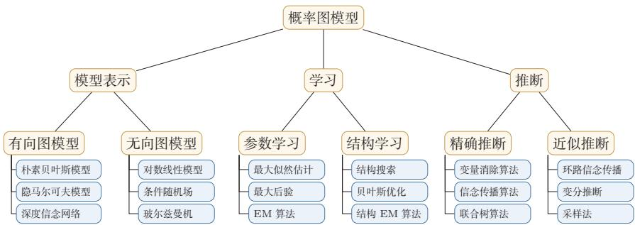  
图14.16 概率图模型所涵盖内容的简单概括

与神经网络和深度生成模型的联系许多深度生成模型可以看作在图模型框架中，用神经网络替换手工设计的概率表或简单指数族分布.在这个框架下，图模型回答的是“模型应该分解成哪些概率因子”，神经网络回答的是“这些因子如何用可学习函数表示”，优化算法则回答“如何在不可精确推断时仍然学习参数”.因此，在设计深度生成模型时，仍然可以沿用本章的三个问题：先确定变量和分解结构，再判断关键后验是否可计算，最后选择最大似然、ELBO、采样近似或其他可优化目标.后续深度生成模型一章中的VAE、GAN、扩散模型和流模型，虽然形式差异很大，但都可以从这个框架中找到相应位置

因此，本章也是理解深度生成模型的重要基础，后续很多深度生成模型虽然表面上不再强调“图”，但其训练与推断仍然与ELBO、后验近似和随机采样密切相关，当模型包含高维隐变量或复杂依赖时，精确边际化往往不可行，变分推断、摊销推断、重参数化技巧和采样方法提供了可优化的近似路径.从这个意义上说，神经网络并没有取代概率图模型，而是为图模型中的局部概率因子和近似推断过程提供了更强的参数化能力.

如果希望建立完整、系统的图模型框架，可优先阅读Koller和Friedman的专著[Koller et al.,2009]；如果希望从条件独立、贝叶斯网络和结构表达的角度把握图模型思想，可阅读Pearl的经典著作[Pearl, 2014]；如果希望从机器学习入门教材的视角快速回顾常见模型与算法，可参考Bishop教材中的相关章节[Bishop, 2007]. 在具体模型方面,条件随机场[Lafferty et al., 2001]展示了无向图模型在结构化预测中的典型用法，潜在狄利克雷分配[Blei et al., 2003]展示了含隐变量概率模型在文本主题建模中的代表性应用.读这些材料时，建议始终围绕以下问题展开：模型的条件独立结构是什么，联合分布如何分解，推断为何困难，学习又依赖哪一种近似.

## 习题

## 基础题

习题14-1 对图14.2a中的有向图，写出联合概率分布 $p ( x _ { 1 } , x _ { 2 } , x _ { 3 } , x _ { 4 } )$ 的分解形式；再判断在不给定任何观测时， $X _ { 2 }$ 与 $X _ { 3 }$ 是否独立，并说明理由.

习题14-2 观察图14.3中的四种三节点结构，分别判断 $X _ { 1 }$ 与 $X _ { 3 }$ 在“未观测 $X _ { 2 } ^ { ~ \ ' }$ 和“已观测 $X _ { 2 } ^ { \mathrm { ~ ~ , ~ } }$ ”两种情况下是否独立，并用链式、分叉或汇聚结构的局部规则解释你的结论.进一步说明图14.3d中为什么会出现“解释消除”现象.

习题14-3 在图14.2a的有向图中，用变量消除法计算边际概率 $p ( x _ { 3 } )$ ，并分别比较按不同消除顺序进行计算时中间因子的规模

习题14-4 对一个给定的无向图，先找出其所有最大团，再写出对应的联合概率分布分解形式.若该图不是完全图，说明为什么其分解通常不是单个势能函数就可以表示的.

## 提高题

习题14-5 证明贝叶斯网络的局部马尔可夫性质,即公式(14.9).

参见公式(14.9).

习题14-6 根据公式(14.37)，推导线性链条件随机场（参见公式(14.25)）的参数更新公式，并说明其梯度为何可以写成“经验特征期望减模型特征期望”的形式.

习题14-7证明仅当 $q ( \pmb { z } ) = p ( \pmb { z } | \pmb { x } ; \theta )$ 时，对数边际似然函数 $\log p ( { \pmb x } ; { \boldsymbol \theta } )$ 和其下界 $E L B O ( q , \pmb { x } ; \theta )$ 相等，并解释这一结论在EM算法中的意义.

习题14-8 在树结构的图模型上应用信念传播算法时，推导其消息计算公式，并说明为什么树上的一次双向传播即可得到精确边际分布.

习题14-9 以变分自编码器为例，画出包含观测变量x和隐变量z的概率图模型，写出 $p _ { \theta } ( { \pmb x } , z )$ 和 $q _ { \phi } ( z | x )$ 的形式.说明生成网络、推断网络、ELBO以及EM算法中E步/M步之间的对应关系.

习题14-10 证明若分布 $p ( x )$ 存在累积分布函数的逆函数 $\operatorname { c d f } ^ { - 1 } ( y ) , y \in [ 0 , 1 ]$ 且随机变量 $\xi$ 为区间[0,1]上的均匀分布，则 $\operatorname { c d f } ^ { - 1 } ( \xi )$ 服从分布 $p ( x )$

## 拓展题

习题14-11 在高斯混合分布的参数估计中，证明M步中的参数更新公式，即公式(14.63)、公式(14.64)和公式(14.65),并讨论这些更新式与E步中后验责任度之间的关系.

习题14-12 考虑一个伯努利混合分布,即

$$
p ( x ; \mu , \pi ) = \sum _ { k = 1 } ^ { K } \pi _ { k } p ( x ; \mu _ { k } ) ,\tag{14.126}
$$

其中 ${ } ^ { \prime } p ( x ; \mu _ { k } ) = \mu _ { k } ^ { x } ( 1 - \mu _ { k } ) ^ { ( 1 - x ) }$ 为伯努利分布.

伯努利混合分布参见第D.2.1.1节.

给定一组训练集 $D = \{ x ^ { ( 1 ) } , x ^ { ( 2 ) } , \cdots , x ^ { ( N ) } \}$ ，若用EM算法进行参数估计，推导其E步与M步的参数更新公式，并比较其与高斯混合模型在形式上的异同

习题14-13在变分推断的目标公式(14.82)中，分析为什么通常优化的是KL $\begin{array} { r } { \big ( q ( \pmb { z } ) \| p ( \pmb { z } | \pmb { x } ) \big ) } \end{array}$ ,而不是KL $( p ( z | x ) \| q ( z ) )$ .可从可计算性、优化目标以及两种KL散度的模式偏好等角度进行讨论.

## 参考文献

BAUM L E, PETRIE T, 1966. Statistical inference for probabilistic functions of finite state markov chains[J]. The annals of mathematical statistics, 37(6): 1554-1563.

BERGER A L, PIETRA V J D, PIETRA S A D, 1996. A maximum entropy approach to natural language processing[J]. Computational linguistics, 22(1): 39-71.

BISHOP C M, 2007. Information science and statistics: pattern recognition and machine learning[M]. 5th ed. Springer.

BLEI D M, NG A Y, JORDAN M I, 2003. Latent dirichlet allocation[J]. Journal of machine Learning research, 3(Jan): 993-1022.

DELLA PIETRA S, DELLA PIETRA V, LAFFERTY J, 1997. Inducing features of random fields[J]. IEEE transactions on pattern analysis and machine intelligence, 19(4): 380-393.

KOLLER D, FRIEDMAN N, 2009. Probabilistic graphical models: principles and techniques [M]. MIT press.

LAFFERTY J D, MCCALLUM A, PEREIRA F C N, 2001. Conditional random fields: probabilistic models for segmenting and labeling sequence data[C]//Proceedings of the Eighteenth International Conference on Machine Learning.

LAURITZEN S L, SPIEGELHALTER D J, 1988. Local computations with probabilities on graphical structures and their application to expert systems[J]. Journal of the Royal Statistical Society. Series B (Methodological): 157-224.

NEAL R M, 1992. Connectionist learning of belief networks[J]. Artificial intelligence, 56(1): 71-113.

PEARL J, 2014. Probabilistic reasoning in intelligent systems: networks of plausible inference [M]. Elsevier.

## 第15章 深度信念网络

计算的目的不在于数据，而在于洞察事物.

——理查德·卫斯里·汉明(Richard Wesley Hamming)

1968年图灵奖获得者

对于一个复杂的数据分布，我们往往只能观测到有限的局部特征，并且这些特征通常会包含一定的噪声.如果要对这个数据分布进行建模，就需要挖掘可观测变量之间复杂的依赖关系，以及可观测变量背后隐藏的内部表示.

本章介绍深度信念网络及其两类基础模型：玻尔兹曼机和受限玻尔兹曼机.需要说明的是，这一类模型已经不再是训练深层网络的常用工程路线，但它们在深度学习发展史上具有重要地位：一方面，它们推动了基于隐变量的表示学习与生成建模：另一方面，它们催生了早期深层网络中的逐层预训练思想，因此，本章的重点不是掌握其工程实现细节，而是理解其核心建模思想、训练难点及其历史作用.

从内容结构上看，本章首先介绍玻尔兹曼机，建立能量函数、玻尔兹曼分布以及MCMC采样等基本概念：然后介绍受限玻尔兹曼机，说明如何通过结构约束获得条件独立性并提升训练效率；最后介绍深度信念网络，说明如何通过堆叠受限玻尔兹曼机实现逐层预训练，从而缓解早期深层网络训练困难的问题

玻尔兹曼机和深度信念网络都是生成模型，借助隐变量来描述复杂的数据分布.作为概率图模型，它们的共同难点在于推断和学习：由于模型结构复杂且包含隐变量，很多量都难以精确计算，因此通常需要借助MCMC方法进行近似估计.这两种模型和神经网络有很强的对应关系，在一定程度上也称为随机神经网络(Stochastic Neural Network,SNN).

## 15.1 玻尔兹曼机

玻尔兹曼机（Boltzmann Machine)是一个随机动力系统（Stochastic Dy-namical System），每个变量的状态都以一定的概率受到其他变量的影响.玻尔兹曼机可以用概率无向图模型来描述.一个具有K个节点（变量）的玻尔兹曼机满足以下三个性质：

动力系统（Dynami-cal System)是数学上的一个概念，用来描述一个空间中所有点随时间的变化情况，比如钟摆晃动、水的流动等.

（1）每个随机变量是二值的，所有随机变量可以用一个二值的随机向量$\pmb { X } \in \{ 0 , 1 \} ^ { K }$ 来表示，其中可观测变量表示为V，隐变量表示为H.

（2）所有节点之间是全连接的.每个变量 $X _ { i }$ 都依赖于所有其他变量 $X _ { \backslash i }$

（3）每两个变量之间的互相影响 $( X _ { i } \to X _ { j }$ 和 $X _ { j } \to X _ { i } )$ 是对称的.

图15.1给出了一个包含3个可观测变量和3个隐变量的玻尔兹曼机

  
图15.1 一个有六个变量的玻尔兹曼机

随机向量X的联合概率由玻尔兹曼分布得到，即

$$
p ( { \pmb x } ) = \frac { 1 } { Z } \exp \left( \frac { - E ( { \pmb x } ) } { T } \right) ,\tag{15.1}
$$

其中Z为配分函数，T表示温度，能量函数 $E ( { \pmb x } )$ 的定义为

$$
\begin{array} { l } { { \displaystyle E ( { \pmb x } ) \triangleq E ( { \pmb X } = { \pmb x } ) } } \\ { ~ = - \left( \sum _ { i < j } w _ { i j } x _ { i } x _ { j } + \sum _ { i } b _ { i } x _ { i } \right) , } \end{array}\tag{15.2}
$$

其中 $w _ { i j }$ 是两个变量 $x _ { i }$ 和 $x _ { j }$ 之间的连接权重， $x _ { i } \in \{ 0 , 1 \}$ 表示状态， $b _ { i }$ 是变量 $x _ { i }$ 的偏置．在后续学习公式中，若不特别说明，温度参数被吸收到能量函数和参数中,等价于取T = 1.

这也是玻尔兹曼机名称的由来.为简单起见，这里我们把玻尔兹曼常数k吸收到温度T中.玻尔兹曼分布取自其提出者、奥地利物理学家路德维希·玻尔兹曼(Ludwig Boltz-mann, 1844\~1906),他在1868年研究热平衡气体的统计力学时首次提出了这一分布.

如果两个变量 $X _ { i }$ 和 $X _ { j }$ 的取值都为1时，一个正的权重 $w _ { i j } > 0$ 会使得玻尔兹曼机的能量下降，发生的概率变大；相反，一个负的权重会使得玻尔兹曼机的能量上升，发生的概率变小.因此，如果令玻尔兹曼机中的每个变量 $X _ { i }$ 代表一个基本假设，其取值为1或0分别表示模型接受或拒绝该假设，那么变量之间连接的权重代表了两个假设之间的弱约束关系[Ackley et al., 1985]. 连接权重为可正可负的实数.一个正的连接权重表示两个假设可以互相支持.也就是说，如果一个假设被接受，另一个也很可能被接受.相反，一个负的连接权重表示两个假设不能同时被接受.

玻尔兹曼机可以用来解决两类问题.一类是搜索问题：当给定变量之间的连接权重时，需要找到一组二值向量，使得整个网络的能量最低.另一类是学习问题：当给定变量的多组观测值时，学习网络的最优权重.

## 数学小知识|玻尔兹曼分布

在统计力学中，玻尔兹曼分布（Boltzmann Distribution）是描述粒子处于特定状态下的概率，是关于状态能量与系统温度的函数.一个粒子处于状态 $\alpha$ 的概率 $p _ { \alpha }$ 是关于状态能量与系统温度的函数：

$$
p _ { \alpha } = { \frac { 1 } { Z } } \exp \left( { \frac { - E _ { \alpha } } { k T } } \right) ,\tag{15.3}
$$

其中 $E _ { \alpha }$ 为状态α的能量，k为玻尔兹曼常量，T为系统温度， $\exp \bigl ( \frac { - E _ { \alpha } } { k T } \bigr )$ 称为玻尔兹曼因子（Boltzmann Factor），是没有归一化的概率.Z为归一化因子，通常称为配分函数（PartitionFunction），是对系统所有状态进行总和， $Z = \sum _ { \alpha } \exp \left( { \frac { - E _ { \alpha } } { k T } } \right)$

玻尔兹曼分布的一个性质是两个状态的概率比仅仅依赖于两个状态能量的差值，即

$$
\frac { p _ { \alpha } } { p _ { \beta } } = \exp \left( \frac { E _ { \beta } - E _ { \alpha } } { k T } \right) .\tag{15.4}
$$

## 15.1.1 生成模型

在玻尔兹曼机中，配分函数Z通常难以计算，因此，联合概率分布 $p ( { \pmb x } )$ 一般通过MCMC方法来近似，生成一组服从 $p ( { \pmb x } )$ 分布的样本.本节介绍基于吉布斯采样的样本生成方法

吉布斯采样参见第14.5.4.3节.

全条件概率 吉布斯采样需要计算每个变量 $X _ { i }$ 的全条件概率 $p ( \boldsymbol { x } _ { i } | \boldsymbol { x } _ { \setminus i } )$ ，其中${ \pmb x } _ { \backslash i }$ 表示除变量 $X _ { i }$ 外其他变量的取值.

定理15.1-玻尔兹曼机中变量的全条件概率：对于玻尔兹曼机中的一个变量 $X _ { i }$ ，当给定其他变量 $\mathbf { \boldsymbol { x } } _ { \setminus i }$ 时，全条件概率 $p ( \boldsymbol { x } _ { i } | \mathbf { x } _ { \setminus i } )$ 为

$$
p ( x _ { i } = 1 | \pmb { x } _ { \backslash i } ) = \sigma \left( \frac { \sum _ { j } w _ { i j } x _ { j } + b _ { i } } { T } \right) ,\tag{15.5}
$$

$$
p ( \boldsymbol { x } _ { i } = 0 | \boldsymbol { x } _ { \setminus i } ) = 1 - p ( \boldsymbol { x } _ { i } = 1 | \boldsymbol { x } _ { \setminus i } ) ,\tag{15.6}
$$

其中 $\sigma ( \cdot )$ 为Logistic 函数.

证明．首先，保持其他变量 $\mathbf { \Delta } _ { \mathbf { x } _ { \mathrm { i } } }$ 不变，改变变量 $X _ { i }$ 的状态，从0（关闭）和1（打开)之间的能量差异（EnergyGap）为

$$
\Delta E _ { i } ( \pmb { x } _ { \backslash i } ) = E ( \pmb { x } _ { i } = 0 , \pmb { x } _ { \backslash i } ) - E ( \pmb { x } _ { i } = 1 , \pmb { x } _ { \backslash i } )\tag{15.7}
$$

$$
= \sum _ { j } w _ { i j } x _ { j } + b _ { i } ,\tag{15.8}
$$

其中 $w _ { i i } = 0 , \forall i$

又根据玻尔兹曼机的定义可得

$$
E ( { \pmb x } ) = - T \log p ( { \pmb x } ) - T \log Z .\tag{15.9}
$$

因此有

$$
\Delta E _ { i } ( { \pmb x } _ { \backslash i } ) = - T \log p ( x _ { i } = 0 , { \pmb x } _ { \backslash i } ) - ( - T \log p ( x _ { i } = 1 , { \pmb x } _ { \backslash i } ) )\tag{15.10}
$$

$$
= T \log \frac { p ( x _ { i } = 1 , \pmb { x } _ { \setminus i } ) } { p ( x _ { i } = 0 , \pmb { x } _ { \setminus i } ) }\tag{15.11}
$$

$$
= T \log { \frac { p ( x _ { i } = 1 | \pmb { x } _ { \setminus i } ) } { 1 - p ( x _ { i } = 1 | \pmb { x } _ { \setminus i } ) } } .\tag{15.12}
$$

结合公式(15.8)和公式(15.12),得到

$$
p ( x _ { i } = 1 | \pmb { x } _ { \backslash i } ) = \frac { 1 } { 1 + \exp \left( - \frac { \Delta E _ { i } ( \pmb { x } _ { \backslash i } ) } { T } \right) }\tag{15.13}
$$

$$
= \sigma \left( { \frac { \sum _ { j } w _ { i j } x _ { j } + b _ { i } } { T } } \right) .\tag{15.14}
$$

吉布斯采样 玻尔兹曼机的吉布斯采样过程为：随机选择一个变量 $X _ { i }$ ，然后根据其全条件概率 $p ( x _ { i } | \mathbf { x } _ { \setminus i } )$ 来设置其状态，即以 $p ( \boldsymbol { x } _ { i } = 1 | \boldsymbol { x } _ { \setminus i } )$ 的概率将变量 $X _ { i }$ 设为1，否则为0.在固定温度T的情况下，若马尔可夫链满足遍历条件并运行足够长时间，玻尔兹曼机会接近热平衡．此时，全局状态的概率近似服从玻尔兹曼分布 $p ( { \pmb x } )$ ，主要由系统能量决定，初始状态的影响会逐渐减弱.

要使得玻尔兹曼机达到热平衡，其收敛速度和温度T相关.当系统温度非常高 $T \to \infty$ 时， $p ( x _ { i } = 1 | \pmb { x } _ { \backslash i } )  0 . 5$ ，即每个变量状态的更新都接近随机抛硬币，状态之间更容易混合．当系统温度非常低 $T  0$ 时，如果 $\Delta E _ { i } ( { \pmb x } _ { \backslash i } ) > 0$ ,则$p ( \boldsymbol { x } _ { i } = 1 | \boldsymbol { x } _ { \setminus i } )  1$ ;如果 $\Delta E _ { i } ( \pmb { x } _ { \backslash i } ) < 0$ ,则 $p ( \boldsymbol { x } _ { i } = 1 | \boldsymbol { x } _ { \setminus i } )  0$ ,即有

当玻尔兹曼机达到热平衡时，并不意味其能量最低.热平衡依然是在所有状态上的一个分布.

$$
x _ { i } = \left\{ { \begin{array} { l l } { 1 } & { { \mathrm { i f } } \sum _ { j } w _ { i j } x _ { j } + b _ { i } \geq 0 , } \\ { 0 } & { { \mathrm { o t h e r w i s e } } , } \end{array} } \right.\tag{15.15}
$$

因此，当 $T  0$ 时，随机性方法变成了确定性方法.

Hopfield网络是一种确定性的动力系统，而玻尔兹曼机是一种随机性的动力系统.Hopfield网络的每次状态更新都会使得系统的能量降低，而玻尔兹曼机则以一定的概率使得系统的能量上升．图15.2给出了Hopfield网络和玻尔兹曼机在运行时系统能量变化的对比

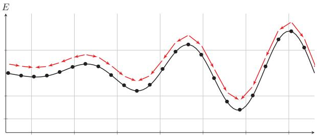  
(a) Hopfield 网络

  
(b) 玻尔兹曼机  
图15.2 Hopfield网络和玻尔兹曼机在运行时系统能量变化的对比

## 15.1.2 能量最小化与模拟退火

在一个动力系统中，找到一个状态使得系统能量最小是一个十分重要的优化问题.如果这个动力系统是确定性的，比如Hopfield网络，一个简单（但是低效）的能量最小化方法是随机选择一个变量，在其他变量保持不变的情况下，将这个变量设为会导致整个网络能量更低的状态.当每个变量 $X _ { i }$ 取值为{0,1}时，如果能量差异 $\Delta E _ { i } ( \pmb { x } _ { \backslash i } )$ 大于0,就设 $X _ { i } = 1$ ，否则就设 $X _ { i } = 0$

特别地，离散状态的能量最小化是一个组合优化问题.

这种简单、确定性的方法在运行一段时间之后通常会收敛到某个稳定状态但是这个状态往往只是局部最优，而不是全局最优.为了提高跳出局部最优的概率，可以允许“偶尔”将一个变量设置为使得能量变高的状态，这样，我们就需要引入一定的随机性，以 $\sigma \left( \frac { \Delta E _ { i } ( { \bf x } _ { \mathrm { \backslash } i } ) } { T } \right)$ 的概率将变量 $X _ { i }$ 设为1，否则设为0.这个过程和玻尔兹曼机的吉布斯采样过程十分类似.

局部最优在Hopfield网络中不是一个缺点.相反，Hopfield 网络是通过利用局部最优点来存储信息.

要使得动力系统达到热平衡，温度T的选择十分关键.一个比较好的折中方法是让系统刚开始在一个比较高的温度下运行达到热平衡，然后逐渐降低，直到系统在一个比较低的温度下运行达到热平衡.这样可以使系统以较大的概率跳出较差的局部最优，并逐步逼近更优的低能量状态.这个过程被称为模拟退火(Simulated Annealing) [Kirkpatrick et al., 1983].

模拟退火是一种寻找全局最优的近似方法，其名字来自冶金学的专有名词“退火”，即将材料加热后再以一定的速度退火冷却，可以减少晶格中的缺陷．固体中的内部粒子会停留在使内能有局部最小值的位置，加热时能量变大，粒子会变得无序并随机移动.退火冷却时速度较慢，使得粒子在每个温度都达到平衡态，最后在常温时，粒子以较大的概率达到内能比原先更低的位置，在足够慢的冷却日程等条件下，可以证明模拟退火算法所得解依概率收敛到全局最优解.

## 15.1.3 参数学习

不失一般性，假设一个玻尔兹曼机有K个变量，包括 $K _ { v }$ 个可观测变量 ${ \pmb v } \in$ $\{ 0 , 1 \} ^ { K _ { v } }$ 和 $K _ { h }$ 个隐变量 $\pmb { h } \in \{ 0 , 1 \} ^ { K _ { h } }$

给定一组可观测的向量 $\mathcal { D } = \{ \hat { v } ^ { ( 1 ) } , \hat { v } ^ { ( 2 ) } , \cdots , \hat { v } ^ { ( N ) } \}$ 作为训练集，我们要学习玻尔兹曼机的参数W和b使得训练集中所有样本的对数似然函数最大.训练集的对数似然函数定义为

$$
\begin{array} { c } { \displaystyle \mathcal { L } ( \mathcal { D } ; W , b ) = \frac { 1 } { N } \sum _ { n = 1 } ^ { N } \log p ( \hat { \pmb { v } } ^ { ( n ) } ; W , b ) } \\ { \displaystyle = \frac { 1 } { N } \sum _ { n = 1 } ^ { N } \log \sum _ { h } p ( \hat { \pmb { v } } ^ { ( n ) } , h ; W , b ) } \end{array}\tag{15.16}
$$

(15.17)

$$
= \frac { 1 } { N } \sum _ { n = 1 } ^ { N } \log \frac { \sum _ { h } \exp \Big ( - E ( \hat { v } ^ { ( n ) } , h ) \Big ) } { \sum _ { v , h } \exp \Big ( - E ( v , h ) \Big ) } .\tag{15.18}
$$

对数似然函数 $\mathcal { L } ( \mathcal { D } ; W , b )$ 对参数θ的偏导数为

θ为W或b.

(15.19)

$$
\begin{array} { l } { \displaystyle \frac { \partial \mathcal { L } ( \mathcal { D } ; W , b ) } { \partial \theta } = \frac { 1 } { N } \sum _ { n = 1 } ^ { N } \frac { \partial } { \partial \theta } \log \sum _ { h } p ( \hat { v } ^ { ( n ) } , h ; W , b ) } \\ { = \displaystyle \frac { 1 } { N } \sum _ { n = 1 } ^ { N } \frac { \partial } { \partial \theta } \Bigg ( \log \sum _ { h } \exp \big ( - E ( \hat { v } ^ { ( n ) } , h ) \big ) - \log \sum _ { v , h } \exp \big ( - E ( v , h ) \big ) \Bigg ) } \\ { = \displaystyle \frac { 1 } { N } \sum _ { n = 1 } ^ { N } \sum _ { h } \frac { \exp \big ( - E ( \hat { v } ^ { ( n ) } , h ) \big ) } { \sum _ { h } \exp \big ( - E ( \hat { v } ^ { ( n ) } , h ) \big ) } [ - \frac { \partial E ( \hat { v } ^ { ( n ) } , h ) } { \partial \theta } ] } \\ { \displaystyle - \sum _ { v , h } \frac { \exp \big ( - E ( v , h ) \big ) } { \sum _ { v , h } \exp \big ( - E ( v , h ) \big ) } \Big [ - \frac { \partial E ( v , h ) } { \partial \theta } \Big ] } \end{array}\tag{15.20}
$$

(15.21)

$$
= \frac { 1 } { N } \sum _ { n = 1 } ^ { N } \sum _ { h } p ( h | \hat { v } ^ { ( n ) } ) \Big [ - \frac { \partial E ( \hat { v } ^ { ( n ) } , h ) } { \partial \theta } \Big ] - \sum _ { v , h } p ( v , h ) \Big [ - \frac { \partial E ( v , h ) } { \partial \theta } \Big ]\tag{15.22}
$$

$$
= \mathbb { E } _ { \hat { p } ( v ) } \mathbb { E } _ { p ( h | v ) } \Big [ - \frac { \partial E ( v , h ) } { \partial \theta } \Big ] - \mathbb { E } _ { p ( v , h ) } \Big [ - \frac { \partial E ( v , h ) } { \partial \theta } \Big ] ,\tag{15.23}
$$

其中 $\hat { p } ( v )$ 表示可观测向量在训练集上的实际经验分布， $p ( h | \boldsymbol { v } )$ 和 $p ( \pmb { v } , \pmb { h } )$ 为在当前参数W,b条件下玻尔兹曼机的条件概率和联合概率.

根据公式(15.2)， $\begin{array} { r } { E ( { \pmb v } , { \pmb h } ) = E ( { \pmb x } ) = - \left( \sum _ { i < j } w _ { i j } x _ { i } x _ { j } + \sum _ { i } b _ { i } x _ { i } \right) } \end{array}$ .因此，整个训练集的对数似然函数 $\mathcal { L } ( \mathcal { D } ; W , b )$ 对每个权重 $w _ { i j }$ 和偏置 $b _ { i }$ 的偏导数为

$$
\frac { \partial \mathcal { L } ( \mathcal { D } ; W , b ) } { \partial w _ { i j } } = \mathbb { E } _ { \hat { p } ( \pmb { v } ) } \mathbb { E } _ { p ( { \pmb { h } } | \pmb { v } ) } [ x _ { i } x _ { j } ] - \mathbb { E } _ { p ( \pmb { v } , { \pmb { h } } ) } [ x _ { i } x _ { j } ] ,\tag{15.24}
$$

$$
\frac { \partial \mathcal { L } ( \mathcal { D } ; W , b ) } { \partial b _ { i } } = \mathbb { E } _ { \hat { p } ( v ) } \mathbb { E } _ { p ( h | v ) } [ x _ { i } ] - \mathbb { E } _ { p ( v , h ) } [ x _ { i } ] ,\tag{15.25}
$$

其中 $i , j \in [ 1 , K ]$ .这两个公式涉及计算配分函数和期望，很难精确计算.对于一个K维的二值随机向量x，其取值空间大小为 $2 ^ { K }$ .当K比较大时，配分函数以及期望的计算会十分耗时.因此，玻尔兹曼机一般通过MCMC方法（如吉布斯采样）来进行近似求解，

以参数 $w _ { i j }$ 的梯度为例，公式(15.24)中第一项是在限定可观测变量v为训练样本的条件下 $x _ { i } x _ { j }$ 的期望.为了近似这个期望，我们可以固定住可观测变量v，只对h进行吉布斯采样.当玻尔兹曼机达到热平衡状态时，采样 $x _ { i } x _ { j }$ 的值.在训练集上所有的训练样本上重复此过程，得到 $\boldsymbol { x } _ { i } \boldsymbol { x } _ { j }$ 的近似期望 $\langle x _ { i } x _ { j } \rangle _ { \mathrm { d a t a } }$ .公式(15.24)中的第二项为玻尔兹曼机在没有任何限制条件下 $x _ { i } x _ { j }$ 的期望.这时可以对所有变量进行吉布斯采样.当玻尔兹曼机达到热平衡状态时，采样 $\boldsymbol { x } _ { i } \boldsymbol { x } _ { j }$ 的值，得到近似期望 $\langle x _ { i } x _ { j } \rangle _ { \mathrm { m o d e 1 } }$

这样当采用梯度上升法时，权重 $w _ { i j }$ 可以用下面公式近似地更新：

$$
w _ { i j }  w _ { i j } + \alpha \Big ( \langle x _ { i } x _ { j } \rangle _ { \mathsf { d a t a } } - \langle x _ { i } x _ { j } \rangle _ { \mathsf { m o d e l } } \Big ) ,\tag{15.26}
$$

其中 $\alpha > 0$ 为学习率.这个更新方法的一个特点是仅仅使用了局部信息．也就是说，虽然学习目标由整个网络的似然函数决定，但是每个权重的更新只依赖于它连接的相关变量的状态.这种学习方式和人脑神经网络的学习方式，赫布规则(Hebb's Rule）,十分类似.

玻尔兹曼机可以用在监督学习和无监督学习中.在监督学习中，可观测的变量v又进一步可以分为输入和输出变量，隐变量则隐式地描述了输入和输出变量之间复杂的约束关系.在无监督学习中，隐变量可以看作可观测变量的内部特征表示.玻尔兹曼机也可以看作一种随机型的神经网络，是Hopfield神经网络在随机动力系统意义下的扩展.在计算代价可接受时，玻尔兹曼机还可以用来解决复杂的组合优化问题

## 15.2 受限玻尔兹曼机

全连接的玻尔兹曼机在理论上十分有趣，但是由于其复杂性，很少直接用于大规模学习任务.虽然基于采样的方法在一定程度上提高了学习效率，但是每更新一次权重，往往都需要网络重新接近平衡分布，这个过程依然比较低效.为了获得更易训练的结构，一种重要的改进是受限玻尔兹曼机

受限玻尔兹曼机（Restricted Boltzmann Machine，RBM）是一个二分图结构的无向图模型，如图15.3所示，受限玻尔兹曼机中的变量也分为隐变量和可观测变量.我们分别用可观测层和隐藏层来表示这两组变量.同一层中的节点之间没有连接，而不同层之间为全连接，这与两层全连接神经网络的结构相似.这样的结构约束带来了一个重要性质：给定一层时，另一层中的各个变量条件独立，从而使采样和学习都明显简化

受限玻尔兹曼机因其结构最初称为簧风琴模型，2000年后受限玻尔兹曼机的名称才变得流行.

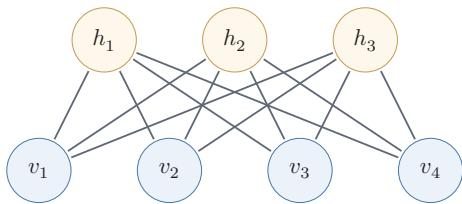  
图15.3 一个有7个变量的受限玻尔兹曼机

一个受限玻尔兹曼机由 $K _ { v }$ 个可观测变量和 $K _ { h }$ 个隐变量组成，其定义如下：

（1）可观测的随机向量 $\pmb { v } \in \{ 0 , 1 \} ^ { K _ { \iota } }$

（2）隐藏的随机向量 $\pmb { h } \in \{ 0 , 1 \} ^ { K _ { h } }$

（3）权重矩阵 $\boldsymbol { W } \in \mathbb { R } ^ { K _ { v } \times K _ { h } }$ ，其中每个元素 $w _ { i j }$ 为可观测变量 $v _ { i }$ 和隐变量 $h _ { j }$ 之间边的权重.

（4）偏置 $\mathbf { \boldsymbol { a } } \in \mathbb { R } ^ { K _ { v } }$ 和 $\boldsymbol { b } \in \mathbb { R } ^ { K _ { h } }$ ,其中 $a _ { i }$ 为每个可观测变量 $v _ { i }$ 的偏置， $b _ { j }$ 为每个隐变量 $h _ { j }$ 的偏置.

在本节中，我们首先讨论可观测变量和隐变量都为二值的标准受限玻尔兹曼机.

受限玻尔兹曼机的能量函数定义为

$$
\begin{array} { l } { { \displaystyle E ( { \boldsymbol { v } } , { \boldsymbol { h } } ) = - \sum _ { i } a _ { i } v _ { i } - \sum _ { j } b _ { j } h _ { j } - \sum _ { i } \sum _ { j } v _ { i } w _ { i j } h _ { j } } } \\ { { \displaystyle \ } } \\ { { \displaystyle = - a ^ { \top } { \boldsymbol { v } } - b ^ { \top } { \boldsymbol { h } } - { \boldsymbol { v } } ^ { \top } { \boldsymbol { W } } { \boldsymbol { h } } } . } \end{array}\tag{15.27}
$$

(15.28)

受限玻尔兹曼机的联合概率分布 $p ( \pmb { v } , \pmb { h } )$ 定义为

$$
\begin{array} { l } { { \displaystyle p ( { \pmb v } , { \pmb h } ) = \frac { 1 } { Z } \exp ( - E ( { \pmb v } , { \pmb h } ) ) } \ ~ } \\ { { \displaystyle ~ = \frac { 1 } { Z } \exp ( { \pmb a } ^ { \top } { \pmb v } ) \exp ( { \pmb b } ^ { \top } { \pmb h } ) \exp ( { \pmb v } ^ { \top } { \pmb W } { \pmb h } ) } , } \end{array}\tag{15.29}
$$

(15.30)

其中 $\begin{array} { r } { Z = \sum _ { \boldsymbol { v } , h } \exp ( - E ( \boldsymbol { v } , h ) ) } \end{array}$ 为配分函数.

从直观上看，受限玻尔兹曼机可以理解为一个由“数据层”和“潜在特征层”构成的双层模型：可观测层v表示输入数据，隐层h表示潜在特征.给定一个数据样本时，隐层中被激活的单元表示该样本中出现了哪些潜在模式；反过来，给定隐层状态时，又可以对可观测层进行重构.因此，受限玻尔兹曼机的学习目标可以理解为:通过调整参数，使模型能够用潜在特征较好地解释并重构训练数据

## 15.2.1 生成模型

在给定受限玻尔兹曼机的联合概率分布 $p ( \pmb { h } , \pmb { v } )$ 后，可以通过吉布斯采样方法生成一组服从 $p ( \boldsymbol { h } , \boldsymbol { v } )$ 分布的样本.

吉布斯采样参见第14.5.4.3节.

全条件概率 吉布斯采样需要计算每个变量 $V _ { i }$ 和 $H _ { j }$ 的全条件概率.受限玻尔兹曼机中同层的变量之间没有连接.从无向图的性质可知，在给定可观测变量时，隐变量之间互相条件独立.同样，在给定隐变量时，可观测变量之间也互相条件独立.因此有

$$
p ( v _ { i } | v _ { \backslash i } , h ) = p ( v _ { i } | h ) ,\tag{15.31}
$$

$$
p ( h _ { j } | \boldsymbol { v } , h _ { \setminus j } ) = p ( h _ { j } | \boldsymbol { v } ) ,\tag{15.32}
$$

其中 ${ \pmb v } _ { \backslash i }$ 为除变量 $V _ { i }$ 外其他可观测变量的取值， $h _ { \backslash j }$ 为除变量 $H _ { j }$ 外其他隐变量的取值.因此， $V _ { i }$ 的全条件概率只需要计算 $p ( v _ { i } | h )$ ，而 $H _ { j }$ 的全条件概率只需要计算 $p ( h _ { j } | \boldsymbol { v } )$

定理15.2－受限玻尔兹曼机中变量的条件概率：在受限玻尔兹曼机中，每个可观测变量和隐变量的条件概率为

$$
p ( v _ { i } = 1 | h ) = \sigma \Big ( a _ { i } + \sum _ { j } w _ { i j } h _ { j } \Big ) ,\tag{15.33}
$$

$$
p ( h _ { j } = 1 | \pmb { v } ) = \sigma \Big ( b _ { j } + \sum _ { i } w _ { i j } v _ { i } \Big ) ,\tag{15.34}
$$

其中 $\sigma$ 为Logistic函数.

证明.（1）先计算 $p ( h _ { j } = 1 | \pmb { v } )$ .可观测层变量v的边际概率为

$$
p ( \pmb { v } ) = \sum _ { \pmb { h } } p ( \pmb { v } , \pmb { h } ) = \frac { 1 } { Z } \sum _ { \pmb { h } } \exp ( - E ( \pmb { v } , \pmb { h } ) )\tag{15.35}
$$

$$
= { \frac { 1 } { Z } } \sum _ { h } \exp \left( a ^ { \mathsf { T } } { \boldsymbol { v } } + \sum _ { j } b _ { j } h _ { j } + \sum _ { i } \sum _ { j } { \boldsymbol { v } } _ { i } w _ { i j } h _ { j } \right)\tag{15.36}
$$

$$
= { \frac { \exp ( a ^ { \mathsf { \tau } } v ) } { Z } } \sum _ { h } \exp \left( \sum _ { j } h _ { j } ( b _ { j } + \sum _ { i } w _ { i j } v _ { i } ) \right)\tag{15.37}
$$

$$
= \frac { \exp ( { \pmb a } ^ { \top } { \pmb v } ) } { Z } \sum _ { h } \prod _ { j } \exp \left( h _ { j } ( b _ { j } + \sum _ { i } w _ { i j } v _ { i } ) \right)\tag{15.38}
$$

$$
= \frac { \exp ( a ^ { \intercal } v ) } { Z } \sum _ { h _ { 1 } } \sum _ { h _ { 2 } } \cdots \sum _ { h _ { K _ { h } } } \prod _ { j } \exp \left( h _ { j } ( b _ { j } + \sum _ { i } w _ { i j } v _ { i } ) \right)\tag{15.39}
$$

利用分配律.

$$
= \frac { \exp ( { \pmb a } ^ { \top } { \pmb v } ) } { Z } \prod _ { j } \sum _ { h _ { j } } \exp \left( h _ { j } ( b _ { j } + \sum _ { i } w _ { i j } v _ { i } ) \right)\tag{15.40}
$$

将 $h _ { j }$ 为0或1的取值代 入计算.

$$
= \frac { \exp ( a ^ { \intercal } v ) } { Z } \prod _ { j } \left( 1 + \exp ( b _ { j } + \sum _ { i } w _ { i j } v _ { i } ) \right) .\tag{15.41}
$$

固定 $h _ { j } = 1$ 时， $p ( h _ { j } = 1 , v )$ 的边际概率为

$$
\begin{array} { l } { p ( h _ { j } = 1 , \pmb { v } ) = \displaystyle \frac { 1 } { Z } \sum _ { h , h _ { j } = 1 } \exp { ( - E ( \pmb { v } , h ) ) } } \\ { \displaystyle = \frac { \exp ( a ^ { \top } \pmb { v } ) } { Z } \prod _ { k , k \neq j } \left( 1 + \exp ( b _ { k } + \sum _ { i } w _ { i k } v _ { i } ) \right) \exp ( b _ { j } + \sum _ { i } w _ { i j } v _ { i } ) . } \end{array}\tag{15.42}
$$

(15.43)

由公式(15.41)和公式(15.43)，可以计算隐变量 $h _ { j }$ 的条件概率为

$$
p ( h _ { j } = 1 | \pmb { v } ) = \frac { p ( h _ { j } = 1 , \pmb { v } ) } { p ( \pmb { v } ) }\tag{15.44}
$$

$$
= \frac { \exp ( b _ { j } + \sum _ { i } w _ { i j } v _ { i } ) } { 1 + \exp ( b _ { j } + \sum _ { i } w _ { i j } v _ { i } ) }\tag{15.45}
$$

$$
= \sigma \Big ( b _ { j } + \sum _ { i } w _ { i j } v _ { i } \Big ) .\tag{15.46}
$$

(2)同理，可观测变量 $v _ { i }$ 的条件概率 $p ( v _ { i } = 1 | h )$ 为

$$
p ( v _ { i } = 1 | h ) = \sigma \Big ( a _ { i } + \sum _ { j } w _ { i j } h _ { j } \Big ) .\tag{15.47}
$$

公式(15.46)和公式(15.47)也可以按位写成向量形式.若将每一维取值为1的条件概率记为一个向量，则有

$$
p ( h = 1 | \pmb { v } ) \triangleq \left[ p ( h _ { 1 } = 1 | \pmb { v } ) , \cdots , p ( h _ { K _ { h } } = 1 | \pmb { v } ) \right] ^ { \top } = \sigma \left( \pmb { W } ^ { \top } \pmb { v } + \pmb { b } \right) ,\tag{15.48}
$$

$$
p ( \boldsymbol { v } = 1 | h ) \triangleq \left[ p ( v _ { 1 } = 1 | h ) , \cdots , p ( v _ { K _ { v } } = 1 | h ) \right] ^ { \intercal } = \sigma \left( W h + a \right) .\tag{15.49}
$$

吉布斯采样 在受限玻尔兹曼机的全条件概率中，可观测变量之间互相条件独立，隐变量之间也互相条件独立.因此，受限玻尔兹曼机可以并行地对所有的可观测变量（或所有的隐变量）同时进行采样，从而更快地逼近平衡分布.受限玻尔兹曼机的采样过程如下：

（1）给定或随机初始化一个可观测向量 $\mathbf { } v _ { \mathrm { 0 } }$ ，根据条件概率 $p ( h = 1 | v _ { 0 } )$ 按位采样得到隐向量 $h _ { 0 }$

（2）基于 $h _ { 0 }$ ，根据条件概率 $p ( \pmb { v } = 1 | \pmb { h } _ { 0 } )$ 按位采样得到新的可观测向量$v _ { 1 }$

（3）重复上述交替采样过程t次后，获得 $( v _ { t } , h _ { t } )$

（4）在马尔可夫链满足遍历条件时，当 $t  \infty , ( v _ { t } , h _ { t } )$ 的样本分布收敛到 $p ( \pmb { v } , \pmb { h } )$

图15.4也给出了上述过程的示例

  
图15.4 受限玻尔兹曼机的采样过程

## 15.2.2 参数学习

和玻尔兹曼机一样，受限玻尔兹曼机通过最大化似然函数来找到最优的参数 $W , a , b .$ 给定一组训练样本 $\mathcal { D } = \{ \hat { v } ^ { ( 1 ) } , \hat { v } ^ { ( 2 ) } , \cdots , \hat { v } ^ { ( N ) } \}$ ,其对数似然函数为

$$
\mathcal { L } ( \mathcal { D } ; W , a , b ) = \frac { 1 } { N } \sum _ { n = 1 } ^ { N } \log p ( \hat { \pmb { v } } ^ { ( n ) } ; W , a , b ) .\tag{15.50}
$$

与玻尔兹曼机的推导类似（参见），在受限玻尔兹曼机中，对数似然函数$\mathcal { L } ( \mathcal { D } ; W , a , b )$ 对参数 $w _ { i j } , a _ { i } , b _ { j }$ 的偏导数为

参见公式(15.23).

$$
\frac { \partial \mathcal { L } ( \mathcal { D } ; W , a , b ) } { \partial w _ { i j } } = \mathbb { E } _ { \hat { p } ( v ) } \mathbb { E } _ { p ( h | v ) } [ v _ { i } h _ { j } ] - \mathbb { E } _ { p ( v , h ) } [ v _ { i } h _ { j } ] ,\tag{15.51}
$$

$$
\frac { \partial \mathcal { L } ( \mathcal { D } ; W , a , b ) } { \partial a _ { i } } = \mathbb { E } _ { \hat { p } ( \pmb { v } ) } \mathbb { E } _ { p ( \pmb { h } | \pmb { v } ) } [ v _ { i } ] - \mathbb { E } _ { p ( \pmb { v } , \pmb { h } ) } [ v _ { i } ] ,\tag{15.52}
$$

$$
\frac { \partial \mathcal { L } ( \mathcal { D } ; W , a , b ) } { \partial b _ { j } } = \mathbb { E } _ { \hat { p } ( \pmb { v } ) } \mathbb { E } _ { p ( { \pmb h } | \pmb { v } ) } [ h _ { j } ] - \mathbb { E } _ { p ( \pmb { v } , { \pmb h } ) } [ h _ { j } ] ,\tag{15.53}
$$

参见习题15-3.

其中 $\hat { p } ( v )$ 为训练数据集上v的实际分布.

公式(15.51)、公式(15.52)和公式(15.53) 中都需要计算配分函数Z以及两个期望 $\mathbb { E } _ { p ( h | v ) }$ 和 $\mathbb { E } _ { p ( h , v ) }$ ，因此很难计算，一般需要通过MCMC方法来近似计算.

首先，将可观测向量v固定为训练样本中的值，然后根据条件概率对隐向量h进行采样，这时得到的统计量记为 $\langle \cdot \rangle _ { \mathrm { d a t a } }$ ．随后不再固定可观测向量v，通过吉布斯采样轮流更新v和h.当链达到平衡分布后，再统计v和h的值，记为$\langle \cdot \rangle _ { \mathrm { m o d e l } }$

采用梯度上升方法时，参数W，a,b可以用下面公式近似地更新：

$$
w _ { i j }  w _ { i j } + \alpha \Big ( \langle v _ { i } h _ { j } \rangle _ { \mathsf { d a t a } } - \langle v _ { i } h _ { j } \rangle _ { \mathsf { m o d e l } } \Big ) ,\tag{15.54}
$$

$$
a _ { i } \gets a _ { i } + \alpha \Big ( \langle v _ { i } \rangle _ { \tt d a t a } - \langle v _ { i } \rangle _ { \tt m o d e l } \Big ) ,\tag{15.55}
$$

$$
b _ { j } \gets b _ { j } + \alpha \Big ( \langle h _ { j } \rangle _ { \tt d a t a } - \langle h _ { j } \rangle _ { \tt m o d e l } \Big ) ,\tag{15.56}
$$

其中 $\alpha > 0$ 为学习率.

根据受限玻尔兹曼机的条件独立性，可以对可观测变量和隐变量进行分组轮流采样，如图15.4中所示.这样，受限玻尔兹曼机的采样效率会比一般的玻尔兹曼机有很大提高，但一般还是需要通过很多步采样才可以采集到符合真实分布的样本.

## 15.2.2.1 对比散度学习算法

由于受限玻尔兹曼机的特殊结构，因此可以使用一种比长链吉布斯采样更高效的近似学习算法，即对比散度（Contrastive Divergence）[Hinton，2002].对比散度算法仅需k步吉布斯采样.需要说明的是，对比散度给出的并不是精确的对数似然梯度，而是一种计算高效、在实践中通常足够有效的带偏近似.具体来说，偏差来源于吉布斯采样链从训练数据分布（而非模型的平稳分布）初始化，经过有限k步后尚未收敛到模型分布，k越大偏差越小，但计算代价也越高.持续对比散度（Persistent Contrastive Divergence，PCD）通过在多次参数更新之间保持采样链不重启来进一步减小偏差.

为了提高效率，对比散度算法用一个训练样本作为可观测向量的初始值.然后，交替对可观测向量和隐向量进行吉布斯采样，不需要等到收敛，只进行k步近似更新．这就是CD-k算法．在一些早期经验中，k=1已经可以得到可用的表示，但更大的k或持续对比散度通常会降低近似偏差.对比散度的流程如算法15.1所示.

## 15.2.3 受限玻尔兹曼机的常见变体

在具体的不同任务中，需要处理的数据类型不一定都是二值的，也可能是连续值.为了能够处理这些数据，就需要根据输入或输出的数据类型来设计新的能量函数.

一般来说，常见的受限玻尔兹曼机有以下三种：

(1）“伯努利-伯努利”受限玻尔兹曼机（Bernoulli-Bernoulli RBM，BB-RBM):上面介绍的可观测变量和隐变量都为二值类型的受限玻尔兹曼机.

（2）“高斯-伯努利”受限玻尔兹曼机（Gaussian-Bernoulli RBM，GB-RBM):可观测变量为高斯分布，隐变量为伯努利分布，其能量函数定义为

$$
E ( v , h ) = \sum _ { i } \frac { ( v _ { i } - \mu _ { i } ) ^ { 2 } } { 2 \sigma _ { i } ^ { 2 } } - \sum _ { j } b _ { j } h _ { j } - \sum _ { i } \sum _ { j } \frac { v _ { i } } { \sigma _ { i } } w _ { i j } h _ { j } ,\tag{15.57}
$$

其中 $\mu _ { i }$ 和 $\sigma _ { i }$ 分别为第i个可观测变量的高斯均值和标准差参数

(3）“伯努利-高斯”受限玻尔兹曼机（Bernoulli-Gaussian RBM，BG-

算法 15.1 单步对比散度（CD-1)算法  
输入：训练集 $\{ \hat { v } ^ { ( n ) } \} _ { n = 1 } ^ { N }$ ,学习率α  
1初始化:W←0,a ←0,b ←0；  
2 for t = 1 · .. T do  
3 for n = 1 · .. N do  
4 选取一个样本 $\hat { v } ^ { ( n ) }$ ，用公式(15.46)按位计算隐变量取1的条件概率，  
并根据该分布采样一个隐向量 $h ;$   
5 计算正向梯度 $\hat { v } ^ { ( n ) } h ^ { \top } ;$   
6 根据 $^ { h }$ 用公式(15.47)按位计算可观测变量取1的条件概率，并根据  
该分布采样重构的可观测向量 $v ^ { \prime } ;$   
7 根据 $\mathbf { \nabla } \mathbf { \boldsymbol { v } } ^ { \prime }$ ,按位重新计算隐变量取1的条件概率，并采样一个 $h ^ { \prime } ;$   
8 计算反向梯度 $v ^ { \prime } h ^ { \prime ^ { \intercal } }$   
$/ /$ 更新参数  
9 $\boldsymbol { W } \gets \boldsymbol { W } + \alpha ( \hat { \boldsymbol { v } } ^ { ( n ) } \boldsymbol { h } ^ { \intercal } - \boldsymbol { v } ^ { \prime } \boldsymbol { h } ^ { \prime } ^ { \intercal } )$ 。2  
10 $\pmb { a }  \pmb { a } + \alpha ( \hat { \pmb { v } } ^ { ( n ) } - \pmb { v } ^ { \prime } )$   
11 $\pmb { b }  \pmb { b } + \alpha ( \pmb { h } - \pmb { h } ^ { \prime } )$ in  
12 end  
13 end  
输出：W, a, b

RBM):可观测变量为伯努利分布，隐变量为高斯分布，其能量函数定义为

$$
E ( v , h ) = - \sum _ { i } a _ { i } v _ { i } + \sum _ { j } \frac { ( h _ { j } - \mu _ { j } ) ^ { 2 } } { 2 \sigma _ { j } ^ { 2 } } - \sum _ { i } \sum _ { j } v _ { i } w _ { i j } \frac { h _ { j } } { \sigma _ { j } } ,\tag{15.58}
$$

其中 $\mu _ { j }$ 和 $\sigma _ { j }$ 分别为第 $j$ 个隐变量的高斯均值和标准差参数.

## 15.3 深度信念网络

深度信念网络（(Deep Belief Network,DBN)是一种深层概率图模型，其图结构由多层节点构成.每层节点内部没有连接，相邻两层节点之间为全连接.网络的最底层为可观测变量，其余各层为隐变量.需要特别注意的是，深度信念网络并不是纯有向图模型：最顶部两层之间的连接是无向的，可以看作一个受限玻尔兹曼机；其余层之间的连接则是有向的.也就是说，深度信念网络是一个同时包含无向连接和有向连接的混合结构模型.图15.5给出了一个深度信念网络的示例.

和全连接的前馈神经网络结构相似，但顶层结构有所不同.

深度玻尔兹曼机（DeepBoltzmann Machine，DBM）与深度信念网络名称相近，但图结构不同：深度玻尔兹曼机通常在相邻层之间都使用无向连接，而深度信念网络只在顶层保留无向连接、下层使用有向生成连接.因此，深度玻尔兹曼机的后验依赖更强，通常需要更复杂的变分推断或MCMC近似；深度信念网络则更强调通过逐层RBM预训练得到可用的深层表示.

  
图15.5 一个有4层结构的深度信念网络

对一个有L层隐变量的深度信念网络，令 $v = h ^ { ( 0 ) }$ 表示最底层(第0层）为可观测变量， $\mathbf { \Omega } _ { h } ( 1 ) , \cdots , h ^ { ( L ) }$ 表示其余每层的变量.顶部的两层是一个无向图，可以看作一个受限玻尔兹曼机，用来产生 $p ( h ^ { ( L - 1 ) } )$ 的先验分布.除了最顶上两层外，每一层变量 $\mathbf { \Omega } _ { h } ( l )$ 依赖于其上面一层 $\mathbf { \Omega } _ { h } ( l { + } 1 )$ ,即

$$
p ( { \pmb h } ^ { ( l ) } | { \pmb h } ^ { ( l + 1 ) } , \cdots , { \pmb h } ^ { ( L ) } ) = p ( { \pmb h } ^ { ( l ) } | { \pmb h } ^ { ( l + 1 ) } ) ,\tag{15.59}
$$

其中 $l \in \{ 0 , \cdots , L - 2 \}$

深度信念网络中所有变量的联合概率可以分解为

$$
\begin{array} { l } { { \displaystyle p ( \pmb { v } , \pmb { h } ^ { ( 1 ) } , \cdots , \pmb { h } ^ { ( L ) } ) = p ( \pmb { v } | \pmb { h } ^ { ( 1 ) } ) \left( \prod _ { l = 1 } ^ { L - 2 } p ( \pmb { h } ^ { ( l ) } | \pmb { h } ^ { ( l + 1 ) } ) \right) p ( \pmb { h } ^ { ( L - 1 ) } , \pmb { h } ^ { ( L ) } ) } \ ~ } \\ { { \displaystyle ~ = \ \left( \prod _ { l = 0 } ^ { L - 2 } p ( \pmb { h } ^ { ( l ) } | \pmb { h } ^ { ( l + 1 ) } ) \right) p ( \pmb { h } ^ { ( L - 1 ) } , \pmb { h } ^ { ( L ) } ) } , } \end{array}\tag{15.60}
$$

(15.61)

其中 $p ( h ^ { ( l ) } | h ^ { ( l + 1 ) } )$ 为Sigmoid型条件概率分布．由于在给定 $\mathbf { \Omega } _ { h } ( l { + } 1 )$ 时，第l层各个节点条件独立，因此对每个节点 $h _ { i } ^ { ( l ) }$ 都有

$$
p ( h _ { i } ^ { ( l ) } = 1 | { \bf h } ^ { ( l + 1 ) } ) = \sigma \left( a _ { i } ^ { ( l ) } + { \bf W } _ { i : } ^ { ( l + 1 ) } { \bf h } ^ { ( l + 1 ) } \right) ,\tag{15.62}
$$

其中 $\sigma ( \cdot )$ 为Logistic函数， $a _ { i } ^ { ( l ) }$ 为偏置参数， $\boldsymbol { W } _ { i : } ^ { ( l + 1 ) }$ 表示矩阵 $W ^ { ( l + 1 ) }$ 的第i行.将各维概率写成向量形式，可记为

$$
p ( \pmb { h } ^ { ( l ) } = 1 | \pmb { h } ^ { ( l + 1 ) } ) = \sigma \left( \pmb { a } ^ { ( l ) } + \pmb { W } ^ { ( l + 1 ) } \pmb { h } ^ { ( l + 1 ) } \right) .\tag{15.63}
$$

这样，每一层都可以看作一个Sigmoid信念网络.

Sigmoid信念网络参见第14.1.2.1节.

## 15.3.1 生成模型

深度信念网络是一个生成模型，可以用来生成符合特定分布的样本.隐变量用来描述在可观测变量之间的高阶相关性.假如训练数据服从分布 $p ( v )$ ，通过训练得到一个深度信念网络.

在生成样本时，首先运行最顶层的受限玻尔兹曼机进行足够多次的吉布斯采样，在接近平衡分布时生成样本 $\pmb { h } ^ { ( L - 1 ) }$ ，然后依次计算下一层变量的条件分布并采样，因为在给定上一层变量取值时，下一层的变量是条件独立的，所以可以独立采样.这样，我们可以从第L－1层开始，自顶向下进行逐层采样，最终得到可观测层的样本.

## 15.3.2 参数学习

深度信念网络最直接的训练方式是最大化可观测变量的边际分布 $p ( v )$ 在训练集合上的似然.但在深度信念网络中，隐变量h之间的关系十分复杂，由于“贡献度分配问题”，很难直接学习.即使对于简单的单层Sigmoid信念网络

$$
\begin{array} { r } { p ( \boldsymbol { v } = 1 | \boldsymbol { h } ) = \sigma \left( \boldsymbol { b } + \boldsymbol { w } ^ { \intercal } \boldsymbol { h } \right) , } \end{array}\tag{15.64}
$$

在已知可观测变量时，其隐变量的联合后验概率 $p ( \pmb { h } | \boldsymbol { v } )$ 不再互相独立，因此很难精确估计所有隐变量的后验概率.早期深度信念网络的后验概率一般通过蒙特卡罗方法或变分方法来近似估计，但是效率比较低，从而导致其参数学习比较困难.

为了有效地训练深度信念网络，早期方法通常用一组受限玻尔兹曼机来逐层初始化模型，而不是直接端到端求解原始Sigmoid信念网络中的复杂后验.这样做的好处是：在受限玻尔兹曼机中，给定可观测层时隐变量后验相互独立，因此更容易进行采样和近似学习.于是，深度信念网络可以看作由多个受限玻尔兹曼机自下而上堆叠而成，第l层受限玻尔兹曼机的隐层作为第l+1层受限玻尔兹曼机的可观测层，进一步地，深度信念网络可以采用逐层训练的方式来训练，即从最底层开始，每次只训练一层，直到最后一层[Hinton et al., 2006].

逐层训练是早期有效训练深层模型的重要方法.

深度信念网络的训练过程通常分为逐层预训练和微调两个阶段.先通过逐层预训练将模型的参数初始化到较优区域，再结合具体任务选择相应的全局优化或近似推断方法进行微调.这里的核心思想是：先学好每一层的表示，再整体优化整个深层模型

## 15.3.2.1 逐层预训练

在逐层预训练阶段，采用逐层训练的方式，将深度信念网络的训练简化为对多个受限玻尔兹曼机的训练.其核心思想是先学习低层表示，再逐步向高层传

播，这在早期深层网络难以直接端到端训练的背景下尤其有效.图15.6给出了深度信念网络的逐层预训练过程.

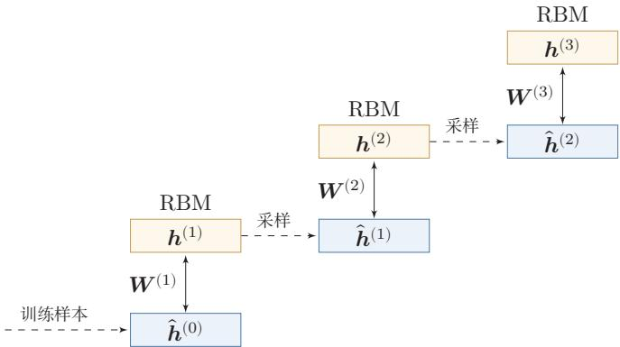  
图15.6 深度信念网络的逐层预训练过程

具体的逐层训练过程为自下而上依次训练每一层的受限玻尔兹曼机.假设我们已经训练好了前l一1层的受限玻尔兹曼机，那么可以计算隐变量自下而上的条件概率

$$
p ( { \pmb h } ^ { ( i ) } | { \pmb h } ^ { ( i - 1 ) } ) = \sigma \left( { \pmb b } ^ { ( i ) } + { \pmb W } ^ { ( i ) } { \pmb h } ^ { ( i - 1 ) } \right) , \qquad 1 \leq i \leq ( l - 1 )\tag{15.65}
$$

其中 $\mathbf { \delta } _ { b } ( i )$ 为第i层受限玻尔兹曼机的偏置， $W ^ { ( i ) }$ 为连接权重．这样，我们可以按照 ${ \pmb v } = { \pmb h } ^ { ( 0 ) } \enspace \enspace \gamma  { \pmb h } ^ { ( 1 ) } \enspace \gamma  \cdots \enspace \gamma  { \pmb h } ^ { ( l - 1 ) }$ 的顺序，将训练集中每个样本逐层映射到第l-1层，得到该层上的表示集合，记为 $\hat { \pmb { H } } ^ { ( l - 1 ) } = \{ \hat { \pmb { h } } ^ { ( l - 1 , 1 ) } , \cdots , \hat { \pmb { h } } ^ { ( l - 1 , N ) } \}$ .然后，将$\hat { H } ^ { ( l - 1 ) }$ 作为第l层受限玻尔兹曼机的训练集，学习第l层的参数.

算法15.2给出一种深度信念网络的逐层预训练方法.早期实践表明，逐层预训练可以产生较好的参数初始值，从而降低模型的学习难度.

算法15.2 深度信念网络的逐层预训练方法  
输入：训练集 $\{ \hat { v } ^ { ( n ) } \} _ { n = 1 } ^ { N }$ ，学习率 $\alpha$ ,深度信念网络层数 $L ;$   
1 for l = 1 · .· L do  
2 初始化： ${ \pmb W } ^ { ( l ) }  0 , ~ { \pmb a } ^ { ( l ) }  0 , ~ { \pmb b } ^ { ( l ) }  0 ;$   
3 for $n = 1 \cdots N$ do  
4 令 $\hat { \pmb { h } } ^ { ( 0 , n ) } = \hat { \pmb { v } } ^ { ( n ) }$   
5 for $i = 1 \cdots l - 1$ do  
6 根据分布 $p ( { h ^ { ( i ) } | \hat { h } ^ { ( i - 1 , n ) } } )$ 采样或计算 $\hat { \pmb { h } } ^ { ( i , n ) }$   
7 end  
8 end  
9 将 $\{ \hat { h } ^ { ( l - 1 , n ) } \} _ { n = 1 } ^ { N }$ 作为训练集，训练第l层受限玻尔兹曼机，得到参数  
$\pmb { W } ^ { ( l ) } , \pmb { a } ^ { ( l ) } , \pmb { b } ^ { ( l ) } ;$   
10 end  
输出： $\{ W ^ { ( l ) } , \pmb { a } ^ { ( l ) } , \pmb { b } ^ { ( l ) } \} , 1 \le l \le L$

## 15.3.2.2 微调

经过预训练之后，再结合具体的任务（监督学习或无监督学习），通过反向传播、Wake-Sleep或其他全局优化与近似推断算法对网络进行微调（Fine-Tuning），使模型收敛到更适合任务的参数区域

作为生成模型的微调除了顶层的受限玻尔兹曼机，其他层之间的权重可以被分成向下的生成权重（Generative Weight）W和向上的认知权重（Recogni-tionWeight）W'.生成权重用来定义原始的生成模型，而认知权重用来计算反向（上行）的条件概率.认知权重的初始值 $\boldsymbol { W ^ { \prime } } ^ { ( l ) } = \boldsymbol { W } ^ { ( l ) } ^ { \top }$

深度信念网络一般采用 Contrastive Wake-Sleep算法进行微调，其算法过程是：

（1）Wake阶段：a）认知过程，通过外界输入（可观测变量）和向上的认知权重，计算每一层变量的上行的条件概率 $p ( \pmb { h } ^ { ( l + 1 ) } | \pmb { h } ^ { ( l ) } )$ 并采样.b）修改下行的生成权重使得每一层变量的下行的条件概率 $p ( h ^ { ( l ) } | h ^ { ( l + 1 ) } )$ 最大.也就是“如果现实跟我想象的不一样，改变我的生成权重使得我想象的东西就是这样的”.

（2）Sleep阶段：a）生成过程，运行顶层的受限玻尔兹曼机并在达到热平衡时采样，然后通过向下的生成权重逐层计算每一层变量的下行的条件概率$p ( \boldsymbol { h } ^ { ( l ) } | \boldsymbol { h } ^ { ( l + 1 ) } )$ 并采样.b）修改向上的认知权重使得上一层变量的上行的条件概率 $p ( \pmb { h } ^ { ( l + 1 ) } | \pmb { h } ^ { ( l ) } )$ 最大.也就是“如果梦中的景象不是我脑中的相应概念，改变我的认知权重使得这种景象在我看来就是这个概念”.

（3）交替进行Wake和Sleep过程，直到收敛.

作为判别模型的微调深度信念网络的一个应用是作为深度神经网络的预训练模型，提供神经网络的初始权重.这时只需要向上的认知权重，作为判别模型使用.图15.7给出深度信念网络作为神经网络预训练模型的示例

  
图15.7 深度信念网络作为神经网络的预训练模型

具体的微调过程为：在深度信念网络的最顶层再增加一层输出层，然后使用反向传播算法对这些权重进行微调.在早期优化技术尚不成熟、训练数据相对有限的背景下，这种预训练通常能够提供更好的初始化，并在一定程度上提升收敛速度和最终性能[Larochelle et al., 2007]. 但随着后续深度网络训练技术的发展，更好的激活函数、初始化方法、规范化技术和残差结构逐渐降低了端到端训练的难度，基于DBN的预训练也就不再是训练深层网络的常用方案.

从更长远的视角看，DBN的逐层预训练思想是深度学习发展历程中的关键一环.后来，随着ReLU激活函数、批量规范化、残差连接等训练技巧的成熟，随机初始化的深层网络也可以端到端训练，无监督逐层预训练通常不再是必要步骤.然而，“先在大量无标注数据上预训练、再在下游任务上微调”这一核心范式并未消失，而是在后续自监督预训练语言模型中以新的目标函数和模型架构延续下来.从这个意义上说，理解DBN预训练的历史意义，有助于把握后续预训练范式的思想渊源.

## 15.4 总结和扩展阅读

本章围绕玻尔兹曼机、受限玻尔兹曼机和深度信念网络，讨论了一条早期深度学习中的重要发展脉络．沿着这条脉络，可以看到三个彼此关联的核心问题：其一，如何用隐变量来刻画复杂数据中的潜在结构；其二，当精确推断和精确学习难以实现时，如何借助采样与近似方法来训练模型；其三，如何通过逐层构造表示来缓解深层网络难以训练的问题.从深度学习工程实践看，这些模型已经不再是系统中的常用选择，但它们所揭示的建模思想、训练困难和解决思路，仍然是理解后续生成模型与表示学习方法的重要基础，因此，本章不只是回顾一个历史模型，而是理解几个基本问题：如何定义未归一化概率模型，如何在难以精确推断时近似学习，如何利用无标注数据构造有用表示，以及如何把预训练得到的表示迁移到下游任务.这些问题会在后续深度生成模型、自监督学习和大规模模型训练中以不同形式反复出现

从模型结构上看，本章给出了一个由繁到简、由难到易的过程.玻尔兹曼机通过无向图和能量函数定义联合分布，形式上十分一般，但也因此面临配分函数难计算、MCMC采样代价高和学习效率低等问题[Hinton et al.,1984]. 受限玻尔兹曼机通过“同层无连接、异层全连接”的二分图约束，换来了条件独立性，使条件分布、Gibbs采样和参数学习都明显简化[Smolensky，1986]. 在此基础上，对比散度方法进一步降低了训练成本，使RBM成为一段时期内较为实用的无监督表示学习工具[Carreira-Perpinan et al., 2005]. 因此,从玻尔兹曼机到受限玻尔兹曼机，不只是结构上的简化，更体现了一个重要原则：在复杂建模能力和可学习性之间，往往需要作出平衡.

从深度学习的发展角度看，深度信念网络的重要性主要不在于“提出了一个更深的概率模型”，而在于它提供了早期训练深层网络的一条可行路径.2006年前后，深层网络普遍面临优化困难，逐层预训练在当时有效缓解了深层模型难以训练的问题，并重新激活了人们对深度模型的兴趣[Hinton et al.,2006;Salakhutdinov，2015]. 因此，DBN的历史意义可以概括为两点：一是它证明了“深层表示”可以通过分层方式逐步学习出来；二是它把无监督预训练与后续监督微调结合起来，成为深度学习走向复兴的关键过渡环节，后续随着ReLU、改进的参数初始化、规范化方法、残差连接以及更高效的优化算法逐渐成熟，端到端训练深层网络变得更加稳定，DBN式预训练也就不再是主流方案．关于这些训练技术，读者可以结合后续“优化算法”等相关章节继续理解.

为了便于整体把握，表15.1对BM、RBM和DBN进行了简要比较.阅读本章后，读者尤其应当抓住以下三点：第一，能量模型通过定义“好状态更稳定、坏状态概率更低”的机制来表达数据分布；第二，结构约束能够明显改变模型的推断和学习难度；第三，深度学习的发展并不只是“模型变深”，还伴随着训练方法、表示学习方式和优化手段的演进.

如果希望进一步阅读，本章内容可以沿着以下三条线索展开，而不是把这些文献简单地视为若干独立工作.

第一条线索是“能量模型与随机网络”.如果读者希望回到问题的源头，理解为什么要用能量函数刻画系统状态、为什么学习会遇到配分函数和采样困难，可以阅读玻尔兹曼机的经典工作[Hinton et al.,1984]. 这条线索有助于建立对能量模型、无向图模型和MCMC近似学习的整体认识.后续在学习更一般的概率图模型、近似推断和生成建模方法时，这种视角仍然会不断出现

表 15.1 BM、RBM和DBN的对比
<table><tr><td>模型</td><td>图结构</td><td>训练难点</td><td>主要意义</td></tr><tr><td>BM</td><td>全连接无向图</td><td>配分函数难计算、采样慢</td><td>能量模型基础</td></tr><tr><td>RBM</td><td>二分图无向图</td><td>仍需近似训练</td><td>条件独立、便于高效训练</td></tr><tr><td>DBN</td><td>顶层无向、下</td><td>逐层预训练与微调</td><td>早期深层表示学习的重</td></tr><tr><td></td><td>层有向</td><td></td><td>要里程碑</td></tr></table>

第二条线索是“RBM与高效近似学习”．如果读者更关心为什么一个简单的结构约束就能让模型从“几乎不可训练”变成“可以作为表示学习模块使用”，那么可以重点阅读受限玻尔兹曼机及对比散度方法的相关工作[Carreira-Perpinan et al., 2005; Smolensky, 1986]. 这一线索的价值在于:它让我们看到，很多时候真正推动方法走向可用的，并不只是模型表达能力更强，而是推断和学习过程是否被设计得足够高效

第三条线索是“从逐层预训练到自监督预训练”．如果读者关心DBN在深度学习发展史上的位置，那么可以继续阅读深度信念网络及其后续工作的相关文献[Hinton et al., 2006; Salakhutdinov, 2015]，并与自编码器预训练、降噪自编码器以及后续表示学习方法进行对照 [Bengio et al., 2007; Ranzato et al.,2006; Vincent et al., 2008]. 顺着这条线索继续往后看，读者会更容易理解：大规模模型训练中的“预训练”虽然在目标、规模和技术路线上已经与DBN明显不同，但它们都共享一个基本动机—先学习具有迁移性的表示，再服务于下游任务.

此外，如果读者希望了解DBN体系的后续扩展，可以继续关注两类代表性方向：一类是针对局部结构和高维输入的扩展，例如卷积深度信念网络Leeet al.，2009]；另一类是保持深层无向结构、但推断更复杂的深度玻尔兹曼机[Salakhutdinov et al., 2010].

## 习题

基础题

习题15-1 在受限玻尔兹曼机中，证明公式(15.47).

习题15-2 写出受限玻尔兹曼机中一次Gibbs采样的基本步骤，并说明为什么在给定可观测层时各隐变量可以并行采样，而在给定隐变量时各可观测变量也可以并行采样.

习题15-3 在受限玻尔兹曼机中，证明公式(15.51)、公式(15.52)和公式(15.53)中参数的梯度.

习题15-4说明为什么受限玻尔兹曼机中“同层无连接”的结构会提高采样与学习效率.

## 提高题

习题15-5计算“高斯-伯努利”受限玻尔兹曼机和“伯努利-高斯”受限玻尔兹曼 机中各维变量取值的条件概率.

习题15-6 在受限玻尔兹曼机中，如果可观测变量服从多项分布，隐变量服从伯努利分布，可观测变量 $v _ { i }$ 的条件概率为

$$
p ( v _ { i } = k | h ) = \frac { \exp { \left( a _ { i } ^ { ( k ) } + \sum _ { j } w _ { i j } ^ { ( k ) } h _ { j } \right) } } { \sum _ { k ^ { \prime } = 1 } ^ { K } \exp { \left( a _ { i } ^ { ( k ^ { \prime } ) } + \sum _ { j } w _ { i j } ^ { ( k ^ { \prime } ) } h _ { j } \right) } } ,\tag{15.66}
$$

其中 $k \in [ 1 , K ]$ 为可观测变量的取值， $W ^ { ( k ) }$ 和 $\mathbf { \pmb { a } } ^ { ( k ) }$ 为参数，请给出满足这个条件分布的能量函数

习题15-7 在深度信念网络中，试分析逐层训练背后的理论依据，并说明这种训练方式在早期深度学习中为什么有效

习题15-8分析深度信念网络和深度玻尔兹曼机在图结构、条件独立性、训练方式以及应用场景上的异同点.

习题15-9 如果使用Metropolis算法对玻尔兹曼机进行采样，给出其提议分布的一种具体形式，并说明接受率应如何计算.

## 拓展题

习题15-10从“表示学习”和“参数初始化”两个角度，比较深度信念网络中的逐层预训练与后续深度学习中的预训练（如自编码器预训练或大规模语言模型预训练)在目标、训练方式和作用上的异同.

习题15-11 本章中的BM/RBM属于能量模型.结合本章内容，讨论能量模型相较于显式归一化概率模型和确定性前馈网络的优势与局限，并说明为什么其训练通常更困难.

## 参考文献

ACKLEY D H, HINTON G E, SEJNOWSKI T J, 1985. A learning algorithm for boltzmann machines[J]. Cognitive science, 9(1): 147-169.

BENGIO Y, LAMBLIN P, POPOVICI D, et al., 2007. Greedy layer-wise training of deep networks[C]//Advances in neural information processing systems. 153-160.

CARREIRA-PERPINAN M A, HINTON G E, 2005. On contrastive divergence learning.[C]// Aistats: Vol. 10. 33-40.

HINTON G E, 2002. Training products of experts by minimizing contrastive divergence[J]. Neural computation, 14(8): 1771-1800.

HINTON G E, SEJNOWSKI T J, ACKLEY D H, 1984. Boltzmann machines: constraint satisfaction networks that learn|M|. Carnegie-Mellon University, Department of Computer Science Pittsburgh, PA.

HINTON G E, OSINDERO S, TEH Y W, 2006. A fast learning algorithm for deep belief nets [J]. Neural computation, 18(7): 1527-1554.

KIRKPATRICK S, GELATT C D, VECCHI M P, 1983. Optimization by simulated annealing [J]. science, 220(4598): 671-680.

LAROCHELLE H, ERHAN D, COURVILLE A, et al., 2007. An empirical evaluation of deep architectures on problems with many factors of variation[C//Proceedings of the 24th international conference on Machine learning. 473-480.

LEE H, GROSSE R, RANGANATH R, et al., 2009. Convolutional deep belief networks for scalable unsupervised learning of hierarchical representations[C]//Proceedings of the 26th annual international conference on machine learning. 609-616.

RANZATO M, POULTNEY C, CHOPRA S, et al., 2006. Efficient learning of sparse representations with an energy-based model[C]//Proceedings of the 19th International Conference on Neural Information Processing Systems. MIT Press: 1137-1144.

SALAKHUTDINOV R, 2015. Learning deep generative models[J]. Annual Review of Statistics and Its Application, 2: 361-385.

SALAKHUTDINOV R, LAROCHELLE H, 2010. Efficient learning of deep boltzmann machines [C]//Proceedings of the thirteenth international conference on artificial intelligence and statistics. 693-700.

SMOLENSKY P, 1986. Information processing in dynamical systems: foundations of harmony theory[R]. Dept Of Computer Science, Colorado Univ At Boulder.

VINCENT P, LAROCHELLE H, BENGIO Y, et al., 2008. Extracting and composing robust features with denoising autoencoders[C]//Proceedings of the International Conference on Machine Learning. 1096-1103.

## 第16章 深度生成模型

我不能创造的东西，我就不了解.

-理查德·菲利普斯·费曼(Richard Phillips Feynman)

1965年诺贝尔物理奖获得者

概率生成模型（Probabilistic Generative Model），简称生成模型，是概率统计和机器学习领域的一类重要模型，指可用于随机生成可观测数据的模型，假设在一个连续或离散的高维空间 $\mathcal { X }$ 中，存在一个随机向量X服从一个未知的数据分布 $p _ { r } ( { \pmb x } ) , { \pmb x } \in \mathcal { X } .$ 生成模型是根据一些可观测的样本 $\pmb { x } ^ { ( 1 ) } , \pmb { x } ^ { ( 2 ) } , \cdots , \pmb { x } ^ { ( N ) }$ 来学习一个参数化的模型 $p _ { \theta } ( { \pmb x } )$ 来近似未知分布 $p _ { r } ( { \pmb x } )$ ，并可以用这个模型来生成一些样本，使得“生成”的样本和“真实”的样本尽可能地相似.生成模型通常包含两个基本功能：概率密度估计和生成样本（即采样）.图16.1以手写体数字图像为例给出了生成模型的两个功能示例，其中左图表示手写体数字图像的真实分布 $p _ { r } ( { \pmb x } )$ 以及从中采样的一些“真实”样本，右图表示估计出了分布 $p _ { \theta } ( { \pmb x } )$ 以及从中采样的“生成”样本.

  
图 16.1 生成模型的两个功能

生成模型的应用十分广泛，可以用来建模不同的数据，比如图像、文本、声音等.但对于高维空间中的复杂分布，密度估计和生成样本通常都不容易实现：一是高维随机向量难以直接建模，需要通过隐变量、条件独立性等方法来降低建模难度；二是即使已经得到一个复杂分布，也很难高效采样.

深度生成模型就是利用深度神经网络近似复杂函数的能力来建模一个复杂分布 $p _ { r } ( { \pmb x } )$ ，或直接学习从简单分布到数据分布的生成过程.从问题视角看，深度生成模型通常围绕以下几个核心问题展开：如何学习数据分布，如何从简单噪声中生成高维样本，如何在生成过程中引入可解释的隐变量或条件控制，以及如何在生成质量、训练稳定性和采样效率之间取得平衡.本章主要聚焦四类最具代表性的范式：它们分别体现了隐变量建模、对抗训练、多步去噪和连续流变换四种典型思想.

深度生成模型广泛应用于图像生成、视频生成、语音合成、文本生成、分子设计以及科学计算等任务中.随着大规模神经网络的发展，生成模型也从单纯的概率建模工具，逐步成为许多人工智能系统中的基础模块.

## 16.1 概率生成模型

生成模型一般具有三个基本功能:密度估计、生成样本和监督学习.

概率密度估计简称密度估计，参见第10.2节.

## 16.1.1 密度估计

给定一组数据 $\mathcal { D } = \{ \pmb { x } ^ { ( n ) } \} _ { n = 1 } ^ { N }$ ，假设它们都是独立地从相同的概率密度函数为 $p _ { r } ( { \pmb x } )$ 的未知分布中产生的.密度估计（DensityEstimation）是根据数据集D来估计其概率密度函数 $p _ { \theta } ( { \pmb x } )$

在机器学习中，密度估计是一类无监督学习问题.比如在手写体数字图像的密度估计问题中，我们将图像表示为一个随机向量X，其中每一维都表示一个像素值.假设手写体数字图像都服从一个未知的分布 $p _ { r } ( { \pmb x } )$ ，希望通过一些观测样本来估计其分布，但是，手写体数字图像中不同像素之间存在复杂的依赖关系(比如相邻像素的颜色一般是相似的），很难用一个明确的图模型来描述其依赖关系，所以直接建模 $p _ { r } ( { \pmb x } )$ 比较困难.因此，我们通常通过引入隐变量z来简化模型，这样密度估计问题可以转换为估计变量 $( x , z )$ 的两个局部条件概率 $p _ { \theta } ( z )$ 和$p _ { \theta } ( { \pmb x } | z )$ .一般为了简化模型，假设隐变量z的先验分布为标准高斯分布 $\mathcal { N } ( \mathbf { 0 } , \pmb { I } )$ 隐变量z的每一维之间都是独立的．在这个假设下，先验分布 $p ( z ; \theta )$ 中没有参数.因此，密度估计的重点是估计条件分布 $p ( { \pmb x } | { \pmb z } ; { \pmb \theta } )$

如果要建模含隐变量的分布（如图16.2a），常可以从EM算法或其变分近似的角度来理解密度估计问题.而在EM算法中，需要估计条件分布 $p ( { \pmb x } | { \pmb z } ; { \pmb \theta } )$ 以及近似后验分布 $p ( \boldsymbol { z } | \boldsymbol { x } ; \boldsymbol { \theta } )$ .当这两个分布都比较复杂时，会遇到两个核心困难：一方面，后验分布 $p ( \boldsymbol { z } | \boldsymbol { x } ; \boldsymbol { \theta } )$ 往往难以直接计算；另一方面，即使能够写出目标函数，也未必容易把梯度高效地传回到随机隐变量对应的网络参数上.利用神经网

EM算法参见第14.2.2.1节.

络分别建模这两个分布，并借助变分推断与重参数化技巧来解决这两个困难，就是变分自编码器的基本思想.

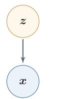  
(a) 含隐变量的生成模型

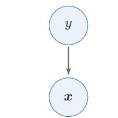  
(b) 带标签的生成模型  
图 16.2 生成模型

## 16.1.2 生成样本

生成样本就是给定一个概率密度函数为 $p _ { \theta } ( { \pmb x } )$ 的分布，生成一些服从这个分布的样本，也称为采样.

一些常用的采样方法参见第14.5节.

对于图16.2a中的图模型，在得到两个变量的局部条件概率 $p _ { \theta } ( z )$ 和 $p _ { \theta } ( { \pmb x } | { \pmb z } )$ 之后，我们就可以生成数据x，具体过程可以分为两步进行：

（1）根据隐变量的先验分布 $p _ { \theta } ( z )$ 进行采样，得到样本z.

（2）根据条件分布 $p _ { \theta } ( { \pmb x } | z )$ 进行采样，得到样本x.

为了便于采样，通常 $p _ { \theta } ( { \pmb x } | z )$ 不能太过复杂.因此，另一种生成样本的思想是从一个简单分布 $p ( z ) , z \in \mathcal { Z }$ （比如标准正态分布）中采集一个样本z，并利用一个深度神经网络 $g : \mathcal { Z }  \mathcal { X }$ 使得 $g ( z )$ 服从 $p _ { r } ( { \pmb x } )$ .这样，我们就可以避免密度估计问题，并有效降低生成样本的难度，这正是生成对抗网络的思想.

## 16.1.3 监督学习

生成模型也可以应用于监督学习．监督学习的目标是建模样本x和输出标签y之间的条件概率分布 $p ( y | \mathbf { \boldsymbol { x } } )$ .我们可以将监督学习问题转换为联合概率分布$p ( { \pmb x } , { \pmb y } )$ 的密度估计问题，再推断出 $p ( y | \mathbf { \boldsymbol { x } } )$

图16.2b给出了带标签的生成模型的图模型表示，可以用于监督学习.

监督学习中比较典型的生成模型有朴素贝叶斯分类器、隐马尔可夫模型.和生成模型相对应的另一类监督学习模型是判别模型（DiscriminativeModel）.判别模型直接建模条件概率分布 $p ( y | \mathbf { \boldsymbol { x } } )$ ，并不建模其联合概率分布 $p ( { \pmb x } , { \pmb y } )$ .常见的判别模型有Logistic回归、支持向量机等．如果已经知道联合分布 $p ( { \pmb x } , { \pmb y } )$ ，就可以通过贝叶斯公式得到判别式的 $p ( y | \mathbf { \boldsymbol { x } } )$ ;但仅有判别模型 $p ( y | \mathbf { \boldsymbol { x } } )$ 时，通常无法恢复完整的生成分布 $p ( { \pmb x } , { \pmb y } )$

## 16.2 变分自编码器

假设一个生成模型（如图16.3所示）中包含隐变量，即有部分变量是不可观测的，其中观测变量X是一个高维空间x中的随机向量，隐变量Z是一个相对低维的空间Z中的随机向量.

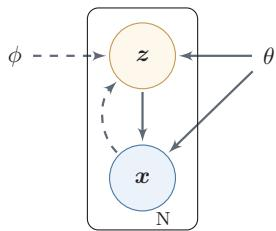  
图 16.3 变分自编码器

本章中，我们假设X和Z都是连续随机向量.实线表示生成模型，虚线表示变分近似.

这个生成模型的联合概率密度函数可以分解为

$$
p ( \pmb { x } , \pmb { z } ; \theta ) = p ( \pmb { x } | \boldsymbol { z } ; \theta ) p ( \boldsymbol { z } ; \theta ) ,\tag{16.1}
$$

其中 $p ( z ; \theta )$ 为隐变量z先验分布的概率密度函数， $p ( { \pmb x } | { \pmb z } ; { \pmb \theta } )$ 为已知z时观测变量x的条件概率密度函数，θ表示两个密度函数的参数.一般情况下，我们可以假设 $p ( z ; \theta )$ 和 $p ( { \pmb x } | { \pmb z } ; { \pmb \theta } )$ 为某种参数化的分布族，比如正态分布.这些分布的形式已知，只是参数θ未知，可以通过最大化似然来进行估计.

给定一个样本x，其对数边际似然 $\log p ( { \pmb x } ; { \boldsymbol \theta } )$ 可以分解为

$$
\begin{array} { r } { \log p ( { \pmb x } ; { \pmb \theta } ) = E L B O ( { \boldsymbol q } , { \pmb x } ; { \boldsymbol \theta } , \phi ) + \mathrm { K L } ( { \boldsymbol q } ( { \boldsymbol z } ; { \boldsymbol \phi } ) , p ( { \boldsymbol z } | { \pmb x } ; { \boldsymbol \theta } ) ) , } \end{array}\tag{16.2}
$$

其中 $q ( z ; \phi )$ 是额外引入的变分密度函数，其参数为 $\phi$ $E L B O ( q , \pmb { x } ; \theta , \phi )$ 为证据下界，

参见公式(14.49).

$$
E L B O ( q , \pmb { x } ; \theta , \phi ) = \mathbb { E } _ { z \sim q ( z ; \phi ) } \bigg [ \log \frac { p ( \pmb { x } , z ; \theta ) } { q ( z ; \phi ) } \bigg ] .\tag{16.3}
$$

最大化对数边际似然log $p ( { \boldsymbol { x } } ; { \boldsymbol { \theta } } )$ 可以用EM算法来求解.在EM算法的每次迭代中，具体可以分为两步：

EM算法参见第14.2.2.1节.

（1）E步：固定θ，寻找一个密度函数 $q ( z ; \phi )$ 使其等于或接近于后验密度函数 $p ( \boldsymbol { z } | \boldsymbol { x } ; \boldsymbol { \theta } )$

（2）M步：固定 $q ( z ; \phi )$ ，寻找θ来最大化 $E L B O ( q , \pmb { x } ; \theta , \phi )$

不断重复上述两步骤，直到收敛.

在EM算法的每次迭代中，理论上最优的 $q ( z ; \phi )$ 为隐变量的后验概率密度函数 $p ( \boldsymbol { z } | \boldsymbol { x } ; \boldsymbol { \theta } )$ ,即

$$
p ( z | \mathbf { x } ; \theta ) = \frac { p ( \mathbf { \boldsymbol { x } } | z ; \theta ) p ( z ; \theta ) } { \int p ( \mathbf { \boldsymbol { x } } | z ; \theta ) p ( z ; \theta ) \mathrm { d } z } .\tag{16.4}
$$

后验概率密度函数 $p ( \boldsymbol { z } | \boldsymbol { x } ; \boldsymbol { \theta } )$ 的计算是一个统计推断问题，涉及积分计算.当隐变量z是有限的一维离散变量时，计算起来比较容易，但在一般情况下，这个后验概率密度函数是很难计算的，通常需要通过变分推断来近似估计，在变分推断中，为了降低复杂度，通常会选择一些比较简单的分布 $q ( z ; \phi )$ 来近似推断$p ( \boldsymbol { z } | \boldsymbol { x } ; \boldsymbol { \theta } )$ .当 $p ( \boldsymbol { z } | \boldsymbol { x } ; \boldsymbol { \theta } )$ 比较复杂时，近似效果不佳.此外，概率密度函数 $p ( { \pmb x } | { \pmb z } ; { \pmb \theta } )$ 一般也比较复杂，很难直接用已知的分布族函数进行建模.

变分自编码器(Variational Autoencoder, VAE)[Kingma et al., 2014]是一种深度生成模型，其核心思想是利用神经网络近似难以直接计算的后验分布和复杂的条件生成分布.具体地，它利用神经网络来分别建模两个复杂的条件概率密度函数.

（1）变分分布 $q ( z ; \phi )$ :预测该分布的网络称为推断网络，其输入为x，输出为变分分布 $q ( \boldsymbol { z } | \boldsymbol { x } ; \boldsymbol { \phi } )$

（2）概率分布 $p ( { \pmb x } | { \pmb z } ; { \pmb \theta } )$ :预测该分布的网络称为生成网络，其输入为z，输出为概率分布 $p ( { \pmb x } | { \pmb z } ; { \pmb \theta } )$

将推断网络和生成网络合并就得到了变分自编码器的整个网络结构，如图16.4所示，其中实线表示网络计算操作，虚线表示采样操作.

  
图16.4 变分自编码器的网络结构

变分自编码器的名称来自于其整个网络结构和自编码器比较类似.我们可以把推断网络看作“编码器”，将可观测变量映射为隐变量；把生成网络看作“解码器”，将隐变量映射为可观测变量．然而，变分自编码器背后的原理和自编码器完全不同.变分自编码器中的编码器和解码器的输出为分布（或分布的参数），而不是确定的编码

理论上q(z;φ)可以不依赖x. 但由于 $q ( z ; \phi )$ 的目标是近似后验分布 $p ( \boldsymbol { z } | \boldsymbol { x } ; \boldsymbol { \theta } )$ ,其和x相关，因此变分分布一般写为 $q ( \boldsymbol { z } | \boldsymbol { x } ; \boldsymbol { \phi } )$

变分自编码器可看作神经网络与贝叶斯网络的混合体：只有隐变量对应的节点是随机变量，其余节点仍是普通神经元.

## 16.2.1 推断网络

为简单起见，假设 $q ( \boldsymbol { z } | \boldsymbol { x } ; \boldsymbol { \phi } )$ 是服从对角化协方差的高斯分布，

$$
q ( z | \mathbf { x } ; \phi ) = \mathcal { N } ( z ; \mu _ { I } , \pmb { \sigma } _ { I } ^ { 2 } \pmb { I } ) ,\tag{16.5}
$$

其中 $\pmb { \mu } _ { I }$ 和 $\sigma _ { I } ^ { 2 }$ 是高斯分布的均值和方差，可以通过推断网络 $f _ { I } ( x ; \phi )$ 来预测. 推断网络 $f _ { I } ( { \pmb x } ; \phi )$ 可以是全连接网络或卷积网络，比如一个两层神经网络：

$$
\pmb { h } = \sigma \big ( \pmb { W } ^ { ( 1 ) } \pmb { x } + \pmb { b } ^ { ( 1 ) } \big ) ,\tag{16.6}
$$

$$
\pmb { \mu } _ { I } = \pmb { W } ^ { ( 2 ) } \pmb { h } + \pmb { b } ^ { ( 2 ) } ,\tag{16.7}
$$

$$
\pmb { \sigma } _ { I } ^ { 2 } = \mathrm { s o f t p l u s } \big ( \pmb { W } ^ { ( 3 ) } \pmb { h } + \pmb { b } ^ { ( 3 ) } \big ) ,\tag{16.8}
$$

其中 $\phi$ 代表所有的网络参数 $\left\{ W ^ { ( 1 ) } , W ^ { ( 2 ) } , W ^ { ( 3 ) } , b ^ { ( 1 ) } , b ^ { ( 2 ) } , b ^ { ( 3 ) } \right\}$ , σ 和 softplus 为激活函数.

优化目标 推断网络的目标是使得 $q ( \boldsymbol { z } | \boldsymbol { x } ; \boldsymbol { \phi } )$ 尽可能接近真实的后验 $p ( \boldsymbol { z } | \boldsymbol { x } ; \boldsymbol { \theta } )$ 需要找到一组网络参数 $\phi ^ { * }$ 来最小化两个分布的KL散度，即

softplus(x) = log(1 +$\mathrm { e } ^ { x } )$ .这里使用 softplus激活函数是由于方差总是非负的.在实际实现中，也可以用一个线性层（不需要激活函数）来预测 $\log ( \sigma _ { I } ^ { 2 } )$ 1

$$
\phi ^ { * } = \underset { \phi } { \arg \operatorname* { m i n } } \mathrm { { K L } } \left( q ( z | \pmb { x } ; \phi ) , p ( z | \pmb { x } ; \theta ) \right) .\tag{16.9}
$$

然而，直接计算上面的KL散度通常不可行，因为 $p ( \boldsymbol { z } | \boldsymbol { x } ; \boldsymbol { \theta } )$ 一般无法计算．传统方法是利用采样或者变分法来近似推断.基于采样的方法比较通用，但代价较高、梯度估计方差也可能较大：因此，在本章的主线中更关注变分推断方法，即用简单的分布 $q$ 去近似复杂的分布 $p ( \boldsymbol { z } | \boldsymbol { x } ; \boldsymbol { \theta } )$ .但是，在深度生成模型中， $p ( \boldsymbol { z } | \boldsymbol { x } ; \boldsymbol { \theta } )$ 通常比较复杂，很难用简单分布去近似.因此，我们需要找到一种间接计算方法.

变分推断参见第14.4节.

根据公式(16.2) 可知，变分分布 $q ( \boldsymbol { z } | \boldsymbol { x } ; \boldsymbol { \phi } )$ 与真实后验 $p ( \boldsymbol { z } | \boldsymbol { x } ; \boldsymbol { \theta } )$ 的KL散度等于对数边际似然 $\log p ( { \pmb x } ; { \boldsymbol \theta } )$ 与其下界 $E L B O ( q , \pmb { x } ; \theta , \phi )$ 的差,即

$$
\operatorname { K L } ( q ( \boldsymbol { z } | \boldsymbol { x } ; \phi ) , p ( \boldsymbol { z } | \boldsymbol { x } ; \theta ) ) = \log p ( \boldsymbol { x } ; \theta ) - E L B O ( q , \boldsymbol { x } ; \theta , \phi ) .\tag{16.10}
$$

因此，推断网络的目标函数可以转换为

可以看作EM算法中的E步.

$$
\phi ^ { * } = \underset { \phi } { \arg \operatorname* { m i n } } \mathrm { { K L } } \left( q ( \boldsymbol { z } | \mathbf { x } ; \phi ) , p ( \boldsymbol { z } | \mathbf { x } ; \theta ) \right)\tag{16.11}
$$

$$
\mathbf { \Pi } = \underset { \phi } { \arg \operatorname* { m i n } } \log p ( \mathbf { \boldsymbol { x } } ; \theta ) - E L B O ( q , \mathbf { \boldsymbol { x } } ; \theta , \phi )\tag{16.12}
$$

第一项与φ无关.

$$
\displaystyle = \arg \operatorname* { m a x } _ { \phi } E L B O ( q , \pmb { x } ; \theta , \phi ) ,\tag{16.13}
$$

即推断网络的目标转换为寻找一组网络参数 $\phi ^ { * }$ 使得证据下界 $E L B O ( q , \pmb { x } ; \theta , \phi )$ 最大，这和变分推断中的转换类似.

参见公式(14.85).

## 16.2.2 生成网络

生成模型的联合分布 $p ( \pmb { x } , \pmb { z } ; \theta )$ 可以分解为两部分：隐变量z的先验分布$p ( z ; \theta )$ 和条件概率分布 $p ( { \boldsymbol { \mathscr { x } } } | { \boldsymbol { \mathscr { z } } } ; { \boldsymbol { \theta } } )$

先验分布 $p ( z ; \theta )$ 为简单起见，我们一般假设隐变量z的先验分布为各向同性的标准高斯分布 $\mathcal { N } ( z ; \mathbf { 0 } , I )$ .隐变量z的各维相互独立.

条件概率分布 $p ( x | z ; \theta )$ 条件概率分布 $p ( { \pmb x } | { \pmb z } ; { \pmb \theta } )$ 可以通过生成网络来建模.为简单起见，我们同样用参数化的分布族来表示条件概率分布 $p ( { \pmb x } | { \pmb z } ; { \boldsymbol \theta } )$ ，这些分布族的参数可以用生成网络计算得到.

根据变量x的类型不同，可以假设 $p ( { \pmb x } | { \pmb z } ; { \pmb \theta } )$ 服从不同的分布族.

(1)如果 ${ \pmb x } \in \{ 0 , 1 \} ^ { D }$ 是D维的二值的向量，可以假设 $p ( { \pmb x } | { \pmb z } ; { \pmb \theta } )$ 服从多变量的伯努利分布，即

$$
p ( \pmb { x } | \boldsymbol { z } ; \theta ) = \prod _ { d = 1 } ^ { D } p ( x _ { d } | \boldsymbol { z } ; \theta )\tag{16.14}
$$

$$
= \prod _ { d = 1 } ^ { D } \gamma _ { d } ^ { x _ { d } } ( 1 - \gamma _ { d } ) ^ { ( 1 - x _ { d } ) } ,\tag{16.15}
$$

其中 $\gamma _ { d } \triangleq p ( x _ { d } = 1 | z ; \theta )$ 为第d维分布的参数，可通过生成网络来预测

(2)如果 $\pmb { x } \in \mathbb { R } ^ { D }$ 是D维的连续向量，可以假设 $p ( { \pmb x } | { \pmb z } ; { \pmb \theta } )$ 服从对角化协方差的高斯分布，即

$$
p ( \pmb { x } | \mathbf { \mathscr { z } } ; \theta ) = \mathcal { N } ( \pmb { x } ; \pmb { \mu } _ { G } , \pmb { \sigma } _ { G } ^ { 2 } \pmb { I } ) ,\tag{16.16}
$$

其中 $\pmb { \mu } _ { G } \in \mathbb { R } ^ { D }$ 和 ${ \pmb { \sigma } } _ { G } \in \mathbb { R } ^ { D }$ 同样可以用生成网络 $f _ { G } ( z ; \theta )$ 来预测.

优化目标 生成网络 $f _ { G } ( z ; \theta )$ 的目标是寻找最优参数 $\theta ^ { * }$ 来最大化证据下界，即

可以看作EM算法中的M步.

$$
\theta ^ { * } = \operatorname * { a r g m a x } _ { \theta } E L B O ( q , \pmb { x } ; \theta , \phi ) .\tag{16.17}
$$

## 16.2.3 优化目标

结合公式(16.13)和公式(16.17)，可以看到：无论是推断网络还是生成网络，其优化目标最终都统一为最大化证据下界 $E L B O ( q , \pmb { x } ; \theta , \phi )$ .因此，变分自编码器的整体目标可以写为

$$
\operatorname* { m a x } _ { \theta , \phi } E L B O ( q , \boldsymbol { x } ; \theta , \phi ) = \operatorname* { m a x } _ { \theta , \phi } \mathbb { E } _ { \boldsymbol { z } \sim q ( \boldsymbol { z } ; \phi ) } \bigg [ \log \frac { p ( \boldsymbol { x } | \boldsymbol { z } ; \theta ) p ( \boldsymbol { z } ; \theta ) } { q ( \boldsymbol { z } ; \phi ) } \bigg ]\tag{16.18}
$$

$$
= \operatorname* { m a x } _ { \theta , \phi } \mathbb { E } _ { z \sim q ( z | \mathbf { x } ; \phi ) } \Big [ \log p ( \boldsymbol { x } | \boldsymbol { z } ; \theta ) \Big ] - \mathrm { K L } \Big ( q ( \boldsymbol { z } | \boldsymbol { x } ; \phi ) , p ( \boldsymbol { z } ; \theta ) \Big ) ,\tag{16.19}
$$

其中 $p ( z ; \theta )$ 为先验分布，θ和 $\phi$ 分别表示生成网络和推断网络的参数.

这个目标可以自然地分成两部分来理解：

(1) $\mathbb { E } _ { z \sim q ( z | \mathbf { x } ; \phi ) } [ \log p ( \pmb { x } | z ; \theta ) ]$ 对应于重构项，鼓励模型在给定隐变量z时能够较好地生成原始样本x；

(2) $\mathrm { K L } ( q ( \boldsymbol { z } | \boldsymbol { x } ; \boldsymbol { \phi } ) , p ( \boldsymbol { z } ; \boldsymbol { \theta } ) )$ 对应于正则项，约束近似后验不要偏离先验分布太远，从而使隐空间保持较好的规整性.因此，VAE并不是单纯地追求“重构得尽量像”，而是在重构能力与隐空间规整性之间取得平衡.

我们分别来看公式(16.19)中的两项.

(1)第一项的期望 $\mathbb { E } _ { z \sim q ( z | x ; \phi ) } [ \log p ( \pmb { x } | z ; \theta ) ]$ 一般难以直接解析计算，通常通过采样近似.对于每个样本x，若根据 $q ( \boldsymbol { z } | \boldsymbol { x } ; \boldsymbol { \phi } )$ 采集M个样本 $z ^ { ( m ) }$ $1 \leq m \leq$ M,则有

$$
\mathbb { E } _ { z \sim q ( z | \mathbf { x } ; \phi ) } [ \log p ( \pmb { x } | z ; \theta ) ] \approx \frac { 1 } { M } \sum _ { m = 1 } ^ { M } \log p ( \pmb { x } | z ^ { ( m ) } ; \theta ) .\tag{16.20}
$$

期望 $\mathbb { E } _ { z \sim q ( z | \mathbf { x } ; \phi ) } [ \log p ( \pmb { x } | z ; \theta ) ]$ 依赖于参数 $\phi .$ 但在上面的近似中，这个期望变得和参数 $\phi$ 无关.当使用梯度下降法来学习参数时，期望 $\mathbb { E } _ { z \sim q ( z | \mathbf { x } ; \phi ) } [ \log p ( \pmb { x } | z ; \theta ) ]$ 关于参数 $\phi$ 的梯度为0.这种情况是由于变量 $_ z$ 和参数 $\phi$ 之间不是直接的确定性关系，而是一种“采样”关系.这种情况可以通过两种方法解决：一种是重参数化，我们在下一节具体介绍；另一种是梯度估计的方法，具体参考第12.3节.

（2）第二项的KL散度在很多情形下可以直接得到闭式解．特别地，当$q ( \boldsymbol { z } | \boldsymbol { x } ; \boldsymbol { \phi } )$ 和 $p ( z ; \theta )$ 都取高斯分布时，KL散度的计算非常方便.

给定D维空间中的两个正态分布 $\mathcal { N } ( \mu _ { 1 } , \Sigma _ { 1 } )$ 和 $\mathcal { N } ( \mu _ { 2 } , \Sigma _ { 2 } )$ ,其KL散度为

$$
\begin{array} { r l } & { \mathrm { K L } \Big ( \mathcal { N } ( \pmb { \mu } _ { 1 } , \pmb { \Sigma } _ { 1 } ) , \mathcal { N } ( \pmb { \mu } _ { 2 } , \pmb { \Sigma } _ { 2 } ) \Big ) } \\ & { = \cfrac { 1 } { 2 } \Big ( \mathrm { t r } ( \pmb { \Sigma } _ { 2 } ^ { - 1 } \pmb { \Sigma } _ { 1 } ) + ( \pmb { \mu } _ { 2 } - \pmb { \mu } _ { 1 } ) ^ { \top } \pmb { \Sigma } _ { 2 } ^ { - 1 } ( \pmb { \mu } _ { 2 } - \pmb { \mu } _ { 1 } ) - D + \log \frac { | \pmb { \Sigma } _ { 2 } | } { | \pmb { \Sigma } _ { 1 } | } \Big ) , } \end{array}\tag{16.21}
$$

从EM算法角度来看，变分自编码器优化推断网络和生成网络的过程，可以分别看作EM算法中的E步和M步.但在变分自编码器中，这两步的目标合二为一，都是最大化证据下界.

其中 $\operatorname { t r } ( \cdot )$ 表示矩阵的迹，·表示矩阵的行列式. 当 $p ( z ; \theta ) \ = \ \mathcal { N } ( z ; \mathbf { 0 } , I )$ 且$q ( z | \mathbf { x } ; \boldsymbol { \phi } ) = \mathcal { N } ( z ; \mu _ { I } , \pmb { \sigma } _ { I } ^ { 2 } I )$ 时，

矩阵的“迹”为主对角 线(从左上到右下)上 各元素之和.

$$
\begin{array} { l } { { \displaystyle \mathrm { K L } \left( q ( \boldsymbol { z } | \mathbf { x } ; \phi ) , p ( \boldsymbol { z } ; \theta ) \right) } } \\ { { \displaystyle = \frac { 1 } { 2 } \Big ( \mathrm { t r } ( \pmb { \sigma } _ { I } ^ { 2 } \pmb { I } ) + \pmb { \mu } _ { I } ^ { \top } \pmb { \mu } _ { I } - D - \log | \pmb { \sigma } _ { I } ^ { 2 } \pmb { I } | \Big ) , } } \end{array}\tag{16.22}
$$

其中 $\pmb { \mu } _ { I }$ 和 $\sigma _ { I }$ 由推断网络 $f _ { I } ( { \pmb x } ; \phi )$ 输出.

## 16.2.4 重参数化

重参数化（Reparameterization）是将一个函数f(θ)的参数θ用另外一组参数表示 $\theta = g ( \vartheta )$ ，这样函数 $f ( \theta )$ 就转换成参数为θ的函数 ${ \hat { f } } ( \vartheta ) = f ( g ( \vartheta ) )$ . 重参数化通常用来将原始参数转换为另外一组具有特殊属性的参数.比如当θ为一个很大的矩阵时，可以使用两个低秩矩阵的乘积来再参数化，从而减少参数量.

重参数化的另一个例子是逐层规范化，参见第7.5节.

在公式(16.19)中,期望 $\mathbb { E } _ { z \sim q ( z | \mathbf { x } ; \phi ) } \Big \lceil \log p ( \pmb { x } | z ; \theta ) \Big \rceil$ 依赖于分布 $q$ 的参数 $\phi .$ 但是，由于随机变量z采样自后验分布 $q ( \boldsymbol { z } | \boldsymbol { x } ; \boldsymbol { \phi } )$ ，它们之间不是确定性关系，因此无法直接求解 $_ { z }$ 关于参数 $\phi$ 的导数.这时，我们可以通过重参数化方法来将 $_ z$ 和$\phi$ 之间随机性的采样关系转变为确定性函数关系.

我们引入一个分布为 $p ( \epsilon )$ 的随机变量∈，期望 $\begin{array} { r } { \mathbb { E } _ { z \sim q ( z | \mathbf { x } ; \phi ) } \Big [ \log p ( \mathbf { \boldsymbol { x } } | z ; \theta ) \Big ] } \end{array}$ 可以重写为

$$
\mathbb { E } _ { z \sim q ( z | \mathbf { x } ; \phi ) } \Big [ \log p ( \mathbf { \boldsymbol { x } } | z ; \boldsymbol { \theta } ) \Big ] = \mathbb { E } _ { \epsilon \sim p ( \epsilon ) } \Big [ \log p ( \mathbf { \boldsymbol { x } } | g ( \boldsymbol { \phi } , \epsilon ) ; \boldsymbol { \theta } ) \Big ] ,\tag{16.23}
$$

其中 $z \triangleq g ( \phi , \epsilon )$ 为一个确定性函数.

对于上述对角高斯近似后验 $q ( \boldsymbol { z } | \boldsymbol { x } ; \boldsymbol { \phi } )$ ，若推断网络输出均值 $\pmb { \mu } _ { I }$ 和标准差$\sigma _ { I }$ ，就可以通过下面方式来重参数化：

$$
z = \pmb { \mu } _ { I } + \pmb { \sigma } _ { I } \odot \pmb { \epsilon } ,\tag{16.24}
$$

参见习题16-12.

其中 $\epsilon \sim \mathcal { N } ( 0 , I )$ ． 这样 $_ z$ 和参数 $\phi$ 的关系从采样关系变为确定性关系，使得$z \sim q ( z | x ; \phi )$ 的随机性独立于参数 $\phi$ ，从而可以求 $_ z$ 关于 $\phi$ 的导数.

## 16.2.5 训练

有了重参数化技巧之后，VAE就可以像普通神经网络一样，用随机梯度下降法端到端地学习参数θ和φ.

给定一个数据集 $\mathcal { D } = \{ \pmb { x } ^ { ( n ) } \} _ { n = 1 } ^ { N }$ ，对于每个样本 $\mathbf { \boldsymbol { x } } ^ { ( n ) }$ ，从标准高斯分布中采样M个噪声变量 $\epsilon ^ { ( n , m ) }$ ，并通过公式(16.24)构造对应的隐变量 $z ^ { ( n , m ) }$ .这样，变分自编码器在整个数据集上的目标函数可以近似写为

$$
\begin{array} { c } { \displaystyle \mathcal { J } ( \phi , \theta | \mathcal { D } ) = \sum _ { n = 1 } ^ { N } \left[ \frac { 1 } { M } \sum _ { m = 1 } ^ { M } \log p ( \pmb { x } ^ { ( n ) } | \pmb { z } ^ { ( n , m ) } ; \theta ) \right. } \\ { \displaystyle \left. - \mathrm { K L } \left( q ( \pmb { z } | \pmb { x } ^ { ( n ) } ; \phi ) , \mathcal { N } ( \pmb { z } ; \mathbf { 0 } , I ) \right) \right] . } \end{array}\tag{16.25}
$$

如果进一步采用随机梯度方法，每次只采样一个样本x及其对应的噪声变量∈,并假设 $p ( { \pmb x } | { \pmb z } ; { \pmb \theta } )$ 服从高斯分布 $\mathcal { N } ( \boldsymbol { x } ; \boldsymbol { \mu } _ { G } , \lambda I )$ ，其中 $\mu _ { G } = f _ { G } ( z ; \theta )$ 是生成

网络输出、λ为控制方差的超参数，则在忽略与参数无关的常数项，并对整个目标乘上一个正常数后，目标函数可等价地改写为

$$
\mathcal { J } ( \phi , \theta | x ) = - \frac { 1 } { 2 } \| x - \mu _ { G } \| ^ { 2 } - \lambda \mathrm { K L } \left( \mathcal { N } ( z ; \mu _ { I } , \sigma _ { I } ^ { 2 } I ) , \mathcal { N } ( z ; \mathbf { 0 } , I ) \right) .\tag{16.26}
$$

参见习题16-2.

其中第一项对应重构项，刻画由当前隐变量恢复样本x的能力；第二项对应KL正则项，约束近似后验不要偏离先验太远.这个形式和自编码器中的“重构误差+正则化”在表面上类似，但机理并不相同：自编码器学习的是确定性编码与解码映射，而VAE学习的是一个显式的概率生成模型及其近似推断过程

参见习题16-3.

从训练动态来看，VAE始终在平衡两种要求：一方面，希望重构项尽量大，从而使生成样本更接近输入；另一方面，希望KL项不要过大，从而使隐变量分布保持规整.若KL项过强，编码器可能倾向于忽略输入样本，使隐变量过早逼近先验分布，这会导致所谓的后验坍塌（posterior collapse)；若KL项过弱，则隐空间虽然更容易“记住”训练样本，却可能失去良好的生成与插值性质.

后验坍塌是VAE训练中常见的实际问题，其典型表现是解码器几乎忽略隐变量z，生成主要依赖解码器自身的条件结构；在使用很强的自回归解码器时，这个问题尤其明显．常用的缓解方法包括：KL退火（KLAnnealing），即在训练初期逐渐增大KL项的权重，给编码器足够时间学到有意义的表示；β-VAE，通过调节正则化项的权重 $\beta$ 来平衡重构质量和隐空间质量；以及自由比特（FreeBits)，为每个隐变量维度设置KL散度的最低值，防止其完全退化为先验.

变分自编码器的训练过程如图16.5所示，其中空心矩形表示“目标函数”

  
图 16.5 变分自编码器的训练过程

图16.6给出了在MNIST数据集上变分自编码器学习到的隐变量流形的可视化示例.图16.6a表示将训练集上的每个样本x通过推断网络映射到二维隐变量空间后得到的表示，其中每个点对应 $\mathbb { E } [ z | { \boldsymbol { x } } ]$ ，不同颜色表示不同数字；

图16.6b表示在二维标准高斯分布上均匀采样不同的隐变量z，再通过生成网络得到相应的E $[ x | z ]$

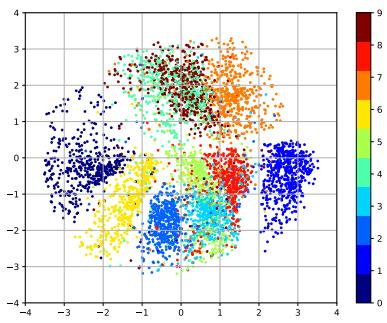  
(a)训练集上所有样本在隐空间上的投影

  
(b)隐变量z在图像空间的投影  
图16.6 在MNIST数据集上变分自编码器学习到的隐变量流形的可视化示例

标准 VAE 使用连续隐变量，而VQ-VAE（Vector Quantized VAE）[van den Oord et al., 2017]将隐变量量化为离散码本中的向量，学习离散的潜在表示.VQ-VAE及其后续变体常用于图像、音频等模态的离散分词器设计；隐空间扩散模型则更一般地依赖自动编码器把高维数据压缩到更紧凑的表示空间，这个自动编码器可以是向量量化的，也可以是带KL正则的连续隐变量模型.此外，层次化 $\mathrm { V A E }$ （如VDVAE）通过引入多层隐变量来增强建模能力，是连接VAE与后续深度生成模型的重要桥梁.

## 16.3 生成对抗网络

变分自编码器、深度信念网络等都是显式地构建出样本的密度函数 $p ( { \boldsymbol { x } } ; { \boldsymbol { \theta } } )$ 并通过最大似然估计来求解参数,称为显式密度模型（Explicit DensityModel).比如，变分自编码器的密度函数为 $p ( \pmb { x } , z ; \theta ) = p ( \pmb { x } | z ; \theta ) p ( z ; \theta )$ . 我们假设$p ( { \boldsymbol { \mathscr { x } } } | { \boldsymbol { \mathscr { z } } } ; { \boldsymbol { \theta } } )$ 为一个参数分布族，并使用神经网络来预测这个分布族的参数.这种做法给出了清晰的似然目标，但也会把生成质量部分绑定到观测分布族的选择上.

如果只是希望有一个模型能生成符合数据分布 $p _ { r } ( { \pmb x } )$ 的样本，那么可以不显式地估计出数据分布的密度函数．假设在低维空间Z中有一个简单容易采样的分布 $p ( z ) , p ( z )$ 通常为标准多元正态分布 $\mathcal { N } ( \mathbf { 0 } , \pmb { I } )$ .我们用神经网络构建一个映射函数 $G : \mathcal { Z }  \mathcal { X }$ ，称为生成网络．训练的目标是让 $G ( z )$ 诱导出的模型分布 $p _ { \theta } ( { \pmb x } )$ 尽可能接近数据分布 $p _ { r } ( { \pmb x } )$ .这种模型就称为隐式密度模型（ImplicitDensityModel）.所谓隐式模型就是指并不显式地建模 $p _ { r } ( { \pmb x } )$ ，而是建模生成过程.图16.7给出了隐式模型生成样本的过程.

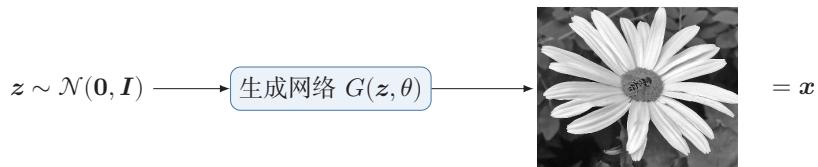  
图16.7 隐式模型生成样本的过程

## 16.3.1 网络分解

隐式密度模型的一个关键是如何判断生成网络产生的样本是否接近真实数据分布．既然我们不构建显式密度函数，就无法直接通过最大似然估计等方法来训练.生成对抗网络（Generative Adversarial Network,GAN)[Goodfellowet al.,2014]是通过对抗训练的方式来使得生成网络产生的样本服从真实数据分布.在生成对抗网络中，有两个网络进行对抗训练.一个是判别网络，目标是尽量准确地判断一个样本是来自于真实数据还是由生成网络产生；另一个是生成网络，目标是尽量生成判别网络无法区分来源的样本.这两个目标相反的网络不断地进行交替训练.生成对抗网络的流程图如图16.8所示.在理想情况下，如果判

  
图16.8 生成对抗网络的流程图

别网络在足够大的模型族内也无法区分真实样本和生成样本，就说明生成分布已经接近真实数据分布.

## 16.3.1.1 判别网络

判别网络（Discriminator Network） $D ( { \boldsymbol { x } } ; \phi )$ 的目标是区分出一个样本x是来自于真实分布 $p _ { r } ( { \pmb x } )$ 还是来自于生成模型 $p _ { \theta } ( { \pmb x } )$ ，因此判别网络实际上是一个二分类的分类器.用标签 $y = 1$ 来表示样本来自真实分布， $y = 0$ 表示样本来自生成模型，判别网络 $D ( { \boldsymbol { x } } ; \phi )$ 的输出为æ属于真实数据分布的概率，即

$$
p ( \boldsymbol { y } = 1 | \boldsymbol { x } ) = D ( \boldsymbol { x } ; \boldsymbol { \phi } ) ,\tag{16.27}
$$

则样本来自生成模型的概率为 $p ( \boldsymbol { y } = 0 | \pmb { x } ) = 1 - D ( \pmb { x } ; \boldsymbol { \phi } )$

给定一个样本 $( x , y ) , y \in \{ 1 , 0 \}$ 表示其来自于 $p _ { r } ( { \pmb x } )$ 还是 $p _ { \theta } ( { \pmb x } )$ ，判别网络的目标函数为最小化交叉熵，即

$$
\operatorname* { m i n } _ { \phi } - \biggl ( \mathbb { E } _ { x } \Bigl [ y \log p ( y = 1 | x ) + ( 1 - y ) \log p ( y = 0 | x ) \Bigr ] \biggr ) .\tag{16.28}
$$

假设分布 $p ( { \pmb x } )$ 是由分布 $p _ { r } ( { \pmb x } )$ 和分布 $p _ { \theta } ( { \pmb x } )$ 等比例混合而成，即 $p ( { \pmb x } ) \ =$ $\frac { 1 } { 2 } \big ( p _ { r } ( { \pmb x } ) + p _ { \theta } ( { \pmb x } ) \big )$ ，则上式等价于

$$
\underset { \phi } { \operatorname* { m a x } } \mathbb { E } _ { { \pmb x } \sim p _ { r } ( { \pmb x } ) } \Big [ \log D ( { \pmb x } ; \phi ) \Big ] + \mathbb { E } _ { { \pmb x } ^ { \prime } \sim p _ { \theta } ( { \pmb x } ^ { \prime } ) } \Big [ \log ( 1 - D ( { \pmb x } ^ { \prime } ; \phi ) ) \Big ]\tag{16.29}
$$

$$
= \operatorname* { m a x } _ { \phi } \mathbb { E } _ { { \boldsymbol { x } } \sim { \boldsymbol { p } } _ { r } ( { \boldsymbol { x } } ) } \Big [ \log D ( { \boldsymbol { x } } ; \phi ) \Big ] + \mathbb { E } _ { { \boldsymbol { z } } \sim { \boldsymbol { p } } ( { \boldsymbol { z } } ) } \Big [ \log \Big ( 1 - D \big ( G ( { \boldsymbol { z } } ; { \boldsymbol { \theta } } ) ; \phi \big ) \Big ) \Big ] ,\tag{16.30}
$$

其中 $\theta$ 和 $\phi$ 分别是生成网络和判别网络的参数

## 16.3.1.2 生成网络

生成网络（GeneratorNetwork）的目标刚好和判别网络相反，即让判别网络将自己生成的样本判别为真实样本.理论分析中，常把生成器写成最小化

$$
\operatorname* { m i n } _ { \theta } \bigg ( \mathbb { E } _ { z \sim p ( z ) } \Big [ \log \Big ( 1 - D \big ( G ( z ; \theta ) ; \phi \big ) \Big ) \Big ] \bigg ) ,\tag{16.31}
$$

这与整个极小极大目标保持一致；但在实际训练中，更常用非饱和生成器目标

$$
\operatorname* { m a x } _ { \theta } \bigg ( \mathbb { E } _ { z \sim p ( z ) } \Big [ \log D \Big ( G ( z ; \theta ) ; \phi \Big ) \Big ] \bigg ) ,\tag{16.32}
$$

因为它与原目标共享相同的最优点，但梯度性质通常更好．直观地说，当判别网络D以很高的概率认为生成网络 $G ^ { \vec { p } \vec { z } }$ 生的样本是“假”样本时， $D ( G ( z ; \theta ) ; \phi )$ 接近0，判别器的Sigmoid输出已经接近饱和，原始极小极大目标传回生成器的有效梯度会很弱.非饱和目标直接增大 $\log D ( G ( z ; \theta ) ; \phi )$ ，在这一阶段通常能给生成器提供更强的学习信号.因此，实际训练往往采用公式(16.32)对应的非饱和损失.

还有一种改进生成网络梯度的方法是将真实样本和生成样本的标签互换，即把生成样本的标签视为1.

## 16.3.2 训练

和单目标的优化任务相比，生成对抗网络的两个网络的优化目标刚好相反因此生成对抗网络的训练比较难，往往不太稳定.一般情况下，需要平衡两个网络的能力：判别网络过强时，生成器可能接收不到有效梯度；判别网络过弱时，它又无法提供有意义的分布差异信号，在训练时通常需要使用一些技巧，使判别网络能够提供有效反馈，同时避免过快进入饱和状态

生成对抗网络的训练流程如算法16.1所示.每次迭代时，判别网络更新K次而生成网络更新一次，即首先要保证判别网络足够强才能开始训练生成网络.在实践中K是一个超参数，其取值一般取决于具体任务.

算法16.1 生成对抗网络的训练过程  
输入：训练集D，对抗训练迭代次数T，每次判别网络的训练迭代次数K，小  
批量样本数量M  
1 随机初始化 θ, φ;  
2 for $t \gets 1$ to T do  
//训练判别网络 $D ( x ; \phi )$   
3 for $k \gets 1$ to K do  
//采集小批量训练样本  
4 从训练集D中采集M个样本 $\{ \pmb { x } ^ { ( m ) } \} , 1 \leq m \leq M ;$   
5 从分布 $\mathcal { N } ( \mathbf { 0 } , \pmb { I } )$ 中采集M个样本 $\{ z ^ { ( m ) } \} , 1 \leq m \leq M ;$   
6 使用随机梯度上升更新φ，梯度为  
$\frac { \partial } { \partial \phi } \bigg [ \frac { 1 } { M } \sum _ { m = 1 } ^ { M } \bigg ( \log D ( \pmb { x } ^ { ( m ) } ; \phi ) + \log \big ( 1 - D \big ( G ( z ^ { ( m ) } ; \theta ) ; \phi ) \big ) \bigg ) \bigg ]$   
7 end  
//训练生成网络 $G ( z ; \theta )$   
8 从分布 $\mathcal { N } ( \mathbf { 0 } , \pmb { I } )$ 中采集M个样本 $\{ z ^ { ( m ) } \} , 1 \leq m \leq M ;$   
9 使用随机梯度上升更新θ,梯度为  
$\frac { \partial } { \partial \theta } \bigg [ \frac { 1 } { M } \sum _ { m = 1 } ^ { M } \log D \big ( G ( \pmb { z } ^ { ( m ) } ; \theta ) ; \phi \big ) \bigg ] ;$   
10 end  
输出：生成网络 $G ( z ; \theta )$

## 16.3.3 一个生成对抗网络的具体实现:DCGAN

深度卷积生成对抗网络（Deep Convolutional Generative AdversarialNetwork， DCGAN）是一个代表性的生成对抗网络 [Radford et al., 2016]. 在DCGAN中，判别网络仍然采用卷积神经网络，但用带步长的卷积来完成下采样，而不再显式使用最大汇聚（pooling）操作；生成网络则使用一类“反向”的卷积结构，如图16.9所示，通过微步卷积（也常称转置卷积）逐步把低维噪声向量变换为 $6 4 \times 6 4$ 的图像.第一层是全连接层，输入是从均匀分布中随机采样的100维向量z,输出是 $4 \times 4 \times 1 0 2 4$ 的向量，重塑为 $4 \times 4 \times 1 0 2 4$ 的张量；然后是四层的微步卷积，没有汇聚层.

DCGAN的主要优点是通过一些经验性的网络结构设计使得对抗训练更加稳定．比如：1）使用带步长的卷积（在判别网络中）和微步卷积（在生成网络中）来代替显式汇聚，使上下采样也成为可学习的变换；2）使用批量规范化；3）去除卷积层之后的全连接层：4）在生成网络中，除了最后一层使用Tanh激活函数外，其余层都使用ReLU函数；5)在判别网络中使用LeakyReLU激活函数

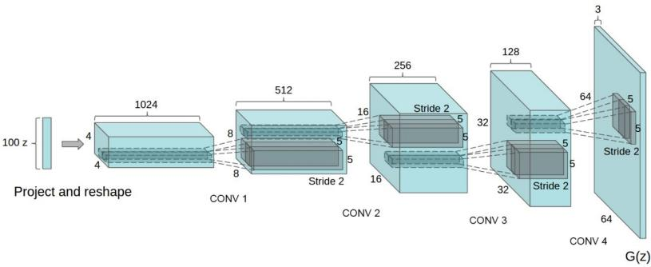  
图 16.9 DCGAN 中的生成网络（图片来源: [Radford et al., 2016]）

## 16.3.4 模型分析

我们把判别网络和生成网络合并为一个整体，将整个生成对抗网络的目标函数看作最小化最大化游戏（MinimaxGame）：

$$
\operatorname* { m i n } _ { \theta } \operatorname* { m a x } _ { \phi } \bigg ( \mathbb { E } _ { { \boldsymbol { x } } \sim p _ { r } ( { \boldsymbol { x } } ) } \Big [ \log D ( { \boldsymbol { x } } ; \phi ) \Big ] + \mathbb { E } _ { { \boldsymbol { x } } \sim p _ { \theta } ( { \boldsymbol { x } } ) } \Big [ \log \Big ( 1 - D ( { \boldsymbol { x } } ; \phi ) \Big ) \Big ] \bigg )\tag{16.33}
$$

$$
= \underset { \theta } { \mathrm { m i n } } \underset { \phi } { \mathrm { m a x } } \left( \mathbb { E } _ { \boldsymbol { x } \sim p _ { r } ( \boldsymbol { x } ) } \Big [ \log D ( \boldsymbol { x } ; \phi ) \Big ] + \mathbb { E } _ { \boldsymbol { z } \sim p ( \boldsymbol { z } ) } \Big [ \log \Big ( 1 - D \big ( G ( \boldsymbol { z } ; \theta ) ; \phi \big ) \Big ) \Big ] \right) .\tag{16.34}
$$

因为之前提到的生成网络梯度问题，这个最小化最大化形式的目标函数一般用来进行理论分析，并不是实际训练时的目标函数

假设 $p _ { r } ( { \pmb x } )$ 和 $p _ { \theta } ( { \pmb x } )$ 已知，则最优的判别器为

参见习题16-7.

$$
D ^ { \star } ( { \pmb x } ) = \frac { p _ { r } ( { \pmb x } ) } { p _ { r } ( { \pmb x } ) + p _ { \theta } ( { \pmb x } ) } .\tag{16.35}
$$

将最优的判别器 $D ^ { \star } ( x )$ 代入公式(16.33),其目标函数变为

$$
\mathcal { L } ( G | D ^ { \star } ) = \mathbb { E } _ { \pmb { x } \sim p _ { r } ( \pmb { x } ) } \Big [ \log D ^ { \star } ( \pmb { x } ) \Big ] + \mathbb { E } _ { \pmb { x } \sim p _ { \theta } ( \pmb { x } ) } \Big [ \log ( 1 - D ^ { \star } ( \pmb { x } ) ) \Big ]\tag{16.36}
$$

$$
= \mathbb { E } _ { { \mathbf { x } } \sim p _ { r } ( { \mathbf { x } } ) } \Big [ \log \frac { p _ { r } ( { \pmb x } ) } { p _ { r } ( { \pmb x } ) + p _ { \theta } ( { \pmb x } ) } \Big ] + \mathbb { E } _ { { \mathbf { x } } \sim p _ { \theta } ( { \pmb x } ) } \Big [ \log \frac { p _ { \theta } ( { \pmb x } ) } { p _ { r } ( { \pmb x } ) + p _ { \theta } ( { \pmb x } ) } \Big ]\tag{16.37}
$$

$$
= \operatorname { K L } ( p _ { r } , p _ { a } ) + \operatorname { K L } ( p _ { \theta } , p _ { a } ) - 2 \log 2\tag{16.38}
$$

$$
= 2 \mathrm { J S } ( p _ { r } , p _ { \theta } ) - 2 \log 2 ,\tag{16.39}
$$

其中JS(·)为JS散度 $\begin{array} { r } { { \mathbf { \nabla } } _ { \cdot } p _ { a } ( { \pmb x } ) = \frac { 1 } { 2 } \Big ( p _ { r } ( { \pmb x } ) + p _ { \theta } ( { \pmb x } ) \Big ) } \end{array}$ 为一个“平均”分布.

JS散度参见 第E.3.3节.

在生成对抗网络中，当判别网络为最优时，生成网络的优化目标是最小化真实分布 $p _ { r }$ 和模型分布 $p _ { \theta }$ 之间的JS散度.当两个分布相同时，JS散度为0，最优生成网络 $G ^ { \star }$ 对应的损失为 $\begin{array} { r } { \mathcal { L } ( G ^ { \star } | D ^ { \star } ) = - 2 \log 2 . } \end{array}$

## 16.3.4.1 训练稳定性

使用JS散度来训练生成对抗网络的一个问题是：当两个分布的支撑集没有重叠时，它们之间的JS散度恒等于常数log2.在最优判别器假设下，对生成网络来说，目标函数关于参数的梯度为0，即 $\begin{array} { r } { \frac { \partial \mathcal { L } ( G | D ^ { \star } ) } { \partial \theta } = 0 } \end{array}$

图16.10给出了生成对抗网络中的梯度消失问题的示例. 当真实分布 $p _ { r }$ 和模型分布 $p _ { \theta }$ 没有重叠时，最优的判别器 $D ^ { \star }$ 对所有生成数据的输出都为0，即$D ^ { \star } ( G ( z ; \theta ) ) = 0 , \forall z .$ 因此，生成网络的梯度消失.

  
图16.10 生成对抗网络中的梯度消失问题

在实际训练生成对抗网络时，一般不会将判别网络训练到最优，只进行一步或多步梯度下降，使得生成网络的梯度依然存在.另外，判别网络也不能太差，否则生成网络的梯度为错误的梯度，但是，如何在梯度消失和梯度错误之间取得平衡并不是一件容易的事，这个问题使得生成对抗网络在训练时稳定性比较差

## 16.3.4.2 模式坍塌

如果使用公式(16.32)作为生成网络的目标函数，将最优判别器 $D ^ { \star }$ 代入，可以得到

$$
\mathcal { L } ^ { \prime } ( G | D ^ { \star } ) = \mathbb { E } _ { \pmb { x } \sim p _ { \theta } ( \pmb { x } ) } \Big [ \log D ^ { \star } ( \pmb { x } ) \Big ]\tag{16.40}
$$

$$
= \mathbb { E } _ { { \pmb x } \sim p _ { \theta } ( { \pmb x } ) } \Big [ \log \frac { p _ { r } ( { \pmb x } ) } { p _ { r } ( { \pmb x } ) + p _ { \theta } ( { \pmb x } ) } \cdot \frac { p _ { \theta } ( { \pmb x } ) } { p _ { \theta } ( { \pmb x } ) } \Big ]\tag{16.41}
$$

$$
= - \mathbb { E } _ { { \pmb x } \sim p _ { \theta } ( { \pmb x } ) } \Big [ \log \frac { p _ { \theta } ( { \pmb x } ) } { p _ { r } ( { \pmb x } ) } \Big ] + \mathbb { E } _ { { \pmb x } \sim p _ { \theta } ( { \pmb x } ) } \Big [ \log \frac { p _ { \theta } ( { \pmb x } ) } { p _ { r } ( { \pmb x } ) + p _ { \theta } ( { \pmb x } ) } \Big ]\tag{16.42}
$$

$$
= - \operatorname { K L } ( p _ { \theta } , p _ { r } ) + \mathbb { E } _ { { \pmb { x } } \sim p _ { \theta } ( { \pmb x } ) } { \Big [ } \log \left( 1 - D ^ { \star } ( { \pmb x } ) \right) { \Big ] }\tag{16.43}
$$

$$
= - \operatorname { K L } ( p _ { \theta } , p _ { r } ) + 2 \operatorname { J S } ( p _ { r } , p _ { \theta } ) - 2 \log 2 - \operatorname { \mathbb { E } } _ { { \boldsymbol { x } } \sim p _ { r } ( { \boldsymbol { x } } ) } { \Big [ } \log D ^ { \star } ( { \boldsymbol { x } } ) { \Big ] } ,\tag{根据公式(16.39}
$$

(16.44)

其中后两项和生成网络无关.因此

$$
\underset { \theta } { \arg \operatorname* { m a x } } \mathcal { L } ^ { \prime } ( G | D ^ { \star } ) = \underset { \theta } { \arg \operatorname* { m i n } } \mathrm { K L } ( p _ { \theta } , p _ { r } ) - 2 \mathrm { J S } ( p _ { r } , p _ { \theta } ) .\tag{16.45}
$$

这一推导提供了一个常见的启发式解释：在最优判别器附近，生成器更新可能更接近于受逆向KL散度 $\operatorname { K L } ( p _ { \theta } , p _ { r } )$ 主导．由于逆向KL更强调“不要把概率质量放到真实分布几乎没有质量的区域”，生成器就可能更倾向于集中在少数高概率模式上，而不是尽量覆盖所有真实模式.这有助于理解GAN中常见的模式坍塌（ModeCollapse）现象：模型并非完全学坏，而是只学会了少数几种“足以骗过判别器”的样本模式

前向和逆向KL散度 因为KL散度是一种非对称的散度，在计算真实分布 $p _ { r }$ 和模型分布pe之间的KL散度时，按照顺序不同，有两种KL散度：前向KL散 $p _ { \theta }$ 度(Forward KL divergence) $\operatorname { K L } ( p _ { r } , p _ { \theta } )$ 和逆向 KL 散度(Reverse KL diver-gence ) KL $( p _ { \theta } , p _ { r } )$ .前向和逆向KL散度分别定义为

$$
\mathrm { K L } ( p _ { r } , p _ { \theta } ) = \int p _ { r } ( { \pmb x } ) \log \frac { p _ { r } ( { \pmb x } ) } { p _ { \theta } ( { \pmb x } ) } \mathrm { d } { \pmb x } ,\tag{16.46}
$$

$$
\mathrm { K L } ( p _ { \theta } , p _ { r } ) = \int p _ { \theta } ( { \pmb x } ) \log \frac { p _ { \theta } ( { \pmb x } ) } { p _ { r } ( { \pmb x } ) } \mathrm { d } { \pmb x } .\tag{16.47}
$$

图16.11给出数据真实分布为一个高斯混合分布，模型分布为一个单高斯分布时，使用前向和逆向KL散度来进行模型优化的示例.黑色曲线为真实分布 $p _ { r }$ 的等高线，红色曲线为模型分布 $p _ { \theta }$ 的等高线.

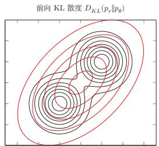  
图 16.11 前向和逆向KL散度

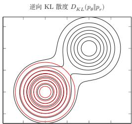

在前向KL散度中，

(1)当 $p _ { r } ( { \pmb x } )  0$ 而 $p _ { \theta } ( { \pmb x } ) > 0$ 时， $\begin{array} { r } { p _ { r } ( { \pmb x } ) \log \frac { p _ { r } ( { \pmb x } ) } { p _ { \theta } ( { \pmb x } ) }  0 . } \end{array}$ 不管 $p _ { \theta } ( { \pmb x } )$ 如何取值，都对前向KL散度的计算没有贡献.

(2)当 $p _ { r } ( { \pmb x } ) > 0$ 而 $p _ { \theta } ( { \pmb x } )  0$ 时， $\begin{array} { r } { p _ { r } ( { \pmb x } ) \log \frac { p _ { r } ( { \pmb x } ) } { p _ { \theta } ( { \pmb x } ) }  \infty } \end{array}$ ,前向KL散度会变得非常大.

因此，前向KL散度会鼓励模型分布 $p _ { \theta } ( { \pmb x } )$ 尽可能覆盖所有真实分布$p _ { r } ( { \pmb x } ) > 0$ 的点，而不用回避 $p _ { r } ( { \pmb x } ) \approx 0$ 的点.

在逆向KL散度中，

(1)当 $p _ { r } ( { \pmb x } )  0$ 而 $p _ { \theta } ( { \pmb x } ) > 0$ 时 $\begin{array} { r } { { \mathbf \nabla } _ { p _ { \theta } } ( { \pmb x } ) \log \frac { p _ { \theta } ( { \pmb x } ) } { p _ { r } ( { \pmb x } ) } \to \infty } \end{array}$ 即当 $p _ { r } ( { \pmb x } )$ 接近于0,而 $p _ { \theta } ( { \pmb x } )$ 有一定的密度时，逆向KL散度会变得非常大.

(2)当 $p _ { \theta } ( { \pmb x } )  0$ 时，不管 $p _ { r } ( { \pmb x } )$ 如何取值， $\begin{array} { r } { p _ { \theta } ( { \pmb x } ) \log \frac { p _ { \theta } ( { \pmb x } ) } { p _ { r } ( { \pmb x } ) }  0 } \end{array}$

因此，逆向KL散度会鼓励模型分布 $p _ { \theta } ( { \pmb x } )$ 尽可能避开所有真实分布$p _ { r } ( { \pmb x } ) \approx 0$ 的点，而不需要考虑是否覆盖所有真实分布 $p _ { r } ( { \pmb x } ) > 0$ 的点.

## 16.3.5 改进模型

在生成对抗网络中，当真实分布和模型分布的支撑集相距较远时，JS散度难以提供连续反映“距离”的训练信号.由于通过优化交叉熵对应的对抗目标容易遇到训练稳定性和模式坍塌问题，一条重要改进路线就是改变分布差异的度量方式.

## 16.3.5.1 W-GAN

W-GAN是一种通过用Wasserstein距离替代JS散度来优化训练的生成对抗网络 [Arjovsky et al., 2017].

Wasserstein 距离也称 为推土机距离，参见 第E.3.4节.

对于真实分布 $p _ { r }$ 和模型分布 $p _ { \theta }$ ,它们的一阶Wasserstein距离为

$$
W _ { 1 } ( p _ { r } , p _ { \theta } ) = \operatorname* { i n f } _ { \gamma \sim \Gamma ( p _ { r } , p _ { \theta } ) } \mathbb { E } _ { ( \pmb { x } , \pmb { y } ) \sim \gamma } \Big [ \| \pmb { x } - \pmb { y } \| \Big ] ,\tag{16.48}
$$

其中 $\Gamma ( p _ { r } , p _ { \theta } )$ 是边际分布为 $p _ { r }$ 和 $p _ { \theta }$ 的所有可能的联合分布集合

当两个分布没有重叠或者重叠非常少时，它们之间的KL散度可能为 $+ \infty$ JS散度在支撑集分离时变为常数log2，并不随着两个分布之间的距离而变化.而一阶Wasserstein距离依然可以衡量两个没有重叠分布之间的距离.

## 数学小知识|Lipschitz连续函数

在数学中，对于一个实数函数 f：R→R，如果满足函数曲线上任意两点连线的斜率一致有界，即任意两点的斜率都小于常数 $K > 0$

$$
| f ( x _ { 1 } ) - f ( x _ { 2 } ) | \leq K | x _ { 1 } - x _ { 2 } | ,\tag{16.49}
$$

则函数 f就称为K-Lipschitz连续函数,K称为Lipschitz 常数.

Lipschitz连续要求函数在无限的区间上不能有超过线性的增长.如果一个函数可导，并满足Lipschitz连续，那么导数有界．如果一个函数可导，并且导数有界，那么函数为Lipschitz连续.

两个分布 $p _ { r }$ 和 $p _ { \theta }$ 的一阶Wasserstein距离通常难以直接计算，但它有一个对偶形式：

$$
W _ { 1 } ( p _ { r } , p _ { \theta } ) = \operatorname* { s u p } _ { \| f \| _ { L } \leq 1 } \Big ( \mathbb { E } _ { { \pmb x } \sim p _ { r } } [ f ( { \pmb x } ) ] - \mathbb { E } _ { { \pmb x } \sim p _ { \theta } } [ f ( { \pmb x } ) ] \Big ) ,\tag{16.50}
$$

其中 $f : \mathbb { R } ^ { d } $ R为1-Lipschitz函数，满足

$$
\| f \| _ { L } \triangleq \operatorname* { s u p } _ { \pmb { x } \neq \pmb { y } } \frac { | f ( \pmb { x } ) - f ( \pmb { y } ) | } { \| \pmb { x } - \pmb { y } \| } \le 1 .\tag{16.51}
$$

公式(16.50)称为Kantorovich-Rubinstein对偶定理.

Kantorovich-Rubinstein对偶定理说明，一阶Wasserstein距离可以写成一组1-Lipschitz函数下的期望差上确界. 若把约束放宽为K-Lipschitz连续，只需除以常数K作尺度修正，即

$$
W _ { 1 } ( p _ { r } , p _ { \theta } ) = \frac { 1 } { K } \operatorname* { s u p } _ { \| f \| _ { L } \leq K } \Big ( \mathbb { E } _ { { \pmb x } \sim p _ { r } } [ f ( { \pmb x } ) ] - \mathbb { E } _ { { \pmb x } \sim p _ { \theta } } [ f ( { \pmb x } ) ] \Big ) .\tag{16.52}
$$

参见习题16-9.

评价网络 然而，要计算公式(16.52)中的上确界也并不容易.实践中通常用一个受Lipschitz约束的神经网络族来近似这个函数集合．令 $f ( { \pmb x } ; \phi )$ 为一个神经网络，假设存在参数集合Φ，对于所有的 $\phi \in \Phi , f ( \pmb { x } ; \phi )$ 为K-Lipschitz连续函数，那么公式（16.52）中的上界可以近似转换为

$$
\operatorname* { m a x } _ { \phi \in \Phi } \Big ( \mathbb { E } _ { { \pmb x } \sim p _ { r } } [ f ( { \pmb x } ; \phi ) ] - \mathbb { E } _ { { \pmb x } \sim p _ { \theta } } [ f ( { \pmb x } ; \phi ) ] \Big ) ,\tag{16.53}
$$

这里忽略了常数 $\textstyle { \frac { 1 } { K } }$ ，并不影响网络的优化.

其中 $f ( { \pmb x } ; \phi )$ 称为评价网络（Critic Network）. 和标准GAN中的判别网络的值域为[0,1]不同，评价网络 $f ( { \pmb x } ; \phi )$ 的最后一层为线性层，其值域没有限制.这样只需要找到一个网络 $f ( { \pmb x } ; \phi )$ 使其在两个分布 $p _ { r }$ 和 $p _ { \theta }$ 下的期望的差最大.即对于真实样本， $f ( { \pmb x } ; \phi )$ 的打分要尽可能高；对于模型生成的样本， $f ( { \pmb x } ; \phi )$ 的打分要尽可能低.

为了使得 $f ( { \pmb x } ; \phi )$ 满足K-Lipschitz连续，一种近似的方法是限制参数的取值范围.因为神经网络为连续可导函数，满足K-Lipschitz连续可以近似为其关于x的偏导数的模 $\| \frac { \partial f ( \pmb { x } ; \phi ) } { \partial \pmb { x } }$ 小于某个上界.由于这个偏导数的大小一般和参数的取值范围相关，我们可以通过限制参数 $\phi$ 的取值范围来近似，令 $\phi \in [ - c , c ]$ , C为一个比较小的正数，比如0.01.

生成网络生成网络的目标是使得评价网络 $f ( { \pmb x } ; \phi )$ 对其生成样本的打分尽可能高，即

$$
\operatorname* { m a x } _ { \theta } \mathbb { E } _ { z \sim p ( z ) } \left[ f \Big ( G ( z ; \theta ) ; \phi \Big ) \right] .\tag{16.54}
$$

因为 $f ( { \pmb x } ; \phi )$ 不再是Sigmoid概率输出，生成网络参数θ更不容易遇到由判别器饱和引起的梯度消失问题.W-GAN的目标也不直接依赖两个分布密度的比率，在一定程度上缓解了原始GAN中的训练不稳定和模式坍塌问题

算法16.2给出W-GAN的训练过程.和原始GAN相比，W-GAN的评价网络最后一层不使用Sigmoid函数，损失函数不取对数.

算法 16.2 W-GAN的训练过程  
输入：训练集D，对抗训练迭代次数T，每次评价网络的训练迭代次数K，小  
批量样本数量M,参数限制大小 $c ;$   
1 随机初始化 $\theta ,$ φ;  
2 for $t \gets 1$ to T do  
//训练评价网络 $f ( x ; \phi )$   
3 for k ← 1 to K do  
//采集小批量训练样本  
4 从训练集D中采集M个样本 $\{ \pmb { x } ^ { ( m ) } \} , 1 \leq m \leq M ;$   
5 从分布 $\mathcal { N } ( \mathbf { 0 } , \pmb { I } )$ 中采集M个样本 $\{ z ^ { ( m ) } \} , 1 \leq m \leq M ;$   
$/ /$ 计算评价网络参数φ的梯度  
6 $g _ { \phi } = \frac { \partial } { \partial \phi } \biggl [ \frac { 1 } { M } \sum _ { m = 1 } ^ { M } \biggl ( f ( \mathbf { x } ^ { ( m ) } ; \phi ) - f \Bigl ( G ( z ^ { ( m ) } ; \theta ) ; \phi \Bigl ) \biggr ) \biggr ]$   
7 $\phi  \phi + \alpha \cdot \mathrm { R M S P r o p } ( \phi , g _ { \phi } )$ // 使用RMSProp算法更新 $\phi$   
8 $\phi  \mathrm { c l i p } ( \phi , - c , c )$ //权重裁剪（参数裁剪)  
9 end  
$/ /$ 训练生成网络 $G ( z ; \theta )$   
10 从分布 $\mathcal { N } ( \mathbf { 0 } , \pmb { I } )$ 中采集M个样本 $\{ z ^ { ( m ) } \} , 1 \leq m \leq M ;$   
$/ /$ 更新生成网络参数θ  
11 $g _ { \theta } = \frac { \partial } { \partial \theta } \biggl [ \frac { 1 } { M } \sum _ { m = 1 } ^ { M } f \Bigl ( G ( z ^ { ( m ) } ; \theta ) ; \phi \Bigl ) \biggl ]$ 2  
12 $\theta \gets \theta + \alpha \cdot \mathrm { R M S P r o p } ( \theta , g _ { \theta } )$ .n $/ /$ 使用RMSProp算法更新θ  
13 end  
输出：生成网络 $G ( z ; \theta )$

需要说明的是，原始W-GAN中使用权重裁剪只是为了近似满足Lipschitz约束，但这种做法往往会带来优化困难或表达能力不足.后续工作WGAN-GP(Wasserstein GAN with Gradient Penalty)用梯度惩罚替代简单的权重裁剪，在实践中通常更加稳定.就教材主线而言，理解W-GAN的关键并不是记住某一种具体技巧，而是把握两个思想：一是用更合适的距离度量替代JS散度，二是通过Lipschitz约束让评价网络的打分具有“距离”意义.

## 16.3.5.2 条件生成对抗网络

标准生成对抗网络只能从噪声向量z中无条件地生成样本．如果希望控制生成结果的类别、属性或风格，可以将条件变量c同时输入生成网络和判别网络，从而得到条件生成对抗网络（Conditional Generative Adversarial Network，$\operatorname { c G A N } )$ .其目标函数可以写为

$$
\operatorname* { m i n } _ { \theta } \operatorname* { m a x } _ { \phi } \bigg ( \mathbb { E } _ { ( { \pmb x } , { \pmb c } ) \sim p _ { r } } [ \log D ( { \pmb x } , { \pmb c } ; \phi ) ]\tag{16.55}
$$

$$
+ \mathbb { E } _ { z \sim p ( z ) , c \sim p ( c ) } [ \log ( 1 - D ( G ( z , c ; \theta ) , c ; \phi ) ) ] \biggr ) .\tag{16.56}
$$

条件信息c可以是类别标签、文本描述、语义分割图甚至另一张图像.这样，生成模型不再只是学习“如何生成”，还需要学习“在给定条件下如何生成”.条件生成对抗网络为后续的图像到图像转换、文本到图像生成等任务奠定了基础.

## 16.3.5.3 InfoGAN

在很多应用中，我们不仅希望生成样本，还希望生成过程具有一定的可解释性. InfoGAN（Information Maximizing GAN）在生成网络输入中额外引入一个潜在码c，并最大化潜在码c与生成样本 $G ( z , c )$ 之间的互信息，从而鼓励不同维度的潜在码控制不同的语义属性.其核心思想是：如果某个潜在变量确实控制了样本的某种可解释因素，那么由该潜在变量生成的样本中应该保留关于它的信息.

InfoGAN说明，对抗训练不仅可以用于逼近真实分布，还可以用于学习具有可解释结构的隐变量表示.这也体现了生成模型和表示学习之间的紧密联系.GAN在生成建模中的地位随着扩散模型和流匹配方法的发展，高质量图像和视频生成任务中出现了更多稳定可控的选择.GAN的主要困难在于训练不稳定性和模式坍塌问题较难完全避免，而扩散模型通过迭代去噪把生成问题分解为一系列局部预测任务，从另一个角度缓解了这些困难，然而，GAN并不是简单“被替代”的方法：在需要极快推断速度（单步生成）、对抗性图像转换（如pix2pix、CycleGAN类任务）以及数据增强等场景中，GAN仍有独特优势.此外，GAN中判别器的思想也可以整合进混合训练方法中，如用判别器辅助扩散模型的训练以提升生成质量

## 16.4 扩散模型

扩散模型是一类重要的深度生成模型.它的基本思想不是一步生成一个复杂样本，而是先定义一个固定的前向随机过程，把真实样本逐步扰动为近似高斯噪声：再学习一个反向过程，从噪声一步步恢复数据，这样，原本困难的高维生成问题就被分解为一系列局部的去噪问题，因此训练常常更稳定，也更便于引入条件控制.

给定观测变量 $\scriptstyle { \mathbf { { \vec { x } } } } _ { 0 }$ ，扩散模型引入中间变量 ${ \pmb x } _ { 1 } , { \pmb x } _ { 2 } , \cdots , { \pmb x } _ { T }$ .其中， $\mathbf { \boldsymbol { x } } _ { t }$ 表示第t个噪声水平下的中间状态， ${ \pmb x } _ { T }$ 接近一个简单先验分布（通常取标准高斯分布）.于是，扩散模型的联合分布可写为

$$
p _ { \theta } ( \pmb { x } _ { 0 : T } ) = p ( \pmb { x } _ { T } ) \prod _ { t = 1 } ^ { T } p _ { \theta } ( \pmb { x } _ { t - 1 } \vert \pmb { x } _ { t } ) ,\tag{16.57}
$$

其中 $\pmb { x } _ { 1 : T }$ 都可以视为隐变量，相应的边际分布

$$
p _ { \theta } ( { \pmb x } _ { 0 } ) = \int p _ { \theta } ( { \pmb x } _ { 0 : T } ) \mathrm { d } { \pmb x } _ { 1 : T }\tag{16.58}
$$

就是模型对真实数据分布 $p _ { r } ( { \pmb x } )$ 的近似.

扩散模型的核心由两部分构成：一部分是人为设定的前向扩散过程，把样本$\scriptstyle { \mathbf { { \vec { x } } } } _ { 0 }$ 逐步加上高斯噪声，得到随机变量序列 ${ \pmb x } _ { 1 } , { \pmb x } _ { 2 } , \cdots , { \pmb x } _ { T }$ .当步数T足够大时， ${ \pmb x } _ { T }$ 将接近一个简单分布，比如标准高斯分布.另一部分是由神经网络学习的反向去噪过程，使其能够从 ${ \pmb x } _ { T }$ 开始，一步步恢复出 ${ \pmb x } _ { T - 1 } , { \pmb x } _ { T - 2 } , \cdots , { \pmb x } _ { 0 }$ .图16.12给出了这一基本流程：上半部分是从数据到噪声的前向过程，下半部分是由神经网络参数化的反向去噪过程

  
图16.12 扩散模型的基本流程

扩散模型也可以看作一种特殊的层级变分自编码器：前向分布 $q ( \pmb { x } _ { 1 : T } | \pmb { x } _ { 0 } )$ 由人为固定，反向分布$p _ { \theta } ( \pmb { x } _ { t - 1 } | \pmb { x } _ { t } )$ 由神经网络学习.

这种建模方式有两个直接好处.第一，前向过程由我们自己设计，通常可以写成解析形式，因此训练时能够直接在任意噪声水平上构造样本；第二，反向过程虽然未知，但每一步只需要解决一个“稍微去噪一点”的局部问题，比一次性生成高维复杂样本要容易得多.

## 16.4.1 前向扩散过程

在最常见的离散时间扩散模型中，前向过程被定义为一个马尔可夫链：

$$
q ( \pmb { x } _ { 1 : T } | \pmb { x } _ { 0 } ) = \prod _ { t = 1 } ^ { T } q ( \pmb { x } _ { t } | \pmb { x } _ { t - 1 } ) ,\tag{16.59}
$$

其中每一步的条件分布定义为

$$
q ( \pmb { x } _ { t } | \pmb { x } _ { t - 1 } ) = \mathcal { N } ( \pmb { x } _ { t } ; \sqrt { 1 - \beta _ { t } } \pmb { x } _ { t - 1 } , \beta _ { t } \pmb { I } ) ,\tag{16.60}
$$

$\beta _ { t } \in ( 0 , 1 )$ 为第t步的噪声强度.这个定义意味着：在每一个时间步，样本都会保留一部分原始信号，同时叠加一部分新的高斯噪声.

序列 $\{ \beta _ { t } \} _ { t = 1 } ^ { T }$ 称为噪声调度（Noise Schedule）.如果 $\beta _ { t }$ 过大，那么在早期步骤中就会过快破坏样本结构；如果 $\beta _ { t }$ 过小，则需要很多步才能把样本扰动到简单分布.实际中常见的设计包括线性调度、余弦调度等.它们的共同目标是：在前期尽量保留更多语义结构，在后期逐渐增加噪声，使最终分布接近各向同性高斯分布.

$$
\alpha _ { t } = 1 - \beta _ { t } , \qquad \bar { \alpha } _ { t } = \prod _ { s = 1 } ^ { t } \alpha _ { s } ,\tag{16.61}
$$

则可以证明，给定初始样本 $\scriptstyle { \mathbf { { \vec { x } } } } _ { 0 }$ ,任意时刻t的随机变量 $\mathbf { \boldsymbol { x } } _ { t }$ 都可以直接写为

$$
\begin{array} { r } { q ( \pmb { x } _ { t } | \pmb { x } _ { 0 } ) = \mathcal { N } ( \pmb { x } _ { t } ; \sqrt { \bar { \alpha } _ { t } } \pmb { x } _ { 0 } , ( 1 - \bar { \alpha } _ { t } ) \pmb { I } ) . } \end{array}\tag{16.62}
$$

因此， $\mathbf { \boldsymbol { x } } _ { t }$ 可以通过一次采样直接得到：

$$
\begin{array} { r } { \pmb { x } _ { t } = \sqrt { \bar { \alpha } _ { t } } \pmb { x } _ { 0 } + \sqrt { 1 - \bar { \alpha } _ { t } } \pmb { \epsilon } , \qquad \ \epsilon \sim \mathcal { N } ( \mathbf { 0 } , I ) . } \end{array}\tag{16.63}
$$

从公式(16.63)可以看出，随着t增大， $\hat { \alpha } _ { t }$ 不断减小，原始样本 $\scriptstyle { \mathbf { { \vec { x } } } } _ { 0 }$ 的贡献越来越弱，而噪声项的贡献越来越强.第t步的信噪比（Signal-to-Noise Ratio,SNR）定义为

$$
\mathrm { S N R } ( t ) = \frac { \bar { \alpha } _ { t } } { 1 - \bar { \alpha } _ { t } } .\tag{16.64}
$$

公式(16.63)这个闭式表达非常重要，因为它意味着训练时不必真的把噪声一步一步加到第t步，而是可以直接从 $\scriptstyle { \mathbf { x } _ { 0 } }$ 构造任意时刻的带噪样本 ${ \mathbf { } } _ { \pmb { x } _ { t } }$

信噪比越大，样本中保留的有效信息越多；信噪比越小，样本越接近纯噪声

图16.13从信噪比的角度刻画了公式(16.63):随着t增大,样本中的信号成分$\sqrt { \bar { \alpha } _ { t } } \pmb { x } _ { 0 }$ 逐渐减弱，而噪声成分 $\sqrt { 1 - \bar { \alpha } _ { t } } .$ ε逐渐增强，对应的信噪比也持续下降.

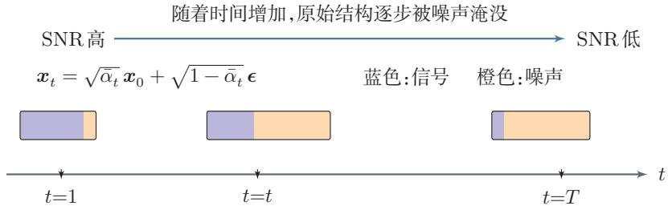  
图16.13 前向扩散中信号与噪声的相对占比变化

## 16.4.2 反向去噪过程

扩散模型的关键在于学习前向过程的逆过程.虽然从 $\mathbf { \boldsymbol { x } } _ { t }$ 一步恢复出 $\scriptstyle { \mathbf { { \vec { x } } } } _ { 0 }$ 通常是困难的，但从 $\mathbf { \boldsymbol { x } } _ { t }$ 恢复 ${ \mathbf { } } x _ { t - 1 }$ 只是一个局部去噪问题.

设参数化模型为 $p _ { \theta }$ ，则反向生成过程定义为

$$
p _ { \theta } ( \pmb { x } _ { 0 : T } ) = p ( \pmb { x } _ { T } ) \prod _ { t = 1 } ^ { T } p _ { \theta } ( \pmb { x } _ { t - 1 } \vert \pmb { x } _ { t } ) ,\tag{16.65}
$$

其中一般取 $p ( { \pmb x } _ { T } ) = \mathcal { N } ( { \bf 0 } , I )$ ,并将每一步反向转移分布建模为高斯分布：

$$
p _ { \theta } ( \pmb { x } _ { t - 1 } \vert \pmb { x } _ { t } ) = \mathcal { N } ( \pmb { x } _ { t - 1 } ; \pmb { \mu } _ { \theta } ( \pmb { x } _ { t } , t ) , \sigma _ { t } ^ { 2 } \pmb { I } ) ,\tag{16.66}
$$

其中均值项 $\mu _ { \theta } ( x _ { t } , t )$ 为待学习的函数，t表示时间步.在很多经典实现中，反向方差 $\sigma _ { t } ^ { 2 }$ 通常取为预先给定的常数或与真实后验方差 $\tilde { \beta } _ { t }$ 相关的固定值，因此反向去噪的主要目标是如何学习 $\mu _ { \theta } ( x _ { t } , t )$

## 16.4.3 训练

和变分自编码器类似，扩散模型也可以从最大化对数似然的变分下界(Variational Lower Bound, VLB) 出发. 给定样本 $\scriptstyle { \mathbf { { \vec { x } } } } _ { 0 }$ ,有

$$
\log p _ { \theta } ( \pmb { x } _ { 0 } ) \geq \mathbb { E } _ { q } \left[ \log \frac { p _ { \theta } ( \pmb { x } _ { 0 : T } ) } { q ( \pmb { x } _ { 1 : T } | \pmb { x } _ { 0 } ) } \right] .\tag{16.67}
$$

实际训练中通常最小化负的变分下界.将其展开后，可得损失项

$$
\begin{array} { l } { \mathcal { L } _ { \mathrm { V L B } } = \displaystyle \mathbb { E } _ { q } \big [ - \log p _ { \theta } ( { \boldsymbol x } _ { 0 } | { \boldsymbol x } _ { 1 } ) \big ] + \sum _ { t = 2 } ^ { T } \mathbb { E } _ { q } \big [ \operatorname { K L } ( q ( { \boldsymbol x } _ { t - 1 } | { \boldsymbol x } _ { t } , { \boldsymbol x } _ { 0 } ) \| p _ { \theta } ( { \boldsymbol x } _ { t - 1 } | { \boldsymbol x } _ { t } ) ) \big ] } \\ { ~ + ~ \operatorname { K L } ( q ( { \boldsymbol x } _ { T } | { \boldsymbol x } _ { 0 } ) \| p ( { \boldsymbol x } _ { T } ) ) . ~ } \end{array}
$$

扩散模型本质上仍然是最大似然学习，只不过通过引入一串中间隐变量，把困难的密度建模问题转化为多个局部的分布匹配问题.

其中最后一项与参数θ无关.因此，除去常数项后， ${ \mathcal { L } } _ { \mathrm { V L B } }$ 主要依赖模型给出的反向分布 $p _ { \theta } ( \pmb { x } _ { t - 1 } | \pmb { x } _ { t } )$ 与真实后验 $q ( \pmb { x } _ { t - 1 } | \pmb { x } _ { t } , \pmb { x } _ { 0 } )$ 之间的差异．换句话说，扩散模型训练的核心，就是在每一个时间步t上学习一个局部去噪过程.

由于前向链是线性高斯模型，真实后验分布的闭式形式为

$$
q ( \pmb { x } _ { t - 1 } | \pmb { x } _ { t } , \pmb { x } _ { 0 } ) = \mathcal { N } ( \pmb { x } _ { t - 1 } ; \tilde { \pmb { \mu } } _ { t } ( \pmb { x } _ { t } , \pmb { x } _ { 0 } ) , \tilde { \beta } _ { t } \pmb { I } ) ,\tag{16.69}
$$

其中

$$
\tilde { \beta } _ { t } = \frac { 1 - \bar { \alpha } _ { t - 1 } } { 1 - \bar { \alpha } _ { t } } \beta _ { t } ,\tag{16.70}
$$

$$
\tilde { \pmb { \mu } } _ { t } ( \pmb { x } _ { t } , \pmb { x } _ { 0 } ) = \frac { \sqrt { \bar { \alpha } _ { t - 1 } } \beta _ { t } } { 1 - \bar { \alpha } _ { t } } \pmb { x } _ { 0 } + \frac { \sqrt { \alpha _ { t } } ( 1 - \bar { \alpha } _ { t - 1 } ) } { 1 - \bar { \alpha } _ { t } } \pmb { x } _ { t } .\tag{16.71}
$$

由于 $q ( \pmb { x } _ { t - 1 } | \pmb { x } _ { t } , \pmb { x } _ { 0 } )$ 和 $p _ { \theta } ( \pmb { x } _ { t - 1 } | \pmb { x } _ { t } )$ 都是高斯分布，在方差固定或按预设形式处理时，中间每一项KL散度都可以化简为带权均方误差形式.训练目标

可写为

$$
\mathcal { L } ( \theta ) = \sum _ { t = 1 } ^ { T } \mathbb { E } _ { \boldsymbol { x } _ { 0 } , \boldsymbol { x } _ { t } } \Big [ \| \tilde { \mu } _ { t } ( \boldsymbol { x } _ { t } , \boldsymbol { x } _ { 0 } ) - \mu _ { \theta } ( \boldsymbol { x } _ { t } , t ) \| ^ { 2 } \Big ] ,\tag{16.72}
$$

如果我们知道当前状态 $\mathbf { \boldsymbol { x } } _ { t }$ 以及原始样本 $\scriptstyle { \mathbf { { \vec { x } } } } _ { 0 }$ ,那么“最优的一步去噪分布”有解析表达.

从形式上看，反向一步的真实后验均值 $\tilde { \pmb { \mu } } _ { t } ( \pmb { x } _ { t } , \pmb { x } _ { 0 } )$ 已经有解析表达，因此似乎也可以直接让网络去回归它.事实上，这种做法当然是可行的；但它通常不是最自然的参数化.原因在于， $\tilde { \pmb { \mu } } _ { t } ( \pmb { x } _ { t } , \pmb { x } _ { 0 } )$ 本质上只是 $\mathbf { \boldsymbol { x } } _ { t }$ 与 $\scriptstyle { \mathbf { { \vec { x } } } } _ { 0 }$ 的一个线性组合，其中 $\mathbf { \boldsymbol { x } } _ { t }$ 是当前已知输入，而真正未知的是其中与 $\scriptstyle { \mathbf { { \vec { x } } } } _ { 0 }$ 等价的信息．若直接预测 $\tilde { \mu } _ { t }$ 网络实际上需要同时“复现”已知项并“恢复”未知项，这会把确定部分与待估计部分混在一起，相比之下，直接预测 $\scriptstyle { \pmb x } _ { 0 }$ 往往更能把学习目标集中在真正需要恢复的那部分信息上.另外，既然 $\scriptstyle { \mathbf { { \vec { x } } } } _ { 0 }$ 可以通过 $\mathbf { \boldsymbol { x } } _ { t }$ 和 $\epsilon$ 反推出来，我们也可以让网络去预测€.

训练时不必真的把噪声一步一步加到第t步，而是可以直接从 $\scriptstyle { \mathbf { x } _ { 0 } }$ 构造任意时刻的带噪样本 ${ \mathbf { } } _ { { \mathbf { } } _ { } } { \mathbf { } } _ { { \mathbf { } } _ { } }$

从训练主线看，扩散模型先从最大似然的变分下界出发，把整体学习问题分解为各时间步上的局部去噪；再利用线性高斯前向过程，把这些局部分布匹配进一步化为均方误差形式；最后选择一个更适合实现的参数化目标（如预测 $\epsilon \mathrm { , } \mathbf { \nabla } _ { \cdot } \mathbf { x } _ { 0 }$ 分数函数或v)来训练网络.

## 16.4.3.1 预测原始样本 $\scriptstyle { \boldsymbol { x } } _ { 0 }$

由于真实后验 $q ( \pmb { x } _ { t - 1 } | \pmb { x } _ { t } , \pmb { x } _ { 0 } )$ 是高斯分布，其均值由公式(16.71)给出，因此一种直接想法是让网络输出原始样本的估计 $\hat { x } _ { 0 } ( x _ { t } , t )$ ．只要用 $\hat { x } _ { 0 } ( x _ { t } , t )$ 代替其中的 $\scriptstyle { \mathbf { { \vec { x } } } } _ { 0 }$ ，就可以构造出模型的反向均值 $\mu _ { \theta } ( x _ { t } , t )$ .这说明，网络即使不直接输出${ \boldsymbol { x } } _ { t - 1 }$ ，也可以通过先估计 $\scriptstyle { \pmb x } _ { 0 }$ 来间接确定每一步的去噪分布.

若网络预测的是 $\hat { x } _ { 0 } ( x _ { t } , t )$ ，则在忽略与θ无关的常数后，可将训练目标写成

$$
\mathcal { L } _ { \boldsymbol { x } _ { 0 } } ( \theta ) = \sum _ { t = 1 } ^ { T } w _ { t } \mathbb { E } _ { \boldsymbol { x } _ { 0 } , \epsilon } \Big [ \| \boldsymbol { x } _ { 0 } - \hat { \boldsymbol { x } } _ { 0 } ( \boldsymbol { x } _ { t } , t ) \| ^ { 2 } \Big ] ,\tag{16.73}
$$

许多扩散模型通常不把“直接预测后验均值”作为首选，而更常采用几种等价但更自然的参数化方式.这些参数化在不同时间步上的尺度更统一，也更方便与后续的采样公式、连续时间视角和数值求解器对应起来.我们将在下面四个小节中分别介绍.

其中 $w _ { t }$ 仅依赖于时间步t和噪声调度.

## 16.4.3.2 预测噪声 ∈

更常见的做法是让网络直接预测加到样本中的噪声 $\epsilon _ { \theta } ( x _ { t } , t )$ .由

$$
\pmb { x } _ { 0 } = \frac { 1 } { \sqrt { \bar { \alpha } _ { t } } } \left( \pmb { x } _ { t } - \sqrt { 1 - \bar { \alpha } _ { t } } \epsilon \right)\tag{16.74}
$$

由公式 $( 1 6 . 6 3 ) { \pmb x } _ { t } ~ =$ $\sqrt { \bar { \alpha } _ { t } } \pmb { x } _ { 0 } + \sqrt { 1 - \bar { \alpha } _ { t } } \pmb { \epsilon }$ 推导可得.

可得对应的原始样本估计

$$
\hat { x } _ { 0 } ( x _ { t } , t ) = \frac { 1 } { \sqrt { \bar { \alpha } _ { t } } } \left( x _ { t } - \sqrt { 1 - \bar { \alpha } _ { t } } \epsilon _ { \theta } ( x _ { t } , t ) \right) .\tag{16.75}
$$

https://nndl.ai/

进一步代入公式(16.71)，可将反向均值写为

$$
{ \mu } _ { \theta } ( { x } _ { t } , t ) = \frac { 1 } { \sqrt { { \alpha } _ { t } } } \left( { { x } _ { t } } - \frac { { { \beta } _ { t } } } { \sqrt { 1 - { { \bar { \alpha } } _ { t } } } } { { \epsilon } _ { \theta } } ( { { x } _ { t } } , t ) \right) .\tag{16.76}
$$

因此，“预测噪声”是对同一个反向去噪过程的另一种参数化方式.

进一步利用公式(16.63)和公式(16.74)，就可以把这个目标等价地改写为噪声预测问题.在完整形式下，其目标函数可以写成

$$
\mathcal { L } _ { \epsilon } ( \theta ) = \sum _ { t = 1 } ^ { T } \lambda _ { t } \mathbb { E } _ { \pmb { x } _ { 0 } , \epsilon } \Big [ \| \epsilon - \epsilon _ { \theta } ( \pmb { x } _ { t } , t ) \| ^ { 2 } \Big ] ,\tag{16.77}
$$

其中 $\lambda _ { t }$ 同样只依赖于时间步t.进一步忽略这些仅与t有关的权重，就得到最常用的简化训练目标

$$
\begin{array} { r } { \mathcal { L } _ { \mathrm { s i m p l e } } ( \theta ) = \mathbb { E } _ { \mathbf { x } _ { 0 } , t , \epsilon } \Bigl [ \| \epsilon - \epsilon _ { \theta } ( \mathbf { x } _ { t } , t ) \| ^ { 2 } \Bigr ] . } \end{array}\tag{16.78}
$$

这个目标看似简单，却非常有效.其本质在于：如果网络能够准确预测噪声，那么它就能够恢复 $\hat { \mathbf { x } } _ { 0 }$ ，进而构造近似最优的反向均值 $\mu _ { \theta } ( x _ { t } , t )$

## 16.4.3.3 预测分数函数

在概率建模中，分数函数（ScoreFunction）是指对数密度关于样本的梯度

$$
\begin{array} { r } { \pmb { s } ( \pmb { x } ) = \nabla _ { \pmb { x } } \log p ( \pmb { x } ) . } \end{array}\tag{16.79}
$$

它描述了在当前点附近，数据分布的对数密度增长最快的方向.换句话说，分数函数并不直接给出概率值本身，而是刻画了分布在局部空间中的“几何形状”：若沿着 $\nabla _ { x } \log p ( { \pmb x } )$ 的方向移动，样本就会被推向更高概率的区域.因此，在生成模型中，学习分数函数等价于学习一个“把样本拉回数据流形附近”的方向场，而不必显式写出完整的归一化密度函数.

这一思想在扩散模型中尤其自然.对每一个噪声水平t，带噪样本都服从一个分布 $p _ { t } ( { \pmb x } )$ ；如果能够学习其分数函数 $\nabla _ { x } \log p _ { t } ( \pmb { x } )$ ，就等于学会了“在当前噪声尺度下，应当朝哪个方向去噪”.因此，预测分数函数的一个重要好处在于：它把扩散模型从“离散时间上的逐步恢复样本”推广为“连续时间上学习一个随噪声水平变化的去噪方向场”.

在给定 $\scriptstyle { \mathbf { { \vec { x } } } } _ { 0 }$ 时，条件分布 $q ( \pmb { x } _ { t } | \pmb { x } _ { 0 } )$ 是高斯分布，其分数函数为

$$
\nabla _ { \pmb { x } _ { t } } \log q ( \pmb { x } _ { t } | \pmb { x } _ { 0 } ) = - \frac { \pmb { x } _ { t } - \sqrt { \bar { \alpha } _ { t } } \pmb { x } _ { 0 } } { 1 - \bar { \alpha } _ { t } } = - \frac { 1 } { \sqrt { 1 - \bar { \alpha } _ { t } } } \pmb { \epsilon } .\tag{16.80}
$$

这说明，预测噪声与预测分数函数本质上只差一个与时间步有关的尺度因子.因此，两者在表达能力上是等价的，只是输出对象不同.分数函数的监督信号来

自去噪分数匹配（Denoising Score Matching, DSM):向数据添加已知噪声后，分数函数等于噪声方向的负值除以噪声标准差.DDPM中的噪声预测目标正是DSM在特定参数化下的等价形式 [Song et al., 2021b].

## 16.4.3.4 预测速度

为了更直观地理解速度参数化，可以把扩散过程看成在由原始样本 $\scriptstyle { \mathbf { { \vec { x } } } } _ { 0 }$ 与噪声∈张成的二维子空间内逐步旋转的过程.扩散状态满足

预测分数函数更接近连续时间分数模型和随机微分方程的表述，预测噪声则更贴近离散时间推导.

$$
\pmb { x } _ { t } = \sqrt { \bar { \alpha } _ { t } } \pmb { x } _ { 0 } + \sqrt { 1 - \bar { \alpha } _ { t } } \pmb { \epsilon } .\tag{16.81}
$$

这里， $\sqrt { \bar { \alpha } _ { t } }$ 与 $\sqrt { 1 - \bar { \alpha } _ { t } }$ 刻画了当前状态在“图像方向”和“噪声方向”上的权重.由于 $\bar { \alpha } _ { t } + ( 1 - \bar { \alpha } _ { t } ) = 1$ ，因此可以把它们看成某个角度 $\theta _ { t }$ 对应的余弦和正弦，即

速度参数化的几何示意图：

$$
\sqrt { \bar { \alpha } _ { t } } = \cos \theta _ { t } , \qquad \sqrt { 1 - \bar { \alpha } _ { t } } = \sin \theta _ { t } .\tag{16.82}
$$

于是 $\mathbf { \boldsymbol { x } } _ { t }$ 可以改写为

$$
\begin{array} { r } { \pmb { x } _ { t } = \cos \theta _ { t } \pmb { x } _ { 0 } + \sin \theta _ { t } \pmb { \epsilon } . } \end{array}\tag{16.83}
$$

  
$\hat { \alpha } _ { t }$ 可以看成一个“旋转进度条”，它把抽象的时间步t转化成了更直观的几何位置.

若只关注 $\scriptstyle { \mathbf { { \vec { x } } } } _ { 0 }$ 与 $\epsilon$ 张成的二维子空间中的几何关系，那么扩散过程可以理解为状态从“更接近原始图像”逐步旋转到“更接近纯噪声”的过程，而 $\hat { \alpha } _ { t }$ 则决定了当前状态在这条轨迹上的位置.

速度参数化（v-parameterization)定义为

$$
{ \pmb v } = \sqrt { \bar { \alpha } _ { t } } { \pmb \epsilon } - \sqrt { 1 - \bar { \alpha } _ { t } } { \pmb x } _ { 0 } .\tag{16.84}
$$

把式(16.82)代入上式，可得

$$
\begin{array} { r } { \pmb { v } = \cos \theta _ { t } \epsilon - \sin \theta _ { t } \pmb { x } _ { 0 } . } \end{array}\tag{16.85}
$$

这正是与式(16.83)对应的一个标准正交旋转．也就是说， ${ \mathbf { } } _ { { \mathbf { } } _ { \pmb { x } _ { t } } }$ 对应圆周上的径向方向，而υ对应与其正交的切向方向.于是， $\mathbf { \boldsymbol { x } } _ { t }$ 决定了当前状态在“图像-噪声”平面中的位置，而v则描述了该状态沿扩散轨迹继续演化的瞬时方向.速度变量并不是物理意义上的真实速度，而是一种更对称、更几何化的参数化方式

因此，我们可以让网络直接预测速度 $\hat { v } .$ 由公式(16.81)和(16.84)可得对应的原始样本估计

$$
\begin{array} { r } { \hat { \pmb x } _ { 0 } = \sqrt { \bar { \alpha } _ { t } } \pmb x _ { t } - \sqrt { 1 - \bar { \alpha } _ { t } } \hat { \pmb v } . } \end{array}\tag{16.86}
$$

## 16.4.3.5 四种预测目标之间的关系

从整体上看，预测 $\scriptstyle { \mathbf { { \vec { x } } } } _ { 0 }$ 、预测∈、预测分数函数以及预测v，本质上都在描述同一个反向去噪过程，只是参数化方式不同.它们之间可以相互转换.这四种预测在表达能力上并没有本质差别；真正的差别主要体现在训练目标的尺度、不同时间步上的数值性质，以及它们与离散时间推导、连续时间视角和快速采样器之间的适配方式.

（1）预测 $\scriptstyle { \pmb x } _ { 0 }$ :当t很大时，样本中的原始信息已经很弱，等于要求模型几乎从强噪声中直接恢复干净样本，数值波动较大；但当t很小时，这一任务又相对容易.

（2）预测∈：当t很小时，噪声分量本来就很弱，梯度信号可能偏小；但当t很大时，噪声占主导，预测往往更容易.

（3）预测分数函数：本质上与预测∈只差一个与时间步有关的尺度因子，因此表达能力等价；不过它更自然地对应连续时间分数模型与反向SDE表述，在理论分析与连续时间采样器推导中更方便.

(4）预测 $\pmb { v } :$ 它把 $\scriptstyle { \mathbf { { \vec { x } } } } _ { 0 }$ 与∈的信息更对称地结合起来，往往能在整个时间轴上保持更平衡的数值范围，因此在一些进阶模型中更受青睐.

值得注意的是，尽管四种预测在数学上可以相互转换，但当数据的内在维数远小于其所处空间的维数时，不同参数化的表现可能存在显著差异.

在实际训练中，通常从 $\{ 1 , 2 , \cdots , T \}$ 中均匀采样一个时间步t，构造相应的 $\mathbf { \Delta } _ { \mathbf { \mathcal { X } } _ { t } }$ ，再用公式(16.78)更新网络参数.也就是说，训练时网络学习的是“任意噪声水平上的单步去噪能力”，而不必在一次前向传播中显式累加所有时间步的损失.

## 16.4.4 扩散模型的采样方法

模型训练完成后，网络已经学会在不同噪声水平下预测 $\hat { \mathbf { x } } _ { 0 }$ 一 $\hat { \epsilon } .$ v或分数函数.接下来的问题就变成：如何利用这些预测结果，从纯噪声 $\mathbf { \boldsymbol { x } } _ { T } \sim \mathcal { N } ( \mathbf { \boldsymbol { 0 } } , I )$ 出发，逐步得到 $\pmb { x } _ { T - 1 } , \pmb { x } _ { T - 2 } , \cdots , \pmb { x } _ { 0 } ?$ 从这个意义上说，扩散模型的采样本质上是在数值求解一个反向去噪过程：去噪网络决定每一步“应当朝哪个方向恢复”，而采样器决定“以什么离散化方式前进、是否在中间注入随机性，以及需要多少步才能得到质量足够好的样本”.

最早的去噪扩散概率模型（Denoising Diffusion Probabilistic Model,DDPM)采样直接按照离散时间上的反向马尔可夫链逐步去噪；随后，去噪扩散隐式模型（Denoising Diffusion Implicit Model, DDIM）指出可以在保持相同

已有理论分析表明[Liet al., 2025]，在这种低内在维数的情况下，直接预测 $\scriptstyle { \mathbf { x } _ { 0 } }$ 可能是最优方案，而预测噪声€或预测速度v都可能导致训练退化. 其直觉在于：数据本身可以被压缩到低维流形上，但前向过程所添加的高维噪声无法被同样压缩，这使得以噪声或速度为预测目标时，网络需要在一个与数据结构不匹配的空间中工作.

训练目标的前提下，采用更高效的非马尔可夫生成路径[Ho et al., 2020; Song et al., 2021a].

## 16.4.4.1 DDPM采样:随机的逐步去噪

在DDPM中，最直接的做法是把训练得到的反向条件分布

$$
p _ { \theta } ( \pmb { x } _ { t - 1 } \mid \pmb { x } _ { t } ) = \mathcal { N } ( \pmb { x } _ { t - 1 } ; \pmb { \mu } _ { \theta } ( \pmb { x } _ { t } , t ) , \sigma _ { t } ^ { 2 } I )\tag{16.87}
$$

逐步串联起来，从 $t = T$ 一直采样到t = 1. 在噪声预测参数化下，若网络给出$\hat { \pmb { \epsilon } } = \pmb { \epsilon } _ { \theta } ( \pmb { x } _ { t } , t )$ ,则首先由

$$
\hat { \pmb { x } } _ { 0 } = \frac { 1 } { \sqrt { \bar { \alpha } _ { t } } } \left( \pmb { x } _ { t } - \sqrt { 1 - \bar { \alpha } _ { t } } \hat { \epsilon } \right)\tag{16.88}
$$

恢复出当前对干净样本的估计，再据此构造反向均值.把它整理后，可得常见的一步更新公式

$$
\boldsymbol { x } _ { t - 1 } = \frac { 1 } { \sqrt { \alpha _ { t } } } \left( \boldsymbol { x } _ { t } - \frac { \beta _ { t } } { \sqrt { 1 - \bar { \alpha } _ { t } } } \hat { \boldsymbol { \epsilon } } \right) + \sigma _ { t } \boldsymbol { z } , \qquad \boldsymbol { z } \sim \mathcal { N } ( \mathbf { 0 } , I ) .\tag{16.89}
$$

若取 $\sigma _ { t } ^ { 2 } = \tilde { \beta } _ { t }$ ，就得到标准的祖先采样（ancestral sampling）形式；在最后一步通常不再额外加入随机噪声.由于每一步都显式从条件高斯分布中抽样，这种方法与训练时假设的随机反向过程最一致，通常具有较好的稳定性与样本质量，但缺点也很明显：为了逼近连续的去噪轨迹，往往需要数百步甚至上千步的网络评估，推断速度较慢.

从直观上看，DDPM采样的特点可以概括为两点：一方面，它不仅沿着网络预测的“去噪方向”前进，还在每一步加入适量随机扰动，因此同一个初始噪声可以对应多种可能的生成路径；另一方面，正因为这种随机性存在，采样过程更接近真正的概率生成过程，但也更难在很少的步数下保持质量.

## 16.4.4.2 DDIM采样:确定性与少步加速

DDPM的一个核心瓶颈在于采样步数太多.为此，DDIM指出：在保持相同训练目标的前提下，可以把原来的反向马尔可夫链推广为一类非马尔可夫生成过程，并构造出更高效的采样路径.在DDIM中，一步更新通常写为

$$
\begin{array} { r } { x _ { t - 1 } = \sqrt { \bar { \alpha } _ { t - 1 } } \hat { x } _ { 0 } + \sqrt { 1 - \bar { \alpha } _ { t - 1 } - \sigma _ { t } ^ { 2 } } \hat { \epsilon } + \sigma _ { t } z , \qquad z \sim \mathcal { N } ( \mathbf { 0 } , I ) , } \end{array}\tag{16.90}
$$

其中 $\hat { \mathbf { x } } _ { 0 }$ 和 $\hat { \epsilon }$ 由当前网络预测得到，而 $\sigma _ { t }$ 不再必须取为DDPM中的后验方差.常见的写法是令

$$
\sigma _ { t } ( \eta ) = \eta \sqrt { \frac { 1 - \bar { \alpha } _ { t - 1 } } { 1 - \bar { \alpha } _ { t } } } \sqrt { 1 - \frac { \bar { \alpha } _ { t } } { \bar { \alpha } _ { t - 1 } } } , \qquad \eta \in [ 0 , 1 ] .\tag{16.91}
$$

https://nndl.ai/

其中 $\eta$ 控制生成路径中的随机性：当 $\eta = 0$ 时，采样过程变为确定性的；当 $\eta$ 取较大值时，则保留更多随机性.

DDIM之所以重要，不只是因为它给出了一条具体公式，更重要的是它揭示了一个事实：训练目标并不唯一决定采样路径.同一个去噪网络，可以对应多种不同的反向离散化方式.这样一来，人们就可以不再拘泥于“必须按训练时的随机链一步不差地往回走”，而是主动寻找更高效的近似路径.实践中，DDIM常常可以减少采样步数，同时仍保持较好的样本质量，因此成为扩散模型早期常用的加速采样方法之一.

事实上，DDPM和DDIM都可以被统一理解为连续时间动力系统的不同离散化方式.这一更深层的连续时间视角，以及在此基础上发展出的高阶快速采样算法，将在第16.5节介绍流匹配之后统一讨论.

## 16.4.5 去噪网络与条件控制

扩散模型的训练目标虽然可以有不同参数化形式，但在实现层面，最终都要落到一个核心模块上：去噪网络.它接收带噪样本 $\mathbf { \boldsymbol { x } } _ { t }$ 、当前噪声水平以及可能的条件信息 $^ c$ ，输出 $\hat { \mathbf { x } } _ { 0 }$ 、ê、θ或分数函数等预测结果.换言之，前面讨论的“四种预测模式”回答的是“网络应该预测什么”，而本小节进一步回答“网络如何完成这种预测，以及条件信息如何进入网络并影响整个去噪过程”.

## 16.4.5.1 时间步编码与噪声水平表示

去噪网络首先必须知道当前样本处于哪一个噪声水平.因为同样的输入模式，在t较小时只被轻微扰动，网络需要保留更多原始细节；而在t较大时样本几乎被噪声淹没，网络则更依赖全局统计规律来恢复结构.如果不告诉网络当前的时间步t或对应噪声强度，那么“轻度去噪”和“重度去噪”就会被混在一起，学习目标会变得含糊.

因此，扩散模型通常会把t先映射为一个连续向量，再注入网络各层中.其作用与序列模型中的位置编码类似，但这里编码的不是“位置”，而是当前的噪声水平.在离散时间DDPM中，常见做法是先对t构造正弦余弦形式的时间步嵌入，再通过多层感知器映射到各层所需维度；在连续时间或噪声参数化的模型中，也常直接使用 $\sigma _ { t }$ 、log $\sigma _ { t }$ 或 $\log \frac { { \bar { \alpha } } _ { t } } { 1 - { \bar { \alpha } } _ { t } }$ 等量来刻画噪声强度.无论采用哪种具体形式其目标都是一致的：让网络能够根据当前噪声水平自适应地调整特征提取与去噪强度.

从函数近似的角度看，时间步编码实际上把原本只依赖于 $\mathbf { \boldsymbol { x } } _ { t }$ 的映射扩展为

$$
f _ { \theta } : ( { \pmb x } _ { t } , t , { \pmb c } ) \longmapsto \hat { \pmb y } ,\tag{16.92}
$$

其中 $\hat { y }$ 表示某一种预测目标.这样，同一个网络就能够共享参数地处理所有时间步，而不必为每一个t单独训练一个模型.

## 16.4.5.2 条件信息如何注入网络

条件扩散模型的目标并不是“无约束地生成任意样本”，而是在给定条件c时，从条件分布中采样，即

$$
p _ { \theta } ( \pmb { x } _ { t - 1 } \mid \pmb { x } _ { t } , \pmb { c } ) .\tag{16.93}
$$

这里的条件 $^ c$ 可以有很多形式，例如类别标签、文本描述、语义分割图、姿态骨架、参考图像或音频提示等.不同条件的共同作用，都是把原本宽泛的生成空间收缩到与任务要求相符的子空间中.

从实现上看，条件信息进入去噪网络的方式大致可以分为三类：

（1）直接拼接或加和：当条件本身与输入具有相同或相近的空间结构时可以把它与 $\mathbf { \boldsymbol { x } } _ { t }$ 在通道维上拼接，或映射后逐元素加到特征图中.例如，语义分割图、边缘图、深度图等局部条件，常适合采用这种方式

（2）特征调制：把条件向量映射成缩放和平移参数，对中间特征做仿射调制.这种方式适合把全局条件以较轻量的形式注入到各层特征中.

（3）交叉注意力：把文本、标签或其他模态编码成一组条件词元（Token），再通过交叉注意力与图像特征交互.这种方式尤其适合文本到图像、图像到视频等多模态条件生成，也是隐空间扩散模型中常见的条件注入手段[Rombachet al., 2022].

从直观上看，局部条件更适合通过空间对齐的方式注入，而全局语义条件更适合通过注意力或特征调制的方式注入，条件注入的位置也很重要：若只在输入层注入，条件信号在深层可能逐渐减弱；而若在多个尺度上重复注入，则更有利于条件信息贯穿整个逐步去噪过程

## 16.4.5.3 引导机制:从分类器引导到无分类器引导

即使已经把条件c输入给去噪网络，生成结果对条件的遵从程度仍然可能不够强.因此，扩散模型中还常进一步使用引导（guidance）机制，在采样阶段显式强化条件信号.

一种经典方法是分类器引导（Classifier Guidance). 其基本思想是:先训练一个噪声条件分类器 $p _ { \varphi } ( y \mid x _ { t } )$ ，再在采样时利用

$$
\nabla _ { \pmb { x } _ { t } } \log p _ { \varphi } ( \pmb { y } \mid \pmb { x } _ { t } )\tag{16.94}
$$

来修正反向去噪方向，从而提高生成样本与目标类别y的一致性.它的优点是概念直接、控制明确；但缺点也很明显：需要额外训练一个在不同噪声水平下仍有效的分类器，工程代价较高.

更常用的方法是无分类器引导（Classifier-Free Guidance，CFG）[Hoet al.,2022]. 它不再单独训练分类器，而是在训练去噪网络时，以一定概率随机丢弃条件信息，使同一个网络同时学会两种预测：

$$
\begin{array} { r } { \epsilon _ { \theta } ( \boldsymbol { x } _ { t } , \boldsymbol { c } , t ) , \qquad \epsilon _ { \theta } ( \boldsymbol { x } _ { t } , \boldsymbol { \emptyset } , t ) . } \end{array}\tag{16.95}
$$

采样时，再把有条件与无条件的预测线性组合为

$$
\hat { \epsilon } _ { \theta } ( x _ { t } , c , t ) = ( 1 + w ) \epsilon _ { \theta } ( x _ { t } , c , t ) - w \epsilon _ { \theta } ( x _ { t } , \emptyset , t ) ,\tag{16.96}
$$

$w \geq 0$ 为引导强度.这里的直观含义是：先由无条件模型给出“总体上自然的生成方向”，再由有条件模型给出“更符合条件的修正方向”，两者相减后相当于强化了与条件相关的成分.

无分类器引导之所以有效，可以从概率分布的角度给出更清晰的解释.注意到噪声预测与分数函数之间的关系 $\epsilon _ { \theta } ( x _ { t } , c , t ) \propto - \nabla _ { x _ { t } } \log p ( x _ { t } | c )$ ,将CFG的组合公式转换为对数概率梯度的形式可得

$$
\begin{array} { r } { \nabla _ { \boldsymbol { x } _ { t } } \log \tilde { p } ( \boldsymbol { x } _ { t } | \boldsymbol { c } ) = \nabla _ { \boldsymbol { x } _ { t } } \log p ( \boldsymbol { x } _ { t } | \boldsymbol { c } ) + \boldsymbol { w } \cdot \nabla _ { \boldsymbol { x } _ { t } } \log p ( \boldsymbol { c } | \boldsymbol { x } _ { t } ) . } \end{array}\tag{16.97}
$$

对两边进行积分可知，CFG实际上等价于从一个修正后的目标分布中采样：

$$
\tilde { p } ( \pmb { x } _ { t } | \pmb { c } ) \propto p ( \pmb { x } _ { t } ) \cdot p ( \pmb { c } | \pmb { x } _ { t } ) ^ { 1 + w } .\tag{16.98}
$$

这个表达式清楚地表明：CFG并不是在从原始的条件数据分布 $p ( \pmb { x } _ { t } | \pmb { c } )$ 中采样，而是通过指数1+w放大了条件似然 $p ( { \pmb x } | { \pmb x } _ { t } )$ 的作用.当 $w = 0$ 时退化为贝叶斯后验 $p ( \pmb { x } _ { t } | \pmb { c } )$ ;当 $w > 0$ 时，目标分布越来越集中在使条件匹配度 $p ( { \pmb x } | { \pmb x } _ { t } )$ 最大的区域.这解释了为什么增大 $w$ 能提高条件一致性，但同时也会带来代价：多样性下降，过大的引导强度甚至可能导致样本过饱和、细节失真或出现不自然伪影.因此，在实际应用中，引导强度往往需要在“条件一致性”和“样本自然性”之间做权衡.

从更高的层面看，条件控制并不是扩散模型生成结束后的后处理，而是贯穿于整个逐步去噪过程之中，也正因为如此，扩散模型能够比较自然地支持文本到图像、图像编辑、修复、超分辨率以及可控视频生成等任务：不同任务的关键区别，主要不在于改变生成机制本身，而在于如何设计条件表示、如何把条件信息注入去噪网络，以及在采样阶段如何适度地施加引导.

## 16.4.5.4 U-Net 结构与其他骨干网络

一种常见的去噪网络是U形网络（U-Net)结构[Ronneberger et al., 2015].这类结构最初用于图像分割任务，其核心思想是通过“编码器-解码器+跳跃连接”的形式，同时兼顾大范围上下文和局部精细细节．对于扩散去噪而言，这种结构尤其自然，因为去噪本身就是一个既依赖全局语义、又依赖局部纹理修复的过程：

（1）在编码端逐步下采样，扩大感受野，提取更高层、更全局的语义信息；

（2）在解码端逐步上采样，恢复空间分辨率，把高层语义重新映射回像素级输出；

（3）通过跳跃连接把浅层特征直接传递到解码端，从而保留边缘、纹理和局部结构等细节信息.

如果只有编码器而没有跳跃连接，网络虽然能更容易理解“图像里是什么”，却往往难以精确恢复“局部长什么样”；而单纯依赖浅层局部特征，又容易缺乏全局一致性.U-Net恰好在这两者之间取得了平衡，因此很适合作为扩散模型的去噪骨干.

扩散模型中的U-Net通常并不是最原始的版本，而是在其基础上进一步加入了多种增强模块.例如，残差块有助于稳定深层训练；自注意力模块能够建模远距离依赖；交叉注意力模块则可把文本、类别、布局或参考图像等条件信息注入到中间特征中.这说明去噪网络的任务并不只是“局部滤波”式地消去噪声，而是在多尺度特征空间中综合利用上下文与条件信息，逐步推断出更合理的样本

图16.14给出了图像扩散中常见的去噪网络示意：编码端逐步汇聚上下文，解码端逐步恢复分辨率，时间步和条件信息则在多个层级注入网络，实际模型中，时间步与条件信息通常会在多个层级中注入，而不仅仅只作用于一个位置

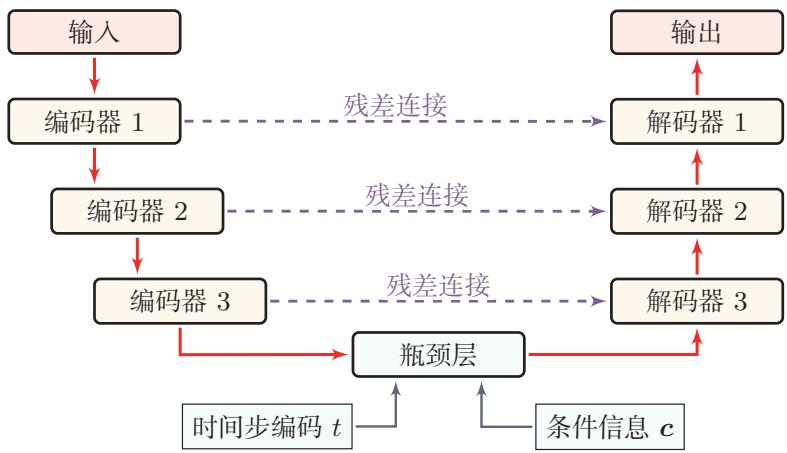  
图 16.14 扩散模型中常见的U-Net 式去噪网络

随着模型规模增大，纯卷积U-Net之外也出现了基于Transformer的扩散骨干，例如 DiT（Diffusion Transformer）一类结构 [Peebles et al.，2023]. 这类方法通常把隐变量切分成图块（patch）序列，再用Transformer进行全局建模.与 $\mathrm { U - N e t }$ 相比，Transformer骨干往往更便于随模型规模扩展，并且与大规模预训练和统一多模态建模更容易结合；但从本质上看，它们仍然是在完成同一件事：在给定噪声水平和条件信息的情况下，预测反向去噪所需的目标量.

## 16.4.6 隐空间扩散模型

前面介绍的去噪网络、时间步编码以及条件注入机制，大多是在“某个表示空间中进行逐步去噪”这一统一框架下展开的.最直接的做法是在像素空间中扩散，但对于高分辨率图像而言，像素张量维度很高，每一步去噪都要处理巨大的特征图，训练和采样的代价都比较大.于是，一个自然的问题是：扩散过程是否一定要在原始像素空间中进行?

隐空间扩散模型（Latent Diffusion Model，LDM）给出的答案是否定的.它的基本思想是：先用自动编码器把图像压缩到一个更紧凑的隐空间，再在这个隐空间中训练扩散模型，最后把生成得到的隐变量解码回像素空间.这样做并不是简单地“先降维再生成”，而是试图把生成任务拆成两个层次：

（1）自动编码器负责把图像映射到一个更适合建模的表示空间，并在解码时恢复局部纹理与细节；

（2）扩散模型则主要在这个表示空间中学习高层语义结构、空间布局以及条件控制下的逐步生成过程.

从这个角度看，隐空间扩散模型其实是前面两节内容的自然延伸：前面“去噪网络与条件控制”讨论的是在给定表示空间中如何逐步去噪并注入条件，而这里进一步讨论的是为什么要把这个表示空间从像素空间换成隐空间，以及这样做会带来什么收益和代价

## 16.4.6.1 隐空间扩散模型的基本框架

隐空间扩散模型通常分为两个阶段.

第一阶段是训练自动编码器.给定图像x，编码器E把它映射到隐变量 $z =$ $E ( { \pmb x } )$ ,解码器 $D$ 再根据 $_ z$ 恢复图像 $\hat { \pmb x } = D ( \pmb z )$ .这里的隐空间既要足够紧凑，以降低后续扩散建模的代价；又不能过于粗糙，否则会在压缩过程中丢失过多语义与细节信息.

第二阶段是在隐空间中训练扩散模型.若记

$$
z _ { 0 } = E ( { \pmb x } ) ,\tag{16.99}
$$

则前向加噪过程写为

$$
\begin{array} { r } { z _ { t } = \sqrt { \bar { \alpha } _ { t } } z _ { 0 } + \sqrt { 1 - \bar { \alpha } _ { t } } \epsilon , \epsilon \sim \mathcal { N } ( \mathbf { 0 } , I ) , } \end{array}\tag{16.100}
$$

https://nndl.ai/

对应的噪声预测目标可写为

$$
\mathcal { L } _ { \mathrm { L D M } } ( \theta ) = \mathbb { E } _ { \boldsymbol { x } , t , \epsilon } \Big [ \| \boldsymbol { \epsilon } - \boldsymbol { \epsilon } _ { \theta } ( \boldsymbol { z } _ { t } , t ) \| ^ { 2 } \Big ] .\tag{16.101}
$$

可以看到，这个目标与像素空间扩散模型在形式上几乎完全一致，真正变化的是：模型不再对 $\mathbf { \boldsymbol { x } } _ { t }$ 去噪，而是对隐变量 $ { \boldsymbol { z } } _ { t }$ 去噪.因此，LDM并不是重新发明了一套新的扩散训练方法，而是把前面已经介绍过的扩散训练与采样框架，迁移到了一个更紧凑、更偏语义的表示空间中.

如果需要条件生成，还可以把文本、类别标签、分割图或布局等信息编码为条件表示c，并通过拼接、条件规范化或交叉注意力等方式注入去噪网络.于是，条件隐空间扩散的目标可写为

$$
\begin{array} { r } { \mathcal { L } _ { \mathrm { L D M } } ( \theta ) = \mathbb { E } _ { \mathbf { x } , c , t , \epsilon } \Big [ \| \epsilon - \epsilon _ { \theta } ( z _ { t } , t , c ) \| ^ { 2 } \Big ] . } \end{array}\tag{16.102}
$$

比如文本到图像模型经常先用文本编码器把文本提示词映射为一组条件词元，再通过交叉注意力与隐空间特征交互.

图16.15给出了隐空间扩散模型的典型结构：先用自动编码器把高维图像压缩到隐空间，再在隐空间中执行扩散与去噪，并通过交叉注意力等机制把文本条件注入去噪网络.

  
图16.15 隐空间扩散模型的基本框架

隐空间扩散模型的优势主要体现在三个方面.首先，隐空间维度通常远低于原始像素空间，因此无论训练还是采样，每一步需要处理的张量都更小，计算与显存开销明显降低.其次，自动编码器已经在一定程度上把局部冗余压缩掉，使得扩散模型可以把更多建模能力集中在对象结构、语义关系和全局布局等更高层的信息上.再次，条件信息通过交叉注意力等机制注入隐空间去噪网络后，往往比在高分辨率像素空间中直接建模更高效，也更容易扩展到文本到图像、图像编辑、多模态生成等场景.

不过，这种做法并不是没有代价，由于扩散过程发生在隐空间中，最终生成质量不仅取决于去噪网络本身，还强烈依赖自动编码器的压缩与重建能力．如果隐空间过于粗糙，或者解码器无法很好地恢复细节，那么后续扩散过程即使已经在隐空间中生成了“正确的语义结构”，也可能在还原到像素空间时出现纹理缺失、细节模糊甚至伪影.因此，隐空间扩散模型本质上是在计算效率与信息保真之间做折中：隐空间压缩得越强，生成越高效，但也越容易损失细节；隐空间保留的信息越多，重建质量越高，但扩散建模的成本也会随之上升

这里存在一个更深层的问题：隐空间的表示主要由自动编码器的重建目标所决定，而并非为扩散模型的生成目标量身设计．简单增加隐空间的通道维数虽然可以保留更多信息、提升重建质量，但扩散模型在这个更高维的隐空间中进行生成时，效果往往反而会下降[Yao et al.,2025]. 这表明重建效果的提升并不必然带来生成质量的提升，两个目标之间存在固有的张力.

针对这一问题，一类后续工作尝试调节隐空间的数据表征，使其更加契合扩散模型 “从粗到细”的生成特性 [Ning et al., 2025; Skorokhodov et al., 2025].其基本思想是：如果隐空间中的表示能够按照语义层次有序组织—低频的全局结构在早期去噪步骤中就可以被捕获，高频的局部细节留到后期再逐步填充—那么扩散模型的建模难度就会降低，生成质量也会随之提升

StableDiffusion（稳定扩散模型）是这一路线的代表性模型之一，其核心思想可以概括为：先压缩，再扩散，最后解码.它表明，扩散模型并不一定要在原始像素空间中工作；只要隐空间具有足够好的语义表达能力和重建能力，扩散过程完全可以在隐空间中完成.事实上，隐空间扩散模型中使用的编码器也不必局限于传统的 VAE架构. 例如，已有研究表明[Zheng et al., 2025]，扩散模型可以直接在预训练视觉基础模型（如DINOv2）的特征空间中进行学习，只需训练一个轻量级的解码器将特征映射回像素空间即可．这进一步拓宽了隐空间扩散模型的设计空间，说明只要特征空间具备足够的语义表达能力，扩散建模就不必依赖端到端训练的自动编码器.也正因为如此，隐空间扩散模型成为许多大规模文本到图像系统中的一个关键技术节点：前面的去噪网络、时间步建模、交叉注意力和无分类器引导等技术，大多都可以自然地迁移到这一框架中，并在更可承受的计算成本下运行.

## 16.5 流匹配

扩散模型的核心思路是“先加噪，再去噪”:通过预先设计一个破坏数据的随机过程，再让网络学习如何反向恢复.一个自然的问题是：能不能不绕这个弯，直接学习一个从简单分布到数据分布的变换？

流匹配（Flow Matching）正是沿着这一思路的方法[Lipman et al., 2023].它把生成过程想象为粒子在空间中的流动：从一团高斯噪声出发，每个粒子沿着一个速度场平滑地移动，最终在目标数据分布上停下．只要学会了这个速度场，生成样本就等价于求解一个常微分方程.

与扩散模型相比，流匹配的常见特点在于：(1）不需要先定义一个固定的前向加噪过程，训练目标更简洁；(2）传输路径可以被设计得更直，从而有机会减少采样步数；(3）概念上更加直观—网络学到的就是“粒子在每个时刻该往哪个方向移动”.

为了理解流匹配的数学框架，我们先简要回顾微分方程的基本概念

## 数学小知识|常微分方程与随机微分方程

常微分方程（Ordinary Differential Equation,ODE）描述一个变量随时间的演化规则. 给定一个速度场(Velocity Field) v(x, t),ODE

$$
\frac { d \pmb { x } } { d t } = \pmb { v } ( \pmb { x } , t )
$$

规定了在每个时刻t、每个位置x处的运动方向和速度.从初始点 $\scriptstyle { \pmb x } _ { 0 }$ 出发，沿速度场积分即可得到任意时刻的位置 $\mathbf { \Delta x } _ { t } .$ 这条轨迹称为一条流线对应的映射 $\phi _ { t } \colon \pmb { x } _ { 0 } \mapsto \pmb { x } _ { t }$ 称为流映射.

ODE通常无法求得解析解，需要用数值方法近似求解．最简单的是欧拉法（EulerMethod）：将时间区间分为N小步，每步沿当前速度前进一小段 ${ \mathbf { \nabla } } : { \pmb x } _ { t + \Delta t } \approx { \pmb x } _ { t } + v ( { \pmb x } _ { t } , t ) \Delta t .$ 步数越多，近似越精确，但计算开销也越大.

在ODE中加入随机扰动项，就得到随机微分方程（Stochastic Dif-ferential Equation,SDE):

$$
\begin{array} { r } { d \mathbf { x } = v ( \mathbf { x } , t ) d t + \sigma ( t ) d \mathbf { w } , } \end{array}
$$

其中 w为布朗运动（Brownian Motion）—一种连续时间的随机游走.SDE定义的不再是一条确定的轨迹，而是一族随机轨迹

扩散模型的前向加噪过程本质上就是一个SDE：确定性部分让信号逐步衰减，随机部分不断注入噪声.

本节先从连续标准化流出发，介绍流匹配的理论根基和直观图景：然后给出条件流匹配这一核心训练方法；再回头用统一的连续时间视角审视扩散模型理清两类方法的联系与差异；最后讨论采样加速和路径选择等实际问题

## 16.5.1 连续标准化流

标准化流（NormalizingFlow）是一类通过一系列可逆变换把简单分布映射为复杂分布的生成模型.其数学基础是概率分布的变量替换公式.

雅可比矩阵参见第B.3节.

## 数学小知识｜雅可比行列式与变量替换

函数 $\begin{array} { r } { \boldsymbol { y } = \boldsymbol { f } ( \boldsymbol { x } ) } \end{array}$ 的雅可比矩阵的行列式 $\operatorname* { d e t } \left( { \frac { \partial { \pmb y } } { \partial { \pmb x } } } \right)$ 称为雅可比行列式(Jacobian Determinant).雅可比行列式的绝对值描述了从x到y的映射在局部的体积缩放因子

如果x服从分布 $p _ { \pmb { x } } ( \pmb { x } )$ ，且 $\begin{array} { r } { \boldsymbol { y } = \boldsymbol { f } ( \boldsymbol { x } ) } \end{array}$ 为可逆可微映射，那么y的概率密度满足变量替换公式：

$$
p _ { y } ( \pmb { y } ) = p _ { \pmb { x } } \big ( f ^ { - 1 } ( \pmb { y } ) \big ) \left| \operatorname* { d e t } \frac { \partial f ^ { - 1 } } { \partial \pmb { y } } \right| = p _ { \pmb { x } } ( \pmb { x } ) \left| \operatorname* { d e t } \frac { \partial f } { \partial \pmb { x } } \right| ^ { - 1 } ,\tag{16.103}
$$

其中 $\textstyle { \frac { \partial f } { \partial \mathbf { x } } }$ 为变换f的雅可比矩阵.

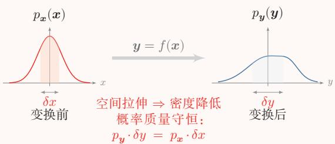

直观上，可逆变换在局部对空间进行拉伸或压缩，为了保持概率总量守恒，密度必须相应地缩放，缩放因子正是雅可比行列式的绝对值的倒数.以一维情形为例，若 $y = 2 x$ ,则 $p _ { y } ( y ) = p _ { x } ( y / 2 ) \cdot | 1 / 2 |$ 密度被“拉伸”后需相应缩小，使得总概率仍为1.

给定基础分布 $p _ { 0 } ( z _ { 0 } )$ (如标准高斯分布），标准化流通过一系列可逆且可微的变换 $f _ { 1 } , f _ { 2 } , \cdots , f _ { K }$ 逐步将 $z _ { \mathrm { 0 } }$ 映射为 $z _ { K }$ ，使其分布逼近目标数据分布x（如图16.16所示). 每一步变换后的密度都可以通过公式(16.103)精确计算.但离散标准化流的每一步变换为了保证可逆性和雅可比行列式的高效计算，结构设计受到较大限制.

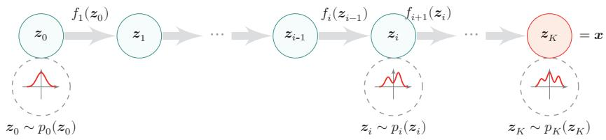  
图16.16 标准化流的基本结构  
连续标准化流(Continuous Normalizing Flow,CNF) [Chen et al., 2018]

则直接定义一个连续时间的动力系统，用神经网络参数化的速度场 $v _ { \theta } ( { \pmb x } , t )$ 来定义一个常微分方程(ODE):

$$
\frac { d \pmb { x } _ { t } } { d t } = v _ { \theta } ( \pmb { x } _ { t } , t ) , \qquad t \in [ 0 , 1 ] ,\tag{16.104}
$$

其中 $\scriptstyle { \mathbf { { \vec { x } } } } _ { 0 }$ 服从基础分布 $p _ { 0 }$ （如标准高斯）， $\scriptstyle { \mathbf { { \vec { x } } } } _ { 1 }$ 的分布即为模型生成的数据分布.这个ODE定义了一个从t = 0到t = 1的连续流映射 $\cdot _ { \phi _ { t } }$ :给定初始点 $\scriptstyle { \mathbf { { \vec { x } } } } _ { 0 }$ ,沿速度场积分就得到终点 ${ \pmb x } _ { 1 } = \phi _ { 1 } ( { \pmb x } _ { 0 } )$

这里 $\mathbf { \boldsymbol { x } } _ { 0 } , \mathbf { \boldsymbol { x } } _ { 1 }$ 的定义刚好和扩散模型相反.

与离散标准化流相比，CNF不必专门把每一层设计成易求逆、易求雅可比行列式的结构；只要速度场满足适当的光滑性或Lipschitz条件，ODE定义的流映射就具有可逆性.

可以把概率密度 $p _ { t } ( { \pmb x } )$ 想象为一种“流体”，速度场 $v _ { \theta }$ 则规定了流体在每个时刻、每个位置的流动方向和速率.流体在运动过程中总量守恒，只是从一处流向另一处.这个守恒关系由连续性方程（Continuity Equation）精确刻画：

$$
\frac { \partial p _ { t } ( { \pmb x } ) } { \partial t } + \nabla \cdot ( p _ { t } ( { \pmb x } ) v _ { \theta } ( { \pmb x } , t ) ) = 0 .\tag{16.105}
$$

第一项是密度随时间的变化，第二项是速度场 $v _ { \theta }$ 对密度 $p _ { t }$ 的输运效应；两者之和为零，正对应概率总量守恒. 公式(16.105)可以看作变量替换公式(16.103)在连续时间下的微分形式

$\begin{array} { r } { \nabla \cdot \pmb { v } = \sum _ { i } \frac { \partial v _ { i } } { \partial x _ { i } } } \end{array}$ 称为向量场v的散度，衡量向量场在某点的“散开”或“汇聚”程度：散度为正表示该点在发射流体(密度降低)，散度为负则表示流体在汇聚(密度升高).

沿着一条流线，对数密度的变化可由瞬时变量替换公式（InstantaneousChange of Variables)给出:

$$
\log p _ { 1 } ( { \pmb x } _ { 1 } ) = \log p _ { 0 } ( { \pmb x } _ { 0 } ) - \int _ { 0 } ^ { 1 } \nabla \cdot { \boldsymbol v } _ { \theta } ( { \pmb x } _ { t } , t ) d t .\tag{16.106}
$$

也就是说，要计算终点 $\mathbf { \boldsymbol { x } } _ { 1 }$ 的似然，只需沿着流线积累速度场的散度.

然而，计算散度 $\nabla$ $v _ { \theta }$ 的代价与数据维度d成正比，且训练时每一步都需要对ODE进行数值积分，这使得直接最大化对数似然的训练成本很高．流匹配方法正是为了解决这个难题而提出的：用一个更简单的回归目标来训练CNF，绕开似然和散度计算

## 16.5.2 条件流匹配

流匹配的核心目标是训练速度场 $v _ { \theta } ( { \pmb x } , t )$ ，使其定义的流能把基础分布 $p _ { 0 }$ 映射为数据分布 $p _ { 1 } \approx p _ { \mathrm { d a t a } }$ .假设存在一条理想的概率路径 $p _ { t } ( { \pmb x } )$ (从 $p _ { 0 }$ 到 $p _ { 1 } )$ 及其对应的目标速度场 ${ u } _ { t } ( \pmb { x } )$ ，最自然的训练目标是

$$
\mathcal { L } _ { \mathrm { F M } } ( \theta ) = \mathbb { E } _ { t \sim \mathcal { U } [ 0 , 1 ] } \mathbb { E } _ { { \pmb x } \sim { \pmb p } _ { t } ( { \pmb x } ) } \left\| v _ { \theta } ( { \pmb x } , t ) - u _ { t } ( { \pmb x } ) \right\| ^ { 2 } .\tag{16.107}
$$

https://nndl.ai/

这就是边际流匹配目标.然而，边际分布 $p _ { t } ( { \pmb x } )$ 和目标速度场 $u _ { t } ( \pmb { x } )$ 都没有解析形式，无法直接计算

条件流匹配（Conditional FlowMatching，CFM）的关键洞察是：虽然直接建模“整体如何从噪声变成数据”很困难，但如果固定一个具体的数据点 $\scriptstyle { \mathbf { { x } } } _ { 1 }$ 作为终点，再设计一条从噪声到它的路径，就变得非常简单—最简单的就是一条直线.

这个思路可以用一个类比来理解：城市里几百万辆车的整体流动规律难以直接描述，但每一辆车自己的行驶路径（起点到目的地）却很容易描述.如果我们知道每辆车的个体路径，就可以通过平均得到整体的车流规律.

数学上，这对应于把边际概率路径写成条件路径的混合：

$$
p _ { t } ( { \pmb x } ) = \int p _ { \mathrm { d a t a } } ( \pmb x _ { 1 } ) p _ { t | 1 } ( \pmb x | \pmb x _ { 1 } ) d \pmb x _ { 1 } ,\tag{16.108}
$$

其中 $p _ { t | 1 } ( \pmb { x } | \pmb { x } _ { 1 } )$ 是以数据点 $\scriptstyle { \mathbf { { x } } } _ { 1 }$ 为终点的条件概率路径.对应地，在时刻t的位置$_ { \textbf { \em x } }$ 处，可能有多条来自不同数据点的条件路径经过边际速度场就是这些条件速度的加权平均：

$$
u _ { t } ( \pmb { x } ) = \mathbb { E } _ { \pmb { x } _ { 1 } \sim p _ { 1 \mid t } ( \cdot | \pmb { x } ) } \left[ u _ { t } ( \pmb { x } | \pmb { x } _ { 1 } ) \right] .\tag{16.109}
$$

尽管边际速度场 $u _ { t } ( \pmb { x } )$ 本身无法直接计算，但可以证明直接对条件速度场做回归和对边际速度场做回归的梯度是一致的．这意味着训练时我们只需要处理简单的条件目标，就能在梯度意义上优化同一个边际目标—网络会在每个位置上学习“平均”所有经过的条件路径.

具体来说，定义从噪声 $\scriptstyle { \mathbf { { x } } _ { 0 } }$ 到数据 $\mathbf { \boldsymbol { x } } _ { 1 }$ 的线性插值路径：

$$
\begin{array} { r } { x _ { t } = ( 1 - t ) { \pmb x } _ { 0 } + t { \pmb x } _ { 1 } , \qquad { \pmb x } _ { 0 } \sim \mathcal { N } ( \mathbf { 0 } , I ) , \quad { \pmb x } _ { 1 } \sim p _ { \mathrm { d a t a } } , } \end{array}\tag{16.110}
$$

对应的条件速度场为 $u _ { t } ( { \pmb x } _ { t } | { \pmb x } _ { 1 } ) = { \pmb x } _ { 1 } - { \pmb x } _ { 0 }$ ,即从 $\scriptstyle { \mathbf { { \vec { x } } } } _ { 0 }$ 到 $\scriptstyle { \mathbf { { x } } } _ { 1 }$ 的匀速直线运动.条件流匹配的训练目标定义为

$$
{ \mathcal L } _ { \mathrm { C F M } } ( \theta ) = \mathbb E _ { t \sim \mathcal U [ 0 , 1 ] } \mathbb E _ { { \boldsymbol x } _ { 1 } \sim p _ { \mathrm { d a t a } } } \mathbb E _ { { \boldsymbol x } _ { 0 } \sim p _ { 0 } } \left. \boldsymbol v _ { \theta } ( { \boldsymbol x } _ { t } , t ) - ( { \boldsymbol x } _ { 1 } - { \boldsymbol x } _ { 0 } ) \right. ^ { 2 } ,\tag{16.111}
$$

其中 $\mathbf { \boldsymbol { x } } _ { t }$ 由公式(16.110)给出. 可以证明 ${ \mathcal { L } } _ { \mathrm { C F M } }$ 与边际流匹配目标 $\mathcal { L } _ { \mathrm { F M } }$ 具有相同的梯度，因此优化条件目标在梯度意义上等价于优化边际目标.训练时只需采样$\mathbf { \boldsymbol { x } } _ { 1 } \sim p _ { \mathrm { d a t a } } , \mathbf { \boldsymbol { x } } _ { 0 } \sim \mathcal { N } ( \mathbf { \boldsymbol { 0 } } , I ) , t \sim \mathcal { U } [ 0 , 1 ]$ ，构造插值点 $\mathbf { \mathcal { x } } _ { t }$ 和目标速度 ${ \pmb x } _ { 1 } - { \pmb x } _ { 0 }$ ,然后做回归即可．这与扩散模型的噪声预测训练非常相似，但概念上更加透明：网络直接学习的就是“从当前位置到目标的速度”.

图16.17展示了条件流匹配的核心思想：每条彩色直线是一条从噪声点到数据点的条件路径，网络学习的边际速度场（黑色箭头）是这些条件方向在每个位置上的加权平均.

  
图 16.17 条件流匹配示意

采样时，从 $\mathbf { \boldsymbol { x } } _ { 0 } \sim \mathcal { N } ( \mathbf { \boldsymbol { 0 } } , I )$ 出发，用ODE求解器对速度场 $v _ { \theta }$ 进行数值积分，从 $t = 0$ 积分到t=1即可得到生成样本.由于流匹配的传输路径通常比较平直，在实践中往往只需较少的积分步数（如20\~50步）即可获得高质量样本.

## 16.5.3 扩散模型的连续时间视角

有了ODE和SDE的概念框架之后，我们可以从连续时间的角度重新审视扩散模型.此前介绍的DDPM是在离散时间步 $t = 1 , 2 , \cdots , T$ 上定义的马尔可夫链：每一步向样本中添加少量高斯噪声.如果把时间步数T取得非常大、每步加的噪声非常小，这个离散过程就会逼近一个连续时间的随机过程—形式上正是一个SDE.

前向 SDE 以扩散模型中最常用的方差保持(Variance Preserving,VP)扩散为例，其前向过程可写为

$$
d \mathbf { { x } } = - \frac { 1 } { 2 } \beta ( t ) \mathbf { { x } } d t + \sqrt { \beta ( t ) } d \mathbf { { w } } ,\tag{16.112}
$$

其中 $\beta ( t ) > 0$ 为噪声调度函数，w表示布朗运动.直观上，第一项让信号x按指数速率衰减，第二项以相匹配的幅度注入高斯噪声；两者配合使 $\mathbf { \boldsymbol { x } } _ { t }$ 的方差在整个过程中保持有界(这也是“方差保持”名字的由来).

反向SDE 与前向过程对应的反向时间过程满足

$$
d \pmb { x } = \left[ - \frac { 1 } { 2 } \beta ( t ) \pmb { x } - \beta ( t ) \nabla _ { \pmb { x } } \log p _ { t } ( \pmb { x } ) \right] d t + \sqrt { \beta ( t ) } d \bar { \bf w } ,\tag{16.113}
$$

其中 $\bar { \bf w }$ 为反向时间的布朗运动， $\nabla _ { x } \log p _ { t } ( \pmb { x } )$ 是带噪分布 $p _ { t } ( { \pmb x } )$ 的分数函数.对比公式(16.112)和公式(16.113)可以看到：反向过程比前向过程多了一个正比于分数函数的漂移项—这正是“把样本往数据密度高的区域推”的修正.只要能够在每个时刻估计当前带噪分布的分数函数，就能沿着反向SDE把样本从纯噪声逐步推回数据分布

这就把扩散模型的采样过程统一为一个数学问题：如何高效数值求解反向SDE. DDPM和DDIM都可以看作这个连续SDE的某种离散化—前者更接近原始随机SDE的逐步模拟，后者则对应某种确定性或弱随机的近似路径.

概率流ODE 对同一个前向SDE（公式(16.112)），还存在一个与之共享相同边际分布的确定性过程，称为概率流ODE：

$$
d \pmb { x } = \left[ - \frac { 1 } { 2 } \beta ( t ) \pmb { x } - \frac { 1 } { 2 } \beta ( t ) \nabla _ { \pmb { x } } \log p _ { t } ( \pmb { x } ) \right] d t .\tag{16.114}
$$

它与反向SDE的区别在于不再显式引入随机噪声，因此生成轨迹在给定初值后完全确定—不同初值唯一对应不同的生成样本．概率流ODE的意义有两点：其一，采样可以直接借助常微分方程的数值求解器（如Runge-Kutta等）来完成，并据此设计出若干高阶快速采样器[Lu et al.,2022];其二，它为扩散模型和流匹配之间的联系提供了一座桥梁.

## 16.5.4 与扩散模型的联系

有了扩散模型的连续时间表述，流匹配与扩散模型之间的联系就变得清晰了.扩散模型的概率流ODE(公式(16.114))本身就定义了一个从噪声到数据的确定性流，因此扩散模型也可以从连续流的角度来理解，只不过其速度场是通过“先定义前向SDE，再推导分数函数”间接得到的.从训练目标看，扩散模型训练的是噪声预测 $\epsilon _ { \theta }$ 或分数函数 $\nabla _ { x } \log p _ { t } ( \pmb { x } )$ ，而流匹配训练的是速度场 $v _ { \theta }$ ，两者之间在特定参数化下存在转换关系.从这个意义上说，它们共享连续时间生成建模的同一组数学工具.

两者的关键区别在于传输路径的形状.扩散模型由于噪声调度 $\{ \beta _ { t } \}$ 的设计，传输路径通常是弯曲的；而流匹配的线性插值路径（公式(16.110)）是直线．直线路径往往使速度场更平滑，OQDE也更容易用较少的步数近似求解.因此，流四配在实践中常见的潜在优势包括训练目标更简洁、采样步数更少，以及可以方便地替换不同的插值路径或耦合方式

## 16.5.5 采样加速

无论是扩散模型还是流匹配，采样都需要对ODE或SDE进行多步数值求解.如何在保持质量的前提下减少步数，是实际应用中的核心问题.

## 16.5.5.1 预测-校正采样与高阶快速求解器

在连续时间视角下，预测-校正（Predictor-Corrector，PC）采样是一种很自然的采样方法.其中，预测器沿反向SDE走一步，把样本从较大的噪声水平推进到较小的噪声水平；校正器则在当前噪声尺度上做若干次Langevin更新，利用分数函数把样本进一步推回更合理的高概率区域.前者负责“全局推进”，后者负责“局部修正”．这种分工有助于减小离散化误差，并在一定程度上提高样本质量.

从工程角度看，PC采样虽然概念清晰，却往往仍然较慢，因为每个噪声尺度上还要额外做若于次校正.另一条思路是把采样明确看作一个数值求解问题，并针对扩散模型的特殊结构设计更高效的专用求解器.一个代表性例子是DPM-Solver（DPM-Solver），即面向扩散概率模型的高阶求解器：它把采样解释为对扩散ODE的求解，利用问题本身的解析结构构造高阶求解器，从而在不重新训练模型的前提下减少所需步数

## 16.5.5.2 一致性模型与少步生成

除了改进数值求解器，还有一条不同的加速路线：通过蒸馏或一致性建模，直接训练能够用极少步甚至一步生成样本的新模型

在其原始论文中，DPM-Solver 在若干数据集上只需10到20次函数评估就能得到高质量样本，并相对此前无训练加速采样器带来4～16倍的速度提升.

一致性模型（ConsistencyModel）的核心思想是直接学习从噪声到数据的映射，使得ODE轨迹上同一条路径的任意两点都映射到相同的起始数据点，即满足自一致性（self-consistency）[Song et al.，2023]. 形式上，一致性函数$f _ { \theta } ( \pmb { x } _ { t } , t )$ 满足:对同一ODE轨迹上的任意 $t _ { 1 } , t _ { 2 }$ ,有 $f _ { \theta } ( \pmb { x } _ { t _ { 1 } } , t _ { 1 } ) = f _ { \theta } ( \pmb { x } _ { t _ { 2 } } , t _ { 2 } )$

一致性模型有两种训练方式：一致性蒸馏（ConsistencyDistillation）从预训练的扩散模型中蒸馏知识，通过最小化同一ODE轨迹上相邻两点的一致性损失来训练；一致性训练（ConsistencyTraining）则不依赖预训练模型，直接从数据中学习.训练完成后，一致性模型可以在单步内从纯噪声生成数据，也可以通过少量步骤迭代细化以提升质量，在生成速度和质量之间提供了灵活的权衡.

在一致性模型和流匹配的基础上，流图（Flow Map）框架[Boff et al.,2025试图直接学习流的映射函数而非速度场，为少步生成提供了另一种理论视角.

## 16.5.6 最优传输与路径选择

流匹配框架中的一个重要自由度是：如何选择从噪声到数据的传输路径?在前面的讨论中，我们使用了最简单的独立耦合：随机采样一个噪声 $\scriptstyle { \mathbf { { \vec { x } } } } _ { 0 }$ 和一个数据点 $\scriptstyle { \mathbf { { x } } } _ { 1 }$ ，然后用线性插值连接它们.这种做法存在一个关键问题：路径交叉（如图16.18(a)所示).虽然ODE的解具有唯一性，不同的边际轨迹不会交叉，但不同数据点对应的条件路径可能在空间中大量相交.当两条条件路径在某个中间时刻t经过同一个空间位置时，它们指向不同的目标 $\scriptstyle { \pmb { x } } _ { 1 }$ ，导致训练时网络在该位置收到相互矛盾的梯度信号.这不仅增大了训练方差，也使得学到的边际速度场变得弯曲，采样时需要更多的ODE求解步数才能保证精度.

  
(a)独立耦合:路径交叉

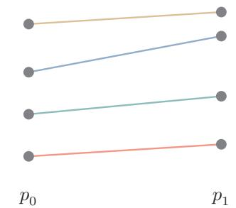  
(b)最优传输耦合:路径不交叉  
图16.18 独立耦合与最优传输耦合的对比

最优传输条件流匹配（Optimal Transport Conditional Flow Matching，OT-CFM） [Tong et al., 2024] 的想法是：用最优传输（Optimal Transport，OT）来改善噪声与数据之间的配对方式，使得整体传输代价最小.最优传输的经典结果表明，对于高斯源分布和一般目标分布，最优传输映射倾向于把“近”的噪声点分配给“近”的数据点，从而减少路径的交叉和总距离.

在实际训练中，对整个数据集求全局最优传输耦合计算量太大.OT-CFM采用了一种实用的小批量最优传输（Mini-batchOT）近似:在每个训练批次中，对批次内的 $\scriptstyle { \mathbf { { \vec { x } } } } _ { 0 }$ 和 $\scriptstyle { \mathbf { { \vec { x } } } } _ { 1 }$ 求解一个小规模的最优传输问题（通常是线性指派问题），用得到的最优配对替代随机配对．虽然这只是全局OT的近似，但通常能够减少路径交叉，使学到的速度场更平滑，从而加速训练收敛并提高生成质量.

除了最优传输耦合，矫正流（Rectified Flow)[Liu et al., 2023]提出了另一种改善路径的思路：迭代矫正.矫正流学习的速度场可以用条件期望来表示：

$$
v ( z , t ) = \mathbb { E } \left[ \pmb { x } _ { 1 } - \pmb { x } _ { 0 } \ | \ \pmb { x } _ { t } = z \right] ,\tag{16.115}
$$

即在时刻t经过点z的所有条件路径方向的平均值.当路径交叉严重时，这个平均值会偏离任何一条具体路径的方向，导致速度场弯曲.

矫正流的核心思想是通过迭代来减少交叉：先用独立耦合训练一个初始的流模型，然后用这个模型生成 $( \pmb { x } _ { 0 } , \pmb { x } _ { 1 } )$ 配对——即从噪声 $\scriptstyle { \mathbf { { \vec { x } } } } _ { 0 }$ 出发，用训练好的ODE生成对应的 $\mathbf { \boldsymbol { x } } _ { 1 }$ —再用这些新配对重新训练模型．由于新配对中的 $\scriptstyle { \mathbf { { \vec { x } } } } _ { 0 }$ 和$\scriptstyle { \mathbf { { x } } } _ { 1 }$ 之间已经存在ODE流的对应关系，重新训练时的路径会更直、交叉更少．这一过程可以迭代多次，使传输路径逐步接近直线，从而有机会让模型在很少的步数内生成质量较高的样本.

## 16.5.7 应用

流匹配可以作为大规模生成系统中的一条重要技术路线.在图像生成领域，一些文本到图像系统采用基于矫正流的流匹配框架，并与DiT（DiffusionTransformer）等骨干网络结合，以改善生成质量和采样效率[Esser et al.2024].在视频生成领域，流匹配的直线传输路径也有助于在有限步数内生成时间上连贯的视频帧

从更广的视角看，流匹配与扩散模型之间的边界并不绝对—两者的核心技术（条件控制、无分类器引导、隐空间建模等）可以高度共享，在连续时间表述下，二者都可以理解为学习从简单分布到数据分布的动力系统；流匹配通过更直接的速度场回归和可设计的路径，提供了另一条高效技术路线.

## 16.6 总结和扩展阅读

本章围绕“如何学习并生成复杂数据分布”这一核心问题，介绍了四条代表性的技术路线：变分自编码器、生成对抗网络、扩散模型和流匹配.四类模型虽然形式差异很大，但本质上都在回答同一个问题：如何把一个简单分布逐步变成真实数据分布.

如果从方法论上看，这四类模型分别代表了四种典型思路：

（1）变分自编码器：通过引入隐变量与近似后验，把复杂生成过程转化为“生成模型+推断模型”的联合学习问题.其优势在于概率解释清晰、训练目标明确，并且便于学习连续、规整的隐空间表示.

（2）生成对抗网络：通过生成器和判别器之间的对抗博弈来逼近真实数据分布．它不要求显式写出样本密度，因此常能生成较锐利的样本，但训练是一个极小极大问题，容易出现不稳定和模式坍塌.

（3）扩散模型：通过“逐步加噪+逐步去噪”的方式，把一次困难的生成任务拆解为很多局部、相对容易的去噪问题.它在训练稳定性、生成质量以及条件控制方面表现较好，但通常需要较多采样步数，计算成本更高.

（4）流匹配：通过直接学习一个从噪声到数据的连续速度场，把生成过程建模为常微分方程的求解.它在概念上比扩散模型更简洁，传输路径更直，训练和采样都可以从数值求解角度进行优化，是大规模生成系统中的一条重要技术路线.

从更统一的视角看，这四类模型都体现了生成建模中的几个共同思想，第一，高维复杂分布通常难以直接建模，因此往往需要借助隐变量、对抗训练或分步变换来降低难度；第二，生成模型不仅是“生成新样本”的工具，也可以作为表示学习、条件控制、数据增强和逆问题求解的基础：第三，生成模型的发展强调不同思想之间的组合，例如先学习隐空间，再在隐空间中引入更强的生成器，或者把文本、布局、类别等条件注入整个生成过程

表16.1从生成模型的统一视角、评估方式和应用边界给出了一个简要对照这里也把自回归生成列入表中：它通过链式法则分解 $\begin{array} { r } { p ( \pmb { x } ) = \prod _ { i } p ( x _ { i } | \boldsymbol { x } _ { < i } ) } \end{array}$ ,在文本和序列生成中十分重要，虽然不是本章的主要展开对象，但有助于理解显式似然模型与采样式生成模型之间的差异.

表16.1 几类生成建模路线的统一视角与评估重点
<table><tr><td>路线</td><td>概率与采样视角 主要优势</td><td>点</td><td>评估时的常见盲</td></tr><tr><td>量模型</td><td>VAE/隐变最大化ELBO，用近概率解释清晰，隐重构好不等于样 似后验  $q _ { \phi } ( z | x )$  学习</td><td>辅助空间较规整</td><td>本自然；KL项过 强可能导致后验 坍塌.</td></tr><tr><td>模型</td><td>GAN/隐式直接学习从噪声到样单步生成快，样本容易只看少量样 本的映射，不显式给出可很锐利 密度</td><td></td><td>本质量，忽略多样 性和模式坍塌.</td></tr><tr><td></td><td>自回归模型按顺序分解联合分布，似然目标明确，适采样误差会累积， 逐步采样</td><td>合离散序列</td><td>长程一致性和解 码策略影响很大.</td></tr><tr><td>型</td><td>扩散/分数模学习多噪声水平下的训练稳定，条件控采样成本高，视觉</td><td>制灵活</td><td>质量不等于语义</td></tr><tr><td></td><td>去噪或分数函数</td><td></td><td>正确或条件忠实. 流匹配/连续学习从噪声到数据的路径清晰，少步采路径选择、数值求</td></tr></table>

生成模型的评估不能只依赖单一指标.对数似然或ELBO更接近密度估计目标，但不一定对应人眼感知质量；基于特征分布的样本质量指标可以衡量真实样本和生成样本的整体接近程度，但可能忽略条件是否被正确满足、样本是否足够多样、是否包含训练数据记忆；下游任务指标可以衡量生成数据是否有用，但会受到任务模型和数据划分的影响.因此，在实际使用中通常需要同时检查保真度、多样性、条件一致性、下游效用、不确定性校准和安全边界.对于带条件的生成任务，还应特别检查模型是否真正使用了条件信息，而不是只生成看似合理但与条件不一致的样本

在分子设计、材料设计和科学计算等场景中，生成模型往往不是一次性输出结果的工具，而是嵌入到设计一筛选一验证一反馈的闭环中.模型先提出候选结构，再由模拟器、规则约束、专家判断或真实实验评估其性质；评估结果反过来更新训练集或重加权采样策略.这一过程和主动学习密切相关：当实验代价很高时，系统不应只追求看起来最优的样本，还应考虑不确定性、可合成性、约束满足和探索覆盖面.这样才能避免模型在训练分布附近反复生成相似候选，或在缺少证据的区域给出过度自信的建议

如果希望继续深入理解变分自编码器，建议先抓住两个最核心的问题：一是为什么要引入隐变量，二是为什么要用变分下界替代直接最大化对数似然.围绕这两个问题，原始VAE论文和随机梯度变分推断工作给出了最关键的思想框架，而教程性综述则更适合理清“生成模型、推断网络、重参数化技巧、ELBO分解”之间的关系 [Doersch, 2016; Kingma et al., 2014; Rezende et al., 2014]. 阅读这条线索时，建议重点把握：ELBO到底近似了什么，重参数化技巧到底解决了什么问题.

如果希望进一步理解生成对抗网络，建议不要只停留在“样本看起来很真”这一经验现象上，而要重点理解其背后的极小极大优化与分布判别思想.原始GAN论文最值得反复推敲的是判别器最优解及其与JS散度的关系；DCGAN适合帮助读者理解早期生成网络中较稳定的卷积结构设计；W-GAN则代表了从“对抗训练不稳定”这一现象出发，对距离度量和优化目标所做的重要改进[Arjovsky et al., 2017; Goodfellow et al., 2014; Radford et al., 2016]. 阅读这一部分时，建议重点思考：GAN究竟是在学习一个密度函数，还是在学习一种把简单噪声映射到真实样本空间的机制.

如果希望进一步理解扩散模型，建议按“离散扩散→快速采样→分数函数与连续时间视角 →隐空间扩散”这一顺序阅读[Ho et al., 2020; Rombachet al., 2022; Song et al., 2021a,b]. DDPM奠定了离散时间扩散训练与采样的基本框架，DDIM说明了为何在保持训练目标不变时仍可构造更快的确定性采样路径，分数模型与随机微分方程给出了统一的连续时间理论视角，而隐空间扩散展示了扩散模型如何扩展到高分辨率生成系统.阅读这一部分时，可以始终围绕一个问题展开：扩散模型真正学习的，到底是“逐步恢复样本”的能力，还是“刻画数据分布局部几何结构”的能力.

如果希望进一步理解流匹配，建议从连续标准化流的基本思想出发，沿着“Neural ODE → 条件流匹配 → 最优传输与矫正流”的线索阅读[Chen et al.,2018; Lipman et al., 2023; Liu et al., 2023; Tong et al., 2024]. Neural ODE给出了连续时间生成模型的基本框架，条件流匹配则解决了“如何绕开似然计算直接训练速度场”这一核心问题，最优传输和矫正流进一步从路径优化的角度提升了生成效率.阅读时，建议重点思考：流匹配与扩散模型在训练目标上的区别，到底只是参数化的不同，还是反映了对“生成”这件事的不同理解.

总体来看，深度生成模型的发展，本质上是在不断寻找更稳定、更可控、更高效的方式，把简单分布转化为复杂数据分布．理解了本章中的隐变量表示、重参数化、对抗训练、分布匹配、噪声预测、速度场学习、条件控制等关键思想，后续再进入多模态生成、可控生成以及更大规模的预训练生成系统时，就更容易把新方法放回到清晰的知识坐标中.

## 习题

## 基础题

习题16-1 简述显式密度模型与隐式密度模型的区别，并说明变分自编码器、生成对抗网络和扩散模型分别属于哪一类方法.对于扩散模型，进一步说明它为什么既具有显式概率建模的一面，又常以“逐步去噪生成”的方式来理解

习题16-2 推导公式(16.26),并说明其中忽略了哪些与参数无关的常数项.

习题16-3 变分自编码器与普通自编码器在网络结构上都具有“编码器一解码器”的形式.请说明两者在以下几个方面的本质区别：隐变量是否是随机变量，训练目标是否对应显式概率模型，重构项与正则项各自起什么作用，以及为什么VAE可以自然地用于生成而普通自编码器通常不能直接做到这一点.

习题16-4 根据公式(16.60),推导公式(16.62).

习题16-5 说明为什么在公式(16.78)中预测噪声 $\epsilon$ ,可以等价地看作学习反向去噪过程.

习题16-6 在扩散模型中，常见的参数化方式包括预测 $\scriptstyle { \mathbf { { \vec { x } } } } _ { 0 }$ 、预测噪声∈和预测速度v.请比较这三种参数化方式在训练目标、数值稳定性和采样实现上的联系与差异.

## 提高题

习题16-7假设一个二分类问题，类别为 $c _ { 1 }$ 和 $c _ { 2 }$ ,并有 $p ( c _ { 1 } ) = p ( c _ { 2 } )$ .样本x在 两个类的条件分布为 $p ( \pmb { x } | c _ { 1 } )$ 和 $p ( \pmb { x } | c _ { 2 } )$ ，一个分类器 $f ( \pmb { x } ) = p ( c _ { 1 } | \pmb { x } )$ 用于预测 一个样本x来自类别 $c _ { 1 }$ 的条件概率.证明若采用交叉熵损失，

$$
\mathcal { L } ( f ) = \mathbb { E } _ { { \mathbf { x } } \sim p ( { \mathbf { x } } | c _ { 1 } ) } \Big [ \log f ( { \pmb x } ) \Big ] + \mathbb { E } _ { { \mathbf { x } } \sim p ( { \pmb x } | c _ { 2 } ) } \Big [ \log \big ( 1 - f ( { \pmb x } ) \big ) \Big ] ,\tag{16.116}
$$

则最优分类器 $f ^ { \star } ( x )$ 为

参见公式(16.35).

$$
f ^ { \star } ( { \pmb x } ) = \frac { p ( { \pmb x } | c _ { 1 } ) } { p ( { \pmb x } | c _ { 1 } ) + p ( { \pmb x } | c _ { 2 } ) } .\tag{16.117}
$$

习题16-8 分析下面函数是否满足Lipschitz连续条件.

(1) $f : [ - 1 , 1 ] \to \mathbb { R } , f ( x ) = x ^ { 2 }$

(2) $f : \mathbb { R } \to \mathbb { R } , f ( x ) = x ^ { 2 } ;$

(3) $f : \mathbb { R } \to \mathbb { R } , f ( x ) = { \sqrt { x ^ { 2 } + 1 } }$

(4) $f : [ 0 , 1 ] \to [ 0 , 1 ] , f ( x ) = { \sqrt { x } } .$

习题16-9 从公式(16.50)出发，说明为什么当把约束从 $\| f \| _ { L } \leq 1$ 放宽为 $\| f \| _ { L } \leq$ K时，可以得到公式(16.52). 并解释其中常数K为什么不会改变最优生成器的解.

习题16-10 利用高斯分布的乘积仍为高斯分布这一事实，推导扩散模型真实后验分布 $q ( \pmb { x } _ { t - 1 } | \pmb { x } _ { t } , \pmb { x } _ { 0 } )$ 的均值与方差表达式

习题16-11 比较DDPM采样与DDIM采样的联系与差异.特别地，请说明：(1)它们在训练目标上是否相同；(2）它们的反向过程为何一个是随机的、一个可以是确定性的；(3)为什么DDIM通常更适合做少步采样.

习题16-12 对于一个分布为 $p _ { \theta } ( z )$ 的离散随机变量z,以及函数f(z)，如何计算期望 $\mathcal { L } ( \theta ) = \mathbb { E } _ { z \sim p _ { \theta } ( z ) } [ f ( z ) ]$ 关于分布参数θ的导数.

参见第16.2.4节.

## 拓展题

习题16-13 某任务需要在给定文本条件下生成图像，同时还希望能够学习较好的隐空间表示，以便后续做检索和编辑.请从变分自编码器、生成对抗网络和扩散模型中选择一种或几种方法进行设计，并说明你的选择依据.回答时可从生成质量、训练稳定性、采样效率、条件控制和隐空间表示等角度进行分析

习题16-14 本章介绍了分数函数、反向SDE以及概率流ODE之间的联系.请尝试从“学习数据分布局部几何结构”的角度，解释这些概念为什么能够被统一到同一个扩散建模框架中.

习题16-15 扩散模型不仅可以用于无条件生成，也可以作为先验来求解图像修复、补全、去噪和超分辨率等逆问题.请选择其中一个任务，说明如何把“观测约束”和“生成先验”结合起来，并讨论这种方法相对判别式直接映射方法可能带来的优势与局限.

习题16-16 证明条件流匹配损失 ${ \mathcal { L } } _ { \mathrm { C F M } }$ 与边际流匹配损失 $\mathcal { L } _ { \mathrm { F M } }$ 具有相同的梯度（提示:将条件损失对所有条件变量求期望，利用全期望公式）.

习题16-17对比条件流匹配（CFM）的线性插值路径 $\begin{array} { r } { \pmb { x } _ { t } = ( 1 - t ) \pmb { x } _ { 0 } + t \pmb { x } _ { 1 } } \end{array}$ 与扩散模型的前向过程路径 $\pmb { x } _ { t } = \sqrt { \bar { \alpha } _ { t } } \pmb { x } _ { 0 } + \sqrt { 1 - \bar { \alpha } _ { t } } \pmb { \epsilon }$ 的几何差异.说明为什么线性路径通常需要更少的ODE积分步数.

## 参考文献

ARJOVSKY M, CHINTALA S, BOTTOU L, 2017. Wasserstein GAN[C]//Proceedings of 34th International Conference on Machine Learning. 214-223.

BOFFI N M, ALBERGO M S, VANDEN-EIJNDEN E, 2025. How to build a consistency model: learning flow maps via self-distillation[J]. Advances in Neural Information Processing Systems.

CHEN R T Q, RUBANOVA Y, BETTENCOURT J, et al., 2018. Neural ordinary differential equations[J. Advances in Neural Information Processing Systems, 31.

DOERSCH C, 2016. Tutorial on variational autoencoders[J/OL]. CoRR, abs/1606.05908. http: //arxiv.org/abs/1606.05908.

ESSER P, KULAL S, BLATTMANN A, et al., 2024. Scaling rectified flow transformers for high-resolution image synthesis[C//Proceedings of 41st International Conference on Machine Learning. 12606-12633.

GOODFELLOW I, POUGET-ABADIE J, MIRZA M, et al., 2014. Generative adversarial nets [C]//Advances in Neural Information Processing Systems. 2672-2680.

HO J, SALIMANS T, 2022. Classifier-free diffusion guidance[A/OL]. arXiv (2022). https: //arxiv.org/abs/2207.12598.

HO J, JAIN A, ABBEEL P, 2020. Denoising diffusion probabilistic models[C]//Advances in Neural Information Processing Systems: Vol. 33. 6840-6851.

KINGMA D P, WELLING M, 2014. Auto-encoding variational bayes[C/OL]//Proceedings of 2nd International Conference on Learning Representations. http://arxiv.org/abs/1312.6114.

LI T, HE K, 2025. Back to basics: let denoising generative models denoise[A/OL]. arXiv (2025). https://arxiv.org/abs/2511.13720.

LIPMAN Y, CHEN R T Q, BEN-HAMU H, et al., 2023. Flow matching for generative modeling [C]//International Conference on Learning Representations.

LIU X, GONG C, LIU Q, 2023. Flow straight and fast: learning to generate and transfer data with rectified flow[C]//International Conference on Learning Representations.

LU C, ZHOU Y, BAO F, et al., 2022. DPM-solver: a fast ODE solver for diffusion probabilistic model sampling in around 10 steps[C]//Advances in Neural Information Processing Systems: Vol. 35. 5775-5787.

NING M, LI M, SU J, et al., 2025. DCTdiff: intriguing properties of image generative modeling in the DCT space[J]. International Conference on Machine Learning.

PEEBLES W, XIE S, 2023. Scalable diffusion models with transformers[J]. Proceedings of the IEEE/CVF International Conference on Computer Vision (ICCV): 4195-4205.

RADFORD A, METZ L, CHINTALA S, 2016. Unsupervised representation learning with deep convolutional generative adversarial networks[C/OL]//Proceedings of 4th International Conference on Learning Representations. http://arxiv.org/abs/1511.06434.

REZENDE D J, MOHAMED S, WIERSTRA D, 2014. Stochastic backpropagation and approximate inference in deep generative models[C]//Proceedings of 31st International Conference on Machine Learning. 1278-1286.

ROMBACH R, BLATTMANN A, LORENZ D, et al., 2022. High-resolution image synthesis with latent diffusion models[C]//IEEE/CVF Conference on Computer Vision and Pattern Recognition. 10684-10695.

RONNEBERGER O, FISCHER P, BROX T, 2015. U-net: convolutional networks for biomedical image segmentation[C]//LNCS: Vol. 9351 Medical Image Computing and Computer-Assisted Intervention (MICCAI). Springer: 234-241.

SKOROKHODOV I, GIRISH S, HU B, et al., 2025. Improving the diffusability of autoencoders [C]//Proceedings of 42nd International Conference on Machine Learning.

SONG J, MENG C, ERMON S, 2021a. Denoising diffusion implicit models[C]//International Conference on Learning Representations.

SONG Y, SOHL-DICKSTEIN J, KINGMA D P, et al., 2021b. Score-based generative modeling through stochastic differential equations[C]//International Conference on Learning Representations.

SONG Y, DHARIWAL P, CHEN M, et al., 2023. Consistency models[C]//International Conference on Machine Learning. 32211-32252.

TONG A, FATRAS K, MALKIN N, et al., 2024. Improving and generalizing flow-based generative models with minibatch optimal transport[J]. Transactions on Machine Learning Research.

VAN DEN OORD A, VINYALS O, KAVUKCUOGLU K, 2017. Neural discrete representation learning[C]//Advances in Neural Information Processing Systems: Vol. 30.

YAO J, YANG B, WANG X, 2025. Reconstruction vs. generation: taming optimization dilemma in latent diffusion models[C/OL]//Proceedings of the IEEE/CVF Conference on Computer Vision and Pattern Recognition. 15703-15712. DOI: 10.1109/CVPR52734.2025.01464.

ZHENG B, MA N, TONG S, et al., 2025. Diffusion transformers with representation autoencoders[A/OL]. arXiv (2025). https://arxiv.org/abs/2510.11690.

# 附 录

## 数学基础

本附录汇总本书后续会反复使用的数学工具，包括线性代数、微积分、数学优化、概率论和信息论等．和第一版相比，这一版在组织上更强调这些工具与深度学习模型、训练和推理过程的联系：线性映射对应神经网络中的线性层，矩阵微积分与链式法则对应反向传播，概率论与信息论则分别对应不确定性建模和常见损失函数.

记号约定 除特别说明外，本书默认向量为列向量.标量通常用斜体小写字母表示，如x,y,a；向量通常用黑斜体小写字母表示，如x,y,a；矩阵通常用黑斜体大写字母表示，如A,X，W；张量用花体字母表示，如.A.一个D维列向量写作 $\pmb { x } = [ x _ { 1 } ; x _ { 2 } ; \cdots ; x _ { D } ] \in \mathbb { R } ^ { D }$ ，与之对应的行向量记为 $[ x _ { 1 } , x _ { 2 } , \cdots , x _ { D } ]$ .矩阵转置统一记为.若没有特别说明，本书中的数据矩阵默认按列堆叠样本，即$\pmb { X } = [ \pmb { x } ^ { ( 1 ) } , \cdots , \pmb { x } ^ { ( N ) } ] \in \mathbb { R } ^ { D \times N }$

## 附录A 线性代数

线性代数主要研究向量、向量空间（或线性空间）、线性映射与矩阵运算，是理解特征表示、神经网络线性层与梯度传播的基础.

## A.1 向量和向量空间

## A.1.1 向量

标量（Scalar）是一个实数，只有大小，没有方向.标量一般用斜体小写英文字母 $a , b , c$ 来表示.向量（Vector)是由一组实数组成的有序数组，同时具有大小和方向.一个N维向量a可以写为

$$
\begin{array} { r } { { \pmb a } = [ a _ { 1 } ; a _ { 2 } ; \cdots ; a _ { N } ] \in \mathbb { R } ^ { N } , } \end{array}\tag{A.1}
$$

其中 $a _ { n }$ 称为向量a的第n个分量，或第n维.向量符号一般用黑斜体小写英文字母 $a , b , c$ ,或小写希腊字母 $\alpha , \beta , \gamma$ 等来表示.

## A.1.2 向量空间

向量空间（Vector Space），也称线性空间（Linear Space），是指由向量组成并且对加法与数乘封闭的集合.对向量空间ν中的任意向量 $a , b$ 和任意标量c,至少需要满足：

（1）向量加法+:若 $a , b \in \mathcal { V }$ ,则 $\mathbf a + \pmb b \in \mathcal V$

（2）标量乘法.:若 $\mathbf { \Delta } _ { \mathbf { { a } } } \in \mathcal { V }$ ,则 $\boldsymbol { c } \cdot \boldsymbol { a } \in \mathcal { V }$

严格地说，向量空间还需满足一组代数公理；本书主要讨论有限维欧氏空间，因此更关注其直观形式.

欧氏空间一个常用的线性空间是欧氏空间（Euclidean Space）.一个定义在实数域上的欧氏空间通常表示为 $\mathbb { R } ^ { N }$ ,其中N为空间维度（Dimension）.欧氏空间中的向量加法和标量乘法定义为：

$$
[ a _ { 1 } , a _ { 2 } , \cdots , a _ { N } ] + [ b _ { 1 } , b _ { 2 } , \cdots , b _ { N } ] = [ a _ { 1 } + b _ { 1 } , a _ { 2 } + b _ { 2 } , \cdots , a _ { N } + b _ { N } ] ,\tag{A.2}
$$

$$
c \cdot [ a _ { 1 } , a _ { 2 } , \cdots , a _ { N } ] = [ c a _ { 1 } , c a _ { 2 } , \cdots , c a _ { N } ] ,\tag{A.3}
$$

其中 $a , b , c \in$ R为标量.

线性子空间向量空间ν的线性子空间U是ν的一个子集，并对向量加法和标量乘法封闭.

线性无关 线性空间ν中的M个向量 $\{ \pmb { v } _ { 1 } , \pmb { v } _ { 2 } , \cdots , \pmb { v } _ { M } \}$ 如果一组标量$\lambda _ { 1 } , \lambda _ { 2 } , \cdots , \lambda _ { M }$ 满足

$$
\lambda _ { 1 } \pmb { v } _ { 1 } + \lambda _ { 2 } \pmb { v } _ { 2 } + \dots + \lambda _ { M } \pmb { v } _ { M } = 0 ,\tag{A.4}
$$

则必然 $\lambda _ { 1 } = \lambda _ { 2 } = \cdots = \lambda _ { M } = 0$ ,那么 $\{ \pmb { v } _ { 1 } , \pmb { v } _ { 2 } , \cdots , \pmb { v } _ { M } \}$ 是线性无关的，也称为线性独立的.换句话说，只有所有系数都为0的平凡线性组合才会得到零向量.

基向量 N维向量空间ν的基（Basis) $\mathcal { B } = \{ e _ { 1 } , e _ { 2 } , \cdots , e _ { N } \}$ 是ν的有限子集，其元素之间线性无关.向量空间ν中所有的向量都可以按唯一的方式表达为B中向量的线性组合.对任意 $\mathbf { \boldsymbol { v } } \in \mathcal { V }$ ,存在一组标量 $( \lambda _ { 1 } , \lambda _ { 2 } , \cdots , \lambda _ { N } )$ 使得

$$
\pmb { v } = \lambda _ { 1 } \pmb { e } _ { 1 } + \lambda _ { 2 } \pmb { e } _ { 2 } + \dotsb { + } \lambda _ { N } \pmb { e } _ { N } ,\tag{A.5}
$$

其中基B中的向量称为基向量（BasisVector）.如果基向量是有序的，则标量$( \lambda _ { 1 } , \lambda _ { 2 } , \cdots , \lambda _ { N } )$ 称为向量v关于基B的坐标(Coordinate).

N维空间 ν的一组标准基(Standard Basis)为

$$
\begin{array} { r } { \pmb { e } _ { 1 } = [ 1 ; 0 ; \cdots ; 0 ] , } \end{array}\tag{A.6}
$$

$$
\boldsymbol { e } _ { 2 } = [ 0 ; 1 ; \cdots ; 0 ] ,\tag{A.7}
$$

(A.8)

$$
\begin{array} { r } { { \pmb { e } } _ { N } = [ 0 ; 0 ; \cdots ; 1 ] , } \end{array}\tag{A.9}
$$

γ中的任一向量 $\pmb { v } = [ v _ { 1 } ; v _ { 2 } ; \cdots ; v _ { N } ]$ 都可以唯一地表示为

$$
\pmb { v } = v _ { 1 } \pmb { e } _ { 1 } + v _ { 2 } \pmb { e } _ { 2 } + \cdots + v _ { N } \pmb { e } _ { N } ,\tag{A.10}
$$

其中 $v _ { 1 } , v _ { 2 } , \cdots , v _ { N }$ 也称为向量v的笛卡尔坐标（Cartesian Coordinates).内积一个N维线性空间中的两个向量a和b,其内积（Inner Product）为

$$
\langle a , b \rangle = \sum _ { n = 1 } ^ { N } a _ { n } b _ { n } .\tag{A.11}
$$

内积也称为点积（Dot Product)或标量积（Scalar Product).

正交 如果向量空间中两个向量的内积为0，则它们正交（Orthogonal）．如果向量空间中一个向量v与子空间U中的每个向量都正交，那么向量v和子空间u正交.

## A.1.3 范数

范数（Norm）是一个表示向量“长度”的函数.对于一个N维向量v，一个常见的范数函数为 $\ell _ { p }$ 范数，

$$
\ell _ { p } ( \pmb { v } ) \equiv \| \pmb { v } \| _ { p } = \bigg ( \sum _ { n = 1 } ^ { N } \left| v _ { n } \right| ^ { p } \bigg ) ^ { 1 / p } ,\tag{A.12}
$$

其中 $p \geq 1$ 为一个标量参数.常用的p取值有1、2、∞等.

$\ell _ { 1 }$ 范数 $\ell _ { 1 }$ 范数为各元素绝对值之和：

$$
\| v \| _ { 1 } = \sum _ { n = 1 } ^ { N } | v _ { n } | .\tag{A.13}
$$

$\ell _ { 2 }$ 范数 $\ell _ { 2 }$ 范数为各元素平方和再开平方：

$$
\| \pmb { v } \| _ { 2 } = \sqrt { \sum _ { n = 1 } ^ { N } v _ { n } ^ { 2 } } = \sqrt { \pmb { v } ^ { \top } \pmb { v } } .\tag{A.14}
$$

$\ell _ { 2 }$ 范数又称Euclidean范数.几何上，向量可视为从原点出发的有向线段，其$\ell _ { 2 }$ 范数即线段长度，也称向量的模.矩阵对应的Frobenius范数将在后文介绍.

当 $0 < p < 1$ 时，上式仍常使用，但不再严格满足三角不等式，通常称为拟范数（Quasi-norm).

$\ell _ { \infty }$ 范数 $\ell _ { \infty }$ 范数为各元素绝对值的最大值：

$$
\| v \| _ { \infty } = \operatorname* { m a x } _ { 1 \leq n \leq N } | v _ { n } | .\tag{A.15}
$$

图A.1给出了常见范数的示例，其中红线表示不同范数的 $\ell _ { p } = 1$ 的点.

  
图 A.1 常见的范数

## A.1.4 常见的向量

全0向量指所有元素都为0的向量，用0表示.全0向量为笛卡尔坐标系中的原点.

全1向量指所有元素都为1的向量，用1表示.

one-hot向量为只有一个元素为1、其余元素都为0的向量.该术语源自数字电路中的状态编码：对任意给定状态，状态寄存器中只有1位为1，其余位都为0.

## A.2 矩阵

## A.2.1 线性映射

线性映射（Linear Mapping）是指从线性空间X到线性空间y的一个映射函数 $f : \mathcal X  \mathcal Y$ ,并满足：对于X中任何两个向量u和v以及任何标量c,有

$$
f ( \pmb { u } + \pmb { v } ) = f ( \pmb { u } ) + f ( \pmb { v } ) ,\tag{A.16}
$$

从线性空间X到其自身的线性映射，称为线性变换（LinearTransformation).

$$
f ( c \pmb { v } ) = c f ( \pmb { v } ) .\tag{A.17}
$$

两个有限维欧氏空间的映射函数 $f : \mathbb { R } ^ { N } \to \mathbb { R } ^ { M }$ 可以表示为

$$
\begin{array} { r } { y = A x \triangleq \left[ \begin{array} { c } { a _ { 1 1 } x _ { 1 } + a _ { 1 2 } x _ { 2 } + \cdots + a _ { 1 N } x _ { N } } \\ { a _ { 2 1 } x _ { 1 } + a _ { 2 2 } x _ { 2 } + \cdots + a _ { 2 N } x _ { N } } \\ { \vdots } \\ { a _ { M 1 } x _ { 1 } + a _ { M 2 } x _ { 2 } + \cdots + a _ { M N } x _ { N } } \end{array} \right] , } \end{array}\tag{A.18}
$$

其中A是一个由M行N列个元素排列成的矩形阵列，称为 $M \times N$ 的矩阵 $\mathrm { ( \ M a - }$ trix) :

$$
\begin{array} { r } { A = \left[ \begin{array} { c c c c } { a _ { 1 1 } } & { a _ { 1 2 } } & { \cdots } & { a _ { 1 N } } \\ { a _ { 2 1 } } & { a _ { 2 2 } } & { \cdots } & { a _ { 2 N } } \\ { \vdots } & { \vdots } & { \ddots } & { \vdots } \\ { a _ { M 1 } } & { a _ { M 2 } } & { \cdots } & { a _ { M N } } \end{array} \right] . } \end{array}\tag{A.19}
$$

向量 $\pmb { x } \in \mathbb { R } ^ { N }$ 和 $\boldsymbol { y } \in \mathbb { R } ^ { M }$ 为两个空间中的向量.x和y可以分别表示为 $N \times 1$ 的矩阵和 $M \times 1$ 的矩阵：

$$
\begin{array} { r } { \pmb { x } = \left[ \begin{array} { c } { x _ { 1 } } \\ { x _ { 2 } } \\ { \vdots } \\ { x _ { N } } \end{array} \right] , \qquad \pmb { y } = \left[ \begin{array} { c } { y _ { 1 } } \\ { y _ { 2 } } \\ { \vdots } \\ { y _ { M } } \end{array} \right] . } \end{array}\tag{A.20}
$$

这种表示形式称为列向量，即只有一列的矩阵.

如果没有特别说明，本书默认向量为列向量.

为简化书写、方便排版起见，本书约定行向量（即 $1 \times N$ 的矩阵）用逗号隔离的向量 $[ x _ { 1 } , x _ { 2 } , \cdots , x _ { N } ]$ 表示；列向量用分号隔开的向量 $\pmb { x } = [ x _ { 1 } ; x _ { 2 } ; \cdots ; x _ { N } ]$ 表示，或用行向量的转置 $[ x _ { 1 } , x _ { 2 } , \cdots , x _ { N } ] ^ { \intercal }$ 表示.

矩阵 $\pmb { A } \in \mathbb { R } ^ { M \times N }$ 定义了一个从空间R到空间 $\mathbb { R } ^ { M }$ 的线性映射.一个矩阵A从左上角数起的第m行第n列上的元素称为第 $m , n$ 项，通常记为 $[ A ] _ { m n }$ 或$a _ { m n }$

## A.2.2 仿射变换

仿射变换（AffineTransformation）是指通过一个线性变换和一个平移，将一个向量空间变换成另一个向量空间的过程.

更一般地，令 $\pmb { A } \in \mathbb { R } ^ { M \times N } , \pmb { x } \in \mathbb { R } ^ { N } , \pmb { b } \in \mathbb { R } ^ { M }$ ,则仿射变换可以表示为

$$
y = A x + b ,\tag{A.21}
$$

其中b为平移项.当 $b = 0$ 时，仿射变换就退化为线性变换.神经网络中的线性层（更准确地说是仿射层）通常就写成这一形式

仿射变换可实现线性空间中的旋转、平移和缩放，且不改变原始空间的相对位置关系，具有以下性质：

（1）共线性（Collinearity）不变：原本在同一直线上的三个及以上的点，变换后仍然共线；

（2）比例不变：不同点之间的距离比例在变换后保持不变；

（3）平行性不变：两条平行线变换后仍然平行；

(4）凸性不变：凸集（Convex Set）变换后仍为凸集.

## A.2.3 矩阵操作

加若A和B都为 $M \times N$ 的矩阵，则它们的和也是 $M \times N$ 的矩阵，其每个元素是A和B对应元素之和，即

$$
[ { \pmb A } + { \pmb B } ] _ { m n } = a _ { m n } + b _ { m n } .\tag{A.22}
$$

乘积 假设有两个矩阵A和B分别表示两个线性映射g $\mathbb { R } ^ { K } \to \mathbb { R } ^ { M }$ 和 $f$ $\mathbb { R } ^ { N } \to \mathbb { R } ^ { K }$ ,则其复合线性映射

$$
( g \circ f ) ( \pmb { x } ) = g ( f ( \pmb { x } ) ) = g ( \pmb { B } \pmb { x } ) = \pmb { A } ( \pmb { B } \pmb { x } ) = ( \pmb { A } \pmb { B } ) \pmb { x } ,\tag{A.23}
$$

其中AB表示矩阵A和B的乘积，定义为

$$
[ \boldsymbol { A } \boldsymbol { B } ] _ { m n } = \sum _ { k = 1 } ^ { K } a _ { m k } b _ { k n } .\tag{A.24}
$$

两个矩阵的乘积仅当前者列数等于后者行数时才有定义.若 $\pmb { A } \in \mathbb { R } ^ { M \times K } , B \in$ $\mathbb { R } ^ { K \times N }$ ,则 $A B \in \mathbb { R } ^ { M \times N }$

矩阵的乘法满足结合律和分配律：

（1）结合律： $( A B ) C = A ( B C )$

（2）分配律： $( A + B ) C = A C + B C , C ( A + B ) = C A + C B .$

转置 $M \times N$ 矩阵A的转置（Transposition）是一个 $N \times M$ 的矩阵，记为 $\pmb { A } ^ { \top }$ ，其第m行第n列的元素为原矩阵A的第n行第m列元素：

$$
[ A ^ { \top } ] _ { m n } = [ A ] _ { n m } .\tag{A.25}
$$

Hadamard积 矩阵A和矩阵B的Hadamard积（Hadamard Product)也称 为逐点乘积，为A和B中对应的元素相乘.

$$
[ { \cal A } \odot { \cal B } ] _ { m n } = a _ { m n } b _ { m n } .\tag{A.26}
$$

一个标量c与矩阵A乘积为A的每个元素是A的相应元素与c的乘积

$$
[ c A ] _ { m n } = c a _ { m n } .\tag{A.27}
$$

Kronecker积 Kronecker积（Kronecker Product）是一种把两个矩阵按块展开的乘积.若A是 $M \times N$ 的矩阵，B是 $S \times T$ 的矩阵，则 ${ \pmb A } \otimes { \pmb B }$ 是一个$M S \times N T$ 的矩阵：

$$
[ A \otimes B ] = \left[ \begin{array} { c c c c } { a _ { 1 1 } B } & { a _ { 1 2 } B } & { \cdots } & { a _ { 1 N } B } \\ { a _ { 2 1 } B } & { a _ { 2 2 } B } & { \cdots } & { a _ { 2 N } B } \\ { \vdots } & { \vdots } & { \ddots } & { \vdots } \\ { a _ { M 1 } B } & { a _ { M 2 } B } & { \cdots } & { a _ { M N } B } \end{array} \right] .\tag{A.28}
$$

外积 两个向量 $\mathbf { \pmb { a } } \in \mathbb { R } ^ { M }$ 和 $\pmb { b } \in \mathbb { R } ^ { N }$ 的外积（Outer Product)是一个 $M \times N$ 的矩阵，定义为

$$
a \otimes b = { \left[ \begin{array} { l l l l } { a _ { 1 } b _ { 1 } } & { a _ { 1 } b _ { 2 } } & { \ldots } & { a _ { 1 } b _ { N } } \\ { a _ { 2 } b _ { 1 } } & { a _ { 2 } b _ { 2 } } & { \ldots } & { a _ { 2 } b _ { N } } \\ { \vdots } & { \vdots } & { \ddots } & { \vdots } \\ { a _ { M } b _ { 1 } } & { a _ { M } b _ { 2 } } & { \ldots } & { a _ { M } b _ { N } } \end{array} \right] } = a b ^ { \mathsf { T } } ,\tag{A.29}
$$

外积通常看作矩阵的Kronecker积的一种特例，但两者并不等价.⊗既可以表示Kro-necker积，也可以表示外积，其具体含义不同一般需要在上下文中说明.

其中 $[ { \pmb a } \otimes { \pmb b } ] _ { m n } = a _ { m } b _ { n }$

向量化 矩阵的向量化（Vectorization）是将矩阵表示为一个列向量．令 $A =$ $[ a _ { i j } ] _ { M \times N }$ ,向量化算子vec(·)定义为

$$
\mathrm { v e c } ( A ) = [ a _ { 1 1 } , a _ { 2 1 } , \cdots , a _ { M 1 } , a _ { 1 2 } , a _ { 2 2 } , \cdots , a _ { M 2 } , \cdots , a _ { 1 N } , a _ { 2 N } , \cdots , a _ { M N } ] ^ { \mathsf { T } } .
$$

迹 方块矩阵A的对角线元素之和称为它的迹（Trace），记为 $\operatorname { t r } ( A )$ .尽管矩阵的乘法不满足交换律，但它们的迹相同，即 $\operatorname { t r } ( A B ) = \operatorname { t r } ( B A )$

行列式 方块矩阵A的行列式是一个将其映射到标量的函数，记作 $\operatorname* { d e t } ( A )$ 或$| A |$ .行列式可以看作有向面积或体积的概念在欧氏空间中的推广.在N维欧氏空间中，行列式描述的是一个线性变换对“体积”所造成的影响.

一个 $N \times N$ 的方块矩阵A的行列式定义为：

$$
\operatorname* { d e t } ( A ) = \sum _ { \sigma \in S _ { N } } \operatorname { s g n } ( \sigma ) \prod _ { n = 1 } ^ { N } a _ { n , \sigma ( n ) }\tag{A.30}
$$

其中 $S _ { N }$ 是 $\{ 1 , 2 , \cdots , N \}$ 的所有排列的集合， $\sigma$ 是其中一个排列， $\sigma ( n )$ 是元素n在排列 $\sigma$ 中的位置，sgn(σ)表示排列σ的符号差，定义为

$$
\operatorname { s g n } ( \sigma ) = \left\{ \begin{array} { l l } { \begin{array} { r l } { 1 } & { \sigma \Psi \Psi \mathrm { i } \overrightarrow { \sf H } \dot { \sf y } \dot { \sf z } \dot { \Psi } \overrightarrow { \sf x } \mathrm { f } \overrightarrow { \sf H } \left\{ \overrightarrow { \sf H } \dot { \sf z } \right\} \frac { \partial / } { \partial \sf X } \mathrm { \hat { \mathcal { X } } \hat { \mathcal { X } } } \mathrm { \hat { \mathcal { Y } } } } \\ { - 1 } & { \sigma \Psi \Psi \mathrm { i } \overrightarrow { \sf H } \dot { \sf y } \dot { \sf z } \dot { \Psi } \overrightarrow { \Psi } \mathrm { X } \mathrm { f } \overrightarrow { \sf H } \stackrel { \partial \ast \overrightarrow { \sf H } \dot { \cal X } \hbar } \mathrm { \hat { \mathcal { X } } \hat { \mathcal { X } } } \mathrm { \hat { \mathcal { Y } } } } \end{array} } \end{array} \right.\tag{A.31}
$$

其中逆序对的定义为：在排列 $\sigma$ 中，如果有序数对(i,j)满足 $1 \leq i < j \leq N$ 但$\sigma ( i ) > \sigma ( j )$ ,则其为 $\sigma$ 的一个逆序对.

秩 矩阵A的列秩为其线性无关列向量的数目，行秩为其线性无关行向量的数 目.矩阵的列秩和行秩总相等，统称为秩(Rank）.

M×N矩阵A的秩至多为 $\operatorname* { m i n } ( M , N )$ ;若 $\operatorname { r a n k } ( A ) = \operatorname* { m i n } ( M , N )$ ,则称A 为满秩.不满秩的矩阵含线性相关的行(列）向量，其行列式为0.

$$
\begin{array}{c} | \mathbb { H } \rangle \uparrow \vdash \hat { \mathbb { H } } [ \ell \mp \hat { \mathcal { H } } \in \hat { \mathbb { H } } , \hat { \mathbb { H } } ^ { \prime } ] \hat { \mathbb { H } } \vdash \hat { \mathbb { H } } \vdash \hat { \mathbb { H } } ,  \\ { \vdash \hat { \mathbb { H } } \vdash \hat { \mathbb { H } } ( \ r \mathrm { a n k } ( A ) , \mathrm { r a n k } ( B ) ) . } \end{array}
$$

范数矩阵范数有多种形式.若将矩阵视作元素数组，可定义按元素的 $\ell _ { p }$ 范数：

$$
\| { \cal A } \| _ { p } = \left( \sum _ { m = 1 } ^ { M } \sum _ { n = 1 } ^ { N } | a _ { m n } | ^ { p } \right) ^ { 1 / p } .\tag{A.32}
$$

其中最常用的是 $p = 2$ 情形：

$$
\| { \pmb A } \| _ { F } = \left( \sum _ { m = 1 } ^ { M } \sum _ { n = 1 } ^ { N } a _ { m n } ^ { 2 } \right) ^ { 1 / 2 } ,\tag{A.33}
$$

称为Frobenius范数，在机器学习中常用于参数正则化.此外，矩阵的谱范数在稳定性与泛化分析中也很常见.

## A.2.4 矩阵类型

对称矩阵对称矩阵（SymmetricMatrix）指其转置等于自已的矩阵，即满足$A = A ^ { \intercal }$

对角矩阵 对角矩阵（Diagonal Matrix）是一个主对角线之外的元素皆为0的矩阵.一个对角矩阵A满足

$$
[ A ] _ { m n } = 0 , \forall m , n \in \{ 1 , \cdots , N \} , m \neq n .\tag{A.34}
$$

对角矩阵通常指方块矩阵，但有时也指矩形对角矩阵（Rectangular Diago-nal Matrix),即一个 $M \times N$ 的矩阵，其除 $a _ { i i }$ 之外的元素都为0.一个 $N \times N$ 的对角矩阵A也可以记为diag(a)，a为一个N维向量，并满足

$$
[ A ] _ { n n } = a _ { n } .\tag{A.35}
$$

$N \times N$ 的对角矩阵A = diag(a)和N维向量b的乘积为一个N维向量

$$
\begin{array} { r } { A b = \mathrm { d i a g } ( \mathbf { a } ) b = \mathbf { a } \odot b , } \end{array}\tag{A.36}
$$

其中表示按元素乘积，即 $[ a \odot b ] _ { n } = a _ { n } b _ { n } , 1 \leq n \leq N$

单位矩阵 单位矩阵（IdentityMatrix）是一种特殊的对角矩阵，其主对角线元素为1，其余元素为0.N阶单位矩阵 $I _ { N }$ 是一个 $N \times N$ 的方块矩阵，可以记为$\begin{array} { r } { \pmb { I } _ { N } = \mathrm { d i a g } ( \mathbf { 1 } _ { N } ) } \end{array}$

一个 $M \times N$ 的矩阵A与单位矩阵的乘积等于其本身，即

$$
A I _ { N } = I _ { M } A = A .\tag{A.37}
$$

逆矩阵 对于一个 $N \times N$ 的方块矩阵A，如果存在另一个方块矩阵B使得

$$
A B = B A = I _ { N } ,\tag{A.38}
$$

其中 $I _ { N }$ 为单位阵，则称A是可逆的. 矩阵B称为矩阵A的逆矩阵（InverseMatrix）,记为 $A ^ { - 1 }$

一个方阵的行列式等于0当且仅当该方阵不可逆

正定矩阵 对于一个N×N的对称矩阵A，如果对于所有的非零向量 $\pmb { x } \in \mathbb { R } ^ { N }$ 都满足

$$
x ^ { \top } A x > 0 ,\tag{A.39}
$$

则A为正定矩阵（Positive-Definite Matrix）.如果 ${ \pmb x } ^ { \top } { \pmb A } { \pmb x } \geq 0$ ，则A是半正定矩阵(Positive-Semidefinite Matrix).

正交矩阵 如果一个 $N \times N$ 的方块矩阵A的逆矩阵等于其转置矩阵，即

$$
A ^ { \intercal } = A ^ { - 1 } ,\tag{A.40}
$$

则 A 为正交矩阵（Orthogonal Matrix).

正交矩阵满足 $A ^ { \intercal } A = A A ^ { \intercal } = I _ { N }$ ，即正交矩阵的每一行（列）向量和自身的内积为1，和其他行(列）向量的内积为0.

Gram矩阵 向量空间中一组向量 ${ \bf { a } } _ { 1 } , { \bf { a } } _ { 2 } , \cdots , { \bf { a } } _ { N }$ 的Gram 矩阵（Gram Ma-trix)G是内积的对称矩阵，其元素 $[ \pmb { G } ] _ { m n } = \pmb { a } _ { m } ^ { \top } \pmb { a } _ { n }$

## A.2.5 特征值与特征向量

对一个N×N的矩阵A,如果存在一个标量λ和一个非零向量v满足

$$
\begin{array} { r } { \pmb { A } \pmb { v } = \lambda \pmb { v } , } \end{array}\tag{A.41}
$$

则λ和v分别称为矩阵A的特征值（Eigenvalue）和特征向量（Eigenvector）.

当用矩阵A对它的特征向量v进行线性映射时，得到的新向量只是在v的长度上缩放λ倍.给定一个矩阵的特征值，其对应的特征向量的数量通常是无限多的.令u和v是矩阵A的特征值λ对应的特征向量，则当 $\alpha \neq 0$ 时，αu也是特征值λ对应的特征向量；若 $\mathbf { \boldsymbol { u } } + \mathbf { \boldsymbol { v } }$ 不是零向量，则 ${ \pmb u } + { \pmb v }$ 也是特征值入对应的特征向量.

特征向量按定义必须 是非零向量.

如果矩阵A是一个 $N \times N$ 的实对称矩阵，则存在实数 $\lambda _ { 1 } , \cdots , \lambda _ { N }$ ，以及N个互相正交的单位向量 $\pmb { v } _ { 1 } , \cdots , \pmb { v } _ { N }$ ,使得 ${ \pmb v } _ { n }$ 为矩阵A的特征值为 $\lambda _ { n }$ 的特征向量$( 1 \leq n \leq N )$

单位向量v的模为1，即 $\pmb { v } ^ { \top } \pmb { v } = 1$

## A.2.6 矩阵分解

一个矩阵通常可以用一些比较“简单”的矩阵来表示，称为矩阵分解（Ma-trix Decomposition,or Matrix Factorization).

## A.2.6.1 特征分解

一个 $N \times N$ 的方块矩阵A的特征分解（Eigendecomposition)定义为

$$
\pmb { A } = \pmb { Q } \pmb { \Lambda } \pmb { Q } ^ { - 1 } ,\tag{A.42}
$$

其中Q为 $N \times N$ 的方块矩阵，其每一列都为A的特征向量，Λ为对角矩阵，其每一个对角元素分别为A的一个特征值.

如果A为实对称矩阵，那么其不同特征值对应的特征向量相互正交.A可以被分解为

$$
\pmb { A } = \pmb { Q } \pmb { \Lambda } \pmb { Q } ^ { \top } ,\tag{A.43}
$$

其中Q为正交矩阵.

## A.2.6.2 奇异值分解

一个 $M \times N$ 的矩阵 A 的奇异值分解（Singular Value Decomposition，SVD)定义为

$$
\mathbf { } A = U \Sigma V ^ { \intercal } ,\tag{A.44}
$$

其中U和V分别为 $M \times M$ 和 $N \times N$ 的正交矩阵，∑为 $M \times N$ 的矩形对角矩阵.Σ对角线上的元素称为奇异值（Singular Value），一般按从大到小排列.

根据公式(A.44)，

$$
\begin{array} { r } { \pmb { A } \pmb { A } ^ { \top } = \pmb { U } \pmb { \Sigma } \pmb { V } ^ { \top } \pmb { V } \pmb { \Sigma } ^ { \top } \pmb { U } ^ { \top } = \pmb { U } ( \pmb { \Sigma } \pmb { \Sigma } ^ { \top } ) \pmb { U } ^ { \top } , } \end{array}\tag{A.45}
$$

$$
\begin{array} { r } { A ^ { \top } A = V \Sigma ^ { \top } U ^ { \top } U \Sigma V ^ { \top } = V ( \Sigma ^ { \top } \Sigma ) V ^ { \top } . } \end{array}\tag{A.46}
$$

因此，U和V分别为 $A A ^ { \intercal }$ 和 $\pmb { A } ^ { \top } \pmb { A }$ 的特征向量矩阵，A的非零奇异值为 $A A ^ { \intercal }$ 或$\boldsymbol { A } ^ { \intercal } \boldsymbol { A }$ 的非零特征值的平方根.

由于一个大小为 $M \times N$ 的矩阵A可以表示空间 $\mathbb { R } ^ { N }$ 到空间 $\mathbb { R } ^ { M }$ 的一种线性映射，因此奇异值分解相当于将这个线性映射分解为3个简单操作.1）先使用V在原始空间中进行坐标旋转．2）用∑对旋转后的每一维进行缩放．如果$M > N$ ,则补 $M - N$ 个0;相反，如果 $M < N$ ,则舍去最后的N－M维.3)使用U进行再一次的坐标旋转.

一个向量 $\pmb { x } \in \mathbb { R } ^ { N }$ 左乘一个正交矩阵U ∈$\mathbb { R } ^ { N \times N }$ ，可以看作对x进行坐标旋转，即U中的行向量构成一组正交基向量.

令K为矩阵A的非零奇异值的数量，矩阵A可以写为

$$
\boldsymbol { A } = \sum _ { k = 1 } ^ { K } \sigma _ { k } \boldsymbol { u } _ { k } \boldsymbol { v } _ { k } ^ { \intercal } ,\tag{A.47}
$$

矩阵A的非零奇异值 数量等于矩阵的秩， 即 K = rank(A) ≤ $\operatorname* { m i n } ( M , N )$

$$
= U _ { K } \pmb { \Sigma } _ { K } { \pmb { V } } _ { K } ^ { \top } ,\tag{A.48}
$$

其中 $U _ { K } = [ \pmb { u } _ { 1 } , \cdots , \pmb { u } _ { K } ]$ 和 $V _ { K } = [ \pmb { v } _ { 1 } , \cdots , \pmb { v } _ { K } ]$ 分别为 $M \times K$ 和 $N \times K$ 的矩阵， $\pmb { \Sigma } _ { K } = \mathrm { d i a g } ( \sigma _ { 1 } , \cdots , \sigma _ { K } )$ 为 $K \times K$ 的对角矩阵. 公式(A.48)也称为紧凑的奇异值分解（Compact SVD). 如果令 $K < \mathrm { r a n k } ( A )$ ，并舍去小的奇异值，则公式(A.48)也称为截断的奇异值分解（Truncated SVD). 在实际应用中，通常使用截断的奇异值分解来提高计算效率或构造低秩近似，但它只能近似重构原始矩阵.SVD因而也常被用于降维、主方向分析以及表示压缩.

## 附录B 微积分

微积分（Calculus）是研究函数的导数（Derivative）与微分（Differential）、积分（Integration）及其应用的数学分支.在深度学习中，微积分的核心作用体现在损失函数的优化与反向传播上.

## B.1 微分

## B.1.1 导数

导数（Derivative）是微积分学中重要的基础概念.

对于定义域和值域都是实数域的函数f：R → R，若在点 $x _ { 0 }$ 附近极限

$$
f ^ { \prime } ( x _ { 0 } ) = \operatorname* { l i m } _ { \Delta x \to 0 } { \frac { f ( x _ { 0 } + \Delta x ) - f ( x _ { 0 } ) } { \Delta x } }\tag{B.1}
$$

存在,则称函数f(x)在点 $x _ { 0 }$ 处可导， $f ^ { \prime } ( x _ { 0 } )$ 称为其导数，也记为 $\frac { \mathrm { d } f ( x ) } { \mathrm { d } x } \big | _ { x = x _ { 0 } }$

在几何上，导数可以看作函数曲线上的切线斜率.图B.1给出了一个函数导数的可视化示例，其中函数 $g ( x )$ 的斜率为函数 f(x)在点x的导数， $\Delta y = f ( x +$ $\Delta x ) - f ( x )$

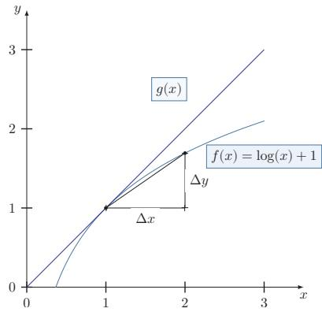  
图 B.1 函数 $f ( x ) = \log ( x ) + 1$ 的导数

表B.1给出了几个常见函数的导数.

表 B.1 几个常见函数的导数
<table><tr><td>函数</td><td>函数形式 导数</td></tr><tr><td>常函数  $f ( x ) = C$  ,其中C为常数</td><td> $f ^ { \prime } ( x ) = 0$ </td></tr><tr><td>幂函数  $f ( x ) = x ^ { r }$ </td><td>，其中r是非零实数  $f ^ { \prime } ( x ) = r x ^ { r - 1 }$ </td></tr><tr><td>指数函数  $f ( x ) = \exp ( x )$ </td><td> $f ^ { \prime } ( x ) = \exp ( x )$ </td></tr><tr><td>对数函数  $f ( x ) = \log ( x )$ </td><td> $\begin{array} { r } { f ^ { \prime } ( x ) = \frac { 1 } { x } } \end{array}$ </td></tr></table>

高阶导数对一个函数的导数继续求导，可以得到高阶导数．函数 $f ( x )$ 的导数$f ^ { \prime } ( x )$ 称为一阶导数， $f ^ { \prime } ( x )$ 的导数称为二阶导数，记为 $f ^ { \prime \prime } ( x ) \lrcorner f ^ { ( 2 ) } ( x )$ 或 $\textstyle { \frac { \mathrm { d } ^ { 2 } f ( x ) } { \mathrm { d } x ^ { 2 } } }$ 偏导数 对于一个多元变量函数 $f : \mathbb { R } ^ { D }  \mathbb { R }$ ，它的偏导数（Partial Deriva-$\mathrm { t i v e } \ )$ 是关于其中一个变量 $x _ { i }$ 的导数，而保持其他变量固定，可以记为 $f _ { x _ { i } } ^ { \prime } ( { \pmb x } )$ $\begin{array} { r } { \nabla _ { x _ { i } } f ( \pmb { x } ) , \frac { \partial f ( \pmb { x } ) } { \partial x _ { i } } } \end{array}$ 或 $\textstyle { \frac { \partial } { \partial x _ { i } } } f ( { \pmb x } )$

## B.1.2 可导与可微

给定一个函数，计算其导数的过程称为求导（Differentiation）．若函数$f ( x )$ 在其定义域包含的某区间内每一点都可导，那么也可以说函数 $f ( x )$ 在该区间内可导.如果一个函数 $f ( x )$ 在定义域中的每一点都存在导数，则称 $f ( x )$ 为可微函数（DifferentiableFunction）．可微函数一定连续，但连续函数不一定可微.例如，函数 $| x |$ 是连续函数，但在点 $x = 0$ 处不可导.

对于一元可导函数，微分常记为

$$
\mathrm { d } y = f ^ { \prime } ( x ) \mathrm { d } x ,\tag{B.2}
$$

它刻画了当自变量x发生一个微小变化dx时，函数值 $y = f ( x )$ 的一阶变化近似.

## B.1.3 泰勒公式

泰勒公式（Taylor's Formula）是一个函数 f(x)在已知某一点的各阶导数值的情况之下，可以用这些导数值做系数构建一个多项式来近似函数在这一点的邻域中的值.

如果函数 $f ( x )$ 在a点处 n次可导 $( n \geq 1 )$ ，在一个包含点a的区间上的任意x,都有

$$
\begin{array} { c } { { f ( x ) = f ( a ) + \displaystyle \frac { 1 } { 1 ! } f ^ { \prime } ( a ) ( x - a ) + \displaystyle \frac { 1 } { 2 ! } f ^ { ( 2 ) } ( a ) ( x - a ) ^ { 2 } + \cdots } } \\ { { + \displaystyle \frac { 1 } { n ! } f ^ { ( n ) } ( a ) ( x - a ) ^ { n } + R _ { n } ( x ) , } } \end{array}\tag{B.3}
$$

其中 $f ^ { ( n ) } ( a )$ 表示函数 $f ( x )$ 在点a的n阶导数.

上面公式中的多项式部分称为函数 $f ( x )$ 在a处的n阶泰勒展开式，剩余的$R _ { n } ( x )$ 是泰勒公式的余项，是 $( x - a ) ^ { n }$ 的高阶无穷小.

## B.2 积分

积分（Integration）是微分的逆过程，即如何从导数推算出原函数.积分通常可以分为定积分（Definite Integral)和不定积分（Indefinite Integral).

函数f(x)的不定积分可以写为

$$
F ( x ) = \int f ( x ) \mathrm { d } x ,\tag{B.4}
$$

积分符号∫为一个拉长的字母S，表示求和(Sum)，和Σ有类似的意义.

其中 $F ( x )$ 称为 $f ( x )$ 的原函数或反导函数，dx表示积分变量为x.当 $f ( x )$ 是 $F ( x )$ 的导数时， $F ( x )$ $f ( x )$ 的不定积分.根据导数的性质，一个函数 $f ( x )$ 的不定积分是不唯一的.若 $F ( x )$ 是 $f ( x )$ 的不定积分， $F ( x ) + C$ 也是 $f ( x )$ 的不定积分，其中C为一个常数.

给定一个变量为x的实值函数f(x)和闭区间 $[ a , b ]$ ，定积分可以理解为在坐标平面上由函数 $f ( x )$ ，垂直直线 $x = a , x = b$ 以及x轴围起来的区域的带符号的面积，记为

$$
\int _ { a } ^ { b } f ( x ) \mathrm { d } x .\tag{B.5}
$$

带符号的面积表示x轴以上的面积为正，x轴以下的面积为负.

积分的严格定义有很多种，最常见的积分定义之一为黎曼积分（RiemannIntegral）.对于闭区间 $[ a , b ]$ ，我们定义 $[ a , b ]$ 的一个分割为此区间中取一个有限的点列

$$
a = x _ { 0 } < x _ { 1 } < x _ { 2 } < . . . < x _ { N } = b .
$$

这些点将区间[a,b]分割为N个子区间 $[ x _ { n - 1 } , x _ { n } ]$ ,其中 $1 \leq n \leq N$ .每个区间取出一个点 $t _ { n } \in [ x _ { n - 1 } , x _ { n } ]$ 作为代表.

在这个分割上，函数f(x)的黎曼和定义为

$$
\sum _ { n = 1 } ^ { N } f ( t _ { n } ) ( x _ { n } - x _ { n - 1 } ) ,\tag{B.6}
$$

即所有子区间的带符号面积之和.

不同分割的黎曼和不同.当 $\lambda = \operatorname* { m a x } _ { n = 1 } ^ { N } ( x _ { n } - x _ { n - 1 } )$ 足够小时，如果所有的黎曼和都趋于某个极限，那么这个极限就叫作函数f(x)在闭区间 $[ a , b ]$ 上的黎曼积分.图B.2给出了不同分割的黎曼和示例，其中N表示分割的子区间数量.

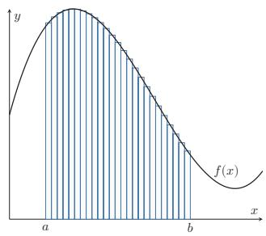  
(a) $N = 2 5$

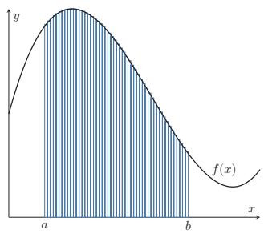  
(b) $N = 5 0$  
图 B.2 不同分割的黎曼和示例

## B.3 矩阵微积分

为书写简便，通常把单变量函数对多变量或多变量函数对单变量的偏导数写成向量和矩阵形式，使其可作为整体处理.在神经网络中，线性层、激活函数、损失函数的梯度传播都可统一写成矩阵微积分的形式.矩阵微积分（MatrixCalculus）是多元微积分的一种记号体系，用矩阵和向量表示因变量各分量关于自变量各分量的偏导数1.

矩阵微积分有两种常见的符号约定：分子布局（Numerator Layout）和分母布局（Denominator Layout），二者的区别在于标量对向量的导数写作列向量还是行向量.

除特别说明外，本书默认采用分母布局.

标量关于向量的偏导数 对于M维向量 $\pmb { x } \in \mathbb { R } ^ { M }$ 和函数 $y = f ( \pmb { x } ) \in \mathbb { R }$ ，则 $y$ 关于x的偏导数为

分母布局

$$
\frac { \partial y } { \partial \pmb { x } } = [ \frac { \partial y } { \partial x _ { 1 } } , \cdots , \frac { \partial y } { \partial x _ { M } } ] ^ { \top } \qquad \in \mathbb { R } ^ { M \times 1 } ,\tag{B.7}
$$

分子布局

$$
\frac { \partial y } { \partial { \pmb x } } = [ \frac { \partial y } { \partial x _ { 1 } } , \cdots , \frac { \partial y } { \partial x _ { M } } ] \qquad \in \mathbb { R } ^ { 1 \times M } .\tag{B.8}
$$

在分母布局中， $\textstyle { \frac { \partial y } { \partial x } }$ 为列向量；而在分子布局中， $\textstyle { \frac { \partial y } { \partial x } }$ 为行向量.

向量关于标量的偏导数 对于标量 $x \in \mathbb { R }$ 和函数 $\pmb { y } = f ( \pmb { x } ) \in \mathbb { R } ^ { N }$ ,则 $\textbf {  { y } }$ 关于 $x$ 的偏导数为

分母布局

$$
\frac { \partial \pmb { y } } { \partial x } = [ \frac { \partial y _ { 1 } } { \partial x } , \cdots , \frac { \partial y _ { N } } { \partial x } ] \qquad \in \mathbb { R } ^ { 1 \times N } ,\tag{B.9}
$$

分子布局

$$
\frac { \partial \pmb { y } } { \partial x } = [ \frac { \partial y _ { 1 } } { \partial x } , \cdots , \frac { \partial y _ { N } } { \partial x } ] ^ { \top } \qquad \in \mathbb { R } ^ { N \times 1 } .\tag{B.10}
$$

在分母布局中， $\textstyle { \frac { \partial y } { \partial x } }$ 为行向量；而在分子布局中， $\textstyle { \frac { \partial y } { \partial x } }$ 为列向量.

向量关于向量的偏导数 对于M维向量 $\pmb { x } \in \mathbb { R } ^ { M }$ 和函数 $\pmb { y } = f ( \pmb { x } ) \in \mathbb { R } ^ { N }$ ，则f(x)关于x的偏导数(分母布局)为

$$
\frac { \partial f ( \pmb { x } ) } { \partial \pmb { x } } = \left[ \begin{array} { c c c } { \frac { \partial y _ { 1 } } { \partial x _ { 1 } } } & { \cdots } & { \frac { \partial y _ { N } } { \partial x _ { 1 } } } \\ { \vdots } & { \ddots } & { \vdots } \\ { \frac { \partial y _ { 1 } } { \partial x _ { M } } } & { \cdots } & { \frac { \partial y _ { N } } { \partial x _ { M } } } \end{array} \right] \in \mathbb { R } ^ { M \times N } ,\tag{B.11}
$$

称为函数 f(x)的雅可比矩阵(Jacobian Matrix)的转置.

雅可比矩阵通常采用分子布局.

对于M维向量 $\pmb { x } \in \mathbb { R } ^ { M }$ 和函数 $y = f ( \pmb { x } ) \in \mathbb { R }$ ,则f(x)关于x的二阶偏导数(分母布局)为

$$
\mathbf { { \boldsymbol { H } } } = \frac { \partial ^ { 2 } f ( \mathbf { { \boldsymbol { x } } } ) } { \partial \mathbf { { \boldsymbol { x } } } ^ { 2 } } = \left[ \begin{array} { c c c } { \frac { \partial ^ { 2 } y } { \partial x _ { 1 } ^ { 2 } } } & { \cdots } & { \frac { \partial ^ { 2 } y } { \partial x _ { 1 } \partial x _ { M } } } \\ { \vdots } & { \ddots } & { \vdots } \\ { \frac { \partial ^ { 2 } y } { \partial x _ { M } \partial x _ { 1 } } } & { \cdots } & { \frac { \partial ^ { 2 } y } { \partial x _ { M } ^ { 2 } } } \end{array} \right] \in \mathbb { R } ^ { M \times M } ,\tag{B.12}
$$

称为函数 $f ( { \pmb x } )$ 的Hessian矩阵（Hessian Matrix）,也写作 $\nabla ^ { 2 } f ( { \pmb x } )$ ,其中第 $m , n$ 个元素为 $\frac { \partial ^ { 2 } y } { \partial x _ { m } \partial x _ { n } }$

## B.3.1 导数法则

复合函数的导数的计算可以通过以下法则来简化

## B.3.1.1 加（减）法则

若 $\pmb { x } \in \mathbb { R } ^ { M } , \pmb { y } = \pmb { f } ( \pmb { x } ) \in \mathbb { R } ^ { N } , \pmb { z } = \pmb { g } ( \pmb { x } ) \in \mathbb { R } ^ { N }$ ,则

$$
\frac { \partial ( \pmb { y } + \pmb { z } ) } { \partial \pmb { x } } = \frac { \partial \pmb { y } } { \partial \pmb { x } } + \frac { \partial \pmb { z } } { \partial \pmb { x } } \in \mathbb { R } ^ { M \times N } .\tag{B.13}
$$

## B.3.1.2 乘法法则

(1)若 $\pmb { x } \in \mathbb { R } ^ { M } , \pmb { y } = \pmb { f } ( \pmb { x } ) \in \mathbb { R } ^ { N } , \pmb { z } = \pmb { g } ( \pmb { x } ) \in \mathbb { R } ^ { N }$ ,则

$$
\frac { \partial { \pmb y } ^ { \top } { \pmb z } } { \partial { \pmb x } } = \frac { \partial { \pmb y } } { \partial { \pmb x } } { \pmb z } + \frac { \partial { \pmb z } } { \partial { \pmb x } } { \pmb y } \in \mathbb { R } ^ { M } .\tag{B.14}
$$

(2)若 $\pmb { x } \in \mathbb { R } ^ { M } , \pmb { y } = \pmb { f } ( \pmb { x } ) \in \mathbb { R } ^ { S } , \pmb { z } = \pmb { g } ( \pmb { x } ) \in \mathbb { R } ^ { T } , \pmb { A } \in \mathbb { R } ^ { S \times T }$ 和x无关,则

$$
\frac { \partial { \pmb y } ^ { \intercal } { \pmb A } z } { \partial { \pmb x } } = \frac { \partial { \pmb y } } { \partial { \pmb x } } { \pmb A } z + \frac { \partial z } { \partial { \pmb x } } { \pmb A } ^ { \intercal } { \pmb y } \in \mathbb { R } ^ { M } .\tag{B.15}
$$

(3)若 $\pmb { x } \in \mathbb { R } ^ { M } , y = \pmb { f } ( \pmb { x } ) \in \mathbb { R } , \pmb { z } = \pmb { g } ( \pmb { x } ) \in \mathbb { R } ^ { N }$ ,则

$$
\frac { \partial y z } { \partial \pmb { x } } = y \frac { \partial z } { \partial \pmb { x } } + \frac { \partial y } { \partial \pmb { x } } z ^ { \top } \quad \in \mathbb { R } ^ { M \times N } .\tag{B.16}
$$

## B.3.1.3 链式法则

链式法则（ChainRule）是在微积分中求复合函数导数的一种常用方法.

(1)若 $x \in \mathbb { R } , y = g ( x ) \in \mathbb { R } ^ { M } , z = f ( \pmb { y } ) \in \mathbb { R } ^ { N }$ ,则

$$
\frac { \partial \pmb { z } } { \partial \pmb { x } } = \frac { \partial \pmb { y } } { \partial \pmb { x } } \frac { \partial \pmb { z } } { \partial \pmb { y } } \quad \in \mathbb { R } ^ { 1 \times N } .\tag{B.17}
$$

(2)若 $\pmb { x } \in \mathbb { R } ^ { M } , \pmb { y } = g ( \pmb { x } ) \in \mathbb { R } ^ { K } , z = f ( \pmb { y } ) \in \mathbb { R } ^ { N }$ ,则

$$
\frac { \partial \pmb { z } } { \partial \pmb { x } } = \frac { \partial \pmb { y } } { \partial \pmb { x } } \frac { \partial \pmb { z } } { \partial \pmb { y } } \mathrm { ~  ~ \xi ~ } \in \mathbb { R } ^ { M \times N } .\tag{B.18}
$$

(3)若 $\pmb { X } \in \mathbb { R } ^ { M \times N }$ 为矩阵， $\pmb { y } = g ( \pmb { X } ) \in \mathbb { R } ^ { K } , z = f ( \pmb { y } ) \in \mathbb { R }$ ,则

$$
\frac { \partial z } { \partial x _ { i j } } = \frac { \partial { \pmb y } } { \partial x _ { i j } } \frac { \partial z } { \partial { \pmb y } } \in \mathbb { R } .\tag{B.19}
$$

## B.4 常见函数的导数

这里我们介绍本书中常用的几个函数

## B.4.1 向量函数及其导数

对一个向量x有

$$
{ \frac { \partial x } { \partial x } } = I ,\tag{B.20}
$$

$$
\frac { \partial \| \pmb { x } \| ^ { 2 } } { \partial \pmb { x } } = 2 \pmb { x } ,\tag{B.21}
$$

$$
\frac { \partial A x } { \partial x } = A ^ { \intercal } ,\tag{B.22}
$$

$$
{ \frac { \partial x ^ { \operatorname { r } } A } { \partial x } } = A .\tag{B.23}
$$

## B.4.2 按位计算的向量函数及其导数

假设一个函数 f(x)的输入是标量x. 对于一组K个标量 $x _ { 1 } , \cdots , x _ { K }$ ，我们可以通过 $f ( x )$ 得到另外一组K个标量 $z _ { 1 } , \cdots , z _ { K }$

$$
z _ { k } = f ( x _ { k } ) , \qquad \forall k = 1 , \cdots , K\tag{B.24}
$$

为了简便起见，我们定义 $\pmb { x } = [ x _ { 1 } , \cdots , x _ { K } ] ^ { \top } , z = [ z _ { 1 } , \cdots , z _ { K } ] ^ { \top }$

$$
z = f ( { \pmb x } ) ,\tag{B.25}
$$

其中f(x)是按位运算的，即 $[ f ( \pmb { x } ) ] _ { k } = f ( \pmb { x } _ { k } )$

当x为标量时，f(x)的导数记为 $f ^ { \prime } ( x )$ .当输入为K维向量 $\pmb { x } = [ x _ { 1 } , \cdots , x _ { K } ] ^ { \intercal }$ 时，其导数为一个对角矩阵.

$$
{ \begin{array} { r l } & { { \frac { \partial f ( { \boldsymbol { x } } ) } { \partial { \boldsymbol { x } } } } = \left[ { \frac { \partial f ( { \boldsymbol { x } } _ { j } ) } { \partial { \boldsymbol { x } } _ { i } } } \right] _ { K \times K } } \\ & { \qquad = { \left[ \begin{array} { l l l l } { f ^ { \prime } ( { \boldsymbol { x } } _ { 1 } ) } & { 0 } & { \cdots } & { 0 } \\ { 0 } & { f ^ { \prime } ( { \boldsymbol { x } } _ { 2 } ) } & { \cdots } & { 0 } \\ { \vdots } & { \vdots } & { \ddots } & { \vdots } \\ { 0 } & { 0 } & { \cdots } & { f ^ { \prime } ( { \boldsymbol { x } } _ { K } ) } \end{array} \right] } } \\ & { \qquad = \dim ( \operatorname { f } ^ { \prime } ( { \boldsymbol { x } } ) ) . } \end{array} }
$$

i,j为矩阵元素的下标.

(B.26)

(B.27)

(B.28)

## B.4.2.1 Logistic 函数

Logistic 函数是一种常用的 S型函数，由比利时数学家Pierre François Ver-hulst于1844-1845年研究种群增长模型时提出，最初作为一种生态学模型.

Logistic 函数定义为

$$
\mathrm { l o g i s t i c } ( x ) = \frac { L } { 1 + \mathrm { e x p } ( - K ( x - x _ { 0 } ) ) } ,\tag{B.29}
$$

其中exp(·)函数表示自然指数函数， $x _ { 0 }$ 是中心点，L是最大值，K是曲线的倾斜度.当x趋向于-∞时,logistic(x)接近于0;当x趋向于+∞时,logistic(x)接近于L.

当参数为 $( K = 1 , x _ { 0 } = 0 , L = 1 )$ 时，Logistic函数称为标准Logistic函数，记为 $\begin{array} { r } { \sigma ( x ) = \frac { 1 } { 1 + \exp ( - x ) } } \end{array}$

标准Logistic函数在机器学习中使用得非常广泛，经常用来将一个实数空间的数映射到(0,1)区间.

标准Logistic函数的导数为

$$
\begin{array} { r } { \sigma ^ { \prime } ( x ) = \sigma ( x ) ( 1 - \sigma ( x ) ) . } \end{array}\tag{B.30}
$$

当输入为K维向量 $\pmb { x } = [ x _ { 1 } , \cdots , x _ { K } ] ^ { \intercal }$ 时，其导数为

$$
\frac { \partial \sigma ( \pmb { x } ) } { \partial \pmb { x } } = \mathrm { d i a g } \Big ( \sigma ( \pmb { x } ) \odot ( 1 - \sigma ( \pmb { x } ) ) \Big ) .\tag{B.31}
$$

## B.4.2.2 Softmax函数

Softmax函数将多个标量映射为一个概率分布.对于K个标量 $x _ { 1 } , \cdots , x _ { K }$ 记 $\pmb { x } = [ x _ { 1 } ; \cdots ; x _ { K } ]$ ,Softmax函数定义为

$$
z _ { k } = [ \mathrm { s o f t m a x } ( { \pmb x } ) ] _ { k } = \frac { \mathrm { e x p } ( x _ { k } ) } { \sum _ { i = 1 } ^ { K } \mathrm { e x p } ( x _ { i } ) } .\tag{B.32}
$$

这样，我们可以将K个标量 $x _ { 1 } , \cdots , x _ { K }$ 转换为一个分布 $: z _ { 1 } , \cdots , z _ { K }$ ,满足

$$
\sum _ { k = 1 } ^ { K } z _ { k } = 1 , \quad z _ { k } \in ( 0 , 1 ) , \qquad \forall k .\tag{B.33}
$$

Softmax函数可以简写为

$$
z = \operatorname { s o f t m a x } ( \pmb { x } ) = \frac { \exp ( \pmb { x } ) } { \mathbf { 1 } _ { K } ^ { \sf T } \exp ( \pmb { x } ) } ,\tag{B.34}
$$

其中 $\mathbf { 1 } _ { K } = [ 1 , \cdots , 1 ] ^ { \intercal }$ 是K维的全1向量.由于对任意常数c都有 $\operatorname { s o f t m a x } ( \pmb { x } ) =$ softmax $\left( { \pmb x } - c { \bf 1 } _ { K } \right)$ ,实际计算时常取 $c = \operatorname* { m a x } _ { k } x _ { k }$ ,从而得到更稳定的形式

$$
\operatorname { s o f t m a x } ( \pmb { x } ) = \frac { \exp ( \pmb { x } - \pmb { c } \mathbf { 1 } _ { K } ) } { \mathbf { 1 } _ { K } ^ { \top } \exp ( \pmb { x } - \pmb { c } \mathbf { 1 } _ { K } ) } .\tag{B.35}
$$

Softmax函数的导数为

$$
\frac { \partial \operatorname { s o f t m a x } ( \pmb { x } ) } { \partial \pmb { x } } = \mathrm { { d i a g } } \big ( \operatorname { s o f t m a x } ( \pmb { x } ) \big ) - \operatorname { s o f t m a x } ( \pmb { x } ) \operatorname { s o f t m a x } ( \pmb { x } ) ^ { \top } .\tag{B.36}
$$

## B.4.2.3 Softmax与交叉熵的梯度

在多分类模型中，通常先计算一个K维打分向量 $\pmb { a } = [ a _ { 1 } ; \cdots ; a _ { K } ]$ ,再令

$$
\hat { \pmb { y } } = \operatorname { s o f t m a x } ( \pmb { a } ) .\tag{B.37}
$$

如果真实标签为one-hot 向量 $\pmb { y } = [ y _ { 1 } ; \cdots ; y _ { K } ]$ ，则交叉熵损失为

$$
\mathcal { L } ( \hat { \pmb { y } } , \pmb { y } ) = - \sum _ { k = 1 } ^ { K } y _ { k } \log \hat { y } _ { k } .\tag{B.38}
$$

利用Softmax函数的雅可比矩阵以及链式法则，可以得到

$$
\frac { \partial \mathcal { L } } { \partial a _ { j } } = \sum _ { k = 1 } ^ { K } \frac { \partial \mathcal { L } } { \partial \hat { y } _ { k } } \frac { \partial \hat { y } _ { k } } { \partial a _ { j } } = \sum _ { k = 1 } ^ { K } \left( - \frac { y _ { k } } { \hat { y } _ { k } } \right) \hat { y } _ { k } ( \delta _ { k j } - \hat { y } _ { j } )\tag{B.39}
$$

$$
\mathbf { \Phi } = - y _ { j } + \left( \sum _ { k = 1 } ^ { K } y _ { k } \right) \hat { y } _ { j } = \hat { y } _ { j } - y _ { j } ,\tag{B.40}
$$

其中 $\delta _ { k j }$ 为 Kronecker delta,且 one-hot 标签满足 $\begin{array} { r } { \sum _ { k = 1 } ^ { K } y _ { k } = 1 } \end{array}$ .因此，

$$
\frac { \partial \mathcal { L } } { \partial a } = \hat { \pmb { y } } - \pmb { y } .\tag{B.41}
$$

若y不是one-hot向量，而是标签平滑或其他软标签得到的目标分布，只要满足$y _ { k } \geq 0$ 且 $\textstyle \sum _ { k = 1 } ^ { K } y _ { k } = 1$ ，这个梯度形式仍然成立.这个结果在深度学习中非常重要，因为它给出了多分类模型输出层最常见的梯度形式，也是反向传播的一个基本例子.

## 附录C 数学优化

数学优化（Mathematical Optimization）问题，也称最优化问题，指在给定约束下求目标函数的极值(最大或最小).

形式化地，给定目标函数（或代价函数）f：A→ R，寻找变量 $\pmb { x } ^ { \ast } \in \mathcal { D } \subset$ A,使得对所有 $\boldsymbol { x } \in \mathcal { D }$ 都有 $f ( { \pmb x } ^ { * } ) \leq f ( { \pmb x } )$ (最小化)或 $f ( { \pmb x } ^ { * } ) \geq f ( { \pmb x } )$ (最大化).其中D称为约束集或可行域，D中的变量称为可行解.

## C.1 数学优化的类型

## C.1.1 离散优化和连续优化

根据输入变量x的值域是否为实数域，数学优化问题可以分为离散优化问题和连续优化问题

## C.1.1.1 离散优化问题

离散优化（DiscreteOptimization）问题的输入变量为离散变量，如整数或有限集合中的元素.离散优化主要有两类：

（1）组合优化（Combinatorial Optimization）：其目标是从一个有限集合中找出使得目标函数最优的元素.在一般的组合优化问题中，集合中的元素之间存在一定的关联，可以表示为图结构．典型的组合优化问题有旅行商问题、最小生成树问题、图着色问题等.很多机器学习问题都是组合优化问题，比如特征选择、聚类问题、超参数优化问题以及结构化学习（StructuredLearning）中标签预测问题等.

（2）整数规划（Integer Programming）：输入变量 $\pmb { x } \in \mathbb { Z } ^ { D }$ 为整数向量.常见的整数规划问题通常为整数线性规划（Integer Linear Programming,ILP）.整数线性规划的一种最直接的求解方法是：1）去掉输入必须为整数的限制，将原问题转换为一般的线性规划问题，这个线性规划问题为原问题的松弛问题；2)求得相应松弛问题的解；3）把松弛问题的解四舍五入到最接近的整数．但是这种方法得到的解一般都不是最优的，因为原问题的最优解不一定在松弛问题最优解的附近.另外，这种方法得到的解也不一定满足约束条件.

离散优化问题的求解一般都比较困难，优化算法的复杂度都比较高.

## C.1.1.2 连续优化问题

连续优化（ContinuousOptimization）问题的输入变量为连续变量 $\textbf { \textit { x } } \in$ $\mathbb { R } ^ { D }$ ，目标函数为实函数.本节后面的内容主要讨论连续优化

## C.1.2 无约束优化和约束优化

在连续优化问题中，根据是否有变量的约束条件，可以将优化问题分为无约束优化问题和约束优化问题.

无约束优化（Unconstrained Optimization）问题的可行域通常为整个实数域 $\mathcal { D } = \mathbb { R } ^ { D }$ ，可以写为

$$
\operatorname* { m i n } _ { \mathbf { x } } \quad f ( { \pmb x } ) ,
$$

最优化问题一般可以表示为求最小值问题.求f(x)最大值等价于求—f(x)的最小值.

(C.1)

其中 $\pmb { x } \in \mathbb { R } ^ { D }$ 为输入变量， $f : \mathbb { R } ^ { D } $ R为目标函数.

约束优化（Constrained Optimization）问题中变量x需要满足一些等式或不等式的约束.约束优化问题通常使用拉格朗日乘数法来进行求解.

拉格朗日乘数法参见第C.3节.

## C.1.3 线性优化和非线性优化

如果在公式(C.1)中，目标函数和所有的约束函数都为线性函数，则该问题为线性规划（Linear Programming）问题.相反，如果目标函数或任何一个约束函数为非线性函数,则该问题为非线性规划（Nonlinear Programming）问题.

非线性优化中有一类特殊问题是凸优化（Convex Optimization）问题.凸优化要求变量x的可行域为凸集（Convex Set）（即集合中任意两点的连线都位于集合内部)，且目标函数f为凸函数，即满足

$$
f { \Bigl ( } \alpha \mathbf { x } + ( 1 - \alpha ) \mathbf { y } { \Bigr ) } \leq \alpha f ( \mathbf { x } ) + ( 1 - \alpha ) f ( \mathbf { y } ) , \quad \forall \alpha \in [ 0 , 1 ] .\tag{C.2}
$$

在有约束情形下，凸优化还要求等式约束函数为线性函数，不等式约束函数为凸函数.

## C.2 优化算法

优化问题一般通过迭代求解：先给定初始估计 $\scriptstyle { \pmb x } _ { 0 }$ ，然后不断迭代产生新的估计 $\pmb { x } _ { 1 } , \pmb { x } _ { 2 } , \cdots , \pmb { x } _ { t }$ ，期望 $\mathbf { \boldsymbol { x } } _ { t }$ 最终收敛到最优解 $\mathbf { \boldsymbol { x } } ^ { * }$ .理想的优化算法应具备两点：一是在有限的时间与空间复杂度下快速准确地逼近最优解；二是对初始点不过度敏感，能稳定地进入 $\mathbf { \boldsymbol { x } } ^ { * }$ 的邻域并迅速收敛

优化算法中常用的迭代方法有线搜索和置信域方法等.线搜索的策略是寻找方向和步长，具体算法有梯度下降法、牛顿法等.

本书中只介绍梯度下降法.

## C.2.1 全局最小解和局部最小解

许多非线性优化问题存在多个局部最小值（LocalMinima），其对应的解称为局部最小解（Local Minimizer）.局部最小解 $\mathbf { \boldsymbol { x } } ^ { * }$ 定义为：存在 $\delta > 0$ ，使得对所有满足 $\| { \pmb x } - { \pmb x } ^ { * } \| \le \delta$ 的x,都有 $f ( { \pmb x } ^ { * } ) \leq f ( { \pmb x } )$ .即在 $\mathbf { \boldsymbol { x } } ^ { * }$ 的邻域内，所有函数值都不小于 $f ( x ^ { * } )$

局部最小解也称为局 部最小值点，或更一般 性地称为局部最优解.

对于所有的 $\boldsymbol { x } \in \mathcal { D }$ ,都有 $f ( { \pmb x } ^ { * } ) \leq f ( { \pmb x } )$ 成立，则 $\mathbf { \boldsymbol { x } } ^ { * }$ 为全局最小解（GlobalMinimizer).

全局最小解也称为全局最小值点，或更一般性地称为全局最优解.

求局部最小解通常比求全局最小解更可操作，但很难保证其为全局最小解. 对于线性规划或凸优化问题，局部最小解就是全局最小解.

要判断一个点 $\mathbf { \boldsymbol { x } } ^ { * }$ 是否为局部最小解，直接比较其邻域内的函数值并不可行.若 $f ( x )$ 二阶连续可微，则可通过目标函数在 $\mathbf { \boldsymbol { x } } ^ { * }$ 处的梯度 $\nabla f ( { \pmb x } ^ { * } )$ 和 Hessian 矩阵 $\nabla ^ { 2 } f ( { \pmb x } ^ { * } )$ 来判断.

Hessian矩阵参见公式(B.12).

定理C.1－局部最小解的一阶必要条件：如果 $\mathbf { \boldsymbol { x } } ^ { * }$ 为局部最小解并且函数f在 $\mathbf { \boldsymbol { x } } ^ { * }$ 的邻域内一阶可微，则 $\nabla f ( { \pmb x } ^ { * } ) = 0 .$

证明．如果函数 $f ( { \pmb x } )$ 是连续可微的，根据泰勒公式（Taylor'sFormula），函数f(x)的一阶展开可以近似为

$$
f ( { \pmb x } ^ { * } + \Delta { \pmb x } ) = f ( { \pmb x } ^ { * } ) + \Delta { \pmb x } ^ { \intercal } \nabla f ( { \pmb x } ^ { * } ) ,\tag{C.3}
$$

假设 $\nabla f ( { \pmb x } ^ { * } ) \neq 0$ ，则可以找到一个 $\Delta { } x$ (比如 $\Delta \pmb { x } = - \alpha \nabla f ( \pmb { x } ^ { * } )$ ,α为很小的正数)，使得

$$
f ( { \pmb x } ^ { * } + \Delta { \pmb x } ) - f ( { \pmb x } ^ { * } ) = \Delta { \pmb x } ^ { \top } \nabla f ( { \pmb x } ^ { * } ) < 0 .\tag{C.4}
$$

这和局部最小的定义矛盾.

函数 f(x)的一阶偏导数为0的点称为驻点（StationaryPoint）或临界点（CriticalPoint）.驻点不一定是局部最小解，也可能是局部最大解或鞍点（Sad-dlePoint）.鞍点是指梯度为零、但Hessian矩阵既非半正定也非半负定（即同时有正、负特征值）的点.直观地说，在鞍点处函数沿某些方向看是极小，沿另一些方向看是极大.在高维非凸优化中，鞍点、平坦区域和病态曲率都可能影响训练过程，因此不能简单地把训练困难只归因于局部极小.

鞍点的名称来自马鞍的形状.

定理C.2－局部最小解的二阶必要条件：如果 $\mathbf { \boldsymbol { x } } ^ { * }$ 为局部最小解并且函数 f在 $\mathbf { \boldsymbol { x } } ^ { * }$ 的邻域内二阶可微，则 $\nabla f ( { \pmb x } ^ { * } ) = 0$ ,且 $\nabla ^ { 2 } f ( { \pmb x } ^ { * } )$ 为半正定矩阵.

证明．如果函数f(x)是二阶连续可微的，函数f(x)的二阶展开可以近似为

$$
f ( \mathbf { x } ^ { * } + \Delta \mathbf { x } ) = f ( \mathbf { x } ^ { * } ) + \Delta \mathbf { x } ^ { \mathsf { T } } \nabla f ( \mathbf { x } ^ { * } ) + \frac { 1 } { 2 } \Delta \mathbf { x } ^ { \mathsf { T } } ( \nabla ^ { 2 } f ( \mathbf { x } ^ { * } ) ) \Delta x .\tag{C.5}
$$

由一阶必要性定理可知 $\nabla f ( { \pmb x } ^ { * } ) = 0$ ,则

$$
f ( \mathbf { } x ^ { * } + \Delta \mathbf { } x ) - f ( \mathbf { } x ^ { * } ) = \frac { 1 } { 2 } \Delta \mathbf { } x ^ { \intercal } ( \nabla ^ { 2 } f ( \mathbf { } x ^ { * } ) ) \Delta \mathbf { } x \geq 0 .\tag{C.6}
$$

即 $\nabla ^ { 2 } f ( { \pmb x } ^ { * } )$ 为半正定矩阵.

## C.2.2 梯度下降法

梯度下降法（Gradient Descent Method），也叫作最速下降法（SteepestDescent Method）,经常用来求解无约束优化的最小值问题.

若函数 $f ( { \pmb x } )$ 在点 $\mathbf { \boldsymbol { x } } _ { t }$ 附近连续可微,则 $f ( { \pmb x } )$ 在 $\mathbf { \boldsymbol { x } } _ { t }$ 处下降最快的方向为该点梯度的反方向.

根据泰勒一阶展开公式，有

$$
f ( \pmb { x } _ { t + 1 } ) = f ( \pmb { x } _ { t } + \Delta \pmb { x } ) \approx f ( \pmb { x } _ { t } ) + \Delta \pmb { x } ^ { \top } \nabla f ( \pmb { x } _ { t } ) .\tag{C.7}
$$

要使 $f ( \pmb { x } _ { t + 1 } ) < f ( \pmb { x } _ { t } )$ ，须有 $\Delta x ^ { \top } \nabla f ( x _ { t } ) < 0$ 取 $\Delta \mathbf { { x } } = - \alpha \nabla f ( \mathbf { { x } } _ { t } )$ ，当$\alpha > 0$ 足够小时，即可保证 $f ( \pmb { x } _ { t + 1 } ) < f ( \pmb { x } _ { t } )$

这样我们就可以从一个初始值 $\scriptstyle { \pmb x } _ { 0 }$ 出发，通过迭代公式

$$
\pmb { x } _ { t + 1 } = \pmb { x } _ { t } - \alpha _ { t } \nabla f ( \pmb { x } _ { t } ) , \quad t \geq 0 .\tag{C.8}
$$

生成序列 $\scriptstyle { \mathbf { { \vec { x } } } } _ { 0 }$ $\scriptstyle { \mathbf { { x } } } _ { 1 }$ $\mathbf { { x } } _ { 2 }$ …使得

$$
f ( { \pmb x } _ { 0 } ) \geq f ( { \pmb x } _ { 1 } ) \geq f ( { \pmb x } _ { 2 } ) \geq \cdots\tag{C.9}
$$

在合适条件下，序列 $\{ x _ { t } \}$ 收敛到局部最小解 $\mathbf { \boldsymbol { x } } ^ { * }$ .每次迭代的步长 $\alpha _ { t }$ 可变，但取值须合适：过大会导致发散，过小会使收敛缓慢

梯度下降法的过程如图C.1所示.曲线是等高线（水平集），即函数f为不同常数的集合构成的曲线.红色的箭头指向该点梯度的反方向（梯度方向与通过该点的等高线垂直).沿着梯度下降方向迭代，通常希望函数值逐步下降并接近一个局部最小解或驻点.

梯度下降法是一类一阶方法.当靠近局部最小解时梯度变小，收敛速度会变慢，并且可能以“之字形”的方式下降.如果目标函数为二阶连续可微，我们也可以采用牛顿法（Newton's method）.牛顿法利用Hessian矩阵刻画局部曲率，并

在大规模深度学习训练中，更常见的是随机梯度下降(SGD)及其小批量（mini-batch）变体，因为它们只需利用部分样本估计梯度即可高效更新参数.

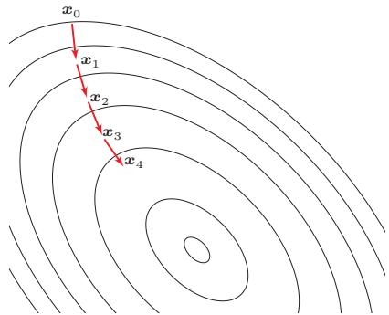  
图 C.1 梯度下降法

在一定条件下具有局部二次收敛速度，但每次迭代需要计算或近似求解Hessian矩阵相关的线性系统，复杂度较高.

相反，如果我们要求解一个最大值问题，就需要向梯度正方向迭代进行搜索，逐渐接近函数的局部最大解，这个过程则被称为梯度上升法（GradientAscent Method).

## C.3 拉格朗日乘数法与KKT条件

拉格朗日乘数法（LagrangeMultiplier）是一种有效求解约束优化问题的优化方法.

以数学家约瑟夫·拉格朗日命名.

约束优化问题可以表示为

$$
\begin{array} { l r c l r } { \displaystyle \operatorname* { m i n } _ { \pmb { x } } } & { f ( \pmb { x } ) } & & & \\ & & { } & \\ { \mathrm { s . t . } } & { h _ { m } ( \pmb { x } ) } & { = } & { 0 , } & { m = 1 , \ldots , M } \\ { \mathrm { s . t . } } & { } & & { } & \\ & { g _ { n } ( \pmb { x } ) } & { \leq } & { 0 , } & { n = 1 , \ldots , N } \end{array}\tag{C.10}
$$

其中 $h _ { m } ( { \boldsymbol { x } } )$ 为等式约束函数， $g _ { n } ( { \pmb x } )$ 为不等式约束函数.x的可行域为

$$
\mathcal { D } = \mathrm { d o m } ( f ) \cap \bigcap _ { m = 1 } ^ { M } \mathrm { d o m } ( h _ { m } ) \cap \bigcap _ { n = 1 } ^ { N } \mathrm { d o m } ( g _ { n } ) \subseteq \mathbb { R } ^ { D } ,\tag{C.11}
$$

其中 dom(f)是函数f的定义域.

## C.3.1 等式约束优化问题

如果公式(C.10)中只有等式约束，我们可以构造一个拉格朗日函数 $\Lambda ( { \pmb x } , \lambda )$

$$
\Lambda ( { \pmb x } , \pmb \lambda ) = f ( { \pmb x } ) + \sum _ { m = 1 } ^ { M } \lambda _ { m } h _ { m } ( { \pmb x } ) ,\tag{C.12}
$$

其中 $\pmb { \lambda } = [ \lambda _ { 1 } , \cdots , \lambda _ { M } ] ^ { \intercal }$ 为拉格朗日乘数向量，其元素可以是正数或负数.如果$f ( x ^ { * } )$ 是原始约束优化问题的局部最优值，那么存在一个λ\*使得 $( \boldsymbol { x } ^ { * } , \lambda ^ { * } )$ 为拉格朗日函数 $\Lambda ( { \pmb x } , \lambda )$ 的驻点.因此，只需要令 $\begin{array} { r } { \frac { \partial \Lambda ( { \pmb x } , { \pmb \lambda } ) } { \partial { \pmb x } } = 0 } \end{array}$ 和 $\begin{array} { r } { \frac { \partial \Lambda ( { \pmb x } , { \pmb \lambda } ) } { \partial { \pmb \lambda } } = 0 } \end{array}$ ,得到

$$
\nabla f ( \pmb { x } ) + \sum _ { m = 1 } ^ { M } \lambda _ { m } \nabla h _ { m } ( \pmb { x } ) = 0 ,\tag{C.13}
$$

$$
h _ { m } ( { \pmb x } ) = 0 , \qquad \forall m = 1 , \cdots , M .\tag{C.14}
$$

上面方程组的解即为原始问题的可能解.因为驻点不一定是最小解，所以在实际应用中需根据具体问题来验证是否为最小解.

拉格朗日乘数法是将一个有D个变量和M个等式约束条件的最优化问题转换为一个有 $D + M$ 个变量的函数求驻点的问题.拉格朗日乘数法所得的驻点会包含原问题的所有最小解，但并不保证每个驻点都是原问题的最小解.

## C.3.2 不等式约束优化问题

对于公式(C.10)中定义的一般约束优化问题，其拉格朗日函数为

$$
\Lambda ( x , a , b ) = f ( x ) + \sum _ { m = 1 } ^ { M } a _ { m } h _ { m } ( x ) + \sum _ { n = 1 } ^ { N } b _ { n } g _ { n } ( x ) ,\tag{C.15}
$$

其中 $\pmb { a } = [ a _ { 1 } , \cdots , a _ { M } ] ^ { \top }$ 为等式约束的拉格朗日乘数， $\pmb { b } = [ b _ { 1 } , \cdots , b _ { N } ] ^ { \top }$ 为不等式约束的拉格朗日乘数

不等式约束优化问题中的拉格朗日乘数也称为KKT乘数.

当约束条件不满足时， $\operatorname* { m a x } _ { a , b } \Lambda ( x , a , b ) = \infty$ ;当约束条件满足且 $b \geq 0$ 时，$\mathrm { m a x } _ { a , b } \Lambda ( { \pmb x } , { \pmb a } , { \pmb b } ) = f ( { \pmb x } )$ .因此，原始约束优化问题等价于

$$
\operatorname* { m i n } _ { \pmb { x } } \operatorname* { m a x } _ { \pmb { a } , \pmb { b } } \qquad \Lambda ( \pmb { x } , \pmb { a } , \pmb { b } ) ,\tag{C.16}
$$

$$
\mathrm { s . t . } \qquad b \geq 0 ,\tag{C.17}
$$

这个 min-max优化问题称为主问题（Primal Problem).

对偶问题 主问题通常较难求解，可通过交换min-max顺序来简化.定义拉格朗日对偶函数为

$$
\Gamma ( a , b ) = \operatorname* { i n f } _ { x \in \mathcal { D } } \Lambda ( x , a , b ) .\tag{C.18}
$$

$\Gamma ( a , b )$ 是一个凹函数，即使 $f ( { \pmb x } )$ 是非凸的.

当 $b \geq 0$ 时，对于任意的 $\tilde { \boldsymbol { x } } \in \mathcal { D }$ ,有

$$
\Gamma ( a , b ) = \operatorname* { i n f } _ { x \in \mathcal { D } } \Lambda ( x , a , b ) \leq \Lambda ( \tilde { x } , a , b ) \leq f ( \tilde { x } ) ,\tag{C.19}
$$

令p\* $p ^ { * }$ 是原问题的最优值，则有

$$
\Gamma ( a , b ) \leq p ^ { * } ,\tag{C.20}
$$

即拉格朗日对偶函数 $\Gamma ( a , b )$ 为原问题最优值的下界.

优化拉格朗日对偶函数 $\Gamma ( a , b )$ 并得到原问题的最优下界，称为拉格朗日对偶问题(Lagrange Dual Problem).

$$
\operatorname* { m a x } _ { \boldsymbol { a } , \boldsymbol { b } } \qquad \Gamma ( \boldsymbol { a } , \boldsymbol { b } ) ,\tag{C.21}
$$

$$
\mathrm { s . t . } \qquad b \geq 0 .\tag{C.22}
$$

拉格朗日对偶函数为凹函数，因此拉格朗日对偶问题为凸优化问题

令 $d ^ { * }$ 表示拉格朗日对偶问题的最优值，则有 $d ^ { * } \leq p ^ { * }$ ，这个性质称为弱对偶性(Weak Duality).如果 $d ^ { * } = p ^ { * }$ ,这个性质称为强对偶性（Strong Duality）.

当强对偶性成立时，令 $\mathbf { \boldsymbol { x } } ^ { * }$ 和 $\mathbf { \delta } \mathbf { \alpha } ^ { a ^ { * } } , b ^ { * }$ 分别是原问题和对偶问题的最优解，那么它们满足以下条件：

$$
\nabla f ( { \pmb x } ^ { * } ) + \sum _ { m = 1 } ^ { M } a _ { m } ^ { * } \nabla h _ { m } ( { \pmb x } ^ { * } ) + \sum _ { n = 1 } ^ { N } b _ { n } ^ { * } \nabla g _ { n } ( { \pmb x } ^ { * } ) = 0 ,\tag{C.23}
$$

$$
h _ { m } ( { \pmb x } ^ { * } ) = 0 , \qquad m = 1 , \cdots , M\tag{C.24}
$$

$$
g _ { n } ( { \pmb x } ^ { * } ) \leq 0 , \qquad n = 1 , \cdots , N\tag{C.25}
$$

$$
b _ { n } ^ { * } g _ { n } ( { \pmb x } ^ { * } ) = 0 , \qquad n = 1 , \cdots , N\tag{C.26}
$$

$$
b _ { n } ^ { * } \geq 0 , \qquad n = 1 , \cdots , N\tag{C.27}
$$

这5个条件称为不等式约束优化问题的KKT条件(Karush-Kuhn-Tucker Con-dition）.KKT条件是拉格朗日乘数法在不等式约束优化问题上的推广.一般而言，KKT条件作为最优性的必要条件还需要一定的正则性条件；当原问题是凸优化问题并满足适当条件时，KKT条件也构成最优性的充分条件.

KKT条件中尤需关注公式(C.26),称为互补松弛（Complementary Slack-ness）条件：若最优解 $\mathbf { \boldsymbol { x } } ^ { * }$ 落在不等式约束内部 ${ \bf \Phi } ( g _ { n } ( { \bf x } ^ { * } ) < 0 )$ ,则 $b _ { n } ^ { * } = 0$ ，相应约束不起作用；若 $b _ { n } ^ { * } > 0$ ,则必有 $g _ { n } ( x ^ { * } ) = 0$ ，对应约束处于边界上.需要注意，处于边界上的约束也可能对应 $b _ { n } ^ { * } = 0$ ，这类约束虽然被满足为等号，但不一定真正影响最优性.

## 附录D 概率论

概率论研究大量随机现象中的数量规律，应用极为广泛

在机器学习中，概率论不仅用于描述数据生成过程，也用于刻画预测中的不确定性，给定输入x时，分类模型输出的 $p ( y | \mathbf { \boldsymbol { x } } )$ 可看作类别的条件概率分布；生成模型中的 $p ( { \pmb x } ) _ { { \bf \lambda } \setminus { \bf \lambda } } p ( { \pmb z } )$ 和 $p ( { \pmb x } | z )$ 描述观测变量和隐变量之间的随机关系；贝叶斯方法和高斯过程则进一步把模型参数或函数值也看作随机对象，用后验分布表达模型不确定性.因此，本附录中的随机变量、条件概率、期望方差、独立性和随机过程，是理解正文中概率建模、泛化评估、校准和不确定性估计的基础语言.

## D.1 样本空间

样本空间（Sample Space）是一个随机试验所有可能结果的集合，其中每个可能结果称为样本点.例如，抛掷一枚硬币的样本空间是{正面，反面}；投掷一个骰子的样本空间是{1,2,3,4,5,6}.

同一个试验可能对应多个样本空间.例如，从52张扑克牌中随机抽出一张，样本空间可以是数字(A到K），也可以是花色(黑桃、红桃、梅花、方块).若要完整描述一张牌，则需同时给出数字和花色，此时样本空间为上述两个样本空间的笛卡儿乘积

## 数学小知识｜笛卡儿乘积

在数学中，两个集合X 和y的笛卡儿乘积（Cartesian product），又称直积，在集合论中表示为 $\mathcal X \times \mathcal Y$ ，是所有可能的有序对组成的集合，其中有序对的第一个对象是X中的元素，第二个对象是y中的元素.

$$
\mathcal { X } \times \mathcal { Y } = \{ \langle x , y \rangle \mid x \in \mathcal { X } \land y \in \mathcal { Y } \} .
$$

比如在扑克牌的例子中，若集合X为13个点数构成的集合，集合y为4种花色构成的集合，则 $\mathcal X \times \mathcal Y$ 包含 $1 3 \times 4 = 5 2$ 个有序对，每个有序对对应一张标准扑克牌.

## D.2 事件和概率

随机事件（或简称事件）是被赋予概率的样本点集合，即样本空间的一个子集.概率（Probability）表示一个随机事件发生的可能性大小，取值在0到1之间.例如，概率0.5表示事件有50%的可能性发生.

考虑机会均等的抛硬币试验，其样本空间为{正面，反面}.可定义以下事件并计算其概率：

（1）{正面}，其概率为0.5.

（2）{反面}，其概率为0.5.

（3）空集∅,不是正面也不是反面，其概率为0.

（4）{正面，反面}，即样本空间本身，其概率为1.

## D.2.1 随机变量

在随机试验中，试验的结果可以用一个数X来表示，这个数X是随着试验结果的不同而变化的，是样本点的一个函数.我们把这种数称为随机变量（Ran-domVariable）.例如，随机掷一个骰子，得到的点数就可以看成一个随机变量X,X 的取值为 {1, 2, 3,4, 5, 6}.

如果随机掷两个骰子，整个事件空间Ω可以由36个元素组成：

$$
\Omega = \{ ( i , j ) \mid i = 1 , \ldots , 6 ; \ j = 1 , \ldots , 6 \} .\tag{D.1}
$$

一个随机事件也可以定义多个随机变量.比如在掷两个骰子的随机事件中，可以定义随机变量X为获得的两个骰子的点数和，也可以定义随机变量Y为获得的两个骰子的点数差.随机变量X可以有11个整数值，而随机变量Y只有6个整数值.

$$
X ( i , j ) \triangleq i + j , \quad X ( i , j ) \in \{ 2 , 3 , \dots , 1 2 \} ,\tag{D.2}
$$

$$
\begin{array} { r } { Y ( i , j ) \triangleq | i - j | , \quad Y ( i , j ) \in \{ 0 , 1 , 2 , 3 , 4 , 5 \} . } \end{array}\tag{D.3}
$$

其中 $i , j$ 分别为两个骰子的点数.

## D.2.1.1 离散随机变量

如果随机变量X所可能取的值为有限个或可数无穷个，例如在有限情形下可写为 $\{ x _ { 1 } , \cdots , x _ { N } \}$ ,则称X为离散随机变量.

要了解X的统计规律，就必须知道它取每种可能值 $x _ { n }$ 的概率，即

$$
P ( X = x _ { n } ) = p ( x _ { n } ) , \qquad \forall n \in \{ 1 , \cdots , N \}
$$

一般用大写字母表示一个随机变量，用小写字母表示该变量的某一个具体的取值.

(D.4)

其中 $p ( x _ { 1 } ) , \cdots , p ( x _ { N } )$ 称为离散随机变量 X的概率分布（Probability Distribu-tion)或分布，并且满足

$$
\sum _ { n = 1 } ^ { N } p ( x _ { n } ) = 1 ,\tag{D.5}
$$

$$
p ( x _ { n } ) \geq 0 , \qquad \forall n \in \{ 1 , \cdots , N \} .\tag{D.6}
$$

常见的离散随机变量的概率分布有：

伯努利分布 在一次试验中，事件A出现的概率为 $\mu$ ，不出现的概率为 $1 - \mu .$ 若用变量X表示事件A出现的次数，则X的取值为0和1，其相应的分布为

$$
p ( x ) = \mu ^ { x } ( 1 - \mu ) ^ { ( 1 - x ) } ,\tag{D.7}
$$

这个分布称为伯努利分布（Bernoulli Distribution）,又名两点分布或0-1分布.二项分布 在N次伯努利试验中，若以变量X表示事件A出现的次数，则X的取值为 $\{ 0 , \cdots , N \}$ ,其相应的分布为二项分布（Binomial Distribution）.

$$
P ( X = k ) = { \binom { N } { k } } \mu ^ { k } ( 1 - \mu ) ^ { N - k } , \qquad k = 0 , \cdots , N ,
$$

“二项分布”名称的来源是由于其定义形式为二项式 $( p + q ) ^ { N }$ 的展开式中的第k项.

(D.8)

其中 $\binom { N } { k }$ 为二项式系数，表示从N个元素中取出k个元素而不考虑其顺序的组合的总数.

## 数学小知识|排列组合

排列组合是组合学最基本的概念.

排列是指从给定个数的元素中取出指定个数的元素进行排序.N个不同的元素可以有N!种不同的排列方式，即N的阶乘.

$$
N ! \triangleq N \times ( N - 1 ) \times \cdots \times 3 \times 2 \times 1 .
$$

如果从N个元素中取出k个元素，这k个元素的排列总数为

$$
P _ { N } ^ { k } \triangleq N \times ( N - 1 ) \times \cdots \times ( N - k + 1 ) = { \frac { N ! } { ( N - k ) ! } } .
$$

组合则是指从给定个数的元素中仅仅取出指定个数的元素，不考虑排序.从N个元素中取出k个元素，这k个元素可能出现的组合数为

$$
C _ { N } ^ { k } \triangleq { \binom { N } { k } } = { \frac { P _ { N } ^ { k } } { k ! } } = { \frac { N ! } { k ! ( N - k ) ! } } .
$$

## D.2.1.2 连续随机变量

与离散随机变量不同，一些随机变量X的取值是不可列举的，由全部实数或者由一部分区间组成，比如

$$
X = \{ x | a \leq x \leq b \} , \quad - \infty < a < b < \infty ,
$$

则称X为连续随机变量.连续随机变量的值是不可数及无穷尽的.

连续随机变量X取任一具体值 $x _ { i }$ 的概率为0，这与离散情形截然不同.因此无法像离散情形那样通过逐点概率来刻画分布.

连续随机变量 X 的概率分布用概率密度函数（Probability Density Func-$\mathrm { t i o n , P D F } \ ) _ { p } ( x )$ 来描述. $p ( x )$ 为可积函数，并满足

$$
\int _ { - \infty } ^ { + \infty } p ( x ) \mathrm { d } x = 1 ,\tag{D.9}
$$

$$
p ( x ) \geq 0 .\tag{D.10}
$$

给定概率密度函数 $p ( x )$ ，可计算随机变量落入某区域的概率.令R为x附近的一个小邻域，R为其大小，则 $p ( x ) | \mathcal { R } |$ 近似给出了随机变量落入R的概率

常见的连续随机变量的概率分布有：

均匀分布 若a,b为有限数，[a,b]上的均匀分布（Uniform Distribution）的概率密度函数定义为

$$
p ( x ) = \left\{ \begin{array} { c l } { { \frac { 1 } { b - a } \ , } } & { { a \leq x \leq b } } \\ { { 0 } } & { { , x < a \ \bar { \sharp } \bar { x } \ x > b } } \end{array} \right.\tag{D.11}
$$

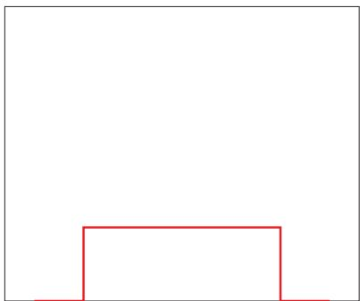  
图 D.1 均匀分布的概率密度函数

正态分布 正态分布（Normal Distribution），又名高斯分布（Gaussian Dis-tribution），是一类在统计建模中非常常用的连续分布，并且具有很多良好的数学性质，其概率密度函数为

$$
p ( x ) = \frac { 1 } { \sqrt { 2 \pi } \sigma } \ \exp \Big ( - \frac { ( x - \mu ) ^ { 2 } } { 2 \sigma ^ { 2 } } \Big ) ,\tag{D.12}
$$

其中 $\sigma > 0 , \mu$ 和 $\sigma$ 均为常数.若随机变量X服从一个参数为 $\mu$ 和 $\sigma$ 的概率分布，简记为

$$
X \sim { \mathcal { N } } ( \mu , \sigma ^ { 2 } ) .\tag{D.13}
$$

当 $\mu = 0 , \sigma = 1$ 时，称为标准正态分布（Standard Normal Distribution).标准正态分布的概率密度函数和累积分布函数如下图所示：

  
图D.2 标准正态分布的概率密度函数和累积分布函数

## D.2.1.3 累积分布函数

对于一个随机变量 X，其累积分布函数（Cumulative Distribution Func-tion,CDF）是随机变量X的取值小于等于x的概率.

$$
\mathrm { c d f } ( x ) = P ( X \leq x ) .\tag{D.14}
$$

以连续随机变量X为例，累积分布函数定义为

$$
\operatorname { c d f } ( x ) = \int _ { - \infty } ^ { x } p ( t ) \mathrm { d } t ,\tag{D.15}
$$

其中 $p ( x )$ 为概率密度函数.

## D.2.2 随机向量

随机向量是指一组随机变量构成的向量.如果 $X _ { 1 } , X _ { 2 } , \cdots , X _ { K }$ 为K个随机变量，那么称 $\pmb { X } = [ X _ { 1 } ; X _ { 2 } ; \cdots ; X _ { K } ]$ 为一个K维随机向量.随机向量也分为离散随机向量和连续随机向量

一维随机向量即随机变量.

## D.2.2.1 离散随机向量

离散随机向量的联合概率分布（Joint Probability Distribution)为

$$
P ( X _ { 1 } = x _ { 1 } , X _ { 2 } = x _ { 2 } , \cdots , X _ { K } = x _ { K } ) = p ( x _ { 1 } , x _ { 2 } , \cdots , x _ { K } ) ,
$$

其中 $\boldsymbol { x } _ { k } \in \Omega _ { k }$ 为变量 $X _ { k }$ 的取值， $\Omega _ { k }$ 为变量 $X _ { k }$ 的样本空间.

和离散随机变量类似，离散随机向量的概率分布满足

$$
p ( x _ { 1 } , x _ { 2 } , \cdots , x _ { K } ) \geq 0 , \qquad \forall x _ { 1 } \in \Omega _ { 1 } , x _ { 2 } \in \Omega _ { 2 } , \cdots , x _ { K } \in \Omega _ { K }\tag{D.16}
$$

$$
\sum _ { x _ { 1 } \in \Omega _ { 1 } } \sum _ { x _ { 2 } \in \Omega _ { 2 } } \cdots \sum _ { x _ { K } \in \Omega _ { K } } p ( x _ { 1 } , x _ { 2 } , \cdots , x _ { K } ) = 1 .\tag{D.17}
$$

多项分布一种常见的离散向量概率分布为多项分布（Multinomial Distribu-tion）.多项分布是二项分布在随机向量上的推广.假设一个袋子中装了很多球，总共有K个不同的颜色，我们从袋子中取出N个球，每次取出一个球时，就在袋子中放入一个同样颜色的球.这样保证同一颜色的球在不同试验中被取出的概率是相等的.令X为一个K维随机向量，其中第k个随机变量 $X _ { k }$ 表示取出的N个球中颜色为k的球的数量；当其取值为 $x _ { k }$ 时，X服从多项分布，其概率分布为

$$
p ( x _ { 1 } , \dots , x _ { K } | { \pmb \mu } ) = \frac { N ! } { x _ { 1 } ! \cdots x _ { K } ! } { \mu } _ { 1 } ^ { x _ { 1 } } \cdots { \mu } _ { K } ^ { x _ { K } } ,\tag{D.18}
$$

其中 $\pmb { \mu } = [ \mu _ { 1 } , \cdots , \mu _ { K } ] ^ { \intercal }$ 分别为每次抽取的球的颜色为1,…，K的概率 ${ \mathfrak { x } } _ { 1 } , \cdots , { \mathfrak { x } } _ { K }$ 为非负整数，并且满足 $\textstyle \sum _ { k = 1 } ^ { K } x _ { k } = N$

多项分布的概率分布也可以用gamma函数表示：

$$
p ( x _ { 1 } , \cdots , x _ { K } | { \pmb \mu } ) = \frac { \Gamma ( \sum _ { k } x _ { k } + 1 ) } { \prod _ { k } \Gamma ( x _ { k } + 1 ) } \prod _ { k = 1 } ^ { K } \mu _ { k } ^ { x _ { k } } ,\tag{D.19}
$$

其中 $\Gamma ( z ) = \int _ { 0 } ^ { \infty } \frac { t ^ { z - 1 } } { \exp ( t ) }$ dt为gamma函数.这种表示形式和狄利克雷分布类似，而狄利克雷分布可以作为多项分布的共轭先验

狄利克雷分布参见第D.2.2.2节.

## D.2.2.2 连续随机向量

一个 K维连续随机向量 X 的联合概率密度函数（Joint Probability Den-sity Function)满足

$$
p ( { \pmb x } ) = p ( x _ { 1 } , \cdots , x _ { K } ) \geq 0 ,\tag{D.20}
$$

$$
\int _ { - \infty } ^ { + \infty } \cdots \int _ { - \infty } ^ { + \infty } p ( x _ { 1 } , \cdots , x _ { K } ) \mathrm { d } x _ { 1 } \cdots \mathrm { d } x _ { K } = 1 .\tag{D.21}
$$

多元正态分布 常用的连续随机向量分布之一是多元正态分布（MultivariateNormal Distribution），也称为多元高斯分布（Multivariate Gaussian Distri-bution）.若K维随机向量 $\pmb { X } = [ X _ { 1 } , \ldots , X _ { K } ] ^ { \intercal }$ 服从K元正态分布，其密度函数为

$$
p ( \pmb { x } ) = \frac { 1 } { ( 2 \pi ) ^ { K / 2 } | \pmb { \Sigma } | ^ { 1 / 2 } } \exp \left( - \frac { 1 } { 2 } ( \pmb { x } - \pmb { \mu } ) ^ { \mathstrut \top } \pmb { \Sigma } ^ { - 1 } ( \pmb { x } - \pmb { \mu } ) \right) ,\tag{D.22}
$$

其中 $\pmb { \mu } \in \mathbb { R } ^ { K }$ 为多元正态分布的均值向量， $\mathbf { \Delta } , \pmb { \Sigma } \in \mathbb { R } ^ { K \times K }$ 为多元正态分布的协方差矩阵，∑表示∑的行列式.

各向同性高斯分布 如果一个多元高斯分布的协方差矩阵简化为 $\Sigma = \sigma ^ { 2 } I$ ，则称该分布为各向同性高斯分布（IsotropicGaussian Distribution）.这时各维随机变量不仅两两不相关，而且由于联合分布是高斯分布，它们彼此独立且方差相同.

狄利克雷分布 如果一个K维随机向量X服从狄利克雷分布（Dirichlet Dis-tribution）,其支持集为

$$
x _ { k } \geq 0 , \quad \quad \sum _ { k = 1 } ^ { K } x _ { k } = 1 ,\tag{D.23}
$$

密度函数为

$$
p ( \pmb { x } | \pmb { \alpha } ) = \frac { \Gamma ( \alpha _ { 0 } ) } { \Gamma ( \alpha _ { 1 } ) \cdots \Gamma ( \alpha _ { K } ) } \prod _ { k = 1 } ^ { K } x _ { k } ^ { \alpha _ { k } - 1 } ,\tag{D.24}
$$

其中 $\pmb { \alpha } = [ \alpha _ { 1 } , \ldots , \alpha _ { K } ] ^ { \top }$ 为狄利克雷分布的参数，且 $\begin{array} { r } { \alpha _ { 0 } = \sum _ { k = 1 } ^ { K } \alpha _ { k } } \end{array}$

## D.2.3 边际分布

对于二维离散随机向量(X,Y)，假设X取值空间为 $\Omega _ { x }$ ，Y取值空间为 $\Omega _ { y }$ ，其联合概率分布满足

不失一般性，这里以二维随机向量进行讨论，这些结论在多维时依然成立.

$$
p ( x , y ) \ge 0 , \qquad \sum _ { x \in \Omega _ { x } } \sum _ { y \in \Omega _ { y } } p ( x , y ) = 1 .\tag{D.25}
$$

对于联合概率分布 $p ( x , y )$ ,我们可以分别对x和 $y$ 进行求和.

(1)对于固定的x，

$$
\sum _ { y \in \Omega _ { y } } p ( x , y ) = p ( x ) .\tag{D.26}
$$

(2)对于固定的 $y$

$$
\sum _ { x \in \Omega _ { x } } p ( x , y ) = p ( y ) .\tag{D.27}
$$

由离散随机向量(X,Y)的联合概率分布，对Y的所有取值进行求和得到X的概率分布；而对X的所有取值进行求和得到Y的概率分布.这里 $p ( x )$ 和 $p ( y )$ 就称为 $p ( x , y )$ 的边际分布(Marginal Distribution).

对于二维连续随机向量 $( X , Y )$ ,其边际分布为

$$
p ( x ) = \int _ { - \infty } ^ { + \infty } p ( x , y ) \mathrm { d } y ,\tag{D.28}
$$

$$
p ( y ) = \int _ { - \infty } ^ { + \infty } p ( x , y ) \mathrm { d } x .\tag{D.29}
$$

一个二元正态分布的边际分布仍为正态分布.

## D.2.4 条件概率分布

对于离散随机向量 $( X , Y )$ ，已知 $X = x$ 的条件下，随机变量 $Y = y$ 的条件概率（Conditional Probability)为

$$
p ( y | x ) \triangleq P ( Y = y | X = x ) = { \frac { p ( x , y ) } { p ( x ) } } .\tag{D.30}
$$

这个公式定义了随机变量Y关于随机变量X的条件分布（Conditional Distri-bution）;在离散情形下，它也常称为条件概率分布.

对于二维连续随机向量(X,Y)，已知 $X = x$ 的条件下，随机变量 $Y = y$ 的条件概率密度函数(Conditional Probability Density Function)为

$$
p ( y | x ) = \frac { p ( x , y ) } { p ( x ) } .\tag{D.31}
$$

同理，已知 $Y = y$ 的条件下，随机变量X=x的条件概率密度函数为

$$
p ( x | y ) = \frac { p ( x , y ) } { p ( y ) } .\tag{D.32}
$$

## D.2.5 贝叶斯定理

通过公式(D.31)和(D.32),两个条件概率 $p ( y | x )$ 和 $p ( x | y )$ 之间的关系为

$$
p ( y | x ) = \frac { p ( x | y ) p ( y ) } { p ( x ) } .\tag{D.33}
$$

这个公式称为贝叶斯定理（Bayes'Theorem），或贝叶斯公式.

## D.2.6 独立与条件独立

对于两个离散（或连续）随机变量X和Y，如果其联合概率（或联合概率密度函数) $p ( x , y )$ 满足

$$
p ( x , y ) = p ( x ) p ( y ) ,\tag{D.34}
$$

则称X和Y互相独立（Independence）,记为 XⅡY.

对于三个离散（或连续）随机变量X、Y和Z，如果条件概率（或联合概率密度函数) $p ( x , y | z )$ 满足

$$
p ( x , y | z ) = p ( x | z ) p ( y | z ) ,\tag{D.35}
$$

则称在给定变量Z时，X和Y条件独立（Conditional Independence），记为X Ⅱ $Y | Z$

## D.2.7 期望和方差

期望 对于N个取值的离散变量X，其概率分布为 $p ( x _ { 1 } ) , \cdots , p ( x _ { N } )$ ，X的期望(Expectation)定义为

$$
\mathbb { E } [ X ] = \sum _ { n = 1 } ^ { N } x _ { n } p ( x _ { n } ) .\tag{D.36}
$$

对于连续随机变量X，概率密度函数为 $p ( x )$ ，其期望定义为

$$
\mathbb { E } [ X ] = \int _ { \mathbb { R } } x p ( x ) \mathrm { d } x .\tag{D.37}
$$

方差 随机变量X的方差（Variance）用来定义它的概率分布的离散程度：

$$
\operatorname { v a r } ( X ) = \mathbb { E } { \biggl [ } { \Bigl ( } X - \mathbb { E } [ X ] { \Bigr ) } ^ { 2 } { \biggr ] } .\tag{D.38}
$$

随机变量X的方差也称为它的二阶中心矩 $\sqrt { \operatorname { v a r } ( X ) }$ 则称为X的标准差.

协方差 两个连续随机变量X和Y的协方差（Covariance）用来衡量两个随机变量的分布之间的总体变化性，定义为

$$
\operatorname { c o v } ( X , Y ) = \mathbb { E } { \biggl [ } { \Bigl ( } X - \mathbb { E } [ X ] { \Bigr ) } { \Bigl ( } Y - \mathbb { E } [ Y ] { \Bigr ) } { \biggr ] } ,\tag{D.39}
$$

协方差经常也用来衡量两个随机变量之间的线性相关性.如果两个随机变量的协方差为0，那么称这两个随机变量是线性不相关.两个随机变量之间没有线性相关性，并非表示它们之间是独立的，可能存在某种非线性的函数关系.反之，如果X与Y是统计独立的，那么它们之间的协方差一定为0.

这里的线性相关和线性代数中的线性相关含义不同.

协方差矩阵 两个M和N维的连续随机向量X和 $\mathbf { Y }$ ，它们的协方差（Covari-ance)为 $M \times N$ 的矩阵，定义为

$$
\operatorname { c o v } ( X , Y ) = \mathbb { E } \bigg [ \Big ( X - \mathbb { E } [ X ] \Big ) \Big ( Y - \mathbb { E } [ Y ] \Big ) ^ { \top } \bigg ] .\tag{D.40}
$$

协方差矩阵 $\operatorname { c o v } ( X , Y )$ 的第(m, n) 个元素等于随机变量 $X _ { m }$ 和 $Y _ { n }$ 的协方差.两个随机向量的协方差 $\operatorname { c o v } ( X , Y )$ 与 $\operatorname { c o v } ( Y , X )$ 互为转置关系.

如果单个随机向量的协方差矩阵为对角矩阵，则说明其各维随机变量两两不相关；这并不必然意味着它们彼此独立.若进一步假设该随机向量服从多元高斯分布，则两两不相关可推出独立.

单个随机向量X的协方差矩阵定义为

$$
\operatorname { c o v } ( X ) = \operatorname { c o v } ( X , X ) .\tag{D.41}
$$

## D.2.7.1 Jensen 不等式

如果X是随机变量， $g$ 是凸函数，则

$$
g \left( \mathbb { E } [ X ] \right) \leq \mathbb { E } \left[ g ( X ) \right] .\tag{D.42}
$$

等式当且仅当X是一个常数或 $g$ 是线性时成立，这个性质称为Jensen不等式

特别地，对于凸函数 $g$ 定义域上的任意两点 $x _ { 1 } \ldots x _ { 2 }$ 和一个标量 $\lambda \in [ 0 , 1 ]$ ,有

$$
g \big ( \lambda x _ { 1 } + ( 1 - \lambda ) x _ { 2 } \big ) \leq \lambda g ( x _ { 1 } ) + ( 1 - \lambda ) g ( x _ { 2 } ) ,\tag{D.43}
$$

即凸函数 $g$ 上的任意两点的连线位于这两点之间函数曲线的上方.

## D.2.7.2 大数定律

大数定律(Law of Large Numbers):设 $X _ { 1 } , \cdots , X _ { N }$ 独立同分布，E[I $X _ { 1 } | ] <$ $\infty$ ,记 $\mu = \operatorname { \mathbb { E } } [ X _ { 1 } ]$ ，则样本均值

$$
\bar { X } _ { N } = \frac 1 N ( X _ { 1 } + \cdots + X _ { N } ) ,\tag{D.44}
$$

收敛于期望值 $\mu$ ,即

$$
\bar { X } _ { N }  \mu \stackrel { \mathrm { \scriptsize ~ \ a v } } { \stackrel { \mathrm { \scriptsize ~ \ a v } } {  } } N  \infty .\tag{D.45}
$$

## D.3 随机过程

随机过程（Stochastic Process）是一组随机变量 $\{ X _ { t } \}$ 的集合，索引t来自集合 $\mathcal { T } , \mathcal { T }$ 可定义在时间域或空间域，通常取时间域，以实数或正整数表示；t为实数时称为连续随机过程，为整数时称为离散随机过程.股价波动、语音信号、身高变化等都可看作随机过程.与时间相关的常见随机过程包括伯努利过程、随机游走（RandomWalk）、马尔可夫过程等；与空间相关的随机过程通常称为随机场（RandomField），例如二维图像，每个像素由空间位置索引，整张图就构成一个随机场.

## D.3.1 马尔可夫过程

马尔可夫性质在随机过程中，马尔可夫性质（MarkovProperty）是指一个随机过程在给定现在状态及所有过去状态情况下，其未来状态的条件概率分布仅依赖于当前状态.以离散随机过程为例，假设随机变量 $X _ { 0 } , X _ { 1 } , \cdots , X _ { T }$ 构成一个随机过程.这些随机变量的所有可能取值的集合被称为状态空间（State Space）.如果 $X _ { t + 1 }$ 对于过去状态的条件概率分布仅是 $X _ { t }$ 的一个函数，则

$$
P ( X _ { t + 1 } = x _ { t + 1 } | X _ { 0 : t } = x _ { 0 : t } ) = P ( X _ { t + 1 } = x _ { t + 1 } | X _ { t } = x _ { t } ) ,\tag{D.46}
$$

其中 $X _ { 0 : t }$ 表示变量集合 $X _ { 0 } , X _ { 1 } , \cdots , X _ { t } , x _ { 0 : t }$ 为在状态空间中的状态序列.

马尔可夫性质也可以描述为给定当前状态时，将来的状态与过去状态是条件独立的.

## D.3.1.1 马尔可夫链

离散时间的马尔可夫过程也称为马尔可夫链（MarkovChain）.如果一个马尔可夫链的条件概率

$$
P ( X _ { t + 1 } = s | X _ { t } = s ^ { \prime } ) = m _ { s s ^ { \prime } } ,\tag{D.47}
$$

只和状态s和 $s ^ { \prime }$ 相关，和时间t无关，则称为时间同质的马尔可夫链（Time-Homogeneous Markov Chain),其中 $m _ { s s ^ { \prime } }$ 称为状态转移概率.如果状态空间大小K是有限的，状态转移概率可以用一个矩阵 $M \in \mathbb { R } ^ { K \times K }$ 表示，称为状态转移矩阵（Transition Matrix），其中元素 $m _ { i j } = P ( X _ { t + 1 } = s _ { i } \mid X _ { t } = s _ { j } )$ 表示从状态 $s _ { j }$ 转移到状态 $s _ { i }$ 的概率.于是每一列之和为1，和本书默认采用的列向量分布记法保持一致.

平稳分布 假设状态空间大小为 $K$ ，向量 ${ \boldsymbol \pi } = [ \pi _ { 1 } , \cdots , \pi _ { K } ] ^ { \intercal }$ 为状态空间中的一个分布,满足 $0 \leq \pi _ { k } \leq 1$ 和 $\begin{array} { r } { \sum _ { k = 1 } ^ { K } \pi _ { k } = 1 } \end{array}$

对于状态转移矩阵为M的时间同质的马尔可夫链，若存在一个分布π满足

$$
\pi = M \pi ,\tag{D.48}
$$

则称分布 $\pi$ 为该马尔可夫链的平稳分布（StationaryDistribution）.此时若t时刻分布为 $\pi$ ,则任意后续时刻仍保持为π.根据特征向量的定义可知， $\pi$ 为矩阵M的（归一化）的对应特征值为1的特征向量.

若状态转移矩阵M满足不可约（所有状态互通）与非周期，则对任意初始分布 $\pi ^ { ( 0 ) }$ ，链经过足够长时间的转移后都会收敛到平稳分布，即

$$
\pi = \operatorname* { l i m } _ { T \to \infty } M ^ { T } \pi ^ { ( 0 ) } .\tag{D.49}
$$

定理D.1-细致平稳条件（Detailed Balance Condition)：给定一个状态空间中的分布 $\pi \in [ 0 , 1 ] ^ { K }$ ，如果一个状态转移矩阵为 $M \in \mathbb { R } ^ { K \times K }$ 的马尔可夫链满足

$$
\pi _ { j } m _ { i j } = \pi _ { i } m _ { j i } , \quad \forall 1 \leq i , j \leq K\tag{D.50}
$$

则 $\pi$ 是该马尔可夫链的一个平稳分布.若再结合不可约、非周期等条件，还可以进一步推出链从任意初始分布收敛到 $\pi .$

细致平稳条件只是马尔可夫链收敛的充分条件，不是必要条件.细致平稳条件保证了从状态i转移到状态 $j$ 的数量和从状态 $j$ 转移到状态i的数量相一致，互相抵消，所以数量不发生改变.

## D.3.2 高斯过程

高斯过程（Gaussian Process）也是一种应用广泛的随机过程模型.假设有一组连续随机变量 $X _ { 0 } , X _ { 1 } , \cdots , X _ { T }$ ，如果由这组随机变量构成的任一有限集合

$$
X _ { t _ { 1 } , \cdots , t _ { N } } = [ X _ { t _ { 1 } } , \cdots , X _ { t _ { N } } ] ^ { \intercal } , \quad 1 \leq N \leq T
$$

都服从一个多元正态分布，那么这组随机变量为一个高斯过程.高斯过程也可以定义为：如果 $X _ { t _ { 1 } , \cdots , t _ { N } }$ 的任一线性组合都服从一元正态分布，那么这组随机变量为一个高斯过程.

高斯过程回归 高斯过程回归（Gaussian Process Regression）是利用高斯过程来对一个函数分布进行建模.和机器学习中参数化建模（比如贝叶斯线性回归）相比，高斯过程是一种非参数模型，可以拟合一个黑盒函数，并给出拟合结果的置信度 [Rasmussen, 2003].

假设一个未知函数 $f ( { \pmb x } )$ 服从高斯过程，且为平滑函数.如果两个样本 $\mathbf { \boldsymbol { x } } _ { 1 } , \mathbf { \boldsymbol { x } } _ { 2 }$ 比较接近，那么对应的 $f ( \pmb { x } _ { 1 } ) , f ( \pmb { x } _ { 2 } )$ 也比较接近.假设从函数 $f ( { \pmb x } )$ 中采样有限个样本 ${ \pmb X } = [ { \pmb x } _ { 1 } , { \pmb x } _ { 2 } , \cdots , { \pmb x } _ { N } ]$ ，这N个点服从一个多元正态分布，

$$
[ f ( \pmb { x } _ { 1 } ) , f ( \pmb { x } _ { 2 } ) , \cdots , f ( \pmb { x } _ { N } ) ] ^ { \top } \sim \mathcal { N } \bigg ( \pmb { \mu } ( \pmb { X } ) , \pmb { K } ( \pmb { X } , \pmb { X } ) \bigg ) ,\tag{D.51}
$$

其中

$$
\mu ( { \pmb X } ) = [ \mu ( { \pmb x } _ { 1 } ) , \mu ( { \pmb x } _ { 2 } ) , \cdots , \mu ( { \pmb x } _ { N } ) ] ^ { \top } , \qquad { \pmb K } ( { \pmb X } , { \pmb X } ) = [ k ( { \pmb x } _ { i } , { \pmb x } _ { j } ) ] _ { N \times N } .
$$

$\mu ( X )$ 是均值向量， $K ( X , X )$ 是协方差矩阵. $k ( \pmb { x } _ { i } , \pmb { x } _ { j } )$ 为核函数，用于刻画两个样本之间的相关性.

在高斯过程回归中，一个常用的核函数是平方指数（Squared Exponential）核函数：

$$
k ( \pmb { x } _ { i } , \pmb { x } _ { j } ) = \exp \left( \frac { - \| \pmb { x } _ { i } - \pmb { x } _ { j } \| ^ { 2 } } { 2 l ^ { 2 } } \right) ,
$$

在支持向量机中，平方指数核函数也叫高斯核函数或径向基函数.为了避免混淆，这里称为平方指数核函数.

(D.52)

其中l为超参数.当 $\mathbf { \boldsymbol { x } } _ { i }$ 和 $\boldsymbol { \mathscr { x } } _ { j }$ 越接近，其函数值越大，表明 $f ( \pmb { x } _ { i } )$ 和 $f ( \pmb { x } _ { j } )$ 越相关.

假设 $f ( { \pmb x } )$ 的一组带噪声观测值为 $\{ ( \pmb { x } _ { n } , y _ { n } ) \} _ { n = 1 } ^ { N }$ ．相应的观测模型可写作$y _ { n } = f ( \pmb { x } _ { n } ) + \epsilon _ { n }$ ,其中 $\epsilon _ { n } \sim \mathcal { N } ( 0 , \sigma ^ { 2 } ) , \sigma ^ { 2 }$ 为观测噪声方差.

对于一个新的样本点 $\mathbf { \boldsymbol { x } } ^ { * }$ ，我们希望预测 $f ( x ^ { * } )$ 的观测值 $y ^ { * }$ ．令向量 ${ \textbf { 3 } } =$ $[ y _ { 1 } , y _ { 2 } , \cdots , y _ { N } ] ^ { \mathsf { T } }$ 为已有的观测值，根据高斯过程的假设， $\left[ { \boldsymbol { y } } ; { \boldsymbol { y } } ^ { * } \right]$ 满足

$$
\left[ \begin{array} { c } { y } \\ { y ^ { * } } \end{array} \right] \sim \mathcal { N } \left( \left[ \begin{array} { c } { \mu ( X ) } \\ { \mu ( x ^ { * } ) } \end{array} \right] , \left[ K ( X , X ) + \sigma ^ { 2 } I \quad K ( x ^ { * } , X ) ^ { \top } \right] \right) ,\tag{D.53}
$$

其中 $K ( { \pmb x } ^ { * } , { \pmb X } ) = [ k ( { \pmb x } ^ { * } , { \pmb x } _ { 1 } ) , \cdots , k ( { \pmb x } ^ { * } , { \pmb x } _ { N } ) ]$

根据上面的联合分布， $y ^ { * }$ 的后验分布为

$$
p ( y ^ { * } \vert X , y ) = \mathcal { N } ( \hat { \mu } , \hat { \sigma } ^ { 2 } ) ,\tag{D.54}
$$

其中均值 $\hat { \mu }$ 和方差 $\hat { \sigma } ^ { 2 }$ 为

$$
\hat { \mu } = K ( x ^ { * } , X ) ( K ( X , X ) + \sigma ^ { 2 } I ) ^ { - 1 } ( y - \mu ( X ) ) + \mu ( x ^ { * } ) ,\tag{D.55}
$$

$$
\hat { \sigma } ^ { 2 } = k ( x ^ { * } , x ^ { * } ) - K ( x ^ { * } , X ) ( K ( X , X ) + \sigma ^ { 2 } I ) ^ { - 1 } K ( x ^ { * } , X ) ^ { \top } .\tag{D.56}
$$

从公式(D.55)可以看出，均值函数 $\mu ( { \pmb x } )$ 可以近似地互相抵消.在实际应用中，一般假设 $\mu ( { \pmb x } ) = 0$ ,均值 $\hat { \mu }$ 可以简化为

$$
{ \hat { \mu } } = K ( x ^ { * } , X ) ( K ( X , X ) + \sigma ^ { 2 } I ) ^ { - 1 } y .\tag{D.57}
$$

高斯过程回归常被用作贝叶斯优化中的代理模型，也广泛应用于回归、不确定性估计和少样本学习等任务中.

## 附录E 信息论

信息论（InformationTheory）是数学、物理、统计、计算机科学等多学科的交叉领域，由克劳德·香农奠基，主要研究信息的量化、存储与通信方法.这里“信息”指一组消息的集合，设想在含噪通道上传输消息，我们需要考虑如何编码、传输、解码，使接收者能尽可能准确地重构消息.

克劳德·香农(Claude Shannon，1916-2001)，美国数学家、电子工程师和密码学家，被誉为信息论的创始人.

信息论在机器学习中应用广泛，如特征抽取、统计推断、自然语言处理等在深度学习中，本章的概念更常以损失函数和分布差异的形式出现：分类和语言模型训练中的交叉熵等价于负对数似然，KL散度常用于描述目标分布与近似分布、先验与后验或两个策略之间的偏离，JS散度和Wasserstein距离则常用于比较数据分布与生成分布．理解这些量时需要同时关注它们的数学性质和使用场景，不能把某一个散度直接等同于模型在真实任务上的全部质量.

## E.1 熵

熵（Entropy）最早是物理学的概念，用于表示一个热力学系统的无序程度.在信息论中，熵用来衡量一个随机事件的不确定性.

## E.1.1 自信息和熵

自信息（SelfInformation）表示一个随机事件所包含的信息量.一个随机事件发生的概率越高，其自信息越低.如果一个事件必然发生，其自信息为0

对于一个随机变量X（取值集合为x，概率分布为 $p ( x ) , x \in \mathcal { X } )$ ,当 $X = x$ 时的自信息I(x)定义为

$$
I ( x ) = - \log p ( x ) .\tag{E.1}
$$

在自信息的定义中，对数的底可以使用2、自然常数e或是10.当底为2时，自信息的单位为bit;当底为e时，自信息的单位为nat.

对于分布为 $p ( x )$ 的随机变量X,其自信息的数学期望，即熵H(X)定义为

H(X)也经常写作 H(p).

$$
H ( X ) = \mathbb { E } _ { X } [ I ( x ) ]\tag{E.2}
$$

$$
= \mathbb { E } _ { X } [ - \log p ( x ) ]\tag{E.3}
$$

$$
= - \sum _ { x \in \mathcal { X } } p ( x ) \log p ( x ) ,\tag{E.4}
$$

其中当 $p ( x _ { i } ) = 0$ 时约定 $0 \log 0 = 0$ ,这与极限 $\begin{array} { r } { \operatorname* { l i m } _ { p \to 0 ^ { + } } p \log p = 0 - } \end{array}$ 致.

熵越高，随机变量的平均不确定性越大;熵越低，不确定性越小.若X是确定性变量（某一取值的概率为1），则熵为0，信息量也为0；在给定有限支持集上，均匀分布具有最大的熵.

假设一个随机变量X有三种可能值 $x _ { 1 } , x _ { 2 } , x _ { 3 }$ ，不同概率分布对应的熵如下：

<table><tr><td> $p ( x _ { 1 } )$ </td><td> $p ( x _ { 2 } )$ </td><td> $p ( x _ { 3 } )$ </td><td>熵</td></tr><tr><td>1</td><td>0</td><td>0</td><td>0</td></tr><tr><td>12</td><td>1-4</td><td>1-4</td><td> ${ \frac { 3 } { 2 } } \log 2$ </td></tr><tr><td></td><td></td><td></td><td></td></tr><tr><td>1-3</td><td>1-3</td><td>1-3</td><td>log 3</td></tr></table>

## E.1.2 熵编码

信息论的研究目标之一是用尽可能短的编码表示和传递信息.假设待传递的文本由字母表A中的符号构成，需要对A中每个符号进行编码．以二进制编码为例，若对每个符号都使用固定长度编码（例如用8bit存储一个字符），这种定长方案并非总是最优.一种高效的思路是变长编码：出现概率越高的符号编码越短,例如将字母a,b,c分别编码为0,10,110.

给定一串要传输的文本信息，其中字母x的出现概率为 $p ( x )$ ，其最佳编码长度为 $- \log _ { 2 } p ( x )$ ，整段文本的平均编码长度为 $\begin{array} { r } { - \sum _ { x } p ( x ) \log _ { 2 } p ( x ) } \end{array}$ ，即底为2的熵.

在对分布 $p ( x )$ 的符号进行编码时，熵 $H ( p )$ 给出了理论上的最优平均编码长度下界,这类利用概率分布设计变长码的思想称为熵编码（EntropyEncoding）

由于每个符号的自信息通常都不是整数，因此在实际编码中很难达到理论上的最优值.霍夫曼编码（Huffman Coding)和算术编码（Arithmetic Coding）是两种最常见的熵编码技术.

## E.1.3 联合熵和条件熵

对于两个离散随机变量X和Y，假设X取值集合为x，Y取值集合为y，其联合概率分布为 $p ( x , y )$ ,则

X和Y的联合熵（Joint Entropy）为

$$
H ( X , Y ) = - \sum _ { x \in { \mathcal { X } } } \sum _ { y \in { \mathcal { Y } } } p ( x , y ) \log p ( x , y ) .\tag{E.5}
$$

X和Y的条件熵（Conditional Entropy）为

$$
\begin{array} { l } { \displaystyle { H ( X | Y ) = - \sum _ { x \in \mathcal { X } } \sum _ { y \in \mathcal { Y } } p ( x , y ) \log p ( x | y ) } } \\ { \displaystyle { = - \sum _ { x \in \mathcal { X } } \sum _ { y \in \mathcal { Y } } p ( x , y ) \log \frac { p ( x , y ) } { p ( y ) } . } } \end{array}\tag{E.6}
$$

(E.7)

根据其定义，条件熵也可以写为

$$
H ( X | Y ) = H ( X , Y ) - H ( Y ) .\tag{E.8}
$$

## E.2 互信息

互信息（MutualInformation）是衡量已知一个变量时，另一个变量不确定性的减少程度.两个离散随机变量X和Y的互信息定义为

$$
I ( X ; Y ) = \sum _ { x \in { \mathcal { X } } } \sum _ { y \in { \mathcal { Y } } } p ( x , y ) \log { \frac { p ( x , y ) } { p ( x ) p ( y ) } } .\tag{E.9}
$$

互信息的一个性质为

$$
\begin{array} { r } { I ( X ; Y ) = H ( X ) - H ( X | Y ) } \\ { = H ( Y ) - H ( Y | X ) . } \end{array}\tag{E.10}
$$

(E.11)

如果变量X和Y互相独立，它们的互信息为零

## E.3 交叉熵和散度

## E.3.1 交叉熵

对于分布为 $p ( x )$ 的随机变量，熵 $H ( p )$ 给出其最优平均编码长度的理论下界.交叉熵（Cross Entropy）是按照概率分布 $q$ 的最优编码对真实分布为p的信息进行编码时所对应的平均码长，定义为

$$
H ( p , q ) = \mathbb { E } _ { p } [ - \log q ( x ) ]\tag{E.12}
$$

$$
= - \sum _ { x } p ( x ) \log q ( x ) .\tag{E.13}
$$

给定 $p$ 时， $q$ 越接近 $p$ 交叉熵越小，反之越大.在多分类任务中，若真实标签 $\textbf {  { y } }$ 为one-hot向量、模型预测为 $\hat { y }$ ，则交叉熵损失退化为一 $\textstyle \sum _ { k } y _ { k }$ log $\hat { y } _ { k }$ ，进一步等价于对真实类别预测概率取负对数.若y是软标签或平滑后的目标分布，同一个公式仍然成立，只是损失衡量的是目标分布和模型预测分布之间的平均编码代价.在自回归语言模型中，训练目标也可以看作对每个位置的真实词元取负对数似然，并在序列位置上求和或求平均

## E.3.2 KL 散度

KL散度（Kullback-Leibler Divergence）也叫相对熵（Relative En-tropy)，表示用概率分布 $q$ 来近似 $p$ 时所造成的信息损失量. KL散度是按照概率分布 $q$ 的最优编码对真实分布为 $p$ 的信息进行编码，其平均编码长度（即交叉熵） $H ( p , q )$ 和 $p$ 的最优平均编码长度（即熵） $H ( p )$ 之间的差异.对于离散概率分布 $p$ 和 $q , p$ 相对于 $q$ 的KL散度（也称前向KL,Forward KL)定义为

$$
\mathrm { K L } ( p \| q ) = H ( p , q ) - H ( p )\tag{E.14}
$$

$$
= \sum _ { x } p ( x ) \log { \frac { p ( x ) } { q ( x ) } } ,\tag{E.15}
$$

其中当 $p ( x ) = 0$ 时，相应项按0处理；当 $p ( x ) > 0$ 而 $q ( x ) = 0$ 时， $\mathrm { K L }$ 散度为无穷大.

KL散度非负，即 $\mathrm { K L } ( p \| q ) \geq 0$ ，且当且仅当 $p = q$ 时取零.两个分布越接近，KL散度越小；反之越大.但KL散度并非严格的度量：它既不满足对称性，也不满足三角不等式

## E.3.3 JS 散度

JS散度（Jensen-Shannon Divergence)是一种对称的散度,定义为

$$
\mathrm { J S } ( p \| q ) = \frac { 1 } { 2 } \mathrm { K L } ( p \| m ) + \frac { 1 } { 2 } \mathrm { K L } ( q \| m ) ,\tag{E.16}
$$

其中 $m = { \textstyle { \frac { 1 } { 2 } } } ( p + q )$

JS散度是KL散度的一种对称化改进.但当两个分布 $p , q$ 没有重叠或重叠极少时，KL散度和JS散度都难以有效衡量其距离.

$\mathrm { K L } ( p \Vert q )$ 与反向KL$\mathrm { K L } ( q \| p )$ 的性质不同：前者在 $p ( x ) ~ > ~ 0$ 但$q ( x ) = 0$ 时发散（称为零回避性，Zero-Avoiding)，促使 $q$ 覆盖 $p$ 的整个支撑集；后者在 p(x) = 0 但$q ( x ) > 0$ 时发散（称为众数寻求性，Mode-Seeking)，促使 $q$ 中集中在 $p$ 的高概率区域.这一不对称性在变分推断和生成模型中有重要意义.

## E.3.4 Wasserstein 距离

Wasserstein距离（Wasserstein Distance）也用于衡量两个分布之间的距离.对于两个分布 $q _ { 1 } , q _ { 2 }$ 和阶数 $r \geq 1 , r$ 阶 Wasserstein距离定义为

$$
W _ { r } ( q _ { 1 } , q _ { 2 } ) = \bigg ( \operatorname* { i n f } _ { \gamma \in \Gamma ( q _ { 1 } , q _ { 2 } ) } \mathbb { E } _ { ( x , y ) \sim \gamma } [ d ( x , y ) ^ { r } ] \bigg ) ^ { \frac { 1 } { r } } ,\tag{E.17}
$$

其中 $\Gamma ( q _ { 1 } , q _ { 2 } )$ 是边际分布为 $q _ { 1 }$ 和 $q _ { 2 }$ 的所有可能的联合分布集合， $d ( x , y )$ 为x和$y$ 的距离，比如 $\ell _ { 2 }$ 距离等.

将两个分布看作两个土堆，联合分布 $\gamma ( x , y )$ 表示从q₁的位置x搬运到 $q _ { 1 }$ $q _ { 2 }$ 的位置 $y$ 的土量.在离散情形下，它满足

$$
\sum _ { x } \gamma ( x , y ) = q _ { 2 } ( y ) ,\tag{E.18}
$$

$$
\sum _ { y } \gamma ( x , y ) = q _ { 1 } ( x ) .\tag{E.19}
$$

$q _ { 1 }$ 和 $q _ { 2 }$ 为 $\gamma ( x , y )$ 的两个边际分布.

E $\stackrel { \cdot } { \cdot } _ { ( x , y ) \sim \gamma } [ d ( x , y ) ^ { r } ]$ 可以理解为在联合分布 $\gamma ( x , y )$ 下把形状为 $q _ { 1 }$ 的土堆搬运到形状为 $q _ { 2 }$ 的土堆所需的工作量，

$$
\mathbb { E } _ { ( x , y ) \sim \gamma } [ d ( x , y ) ^ { r } ] = \sum _ { ( x , y ) } \gamma ( x , y ) d ( x , y ) ^ { r } ,\tag{E.20}
$$

其中从土堆 $q _ { 1 }$ 中的点x到土堆 $q _ { 2 }$ 中的点 $y$ 的移动土的数量和距离代价分别为$\gamma ( x , y )$ 和 $d ( x , y ) ^ { r }$ .因此，Wasserstein距离可以理解为搬运土堆的最小工作量，也称为推土机距离（Earth-Mover's Distance,EMD).

图E.1给出了两个离散变量分布的 Wasserstein距离示例. 图E.1c中同颜色方块表示最优运输方案中从 $q _ { 1 }$ 移动到 $q _ { 2 }$ 的对应质量.

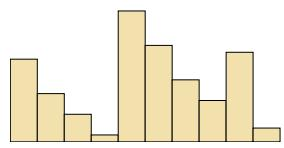  
(a) q1(x)

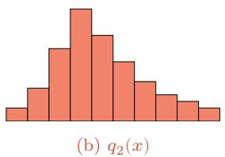  
图 E.1 Wasserstein 距离示例

  
(c) $q _ { 1 }$ 到 $q _ { 2 }$ 最优的运输方案

相比KL散度和JS散度，Wasserstein距离的优势在于：即使两个分布没有重叠或重叠很少，它仍能反映分布间的远近.

Wasserstein 距离的一个优势在于处理支撑集不相交的分布.例如，若p集中于$x = 0 , q$ 集中于 $x =$ 10,则 $\mathrm { K L } ( p \| q ) = \infty ,$ JS(p||q) = log2 为常数、均无法提供有意义的梯度；而 $W _ { 1 } ( p , q ) =$ 10，可连续反映分布间的位移.这也是Wasserstein GAN 采用该距离作为训练准则的直观原因之一.

对于 $\mathbb { R } ^ { D }$ 空间中的两个高斯分布 $p = \mathcal { N } ( \boldsymbol { \mu } _ { 1 } , \boldsymbol { \Sigma } _ { 1 } )$ 和 $q = \mathcal { N } ( \boldsymbol { \mu } _ { 2 } , \boldsymbol { \Sigma } _ { 2 } )$ ,它们的2阶 Wasserstein距离为

$$
\begin{array} { r } { W _ { 2 } ( p , q ) = \left[ \| \pmb { \mu } _ { 1 } - \pmb { \mu } _ { 2 } \| _ { 2 } ^ { 2 } + \mathrm { t r } \left( \pmb { \Sigma } _ { 1 } + \pmb { \Sigma } _ { 2 } - 2 \Big ( \pmb { \Sigma } _ { 2 } ^ { 1 / 2 } \pmb { \Sigma } _ { 1 } \pmb { \Sigma } _ { 2 } ^ { 1 / 2 } \Big ) ^ { 1 / 2 } \right) \right] ^ { 1 / 2 } . } \end{array}\tag{E.21}
$$

当两个分布的协方差都退化为零时,2阶Wasserstein距离退化为欧氏距离.

## E.4 总结和扩展阅读

本章比较简略地介绍了本书所需要的数学基础知识.若要深入了解这些知识，可以参考这些数学分支的专门书籍.

关于线性代数的知识可以参考《Introduction to Linear Algebra》[Strang, 2016]、《Differential Equations and Linear Algebra》[Strang, 2014] 或《Introduction to Applied Linear Algebra: Vectors, Matrices, and Least Squares [Boyd et al., 2018].

关于微积分的知识，可以参考《Calculus》[Stewart，2011]或《Thomas'Calculus》[Thomas et al., 2005].

关于数学优化的知识，可以参考《Numerical Optimization》[Nocedalet al., 2006] 和《Convex Optimization》[Boyd et al., 2014].

关于概率论的知识，可以参考《数理统计学教程》[陈希孺，2009b]或《概率论与数理统计》[陈希孺，2009a].

关于信息论的知识,可以参考《Information Theory, Inference, and Learn-ing Algorithms》 [MacKay, 2003] 或《Elements of Information Theory》[Coveret al., 2006].

## 参考文献

陈希孺，2009a. 陈希孺文集:概率论与数理统计[M]. 中国科学技术大学出版社.

陈希孺，2009b. 陈希孺文集:数理统计学教程[M]. 中国科学技术大学出版社.

BOYD S, VANDENBERGHE L, 2018. Introduction to applied linear algebra: vectors, matrices, and least squares[M/OL]. Cambridge university press. http://vmls-book.stanford.edu/.

BOYD S P, VANDENBERGHE L, 2014. Convex optimization[M/OL]. Cambridge University Press. https://web.stanford.edu/%7Eboyd/cvxbook/. DOI: 10.1017/CBO9780511804441.

COVER T M, THOMAS J A, 2006. Elements of information theory[M/OL]. 2nd ed. Wiley. http://www.elementsofinformationtheory.com/.

MACKAY D J C, 2003. Information theory, inference, and learning algorithms[M]. Cambridge University Press.

NOCEDAL J, WRIGHT S J, 2006. Numerical optimization[M]. 2nd ed. Springer.

RASMUSSEN C E, 2003. Gaussian processes in machine learning[C]//Advanced Lectures on Machine Learning, ML Summer Schools 2003, Canberra, Australia, February 2-14, 2003, Tübingen, Germany, August 4-16, 2003, Revised Lectures. 63-71.

STEWART J, 2011. Calculus[M]. Cengage Learning.

STRANG G, 2014. Differential equations and linear algebra[M/OL]. Wellesley-Cambridge Press. http://math.mit.edu/dela.

STRANG G, 2016. Introduction to linear algebra[M/OL]. 5th ed. Wellesley-Cambridge Press. http://math.mit.edu/linearalgebra.

THOMAS G B, WEIR M D, HASS J, et al., 2005. Thomas' calculus[M]. Addison-Wesley.