<!-- 第 1 段 (页码约 1-200) -->


Neural Networks and Deep Learning

# 神经网络与深度学习

# 《神经网络与深度学习》(第二版)

# Neural Networks and Deep Learning (Ed. 2)

https://nndl.ai/

邱锡鹏

xpqiu@fudan.edu.cn

2026年7月23日

## 前 言

自本书第一版出版以来，人工智能，特别是神经网络与深度学习的发展，进入了一个前所未有的快速演进阶段.短短几年间，深度学习已经从以图像识别、语音识别、文本分类等任务为代表的专用技术，逐步发展为支撑生成式人工智能、跨模态学习、大语言模型以及智能体系统的重要基础，以表示学习为起点的神经网络，正在不断拓展其能力边界，从“感知”走向“生成”，从“建模单一任务”走向“处理开放环境中的复杂问题”，深刻影响着科学研究、产业应用以及人们获取和使用知识的方式

与此同时，这一领域的知识体系也发生了显著变化.一方面，深度学习在模型结构、训练方法和应用范式上不断突破，注意力机制、Transformer、预训练模型、扩散模型、大语言模型等技术快速发展，并逐渐成为当前人工智能研究与应用的重要主线；另一方面，深度学习与强化学习、知识表示、因果推断、多模态建模、外部工具调用等方向不断交叉融合，使得“神经网络与深度学习”这门课程的内涵比几年前更加丰富，也更具挑战性.对于初学者而言，相关概念、方法和模型层出不穷，既令人兴奋，也容易感到碎片化和无所适从，因此，在这样一个快速变化的阶段，重新梳理这一领域的核心问题、基本方法与统一脉络，就显得更加必要.

本书的写作目的没有改变，依然是希望读者能够较为系统地掌握神经网络与深度学习的基本原理，既知其然，也知其所以然.和第一版相比，第二版在保持原有主线的基础上，对全书内容进行了较为系统的修订和补充.一些章节的内容做了更新，一些章节的结构与表述做了调整，也补充了近年来较有代表性的方法和模型.修订过程中，我仍然尽量坚持一个基本想法：教材不应只是罗列方法，更重要的是帮助读者建立起对这一领域的整体理解.

需要说明的是，尽管近年来人工智能技术取得了令人瞩目的进展，但我们仍应对其能力边界保持清醒认识.无论是大语言模型，还是多模态模型与智能体系统，它们都在许多任务上展现出强大的性能，甚至表现出一定程度的通用性；但从根本上看，当前的人工智能系统距离真正稳定、可靠、可解释并能够持续适应开放环境的通用智能，仍有相当长的路要走，数据依赖、训练代价、可控性、鲁棒性、对齐、安全性等问题，依然是这一领域的重要挑战，也正因为如此，今天学习神经网络与深度学习，不能只停留在“会调用模型”或“会复现结果”的层面，而更需要理解这些方法背后的假设、优势、局限以及它们适用的条件

本书依然是一本以基础原理为核心的教材．我希望它既能为初学者提供一个较为清晰的入门路径，也能为已有一定基础的读者提供进一步梳理知识体系的参考.对于教学而言，我希望这本书不仅能够帮助学生掌握神经网络与深度学习的基本内容，更能激发他们对人工智能更深层问题的思考；对于研究与实践而言，我也希望它能够帮助读者在纷繁复杂的技术演进中，建立起自己的判断力与方法论.

第一版的写作，起始于2015年我在复旦大学开设“神经网络与深度学习”课程期间所整理的讲义.那时国内关于深度学习的系统教材还较少，很多内容需要边教学、边理解、边梳理，如今再回头看，第一版中很多表述仍显粗浅，甚至有些内容已经明显带有时代局限，但也正是这些年的教学、研究和实践，使我更加体会到，教材的价值并不在于完整罗列某一时期的全部技术细节，而在于帮助读者抓住一个领域中相对稳定、可以迁移、能够不断生长的知识骨架，从这个意义上说，第二版既是对第一版的修订，也是我自己对这一领域理解的再次整理与更新.

本书第二版能够完成，首先要感谢长期以来在教学、科研和写作过程中给予我帮助和支持的老师、同事、学生以及广大读者.很多读者在过去几年中通过邮件、网络平台和课程交流等方式指出书中的错误，提出了许多具体而中肯的建议，这些反馈对本书的修订帮助很大，也感谢出版社编辑老师在本书修订过程中付出的耐心和努力.与此同时，我还要感谢我的家人.写作和修订一本教材需要投入大量连续而安静的时间，没有他们的理解与支持，这项工作很难顺利完成

限于个人水平和时间精力，本书第二版仍然难免存在疏漏与不足.神经网络与深度学习本身也是一个仍在快速发展的领域，书中的一些内容未来也可能需要继续修订和完善.恳请读者在使用过程中批评指正

邱锡鹏

于上海

2026年4月

## 如何阅读本书

本书共分为三大部分和附录.三大部分对应深度学习的不同发展阶段，附录提供必要的数学基础

## 本书结构

第一部分“机器学习基础”介绍机器学习的基本概念与线性模型，是后续深度神经网络的逻辑起点．第二部分“基础模型”介绍前馈、卷积、循环、Trans-former与图神经网络等核心架构，并讨论网络的优化与正则化，第三部分“进阶主题”介绍无监督学习、模型独立的学习方式、深度强化学习、大语言模型与智能体、概率图模型与深度生成模型.三部分大体上沿“判别建模→表示与序列建模→决策与生成”的路径展开.附录系统整理本书所需的微积分、线性代数、概率统计、信息论与数学优化等数学基础

## 阅读路径建议

不同读者可以根据自己的背景与兴趣选择不同的入门路径.下面给出四条典型路径，供参考.

零基础读者或本科生 建议按章节顺序阅读，从绪论开始，依次完成机器学习概述与线性模型，再进入前馈、卷积、循环神经网络以及注意力机制与Trans-former.这一路径覆盖深度学习中最稳定的基础知识，是后续学习其他主题的前置.

数学基础较强的读者可以先快速浏览附录中的数学基础，然后从线性模型与网络优化与正则化入手．这一路径以最小化的篇幅打通“模型→优化→泛化”的核心链条，再按兴趣分别进入深度生成模型或深度强化学习.

工程实践导向的读者 可以略读机器学习概述与线性模型，重点研读卷积神经网络、循环神经网络与注意力机制及Transformer，然后直接进入大语言模型与智能体，再回头补充模型独立的学习方式中关于迁移、元学习与多任务学习的内容.这一路径优先关注当前主流模型与应用范式

研究导向的读者可以从注意力机制与Transformer出发，了解图神经网络在结构化数据上的扩展，再进入深度强化学习、深度生成模型与大语言模型与智能体.准备阅读深度生成模型的读者，建议先浏览概率图模型中关于EM算法、变分推断和采样方法的内容，以便更顺畅地理解隐变量模型与生成过程.阅读时可重点关注每章末尾的“总结和扩展阅读”中所列的最新文献，进一步追踪研究前沿.

无论选择哪条路径，附录中的数学基础都可以随时作为前置知识查询；正文中需要相关数学背景的位置，也会以侧栏边注的形式给出指引.

## 书内元素的使用方式

为了便于读者按需阅读，正文以外的素材采用以下约定：

• 侧栏边注：补充背景知识、相关文献、易错提示或指向附录的数学细节.初读时可以略过，回顾时常常有用.

· 术语强调：每章首次出现的关键术语以加粗形式给出中英文对照，并进入索引;后续重复出现时不再强调

·习题：每章末尾的习题包含概念理解、公式推导和实现验证等不同类型，可以根据学习目标选择性完成.

• 交叉引用：对前置或后继内容给出指引,方便回看与跳读.

## 对教学的建议

本书内容较多，作为一学期课程使用时，建议根据学时与学生背景选取主线章节.基础课程可以覆盖第一、第二部分以及第三部分中若于代表性章节；进阶课程则可以围绕第三部分展开，并配合相关论文阅读.每章末尾的“总结和扩展阅读”给出了进一步学习的入口.

## 常用符号表

<table><tr><td>符号</td><td>含义</td></tr><tr><td> $x , y , m , n , t$ </td><td>标量，通常为变量</td></tr><tr><td> $K , L , D , M , N , T$ </td><td>标量，通常为超参数</td></tr><tr><td> $\pmb { x } \in \mathbb { R } ^ { D }$ </td><td>D维列向量</td></tr><tr><td> $[ x _ { 1 } , \cdots , x _ { D } ]$ </td><td>D维行向量</td></tr><tr><td> $[ x _ { 1 } , \cdots , x _ { D } ] ^ { \intercal }$  or  $[ x _ { 1 } ; \cdots ; x _ { D } ]$ </td><td>D维列向量</td></tr><tr><td> $\textbf { 0 o r } \mathbf { 0 } _ { D }$ </td><td>(D维)全0向量</td></tr><tr><td> $\textbf { 1 o r 1 } _ { D }$ </td><td>(D维)全1向量</td></tr><tr><td> $\mathbb { I } _ { i } { \mathrm { ~ o r ~ } } \mathbb { I } _ { i } ( x )$ </td><td>第i维为1(或x),其余为0的one-hot列向量</td></tr><tr><td> $\mathbf { \pmb { x } } ^ { \mathsf { T } }$ </td><td>向量x的转置</td></tr><tr><td> $\pmb { A } \in \mathbb { R } ^ { K \times D }$ </td><td>大小为  $K \times D$  的矩阵</td></tr><tr><td> ${ \pmb X } = [ { \pmb x } ^ { ( 1 ) } , \cdots , { \pmb x } ^ { ( N ) } ] \in \mathbb { R } ^ { D \times N }$ </td><td>样本矩阵，每一列为一个样本</td></tr><tr><td> $\pmb { Y } = [ \pmb { y } ^ { ( 1 ) } , \cdots , \pmb { y } ^ { ( N ) } ] \in \mathbb { R } ^ { C \times N }$ </td><td>标签矩阵，每一列为一个样本的标签向量</td></tr><tr><td> $\pmb { x } \in \mathbb { R } ^ { K D }$ </td><td>(KD)维的向量</td></tr><tr><td> $\mathbb { M } _ { i } \ \mathrm { o r } \ \mathbb { M } _ { i } ( { \pmb x } )$ </td><td>第i列为1(或x),其余为0的矩阵</td></tr><tr><td> $\operatorname { d i a g } ( { \pmb x } )$ </td><td>对角矩阵，其对角线元素为x</td></tr><tr><td> $I _ { N } \ \mathrm { o r } \ I$ </td><td> $( N \times N$  的）单位阵</td></tr><tr><td> $\operatorname { d i a g } ( A )$ </td><td>列向量，其元素为A的对角线元素</td></tr><tr><td> $A ^ { \intercal }$ </td><td>矩阵A的转置</td></tr><tr><td> $A ^ { - 1 }$ </td><td>矩阵A的逆</td></tr><tr><td> $\operatorname* { d e t } ( A ) { \mathrm { ~ o r ~ } } | A |$ </td><td>方阵A的行列式</td></tr><tr><td> $\mathcal { A } \in \mathbb { R } ^ { D _ { 1 } \times D _ { 2 } \times \dots \times D _ { K } }$ </td><td>大小为  $D _ { 1 } \times D _ { 2 } \times \cdots \times D _ { K }$  的张量</td></tr><tr><td> $\scriptstyle { \pmb { x } } \odot { \pmb { y } }$ </td><td>逐元素(Hadamard)乘积</td></tr><tr><td> $W \otimes X$ </td><td>卷积运算</td></tr><tr><td> $\boldsymbol { x } \cdot \boldsymbol { y } \ \mathrm { o r } \ \boldsymbol { x } ^ { \top } \boldsymbol { y }$ </td><td>向量内积</td></tr><tr><td>符号</td><td>含义(续)</td></tr><tr><td> $\| { \boldsymbol { \mathbf { x } } } \| _ { p }$ </td><td>向量x的  $\ell _ { p }$  范数  $; p = 2$  时为欧氏范数，  $\mathbf { \nabla } \cdot p = 1$  时 为  $\ell _ { 1 }$  范数</td></tr><tr><td> $\| \pmb { x } \|$ </td><td>向量x的范数，默认为  $\ell _ { 2 }$  范数</td></tr><tr><td> $\left\| A \right\| _ { F }$ </td><td>矩阵 A的 Frobenius 范数</td></tr><tr><td> ${ \begin{array} { l } { { \frac { \partial y } { \partial x } } \ \mathrm { o r } \ { \frac { \partial f ( \mathbf { x } ) } { \partial x } } } \end{array} }$ </td><td>偏导数，本书对向量/矩阵采用分母布局</td></tr><tr><td> $\nabla f ( { \pmb x } )$ </td><td>函数f在x处的梯度</td></tr><tr><td> $\nabla ^ { 2 } f ( { \pmb x } )$ </td><td>函数 f在 x 处的 Hessian矩阵</td></tr><tr><td> $\textstyle { \frac { \partial y } { \partial x } }$ </td><td>雅可比矩阵(的转置）</td></tr><tr><td> $\mathcal { C } \mathrm { ~ o r ~ } \{ x ^ { ( n ) } \} _ { n = 1 } ^ { N }$ </td><td>集合</td></tr><tr><td> $\mathcal { D } \mathrm { ~ o r ~ } \{ ( \boldsymbol { x } ^ { ( n ) } , y ^ { ( n ) } ) \} _ { n = 1 } ^ { N }$ </td><td>数据集</td></tr><tr><td> $\mathbb { R } ^ { D }$ </td><td>D维实数空间</td></tr><tr><td>|e|</td><td>集合C的元素个数(基数)</td></tr><tr><td> $p ( x )$ </td><td>随机变量x的概率分布</td></tr><tr><td> $p ( y | x )$ </td><td>随机变量y在给定x条件下的条件概率分布</td></tr><tr><td> $\mathcal { N } ( \boldsymbol { \mu } , \boldsymbol { \Sigma } )$  or  $\mathcal { N } ( \boldsymbol { x } ; \mu , \Sigma )$ </td><td>（变量x服从）均值为  $\mu .$  方差为Σ的正态（高</td></tr><tr><td> $\mathbb { E } _ { { \pmb x } \sim p ( { \pmb x } ) } [ f ( { \pmb x } ) ]$ </td><td>斯)分布 期望</td></tr><tr><td> $\operatorname { v a r } _ { { \pmb x } \sim p ( { \pmb x } ) } [ f ( { \pmb x } ) ]$ </td><td>方差</td></tr><tr><td> $H ( p )$ </td><td>分布p的熵</td></tr><tr><td> $H ( p , q )$ </td><td>分布p与q的交叉熵</td></tr><tr><td> $\mathrm { K L } ( p \| q ) \ \mathrm { o r } \ D _ { \mathrm { K L } } ( p \| q )$ </td><td>分布p到q的KL散度</td></tr><tr><td>exp(x)</td><td>以自然常数e为底的自然指数函数</td></tr><tr><td>log(x)</td><td>以自然常数e为底的自然对数函数</td></tr><tr><td> $\begin{array} { r } { \sigma ( x ) = \frac { 1 } { 1 + \exp ( - x ) } } \end{array}$ </td><td>Logistic（Sigmoid)函数</td></tr><tr><td> $\begin{array} { r } { \mathrm { s o f t m a x } ( z ) _ { c } = \frac { \exp ( z _ { c } ) } { \sum _ { c ^ { \prime } } \exp ( z _ { c ^ { \prime } } ) } } \end{array}$ </td><td>Softmax 函数</td></tr><tr><td> ${ \mathrm { R e L U } } ( x ) = \operatorname* { m a x } ( 0 , x )$ </td><td> $\mathrm { R e L U }$  （修正线性单元）函数</td></tr><tr><td>tanh(x)</td><td>双曲正切函数</td></tr><tr><td>三</td><td>定义符号</td></tr><tr><td> $I ( x )$ </td><td>指示函数.当x为真时，  $I ( x ) = 1$  ;否则  $I ( x ) = 0$ </td></tr><tr><td> $\operatorname { s g n } ( x )$ </td><td>符号函数</td></tr><tr><td> $\arg \operatorname* { m a x } _ { x } f ( x )$ </td><td>使 f(x)取最大值的x</td></tr><tr><td> $\mathrm { a r g m i n } _ { x } f ( x )$ </td><td>使  $f ( x )$  取最小值的x</td></tr></table>

## 目 录

前言  
如何阅读本书  
常用符号表  
第一部分 机器学习基础  
第1章 绪论  
1.1 人工智能. 3  
1.2 机器学习 8  
1.3 表示学习. 10  
1.4 深度学习. 13  
1.5 神经网络.. 15  
1.6 本书的知识体系 21  
1.7 常用的深度学习框架 23  
1.8 总结和扩展阅读. 24  
第2章 机器学习概述  
2.1 基本概念... 28  
2.2 机器学习的基本要素 29  
2.3 机器学习的简单示例—线性回归 40  
2.4 偏差-方差分解... 45  
2.5 机器学习算法的类型 48  
2.6 数据的特征表示. 50  
2.7 理论和定理 53  
2.8 总结和扩展阅读 56  
第3章 线性模型  
3.1 线性判别函数和决策边界 61  
3.2 Logistic 回归. 65  
3.3 Softmax 回归 67  
3.4 感知器. 72  
3.5 支持向量机 79  
3.6 损失函数对比 83  
3.7 总结和扩展阅读 85  
第二部分 基础模型  
第4章 前馈神经网络  
4.1 前馈网络的结构与表示能力. 90  
4.2 前馈网络的学习.. 93  
4.3 自动微分与梯度计算 99  
4.4 训练中的优化问题. 104  
4.5 激活函数与门控激活单元 106  
4.6 总结和扩展阅读. 113  
第5章 卷积神经网络  
5.1 卷积 ... 118  
5.2 卷积神经网络 124  
5.3 参数学习. 130  
5.4 几种典型的卷积神经网络 132  
5.5 其他卷积方式 138  
5.6 总结和扩展阅读 143  
第6章 循环神经网络  
6.1 给网络增加记忆能力 149  
6.2 简单循环网络 150  
6.3 应用到机器学习 153  
6.4 参数学习.. 157  
6.5 长程依赖问题 160  
6.6 基于门控的循环神经网络 162  
6.7 深层循环神经网络.. 166  
6.8 从序列到更一般的结构 168  
6.9 总结和扩展阅读. 169  
第7章 网络优化与正则化  
7.1 网络优化. 174  
7.2 优化算法. 177  
7.3 参数初始化 190  
7.4 数据预处理 195  
7.5 逐层规范化 197  
7.6 超参数优化 201  
7.7 网络正则化 206  
7.8 训练过程诊断 213  
7.9 总结和扩展阅读. 214  
第8章 注意力机制与Transformer  
8.1 认知神经学中的注意力 220  
8.2 注意力机制 220  
8.3 自注意力.. 224  
8.4 Transformer模型. 228  
8.5 Transformer 的三种常见架构范式 235  
8.6 现代 Transformer的常见优化.. 236  
8.7 总结和扩展阅读. 245  
第9章 图神经网络  
9.1 图数据与基本概念. 250  
9.2 图上的机器学习任务 254  
9.3 图神经网络 257  
9.4 经典图神经网络 259  
9.5 图神经网络中的共性问题 271  
9.6 总结和扩展阅读. 273  
第三部分 进阶主题  
第10章 无监督学习  
10.1 经典无监督特征学习 280  
10.2 概率密度估计 288  
10.3 聚类 . .. 293  
10.4 自监督学习 293  
10.5 总结和扩展阅读. 297  
第11章 模型独立的学习方式  
11.1 集成学习. 301  
11.2 半监督学习 306  
11.3 多任务学习 308  
11.4 迁移学习. 311  
11.5 持续学习. 317  
11.6 元学习. 320  
11.7 总结和扩展阅读 323  
第12章 深度强化学习  
12.1 强化学习问题 330  
12.2 基于值函数的学习方法 336  
12.3 基于策略函数的学习方法 344  
12.4 演员-评论员算法.. 349  
12.5 信赖域思想与近端策略优化. 350  
12.6 环境模型、离线数据与奖励建模 355  
12.7 在大语言模型中的应用 356  
12.8 总结和扩展阅读 357  
第13章 大语言模型与智能体  
13.1 语言模型回顾 362  
13.2 大语言模型的预训练 365  
13.3 涌现能力. 369  
13.4 指令微调. 371  
13.5 基于人类反馈的对齐 373  
13.6 推理增强.. 379  
13.7 智能体的框架与规划 382  
13.8 工具使用与多智能体 384  
13.9 智能体评估与流程治理 387  
13.10 总结和扩展阅读 387  
第14章 概率图模型  
14.1 模型表示. 395  
14.2 学习 404  
14.3 推断 412  
14.4 变分推断. 416  
14.5 基于采样法的近似推断 418  
14.6 总结和扩展阅读 425  
第15章 深度信念网络  
15.1 玻尔兹曼机 429  
15.2 受限玻尔兹曼机 436  
15.3 深度信念网络 442  
15.4 总结和扩展阅读 447  
第16章 深度生成模型  
16.1 概率生成模型 453  
16.2 变分自编码器 455  
16.3 生成对抗网络 462  
16.4 扩散模型. 472  
16.5 流匹配. 487  
16.6 总结和扩展阅读 496

附录 数学基础

附录A 线性代数

附录 B 微积分

附录 C 数学优化

附录 D 概率论

附录 E 信息论

第一部分

机器学习基础

## 第1章 绪论

一个人在不接触对方的情况下，通过一种特殊的方式，和对方进行一系列的问答.如果在相当长时间内，他无法根据这些问题判断对方是人还是计算机，那么就可以认为这个计算机是智能的.

——阿兰·图灵(Alan Turing)

《Computing Machinery and Intelligence》

近年来，人工智能系统在图像识别、语音交互、机器翻译、自动驾驶、代码生成以及复杂推理等任务上取得了令人瞩目的进展.尤其是以深度学习和大模型为代表的方法，不仅显著提升了传统感知任务的性能，也在语言理解、内容生成、工具使用和多轮交互等方面展现出越来越强的能力.面对这些现象，一个自然的问题是：为什么深度学习会逐渐成为这一轮人工智能发展的主流方法？

要回答这个问题，就需要把视野从当前的技术现象拉回到人工智能发展的整体脉络之中.深度学习并不是孤立出现的技术，而是人工智能研究范式不断演化、机器学习内部从“人工设计特征”走向“自动学习表示”的结果.进一步地，还需要继续追问：在深度学习这一范式中，为什么神经网络又成为最主要的模型载体？沿着这条线索，本章将先从人工智能的总体目标和发展脉络出发，说明研究者为什么从“规则驱动”逐步转向“数据驱动”；再介绍机器学习、表示学习与深度学习之间的内在联系；接着说明神经网络为何能够成为深度学习最主要的实现方式;最后给出本书的知识地图，帮助读者建立后续各章之间的整体联系.

在这一过程中，深度学习（DeepLearning）逐渐成为最具代表性的一类方法.从学科关系看，它属于机器学习范畴，研究如何从数据中自动学习复杂的输入一输出映射，并把学到的规律推广到新的样本上，例如，在疾病诊断中，可以从历史病例中学习症状与疾病之间的关系，并据此判断新病人的病情

与传统机器学习相比，深度学习通常采用由多层线性或非线性组件（com-ponent）复合而成的模型．信息在这些组件中逐层变换，从原始输入逐步形成更抽象的表示.模型越复杂，就越难判断最终结果应归因于哪些中间组件如何分配这种归因，称为贡献度分配问题（Credit Assignment Problem，CAP）[Minsky，1961]（将在第1.4节详细讨论），它直接关系到模型参数应如何学习，是深度学习中的一个核心问题.

在深度学习中，解决贡献度分配问题最成功的一类模型是人工神经网络(Artificial Neural Network，ANN）.人工神经网络简称神经网络，是一种受生物神经系统启发而构造的数学模型.它由人工神经元及其连接构成，可以看作一个由参数控制的复杂函数，并通过数据驱动的方式学习这些参数.由于神经网络能够通过多层结构逐步加工信息，因此成为深度学习中最主要的模型载体

贡献度分配问题也经常翻译为信用分配问题或功劳分配问题.

需要注意的是，神经网络和深度学习并不完全等同.深度学习可以采用神经网络，也可以采用其他深层模型（例如某些深度生成模型与概率图模型有密切关系).虽然深度学习最初主要用于解决机器学习中的表示学习问题，但随着模型能力的提升，它已经广泛应用于感知、推理、决策、规划和生成等更一般的人工智能任务.

表示学习参见第1.3节.

本书主要介绍神经网络与深度学习的基本概念、主要模型、学习方法及其应用．在本章中，我们先回顾人工智能的发展脉络，再依次引入机器学习、表示学习、深度学习与神经网络等基本概念，并说明本书的知识结构.

## 1.1 人工智能

智能（Intelligence）是现代生活中很常见的一个词，比如智能手机、智能家居、智能驾驶等.在不同使用场合中，智能的含义也不太一样.比如“智能手机”中的“智能”一般是指由计算机控制并具有某种智能行为.这里的“计算机控制”+“智能行为”隐含了对人工智能的简单定义.

“智能”可以理解为“智力”和“能力”.前者是智能的基础，后者是指获取和运用知识求解的能力.

简单地讲，人工智能（Artificial Intelligence，AI）就是让机器具有人类的智能，这也是人们长期追求的目标.这里关于什么是“智能”并没有一个很明确的定义，但一般认为智能（或特指人类智能）是知识和智力的总和，都和大脑的思维活动有关.

从更具体的研究目标来看，人工智能关心的并不是“把所有人类行为逐项复制到机器上”，而是希望构建能够完成感知、学习、推理、决策与行动等任务的计算系统.也正因为这一目标过于宏大，人工智能的发展历史并不是一条单一直线，而是一系列“如何实现智能”的方法选择与范式转换.

人类大脑是经过了上亿年的进化才形成了如此复杂的结构，但我们至今仍然没有完全了解其工作机理.虽然随着神经科学、认知心理学等学科的发展，人们对大脑的结构有了一定程度的了解，但对大脑的智能究竟是怎么产生的还知道得很少.我们并不完全理解大脑的运作原理，以及如何产生意识、情感、记忆等功能.因此，直接通过“复制”人脑来实现人工智能在现阶段仍缺乏可操作性

1950年，阿兰·图灵（AlanTuring）发表了一篇有着重要影响力的论文《Computing Machinery and Intelligence》，讨论了创造一种“智能机器”的可能性.由于“智能”一词比较难以定义，他提出了著名的图灵测试：“一个人在不接触对方的情况下，通过一种特殊的方式和对方进行一系列的问答．如果在相当长时间内，他无法根据这些问题判断对方是人还是计算机，那么就可以认为这个计算机是智能的”.图灵测试是促使人工智能从哲学探讨到科学研究的一个重要因素，引导了人工智能的很多研究方向．因为要使得计算机能通过图灵测试，计算机就必须具备理解语言、学习、记忆、推理、决策等能力．这样，人工智能就延伸出了很多不同的子学科，比如机器感知（计算机视觉、语音信息处理）、学习（模式识别、机器学习、强化学习）、语言（自然语言处理）、记忆（知识表示）、决策（规划、数据挖掘）等.所有这些研究领域都可以看成是人工智能的研究范畴.近年来，人们在评估“机器是否智能”时，除了语言对话能力，也更加关注其在复杂推理、编程、数学、现实决策以及安全对齐等方面的综合表现

人工智能是计算机科学的一个分支，主要研究、开发用于模拟、延伸和扩展人类智能的理论、方法、技术及应用系统等.和很多其他学科不同，人工智能这个学科的诞生有着明确的标志性事件，就是1956年的达特茅斯（Dartmouth）会议.在这次会议上，“人工智能”被提出并作为本研究领域的名称.同时，人工智能研究的使命也得以确定.JohnMcCarthy提出了人工智能的定义：人工智能就是要让机器的行为看起来就像是人所表现出的智能行为一样.

从研究内容看，人工智能的主要领域大体上可以分为以下几个方面：

John McCarthy(1927\~2011)，人工智能学科奠基人之一，1971年图灵奖得主.

（1）感知：模拟人的感知能力，对外部刺激信息（视觉和语音等）进行感知和加工.主要研究领域包括语音信息处理和计算机视觉等.

（2）学习：模拟人的学习能力，主要研究如何从样例或从与环境的交互中进行学习.主要研究领域包括监督学习、无监督学习和强化学习等.

（3）认知：模拟人的认知能力，主要研究领域包括知识表示、自然语言理解、推理、规划、决策等.

（4）行动与交互：研究智能系统如何在环境中调用工具、执行动作、与人协作并根据反馈持续调整行为.近年来的智能体（Agent）系统就是这一方向的重要代表.

近年来，以大语言模型和基础模型为代表的新一代人工智能系统在以上各方面都取得了显著进展，也改变了人工智能研究的组织方式和应用模式（下节将作进一步讨论).

## 1.1.1 人工智能的发展历史

人工智能从诞生至今，经历了一次又一次的繁荣与低谷．若从“主要依靠什么来实现智能”这一角度看，其发展历程大体上可以概括为“推理期”“知识期”“学习期”和“大模型期”.这种划分并不意味着后一个阶段彻底替代前一个阶段，而是说明不同时期研究者对“智能来自哪里”这一问题有不同的侧重.

## 1.1.1.1 推理期

1956年达特茅斯会议之后，研究者对人工智能的热情高涨，之后的十几年是人工智能的黄金时期，大部分早期研究者都通过人类的经验，基于逻辑或者事实归纳出来一些规则，然后通过编写程序来让计算机完成一个任务，这个时期中，研究者开发了一系列的智能系统，比如几何定理证明器、语言翻译器等．这些初步的研究成果也使得研究者对开发出具有人类智能的机器过于乐观，低估了实现人工智能的难度.有些研究者甚至认为：“二十年内，机器将能完成人能做到的一切工作”，“在三到八年的时间里可以研发出一台具有人类平均智能的机器”.但随着研究的深入，研究者意识到这些推理规则过于简单，对项目难度评估不足，原来的乐观预期受到严重打击．人工智能的研究开始陷入低谷，很多人工智能项目的研究经费也被消减

## 1.1.1.2 知识期

到了20世纪70年代，研究者意识到知识对于人工智能系统的重要性.特别是对于一些复杂的任务，需要专家来构建知识库.在这一时期，出现了各种各样的专家系统（Expert System），并在特定的专业领域取得了很多成果.专家系统可以简单理解为“知识库+推理机”，是一类具有专门知识和经验的计算机智能程序系统.专家系统一般采用知识表示和知识推理等技术来完成通常由领域专家才能解决的复杂问题，因此专家系统也被称为基于知识的系统.一个专家系统必须具备三要素：1）领域专家级知识；2）模拟专家思维；3）达到专家级的水平.在这一时期，Prolog(Programming in Logic)语言是主要的开发工具，用来建造专家系统、智能知识库以及处理自然语言理解等.

人工智能低谷，也叫人工智能冬天(AI Win-ter)，指人工智能史上研究资金及学术界研究兴趣都大幅减少的时期.人工智能领域经历过好几次低谷期.每次狂热高潮之后，紧接着是失望、批评以及研究资金断绝，然后在几十年后又重燃研究兴趣.1974\~1980年及1987\~1993年是两个主要的低谷时期，其他还有几个较小的低谷.

## 1.1.1.3 学习期

对于人类的很多智能行为（比如语言理解、图像理解等），我们很难知道其中的原理，也无法描述这些智能行为背后的“知识”．因此，我们也很难通过知识和推理的方式来实现这些行为的智能系统.为了解决这类问题，研究者开始将研究重点转向让计算机从数据中自己学习.事实上，“学习”本身也是一种智能行为.从人工智能的萌芽时期开始，就有一些研究者尝试让机器来自动学习，即机器学习（MachineLearning，ML）.机器学习的主要目的是设计和分析一些学习算法，让计算机可以从数据（经验）中自动分析并获得规律，之后利用学习到

Prolog是一种基于逻辑学理论而创建的逻辑编程语言，最初被运用于自然语言、逻辑推理等研究领域.

的规律对未知数据进行预测，从而帮助人们完成一些特定任务，提高开发效率.机器学习的研究内容也十分广泛，涉及线性代数、概率论、统计学、数学优化、计算复杂性等多门学科.在人工智能领域，机器学习从一开始就是一个重要的研究方向.但直到1980年后，机器学习因其在很多领域的出色表现，才逐渐成为热门学科.2010年代中后期以来，随着数据规模和计算能力的快速提升，深度神经网络逐渐取代线性模型，成为主要的机器学习模型，并在计算机视觉、自然语言处理等领域取得了突破性进展.这一阶段的后期已经开始向以大模型为核心的新阶段过渡.

## 1.1.1.4 大模型期

2018年后，人工智能逐渐迈入以大模型（LargeModel）为核心的新阶段.深度学习模型的规模持续增长，海量数据与高性能计算设备使得训练具有数十亿乃至更大参数规模的模型成为可能.实践表明，随着模型规模、数据规模与计算量同步扩大，模型在广泛任务上的性能往往会持续提升，这种经验现象被称为规模法则（ScalingLaw）,并成为推动大模型时代到来的重要动力.后续研究进一步揭示了模型参数与训练数据之间存在最优比例关系.近年来，规模法则的概念还从训练阶段扩展到推理阶段：通过在推理时分配更多计算资源（如让模型生成更长的推理链)，同样可以显著提升模型在复杂任务上的表现

这一时期最具影响力的技术突破之一是Transformer结构的提出.借助Transformer的强大建模能力，研究者开始利用海量未标注数据进行自监督预训练，训练出能够捕捉广泛统计规律和语义结构的大语言模型（LargeLanguageModel,LLM).

在这一基础上，预训练模型沿着“数据规模一模型规模一任务泛化能力”的方向持续演进.早期的BERT、GPT等模型主要面向语言理解或语言生成任务，但随着规模不断提升，模型表现出更强的跨任务迁移能力．特别是2020年代以来，以GPT系列、Claude系列、LLaMA系列等为代表的大语言模型，不仅在对话、问答、翻译等任务上取得突破，也在编程、数学推理、逻辑分析等复杂任务上展现出很强的能力.在一些标准评测和边界清晰的应用中，这些系统已经表现出接近甚至达到专业水平的能力.

大语言模型带来的最重要变化之一是范式转换．传统机器学习依赖大量标注数据和精细的任务工程，而大模型更多依靠海量未标注数据完成预训练，再通过少量样本或自然语言提示来适应新任务，这种能力被称为上下文学习（in-context learning）.此外，指令微调（Instruction Tuning）进一步提升了模型对人类意图的理解和遵循能力.这里需要区分几个相关概念：提示（prompting）是用自然语言描述任务；上下文学习是模型在输入上下文中完成任务适配；提示学习（Prompt Learning）则常常指将提示本身设计为可学习的参数化结构.

规模法则参见第13.2.3节.

与此同时，大模型的能力也逐渐从单一模态扩展到多模态，联合建模文本、图像、语音、视频、动作等不同模态的信号，推动人工智能从“理解语言”走向“理解与生成更丰富的世界表示”，在大模型能力不断增强的同时，其使用方式也从“模型本身”逐渐扩展为“模型+工具+记忆+规划”的系统级能力.需要注意的是，模型与智能体并不完全等同：模型是核心能力载体，而智能体（Agent）通常是由模型、工具调用、外部记忆、规划执行机制以及环境反馈共同组成的系统.这类系统能够分解复杂任务、生成计划并依序执行，使人工智能朝着更具自主性和通用性的方向前进

总的来看，大模型期的到来不仅是一次算法和算力的突破，更是人工智能研究范式的重要变化：学习方式从依赖大量标注的任务学习扩展到大规模预训练，模型从任务特定走向具有迁移能力的通用基础，系统从静态预测走向交互式推理与行动.随着模型规模不断增大、训练范式不断演化以及多模态能力持续提升，大模型正在成为人工智能技术的重要基础设施.

在发展了60多年后，以大模型为代表的新一代人工智能系统，已经在很多任务上展现出很强的能力，并推动了人工智能从“实验室技术”走向“基础平台与通用能力底座”的转变.

图1.1给出了人工智能发展史上的重要事件

基础模型（Founda-tion Model)更强调模型的通用性和可迁移性；大模型更强调规模，二者高度相关，但并不完全等同.

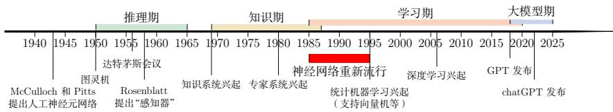  
图 1.1 人工智能发展史

## 1.1.2 人工智能的流派

我们对人类智能的机理依然知之甚少，还没有一个通用的理论来指导如何构建一个人工智能系统.不同的研究者都有各自的理解，因此在人工智能的研究过程中产生了很多不同的流派，比如一些研究者认为人工智能应该通过研究人类智能的机理来构建一个仿生的模拟系统，而另外一些研究者则认为可以使用其他方法来实现人类的某种智能行为，一个著名的例子是让机器具有飞行能力不需要模拟鸟的飞行方式，而是应该研究空气动力学.

尽管人工智能的流派非常多，但主流的方法大体上可以归结为以下两种：

（1）符号主义（Symbolism），又称逻辑主义、心理学派或计算机学派，是指通过分析人类智能的功能，然后用计算机来实现这些功能的一类方法.符号主义有两个基本假设：a）信息可以用符号来表示；b）符号可以通过显式的规则

关于人工智能的流派并没有严格的划分定义，也不严格对立.

有很多文献将人工智能流派分为符号主义、连接主义和行为主义三种，其中行为主义(Actionism)主要从生物进化的角度考虑，主张从和外界环境的互动中获取智能.

（比如逻辑运算）来操作.人类的认知过程可以看作符号操作过程.在人工智能的推理期和知识期，符号主义的方法比较盛行，并取得了大量的成果.

（2）连接主义（Connectionism），又称仿生学派或生理学派，是认知科学领域中的一类信息处理的方法和理论.在认知科学领域，人类的认知过程可以看作一种信息处理过程，连接主义认为人类的认知过程是由大量简单神经元构成的神经网络中的信息处理过程，而不是符号运算，因此，连接主义模型的主要结构是由大量简单的信息处理单元组成的互联网络，具有非线性、分布式、并行化、局部性计算以及自适应性等特性

符号主义方法通常具有较强的可解释性；相比之下，连接主义方法在表示能力和数据驱动学习能力方面更强，但其内部机制往往较难解释.深度学习的主要模型神经网络就是一种连接主义模型，随着深度学习和大模型的发展，越来越多的研究者开始关注如何融合符号主义和连接主义，建立一种既高效又具有较强可解释性的神经符号（neuro-symbolic）模型．例如，用逻辑规则约束神经网络的输出、用神经网络学习符号结构、或者在神经网络上实现可微推理等，都是这一方向的代表工作.

从本书的组织方式看，后续内容会以连接主义主线为主，系统介绍神经网络与深度学习模型；但在概率图模型、推理、知识表示以及智能体等问题上，我们也会不断回到结构化知识与符号处理的视角，换句话说，本书虽然以神经网络为中心展开，但并不把人工智能简单理解为单一流派的胜利，而是把它看成多种建模思想在不同任务和阶段中的不断融合.

## 1.2 机器学习

机器学习（MachineLearning，ML）是指从有限的观测数据中学习（或“猜测”）出具有一般性的规律，并利用这些规律对未知数据进行预测的方法.机器学习是人工智能的一个重要分支，并逐渐成为推动人工智能发展的关键因素.

机器学习的详细介绍参见第2章.

从一个具体系统看，机器学习通常包含训练和推断两个阶段，训练阶段利用已有数据调整模型参数，推断阶段把学到的规律应用到新的样本上.二者之间的核心要求是泛化：模型不能只是记住训练样本，而应在未见过的数据上仍然保持稳定表现.因此，机器学习不仅要关心训练误差，也要通过验证集、测试集等方式评估模型在未知数据上的表现；在医疗、金融、自动驾驶等风险较高的场景中，还需要进一步关心模型置信度是否可靠、错误代价如何控制以及数据分布变化时是否稳定.第2章会进一步讨论这些评价问题

传统的机器学习主要关注如何学习一个预测模型.一般需要首先将数据表示为一组特征（Feature），特征的表示形式可以是连续的数值、离散的符号或其他形式.然后将这些特征输入到预测模型，并输出预测结果.这类机器学习可以看作浅层学习（ShallowLearning）．典型的浅层学习方法包括支持向量机、Logistic回归、决策树等.浅层学习的一个重要特点是不涉及特征学习，其特征主要靠人工经验或特征转换方法来抽取.

因此，传统机器学习中的难点往往不只在于“选择哪个预测模型”，还在于“如何把原始数据表示成合适的特征”.很多时候，模型性能的上限并不是由分类器或回归器本身决定的，而是由特征是否有效决定的.这也正是后面要引入表示学习的直接原因

当我们用机器学习来解决实际任务时，会面对多种多样的数据形式，比如声音、图像、文本等.不同数据的特征构造方式差异很大.对于图像这类数据，我们可以很自然地将其表示为一个连续的向量.而对于文本数据，因为其一般由离散符号组成，并且每个符号在计算机内部都表示为无意义的编码，所以通常很难找到合适的表示方式.因此，在实际任务中使用机器学习模型一般会包含以下几个步骤(如图1.2所示):

（1）数据预处理：对数据的原始形式进行初步的数据清理（比如去掉一些有缺失特征的样本，或去掉一些冗余的数据特征等）和加工（对数值特征进行缩放和归一化等），并构建成可用于训练机器学习模型的数据集.

（2）特征提取：从数据的原始特征中提取一些对特定机器学习任务有用的高质量特征.比如在图像分类中提取边缘、尺度不变特征变换（ScaleInvariantFeature Transform,SIFT）特征，在文本分类中去除停用词等.

（3）特征转换：对特征进行进一步的加工，比如降维和升维.降维包括特征抽取（Feature Extraction）和特征选择（Feature Selection）两种途径.常用的特征转换方法有主成分分析（Principal Components Analysis,PCA）、线性判别分析(Linear Discriminant Analysis,LDA)等.

（4）预测：机器学习的核心部分，学习一个函数并进行预测

  
图1.2 传统机器学习的数据处理流程

上述流程中，每步特征处理以及预测一般都是分开进行的．传统的机器学习模型主要关注最后一步，即构建预测函数.但是实际操作过程中，不同预测模型的性能相差不多，而前三步中的特征处理对最终系统的准确性有着十分关键的作用，特征处理一般都需要人工于预完成，利用人类的经验来选取好的特征，并最终提高机器学习系统的性能.因此，很多的机器学习问题变成了特征工程

将图像数据表示为向量的方法有很多种，比如直接将一幅图像的所有像素值(灰度值或RGB值)组成一个连续向量.

(Feature Engineering）问题.开发一个机器学习系统的主要工作量都消耗在了预处理、特征提取以及特征转换上.

从这个意义上讲，传统机器学习的主要瓶颈之一，就是表示依赖人工设计如果不能自动学习适合任务的特征，那么无论后续预测模型多么精巧，系统能力都会受到限制.在深度学习和基础模型出现之后，越来越多的系统采用“端到端的方式，由模型自动学习从原始数据到高层表示的映射，显著减少了特征工程的工作量.本章后面会介绍表示学习和深度学习的基本思想

## 1.3 表示学习

为了提高机器学习系统的准确率，我们就需要将输入信息转换为有效的特征，或者更一般性地称为表示（Representation）.如果有一种算法可以自动地学习出有效的特征，并提高最终机器学习模型的性能，那么这种学习就可以叫作表示学习（Representation Learning).

“表示学习”也常被称 为“表征学习”.

因此，表示学习真正要解决的问题并不是“再设计一种特征”，而是尽可能让模型自己发现什么样的表示更有利于后续任务．它是从传统机器学习走向深度学习的关键过渡：一端连接“特征工程”，另一端连接“自动学习多层次表示”

语义鸿沟表示学习的关键是解决语义鸿沟（Semantic Gap）问题.语义鸿沟问题是指输入数据的底层特征和高层语义信息之间的不一致性和差异性.比如给定一些关于“车”的图片，由于图片中每辆车的颜色和形状等属性都不尽相同，因此不同图片在像素级别上的表示（即底层特征）差异性也会非常大.但是我们理解这些图片是建立在比较抽象的高层语义概念上的.如果一个预测模型直接建立在底层特征之上，会导致对预测模型的能力要求过高.如果可以有一个好的表示在某种程度上能够反映出数据的高层语义特征，那么我们就能相对容易地构建后续的机器学习模型.

在表示学习中，有两个核心问题：一是“什么是一个好的表示”；二是“如何学习到好的表示”.

## 1.3.1 局部表示和分布式表示

“好的表示”是一个非常主观的概念，没有一个明确的标准.但一般而言，一个好的表示具有以下几个优点：

（1）一个好的表示应该具有很强的表示能力，即同样大小的向量可以表示更多信息.

（2）一个好的表示应该使后续的学习任务变得简单，即需要包含更高层的语义信息.

（3）一个好的表示应该具有一般性，是任务或领域独立的.虽然许多表示学习方法仍然基于某个任务来学习，但我们期望其学到的表示可以比较容易地迁移到其他任务上.

在机器学习中，我们经常使用两种方式来表示特征：局部表示（Local Rep-resentation）和分布式表示（Distributed Representation).

以颜色表示为例，我们可以用很多词来形容不同的颜色¹，除了基本的“红”“蓝”“绿”“白”“黑”等之外，还有很多以地区或物品命名的，比如“中国红”“天蓝色”“咖啡色”“琥珀色”等.如果要在计算机中表示颜色，一般有两种表示方法.

一种表示颜色的方法是以不同名字来命名不同的颜色，这种表示方式叫作局部表示，也称为离散表示或符号表示.局部表示通常可以表示为one-hot向量的形式．假设所有颜色的名字构成一个词表γ，词表大小为.我们可以用一个|V|维的one-hot向量来表示每一种颜色.在第i种颜色对应的one-hot向量中，第i维的值为1,其他都为0.

局部表示有两个优点：1）这种离散的表示方式具有很好的解释性，有利于人工归纳和总结特征，并通过特征组合进行高效的特征工程；2）通过多种特征组合得到的表示向量通常是稀疏的二值向量，当用于线性模型时计算效率非常高.但局部表示有两个不足之处：1）one-hot向量的维数很高，且不能扩展.如果有一种新的颜色，我们就需要增加一维来表示；2）不同颜色之间的相似度都为0，即我们无法知道“红色”和“中国红”的相似度要高于“红色”和“黑色”的相似度.

另一种表示颜色的方法是用RGB值来表示颜色，不同颜色对应到R、G、B三维空间中一个点，这种表示方式叫作分布式表示.分布式表示通常可以表示为低维的稠密向量.

和局部表示相比，分布式表示的表示能力要强很多，分布式表示的向量维度一般都比较低．我们只需要用一个三维的稠密向量就可以表示所有颜色.并且，分布式表示也很容易表示新的颜色名．此外，不同颜色之间的相似度也很容易计算.

将分布式表示叫作分散式表示可能更容易理解，即一种颜色的语义分散到语义空间中的不同基向量上.

表1.1列出了4种颜色的局部表示和分布式表示.

我们可以使用神经网络来将高维的局部表示空间R映射到一个非常低维的分布式表示空间RD， $D \ll | \mathcal { V } |$ 在这个低维空间中，每个特征不再是坐标轴上的点，而是分散在整个低维空间中．在机器学习中，这个过程也称为嵌入（Em-bedding）．嵌入通常指将高维的离散符号映射到低维的连续向量空间中，同时尽可能使语义相近的对象在向量空间中也相互靠近.比如自然语言中词的分布式表示，也经常叫作词嵌人.在自然语言处理中，one-hot向量和词嵌入之间的关系就类似于上面颜色例子中的局部表示和分布式表示.

表1.1 局部表示和分布式表示示例
<table><tr><td>颜色</td><td>局部表示</td><td>分布式表示</td></tr><tr><td>琥珀色</td><td>[1, 0, 0, 0]T</td><td>[1.00, 0.75, 0.00]†</td></tr><tr><td>天蓝色</td><td>[0, 1, 0, 0]T</td><td>[0.00, 0.5, 1.00]†</td></tr><tr><td>中国红</td><td>[0, 0, 1, 0]™</td><td>[0.67, 0.22, 0.12]†</td></tr><tr><td>咖啡色</td><td>[0, 0, 0, 1]T</td><td>[0.44, 0.31, 0.22]†</td></tr></table>

图1.3展示了一个3维one-hot向量空间和一个2维嵌入空间的对比.图中有三个样本 $w _ { 1 } , w _ { 2 }$ 和 $w _ { 3 } .$ 在one-hot向量空间中，每个样本都位于坐标轴上，每个坐标轴上一个样本.而在低维的嵌入空间中，每个样本都不在坐标轴上，样本之间可以计算相似度.

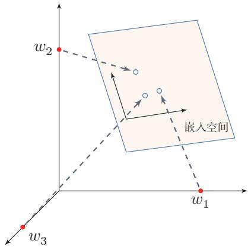  
图 1.3 one-hot 向量空间与嵌入空间

## 1.3.2 深层表示的学习

要学习到一种好的高层语义表示（一般为分布式表示），通常需要从底层特征开始，经过多步非线性转换才能得到．这里的“非线性”至关重要：若每层都只做线性变换，如 $f ( \pmb { x } ) = W _ { 1 } W _ { 2 } \cdots W _ { n } \pmb { x }$ ，则多层的效果等价于一次线性变换Wx（其中 $W = W _ { 1 } W _ { 2 } \cdots W _ { n } ~ )$ ，无法增加模型的表达能力.因此，每层之间必须引入非线性激活函数，才能使深层结构真正发挥作用.深层结构的优点是可以增加特征的重用性，从而指数级地增加表示能力．因此，表示学习的关键是构建具有一定深度的多层次特征表示[Bengio et al., 2013].

在传统的机器学习中，也有很多有关特征学习的方法，比如主成分分析、线性判别分析、独立成分分析等.但是，传统的特征学习一般是通过人为地设计一些准则，然后根据这些准则来选取有效的特征.特征的学习是和最终预测模型的学习分开进行的，因此学习到的特征不一定可以提升最终模型的性能.需要注意的是，表示学习并不必然等同于深度学习；前者强调目标是“学到有用表示”，后者强调手段是“通过多层模型自动学习多层次表示”．深度学习之所以重要，是因为它为表示学习提供了一种特别有效、并且能够与最终任务联合优化的实现方式.

## 1.4 深度学习

为了学习一种好的表示，需要构建具有一定“深度”的模型，并通过学习算法来让模型自动学习出好的特征表示（从底层特征，到中层特征，再到高层特征），从而最终提升预测模型的准确率.所谓“深度”是指原始数据进行非线性特征转换的次数.如果把一个表示学习系统看作一个有向图结构，深度也可以看作从输入节点到输出节点所经过的最长路径的长度

这样我们就需要一种学习方法可以从数据中学习一个“深度模型”，这就是深度学习（DeepLearning，DL）.深度学习可以看作一类以多层可学习表示为核心的机器学习方法.表示学习回答的是“希望学到什么”，而深度学习回答的是“如何通过多层可学习结构把这些表示自动学出来”.它早期主要用于表示学习，后来逐步扩展到预测、生成、推理、决策等更广泛的任务中.

图1.4给出了深度学习的数据处理流程，通过多层的特征转换，把原始数据变成更高层次、更抽象的表示.这些学习到的表示可以替代人工设计的特征，从而避免“特征工程”.

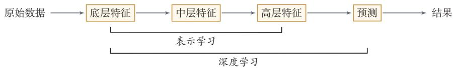  
图1.4 深度学习的数据处理流程

和“浅层学习”不同，深度学习需要解决的关键问题是贡献度分配问题，即系统中不同组件（component）或其参数对最终输出结果的贡献如何分配.以围棋为例，每当下完一盘棋，最后的结果要么赢要么输.我们会思考哪几步棋导致了最后的胜利，或者哪几步棋导致了最后的败局—如何判断每一步棋的贡献，就是贡献度分配问题

值得一提的是，深度学习与强化学习（Reinforcement Learning，RL）都面

强化学习参见第12章.

临延迟归因的困难：内部步骤往往不能立即获得清晰的监督信号，需要依赖更后面的整体反馈．但二者并不等同：深度学习通常仍有明确的监督目标，而强化学习面对的是环境反馈下的序列决策问题

深度学习采用的模型主要是神经网络模型，其主要原因是神经网络模型可以使用误差反向传播算法，从而可以比较好地解决贡献度分配问题.广义上，只要是包含多层非线性变换的神经网络，都可以视为深度模型；在实际研究中，人们通常更关注具有较强表示学习能力的多层神经网络体系，随着深度学习的快速发展，模型深度也从早期的5～10层逐步增加到数十层甚至数百层.随着模型深度和宽度的不断增加，其特征表示的能力也越来越强，从而使后续的预测和决策更加容易.

从学科关系上说，深度学习是一种方法范式，而神经网络则是这一范式最成功、最常用的模型载体.二者密切相关，但并不完全等同．为了理解现代深度学习，接下来需要进一步说明神经网络是什么，以及为什么它最终成为这一范式的主角.

## 1.4.1 端到端学习

在一些复杂任务中，传统机器学习方法需要将一个任务的输入和输出之间人为地切割成很多子模块（或多个阶段），每个子模块分开学习．比如一个自然语言理解任务，一般需要分词、词性标注、句法分析、语义分析、语义推理等步骤；一个传统的语音识别系统一般包括特征提取、声学模型、语言模型、解码等多个模块.这种学习方式有两个问题：一是每一个模块都需要单独优化，并且其优化目标和任务总体目标并不能保证一致；二是错误传播，即前一步的错误会对后续的模型造成很大的影响.这样就增加了机器学习方法在实际应用中的难度

端到端学习（End-to-EndLearning），也称端到端训练，是指在学习过程中不进行分模块或分阶段训练，直接优化任务的总体目标.在端到端学习中，一般不需要明确地给出不同模块或阶段的功能，中间过程不需要人为十预，端到端学习的训练数据为“输入-输出”对的形式，无须提供其他额外信息.因此，端到端学习和深度学习一样，都需要解决前面介绍过的贡献度分配问题.大部分采用神经网络模型的深度学习也可以看作一种端到端的学习.

以自然语言处理为例，过去的系统通常采用“特征工程+多个子任务管线”的方式，如分词、句法分析、语义角色标注等.现在，大规模预训练语言模型可以直接从原始文本或少量标注样例出发，通过端到端的方式输出翻译、摘要、问答、代码等结果.在语音、图像等领域，也出现了从“传统管线”向“端到端模型”的明显转变.

需要注意的是，端到端并不意味着现实系统没有模块化结构.实际应用中往往会在端到端模型的基础上，引人检索、工具调用、规划等外部模块，形成“深度模型+系统工程”的整体解决方案.

## 1.5 神经网络

人类的智能行为与大脑活动密切相关.人类大脑是一个可以产生意识、思想和情感的器官.受到人脑神经系统的启发，早期的研究者构造了一种模仿人脑神经系统的数学模型，称为人工神经网络，简称神经网络.在机器学习领域，神经网络是指由很多人工神经元构成的网络结构模型，这些人工神经元之间的连接强度是可学习的参数

## 1.5.1 人脑神经网络

人类大脑是人体最复杂的器官，由神经元、神经胶质细胞、神经干细胞和血管组成.其中,神经元(Neuron），也叫神经细胞（NerveCell）,是携带和传输信息的细胞，是人脑神经系统中最基本的单元.人脑神经系统是一个非常复杂的组织，包含近860亿个神经元[Azevedo et al.,2009]，每个神经元有上千个突触和其他神经元相连接.这些神经元和它们之间的连接形成巨大的复杂网络，其中神经连接的总长度可达数千公里．我们人造的复杂网络，比如全球的计算机网络，和大脑神经网络相比要“简单”得多.

早在1904年，生物学家就已经发现了神经元的结构．典型的神经元结构大致可分为细胞体和细胞突起.

（1）细胞体（Soma）中的神经细胞膜上有各种受体和离子通道，胞膜的受体可与相应的化学物质神经递质结合，引起离子通透性及膜内外电位差发生改变，产生相应的生理活动：兴奋或抑制.

（2）细胞突起是由细胞体延伸出来的细长部分，又可分为树突和轴突.

a）树突（Dendrite）可以接收刺激并将兴奋传入细胞体.每个神经元可以有一或多个树突.

b）轴突（Axon）可以把自身的兴奋状态从胞体传送到另一个神经元或其他组织.每个神经元只有一个轴突.

神经元可以接收其他神经元的信息，也可以发送信息给其他神经元.神经元之间没有物理连接，两个“连接”的神经元之间留有20纳米左右的缝隙，并靠突触（Synapse）进行互联来传递信息，形成一个神经网络，即神经系统.突触可以理解为神经元之间的连接“接口”，将一个神经元的兴奋状态传到另一个神经元一个神经元可被视为一种只有两种状态的细胞：兴奋和抑制.神经元的状态取决于从其他的神经细胞收到的输入信号量，以及突触的强度（抑制或加强）.当信号量总和超过了某个阈值时，细胞体就会兴奋，产生电脉冲.电脉冲沿着轴突并通过突触传递到其他神经元.图1.5给出了一种典型的神经元结构.

  
图 1.5 典型神经元结构1

从学习的角度看，人脑神经网络的关键不在于单个神经元本身，而在于神经元之间如何连接以及这些连接如何随经验而改变.不同神经元之间的突触有强有弱，其强度可以随着刺激和经验不断变化，这种性质称为可塑性.不同的连接模式形成了不同的记忆印痕.1949年，加拿大心理学家DonaldHebb在《行为的组织》（The Organization of Behavior）一书中提出突触可塑性的基本原理，这一思想后来被概括为赫布规则（Hebb'sRule）:如果两个神经元经常共同激活，它们之间的连接会被加强.这样的学习方式被称为赫布型学习（Hebbianlearning).这一思想对后来人工神经网络中“通过调整连接强度进行学习”的观念产生了重要影响

Donald Hebb (1904\~1985)，加拿大神经心理学家，认知心理生理学的开创者.

## 1.5.2 人工神经网络

人工神经网络是为模拟人脑神经网络而设计的一种计算模型，它从结构、实现机理和功能上模拟人脑神经网络.人工神经网络与生物神经元类似，由多个节点（人工神经元）互相连接而成，可以用来对数据之间的复杂关系进行建模.不同节点之间的连接被赋予了不同的权重，每个权重代表了一个节点对另一个节点的影响大小.每个节点代表一种特定函数，来自其他节点的信息经过其相应的权重综合计算，输入到一个激活函数中并得到一个新的活性值（兴奋或抑制）.从系统观点看，人工神经网络是由大量神经元通过极其丰富和完善的连接而构成的自适应非线性动态系统.

虽然我们可以比较容易地构造一个人工神经网络，但是如何让人工神经网络具有学习能力并不是一件容易的事情.早期的神经网络模型并不具备学习能力.首个可学习的人工神经网络是赫布网络，采用一种基于赫布规则的无监督学习方法.感知器是最早的具有机器学习思想的神经网络，但其学习方法无法扩展到多层的神经网络上.直到1980年代，反向传播算法（最早由Werbos于1974年提出，后经Rumelhart等人于1986年推广）才被广泛应用于多层神经网络的训练，并成为最为流行的神经网络学习算法.

人工神经网络诞生之初并不是用来解决机器学习问题.由于人工神经网络可以用作一个通用的函数逼近器（一个两层的神经网络可以逼近任意的函数），因此我们可以将人工神经网络看作一个可学习的函数，并将其应用到机器学习中．理论上，只要有足够的训练数据和神经元数量，人工神经网络就可以学到很多复杂的函数.我们可以把一个人工神经网络塑造复杂函数的能力称为网络容量（NetworkCapacity）,这与可以被储存在网络中的信息的复杂度以及数量相关.在大模型时代，人们还发现，随着模型参数量、训练数据量和计算量的持续增大，模型性能往往呈现出前述的规模法则，这从经验上刻画了网络容量、数据和计算之间的关系.

在本书中，我们主要关注采用误差反向传播来进行学习的神经网络，即作为一种机器学习模型的神经网络.从机器学习的角度来看，神经网络可以看作一类由可学习参数控制的非线性模型.其基本组成单元是带有非线性激活函数的神经元，神经元之间的连接权重就是需要学习的参数，可以在机器学习框架下通过梯度下降等方法进行优化.

## 1.5.3 网络结构

一个生物神经细胞的功能已经相对简单，而人工神经元则是生物神经细胞的进一步理想化和简化实现.要想模拟人脑的能力，单一神经元远远不够，必须让大量神经元按照一定的连接方式和信息传递机制协同工作，这样形成的整体就是神经网络.

围绕不同任务形式和结构先验，研究者已经提出了各种各样的神经网络结构.为了建立整体认识，这里只做一个简要分类.常见的神经网络结构大致可以从信息组织方式上概括为以下四种：

## 1.5.3.1 前馈网络

在本书中，人工神经网络主要是作为一种映射函数，即机器学习中的模型.

感知器参见第3.4节.

前馈网络中各个神经元按接收信息的先后分为不同的组.每一组可以看作一个神经层.每一层中的神经元接收前一层神经元的输出，并输出到下一层神经元.整个网络中的信息是朝一个方向传播，没有反向的信息传播，可以用一个有向无环路图表示.前馈网络包括全连接前馈神经网络（第4.1.2节）和卷积神经网络(第5章)等.

虽然这里将神经网络结构大体上分为四种类型，但是大多数网络都是复合型结构，即一个神经网络中包括多种网络结构.本章后续将主要聚焦前馈网络.

前馈网络可以看作一个函数，通过简单非线性函数的多次复合，实现输入空间到输出空间的复杂映射.这种网络结构简单，易于实现

## 1.5.3.2 记忆网络

记忆网络，也称为反馈网络，网络中的神经元不但可以接收其他神经元的信息，也可以接收自己的历史信息．和前馈网络相比，记忆网络中的神经元具有记忆功能，在不同的时刻具有不同的状态.记忆神经网络中的信息传播可以是单向或双向传递，因此可用一个有向循环图或无向图来表示.记忆网络包括循环神经网络(第6章）等.记忆网络可以看作一个程序，具有更强的计算和记忆能力.

## 1.5.3.3 注意力网络

近年来，以注意力机制为核心的Transformer已成为深度学习中非常重要的一类架构.与前馈网络和记忆网络不同，注意力网络通过自注意力机制让序列中任意两个位置直接交互，从而绕过了循环网络逐步传递信息的限制.Trans-former将多头自注意力、位置编码、前馈网络、残差连接和规范化组合成统一的可堆叠模块，既可以高效并行训练，也可以灵活地建模长距离依赖关系．如今，Transformer已成为自然语言处理、计算机视觉、多模态学习以及大语言模型的重要基础架构(第8章).

## 1.5.3.4 图网络

实际应用中很多数据是图结构的数据，比如知识图谱、社交网络、分子网络等.前馈网络和记忆网络很难处理图结构的数据.

图网络是定义在图结构数据上的神经网络（第9章). 图中每个节点都由一个或一组神经元构成.节点之间的连接可以是有向的，也可以是无向的．每个节点可以收到来自相邻节点或自身的信息.

图1.6给出了四种网络结构的示例，前馈网络将输入向量通过分层结构映射为输出向量．记忆网络对序列数据进行顺序处理，隐状态沿时间步传递记忆信息，图网络在图结构数据上进行消息传递，每个节点聚合其邻居的信息（红色箭头标出了一个节点接收邻居消息的过程).注意力网络同样处理序列数据，但通过自注意力机制（红色虚线）让所有位置并行交互，而非像记忆网络那样逐步传递.

## 1.5.4 神经网络的发展历史

从整体上看，神经网络的发展并不是一条线性上升的道路，而是经历了“模型提出一遭遇质疑一因学习算法复兴一在深度学习中崛起一在大模型时代走向统一与系统化”的过程，其背后的关键转折，主要来自三个因素：模型结构是否足够有表达力、学习算法是否可行以及计算与数据条件是否成熟.

  
(a) 前馈网络

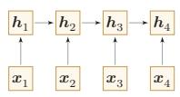  
(b) 记忆网络

  
(c) 图网络

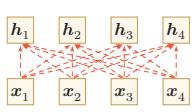  
(d) 注意力网络  
图 1.6 四种不同的网络结构示例

第一阶段：模型萌芽（1943年\~1969年）这一阶段的核心问题是：能否用一个可计算的模型来抽象神经元及其连接. 1943年，Warren McCulloch和WalterPitts提出了基于简单逻辑运算的MP模型，开启了人工神经网络研究.1948年，Alan Turing提出“B型图灵机”，尝试把学习机制引入网络. 1951年，MarvinMinsky建造了第一台神经网络机 SNARC. 1958年，Rosenblatt 提出了感知器(Perceptron）及其学习算法[Rosenblatt，1958]，使神经网络第一次具备了从数据中学习的雏形.这一时期的意义在于：研究者初步回答了“神经网络是什么”这一问题，但还没有真正解决“多层网络如何有效学习”这一更关键的问题

第二阶段：第一次低谷（1969年\~1983年） 神经网络的第一次低谷，根本原因并不是“网络思想错误”，而是早期模型的能力和当时的计算条件都存在明显限制.1969年，Minsky在《感知器》一书中指出，单层感知器无法表示异或等简单非线性函数，而当时的计算机也难以支撑更大规模网络训练.这些批评使神经网络研究明显降温

Marvin Minsky(1927\~2016)，人工智能领域的重要奠基者之一，麻省理工学院人工智能实验室创始人之一，1969年获图灵奖.

不过，这一阶段并非完全停滞，而是在酝酿后来的复兴.1974年，PaulWer-bos提出了反向传播算法（BackPropagation，BP）[Werbos，1974]；1980年，福岛邦彦提出了带卷积和子采样操作的新知机（Neocognitron）[Fukushima,1980].前者为多层网络学习奠定了方法基础，后者则展示了分层局部连接结构在感知任务中的潜力.

第三阶段：反向传播带来的复兴（1983年\~1995年）这一阶段的关键转折是：神经网络开始从“受生物启发的模型”走向“可训练的机器学习模型”．1983年，John Hopfield提出用于联想记忆（Associative Memory）的Hopfield 网络，说明网络可以具有稳定动力学和记忆能力.1984年，GeoffreyHinton提出玻尔兹曼机（BoltzmannMachine），进一步推动了连接主义模型的发展.

真正使这一阶段形成研究高潮的，是反向传播算法在多层网络中的成功应用. 20 世纪80年代中后期，分布式并行处理（Parallel Distributed Processing，PDP）模型[McClelland et al.,1986]广泛传播，使“分布式表示、连接存储知识、通过连接强度变化进行学习”成为连接主义的重要观点.随后，[LeCun et al.,1989]将反向传播引入卷积神经网络，并在手写体识别上取得成功[LeCun et al.,

玻尔兹曼机参见第15.1节.

1998].这一阶段表明：一旦学习算法有效，神经网络就不仅是认知模拟工具，也可以成为强有力的机器学习模型.

与此同时，研究者也逐渐意识到深层或循环结构会遭遇梯度消失问题(Vanishing Gradient Problem).例如,[Schmidhuber, 1992]尝试通过“逐层无监督预训练+监督微调”的方式训练多层循环网络.这说明神经网络虽然重新兴起，但深层训练仍然存在明显瓶颈

第四阶段：统计学习方法占优（1995年\~2006年）这一时期，神经网络在机器学习中的主导地位再次被削弱.原因并不复杂：一方面，网络规模一旦增大，计算开销迅速上升：另一方面，当时的数据规模、硬件能力和训练技巧都不足以支撑深层模型稳定训练.相比之下，以支持向量机为代表的方法具有更清晰的理论基础，也更容易在中小规模数据上获得可靠结果.因此，在这一阶段，神经网络的研究热度相对下降.

第五阶段：深度学习的崛起（2006年\~2015年）神经网络重新成为主流，关键不在于“提出了全新的网络”，而在于研究者逐步掌握了训练深层网络的方法.[Hinton et al.,2006]通过逐层预训练学习深度信念网络，再将其参数作为多层前馈网络的初始化并结合反向传播微调.这种“预训练+微调”的策略有效缓解了深层网络难训练的问题.

更重要的是，训练条件在这一时期发生了系统性变化：GPU和大规模并行计算提升了算力，互联网推动了数据规模增长，自动微分和深度学习框架降低了构建复杂网络的门槛.随着深度神经网络在语音识别[Hinton et al., 2012]和图像分类[Krizhevsky et al., 2012]上的突破，神经网络迎来了第三次高潮. 此后，端到端训练逐渐替代早期复杂的逐层预训练，自动微分技术的出现也使得深层神经网络的搭建更加便捷，成为现代深度学习训练体系的基础.

第六阶段：基础模型与大模型阶段（2018年至今）2018年后，神经网络的发展进入了新的阶段.其关键变化并不只是参数量持续增大，更重要的是神经网络开始从“面向单一任务的模型”转向“面向多任务迁移与系统集成的基础能力载体”.

这一阶段至少体现出三个趋势.第一，结构逐渐统一：以Transformer为代表的架构成为自然语言处理、多模态学习以及部分视觉、语音任务中的核心结构.第二，训练范式发生变化：预训练、指令微调和对齐训练使模型具备更强的迁移和泛化能力.第三，模型开始系统化：神经网络与检索、工具调用、外部记忆和环境交互机制结合，成为更复杂智能系统中的核心组件.

因此，当前阶段更适合被理解为神经网络发展的新范式：神经网络不再只是一个针对特定任务设计的预测模型，而逐渐演化为可迁移、可适配、可组合的基础模型.其影响不仅体现在性能提升上，也体现在研究组织方式和应用形态的变

化上.

## 1.6 本书的知识体系

本书虽然以神经网络与深度学习为主线，但相关内容并不只属于某一种单独的模型．更合适的理解方式是：本书涉及的核心知识主要分布在机器学习、神经网络和概率图模型这三个彼此联系的知识域中.图1.7从“知识关系”的角度，而不是从“目录层级”的角度，对这些内容之间的联系做了一个概括.

如果从阅读路径而不是知识分类的角度看，全书可以进一步概括为五条相互交织的主线：

（1）机器学习基础线：回答“什么是模型、学习准则与优化算法”，对应第2章和第3章.

（2）神经网络结构线：回答“不同网络如何组织信息与归纳偏置”，对应第4章至第11章.

（3）概率与生成线：回答“如何从概率建模角度理解学习与生成”，对应第14章至第16章

（4）决策与交互线：回答“智能体如何在环境中学习和行动”，对应第12章和第13章中的智能体相关内容.

（5）现代基础模型线：回答“为什么Transformer、大语言模型与智能体代表新的阶段”，对应第8章和第13章.

读者可以把这五条主线理解为从“基础概念”逐步走向“现代系统”的一张路线图：先建立机器学习语言，再掌握主要神经网络结构，随后扩展到概率建模、生成建模与决策问题，最终理解大模型与智能体所代表的新范式

机器学习机器学习为全书提供了最基本的研究视角和方法语言.一般来说，机器学习主要关注如何从数据中学习规律，并利用这些规律进行预测、生成或决策.围绕这一目标，我们通常从三个方面来理解一个机器学习问题：一是模型，即用什么形式来刻画输入与输出之间的关系；二是学习准则，即如何定义“学得好不好”；三是优化算法，即如何求解模型参数.按照任务类型，机器学习又可以分为监督学习、无（自）监督学习和强化学习等.其中，监督学习主要包括分类、回归和结构化预测；无（自）监督学习与自编码器、密度估计和深度生成模型密切相关;强化学习则关注智能体如何通过与环境交互来学习策略.从本书的安排来看，第2章和第3章主要建立这一部分的基础.特别地，神经网络可以看成一类重要的非线性模型，因此机器学习是理解后续神经网络和深度学习内容的出发点.

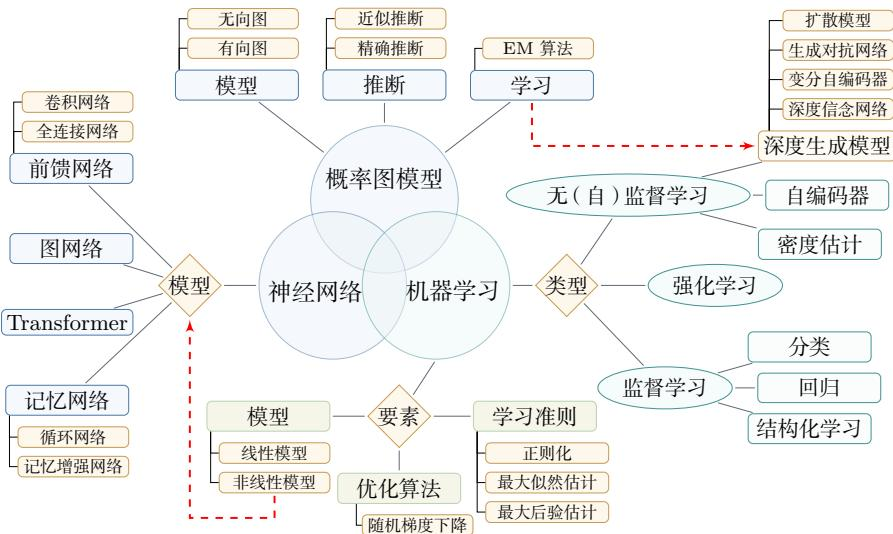  
图1.7 机器学习、神经网络与概率图模型之间的关系

神经网络神经网络是本书的核心主线，也是深度学习最主要的模型载体.从结构上看，神经网络并不是单一模型，而是一族具有不同归纳偏置和适用场景的模型，前馈网络是最基础的形式，其中既包括全连接网络，也包括擅长处理图像等局部结构数据的卷积网络；记忆网络强调对历史信息的保持与更新，其中循环网络和记忆增强网络是典型代表；图网络面向图结构数据；而以注意力机制为核心的Transformer则已经成为当前大模型的重要基础架构，它们共同体现了一个事实：神经网络本质上是一类可组合、可扩展的非线性函数族，可以通过多层次的信息变换逐步学习更加抽象的表示，本书第4章到第11章围绕这条主线展开，系统介绍前馈网络、卷积网络、循环网络、优化与正则化、注意力机制与Transformer、图神经网络、无监督学习以及模型独立的学习方式等内容.这一部分构成了全书最主要的主体.

概率图模型概率图模型提供了另一种理解机器学习与深度学习的重要视角.和神经网络更强调函数逼近与表示学习不同，概率图模型更强调随机变量之间的依赖关系及其概率化描述，它主要包括三个核心问题：一是模型，即如何用有向图或无向图来表达变量之间的条件依赖结构；二是推断，即在给定部分变量时如何计算其他变量的后验分布，这里既包括精确推断，也包括近似推断：三是学习，即如何根据数据估计模型参数或结构，EM算法就是其中的重要方法之一.概率图模型与深度学习并不是彼此割裂的.一方面，很多机器学习方法都可以从概率建模的角度获得更统一的解释；另一方面，深度生成模型、深度信念网络等内容又与概率图模型有着紧密联系.因此，本书在后续章节中还会介绍概率图模型、玻尔兹曼机、深度信念网络以及深度生成模型等内容，使读者从“函数逼近”

的视角进一步扩展到“概率建模”的视角.

总体来看，这三部分内容并不是并列割裂的.机器学习提供统一的问题定义和方法框架，神经网络是其中最重要的一类非线性模型，概率图模型则提供了另一种更强调概率结构与推断机制的建模方式；而现代深度学习中的不少内容，特别是深度生成模型，恰恰处在这些知识域的交汇处.对应到本书的组织方式上，第2章和第3章帮助读者建立机器学习基础，第4章到第11章构成神经网络与深度学习的主体，第14章到第16章则进一步引入概率图模型与生成模型，第12章介绍深度强化学习，附录部分提供线性代数、微积分、数学优化、概率论和信息论等数学基础.这样安排的目的，是让读者既能把握神经网络这条主线，又能看到它与更广泛机器学习方法之间的联系.

## 1.7 常用的深度学习框架

在深度学习中，一般通过误差反向传播算法来进行参数学习．采用手工方式来计算梯度再写代码实现的方式会非常低效，并且容易出错.此外，深度学习模型需要的计算资源较多，往往需要利用GPU等硬件加速器进行大规模并行计算，模型的开发和训练复杂度也比较高.因此，一些支持自动梯度计算、多种硬件后端适配以及分布式训练等功能的深度学习框架就应运而生.

从学习本书的角度看，理解这些框架的重点并不在于记住某个具体API，而在于理解它们共同依赖的几个抽象：张量表示、计算图、自动微分以及面向硬件加速的大规模数值计算，只要掌握了这些共同机制，后续无论使用哪一种框架，实现思路都是相通的. 比较有代表性的框架包括:TensorFlow、PyTorch等2.

（1）PyTorch³：学术界和工业界广泛使用的深度学习框架之一，接口风格与Python/NumPy十分接近. PyTorch 以动态计算图和灵活的编程范式见长，适合快速原型验证和复杂模型开发；同时也支持图优化和编译机制（如torch.compile)，以兼顾易用性与执行效率．许多大规模预训练模型和开源项目均基于PyTorch构建.

（2） TensorFlow4：由Google推出的深度学习框架，其名称来源于多维数组“张量”(Tensor).早期版本以静态计算图为主，后续版本引入了更灵活的即时执行模式，并集成了高层APIKeras，降低了使用门槛.TensorFlow在工业部署和移动端推断方面有较为成熟的工具链.

(3) $\mathrm { J A X ^ { 5 } }$ :由Google推出的面向数值计算和机器学习的库，以函数式编程风格为特点，支持自动微分、向量化和即时编译等可组合的程序变换，在需要高性能科学计算和灵活定制训练流程的研究场景中较受欢迎

（4）国内深度学习框架：如百度的飞桨（PaddlePaddle）6、华为的Mind-Spore7等.这些框架在中文社区生态、国产硬件适配以及产业化部署方面具有一定优势，也在持续完善对大模型训练和推断的支持.

本书在介绍具体算法时，主要采用与框架无关的数学形式，以便读者将这些算法迁移到任意框架中实现.读者在实践中可以根据自己的需求选用合适的深度学习框架.

## 1.8 总结和扩展阅读

本章从人工智能、机器学习、表示学习、深度学习到神经网络，给出了一个由浅入深的整体导引.若用一句话概括本章主线，那就是：人工智能的问题目标催生了机器学习的方法框架，机器学习中的表示瓶颈推动了表示学习，而深度学习与神经网络则为自动学习多层次表示提供了最成功的实现路径.

读完本章后，读者应当至少带走以下几个判断：

（1）人工智能并不是单一技术，而是一组围绕“如何实现智能”不断演化的方法体系.

（2）机器学习的关键不仅在于学习预测函数，也在于学习合适的数据表示，并检验模型能否泛化到新的样本.

（3）表示学习是从传统机器学习走向深度学习的核心桥梁

（4）深度学习是一种方法范式，神经网络是这一范式最主要的模型载体

（5）大模型与智能体代表的不是简单的规模扩大，而是训练范式、迁移能力和系统形态的整体变化

从方法上看，深度学习之所以有效，一个关键原因在于它能够把表示学习、模型学习和任务优化更紧密地结合起来.其核心挑战在于贡献度分配问题：当一个系统由许多层组件构成时，如何把最终误差信号有效地分配到中间各层，是模型能否成功学习的关键，神经网络结合反向传播和自动微分，使多层模型的端到端训练成为可能，这也是深度学习迅速发展的重要基础

从发展趋势上看，近年来人工智能正在从“针对单一任务设计模型”逐步走向“构建可迁移、可适配、可组合的基础模型”.大语言模型、多模态模型以及与检索、工具调用、规划执行、环境交互结合的智能体系统，正在推动人工智能从静态预测走向更复杂的推理与行动.与此同时，模型压缩与高效训练、长上下文建模、安全对齐、可解释性、多模态生成、神经符号结合以及AIforScience等方向，也正在持续扩展深度学习的边界.

本书的具体章节安排已在上节介绍.建议读者带着本章建立的整体框架进入后续章节，在学习具体方法的同时，关注各类模型之间的联系以及它们在人工智能体系中的位置.

深度学习的研究进展非常迅速，最新的研究成果通常发表在学术会议或以预印本形式公开.与深度学习直接相关的主要会议有ICLR、NeurIPS和ICML；人工智能领域的综合性会议有IJCAI和AAAI;此外，计算机视觉领域的CVPR、ICCV，自然语言处理领域的ACL、EMNLP等专业会议也发表了大量深度学习和大模型的研究工作.

由于该领域发展极为迅速，很多重要成果会先以预印本形式发表在arXiv8上，部分大模型的技术报告也以此方式公开.关注arXiv上机器学习（cs.LG）、计算与语言（cs.CL）、计算机视觉（cs.CV）等分类下的最新论文，是跟踪前沿进展的重要途径.

## 习题

## 基础题

（1）人工智能、机器学习、深度学习之间是什么关系？请用Venn图表示，并分别举一个属于机器学习但不属于深度学习、属于深度学习但不属于传统机器学习的方法示例.

（2）什么是贡献度分配问题？它在围棋博弈和神经网络训练中各如何体现?

（3）局部表示（one-hot）和分布式表示（词嵌入）各有什么优缺点？请从表示能力、相似度计算和可扩展性三个角度进行比较

（4）什么是端到端学习？与传统的“管线式”（pipeline）学习方式相比，端到端学习有哪些优势和可能的不足？

## 提高题

（5）为什么“连续多次的线性变换等价于一次线性变换”？请给出数学证明，并说明这一性质对深度学习中激活函数设计的启示.

（6）规模法则（ScalingLaw）意味着什么？如果模型性能主要由参数量、数据量和计算量决定，那么在固定的计算预算下，应该如何分配资源（是训练更大的模型、还是用更多的数据训练较小的模型)？

（7）符号主义和连接主义各自的核心假设是什么?两种方法能否结合?请举出一个“神经符号”方法的例子.

## 参考文献

AZEVEDO F A, CARVALHO L R, GRINBERG L T, et al., 2009. Equal numbers of neuronal and nonneuronal cells make the human brain an isometrically scaled-up primate brain[J]. Journal of Comparative Neurology, 513(5): 532-541.

BENGIO Y, COURVILLE A, VINCENT P, 2013. Representation learning: a review and new perspectives[J]. IEEE transactions on pattern analysis and machine intelligence, 35(8): 1798- 1828.

FUKUSHIMA K, 1980. Neocognitron: a self-organizing neural network model for a mechanism of pattern recognition unaffected by shift in position[J]. Biological cybernetics, 36(4): 193-202.

HINTON G E, SALAKHUTDINOV R R, 2006. Reducing the dimensionality of data with neural networks[J]. Science, 313(5786): 504-507.

HINTON G E, DENG L, YU D, et al., 2012. Deep neural networks for acoustic modeling in speech recognition: the shared views of four research groups[J]. IEEE Signal Processing Magazine, 29(6): 82-97.

KRIZHEVSKY A, SUTSKEVER I, HINTON G E, 2012. ImageNet classification with deep convolutional neural networks[C]//Advances in Neural Information Processing Systems 25. 1106-1114.

LECUN Y, BOSER B, DENKER J S, et al., 1989. Backpropagation applied to handwritten zip code recognition[J]. Neural computation, 1(4): 541-551.

LECUN Y, BOTTOU L, BENGIO Y, et al., 1998. Gradient-based learning applied to document recognition[J]. Proceedings of the IEEE, 86(11): 2278-2324.

MCCLELLAND J L, RUMELHART D E, GROUP P R, 1986. Parallel distributed processing: explorations in the microstructure of cognition. volume I: foundations & volume II: psychological and biological models[M]. MIT Press.

MINSKY M, 1961. Steps toward artificial intelligence[J]. Proceedings of the IRE, 49(1): 8-30.

ROSENBLATT F, 1958. The perceptron: a probabilistic model for information storage and organization in the brain.[J]. Psychological review, 65(6): 386.

SCHMIDHUBER J, 1992. Learning complex, extended sequences using the principle of history compression[J]. Neural Computation, 4(2): 234-242.

WERBOS P, 1974. Beyond regression: new tools for prediction and analysis in the behavioral sciences[D]. Harvard University.

# 第2章 机器学习概述

机器学习是对能通过经验自动改进的计算机算法的研究.

——汤姆·米切尔(Tom Mitchell)[Mitchell，1997]

通俗地讲，机器学习（MachineLearning，ML）就是让计算机从数据中进行自动学习，得到某种知识（或规律）.作为一门学科，机器学习通常指一类问题以及解决这类问题的方法，即如何从观测数据（样本）中寻找规律，并利用学习到的规律（模型）对未知或无法观测的数据进行预测.

在早期的工程领域，机器学习也经常称为模式识别（PatternRecognition，PR），但模式识别更偏向于具体的应用任务，比如光学字符识别、语音识别、人脸识别等.这些任务的特点是，对于我们人类而言，这些任务很容易完成，但我们不知道自己是如何做到的，因此也很难人工设计一个计算机程序来完成这些任务.一个可行的方法是设计一个算法可以让计算机自己从有标注的样本上学习其中的规律，并用来完成各种识别任务．随着机器学习技术的应用越来越广，现在机器学习的概念逐渐替代模式识别，成为这一类问题及其解决方法的统称.

以手写体数字识别为例，我们需要让计算机能自动识别手写的数字.比如图2.1中的例子，将5识别为数字5,将 $\scriptstyle ( { \boldsymbol { \theta } } \cdot { \boldsymbol { \mathbf { \mathit { \Omega } } } } )$ 识别为数字6.手写数字识别是一个经典的机器学习任务，对人来说很简单，但对计算机来说却十分困难.我们很难总结每个数字的手写体特征，或者区分不同数字的规则，因此设计一套识别算法是一项几乎不可能的任务.在现实生活中，很多问题都类似于手写体数字识别这类问题，比如物体识别、语音识别等.对于这类问题，我们不知道如何设计一个计算机程序来解决，即使可以通过一些启发式规则来实现，其过程也是极其复杂的.因此，人们开始尝试采用另一种思路，即让计算机“看”大量的样本，并从中学习到一些经验，然后用这些经验来识别新的样本.要识别手写体数字，首先通过人工标注大量的手写体数字图像（即每张图像都通过人工标记了它是什么数字），这些图像作为训练数据，然后通过学习算法自动生成一套模型，并依靠它来识别新的手写体数字.这个过程和人类学习过程也比较类似，我们教小孩子识别数字也是这样的过程.这种通过数据来学习的方法就称为机器学习的方法.

  
图 2.1 手写体数字识别示例（图片来源: [LeCun et al., 1998]）

本章先介绍机器学习的基本概念和基本要素，并较详细地描述一个简单的机器学习例子——线性回归.

## 2.1 基本概念

首先我们以一个生活中的例子来介绍机器学习中的一些基本概念：样本、特征、标签、模型、学习算法等.假设我们要到市场上购买芒果，但是之前毫无挑选芒果的经验，那么如何通过学习来获取这些知识？

我们可以随机选取一些芒果，记录每个芒果的特征（Feature），比如颜色、大小、形状、产地和品牌等，并给出我们关心的标签（Label）．标签可以是连续值（比如关于芒果甜度、水分和成熟度的综合打分），也可以是离散值(比如“好”“坏”两类标签).一个同时包含特征和标签的芒果样本就称为样本（Sample），也常称为示例（Instance）.

特征也可以称为属性(Attribute).

我们通常用一个D维向量 $\pmb { x } = [ x _ { 1 } , x _ { 2 } , \cdots , x _ { D } ] ^ { \intercal }$ 表示一个芒果的所有特征构成的向量，称为特征向量（FeatureVector），其中每一维表示一个特征.而芒果的标签通常用标量y来表示.

并不是所有的样本特征都是数值型，需要通过转换表示为特征向量，参见第2.6节.

假设训练集D由N个样本组成，可以记为

$$
{ \mathcal D } = \{ ( { \pmb x } ^ { ( 1 ) } , y ^ { ( 1 ) } ) , ( { \pmb x } ^ { ( 2 ) } , y ^ { ( 2 ) } ) , \cdots , ( { \pmb x } ^ { ( N ) } , y ^ { ( N ) } ) \} .\tag{2.1}
$$

给定训练集D，我们希望让计算机从一个函数集合 $\mathcal { F } = \{ f _ { 1 } ( \pmb { x } ) , f _ { 2 } ( \pmb { x } ) , \cdots \}$ 中自动寻找一个“最优”的函数 $f ^ { * } ( x )$ ，来近似特征向量x和标签y之间的真实关

系.对于一个样本 $_ { \textbf { \em x } }$ ,我们可以通过函数 $f ^ { * } ( x )$ 来预测其标签值

$$
{ \hat { y } } = f ^ { * } ( { \boldsymbol { \mathbf { x } } } ) ,\tag{2.2}
$$

或预测其标签的条件概率

$$
{ \hat { p } } ( y | \mathbf { x } ) = f _ { y } ^ { * } ( \mathbf { x } ) .\tag{2.3}
$$

如何从函数集合 $\mathcal { F }$ 中找到合适的函数 $f ^ { * } ( x )$ 是机器学习的关键.这个过程一般需要通过学习算法（Learning Algorithm）A来完成.学习算法利用训练数据不断调整模型参数，使模型不仅在训练样本上表现良好，而且在新样本上也具有较好的泛化能力.

在有些文献中，学习算法也叫作学习器(Learner).

当模型训练完成后，我们再用独立的测试集 $\mathcal { D } ^ { \prime }$ 来评估模型性能.例如，对于分类问题，可以在测试集上计算预测准确率

第2.2.5节中会介绍更多的评价方法.

$$
A c c ( f ^ { * } ( \pmb { x } ) ) = \frac { 1 } { | \mathscr { D } ^ { \prime } | } \sum _ { ( \pmb { x } , y ) \in \mathscr { D } ^ { \prime } } I ( f ^ { * } ( \pmb { x } ) = y ) ,\tag{2.4}
$$

其中I(·)为指示函数， $| \mathcal { D } ^ { \prime } |$ 为测试集大小.

图2.2给出了机器学习的基本流程.对一个预测任务，输入特征向量为 $_ { x }$ ，输出标签为 $y$ ，我们选择一个函数集合 $\mathcal { F }$ ，通过学习算法A和一组训练样本D，从$\mathcal { F }$ 中学习到函数 $f ^ { * } ( x )$ .如果还需要进行模型选择或超参数调整，则通常再引入一个验证集.这样对新的输入 $_ { x }$ ,就可以用函数 $f ^ { * } ( x )$ 进行预测.

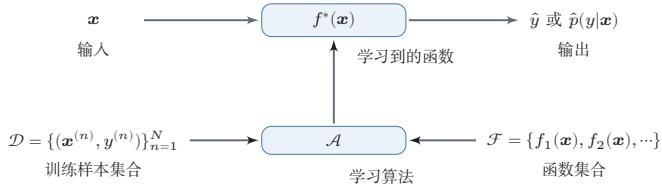  
图2.2 机器学习基本流程示意图

## 2.2 机器学习的基本要素

机器学习是从有限的观测数据中学习（或“猜测”）出具有一般性的规律，并可以将总结出来的规律推广应用到未观测样本上.机器学习方法可以从以下几个基本要素来描述：数据、模型、学习准则、优化算法和评价指标

## 2.2.1 数据

一组样本构成的集合称为数据集（Dataset）．在很多领域，数据集也经常称为语料库（Corpus）．在机器学习中，数据通常被划分为三部分：训练集（Training Set）、验证集（Validation Set）和测试集（Test Set）.训练集中的样本用于学习模型参数；验证集用于模型选择、超参数调整以及提前停止；测试集仅用于最终评估模型的泛化性能，不参与模型设计过程.若测试集被反复用于调参，就会造成数据泄露（DataLeakage），从而使测试结果过于乐观

在经典监督学习中，通常假设这些样本是独立同分布的（IdenticallyandIndependentlyDistributed，IID），即独立地从相同的数据分布中抽取的.这个假设便于理论分析和模型设计，但在真实场景中并不总是严格成立，比如时间序列、领域迁移以及分布漂移等任务往往需要额外处理.

## 2.2.2 模型

对于一个机器学习任务，首先要确定其输入空间x和输出空间 $\mathcal { Y } .$ 不同机器学习任务的主要区别在于输出空间不同.在二分类问题中 $\mathcal { Y } = \{ + 1 , - 1 \}$ ，在 $C$ 分类问题中 $\mathcal { Y } = \{ 1 , 2 , \cdots , C \}$ ，而在回归问题中 $\mathcal { Y } = \mathbb { R }$

这里，输入空间默认为样本的特征空间.

输入空间X和输出空间y构成了一个样本空间.对于样本空间中的样本$( \boldsymbol { x } , \boldsymbol { y } ) \in \mathcal { X } \times \mathcal { Y }$ ，假定x和y之间的关系可以通过一个未知的真实映射函数 $y =$ $g ( { \pmb x } )$ 或真实条件概率分布 $\dot { p } _ { r } ( y | x )$ 来描述，机器学习的目标是找到一个模型来近似真实映射函数 $g ( { \pmb x } )$ 或真实条件概率分布 $p _ { r } ( y | \mathbf { \boldsymbol { x } } )$

映射函数 $g : \mathcal X  \mathcal Y .$

由于我们不知道真实的映射函数 $g ( { \pmb x } )$ 或条件概率分布 $p _ { r } ( y | \mathbf { \boldsymbol { x } } )$ 的具体形式，因而只能根据经验来假设一个函数集合 $\mathcal { F }$ ，称为假设空间（Hypothesis Space），然后通过观测其在训练集 $\mathcal { D }$ 上的特性，从中选择一个理想的假设（Hypothe-sis) $f ^ { * } \in \mathcal F$

假设空间 $\mathcal { F }$ 通常为一个参数化的函数族

$$
\mathcal { F } = \{ f ( \pmb { x } ; \theta ) | \theta \in \mathbb { R } ^ { D } \} ,\tag{2.5}
$$

其中 $f ( \pmb { x } ; \theta )$ 是参数为θ的函数，也称为模型（Model），D为参数的数量.

常见的假设空间可以分为线性和非线性两种，对应的模型 $f$ 也分别称为线 性模型和非线性模型

## 2.2.2.1 线性模型

线性模型的假设空间为一个参数化的线性函数族，即

$$
f ( \pmb { x } ; \pmb { \theta } ) = \pmb { w } ^ { \top } \pmb { x } + b ,\tag{2.6}
$$

对于分类问题，一般为广义线性函数，参见公式(3.3).

其中参数 $\theta$ 包含了权重向量ω和偏置b.

## 2.2.2.2 非线性模型

广义的非线性模型可以写为多个非线性基函数 $\mathbf { \hat { \phi } } _ { \cdot \phi } ( { \boldsymbol { \mathbf { \hat { x } } } } )$ 的线性组合

$$
f ( \pmb { x } ; \theta ) = \pmb { w } ^ { \top } \phi ( \pmb { x } ) + b ,\tag{2.7}
$$

其中 ${ \phi } ( { \pmb x } ) = [ \phi _ { 1 } ( { \pmb x } ) , \phi _ { 2 } ( { \pmb x } ) , \cdots , \phi _ { K } ( { \pmb x } ) ] ^ { \top }$ 为K个非线性基函数组成的向量，参数θ包含了权重向量w和偏置b.

如果 $\phi ( { \pmb x } )$ 本身为可学习的基函数，比如

$$
\begin{array} { r } { \phi _ { k } ( { \pmb x } ) = h ( { \pmb w } _ { k } ^ { \top } \phi ^ { \prime } ( { \pmb x } ) + b _ { k } ) , \forall 1 \leq k \leq K , } \end{array}\tag{2.8}
$$

其中 $h ( \cdot )$ 为非线性函数， $\phi ^ { \prime } ( { \pmb x } )$ 为另一组基函数， ${ \pmb w } _ { k }$ 和 $b _ { k }$ 为可学习的参数，则$f ( \pmb { x } ; \theta )$ 就等价于神经网络模型.

## 2.2.3 学习准则

令训练集 $\mathcal { D } = \{ ( { \pmb x } ^ { ( n ) } , y ^ { ( n ) } ) \} _ { n = 1 } ^ { N }$ 由N个样本组成.在经典监督学习设定中，通常假设每个样本 $( \boldsymbol { x } , \boldsymbol { y } ) \in \mathcal { X } \times \mathcal { Y }$ 独立地从某个未知但固定的数据分布 $p _ { r } ( { \pmb x } , { \pmb y } )$ 中抽取，这个假设使得我们可以把训练集视为未来测试样本的一个代表性近似并在此基础上讨论泛化问题

机器学习的目标不是简单地“记住”训练样本，而是学习出能够推广到未见样本的模型.因此，我们通常希望模型 $f ( \pmb { x } ; \theta )$ 在真实数据分布 $p _ { r } ( { \pmb x } , { \pmb y } )$ 下具有较小的平均损失.模型 $f ( \pmb { x } ; \theta )$ 的好坏可以通过期望风险(Expected Risk)R(θ)来衡量，其定义为

期望风险也经常 称为期望错误（Expected Error).

$$
\mathscr { R } ( \theta ) = \mathbb { E } _ { ( \pmb { x } , \pmb { y } ) \sim p _ { r } ( \pmb { x } , \pmb { y } ) } [ \mathscr { L } \big ( \pmb { y } , \pmb { f } ( \pmb { x } ; \theta ) \big ) ] ,\tag{2.9}
$$

其中 $\mathcal { L } ( y , f ( \pmb { x } ; \theta ) )$ 为损失函数，用来量化模型预测与真实标签之间的差异

由于真实分布 $p _ { r } ( { \pmb x } , { \pmb y } )$ 一般未知，因此期望风险往往无法直接计算.实际训练时，我们通常先选定一个损失函数，再利用训练数据来近似优化期望风险.对分类任务而言，经常还会用一个条件概率分布 $f _ { y } ( \pmb { x } ; \theta )$ 来表示模型对类别y的预测概率.

## 2.2.3.1 损失函数

损失函数是一个非负实数函数，用来量化模型预测和真实标签之间的差异下面介绍几种常用的损失函数

0-1损失函数 最直观的损失函数是模型在训练集上的错误率，即0-1损失函数(0-1 Loss Function) :

$$
\mathcal { L } ( y , f ( \pmb { x } ; \theta ) ) = \left\{ \begin{array} { l l } { 0 } & { \mathrm { i f } y = f ( \pmb { x } ; \theta ) } \\ { 1 } & { \mathrm { i f } y \neq f ( \pmb { x } ; \theta ) } \end{array} \right.\tag{2.10}
$$

https://nndl.ai/

$$
{ \bf \xi } = I ( y \neq f ( { \pmb x } ; \theta ) ) ,\tag{2.11}
$$

其中I(·)是指示函数.

虽然0-1损失函数能够客观地评价模型的好坏，但其缺点是数学性质不是很好：不连续且导数为0，难以优化.因此经常用连续可微的损失函数替代.

平方损失函数平方损失函数（Quadratic Loss Function）经常用在预测标签$y$ 为实数值的任务中，定义为

$$
\mathcal { L } ( y , f ( \mathbf { x } ; \theta ) ) = \frac { 1 } { 2 } \Big ( y - f ( \mathbf { x } ; \theta ) \Big ) ^ { 2 } .\tag{2.12}
$$

平方损失函数一般不适用于分类问题

参见习题2-3.

交叉熵损失函数 交叉熵损失函数（Cross-Entropy Loss Function)一般用于分类问题.假设样本的标签 $y \in \{ 1 , \cdots , C \}$ 为离散的类别，模型 $f ( \pmb { x } ; \theta ) \in [ 0 , 1 ] ^ { C }$ 的输出为类别标签的条件概率分布，即

$$
p ( \boldsymbol { y } = c | \mathbf { r } ; \boldsymbol { \theta } ) = f _ { c } ( \mathbf { r } ; \boldsymbol { \theta } ) ,\tag{2.13}
$$

并满足

$f _ { c } ( { \pmb x } ; { \theta } )$ 表示 $f ( { \pmb x } ; { \boldsymbol \theta } )$ 的输出向量的第c维.

$$
f _ { c } ( \pmb { x } ; \theta ) \in [ 0 , 1 ] , \qquad \sum _ { c = 1 } ^ { C } f _ { c } ( \pmb { x } ; \theta ) = 1 .\tag{2.14}
$$

我们可以用一个C维的one-hot向量 $\textbf {  { y } }$ 来表示样本标签.假设样本的标签为k,那么标签向量y只有第k维的值为1,其余元素的值都为0.标签向量y可以看作样本标签的真实条件概率分布 $p _ { r } ( \pmb { y } | \pmb { x } )$ ，即第c维（记为 $y _ { c } , 1 \leq c \leq C )$ 是类别为c的真实条件概率，假设样本的类别为k，那么它属于第k类的概率为1，属于其他类的概率为0.

对于两个概率分布，一般可以用交叉熵来衡量它们的差异.标签的真实分布$\textbf {  { y } }$ 和模型预测分布 $f ( \pmb { x } ; \theta )$ 之间的交叉熵为

交叉熵参见第E.3.1节.

$$
\mathcal { L } ( \pmb { y } , f ( \pmb { x } ; \theta ) ) = - \pmb { y } ^ { \top } \log f ( \pmb { x } ; \theta )\tag{2.15}
$$

$$
{ \bf \xi } = - \sum _ { c = 1 } ^ { C } y _ { c } \log f _ { c } ( { \bf x } ; \boldsymbol { \theta } ) .\tag{2.16}
$$

比如对于三分类问题，一个样本的标签向量为 $\pmb { y } = [ 0 , 0 , 1 ] ^ { \top }$ ，模型预测的标签分布为 $f ( \pmb { x } ; \theta ) = [ 0 . 3 , 0 . 3 , 0 . 4 ] ^ { \top }$ ，则它们的交叉熵为 $- ( 0 \times \log ( 0 . 3 ) + 0 \times$ $\log ( 0 . 3 ) + 1 \times \log ( 0 . 4 ) ) = - \log ( 0 . 4 )$

## 数学小知识|交叉熵与KL散度

给定两个概率分布 $p$ 和 $q$ ,交叉熵定义为 $\begin{array} { r } { H ( p , q ) = - \sum _ { c } p _ { c } \log q _ { c } } \end{array}$   
衡量用 $q$ 来编码服从 $p$ 的数据所需的平均信息量.交叉熵可以分解为  
$H ( p , q ) = H ( p ) + D _ { \mathrm { K L } } ( p \Vert q )$ ，其中 $H ( p )$ 是 $p$ 的熵， $D _ { \mathrm { K L } } ( p \Vert q ) \geq 0$ 是  
KL散度.因此,最小化交叉熵等价于最小化KL散度,即让预测分布 $q$ 尽  
可能接近真实分布 $p .$ 交叉熵与KL散度参见竺


因为 $\textbf {  { y } }$ 为one-hot向量，公式(2.16)也可以写为

$$
\begin{array} { r } { \mathcal { L } ( y , f ( \pmb { x } ; \theta ) ) = - \log f _ { y } ( \pmb { x } ; \theta ) , } \end{array}\tag{2.17}
$$

其中 $f _ { y } ( \pmb { x } ; \theta )$ 可以看作真实类别 $y$ 的似然函数.因此，交叉熵损失函数也就是负对数似然函数(Negative Log-Likelihood).

Hinge损失函数 对于二分类问题，假设 $y$ 的取值为 $\{ - 1 , + 1 \} , f ( \pmb { x } ; \theta ) \in \mathbb { R }$ Hinge损失函数(Hinge Loss Function)为

参见第3.5.3节.

$$
\mathcal { L } ( y , f ( \pmb { x } ; \theta ) ) = \operatorname* { m a x } \left( 0 , 1 - y f ( \pmb { x } ; \theta ) \right)\tag{2.18}
$$

$$
\triangleq [ 1 - y f ( \pmb { x } ; \theta ) ] _ { + } ,\tag{2.19}
$$

其中 $[ x ] _ { + } = \operatorname* { m a x } ( 0 , x )$

## 2.2.3.2 风险最小化准则

由于真实的数据分布未知，实际训练时通常只能在训练集上计算模型的平均损失，即经验风险（Empirical Risk)

经验风险也称为经验错误（Empirical Er-ror).

$$
\mathcal { R } _ { \mathcal { D } } ^ { e m p } ( \theta ) = \frac { 1 } { N } \sum _ { n = 1 } ^ { N } \mathcal { L } \big ( y ^ { ( n ) } , f ( \pmb { x } ^ { ( n ) } ; \theta ) \big ) .\tag{2.20}
$$

因此，一个切实可行的学习准则是寻找一组参数 $\theta ^ { * }$ ，使经验风险最小，即

$$
\theta ^ { * } = \arg \operatorname* { m i n } _ { \theta } \mathcal { R } _ { \mathcal { D } } ^ { e m p } ( \theta ) ,\tag{2.21}
$$

这就是经验风险最小化（Empirical Risk Minimization,ERM)准则.

仅仅最小化训练集上的经验风险并不能保证模型具有良好的泛化能力.模型复杂度过高时，即使训练误差很低，也可能在未见样本上性能较差，这就是过拟合（Overfitting）现象.

定义 2.1－过拟合：给定一个假设空间 $\mathcal { F }$ ，一个假设f属于 $\mathcal { F }$ ,如果存在其他的假设 $f ^ { \prime }$ 也属于 $\mathcal { F }$ ，使得在训练集上 $f$ 的损失比 $f ^ { \prime }$ 的损失小，但在整个样本空间上 $f ^ { \prime }$ 的损失比 $f$ 的损失小，那么就说假设 $f$ 过度拟合训练数据.

和过拟合相反的一个概念是欠拟合（Underfitting），即模型不能很好地拟合训练数据，在训练集上的错误率比较高.欠拟合一般是由于模型能力不足造成的.图2.3给出了欠拟合和过拟合的示例.

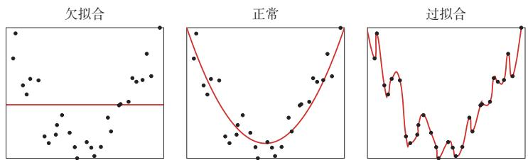  
图2.3 欠拟合和过拟合示例

为了在拟合训练数据和控制模型复杂度之间取得平衡，常在经验风险最小化的基础上加入一个复杂度惩罚项，从而得到结构风险最小化（StructuralRiskMinimization,SRM)准则:

$$
\theta ^ { * } = \arg \operatorname* { m i n } _ { \theta } \mathcal { R } _ { \mathcal { D } } ^ { e m p } ( \theta ) + \lambda \Omega ( \theta ) ,\tag{2.22}
$$

其中 $\Omega ( \theta )$ 用来衡量模型复杂度， $\lambda \geq 0$ 为权衡系数.在线性模型和神经网络中，$\ell _ { 2 }$ 正则化是最常见的实现形式之一．正则化项也可以使用其他函数，比如 $\ell _ { 1 }$ 范数. $\ell _ { 1 }$ 范数的引入通常会使得参数有一定稀疏性，因此在很多算法中也经常使用.从贝叶斯学习的角度来讲，正则化是引入了参数的先验分布，使其不完全依赖训练数据.

$\ell _ { 1 }$ 范数的稀疏性参见第7.7.1节.

正则化的贝叶斯解释参见第2.3.1.4节.

在实际机器学习流程中，ERM或SRM通常用于训练阶段，而模型选择、正则化强度和其他超参数的确定，则依赖验证集上的性能.当训练数据较少时，也可以采用交叉验证来近似完成模型选择与性能估计.

交叉验证交叉验证（Cross-Validation）是一种常用的模型选择与评价方法，可以在数据量较少时更稳定地评价模型.常见的K折交叉验证做法是:把原始数据集划分为K个互不重叠的子集，每次选K一1个子集作为训练集，剩下的一个子集作为验证集，共进行K轮训练与验证，并将K次验证结果取平均.需要注意的是，交叉验证通常用于模型选择和超参数调整；如果有独立测试集，最终结果仍应在测试集上评测

## 2.2.4 优化算法

在确定了训练集D、假设空间以及学习准则后，如何找到最优的模型$f ( x ; theta ^ { * } )$ 就成了一个最优化（Optimization）问题.机器学习的训练过程本质上就是最优化问题的求解过程.

参数与超参数在机器学习中，优化通常可以分为参数优化和超参数优化.模型$f ( \pmb { x } ; \theta )$ 中的θ称为模型参数，可以通过优化算法直接学习.除此之外，还有一类参数用于定义模型结构或优化策略，比如正则化系数、学习率、网络层数、聚类类别数等,这类参数称为超参数（Hyper-Parameter).

在贝叶斯方法中，超参数可以理解为参数的参数，即控制模型参数分布的参数.

超参数通常不能像模型参数那样直接由训练过程学习得到，而是需要结合验证集表现进行选择．常见的方法包括人工经验设定、网格搜索、随机搜索以及更系统的贝叶斯优化等.

## 2.2.4.1 梯度下降法

为了充分利用最优化中一些高效、成熟的方法，很多机器学习方法都会选择合适的模型和损失函数，以构造便于优化的目标函数．对于凸目标，往往能够较稳定地求得全局最优解；而对于神经网络等非凸模型，则通常只能求得局部最优解或足够好的近似解

在机器学习中，最简单且最常用的优化算法是梯度下降法.梯度 $\nabla _ { \boldsymbol { \theta } } \mathcal { R } ( { \boldsymbol { \theta } } )$ 指向函数值增大最快的方向，因此沿负梯度方向移动可以最快地降低损失.设参数的初值为 $\theta _ { 0 }$ ,则第t次迭代的更新公式为

$$
\theta _ { t + 1 } = \theta _ { t } - \alpha \frac { \partial \mathcal { R } _ { \mathcal { D } } ( \theta ) } { \partial \theta }\tag{2.23}
$$

$$
= \theta _ { t } - \alpha \frac { 1 } { N } \sum _ { n = 1 } ^ { N } \frac { \partial \mathcal { L } \Big ( y ^ { ( n ) } , f ( \pmb { x } ^ { ( n ) } ; \pmb { \theta } ) \Big ) } { \partial \pmb { \theta } } ,\tag{2.24}
$$

其中 $\theta _ { t }$ 为第t次迭代时的参数值， $\alpha$ 为步长．在机器学习中，α一般称为学习率(Learning Rate).

## 2.2.4.2 提前停止

除了显式加入正则化项之外，还可以通过提前停止（EarlyStopping）来缓解过拟合．其基本思想是：随着训练轮次增加，模型在训练集上的损失通常会持续下降，但验证集上的误差可能先下降后上升.因此，在验证集性能不再提升时终止训练，往往可以获得更好的泛化能力.

在实际应用中，提前停止通常与验证集配合使用.如果原始数据量较小，也可以从训练集中再划分出一部分数据作为验证集.图2.4给出了提前停止的示例.

  
图2.4 提前停止的示例

## 2.2.4.3随机梯度下降法

在公式(2.23)中，梯度下降法每次都需要利用整个训练集来计算梯度，这种方式称为批量梯度下降法（Batch Gradient Descent，BGD）.当训练集规模很大时，这种做法的时间和空间开销都比较高.

如果将一个样本的损失梯度视为真实梯度的随机近似，就得到随机梯度下降法（Stochastic Gradient Descent，SGD）.SGD每次仅利用一个训练样本更新参数，因此单次迭代代价较低，并且在非凸优化中常常更容易跳出较差的局部区域，当经过足够次数的迭代时，随机梯度下降也可以收敛到局部最优解[Nemirovski et al., 2009].

随机梯度下降法的训练过程如算法2.1所示.

算法 2.1 随机梯度下降法  
输入: 训练集D = {(x(n), y(n))}n=1,验证集ν,学习率α  
1 随机初始化 θ;  
2 repeat  
3 对训练集D中的样本随机排序;  
4 for n = 1 ·. N do  
5 从训练集D中选取样本(x(n), y(n));  
∂L(y(n), f(x(n); θ))  
6 θ ← θ − α //更新参数  
∂θ  
7 end  
8 until 模型 f(x; θ)在验证集 γ上的性能不再提升;  
输出：θ

批量梯度下降和随机梯度下降的主要区别在于：前者使用全体样本的平均损失来更新参数，后者使用单个样本的损失来更新参数.由于实现简单、单步开销小，随机梯度下降及其变体在现代机器学习中被广泛采用.

## 2.2.4.4 小批量梯度下降

随机梯度下降法的一个缺点是无法充分利用计算机的并行计算能力.小批量梯度下降（Mini-Batch Gradient Descent）是批量梯度下降和随机梯度下降的折中：每次迭代时随机选取一小部分训练样本来估计梯度，从而兼顾计算效率与优化稳定性.

第t次迭代时，随机选取一个包含K个样本的子集 $\mathcal { S } _ { t }$ ,计算该子集上的平均梯度并更新参数：

$$
\theta _ { t + 1 }  \theta _ { t } - \alpha \frac { 1 } { K } \sum _ { ( \pmb { x } , \pmb { y } ) \in \mathcal { S } _ { t } } \frac { \partial \mathcal { L } \Big ( \pmb { y } , \pmb { f } ( \pmb { x } ; \theta ) \Big ) } { \partial \theta } .
$$

K通常不会设置很大，一般在1～100之间.在实际应用中为了提高计算效率，通常设置为2的幂2n.

(2.25)

在实际应用中，小批量梯度下降兼具收敛速度快、内存友好和便于并行实现等优点，因此已经成为大规模机器学习和深度学习中的主流优化方式[Bottou,2010].

## 2.2.5 评价指标

为了衡量一个机器学习模型的好坏，需要给定一个测试集，用模型对测试集中的每一个样本进行预测，并根据预测结果计算评价分数.

对于分类问题，常见的评价标准有准确率、精确率、召回率和F值等.给定测试集 $\mathcal { T } = \{ ( \mathbf { x } ^ { ( 1 ) } , y ^ { ( 1 ) } ) , \cdots , ( \mathbf { x } ^ { ( N ) } , y ^ { ( N ) } ) \}$ ，假设标签 $y ^ { ( n ) } \in \{ 1 , \cdots , C \}$ ，用学习好的模型 $f ( { \pmb x } ; { \pmb \theta } ^ { * } )$ 对测试集中的每一个样本进行预测，结果为 $\{ \hat { y } ^ { ( 1 ) } , \cdots , \hat { y } ^ { ( N ) } \}$

准确率 最常用的评价指标为准确率（Accuracy）：

$$
\mathcal { A } = \frac { 1 } { N } \sum _ { n = 1 } ^ { N } I ( y ^ { ( n ) } = \hat { y } ^ { ( n ) } ) ,\tag{2.26}
$$

由于中文的模糊性，关于准确率和下文提到的精确率的定义在有些文献中刚好相反，具体含义需要根据上下文进行判断.

其中I(·) 为指示函数.

错误率 和准确率相对应的就是错误率（Error Rate）:

$$
\mathcal { E } = 1 - \mathcal { A }\tag{2.27}
$$

$$
= \frac { 1 } { N } \sum _ { n = 1 } ^ { N } I ( y ^ { ( n ) } \neq \hat { y } ^ { ( n ) } ) .\tag{2.28}
$$

精确率和召回率准确率是所有类别整体性能的平均，如果希望对每个类都进行性能估计，就需要计算精确率（Precision）和召回率（Recall）.精确率和召回率是广泛用于信息检索和统计学分类领域的两个度量值，在机器学习的评价中也被大量使用.

对于类别c来说，模型在测试集上的结果可以分为以下四种情况：

（1）真正例（TruePositive，TP)：一个样本的真实类别为c并且模型正确地预测为类别c.这类样本数量记为

$$
T P _ { c } = \sum _ { n = 1 } ^ { N } I ( y ^ { ( n ) } = \hat { y } ^ { ( n ) } = c ) .\tag{2.29}
$$

（2）假负例（FalseNegative，FN）：一个样本的真实类别为 $c ,$ 模型错误地预测为其他类.这类样本数量记为

$$
F N _ { c } = \sum _ { n = 1 } ^ { N } I ( y ^ { ( n ) } = c \wedge \hat { y } ^ { ( n ) } \neq c ) .\tag{2.30}
$$

(3）假正例（FalsePositive,FP):一个样本的真实类别为其他类，模型错误地预测为类别 $c .$ 这类样本数量记为

$$
F P _ { c } = \sum _ { n = 1 } ^ { N } I ( y ^ { ( n ) } \neq c \land \hat { y } ^ { ( n ) } = c ) .\tag{2.31}
$$

(4）真负例（TrueNegative，TN)：一个样本的真实类别为其他类，模型也预测为其他类.这类样本数量记为 $T N _ { c }$ 对于类别 $c$ 来说，这种情况一般不需要关注.

这四种情况的关系可以用如图2.5所示的混淆矩阵（Confusion Matrix）来表示.

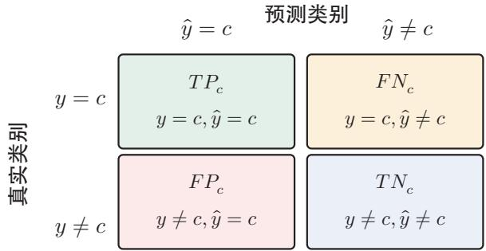  
图 2.5 类别c的预测结果的混淆矩阵

根据上面的定义，我们可以进一步定义查准率、查全率和F值.

精确率（Precision）:所有预测为类别 $c$ 的样本中预测正确的样本比例

精确率也叫精度或查 准率.

$$
\mathcal { P } _ { c } = \frac { T P _ { c } } { T P _ { c } + F P _ { c } } .\tag{2.32}
$$

召回率（Recall）:真实属于类别c的样本中，正确预测的样本比例.

召回率也叫查全率.

$$
\mathcal { R } _ { c } = \frac { T P _ { c } } { T P _ { c } + F N _ { c } } .\tag{2.33}
$$

F值（FMeasure）是一个综合指标，为精确率和召回率的调和平均：

$$
\mathcal { F } _ { c } = \frac { ( 1 + \beta ^ { 2 } ) \times \mathcal { P } _ { c } \times \mathcal { R } _ { c } } { \beta ^ { 2 } \times \mathcal { P } _ { c } + \mathcal { R } _ { c } } ,\tag{2.34}
$$

其中 $\beta$ 用于平衡精确率和召回率的重要性，一般取值为1. $\beta = 1$ 时的F值称为F1值，是精确率和召回率的调和平均.

宏平均和微平均 为了计算分类算法在所有类别上的总体精确率、召回率和F1值，经常使用两种平均方法，分别称为宏平均（MacroAverage）和微平均（Mi-cro Average) [Yang, 1999].

宏平均是先分别计算每一类的指标，再对各类做算术平均：

$$
\mathcal { P } _ { m a c r o } = \frac { 1 } { C } \sum _ { c = 1 } ^ { C } \mathcal { P } _ { c } ,\tag{2.35}
$$

$$
\mathcal { R } _ { m a c r o } = \frac { 1 } { C } \sum _ { c = 1 } ^ { C } \mathcal { R } _ { c } ,\tag{2.36}
$$

$$
\mathcal { F } 1 _ { m a c r o } = \frac { 2 \times \mathcal { P } _ { m a c r o } \times \mathcal { R } _ { m a c r o } } { \mathcal { P } _ { m a c r o } + \mathcal { R } _ { m a c r o } } .\tag{2.37}
$$

值得注意的是，在有些文献中，宏平均F1也定义为 $\begin{array} { r } { \mathcal { F } 1 _ { m a c r o } = \frac { 1 } { C } \sum _ { c = 1 } ^ { C } \mathcal { F } 1 _ { c } } \end{array}$ .两种写法都较常见，因此在比较结果时需要留意具体定义

微平均是先在所有类别上汇总统计量，再计算整体指标.对于单标签多分类任务，精确率、召回率和F1值的微平均往往相同，且与准确率关系密切.当不同类别的样本数量不均衡时，宏平均通常更能反映小类别上的性能，而微平均更容易受到大类别的影响.

在实际应用中，我们也可以通过调整分类模型的阈值来进行更全面的评价，比如 AUC(Area Under Curve)、ROC(Receiver Operating Characteristic)曲线、PR（Precision-Recall）曲线等.此外，很多任务还有自己专门的评价方式，比如 TopN 准确率.

关于更详细的模型评价指标，可以参考《机器学习》[周志华，2016]的第2章.

概率校准和不确定性上述指标主要评价模型的预测标签是否正确，或者评价在不同阈值下正确率和错误率如何变化.但在很多实际场景中，我们还希望知道模型给出的预测概率是否可信．例如，一个分类模型如果经常给出0.9的预测概率，那么在这些预测中大约应有90%是正确的；若实际正确率只有60%，模型虽然可能有较高准确率，但它的置信度明显偏高．这类问题称为概率校准(Probability Calibration).

概率校准和不确定性估计（UncertaintyEstimation）密切相关.一个模型的不确定性通常来自两方面：一是数据本身存在噪声或类别边界模糊，即使有无限数据也难以完全消除：二是训练数据有限或分布变化导致模型对某些区域了解不足.前者常称为数据不确定性，后者常称为模型不确定性.在医疗诊断、金融风控、自动驾驶等高风险任务中，模型不仅要给出预测结果，还应尽可能给出可靠的置信度，并在不确定性较高时交给人工复核或采取更保守的决策策略.

图2.6给出了机器学习的完整流程，包含模型训练和模型评价两个阶段.模型训练阶段需要用到训练集、验证集、待学习的模型、损失函数、优化算法，输出学习到的模型.模型评价阶段需要用到测试集、学习到的模型、评价指标，得到模型的性能评价.

  
图2.6 机器学习基本流程示意图

## 2.3 机器学习的简单示例线性回归

在本节中，我们通过一个简单的模型（线性回归）来具体了解机器学习的一般过程，以及不同学习准则（经验风险最小化、结构风险最小化、最大似然估计、最大后验估计）之间的关系.

线性回归（LinearRegression）是机器学习和统计学中最基础和最广泛应用的模型，是一种对自变量和因变量之间关系进行建模的回归分析.自变量数量为1时称为简单回归，自变量数量大于1时称为多元回归.

从机器学习的角度来看，自变量就是样本的特征向量 $\pmb { x } \in \mathbb { R } ^ { D }$ (每一维对应一个自变量)，因变量是标签 $y$ ,这里 $y \in$ R是连续值（实数或连续整数).假设空间是一组参数化的线性函数

$$
f ( \pmb { x } ; \pmb { w } , b ) = \pmb { w } ^ { \top } \pmb { x } + b ,\tag{2.38}
$$

其中权重向量 $\pmb { w } \in \mathbb { R } ^ { D }$ 和偏置 $b \in$ R都是可学习的参数，函数 $f ( \pmb { x } ; \pmb { w } , b ) \in \mathbb { I }$ R也称为线性模型.

为简单起见，我们将公式(2.38)写为

$$
f ( \boldsymbol x ; \hat { \boldsymbol w } ) = \hat { \boldsymbol w } ^ { \intercal } \hat { \boldsymbol x } ,\tag{2.39}
$$

其中 $\hat { w }$ 和分别称为增广权重向量和增广特征向量：

$$
\begin{array} { r } { \hat { \pmb { x } } = \pmb { x } \oplus 1 \triangleq \left[ \begin{array} { c } { { \bf \sigma } } \\ { { \bf x } } \\ { { \bf x } } \\ { 1 } \end{array} \right] = \left[ \begin{array} { c } { x _ { 1 } } \\ { \vdots } \\ { x _ { D } } \\ { 1 } \end{array} \right] , } \end{array}\tag{2.40}
$$

$$
\hat { w } = w \oplus b \triangleq [ \begin{array} { c } { [ \begin{array} { c } { [ w _ { 1 } } \\ { w } \\ { [ w ] } \\ { w } \end{array} ] } \end{array} ] = [ \begin{array} { c } { w _ { 1 } } \\ { \vdots } \\ { w _ { D } } \\ { b } \end{array} ] ,\tag{2.41}
$$

其中④定义为两个向量的拼接操作.

不失一般性，在本章后面的描述中我们采用简化的表示方法，直接用ω和x分别表示增广权重向量和增广特征向量．这样，线性回归的模型简写为$f ( \pmb { x } ; \pmb { w } ) = \pmb { w } ^ { \top } \pmb { x }$

## 2.3.1 参数学习

给定一组包含N个训练样本的训练集 $\mathcal { D } = \{ ( { \boldsymbol { x } } ^ { ( n ) } , y ^ { ( n ) } ) \} _ { n = 1 } ^ { N }$ ，我们希望能够学习一个最优的线性回归的模型参数w.

我们介绍四种不同的参数估计方法：经验风险最小化、结构风险最小化、最大似然估计、最大后验估计.

## 2.3.1.1 经验风险最小化

由于线性回归的标签 $y$ 和模型输出都为连续的实数值，因此平方损失函数非常合适衡量真实标签和预测标签之间的差异.

平方损失函数参见第2.2.3.1节.

根据经验风险最小化准则，训练集D上的经验风险定义为

$$
\mathcal { R } ( \pmb { w } ) = \sum _ { n = 1 } ^ { N } \mathcal { L } ( y ^ { ( n ) } , f ( \pmb { x } ^ { ( n ) } ; \pmb { w } ) )\tag{2.42}
$$

为了简化起见，这里的风险函数省略了 $\textstyle { \frac { 1 } { N } }$

$$
\mathbf { \Sigma } = \frac { 1 } { 2 } \sum _ { n = 1 } ^ { N } \Big ( y ^ { ( n ) } - w ^ { \top } \pmb { x } ^ { ( n ) } \Big ) ^ { 2 }\tag{2.43}
$$

$$
\mathbf { \Omega } = \frac 1 2 \| \pmb { y } - \pmb { X } ^ { \top } \pmb { w } \| ^ { 2 } ,\tag{2.44}
$$

其中 $\pmb { y } = [ y ^ { ( 1 ) } , \cdots , y ^ { ( N ) } ] ^ { \intercal } \in \mathbb { R } ^ { N }$ 是由所有样本的真实标签组成的列向量，而 $\boldsymbol { X } \in$ $\mathbb { R } ^ { ( D + 1 ) \times N }$ 是由所有样本的输入特征 $\pmb { x } ^ { ( 1 ) } , \cdots , \pmb { x } ^ { ( N ) }$ 组成的矩阵：

$$
\begin{array} { r } { X = \left[ { \begin{array} { c c c c } { x _ { 1 } ^ { ( 1 ) } } & { x _ { 1 } ^ { ( 2 ) } } & { \cdots } & { x _ { 1 } ^ { ( N ) } } \\ { \vdots } & { \vdots } & { \ddots } & { \vdots } \\ { x _ { D } ^ { ( 1 ) } } & { x _ { D } ^ { ( 2 ) } } & { \cdots } & { x _ { D } ^ { ( N ) } } \\ { 1 } & { 1 } & { \cdots } & { 1 } \end{array} } \right] . } \end{array}\tag{2.45}
$$

风险函数 $\mathcal { R } ( \boldsymbol { w } )$ 是关于w的凸函数，其对ω的偏导数为

参见习题2-9.

$$
\begin{array} { r } { \frac { \partial \mathcal { R } ( \pmb { w } ) } { \partial \pmb { w } } = \frac { 1 } { 2 } \frac { \partial \ \| \pmb { y } - \pmb { X } ^ { \top } \pmb { w } \| ^ { 2 } } { \partial \pmb { w } } } \\ { = - \pmb { X } ( \pmb { y } - \pmb { X } ^ { \top } \pmb { w } ) , } \end{array}\tag{2.46}
$$

(2.47)

令 $\begin{array} { r } { \frac { \partial } { \partial { \bf w } } \mathcal { R } ( { \bf w } ) = 0 } \end{array}$ ,得到最优的参数 $\ b { w } ^ { * }$ 为

$( \pmb { X } \pmb { X } ^ { \top } ) ^ { - 1 } .$ X也称为 $\pmb { X } ^ { \top }$ 的伪逆矩阵.

$$
\pmb { w } ^ { * } = ( \pmb { X } \pmb { X } ^ { \top } ) ^ { - 1 } \pmb { X } \pmb { y }\tag{2.48}
$$

$$
= { \biggl ( } \sum _ { n = 1 } ^ { N } \mathbf { x } ^ { ( n ) } { \bigl ( } \mathbf { x } ^ { ( n ) } { \bigr ) } ^ { \top } { \biggr ) } ^ { - 1 } { \biggl ( } \sum _ { n = 1 } ^ { N } \mathbf { x } ^ { ( n ) } y ^ { ( n ) } { \biggr ) } .\tag{2.49}
$$

这种求解线性回归参数的方法也叫最小二乘法（Least SquareMethod，LSM).图2.7给出了用最小二乘法来进行线性回归参数学习的示例

在古代汉语中“平方”称为“二乘”.

  
图2.7 用最小二乘法来进行线性回归参数学习的示例

若要直接使用式(2.48)给出的闭式解， $X X ^ { \mathsf { \scriptscriptstyle T } } \in \mathbb { R } ^ { ( D + 1 ) \times ( D + 1 ) }$ 必须存在逆矩阵，即 $X X ^ { \top }$ 是满秩的 $( \mathrm { \ r a n k } ( X X ^ { \mathsf { T } } ) = D + 1 )$ .也就是说，X中的行向量之间是线性不相关的，即X的各行向量（各特征维度）之间线性无关.一种常见的

$X X ^ { \top }$ 不可逆情况是样本数量N小于特征数量 $( D + 1 )$ ， $X X ^ { \top }$ 的秩为N.这时会存在很多解 $\boldsymbol { w } ^ { * }$ ，可以使得 $\mathcal { R } ( w ^ { * } ) = 0$

参见习题2-8.

当 $X X ^ { \top }$ 不可逆时，可以通过下面两种方法来估计参数：1）先使用主成分分析等方法来预处理数据，消除不同特征之间的相关性，然后再使用最小二乘法来估计参数；2）使用梯度下降法来估计参数.先初始化 $w = 0$ ，然后通过下面公式进行迭代：

$$
\pmb { w }  \pmb { w } + \alpha \pmb { X } ( \pmb { y } - \pmb { X } ^ { \top } \pmb { w } ) ,\tag{2.50}
$$

其中 $\alpha$ 是学习率.这种利用梯度下降法来求解的方法也称为最小均方（LeastMean Squares,LMS)算法.

## 2.3.1.2 结构风险最小化

最小二乘法的基本要求是各个特征之间要互相独立，保证 $X X ^ { \top }$ 可逆．但即使 $X X ^ { \top }$ 可逆，如果特征之间有较大的多重共线性（Multicollinearity），也会使得 $X X ^ { \top }$ 的逆在数值上无法准确计算.数据集X上一些小的扰动就会导致$( X X ^ { \mathsf { T } } ) ^ { - 1 }$ 发生大的改变，进而使得最小二乘法的计算变得很不稳定.为了解决这个问题， [Hoerl et al.,1970] 提出了岭回归（Ridge Regression），给 $X X ^ { \top }$ 的对角线元素都加上一个常数λ使得 $( X X ^ { \top } + \lambda I )$ 满秩，即其行列式不为0.最优的参数 $\mathbf { \Delta } w ^ { * }$ 为

共线性（Collinearity）是指一个特征可以通过其他特征的线性组合来较准确地预测.

$$
\pmb { w } ^ { * } = ( \pmb { X } \pmb { X } ^ { \top } + \lambda I ) ^ { - 1 } \pmb { X } \pmb { y } ,\tag{2.51}
$$

其中 $\lambda > 0$ 为预先设置的超参数，I为单位矩阵.

岭回归的解 $\boldsymbol { w } ^ { * }$ 可以看作结构风险最小化准则下的最小二乘法估计，其目标函数可以写为

$$
\mathcal { R } ( \pmb { w } ) = \frac { 1 } { 2 } \| \pmb { y } - \pmb { X } ^ { \top } \pmb { w } \| ^ { 2 } + \frac { 1 } { 2 } \lambda \| \pmb { w } \| ^ { 2 } ,\tag{2.52}
$$

其中 $\lambda > 0$ 为正则化系数.

## 2.3.1.3 最大似然估计

机器学习任务可以分为两类：一类是样本的特征向量x和标签 $y$ 之间存在未知的函数关系 $y \ = \ h ( \pmb { x } )$ ，另一类是条件概率 $p ( y | \mathbf { \boldsymbol { x } } )$ 服从某个未知分布.第2.3.1.1节中介绍的最小二乘法是属于第一类，直接建模x和标签 $y$ 之间的函数关系.此外，线性回归还可以从建模条件概率 $p ( y | \mathbf { \boldsymbol { x } } )$ 的角度来进行参数估计.

假设标签 $y$ 为一个随机变量，并由函数 $f ( \pmb { x } ; \pmb { w } ) = \pmb { w } ^ { \top } \pmb { x }$ 加上一个随机噪声€决定，即

这里把x看作确定值的参数.

$$
y = f ( \pmb { x } ; \pmb { w } ) + \epsilon ,\tag{2.53}
$$

$$
= \pmb { w } ^ { \intercal } \pmb { x } + \epsilon ,\tag{2.54}
$$

其中∈服从均值为0、方差为 $\sigma ^ { 2 }$ 的高斯分布.这样，y服从均值为 ${ \pmb w } ^ { \top } { \pmb x }$ 、方差为 $\sigma ^ { 2 }$ 的高斯分布：

$$
p ( y | \mathbf x ; \mathbf w , \boldsymbol \sigma ) = \mathcal N ( y ; \mathbf w ^ { \top } \mathbf x , \boldsymbol \sigma ^ { 2 } )\tag{2.55}
$$

$$
{ \bf \Gamma } = \frac { 1 } { \sqrt { 2 \pi } \sigma } \exp \Big ( - \frac { ( y - { \pmb w } ^ { \top } { \pmb x } ) ^ { 2 } } { 2 \sigma ^ { 2 } } \Big ) .\tag{2.56}
$$

参数w在训练集D上的似然函数（Likelihood）为

似然函数是关于统计模型的参数的函数.

$$
p ( \pmb { y } | \pmb { X } ; \pmb { w } , \sigma ) = \prod _ { n = 1 } ^ { N } p ( \pmb { y } ^ { ( n ) } | \pmb { x } ^ { ( n ) } ; \pmb { w } , \sigma )\tag{2.57}
$$

$$
= \prod _ { n = 1 } ^ { N } \mathcal { N } ( y ^ { ( n ) } ; { \pmb w } ^ { \top } { \pmb x } ^ { ( n ) } , \sigma ^ { 2 } ) ,\tag{2.58}
$$

其中 $\pmb { y } = [ y ^ { ( 1 ) } , \cdots , y ^ { ( N ) } ] ^ { \intercal }$ 为所有样本标签组成的向量， $\pmb { X } = [ \pmb { x } ^ { ( 1 ) } , \cdots , \pmb { x } ^ { ( N ) } ]$ 为所有样本特征向量组成的矩阵.

似然 $L ( w | x )$ 和概率$p ( x | w ) \dot { z }$ 间的区别在于：概率 $p ( x | w )$ 是描述固定参数w时随机变量x的分布情况，而似然 $L ( w | x )$ 则是描述已知随机变量x时不同的参数w对其分布的影响.

为了方便计算，对似然函数取对数得到对数似然函数（LogLikelihood）：

$$
\log p ( \pmb { y } | \pmb { X } ; \pmb { w } , \sigma ) = \sum _ { n = 1 } ^ { N } \log \mathcal { N } ( \pmb { y } ^ { ( n ) } ; \pmb { w } ^ { \top } \pmb { x } ^ { ( n ) } , \sigma ^ { 2 } ) .\tag{2.59}
$$

最大似然估计（Maximum Likelihood Estimation，MLE）是指找到一组参数w使得似然函数 $p ( \pmb { y } | \pmb { X } ; \pmb { w } , \sigma )$ 最大，等价于对数似然函数 $\log p ( \pmb { y } | \pmb { X } ; \pmb { w } , \sigma )$ 最大.

$$
\begin{array} { r } { \underset { \vec { \mathbf { \sigma } } } { \iff } \frac { \partial \log p ( \pmb { y } | \pmb { X } ; \pmb { w } , \sigma ) } { \partial \pmb { w } } = 0 , \acute { \underset { \pmb { \mathcal { H } } } { \rtimes } } \pmb { \mathcal { E } } | \pmb { J } } \end{array}
$$

参见习题2-14.

$$
\pmb { w } ^ { M L } = ( \pmb { X } \pmb { X } ^ { \top } ) ^ { - 1 } \pmb { X } \pmb { y } .\tag{2.60}
$$

可以看出，最大似然估计的解和最小二乘法的解相同

最小二乘法参见公式(2.48).

## 2.3.1.4 最大后验估计

最大似然估计的一个缺点是当训练数据比较少时会发生过拟合，估计的参数可能不准确.为了避免过拟合，我们可以给参数加上一些先验知识

假设参数w为一个随机向量，并服从一个先验分布 $p ( \pmb { w } ; \nu )$ .为简单起见，一般令 $p ( \pmb { w } ; \nu )$ 为各向同性的高斯分布：

$$
p ( \pmb { w } ; \nu ) = \mathcal { N } ( \pmb { w } ; \mathbf { 0 } , \nu ^ { 2 } I ) ,\tag{2.61}
$$

其中 $\nu ^ { 2 }$ 为每一维上的方差.

根据贝叶斯公式，参数w的后验分布（Posterior Distribution）为

贝叶斯公式参见公式(D.33).

$$
p ( \pmb { w } | \pmb { X } , \pmb { y } ; \nu , \sigma ) = \frac { p ( \pmb { w } , \pmb { y } | \pmb { X } ; \nu , \sigma ) } { p ( \pmb { y } | \pmb { X } ; \nu , \sigma ) }\tag{2.62}
$$

$$
\propto p ( \pmb { y } | \pmb { X } , \pmb { w } ; \sigma ) p ( \pmb { w } ; \nu ) ,\tag{2.63}
$$

这里将w视为待推断的随机变量，故写在条件栏中；分号后的 $\sigma , \nu$ 表示给定的分布参数.

其中 $p ( \pmb { y } | \pmb { X } , \pmb { w } ; \sigma )$ 为w的似然函数， $p ( \pmb { w } ; \nu )$ 为w的先验.

这种估计参数w的后验概率分布的方法称为贝叶斯估计（Bayesian Esti-mation），是一种统计推断问题.采用贝叶斯估计的线性回归也称为贝叶斯线性回归(Bayesian Linear Regression).

似然函数的定义参见公式(2.57).

统计推断参见

贝叶斯估计是一种参数的区间估计，即参数在一个区间上的分布．如果我们希望得到一个最优的参数值（即点估计），可以使用最大后验估计．最大后验估计（Maximum A Posteriori Estimation，MAP）是指最优参数为后验分布$p ( \boldsymbol { w } | \boldsymbol { X } , \boldsymbol { y } ; \nu , \sigma )$ 中概率密度最高的参数：

第14.3节.

$$
{ \pmb w } ^ { M A P } = \arg \operatorname* { m a x } _ { { \pmb w } } p ( { \pmb y } | { \pmb X } , { \pmb w } ; { \sigma } ) p ( { \pmb w } ; { \nu } ) ,\tag{2.64}
$$

令似然函数 $p ( \pmb { y } | \pmb { X } , \pmb { w } ; \sigma )$ 为公式(2.58)中定义的高斯密度函数，则后验分布 $p ( \boldsymbol { w } | \boldsymbol { X } , \boldsymbol { y } ; \nu , \sigma )$ 的对数为

$$
\log p ( { \pmb w } | { \pmb X } , { \pmb y } ; \nu , \sigma ) \propto \log p ( { \pmb y } | { \pmb X } , { \pmb w } ; \sigma ) + \log p ( { \pmb w } ; \nu )\tag{2.65}
$$

$$
\propto - \frac { 1 } { 2 \sigma ^ { 2 } } \sum _ { n = 1 } ^ { N } \Big ( y ^ { ( n ) } - w ^ { \top } x ^ { ( n ) } \Big ) ^ { 2 } - \frac { 1 } { 2 \nu ^ { 2 } } w ^ { \top } w ,\tag{2.66}
$$

$$
\mathbf { \Sigma } = - \frac { 1 } { 2 \sigma ^ { 2 } } \| \pmb { y } - \pmb { X } ^ { \top } \pmb { w } \| ^ { 2 } - \frac { 1 } { 2 \nu ^ { 2 } } \pmb { w } ^ { \top } \pmb { w } .\tag{2.67}
$$

可以看出，最大后验概率等价于平方损失的结构风险最小化，其中正则化系数$\lambda = \sigma ^ { 2 } / \nu ^ { 2 }$

最大似然估计和贝叶斯估计可以分别看作频率学派和贝叶斯学派对需要估计的参数w的不同解释.当 $\nu \to \infty$ 时，先验分布 $p ( \pmb { w } ; \nu )$ 退化为均匀分布，称为无信息先验（Non-Informative Prior），最大后验估计退化为最大似然估计.

## 2.4 偏差-方差分解

为了避免过拟合，我们经常会在模型的拟合能力和复杂度之间进行权衡.拟合能力强的模型一般复杂度会比较高，容易导致过拟合．相反，如果限制模型的复杂度，降低其拟合能力，又可能会导致欠拟合，因此，如何在模型的拟合能力和复杂度之间取得一个较好的平衡，对一个机器学习算法来讲十分重要．偏差-方差分解（Bias-Variance Decomposition）为我们提供了一个很好的分析和指导工具.

本节介绍的偏差-方差分解以回归问题为例，但其结论同样适用于分类问题.

以回归问题为例，假设样本的真实分布为 $p _ { r } ( { \pmb x } , { \pmb y } )$ ,并采用平方损失函数，模型 $f ( { \pmb x } )$ 的期望错误为

为简单起见，省略了模 型 $f ( { \pmb x } , { \boldsymbol \theta } )$ 的参数θ.

$$
\mathscr { R } ( f ) = \mathbb { E } _ { ( \pmb { x } , \pmb { y } ) \sim p _ { r } ( \pmb { x } , \pmb { y } ) } \Big [ \big ( \pmb { y } - f ( \pmb { x } ) \big ) ^ { 2 } \Big ] .\tag{2.68}
$$

那么最优的模型为

参见习题2-11.

$$
f ^ { * } ( { \pmb x } ) = \mathbb { E } _ { { \pmb y } \sim p _ { r } ( { \pmb y } | { \pmb x } ) } [ { \pmb y } ] .\tag{2.69}
$$

其中 $p _ { r } ( y | \mathbf { \boldsymbol { x } } )$ 为样本的真实条件分布， $f ^ { * } ( x )$ 为使用平方损失作为优化目标的最优模型，其损失为

$$
\epsilon = \mathbb { E } _ { ( \pmb { x } , \pmb { y } ) \sim p _ { r } ( \pmb { x } , \pmb { y } ) } \Big [ \big ( \pmb { y } - \pmb { f } ^ { * } ( \pmb { x } ) \big ) ^ { 2 } \Big ] .\tag{2.70}
$$

损失∈通常是由于样本分布以及噪声引起的，无法通过优化模型来减少

期望错误可以分解为

$$
\mathcal { R } ( f ) = \mathbb { E } _ { ( \pmb { x } , \pmb { y } ) \sim p _ { r } ( \pmb { x } , \pmb { y } ) } \bigg [ \bigg ( \pmb { y } - \pmb { f } ^ { * } ( \pmb { x } ) + \pmb { f } ^ { * } ( \pmb { x } ) - \pmb { f } ( \pmb { x } ) \bigg ) ^ { 2 } \bigg ]\tag{2.71}
$$

$$
= \mathbb { E } _ { { \pmb x } \sim p _ { r } ( { \pmb x } ) } \bigg [ \Big ( { \pmb f } ( { \pmb x } ) - { \pmb f } ^ { * } ( { \pmb x } ) \Big ) ^ { 2 } \bigg ] + \epsilon ,\tag{2.72}
$$

根据公式(2.69)可知，$\mathbb { E } _ { \pmb { x } } \mathbb { E } _ { y } [ y - f ^ { * } ( \pmb { x } ) ] = 0 .$

其中第一项是当前模型和最优模型之间的差距，是机器学习算法可以优化的真实目标.

在实际训练一个模型 $f ( { \pmb x } )$ 时，训练集D是从真实分布 $p _ { r } ( { \pmb x } , { \pmb y } )$ 上独立同分布地采样出来的有限样本集合.不同的训练集会得到不同的模型.令 $f _ { \mathcal { D } } ( \pmb { x } )$ 表示在训练集D上学习到的模型，一个机器学习算法（包括模型以及优化算法）的能力可以用不同训练集上的模型的平均性能来评价.

对于单个样本x，不同训练集D得到模型 $f _ { \mathcal { D } } ( \pmb { x } )$ 和最优模型 $f ^ { * } ( x )$ 的期望差距为

$$
\begin{array} { r l } & { \mathbb { E } _ { \mathcal { D } } \bigg [ \Big ( f _ { \mathcal { D } } ( \boldsymbol { x } ) - f ^ { * } ( \boldsymbol { x } ) \Big ) ^ { 2 } \bigg ] } \\ & { \quad = \mathbb { E } _ { \mathcal { D } } \bigg [ \Big ( f _ { \mathcal { D } } ( \boldsymbol { x } ) - \mathbb { E } _ { \mathcal { D } } \big [ f _ { \mathcal { D } } ( \boldsymbol { x } ) \big ] + \mathbb { E } _ { \mathcal { D } } \big [ f _ { \mathcal { D } } ( \boldsymbol { x } ) \big ] - f ^ { * } ( \boldsymbol { x } ) \Big ) ^ { 2 } \bigg ] } \\ & { \quad = \underbrace { \bigg ( \mathbb { E } _ { \mathcal { D } } \big [ f _ { \mathcal { D } } ( \boldsymbol { x } ) \big ] - f ^ { * } ( \boldsymbol { x } ) \Big ) ^ { 2 } } _ { \mathrm { ( b i a s . x ) ^ { 2 } } } + \underbrace { \mathbb { E } _ { \mathcal { D } } \bigg [ \Big ( f _ { \mathcal { D } } ( \boldsymbol { x } ) - \mathbb { E } _ { \mathcal { D } } \big [ f _ { \mathcal { D } } ( \boldsymbol { x } ) \big ] \Big ) ^ { 2 } \bigg ] } _ { \mathrm { v a r i a n c e . x } } , } \end{array}\tag{2.73}
$$

(2.74)

参见习题2-17.

https://nndl.ai/

其中第一项为偏差（Bias），是指一个模型在不同训练集上的平均性能和最优模型的差异，可以用来衡量一个模型的拟合能力.第二项是方差（Variance），是指一个模型在不同训练集上的差异，可以用来衡量一个模型是否容易过拟合.

用 $\mathbb { E } _ { \mathcal { D } } \big [ \big ( f _ { \mathcal { D } } ( \pmb { x } ) - f ^ { * } ( \pmb { x } ) \big ) ^ { 2 } \big ]$ 来代替公式(2.72)中的 ${ \Bigl ( } f ( \pmb { x } ) - f ^ { * } ( \pmb { x } ) { \Bigr ) } ^ { 2 }$ ,期望错误可以进一步写为

$$
\begin{array} { r } { \mathcal { R } ( f ) = \mathbb { E } _ { \pmb { x } \sim p _ { r } ( \pmb { x } ) } \Big [ \mathbb { E } _ { \mathcal { D } } \big [ \big ( f _ { \mathcal { D } } ( \pmb { x } ) - f ^ { * } ( \pmb { x } ) \big ) ^ { 2 } \big ] \Big ] + \epsilon , } \end{array}\tag{2.75}
$$

$$
= \left( { \mathrm { b i a s } } \right) ^ { 2 } + { \mathrm { v a r i a n c e } } + \epsilon .\tag{2.76}
$$

其中

$$
\begin{array} { r } { \left( \mathrm { b i a s } \right) ^ { 2 } = \mathbb { E } _ { \pmb { x } } \bigg [ \Big ( \mathbb { E } _ { \mathcal { D } } \big [ f _ { \mathcal { D } } ( \pmb { x } ) \big ] - f ^ { * } ( \pmb { x } ) \Big ) ^ { 2 } \bigg ] , } \end{array}\tag{2.77}
$$

$$
\begin{array} { r } { \mathrm { v a r i a n c e } = \mathbb { E } _ { \pmb { x } } \bigg [ \mathbb { E } _ { \mathcal { D } } \bigg [ \big ( f _ { \mathcal { D } } ( \pmb { x } ) - \mathbb { E } _ { \mathcal { D } } \big [ f _ { \mathcal { D } } ( \pmb { x } ) \big ] \big ) ^ { 2 } \bigg ] \bigg ] . } \end{array}\tag{2.78}
$$

最小化期望错误等价于最小化偏差和方差之和

图2.8给出了机器学习模型的四种偏差和方差组合情况.每个图的中心点为最优模型 $f ^ { * } ( x )$ ，蓝点为不同训练集D上得到的模型 $f _ { \mathcal { D } } ( \pmb { x } )$ .图2.8a给出了一种理想情况，方差和偏差都比较低，图2.8b为高偏差低方差的情况，表示模型的泛化能力很好，但拟合能力不足.图2.8c为低偏差高方差的情况，表示模型的拟合能力很好，但泛化能力比较差.当训练数据比较少时会导致过拟合．图2.8d为高偏差高方差的情况，是一种最差的情况

参见习题2-5.

方差一般会随着训练样本的增加而减少.当样本比较多时，方差比较少，这时可以选择能力强的模型来减少偏差.然而在很多机器学习任务上，训练集往往都比较有限，最优的偏差和最优的方差就无法兼顾

随着模型复杂度的增加，模型的拟合能力变强，偏差减少而方差增大，从而导致过拟合.以结构风险最小化为例，我们可以调整正则化系数λ来控制模型的复杂度．当入变大时，模型复杂度会降低，可以有效地减少方差，避免过拟合，但偏差会上升.当λ过大时，总的期望错误反而会上升.因此，一个好的正则化系数λ需要在偏差和方差之间取得比较好的平衡．图2.9给出了机器学习模型的期望错误、偏差和方差随复杂度的变化情况，其中红色虚线表示最优模型.最优模型并不一定是偏差曲线和方差曲线的交点.

结构风险最小化参见公式(2.52).

偏差和方差分解给机器学习模型提供了一种分析途径，但在实际操作中难以直接衡量，一般来说，当一个模型在训练集上的错误率比较高时，说明模型的拟合能力不够，偏差比较高.这种情况可以通过增加数据特征、提高模型复杂度、减小正则化系数等操作来改进.当模型在训练集上的错误率比较低，但验证集上的错误率比较高时，说明模型过拟合，方差比较高，这种情况可以通过降低模型复杂度、加大正则化系数、引入先验等方法来缓解.此外，还有一种有效降低方差的方法为集成模型，即通过多个高方差模型的平均来降低方差.

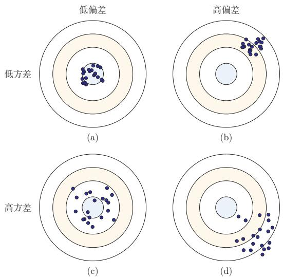  
图2.8 机器学习模型的四种偏差和方差组合情况

  
图2.9 机器学习模型的期望错误、偏差和方差随复杂度的变化情况

集成模型可以降低方差的原理参见第11.1节.

## 2.5 机器学习算法的类型

机器学习算法可以按照不同的标准进行分类.比如，按照模型形式的不同，可以分为线性模型和非线性模型；按照学习准则的不同，也可以分为判别式方法和生成式方法.更常见的一种分类方式，是依据训练样本中提供的信息以及学习过程中的反馈形式来区分不同范式.

监督学习 如果机器学习的目标是建模样本特征x和标签y之间的关系： $y =$ $f ( \pmb { x } ; \theta )$ 或 $p ( \boldsymbol { y } | \boldsymbol { x } ; \boldsymbol { \theta } )$ ，并且训练集中每个样本都带有标签，那么这类学习称为监督学习（Supervised Learning，SL）.根据标签类型的不同，监督学习又可以分为回归问题、分类问题和结构化学习问题

（1）回归（Regression）问题中的标签y是连续值，模型输出也是连续值

（2）分类（Classification）问题中的标签y是离散类别.分类问题根据类别数量又可分为二分类（Binary Classification）和多分类（Multi-class Classi-fication）问题.

（3）结构化学习（Structured Learning）问题的输出通常是序列、树或图等结构化对象.由于输出空间通常很大，一般定义联合特征 $\phi ( { \pmb x } , { \pmb y } )$ ,并通过

一种基于感知器的结构化学习参见第3.4.4节.

$$
\hat { \pmb { y } } = \underset { \pmb { y } \in \mathsf { G e n } ( \pmb { x } ) } { \arg \operatorname* { m a x } } f \bigg ( \phi ( \pmb { x } , \pmb { y } ) ; \theta \bigg )\tag{2.79}
$$

来预测输出，其中Gen(x)表示输入x的所有候选输出集合.计算argmax的过程也称为解码（Decoding).

无监督学习 无监督学习（Unsupervised Learning，UL）是指从不包含目标标签的训练样本中自动学习有价值的信息.典型任务包括聚类、密度估计、降维以及表示学习等．与监督学习相比，无监督学习更强调发现数据内部结构，而不是直接预测给定标签.

强化学习强化学习（Reinforcement Learning，RL）是一类通过交互来学习的机器学习方法．在强化学习中，智能体根据环境状态采取动作，并从环境中获得即时或延时的奖励；学习目标是通过不断试错，找到能够最大化期望总回报的策略.

半监督学习在很多实际问题中，标注数据较少而无标注数据很多.此时可以采用半监督学习（Semi-Supervised Learning），即同时利用少量标注样本和大量无标注样本进行学习.半监督学习位于监督学习与无监督学习之间，核心目标是在降低标注成本的同时提升模型性能.

自监督学习自监督学习（Self-Supervised Learning，SSL）通过数据自身构造监督信号，而不依赖人工标注．例如，在自然语言处理中，可以通过“预测被遮蔽的词元”或“预测下一个词元”来学习文本表示；在视觉任务中，也可以通过图像重建、对比学习等方式学习通用表示．自监督学习已成为大规模预训练(Pre-Training）的重要范式.

迁移学习迁移学习（TransferLearning）强调将一个任务或领域中学习到的知识迁移到另一个相关任务中．现代机器学习中常见的“预训练一微调”流程就属于迁移学习：先在大规模数据上学习通用表示，再在具体下游任务上做适配.很多实际系统都会同时结合监督学习、自监督学习和迁移学习

## 2.6 数据的特征表示

在实际应用中，数据的类型多种多样，比如文本、音频、图像、视频以及传感器信号等.不同类型的数据，其原始空间也不相同．比如一张灰度图像（像素数量为D)的原始空间可以表示为[0,255]D；一个长度为L的自然语言句子，其离散符号空间可以表示为 $\mathcal { V } ^ { L }$ ，其中ν为词表集合.很多机器学习算法要求输入是可计算的数值表示，因此在学习之前通常需要把这些不同类型的数据转换为向量、矩阵或张量形式.

也有一些机器学习算法（比如决策树)不一定要求固定维数的向量形式.

图像特征 在手写体数字识别任务中，样本x为待识别的图像.最直接的做法是将大小为 $M \times N$ 的图像展开为MN维向量，每一维对应一个像素值.为了提升模型效果，也可以人工加入直方图、宽高比、纹理、边缘以及局部描述子等特征.假设最终抽取了D个特征，则一个图像样本可以表示为特征向量 $\pmb { x } \in \mathbb { R } ^ { D }$

文本特征 在文本情感分类任务中，样本x为自然语言文本，类别 $y \in \{ + 1 , - 1 \}$ 分别表示正面或负面的评价.为了将文本x转换为向量形式，一种最简单的方法是使用词袋（Bag-of-Words,BoW）模型.假设训练集合中的词都来自一个词表ν,大小为|ν|,则每个样本可以表示为一个ν|维向量 $\pmb { x } \in \mathbb { R } ^ { | \mathcal { V } | }$ .向量x中第i维的值表示词表中的第i个词是否在x中出现.

词袋模型在信息检索中也叫作向量空间模型(Vector SpaceModel, VSM).

比如两个文本“我喜欢读书”和“我讨厌读书”中共有“我”“喜欢”“讨厌”“读书”四个词，它们的BoW表示分别为

$$
\begin{array} { r } { \pmb { x } _ { 1 } = [ 1 \mathrm { ~ 1 ~ 0 ~ 1 ] ^ r } , } \\ { \pmb { x } _ { 2 } = [ 1 \mathrm { ~ 0 ~ 1 ~ 1 ] ^ r } . } \end{array}
$$

单独一个单词的BoW表示为 one-hot 向量.

词袋模型把文本看作词的集合，不考虑词序信息，难以精确表达句法和语义.一种改进方式是使用N元特征（N-Gram Feature），即每N个连续词构成一个基本单元，然后再用词袋模型进行表示.以最简单的二元特征为例，上面的两个文本中共有“\$我”“我喜欢”“我讨厌”“喜欢读书”“讨厌读书”“读书#”六个特征单元，它们的二元特征BoW表示分别为

\$和#分别表示文本的开始和结束.

$$
\begin{array} { r } { \pmb { x } _ { 1 } = [ 1 \mathrm { ~ 1 ~ 0 ~ 1 ~ 0 ~ 1 ~ } ] ^ { \mathsf { T } } , } \\ { \pmb { x } _ { 2 } = [ 1 \mathrm { ~ 0 ~ 1 ~ 0 ~ 1 ~ } 1 ] ^ { \mathsf { T } } . } \end{array}
$$

参见习题2-4.

随着N的增长，N元特征的数量会快速上升，其上限可达到 $| \mathcal { V } | ^ { N }$ .因此，传统文本表示往往具有高维、稀疏和难以表达相似性的特点.

表示学习如果直接使用原始特征来进行预测，对机器学习模型的能力要求通常较高.原始特征可能存在以下不足：1）表达能力有限，需要复杂的非线性组合才能发挥作用；2）特征之间冗余较高；3）并非所有特征都与目标预测相关；4）特征容易受噪声和表面变化影响.为了提高模型能力，我们希望自动学习出更有效、更稳定的表示，这就是表示学习（Representation Learning).

表示学习可以看作一个特殊的机器学习任务，即有自己的模型、学习准则和优化方法.

## 2.6.1 传统的特征学习

传统的特征学习一般通过人工设计准则来选择或构造特征，具体又可以分为特征选择（Feature Selection）和特征抽取（Feature Extraction）两类.

## 2.6.1.1 特征选择

特征选择是在原始特征集合中选取一个有效子集，使得基于该子集训练出的模型性能较好.简单地说，特征选择就是保留有用特征，移除冗余或无关特征.

子集搜索一种直接的特征选择方法为子集搜索（Subset Search）．假设原始特征数为 $D$ ，则共有 $2 ^ { D }$ 个候选子集.直接穷举所有候选子集往往代价过高，因此实际中经常采用贪心策略：由空集合开始逐步加入最优特征，称为前向搜索（Forward Search）；或者由全体特征开始逐步删除最无用的特征，称为反向搜索(Backward Search).

子集搜索方法又可以分为过滤式方法和包裹式方法.（1）过滤式方法（FilterMethod）不依赖具体机器学习模型，而是根据特征与标签的相关性或信息量进行筛选.[Hall，1999]（2）包裹式方法（WrapperMethod）则直接使用后续模型的性能作为评价标准，在特征选择的过程中把模型训练“包裹”在内部.

$\ell _ { 1 }$ 正则化 此外，我们还可以通过 $\ell _ { 1 }$ 正则化来实现特征选择.由于 $\ell _ { 1 }$ 正则化倾向于得到稀疏解，因此可以间接实现特征筛选

$\ell _ { 1 }$ 正则化参见第7.7.1节.

## 2.6.1.2 特征抽取

特征抽取是构造一个新的特征空间，并将原始特征投影到新的空间中得到新的表示.以线性投影为例，令 $\pmb { x } \in \mathbb { R } ^ { D }$ 为原始特征向量， $\pmb { x } ^ { \prime } \in \mathbb { R } ^ { K }$ 为新空间中的特征向量，则有

$$
\mathbf { { x } ^ { \prime } } = \mathbf { { W } } \mathbf { { x } } ,\tag{2.80}
$$

其中 $W \in \mathbb { R } ^ { K \times D }$ 为映射矩阵.

特征抽取又可以分为监督和无监督两类.监督式特征学习希望抽取对某个特定预测任务最有用的特征，比如线性判别分析（Linear Discriminant Analy-sis，LDA）；无监督式特征学习则更强调去除冗余、压缩信息和发现潜在结构，比如主成分分析（Principal Component Analysis，PCA）和自编码器（Auto-Encoder,AE).

表2.1列出了一些传统的特征选择和特征抽取方法.

主成分分析参见第10.1.1节. 自编码器参见第10.1.3节.

表2.1 传统的特征选择和特征抽取方法
<table><tr><td></td><td>监督学习</td><td>无监督学习</td></tr><tr><td>特征选择</td><td>标签相关的子集搜索、  $\ell _ { 1 }$  正则化、决策树</td><td>标签无关的子集搜索</td></tr><tr><td>特征抽取</td><td>线性判别分析</td><td>主成分分析、独立成分分 析、流形学习、自编码器</td></tr></table>

特征选择和特征抽取的优点是可以用较少的特征保留原始特征中的主要相关信息，去掉部分噪声,并提高计算效率、缓解维度灾难（Curse of Dimensional-ity).因此，它们也经常被统称为维数约减或降维（DimensionalityReduction） 正则化参见第7.7节.

## 2.6.2 分布式表示

传统特征工程往往依赖人工设计规则，难以充分表达复杂语义.现代机器学习更常使用分布式表示（DistributedRepresentation），即用一个低维、稠密、可学习的向量来表示对象.与one-hot或BoW这类高维稀疏表示相比，分布式表示能够更自然地表达“相似对象在表示空间中更接近”这一性质.

深度学习方法传统特征抽取一般与预测模型的学习分离：先通过主成分分析或线性判别分析等方法抽取特征，再基于这些特征训练具体模型.深度学习则倾向于将表示学习和预测学习统一到同一个端到端模型中，使得中间表示能够直接服务于最终任务.

这种端到端学习方法称为深度学习（DeepLearning，DL）.在深度模型中，越靠近输入层的表示往往更偏向局部和通用信息，越靠近输出层的表示通常越任务相关.

进一步地，现代大规模机器学习系统常采用预训练（Pre-Training）在海量数据上通过自监督目标学习通用表示，再在具体下游任务上进行微调.这种“预训练一微调”的流程，本质上将表示学习与迁移学习结合起来，进一步提升表示能力，已成为许多任务的基础范式

表2.2给出了机器学习中特征表示方法的演化

<table><tr><td rowspan=1 colspan=1>阶段</td><td rowspan=1 colspan=1>代表方法</td><td rowspan=1 colspan=1>核心特点</td><td rowspan=1 colspan=1>典型局限或优势</td></tr><tr><td rowspan=1 colspan=1>人工设计特征</td><td rowspan=1 colspan=1>BoW,     N-Gram, SIFT,HOG</td><td rowspan=1 colspan=1>依赖人工经验构造特征表示</td><td rowspan=1 colspan=1>高维、稀疏，依赖领域知识，迁移能力较弱</td></tr><tr><td rowspan=1 colspan=1>浅层可学习表示</td><td rowspan=1 colspan=1>PCA,词向量</td><td rowspan=1 colspan=1>从数据中学习低维稠密表示</td><td rowspan=1 colspan=1>比手工特征更紧凑，能表达部分相似性，但表示能力有限</td></tr><tr><td rowspan=1 colspan=1>深度学习</td><td rowspan=1 colspan=1>CNN, RNN,Transformer</td><td rowspan=1 colspan=1>通过多层网络端到端学习任务相关表示</td><td rowspan=1 colspan=1>表示能力强，可自动提取高层特征，但通常依赖较多数据与计算资源</td></tr><tr><td rowspan=1 colspan=1>预训练表示</td><td rowspan=1 colspan=1>预训练+微调</td><td rowspan=1 colspan=1>先学习通用表示，再迁移到下游任务</td><td rowspan=1 colspan=1>具有较强迁移能力，已成为现代机器学习尤其是大模型的重要范式</td></tr></table>

表2.2 机器学习中特征表示方法的演化

## 2.7 理论和定理

在机器学习中，有一些非常有名的理论或定理，对理解机器学习的内在特性非常有帮助.

## 2.7.1 PAC学习理论

当使用机器学习方法来解决某个特定问题时，通常靠经验或者多次试验来选择合适的模型、训练样本数量以及学习算法收敛的速度等.但是经验判断或多次试验往往成本比较高，也不太可靠，因此希望有一套理论能够分析问题难度、计算模型能力，为学习算法提供理论保证，并指导机器学习模型和学习算法的设计. 这就是计算学习理论. 计算学习理论（Computational Learning The-ory）是机器学习的理论基础，其中最基础的理论就是可能近似正确（ProbablyApproximately Correct,PAC)学习理论.

机器学习中一个很关键的问题是期望错误和经验错误之间的差异，称为泛化错误（Generalization Error）.泛化错误可以衡量一个机器学习模型 f是否可以很好地泛化到未知数据.

泛化错误在有些文献中也指期望错误，指在未知样本上的错误.

$$
\mathcal { G } _ { \mathcal { D } } ( \boldsymbol { f } ) = \mathcal { R } ( \boldsymbol { f } ) - \mathcal { R } _ { \mathcal { D } } ^ { e m p } ( \boldsymbol { f } ) .\tag{2.81}
$$

根据大数定律，当训练集大小D趋向于无穷大时，泛化错误趋向于0，即经

验风险趋近于期望风险

$$
\operatorname* { l i m } _ { | \mathcal { D } |  \infty } \mathcal { R } ( f ) - \mathcal { R } _ { \mathcal { D } } ^ { e m p } ( f ) = 0 .\tag{2.82}
$$

由于我们不知道真实的数据分布 $p ( { \pmb x } , { \pmb y } )$ ，也不知道真实的目标函数 $g ( { \pmb x } )$ 因此期望从有限的训练样本上学习到一个期望错误为0的函数f(x)并不现实.因此，需要降低对学习算法能力的期望，只要求学习算法可以以一定的概率学习到一个近似正确的假设，即PAC学习（PACLearning）.一个PAC可学习(PAC-Learnable)的算法是指该学习算法能够在多项式时间内从合理数量的训练数据中学习到一个近似正确的 f(x).

## PAC学习可以分为两部分：

(1）近似正确（Approximately Correct）：一个假设 $f \in \mathcal F$ 是“近似正确”的，是指其在泛化错误 $\mathcal { G } _ { \mathcal { D } } ( f )$ 小于一个界限∈. ∈一般为0到 $\frac { 1 } { 2 }$ 之间的数，$\begin{array} { r } { 0 < \epsilon < \frac { 1 } { 2 } } \end{array}$ .如果 $\mathcal { G _ { D } } ( f )$ 比较大，说明模型不能用来做正确的“预测”.

(2）可能（Probably)：一个学习算法A有“可能”以1—δ的概率学习到这样一个“近似正确”的假设.δ一般为0到 $\frac { 1 } { 2 }$ 之间的数， $\begin{array} { r } { 0 < \delta < \frac { 1 } { 2 } } \end{array}$

PAC学习可以用下面公式描述：

$$
\begin{array} { r } { P \bigg ( ( \mathcal { R } ( f ) - \mathcal { R } _ { \mathcal { D } } ^ { e m p } ( f ) ) \leq \epsilon \bigg ) \geq 1 - \delta , } \end{array}\tag{2.83}
$$

其中 $\epsilon , \delta$ 是和样本数量N以及假设空间F相关的变量.如果固定∈、δ，可以反过来计算出需要的样本数量

$$
N ( \epsilon , \delta ) \geq \frac { 1 } { 2 \epsilon ^ { 2 } } ( \log | \mathcal { F } | + \log \frac { 2 } { \delta } ) ,\tag{2.84}
$$

其中 $| \mathcal F |$ 为假设空间的大小.从上面公式可以看出，模型越复杂，即假设空间 $\mathcal { F }$ 越大，模型的泛化能力越差．要达到相同的泛化能力，越复杂的模型需要的样本数量越多.为了提高模型的泛化能力，通常需要正则化（Regularization）来限制模型复杂度.

正则化参见第7.7节.

PAC学习理论也可以帮助分析一个机器学习方法在什么条件下可以学习到一个近似正确的分类器.从公式(2.84)可以看出，如果希望模型的假设空间越大，泛化错误越小，其需要的样本数量越多.

## 2.7.2 没有免费午餐定理

没有免费午餐定理（No Free Lunch Theorem,NFL)是1997年由 Wolpert和Macready在最优化理论中提出的.没有免费午餐定理证明：对于基于迭代的最优化算法，不存在某种算法对所有问题（有限的搜索空间内）都有效．如果一

个算法对某些问题有效，那么它一定在另外一些问题上比纯随机搜索算法更差也就是说，不能脱离具体问题来谈论算法的优劣，任何算法都有局限性，需要“具体问题具体分析”.

没有免费午餐定理对于机器学习算法也同样适用，不存在一种机器学习算法适合于任何领域或任务．如果有人宣称自己的模型在所有问题上都好于其他模型，那么这与没有免费午餐定理的结论相悖.

## 2.7.3 奥卡姆剃刀原理

奥卡姆剃刀（Occam's Razor）原理是由14世纪逻辑学家William of Oc-cam提出的一个解决问题的法则：“如无必要，勿增实体”.奥卡姆剃刀的思想和机器学习中的正则化思想十分类似：简单的模型泛化能力更好.如果有两个性能相近的模型，我们应该选择更简单的模型.因此，在机器学习的学习准则上，我们经常会引入参数正则化来限制模型能力，避免过拟合.

奥卡姆剃刀的一种形式化是最小描述长度（Minimum DescriptionLength，MDL）原则，即对一个数据集D，最好的模型 $\textit { f } \in \textit { F }$ 会使得数据集的压缩效果最好，即编码长度最小.

最小描述长度也可以通过贝叶斯学习的观点来解释[MacKay，2003]. 模型f在数据集D上的对数后验概率为

$$
\operatorname* { m a x } _ { f } \log p ( f | \mathcal D ) = \operatorname* { m a x } _ { f } \log p ( \mathcal D | f ) + \log p ( f )\tag{2.85}
$$

$$
= \operatorname* { m i n } _ { f } - \log p ( \mathcal { D } | f ) - \log p ( f ) ,\tag{2.86}
$$

其中 $\dot { \mathbf { \omega } } - \log p ( f )$ 和 $- \log p ( \mathcal { D } | f )$ 可以分别看作模型f的编码长度和在该模型下数据集D的编码长度.也就是说，我们不但要使得模型f可以编码数据集D，也要使得模型f尽可能简单.

## 2.7.4 丑小鸭定理

丑小鸭定理（UglyDucklingTheorem）是1969年由渡边慧提出的[Watanabe，1969].“丑小鸭与白天鹅之间的区别和两只白天鹅之间的区别一样大”.这个定理初看好像不符合常识，但是仔细思考后是非常有道理的.因为世界上不存在相似性的客观标准，一切相似性的标准都是主观的.如果从体型大小或外貌的角度来看，丑小鸭和白天鹅的区别大于两只白天鹅的区别；但是如果从基因的角度来看，丑小鸭与它父母的差别要小于它父母和其他白天鹅之间的差别.

这里的“丑小鸭”是指白天鹅的幼雏，而不是“丑陋的小鸭子”.渡边慧(1910\~1993)，美籍日本学者，理论物理学家，也是模式识别的最早研究者之一.

## 2.7.5 归纳偏置

在机器学习中，很多学习算法经常会对学习的问题做一些假设，这些假设就称为归纳偏置（InductiveBias）.比如在最近邻分类器中，我们会假设在特征空间中，一个小的局部区域中的大部分样本同属一类.在朴素贝叶斯分类器中，我们会假设每个特征的条件概率是互相独立的.

深度学习中各种网络结构也隐含着不同的归纳偏置.例如，卷积神经网络假设数据具有局部性和平移不变性（第5章），循环神经网络假设数据具有序列依赖性（第6章），Transformer假设序列中任意位置之间都可能存在依赖关系(第8章），图神经网络假设节点的表示应当受邻居影响（第9章).选择合适的归纳偏置是模型设计的重要环节.

归纳偏置在贝叶斯学习中也经常称为先验(Prior).

## 2.8 总结和扩展阅读

本章介绍了机器学习的基本概念、三个基本要素以及一个简单但重要的例子线性回归.机器学习虽然方法繁多，但大多数方法都可以放在“模型一学习准则一优化算法”这一统一框架下理解：模型决定表达能力，学习准则定义优化目标，优化算法负责求解参数

从训练流程上看，一个完整的机器学习系统不仅包括训练集上的参数学习，还包括验证集上的模型选择和测试集上的最终评估.机器学习的核心不是简单记忆训练样本，而是获得对未见数据的泛化能力．因此，经验风险最小化、正则化、提前停止、交叉验证以及偏差一方差权衡等概念，都是围绕“如何提升泛化能力”展开的.对于需要依据模型输出采取行动的系统，评价还应关注预测概率是否校准、不确定性是否能够被识别，以及当数据分布发生变化时模型是否仍然可靠.

从方法演进上看，机器学习也经历了从传统特征工程到表示学习、再到深度学习与预训练表示的持续发展.早期方法更依赖人工设计特征；深度学习强调从数据中自动学习层次化表示；许多任务进一步采用“自监督预训练+下游适配”的范式.这些变化并没有改变机器学习的基本问题，但显著改变了获取有效表示和构建系统的方式.

如果需要快速全面地了解机器学习的基本概念和体系，可以阅读《PatternClassification》[Duda et al., 2001]、《Machine Learning: a Probabilistic Per-spective》[Murphy,2012]、《机器学习》[周志华,2016]和《统计学习方法》[李航，2019]. Murphy 于 2022年出版了新版《Probabilistic Machine Learning:

An Introduction》，内容更加全面，反映了深度学习时代较新的进展，推荐作为本章内容的深入参考.此外，Bishop和Bishop于2024年出版的《Deep Learn-ing: Foundations and Concepts》也是一本优秀的现代教材. 想进一步了解统计学习,可以阅读《Pattern Recognition and Machine Learning》[Bishop, 2007]和《The Elements of Statistical Learning: Data Mining, Inference, and Pre-diction》[Hastie et al.,2009];关于统计学习理论的知识,可以参考《StatisticalLearning Theory》[Vapnik,1998]. 此外，表示学习方面可以参考综述[Bengioet al., 2013].

## 习题

## 基础题

习题2-1 请说明训练集、验证集和测试集各自的作用.为什么测试集不应参与模型选择和超参数调节?

习题2-2 某二分类模型在训练集上的准确率为99%，在验证集上的准确率为72%.请分析其可能原因，并给出至少三种改进方法.

习题2-3 分析为什么平方损失函数不适用于分类问题

习题2-4分别用一元、二元和三元特征的词袋模型表示文本“我帮了张三”和“张三帮了我”，并分析不同模型的优缺点.

习题2-5 试分析什么因素会导致模型出现图2.8所示的高偏差和高方差情况

习题2-6 对于一个三分类问题，数据集的真实标签和模型的预测标签如下：

<table><tr><td>真实标签</td><td></td><td>1 1 2</td><td></td><td>2</td><td>2</td><td>2 3</td><td>3 3</td><td>3 3</td><td>3</td></tr><tr><td>预测标签</td><td></td><td>1 2</td><td></td><td></td><td>3 3</td><td></td><td>3 1 2</td><td></td><td></td></tr></table>

分别计算模型的精确率、召回率、F1值以及它们的宏平均和微平均

## 提高题

习题2-7在一个正负样本比例为1：99的二分类任务中，一个模型将所有样本都预测为负类.1）计算该模型的准确率；2）说明为什么该模型并不好；3）应结合哪些评价指标进行分析？

习题2-8 证明在线性回归中，如果样本数量N小于特征数量D+1,则XX的秩最大为N.

习题2-9 在线性回归中，如果我们给每个样本 $( \mathbf { \boldsymbol { x } } ^ { ( n ) } , \boldsymbol { y } ^ { ( n ) } )$ 赋予一个权重 $r ^ { ( n ) }$ ,经验风险函数为

$$
\mathcal { R } ( \pmb { w } ) = \frac { 1 } { 2 } \sum _ { n = 1 } ^ { N } r ^ { ( n ) } \Big ( \pmb { y } ^ { ( n ) } - \pmb { w } ^ { \top } \pmb { x } ^ { ( n ) } \Big ) ^ { 2 } ,\tag{2.87}
$$

计算其最优参数 $\ b { w } ^ { * }$ ,并分析权重 $r ^ { ( n ) }$ 的作用.

习题2-10 比较one-hot表示、词袋模型、N元特征和稠密向量表示的优缺点，并说明它们各自更适合什么场景.

习题 2-11 验证公式(2.69).

## 拓展题

习题2-12 为什么经典机器学习通常假设训练集和测试集独立同分布?如果这一假设不成立，会给模型训练和评估带来哪些影响？

习题2-13 在线性回归中，验证岭回归的解为结构风险最小化准则下的最小二乘法估计，见公式(2.52).

习题2-14 在线性回归中，若假设标签 $y \sim \mathcal { N } ( \pmb { w } ^ { \top } \pmb { x } , \beta )$ ,并用最大似然估计来优化参数，验证最优参数为公式(2.60)的解.

习题2-15 假设有N个样本 $x ^ { ( 1 ) } , x ^ { ( 2 ) } , \cdots , x ^ { ( N ) }$ 服从正态分布 ${ \mathcal { N } } ( \mu , \sigma ^ { 2 } )$ ，其中 $\mu$ 未知.1）使用最大似然估计求解最优参数 $\mu ^ { M L } ; 2 )$ 若参数 $\mu$ 为随机变量，并服从正态分布 $\mathcal { N } ( \mu _ { 0 } , \sigma _ { 0 } ^ { 2 } )$ ，使用最大后验估计求解最优参数 $\mu ^ { M A P }$

习题2-16 在习题2-15中，证明当 $N  \infty$ 时，最大后验估计趋向于最大似然估计.

习题 2-17 验证公式(2.74).

## 参考文献

李航，2019. 统计学习方法[M]. 2版. 北京：清华大学出版社.

周志华，2016. 机器学习[M]. 北京：清华大学出版社.

BENGIO Y, COURVILLE A, VINCENT P, 2013. Representation learning: a review and new perspectives[J]. IEEE transactions on pattern analysis and machine intelligence, 35(8): 1798- 1828.

BISHOP C M, 2007. Information science and statistics: pattern recognition and machine learning[M]. 5th ed. Springer.

BLUM A, HOPCROFT J, KANNAN R, 2016. Foundations of data science[J]. Vorabversion eines Lehrbuchs.

BOTTOU L, 2010. Large-scale machine learning with stochastic gradient descent[M]// Proceedings of COMPSTAT. Springer: 177-186.

DUDA R O, HART P E, STORK D G, 2001. Pattern classification[M]. 2nd ed. Wiley.

HALL M A, 1999. Correlation-based feature selection for machine learning[D]. University of Waikato Hamilton.

HASTIE T, TIBSHIRANI R, FRIEDMAN J H, 2009. Springer series in statistics: the elements of statistical learning: data mining, inference, and prediction[M]. 2nd ed. Springer.

HOERL A E, KENNARD R W, 1970. Ridge regression: biased estimation for nonorthogonal problems[J]. Technometrics, 12(1): 55-67.

LECUN Y, CORTES C, BURGES C J, 1998. MNIST handwritten digit database[EB/OL]. http://yann.lecun.com/exdb/mnist.

MACKAY D J C, 2003. Information theory, inference, and learning algorithms[M]. Cambridge University Press.

MITCHELL T M, 1997. McGraw hill series in computer science: machine learning[M]. McGraw-Hill.

MURPHY K P, 2012. Adaptive computation and machine learning series: machine learning - a probabilistic perspective[M]. MIT Press.

NEMIROVSKI A, JUDITSKY A, LAN G, et al., 2009. Robust stochastic approximation approach to stochastic programming[J]. SIAM Journal on optimization, 19(4): 1574-1609.

VAPNIK V, 1998. Statistical learning theory[M]. New York: Wiley.

WATANABE S, 1969. Knowing and guessing: a quantitative study of inference and information [M]. Wiley.

YANG Y, 1999. An evaluation of statistical approaches to text categorization[J]. Information retrieval, 1(1-2): 69-90.

## 第3章 线性模型

正确的判断来自于经验，而经验来自于错误的判断.——弗雷德里克·布鲁克斯(Frederick P. Brooks)1999年图灵奖获得者

线性模型（LinearModel）是机器学习中最基础、最常用的模型之一，指通过样本特征的线性组合来进行预测的模型.给定一个D维样本$\pmb { x } = [ x _ { 1 } , \cdots , x _ { D } ] ^ { \intercal }$ ，其线性组合函数为

$$
f ( \pmb { x } ; \pmb { w } ) = w _ { 1 } x _ { 1 } + w _ { 2 } x _ { 2 } + \cdots + w _ { D } x _ { D } + b\tag{3.1}
$$

$$
= { \pmb w } ^ { \top } { \pmb x } + b ,\tag{3.2}
$$

为简单起见，这里我们用 $f ( \pmb { x } ; \pmb { w } )$ 来表示$f ( \pmb { x } ; \pmb { w } , b )$

其中 $\pmb { w } = [ w _ { 1 } , \cdots , w _ { D } ] ^ { \intercal }$ 为D维的权重向量，b为偏置.上一章中介绍的线性回归就是典型的线性模型，直接用 $f ( \pmb { x } ; \pmb { w } )$ 来预测输出目标 $y = f ( \pmb { x } ; \pmb { w } )$

在分类问题中，由于输出目标 $y$ 是一些离散的标签，而 $f ( { \pmb x } ; { \pmb w } )$ 的值域为实数，因此无法直接用 $f ( \pmb { x } ; \pmb { w } )$ 来进行预测，需要引入一个非线性的决策函数(Decision Function) $g ( \cdot )$ 来预测输出目标

$$
y = g ( f ( { \pmb x } ; { \pmb w } ) ) ,\tag{3.3}
$$

其中 $f ( \pmb { x } ; \pmb { w } )$ 也称为判别函数(Discriminant Function).

对于二分类问题， $g ( \cdot )$ 可以是符号函数（Sign Function）,定义为

$$
g \big ( f ( \pmb { x } ; \pmb { w } ) \big ) = \mathrm { s g n } \big ( f ( \pmb { x } ; \pmb { w } ) \big )\tag{3.4}
$$

$$
\triangleq \left\{ \begin{array} { l l } { + 1 } & { \mathrm { i f } f ( x ; w ) > 0 , } \\ { 0 } & { \mathrm { i f } f ( x ; w ) = 0 , } \\ { - 1 } & { \mathrm { i f } f ( x ; w ) < 0 . } \end{array} \right.\tag{3.5}
$$

当 $f ( { \pmb x } ; { \pmb w } ) = 0$ 时，模型输出0，表示位于决策边界上，暂不做正负类判断.公式(3.5)定义了一个典型的二分类问题的决策函数，其结构如图3.1所示.

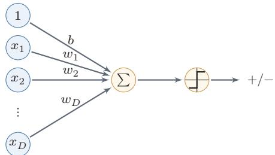  
图 3.1 二分类的线性模型

在后续训练算法中，通常把 $y f ( \pmb { x } ; \pmb { w } ) \le 0$ 都视为错误或不确定的情形，需要进一步更新参数.

在本章，我们主要介绍四种不同线性分类模型：Logistic回归、Softmax回归、感知器和支持向量机.这些模型的判别函数都建立在线性函数 $f ( { \pmb x } ; { \pmb w } )$ 之上，这些模型的核心差别主要体现在损失函数和相应的学习准则上.

线性模型也是理解神经网络的起点.一个人工神经元本质上先计算线性加权和 ${ \pmb w } ^ { \top } { \pmb x } + b$ ，再经过非线性激活函数；而多分类神经网络的最后一层通常正是Softmax回归.换句话说，后续章节中的深层网络可以看作先学习一个新的表示$\pmb { h } ( \pmb { x } )$ ，再在这个表示空间中使用线性分类器.线性模型的决策边界、损失函数和梯度更新，都会在神经网络中反复出现.

## 3.1 线性判别函数和决策边界

从公式(3.3)可知，一个线性分类模型或线性分类器（Linear Classifier），是由一个（或多个）线性的判别函数 $f ( \pmb { x } ; \pmb { w } ) = \pmb { w } ^ { \top } \pmb { x } + b$ 和非线性的决策函数 $g ( \cdot )$ 组成.我们首先考虑二分类的情况，然后再扩展到多分类的情况.

## 3.1.1 二分类

二分类（BinaryClassification）问题的类别标签y只有两种取值，通常可以设为 $\{ + 1 , - 1 \}$ 或{0,1}. 在二分类问题中，常用正例（Positive Sample）和负例（Negative Sample)来分别表示属于类别+1和—1的样本.

在二分类问题中，我们只需要一个线性判别函数 $f ( \pmb { x } ; \pmb { w } ) = \pmb { w } ^ { \top } \pmb { x } + b$ 特征空间 $\mathbb { R } ^ { D }$ 中所有满足 $f ( { \pmb x } ; { \pmb w } ) = 0$ 的点组成一个分割超平面（Hyperplane），称为决策边界（Decision Boundary)或决策平面（Decision Surface).决策边界将特征空间一分为二，每个区域对应一个类别.

所谓“线性分类模型”就是指其决策边界是线性超平面.该超平面与权重向量w正交.特征空间中每个样本点到决策边界的有向距离（Signed Distance）

超平面就是三维空间中的平面在更高维空间的推广.D维空间中的超平面是D-1维的.在二维空间中，决策边界是一条直线；在三维空间中，决策边界是一个平面；在更高维空间中，决策边界是一个超平面.

为

$$
\gamma = \frac { f ( \pmb { x } ; \pmb { w } ) } { \| \pmb { w } \| } .\tag{3.6}
$$

参见习题3-2.

γ也可以看作点x在w方向上的投影.

图3.2给出了一个二分类问题的线性决策边界示例，其中样本特征向量 ${ \textbf { \em x } } =$ $[ x _ { 1 } , x _ { 2 } ]$ ,权重向量 $\pmb { w } = [ w _ { 1 } , w _ { 2 } ]$

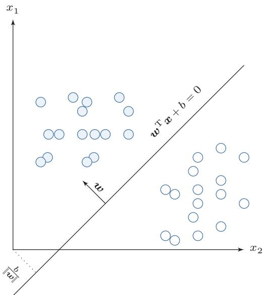  
图 3.2 二分类的决策边界示例

给定N个样本的训练集 $\mathcal { D } = \{ ( { \pmb x } ^ { ( n ) } , y ^ { ( n ) } ) \} _ { n = 1 } ^ { N }$ ，其中 $y ^ { ( n ) } \in \{ + 1 , - 1 \}$ ，线性模型试图学习到参数 $\ b { w } ^ { * }$ ，使得对于每个样本 $( \mathbf { \boldsymbol { x } } ^ { ( n ) } , \boldsymbol { y } ^ { ( n ) } )$ 尽量满足

$$
\begin{array} { r l } { f ( \pmb { x } ^ { ( n ) } ; \pmb { w } ^ { * } ) > 0 \quad } & { \mathrm { i f } \quad y ^ { ( n ) } = 1 , } \\ { f ( \pmb { x } ^ { ( n ) } ; \pmb { w } ^ { * } ) < 0 \quad } & { \mathrm { i f } \quad y ^ { ( n ) } = - 1 . } \end{array}\tag{3.7}
$$

上面两个公式也可以合并，即参数 $\boldsymbol { w } ^ { * }$ 尽量满足

$$
y ^ { ( n ) } f ( { \pmb x } ^ { ( n ) } ; { \pmb w } ^ { \ast } ) > 0 , \qquad \forall n \in [ 1 , N ] .\tag{3.8}
$$

定义3.1-两类线性可分：对于训练集 $\mathcal { D } = \left\{ ( { \boldsymbol { x } } ^ { ( n ) } , y ^ { ( n ) } ) \right\} _ { n = 1 } ^ { N }$ ，如果存在权重向量 $\ b { w } ^ { * }$ ，使得对所有样本都满足

$$
y ^ { ( n ) } f ( { \pmb x } ^ { ( n ) } ; { \pmb w } ^ { \ast } ) > 0 , \qquad \forall n \in \{ 1 , \cdots , N \} ,\tag{3.9}
$$

那么训练集D是线性可分的.

为了学习参数 $\textbf { \em w }$ ，我们需要定义合适的损失函数以及优化方法.对于二分类问题，最直接的损失函数为0-1损失函数，即

$$
\mathcal { L } _ { 0 1 } \big ( y , f ( \pmb { x } ; \pmb { w } ) \big ) = I \big ( y f ( \pmb { x } ; \pmb { w } ) < 0 \big ) ,\tag{3.10}
$$

其中 $I ( \cdot )$ 为指示函数.但0-1损失函数是不连续且非凸的：它关于参数ω几乎处处梯度为0，而在分类边界处又不可导，因此很难直接用基于梯度的方法来优化w.

## 数学小知识|替代损失函数

0-1损失是阶跃型函数：错分类时为常数1，正确时为0，其梯度几乎处处为0，无法为参数更新提供有效信号.实际中常使用连续、凸的替代损失（SurrogateLoss）来近似0-1损失，如Hinge损失、交叉熵损失Logistic损失等.替代损失函数通常是0-1损失的连续上界，使得最小化替代损失的模型在0-1损失上也有较好的表现.

## 3.1.2 多分类

多分类(Multi-class Classification)问题是指分类的类别数C大于2.多分类一般需要多个线性判别函数，但设计这些判别函数有很多种方式.

假设一个多分类问题的类别为 $\{ 1 , 2 , \cdots , C \}$ ，常用的方式有以下三种：

（1）“一对其余”方式：把多分类问题转换为C个“一对其余”的二分类问题.这种方式共需要C个判别函数，其中第c个判别函数 $f _ { c }$ 是将类别c的样本和不属于类别c的样本分开.

（2）“一对一”方式：把多分类问题转换为 $C ( C - 1 ) / 2$ 个“一对一”的二分类问题.这种方式共需要 $C ( C - 1 ) / 2$ 个判别函数，其中第(i,j)个判别函数是把类别i和类别 $j$ 的样本分开.

$$
1 \leq i < j \leq C
$$

（3）“argmax”方式：这是一种改进的“一对其余”方式，共需要C个判别函数

$$
f _ { c } ( \pmb { x } ; \pmb { w } _ { c } ) = \pmb { w } _ { c } ^ { \top } \pmb { x } + b _ { c } , \qquad c \in \{ 1 , \cdots , C \}\tag{3.11}
$$

对于样本x，如果存在一个类别c，相对于所有的其他类别 $\tilde { c } ( \tilde { c } \mathrm { ~ \scriptsize ~ \neq ~ \ c \ ) ~ }$ 有$f _ { c } ( { \pmb x } ; { \pmb w } _ { c } ) > f _ { \tilde { c } } ( { \pmb x } ; { \pmb w } _ { \tilde { c } } )$ ,那么x属于类别c.“argmax”方式的预测函数定义为

$$
y = \underset { c = 1 } { \arg \operatorname* { m a x } } f _ { c } ( \pmb { x } ; \pmb { w } _ { c } ) .\tag{3.12}
$$

前两种方式本质上都是把多分类问题分解为多个二分类问题，而“argmax”方式则直接给出一个统一的多类线性模型.后续的Softmax回归主要采用的就是这种统一建模方式

“一对其余”方式和“一对一”方式都存在一个缺陷：特征空间中可能出现一些难以确定类别的区域，而“argmax”方式可以避免这一问题.图3.3给出了用这三种方式进行多分类的示例，其中红色直线表示判别函数f(·)=0的直线，不同颜色的区域表示预测的三个类别的区域 $( \omega _ { 1 } , \omega _ { 2 }$ 和 $\omega _ { 3 } ~ )$ 和难以确定类别的区域（?’).在“argmax”方式中，相邻两类i和 $j$ 的决策边界实际上是由$f _ { i } ( { \pmb x } ; { \pmb w } _ { i } ) - f _ { j } ( { \pmb x } ; { \pmb w } _ { j } ) = 0$ 决定，其法向量为 ${ \pmb w } _ { i } - { \pmb w } _ { j }$

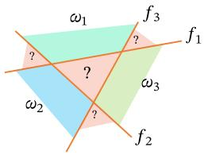  
(a)“一对其余”方式

  
(b)“一对一”方式

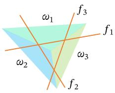  
(c) “argmax”方式  
图3.3 多分类问题的三种方式

定义3.2-多类线性可分：对于训练集 $\mathcal { D } = \left\{ ( { \pmb x } ^ { ( n ) } , y ^ { ( n ) } ) \right\} _ { n = 1 } ^ { N }$ ，如果存在C个权重向量 $\pmb { w } _ { 1 } ^ { * } , \cdots , \pmb { w } _ { C } ^ { * }$ ，使得对任意样本 $( \mathbf { \boldsymbol { x } } ^ { ( n ) } , \boldsymbol { y } ^ { ( n ) } )$ ，当 $y ^ { ( n ) } = c$ 时，都有

$$
f _ { c } ( \pmb { x } ^ { ( n ) } ; \pmb { w } _ { c } ^ { * } ) > f _ { \widetilde { c } } ( \pmb { x } ^ { ( n ) } ; \pmb { w } _ { \widetilde { c } } ^ { * } ) , \qquad \forall \widetilde { c } \neq c ,\tag{3.13}
$$

那么训练集D是线性可分的.

从上面定义可知，如果数据集是多类线性可分的，那么一定存在一个“argmax”方式的线性分类器可以将它们正确分开.

参见习题3-5.

## 3.2 Logistic 回归

Logistic回归（Logistic Regression,LR）是一种常用的处理二分类问题的线性模型.与前面的符号函数只能输出类别不同，Logistic回归进一步把线性打分映射为条件概率.在本节中，我们采用 $y \in \{ 0 , 1 \}$ 以符合Logistic回归的描述习惯.

为了解决连续的线性函数不适合进行分类的问题，我们引入非线性函数 $g$ .一 $\mathbb { R } \to ( 0 , 1 )$ 来预测类别标签的条件概率 $p ( y = 1 | x )$

$$
p ( \boldsymbol { y } = 1 | \boldsymbol { x } ) = g ( f ( \boldsymbol { x } ; \boldsymbol { w } ) ) ,\tag{3.14}
$$

其中 $g ( \cdot )$ 通常称为激活函数（ActivationFunction），其作用是把线性函数的值域从实数区间“挤压”到了(0,1)之间，可以用来表示概率.在统计文献中， $g ( \cdot )$ 的逆函数 $g ^ { - 1 } ( \cdot )$ 也称为联系函数(Link Function).

在Logistic回归中，我们使用Logistic函数来作为激活函数.虽然输出概率经过了非线性映射，但模型的决策边界仍由线性方程 ${ \pmb w } ^ { \top } { \pmb x } = 0$ 决定，因此它依然属于线性分类模型.样本x的标签 $y = 1$ 的条件概率为

$$
p ( y = 1 | \pmb { x } ) = \sigma ( \pmb { w } ^ { \top } \pmb { x } ) \triangleq \frac { 1 } { 1 + \exp ( - \pmb { w } ^ { \top } \pmb { x } ) } ,\tag{3.15}
$$

为简单起见，这里 $\pmb { x } = [ x _ { 1 } , \cdots , x _ { D }$ 1] 和 $\pmb { w } = [ w _ { 1 } , \cdots , w _ { D } , b ] ^ { \intercal }$ 分别为 $D + 1$ 维的增广特征向量和增广权重向量.

将公式(3.15)进行变换后得到

$$
\pmb { w } ^ { \mathsf { T } } \pmb { x } = \log \frac { p ( y = 1 | \pmb { x } ) } { 1 - p ( y = 1 | \pmb { x } ) }\tag{3.16}
$$

$$
= \log { \frac { p ( y = 1 | x ) } { p ( y = 0 | x ) } } ,\tag{3.17}
$$

其中 $\frac { p ( y = 1 | \pmb { x } ) } { p ( y = 0 | \pmb { x } ) }$ 为样本x属于正例和负例的条件概率比值，称为几率（Odds），几率的对数称为对数几率（Log Odds，或Logit). 公式(3.16) 中等号的左边是线性函数，这样Logistic回归可以看作预测值为“标签的对数几率”的线性回归模型.因此，Logistic回归也称为对数几率回归（Logit Regression），简称对率回归.

图3.4给出了使用线性回归和Logistic回归来解决一维数据的二分类问题的示例.

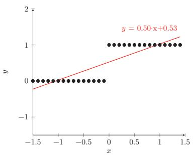  
(a) 线性回归

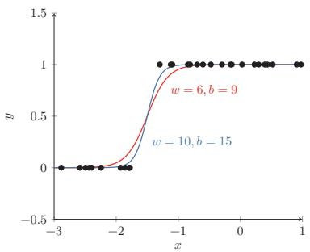  
(b) Logistic 回归  
图3.4 一维数据的二分类问题示例

## 3.2.1 参数学习

Logistic回归采用交叉熵作为损失函数，并使用梯度下降法来对参数进行优化.

给定N个训练样本 $\{ ( \pmb { x } ^ { ( n ) } , y ^ { ( n ) } ) \} _ { n = 1 } ^ { N }$ ，用Logistic回归模型对每个样本 $\mathbf { \boldsymbol { x } } ^ { ( n ) }$ 进行预测，输出其标签为1的条件概率，记为 $\hat { y } ^ { ( n ) }$

$$
\hat { y } ^ { ( n ) } = \sigma ( \pmb { w } ^ { \top } \pmb { x } ^ { ( n ) } ) , \qquad 1 \leq n \leq N .\tag{3.18}
$$

如果把所有增广样本写成样本矩阵，则记为

$$
\begin{array} { r } { \pmb { X } = [ \pmb { x } ^ { ( 1 ) } , \cdots , \pmb { x } ^ { ( N ) } ] \in \mathbb { R } ^ { ( D + 1 ) \times N } , } \end{array}\tag{3.19}
$$

并将所有标签和预测组成列向量

$$
\begin{array} { r } { \pmb { y } = [ \pmb { y } ^ { ( 1 ) } , \cdots , \pmb { y } ^ { ( N ) } ] ^ { \top } , \qquad \hat { \pmb { y } } = [ \hat { y } ^ { ( 1 ) } , \cdots , \hat { y } ^ { ( N ) } ] ^ { \top } = \sigma ( \pmb { X } ^ { \top } \pmb { w } ) \in \mathbb { R } ^ { N } , } \end{array}\tag{3.20}
$$

其中 $\sigma ( \cdot )$ 逐元素作用.

由于 $y ^ { ( n ) } \in \{ 0 , 1 \}$ ,样本 $( \mathbf { \boldsymbol { x } } ^ { ( n ) } , \boldsymbol { y } ^ { ( n ) } )$ 的真实条件概率可以表示为

该写法与本书“每一列为一个样本”的约定保持一致.

$$
p _ { r } ( y ^ { ( n ) } = 1 | x ^ { ( n ) } ) = y ^ { ( n ) } ,\tag{3.21}
$$

$$
p _ { r } ( y ^ { ( n ) } = 0 | x ^ { ( n ) } ) = 1 - y ^ { ( n ) } .\tag{3.22}
$$

使用交叉熵损失函数，其风险函数为

为简单起见，这里忽略了正则化项.

$$
\mathcal { R } ( \pmb { w } ) = - \frac { 1 } { N } \sum _ { n = 1 } ^ { N } \bigg ( p _ { r } ( y ^ { ( n ) } = 1 | \pmb { x } ^ { ( n ) } ) \log \hat { y } ^ { ( n ) } + p _ { r } ( y ^ { ( n ) } = 0 | \pmb { x } ^ { ( n ) } ) \log ( 1 - \hat { y } ^ { ( n ) } ) \bigg )\tag{3.23}
$$

$$
= - \frac { 1 } { N } \sum _ { n = 1 } ^ { N } \bigg ( y ^ { ( n ) } \log \hat { y } ^ { ( n ) } + ( 1 - y ^ { ( n ) } ) \log ( 1 - \hat { y } ^ { ( n ) } ) \bigg ) .\tag{3.24}
$$

等价地，上式可以写成矩阵形式

$$
\mathcal { R } ( \pmb { w } ) = - \frac { 1 } { N } \left( \pmb { y } ^ { \top } \log \hat { \pmb { y } } + ( \pmb { 1 } _ { N } - \pmb { y } ) ^ { \top } \log ( \pmb { 1 } _ { N } - \hat { \pmb { y } } ) \right) ,\tag{3.25}
$$

其中 $\log ( \cdot )$ 逐元素作用.

利用Logistic函数的导数性质 $\sigma ^ { \prime } ( z ) = \sigma ( z ) ( 1 - \sigma ( z ) )$ ，对风险函数关于 $\textbf { \em w }$ 应用链式法则，可得

风险函数 $\mathcal { R } ( \boldsymbol { w } )$ 关于参数w的偏导数为

$$
\frac { \partial \mathcal { R } ( w ) } { \partial w } = - \frac { 1 } { N } \sum _ { n = 1 } ^ { N } \left( y ^ { ( n ) } \frac { \hat { y } ^ { ( n ) } ( 1 - \hat { y } ^ { ( n ) } ) } { \hat { y } ^ { ( n ) } } \pmb { x } ^ { ( n ) } - ( 1 - y ^ { ( n ) } ) \frac { \hat { y } ^ { ( n ) } ( 1 - \hat { y } ^ { ( n ) } ) } { 1 - \hat { y } ^ { ( n ) } } \pmb { x } ^ { ( n ) } \right)\tag{3.26}
$$

$$
= - { \frac { 1 } { N } } \sum _ { n = 1 } ^ { N } \left( y ^ { ( n ) } ( 1 - { \hat { y } } ^ { ( n ) } ) x ^ { ( n ) } - ( 1 - y ^ { ( n ) } ) { \hat { y } } ^ { ( n ) } x ^ { ( n ) } \right)
$$

y 为 Logistic 函数，因此有 $\begin{array} { r } { \frac { \partial \hat { y } } { \partial w ^ { \top } x } = } \end{array}$ $\hat { y } ^ { ( n ) } ( 1 - \hat { y } ^ { ( n ) } )$ . 参见第B.4.2.1节.

(3.27)

$$
= - \frac { 1 } { N } \sum _ { n = 1 } ^ { N } \pmb { x } ^ { ( n ) } \big ( \pmb { y } ^ { ( n ) } - \hat { \pmb { y } } ^ { ( n ) } \big ) .\tag{3.28}
$$

其矩阵形式为

$$
\frac { \partial \mathcal { R } ( \pmb w ) } { \partial \pmb w } = - \frac { 1 } { N } X ( \pmb y - \hat { \pmb y } ) .\tag{3.29}
$$

采用梯度下降法，Logistic回归的训练过程为：初始化 $\pmb { w } _ { 0 } \gets 0$ ，然后通过下式来迭代更新参数：

$$
{ \pmb w } _ { t + 1 }  { \pmb w } _ { t } + \alpha \frac { 1 } { N } \sum _ { n = 1 } ^ { N } { \pmb x } ^ { ( n ) } \bigg ( y ^ { ( n ) } - \hat { y } _ { { \pmb w } _ { t } } ^ { ( n ) } \bigg ) ,\tag{3.30}
$$

按照本书的样本矩阵记号，上式也可以写为

$$
\pmb { w } _ { t + 1 }  \pmb { w } _ { t } + \alpha \frac { 1 } { N } \pmb { X } ( \pmb { y } - \hat { \pmb { y } } _ { \pmb { w } _ { t } } ) ,\tag{3.31}
$$

其中 $\alpha$ 是学习率， $\hat { y } _ { w _ { t } } ^ { ( n ) }$ 是当参数为 ${ \mathbf { } } w _ { t }$ 时，Logistic 回归模型的输出.

从公式(3.24)可知，风险函数 $\mathcal { R } ( \boldsymbol { w } )$ 是关于参数w的连续可微的凸函数.因此除了梯度下降法之外，Logistic回归还可以用高阶的优化方法（比如牛顿法）来进行优化.

## 3.3 Softmax 回归

## 数学小知识|Softmax函数

Softmax函数将任意实数向量 $z _ { \mathbf { \Sigma } } \in \mathbb { R } ^ { C }$ 映射为概率分布：$\begin{array} { r } { \operatorname { s o f t m a x } ( z ) _ { c } = \frac { \exp ( z _ { c } ) } { \sum _ { c ^ { \prime } = 1 } ^ { C } \exp ( z _ { c ^ { \prime } } ) } } \end{array}$ ，其中每个输出分量都为正数，且所有分量之和为1，因此可以解释为概率.Softmax通过指数函数放大了输入向量中各分量的差异，使最大值对应的概率最大.当C=2时，Softmax退化为Logistic函数.在实际计算中，为防止指数溢出，通常先减去z的最大值： $\begin{array} { r } { \mathrm { ; s o f t m a x } ( z ) _ { c } = \frac { \exp ( z _ { c } - \operatorname* { m a x } _ { j } z _ { j } ) } { \sum _ { c ^ { \prime } } \exp ( z _ { c ^ { \prime } } - \operatorname* { m a x } _ { j } z _ { j } ) } . } \end{array}$


Softmax回归（Softmax Regression），也称为多项（Multinomial)或多类(Multi-Class)的Logistic回归，是Logistic回归在多分类问题上的推广.

对于多类问题，类别标签 $y \in \{ 1 , 2 , \cdots , C \}$ 可以有C个取值.给定一个样本x,令

Softmax 回 归也可以看作一种条件最大熵模型，参见第14.1.5.1节.

$$
\begin{array} { r } { \hat { \pmb y } = \mathrm { s o f t m a x } ( \pmb { W } ^ { \top } \pmb x ) , } \end{array}\tag{3.32}
$$

其中 $\hat { \pmb y } \in \mathbb R ^ { C }$ 为所有类别的预测条件概率组成的向量.于是，样本x属于类别c的条件概率为

$$
\begin{array} { r l } { p ( y = c | \pmb { x } ) = [ \pmb { \hat { y } } ] _ { c } } & { } \\ { = \frac { \exp ( \pmb { w } _ { c } ^ { \top } \pmb { x } ) } { \sum _ { c ^ { \prime } = 1 } ^ { C } \exp ( \pmb { w } _ { c ^ { \prime } } ^ { \top } \pmb { x } ) } , } \end{array}\tag{3.33}
$$

(3.34)

其中 ${ \pmb w } _ { c }$ 是第c类的权重向量.

Softmax回归的决策函数可以表示为

$$
\hat { y } = \underset { c = 1 } { \arg \operatorname* { m a x } } p ( y = c | \pmb { x } )\tag{3.35}
$$

$$
\mathbf { \Psi } = \underset { c = 1 } { \arg \operatorname* { m a x } } \pmb { w } _ { c } ^ { \top } \pmb { x } .\tag{3.36}
$$

图3.5表示Softmax回归在二维特征空间中的三分类示意图.每个区域 $\omega _ { c }$ 对应类别c的条件概率最大，相邻类别的决策边界由两个类别得分相等决定.

与Logistic 回归的关系 当类别数C = 2时,Softmax回归的决策函数为

$$
\hat { y } = \arg \operatorname* { m a x } _ { y \in \{ 0 , 1 \} } w _ { y } ^ { \top } x\tag{3.37}
$$

$$
{ \mathbf { \Psi } } = I \Big ( \pmb { w } _ { 1 } ^ { \top } \pmb { x } - \pmb { w } _ { 0 } ^ { \top } \pmb { x } > 0 \Big )\tag{3.38}
$$

$$
\begin{array} { r } { { \bf \sigma } = { \cal I } \Big ( ( { \pmb w } _ { 1 } - { \pmb w } _ { 0 } ) ^ { \top } { \pmb x } > 0 \Big ) , } \end{array}\tag{3.39}
$$

其中I(·)是指示函数. 对比公式(3.5) 中的二分类决策函数，可以发现二分类中的权重向量 $\pmb { w } = \pmb { w } _ { 1 } - \pmb { w } _ { 0 }$

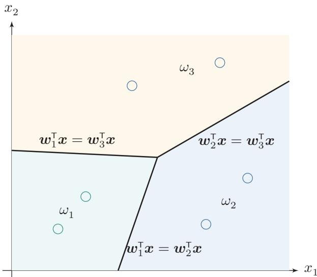  
图 3.5 Softmax回归在二维特征空间中的三分类示意图

向量表示上式用向量形式可以写为

$$
\hat { \pmb { y } } = \operatorname { s o f t m a x } ( \pmb { W } ^ { \top } \pmb { x } )\tag{3.40}
$$

$$
{ \bf \Omega } = \frac { \exp ( W ^ { \top } { \pmb x } ) } { { \bf 1 } _ { C } ^ { \top } \exp \left( W ^ { \top } { \pmb x } \right) } ,\tag{3.41}
$$

其中 $\pmb { W } = [ \pmb { w } _ { 1 } , \cdots , \pmb { w } _ { C } ]$ 是由C个类的权重向量组成的矩阵， ${ \bf 1 } _ { C }$ 为 $C$ 维的全1向量， $\hat { \pmb y } \in \mathbb R ^ { C }$ 为所有类别的预测条件概率组成的向量，第c维的值是第c类的预测条件概率.

## 3.3.1 参数学习

给定N个训练样本 $\{ ( \pmb { x } ^ { ( n ) } , y ^ { ( n ) } ) \} _ { n = 1 } ^ { N }$ ,Softmax回归使用交叉熵损失函数来学习最优的参数矩阵W.

为了方便起见，我们用C维的one-hot向量 ${ \pmb y } \in \{ 0 , 1 \} ^ { C }$ 来表示类别标签.对于类别c,其向量表示为

$$
\pmb { y } = [ I ( 1 = c ) , I ( 2 = c ) , \cdots , I ( C = c ) ] ^ { \top } ,\tag{3.42}
$$

其中I(·)是指示函数.

如果把所有样本和标签分别写成矩阵，则本书统一记为

$$
\ b { X } = [ \ b { x } ^ { ( 1 ) } , \cdots , \ b { x } ^ { ( N ) } ] \in \mathbb { R } ^ { D \times N } , \qquad \ b { Y } = [ \ b { y } ^ { ( 1 ) } , \cdots , \ b { y } ^ { ( N ) } ] \in \{ 0 , 1 \} ^ { C \times N } ,\tag{3.43}
$$

即每一列对应一个样本及其one-hot标签.相应地，所有样本的预测概率可以写为

$$
\begin{array} { r } { \hat { Y } = \mathrm { s o f t m a x } ( { \cal W } ^ { \top } { \cal X } ) \in \mathbb { R } ^ { C \times N } , } \end{array}\tag{3.44}
$$

其中 softmax(·)按列作用.

采用交叉熵损失函数，Softmax回归模型的风险函数为

为简单起见，这里忽略了正则化项.

$$
\mathcal { R } ( W ) = - \frac { 1 } { N } \sum _ { n = 1 } ^ { N } \sum _ { c = 1 } ^ { C } { \pmb { y } } _ { c } ^ { ( n ) } \log \hat { { \pmb { y } } } _ { c } ^ { ( n ) }\tag{3.45}
$$

$$
= - \frac { 1 } { N } \sum _ { n = 1 } ^ { N } ( \pmb { y } ^ { ( n ) } ) ^ { \top } \log \hat { \pmb { y } } ^ { ( n ) } ,\tag{3.46}
$$

其中 $\hat { \pmb y } ^ { ( n ) } = \mathrm { s o f t m a x } ( \pmb { W } ^ { \top } \pmb { x } ^ { ( n ) } )$ 为样本 $\pmb { x } ^ { ( n ) }$ 属于不同类别的条件概率．等价地，风险函数也可以写成矩阵形式

$$
\mathcal { R } ( W ) = - \frac { 1 } { N } \mathrm { t r } \left( Y ^ { \intercal } \log \hat { Y } \right) ,\tag{3.47}
$$

其中 $\log ( \cdot )$ 逐元素作用.

风险函数 ${ \mathcal { R } } ( W )$ 关于W的梯度为

$$
\frac { \partial \mathcal { R } ( \pmb { W } ) } { \partial \pmb { W } } = - \frac { 1 } { N } \sum _ { n = 1 } ^ { N } \pmb { x } ^ { ( n ) } \left( \pmb { y } ^ { ( n ) } - \hat { \pmb { y } } ^ { ( n ) } \right) ^ { \top } .\tag{3.48}
$$

按照本书的样本矩阵记号，上式等价于

$$
\frac { \partial \mathcal { R } ( W ) } { \partial W } = - \frac { 1 } { N } X \left( Y - \hat { Y } \right) ^ { \intercal } .\tag{3.49}
$$

证明．计算公式(3.48)中的梯度，关键在于计算每个样本的损失函数

$$
\mathscr { L } ^ { ( n ) } ( W ) = - ( \pmb { y } ^ { ( n ) } ) ^ { \intercal } \log \hat { \pmb { y } } ^ { ( n ) }
$$

关于参数W的梯度，其中需要用到的两个导数公式为

（1）若 $\pmb { y } = \mathrm { s o f t m a x } ( z )$ ,则 $\begin{array} { r } { \frac { \partial \pmb { y } } { \partial \pmb { z } } = \mathrm { d i a g } \left( \pmb { y } \right) - \pmb { y } \pmb { y } ^ { \top } . } \end{array}$

（2）若 $\begin{array} { r } { \boldsymbol { z } = \boldsymbol { W } ^ { \intercal } \boldsymbol { x } = [ \boldsymbol { w } _ { 1 } ^ { \intercal } \boldsymbol { x } , \boldsymbol { w } _ { 2 } ^ { \intercal } \boldsymbol { x } , \cdots , \boldsymbol { w } _ { C } ^ { \intercal } \boldsymbol { x } ] ^ { \intercal } } \end{array}$ ,则 $\frac { \partial z } { \partial w _ { c } }$ 为第c列为 $_ { \textbf { \em x } }$ ,其余为0的矩阵.

Softmax函数的导数 参见第B.4.2.2节.

$$
\frac { \partial z } { \partial w _ { c } } = [ \frac { \partial w _ { 1 } ^ { \top } \pmb { x } } { \partial w _ { c } } , \frac { \partial w _ { 2 } ^ { \top } \pmb { x } } { \partial w _ { c } } , \cdots , \frac { \partial w _ { C } ^ { \top } \pmb { x } } { \partial w _ { c } } ]\tag{3.50}
$$

$$
\mathbf { \Phi } = [ \mathbf { 0 } , \mathbf { 0 } , \cdots , \mathbf { x } , \cdots , \mathbf { 0 } ]\tag{3.51}
$$

$$
{ \triangleq } \mathbb { M } _ { c } ( { \pmb x } ) .\tag{3.52}
$$

https://nndl.ai/

根据链式法则， $\mathscr { L } ^ { ( n ) } ( W ) = - ( \pmb { y } ^ { ( n ) } ) ^ { \intercal } \log \hat { \pmb { y } } ^ { ( n ) }$ 关于 ${ \pmb w } _ { c }$ 的偏导数为

$$
\frac { \partial \mathcal { L } ^ { ( n ) } ( W ) } { \partial { w _ { c } } } = - \frac { \partial \left( ( { \pmb y } ^ { ( n ) } ) ^ { \top } \log \hat { \pmb y } ^ { ( n ) } \right) } { \partial { w _ { c } } }\tag{3.53}
$$

$$
= - \frac { \partial z ^ { ( n ) } } { \partial w _ { c } } \frac { \partial \hat { \pmb { y } } ^ { ( n ) } } { \partial z ^ { ( n ) } } \frac { \partial \log \hat { \pmb { y } } ^ { ( n ) } } { \partial \hat { \pmb { y } } ^ { ( n ) } } \pmb { y } ^ { ( n ) }\tag{3.54}
$$

$$
= - \mathbb { M } _ { c } ( { \pmb x } ^ { ( n ) } ) \left( \mathrm { d i a g } \left( \hat { \pmb y } ^ { ( n ) } \right) - \hat { \pmb y } ^ { ( n ) } ( \hat { \pmb y } ^ { ( n ) } ) ^ { \top } \right) \left( \mathrm { d i a g } ( \hat { \pmb y } ^ { ( n ) } ) \right) ^ { - 1 } { \pmb y } ^ { ( n ) }\tag{3.55}
$$

$$
\mathbf { \Sigma } = - \mathbb { M } _ { c } ( \pmb { x } ^ { ( n ) } ) \left( \pmb { I } - \hat { \pmb { y } } ^ { ( n ) } \mathbf { 1 } _ { C } ^ { \top } \right) \pmb { y } ^ { ( n ) }\tag{3.56}
$$

$$
= - \mathbb { M } _ { c } ( { \pmb x } ^ { ( n ) } ) \left( { \pmb y } ^ { ( n ) } - \hat { \pmb y } ^ { ( n ) } { \mathbf 1 } _ { C } ^ { \top } { \pmb y } ^ { ( n ) } \right)\tag{3.57}
$$

$$
= - \mathbb { M } _ { c } ( { \pmb x } ^ { ( n ) } ) \left( { \pmb y } ^ { ( n ) } - { \hat { \pmb y } } ^ { ( n ) } \right)
$$

y为 one-hot 向量，所以 $\mathbf { 1 } _ { C } ^ { \intercal } \mathbf { y } = 1$

(3.58)

$$
= - { \pmb x } ^ { ( n ) } \left[ { \pmb y } ^ { ( n ) } - \hat { \pmb y } ^ { ( n ) } \right] _ { c } .\tag{3.59}
$$

公式(3.59)也可以表示为非向量形式，即

$$
\frac { \partial \mathcal { L } ^ { ( n ) } ( W ) } { \partial w _ { c } } = - \pmb { x } ^ { ( n ) } \left( I ( y ^ { ( n ) } = c ) - \hat { \pmb { y } } _ { c } ^ { ( n ) } \right) ,\tag{3.60}
$$

其中 $I ( \cdot )$ 是指示函数.

根据公式(3.59) 可以得到

$$
\frac { \partial \mathcal { L } ^ { ( n ) } ( W ) } { \partial W } = - \pmb { x } ^ { ( n ) } \left( \pmb { y } ^ { ( n ) } - \hat { \pmb { y } } ^ { ( n ) } \right) ^ { \top } .\tag{3.61}
$$

采用梯度下降法，Softmax回归的训练过程为：初始化 $W _ { 0 }  0$ ，然后通过下式进行迭代更新：

$$
W _ { t + 1 }  W _ { t } + \alpha ( \frac { 1 } { N } \sum _ { n = 1 } ^ { N } \pmb { x } ^ { ( n ) } ( \pmb { y } ^ { ( n ) } - \hat { \pmb { y } } _ { W _ { t } } ^ { ( n ) } ) ^ { \top } ) ,\tag{3.62}
$$

按照本书的样本矩阵记号，上式也可以写为

$$
\boldsymbol { W _ { t + 1 } }  \boldsymbol { W _ { t } } + \alpha \frac { 1 } { N } \boldsymbol { X } ( \boldsymbol { Y } - \boldsymbol { \hat { Y } _ { W _ { t } } } ) ^ { \top } ,\tag{3.63}
$$

其中 $\alpha$ 是学习率， $\hat { y } _ { W _ { t } } ^ { ( n ) }$ 是当参数为 $\mathbf { } W _ { t }$ 时，Softmax回归模型的输出.


Softmax回归中使用的C个权重向量存在参数冗余：如果对所有权重向量同时减去同一个向量v，模型输出不会改变.这说明真正决定预测类别的是不同类别之间的打分差，而不是各类别权重向量的绝对位置.因此，Softmax回归通常需要借助正则化来约束参数；这一性质也常被用来改写Softmax的计算形式，以避免数值上溢出.

## 3.4 感知器

感知器（Perceptron）由Frank Rosenblatt 于1957年提出，是一种广泛使用的线性分类器.感知器可谓是最简单的人工神经网络，只有一个神经元.

感知器是对生物神经元的简单数学模拟，有与生物神经元相对应的部件，如权重（突触）、偏置（阈值）及激活函数（细胞体），输出为+1或－1.

Frank Rosenblatt(1928\~1971)，美国心理学家，人工智能领域开拓者.

感知器是一种简单的两类线性分类模型，其分类准则与公式(3.5)相同，即

$$
\hat { y } = \operatorname { s g n } ( \pmb { w } ^ { \intercal } \pmb { x } ) .\tag{3.64}
$$

最早发明的感知器是一台机器而不是一种算法，后来才被实现为IBM 704机器上可运行的程序.

## 3.4.1 参数学习

感知器学习算法也是一个经典的线性分类器的参数学习算法.

给定N个样本的训练集： $\{ ( \pmb { x } ^ { ( n ) } , y ^ { ( n ) } ) \} _ { n = 1 } ^ { N }$ ，其中 $y ^ { ( n ) } \in \{ + 1 , - 1 \}$ ，感知器学习算法试图找到一组参数 $\mathbf { \Delta } w ^ { * }$ ，使得对于每个样本 $( \mathbf { \boldsymbol { x } } ^ { ( n ) } , \boldsymbol { y } ^ { ( n ) } )$ 有

$$
y ^ { ( n ) } { { w ^ { * } } ^ { \top } } { { x } ^ { ( n ) } } > 0 , \qquad \forall n \in \{ 1 , \cdots , N \} .\tag{3.65}
$$

感知器的学习算法是一种典型的错误驱动在线学习算法[Rosenblatt,1958].先初始化一个权重向量 $w \gets 0$ （通常是全零向量），然后每次分错一个样本 $( { \pmb x } , y )$ ,或者样本恰好落在决策边界上时，即 $y w ^ { \top } x \leq 0$ ，就用这个样本来更新权重.

$$
\pmb { w }  \pmb { w } + y \pmb { x } .\tag{3.66}
$$

具体的感知器参数学习策略如算法3.1所示.

感知器的学习策略对应于对以下损失函数进行（次）梯度下降，该损失函数称为

$$
\begin{array} { r } { \mathcal { L } ( \pmb { w } ; \pmb { x } , y ) = \operatorname* { m a x } ( 0 , - y \pmb { w } ^ { \top } \pmb { x } ) . } \end{array}\tag{3.67}
$$

采用随机梯度下降，其每次更新的梯度为

$$
\begin{array} { r } { \frac { \partial \mathcal { L } ( \pmb { w } ; \pmb { x } , \pmb { y } ) } { \partial \pmb { w } } = \left\{ \begin{array} { l l } { 0 \qquad } & { \mathrm { i f } \quad y \pmb { w } ^ { \top } \pmb { x } > 0 , } \\ { - y \pmb { x } \qquad \mathrm { i f } \quad y \pmb { w } ^ { \top } \pmb { x } < 0 . } \end{array} \right. } \end{array}\tag{3.68}
$$

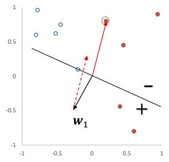

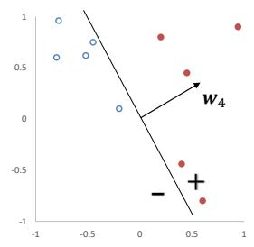


算法 3.1 两类感知器的参数学习算法  
输入：训练集 $\mathcal { D } = \{ ( { \pmb x } ^ { ( n ) } , y ^ { ( n ) } ) \} _ { n = 1 } ^ { N }$ ,最大迭代次数T  
1 初始化： ${ \pmb w } _ { 0 } \gets 0 , k \gets 0 , t \gets 0$ in  
2 repeat  
3 对训练集D中的样本随机排序;  
4 for $n = 1 \cdots N$ do  
5 选取一个样本 $( \mathbf { \boldsymbol { x } } ^ { ( n ) } , \boldsymbol { y } ^ { ( n ) } )$ üi  
6 if ${ \pmb w } _ { k } ^ { \top } ( { \pmb y } ^ { ( n ) } { \pmb x } ^ { ( n ) } ) \le 0$ then  
7 ${ \pmb w } _ { k + 1 }  { \pmb w } _ { k } + y ^ { ( n ) } { \pmb x } ^ { ( n ) } ;$   
8 $k \gets k + 1 ;$   
9 end  
10 t ← t + 1;  
11 if t = T then break; //达到最大迭代次数  
12 end  
13 until $t = T ;$   
输出： ${ \pmb w } _ { k }$

图3.6给出了感知器参数学习的更新过程，其中红色实心点为正例，蓝色空心点为负例.黑色箭头表示当前的权重向量，红色虚线箭头表示权重的更新方向.

  
图3.6 感知器参数学习的更新过程

## 3.4.2 感知器的收敛性

[Novikoff，1963]证明对于两类问题，如果训练集是线性可分的，那么感知器算法可以在有限次迭代后收敛.然而，如果训练集不是线性可分的，那么这个算法则不能确保会收敛

参见定义3.1.

当数据集是两类线性可分时，对于训练集 $\mathcal { D } = \left\{ ( { \pmb x } ^ { ( n ) } , y ^ { ( n ) } ) \right\} _ { n = 1 } ^ { N }$ ,其中 $\mathbf { \boldsymbol { x } } ^ { ( n ) }$ 为样本的增广特征向量， $y ^ { ( n ) } \in \{ - 1 , 1 \}$ ，那么存在一个正的常数 $\gamma ( \gamma > 0 )$ 和权重向量 $\boldsymbol { w } ^ { * }$ ,并且 $\| \pmb { w } ^ { * } \| = 1$ ,对所有n都满足 $( { \pmb w } ^ { * } ) ^ { \top } ( y ^ { ( n ) } { \pmb x } ^ { ( n ) } ) \ge \gamma$ .我们可以证明如下定理.

定理3.1－感知器收敛性：给定训练集 $\mathcal { D } = \left\{ ( { \pmb x } ^ { ( n ) } , y ^ { ( n ) } ) \right\} _ { n = 1 } ^ { N }$ ,令R是训练集中最大的特征向量的模，即

$$
R = \operatorname* { m a x } _ { n } \| \pmb { x } ^ { ( n ) } \| .
$$

如果训练集D线性可分，两类感知器的参数学习算法3.1的权重更新次数不超过 $\textstyle { \frac { R ^ { 2 } } { \gamma ^ { 2 } } }$

证明．感知器的权重向量的更新方式为

$$
\begin{array} { r } { \pmb { w } _ { k } = \pmb { w } _ { k - 1 } + \pmb { y } ^ { ( k ) } \pmb { x } ^ { ( k ) } , } \end{array}\tag{3.69}
$$

其中 $\boldsymbol { x } ^ { ( k ) } , \boldsymbol { y } ^ { ( k ) }$ 表示第k个错误分类的样本.

因为初始权重向量为0,在第K次更新时感知器的权重向量为

$$
{ \pmb w } _ { K } = \sum _ { k = 1 } ^ { K } y ^ { ( k ) } { \pmb x } ^ { ( k ) } .\tag{3.70}
$$

分别计算 $\| \pmb { w } _ { K } \| ^ { 2 }$ 的上下界：

(1)| $\lvert \boldsymbol { w } _ { K } \rvert \rvert ^ { 2 }$ 的上界为

$$
\| \pmb { w } _ { K } \| ^ { 2 } = \| \pmb { w } _ { K - 1 } + \pmb { y } ^ { ( K ) } \pmb { x } ^ { ( K ) } \| ^ { 2 }\tag{3.71}
$$

$$
= \| \pmb { w } _ { K - 1 } \| ^ { 2 } + \| y ^ { ( K ) } \pmb { x } ^ { ( K ) } \| ^ { 2 } + 2 y ^ { ( K ) } \pmb { w } _ { K - 1 } ^ { \top } \pmb { x } ^ { ( K ) }\tag{3.72}
$$

$$
y _ { k } { \pmb w } _ { K - 1 } ^ { \top } { \pmb x } ^ { ( K ) } \le 0 .
$$

$$
\leq \| \pmb { w } _ { K - 1 } \| ^ { 2 } + R ^ { 2 }\tag{3.73}
$$

$$
\leq \| \pmb { w } _ { K - 2 } \| ^ { 2 } + 2 R ^ { 2 }\tag{3.74}
$$

$$
\leq K R ^ { 2 } .\tag{3.75}
$$

(2)| $\lvert \boldsymbol { w } _ { K } \rvert \rvert ^ { 2 }$ 的下界为

$$
\| \pmb { w } _ { K } \| ^ { 2 } = \overset { \textstyle \bigcap } \{ \pmb { w } ^ { * } \} \| ^ { 2 } \cdot \| \pmb { w } _ { K } \| ^ { 2 }
$$

$$
\geq \| \boldsymbol { w } ^ { * ^ { \intercal } } \boldsymbol { w } _ { K } \| ^ { 2 }\tag{3.76}
$$

$$
= \| \boldsymbol { w ^ { * } } ^ { \top } \sum _ { k = 1 } ^ { K } ( \boldsymbol { y } ^ { ( k ) } \boldsymbol { x } ^ { ( k ) } ) \| ^ { 2 }\tag{3.77}
$$

$\| \pmb { w } ^ { * } \| = 1$ .两个向量内积的平方一定小于等于这两个向量的模的乘积.

(3.78)

$$
= \| \sum _ { k = 1 } ^ { K } { \pmb w } ^ { * } ^ { \mathsf { T } } ( y ^ { ( k ) } { \pmb x } ^ { ( k ) } ) \| ^ { 2 }\tag{3.79}
$$

$$
\begin{array} { l } { { { \pmb w } ^ { * } { } ^ { \top } ( y ^ { ( n ) } { \pmb x } ^ { ( n ) } ) } } \\ { { \gamma , \forall n . } } \end{array}
$$

$$
\geq K ^ { 2 } \gamma ^ { 2 } .\tag{3.80}
$$

由公式(3.75)和公式(3.80),得到

$$
K ^ { 2 } \gamma ^ { 2 } \leq \lvert \lvert \pmb { w } _ { K } \rvert \rvert ^ { 2 } \leq K R ^ { 2 } .\tag{3.81}
$$

取最左和最右的两项，进一步得到， $K ^ { 2 } \gamma ^ { 2 } \le K R ^ { 2 }$ 然后两边都除K，最终得到 $\begin{array} { r } { K \le \frac { R ^ { 2 } } { \gamma ^ { 2 } } } \end{array}$ .因此，在线性可分的条件下，算法3.1会在 $\textstyle { \frac { R ^ { 2 } } { \gamma ^ { 2 } } }$ 步内收敛. □

虽然感知器在线性可分的数据上可以保证收敛，但其存在以下不足：

（1）在数据集线性可分时，感知器虽然可以找到一个超平面把两类数据分开，但并不能保证其泛化能力.

（2）感知器对样本顺序比较敏感.每次迭代的顺序不一致时，找到的分割超平面也往往不一致

（3）如果训练集不是线性可分的，就不能保证在有限步内收敛

## 3.4.3 参数平均感知器

根据定理3.1，如果训练数据是线性可分的，那么感知器可以找到一个判别函数来分割不同类的数据．间隔γ越大，收敛越快；但感知器并不能保证找到泛化能力最好的判别函数

感知器学习到的权重向量和训练样本的顺序相关.在迭代次序上排在后面的错误样本比前面的错误样本，对最终的权重向量影响更大.比如有1000个训练样本，在迭代100个样本后，感知器已经学习到一个很好的权重向量，在接下来的899个样本上都预测正确，也没有更新权重向量.但是，在最后第1000个样本时预测错误，并更新了权重.这次更新可能反而使得权重向量变差

为了提高感知器的鲁棒性和泛化能力，我们可以将在感知器学习过程中的所有K个权重向量保存起来，并赋予每个权重向量 ${ \pmb w } _ { k }$ 一个置信系数 $c _ { k } \ : ( 1 \ : \leq$

K为感知器在训练 中权重向量的总更新 次数.

$k \leq K )$ .最终的分类结果通过这K个不同权重的感知器投票决定，这个模型也称为投票感知器(Voted Perceptron) [Freund et al., 1999].

令 $\tau _ { k }$ 为第k次更新权重 ${ \pmb w } _ { k }$ 时的迭代次数（即训练过的样本数量）， $\tau _ { k + 1 }$ 为下次权重更新时的迭代次数，则权重 ${ \pmb w } _ { k }$ 的置信系数 $c _ { k }$ 设置为从 $\tau _ { k }$ 到 $\tau _ { k + 1 }$ 之间间隔的迭代次数，即 $c _ { k } = \tau _ { k + 1 } - \tau _ { k }$ .置信系数ck越大，说明权重 $c _ { k }$ ${ \pmb w } _ { k }$ 在之后的训练过程中正确分类样本的数量越多，越值得信赖.

这样，投票感知器的形式为

$$
\hat { y } = \mathrm { s g n } \Big ( \sum _ { k = 1 } ^ { K } c _ { k } \mathrm { s g n } ( \pmb { w } _ { k } ^ { \top } \pmb { x } ) \Big ) ,
$$

投票感知器是一种集成模型，参见第11.1节.

(3.82)

其中 sgn(·)为符号函数.

投票感知器虽然提高了感知器的泛化能力，但是需要保存K个权重向量在实际操作中会带来额外的开销．因此，人们经常会使用一个简化的版本，通过使用“参数平均”的策略来减少投票感知器的参数数量，也叫作平均感知器(Averaged Perceptron)[Collins, 2002]. 平均感知器的形式为

$$
\hat { y } = \mathrm { s g n } \left( \frac { 1 } { T } \sum _ { k = 1 } ^ { K } c _ { k } ( \pmb { w } _ { k } ^ { \top } \pmb { x } ) \right)\tag{3.83}
$$

$$
= \operatorname { s g n } \Big ( \frac { 1 } { T } ( \sum _ { k = 1 } ^ { K } c _ { k } w _ { k } ) ^ { \top } \pmb { x } \Big )\tag{3.84}
$$

$$
= \operatorname { s g n } { \Big ( } { \big ( } { \frac { 1 } { T } } \sum _ { t = 1 } ^ { T } w _ { t } ) ^ { \intercal } { \boldsymbol { x } } { \Big ) }\tag{3.85}
$$

$$
{ \bf \Psi } = \mathrm { s g n } ( \bar { \bf w } ^ { \mathrm { \scriptscriptstyle T } } { \bf x } ) ,\tag{3.86}
$$

其中 $T$ 为训练过程中处理样本的总步数，w为这T步对应的平均权重向量.最直接的实现方式是在算法3.1中增加一个 $\bar { \mathbf { \Gamma } } _ { \bar { \mathbf { \Gamma } } } \bar { \mathbf { \Gamma } } _ { \bar { \mathbf { \Gamma } } }$ ,并在每次迭代时更新它：

$$
\bar { \mathbf { } w } \gets \bar { \mathbf { } w } + \mathbf { \epsilon w } _ { t } .\tag{3.87}
$$

但这种写法需要在处理每一个样本时都更新w.由于 $\bar { \mathbf { \Gamma } } _ { \bar { \mathbf { \Gamma } } } \bar { \mathbf { \Gamma } } _ { \bar { \mathbf { \Gamma } } }$ 和 ${ \mathbf { } } { \mathbf { } } w _ { t }$ 通常都是稠密向量，这一操作开销较大．为提高迭代效率，可以只在发生错误预测时进行等价更新.

算法3.2给出了一个改进的平均感知器算法的训练过程[Daumé III,2012].

参见习题3-9.

算法 3.2 一种改进的平均感知器参数学习算法  
输入：训练集 $\mathcal { D } = \{ ( { \pmb x } ^ { ( n ) } , y ^ { ( n ) } ) \} _ { n = 1 } ^ { N }$ ,最大处理步数T  
1初始化:w ← 0, u ← 0, t← 1;  
2 repeat  
3 对训练集D中的样本随机排序;  
4 for n = 1 ·. N do  
5 选取一个样本(x(n), y(n));  
6 计算预测类别 $\hat { y } ^ { ( n ) } = \mathrm { s g n } ( \boldsymbol { w } ^ { \top } \boldsymbol { x } ^ { ( n ) } )$   
7 if y(n) ≠ y(n) then  
8 w ← w + y(n)x(n);  
9 u ← u + t y(n)x(n);  
10 end  
11 t ← t + 1;  
12 if t > T then break; //达到最大处理步数  
13 end  
14 until t > T;  
15 w = w − −u ;  
输出：w

## 3.4.4 扩展到多分类

原始的感知器是一种二分类模型，但也可以很容易地扩展到多分类问题，甚至是更一般的结构化学习问题

之前介绍的分类模型中，分类函数都是在输入x的特征空间上.为了使得感知器可以处理更复杂的输出，我们引入一个构建在输入输出联合空间上的特征函数 $\phi ( { \pmb x } , { \pmb y } )$ ,将样本对 $( { \pmb x } , { \pmb y } )$ 映射到一个特征向量空间

在联合特征空间中，我们可以建立一个广义的感知器模型，

$$
\begin{array} { r } { \hat { \pmb { y } } = \underset { \pmb { y } \in \mathtt { G e n } ( \pmb { x } ) } { \arg \operatorname* { m a x } } \pmb { w } ^ { \top } \phi ( \pmb { x } , \pmb { y } ) , } \end{array}\tag{3.88}
$$

通过引入特征函数φ(x,y)，感知器不但可以用于多分类问题，也可以用于结构化学习问题，比如输出是序列形式.

其中w为权重向量，Gen(x)表示输入x所有的输出目标集合

广义感知器模型一般用来处理结构化学习问题.当用广义感知器模型来处理C分类问题时， ${ \pmb y } \in \{ 0 , 1 \} ^ { C }$ 为类别的one-hot向量表示.在C分类问题中，一种常用的特征函数 $\phi ( { \pmb x } , { \pmb y } )$ 是x和y的外积，即

外积的定义参见公式(A.29).

$$
\begin{array} { r } { \phi ( \pmb { x } , \pmb { y } ) = \mathrm { v e c } ( \pmb { x } \pmb { y } ^ { \top } ) \in \mathbb { R } ^ { D C } , } \end{array}\tag{3.89}
$$

其中 $\mathrm { v e c } ( \cdot )$ 是向量化算子，φ(x,y)为DC维的向量.

给定样本 $( { \pmb x } , { \pmb y } )$ ,若 $\pmb { x } \in \mathbb { R } ^ { D }$ ,y为第c维为1的one-hot向量，则

…   
0   
x1 ←第(c−1)×D+1行   
φ(x, y) = … (3.90)   
xD ←第(c−1)×D+D行   
0   
…

广义感知器算法的训练过程如算法3.3所示.

算法 3.3 广义感知器参数学习算法  
输入：训练集： $\{ ( \pmb { x } ^ { ( n ) } , \pmb { y } ^ { ( n ) } ) \} _ { n = 1 } ^ { N }$ ，最大迭代次数T  
1 初始化:w0 ← 0, k ← 0, t ← 0 ；  
2 repeat  
3 对训练集D中的样本随机排序;  
4 for n = 1 ·. N do  
5 选取一个样本 (x(n), y(n));  
6 用公式(3.88) 计算预测类别 $\hat { \pmb y } ^ { ( n ) }$   
7 if y(n) ≠ y(n) then  
8 ${ \pmb w } _ { k + 1 }  { \pmb w } _ { k } + ( \phi ( { \pmb x } ^ { ( n ) } , { \pmb y } ^ { ( n ) } ) - \phi ( { \pmb x } ^ { ( n ) } , \hat { \pmb y } ^ { ( n ) } ) )$   
9 k = k + 1 ;  
10 end  
11 t = t + 1 ;  
12 if t = T then break; // 达到最大迭代次数  
13 end  
14 until t = T;  
输出： ${ \pmb w } _ { k }$

## 3.4.4.1 广义感知器的收敛性

广义感知器在满足广义线性可分条件时，也能够保证在有限步骤内收敛.广义线性可分条件的定义如下：

定义3.3-广义线性可分：对于训练集 $\mathcal { D } = \left\{ ( { \pmb x } ^ { ( n ) } , { \pmb y } ^ { ( n ) } ) \right\} _ { n = 1 } ^ { N }$ ,如果存在一个正的常数 $\gamma ( \gamma > 0 )$ 和权重向量 $\boldsymbol { w } ^ { * }$ ，并且 $\| \pmb { w } ^ { * } \| = 1$ ，对所有n都满足$\langle { \pmb w } ^ { * } , \phi ( { \pmb x } ^ { ( n ) } , { \pmb y } ^ { ( n ) } ) \rangle - \langle { \pmb w } ^ { * } , \phi ( { \pmb x } ^ { ( n ) } , { \pmb y } ) \rangle \geq \gamma , { \pmb y } \neq { \pmb y } ^ { ( n ) } ( \phi ( { \pmb x } ^ { ( n ) } , { \pmb y } ^ { ( n ) } )$ 为样本$\mathbf { \boldsymbol { x } } ^ { ( n ) } , \mathbf { \boldsymbol { y } } ^ { ( n ) }$ 的联合特征向量），那么训练集 $\mathcal { D }$ 在联合特征向量空间中是线性可分的.

广义线性可分是多类线性可分的扩展，参见定义3.2.

广义感知器的收敛性定义如下：

定理3.2-广义感知器收敛性：如果训练集 $\mathcal { D } = \left\{ ( { \pmb x } ^ { ( n ) } , { \pmb y } ^ { ( n ) } ) \right\} _ { n = 1 } ^ { N }$ 是广义线性可分的，并令R是所有样本中真实标签和错误标签在特征空间 $\phi ( { \pmb x } , { \pmb y } )$ 最远的距离，即

$$
R = \operatorname* { m a x } _ { n } \operatorname* { m a x } _ { z \neq y ^ { ( n ) } } \| \phi ( \pmb { x } ^ { ( n ) } , \pmb { y } ^ { ( n ) } ) - \phi ( \pmb { x } ^ { ( n ) } , z ) \| ,\tag{3.91}
$$

那么广义感知器参数学习算法3.3的权重更新次数不超过 $\textstyle { \frac { R ^ { 2 } } { \gamma ^ { 2 } } }$

原始论文给出了广义感知器在广义线性可分的收敛性证明，具体推导过程和两类感知器比较类似.

参见习题3-11.

## 3.5 支持向量机

支持向量机（Support Vector Machine,SVM）是一个经典的二分类算法.它通过最大化分类间隔来寻找更稳健的分割超平面，因此被广泛应用于多种分类任务.

给定一个二分类数据集 $\mathcal { D } = \{ ( { \pmb x } ^ { ( n ) } , y ^ { ( n ) } ) \} _ { n = 1 } ^ { N }$ ,其中 $y ^ { ( n ) } \in \{ + 1 , - 1 \}$ ,如果两类样本是线性可分的，即存在一个超平面

本节中不使用增广的特征向量和特征权重.

$$
\pmb { w } ^ { \top } \pmb { x } + b = 0\tag{3.92}
$$

将两类样本分开，那么对于每个样本都有 $y ^ { ( n ) } ( { \pmb w } ^ { \top } { \pmb x } ^ { ( n ) } + b ) > 0$

数据集D中每个样本 $\mathbf { \boldsymbol { x } } ^ { ( n ) }$ 到分割超平面的距离为：

$$
\gamma ^ { ( n ) } = \frac { | \pmb { w } ^ { \top } \pmb { x } ^ { ( n ) } + b | } { \| \pmb { w } \| } = \frac { y ^ { ( n ) } ( \pmb { w } ^ { \top } \pmb { x } ^ { ( n ) } + b ) } { \| \pmb { w } \| } .\tag{3.93}
$$

我们定义间隔（Margin）γ为整个数据集 $\mathcal { D }$ 中所有样本到分割超平面的最短距离：

$$
\gamma = \operatorname* { m i n } _ { n } \gamma ^ { ( n ) } .\tag{3.94}
$$

https://nndl.ai/

如果间隔 $\gamma$ 越大，其分割超平面对两个数据集的划分越稳定，不容易受噪声等因素影响.支持向量机的目标是寻找一个超平面 $( w ^ { * } , b ^ { * } )$ 使得 $\gamma$ 最大,即

$$
\begin{array} { r l } { \underset { \pmb { w } , b } { \operatorname* { m a x } } } & { \quad \gamma } \\ { \mathrm { s . t . } } & { \quad \frac { y ^ { ( n ) } ( \pmb { w } ^ { \top } \pmb { x } ^ { ( n ) } + b ) } { \| \pmb { w } \| } \geq \gamma , \forall n \in \{ 1 , \cdots , N \} . } \end{array}\tag{3.95}
$$

由于同时缩放 w → kw 和 b → kb不会改变样本 $\pmb { x } ^ { ( n ) }$ 到分割超平面的距离，我们可以限制 $\| \pmb { w } \| \cdot \gamma = 1$ ,则公式(3.95)等价于

间隔为 $\begin{array} { r } { \gamma = \frac { 1 } { \| \pmb { w } \| } } \end{array}$

$$
\begin{array} { r l } { \underset { \pmb { w } , \boldsymbol { b } } { \operatorname* { m a x } } \quad } & { \frac { 1 } { \| \pmb { w } \| ^ { 2 } } } \\ { \mathrm { s . t . } \quad } & { y ^ { ( n ) } ( \pmb { w } ^ { \top } \pmb { x } ^ { ( n ) } + b ) \geq 1 , \forall n \in \{ 1 , \cdots , N \} . } \end{array}\tag{3.96}
$$

数据集中所有满足 $y ^ { ( n ) } ( { \pmb w } ^ { \top } { \pmb x } ^ { ( n ) } + b ) = 1$ 的样本点，都称为支持向量（Sup-$\mathrm { p o r t ~ V e c t o r ~ } )$

对于一个线性可分的数据集，其分割超平面有很多个，但是间隔最大的超平面是唯一的．图3.7给定了支持向量机的最大间隔分割超平面的示例，其中轮廓线加粗的样本点为支持向量.

  
图 3.7 支持向量机示例

## 3.5.1 参数学习

为了找到最大间隔分割超平面，将公式(3.96)的目标函数写为凸优化问题

$$
\operatorname* { m i n } _ { \boldsymbol { w } , b } \qquad \frac { 1 } { 2 } \| \boldsymbol { w } \| ^ { 2 }\tag{3.97}
$$

https://nndl.ai/

$$
\begin{array} { r } { \mathrm { s . t . } \qquad 1 - y ^ { ( n ) } ( \pmb { w } ^ { \top } \pmb { x } ^ { ( n ) } + b ) \leq 0 , \qquad \forall n \in \{ 1 , \cdots , N \} . } \end{array}
$$

使用拉格朗日乘数法，公式(3.97)的拉格朗日函数为

$$
\Lambda ( \pmb { w } , b , \lambda ) = \frac { 1 } { 2 } \| \pmb { w } \| ^ { 2 } + \sum _ { n = 1 } ^ { N } \lambda _ { n } \Big ( 1 - y ^ { ( n ) } ( \pmb { w } ^ { \top } \pmb { x } ^ { ( n ) } + b ) \Big ) ,
$$

拉格朗日乘数法与KKT条件参见第C.3节.

(3.98)

其中 $\lambda _ { 1 } \ge 0 , \cdots , \lambda _ { N } \ge 0$ 为拉格朗日乘数.计算 $\Lambda ( w , b , \lambda )$ 关于 $\textbf { \em w }$ 和b的导数，并令其等于0，得到

$$
{ \pmb w } = \sum _ { n = 1 } ^ { N } \lambda _ { n } y ^ { ( n ) } { \pmb x } ^ { ( n ) } ,\tag{3.99}
$$

$$
0 = \sum _ { n = 1 } ^ { N } \lambda _ { n } y ^ { ( n ) } .\tag{3.100}
$$

将公式(3.99)代入公式(3.98),并利用公式(3.100),得到拉格朗日对偶函数

$$
\Gamma ( \lambda ) = - \frac { 1 } { 2 } \sum _ { n = 1 } ^ { N } \sum _ { m = 1 } ^ { N } \lambda _ { m } \lambda _ { n } y ^ { ( m ) } y ^ { ( n ) } ( { \pmb x } ^ { ( m ) } ) ^ { \top } { \pmb x } ^ { ( n ) } + \sum _ { n = 1 } ^ { N } \lambda _ { n } .\tag{3.101}
$$

支持向量机的主优化问题为凸优化问题，满足强对偶性，即主优化问题可以通过最大化对偶函数 $\mathrm { m a x } _ { \lambda \ge 0 } \Gamma ( \lambda )$ 来求解.凸优化问题在满足Slater条件（即存在严格可行点）时成立强对偶性.SVM的约束为线性不等式，天然满足此条件，因此主问题的最优值等于对偶问题的最优值.对偶函数 $\Gamma ( \lambda )$ 是一个凹函数，因此最大化对偶函数是一个凸优化问题，可以通过多种凸优化方法来进行求解，得到拉格朗日乘数的最优值λ\*.但由于其约束条件的数量为训练样本数量，一般的优化方法代价比较高，因此在实践中通常采用比较高效的优化方法，比如序列最小优化(Sequential Minimal Optimization,SMO)算法[Platt，1998]等.

根据KKT条件中的互补松弛条件，最优解满足 $\lambda _ { n } ^ { * } \big ( 1 - y ^ { ( n ) } ( w ^ { * ^ { \top } } x ^ { ( n ) }$ 十$b ^ { * } ) ) = 0$ 如果样本 $\pmb { x } ^ { ( n ) }$ 不在约束边界上， ${ \lambda } _ { n } ^ { * } = 0$ ，其约束失效；如果样本 $\mathbf { \boldsymbol { x } } ^ { ( n ) }$ 在约束边界上， $\lambda _ { n } ^ { * } \geq 0 .$ 这些位于约束边界上的样本点称为支持向量（SupportVector），也就是离决策边界最近的点.

参见公式(C.26).

在计算出 $\lambda ^ { * }$ 后，根据公式(3.99)计算出最优权重 $\boldsymbol { w } ^ { * }$ ，最优偏置 $b ^ { * }$ 可以通过任选一个支持向量 $( \tilde { \boldsymbol { x } } , \tilde { \boldsymbol { y } } )$ 计算得到：

$$
b ^ { * } = \tilde { y } - \boldsymbol { w } ^ { * ^ { \intercal } } \tilde { x } .\tag{3.102}
$$

最优参数的支持向量机的决策函数为

$$
f ( \pmb { x } ) = \mathrm { s g n } ( \pmb { w } ^ { * ^ { \top } } \pmb { x } + b ^ { * } )\tag{3.103}
$$

https://nndl.ai/

$$
\mathbf { \Psi } = \operatorname { s g n } \left( \sum _ { n = 1 } ^ { N } \lambda _ { n } ^ { * } y ^ { ( n ) } ( { \pmb x } ^ { ( n ) } ) ^ { \top } { \pmb x } + b ^ { * } \right) .\tag{3.104}
$$

支持向量机的决策函数只依赖于 $\lambda _ { n } ^ { * } > 0$ 的样本点，即支持向量

支持向量机的目标函数是凸优化问题，可以通过SMO等方法求得全局最优解；在中小规模数据或高维稀疏特征场景下，它通常具有较好的泛化性能.此外，支持向量机的决策函数只依赖于支持向量，因此在预测时往往只需要使用一部分训练样本.

## 3.5.2 核函数

支持向量机还有一个重要的优点是可以使用核函数（KernelFunction）隐式地将样本从原始特征空间映射到更高维的空间，并解决原始特征空间中的线性不可分问题.比如在一个变换后的特征空间 $\phi$ 中，支持向量机的决策函数为

$$
f ( \pmb { x } ) = \mathrm { s g n } ( \pmb { w } ^ { * \top } \phi ( \pmb { x } ) + b ^ { * } )\tag{3.105}
$$

$$
= \operatorname { s g n } \left( \sum _ { n = 1 } ^ { N } \lambda _ { n } ^ { * } y ^ { ( n ) } k ( { \pmb x } ^ { ( n ) } , { \pmb x } ) + b ^ { * } \right) ,\tag{3.106}
$$

其中 $k ( { \pmb x } , z ) = \phi ( { \pmb x } ) ^ { \top } \phi ( z )$ 为核函数.核化后的支持向量机在线性意义上对应的是特征空间中的超平面，但在原始输入空间中对应的决策边界通常是非线性的一般不需要显式给出 $\phi ( { \pmb x } )$ 的具体形式，而是通过核技巧（KernelTrick）来构造.比如以 $\boldsymbol { x } , \boldsymbol { z } \in \mathbb { R } ^ { 2 }$ 为例，我们可以构造一个核函数：

$$
k ( \pmb { x } , z ) = ( 1 + \pmb { x } ^ { \top } z ) ^ { 2 } = \phi ( \pmb { x } ) ^ { \top } \phi ( z ) ,\tag{3.107}
$$

参见习题3-13.

来隐式地计算 $x , z$ 在特征空间 $\phi$ 中的内积，其中

$$
\phi ( { \pmb x } ) = [ 1 , \sqrt { 2 } x _ { 1 } , \sqrt { 2 } x _ { 2 } , \sqrt { 2 } x _ { 1 } x _ { 2 } , x _ { 1 } ^ { 2 } , x _ { 2 } ^ { 2 } ] ^ { \top } .\tag{3.108}
$$

对于图3.8中的同心圆型数据，样本在原始空间中线性不可分．我们可以使用与半径平方相关的特征映射，或直接采用高斯核

$$
k ( { \pmb x } , z ) = \exp ( - \gamma | { \pmb x } - z | ^ { 2 } ) ,\tag{3.109}
$$

其中 $\gamma$ 为超参数.高斯核不需要显式写出 $\phi ( { \pmb x } )$ ，但能把这类非线性结构映射到高维空间后线性分开

## 3.5.3 软间隔

在支持向量机的优化问题中，约束条件比较严格.如果训练集中的样本在特征空间中不是线性可分的，就无法找到最优解.为了能够容忍部分不满足约束的

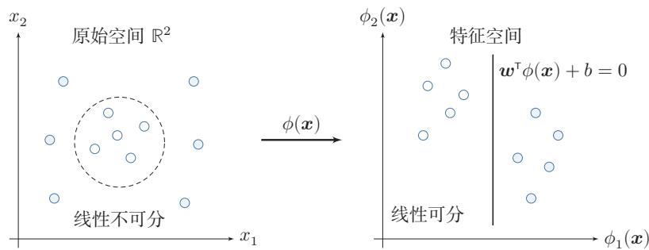  
图3.8 核函数将样本从原始空间映射到高维特征空间示意图

样本，我们可以引入松弛变量（SlackVariable)ξ,将优化问题变为

$$
\begin{array} { l } { \displaystyle \underset { w , b } { \operatorname* { m i n } } \quad } & { \frac { 1 } { 2 } \| w \| ^ { 2 } + C \displaystyle \sum _ { n = 1 } ^ { N } \xi _ { n } } \\ { \mathrm { s . t . } \quad } & { 1 - y ^ { ( n ) } ( w ^ { \top } \pmb { x } ^ { ( n ) } + b ) - \xi _ { n } \leq 0 , \qquad \forall n \in \{ 1 , \cdots , N \} } \\ { \quad } & { \xi _ { n } \geq 0 , \qquad \forall n \in \{ 1 , \cdots , N \} } \end{array}\tag{3.110}
$$

其中参数 $C > 0$ 用来控制间隔和松弛变量惩罚的平衡.引入松弛变量的间隔称为软间隔（Soft Margin）.对于固定的w和b,约束 $\xi _ { n } \geq 1 - y ^ { ( n ) } ( { \pmb w } ^ { \top } { \pmb x } ^ { ( n ) } + b )$ 在最优解处取等号，即 $\xi _ { n } ^ { * } = \operatorname* { m a x } ( 0 , 1 - y ^ { ( n ) } ( { \pmb w } ^ { \top } { \pmb x } ^ { ( n ) } + b ) )$ . 将其代入目标函数，即得到基于Hinge损失的无约束优化形式：公式(3.110)也可以表示为经验风险+正则化项的形式：

$$
\operatorname* { m i n } _ { w , b } \qquad \sum _ { n = 1 } ^ { N } \operatorname* { m a x } \Big ( 0 , 1 - y ^ { ( n ) } ( { \pmb w } ^ { \top } { \pmb x } ^ { ( n ) } + b ) \Big ) + \frac { 1 } { 2 C } \| { \pmb w } \| ^ { 2 } ,\tag{3.111}
$$

其中可以把 $\operatorname* { m a x } \Big ( 0 , 1 - y ^ { ( n ) } ( { \pmb w } ^ { \top } { \pmb x } ^ { ( n ) } + b ) \Big )$ 看作损失函数，称为Hinge损失函数(Hinge Loss Function),把 $\frac { 1 } { 2 C } \| \pmb { w } \| ^ { 2 }$ 看作正则化项， $\textstyle { \frac { 1 } { C } }$ 是正则化系数

参见公式(2.18).

软间隔支持向量机的参数学习和原始支持向量机类似，其最终决策函数也只和支持向量有关，即满足 $1 - y ^ { ( n ) } ( { \pmb w } ^ { \top } { \pmb x } ^ { ( n ) } + b ) - \xi _ { n } = 0$ 的样本.

参见习题3-14.

## 3.6 损失函数对比

本章介绍了三种二分类模型:Logistic回归、感知器和支持向量机.虽然它们的决策函数相同，但由于使用了不同的损失函数以及相应的优化方法，导致它们在实际任务上的表现存在一定的差异.

为了比较这些损失函数，我们统一定义类别标签 $y \in \{ + 1 , - 1 \}$ ，并定义$f ( \pmb { x } ; \pmb { w } ) = \pmb { w } ^ { \top } \pmb { x } + b$ 这样对于样本 $( { \pmb x } , y )$ ，若 $y f ( { \pmb x } ; { \pmb w } ) > 0$ ，则分类正确；若

$y f ( \pmb { x } ; \pmb { w } ) < 0$ ，则分类错误.这样，为了方便比较这些模型，我们可以将它们的损失函数都表述为定义在 $y f ( \pmb { x } ; \pmb { w } )$ 上的函数.

Logistic回归的损失函数可以改写为

$$
\begin{array} { r l r l } & { \mathcal { L } _ { L R } = - I ( y = 1 ) \log \sigma \big ( f ( x ; w ) \big ) - I ( y = - 1 ) \log \Big ( 1 - \sigma \big ( f ( x ; w ) \big ) \Big ) } & &  I ( \cdot ) \mathcal { H } \frac { 1 } { \mathcal { H } } \frac { 1 } { \mathcal { H } } \frac { 1 } { \mathcal { H } } \frac { 1 } { \mathcal { H } } \frac { 1 } { \mathcal { H } } \frac { 1 } { \mathcal { H } } \frac { 1 } { \mathcal { H } } \frac { 1 } { \mathcal { H } } \frac { 1 } { \mathcal { H } } \frac { 1 } { \mathcal { H } } \frac { 1 } { \mathcal { H } } \frac { 1 } { \mathcal { H } } \frac { 1 } { \mathcal { H } } \frac { 1 } { \mathcal { H } } \frac { 1 } { \mathcal { H } } \frac { 1 } { \mathcal { H } } \frac { 1 } { \mathcal { H } } \frac { 1 } { \mathcal { H } } \frac { 1 } { \mathcal { H } } \frac { 1 } { \mathcal { H } } \frac { 1 } { \mathcal { H } } \frac { 1 } { \mathcal { H } } \frac { 1 } { \mathcal { H } } \frac { 1 } { \mathcal { H } } \frac { 1 } { \mathcal { H } } \frac { 1 } { \mathcal { H } } \frac { 1 } { \mathcal { H } } \frac { 1 } { \mathcal { H } } \frac { 1 } { \mathcal { H } } \frac { 1 } { \mathcal { H } } \frac { 1 } { \mathcal { H } } \frac { 1 } { \mathcal { H } } \frac { 1 } { \mathcal { H } } \frac { 1 } { \mathcal { H } } \frac { 1 } { \mathcal { H } } \frac { 1 } { \mathcal { H } } \frac { 1 } { \mathcal { H } } \frac { 1 } { \mathcal { H } } \frac { 1 } { \mathcal { H } } \frac { 1 } { \mathcal { H } } \frac { 1 } { \mathcal { H } } \frac { 1 } { \mathcal { H } } \frac { 1 } { \mathcal { H } } \frac { 1 } { \mathcal { H } } \frac { 1 } { \mathcal { H } } \frac { 1 } { \mathcal { H } } \frac { 1 } { \mathcal { H } } \frac { 1 }  \mathcal  \end{array}\tag{3.112}
$$

(3.113)

(3.114)

(3.115)

感知器的损失函数为

$$
\begin{array} { r } { \mathcal { L } _ { p } = \operatorname* { m a x } \big ( 0 , - y f ( \pmb { x } ; \pmb { w } ) \big ) . } \end{array}\tag{3.116}
$$

软间隔支持向量机的损失函数为

$$
\mathcal { L } _ { h i n g e } = \operatorname* { m a x } { \left( 0 , 1 - y f ( \pmb { x } ; \pmb { w } ) \right) } .\tag{3.117}
$$

从建模思想上看，Logistic损失是平滑的并带有概率解释；感知器损失只关心是否错分;Hinge损失不仅要求分对，还要求分类结果留出一定间隔.

平方损失可以重写为

$$
\mathcal { L } _ { s q u a r e d } = \left( y - f ( \pmb { x } ; \pmb { w } ) \right) ^ { 2 }\tag{3.118}
$$

$$
{ \bf \xi } = 1 - 2 y f ( { \bf x } ; { \pmb w } ) + ( y f ( { \bf x } ; { \pmb w } ) ) ^ { 2 }\tag{3.119}
$$

$$
y ^ { 2 } = 1 .
$$

$$
{ \bf \omega } = { \left( 1 - y f ( { \bf x } ; { \bf w } ) \right) } ^ { 2 } .\tag{3.120}
$$

图3.9给出了不同损失函数的对比.对于二分类来说，当 $y f ( { \pmb x } ; { \pmb w } ) > 0$ 时,分类器预测正确，并且 $y f ( \pmb { x } ; \pmb { w } )$ 越大，模型的预测越正确；当 $y f ( \pmb { x } ; \pmb { w } ) < 0$ 时，分类器预测错误，并且 $y f ( \pmb { x } ; \pmb { w } )$ 越小，模型的预测越错误.因此，一个好的损失函数应该随着 $y f ( \pmb { x } ; \pmb { w } )$ 的增大而减少.从图3.9中看出，除了平方损失，其他损失函数都比较适合于二分类问题

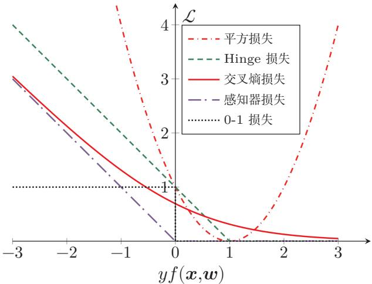  
图 3.9 不同损失函数的对比

## 3.7 总结和扩展阅读

和回归问题不同，分类问题中的目标标签y是离散的类别标签，因此分类问题中的决策函数需要输出离散值或是标签的条件概率．线性分类模型一般是一个广义线性函数，即一个或多个线性判别函数加上一个非线性激活函数，所谓“线性”是指决策边界由一个或多个超平面组成.

表3.1给出了几种常见的线性模型的比较.虽然这些模型都建立在线性打分之上，但它们分别对应概率建模、错误驱动学习和间隔最大化等不同思路．在Logistic 回归和Softmax回归中,y为类别的one-hot向量表示;在感知器和支持向量机中,y为{+1,−1}.

表 3.1 几种常见的线性模型对比
<table><tr><td>线性模型</td><td>激活函数</td><td>损失函数</td><td>优化方法</td></tr><tr><td>线性回归</td><td></td><td>平方损失</td><td>最小二乘、梯度下降</td></tr><tr><td>Logistic 回归</td><td> $\sigma ( \pmb { w } ^ { \top } \pmb { x } )$ </td><td>二分类交叉熵损失 梯度下降</td><td></td></tr><tr><td>Softmax 回归</td><td> $\operatorname { s o f t m a x } ( W ^ { \intercal } x )$ </td><td>多类交叉熵损失</td><td>梯度下降</td></tr><tr><td>感知器</td><td> $\mathrm { s g n } ( { \pmb w } ^ { \top } { \pmb x } )$ </td><td>感知器损失</td><td>随机梯度下降</td></tr><tr><td>支持向量机</td><td> $\mathrm { s g n } ( { \pmb w } ^ { \top } { \pmb x } )$ </td><td>Hinge损失</td><td>二次规划、SMO等</td></tr></table>

Logistic 回归是一种概率模型，它通过Logistic 函数将实数映射到 [0, 1]区间．类似地，正态分布的累积分布函数也可以起到这一作用，对应的模型称为probit 回归. 相关内容可参考《Pattern Recognition and Machine Learning》[Bishop, 2007]第4章.

感知器是最简单的线性分类模型之一，其学习算法直观且具有代表性[Rosenblatt, 1958]. [Freund et al., 1999]提出了使用核技巧改进感知器学习算法，并用投票感知器来提高泛化能力.[Collins,2002]将感知器算法扩展到结构化学习，给出了相应的收敛性证明，并且提出一种更加有效并且实用的参数平均化策略.

要深入了解支持向量机以及核方法，可以参考文献《Learning with Ker-nels: Support Vector Machines, Regularization, Optimization, and Beyond[Scholkopf et al., 2001].

本章介绍的Logistic回归的交叉熵损失函数和梯度更新公式，与后续多层神经网络(第4章)输出层的处理完全一致，为理解反向传播算法奠定了基础.

## 习题

## 基础题

习题3-1 证明在两类线性分类中，权重向量w与决策边界正交

习题3-2 在线性空间中，证明一个点x到超平面 $f ( \pmb { x } ; \pmb { w } ) = \pmb { w } ^ { \top } \pmb { x } + b = 0$ 的距离为 $| f ( \pmb { x } ; \pmb { w } ) | / \| \pmb { w } \|$

习题3-3 已知 $\pmb { w } = [ 2 , - 1 ] ^ { \intercal } , b = 1$ ，分别计算点 $\pmb { x } _ { 1 } = [ 1 , 1 ] ^ { \tau } , \pmb { x } _ { 2 } = [ 0 , 2 ] ^ { \tau }$ 和$\pmb { x } _ { 3 } = [ - 1 , 0 ] ^ { \top }$ 到超平面 $\pmb { w } ^ { \top } \pmb { x } + b = 0$ 的有向距离，并判断它们的预测类别

习题3-4 在线性分类中，决策区域是凸的.即若点 $\scriptstyle { \mathbf { { x } } } _ { 1 }$ 和 $\mathbf { { x } } _ { 2 }$ 被分为类别c,则点$\rho \pmb { x } _ { 1 } + ( 1 - \rho ) \pmb { x } _ { 2 }$ 也会被分为类别c,其中 $\rho \in ( 0 , 1 )$

## 提高题

习题3-5 给定一个多分类的数据集，证明：1）如果数据集中每个类的样本都和除该类之外的样本是线性可分的，则该数据集一定是线性可分的；2）如果数据集中每两个类的样本是线性可分的，则该数据集不一定是线性可分的.

习题3-6 在Logistic 回归中，设 $\hat { y } = \sigma ( { \pmb w } ^ { \top } { \pmb x } )$ .讨论以平方损失 $( y - \hat { y } ) ^ { 2 }$ 作为目标函数时，其关于参数w的优化问题是否仍是凸优化问题，并与交叉熵损失进行比较.

习题3-7 对同一个样本，设y=1,分别在 $f ( \pmb { x } ; \pmb { w } ) = 2 , 0 . 5 , - 1$ 时计算Logistic损失、感知器损失和Hinge损失，并比较这三种损失函数对“分类正确但置信度不高”与“分类错误”两类情形的刻画差异.

习题3-8在Softmax回归的风险函数（公式(3.46)）中加入 $L _ { 2 }$ 正则化项$\frac \lambda 2 \| W \| _ { F } ^ { 2 }$ ，写出新的目标函数及其梯度，并说明正则化对参数冗余和过拟合的影响.

习题3-9 验证平均感知器训练算法3.2中给出的平均权重向量的计算方式和公式(3.87) 等价.

习题3-10 设初始权重向量 ${ \pmb w } _ { 0 } = { \bf 0 }$ ,训练样本依次为

$$
( [ 1 , 1 ] ^ { \tau } , + 1 ) , \quad ( [ 2 , - 1 ] ^ { \tau } , - 1 ) , \quad ( [ - 1 , 1 ] ^ { \tau } , + 1 ) .
$$

按照算法3.1手工执行一轮感知器更新，写出每一步处理后的权重向量.

## 拓展题

习题3-11 证明定理3.2.

习题3-12 若数据集线性可分，证明支持向量机中将两类样本正确分开的最大间隔分割超平面存在且唯一

习题3-13 验证公式(3.107).

习题3-14 在软间隔支持向量机中，试给出原始优化问题的对偶问题，并列出其KKT条件.

## 参考文献

BISHOP C M, 2007. Information science and statistics: pattern recognition and machine learning[M]. 5th ed. Springer.

COLLINS M, 2002. Discriminative training methods for hidden markov models: theory and experiments with perceptron algorithms[C]//Proceedings of the conference on Empirical methods in natural language processing. 1-8.

Daumé III H, 2012. A course in machine learning[EB/OL]. http://ciml.info/.

FREUND Y, SCHAPIRE R E, 1999. Large margin classification using the perceptron algorithm [J]. Machine learning, 37(3): 277-296.

NOVIKOFF A B, 1963. On convergence proofs for perceptrons[R]. DTIC Document.

PLATT J, 1998. Sequential minimal optimization: a fast algorithm for training support vector machines[R]. 21.

ROSENBLATT F, 1958. The perceptron: a probabilistic model for information storage and organization in the brain.[J]. Psychological review, 65(6): 386.

SCHOLKOPF B, SMOLA A J, 2001. Learning with kernels: support vector machines, regularization, optimization, and beyond[M]. MIT press.

第二部分

基础模型

## 第4章 前馈神经网络

神经网络是一种大规模的并行分布式处理器，天然具有存储并使用经验知识的能力.它从两个方面上模拟大脑：（1）网络获取的知识是通过学习来获取的；(2)内部神经元的连接强度，即突触权重，用于储存获取的知识.

——西蒙·赫金(Simon Haykin) [Haykin, 1994]

人工神经网络（Artificial Neural Network,ANN）是指一系列受生物学和神经科学启发的数学模型.这些模型通过对生物神经系统的信息处理方式进行抽象，构建人工神经元，并按照一定的拓扑结构组织神经元之间的连接，从而形成能够表示复杂非线性映射的计算模型.在人工智能领域，人工神经网络也常常简称为神经网络(Neural Network,NN)或神经模型(Neural Model).

在众多神经网络模型中，前馈神经网络（Feedforward Neural Network，FNN）是最基础的一类模型.它的特点是信息沿着网络从输入到输出单向传播，不存在反馈连接.尽管这一结构形式相对简单，但很多深度学习中的核心概念—如神经元、层的堆叠、非线性变换、反向传播、自动微分以及训练中的优化困难都可以在前馈神经网络中得到比较清晰的体现.因此，前馈神经网络既是理解深度学习的起点，也是后续卷积神经网络、循环神经网络以及Transformer等更复杂模型的重要基础

本章将围绕前馈神经网络的三个基本问题展开：第一，前馈网络由什么结构组成，具有什么样的表示能力；第二，如何利用训练数据学习网络中的参数；第三，激活函数如何影响网络的表示与优化性质．为此，本章首先介绍神经元和前馈网络的结构，并讨论其通用近似能力；然后介绍前馈网络在机器学习中的应用、参数学习、反向传播和自动微分；最后结合训练中的优化问题，系统比较常见激活函数及其在现代深度学习模型中的应用.

## 4.1 前馈网络的结构与表示能力

神经网络可以看作由许多神经元按照一定连接方式组成的计算模型.不同的连接方式对应不同的网络拓扑结构，其中基础且常见的一类是前馈网络.前馈神经网络是最早提出的一类简单人工神经网络．前馈神经网络也经常称为多层感知器（Multi-Layer Perceptron，MLP）.但“多层感知器”这一叫法并不是十分严格，因为前馈神经网络通常由多层连续非线性变换复合而成，而感知器本身对应的是不连续的阈值单元 [Bishop, 2007].

## 4.1.1 神经元

为了理解前馈网络，先从它的基本组成单元—人工神经元（ArtificialNeuron），简称神经元（Neuron）—开始.神经元主要模拟生物神经元的结构和特性，接收一组输入信号并产生输出.

生物学家在20世纪初就发现了生物神经元的结构.一个生物神经元通常具有多个树突和一条轴突.树突用来接收信息，轴突用来发送信息.当神经元所获得的输入信号的积累超过某个阈值时，它就处于兴奋状态，产生电脉冲.轴突尾端有许多末梢可以给其他神经元的树突产生连接（突触），并将电脉冲信号传递给其他神经元

1943年，心理学家McCulloch和数学家Pitts根据生物神经元的结构，提出了一种非常简单的神经元模型，MP 神经元[McCulloch et al.,1943]. 现代神经网络中的神经元和MP神经元的结构并无太多变化.不同的是，MP神经元中的激活函数f为0或1的阶跃函数，而现代神经元中的激活函数通常要求是分段连续且几乎处处可导的函数(允许有限个不可导点，如ReLU在x=0处），以便利用梯度下降进行参数学习.

假设一个神经元接收D个输入 $x _ { 1 } , x _ { 2 } , \cdots , x _ { D }$ ，令向量 ${ \pmb x } = [ x _ { 1 } ; x _ { 2 } ; \cdots ; x _ { D } ]$ 来表示这组输入,并用净输入（Net Input)z∈R表示一个神经元所获得的输入信号x的加权和，

$$
z = \sum _ { d = 1 } ^ { D } w _ { d } x _ { d } + b\tag{4.1}
$$

$$
= { \pmb w } ^ { \top } { \pmb x } + b ,\tag{4.2}
$$

其中 ${ \pmb w } = [ w _ { 1 } ; w _ { 2 } ; \cdots ; w _ { D } ] \in \mathbb { R } ^ { D }$ 是D维的权重向量， $b \in \mathbb { R }$ 是偏置.

净输入z在经过一个非线性函数后，得到神经元的活性值（Activation）a，

$$
a = f ( z ) ,\tag{4.3}
$$

其中非线性函数 $f ( \cdot )$ 称为激活函数（Activation Function）.激活函数可以根据不同的需要来设置，比如Logistic函数.

图4.1给出了一个典型的神经元结构示例.

更多激活函数参考参见第4.5节.

  
图 4.1 典型的神经元结构

## 4.1.2 前馈网络结构

在了解神经元之后，可以进一步将多个神经元按层组织起来，构成前馈神经网络.在前馈神经网络中，各神经元分别属于不同的层.每一层的神经元接收前一层神经元的输出，并将结果传递给下一层.第0层称为输入层，最后一层称为输出层，中间各层称为隐藏层.整个网络中不存在反馈连接，信号始终从输入层向输出层单向传播，因此可以用一个有向无环图来表示.

图4.2给出了前馈神经网络的示例.

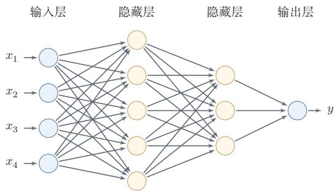  
图4.2 多层前馈神经网络

表4.1给出了描述前馈神经网络的记号.

表4.1 前馈神经网络的记号
<table><tr><td>记号</td><td>含义</td></tr><tr><td> $L$ </td><td>神经网络的层数</td></tr><tr><td> $M _ { l }$ </td><td>第l层神经元的个数</td></tr><tr><td> $f _ { l } ( \cdot )$ </td><td>第l层神经元的激活函数</td></tr><tr><td> ${ \pmb W } ^ { ( l ) } \in \mathbb { R } ^ { M _ { l } \times M _ { l - 1 } }$ </td><td>第l—1层到第l层的权重矩阵</td></tr><tr><td> $\pmb { b } ^ { ( l ) } \in \mathbb { R } ^ { M _ { l } }$ </td><td>第l-1层到第l层的偏置</td></tr><tr><td> $\boldsymbol { z } ^ { ( l ) } \in \mathbb { R } ^ { M _ { l } }$ </td><td>第l层神经元的净输入(净活性值)</td></tr><tr><td> $\pmb { a } ^ { ( l ) } \in \mathbb { R } ^ { M _ { l } }$ </td><td>第l层神经元的输出（活性值）</td></tr></table>

层数L一般只考虑隐藏层和输出层.

$\mathbf { \boldsymbol { a } } ^ { ( 0 ) } = \mathbf { \boldsymbol { x } }$ ,前馈神经网络通过不断迭代下面公式进行信息传播：

$$
\pmb { z } ^ { ( l ) } = \pmb { W } ^ { ( l ) } \pmb { a } ^ { ( l - 1 ) } + \pmb { b } ^ { ( l ) } ,\tag{4.4}
$$

$$
\begin{array} { r } { \pmb { a } ^ { ( l ) } = f _ { l } ( \pmb { z } ^ { ( l ) } ) . } \end{array}\tag{4.5}
$$

首先根据第l-1层神经元的活性值 $\mathbf { \Delta } a ^ { ( l - 1 ) }$ 计算出第l层神经元的净活性值 $\boldsymbol { z } ^ { ( l ) }$ ,然后经过一个激活函数得到第l层神经元的活性值.因此，我们也可以把每个神经层看作一个仿射变换（AffineTransformation）和一个非线性变换.

公式(4.4)和公式(4.5)也可以合并写为：

仿射变换参见 第A.2.2节.

$$
\pmb { z } ^ { ( l ) } = \pmb { W } ^ { ( l ) } f _ { l - 1 } ( \pmb { z } ^ { ( l - 1 ) } ) + \pmb { b } ^ { ( l ) } ,\tag{4.6}
$$

或者

$$
\pmb { a } ^ { ( l ) } = f _ { l } ( \pmb { W } ^ { ( l ) } \pmb { a } ^ { ( l - 1 ) } + \pmb { b } ^ { ( l ) } ) .\tag{4.7}
$$

这样，前馈神经网络可以通过逐层的信息传递，得到网络最后的输出 $\mathbf { \pmb { a } } ^ { ( L ) }$ 整个网络可以看作一个复合函数 $\phi ( { \boldsymbol { x } } ; W , b )$ ，将向量x作为第1层的输入 $\mathbf { \delta } _ { \mathbf { a } } ( 0 )$ 将第L层的输出 $\mathbf { \pmb { a } } ^ { ( L ) }$ 作为整个函数的输出.

$$
\pmb { x } = \pmb { a } ^ { ( 0 ) }  z ^ { ( 1 ) }  \pmb { a } ^ { ( 1 ) }  z ^ { ( 2 ) }  \cdots  \pmb { a } ^ { ( L - 1 ) }  z ^ { ( L ) }  \pmb { a } ^ { ( L ) } = \phi ( \pmb { x } ; \pmb { W } , b ) ,\tag{4.8}
$$

其中W,b表示网络中所有层的连接权重和偏置

需要特别强调的是，前馈网络的表示能力不仅来自“层数多”，还来自层与层之间的非线性激活函数.如果所有激活函数都是恒等映射，那么多层仿射变换的复合仍然等价于一个仿射变换，整个网络会退化为第3章中的线性模型.正是因为每一层在线性变换后引入非线性，网络才能逐层形成更复杂的表示，并刻画非线性决策边界.

## 4.1.3 通用近似定理

在给出前馈网络的结构之后，一个自然的问题是：这种网络究竟具有多强的表示能力？通用近似定理说明，前馈神经网络具有很强的函数逼近能力，很多连续非线性函数都可以用它来近似

定理4.1-通用近似定理（Universal Approximation Theorem）[Cybenko, 1989; Hornik et al., 1989]: 令 $\phi ( \cdot )$ 是一个非常数、有界、单调递增的连续函数， ${ \mathcal { I } } _ { D }$ 是一个D维的单位超立方体 $[ 0 , 1 ] ^ { D } , C ( \mathcal { I } _ { D } )$ 是定义在 ${ \mathcal { I } } _ { D }$ 上的连续函数集合.对于任意给定的一个函数 $f \in C ( \mathcal { I } _ { D } )$ ,存在一个整数M,和一组实数 $v _ { m } , b _ { m } \in$ R以及实数向量 $\pmb { w } _ { m } \in \mathbb { R } ^ { D } , m = 1 , \cdots , M$ 以至于我们可以定义函数

$$
F ( \pmb { x } ) = \sum _ { m = 1 } ^ { M } v _ { m } \phi ( \pmb { w } _ { m } ^ { \top } \pmb { x } + b _ { m } ) ,\tag{4.9}
$$

作为函数 f的近似实现,即

$$
| F ( { \pmb x } ) - f ( { \pmb x } ) | < \epsilon , \forall { \pmb x } \in \mathcal { I } _ { D } ,\tag{4.10}
$$

其中 $\epsilon > 0$ 是一个很小的正数.

通用近似定理在实数空间 $\mathbb { R } ^ { D }$ 中的有界闭集上依然成立

根据通用近似定理，对于具有线性输出层和至少一个使用“挤压”性质的激活函数的隐藏层组成的前馈神经网络，只要其隐藏层神经元的数量足够，它可以以任意的精度来近似任何一个定义在实数空间 $\mathbb { R } ^ { D }$ 中的有界闭集上的连续函数[Funahashi et al., 1993]. 所谓“挤压”性质的函数是指像Sigmoid 函数的有界函数，但神经网络的通用近似性质也被证明对于其他类型的激活函数，比如ReLU，也都是适用的.

定义在实数空间RD中的有界闭集上的连续函数都是Borel可测函数，但Borel可测函数不一定连续.

参见习题4-10.

通用近似定理只是说明了神经网络的表示能力足以近似给定的连续函数，但并没有给出如何找到这样一个网络，以及是否是最优的.此外，当应用到机器学习时，真实的映射函数并不知道，一般是通过经验风险最小化和正则化来进行参数学习.由于神经网络表示能力较强，也更容易在训练集上过拟合.

## 4.2 前馈网络的学习

了解了前馈网络的结构及其表示能力之后，接下来的问题是如何利用数据来确定网络中的参数.本节先说明前馈网络在机器学习中的基本作用，再介绍如

何通过训练数据学习其参数.

## 4.2.1 前馈网络在机器学习中的作用

有了前馈网络的表示能力之后，接下来的问题是如何将它用于具体的机器学习任务.根据通用近似定理，神经网络在一定程度上可以作为一个“万能”函数来使用，可以用来进行复杂的特征转换，或逼近一个复杂的条件分布.

在机器学习中，输入样本的特征对分类器的影响很大.以监督学习为例，好的特征可以极大提高分类器的性能.因此，要取得好的分类效果，需要将样本的原始特征向量x转换到更有效的特征向量 $\phi ( { \pmb x } )$ ，这个过程叫作特征抽取.

参见第2.6.1.2节.

多层前馈神经网络可以看作一个非线性复合函数 $\phi : \mathbb { R } ^ { D } \to \mathbb { R } ^ { D ^ { \prime } }$ ，将输入$\pmb { x } \in \mathbb { R } ^ { D }$ 映射到输出 $\boldsymbol { \phi } ( \mathbf { x } ) \in \mathbb { R } ^ { D ^ { \prime } }$ .因此，多层前馈神经网络也可以看成是一种特征转换方法，其输出 $\phi ( { \pmb x } )$ 作为分类器的输入进行分类.

给定一个训练样本 $( { \pmb x } , y )$ ，先利用多层前馈神经网络将x映射到 $\phi ( { \pmb x } )$ ，然后再将 $\phi ( { \pmb x } )$ 输入到分类器 $g ( \cdot )$ ,即

$$
\hat { y } = g ( \phi ( \pmb { x } ) ; \theta ) ,\tag{4.11}
$$

其中 $g ( \cdot )$ 为线性或非线性的分类器，θ为分类器 $g ( \cdot )$ 的参数， $\hat { y }$ 为分类器的输出.

特别地，如果分类器 $g ( \cdot )$ 为Logistic回归分类器或Softmax回归分类器，那么 $g ( \cdot )$ 也可以看成是网络的最后一层，即神经网络直接输出不同类别的条件概率 $p ( y | \mathbf { \boldsymbol { x } } )$

反之，Logistic 回归或Softmax 回 归也可以看作只有一层的神经网络.  
Logistic 回归参见  
第3.2节.

对于二分类问题 $y \in \{ 0 , 1 \}$ ,并采用Logistic回归,那么Logistic回归分类器可以看成神经网络的最后一层.也就是说，网络的最后一层只用一个神经元，并且其激活函数为Logistic函数.记网络输出为 $\hat { y } = a ^ { ( L ) }$ ，则其可以直接作为类别$y = 1$ 的条件概率，

$$
\begin{array} { r } { p ( y = 1 | \pmb { x } ) = \hat { y } = a ^ { ( L ) } , } \end{array}\tag{4.12}
$$

其中 ${ \hat { y } } \in \mathbb { R }$ 为第L层神经元的活性值.

对于多分类问题 $y \in \{ 1 , \cdots , C \}$ ，如果使用Softmax回归分类器，相当于网络最后一层设置C个神经元，其激活函数为Softmax函数.记网络最后一层(第L层)的输出为 $\mathbf { \pmb { a } } ^ { ( L ) }$ ,则

Softmax回归参见第3.3节.

$$
\pmb { \hat { y } } = \pmb { a } ^ { ( L ) } = \mathrm { s o f t m a x } ( z ^ { ( L ) } ) ,\tag{4.13}
$$

其中 $z ^ { ( L ) } \in \mathbb { R } ^ { C }$ 为第L层神经元的净输入； $\pmb { \hat { y } } = \pmb { a } ^ { ( L ) } \in \mathbb { R } ^ { C }$ 为第 $L$ 层神经元的活性值，每一维分别表示不同类别标签的预测条件概率.

## 4.2.2 学习目标与参数更新

将前馈网络用于分类或回归任务之后，接下来的核心问题就是如何根据训练数据来学习网络中的参数.下面以分类任务和交叉熵损失为例进行说明.若对于样本 $( { \pmb x } , y )$ 采用交叉熵损失函数，其损失函数为

$$
\begin{array} { r } { \mathcal { L } ( \pmb { y } , \hat { \pmb { y } } ) = - \pmb { y } ^ { \top } \log \hat { \pmb { y } } , } \end{array}\tag{4.14}
$$

其中 ${ \pmb y } \in \{ 0 , 1 \} ^ { C }$ 为标签y对应的one-hot 向量表示.

给定训练集为 $\mathcal { D } = \{ ( { \pmb x } ^ { ( n ) } , y ^ { ( n ) } ) \} _ { n = 1 } ^ { N }$ ，将每个样本 $\mathbf { \boldsymbol { x } } ^ { ( n ) }$ 输入给前馈神经网络，得到网络输出为 $\hat { \pmb y } ^ { ( n ) }$ ，其在数据集D上的正则化经验风险函数为

$$
\mathcal { R } ( W , b ) = \frac { 1 } { N } \sum _ { n = 1 } ^ { N } \mathcal { L } ( \pmb { y } ^ { ( n ) } , \hat { \pmb { y } } ^ { ( n ) } ) + \frac { 1 } { 2 } \lambda \| \pmb { W } \| _ { F } ^ { 2 } ,\tag{4.15}
$$

其中 $W$ 和b分别表示网络中所有的权重矩阵和偏置向量； $\| \mathbf { W } \| _ { F } ^ { 2 }$ 是正则化项，用来防止过拟合； $\lambda > 0$ 为超参数.λ越大， $W$ 越接近于0.这里的 $\| \mathbf { W } \| _ { F } ^ { 2 }$ 一般使用Frobenius 范数：

注意这里的正则化项只包含权重参数W，而不包含偏置b.

$$
\| \boldsymbol { W } \| _ { F } ^ { 2 } = \sum _ { l = 1 } ^ { L } \sum _ { i = 1 } ^ { M _ { l } } \sum _ { j = 1 } ^ { M _ { l - 1 } } ( \boldsymbol { w } _ { i j } ^ { ( l ) } ) ^ { 2 } .\tag{4.16}
$$

有了学习准则和训练样本，网络参数可以通过梯度下降法来进行学习.在梯度下降方法的每次迭代中，第l层的权重 $W ^ { ( l ) }$ 和偏置 $\mathbf { \delta } _ { b } ( l )$ 的更新方式为

$$
\boldsymbol { W } ^ { ( l ) }  \boldsymbol { W } ^ { ( l ) } - \alpha \frac { \partial \mathcal { R } ( \boldsymbol { W } , b ) } { \partial \boldsymbol { W } ^ { ( l ) } }\tag{4.17}
$$

$$
= W ^ { ( l ) } - \alpha \left( \frac { 1 } { N } \sum _ { n = 1 } ^ { N } ( \frac { \partial \mathcal { L } ( y ^ { ( n ) } , \hat { y } ^ { ( n ) } ) } { \partial W ^ { ( l ) } } ) + \lambda W ^ { ( l ) } \right) ,\tag{4.18}
$$

$$
\pmb { b } ^ { ( l ) } \gets \pmb { b } ^ { ( l ) } - \alpha \frac { \partial \mathcal { R } ( \pmb { W } , \pmb { b } ) } { \partial \pmb { b } ^ { ( l ) } }\tag{4.19}
$$

$$
= \boldsymbol { b } ^ { ( l ) } - \alpha \left( \frac { 1 } { N } \sum _ { n = 1 } ^ { N } \frac { \partial \mathcal { L } ( \boldsymbol { y } ^ { ( n ) } , \hat { \boldsymbol { y } } ^ { ( n ) } ) } { \partial \boldsymbol { b } ^ { ( l ) } } \right) ,\tag{4.20}
$$

其中α为学习率.

梯度下降法需要计算损失函数对参数的偏导数，如果通过链式法则逐一对每个参数进行求偏导比较低效.在神经网络的训练中经常使用反向传播算法来高效地计算梯度.

## 4.2.3 反向传播算法

为了利用梯度下降更新网络参数，关键在于高效计算损失函数关于各层参数的导数.对于前馈网络，这一任务可以通过反向传播算法（Back-Propagation，

BP）来完成.假设采用随机梯度下降进行参数学习，给定一个样本 $( { \boldsymbol { x } } , { \boldsymbol { y } } )$ ，将其输入到神经网络模型中，得到网络输出 $\hat { y }$ ;再设损失函数为 $\mathcal { L } ( \pmb { y } , \hat { \pmb { y } } )$ ，则参数学习的关键就是计算该损失函数关于每个参数的梯度.

## 数学小知识|分母布局

在矩阵微积分中，标量 $f$ 对列向量 $z \in \mathbb { R } ^ { M }$ 的导数 $\frac { \partial f } { \partial z }$ 在分母布局下  
为M维列向量，其第m个分量为 $\frac { \partial f } { \partial z _ { m } }$ 本书的反向传播推导采用分母布  
局. 矩阵微积分参见第B.3节.


不失一般性，下面以第l层中的参数 $W ^ { ( l ) }$ 和 $\mathbf { \delta } _ { b } ( l )$ 为例来说明其梯度的计算过程.

这里使用向量或矩阵来表示多变量函数的偏导数，并使用分母布局表示，参见第B.3节.

因为 $\frac { \partial \mathcal { L } ( y , \hat { y } ) } { \partial W ^ { ( l ) } }$ 的计算涉及向量对矩阵的微分，十分繁琐，因此我们先计算$\mathcal { L } ( \pmb { y } , \hat { \pmb { y } } )$ 关于参数矩阵中每个元素的偏导数 $\frac { \partial \mathcal { L } ( \pmb { y } , \hat { \pmb { y } } ) } { \partial w _ { i j } ^ { ( l ) } }$ .根据链式法则，

$$
\frac { \partial \mathcal { L } ( \pmb { y } , \hat { \pmb { y } } ) } { \partial w _ { i j } ^ { ( l ) } } = \frac { \partial z ^ { ( l ) } } { \partial w _ { i j } ^ { ( l ) } } \frac { \partial \mathcal { L } ( \pmb { y } , \hat { \pmb { y } } ) } { \partial z ^ { ( l ) } } ,
$$

链式法则参见公式(B.19).

(4.21)

$$
\frac { \partial \mathcal { L } ( \pmb { y } , \hat { \pmb { y } } ) } { \partial \pmb { b } ^ { ( l ) } } = \frac { \partial \pmb { z } ^ { ( l ) } } { \partial \pmb { b } ^ { ( l ) } } \frac { \partial \mathcal { L } ( \pmb { y } , \hat { \pmb { y } } ) } { \partial \pmb { z } ^ { ( l ) } } .\tag{4.22}
$$

公式(4.21)和公式(4.22)中的第二项都是目标函数关于第l层的神经元 $z ^ { ( l ) }$ 的偏导数，称为误差项，可以一次计算得到.这样我们只需要计算三个偏导数，分别为 $\frac { \partial z ^ { ( l ) } } { \partial w _ { i j } ^ { ( l ) } } , \frac { \partial z ^ { ( l ) } } { \partial b ^ { ( l ) } }$ 和 $\frac { \partial \mathcal { L } ( y , \hat { y } ) } { \partial z ^ { ( l ) } }$

下面分别来计算这三个偏导数.

(1)计算偏导数 $\frac { \partial z ^ { ( l ) } } { \partial w _ { i j } ^ { ( l ) } }$ 因 $\pmb { z } ^ { ( l ) } = \pmb { W } ^ { ( l ) } \pmb { a } ^ { ( l - 1 ) } + \pmb { b } ^ { ( l ) }$ ,偏导数

$$
\frac { \partial \boldsymbol { z } ^ { ( l ) } } { \partial \boldsymbol { w } _ { i j } ^ { ( l ) } } = [ \frac { \partial z _ { 1 } ^ { ( l ) } } { \partial \boldsymbol { w } _ { i j } ^ { ( l ) } } , \cdots , \frac { \partial z _ { i } ^ { ( l ) } } { \partial \boldsymbol { w } _ { i j } ^ { ( l ) } } ] \cdots , \frac { \partial \boldsymbol { z } _ { M _ { l } } ^ { ( l ) } } { \partial \boldsymbol { w } _ { i j } ^ { ( l ) } } ]
$$

这里的矩阵微分采用分母布局，即一个列向量关于标量的偏导数为行向量，参见第B.3节.

(4.23)

$$
\mathbf { \epsilon } = \Bigg [ 0 , \cdots , \Bigg [ \frac { \partial ( \mathbf { w } _ { i \cdot } ^ { ( l ) } \pmb { a } ^ { ( l - 1 ) } + b _ { i } ^ { ( l ) } ) } { \partial \mathbf { w } _ { i j } ^ { ( l ) } } \Bigg ] \cdots , 0 \Bigg ]\tag{4.24}
$$

$$
\mathbf { \Omega } = \left[ 0 , \cdots , a _ { j } ^ { ( l - 1 ) } , \cdots , 0 \right]\tag{4.25}
$$

$$
\begin{array} { r l } { \triangleq \mathbb { I } _ { i } ( a _ { j } ^ { ( l - 1 ) } ) } & { { } \in \mathbb { R } ^ { 1 \times M _ { l } } , } \end{array}\tag{4.26}
$$

其中 $\pmb { w } _ { i : } ^ { ( l ) }$ 为权重矩阵 $W ^ { ( l ) }$ 的第i行， $\mathbb { I } _ { i } ( a _ { j } ^ { ( l - 1 ) } )$ 表示第i个元素为 $a _ { j } ^ { ( l - 1 ) }$ ,其余为0的行向量.

(2)计算偏导数 $\frac { \partial z ^ { ( l ) } } { \partial b ^ { ( l ) } }$ 因为 $z ^ { ( l ) }$ 和 $\mathbf { \delta } _ { b } ( l )$ 的函数关系为 $z ^ { ( l ) } = W ^ { ( l ) } { \pmb a } ^ { ( l - 1 ) } +$ $\mathbf { \delta } _ { b } ( l )$ ，因此偏导数

$$
\frac { \partial \pmb { z } ^ { ( l ) } } { \partial \pmb { b } ^ { ( l ) } } = \pmb { I } _ { M _ { l } } \quad \in \mathbb { R } ^ { M _ { l } \times M _ { l } } ,\tag{4.27}
$$

为 $M _ { l } \times M _ { l }$ 的单位矩阵.

(3）计算偏导数 $\frac { \partial \mathcal { L } ( y , \hat { y } ) } { \partial z ^ { ( l ) } }$ 偏导数 $\frac { \partial \mathcal { L } ( y , \hat { y } ) } { \partial z ^ { ( l ) } }$ 表示第l层神经元对最终损失的影响，也反映了最终损失对第l层神经元的敏感程度，因此一般称为第l层神经元的误差项，用 $\delta ^ { ( l ) }$ 来表示.

$$
\delta ^ { ( l ) } \triangleq \frac { \partial \mathcal { L } ( \pmb { y } , \hat { \pmb { y } } ) } { \partial \pmb { z } ^ { ( l ) } } \quad \in \mathbb { R } ^ { M _ { l } } .\tag{4.28}
$$

误差项 $\delta ^ { ( l ) }$ 也间接反映了不同神经元对网络能力的贡献程度，从而比较好地解决了贡献度分配问题(Credit Assignment Problem,CAP).

根据 $\pmb { z } ^ { ( l + 1 ) } = \pmb { W } ^ { ( l + 1 ) } \pmb { a } ^ { ( l ) } + \pmb { b } ^ { ( l + 1 ) }$ ,有

$$
\frac { \partial z ^ { ( l + 1 ) } } { \partial \pmb { a } ^ { ( l ) } } = ( \pmb { W } ^ { ( l + 1 ) } ) ^ { \top } \quad \in \mathbb { R } ^ { M _ { l } \times M _ { l + 1 } } .\tag{4.29}
$$

根据 $\mathbf { } a ^ { ( l ) } = f _ { l } ( z ^ { ( l ) } )$ ,其中 $f _ { l } ( \cdot )$ 为按位计算的函数，因此有

$$
\begin{array} { r l } { \displaystyle \frac { \partial \pmb { a } ^ { ( l ) } } { \partial \pmb { z } ^ { ( l ) } } = \frac { \partial f _ { l } ( \pmb { z } ^ { ( l ) } ) } { \partial \pmb { z } ^ { ( l ) } } } & { { } } \\ { = \mathrm { d i a g } ( f _ { l } ^ { \prime } ( \pmb { z } ^ { ( l ) } ) ) } & { { } \in \mathbb { R } ^ { M _ { l } \times M _ { l } } . } \end{array}\tag{4.30}
$$

(4.31)

因此，根据链式法则，第l层的误差项为

$$
\delta ^ { ( l ) } \triangleq \frac { \partial \mathcal { L } ( \pmb { y } , \hat { \pmb { y } } ) } { \partial \pmb { z } ^ { ( l ) } }\tag{4.32}
$$

$$
= \left( \frac { \partial \pmb { a } ^ { ( l ) } } { \partial \pmb { z } ^ { ( l ) } } \right) \cdot \left( \frac { \partial \pmb { z } ^ { ( l + 1 ) } } { \partial \pmb { a } ^ { ( l ) } } \right) \cdot \left( \frac { \partial \pmb { \mathcal { L } } ( \pmb { y } , \hat { \pmb { y } } ) } { \partial \pmb { z } ^ { ( l + 1 ) } } \right)\tag{4.33}
$$

$$
\mathrm { = } \biggl ( \mathrm { d i a g } \bigl ( f _ { l } ^ { \prime } ( z ^ { ( l ) } ) \bigr ) \biggr ) \biggl ( \left( W ^ { ( l + 1 ) } \right) ^ { \mathsf { T } } \Bigl ) \cdot \bigl ( \delta ^ { ( l + 1 ) } \Bigr )\tag{4.34}
$$

$$
= f _ { l } ^ { \prime } ( z ^ { ( l ) } ) \odot \left( ( W ^ { ( l + 1 ) } ) ^ { \intercal } \delta ^ { ( l + 1 ) } \right) \quad \in \mathbb { R } ^ { M _ { l } } ,\tag{4.35}
$$

其中是向量的Hadamard积运算符，表示每个元素相乘.

Hadamard 积参见 第A.2.3节.

从公式(4.35)可以看出，第l层的误差项可以通过第l+1层的误差项计算得到，这就是误差的反向传播（Back-Propagation，BP).反向传播算法的含义是：第l层的一个神经元的误差项（或敏感性）是所有与该神经元相连的第l+1层的神经元的误差项的权重和.然后，再乘上该神经元激活函数的梯度.

对于输出层，误差项往往还可以进一步简化.若第L层为二分类输出层，并采用Logistic函数和交叉熵损失，记 $\hat { y } = a ^ { ( L ) }$ ,则有

$$
\delta ^ { ( L ) } = \hat { y } - y .\tag{4.36}
$$

若第L层为多分类输出层，并采用Softmax函数和交叉熵损失，记 $\hat { y } = \pmb { a } ^ { ( L ) }$ ,则有

$$
\delta ^ { ( L ) } = \hat { \pmb { y } } - \pmb { y } .\tag{4.37}
$$

这两个结果在实际实现中十分常用，因为它们直接给出了反向传播的起点.

在计算出上面三个偏导数之后，公式(4.21)可以写为

$$
\frac { \partial \mathcal { L } ( \pmb { y } , \hat { \pmb { y } } ) } { \partial w _ { i j } ^ { ( l ) } } = \mathbb { I } _ { i } ( a _ { j } ^ { ( l - 1 ) } ) \delta ^ { ( l ) }\tag{4.38}
$$

$$
= \big [ 0 , \cdots , a _ { j } ^ { ( l - 1 ) } , \cdots , 0 \big ] \big [ \delta _ { 1 } ^ { ( l ) } , \cdots , \delta _ { i } ^ { ( l ) } , \cdots , \delta _ { M _ { l } } ^ { ( l ) } \big ] ^ { \intercal }\tag{4.39}
$$

$$
= \delta _ { i } ^ { ( l ) } a _ { j } ^ { ( l - 1 ) } ,\tag{4.40}
$$

其中 $\delta _ { i } ^ { ( l ) } a _ { j } ^ { ( l - 1 ) }$ 相当于向量 $\delta ^ { ( l ) }$ 和向量 $\mathbf { \Delta } \mathbf { a } ^ { ( l - 1 ) }$ 的外积的第 $i , j$ 个元素.上式可以进一步写为

外积参见公式(A.29).

$$
\left[ \frac { \partial \mathcal { L } ( \pmb { y } , \hat { \pmb { y } } ) } { \partial \pmb { W } ^ { ( l ) } } \right] _ { i j } = \left[ \delta ^ { ( l ) } ( \pmb { a } ^ { ( l - 1 ) } ) ^ { \top } \right] _ { i j } .\tag{4.41}
$$

因此， $\mathcal { L } ( \pmb { y } , \hat { \pmb { y } } )$ 关于第l层权重 $W ^ { ( l ) }$ 的梯度为

$$
\frac { \partial \mathcal { L } ( \pmb { y } , \hat { \pmb { y } } ) } { \partial \pmb { W } ^ { ( l ) } } = \delta ^ { ( l ) } ( \pmb { a } ^ { ( l - 1 ) } ) ^ { \top } \quad \in \mathbb { R } ^ { M _ { l } \times M _ { l - 1 } } .\tag{4.42}
$$

同理， $\mathcal { L } ( \pmb { y } , \hat { \pmb { y } } )$ 关于第l层偏置 $\mathbf { \delta } _ { b } ( l )$ 的梯度为

$$
\frac { \partial \mathcal { L } ( \pmb { y } , \hat { \pmb { y } } ) } { \partial \pmb { b } ^ { ( l ) } } = \delta ^ { ( l ) } \quad \in \mathbb { R } ^ { M _ { l } } .\tag{4.43}
$$

在计算出每一层的误差项之后，我们就可以得到每一层参数的梯度.因此，使用误差反向传播算法的前馈神经网络训练过程可以分为以下三步：

（1）前馈计算每一层的净输入 $z ^ { ( l ) }$ 和激活值 $\mathbf { \Omega } _  \mathbf { \Omega } \mathbf { \Omega } \mathbf { \Omega } \mathbf { \Omega } \mathbf { \Omega } \mathbf { \Omega } \mathbf { \Omega } \mathbf { \Omega } \mathbf { \Omega } \mathbf { \Omega } \mathbf { \Omega } \mathbf { \Omega } \mathbf { \Omega } \mathbf { \Omega } \mathbf { a } ^ { ( l ) }$ ，直到最后一层；

（2）反向传播计算每一层的误差项 $\delta ^ { ( l ) }$

（3）计算每一层参数的偏导数，并更新参数.

算法4.1给出使用反向传播算法的随机梯度下降训练过程

算法4.1 使用反向传播算法的随机梯度下降训练过程  
输入：训练集 $\mathcal { D } = \{ ( { \pmb x } ^ { ( n ) } , y ^ { ( n ) } ) \} _ { n = 1 } ^ { N }$ ，验证集γ,学习率α，正则化系数λ，网络  
层数L，神经元数量 $M _ { l } , 1 \le l \le L$   
1 随机初始化 W, b ；  
2 repeat  
3 对训练集D中的样本随机重排序;  
4 for $n = 1 \cdots N$ do  
5 从训练集D中选取样本 $( \mathbf { \boldsymbol { x } } ^ { ( n ) } , \mathbf { \boldsymbol { y } } ^ { ( n ) } ) ;$   
6 前馈计算每一层的净输入 $z ^ { ( l ) }$ 和激活值 $\mathbf { \Omega } _  \mathbf { \Omega } \mathbf { \Omega } \mathbf { \Omega } \mathbf { \Omega } \mathbf { \Omega } \mathbf { \Omega } \mathbf { \Omega } \mathbf { \Omega } \mathbf { \Omega } \mathbf { \Omega } \mathbf { \Omega } \mathbf { \Omega } \mathbf { \Omega } \mathbf { \Omega } \mathbf { a } ^ { ( l ) }$ ，直到最后一层;  
7 反向传播计算每一层的误差 $\delta ^ { ( l ) }$ //公式(4.35)  
$/ /$ 计算每一层参数的导数  
8 $\forall l ,$ $\begin{array} { r } { \frac { \partial \mathcal { L } ( \pmb { y } ^ { ( n ) } , \hat { \pmb { y } } ^ { ( n ) } ) } { \partial \pmb { W } ^ { ( l ) } } = \delta ^ { ( l ) } ( \pmb { a } ^ { ( l - 1 ) } ) ^ { \top } , } \end{array}$ //公式(4.42)  
9 $\forall l ,$ $\begin{array} { r } { \frac { \partial \mathcal { L } ( \pmb { y } ^ { ( n ) } , \hat { \pmb { y } } ^ { ( n ) } ) } { \partial \pmb { b } ^ { ( l ) } } = \delta ^ { ( l ) } ; } \end{array}$ //公式(4.43)  
$/ /$ 更新参数  
10 ll, $\pmb { W } ^ { ( l ) }  \pmb { W } ^ { ( l ) } - \alpha ( \delta ^ { ( l ) } ( \pmb { a } ^ { ( l - 1 ) } ) ^ { \top } + \lambda \pmb { W } ^ { ( l ) } )$   
11 ∀l, $\pmb { b } ^ { ( l ) } \gets \pmb { b } ^ { ( l ) } - \alpha \delta ^ { ( l ) } ;$   
12 end  
13 until 神经网络模型在验证集ν上的错误率不再下降;  
输出：W,b

## 4.3自动微分与梯度计算

前面在推导反向传播时，是手动利用链式法则来计算各层参数的梯度.在实际实现中，这一过程往往十分琐碎且容易出错．实际上，梯度的计算可以交给计算机自动完成：我们只需实现前向计算过程，系统便能够自动得到所需的梯度.常见的深度学习框架都提供了这一能力.

从方法上看，与求导相关的自动计算大致可以分为三类：数值微分、符号微分和自动微分.三者之中，自动微分既不依赖有限差分近似，也不直接操作完整的解析表达式，而是针对具体的数值计算过程来累积导数，因此兼顾了数值精度与计算效率.

## 4.3.1 数值微分

数值微分（Numerical Differentiation）是用数值方法来计算函数 $f ( x )$ 导数. 函数f(x)的点x的导数定义为

$$
f ^ { \prime } ( x ) = \operatorname* { l i m } _ { \Delta x \to 0 } { \frac { f ( x + \Delta x ) - f ( x ) } { \Delta x } } .\tag{4.44}
$$

要计算函数 $f ( x )$ 在点x的导数，可以对x加上一个很小的非零的扰动 $\Delta x$ 通过上述定义来直接计算函数 $f ( x )$ 的梯度.数值微分方法非常容易实现，但找到一个合适的扰动 $\Delta x$ 却十分困难.如果 $\Delta x$ 过小，会引起数值计算问题，比如舍入误差;如果 $\Delta x$ 过大，会增加截断误差，使得导数计算不准确.因此，数值微分的实用性比较差.

在实际应用中，经常使用下面公式来计算梯度，可以减少截断误差

舍入误差（Round-offError)是指数值计算中由于数字舍入造成的近似值和精确值之间的差异，比如用浮点数来表示实数.

$$
f ^ { \prime } ( x ) = \operatorname* { l i m } _ { \Delta x \to 0 } { \frac { f ( x + \Delta x ) - f ( x - \Delta x ) } { 2 \Delta x } } .\tag{4.45}
$$

截断误差（Truncation Error)是数学模 型的理论解与数值计 算问题的精确解之间 的误差.

数值微分的另外一个问题是计算复杂度.假设参数数量为N，则每个参数都需要单独施加扰动，并计算梯度.假设每次正向传播的计算复杂度为 $O ( N )$ ,则计算数值微分的总体时间复杂度为 $O ( N ^ { 2 } )$

## 4.3.2 符号微分

符号微分（SymbolicDifferentiation）是一种基于符号计算的自动求导方法.符号计算也叫代数计算，是指用计算机来处理带有变量的数学表达式.这里的变量被看作符号(Symbols)，一般不需要代入具体的值.符号计算的输入和输出都是数学表达式，一般包括对数学表达式的化简、因式分解、微分、积分、解代数方程、求解常微分方程等运算.

和符号计算相对应的概念是数值计算，即将数值代入数学表示中进行计算.

比如数学表达式的化简：

$$
\widehat { \ddag \iiiint } : 3 x - x + 2 x + 1\tag{4.46}
$$

$$
\# \mathbb { H } \mathbb { H } : 4 x + 1 .\tag{4.47}
$$

符号计算一般来讲是对输入的表达式，通过迭代或递归使用一些事先定义的规则进行转换.当转换结果不能再继续使用变换规则时，便停止计算.

符号微分可以在编译时就计算梯度的数学表示，并进一步利用符号计算方法进行优化.此外，符号计算的一个优点是符号计算和平台无关，可以在CPU或GPU上运行.符号微分也有一些不足之处：1）编译时间较长，特别是对于循环，需要很长时间进行编译；2）为了进行符号微分，一般需要设计一种专门的语言来表示数学表达式，并且要对变量（符号）进行预先声明；3）很难对程序进行调试.

## 4.3.3 自动微分

自动微分（AutomaticDifferentiation，AD）是一种可以对一个（程序）函数自动计算导数的方法.自动微分既不是通过有限差分来近似导数的数值微分，也不是直接操作解析表达式的符号微分；它的处理对象是一段具体的数值计算过程.

自动微分的基本原理是：所有的数值计算都可以分解为一些基本操作，包含$+ , - , \times , /$ 以及exp,log, sin, cos等初等函数，然后在计算过程中利用链式法则来递归地累积梯度.因此，自动微分通常既具有较高的数值精度，也具有较好的计算效率.

自动微分能够在保持机器精度的同时高效计算梯度，因此已成为深度学习框架的核心机制之一.

为简单起见，这里以一个神经网络中常见的复合函数的例子来说明自动微分的过程.令复合函数 $f ( x ; w , b )$ 为

$$
f ( x ; w , b ) = \frac { 1 } { \exp \big ( - ( w x + b ) \big ) + 1 } ,\tag{4.48}
$$

其中x为输入标量，ω和b分别为权重和偏置参数

首先，我们将复合函数 $f ( x ; w , b )$ 分解为一系列的基本操作，并构成一个计算图（Computational Graph）.计算图是数学运算的图形化表示. 计算图中的每个非叶子节点表示一个基本操作，每个叶子节点为一个输入变量或常量.图4.3给出了当 $x = 1 , w = 0 , b = 0$ 时复合函数 $f ( x ; w , b )$ 的计算图，其中连边上的红色数字表示前向计算时复合函数中每个变量的实际取值.

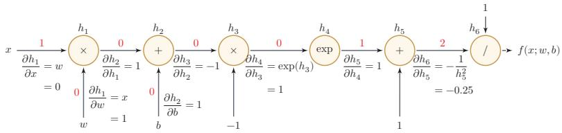  
图 4.3 复合函数 $f ( x ; w , b )$ 的计算图

从计算图上可以看出，复合函数 $f ( x ; w , b )$ 由6个基本函数 $h _ { i } , 1 \leq i \leq 6$ 组成.如表4.2所示，每个基本函数的导数都十分简单，可以通过规则来实现.

整个复合函数 $f ( x ; w , b )$ 关于参数ω和b的导数可以通过计算图上的节点$f ( x ; w , b )$ 与参数ω和b之间路径上所有的导数连乘来得到，即

$$
\begin{array} { r l } & { \frac { \partial f ( x ; w , b ) } { \partial w } = \frac { \partial f ( x ; w , b ) } { \partial h _ { 6 } } \frac { \partial h _ { 6 } } { \partial h _ { 5 } } \frac { \partial h _ { 5 } } { \partial h _ { 4 } } \frac { \partial h _ { 4 } } { \partial h _ { 3 } } \frac { \partial h _ { 3 } } { \partial h _ { 2 } } \frac { \partial h _ { 2 } } { \partial h _ { 1 } } \frac { \partial h _ { 1 } } { \partial w } , } \\ & { \frac { \partial f ( x ; w , b ) } { \partial b } = \frac { \partial f ( x ; w , b ) } { \partial h _ { 6 } } \frac { \partial h _ { 6 } } { \partial h _ { 5 } } \frac { \partial h _ { 5 } } { \partial h _ { 4 } } \frac { \partial h _ { 4 } } { \partial h _ { 3 } } \frac { \partial h _ { 3 } } { \partial h _ { 2 } } \frac { \partial h _ { 2 } } { \partial b } . } \end{array}\tag{4.49}
$$

(4.50)

以 $\frac { \partial f ( x ; w , b ) } { \partial w }$ 为例,当 $x = 1 , w = 0 , b = 0$ 时，可以得到

$$
\frac { \partial f ( x ; w , b ) } { \partial w } \vert _ { x = 1 , w = 0 , b = 0 } = \frac { \partial f ( x ; w , b ) } { \partial h _ { 6 } } \frac { \partial h _ { 6 } } { \partial h _ { 5 } } \frac { \partial h _ { 5 } } { \partial h _ { 4 } } \frac { \partial h _ { 4 } } { \partial h _ { 3 } } \frac { \partial h _ { 3 } } { \partial h _ { 2 } } \frac { \partial h _ { 2 } } { \partial h _ { 1 } } \frac { \partial h _ { 1 } } { \partial w }\tag{4.51}
$$

表 4.2 复合函数 $f ( x ; w , b )$ 的6个基本函数及其导数
<table><tr><td>函数 导数</td><td colspan="3"></td></tr><tr><td> $h _ { 1 } = x \times w$ </td><td> ${ \frac { \partial h _ { 1 } } { \partial w } } = x$ </td><td></td><td> $\frac { \partial h _ { 1 } } { \partial x } = w$ </td></tr><tr><td>h2 = h1 + b</td><td>∂h2 =1</td><td>∂h2</td><td>= 1</td></tr><tr><td></td><td>∂h1 ∂h3 = -1</td><td>∂b</td><td></td></tr><tr><td>h3 = h2 × −1</td><td>∂h2 ∂h4</td><td></td><td></td></tr><tr><td>h4 = exp(h3)</td><td>= exp(h3) ∂h3 ∂h5</td><td></td><td></td></tr><tr><td>h5 = h4 + 1</td><td>=1 ∂h4 ∂h6 1</td><td></td><td></td></tr><tr><td>h6 = 1/h5</td><td>∂h5 h</td><td></td><td></td></tr><tr><td></td><td>= 1 × −0.25 × 1 × 1 × −1 × 1 × 1</td><td></td><td>(4.52)</td></tr></table>

如果函数和参数之间有多条路径，可以将这多条路径上的导数再进行相加，得到最终的梯度

按照计算导数的顺序，自动微分可以分为两种模式：前向模式和反向模式前向模式 前向模式是按计算图中计算方向的相同方向来递归地计算梯度.以$\frac { \partial f ( x ; w , b ) } { \partial w }$ 为例，当 $x = 1 , w = 0 , b = 0$ 时，前向模式的累积计算顺序如下：

$$
\frac { \partial h _ { 1 } } { \partial w } = x = 1 ,\tag{4.54}
$$

$$
\frac { \partial h _ { 2 } } { \partial w } = \frac { \partial h _ { 2 } } { \partial h _ { 1 } } \frac { \partial h _ { 1 } } { \partial w } = 1 \times 1 = 1 ,\tag{4.55}
$$

$$
\frac { \partial h _ { 3 } } { \partial w } = \frac { \partial h _ { 3 } } { \partial h _ { 2 } } \frac { \partial h _ { 2 } } { \partial w } = - 1 \times 1 ,\tag{4.56}
$$

$$
\frac { \partial h _ { 6 } } { \partial w } = \frac { \partial h _ { 6 } } { \partial h _ { 5 } } \frac { \partial h _ { 5 } } { \partial w } = - 0 . 2 5 \times - 1 = 0 . 2 5 ,\tag{4.57}
$$

$$
\frac { \partial f ( x ; w , b ) } { \partial w } = \frac { \partial f ( x ; w , b ) } { \partial h _ { 6 } } \frac { \partial h _ { 6 } } { \partial w } = 1 \times 0 . 2 5 = 0 . 2 5 .\tag{4.58}
$$

反向模式 反向模式是按计算图中计算方向的相反方向来递归地计算梯度．以$\frac { \partial f ( x ; w , b ) } { \partial w }$ 为例，当 $x = 1 , w = 0 , b = 0$ 时，反向模式的累积计算顺序如下：

$$
\frac { \partial f ( x ; w , b ) } { \partial h _ { 6 } } = 1 ,\tag{4.59}
$$

$$
\frac { \partial f ( x ; w , b ) } { \partial h _ { 5 } } = \frac { \partial f ( x ; w , b ) } { \partial h _ { 6 } } \frac { \partial h _ { 6 } } { \partial h _ { 5 } } = 1 \times - 0 . 2 5 ,\tag{4.60}
$$

$$
\frac { \partial f ( x ; w , b ) } { \partial h _ { 4 } } = \frac { \partial f ( x ; w , b ) } { \partial h _ { 5 } } \frac { \partial h _ { 5 } } { \partial h _ { 4 } } = - 0 . 2 5 \times 1 = - 0 . 2 5 ,\tag{4.61}
$$

(4.62)

$$
\frac { \partial f ( x ; w , b ) } { \partial w } = \frac { \partial f ( x ; w , b ) } { \partial h _ { 1 } } \frac { \partial h _ { 1 } } { \partial w } = 0 . 2 5 \times 1 = 0 . 2 5 .\tag{4.63}
$$

前向模式和反向模式可以看作应用链式法则的两种梯度累积方式.从反向模式的计算顺序可以看出，反向模式和反向传播的计算梯度方式本质上是一致的.

对于一般的函数形式 $f : \mathbb { R } ^ { N } \to \mathbb { R } ^ { M }$ ，前向模式更适合输入维度较小、输出维度较大的情形；反向模式更适合输入维度很高、输出维度较小的情形.特别地，当输出是标量损失函数时，反向模式可以在一次反向遍历中同时得到该标量关于大量参数的梯度，因此，在前馈神经网络和深度学习模型的训练中，最常用的就是反向模式自动微分.

从更抽象的角度看，前向模式对应的是雅可比向量积，反向模式对应的是向量雅可比积.由于神经网络训练通常需要计算一个标量损失函数关于大量参数的梯度，因此反向模式更为合适；误差反向传播算法也可以看作神经网络上的反向模式自动微分.

需要注意的是，反向模式通常需要保存前向计算中的中间结果，因此会带来额外的存储开销.在训练深层网络和大模型时，常常需要配合重计算等技术来降低显存占用.

静态计算图和动态计算图计算图按构建方式可以分为静态计算图（StatidComputational Graph）和动态计算图（Dynamic Computational Graph）.静态计算图通常在执行前先构建和优化整张计算图，便于进行全局优化和并行调度；动态计算图则在程序运行时按实际控制流即时构建，灵活性更高，也更便于调试.

现代深度学习框架已经不再简单地割裂为“静态图”或“动态图”两类，而是往往同时支持动态求导和图执行优化.

从常见框架的设计看，PyTorch通常在前向计算时动态记录运算图，并通过 backward()进行反向自动微分；TensorFlow 2主要通过 tf.GradientTape在eager模式下记录计算，也可以配合tf.function转换为图执行；JAX则把grad、jvp、vjp等自动微分操作视为程序变换，可以与jit等机制组合使用.因而，从工程实践上看，自动微分已经成为深度学习系统的基础能力，而不再只是某一种特定框架的附加功能.

符号微分和自动微分符号微分和自动微分都利用计算图和链式法则来求解导数，但二者关注的对象不同.符号微分直接操作解析表达式，目标是得到导数的显式表达式；自动微分则直接作用在数值程序上，在执行过程中记录基本操作，并以数值方式累积局部梯度.相比数值微分，自动微分不依赖有限差分近似；相比符号微分，它通常更适合复杂程序、控制流以及大规模张量计算.

图4.4给出了符号微分与自动微分的对比.

  
图4.4 符号微分与自动微分对比

## 4.4 训练中的优化问题

即使可以通过反向传播或自动微分高效计算梯度，神经网络的训练仍然比线性模型更加困难.其主要原因有两点：1）优化问题通常是非凸的；2）在深层网络中还容易出现梯度消失.

## 4.4.1 非凸优化问题

神经网络的优化问题通常是一个非凸优化问题.以一个最简单的1-1-1结构的两层神经网络为例，

$$
\hat { y } = \sigma ( w _ { 2 } \sigma ( w _ { 1 } x ) ) ,\tag{4.64}
$$

其中 $w _ { 1 }$ 和 $w _ { 2 }$ 为网络参数， $\sigma ( \cdot )$ 为Logistic函数,y为网络输出.

假设分别使用两种损失函数.第一种损失函数为平方误差损失：

$$
\mathcal { L } ( w _ { 1 } , w _ { 2 } ) = ( y - \hat { y } ) ^ { 2 } ,\tag{4.65}
$$

第二种损失函数为交叉熵损失：

$$
\mathcal { L } ( w _ { 1 } , w _ { 2 } ) = - \log \hat { y } .\tag{4.66}
$$

给定一个样本 $( x , y ) = ( 1 , 1 )$ ，损失函数与参数 $w _ { 1 }$ 和 $w _ { 2 }$ 的关系如图4.5所示，可以看出两种损失函数都是关于参数的非凸函数

  
(a) 平方误差损失

  
(b) 交叉熵损失  
图 4.5 神经网络 $\hat { y } = \sigma ( w _ { 2 } \sigma ( w _ { 1 } x ) )$ 的损失函数

## 4.4.2 梯度消失与爆炸问题

在神经网络中误差反向传播的迭代公式为

$$
\begin{array} { r } { \delta ^ { ( l ) } = f _ { l } ^ { \prime } ( z ^ { ( l ) } ) \odot \left( { W ^ { ( l + 1 ) } } \right) ^ { \top } \delta ^ { ( l + 1 ) } . } \end{array}\tag{4.67}
$$

误差从输出层反向传播时，在每一层都要乘以该层的激活函数的导数.当我们使用Sigmoid型函数:Logistic函数σ(x)或Tanh函数时，其导数为

$$
\sigma ^ { \prime } ( x ) = \sigma ( x ) ( 1 - \sigma ( x ) ) \in [ 0 , 0 . 2 5 ] ,\tag{4.68}
$$

$$
\operatorname { t a n h } ^ { \prime } ( x ) = 1 - \left( \operatorname { t a n h } ( x ) \right) ^ { 2 } \in [ 0 , 1 ] .\tag{4.69}
$$

Sigmoid型函数的导数的值域都小于或等于1,如图4.6所示

  
(a) Logistic 函数的导数

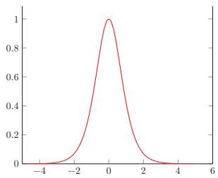  
(b) Tanh 函数的导数  
图 4.6 Sigmoid型函数的导数

由于Sigmoid型函数的饱和性，饱和区的导数更是接近于0.这样，误差经过每一层传递都会不断衰减.当网络层数很深时，梯度就会不停衰减，甚至消失，使得整个网络很难训练.这就是所谓的梯度消失问题（Vanishing GradientProblem），也称为梯度弥散问题

梯度消失曾长期是深层网络训练的核心困难之一.减轻梯度消失问题的方法有很多种.一种简单有效的方式是使用导数相对较大的激活函数，比如ReLU等；此外，合理的参数初始化、规范化方法以及残差连接等技术也都能够显著缓解这一问题.

除了梯度消失，深层网络还可能出现梯度爆炸（GradientExplosion)问题：当权重矩阵的范数大于1时，误差信号在反向传播过程中会指数级增长，导致参数更新过大甚至溢出（NaN）. 常用的缓解方法是梯度截断（Gradient Clip-ping），即当梯度范数超过预设阈值时，将梯度等比例缩小.此外，合理的参数初始化（如Xavier初始化、He初始化）对缓解梯度消失和爆炸都至关重要.

本节用最简单的网络示例说明了“深层网络为什么训练困难”，目的是建立直觉而非给出完整处方.后续将从高维参数空间的角度对这些现象做系统分析，包括鞍点的普遍性、平坦最小值与泛化的关系、局部最小解的等价性，并给出针对性的工程方法：自适应优化算法、参数初始化策略、逐层规范化、暂退法与权重衰减等.

## 4.5 激活函数与门控激活单元

前面在介绍神经元、反向传播和优化问题时，已经多次用到激活函数及其导数.现在可以从表示能力和优化性质两个角度，对常用的非线性结构作一个更系统的总结，本节将介绍两类非线性结构：一类是传统意义上的激活函数，即作用在标量净输入上的逐元素非线性映射f：R→R，如Sigmoid、ReLU、Swish、GELU等；另一类是门控激活单元，它们不是严格意义上的激活函数，而是包含若干线性变换和激活函数的复合模块，典型代表是门控线性单元（GLU）及其变体以及Maxout单元，在现代大型神经网络模型（特别是Transformer的前馈子层）中被广泛使用

一般来说，为了增强网络的表示能力和学习能力，激活函数通常希望具备以下几点性质：

（1）连续并可导（允许少数点上不可导）的非线性函数.可导的激活函数可以直接利用数值优化的方法来学习网络参数.

（2）激活函数及其导函数要尽可能的简单，有利于提高网络计算效率.

（3）激活函数的导函数的值域要在一个合适的区间内，不能太大也不能太小，否则会影响训练的效率和稳定性

下面先介绍几种常用的逐元素激活函数，再介绍门控激活单元

## 4.5.1 Sigmoid型函数

Sigmoid型函数是指一类S型曲线函数，为两端饱和函数.常用的Sigmoid型函数有Logistic 函数和 Tanh 函数.

## 数学小知识|饱和

对于函数 $f ( x )$ ,若 $x \to - \infty$ 时，其导数 $f ^ { \prime } ( x )  0$ ,则称其为左饱和.若 $x \to + \infty$ 时，其导数 $f ^ { \prime } ( x )  0$ ，则称其为右饱和.当同时满足左、右饱和时，就称为两端饱和

Logistic 函数 Logistic 函数定义为

$$
\sigma ( x ) = \frac { 1 } { 1 + \exp ( - x ) } .\tag{4.70}
$$

Logistic函数可以看成是一个“挤压”函数，把一个实数域的输入“挤压”到(0,1). 当输入值在0附近时，Sigmoid型函数近似为线性函数；当输入值靠近两端时，对输入进行抑制.输入越小，越接近于0；输入越大，越接近于1.这样的特点也和生物神经元类似，对一些输入会产生兴奋（输出为1），对另一些输入产生抑制（输出为0). 和感知器使用的阶跃激活函数相比，Logistic函数是连续可导的，其数学性质更好

因为Logistic函数的性质，使得装备了Logistic激活函数的神经元具有以下两点特点：1）在二分类任务的输出层中，其输出可以解释为类别 $y = 1$ 的条件概率，因此神经网络可以更好地和统计学习模型进行结合；2）其也可以看作一个软性门（Soft Gate），用来控制其他神经元输出信息的数量．在隐藏层中，Logistic函数更多是作为一种连续、可导的非线性变换.

Tanh函数 Tanh 函数也是一种 Sigmoid型函数.其定义为

$$
\operatorname { t a n h } ( x ) = { \frac { \exp ( x ) - \exp ( - x ) } { \exp ( x ) + \exp ( - x ) } } .\tag{4.71}
$$

Tanh函数可以看作放大并平移的Logistic函数，其值域是(—1,1).

$$
\operatorname { t a n h } ( x ) = 2 \sigma ( 2 x ) - 1 .\tag{4.72}
$$

图4.7给出了Logistic 函数和 Tanh函数的形状. Tanh函数的输出是零中心化的（Zero-Centered），而Logistic函数的输出恒大于0.非零中心化的输出会使得其后一层的神经元的输入发生偏置偏移（BiasShift），并进一步使得梯度下降的收敛速度变慢.

  
图 4.7 Logistic 函数和 Tanh 函数

## 4.5.2 ReLU函数

ReLU（Rectified Linear Unit，修正线性单元）[Nair et al., 2010]，也叫Rectifier 函数 [Glorot et al., 2011]，是深度神经网络中常用的激活函数. ReLU实际上是一个斜坡（ramp）函数，定义为

$$
\begin{array} { r } { \mathrm { R e L U } ( x ) = \left\{ \begin{array} { l l } { x } & { x \geq 0 } \\ { 0 } & { x < 0 } \end{array} \right. } \\ { = \operatorname* { m a x } ( 0 , x ) . } \end{array}\tag{4.73}
$$

(4.74)

优点 采用ReLU的神经元只需要进行加、乘和比较的操作，计算上更加高效ReLU函数也被认为具有生物学合理性（Biological Plausibility），比如单侧抑制、宽兴奋边界（即兴奋程度可以非常高）.在生物神经网络中，同时处于兴奋状态的神经元非常稀疏，人脑中在同一时刻大概只有1%～4%的神经元处于活跃状态.Sigmoid型激活函数会导致一个非稀疏的神经网络，而ReLU却具有很好的稀疏性，大约50%的神经元会处于激活状态.

在优化方面，相比于Sigmoid型函数的两端饱和，ReLU函数为左饱和函数，且在 $x > 0$ 时导数为1，在一定程度上缓解了神经网络的梯度消失问题，加速梯度下降的收敛速度.

参见第4.4.2节.

缺点 ReLU函数的输出是非零中心化的，给后一层的神经网络引入偏置偏移，会影响梯度下降的效率．此外，ReLU神经元在训练时比较容易“死亡”．在训练时，如果参数在一次不恰当的更新后，第一个隐藏层中的某个ReLU神经元在所有的训练数据上都不能被激活，那么只要后续数据仍落在非激活区，这个神经元自身参数的梯度会持续为0，在后续训练过程中很难再恢复激活．这种现象称为死亡ReLU问题（DyingReLU Problem），并且也有可能会发生在其他隐藏层.

ReLU神经元指采用ReLU作为激活函数的神经元.

参见公式(4.40).

参见习题4-3.

在实际使用中，为了缓解上述问题，可以使用若干ReLU的变种.

## 4.5.2.1 带泄露的ReLU

带泄露的 ReLU（LeakyReLU)在输入 $x < 0$ 时，保持一个很小的梯度 $\gamma$ 这样当神经元非激活时也能有一个非零的梯度可以更新参数，降低长期不能被激活的风险 [Maas et al., 2013]. 带泄露的 ReLU的定义如下:

$$
{ \mathrm { L e a k y R e L U } } ( x ) = { \left\{ \begin{array} { l l } { x } & { { \mathrm { i f ~ } } x > 0 } \\ { \gamma x } & { { \mathrm { i f ~ } } x \leq 0 } \end{array} \right. }\tag{4.75}
$$

$$
\begin{array} { r } { = \operatorname* { m a x } ( 0 , x ) + \gamma \operatorname* { m i n } ( 0 , x ) , } \end{array}\tag{4.76}
$$

其中 $\gamma$ 是一个很小的常数，比如0.01.当 $\gamma < 1$ 时，带泄露的ReLU也可以写为

$$
\mathrm { L e a k y R e L U } ( x ) = \operatorname* { m a x } ( x , \gamma x ) ,\tag{4.77}
$$

相当于是一个比较简单的maxout单元.

参见第4.5.6节.

## 4.5.2.2 带参数的ReLU

带参数的ReLU(Parametric ReLU，PReLU)引入一个可学习的参数，不同神经元可以有不同的参数[He et al., 2015]. 对于第i个神经元，其PReLU的定义为

$$
{ \mathrm { P R e L U } } _ { i } ( x ) = { \left\{ \begin{array} { l l } { x } & { { \mathrm { i f ~ } } x > 0 } \\ { \gamma _ { i } x } & { { \mathrm { i f ~ } } x \leq 0 } \end{array} \right. }\tag{4.78}
$$

$$
\begin{array} { r } { = \operatorname* { m a x } ( 0 , x ) + \gamma _ { i } \operatorname* { m i n } ( 0 , x ) , } \end{array}\tag{4.79}
$$

其中 $\gamma _ { i }$ 为 $x \leq 0$ 时函数的斜率.因此，PReLU是非饱和函数.如果 $\gamma _ { i } = 0$ ，那么PReLU就退化为ReLU.如果 $\gamma _ { i }$ 为一个很小的常数，则PReLU可以看作带泄露的ReLU.PReLU可以允许不同神经元具有不同的参数，也可以让一组神经元共享一个参数.

## 4.5.2.3 ELU函数

ELU(Exponential Linear Unit,指数线性单元) [Clevert et al., 2016] 是一个近似的零中心化的非线性函数，其定义为

$$
{ \mathrm { E L U } } ( x ) = { \left\{ \begin{array} { l l } { x } & { { \mathrm { i f ~ } } x > 0 } \\ { \gamma ( \exp ( x ) - 1 ) } & { { \mathrm { i f ~ } } x \leq 0 } \end{array} \right. }\tag{4.80}
$$

$$
= \operatorname* { m a x } ( 0 , x ) + \operatorname* { m i n } ( 0 , \gamma ( \exp ( x ) - 1 ) ) ,\tag{4.81}
$$

其中 $\gamma \geq 0$ 是一个超参数，决定 $x \le 0$ 时的饱和曲线，并调整输出均值在0附近

参见第7.5.1节.

## 4.5.2.4 Softplus 函数

Softplus 函数[Dugas et al., 2001] 可以看作 Rectifier 函数的平滑版本，其定义为

$$
{ \mathrm { S o f t p l u s } } ( x ) = \log ( 1 + \exp ( x ) ) .\tag{4.82}
$$

Softplus 函数的导数刚好是Logistic 函数. Softplus 函数虽然也具有单侧抑制、宽兴奋边界的特性，却没有稀疏激活性.

图4.8给出了ReLU、Leaky ReLU、ELU以及 Softplus函数的示例.

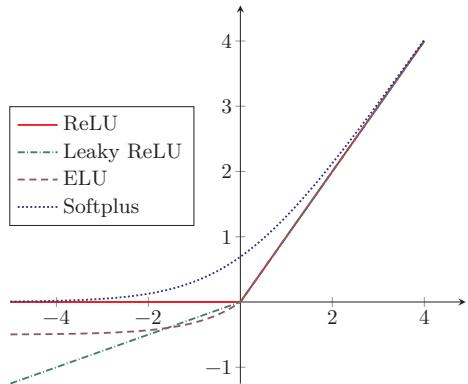  
图 4.8 ReLU、Leaky ReLU、ELU 以及 Softplus 函数

## 4.5.3 Swish 函数

Swish 函数[Ramachandran et al., 2018]是一种自门控（Self-Gated)激活函数，定义为

$$
\operatorname { s w i s h } ( x ) = x \sigma ( \beta x ) ,\tag{4.83}
$$

其中 $\sigma ( \cdot )$ 为Logistic 函数， $\beta$ 为可学习的参数或一个固定超参数. $\sigma ( \cdot ) \in ( 0 , 1 )$ 可以看作一种软性的门控机制.当 $\sigma ( \beta x )$ 接近于1时，门处于“开”状态，激活函数的输出近似于 $x$ 本身；当 $\sigma ( \beta x )$ 接近于0时，门的状态为“关”，激活函数的输出近似于0.

图4.9给出了Swish函数的示例.

当 $\beta = 0$ 时，Swish函数变成线性函数 $x / 2 .$ 当 $\beta = 1$ 时，Swish函数在 $x > 0$ 时近似线性，在 $x < 0$ 时近似饱和，同时具有一定的非单调性.当 $\beta = 1$ 时,Swish函数也称为SiLU(Sigmoid Linear Unit).当 $\beta \to + \infty$ 时， $\sigma ( \beta x )$ 趋向于离散的0-1函数，Swish函数近似为ReLU函数.因此，Swish函数可以看作线性函数和ReLU函数之间的非线性插值函数，其程度由参数 $\beta$ 控制.

SiLU是后续介绍的SwiGLU的基本构件，参见第4.5.5节.

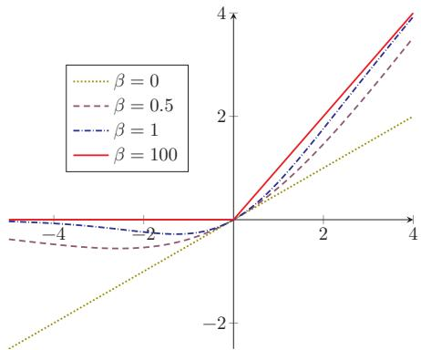  
图 4.9 Swish 函数

## 4.5.4 GELU函数

GELU（Gaussian Error Linear Unit，高斯误差线性单元）[Hendryckset al.,2016]也是一种通过门控机制来调整其输出值的激活函数，和Swish函数比较类似.

$$
\mathrm { { G E L U } } ( x ) = x \Phi ( x ) ,\tag{4.84}
$$

其中Φ(x)是标准正态分布N(0,1)的累积分布函数.由于高斯分布的累积分布函数为S型函数，因此GELU函数可以用Tanh函数或Logistic函数来近似，

$$
\operatorname { G E L U } ( x ) \approx 0 . 5 x { \Big ( } 1 + \operatorname { t a n h } { \big ( } { \sqrt { \frac { 2 } { \pi } } } ( x + 0 . 0 4 4 7 1 5 x ^ { 3 } ) { \big ) } { \Big ) } ,\tag{4.85}
$$

$$
\begin{array} { r } { \sharp \qquad \mathrm { G E L U } ( x ) \approx x \sigma ( 1 . 7 0 2 x ) . } \end{array}\tag{4.86}
$$

当用Logistic函数近似高斯CDF时，GELU的形式在数值上与特定参数的Swish函数接近，但二者的设计动机不同.不少框架同时提供基于误差函数(erf)的精确实现和近似实现，实际使用中可按数值效率和兼容性选择.

表4.3给出了常见激活函数及其导数.

表中的激活函数主要面向传统前馈神经网络.对于Transformer和大语言模型，其前馈子层中还经常采用SwiGLU、GeGLU等基于GLU的门控激活结构.

## 4.5.5 门控线性单元

前面介绍的激活函数都作用在神经元的标量净输入上.在向量形式的一层网络中，它们通常逐元素地应用到每个分量上.在一些现代大型神经网络模型中，还常采用另一类思路：先对输入向量做两组不同的线性变换，再用其中一组去“门控”另一组的输出，即门控线性单元（Gated Linear Unit，GLU）[Dauphin et al., 2017; Shazeer, 2020].

表4.3 常见激活函数及其导数
<table><tr><td>激活函数</td><td>函数</td><td>导数</td></tr><tr><td>Logistic 函数</td><td> $\begin{array} { r } { f ( x ) = \frac { 1 } { 1 + \exp ( - x ) } } \end{array}$ </td><td> $f ^ { \prime } ( x ) = f ( x ) ( 1 - f ( x ) )$ </td></tr><tr><td>Tanh 函数</td><td> $\begin{array} { r } { f ( x ) = \frac { \exp ( x ) - \exp ( - x ) } { \exp ( x ) + \exp ( - x ) } } \end{array}$ </td><td> $f ^ { \prime } ( x ) = 1 - f ( x ) ^ { 2 }$ </td></tr><tr><td>ReLU函数</td><td> $f ( x ) = \operatorname* { m a x } ( 0 , x )$ </td><td> $f ^ { \prime } ( x ) = I ( x > 0 )$ </td></tr><tr><td>ELU函数</td><td> $f ( x ) \ = \ \operatorname* { m a x } ( 0 , x ) \ +$   $\operatorname* { m i n } { \Big ( } 0 , \gamma { \big ( } \exp ( x ) - 1 { \big ) } { \Big ) }$ </td><td> $f ^ { \prime } ( x ) = I ( x > 0 ) + I ( x \leq 0 ) \cdot \gamma \exp ( x )$ </td></tr><tr><td>SoftPlus 函数</td><td> $f ( x ) = \log \left( 1 + \exp ( x ) \right)$ </td><td> $\begin{array} { r } { f ^ { \prime } ( x ) = \frac { 1 } { 1 + \exp ( - x ) } } \end{array}$ </td></tr><tr><td>Swish 函数</td><td> $f ( x ) = x \sigma ( \beta x )$ </td><td> $f ^ { \prime } ( x ) = \sigma ( \beta x ) + \beta x \sigma ( \beta x ) ( 1 - \sigma ( \beta x ) )$ </td></tr><tr><td>GELU函数</td><td> $f ( x ) = x \Phi ( x )$ </td><td> $f ^ { \prime } ( x ) = \Phi ( x ) + x \Phi ^ { \prime } ( x )$ </td></tr></table>

需要说明的是，GLU并不是严格意义上的激活函数，而是一个包含激活函数的复合模块它由线性变换、逐元素非线性激活和门控乘法共同组成，自身带有可学习参数，向量输入到向量输出的维度也可以不同.从功能上看，GLU更接近于传统FFN层的替代品，而不是放在FFN层内部的某个激活函数.本节将其与激活函数放在一起介绍，主要是因为它同样为网络引入非线性，并且在现代模型中常常替代“线性层+激活函数”这一经典组合.

对于输入向量x，GLU通过两组线性变换分别构造“值分支”和“门分支”，然后将二者逐元素相乘：

$$
\boldsymbol { h } = \phi ( W _ { g } \boldsymbol { x } + b _ { g } ) \odot ( W _ { v } \boldsymbol { x } + b _ { v } ) ,\tag{4.87}
$$

其中 $\phi ( \cdot )$ 为门分支上的非线性函数，表示逐元素乘法.这里 ${ \boldsymbol { W } _ { \boldsymbol { v } } } \pm \boldsymbol { b } _ { \boldsymbol { v } }$ 产生候选表示，而 $\phi ( { \pmb W } _ { g } { \pmb x } + { \pmb b } _ { g } )$ 通常取值在(0,1)之间，用来控制哪些信息可以通过.与普通逐元素激活相比，GLU不是在单一路径上直接施加非线性，而是通过“值分支”和“门分支”的耦合实现更灵活的表示.

门控后的结果通常还会再经过一个线性变换，得到模块的输出：

$$
o = W _ { o } h + b _ { o } .\tag{4.88}
$$

门分支上的函数 $\phi ( \cdot )$ 可以设为Logistic函数 $\sigma ( \cdot )$ ，也可以设为其他非线性函数，从而得到不同的GLU变体.当门分支采用Swish函数时，可得到SwiGLU函数：

$$
\mathrm { S w i G L U } ( \pmb { x } ) = \mathrm { s w i s h } ( \pmb { W _ { g } } \pmb { x } + \pmb { b _ { g } } ) \odot ( \pmb { W _ { v } } \pmb { x } + \pmb { b _ { v } } ) .\tag{4.89}
$$

当门分支采用GELU函数时，可得到GeGLU函数：

$$
\mathrm { G e G L U } ( \boldsymbol { x } ) = \mathrm { G E L U } ( W _ { g } \boldsymbol { x } + b _ { g } ) \odot ( W _ { v } \boldsymbol { x } + b _ { v } ) .\tag{4.90}
$$

https://nndl.ai/

其中SwiGLU和GeGLU都已成为Transformer前馈子层中常见的门控变体;具体模型会根据训练稳定性、计算代价和经验效果选择不同形式

## 4.5.6 Maxout 单元

与GLU类似,Maxout 单元[Goodfellow et al., 2013]也不再是作用于单个标量净输入的普通激活函数，而是一种建立在向量输入之上的更复杂非线性单元. 对于Maxout单元，其输入是上一层神经元的全部原始输出，即一个向量$\pmb { x } = [ x _ { 1 } ; x _ { 2 } ; \cdots ; x _ { D } ]$

这里x为列向量，其元素按分号隔开.

每个Maxout单元有K个权重向量 ${ \pmb w } _ { k } \in \mathbb { R } ^ { D }$ 和偏置 $b _ { k } \ ( 1 \leq k \leq K )$ .对于输入x，可以得到K个净输入 $z _ { k } , 1 \le k \le K$

$$
\boldsymbol { z } _ { k } = \boldsymbol { w } _ { k } ^ { \intercal } \boldsymbol { x } + \boldsymbol { b } _ { k } ,\tag{4.91}
$$

其中 $\pmb { w } _ { k } = [ w _ { k , 1 } , \cdots , w _ { k , D } ] ^ { \intercal }$ 为第k个权重向量.

Maxout单元的非线性函数定义为

$$
\operatorname* { m a x o u t } ( \pmb { x } ) = \operatorname* { m a x } _ { k \in [ 1 , K ] } ( z _ { k } ) .\tag{4.92}
$$

和GLU一样，Maxout单元也不是传统意义上的激活函数，而是自身带有可学习参数（K组 ${ \pmb w } _ { k }$ 和 $b _ { k }$ )的复合非线性模块；它整体学习输入到输出之间的非线性映射关系，而不是单纯对净输入做逐元素变换.Maxout单元可以看作任意凸函数的分段线性近似，并且在有限的点上是不可微的

采用 Maxout单元的神经网络也叫作Maxout网络.

## 4.6 总结和扩展阅读

前馈神经网络是深度学习中基础而重要的一类模型.它以神经元为基本组成单元，通过多层仿射变换与非线性变换的复合，实现从输入到输出的逐层映射，从表示角度看，前馈网络能够逼近复杂的非线性函数；从计算角度看，它提供了一个统一而清晰的建模框架，为后续更复杂的神经网络模型奠定了基础.

前馈神经网络在20世纪80年代后期就已被广泛使用，早期常见实现多采用两层网络结构（即一个隐藏层和一个输出层），神经元的激活函数基本上都是Sigmoid型函数，并且使用的损失函数也大多数是平方损失.虽然当时前馈神经网络的参数学习依然有很多难点，但其作为一种连接主义的典型模型，标志人工智能从高度符号化的知识期向低符号化的学习期开始转变

本章围绕前馈网络的结构、表示能力与学习方法展开.首先介绍了神经元及前馈网络的基本结构，说明了网络如何通过层与层之间的组合实现更加丰富的特征变换；随后讨论了前馈网络的通用近似能力，说明具有适当非线性激活函数的前馈网络可以逼近较广泛的目标函数，前馈神经网络作为一种能力很强的非线性模型，其能力可以由通用近似定理来保证.关于通用近似定理的详细介绍可以参考[Haykin,2009].在此基础上，本章进一步介绍了参数学习的基本目标，推导了反向传播算法，并说明了自动微分在现代深度学习框架中的作用.这些内容共同构成了前馈网络从模型定义到参数训练的完整链条.

本章还讨论了前馈网络训练中的若干典型优化问题，如梯度消失、非凸优化以及不同非线性结构对训练动态的影响.非线性结构不仅决定了网络是否具有表示能力，也会显著影响梯度传播、收敛速度和训练稳定性.从早期常用的Lo-gistic函数和双曲正切函数，到深层网络中广泛使用的ReLU及其变体、Swish、GELU等逐元素激活函数，再到大模型中常见的GLU、SwiGLU、GeGLU等门控激活单元，非线性结构的演化反映了神经网络设计从“能够表示复杂函数”逐步走向“更加易于训练、更加适合深层结构和大规模模型”的发展过程.

进一步阅读时，可以重点关注以下几个方向，第一，前馈网络表示能力的理论基础，例如通用近似定理及其在不同激活函数和不同网络宽度、深度条件下的推广结果；第二，反向传播算法与自动微分之间的关系，以及前向模式与反向模式自动微分在不同问题中的适用性；第三，激活函数与网络结构设计的演化，特别是ReLU类函数、平滑激活函数以及门控非线性结构在现代深度学习模型中的作用.后续章节中的卷积神经网络、循环神经网络以及Transformer模型，都可以看作是在本章所介绍的基本思想上的进一步发展与扩展.

TensorFlow游乐场1提供了一个非常好的神经网络训练过程可视化系统

## 习题

## 基础题

习题4-1 设第l-1层的输出为 $\pmb { a } ^ { ( l - 1 ) } \in \mathbb { R } ^ { M _ { l - 1 } }$ ，第l层的权重矩阵为 $W ^ { ( l ) } \in$ $\mathbb { R } ^ { M _ { l } \times M _ { l - 1 } }$ ，偏置为 $\pmb { b } ^ { ( l ) } \in \mathbb { R } ^ { M _ { l } }$ .请写出第l层的净输入 $z ^ { ( l ) }$ 和输出 $\mathbf { \Omega } _  \mathbf { \Omega } \mathbf { \Omega } \mathbf { \Omega } \mathbf { \Omega } \mathbf { \Omega } \mathbf { \Omega } \mathbf { \Omega } \mathbf { \Omega } \mathbf { \Omega } \mathbf { \Omega } \mathbf { \Omega } \mathbf { \Omega } \mathbf { \Omega } \mathbf { \Omega } \mathrm { ~ \Omega ~ } \mathrm { ~ \Omega ~ } \mathrm { ~ \Omega ~ } \mathrm { ~ \Omega ~ } \mathrm { ~ \Omega ~ } \mathrm { ~ \Omega ~ } \mathrm { ~ \Omega ~ } \mathrm { ~ \Omega ~ } \mathrm { ~ \Omega ~ } \mathrm { ~ \Omega ~ } \mathrm { ~ \Omega ~ } \mathrm { ~ \Omega ~ } \mathrm { ~ \Omega ~ } \mathrm { ~ \Omega ~ } \mathrm { ~ \Omega ~ }$ ，并说明各变量的维度.

习题4-2 对于一个神经元 $\sigma ( \pmb { w } ^ { \top } \pmb { x } + b )$ ，并使用梯度下降优化参数ω时，如果输入x恒大于0,其收敛速度会比零均值化的输入更慢.请说明原因.

习题4-3 试举例说明“死亡ReLU问题”，并提出至少两种缓解方法.

习题4-4 计算Swish函数和GELU函数的导数，并说明它们与ReLU函数在平滑性上的差异.

## 提高题

习题4-5 试设计一个前馈神经网络来解决XOR问题，要求该前馈神经网络具有两个隐藏神经元和一个输出神经元，并使用ReLU作为激活函数.

习题4-6 对于多分类问题，设输出层采用Softmax函数，损失函数采用交叉熵.请推导输出层误差项

$$
\delta ^ { ( L ) } = \frac { \partial \mathcal { L } } { \partial z ^ { ( L ) } }\tag{4.93}
$$

的具体表达式.

习题4-7如果限制一个神经网络的总神经元数量（不考虑输入层）为N+1，输入层大小为 $M _ { 0 }$ ，输出层大小为1，隐藏层的层数为L，每个隐藏层的神经元数量为 $\textstyle { \frac { N } { L } }$ ,试分析参数数量和隐藏层层数L的关系.

习题4-8 比较ReLU、GELU与SwiGLU三类非线性在结构形式、平滑性以及表达能力上的差异，并说明为什么Transformer和大语言模型中的前馈子层常采用门控激活结构，而不仅仅是逐元素激活函数

习题4-9 为什么在神经网络模型的正则化经验风险函数中通常不对偏置b进行正则化?

## 拓展题

习题4-10 证明通用近似定理对于具有线性输出层和至少一个使用ReLU激活函数的隐藏层组成的前馈神经网络，也都是适用的.

习题4-11 将单样本前馈神经网络的前向传播和反向传播公式推广到小批量情形,写出 $\pmb { Z } ^ { ( l ) } , \pmb { A } ^ { ( l ) }$ 以及参数梯度的矩阵形式

习题4-12 为什么在用反向传播算法进行参数学习时要采用随机参数初始化的方式，而不是直接令 $\begin{array} { r } { W = 0 , b = 0 ? } \end{array}$

习题4-13 梯度消失问题是否可以通过单纯增加学习率来缓解?请说明理由.

## 参考文献

BISHOP C M, 2007. Information science and statistics: pattern recognition and machine learning[M]. 5th ed. Springer.

CLEVERT D A, UNTERTHINER T, HOCHREITER S, 2016. Fast and accurate deep network learning by exponential linear units (elus)[C]//Proceedings of 4th International Conference on Learning Representations.

CYBENKO G, 1989. Approximations by superpositions of a sigmoidal function[J]. Mathematics of Control, Signals and Systems, 2: 183-192.

DAUPHIN Y N, FAN A, AULI M, et al., 2017. Language modeling with gated convolutional networks[C]//Proceedings of 34th International Conference on Machine Learning. 933-941.

DUGAS C, BENGIO Y, BÉLISLE F, et al., 2001. Incorporating second-order functional knowledge for better option pricing[J]. Advances in Neural Information Processing Systems: 472- 478.

FUNAHASHI K I, NAKAMURA Y, 1993. Approximation of dynamical systems by continuous time recurrent neural networks[J]. Neural networks, 6(6): 801-806.

GLOROT X, BORDES A, BENGIO Y, 2011. Deep sparse rectifier neural networks[C]// Proceedings of International Conference on Artificial Intelligence and Statistics. 315-323.

GOODFELLOW I J, WARDE-FARLEY D, MIRZA M, et al., 2013. Maxout networks[C]// Proceedings of the International Conference on Machine Learning. 1319-1327.

HAYKIN S, 1994. Neural networks: a comprehensive foundation: macmillan college publishing company[M]. New York.

HAYKIN S, 2009. Neural networks and learning machines[M]. 3rd ed. Pearson.

HE K, ZHANG X, REN S, et al., 2015. Delving deep into rectifiers: surpassing human-level performance on imagenet classification|C//Proceedings of the IEEE International Conference on Computer Vision. 1026-1034.

HENDRYCKS D, GIMPEL K, 2016. Gaussian error linear units (GELUs)[A/OL]. arXiv (2016). https://arxiv.org/abs/1606.08415.

HORNIK K, STINCHCOMBE M, WHITE H, 1989. Multilayer feedforward networks are universal approximators[J]. Neural networks, 2(5): 359-366.

MAAS A L, HANNUN A Y, NG A Y, 2013. Rectifier nonlinearities improve neural network acoustic models[C]//Proceedings of the International Conference on Machine Learning.

MCCULLOCH W S, PITTS W, 1943. A logical calculus of the ideas immanent in nervous activity[J]. The bulletin of mathematical biophysics, 5(4): 115-133.

NAIR V, HINTON G E, 2010. Rectified linear units improve restricted boltzmann machines [C]//Proceedings of the International Conference on Machine Learning. 807-814.

RAMACHANDRAN P, ZOPH B, LE Q V, 2018. Searching for activation functions[C]// Proceedings of 6th International Conference on Learning Representations.

SHAZEER N, 2020. GLU variants improve transformer[A/OL]. arXiv (2020). https://arxiv. org/abs/2002.05202.

## 第5章 卷积神经网络

一切都应该尽可能地简单，但不能过于简单.

——艾伯特·爱因斯坦(Albert Einstein)

卷积神经网络（Convolutional Neural Network,CNN)是一种具有局部连接、权重共享等结构先验的深层前馈神经网络.

卷积神经网络最早主要用于处理图像信息.在用全连接前馈网络来处理图像时，会存在以下两个问题：

（1）参数太多：如果输入图像大小为 $1 0 0 \times 1 0 0 \times 3$ （即图像高度为100、宽度为100、颜色通道数为3），在全连接前馈网络中，第一个隐藏层的每个神经元到输入层都有 $1 0 0 \times 1 0 0 \times 3 = 3 0 0 0 0$ 个互相独立的连接，每个连接都对应一个权重参数.假设隐藏层仅有256个神经元，参数量就已达到约7.68百万，随着隐藏层数和神经元数量的增多，参数规模会急剧增加.这会导致网络训练效率较低，也更容易出现过拟合

（2）没有利用图像的局部结构先验：自然图像中的像素通常具有较强的局部相关性，同一种局部模式也可能出现在图像的不同位置，全连接前馈网络没有显式利用这种空间局部结构和平移先验，因此统计效率较低；为了增强模型对平移、缩放、旋转等变化的鲁棒性，通常还需要结合数据增强等方法.

卷积神经网络是受生物学上感受野机制的启发而提出的.感受野（ReceptiveField）机制主要是指听觉、视觉等神经系统中一些神经元的特性，即神经元只接受其所支配的刺激区域内的信号.在视觉神经系统中，视觉皮层中的神经细胞的输出依赖于视网膜上的光感受器.视网膜上的光感受器受刺激兴奋时，将神经冲动信号传到视觉皮层，但不是所有视觉皮层中的神经元都会接受这些信号.一个神经元的感受野是指视网膜上的特定区域，只有这个区域内的刺激才能够激活该神经元.

经典的卷积神经网络通常由卷积层、汇聚层和全连接层构成；而现代卷积神经网络更常见的结构是由若干卷积块堆叠而成，并结合规范化、残差连接、步长卷积、全局平均汇聚等组件.卷积神经网络有三个核心的结构特性：局部连接、权重共享以及汇聚/下采样.其中，卷积运算更直接地带来的是对平移的等变性，而一定程度上的平移不变性通常来自卷积、汇聚、步长、全局平均汇聚以及数据增强等机制的共同作用；对于尺度和旋转变化的鲁棒性，则往往需要借助数据增强或专门的结构设计.和全连接前馈网络相比，卷积神经网络的参数通常更少，也更适合建模图像中的空间结构.

## 数学小知识|等变性与不变性

对于函数f和变换T,若 $f ( T ( \pmb { x } ) ) = T ( f ( \pmb { x } ) )$ ，即变换作用在输入上的效果会“传递”到输出上，则称f对T具有等变性（Equivariance).例如，图像平移后做卷积等价于先做卷积再平移输出.若 $f ( T ( \pmb { x } ) ) = f ( \pmb { x } )$ 即变换不改变输出，则称f对T具有不变性（Invariance).例如，无论目标出现在图像哪个位置，分类结果不变.卷积运算本身具有平移等变性而分类任务所需的平移不变性通常来自汇聚操作、数据增强、全局汇聚等多种机制的共同作用.


## 5.1 卷积

## 5.1.1 卷积的定义

卷积（Convolution），也叫褶积，是分析数学中一种重要的运算.在信号处理或图像处理中，经常使用一维或二维卷积.

## 5.1.1.1 一维卷积

这里我们只考虑离散序列的情况.

一维卷积经常用在信号处理中，用于计算信号的延迟累积.假设一个信号发生器每个时刻t产生一个信号 $x _ { t }$ ，其信息的衰减率为 $w _ { k }$ ，即在k一1个时间步长后，信息为原来的 $w _ { k }$ 倍.假设 $w _ { 1 } = 1 , w _ { 2 } = 1 / 2 , w _ { 3 } = 1 / 4$ ,那么在时刻t收到的信号 $y _ { t }$ 为当前时刻产生的信息和以前时刻延迟信息的叠加，

$$
y _ { t } = 1 \times x _ { t } + 1 / 2 \times x _ { t - 1 } + 1 / 4 \times x _ { t - 2 }\tag{5.1}
$$

$$
= w _ { 1 } \times x _ { t } + w _ { 2 } \times x _ { t - 1 } + w _ { 3 } \times x _ { t - 2 }\tag{5.2}
$$

$$
= \sum _ { k = 1 } ^ { 3 } w _ { k } x _ { t - k + 1 } .\tag{5.3}
$$

我们把 $w _ { 1 } , w _ { 2 } ,$ …称为滤波器（Filter）或卷积核（ConvolutionKernel）.卷积本质上可以看作一种局部加权求和运算.假设滤波器长度为K，它和一个信号序列 $x _ { 1 } , x _ { 2 } , \cdots$ 的卷积为

$$
y _ { t } = \sum _ { k = 1 } ^ { K } w _ { k } x _ { t - k + 1 } .\tag{5.4}
$$

为了简单起见，这里假设卷积的输出 $y _ { t }$ 的下标t从K开始.

信号序列x和滤波器w的卷积定义为

$$
y = { w } * x ,\tag{5.5}
$$

其中\*表示卷积运算.一般情况下滤波器的长度K远小于信号序列x的长度.

我们可以设计不同的滤波器来提取信号序列的不同特征.比如，当令滤波器${ \pmb w } = [ 1 / K , \cdots , 1 / K ]$ 时，卷积相当于信号序列的简单移动平均（窗口大小为K)；当令滤波器 $\pmb { w } = [ 1 , - 2 , 1 ]$ 时，可以近似实现对信号序列的二阶微分，即

$$
x ^ { \prime \prime } ( t ) = x ( t + 1 ) + x ( t - 1 ) - 2 x ( t ) .\tag{5.6}
$$

移动平均（MovingAverage,MA)是在分析时间序列数据时的一种简单平滑技术，能有效地消除数据中的随机波动.

这里将 $x ( t ) = x _ { t }$ 看作关于时间t的函数.参见习题5-5.

图5.1给出了两个滤波器的一维卷积示例．可以看出，两个滤波器分别提取了输入序列的不同特征.滤波器 $\pmb { w } = [ 1 / 3 , 1 / 3 , 1 / 3 ]$ 可以检测信号序列中的低频信息，而滤波器 $\pmb { w } = [ 1 , - 2 , 1 ]$ 可以检测信号序列中的高频信息.在传统信号处理或图像处理中，这些滤波器往往由人工设计；而在卷积神经网络中，卷积核通常作为可学习参数从数据中自动学习得到.

  
(a) 滤波器[1/3,1/3,1/3]

  
图 5.1 一维卷积示例  
(b) 滤波器 [1,-2,1]

这里的高频和低频指 信号变化的强烈程度.

下层为输入信号序列，上层为卷积结果.连接边上的数字为滤波器中的权重.

左图的卷积结果为近似值.

## 5.1.1.2 二维卷积

卷积也经常用在图像处理中.因为图像为一个二维结构，所以需要将一维卷积进行扩展.给定一个图像 $\pmb { X } \in \mathbb { R } ^ { M \times N }$ 和一个滤波器 $\pmb { W } \in \mathbb { R } ^ { U \times V }$ ，一般$U \ll M , V \ll N$ ,其卷积为

$$
y _ { i j } = \sum _ { u = 1 } ^ { U } \sum _ { v = 1 } ^ { V } w _ { u v } x _ { i - u + 1 , j - v + 1 } .\tag{5.7}
$$

为了简单起见，这里假设卷积的输出 $y _ { i j }$ 的下标 (i, j) 从(U, V)开始.

输入信息X和滤波器W的二维卷积定义为

$$
Y = W * X ,\tag{5.8}
$$

其中\*表示二维卷积运算.图5.2给出了二维卷积示例.

  
图 5.2 二维卷积示例

根据卷积定义，左图的计算需要进行卷积核翻转.

在图像处理中常用的均值滤波（MeanFilter）就是一种二维卷积，将当前位置的像素值设为滤波器窗口中所有像素的平均值，即 $\begin{array} { r } { w _ { u v } = \frac { 1 } { U V } } \end{array}$

在图像处理中，卷积经常作为特征提取的有效方法.一幅图像在经过卷积操作后得到结果称为特征图（FeatureMap）.在卷积神经网络中，卷积的目标不再是预先设计滤波器，而是通过任务驱动的训练自动学习适合当前任务的卷积核.图5.3给出在图像处理中几种常用的滤波器，以及其对应的特征图.图中最上面的滤波器是常用的高斯滤波器，可以用来对图像进行平滑去噪：中间和最下面的滤波器可以用来提取边缘特征

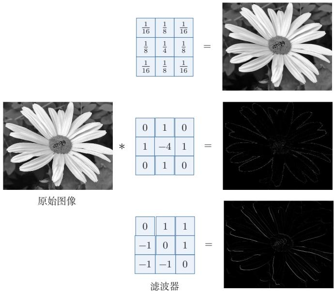  
图 5.3 图像处理中几种常用的滤波器示例

## 5.1.2 互相关

在机器学习和图像处理领域，卷积的主要功能是在一个图像（或某种特征）上滑动一个卷积核（即滤波器），通过卷积操作得到一组新的特征.在计算卷积的过程中，需要进行卷积核翻转，在具体实现上，一般会以互相关操作来代替卷积，从而会减少一些不必要的操作或开销.互相关（Cross-Correlation）是一个衡量两个序列相关性的函数，通常是用滑动窗口的点积计算来实现.给定一个图像 $\pmb { X } \in \mathbb { R } ^ { M \times N }$ 和卷积核 $\pmb { W } \in \mathbb { R } ^ { U \times V }$ ,它们的互相关为

翻转指从两个维度(从上到下、从左到右)颠倒次序，即旋转180度.

$$
y _ { i j } = \sum _ { u = 1 } ^ { U } \sum _ { v = 1 } ^ { V } w _ { u v } x _ { i + u - 1 , j + v - 1 } .\tag{5.9}
$$

和公式(5.7)对比可知，互相关和卷积的区别仅仅在于卷积核是否进行翻转.因此互相关也可以称为不翻转卷积

互相关和卷积的区别也可以理解为图像是否进行翻转.

公式(5.9) 可以表述为

$$
Y = W \otimes X\tag{5.10}
$$

$$
= \mathrm { r o t 1 8 0 } ( W ) * X ,\tag{5.11}
$$

其中 $\otimes$ 表示互相关运算，rot180(·)表示旋转180度， $\pmb { Y } \in \mathbb { R } ^ { M - U + 1 , N - V + 1 }$ 为输出矩阵.

在神经网络中使用卷积是为了进行特征抽取，卷积核是否进行翻转和其特征抽取的能力无关.特别是当卷积核是可学习的参数时，卷积和互相关在表示能力上是等价的.因此，为了实现上（或描述上）的方便起见，我们通常用互相关来代替卷积.事实上，很多深度学习工具中的“卷积”操作，其实现实际上都是互相关.

## 5.1.3 卷积的变种

在卷积的标准定义基础上，还可以引入卷积核的滑动步长和零填充来增加卷积的多样性，可以更灵活地进行特征抽取

步长（Stride）是指卷积核在滑动时的时间间隔.图5.4给出了步长与零填充两种卷积变种的示例，其中图5.4a为步长为2的情形.

零填充（Zero Padding)是在输入向量两端进行补零.图5.4b给出了输入的两端各补一个零后的卷积示例.

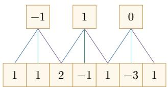

在本书之后描述中，除非特别声明，卷积一般指“互相关”.卷积符号用⊗来表示，即不翻转卷积.真正的卷积用\*来表示.

从尺寸变化的角度看，转置卷积可以对应于普通卷积步长大于1时的逆向尺寸变化，参见第5.5.1节.

(a) 步长 S = 2  
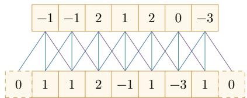  
(b) 零填充 P = 1  
图 5.4 卷积的步长和零填充（滤波器为[-1,0,1])

假设卷积层的输入神经元个数为M，卷积大小为K，步长为S，在输入两端各填补P个0(zero padding),那么该卷积层的输出长度为

$$
M ^ { \prime } = \left\lfloor { \frac { M - K + 2 P } { S } } \right\rfloor + 1 .\tag{5.12}
$$

通常可以通过选择合适的卷积大小、步长和零填充，使输出长度为整数.

二维卷积时，如果输入大小为 $M \times N$ ,卷积核大小为 $U \times V$ ，在两个方向上的步长分别为 $S _ { h } , S _ { w }$ ,零填充分别为 $P _ { h } , P _ { w }$ ，则输出大小为

$$
M ^ { \prime } = \left\lfloor \frac { M - U + 2 P _ { h } } { S _ { h } } \right\rfloor + 1 , \qquad N ^ { \prime } = \left\lfloor \frac { N - V + 2 P _ { w } } { S _ { w } } \right\rfloor + 1 .\tag{5.13}
$$

一般常用的卷积有以下三类：

（1）窄卷积（Narrow Convolution）：步长 S = 1,两端不补零P = 0,卷积后输出长度为 M - K + 1.

(2) 宽卷积（Wide Convolution):步长 S = 1,两端补零 P = K − 1,卷 积后输出长度 M + K − 1.

在早期文献中，卷积常默认为窄卷积；在许多深度学习文献和框架说明中，卷积常默认使用等宽设置.更多的卷积变种参见第5.5节.

(3）等宽卷积（Equal-Width Convolution）:步长 $S = 1$ ，当卷积核大小K为奇数时，两端补零 $P = ( K - 1 ) / 2$ ，卷积后输出长度为M. 图5.4b就是一个等宽卷积示例.当K为偶数时，通常需要使用非对称的零填充来实现等宽卷积.

## 5.1.4 卷积的数学性质

卷积有很多很好的数学性质．在本节中，我们介绍一些二维卷积的数学性质，这些数学性质同样可以适用到一维卷积的情况

## 5.1.4.1 交换性

如果不限制两个卷积信号的长度，真正的翻转卷积是具有交换性的，即 $^ { \textbf { \em x } * }$ $y = y * x .$ 对于互相关的“卷积”，也同样具有一定的“交换性”.

我们先介绍宽卷积（WideConvolution）的定义.给定一个二维图像 $\boldsymbol { X } \in$ $\mathbb { R } ^ { M \times N }$ 和一个二维卷积核 $\pmb { W } \in \mathbb { R } ^ { U \times V }$ ,对图像X进行零填充，两端各补U-1和V-1个零，得到全填充（Full Padding）的图像 $\tilde { \pmb { X } } \in \mathbb { R } ^ { ( M + 2 U - 2 ) \times ( N + 2 V - 2 ) }$ . 图像X和卷积核W的宽卷积定义为

$$
W \tilde { \otimes } X \triangleq W \otimes \tilde { X } ,\tag{5.14}
$$

其中 $\tilde { \otimes }$ 表示宽卷积运算.

当输入信息和卷积核有固定长度时，它们的宽卷积依然具有交换性，即

参见习题5-10.

$$
\mathrm { r o t 1 8 0 } ( W ) \tilde { \otimes } X = \mathrm { r o t 1 8 0 } ( X ) \tilde { \otimes } W ,\tag{5.15}
$$

其中rot180(·)表示旋转180度.也就是说，卷积层的参数梯度可以看作“输入与输出梯度的互相关”，而输入梯度可以看作“旋转后的卷积核与输出梯度的宽互相关”.

## 5.1.4.2 导数

假设 $\pmb { Y } = \pmb { W } \otimes \pmb { X }$ ,其中 $\pmb { X } \in \mathbb { R } ^ { M \times N } , \pmb { W } \in \mathbb { R } ^ { U \times V } , \pmb { Y } \in \mathbb { R } ^ { ( M - U + 1 ) \times ( N - V + 1 ) }$ 函数 $f ( \mathbf { Y } ) \in \mathbb { R }$ 为一个标量函数，则

$$
\frac { \partial f ( \pmb { Y } ) } { \partial w _ { u v } } = \sum _ { i = 1 } ^ { M - U + 1 } \sum _ { j = 1 } ^ { N - V + 1 } \frac { \partial y _ { i j } } { \partial w _ { u v } } \frac { \partial f ( \pmb { Y } ) } { \partial y _ { i j } }\tag{5.16}
$$

$$
= \sum _ { i = 1 } ^ { M - U + 1 } \sum _ { j = 1 } ^ { N - V + 1 } x _ { i + u - 1 , j + v - 1 } \frac { \partial f ( \pmb { Y } ) } { \partial y _ { i j } }\tag{5.17}
$$

$$
\begin{array} { r l } { { } } & { { y _ { i j } } } \\ { \displaystyle \sum _ { u , v } w _ { u v } x _ { i + u - 1 , j + v - 1 } . } \end{array}
$$

$$
= \sum _ { i = 1 } ^ { M - U + 1 } \sum _ { j = 1 } ^ { N - V + 1 } \frac { \partial f ( \pmb { Y } ) } { \partial y _ { i j } } x _ { u + i - 1 , v + j - 1 } .\tag{5.18}
$$

从公式(5.18)可以看出， $f ( \mathbf { Y } )$ 关于W的偏导数可以写成输入X和输出梯度 $\frac { \partial f ( \pmb { Y } ) } { \partial \pmb { Y } }$ 的互相关

$$
{ \frac { \partial f ( \boldsymbol { Y } ) } { \partial W } } = { \frac { \partial f ( \boldsymbol { Y } ) } { \partial \boldsymbol { Y } } } \otimes \boldsymbol { X } .\tag{5.19}
$$

即参数梯度等于上游梯度与输入的互相关操作.

同理得到，

$$
\begin{array} { r l } & { \displaystyle \frac { \partial f ( \pmb { Y } ) } { \partial x _ { s t } } = \sum _ { i = 1 } ^ { M - U + 1 } \sum _ { j = 1 } ^ { N - V + 1 } \frac { \partial y _ { i j } } { \partial x _ { s t } } \frac { \partial f ( \pmb { Y } ) } { \partial y _ { i j } } } \\ & { \displaystyle = \sum _ { i = 1 } ^ { M - U + 1 } \sum _ { j = 1 } ^ { N - V + 1 } w _ { s - i + 1 , t - j + 1 } \frac { \partial f ( \pmb { Y } ) } { \partial y _ { i j } } , } \end{array}\tag{5.20}
$$

(5.21)

其中当 $( s - i + 1 ) < 1$ ,或 $( s - i + 1 ) > U$ ,或 $( t - j + 1 ) < 1$ ,或 $( t - j + 1 ) > V$ 时， $w _ { s - i + 1 , t - j + 1 } = 0$ .即相当于对W进行了 $P = ( M - U , N - V )$ 的零填充.

从公式(5.21)可以看出，f(Y)关于X的偏导数为卷积核W和输出梯度$\frac { \partial f ( \pmb { Y } ) } { \partial \pmb { Y } }$ 的宽卷积.公式(5.21)中的卷积是真正的卷积而不是互相关，为了一致性，我们用互相关的“卷积”来写，即

$$
\frac { \partial f ( \pmb { Y } ) } { \partial \pmb { X } } = \mathrm { r o t } 1 8 0 ( \frac { \partial f ( \pmb { Y } ) } { \partial \pmb { Y } } ) \tilde { \otimes } \pmb { W }\tag{5.22}
$$

$$
= \mathrm { r o t } 1 8 0 ( W ) \tilde { \otimes } \frac { \partial f ( { \cal Y } ) } { \partial { \cal Y } } ,\tag{5.23}
$$

其中rot180(·)表示旋转180度.即输入梯度等于将卷积核翻转180度后与上游梯度做宽卷积，这与全连接层中前向/反向对应矩阵转置的关系完全类比.

## 5.2 卷积神经网络

卷积神经网络一般由卷积层、汇聚层以及顶层分类器构成.经典卷积神经网络在顶部常使用一个或多个全连接层，而现代卷积神经网络更常见的做法是使用若干卷积块进行特征抽取，再通过全局平均汇聚和一个较小的线性分类器完成预测.

## 5.2.1 用卷积来代替全连接

在全连接前馈神经网络中，如果第l层有 $M _ { l }$ 个神经元，第l—1层有 $M _ { l - 1 }$ 个神经元，那么连接边有 $M _ { l } \times M _ { l - 1 }$ 个，也就是权重矩阵有 $M _ { l } \times M _ { l - 1 }$ 个参数.当$M _ { l }$ 和 $M _ { l - 1 }$ 都很大时，权重矩阵的参数非常多，训练效率会很低

如果采用卷积来代替全连接，第l层的净输入 $z ^ { ( l ) }$ 为第l－1层活性值 $\mathbf { \Delta } \mathbf { a } ^ { ( l - 1 ) }$ 和卷积核 $\pmb { w } ^ { ( l ) } \in \mathbb { R } ^ { K }$ 的卷积，即

$$
\pmb { z } ^ { ( l ) } = \pmb { w } ^ { ( l ) } \otimes \pmb { a } ^ { ( l - 1 ) } + b ^ { ( l ) } ,\tag{5.24}
$$

其中卷积核 $\pmb { w } ^ { ( l ) } \in \mathbb { R } ^ { K }$ 为可学习的权重向量， $b ^ { ( l ) } \in \mathbb { R }$ 为可学习的偏置.

根据卷积的定义，卷积层有两个很重要的性质：

局部连接 在卷积层（假设是第l层）中的每一个神经元都只和前一层（第l—1层）中某个局部窗口内的神经元相连，构成一个局部连接网络．如图5.5所示，与全连接层（图5.5a）相比，卷积层（图5.5b）和前一层之间的连接数大大减少，由原来的 $M _ { l } \times M _ { l - 1 }$ 个连接变为 $M _ { l } \times K$ 个连接，K为卷积核大小.除了减少参数量，更重要的是它显式利用了输入数据中的局部结构先验.

权重共享 从公式(5.24)可以看出，作为参数的卷积核 $\mathbf { \nabla } w ^ { ( l ) }$ 对于第l层的所有神经元都是相同的.如图5.5b中，所有同颜色连接上的权重是相同的．权重共享可以理解为一个卷积核在整个输入空间上寻找同一种局部模式，因此如果要提取多种特征，就需要使用多个不同的卷积核.

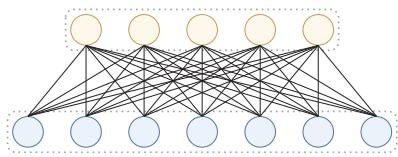  
(a) 全连接层

  
(b) 卷积层  
图 5.5 全连接层和卷积层对比

由于局部连接和权重共享，卷积层的参数只有一个K维的权重 $\mathbf { \boldsymbol { w } } ^ { ( l ) }$ 和1维的偏置 $b ^ { ( l ) }$ ,共 $K + 1$ 个参数.参数个数和神经元数量无关.此外，第l层神经元的个数不是任意选择的，而是满足 $M _ { l } = M _ { l - 1 } - K + 1$ 因此，卷积不仅减少了参数量，也把“同一种局部模式可能出现在不同位置”这一先验显式编码进了网络结构中.

这里默认步长为1，无零填充.

## 5.2.2 卷积层

卷积层的作用是提取一个局部区域的特征，不同的卷积核相当于不同的特征提取器.上一节中描述的卷积层神经元和全连接网络一样都是一维结构.由于卷积网络主要应用在图像处理上，而图像为二维结构，因此为了更充分地利用图像的局部信息，通常将神经元组织为三维结构的神经层，其大小为高度×宽度×深度，由多个二维特征图构成.

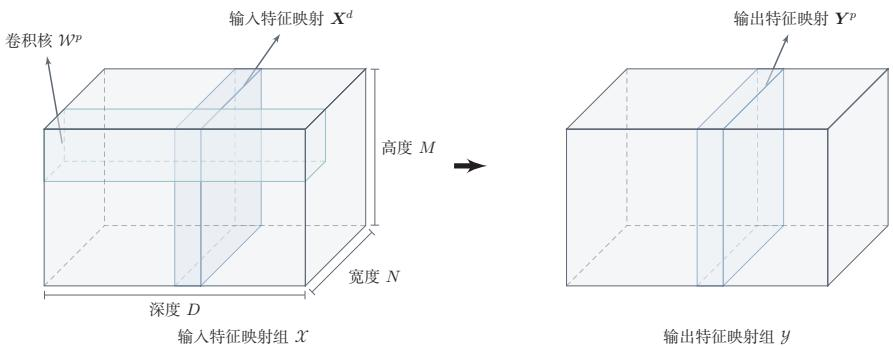  
图5.6 卷积层的三维结构表示

特征图（FeatureMap）为一幅图像（或其他特征图）在经过卷积提取后得到的特征，每个特征图可以看作一类被抽取出来的图像特征.为了提高卷积网络的表示能力，可以在每一层使用多个不同的特征图，以更好地表示图像的特征.

在输入层，特征图就是图像本身，如果是灰度图像，就只有一个特征图，输入层的深度 $D = 1$ ；如果是彩色图像，则分别有RGB三个颜色通道的特征图，输入层的深度D = 3.

不失一般性，假设一个卷积层的结构如下：

（1）输入特征图组： $\mathcal { X } \in \mathbb { R } ^ { M \times N \times D }$ 为三维张量，其中每个切片矩阵 $\pmb { X } ^ { ( d ) } \in$ R $M \times N$ 为一个输入特征图， $. 1 \leq d \leq D$

（2）输出特征图组： $ { \mathcal { Y } } \in \mathbb { R } ^ { M ^ { \prime } \times N ^ { \prime } \times P }$ 为三维张量，其中每个切片矩阵$\pmb { Y } ^ { ( p ) } \in \mathbb { R } ^ { M ^ { \prime } \times N ^ { \prime } }$ 为一个输出特征图， $1 \leq p \leq P$

（3）卷积核： $\mathcal { W } \in \mathbb { R } ^ { U \times V \times P \times D }$ 为四维张量，其中每个切片矩阵 $W ^ { ( p , d ) } \in$ R $U \times V$ 为一个二维卷积核， $1 \leq p \leq P , 1 \leq d \leq D$

图5.6给出卷积层的三维结构表示.

为了计算输出特征图 $\mathbf { \Delta } _ { Y ^ { ( p ) } }$ ，用卷积核 $W ^ { ( p , 1 ) } , W ^ { ( p , 2 ) } , \cdots , W ^ { ( p , D ) }$ 分别对输入特征图 $\pmb { X } ^ { ( 1 ) } , \pmb { X } ^ { ( 2 ) } , \cdots , \pmb { X } ^ { ( D ) }$ 进行卷积，然后将卷积结果相加，并加上一个标量偏置 $b ^ { ( p ) }$ 得到卷积层的净输入 $Z ^ { ( p ) }$ ，再经过非线性激活函数后得到输出特征图$\mathbf { \Delta } _ { Y ^ { ( p ) } }$

这里净输入是指没有经过非线性激活函数的净活性值(Net Ac-tivation).

$$
\pmb { Z } ^ { ( p ) } = \sum _ { d = 1 } ^ { D } \pmb { W } ^ { ( p , d ) } \otimes \pmb { X } ^ { ( d ) } + b ^ { ( p ) } ,\tag{5.25}
$$

$$
Y ^ { ( p ) } = f ( Z ^ { ( p ) } ) ,\tag{5.26}
$$

其中 $f ( \cdot )$ 为非线性激活函数，一般可取ReLU函数.这里的偏置 $b ^ { ( p ) }$ 是一个标量，它在空间维度上会广播到输出特征图的每个位置.

整个计算过程如图5.7所示.如果希望卷积层输出P个特征图，可以将上述计算过程重复P次，得到P个输出特征图 ${ \pmb Y } ^ { ( 1 ) } , { \pmb Y } ^ { ( 2 ) } , \cdots , { \pmb Y } ^ { ( P ) }$

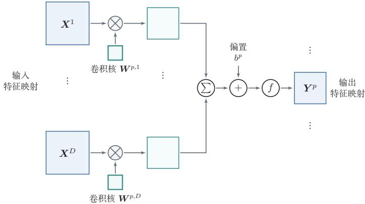  
图5.7 卷积层中从输入特征图组X到输出特征图 $Y ^ { \left( p \right) }$ 的计算示例

在输入为 $\mathcal { X } \in \mathbb { R } ^ { M \times N \times D }$ 、输出为 $\mathcal { Y } \in \mathbb { R } ^ { M ^ { \prime } \times N ^ { \prime } \times P }$ 的卷积层中，每一个输出特征图都需要D个卷积核以及一个偏置.假设每个卷积核的大小为 $U \times V$ ,那么共需要

$$
P \times D \times ( U \times V ) + P\tag{5.27}
$$

个参数.注意参数量和输入特征图的空间大小 $M \times N$ 无关，只与卷积核大小、输入通道数和输出通道数有关.

当卷积核大小为 $1 \times 1$ 时，卷积主要在通道维度上进行线性变换，因此常用于通道数的升维、降维或不同通道特征的重组.在很多现代卷积网络中， $1 \times 1$ 卷积是一个重要的基本组件.

## 5.2.3 汇聚层

汇聚层（Pooling Layer)也叫子采样层（Subsampling Layer），其主要作用是对局部区域进行汇总和下采样，从而降低空间分辨率、减少计算量、扩大后续单元的感受野，并在一定程度上提升模型对局部平移扰动的鲁棒性.

卷积层虽然可以显著减少网络中连接边的数量，但特征图组中的神经元个数并没有显著减少．如果后面接一个分类器，分类器的输入维数依然很高，很容易出现过拟合．为了解决这个问题，可以在卷积层之后加上一个汇聚层，从而降低特征维数.

假设汇聚层的输入特征图组为 $\mathcal { X } ~ \in ~ \mathbb { R } ^ { M \times N \times D }$ .对于其中每一个特征图$\pmb { X } ^ { ( d ) } \in \mathbb { R } ^ { M \times N } , 1 \le d \le D$ ，将其划分为很多区域 $R _ { m , n } ^ { ( d ) } , 1 \leq m \leq M ^ { \prime } , 1 \leq$

减少特征维数也可以通过增加卷积步长来实现.

$n \leq N ^ { \prime }$ ，这些区域可以重叠，也可以不重叠.汇聚(Pooling）是指对每个区域进行下采样（(Downsampling）得到一个值，作为这个区域的概括.

常用的汇聚函数有两种：

（1）最大汇聚（Maximum Pooling或Max Pooling）：对于一个区域$R _ { m , n } ^ { ( d ) }$ ,选择这个区域内所有神经元的最大活性值作为这个区域的表示，即

$$
y _ { m , n } ^ { ( d ) } = \operatorname* { m a x } _ { i \in R _ { m , n } ^ { ( d ) } } x _ { i } ,\tag{5.28}
$$

其中 $x _ { i }$ 为区域 $R _ { m , n } ^ { ( d ) }$ 内每个神经元的活性值

（2）平均汇聚（MeanPooling）:一般取区域内所有神经元活性值的平均值,即

$$
y _ { m , n } ^ { ( d ) } = \frac { 1 } { | R _ { m , n } ^ { ( d ) } | } \sum _ { i \in R _ { m , n } ^ { ( d ) } } x _ { i } .\tag{5.29}
$$

对每一个输入特征图 $\pmb { X } ^ { ( d ) }$ 的 $M ^ { \prime } \times N ^ { \prime }$ 个区域进行子采样，得到汇聚层的输出特征图 ${ \cal Y } ^ { ( d ) } = \{ y _ { m , n } ^ { ( d ) } \} , 1 \le m \le M ^ { \prime } , 1 \le n \le N ^ { \prime }$

图5.8给出了采用最大汇聚进行子采样操作的示例．可以看出，汇聚层不但可以有效地减少神经元数量，还可以使网络对一些小的局部形态变化具有更强的鲁棒性，并拥有更大的感受野

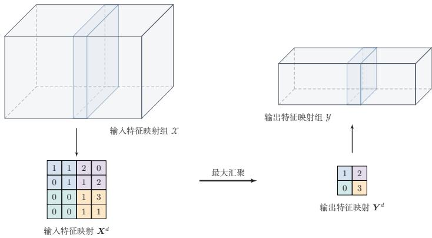  
图5.8 汇聚层中最大汇聚过程示例

常见现代卷积网络中的汇聚层通常仅包含下采样操作.但在早期的一些卷积网络（比如LeNet-5）中，有时也会在汇聚层使用非线性激活函数，比如

$$
\begin{array} { r } { { \cal Y } ^ { \prime ( d ) } = f \left( w ^ { ( d ) } { \cal Y } ^ { ( d ) } + b ^ { ( d ) } \right) , } \end{array}\tag{5.30}
$$

其中 $\mathbf { \nabla } Y ^ { \prime ( d ) }$ 为汇聚层的输出， $f ( \cdot )$ 为非线性激活函数， $w ^ { ( d ) }$ 和 $b ^ { ( d ) }$ 为可学习的标量权重和偏置.

典型的汇聚层是将每个特征图划分为2×2大小的不重叠区域，然后使用最大汇聚方式进行下采样．汇聚层也可以看作一个特殊的卷积层：卷积核大小为$K \times K$ ,步长为 $S \times S$ ,卷积核对应的运算为max函数或mean函数.过大的采样区域会急剧减少神经元数量，也会造成过多的信息损失.

除了局部汇聚外，在现代卷积网络中还经常使用全局平均汇聚（GlobalAv-eragePooling，GAP）．它将每个通道上的所有空间位置取平均，从而把一个$M \times N \times D$ 的特征图组压缩为一个D维向量.GAP常用于替代大规模全连接层，以减少参数量并降低过拟合风险.

## 5.2.4 卷积网络的整体结构

一个典型的卷积网络通常由多个卷积块堆叠而成，并在顶部接分类器.经典卷积网络常采用“卷积层-汇聚层-全连接层”的组合方式；而现代卷积网络更常见的结构是：若干卷积块用于特征抽取，下采样通过汇聚层或步长卷积实现，最后使用全局平均汇聚和线性分类器输出结果.

常见卷积网络整体结构如图5.9所示.一个卷积块通常由若干卷积层以及非线性激活、下采样等操作构成.为了改善深层卷积网络的优化性质，通常也会在卷积层之间加入批量规范化层和残差连接，以提高训练稳定性.

残差连接参见第5.4.5节.

一个卷积网络中可以堆叠多个连续的卷积块，然后在后面接一个较小的分类模块.

  
图 5.9 常用的卷积网络整体结构

现代卷积网络的结构设计大致呈现以下趋势：

（1）使用更小的卷积核（比如 $1 \times 1$ 和 $3 \times 3 )$ 并通过堆叠来扩大感受野；

（2）使用步长卷积替代部分汇聚层来完成下采样；

（3）通过分组卷积、深度可分离卷积等结构提高效率；

参见第5.5节.

（4）使用全局平均汇聚替代大规模全连接层，以减少参数量.

虽然“卷积层、汇聚层和全连接层”仍是理解卷积网络的基本出发点，但现代卷积网络已经更强调卷积块的设计、网络的深度以及效率与性能之间的平衡.

## 5.3 参数学习

在卷积网络中，参数主要为卷积核中的权重以及偏置.和全连接前馈网络类似，卷积网络也可以通过误差反向传播算法来进行参数学习.两者的核心思想都是利用链式法则计算损失函数对参数的偏导数

在全连接前馈神经网络中，梯度主要通过每一层的误差项δ进行反向传播，并进一步计算每层参数的梯度.

参见公式(4.35).

在卷积神经网络中，主要有两种不同功能的神经层：卷积层和汇聚层．卷积层包含参数，而汇聚层通常不包含参数，因此只需要重点计算卷积层中参数的梯度.卷积层和全连接层的一个重要差别在于：卷积核参数在不同空间位置上是共享的，因此一个卷积核参数的梯度需要累加所有空间位置对它的贡献

这里假设汇聚层中没有参数.

不失一般性，对第l层为卷积层，第l－1层的输入特征图为 $\mathcal { X } ^ { ( l - 1 ) } \in$ R $M \times N \times D$ ，通过卷积计算得到第l层的特征图净输入 $\mathcal { Z } ^ { ( l ) } \in \mathbb { R } ^ { M ^ { \prime } \times N ^ { \prime } \times P }$ .第l层的第 $p ( 1 \leq p \leq P )$ 个特征图净输入为

参见公式(5.25).

$$
\pmb { Z } ^ { ( l , p ) } = \sum _ { d = 1 } ^ { D } \pmb { W } ^ { ( l , p , d ) } \otimes \pmb { X } ^ { ( l - 1 , d ) } + b ^ { ( l , p ) } ,\tag{5.31}
$$

其中 $W ^ { ( l , p , d ) }$ 和 $b ^ { ( l , p ) }$ 分别为卷积核以及偏置.第l层中共有 $P \times D$ 个卷积核和 $P$ 个偏置，可以分别使用链式法则来计算其梯度.

根据公式(5.19)和公式(5.31)，损失函数L关于第l层卷积核 $W ^ { ( l , p , d ) }$ 的偏导数为

参见公式(5.19).

$$
\frac { \partial \mathcal { L } } { \partial W ^ { ( l , p , d ) } } = \frac { \partial \mathcal { L } } { \partial Z ^ { ( l , p ) } } \otimes X ^ { ( l - 1 , d ) }\tag{5.32}
$$

$$
= \delta ^ { ( l , p ) } \otimes { \cal X } ^ { ( l - 1 , d ) } ,\tag{5.33}
$$

其中 $\begin{array} { r } { \delta ^ { ( l , p ) } = \frac { \partial \mathcal { L } } { \partial Z ^ { ( l , p ) } } } \end{array}$ 为损失函数关于第l层第 $p$ 个特征图净输入 $Z ^ { ( l , p ) }$ 的偏导数.

同理可得，损失函数关于第l层第 $p$ 个偏置 $b ^ { ( l , p ) }$ 的偏导数为

$$
\frac { \partial \mathcal { L } } { \partial b ^ { ( l , p ) } } = \sum _ { i , j } [ \delta ^ { ( l , p ) } ] _ { i , j } .\tag{5.34}
$$

在卷积网络中，每层参数的梯度依赖其所在层的误差项 $\delta ^ { ( l , p ) }$ .和全连接层类似，卷积层的误差项也需要由后一层的误差项反向传播得到

## 5.3.1 卷积神经网络的反向传播算法

卷积层和汇聚层中误差项的计算有所不同，因此我们分别计算其误差项汇聚层 当第l+1层为汇聚层时，因为汇聚层是下采样操作，l+1层的每个神经元的误差项δ对应于第l层相应特征图的一个区域.l层第 $p$ 个特征图中的每个神经元都有一条边和l+1层第 $p \cdot$ 个特征图中的一个神经元相连.根据链式法则，第l层一个特征图的误差项 $\delta ^ { ( l , p ) }$ ，只需要将l+1层对应特征图的误差项 $\delta ^ { ( l + 1 , p ) }$ 进行上采样操作（和第l层大小一样），再和l层特征图的激活值偏导数逐元素相乘，就得到了 $\delta ^ { ( l , p ) }$

第l层第 $p$ 个特征图的误差项 $\delta ^ { ( l , p ) }$ 的具体推导过程如下：

$$
\delta ^ { ( l , p ) } \triangleq \frac { \partial \mathcal { L } } { \partial Z ^ { ( l , p ) } }\tag{5.35}
$$

$$
\partial { \cal X } ^ { ( l , p ) } \partial { \cal Z } ^ { ( l + 1 , p ) } \partial { \cal { L } }
$$

$$
= \overline { { \partial \pmb { Z } ^ { ( l , p ) } } } \overline { { \partial \pmb { X } ^ { ( l , p ) } } } \overline { { \partial \pmb { Z } ^ { ( l + 1 , p ) } } }\tag{5.36}
$$

$$
= f _ { l } ^ { \prime } ( Z ^ { ( l , p ) } ) \odot \operatorname* { u p } ( \delta ^ { ( l + 1 , p ) } ) ,\tag{5.37}
$$

其中 $f _ { l } ^ { \prime } ( \cdot )$ 为第l层使用的激活函数导数，up为上采样函数(up sampling)，与汇聚层中使用的下采样操作刚好相反.如果下采样是最大汇聚，误差项 $\delta ^ { ( l + 1 , p ) }$ 中每个值会直接传递到前一层对应区域中的最大值所对应的神经元，该区域中其他神经元的误差项都设为0.如果下采样是平均汇聚，误差项 $\delta ^ { ( l + 1 , p ) }$ 中每个值会被平均分配到前一层对应区域中的所有神经元上.若汇聚区域之间存在重叠，则某个位置可能同时接收到多个区域传回的误差，其总误差为这些贡献的累加.

卷积并非真正的矩阵乘积，因此这里计算的偏导数并非真正的矩阵偏导数，我们可以把X,Z都看作向量.

卷积层当l+1层为卷积层时，假设特征图净输入 $\mathcal { Z } ^ { ( l + 1 ) } \in \mathbb { R } ^ { M ^ { \prime } \times N ^ { \prime } \times P }$ ,其中第$p ( 1 \leq p \leq P )$ 个特征图净输入为

参见公式(5.25).

$$
\pmb { Z } ^ { ( l + 1 , p ) } = \sum _ { d = 1 } ^ { D } \pmb { W } ^ { ( l + 1 , p , d ) } \otimes \pmb { X } ^ { ( l , d ) } + b ^ { ( l + 1 , p ) } ,\tag{5.38}
$$

其中 $W ^ { ( l + 1 , p , d ) }$ 和 $b ^ { ( l + 1 , p ) }$ 为第l+1层的卷积核以及偏置.第l+1层中共有 $P \times D$ 个卷积核和P个偏置.

第l层第d个特征图的误差项 $\delta ^ { ( l , d ) }$ 的具体推导过程如下：

$$
\delta ^ { ( l , d ) } \triangleq \frac { \partial \mathcal { L } } { \partial Z ^ { ( l , d ) } }\tag{5.39}
$$

$$
= \frac { \partial \boldsymbol { X } ^ { ( l , d ) } } { \partial \boldsymbol { Z } ^ { ( l , d ) } } \frac { \partial \boldsymbol { \mathcal { L } } } { \partial \boldsymbol { X } ^ { ( l , d ) } }\tag{5.40}
$$

$$
= f _ { l } ^ { \prime } ( \pmb { Z } ^ { ( l , d ) } ) \odot \sum _ { p = 1 } ^ { P } \left( \mathrm { r o t } 1 8 0 ( W ^ { ( l + 1 , p , d ) } ) \tilde { \otimes } \frac { \partial \mathcal { L } } { \partial \pmb { Z } ^ { ( l + 1 , p ) } } \right)\tag{5.41}
$$

根据公式(5.23)

参见习题5-11.

$$
= f _ { l } ^ { \prime } ( \pmb { Z } ^ { ( l , d ) } ) \odot \sum _ { p = 1 } ^ { P } \left( \mathrm { r o t 1 8 0 } ( W ^ { ( l + 1 , p , d ) } ) \tilde { \otimes } \delta ^ { ( l + 1 , p ) } \right) ,\tag{5.42}
$$

该公式表明：当前层某个输入通道的误差来自后一层所有依赖该通道的输出通道，因此需要对所有相关卷积核带来的误差贡献进行累加.最后再与当前层激活函数的导数逐元素相乘，得到该层的误差项

总的来说，卷积网络中的反向传播流程与前馈网络类似：先计算输出层误差，再逐层向前传播.不同之处在于，汇聚层需要做与下采样相反的上采样操作，而卷积层则需要利用旋转后的卷积核进行宽互相关来传播误差.

## 5.4 几种典型的卷积神经网络

本节介绍几种广泛使用、并且对卷积网络发展具有代表意义的典型深层卷积神经网络.

## 5.4.1 LeNet-5

LeNet-5[LeCun et al., 1998]虽然提出时间较早,但它是一个非常成功的卷积神经网络模型.基于LeNet-5的手写数字识别系统在20世纪90年代被美国很多银行使用，用来识别支票上的手写数字.LeNet-5的网络结构如图5.10所示，它代表了早期卷积网络“卷积-下采样-分类器”的经典范式

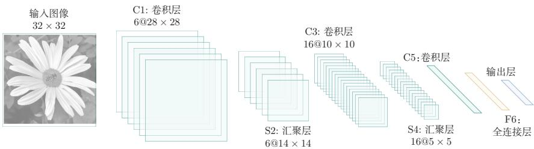  
图 5.10 LeNet-5 网络结构（图片根据 [LeCun et al., 1998]绘制）

LeNet-5共有7层，接受输入图像大小为 $3 2 \times 3 2 = 1 0 2 4$ ,输出对应10个类别的得分.LeNet-5中的每一层结构如下：

（1）C1层是卷积层，使用6个 $5 \times 5$ 的卷积核，得到6组大小为 $2 8 \times 2 8 =$ 784的特征图.因此，C1层的神经元数量为 $6 \times 7 8 4 = 4 7 0 4$ ,可训练参数数量为$6 \times 2 5 + 6 = 1 5 6$ ,连接数为 $1 5 6 \times 7 8 4 = 1 2 2 3 0 4$ (包括偏置在内，下同).

（2）S2层为汇聚层，采样窗口为2×2，使用平均汇聚，并使用一个如公式(5.30)的非线性函数. 神经元个数为 $6 \times 1 4 \times 1 4 = 1 1 7 6$ ,可训练参数数量为$6 \times ( 1 + 1 ) = 1 2$ ,连接数为 $6 \times 1 9 6 \times ( 4 + 1 ) = 5 8 8 0$

（3）C3层为卷积层.LeNet-5中用一个连接表来定义输入和输出特征图之间的依赖关系，如图5.11所示，C3层得到16组大小为 $1 0 \times 1 0$ 的特征图；若按

连接表参见公式(5.43).

连接表中的输入-输出特征图连接来展开，则共有60个5×5的二维连接核.神经元数量为 $1 6 \times 1 0 0 = 1 6 0 0$ ,可训练参数数量为 $( 6 0 \times 2 5 ) + 1 6 = 1 5 1 6$ ，连接数为 $1 0 0 \times 1 5 1 6 = 1 5 1 6 0 0 .$

如果不使用连接表，则需要96个5×5的卷积核.

（4）S4层是一个汇聚层，采样窗口为2×2,得到16个5×5大小的特征图，可训练参数数量为 $1 6 \times 2 = 3 2$ ,连接数为 $1 6 \times 2 5 \times ( 4 + 1 ) = 2 0 0 0 .$

（5）C5层是一个卷积层，使用120×16=1920个5×5的卷积核，得到120组大小为1×1的特征图.C5层的神经元数量为120，可训练参数数量为$1 9 2 0 \times 2 5 + 1 2 0 = 4 8 1 2 0$ ,连接数为 $1 2 0 \times ( 1 6 \times 2 5 + 1 ) = 4 8 1 2 0$

（6）F6层是一个全连接层，有84个神经元，可训练参数数量为84×(120+1)=10164.连接数和可训练参数个数相同，为10164.

(7）输出层：输出层由 10个径向基函数（Radial Basis Function，RBF） 组成.这里不再详述.

以上各层的参数量总计约6万，连接数约34万.LeNet-5的设计体现了卷积网络的核心思想：通过局部连接和权重共享大幅减少参数量，同时通过逐层的卷积-汇聚结构逐步提取更抽象的特征.RBF输出层在现代分类网络中通常由Softmax分类器替代，因为后者更易于优化，也更自然地给出概率解释.

连接表 从公式(5.25)可以看出，卷积层的每一个输出特征图都依赖于所有输入特征图，相当于卷积层的输入和输出特征图之间是全连接的关系．实际上，这种全连接关系不是必须的.我们可以让每一个输出特征图只依赖于少数几个输入特征图.定义一个连接表（LinkTable)T来描述输入和输出特征图之间的连接关系.在LeNet-5中，连接表的基本设定如图5.11所示.C3层的第0-5个特征图依赖于S2层特征图组的每3个连续子集，第6-11个特征图依赖于S2层特征图组的每4个连续子集，第12-14个特征图依赖于S2层特征图的每4个不连续子集，第15个特征图依赖于S2层的所有特征图.

<table><tr><td>15</td><td>XXXXXX</td></tr><tr><td>14 13</td><td>X XX XX XX</td></tr><tr><td>12</td><td>XX XX</td></tr><tr><td>11</td><td>X X X</td></tr><tr><td>10</td><td>XX XX</td></tr><tr><td>9</td><td>X XXX</td></tr><tr><td>8</td><td>XXXX XXXX</td></tr><tr><td>7</td><td>XXXX</td></tr><tr><td>6</td><td>XX</td></tr><tr><td>5</td><td>X XX</td></tr><tr><td>4</td><td>XXX</td></tr><tr><td>3</td><td>XXX</td></tr><tr><td>2</td><td>XXX</td></tr><tr><td>1</td><td>X XX</td></tr><tr><td>0</td><td></td></tr><tr><td></td><td>1 23 45</td></tr></table>

图 5.11 LeNet-5 中 C3层的连接表（图片来源: [LeCun et al., 1998])

如果第p个输出特征图依赖于第d个输入特征图，则 $T _ { p , d } = 1$ ,否则为0. $Y ^ { p }$

为

$$
Y ^ { p } = f \left( \sum _ { d , \tiny { d } } W ^ { p , d } \otimes X ^ { d } + b ^ { p } \right) ,\tag{5.43}
$$

其中T为 $P \times D$ 大小的连接表.假设连接表T的非零个数为K，每个卷积核的大小为 $U \times V$ ,那么共需要 $K \times U \times V + P$ 个参数.

## 5.4.2 AlexNet

AlexNet[Krizhevsky et al., 2012]是深度学习在大规模图像分类任务上取得突破的代表性模型.它赢得了2012年ImageNet图像分类竞赛的冠军，并显著推动了深度卷积神经网络的发展.

AlexNet的重要意义不仅在于网络结构本身，还在于它系统地结合了很多后来被广泛采用的训练技术，比如使用GPU进行并行训练、采用ReLU作为非线性激活函数、使用暂退法（Dropout）防止过拟合，以及通过数据增强来提高模型准确率等.

LeNet-5中的平均汇聚、连接表、RBF输出层等设计都带有明显的时代特征，但它所体现的“卷积提取局部特征、下采样降低分辨率、逐层形成高层表示”的思想，对后续卷积网络的发展影响深远.

AlexNet的结构如图5.12所示，包括5个卷积层、3个汇聚层和3个全连接层(其中最后一层是使用Softmax函数的输出层). 由于网络规模超出了当时单个GPU的内存限制，AlexNet将网络拆为两半，分别放在两个GPU上，GPU间只在某些层（比如第3层）进行通信

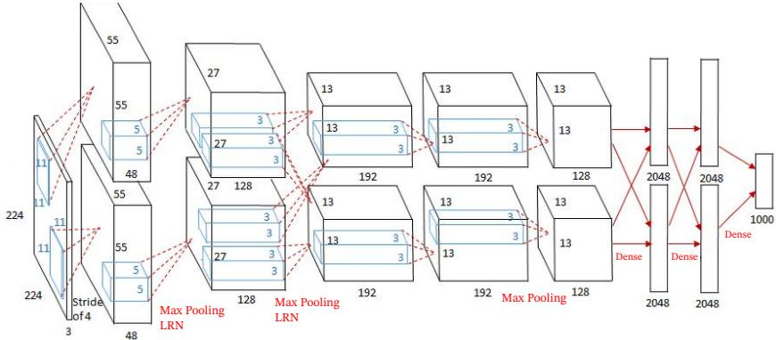  
图 5.12 AlexNet 网络结构1

AlexNet 的输入为 $2 2 4 \times 2 2 4 \times 3$ 的图像，输出为1000个类别的条件概率，具体结构如下：

这里的卷积核使用四维张量来描述.

（1）第一个卷积层，使用两个大小为 $1 1 \times 1 1 \times 3 \times 4 8$ 的卷积核，步长$S = 4$ 零填充 $P = 3$ ,得到两个大小为 $5 5 \times 5 5 \times 4 8$ 的特征图组.

（2）第一个汇聚层，使用大小为 $3 \times 3$ 的最大汇聚操作，步长 $S = 2$ ,得到两个27 $\times 2 7 \times 4 8$ 的特征图组.

这里的汇聚操作是有重叠的，以提取更多的特征.

（3）第二个卷积层，使用两个大小为 $5 \times 5 \times 4 8 \times 1 2 8$ 的卷积核，步长$S = 1$ ,零填充 $P = 2$ ,得到两个大小为 $2 7 \times 2 7 \times 1 2 8$ 的特征图组.

（4）第二个汇聚层，使用大小为 $3 \times 3$ 的最大汇聚操作，步长 $S = 2$ ,得到两个大小为 $1 3 \times 1 3 \times 1 2 8$ 的特征图组.

（5）第三个卷积层为两个路径的融合，使用一个大小为 $3 \times 3 \times 2 5 6 \times 3 8 4$ 的卷积核，步长 $S = 1$ ，零填充 $P = 1$ ，得到两个大小为 $1 3 \times 1 3 \times 1 9 2$ 的特征图组.

（6）第四个卷积层，使用两个大小为 $3 \times 3 \times 1 9 2 \times 1 9 2$ 的卷积核，步长$S = 1$ ,零填充 $P = 1$ ,得到两个大小为 $1 3 \times 1 3 \times 1 9 2$ 的特征图组.

（7）第五个卷积层，使用两个大小为 $3 \times 3 \times 1 9 2 \times 1 2 8$ 的卷积核，步长$S = 1$ ,零填充 $P = 1$ ,得到两个大小为 $1 3 \times 1 3 \times 1 2 8$ 的特征图组.

（8）第三个汇聚层，使用大小为 $3 \times 3$ 的最大汇聚操作，步长 $S = 2$ ,得到两个大小为 $6 \times 6 \times 1 2 8$ 的特征图组.

（9）三个全连接层，神经元数量分别为4096、4096和1000.

此外，AlexNet还在前两个汇聚层之后使用了局部响应规范化（Local Re-sponse Normalization,LRN)以增强模型的泛化能力.

## 5.4.3 VGG 网络

VGG 网络[Simonyan et al., 2015]是现代卷积网络发展中的一个重要代表.它的核心思想是：使用多个连续的小卷积核（主要是 $3 \times 3$ 卷积）来替代较大的卷积核，并通过加深网络来提升模型表示能力，这种设计有两个优点：一是多个小卷积核堆叠后可以在保持较大感受野的同时减少参数量；二是多层非线性变换能够增强模型的表达能力.比如，两层 $3 \times 3$ 卷积的感受野相当于一层 $5 \times 5$ 卷积，但参数量更少 $( 2 \times 3 ^ { 2 } = 1 8 < 5 ^ { 2 } = 2 5 )$

需要说明的是，LRN在今天已经不是主流组件，更多具有历史意义；现代卷积网络通常更倾向于使用批量规范化等方法来提高训练稳定性.局部响应规范化参见第7.5.4节.

VGG网络的结构较为规整，通常由若干卷积块和若干汇聚层交替堆叠而成，每个卷积块内部使用多个 $3 \times 3$ 卷积，最后接全连接分类器.VGG网络清楚地展示了“小卷积核+深层网络”这一设计思想，对后续很多卷积网络结构都产生了重要影响.不过，VGG网络顶部全连接层参数较多，整体计算与存储开销也比较大.

## 5.4.4 Inception 网络

在卷积网络中，如何设置卷积核大小是一个十分关键的问题.在Inception网络中，一个卷积模块内部包含多个不同大小的卷积操作，称为Inception模块.Inception网络由多个Inception模块和少量汇聚层堆叠而成.

Inception模块同时使用 $1 \times 1 . 3 \times 3 . 5 \times 5$ 等不同大小的卷积核，并将得到的特征图在深度方向上拼接起来作为输出特征图.这种设计可以在同一层中同时捕捉不同尺度的特征.

Inception模块受到了 模型“Network in Network" [Lin et al., 2014]的启发.

图5.13给出了v1版本的Inception模块结构，采用了4组平行的特征抽取方式，分别为 $1 \times 1 . 3 \times 3 . 5 \times 5$ 的卷积和3×3的最大汇聚.同时，为了提高计算效率、减少参数量，Inception模块在进行 $3 \times 3 . 5 \times 5$ 卷积之前以及3×3最大汇聚之后，都会先进行一次1×1卷积来减少特征图的深度.因此，1×1卷积不仅可以进行跨通道的信息融合，也经常承担降维的作用.

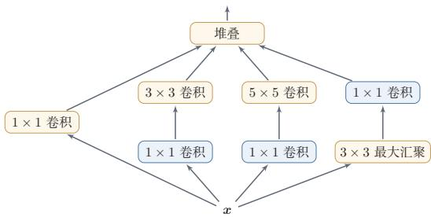  
图 5.13 Inception v1 的模块结构  
GoogLeNet 不写为GoogleNet，是为了向LeNet 致敬.

Inception网络有多个版本，其中最早的Inception v1版本就是非常著名的GoogLeNet [Szegedy et al., 2015]. GoogLeNet 赢得了 2014年 ImageNet 图像分类竞赛的冠军.

GoogLeNet 由9个Inception v1模块、5个汇聚层以及其他一些卷积层构成，总共为22层网络，如图5.14所示.为了缓解深层网络训练中的梯度消失问题，GoogLeNet在中间层引入了两个辅助分类器来加强监督信息.

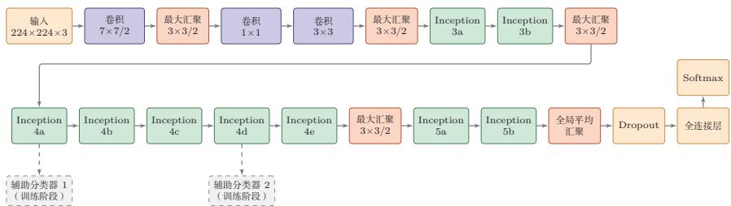  
图 5.14 GoogLeNet 网络结构示意（根据 [Szegedy et al., 2015]绘制）

Inception 网络有多个改进版本，其中比较有代表性的有Inception v3 网络[Szegedy et al., 2016]. Inception v3用多层小卷积核来替换大卷积核，以减少计算量和参数量，并保持感受野不变.具体包括：1）使用两层3×3卷积替换v1中的 $5 \times 5$ 卷积；2）使用连续的K×1和1×K卷积替换 $K \times K$ 卷积.此外，Inception v3网络也引入了标签平滑和批量规范化等训练技巧.

## 5.4.5 残差网络

残差网络（Residual Network，ResNet）通过给非线性的卷积层增加直连边（Shortcut Connection）（也称为残差连接（Residual Connection））的方式来提高信息的传播效率.

残差网络的思想并不局限于卷积神经网络.

假设在一个深度网络中，我们期望一个非线性单元（可以为一层或多层卷积层） $f ( \pmb { x } ; \theta )$ 去逼近一个目标函数 $h ( { \pmb x } )$ .如果将目标函数拆分成两部分：恒等函数(Identity Function) x 和残差函数(Residue Function) h(x) - x，

$$
\begin{array} { r } { h ( \pmb { x } ) = \underbrace { \pmb { x } } _ { \sharp \sharp \sharp \sharp \sharp \mathcal { K } } + \underbrace { \big ( h ( \pmb { x } ) - \pmb { x } \big ) } _ { \sharp \sharp \sharp \mathcal { E } } . } \end{array}\tag{5.44}
$$

为了简便起见，这里假 设输入x与h(x)的维 度一致.

根据通用近似定理，一个由神经网络构成的非线性单元有足够的能力来近似逼近原始目标函数或残差函数，但在实际优化中，后者通常更容易学习[He et al.2016].当最优映射接近恒等映射时，直接学习残差往往比直接学习完整映射更容易；同时，残差连接也有助于缓解深层网络中的梯度传播困难

因此，原来的优化问题可以转换为：让非线性单元 $f ( \pmb { x } ; \theta )$ 去近似残差函数 $h ( { \boldsymbol { x } } ) - { \boldsymbol { x } }$ ,并用 $f ( \pmb { x } ; \theta ) + \pmb { x }$ 去逼近 $h ( { \boldsymbol { x } } )$

图5.15给出了一个典型的残差单元示例.残差单元由多个级联的（等宽）卷积层和一个跨层的直连边组成，再经过ReLU激活后得到输出.

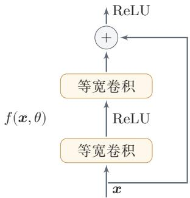  
图 5.15 一个简单的残差单元结构

当输入和输出的维度一致时，直连边可以直接使用恒等映射；当维度不一致时，通常需要使用1×1卷积或带步长的投影分支来匹配维度.更深的ResNet还常使用 $1 \times 1 { - } 3 \times 3 { - } 1 \times 1$ 的瓶颈（bottleneck）结构，以在控制计算量的同时继续加深网络.

残差网络就是将很多个残差单元串联起来构成的一个非常深的网络．和残差网络类似的还有 Highway Network[Srivastava et al., 2015]. 残差连接后来也成为现代深度神经网络设计中的基础模块，并不限于卷积网络.

## 5.5 其他卷积方式

在第5.1.3节中介绍了一些卷积的变种，可以通过步长和零填充来进行不同的卷积操作.本节再介绍几种在现代卷积网络中常见的重要卷积方式

## 5.5.1 转置卷积

我们通常通过卷积操作来实现高维特征到低维特征的映射．比如在一维卷积中，一个5维输入特征经过一个大小为3的卷积核后，输出为3维特征；如果步长大于1，还可以进一步降低输出特征的维数.但在一些任务中，我们需要将低维特征映射到高维特征，并且依然希望通过一种“卷积型”的线性算子来实现，这就引出了转置卷积

假设有一个高维向量 $\pmb { x } \in \mathbb { R } ^ { d }$ 和一个低维向量 $z \in \mathbb { R } ^ { p }$ ,其中 $p < d .$ 如果用仿射变换（Affine Transformation）来实现高维到低维的映射，

$$
z = W x ,\tag{5.45}
$$

其中 $W \in \mathbb { R } ^ { p \times d }$ 为变换矩阵.我们可以很容易地通过转置W来实现低维到高维的反向映射，即

$$
\begin{array} { r } { \pmb { x } = \pmb { W } ^ { \top } \pmb { z } . } \end{array}\tag{5.46}
$$

需要说明的是，公式(5.45)和公式(5.46)并不是逆运算，两个映射只是形式上的转置关系.

在全连接网络中，忽略激活函数时，前向计算和反向传播就是一种转置关系.比如前向计算时，第l+1层的净输入为 $z ^ { ( l + 1 ) } = W ^ { ( l + 1 ) } z ^ { ( l ) }$ ，反向传播时，第l层的误差项为 $\delta ^ { ( l ) } = ( W ^ { ( l + 1 ) } ) ^ { \top } \delta ^ { ( l + 1 ) }$

参见公式(4.35).

卷积操作也可以写为仿射变换的形式.假设一个5维向量x，经过大小为3的卷积核 $\pmb { w } = [ w _ { 1 } , w _ { 2 } , w _ { 3 } ] ^ { \intercal }$ 进行卷积，得到3维向量z.卷积操作可以写为

$$
z = w \otimes x\tag{5.47}
$$

$$
\begin{array} { r } { \left[ { \begin{array} { l l l l l l } { w _ { 1 } } & { w _ { 2 } } & { w _ { 3 } } & { 0 } & { 0 } \\ { 0 } & { w _ { 1 } } & { w _ { 2 } } & { w _ { 3 } } & { 0 } \\ { 0 } & { 0 } & { w _ { 1 } } & { w _ { 2 } } & { w _ { 3 } } \end{array} } \right] x } \\ { = C x , } \end{array}\tag{5.48}
$$

参见习题5-8.

(5.49)

其中C是一个稀疏矩阵，其非零元素来自卷积核ω中的元素.

如果要实现3维向量z到5维向量x的映射，可以通过仿射矩阵的转置来实现，即

$$
\begin{array} { r l } { x } & { = C ^ { \top } z } \\ & { } \\ & { = \left[ \begin{array} { l l l } { w _ { 1 } } & { 0 } & { 0 } \\ { w _ { 2 } } & { w _ { 1 } } & { 0 } \\ { w _ { 3 } } & { w _ { 2 } } & { w _ { 1 } } \\ { 0 } & { w _ { 3 } } & { w _ { 2 } } \\ { 0 } & { 0 } & { w _ { 3 } } \end{array} \right] z } \\ & { = \mathrm { r o t } 1 8 0 ( w ) \widetilde { \otimes } z , } \end{array}\tag{5.50}
$$

(5.51)

(5.52)

其中rot180(·)表示旋转180度.

从公式(5.48)和公式(5.51)可以看出，从仿射变换的角度来看，两个卷积操作 $z = w \otimes x$ 和 ${ \pmb x } = \mathrm { r o t } 1 8 0 ( { \pmb w } ) \tilde { \otimes } z$ 也是形式上的转置关系．因此，我们将这种把低维特征映射到高维特征的卷积型线性算子称为转置卷积（TransposedConvolution）[Dumoulin et al.,2016]，也常被称为反卷积（Deconvolution）[Zeiler et al., 2011].

将转置卷积称为反卷积（Deconvo-lution）并不太恰当，它不是指卷积的逆运算.

在卷积网络中，卷积层的前向计算和反向传播也是一种转置关系.

参见习题5-11.

对一个M维向量z和一个大小为K的卷积核，如果希望通过卷积操作映射到更高维的向量，只需要对向量z进行两端补零 $P = K - 1$ ，然后进行卷积，就可以得到 $M + K - 1$ 维的向量.

即宽卷积.

转置卷积同样适用于二维卷积. 图5.16给出了一个步长 $S = 1$ 、无零填充$P = 0$ 的二维卷积和其对应的转置卷积.

微步卷积从尺寸变化的角度看，如果普通卷积使用步长 $S > 1$ 实现下采样，那么其对应的转置卷积可以看作一种“分数步长”的上采样操作，因此也常被称为微步卷积(Fractionally-Strided Convolution) [Long et al., 2015]. 需要强调的是，在具体实现中通常并不会真的把步长设为 $S < 1$ ，而是通过在输入特征之间插入0,再进行步长为1的普通卷积来等效实现.

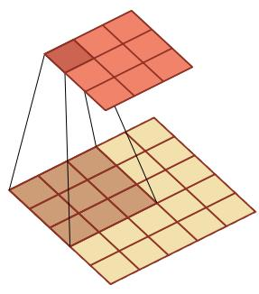  
(a) 卷积, S = 1, P = 0

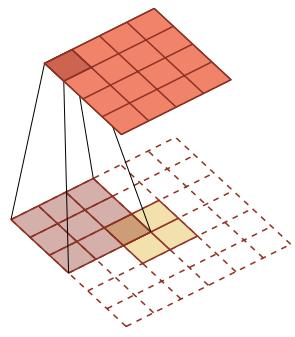  
(b) 转置卷积, S = 1, P = 2  
图 5.16 步长S = 1,无零填充P = 0的二维卷积和其对应的转置卷积

如果卷积操作的步长为 $S > 1$ ，希望其对应的转置卷积实现相应的上采样，则需要在输入特征之间插入 $S - 1$ 个0来使其移动速度变慢.

以一维转置卷积为例，对一个M维向量z和大小为K的卷积核，通过对向量z进行两端补零 $P = K - 1$ ，并且在每两个向量元素之间插入D个0，然后进行步长为1的卷积，可以得到 $( D + 1 ) \times ( M - 1 ) + K$ 维的向量.

图5.17给出了一个步长 $S = 2$ 、无零填充 $P = 0$ 的二维卷积和其对应的转置卷积.

  
(a) 卷积, S = 2, P = 0

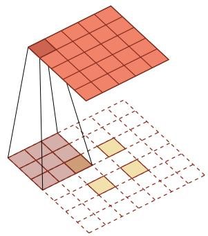  
(b) 转置卷积, S = 1, P = 2, D = 1  
图 5.17 步长S =2,无零填充P = 0的二维卷积和其对应的转置卷积

需要注意的是，转置卷积虽然很适合做上采样，但在生成任务中有时会带来棋盘状伪影(checkerboard artifacts).因此，在一些应用中也会使用“先插值上采样，再普通卷积”的方式作为替代

## 5.5.2 空洞卷积

对于一个卷积层，如果希望增加输出单元的感受野，一般可以通过三种方式实现：1）增加卷积核的大小；2）增加层数，比如两层 $3 \times 3$ 卷积可以近似一层$5 \times 5$ 卷积的效果；3)在卷积之前进行汇聚操作.前两种方式会增加参数数量，而第三种方式会丢失一些信息.

空洞卷积（AtrousConvolution）是一种在不增加参数数量的情况下扩大感受野的方法,也称为膨胀卷积(Dilated Convolution)[Chen et al., 2018; Yuet al.,2016].它特别适合那些既希望获得较大感受野、又希望保持较高空间分辨率的任务，比如语义分割.

Atrous一词来源于法语à trous，意为“空洞，多孔”.

空洞卷积通过给卷积核插入“空洞”来变相地增加其大小.如果在卷积核的每两个元素之间插入D-1个空洞，卷积核的有效大小为

$$
K ^ { \prime } = K + ( K - 1 ) \times ( D - 1 ) ,\tag{5.53}
$$

其中 D称为膨胀率(Dilation Rate). 对于二维的 $K \times K$ 卷积核，上式同样可以理解为其有效感受野的边长.当D=1时，卷积核退化为普通卷积核.

图5.18给出了空洞卷积的示例.

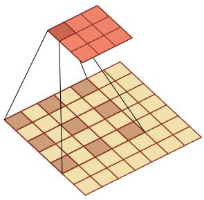  
(a) 膨胀率 D = 2

  
(b) 膨胀率 D = 3  
图 5.18 空洞卷积

## 5.5.3 分组卷积

随着卷积网络逐渐加深，如何在保持性能的同时降低计算量和参数量变得越来越重要.在标准卷积中，每个输出通道通常依赖于所有输入通道.分组卷积（Group Convolution）是一类非常重要的高效卷积结构.在分组卷积中，输入通道会被划分为若干组，每组只与对应的一部分输出通道相连.这样可以显著减少参数量和计算量.

AlexNet中由于两块GPU分开计算，实际上就包含了分组卷积的思想；后续很多高效网络也进一步系统化地使用了分组卷积.

图5.19从结构上展示了标准卷积与分组卷积之间的区别.

  
图 5.19 标准卷积与分组卷积

## 5.5.4 深度可分离卷积

深度可分离卷积（DepthwiseSeparable Convolution）的核心思想是将“空间卷积”和“通道混合”这两类操作解耦，从而在尽量保持表示能力的同时显著降低开销.

具体来说，深度可分离卷积可以分解为两个步骤：

（1）逐通道卷积（depthwise convolution）：对每个输入通道分别使用一个K×K卷积核做空间卷积.因此它只负责提取每个通道内部的局部空间模式，而不在不同通道之间做信息融合．若输入通道数为D，则这一阶段共有D个卷积核.

（2）逐点卷积（pointwise convolution）:再使用P个1×1卷积核对上一步得到的D个中间特征图做线性组合，从而完成不同通道之间的信息融合，并生成P个输出特征图.

图5.20展示了深度可分离卷积的两步分解：先做逐通道卷积，再做逐点卷积.

逐通道卷积可以看作分组卷积的特例，即分组数等于输入通道数D.

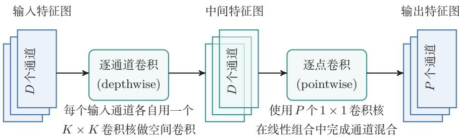  
图 5.20 深度可分离卷积

因此，深度可分离卷积并不是简单地“减少卷积核个数”，而是把标准卷积中原本同时完成的两项工作拆开：第一步负责空间特征提取，第二步负责跨通道特征组合.从这个角度看，它是一种结构化的参数分解方法.

设输入特征图大小为 $M \times N \times D$ ,卷积核大小为 $K \times K$ ,输出通道数为 $P .$ 对于标准卷积，其参数量为 $K ^ { 2 } D P$ ,对应的乘加次数约为 $M N K ^ { 2 } D P$ 对于深度可分离卷积，逐通道卷积的参数量为 $K ^ { 2 } D$ ，逐点卷积的参数量为 $D P$ ，因此总参数量为 $K ^ { 2 } D + D P$ 对应的乘加次数约为 $M N K ^ { 2 } D + M N D P$ .两者相比，参数量之比约为 $\begin{array} { r } { \frac { K ^ { 2 } D + D P } { K ^ { 2 } D P } = \frac { 1 } { P } + \frac { 1 } { K ^ { 2 } } } \end{array}$ .例如当 $K = 3$ 且 $P$ 较大时，深度可分离卷积的参数量和计算量往往大约为标准卷积的 $1 / 9$ 到 $1 / 8$

当然，这种分解也带来一定限制：逐通道卷积阶段并不进行跨通道的信息交互，因此其表示能力通常弱于同规模的标准卷积，更适合用于对效率要求较高的轻量级网络．在计算资源较充足、追求更高精度或更强表示能力的场景下，标准卷积仍然十分常用.

## 5.6 总结和扩展阅读

本章围绕卷积神经网络的基本思想、关键结构和典型演化路径展开.对于图像这类具有局部相关性和空间结构的数据，如果仍然使用普通的全连接层，不但参数规模庞大，而且难以有效利用“局部模式会在不同位置重复出现”这一重要先验.卷积层通过局部连接和权重共享，将这种先验直接编码到网络结构中；汇聚、步长卷积以及全局平均汇聚等机制则进一步实现特征压缩、扩大感受野并提升一定程度的平移鲁棒性.因此，卷积神经网络并不只是“把卷积运算放进神经网络”，而是围绕空间结构数据所形成的一整套表示学习方法.

从知识结构上看，本章可以归结为三条主线.第一条主线是卷积运算本身：包括卷积与互相关的关系、零填充、步长、等宽卷积以及输出尺寸的计算.第二条主线是卷积网络的基本组件：包括卷积层、汇聚层以及由这些部件构成的卷积块.第三条主线是结构设计与演化：从LeNet-5到AlexNet、VGG、Inception和ResNet，再到分组卷积、空洞卷积与深度可分离卷积，反映出卷积神经网络始终围绕几个核心目标不断演化：一是更好地提取多尺度特征，二是让网络更深且更易训练，三是在保证性能的同时降低参数量和计算量.对于卷积运算尺寸变化及不同卷积形式的可视化示例，还可以参考https://github.com/vdumoulin/conv\_arithmetic.

如果从更高层次来理解卷积神经网络，其发展并不是若于孤立技巧的简单叠加，而是由几条相互关联的设计原则共同推动的．其一是局部性（locality），即利用局部感受野捕捉邻域模式；其二是层次性（hierarchy），即通过多层堆叠逐步从边缘、纹理过渡到部件和语义；其三是参数共享（parametersharing），即通过共享卷积核显著降低模型复杂度；其四是模块化（modularity），即把卷积、规范化、激活、下采样、残差连接等组织成可复用的结构单元，理解了这几条原则，就不难把握不同卷积结构之间“变的是什么、不变的又是什么”．例如，Inception改变的是多尺度建模方式，ResNet改变的是信息与梯度的传播路径，深度可分离卷积改变的是卷积的参数化方式，但它们都没有脱离上述基本原则

从结构演化的角度看，LeNet-5代表了卷积网络的早期经典范式；AlexNet系统展示了GPU训练、ReLU、暂退法和数据增强等技术如何与深层卷积网络结合，从而推动深度学习在大规模视觉任务中的突破；VGG网络说明了通过堆叠小卷积核也可以有效扩大感受野，并形成规则、统一的网络结构；Inception系列强调多尺度并行特征提取以及1×1卷积的降维作用；残差网络则表明，当网络足够深时，结构设计的重点已经不仅是“表达能力是否足够”，更是“信息和梯度能否稳定传播”.再往后，分组卷积和深度可分离卷积把“高效”作为重要目标，空洞卷积则在保持较高空间分辨率的同时扩大感受野.这些结构变化共同说明：卷积网络的发展，本质上是在表示能力、可训练性与计算效率三者之间不断寻找更优平衡.

如果希望继续深入，可以从三个层面扩展阅读．第一，沿着历史脉络阅读LeNet、AlexNet、VGG、GoogLeNet和ResNet等代表性工作，理解卷积网络设计思想是如何逐步演化的；第二，沿着结构改进阅读关于批量规范化、残差连接、分组卷积、深度可分离卷积和空洞卷积的相关文献，理解不同模块分别解决了什么问题：第三，沿着任务与系统阅读卷积网络在检测、分割、视频理解、移动端推断等方向上的应用，体会同一种基本结构如何在不同约束下被重新组织与改造

卷积神经网络中的设计思想，比如局部连接、参数共享、层次表示和模块化设计，在后续很多模型中都会反复出现.因此，学习卷积神经网络的意义，不仅在于掌握一种具体结构，更在于掌握一种围绕数据结构组织模型的方法，后续章节中，无论是序列建模、注意力机制与Transformer，还是面向不同任务的深度结构设计，都会继续面对类似的问题：如何利用数据本身的结构先验，如何设计更有效的表示单元，如何在模型能力、训练稳定性与计算代价之间取得平衡.从这个意义上说，卷积神经网络是理解现代深度学习结构设计方法的一块重要基石.

在视觉建模中，卷积网络和基于注意力机制的模型提供了两类不同的归纳偏置，卷积通过局部连接和权重共享强调局部模式的平移等变性，参数效率高、数据效率好，适合端侧推断、视频处理和计算受限场景；注意力机制更擅长全局交互和长距离依赖，在大规模数据和算力支持下表现突出.Vision Transformer(ViT) [Dosovitskiy et al., 2021]和 ConvNeXt[Liu et al., 2022]等工作说明,现代视觉模型的发展不是简单的“卷积被替代”，而是在局部结构先验、全局建模能力、训练策略和计算效率之间重新组合.因而，卷积与注意力机制的融合，而不是简单替代，是理解现代视觉模型演化的更稳妥视角.

在轻量级网络设计方面，Howard等人提出的MobileNet（2017）和Tan等人提出的EficientNet（2019）是重要的代表工作.它们体现了卷积结构在资源受限场景中的长期价值，也说明结构设计需要同时考虑精度、延迟、能耗和部署条件.

## 习题

## 基础题

习题5-1 给定 $4 \times 4$ 的输入矩阵 $X = { \left( \begin{array} { l l l l } { 1 } & { 0 } & { 1 } & { 0 } \\ { 0 } & { 1 } & { 0 } & { 1 } \\ { 1 } & { 0 } & { 1 } & { 0 } \\ { 0 } & { 1 } & { 0 } & { 1 } \end{array} \right) }$ 和 $2 \times 2$ 的卷积核 $W =$ $\left( \begin{array} { c c } { { 1 } } & { { 0 } } \\ { { } } & { { } } \\ { { 0 } } & { { 1 } } \end{array} \right)$ ，手工计算窄卷积（无填充、步长为1）的输出矩阵.

习题5-2 设输入特征图组大小为 $3 2 \times 3 2 \times 3$ ,卷积层使用64个 $3 \times 3$ 卷积核，步长为1，零填充为1.1）求该卷积层输出特征图组的大小；2）求该卷积层的参数量(含偏置)；3）若其后接一个窗口大小为 $2 \times 2$ 、步长为2的最大汇聚层，求汇聚后的输出大小.

习题5-3 分析卷积神经网络中使用 $1 \times 1$ 卷积核的主要作用，并说明它为什么既可以进行通道变换，又可以用于降低计算量.

习题5-4 在空洞卷积中，当卷积核大小为K、膨胀率为D时，如何设置零填充P使卷积为等宽卷积?当 $K = 3 , D = 2$ 时，给出对应的P值

## 提高题

习题5-5 1)证明公式(5.6)可以近似为离散信号序列 $x ( t )$ 关于t的二阶微分;2)对于二维卷积，设计一种滤波器来近似实现对二维输入信号的二阶微分.

习题5-6 对于一个输入为 $1 0 0 \times 1 0 0 \times 2 5 6$ 的特征图组，使用 $3 \times 3$ 的卷积核，输出为 $1 0 0 \times 1 0 0 \times 2 5 6$ 的特征图组的卷积层，求其时间复杂度和空间复杂度.如果先引人一个1×1卷积层，将特征图组变换为 $1 0 0 \times 1 0 0 \times 6 4$ ，再进行 $3 \times 3$ 卷积并得到 $1 0 0 \times 1 0 0 \times 2 5 6$ 的特征图组，求新的时间复杂度和空间复杂度，并比较两种方案的差异.

习题5-7 请分别说明卷积运算的平移等变性和分类任务所需平移不变性的区别.为什么卷积层本身通常带来等变性，而汇聚、步长卷积、全局平均汇聚和数据增强等机制有助于获得不变性？

习题5-8 对于一个二维卷积，输入大小为 $3 \times 3$ ，卷积核大小为 $2 \times 2$ ，试将卷积操作重写为仿射变换的形式，并类比公式(5.48)写出对应的矩阵表达.

习题5-9 1)设 $y = \operatorname* { m a x } ( x _ { 1 } , \cdots , x _ { D } )$ ,求 $y$ 关于各个输入 $x _ { i }$ 的梯度；2)讨论函数$y = \arg \operatorname* { m a x } ( x _ { 1 } , \cdots , x _ { D } )$ 在什么情况下不可导，并说明为什么它不能直接作为神经网络中的常规可导算子参与反向传播.

## 拓展题

习题5-10 证明宽卷积具有交换性，即公式(5.15).

习题5-11 忽略激活函数，分析卷积网络中卷积层的前向计算和反向传播（公式(5.42))之间的转置关系，并说明这一关系与转置卷积之间的联系.

习题5-12 设输入特征图组大小为 $M \times N \times D$ ,卷积核大小为 $K \times K$ ，输出通道数为P.1）分别写出标准卷积和深度可分离卷积的参数量；2）比较二者的时间复杂度；3）当 $K = 3 , D = 1 2 8 , P = 2 5 6$ 时，计算两者参数量之比，并分析深度可分离卷积为何适合轻量级网络.

习题5-13 设一个卷积网络由三个卷积层构成，第一层核大小 $3 \times 3$ 、步长1;第二层核大小 $3 \times 3$ 、步长2;第三层核大小 $3 \times 3$ 、步长1.计算第三层每个输出单元在输入图像上的感受野大小.与使用一层 $7 \times 7$ 卷积核（步长1）相比，哪种方式的参数量更少?

## 参考文献

CHEN L C, PAPANDREOU G, KOKKINOS I, et al., 2018. Deeplab: semantic image segmentation with deep convolutional nets, atrous convolution, and fully connected CRFs[J]. IEEE transactions on pattern analysis and machine intelligence, 40(4): 834-848.

DOSOVITSKIY A, BEYER L, KOLESNIKOV A, et al., 2021. An image is worth 16x16 words: transformers for image recognition at scale[C]//International Conference on Learning Representations.

Dumoulin V, Visin F, 2016. A guide to convolution arithmetic for deep learning[A]. arXiv (2016).

HE K, ZHANG X, REN S, et al., 2016. Deep residual learning for image recognition[C]// Proceedings of the IEEE conference on computer vision and pattern recognition. 770-778.

KRIZHEVSKY A, SUTSKEVER I, HINTON G E, 2012. ImageNet classification with deep convolutional neural networks[C]//Advances in Neural Information Processing Systems 25. 1106-1114.

LECUN Y, BOTTOU L, BENGIO Y, et al., 1998. Gradient-based learning applied to document recognition[J]. Proceedings of the IEEE, 86(11): 2278-2324.

LIN M, CHEN Q, YAN S, 2014. Network in network[C]//Proceedings of 2nd International Conference on Learning Representations.

LIU Z, MAO H, WU C Y, et al., 2022. A ConvNet for the 2020s[C]//Proceedings of the IEEE/CVF Conference on Computer Vision and Pattern Recognition. 11976-11986.

LONG J, SHELHAMER E, DARRELL T, 2015. Fully convolutional networks for semantic segmentation[C]//Proceedings of the IEEE conference on computer vision and pattern recognition. 3431-3440.

SIMONYAN K, ZISSERMAN A, 2015. Very deep convolutional networks for large-scale image recognition[C]//Proceedings of 3rd International Conference on Learning Representations.

SRIVASTAVA R K, GREFF K, SCHMIDHUBER J, 2015. Highway networks[A/OL]. arXiv (2015). https://arxiv.org/abs/1505.00387.

SZEGEDY C, LIU W, JIA Y, et al., 2015. Going deeper with convolutions[C]//Proceedings of the IEEE Conference on Computer Vision and Pattern Recognition. 1-9.

SZEGEDY C, VANHOUCKE V, IOFFE S, et al., 2016. Rethinking the inception architecture for computer vision[C]//Proceedings of the IEEE Conference on Computer Vision and Pattern Recognition. 2818-2826.

YU F, KOLTUN V, 2016. Multi-scale context aggregation by dilated convolutions[C]// Proceedings of 4th International Conference on Learning Representations.

ZEILER M D, TAYLOR G W, FERGUS R, 2011. Adaptive deconvolutional networks for mid and high level feature learning[C]//Proceedings of the IEEE International Conference on Computer Vision. IEEE: 2018-2025.

## 第6章 循环神经网络

经验是智慧之父，记忆是智慧之母.

——谚语

前馈神经网络中的信息传递是单向的，因此网络在一次计算中只能依赖当前输入，而无法显式利用历史上下文.这种结构虽然便于训练，但也限制了模型处理时序数据的能力，在很多现实任务中，当前时刻的输出不仅依赖当前输入，也依赖过去一段时间内的状态和输出.例如，在语音、文本、视频以及一般时间序列建模中，输入长度往往是不固定的，且不同时间步之间存在显著相关性；而标准前馈神经网络通常要求输入和输出维数固定，因此难以直接处理这类问题

循环神经网络（Recurrent Neural Network，RNN）正是为此提出的一类模型.它通过在时间维度上传递隐状态，使网络能够将当前输入与历史信息结合起来，从而具备一定的短期记忆能力．与前馈神经网络相比，循环神经网络不再把每次输入看作彼此独立的样本，而是把序列中的各个时刻联系起来建模，因此被广泛应用于语言模型、语音识别、文本生成以及一般时序预测等任务中.

循环神经网络的参数通常通过随时间反向传播算法[Werbos,1990]进行学习.该算法将误差信号沿时间逆序传播，但当序列较长时，梯度在多步传播过程中容易出现爆炸或消失，从而导致难以学习远距离时刻之间的依赖关系，这就是长程依赖问题[Bengio et al., 1994; Hochreiter et al., 1997, 2001]. 围绕这一问题，本章将依次介绍循环神经网络的基本形式、训练方法、长程依赖的根源，以及LSTM、GRU等基于门控机制（GatingMechanism）的改进模型.

本章的组织如下：首先介绍几种为神经网络增加短期记忆能力的基本思路，并给出最基本的循环神经网络形式；随后讨论循环神经网络在不同机器学习任务中的应用方式，以及如何通过随时间反向传播进行训练；接着分析长程依赖问题产生的原因，并说明LSTM、GRU等门控结构如何缓解这一问题；最后简要说明从序列上的状态传播过渡到更一般结构化建模的思路.

## 6.1 给网络增加记忆能力

为了处理这些时序数据并利用其历史信息，我们需要让网络具有短期记忆能力.而前馈网络是一种静态网络，不具备这种记忆能力.

一般来讲，我们可以通过以下三种方法来给网络增加短期记忆能力.

## 6.1.1 延时神经网络

一种简单的利用历史信息的方法是建立一个额外的延时单元，用来存储网络的历史信息（可以包括输入、输出、隐状态等）.比较有代表性的模型是延时神经网络(Time Delay Neural Network, TDNN) [Lang et al., 1990; Waibelet al., 1989].

延时神经网络是在前馈网络中的非输出层都添加一个延时器，记录神经元的最近几次活性值.在第t个时刻，第l层神经元的活性值依赖于第l－1层神经元的最近K个时刻的活性值，即

延时神经网络在时间维度上共享权值，以降低参数数量.因此对于序列输入来讲，延时神经网络就相当于卷积神经网络.

$$
\pmb { h } _ { t } ^ { ( l ) } = f \Big ( \pmb { h } _ { t } ^ { ( l - 1 ) } , \pmb { h } _ { t - 1 } ^ { ( l - 1 ) } , \cdots , \pmb { h } _ { t - K } ^ { ( l - 1 ) } \Big ) ,\tag{6.1}
$$

其中 $\boldsymbol { h } _ { t } ^ { ( l ) } \in \mathbb { R } ^ { M _ { l } }$ 表示第l层神经元在时刻t的活性值， $M _ { l }$ 为第l层神经元的数量.  
通过延时器，前馈网络就具有了短期记忆的能力.

## 6.1.2 有外部输入的非线性自回归模型

自回归模型（AutoRegressive Model,AR）是统计学上常用的一类时间序列模型，用一个变量 $\scriptstyle { \pmb { y } } _ { t }$ 的历史信息来预测自己.

$$
{ \pmb y } _ { t } = { \pmb w } _ { 0 } + \sum _ { k = 1 } ^ { K } w _ { k } { \pmb y } _ { t - k } + { \epsilon } _ { t } ,\tag{6.2}
$$

其中K为超参数， $w _ { 0 } , \cdots , w _ { K }$ 为可学习参数， $\mathbf { \boldsymbol { \epsilon } } _ { t } \sim \mathcal { N } ( 0 , \sigma ^ { 2 } )$ 为第t个时刻的噪声，方差 $\sigma ^ { 2 }$ 和时间无关.

有外部输入的非线性自回归模型（Nonlinear AutoRegressive with Exoge-nous Inputs Model, NARX) [Leontaritis et al., 1985] 是自回归模型的扩展，在每个时刻t都有一个外部输入 ${ \mathbf { } } x _ { t } , \vec { J } ^ { \mathrm { { r } } }$ 生一个输出 $\mathbf { \mathscr { y } } _ { t }$ .NARX通过一个延时器记录最近 $K _ { x }$ 次的外部输入和最近 $K _ { y }$ 次的输出，第t个时刻的输出 $\mathbf { \nabla } _  \mathbf { } \mathbf { } \mathbf { } \mathbf { } \mathbf { } \mathbf { } \mathbf { } \mathbf { } \mathbf { } \mathbf { } \mathbf { } \mathbf { } \mathbf { } \mathbf { } \mathbf { } \mathbf { } \mathbf { } \mathbf { } \mathbf { } \mathbf { } \mathbf { } \mathbf { } \mathbf { } \mathbf { } \mathbf { } \mathbf { } \mathbf { } \mathbf { } \mathbf { } \mathbf { } \mathbf { } \mathbf { } \mathbf { } \mathbf { } \mathbf { } \mathbf { } \mathbf { } \mathbf { } \mathbf { } \mathbf { } \mathbf { } \mathbf { } \mathbf { } \mathbf { } \mathbf { } \mathbf { } \mathbf { } \mathbf { } \mathbf { } \mathbf { } \mathbf { } \mathbf { } \mathbf { } \mathbf { } \mathbf { } \mathbf { } \mathbf { } \nabla \mathbf { } \mathbf { } \mathbf { } \mathbf { } \mathbf { } \mathbf { } \mathbf { } \mathbf { } \mathbf { } \nabla \mathbf { } \mathbf { } \mathbf { } \mathbf { } \mathbf { } \mathbf { } \mathbf { } \nabla \mathbf { } \mathbf { } \mathbf { } \mathbf { } \mathbf { } \mathbf { } \nabla \mathbf { } \mathbf { } \mathbf { } \mathbf { } \mathbf { } \nabla \mathbf { } \mathbf { } \mathbf { } \mathbf { } \mathbf { } \nabla \mathbf { } \mathbf { } \mathbf { } \mathbf { } \nabla \mathbf { } \mathbf { } \mathbf { } \mathbf { } \nabla \mathbf { } \mathbf { } \mathbf { } \nabla \mathbf { } \mathbf { } \mathbf { } \nabla \mathbf { } \mathbf { } \mathbf { } \nabla \mathbf { } \mathbf { } \nabla \mathbf { } \mathbf { } \nabla \mathbf { } \mathbf { } \nabla \mathbf { } \mathbf { } \nabla \mathbf { } \mathbf { } \nabla \mathbf { } \mathbf { } \nabla \mathbf { } \nabla \mathbf { } \mathbf { } \nabla \mathbf { } \nabla \mathbf { } \nabla \mathbf { } \mathbf { } \nabla \mathbf { } \nabla \mathbf { } \nabla \mathbf { } \nabla \mathbf  \nabla \nabla \nabla \mathbf { } \mathbf { } \nabla \mathbf \nabla \nabla \mathbf { } \mathbf { } \nabla \mathbf \nabla \nabla \nabla \mathbf { } \mathbf \nabla \nabla \nabla \mathbf { } \mathbf \nabla \nabla \nabla \mathbf \nabla \nabla \mathbf { } \mathbf \nabla \nabla \nabla \mathbf \nabla \nabla \mathbf { } \mathbf \nabla \nabla \mathbf \nabla $ 为

$$
\pmb { y } _ { t } = f ( \pmb { x } _ { t } , \pmb { x } _ { t - 1 } , \cdots , \pmb { x } _ { t - K _ { x } } , \pmb { y } _ { t - 1 } , \pmb { y } _ { t - 2 } , \cdots , \pmb { y } _ { t - K _ { y } } ) ,\tag{6.3}
$$

其中 $f ( \cdot )$ 表示非线性函数，可以是一个前馈网络， $K _ { x }$ 和 $K _ { y }$ 为超参数.

## 6.1.3 循环神经网络

循环神经网络（Recurrent Neural Network，RNN）通过使用带自反馈的神经元，能够处理任意长度的时序数据.

给定一个输入序列 ${ \pmb x } _ { 1 : T } = ( { \pmb x } _ { 1 } , { \pmb x } _ { 2 } , \dots , { \pmb x } _ { t } , \dots , { \pmb x } _ { T } )$ ，循环神经网络通过下面公式更新带反馈边的隐藏层的活性值 $\boldsymbol { h } _ { t }$

$$
\begin{array} { r } { \begin{array} { r } { h _ { t } = f ( h _ { t - 1 } , x _ { t } ) , } \end{array} } \end{array}\tag{6.4}
$$

其中 $\pmb { h } _ { 0 } = 0 , f ( \cdot )$ 为一个非线性函数，可以是一个前馈网络.

图6.1给出了循环神经网络的示例，其中“延时器”为一个虚拟单元，记录神经元的最近一次(或几次)活性值.

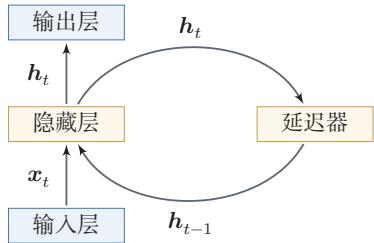  
图6.1 循环神经网络

从数学上讲，公式(6.4)可以看成一个动力系统.因此，隐藏层的活性值 $\boldsymbol { h } _ { t }$ 在很多文献中也称为状态（State）或隐状态（Hidden State）.

从“按时间展开”的角度看，循环神经网络可以理解为一个在时间维度上共享参数的深层网络.这个视角既说明了它为何能够处理变长序列，也为后续的训练算法分析提供了基础，理论上，循环神经网络具有很强的表达能力，可以近似一般的非线性动力系统；但从本章的主线来看，更重要的问题是：状态如何在时间上传播，以及这种传播为什么会在训练中带来长程依赖困难

## 6.2 简单循环网络

动力系统（Dynami-cal System)是一个数学上的概念，指系统状态按照一定的规律随时间变化的系统.具体地讲，动力系统是使用一个函数来描述一个给定空间（如某个物理系统的状态空间）中所有点随时间的变化情况. 生活中很多现象(比如钟摆晃动、台球轨迹等)都可以用动力系统来描述.

简单循环网络（Simple Recurrent Network, SRN）[Elman，1990]是一个非常简单的循环神经网络，只有一个隐藏层的神经网络.在一个两层的前馈神经网络中，连接存在相邻的层与层之间，隐藏层的节点之间是无连接的．而简单循环网络增加了从隐藏层到隐藏层的反馈连接.

令向量 $\pmb { x } _ { t } \in \mathbb { R } ^ { M }$ 表示在时刻t时网络的输入， $\boldsymbol { h } _ { t } \in \mathbb { R } ^ { D }$ 表示隐藏层状态（即隐藏层神经元活性值），则 $\boldsymbol { h } _ { t }$ 不仅和当前时刻的输入 $\mathbf { \boldsymbol { x } } _ { t }$ 相关，也和上一个时刻的隐藏层状态 $\boldsymbol { h } _ { t - 1 }$ 相关.简单循环网络在时刻t的更新公式为

$$
z _ { t } = U h _ { t - 1 } + W x _ { t } + b ,\tag{6.5}
$$

$$
\begin{array} { r } { h _ { t } = f ( z _ { t } ) , } \end{array}\tag{6.6}
$$

其中 $\scriptstyle { z _ { t } }$ 为隐藏层的净输入， $\pmb { U } \in \mathbb { R } ^ { D \times D }$ 为状态-状态权重矩阵， $W \in \mathbb { R } ^ { D \times M }$ 为状态-输入权重矩阵， $\pmb { b } \in \mathbb { R } ^ { D }$ 为偏置向量， $f ( \cdot )$ 是非线性激活函数，通常为Logistic函数或Tanh函数. 公式(6.5)和公式(6.6)也经常直接写为

$$
\begin{array} { r } { \pmb { h } _ { t } = f ( \pmb { U } \pmb { h } _ { t - 1 } + \pmb { W } \pmb { x } _ { t } + \pmb { b } ) . } \end{array}\tag{6.7}
$$

如果我们把每个时刻的状态都看作前馈神经网络的一层，循环神经网络可以看作在时间维度上权值共享的神经网络.图6.2给出了按时间展开的循环神经网络.

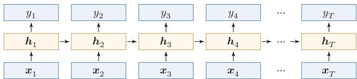  
图6.2 按时间展开的循环神经网络

## 6.2.1 循环神经网络的表达能力

我们先定义一个完全连接的循环神经网络，其输入为 $\mathbf { \boldsymbol { x } } _ { t }$ ,输出为 $\mathbf { \mathscr { y } } _ { t }$

$$
\begin{array} { r } { \pmb { h } _ { t } = f ( \pmb { U } \pmb { h } _ { t - 1 } + \pmb { W } \pmb { x } _ { t } + \pmb { b } ) , } \end{array}
$$

$$
\begin{array} { r } { \boldsymbol { y } _ { t } = \boldsymbol { V } \boldsymbol { h } _ { t } , } \end{array}\tag{6.8}
$$

(6.9)

这一小节从理论上说明循环神经网络的表达能力，属于对正文主线的补充阅读，补充了解即可.

其中h为隐状态， $f ( \cdot )$ 为非线性激活函数，U、W、b和V为网络参数.

## 6.2.1.1循环神经网络的通用近似定理

循环神经网络具有较强的动力系统建模能力.在适当条件下，一个完全连接的循环网络可以近似一大类非线性动力系统.

定理6.1－循环神经网络的通用近似定理[Haykin，2009]：如果一个完全连接的循环神经网络有足够数量的Sigmoid型隐藏神经元，它可以以任意的准确率去近似满足相应可测性和连续性条件的非线性动力系统

$$
\begin{array} { r } { \pmb { s } _ { t } = \pmb { g } ( \pmb { s } _ { t - 1 } , \pmb { x } _ { t } ) , } \end{array}\tag{6.10}
$$

$$
\begin{array} { r } { \pmb { y } _ { t } = \pmb { o } ( \pmb { s } _ { t } ) , } \end{array}\tag{6.11}
$$

其中 $s _ { t }$ 为每个时刻的隐状态， $\mathbf { \boldsymbol { x } } _ { t }$ 是外部输入， $g ( \cdot )$ 是可测的状态转换函数，$o ( \cdot )$ 是连续输出函数，并且对状态空间的紧致性没有限制

证明．这里给出证明思路.根据前馈神经网络的通用近似定理，状态转移函数$g ( \pmb { s } _ { t - 1 } , \pmb { x } _ { t } )$ 和输出函数 $o ( s _ { t } )$ 都可以分别由两层前馈神经网络以任意精度逼近.于是，动力系统中“由上一时刻状态和当前输入得到下一时刻状态”这一计算，可以写成一个共享参数的前馈映射；再把这个映射沿时间维度反复应用，就得到一个循环结构.

通用近似定理参见第4.1.3节.

更具体地，状态转移函数可以由一个两层的神经网络，近似写为

$$
\pmb { s } _ { t } ^ { \prime } = f ( \pmb { A } \pmb { s } _ { t - 1 } + \pmb { B } \pmb { x } _ { t } + \pmb { b } )\tag{6.12}
$$

$$
= f ( A C s _ { t - 1 } ^ { \prime } + B x _ { t } + b ) ,\tag{6.13}
$$

$$
\begin{array} { r } { \mathbf { { s } } _ { t } = \boldsymbol { C } \boldsymbol { s } _ { t } ^ { \prime } , } \end{array}\tag{6.14}
$$

其中A,B,C为权重矩阵，b为偏置向量.

输出函数同样可由一个两层前馈网络近似，

$$
\pmb { y } _ { t } ^ { \prime } = f ( \pmb { A } ^ { \prime } \pmb { s } _ { t - 1 } + \pmb { B } ^ { \prime } \pmb { x } _ { t } + \pmb { b } ^ { \prime } )
$$

本证明参考文献[Schäfer et al., 2006].

(6.15)

$$
= f ( A ^ { \prime } C s _ { t - 1 } ^ { \prime } + B ^ { \prime } x _ { t } + b ^ { \prime } ) ,\tag{6.16}
$$

$$
\begin{array} { r } { \pmb { y } _ { t } = \pmb { D } \pmb { y } _ { t } ^ { \prime } , } \end{array}\tag{6.17}
$$

其中 $A ^ { \prime }$ 2 $B ^ { \prime }$ ,D为权重矩阵，b′为偏置向量.

(2)公式(6.13)和公式(6.16)可以合并为

$$
\left[ \begin{array} { l } { s _ { t } ^ { \prime } } \\ { y _ { t } ^ { \prime } } \end{array} \right] = f \left( \left[ \begin{array} { l l } { A C } & { 0 } \\ { A ^ { \prime } C } & { 0 } \end{array} \right] \left[ \begin{array} { l } { s _ { t - 1 } ^ { \prime } } \\ { y _ { t - 1 } ^ { \prime } } \end{array} \right] + \left[ \begin{array} { l } { B } \\ { B ^ { \prime } } \end{array} \right] x _ { t } + \left[ \begin{array} { l } { b } \\ { b ^ { \prime } } \end{array} \right] \right) .\tag{6.18}
$$

公式(6.17)可以改写为

$$
{ \pmb y } _ { t } = \left[ 0 D \right] \left[ \begin{array} { c c c } { { \pmb s } _ { t } ^ { \prime } } \\ { { \pmb y } _ { t } ^ { \prime } } \end{array} \right] .\tag{6.19}
$$

将二者合并，并令 $\begin{array} { r } { \mathbf { \Sigma } _ { h _ { t } } ~ = ~ \left[ \mathbf { \mathbf { \Sigma } } \mathbf { \mathbf { } } s _ { t } ^ { \prime } ; \mathbf { \mathbf { \Sigma } } \mathbf { \mathbf { } } y _ { t } ^ { \prime } \right] } \end{array}$ ，就可以构造出一个完全连接的循环神经网络

$$
\begin{array} { r } { \pmb { h } _ { t } = f ( \pmb { U } \pmb { h } _ { t - 1 } + \pmb { W } \pmb { x } _ { t } + \pmb { b } ) , } \end{array}\tag{6.20}
$$

$$
\begin{array} { r } { \boldsymbol { y } _ { t } = \boldsymbol { V } \boldsymbol { h } _ { t } , } \end{array}\tag{6.21}
$$

使其以任意精度逼近原动力系统，其中 $U = \left[ \begin{array} { l l } { { A C } } & { { 0 } } \\ { { } } & { { } } \\ { { A ^ { \prime } C } } & { { 0 } } \end{array} \right]$ $W = \left[ \begin{array} { l } { B } \\ { B } \\ { B ^ { \prime } } \end{array} \right] , b =$ ${ \left[ \begin{array} { l } { b } \\ { , V = { \Big [ } 0 } \end{array} \right. } D { \Big ] }$ □

## 6.2.1.2 图灵完备

证明的关键在于：前馈网络可以逼近单步状态转移，而循环结构则负责在时间上反复施加这一近似映射.

图灵完备（Turing Completeness）是指一种数据操作规则，比如一种计算机编程语言，可以实现图灵机（TuringMachine）的所有功能，解决所有的可计算问题.常见的通用编程语言（比如 $\mathrm { C + + , J a v a , P y t h o n }$ 等）都是图灵完备的.

定理6.2-图灵完备[Siegelmann et al.， 1991]：所有的图灵机都可以被一个由使用Sigmoid型激活函数的神经元构成的全连接循环网络来进行模拟.

图灵机是一种抽象的信息处理装置，可以用来解决所有的可计算问题.

因此，从理论构造的角度看，完全连接的循环神经网络具有非常强的计算表达能力.需要注意的是，这并不意味着有限规模、可训练的循环神经网络在实际中都能有效求解任意可计算问题；理论表达能力和可学习性、计算效率、泛化能力仍是不同层面的问题

## 6.3 应用到机器学习

循环神经网络可以应用到很多不同类型的机器学习任务．按照输出形式和依赖结构，我们将循环神经网络的常见应用模式归纳为四类（见表6.1）：序列分类模式、序列标注模式、自回归序列建模和条件序列生成模式

下面分别介绍这四种应用模式

## 6.3.1 序列分类

表6.1 循环神经网络的四种典型应用模式
<table><tr><td>应用模式</td><td>输入输出结构</td><td>是否自回归</td><td>典型任务</td></tr><tr><td>序列分类</td><td>多对一</td><td>否</td><td>文本分类、情感分析</td></tr><tr><td>序列标注</td><td>多对多(等长对齐)</td><td>否</td><td>词性标注、命名实体识别</td></tr><tr><td>自回归序列建模</td><td>单序列逐步预测</td><td>是</td><td>语言模型、时间序列预测</td></tr><tr><td>条件序列生成</td><td>多对多(条件生成)</td><td>是</td><td>机器翻译、语音识别</td></tr></table>

序列分类（SequenceClassification）主要用于序列数据的分类问题：输入为序列，输出为类别.比如在文本分类中，输入数据为词元或单词的序列，输出为该文本的类别.

假设一个样本 ${ \pmb x } _ { 1 : T } = ( { \pmb x } _ { 1 } , \cdots , { \pmb x } _ { T } )$ 为一个长度为T的序列，输出为一个类别 $y \in \{ 1 , \cdots , C \}$ .我们可以将样本x按不同时刻输入到循环神经网络中，并得到不同时刻的隐藏状态 $\boldsymbol { h } _ { 1 } , \cdots , \boldsymbol { h } _ { { T } }$ .我们可以将 $h _ { T }$ 看作整个序列的最终表示（或特征),并输入给分类器 $g ( \cdot )$ 进行分类（如图6.3所示）,即

$$
\hat { y } = g ( h _ { T } ) ,\tag{6.22}
$$

其中 $g ( \cdot )$ 可以是简单的线性分类器（比如Logistic回归）或复杂的分类器（比如多层前馈神经网络).

  
(a) 末时刻状态模式

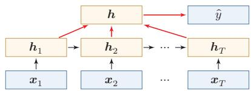  
(b) 按时间平均模式  
图 6.3 序列分类模式

除了将最后时刻的状态作为整个序列的表示之外，我们还可以对整个序列的所有状态进行平均，并用这个平均状态来作为整个序列的表示（如图6.3b所示),即

$$
\hat { y } = g \Big ( \frac { 1 } { T } \sum _ { t = 1 } ^ { T } h _ { t } \Big ) .\tag{6.23}
$$

## 6.3.2 序列标注

序列标注（SequenceLabeling）是指对输入序列的每一时刻都标注相应的类别，输入序列和输出序列的长度相同，并且二者在位置上是一一对齐的.比如在词性标注（Part-of-SpeechTagging）中，每一个单词都需要标注其对应的词性标签.

在序列标注模式（如图6.4所示）中，输入为一个长度为T的序列 $\pmb { x } _ { 1 : T } ~ =$ $( \pmb { x } _ { 1 } , \cdots , \pmb { x } _ { T } )$ ，输出为序列 $y _ { 1 : T } = ( y _ { 1 } , \cdots , y _ { T } )$ .样本x按不同时刻输入到循环神经网络中，并得到不同时刻的隐状态 $\boldsymbol { h } _ { 1 } , \cdots , \boldsymbol { h } _ { { T } }$ .每个时刻的隐状态 $\boldsymbol { h } _ { t }$ 代表了当前时刻及其历史的信息，并输入给分类器 $g ( \cdot )$ 得到当前位置的标签 $\hat { y } _ { t }$ ,即

$$
\hat { y } _ { t } = g ( h _ { t } ) , \qquad \forall t \in [ 1 , T ] .\tag{6.24}
$$

  
图 6.4 序列标注模式

## 6.3.3 自回归序列建模

自回归序列建模（Autoregressive Sequence Modelling）主要用于根据历史前缀逐步预测后续符号.给定一个符号序列 $y _ { 1 : M } = ( y _ { 1 } , \cdots , y _ { M } )$ ，模型在第t个时刻根据历史 $y _ { 1 : t - 1 }$ 来预测下一个符号 $y _ { t }$ .语言模型就是其中最典型的一类任务.

在自回归序列建模中，循环神经网络在每一时刻接收前一个符号 $\hat { y } _ { t - 1 }$ 对应的向量表示 $\hat { \mathbf { y } } _ { t - 1 }$ ,并输出对当前符号 $y _ { t }$ 的预测，即

$$
\begin{array} { r l r l } & { \boldsymbol { h } _ { t } = f ( \boldsymbol { h } _ { t - 1 } , \hat { \boldsymbol { y } } _ { t - 1 } ) , } & & { \qquad \forall t \in [ 1 , M ] , } \\ & { } & \\ & { \hat { \boldsymbol { y } } _ { t } = g ( \boldsymbol { h } _ { t } ) , } & & { \qquad \forall t \in [ 1 , M ] , } \end{array}\tag{6.25}
$$

(6.26)

其中t =1时的输入通常为开始符号(BOS)的向量表示.

图6.5给出了自回归序列建模示例，其中(BOS)表示开始符号，虚线表示将上一个时刻生成的符号作为下一个时刻的输入.

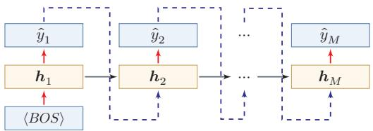  
图 6.5 自回归序列建模

在语言建模任务中，下一个词元预测（Next Token Prediction,NTP）也常常以这种形式出现.训练时，模型通常使用真实历史作为输入；生成时，则使用上一时刻的预测结果作为下一时刻的输入.

这里需要区分训练阶段和生成阶段的数据流.训练时，常见做法是把真实序列整体右移一位作为输入，并让模型在每个位置预测下一个真实符号，这种做法通常称为教师强制（TeacherForcing）．它的优点是可以并行计算所有位置的损失，并避免早期错误影响后续训练信号；但在生成阶段，模型只能看到自己已经生成的历史，一旦某一步预测错误，后续状态就会在错误历史上继续展开.这种训练和生成条件不完全一致的现象常称为暴露偏差（ExposureBias）.理解这一点，有助于把本节的自回归建模和后续Transformer语言模型中的“从前缀到logits再到采样”的数据流联系起来.

## 6.3.4 条件序列生成模式

条件序列生成（Conditional Sequence Generation）是指在一个输入序列的条件下生成另一个输出序列.与自回归序列建模相比，这类任务不仅依赖已经生成的历史输出，还显式依赖另一条输入序列．机器翻译、语音识别、人机对话等任务都属于这一类.传统上，这一类也常被称为编码器-解码器（Encoder-Decoder)模型.

在条件序列生成模式中，输入为长度为T的序列 ${ \pmb x } _ { 1 : T } = ( { \pmb x } _ { 1 } , \cdots , { \pmb x } _ { T } )$ ，输出为长度为M的序列 $y _ { 1 : M } = ( y _ { 1 } , \cdots , y _ { M } )$ .通常先将样本x按不同时刻输入到一个循环神经网络（编码器）中，并得到其编码；然后再使用另一个循环神经网络（解码器）逐步生成输出序列 $\hat { y } _ { 1 : M }$ ，为了建立输出序列之间的依赖关系，解码器通常采用自回归方式

令 $f _ { 1 } ( \cdot )$ 和 $f _ { 2 } ( \cdot )$ 分别为用作编码器和解码器的循环神经网络，则编码器-解码器模型可以写为

$$
h _ { t } = f _ { 1 } ( h _ { t - 1 } , x _ { t } ) ,
$$

$$
\forall t \in [ 1 , T ] ,\tag{6.27}
$$

$$
h _ { T + t } = f _ { 2 } ( h _ { T + t - 1 } , \hat { { \bf y } } _ { t - 1 } ) ,
$$

$$
\forall t \in [ 1 , M ] ,\tag{6.28}
$$

$$
\hat { y } _ { t } = g ( h _ { T + t } ) ,
$$

$$
\forall t \in [ 1 , M ] .\tag{6.29}
$$

其中 $g ( \cdot )$ 为分类器， $\hat { y } _ { t }$ 表示第t个时刻预测得到的离散符号， $\hat { \ b { y } } _ { t }$ 为该符号对应的向量表示（例如词嵌入）.在解码器中通常采用自回归模型，每个时刻的输入为上一时刻的预测结果 $\hat { y } _ { t - 1 }$ .在实际训练中，也经常使用目标序列中的真实前一符号作为解码器输入；而在推断或生成时，通常需要使用模型上一时刻生成的符号.这一点和前面的自回归序列建模完全一致.

自回归模型参见第6.1.2节.

图6.6给出了条件序列生成模式示例，其中(EOS)表示输入序列的结束，虚线表示将上一个时刻的输出作为下一个时刻的输入.

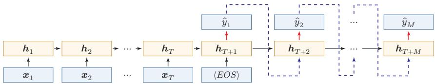  
图 6.6 条件序列生成

需要注意的是，这类模型通常要把整个输入序列压缩为一个或少数几个状态向量，因此当输入很长时容易形成信息瓶颈. 这一局限进一步促使人们引入注意力机制，使解码器能够在生成过程中动态访问编码器不同位置的信息.参见第8.2节.

## 6.4 参数学习

循环神经网络的参数可以通过梯度下降方法来进行学习.

以随机梯度下降为例，给定一个训练样本 $( { \boldsymbol { x } } , { \boldsymbol { y } } )$ ，其中 ${ \pmb x } _ { 1 : T } = ( { \pmb x } _ { 1 } , \cdots , { \pmb x } _ { T } )$ 为长度是T的输入序列， $y _ { 1 : T } = ( y _ { 1 } , \cdots , y _ { T } )$ 是长度为T的标签序列.即在每个时刻t,都有一个监督信息 $y _ { t }$ ,我们定义时刻t的损失函数为

不失一般性，这里我们以序列标注模式为例来介绍循环神经网络的参数学习.

$$
\mathcal { L } _ { t } = \mathcal { L } ( y _ { t } , g ( h _ { t } ) ) ,\tag{6.30}
$$

其中 $g ( h _ { t } )$ 为第t时刻的输出，为可微分的损失函数，比如交叉熵.那么整个序列的损失函数为

$$
\mathcal { L } = \sum _ { t = 1 } ^ { T } \mathcal { L } _ { t } .\tag{6.31}
$$

整个序列的损失函数L关于参数U的梯度为

$$
\frac { \partial \mathcal { L } } { \partial U } = \sum _ { t = 1 } ^ { T } \frac { \partial \mathcal { L } _ { t } } { \partial U } ,\tag{6.32}
$$

即每个时刻损失 ${ \mathcal { L } } _ { t }$ 对参数U的偏导数之和.

循环神经网络中存在一个递归调用的函数f(·)，因此其计算参数梯度的方式和前馈神经网络不太相同.在循环神经网络中主要有两种计算梯度的方式：随时间反向传播(BPTT)算法和实时循环学习（RTRL)算法.

从直观上看，参数学习的关键在于回答三个问题：每个时刻的误差如何得到；这些误差如何沿时间反向传递到更早时刻；以及由于各时刻共享同一组参数，来自不同时间步的梯度应如何累加.BPTT正是围绕这三个问题展开的.

## 6.4.1随时间反向传播算法

随时间反向传播(Back-Propagation Through Time,BPTT)算法的主要思想是通过类似前馈神经网络的误差反向传播算法来计算梯度.

BPTT算法将循环神经网络看作一个展开的多层前馈网络，其中“每一层”对应循环网络中的“每个时刻”（见图6.2).这样，循环神经网络就可以按照前馈网络中的反向传播算法计算参数梯度.在“展开”的前馈网络中，所有层的参数是共享的，因此参数的真实梯度是所有“展开层”的参数梯度之和.

计算偏导数 $\frac { \partial \mathcal { L } _ { t } } { \partial U }$ 先来计算公式(6.32)中第t时刻损失对参数U的偏导数 $\frac { \partial \mathcal { L } _ { t } } { \partial U }$

因为参数U和隐藏层在每个时刻 $k ( 1 \leq k \leq t )$ 的净输入 $z _ { k } = U h _ { k - 1 } +$ $W { \pmb x } _ { k } + b$ 有关，因此第t时刻的损失函数 ${ \mathcal { L } } _ { t }$ 关于参数 $u _ { i j }$ 的梯度为：

$$
\frac { \partial \mathcal { L } _ { t } } { \partial u _ { i j } } = \sum _ { k = 1 } ^ { t } \frac { \partial ^ { + } z _ { k } } { \partial u _ { i j } } \frac { \partial \mathcal { L } _ { t } } { \partial z _ { k } } ,\tag{6.33}
$$

链式法则参见公式(B.19).

其中 $\frac { { \partial } ^ { + } { z } _ { k } } { \partial { u } _ { i j } }$ 表示“直接”偏导数，即公式 $z _ { k } = U h _ { k - 1 } + W x _ { k } + b$ 中保持 $ { h _ { k - 1 } }$ 不变,对 $u _ { i j }$ 进行求偏导数，得到

$$
\frac { \partial ^ { + } z _ { k } } { \partial u _ { i j } } = [ 0 , \cdots , ] [ h _ { k - 1 } ] _ { j } \backslash \cdots , 0 ]\tag{6.34}
$$

$$
\triangleq \mathbb { I } _ { i } ( [ h _ { k - 1 } ] _ { j } ) ,\tag{6.35}
$$

其中 $[ h _ { k - 1 } ] _ { j }$ 为第k-1时刻隐状态的第 $j$ 维； $\mathbb { I } _ { i } ( x )$ 除了第i个元素的值为x外，其余都为0的行向量.

定义误差项 $\begin{array} { r } { \delta _ { t , k } = \frac { \partial \mathcal { L } _ { t } } { \partial z _ { k } } } \end{array}$ 为第t时刻的损失对第k时刻隐藏神经层的净输入$z _ { k }$ 的导数，则当 $1 \leq k < t$ 时

$$
\delta _ { t , k } = \frac { \partial \mathcal { L } _ { t } } { \partial z _ { k } }\tag{6.36}
$$

$$
= \frac { \partial h _ { k } } { \partial z _ { k } } \frac { \partial z _ { k + 1 } } { \partial h _ { k } } \frac { \partial \mathcal { L } _ { t } } { \partial z _ { k + 1 } }\tag{6.37}
$$

$$
= \mathrm { d i a g } ( f ^ { \prime } ( z _ { k } ) ) U ^ { \top } \delta _ { t , k + 1 } .\tag{6.38}
$$

直观上，误差信号从时刻t沿时间反向传播到时刻k，每经过一步都乘以$\mathrm { d i a g } ( f ^ { \prime } ( z _ { k } ) ) U ^ { \top } -$ 其中 $U ^ { \top }$ 的出现源于前向传播时 $z _ { k + 1 } = U h _ { k } + \cdots$ 对 $h _ { k }$ 求导后的转置， $\mathrm { d i a g } ( f ^ { \prime } ( z _ { k } ) )$ 则来自激活函数的逐元素导数.

将公式(6.38)和公式(6.35)代入公式(6.33)得到

$$
\frac { \partial \mathcal { L } _ { t } } { \partial u _ { i j } } = \sum _ { k = 1 } ^ { t } [ \delta _ { t , k } ] _ { i } [ h _ { k - 1 } ] _ { j } .\tag{6.39}
$$

将上式写成矩阵形式为

$$
\frac { \partial \mathcal { L } _ { t } } { \partial U } = \sum _ { k = 1 } ^ { t } \delta _ { t , k } h _ { k - 1 } ^ { \top } .\tag{6.40}
$$

图6.7给出了误差项随时间进行反向传播算法的示例

  
图6.7 误差项随时间反向传播算法示例

参数梯度 将公式(6.40)代入到公式(6.32),得到整个序列的损失函数L关于参数U的梯度

$$
\frac { \partial \mathcal { L } } { \partial U } = \sum _ { t = 1 } ^ { T } \sum _ { k = 1 } ^ { t } \delta _ { t , k } h _ { k - 1 } ^ { \scriptscriptstyle \top } .\tag{6.41}
$$

同理可得，∠关于权重W和偏置b的梯度为

$$
\frac { \partial \mathcal { L } } { \partial W } = \sum _ { t = 1 } ^ { T } \sum _ { k = 1 } ^ { t } \delta _ { t , k } \pmb { x } _ { k } ^ { \top } ,\tag{6.42}
$$

$$
\frac { \partial \mathcal { L } } { \partial \boldsymbol { b } } = \sum _ { t = 1 } ^ { T } \sum _ { k = 1 } ^ { t } \delta _ { t , k } .\tag{6.43}
$$

计算复杂度 在BPTT算法中，参数的梯度需要在一个完整的“前向”计算和“反向”计算后才能得到并进行参数更新.

## 6.4.2 实时循环学习算法

与反向传播的BPTT算法不同的是，实时循环学习（Real-Time RecurrentLearning,RTRL)是通过前向传播的方式来计算梯度 [Williams et al., 1995].

这一小节作为补充了解即可.

假设循环神经网络中第t+1时刻的状态 $\boldsymbol { h } _ { t + 1 }$ 为

$$
\begin{array} { r } { \pmb { h } _ { t + 1 } = f ( \pmb { z } _ { t + 1 } ) = f ( \pmb { U } \pmb { h } _ { t } + \pmb { W } \pmb { x } _ { t + 1 } + \pmb { b } ) , } \end{array}
$$

梯度前向传播可以参考自动微分中的前向模式，参见第4.3.3节.

(6.44)

其关于参数 $u _ { i j }$ 的偏导数为

$$
\frac { \partial h _ { t + 1 } } { \partial u _ { i j } } = \Big ( \frac { \partial ^ { + } z _ { t + 1 } } { \partial u _ { i j } } + \frac { \partial h _ { t } } { \partial u _ { i j } } U ^ { \top } \Big ) \frac { \partial h _ { t + 1 } } { \partial z _ { t + 1 } }\tag{6.45}
$$

https://nndl.ai/

$$
= \left( \mathbb { I } _ { i } ( [ h _ { t } ] _ { j } ) + \frac { \partial h _ { t } } { \partial u _ { i j } } U ^ { \top } \right) \mathrm { d i a g } ( f ^ { \prime } ( z _ { t + 1 } ) )\tag{6.46}
$$

$$
= \Big ( \mathbb { I } _ { i } ( [ h _ { t } ] _ { j } ) + \frac { \partial h _ { t } } { \partial u _ { i j } } U ^ { \top } \Big ) \odot \big ( f ^ { \prime } ( z _ { t + 1 } ) \big ) ^ { \top } ,\tag{6.47}
$$

其中 $\mathbb { I } _ { i } ( x )$ 是除了第i列值为x外，其余都为0的行向量.

RTRL算法从第1个时刻开始，除了计算循环神经网络的隐状态之外，还利用公式(6.47)依次前向计算偏导数 $\frac { \partial h _ { 1 } } { \partial u _ { i j } } , \frac { \partial h _ { 2 } } { \partial u _ { i j } } , \frac { \partial h _ { 3 } } { \partial u _ { i j } } , \cdots$

这样，假设第t个时刻存在一个监督信息，其损失函数为 ${ \mathcal { L } } _ { t }$ ，就可以同时计算损失函数对 $u _ { i j }$ 的偏导数

$$
\frac { \partial \mathcal { L } _ { t } } { \partial u _ { i j } } = \frac { \partial h _ { t } } { \partial u _ { i j } } \frac { \partial \mathcal { L } _ { t } } { \partial h _ { t } } .\tag{6.48}
$$

这样在第t时刻，可以实时地计算损失 ${ \mathcal { L } } _ { t }$ 关于参数U的梯度，并更新参数.参数W和b的梯度也可以同样按上述方法实时计算.

两种算法比较RTRL算法和BPTT算法都是基于梯度下降的算法，分别通过前向模式和反向模式应用链式法则来计算梯度．在循环神经网络中，一般网络输出维度远低于输入维度，因此BPTT算法的计算量会更小，但是BPTT算法需要保存前向计算中的中间状态，空间复杂度较高.RTRL算法不需要沿时间反向回传误差，形式上适合在线学习或无限序列任务；但完整RTRL需要维护状态对参数的偏导数，计算和存储开销很高，因此实际应用中往往需要近似或截断版本.

## 6.5 长程依赖问题

循环神经网络在学习过程中的主要困难在于，梯度在跨时间传播时容易消失或爆炸，因此模型很难稳定地捕捉长时间间隔状态之间的依赖关系.

在BPTT算法中，将公式(6.38)展开得到

$$
\delta _ { t , k } = \prod _ { \tau = k } ^ { t - 1 } \Big ( \mathrm { d i a g } ( f ^ { \prime } ( \boldsymbol { z } _ { \tau } ) ) \boldsymbol { U } ^ { \intercal } \Big ) \delta _ { t , t } .\tag{6.49}
$$

如果定义 $\gamma \cong \| \mathrm { d i a g } ( f ^ { \prime } ( z _ { \tau } ) ) U ^ { \top } \|$ ,则

$$
\delta _ { t , k } \cong \gamma ^ { t - k } \delta _ { t , t } .\tag{6.50}
$$

若 $\gamma > 1$ ,当t − k → ∞时， $\gamma ^ { t - k } \to \infty$ 当间隔t—k比较大时，梯度也变得很大,会造成系统不稳定,称为梯度爆炸问题(Gradient Exploding Problem).

相反，若 $\gamma < 1$ ，当 $t - k \to \infty$ 时， $\gamma ^ { t - k }  0 .$ 当间隔t—k比较大时，梯度也变得非常小，会出现和深层前馈神经网络类似的梯度消失问题（VanishingGradient Problem）.更精确的分析可通过权重矩阵U的谱半径来刻画:若其最大特征值的模大于1,则梯度倾向于爆炸;若小于1,则倾向于消失.


要注意的是，在循环神经网络中的梯度消失不是说 $\frac { \partial \mathcal { L } _ { t } } { \partial U }$ 的梯度消失了，而是 $\frac { \partial \mathcal { L } _ { t } } { \partial h _ { k } }$ 的梯度消失了（当间隔t—k比较大时).也就是说，参数U的更新主要靠当前时刻t的几个相邻状态 $h _ { k }$ 来更新，长距离的状态对参数U没有影响.

由于循环神经网络经常使用Logistic函数或Tanh函数作为非线性激活函数，其导数值都小于1，并且权重矩阵 $\| \pmb { U } \|$ 也不会太大，因此如果时间间隔t—k过大， $\delta _ { t , k }$ 会趋向于0,因而经常会出现梯度消失问题.

虽然简单循环网络理论上可以建立长时间间隔的状态之间的依赖关系，但是由于梯度爆炸或消失问题，实际上只能学习到短期的依赖关系．这样，如果时刻t的输出 $y _ { t }$ 依赖于时刻k的输入 $\scriptstyle { \pmb x } _ { k }$ ，当间隔t一k比较大时，简单神经网络很难建模这种长距离的依赖关系，称为长程依赖问题（Long-Term DependenciesProblem).

长程依赖问题也称为长期依赖问题或长距离依赖问题.

## 6.5.1 改进方案

为了避免梯度爆炸或消失问题，一种最直接的方式就是选取合适的参数，同时使用非饱和的激活函数，尽量使得 $\mathrm { d i a g } ( f ^ { \prime } ( z ) ) U ^ { \intercal } \approx 1$ ，这种方式需要足够的人工调参经验，限制了模型的广泛应用.比较有效的方式是通过改进模型或优化方法来缓解循环网络的梯度爆炸和梯度消失问题

梯度爆炸一般而言，循环网络的梯度爆炸问题比较容易解决，一般通过权重衰减或梯度截断来避免.

梯度截断是一种启发式的解决梯度爆炸问题的有效方法，参见第7.2.4.6节.

权重衰减是通过给参数增加 $\ell _ { 1 }$ 或 $\ell _ { 2 }$ 范数的正则化项来限制参数的取值范围，从而使得 $\gamma \leq 1$ .梯度截断是另一种有效的启发式方法，当梯度的模大于一定阈值时，就将它截断成为一个较小的数.

梯度消失 梯度消失是循环网络的主要问题.除了使用一些优化技巧外，更有效的方式就是改变模型，比如让 $U = I$ ,同时令 $\begin{array} { r } { \frac { \partial h _ { t } } { \partial h _ { t - 1 } } = I } \end{array}$ 为单位矩阵，即

$$
\begin{array} { r } { \pmb { h } _ { t } = \pmb { h } _ { t - 1 } + g ( \pmb { x } _ { t } ; \pmb { \theta } ) , } \end{array}\tag{6.51}
$$

其中 $g ( \cdot )$ 是一个非线性函数，θ为参数.

公式(6.51)中， $\boldsymbol { h } _ { t }$ 和 $\boldsymbol { h } _ { t - 1 }$ 之间为线性依赖关系，且权重系数为1，这样就不存在梯度爆炸或消失问题.但是，这种改变也丢失了神经元在反馈边上的非线性激活的性质，因此也降低了模型的表示能力.

为了避免这个缺点，我们可以采用一种更加有效的改进策略：

$$
h _ { t } = h _ { t - 1 } + g ( \boldsymbol { x } _ { t } , h _ { t - 1 } ; \boldsymbol { \theta } ) ,
$$

这种改进策略和残差连接的思想十分类似，参见第5.4.5节.

(6.52)

这样 $\boldsymbol { h } _ { t }$ 和 $\boldsymbol { h } _ { t - 1 }$ 之间为既有线性关系，也有非线性关系，并且可以缓解梯度消失问题.但这种改进依然存在两个问题：

（1）梯度爆炸问题：令 $z _ { k } = U h _ { k - 1 } + W x _ { k } + b$ 为在第k时刻函数 $g ( \cdot )$ 的输入，在计算公式(6.36)中的误差项 $\begin{array} { r } { \delta _ { t , k } = \frac { \partial \mathcal { L } _ { t } } { \partial z _ { k } } } \end{array}$ 时，梯度可能会过大，从而导致梯度爆炸问题.

（2）记忆容量（MemoryCapacity）问题：随着 $\boldsymbol { h } _ { t }$ 不断累积存储新的输入信息，会发生饱和现象.假设 $g ( \cdot )$ 为Logistic函数，则随着时间t的增长， $\boldsymbol { h } _ { t }$ 会变得越来越大，从而导致h变得饱和.也就是说，隐状态 $\boldsymbol { h } _ { t }$ 可以存储的信息是有限的，随着记忆单元存储的内容越来越多，其丢失的信息也越来越多.

为了解决这两个问题，可以通过引入门控机制来进一步改进模型

## 6.6 基于门控的循环神经网络

为了改善循环神经网络的长程依赖问题，一种常用而有效的思路是在公式(6.52)的基础上引入门控机制来控制信息的累积速度，包括有选择地加入新的信息，并有选择地遗忘之前累积的信息.这一类网络可以称为基于门控的循环神经网络（GatedRNN）.本节中，主要介绍两种基于门控的循环神经网络：长短期记忆网络和门控循环单元网络.

## 6.6.1 长短期记忆网络

长短期记忆(Long Short-Term Memory,LSTM) 网络 [Gers et al., 2000]是循环神经网络的一个变体，可以有效缓解简单循环神经网络中的长程依赖问题，尤其是梯度消失问题.

在公式(6.52)的基础上，LSTM网络主要改进在以下两个方面：

新的内部状态LSTM网络引入一个新的内部状态（internal state） $\boldsymbol { c } _ { t } \in \mathbb { R } ^ { D }$ 专门进行线性的循环信息传递，同时（非线性地）输出信息给隐藏层的外部状态$\boldsymbol { h } _ { t } \in \mathbb { R } ^ { D }$ .内部状态 $\mathbf { } c _ { t }$ 通过下面公式计算：

$$
\pmb { c } _ { t } = \pmb { f } _ { t } \odot \pmb { c } _ { t - 1 } + \pmb { i } _ { t } \odot \tilde { \pmb { c } } _ { t } ,\tag{6.53}
$$

https://nndl.ai/

$$
h _ { t } = o _ { t } \odot \operatorname { t a n h } ( c _ { t } ) ,\tag{6.54}
$$

其中 $\mathbf { \Delta } f _ { t } \in [ 0 , 1 ] ^ { D } , i _ { t } \in [ 0 , 1 ] ^ { D }$ 和 ${ \boldsymbol { o } } _ { t } \in [ 0 , 1 ] ^ { D }$ 为三个门（gate）来控制信息传递的路径： $\odot$ 为向量元素乘积； $c _ { t - 1 }$ 为上一时刻的记忆单元； $\tilde { \boldsymbol { c } } _ { t } \in \mathbb { R } ^ { D }$ 是通过非线性函数得到的候选状态：

$$
\tilde { c } _ { t } = \operatorname { t a n h } ( W _ { c } \mathbf { x } _ { t } + U _ { c } h _ { t - 1 } + b _ { c } ) .
$$

公式(6.55) \~ 公式(6.58)中的W\*, U\*, $^ { b _ { * } }$ 为可学习的网络参数，其中$* \in \{ i , f , o , c \}$

(6.55)

在每个时刻t,LSTM网络的内部状态 $\mathbf { } c _ { t }$ 记录了到当前时刻为止的历史信息.门控机制在数字电路中，门（gate）为一个二值变量{0,1}，0代表关闭状态，不许任何信息通过；1代表开放状态，允许所有信息通过

LSTM网络引入门控机制（GatingMechanism）来控制信息传递的路径.公式(6.53)和公式(6.54)中三个“门”分别为输入门 $| i _ { t }$ 、遗忘门 $\pmb { f } _ { t }$ 和输出门 $\mathbf { } _ { o _ { t } }$ .这三个门的作用为

（1）遗忘门 $\pmb { f } _ { t }$ 控制上一个时刻的内部状态 $c _ { t - 1 }$ 需要遗忘多少信息

（2）输入门 $i _ { t }$ 控制当前时刻的候选状态 $\tilde { c } _ { t }$ 有多少信息需要保存

（3）输出门 $\mathbf { } _ { o _ { t } }$ 控制当前时刻的内部状态 $\mathbf { } c _ { t }$ 有多少信息需要输出给外部状态 $\boldsymbol { h } _ { t }$

当 $\pmb { f } _ { t } = \mathbf 0 , \pmb { i } _ { t } = \mathbf 1$ 时，记忆单元将上一时刻内部状态 $c _ { t - 1 }$ 中的信息清空，并将候选状态向量 $\tilde { c } _ { t }$ 写入.需要注意的是，候选状态和门值本身仍由当前输入 $\mathbf { \boldsymbol { x } } _ { t }$ 与上一时刻外部状态 $\boldsymbol { h } _ { t - 1 }$ 共同决定.当 $\mathbf { \Delta } f _ { t } = 1 , i _ { t } = 0$ 时，记忆单元将复制上一时刻的内容，不写入新的信息.

LSTM网络中的“门”是一种“软”门，取值在(0,1)之间，表示以一定的比例允许信息通过.三个门的计算方式为：

$$
i _ { t } = \sigma ( W _ { i } x _ { t } + U _ { i } h _ { t - 1 } + b _ { i } ) ,
$$

$$
\pmb { f } _ { t } = \sigma ( \pmb { W } _ { f } \pmb { x } _ { t } + \pmb { U } _ { f } \pmb { h } _ { t - 1 } + \pmb { b } _ { f } ) ,\tag{6.56}
$$

(6.57)

$$
\begin{array} { r } { \pmb { o } _ { t } = \sigma ( \pmb { W } _ { o } \pmb { x } _ { t } + \pmb { U } _ { o } \pmb { h } _ { t - 1 } + \pmb { b } _ { o } ) , } \end{array}\tag{6.58}
$$

其中 $\sigma ( \cdot )$ 为Logistic函数,其输出区间为(0,1)， $\mathbf { \boldsymbol { x } } _ { t }$ 为当前时刻的输入， $\boldsymbol { h } _ { t - 1 }$ 为上一时刻的外部状态.

图6.8给出了LSTM网络的循环单元结构，其计算过程为：1）首先利用上一时刻的外部状态 $\boldsymbol { h } _ { t - 1 }$ 和当前时刻的输入 ${ \mathbf { } } _ { { \mathbf { } } _ { \pmb { x } _ { t } } }$ ，计算出三个门，以及候选状态 $\tilde { c } _ { t } ; 2 $ 结合遗忘门 $\pmb { f } _ { t }$ 和输入门 $i _ { t }$ 来更新记忆单元c；3)结合输出门o₄，将内部状态的 $\mathbf { } c _ { t }$ $\mathbf { } _ { o _ { t } }$ 信息传递给外部状态 $\boldsymbol { h } _ { t }$

LSTM避免梯度消失的关键在于：记忆单元$\mathbf { c } _ { t }$ 的更新是加法形式$( \mathbf { \Delta } \mathbf { c } _ { t } = \mathbf { \Delta } \mathbf { f } _ { t } \odot \mathbf { c } _ { t - 1 } + i _ { t } \odot $ $\tilde { c } _ { t } )$ ，当 $\mathbf { \nabla } f _ { t } \approx \mathbf { 1 }$ 时梯度可近似恒等传播；而普通RNN的隐状态为乘法形式，反向传播中权重矩阵的累乘容易导致梯度消失或爆炸.

一般在深度网络参数学习时，权重参数初始化得比较小. 训练LSTM网络时，遗忘门偏置 $b _ { f }$ 常初始化为正值 $( \ - \not \mathtt { k } \mathtt { m } \ ]$ 或2).使训练

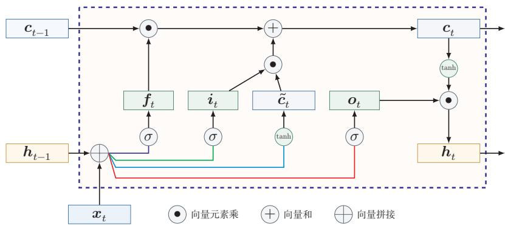  
图 6.8 LSTM 网络的循环单元结构

通过LSTM循环单元，整个网络可以建立较长距离的时序依赖关系.公式(6.53)\~公式(6.58)可以简洁地描述为

$$
\left[ \begin{array} { c } { \tilde { c } _ { t } } \\ { o _ { t } } \\ { i _ { t } } \\ { f _ { t } } \end{array} \right] = \left[ \begin{array} { c } { \operatorname { t a n h } } \\ { \sigma } \\ { \sigma } \\ { \sigma } \\ { \sigma } \end{array} \right] \left( W \left[ \begin{array} { c } { x _ { t } } \\ { h _ { t - 1 } } \end{array} \right] + b \right) ,\tag{6.59}
$$

$$
\pmb { c } _ { t } = \pmb { f } _ { t } \odot \pmb { c } _ { t - 1 } + \pmb { i } _ { t } \odot \tilde { \pmb { c } } _ { t } ,\tag{6.60}
$$

$$
h _ { t } = \pmb { \sigma } _ { t } \odot \operatorname { t a n h } \left( \pmb { c } _ { t } \right) ,\tag{6.61}
$$

其中 $\pmb { x } _ { t } \in \mathbb { R } ^ { M }$ 为当前时刻的输入， $W \in \mathbb { R } ^ { 4 D \times ( M + D ) }$ 和 $\pmb { b } \in \mathbb { R } ^ { 4 D }$ 为网络参数.记忆 循环神经网络中的隐状态h存储了历史信息，可以看作一种记忆（Mem-ory）.在简单循环网络中，隐状态每个时刻都会被重写，因此可以看作一种短期记忆（Short-Term Memory）.在神经网络中，长期记忆（Long-Term Memory）可以看作网络参数，隐含了从训练数据中学到的经验，其更新周期要远远慢于短期记忆.而在LSTM网络中，记忆单元c可以在某个时刻捕捉到某个关键信息，并有能力将此关键信息保存一定的时间间隔.记忆单元c中保存信息的生命周期要长于短期记忆h，但又远远短于长期记忆，因此称为长短期记忆（LongShort-Term Memory).

长短期记忆是指长的“短期记忆”.

## 6.6.2 门控循环单元网络

门控循环单元（Gated Recurrent Unit，GRU）网络 [Cho et al.,2014; Chung et al., 2014]是一种比LSTM网络更加简单的循环神经网络.

GRU网络引入门控机制来控制信息更新的方式. 和LSTM不同，GRU不引入额外的记忆单元，GRU网络也是在公式(6.52)的基础上引入一个更新门

（UpdateGate）来控制当前状态需要从历史状态中保留多少信息（不经过非线性变换)，以及需要从候选状态中接受多少新信息，即

$$
\pmb { h } _ { t } = \pmb { z } _ { t } \odot \pmb { h } _ { t - 1 } + ( 1 - \pmb { z } _ { t } ) \odot g ( \pmb { x } _ { t } , \pmb { h } _ { t - 1 } ; \theta ) ,\tag{6.62}
$$

其中 $\boldsymbol { z } _ { t } \in [ 0 , 1 ] ^ { D }$ 为更新门：

$$
z _ { t } = \sigma ( W _ { z } { \pmb x } _ { t } + { U } _ { z } { \pmb h } _ { t - 1 } + b _ { z } ) .\tag{6.63}
$$

GRU网络直接使用一个更新门来控制“保留旧状态”和“写入候选状态”之间的平衡，相当于把保留和写入两种作用压缩为一组互补权重.当 $z _ { t } = 0$ 时，当前状态 $\boldsymbol { h } _ { t }$ 和前一时刻的状态 $\boldsymbol { h } _ { t - 1 }$ 之间为非线性函数关系；当 $z _ { t } = 1$ 时， $\boldsymbol { h } _ { t }$ 和$\boldsymbol { h } _ { t - 1 }$ 之间为线性函数关系.

公式(6.63)\~ 公式(6.65)中的$W _ { * } , U _ { * } , b _ { * }$ 为可学习的网络参数，其中$* \in \{ h , r , z \}$

在GRU网络中，函数 $g ( \pmb { x } _ { t } , \pmb { h } _ { t - 1 } ; \theta )$ 的定义为

$$
\tilde { \boldsymbol { h } } _ { t } = \operatorname { t a n h } \Big ( \boldsymbol { W } _ { h } \boldsymbol { x } _ { t } + \boldsymbol { U } _ { h } ( \boldsymbol { r } _ { t } \odot \boldsymbol { h } _ { t - 1 } ) + \boldsymbol { b } _ { h } \Big ) ,
$$

这里使用 Tanh 函数是由于其导数有比较大的值域，能够缓解梯度消失问题.

(6.64)

其中 $\tilde { h } _ { t }$ 表示当前时刻的候选状态， $\boldsymbol { r } _ { t } \in [ 0 , 1 ] ^ { D }$ 为重置门(Reset Gate)

$$
\boldsymbol { r } _ { t } = \sigma ( \boldsymbol { W } _ { r } \boldsymbol { x } _ { t } + \boldsymbol { U } _ { r } \boldsymbol { h } _ { t - 1 } + \boldsymbol { b } _ { r } ) ,\tag{6.65}
$$

用来控制候选状态 $\tilde { \mathbf { \Lambda } } _ { }$ 的计算是否依赖上一时刻的状态 $\boldsymbol { h } _ { t - 1 }$

当 $\boldsymbol { r } _ { t } = \mathbf { 0 }$ 时，候选状态 $\tilde { \boldsymbol { h } } _ { t } = \operatorname { t a n h } ( \boldsymbol { W } _ { h } \boldsymbol { x } _ { t } + \boldsymbol { b } _ { h } )$ 只和当前输入 $\mathbf { \boldsymbol { x } } _ { t }$ 相关，,和历史状态无关.当 $\boldsymbol { r } _ { t } = 1$ 时，候选状态 $\tilde { \pmb { h } } _ { t } = \operatorname { t a n h } ( \pmb { W } _ { h } \pmb { x } _ { t } + \pmb { U } _ { h } \pmb { h } _ { t - 1 } + \pmb { b } _ { h } )$ 和当前输入 $\mathbf { \boldsymbol { x } } _ { t }$ 以及历史状态 $\boldsymbol { h } _ { t - 1 }$ 相关，和简单循环网络一致.

综上，GRU网络的状态更新方式为

$$
\pmb { h } _ { t } = z _ { t } \odot \pmb { h } _ { t - 1 } + ( 1 - z _ { t } ) \odot \tilde { \pmb { h } } _ { t } .\tag{6.66}
$$

可以看出，当 ${ \boldsymbol { z } } _ { t } = \mathbf { 0 } , { \boldsymbol { r } } _ { t } = \mathbf { 1 }$ 时，GRU网络退化为简单循环网络；若 ${ \boldsymbol { z } } _ { t } = \mathbf { 0 } , { \boldsymbol { r } } _ { t } =$ 0时，当前状态 $\boldsymbol { h } _ { t }$ 只和当前输入 $\mathbf { \boldsymbol { x } } _ { t }$ 相关，和历史状态 $\boldsymbol { h } _ { t - 1 }$ 无关.当 $z _ { t } = 1$ 时，当前状态 $h _ { t } = h _ { t - 1 }$ 等于上一时刻状态 $\boldsymbol { h } _ { t - 1 }$ ，和当前输入 $\mathbf { \boldsymbol { x } } _ { t }$ 无关.

图6.9给出了GRU网络的循环单元结构.

从教材学习的角度看，可以将SRN、LSTM和GRU作一个并列比较，如表6.2所示.SRN结构最紧凑，但难以稳定建模长程依赖；LSTM通过额外的记忆单元和三个门来显式控制信息流；GRU则在保留门控思想的同时，进一步简化了结构.

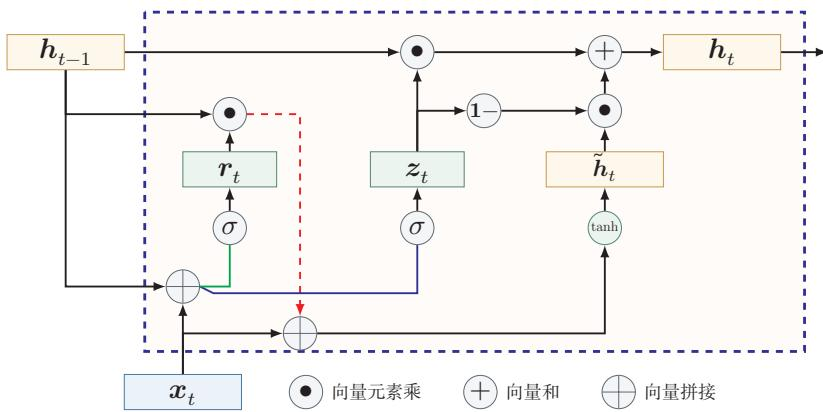  
图 6.9 GRU网络的循环单元结构

表 6.2 SRN、LSTM与GRU的比较
<table><tr><td>模型</td><td>状态变量</td><td>门控结构</td><td>特点</td></tr><tr><td>SRN</td><td> $\boldsymbol { h } _ { t }$ </td><td>无</td><td>结构简单，但难以稳定建模长程 依赖</td></tr><tr><td>LSTM</td><td> $\boldsymbol { h } _ { t } , \boldsymbol { c } _ { t }$ </td><td>输入门、遗忘门、输出 门</td><td>控制更细致，表达能力强，但参数 较多</td></tr><tr><td>GRU</td><td> $\boldsymbol { h } _ { t }$ </td><td>更新门、重置门</td><td>结构更紧凑，训练和实现相对简 单</td></tr></table>

## 6.7 深层循环神经网络

如果将深度定义为网络中信息传递路径长度的话，循环神经网络可以看作既“深”又“浅”的网络.一方面来说，如果我们把循环网络按时间展开，长时间间隔的状态之间的路径很长，循环网络可以看作一个非常深的网络.从另一方面来说，如果同一时刻网络输入到输出之间的路径 $\mathbf { \boldsymbol { x } } _ { t } \to \mathbf { \boldsymbol { y } } _ { t }$ ,这个网络是非常浅的.

因此，可以通过增加同一时刻输入到输出之间的非线性变换层数，来增强循环神经网络的表示能力.换言之，循环网络不仅可以沿时间方向变“深”，也可以在每个时间步内部继续加深.

## 6.7.1 堆叠循环神经网络

一种常见的增加循环神经网络深度的做法是将多个循环网络堆叠起来，称为堆叠循环神经网络（Stacked Recurrent Neural Network，SRNN）. 一个堆叠的简单循环网络（Stacked SRN）也称为循环多层感知器（Recurrent Multi-

Layer Perceptron,RMLP) [Parlos et al., 1991].

图6.10给出了按时间展开的堆叠循环神经网络.第l层网络的输入是第l—1层网络的输出.我们定义 $h _ { t } ^ { ( l ) }$ 为在时刻t时第l层的隐状态

$$
\pmb { h } _ { t } ^ { ( l ) } = f ( \pmb { U } ^ { ( l ) } \pmb { h } _ { t - 1 } ^ { ( l ) } + \pmb { W } ^ { ( l ) } \pmb { h } _ { t } ^ { ( l - 1 ) } + \pmb { b } ^ { ( l ) } ) ,\tag{6.67}
$$

其中 $U ^ { ( l ) }$ $W ^ { ( l ) }$ 和 $\mathbf { \delta } _ { b } ( l )$ 为权重矩阵和偏置向量 ${ \pmb h } _ { t } ^ { ( 0 ) } = { \pmb x } _ { t }$

  
图6.10 按时间展开的堆叠循环神经网络

## 6.7.2 双向循环神经网络

在有些任务中，一个时刻的输出不但和过去时刻的信息有关，也和后续时刻的信息有关．比如给定一个句子，其中一个词的词性由它的上下文决定，即包含左右两边的信息.因此，在这些任务中，我们可以增加一个按照时间的逆序来传递信息的网络层，来增强网络的能力.

双向循环神经网络(Bidirectional Recurrent Neural Network，Bi-RNN)由两层循环神经网络组成，它们的输入相同，只是信息传递的方向不同.

假设第1层按时间顺序，第2层按时间逆序，在时刻t时的隐状态定义为 $h _ { t } ^ { ( 1 ) }$ 和 $h _ { t } ^ { ( 2 ) }$ ,则

$$
\pmb { h } _ { t } ^ { ( 1 ) } = f ( \pmb { U } ^ { ( 1 ) } \pmb { h } _ { t - 1 } ^ { ( 1 ) } + \pmb { W } ^ { ( 1 ) } \pmb { x } _ { t } + \pmb { b } ^ { ( 1 ) } ) ,\tag{6.68}
$$

$$
\pmb { h } _ { t } ^ { ( 2 ) } = f ( \pmb { U } ^ { ( 2 ) } \pmb { h } _ { t + 1 } ^ { ( 2 ) } + \pmb { W } ^ { ( 2 ) } \pmb { x } _ { t } + \pmb { b } ^ { ( 2 ) } ) ,\tag{6.69}
$$

$$
\pmb { h } _ { t } = \pmb { h } _ { t } ^ { ( 1 ) } \oplus \pmb { h } _ { t } ^ { ( 2 ) } ,\tag{6.70}
$$

其中⊕为向量拼接操作.

图6.11给出了按时间展开的双向循环神经网络.

  
图6.11 按时间展开的双向循环神经网络

## 6.8 从序列到更一般的结构

如果将循环神经网络按时间展开，并把每个时刻的隐状态 $\boldsymbol { h } _ { t }$ 看作一个节点，那么这些节点就构成了一条链式结构：每个节点接收来自前一时刻的消息，更新自身状态，再将信息传递给后继节点.从这个角度看，循环神经网络本质上是在链式结构上进行状态传播与参数共享的模型

这一视角的意义在于，它揭示了序列模型与更一般结构化模型之间的联系：当底层结构从链扩展到树时，可以得到递归神经网络（Recursive Neural Net-work，RvNN）；当底层结构进一步扩展到一般图时，则发展为图神经网络(Graph Neural Network，GNN）.尽管这些模型面对的数据结构不同，但都可以统一地理解为“信息传递一状态更新一表示读出”这一基本框架.

图神经网络参见第9章.

递归神经网络（Recursive Neural Network,RvNN）是循环神经网络在有向无循环图上的扩展[Pollack,1990]. 递归神经网络的一般结构为树状的层次结构，如图6.12所示.

  
图 6.12 递归神经网络

以图6.12a中的结构为例，有三个隐藏层 $h _ { 1 } , h _ { 2 }$ 和 $h _ { 3 }$ ，其中 $\pmb { h } _ { 1 }$ 由两个输入层 $\mathbf { \boldsymbol { x } } _ { 1 }$ 和 $\scriptstyle { \pmb { x } } _ { 2 }$ 计算得到， $h _ { 2 }$ 由另外两个输入层 $\mathbf { { x } _ { 3 } }$ 和 $\mathbf { \boldsymbol { x } } _ { 4 }$ 计算得到， $h _ { 3 }$ 由两个隐藏层$h _ { 1 }$ 和 $h _ { 2 }$ 计算得到.

对于一个节点 $\boldsymbol { h } _ { i }$ ，它可以接受来自子节点或前驱节点集合 $\pi _ { i }$ 中所有节点的

消息，并更新自己的状态

$$
\begin{array} { r } { h _ { i } = f ( h _ { \pi _ { i } } ) , } \end{array}\tag{6.71}
$$

其中 $\boldsymbol { h } _ { \pi _ { i } }$ 表示集合 $\pi _ { i }$ 中所有节点状态的拼接， $f ( \cdot )$ 是一个和节点位置无关的非线性函数，可以为一个单层的前馈神经网络．比如图6.12a所示的递归神经网络具体可以写为

$$
\begin{array} { r } { h _ { 1 } = \sigma ( W [ { \pmb x } _ { 1 } ; { \pmb x } _ { 2 } ] + { \pmb b } ) , } \end{array}\tag{6.72}
$$

$$
h _ { 2 } = \sigma ( W [ { \pmb x } _ { 3 } ; { \pmb x } _ { 4 } ] + { \pmb b } ) ,\tag{6.73}
$$

$$
\begin{array} { r } { h _ { 3 } = \sigma ( W [ h _ { 1 } ; h _ { 2 } ] + b ) , } \end{array}\tag{6.74}
$$

其中 $\sigma ( \cdot )$ 表示非线性激活函数， $W$ 和b是可学习的参数.同样，输出层 $y$ 可以为一个分类器，比如

$$
y = g ( W ^ { \prime } h _ { 3 } + \boldsymbol { b } ^ { \prime } ) ,\tag{6.75}
$$

其中 $g ( \cdot )$ 为分类器， $W ^ { \prime }$ 和 ${ \pmb { b } } ^ { \prime }$ 为分类器的参数.

当递归神经网络的结构退化为线性序列结构（见图6.12b）时，递归神经网络就等价于简单循环网络.

参见习题6-11.

递归神经网络主要用来建模自然语言句子的语义.给定一个句子的语法结构（一般为树状结构），可以使用递归神经网络来按照句法的组合关系来合成一个句子的语义.句子中每个短语成分又可以分成一些子成分，即每个短语的语义都可以由它的子成分语义组合而来，并进而合成整句的语义.

循环神经网络不仅是序列建模的重要起点，也为后续理解树结构和图结构上的表示学习提供了直观基础.考虑到图神经网络在建模对象、传播方式和训练目标上都具有自身特点，这里只保留这一过渡性说明，其具体模型与方法将在后续章节中专门介绍

## 6.9 总结和扩展阅读

本章围绕“如何让神经网络处理序列数据”这一问题展开.与前馈神经网络不同，循环神经网络通过隐状态在时间维度上传递信息，使模型能够把当前输入与历史上下文结合起来，从而适用于文本、语音以及一般时间序列等长度可变的数据.沿着这条主线，本章依次介绍了三种增加短期记忆能力的方法：延时器、非线性自回归建模以及循环连接.其中，循环神经网络提供了一种更加紧凑、也更一般的状态建模方式

从计算视角看，循环神经网络可以看作“在时间维度上展开、并在各时刻共享参数”的前馈神经网络，这个视角一方面说明了随时间反向传播算法的来源，另一方面也揭示了循环神经网络训练的核心困难：误差信号需要跨越多个时间步传播，因而容易出现梯度爆炸或梯度消失问题.也正因为如此，简单循环网络虽然在理论上具有很强的表达能力，但在实践中往往只能稳定地建模较短程的依赖关系.

为了解决这一矛盾，本章进一步介绍了门控机制.LSTM通过记忆单元以及输入门、遗忘门、输出门，为信息的保留、覆盖和输出建立了可控的通路；GRU则以更紧凑的结构实现了类似思想.它们表明，序列建模的关键不只是“让状态循环起来”，更重要的是“让哪些信息沿着什么路径传播，并保留多久”.这一思想在后续很多模型中都得到了延续，例如残差连接、注意力机制以及更一般的消息传递结构.

从更广的角度看，循环神经网络是理解后续序列模型的重要起点.编码器一解码器结构将RNN推广到机器翻译等复杂生成任务中，但固定长度状态表示也暴露出新的瓶颈，并进一步催生了注意力机制.同时，若把RNN理解为一种在链式结构上进行信息传递与状态更新的模型，那么它也自然成为通向树结构模型与图表示学习的概念桥梁.因此，本章既是序列建模的基础章节，也是后续注意力模型、Transformer以及图神经网络章节的重要过渡.虽然很多长序列任务后来逐步转向注意力机制和Transformer，但RNN的核心思想并未过时.近年来，以Mamba为代表的状态空间模型（State Space Model，SSM）将循环神经网络的递推思想与连续时间线性系统理论相结合，通过结构化参数化和输入依赖的选择性机制，在长序列建模中以线性计算复杂度达到了与同规模Transformer相当的性能.这表明RNN范式正在以新的形式复兴—其局限性不仅可以通过门控机制解决，也正在通过线性化和结构化参数化得到新的突破.此后，Mamba-2提出了结构化状态空间对偶理论，在数学上统一了线性注意力和状态空间模型的框架[Dao et al., 2024]. 这些进展表明，RNN式的递推计算与 Transformer式的并行注意力机制之间的边界正在模糊化，统一理解两类方法是当前的研究前沿．此外，RNN在流式处理、在线预测以及低延迟时序建模中仍然具有独特价值.

扩展阅读 如果希望把握循环神经网络的基本思想，可以结合Elman网络[El-man，1990]与BPTT算法[Werbos,1990]来理解“状态”“展开”“参数共享”这三个核心概念；如果希望理解长程依赖问题的根源，可以重点阅读关于梯度消失与梯度爆炸的经典分析 [Bengio et al., 1994; Hochreiter et al., 2001];如果希望理解为什么LSTM和GRU在实践中更加有效，则应重点关注门控机制如何改变梯度传播路径 [Chung et al., 2014; Gers et al., 2000; Hochreiter et al., 1997].

进一步地，如果希望把握序列建模范式如何继续演化，可以顺着“编码器一解码器[Sutskever et al., 2014] → 注意力机制 → Transformer”的线索阅读后续章节；如果对更一般的结构化建模感兴趣，则可以将本章关于序列上的状态传播，与树结构和图结构中的消息传递放在一起理解[Battaglia et al., 2018; Scarselliet al.,2009].这样阅读时，不宜将这些工作看成彼此孤立的模型改进，而应将其理解为围绕“记忆、依赖与信息流”这一主线展开的连续演化.

## 习题

## 基础题

习题6-1比较延时神经网络、卷积神经网络和循环神经网络在“历史信息利用方式”“参数共享方式”以及“适用任务”上的异同

习题6-2将简单循环网络按时间展开为一个前馈网络，并说明：（1）展开后哪些参数在不同时刻共享；(2）为什么循环神经网络能够处理长度可变的输入序列习题6-3 分别说明序列分类模式、序列标注模式、自回归序列建模和条件序列生成模式四类任务的输入输出形式，并各举一个典型应用.

习题6-4 以自回归语言模型为例，说明训练阶段和生成阶段的数据流有什么不同.什么是教师强制？为什么训练时使用真实历史、生成时使用模型历史可能导致暴露偏差？

## 提高题

习题6-5 推导公式(6.42)和公式(6.43) 中的梯度,并写出相应的矩阵形式.

习题6-6根据公式(6.38)的递推展开，说明为什么当时间间隔t一k增大时，简单循环网络容易出现梯度消失或梯度爆炸，并分析这与长程依赖问题之间的关系.习题6-7 当使用公式(6.52)作为循环神经网络的状态更新公式时，分析其为什么能够缓解梯度消失问题，又为什么仍然可能出现梯度爆炸问题，并给出至少两种可行的改进思路

习题6-8 比较LSTM网络与GRU网络在状态变量、门控结构、参数规模以及适用场景上的异同，并说明二者为何都比简单循环网络更容易建模长程依赖.

## 拓展题

习题6-9 结合公式(6.53)-(6.58)，分析LSTM中记忆单元 $\mathbf { } c _ { t }$ 上的梯度传播路径，并说明遗忘门取值对长期信息保留有什么影响.

习题6-10 除了堆叠循环神经网络外，还有哪些结构化方式可以增加循环神经网络的表达能力或有效深度?可从双向结构、跨层连接或门控路径等角度讨论.

习题6-11 证明当递归神经网络的结构退化为线性序列结构时，递归神经网络可看作简单循环网络的一种等价形式

习题6-12 从“信息如何在结构中传播”的角度，比较循环神经网络、递归神经网络和图神经网络三者的共性与差异，并思考：为什么从RNN进一步发展，容易自然过渡到后续的注意力机制或图表示学习？

## 参考文献

BATTAGLIA P W, HAMRICK J B, BAPST V, et al., 2018. Relational inductive biases, deep learning, and graph networks[A/OL]. arXiv (2018). https://arxiv.org/abs/1806.01261.

BENGIO Y, SIMARD P, FRASCONI P, 1994. Learning long-term dependencies with gradient descent is difficult[J]. Neural Networks, IEEE Transactions on, 5(2): 157-166.

CHO K, VAN MERRIÉNBOER B, GULCEHRE C, et al., 2014. Learning phrase representations using RNN encoder-decoder for statistical machine translation[C/OL]//Proceedings of the 2014 Conference on Empirical Methods in Natural Language Processing. 1724-1734. DOI: 10.3115/v1/d14-1179.

CHUNG J, GULCEHRE C, CHO K, et al., 2014. Empirical evaluation of gated recurrent neural networks on sequence modeling[A/OL]. arXiv (2014). https://arxiv.org/abs/1412.3555.

DAO T, GU A, 2024. Transformers are SSMs: generalized models and efficient algorithms through structured state space duality[C//Proceedings of 41st International Conference on Machine Learning. 10041-10071.

ELMAN J L, 1990. Finding structure in time[J]. Cognitive science, 14(2): 179-211.

GERS F A, SCHMIDHUBER J, CUMMINS F, 2000. Learning to forget: continual prediction with LSTM[J]. Neural Computation.

HAYKIN S, 2009. Neural networks and learning machines[M]. 3rd ed. Pearson.

HOCHREITER S, SCHMIDHUBER J, 1997. Long short-term memory[J]. Neural computation, 9(8): 1735-1780.

HOCHREITER S, BENGIO Y, FRASCONI P, et al., 2001. Gradient flow in recurrent nets: the difficulty of learning LongTerm dependencies[M/OL]//Kolen J F, Kremer S C. A Field Guide to Dynamical Recurrent Networks. IEEE: 237-243. https://ieeexplore.ieee.org/document/ 5264952.

LANG K J, WAIBEL A H, HINTON G E, 1990. A time-delay neural network architecture for isolated word recognition[J]. Neural networks, 3(1): 23-43.

LEONTARITIS I, BILLINGS S A, 1985. Input-output parametric models for non-linear systems part I: deterministic non-linear systems[J]. International journal of control, 41(2): 303-328.

PARLOS A, ATIYA A, CHONG K, et al., 1991. Recurrent multilayer perceptron for nonlinear system identification[C]//International Joint Conference on Neural Networks: Vol. 2. IEEE: 537-540.

POLLACK J B, 1990. Recursive distributed representations[J]. Artificial Intelligence, 46(1): 77-105.

SCARSELLI F, GORI M, TSOI A C, et al., 2009. The graph neural network model[J]. IEEE Transactions on Neural Networks, 20(1): 61-80.

SCHÄFER A M, ZIMMERMANN H G, 2006. Recurrent neural networks are universal approximators[C]//International Conference on Artificial Neural Networks. Springer: 632-640.

SIEGELMANN H T, SONTAG E D, 1991. Turing computability with neural nets[J]. Applied Mathematics Letters, 4(6): 77-80.

SUTSKEVER I, VINYALS O, LE Q V, 2014. Sequence to sequence learning with neural networks[C]//Advances in Neural Information Processing Systems. 3104-3112.

WAIBEL A, HANAZAWA T, HINTON G, et al., 1989. Phoneme recognition using time-delay neural networks[J]. IEEE transactions on acoustics, speech, and signal processing, 37(3): 328-339.

WERBOS P J, 1990. Backpropagation through time: what it does and how to do it[J]. Proceedings of the IEEE, 78(10): 1550-1560.

WILLIAMS R J, ZIPSER D, 1995. Gradient-based learning algorithms for recurrent networks and their computational complexity[J]. Backpropagation: Theory, architectures, and applications, 1: 433-486.

# 第7章 网络优化与正则化

任何数学技巧都不能弥补信息的缺失.

科尼利厄斯·兰佐斯(Cornelius Lanczos)

匈牙利数学家、物理学家

虽然神经网络具有很强的表达能力，但是当应用神经网络模型到机器学习时依然存在一些难点问题.主要分为两大类：

（1）优化问题：深度神经网络的优化十分困难.首先，神经网络的损失函数是一个非凸函数，找到全局最优解通常比较困难.其次，深度神经网络的参数通常非常多，训练数据也比较大，因此很难直接使用计算代价很高的二阶优化方法，而一阶优化方法又可能收敛较慢或不稳定．此外，深度神经网络存在梯度消失或爆炸问题，会进一步增加基于梯度的优化难度.

（2）泛化问题：由于深度神经网络的复杂度比较高，并且拟合能力很强，很容易在训练集上产生过拟合.因此在训练深度神经网络时，同时也需要通过一定的正则化方法来改进网络的泛化能力.

研究者从大量的实践中总结了一些经验方法，在神经网络的表示能力、复杂度、学习效率和泛化能力之间找到比较好的平衡，并得到一个好的网络模型.本章从网络优化和网络正则化两个方面来介绍这些方法，在网络优化方面，介绍一些常用的优化算法、参数初始化方法、数据预处理方法、逐层规范化方法和超参数优化方法.在网络正则化方面，介绍一些提高网络泛化能力的方法，包括 $\ell _ { 1 }$ 和$\ell _ { 2 }$ 正则化、权重衰减、提前停止、暂退法、数据增强和标签平滑.

## 7.1 网络优化

网络优化是指寻找一个神经网络模型来使得经验（或结构）风险最小化的过程，包括模型选择以及参数学习等.深度神经网络是一个高度非线性的模型，

其风险函数是一个非凸函数，因此风险最小化是一个非凸优化问题．此外，深度神经网络还存在梯度消失问题.因此，深度神经网络的优化是一个具有挑战性的问题.本节概要地介绍神经网络优化的一些特点和改善方法.

## 7.1.1 网络结构多样性

神经网络的种类很多，比如卷积网络、循环网络、图网络等.不同网络的结构也可能差异明显，有些比较深，有些比较宽.不同参数在网络中的作用也有差异，比如连接权重和偏置的不同，以及循环网络中循环连接上的权重和其他权重的不同.

由于网络结构的多样性，我们很难找到一种通用的优化方法.不同优化方法在不同网络结构上的表现也有比较大的差异.

此外，网络的超参数一般比较多，这也给优化带来很大的挑战

## 7.1.2 高维变量的非凸优化

低维空间的非凸优化问题主要是存在一些局部最优点.基于梯度下降的优化方法会陷入局部最优点，因此在低维空间中非凸优化的主要难点是如何选择初始化参数和逃离局部最优点．深度神经网络的参数非常多，其参数学习是在非常高维空间中的非凸优化问题，其挑战和在低维空间中的非凸优化问题有所不同.

鞍点在高维空间中，非凸优化的难点并不在于如何逃离局部最优点，而是如何逃离鞍点（Saddle Point)[Dauphin et al., 2014]. 鞍点的梯度是0,但是在一些维度上是最高点，在另一些维度上是最低点，如图7.1所示.

  
图 7.1 鞍点示例

鞍点的叫法是因为其鞍然參弗驚鞍点的特征是一阶梯度为0，但是二阶梯度的 Hessian矩阵不是半正定矩阵，参见定理C.2.

直观地看，在高维空间中，局部最小值（LocalMinima）要求在许多方向上都不再下降，这比低维空间中更苛刻.为了说明这一点，可以做一个粗略类比：假设网络有10,000维参数，梯度为0的点（即驻点（StationaryPoint））在某一维附近表现为局部最小值的概率为p，那么在所有方向上同时表现为局部最小值的概率会随维数快速下降.因此，在高维非凸优化中，驻点往往更可能表现为鞍点或近似鞍点.

这里的独立性假设只是帮助理解高维直觉，并不是严格的理论结论.

基于梯度下降的优化方法会在鞍点附近接近于停滞，很难从这些鞍点中逃离．因此，随机梯度下降对于高维空间中的非凸优化问题十分重要，通过在梯度方向上引入随机性，可以有效地逃离鞍点.

平坦最小值深度神经网络的参数非常多，并且有一定的冗余性，这使得每单个参数对最终损失的影响都比较小，因此会导致损失函数在局部最小解附近通常是一个平坦的区域，称为平坦最小值（Flat Minima）[Hochreiter et al.，1997;Li et al.,2018]. 图7.2给出了平坦最小值和尖锐最小值（Sharp Minima）的示例.

  
(a) 平坦最小值

  
(b) 尖锐最小值  
图 7.2 平坦最小值和尖锐最小值的示例（图片来源: [Hochreiter et al., 1997]）

在一个平坦最小值的邻域内，所有点对应的训练损失都比较接近，表明我们在训练神经网络时，不需要精确地找到一个局部最小解，只要在一个局部最小解的邻域内就足够了.平坦最小值通常被认为和模型泛化能力有一定的关系.一般而言，当一个模型收敛到一个平坦的局部最小值时，其鲁棒性会更好，即微小的参数变动不会剧烈影响模型能力；而当一个模型收敛到一个尖锐的局部最小值时，其鲁棒性也会比较差．具备良好泛化能力的模型通常应该是鲁棒的，因此理想的局部最小值应该是平坦的.

这里的很多描述都是经验性的，并没有很好的理论证明.

局部最小解的等价性 在规模较大的神经网络中，许多局部最小解在训练损失和测试性能上可能比较接近．此外，一些理论和实证研究表明，局部最小解对应的训练损失可以非常接近全局最小解对应的训练损失[Choromanska et al.,2015].虽然神经网络仍有可能收敛到较差的局部最小值，但实践中更重要的往往是找到泛化性能较好的解，而不是精确追求训练损失的全局最小值；过度追求训练集上的最优也可能导致过拟合.

## 7.1.3 神经网络优化的改善方法

改善神经网络优化的目标是找到泛化性能更好的局部解，并提高优化效率实践中常用的经验性改善方法通常分为以下几个方面：

（1）使用更有效的优化算法（第7.2节）来提高梯度下降优化方法的效率和稳定性，比如动态学习率调整、梯度估计修正等.

（2）使用更好的参数初始化方法（第7.3节）、数据预处理方法（第7.4节）来提高优化效率.

（3）修改网络结构来得到更好的优化地形（Optimization Landscape），比如使用ReLU激活函数、残差连接、逐层规范化（第7.5节）等.

（4）使用更好的超参数优化方法（第7.6节）.

优化地形指在高维空间中损失函数的曲面形状. 好的优化地形通常比较平滑.

通过上面的方法，我们通常可以高效地、端到端地训练一个深度神经网络.

## 7.2 优化算法

深度神经网络的参数学习主要通过梯度下降法来寻找一组可以最小化结构风险的参数，在具体实现中，梯度下降法可以分为：批量梯度下降、随机梯度下降以及小批量梯度下降三种形式.根据不同的数据量和参数量，可以选择一种具体的实现形式.本节介绍一些在训练神经网络时常用的优化算法.这些优化算法大体上可以分为三类：1）调整学习率，使得优化更稳定；2）修正梯度估计，以提高训练速度；3）显式利用参数结构或局部平坦性，以进一步提升训练效率和泛化性能.

## 7.2.1 小批量梯度下降

在训练深度神经网络时，训练数据的规模通常都比较大.如果在梯度下降时，每次迭代都要计算整个训练数据上的梯度，这就需要比较多的计算资源.另外大规模训练集中的数据通常会非常冗余，也没有必要在整个训练集上计算梯度．因此，在训练深度神经网络时，经常使用小批量梯度下降（Mini-BatchGradient Descent) .

令 $f ( \pmb { x } ; \theta )$ 表示一个深度神经网络，θ为网络参数，在使用小批量梯度下降进行优化时，每次选取K个训练样本 $\mathcal { S } _ { t } = \{ ( \boldsymbol { \mathbf { \mathit { x } } } ^ { ( k ) } , \boldsymbol { \mathbf { \mathit { y } } } ^ { ( k ) } ) \} _ { k = 1 } ^ { K }$ .第t次迭代（Itera-tion)时损失函数关于参数θ的偏导数为

$$
{ \mathfrak { g } } _ { t } ( \theta ) = { \frac { 1 } { K } } \sum _ { ( \pmb { x } , \pmb { y } ) \in \mathcal { S } _ { t } } { \frac { \partial { \mathcal { L } } ( \pmb { y } , f ( \pmb { x } ; \theta ) ) } { \partial \theta } } ,\tag{7.1}
$$

这里的损失函数忽略了正则化项.加上 $\ell _ { p }$ 正则化的损失函数参见第7.7.1节.

其中 $\mathcal { L } ( \cdot )$ 为可微分的损失函数，K称为批大小（Batch Size).

第t次更新的梯度 $\mathbf { g } _ { t }$ 定义为

$$
\mathbf { g } _ { t } \triangleq \mathfrak { g } _ { t } ( \theta _ { t - 1 } ) .\tag{7.2}
$$

使用梯度下降来更新参数，

$$
\begin{array} { r } { \theta _ { t }  \theta _ { t - 1 } - \alpha \mathbf { g } _ { t } , } \end{array}\tag{7.3}
$$

其中 $\alpha > 0$ 为学习率.

每次迭代时参数更新的差值 $\Delta \theta _ { t }$ 定义为

$$
\Delta \theta _ { t } \triangleq \theta _ { t } - \theta _ { t - 1 } .\tag{7.4}
$$

$\Delta \theta _ { t }$ 和梯度 $\mathbf { \pmb { g } } _ { t }$ 并不需要完全一致. $\Delta \theta _ { t }$ 为每次迭代时参数的实际更新方向，即$\theta _ { t } = \theta _ { t - 1 } + \Delta \theta _ { t }$ .在标准的小批量梯度下降中， $\Delta \theta _ { t } = - \alpha \mathbf { g } _ { t }$

从上面公式可以看出，影响小批量梯度下降的主要因素有：1）批大小K、2）学习率α、3）梯度估计．为了更有效地训练深度神经网络，在标准的小批量梯度下降的基础上，也经常使用一些改进方法以加快优化速度，比如如何选择批大小、如何调整学习率以及如何修正梯度估计，我们分别从这三个方面来介绍在神经网络优化中常用的算法，这些改进的优化算法也同样可以应用在批量或随机梯度下降法上.

## 7.2.2 批大小选择

在小批量梯度下降中，批大小（BatchSize）对网络优化有重要影响.一般而言，批大小不影响随机梯度的期望，但是会影响随机梯度的方差.批大小越大随机梯度的方差越小，引入的噪声也越小，训练也越稳定，因此可以设置较大的学习率.而批大小较小时，通常需要设置较小的学习率，否则训练容易不稳定.学习率通常要随着批大小的增大而相应地增大.一个简单有效的方法是线性缩放规则（Linear Scaling Rule)[Goyal et al., 2017]:当批大小增加 m倍时,学习率也增加m倍，线性缩放规则往往在批大小比较小时适用，当批大小非常大时，线性缩放会使得训练不稳定.

参见习题7-1.

参见第7.2.3.2节.

图7.3给出了从轮（Epoch）和迭代（Iteration）的角度，批大小对损失下降的影响.每一次小批量更新为一次迭代，所有训练集的样本更新一遍为一轮，两者的关系为

$$
1 \sharp _ { \mathbb { K } } ( \mathrm { E p o c h } ) = \Big ( \frac { \mathbb { M } | | \sharp _ { \mathbb { K } } ^ { \prime } | \neq \mathbb { K } \mathbb { M } ^ { \prime } \mathbb { M } \mathbb { K } } { \mathbb { H } \mathbb { K } \mathcal { K } \mathcal { K } } \Big ) \times \mathbb { M } \mathbb { K } \dag \mathbb { K } ( \mathrm { I t e r a t i o n } ) .
$$

  
(a）按迭代（Iteration）的损失变化

  
(b)按回合（Epoch)的损失变化  
图7.3 在MNIST数据集上批大小对损失下降的影响

值得注意的是，图7.3中的4种批大小对应的学习率设置不同，因此并不是严格对比.

从图7.3a可以看出，批大小越大，下降效果越明显，并且下降曲线越平滑.但从图7.3b可以看出，如果按整个数据集上的回合（Epoch）数来看，则是批量样本数越小，下降效果越明显.适当小的批量会导致更快的收敛.

此外，批大小和模型的泛化能力也有一定的关系. [Keskar et al., 2017]通过实验发现：批量越大，越有可能收敛到尖锐最小值；批量越小，越有可能收敛到平坦最小值.

梯度累积在实际训练中，受限于显存容量，有时无法直接使用期望的大批量梯度累积（GradientAccumulation）提供了一种简单的替代方案：将一个大批量拆分为若于个小批量，依次前向传播并计算梯度，但不立即更新参数，而是将多步梯度累加起来，等累积到指定步数后再执行一次参数更新.在不考虑批量规范化统计量、暂退掩码和优化器内部状态等额外因素时，这在数学上等价于使用更大批量的梯度下降，但每一步只需占用较小批量所需的显存.梯度累积与批大小选择、学习率缩放等策略配合使用，是大模型训练中常用的工程手段

## 7.2.3 学习率调整

学习率是神经网络优化时的重要超参数.在梯度下降法中，学习率α的取值非常关键，如果过大就可能不收敛，如果过小则收敛速度太慢.常用的学习率调整方法包括学习率衰减、学习率预热、周期性学习率调整以及一些自适应调整学习率的方法，比如AdaGrad、RMSprop、AdaDelta等.自适应学习率方法可以针对每个参数设置不同的学习率

## 7.2.3.1 学习率衰减

从经验上看，学习率在一开始要保持大些来保证收敛速度，在收敛到最优点附近时要小些以避免来回振荡．比较简单的学习率调整可以通过学习率衰减(Learning Rate Decay）的方式来实现，也称为学习率退火（Learning RateAnnealing).

不失一般性，这里的衰减方式设置为按迭代次数进行衰减

假设初始化学习率为 $\alpha _ { 0 }$ ,在第t次迭代时的学习率 $\alpha _ { t } .$ 常见的衰减方法有以下几种：

分段常数衰减（Piecewise Constant Decay）:即每经过 $T _ { 1 } , T _ { 2 } , \cdots , T _ { m }$ 次迭代将学习率衰减为原来的 $\beta _ { 1 } , \beta _ { 2 } , \cdots , \beta _ { m }$ 倍,其中 $T _ { m }$ 和 $\beta _ { m } < 1$ 为根据经验设置的超参数.分段常数衰减也称为阶梯衰减（Step Decay）.

学习率衰减是按每次迭代（Iteration）进行，也可以按每 $_ m$ 次迭代或每个回合(Epoch)进行. 衰减率通常和总迭代次数相关.

逆时衰减(Inverse Time Decay):

$$
\alpha _ { t } = \alpha _ { 0 } \frac { 1 } { 1 + \beta \times t } .\tag{7.5}
$$

β为衰减率.

指数衰减（Exponential Decay):

$$
\alpha _ { t } = \alpha _ { 0 } \beta ^ { t } .\tag{7.6}
$$

$\beta < 1$ 为衰减率.

自然指数衰减(Natural Exponential Decay):

$$
\alpha _ { t } = \alpha _ { 0 } \exp ( - \beta \times t ) .\tag{7.7}
$$

β为衰减率.

余弦衰减（Cosine Decay）：

$$
\alpha _ { t } = \frac { 1 } { 2 } \alpha _ { 0 } \Big ( 1 + \cos \big ( \frac { t \pi } { T } \big ) \Big ) .\tag{7.8}
$$

T为总的迭代次数.

图7.4给出了不同衰减方法的示例（假设初始学习率为1).

  
图 7.4 不同学习率衰减方法的比较

## 7.2.3.2 学习率预热

在小批量梯度下降中，当批大小的设置比较大时，通常需要比较大的学习率.但在刚开始训练时，由于参数是随机初始化的，梯度往往也比较大，再加上比较大的初始学习率，会使得训练不稳定.

为了提高训练稳定性，我们可以在最初几轮迭代时，采用比较小的学习率，等梯度下降到一定程度后再恢复到初始的学习率，这种方法称为学习率预热(Learning Rate Warmup).

一个常用的学习率预热方法是逐渐预热（Gradual Warmup）.假设预热的迭代次数为 $T ^ { \prime }$ ,初始学习率为 $\alpha _ { 0 }$ ,在预热过程中，每次更新的学习率为

$$
\alpha _ { t } ^ { \prime } = \frac { t } { T ^ { \prime } } \alpha _ { 0 } , \qquad 1 \leq t \leq T ^ { \prime } .\tag{7.9}
$$

当预热过程结束，再选择一种学习率衰减方法来逐渐降低学习率.

## 7.2.3.3周期性学习率调整

为了使得梯度下降法能够逃离鞍点或尖锐最小值，一种经验性的方式是在训练过程中周期性地增大学习率.当参数处于尖锐最小值附近时，增大学习率有助于逃离尖锐最小值；当参数处于平坦最小值附近时，增大学习率依然有可能在该平坦最小值的吸引域（Basin of Attraction）内.因此，周期性地增大学习率虽然可能短期内损害优化过程，使得网络收敛的稳定性变差，但从长期来看有助于找到更好的局部最优解.

本节介绍两种常用的周期性调整学习率的方法：循环学习率和带热重启的随机梯度下降.

循环学习率一种简单的方法是使用循环学习率（Cyclic Learning Rate）[Smith，2017]，即让学习率在一个区间内周期性地增大和缩小. 通常可以使用线性缩放来调整学习率，称为三角循环学习率（TriangularCyclic LearningRate）.假设每个循环周期的长度相等都为 $2 \Delta T$ ,其中前 $\Delta T$ 步为学习率线性增大阶段，后 $\Delta T$ 步为学习率线性缩小阶段.在第t次迭代时，其所在的循环周期数m为

$$
m = \lfloor 1 + \frac { t } { 2 \Delta T } \rfloor ,\tag{7.10}
$$

其中·」表示“向下取整”函数.第t次迭代的学习率为

$$
\alpha _ { t } = \alpha _ { m i n } ^ { m } + ( \alpha _ { m a x } ^ { m } - \alpha _ { m i n } ^ { m } ) \Bigl ( \operatorname* { m a x } ( 0 , 1 - b ) \Bigr ) ,\tag{7.11}
$$

其中 $\alpha _ { m a x } ^ { m }$ 和 $\alpha _ { m i n } ^ { m }$ 分别为第m个周期中学习率的上界和下界，可以随着m的增大而逐渐降低； $b \in [ 0 , 1 ]$ 的计算为

$$
b = | \frac { t } { \Delta T } - 2 m + 1 | .\tag{7.12}
$$

带热重启的随机梯度下降带热重启的随机梯度下降（StochasticGradientDescent with Warm Restarts,SGDR) [Loshchilov et al., 2017] 是用热重启方式来替代学习率衰减的方法．学习率每间隔一定周期后重新初始化为某个预先设定值，然后逐渐衰减.每次重启后模型参数不是从头开始优化，而是从重启前的参数基础上继续优化

假设在梯度下降过程中重启M次，第m次重启在上次重启开始第 $T _ { m }$ 个回合后进行， $T _ { m }$ 称为重启周期.在第m次重启之前，采用余弦衰减来降低学习率.第t次迭代的学习率为

$$
\alpha _ { t } = \alpha _ { m i n } ^ { m } + \frac { 1 } { 2 } \big ( \alpha _ { m a x } ^ { m } - \alpha _ { m i n } ^ { m } \big ) \Big ( 1 + \cos \big ( \frac { T _ { c u r } } { T _ { m } } \pi \big ) \Big ) ,\tag{7.13}
$$

当 $\alpha _ { m a x } ^ { m } = \alpha _ { 0 } , \alpha _ { m i n } ^ { m } =$ 0，并不进行重启时，公式(7.13)退化为公式(7.8).

其中 $\alpha _ { m a x } ^ { m }$ 和 $\alpha _ { m i n } ^ { m }$ 分别为第m个周期中学习率的上界和下界，可以随着m的增大而逐渐降低； $T _ { c u r }$ 为从上次重启之后的回合(Epoch)数. $T _ { c u r }$ 可以取小数，比如0.1、0.2等，这样可以在一个回合内部进行学习率衰减.重启周期 $T _ { m }$ 可以随着重启次数逐渐增加，比如 $T _ { m } = T _ { m - 1 } \times \kappa$ ,其中 $\kappa \geq 1$ 为放大因子.

图7.5给出了两种周期性学习率调整的示例（假设初始学习率为1），每个周期中学习率的上界也逐步衰减.

  
(a) 三角循环学习率

  
(b) 带热重启的余弦衰减  
图 7.5 周期性学习率调整

## 7.2.3.4 AdaGrad算法

在标准的梯度下降法中，每个参数在每次迭代时都使用相同的学习率.由于每个参数的维度上收敛速度都不相同，因此根据不同参数的收敛情况分别设置学习率.

AdaGrad算法(Adaptive Gradient Algorithm) [Duchi et al., 2011]根据每个参数梯度的历史累计量，每次迭代时自适应地调整每个参数的学习率：累计梯度较大的参数使用较小的学习率，累计梯度较小的参数使用较大的学习率.具

体地，在第t次迭代时，先计算每个参数梯度平方的累计值

$$
G _ { t } = \sum _ { \tau = 1 } ^ { t } \pmb { g } _ { \tau } \odot \pmb { g } _ { \tau } ,\tag{7.14}
$$

其中 $\odot$ 为按元素乘积， $\pmb { g } _ { \tau } \in \mathbb { R } ^ { | \theta | }$ 是第 $\tau$ 次迭代时的梯度.

AdaGrad算法的参数更新差值为

$$
\Delta \theta _ { t } = - \frac { \alpha } { \sqrt { G _ { t } + \epsilon } } \odot { \bf { g } } _ { t } ,\tag{7.15}
$$

其中 $\alpha$ 是初始的学习率， $\epsilon$ 是为了保持数值稳定性而设置的非常小的常数，一般取值 $1 0 ^ { - 7 }$ 到 $1 0 ^ { - 1 0 }$ .此外，这里的开平方、除、加运算都是按元素进行的操作.

在AdaGrad算法中，如果某个参数的偏导数累积比较大，其学习率相对较小；相反，如果其偏导数累积较小，其学习率相对较大.但整体是随着迭代次数的增加，学习率逐渐缩小.

AdaGrad算法的缺点是在经过一定次数的迭代后，累计梯度会使有效学习率持续变小;如果此时仍未接近较好的解，后续更新可能会变得过慢.

## 7.2.3.5 RMSprop算法

RMSprop算法是杰弗里·辛顿（Geoffrey Hinton)提出的一种自适应学习率的方法[Tieleman et al., 2012],可以在有些情况下避免 AdaGrad算法中学习率不断单调下降以至于过早衰减的缺点.

RMSprop算法首先计算每次迭代梯度 $\mathbf { \pmb { g } } _ { t }$ 平方的指数衰减移动平均，

$$
G _ { t } = \beta G _ { t - 1 } + ( 1 - \beta ) { \pmb g } _ { t } \odot { \pmb g } _ { t }\tag{7.16}
$$

$$
= ( 1 - \beta ) \sum _ { \tau = 1 } ^ { t } \beta ^ { t - \tau } { \pmb g } _ { \tau } \odot { \pmb g } _ { \tau } ,\tag{7.17}
$$

其中 $\beta$ 为衰减率，一般取值为0.9.

RMSprop算法的参数更新差值为

$$
\Delta \theta _ { t } = - \frac { \alpha } { \sqrt { G _ { t } + \epsilon } } \odot { \bf { g } } _ { t } ,\tag{7.18}
$$

其中 $\alpha$ 是初始的学习率，比如0.001.

从上式可以看出，RMSprop算法和AdaGrad算法的区别在于 $G _ { t }$ 的计算由累积方式变成了指数衰减移动平均.在迭代过程中，每个参数的学习率并不是呈衰减趋势，既可以变小也可以变大.

## 7.2.3.6 AdaDelta算法

AdaDelta算法[Zeiler, 2012]也是 AdaGrad算法的一个改进. 和 RMSprop算法类似，AdaDelta算法通过梯度平方的指数衰减移动平均来调整学习率.此外，AdaDelta算法还引入了每次参数更新差值 $\Delta \theta$ 的平方的指数衰减权移动平均.

第t次迭代时，参数更新差值 $\Delta \theta$ 的平方的指数衰减权移动平均为

$$
\Delta X _ { t - 1 } ^ { 2 } = \beta _ { 1 } \Delta X _ { t - 2 } ^ { 2 } + ( 1 - \beta _ { 1 } ) \Delta \theta _ { t - 1 } \odot \Delta \theta _ { t - 1 } ,\tag{7.19}
$$

其中 $\beta _ { 1 }$ 为衰减率.此时 $\Delta \theta _ { t }$ 还未知，因此只能计算到 $\Delta X _ { t - 1 }$

AdaDelta算法的参数更新差值为

$$
\Delta \theta _ { t } = - \frac { \sqrt { \Delta X _ { t - 1 } ^ { 2 } + \epsilon } } { \sqrt { G _ { t } + \epsilon } } \mathbf { g } _ { t } ,\tag{7.20}
$$

其中 $G _ { t }$ 的计算方式和RMSprop算法一样（公式(7.16))， $\Delta X _ { t - 1 } ^ { 2 }$ 为参数更新差值 $\Delta \theta$ 的指数衰减权移动平均.

从上式可以看出，AdaDelta算法将RMSprop算法中的初始学习率α改为动态计算的 $\sqrt { \Delta X _ { t - 1 } ^ { 2 } }$ ，在一定程度上平抑了学习率的波动.

## 7.2.4 梯度估计修正

除了调整学习率之外，还可以进行梯度估计（Gradient Estimation）的修正.从图7.3看出，在随机（小批量）梯度下降法中，如果每次选取样本数量比较小，损失会呈现振荡的方式下降，也就是说，随机梯度下降方法中每次迭代的梯度估计和整个训练集上的最优梯度并不一致，具有一定的随机性.一种缓解梯度估计随机性的方式是使用最近一段时间内的平均梯度来代替当前时刻的随机梯度作为参数更新方向，从而提高优化速度

增加批大小也是缓解随机性的一种方式.

## 7.2.4.1 动量法

动量（Momentum）是模拟物理中的概念.一个物体的动量指的是该物体在它运动方向上保持运动的趋势，是该物体的质量和速度的乘积.动量法（Mo-mentumMethod）是用之前积累动量来替代真正的梯度.每次迭代的梯度可以看作加速度.

在第t次迭代时，计算负梯度的“加权移动平均”作为参数的更新方向，

每个参数的实际更新差值取决于最近一段时间内梯度的加权平均值.

$$
\Delta \theta _ { t } = \rho \Delta \theta _ { t - 1 } - \alpha \pmb { g } _ { t } = - \alpha \sum _ { \tau = 1 } ^ { t } \rho ^ { t - \tau } \pmb { g } _ { \tau } ,\tag{7.21}
$$

其中 $\rho$ 为动量因子，通常设为0.9,α为学习率.

这样，当某个参数在最近一段时间内的梯度方向不一致时，其真实的参数更新幅度变小；相反，当在最近一段时间内的梯度方向都一致时，其真实的参数更新幅度变大，起到加速作用.一般而言，在迭代初期，梯度方向都比较一致，动量法会起到加速作用，可以更快地到达最优点，在迭代后期，梯度方向会不一致，在收敛值附近振荡，动量法会起到减速作用，增加稳定性.需要注意的是，动量法利用的是历史一阶梯度信息，并不显式计算Hessian矩阵.它可以在狭长谷底等场景中产生类似“加速”和“阻尼”的效果，但不能简单等同于二阶优化方法

## 7.2.4.2 Nesterov 加速梯度

Nesterov加速梯度（Nesterov Accelerated Gradient，NAG）是一种对动 量法的改进[Nesterov, 2013; Sutskever et al., 2013]，也称为Nesterov 动量法 (Nesterov Momentum).

在动量法中，实际的参数更新方向 $\Delta \theta _ { t }$ 为上一步的参数更新方向 $\Delta \theta _ { t - 1 }$ 和当前梯度的反方向 $- \mathbf { \nabla } _ { \mathbf { \nabla } } \mathbf { \textbf {  { g } } } _ { t }$ 的叠加.这样， $\Delta \theta _ { t }$ 可以被拆分为两步进行，先根据 $\Delta \theta _ { t - 1 }$ 更新一次得到参数 ${ \widehat { \theta } } .$ 再用 $\mathbf { - } \pmb { g } _ { t }$ 进行更新.

$$
\hat { \theta } = \theta _ { t - 1 } + \rho \Delta \theta _ { t - 1 } ,\tag{7.22}
$$

$$
{ \theta } _ { t } = \hat { \theta } - \alpha \pmb { g } _ { t } ,\tag{7.23}
$$

其中梯度 $\mathbf { \mathscr { g } } _ { t }$ 为点 $\theta _ { t - 1 }$ 上的梯度，因此在第二步更新中有些不太合理.更合理的更新方向应该为 $\hat { \theta }$ 上的梯度.

这样，合并后的更新方向为

$$
\Delta \theta _ { t } = \rho \Delta \theta _ { t - 1 } - \alpha \mathsf { g } _ { t } ( \theta _ { t - 1 } + \rho \Delta \theta _ { t - 1 } ) ,\tag{7.24}
$$

其中 $\mathfrak { g } _ { t } ( \theta _ { t - 1 } + \rho \Delta \theta _ { t - 1 } )$ 表示损失函数在点 $\hat { \theta } = \theta _ { t - 1 } + \rho \Delta \theta _ { t - 1 }$ 上的偏导数.图7.6给出了动量法和Nesterov加速梯度在参数更新时的比较.

偏导数 ${ \mathfrak { g } } _ { t }$ 的定义参见公式(7.1).

  
(a) 动量法

  
(b) Nesterov 加速梯度  
图 7.6 动量法和Nesterov加速梯度的比较

## 7.2.4.3 Adam 算法

Adam算法(Adaptive Moment Estimation Algorithm) [Kingma et al.2015]可以看作动量法和RMSprop算法的结合，不但使用动量作为参数更新方向，而且可以自适应调整学习率.

Adam算法一方面计算梯度平方 $\mathbf { g } _ { t } ^ { 2 }$ 的指数加权平均（和RMSprop算法类似)，另一方面计算梯度 $\mathbf { g } _ { t }$ 的指数加权平均（和动量法类似).

$$
M _ { t } = \beta _ { 1 } M _ { t - 1 } + ( 1 - \beta _ { 1 } ) \pmb { g } _ { t } ,\tag{7.25}
$$

$$
G _ { t } = \beta _ { 2 } G _ { t - 1 } + ( 1 - \beta _ { 2 } ) { \pmb g } _ { t } \odot { \pmb g } _ { t }\tag{7.26}
$$

其中 $\beta _ { 1 }$ 和 $\beta _ { 2 }$ 分别为两个移动平均的衰减率，通常取值为 $\beta _ { 1 } = 0 . 9 , \beta _ { 2 } = 0 . 9 9 9 .$ 我们可以把 $M _ { t }$ 和 $G _ { t }$ 分别看作梯度的均值（一阶矩）和未减去均值的方差（二阶矩).

假设 $M _ { 0 } = 0 , G _ { 0 } = 0$ ,那么在迭代初期 $M _ { t }$ 和 $G _ { t }$ 的值会比真实的均值和方差要小. 特别是当 $\beta _ { 1 }$ 和 $\beta _ { 2 }$ 都接近于1时，偏差会很大.因此，需要对偏差进行修正.

参见习题7-2.

$$
\hat { M } _ { t } = \frac { M _ { t } } { 1 - \beta _ { 1 } ^ { t } } ,\tag{7.27}
$$

$$
\hat { G } _ { t } = \frac { G _ { t } } { 1 - \beta _ { 2 } ^ { t } } .\tag{7.28}
$$

Adam算法的参数更新差值为

$$
\Delta \theta _ { t } = - \frac { \alpha } { \sqrt { \hat { G } _ { t } + \epsilon } } \hat { M } _ { t } ,\tag{7.29}
$$

其中学习率 $\alpha$ 通常设为0.001,并且也可以配合学习率调度一起使用.

Adam算法结合了动量法和RMSprop算法，在很多任务上都有较好的优化效果.

## 7.2.4.4 Muon 优化器

在实际训练中，Adam常常与解耦权重衰减结合形成AdamW，相关思想将在7.7.2中进一步介绍.

在前面介绍的优化方法中，无论是Adam还是RMSprop，都是对每个参数独立地调整学习率．然而，神经网络中的权重通常以矩阵的形式存在，矩阵中各元素之间存在着结构性的关联，一个自然的想法是：能否把权重矩阵看作一个整体，利用其矩阵结构来设计更好的更新方式？

Muon 优化器(Muon) [Jordan et al., 2024; Liu et al., 2025] 就是沿着这一思路的一类代表性方法. Muon 的名字来自MomentUm Orthogonalized byNewton-Schulz,其核心思想可以分为两步理解:先用动量法算出一个更新方向，再对这个方向做“正交化”处理.

为了理解正交化的直觉含义，可以考虑一个简单的类比.梯度告诉我们权重矩阵在各个方向上应该如何改变，但不同方向的信号强度往往差异很大一某些方向的梯度特别大，另一些方向的梯度则很小.如果直接按梯度更新，强方向会主导整个更新过程，弱方向的有用信息容易被淹没.Muon的做法是：保留所有方向的信息，但将各方向的幅度统一拉平，使得更新在各个方向上更加均衡，

具体来说，设某一隐藏层的权重矩阵为 $W _ { t }$ ,其梯度为 $\mathbf { \nabla } \mathbf { g } _ { t } = \partial \mathcal { L } / \partial \mathbf { W } _ { t }$ . Muon首先计算动量形式的更新方向

$$
M _ { t } = \rho M _ { t - 1 } + ( 1 - \rho ) \mathbf { { g } } _ { t } ,\tag{7.30}
$$

其中 $\rho$ 为动量因子.

接下来是关键的正交化步骤.如果将 $M _ { t }$ 做奇异值分解 $M _ { t } = U \Sigma V ^ { \intercal }$ ,其中对角矩阵Σ的奇异值反映了各方向的幅度大小.正交化的效果相当于将所有奇异值都置为1，只保留“方向”信息而丢弃“幅度”差异：

奇异值分解参见第A.2.6.2节.

$$
\widetilde { M } _ { t } = \mathrm { O r t h o } ( M _ { t } ) \approx U V ^ { \top } .\tag{7.31}
$$

在实际计算中，直接做奇异值分解的代价较高，Muon使用Newton-Schulz迭代来高效近似这一过程.最终，参数更新为

$$
\Delta W _ { t } = - \alpha \widetilde { M } _ { t } ,\tag{7.32}
$$

其中 $\alpha$ 为学习率.

这种做法避免了少数强方向主导更新，使得网络能更充分地利用梯度中各个方向的信息，从而在一些任务上表现出更高的训练效率

需要注意的是，正交化操作要求参数具有矩阵结构，因此Muon主要适用于隐藏层中的二维权重矩阵.对于偏置向量、规范化层参数以及嵌入层参数等，通常仍然配合AdamW来优化.因此，Muon在实践中更多地作为一种混合优化策略使用:对隐藏层矩阵参数使用Muon,对其余参数使用AdamW.

从优化器设计的角度看，Muon的意义不在于取代AdamW，而是提示我们：现代优化器可以不只在逐元素学习率上做自适应调整，也可以显式利用权重矩阵的几何结构.实际训练中，是否采用这类矩阵结构优化器，还需要结合模型结构、参数分组、数值稳定性和硬件实现来权衡.

## 7.2.4.5 SAM算法

在现代深度神经网络中，仅仅最小化训练损失并不一定能带来最好的泛化性能. SAM算法(Sharpness-Aware Minimization, SAM) [Foret et al., 2021]试图同时最小化损失函数的取值以及损失地形的“尖锐程度”．其优化目标可

<!-- 第 2 段 (页码约 201-400) -->

以写为

$$
\operatorname* { m i n } _ { \theta } \operatorname* { m a x } _ { \| \epsilon \| \leq \rho } \mathcal { L } ( \theta + \epsilon ) ,\tag{7.33}
$$

其中 $\rho$ 控制在参数邻域内所考虑的扰动大小

直观上，SAM希望找到这样一组参数：即使在其附近加入一个小扰动，损失函数也不会迅速增大.这样的解通常位于更平坦的极小值区域，因此往往具有更好的泛化性能.

在实际计算中，SAM通常采用两步近似：先沿当前梯度方向找到一个“最坏扰动”，再在扰动后的位置计算梯度并更新参数．因此，SAM可以看作在标准梯度下降外增加了一层“局部鲁棒性”约束.SAM及其若干变体常被用来连接“优化”和“正则化”两种视角，虽然SAM常被视为一种具有正则化效应的方法，但它是通过修改参数更新准则来实现的，因此这里仍将其放在优化算法中介绍.

## 7.2.4.6 梯度截断

在深度神经网络或循环神经网络中，除了梯度消失之外，梯度爆炸也是影响学习效率的主要因素．在基于梯度下降的优化过程中，如果梯度突然增大，用大的梯度更新参数反而会导致其远离最优点.为了避免这种情况，当梯度的模大于一定阈值时，就对梯度进行截断，称为梯度截断（Gradient Clipping）[Pascanuet al., 2013].

图7.7给出了一个循环神经网络的损失函数关于参数的曲面.图中的曲面为只有一个隐藏神经元的循环神经网络 $h _ { t } = \sigma ( w h _ { t - 1 } + b )$ 的损失函数，其中 $w$ 和b为参数.假如 $h _ { 0 }$ 初始值为0.3,损失函数为 $\mathcal { L } = ( h _ { 1 0 0 } - 0 . 6 5 ) ^ { 2 }$ . 从图7.7中可以看出，损失函数关于参数 $w , b$ 的梯度在某个区域会突然变大.

  
图 7.7 梯度爆炸问题示例

梯度截断是一种比较简单的启发式方法，把梯度的模限定在一个区间，当梯度的模小于或大于这个区间时就进行截断.一般截断的方式有以下几种：

按值截断在第t次迭代时，梯度为 $\mathbf { \pmb { g } } _ { t }$ ，给定一个区间 $[ a , b ]$ ，如果一个参数的梯度小于 $a$ 时，就将其设为a;如果大于b时，就将其设为b.

$$
\begin{array} { r } { \pmb { g } _ { t } = \operatorname* { m a x } ( \operatorname* { m i n } ( \pmb { g } _ { t } , b ) , a ) . } \end{array}\tag{7.34}
$$

按模截断 按模截断是将梯度的模截断到一个给定的截断阈值b.

如果 $\| \pmb { g } _ { t } \| ^ { 2 } \leq b$ ,保持 $\mathbf { \pmb { g } } _ { t }$ 不变.如果 $\| \pmb { g } _ { t } \| ^ { 2 } > b$ ,令

$$
g _ { t } = { \frac { b } { \left\| g _ { t } \right\| } } g _ { t } .\tag{7.35}
$$

截断阈值b是一个超参数，也可以根据一段时间内的平均梯度来自动调整．实验中发现，训练过程对阈值b并不十分敏感，通常一个小的阈值就可以得到很好的结果.

在训练循环神经网络时，按模截断是避免梯度爆炸问题的有效方法.

## 7.2.5 优化算法小结

本节介绍的优化方法大体上可以分为三类：1）调整学习率，使得优化更稳定；2）修正梯度估计，以提高训练速度；3）显式利用参数结构或局部平坦性，以进一步提升训练效率和泛化性能.

表7.1汇总了本节介绍的几种神经网络常用优化算法.

表7.1 神经网络常用优化方法的汇总
<table><tr><td>类别</td><td></td><td>优化算法</td></tr><tr><td></td><td>固定衰减学习率 周期性学习率 自适应学习率</td><td>分段常数衰减、逆时衰减、（自然）指数衰减、余弦衰减 循环学习率、SGDR</td></tr><tr><td colspan="2">梯度估计修正</td><td> $\mathrm { A d a G r a d . R M S p r o p . A d a D e l t a }$  动量法、Nesterov加速梯度、梯度截断</td></tr><tr><td rowspan="2">器进</td><td>逐元素自适应</td><td>Adam、AdamW</td></tr><tr><td>矩阵结构优化</td><td>Muon（常与AdamW混合使用）</td></tr><tr><td></td><td>平坦性优化</td><td>SAM</td></tr></table>

这些优化算法可以使用下面公式来统一描述概括：

$$
\Delta \theta _ { t } = - \frac { \alpha _ { t } } { \sqrt { G _ { t } + \epsilon } } M _ { t } ,\tag{7.36}
$$

$$
G _ { t } = \psi ( \pmb { g } _ { 1 } , \cdots , \pmb { g } _ { t } ) ,\tag{7.37}
$$

参见习题7-8.

$$
M _ { t } = \phi ( \pmb { g } _ { 1 } , \cdots , \pmb { g } _ { t } ) ,\tag{7.38}
$$

其中 $\mathbf { \pmb { g } } _ { t }$ 是第t步的梯度； $\alpha _ { t }$ 是第t步的学习率，可以进行衰减，也可以不变； $\psi ( \cdot )$ 是学习率缩放函数，可以取1或历史梯度模长的累计量； $\phi ( \cdot )$ 是优化后的参数更新方向，可以取当前梯度 $\mathbf { \pmb { g } } _ { t }$ 或历史梯度的移动平均.

图7.8给出了这几种优化方法在MNIST数据集上收敛性的比较（学习率为0.001,批大小为128).

  
图 7.8 不同优化方法的比较

## 7.3 参数初始化

神经网络的参数学习是一个非凸优化问题.当使用梯度下降法来进行优化网络参数时，参数初始值的选取十分关键，关系到网络的优化效率和泛化能力.参数初始化的方式通常有以下三种：

（1）预训练初始化：不同的参数初始值会收敛到不同的局部最优解．虽然这些局部最优解在训练集上的损失比较接近，但是它们的泛化能力差异很大.一个好的初始值会使得网络收敛到一个泛化能力高的局部最优解.通常情况下，一个已经在大规模数据上训练过的模型可以提供一个好的参数初始值，这种初始化方法称为预训练初始化（Pre-trained Initialization）.

预训练初始化通常会提升模型泛化能力的一种解释是预训练任务起到一定的正则化作用.

预训练任务可以为监督学习或无监督学习任务．由于无监督学习任务更容易获取大规模的训练数据，因此被广泛采用.预训练模型在目标任务上的学习过程也称为微调（Fine-Tuning).

（2）随机初始化：在线性模型的训练（比如感知器和Logistic回归）中，我们一般将参数全部初始化为0.但是这在神经网络的训练中会存在一些问题因为如果参数都为0，在第一遍前向计算时，所有的隐藏层神经元的激活值都相同；在反向传播时，所有权重的更新也都相同，这样会导致隐藏层神经元没有区分性.这种现象也称为对称权重现象.为了打破这个平衡，比较好的方式是对每个参数都随机初始化（RandomInitialization），使得不同神经元之间的区分性更好.

（3）固定值初始化：对于一些特殊的参数，我们可以根据经验用一个特殊的固定值来进行初始化.比如偏置（Bias）通常用0来初始化，但是有时可以设置某些经验值以提高优化效率.在LSTM网络的遗忘门中，偏置通常初始化为1或2，使训练初期的遗忘门更偏向保留上一时刻记忆，从而有助于长距离信息和梯度的传播，对于使用ReLU的神经元，有时也可以将偏置设为0.01，使得ReLU神经元在训练初期更容易激活，从而获得一定的梯度来进行误差反向传播.

遗忘门参见公式(6.57).

虽然预训练初始化通常具有更好的收敛性和泛化性，但是灵活性不够，不能在目标任务上任意地调整网络结构，因此，好的随机初始化方法对训练神经网络模型来说依然十分重要.这里我们介绍三类常用的随机初始化方法：基于固定方差的参数初始化、基于方差缩放的参数初始化和正交初始化方法

随机初始化通常只应用在神经网络的权重矩阵上.

## 7.3.1 基于固定方差的参数初始化

一种最简单的随机初始化方法是从一个固定均值（通常为0）和方差 $\sigma ^ { 2 }$ 的分布中采样来生成参数的初始值.基于固定方差的参数初始化方法主要有以下两种：

（1）高斯分布初始化：使用一个高斯分布 ${ \mathcal { N } } ( 0 , \sigma ^ { 2 } )$ 对每个参数进行随机初始化.

这里的“固定”的含义是方差 $\sigma ^ { 2 }$ 为一个预设值，和神经元的输入、激活函数以及所在层数无关.

（2）均匀分布初始化：在一个给定的区间[—r,r]内采用均匀分布来初始化参数.假设随机变量x在区间 $[ a , b ]$ 内均匀分布，则其方差为

$$
\operatorname { v a r } ( x ) = { \frac { ( b - a ) ^ { 2 } } { 1 2 } } .\tag{7.39}
$$

因此，若使用区间为 $[ - r , r ]$ 的均匀分布来采样，并满足 $\operatorname { v a r } ( x ) = \sigma ^ { 2 }$ 时，则 $r$ 的取值为

$$
r = { \sqrt { 3 \sigma ^ { 2 } } } .\tag{7.40}
$$

在基于固定方差的随机初始化方法中，比较关键的是如何设置方差 $\sigma ^ { 2 }$ 如果参数范围取的太小，一是会导致神经元的输出过小，经过多层之后信号就慢慢消失了；二是还会使得Sigmoid型激活函数丢失非线性的能力.以Sigmoid型函数为例，在0附近基本上是近似线性的.这样多层神经网络的优势也就不存在了.如果参数范围取的太大，会导致输入状态过大.对于Sigmoid型激活函数来说，激活值变得饱和，梯度接近于0,从而导致梯度消失问题.

为了降低固定方差对网络性能以及优化效率的影响，基于固定方差的随机初始化方法一般需要配合逐层规范化来使用.

逐层规范化参见 第7.5节.

## 7.3.2 基于方差缩放的参数初始化

要高效地训练神经网络，给参数选取一个合适的随机初始化区间是非常重要的.一般而言，参数初始化的区间应该根据神经元的性质进行差异化的设置如果一个神经元的输入连接很多，它的每个输入连接上的权重就应该小一些，以避免神经元的输出过大（当激活函数为ReLU时）或过饱和（当激活函数为Sigmoid 函数时).

初始化一个深度网络时，为了缓解梯度消失或爆炸问题，我们尽可能保持每个神经元的输入和输出的方差一致，根据神经元的连接数量来自适应地调整初始化分布的方差，这类方法称为方差缩放（Variance Scaling）.

## 7.3.2.1 Xavier初始化

假设在一个神经网络中，第l层的一个神经元 $a ^ { ( l ) }$ ，其接收前一层的 $M _ { l - 1 }$ 个神经元的输出 $a _ { i } ^ { ( l - 1 ) } , 1 \le i \le M _ { l - 1 }$

偏置b初始化为0.

$$
a ^ { ( l ) } = f \bigg ( \sum _ { i = 1 } ^ { M _ { l - 1 } } w _ { i } ^ { ( l ) } a _ { i } ^ { ( l - 1 ) } \bigg ) ,\tag{7.41}
$$

其中 $f ( \cdot )$ 为激活函数， $w _ { i } ^ { ( l ) }$ 为参数， $M _ { l - 1 }$ 是第l-1层神经元个数.为简单起见，这里令激活函数 $f ( \cdot )$ 为恒等函数，即 $f ( x ) = x$

假设 $w _ { i } ^ { ( l ) }$ 和 $a _ { i } ^ { ( l - 1 ) }$ 的均值都为0，并且互相独立，则 $a ^ { ( l ) }$ 的均值为

$$
{ \mathbb E } [ a ^ { ( l ) } ] = { \mathbb E } \Big [ \sum _ { i = 1 } ^ { M _ { l - 1 } } w _ { i } ^ { ( l ) } a _ { i } ^ { ( l - 1 ) } \Big ] = \sum _ { i = 1 } ^ { M _ { l - 1 } } { \mathbb E } [ w _ { i } ^ { ( l ) } ] { \mathbb E } [ a _ { i } ^ { ( l - 1 ) } ] = 0 .\tag{7.42}
$$

$a ^ { ( l ) }$ 的方差为

$$
\mathrm { v a r } ( a ^ { ( l ) } ) = \mathrm { v a r } \Big ( \sum _ { i = 1 } ^ { M _ { l - 1 } } w _ { i } ^ { ( l ) } a _ { i } ^ { ( l - 1 ) } \Big )\tag{7.43}
$$

$$
= \sum _ { i = 1 } ^ { M _ { l - 1 } } \operatorname { v a r } ( w _ { i } ^ { ( l ) } ) \operatorname { v a r } ( a _ { i } ^ { ( l - 1 ) } )\tag{7.44}
$$

$$
= M _ { l - 1 } \operatorname { v a r } ( w _ { i } ^ { ( l ) } ) \operatorname { v a r } ( a _ { i } ^ { ( l - 1 ) } ) .\tag{7.45}
$$

也就是说，输入信号的方差在经过该神经元后被放大或缩小了 $M _ { l - 1 } \mathrm { v a r } ( w _ { i } ^ { ( l ) } )$ 倍.为了使得在经过多层网络后，信号不被过分放大或过分减弱，我们尽可能保持每个神经元的输入和输出的方差一致.这样 $M _ { l - 1 } \mathrm { v a r } ( w _ { i } ^ { ( l ) } )$ 设为1比较合理，即

$$
\operatorname { v a r } ( w _ { i } ^ { ( l ) } ) = \frac { 1 } { M _ { l - 1 } } .\tag{7.46}
$$

同理，为了使得在反向传播中，误差信号也不被放大或缩小，需要将 $w _ { i } ^ { ( l ) }$ 的方差保持为

$$
\operatorname { v a r } ( w _ { i } ^ { ( l ) } ) = \frac { 1 } { M _ { l } } .\tag{7.47}
$$

参见习题7-9.

作为折中，同时考虑信号在前向和反向传播中都不被放大或缩小，可以设置

$$
\mathrm { v a r } ( w _ { i } ^ { ( l ) } ) = \frac { 2 } { M _ { l - 1 } + M _ { l } } .\tag{7.48}
$$

在计算出参数的理想方差后，可以通过高斯分布或均匀分布来随机初始化参数.若采用高斯分布来随机初始化参数，连接权重 $w _ { i } ^ { ( l ) }$ 可以按 $\begin{array} { r } { \mathcal { N } \Big ( 0 , \frac { 2 } { M _ { l - 1 } + M _ { l } } \Big ) } \end{array}$ 的高斯分布进行初始化.若采用区间为 $[ - r , r ]$ 的均匀分布来初始化 $w _ { i } ^ { ( l ) }$ ，则 $r$ 的取值为 $\sqrt { \frac { 6 } { M _ { l - 1 } + M _ { l } } }$ .这种根据每层的神经元数量来自动计算初始化参数方差的方法称为Xavier 初始化[Glorot et al., 2010].

参见公式(7.40).

虽然在Xavier初始化中我们假设激活函数为恒等函数，但是Xavier初始化也适用于Logistic函数和Tanh函数.这是因为神经元的参数和输入的绝对值通常比较小，处于激活函数的线性区间. 这时Logistic函数和Tanh函数可以近似为线性函数.由于Logistic函数在线性区间的斜率约为0.25，因此其参数初始化的方差约为 $\begin{array} { r } { 1 6 \times \frac { 2 } { M _ { l - 1 } + M _ { l } } } \end{array}$ .在实际应用中，使用Logistic函数或Tanh函数的神经层通常将方差 $\frac { 2 } { M _ { l - 1 } + M _ { l } }$ 乘以一个缩放因子 $\rho .$

Xavier初始化方法中，Xavier是发明者Xavier Glorot 的名字. Xavier初始化也称为Glorot初始化.

$\rho$ 根据经验设定.

## 7.3.2.2 He初始化

当第l层神经元使用ReLU激活函数时，通常有一半的神经元输出为0，因此其分布的方差也近似为使用恒等函数时的一半.这样，只考虑前向传播时，参数$w _ { i } ^ { ( l ) }$ 的理想方差为

$$
\mathrm { v a r } ( w _ { i } ^ { ( l ) } ) = \frac { 2 } { M _ { l - 1 } } ,\tag{7.49}
$$

参见习题7-10.

其中 $M _ { l - 1 }$ 是第l-1层神经元个数.

因此当使用ReLU激活函数时，若采用高斯分布来初始化参数 $w _ { i } ^ { ( l ) }$ ，其方差为 $\frac { 2 } { M _ { l - 1 } }$ ;若采用区间为[—r,r]的均匀分布来初始化参数 $w _ { i } ^ { ( l ) }$ ，则 $\begin{array} { r } { r = \sqrt { \frac { 6 } { M _ { l - 1 } } } } \end{array}$ . 这种初始化方法称为He初始化[He et al., 2015].

表7.2给出了Xavier初始化和He初始化的具体设置情况.

表 7.2 Xavier初始化和He初始化的具体设置情况
<table><tr><td>初始化方法</td><td>激活函数</td><td>均匀分布  $[ - r , r ]$ </td><td>高斯分布  ${ \mathcal { N } } ( 0 , \sigma ^ { 2 } )$ </td></tr><tr><td>Xavier 初始化</td><td>Logistic</td><td> $\begin{array} { r } { r = 4 \sqrt { \frac { 6 } { M _ { l - 1 } + M _ { l } } } } \end{array}$ </td><td> $\begin{array} { r } { \sigma ^ { 2 } = 1 6 \times \frac { 2 } { M _ { l - 1 } + M _ { l } } } \end{array}$ </td></tr><tr><td>Xavier 初始化</td><td>Tanh</td><td> $\begin{array} { r } { r = \sqrt { \frac { 6 } { M _ { l - 1 } + M _ { l } } } } \end{array}$ </td><td> $\begin{array} { r } { \sigma ^ { 2 } = \frac { 2 } { M _ { l - 1 } + M _ { l } } } \end{array}$ </td></tr><tr><td>He初始化</td><td>ReLU</td><td> $\begin{array} { r } { r = \sqrt { \frac { 6 } { M _ { l - 1 } } } } \end{array}$ </td><td> $\begin{array} { r } { \sigma ^ { 2 } = \frac { 2 } { M _ { l - 1 } } } \end{array}$ </td></tr></table>

## 7.3.3 正交初始化

上面介绍的两种基于方差的初始化方法都是对权重矩阵中的每个参数进行独立采样.由于采样的随机性，采样出来的权重矩阵依然可能存在梯度消失或梯度爆炸问题.

假设一个L层的等宽线性网络（激活函数为恒等函数）为

这里假设每一层的偏置初始化为0.

$$
\pmb { y } = \pmb { W } ^ { ( L ) } \pmb { W } ^ { ( L - 1 ) } \cdots \pmb { W } ^ { ( 1 ) } \pmb { x } ,\tag{7.50}
$$

其中 $W ^ { ( l ) } \in \mathbb { R } ^ { M \times M } ( 1 \le l \le L )$ 为神经网络的第l层权重矩阵.在反向传播中，误差项δ的反向传播公式为 $\delta ^ { ( l - 1 ) } = ( \mathbf { W } ^ { ( l ) } ) ^ { \top } \delta ^ { ( l ) }$ .为了避免梯度消失或梯度爆炸问题，我们希望误差项在反向传播中具有范数保持性（Norm-Preserving），即$\lVert \delta ^ { ( l - 1 ) } \rVert ^ { 2 } = \lVert \delta ^ { ( l ) } \rVert ^ { 2 } = \lVert ( \mathbf { W } ^ { ( l ) } ) ^ { \top } \delta ^ { ( l ) } \rVert$ 2.如果我们以均值为0、方差为 $\frac { 1 } { M }$ 的高斯分布来随机生成权重矩阵 $W ^ { ( l ) }$ 中每个元素的初始值，那么当 $M \to \infty$ 时，范数保持性成立.但是当M不足够大时，这种对每个参数进行独立采样的初始化方式难以保证范数保持性.

误差项参见公式(4.35).

因此，一种更加直接的方式是将 $W ^ { ( l ) }$ 初始化为正交矩阵，即 $W ^ { ( l ) } ( W ^ { ( l ) } ) ^ { \top } =$ I，这种方法称为正交初始化（Orthogonal Initialization）[Saxe et al.,2014].正交初始化的具体实现过程可以分为两步：1）用均值为0、方差为1的高斯分布初始化一个矩阵；2）将这个矩阵用奇异值分解得到两个正交矩阵，并使用其中之一作为权重矩阵.

根据正交矩阵的性质，这个线性网络在信息的前向传播过程和误差的反向传播过程中都具有范数保持性，从而可以避免在训练开始时就出现梯度消失或梯度爆炸现象.

当在非线性神经网络中应用正交初始化时，通常需要将正交矩阵乘以一个缩放系数 $\rho .$ 比如当激活函数为ReLU时，激活函数在0附近的平均梯度可以近似为0.5.为了保持范数不变，缩放系数 $\rho$ 可以设置为 ${ \sqrt { 2 } } .$

正交初始化通常用在循环神经网络中循环边上的权重矩阵上.

## 7.4 数据预处理

一般而言，样本特征由于来源以及度量单位不同，它们的尺度（Scale）（即取值范围)往往差异很大.以描述长度的特征为例，当用“米”作单位时令其值为x，那么当用“厘米”作单位时其值为100x.不同机器学习模型对数据特征尺度的敏感程度不一样.如果一个机器学习算法在缩放全部或部分特征后不影响它的学习和预测，我们就称该算法具有尺度不变性（ScaleInvariance）.比如线性分类器是尺度不变的，而最近邻分类器就是尺度敏感的，当我们计算不同样本之间的欧氏距离时，尺度大的特征会起到主导作用.因此，对于尺度敏感的模型，通常需要先对样本进行预处理，将各个维度的特征转换到相近的取值区间，并尽量减弱不同特征之间的相关性，才能获得比较理想的结果.

从表示能力上看，神经网络可以通过参数调整来适应不同特征的尺度.但在实际优化过程中，尺度不同的输入特征会增加训练难度.假设一个只有一层的网络 $y = \operatorname { t a n h } ( w _ { 1 } x _ { 1 } + w _ { 2 } x _ { 2 } + b )$ ,其中 $x _ { 1 } \in [ 0 , 1 0 ] , x _ { 2 } \in [ 0 , 1 ]$ .之前我们提到tanh函数的导数只在区间[-2,2]上比较显著，在该区间之外导数接近于0.因此，如果 $w _ { 1 } x _ { 1 } + w _ { 2 } x _ { 2 } + b$ 过大或过小，都会导致梯度过小，难以训练.为了提高训练效率，我们需要使 $w _ { 1 } x _ { 1 } + w _ { 2 } x _ { 2 } + b$ 在[-2,2]区间，因此需要将 $w _ { 1 }$ 设得小一点，比如在[-0.1,0.1]之间.可以想象，如果数据维数很多时，我们很难这样精心去选择每一个参数.因此，如果每一个特征的尺度相似，比如[0,1]或者[-1,1]，我们就不太需要区别对待每一个参数，从而减少人工干预.

除了参数初始化比较困难之外，不同输入特征的尺度差异比较大时，梯度下降法的效率也会受到影响． 图7.9给出了数据规范化对梯度的影响. 其中，图7.9a为未规范化数据的等高线图.尺度不同会造成在大多数位置上的梯度方向并不是最优的搜索方向.当使用梯度下降法寻求最优解时，会导致需要很多次迭代才能收敛．如果我们把数据规范化为相同尺度，如图7.9b所示，大部分位置的梯度方向近似于最优搜索方向．这样，在梯度下降求解时，每一步梯度的方向都基本指向最小值，训练效率会大大提高.

规范化（Normalization）方法泛指把数据特征转换为相同尺度的方法，比如把数据特征映射到[0,1]或[-1,1]区间内，或者映射为服从均值为0、方差为1的标准正态分布.规范化的方法有很多种，比如之前我们介绍的Sigmoid型函数等都可以将不同尺度的特征挤压到一个比较受限的区间.这里，我们介绍几种在

  
(a) 未规范化数据的梯度

  
(b) 规范化数据的梯度  
图 7.9 数据规范化对梯度的影响

神经网络中经常使用的规范化方法.

最小最大值规范化最小最大值规范化（Min-MaxNormalization）是一种非常简单的规范化方法，通过缩放将每一个特征的取值范围映射到[0,1]或[-1,1]之间.假设有N个样本 $\{ \mathbf { } x ^ { ( n ) } \} _ { n = 1 } ^ { N }$ ，对于每一维特征x，规范化后的特征为

$$
{ \hat { x } } ^ { ( n ) } = { \frac { x ^ { ( n ) } - \operatorname* { m i n } _ { n } ( x ^ { ( n ) } ) } { \operatorname* { m a x } _ { n } ( x ^ { ( n ) } ) - \operatorname* { m i n } _ { n } ( x ^ { ( n ) } ) } } ,\tag{7.51}
$$

其中 $\operatorname* { m i n } ( x )$ 和max(x)分别是特征x在所有样本上的最小值和最大值.

标准化 标准化（Standardization）也叫Z值规范化（Z-Score Normalization），来源于统计上的标准分数.将每一个维特征都调整为均值为0，方差为1.假设有N个样本 $\{ \boldsymbol { x } ^ { ( n ) } \} _ { n = 1 } ^ { N }$ ，对于每一维特征x，我们先计算它的均值和方差：

$$
\mu = \frac { 1 } { N } \sum _ { n = 1 } ^ { N } x ^ { ( n ) } ,\tag{7.52}
$$

$$
\sigma ^ { 2 } = \frac { 1 } { N } \sum _ { n = 1 } ^ { N } ( x ^ { ( n ) } - \mu ) ^ { 2 } .\tag{7.53}
$$

然后，将特征 $x ^ { ( n ) }$ 减去均值，并除以标准差，得到新的特征值x(n)：

$$
\hat { x } ^ { ( n ) } = \frac { x ^ { ( n ) } - \mu } { \sigma } ,\tag{7.54}
$$

其中标准差 $\sigma$ 不能为0.如果标准差为0，说明这一维特征没有任何区分性，可以直接删掉.

白化白化（Whitening）是一种重要的预处理方法，用来降低输入数据特征之间的冗余性.输入数据经过白化处理后，特征之间相关性较低，并且所有特征具有相同的方差.白化的一个主要实现方式是使用主成分分析（Principal Com-ponent Analysis,PCA)方法去除掉各个成分之间的相关性.

参见第10.1.1节.

图7.10给出了标准化和PCA白化的比较.

  
图 7.10 标准化和 PCA 白化

## 7.5 逐层规范化

逐层规范化（Layer-wise Normalization）是将传统机器学习中的数据规范化方法应用到深度神经网络中，对神经网络中隐藏层的输入进行规范化，从而使得网络更容易训练.

逐层规范化可以有效提高训练效率的原因有以下几个方面：

（1）更好的尺度不变性：在深度神经网络中，一个神经层的输入是之前神经层的输出.给定一个神经层l,它之前的神经层(1，…,l-1)的参数变化会导致其输入的分布发生较大的改变.当使用随机梯度下降来训练网络时，每次参数更新都会导致该神经层的输入分布发生改变.越高的层，其输入分布会改变得越明显.就像一栋高楼，低楼层发生一个较小的偏移，可能会导致高楼层较大的偏移从机器学习角度来看，如果一个神经层的输入分布发生了改变，那么其参数需要重新学习，这种现象叫作内部协变量偏移（Internal Covariate Shift）.为了缓解这个问题，我们可以对每一个神经层的输入进行规范化操作，使其分布保持相对稳定.

把每个神经层的输入分布都规范化到一个相对稳定的尺度范围，可以使得每个神经层对其输入具有更好的尺度不变性.不论低层的参数如何变化，高层的输入保持相对稳定.另外，尺度不变性也有助于更加高效地进行参数初始化以及超参数选择.

（2）更平滑的优化地形:逐层规范化一方面可以使得大部分神经层的输入处于不饱和区域，从而让梯度变大，避免梯度消失问题；另一方面还可以使得神经网络的优化地形（Optimization Landscape)更加平滑，以及使梯度变得更加稳定，从而允许我们使用更大的学习率，并提高收敛速度[Bjorck et al., 2018;Santurkar et al., 2018]

下面介绍几种比较常用的逐层规范化方法：批量规范化、层规范化、RMS规范化、权重规范化和局部响应规范化

这里的逐层规范化方法是指可以应用在深度神经网络中的任何一个中间层.实际上并不需要对所有层都进行规范化.

协变量偏移参见第11.4.2节.

## 7.5.1 批量规范化

批量规范化（Batch Normalization，BN）方法[Ioffe et al.,2015]是一种有效的逐层规范化方法，可以对神经网络中任意的中间层进行规范化操作．批量规范化最初的提出动机是减少内部协变量偏移（Internal Covariate Shift），即各层输入分布随训练过程不断变化的现象.然而后续研究发现，批量规范化的主要作用并不在于减少内部协变量偏移，而在于使损失函数的优化地形（losslandscape)更加平滑，从而允许使用更大的学习率并加速收敛.

对于一个深度神经网络，令第l层的净输入为 $z ^ { ( l ) }$ ，神经元的输出为 $\mathbf { \Omega } _  \mathbf { \Omega } \mathbf { \Omega } \mathbf { \Omega } \mathbf { \Omega } \mathbf { \Omega } \mathbf { \Omega } \mathbf { \Omega } \mathbf { \Omega } \mathbf { \Omega } \mathbf { \Omega } \mathbf { \Omega } \mathbf { \Omega } \mathbf { \Omega } \mathrm { ~ \Omega ~ } \mathrm { ~ \Omega ~ } \mathrm { ~ \Omega ~ } \mathrm { ~ \Omega ~ } \mathrm { ~ \Omega ~ } \mathrm { ~ \Omega ~ } \mathrm { ~ \Omega ~ } \mathrm { ~ \Omega ~ } \mathrm { ~ \Omega ~ } \mathrm { ~ \Omega ~ } \mathrm { ~ \Omega ~ } \mathrm { ~ \Omega ~ } \mathrm { ~ \Omega ~ }$ ,即

$$
\pmb { a } ^ { ( l ) } = f ( \pmb { z } ^ { ( l ) } ) = f ( \pmb { W } \pmb { a } ^ { ( l - 1 ) } + \pmb { b } ) ,\tag{7.55}
$$

其中 $f ( \cdot )$ 是激活函数，W和b是可学习的参数.

为了提高优化效率，就要使得净输入 $z ^ { ( l ) }$ 的分布一致，比如都规范化到标准正态分布．虽然规范化操作也可以应用在输入 $\mathbf { \delta } \mathbf { a } ^ { ( l - 1 ) }$ 上，但对 $z ^ { ( l ) }$ 进行规范化更加有利于优化.因此，在实践中规范化操作一般应用在仿射变换（AfineTransformation) $W a ^ { ( l - 1 ) } + b$ 之后、激活函数之前.

参见习题7-3.

利用第7.4节中介绍的数据预处理方法对 $z ^ { ( l ) }$ 进行规范化，相当于每一层都进行一次数据预处理，从而加速收敛速度.但是逐层规范化需要在中间层进行操作，要求效率比较高，因此复杂度比较高的白化方法就不太合适.为了提高规范化效率，一般使用标准化将净输入 $z ^ { ( l ) }$ 的每一维变换到均值为0、方差为1的尺度.

$$
\hat { z } ^ { ( l ) } = \frac { z ^ { ( l ) } - \mathbb { E } [ z ^ { ( l ) } ] } { \sqrt { \operatorname { v a r } ( z ^ { ( l ) } ) + \epsilon } } ,\tag{7.56}
$$

€是为了保持数值稳定性而设置的非常小的常数.

其中 $\mathbb { E } [ z ^ { ( l ) } ]$ 和 $\mathrm { v a r } ( z ^ { ( l ) } )$ 是指当前参数下， $z ^ { ( l ) }$ 的每一维在整个训练集上的期望和方差.由于神经网络训练通常基于小批量随机梯度下降，准确计算 $z ^ { ( l ) }$ 在整个训练集上的期望和方差代价较高.因此， $z ^ { ( l ) }$ 的期望和方差通常用当前小批量样本集的均值和方差近似估计.

给定一个包含K个样本的小批量样本集合，第l层神经元的净输入$z ^ { ( 1 , l ) } , \cdots , z ^ { ( K , l ) }$ 的均值和方差为

$$
\displaystyle \mu _ { \mathcal { B } } = \frac { 1 } { K } \sum _ { k = 1 } ^ { K } z ^ { ( k , l ) } ,\tag{7.57}
$$

$$
\pmb { \sigma } _ { \mathscr { B } } ^ { 2 } = \frac { 1 } { K } \sum _ { k = 1 } ^ { K } ( \pmb { z } ^ { ( k , l ) } - \pmb { \mu } _ { \mathscr { B } } ) \odot ( \pmb { z } ^ { ( k , l ) } - \pmb { \mu } _ { \mathscr { B } } ) .\tag{7.58}
$$

对净输入 $z ^ { ( l ) }$ 进行标准化会使得其取值集中到0附近，如果使用Sigmoid型激活函数时，这个取值区间刚好是接近线性变换的区间，减弱了神经网络的非线

性性质.因此，为了使得规范化不对网络的表示能力造成负面影响，可以通过一个附加的缩放和平移变换改变取值区间.

$$
\hat { z } ^ { ( l ) } = \frac { z ^ { ( l ) } - \pmb { \mu } _ { \mathcal { B } } } { \sqrt { \pmb { \sigma } _ { \mathcal { B } } ^ { 2 } + \epsilon } } \odot \gamma + \beta\tag{7.59}
$$

参见习题7-4.

$$
\triangleq \operatorname { B N } _ { \gamma , \beta } ( z ^ { ( l ) } ) ,\tag{7.60}
$$

其中 $\gamma$ 和 $\beta$ 分别代表缩放和平移的参数向量.从最保守的角度考虑，可以通过标准化的逆变换来使得规范化后的变量可以被还原为原来的值.当 $\gamma = \sqrt { \sigma _ { \mathcal B } ^ { 2 } }$ $\beta = \mu _ { \mathcal { B } }$ 时， $\hat { z } ^ { ( l ) } = z ^ { ( l ) }$

批量规范化操作可以看作一个特殊的神经层，加在每一层非线性激活函数 之前,即

$$
\begin{array} { r } { \pmb { a } ^ { ( l ) } = f \big ( \mathrm { B N } _ { \gamma , \beta } ( z ^ { ( l ) } ) \big ) = f \left( \mathrm { B N } _ { \gamma , \beta } ( \pmb { W } \pmb { a } ^ { ( l - 1 ) } ) \right) , } \end{array}\tag{7.61}
$$

其中因为批量规范化本身具有平移变换，所以仿射变换 ${ \mathbf { } } W a ^ { ( l - 1 ) }$ 不再需要偏置参数.

这里要注意的是，每次小批量样本的 $\pmb { \mu } _ { \mathcal { B } }$ 和方差 $\sigma _ { \mathcal { B } } ^ { 2 }$ 是净输入 $z ^ { ( l ) }$ 的函数，而不是常量.因此在计算参数梯度时需要考虑 $\pmb { \mu } _ { \mathcal { B } }$ 和 $\sigma _ { \mathcal { B } } ^ { 2 }$ 的影响.当训练完成时，用整个数据集上的均值 $\pmb { \mu }$ 和方差 $\sigma ^ { 2 }$ 来分别代替每次小批量样本的μ和方差 $\pmb { \mu } _ { \mathcal { B } }$ $\sigma _ { \mathcal { B } } ^ { 2 }$ 在实践中， $\pmb { \mu } _ { \mathcal { B } }$ 和 $\sigma _ { \mathcal { B } } ^ { 2 }$ 也可以用移动平均来计算.

值得一提的是，逐层规范化不但可以提高优化效率，还可以作为一种隐形的正则化方法.在训练时，神经网络对一个样本的预测不仅和该样本自身相关，也和同一批次中的其他样本相关.由于在选取批次时具有随机性，因此使得神经网络不会“过拟合”到某个特定样本，从而提高网络的泛化能力[Luo et al.,2019].

## 7.5.2 层规范化

批量规范化是对一个中间层的单个神经元进行规范化操作，因此要求小批量样本的数量不能太小，否则难以计算单个神经元的统计信息.此外，如果一个神经元净输入的分布在神经网络中是动态变化的，比如循环神经网络，那么就难以直接应用批量规范化操作.

参见习题7-5.

层规范化（Layer Normalization,LN）[Ba et al., 2016]是和批量规范化非常类似的方法.和批量规范化不同的是，层规范化是对一个中间层的所有神经元进行规范化.

对于一个深度神经网络，令第l层神经元的净输入为 $z ^ { ( l ) }$ ，其均值和方差为

$$
\mu ^ { ( l ) } = \frac { 1 } { M _ { l } } \sum _ { i = 1 } ^ { M _ { l } } z _ { i } ^ { ( l ) } ,\tag{7.62}
$$

https://nndl.ai/

$$
{ \sigma ^ { ( l ) } } ^ { 2 } = \frac { 1 } { M _ { l } } \sum _ { i = 1 } ^ { M _ { l } } ( z _ { i } ^ { ( l ) } - \mu ^ { ( l ) } ) ^ { 2 } ,\tag{7.63}
$$

其中 $M _ { l }$ 为第l层神经元的数量.

层规范化定义为

$$
\hat { z } ^ { ( l ) } = \frac { z ^ { ( l ) } - \mu ^ { ( l ) } } { \sqrt { { \sigma ^ { ( l ) } } ^ { 2 } + \epsilon } } \odot \gamma + \beta\tag{7.64}
$$

$$
\triangleq \operatorname { L N } _ { \gamma , \beta } ( z ^ { ( l ) } ) ,\tag{7.65}
$$

其中 $\gamma$ 和 $\beta$ 分别代表缩放和平移的参数向量，和 $z ^ { ( l ) }$ 维数相同.

循环神经网络中的层规范化 层规范化可以应用在循环神经网络中，对循环神经层进行规范化操作.假设在时刻t，循环神经网络的隐藏层为 $\boldsymbol { h } _ { t }$ ,其层规范化的更新为

参见公式(6.6).

$$
z _ { t } = U h _ { t - 1 } + W x _ { t } ,\tag{7.66}
$$

$$
\begin{array} { r } { \pmb { h } _ { t } = f ( \mathrm { L N } _ { \gamma , \beta } ( \pmb { z } _ { t } ) ) , } \end{array}\tag{7.67}
$$

其中输入 $\mathbf { \boldsymbol { x } } _ { t }$ 为第t时刻的输入， $U$ 和 $W$ 为网络参数.

在标准循环神经网络中，循环神经层的净输入一般会随着时间慢慢变大或变小，从而导致梯度爆炸或消失.而层规范化可以有效缓解这种状况.

层规范化和批量规范化整体上是十分类似的，差别在于统计量的计算维度不同.对于K个样本的一个小批量集合 $Z ^ { ( l ) } = [ z ^ { ( 1 , l ) } , \cdots , z ^ { ( K , l ) } ]$ ，如果将每个样本按列堆叠，则层规范化是对矩阵 $Z ^ { ( l ) }$ 的每一列进行规范化，而批量规范化是对每一行进行规范化.一般而言，在卷积神经网络和批量较大的视觉任务中，批量规范化仍然是更常见的选择；在循环神经网络、Transformer以及批量较小的场景中，层规范化往往更加自然

## 7.5.3 均方根规范化

在序列建模和大语言模型中，均方根规范化（Root Mean Square Normal-ization，RMSNorm）[Zhang et al.,2019]是一种常用规范化方法. 与层规范化相比，RMS规范化不再对输入做均值中心化，而只根据均方根（Root MeanSquare,RMS)来调整尺度，因此计算更简单.

给定一层的净输入 $\boldsymbol { z } ^ { ( l ) } \in \mathbb { R } ^ { M _ { l } }$ ,其均方根为

$$
\mathrm { R M S } ( z ^ { ( l ) } ) = \sqrt { \frac { 1 } { M _ { l } } \sum _ { i = 1 } ^ { M _ { l } } ( z _ { i } ^ { ( l ) } ) ^ { 2 } + \epsilon } .\tag{7.68}
$$

https://nndl.ai/

RMS规范化定义为

$$
\hat { z } ^ { ( l ) } = \frac { z ^ { ( l ) } } { \mathrm { R M S } ( z ^ { ( l ) } ) } \odot \gamma\tag{7.69}
$$

$$
\triangleq \mathrm { R M S N o r m } _ { \gamma } ( z ^ { ( l ) } ) ,\tag{7.70}
$$

其中 $\gamma$ 为可学习的缩放参数

和层规范化相比，RMS规范化少了减均值这一步，因此计算和实现都更简单；同时，它仍然保留了对输入尺度变化的抑制作用.从实践上看，RMS规范化尤其适合Transformer类模型，因此在很多现代大模型中比层规范化更常见.

## 7.5.4 权重规范化

权重规范化（Weight Normalization）[Salimans et al., 2016] 是对神经网络的连接权重进行规范化，通过再参数化（Reparameterization）方法，将连接权重分解为长度和方向两种参数.假设第l层神经元 $\pmb { a } ^ { ( l ) } = f ( \pmb { W } \pmb { a } ^ { ( l - 1 ) } + \pmb { b } )$ ,我们将W再参数化为

$$
W _ { i , : } = \frac { g _ { i } } { \| \pmb { v } _ { i } \| } \pmb { v } _ { i } , \qquad 1 \leq i \leq M _ { l }\tag{7.71}
$$

其中 $W _ { i , : }$ 表示权重W的第i行， $M _ { l }$ 为神经元数量.新引入的参数 $g _ { i }$ 为标量， ${ \boldsymbol { v } } _ { i }$ 和 $\mathbf { \delta } \mathbf { a } ^ { ( l - 1 ) }$ 维数相同.

由于在神经网络中权重经常是共享的，权重数量往往比神经元数量要少，因此权重规范化的开销会比较小.

局部响应规范化 局部响应规范化（Local Response Normalization,LRN)是AlexNet（2012年）中使用的早期规范化方法，其思想是对每个神经元的活性值，用其空间邻域内其他神经元的活性值进行规范化，随着批量规范化、层规范化等方法的发展，LRN在现代深度网络中已经较少使用，因此不再详述，有兴趣的读者可参考 [Krizhevsky et al., 2012].

## 7.6 超参数优化

在神经网络中，除了可学习的参数之外，还存在很多超参数.这些超参数对网络性能的影响也很大.不同的机器学习任务往往需要不同的超参数.常见的超参数有以下三类：

（1）网络结构，包括神经元之间的连接关系、层数、每层的神经元数量、激活函数的类型等.

（2）优化参数，包括优化方法、学习率、小批量的样本数量等

## （3）正则化系数.

超参数优化（Hyperparameter Optimization）主要存在两方面的困难：1）超参数优化是一个组合优化问题，无法像一般参数那样直接通过梯度下降方法来优化，也没有一种适用于所有任务的通用方法；2）评估一组超参数配置（Configuration）的时间代价非常高，从而导致一些优化方法（比如演化算法(Evolution Algorithm))在超参数优化中难以应用.

假设一个神经网络中总共有K个超参数，每个超参数配置表示为一个向量$\pmb { x } \in \mathcal { X } , \mathcal { X } \subset \mathbb { R } ^ { K }$ 是超参数配置的取值空间. 超参数优化的目标函数定义为$f ( \pmb { x } ) : \mathcal { X }  \mathbb { R } , f ( \pmb { x } )$ 是衡量一组超参数配置x效果的函数，一般设置为验证集上的错误率.目标函数f(x)可以看作一个黑盒（black-box）函数，不需要知道其具体形式.虽然在神经网络的超参数优化中，f(x)的函数形式已知，但 $f ( { \pmb x } )$ 不是关于x的连续函数，并且x不同，f(x)的函数形式也不同，因此无法使用梯度下降等优化方法.

对于超参数的配置，常见的方法有网格搜索、随机搜索、贝叶斯优化、动态资源分配和神经架构搜索.

## 7.6.1 网格搜索

网格搜索（Grid Search）是一种通过尝试所有超参数的组合来寻找一组较合适超参数配置的方法.假设总共有K个超参数，第k个超参数可以取 $m _ { k }$ 个值.那么总共的配置组合数量为 $m _ { 1 } \times m _ { 2 } \times \cdots \times m _ { K }$ .如果超参数是连续的，可以将超参数离散化，选择几个“经验”值.比如学习率α，我们可以设置

$$
\alpha \in \{ 0 . 0 1 , 0 . 1 , 0 . 5 , 1 . 0 \} .
$$

一般而言，对于连续的超参数，我们不能按等间隔的方式进行离散化，需要根据超参数自身的特点进行离散化

网格搜索根据这些超参数的不同组合分别训练一个模型，然后测试这些模型在验证集上的性能，选取一组性能最好的配置.

## 7.6.2 随机搜索

不同超参数对模型性能的影响有很大差异，有些超参数（比如正则化系数）对模型性能的影响有限，而另一些超参数（比如学习率）对模型性能影响比较大.在这种情况下，采用网格搜索会在不重要的超参数上进行不必要的尝试.一种在实践中比较有效的改进方法是对超参数进行随机组合，然后选取一个性能最好的配置，这就是随机搜索（Random Search) [Bergstra et al., 2012]. 随机搜索在实践中更容易实现，在许多情况下比网格搜索更有效.

网格搜索和随机搜索都没有利用不同超参数组合之间的相关性，即如果模型的超参数组合比较类似，其模型性能也是比较接近的.因此这两种搜索方式一般都比较低效.下面我们介绍两种自适应的超参数优化方法：贝叶斯优化和动态资源分配.

## 7.6.3 贝叶斯优化

贝叶斯优化(Bayesian Optimization) [Bergstra et al., 2011; Snoek et al.,2012是一种自适应的超参数优化方法，根据当前已经试验的超参数组合，来预测下一个可能带来最大收益的组合.

一种比较常用的贝叶斯优化方法为时序模型优化（Sequential Model-Based Optimization，SMBO) [Hutter et al., 2011]. 假设超参数优化的函数f(x)服从高斯过程，则 $p ( f ( { \pmb x } ) | { \pmb x } )$ 为一个正态分布.贝叶斯优化过程是根据已有的N组试验结果 $\mathcal { H } = \{ \boldsymbol { x } _ { n } , \boldsymbol { y } _ { n } \} _ { n = 1 } ^ { N } \left( \begin{array} { l } { \boldsymbol { y } _ { n } } \end{array} \right.$ 为 $f ( { \pmb x } _ { n } )$ 的观测值）来建模高斯过程，并计算f(x)的后验分布 $p _ { \mathcal { G P } } ( f ( \pmb { x } ) | \pmb { x } , \mathcal { H } )$

为了使得 $p _ { \mathcal { G P } } ( f ( \pmb { x } ) | \pmb { x } , \mathcal { H } )$ 接近其真实分布，就需要对样本空间进行足够多的采样.但是超参数优化中每一个样本的生成成本很高，需要用尽可能少的样本来使得 $p _ { \mathcal { G P } } ( f ( \pmb { x } ) | \pmb { x } , \mathcal { H } )$ 接近于真实分布.因此，需要通过定义一个收益函数（Acquisition Function） $a ( x , { \mathcal { H } } )$ 来判断一个样本是否能够给建模$p _ { \mathcal { G P } } ( f ( \pmb { x } ) | \pmb { x } , \mathcal { H } )$ 提供更多的收益.收益越大，其修正的高斯过程会越接近目标函数的真实分布.

收益函数的定义有很多种方式.一个常用的是期望改善（Expected Im-provement，EI）函数.假设目标是最小化验证错误，且 $y ^ { * } = \operatorname* { m i n } \{ y _ { n } , 1 \leq n \leq$ N}是当前已有样本中的最优值，期望改善函数为

$$
\mathbf { E I } ( x , \mathcal { H } ) = \int _ { - \infty } ^ { \infty } \operatorname* { m a x } ( y ^ { * } - y , 0 ) p _ { \mathcal { G P } } ( y | \mathbf { x } , \mathcal { H } ) \mathrm { d } y .\tag{7.72}
$$

期望改善刻画的是：在当前模型 $p _ { \mathcal { G P } } ( f ( \pmb { x } ) | \pmb { x } , \mathcal { H } )$ 下，候选配置 $_ { \textbf { \em x } }$ 使目标值低于当前最优值 $y ^ { * }$ 的期望幅度.除了期望改善函数之外，收益函数还有其他定义形式，比如改善概率（Probability of Improvement）、高斯过程置信上界（GPUpper Confidence Bound, GP-UCB) 等.

时序模型优化方法如算法7.1所示.贝叶斯优化的一个缺点是高斯过程建模需要计算协方差矩阵的逆，时间复杂度是 $O ( N ^ { 3 } )$ ，因此不能很好地处理高维情况.深度神经网络的超参数一般比较多，为了使用贝叶斯优化来搜索神经网络的超参数，需要一些更高效的高斯过程建模.也有一些方法可以将时间复杂度从$O ( N ^ { 3 } )$ 降低到 O(N)[Snoek et al., 2015].

算法7.1 时序模型优化（SMBO）方法  
输入：优化目标函数 $f ( x )$ ,迭代次数T，收益函数 $a ( x , { \mathcal { H } } )$   
1 ${ \mathcal { H } } \gets \emptyset ;$   
2随机初始化高斯过程，并计算 $p _ { \mathcal { G P } } ( f ( \pmb { x } ) | \pmb { x } , \mathcal { H } ) ;$   
3 for t ← 1 to T do  
4 $\begin{array} { r } { \pmb { x } ^ { \prime }  \arg \operatorname* { m a x } _ { x } a ( x , \mathcal { H } ) ; } \end{array}$   
5 评价 $y ^ { \prime } = f ( \pmb { x } ^ { \prime } )$ 。2 //代价高  
6 ${ \mathcal { H } }  { \mathcal { H } } \cup ( \mathbf { x } ^ { \prime } , y ^ { \prime } ) ;$   
7 根据重新建模高斯过程，并计算 $p _ { \mathcal { G P } } ( f ( \pmb { x } ) | \pmb { x } , \mathcal { H } )$   
8 end  
输出： $\mathcal { H }$

## 7.6.4 动态资源分配

在超参数优化中，每组超参数配置的评估代价比较高.如果我们可以在较早的阶段就估计出一组配置的效果会比较差，那么我们就可以中止这组配置的评估，将更多的资源留给其他配置，这个问题可以归结为多臂赌博机问题的一个泛化问题：最优臂问题（Best-ArmProblem），即在给定有限的机会次数下，如何玩这些赌博机并找到收益最大的臂.和多臂赌博机问题类似，最优臂问题也是在利用和探索之间找到最佳的平衡.

由于神经网络的优化过程通常会产生逐步变化的训练曲线，因此我们可以通过一组超参数的学习曲线来预估这组超参数配置是否有希望得到比较好的结果.如果一组超参数配置的学习曲线不收敛或者收敛比较差，我们可以应用提前停止（Early Stopping）策略来中止当前的训练.

动态资源分配的关键是将有限的资源分配给更有可能带来收益的超参数组合.一种有效方法是逐次减半（Successive Halving）方法[Jamieson et al.,2016]，将超参数优化看作一种非随机的最优臂问题.假设要尝试N组超参数配置，总共可利用的资源预算（摇臂的次数）为B，我们可以通过 $T = \lceil \log _ { 2 } ( N ) \rceil$ 轮逐次减半的方法来选取最优的配置，具体过程如算法7.2所示.

在逐次减半方法中，尝试的超参数配置数量N十分关键.如果N越大，得到最佳配置的机会也越大，但每组配置分到的资源就越少，这样早期的评估结果可能不准确，反之，如果N越小，每组超参数配置的评估会越准确，但有可能无法得到最优的配置.因此，如何设置N是平衡“利用-探索”的一个关键因素.一种改进的方法是HyperBand方法[Li et al., 2017],通过尝试不同的 N来选取最优

```latex
算法 7.2 一种逐次减半的动态资源分配方法
输入：预算B,N个超参数配置 $\{ \pmb { x } _ { n } \} _ { n = 1 } ^ { N }$
1 $T \gets \lceil \log _ { 2 } ( N ) \rceil$
2 随机初始化 $\mathcal { S } _ { 0 } = \{  { \boldsymbol { { x } } } _ { n } \} _ { n = 1 } ^ { N }$
3 for $t \gets 0$ to $T - 1$ do
4 $r _ { t } \gets \lfloor \frac { B } { | \mathcal { S } _ { t } | \times T } \rfloor ;$
5 给 $\mathcal { S } _ { t }$ 中的每组配置分配 $r _ { t }$ 的资源;
6 运行 $\mathcal { S } _ { t }$ 中所有配置，评估结果为 $\begin{array} { r } { \mathbf { \nabla } \pmb { y } _ { t } \mathbf { ; \nabla } } \end{array}$
7 根据评估结果，选取 $| \mathcal { S } _ { t } | / 2$ 组最优的配置;
8 $\mathcal { S } _ { t + 1 }  \mathrm { a r g m a x } ( \mathcal { S } _ { t } , y _ { t } , \vert \mathcal { S } _ { t } \vert / 2 ) ; / / \mathrm { a r g m a x } ( \mathcal { S } , y , m )$ 为从集合S中选取
m个元素，对应最优的m个评估结果.
9 end
输出：最优配置 ${ \mathcal { S } } _ { T }$
```

参数.

## 7.6.5 神经架构搜索

上面介绍的超参数优化方法都是在固定（或变化比较小）的超参数空间x中进行最优配置搜索，而神经网络架构本身往往仍需要由有经验的研究者或工程师来设计.

从某种角度来讲，深度学习使得机器学习中的“特征工程”问题转变为“网络架构工程”问题.

神经架构搜索(Neural Architecture Search, NAS)[Zoph et al., 2017]是一类自动化网络架构设计方法，目标是减少过度依赖人工经验设计结构的成本.一个神经网络的架构可以用一个变长的字符串来描述，利用元学习的思想，神经架构搜索利用一个控制器来生成另一个子网络的架构描述.控制器可以由一个循环神经网络来实现.控制器的训练可以通过强化学习来完成，其奖励信号为生成的子网络在验证集上的准确率

在大规模模型训练中，还可以先在较小模型上调节超参数，再将其迁移到更大的模型上.在合适的参数化方式下，一些最优超参数在模型尺度变化时能够保持相对稳定.这说明，超参数优化不仅是在搜索更好的配置，也是在探索“如何更便宜地搜索”.

## 7.7 网络正则化

机器学习模型的关键是泛化问题，即在样本真实分布上的期望风险最小化而训练数据集上的经验风险最小化和期望风险并不一致.由于神经网络的拟合能力很强，其在训练数据上的错误率往往可以降到很低，甚至接近0，从而导致过拟合.因此，如何提高神经网络的泛化能力成为影响模型能力的关键因素.

正则化（Regularization）是一类通过限制模型复杂度，从而避免过拟合，提高泛化能力的方法，比如引入约束、增加先验、提前停止等.

在传统的机器学习中，提高泛化能力的方法主要是限制模型复杂度，比如采用 $\ell _ { 1 }$ 和 $\ell _ { 2 }$ 正则化等方式.而在训练深度神经网络时，特别是在过度参数化(Over-Parameterization)时， $\ell _ { 1 }$ 和 $\ell _ { 2 }$ 正则化的效果往往不如浅层机器学习模型中显著.因此训练深度学习模型时，往往还会使用其他的正则化方法，比如数据增强、提前停止、暂退法、标签平滑等.

过度参数化是指模型参数的数量远远大于训练数据的数量.

## 7.7.1 $\ell _ { 1 }$ 和 $\ell _ { 2 }$ 正则化

$\ell _ { 1 }$ 和 $\ell _ { 2 }$ 正则化是机器学习中最常用的正则化方法，通过约束参数的 $\ell _ { 1 }$ 和 $\ell _ { 2 }$ 范数来减小模型在训练数据集上的过拟合现象.

范数参见第A.1.3节.

通过加入 $\ell _ { 1 }$ 和 $\ell _ { 2 }$ 正则化，优化问题可以写为

$$
\theta ^ { * } = \underset { \theta } { \arg \operatorname* { m i n } } \frac { 1 } { N } \sum _ { n = 1 } ^ { N } \mathcal { L } \big ( y ^ { ( n ) } , f ( \pmb { x } ^ { ( n ) } ; \theta ) \big ) + \lambda \ell _ { p } ( \theta ) ,\tag{7.73}
$$

其中 $\mathcal { L } ( \cdot )$ 为损失函数，N为训练样本数量， $f ( \cdot )$ 为待学习的神经网络，θ为其参数， $\ell _ { p }$ 为范数函数， $p$ 的取值通常为{1,2}代表 $\ell _ { 1 }$ 和 $\ell _ { 2 }$ 范数，λ为正则化系数.

带正则化的优化问题可以等价地写为下面带约束条件的优化问题.对某个 与λ对应的常数 $c > 0$ ,有

参见第C.1.2节.

$$
\theta ^ { * } = \underset { \theta } { \arg \operatorname* { m i n } } \frac { 1 } { N } \sum _ { n = 1 } ^ { N } \mathcal { L } \big ( y ^ { ( n ) } , f ( \pmb { x } ^ { ( n ) } ; \theta ) \big ) ,\tag{7.74}
$$

$$
\quad \quad \quad \ell _ { p } ( \theta ) \leq c .\tag{7.75}
$$

$\ell _ { 1 }$ 范数在零点不可导，因此经常用下式来近似：

$$
\ell _ { 1 } ( \theta ) = \sum _ { d = 1 } ^ { D } \sqrt { \theta _ { d } ^ { 2 } + \epsilon }\tag{7.76}
$$

其中D为参数数量，∈为一个非常小的常数

图7.11给出了不同范数约束条件下的最优化问题示例，红线表示函数 $\ell _ { p } =$ 1, $\mathcal { F }$ 为函数 $f ( \theta )$ 的等高线（为简单起见，这里用直线表示）.可以看出， $\ell _ { 1 }$ 范数的约束通常会使得最优解位于坐标轴上，从而使得最终的参数为稀疏性向量.


  
图7.11 不同范数约束条件下的最优化问题示例

一种折中的正则化方法是同时加入 $\ell _ { 1 }$ 和 $\ell _ { 2 }$ 正则化，称为弹性网络正则化(Elastic Net Regularization) [Zou et al., 2005].

$$
\theta ^ { * } = \underset { \theta } { \arg \operatorname* { m i n } } \frac { 1 } { N } \sum _ { n = 1 } ^ { N } \mathcal { L } \big ( y ^ { ( n ) } , f ( x ^ { ( n ) } ; \theta ) \big ) + \lambda _ { 1 } \ell _ { 1 } ( \theta ) + \lambda _ { 2 } \ell _ { 2 } ( \theta ) ,\tag{7.77}
$$

其中 $\lambda _ { 1 }$ 和 $\lambda _ { 2 }$ 分别为两个正则化项的系数.

## 7.7.2 权重衰减

权重衰减（Weight Decay）是一种有效的正则化方法[Hanson et al.,1989]，在每次参数更新时，引入一个衰减系数.若将其与 $\ell _ { 2 }$ 正则化对应起来，则有 $\beta = \alpha \lambda$

$$
\begin{array} { r } { \theta _ { t }  ( 1 - \beta ) \theta _ { t - 1 } - \alpha \mathbf { g } _ { t } , } \end{array}\tag{7.78}
$$

其中 $\mathbf { g } _ { t }$ 为第t步更新时的梯度， $\alpha$ 为学习率，β为权重衰减系数，一般取值比较小，比如0.0005.

从正则化的角度来看，权重衰减和 $\ell _ { 2 }$ 正则化都旨在抑制参数过大，从而降低模型复杂度并改善泛化能力.对于标准随机梯度下降，这两种方式恰好等价.

在损失函数加入 $\ell _ { 2 }$ 正则化：

$$
\tilde { \mathcal { L } } ( \theta ) = \mathcal { L } ( \theta ) + \frac { \lambda } { 2 } \| \theta \| _ { 2 } ^ { 2 } .\tag{7.79}
$$

此时，第t步的正则化梯度为

$$
\tilde { \pmb { g } } _ { t } = \pmb { g } _ { t } + \lambda \theta _ { t - 1 } ,\tag{7.80}
$$

其中 $\pmb { g } _ { t } = \nabla _ { \theta } \mathcal { L } ( \theta _ { t - 1 } )$ 为原始损失函数的梯度.因此，参数更新为

$$
\theta _ { t }  ( 1 - \alpha \lambda ) \theta _ { t - 1 } - \alpha \mathbf { g } _ { t } ,\tag{7.81}
$$

在一些深度学习框架中，权重衰减一般通过 $\ell _ { 2 }$ 正则化来实现

但对于 Adam 自适应优化算法，二者一般并不等价 [Loshchilov et al.2019]. 若直接用Adam最小化这个带 $\ell _ { 2 }$ 正则化的目标函数，则其一阶矩、二阶矩和参数更新分别为

$$
M _ { t } = \beta _ { 1 } M _ { t - 1 } + ( 1 - \beta _ { 1 } ) \tilde { \mathbf { g } } _ { t } ,\tag{7.82}
$$

$$
G _ { t } = \beta _ { 2 } G _ { t - 1 } + ( 1 - \beta _ { 2 } ) \tilde { g } _ { t } \odot \tilde { g } _ { t } ,\tag{7.83}
$$

$$
\hat { M } _ { t } = \frac { M _ { t } } { 1 - \beta _ { 1 } ^ { t } } , \qquad \hat { G } _ { t } = \frac { G _ { t } } { 1 - \beta _ { 2 } ^ { t } } ,\tag{7.84}
$$

$$
\theta _ { t } = \theta _ { t - 1 } - \alpha { \frac { \hat { M } _ { t } } { \sqrt { \hat { G } _ { t } + \epsilon } } } .\tag{7.85}
$$

可以看到，正则项 $\lambda \theta _ { t - 1 }$ 会与任务梯度 $\mathbf { \mathscr { g } } _ { t }$ 一起进入一阶矩和二阶矩估计，并被$1 / \sqrt { \hat { G } _ { t } + \epsilon }$ 按坐标自适应地缩放.因此，在Adam中直接加入 $\ell _ { 2 }$ 正则化时，不同参数的实际收缩强度会受到历史梯度统计的影响，参数范数的控制不再是均匀、直接的.换言之，此时“优化目标”和“参数抑制”两种作用是耦合在一起的.

基于这一点，更合理的做法是将参数衰减与梯度更新显式分开：Adam的自适应部分负责依据任务梯度优化损失函数，而权重衰减部分则单独负责抑制参数过大、控制模型复杂度，因此在现代深度学习实践中，更常采用解耦权重衰减而不是 $\mathrm { \dot { \cdot } A d a m } + \ell _ { 2 }$ 正则化”的组合.

## 7.7.2.1 AdamW 算法

AdamW算法的核心思想是:在Adam更新之外，单独对参数施加权重衰减，从而将“梯度驱动的优化”与“参数范数控制”解耦开来.AdamW与Adam算法的一阶矩估计、二阶矩估计以及偏差修正过程相同，即仍然使用公式(7.25)、(7.26)、(7.27)和(7.28)计算 $\hat { M } _ { t }$ 和 $\hat { G } _ { t } ^ { } .$ 不同之处在于，AdamW将权重衰减与梯度更新解耦，其参数更新公式为

$$
\theta _ { t } = \theta _ { t - 1 } - \alpha \frac { \hat { M } _ { t } } { \sqrt { \hat { G } _ { t } + \epsilon } } - \alpha \lambda \theta _ { t - 1 }\tag{7.86}
$$

$$
= ( 1 - \alpha \lambda ) \theta _ { t - 1 } - \alpha \frac { \hat { M } _ { t } } { \sqrt { \hat { G } _ { t } + \epsilon } } ,\tag{7.87}
$$

其中λ为权重衰减系数.上式中，第二项是标准的Adam更新，用于根据任务梯度优化目标函数；第一项则对应显式的权重衰减，用于直接收缩参数

AdamW和Adam的主要区别在于：Adam把正则化项混入损失函数梯度中，再经过自适应学习率缩放；而AdamW则显式地把参数按比例缩小，再根据损失函数梯度进行更新.这样一来，权重衰减系数λ和学习率α的作用被更清楚地分离开，有利于超参数调节.

这种解耦带来几个直接好处：首先，正则化作用更加直接、可控，参数衰减直接作用在参数本身，不再经过矩估计，因此更接近“持续压缩参数范数”的原始目标；其次，优化与正则化的角色分工更加清晰，前者负责降低训练误差，后者负责控制模型复杂度，二者不再相互干扰；再次，超参数更容易解释和调节，权重衰减系数λ更直接地对应参数收缩强度，而不会被Adam的自适应机制进一步扭曲；最后，经验上往往具有更好的泛化表现.

在训练Transformer等现代深度神经网络时,AdamW常被作为默认优化器之一.与Adam相比，AdamW通常具有更稳定的训练行为，并能得到更好的泛化性能.

提前停止（EarlyStopping）对于深度神经网络来说是一种简单有效的正则化方法.由于深度神经网络的拟合能力非常强，因此比较容易在训练集上过拟

## 7.7.3 提前停止

AdamW不是不使用正则化，而是不再通过将 $\ell _ { 2 }$ 正则项直接加入损失函数、再把它混入梯度统计的方式来实现参数收缩，而是改用解耦权重衰减(decoupled weightdecay).

提前停止也可以参见第2.2.4.2节.

合．在使用梯度下降法进行优化时，我们可以使用一个和训练集独立的样本集合，称为验证集（ValidationSet），并用验证集上的错误来代替期望错误.当验证集上的错误率不再下降，就停止迭代.

然而在实际操作中，验证集上的错误率变化曲线并不一定像图2.4中所示那样平滑，而可能出现先升高后又降低的局部波动.因此，提前停止的具体停止标准需要根据实际任务进行调整[Prechelt, 1998].

## 7.7.4 暂退法

当训练一个深度神经网络时，我们可以随机将一部分神经元的输出暂时置零（同时屏蔽其对应的连接边）来避免过拟合，这种方法称为暂退法（Dropout）[Srivastava et al., 2014]. 每次选择哪些神经元被暂时屏蔽都是随机的. 最简单的做法是设置一个固定的保留率 $\dot { \bar { \cdot } } p$ ,表示每个神经元在训练时以概率 $\mathbf { \nabla } _ { p }$ 被保留.

对于一个神经层 $\pmb { y } = f ( \pmb { W } \pmb { x } + \pmb { b } )$ ，我们可以引入一个掩码函数mask(·)，使得 ${ \pmb y } = f ( { \pmb W } \operatorname* { m a s k } ( { \pmb x } ) + { \pmb b } )$ .在现代深度学习框架中，通常采用反向缩放的暂退法(inverted dropout),其定义为

$$
\mathrm { m a s k } ( \pmb { x } ) = \left\{ \begin{array} { l l } { \displaystyle \frac { m \odot \pmb { x } } { p } } & { \triangleq \pmb { \mathbb { 1 } } \pmb { \mathbb { 1 } } | | \boldsymbol { \underline { { \xi } } } \pmb { \mathbb { 1 } } | | \mathbf { \underline { { \xi } } } \mathbf { \mathbb { M } } | \mathbf { \hat { \xi } } \mathbf { \hat { \xi } } \mathbf { \hat { \xi } } \mathbf { \hat { \xi } } \mathbf { \hat { \xi } } \mathbf { \hat { \xi } } \mathbf { \hat { \xi } } \mathbf { \hat { \xi } } \mathbf { \hat { \xi } } \mathbf { \hat { \xi } } \mathbf { \hat { \xi } } \mathbf { \hat { \xi } } \mathbf { \hat { \xi } } } \\ { \qquad \vdots \qquad } & { \triangleq \pmb { \mathbb { 1 } } \pmb { \mathbb { 1 } } | | \mathbf { \hat { \xi } } \mathbf { \hat { \xi } } \mathbf { \hat { \xi } } | \mathbf { \hat { \xi } } \mathbf { \hat { \xi } } \mathbf { \hat { \xi } } \mathbf { \hat { \xi } } \mathbf { \hat { \xi } } \mathbf { \hat { \xi } } \mathbf { \hat { \xi } } \mathbf { \hat { \xi } } \mathbf { \hat { \xi } } \mathbf { \hat { \xi } } \mathbf { \hat { \xi } } \mathbf { \hat { \xi } } \mathbf { \hat { \xi } } \mathbf { \hat { \xi } } \mathbf { \hat { \xi } } \mathbf { \hat { \xi } } \mathbf { \hat { \xi } } } \end{array} \right.\tag{7.88}
$$

其中 $m \in \{ 0 , 1 \} ^ { D }$ 是暂退掩码（Dropout Mask），通过参数为 $p$ 的伯努利分布随机生成.由于训练阶段额外除以 $p _ { \cdot }$ 因此在训练和测试时，神经元输出的期望尺度保持一致，不需要在测试阶段再额外缩放.

D为输入x的维度.

暂退法的直观作用是降低神经元之间的复杂共适应关系，使得模型不能过度依赖某些局部特征或少数路径，从而提高泛化能力.对输入层使用暂退法时，可以看作给输入增加噪声；对隐藏层使用暂退法时，则相当于在训练过程中随机采样不同的子网络.

一般而言，输入层的保留率通常设得更接近1，以免对原始输入造成过大扰动；隐藏层的保留率则可以更小一些.不同任务和不同网络结构下的最佳保留率并不相同，需要结合验证集进行调节

暂退法一般是针对神经元输出进行随机屏蔽，但也可以扩展到对神经元之间的连接进行随机屏蔽[Wan et al.，2013]，或对整块特征进行随机屏蔽.图7.12给出了一个网络应用暂退法后的示例.

  
(a) 标准网络

  
(b) 应用暂退法后的网络  
图 7.12 暂退法示例

集成学习角度的解释每做一次暂退，相当于从原始网络中采样得到一个子网络.如果一个神经网络有n个神经元，那么总共可以采样出 $2 ^ { n }$ 个子网络.每次迭代都相当于训练一个不同的子网络，这些子网络都共享原始网络的参数，因此，最终的网络可以近似看作集成了指数级多个不同网络的组合模型.

贝叶斯学习角度的解释 暂退法也可以解释为一种贝叶斯学习的近似[Galet al., 2016a]. 用 $y = f ( \pmb { x } ; \theta )$ 来表示要学习的神经网络，贝叶斯学习是假设参数θ为随机向量，并且先验分布为 $q ( \theta )$ ，贝叶斯方法的预测为

$$
\mathbb { E } _ { q ( \theta ) } [ y ] = \int f ( \pmb { x } ; \theta ) q ( \theta ) d \theta\tag{7.89}
$$

$$
\approx \frac { 1 } { M } \sum _ { m = 1 } ^ { M } f ( \pmb { x } ; \pmb { \theta } _ { m } ) ,\tag{7.90}
$$

其中 $f ( x ; \theta _ { m } )$ 为第m次应用暂退法后的网络，其参数 $\theta _ { m }$ 为对全部参数θ的一次采样.

## 7.7.4.1 循环神经网络上的暂退法

当在循环神经网络上应用暂退法时，不能直接对每个时刻的隐状态进行独立的随机屏蔽，这样会损害循环网络在时间维度上的记忆能力.一种简单的方法是只对非时间维度的连接（即非循环连接）进行随机屏蔽[Zaremba et al..2014]. 如图7.13所示，虚线边表示进行随机屏蔽，不同的颜色表示不同的暂退掩码.

  
图7.13 针对非循环连接的暂退法

然而根据贝叶斯学习的解释，暂退法可以看作一种对参数θ的采样.每次采样得到的参数在时间维度上应保持一致.因此，在循环神经网络中使用暂退法时，可以对参数矩阵的元素进行随机屏蔽，并在所有时刻共享同一个暂退掩码.这种方法称为变分暂退法(Variational Dropout)[Gal et al., 2016b]. 图7.14给出了变分暂退法的示例，相同颜色表示使用相同的暂退掩码.

  
图 7.14 变分暂退法

## 7.7.5 数据增强

深度神经网络通常需要大量训练数据才能获得比较理想的效果.在数据量有限的情况下，可以通过数据增强（Data Augmentation）来提高样本多样性，增强模型鲁棒性，并缓解过拟合.图像领域中的数据增强最为成熟；在文本、语音和时序数据中，也可以使用同样的思想，但需要更加注意增强后样本的语义与标签是否保持一致

最基本的数据增强方法是在原始样本上施加保持标签不变的变换.对于图像数据，常见做法包括：

（1）旋转（Rotation):将图像按顺时针或逆时针方向随机旋转一定角度；

(2）翻转（Flip):将图像沿水平或垂直方向随机翻转；

(3）缩放（ZoomIn/Out):将图像放大或缩小一定比例；

(4）平移（Shift):将图像沿水平或垂直方向平移一定步长；

(5）加噪声（Noise）:加入随机噪声或随机遮挡.

除了这类几何变换和噪声扰动外，另一类常用方法是样本混合增强.mixup(mixup)[Zhang et al., 2018]通过对两个样本及其标签做凸组合来构造新样本：

$$
\begin{array} { r } { \tilde { \pmb { x } } = \lambda \pmb { x } _ { i } + ( 1 - \lambda ) \pmb { x } _ { j } , } \end{array}\tag{7.91}
$$

$$
\begin{array} { r } { \tilde { \pmb { y } } = \lambda \pmb { y } _ { i } + ( 1 - \lambda ) \pmb { y } _ { j } , } \end{array}\tag{7.92}
$$

其中 $\lambda \in [ 0 , 1 ]$ 通常服从Beta分布.mixup能够鼓励模型在样本之间学习更平滑的判别边界，从而提升泛化能力.

从更一般的角度来看，数据增强的目标并不是“制造更多数据”，而是将任务中合理的不变性（invariance）或平滑性（smoothness）显式编码到训练过程中.

## 7.7.6 标签平滑

在数据增强中，我们可以给样本特征加入随机噪声来避免过拟合.同样，也可以给样本标签引入一定的噪声．假设训练数据集中有一些样本的标签存在错误，或者某些类别边界本身较为模糊，那么一味最小化这些样本上的损失函数会导致模型过于自信.一种改善的正则化方法是标签平滑（Label Smoothing），即在输出标签中加入少量噪声来避免模型过拟合 [M”uller et al., 2019; Szegedyet al., 2016].

一个样本x的标签可以用one-hot向量表示，即

$$
\begin{array} { r } { \pmb { y } = [ 0 , \cdots , 0 , 1 , 0 , \cdots , 0 ] ^ { \top } . } \end{array}
$$

这种标签可以看作硬目标（Hard Target）.如果使用Softmax分类器并使用交叉熵损失函数，最小化损失函数会使得正确类和其他类的权重差异变得很大.根据Softmax函数的性质可知，如果要使得某一类的输出概率接近于1，其未规范化得分需要远大于其他类的得分，这会使模型变得过于自信，并可能导致过拟合.

为了改善这种情况，我们可以引人入一个噪声对标签进行平滑，即假设样本以∈的概率属于其他类别.平滑后的标签为

$$
\tilde { \pmb { y } } = [ \frac { \epsilon } { K - 1 } , \cdots , \frac { \epsilon } { K - 1 } , 1 - \epsilon , \frac { \epsilon } { K - 1 } , \cdots , \frac { \epsilon } { K - 1 } ] ^ { \top } .
$$

其中K为类别数量，这种标签可以看作软目标（Soft Target）.标签平滑通常可以减弱模型对硬目标的过度拟合，并改善预测概率的校准性质.

参见习题7-6.

上面的标签平滑方法给其他K－1个标签分配相同的概率 $\frac { \epsilon } { K - 1 }$ ，没有考虑类别之间的相关性.一种更强的做法是按照类别相关性给其他标签分配不同的概率.比如先训练另外一个更复杂（一般为多个网络的集成）的教师网络（TeacherNetwork），并使用大网络的输出作为软目标来训练学生网络（Stu-dent Network).这种方法也称为知识蒸馏（Knowledge Distillation)[Hintonet al., 2015].

集成学习参见第11.1节.

需要注意的是，标签平滑虽然通常有利于泛化和校准，但会减弱不同类别之间的相似性信息.因此，如果教师网络本身使用了较强的标签平滑，那么它在知识蒸馏中的效果可能反而会变差.

## 7.8 训练过程诊断

实际训练神经网络时，不能只看最终的测试集指标，更重要的是持续观察训练集和验证集上的损失、评价指标、梯度范数、参数范数以及预测置信度等信号.

训练过程诊断的目标，是尽早判断问题来自优化失败、模型容量不足、过拟合，还 是来自数据划分、标注噪声或评价指标设置不当.

表7.3给出了一些常见现象和优先排查方向．它不是机械的调参公式，而是一个实践中的排错框架.

表7.3 训练过程中的常见现象和诊断方向
<table><tr><td>现象</td><td>优先检查</td><td>常见处理方式</td></tr><tr><td>都较高</td><td>训练损失和验证损失模型容量、学习率、初始增大模型或训练步数，调整学习 化、输入预处理</td><td>率和初始化，检查数据预处理</td></tr><tr><td></td><td>训练损失很低但验证过拟合、数据划分、数据增强正则化，使用数据增强或提</td><td></td></tr><tr><td>损失较高</td><td>泄漏、分布差异</td><td>前停止，重新检查数据划分</td></tr><tr><td>NaN</td><td></td><td>损失剧烈振荡或出现学习率过大、梯度爆炸、降低学习率，使用学习率预热、 梯度截断或混合精度损失缩放</td></tr><tr><td></td><td>数值精度问题</td><td></td></tr><tr><td>不可靠</td><td>标签噪声</td><td>准确率较高但置信度概率校准、类别不平衡、检查校准误差，考虑标签平滑、 温度缩放或更合适的评价指标</td></tr></table>

训练诊断还需要遵守数据使用边界：训练集用于更新参数，验证集用于选择模型和调节超参数，测试集只应用于最终评估.若反复根据测试集结果修改模型，就会把测试集变成隐含的验证集，导致评估结果过于乐观.类似地，超参数搜索次数越多，模型越可能对验证集产生“二次过拟合”，因此在重要应用中还需要保留独立测试集，或使用交叉验证、重复实验和置信区间来报告更稳健的结论

## 7.9 总结和扩展阅读

深度神经网络的优化和正则化是既对立又统一的关系.一方面，我们希望优化算法能找到一个损失更低、训练更稳定的解；另一方面，我们又不希望模型仅仅在训练集上拟合得过好而失去泛化能力.优化和正则化的共同目标，仍然是期望风险最小化.

在优化方面，训练神经网络的主要难点包括高维非凸优化、梯度消失与爆炸，以及大规模训练中的效率问题.随着深度学习技术的发展，我们已经能够较为高效地端到端训练深层神经网络.概括来看，提高训练效率的方法主要包括以下几类：1）修改网络结构以改善优化地形，比如残差连接、ReLU类激活函数和各种规范化方法；2）设计更有效的优化算法，比如学习率预热、余弦衰减、AdamW、Muon和SAM等；3）采用更合理的参数初始化与数据预处理策略.

在规范化方法上，不同模型常有不同偏好：在卷积神经网络和视觉任务中，批量规范化仍然非常重要；在循环神经网络、Transformer以及大语言模型中，层规范化和RMS规范化更为常见.局部响应规范化则更多具有历史意义.

在泛化方面，传统机器学习中的 $\ell _ { 1 }$ 或 $\ell _ { 2 }$ 正则化依然重要，但对于深度神经网络来说，很多更“工程化”的做法往往同样关键，比如权重衰减、提前停止、暂退法、数据增强、标签平滑以及利用平坦极小值思想的SAM等.这些方法并不一定都来自完备的理论推导，但在大量实践中被证明是有效的.

从现代训练实践看，一个常见的默认配方是：采用合适的参数初始化和数据预处理，配合AdamW+学习率预热+余弦衰减进行训练；在需要时加入规范化、权重衰减、数据增强和标签平滑等机制；对于更大规模的模型，还会进一步引入RMS规范化、矩阵结构优化或平坦性优化等方法.需要强调的是，训练配方不是孤立技巧的堆叠，而应通过训练曲线、验证集表现、梯度范数、参数范数和预测置信度等信号持续诊断

此外，在大规模训练中，混合精度训练（Mixed Precision Training）已成为一项基础技术.其核心思想是：在前向传播和反向传播中使用较低精度浮点数（通常为FP16或BF16,部分场景也会使用FP8等格式）以降低显存占用并加速计算，同时在参数更新、梯度累积或关键归约操作中保留较高精度（如FP32），以避免数值精度不足导致的训练不稳定.配合梯度累积和梯度截断等手段，混合精度训练使得在有限硬件条件下训练大规模模型成为可能

## 习题

## 基础题

习题7-1 在小批量梯度下降中，试分析为什么学习率常常需要随批大小一起调整.

习题7-2在Adam算法中，说明指数加权平均的偏差修正的合理性（即公式(7.27)和公式(7.28)).

习题7-3 在批量规范化中，以f(·)取Logistic函数或ReLU函数为例，分析以下两种规范化方法的差异： $f ( \mathrm { B N } ( \pmb { W } \pmb { a } ^ { ( l - 1 ) } + \pmb { b } ) )$ 和 $f ( W \mathrm { B N } ( \pmb { a } ^ { ( l - 1 ) } ) + \pmb { b } )$

参见公式(7.55).

习题7-4 从再参数化的角度来分析批量规范化中缩放和平移的意义

参见公式(7.59).

习题7-5 分析为什么批量规范化不能直接应用于循环神经网络.

习题7-6 若使用标签平滑正则化方法，给出其交叉熵损失函数.

习题7-7设一个模型在训练集上的损失持续下降，但验证集损失先下降后上升；另一个模型在训练集和验证集上的损失都长期较高．请分别判断这两种现象更可能对应什么问题，并给出优先尝试的优化或正则化措施

## 提高题

习题7-8 给出公式(7.37)和公式(7.38)中的函数 $\psi ( \cdot )$ 和 $\phi ( \cdot )$ 在不同优化算法中的具体形式，并分析这些优化算法之间的联系与差异.

习题 7-9 证明公式(7.47).

习题 7-10 证明公式(7.49).

习题7-11 试分析为什么不能在循环神经网络中的循环连接上直接应用暂退法

习题7-12 比较层规范化与RMS规范化的异同，并分析为什么RMS规范化在Transformer类模型中往往更受欢迎.

## 拓展题

习题7-13 设SAM的目标函数为 $\begin{array} { r } { \operatorname* { m i n } _ { \theta } \operatorname* { m a x } _ { \| \epsilon \| \leq \rho } \mathcal { L } ( \theta + \epsilon ) } \end{array}$ .尝试从一阶近似的角度说明：为什么SAM会倾向于寻找更平坦的极小值

习题7-14 试比较基本几何增强、mixup和CutMix三类数据增强方法在“保持标签不变”与“改变样本分布平滑性”上的差异.

习题7-15 结合Muon的定义，分析为什么它更适合用于隐藏层中的二维权重矩阵，而不直接用于偏置向量、规范化层参数或嵌入层参数.

习题7-16 给定一个一维参数 $\theta _ { 0 } = 1 . 0$ ,学习率 $\alpha = 0 . 0 1 , \beta _ { 1 } = 0 . 9 , \beta _ { 2 } = 0 . 9 9 9$ $\epsilon = 1 0 ^ { - 8 }$ .假设前三步的梯度分别为 $g _ { 1 } = 0 . 1 , g _ { 2 } = 0 . 2 , g _ { 3 } = 0 . 1 5$ ，手动计算Adam算法第3步更新后的参数值 $\theta _ { 3 }$ (需考虑偏差修正).

习题7-17 设有一个三层全连接网络，各层维度分别为 $1 0 0  2 5 6  1 2 8 $ 10.分别给出使用Xavier初始化和He初始化时，各层权重的高斯分布方差值.

## 参考文献

BA L J, KIROS R, HINTON G E, 2016. Layer normalization[J/OL]. CoRR, abs/1607.06450. http://arxiv.org/abs/1607.06450.

BERGSTRA J, BENGIO Y, 2012. Random search for hyper-parameter optimization[J]. Journal of Machine Learning Research, 13(Feb): 281-305.

BERGSTRA J S, BARDENET R, BENGIO Y, et al., 2011. Algorithms for hyper-parameter optimization[C]//Advances in neural information processing systems. 2546-2554.

BJORCK N, GOMES C P, SELMAN B, et al., 2018. Understanding batch normalization[C]// Advances in Neural Information Processing Systems. 7694-7705.

CHOROMANSKA A, HENAFF M, MATHIEU M, et al., 2015. The loss surfaces of multilayer networks[C]//Artificial Intelligence and Statistics. 192-204.

DAUPHIN Y N, PASCANU R, GULCEHRE C, et al., 2014. Identifying and attacking the saddle point problem in high-dimensional non-convex optimization[C]//Advances in neural information processing systems. 2933-2941.

DUCHI J, HAZAN E, SINGER Y, 2011. Adaptive subgradient methods for online learning and stochastic optimization[J[. The Journal of Machine Learning Research, 12: 2121-2159.

FORET P, KLEINER A, MOBAHI H, et al., 2021. Sharpness-aware minimization for efficiently improving generalization[C]//International Conference on Learning Representations.

GAL Y, GHAHRAMANI Z, 2016a. Dropout as a bayesian approximation: representing model uncertainty in deep learning[C]//international conference on machine learning. 1050-1059.

GAL Y, GHAHRAMANI Z, 2016b. A theoretically grounded application of dropout in recurrent neural networks[C]//Advances in neural information processing systems. 1019-1027.

GLOROT X, BENGIO Y, 2010. Understanding the difficulty of training deep feedforward neural networks[C]//Proceedings of International conference on artificial intelligence and statistics. 249-256.

GOYAL P, DOLLÁR P, GIRSHICK R, et al., 2017. Accurate, large minibatch sgd: training imagenet in 1 hour[A/OL]. arXiv (2017). https://arxiv.org/abs/1706.02677.

HANSON S J, PRATT L Y, 1989. Comparing biases for minimal network construction with back-propagation[C]//Advances in neural information processing systems. 177-185.

HE K, ZHANG X, REN S, et al., 2015. Delving deep into rectifiers: surpassing human-level performance on imagenet classification[C]//Proceedings of the IEEE International Conference on Computer Vision. 1026-1034.

HINTON G, VINYALS O, DEAN J, 2015. Distilling the knowledge in a neural network[A/OL]. arXiv (2015). https://arxiv.org/abs/1503.02531.

HOCHREITER S, SCHMIDHUBER J, 1997. Flat minima[J]. Neural Computation, 9(1): 1-42.

HUTTER F, HOOS H H, LEYTON-BROWN K, 2011. Sequential model-based optimization for general algorithm configuration|C//International Conference on Learning and Intelligent Optimization. Springer: 507-523.

IOFFE S, SZEGEDY C, 2015. Batch normalization: accelerating deep network training by reducing internal covariate shift[C]//Proceedings of the 32nd International Conference on Machine Learning. 448-456

JAMIESON K, TALWALKAR A, 2016. Non-stochastic best arm identification and hyperparameter optimization[C]//Artificial Intelligence and Statistics. 240-248.

JORDAN K, JIN Y, BOZA V, et al., 2024. Muon: an optimizer for hidden layers in neural networks[EB/OL]. https://kellerjordan.github.io/posts/muon/.

KESKAR N S, MUDIGERE D, NOCEDAL J, et al., 2017. On large-batch training for deep learning: generalization gap and sharp minima[C]//Proceedings of 5th International Conference on Learning Representations.

KINGMA D, BA J, 2015. Adam: a method for stochastic optimization[C]//Proceedings of International Conference on Learning Representations.

KRIZHEVSKY A, SUTSKEVER I, HINTON G E, 2012. ImageNet classification with deep convolutional neural networks[C]//Advances in Neural Information Processing Systems 25. 1106-1114.

LI H, XU Z, TAYLOR G, et al., 2018. Visualizing the loss landscape of neural nets[C]//Advances in Neural Information Processing Systems 31. 6391-6401.

LI L, JAMIESON K, DESALVO G, et al., 2017. Hyperband: bandit-based configuration evaluation for hyperparameter optimization[C]//Proceedings of 5th International Conference on Learning Representations.

LIU J, SU J, YAO X, et al., 2025. Muon is scalable for LLM training[A/OL]. arXiv (2025). https://arxiv.org/abs/2502.16982.

LOSHCHILOV I, HUTTER F, 2017. SGDR: stochastic gradient descent with warm restarts [C]//Proceedings of 5th International Conference on Learning Representations.

LOSHCHILOV I, HUTTER F, 2019. Fixing weight decay regularization in adam[C]// Proceedings of 7th International Conference on Learning Representations.

LUO P, WANG X, SHAO W, et al., 2019. Towards understanding regularization in batch normalization[C]//Proceedings of 7th International Conference on Learning Representations.

M"uLLER R, KORNBLITH S, HINTON G E, 2019. When does label smoothing help?[C]// Advances in Neural Information Processing Systems: Vol. 32.

NESTEROV Y, 2013. Gradient methods for minimizing composite functions[J]. Mathematical Programming, 140(1): 125-161.

PASCANU R, MIKOLOV T, BENGIO Y, 2013. On the difficulty of training recurrent neural networks[C]//Proceedings of the International Conference on Machine Learning. 1310-1318.

PRECHELT L, 1998. Early stopping-but when?[M]//Neural Networks: Tricks of the trade. Springer: 55-69.

SALIMANS T, KINGMA D P, 2016. Weight normalization: a simple reparameterization to accelerate training of deep neural networks[C]//Advances in Neural Information Processing Systems. 901-909.

SANTURKAR S, TSIPRAS D, ILYAS A, et al., 2018. How does batch normalization help optimization?(no, it is not about internal covariate shift)|C//Advances in Neural Information Processing Systems 31. 2488-2498.

SAXE A M, MCCLELLAND J L, GANGULI S, 2014. Exact solutions to the nonlinear dynamics of learning in deep linear neural network[C]//International Conference on Learning Representations.

SMITH L N, 2017. Cyclical learning rates for training neural networks[C]//IEEE Winter Conference on Applications of Computer Vision (WACV). IEEE: 464-472.

SNOEK J, LAROCHELLE H, ADAMS R P, 2012. Practical bayesian optimization of machine learning algorithms[C]//Advances in neural information processing systems. 2951-2959.

SNOEK J, RIPPEL O, SWERSKY K, et al., 2015. Scalable bayesian optimization using deep neural networks[C]//International Conference on Machine Learning. 2171-2180.

SRIVASTAVA N, HINTON G, KRIZHEVSKY A, et al., 2014. Dropout: a simple way to prevent neural networks from overfitting[J]. The Journal of Machine Learning Research, 15 (1): 1929-1958.

SUTSKEVER I, MARTENS J, DAHL G, et al., 2013. On the importance of initialization and momentum in deep learning[C]//International conference on machine learning. 1139-1147.

SZEGEDY C, VANHOUCKE V, IOFFE S, et al., 2016. Rethinking the inception architecture for computer vision[C]//Proceedings of the IEEE Conference on Computer Vision and Pattern Recognition. 2818-2826.

TIELEMAN T, HINTON G, 2012. Lecture 6.5-RMSProp: divide the gradient by a running average of its recent magnitude[Z].

WAN L, ZEILER M, ZHANG S, et al., 2013. Regularization of neural networks using dropconnect[C]//International Conference on Machine Learning. 1058-1066.

ZAREMBA W, SUTSKEVER I, VINYALS O, 2014. Recurrent neural network regularization [A/OL]. arXiv (2014). https://arxiv.org/abs/1409.2329.

ZEILER M D, 2012. ADADELTA: an adaptive learning rate method[A/OL]. arXiv (2012). https://arxiv.org/abs/1212.5701.

ZHANG B, SENNRICH R, 2019. Root mean square layer normalization[J]. Advances in Neural Information Processing Systems, 32.

ZHANG H, CISSE M, DAUPHIN Y N, et al., 2018. mixup: beyond empirical risk minimization [J]. International Conference on Learning Representations.

ZOPH B, LE Q V, 2017. Neural architecture search with reinforcement learning[C]//Proceedings of 5th International Conference on Learning Representations.

ZOU H, HASTIE T, 2005. Regularization and variable selection via the elastic net[J]. Journal of the Royal Statistical Society: Series B (Statistical Methodology), 67(2): 301-320.

# 第8章 注意力机制与Transformer

智慧的艺术是知道该忽视什么.

——威廉·詹姆斯(William James)

美国心理学家和哲学家

根据通用近似定理，前馈网络和循环网络都具有很强的表达能力.但由于优化算法、训练数据和计算资源的限制，在实践中很难真正达到通用近似所暗示的能力上界.特别是在处理复杂任务时，比如需要同时处理大量输入信息，或者需要跨越较长距离建立依赖关系时，模型往往面临两个直接挑战：一是如何在有限计算预算下有效筛选信息，二是如何在不过度增加参数规模的前提下提升表示能力.

为了降低模型复杂度并增强归纳偏置，我们已经引入了局部连接、权重共享以及汇聚操作等机制.这些机制在很多任务上取得了成功，但它们本质上仍然是在固定结构下进行信息处理.对于需要动态选择信息的任务，仅依靠固定连接方式通常是不够的．以阅读理解任务为例，给定的背景文章一般比较长，如果用循环神经网络将其压缩为单个向量，那么这个编码向量很难完整保留文章中的所有语义信息，在比较简单的任务（比如文本分类）中，只需要编码对分类有用的关键信息，因此用一个向量来表示文本语义是可行的；但在阅读理解任务中，编码时还不知道后续会接收到什么问题，而这些问题可能涉及背景文章中的任意细节，因此丢失任何关键信息都可能导致无法正确回答.

受人脑注意力现象的启发，神经网络中的注意力机制（AttentionMecha-nism）并不是简单地“压缩”全部输入，而是根据当前任务和上下文，动态决定应该聚合哪些信息.这使得模型能够在保留关键信息的同时，更灵活地建立不同位置、不同模态或不同粒度信息之间的联系.

本章首先介绍注意力机制的基本思想，然后讨论自注意力和Transformer模型.其中，Transformer模型将多头自注意力、位置编码、前馈网络、残差连接和规范化等模块有机结合起来，已成为现代自然语言处理、多模态学习以及大语言模

阅读理解任务是让机器阅读一篇背景文章，然后询问一些相关的问题，来测试机器是否理解了这篇文章.

在循环神经网络中，丢失信息的另外一个重要因素是长程依赖问题.

型的重要基础架构之一.

## 8.1 认知神经学中的注意力

注意力是一种重要的认知功能，指人在面对大量外界刺激或内部思维活动时，能够优先处理部分信息、并忽略其他信息的能力，在日常生活中，我们通过视觉、听觉、触觉等方式接收大量感觉输入，但人脑并不会对所有信息进行等强度处理，而是会根据目标、环境和刺激的显著性，有选择地分配处理资源.这种对信息进行有选择加工的能力，就称为注意力（Attention），注意力既可以作用在外部刺激（听觉、视觉、味觉等）上，也可以作用在内部意识活动（思考、回忆等）上.

注意力一般分为两种：

（1）自上而下的有意识注意力，称为聚焦式注意力（FocusedAttention）.聚焦式注意力依赖于当前任务目标，是一种主动的、有意图的信息选择机制

聚焦式注意力也常称为选择性注意力（Se-lective Attention).

（2）自下而上的无意识注意力，称为显著性注意力（Saliency-Based At-tention）.它由外界刺激驱动，与任务无关.若某个对象在局部环境中具有明显差异，就更容易自动吸引注意.

一个典型例子是鸡尾酒会效应.当一个人在喧闹的鸡尾酒会上与朋友交谈时，尽管周围噪音很多，他仍然可以集中注意力听清朋友的谈话内容（聚焦式注意力）；但如果背景声音中突然出现自己的名字，又会立刻注意到（显著性注意力).

除非特别声明，在本节及以后章节中，注意力机制通常指自上而下的聚焦式注意力.

在人工智能中，我们主要借鉴的是这种“根据当前任务动态选择信息”的思想，而不是试图完整模拟生物神经系统的实现细节.后续讨论的注意力机制，本质上是一种可微、可学习的信息选择与聚合机制

## 8.2 注意力机制

在神经网络中，注意力机制是一类基于内容的动态信息选择与聚合机制.它的核心并不一定是减少总计算量，而是让模型根据当前任务或上下文，动态决定应该关注哪些输入、忽略哪些输入，并据此形成更有效的表示.

在现有神经网络模型中，我们也可以将最大汇聚（MaxPooling）和门控（Gating）机制近似地看作自下而上的显著性注意力机制.除此之外，自上而下的聚焦式注意力也是一种十分有效的信息选择方式.以阅读理解任务为例，给定一篇较长的文章并基于文章内容进行提问时，问题往往只和其中一小部分句子相关.此时，如果后续计算能够优先利用这些相关片段，而不是无差别地处理所有内容，就可以更有效地完成任务.

用 ${ \pmb X } = [ { \pmb x } _ { 1 } , \cdots , { \pmb x } _ { T } ] \in \mathbb { R } ^ { D \times T }$ 表示T组输入信息，其中D维向量 $\mathbf { \boldsymbol { x } } _ { t } ~ \in$ $\mathbb { R } ^ { D } , t \in [ 1 , T ]$ 表示一组输入信息.注意力机制的计算通常可以分为两步：一是计算不同输入的注意力分布，二是根据这个分布对输入信息进行加权聚合.

注意力分布 为了从T个输入向量 $[ \pmb { x } _ { 1 } , \cdots , \pmb { x } _ { T } ]$ 中选择与当前任务最相关的信息，我们引入一个和任务相关的表示，称为查询向量（QueryVector）,并通过一个打分函数来计算每个输入向量和查询向量之间的相关性

给定一个和任务相关的查询向量 $\pmb q$ ，我们用注意力变量z ∈[1,T]来表示被选中信息的索引位置，即z=t表示选择第t个输入向量.为了便于端到端训练，我们通常采用“软性”的信息选择机制.首先计算在给定 $\pmb q$ 和X下，选择第t个输入向量的概率 $\alpha _ { t }$ .

查询向量q可以是动态生成的，也可以是可学习的参数.

$$
\begin{array} { l } { \alpha _ { t } = p ( z = t | X , \pmb q ) \qquad } \\ { = \displaystyle \frac { \exp \Big ( s ( \pmb x _ { t } , \pmb q ) \Big ) } { \sum _ { j = 1 } ^ { T } \exp \Big ( s ( \pmb x _ { j } , \pmb q ) \Big ) } , } \end{array}\tag{8.1}
$$

其中 $\alpha _ { t }$ 称为注意力分布（Attention Distribution）， $s ( \pmb { x } , \pmb { q } )$ 为注意力打分函数，可以使用以下几种方式来计算：

$$
\begin{array} { r l } { { \mathfrak { J } } \parallel \parallel ^ { \prime } { \pm } \mathrm { f i r f } \pmb { \operatorname { \mathbb { E } } } ^ { + } \qquad } & { { } s ( \pmb { x } , \pmb { q } ) = \pmb { v } ^ { \top } \operatorname { t a n h } ( \pmb { W } \pmb { x } + \pmb { U } \pmb { q } ) , } \end{array}\tag{8.2}
$$

$$
\begin{array} { r } { \bot \stackrel {  } { \operatorname* { m i n } } \bot \stackrel { \dagger } { \operatorname* { m i n } } \bot \stackrel { \dagger } { \operatorname* { m i n } } \bot } \end{array}\tag{8.3}
$$

$$
\frac { 4 \pi } { 1 4 } \pi \times \frac { 1 } { 4 \pi } + \frac { 2 \pi } { 1 4 } + \frac { 2 \pi } { 1 4 } + \frac { 2 \pi } { 1 4 } + \frac { 2 \pi } { 1 4 } \pi \times \frac { 1 } { 4 } = \frac { \pi ^ { 5 } q } { \sqrt { \cal D } } ,\tag{8.4}
$$

$$
\begin{array} { r } { \mathbb { X } \mathbb { X } \mathbb { Z } \mathbb { \underline { { \xi } } } \mathbb { \underline { { \hat { \mathbf { k } } } } } \mathbb { \underline { { \hat { \mathbf { \psi } } } } } \mathbb { \underline { { \hat { \mathbf { k } } } } } \mathbb { \underline { { \hat { \mathbf { \psi } } } } } \mathbb { \underline { { \hat { \mathbf { \psi } } } } } \mathbb { \underline { { \hat { \mathbf { \psi } } } } } } \\  \mathbb { X } \mathbb { X } \mathbb { \underline { { \xi } } } \mathbb { \underline { { \hat { \mathbf { k } } } } } \mathbb { \underline { { \hat { \mathbf { \psi } } } } } \mathbb { \underline { { \hat { \mathbf { \psi } } } } } \mathbb { \underline { { \hat { \mathbf { \psi } } } } } \mathbb { \underline { { \hat { \mathbf { \psi } } } } } \mathbb { \underline { { \hat { \mathbf { \psi } } } } } \mathbb { \underline { { \hat { \mathbf { \psi } } } } } \mathbb { \underline { { \hat { \mathbf { \psi } } } } } \mathbb { \underline { { \hat { \mathbf { \psi } } } } } \mathbb { \underline { { \hat { \mathbf { \psi } } } } } \mathbb { \underline { { \hat { \mathbf { \psi } } } } } \mathbb { \underline { { \hat { \mathbf { \psi } } } } } \mathbb { \underline { { \hat { \mathbf { \psi } } } } } \mathbb { \underline { { \hat { \mathbf { \psi } } } } } \mathbb { \underline { { \hat { \mathbf { \psi } } } } } \mathbb { \underline { { \hat { \mathbf { \psi } } } } } \mathbb { \underline { { \hat { \mathbf { \psi } } } } } \mathbb { \underline { { \hat \mathbf { \psi } } } } \mathbb { \underline { { \hat \mathbf { \psi } } } } \mathbb { \underline { { \hat \mathbf { \psi } } } } \mathbb { \underline { { \hat \mathbf { \psi } } } } \mathbb { \underline { { \mathbf { \psi } } } } \mathbb { \underline { { \hat \mathbf { \psi } } } } \mathbb { \underline { { \mathbf { \psi } } } } \mathbb { \hat { \mathbf { \psi } } } \mathbb  \underline  \mathbf  \ \end{array}\tag{8.5}
$$

其中W,U,v为可学习的参数，D为输入向量的维度.

理论上，加性模型和点积模型的复杂度相近，但点积模型在实现上可以更好地利用矩阵乘法，因此计算效率更高.当输入向量的维度D比较高时，点积模型的值通常有较大的方差，从而使Softmax函数更容易进入梯度较小的区域.若查询和键向量都是D维向量，且各分量独立同分布（均值为0、方差为1），则二者点积的方差为D.除以 $\sqrt { D }$ 可将方差归一化回1，防止Softmax进入梯度饱和区.因此，缩放点积模型可以较好地缓解这个问题，双线性模型是一种泛化的点积模型. 假设公式(8.5)中 $W = U ^ { \top } V$ ，双线性模型可以写为 $s ( x , q ) = { x } ^ { \mathsf { T } } U ^ { \top } V q =$ $( U x ) ^ { \mathsf { T } } ( V q )$ ，即分别对x和q进行线性变换后再计算点积.相比点积模型，双线性模型在计算相似度时引入了非对称性.

参见习题8-2.

加权平均注意力分布 $\alpha _ { t }$ 可以解释为在给定任务相关查询 $\pmb q$ 时，第t个输入向量受关注的程度.我们采用一种“软性”的信息选择机制对输入信息进行汇总，即

$$
\operatorname { a t t } ( X , { \pmb q } ) = \sum _ { t = 1 } ^ { T } \alpha _ { t } { \pmb x } _ { t } ,\tag{8.6}
$$

$$
\begin{array} { r } { = \mathbb { E } _ { z \sim p ( z | X , q ) } [ \pmb { x } _ { z } ] . } \end{array}\tag{8.7}
$$

公式(8.7)称为软性注意力机制（Soft Attention Mechanism）.图8.1给出注意力机制的示例，其中图8.1a为软性注意力的普通模式.

  
(a) 普通模式

  
(b) 键值对模式  
图 8.1 注意力机制

注意力机制既可以单独使用，也更常作为神经网络中的一个组件，用于增强已有网络的信息聚合能力

## 8.2.1 注意力机制的变体

除了上面介绍的基本模式外，注意力机制还存在一些常见变体.

## 8.2.1.1 硬性注意力

公式(8.7)提到的注意力是软性注意力，其输出是所有输入向量在注意力分布下的期望.此外，还有一种注意力只关注某一个输入向量，叫作硬性注意力(Hard Attention).

硬性注意力有两种实现方式：

（1）一种是选取最高概率的一个输入向量，即

$$
\operatorname { a t t } ( X , q ) = x _ { \hat { t } } ,\tag{8.8}
$$

其中 $\hat { t }$ 为概率最大的输入向量的下标，即 $\hat { t } = \underset { t = 1 } { \arg \operatorname* { m a x } } \alpha _ { t }$

(2）另一种方式是在注意力分布上随机采样，只保留采样得到的位置

硬性注意力的一个缺点是基于最大选择或随机采样的信息选择过程通常不可导，难以直接使用反向传播算法进行训练，因此往往需要借助强化学习等技术.为了便于端到端训练，一般更多使用软性注意力来代替硬性注意力.

## 8.2.1.2 键值对注意力

更一般地，我们可以用键值对（key-valuepair）格式来表示输入信息，其中“键”用来计算注意力分布 $\alpha _ { t }$ ，“值”用来计算聚合结果.

用 $( K , V ) = [ ( k _ { 1 } , v _ { 1 } ) , \cdots , ( k _ { T } , v _ { T } ) ]$ 表示T组输入信息，给定任务相关的查询向量 $\pmb q$ 时，注意力函数为

$$
\begin{array} { r l } & { \mathrm { a t t } \Big ( ( K , V ) , q \Big ) = \displaystyle \sum _ { t = 1 } ^ { T } \alpha _ { t } v _ { t } , } \\ & { \qquad = \displaystyle \sum _ { t = 1 } ^ { T } \frac { \exp { \Big ( s ( k _ { t } , q ) \Big ) } } { \sum _ { j } \exp { \Big ( s ( k _ { j } , q ) \Big ) } } v _ { t } , } \end{array}\tag{8.9}
$$

(8.10)

其中 $s ( k _ { t } , q )$ 为打分函数.

图8.1b给出键值对注意力机制的示例. 当K = V时，键值对模式就等价于普通的注意力机制

## 8.2.1.3 多头注意力

多头注意力（Multi-Head Attention）是利用多个查询 $Q = [ \pmb { q } _ { 1 } , \cdots , \pmb { q } _ { M } ]$ 并行地从输入信息中选取多组不同的信息.每个注意力头可以关注输入信息的不同部分，或者学习不同类型的匹配关系.

$$
\operatorname { a t t } \Bigl ( ( K , V ) , Q \Bigr ) = \operatorname { a t t } \Bigl ( ( K , V ) , q _ { 1 } \Bigr ) \oplus \cdots \oplus \operatorname { a t t } \Bigl ( ( K , V ) , q _ { M } \Bigr ) ,\tag{8.11}
$$

其中⊕表示向量拼接.

## 8.2.1.4 指针网络

注意力机制通常包含两步：一是计算注意力分布，二是根据该分布对输入信息进行加权平均.我们也可以只利用第一步，将注意力分布作为一个软性的指针（pointer）来指出相关信息的位置.

指针网络（Pointer Network）[Vinyals et al.,2015]是一种序列到序列模型，输入是长度为T的向量序列 $\pmb { X } = \pmb { x } _ { 1 } , \cdots , \pmb { x } _ { T }$ ，输出是长度为M的下标序列$\pmb { c } _ { 1 : M } = c _ { 1 } , c _ { 2 } , \cdots , c _ { M }$ ,其中 $c _ { m } \in [ 1 , T ] , \forall m$

和一般的序列到序列任务不同，这里的输出序列是输入序列的下标.比如输入一组乱序的数字，输出为按从大到小排序后的输入数字序列所对应的下标.若输入为20,5,10,则输出可以为1,3,2.

条件概率 $p ( \boldsymbol { c } _ { 1 : M } | \mathbf { x } _ { 1 : T } )$ 可以写为

$$
p ( \boldsymbol { c } _ { 1 : M } | \pmb { x } _ { 1 : T } ) = \prod _ { m = 1 } ^ { M } p ( \boldsymbol { c } _ { m } | \boldsymbol { c } _ { 1 : ( m - 1 ) } , \pmb { x } _ { 1 : T } )\tag{8.12}
$$

$$
\approx \prod _ { m = 1 } ^ { M } p ( c _ { m } | \pmb { x } _ { c _ { 1 } } , \cdots , \pmb { x } _ { c _ { m - 1 } } , \pmb { x } _ { 1 : T } ) ,\tag{8.13}
$$

其中条件概率 $p ( \boldsymbol { c } _ { m } | \pmb { x } _ { c _ { 1 } } , \cdots , \pmb { x } _ { c _ { m - 1 } } , \pmb { x } _ { 1 : T } )$ 可以通过注意力分布来计算.假设用一个循环神经网络对 $\pmb { x } _ { c _ { 1 } } , \cdots , \pmb { x } _ { c _ { m - 1 } } , \pmb { x } _ { 1 : T }$ 进行编码得到向量 $h _ { m }$ ,则

$$
p ( c _ { m } = t | c _ { 1 : ( m - 1 ) } , x _ { 1 : T } ) = \frac { \exp ( s _ { m , t } ) } { \sum _ { j = 1 } ^ { T } \exp ( s _ { m , j } ) } , \qquad t \in [ 1 , T ] ,\tag{8.14}
$$

其中 $s _ { m , t }$ 为在解码过程第m步时，对第t个输入位置的未归一化打分，即

$$
s _ { m , t } = { \pmb v } ^ { \top } \operatorname { t a n h } ( { \pmb W } { \pmb x } _ { t } + { \pmb U } { \pmb h } _ { m } ) , \qquad { \forall t } \in [ 1 , T ] ,\tag{8.15}
$$

其中 $v , W , U$ 为可学习的参数.

图8.2给出了指针网络的示例，其中 $h _ { 1 } , h _ { 2 } , h _ { 3 }$ 为输入数字20,5,10经过循环神经网络后的隐状态， $h _ { 0 }$ 对应一个特殊字符 $^ 6 < 2$ 当输入 $\mathbf { \bar { \Psi } } > \mathbf { \bar { \Psi } }$ 时，网络一步一步输出三个输入数字按从大到小排序后的下标.

  
图 8.2 指针网络

## 8.3 自注意力

当使用神经网络来处理一个变长的向量序列时，我们通常可以使用卷积网络或循环网络进行编码，从而得到一个相同长度的输出向量序列，如图8.3所示.

  
图8.3 基于卷积网络和循环网络的变长序列编码

基于卷积或循环网络的序列编码本质上都是局部的信息交互方式.卷积网络擅长利用局部邻域建模，而循环网络通过逐步递推来传播上下文.虽然循环网络在理论上可以建立长距离依赖关系，但由于信息传递路径较长以及梯度消失等问题，实际中往往更擅长建模局部或中等距离依赖.

如果希望更加直接地建立输入序列中任意两个位置之间的依赖关系，一种方法是增加网络层数，通过更深的层级逐步传递信息；另一种方法是使用全连接网络.但全连接网络难以处理变长输入，因为不同长度的输入需要不同规模的连接结构.这时我们就可以利用注意力机制来“动态”生成不同位置之间的连接权重,这就是自注意力（Self-Attention) [Vaswani et al., 2017].

自注意力也称为内部注意力（Intra-Attention).

自注意力常采用查询-键-值（Query-Key-Value，QKV）模式，以引入可学习投影并提升模型能力．其计算过程如图8.4所示，其中红色字母表示矩阵的维度.

  
图 8.4 自注意力模型的计算过程

设 $\pmb { X } = [ \pmb { x } _ { 1 } , \cdots , \pmb { x } _ { T } ] \in \mathbb { R } ^ { D _ { x } \times T }$ 为输入序列， $\pmb { H } = [ \pmb { h } _ { 1 } , \cdots , \pmb { h } _ { T } ] \in \mathbb { R } ^ { D _ { v } \times T }$ 为输出序列.自注意力模型的具体计算过程如下：

（1）对于每个输入 $\mathbf { \boldsymbol { x } } _ { i }$ ，先将其线性映射到三个不同的空间，得到查询向量 $\mathbf { q } _ { i } \in \mathbb { R } ^ { D _ { k } }$ 、键向量 $\pmb { k } _ { i } \in \mathbb { R } ^ { D _ { k } }$ 和值向量 $\boldsymbol { v } _ { i } \in \mathbb { R } ^ { D _ { \tau } }$

对于整个输入序列X,线性映射过程可以简写为

$$
Q = W _ { q } \pmb { X } \in \mathbb { R } ^ { D _ { k } \times T } ,\tag{8.16}
$$

由于在自注意力中通常使用点积来计算注意力打分，因此查询向量和键向量的维度通常相同.

$$
\pmb { K } = \pmb { W } _ { k } \pmb { X } \in \mathbb { R } ^ { D _ { k } \times T } ,\tag{8.17}
$$

$$
V = W _ { v } \pmb { X } \in \mathbb { R } ^ { D _ { v } \times T } ,\tag{8.18}
$$

其中 $W _ { q } \in \mathbb { R } ^ { D _ { k } \times D _ { x } } , W _ { k } \in \mathbb { R } ^ { D _ { k } \times D _ { x } } , W _ { v } \in \mathbb { R } ^ { D _ { v } \times D _ { x } }$ 分别为线性映射的参数矩阵， $\pmb { Q } = [ \pmb { q } _ { 1 } , \cdots , \pmb { q } _ { T } ] , \pmb { K } = [ \pmb { k } _ { 1 } , \cdots , \pmb { k } _ { T } ] , \pmb { V } = [ \pmb { v } _ { 1 } , \cdots , \pmb { v } _ { T } ]$ 分别是由查询向量、键向量和值向量构成的矩阵.

(2)对于每一个查询向量 $\pmb q _ { t } \in \pmb Q$ ，利用公式(8.9)的键值对注意力机制，可以得到输出向量 $\boldsymbol { h } _ { t }$

$$
\alpha _ { j , t } = \frac { \exp \left( s ( k _ { j } , q _ { t } ) \right) } { \sum _ { j ^ { \prime } = 1 } ^ { T } \exp \left( s ( k _ { j ^ { \prime } } , q _ { t } ) \right) } ,\tag{8.19}
$$

$$
h _ { t } = \sum _ { j = 1 } ^ { T } \alpha _ { j , t } v _ { j } ,\tag{8.20}
$$

其中 $\alpha _ { j , t }$ 表示第t个输出位置对第j个输入位置的注意力权重.

如果使用缩放点积作为注意力打分函数，则输出向量序列可以简写为

$$
H = V \mathrm { s o f t m a x } \left( \frac { K ^ { \top } Q } { \sqrt { D _ { k } } } \right) ,\tag{8.21}
$$

其中softmax(·)为按列进行归一化的函数.需要注意的是，本书采用列向量表示，因此缩放点积注意力写为 $V \operatorname { s o f t m a x } ( K ^ { \intercal } Q / \sqrt { D _ { k } } )$ ；若采用按行组织序列的记号，则常见写法会变成 $\mathrm { s o f t m a x } ( Q K ^ { \intercal } / \sqrt { D _ { k } } ) V .$ 两者在数学意义上是等价的，只是矩阵排布方式不同

图8.5给出全连接层和自注意力层的对比，其中实线表示可学习的权重，虚线表示动态生成的权重.由于自注意力层的连接权重由输入内容动态决定，因此能够自然地处理变长信息序列.

  
(a) 全连接层

  
(b) 自注意力层  
图8.5 全连接层和自注意力层

自注意力层可以作为神经网络中的一层来使用，既可以用来替换卷积层和循环层，也可以和它们交替使用（比如X可以是卷积层或循环层的输出).

与循环结构相比，自注意力可以直接建立任意两个位置之间的联系，显著缩短信息传播路径；与固定窗口卷积相比，它又能够根据输入内容动态决定不同位置之间的依赖强弱.

表8.1给出卷积网络、循环网络和自注意力在若干维度上的一个粗略比较设序列长度为T、表示维度为D、卷积核宽度为k.

表8.1 卷积、循环与自注意力的比较
<table><tr><td>模型</td><td>单层计算复杂度</td><td>顺序操作数</td><td>任意两位置最大路径长度</td></tr><tr><td>循环网络</td><td> $O ( T D ^ { 2 } )$ </td><td>O(T)</td><td>O(T)</td></tr><tr><td>卷积网络</td><td>O(kTD2)</td><td>0(1)</td><td>O(T/k)</td></tr><tr><td>自注意力</td><td> $O ( T ^ { 2 } D )$ </td><td>0(1)</td><td>0(1)</td></tr></table>

由此可以看出，自注意力的优势在于并行性强、任意两位置之间的信息交互路径最短，因此更容易建模长距离依赖；但其代价是标准全注意力需要显式构造$T \times T$ 的相关性矩阵，当序列很长时，计算和存储开销都会迅速增加

## 8.3.1 多头自注意力

单头自注意力只在一个投影空间中计算不同位置之间的相关性．为了让模型在不同表示子空间中同时捕捉不同类型的依赖关系，可以并行地使用多个自注意力头，这就是多头自注意力（Multi-Head Self-Attention,MHSA）.

假设输入序列表示为 $\pmb { H } = [ \pmb { h } _ { 1 } , \cdots , \pmb { h } _ { T } ] \in \mathbb { R } ^ { D _ { h } \times T }$ ，则第m个注意力头的计算为

$$
Q _ { m } = W _ { q } ^ { m } H , \qquad K _ { m } = W _ { k } ^ { m } H , \qquad V _ { m } = W _ { v } ^ { m } H ,\tag{8.22}
$$

$$
\mathrm { h e a d } _ { m } = \mathrm { A t t } ( Q _ { m } , K _ { m } , V _ { m } ) = V _ { m } \mathrm { s o f t m a x } \left( { \frac { K _ { m } ^ { \top } Q _ { m } } { \sqrt { d _ { k } } } } \right) ,\tag{8.23}
$$

其中 ${ \cal W } _ { q } ^ { m }$ ${ \cal W } _ { k } ^ { m }$ $\boldsymbol { W } _ { v } ^ { m }$ 分别为第m个头对应的查询、键和值的投影矩阵， $d _ { k }$ 为每个头中查询和键的维度．将M个注意力头的输出拼接后再进行一次线性变换，就得到多头自注意力层的输出：

$$
\mathrm { M u l t i H e a d } ( H ) = W _ { o } [ \mathrm { h e a d } _ { 1 } ; \cdots ; \mathrm { h e a d } _ { M } ] ,\tag{8.24}
$$

其中 $W _ { o } \in \mathbb { R } ^ { D _ { h } \times M D _ { \iota } }$ 为输出投影矩阵.

https://nndl.ai/

多头机制的直观含义是：不同的注意力头可以分别关注不同的特征组合关系，从而使模型在同一层内并行提取多种组合模式

## 8.4 Transformer 模型

自注意力层给出了任意两个位置之间的直接交互机制，但单层自注意力还不足以构成一个完整的神经网络.Transformer模型进一步将多头自注意力、位置编码、逐位置前馈网络、残差连接和规范化等模块组织成统一的深层结构，从而成为现代序列建模中的核心架构之一，其核心计算模块也逐渐演化为现代大语言模型和多模态模型的基础组件.

原始Transformer模型整体上遵循编码器-解码器范式，但用自注意力替代了传统的循环结构，如图8.6所示.

  
图 8.6 Transformer 网络结构

## 8.4.1 位置编码

自注意力可以更直接地建立远距离位置之间的交互关系，但其权重只依赖于内容相关性，而不直接包含位置信息.因此，在单独使用时，自注意力模型通常需要显式加入位置编码信息.从现代Transformer的角度看，位置建模已经形成了一条重要的演化主线：从绝对位置编码发展到相对位置建模，再到面向长上下文的位置外推技术

## 8.4.1.1 绝对位置编码

由于自注意力中的权重仅由内容相关性决定，并不天然包含顺序信息，因此Transformer需要显式注入位置信息.换句话说，仅有自注意力还不足以区分“位置不同但内容相同”的两个词元.对于输入序列 $\pmb { x } _ { 1 : T }$ ，令其初始表示为

$$
{ \pmb H } ^ { ( 0 ) } = [ { \pmb e } _ { x _ { 1 } } + { \pmb p } _ { 1 } , \cdots , { \pmb e } _ { x _ { T } } + { \pmb p } _ { T } ] ,\tag{8.25}
$$

其中 $\boldsymbol { e } _ { x _ { t } } \in \mathbb { R } ^ { D }$ 为词 $x _ { t }$ 的嵌入向量， $\pmb { p } _ { t } \in \mathbb { R } ^ { D }$ 为位置t的编码向量.位置编码既可以作为可学习参数，也可以采用正弦一余弦位置编码：

$$
\begin{array} { r } { \pmb { p } _ { t , 2 i } = \mathrm { s i n } ( t / 1 0 0 0 0 ^ { 2 i / D } ) , } \end{array}\tag{8.26}
$$

$$
p _ { t , 2 i + 1 } = \cos ( t / 1 0 0 0 0 ^ { 2 i / D } ) ,
$$

参见习题8-5.

(8.27)

其中 $\mathbf { \Delta } p _ { t , 2 i }$ 表示第t个位置编码向量的第2i维.这种位置编码的一个优点是：不同位置之间的相对距离可以通过线性变换来表示.

位置编码本质上是一个和位置相关的正弦曲线，每个维度的正弦波的频率和大小不一样，取值范围在[-1,1]之间.图8.7展示了D=512时，第4,5,20维随位置t的取值.

  
图 8.7 位置编码的可视化

理解正弦一余弦位置编码的一个直观角度，是将其看作由不同频率的周期信号叠加而成.低维度对应较高频率，位置变化时取值变化更快，因此更敏感于邻近位置之间的差异，可用于描述局部位置关系；高维度对应较低频率，取值

变化更平缓，因此更适合描述较大范围内的位置模式，可用于表达全局位置信息.由此，正弦一余弦位置编码实际上提供了一种多尺度的位置表示，使Trans-former能够同时感知局部和全局的位置信息.

不过，正弦一余弦位置编码也存在一定局限性.

第一，它本质上是周期函数的组合．当序列长度不断增大时，不同位置的编码可能在某些维度上出现重复或近似重复，从而使极长序列中的位置区分能力下降.

第二，这种位置编码是预先定义的固定函数，而不是通过数据学习得到的，因此其表达能力具有一定先验性，不能根据具体任务自适应地调整.在需要精细建模局部依赖或特殊结构时，其效果可能受到限制.

第三，位置编码提供的是静态的位置信息，而注意力机制建模的是不同位置之间动态的语义相关性.二者的信息性质并不相同，因此仅依赖固定位置编码，并不能完全满足复杂任务中对位置关系建模的需求.

第四，对于超长上下文任务，仅依赖固定的绝对位置编码，往往难以获得稳定的长度外推能力.

## 8.4.1.2 相对位置编码

绝对位置编码直接告诉模型“当前位置是第几个位置”，但在很多任务中，模型更关心的是“两个位置之间相隔多远”.因此，后续研究又提出了多种相对位置编码方法[Press et al., 2022; Shaw et al., 2018]:它们不是为每个位置单独给出一个位置向量，而是直接在注意力打分中引入与相对距离相关的修正项

一种较为直接的做法是令注意力分数写为

$$
s _ { j , t } = \frac { k _ { j } ^ { \intercal } \pmb { q } _ { t } } { \sqrt { d _ { k } } } + b _ { j , t } ,\tag{8.28}
$$

其中 $b _ { j , t }$ 由位置 $j$ 和t之间的相对距离决定.例如，线性偏置注意力（Attentionwith LinearBiases，ALiBi）采用一个与距离近似成线性的偏置项，在不显式增加位置向量的情况下将“越远越不容易被关注”的归纳偏置直接写入注意力分数.这类方法的一个优点是实现简单，并且在训练长度之外往往具有更好的长度外推能力.

## 8.4.1.3 旋转位置编码

在很多现代大语言模型中，常采用旋转位置编码（Rotary Position Em-bedding，RoPE）[Su et al.,2024]来替代“位置向量直接相加”的做法. 其基本思想不是把位置编码加到输入表示上，而是在计算查询向量和键向量时，对每一对相邻维度施加一个与位置相关的二维旋转.


## 数学小知识|旋转矩阵

二维旋转矩阵 $R ( \theta ) = { \binom { \cos \theta } { \sin \theta } } - \sin \theta { \Biggr ) }$ 将向量逆时针旋转θ角旋转矩阵是正交矩阵，满足 $\pmb { R } ( \theta ) ^ { \top } = \pmb { R } ( - \theta )$ (即转置等于反向旋转)，以及中 $\pmb { R } ( \alpha ) \pmb { R } ( \beta ) = \pmb { R } ( \alpha + \beta )$ (旋转角度可相加).这些性质是RoPE推导${ \pmb R } _ { t } ^ { \top } { \pmb R } _ { j } = { \pmb R } _ { j - t }$ 成立的数学基础.

设二维向量v，逆时针旋转角度θ后的新坐标为

$$
\pmb { v } ^ { \prime } \triangleq \pmb { R } ( \theta ) \pmb { v } = \left[ \begin{array} { c c } { \cos ( \theta ) } & { - \sin ( \theta ) } \\ { \sin ( \theta ) } & { \cos ( \theta ) } \end{array} \right] \pmb { v } ,\tag{8.29}
$$

其中 $\scriptstyle { R ( \theta ) }$ 定义为旋转矩阵.

设 $\tilde { \pmb q } _ { t } , \tilde { \pmb k } _ { t } \in \mathbb { R } ^ { D }$ 分别表示位置t处尚未加入位置信息的查询和键，且D为偶数.对于第i个二维子空间，可以定义

$$
[ \begin{array} { l } { q _ { t , 2 i } } \\  ( \begin{array} { l } { R ( t \theta _ { i } ) } \\ { 2 i + 1 } \end{array} ] = R ( t \theta _ { i } ) [ \begin{array} { l } { \tilde { q } _ { t , 2 i } } \\ { \tilde { q } _ { t , 2 i + 1 } } \end{array} ] , \end{array}\tag{8.30}
$$

$$
\left[ \begin{array} { l } { k _ { t , 2 i } } \\ { k _ { t , 2 i + 1 } } \end{array} \right] = \boldsymbol { R } ( t \theta _ { i } ) \left[ \begin{array} { l } { \tilde { k } _ { t , 2 i } } \\ { \tilde { k } _ { t , 2 i + 1 } } \end{array} \right] ,\tag{8.31}
$$

其中 $\theta _ { i }$ 为不同维度对应的旋转频率，通常设置为 $1 0 0 0 0 ^ { - 2 i / D }$

对于位置t,我们可以定义其在D维空间的旋转矩阵

$$
\begin{array} { r } { \pmb { R _ { t } } = \left( \begin{array} { c c c c c c c } { \cos t \theta _ { 0 } } & { - \sin t \theta _ { 0 } } & { 0 } & { 0 } & { \cdots } & { 0 } & { 0 } \\ { \sin t \theta _ { 0 } } & { \cos t \theta _ { 0 } } & { 0 } & { 0 } & { \cdots } & { 0 } & { 0 } \\ { 0 } & { 0 } & { \cos t \theta _ { 1 } } & { - \sin t \theta _ { 1 } } & { \cdots } & { 0 } & { 0 } \\ { 0 } & { 0 } & { \sin t \theta _ { 1 } } & { \cos t \theta _ { 1 } } & { \cdots } & { 0 } & { 0 } \\ { \vdots } & { \vdots } & { \vdots } & { \vdots } & { \ddots } & { \vdots } & { \vdots } \\ { 0 } & { 0 } & { 0 } & { 0 } & { \cdots } & { \cos t \theta _ { D / 2 - 1 } } & { - \sin t \theta _ { D / 2 - 1 } } \\ { 0 } & { 0 } & { 0 } & { 0 } & { \cdots } & { \sin t \theta _ { D / 2 - 1 } } & { \cos t \theta _ { D / 2 - 1 } } \end{array} \right) } \end{array}\tag{8.32}
$$

对于位置 $t , j$ 上的查询和键向量 $\mathbf { \Delta } q _ { t } , k _ { j }$ ,有

$$
\begin{array} { r } { { \pmb q } _ { t } ^ { \intercal } { \pmb k } _ { j } = \tilde { { \pmb q } } _ { t } ^ { \intercal } { \pmb R } _ { t } ^ { \intercal } { \pmb R } _ { j } \tilde { { \pmb k } } _ { j } = \tilde { { \pmb q } } _ { t } ^ { \intercal } { \pmb R } _ { j - t } \tilde { { \pmb k } } _ { j } , } \end{array}\tag{8.33}
$$

因此注意力打分天然与相对位置j一t相关.与绝对位置向量直接相加相比，RoPE更容易融入缩放点积注意力，并且在现代大语言模型中应用广泛

图8.8概括了绝对位置编码、ALiBi和RoPE三类代表性思路的差异:绝对位置编码将位置向量直接加到输入表示上，相对位置偏置在打分中加入与距离相关的修正项，而RoPE则通过对q,k做位置相关旋转，将相对位置信息写入点积

  
图 8.8 三种不同的位置编码

## 8.4.2 编码器

编码器由多层相同结构的Transformer编码块堆叠而成，一个编码块包含多头自注意力和逐位置前馈网络两个核心模块

给定输入序列 $\pmb { x } _ { 1 : S }$ ，编码器输出一个上下文表示序列

$$
\begin{array} { r } { H ^ { \mathrm { e n c } } = [ \pmb { h } _ { 1 } ^ { \mathrm { e n c } } , \cdots , \pmb { h } _ { S } ^ { \mathrm { e n c } } ] . } \end{array}\tag{8.34}
$$

我们可以定义Transformer块（Transformer Block）为一个基本单元.在一个Transformer编码块中，先利用多头自注意力在全局范围内进行信息交互，再利用逐位置前馈网络对每个位置做非线性变换，最后通过残差连接和层规范化保证深层训练的稳定性.

这里先采用原始Transformer中的典型Post-Norm写法说明其基本结构;后续在“现代Transformer的常见优化”一节中，再介绍更常见于大语言模型的Pre-Norm等现代变体.

一个Transformer编码块的结构包含四个模块：多头自注意力层、加与规范化层、前馈层、加与规范化层.

给定编码块的输入H,Transformer编码块可以写为

$$
Z = \operatorname { n o r m } \Bigl ( H + \operatorname { S e l f } - \operatorname { A t t n } ( H ) \Bigr ) ,\tag{8.35}
$$

$$
\begin{array} { r } { H ^ { \prime } = \operatorname { n o r m } \Bigl ( Z + \mathrm { F F N } ( Z ) \Bigr ) , } \end{array}\tag{8.36}
$$

其中norm(·)表示层规范化,FFN(·)表示逐位置前馈网络.

加与规范（Add&Norm）层的主要功能是加入残差连接（ResidualCon-nection）与层规范化（LayerNormalization，LN）两个组件，使得网络可以更

稳定地训练.残差连接有助于缓解深度网络中的梯度消失问题，而层规范化有助于稳定中间表示的尺度与分布，从而提高训练稳定性

逐位置前馈网络（Position-wise Feed-Forward Network）是两层全连接神经网络，使用ReLU激活函数.它对每个位置的表示分别进行相同的非线性变换，类似于核大小为1的卷积.

对于某个位置上的向量z,前馈网络一般写为

$$
\mathrm { F F N } ( z ) = W _ { 2 } \mathrm { R e L U } ( W _ { 1 } z + b _ { 1 } ) + b _ { 2 } ,\tag{8.37}
$$

其中 $W _ { 1 }$ $W _ { 2 }$ $b _ { 1 }$ う $b _ { 2 }$ 为可学习参数.

一个深度Transformer模型通常由多个Transformer块堆叠而成.

## 8.4.3 解码器

解码器以自回归方式生成目标序列.解码器由多层的Transformer解码块堆叠而成.每层解码块包含三个子模块：

（1）掩码自注意力：对已经生成的前缀序列进行编码．为了避免当前位置看到未来信息，需要使用因果掩码（CausalMask）屏蔽右侧位置，因此这一模块也称为掩码自注意力(Masked Self-Attention).

（2）编码器-解码器注意力：将解码器当前状态映射为查询向量，并通过键值对注意力从编码器输出中选择与当前生成最相关的源端信息.这一模块也常称为交叉注意力（Cross-Attention）.

（3）逐位置前馈网络：对融合后的表示进行进一步变换.

设掩码矩阵为 $M \in \mathbb { R } ^ { T \times T }$ ，则带掩码的注意力可以写为

$$
\mathrm { M a s k e d - S e l f - A t t n } ( Q , K , V ; M ) = V \mathrm { s o f t m a x } \left( \frac { K ^ { \top } Q } { \sqrt { D _ { k } } } + M \right) ,\tag{8.38}
$$

其中softmax(·)仍按列归一化.对于因果掩码，若第t个查询位置不允许看到未来的第j个键位置，则令

$$
M _ { j , t } = \left\{ { \begin{array} { l l } { 0 , } & { j \leq t , } \\ { - \infty , } & { j > t . } \end{array} } \right.\tag{8.39}
$$

这样在第t个位置计算注意力时，所有未来位置对应的概率都会变为零.图8.9给出了因果掩码的直观示意，其中下三角区域表示允许访问的历史位置，上三角区域表示被屏蔽的未来位置

<table><tr><td rowspan=1 colspan=1>0</td><td rowspan=1 colspan=1>-∞</td><td rowspan=1 colspan=1>-∞</td><td rowspan=1 colspan=1>-∞</td></tr><tr><td rowspan=1 colspan=1>0</td><td rowspan=1 colspan=1>0</td><td rowspan=1 colspan=1>-∞</td><td rowspan=1 colspan=1>-∞</td></tr><tr><td rowspan=1 colspan=1>0</td><td rowspan=1 colspan=1>0</td><td rowspan=1 colspan=1>0</td><td rowspan=1 colspan=1>-∞</td></tr><tr><td rowspan=1 colspan=1>0</td><td rowspan=1 colspan=1>0</td><td rowspan=1 colspan=1>0</td><td rowspan=1 colspan=1>0</td></tr></table>

图 8.9 因果掩码

若将解码器当前表示记为 $\boldsymbol { Q } ^ { \mathrm { d e c } }$ ，编码器输出记为 $K ^ { \mathrm { e n c } } , V ^ { \mathrm { e n c } }$ ，则编码器-解码器注意力（交叉注意力）可以写为

$$
\mathrm { C r o s s A t t n } ( Q ^ { \mathrm { d e c } } , K ^ { \mathrm { e n c } } , V ^ { \mathrm { e n c } } ) = V ^ { \mathrm { e n c } } \mathrm { s o f t m a x } \left( \frac { ( K ^ { \mathrm { e n c } } ) ^ { \top } Q ^ { \mathrm { d e c } } } { \sqrt { D _ { k } } } \right) .\tag{8.40}
$$

其中查询来自解码器当前状态，而键和值来自编码器输出，因此交叉注意力负责从源序列中检索与当前生成最相关的信息

在实际实现中，还常需要配合填充掩码（PaddingMask）来忽略补齐位置.

将上述结构重复堆叠多层后，解码器最后通过线性变换和Softmax来预测下一位置的输出概率

## 8.4.4 从输入到输出的数据流

前面介绍的解码器结构说明了“如何用因果掩码保证自回归信息流”，但在语言模型中，还需要把文本、离散词元、连续向量和输出概率连接成一条完整的数据流.以仅解码器Transformer语言模型为例，整个过程可以分为以下几个步骤.

首先，分词器（Tokenizer)将输入文本转换为词元序列

$$
w _ { 1 : T } = ( w _ { 1 } , \cdots , w _ { T } ) , \qquad w _ { t } \in \{ 1 , \cdots , | \mathcal { V } | \} ,
$$

其中γ为词表.词元可以是字、词、子词片段或字节片段，具体粒度由分词器决定.模型本身并不直接处理原始字符串，而是处理这些离散词元编号.

其次，模型通过词元嵌入矩阵 $\pmb { { \cal E } } \in \mathbb { R } ^ { D \times | \mathcal { V } | }$ 把每个词元编号映射为连续向量，并加入位置信息：

$$
\begin{array} { r } { \pmb { x } _ { t } = \pmb { { E } } \mathbb { I } _ { w _ { t } } + \pmb { p } _ { t } , \qquad \pmb { X } = [ \pmb { x } _ { 1 } , \cdots , \pmb { x } _ { T } ] \in \mathbb { R } ^ { D \times T } . } \end{array}\tag{8.41}
$$

https://nndl.ai/

这里 $\mathbb { I } _ { w _ { t } }$ 表示第 $w _ { t }$ 维为 1的 one-hot 向量， $\mathbf { \nabla } _ { \mathbf { \mathcal { P } } _ { t } }$ 为第t个位置的位置表示.若采用RoPE等位置编码方式，位置信息可能不是直接加到 ${ \mathbf { } } _ { { \mathbf { } } _ { \pmb { x } _ { t } } }$ 上，而是在计算查询向量和键向量时注入;但从数据流角度看，其作用仍然是让模型区分不同位置.

然后，X依次经过 $L$ 个带因果掩码的Transformer块，得到最后一层的隐藏表示

$$
\pmb { H } ^ { ( L ) } = [ \pmb { h } _ { 1 } ^ { ( L ) } , \cdots , \pmb { h } _ { T } ^ { ( L ) } ] .
$$

因果掩码保证第t个位置的隐藏状态 ${ \mathbf { } } h _ { t } ^ { ( L ) }$ 只能依赖前缀 $w _ { 1 : t }$ ，不能依赖未来词元$w _ { t + 1 : T }$ .因此， ${ h } _ { t } ^ { ( L ) }$ 可以看作模型对当前前缀 $w _ { 1 : t }$ 的连续表示.

最后，模型通过输出层把隐藏表示映射到词表大小的未归一化分数（Log-its) :

$$
z _ { t } = W _ { o } h _ { t } ^ { ( L ) } + b _ { o } , \qquad z _ { t } \in \mathbb { R } ^ { | \mathcal { V } | } .\tag{8.42}
$$

其中 $z _ { t }$ 的第 $v$ 维表示“下一个词元为 $v '$ 的未归一化得分.经过Softmax后得到下一个词元的条件分布：

$$
p ( w _ { t + 1 } = v | w _ { 1 : t } ) = \mathrm { s o f t m a x } ( z _ { t } ) _ { v } = \frac { \exp ( z _ { t , v } ) } { \sum _ { v ^ { \prime } \in \mathcal { V } } \exp ( z _ { t , v ^ { \prime } } ) } .\tag{8.43}
$$

训练时，常用目标是最大化真实下一个词元的概率，等价于最小化逐位置交叉熵：

$$
\mathcal { L } = - \sum _ { t = 1 } ^ { T - 1 } \log p ( w _ { t + 1 } \vert w _ { 1 : t } ) .\tag{8.44}
$$

由于训练阶段已知完整序列，通常可以一次性输入前缀序列 $w _ { 1 : ( T - 1 ) }$ 并预测目标序列 $w _ { 2 : T }$ ；若显式加入起始词元 $w _ { 0 }$ ，也可以理解为将右移后的目标序列(Right-Shifted Output) $w _ { 0 : ( T - 1 ) }$ 作为输入并预测 $w _ { 1 : T }$ .这种并行计算所有位置损失的训练方式称为教师强制（Teacher Forcing).推断阶段则只能从已有前缀开始，每一步根据 $z _ { t }$ 得到分布，再通过贪心搜索、温度采样、Top-k采样或核采样等策略选出下一个词元，并把新词元追加到前缀中继续生成.由此可以看到，Transformer语言模型的输出并不是直接生成文本，而是反复执行“前缀→隐藏表示→logits→下一个词元”的循环

## 8.5Transformer的三种常见架构范式

随着应用场景的发展，Transformer逐渐形成了三种常见的结构范式：

（1）仅编码器结构（Encoder-only）：只保留编码器，适合理解类任务，如文本分类、序列标注和句子匹配等.

（2）仅解码器结构（Decoder-only）：只保留带因果掩码的解码器，适合自回归生成任务，是许多大语言模型采用的架构形式.

（3）编码器-解码器结构（Encoder-Decoder）：同时保留编码器和解码器，适合条件生成任务，比如机器翻译、摘要和问答生成等.

从本质上看，这三种结构都建立在相同的注意力计算之上，只是在信息流方向和训练目标上有所不同

图8.10给出了三种典型Transformer架构的信息流示意.

  
图 8.10 Transformer 的三种典型架构

## 8.6 现代 Transformer的常见优化

Transformer既可以理解为一种具体的网络结构，也可以理解为一种组织序列计算的通用模板：先通过注意力在不同位置之间建立动态连接，再通过前馈网络对每个位置进行非线性变换，最后借助残差连接和规范化稳定深层训练.

下面主要围绕许多大语言模型中具有代表性的几条演化线展开，而不试图穷尽所有Transformer变体.

原始Transformer主要回答的是“如何用自注意力替代循环结构”；而现代大语言模型进一步关心的是：当模型更深、参数更多、上下文更长、服务并发更高时，如何让这一模板仍然可训练、可扩展、可部署.因此，现代Transformer的演化并不是若干孤立技巧的堆叠，而是沿着多个层面同步展开：

（1）块内结构优化：改进位置编码、规范化、残差路径和前馈层，以提升训练稳定性与表示能力；

（2）长上下文优化：围绕位置外推、注意力连接模式和高效实现，缓解长序列下的计算与存储瓶颈；

（3）推断系统优化：围绕KV缓存、头共享、内存管理和解码策略，降低自回归生成时的延迟与显存压力；

（4）容量扩展：在计算预算相对可控的前提下显著扩大模型参数规模，例如MoE.

从这个角度看，现代Transformer虽然仍保留了“注意力+前馈网络+残差连接”的基本骨架，但其中几乎每一个组成部分都经历了重新设计.图8.11给出了这一节涉及的主要优化方向及其关注重点

  
图 8.11 现代 Transformer 常见优化的整体框架

## 8.6.1 训练稳定性与基本块演化

Transformer的主流形态已经不再局限于原始论文中的“编码器-解码器”结构.在大语言模型中，更常见的是仅解码器架构，并配合因果掩码进行自回归建模；位置编码上也更常采用RoPE等更有利于相对位置建模的方案.

对于单个Transformer块而言，现代改造首先集中在规范化与残差路径以及前馈层这两个位置，因为它们直接影响深层网络中的梯度传播、训练稳定性和表示效率.

加与规范化层 在Transformer的具体实现中，层规范化操作根据与其他层的相对位置可以分为两种，分别称为Pre-Norm和Post-Norm. 假设要给非线性Z = f(X) 加上“加与规范化”,则 Pre-Norm 和 Post-Norm 分别定义为：

$$
\mathrm { P r e N o r m : } \qquad Z ^ { \prime } = X + f \bigl ( \mathrm { n o r m } ( X ) \bigr ) ,\tag{8.45}
$$

$$
\mathrm { P o s t N o r m : } \qquad Z ^ { \prime } = \mathrm { n o r m } ( f ( X ) + X ) .\tag{8.46}
$$

原始Transformer采用的是残差连接后再做层规范化的Post-Norm结构.但在大语言模型中，模型通常采用先规范化再进入子层的Pre-Norm结构[Xionget al.,2020]. 直观地说，Pre-Norm为每个子层提供了更稳定的输入尺度，通常更利于深层网络中的梯度传播，因此更容易训练

此外，层规范化还常被替换为更简洁的RMS规范化.对于输入向量 $\boldsymbol { h } \in \mathbb { R } ^ { D }$

RMS规范化参见 第7.5.3节.

RMSNorm可以写为

$$
\mathrm { R M S N o r m } ( h ) = \pmb { g } \odot \frac { h } { \sqrt { \frac { 1 } { D } \sum _ { i = 1 } ^ { D } h _ { i } ^ { 2 } + \epsilon } } ,\tag{8.47}
$$

其中 $\pmb { g } \in \mathbb { R } ^ { D }$ 为可学习缩放参数，表示按元素乘法.与层规范化相比，RM-SNorm去掉了均值中心化步骤，形式更简单，也更适合大规模实现.

前馈层 原始Transformer前馈层通常使用ReLU或GELU等逐元素非线性激活.现代模型中一类常见改进是门控前馈网络（Gated FFN），例如SwiGLU：

门控线性单元参见第4.5.5节.

$$
\mathrm { F F N } _ { \mathrm { S w i G L U } } ( z ) = W _ { 2 } \Big ( \mathrm { s w i s h } ( W _ { 1 } z ) \odot ( W _ { 3 } z ) \Big ) ,\tag{8.48}
$$

其中 $\mathrm { s w i s h } ( x ) = x \sigma ( x )$ .与普通两层前馈网络相比，这类门控结构通过额外的门分支对信息流进行调制，通常能在相近计算预算下提升表示能力.

因此，一个典型的现代Transformer块可以抽象地写为

$$
\begin{array} { r } { Z = H + \mathrm { S e l f - A t t n } ( \mathrm { n o r m } ( H ) ) , } \end{array}\tag{8.49}
$$

$$
H ^ { \prime } = Z + \mathrm { F F N } _ { \mathrm { g a t e d } } ( \operatorname { n o r m } ( Z ) ) .\tag{8.50}
$$

这说明：现代块结构的核心变化并不是抛弃Transformer，而是在不改变总体骨架的前提下，对块内部的信息流路径做更适合大规模训练的改造.

图8.12对比了原始Transformer块与现代Transformer块的典型结构.

这类改动的共同特点是：它们主要改变的是单个Transformer块内部的计算路径，目标是在相近计算预算下提升训练稳定性与表示能力；它们通常不会直接改变标准自注意力的渐近复杂度.

## 8.6.2 闪存注意力

标准注意力通常先显式构造相关性矩阵 $\begin{array} { r } { S = \frac { K ^ { \top } Q } { \sqrt { D _ { k } } } } \end{array}$ ，再对其做Softmax并与V相乘．这种实现方式虽然形式简单，但在长序列下往往需要频繁地在显存和片上高速缓存之间读写大规模中间结果，真正的瓶颈常常不只是算术运算量，而是访存开销.

闪存注意力（FlashAttention）从系统实现角度对注意力计算进行了优化[Dao et al., 2022]. 它的核心思想可以概括为三点：

（1）按块处理：将查询、键和值分成若干小块，而不是一次性构造完整的$T \times T$ 打分矩阵；

（2）块内计算、块间累积：对每个查询块 $\boldsymbol { Q } ^ { ( i ) }$ 与键值块 $\pmb { K } ^ { ( j ) } , \pmb { V } ^ { ( j ) }$ ,先计算局部打分

这里的“Flash”更接近“面向片上高速存储的高效访存”这一含义，而不只是泛指“计算更快”.

$$
S ^ { ( i , j ) } = \frac { \left( K ^ { ( j ) } \right) ^ { \top } Q ^ { ( i ) } } { \sqrt { D _ { k } } } ,\tag{8.51}
$$

https://nndl.ai/

  
(a) 原始 Transformer块

  
(b) 现代 Transformer块  
图 8.12 原始Transformer块与现代 Transformer块的典型结构对比

然后逐块更新当前查询块对应的Softmax归一化量和输出累积值；

（3）在线Softmax：在扫描所有键值块的过程中，始终维护每一行的最大值与归一化常数，因此虽然没有显式保存完整注意力矩阵，但最终得到的结果与标准Softmax注意力保持一致.

因此，闪存注意力并不是通过“少算一些位置”来加速，也不是一种近似注意力；它仍然计算的是 $\begin{array} { r } { O = V \operatorname { s o f t m a x } \left( { \frac { K ^ { \top } Q } { \sqrt { D _ { k } } } } \right) } \end{array}$ ，只是把实现方式改成了“边分块计算、边完成归一化与累积”的实现方式，这样做的直接收益是：将中间激活存储从显式的二次规模压到更接近线性规模，并显著减少显存读写，因此在长序列训练和前缀填充阶段尤其有效

## 8.6.3 长上下文优化

标准自注意力需要计算所有位置两两之间的相关性，因此时间复杂度和空间复杂度都会随着序列长度呈平方增长.当序列较长时，这会成为Transformer的主要瓶颈.对于现代大模型而言，长上下文问题并不只是公式层面的 $O ( T ^ { 2 } )$ 复杂度，而是至少同时涉及三方面挑战：

需要特别区分的是：FlashAttention并没有改变注意力的数学结果，它属于精确实现优化；而局部窗口、稀疏注意力、线性注意力等高效注意力方法则属于改变连接模式或近似形式的优化.

（1）注意力计算本身的平方增长：当T增大时，相关性矩阵和中间激活会迅速膨胀；

（2）位置表示的外推问题：模型在较短长度上训练后，未必能自然泛化到更长位置；

（3）推断时缓存的持续增长：在解码器模型中，历史KV缓存会随上下文长度线性增长.

因此，长上下文建模通常不是单一技巧可以解决的，而是位置编码、注意力连接模式与系统实现的联合优化问题.学习这一部分时，一个很重要的区分是：有些方法改变模型的数学结构，有些方法不改变数学结果，只改变实现方式

## 8.6.3.1 位置外推:RoPE、ALiBi、YaRN与LongRoPE

从位置建模角度看，RoPE通过对查询向量和键向量施加与位置相关的旋转，使点积中自然包含相对位置信息；因此，在现代大语言模型中，它常被作为长上下文建模的基础位置方案.ALiBi则通过在线性偏置中直接引入距离惩罚，提供了一种更简单的长度外推机制.在此基础上，YaRN、LongRoPE等方法进一步建立在RoPE之上，通过重新缩放或插值位置频率来延长可用上下文窗口[Ding et al., 2024; Peng et al., 2024].

它们的共同点在于：尽量不改变Transformer主干结构，而是通过修改位置表示方式，让模型在训练长度之外仍能保持较稳定的行为.需要强调的是，长上下文并不意味着模型一定真正“理解”了所有长距离信息．更大的上下文窗口首先提供的是可访问范围，至于模型能否有效利用这些信息，还取决于训练数据、目标任务以及注意力模式本身.

## 8.6.3.2局部窗口、分块与稀疏注意力

除了位置外推之外，现代模型还常从注意力连接模式上进行简化.一种典型思路是局部窗口注意力：每个位置只与相邻窗口中的若干位置交互，从而将全局两两交互改为局部交互.这种方法虽然牺牲了一部分全局感受野，但常能显著降低长序列下的计算与存储开销：若再配合跨块连接、滑动窗口或少量全局词元，模型仍然可以逐层传播远距离信息.

更一般地，分块、稀疏连接和线性注意力等方法都可以视为在“连接范围”和“计算开销”之间做权衡.它们属于改变注意力连接模式或近似形式的优化，因此和仅改变系统实现方式的方法应当区分开来.

## 8.6.3.3线性注意力与状态空间模型

标准自注意力的计算复杂度为 $O ( T ^ { 2 } )$ ，这在序列很长时会成为严重瓶颈.线性注意力（LinearAttention）试图通过核函数近似来消除Softmax归一化中的非线性耦合，使注意力计算可以重新排列为O(T)复杂度的矩阵乘法．例如，

Performer[Choromanski et al., 2021]通过随机特征映射来近似 Softmax核，使得注意力矩阵不需要显式计算．线性注意力的一个重要理论意义在于：当查询键交互被简化为线性形式后，整个注意力层可以等价地写成一个递推更新的形式，即每个时间步只需根据当前输入更新一个固定大小的“状态矩阵”，而不必回顾所有历史位置.这意味着线性注意力在数学上可以看作一种特殊的循环神经网络.

状态空间模型（State Space Model，SSM）正是沿着这一方向发展的另一条重要路线.SSM借鉴连续时间线性系统理论，将序列建模表述为一个隐状态的递推演化过程：

$$
\begin{array} { r } { \pmb { h } _ { t } = \pmb { \bar { A } } \pmb { h } _ { t - 1 } + \pmb { \bar { B } } \pmb { x } _ { t } , } \end{array}\tag{8.52}
$$

$$
y _ { t } = C h _ { t } ,\tag{8.53}
$$

其中 ${ \bar { A } } .$ B是经过离散化得到的参数矩阵. 早期的结构化 SSM(如 S4[Gu et al.,2022）通过对A施加特殊结构（如对角化或HiPPO初始化）来实现长程记忆，同时利用卷积视角实现训练时的高效并行计算

Mamba[Gu et al.,2023]在此基础上引入了选择性机制：让 $\bar { B }$ 和C等参数依赖于当前输入，使模型能够根据内容动态决定“记住什么、忘记什么”.这一改进使SSM具备了类似门控机制的内容感知能力，在语言建模等任务上达到了与同规模Transformer相当的性能，同时保持了线性的序列计算复杂度和恒定的推断内存开销.

从更高层面看，标准Transformer、线性注意力和SSM代表了序列建模中三种不同的权衡方式：Transformer以 $O ( T ^ { 2 } )$ 的代价换取更灵活的全局交互；线性注意力和SSM以固定大小的状态压缩历史信息，获得 $O ( T )$ 复杂度，但可能在需要精确回溯长距离细节时受限，一种常见思路是将两者结合，例如在同一模型中交替使用注意力层和SSM层，以兼顾全局建模能力和长序列效率.

## 8.6.4 推断系统优化

训练阶段和推断阶段面临的瓶颈并不相同.训练时，目标序列已知，通常采用教师强制并行送入整段序列，主要瓶颈是长序列激活存储、注意力矩阵计算和反向传播开销；这时一般不需要KV缓存．推断时，模型按自回归方式逐词元生成，不再反向传播，但会重复执行大量小步前向计算，因此系统更关注单步延迟、显存占用和访存带宽

在大语言模型推断中，通常还会区分两个阶段：

（1）前缀填充阶段：将用户输入的整段上下文送入模型，计算出各层的历史键和值并写入缓存.该阶段序列较长、并行度较高，往往更接近训练时的矩阵

计算模式.

（2）逐词元解码阶段（Decode）：此后每生成一个新词元，只需基于当前查询向量与历史缓存交互.该阶段单步计算量较小，但高度依赖KV缓存的读取效率，因此常常更受显存带宽和缓存管理方式的影响

图8.13给出前缀填充、解码与KV缓存之间的关系.与前面较抽象的流程图相比，这里更强调两个阶段在计算形态上的差别：前缀填充阶段对整段前缀做并行计算，并一次性写入缓存；解码阶段则围绕历史KV缓存反复执行“读取缓存-计算当前词元-追加新缓存”的小步迭代

  
图8.13 前缀填充、解码与KV缓存的关系示意

## 8.6.4.1 KV缓存与增量解码

在自回归生成时，第t步只需要输出当前位置对应的隐状态，因此没有必要在每一步都重新计算整个前缀序列的键和值.设第l层在第t一1步已经缓存的键和值分别为 $\bar { K } _ { 1 : ( t - 1 ) } ^ { ( l ) }$ 和 $\bar { V } _ { 1 : ( t - 1 ) } ^ { ( l ) }$ ，当新词元到来时，只需计算当前词元对应的

$$
\begin{array} { r } { \mathbf q _ { t } ^ { ( l ) } , \mathbf k _ { t } ^ { ( l ) } , \mathbf v _ { t } ^ { ( l ) } , } \end{array}\tag{8.54}
$$

并将其追加到缓存中：

$$
\bar { \mathbf { K } } _ { 1 : t } ^ { ( l ) } = [ \bar { \mathbf { K } } _ { 1 : ( t - 1 ) } ^ { ( l ) } , \mathbf { \Delta } \mathbf { k } _ { t } ^ { ( l ) } ] ,\tag{8.55}
$$

$$
\begin{array} { r } { \bar { V } _ { 1 : t } ^ { ( l ) } = [ \bar { V } _ { 1 : ( t - 1 ) } ^ { ( l ) } , v _ { t } ^ { ( l ) } ] . } \end{array}\tag{8.56}
$$

这样，第t步的自注意力只需计算

$$
\begin{array} { r } { \pmb { h } _ { t } ^ { ( l ) } = \mathrm { A t t } \Big ( \pmb { q } _ { t } ^ { ( l ) } , \bar { \pmb { K } } _ { 1 : t } ^ { ( l ) } , \bar { \pmb { V } } _ { 1 : t } ^ { ( l ) } \Big ) . } \end{array}\tag{8.57}
$$

这就是KV缓存（KVCache）的基本思想.它可以显著减少解码时的重复计算，因此是大语言模型推断系统中的关键优化技术之一.

## 8.6.4.2 分组查询注意力

在标准多头注意力中，每个查询头都对应独立的键头和值头，因此在自回归推断时需要缓存大量历史键值.为了降低这一开销，可以让多个查询头共享同一组键和值.

多查询注意力（Multi-Query Attention，MQA）[Shazeer，2019]使用一组共享的键和值头；更一般地，分组查询注意力（Grouped-Query Attention，GQA)[Ainslie et al., 2023]将 M 个查询头划分为 G组,其中 $G \leq M$ ,同组查询头共享键和值.若第m个查询头属于第 $g ( m )$ 组，则其注意力计算可以写为

$$
{ \mathrm { h e a d } } _ { m } = \operatorname { A t t } ( \pmb { Q } _ { m } , \pmb { K } _ { g ( m ) } , \pmb { V } _ { g ( m ) } ) .\tag{8.58}
$$

当 $G = M$ 时，GQA退化为标准多头注意力；当G=1时，则退化为MQA.这类方法特别适合解码器式模型，因为它们能够在尽量保持生成质量的同时显著降低KV缓存的显存占用和访存带宽需求.

图8.14对比了两种键值头组织方式

  
(a) 标准多头注意力

  
(b) 分组查询注意力  
图8.14 标准多头注意力与分组查询注意力

## 8.6.4.3 分页注意力与投机解码

从系统视角看，KV缓存不仅会越来越大，而且在真实服务中还会随着请求到达、结束和分叉而动态变化.分页注意力（PagedAttention）[Kwon et al.,2023]通过类似分页的方式组织KV缓存，以减少连续扩容和内存碎片，并提高多请求并发场景下的缓存利用率.它说明：现代Transformer的优化已经不再只发生在网络结构内部，也发生在模型服务系统的内存组织方式中.

另一类典型优化是投机解码（Speculative Decoding）[Leviathan et al.,2023].其基本思想是先由一个更小、更快的草稿模型提出若干候选词，再由目标模型并行验证这些候选词，从而在尽量保持输出分布不变的前提下降低平均生成时延.从这个角度看，现代Transformer不仅是一种网络结构，也是一套围绕训练与部署共同演化的计算系统.

## 8.6.5 容量扩展:混合专家

现代 Transformer 的一条容量扩展路线是混合专家（Mixture of Experts，MoE)[Shazeer et al., 2017]. 它的基本思想是:在前馈层位置准备多个专家网络

$$
\mathrm { E x p e r t _ { 1 } } , \mathrm { E x p e r t _ { 2 } } , \cdots , \mathrm { E x p e r t } _ { E } ,\tag{8.59}
$$

再由一个路由器根据当前输入选择其中少数几个专家参与计算．若对某个位置的输入表示记为h，路由器产生门控分数 $\mathbf { \pmb { g } } ( \pmb { h } )$ ,并选择其中得分最高的k个专家，则MoE层可写为

$$
\mathrm { M o E } ( { \pmb h } ) = \sum _ { e \in \mathrm { T o p K } ( { \pmb g } ( { \pmb h } ) , { \pmb k } ) } \alpha _ { e } ( { \pmb h } ) \mathrm { E x p e r t } _ { e } ( { \pmb h } ) ,\tag{8.60}
$$

其中 $\alpha _ { e } ( h )$ 表示归一化后的门控权重.

MoE的关键优点在于：总参数规模可以很大，但每个位置实际只激活少数几个专家，因此单次前向的计算量不必与总参数量同比增长.这使得模型可以在计算预算相对可控的前提下显著提高容量，不过，MoE也会带来新的问题，例如专家负载不均衡、路由不稳定以及多设备通信开销等．许多MoE设计都会围绕这几个问题展开：例如引入共享专家以保证基础能力，通过细粒度专家提高专家选择的灵活性，利用辅助的负载均衡损失改善路由稳定性，或采用由专家选择词元的路由策略来控制负载，从结构上看，MoE并不是对注意力本身的优化，而更适合看作Transformer在容量扩展方向上的一条独立演化路线.

## 现代Transformer中的常见改造归纳为表8.2.

这些方法分别解决Transformer不同层面的问题:RoPE、ALiBi(线性偏置注意力）等主要解决位置建模与长度外推；局部窗口、稀疏连接等主要改变注意力连接模式;FlashAttention主要优化精确注意力的实现方式;KV缓存、GQA、PagedAttention和投机解码主要服务于自回归推断系统；而MoE则对应容量扩展.

表 8.2 从标准Transformer到现代Transformer/LLM块的常见演化方向
<table><tr><td>组成部分</td><td>标准形式</td><td>现代常见优化方向</td></tr><tr><td>整体架构</td><td>编码器-解码器</td><td>仅编码器、仅解码器、编码器-解码器三种 范式并存，其中LLM多为仅解码器</td></tr><tr><td rowspan="2">位置编码</td><td>正弦位置编码或绝</td><td>相对位置编码、ALiBi、RoPE，以及</td></tr><tr><td>对位置编码</td><td>YaRN/LongRoPE等长度外推方法</td></tr><tr><td>规范化与残差</td><td>Post-Norm</td><td>Pre-Norm、RMSNorm、更稳健的残差设 计与深层训练技巧</td></tr><tr><td>前馈层</td><td>ReLU/GELU 两 层FFN</td><td>SwiGLU等门控前馈网络，或以MoE替换 为条件计算模块</td></tr><tr><td></td><td>注意力头组织标准多头注意力</td><td>MQA、GQA,以及更激进的KV压缩形式</td></tr><tr><td>长序列建模</td><td></td><td>全局全连接注意力局部窗口、分块/稀疏连接、线性注意力，以 及闪存注意力等精确实现优化</td></tr><tr><td>推断系统</td><td>朴素自回归解码</td><td>KV缓存、分页注意力、投机解码、批处理 调度优化</td></tr></table>

## 8.7 总结和扩展阅读

注意力机制是一类受人类信息选择过程启发的神经网络机制，其核心思想是：在给定当前任务或上下文时，模型不必对所有输入一视同仁，而是可以动态地为不同信息分配不同权重.在神经网络中，注意力机制通常由相关性打分和加权聚合两步组成，因此既可以作为独立模块使用，也可以嵌入更大的网络结构中.

在人工智能领域，注意力这一概念最早主要出现在计算机视觉中，用来提取图像中的显著区域.[Itti et al.，1998]提出了一种自下而上的注意力模型，通过提取局部低级视觉特征来发现潜在的显著区域. 在神经网络中，[Mnih et al..2014]在循环神经网络模型上使用注意力机制进行图像分类，[Bahdanau et al.2015]则在机器翻译任务中使用注意力机制联合完成翻译与对齐.注意力机制已经在语音识别、图像描述、阅读理解、文本分类、机器翻译等多个任务上取得了很好的效果.

注意力机制的一个重要发展是自注意力．自注意力可以作为神经网络中的一层来使用，能够直接建模任意两个位置之间的依赖关系，从而更有效地处理长距离依赖问题[Vaswani et al.,2017]. 在此基础上，Transformer 将多头自注意力、位置编码、前馈网络、残差连接和规范化组合成统一架构，提升了深层网络的表达能力和可训练性，推动了序列建模从循环结构向全注意力结构的转变，并逐渐成为现代自然语言处理、多模态学习以及大语言模型的基础架构Transformer的成功并不只是因为“注意力”，更在于它用一种统一、可堆叠且易于并行计算的方式组织了序列中的全局交互

对于仅解码器语言模型，还需要把Transformer块放入完整的自回归数据流中理解：文本先由分词器转换为词元编号，再经过词元嵌入和位置编码形成输入表示；带因果掩码的Transformer块把每个位置的前缀信息编码为隐藏状态；输出层将隐藏状态映射为词表上的未归一化分数（logits）；Softmax再把logits转换为下一个词元的概率分布.训练阶段用右移目标并行计算交叉熵，推断阶段则反复执行“前缀→logits→采样→追加词元”的循环.

随着大语言模型的发展，Transformer在保持总体框架不变的同时，也演化出一批重要优化.在保持Transformer基本骨架不变的前提下，研究者不断在“全局表达能力”和“长序列可计算性”之间寻找新的平衡．例如用RoPE编码相对位置信息，用KV缓存、分页注意力和分组查询注意力降低自回归推断开销，用FlashAttention（闪存注意力）提升长序列场景下的实际运行效率，以及用RMSNorm、门控前馈网络和MoE等方式提升大规模训练的稳定性、容量与表达能力．进一步看，现代Transformer已经不只是一个静态网络结构，而是一个围绕训练、长上下文建模和高吞吐推断共同设计的系统.后续值得继续深入的方向还包括：更灵活的位置编码方式、更高效的长序列注意力机制、更加稳定的规范化与残差设计，以及适配不同任务需求的Transformer变体等

## 习题

大语言模型的预训 练、对齐与智能体参 见第13章.

基础题

习题8-1 说明单头注意力与多头注意力的差异，并分析多头注意力能够提升模型表达能力的原因.

习题8-2 分析缩放点积模型可以缓解Softmax函数梯度过小问题的原因.

习题8-3 设解码器长度为T，写出因果掩码矩阵M的形式，并说明它如何保证第t个位置不能访问未来位置的信息.

参见公式(8.4).

习题8-4 比较仅编码器、仅解码器和编码器-解码器三种Transformer架构在信息流动方式和适用任务上的差异.

## 提高题

习题8-5 证明公式(8.26)和公式(8.27)中位置编码可以刻画一个序列中任意两个词之间的相对距离.

习题8-6 比较绝对位置编码、ALiBi和RoPE三种位置建模方式在信息注入位置、是否显式依赖相对距离以及长度外推能力上的差异，并说明为什么RoPE更容易与现代大语言模型结合.

习题8-7分析标准自注意力在长序列场景下面临的主要计算瓶颈，并从“数学结构改变”和“系统实现优化”两个角度各给出一种改进思路.

习题8-8 说明FlashAttention与GQA分别试图解决什么问题. 二者是否改变标准注意力的数学形式？它们更适合被看作训练阶段优化、长上下文优化，还是推断阶段优化?请分别说明理由.

## 拓展题

习题8-9 从训练稳定性的角度，讨论为什么现代大语言模型常采用Pre-Norm、RMSNorm和门控前馈网络（如SwiGLU）的组合，而较少直接沿用原始Trans-former 中的 Post-Norm + 普通 FFN设计.

习题8-10 设想你要设计一个支持长上下文、高并发生成的大语言模型推断系统. 请围绕KV缓存组织、PagedAttention、投机解码以及MQA/GQA等机制，说明你会如何权衡显存占用、吞吐量与生成时延

## 参考文献

AINSLIE J, LEE-THORP J, DE JONG M, et al., 2023. GQA: training generalized multi-query transformer models from multi-head checkpoints[C/OL]//Proceedings of the 2023 Conference on Empirical Methods in Natural Language Processing. Singapore: Association for Computational Linguistics: 4895-4901. https://aclanthology.org/2023.emnlp-main.298/. DOI: 10.18653/v1/2023.emnlp-main.298.

BAHDANAU D, CHO K, BENGIO Y, 2015. Neural machine translation by jointly learning to align and translate[C]//Proceedings of 3rd International Conference on Learning Representations.

CHOROMANSKI K M, LIKHOSHERSTOV V, DOHAN D, et al., 2021. Rethinking attention with performers[C]//Proceedings of the 9th International Conference on Learning Representations.

DAO T, FU D Y, ERMON S, et al., 2022. FlashAttention: fast and memory-efficient exact attention with IO-awareness[C]//Advances in Neural Information Processing Systems 35. 16344-16359.

DING Y, ZHANG L L, ZHANG C, et al., 2024. LongRoPE: extending LLM context window beyond 2 million tokens[C]//Proceedings of 41st International Conference on Machine Learning. 11091-11104.

GU A, DAO T, 2023. Mamba: linear-time sequence modeling with selective state spaces[A/OL]. arXiv (2023). https://arxiv.org/abs/2312.00752.

GU A, GOEL K, RÉ C, 2022. Efficiently modeling long sequences with structured state spaces [C]//Proceedings of the 10th International Conference on Learning Representations.

ITTI L, KOCH C, NIEBUR E, 1998. A model of saliency-based visual attention for rapid scene analysis[J]. IEEE Transactions on Pattern Analysis & Machine Intelligence(11): 1254-1259.

KWON W, LI Z, ZHUANG S, et al., 2023. Efficient memory management for large language model serving with PagedAttention[C/OL]//Proceedings of the 29th ACM Symposium on Operating Systems Principles. 611-626. DOI: 10.1145/3600006.3613165.

LEVIATHAN Y, KALMAN M, MATIAS Y, 2023. Fast inference from transformers via speculative decoding[C]//Proceedings of 40th International Conference on Machine Learning. 19274- 19286.

MNIH V, HEESS N, GRAVES A, et al., 2014. Recurrent models of visual attention[C]// Advances in Neural Information Processing Systems. 2204-2212.

PENG B, QUESNELLE J, FAN H, et al., 2024. YaRN: efficient context window extension of large language models[C//Proceedings of 12th International Conference on Learning Representations.

PRESS O, SMITH N A, LEWIS M, 2022. Train short, test long: attention with linear biases enables input length extrapolation|C//Proceedings of 10th International Conference on Learning Representations.

SHAW P, USZKOREIT J, VASWANI A, 2018. Self-attention with relative position representations[C/OL]//Proceedings of the 2018 Conference of the North American Chapter of the Association for Computational Linguistics: Human Language Technologies, Volume 2 (Short Papers). New Orleans, Louisiana: Association for Computational Linguistics: 464- 468. https://aclanthology.org/N18-2074/. DOI: 10.18653/v1/N18-2074.

SHAZEER N, 2019. Fast transformer decoding: one write-head is all you need[A/OL]. arXiv (2019). https://arxiv.org/abs/1911.02150. DOI: 10.48550/arXiv.1911.02150.

SHAZEER N, MIRHOSEINI A, MAZIARZ K, et al., 2017. Outrageously large neural networks: the sparsely-gated mixture-of-experts layer[C//Proceedings of 5th International Conference on Learning Representations.

SU J, LU Y, PAN S, et al., 2024. RoFormer: enhanced transformer with rotary position embedding[J/OL]. Neurocomputing, 568: 127063. DOI: 10.1016/j.neucom.2023.127063.

VASWANI A, SHAZEER N, PARMAR N, et al., 2017. Attention is all you need[C]//Advances in Neural Information Processing Systems. 6000-6010.

VINYALS O, FORTUNATO M, JAITLY N, 2015. Pointer networks[C]//Advances in Neural Information Processing Systems. 2692-2700.

XIONG R, YANG Y, HE D, et al., 2020. On layer normalization in the transformer architecture [C]//Proceedings of 37th International Conference on Machine Learning. 10524-10533.

## 第9章 图神经网络

在许多实际问题中，数据并不是规则地排列在一维序列或二维网格上，而是以“实体一关系”的形式自然组织起来.例如，社交网络中的用户及其关注关系、引文网络中的论文及其引用关系、推荐系统中的用户与物品、分子中的原子与化学键，都更适合表示为图（Graph）．与向量、序列或图像相比，图数据具有结构不规则、邻居数量不固定、节点之间相互依赖等特点.这使得许多面向欧氏空间（EuclideanSpace）设计的模型难以直接应用于图数据.所谓欧氏空间，是指像一维序列、二维图像这类具有规则坐标系和固定邻域结构的数据空间：与之相对，图属于非欧氏结构（Non-EuclideanStructure），其邻居关系由连接边决定，而不是由规则坐标位置决定

从深度学习的角度看，图神经网络可以理解为卷积神经网络和序列模型在非欧氏结构上的自然推广：卷积神经网络擅长在规则网格上利用局部邻域进行参数共享，序列模型擅长在链式结构上沿时间步传播状态，而图神经网络则进一步把“局部交互一状态更新”的思想推广到一般图结构上.它所要解决的核心问题是：如何同时利用节点或边的属性信息以及图的连接结构，学习到适用于下游任务的有效表示.

围绕这一问题，研究者提出了大量面向节点、边和整图的学习方法.其中，图神经网络（Graph Neural Network,GNN）通过在图上进行局部信息传递与逐层表示更新，是图学习中有代表性的一类模型.本章首先介绍图的基本概念、图上的主要学习任务与一个贯穿全文的引文网络示例；随后从消息传递的统一视角出发介绍图神经网络的一般框架，并说明GCN、GraphSAGE、GAT和GIN四类经典模型分别如何在这一框架下进行具体设计；最后讨论图神经网络中的几个共性问题，包括过度平滑、过压缩和面向大图的可扩展性.通过本章的学习，读者应能够从“图表示一消息传递一具体模型一现实约束”这一主线出发，建立对图神经网络的整体认识.

## 9.1 图数据与基本概念

图（Graph）由节点（Nodes）与边（Edges）构成，用于同时刻画实体及其关系.通常记一个图为 $\mathcal { G } = ( \mathcal { V } , \mathcal { E } )$ ，其中γ为节点集合，ε为边集合.节点可以表示用户、论文、原子或道路交叉口等实体，边则表示实体之间的交互、依赖或连接关系．与只强调局部排列的序列和图像不同，图数据的关键在于：对象本身的属性与对象之间的连接结构同样重要.因此，图成为建模复杂系统的一种基本数据形式.

图9.1展示了无向图与有向图的区别.无向图中的边表示对称关系，有向图中的边表示带方向的关系.

  
(a) 无向图

  
(b) 有向图  
图 9.1 无向图与有向图

## 9.1.1 无向图与有向图

无向图（Undirected Graph）是一种边没有方向的图.在无向图中，如果节点 $v _ { i }$ 和节点 $v _ { j }$ 之间存在一条边 $e _ { i j }$ ，则边 $e _ { i j }$ 同时连接 $v _ { i }$ 和 $v _ { j }$ ，即 $v _ { i }$ 和 $v _ { j }$ 之间的关系是双向的.这种图常用于表示对称关系，如社交网络中的好友关系.

有向图（Directed Graph）是一种边有方向的图.在有向图中，如果节点 $v _ { i }$ 和节点 $v _ { j }$ 之间存在一条边 $e _ { i j }$ ，则边 $e _ { i j }$ 从 $v _ { i }$ 指向 $v _ { j }$ ，即 $v _ { i }$ 和 $v _ { j }$ 之间的关系是单向的.这种图常用于表示非对称关系，如论文之间的引用关系.

## 9.1.2 同质图与异质图

同质图（Homogeneous Graph）是指所有节点属于同一类型、所有边也属于同一类型的图.该类图适合描述单一实体及其单一关系构成的网络，例如社交网络中的用户及好友关系、引文网络中的论文及引用关系.

异质图（Heterogeneous Graph）是指节点和边可能具有多种类型的图.与同质图相比，异质图能够更自然地表达复杂系统中的多类实体及多种关系，例如学术网络中的作者、论文、会议，以及“撰写”“引用”“发表于”等不同关系．在异质图学习中，除了节点属性外，模型还往往需要显式区分节点类型、边类型以及它们之间的交互模式，因此通常需要专门的建模方式，如关系图卷积网络、异质图注意力网络和异质图 Transformer等 [Hu et al., 2020; Schlichtkrull et al.,2018; Wang et al., 2019].

图9.2展示了同质图与异质图的区别.同质图中的节点和边类型单一，而异质图可以同时包含多类节点与多类关系.

  
图 9.2 同质图与异质图

## 9.1.3 图的表示方法

为了将图输入到计算机中进行存储和计算，需要选择合适的表示方式.对于不同规模、不同类型的图，表示方式也会影响后续算法的效率.

同质图的表示方法有多种，常见的有以下几种.

邻接矩阵（AdjacencyMatrix）是一种表示图的方阵.对于一个有n个节点的图，邻接矩阵是一个n ×n的矩阵A,其中 $A _ { i j }$ 表示节点 $v _ { i }$ 和节点 $v _ { j }$ 之间是否存在边.对于无向图，邻接矩阵是对称的；对于有向图，邻接矩阵不一定对称.

$$
A = { \left( \begin{array} { l l l l } { a _ { 1 1 } } & { a _ { 1 2 } } & { \cdots } & { a _ { 1 n } } \\ { a _ { 2 1 } } & { a _ { 2 2 } } & { \cdots } & { a _ { 2 n } } \\ { \vdots } & { \vdots } & { \ddots } & { \vdots } \\ { a _ { n 1 } } & { a _ { n 2 } } & { \cdots } & { a _ { n n } } \end{array} \right) }\tag{9.1}
$$

邻接矩阵写公式最方便，但对于大规模稀疏图，若直接采用稠密矩阵存储，内存开销会很大.

邻接表（AdjacencyList）是一种按节点存储邻居集合的表示方式.对于每个节点，邻接表记录一个列表，其中包含与该节点相连的所有节点.邻接表更适合表示稀疏图，因为它只存储实际存在的边.

边列表（EdgeList）是一种把图看成边的集合的表示方式.边列表存储图中所有的边，每条边由其两个端点表示.边列表适合处理边操作较多的场景，在消息传递实现中也很常见.

异质图可以看作由多类关系子图组成.若一条边的类型记为三元组 $( p , r , q )$ 其中p、r、q分别表示起点类型、关系类型和终点类型，那么异质图就可以拆解为若干个对应不同三元组类型的关系子图.在实现层面，常用字典等数据结构分别存储不同关系类型对应的边信息.

## 9.1.4 图的数学性质

图结构有一些重要的数学量，既帮助我们分析图本身的性质，也构成许多图神经网络公式的基础

度（Degree）是指与某个节点直接相连的边的数量.对于无向图，节点的度等于其相邻边的总数；对于有向图，则通常区分入度（In-degree）和出度（Out-degree).入度表示有多少条边指向该节点，出度表示有多少条边从该节点出发.

同质性（Homophily）描述了具有相似属性或标签的节点倾向于相互连接的现象.它反映了图中“相似节点是否更容易相连”这一结构偏好.常见的一个衡量方式是计算同质比例：

$$
\begin{array} { r } { H _ { \mathrm { r a t i o } } = \frac { \mathrm { i } \underline { { \sharp } } \mathrm { j } _ { \mathcal { X } } ^ { \pm } | \overline { { \mathsf { H } } } | \overline { { \jmath } } _ { \mathcal { R } } ^ { \mathrm { j } \pm } \overline { { \mathsf { H } } } _ { \mathrm { r a t i o } } ^ { \mathrm { E } } \mathrm { i } \overline { { \jmath } } _ { \mathcal { X } } ^ { \mathrm { j } \pm } \overline { { \mathsf { X } } } } { \mathrm { i } _ { \mathrm { r a t i } } ^ { \mathrm { \prime } } \mathrm { i } _ { \mathcal { X } } ^ { \mathrm { \prime } } \overline { { \jmath } } _ { \mathcal { X } } ^ { \mathrm { \prime } } \overline { { \jmath } } } \in [ 0 , 1 ] . } \end{array}\tag{9.2}
$$

当 $H _ { \mathrm { r a t i o } }$ 接近1时，说明图具有较强的同质性；当 $H _ { \mathrm { r a t i o } }$ 接近0时，说明边更多地连接不同类别的节点，图的同质性较弱．经典的GCN类模型往往默认邻居信息对中心节点有帮助，因此通常更适合具有一定同质性的图；当图的同质性较低时，简单的邻域平均可能会削弱模型效果.

与同质性相对，异配性（Heterophily）是指不同属性或不同标签的节点更容易相连的现象.异配性不等同于前面介绍的异质图：异质图强调节点或边的类型不同，异配性则强调连接两端节点的标签或语义是否相似.区分这两个概念，有助于理解为什么某些图虽然形式上是同质图，却并不适合直接采用简单的邻域平均.

拉普拉斯矩阵 对于一个有n个节点的无向图，设A为邻接矩阵，D为度矩阵(其对角线元素 $D _ { i i } = d _ { i }$ 表示节点 $v _ { i }$ 的度)，则图的拉普拉斯矩阵（LaplacianMatrix)定义为

$$
\pmb { { \cal L } } = \pmb { { \cal D } } - \pmb { { \cal A } } .\tag{9.3}
$$

从元素形式看，L的对角线给出节点的度，非对角线则描述节点之间是否相连，因此它同时编码了局部连接关系与整体拓扑结构.

以图9.1a中的无向图为例，其邻接矩阵、度矩阵和拉普拉斯矩阵分别为

$$
A = \left( \begin{array} { l l l l l } { 0 } & { 1 } & { 0 } & { 1 } & { 1 } \\ { 1 } & { 0 } & { 1 } & { 0 } & { 0 } \\ { 0 } & { 1 } & { 0 } & { 1 } & { 1 } \\ { 1 } & { 0 } & { 1 } & { 0 } & { 1 } \\ { 1 } & { 0 } & { 1 } & { 1 } & { 0 } \end{array} \right) ,
$$

$$
D = \left( \begin{array} { c c c c c } { { 3 } } & { { 0 } } & { { 0 } } & { { 0 } } & { { 0 } } \\ { { 0 } } & { { 2 } } & { { 0 } } & { { 0 } } & { { 0 } } \\ { { 0 } } & { { 0 } } & { { 3 } } & { { 0 } } & { { 0 } } \\ { { 0 } } & { { 0 } } & { { 0 } } & { { 3 } } & { { 0 } } \\ { { 0 } } & { { 0 } } & { { 0 } } & { { 0 } } & { { 3 } } \end{array} \right) ,\tag{9.4}
$$

因此

$$
L = \left( \begin{array} { c c c c c c } { { 3 } } & { { - 1 } } & { { 0 } } & { { - 1 } } & { { - 1 } } \\ { { - 1 } } & { { 2 } } & { { - 1 } } & { { 0 } } & { { 0 } } \\ { { 0 } } & { { - 1 } } & { { 3 } } & { { - 1 } } & { { - 1 } } \\ { { - 1 } } & { { 0 } } & { { - 1 } } & { { 3 } } & { { - 1 } } \\ { { - 1 } } & { { 0 } } & { { - 1 } } & { { - 1 } } & { { 3 } } \end{array} \right) .\tag{9.5}
$$

若 $\pmb { x } = ( x _ { 1 } , \dots , x _ { 5 } ) ^ { \top }$ 表示定义在这些节点上的一个图信号（Graph Signal），也就是“每个节点上都附着一个数值或向量”的信号，则

$$
( { \bf L } { \bf x } ) _ { 1 } = 3 x _ { 1 } - x _ { 2 } - x _ { 4 } - x _ { 5 } ,\tag{9.6}
$$

也就是“节点 $v _ { 1 }$ 自身的值减去其邻居值的加权和”.更一般地，

$$
( { \pmb L } { \pmb x } ) _ { i } = d _ { i } x _ { i } - \sum _ { j } { \pmb A } _ { i j } x _ { j } = \sum _ { j } { \pmb A } _ { i j } ( x _ { i } - x _ { j } ) .\tag{9.7}
$$

这个式子表明， $\pmb { L x }$ 衡量的是每个节点与其邻居之间的局部差异．如果某个节点的取值与邻居都很接近，那么对应的 $( { \pmb { L } } { \pmb x } ) _ { 3 }$ 就会比较小；如果差异很大，则该值会变大.

这一点也可以从拉普拉斯矩阵的二次型看得更清楚.对于定义在节点上的一个图信号 $\textbf { \textit { x } } \in \mathbf { \beta } \mathbb { R } ^ { n }$ ，展开可得： $\begin{array} { l } { { { \pmb x } ^ { \top } { \pmb L } { \pmb x } \ = \ { \pmb x } ^ { \top } ( { \pmb D } - { \pmb A } ) { \pmb x } \ = \ \sum _ { i } d _ { i } x _ { i } ^ { 2 } \ - } } \end{array}$ $\begin{array} { r } { \sum _ { i , j } A _ { i j } x _ { i } x _ { j } = \frac { 1 } { 2 } \sum _ { i , j } A _ { i j } ( x _ { i } - x _ { j } ) ^ { 2 } } \end{array}$ ，其中最后一步利用了无向图 $A _ { i j } = A _ { j i }$ 以及 $\textstyle \sum _ { j } A _ { i j } = d _ { i }$ .因此有

$$
x ^ { \top } L x = \frac { 1 } { 2 } \sum _ { i , j } A _ { i j } ( x _ { i } - x _ { j } ) ^ { 2 } .\tag{9.8}
$$

https://nndl.ai/

该式表明：如果相邻节点上的信号值越接近，则 $\mathbf { \boldsymbol { x } } ^ { \intercal } \mathbf { \boldsymbol { L } } \mathbf { \boldsymbol { x } }$ 越小；反之，如果相邻节点差异很大，则该值越大.因此，拉普拉斯矩阵常被用来衡量图信号的平滑性（Smoothness）.这也是它后来能够用于图正则化、谱聚类以及图卷积定义的根本原因.

归一化拉普拉斯矩阵（Normalized Laplacian Matrix)则定义为

$$
L _ { \mathrm { n o r m } } = I - D ^ { - 1 / 2 } A D ^ { - 1 / 2 } ,\tag{9.9}
$$

其中I是单位矩阵.与未归一化形式相比，它消除了节点度差异带来的尺度影响，因此在谱图分析和图卷积推导中更常使用.

从式(9.7)及其二次型可以看出，拉普拉斯矩阵刻画了图信号在相邻节点之间的变化程度，正因为如此，它既能用于分析图上的平滑性，也会在后文中成为定义图傅里叶变换和谱图卷积的数学基础.本节只需先记住一点：拉普拉斯矩阵不仅反映局部邻接关系，也为后续的谱方法提供了统一的代数工具

## 9.2 图上的机器学习任务

围绕图结构数据，机器学习任务通常可以分为节点级、边级和图级三个层次，分别以节点、边或整图作为预测对象.三类任务在监督信号和读出（Readout）方式上各不相同.尽管任务形式不同，它们都共享同一个核心步骤：先学习节点表示，再针对不同预测对象设计相应的输出层.

为了便于理解，本章将经常使用一个贯穿性的引文网络（Citation Net-work）示例：把论文看作节点，把引用关系看作边，把论文标题、摘要关键词或文本编码向量看作节点特征.若要预测论文所属研究方向，就是节点分类；若要预测两篇论文之间未来是否会出现引用关系，就是链接预测；若把一组论文及其引用关系组成一个子图，并判断该子图对应的学科领域，则是图级任务.

读出是指把已经学到的节点表示进一步变换为任务输出的步骤，例如直接取某个节点的表示、组合一对节点的表示，或把整张图的节点表示汇聚为一个图表示.

## 9.2.1 节点级任务

节点级任务以单个节点作为预测对象，核心是学习每个节点的表示 $h _ { v }$ ，再基于该表示完成分类、回归或排序等任务.

节点分类 节点分类是指根据节点特征和图结构预测节点所属类别.例如，在引文网络中，可以根据论文内容及其引用关系预测论文所属领域；在社交网络中，可以根据用户行为和社交关系预测用户兴趣.对这类任务而言，模型最终输出的是每个节点的表示，再通过分类器得到预测标签

节点回归节点回归是指预测节点的连续值属性.例如，在交通网络中预测道路节点的交通流量，在金融网络中预测公司节点的风险得分．此时节点表示 $h _ { v }$ 通常会接一个回归头，从而输出一个实值预测

节点表示学习节点表示学习的目标是把节点映射为低维向量，使得结构或语义上相近的节点在表示空间中更加接近.这些表示既可以直接用于聚类、检索和可视化，也可以作为下游任务的输入特征.

## 9.2.2 边级任务

边级任务关注节点对之间的关系，常见形式包括判断边是否存在、边属于哪一类，或者边的权重是多少.此时往往需要先得到节点表示，再构造节点对表示链接预测链接预测（LinkPrediction）是指预测图中两个节点之间是否存在连接.这一任务在推荐系统、社交网络和生物信息学中有广泛应用.例如，在推荐系统中，可以预测用户是否会与某个物品发生交互；在蛋白质相互作用网络中，可以预测潜在的相互作用关系.若记节点u和υ的表示分别为 $h _ { u }$ 和 $h _ { v }$ ，一个简单的打分函数可以写为

$$
s ( u , v ) = h _ { u } ^ { \top } h _ { v } ,\tag{9.10}
$$

也可以使用更灵活的形式，如

$$
s ( u , v ) = \mathrm { M L P } ( h _ { u } \oplus h _ { v } ) .\tag{9.11}
$$

边分类与边回归 边分类（Edge Classification）是指判断一条边对应的关系类型，例如在交易网络中区分正常交易与异常交易；边回归（EdgeRegression）则是预测边的连续值属性，例如交通网络中的道路拥堵程度.边级任务常常需要同时利用两端节点表示和边本身的特征.

## 9.2.3 图级任务

图级任务以整张图作为预测对象，因此需要先把节点表示汇总为整图表示$h _ { \mathcal { G } }$ ，再进行分类、回归或生成.

图分类 图分类是指为整张图预测一个离散标签.例如，在分子图中，可根据分子结构判断其是否具有某种活性；在程序分析中，可根据程序依赖图判断程序类别.图级任务中通常需要一个读出函数，把所有节点表示汇总为整图表示.

图回归图回归是指预测整张图的连续值属性.例如，在分子图中预测溶解度、沸点等理化性质；在金融网络中预测企业关联网络的整体风险水平.

图生成 图生成是指根据某种目标分布或约束生成新的图结构，例如生成满足特定条件的新分子结构或新的知识图谱片段.图生成通常比图分类更复杂，需要同时考虑结构有效性和属性约束.代表性方法既包括基于变分自编码器的GraphVAE，也包括自回归生成模型 GraphRNN 等 [Simonovsky et al., 2018;You et al., 2018].

## 9.2.4 训练、验证与测试划分

图学习中的评估比普通独立同分布样本更容易出错，因为节点、边和整图之间可能存在显式连接或隐含依赖.划分训练集、验证集和测试集时，首先要明确预测对象是什么，并保证模型在训练阶段不能使用测试目标的信息.

对于节点级任务，常见做法是在同一张图上划分训练节点、验证节点和测试节点，传导式设置中，模型可以看到整张图的结构和节点特征，但训练损失只在训练节点的标签上计算，验证和测试节点的标签必须保留到相应阶段才使用；归纳式设置则更严格，要求模型能够泛化到训练阶段未出现过的新节点或新图，因此需要把这些节点或图从训练计算图中隔离出来.对于边级任务，尤其是链接预测，通常要划分正例边，并在训练图中删除或遮蔽验证、测试正例边，否则模型可能直接通过已存在的边得到答案；负例边的采样规则也要在训练、验证和测试中保持一致.若图随时间演化，还应优先采用时间划分，避免用未来边或未来邻域信息预测过去．对于图级任务，划分单位应是整张图，而不是一张图内部的节点或边；在分子、程序、知识图谱子图等场景中，还需要注意近重复样本、同源结构或同一实体家族同时出现在训练集和测试集中所带来的泄漏.

评价指标也应与任务目标匹配.节点分类常使用准确率、宏/微平均 $F _ { 1 }$ 等指标；类别极不平衡时，宏平均指标或PR曲线往往比总体准确率更能反映少数类效果.链接预测常使用ROC-AUC、Average Precision、Hits@K或MRR等排序指标；图回归则常用平均绝对误差或均方误差.若模型输出概率分数，还应结合第2章讨论的概率校准思想，检查高置信度预测是否真的可靠；在低度节点、跨图泛化或分布外子图上，还应关注预测不确定性是否随证据不足而上升.

## 9.2.5 小结

从统一视角看，图学习任务之间的差别主要体现在“预测对象”上，而图神经网络的共同基础则是节点表示学习：

• 对于节点级任务，直接使用节点表示 $ { \boldsymbol { h } } _ { v }$

• 对于边级任务，组合节点对表示，如 $[ \boldsymbol { h } _ { u } \oplus \boldsymbol { h } _ { v } ]$

• 对于图级任务，通过求和、平均、最大值等全局汇聚得到整图表示 $h _ { \mathcal { G } }$ 同时，训练、验证和测试的划分必须与预测对象保持一致：节点任务关注节点标签的隔离，边任务要防止目标边泄漏，图级任务则应以整张图为划分单位.因此，后续不同GNN模型的主要差别，并不在于任务类别本身，而在于它们如何设计消息传递、邻域聚合与表示更新，从而学到更有效的节点表示.

## 9.3 图神经网络

图神经网络是一类面向图结构数据的深度学习模型.与卷积神经网络主要处理规则网格数据、循环神经网络主要处理序列数据不同，图神经网络直接以图结构作为计算对象，通过在节点之间传播和聚合信息来学习表示.从统一框架看，图神经网络最核心的思想是消息传递机制（Message Passing Mechanism）:在图上反复进行局部信息传递、邻域聚合与表示更新，使每个节点逐步融合其周围的结构与属性信息.

## 9.3.1 消息传递机制

图上的一次消息传递通常只能直接聚合一阶邻居的信息，因此若希望节点表示感知更远范围的结构，就需要堆叠多层图神经网络．以引文网络为例，一层GNN只能让一篇论文接收到其直接相邻论文的信息；两层GNN则能够进一步接触到这些邻居的邻居，从而把更远一层的上下文纳入表示之中.一般地，L层图神经网络至多能够使节点表示覆盖L跳邻域的信息，因此层数决定了模型在图上的感受野（ReceptiveField）.这里所谓感受野，是指一个节点的表示在当前层能够“看到”多大范围的邻域.

需要注意的是，层数增加虽然能够扩大感受野，但也可能带来过度平滑、过压缩以及训练开销增加等问题.因此，在图神经网络中，层数并非越深越好，而需要在信息传播范围与建模代价之间取得平衡.

对图 $\mathcal { G } = ( \mathcal { V } , \mathcal { E } )$ ，记其第l层节点υv的状态向量为 $\boldsymbol { h } _ { v } ^ { ( l ) }$ ,边 $e _ { u v }$ 的状态向量为$h _ { e _ { u v } } ^ { ( l - 1 ) }$ ，节点υ的邻居集合为 $\mathcal { N } ( v )$ ,则一层典型的GNN计算通常包括两个步骤：消息传递与聚合在消息传递步骤中，每个节点从其邻居接收信息

$$
m _ { u  v } ^ { ( l ) } = f ( h _ { v } ^ { ( l - 1 ) } , h _ { u } ^ { ( l - 1 ) } , h _ { e _ { u v } } ^ { ( l - 1 ) } ) ,\tag{9.12}
$$

$$
\begin{array} { r } { \pmb { m } _ { \pmb { v } } ^ { ( l ) } = \mathrm { A G G R E G A T E } ^ { ( l ) } ( \{ \pmb { m } _ { u  v } ^ { ( l ) } : u \in \mathcal { N } ( v ) \} ) , } \end{array}\tag{9.13}
$$

其中 $m _ { u  v } ^ { ( l ) }$ 表示第l层从节点u传递到节点υ的消息， ${ m } _ { v } ^ { ( l ) }$ 表示第l层节点v从邻居聚合得到的消息

由于邻居本质上构成一个集合，聚合函数通常需要满足对邻居排列顺序的不变性，否则模型输出会受到邻居枚举顺序的影响．常见的聚合函数包括求和、

平均和最大值等.例如，最简单的求和聚合可写为

$$
m _ { v } ^ { ( l ) } = \sum _ { u \in \mathcal { N } ( v ) } m _ { u  v } ^ { ( l ) } .\tag{9.14}
$$

这类从“消息构造—邻域聚合一状态更新”角度统一刻画GNN的方法，通常可放在消息传递神经网络（Message Passing Neural Network,MPNN)这一更一般的框架下理解 [Gilmer et al., 2017].

节点更新 在节点更新步骤中，每个节点将聚合后的消息与自身表示结合，得到新的节点表示.

$$
\pmb { h } _ { v } ^ { ( l ) } = \mathrm { U P D A T E } ^ { ( l ) } ( \pmb { h } _ { v } ^ { ( l - 1 ) } , \pmb { m } _ { v } ^ { ( l ) } ) ,\tag{9.15}
$$

例如，一个常见的更新形式为

$$
\pmb { h } _ { v } ^ { ( l ) } = \mathrm { R e L U } \left( \pmb { W } ^ { ( l ) } [ \pmb { h } _ { v } ^ { ( l - 1 ) } \oplus \pmb { m } _ { v } ^ { ( l ) } ] \right) ,\tag{9.16}
$$

其中 $W ^ { ( l ) }$ 是可学习参数.

图9.3展示了图神经网络的消息传递机制．左图表示节点v从邻居接收消息并完成聚合；右图表示节点υ将聚合消息与自身状态结合后得到新的表示.

  
图9.3 图神经网络的消息传递机制

## 9.3.2 全局汇聚与读出

对于图级任务（如图分类），仅有单个节点的表示还不够，还需要把整张图中所有节点的信息汇总为一个全局表示.全局汇聚（GlobalPooling）是实现这一目标的常用方法.它可以视为图级任务中的一种特殊读出操作，即把节点级表

示变成整图表示.常见的汇聚方式包括求和汇聚、平均汇聚和最大汇聚等．以求和汇聚为例，有

$$
\boldsymbol { h } _ { \mathcal { G } } = \sum _ { v \in \mathcal { V } } \boldsymbol { h } _ { v } ^ { ( L ) } ,\tag{9.17}
$$

其中 $h _ { \mathcal { G } }$ 表示整张图的表示，L是网络层数.对于节点级任务，读出函数是“直接取某个节点的表示”；对于边级任务，读出函数常体现为节点对表示的组合；对于图级任务，则需要通过全局汇聚把局部表示变成整图表示.

## 9.3.3 图神经网络的计算流程

综合上述讨论，一个典型图神经网络的计算流程可以概括如下：

（1）初始化节点表示：通常使用节点的原始特征向量作为 ${ \pmb H } ^ { ( 0 ) }$

（2）逐层消息传递：每一层都执行邻居聚合与节点更新；

（3）读出表示：根据任务类别得到节点、边或整图表示；

（4）任务预测：利用读出后的表示完成节点分类、链接预测或图分类等下游任务.

不同的图神经网络都可以看作是对“如何聚合邻居、如何更新表示”这两个问题给出的不同答案．也正因为如此，后续各种经典模型虽然形式不同，但本质上都可以放在同一消息传递框架下理解.

## 9.4 经典图神经网络

在掌握图神经网络的一般框架后，下面按照“基本思想一关键公式一适用特点”的线索，介绍几类有代表性的经典模型

## 9.4.1 图卷积网络

图卷积网络（Graph Convolutional Network,GCN)是图神经网络中的经典模型之一[Kipf et al., 2017]. 其核心思想是：在每一层中，节点利用图结构从其邻域中汇聚信息，并通过共享参数的线性变换与非线性映射，得到新的节点表示.

图卷积和普通卷积类似，也具有两个基本特征：局部连接与参数共享．在一维序列上，位置i处的卷积可以写为

$$
y _ { i } = \sum _ { \delta = - K } ^ { K } w _ { \delta } x _ { i + \delta } .
$$

由于图卷积网络形式简洁、物理意义明确，而且能够把“图上的邻域聚合”与“卷积的谱域定义”联系起来，因此它通常被视为理解图神经网络的一个重要起点.

(9.18)

这里，卷积核只作用于当前位置附近的一个局部窗口；同时，同一组参数 $\{ w _ { \delta } \}$ 在所有位置上重复使用．图数据虽然不再排列成规则网格，但仍然具有局部结构：对于节点v，其一阶邻居集合 $\mathcal { N } ( v )$ 自然构成了它的局部感受野.因此，图卷积的基本想法就是把欧氏空间中的局部卷积推广为图上的邻域聚合：节点在更新时，只利用自身及其邻居的信息，并在全图范围内共享同一组变换参数

图9.4给出了普通一维卷积与图卷积的对比.一维卷积在固定窗口内进行信息聚合；图卷积则在节点的局部邻域内进行信息聚合.尽管两者的数据组织形式不同，但都体现了局部建模与参数共享这两个核心思想.

  
图9.4 从一维卷积到图卷积

我们了解了图卷积的基本思想，但其实现方法还需要借助谱图方法.在后续小节中，我们按照“卷积定理→傅里叶变换→图傅里叶变换→谱图卷积→局部近似”来介绍图卷积的具体实现方法.

这里涉及较多的谱图理论知识，想深度了解的读者需阅读专门教材.

## 9.4.1.1 卷积定理与傅里叶变换

在连续空间中，两个函数 $f$ 和g的卷积定义为

$$
( f * g ) ( t ) = \int _ { - \infty } ^ { + \infty } f ( \tau ) g ( t - \tau ) d \tau .\tag{9.19}
$$

傅里叶变换（FourierTransform）的基本作用，是把时域（或空间域）中的信号表示转换到频域表示，从而揭示信号在不同频率分量上的组成情况.对于连续信号 $f ( t )$ ，其傅里叶变换及其相应的逆变换定义为

$$
\hat { f } ( \omega ) = \mathcal { F } \{ f \} ( \omega ) = \int _ { - \infty } ^ { + \infty } f ( t ) e ^ { - \mathrm { i } \omega t } d t ,\tag{9.20}
$$

$$
f ( t ) = { \mathcal { F } } ^ { - 1 } \{ { \hat { f } } \} ( t ) = { \frac { 1 } { 2 \pi } } \int _ { - \infty } ^ { + \infty } { \hat { f } } ( \omega ) e ^ { \mathrm { i } \omega t } d \omega ,\tag{9.21}
$$

其中 $\scriptstyle { \hat { f } } ( \omega )$ 表示信号在频率 $\omega$ 处的频谱系数.直观地说，低频分量描述信号缓慢变化的整体趋势，高频分量则描述快速变化的局部细节.

傅里叶变换之所以与卷积密切相关，是因为它把卷积运算转化为频域中的逐点乘法.

定理9.1－卷积定理：时域中的卷积，等价于频域中的逐点乘法，即

$$
{ \mathcal { F } } \{ f * g \} = { \mathcal { F } } \{ f \} \odot { \mathcal { F } } \{ g \} ,\tag{9.22}
$$

从而

$$
f * g = { \mathcal { F } } ^ { - 1 } ( { \mathcal { F } } \{ f \} \odot { \mathcal { F } } \{ g \} ) .\tag{9.23}
$$

频率基 卷积定理表明，卷积并不依赖于某个特定的积分形式，其本质是：先把信号表示变换到一组适当的基下，在该基下进行逐点乘法，再变换回原空间．这里“基”通常称为频率基（FrequencyBasis）,是指一组用来展开信号的基函数.

在经典傅里叶分析中，这组基函数就是不同频率的复指数函数 $e ^ { \mathrm { i } \omega t }$ .任意一个信号都可以看作这些基函数的线性组合，而各个频率对应的展开系数刻画了信号在不同变化尺度上的成分.一般而言，变化缓慢的成分对应低频，变化迅速的成分对应高频.

## 9.4.1.2 图傅里叶变换

从更抽象的角度看，卷积的关键并不是某个具体的积分公式，而在于能否找到一组适合该空间结构的“频率基”，使卷积在该基下变为简单的逐点乘法．因此，要把卷积推广到图上，核心问题就转化为：图上的频率基应当如何定义？

要回答这个问题，先回顾连续空间中的情形.在欧氏空间中，拉普拉斯算子（Laplacian）通常记为 $\Delta$ ，它描述函数在局部区域内的变化程度；在一维情形下，$\begin{array} { r } { \Delta f ( t ) = \frac { d ^ { 2 } f ( t ) } { d t ^ { 2 } } } \end{array}$ ，在二维或三维情形下，它是各个坐标方向二阶偏导数之和.若某个函数 $\phi$ 满足

$$
- \Delta \phi = \lambda \phi ,\tag{9.24}
$$

则称 $\phi$ 是拉普拉斯算子的特征函数（Eigenfunction），λ是对应的特征值.特征函数的意义与矩阵的特征向量类似：它们是在某个线性算子作用下“方向不变、只发生尺度变化”的特殊函数，因此常可作为展开一般函数的一组基.

在经典傅里叶分析中，复指数函数 $e ^ { \mathrm { i } \omega t }$ 正是连续拉普拉斯算子的特征函数，因为它满足

$$
- \Delta e ^ { \mathrm { i } \omega t } = \omega ^ { 2 } e ^ { \mathrm { i } \omega t } .\tag{9.25}
$$

这说明，传统傅里叶变换本质上可以理解为：在拉普拉斯算子的特征函数基下展开信号．这个观察为图上的推广提供了直接启发：图虽然没有天然的正弦、余弦基，但具有图拉普拉斯矩阵，因此也可以借助其特征分解来构造图上的频率基

对于无向图，常用归一化拉普拉斯矩阵（以下在谱方法的讨论中，为简化记号，统一将其记为L)

$$
L = I _ { N } - D ^ { - 1 / 2 } A D ^ { - 1 / 2 } .\tag{9.26}
$$

由于L是实对称矩阵，因此可以进行特征分解：

$$
\pmb { L } = \pmb { U } \pmb { \Lambda } \pmb { U } ^ { \top } ,\tag{9.27}
$$

其中 $U = [ { \pmb u } _ { 1 } , \dots , { \pmb u } _ { N } ]$ 由特征向量组成， $\pmb { \Lambda } = \mathrm { d i a g } ( \lambda _ { 1 } , \dots , \lambda _ { N } )$ 为特征值对角矩阵.于是，可以把L的特征向量看作图上的一组正交频率基，并将图信号 $\pmb { x } \in \mathbb { R } ^ { N }$ 的图傅里叶变换（Graph Fourier Transform）及其逆变换定义为

$$
\begin{array} { r } { \hat { \pmb { x } } = \mathcal { F } _ { G } ( \pmb { x } ) = \pmb { U } ^ { \top } \pmb { x } , } \end{array}\tag{9.28}
$$

$$
\pmb { x } = \mathcal { F } _ { G } ^ { - 1 } ( \hat { \pmb { x } } ) = \pmb { U } \hat { \pmb { x } } ,\tag{9.29}
$$

其中特征值 $\lambda _ { i }$ 可以理解为图上的“频率”.一般来说，较小的特征值对应较平滑的变化模式，即相邻节点上的信号取值更接近；较大的特征值对应更剧烈的变化模式，即信号在相邻节点之间振荡更强.因此，图傅里叶变换可以看作是把节点域中的信号表示转换到图频域中的过程.

## 9.4.1.3 谱图卷积

有了图傅里叶变换，就可以直接仿照连续空间中的卷积定理，在图频域中定义卷积.设x是图信号，g是滤波器，则图卷积可写为

$$
g * _ { G } \mathbf { \Delta } x = { \mathcal { F } } _ { G } ^ { - 1 } ( { \mathcal { F } } _ { G } ( g ) \odot { \mathcal { F } } _ { G } ( \pmb { x } ) ) = U { \big ( } ( U ^ { \top } g ) \odot ( U ^ { \top } \pmb { x } ) { \big ) } .\tag{9.30}
$$

在实际使用中，通常不再把滤波器g直接看作节点域中的一个向量，而是把它写成特征值的函数 $g _ { \theta } ( \pmb { \Lambda } )$ .这样便得到更常用的谱图卷积（Spectral Graph Con-volution)形式：

$$
g _ { \theta } * _ { G } { \pmb x } = { \cal U } g _ { \theta } ( { \pmb \Lambda } ) { \cal U } ^ { \top } { \pmb x } .
$$

之所以称为“谱图卷积”，正是因为卷积的定义依赖于图拉普拉斯矩阵的谱分解.

(9.31)

该式与普通卷积的形式相似：先把信号变换到频域，再乘以一个频域滤波器，最后再变换回节点域.

然而，这一定义仍然存在两方面局限.其一，显式计算L的特征分解代价较高，不利于大规模图上的应用；其二，滤波器 $g _ { \theta } ( \pmb { \Lambda } )$ 作用于整个图谱，其对应的节点域算子未必天然局部，而卷积神经网络通常希望每一层主要利用局部邻域信息.因此，还需要进一步引入局部近似

推导目标：我们已经在频域定义了图卷积 $U g _ { \theta } ( \pmb { \Lambda } ) U ^ { \top } \pmb { x }$ ，但其计算代价为 $O ( N ^ { 2 } )$ 且滤波器不具有空间局部性.下面通过多项式近似同时解决这两个问题

## 9.4.1.4 从谱图卷积到局部近似

为了使图卷积既具有局部性，又便于高效计算，一个自然的思路是把谱域滤波器近似为拉普拉斯矩阵的多项式.若

$$
g _ { \theta } ( L ) = \sum _ { k = 0 } ^ { K } \alpha _ { k } L ^ { k } ,\tag{9.32}
$$

则

$$
g _ { \theta } * _ { G } { \pmb x } = g _ { \theta } ( { \pmb L } ) { \pmb x } = \sum _ { k = 0 } ^ { K } \alpha _ { k } { \pmb L } ^ { k } { \pmb x } .\tag{9.33}
$$

由于 $\pmb { L } ^ { k } \pmb { x }$ 只依赖于至多k跳邻域的信息，因此K阶多项式滤波器天然对应一个K跳局部算子.这也就解释了为什么图卷积能够具有局部感受野

ChebNet 进一步利用 Chebyshev 多项式对谱域滤波器进行近似 [Deffer-rard et al., 2016]:

$$
g _ { \theta ^ { \prime } } * _ { G } { \pmb x } \approx \sum _ { k = 0 } ^ { K } \theta _ { k } ^ { \prime } T _ { k } ( { \tilde { \pmb L } } ) { \pmb x } , \qquad { \tilde { \pmb L } } = \frac { 2 } { \lambda _ { \mathrm { m a x } } } { \pmb L } - { \cal I } _ { N } ,\tag{9.34}
$$

其中 $T _ { k } ( \cdot )$ 表示 Chebyshev多项式.

这样的写法一方面避免了显式特征分解，另一方面又保留了局部性，因此比直接

## 数学小知识|Chebyshev多项式

Chebyshev多项式由递推关系定义： $T _ { 0 } ( x ) \ = \ 1 , T _ { 1 } ( x ) \ = \ x$ $T _ { k } ( x ) = 2 x T _ { k - 1 } ( x ) - T _ { k - 2 } ( x )$ . Chebyshev多项式在 $[ - 1 , 1 ]$ 上具有正交性和最优逼近性质，可以用较少的项数高效逼近连续函数.在谱图卷积中，使用Chebyshev多项式近似滤波器函数，可以避免显式的特征分解，将计算复杂度从 $O ( N ^ { 3 } )$ 降到O(KE)(E为边数，K为多项式阶数).


使用谱定义更便于实现

Kipf等人在这一思路上进一步做出了简化.取K =1,并近似令 $\lambda _ { \operatorname* { m a x } } \approx 2$ 则有

$$
g _ { \theta ^ { \prime } } * _ { G } { \bf x } \approx \theta _ { 0 } ^ { \prime } { \bf x } + \theta _ { 1 } ^ { \prime } ( L - I _ { N } ) { \bf x } = \theta _ { 0 } ^ { \prime } { \bf x } - \theta _ { 1 } ^ { \prime } D ^ { - 1 / 2 } A D ^ { - 1 / 2 } { \bf x } .\tag{9.35}
$$

https://nndl.ai/

再令两个参数共享为 $\theta = \theta _ { 0 } ^ { \prime } = - \theta _ { 1 } ^ { \prime }$ ,便得到

$$
g _ { \theta } * _ { G } { \bf { x } } \approx \theta \bigl ( { I _ { N } + D ^ { - 1 / 2 } A D ^ { - 1 / 2 } } \bigr ) { \bf { x } } .\tag{9.36}
$$

为了使多层传播更加稳定，可以引入重规范化技巧（RenormalizationTrick）：先在图中加入自环，记

$$
\tilde { A } = A + I _ { N } , \qquad \tilde { D } _ { i i } = \sum _ { j } \tilde { A } _ { i j } ,\tag{9.37}
$$

再将传播矩阵写为

$$
\tilde { D } ^ { - 1 / 2 } \tilde { A } \tilde { D } ^ { - 1 / 2 } .\tag{9.38}
$$

于是，谱图卷积最终可近似为

$$
g _ { \theta } * _ { G } { \pmb x } \approx \theta \tilde { \cal D } ^ { - 1 / 2 } \tilde { \cal A } \tilde { \cal D } ^ { - 1 / 2 } { \pmb x } .\tag{9.39}
$$

最后，把标量参数 $\theta$ 推广为可学习的权重矩阵，并接上非线性激活函数，就得到图卷积网络的一层传播公式.这里采用GNN文献中常见的矩阵写法，将N个节点的表示按行堆叠为 $\pmb { H } ^ { ( l ) } \in \mathbb { R } ^ { N \times F _ { l } }$ ;单个节点表示仍记为列向量 $h _ { v } ^ { ( l ) }$

$$
\pmb { H } ^ { ( l + 1 ) } = \sigma \big ( \tilde { D } ^ { - 1 / 2 } \tilde { A } \tilde { D } ^ { - 1 / 2 } \pmb { H } ^ { ( l ) } \pmb { W } ^ { ( l ) } \big ) .\tag{9.40}
$$

至此，从谱域出发，经过多项式近似（ChebNet）和一阶简化（GCN），最终化为简洁的局部传播算子 $\tilde { D } ^ { - 1 / 2 } \tilde { A } \tilde { D } ^ { - 1 / 2 }$ ——每个节点只需聚合其一阶邻域和自身的信息.

综上，图卷积网络可以看作谱图卷积在一阶局部近似下的一个简洁实现.它既保留了卷积的谱域来源，又将最终计算形式化为适合图学习的局部邻域传播.

## 9.4.1.5 节点级展开与归一化传播

式(9.40)给出了图卷积网络的一层矩阵传播形式.若把该式按节点υ展开，就得到更直观的节点级更新公式：

$$
\pmb { h } _ { v } ^ { ( l + 1 ) } = \sigma \left( \sum _ { u \in \mathcal { N } ( v ) \cup \{ v \} } \frac { 1 } { \sqrt { \tilde { d } _ { u } \tilde { d } _ { v } } } \pmb { W } ^ { ( l ) } \pmb { h } _ { u } ^ { ( l ) } \right) ,\tag{9.41}
$$

其中 $\tilde { d } _ { u }$ 和 $\tilde { d } _ { v }$ 分别表示加入自环后节点u和υv的度.

图卷积网络本质上执行的是一种带对称归一化的邻域聚合：节点v在更新时，同时汇聚自身和邻居节点的表示，并通过归一化系数 $\frac { 1 } { \sqrt { \tilde { d } _ { u } \tilde { d } _ { v } } }$ 平衡不同节点对聚合结果的影响.每一层的计算可以概括为以下三个步骤：

• 保留自身信息：通过 $\tilde { \pmb { A } } = \pmb { A } + \pmb { I } _ { N }$ 为每个节点加入自环；

• 进行归一化聚合:通过 $\tilde { D } ^ { - 1 / 2 } \tilde { A } \tilde { D } ^ { - 1 / 2 }$ 减弱节点度差异带来的尺度不平衡；

• 执行共享变换：对所有节点统一施加线性变换 $W ^ { ( l ) }$ ，并通过非线性函数$\sigma ( \cdot )$ 得到新的表示.

因此，矩阵形式强调的是“整张图上的并行传播”，而节点形式强调的是“单个节点如何从局部邻域汇聚信息”.二者本质上等价，只是观察问题的角度不同.

## 9.4.1.6 一个三节点链图示例

考虑一个简单的三节点链图 $u - v - w$ ，并假设三个节点的一维初始特征分别为

$$
h _ { u } ^ { ( 0 ) } = 1 , \qquad h _ { v } ^ { ( 0 ) } = 2 , \qquad h _ { w } ^ { ( 0 ) } = 0 .
$$

若只考虑一层GCN，取 $W ^ { ( 0 ) } = 1$ 且忽略激活函数，则加入自环后有

$$
\tilde { d } _ { u } = 2 , \qquad \tilde { d } _ { v } = 3 , \qquad \tilde { d } _ { w } = 2 .
$$

此时，中心节点v的更新为

$$
h _ { v } ^ { ( 1 ) } = \frac { 1 } { \sqrt { 3 \cdot 2 } } h _ { u } ^ { ( 0 ) } + \frac { 1 } { \sqrt { 3 \cdot 3 } } h _ { v } ^ { ( 0 ) } + \frac { 1 } { \sqrt { 3 \cdot 2 } } h _ { w } ^ { ( 0 ) } = \frac { 1 } { \sqrt { 6 } } + \frac { 2 } { 3 } .\tag{9.42}
$$

这个例子说明，GCN在更新节点v时，并不是简单地对邻居特征做平均，而是将自身特征与邻居特征共同纳入计算，并通过归一化系数控制不同来源信息的贡献.堆叠多层之后，节点表示便能够逐步融合更大范围内的结构信息

## 9.4.2 GraphSAGE

GraphSAGE（Graph Sample and Aggregation)是一种强调可扩展性的图神经网络模型[Hamilton et al., 2017]. 它的重要贡献不只是提出了新的聚合方式，更在于系统地把邻居采样和归纳学习纳入图神经网络的训练流程中，从而使GNN能够更自然地适应大规模图和未见节点场景.

这里所谓归纳学习（InductiveLearning），是指模型在训练完成后能够推广到训练阶段未出现过的新节点，甚至新图；它不同于转导学习（TransductiveLearning），后者通常是在一个固定图上，针对训练阶段已经出现过的节点进行预测.GraphSAGE的核心思想是在执行消息传递之前，先为每个节点采样一部分邻居，再对采样邻居的表示进行聚合与更新．与依赖全图传播的模型相比，它显式地把“邻居采样”作为计算图的一部分，因此更适合大规模图上的小批量训练.

## 9.4.2.1 邻居采样

在每一层，GraphSAGE为每个节点随机采样一部分邻居节点，以减少计算开销.设节点υ的邻居集合为 $\mathcal { N } ( v )$ ，采样后的邻居集合为 $\mathcal { N } _ { S } ( v ) \subseteq \mathcal { N } ( v )$ .若每层最多采样S个邻居，则多层展开时计算规模不再随着全图邻居数量线性增长，而是被控制在一个可管理的范围内.

图9.5给出了GraphSAGE的邻居采样示意.每层只对部分邻居进行采样与聚合，从而降低大图训练的计算与存储开销.

  
图 9.5 GraphSAGE 的邻居采样示意

## 9.4.2.2 聚合函数

在采样得到邻居后，GraphSAGE再对这些邻居的表示进行聚合.原始工作中给出了多种可选的聚合函数，常见形式包括：

平均聚合（Mean Aggregator):

$$
\pmb { h } _ { \mathcal { N } _ { S } ( v ) } ^ { ( l + 1 ) } = \frac { 1 } { | \mathcal { N } _ { S } ( v ) | } \sum _ { u \in \mathcal { N } _ { S } ( v ) } \pmb { h } _ { u } ^ { ( l ) } .\tag{9.43}
$$

LSTM聚合(LSTM Aggregator):

$$
\pmb { h } _ { \mathcal { N } _ { S } ( v ) } ^ { ( l + 1 ) } = \mathrm { L S T M } \left( \{ \pmb { h } _ { u } ^ { ( l ) } : u \in \mathcal { N } _ { S } ( v ) \} \right) .\tag{9.44}
$$

需要注意的是，邻居本质上是一个无序集合，而LSTM对输入顺序敏感，因此这种聚合方式通常需要通过随机打乱顺序来近似处理集合输入.

汇聚聚合(Pooling Aggregator):

$$
\boldsymbol { h } _ { \mathcal { N } _ { S } ( v ) } ^ { ( l + 1 ) } = \operatorname* { m a x } _ { \boldsymbol { u } \in \mathcal { N } _ { S } ( v ) } \sigma \left( \boldsymbol { W } _ { \mathrm { p o o l } } \boldsymbol { h } _ { \boldsymbol { u } } ^ { ( l ) } + \boldsymbol { b } _ { \mathrm { p o o l } } \right) ,\tag{9.45}
$$

其中 $W _ { \mathrm { p o o l } }$ 和 $b _ { \mathrm { p o o l } }$ 是可学习参数， $\sigma$ 是激活函数.

## 9.4.2.3 节点更新与训练方式

聚合完邻居节点的特征后，GraphSAGE通过节点自身特征与聚合后的邻居特征共同更新节点表示：

$$
\pmb { h } _ { v } ^ { ( l + 1 ) } = \sigma \left( \pmb { W } ^ { ( l ) } \left[ \pmb { h } _ { v } ^ { ( l ) } \oplus \pmb { h } _ { \mathcal { N } _ { S } ( v ) } ^ { ( l + 1 ) } \right] \right) .\tag{9.46}
$$

随后常对节点表示做 $\ell _ { 2 }$ 归一化：

$$
h _ { v } ^ { ( l + 1 ) } = h _ { v } ^ { ( l + 1 ) } / \| h _ { v } ^ { ( l + 1 ) } \| _ { 2 } .\tag{9.47}
$$

GraphSAGE通常采用小批量训练.每次迭代只围绕一部分目标节点及其采样邻域构造局部计算图，再完成聚合与更新.正因为不必在每一步都访问整张图，GraphSAGE在大规模图和归纳式场景中具有更好的可扩展性.

## 9.4.3 图注意力网络

图注意力网络（Graph Attention Network,GAT）是一种将注意力机制引入图神经网络的模型[Velickovic et al., 2018]. 它的关键思想是: 不同邻居对中心节点的重要性并不相同，因此不应对所有邻居使用统一的固定权重，而应由模型根据特征关系自适应地分配权重.

GAT在每个节点的局部邻域内计算注意力分数，并据此对邻居表示进行加权聚合.需要注意的是，GAT中的注意力通常仍然局限在局部邻域内，而不是像标准Transformer那样在所有节点之间进行全连接自注意力． 因此，GAT仍然属于消息传递式模型，只是把固定权重的邻域聚合改成了可学习的注意力加权聚合.

## 9.4.3.1 注意力系数与权重

对于节点υ及其一个邻居节点u,GAT首先计算未归一化的注意力系数 $e _ { v u }$ ..

$$
\begin{array} { r } { \boldsymbol { e } _ { v u } = \mathrm { L e a k y R e L U } \left( \boldsymbol { a } ^ { \top } [ W h _ { v } \oplus W h _ { u } ] \right) , } \end{array}\tag{9.48}
$$

其中 $^ { a }$ 是可学习的注意力向量，W是可学习的线性变换矩阵.为了使不同邻居之间的分数具有可比性，再使用softmax对其进行归一化，得到注意力权重

$$
\alpha _ { v u } = \frac { \exp ( e _ { v u } ) } { \sum _ { k \in \mathcal { N } ( v ) \cup \{ v \} } \exp ( e _ { v k } ) } .\tag{9.49}
$$

这里将节点自身也纳入归一化范围，等价于在注意力聚合中保留自环信息.

## 9.4.3.2 特征聚合与多头注意力

GAT利用注意力权重对邻居节点的特征进行加权聚合，得到节点υ的新的特征表示：

$$
\pmb { h } _ { v } ^ { \prime } = \sigma \left( \sum _ { u \in \mathcal { N } ( v ) \cup \{ v \} } \alpha _ { v u } \pmb { W } \pmb { h } _ { u } \right) .\tag{9.50}
$$

为了提高训练稳定性并增强表示能力，GAT通常采用多头注意力（Multi-HeadAttention）机制.也就是说，模型会并行计算多组彼此独立的注意力权重，再将各头的聚合结果进行拼接或平均：

$$
h _ { v } ^ { \prime } = \bigoplus _ { k = 1 } ^ { K } \sigma \left( \sum _ { u \in \mathcal { N } ( v ) \cup \{ v \} } \alpha _ { v u } ^ { k } W ^ { k } h _ { u } \right) ,\tag{9.51}
$$

或

$$
h _ { v } ^ { \prime } = \sigma \left( \frac { 1 } { K } \sum _ { k = 1 } ^ { K } \sum _ { u \in \mathcal { N } ( v ) \cup \{ v \} } \alpha _ { v u } ^ { k } W ^ { k } h _ { u } \right) .\tag{9.52}
$$

实践中，中间层常用拼接以增加表达能力，输出层常用平均以保持维度稳定

原始GAT的注意力系数关于节点对 $( v , u )$ 是线性函数，表达能力有限GATv2 调整了线性变换与非线性操作的顺序 [Brody et al., 2022]，使得注意力系数变为 $e _ { v u } = { a \mathrm { { ^ T L e a k y R e L U } } ( W [ h _ { v } \oplus h _ { u } ] ) }$ ，从而缓解原始GAT中静态注意力的表达限制.

## 9.4.4 图同构网络

在图级任务中，模型是否能够区分不同的图结构，是决定其表达能力的一个关键问题.图同构网络（Graph Isomorphism Network，GIN）正是围绕这一问题提出的模型[Xu et al., 2019]. 它并不主要追求更高的计算效率，而是强调:聚合函数本身的设计会直接影响图神经网络的判别能力.

图同构如果两个图只是“节点编号不同、画法不同”，但连接关系完全一致，那么它们本质上是同一个图，称为图同构（Graph Isomorphism）.更严格地说，设两个图分别为 $\mathcal { G } _ { 1 } = ( \mathcal { V } _ { 1 } , \mathcal { E } _ { 1 } )$ 和 $\mathcal { G } _ { 2 } = ( \mathcal { V } _ { 2 } , \mathcal { E } _ { 2 } )$ .如果存在一个双射 $f : \mathcal { V } _ { 1 } \to \mathcal { V } _ { 2 }$ 使得对任意 $u , v \in \mathcal { V } _ { 1 }$

$$
( u , v ) \in \mathcal { E } _ { 1 } \iff ( f ( u ) , f ( v ) ) \in \mathcal { E } _ { 2 } ,\tag{9.53}
$$

则称 $\mathcal { G } _ { 1 }$ 与 $\mathcal { G } _ { 2 }$ 同构，记为 ${ \mathcal { G } } _ { 1 } \cong { \mathcal { G } } _ { 2 }$ .例如，一个三角形图无论把三个节点编号成(1,2,3)还是(a,b,c),只要三条边仍然两两相连，它们就是同构的.

判断两个图是否同构并不总是容易，尤其当图很大时，仅凭肉眼很难看出两个图是否只是“换了编号”.因此，人们往往先使用一些计算上更高效的判别方法来尝试区分不同图，其中经典的一类就是Weisfeiler-Lehman同构测试(Weisfeiler-Lehman Isomorphism Test , WL-Test ) [Leman et al., 1968]. WL-Test的思想是：反复把节点自身标签与其邻居标签的多重集合（Multiset）组合起来，并映射成新标签.如果两个图在某一轮迭代后产生了不同的标签分布，那么它们一定不同构.虽然WL-Test不能解决所有图同构问题，但它为我们提供了一个重要启发：如果一个图神经网络的聚合函数无法区分不同的邻域多重集合，那么它也难以区分某些不同的图结构.

多重集合与普通集合不同，它不仅关心“有哪些元素”，还关心“每个元素出现了多少次”，因此能够区分例如{a, a, b} 与 {a, b} 这类情况.

1-WL测试（1-dimensional Weisfeiler-Lehman Test）也常被称为颜色细化（ColorRefinement），是通过反复细化节点标签，尽可能发现两个图在局部结构上的差异.其基本过程如下：

设节点v在第t轮的标签为 $c _ { v } ^ { ( t ) }$ .如果图中没有给定节点属性，通常令所有节点在初始时具有相同标签，即 $c _ { v } ^ { ( 0 ) }$ 相同.第t轮更新时，先收集节点v所有邻居在上一轮的标签多重集合

$$
\begin{array} { r } { m _ { v } ^ { ( t ) } = ⨏ _ { \mathbb { C } _ { u } ^ { ( t - 1 ) } } : u \in \mathcal { N } ( v ) ⨏ _ { \mathbb { Y } } , } \end{array}\tag{9.54}
$$

再将“自身标签+邻居标签多重集合”组合起来，映射成一个新标签：

$$
c _ { v } ^ { ( t ) } = \mathrm { H A S H } \left( c _ { v } ^ { ( t - 1 ) } , m _ { v } ^ { ( t ) } \right) ,\tag{9.55}
$$

其中HASH(·)能够将不同的输入组合尽量赋予不同的新标签.因此，WL-Test真正比较的不是节点编号，而是每一轮中各类标签的分布情况.如果两个图在某一轮得到的标签分布不同，那么它们一定不同构；如果迭代直到稳定后标签分布始终相同，WL-Test也只能说明它未能区分这两个图，而不能据此断定二者一定同构.

图9.6给出了一个具体例子.初始时t =0，所有节点颜色相同.到t =1时，右上和左上的两个节点由于度为3，其邻居标签多重集合与其余三个度为2的节点不同，因此被赋予另一种颜色.到t=2时，虽然顶部节点和底部两个节点在t=1时同为绿色，但它们的邻居颜色组合已经不同：顶部节点连接了两个黄色节点，而底部两个节点各自连接了一个黄色节点和一个绿色节点，因此顶部节点又被进一步细分出来.这个过程说明，WL-Test会随着迭代逐步把“更远一层的局部结构差异”编码到当前节点标签中，逐步反映更丰富的局部结构信息.

再看一个更直接的比较：如果把图9.6左侧的图与一个五边形环 $C _ { 5 }$ 相比，那么在初始时两者都可以看成“所有节点同色”；但在第一轮细化后， $C _ { 5 }$ 中的五个节点仍然完全等价，而图9.6中的节点会分成“两个度为3的节点”和“三个度为2的节点”两类，因此两者在t=1时的标签分布已经不同，WL-Test便可立即判定它们不同构.

  
t = 0


  
t = 2  
图 9.6 WL-Test 的颜色细化过程示意

当然，1-WL测试并不是完美的.确实存在一些不同构图在每一轮中都得到相同的标签分布，因此1-WL无法区分它们.但对许多常见场景而言，它已经提供了一个很有价值的判别能力基准：如果一个图神经网络连1-WL能区分的邻域多重集合都区分不开，那么它的结构表达能力通常就会受到明显限制.

## 9.4.4.1 聚合与更新

GIN受到WL-Test的启发，目标是通过更强的聚合函数提升模型对图结构差异的区分能力.其聚合与更新过程如下：

$$
\pmb { h } _ { v } ^ { ( l ) } = \mathrm { M L P } ^ { ( l ) } \left( \left( 1 + \epsilon ^ { ( l ) } \right) \pmb { h } _ { v } ^ { ( l - 1 ) } + \sum _ { u \in \mathcal { N } ( v ) } \pmb { h } _ { u } ^ { ( l - 1 ) } \right) ,\tag{9.56}
$$

其中 $\mathrm { M L P } ^ { ( l ) }$ 是第l层的多层感知器， $\epsilon ^ { ( l ) }$ 是一个可学习或固定的标量，用于调整中心节点特征的权重.

GIN的关键做法是使用求和聚合并配合MLP进行非线性变换，从而尽量保留邻域多重集合中的结构信息.与一些表达能力较弱的平均聚合相比，GIN更强调“不同结构应得到不同表示”.

GIN从理论上说明了：聚合函数的设计并不是实现细节，而是直接决定模型能够区分哪些结构差异.借助求和聚合与MLP，GIN在判别能力上可以与1-WL测试相对应，因此在图分类等任务中具有重要意义.

## 9.4.5 几类经典模型的比较

为了更清楚地把握这些模型之间的联系与差异，可以从“聚合方式一主要动机一适用特点”的角度进行横向比较，如表9.1所示.

这四类模型都可以视为消息传递框架的具体实例：GCN关注如何做归一化聚合，GraphSAGE关注如何在大图上高效训练，GAT关注如何区分邻居的重要

表9.1 几类经典图神经网络的比较
<table><tr><td>模型</td><td>核心思想</td><td>聚合方式</td><td>训练特点</td><td>主要特点与局限</td></tr><tr><td>GCN</td><td>归一化聚合</td><td>对邻域进行固定权重的 平均聚合</td><td>常见形式为 全图训练</td><td>结构简洁，适合作为入门 模型；但对图同质性依赖较</td></tr><tr><td>GraphSAGE</td><td>邻居采样后 再聚合</td><td>平均聚合、支持小批量 LSTM聚合、训练 汇聚聚合等</td><td></td><td>强，深层时容易过度平滑. 更适合大规模图与归纳式 场景；但采样会带来近似误 差.</td></tr><tr><td>GAT</td><td>学习不同邻 居的重要性</td><td>邻域内注意 力加权聚合</td><td>注意力</td><td>常配合多头对邻居重要性建模更灵 活；但计算开销通常高于 GCN.</td></tr><tr><td>GIN</td><td>强化聚合函求和聚合 数的判别能</td><td></td><td>类</td><td>常用于图分理论表达能力较强；但不直 接解决大图训练和长程依 赖问题.</td></tr></table>

性，GIN则关注聚合函数本身的表达能力.从这一比较可以看到，经典模型的发展脉络，本质上就是围绕“局部聚合如何设计、计算代价如何控制、结构表达能力如何提升”这三类问题逐步展开的.

## 9.5图神经网络中的共性问题

前面介绍的各类模型虽然形式不同，但只要采用消息传递这一基本范式，就往往会面临一些共同挑战.尤其当网络不断加深、图规模持续增大时，这些问题会变得更加突出，本节围绕三个具有代表性的共性问题展开：过度平滑、过压缩与可扩展性.

## 9.5.1 过度平滑

过度平滑（Oversmoothing）是指随着图神经网络层数增加，节点表示在反复聚合后逐渐趋同，最终使原本不同的节点难以区分.这一现象会显著削弱模型在节点分类等任务中的判别能力.

如果把一层消息传递理解为“把邻居信息做一次局部平均或混合”，那么多层堆叠就相当于不断重复这一过程.随着层数增加，相邻节点乃至更远节点的表示会越来越接近，最终出现“整张图上的节点表示都差不多”的现象.这就是过度平滑的直观来源

一种常见的过度平滑测量方法是Dirichlet 能量（Dirichlet Energy）[Zhouet al.,2021].它衡量的是相邻节点表示之间的总体差异：若相邻节点越相似，则该能量越小；若差异越大，则该能量越大.对于给定的节点特征矩阵 $\pmb { H } \in \mathbb { R } ^ { N \times F }$ 和邻接矩阵A,Dirichlet能量定义为

$$
E ( H ) = \frac { 1 } { 2 } \sum _ { v , u } A _ { v u } \| h _ { v } - h _ { u } \| _ { 2 } ^ { 2 } .\tag{9.57}
$$

随着网络层数的增加，若相邻节点表示越来越接近，则Dirichlet能量会逐渐减小；当其趋于零时，说明节点表示已经高度相似.

缓解过度平滑的思路通常包括：

· 残差连接：通过在深层网络中保留初始特征或浅层特征，减轻多层传播导致的信息过度混合；

• 随机扰动：通过随机删除边（如DropEdge等方法），引入随机性来减少过强的平滑效应；

• 规范化与正则化：通过特征规范化保持节点之间的相对距离，或通过控制每层的Dirichlet能量范围等显式约束来减轻过度平滑.

## 9.5.2 过压缩

过压缩（Oversquashing）是指大量远距离信息在经过若干层消息传递后，被迫通过少数边或少量低维表示“挤压”到某个节点中，从而导致重要信息在传播过程中丢失．它与过度平滑不同：过度平滑强调“表示越来越相似”，而过压缩强调“信息虽然理论上可达，但在传播通道中被压缩得过于严重，导致难以有效保留”.

这一现象在图中存在长距离依赖、树状扩张或瓶颈结构时尤其明显.例如，一个节点若需要同时接收大量远距离节点的信息，那么这些信息会在少数关键边上汇聚.即使模型层数足够深，也可能因为传播通道过窄而难以有效利用这些信息.

缓解过压缩的思路通常包括：

· 改造图结构，例如添加长程边或重连边，以缩短有效传播路径；

• 引入残差、跳连或全局注意力，减少信息必须逐边压缩传播的程度；

· 使用更强的读出或记忆机制，在深层传播中保留更多中间信息.

从这个角度看，消息传递式图神经网络的局限并不只来自“层太深”，也来自“长距离依赖必须经过狭窄结构传播”.

## 9.5.3 面向大图的可扩展性问题

可扩展性（Scalability）问题是指当图的节点数和边数迅速增长时，图神经网络在训练和推断阶段都会面临明显的效率瓶颈.其根源在于：消息传递需要频繁访问邻域结构，而多层堆叠又会不断扩大感受野，从而带来高昂的计算与存储成本.

可扩展性问题主要体现在以下几个方面：

• 邻域爆炸:随着层数加深，参与计算的节点数可能快速增长；

• 高存储需求：大图上的节点表示、边关系和中间激活都需要占用大量显存或内存；

• 训练与推断低效：如果每一步都要访问整张图，则代价很高.

可扩展性问题的典型解决思路包括：

· 邻居采样：邻居采样方法以节点为中心，在每一层只保留部分邻居参与聚合. GraphSAGE就是最典型的例子.它把全图传播改写为“围绕目标节点采样局部计算图”，从而支持小批量训练

• 子图采样：子图采样方法不是逐节点采样邻居，而是直接从原图中通过节点、边或随机游走等方式采样一个较小的子图，再在这个子图上训练，从而在效率和统计偏差之间取得平衡．GraphSAINT就是这一思路的代表方法 [Zeng et al., 2020].

• 图划分与分块训练：首先将原图划分为多个簇，然后在每个簇或若干簇组成的子图上训练网络．这样既能利用图的局部结构，又能显著降低大规模训练的内存和通信开销．Cluster-GCN就是这一路线中的代表方法[Chiang et al., 2019].

从整体上看，面向大图的可扩展性问题并没有唯一答案，而是需要根据图规模、任务类型和训练资源，在模型精度、采样偏差和计算效率之间做权衡.

## 9.6 总结和扩展阅读

综合本章内容，图神经网络可以统一地理解为一种面向图结构的表示学习方法.其基本机制是消息传递：节点在每一层中从邻居接收信息、完成聚合，并更新自身表示.无论后续模型名称如何变化，这一机制始终是理解图神经网络的主线.

围绕这一主线，本章首先介绍了图的基本概念，为后续介绍图神经网络中的邻域、传播、平滑和谱分析等内容铺垫了数学基础.进一步说明了图上的机器学习任务可以分为节点级、边级和图级三类，虽然三类任务的预测对象不同，但它们共享同一个核心步骤：先学习节点表示，再根据任务需要设计相应的读出方式：同时，图学习评估还必须注意训练、验证和测试之间的结构边界，避免通过节点标签、目标边或近重复图样本泄漏测试信息

在此基础上，介绍了几类有代表性的经典模型.GCN说明了如何把卷积从欧氏空间推广到图上，并将谱图卷积化为简洁的局部传播公式；GraphSAGE说明了当图规模很大时，模型设计需要与采样和训练机制结合考虑；GAT说明了邻居的重要性并不一定相同，聚合权重可以由模型自适应学习；GIN则进一步说明，聚合函数的形式会直接影响模型对图结构差异的区分能力.将这些模型放在一起看，可以更清楚地把握经典GNN的几条核心设计线索：局部聚合、权重分配、表达能力与可扩展性

本章最后讨论的过度平滑、过压缩和可扩展性问题，则提示我们：消息传递式图神经网络虽然有效，但并不是没有边界．层数加深并不一定带来更好的表示，长距离依赖也不一定能够被顺利传播，而大规模图上的训练更要求模型、采样与系统实现共同配合．这些局限也促使后续模型继续探索更强的全局建模能力、更高效的训练方法以及更丰富的结构表达机制.

若希望继续深入，本章之后的学习可以沿着以下三条线索展开.第一条线索是理论基础：继续学习谱图理论、图信号处理以及WL测试等内容，进一步理解图傅里叶变换、谱卷积和表达能力分析的数学来源.第二条线索是工程与规模化：围绕邻居采样、子图采样、图划分和小批量训练等主题，理解图神经网络在大规模场景中的实现方式.第三条线索是模型拓展：从经典消息传递模型继续走向图 Transformer[Ying et al., 2021]、图自监督学习 [Hou et al., 2022; You et al.,2020]、图生成模型 [Simonovsky et al., 2018; You et al., 2018]、时空图网络 [Liet al., 2018; Yu et al., 2018] 以及异质图学习 [Hu et al., 2020; Schlichtkrullet al., 2018; Wang et al., 2019]等方向. 顺着这三条线索展开，读者可以从“会用图神经网络”进一步过渡到“理解图神经网络为何这样设计，以及它还能向何处发展”.

## 习题

基础题

习题9-1 说明无向图（Undirected Graph）与有向图（Directed Graph）、同 质图（Homogeneous Graph）与异质图（Heterogeneous Graph）的区别，并分 https://nndl.ai/

别给出一个可能的应用场景.

习题9-2 设图的邻接矩阵为A、度矩阵为D、拉普拉斯矩阵为 $\pmb { { \cal L } } = \pmb { { \cal D } } - \pmb { { \cal A } } .$ 请说明这三个矩阵各自刻画了图的什么信息，并解释为什么 $\mathbf { \boldsymbol { x } } ^ { \intercal } \mathbf { \boldsymbol { L } } \mathbf { \boldsymbol { x } }$ 可以用来衡量图信号在图上的平滑程度.

习题9-3图上的机器学习任务通常分为节点级、边级和图级三类.请分别说明这三类任务的预测对象是什么，并各举一个实际例子.

习题9-4对节点分类、链接预测和图分类三类任务，分别说明训练集、验证集和测试集通常应该以什么对象为单位划分．为什么在链接预测中不能直接把验证或测试正例边保留在训练图里？

习题9-5从消息传递的角度看，一层图神经网络通常包含“消息构造、邻域聚合、状态更新”三个步骤.请简要说明这三个步骤各自的作用.

习题9-6在GCN中，为什么通常要在邻接矩阵中加入自环，并使用$\tilde { D } ^ { - 1 / 2 } \tilde { A } \tilde { D } ^ { - 1 / 2 }$ 进行对称归一化？如果不这样做，节点表示的更新可能会出现什么问题？

## 提高题

习题9-7 沿着“卷积定理 → 傅里叶变换 →图傅里叶变换 → 谱图卷积”这条线，说明为什么图上的卷积可以写成

$$
\pmb { y } = \pmb { U } g _ { \theta } ( \mathbf { A } ) \pmb { U } ^ { \top } \pmb { x } .
$$

其中U和Λ分别表示什么 $? g _ { \theta } ( \pmb { \Lambda } )$ 又表示什么？

习题9-8 谱图卷积虽然具有明确的理论来源，但直接使用仍有局限.请说明其至少两方面的问题，并解释为什么进一步采用多项式近似和局部化近似有助于得到更实用的模型.

习题9-9 设一个三节点链图 $u - v - w$ 的初始特征分别为 $h _ { u } ^ { ( 0 ) } = 1 , h _ { v } ^ { ( 0 ) } = 2$ $h _ { w } ^ { ( 0 ) } = 0 .$ 若采用一层GCN，取 $W ^ { ( 0 ) } = 1$ 且忽略激活函数，请写出节点υ的更新结果，并解释归一化系数在其中的作用.

习题9-10 比较GCN、GraphSAGE、GAT和GIN在邻域信息聚合方式上的主要差异，并说明它们分别希望解决什么问题，或分别在哪些场景下更有优势.

## 拓展题

习题9-11 从消息传递的角度解释L层图神经网络为何最多能够聚合到L跳邻域的信息，并进一步分析为什么层数增加并不一定总能带来更好的效果.

习题9-12 为什么说过度平滑与过压缩不是同一个问题？请分别给出它们的直观定义、产生原因，并讨论可能的缓解思路.

习题9-13 面对大规模图时，GraphSAGE、GraphSAINT和Cluster-GCN都试图降低训练开销，但思路并不相同.请从采样粒度、计算图构造方式或偏差-方差权衡等角度进行比较.

习题9-14 本章中的图神经网络可以看作在图结构上的局部信息传播机制.请比较图神经网络与卷积神经网络、Transformer在信息交互方式上的异同，并讨论图Transformer产生的动机.

## 参考文献

BRODY S, ALON U, YAHAV E, 2022. How attentive are graph attention networks?[C]// International Conference on Learning Representations.

CHIANG W, LIU X, SI S, et al., 2019. Cluster-GCN: an efficient algorithm for training deep and large graph convolutional networks[C]//Proceedings of the 25th ACM SIGKDD International Conference on Knowledge Discovery and Data Mining (KDD 2019). 257-266.

DEFFERRARD M, BRESSON X, VANDERGHEYNST P, 2016. Convolutional neural networks on graphs with fast localized spectral filtering[C/OL]//Advances in Neural Information Processing Systems 29 (NeurIPS 2016). https://proceedings.neurips.cc/paper/2016/hash/ 04df4d434d481c5bb723be1b6df1ee65-Abstract.html.

GILMER J, SCHOENHOLZ S S, RILEY P F, et al., 2017. Neural message passing for quantum chemistry[C]//Proceedings of the 34th International Conference on Machine Learning (ICML). 1263-1272.

HAMILTON W L, YING R, LESKOVEC J, 2017. Inductive representation learning on large graphs[C]//Proceedings of the 31st International Conference on Neural Information Processing Systems. 1025-1035.

HOU Z, LIU X, CEN Y, et al., 2022. GraphMAE: self-supervised masked graph autoencoders [C/OL]//Proceedings of the 28th ACM SIGKDD Conference on Knowledge Discovery and Data Mining (KDD 2022). 594-604. https://doi.org/10.1145/3534678.3539321.

HU Z, DONG Y, WANG K, et al., 2020. Heterogeneous graph transformer[C/OL]//Proceedings of The Web Conference 2020 (WWW 2020). 2704-2710. https://doi.org/10.1145/3366423. 3380027.

KIPF T N, WELLING M, 2017. Semi-supervised classification with graph convolutional networks[C]//ICLR.

LEMAN A, WEISFEILER B, 1968. A reduction of a graph to a canonical form and an algebra arising during this reduction[J]. Nauchno-Technicheskaya Informatsiya, 2(9): 12-16.

LI Y, YU R, SHAHABI C, et al., 2018. Diffusion convolutional recurrent neural network: data-driven traffic forecasting[C/OL]//International Conference on Learning Representations (ICLR). https://openreview.net/forum?id=SJiHXGWAZ.

SCHLICHTKRULL M, KIPF T N, BLOEM P, et al., 2018. Modeling relational data with graph convolutional networks[C/OL]//The Semantic Web: 15th International Conference (ESWC 2018). 593-607. https://doi.org/10.1007/978-3-319-93417-4\_38.

SIMONOVSKY M, KOMODAKIS N, 2018. GraphVAE: towards generation of small graphs using variational autoencoders[C/OL]//Artificial Neural Networks and Machine Learning - ICANN 2018. 412-422. DOI: 10.1007/978-3-030-01418-6\_41.

VELICKOVIC P, CUCURULL G, CASANOVA A, et al., 2018. Graph attention networks[C]// 6th International Conference on Learning Representations, ICLR.

WANG X, YE D, AGGARWAL C, et al., 2019. Heterogeneous graph attention network[C/OL]// Proceedings of the World Wide Web Conference (WWW 2019). 2022-2032. https://doi.org/ 10.1145/3308558.3313562.

XU K, HU W, LESKOVEC J, et al., 2019. How powerful are graph neural networks?[C]// Proceedings of 7th International Conference on Learning Representations.

YING C, CAI T, LUO S, et al., 2021. Do transformers really perform bad for graph representation?[C/OL]//Advances in Neural Information Processing Systems 34 (NeurIPS 2021). https://proceedings.neurips.cc/paper/2021/hash/f1c1592588411002af340cbaedd6fc33- Abstract.html.

YOU J, YING R, REN X, et al., 2018. GraphRNN: generating realistic graphs with deep auto-regressive models[C/OL]//Proceedings of the 35th International Conference on Machine Learning (ICML). 5708-5717. https://proceedings.mlr.press/v80/you18a.html.

YOU Y, CHEN T, SUI Y, et al., 2020. Graph contrastive learning with augmentations[C/OL]// Advances in Neural Information Processing Systems 33 (NeurIPS 2020). https://proceedings. neurips.cc/paper/2020/hash/3fe230348e9a12c13120749e3f9fa4cd-Abstract.html.

YU B, YIN H, ZHU Z, 2018. Spatio-temporal graph convolutional networks: a deep learning framework for traffic forecasting[C/OL]//Proceedings of the 27th International Joint Conference on Artificial Intelligence (IJCAI 2018). 3634-3640. https://www.ijcai.org/proceedings/ 2018/0505.pdf.

ZENG H, ZHOU H, SRIVASTAVA A, et al., 2020. GraphSAINT: graph sampling based inductive learning method[C/OL]//International Conference on Learning Representations (ICLR). https://openreview.net/forum?id=BJe8pkHFwS.

ZHOU K, HUANG X, ZHA D, et al., 2021. Dirichlet energy constrained learning for deep graph neural networks[J]. Advances in Neural Information Processing Systems, 34: 21834-21846.

第三部分

进阶主题

## 第10章 无监督学习

大脑有大约1014个突触，我们只能活大约109秒.所以我们有比数据更多的参数.这启发了我们必须进行大量无监督学习的想法，因为感知输入（包括本体感受）是我们可以获得每秒105维约束的唯一途径.

这里数字是指数量级. 更早的正式描述见[Hinton et al., 1999].

——杰弗里·辛顿(Geoffrey Hinton)2018年图灵奖获得者

无监督学习（Unsupervised Learning，UL）是指从无标签的数据中学习出一些有用的模式.无监督学习算法一般直接从原始数据中学习，不依赖人工给出的标签或反馈．如果监督学习是建立输入-输出之间的映射关系，那么无监督学习就是发现数据中隐藏的有价值信息，包括有效的特征、类别、结构以及概率分布等.

典型的无监督学习问题可以分为以下几类：

（1）无监督特征学习（Unsupervised Feature Learning）是从无标签的训练数据中挖掘有效的特征或表示.无监督特征学习一般用来进行降维、数据可视化或监督学习前期的数据预处理

特征学习也包含很多的监督学习算法，比如线性判别分析等.

（2）概率密度估计（ProbabilisticDensityEstimation）简称密度估计，是根据一组训练样本来估计样本空间的概率密度，密度估计可以分为参数密度估计和非参数密度估计．参数密度估计是假设数据服从某个已知概率密度函数形式的分布（比如高斯分布），然后根据训练样本去估计概率密度函数的参数.非参数密度估计是不假设数据服从某个已知分布，只利用训练样本对密度进行估计，可以进行任意形状密度的估计，非参数密度估计的方法有直方图、核密度估计等.

（3）聚类（Clustering）是将一组样本根据一定的准则划分到不同的组（也称为簇（Cluster））.一个比较通用的准则是组内样本的相似性要高于组间样本的相似性.常见的聚类算法包括K-Means算法、谱聚类等.

（4）自监督学习（Self-Supervised Learning，SSL）是从数据自身构造监督信号来学习表示的方法．它通常不依赖人工标注，而是通过预测、重构、对比、判别等预训练任务，从大量无标注数据中学习可迁移的表示.在现代预训练模型中，自监督学习是一条重要的技术路线.

和监督学习一样，无监督学习方法也包含三个基本要素：模型、学习准则和优化算法.无监督学习的准则有多种，比如最大似然估计、最小重构误差等.在无监督特征学习中，经常使用的准则为最小化重构误差，同时也经常对特征施加一些约束，比如低维性、独立性、非负性或稀疏性等；而在密度估计中，经常采用最大似然估计来进行学习.

本章首先介绍主成分分析、稀疏编码和自编码器等经典无监督特征学习方法；然后介绍概率密度估计和聚类；最后介绍现代自监督学习及其在大语言模型中的典型任务.

## 10.1 经典无监督特征学习

经典无监督特征学习关注如何从无标注的数据中自动学习有效表示，从而为后续机器学习模型提供更合适的输入表示.本节主要介绍几种典型的经典方法，包括主成分分析、稀疏编码和自编码器等.它们虽然形式不同，但都在试图回答同一个问题：在没有人工标签的情况下，如何从数据本身提取出更紧凑、更稳定或更有解释性的表示.

## 10.1.1 主成分分析

主成分分析(Principal Component Analysis,PCA)是一种常用的数据降维方法，使得在转换后的空间中数据的方差最大.如图10.1所示的二维数据，如果将这些数据投影到一维空间中，选择数据方差最大的方向进行投影，就能尽量保留原始数据中由线性方差刻画的主要变化.

假设有一组D维的样本 $\pmb { x } ^ { ( n ) } \in \mathbb { R } ^ { D } , 1 \leq n \leq N$ ，我们希望将其投影到一维空间中，投影向量为 $\pmb { w } \in \mathbb { R } ^ { D }$ .不失一般性，我们限制ω的模为1，即 $\mathbf { \nabla } w ^ { \top } w = 1$ 每个样本点 $\pmb { x } ^ { ( n ) }$ 投影之后的表示为

$$
z ^ { ( n ) } = { w ^ { \top } } { x ^ { ( n ) } } .\tag{10.1}
$$

用矩阵 $\pmb { X } = [ \pmb { x } ^ { ( 1 ) } , \pmb { x } ^ { ( 2 ) } , \cdots , \pmb { x } ^ { ( N ) } ]$ 表示输入样本， $\begin{array} { r } { \bar { \mathbf { x } } = \frac { 1 } { N } \sum _ { n = 1 } ^ { N } \mathbf { \ d { x } } ^ { ( n ) } } \end{array}$ 为原始样本的中心点，所有样本投影后的方差为

$$
\sigma ( X ; \pmb { w } ) = \frac { 1 } { N } \sum _ { n = 1 } ^ { N } ( \pmb { w } ^ { \top } \pmb { x } ^ { ( n ) } - \pmb { w } ^ { \top } \bar { \pmb { x } } ) ^ { 2 }\tag{10.2}
$$

  
图 10.1 主成分分析

$$
= \frac { 1 } { N } ( { \pmb w } ^ { \top } { \pmb X } - { \pmb w } ^ { \top } \bar { \pmb X } ) ( { \pmb w } ^ { \top } { \pmb X } - { \pmb w } ^ { \top } \bar { \pmb X } ) ^ { \top }\tag{10.3}
$$

$$
\begin{array} { r } { \mathbf { \Sigma } = \pmb { w } ^ { \intercal } \pmb { \Sigma } \pmb { w } , } \end{array}\tag{10.4}
$$

其中 $\bar { \mathbf { X } } = \bar { \mathbf { x } } \mathbf { 1 } _ { N } ^ { \top }$ 是向量x和N维全1向量 ${ \mathbf { 1 } } _ { N }$ 的外积，即有N列x组成的矩阵，$\begin{array} { r } { \Sigma = \frac { 1 } { N } ( X - \bar { X } ) ( X - \bar { X } ) ^ { \intercal } } \end{array}$ 是原始样本的协方差矩阵.

最大化投影方差 $\sigma ( X ; w )$ 并满足 $\mathbf { \nabla } w ^ { \top } w = 1$ ，利用拉格朗日方法转换为无约束优化问题，

$$
\operatorname* { m a x } _ { \boldsymbol { w } } \boldsymbol { w } ^ { \intercal } \Sigma \boldsymbol { w } + \lambda ( 1 - \boldsymbol { w } ^ { \intercal } \boldsymbol { w } ) ,\tag{10.5}
$$

其中λ为拉格朗日乘子.对上式求导并令导数等于0，可得

$$
\Sigma { \boldsymbol { w } } = \lambda { \boldsymbol { w } } .\tag{10.6}
$$

从上式可知， $\textbf { \em w }$ 是协方差矩阵Σ的特征向量，λ为特征值.同时

$$
\sigma ( X ; w ) = w ^ { \intercal } \Sigma w = w ^ { \intercal } \lambda w = \lambda .\tag{10.7}
$$

λ也是投影后样本的方差.因此，主成分分析可以转换成一个矩阵特征值分解问题，投影向量w为矩阵∑的最大特征值对应的特征向量.

如果要通过投影矩阵 $\pmb { W } \in \mathbb { R } ^ { D \times D ^ { \prime } }$ 将样本投到 $D ^ { \prime }$ 维空间，投影矩阵满足$W ^ { \top } W = I$ 为单位阵，只需要将∑的特征值从大到小排列，保留前 $D ^ { \prime }$ 个特征向量，其对应的特征向量即是最优的投影矩阵.

$$
\Sigma W = W \mathrm { d i a g } ( \lambda ) ,\tag{10.8}
$$

其中 $\lambda = [ \lambda _ { 1 } , \cdots , \lambda _ { D ^ { \prime } } ]$ 为Σ的前 $D ^ { \prime }$ 个最大的特征值.

主成分分析是一种无监督学习方法，可以作为监督学习的数据预处理方法，用来去除噪声并减少特征之间的相关性，但是它并不能保证投影后数据的类别

可分性更好．提高两类可分性的方法一般为监督学习方法，比如线性判别分析(Linear Discriminant Analysis,LDA).

参见习题10-6.

## 10.1.2 稀疏编码

稀疏编码（Sparse Coding）也是一种受哺乳动物视觉系统中简单细胞感受野而启发的模型.在哺乳动物的初级视觉皮层（Primary Visual Cortex）中，每个神经元仅对处于其感受野中特定的刺激信号（比如特定方向的边缘、条纹等特征）做出响应.局部感受野可以被描述为具有空间局部性、方向性和带通性[Olshausen et al.,1996]. 也就是说，外界信息经过编码后仅有一小部分神经元激活，即外界刺激在视觉神经系统的表示具有很高的稀疏性.编码的稀疏性在一定程度上符合生物学的低功耗特性

在数学上，(线性)编码是指给定一组基向量 $\pmb { A } = [ \pmb { a } _ { 1 } , \cdots , \pmb { a } _ { M } ]$ ，将输入样本$\pmb { x } \in \mathbb { R } ^ { D }$ 表示为这些基向量的线性组合

带通性是指不同尺度下空间结构的敏感性.比如，带通滤波器(Bandpass Filter)是指容许某个频率范围的信号通过，同时屏蔽其他频段的设备.

$$
\boldsymbol { x } = \sum _ { m = 1 } ^ { M } z _ { m } \boldsymbol { a } _ { m }\tag{10.9}
$$

$$
\ d s = \mathbf { A } \boldsymbol { z } ,\tag{10.10}
$$

其中基向量的系数 $\boldsymbol { z } = [ z _ { 1 } , \cdots , z _ { M } ]$ 称为输入样本x的编码（Encoding），基向量A也称为字典（Dictionary）.

编码是对D维空间中的样本x找到其在M维空间中的表示（或投影）.不同的编码方法会对表示施加不同的约束，比如低维、低相关、稀疏、独立、可重构等.主成分分析也可以看作一种编码方法，但它得到的表示通常是稠密向量，没有显式的稀疏性约束

## 数学小知识|完备性

如果一组基向量能够张成 $\mathbb { R } ^ { D }$ ,则称这组基向量在 $\mathbb { R } ^ { D }$ 上是完备的.

如果基向量的个数等于空间维度，即 $M = D$ ，并且它们能够张成 $\mathbb { R } ^ { D }$ ,则这组基向量构成一组完备基.如果基向量的个数满足 $M > D$ ,但 仍然张成 $\mathbb { R } ^ { D }$ ,则称这组基向量是过完备的（overcomplete)或冗余的.


“过完备”意味着基向量个数多于支撑空间的维度，因此这些基向量一般不具备独立、正交等性质

为了得到稀疏的编码，我们通常需要找到一组“过完备”的基向量（即 $M >$ D）来进行编码.在过完备基向量之间往往会存在一些冗余性，因此对于同一个输入样本，往往存在多组可以较好重构输入的编码.加入稀疏性约束后，可以缩小解空间，并更有可能得到稳定、可辨识的稀疏表示.

给定一组N个输入向量 $\pmb { x } ^ { ( 1 ) } , \cdots , \pmb { x } ^ { ( N ) }$ ,其稀疏编码的目标函数定义为

$$
\mathcal { L } ( A , Z ) = \sum _ { n = 1 } ^ { N } \left( \left\| x ^ { ( n ) } - A z ^ { ( n ) } \right\| ^ { 2 } + \eta \rho ( z ^ { ( n ) } ) \right) ,\tag{10.11}
$$

其中 $Z = [ z ^ { ( 1 ) } , \cdots , z ^ { ( N ) } ]$ $\rho ( \cdot )$ 是一个稀疏性衡量函数，η是一个超参数，用来控制稀疏性的强度

对于一个向量 $z \in \mathbb { R } ^ { M }$ ，其稀疏性可以理解为非零元素所占比例很低.如果一个向量只有很少的几个非零元素，就说这个向量是稀疏的．稀疏性衡量函数$\rho ( z )$ 是给向量 $_ { z }$ 一个标量分数.z越稀疏， $\rho ( z )$ 越小.

稀疏性衡量函数有多种选择，最直接的衡量向量z稀疏性的函数是 $\ell _ { 0 }$ 范数

由于通常比较难以得到严格的稀疏向量，因此如果一个向量只有少数几个远大于零的元素，其他元素都接近于0，我们也称这个向量为稀疏向量.

$$
\rho ( z ) = \sum _ { m = 1 } ^ { M } I ( | z _ { m } | > 0 ) .\tag{10.12}
$$

但 $\ell _ { 0 }$ 范数不满足连续可导，因此很难进行优化.在实际中，稀疏性衡量函数通常使用 $\ell _ { 1 }$ 范数

$$
\rho ( z ) = \sum _ { m = 1 } ^ { M } | z _ { m } | ,\tag{10.13}
$$

或对数函数

$$
\rho ( z ) = \sum _ { m = 1 } ^ { M } \log ( 1 + z _ { m } ^ { 2 } ) ,\tag{10.14}
$$

或指数函数

参见习题10-2.

$$
\rho ( z ) = \sum _ { m = 1 } ^ { M } - \exp ( - z _ { m } ^ { 2 } ) .\tag{10.15}
$$

## 10.1.2.1 训练方法

给定一组N个输入向量 $\{ \boldsymbol { x } ^ { ( n ) } \} _ { n = 1 } ^ { N }$ ，需要同时学习基向量A以及每个输入样本对应的稀疏编码 $\{ z ^ { ( n ) } \} _ { n = 1 } ^ { N }$

稀疏编码的训练过程一般用交替优化的方法进行.

1)固定基向量A,对每个输入 $\mathbf { \boldsymbol { x } } ^ { ( n ) }$ ，计算其对应的最优编码

$$
\operatorname* { m i n } _ { z ^ { ( n ) } } { \left\| { \pmb x } ^ { ( n ) } - { \pmb A } z ^ { ( n ) } \right\| } ^ { 2 } + \eta \rho ( z ^ { ( n ) } ) , 1 \leq n \leq N .\tag{10.16}
$$

2)固定上一步得到的编码 $\{ z ^ { ( n ) } \} _ { n = 1 } ^ { N }$ ,计算其最优的基向量

$$
\operatorname* { m i n } _ { \pmb { A } } \sum _ { n = 1 } ^ { N } \left( \left\| \pmb { x } ^ { ( n ) } - \pmb { A } \pmb { z } ^ { ( n ) } \right\| ^ { 2 } \right) + \lambda \frac { 1 } { 2 } \| \pmb { A } \| ^ { 2 } ,\tag{10.17}
$$

其中第二项为正则化项，λ为正则化项系数

## 10.1.2.2 稀疏编码的优点

稀疏编码的每一维都可以被看作一种特征.和基于稠密向量的分布式表示相比，稀疏编码具有较好的可解释性，并且在后续计算中能够利用稀疏结构提升效率.

（1）可解释性因为稀疏编码只有少数的非零元素，相当于将一个输入样本表示为少数几个相关的特征.这样我们可以更好地描述其特征，并易于理解.

（2）特征选择稀疏性带来的一个好处是可以实现特征的自动选择，只突出和输入样本最相关的少数特征，从而更高效地表示输入样本，降低噪声并减轻过拟合.

（3）计算效率需要注意的是，学习稀疏编码本身往往需要迭代优化，并不一定比稠密表示更便宜；但当表示已经学好之后，若后续模型能够显式利用稀疏结构，则可以减少存储和计算开销.

## 10.1.3 自编码器

自编码器（Auto-Encoder，AE）是通过无监督的方式来学习一组数据的有效编码(或表示).

假设有一组D维的样本 $\pmb { x } ^ { ( n ) } \in \mathbb { R } ^ { D } , 1 \leq n \leq N$ ，自编码器将这组数据映射到特征空间得到每个样本的编码 $z ^ { ( n ) } \in \mathbb { R } ^ { M } , 1 \le n \le N$ ，并且希望这组编码可以重构出原来的样本.

自编码器的结构可分为两部分：

(1）编码器（Encoder)f :RD → RM；

（2）解码器 $( \mathrm { D e c o d e r } ) \boldsymbol { g } : \mathbb { R } ^ { M }  \mathbb { R } ^ { D } .$

自编码器的学习目标是最小化重构错误（Reconstruction Error）：

$$
\mathcal { L } = \sum _ { n = 1 } ^ { N } \| \pmb { x } ^ { ( n ) } - g ( f ( \pmb { x } ^ { ( n ) } ) ) \| ^ { 2 }\tag{10.18}
$$

$$
= \sum _ { n = 1 } ^ { N } \| \pmb { x } ^ { ( n ) } - ( g \circ f ) ( \pmb { x } ^ { ( n ) } ) \| ^ { 2 } .\tag{10.19}
$$

如果特征空间的维度M小于原始空间的维度D，自编码器相当于是一种降维或特征抽取方法.如果 $M \geq D$ 且模型容量足够大，自编码器很容易退化为近似的恒等函数（IdentityFunction），从而仅仅“复制”输入.这样的解虽然重构误差很小，但学到的表示未必有意义．因此，通常还需要引入额外约束，比如编码的低维性、稀疏性、噪声鲁棒性、取值范围，或对f和q的具体形式进行限制如果进一步限制编码只能取K个不同的值 $( K < N )$ ，那么自编码器也可以从另

恒等函数 I(x) = x.

一个角度看作一种向量量化（Vector Quantization）或K类聚类（Clustering）问题.

最简单的自编码器是如图10.2所示的两层神经网络．输入层到隐藏层用来编码，隐藏层到输出层用来解码，层与层之间互相全连接.

  
图10.2 两层网络结构的自编码器

对于样本 $_ { \textbf { \em x } }$ ，自编码器中间隐藏层的活性值为x的编码，即

$$
\pmb { z } = f ( \pmb { W } ^ { ( 1 ) } \pmb { x } + \pmb { b } ^ { ( 1 ) } ) ,\tag{10.20}
$$

自编码器的输出为重构的数据

$$
\pmb { x } ^ { \prime } = g ( \pmb { W } ^ { ( 2 ) } z + \pmb { b } ^ { ( 2 ) } ) ,\tag{10.21}
$$

其中 $W ^ { ( 1 ) } , W ^ { ( 2 ) } , b ^ { ( 1 ) } , b ^ { ( 2 ) }$ 为网络参数， $f ( \cdot )$ 和 $g ( \cdot )$ 分别为编码器和解码器的激活函数.如果 $\underset { \smile } { \spadesuit } W ^ { ( 2 ) }$ 等于 $W ^ { ( 1 ) }$ 的转置，即 $\boldsymbol { W } ^ { ( 2 ) } = \boldsymbol { W } ^ { ( 1 ) } ^ { \top }$ ,称为捆绑权重（TiedWeight）.捆绑权重自编码器的参数更少，因此更容易学习.此外，捆绑权重还在一定程度上起到正则化的作用

在线性激活函数、平方误差以及适当约束下，线性自编码器学习到的主子空间与主成分分析是密切相关的.因此，可以将自编码器看作主成分分析在线性情形下的一种推广，而非线性激活函数则进一步增强了它表示复杂数据流形的能力.

给定一组样本 $\pmb { x } ^ { ( n ) } \in [ 0 , 1 ] ^ { D } , 1 \leq n \leq N$ ，其重构损失可以写为

$$
\mathcal { L } = \sum _ { n = 1 } ^ { N } \Vert \pmb { x } ^ { ( n ) } - \pmb { x } ^ { \prime ( n ) } \Vert ^ { 2 } + \lambda \Vert \pmb { W } \Vert _ { F } ^ { 2 } .\tag{10.22}
$$

其中λ为正则化项系数.如果进一步将每一维输出解释为伯努利分布的参数，也可以使用交叉熵作为重构损失；平方误差则对应于更常见的高斯观测假设

我们使用自编码器是为了得到有效的数据表示，因此在训练结束后，一般会去掉解码器，只保留编码器.编码器的输出可以直接作为后续机器学习模型的输入.

## 10.1.4 稀疏自编码器

自编码器除了可以学习低维编码之外，也能够学习高维的稀疏编码.假设中间隐藏层z的维度M大于输入样本x的维度D，并让z尽量稀疏，这就是稀疏自编码器（Sparse Autoencoder,SAE）.和稀疏编码一样，稀疏自编码器的优点是有很高的可解释性，并同时进行了隐式的特征选择.

通过给自编码器中隐藏层单元z加上稀疏性限制，自编码器可以学习到数据中一些有用的结构.给定N个训练样本 $\{ \boldsymbol { x } ^ { ( n ) } \} _ { n = 1 } ^ { N }$ ，稀疏自编码器的目标函数为

$$
\mathcal { L } = \sum _ { n = 1 } ^ { N } \| \pmb { x } ^ { ( n ) } - \pmb { x } ^ { \prime ( n ) } \| ^ { 2 } + \eta \rho ( \pmb { Z } ) + \lambda \| \pmb { W } \| ^ { 2 } ,\tag{10.23}
$$

其中 $Z = [ z ^ { ( 1 ) } , \cdots , z ^ { ( N ) } ]$ 表示所有训练样本的编码， $\rho ( Z )$ 为稀疏性度量函数， $W$ 表示自编码器中的参数

稀疏性度量函数 $\rho ( Z )$ 可以使用公式(10.13)\~公式(10.15)中的稀疏性定义，分别计算每个编码 $z ^ { ( n ) }$ 的稀疏度，再进行求和.此外， $\rho ( Z )$ 还可以定义为一组训练样本中每一个神经元激活的概率.这里通常要求隐藏层激活值 $z _ { j } ^ { ( n ) }$ 位于[0,1]区间内，例如采用sigmoid激活函数，此时平均活性值可近似解释为神经元的激活概率.

给定N个训练样本，隐藏层第 $j$ 个神经元平均活性值为

$$
\hat { \rho } _ { j } = \frac { 1 } { N } \sum _ { n = 1 } ^ { N } z _ { j } ^ { ( n ) } ,\tag{10.24}
$$

其中 ${ \hat { \rho } } _ { j }$ 可以近似地看作第 $j$ 个神经元激活的概率.我们希望 $\hat { \rho } _ { j }$ 接近于一个事先给定的值 $\rho ^ { * }$ ，比如0.05，可以通过KL距离来衡量 $\hat { \rho } _ { j }$ 和 $\rho ^ { * }$ 的差异，即

$$
\mathrm { K L } ( \rho ^ { * } \| \hat { \rho } _ { j } ) = \rho ^ { * } \log \frac { \rho ^ { * } } { \hat { \rho } _ { j } } + ( 1 - \rho ^ { * } ) \log \frac { 1 - \rho ^ { * } } { 1 - \hat { \rho } _ { j } } .\tag{10.25}
$$

如果 $\hat { \rho } _ { j } = \rho ^ { * }$ ,则KL $_ { \ i } ( \rho ^ { * } \| \hat { \rho } _ { j } ) = 0$

稀疏性度量函数定义为

$$
\rho ( Z ) = \sum _ { j = 1 } ^ { M } \mathrm { K L } ( \rho ^ { * } \| \widehat { \rho } _ { j } ) .\tag{10.26}
$$

## 10.1.5 堆叠自编码器

对于很多数据来说，仅使用两层神经网络的自编码器还不足以获取一种好的数据表示.为了获取更好的数据表示，可以使用更深层的神经网络．深层神经网络作为自编码器提取的数据表示一般会更加抽象，能够更好地捕捉到数据的语义信息.在实践中，可以使用逐层堆叠的方式来训练一个深层的自编码器，称为堆叠自编码器（Stacked Auto-Encoder,SAE）.堆叠自编码器一般采用逐层训练(Layer-Wise Training)来学习网络参数[Bengio et al., 2007].

需要说明的是，堆叠自编码器在深度学习早期具有重要的历史意义：当时深层网络较难直接优化，逐层无监督预训练可以提供较好的参数初始化.随着更大规模的数据、更稳定的优化方法以及更深网络结构的发展，逐层预训练已不再是主流训练方式，但其“先通过无标注数据学习表示，再迁移到下游任务”的思想，对后来的自监督预训练产生了深远影响.

## 10.1.6 降噪自编码器

我们使用自编码器是为了得到有效的数据表示，而有效的数据表示除了具有较小的重构误差或稀疏性等性质之外，还可以要求其具备其他性质，比如对数据随机损坏（Corruption）的鲁棒性.高维数据（比如图像）一般都具有一定的信息冗余，比如我们可以根据一张部分破损的图像联想出其完整内容.因此，我们希望自编码器也能够从部分损坏的数据中得到有效的数据表示，并能够恢复出完整的原始信息.

降噪自编码器（Denoising Auto-Encoder，DAE）就是一种通过引入噪声来增加编码鲁棒性的自编码器[Vincent et al., 2008]. 对于一个向量x,我们首先根据一个比例 $\mu$ 随机将x的一些维度的值设置为0，得到一个被损坏的向量x.然后将被损坏的向量输入给自编码器得到编码z,并重构出无损的原始输入x.

损坏比例μ一般不超过0.5. 也可以使用其他的方法来损坏数据，比如引入高斯噪声.

降噪自编码器的思想十分简单：通过引入噪声来学习更鲁棒的数据编码，并提高模型的泛化能力.它也可以看作现代自监督学习中“去噪重构”类目标的一个早期代表.图10.3给出了自编码器和降噪自编码器的对比，其中 $f _ { \theta }$ 为编码器，$g _ { \theta ^ { \prime } }$ 为解码器， $\boldsymbol { \mathcal { L } } ( \boldsymbol { x } , \boldsymbol { x } ^ { \prime } )$ 为重构误差.

  
(a) 自编码器

  
(b) 降噪自编码器  
图 10.3 自编码器和降噪自编码器

## 10.2 概率密度估计

概率密度估计（Probabilistic Density Estimation），简称密度估计（Den-sityEstimation），是基于一些观测样本来估计一个随机变量的概率密度函数.密度估计是数据建模和机器学习中的常见基础问题.

密度估计方法可以分为两类:参数密度估计和非参数密度估计

## 10.2.1 参数密度估计

参数密度估计（Parametric Density Estimation）是根据先验知识假设随机变量服从某种分布，然后通过训练样本来估计分布的参数.

令 $\mathcal { D } = \{ \pmb { x } ^ { ( n ) } \} _ { n = 1 } ^ { N }$ 为从某个未知分布中独立抽取的N个训练样本，假设这些样本服从一个概率分布函数 $p ( { \boldsymbol { x } } ; { \boldsymbol { \theta } } )$ ,其对数似然函数为

$$
\log p ( \mathcal { D } ; \theta ) = \sum _ { n = 1 } ^ { N } \log p ( \mathbf { \mathcal { x } } ^ { ( n ) } ; \theta ) .\tag{10.27}
$$

使用最大似然估计（Maximum Likelihood Estimation，MLE）来寻找参数θ使得 $\log p ( \mathcal { D } ; \theta )$ 最大.这样参数估计问题就转化为最优化问题：

$$
\theta ^ { M L } = \underset { \theta } { \arg \operatorname* { m a x } } \sum _ { n = 1 } ^ { N } \log p ( \pmb { x } ^ { ( n ) } ; \theta ) .\tag{10.28}
$$

正态分布 假设样本 $\pmb { x } \in \mathbb { R } ^ { D }$ 服从正态分布

$$
\mathcal { N } ( { \pmb x } | { \pmb \mu } , { \pmb \Sigma } ) = \frac { 1 } { ( 2 \pi ) ^ { D / 2 } | { \pmb \Sigma } | ^ { 1 / 2 } } \exp \Big ( - \frac { 1 } { 2 } ( { \pmb x } - { \pmb \mu } ) ^ { \mathstrut \scriptscriptstyle \top } { \pmb \Sigma } ^ { - 1 } ( { \pmb x } - { \pmb \mu } ) \Big ) ,\tag{10.29}
$$

其中 $\pmb { \mu }$ 和Σ分别为正态分布的均值和协方差矩阵.

数据集 $\mathcal { D } = \{ \pmb { x } ^ { ( n ) } \} _ { n = 1 } ^ { N }$ 的对数似然函数为

$$
\log p ( \mathcal { D } | \mu , \Sigma ) = - \frac { N } { 2 } \log \Big ( ( 2 \pi ) ^ { D } | \Sigma | \Big ) - \frac { 1 } { 2 } \sum _ { n = 1 } ^ { N } ( { \pmb x } ^ { ( n ) } - { \pmb \mu } ) ^ { \top } \Sigma ^ { - 1 } ( { \pmb x } ^ { ( n ) } - { \pmb \mu } ) .\tag{10.30}
$$

分别求上式关于 $\mu , \Sigma$ 的偏导数，并令其等于0.可得，

$$
\mu ^ { M L } = \frac { 1 } { N } \sum _ { n = 1 } ^ { N } \pmb { x } ^ { ( n ) } ,\tag{10.31}
$$

$$
\pmb { \Sigma } ^ { M L } = \frac { 1 } { N } \sum _ { n = 1 } ^ { N } ( \pmb { x } ^ { ( n ) } - \pmb { \mu } ^ { M L } ) ( \pmb { x } ^ { ( n ) } - \pmb { \mu } ^ { M L } ) ^ { \top } .\tag{10.32}
$$

多项分布 假设样本服从K个状态的多项分布，令one-hot向量 ${ \pmb x } \in \{ 0 , 1 \} ^ { K }$ 来表示第k个状态，即 $x _ { k } = 1$ ，其余 $x _ { i , i \neq k } = 0$ 这里讨论的是一次离散取值的情形，因此 $p ( { \pmb x } | { \pmb \mu } )$ 更准确地说是概率质量函数：

多项分布参见第D.2.2.1节.

$$
p ( { \pmb x } | { \pmb \mu } ) = \prod _ { k = 1 } ^ { K } \mu _ { k } ^ { x _ { k } } ,\tag{10.33}
$$

其中 $\mu _ { k }$ 为第k个状态的概率，并满足 $\textstyle \sum _ { k = 1 } ^ { K } \mu _ { k } = 1$

数据集 $\mathcal { D } = \{ \pmb { x } ^ { ( n ) } \} _ { n = 1 } ^ { N }$ 的对数似然函数为

这里没有多项式系数.

$$
\log p ( \mathcal { D } | \mu ) = \sum _ { n = 1 } ^ { N } \sum _ { k = 1 } ^ { K } x _ { k } ^ { ( n ) } \log ( \mu _ { k } ) .\tag{10.34}
$$

多项分布的参数估计为约束优化问题.引入拉格朗日乘子λ，将原问题转换为无约束优化问题

拉格朗日乘子参考参见第C.3节.

$$
\operatorname* { m a x } _ { \mu , \lambda } \quad \sum _ { n = 1 } ^ { N } \sum _ { k = 1 } ^ { K } x _ { k } ^ { ( n ) } \log ( \mu _ { k } ) + \lambda \Big ( \sum _ { k = 1 } ^ { K } \mu _ { k } - 1 \Big ) .\tag{10.35}
$$

分别求上式关于 $\mu _ { k } , \lambda$ 的偏导数，并令其等于0.可得，

$$
\mu _ { k } ^ { M L } = \frac { m _ { k } } { N } , \qquad 1 \leq k \leq K\tag{10.36}
$$

其中 $\begin{array} { r } { m _ { k } = \sum _ { n = 1 } ^ { N } x _ { k } ^ { ( n ) } } \end{array}$ 为数据集中取值为第k个状态的样本数量.

在实际应用中，参数密度估计一般存在以下问题：

（1）模型选择问题：即如何选择数据分布的密度函数.实际数据的分布往往比简单的正态分布或多项分布更复杂.

（2）不可观测变量问题：即用来训练的样本可能只包含部分可观测变量，而一些影响数据生成过程的关键因素无法直接观测，这会增加估计真实分布的难度.

包含不可观测变量的密度估计问题一般需要使用EM算法，参见第14.2.2.1节.

（3）维度灾难问题：即高维数据的参数估计通常更困难.随着维度增加，估计分布所需的样本数量往往会快速增加；在样本不足时，模型容易过拟合.

## 10.2.2 非参数密度估计

非参数密度估计（Nonparametric Density Estimation）是不假设数据服从某种分布，通过将样本空间划分为不同的区域并估计每个区域的概率来近似数据的概率密度函数

对于高维空间中的一个随机向量x，假设其服从一个未知分布 $p ( { \pmb x } )$ ,则x落入空间中的小区域R的概率为

$$
\begin{array} { r } { P = \int _ { \mathcal { R } } p ( \pmb { x } ) d \pmb { x } . } \end{array}\tag{10.37}
$$

给定N个训练样本 $\mathcal { D } = \{ \pmb { x } ^ { ( n ) } \} _ { n = 1 } ^ { N }$ ，落入区域R的样本数量K服从二项分布：

$$
P _ { K } = \binom { N } { K } P ^ { K } ( 1 - P ) ^ { N - K } ,\tag{10.38}
$$

其中 $K / N$ 的期望为E $[ K / N ] = P$ ,方差为 $\mathrm { v a r } ( K / N ) = P ( 1 - P ) / N$ 当N足够大时，我们可以近似认为

$$
P \approx { \frac { K } { N } } .\tag{10.39}
$$

假设区域R足够小，其内部的概率密度是相同的，则有

$$
\begin{array} { r } { P \approx p ( \pmb { x } ) V , } \end{array}\tag{10.40}
$$

其中V为区域R的体积.结合上述两个公式，得到

$$
p ( { \pmb x } ) \approx \frac { K } { N V } .\tag{10.41}
$$

根据公式(10.41),要准确地估计 $p ( { \pmb x } )$ ，需要尽量使得样本数量N足够大，区域体积V尽可能地小.但在具体应用中，样本数量一般是有限的，过小的区域会导致落入该区域的样本比较少，这样估计的概率密度就不太准确．因此，实践中非参数密度估计通常使用两种方式：1）固定区域大小V，统计落入不同区域的数量，这种方式包括直方图方法和核方法两种；2）改变区域大小以使得落入每个区域的样本数量为K，这种方式称为K近邻方法.

直方图方法 直方图方法（Histogram Method)是一种直观的估计连续变量密度函数的方法，可以表示为一种柱状图

以一维随机变量为例，首先将其取值范围分成M个连续的、不重叠的区间(bin)，每个区间的宽度为 $\Delta _ { m }$ .给定N个训练样本 $\mathcal { D } = \{ x ^ { ( n ) } \} _ { n = 1 } ^ { N }$ ，我们统计这些样本落入每个区间的数量 $K _ { m }$ ，然后将它们归一化为密度函数.

Histogram 源自希腊语 histos(竖立)和gramma（描绘)，由英国统计学家卡尔·皮尔逊于1895年提出.

$$
p _ { m } = \frac { K _ { m } } { N \Delta _ { m } } , \qquad 1 \leq m \leq M\tag{10.42}
$$

其中区间宽度 $\Delta _ { m }$ 通常设为相同的值 $\Delta .$ 直方图方法的关键问题是如何选取一个合适的区间宽度 $\Delta .$ 如果 $\Delta$ 太小，那么落入每个区间的样本数量会比较少，其估计的区间密度也具有很大的随机性.如果 $\Delta$ 太大，其估计的密度函数变得十分平滑，很难反映出真实的数据分布．图10.4给出了直方图密度估计的例子，其中蓝线表示真实的密度函数，红色的柱状图为直方图方法估计的密度

  
(a) 10个区间（bin)

  
(b) 30个区间（bin)  
图 10.4 直方图密度估计

直方图通常用来处理低维变量，可以快速地对数据的分布进行可视化，但其缺点是不易扩展到高维变量．假设一个D维的随机向量，如果每一维都划分为M个区间，那么整个空间的区间数量为 $M ^ { D }$ 个.直方图方法需要的样本数量会随着维度D的增加而快速增长，从而导致维度灾难（Curse of Dimensionality）问题.

核方法 核密度估计（Kernel Density Estimation）,也叫Parzen窗方法，是一种直方图方法的改进

假设R为D维空间中的一个以点x为中心的“超立方体”，并定义核函数(Kernel Function)为

$$
\phi \Bigl ( \frac { z - \mathbf { x } } { H } \Bigr ) = \left\{ \begin{array} { l l } { 1 \qquad \mathrm { i f ~ } | z _ { i } - x _ { i } | < \frac { H } { 2 } , 1 \le i \le D } \\ { 0 \qquad \mathrm { e l s e } } \end{array} \right.\tag{10.43}
$$

来表示一个样本 $_ z$ 是否落入该超立方体中，其中H为超立方体的边长，也称为核函数的宽度.

给定N个训练样本 $\mathcal { D } = \{ \pmb { x } ^ { ( n ) } \} _ { n = 1 } ^ { N }$ ,落入区域R的样本数量K为

$$
K = \sum _ { n = 1 } ^ { N } \phi \Bigl ( \frac { { \pmb x } ^ { ( n ) } - { \pmb x } } { H } \Bigr ) ,\tag{10.44}
$$

则点x的密度估计为

$$
p ( { \pmb x } ) = \frac { K } { N H ^ { D } } = \frac { 1 } { N H ^ { D } } \sum _ { n = 1 } ^ { N } \phi \Big ( \frac { { \pmb x } ^ { ( n ) } - { \pmb x } } { H } \Big ) ,\tag{10.45}
$$

其中 $H ^ { D }$ 表示超立方体R的体积.

除了超立方体的核函数之外，我们还可以选择更加平滑的核函数，比如高斯核函数：

$$
\phi \Bigl ( { \frac { z - { \pmb x } } { H } } \Bigr ) = { \frac { 1 } { ( 2 \pi ) ^ { D / 2 } H ^ { D } } } \exp \Big ( - { \frac { \| z - { \pmb x } \| ^ { 2 } } { 2 H ^ { 2 } } } \Bigr ) ,\tag{10.46}
$$

其中H控制高斯核函数的宽度.这样，点x的密度估计为

$$
p ( \pmb { x } ) = \frac { 1 } { N } \sum _ { n = 1 } ^ { N } \frac { 1 } { ( 2 \pi ) ^ { D / 2 } H ^ { D } } \exp \Big ( - \frac { \| \pmb { x } ^ { ( n ) } - \pmb { x } \| ^ { 2 } } { 2 H ^ { 2 } } \Big ) .\tag{10.47}
$$

K近邻方法 核密度估计方法中的核宽度是固定的，因此同一个宽度可能对高密度的区域过大，而对低密度的区域过小，一种更灵活的方式是设置一种可变宽度的区域，并使得落入每个区域中样本数量为固定的K.要估计点x的密度，首先找到一个以x为中心的球体，使得落入球体的样本数量为K，然后根据公式(10.41),就可以计算出点x的密度.因为落入球体的样本也是离x最近的K个样本，所以这种方法称为K近邻方法（K-Nearest Neighbor Method).

K近邻方法并不是一个严格的密度函数估计方法，参见习题10-10.

在K近邻方法中，K的选择也十分关键.如果K太小，无法有效地估计密度函数；而K太大也会使得局部的密度不准确，并且增加计算开销.

K近邻方法也经常用于分类问题,称为K近邻分类器（K-Nearest NeighborClassifier）.当K = 1时，也称为最近邻分类器（Nearest Neighbor Classifier）.最近邻分类器的一个性质是，当 $N  \infty$ 时，其分类错误率不超过最优分类器错误率的两倍[Cover et al., 1967].

从生成建模的角度看，概率密度估计也是重要基础.扩散模型（DiffusionModel）和得分建模（Score-based Modeling）等现代生成方法虽然在具体形式上与本节介绍的经典方法不同，但它们的核心目标仍然是学习数据分布或与数据分布相关的梯度信息.也就是说，经典密度估计方法提供了理解现代生成模型的一条重要入口.

## 10.3 聚类

聚类（Clustering）的目标是在没有人工类别标签的情况下，根据样本之间的相似性把数据划分为若干个簇.与前面介绍的特征学习不同，聚类的输出通常不是一个连续表示，而是一组离散的簇编号；与密度估计不同，聚类不一定显式给出完整的数据分布，而是更关注“哪些样本应当被看作同一类”.因此，聚类可以看作无监督学习中介于表示学习和结构发现之间的一类任务

经典的聚类方法之一是K-Means算法（K-Means Algorithm）.给定样本集合 $\{ \mathbf { \boldsymbol { x } } ^ { ( n ) } \} _ { n = 1 } ^ { N }$ 和簇数K，K-Means希望同时找到每个样本的簇分配 $r _ { n } \in$ $\{ 1 , \cdots , K \}$ 以及每个簇的中心 $\pmb { \mu } _ { k }$ ，使组内平方距离之和最小：

$$
\operatorname* { m i n } _ { \{ r _ { n } \} , \{ \pmb { \mu } _ { k } \} _ { k = 1 } ^ { K } } \sum _ { n = 1 } ^ { N } \left\| \pmb { x } ^ { ( n ) } - \pmb { \mu } _ { r _ { n } } \right\| ^ { 2 } .\tag{10.48}
$$

这一目标通常通过交替优化来求解：先在固定簇中心时把每个样本分配给最近的中心，再在固定分配时把每个簇中心更新为簇内样本的平均值，这个过程简单高效，但也有明显限制：需要预先指定K，对初始化和特征尺度敏感，容易收敛到局部最优，并且隐含了“簇近似为球形、距离度量有意义”的假设.

理解聚类时要特别注意它和表示学习的关系．聚类结果强烈依赖所使用的特征空间和距离度量：在原始像素空间中接近的图像未必语义相近，而在经过自编码器、自监督模型或其他表示学习方法得到的表征空间中，聚类结果往往更能反映语义结构．因此，聚类既可以作为一个独立的无监督任务，也常被用来评估或辅助表示学习.

聚类的评价也没有统一答案.如果完全没有标签，可以使用组内平方误差、轮廓系数等内部指标来衡量簇的紧凑性和分离性；如果只把少量人工标签作为事后评估信息，则可以使用纯度、归一化互信息等外部指标.但这些指标都只能反映某一类偏好，不能自动保证聚类结果符合真实任务需求．例如，在同一批文档上，按主题聚类、按写作风格聚类或按时间聚类都可能是合理的，只是对应的问题不同.如果聚类结果还要作为下游模型的输入或伪标签，也应在验证集或独立样本上检查其稳定性，避免把偶然的簇结构当作可靠类别

## 10.4 自监督学习

自监督学习（Self-SupervisedLearning，SSL）是一类不依赖人工标注、而是直接从数据自身构造监督信号的学习方法.从训练形式上看，自监督学习和监督学习并没有本质区别：都是通过“输入-目标”对来学习一个映射函数；但不同之处在于，这里的“目标”不是由人工标注得到的，而是由原始数据自动生成的因此，自监督学习通常也被看作无监督学习的一种重要实现方式

从广义上讲，自编码器也可以看作自监督学习方法，因为它直接以输入自身作为学习目标，通过“输入→编码→重构输入”的方式学习表示.尤其是降噪自编码器，更接近现代自监督学习中常见的“去噪重构”任务.不过，在现代文献中提到“自监督学习”时，通常更强调面向预训练的任务设计以及表示的迁移能力，比如下一个词元预测、掩码建模、对比学习等.

自监督学习的核心思想是：利用输入数据的一部分去预测另一部分，或者通过比较不同样本（或同一样本的不同视图）来学习有效表示.

和主成分分析、稀疏编码、自编码器等经典无监督特征学习方法相比，自监督学习更强调预训练（Pre-Training）任务的设计.一个好的预训练任务应当使模型能够从大量无标注数据中学习到可迁移的表示.

从训练目标来看，现代自监督学习中的预训练任务大致可以分为几类：预测型任务（如下一个词元预测）、掩码重构型任务（如掩码建模和去噪重构）、对比型任务（拉近正样本并拉远负样本）以及跨模态任务（利用图像、文本、语音等不同模态之间的天然对应关系来学习共享表示).这一分类有助于从更统一的角度理解各种自监督方法之间的联系.

## 10.4.1 下一个词元预测

在自然语言处理，尤其是大语言模型中，常用的一类自监督任务是预测下一个词元（Next-TokenPrediction，NTP），也常称为因果语言建模（CausalLanguageModeling，CLM）.其基本思想是：给定前面的词元（Token）序列，让模型预测当前位置最可能出现的下一个词元.

设一个词元序列为 ${ \pmb x } = [ x _ { 1 } , x _ { 2 } , \cdots , x _ { T } ]$ ，则自回归语言模型将整个序列的概率分解为

$$
p ( \pmb { x } ) = \prod _ { t = 1 } ^ { T } p ( x _ { t } \mid x _ { < t } ) ,\tag{10.49}
$$

其中 $\boldsymbol { x } _ { < t } = [ x _ { 1 } , \cdots , x _ { t - 1 } ]$ 表示位置t之前的上下文.对训练集上的最大似然学习可以写为最小化负对数似然：

$$
\mathcal { L } _ { \mathrm { N T P } } = - \sum _ { n = 1 } ^ { N } \sum _ { t = 1 } ^ { T _ { n } } \log p ( x _ { t } ^ { ( n ) } \mid x _ { < t } ^ { ( n ) } ) .\tag{10.50}
$$

这种训练方式的监督信号完全来自原始文本自身：对于序列中的每一个位置，真实出现的下一个词元就是天然的学习目标，因此它是一种典型的自监督学习任务.通过在海量文本上进行这种训练，模型能够逐步学习词法、句法、语义、常识以及一定程度上的推理模式. $\mathrm { G P T }$ 系列、LLaMA系列等大语言模型都主要采用这一训练目标 [Brown et al., 2020; Touvron et al., 2023]. 实践表明，当模型规模、数据规模和训练计算同时扩大时，仅依靠这一看似简单的自监督目标，也能够学习到具有较强迁移能力和少样本泛化能力的参数表示.这种规律被称为规模法则（Scaling Law).

大语言模型的预训练参见第13.2节.

## 10.4.2 掩码建模

掩码建模是一类最常见的自监督学习方法，其基本思想是：先将输入中的一部分信息遮蔽掉，再让模型根据其余部分恢复被遮蔽的内容.掩码预测可以看作掩码建模在离散符号上的一种具体形式.

以词元序列为例，设输入词元序列为 ${ \pmb x } = [ x _ { 1 } , x _ { 2 } , \cdots , x _ { T } ] , m ( { \pmb x } )$ 表示被掩码的位置集合， ${ \pmb x } _ { \backprime m ( \pmb x ) }$ 表示剩余未被遮蔽的部分，则掩码建模的目标为

$$
\mathcal { L } _ { \mathrm { M L M } } = - \sum _ { t \in m ( \pmb { x } ) } \log p \big ( x _ { t } \mid \pmb { x } _ { \backslash m ( \pmb { x } ) } \big ) .\tag{10.51}
$$

这种方法的优点在于：模型在预测被遮蔽内容时，需要综合利用上下文信息，因此能够学习到更强的双向表示能力，BERT采用了这种训练方式，并显著推动了自然语言处理中的预训练模型发展[Devlin et al.,2019]. 类似地，在视觉任务中，也可以随机遮蔽图像中的一部分区域或图像块，再让模型恢复这些缺失内容，从而学习图像表示.这种思路也可用于视觉中的掩码自编码建模，例如MAE（MaskedAutoencoder）通过随机遮蔽大量图像块并重构缺失内容来学习图像表示[He et al.,2022],说明“掩码建模”是一种跨模态的通用自监督范式.

下一个词元预测与掩码建模都属于“从上下文中恢复缺失信息”的自监督任务，但两者也存在明显差异，下一个词元预测采用从左到右的单向建模方式，更适合文本生成；而掩码建模通常利用双向上下文来恢复被遮蔽位置，更适合理解型表示学习.二者共同构成了现代自然语言预训练的两条重要技术路线.

## 10.4.3 对比学习

另一类重要的自监督学习方法是对比学习（Contrastive Learning）.其基本思想是：让模型学会“相似样本的表示更接近，不相似样本的表示更远离”.

设x为一个样本， ${ \pmb x } ^ { + }$ 为与其语义相关的正样本， ${ \mathbf { } } { \mathbf { } } { \mathbf { } } { \mathbf { } } { \mathbf { } } { \mathbf { } } { \mathbf { } } { \mathbf { } } { \mathbf { } } { \mathbf { } } { \mathbf { } } { \mathbf { } } { \mathbf { } } { \mathbf { } } { \mathbf { } } { \mathbf { } } { \mathbf { } } { \mathbf { } } { \mathbf { } } { \mathbf { } } { \mathbf { } } { \mathbf { } } { \mathbf { } } { \mathbf { } } { \mathbf { } } { \mathbf { } } { \mathbf { } } { \mathbf { } } { \mathbf { } } { \mathbf { } } { \mathbf { } } { \mathbf { } } { \mathbf { } { } \mathbf { } { } } { \mathbf { } } { \mathbf { } } { \mathbf { } { } \mathbf { } { } \mathbf { } { } } { \mathbf { } \mathbf { } { } } { \mathbf { } \mathbf { } { } \mathbf { } { } \mathbf { } } { \mathbf { } } { \mathbf { } \mathbf { } { } \mathbf { } } { \mathbf { } \mathbf { } { } \mathbf { } } { \mathbf { } \mathbf { } { } \mathbf { } } { \mathbf { } \mathbf { } }$ 为负样本.记编码器为$f ( \cdot )$ ,样本表示为

$$
z = f ( { \pmb x } ) , \qquad z ^ { + } = f ( { \pmb x } ^ { + } ) , \qquad z ^ { - } = f ( { \pmb x } ^ { - } ) .\tag{10.52}
$$

则一个常见的对比学习目标为

$$
\mathcal { L } _ { \mathrm { C T L } } = - \log \frac { \exp { ( \sin ( z , z ^ { + } ) / \tau ) } } { \exp { ( \sin ( z , z ^ { + } ) / \tau ) } + \sum _ { z ^ { - } \in \mathcal { N } } \exp { ( \sin ( z , z ^ { - } ) / \tau ) } } ,\tag{10.53}
$$

其中sim(·,·)表示相似度函数(如点积或余弦相似度)，τ为温度参数，N表示负样本集合.

对比学习的关键在于如何构造正样本和负样本.例如，同一个样本经过不同的数据增强后可以构成正样本对，不同样本之间可构成负样本对.通过这种“比较式”的训练，模型能够学习到更具有判别性的表示.以SimCLR为代表的方法系统展示了对比学习在视觉表示学习中的有效性[Chen et al., 2020]. 对比学习的思想也可以迁移到语音、自然语言处理等领域.

后续工作进一步改进了这类表示学习方法的效率和简洁性.MoCo使用动量编码器和队列机制,降低了对大批量负样本的依赖[He et al., 2020]. BYOL和SimSiam等非对比式方法不显式构造负样本，而是通过“停止梯度”等技巧避免表示坍塌 [Chen et al., 2021; Grill et al., 2020].

## 10.4.4 联合嵌入预测

除了重构原始输入和进行显式对比之外，自监督学习还可以直接预测表示本身，而不必恢复低层细节．这类方法有时也可以看作一种联合嵌入预测（Joint-EmbeddingPredictive Learning）：模型首先把输入映射到某种表征空间中，再利用一个视图或上下文去预测另一个视图或被遮蔽区域的表征

这类方法的一个重要特点是：它不一定要求恢复像素、词元等原始信号，而是直接学习更抽象的语义特征.从这个角度看，自监督学习的目标已经不仅是“重构输入”，也可以是“预测有意义的高层表示”．这种思想进一步丰富了现代自监督学习的任务设计空间. I-JEPA就是这一方向的一个代表性例子[Assranet al., 2023].

## 10.4.5 多模态自监督学习

自监督学习并不局限于单一模态.当不同模态之间天然成对出现时，例如图像与文本、语音与文本、视频与音频，就可以利用这种对应关系来构造自监督任务，例如，可以要求模型判断图文是否匹配，或者通过跨模态对比学习，使匹配的图像和文本在表示空间中更接近，而不匹配的样本更远离.以CLIP风格的方法为例，给定一批图像-文本对，模型可以通过比较正确配对与错误配对之间的相似度,学习共享的语义表示空间 [Radford et al., 2021].

多模态自监督学习的重要意义在于：它能够学习不同模态之间的共享语义空间，从而为多模态检索、视觉问答以及多模态大模型奠定基础.从这个角度看，自监督学习已经从“单模态表示学习”发展为“跨模态知识对齐”的重要范式

与监督学习不同，无监督学习和自监督学习往往没有一个统一、直接的评价标准，因此，在实践中，人们通常通过下游任务表现来间接评估学到的表示是否有效．例如，可以用线性探测、微调后的验证集性能、检索指标、重构误差或生成样本质量等方式进行评估.需要注意的是，预训练损失、聚类内部指标或重构误差只是代理指标，未必总能反映真实任务需求；在用自监督模型输出概率分数时，也应结合第2章中的校准思想检查其置信度是否可靠.

## 10.4.6 自监督学习的特点

自监督学习的主要优点包括：

（1）无需人工标注：可以充分利用海量无标注数据；

（2）表示可迁移：预训练得到的表示可以迁移到多个下游任务；

（3）任务灵活：可以根据数据类型设计不同的预训练任务，如预测、重构、对比、判别等.

自监督学习是深度学习中学习通用表示的重要方法之一，在标注数据较少、预训练数据与下游任务相关时，模型先通过大规模无标注数据进行自监督预训练，再利用少量标注数据进行微调，通常能够提升下游任务表现；但最终效果仍取决于数据分布、预训练任务和微调方式是否匹配.

## 10.5 总结和扩展阅读

无监督学习的核心任务是在没有人工标签的条件下，从数据中发现有用结构.本章围绕四条主线展开了这一主题.

第一条主线是经典无监督特征学习．主成分分析通过保留方差最大的方向来实现降维；稀疏编码通过“少量特征激活”的方式得到更有解释性的表示；自编码器则通过重构输入来学习特征表示，并进一步引出了稀疏自编码器、堆叠自编码器和降噪自编码器等扩展形式.这些方法虽然目标函数不同，但共同体现了一个基本思想：好的表示应当保留数据中的关键信息，同时去除冗余、噪声或不稳定因素.

第二条主线是概率密度估计．与前一类方法强调“学习表示”不同，密度估计更关注“学习分布”．参数密度估计通过假设数据服从某个参数化分布并估计其参数来建模数据：非参数密度估计则尽量减少分布形式上的先验假设，直接根据样本估计密度.沿着这条思路继续深入，就会自然过渡到本书后续的概率图模型、隐变量模型以及更复杂的深度生成模型.

第三条主线是聚类.聚类把样本划分为若干个簇，试图发现数据中潜在的离散结构.K-Means等方法强调组内相似、组间差异，但聚类结果依赖特征空间、距离度量和簇数选择，因此它既可以作为独立的结构发现任务，也可以作为表示学习的一种评估或辅助工具.

第四条主线是自监督学习.现代大模型的发展说明，来自数据自身的监督信号可以成为表示学习的重要来源.下一个词元预测、掩码建模、去噪重构、对比学习、非对比学习以及多模态自监督学习，虽然预训练任务的形式不同，但都体现了同一个核心思想：通过设计合适的代理任务，让模型在大量无标注数据上学习可迁移的表示，换句话说，现代自监督学习并没有脱离无监督学习，而是在更大规模数据、更强模型和更明确的预训练目标下，发展出了新的训练范式

从全章来看，表示学习、概率建模、结构发现与预训练任务设计构成了理解无监督学习的四个关键词.前三者奠定了经典机器学习中“如何从数据中提取结构”的基础，后一者则成为理解预训练模型、大语言模型和多模态模型的重要入口.

如果希望从经典机器学习的视角进一步理解本章内容，可以沿着“表示学习”“结构发现”和“概率建模”几条线继续阅读.对于聚类问题，可参考《机器学习》[周志华，2016]第9章；对于无监督特征学习，可参考《机器学习》[周志华，2016]第10章以及《Pattern Classification》[Duda et al., 2001]第10章；对于非参数密度估计的一般方法和理论背景,则可参考[Duda et al., 2001]、[Bishop,2007]和[Devroye et al., 1985]. 阅读这些内容时,建议特别关注不同方法究竞是在学习“表示”、学习“分布”、发现“簇结构”，还是在完成某种中间代理任务，这有助于把看似分散的方法统一到同一个视角下.

如果希望从现代深度学习的视角延伸本章内容，则可以把注意力放在“预训练任务”上.下一个词元预测对应自回归建模，掩码建模和去噪重构强调从局部缺失中恢复信息，对比学习关注如何直接学习判别性表示，联合嵌入预测强调直接预测高层表征，而多模态自监督学习则进一步利用不同模态之间的天然对应关系.可以把这些方法看作几条相互关联的技术路线：预测型任务、重构型任务、对比型任务以及跨模态对齐任务．它们虽然形式不同，但都服务于“先用无标注数据学习通用表示，再迁移到下游任务”这一共同目标.

如果希望把经典概率建模与现代生成模型联系起来，可以将本章的概率密度估计看作一个出发点，在第14章中，我们会通过概率图模型介绍更一般的参数估计和含隐变量建模方法；在第15章和第16章中，会进一步介绍玻尔兹曼机、深度信念网络、变分自编码器和对抗生成网络等模型.

## 习题

## 基础题

习题10-1 分析主成分分析为什么具有数据降噪能力.

习题10-2 分析公式(10.14)和(10.15)在衡量稀疏性时各自的特点，并说明它们与 $\ell _ { 1 }$ 范数相比有什么异同.

习题10-3 自编码器为什么可以从广义上看作一种自监督学习方法?它和大语言模型中的“预测下一个词元”任务在训练信号来源上有什么共同点和不同点？

习题10-4说明聚类、无监督特征学习和概率密度估计三类任务的输出分别是什么.为什么说同一个数据集可以得到多种都合理的聚类结果?

## 提高题

习题10-5 证明对于N个样本（样本维数 $D > N )$ 组成的数据集，主成分分析的有效投影子空间维数不超过N-1.

习题10-6 对于一个二分类问题，试举例说明什么样的数据分布会使得主成分分析得到的特征反而降低分类性能，并分析其原因

习题10-7 对于一个C类分类问题，使用K近邻方法估计每个类 $c \ ( 1 \leq c \leq C )$ 的类条件密度函数 $p ( { \pmb x } \mid c )$ ，并结合贝叶斯公式写出后验概率 $p ( c \mid \pmb { x } )$ 的表达式.

习题10-8比较“下一个词元预测”和“掩码建模”两种自监督任务：它们的训练目标、上下文利用方式以及更适合支持的下游任务分别有什么不同？

## 拓展题

习题10-9 设中心化后的数据矩阵为 $X ^ { \prime } = X - { \bar { X } }$ 证明：若对 $X ^ { \prime }$ 做奇异值分解 $\pmb { X } ^ { \prime } = \pmb { U } \pmb { \Sigma } \pmb { V } ^ { \top }$ ,则U的列向量给出了主成分分析中的主方向.

习题10-10 举例说明，K近邻方法得到的密度估计一般不是严格意义上的概率密度函数，即其在整个空间上的积分不一定等于1，并解释这与它作为局部密度估计方法的关系.

习题10-11 选取一种数据类型（如文本、图像、语音或图文对），尝试设计一个自监督预训练任务，并说明：1）模型的输入是什么；2）监督信号如何由数据自身构造；3)该任务更适合学习什么类型的表示；4）它与掩码建模、对比学习或下一个词元预测相比有什么优点和局限

习题10-12 给定三个二维样本 $\pmb { x } ^ { ( 1 ) } = ( 1 , 2 ) ^ { \top } , \pmb { x } ^ { ( 2 ) } = ( 3 , 4 ) ^ { \top } , \pmb { x } ^ { ( 3 ) } = ( 5 , 6 ) ^ { \top }$ ,手动计算这组数据的协方差矩阵及其特征值和特征向量，并说明将数据投影到第一主成分方向后的一维表示.

## 参考文献

周志华，2016. 机器学习[M]. 北京：清华大学出版社.

ASSRAN M, DUVAL Q, MISRA I, et al., 2023. Self-supervised learning from images with a joint-embedding predictive architecture[C]//Proceedings of the IEEE/CVF Conference on Computer Vision and Pattern Recognition. 15619-15629.

BENGIO Y, LAMBLIN P, POPOVICI D, et al., 2007. Greedy layer-wise training of deep networks[C]//Advances in neural information processing systems. 153-160.

BISHOP C M, 2007. Information science and statistics: pattern recognition and machine learning[M]. 5th ed. Springer.

BROWN T B, MANN B, RYDER N, et al., 2020. Language models are few-shot learners[C]// Advances in Neural Information Processing Systems: Vol. 33. 1877-1901.

CHEN T, KORNBLITH S, NOROUZI M, et al., 2020. A simple framework for contrastive learning of visual representations[C//Proceedings of the 37th International Conference on Machine Learning. 1597-1607.

CHEN X, HE K, 2021. Exploring simple siamese representation learning[C]//Proceedings of the IEEE/CVF Conference on Computer Vision and Pattern Recognition. 15750-15758.

COVER T, HART P, 1967. Nearest neighbor pattern classification[J]. IEEE transactions on information theory, 13(1): 21-27.

DEVLIN J, CHANG M W, LEE K, et al., 2019. BERT: pre-training of deep bidirectional transformers for language understanding[C]//Proceedings of the 2019 Conference of the North American Chapter of the Association for Computational Linguistics: Human Language Technologies. 4171-4186.

DEVROYE L, GYORFI L, 1985. Wiley series in probability and statistics: nonparametric density estimation: the L1 view[M]. Wiley.

DUDA R O, HART P E, STORK D G, 2001. Pattern classification[M]. 2nd ed. Wiley.

GRILL J B, STRUB F, ALTCHÉ F, et al., 2020. Bootstrap your own latent: a new approach to self-supervised learning[C]//Advances in Neural Information Processing Systems: Vol. 33. 21271-21284.

HE K, FAN H, WU Y, et al., 2020. Momentum contrast for unsupervised visual representation learning[C]//Proceedings of the IEEE/CVF Conference on Computer Vision and Pattern Recognition. 9729-9738.

HE K, CHEN X, XIE S, et al., 2022. Masked autoencoders are scalable vision learners[C]// Proceedings of the IEEE/CVF Conference on Computer Vision and Pattern Recognition. 16000-16009.

HINTON G E, SEJNOWSKI T J, POGGIO T A, 1999. Unsupervised learning: foundations of neural computation[M]. MIT press.

OLSHAUSEN B A, et al., 1996. Emergence of simple-cell receptive field properties by learning a sparse code for natural images[J]. Nature, 381(6583): 607-609.

RADFORD A, KIM J W, HALLACY C, et al., 2021. Learning transferable visual models from natural language supervision[C]//Proceedings of the 38th International Conference on Machine Learning. 8748-8763.

TOUVRON H, LAVRIL T, IZACARD G, et al., 2023. LLaMA: open and efficient foundation language models[A/OL]. arXiv (2023). https://arxiv.org/abs/2302.13971.

VINCENT P, LAROCHELLE H, BENGIO Y, et al., 2008. Extracting and composing robust features with denoising autoencoders[C//Proceedings of the International Conference on Machine Learning. 1096-1103.

# 第11章 模型独立的学习方式

三个臭皮匠赛过诸葛亮.

——谚语

在前面的章节中，我们已经介绍了监督学习、无监督学习以及表示学习等基本内容.尤其是前一章介绍的自监督学习，为模型提供了从大规模无标注数据中获取通用表示的重要途径.然而，仅仅获得一个较好的表示还不够，在实际应用中还经常会遇到以下问题：训练数据和测试数据的分布不一致，目标任务的标注数据很少，新任务不断出现，或者我们希望模型能够在少样本下快速适应一个新任务.此时，如果仍然让每个任务都从零开始学习，就会受到数据规模、训练成本和泛化能力等多方面的限制

因此，人们开始关注一些超越“单任务、从零训练、一次性完成训练”的学习方式.本章介绍一些“模型独立的学习方式”，比如集成学习、半监督学习、多任务学习、迁移学习、持续学习和元学习等.这里“模型独立”是指这些学习方式并不依赖于某一种特定模型结构，不管是线性模型、决策树还是神经网络，都可以在合适的条件下采用这些学习方式.不过，这些学习方式的关注点并不是“模型形式”本身，而是如何复用已有知识、如何利用额外信息、以及如何让模型更快地适应不断变化的任务环境.

## 11.1 集成学习

给定一个学习任务，假设输入x和输出y的真实关系为 $\begin{array} { r } { \boldsymbol { y } = h ( \boldsymbol { x } ) } \end{array}$ .对于M个不同的模型 $f _ { 1 } ( { \pmb x } ) , \cdots , f _ { M } ( { \pmb x } )$ ，每个模型的期望错误为

$$
\mathcal { R } ( f _ { m } ) = \mathbb { E } _ { \pmb { x } } \Big [ \Big ( f _ { m } ( \pmb { x } ) - h ( \pmb { x } ) \Big ) ^ { 2 } \Big ]\tag{11.1}
$$

$$
\begin{array} { r } { \mathbf { \Psi } = \mathbb { E } _ { \pmb { x } } \Big [ \epsilon _ { m } ( \pmb { x } ) ^ { 2 } \Big ] , } \end{array}\tag{11.2}
$$

其中 $\epsilon _ { m } ( { \pmb x } ) = f _ { m } ( { \pmb x } ) - h ( { \pmb x } )$ 为模型m在样本x上的错误

那么所有的模型的平均错误为

$$
\bar { \mathcal { R } } ( f ) = \frac { 1 } { M } \sum _ { m = 1 } ^ { M } \mathbb { E } _ { \pmb { x } } [ \epsilon _ { m } ( \pmb { x } ) ^ { 2 } ] .\tag{11.3}
$$

集成学习（EnsembleLearning）就是通过某种策略将多个模型集成起来，通过群体决策来提高决策准确率.集成学习首要的问题是如何集成多个模型.比较常用的集成策略有直接平均、加权平均等.

最直接的集成学习策略是直接平均：对于回归值或分类得分，可以对多个模型输出取平均；当模型直接输出类别时，也可以把它理解为投票.基于平均的集成模型 $F ( { \pmb x } )$ 为

$$
F ( \pmb { x } ) = \frac { 1 } { M } \sum _ { m = 1 } ^ { M } f _ { m } ( \pmb { x } ) .\tag{11.4}
$$

定理11.1：对于M个不同的模型 $f _ { 1 } ( { \pmb x } ) , \cdots , f _ { M } ( { \pmb x } )$ ，其平均期望错误为$\bar { \mathcal { R } } ( f )$ .基于简单平均机制的集成模型 $F ( \pmb { x } ) = \frac { 1 } { M } \sum _ { m = 1 } ^ { M } f _ { m } ( \pmb { x } )$ 满足 $\mathcal { R } ( F ) \leq$ $\bar { \mathcal { R } } ( f )$ .特别地，当不同模型的错误两两不相关时， $\begin{array} { r } { \mathcal { R } ( F ) = \frac { 1 } { M } \bar { \mathcal { R } } ( f ) } \end{array}$ ;当所有模型的错误完全相同时 $\mathcal { R } ( F ) = \bar { \mathcal { R } } ( f )$

证明．根据定义，集成模型的期望错误为

$$
\mathcal { R } ( F ) = \mathbb { E } _ { \pmb { x } } \Big [ \Big ( \frac { 1 } { M } \sum _ { m = 1 } ^ { M } f _ { m } ( \pmb { x } ) - h ( \pmb { x } ) \Big ) ^ { 2 } \Big ]\tag{11.5}
$$

$$
= \mathbb { E } _ { \pmb { x } } \Big [ \Big ( \frac { 1 } { M } \sum _ { m = 1 } ^ { M } \epsilon _ { m } ( \pmb { x } ) \Big ) ^ { 2 } \Big ]\tag{11.6}
$$

$$
= \frac { 1 } { M ^ { 2 } } \mathbb { E } _ { \pmb { x } } \Big [ \sum _ { m = 1 } ^ { M } \sum _ { n = 1 } ^ { M } \epsilon _ { m } ( \pmb { x } ) \epsilon _ { n } ( \pmb { x } ) \Big ]\tag{11.7}
$$

$$
= \frac { 1 } { M ^ { 2 } } \sum _ { m = 1 } ^ { M } \sum _ { n = 1 } ^ { M } \mathbb { E } _ { \pmb { x } } \Big [ \epsilon _ { m } ( \pmb { x } ) \epsilon _ { n } ( \pmb { x } ) \Big ] ,\tag{11.8}
$$

其中 $\mathbb { E } _ { \pmb { x } } [ \epsilon _ { m } ( \pmb { x } ) \epsilon _ { n } ( \pmb { x } ) ]$ 反映了两个模型错误之间的相关性.如果每个模型的错误互不相关,即 $\forall m$ ≠ $n , \mathbb { E } _ { { \pmb x } } [ \epsilon _ { m } ( { \pmb x } ) \epsilon _ { n } ( { \pmb x } ) ] = 0$ ,则

$$
\mathcal { R } ( F ) = \frac { 1 } { M ^ { 2 } } \sum _ { m = 1 } ^ { M } \mathbb { E } _ { \pmb { x } } [ \epsilon _ { m } ( \pmb { x } ) ^ { 2 } ] = \frac { 1 } { M } \bar { \mathcal { R } } ( f ) .\tag{11.9}
$$

https://nndl.ai/

另一方面，由于平方函数是凸函数，根据Jensen不等式可得

$$
\mathcal { R } ( F ) = \mathbb { E } _ { \pmb { x } } \Big [ \Big ( \frac { 1 } { M } \sum _ { m = 1 } ^ { M } \epsilon _ { m } ( \pmb { x } ) \Big ) ^ { 2 } \Big ] \leq \frac { 1 } { M } \sum _ { m = 1 } ^ { M } \mathbb { E } _ { \pmb { x } } [ \epsilon _ { m } ( \pmb { x } ) ^ { 2 } ] = \bar { \mathcal { R } } ( f ) .\tag{11.10}
$$

当所有模型的错误完全相同时，即 $\epsilon _ { m } ( { \pmb x } ) = \epsilon _ { n } ( { \pmb x } ) , 1 \leq m , n \leq M$ , Jensen 不等式取等号， $\mathcal { R } ( F ) = \bar { \mathcal { R } } ( f )$ .因此，集成模型的期望错误不超过所有模型的平均期望错误；当不同模型的错误相关性较低时，集成模型还可能进一步降低误差.□

参见习题11-6.

从定理11.1可知，为了得到更好的集成效果，既要求每个基模型本身具有一定的准确率，也要求不同模型之间具有一定的差异性.通常来说，在单个模型质量较高且模型错误相关性较低时，增加模型数量有助于进一步降低泛化误差，但这种收益会逐渐减弱

集成学习的思想可以用一句古老的谚语来描述：“三个臭皮匠赛过诸葛亮”.但是一个有效的集成需要各个基模型的差异尽可能大.为了增加模型之间的差异性，可以采取Bagging和Boosting这两类方法.

Bagging类方法 Bagging类方法是通过随机构造训练样本、随机选择特征等方法来增加基模型之间的差异性、降低错误相关性，代表性方法有Bagging和随机森林等.

Bagging（Bootstrap Aggregating）是通过构造不同的训练子集来提高不同模型之间的差异性．具体来说，我们在原始训练集上进行有放回的随机采样，得到M个与原训练集规模相同但样本组成不同的自助采样集（bootstrap sam-ples),并分别训练M个模型，最后再通过投票或平均的方法进行模型集成.

随机森林（Random Forest）[Breiman,2001]是在Bagging的基础上再引入随机特征，进一步增加基模型之间的差异性.在随机森林中，每个基模型都是一棵决策树.

Boosting类方法 Boosting类方法是按照一定的顺序来训练不同的基模型，每个模型都针对前序模型的错误进行训练.根据前序模型的结果调整训练样本权重，可以让后续基模型更加关注难以分类的样本.当基模型的准确率比随机猜测高且错误模式能够被后续模型逐步修正时，Boosting类方法通常可以提高集成模型的准确率. 代表性方法有 AdaBoost[Freund et al., 1996] 等.

## 11.1.1 AdaBoost 算法

Boosting类集成模型的目标是学习一个加性模型（Additive Model)

$$
F ( \pmb { x } ) = \sum _ { m = 1 } ^ { M } \alpha _ { m } f _ { m } ( \pmb { x } ) ,\tag{11.11}
$$

https://nndl.ai/

其中 $f _ { m } ( { \pmb x } )$ 为弱分类器（Weak Classifier）,或基分类器（Base Classifier）， $\alpha _ { m }$ 为弱分类器的集成权重， $F ( { \pmb x } )$ 称为强分类器（Strong Classifier).

Boosting类方法的关键是如何训练每个弱分类器 $f _ { m } ( { \pmb x } )$ 及其权重 $\alpha _ { m }$ .为了提高集成的效果，应当让后续弱分类器和已有弱分类器形成互补.一种有效的算法是采用迭代的方法来学习每个弱分类器，即按照一定的顺序依次训练每个弱分类器．假设已经训练了m个弱分类器，在训练第 $m + 1$ 个弱分类器时，增加已有弱分类器分错样本的权重，使得第 $m + 1$ 个弱分类器“更关注”于已有弱分类器分错的样本.这样增加每个弱分类器的差异，最终提升集成分类器的准确率.这种方法称为AdaBoost(Adaptive Boosting)算法.

AdaBoost算法是一种迭代式的训练算法，通过改变数据分布来提高弱分类器的差异.在每一轮训练中，增加分错样本的权重，减少分对样本的权重，从而得到一个新的数据分布.

以二分类为例，弱分类器 $f _ { m } ( x ) \in \{ + 1 , - 1 \}$ ,AdaBoost算法的训练过程如算法11.1所示.最初赋予每个样本同样的权重．在每一轮迭代中，根据当前的样本权重训练一个新的弱分类器．然后根据这个弱分类器的错误率来计算其集成权重，并调整样本权重

```latex
算法 11.1二分类的 AdaBoost算法
输入：训练集 $\{ ( \pmb { x } ^ { ( n ) } , y ^ { ( n ) } ) \} _ { n = 1 } ^ { N }$ ,迭代次数M
1 初始样本权重： $\begin{array} { r } { w _ { 1 } ^ { ( n ) }  \frac { 1 } { N } , 1 \leq n \leq N ; } \end{array}$
2 for $m = 1 \cdots M$ do
3 按照样本权重 $w _ { m } ^ { ( 1 ) } , \cdots , w _ { m } ^ { ( N ) }$ ，学习弱分类器 $f _ { m }$
4 计算弱分类器 $f _ { m }$ 在数据集上的加权错误 $\epsilon _ { m } ;$
5 计算分类器的集成权重：
$\alpha _ { m }  \frac { 1 } { 2 } \log \frac { 1 - \epsilon _ { m } } { \epsilon _ { m } } ;$
6 调整样本权重：
$w _ { m + 1 } ^ { ( n ) }  w _ { m } ^ { ( n ) } \exp \big ( - \alpha _ { m } y ^ { ( n ) } f _ { m } ( \pmb { x } ^ { ( n ) } ) \big ) , 1 \leq n \leq N ;$
归一化样本权重，使得 $\begin{array} { r } { \sum _ { n = 1 } ^ { N } w _ { m + 1 } ^ { ( n ) } = 1 } \end{array}$
7 end
输出： $\begin{array} { r } { F ( \pmb { x } ) = \mathrm { s g n } \left( \sum _ { m = 1 } ^ { M } \alpha _ { m } f _ { m } ( \pmb { x } ) \right) } \end{array}$
```

AdaBoost算法的统计学解释 AdaBoost算法也可以看作一种分步（Stage-Wise)优化的加性模型[Friedman et al., 2000],其损失函数定义为

$$
\mathcal { L } ( F ) = \exp \big ( - y F ( \pmb { x } ) \big )\tag{11.12}
$$

$$
\mathbf { \alpha } = \exp \big ( - y \sum _ { m = 1 } ^ { M } \alpha _ { m } f _ { m } ( \pmb { x } ) \big ) ,\tag{11.13}
$$

其中 $y , f _ { m } ( x ) \in \{ + 1 , - 1 \}$

假设经过m-1次迭代，得到

$$
F _ { m - 1 } ( { \pmb x } ) = \sum _ { t = 1 } ^ { m - 1 } \alpha _ { t } f _ { t } ( { \pmb x } ) ,\tag{11.14}
$$

则第m次迭代的目标是找一个 $\alpha _ { m }$ 和 $f _ { m } ( { \pmb x } )$ 使得下面的损失函数最小.

$$
\mathcal { L } ( \alpha _ { m } , f _ { m } ( \pmb { x } ) ) = \sum _ { n = 1 } ^ { N } \mathrm { e x p } \Big ( - y ^ { ( n ) } \big ( F _ { m - 1 } ( \pmb { x } ^ { ( n ) } ) + \alpha _ { m } f _ { m } ( \pmb { x } ^ { ( n ) } ) \big ) \Big ) .\tag{11.15}
$$

$w _ { m } ^ { ( n ) } = \exp \big ( - y ^ { ( n ) } F _ { m - 1 } ( \pmb { x } ^ { ( n ) } ) \big )$ ,则损失函数可以写为

$$
\mathcal { L } ( \alpha _ { m } , f _ { m } ( \pmb { x } ) ) = \sum _ { n = 1 } ^ { N } w _ { m } ^ { ( n ) } \exp \big ( - \alpha _ { m } y ^ { ( n ) } f _ { m } ( \pmb { x } ^ { ( n ) } ) \big ) .\tag{11.16}
$$

因为 $y , f _ { m } ( x ) \in \{ + 1 , - 1 \}$ ,有

$$
y f _ { m } ( \pmb { x } ) = 1 - 2 I ( y \neq f _ { m } ( \pmb { x } ) ) ,\tag{11.17}
$$

其中I(x)为指示函数.

将损失函数在 $- \alpha _ { m } y ^ { ( n ) } f _ { m } ( { \pmb x } ^ { ( n ) } )$ =0处进行二阶泰勒展开，有

$$
\mathcal { L } ( \alpha _ { m } , f _ { m } ( \pmb { x } ) ) = \sum _ { n = 1 } ^ { N } w _ { m } ^ { ( n ) } \bigg ( 1 - \alpha _ { m } y ^ { ( n ) } f _ { m } ( \pmb { x } ^ { ( n ) } ) + \frac { 1 } { 2 } \alpha _ { m } ^ { 2 } \bigg )
$$

指数函数exp(x)在$x = 0$ 处的二阶泰勒展开公式为 $1 + x + { \textstyle { \frac { x ^ { 2 } } { 2 ! } } }$

(11.18)

$$
\propto \alpha _ { m } \sum _ { n = 1 } ^ { N } w _ { m } ^ { ( n ) } I \Bigl ( y ^ { ( n ) } \ne f _ { m } ( { \pmb x } ^ { ( n ) } ) \Bigr ) .\tag{11.19}
$$

从上式可以看出，当 $\alpha _ { m } > 0$ 时，最优的分类器 $f _ { m } ( { \pmb x } )$ 为使得在样本权重为$w _ { m } ^ { ( n ) } , 1 \leq n \leq N$ 时的加权错误率最小的分类器.

在求解出 $f _ { m } ( { \pmb x } )$ 之后，公式(11.16)可以写为

$$
\mathcal { L } ( \alpha _ { m } , f _ { m } ( \pmb { x } ) ) = \sum _ { y ^ { ( n ) } = f _ { m } ( \pmb { x } ^ { ( n ) } ) } w _ { m } ^ { ( n ) } \exp ( - \alpha _ { m } ) + \sum _ { y ^ { ( n ) } \neq f _ { m } ( \pmb { x } ^ { ( n ) } ) } w _ { m } ^ { ( n ) } \exp ( \alpha _ { m } )\tag{11.20}
$$

$$
\propto ( 1 - \epsilon _ { m } ) \exp ( - \alpha _ { m } ) + \epsilon _ { m } \exp ( \alpha _ { m } ) ,\tag{11.21}
$$

其中 $\epsilon _ { m }$ 为分类器 $f _ { m } ( { \pmb x } )$ 的加权错误率，

$$
\epsilon _ { m } = \frac { \sum _ { \boldsymbol { y } ^ { ( n ) } \neq f _ { m } ( \pmb { x } ^ { ( n ) } ) } w _ { m } ^ { ( n ) } } { \sum _ { n } w _ { m } ^ { ( n ) } } .\tag{11.22}
$$

https://nndl.ai/

求上式关于 $\alpha _ { m }$ 的导数并令其为0,得到

$$
\alpha _ { m } = \frac { 1 } { 2 } \log \frac { 1 - \epsilon _ { m } } { \epsilon _ { m } } .\tag{11.23}
$$

## 11.2 半监督学习

监督学习往往需要大量的标注数据，而标注数据的获取成本通常比较高.相比之下，无标注数据往往更容易收集．因此，如何利用大量无标注数据来辅助模型学习，是机器学习中的一个重要问题，一般地，利用少量标注数据和大量无标注数据共同训练模型的方式称为半监督学习（Semi-Supervised Learning）.

## 11.2.1 半监督学习的基本设定

在半监督学习中，通常给定一个标注数据集 $\mathcal { L } = \{ (  { \mathbf { x } } ^ { ( n ) } , y ^ { ( n ) } ) \} _ { n = 1 } ^ { N }$ 和一个无标注数据集 $\mathcal { U } = \{ \pmb { x } ^ { ( m ) } \} _ { m = 1 } ^ { M }$ ,其中 $M \gg N .$ 学习目标仍然是得到一个能够在目标任务上泛化良好的预测模型，只是在训练过程中除了使用标注数据外，还要尽可能从无标注数据中挖掘有价值的信息.

半监督学习成功的关键在于：无标注数据中蕴含的结构信息能够为分类边界或特征表示提供额外约束.如果无标注数据与目标任务分布相差很大，或者模型给出的伪标签质量较差，那么无标注数据反而可能带来干扰.本节介绍两种经典的半监督学习方法：自训练和协同训练.

## 11.2.2 自训练

自训练（Self-Training，或Self-Teaching），也叫自举法（Bootstrapping），是一种直接的半监督学习算法 [Scudder, 1965; Yarowsky, 1995].

自训练是首先使用标注数据来训练一个模型，并使用这个模型来预测无标注样本的标签，把预测置信度比较高的样本及其预测的伪标签加入训练集，然后重新训练新的模型，并不断重复这个过程，算法11.2给出了自训练的训练过程

自训练和密度估计中EM算法有一定的相似之处，通过不断地迭代来提高模型能力.但自训练的缺点是无法保证每次加入训练集的样本的伪标签是正确的，如果选择样本的伪标签是错误的，反而会损害模型的预测能力，因此，自训练的关键步骤是如何设置挑选样本的标准.由于模型输出的置信度不一定等于真实正确率，实际使用时常需要在验证集上设置阈值，并结合概率校准或人工抽查来降低误差累积的风险.

EM算法参见第14.2.2.1节.

参见习题11-7.

算法 11.2 自训练的训练过程  
输入：标注数据集 $\boldsymbol { \mathcal { L } } = \{ ( \boldsymbol { x } ^ { ( n ) } , y ^ { ( n ) } ) \} _ { n = 1 } ^ { N } ;$   
无标注数据集 $\mathcal { U } = \{ \boldsymbol { x } ^ { ( m ) } \} _ { m = 1 } ^ { M }$ 。2  
迭代次数 $T ;$ 每次迭代增加样本数量 $P ;$   
1 for t = 1 · ·· T do  
2 根据训练集 $\mathcal { L }$ ,训练模型 $f ;$   
3 使用模型 $f$ 对无标注数据集U的样本进行预测，选出预测置信度高的P  
个样本 $\mathcal { P } = \{ ( { \pmb x } ^ { ( p ) } , f ( { \pmb x } ^ { ( p ) } ) ) \} _ { p = 1 } ^ { P }$ 。2  
4 更新训练集：  
$\begin{array} { r } { \mathcal { L }  \mathcal { L } \cup \mathcal { P } , \mathcal { U }  \mathcal { U } - \mathcal { P } . } \end{array}$   
5 end  
输出：模型 $f$

## 11.2.3 协同训练

协同训练（Co-Training）是自训练的一种改进方法，通过两个基于不同视角（view）的分类器来互相促进．很多数据都有相对独立的不同视角．比如互联网上的每个网页都由两种视角组成：文字内容（text）和指向其他网页的链接(hyperlink).如果要确定一个网页的类别，既可以根据文字内容来判断，也可根据网页之间的链接关系来判断.

假设一个样本 $\pmb { x } = [ \pmb { x } _ { 1 } , \pmb { x } _ { 2 } ]$ ，其中 $\scriptstyle { \mathbf { { x } } } _ { 1 }$ 和 $\mathbf { { x } } _ { 2 }$ 分别表示两种不同视角 $V _ { 1 }$ 和 $V _ { 2 }$ 的特征，并满足下面两个假设.1）条件独立性：给定样本标签 $y$ 时，两种特征条件独立 $p ( \pmb { x } _ { 1 } , \pmb { x } _ { 2 } | y ) = p ( \pmb { x } _ { 1 } | y ) p ( \pmb { x } _ { 2 } | y ) ; 2 )$ 充足和冗余性：当数据充分时，每种视角的特征都足以单独训练出一个较好的分类器.令 $y = g ( \pmb { x } )$ 为需要学习的真实映射函数， $f _ { 1 }$ 和 $f _ { 2 }$ 分别为两个视角的分类器，理想情况下有

$$
\exists f _ { 1 } , f _ { 2 } , \quad \forall x \in { \mathcal { X } } , \qquad f _ { 1 } ( x _ { 1 } ) = f _ { 2 } ( x _ { 2 } ) = g ( x ) ,\tag{11.24}
$$

其中X为样本x的取值空间.

算法11.3给出了协同训练的训练过程.协同算法通常要求两种视角具有一定的条件独立性和互补性.如果两种视角高度重合，则协同训练的效果会接近自训练算法.

由于不同视角的条件独立性，在不同视角上训练出来的模型就相当于从不同视角来理解问题，具有一定的互补性.协同训练就是利用这种互补性来进行自训练的一种方法.首先在训练集上根据不同视角分别训练两个模型 $f _ { 1 }$ 和 $f _ { 2 }$ ，然后用 $f _ { 1 }$ 和 $f _ { 2 }$ 在无标注数据集上进行预测，各选取预测置信度比较高的样本加入训练集，重新训练两个不同视角的模型，并不断重复这个过程

算法11.3 协同训练的训练过程  
输入：标注数据集 $\boldsymbol { \mathcal { L } } = \{ ( \boldsymbol { x } ^ { ( n ) } , y ^ { ( n ) } ) \} _ { n = 1 } ^ { N } ;$   
无标注数据集 $\mathcal { U } = \{ \boldsymbol { x } ^ { ( m ) } \} _ { m = 1 } ^ { M }$ 2  
迭代次数 $T ;$ 候选池大小 $K ;$ 每次迭代增加样本数量 $2 P ;$   
1 for $t = 1 \cdots T$ do  
2 根据训练集 $\mathcal { L }$ 的视角 $V _ { 1 }$ 训练模型 $f _ { 1 } ;$   
3 根据训练集 $\mathcal { L }$ 的视角 $V _ { 2 }$ 训练模型 $f _ { 2 } ;$   
4 从无标注数据集U上随机选取一些样本放入候选池 $\mathcal { U } ^ { \prime }$ ,使得 $| \mathcal { U } ^ { \prime } | = K$   
5 for $f \in \{ f _ { 1 } , f _ { 2 } \}$ do  
6 使用模型f预测候选池 $\mathcal { U } ^ { \prime }$ 中的样本的伪标签;  
7 for $p = 1 \cdots P$ do  
8 根据标签分布，随机选取一个标签 $y ;$   
9 从 $\mathcal { U } ^ { \prime }$ 中选出伪标签为 $y .$ 并且预测置信度最高的样本 ${ \pmb x } ;$   
10 更新训练集：  
$\begin{array} { r l r } { \mathcal { L }  \mathcal { L } \cup \{ ( { \pmb x } , y ) \} , } & { { } } & { \mathcal { U } ^ { \prime }  \mathcal { U } ^ { \prime } - \{ ( { \pmb x } , y ) \} . } \end{array}$   
11 end  
12 end  
13 end  
输出：模型 $f _ { 1 } , f _ { 2 }$

## 11.3 多任务学习

一般的机器学习模型都是针对单一的特定任务，比如手写体数字识别、物体检测等.不同任务的模型都是在各自的训练集上单独学习得到的.如果有两个任务比较相关，它们之间会存在一定的共享知识，这些知识对两个任务都会有所帮助.这些共享的知识可以是表示（特征）、模型参数或学习算法等．在神经网络中，常见的多任务学习方法主要关注表示层面的共享.

多任务学习（Multi-taskLearning）是指同时学习多个相关任务，让这些任务在学习过程中共享知识，利用多个任务之间的相关性来改进模型在每个任务上的性能和泛化能力．多任务学习可以看作一种归纳迁移学习（InductiveTransferLearning），即通过利用包含在相关任务中的信息作为归纳偏置（In-ductive Bias)来提高泛化能力 [Caruana, 1997].

共享机制 多任务学习的主要挑战在于如何设计多任务之间的共享机制.在传统的机器学习算法中，引入共享信息往往需要额外设计特征、先验或正则项．神经网络通过共享层、共享表示或共享子模块，提供了较为直接的多任务建模方式. 多任务学习的共享机制比较灵活，有很多种共享模式.图11.1给出了多任务学习中四种常见的共享模式，其中A、B和C表示三个不同的任务，红色框表示共享模块，蓝色框表示任务特定模块

  
(a) 硬共享模式

  
(b) 软共享模式

  
(c) 层次共享模式

  
(d) 共享-私有模式  
图11.1 多任务学习中四种常见的共享模式

这四种常见的共享模式分别为：

（1）硬共享模式：让不同任务的神经网络模型共同使用一些共享模块（一般是低层）来提取一些通用特征，然后再针对每个不同的任务设置一些私有模块（一般是高层）来提取一些任务特定的特征.

（2）软共享模式：不显式地设置共享模块，但每个任务都可以从其他任务中借用一些信息来提高自己的能力．借用的方式包括直接复制使用其他任务的隐状态，或使用注意力机制来主动选取有用的信息

（3）层次共享模式：一般神经网络中不同层抽取的特征类型不同，低层一般抽取一些低级的局部特征，高层抽取一些高级的抽象语义特征，因此如果多任务学习中不同任务也有级别高低之分，那么一个合理的共享模式是让低级任务在低层输出，高级任务在高层输出.

（4）共享-私有模式：一个更加分工明确的方式是将共享模块和任务特定（私有）模块的责任分开.共享模块捕捉一些跨任务的共享特征，而私有模块只捕捉和特定任务相关的特征.最终的表示由共享特征和私有特征共同构成

学习步骤 在多任务学习中，每个任务都可以有自己单独的训练集.为了让所有任务同时学习，我们通常会使用交替训练的方式来“近似”地实现同时学习.

假设有M个相关任务，第m个任务的训练集为 $\mathcal { D } _ { m }$ ,包含 $N _ { m }$ 个样本.

$$
\mathcal { D } _ { m } = \{ ( { \pmb x } ^ { ( m , n ) } , y ^ { ( m , n ) } ) \} _ { n = 1 } ^ { N _ { m } } ,\tag{11.25}
$$

其中 $\mathbf { \boldsymbol { x } } ^ { ( m , n ) }$ 和 $y ^ { ( m , n ) }$ 表示第m个任务中的第n个样本以及它的标签.

假设这M个任务对应的模型分别为 $f _ { m } ( { \pmb x } ; \theta ) , 1 \le m \le M$ ，多任务学习的联合目标函数为所有任务损失函数的线性加权

$$
\mathcal { L } ( \theta ) = \sum _ { m = 1 } ^ { M } \sum _ { n = 1 } ^ { N _ { m } } \eta _ { m } \mathcal { L } _ { m } \Big ( f _ { m } ( \boldsymbol { x } ^ { ( m , n ) } ; \theta ) , y ^ { ( m , n ) } \Big ) ,\tag{11.26}
$$

其中 $\mathcal { L } _ { m } ( \cdot )$ 为第m个任务的损失函数， $\eta _ { m }$ 是第m个任务的权重，θ表示包含了共享模块和私有模块在内的所有参数，权重可以根据不同任务的重要程度来赋值，也可以根据任务的难易程度来赋值.通常情况下，所有任务设置相同的权重，即 $\eta _ { m } = 1 , 1 \leq m \leq M$

多任务学习的流程可以分为两个阶段：

（1）联合训练阶段：每次迭代时，随机挑选一个任务，然后从这个任务中随机选择一些训练样本，计算梯度并更新参数.多任务学习中联合训练阶段的具体过程如算法11.4所示

（2）单任务微调阶段：基于多任务学习得到的参数，分别在每个单独任务进行微调（Fine-Tuning）.其中单任务微调阶段为可选阶段.当多个任务的差异性比较大时，在每个单任务上继续优化参数可以进一步提升模型能力.

在任务相关且共享机制合理时，多任务学习常常可以获得比单任务学习更好的泛化能力，主要有以下几个原因：

（1）多任务学习在多个任务的数据集上进行训练，比单任务学习的训练集更大.由于多个任务之间有一定的相关性，因此多任务学习相当于是一种隐式的数据增强，可以提高模型的泛化能力.

（2）多任务学习中的共享模块需要兼顾所有任务，这在一定程度上避免了模型过拟合到单个任务的训练集，可以看作一种正则化.

（3）如果一个表示能够服务于多个相关任务，它往往会捕捉更稳定的因素.多任务学习通过这种约束有机会获得更通用的表示.

（4）在多任务学习中，每个任务都可以“选择性”利用其他任务中学习到的隐藏特征，从而提高自身的表现

算法11.4 多任务学习中联合训练过程  
输入：M个任务的数据集 $\mathcal { D } _ { m } , 1 \leq m \leq M ;$   
每个任务的批大小 $K _ { m } , 1 \leq m \leq M ;$   
最大迭代次数T,学习率α;  
1 随机初始化参数 $\theta ;$   
2 for $t = 1 \cdots T$ do  
//准备M个任务的数据  
3 for $m = 1 \cdots M$ do  
4 将任务m的训练集 $\mathcal { D } _ { m }$ 中随机划分为 $\begin{array} { r } { c = \frac { N _ { m } } { K _ { m } } } \end{array}$ 个小批量集合：  
$\mathcal { B } _ { m } = \{ \mathcal { I } _ { m , 1 } , \cdots , \mathcal { I } _ { m , c } \}$   
5 end  
6 合并所有小批量样本 $\bar { \mathcal { B } } = \mathcal { B } _ { 1 } \cup \mathcal { B } _ { 2 } \cup \dots \cup \mathcal { B } _ { M } ;$   
7 随机排序B;  
8 foreach $\mathcal { I } \in \bar { \mathcal { B } }$ do  
9 计算小批量样本J上的损失 $\mathcal { L } ( \boldsymbol { \theta } )$ //只计算J在对应任务上的损失  
10 更新参数： $\theta \gets \theta - \alpha \cdot \nabla _ { \theta } \mathcal { L } ( \theta )$   
11 end  
12 end  
输出：模型 $f _ { m } , 1 \leq m \leq M$

但是，多任务学习并不一定总是有益的.如果多个任务之间相关性较弱，或者共享机制设计不合理，就可能出现负迁移（NegativeTransfer）：来自其他任务的信息非但不能帮助当前任务，反而会干扰其学习过程.因此，多任务学习的关键并不只是“让多个任务一起学习”，更重要的是设计合理的共享方式，并控制任务之间的相互影响

## 11.4 迁移学习

前一章介绍的自监督学习和表示学习告诉我们：模型可以先在大规模数据上获得具有迁移性的表示，再在下游任务中加以复用.迁移学习进一步关注的问题是：当源任务和目标任务并不完全相同时，如何将已经学到的知识高效地迁移到新的任务或新的数据分布上.

标准机器学习通常假设训练数据和测试数据服从相同分布，并目模型针对某一个固定任务进行训练，如果这一假设不成立，比如目标任务的标注数据很少、源任务和目标任务的数据分布不同，或者目标任务本身与已有任务不完全一致，那么直接在目标任务上从零开始训练模型往往代价较高、效果也不理想.此时，如果存在一个相关的源任务已经积累了大量数据或已经训练好了一个性能较好的模型，那么就有可能将其中可泛化的知识迁移到目标任务上，这就是迁移学习（Transfer Learning)要解决的问题.

为了更清楚地描述迁移学习，通常将机器学习问题分为领域（Domain）和任务（Task）两个部分.设输入空间为X、输出空间为y，则一个领域可以写为

$$
{ \mathcal { D } } = ( { \mathcal { X } } , p ( { \pmb x } ) ) ,\tag{11.27}
$$

其中 $p ( { \pmb x } )$ 表示输入样本的边际分布；一个任务可以写为

$$
\mathcal { T } = ( \mathcal { Y } , p ( \mathcal { Y } | \pmb { x } ) ) ,\tag{11.28}
$$

其中 $p ( y | \mathbf { \boldsymbol { x } } )$ 刻画了给定输入后如何预测输出.给定两个领域，如果它们的输入空间或输入分布不同，则认为两个领域不同；给定两个任务，如果它们的输出空间或条件分布不同，则认为两个任务不同.

迁移学习是指利用源领域(Source Domain) $\mathcal { D } _ { S }$ 和源任务（Source Task）$\mathcal { T } _ { S }$ 中学到的知识，来帮助目标领域（Target Domain） $\mathcal { D } _ { T }$ 和目标任务（TargetTask) $\mathcal { T } _ { T }$ 上的学习.通常情况下，源领域中的数据规模远大于目标领域，或者源领域中已经存在性能较好的预训练模型.

表11.1给出了迁移学习和标准机器学习的比较

表11.1 迁移学习和标准机器学习的比较
<table><tr><td rowspan=1 colspan=1>学习类型</td><td rowspan=1 colspan=1>领域</td><td rowspan=1 colspan=1>任务</td></tr><tr><td rowspan=1 colspan=1>标准机器学习</td><td rowspan=1 colspan=1> $\mathcal { D } _ { S } = \mathcal { D } _ { T }$ </td><td rowspan=1 colspan=1> $\mathcal { T } _ { S } = \mathcal { T } _ { T }$ </td></tr><tr><td rowspan=1 colspan=1>迁移学习</td><td rowspan=1 colspan=2> $\mathcal { D } _ { S } \neq \mathcal { D } _ { T }$ 或 $\mathcal { T } _ { S } \ne \mathcal { T } _ { T }$ </td></tr></table>

迁移学习根据不同的迁移方式又分为两个类型：归纳迁移学习（InductiveTransfer Learning)和转导迁移学习（Transductive Transfer Learning).这两个类型分别对应两个机器学习的范式：归纳学习（InductiveLearning）和转导学习（Transductive Learning）[Vapnik,1998]. 一般的机器学习都是指归纳学习，即希望在训练数据集上学习到使得期望风险最小的模型.而转导学习的目标是学习一种在给定测试集上错误率最小的模型，在训练阶段可以利用测试集的信息.

归纳迁移学习是指先在源领域和源任务上学习出较为一般的知识，再将其迁移到目标任务上；而转导迁移学习是一种从样本到样本的迁移，直接利用源领域和目标领域的样本进行迁移学习.

## 11.4.1 归纳迁移学习

在归纳迁移学习中，源任务和目标任务通常并不完全相同，但它们之间具有一定的相关性.一般来说，源领域拥有大量训练样本，这些样本可以是有标注的，也可以是无标注的；而目标任务上通常只有较少的标注数据.因此，归纳迁移学习的核心思想是：先在源领域上学习一个具有较强泛化能力的表示或模型，再将其迁移到目标任务上

从数据来源来看，归纳迁移学习大致有两种常见情况：

（1）当源领域只有大量无标注数据时，源任务可以设计为无监督或自监督任务，比如自编码、密度估计或语言建模等.通过这些预训练任务学习一种可迁移的表示，然后再将这种表示迁移到目标任务上.这种学习方式和自学习（SelfTaught Learning) [Raina et al., 2007]以及半监督学习比较类似. 比如在自然语言处理领域，由于标注数据相对稀缺，而无标注文本极为丰富，因此一种自然的思路是在大规模文本上先进行预训练，再迁移到下游任务上.从早期的预训练词向量(比如 word2vec [Mikolov et al., 2013] 和 GloVe [Pennington et al., 2014]等)到句子级表示（比如 ELMO [Peters et al., 2018]、OpenAI GPT [Radfordet al., 2018]以及 BERT[Devlin et al., 2019]等),都体现了这一思路.

自编码器参见第10.1.3节. 概率密度估计参见第10.2节.

（2）当源领域有大量的标注数据时，可以直接将源领域上训练好的模型迁移到目标任务上. 比如在计算机视觉领域，ImageNet [Deng et al.2009]提供了大规模图像分类数据集；很多在ImageNet上训练好的模型，如AlexNet[Krizhevsky et al., 2012]、VGG [Simonyan et al., 2015] 和 ResNet[Heet al.,2016]等，都可以作为目标任务的预训练模型.

在归纳迁移学习中，由于源领域的训练数据规模通常较大，预训练模型往往能够学习到具有较强迁移性的表示.将预训练模型迁移到目标任务上，常见方式包括：

（1）基于特征的方式:将预训练模型的输出或者中间隐藏层的输出作为特征，直接输入目标任务的学习模型中.目标任务的模型可以是一般的浅层分类器(比如支持向量机等)，也可以是新的神经网络模型.

（2）微调的方式：在目标任务上复用预训练模型的部分组件，并对其参数进行微调（Fine-Tuning）.这也是很常见的迁移方式之一.

（3）参数高效适配的方式：当预训练模型规模很大时，也可以只增加或更新少量任务相关参数，从而以较小代价完成对目标任务的适配.对于大规模模型，全量微调需要更新所有参数，计算和存储代价较高．参数高效微调（Parameter-Efficient Fine-Tuning，PEFT）通过只训练少量新增参数来适配下游任务．代表性方法包括：Adapter在每层插入小型瓶颈模块；Prefix

Tuning在输入前拼接可学习的前缀向量；LoRA（Low-Rank Adaptation）[Hu et al., 2022]将权重更新分解为两个低秩矩阵 $\Delta W = B A \mid ( A \in \mathbb { R } ^ { r \times d _ { \mathrm { i n } } }$ 9$B \in \mathbb { R } ^ { d _ { \mathrm { o u t } } \times r } , r \ll \operatorname* { m i n } ( d _ { \mathrm { i n } } , d _ { \mathrm { o u t } } ) \ )$ ，训练时只更新A和B，因此常用于大规模预训练模型的低成本适配

假设预训练模型是一个深度神经网络，这个预训练网络中每一层的可迁移性也不尽相同[Yosinski et al., 2014]. 通常来说，网络的低层学习一些通用的低层特征，中层或高层学习抽象的高级语义特征，而最后几层一般学习和特定任务相关的特征.因此，根据目标任务的自身特点以及和源任务的相关性，可以有针对性地选择预训练模型的不同层来迁移到目标任务中.

当源任务和目标任务具有足够相关性时，将预训练模型迁移到目标任务上往往比从零开始学习更有利，主要体现在以下三点[Torrey et al.,2010]:1）初始模型的性能一般比随机初始化的模型要好；2）训练时模型的学习速度比从零开始学习要快，收敛性更 $\hbar \vec { \mathrm { f } } ; 3 ~ )$ 模型的最终性能可能更好，具有更好的泛化性.

归纳迁移学习和多任务学习也比较类似，但有下面两点区别：1）多任务学习是同时学习多个不同任务，而归纳迁移学习通常分为两个阶段，即源任务上的学习阶段和目标任务上的迁移学习阶段；2)归纳迁移学习是单向的知识迁移，希望提高模型在目标任务上的性能，而多任务学习是希望提高所有任务的性能

## 11.4.2 转导迁移学习

转导迁移学习是一种从样本到样本的迁移，直接利用源领域和目标领域的样本进行迁移学习[Arnold et al., 2007]. 转导迁移学习可以看作一种特殊的转导学习（Transductive Learning）[Joachims，1999].转导迁移学习通常假设源领域有大量的标注数据，而目标领域没有（或只有少量）标注数据，但是有大量的无标注数据.目标领域的数据在训练阶段是可见的.

转导迁移学习的一个常见子问题是领域适应（Domain Adaptation）.在领域适应问题中，一般假设源领域和目标领域有相同的样本空间，但是数据分布不同 $p _ { S } ( { \pmb x } , y ) \neq p _ { T } ( { \pmb x } , y )$

根据贝叶斯公式， $p ( \pmb { x } , y ) = p ( \pmb { x } | y ) p ( y ) = p ( y | \pmb { x } ) p ( \pmb { x } )$ ，因此数据分布的不一致通常由三种情况造成：

（1）协变量偏移（CovariateShift）：源领域和目标领域的输入边际分布不同 $p _ { S } ( { \pmb x } )$ ≠ $p _ { T } ( { \pmb x } )$ ，但后验分布相同 $p _ { S } ( y | { \pmb x } ) = p _ { T } ( y | { \pmb x } )$ ，即学习任务相同$\mathcal { T } _ { S } = \mathcal { T } _ { T }$

（2）概念偏移（Concept Shift）：输入边际分布相同 $p _ { S } ( { \pmb x } ) = p _ { T } ( { \pmb x } )$ ，但后验分布不同 $p _ { S } ( y | { \pmb x } ) \neq p _ { T } ( y | { \pmb x } )$ ，即学习任务不同 $\mathcal { T } _ { S } \neq \mathcal { T } _ { T }$

（3）先验偏移（PriorShift）：源领域和目标领域中的输出标签 $y$ 的先验分布不同 $p _ { S } ( y )$ $p _ { T } ( y )$ ，条件分布相同 $p _ { S } ( { \pmb x } | y ) = p _ { T } ( { \pmb x } | y )$ .在这种情况下，通常需要通过少量标注样本或其他先验信息来估计目标领域的标签分布.

## 机器学习小知识|协变量偏移

协变量是一个统计学概念，是可能影响预测结果的统计变量.在机器学习中，协变量可以看作输入.一般的机器学习算法都要求输入在训练集和测试集上的分布是相似的．协变量偏移（CovariateShift）一般指输入在训练集和测试集上的分布不同.这样，在训练集上学习到的模型在测试集上的表现会比较差.


广义的领域适应问题可能包含上述一种或多种偏移情况.许多领域适应方法主要关注协变量偏移，这样领域适应问题的关键就在于如何学习领域无关（Domain-Invariant）的表示.假设 $p _ { S } ( y | { \pmb x } ) = p _ { T } ( y | { \pmb x } )$ ，领域适应的目标是学习一个模型 $f : \mathcal X  \mathcal Y$ 使得

$$
\mathcal { R } _ { T } ( \theta _ { f } ) = \mathbb { E } _ { ( \pmb { x } , \pmb { y } ) \sim p _ { T } ( \pmb { x } , \pmb { y } ) } [ \mathcal { L } ( f ( \pmb { x } ; \theta _ { f } ) , y ) ]\tag{11.29}
$$

$$
= \mathbb { E } _ { ( { \pmb x } , { \pmb y } ) \sim p _ { S } ( { \pmb x } , { \pmb y } ) } \frac { p _ { T } ( { \pmb x } , { \pmb y } ) } { p _ { S } ( { \pmb x } , { \pmb y } ) } [ \mathcal { L } ( f ( { \pmb x } ; { \pmb \theta } _ { f } ) , { \pmb y } ) ]\tag{11.30}
$$

$$
= \mathbb { E } _ { ( \pmb { x } , \pmb { y } ) \sim p _ { S } ( \pmb { x } , \pmb { y } ) } \frac { p _ { T } ( \pmb { x } ) } { p _ { S } ( \pmb { x } ) } [ \mathcal { L } ( \pmb { f } ( \pmb { x } ; \boldsymbol { \theta } _ { f } ) , \pmb { y } ) ] ,\tag{11.31}
$$

其中 $\mathcal { L } ( \cdot )$ 为损失函数， $\theta _ { f }$ 为模型参数

如果我们可以学习一个映射函数 $g : \mathcal { X }  \mathbb { R } ^ { d }$ ，将x映射到一个特征空间中，并在这个特征空间中使得源领域和目标领域的边际分布尽量接近，例如希望 $p _ { S } ( g ( \mathbf { x } ; \theta _ { g } ) ) \approx p _ { T } ( g ( \mathbf { x } ; \theta _ { g } ) )$ ，其中 $\theta _ { g }$ 为映射函数的参数，那么目标函数可以近似为

$$
\mathcal { R } _ { T } ( \theta _ { f } , \theta _ { g } ) = \mathbb { E } _ { ( \boldsymbol { x } , \boldsymbol { y } ) \sim p _ { S } ( \boldsymbol { x } , \boldsymbol { y } ) } \Biggl [ \mathcal { L } \biggl ( f \bigl ( \boldsymbol { g } ( \boldsymbol { x } ; \boldsymbol { \theta } _ { g } ) ; \boldsymbol { \theta } _ { f } \bigr ) , \boldsymbol { y } \biggr ) \Biggr ] + \gamma d _ { g } ( \boldsymbol { S } , T )\tag{11.32}
$$

$$
\mathbf { \Omega } = \mathcal { R } _ { S } ( \theta _ { f } , \theta _ { g } ) + \gamma d _ { g } ( S , T ) ,\tag{11.33}
$$

其中 $\mathcal { R } _ { S } ( \theta _ { f } , \theta _ { g } )$ 为源领域上的期望风险函数， $d _ { g } ( S , T )$ 是一个分布差异的度量函数，用来计算在映射特征空间中源领域和目标领域的样本分布的距离，γ为一个超参数，用来平衡两个子目标的重要性比例.这样，学习的目标是优化参数 $\theta _ { f } , \theta _ { g }$ 使得提取的特征是领域无关的，并且在源领域上损失最小

$$
\mathcal D _ { S } = \{ ( \pmb x _ { S } ^ { ( n ) } , y _ { S } ^ { ( n ) } ) \} _ { n = 1 } ^ { N } \sim p _ { S } ( \pmb x , y ) ,\tag{11.34}
$$

$$
\begin{array} { r } { \mathcal { D } _ { T } = \{ \pmb { x } _ { T } ^ { ( m ) } \} _ { m = 1 } ^ { M } \sim p _ { T } ( \pmb { x } , \pmb { y } ) , } \end{array}\tag{11.35}
$$

分别为源领域和目标领域的训练数据，我们首先用映射函数 $g ( \pmb { x } ; \theta _ { g } )$ 将两个领域中训练样本的输入x映射到特征空间，并优化参数 $\theta _ { g }$ 使得映射后两个领域的输入分布差异最小.分布差异一般可以通过一些度量函数来计算，比如MMD(Maximum Mean Discrepancy) [Gretton et al., 2007]、CMD (Central Mo-ment Discrepancy) [Zellinger et al., 2017]等，也可以通过领域对抗学习来得到领域无关的表示 [Bousmalis et al., 2016; Ganin et al., 2016].

以对抗学习为例，我们可以引入一个领域判别器c来判断一个样本是来自于哪个领域.如果领域判别器c无法判断一个映射特征的领域信息，就可以认为这个特征是一种领域无关的表示.

对于训练集中的每一个样本x，我们都赋 $\mathcal { F } z \in \{ 1 , 0 \}$ 表示它是来自于源领域还是目标领域，领域判别器 $c ( h , \theta _ { c } )$ 根据其映射特征 $\pmb { h } = g ( \pmb { x } , \theta _ { g } )$ 来预测它来自于源领域的概率 $p ( z = 1 | \pmb { x } )$ .由于领域判别是一个两分类问题， $^ { h }$ 来自于目标领域的概率为 $1 - c ( \boldsymbol { h } , \boldsymbol { \theta } _ { c } )$

因此，领域判别器的对数似然函数为：

$$
\mathcal { L } _ { c } ( \theta _ { g } , \theta _ { c } ) = \frac { 1 } { N } \sum _ { n = 1 } ^ { N } \log c ( h _ { S } ^ { ( n ) } , \theta _ { c } ) + \frac { 1 } { M } \sum _ { m = 1 } ^ { M } \log \big ( 1 - c ( h _ { T } ^ { ( m ) } , \theta _ { c } ) \big ) ,\tag{11.36}
$$

其中 $\begin{array} { r } { \pmb { h } _ { S } ^ { ( n ) } = g ( \pmb { x } _ { S } ^ { ( n ) } , \pmb { \theta } _ { g } ) , \pmb { h } _ { T } ^ { ( m ) } = g ( \pmb { x } _ { T } ^ { ( m ) } , \pmb { \theta } _ { g } ) } \end{array}$ 分别为样本 $\pmb { x } _ { S } ^ { ( n ) }$ 和 ${ \pmb x } _ { T } ^ { ( m ) }$ 的特征向量.

这样，领域迁移的目标函数可以分解为两个对抗的目标.一方面，要学习参数 $\theta _ { c }$ 使得领域判别器 $c ( h , \theta _ { c } )$ 尽可能区分出一个表示 $\pmb { h } = g ( \pmb { x } , \theta _ { g } )$ 是来自于哪个领域；另一方面，要学习参数 $\theta _ { g }$ 使得提取的表示h无法被领域判别器 $c ( h , \theta _ { c } )$ 预测出来，并同时学习参数 $\theta _ { f }$ 使得模型 $f ( h ; \theta _ { f } )$ 在源领域的损失最小.

$$
\operatorname* { m a x } _ { \theta _ { c } } \qquad \mathcal { L } _ { c } ( \theta _ { g } , \theta _ { c } ) ,\tag{11.37}
$$

$$
\operatorname* { m i n } _ { \theta _ { f } , \theta _ { g } } \quad \ \sum _ { n = 1 } ^ { N } \mathcal { L } \left( f \Big ( g ( x _ { S } ^ { ( n ) } ; \theta _ { g } ) ; \theta _ { f } \Big ) , y _ { S } ^ { ( n ) } \right) - \gamma \mathcal { L } _ { c } ( \theta _ { g } , \theta _ { c } ) .\tag{11.38}
$$

## 11.4.3 多任务学习、迁移学习与半监督学习的联系

多任务学习、迁移学习和半监督学习都在尝试突破“单任务、全监督、从零训练”的传统设定，但三者的关注点并不相同.多任务学习强调多个相关任务同时学习，通过共享参数或表示来提升所有任务的性能：迁移学习强调知识从源任务向目标任务的单向迁移，通常先在源领域进行训练，再迁移到目标任务；半监督学习则是在任务不变的前提下，利用无标注数据来辅助当前任务的学习.理解这三者之间的区别，有助于把握本章各类方法之间的内在联系.

## 11.5 持续学习

许多深度学习模型是在固定数据分布和固定任务设定下训练的，一旦训练结束，模型参数通常保持不变，不再继续吸收新任务中的经验.当数据分布、任务目标或用户需求随时间变化时，模型需要在学习新知识的同时保留已有能力.一个只在围棋任务上训练的系统通常不会自动具备象棋能力；如果直接用象棋数据继续更新同一组参数，还可能损害原有围棋能力.持续学习关心的正是这种“不断学习而尽量不遗忘”的问题.人类学习具有持续性，可以通过记忆和巩固机制不断累积知识，并在不同任务之间复用已有经验.在新的知识建立之后，部分信息还会经过较长时间的处理而转化为更稳定的记忆.由于这种知识累积，人类在学习新任务时往往不需要完全从零开始

持续学习（Continual Learning），也常被称为终身学习（Lifelong Learn-ing），是指让模型具有持续学习能力，根据历史任务中学到的经验和知识来帮助学习不断出现的新任务，并且让这些经验和知识持续累积，尽量避免因为学习新任务而遗忘旧知识 [Chen et al., 2016; Thrun, 1998].

在终身学习中，假设一个终身学习算法已经在历史任务 $\mathcal { T } _ { 1 } , \mathcal { T } _ { 2 } , \cdots , \mathcal { T } _ { m }$ 上学习到一个模型，当出现一个新任务 $\mathcal { T } _ { m + 1 }$ 时，这个算法可以根据过去在 $m$ 个任务上学习的知识来帮助学习第 $m + 1$ 个任务，同时累积所有的m+1个任务上的知识.这个设定和归纳迁移学习比较类似，但归纳迁移学习的目标是优化目标任务的性能，而不一定关心长期知识累积.终身学习的目标则是持续学习和知识累积.另外，终身学习和多任务学习也比较类似，但不同之处在于终身学习并不在所有任务上同时学习.多任务学习通常使用所有任务的数据进行联合学习，而终身学习强调任务按时间顺序逐个到来.

在终身学习中，一个关键的问题是如何避免灾难性遗忘（Catastrophic

Forgetting），即按照一定顺序学习多个任务时，在学习新任务的同时不忘记先前学会的历史任务[French, 1999; Kirkpatrick et al., 2017]. 比如在神经网络模型中，一些参数对任务 $\mathcal { T } _ { A }$ 非常重要，如果在学习任务 $\mathcal { T } _ { B }$ 时被改变了，就可能给任务 $\mathcal { T } _ { A }$ 造成不好的影响.

在网络容量有限时，学习一个新的任务一般需要遗忘一些历史任务的知识.而现代神经网络常常具有较高的参数冗余度，对于任务 $\mathcal { T } _ { A }$ 而言有很多参数组合都可以达到相近的性能.这样，在学习任务 $\mathcal { T } _ { B }$ 时，有可能找到一组尽量不影响任务 $\mathcal { T } _ { A }$ 而又能使得任务 $\mathcal { T } _ { B }$ 表现较好的参数.

解决灾难性遗忘的方法有很多．我们这里介绍一种弹性权重巩固（ElasticWeight Consolidation)方法.

不失一般性，以两个任务的持续学习为例，假设任务 $\mathcal { T } _ { A }$ 和任务 $\mathcal { T } _ { B }$ 的数据集分别为 ${ \mathcal { D } } _ { A }$ 和 ${ \mathcal { D } } _ { B } .$ 从贝叶斯的角度来看，将模型参数θ看作随机向量，给定两个任务时θ的后验分布为

$$
\log p ( \theta | \mathcal { D } ) = \log p ( \mathcal { D } | \theta ) + \log p ( \theta ) - \log p ( \mathcal { D } ) ,\tag{11.39}
$$

其中 $\mathcal { D } = \mathcal { D } _ { A } \cup \mathcal { D } _ { B }$ .根据独立同分布假设，上式可以写为

$$
\log p ( \theta | \mathcal { D } ) = \log p ( \mathcal { D } _ { A } | \theta ) + \log p ( \mathcal { D } _ { B } | \theta ) + \log p ( \theta ) - \log p ( \mathcal { D } _ { A } ) - \log p ( \mathcal { D } _ { B } )\tag{11.40}
$$

$$
= \log p ( \mathcal { D } _ { B } | \theta ) + \underline { { \log p ( \theta | \mathcal { D } _ { A } ) } } - \log p ( \mathcal { D } _ { B } ) ,\tag{11.41}
$$

其中 $p ( \theta | \mathcal { D } _ { A } )$ 包含了所有在任务 $\mathcal { T } _ { A }$ 上学习到的信息.当顺序地学习任务 $\mathcal { T } _ { B }$ 时，参数在两个任务上的后验分布和其在任务 $\mathcal { T } _ { A }$ 的后验分布有关.

由于后验分布比较难以建模，我们可以通过一个近似的方法来估计．假设$p ( \theta | \mathcal { D } _ { A } )$ 为高斯分布，期望为在任务 $\mathcal { T } _ { A }$ 上学习到的参数 $\theta _ { A } ^ { * }$ ，精度矩阵（即协方差矩阵的逆）可以用参数θ在数据集 $\mathcal { D } _ { A }$ 上的Fisher信息矩阵来近似，即

参考 [Bishop， 2007] 中第4章中的拉普拉斯近似.

$$
p ( \theta | \mathcal { D } _ { A } ) = \mathcal { N } ( \theta _ { A } ^ { * } , F ^ { - 1 } ) ,\tag{11.42}
$$

其中F为Fisher信息矩阵.为了提高计算效率，F可以简化为对角矩阵，由Fisher信息矩阵对角线构成.

Fisher 信息矩阵 Fisher信息矩阵(Fisher Information Matrix）是一种测量似然函数 $p ( x ; \theta )$ 携带的关于参数θ的信息量的方法.通常一个参数对分布的影响可以通过对数似然函数的梯度来衡量.令打分函数 $\cdot s ( \theta )$ 为

$$
s ( \theta ) = \nabla _ { \theta } \log p ( x ; \theta ) ,\tag{11.43}
$$

则 $s ( \theta )$ 的期望为0.

https://nndl.ai/

证明.

$$
\mathbb { E } [ s ( \theta ) ] = \int \nabla _ { \theta } \log p ( x ; \theta ) p ( x ; \theta ) \mathrm { d } x\tag{11.44}
$$

$$
\mathrm { ~  ~ \Gamma ~ } = \int \frac { \nabla _ { \theta } p ( x ; \theta ) } { p ( x ; \theta ) } p ( x ; \theta ) \mathrm { d } x\tag{11.45}
$$

$$
\mathrm { \Gamma } = \int \nabla _ { \theta } p ( x ; \theta ) \mathrm { d } x\tag{11.46}
$$

$$
\mathrm { \Phi } = \nabla _ { \theta } \int \boldsymbol { p } ( \boldsymbol { x } ; \theta ) \mathrm { d } \boldsymbol { x }\tag{11.47}
$$

$$
\ d = \nabla _ { \theta } 1 = 0 .\tag{11.48}
$$

$s ( \theta )$ 的协方差矩阵称为Fisher信息矩阵，可以衡量参数θ的估计的不确定性.Fisher信息矩阵的定义为

$$
F ( \boldsymbol { \theta } ) = \mathbb { E } [ s ( \boldsymbol { \theta } ) s ( \boldsymbol { \theta } ) ^ { \top } ]\tag{11.49}
$$

$$
= \mathbb { E } [ \nabla _ { \theta } \log p ( x ; \theta ) ( \nabla _ { \theta } \log p ( x ; \theta ) ) ^ { \top } ] .\tag{11.50}
$$

由于我们不知道似然函数 $p ( x ; \theta )$ 的具体形式，Fisher信息矩阵可以用经验分布来进行估计.给定一个数据集 $\{ x ^ { ( 1 ) } , \cdots , x ^ { ( N ) } \}$ ,Fisher信息矩阵可以近似为

$$
\boldsymbol { F } ( \theta ) = \frac { 1 } { N } \sum _ { n = 1 } ^ { N } \boldsymbol { \nabla } _ { \theta } \log p ( x ^ { ( n ) } ; \theta ) ( \boldsymbol { \nabla } _ { \theta } \log p ( x ^ { ( n ) } ; \theta ) ) ^ { \intercal } .\tag{11.51}
$$

Fisher信息矩阵的对角线的值反映了对应参数在通过最大似然进行估计时的不确定性，其值越大，表示该参数估计值的方差越小，估计更可靠，其携带的关于数据分布的信息越多.

因此，对于任务 $\mathcal { T } _ { A }$ 的数据集 ${ \mathcal { D } } _ { A }$ ，我们可以用Fisher信息矩阵来衡量一个参数携带的关于 $\mathcal { D } _ { A }$ 的信息量，即

$$
F ^ { A } ( \theta ) = \frac { 1 } { N } \sum _ { ( \pmb { x } , \pmb { y } ) \in \mathcal { D } _ { A } } \nabla _ { \theta } \log p ( \pmb { y } | \pmb { x } ; \theta ) ( \nabla _ { \theta } \log p ( \pmb { y } | \pmb { x } ; \theta ) ) ^ { \top } .\tag{11.52}
$$

通过上面的近似，在训练任务 $\mathcal { T } _ { B }$ 时的损失函数为

$$
\mathcal { L } ( \theta ) = \mathcal { L } _ { B } ( \theta ) + \sum _ { i = 1 } ^ { P } \frac { \lambda } { 2 } F _ { i } ^ { A } \cdot ( \theta _ { i } - \theta _ { A , i } ^ { * } ) ^ { 2 } ,\tag{11.53}
$$

参见习题11-8.

其中 $\mathcal { L } _ { B } ( \boldsymbol { \theta } )$ 为任务 $\mathcal { T } _ { B }$ 的损失函数， $F _ { i } ^ { A }$ 为Fisher信息矩阵的第i个对角线元素，$\theta _ { A } ^ { * }$ 为在任务 $\mathcal { T } _ { A }$ 上学习到的参数，λ为平衡两个任务重要性的超参数，P为参数的总数量.

持续学习方法概览EWC属于一种基于正则化的持续学习方法，其核心思想是：对旧任务重要的参数在学习新任务时不应被大幅修改，除此之外，持续学习中还有两类常见思路.第一类是重放方法，即保存一部分旧任务样本，或通过生成模型重建旧样本，在学习新任务时与新数据混合训练；第二类是参数隔离或结构扩展方法，即为不同任务分配不同的参数子空间，或者在新任务到来时动态增加网络结构，从而减少新旧任务之间的相互十扰，从更高层次看，这些方法都在回答同一个问题:如何在学习新知识的同时尽量保留旧知识.

## 11.6 元学习

根据没有免费午餐定理，没有一种通用的学习算法可以在所有任务上都有效．因此，当使用机器学习算法解决某个任务时，我们通常需要“就事论事”，根据任务的特点来选择合适的模型、损失函数、优化算法以及超参数.那么，是否可以自动地从一组任务中总结出一种更适合新任务的学习策略呢?事实上，人脑中的学习机制就具有这种能力：面对不同任务时，人们并不是完全从零开始，而是会利用以往经验快速形成新的学习策略.这种“学习如何学习”的能力称为元学习（Meta-Learning），也称为学习的学习(Learning to Learn)[Thrun et al.,2012].

元学习的目标是从已有任务中学习一种学习方法或元知识，从而加速新任务的学习．从这个角度来说，元学习和归纳迁移学习有一定联系，但元学习更强调在任务分布层面学习一种快速适应机制

## 11.6.1 元学习与少样本学习

和元学习密切相关的另一个问题是少样本学习（Few-shot Learning），即模型在极少量样本上的快速学习能力．假设每个类别只有K个标注样本，且K较小;如果 K = 1,称为单样本学习（One-shot Learning）;如果 K = 0,称为零样本学习（Zero-shot Learning）.少样本学习更关注“样本很少时如何取得较好的性能”，而元学习更关注“如何从多个任务中学到一种快速适应新任务的机制”.很多元学习方法都可以用于少样本学习，但两者并不完全等价.

这里我们主要介绍两种典型的元学习方法：基于优化器的元学习和模型无关的元学习.

## 11.6.2 基于优化器的元学习

神经网络中常见的学习方式是定义一个目标损失函数 $\mathcal { L } ( \boldsymbol { \theta } )$ ，并通过梯度下降算法来最小化 L(θ): ${ \mathcal { L } } ( \theta )$

$$
\boldsymbol { \theta } _ { t } \gets \boldsymbol { \theta } _ { t - 1 } - \alpha \nabla _ { \boldsymbol { \theta } } \mathcal { L } ( \boldsymbol { \theta } _ { t - 1 } ) ,\tag{11.54}
$$

其中 $\theta _ { t }$ 为第t步时的模型参数， $\nabla _ { \theta } \mathcal { L } ( \theta _ { t - 1 } )$ 为梯度，α为学习率.根据没有免费午餐定理，没有一种通用的优化算法可以在所有任务上都有效.因此在不同的任务上，我们需要选择不同的学习率以及不同的优化方法，比如动量法、Adam等.这些选择会显著影响具体学习过程.对于一个新的任务，我们往往通过经验或超参搜索来选择一个合适的设置

参见第7.2节.

不同的优化算法的区别在于更新参数的规则不同，因此一种很自然的元学习就是自动学习一种更新参数的规则，即通过另一个神经网络（比如循环神经网络)来建模梯度下降的过程[Andrychowicz et al., 2016; Schmidhuber, 1992;Younger et al., 2001]. 图11.2给出了基于优化器的元学习的示例.

  
图11.2 基于优化器的元学习

我们用函数 $g _ { t } ( \cdot )$ 来预测第t步时参数更新的差值 $\Delta \theta _ { t } = \theta _ { t } - \theta _ { t - 1 }$ . 函数$g _ { t } ( \cdot )$ 称为优化器，输入是当前时刻的梯度值，输出是参数的更新差值 $\Delta \theta _ { t }$ .这样，第t步的更新规则可以写为

$$
\theta _ { t + 1 } = \theta _ { t } + g _ { t } \big ( \nabla \mathcal { L } ( \theta _ { t } ) ; \phi \big )\tag{11.55}
$$

其中 $\phi$ 为优化器 $g _ { t } ( \cdot )$ 的参数.

学习优化器 $g _ { t } ( \cdot )$ 的过程可以看作一种元学习过程，其目标是找到一个适用于多个不同任务的优化器.在标准梯度下降中，每步迭代的目标是使得 $\mathcal { L } ( \boldsymbol { \theta } )$ 下降.而在优化器的元学习中，我们希望经过若于步更新后 $\mathcal { L } ( \boldsymbol { \theta } )$ 尽可能小，具体的目标函数为

$$
\mathcal { L } ( \phi ) = \mathbb { E } _ { f } [ \sum _ { t = 1 } ^ { T } w _ { t } \mathcal { L } ( \theta _ { t } ) ] ,\tag{11.56}
$$

$$
\theta _ { t } = \theta _ { t - 1 } + \pmb { g } _ { t } ,\tag{11.57}
$$

$$
[ \pmb { g } _ { t } ; \pmb { h } _ { t } ] = \mathrm { L S T M } ( \nabla \mathcal { L } ( \theta _ { t - 1 } ) , \pmb { h } _ { t - 1 } ; \phi ) ,\tag{11.58}
$$

其中T为最大迭代次数， $w _ { t } > 0$ 为每一步的权重，一般可以设置 $w _ { t } = 1$ , ∀t. 由于LSTM网络可以记忆梯度的历史信息，学习到的优化器可以看作一个高阶的优化方法.

在每步训练时，随机初始化模型参数，计算每一步的 $\mathcal { L } ( \boldsymbol { \theta } _ { t } )$ ，以及元学习的损失函数 ${ \mathcal { L } } ( \phi )$ ，并使用梯度下降更新参数.由于神经网络的参数很多，LSTM网络的输入和输出都会非常高维，直接训练这样一个大型网络代价很高．因此，一种简化的方法是为每个参数都使用一个共享的LSTM网络来进行更新，这样可以使用一个较小的共享LSTM网络来更新参数.

## 11.6.3 模型无关的元学习

元学习的目标之一是快速学习的能力，即在多个不同的任务上学习一个模型，让其在新任务上经过少量的迭代，甚至是单步迭代，就可以取得较好的性能，并且减少在新任务上的过拟合.

模型无关的元学习（Model-Agnostic Meta-Learning，MAML）是一个简单的模型无关、任务无关的元学习算法[Finn et al., 2017]. 假设所有的任务都来自于一个任务空间，其分布为 $p ( \mathcal T )$ ，我们可以在这个任务空间的所有任务上学习一种通用的表示，这种表示可以经过梯度下降方法在一个特定的单任务上进行微调. 假设一个模型为 $f _ { \theta }$ ，如果我们让这个模型适应到一个新任务 $\mathcal { T } _ { m }$ 上，通过一步或多步的梯度下降更新，学习到的任务适配参数为

$$
\theta _ { m } ^ { \prime } = \theta - \alpha \nabla _ { \theta } \mathcal { L } _ { \mathcal { T } _ { m } } ( f _ { \theta } ) ,\tag{11.59}
$$

其中 $\alpha$ 为学习率.这里 $\theta _ { m } ^ { \prime }$ 可以理解为关于θ的函数，而不是真正的参数更新.

MAML的目标是学习一个参数θ，使得其经过一步或少量几步梯度迭代后，可以在新任务上取得较低损失，即

$$
\operatorname* { m i n } _ { \theta } \sum _ { \substack { \mathcal { T } _ { m } \sim p ( \mathcal { T } ) } } \mathcal { L } _ { \mathcal { T } _ { m } } \bigl ( f _ { \theta _ { m } ^ { \prime } } \bigr ) = \operatorname* { m i n } _ { \theta } \sum _ { \substack { \mathcal { T } _ { m } \sim p ( \mathcal { T } ) } } \mathcal { L } _ { \mathcal { T } _ { m } } \Bigl ( f \bigl ( \underbrace { \theta - \alpha \nabla _ { \theta } \mathcal { L } _ { \mathcal { T } _ { m } } \left( f _ { \theta } \right) } _ { \theta _ { m } ^ { \prime } } \bigr ) \Bigr ) .\tag{11.60}
$$

在所有任务上的元优化（Meta-Optimization）也采用梯度下降来进行优化,即

$$
\theta \gets \theta - \beta \nabla _ { \theta } \sum _ { m = 1 } ^ { M } \mathcal { L } _ { \mathcal { T } _ { m } } ( f _ { \theta _ { m } ^ { \prime } } )\tag{11.61}
$$

https://nndl.ai/

$$
\begin{array} { r l } { \displaystyle } & { \displaystyle = \theta - \beta \sum _ { m = 1 } ^ { M } \nabla _ { \theta _ { m } ^ { \prime } } \mathcal { L } _ { \mathcal { T } _ { m } } ( f _ { \theta _ { m } ^ { \prime } } ) \Big ( I - \alpha \nabla _ { \theta } ^ { 2 } \mathcal { L } _ { \mathcal { T } _ { m } } ( f _ { \theta } ) \Big ) , } \end{array}\tag{11.62}
$$

其中 $\beta$ 为元学习率，I为单位阵.这一步是一个真正的参数更新步骤.这里可以看出，当α比较小时，MAML和普通的多任务学习在形式上会比较接近；同时MAML需要计算关于θ的二阶梯度，但采用一阶近似的方法通常也可以达到比较好的性能.

MAML的具体过程如算法11.5所示.

算法 11.5 模型无关的元学习过程  
输入：任务分布 $p ( \mathcal T )$ 。2  
最大迭代次数T，学习率 $\alpha , \beta ;$   
1 随机初始化参数 $\theta ;$   
2 for $t = 1 \cdots T$ do  
3 根据 $p ( \mathcal T )$ 采样一个任务集合 $\lbrace \mathcal { T } _ { m } \rbrace _ { m = 1 } ^ { M } ;$   
4 for $m = 1 \cdots M$ do  
5 计算 $\nabla _ { \theta } \mathcal { L } _ { \mathcal { T } _ { m } } ( f _ { \theta } ) ;$   
6 计算任务适配的参数 $: \theta _ { m } ^ { \prime } \gets \theta - \alpha \nabla _ { \theta } \mathcal { L } _ { \mathcal { T } _ { m } } ( f _ { \theta } )$   
7 end  
8 更新参数 $\begin{array} { r } { \mathrm { \Omega } ; \theta \gets \theta - \beta \nabla _ { \theta } \sum _ { m = 1 } ^ { M } \mathcal { L } _ { \mathcal { T } _ { m } } ( f _ { \theta _ { m } ^ { \prime } } ) \mathrm { ; } } \end{array}$   
9 end  
输出：模型 $f _ { \theta }$

## 11.7 总结和扩展阅读

本章方法都不是单独规定某种网络结构，而是在不同训练条件下引入额外信息或改变训练组织方式.为了避免概念混淆，可以先从三个问题理解它们：额外信息来自哪里，训练是在同一时间、先后时间还是任务分布上进行，以及主要风险是什么.表11.2给出了一个简单比较.

集成学习通过组合多个基模型的预测结果来提升整体性能，其关键不在于简单地“多训练几个模型”，而在于让基模型既具有一定的准确率，又保留适当差异性.半监督学习进一步说明，当标注数据有限而无标注数据丰富时，模型仍然可以借助伪标签或多视角信息继续改进.前者强调多个模型之间的互补，后者强调标注信息与无标注信息之间的协同，它们都突破了“只使用单一监督信号”的训练方式.

多任务学习、迁移学习、持续学习和元学习则更直接地体现了“知识复用”的层次差异.多任务学习关注同时学习多个相关任务，通过共享表示来提升各任务的泛化能力；迁移学习关注先后学习不同任务或领域，使源任务中的知识能够帮助目标任务；持续学习关注任务依次到来时如何不断吸收新知识并尽量避免遗忘旧知识；元学习则更进一步，试图在任务分布层面学习一种快速适应机制，使模型在面对新任务时可以用更少的数据和更少的更新步骤完成学习.

表11.2 几类模型独立学习方式的比较
<table><tr><td>学习方式</td><td>额外信息来源</td><td>训练组织方式</td><td>主要收益与风险</td></tr><tr><td>集成学习</td><td>得到的模型差异</td><td>练后组合预测</td><td>多个基模型或多次采样多个模型独立或顺序训降低方差、提升稳健性；若模型错误高 度相关，收益有限.</td></tr><tr><td>半监督学习</td><td>标注数据</td><td>角约束扩充监督信号</td><td>少量标注数据和大量无用伪标签、一致性或多视降低标注需求；伪标签错误和分布不 匹配会放大噪声.</td></tr><tr><td>多任务学习</td><td>损失</td><td>享部分表示或参数</td><td>多个相关任务的数据和多个任务联合训练并共学到更通用表示；任务相关性弱时可 能出现负迁移.</td></tr><tr><td>迁移学习</td><td>参数或数据</td><td>目标任务</td><td>源领域或源任务的表示、先在源任务学习，再适配减少目标任务标注需求；源目标差异 大时可能负迁移或过度适配</td></tr><tr><td>持续学习</td><td>验</td><td>并保留旧任务能力</td><td>依次到来的历史任务经按时间顺序学习新任务支持长期知识累积；主要风险是灾难 性遗忘.</td></tr><tr><td>元学习</td><td>布</td><td>应机制</td><td>多个任务构成的任务分在任务层面学习快速适提升少样本适应能力；若训练任务分 布与测试任务分布差异大，泛化会受 限.</td></tr></table>

在大语言模型中，一种常见的少样本学习机制是上下文学习（In-ContextLearning，ICL）．在上下文学习中，模型不需要进行任何梯度更新，而是仅通过在输入提示中提供少量示例，就能在推断时直接完成新任务.从元学习的角度看，上下文学习可以理解为一种隐式的元学习：大规模预训练使模型内化了“如何从少量示例中归纳模式”的能力，推断时的前向传播过程本身就扮演了“内循环适应”的角色.这与MAML等显式梯度元学习方法形成了有趣的对比：两者都致力于快速适应新任务，但前者通过模型内部的注意力机制隐式实现，后者通过显式的梯度更新实现

如果从“知识来源”的角度看，本章几类方法分别利用了不同类型的信息：集成学习利用多个模型，半监督学习利用无标注数据，多任务学习利用相关任务，迁移学习利用已有表示或参数，持续学习利用历史任务经验，元学习利用任务分布本身的规律.它们共同构成了现代机器学习中“知识复用与快速适应”的基本图景.

若想深入理解集成学习，可以从随机森林和AdaBoost两类经典方法入手[Breiman, 2001; Freund et al., 1996]. 前者代表通过采样和投票来降低方差的思路，后者代表通过逐步关注困难样本来提升分类边界的思路.将这两类方法对照起来阅读，有助于理解“模型差异性”和“样本重加权”这两条不同的技术路线.

半监督学习方面，可以先阅读半监督学习综述[Zhu,2006]，建立“少量标注数据+大量无标注数据”的基本问题设定，再结合自训练[Scudder，1965]和协同训练[Blum et al.,1998]理解两种最经典的思路：一种是依赖模型自身产生伪标签，另一种是依赖不同视角之间的互补性.阅读时值得特别思考：无标注数据并不会自动带来收益，真正重要的是伪标签质量、数据分布匹配程度以及不同视角是否足够互补.

对于迁移学习和领域适应，建议先从[Pan et al.,2010]建立基本概念，再阅读领域对抗学习 [Ganin et al., 2016]与领域适应理论分析 [Ben-David et al.,2010; Zhang et al., 2013]. 前者展示了如何通过对抗训练学习领域无关表示，后者则帮助理解为什么分布偏移会影响泛化，以及在什么条件下迁移才可能有效.把这几篇文献连起来阅读，会更容易理解为什么现代预训练模型虽然具备很强的迁移能力，但在目标领域发生显著变化时仍然需要进一步适配.

如果希望把握“模型如何在时间维度上持续演化”，则可以将持续学习与元学习放在一起阅读.关于持续学习，可以从灾难性遗忘的经验研究[Goodfellowet al., 2014]和EWC 方法 [Kirkpatrick et al., 2017]入手,再结合终身学习早期工作[Chen et al.,2016]理解“正则化、重放、参数隔离”三类基本思路

关于元学习，则可以从学习的学习这一总体思想[Thrun et al., 2012]出发，再阅读MAML[Finn et al.,2017]理解“在任务分布上学习一个易于快速适应的初始化”这一核心思想.持续学习关注“学了新任务以后如何不忘旧任务”，元学习关注“面对新任务时如何更快学会”，二者从不同角度延伸了本章“知识复用”的主题.

总的来说，当监督信号有限、任务不断变化、分布发生偏移或样本极其稀缺时，我们需要的不只是更大的模型，还需要更高效的知识组织、迁移与适应机制

## 习题

## 基础题

习题11-1 为什么说集成学习中基模型既要“有一定准确率”，又要“保持适当差异性”?请结合偏差与方差的角度简要分析

习题11-2 给定一个新应用场景，请从额外信息来源、训练组织方式和主要风险三个角度，判断应优先考虑集成学习、半监督学习、多任务学习、迁移学习、持续学习还是元学习.

习题11-3 比较自训练和协同训练的基本假设、训练流程与适用条件，并说明它们各自可能出现的问题

习题11-4 多任务学习和迁移学习都试图利用已有知识来帮助目标任务.请说明二者在训练方式、任务关系以及知识共享方式上的主要区别.

习题11-5 什么是灾难性遗忘?为什么神经网络在顺序学习多个任务时容易出现这一现象?EWC缓解这一问题的基本思想是什么？

## 提高题

习题11-6 证明定理11.1中集成模型的期望错误不超过平均期望错误 $\bar { \mathcal { R } } ( f )$ ;并说明当所有模型错误两两不相关时 $\begin{array} { r } { \mathcal { R } ( F ) = \frac { 1 } { M } \bar { \mathcal { R } } ( f ) } \end{array}$ ，当所有模型错误完全相同(即 $\epsilon _ { m } ( { \pmb x } ) = \epsilon _ { n } ( { \pmb x } ) , 1 \leq m , n \leq M \}$ 时 $\mathcal { R } ( F ) = \bar { \mathcal { R } } ( f )$

习题11-7 分析自训练和EM算法之间的联系与差异.特别地，请说明二者分别如何处理隐变量或未标注样本，以及为什么自训练可能出现误差累积.

习题11-8 根据最大后验估计推导公式(11.53),并解释Fisher信息矩阵在EWC中的作用.

习题11-9 结合MAML的目标函数，说明为什么当内层学习率 $\alpha$ 较小时，MAML在形式上会与普通多任务学习更接近.

## 拓展题

习题11-10集成学习是否可以避免过拟合?请分别从Bagging类方法、Boosting类方法以及深度神经网络中的集成实践出发进行讨论.

习题11-11 设想一个实际应用场景，例如医疗诊断、自动驾驶、个性化推荐或科学研究辅助系统.请分析在该场景中，半监督学习、多任务学习、迁移学习、持续学习和元学习分别可能扮演什么角色，并说明哪些方法更适合优先采用.

习题11-12 前一章介绍了自监督学习，本章介绍了迁移学习、持续学习和元学习.请从“表示如何获得”“知识如何迁移”“模型如何持续演化”三个角度，讨论这些学习方式之间的联系，并说明它们如何共同支撑现代大规模预训练模型的训练与适配.

习题11-13 给定5个训练样本 $( x _ { 1 } , + 1 ) , ( x _ { 2 } , - 1 ) , ( x _ { 3 } , + 1 ) , ( x _ { 4 } , - 1 ) , ( x _ { 5 } , + 1 )$ 初始权重均为 $1 / 5 .$ 假设第一轮弱分类器 $f _ { 1 }$ 将 $x _ { 3 }$ 错误分类（其余正确），手动计算第一轮AdaBoost的集成权重 $\alpha _ { 1 }$ 以及更新后的样本权重 $w _ { 2 } ^ { ( 1 ) } , \ldots , w _ { 2 } ^ { ( 5 ) }$

## 参考文献

ANDRYCHOWICZ M, DENIL M, GOMEZ S, et al., 2016. Learning to learn by gradient descent by gradient descent[C]//Advances in Neural Information Processing Systems. 3981-3989.

ARNOLD A, NALLAPATI R, COHEN W W, 2007. A comparative study of methods for transductive transfer learning[C]//icdmw. IEEE: 77-82.

BEN-DAVID S, BLITZER J, CRAMMER K, et al., 2010. A theory of learning from different domains[J]. Machine learning, 79(1-2): 151-175.

BISHOP C M, 2007. Information science and statistics: pattern recognition and machine learning[M]. 5th ed. Springer.

BLUM A, MITCHELL T, 1998. Combining labeled and unlabeled data with co-training[C]// Proceedings of the eleventh annual conference on Computational learning theory. 92-100.

BOUSMALIS K, TRIGEORGIS G, SILBERMAN N, et al., 2016. Domain separation networks [C]//Advances in Neural Information Processing Systems. 343-351.

BREIMAN L, 2001. Random forests[J]. Machine learning, 45(1): 5-32.

CARUANA R, 1997. Multi-task learning[J]. Machine Learning, 28(1): 41-75.

CHEN Z, LIU B, 2016. Lifelong machine learning[J]. Synthesis Lectures on Artificial Intelligence and Machine Learning, 10(3): 1-145.

DENG J, DONG W, SOCHER R, et al., 2009. Imagenet: a large-scale hierarchical image database[C]//Computer Vision and Pattern Recognition, 2009. CVPR 2009. IEEE Conference on. IEEE: 248-255.

DEVLIN J, CHANG M W, LEE K, et al., 2019. BERT: pre-training of deep bidirectional transformers for language understanding[C/OL]//Proceedings of the 2019 Conference of the North American Chapter of the Association for Computational Linguistics: Human Language Technologies. 4171-4186. DOI: 10.18653/v1/n19-1423.

FINN C, ABBEEL P, LEVINE S, 2017. Model-agnostic meta-learning for fast adaptation of deep networks[C//Proceedings of the 34th International Conference on Machine Learning-Volume 70. JMLR. org: 1126-1135.

FRENCH R M, 1999. Catastrophic forgetting in connectionist networks[J]. Trends in cognitive sciences, 3(4): 128-135.

FREUND Y, SCHAPIRE R E, et al., 1996. Experiments with a new boosting algorithm[C]// Proceedings of the International Conference on Machine Learning: Vol. 96. 148-156.

FRIEDMAN J, HASTIE T, TIBSHIRANI R, et al., 2000. Additive logistic regression: a statistical view of boosting[J]. The annals of statistics, 28(2): 337-407.

GANIN Y, USTINOVA E, AJAKAN H, et al., 2016. Domain-adversarial training of neural networks[J]. Journal of Machine Learning Research, 17(59): 1-35.

GOODFELLOW I J, MIRZA M, XIAO D, et al., 2014. An empirical investigation of catastrophic forgetting in gradient-based neural networks[C//Proceedings of 2nd International Conference on Learning Representations.

GRETTON A, BORGWARDT K M, RASCH M, et al., 2007. A kernel method for the twosample-problem[C]//Advances in neural information processing systems. 513-520.

HE K, ZHANG X, REN S, et al., 2016. Deep residual learning for image recognition[C]// Proceedings of the IEEE conference on computer vision and pattern recognition. 770-778.

HU E J, SHEN Y, WALLIS P, et al., 2022. LoRA: low-rank adaptation of large language models [C]//Proceedings of the 10th International Conference on Learning Representations.

JOACHIMS T, 1999. Transductive inference for text classification using support vector machines [C]//ICML: Vol. 99. 200-209.

KIRKPATRICK J, PASCANU R, RABINOWITZ N, et al., 2017. Overcoming catastrophic forgetting in neural networks[J]. Proceedings of the national academy of sciences, 114(13): 3521-3526.

KRIZHEVSKY A, SUTSKEVER I, HINTON G E, 2012. ImageNet classification with deep convolutional neural networks[C]//Advances in Neural Information Processing Systems 25. 1106-1114.

MIKOLOV T, SUTSKEVER I, CHEN K, et al., 2013. Distributed representations of words and phrases and their compositionality[C]//Advances in neural information processing systems. 3111-3119.

PAN S J, YANG Q, 2010. A survey on transfer learning[J]. IEEE Transactions on knowledge and data engineering, 22(10): 1345-1359.

PENNINGTON J, SOCHER R, MANNING C, 2014. Glove: global vectors for word representation[C]//Proceedings of the 2014 conference on empirical methods in natural language processing (EMNLP). 1532-1543.

PETERS M E, NEUMANN M, IYYER M, et al., 2018. Deep contextualized word representations[C/OL]//Proceedings of the 2018 Conference of the North American Chapter of the Association for Computational Linguistics: Human Language Technologies. 2227-2237. DOI: 10.18653/v1/n18-1202.

RADFORD A, NARASIMHAN K, SALIMANS T, et al., 2018. Improving language understanding by generative pre-training[EB/OL]. https://s3-us-west-2.amazonaws.com/openai-assets/ research-covers/languageunsupervised/languageunderstandingpaper.pdf.

RAINA R, BATTLE A, LEE H, et al., 2007. Self-taught learning: transfer learning from unlabeled data[C]//Proceedings of the 24th international conference on Machine learning. 759-766.

SCHMIDHUBER J, 1992. Learning to control fast-weight memories: an alternative to dynamic recurrent networks[J]. Neural Computation, 4(1): 131-139.

SCUDDER H, 1965. Probability of error of some adaptive pattern-recognition machines[J]. IEEE Transactions on Information Theory, 11(3): 363-371.

SIMONYAN K, ZISSERMAN A, 2015. Very deep convolutional networks for large-scale image recognition[C]//Proceedings of 3rd International Conference on Learning Representations.

THRUN S, 1998. Lifelong learning algorithms[M]//Learning to learn. Springer: 181-209.

THRUN S, PRATT L, 2012. Learning to learn[M]. Springer Science & Business Media.

TORREY L, SHAVLIK J, 2010. Transfer learning[M]//Handbook of Research on Machine Learning Applications and Trends: Algorithms, Methods, and Techniques. IGI Global: 242- 264.

VAPNIK V, 1998. Statistical learning theory[M]. New York: Wiley.

YAROWSKY D, 1995. Unsupervised word sense disambiguation rivaling supervised methods [C]//Proceedings of the 33rd annual meeting on Association for Computational Linguistics. 189-196.

YOSINSKI J, CLUNE J, BENGIO Y, et al., 2014. How transferable are features in deep neural networks?[C]//Advances in neural information processing systems. 3320-3328.

YOUNGER A S, HOCHREITER S, CONWELL P R, 2001. Meta-learning with backpropagation [C]//Proceedings of International Joint Conference on Neural Networks: Vol. 3. IEEE.

ZELLINGER W, GRUBINGER T, LUGHOFER E, et al., 2017. Central moment discrepancy (CMD) for domain-invariant representation learning[C]//Proceedings of 5th International Conference on Learning Representations.

ZHANG K, SCHÖLKOPF B, MUANDET K, et al., 2013. Domain adaptation under target and conditional shift[C]//International Conference on Machine Learning. 819-827.

ZHU X, 2006. Semi-supervised learning literature survey[J]. Computer Science, University of Wisconsin-Madison, 2(3): 4.

## 第12章 深度强化学习

除了试图直接去建立一个可以模拟成人大脑的程序之外，为什么不试图建立一个可以模拟小孩大脑的程序呢？如果它接受适当的教育，就可能成长为成人的大脑.

——阿兰·图灵(Alan Turing)

在之前的章节中，我们主要关注监督学习，而监督学习通常需要大量带标签的数据.在很多应用场景中，通过人工标注来获得这类标签往往并不可行．比如要通过监督学习训练一个模型自动下围棋，就需要把当前棋盘状态作为输入、把“最佳落子位置”作为标签.这样的数据很难大规模构造：一方面，对很多棋局状态，即使是专家也难以给出唯一正确的动作；另一方面，收集高质量标注的成本也很高.对于下棋这类任务，我们虽然很难知道每一步是否“正确”，却很容易判断一局棋的最终输赢.因此，如果能够通过与环境不断交互，并根据最终结果反过来评估中间动作的好坏，从而学习到更优策略，这就是强化学习要解决的问题.

强化学习（ReinforcementLearning，RL），也叫增强学习，是指一类通过与环境交互、依据奖励信号不断改进决策策略的问题及其求解方法.与监督学习相比，强化学习至少有三点主要不同：第一，它处理的是序列决策问题，当前动作会影响未来能够看到的数据：第二，它面对的是延迟奖励，监督信息往往不会立即出现；第三，它需要处理探索与利用之间的权衡，即既要利用当前已知的较优行为，又要尝试新的行为以发现更优策略.

强化学习同样面临贡献度分配问题[Minsky，1961]，即系统最终获得的奖励应如何分配给一连串动作和中间状态.由于奖励通常具有延迟性，模型不能像监督学习那样直接得到每一步的“正确答案”，而需要通过长期交互来逐步修正策略.

强化学习也是机器学习中的一个重要分支.它并不要求给出“正确”的决策

贡献度分配问题即一个系统中不同组件（component）对最终输出结果的贡献或影响.

标签，而是要求智能体通过与环境交互获得尽可能大的期望回报.后续各类强化学习算法，无论是基于值函数的方法、基于策略函数的方法，还是演员-评论员方法，本质上都围绕这一目标展开.

## 12.1 强化学习问题

本节介绍强化学习问题的基本定义和相关概念.

## 12.1.1 典型例子

强化学习可以用于很多领域，比如电子游戏、棋类游戏、迷宫类游戏、控制系统、推荐等.这里我们介绍几个比较典型的强化学习例子.

多臂赌博机问题给定K个赌博机，拉动每个赌博机的拉杆（arm），赌博机会按照一个事先设定的概率掉出一块钱或不掉钱.每个赌博机掉钱的概率不同.多臂赌博机问题（Multi-Armed Bandit Problem）是指，在有限的尝试次数T内，如何选择各个赌博机，才能使期望累积收益最大化，多臂赌博机问题在广告推荐、投资组合等领域有重要应用.需要注意的是，多臂赌博机问题通常不显式建模状态转移，因此可以看作强化学习中较简单的一类情形；一般的强化学习问题则还需要考虑动作对未来状态分布的影响

也称为K臂赌博机问题(K-Armed BanditProblem).

悬崖行走问题 在一个网格世界（Grid World）中，每个格子表示一个状态.如图12.1所示的一个网格世界，每个状态为 $( i , j ) , 1 \le i \le 7 , 1 \le j \le 3$ ，其中格子(2,1)到(6,1)是悬崖(Cliff). 一个智能体需要从左下角的开始位置S走到右下角的目标位置E.如果走到悬崖，智能体会跌落并受到较大惩罚.智能体可以在每个状态选择行走方向：上下左右.动作空间 $\mathcal { A } = \{ \uparrow , \downarrow , \left. , \right. \}$ .但每走一步，都有一定的概率滑落到周围其他格子.智能体的目标是安全地到达目标位置.

  
图 12.1 悬崖行走问题

## 12.1.2 强化学习定义

我们先形式化描述强化学习任务.一个标准的强化学习问题通常可以表示为一个折扣马尔可夫决策过程

$$
( \mathcal { S } , \mathcal { A } , p , r , \gamma ) ,\tag{12.1}
$$

其中 $\mathcal { S }$ 为状态空间， $\mathcal { A }$ 为动作空间， $p ( s ^ { \prime } | s , a )$ 为状态转移概率， $r ( s , a , s ^ { \prime } )$ 为即时奖励函数， $\gamma \in [ 0 , 1 ]$ 为折扣率.后续强化学习算法的目标，就是围绕这一决策过程学习一个尽可能优的策略.

在强化学习中，有两个相互作用的对象：智能体和环境.

（1）智能体（Agent）负责感知环境状态、选择动作，并根据奖励信号调整策略.

（2）环境（Environment）根据智能体的动作改变自身状态，并返回新的状态以及相应奖励.

从建模角度看，强化学习的基本要素包括：

（1）状态s是对环境的描述，可以是离散的或连续的，其状态空间为S；

(2）动作a是对智能体行为的描述，可以是离散的或连续的，其动作空间为A;

（3）策略 $\pi ( a | s )$ 描述智能体在状态s下选择动作a的方式；

（4）状态转移概率 $\operatorname { i } \angle p ( s ^ { \prime } | s , a )$ 描述环境在状态s下接收动作 $a$ 后转移到状态 $s ^ { \prime }$ 的概率；

（5）即时奖励 $r ( s , a , s ^ { \prime } )$ 是环境对动作效果的反馈

策略 策略（Policy）刻画了智能体如何根据状态选择动作，通常可以分为确定性策略（Deterministic Policy）和随机性策略（Stochastic Policy）两种.

确定性策略是从状态空间到动作空间的映射函数 $\pi : \mathcal { S }  \mathcal { A }$ ；随机性策略表示在给定状态s时，智能体选择各个动作的概率分布：

$$
\pi ( a | s ) \triangleq p ( a | s ) ,\tag{12.2}
$$

$$
\sum _ { a \in { \mathcal { A } } } \pi ( a | s ) = 1 .\tag{12.3}
$$

在强化学习中，随机性策略往往更常见.一方面，它能够在学习过程中引入随机性以更充分地探索环境；另一方面，在多智能体博弈等场景中，随机性策略还可以避免行为完全可预测.对于连续动作空间问题，随机性策略也更便于定义可微的策略模型和梯度更新.

参考利用-探索策略.参见第12.2.2节.

## 12.1.3 马尔可夫决策过程

为简单起见，我们将智能体与环境的交互看作离散的时间序列.智能体从感知到的初始状态 $s _ { 0 }$ 开始，然后决定做一个相应的动作 $a _ { 0 }$ ，环境相应地发生改变到新的状态 $s _ { 1 }$ ，并反馈给智能体一个即时奖励 $r _ { 1 }$ ，然后智能体又根据状态 $s _ { 1 }$ 做一个动作 $a _ { 1 }$ ,环境相应改变为 $s _ { 2 }$ ,并反馈奖励 $r _ { 2 } .$ 这样的交互可以一直进行下去.

$$
s _ { 0 } , a _ { 0 } , s _ { 1 } , r _ { 1 } , a _ { 1 } , \cdots , s _ { t - 1 } , r _ { t - 1 } , a _ { t - 1 } , s _ { t } , r _ { t } , \cdots ,\tag{12.4}
$$

其中 $r _ { t } = r ( s _ { t - 1 } , a _ { t - 1 } , s _ { t } )$ 是第t时刻的即时奖励.图12.2给出了智能体与环境的交互.

  
图 12.2 智能体与环境的交互

智能体与环境的交互过程可以看作一个马尔可夫决策过程（MarkovDeci-sion Process，MDP）.更形式化地说，MDP通常由五元组 $( \mathcal S , \mathcal A , p , r , \gamma )$ 给出，其中γ控制未来奖励的折扣程度.

马尔可夫过程（MarkovProcess）是一组具有马尔可夫性质的随机变量序列 $s _ { 0 } , s _ { 1 } , \cdots , s _ { t } \in \mathcal { S }$ ,其中下一个时刻的状态 $s _ { t + 1 }$ 只取决于当前状态 $s _ { t }$

马尔可夫过程参见第D.3.1节.

$$
p ( s _ { t + 1 } | s _ { t } , \cdots , s _ { 0 } ) = p ( s _ { t + 1 } | s _ { t } ) ,\tag{12.5}
$$

其中 $p ( s _ { t + 1 } | s _ { t } )$ 称为状态转移概率， $\sum _ { s _ { t + 1 } \in \mathcal S } p ( s _ { t + 1 } | s _ { t } ) = 1$

马尔可夫决策过程在马尔可夫过程中加入一个额外的变量：动作 $: a$ ，下一个时刻的状态 $s _ { t + 1 }$ 不但和当前时刻的状态 $s _ { t }$ 相关，而且和动作 $a _ { t }$ 相关，

$$
p ( s _ { t + 1 } | s _ { t } , a _ { t } , \cdots , s _ { 0 } , a _ { 0 } ) = p ( s _ { t + 1 } | s _ { t } , a _ { t } ) ,\tag{12.6}
$$

其中 $p ( s _ { t + 1 } | s _ { t } , a _ { t } )$ 为状态转移概率

图12.3给出了马尔可夫决策过程的图模型表示.

给定策略 $\pi ( a | s )$ ,马尔可夫决策过程的一个轨迹（Trajectory）

$$
\tau = s _ { 0 } , a _ { 0 } , s _ { 1 } , r _ { 1 } , a _ { 1 } , \cdots , s _ { T - 1 } , a _ { T - 1 } , s _ { T } , r _ { T }
$$

的概率为

$$
p ( \tau ) = p ( s _ { 0 } , a _ { 0 } , s _ { 1 } , a _ { 1 } , \cdots )\tag{12.7}
$$

https://nndl.ai/

  
图 12.3 马尔可夫决策过程

$$
= p ( s _ { 0 } ) \prod _ { t = 0 } ^ { T - 1 } \pi ( a _ { t } | s _ { t } ) p ( s _ { t + 1 } | s _ { t } , a _ { t } ) .\tag{12.8}
$$

## 12.1.4 强化学习的目标函数

## 12.1.4.1 总回报

给定一条轨迹

$$
\tau = s _ { 0 } , a _ { 0 } , s _ { 1 } , r _ { 1 } , a _ { 1 } , \cdots , s _ { T } , r _ { T } ,\tag{12.9}
$$

从时刻t开始所得到的回报（Return)定义为

$$
G _ { t } = \sum _ { k = 0 } ^ { T - t - 1 } \gamma ^ { k } r _ { t + k + 1 } .\tag{12.10}
$$

当 $t = 0$ 时， $G _ { 0 }$ 表示一轮交互过程的总回报.

回报 $G _ { t }$ 是关于τ的函数.简单起见，本节以后省略为 $G _ { t }$

假设环境中有一个或多个特殊的终止状态（Terminal State），当到达终止状态时，一轮智能体与环境的交互就结束了．这一轮交互过程称为一个回合（Episode）或试验（Trial）.一般的强化学习任务（比如下棋、游戏）都属于这种回合式任务（Episodic Task).

如果环境中没有终止状态（比如持续运行的机器人系统），即 $T = \infty$ ，称为持续式任务（ContinuingTask）．这时直接累加奖励可能发散，因此通常引入折扣率 $\gamma \in [ 0 , 1 ]$ 来降低远期奖励的权重.当 $\gamma$ 接近于0时，智能体更关注短期收益；当 $\gamma$ 接近于1时，长期回报更重要.

## 12.1.4.2 目标函数

由于策略和状态转移都可能带有随机性，每次试验得到的轨迹一般不同，其回报 $G _ { 0 }$ 也随之变化.强化学习的目标是学习到一个策略 $\pi _ { \theta } ( a | s )$ 来最大化期望回报（Expected Return），即希望智能体执行一系列的动作来获得尽可能多的平均回报.

强化学习的目标函数为在持续式任务中，强化学习的优化目标也可以定义为MDP到达平稳分布时“即时奖励”的期望.

$$
\mathcal { J } ( \theta ) = \mathbb { E } _ { \tau \sim p _ { \theta } ( \tau ) } [ G _ { 0 } ] = \mathbb { E } _ { \tau \sim p _ { \theta } ( \tau ) } \left[ \sum _ { t = 0 } ^ { T - 1 } \gamma ^ { t } r _ { t + 1 } \right] ,\tag{12.11}
$$

其中θ为策略函数的参数

## 12.1.5 值函数

为了评估策略π的期望回报，我们定义两个值函数：状态值函数和状态-动作值函数.

## 12.1.5.1 状态值函数

策略π的期望回报可以写为初始状态分布上的期望：

$$
\mathbb { E } _ { \tau \sim p ( \tau ) } [ G _ { 0 } ] = \mathbb { E } _ { s \sim p ( s _ { 0 } ) } \left[ V ^ { \pi } ( s ) \right] ,\tag{12.12}
$$

其中 $V ^ { \pi } ( s )$ 称为状态值函数（State Value Function），表示在时刻t处于状态$s _ { t } = s$ 时，后续按照策略π执行所能获得的期望回报：

$$
V ^ { \pi } ( s ) = \mathbb { E } _ { \pi } [ G _ { t } \mid s _ { t } = s ] .\tag{12.13}
$$

通常 $G _ { t }$ 和 $s _ { t } = s$ 一起出现时，特指从满足 $s _ { t } = s$ 的时刻开始计算的回报.

根据马尔可夫性质，状态值函数满足

$$
V ^ { \pi } ( s ) = \mathbb { E } _ { a \sim \pi ( a \mid s ) } \mathbb { E } _ { s ^ { \prime } \sim p ( s ^ { \prime } \mid s , a ) } \left[ r ( s , a , s ^ { \prime } ) + \gamma V ^ { \pi } ( s ^ { \prime } ) \right] .\tag{12.14}
$$

公式(12.14)称为贝尔曼方程（BellmanEquation），表示当前状态的值函数可以通过下一状态的值函数递推得到.

如果给定策略 $\pi ( a | s )$ 、状态转移概率 $p ( s ^ { \prime } | s , a )$ 和奖励函数 $r ( s , a , s ^ { \prime } )$ ，我们就可以通过反复应用贝尔曼方程来计算 $V ^ { \pi } ( s )$ .更准确地说，在折扣情形下，相应的贝尔曼算子是一个压缩映射，因此迭代会收敛到唯一不动点.

贝尔曼方程因其提出者、美国国家科学院院士、动态规划创始人理查德·贝尔曼(RichardBellman,1920\~1984)而得名，也叫作“动态规划方程”.

## 12.1.5.2 状态-动作值函数

状态-动作值函数（State-Action Value Function）表示在状态s执行动作$a$ 之后，再按照策略π继续执行所能获得的期望回报：

$$
Q ^ { \pi } ( s , a ) = \mathbb { E } _ { \pi } [ G _ { t } \mid s _ { t } = s , a _ { t } = a ] .\tag{12.15}
$$

通常 $G _ { t }$ 和 $s _ { t } = s , a _ { t } = a$ 一起出现时，特指从满足 $s _ { t } = s , a _ { t } = a$ 的时刻开始计算的回报.状态-动作值函数也经常称为Q函数（Q-Function）.

状态值函数 $V ^ { \pi } ( s )$ 是Q函数 $Q ^ { \pi } ( s , a )$ 关于动作a的期望，即

$$
V ^ { \pi } ( s ) = \mathbb { E } _ { a \sim \pi ( a | s ) } [ Q ^ { \pi } ( s , a ) ] .\tag{12.16}
$$

结合公式(12.15)和公式(12.16),Q函数满足

$$
\begin{array} { r } { Q ^ { \pi } ( s , a ) = \mathbb { E } _ { s ^ { \prime } \sim p ( s ^ { \prime } \mid s , a ) } \biggl [ r ( s , a , s ^ { \prime } ) + \gamma \mathbb { E } _ { a ^ { \prime } \sim \pi ( a ^ { \prime } \mid s ^ { \prime } ) } [ Q ^ { \pi } ( s ^ { \prime } , a ^ { \prime } ) ] \biggr ] , } \end{array}\tag{12.17}
$$

这就是关于 $\mathrm { Q }$ 函数的贝尔曼方程.

## 12.1.5.3值函数的作用

值函数可以评估策略π，并用来优化策略.假设在状态s，有一个动作 $a ^ { * }$ 使得$Q ^ { \pi } ( s , a ^ { * } ) > V ^ { \pi } ( s )$ ，说明执行动作 $a ^ { * }$ 的回报比当前的策略 $\pi ( a | s )$ 要高，我们就可以调整参数使得策略中动作 $a ^ { * }$ 的概率 $\boldsymbol { p } ( \boldsymbol { a } ^ { * } | \boldsymbol { s } )$ 增加.

## 12.1.6 深度强化学习

在早期强化学习问题中，状态和动作要么本身离散且有限，要么可以被离散化后再存入表格.当状态空间和动作空间较小时，这种建模方式清晰且有效．但在很多真实任务中，状态和动作往往非常复杂，表格方法就难以直接应用

也称为表格型强化学习.

比如，围棋的棋局有 $3 ^ { 3 6 1 } \approx 1 0 ^ { 1 7 0 }$ 种状态，动作（即落子位置）数量为361；在自动驾驶中，状态往往来自摄像头、激光雷达、速度计等多种传感器，通常是高维连续信号，而动作也可能是连续的转向、加速度和制动控制，对于这类问题，我们更希望学习一个具有泛化能力的函数，而不是为每个状态或状态-动作对单独存一张表.

深度强化学习（DeepReinforcement Learning）是将强化学习和深度学习结合起来：前者给出交互式决策问题的建模方式与优化目标，后者则用深度神经网络来近似值函数、策略函数，甚至环境模型.这样做的结果是，强化学习不再局限于小规模离散问题，而能够扩展到高维感知、复杂控制和长时程决策等更接近真实应用的场景.

从本章后续内容看，深度强化学习主要沿着四条思路展开：

（1）值函数近似：用神经网络近似 $Q ^ { \pi } ( s , a )$ 或 $V ^ { \pi } ( s )$ ,代表方法是DQN；

（2）策略函数近似：直接用可微策略 $\pi _ { \theta } ( a | s )$ 建模决策分布，代表方法是REINFORCE;

本章前半部分更多是在建立强化学习的基础概念与经典算法.从DQN开始，我们正式进入深度强化学习的讨论.

（3）演员-评论员方法：同时学习策略和值函数，在样本效率与训练稳定性之间取得平衡，代表方法包括Actor-Critic、PPO及其后续发展；

（4）环境模型学习：用神经网络近似状态转移、奖励或隐状态演化，再借助模型进行规划、虚拟轨迹生成或策略改进

## 12.2 基于值函数的学习方法

值函数是对策略π的评估.如果状态数和动作数都有限，那么策略空间也是有限的，理论上可以对所有策略进行评估并选出最优策略π\*.

$$
\forall \pi , \forall s , \qquad V ^ { \pi ^ { * } } ( s ) \geq V ^ { \pi } ( s ) .\tag{12.18}
$$

但这种方式在实践中很难实现.假设状态空间S和动作空间A都是离散且有限的，策略空间为 $| \mathcal { A } | ^ { | \mathcal { S } | }$ ,往往也非常大.

一种可行的方式是通过迭代的方法不断改进策略.对于一个策略 $\pi ( a | s )$ ,其$\mathrm { Q }$ 函数为 $Q ^ { \pi } ( s , a )$ ,我们可以设置一个新的策略 $\pi ^ { \prime } ( a | s )$

$$
\pi ^ { \prime } ( a | s ) = \left\{ \begin{array} { l l } { { 1 } } & { { \mathrm { i f } a = \arg \operatorname* { m a x } _ { \hat { a } } Q ^ { \pi } ( s , \hat { a } ) , } } \\ { { } } & { { } } \\ { { 0 } } & { { \mathrm { o t h e r w i s e , } } } \end{array} \right.\tag{12.19}
$$

即 $\pi ^ { \prime } ( a | s )$ 为一个确定性的策略，也可以直接写为

$$
\pi ^ { \prime } ( s ) = \arg \operatorname* { m a x } _ { a } Q ^ { \pi } ( s , a ) .\tag{12.20}
$$

如果执行 $\pi ^ { \prime }$ ,会有

$$
\forall s , \qquad V ^ { \pi ^ { \prime } } ( s ) \geq V ^ { \pi } ( s ) .\tag{12.21}
$$

参见习题12-4.

因此，学习最优策略的思路为：先随机初始化一个策略，计算该策略的值函数，并根据公式(12.20)来设置新的策略，然后反复迭代直到策略稳定.

基于值函数的策略学习方法中，关键是如何计算或估计策略π的值函数按照是否已知环境模型，可以从动态规划、蒙特卡罗和时序差分学习等方法来理解.

## 12.2.1 动态规划算法

从贝尔曼方程可知，如果知道马尔可夫决策过程的状态转移概率 $p ( s ^ { \prime } | s , a )$ 和奖励 $r ( s , a , s ^ { \prime } )$ ，就可以直接通过贝尔曼方程来迭代计算其值函数.这种模型已知的强化学习算法也称为基于模型的强化学习（Model-Based ReinforcementLearning）算法，这里的模型是指环境的状态转移和奖励机制，而不是神经网络结构.

在模型已知时，可以通过动态规划的方法来计算.常用的方法主要有策略迭代算法和值迭代算法.

后文的“环境模型”也是这个含义：它刻画动作如何影响后续状态和奖励.

## 12.2.1.1 策略迭代算法

策略迭代（PolicyIteration)算法中，每次迭代可以分为两步：

（1）策略评估（PolicyEvaluation）:计算当前策略下每个状态的值函数，即算法12.1中的3-6步.策略评估可以通过贝尔曼方程进行迭代计算 $V ^ { \pi } ( s )$

（2）策略改进（PolicyImprovement）：根据值函数来更新策略，即算法12.1中的7-8步.

如果状态数有限，也可以通过直接求解贝尔曼方程来得到 $V ^ { \pi } ( s )$ 贝尔曼方程参见公式(12.14).

策略迭代算法如算法12.1所示.

算法 12.1 策略迭代算法  
输入：MDP五元组： $\mathcal { S } , \mathcal { A } , p , r , \gamma ;$   
1 初始化： $\begin{array} { r } { \forall s , \forall a , \pi ( a | s ) = \frac { 1 } { | \mathcal { A } | } } \end{array}$   
2 repeat  
// 策略评估  
3 repeat  
4 根据贝尔曼方程(公式(12.14)),计算 $V ^ { \pi } ( s )$ , ∀s;  
5 until $\forall s , V ^ { \pi } ( s )$ 收敛;  
// 策略改进  
6 根据公式(12.15),计算 $Q ( s , a ) ;$   
7 $\forall s , \pi ( s ) = \arg \operatorname* { m a x } _ { a } Q ( s , a ) ;$   
8 until $\forall s , \pi ( s )$ 收敛;  
输出：策略π

## 12.2.1.2 值迭代算法

策略迭代算法中的策略评估和策略改进是交替轮流进行，其中策略评估也是通过一个内部迭代来进行计算，其计算量比较大.事实上，我们不需要每次计算出每次策略对应的精确的值函数，也就是说内部迭代不需要执行到完全收敛

值迭代（ValueIteration）算法将策略评估和策略改进两个过程合并，来直接计算出最优策略.最优策略 $\pi ^ { * }$ 对应的值函数称为最优值函数，其中包括最优状态值函数 $V ^ { * } ( s )$ 和最优状态-动作值函数 $Q ^ { * } ( s , a )$ ，它们之间的关系为

$$
V ^ { * } ( s ) = \operatorname* { m a x } _ { a } Q ^ { * } ( s , a ) .\tag{12.22}
$$

根据贝尔曼方程，我们可以通过迭代的方式来计算最优状态值函数 $V ^ { \ast } ( s )$ 和最优状态-动作值函数 $Q ^ { * } ( s , a )$

$$
V ^ { * } ( s ) = \operatorname* { m a x } _ { a } \mathbb { E } _ { s ^ { \prime } \sim p ( s ^ { \prime } \mid s , a ) } \biggl [ r ( s , a , s ^ { \prime } ) + \gamma V ^ { * } ( s ^ { \prime } ) \biggr ] ,\tag{12.23}
$$

$$
Q ^ { * } ( s , a ) = \mathbb { E } _ { s ^ { \prime } \sim p ( s ^ { \prime } \mid s , a ) } \biggl [ r ( s , a , s ^ { \prime } ) + \gamma \operatorname* { m a x } _ { a ^ { \prime } } Q ^ { * } ( s ^ { \prime } , a ^ { \prime } ) \biggr ] ,\tag{12.24}
$$

这两个公式称为贝尔曼最优方程(Bellman Optimality Equation).

值迭代算法通过直接优化贝尔曼最优方程（见公式(12.23)），迭代计算最优值函数.值迭代算法如算法12.2所示.

算法 12.2 值迭代算法  
输入：MDP五元组： $\langle \mathcal { S } , \mathcal { A } , p , r , \gamma ;$   
1 初始化 $\forall s \in { \mathcal { S } } , V ( s ) = 0$ •n  
2 repeat  
3 $\forall s , V ( s ) \gets \operatorname* { m a x } _ { a } \mathbb { E } _ { s ^ { \prime } \sim p ( s ^ { \prime } | s , a ) } \biggl [ r ( s , a , s ^ { \prime } ) + \gamma V ( s ^ { \prime } ) \biggr ]$ ;  
4 until $\forall s , V ( s )$ 收敛;  
5 根据公式(12.15) 计算 $Q ( s , a )$   
6 $\forall s , \pi ( s ) = \arg \operatorname* { m a x } _ { a } Q ( s , a ) ;$   
输出：策略π

策略迭代算法与值迭代算法的对比 策略迭代算法和值迭代算法都基于贝尔曼方程，但侧重点不同.策略迭代在每一轮中先进行较充分的策略评估，再执行一次策略改进，因此单轮计算量通常更大，但所需轮数可能较少；值迭代则直接利用贝尔曼最优方程更新值函数，单轮更新更简单，但往往需要更多轮迭代才能收敛.

上述模型已知的算法可以看作动态规划式方法．在实际应用中有以下两点限制：

两者都可能需要较多迭代步数才能完全收敛.在实际应用中，通常并不要求严格达到理论收敛点，而是当值函数或策略变化足够小时就停止，以获得近似最优策略.

（1）要求模型已知，即要给出马尔可夫决策过程的状态转移概率 $p ( s ^ { \prime } | s , a )$ 和奖励函数 $r ( s , a , s ^ { \prime } )$ .但实际应用中这个要求很难满足，如果我们事先不知道模型，可以先让智能体通过探索策略与环境交互，收集状态转移和奖励样本，在收集一定样本后，可以估计一个近似环境模型来刻画马尔可夫决策过程.但是，对大规模状态空间直接重构完整转移表的代价很高，通常只适用于状态数较少的场合.

（2）效率问题，即当状态数量较多时，算法效率比较低.但在实际应用中，很多问题的状态数量和动作数量都很大，不管是值迭代还是策略迭代，直接枚举所有状态-动作对通常都难以实现.一种有效的方法是通过一个函数（比如神经网络）来近似计算值函数，以减少复杂度，并提高泛化能力.

## 12.2.2 蒙特卡罗方法

在很多应用场景中，马尔可夫决策过程的状态转移概率 $p ( s ^ { \prime } | s , a )$ 和奖励函数 $r ( s , a , s ^ { \prime } )$ 都是未知的．在这种情况下，我们一般需要智能体和环境进行交互，并收集一些样本，然后再根据这些样本来求解马尔可夫决策过程最优策略.

这种模型未知且基于采样的学习算法也称为模型无关的强化学习（Model-FreeReinforcement Learning)算法.

模型无关的强化学习也叫作无模型的强化学习.

Q函数 $Q ^ { \pi } ( s , a )$ 表示在状态s执行动作a后，按照策略 $\pi$ 继续执行所能获得的期望回报：

$$
Q ^ { \pi } ( s , a ) = \mathbb { E } _ { \pi } [ G _ { t } \mid s _ { t } = s , a _ { t } = a ] ,
$$

$\mathrm { \Delta Q }$ 函数的定义参见公式(12.15).

(12.25)

其中 $G _ { t }$ 特指从满足 $s _ { t } = s , a _ { t } = a$ 的时刻开始计算的总回报.

如果模型未知，Q函数可以通过采样来进行计算，这就是蒙特卡罗方法.对于一个策略 $\pi$ ，智能体从状态s执行动作a开始，然后通过随机游走的方法来探索环境，并计算其得到的总回报.假设我们进行N次试验，得到N个从 $( s , a )$ 出发的采样片段，其对应回报分别为 $G _ { t } ^ { ( 1 ) } , G _ { t } ^ { ( 2 ) } , \cdots , G _ { t } ^ { ( N ) }$ .则Q函数可以近似为

$$
Q ^ { \pi } ( s , a ) \approx \hat { Q } ^ { \pi } ( s , a ) = \frac { 1 } { N } \sum _ { n = 1 } ^ { N } G _ { t } ^ { ( n ) } .\tag{12.26}
$$

其中 $G _ { t } ^ { ( n ) }$ 表示第n次试验中从 $( s , a )$ 出发直到终止时刻的总回报.当 $N \to \infty$ 时，${ \hat { Q } } ^ { \pi } ( s , a )  Q ^ { \pi } ( s , a )$

在近似估计出Q函数 $\hat { Q } ^ { \pi } ( s , a )$ 之后，就可以进行策略改进.然后在新的策略下重新通过采样来估计 $\mathrm { Q }$ 函数，并不断重复，直至收敛.

利用和探索但在蒙特卡罗方法中，如果策略过于确定、且探索不足，那么采样轨迹可能只能覆盖很有限的一部分状态-动作对，只能较好地估计 $Q ^ { \pi } ( s , \pi ( s ) )$ 而难以比较其他动作 $a ^ { \prime }$ 的价值，因此也无法有效改进策略.这种情况仅仅是对当前策略的利用（exploitation），而缺少对环境的探索（exploration).为了找到更好的策略，采样轨迹需要尽可能覆盖足够多的状态和动作.

这也可以看作一个多臂赌博机问题.

为了平衡利用和探索，我们可以采用€-贪心法（∈-greedyMethod）.对于一个目标策略 $\pi$ ,其对应的∈-贪心法策略为

$$
\pi ^ { \epsilon } ( s ) = \left\{ \begin{array} { c c } { { \pi ( s ) , } } & { { \ddag \ddag \mathrm { H } \acute { s } \acute { \pi } \acute { s } 1 - \epsilon , } } \\ { { \ b \notin \acute { s } \acute { \pi } [ \acute { x } \acute { \pi } \acute { s } ] \acute { \mp } \acute { \mathcal { A } } \ddag \mathrm { H } \acute { s } \acute { \jmath } \overrightarrow { \mathcal { Z } } \} \vphantom { \ b } \mathcal { H } \mathrm { F } , } } & { { \ddag \ddag \mathrm { H } \acute { s } \acute { \jmath } \acute { \mathcal { Z } } \acute { s } \epsilon } . } \end{array} \right.\tag{12.27}
$$

这样，∈-贪心法将一个仅利用的策略转为带探索的策略.每次选择动作 $\pi ( s )$ 的概率为 $1 - \epsilon + \frac { \epsilon } { | \mathcal { A } | }$ ,其他动作的概率为 $\frac { \epsilon } { | \mathcal { A } | }$

同策略 在蒙特卡罗方法中，如果采样策略是 $\pi ^ { \epsilon } ( s )$ ，不断改进策略也是 $\pi ^ { \epsilon } ( s )$ 而不是目标策略 $\pi ( s )$ .这种采样与改进策略相同（即都是 $\pi ^ { \epsilon } ( s )$ ）的强化学习方法叫作同策略（On-Policy)方法.

异策略 如果采样策略是 $\pi ^ { \epsilon } ( s )$ ，而优化目标是策略π，可以通过重要性采样，引入重要性权重来实现对目标策略π的优化.这种采样与改进分别使用不同策略的强化学习方法叫作异策略(Off-Policy)方法.

## 12.2.3 时序差分学习方法

蒙特卡罗方法一般需要拿到完整的轨迹，才能对策略进行评估并更新模型，因此效率也比较低.时序差分学习（Temporal-DifferenceLearning）方法是蒙特卡罗方法的一种改进，通过引入动态规划算法来提高学习效率[Sutton et al.,2018].时序差分学习方法是模拟一段轨迹，每行动一步(或者几步)，就利用贝尔曼方程来评估行动前状态的价值

首先，将蒙特卡罗方法中Q函数 $\hat { Q } ^ { \pi } ( s , a )$ 的估计改为增量计算的方式，假设第N次试验后值函数 $\hat { Q } _ { N } ^ { \pi } ( s , a )$ 的平均为

当时序差分学习方法中每次更新的动作数为最大步数时，就等价于蒙特卡罗方法.

$$
\hat { Q } _ { N } ^ { \pi } ( s , a ) = \frac { 1 } { N } \sum _ { n = 1 } ^ { N } G _ { t } ^ { ( n ) }\tag{12.28}
$$

$$
= \frac { 1 } { N } \Big ( G _ { t } ^ { ( N ) } + \sum _ { n = 1 } ^ { N - 1 } G _ { t } ^ { ( n ) } \Big )\tag{12.29}
$$

$$
= \frac { 1 } { N } \Big ( G _ { t } ^ { ( N ) } + ( N - 1 ) \hat { Q } _ { N - 1 } ^ { \pi } ( s , a ) \Big )\tag{12.30}
$$

$$
= \hat { Q } _ { N - 1 } ^ { \pi } ( s , a ) + \frac { 1 } { N } \Bigl ( G _ { t } ^ { ( N ) } - \hat { Q } _ { N - 1 } ^ { \pi } ( s , a ) \Bigr ) ,\tag{12.31}
$$

其中 $G _ { t } ^ { ( n ) }$ 表示第n次试验中从 $( s , a )$ 出发直到终止时刻的总回报.

值函数 $\hat { Q } ^ { \pi } ( s , a )$ 在第N次试验后的平均等于第N-1次试验后的平均加上一个增量.更一般性地，我们将权重系数 $\textstyle { \frac { 1 } { N } }$ 改为一个比较小的正数α.这样每次采用一个新的从(s,a)出发的采样片段,就可以更新 $\hat { Q } ^ { \pi } ( s , a )$

$$
\hat { Q } ^ { \pi } ( s , a ) \longleftarrow \hat { Q } ^ { \pi } ( s , a ) + \alpha \Big ( G _ { t } - \hat { Q } ^ { \pi } ( s , a ) \Big ) ,\tag{12.32}
$$

其中增量 $\delta \triangleq G _ { t } - { \hat { Q } } ^ { \pi } ( s , a )$ 称为蒙特卡罗误差（Monte Carlo Error），表示当前采样回报 $G _ { t }$ 与期望回报 $\hat { Q } ^ { \pi } ( s , a )$ 之间的差距.

为了提高效率，可以借助动态规划思想对 $G _ { t }$ 进行近似，而不必等到完整轨迹结束.从s,a开始，采样下一步的状态和动作 $( s ^ { \prime } , a ^ { \prime } )$ ,并得到奖励 $r ( s , a , s ^ { \prime } )$ ,然后利用贝尔曼方程来近似估计 $G _ { t }$

贝尔曼方程参见公式(12.17).

$$
G _ { t } = r ( s , a , s ^ { \prime } ) + \gamma G _ { t + 1 }\tag{12.33}
$$

$$
\approx r ( s , a , s ^ { \prime } ) + \gamma \hat { Q } ^ { \pi } ( s ^ { \prime } , a ^ { \prime } ) ,\tag{12.34}
$$

其中 $\hat { Q } ^ { \pi } ( s ^ { \prime } , a ^ { \prime } )$ 是当前的Q函数的近似估计.

参见习题12-3.

结合公式(12.32)和公式(12.34)，有

$$
\hat { Q } ^ { \pi } ( s , a ) \gets \hat { Q } ^ { \pi } ( s , a ) + \alpha \Big ( r ( s , a , s ^ { \prime } ) + \gamma \hat { Q } ^ { \pi } ( s ^ { \prime } , a ^ { \prime } ) - \hat { Q } ^ { \pi } ( s , a ) \Big ) ,\tag{12.35}
$$

因此，更新 $\hat { Q } ^ { \pi } ( s , a )$ 只需要知道当前状态s和动作 $a \mathrm { . }$ 奖励 $r ( s , a , s ^ { \prime } )$ 、下一步的状态 $s ^ { \prime }$ 和动作 $a ^ { \prime }$ 这种策略学习方法称为SARSA算法（State Action RewardState Action,SARSA) [Rummery et al., 1994].

SARSA算法的学习过程如算法12.3所示.

算法 12.3 SARSA：一种同策略的时序差分学习算法  
输入：状态空间 $\mathcal { S }$ 动作空间.A,折扣率γ，学习率 $\alpha$   
1 $\forall s , \forall a$ ,随机初始化 $Q ( s , a )$ 根据 $\mathrm { Q }$ 函数构建策略 $\pi ;$   
2 repeat  
3 初始化起始状态 $s ;$ 选择动作 $a = \pi ^ { \epsilon } ( s )$ $/ / \pi ^ { \epsilon } ( s )$ 参见公式(12.27)  
4 repeat  
5 执行动作a,得到即时奖励r和新状态 $s ^ { \prime } ;$   
6 在状态 $s ^ { \prime }$ ，选择动作 $a ^ { \prime } = \pi ^ { \epsilon } ( s ^ { \prime } )$   
7 $Q ( s , a )  Q ( s , a ) + \alpha \Big ( r + \gamma Q ( s ^ { \prime } , a ^ { \prime } ) - Q ( s , a ) \Big )$ //更新Q函数  
8 $\pi ( s ) = \arg \operatorname* { m a x } _ { a \in \mathcal { A } } Q ( s , a ) ;$ // 更新策略  
9 $s \gets s ^ { \prime } , a \gets a ^ { \prime } ;$   
10 until s为终止状态;  
11 until $\forall s , a , Q ( s , a )$ 收敛;  
输出：策略 $\pi ( s )$

SARSA算法采样和优化的策略都是 $\pi ^ { \epsilon }$ ,因此是一种同策略算法.

为了提高计算效率，我们不需要对环境中所有的s,a组合进行穷举，并计算值函数.只需要将当前的探索 $( s , a , r , s ^ { \prime } , a ^ { \prime } )$ 中$s ^ { \prime } , a ^ { \prime }$ 作为下一次估计的起始状态和动作.

时序差分学习是强化学习的主要学习方法，其关键步骤就是在每次迭代中优化Q函数来减小实际目标 $r + \gamma Q ( s ^ { \prime } , a ^ { \prime } )$ 和当前估计 $Q ( s , a )$ 之间的差距.这一误差信号和动物学习中的奖励预测误差有相似之处.在大脑神经元中，多巴胺释放机制与奖励预测误差之间存在对应关系.[Schultz，1998]的一个实验中，通过监测猴子大脑释放的多巴胺浓度，发现如果猴子获得比预期更多的果汁，或者在没有预想到的时间喝到果汁，多巴胺释放大增，如果没有喝到本来预期的果汁，多巴胺的释放就会大减，多巴胺的释放，来自对于实际奖励和预期奖励的差异，而不是奖励本身.

多巴胺是一种神经传导物质，传递开心、兴奋有关的信息.

时序差分学习方法和蒙特卡罗方法的主要不同为：蒙特卡罗方法需要一条完整的路径才能知道其总回报，也不依赖马尔可夫性质；而时序差分学习方法只需要一步，其总回报需要通过马尔可夫性质来进行近似估计

## 12.2.3.1 Q学习

Q学习（Q-Learning）算法[Watkins et al.，1992]是一种异策略的时序差分学习方法.在 $\mathrm { Q }$ 学习中， $\mathrm { Q }$ 函数的估计方法为

$$
Q ( s , a )  Q ( s , a ) + \alpha \Big ( r + \gamma \operatorname* { m a x } _ { a ^ { \prime } } Q ( s ^ { \prime } , a ^ { \prime } ) - Q ( s , a ) \Big ) ,\tag{12.36}
$$

Q学习和SARSA均为时序差分学习的变体，前者采用异策略方式，后者采用同策略方式.

相当于让 $Q ( s , a )$ 直接去估计最优状态-动作值函数 $Q ^ { * } ( s , a )$

与SARSA算法不同，Q学习算法在更新目标中不使用 $\pi ^ { \epsilon }$ 实际采样得到的下一步动作 $a ^ { \prime }$ ，而是使用下一状态下最大的Q值.因此，Q学习的目标对应贪心策略，而采样过程仍可以使用∈-贪心策略来保证探索.

算法12.4给出了Q学习的学习过程.

```perl
算法12.4 Q学习：一种异策略的时序差分学习算法
输入：状态空间S,动作空间A,折扣率γ，学习率α
1 $\forall s , \forall a$ ,随机初始化 $Q ( s , a )$ ;根据Q函数构建策略 $\pi ;$
2 repeat
3 初始化起始状态 $s ;$
4 repeat
5 在状态s,选择动作 $a = \pi ^ { \epsilon } ( s ) ;$
6 执行动作a,得到即时奖励r和新状态 $s ^ { \prime } { \mathrm { : } }$
7 $Q ( s , a )  Q ( s , a ) + \alpha \Big ( r + \gamma \operatorname* { m a x } _ { a ^ { \prime } } Q ( s ^ { \prime } , a ^ { \prime } ) - Q ( s , a ) \Big )$ ；//更新Q函数
8 $s  s ^ { \prime } ;$
9 until s 为终止状态;
10 until $\forall s , a , Q ( s , a )$ 收敛;
输出：策略 $\pi ( s ) = \arg \operatorname* { m a x } _ { a \in \mathcal { A } } Q ( s , a )$
```

## 12.2.4 深度Q网络

当状态空间很大、甚至是连续空间时，我们很难再用表格记录每个状态-动作对对应的值函数，这时就需要使用值函数近似（Value Function Approxima-tion）．其基本思想是：用一个参数化函数 $Q _ { \phi } ( s , \pmb { a } )$ 来逼近真实的动作值函数$Q ^ { \pi } ( s , a )$

$$
\begin{array} { r } { Q _ { \phi } ( \pmb { \mathscr { s } } , \pmb { a } ) \approx Q ^ { \pi } ( \pmb { \mathscr { s } } , \pmb { a } ) , } \end{array}\tag{12.37}
$$

其中 s,a分别是状态s和动作a的向量表示；函数 $Q _ { \phi } ( s , \pmb { a } )$ 通常取为参数为 $\phi$ 的神经网络，输出为一个实数，称为Q网络（Q-network).

需要特别说明的是：值函数近似本身既可以处理高维离散状态，也可以处理连续状态；但标准DQN通常仍主要面向离散动作空间.原因在于，DQN的核心更新需要计算 $\operatorname* { m a x } _ { a ^ { \prime } } Q ( s ^ { \prime } , a ^ { \prime } )$ ，如果动作空间是连续的，就很难像离散情形那样显式遍历所有动作.正因为如此，连续动作控制通常更自然地转向策略梯度或演员-评论员方法.

如果动作空间为有限离散的M个动作 $a _ { 1 } , \cdots , a _ { M }$ ，我们可以让 $\mathrm { Q }$ 网络输出

一个M维向量，其中第m维表示 $Q _ { \phi } ( \pmb { s } , a _ { m } )$ ,对应值函数 $Q ^ { \pi } ( s , a _ { m } )$ 的近似值.

$$
\begin{array} { r } { Q _ { \phi } ( s ) = \left[ \begin{array} { c } { Q _ { \phi } ( s , a _ { 1 } ) } \\ { \vdots } \\ { Q _ { \phi } ( s , a _ { M } ) } \end{array} \right] \approx \left[ \begin{array} { c } { Q ^ { \pi } ( s , a _ { 1 } ) } \\ { \vdots } \\ { Q ^ { \pi } ( s , a _ { M } ) } \end{array} \right] . } \end{array}\tag{12.38}
$$

我们需要学习一个参数 $\phi$ 来使得函数 $Q _ { \phi } ( s , \pmb { a } )$ 可以逼近值函数 $Q ^ { \pi } ( s , a )$ .如果采用蒙特卡罗方法，就直接让 $Q _ { \phi } ( s , \pmb { a } )$ 去逼近平均的总回报 $\hat { Q } ^ { \pi } ( s , a )$ ;如果采用时序差分学习方法，就让 $Q _ { \phi } ( s , \pmb { a } )$ 去逼近E $\dot { } { } _ { s ^ { \prime } , a ^ { \prime } } [ r + \gamma Q _ { \phi } ( s ^ { \prime } , { } a ^ { \prime } ) ]$

以 $\mathrm { \Delta Q }$ 学习为例，采用随机梯度下降时，可以先构造时序差分目标

$$
y = r + \gamma \operatorname* { m a x } _ { a ^ { \prime } } Q _ { \hat { \phi } } ( s ^ { \prime } , a ^ { \prime } ) ,\tag{12.39}
$$

再最小化

$$
\mathcal { L } ( s , a , r , s ^ { \prime } | \phi ) = \big ( y - Q _ { \phi } ( \pmb { s } , \pmb { a } ) \big ) ^ { 2 } ,\tag{12.40}
$$

其中 $\scriptstyle { s ^ { \prime } }$ 是下一时刻状态 $s ^ { \prime }$ 的向量表示， $a ^ { \prime }$ 为下一时刻的候选动作， $\hat { \phi }$ 表示用于计算目标的参数.在普通 $\mathrm { Q }$ 网络中可以令 ${ \hat { \phi } } = \phi$ ;在DQN中通常使用单独的目标网络参数来稳定学习.

然而，这个目标函数存在两个问题：一是目标不稳定，参数学习的目标依赖于参数本身；二是样本之间有很强的相关性.为了解决这两个问题，[Mnih et al.,2015]提出了一种深度 $\mathrm { \Delta Q }$ 网络（Deep Q-Networks, DQN).深度 $\mathrm { Q }$ 网络采取两个措施：一是目标网络冻结(Freezing Target Networks),即在一个时间段内固定目标中的参数，来稳定学习目标；二是经验回放（ExperienceReplay），即构建一个经验池（ReplayBuffer）来减弱相邻样本之间的相关性.经验池是由智能体最近的经历组成的数据集.

经验回放可以形象地理解为在回忆中学习.

训练时，随机从经验池中抽取样本来代替当前样本进行训练.这样既可以打破相邻样本之间的强相关性，也能提高样本利用率，从而使训练更加稳定．经验回放在一定程度上类似于监督学习中的“先收集数据、再重复利用数据进行训练”．从更一般的角度看，DQN中的目标网络和经验回放共同缓解了函数逼近、自举和异策略学习叠加所带来的不稳定性.

整体上，在基于值函数的学习方法中，策略一般为确定性策略．策略优化通常都依赖于值函数，比如贪心策略 $\pi ( s ) = \arg \operatorname* { m a x } _ { a } Q ( s , a )$ .最优策略一般需要遍历当前状态 $s$ 下的所有动作，并找出最大的 $Q ( s , a )$ .当动作空间离散但是很大时，遍历求最大需要很高的时间复杂度；当动作空间是连续的并且 $Q ( s , a )$ 非凸时，也很难求解出最优策略.

深度Q网络的学习过程如算法12.5所示.

算法 12.5 带经验回放的深度Q网络  
输入：状态空间S,动作空间A,折扣率 $\gamma$ ,学习率 $\alpha$ ,参数更新间隔 $C ;$   
1 初始化经验池D，容量为 $N ;$   
2 随机初始化 $Q$ 网络的参数 $\phi ;$   
3 令目标Q网络的参数 $\hat { \phi }  \phi ;$   
4 repeat  
5 初始化起始状态 $s ;$   
6 repeat  
7 在状态 $s .$ 按∈-贪心策略选择动作 $a \sim \pi ^ { \epsilon } ( \cdot | s )$ 2  
8 执行动作 $a$ ,观测环境，得到即时奖励r和新的状态 $s ^ { \prime } ;$   
9 将 $s , a , r , s ^ { \prime }$ 放入D中;  
10 从D中随机采样一批样本 $( s , a , r , s ^ { \prime } ) ;$   
$\begin{array} { r } { y = \left\{ \begin{array} { l } { r , } \\ { r + \gamma \operatorname* { m a x } _ { a ^ { \prime } } } \end{array} \right. } \end{array}$ $\scriptstyle { s ^ { \prime } }$ 为终止状态，  
11  
$\boxed { r + \gamma \operatorname* { m a x } _ { a ^ { \prime } } Q _ { \hat { \phi } } ( \pmb { s } ^ { \prime } , a ^ { \prime } ) }$ 否则  
12 以 $\big ( y - Q _ { \phi } ( s , a ) \big ) ^ { 2 }$ 为损失函数来训练 $Q$ 网络；  
13 $s  s ^ { \prime } ;$   
14 每隔C步， $\hat { \phi }  \phi ;$   
15 until s 为终止状态;  
16 until $\forall s , a , Q _ { \phi } ( s , a )$ 收敛;  
输出：Q网络 $Q _ { \phi } ( s , \pmb { a } )$

## 12.3 基于策略函数的学习方法

基于值函数的方法通过“先估计价值，再按价值改进策略”来完成学习：而基于策略函数的方法则试图直接回答另一个问题：既然最终目标是学到一个好的策略，能否直接在策略空间中优化参数，而不再显式枚举所有动作的值？一种直接的方法是在策略空间直接搜索来得到较优策略，称为策略搜索（PolicySearch）.策略搜索本质是一个优化问题，可以分为基于梯度的优化和无梯度优化.与基于值函数的方法相比，策略搜索可以不显式学习完整的动作值函数，而是直接优化参数化策略.参数化策略既可以表示随机性策略，也更便于处理连续状态和连续动作.策略梯度（PolicyGradient）是一种基于梯度的强化学习方法.假设 $\pi _ { \theta } ( a | s )$ 是一个关于θ的连续可微函数，我们可以用梯度上升的方法来优化参数θ使得目标函数 $\mathcal { J } ( \theta )$ 最大.

目标函数 $\mathcal { J } ( \theta )$ 关于策略参数θ的导数为

$$
\frac { \partial \mathcal { J } ( \theta ) } { \partial \theta } = \frac { \partial } { \partial \theta } \int p _ { \theta } ( \tau ) G _ { 0 } \mathrm { d } \tau\tag{12.41}
$$

$$
G _ { 0 } = \sum _ { t = 0 } ^ { T - 1 } \gamma ^ { t } r _ { t + 1 } .
$$

$$
= \int \left( \frac { \partial } { \partial \theta } p _ { \theta } ( \tau ) \right) G _ { 0 } \mathrm { d } \tau\tag{12.42}
$$

$$
= \int p _ { \theta } ( \tau ) \left( { \frac { 1 } { p _ { \theta } ( \tau ) } } { \frac { \partial } { \partial \theta } } p _ { \theta } ( \tau ) \right) G _ { 0 } \mathrm { d } \tau\tag{12.43}
$$

$$
= \int p _ { \theta } ( \tau ) \left( { \frac { \partial } { \partial \theta } } \log p _ { \theta } ( \tau ) \right) G _ { 0 } \mathrm { d } \tau\tag{12.44}
$$

$$
= \mathbb { E } _ { \tau \sim p _ { \theta } ( \tau ) } \left[ \frac { \partial } { \partial \theta } \log p _ { \theta } ( \tau ) G _ { 0 } \right] ,\tag{12.45}
$$

其中 $\begin{array} { r } { \frac { \partial } { \partial \theta } \log p _ { \theta } ( \tau ) \ } \end{array}$ 为函数 $\log p _ { \theta } ( \tau )$ 关于θ的偏导数.从公式(12.45)中可以看出，参数θ优化的方向是使得总回报 $G ( \tau )$ 越大的轨迹τ的概率 $p _ { \theta } ( \tau )$ 也越大.

$\begin{array} { r } { \frac { \partial } { \partial \theta } \log p _ { \theta } ( \tau ) \ } \end{array}$ 可以进一步分解为

$$
\frac { \partial } { \partial \theta } \log p _ { \theta } ( \tau ) = \frac { \partial } { \partial \theta } \log \left( p ( s _ { 0 } ) \prod _ { t = 0 } ^ { T - 1 } \pi _ { \theta } ( a _ { t } | s _ { t } ) p ( s _ { t + 1 } | s _ { t } , a _ { t } ) \right)\tag{12.46}
$$

$$
= \frac { \partial } { \partial \theta } \left( \log p ( s _ { 0 } ) + \sum _ { t = 0 } ^ { T - 1 } \log \pi _ { \theta } ( a _ { t } | s _ { t } ) + \sum _ { t = 0 } ^ { T - 1 } \log p ( s _ { t + 1 } | s _ { t } , a _ { t } ) \right)\tag{12.47}
$$

$$
= \sum _ { t = 0 } ^ { T - 1 } \frac { \partial } { \partial \theta } \log \pi _ { \theta } ( a _ { t } | s _ { t } ) .\tag{12.48}
$$

可以看出， $\begin{array} { r } { \frac { \partial } { \partial \theta } \log p _ { \theta } ( \tau ) } \end{array}$ 是和状态转移概率无关，只和策略函数相关

因此，策略梯度 $\frac { \partial \mathcal { J } ( \theta ) } { \partial \theta }$ 可写为

$$
\frac { \partial \mathcal { J } ( \theta ) } { \partial \theta } = \mathbb { E } _ { \tau \sim p _ { \theta } ( \tau ) } \left[ \left( \sum _ { t = 0 } ^ { T - 1 } \frac { \partial } { \partial \theta } \log \pi _ { \theta } ( a _ { t } | s _ { t } ) \right) G _ { 0 } \right] .\tag{12.49}
$$

总回报可分解为

$$
G _ { 0 } = G _ { < t } + \gamma ^ { t } G _ { t } .\tag{12.50}
$$

$$
G _ { t } = \sum _ { k = 0 } ^ { T - t - 1 } \gamma ^ { k } r _ { t + k + 1 } ,
$$

这里 $G _ { < t }$ 表示时刻t之前的累计折扣回报， $G _ { t }$ 表示从时刻t开始的回报.

$$
G _ { < t } = \sum _ { k = 0 } ^ { t - 1 } \gamma ^ { k } r _ { k + 1 } .
$$

令 $h _ { t } = s _ { 0 } , a _ { 0 } , s _ { 1 } , r _ { 1 } , a _ { 1 } , \cdots , a _ { t - 1 } , s _ { t }$ ，由于 $G _ { < t }$ 只依赖于时刻t之前的历史$h _ { t }$ ，而不依赖于当前动作 $a _ { t }$ 及其后的未来动作.

$$
\tau \sim p _ { \theta } ( \tau )
$$

$$
\begin{array} { l } { { \mathbb { E } _ { \tau } \left[ \displaystyle \frac { \partial } { \partial \theta } \log \pi _ { \theta } ( a _ { t } | s _ { t } ) G _ { < t } \right] } } \\ { { = \mathbb { E } _ { h _ { t } } \left[ \displaystyle G _ { < t } \sum _ { a _ { t } } \pi _ { \theta } ( a _ { t } | s _ { t } ) \displaystyle \frac { \partial } { \partial \theta } \log \pi _ { \theta } ( a _ { t } | s _ { t } ) \right] } } \end{array}\tag{12.51}
$$

(12.52)

https://nndl.ai/

$$
= \mathbb { E } _ { h _ { t } } \left[ G _ { < t } \sum _ { a _ { t } } { \frac { \partial } { \partial \theta } \pi _ { \theta } ( a _ { t } | s _ { t } ) } \right]\tag{12.53}
$$

$$
= \mathbb { E } _ { h _ { t } } \left[ G _ { < t } \frac { \partial } { \partial \theta } \sum _ { a _ { t } } \pi _ { \theta } ( a _ { t } | s _ { t } ) \right]\tag{12.54}
$$

$$
= \mathbb { E } _ { h _ { t } } \left[ G _ { < t } \frac { \partial } { \partial \theta } 1 \right] = 0 .\tag{12.55}
$$

因此，策略梯度可写为

$$
\frac { \partial \mathcal { J } ( \theta ) } { \partial \theta } = \mathbb { E } _ { \tau \sim p _ { \theta } ( \tau ) } \left[ \sum _ { t = 0 } ^ { T - 1 } \Big ( \frac { \partial } { \partial \theta } \log \pi _ { \theta } ( a _ { t } | s _ { t } ) \gamma ^ { t } G _ { t } \Big ) \right] .\tag{12.56}
$$

更新时刻t的策略参数时，更合理的权重是从该时刻开始的后续回报 $\gamma ^ { t } G _ { t }$ ，而不是与当前动作无关的更早奖励

## 12.3.1 REINFORCE算法

公式(12.56)中，期望可以通过采样的方法来近似. 根据当前策略 $\pi _ { \theta }$ ，通过随机游走的方式来采集多个轨迹 $\tau ^ { ( 1 ) } , \tau ^ { ( 2 ) } , \cdots , \tau ^ { ( N ) }$ ，其中每一条轨迹 $\tau ^ { ( n ) } =$ $s _ { 0 } ^ { ( n ) } , a _ { 0 } ^ { ( n ) } , s _ { 1 } ^ { ( n ) } , a _ { 1 } ^ { ( n ) } , \cdots$ 这样，策略梯度 $\frac { \partial \mathcal { J } ( \theta ) } { \partial \theta }$ 可以写为

$$
\frac { \partial \mathcal { J } ( \theta ) } { \partial \theta } \approx \frac { 1 } { N } \sum _ { n = 1 } ^ { N } \left( \sum _ { t = 0 } ^ { T - 1 } \frac { \partial } { \partial \theta } \log \pi _ { \theta } ( a _ { t } ^ { ( n ) } | s _ { t } ^ { ( n ) } ) \gamma ^ { t } G _ { t } ^ { ( n ) } \right) .\tag{12.57}
$$

结合随机梯度上升算法，我们可以每次采集一条轨迹，计算每个时刻的梯度并更新参数,这称为REINFORCE算法[Williams, 1992],如算法12.6所示.

算法12.6 REINFORCE算法  
输入：状态空间S，动作空间A，可微分的策略函数 $\pi _ { \theta } ( a | s )$ ，折扣率 $\gamma ,$ 学习率  
$\alpha ;$   
1 随机初始化参数 $\theta ;$   
2 repeat  
3 根据策略 $\pi _ { \theta } ( a | s )$ 生成一条轨迹 $: \tau = s _ { 0 } , a _ { 0 } , s _ { 1 } , a _ { 1 } , \cdots , s _ { T - 1 } , a _ { T - 1 } , s _ { T } ;$   
4 for t=0 to T-1 do  
5 计算 $G _ { t } ;$   
6 $\theta \gets \theta + \alpha \gamma ^ { t } G _ { t } \frac { \partial } { \partial \theta } \log \pi _ { \theta } ( a _ { t } | s _ { t } )$ //更新策略函数参数  
7 end  
8 until $\pi _ { \theta }$ 收敛;  
输出：策略 $\pi _ { \theta }$

## 12.3.2 带基准线的REINFORCE算法

REINFORCE算法的一个主要缺点是不同路径之间的方差很大，导致训练不稳定，这是在高维空间中使用蒙特卡罗方法的通病.一种减少方差的通用方法是引入一个控制变量.假设要估计函数f的期望，为了减少f的方差，我们引入一个已知期望的函数 $g$ 令

$$
\hat { f } = f - \alpha ( g - \mathbb { E } [ g ] ) .\tag{12.58}
$$

因为 $\mathbb { E } [ \hat { f } ] = \mathbb { E } [ f ]$ ，我们可以用 $\hat { f }$ 的期望来估计函数 $f$ 的期望，同时利用函数 $g$ 来減小 $\hat { f }$ 的方差.

函数 $\hat { f }$ 的方差为

$$
\operatorname { v a r } ( { \hat { f } } ) = \operatorname { v a r } ( f ) - 2 \alpha \operatorname { c o v } ( f , g ) + \alpha ^ { 2 } \operatorname { v a r } ( g ) ,\tag{12.59}
$$

其中 $\mathrm { v a r } ( \cdot )$ 和 $\operatorname { c o v } ( \cdot , \cdot )$ 分别表示方差和协方差.

如果要使得 $\operatorname { v a r } ( { \hat { f } } )$ 最小,令 $\frac { \partial \operatorname { v a r } ( \hat { f } ) } { \partial \alpha } = 0$ ,得到

$$
\alpha = { \frac { \operatorname { c o v } ( f , g ) } { \operatorname { v a r } ( g ) } } .\tag{12.60}
$$

因此，

$$
\begin{array} { l } { \operatorname { v a r } ( \hat { f } ) = \left( 1 - { \frac { \operatorname { c o v } ( f , g ) ^ { 2 } } { \operatorname { v a r } ( g ) \operatorname { v a r } ( f ) } } \right) \operatorname { v a r } ( f ) } \\ { = \left( 1 - \operatorname { c o r r } ( f , g ) ^ { 2 } \right) \operatorname { v a r } ( f ) , } \end{array}\tag{12.61}
$$

(12.62)

其中 $\operatorname { c o r r } ( f , g )$ 为函数f和g的相关性.如果相关性越高，则 $\hat { f }$ 的方差越小.带基准线的REINFORCE算法 在每个时刻t,其策略梯度为

$$
\frac { \partial \mathcal { J } _ { t } ( \theta ) } { \partial \theta } = \mathbb { E } _ { s _ { t } } \left[ \mathbb { E } _ { a _ { t } } [ \gamma ^ { t } G _ { t } \frac { \partial } { \partial \theta } \log \pi _ { \theta } ( a _ { t } \vert s _ { t } ) ] \right] .\tag{12.63}
$$

为了减小策略梯度的方差，我们引入一个和 $a _ { t }$ 无关的基准函数 $b ( s _ { t } )$

$$
\frac { \partial \hat { \mathcal { J } } _ { t } ( \theta ) } { \partial \theta } = \mathbb { E } _ { s _ { t } } \left[ \mathbb { E } _ { a _ { t } } \big [ \gamma ^ { t } \Big ( G _ { t } - b ( s _ { t } ) \Big ) \frac { \partial } { \partial \theta } \log \pi _ { \theta } ( a _ { t } | s _ { t } ) \big ] \right] .\tag{12.64}
$$

因为 $b ( s _ { t } )$ 和 $a _ { t }$ 无关,有

$$
\mathbb { E } _ { a _ { t } \sim \pi _ { \theta } ( \cdot | s _ { t } ) } \bigg [ b ( s _ { t } ) \frac { \partial } { \partial \theta } \log \pi _ { \theta } ( a _ { t } | s _ { t } ) \bigg ] = b ( s _ { t } ) \sum _ { a _ { t } } \pi _ { \theta } ( a _ { t } | s _ { t } ) \frac { \partial } { \partial \theta } \log \pi _ { \theta } ( a _ { t } | s _ { t } )\tag{12.65}
$$

$$
= b ( s _ { t } ) \sum _ { a _ { t } } \frac { \partial } { \partial \theta } \pi _ { \theta } ( a _ { t } | s _ { t } )\tag{12.66}
$$

$$
= b ( s _ { t } ) \frac { \partial } { \partial \theta } \sum _ { a _ { t } } \pi _ { \theta } ( a _ { t } | s _ { t } ) = 0 .\tag{12.67}
$$

因此， $\frac { \partial \hat { \mathcal { J } } _ { t } ( \theta ) } { \partial \theta } = \frac { \partial \mathcal { J } _ { t } ( \theta ) } { \partial \theta }$

为了有效减小方差， $b ( s _ { t } )$ 和 $G _ { t }$ 越相关越好，一个很自然的选择是令 $b ( s _ { t } )$ 为值函数 $V ^ { \pi _ { \theta } } ( s _ { t } )$ .但是由于值函数未知，我们可以用一个可学习的函数 $V _ { \phi } ( s _ { t } )$ 来近似值函数，目标函数为

$$
\mathcal { L } ( \phi | s _ { t } , \pi _ { \theta } ) = \Big ( V ^ { \pi _ { \theta } } ( s _ { t } ) - V _ { \phi } ( s _ { t } ) \Big ) ^ { 2 } ,\tag{12.68}
$$

其中 $V ^ { \pi _ { \theta } } ( s _ { t } ) = \mathbb { E } [ G _ { t } ]$ 也可以用蒙特卡罗方法进行估计.采用随机梯度下降法，参数 $\phi$ 的梯度为

$$
\frac { \partial \mathcal { L } ( \phi | s _ { t } , \pi _ { \theta } ) } { \partial \phi } = - \Big ( G _ { t } - V _ { \phi } ( s _ { t } ) \Big ) \frac { \partial V _ { \phi } ( s _ { t } ) } { \partial \phi } .\tag{12.69}
$$

策略函数参数θ的梯度为

$$
\frac { \partial \hat { \mathcal { J } } _ { t } ( \theta ) } { \partial \theta } = \mathbb { E } _ { s _ { t } } \left[ \mathbb { E } _ { a _ { t } } \Big [ \gamma ^ { t } \Big ( G _ { t } - V _ { \phi } ( s _ { t } ) \Big ) \frac { \partial } { \partial \theta } \log \pi _ { \theta } ( a _ { t } | s _ { t } ) \Big ] \right] .\tag{12.70}
$$

算法12.7给出了带基准线的REINFORCE算法.

算法 12.7 带基准线的REINFORCE算法  
输入：状态空间S，动作空间.A，可微分的策略函数 $\pi _ { \theta } ( a | s )$ ，可微分的状态值  
函数 $V _ { \phi } ( s )$ ,折扣率 $\gamma$ ,学习率 $\alpha , \beta ;$   
1 随机初始化参数 $\theta , \phi ;$   
2 repeat  
3 根据策略 $\pi _ { \theta } ( a | s )$ 生成一条轨迹： $\tau = s _ { 0 } , a _ { 0 } , s _ { 1 } , a _ { 1 } , \cdots , s _ { T - 1 } , a _ { T - 1 } , s _ { T } ;$   
4 for t=0 to T-1 do  
5 计算 $G _ { t } ;$   
6 $\delta  G _ { t } - V _ { \phi } ( s _ { t } ) ;$   
7 $\begin{array} { r } { \phi  \phi + \beta \delta \frac { \partial } { \partial \phi } V _ { \phi } ( s _ { t } ) } \end{array}$ //更新值函数参数  
8 $\theta \gets \theta + \alpha \gamma ^ { t } \delta \frac { \partial } { \partial \theta } \log \pi _ { \theta } ( a _ { t } | s _ { t } )$ //更新策略函数参数  
9 end  
10 until $\pi _ { \theta }$ 收敛;  
输出：策略 $\pi _ { \theta }$

## 12.4 演员-评论员算法

在REINFORCE算法中，每次需要根据一个策略采集一条完整的轨迹，并计算这条轨迹上的回报.这种采样方式的方差比较大，学习效率也比较低.我们可以借鉴时序差分学习的思想，使用动态规划方法来提高采样的效率，即从状态s开始的总回报可以通过当前动作的即时奖励 $r ( s , a , s ^ { \prime } )$ 和下一个状态 $s ^ { \prime }$ 的值函数来近似估计.

演员-评论员（Actor-Critic，AC）算法是一种结合策略梯度和时序差分学习的强化学习方法.其中演员（Actor）是指策略函数 $\pi _ { \theta } ( a | s )$ ，即学习一个策略来得到尽量高的回报，评论员（Critic）是指值函数 $V _ { \phi } ( s )$ ，对当前策略的值函数进行估计，即评估演员的好坏.借助于值函数，演员-评论员算法可以进行单步更新参数，不需要等到回合结束才进行更新.

在演员-评论员算法中，策略函数 $\pi _ { \theta } ( a | s )$ 和值函数 $V _ { \phi } ( s )$ 都是待学习的函数，需要在训练过程中同时学习.

假设从时刻t开始的回报 $G _ { t }$ ,我们用下面公式近似计算：

$$
\hat { G } _ { t } = r _ { t + 1 } + \gamma V _ { \phi } ( s _ { t + 1 } ) ,\tag{12.71}
$$

其中 $s _ { t + 1 }$ 是 $t + 1$ 时刻的状态， $r _ { t + 1 }$ 是即时奖励.

在每步更新中，分别进行策略函数 $\pi _ { \theta } ( a | s )$ 和值函数 $V _ { \phi } ( s )$ 的学习.一方面，更新参数 $\phi$ 使得值函数 $V _ { \phi } ( s _ { t } )$ 接近于估计的真实回报 $\hat { G } _ { t }$ ,即

$$
\operatorname* { m i n } _ { \phi } \bigg ( \hat { G } _ { t } - V _ { \phi } ( s _ { t } ) \bigg ) ^ { 2 } ,\tag{12.72}
$$

另一方面，将值函数 $V _ { \phi } ( s _ { t } )$ 作为基线函数来更新参数θ,减少策略梯度的方差，即

$$
\theta \gets \theta + \alpha \gamma ^ { t } \bigg ( \hat { G } _ { t } - V _ { \phi } ( s _ { t } ) \bigg ) \frac { \partial } { \partial \theta } \log \pi _ { \theta } ( a _ { t } | s _ { t } ) .\tag{12.73}
$$

在每一步更新中，演员根据当前状态s按策略 $\pi _ { \theta } ( \cdot | s )$ 采样动作 $a$ ，环境转移到新状态 $s ^ { \prime }$ 并返回即时奖励r.评论员利用一步时序差分误差

$$
\delta _ { t } = r + \gamma V _ { \phi } ( s ^ { \prime } ) - V _ { \phi } ( s )\tag{12.74}
$$

来修正自己对状态价值的估计；演员再依据这一误差信号调整策略参数，使更优的动作在类似状态下出现得更频繁.开始训练时，演员和评论员都较为随机；随着学习进行，评论员的估计越来越准确，演员的决策也会逐步改进.

算法12.8给出了演员-评论员算法的训练过程.

参见习题12-10.

算法 12.8 演员-评论员算法  
输入：状态空间S，动作空间.A，可微分的策略函数 $\pi _ { \theta } ( a | s )$ ，可微分的状态值  
函数 $V _ { \phi } ( s )$ ,折扣率 $\gamma$ ,学习率 $\alpha > 0 , \beta > 0 ;$   
1 随机初始化参数 $\theta , \phi ;$   
2 repeat  
3 初始化起始状态 $s ; w = 1 ;$   
4 repeat  
5 在状态s,按策略采样动作 $a \sim \pi _ { \theta } ( \cdot | s ) ;$   
6 执行动作a，得到即时奖励r和新状态 $s ^ { \prime } ;$   
7 $\delta  r + \gamma V _ { \phi } ( s ^ { \prime } ) - V _ { \phi } ( s )$   
8 $\begin{array} { r } { \phi  \phi + \beta \delta \frac { \partial } { \partial \phi } V _ { \phi } ( s ) } \end{array}$ in //更新值函数参数  
9 $\begin{array} { r } { \theta  \theta + \alpha w \delta \frac { \partial } { \partial \theta } \log \pi _ { \theta } ( a | s ) } \end{array}$ in //更新策略函数参数  
10 w ← γw;  
11 $s  s ^ { \prime } ;$   
12 until s 为终止状态;  
13 until θ收敛;  
输出：策略 $\pi _ { \theta }$

演员-评论员算法给出了一个基本框架：用演员学习策略，用评论员估计值函数，并通过时序差分误差把两者连接起来.虽然带基准线的REINFORCE算法也同时学习策略函数和值函数，但它并不是典型的演员-评论员算法，因为其中值函数主要作为基线以减少方差，而不是直接通过时序差分来估计一步或多步回报.

## 12.5 信赖域思想与近端策略优化

前面的演员-评论员算法已经说明：我们可以利用评论员给出的价值估计来更新策略.但如果每次都沿着策略梯度直接迈出较大一步，策略可能会因为采样噪声或优势估计误差而突然变差．于是，一个自然的问题是：能否既利用梯度提升策略，又避免每次更新过大？

这正是信赖域（trust region）方法要解决的问题.它的基本想法是：只在一个足够小的邻域内相信当前的局部近似，并要求新策略不要偏离旧策略太远TRPO(Trust Region Policy Optimization) 和 $\mathrm { P P O }$ (Proximal Policy Opti-mization)都体现了这一思想.

## 12.5.1 为什么需要信赖域

普通策略梯度方法虽然形式简单，但存在三个常见问题

1. 更新步长难以控制 如果学习率过大，策略可能一次更新就偏离原来较好的区域，导致性能明显下降；如果学习率过小，训练又会非常缓慢.

2. 样本利用率较低 策略梯度通常用当前策略采样一批轨迹，更新一次参数后，这批数据就不再严格服从新策略的分布，因此往往不能继续直接复用.换句话说，普通策略梯度常常是“采样一次，更新一次，数据即废弃”.

3. 更新缺少显式约束 即使策略梯度方向是正确的，如果一步走得太远，旧策略下估计出的优势函数对新策略也未必仍然可靠.

因此， $\mathrm { T R P O }$ 和PPO的出发点都可以概括为：利用旧策略采样的数据，在保证新旧策略差异不要太大的前提下，尽可能稳定地改进策略.

在介绍具体算法前，先回顾优势函数（advantage function）

$$
A ^ { \pi } ( s , a ) = Q ^ { \pi } ( s , a ) - V ^ { \pi } ( s ) ,\tag{12.75}
$$

它衡量的是:在状态 $s$ 下执行动作 $a$ ，相对于“按当前策略平均行动”，到底更好还是更差.

## 12.5.2 从策略改进到代理目标

设旧策略为 $\pi _ { \theta _ { \mathrm { o l d } } } ( a | s )$ ,新策略为 $\pi _ { \theta } ( a | s )$ .两者的期望回报满足

$$
\mathcal { J } ( \theta ) = \mathcal { J } ( \theta _ { \mathrm { o l d } } ) + \mathbb { E } _ { \tau \sim \pi _ { \theta } } \left[ \sum _ { t = 0 } ^ { T - 1 } \gamma ^ { t } A ^ { \pi _ { \theta _ { \mathrm { o l d } } } } ( s _ { t } , a _ { t } ) \right] .\tag{12.76}
$$

新策略比旧策略好多少，等于采用新策略采样的轨迹上“累积优势”的期望.优势为正，新策略更好.

其推导只需把优势函数写成

$$
A ^ { \pi _ { \theta _ { \mathrm { o l d } } } } ( s _ { t } , a _ { t } ) = r _ { t + 1 } + \gamma V ^ { \pi _ { \theta _ { \mathrm { o l d } } } } ( s _ { t + 1 } ) - V ^ { \pi _ { \theta _ { \mathrm { o l d } } } } ( s _ { t } )\tag{12.77}
$$

并代入式(12.76)右侧，即有

$$
\begin{array} { r l } & { \mathbb { E } _ { \tau \sim \pi _ { \theta } } \left[ \displaystyle \sum _ { t = 0 } ^ { T - 1 } \gamma ^ { t } A ^ { \pi _ { \theta _ { \mathrm { o l d } } } } ( s _ { t } , a _ { t } ) \right] } \\ & { = \mathbb { E } _ { \tau \sim \pi _ { \theta } } \left[ \displaystyle \sum _ { t = 0 } ^ { T - 1 } \gamma ^ { t } r _ { t + 1 } + \displaystyle \sum _ { t = 0 } ^ { T - 1 } \gamma ^ { t + 1 } V ^ { \pi _ { \theta _ { \mathrm { o l d } } } } ( s _ { t + 1 } ) - \displaystyle \sum _ { t = 0 } ^ { T - 1 } \gamma ^ { t } V ^ { \pi _ { \theta _ { \mathrm { o l d } } } } ( s _ { t } ) \right] } \end{array}\tag{12.78}
$$

(12.79)

$$
\begin{array} { r l } & { = \mathbb { E } _ { \tau \sim \pi _ { \theta } } \left[ \displaystyle \sum _ { t = 0 } ^ { T - 1 } \gamma ^ { t } r _ { t + 1 } - V ^ { \pi _ { \theta _ { \mathrm { o l d } } } } ( s _ { 0 } ) \right] } \\ & { = \mathbb { E } _ { \tau \sim \pi _ { \theta } } \left[ \displaystyle \sum _ { t = 0 } ^ { T - 1 } \gamma ^ { t } r _ { t + 1 } \right] - \mathbb { E } _ { s _ { 0 } } \left[ V ^ { \pi _ { \theta _ { \mathrm { o l d } } } } ( s _ { 0 } ) \right] } \\ & { = \mathcal { J } ( \theta ) - \mathcal { J } ( \theta _ { \mathrm { o l d } } ) . } \end{array}\tag{12.80}
$$

(12.81)

$s _ { 0 }$ 为起始状态，和策略$\pi _ { \theta }$ 无关.

(12.82)

将公式(12.76)展开，

$$
\mathcal { J } ( \theta ) = \mathcal { J } ( \theta _ { \mathrm { o l d } } ) + \sum _ { t = 0 } ^ { T - 1 } \sum _ { s } P ( s _ { t } = s \mid \pi _ { \theta } ) \sum _ { a } \pi _ { \theta } ( a | s ) \gamma ^ { t } A ^ { \pi _ { \theta _ { \mathrm { o l d } } } } ( s , a )\tag{12.83}
$$

$$
= \mathcal { J } ( \theta _ { \mathrm { o l d } } ) + \sum _ { s } \sum _ { t = 0 } ^ { T - 1 } \gamma ^ { t } P ( s _ { t } = s \mid \pi ) \sum _ { a } \pi _ { \theta } ( a | s ) A ^ { \pi _ { \theta _ { \mathrm { o l d } } } } ( s , a )\tag{12.84}
$$

$$
= \mathcal { J } ( \theta _ { \mathrm { o l d } } ) + \sum _ { s } \rho ^ { \pi _ { \theta } } ( s ) \sum _ { a } \pi _ { \theta } ( a | s ) A ^ { \pi _ { \theta _ { \mathrm { o l d } } } } ( s , a ) ,\tag{12.85}
$$

其中

$$
\rho ^ { \pi } ( s ) = \sum _ { t = 0 } ^ { T - 1 } \gamma ^ { t } P ( s _ { t } = s \mid \pi )\tag{12.86}
$$

称为折扣状态访问频率（Discounted State Visitation Frequency），也常称 为占用度量（Occupancy Measure).

若对 $\mathcal { J } ( \theta )$ 求梯度，(12.85)中有两处与新策略 $\pi _ { \theta }$ 相关，难以优化.

如果新旧策略足够接近，那么它们访问到的状态分布通常也不会差太多，于是可用旧策略的占用度量近似新策略的占用度量，得到

$$
\mathcal { L } _ { \theta _ { \mathrm { o l d } } } ( \theta ) = \mathcal { J } ( \theta _ { \mathrm { o l d } } ) + \sum _ { s } \rho ^ { \pi _ { \theta _ { \mathrm { o l d } } } } ( s ) \sum _ { a } \pi _ { \theta } ( a | s ) A ^ { \pi _ { \theta _ { \mathrm { o l d } } } } ( s , a ) .\tag{12.87}
$$

这称为代理目标（SurrogateObjective），其关键思想:在旧策略附近，用一个更容易优化的局部目标来近似真实目标

(12.87)成立的前提是新策略不要离旧策略太远. 于是，TRPO直接把“不要走太远”写成约束条件.常用的度量方式是KL散度（Kullback-Leibler Diver-gence)

$$
\mathrm { K L } \big ( \pi _ { \theta _ { \mathrm { o l d } } } ( \cdot | s ) \| \pi _ { \theta } ( \cdot | s ) \big ) ,\tag{12.88}
$$

并要求其不超过一个较小阈值δ.

实际训练时，轨迹通常由旧策略 $\pi _ { \theta _ { \mathrm { o l d } } }$ 采样得到.为了在这批旧数据上评估新策略,需要引入重要性采样(Importance Sampling).令

$$
r _ { t } ( \theta ) = \frac { \pi _ { \theta } ( a _ { t } | s _ { t } ) } { \pi _ { \theta _ { \mathrm { o l d } } } ( a _ { t } | s _ { t } ) } .\tag{12.89}
$$


于是，TRPO的优化问题可以写成

$$
\operatorname* { m a x } _ { \theta } ~ \mathbb { E } _ { s _ { t } , a _ { t } \sim \pi _ { \theta _ { \mathrm { o l d } } } } \left[ r _ { t } ( \theta ) A _ { t } \right]\tag{12.90}
$$

$$
\begin{array} { r l } { \mathrm { s . t . } } & { \mathbb { E } _ { s _ { t } \sim \pi _ { \theta _ { \mathrm { o l d } } } } \left[ \mathrm { K L } \left( \pi _ { \theta _ { \mathrm { o l d } } } ( \cdot | s _ { t } ) \| \pi _ { \theta } ( \cdot | s _ { t } ) \right) \right] \leq \delta , } \end{array}\tag{12.91}
$$

其中 $A _ { t } = A ^ { \pi _ { \theta _ { \mathrm { o l d } } } } ( s _ { t } , a _ { t } )$

这个形式可以理解为：先用旧策略采样；再在旧数据上评估新策略是否会更好；同时要求新策略不能和旧策略差得太远.

TRPO需要求解一个带约束的优化问题，通常要用共轭梯度等近似二阶方法，工程实现相对复杂.

当新旧策略的KL散度足够小时，代理目标和真实目标之间的差距可以被控制住.因此，信赖域约束的作用并不是让学习变保守，而是保证局部近似仍然可信.

## 12.5.3 PPO:更简单的近端更新

PPO保留了TRPO的核心思想，即不要让策略更新过大，但不再显式求解复杂的约束优化问题，而是把这一思想融入一个更容易用一阶梯度优化的目标函数中.

## 12.5.3.1 带KL惩罚的形式

一种写法是在代理目标中直接加入KL惩罚项：

$$
\operatorname* { m a x } _ { \theta } \quad \mathbb { E } _ { s _ { t } , a _ { t } \sim \pi _ { \theta _ { \mathrm { o l d } } } } [ r _ { t } ( \theta ) A _ { t } ] - \beta \operatorname { K L } \big ( \pi _ { \theta _ { \mathrm { o l d } } } \| \pi _ { \theta } \big ) ,\tag{12.92}
$$

其中 $\beta > 0$ 控制“追求更大收益”和“限制策略变化”之间的平衡.

## 12.5.3.2 裁剪的重要性采样比值

更常用的PPO形式是裁剪目标(clipped objective）

$$
\begin{array} { r } { \mathcal { L } ^ { \mathrm { c l i p } } ( \theta ) = \mathbb { E } _ { s _ { t } , a _ { t } \sim \pi _ { \theta _ { \mathrm { o l d } } } } \left[ \operatorname* { m i n } \left( r _ { t } ( \theta ) A _ { t } , \mathrm { c l i p } ( r _ { t } ( \theta ) , 1 - \epsilon , 1 + \epsilon ) A _ { t } \right) \right] , } \end{array}\tag{12.93}
$$

其中∈是一个较小常数.

这个目标的含义可以分两种情况来理解

当 $A _ { t } > 0$ 时，说明动作 $a _ { t }$ 比平均水平更好，我们希望适当增大它在状态 $s _ { t }$ 下的概率;但如果 $r _ { t } ( \theta )$ 已经超过1±∈，就不再继续鼓励，以免更新过大

当 $A _ { t } < 0$ 时，说明动作 $a _ { t }$ 比平均水平更差，我们希望减小它的概率；但如果$r _ { t } ( \theta )$ 已经低于1一∈，也不再继续惩罚.

因此，PPO裁剪目标实际上给策略更新加上了一个“软边界”：可以朝着提高回报的方向调整，但超过边界后，目标函数就不再继续奖励这种过大的变化

与 $\mathrm { T R P O }$ 相比，PPO实现更简单，经验效果常常相近，因此在实践中更常用.它还有一个直接的工程优势：可以固定一份由旧策略采样得到的数据，在多个epoch上反复使用，而不必每更新一步就重新采样.

## 12.5.4 广义优势估计

无论是TRPO还是PPO，都需要估计优势函数 $A ^ { \pi _ { \theta _ { \mathrm { o l d } } } } ( s _ { t } , a _ { t } )$ .实际中常用的方法之一是广义优势估计(Generalized Advantage Estimation,GAE).

GAE的出发点是偏差与方差之间的折中．若仅使用一步时序差分误差，方差较小，但偏差可能较大；若使用更长的回报，偏差会减小，但方差会增大

设评论员给出的值函数估计为 $V _ { \phi } ( s _ { t } )$ ，定义一步时序差分误差（TemporalDifference Error)

$$
\delta _ { t } = r _ { t + 1 } + \gamma V _ { \phi } ( s _ { t + 1 } ) - V _ { \phi } ( s _ { t } ) .\tag{12.94}
$$

若直接用 $\delta _ { t }$ 作为优势估计，则有

$$
\hat { A } _ { t } ^ { ( 1 ) } = \delta _ { t } .\tag{12.95}
$$

如果把未来若干步的时序差分也累积进来，就得到

$$
\hat { A } _ { t } ^ { ( 2 ) } = \delta _ { t } + \gamma \delta _ { t + 1 } ,\tag{12.96}
$$

$$
\hat { A } _ { t } ^ { ( 3 ) } = \delta _ { t } + \gamma \delta _ { t + 1 } + \gamma ^ { 2 } \delta _ { t + 2 } ,\tag{12.97}
$$

GAE用一个衰减系数 $\lambda \in [ 0 , 1 ]$ 对这些多步估计做指数加权，得到

$$
\hat { A } _ { t } ^ { \mathrm { G A E } ( \gamma , \lambda ) } = \sum _ { l = 0 } ^ { T - t - 1 } ( \gamma \lambda ) ^ { l } \delta _ { t + l } .\tag{12.98}
$$

在有限时域情形下，上式只累积到当前轨迹结束为止.当λ=0时，GAE退化为一步时序差分估计；当λ=1时，它更接近使用整段回报的高阶估计.因而，λ越小，估计通常越稳定但偏差更大；λ越大，估计通常越接近真实优势但方差也更大.

在PPO中，GAE和裁剪目标往往配合使用：前者负责提供较平滑的优势估计，后者负责限制策略更新幅度，两者结合后通常能得到较稳定的训练过程

## 12.6环境模型、离线数据与奖励建模

前面介绍的DQN、REINFORCE、演员-评论员和PPO主要直接利用真实交互样本来估计价值或更新策略，并不显式学习环境的状态转移模型.这类方法通常称为无模型强化学习（Model-Free Reinforcement Learning）.与之相对，基于模型的强化学习（Model-Based Reinforcement Learning）会显式学习或利用环境模型，例如状态转移模型 $\hat { p } _ { \psi } ( s ^ { \prime } | s , a )$ 和奖励模型 $\hat { r } _ { \psi } ( s , a , s ^ { \prime } )$ ，再借助这个模型进行规划、生成虚拟轨迹或辅助策略改进

从贝尔曼方程的角度看，动态规划算法已经体现了“有模型再规划”的思想：如果 $p ( s ^ { \prime } | s , a )$ 和 $r ( s , a , s ^ { \prime } )$ 已知，就可以通过枚举后继状态来更新值函数.深度强化学习中基于模型的方法则进一步把模型本身也作为可学习对象.当原始观测很高维时，模型不一定直接预测像素级的未来观测，而可以先学习一个隐状态$z _ { t }$ ，再预测隐空间中的状态演化、奖励和终止信号．这类方法常被称为世界模型（WorldModel）.世界模型的价值在于，它让智能体可以在内部模型中做“想象式”推演，从而减少真实环境交互；但它的风险也很明确：如果模型误差在长时程推演中不断累积，策略可能会利用模型缺陷，而不是学到真实环境中有效的行为.

强化学习还可以按照样本来源来区分．在线强化学习（OnlineReinforce-ment Learning）允许智能体不断与环境交互并收集新数据；离线强化学习（Offline Reinforcement Learning)则只能使用一个固定数据集

$$
\mathcal { D } _ { \mathrm { o f f } } = \{ ( s _ { i } , a _ { i } , r _ { i } , s _ { i } ^ { \prime } ) \} _ { i = 1 } ^ { N }\tag{12.99}
$$

来学习策略，训练过程中不能随意探索环境.离线设置和监督学习很像，但目标并不是简单模仿数据中的动作，而是要在固定数据支持范围内优化长期回报.它的核心困难是分布外动作：如果策略倾向于选择数据集中很少出现的动作，价值函数就可能对这些动作过度乐观，导致部署时性能下降.因此，离线强化学习通常需要保守的价值估计、策略约束或不确定性惩罚.

在很多现实系统中，奖励函数本身也不是天然给定的.比如在语言模型对齐任务中，我们很难直接写出一个精确奖励函数来刻画回答的有用性、真实性和安全性.此时可以先根据人类偏好或AI反馈训练一个奖励模型 $R _ { \omega } ( x , y )$ ,再用策略优化方法更新语言模型策略.这就是基于人类反馈的强化学习（ReinforcementLearning from Human Feedback,RLHF)的基本思想 [Christiano et al., 2017;Ouyang et al., 2022]. 需要注意的是，奖励模型也是近似模型，因此同样会带来分布偏移、奖励过度优化和评估失真等风险．表12.1对在线/离线、有模型/无模型以及奖励建模等几类设置的样本来源、核心用途与主要风险做了对比.

表12.1 强化学习中几类样本与模型来源的比较
<table><tr><td>学习设置</td><td>样本或模型来源</td><td>核心用途</td><td>主要风险</td></tr><tr><td>学习</td><td>在线无模型强化当前策略或旧策略与真直接估计价值函数、优真实交互成本高，探索 实环境交互得到样本势函数或策略梯度</td><td></td><td>可能不安全，样本利用 率有限.</td></tr><tr><td></td><td>基于模型的强化已知或学习得到的转在模型中规划、生成虚模型偏差会在长时程推</td><td>移、奖励或隐空间动力拟轨迹或做模型预测控演中累积，策略可能利</td><td></td></tr><tr><td>学习</td><td>学模型</td><td>制</td><td>用模型误差.</td></tr><tr><td>离线强化学习</td><td>数据集</td><td>由行为策略收集的固定在不能继续探索环境时分布外动作的价值估计 学习新策略</td><td>不可靠，容易产生过度 乐观的策略.</td></tr><tr><td>RLHF</td><td>偏好反馈与人类偏好、AI反馈或其将主观偏好转化为可优奖励模型可能被过度优 他评价信号训练出的奖化的回报信号 励模型</td><td></td><td>化，需要约束策略偏离 和持续评估.</td></tr></table>

由此可见，强化学习的关键不只是选择哪一种策略更新算法，还包括判断样本从哪里来、奖励由谁定义、是否需要学习环境模型，以及模型或数据的误差会怎样影响策略.这个视角也能帮助读者理解后续大语言模型与智能体章节中的对齐、工具使用和多轮交互问题

## 12.7 在大语言模型中的应用

强化学习的思想可以用于大语言模型对齐与智能体优化.从强化学习视角看，语言模型天然就是一个参数化策略 $\pi _ { \theta } ( y _ { t } \mid x , y _ { < t } )$ :状态为当前输入与生成历史，动作为下一个生成词元，轨迹为一整段回答，回报则刻画回答在有用性、真实性、安全性等方面的综合质量，在这一框架下，本章的策略梯度、优势估计、KL约束与PPO裁剪目标都可以直接迁移.不过，大语言模型中的“环境”和“奖励”通常并不像游戏或控制任务那样清晰.很多时候，奖励来自人类偏好、规则反馈、自动评测器或任务执行结果，而策略更新还需要受到参考模型KL约束、数据分布和安全边界的限制.因此，RLHF可以看作强化学习思想在“奖励需要学习、环境部分可观测、评估标准带有主观性”的场景中的一种应用.具体的RLHF、直接偏好优化以及工具使用、多轮交互等智能体场景，将在第13章中展开.

## 12.8 总结和扩展阅读

强化学习关注的是在交互中学习决策的问题.与监督学习直接从给定样本中学习输入到输出的映射不同，强化学习中的智能体需要在环境中持续试错，根据奖励信号调整策略，并以最大化长期期望回报为目标.正因为如此，强化学习比监督学习多出了三个核心挑战：动作会影响后续数据分布，奖励往往具有延迟性，同时智能体还必须在探索与利用之间进行权衡

围绕这一目标，本章首先用马尔可夫决策过程刻画强化学习问题的基本结构，明确了状态、动作、策略、奖励、折扣回报等核心概念，在此基础上，本章介绍了四条彼此关联的方法主线.第一条主线是基于值函数的方法：通过学习状态值函数或动作值函数来间接改进策略，代表方法包括动态规划、蒙特卡罗方法、时序差分学习、SARSA、Q学习和DQN.第二条主线是基于策略的方法：直接对参数化策略进行优化，代表方法是REINFORCE.第三条主线是演员-评论员方法：同时学习策略和价值估计，用评论员提供的时序差分信号降低策略梯度估计的方差，并进一步发展出PPO等更稳定的策略优化方法.第四条主线是环境模型、离线数据与奖励建模：它关注样本从哪里来、奖励由谁定义，以及是否可以借助学习到的环境模型进行规划或策略改进

如果从“如何估计回报”和“如何更新策略”两个角度看，本章中的主要算法可以形成一条清晰脉络：蒙特卡罗方法依赖完整轨迹，估计无偏但方差较大；时序差分方法利用自举思想进行一步或多步更新，样本效率更高，但会引入一定偏差；基于值函数的方法通常通过贪心或∈-贪心策略选择动作，更适合离散动作空间；基于策略的方法则可以自然处理随机策略和连续动作控制；演员-评论员方法则将两者结合起来，在优化稳定性和样本效率之间取得平衡.不同强化学习算法之间的关系如图12.4所示.

进一步看，这些方法虽然形式各异，但大多都可以概括为一个统一的学习闭环：执行当前策略生成样本，利用样本估计回报或价值，再根据估计结果更新策略或价值函数.表12.2给出了SARSA、Q学习、REINFORCE和演员-评论员算法在这一统一视角下的比较.把握这一共同结构，有助于读者在面对新的强化学习算法时迅速判断：它到底是在改进采样方式、改进回报估计方式，还是改进策略更新方式.

从本书整体脉络看，本章将前面以静态样本为中心的学习问题进一步扩展到交互式、序列化、目标驱动的学习问题.这一视角不仅有助于理解机器人控制、自动驾驶、游戏智能体等典型任务，也为后续理解大模型对齐、智能体规划以及更复杂的人机交互学习机制提供了一个统一的决策框架.换言之，本章的重点并不只是掌握若于具体算法，更重要的是建立这样一种认识：当学习对象不再是“给定数据上的预测器”，而是“能够持续行动并影响环境的决策体”时，建模方式、优化目标和学习信号都会发生系统性变化

  
图12.4 不同强化学习算法之间的关系

如果希望夯实基础，最重要的参考仍然是Sutton和Barto的《Reinforce-ment Learning: An Introduction》[Sutton et al., 2018]. 这本书的价值不只是覆盖了动态规划、蒙特卡罗方法、时序差分学习和策略梯度等经典内容，更在于它提供了一种统一理解强化学习的方法论：很多看似不同的算法，其实都可以放在“回报估计一策略改进”这一共同框架下理解.

如果希望进一步理解深度强化学习为何能够在复杂任务上取得突破，可以重点关注DQN[Mnih et al., 2015]及其后续工作. DQN的重要性不只在于它将Q学习与深度网络结合起来，更在于它通过目标网络和经验回放缓解了函数逼近、自举更新和异策略学习共同带来的训练不稳定问题.在这一脉络下，双Q网络[Van Hasselt et al., 2016]、优先级经验回放 [Schaul et al., 2016] 和决斗网络[Wang et al.,2016]等工作展示了如何围绕“更稳定的价值估计”持续改进算法.

如果对连续控制、策略优化和高维动作空间更感兴趣，那么可以沿着“策略梯度→演员-评论员→近端策略优化”这条线继续阅读.确定性策略梯度[Silveret al., 2014]和 DDPG[Lillicrap et al., 2016]说明了如何在连续动作空间中直接学习策略;A3C[Mnih et al., 2016]展示了并行采样与异步更新对训练效率的帮助；而TD3、SAC等后续方法则进一步围绕“更准确的评论员估计”和“更稳定的连续控制训练”展开改进.顺着这一条线学习时，读者会更容易形成现代Actor-Critic的整体认识.

除了标准的全可观测设置之外，实际问题往往还会带来新的建模需求，这也自然引出了下面几个重要扩展方向.

表12.2 4种强化学习算法优化步骤的比较
<table><tr><td>算法</td><td>步骤</td></tr><tr><td>SARSA</td><td>(1)执行策略，生成样本  $: s , a , r , s ^ { \prime } , a ^ { \prime }$  (2)估计回报  $: Q ( s , a )  Q ( s , a ) + \alpha \Big ( r + \gamma Q ( s ^ { \prime } , a ^ { \prime } ) - Q ( s , a ) \Big )$  (3)更新策略  $: \pi ( s ) = \arg \operatorname* { m a x } _ { a \in \mathcal { A } } Q ( s , a )$ </td></tr><tr><td>Q学习</td><td>(1)执行策略，生成样本  $: s , a , r , s ^ { \prime }$  (2)估计回报：  $\begin{array} { r } { { \mathrm { : } } Q ( s , a ) \xleftarrow { } Q ( s , a ) + \alpha \Big ( r + \gamma \operatorname* { m a x } _ { a ^ { \prime } } Q ( s ^ { \prime } , a ^ { \prime } ) - Q ( s , a ) \Big ) } \end{array}$  (3)更新策略  $: \pi ( s ) = \arg \operatorname* { m a x } _ { a \in \mathcal { A } } Q ( s , a )$ </td></tr><tr><td>REINFORCE（2）估计回报： (3)更新策略</td><td>(1)执行策略，生成样本  $: \tau = s _ { 0 } , a _ { 0 } , s _ { 1 } , a _ { 1 } , \cdots$   $\mathrm { \partial } _ { \cdot } G _ { t } = \sum _ { k = 0 } ^ { T - t - 1 } \gamma ^ { k } r _ { t + k + 1 }$   $\begin{array} { r } { \colon \theta \gets \theta + \sum _ { t = 0 } ^ { T - 1 } \Big ( \frac { \partial } { \partial \theta } \log \pi _ { \theta } ( a _ { t } | s _ { t } ) \gamma ^ { t } G _ { t } \Big ) } \end{array}$ </td></tr><tr><td>演员-评论员</td><td>(1)执行策略，生成样本  $: s , a , s ^ { \prime } , r$  (2)估计回报  $: \hat { G } _ { t } = r + \gamma V _ { \phi } ( s ^ { \prime } )$   $\phi  \phi + \beta \Big ( \hat { G } _ { t } - V _ { \phi } ( s ) \Big )$   $V _ { \phi } ( s )$  (3)更新策略</td></tr></table>

基于模型的强化学习与世界模型基于模型的强化学习关注如何学习或利用环境模型，再借助模型进行规划、控制或策略优化，早期的相关方法往往假设状态转移概率已知：而在现代深度强化学习中，更常见的情形是利用神经网络学习近似环境模型，再在模型中进行“想象式”推演.这样做的一个直接好处是：真实环境交互通常昂贵，而在模型中进行规划或生成虚拟轨迹则更便宜

从知识结构上看，这一方向可以视为对本章中动态规划思想的一种现代扩展：前面动态规划假设模型已知，而世界模型方法则试图把“模型”本身也一并学出来.对更长时程、更高样本效率的决策任务而言，这一路线值得进一步关注.

部分可观测马尔可夫决策过程部分可观测马尔可夫决策过程（PartiallyOb-servable Markov Decision Processes，POMDP）是马尔可夫决策过程的一种泛化.在POMDP中，智能体无法直接观测环境真实状态s，只能获得部分观测o.比如在自动驾驶中，智能体只能根据传感器采集到的局部信息进行决策

POMDP可以用一个7元组描述：(S, A,T,R,Ω,O,γ)，其中S表示状态空间，为隐变量，A为动作空间， $T ( s ^ { \prime } | s , a )$ 为状态转移概率，R为奖励函数，$\Omega ( o | s , a )$ 为观测概率，O为观测空间，γ为折扣系数.对于这类问题，读者可以进一步关注如何利用循环神经网络、记忆机制或信念状态来弥补观测不完全所带来的信息缺失.

逆向强化学习强化学习通常假设智能体能够从环境得到奖励信号．但在某些情况下，智能体只能观察到一组专家轨迹示例（demonstration），却不知道专家在每个时刻实际优化的奖励函数.比如在自动驾驶中，我们可以获得人类司机的一组驾驶轨迹，却不知道其对应的即时奖励.

逆向强化学习（Inverse Reinforcement Learning,IRL）就是指在不给定奖励函数的情况下，根据专家的行为轨迹反推出奖励函数 $r ( s , a , s ^ { \prime } )$ ，再据此学习策略.与只模仿表层行为的行为克隆相比，逆向强化学习试图恢复行为背后的偏好结构，因此具有更强的泛化潜力.沿着这一方向继续学习，有助于理解“奖励从哪里来”这一在现代强化学习中越来越重要的问题.

分层强化学习分层强化学习（Hierarchical Reinforcement Learning，HRL)是指将一个复杂的强化学习问题分解为多个较简单的子问题[Barto et al.,2003]，每个子问题都可以单独用马尔可夫决策过程建模.这样，智能体的策略可以分为高层策略和低层策略：高层策略决定“做什么”，低层策略决定“如何做”，从而更高效地处理长时程、复杂结构的任务.对于长时程规划、多步骤工具使用和复杂智能体系统而言，这一方向也具有直接的启发意义.

## 习题

## 基础题

习题12-1让一个智能体通过强化学习来学习走迷宫，如果智能体走出迷宫，奖励为+1，其他状态奖励为0.智能体的目标是最大化期望回报.当折扣率γ=1时，智能体是否容易学会走迷宫的技巧？请结合回报定义分析原因，并给出一种可行的改进思路.

参见公式(12.11).

习题12-2 结合更新目标、采样方式和学习到的策略特点，分析SARSA算法和Q学习算法的不同.进一步说明为什么前者通常被看作同策略方法，而后者通常被看作异策略方法.

习题12-3比较贝尔曼期望方程（公式(12.17)）与时序差分更新公式（公式(12.34))的联系与区别，并说明“自举”这一思想在时序差分学习中的含义.

## 提高题

习题12-4 证明公式(12.21),并说明该结论在策略迭代算法中的作用.

习题12-5 证明公式(12.23)和公式(12.24)对应的不动点是最优值函数，并说明值迭代为何能够据此逼近最优策略.

习题12-6 证明公式(12.56)，并解释为何在策略梯度方法中引入基准线不会改变梯度估计的期望.

## 拓展题

LILLICRAP T P, HUNT J J, PRITZEL A, et al., 2016. Continuous control with deep reinforcement learning[C]//Proceedings of 4th International Conference on Learning Representations.

习题12-7 DQN使用了目标网络和经验回放两项关键技术.请从样本相关性、训练稳定性和价值估计误差传播三个角度分析：如果去掉其中任意一项，训练可能出现什么问题？

习题12-8 PPO通过对重要性采样比值进行裁剪来限制策略更新幅度.请结合策略梯度与信赖域思想，说明为什么“限制更新步长”能够提高训练稳定性；同时分析如果裁剪区间设置得过大或过小，分别可能带来什么影响.

习题12-9比较在线无模型强化学习、基于模型的强化学习、离线强化学习和RLHF.请分别说明它们的样本来源、是否需要显式环境模型或奖励模型，以及各自最容易出现的误差来源.

习题12-10 在演员-评论员算法和生成对抗网络中都有两个可学习的模型，其中一个模型用来评估另一个模型的质量.请分析演员-评论员算法和生成对抗网络在学习目标、信息传递方式以及训练稳定性问题上的异同点.

## 参考文献

BARTO A G, MAHADEVAN S, 2003. Recent advances in hierarchical reinforcement learning [J]. Discrete Event Dynamic Systems, 13(4): 341-379.

CHRISTIANO P F, LEIKE J, BROWN T B, et al., 2017. Deep reinforcement learning from human preferences[C]//Advances in Neural Information Processing Systems: Vol. 30.

MINSKY M, 1961. Steps toward artificial intelligence[J]. Proceedings of the IRE, 49(1): 8-30.

MNIH V, KAVUKCUOGLU K, SILVER D, et al., 2015. Human-level control through deep reinforcement learning[J]. Nature, 518(7540): 529-533.

MNIH V, BADIA A P, MIRZA M, et al., 2016. Asynchronous methods for deep reinforcement learning[C]//Proceedings of International Conference on Machine Learning. 1928-1937.

OUYANG L, WU J, JIANG X, et al., 2022. Training language models to follow instructions with human feedback[J]. Advances in neural information processing systems, 35: 27730-27744.

RUMMERY G A, NIRANJAN M, 1994. On-line Q-learning using connectionist systems[R]. Department of Engineering, University of Cambridge.

SCHAUL T, QUAN J, ANTONOGLOU I, et al., 2016. Prioritized experience replay[C]// Proceedings of 4th International Conference on Learning Representations.

SCHULTZ W, 1998. Predictive reward signal of dopamine neurons[J]. Journal of neurophysiology, 80(1): 1-27.

SILVER D, LEVER G, HEESS N, et al., 2014. Deterministic policy gradient algorithms[C]// Proceedings of International Conference on Machine Learning. 387-395.

SUTTON R S, BARTO A G, 2018. Reinforcement learning: an introduction[M]. MIT press.

VAN HASSELT H, GUEZ A, SILVER D, 2016. Deep reinforcement learning with double Qlearning[C]//AAAI. 2094-2100.

WANG Z, SCHAUL T, HESSEL M, et al., 2016. Dueling network architectures for deep reinforcement learning[C]//Proceedings of 33rd International Conference on Machine Learning. 1995-2003.

WATKINS C J, DAYAN P, 1992. Q-learning[J]. Machine learning, 8(3): 279-292.

WILLIAMS R J, 1992. Simple statistical gradient-following algorithms for connectionist reinforcement learning[J]. Machine learning, 8(3-4): 229-256.

# 第13章 大语言模型与智能体

语言是思维的边界.

——路德维希·维特根斯坦(Ludwig Wittgenstein)

奥地利哲学家

前面章节介绍了注意力机制与Transformer架构，它们为处理序列数据提供了高效且灵活的建模框架.一个自然的问题是：如果将这种架构在大规模文本语料上进行训练，并不断增大模型规模和数据规模，会发生什么？

这正是大语言模型（Large Language Model，LLM）兴起的核心线索.从2018年的GPT和BERT开始，研究者发现，当语言模型的参数量从数亿增长到数千亿时，模型不仅在传统任务上表现越来越好，还逐步展现出少样本学习、复杂推理和代码生成等新能力．这些涌现能力（Emergent Abilities）使得大语言模型不再只是文本生成工具，而是逐渐成为通用智能系统的重要基础组件之一.

本章将围绕大语言模型的基础知识展开，我们首先回顾语言模型的基本定义与发展脉络，然后介绍预训练方法、规模法则，接着讨论涌现能力与上下文学习、指令微调、对齐技术和推理增强，最后介绍大语言模型智能体的基本框架、工具使用、协作方式以及评估治理问题

大语言模型一般是指参数量超过数十亿的语言模型，但这一界限并不严格，更重要的特征是其展现出的能力跃升.

## 13.1 语言模型回顾

语言模型（LanguageModel）的核心任务是对文本序列的概率分布进行建模.给定由T个词元组成的序列 ${ \pmb x } = ( x _ { 1 } , x _ { 2 } , \dots , x _ { T } )$ ，根据概率的链式法则，联合概率可以精确分解为

$$
p ( x _ { 1 } , x _ { 2 } , \ldots , x _ { T } ) = \prod _ { t = 1 } ^ { T } p ( x _ { t } \mid x _ { < t } ) ,\tag{13.1}
$$

其中 $\boldsymbol { x } _ { < t } = \left( x _ { 1 } , \dots , x _ { t - 1 } \right)$ .这种从左到右逐步预测下一个词元的方式称为自回归语言模型（Autoregressive Language Model).常用的评价指标是困惑度（Per-$\begin{array} { r } { \mathrm { p l e x i t y } , \mathrm { P P L } ) = \exp \big ( - \frac { 1 } { T } \sum _ { t = 1 } ^ { T } \log p ( x _ { t } \mid x _ { < t } ) \big ) } \end{array}$ ，可以直观理解为模型在每个位置上的平均“选择数”，困惑度越低，预测越准确.

要具体计算条件概率 $p _ { \theta } ( x _ { t } \mid x _ { < t } )$ ，需要一个能接受变长历史、输出词元概率分布的神经网络.

• N元模型用频率计数近似 $p ( x _ { t } \mid x _ { t - N + 1 } , \ldots , x _ { t - 1 } )$ ，N受稀疏性限制通常很小，难以刻画长程依赖；

• 循环神经网络语言模型用隐藏状态 $\boldsymbol { h } _ { t }$ 递归地压缩历史 $x _ { < t }$ ，再由输出层给出下一个词元的分布，理论上可处理任意长程依赖，但记忆容量有限；

语言模型的参数化经历了N元统计模型→前馈神经网络→循环神经网 络 →Transformer的演进

• Transformer通过自注意力直接建模任意位置间的依赖，既有强大的表示能力，也天然支持训练时并行.

许多生成式大语言模型采用仅解码器（Decoder-only）Transformer架构，通过因果掩码确保自回归性质.

Transformer 架构细 节参见第8.4节.

## 13.1.1 训练策略

给定训练语料， $p _ { \theta } ( x _ { t } \mid x _ { < t } )$ 的参数θ通过最大化真实序列的对数似然学习，等价于最小化负对数似然损失：

$$
\mathcal { L } _ { \mathrm { A R } } ( \theta ) = - \frac { 1 } { T } \sum _ { t = 1 } ^ { T } \log p _ { \theta } ( x _ { t } \mid x _ { < t } ) .\tag{13.2}
$$

朴素地看，这需要对每个位置t分别前向传播一次，共需T次.但仅解码器Trans-former通过教师强制（Teacher Forcing）与因果掩码（Causal Mask）的配合，能够在单次前向传播中并行计算所有位置的损失.

教师强制训练时模型以真实前缀 $x _ { < t }$ （而非模型自己之前的预测）作为输入来预测 $x _ { t } .$ 教师强制与下面的因果掩码结合，使各位置的预测相互独立，从而整段损失可并行计算；若改用模型自身预测作前缀，则每一步必须等待前一步输出，无法并行，此外，教师强制也避免了训练初期因预测不准而导致的误差累积，使优化更稳定.

暴露偏差教师强制带来并行效率，但也带来一个理论问题：训练时模型看到的前缀是真实数据，推断时看到的却是模型自己生成的词元，两者的分布未必一致.这种训练与推断分布的不匹配称为暴露偏差（ExposureBias）.当模型在推断中犯错时，后续预测会建立在错误前缀之上，可能产生误差累积.对大规模预训练模型而言，这一问题相对温和；后续的指令微调、偏好对齐以及推理增强等阶段也在一定程度上缓解了这一偏差.

## 13.1.2 解码策略

推断时，模型在每一步给出词元的条件概率分布 $p ( x _ { t } \mid x _ { < t } )$ ，如何从中选取下一个词元由解码策略（Decoding Strategy）决定.解码策略大致可分为两类：确定性解码在每一步选择一个确定的词元，适合翻译、代码生成等追求准确性的任务；随机采样从分布中按概率抽取词元，适合对话、创意写作等需要多样性的任务.

贪心解码 贪心解码（GreedyDecoding)在每一步选择概率最高的词元：

$$
x _ { t } = \arg \operatorname* { m a x } _ { x } p ( x \mid x _ { < t } ) .\tag{13.3}
$$

贪心解码简单高效，但只考虑单步最优，容易错过整体更优的序列，也容易出现重复.

束搜索束搜索（BeamSearch）在每一步维护k个累计概率最高的候选序列(称为束)，并基于这些候选继续扩展.在第t步，对当前的k个候选，枚举所有下一个词元的扩展，从kν|个新候选中保留累计对数概率最高的k个，其中ν|为词表大小.k称为束宽，k=1时退化为贪心解码，k越大搜索越充分但代价越高.束搜索相比贪心解码能在一定范围内发现更优序列，但仍是确定性的，在开放式生成上容易产生单调、重复的文本.

Top-k 采样 Top-k采样（Top-k Sampling) [Fan et al., 2018] 只保留概率最高的k个词元，将概率归一化后采样：

$$
p ^ { \prime } ( x \mid x _ { < t } ) \propto { \left\{ { p ( x \mid x _ { < t } ) , } \atop 0 , } { \right. } x \in V _ { k } ,\tag{13.4}
$$

其中 $V _ { k }$ 是概率前k大的词元集合.Top-k屏蔽了长尾的低概率词元，避免了生成“奇怪”的词，同时保留了一定的多样性.但固定k难以适应分布形状的变化：当分布平坦（多个词都合理）时k可能太小，当分布尖锐（只有少数词合理）时又可能把低概率词误纳入.

Top-p 核采样 Top-p采样（Top-p Sampling）也称核采样（Nucleus Sam-pling） [Holtzman et al., 2020] 动态选择一个最小词元集合 $V _ { p }$ ，使其累积概率达到阈值 $p$

$$
V _ { p } = \arg \operatorname* { m i n } _ { V ^ { \prime } } \Big \{ | V ^ { \prime } | \ : \ \sum _ { x \in V ^ { \prime } } p ( x \mid x _ { < t } ) \geq p \Big \} ,\tag{13.5}
$$

再在 $V _ { p }$ 中归一化并采样．核采样根据分布形状自适应调整候选集大小：分布尖锐时 $V _ { p }$ 小（接近贪心），分布平坦时 $V _ { p }$ 大（多样性高），因此在实践中往往比Top-k更稳健.典型取值 $p \in [ 0 . 9 , 0 . 9 5 ]$

温度调节 温度（Temperature)τ通过改变softmax的锐利程度来控制分布的随机性. 给定logits z,带温度的 softmax为

$$
p _ { \tau } ( x \mid x _ { < t } ) = \frac { \exp ( z _ { x } / \tau ) } { \sum _ { x ^ { \prime } } \exp ( z _ { x ^ { \prime } } / \tau ) } .\tag{13.6}
$$

$\tau = 1$ 保持原分布； $\tau < 1$ 使分布更尖锐，输出更确定 $( \tau  0$ 退化为贪心）；  
$\tau > 1$ 使分布更平坦，增加多样性.温度通常与采样方法组合使用.

实际部署中，常见组合是温度调节 $+ ~ \mathrm { T o p } { - } p$ :先用较小的τ削减低概率尾部，再用 $\mathrm { T o p } { - p }$ 截断候选集.解码策略的选择应与任务目标匹配：确定性任务用贪心或束搜索，开放式生成用核采样.

## 13.2 大语言模型的预训练

大语言模型的核心训练范式是预训练（Pre-Training）：在大规模无标注文本语料上，通过自监督学习来训练模型的语言理解和生成能力.预训练得到的模型可以作为通用的语言表示基础，后续再通过微调或提示等方式适配到具体的下游任务.预训练范式的成功基于一个关键假设：在足够大的数据上学习语言的统计规律，模型能够隐式地获取关于世界的广泛知识.

这一假设的合理性可以从信息论角度理解．要准确预测文本中的下一个词元，模型不仅需要掌握语法规则，还需要理解事实知识、常识推理等各种现象，因此，准确的语言建模能力隐含地要求模型压缩并存储大量关于世界的知识.从机器学习角度看，预训练本质上是一种自监督学习训练信号直接来自数据本身，不需要人工标注，可以利用互联网上海量的文本数据

## 13.2.1 预训练范式

根据训练目标和架构的不同，预训练方法主要分为三种范式.

自回归语言模型 自回归语言模型采用仅解码器架构，训练目标是从左到右预测下一个词元，目标函数即公式(13.2). GPT-1[Radford et al., 2018] 首先展示了“预训练 +微调”范式的有效性；GPT-2[Radford et al., 2019]将参数量扩展到15亿，探索了零样本任务迁移；GPT-3[Brown et al.,2020]将参数量增加到1750亿，发现了上下文学习等涌现能力.许多生成式大语言模型都沿用了自回归范式.

掩码语言模型 掩码语言模型（Masked Language Model,MLM)采用仅编码器架构，训练时随机掩码部分词元，让模型根据双向上下文预测被掩码的词元掩码语言模型的优势在于可以同时利用双向上下文进行预测，特别适合文本分

这一观点与信息论中的“预测即压缩”思想一致：一个好的预测模型等价于一个好的数据压缩器.

自监督学习参见第10.4节.

GPT系列是自回归语言模型的代表.

BERT是掩码语言模型的代表.

掩码语言模型参见第10.4节.

类、命名实体识别等理解任务.但它也存在训练-推断不一致等局限，在文本生成任务上不如自回归模型.

编码器-解码器模型 编码器-解码器（Encoder-Decoder）模型同时包含编码器和解码器. T5[Raffel et al.,2020]是这一范式的代表，将所有任务统一为“文本到文本”格式，预训练采用跨度损坏策略.编码器-解码器模型结合了双向编码和自回归生成的优点，适合条件生成任务.

在大规模生成式语言模型中，自回归模型因为架构简单、易于扩展和统一建模各类任务而成为常见选择.仅解码器架构只需一种注意力模式(因果注意力），参数效率更高，且可以将所有任务统一为“给定前缀，预测后续”的格式.

## 13.2.2 数据与分词

大语言模型的预训练需要大规模、高质量、多样化的文本数据，通常来源于互联网网页（如Common Crawl）、书籍、学术论文、代码仓库（如GitHub）、百科全书等，数据预处理包括去重、质量过滤、隐私信息移除和有害内容过滤等步骤.数据的混合比例也是重要的设计决策—网页数据量大但噪声多，书籍数据质量高但领域有限，代码数据有助于提升推理能力.

分词 在将文本输入模型之前，需要通过分词器（Tokenizer）将其切分为离散的词元（Token）序列.最朴素的做法有两种：词级分词以空格或词典为单位，词表大但仍难以覆盖所有词形，罕见词会成为未登录词（Out-of-Vocabulary，OOV）；字符级分词用单个字符作为词元，词表极小但序列极长，模型难以捕捉词级语义．现代大语言模型普遍采用子词分词，在两者之间折中：高频完整词保留为单个词元，低频词被拆分为若干子词（如“unhappiness”→“un”+“happiness”),在有限词表下既能保持语义粒度，又能覆盖任意字符串.

数据质量会直接影响预训练效率和下游可靠性.高质量数据上的较小模型有时可以接近甚至超过低质量数据上的较大模型.

从端到端数据流看，分词器先把原始文本映射为词元ID序列；词元ID通过嵌入矩阵转换为向量表示；Transformer逐层更新每个位置的隐藏状态；最后的语言模型头把隐藏状态投影到词表维度，得到每个候选词元的logits，再经softmax得到下一个词元分布.解码策略正是在这个分布上选择或采样下一个词元.

BPE算法 字节对编码(Byte Pair Encoding, BPE) [Sennrich et al., 2016]是一类常用的分词方法.其核心思想是：在训练语料上，从字符级的初始词表出发，反复合并出现频率最高的相邻词元对，直到词表达到预设大小.具体流程为：

（1）初始化词表为语料中所有单字符（或单字节）的集合；

（2）将语料中每个词拆成字符序列，末尾附加特殊结束符；

（3）统计所有相邻词元对的出现频次；

（4）选出频次最高的一对 $( a , b )$ ,将其合并为新词元ab,加入词表；

(5）重复步骤3-4,直到词表达到目标大小（如32K).

以小规模语料“low low low lower lower newer”为例:初始词表为 {1, o, w, e, r,n}；第一步统计相邻对，“1 $\mathrm { ~ o ~ } ^ { \mathfrak { N } }$ 出现5次频次最高，合并为 $" \mathrm { l o } ^ { \prime \prime }$ ;接着“lo $\mathrm { w } ^ { \prime \prime }$ 再被合并为“low”;依此类推，最终“low”“er”“new”等高频片段都会被学成整体词元，而罕见词仍可回落到更细的子词.

字节级BPE 在多语言和代码场景中，仅用字符作初始单元会面临两个问题：一是非英文字符（如中文、表情）数量庞大，会吃掉大量词表空间；二是任何训练中未见的字符都会变成OOV.GPT-2提出的字节级BPE(Byte-level BPE)将文本先编码为UTF-8字节流（初始词表仅256个字节），再在字节上执行BPE合并．这样任何输入（中英日韩文、表情、二进制数据）都能无损表示，消除了OOV问题，因此成为多语言和代码模型中的常见方案.

其他分词方法 BERT 采用的WordPiece（WordPiece） [Devlin et al.，2019]与BPE类似，区别在于合并准则不是频次最高，而是最大化合并后语料的似然.SentencePiece（SentencePiece）则是一个跨语言分词工具包，把空格也视为普通字符，从而可以直接处理没有空格分隔的语言（如中文、日文），它既支持BPE也支持基于一元语法语言模型的分词准则.不同方案在合并准则上有差别，但最终输出形态相似，实用上可以互换.

词表大小的权衡词表过小会使序列过长、计算和显存代价上升；词表过大则嵌入矩阵参数膨胀、罕见词元训练不充分.典型的大语言模型词表大小在32K到128K之间，多语言和面向代码的模型往往取较大值以覆盖更多脚本和符号.

## 13.2.3 规模法则

大语言模型发展中的一个重要经验发现，是模型性能与规模之间存在可预测的规模法则（Scaling Law).

Kaplan规模法则 通过在不同规模上系统训练语言模型，研究者发现模型的交叉熵损失L与模型参数量N（不包括嵌入层参数）、训练数据量D（以词元数计）和训练计算量C（以浮点运算次数计）之间分别存在幂律关系[Kaplanet al., 2020] :

$$
L ( N ) \approx \left( { \frac { N _ { c } } { N } } \right) ^ { \alpha _ { N } } , \qquad L ( D ) \approx \left( { \frac { D _ { c } } { D } } \right) ^ { \alpha _ { D } } , \qquad L ( C ) \approx \left( { \frac { C _ { c } } { C } } \right) ^ { \alpha _ { C } } ,\tag{13.7}
$$

规模法则表明，模型性能随规模增大而平滑提升，且在对数-对数坐标下近似为直线.

其中 $\alpha _ { N } \approx 0 . 0 7 6 , \alpha _ { D } \approx 0 . 0 9 5 , \alpha _ { C } \approx 0 . 0 5 0$ .当模型规模和数据规模同时变化时，损失可以用统一公式描述：

$$
L ( N , D ) \approx \left[ \left( \frac { N _ { c } } { N } \right) ^ { \alpha _ { N } / \alpha _ { D } } + \frac { D _ { c } } { D } \right] ^ { \alpha _ { D } } .\tag{13.8}
$$

Chinchilla最优配比 后续更系统的实验修正了上述结论[Hoffmann et al.,2022].核心问题是：给定固定的计算预算C，如何在参数量N和训练词元数D之间分配?由于训练计算量近似为 $C \approx 6 N D$ (每个词元在前向和反向传播中约需6N次浮点运算），增大N必然减少D.通过拟合超过400个实验结果，发现最优的参数量和数据量应以近似相等的比例增长：

$$
N ^ { * } \propto C ^ { 0 . 5 0 } , \quad D ^ { * } \propto C ^ { 0 . 5 0 } .\tag{13.9}
$$

更具体地，最优训练词元数约为参数量的20倍：

$$
D ^ { * } \approx 2 0 N ^ { * } .\tag{13.10}
$$

这意味着一个100亿参数的模型应使用约2000亿词元进行训练.Chinchilla法则的实际意义在于：在固定计算预算下，将计算量分配给更小的模型和更多的数据，往往可以获得更好的训练效果.

## 13.2.4 代表性模型概览

大语言模型的具体模型列表变化很快，但若从架构谱系看，可以抓住几条相对稳定的线索：自回归范式、数据配比调整、长上下文能力、多模态扩展，以及混合专家（Mixture of Experts,MoE）等容量扩展方法. MoE将前馈网络层替换为多个并行的“专家”网络，通过路由函数决定每个词元由哪些专家处理，实现了高容量与低计算量的平衡. 比如,DeepSeek-V3[DeepSeek-AI, 2024]总参数量为671B,但每个词元仅激活约37B参数.

尽管不同模型在训练数据和超参数上各有差异，许多架构设计呈现明显趋同：仅解码器架构、RoPE位置编码、RMSNorm层规范化（Pre-Norm形式）、SwiGLU前馈网络、分组查询注意力以及BPE分词.这种趋同反映了一个实用原则：在大规模训练和推理部署的共同约束下，架构选择不仅取决于模型效果，也取决于训练稳定性、推理效率和工程可实现性

开源模型在大语言模型发展中扮演了重要角色，加速了技术验证、应用部署和安全研究，与闭源模型相比，开源模型更便于研究者分析训练策略、复现实验并构建领域模型；与小模型相比，大模型通常能力更强，但小语言模型在低成本部署、端侧应用和领域微调中仍有重要价值

Chinchilla法则以验证模型 Chinchilla命名，该模型用与 Gopher 相同的计算量但更小的参数量和更多的数据训练，取得了更好的性能.

在实际部署中，推理成本也是重要考量.LLaMA等模型选择“过度训练”——使用远超 Chinchilla 比例的数据来降低推理成本. 例如LLaMA-7B使用了1T词元训练，远超 Chinchilla建议的约140B词元.

混合专家参见第8.4节.

RoPE、GQA、RM-SNorm 等现代 Trans-former优化参见第8.4节.

## 13.3 涌现能力

当语言模型的规模超过一定阈值后，会展现出一些在小模型上不明显的新能力,被称为涌现能力[Wei et al., 2022b].

## 13.3.1 涌现能力

涌现能力通常指一种在小模型上不明显、但在大模型上表现突出的能力.更精确地说，如果某项能力在模型规模低于某个阈值时接近随机水平，而在超过该阈值后性能快速提升，则称这种能力是涌现的.

涌现能力的典型例子包括：

（1）少样本学习：模型仅通过提示中的少量示例就能完成新任务，无需更新参数.

（2）多步推理:模型能在算术运算、逻辑推理等任务上进行多步推导.

（3）指令遵循:模型能理解并执行用自然语言描述的任意新指令

（4）代码生成:模型能根据自然语言描述生成正确的程序代码

（5）跨语言迁移：在一种语言上学到的能力可以迁移到其他语言上

（6）工具使用:模型能学会在适当时候调用外部工具并解析返回结果.

涌现能力的“突然出现”特征引发了广泛讨论.一种解释认为模型内部发生了类似物理相变的现象—模型参数量扮演“温度”的角色，而涌现能力对应于相变后出现的新性质.另一种解释从组合能力角度出发：复杂任务通常需要多种基础能力的组合（如语义理解+逻辑推理+知识检索），只有当所有必需的基础能力都达到阈值时，复杂任务的表现才会突然提升.

涌现是复杂系统理论中的重要概念，指系统整体表现出其组成部分所不具有的性质.

也有研究指出部分“涌现”可能是评估指标非线性导致的统计假象[Schaef-fer et al.,2023]. 例如使用精确匹配作为指标时，模型只有在输出完全正确时才得分，使性能曲线呈阶跃式跳变；如果使用更平滑的指标，性能增长可能是连续的，更稳妥地说，涌现能力提醒我们：复杂能力的评估结果可能同时受到模型规模、任务构造和评价指标的影响.

涌现能力的存在意味着在小规模实验上的结论未必能推广到大模型上，这使得“小模型代理实验”的方法论受到挑战.从应用角度看，它为大语言模型的通用性提供了依据：一个足够大的模型不需要为每个任务单独训练，而是可以通过适当的提示来激活其涌现出的多种能力.

## 13.3.2上下文学习

上下文学习（In-Context Learning,ICL）是大语言模型最引人注目的涌现能力之一.通过在提示中提供少量任务示例，模型就能在不更新参数的情况下执行新任务：

$$
\hat { y } _ { \mathrm { t e s t } } = \arg \operatorname* { m a x } _ { y } \ p _ { \theta } ( y \mid x _ { 1 } , y _ { 1 } , \ldots , x _ { K } , y _ { K } , x _ { \mathrm { t e s t } } ) .\tag{13.11}
$$

根据演示数量K的不同，分为零样本 $( K = 0 )$ 、单样本 $( K = 1 )$ 和少样本$( K > 1 )$ 学习.

上下文学习的一个特点是，它对演示样例的选择、排列顺序和格式都比较敏感.研究发现，不同的演示顺序可能导致性能从近似随机到接近最优的较大波动[Lu et al., 2022]. 有趣的是，即使将演示中的标签随机替换为错误标签，性能下降也相对有限[Min et al.,2022]，表明演示还通过提供输入分布、标签空间和格式等信息来帮助模型理解任务.

上下文学习与元学习的联系上下文学习与元学习（Meta-Learning）有深刻联系.预训练语料中包含大量不同“任务”的分布（如问答、翻译、摘要等），模型在预训练中隐式地习得了从上下文识别任务模式并快速适应的能力．更形式化地看，假设预训练数据可分解为多个隐含任务 $\tau _ { i }$ ，则自回归预训练可近似看作在任务分布上进行优化：

$$
\operatorname* { m i n } _ { \theta } \ \mathbb { E } _ { \tau \sim p ( \mathcal { T } ) } \left[ \mathbb { E } _ { ( \boldsymbol { x } , \boldsymbol { y } ) \sim \tau } \left[ - \log p _ { \theta } ( \boldsymbol { y } \mid \boldsymbol { x } ) \right] \right] ,\tag{13.12}
$$

元学习参见第11.6节.

这与经典元学习目标（如MAML[Finn et al.,2017])在形式上高度相似.

## 13.3.3 思维链推理

思维链（Chain of Thought,CoT）推理[Wei et al., 2022c通过在演示中加入中间推理步骤，引导模型逐步推导，常能提升复杂推理任务的表现.从形式上看，思维链将直接预测 $p ( y \mid x )$ 转化为通过中间推理链c的间接预测：

$$
p ( y \mid x ) = \sum _ { c } p ( c \mid x ) p ( y \mid x , c ) \approx p ( c ^ { * } \mid x ) p ( y \mid x , c ^ { * } ) .\tag{13.13}
$$

思维链推理的有效性可以从多个角度理解：通过中间步骤将复杂问题分解为简单子问题；为模型提供额外的“计算空间”增加输出序列长度间接增加可用的计算步骤；使推理过程可解释、可验证.

思维链效果具有明显的规模依赖性：只有在足够大的模型上才能稳定提升推理能力.

零样本思维链 研究发现，仅在提示中加入“Let's think step by step”就能激发零样本思维链（Zero-shot CoT）推理[Kojima et al., 2022],表明模型在预训练中已通过海量文本隐式学会了分步推理模式

思维链的扩展 在思维链基础上，研究者提出了多种扩展：

（1） 自一致性（Self-Consistency）[Wang et al., 2023a]:对同一问题采样多条不同的推理路径，通过多数投票选择最一致的答案.其核心直觉是：正确的推理路径通常收敛到同一答案，而错误路径则产生不同的错误答案.

(2） 思维树（Tree-of-Thoughts,ToT）[Yao et al., 2023a]:将推理从线性链扩展为树形结构，在每个步骤探索多个候选方向，并通过搜索算法选择最优路径，支持推理过程中的回溯和修正.

（3）测试时扩展（Test-timeScaling）：在推断时投入更多计算（如更长推理链、更多次采样），常能带来性能提升.许多推理模型都验证了这一范式：模型可以在生成最终答案之前分配更多词元给中间推理、搜索和自我检查，并用可验证奖励或外部验证器筛选更可靠的答案

## 13.4 指令微调

经过大规模自监督预训练之后，语言模型已经获得了丰富的语言知识和世界知识，但它仍然只是一个“文本续写器”——给定前缀，模型按照训练语料的分布继续生成后续文本，而不一定能准确理解并遵循用户的指令．例如，当用户提问“中国的首都是哪里？”时，预训练模型可能不会直接回答“北京”，而是继续补全为“中国的首都是哪里?这是一道常见的地理题……”.指令微调(InstructionTuning），也称监督微调（Supervised Fine-Tuning，SFT），通过在高质量的“指令-回答”数据上继续训练，使模型学会理解用户意图、遵循指令格式，并生成有用的回答 [Ouyang et al., 2022; Wei et al., 2022a].

## 13.4.1监督微调的基本流程

给定指令x和参考回答 $y = ( y _ { 1 } , y _ { 2 } , \cdots , y _ { T } )$ ,SFT的训练损失为

$$
\mathcal { L } _ { \operatorname { S F T } } ( \theta ) = - \sum _ { t = 1 } ^ { T } \log \pi _ { \theta } ( y _ { t } \mid x , y _ { < t } ) ,\tag{13.14}
$$

其中 $\pi _ { \theta }$ 表示参数为θ的语言模型.注意，在计算损失时通常只对回答部分 $_ y$ 进行反向传播，而指令部分x的词元不参与损失计算.

与预训练的不同之处在于：(1)数据规模更小，通常从数千到数十万条；(2)数据质量要求更高；(3)训练轮数通常较少（1-3个epoch)，过多训练容易过拟合.指令和回答按特定对话模板格式化（如<|user|>指令<|assistant|>回答<|end|>),使模型能区分不同角色的发言.

这一做法避免了模型学习“生成指令”的行为，有时称为“只训练补全”（train-on-completions-only)策略.在多轮对话中，通常也只对助手回答部分计算损失.

## 13.4.2 参数高效微调

当模型参数量达到数百亿甚至上千亿时，全量微调的计算和存储成本变得非常高—全量微调需要为每个参数存储梯度和优化器状态，显存占用通常是参数本身的3-4倍.参数高效微调（Parameter-Efficient Fine-Tuning，PEFT)方法通过只更新少量额外参数来实现微调，其中最具代表性的是低秩适配(Low-Rank Adaptation,LoRA) [Hu et al., 2022]. LoRA 在预训练模型的每个线性层旁添加一对低秩矩阵 $\pmb { A } \in \mathbb { R } ^ { r \times d _ { \mathrm { i n } } }$ 和 $B \in \mathbb { R } ^ { d _ { \mathrm { o u t } } \times r } \left( r \ll \operatorname* { m i n } ( d _ { \mathrm { i n } } , d _ { \mathrm { o u t } } ) \right.$ ,通常取8到64),结构如图13.1所示，使得该层输出变为

$$
\begin{array} { r } { h ^ { \prime } = W x + B A x , } \end{array}\tag{13.15}
$$

其中A初始化为随机高斯分布，B初始化为零矩阵，使得训练开始时增量$\Delta W = B A = 0$ 预训练权重W保持冻结，只训练A和B，可训练参数量仅为全量微调的百分之一左右，但在很多任务上能取得相当的效果.LoRA还可以方便地为同一预训练模型维护多组适配器参数，在推理时切换即可.参数高效微调同样适用于后续的偏好对齐阶段

  
图 13.1 LoRA示意图

LoRA的成功表明，微调过程中权重变化△W具有低秩结构，即微调只需在参数空间的一个低维子空间中调整.

## 13.4.3指令数据的构建与质量

高质量的指令数据需要满足几个条件：任务覆盖的多样性（问答、摘要、翻译、代码等）、回答的准确性与规范性、指令表述的多样性.FLAN的实验表明，当指令数据覆盖的任务类型增加到上百种时，模型在未见过的任务上的零样本表现会显著提升.

指令数据的来源主要有两类.第一类是人工标注，质量高但成本大.第二类是模型合成，利用已有的强大模型自动生成指令数据[Sun et al.,2024; Taoriet al., 2023; Wang et al., 2023b]. Self-Instruct 从少量种子指令出发,让语言模型迭代生成新的指令和回答，可低成本获取大量数据.

研究表明，指令数据的质量往往比数量更重要. LIMA[Zhou et al., 2023a]显示，仅使用约1000条精心筛选的高质量样本进行监督微调，就可以获得与使用数万条样本相当的对齐效果—“少而精”原则

## 13.4.4 从预训练到监督微调的能力变化

SFT的主要作用并非注入新知识，而是激活和对齐预训练阶段已获得的能力一为模型提供一个“接口”，让它知道如何组织和呈现回答.这也解释了为什么少量高质量数据就能取得良好效果：如果SFT的本质是“格式对齐”而非“知识注入”，模型只需看到足够多样的指令-回答格式示例即可.

从另一个角度看，SFT也可以理解为一种分布调整：将模型的输出分布从“像互联网文本”调整为“像高质量助手回答”，使模型在采样时更倾向于生成有帮助、结构清晰且准确的回答.

SFT还有一个值得注意的现象：在多种不同任务上进行微调后，模型往往在未见过的任务上也能表现良好.这种多任务泛化能力也从侧面印证了SFT的主要作用是激活已有能力的观点.

然而，SFT只能让模型模仿参考回答，无法让模型理解“什么样的回答更好”它解决的是“怎么做”的问题，但没有解决“做到什么程度才算好”的问题面对回答质量的微妙维度（如有用性、诚实性、无害性之间的权衡），单纯的模仿学习力不从心.要进一步提升质量并符合人类偏好，需要引入某种形式的偏好反馈.

## 13.5 基于人类反馈的对齐

监督微调虽然赋予了模型遵循指令的基本能力，但它本质上是在“模仿”参考回答，无法直接优化模型输出相对于人类偏好的质量．为了让模型不仅“会回答”，而且“回答得好”，需要引入人类反馈作为额外的监督信号.本节介绍基于人类反馈的对齐（Alignment from Human Feedback）的基本框架和几种代表性方法.

完整流程分为三个主要阶段（如图13.2所示）：（1）预训练，在大规模无标注语料上学习语言建模能力；（2）监督微调，在指令-回答数据上获得指令跟随能力；(3)偏好对齐，利用人类反馈进一步提升回答质量.

  
图13.2 从预训练到对齐的三阶段流程

## 13.5.1 偏好数据与 Bradley-Terry模型

对齐方法的核心输入是偏好数据（PreferenceData）.其收集过程如下：对于同一条指令 $x$ ，让模型生成两个不同的回答 $y _ { 1 }$ 和 $y _ { 2 }$ ，然后由人类标注者判断哪个更好，记为 $y _ { w }$ （胜出回答）和 $y _ { l }$ (落败回答），收集大量偏好对得到数据集$\mathcal { D } = \{ ( x ^ { ( i ) } , y _ { w } ^ { ( i ) } , y _ { l } ^ { ( i ) } ) \} _ { i = 1 } ^ { N }$ 1

与直接标注“好回答”相比，偏好标注（判断“哪个更好”）通常更加容易和一致—不同标注者对“好回答”的定义可能不同，但相对优劣的比较更容易达成共识.

为将偏好数据转化为可优化的模型，采用Bradley-Terry模型（Bradley-Terry Model) [Bradley et al., 1952],假设存在潜在的奖励函数 $r ( x , y )$

$$
p ( y _ { w } \succ y _ { l } \mid x ) = \sigma \big ( r ( x , y _ { w } ) - r ( x , y _ { l } ) \big ) ,\tag{13.16}
$$

其中 $\sigma ( \cdot )$ 是Logistic函数.直观地理解，当 $r ( x , y _ { w } )$ 显著大于 $r ( x , y _ { l } )$ 时，偏好概率接近1；当两者相近时，偏好概率接近0.5.

值得注意的是，Bradley-Terry模型中的奖励函数 $r ( x , y )$ 存在一个自由度：如果对所有y同时加上一个只依赖于x的常数 $c ( x )$ ，偏好概率不变.这意味着偏好数据只能确定奖励函数的相对值而非绝对值.这一性质在后面DPO的推导中将起到关键作用

Bradley-Terry模型最初是为体育比赛中的胜负预测提出的. Elo评分系统就是其特殊形式.

## 13.5.2 奖励模型训练

基于Bradley-Terry模型，可以训练一个参数化的奖励模型（RewardModel) $r _ { \phi } ( x , y )$ .奖励模型通常以预训练语言模型为骨干网络初始化，取输入序列最后一个词元位置的隐藏表示，通过线性变换得到标量奖励值：

$$
r _ { \phi } ( x , y ) = w ^ { \top } h _ { \mathrm { l a s t } } + b .\tag{13.17}
$$

给定偏好数据集D，训练目标为最大化正确预测人类偏好的对数似然：

$$
\begin{array} { r } { \mathcal { L } _ { \mathrm { R M } } ( \phi ) = - \mathbb { E } _ { ( x , y _ { w } , y _ { l } ) \sim \mathcal { D } } \Big [ \log \sigma \big ( r _ { \phi } ( x , y _ { w } ) - r _ { \phi } ( x , y _ { l } ) \big ) \Big ] . } \end{array}\tag{13.18}
$$

## 13.5.3 RLHF:策略优化与KL 约束

基于人类反馈的强化学习(Reinforcement Learning from Human Feed-back, RLHF)[Christiano et al., 2017]将语言模型视为策略 $\pi _ { \theta }$ ，用奖励模型输出作为回报.为防止奖励过度优化（Reward Over-optimization），加入KL散

度惩罚：

$$
\begin{array} { r l } { \underset { \theta } { \operatorname* { m a x } } } & { \mathbb { E } _ { \boldsymbol { x } \sim \mathcal { D } , \boldsymbol { y } \sim \pi _ { \theta } ( \cdot \vert \boldsymbol { x } ) } \Big [ r _ { \phi } ( \boldsymbol { x } , \boldsymbol { y } ) - \beta \mathrm { K L } \big ( \pi _ { \theta } ( \cdot \vert \boldsymbol { x } ) \| \pi _ { \mathrm { r e f } } ( \cdot \vert \boldsymbol { x } ) \big ) \Big ] , } \end{array}\tag{13.19}
$$

奖励过度优化与 Goodhart 定律一致：“当一个度量变成目标时，它就不再是一个好的度量.”

其中 $\beta > 0$ 控制KL惩罚强度. $\beta$ 越大，新策略越接近参考策略； $\beta$ 越小，优化自由度越大但更容易出现奖励过度优化.

实际训练中最常用近端策略优化（PPO）[Schulman et al.,2017]算法，其训练步骤包括：（1）用当前策略采样回答；（2）用奖励模型打分并计算KL惩罚；（3）利用价值函数网络估计优势；（4）用PPO裁剪目标更新策略.RLHF-PPO需要同时维护策略模型、参考模型、奖励模型和价值函数模型四个模型，工程复杂度较高.

PPO算法参见第12章.

## 13.5.4 直接偏好优化

直接偏好优化（Direct Preference Optimization,DPO)[Rafailov et al.,2023]提出了一种直接的解决方案：利用RLHF目标函数的解析解，将奖励函数用策略本身来表示，从而不再显式训练独立的奖励模型，也避免了常规RLHF中的在线策略采样阶段，将对齐问题转化为一个类似于监督学习的优化问题.

DPO的推导展示了如何通过数学分析将一个看似复杂的强化学习问题转化为简单的监督学习问题，并说明偏好学习与策略优化之间的联系.下面分三个步骤详细展开.

第一步：从RLHF目标到最优策略的解析解 对于固定的 $x$ ，RLHF目标（公式(13.19))可以写为

$$
\operatorname* { m a x } _ { \pi } \mathbb { E } _ { y \sim \pi ( \cdot | x ) } \left[ r ( x , y ) - \beta \log \frac { \pi ( y \mid x ) } { \pi _ { \mathrm { r e f } } ( y \mid x ) } \right] .\tag{13.20}
$$

将期望展开为对所有可能回答 $y$ 的求和：

$$
\operatorname* { m a x } _ { \pi } \ \sum _ { y } \pi ( y \mid x ) \left[ r ( x , y ) - \beta \log { \frac { \pi ( y \mid x ) } { \pi _ { \mathrm { r e f } } ( y \mid x ) } } \right] .\tag{13.21}
$$

这是关于分布 $\pi ( \cdot \mid x )$ 的严格凹优化问题（第一项关于π是线性的，第二项$- \beta \mathrm { K L }$ 是严格凹函数），存在唯一的全局最大值．在 $\begin{array} { r } { \sum _ { y } \pi ( y \mid x ) = 1 } \end{array}$ 约束下，利用拉格朗日乘子法求解.对 $\pi ( y \mid x )$ 求导并令其为零：

$$
r ( x , y ) - \beta \log \frac { \pi ( y \mid x ) } { \pi _ { \mathrm { r e f } } ( y \mid x ) } - \beta = \lambda ,\tag{13.22}
$$

其中λ是归一化约束对应的拉格朗日乘子.整理可得

$$
\pi ^ { * } ( y \mid x ) = \pi _ { \mathrm { r e f } } ( y \mid x ) \cdot \exp \left( { \frac { 1 } { \beta } } r ( x , y ) \right) \cdot \exp \left( - 1 - { \frac { \lambda } { \beta } } \right) .\tag{13.23}
$$

https://nndl.ai/

定义配分函数 $\begin{array} { r } { Z ( x ) = \sum _ { y } \pi _ { \mathrm { r e f } } ( y \mid x ) \exp \bigl ( \frac { 1 } { \beta } r ( x , y ) \bigr ) } \end{array}$ ，利用归一化条件 $\textstyle \sum _ { y } \pi ^ { * } ( y$ $x ) = 1$ 确定 $\exp ( - 1 - \lambda / \beta ) = 1 / Z ( x )$ ，得到最优策略：

$$
\pi ^ { * } ( y \mid x ) = \frac { 1 } { Z ( x ) } \pi _ { \mathrm { r e f } } ( y \mid x ) \exp \left( \frac { 1 } { \beta } r ( x , y ) \right) .
$$

最优策略是参考策略经过奖励加权后的“玻尔兹曼分布”，β控制偏离参考策略的程度.

(13.24)

第二步：用策略表示奖励函数 对公式(13.24)两侧取对数并整理：

$$
r ( x , y ) = \beta \log \frac { \pi ^ { * } ( y \mid x ) } { \pi _ { \mathrm { r e f } } ( y \mid x ) } + \beta \log Z ( x ) .\tag{13.25}
$$

奖励函数可以完全由最优策略和参考策略的对数概率比来表示，关键是 $Z ( x )$ 只依赖于x而与 $y$ 无关.

第三步：消去奖励模型，得到 DPO损失 将公式(13.25)代入Bradley-Terry偏好模型（公式(13.16)). 对于偏好对 $( y _ { w } , y _ { l } )$ ，两个回答的奖励之差 $r ( x , y _ { w } ) -$ $r ( x , y _ { l } )$ 为

$$
\beta \log \frac { \pi ^ { * } ( y _ { w } \mid x ) } { \pi _ { \mathrm { r e f } } ( y _ { w } \mid x ) } + \underbrace { \beta \log Z ( x ) - \beta \log Z ( x ) } _ { = 0 } - \beta \log \frac { \pi ^ { * } ( y _ { l } \mid x ) } { \pi _ { \mathrm { r e f } } ( y _ { l } \mid x ) } .\tag{13.26}
$$

$\beta \log Z ( x )$ 项在相减时被消去—这是DPO推导中最关键的一步．配分函数$Z ( x )$ 在语言生成的指数级大空间中无法精确计算，但由于它只依赖于x，在比较同一指令下两个回答时恰好被消去.偏好概率简化为

$$
p ( y _ { w } \succ y _ { l } \mid x ) = \sigma \bigg ( \beta \log \frac { \pi ^ { * } ( y _ { w } \mid x ) } { \pi _ { \mathrm { r e f } } ( y _ { w } \mid x ) } - \beta \log \frac { \pi ^ { * } ( y _ { l } \mid x ) } { \pi _ { \mathrm { r e f } } ( y _ { l } \mid x ) } \bigg ) .\tag{13.27}
$$

将 $\pi ^ { * }$ 替换为参数化策略 $\pi _ { \theta }$ ，通过最大化偏好数据的对数似然来优化，得到DPO损失：

$$
\begin{array} { r } { \mathcal { L } _ { \mathrm { D P O } } ( \boldsymbol { \theta } ) = - \mathbb { E } _ { ( x , y _ { w } , y _ { l } ) \sim \mathcal { D } } \left[ \log \sigma \left( \beta \log \frac { \pi _ { \theta } ( y _ { w } \mid x ) } { \pi _ { \mathrm { r e f } } ( y _ { w } \mid x ) } - \beta \log \frac { \pi _ { \theta } ( y _ { l } \mid x ) } { \pi _ { \mathrm { r e f } } ( y _ { l } \mid x ) } \right) \right] . } \end{array}\tag{13.28}
$$

DPO损失的直观理解定义隐式奖励为

$$
\hat { r } _ { \theta } ( x , y ) \triangleq \beta \log \frac { \pi _ { \theta } ( y \mid x ) } { \pi _ { \mathrm { r e f } } ( y \mid x ) } ,\tag{13.29}
$$

那么DPO损失可以改写为

$$
\mathcal { L } _ { \mathrm { D P O } } ( \boldsymbol { \theta } ) = - \mathbb { E } _ { ( \boldsymbol { x } , \boldsymbol { y } _ { w } , \boldsymbol { y } _ { l } ) } \left[ \log \sigma ( \hat { \boldsymbol { r } } _ { \boldsymbol { \theta } } ( \boldsymbol { x } , \boldsymbol { y } _ { w } ) - \boldsymbol { \hat { r } } _ { \boldsymbol { \theta } } ( \boldsymbol { x } , \boldsymbol { y } _ { l } ) ) \right] .\tag{13.30}
$$

可以看出，DPO的训练目标与奖励模型的训练目标（公式(13.18)）形式相近—区别在于DPO使用策略本身相对于参考策略的对数概率比作为隐式奖励训练过程会增大胜出回答的隐式奖励，同时减小落败回答的隐式奖励.

DPO中β的作用与RLHF中的KL惩罚系数一致. 实践中β通常取0.1到0.5之间.

DPO的梯度分析 对DPO损失求梯度：

$$
\begin{array} { r } { \nabla _ { \theta } \mathcal { L } _ { \mathrm { D P O } } = - \beta \mathbb { E } \Big [ \underbrace { \sigma ( \hat { r } _ { \theta } ( x , y _ { l } ) - \hat { r } _ { \theta } ( x , y _ { w } ) ) } _ { \mathbb { K } \mathbb { H } \mathbb { H } \times \mathbb { H } ^ { \mathrm { s } _ { 3 } \times \{ 3 \} } \mathbb { H } \mathbb { H } ^ { \mathrm { H } \times \mathrm { H } \times \mathrm { H } \times \mathrm { H } \times \mathrm { H } \times \mathrm { H } ^ { \mathrm { H } \times \mathrm { H } } } } \big ( \underbrace { \nabla _ { \theta } \log \pi _ { \theta } ( y _ { w } \mid x ) } _ { \mathbb { H } _ { m } ^ { \mathrm { a i r } } \mathbb { H } \mathbb { H } ^ { \mathrm { H } \times \mathrm { H } \times \mathrm { H } \times \mathrm { H } ^ { \mathrm { H } \times \mathrm { H } } } } - \underbrace { \nabla _ { \theta } \log \pi _ { \theta } ( y _ { l } \mid x ) } _ { \mathbb { H } \mathbb { H } \times \mathrm { H } ^ { \mathrm { H } \times \mathrm { H } \times \mathrm { H } \times \mathrm { H } } } \big ) \Big ] . } \end{array}\tag{13.31}
$$

这个梯度表达式揭示了DPO的自适应学习机制：

• 当模型已经正确地给胜出回答更高的隐式奖励时（即 $\begin{array} { r l } { \hat { r } _ { \theta } ( x , y _ { w } ) } & { { } > } \end{array}$ $\hat { r } _ { \theta } ( x , y _ { l } ) ~ )$ ，权重 $\sigma ( \cdot ) ~ < ~ 0 . 5$ ，梯度更新幅度较小，模型对已学好的样本不再过多关注.

• 当模型错误地偏好落败回答时（即 $\hat { r } _ { \theta } ( x , y _ { l } ) > \hat { r } _ { \theta } ( x , y _ { w } ) \ )$ ，权重 $\sigma ( \cdot ) >$ 0.5,梯度更新幅度较大，模型自动聚焦于“难样本”.

这种机制类似于在线难例挖掘，有助于提高训练效率.

DPO相比RLHF的主要优势：（1）不需要训练独立的奖励模型；（2）不需要在训练过程中进行策略采样；(3）训练流程与监督微调类似，实现简便且训练稳定；(4）不需要维护价值函数网络.DPO的局限在于只能利用离线偏好数据，随着策略更新可能出现分布漂移问题，且对偏好数据质量敏感

DPO与RLHF的等价性回顾整个推导过程,DPO的核心贡献可以概括为一个优雅的数学等价关系：

$$
\begin{array} { r } { \chi + \{ | \frac { \partial _ { 1 } } { \partial t } + \mathcal { J } | \neq \frac { \partial _ { 1 } } { \partial x } \} \| \{ \vec { x } : \} \| \{ \vec { y } \} \ = \emptyset | | \frac { \mathcal { J } \mathcal { J } } { \partial x } \iff \{ \pm \mathcal { K } L \mathcal { L } \notin \mathbb { J } \} \underset { \mathbb { K } } { \mathbb { E } } \int \frac { \Theta } { \mathbb { E } } \langle | \frac { \mathcal { L } \mathcal { L } } { \partial x } \pm \mathcal { K } \rangle \langle | \mathcal { L } | \frac { \partial _ { 1 } } { \partial x } \pm \mathcal { K } \rangle \big | \widehat { y } \big \} \lesssim \langle | \mathcal { L } | \mathcal { L } | \mathcal { L } \rangle \big ( \widehat { \xi } \big ) . } \end{array}
$$

左侧是DPO实际执行的操作：一个简单的二分类损失；右侧是RLHF试图求解的优化问题.DPO通过分析最优策略的解析形式，将右侧的复杂优化问题转化为了左侧的简单学习问题.这一等价关系不仅简化了训练流程，也加深了我们对偏好学习本质的理解：对齐优化本质上就是在学习一个偏好分类器，而这个分类器恰好可以用策略本身来参数化.

## 13.5.5 组相对策略优化

组相对策略优化（Group Relative Policy Optimization，GRPO）[Shaoet al., 2024]是另一种简化RLHF 的方法. 与DPO从离线学习的角度消除强化学习不同，GRPO从在线强化学习角度出发，通过组内相对比较来替代价值函数基线，在保留强化学习框架的同时大幅降低训练复杂度.

在标准PPO中，需要训练一个与策略模型参数量相当的价值函数网络作为基线，带来额外开销.GRPO的核心思想是：用同一指令下多个采样回答的相对奖励来替代价值函数基线．对于每条指令x，从当前策略 $\pi _ { \theta _ { \mathrm { o l d } } }$ 中采样G个回答$\{ y _ { 1 } , \cdots , y _ { G } \}$ ，用奖励模型或规则对每个回答打分，以组内均值和标准差对奖励归一化，得到组相对优势：

$$
\hat { A } _ { i } = \frac { r _ { i } - \mathrm { m e a n } ( \{ r _ { 1 } , \cdots , r _ { G } \} ) } { \mathrm { s t d } ( \{ r _ { 1 } , \cdots , r _ { G } \} ) } , \quad i = 1 , 2 , \cdots , G .\tag{13.32}
$$

策略优化目标采用PPO的裁剪机制并加入KL正则项：

$$
\mathcal { L } _ { \mathrm { G R P O } } ( \theta ) = - \frac { 1 } { G } \sum _ { i = 1 } ^ { G } \left[ \operatorname* { m i n } \Bigl ( \rho _ { i } ( \theta ) \hat { A } _ { i } \cdot \mathrm { c l i p } ( \rho _ { i } ( \theta ) , 1 - \epsilon , 1 + \epsilon ) \hat { A } _ { i } \Bigr ) - \beta \mathrm { K L } \bigl ( \pi _ { \theta } \| \pi _ { \mathrm { r e f } } \bigr ) \right] ,\tag{13.33}
$$

其中 $\rho _ { i } ( \theta ) = \pi _ { \theta } ( y _ { i } \mid x ) / \pi _ { \theta _ { \mathrm { o l d } } } ( y _ { i } \mid x )$ 是重要性采样比.

归一化后的优势值自然以零为中心：组内高于平均水平的回答获得正优势，低于平均水平的获得负优势.采样组大小G通常取8～64,在统计稳定性和计算效率之间取得平衡.

GRPO特别适合具有可验证奖励的任务（如数学、代码），可以用规则直接判断对错，减少奖励模型的近似误差．使用规则奖励时奖励信号通常更直接，但仍可能受到测试覆盖、格式约束或评价规则漏洞的影响.作为在线方法，GRPO每轮用当前策略重新采样，可以减轻离线偏好数据带来的分布漂移问题，且省去了价值函数网络，将模型数量从四个减少到三个（使用规则奖励时仅需两个).

从方法发展脉络看，RLHF、DPO和GRPO体现了两条并行趋势：简化训练流程和适应不同的奖励来源.实践中三者并非互斥，常在不同训练阶段组合使用：例如先用DPO进行初步对齐，再用GRPO在特定任务上进一步优化推理能力.

GRPO 是 DeepSeek-R1等推理增强模型采用的代表性训练方法之一.

对齐技术的扩展 除了RLHF和DPO之外，对齐领域还有若干重要进展.宪法 AI（Constitutional AI，CAI） [Bai et al.,2022]让模型根据一组预设的原则（“宪法”）进行自我批评和修改，减少对人工标注偏好数据的依赖.RLAIF(Reinforcement Learning from AI Feedback)进一步用更强的 AI模型代替人类标注者提供偏好反馈.DPO的变体也不断涌现，例如SimPO简化了参考模型的使用，KTO基于前景理论处理非成对的偏好数据.此外，安全对齐（SafetyAlignment）是确保大模型行为安全可控的关键方向，涉及防御越狱攻击（jail-break）、提示注入（Prompt Injection）等对抗性攻击，以及通过红队测试（redteaming）系统性地发现模型的安全漏洞.如何在提升模型能力的同时保持安全可控，是大模型时代的核心挑战之一.

幻觉问题大语言模型在生成文本时可能产生幻觉（Hallucination），即生成看似流畅但与事实不符的内容.幻觉产生的根本原因在于：模型的训练目标是下一个词元预测，这一目标并不直接惩罚事实性错误，缓解幻觉的主要方法包括：利用检索增强生成（RAG）引入外部知识源、在对齐训练中引入事实性奖励信号、以及让模型在不确定时表达不确定性而非编造答案，评估时还需要关注置信度校准：模型给出的概率、自评置信或流畅程度并不必然等价于事实可靠性，因此应结合证据一致性、可验证任务和人工抽查来判断.

## 13.6 推理增强

前面讨论的对齐方法主要关注“如何让模型生成更符合人类偏好的回答”，但对于需要复杂推理的任务—如数学证明、多步规划和代码调试—仅靠对齐未必足以稳定提升推理能力.本节介绍几类常见的推理增强（ReasoningEn-hancement）技术，它们通过改进奖励信号的精细度、增加推理时的计算量，或结合强化学习来提升模型的推理表现

## 13.6.1 过程奖励与结果奖励

在标准RLHF框架中，奖励模型通常对整个回答给出一个单一的标量评分，这种方式称为结果奖励模型（Outcome Reward Model,ORM）.ORM的优势是标注简便，但对于多步推理任务存在明显局限：即使最终答案正确，推理过程也可能包含错误步骤；反之，大部分推理步骤正确但最终答案可能因为一步之差而错误.ORM无法区分这些情况，导致信用分配不精确.

过程奖励模型（Process Reward Model,PRM) [Lightman et al., 2024] 旨在对推理过程的每一步而非仅对最终结果给出评价.给定指令x和包含K个推理步骤的回答 $y = ( s _ { 1 } , \cdots , s _ { K } )$ ,PRM为每步给出评分 $r _ { \mathrm { P R M } } ( x , s _ { 1 } , \cdots , s _ { k } )$ ,提供稠密奖励信号，有助于精确定位错误步骤.PRM的整条路径评分常取所有步骤的最小值：

$$
R _ { \mathrm { P R M } } ( x , y ) = \operatorname* { m i n } _ { k = 1 , \cdots , K } r _ { \mathrm { P R M } } ( x , s _ { 1 } , \cdots , s _ { k } ) .\tag{13.34}
$$

PRM还可以在推理阶段与束搜索结合，对候选推理步骤进行评分和筛选.PRM标注成本较高，可通过蒙特卡罗估计实现自动化.实践中两者可结合使用：ORM粗筛，PRM精细评估.

## 13.6.2 测试时扩展

传统的提升模型能力的方式主要集中在训练阶段：增大参数量、增加训练数据或延长训练时间.相关研究表明，在推理阶段投入更多计算资源同样可以提升模型表现,这一思路被称为测试时扩展[Snell et al., 2024].

测试时扩展的核心思想是：让模型在回答前花更多时间“思考”—这与人类经验一致：简单问题可以迅速作答，复杂问题需要仔细推敲.实现方式包括：

长程推理一类推理模型会在生成最终答案之前分配更多词元给中间推理过程，进行假设提出、验证、回溯和修正等操作，本质上是将推理阶段的计算量转化为更长的生成序列—模型生成的词元越多，执行的“计算”也就越多

在数学、代码和规划等可验证任务中，推理模型通常把强化学习、拒绝采样、过程监督或测试时搜索结合起来.训练时可以利用正确答案、单元测试或规则验证器提供奖励信号，让模型学习更长的推理链、自我检查和错误修正.需要注意的是，更长推理并不自动等于更可靠：如果验证器不可靠或任务目标定义不清，额外计算也可能放大错误.

理论分析表明，允许中间步骤的Trans-former可以解决仅靠直接预测无法解决的计算问题.

搜索与验证 另一种方式是在推理阶段引入搜索.对给定问题生成N条不同推理路径，通过验证机制选择得分最高或最可靠的回答：

· 多数投票:选择出现最多次的最终答案，不需要额外验证模型

• 奖励模型打分:用ORM或PRM对每条路径评分，选择得分最高的路径.

• 树搜索：在每一步用PRM评估各分支质量，选择性地展开最有前途的分支.

其中Best-of-N采样（Best-of-N Sampling）是最简单的方式：生成N条独立回答，用奖励模型选择最优.研究表明，在同等计算预算下，多路径生成+验证往往优于单条更长路径.

测试时扩展的规律 测试时扩展的收益存在类似训练阶段的规模法则：增加推理计算可预测地提升表现，在某些情况下一个较小但充分搜索验证的模型可以超过更大但只做单次生成的模型．这引出一个实际问题：给定固定总计算预算，如何在训练和推理阶段之间分配计算资源?

## 13.6.3 强化学习与推理能力提升

训练阶段计算和测试时扩展的权衡可类比人类的学习与考试：学习提升基础能力，考试时思考提升具体问题的解答质量.

相关工作表明，强化学习是提升可验证推理任务表现的重要训练范式．以DeepSeek-R1等可验证推理训练工作为例[DeepSeek-AI, 2025]，一条技术路线是在SFT模型基础上，通过大规模GRPO训练（参见13.5.5节），以数学和代码任务的正确性作为奖励信号，促使模型生成更长的推理、自我验证和反思纠错等行为.

DeepSeek-R1的奖励设计值得注意:对于数学任务，如果最终答案与标准答案匹配则奖励为1，否则为0；对于代码任务则通过运行测试用例判断正确性.此外加入格式奖励鼓励模型将推理过程放在特定词元之间．这类简洁奖励设计说明，在目标可验证时，复杂推理行为可以从基本的正确性信号中形成，而不一定需要对“如何推理”给出逐步标注.

训练过程中观察到了几个涌现现象：

• 推理长度的自然增长:模型倾向于在回答前生成更长的中间推理.

· 自我反思的涌现:模型开始在推理中出现自我检查和纠错行为.

• 探索策略的多样化：当一种方法走不通时，模型学会换一种思路.

·阶段性跃迁：推理准确率可能在某些训练阶段后出现明显变化

纯粹的RL训练也面临挑战：训练初期不稳定性（模型长时间无法获得正奖励）、推理链可读性不佳、以及对于开放式推理任务难以定义奖励函数.因此，实际系统通常采用多阶段训练：

（1）SFT冷启动：用少量高质量推理示例进行监督微调，提供基本推理链格式和能力.

(2）RL大规模训练:在SFT模型基础上用GRPO等算法训练，以可验证的正确性作为奖励.

（3）拒绝采样与蒸馏：用RL模型生成大量推理样本，筛选高质量样本对新模型微调，将推理能力“蒸馏”到更规范的模型中.

SFT和RL在推理能力培养中互补：SFT提供推理的“格式”和“起点”，RL提供推理的“质量”和“深度”

从更宏观角度看，推理增强代表了大语言模型发展中一个重要的方向转变：从单纯依赖预训练阶段的知识积累，转向在训练和推理两个阶段同时投入计算资源来提升问题求解能力，训练阶段的缩放赋予模型知识和基础能力，推理阶段的缩放让模型在面对具体问题时能够充分发挥这些能力.这种计算资源分配的灵活性也带来了部署优势：对于简单问题可快速回答（少量推理计算），对复杂问题则投入更多计算保证质量—这种自适应计算能力使系统可以根据问题难度动态调整资源分配.

将强化学习用于提升推理能力，与 AlphaGo通过自我对弈提升棋力的思路在精神上是一致的.

这一趋势也揭示了语言模型与传统人工智能方法之间的汇合：早期AI系统主要依赖显式的搜索和推理但缺乏灵活的语言理解，而早期大语言模型拥有强大的语言能力但推理是“直觉式”的.推理增强技术正在将两种能力整合：语言模型提供灵活的问题表示和假设生成，搜索和验证提供系统的推理保障

综合本节讨论，从指令微调到偏好对齐再到推理增强，每一步演进都回应了前一步的局限性：SFT缓解了预训练模型未必遵循指令的问题；偏好对齐通过人类反馈解决了质量区分的问题；推理增强则通过精细化奖励信号和额外测试时扩展来提升困难问题上的表现.从方法论角度看，核心思想可统一为一个简洁框架：定义一个好的目标函数，然后用合适的优化方法去逼近它

## 13.7 智能体的框架与规划

前面几节讨论了大语言模型如何从预训练、对齐到推理增强逐步获得强大的语言理解与生成能力.然而，这些能力本质上仍以“生成文本”为核心.在许多实际场景中—例如信息检索、代码调试、数据分析我们更需要模型能够在外部环境中持续行动并完成目标，这一需求自然引出了智能体（Agent）的概念

## 13.7.1 从语言模型到智能体

基于大语言模型的智能体（LLM-based Agent）是指以大语言模型为核心“大脑”，通过感知环境、调用工具、执行操作并根据反馈修正计划来完成复杂任务的系统[Wang et al., 2024; Yao et al., 2023b]. 与传统的一次性文本生成不同，智能体需要在多轮交互中不断接收新信息、做出决策并采取行动，整个过程可能跨越多个步骤甚至多个子任务.

这一转变随着大语言模型在以下几方面能力的提升而自然涌现：指令遵循能力使模型能准确执行复杂的多步指令；推理与规划能力使模型能进行多步推理和任务分解；格式化输出能力使模型能按约定格式（如JSON）生成结构化的工具调用请求；上下文学习能力使模型能从反馈中快速调整行为.这些能力的汇聚，使得将大语言模型作为智能体的核心控制器成为可能

## 13.7.2 核心组件

一个典型的大语言模型智能体通常包含以下四个核心组件[Xi et al., 2025]，整体框架如图13.3所示.

  
图 13.3 基于大语言模型的智能体框架

感知（Perception）:智能体从外部环境获取信息，包括用户指令、工具返回值、检索结果、网页内容甚至多模态信号.感知模块还需对原始输入进行信息筛选与压缩，以便在有限的上下文窗口内高效利用信息.

规划（Planning）：面对复杂目标，智能体需将其分解为可执行的子任务并确定执行顺序.好的规划不仅要考虑任务本身的逻辑结构，还要考虑可用工具的能力范围、可能的失败场景以及备选方案.

行动（Action）：智能体的动作空间远比普通语言模型丰富，除了生成文本，还包括调用搜索引擎、执行代码、操作文件系统、访问数据库、调用外部API等.智能体按照预定义的格式（如JSON）生成动作描述，由外部执行器解析并执行，再将结果反馈给智能体

记忆（Memory）:分为短期记忆（当前任务的上下文窗口，包含对话历史和中间推理过程，容量受限于上下文长度）和长期记忆（通过外部存储如向量数据库保存跨任务的经验和知识，使智能体能从过去的成功和失败中学习).

这四个组件在大语言模型的统一调度下紧密协作：感知模块从环境获取信息送入LLM大脑，大脑结合记忆进行推理和规划，再通过行动模块作用于环境，形成感知-思考-行动的持续闭环.

## 13.7.3 推理-行动交替:ReAct

ReAct（ReAct）提出了一种将推理（Reasoning）与行动（Acting）交替进行的循环范式.其核心思想是：在每一步中，智能体先用自然语言进行“思考”（Thought），明确当前的推理状态和下一步计划；然后执行一个具体“行动”（Action），如调用搜索引擎或查询数据库；最后接收环境返回的“观察”（Observation),据此更新认知并进入下一轮循环：

$$
\begin{array} { r } { \underset { t \in \mathcal { T } } { \mathbb { H } } \underset { \ b { \mathscr { T } } _ { t } } { \mathbb { H } }  \widehat { \mathbb { H } } \overrightarrow { \mathfrak { H } } \mathfrak { J } _ { t }  \widehat { \mathbb { H } } \underset { t  \mathfrak { T } } { \mathbb { H } } \underset { \ b { \mathscr { H } } \times \mathfrak { T } _ { t } } { \mathbb { H } } \longrightarrow \underset { t \in \mathfrak { T } } { \mathbb { H } } \underset { \ b { \mathscr { T } } _ { t + 1 } } { \mathbb { H } }  \widehat { \mathbb { H } } \overrightarrow { \mathfrak { T } } \mathfrak { H } _ { t + 1 }  \cdots } \end{array}\tag{13.35}
$$

与纯推理方法（如思维链）相比，ReAct能在推理过程中引入外部信息，从而减少幻觉并提升事实准确性.与纯行动方法（直接调用工具而不显式思考）相比，ReAct的显式思考步骤使决策过程更加透明和可解释.从实现角度看，ReAct可通过提示模板自然实现，无需修改模型参数

## 13.7.4 任务分解

面对复杂任务，直接生成完整的行动序列往往不可行.任务分解（TaskDe-composition）是将高层目标分解为多个较简单的子任务，再依次或并行地完成它们 [Khot et al., 2023; Zhou et al., 2023b]. 层次规划可以采用多种策略:自顶向下分解先制定包含所有子任务及其依赖关系的总体计划再逐步执行，如Least-to-Most Prompting从最简单的子问题开始逐步求解；逐步展开在每一步完成后根据当前状态动态决定下一步，适合不确定性较高的场景；规划-执行-再规划先制定初始计划，执行后根据实际进展修正剩余计划，结合了全局规划和动态调整的优势.

## 13.7.5 反思与自我修正

智能体在执行过程中不可避免地会犯错.反思（Reflection）机制使智能体 能够回顾自身的行为和结果，识别错误并进行自我修正[Madaan et al.,2023; Shinn et al., 2023].

Reflexion在任务失败后，让智能体对失败过程进行反思，生成自然语言形式的“经验总结”存入记忆，在下一次尝试时作为额外上下文避免重复犯错.这可以视为一种不更新模型参数的“学习”将学习信号编码为自然语言，利用上下文学习能力实现行为改进.Self-Refine则关注单次生成的迭代改进:模型先生成初始输出，再对自身输出进行评价和批评，然后根据评价意见修改输出，可迭代多轮.

反思机制使智能体具备了一种元认知能力——不仅能够执行任务，还能审视自己的执行过程并主动改进

## 13.7.6 搜索与验证

智能体还可以利用系统化的搜索策略来提升规划质量.一种常用策略是在多个候选行动方案中进行评估与选择，如Tree-of-Thoughts将推理过程组织为树结构，在每个节点探索多个推理分支并通过评估函数剪枝，另一种重要策略是引入外部验证器来检验行动结果，例如在代码生成中通过编译器和单元测试验证，在数学推理中通过符号计算系统验证，提供比模型自我评估更客观可靠的反馈信号.

## 13.8 工具使用与多智能体

智能体的行动能力在很大程度上取决于它所能使用的工具.通过工具调用，大语言模型的能力从纯文本生成扩展到与外部世界的实际交互.

## 13.8.1 工具调用

工具调用（ToolUse）是指智能体在推理过程中选择并调用外部工具来完成特定操作，常见的工具类型包括：函数调用—智能体生成结构化的调用请求（如JSON格式），由外部系统解析、执行并返回结果；API使用—调用搜索引擎、天气查询、数据库查询等外部API，获取模型自身不具备的信息；代码执行—生成代码片段并提交给解释器执行，利用编程语言的精确计算能力弥补纯语言推理的不足. Toolformer[Schick et al., 2023] 通过自监督方法使模型学会在生成文本的合适位置自动插入API调用，是工具使用研究的早期代表工作

工具调用的一个关键设计问题是工具选择与参数生成：当可用工具数量较多时，通常通过在系统提示中提供工具的名称、参数格式和功能描述列表，让模型根据描述选择合适的工具.当工具数量超出上下文窗口的承载能力时，还需引入工具检索机制先根据当前任务从工具库中检索相关工具子集，再让模型从中选择.

函数调用与Agent工程框架 在工程实现中，工具调用通常被设计为结构化接口：系统预先声明工具名称、参数类型、返回格式和调用权限，模型只生成受约束的调用请求，执行器负责校验、执行和返回结果.结构化输出（StructuredOutputs)通过JSON Schema等约束减少格式错误，提升工具调用可靠性.

当工具调用从单次API扩展到多步任务时，工程框架通常会把工作流表示为状态机、图或消息队列：每一步显式记录输入、工具调用、执行结果和下一步状态.这样做的价值不只在于方便编排，也在于支持错误回放、权限审计和失败恢复.

## 13.8.2 检索增强生成

检索增强生成（Retrieval-Augmented Generation，RAG）[Lewis et al.,2020将外部知识检索与语言模型生成相结合：给定用户查询，先从外部知识库中检索相关内容，再将检索结果作为上下文辅助模型生成更准确的回答.

RAG的基本流程分为三个阶段：（1）索引阶段：将外部文档切分为片段，通过编码器将每个片段映射为稠密向量表示 $d _ { i } = { \mathrm { E n c o d e r } } ( \operatorname { d o c } _ { i } )$ ，存入向量数据库.（2）检索阶段：将用户查询映射为向量 $\pmb q = \mathrm { E n c o d e r ( q u e r y ) }$ ，通过相似度搜索找到最相关的k个文档片段：

$$
{ \mathcal { D } } _ { k } = \mathrm { T o p } { - k _ { i } \sin ( { \pmb q } , { \pmb d } _ { i } ) } .\tag{13.36}
$$

(3)生成阶段:将检索到的片段与原始查询拼接后输入语言模型：

$$
\begin{array} { r } { y = \operatorname { L L M } ( q , \mathcal { D } _ { k } ) . } \end{array}\tag{13.37}
$$

RAG的核心优势在于使语言模型能够利用外部的、领域特定的、可更新的知识而无需重新训练，对缓解知识过时和幻觉问题尤为有效.从智能体角度看，检索本身就是一种工具调用，可与其他工具灵活组合.更复杂的RAG系统还引入了查询改写、重排序和多跳检索等优化策略.

## 13.8.3 多模态交互

随着多模态大语言模型的发展，智能体的感知和行动能力进一步扩展到视觉、听觉等模态.例如，具备视觉理解能力的智能体可以直接“看到”应用程序界面截图，理解按钮、菜单等界面元素，通过模拟点击和键盘输入完成操作，而无需依赖专门的API接口.多模态能力还使智能体能够理解图片、分析图表、协助设计以及在虚拟或物理环境中导航.

多模态大语言模型随着大语言模型能力的提升，将视觉、语音等模态与语言模型联合建模成为重要方向.多模态大语言模型（MultimodalLLM）的核心思路是将非文本模态（如图像、视频、音频）通过专用编码器转换为与文本词元兼容的表示，再输入语言模型进行联合处理.

从架构上看，多模态大模型大致可分为两类：一是模块拼接式架构，如LLaVA[Liu et al.,2023]，先用视觉编码器（如CLIP的 ViT）提取图像特征，再通过投影层将其映射为语言模型可处理的“视觉词元”，与文本词元拼接后输入语言模型；二是原生多模态架构，从训练阶段就将多种模态统一建模，支持任意模态之间的输入和输出.原生多模态架构在模态交互的深度和自然度上具有优势，但训练复杂度也更高.

主要的多模态能力包括图像理解（场景描述、QCR、图表分析）、视频理解（时序推理、动作识别）以及实时语音交互等．多模态大模型正在推动人工智能从“理解语言”走向“理解并生成更丰富的世界表示”.

## 13.8.4 多智能体协作

单个智能体在面对需要多种专业技能或多角度分析的任务时可能受限.多智能体系统（Multi-Agent System）通过让多个智能体协作来克服这些限制[Liet al.，2023; Wu et al.,2023]. 根据协作方式的不同，主要有三种模式：分工协作—不同智能体被分配不同角色和职责，如在软件开发中设置“架构师”“程序员”“测试工程师”等角色各司其职[Hong et al.,2024]；讨论——多个智能体围绕同一问题展开讨论，各自提出观点，通过多轮对话逐步完善答案[Du et al.2023]；辩论—通过相互质疑和批评，发现并纠正单个智能体难以自行发现的错误 [Liang et al., 2024].

多智能体系统的有效运行依赖于合理的通信机制.消息传递是最直接的方式，其拓扑结构可以是链式（流水线式分工）、星形（中心协调者汇总决策）或全连接（充分讨论），共享记忆通过公共信息存储空间实现间接协作，降低通信复杂度并支持异步协作，多智能体系统的核心挑战是协调开销随着智能体数量增加，通信成本和潜在冲突增大，且可能出现“群体思维”导致多样性丧失.

## 13.9 智能体评估与流程治理

当大语言模型只生成文本时，评估重点主要是回答质量：当它被放入智能体系统并能够调用工具、读与外部状态或与其他智能体协作时，评估对象就变成了一个完整流程，此时不仅要看最终答案是否正确，还要看中间检索是否覆盖关键证据、工具参数是否合规、行动是否越权、失败后能否回滚，以及长期记忆是否引入错误或隐私风险.表13.1从任务效果、工具执行、权限边界、记忆管理和过程安全等维度，归纳了智能体系统评估与治理的关注点与常见做法.

表13.1 智能体系统评估与治理的几个维度
<table><tr><td>维度</td><td>关注问题</td><td>常见做法</td></tr><tr><td>任务效果</td><td>是否完成目标，答案是否正确、任务成功率、人工评价、基准集、回 完整、可验证</td><td>归测试、引用一致性检查.</td></tr><tr><td>工具执行</td><td>执行结果是否被正确解释</td><td>工具是否选对，参数是否有效，工具模式校验、参数类型检查、执行 日志、失败重试与超时控制.</td></tr><tr><td>权限边界</td><td>险操作或敏感数据</td><td>行动是否越权，是否触及高风最小权限、沙箱执行、人工确认、读 写隔离、危险操作白名单.</td></tr><tr><td>记忆管理</td><td>过度暴露隐私</td><td>长期记忆是否准确、可追溯、不写入审核、来源记录、过期策略、冲 突消解、用户可删除机制.</td></tr><tr><td>过程安全</td><td>污染或错误级联影响</td><td>是否受到提示注入、工具返回输入隔离、指令优先级、来源标注、 异常检测、回滚和审计.</td></tr></table>

对于RAG系统，评估还应拆分为检索质量和生成忠实性：前者检查是否找到了相关证据，后者检查回答是否真正受到证据支持.对于代码执行、文件操作或数据库访问等工具，系统应保存可重放的执行日志，并在高风险步骤前引入人工确认.对于多智能体协作，除了单个智能体能力，还要评估通信开销、角色冲突、错误传播和最终责任归属.

因此，智能体工程更像是把语言模型嵌入一个受约束的软件系统，而不是简单地给模型增加几个工具.一个可靠的智能体系统通常需要明确的工具接口、权限模型、评估集、日志审计、失败恢复和人工监督．只有把这些流程工程做好，模型能力才能稳定地转化为可部署的任务完成能力.

## 13.10总结和扩展阅读

本章围绕两条核心线索展开.

<!-- 第 3 段 (页码约 401-562) -->

第一条线索关注大语言模型自身能力的演进，其主线是“预训练→对齐→推理增强”.预训练通过大规模自监督学习使模型获得广泛的语言能力，ScalingLaws为资源分配提供了理论依据.对齐通过SFT和RLHF使模型输出符合人类意图，DPO和GRPO进一步简化了训练流程.推理增强通过思维链、自一致性和测试时搜索等机制，代表了从“训练时扩展”到“推理时扩展”的范式转变

第二条线索关注从生成文本到在环境中行动的转变，其主线是“感知→规划→行动→反思”.ReAct范式将推理与行动交替进行；工具使用和RAG扩展了智能体的能力边界；反思机制使智能体能从错误中学习；多智能体协作进一步提升了系统解决复杂任务的能力；评估与流程治理则决定这些能力能否可靠部署.

这两条线索深度交织：对齐为智能体提供了遵循指令和安全行动的基础，推理增强为规划和决策提供了更强的思考能力，而智能体在环境中的实际表现反过来又为模型改进提供了信号.

尽管已展现出令人瞩目的能力，仍有许多重要的开放问题：安全对齐—如何确保智能体在具备工具调用能力后的行为安全；幻觉—如何从根本上提升模型的事实可靠性：长期记忆一如何高效组织和更新大规模记忆以支持持续学习；流程治理如何为工具调用、长期记忆和多智能体协作建立可审计、可回滚的工程边界；可解释性如何验证智能体的决策逻辑并建立合理信任

## 习题

## 基础题

习题13-1 设词表大小为V，句子 ${ \pmb x } = ( x _ { 1 } , x _ { 2 } , \cdots , x _ { T } )$ 由T个词元组成.写出自回归语言模型计算句子概率 $P ( { \pmb x } )$ 的公式，并说明为什么自回归分解能够缓解高维空间中直接估计联合概率的困难

习题13-2 比较监督微调（SFT）和基于人类反馈的强化学习（RLHF）在训练数据形式、优化目标和适用场景上的差异.为什么仅靠SFT通常不足以使模型很好地遵循复杂的人类偏好?

习题13-3 描述ReAct范式中“思考-行动-观察”循环的基本流程，并用一个具体示例说明该流程的执行过程.与纯思维链方法相比，ReAct在解决需要外部信息的任务时有何优势？

习题13-4 在Chinchilla规模法则中，给定计算预算 $C \approx 6 N D$ ,最优的模型参数量 $N ^ { * }$ 和训练数据量 $D ^ { * }$ 应如何随C增长?如果一个团队有足够的计算预算训练一个10B参数的模型，按照Chinchilla最优比例，大约需要多少词元的训练数

据？在实际工程中，为什么LLaMA等模型选择了远超Chinchilla比例的训练数据量?

习题13-5上下文学习（In-Context Learning）与传统的监督微调在“学习新任务”时有何本质区别?请从参数更新、数据需求和泛化机制三个方面进行比较上下文学习对演示样例的选择和排列顺序敏感性意味着什么实际限制？

习题13-6 解释思维链（Chain-of-Thought）推理如何提升大语言模型在数学推理任务上的表现.自一致性（Self-Consistency）方法如何进一步改进思维链的可靠性?请分析思维链方法在什么情况下可能失效.

习题13-7 检索增强生成（RAG）的核心流程包括哪几个步骤？与直接增大模型上下文窗口相比，RAG在处理知识密集型任务时有何优势和局限性？

## 提高题

习题13-8 DPO的损失函数为

$$
\begin{array} { r } { \mathcal { L } _ { \mathrm { D P O } } ( \boldsymbol { \theta } ) = - \mathbb { E } _ { ( \boldsymbol { x } , \boldsymbol { y } _ { w } , \boldsymbol { y } _ { l } ) } \left[ \log \sigma \left( \beta \log \frac { \pi _ { \boldsymbol { \theta } } \left( \boldsymbol { y } _ { w } | \boldsymbol { x } \right) } { \pi _ { \mathrm { r e f } } \left( \boldsymbol { y } _ { w } | \boldsymbol { x } \right) } - \beta \log \frac { \pi _ { \boldsymbol { \theta } } \left( \boldsymbol { y } _ { l } | \boldsymbol { x } \right) } { \pi _ { \mathrm { r e f } } \left( \boldsymbol { y } _ { l } | \boldsymbol { x } \right) } \right) \right] . } \end{array}
$$

请从Bradley-Terry偏好模型和带KL约束的RLHF目标出发,推导上述损失函数，并说明DPO如何避免了显式训练奖励模型.

习题13-9在DPO的损失函数 $\mathcal { L } _ { \mathrm { D P O } }$ 中，参数β控制策略偏离参考模型的程度.分析当 $\beta  0$ 和 $\beta \to \infty$ 时，DPO的优化目标分别退化为什么形式？各有什么问题?

习题13-10 设想你需要设计一个能够自动完成“查找并总结某一研究主题代表性进展”的智能体.描述其核心组件（感知、规划、行动、记忆）的具体实现方案，列出需要使用的工具集合，并分析执行过程中可能遇到的主要困难及应对策略

习题13-11 当智能体被赋予工具调用和环境操作能力后，安全问题尤为重要.请从提示注入攻击、工具滥用和错误级联三个角度分析智能体系统面临的安全风险，并讨论可能的防御措施.

习题13-12 设计一个带工具调用和RAG能力的智能体评估方案.请分别给出任务成功率、检索质量、生成忠实性、工具调用正确性、权限安全和失败恢复的评估指标，并说明哪些环节需要人工确认或日志审计，

## 拓展题

习题13-13 在GRPO中，组相对优势定义为 $\hat { A } _ { i } = ( r _ { i } - \mathrm { m e a n } ( r ) ) / \mathrm { s t d } ( r )$ . 试分析这种归一化方式相比使用固定基线（如常数0）有何好处.当组内所有回答的奖励相同时会出现什么问题?如何处理？

习题13-14 说明GRPO中组内奖励归一化 $\hat { A } _ { i } = ( r _ { i } - \bar { r } ) / \sigma _ { r }$ 为什么等价于使用组均值r作为基线的REINFORCE估计.与传统的带基准线REINFORCE相比，GRPO的基线估计有什么优势？

习题13-15 大语言模型的“幻觉”（Hallucination）是指模型生成看似合理但事实上不正确的内容.请从训练目标（下一个词元预测）和数据分布的角度分析幻觉产生的根本原因，并讨论检索增强生成（RAG）、过程奖励模型（PRM）和思维链推理各自在缓解幻觉方面的作用和局限.

习题13-16 多智能体辩论是一种让多个大语言模型实例就同一问题交换观点、逐步修正答案的方法.试设计一个包含三个智能体的辩论系统来解决事实性问答任务，描述辩论的具体流程（包括初始回答、质疑、修正和共识判定），并分析这种方法相比单模型自一致性（Self-Consistency）的优势和额外开销.

## 参考文献

BAI Y, KADAVATH S, KUNDU S, et al., 2022. Constitutional AI: harmlessness from AI feedback[A/OL]. arXiv (2022). https://arxiv.org/abs/2212.08073.

BRADLEY R A, TERRY M E, 1952. Rank analysis of incomplete block designs: I. the method of paired comparisons[J]. Biometrika, 39(3/4): 324-345.

BROWN T, MANN B, RYDER N, et al., 2020. Language models are few-shot learners[C]// Advances in Neural Information Processing Systems: Vol. 33. 1877-1901.

CHRISTIANO P F, LEIKE J, BROWN T B, et al., 2017. Deep reinforcement learning from human preferences[C]//Advances in Neural Information Processing Systems: Vol. 30.

DeepSeek-AI, 2024. DeepSeek-V3 technical report[A/OL]. arXiv (2024). https://arxiv.org/abs/ 2412.19437.

DeepSeek-AI, 2025. DeepSeek-R1: incentivizing reasoning capability in LLMs via reinforcement learning[A/OL]. arXiv (2025). https://arxiv.org/abs/2501.12948.

DEVLIN J, CHANG M W, LEE K, et al., 2019. BERT: pre-training of deep bidirectional transformers for language understanding[C]//Proceedings of the 2019 Conference of the North American Chapter of the Association for Computational Linguistics: Human Language Technologies. 4171-4186.

DU Y, LI S, TORRALBA A, et al., 2023. Improving factuality and reasoning in language models through multiagent debate[A/OL]. arXiv (2023). https://arxiv.org/abs/2305.14325.

FAN A, LEWIS M, DAUPHIN Y, 2018. Hierarchical neural story generation[C]//Proceedings of the 56th Annual Meeting of the Association for Computational Linguistics. 889-898.

FINN C, ABBEEL P, LEVINE S, 2017. Model-agnostic meta-learning for fast adaptation of deep networks[C//Proceedings of the 34th International Conference on Machine Learning-Volume 70. JMLR. org: 1126-1135.

HOFFMANN J, BORGEAUD S, MENSCH A, et al., 2022. Training compute-optimal large language models[C]//Advances in Neural Information Processing Systems: Vol. 35. 30016- 30030.

HOLTZMAN A, BUYS J, DU L, et al., 2020. The curious case of neural text degeneration[C]// Proceedings of the 8th International Conference on Learning Representations.

HONG S, ZHUGE M, CHEN J, et al., 2024. MetaGPT: meta programming for A multi-agent collaborative framework[C]//Proceedings of the 12th International Conference on Learning Representations.

HU E J, SHEN Y, WALLIS P, et al., 2022. LoRA: low-rank adaptation of large language models [C]//Proceedings of the 10th International Conference on Learning Representations.

KAPLAN J, MCCANDLISH S, HENIGHAN T, et al., 2020. Scaling laws for neural language models[A/OL]. arXiv (2020). https://arxiv.org/abs/2001.08361.

KHOT T, TRIVEDI H, FINLAYSON M, et al., 2023. Decomposed prompting: a modular approach for solving complex tasks[C//Proceedings of the 11th International Conference on Learning Representations.

KOJIMA T, GU S S, REID M, et al., 2022. Large language models are zero-shot reasoners[C]// Advances in Neural Information Processing Systems: Vol. 35. 22199-22213.

LEWIS P, PEREZ E, PIKTUS A, et al., 2020. Retrieval-augmented generation for knowledgeintensive NLP tasks[C]//Advances in Neural Information Processing Systems: Vol. 33. 9459- 9474.

LI G, HAMMOUD H A A K, ITANI H, et al., 2023. CAMEL: communicative agents for "Mind" exploration of large language model society[C]//Advances in Neural Information Processing Systems: Vol. 36.

LIANG T, HE Z, JIAO W, et al., 2024. Encouraging divergent thinking in large language models through multi-agent debate[C/OL]//Proceedings of the 2024 Conference on Empirical Methods in Natural Language Processing. 17889-17904. DOI: 10.18653/v1/2024.emnlp-main. 992.

LIGHTMAN H, KOSARAJU V, BURDA Y, et al., 2024. Let's verify step by step[C]// Proceedings of 12th International Conference on Learning Representations.

LIU H, LI C, WU Q, et al., 2023. Visual instruction tuning[C]//Advances in Neural Information Processing Systems: Vol. 36.

LU Y, BARTOLO M, MOORE A, et al., 2022. Fantastically ordered prompts and where to find them: overcoming few-shot prompt order sensitivity[C]//Proceedings of the 60th Annual Meeting of the Association for Computational Linguistics. 8086-8098.

MADAAN A, TANDON N, GUPTA P, et al., 2023. Self-refine: iterative refinement with selffeedback[C]//Advances in Neural Information Processing Systems: Vol. 36.

MIN S, LYU X, HOLTZMAN A, et al., 2022. Rethinking the role of demonstrations: what makes in-context learning work?[C]//Proceedings of the 2022 Conference on Empirical Methods in Natural Language Processing. 11048-11064.

OUYANG L, WU J, JIANG X, et al., 2022. Training language models to follow instructions with human feedback[J]. Advances in neural information processing systems, 35: 27730-27744.

RADFORD A, NARASIMHAN K, SALIMANS T, et al., 2018. Improving language understanding by generative pre-training[EB/OL]. https://s3-us-west-2.amazonaws.com/openai-assets/ research-covers/languageunsupervised/languageunderstandingpaper.pdf.

RADFORD A, WU J, CHILD R, et al., 2019. Language models are unsupervised multitask learners[J]. OpenAI blog.

RAFAILOV R, SHARMA A, MITCHELL E, et al., 2023. Direct preference optimization: your language model is secretly a reward model[C//Advances in Neural Information Processing Systems: Vol. 36.

RAFFEL C, SHAZEER N, ROBERTS A, et al., 2020. Exploring the limits of transfer learning with a unified text-to-text transformer[J]. Journal of Machine Learning Research, 21(140): 1-67.

SCHAEFFER R, MIRANDA B, KOYEJO S, 2023. Are emergent abilities of large language models a mirage?[C]//Advances in Neural Information Processing Systems: Vol. 36.

SCHICK T, DWIVEDI-YU J, DESSI R, et al., 2023. Toolformer: language models can teach themselves to use tools[C]//Advances in Neural Information Processing Systems: Vol. 36.

SCHULMAN J, WOLSKI F, DHARIWAL P, et al., 2017. Proximal policy optimization algorithms[A/OL]. arXiv (2017). https://arxiv.org/abs/1707.06347.

SENNRICH R, HADDOW B, BIRCH A, 2016. Neural machine translation of rare words with subword units[C]//Proceedings of the 54th Annual Meeting of the Association for Computational Linguistics. 1715-1725.

SHAO Z, WANG P, ZHU Q, et al., 2024. DeepSeekMath: pushing the limits of mathematical reasoning in open language models[A/OL]. arXiv (2024). https://arxiv.org/abs/2402.03300.

SHINN N, CASSANO F, GOPINATH A, et al., 2023. Reflexion: language agents with verbal reinforcement learning[C]//Advances in Neural Information Processing Systems: Vol. 36.

SNELL C, LEE J, XU K, et al., 2024. Scaling LLM test-time compute optimally can be more effective than scaling model parameters[A/OL]. arXiv (2024). https://arxiv.org/abs/2408. 03314.

SUN T, ZHANG X, HE Z, et al., 2024. MOSS: an open conversational large language model [J/OL]. Machine Intelligence Research, 21(5): 888-905. DOI: 10.1007/s11633-024-1502-8.

TAORI R, GULRAJANI I, ZHANG T, et al., 2023. Stanford alpaca: an instruction-following LLaMA model[EB/OL]. https://github.com/tatsu-lab/stanford\_alpaca.

WANG L, MA C, FENG X, et al., 2024. A survey on large language model based autonomous agents[J]. Frontiers of Computer Science, 18(6): 186345.

WANG X, WEI J, SCHUURMANS D, et al., 2023a. Self-consistency improves chain of thought reasoning in language models[C]//Proceedings of the 11th International Conference on Learning Representations.

WANG Y, KORDI Y, MISHRA S, et al., 2023b. Self-instruct: aligning language models with self-generated instructions[C//Proceedings of the 61st Annual Meeting of the Association for Computational Linguistics. 13484-13508.

WEI J, BOSMA M, ZHAO V Y, et al., 2022a. Finetuned language models are zero-shot learners [C]//Proceedings of the 10th International Conference on Learning Representations.

WEI J, TAY Y, BOMMASANI R, et al., 2022b. Emergent abilities of large language models[J] Transactions on Machine Learning Research.

WEI J, WANG X, SCHUURMANS D, et al., 2022c. Chain-of-thought prompting elicits reasoning in large language models[C]//Advances in Neural Information Processing Systems: Vol. 35. 24824-24837.

WU Q, BANSAL G, ZHANG J, et al., 2023. AutoGen: enabling next-gen LLM applications via multi-agent conversation[A/OL]. arXiv (2023). https://arxiv.org/abs/2308.08155.

XI Z, CHEN W, GUO X, et al., 2025. The rise and potential of large language model based agents: a survey[J/OL]. Science China Information Sciences, 68. DOI: 10.1007/s11432-024- 4222-0.

YAO S, YU D, ZHAO J, et al., 2023a. Tree of thoughts: deliberate problem solving with large language models[C]//Advances in Neural Information Processing Systems: Vol. 36.

YAO S, ZHAO J, YU D, et al., 2023b. ReAct: synergizing reasoning and acting in language models[C]//International Conference on Learning Representations.

ZHOU C, LIU P, XU P, et al., 2023a. LIMA: less is more for alignment[C]//Advances in Neural Information Processing Systems: Vol. 36.

ZHOU D, SCHÄRLI N, HOU L, et al., 2023b. Least-to-most prompting enables complex reasoning in large language models[C//Proceedings of the 11th International Conference on Learning Representations.

## 第14章 概率图模型

概率论只不过是把常识归纳为计算问题.

——皮埃尔-西蒙·拉普拉斯(Pierre-Simon Laplace)

概率图模型（Probabilistic Graphical Model，PGM），简称图模型（Graphical Model,GM），是指一种用图结构来描述多元随机变量之间条件独立关系的概率模型，从而给研究高维空间中的概率模型带来了很大的便捷性.

对于一个K维随机向量 $\pmb { X } = [ X _ { 1 } , X _ { 2 } , \cdots , X _ { K } ] ^ { \intercal }$ ，其联合概率为高维空间中的分布，一般难以直接建模.假设每个变量为离散变量并有M个取值，在不作任何独立假设条件下，则需要 $M ^ { K }$ -1个参数才能表示其概率分布.当 $M = 2 , K =$ 100时，参数量约为 $1 0 ^ { 3 0 }$ ，远远超出了实际建模和计算能够直接承受的规模.

一种有效减少参数量的方法是独立性假设.一个K维随机向量X的联合概率分解为K个条件概率的乘积，

在本书中，随机变量用斜体的大写字母表示，其取值用斜体的小写字母表示；随机向量用粗斜体的大写字母表示，其取值用粗斜体的小写字母表示.

$$
p ( { \pmb x } ) \triangleq P ( { \pmb X } = { \pmb x } )\tag{14.1}
$$

$$
= \prod _ { k = 1 } ^ { K } p ( x _ { k } | x _ { 1 } , \cdots , x _ { k - 1 } ) ,\tag{14.2}
$$

其中 $x _ { k }$ 表示变量 $X _ { k }$ 的取值.如果某些变量之间存在条件独立，其参数量就可以大幅减少.

假设有四个二值变量 $X _ { 1 } , X _ { 2 } , X _ { 3 } , X _ { 4 }$ ，在不知道这几个变量依赖关系的情况下，可以用一个联合概率表来记录每一种取值的概率 $p ( \pmb { x } _ { 1 : 4 } )$ ,共需要 $2 ^ { 4 } - 1 =$ 15个参数.假设在已知 $X _ { 1 }$ 时， $X _ { 2 }$ 和 $X _ { 3 }$ 独立，即有

$$
\begin{array} { r } { p ( x _ { 2 } | x _ { 1 } , x _ { 3 } ) = p ( x _ { 2 } | x _ { 1 } ) , } \end{array}\tag{14.3}
$$

$$
\begin{array} { r } { p ( x _ { 3 } | x _ { 1 } , x _ { 2 } ) = p ( x _ { 3 } | x _ { 1 } ) . } \end{array}\tag{14.4}
$$

在已知 $X _ { 2 }$ 和 $X _ { 3 }$ 时， $X _ { 4 }$ 也和 $X _ { 1 }$ 独立，即有

$$
\begin{array} { r } { p ( x _ { 4 } | x _ { 1 } , x _ { 2 } , x _ { 3 } ) = p ( x _ { 4 } | x _ { 2 } , x _ { 3 } ) , } \end{array}\tag{14.5}
$$

那么其联合概率 $p ( { \pmb x } )$ 可以分解为

$$
p ( { \pmb x } ) = p ( x _ { 1 } ) p ( x _ { 2 } | x _ { 1 } ) p ( x _ { 3 } | x _ { 1 } , x _ { 2 } ) p ( x _ { 4 } | x _ { 1 } , x _ { 2 } , x _ { 3 } ) ,\tag{14.6}
$$

$$
= p ( x _ { 1 } ) p ( x _ { 2 } | x _ { 1 } ) p ( x _ { 3 } | x _ { 1 } ) p ( x _ { 4 } | x _ { 2 } , x _ { 3 } ) ,\tag{14.7}
$$

即4个局部条件概率的乘积.如果分别用4个表格来记录这4个条件概率的话，只需要 $1 + 2 + 2 + 4 = 9$ 个独立参数.

当概率模型中的变量数量比较多时，其条件依赖关系也比较复杂．我们可以使用图结构的方式将概率模型可视化，以一种直观、简单的方式描述随机变量之间的条件独立性，并可以将一个复杂的联合概率模型分解为一些简单条件概率模型的组合.图14.1给出了上述例子中4个变量之间的条件独立性的图形化描述.图中每个节点表示一个变量，每条连边表示变量之间的依赖关系.

  
图 14.1 变量 $X _ { 1 }$ 2 $X _ { 2 }$ $X _ { 3 }$ $X _ { 4 }$ 之间条件独立性的图形化表示

图模型的基本问题 图模型有三个基本问题：

（1）表示问题：对于一个概率模型，如何通过图结构来描述变量之间的依赖关系.

（2）学习问题：图模型的学习包括图结构的学习和参数的学习.在本章中，我们只关注在给定图结构时的参数学习，即参数估计问题

（3）推断问题:在已知部分变量时，计算其他变量的条件概率分布

图模型与机器学习很多机器学习模型都可以归结为概率模型，即建模输入和输出之间的条件概率分布.因此，图模型提供了一套统一语言：先明确哪些变量可观测、哪些变量不可观测，再写出联合分布如何分解，最后讨论如何学习参数和如何做后验推断，这个视角有助于理解不同模型之间的联系，也有助于设计新模型.即使在神经网络模型中，图模型思想仍然很有用：神经网络常被用来参数化局部条件分布、势函数或近似后验分布，而图模型则说明这些模块应如何组合成一个一致的概率模型

## 14.1 模型表示

图由一组节点和节点之间的边组成.在概率图模型中，每个节点都表示一个随机变量（或一组随机变量），边表示这些随机变量之间的概率依赖关系.

常见的概率图模型可以分为两类:有向图模型和无向图模型

(1)有向图模型使用有向非循环图（Directed Acyclic Graph,DAG）来描述变量之间的条件依赖关系.如果两个节点之间有连边，表示在该图的分解结构下，一个变量的局部条件分布会直接依赖于另一个变量；只有在额外赋予因果语义时，这种连边才可以进一步解释为因果影响.

(2)无向图模型使用无向图（Undirected Graph)来描述变量之间的关系.每条边代表两个变量之间存在直接的概率依赖关系，但通常不区分方向，也不直接表达因果语义.

图14.2给出了两个代表性图模型（有向图和无向图）的示例，分别表示了四个变量 $\{ X _ { 1 } , X _ { 2 } , X _ { 3 } , X _ { 4 } \}$ 之间的依赖关系．图中带阴影的节点表示可观测到的变量，不带阴影的节点表示隐变量，连边表示两变量间的条件依赖关系.

在本章后文中，节点、随机变量、变量的概念会经常混用.每个节点对应一个随机变量.

  
(a) 有向图：贝叶斯网络

  
(b) 无向图:马尔可夫随机场  
图14.2 有向图和无向图示例

## 14.1.1 有向图模型

有向图模型（Directed Graphical Model），也称为贝叶斯网络（BayesianNetwork）或信念网络（Belief Network，BN），是一类用有向图来描述随机向量概率分布的模型.

定义14.1-贝叶斯网络：对于一个K维随机向量X和一个有K个节点的有向非循环图G,G中的每个节点都对应一个随机变量，每个连接 $e _ { i j }$ 表示两个随机变量 $X _ { i }$ 和 $X _ { j }$ 之间存在直接的条件依赖关系.令 $X _ { \pi _ { k } }$ 表示变量$X _ { k }$ 的所有父节点变量集合， $P ( X _ { k } | X _ { \pi _ { k } } )$ 表示每个随机变量的局部条件概率分布(Local Conditional Probability Distribution). 如果 X 的联合概率分布可以分解为每个随机变量 $X _ { k }$ 的局部条件概率的连乘形式，即

$$
p ( \pmb { x } ) = \prod _ { k = 1 } ^ { K } p ( x _ { k } | \pmb { x } _ { \pi _ { k } } ) ,\tag{14.8}
$$

那么(G,X)构成了一个贝叶斯网络.

条件独立性 在贝叶斯网络中，如果两个节点是直接连接的，它们一般表示存在直接的概率依赖关系.父节点出现在子节点的局部条件分布中；只有在额外引入因果假设时，父子关系才可以进一步解释为“因”和“果”.

如果两个节点不是直接连接的，但可以由一条经过其他节点的路径来连接，那么这两个节点之间是否条件独立，就取决于路径上的局部结构以及哪些变量已被观测.以三个节点的贝叶斯网络为例，给定三个节点 $X _ { 1 } , X _ { 2 } , X _ { 3 }$ ,其中 $X _ { 1 }$ 和$X _ { 3 }$ 不直接连接，而是通过节点 $X _ { 2 }$ 连接.这三个节点之间可以有四种基本结构，如图14.3所示.在图14.3a和图14.3b中， $X _ { 1 }$ $X _ { 3 } | \emptyset$ ,但 $X _ { 1 } \bot \bot X _ { 3 } | X _ { 2 }$ ;在图14.3c中，$X _ { 1 }$ $X _ { 3 } | \emptyset$ ,但 $X _ { 1 }$ $X _ { 3 } | X _ { 2 }$ ;在图14.3d中， $X _ { 1 }$ $X _ { 3 } | \emptyset$ ,但 $X _ { 1 } \downarrow \downarrow X _ { 3 } | X _ { 2 }$

  
(a)

  
(b)

  
(c)

  
(d)  
图14.3 三个变量的依赖关系示例

图14.3中的四种关系分别为：

参见习题14-2.

（1）链式结构（图14.3a）：当 $X _ { 2 }$ 已知时， $X _ { 1 }$ 和 $X _ { 3 }$ 条件独立，即 $X _ { 1 }$ Ⅱ$X _ { 3 } | X _ { 2 }$

（2）链式结构（图14.3b）：当 $X _ { 2 }$ 已知时， $X _ { 1 }$ 和 $X _ { 3 }$ 条件独立，即 $X _ { 1 }$ $X _ { 3 } | X _ { 2 }$

(3）分叉结构（图14.3c)：当 $X _ { 2 }$ 未知时， $X _ { 1 }$ 和 $X _ { 3 }$ 一般不独立；当 $X _ { 2 }$ 已知时， $X _ { 1 }$ 和 $X _ { 3 }$ 条件独立，即 $X _ { 1 }$ Ⅱ $X _ { 3 } | X _ { 2 }$

（4）汇聚结构（图14.3d)：当 $X _ { 2 }$ 未知时， $X _ { 1 }$ 和 $X _ { 3 }$ 独立；当 $X _ { 2 }$ 已知时， $X _ { 1 }$ 和 $X _ { 3 }$ 一般不独立，即 $X _ { 1 }$ 4 $X _ { 3 } | X _ { 2 }$ .这种“观测结果后反而引入依赖”的现象也称为解释消除.

这三类局部结构—链式结构、分叉结构和汇聚结构—构成了贝叶斯网络中更一般条件独立性判断的基础，也就是d-分离（d-separation）的核心直觉：在链式和分叉结构中，观测中间节点会阻断路径；而在汇聚结构中，未观测汇聚节点及其后代时路径是阻断的，一旦观测汇聚节点或其后代，路径就会被打开

局部马尔可夫性质 对一个更一般的贝叶斯网络，其局部马尔可夫性质为：每个随机变量在给定父节点的情况下，条件独立于它的非后代节点

$$
X _ { k } \perp \perp Z | X _ { \pi _ { k } } ,
$$

从公式(14.2)和公式(14.8) 可得到. 参见习题14-5.

(14.9)

其中 $Z$ 为 $X _ { k }$ 的非后代变量.

## 14.1.2 常见的有向图模型

很多经典的机器学习模型可以使用有向图模型来描述，比如朴素贝叶斯分类器、隐马尔可夫模型、深度信念网络等.

## 14.1.2.1 Sigmoid信念网络

为了减少模型参数，可以使用参数化模型来建模有向图模型中的条件概率分布.一种简单的参数化模型为 Sigmoid 信念网络[Neal, 1992].

更复杂的深度信念网络，参见第15.3节.

Sigmoid信念网络（Sigmoid Belief Network，SBN）中的变量取值为{0, 1}. 对于变量 $X _ { k }$ 和它的父节点集合 $\pi _ { k }$ ,其条件概率分布表示为

$$
p ( x _ { k } = 1 | \pmb { x } _ { \pi _ { k } } ; \theta ) = \sigma ( \theta _ { 0 } + \sum _ { x _ { i } \in \pmb { x } _ { \pi _ { k } } } \theta _ { i } x _ { i } ) ,\tag{14.10}
$$

其中 $\sigma ( \cdot )$ 是 Logistic 函数， $\theta _ { i }$ 是可学习的参数． 假设变量 $X _ { k }$ 的父节点数量为M，如果使用表格来记录条件概率需要 $2 ^ { M }$ 个参数，如果使用参数化模型只需要M+1个参数.如果对不同的变量的条件概率都共享使用一个参数化模型，其参数数量又可以大幅减少.

值得一提的是，Sigmoid信念网络与Logistic回归模型都采用Logistic函数来计算条件概率．如果假设Sigmoid信念网络中只有一个叶子节点，其所有的父节点之间没有连接，且取值为实数，那么Sigmoid信念网络的网络结构和Logistic回归模型类似，如图14.4所示.但是，这两个模型的区别在于，Logistic回归模型中的x通常作为给定的观测输入，而不是需要由模型解释的随机变量.因此，Logistic回归模型只建模条件概率 $p ( y | \mathbf { \boldsymbol { x } } )$ ，是一种判别模型；而Sigmoid信念网络建模联合概率 $p ( { \pmb x } , { \pmb y } )$ ，是一种生成模型

Logistic 回归模型也经 常被看作一种条件无 向图模型.

  
(a) 只有一层的简单Sigmoid信念网络

  
(b) Logistic 回归模型  
图 14.4 Sigmoid信念网络和Logistic回归模型的比较

## 14.1.2.2 朴素贝叶斯分类器

朴素贝叶斯（NaiveBayes，NB）分类器是一类简单的概率分类器，在强(朴素)独立性假设的条件下运用贝叶斯公式来计算每个类别的条件概率.

给定一个有M维特征的样本x和类别 $y$ ,类别y的条件概率为

$$
\begin{array} { c } { { p ( y | x ; \theta ) = \displaystyle \frac { p ( x _ { 1 } , \cdots , x _ { M } | y ; \theta ) p ( y ; \theta ) } { p ( x _ { 1 } , \cdots , x _ { M } ) } } } \\ { { \propto p ( x _ { 1 } , \cdots , x _ { M } | y ; \theta ) p ( y ; \theta ) , } } \end{array}\tag{14.11}
$$

(14.12)

其中θ为概率分布的参数

在朴素贝叶斯分类器中，假设在给定Y的情况下， $X _ { m }$ 之间是条件独立的，即 $X _ { m }$ $X _ { k } | Y , \forall m \neq k .$ 图14.5给出了朴素贝叶斯分类器的图模型表示.

  
图 14.5 朴素贝叶斯模型

条件概率分布 $p ( y | \mathbf { \boldsymbol { x } } )$ 可以分解为

$$
p ( \boldsymbol { y } | \boldsymbol { x } ; \boldsymbol { \theta } ) \propto p ( \boldsymbol { y } | \boldsymbol { \theta } _ { c } ) \prod _ { m = 1 } ^ { M } p ( x _ { m } | \boldsymbol { y } ; \boldsymbol { \theta } _ { m } ) ,\tag{14.13}
$$

其中 $\theta _ { c }$ 是 $y$ 的先验概率分布的参数， $\theta _ { m }$ 是条件概率分布 $p ( x _ { m } | y ; \theta _ { m } )$ 的参数.若$x _ { m }$ 为连续值， $p ( x _ { m } | y ; \theta _ { m } )$ 可以用高斯分布建模；若 $x _ { m }$ 为离散值， $p ( x _ { m } | y ; \theta _ { m } )$ 可以用多项分布建模.

虽然朴素贝叶斯分类器的条件独立性假设很强，但是在实际应用中，它在不少任务上仍能得到有竞争力的结果，并且模型简单，在少样本场景下不易过拟合.

## 14.1.2.3 隐马尔可夫模型

隐马尔可夫模型(Hidden Markov Model, HMM) [Baum et al., 1966] 是用来表示一种含有隐变量的马尔可夫过程

图14.6给出隐马尔可夫模型的图模型表示，其中 $X _ { 1 : T }$ 为可观测变量， $Y _ { 1 : T }$ 为隐变量．所有的隐变量构成一个马尔可夫链，每个可观测标量 $X _ { t }$ 依赖当前时刻的隐变量 $Y _ { t }$

  
图 14.6 隐马尔可夫模型

隐马尔可夫模型的联合概率可以分解为

$$
p ( \pmb { x } , \pmb { y } ; \theta ) = \prod _ { t = 1 } ^ { T } p ( y _ { t } | y _ { t - 1 } ; \theta _ { \mathrm { s } } ) p ( x _ { t } | y _ { t } ; \theta _ { \mathrm { o } } ) ,\tag{14.14}
$$

为了描述方便，这里用$p ( y _ { 1 } | y _ { 0 } )$ 表示 $p ( y _ { 1 } )$

其中x和 $\textbf {  { y } }$ 分别为可观测变量和隐变量的取值，条件概率 $p ( x _ { t } | y _ { t } ; \theta _ { \mathrm { o } } )$ 称为输出概率，条件概率 $p ( y _ { t } | y _ { t - 1 } ; \theta _ { \mathrm { s } } )$ 称为转移概率， $\theta _ { \mathrm { s } }$ 和 $\theta _ { \mathrm { o } }$ 分别表示两类条件概率的参数.

## 14.1.3 无向图模型

无向图模型，也称为马尔可夫随机场(Markov Random Field,MRF)或马尔可夫网络（MarkovNetwork），是一类用无向图来描述一组具有局部马尔可夫性质的随机向量X的联合概率分布的模型

定义14.2-马尔可夫随机场：对于一个随机向量 $\pmb { X } = [ X _ { 1 } , \cdots , X _ { K } ] ^ { \intercal }$ 和一个有K个节点的无向图 $G ( \mathcal { V } , \mathcal { E } )$ (可以存在循环)，图G中的节点k表示随机变量 $X _ { k } , 1 \le k \le K$ .如果(G,X)满足局部马尔可夫性质，即一个变量$X _ { k }$ 在给定它的邻居的情况下独立于所有其他变量，

$$
p ( \boldsymbol { x } _ { k } | \boldsymbol { x } _ { \setminus k } ) = p ( \boldsymbol { x } _ { k } | \boldsymbol { x } _ { \mathcal { N } ( k ) } ) ,\tag{14.15}
$$

其中 $\mathcal { N } ( k )$ 为变量 $X _ { k }$ 的邻居集合，\k为除 $X _ { k }$ 外其他变量的集合，那么$( G , X )$ 就构成了一个马尔可夫随机场.

无向图的局部马尔可夫性质 无向图中的局部马尔可夫性质可以表示为

$$
X _ { k } \perp \perp X _ { \setminus \mathcal { N } ( k ) , \setminus k } \mid X _ { \mathcal { N } ( k ) } ,
$$

其中 $X _ { \backslash \mathcal { N } ( k ) , \backslash k }$ 表示除 $X _ { \mathcal { N } ( k ) }$ 和 $X _ { k }$ 外的其他变量.

对于图14.2b中的4个变量，根据马尔可夫性质，可以得到 $X _ { 1 } \perp \perp X _ { 4 } | X _ { 2 } , X _ { 3 }$ 和 $X _ { 2 }$ Ⅱ $X _ { 3 } | X _ { 1 } , X _ { 4 }$

## 14.1.4 无向图模型的概率分解

团由于无向图模型并不提供一个变量的拓扑顺序，因此无法用链式法则对$p ( { \pmb x } )$ 进行逐一分解.无向图模型的联合概率一般以全连通子图为单位进行分解.无向图中的一个全连通子图，称为团（Clique），即团内的所有节点之间都连边，在图14.7所示的无向图中共有7个团，包括 $\left\{ X _ { 1 } , X _ { 2 } \right\} , \left\{ X _ { 1 } , X _ { 3 } \right\} , \left\{ X _ { 2 } , X _ { 3 } \right\}$ $\left\{ X _ { 3 } , X _ { 4 } \right\} , \left\{ X _ { 2 } , X _ { 4 } \right\} , \left\{ X _ { 1 } , X _ { 2 } , X _ { 3 } \right\} , \left\{ X _ { 2 } , X _ { 3 } , X _ { 4 } \right\}$

在所有团中，如果一个团不能被其他的团包含，这个团就是一个最大团(Maximal Clique).

  
图14.7 无向图模型中的团和最大团

因子分解无向图中的联合概率可以分解为一系列定义在最大团上的非负函数的乘积形式.

定理14.1-Hammersley-Clifford定理：如果一个分布 $p ( { \pmb x } ) > 0$ 满足无向图G中的局部马尔可夫性质，当且仅当 $p ( { \pmb x } )$ 可以表示为一系列定义在最大团上的非负函数的乘积形式，即

$$
p ( \pmb { x } ) = \frac { 1 } { Z } \prod _ { c \in \mathcal { C } } \phi _ { c } ( \pmb { x } _ { c } ) ,\tag{14.16}
$$

其中 $\mathcal { C }$ 为 $G$ 中的最大团集合， $\phi _ { c } ( { \pmb x } _ { c } ) \geq 0$ 是定义在团c上的势能函数（Po-tential Function）,Z是配分函数（Partition Function）,用来将乘积归—化为概率形式：

$$
Z = \sum _ { \pmb { x } \in \mathcal { X } } \prod _ { c \in \mathcal { C } } \phi _ { c } ( \pmb { x } _ { c } ) ,\tag{14.17}
$$

其中 X 为随机向量 X的取值空间.

Hammersley-Clifford 定理的证明可以参考 [Koller et al., 2009]. 无向图模型与有向图模型的一个重要区别是有配分函数Z. 配分函数的计算复杂度是指数级的，因此在推断和参数学习时都需要重点考虑

配分函数的计算参见第14.3.1.2节.

吉布斯分布 公式(14.16)中定义的分布形式也称为吉布斯分布(Gibbs Distri-bution）.根据Hammersley-Clifford定理，在正分布条件下，无向图模型和吉布斯分布是一致的：吉布斯分布满足马尔可夫随机场的条件独立性质，马尔可夫随机场的概率分布也可以表示成吉布斯分布.

为了保证势能函数为正，我们通常将其定义为

$$
\phi _ { c } ( \pmb { x } _ { c } ) = \exp ( - E _ { c } ( \pmb { x } _ { c } ) ) ,\tag{14.18}
$$

其中 $E _ { c } ( { \pmb x } _ { c } )$ 为能量函数（Energy Function).

这里的负号是遵从物理上习惯，即能量越低意味着概率越高.

因此，无向图上定义的概率分布可以表示为

$$
P ( \pmb { x } ) = \frac { 1 } { Z } \prod _ { c \in \mathcal { C } } \exp ( - E _ { c } ( \pmb { x } _ { c } ) )\tag{14.19}
$$

$$
= \frac { 1 } { Z } \exp \Big ( \sum _ { c \in \mathcal { C } } - E _ { c } ( \pmb { x } _ { c } ) \Big ) .\tag{14.20}
$$

这种形式的分布又称为玻尔兹曼分布（Boltzmann Distribution）.满足上述正性条件的无向图模型都可以用公式(14.20)来表示其联合概率.

玻尔兹曼分布参见第15.1节.

## 14.1.5 常见的无向图模型

很多经典的机器学习模型可以使用无向图模型来描述，比如对数线性模型(也叫最大熵模型)、条件随机场、玻尔兹曼机、受限玻尔兹曼机等.

玻尔兹曼机参见第15.1节.

## 14.1.5.1 对数线性模型

受限玻尔兹曼机参见第15.2节.

势能函数一般定义为

$$
\phi _ { c } ( \pmb { x } _ { c } | \theta _ { c } ) = \exp { \Big ( \theta _ { c } ^ { \top } f _ { c } ( \pmb { x } _ { c } ) \Big ) } ,\tag{14.21}
$$

其中函数 $f _ { c } ( { \pmb x } _ { c } )$ 为定义在 $\mathbf { \delta } _ { \mathbf { x } _ { c } }$ 上的特征向量， $\theta _ { c }$ 为权重向量.这样联合概率 $p ( { \pmb x } )$ 的对数形式为

$$
\log p ( \pmb { x } ; \theta ) = \sum _ { c \in \mathcal { C } } \theta _ { c } ^ { \top } f _ { c } ( \pmb { x } _ { c } ) - \log Z ( \theta ) ,\tag{14.22}
$$

其中θ代表所有势能函数中的参数 $\theta _ { c } .$ 这种形式的无向图模型也称为对数线性模型(Log-Linear Model)或最大熵模型(Maximum Entropy Model) [Bergeret al., 1996; Della Pietra et al., 1997]. 图14.8a所示是一个常用的最大熵模型.

如果用对数线性模型来建模条件概率 $p ( y | \mathbf { \boldsymbol { x } } )$

$$
p ( \boldsymbol { y } | \mathbf { x } ; \boldsymbol { \theta } ) = \frac { 1 } { Z ( \mathbf { x } ; \boldsymbol { \theta } ) } \exp \Big ( \boldsymbol { \theta } ^ { \intercal } f ( \mathbf { x } , \boldsymbol { y } ) \Big ) ,\tag{14.23}
$$

其中 $\begin{array} { r } { Z ( \mathbf { \boldsymbol { x } } ; \boldsymbol { \theta } ) = \sum _ { \boldsymbol { y } ^ { \prime } \in \mathcal { Y } } \exp \left( \theta ^ { \intercal } \boldsymbol { f } ( \mathbf { \boldsymbol { x } } , \boldsymbol { y } ^ { \prime } ) \right) } \end{array}$ 为归一化因子，求和遍历所有候选类别对数线性模型也称为条件最大熵模型或Softmax回归模型.

## 14.1.5.2 条件随机场

条件随机场(Conditional Random Field, CRF) [Lafferty et al., 2001]是一种直接建模条件概率的无向图模型.

和条件最大熵模型不同，条件随机场建模的条件概率 $p ( \pmb { y } | \pmb { x } )$ 中，y一般为随机向量，因此需要对 $p ( \pmb { y } | \pmb { x } )$ 进行因子分解．假设条件随机场的最大团集合为C，其条件概率为

$$
p ( \pmb { y } | \pmb { x } ; \theta ) = \frac { 1 } { Z ( \pmb { x } ; \theta ) } \exp \Big ( \sum _ { c \in \mathcal { C } } \theta _ { c } ^ { \top } f _ { c } ( \pmb { x } , \pmb { y } _ { c } ) \Big ) ,\tag{14.24}
$$

其中 $\begin{array} { r } { Z ( \pmb { x } ; \theta ) = \sum _ { \pmb { u } } \mathrm { e x p } ( \sum _ { c \in \mathcal { C } } f _ { c } ( \pmb { x } , \pmb { y } _ { c } ) ^ { \top } \theta _ { c } ) } \end{array}$ 为归一化项.

一种常见的条件随机场为图14.8中所示的链式结构，称为线性链条件随机场（Linear-Chain CRF）,其条件概率为

$$
p ( \pmb { y } | \pmb { x } ; \theta ) = \frac { 1 } { Z ( \pmb { x } ; \theta ) } \exp \Big ( \sum _ { t = 1 } ^ { T } \theta _ { 1 } ^ { \top } f _ { 1 } ( \pmb { x } , y _ { t } ) + \sum _ { t = 1 } ^ { T - 1 } \theta _ { 2 } ^ { \top } f _ { 2 } ( \pmb { x } , y _ { t } , y _ { t + 1 } ) \Big ) ,\tag{14.25}
$$

其中 $f _ { 1 } ( x , y _ { t } )$ 为状态特征，一般和位置t相关， $f _ { 2 } ( x , y _ { t } , y _ { t + 1 } )$ 为转移特征，一般可以简化为 $f _ { 2 } ( y _ { t } , y _ { t + 1 } )$ 并使用状态转移矩阵来表示.

  
(a) 最大熵模型

  
(b) 线性链的条件随机场  
图14.8 最大熵模型和线性链条件随机场

## 14.1.6 有向图和无向图之间的转换

有向图和无向图可以相互转换，但将无向图转为有向图通常比较困难.在实际应用中，将有向图转为无向图更加重要，这样可以利用无向图上的精确推断算法，比如联合树算法(Junction Tree Algorithm).

无向图模型可以自然表示有向图模型不便表达的一些对称依赖关系，比如循环依赖；但它不区分边的方向，因此不能直接表示有向图中由方向编码的非对称关系.只有在额外引入因果语义时，这种非对称关系才可以进一步解释为因果方向.

以图14.9中的有向图（图14.9a）为例，其联合概率分布可以分解为

$$
\begin{array} { r } { p ( { \pmb x } ) = p ( x _ { 1 } ) p ( x _ { 2 } ) p ( x _ { 3 } ) p ( x _ { 4 } | x _ { 1 } , x _ { 2 } , x _ { 3 } ) , } \end{array}\tag{14.26}
$$

其中 $p ( x _ { 4 } | x _ { 1 } , x _ { 2 } , x _ { 3 } )$ 和四个变量都相关．如果要转换为无向图，需要将这四个变量都归属于一个团中．因此，需要将 $x _ { 4 }$ 的三个父节点之间都加上连边，如图14.9b所示.这个过程称为道德化（Moralization）.转换后的无向图称为道德图（Moral Graph）.在道德化的过程中，原来有向图的一些独立性会丢失，比如上面例子中 $X _ { 1 } , X _ { 2 }$ 和 $X _ { 3 }$ 在无观测时相互独立这一性质，在道德图中不再成立

道德化的名称来源是：有共同儿子的父节点都必须结婚（即有连边).

  
(a) 有向图

  
(b) 道德图  
图14.9 具有“共果关系”的有向图的道德化示例

## 14.2 学习

图模型的学习可以分为两部分：一是网络结构学习，即寻找适合数据和先验假设的网络结构；二是网络参数估计，即已知网络结构，估计每个条件概率分布的参数.

网络结构学习比较困难，可以依赖领域知识，也可以通过打分搜索、条件独立性检验或带约束的结构优化来完成；如果图具有因果解释，还需要额外的因果假设.本节只讨论在给定网络结构条件下的参数估计问题.图模型的参数估计问题又分为不包含隐变量时的参数估计问题和包含隐变量时的参数估计问题．需要注意的是，含隐变量模型的学习通常离不开对隐变量后验分布的推断，因此参数学习和推断并不是完全分离的两个问题；其中EM算法正是“先推断隐变量后验、再更新参数”的典型代表.

## 14.2.1 不含隐变量的参数估计

如果图模型中不包含隐变量，即所有变量都是可观测的，那么网络参数一般可以直接通过最大似然来进行估计.

有向图模型在有向图模型中，所有变量x的联合概率分布可以分解为每个随机变量 $x _ { k }$ 的局部条件概率 $p ( x _ { k } | x _ { \pi _ { k } } ; \theta _ { k } )$ 的连乘形式，其中 $\theta _ { k }$ 为第k个变量的局部条件概率的参数

给定N个训练样本 $\mathcal { D } = \{ \pmb { x } ^ { ( n ) } \} _ { n = 1 } ^ { N }$ ,其对数似然函数为

$$
\begin{array} { l } { \displaystyle \mathcal { L } ( \mathcal { D } ; \theta ) = \frac { 1 } { N } \sum _ { n = 1 } ^ { N } \log p ( \pmb { x } ^ { ( n ) } ; \theta ) } \\ { \displaystyle \ = \frac { 1 } { N } \sum _ { n = 1 } ^ { N } \sum _ { k = 1 } ^ { K } \log p ( x _ { k } ^ { ( n ) } | x _ { \pi _ { k } } ^ { ( n ) } ; \theta _ { k } ) , } \end{array}\tag{14.27}
$$

(14.28)

其中 $\theta _ { k }$ 为第k个局部条件分布的参数

因为所有变量都是可观测的，最大化对数似然 $\mathcal { L } ( \mathcal { D } ; \theta )$ ，只需要分别最大化每个变量的条件似然来估计其参数.

$$
\theta _ { k } = \arg \operatorname* { m a x } \sum _ { n = 1 } ^ { N } \log p ( x _ { k } ^ { ( n ) } | x _ { \pi _ { k } } ^ { ( n ) } ; \theta _ { k } ) .\tag{14.29}
$$

如果变量x是离散的，简单直接的方式是在训练集上统计每个变量的条件概率表.但是条件概率表需要的参数比较多.假设条件概率 $p ( x _ { k } | x _ { \pi _ { k } } )$ 的父节点数量为M，所有变量为二值变量，其条件概率表需要 $2 ^ { M }$ 个参数.为了减少参数数量，可以使用参数化的模型，比如Sigmoid信念网络.如果变量x是连续的，可以使用高斯函数来表示条件概率分布，称为高斯信念网络.在此基础上，还可以通过让所有的条件概率分布共享使用同一组参数来进一步减少参数的数量.

无向图模型在无向图模型中，所有变量x的联合概率分布可以分解为定义在最大团上的势能函数的连乘形式.以对数线性模型为例，

$$
p ( \pmb { x } ; \theta ) = \frac { 1 } { Z ( \theta ) } \exp \bigg ( \sum _ { c \in \mathcal { C } } \theta _ { c } ^ { \top } f _ { c } ( \pmb { x } _ { c } ) \bigg ) ,\tag{14.30}
$$

其中 $\begin{array} { r } { Z ( \theta ) = \sum _ { \pmb { x } } \exp ( \sum _ { c \in \mathcal { C } } \theta _ { c } ^ { \top } f _ { c } ( \pmb { x } _ { c } ) ) } \end{array}$

给定N个训练样本 $\mathcal { D } = \{ \pmb { x } ^ { ( n ) } \} _ { n = 1 } ^ { N }$ ,其对数似然函数为

$$
\begin{array} { l } { \displaystyle \mathcal { L } ( \mathcal { D } ; \theta ) = \frac { 1 } { N } \sum _ { n = 1 } ^ { N } \log p ( \pmb { x } ^ { ( n ) } ; \theta ) } \\ { \displaystyle \ = \frac { 1 } { N } \sum _ { n = 1 } ^ { N } \Big ( \sum _ { c \in \mathcal { C } } \theta _ { c } ^ { \top } f _ { c } ( \pmb { x } _ { c } ^ { ( n ) } ) \Big ) - \log Z ( \theta ) , } \end{array}\tag{14.31}
$$

(14.32)

其中 $\theta _ { c }$ 为定义在团 $c$ 上的势能函数的参数

采用梯度上升方法进行最大似然估计， $\mathcal { L } ( \mathcal { D } ; \theta )$ 关于参数 $\theta _ { c }$ 的偏导数为

$$
\frac { \partial \mathcal { L } ( \mathcal { D } ; \theta ) } { \partial \theta _ { c } } = \frac { 1 } { N } \sum _ { n = 1 } ^ { N } \left( f _ { c } ( \pmb { x } _ { c } ^ { ( n ) } ) \right) - \frac { \partial \log Z ( \theta ) } { \partial \theta _ { c } }\tag{14.33}
$$

其中

$$
\begin{array} { r } { \displaystyle \frac { \partial \log Z ( \theta ) } { \partial \theta _ { c } } = \sum _ { \pmb { x } } \frac { 1 } { Z ( \theta ) } \cdot \exp \Big ( \sum _ { c \in \mathcal { C } } \theta _ { c } ^ { \top } f _ { c } ( \pmb { x } _ { c } ) \Big ) \cdot f _ { c } ( \pmb { x } _ { c } ) } \\ { \displaystyle = \sum _ { \pmb { x } } p ( \pmb { x } ; \theta ) f _ { c } ( \pmb { x } _ { c } ) \triangleq \mathbb { E } _ { \pmb { x } \sim p ( \pmb { x } ; \theta ) } \Big [ f _ { c } ( \pmb { x } _ { c } ) \Big ] . } \end{array}\tag{14.34}
$$

(14.35)

因此，

$$
\begin{array} { r l r } {  { \frac { \partial \mathcal { L } ( \mathcal { D } ; \theta ) } { \partial \theta _ { c } } = \frac { 1 } { N } \sum _ { n = 1 } ^ { N } f _ { c } ( \pmb { x } _ { c } ^ { ( n ) } ) - \mathbb { E } _ { \pmb { x } \sim p ( \pmb { x } ; \theta ) } \bigg [ f _ { c } ( \pmb { x } _ { c } ) \bigg ] } } \\ & { } & { = \mathbb { E } _ { \pmb { x } \sim \widetilde { p } ( \pmb { x } ) } \bigg [ f _ { c } ( \pmb { x } _ { c } ) \bigg ] - \mathbb { E } _ { \pmb { x } \sim p ( \pmb { x } ; \theta ) } \bigg [ f _ { c } ( \pmb { x } _ { c } ) \bigg ] , } \end{array}\tag{14.36}
$$

(14.37)

其中 $\tilde { p } ( { \boldsymbol { x } } )$ 定义为经验分布（Empirical Distribution）.由于在最优点时梯度为0，因此无向图的最大似然估计的优化目标等价于：对于每个团c上的特征$f _ { c } ( { \pmb x } _ { c } )$ ,使得其在经验分布 $\tilde { p } ( { \boldsymbol x } )$ 下的期望等于其在模型分布 $p ( { \pmb x } ; { \boldsymbol \theta } )$ 下的期望.

对比公式(14.29)和公式(14.37)可以看出，无向图模型的参数估计通常比有向图更复杂.在参数不共享时，有向图中每个局部条件概率的参数可以分开估计；而在无向图中，配分函数把所有参数耦合在一起，无法直接分解为彼此独立的局部估计问题

对于一般的无向图模型，公式(14.37)中的 $\mathbb { E } _ { { \pmb x } \sim p ( { \pmb x } ; \theta ) } [ f _ { c } ( { \pmb x } _ { c } ) ]$ 往往很难计算，因为涉及在联合概率分布 $p ( { \boldsymbol { x } } ; { \boldsymbol { \theta } } )$ 下计算期望.当模型变量比较多时，这个计算往往无法实现.因此，无向图的参数估计通常采用近似的方法：1）利用采样或变分方法近似计算模型期望；2）采用伪似然等局部替代目标绕开全局配分函数；3）在玻尔兹曼机等模型中使用对比散度或随机梯度方法进行近似学习.

## 14.2.2 含隐变量的参数估计

如果图模型中包含隐变量，即有部分变量是不可观测的，参数估计通常需要同时处理隐变量后验推断问题，常用方法包括EM算法、变分方法和采样方法.

## 14.2.2.1 EM算法

在一个包含隐变量的图模型中，令X定义可观测变量集合，Z定义隐变量集合，一个样本 x的边际似然函数（Marginal Likelihood)为

$$
p ( \pmb { x } ; \theta ) = \sum _ { z } p ( \pmb { x } , z ; \theta ) ,\tag{14.38}
$$

其中θ为模型参数.边际似然也称为证据（Evidence）.

图14.10给出了带隐变量的贝叶斯网络的图模型结构，其中矩形表示其中的变量重复N次. 这种表示方法称为盘子表示法（PlateNotation），是图模型中表示重复变量的方法.

  
图14.10 带隐变量的贝叶斯网络

给定N个训练样本 $\mathcal { D } = \{ \pmb { x } ^ { ( n ) } \} _ { n = 1 } ^ { N }$ ,整个训练集的对数边际似然为

$$
\begin{array} { c l l } { \displaystyle \mathcal { L } ( \mathcal { D } ; \theta ) = \frac { 1 } { N } \sum _ { n = 1 } ^ { N } \log p ( \pmb { x } ^ { ( n ) } ; \theta ) } \\ { \displaystyle = \frac { 1 } { N } \sum _ { n = 1 } ^ { N } \log \sum _ { z } p ( \pmb { x } ^ { ( n ) } , z ; \theta ) . } \end{array}\tag{14.39}
$$

(14.40)

通过最大化整个训练集的对数边际似然 $\mathcal { L } ( \mathcal { D } ; \theta )$ ，可以估计出最优的参数$\theta ^ { * }$ .然而计算边际似然函数时涉及 $p ( x )$ 的推断问题，需要在对数函数的内部进行求和（或积分）.这样，当计算参数θ的梯度时，这个求和操作依然存在.除非$p ( \pmb { x } , \pmb { z } ; \theta )$ 的形式非常简单，否则这个求和难以直接计算.

为了计算 $\log p ( { \pmb x } ; { \boldsymbol \theta } )$ ，我们引入一个额外的变分函数 $q ( z ) , q ( z )$ 为定义在隐变量Z上的分布.样本x的对数边际似然函数为

$$
\log p ( \pmb { x } ; \theta ) = \log \sum _ { z } q ( z ) \frac { p ( \pmb { x } , z ; \theta ) } { q ( z ) }\tag{14.41}
$$

$$
\geq \sum _ { z } q ( z ) \log { \frac { p ( x , z ; \theta ) } { q ( z ) } }\tag{14.42}
$$

$$
\triangleq E L B O ( q , \pmb { x } ; \theta ) ,\tag{14.43}
$$

其中 $E L B O ( q , \pmb { x } ; \theta )$ 为对数边际似然函数 $\log p ( { \pmb x } ; { \boldsymbol \theta } )$ 的下界，称为证据下界(Evidence Lower BOund,ELBO).

公式(14.42)使用了Jensen不等式，即对于凹函数 $g , g \left( \mathbb { E } [ X ] \right) \geq \mathbb { E } \left[ g ( X ) \right]$ 成立.由Jensen不等式的性质可知，仅当 $q ( \pmb { z } ) = p ( \pmb { z } | \pmb { x } ; \theta )$ 时，对数边际似然函数$\log p ( { \pmb x } ; { \boldsymbol \theta } )$ 和其下界 $E L B O ( q , \pmb { x } ; \theta )$ 相等,即 $\log p ( \pmb { x } ; \theta ) = E L B O ( q , \pmb { x } ; \theta )$

这样，在后验分布可以精确计算时，最大化对数边际似然函数 $\log p ( { \pmb x } ; { \boldsymbol \theta } )$ 的过程可以分解为两个步骤：

(1)先找到近似分布 $q ( z )$ 使得 $\log p ( \pmb { x } ; \theta ) = E L B O ( q , \pmb { x } ; \theta )$

（2）再寻找参数θ最大化 $E L B O ( q , \pmb { x } ; \theta )$ ，即期望最大化（Expectation-Maximization,EM)算法.

EM算法是含隐变量图模型的常用参数估计方法，通过迭代的方法来最大化边际似然.EM算法具体分为两个步骤：E步和M步.这两步不断重复，直到收敛到某个局部最优解.在第t步更新时，E步和M步分别为：

(1)E步（Expectation Step)：固定参数 $\theta _ { t }$ ，找到一个分布 $q _ { t + 1 } ( z )$ 使得证据下界 $E L B O ( q , \pmb { x } ; \theta _ { t } )$ 等于 $\log p ( { \pmb x } ; { \boldsymbol \theta } _ { t } )$

根据Jensen不等式的性质， $q ( \boldsymbol { z } ) = p ( \boldsymbol { z } | \mathbf { { x } } ; \boldsymbol { \theta } _ { t } )$ 时， $E L B O ( q , \pmb { x } ; \theta _ { t } )$ 最大. 因此在精确E步中，最理想的分布 $q ( z )$ 等于后验分布 $p ( \boldsymbol { z } | \boldsymbol { x } ; \boldsymbol { \theta } _ { t } )$ .而计算后验分布$p ( z | \mathbf { \boldsymbol { x } } ; \boldsymbol { \theta } _ { t } )$ 是一个推断(Inference)问题.如果 $_ z$ 是有限的一维离散变量（比如混合高斯模型中的类别变量)， $p ( z | \mathbf { \boldsymbol { x } } ; \boldsymbol { \theta } _ { t } )$ 计算起来还比较容易；否则， $p ( z | \mathbf { x } ; \theta _ { t } ) -$ 般很难计算，需要通过变分推断或采样方法来进行近似估计.

推断参见第14.3节.

(2)M步（Maximization Step)：固定 $q _ { t + 1 } ( z )$ ，找到一组参数使得证据下界最大,即

$$
\boldsymbol { \theta } _ { t + 1 } = \mathop { \arg \operatorname* { m a x } } _ { \boldsymbol { \theta } } E L B O ( q _ { t + 1 } , \boldsymbol { x } ; \boldsymbol { \theta } ) .\tag{14.44}
$$

https://nndl.ai/

这一步可以看作全观测变量图模型的参数估计问题，可以使用第14.2.1节中方法进行参数估计.

收敛性证明 假设在第t步时的模型参数为 $\theta _ { t }$ ，在E步时找到一个分布 $q _ { t + 1 } ( z )$ 使得 $\log p ( \pmb { x } ; \theta _ { t } ) = E L B O ( q _ { t + 1 } , \pmb { x } ; \theta _ { t } )$ .在M步时固定 $q _ { t + 1 } ( z )$ 找到一组参数$\theta _ { t + 1 }$ ,使得 $E L B O ( q _ { t + 1 } , \pmb { x } ; \theta _ { t + 1 } ) \geq E L B O ( q _ { t + 1 } , \pmb { x } ; \theta _ { t } )$ .因此有

$$
\log p ( \pmb { x } ; \theta _ { t + 1 } ) \geq E L B O ( q _ { t + 1 } , \pmb { x } ; \theta _ { t + 1 } ) \geq E L B O ( q _ { t + 1 } , \pmb { x } ; \theta _ { t } ) = \log p ( \pmb { x } ; \theta _ { t } ) ,\tag{14.45}
$$

即每经过一次迭代，对数边际似然增加，即 $\log p ( \pmb { x } ; \theta _ { t + 1 } ) \geq \log p ( \pmb { x } ; \theta _ { t } )$

信息论的视角对数边际似然 $\log p ( { \pmb x } ; { \boldsymbol \theta } )$ 可以通过下面方式进行分解：

首先因为 $p ( \pmb { x } , \pmb { z } ; \theta ) = p ( \pmb { z } | \pmb { x } ; \theta ) p ( \pmb { x } ; \theta )$ ,有 $\log p ( { \pmb x } , { \pmb z } ; \theta ) = \log p ( { \pmb z } | { \pmb x } ; \theta ) +$ $\log p ( { \pmb x } ; { \boldsymbol \theta } )$ ,进一步有 $\log p ( { \pmb x } ; \theta ) = \log p ( { \pmb x } , z ; \theta ) - \log p ( z | { \pmb x } ; \theta )$

这样，对数边际似然 $\log p ( { \pmb x } ; { \boldsymbol \theta } )$ 可以分解为

$$
\log p ( { \pmb x } ; \theta ) = \sum _ { z } q ( z ) \log p ( { \pmb x } ; \theta )\tag{14.46}
$$

$$
\begin{array} { r } { \sum _ { z } q ( z ) = 1 . } \end{array}
$$

$$
= \sum _ { z } q ( z ) \Big ( \log p ( { \pmb x } , z ; \theta ) - \log p ( { z } | { \pmb x } ; \theta ) \Big )\tag{14.47}
$$

$$
= \sum _ { z } q ( z ) \log \frac { p ( { \pmb x } , z ; \theta ) } { q ( { \pmb z } ) } - \sum _ { z } q ( z ) \log \frac { p ( { z } | { \pmb x } ; \theta ) } { q ( z ) }\tag{14.48}
$$

$$
\begin{array} { r } { = E L B O ( q , \pmb { x } ; \theta ) + \mathrm { K L } ( q ( \pmb { z } ) \| p ( \pmb { z } | \pmb { x } ; \theta ) ) , } \end{array}\tag{14.49}
$$

其中KL $\displaystyle | \boldsymbol { q } ( \boldsymbol { z } ) \| p ( \boldsymbol { z } | \boldsymbol { x } ; \boldsymbol { \theta } ) )$ 为分布 q(z)和后验分布 $p ( \boldsymbol { z } | \boldsymbol { x } ; \boldsymbol { \theta } )$ 的KL散度.

参见第E.3.2节.

由于 $\mathrm { K L } ( q ( \boldsymbol { z } ) \| p ( \boldsymbol { z } | \boldsymbol { x } ; \theta ) ) \ge 0$ ，因此 $E L B O ( q , \pmb { x } ; \theta )$ 为 $\log p ( { \pmb x } ; { \boldsymbol \theta } )$ 的一个下界. 当且仅当 $q ( \pmb { z } ) = p ( \pmb { z } | \pmb { x } ; \theta )$ 时， $\mathrm { K L } ( q ( \boldsymbol { z } ) \| p ( \boldsymbol { z } | \boldsymbol { x } ; \boldsymbol { \theta } ) ) = 0 , E L B O ( q , \boldsymbol { x } ; \boldsymbol { \theta } ) =$ $\log p ( { \pmb x } ; { \boldsymbol \theta } )$

图14.11为EM算法在第t步迭代时的示例.

（1）图14.11a表示第t步迭代时的初始状态.

此时参数为 $\theta _ { t }$ ,并且通常有 $\mathrm { K L } ( q ( \boldsymbol { z } ) \| p ( \boldsymbol { z } | \boldsymbol { x } ; \boldsymbol { \theta } _ { t } ) ) > 0$

(2)图14.11b表示E步更新.

固定参数 $\theta _ { t }$ ，找到分布 $q _ { t + 1 } ( z )$ 使得 $\mathrm { K L } ( q _ { t + 1 } ( \boldsymbol { z } ) \| p ( \boldsymbol { z } | \mathbf { x } ; \boldsymbol { \theta } _ { t } ) ) = 0$ ，这时证据下界 $E L B O ( q _ { t + 1 } , \pmb { x } ; \theta _ { t } )$ 和 $\log p ( \pmb { x } ; \boldsymbol { \theta } _ { t } )$ 相等.

(3)图14.11c表示M步更新.

固定分布 $q _ { t + 1 } ( z )$ ，寻找参数 $\theta _ { t + 1 }$ 使得证据下界 $E L B O ( q _ { t + 1 } , x ; \theta _ { t + 1 } )$ 最大.由公式(14.49)可知，新的对数边际似然不小于新的证据下界，因此在精确EM中有 $\log p ( \pmb { x } ; \theta _ { t + 1 } ) \geq \log p ( \pmb { x } ; \theta _ { t } )$

  
(a) 初始状态

  
(b) E步更新

  
图 14.11 EM算法在第t步迭代时的示例  
(c) M步更新

## 14.2.2.2 高斯混合模型

本节介绍一个EM算法的应用例子:高斯混合模型

高斯混合模型（Gaussian Mixture Model,GMM）是由多个高斯分布组成的模型，其总体密度函数为多个高斯密度函数的加权组合.如果一个连续随机变量或连续随机向量的分布比较复杂，那么可以用高斯混合模型来近似其多峰或分群结构.

不失一般性，这里考虑一维的情况.假设样本x是从K个高斯分布中的一个分布生成的，但是无法观测到具体由哪个分布生成.我们引入一个隐变量 $z \in$ $\{ 1 , \cdots , K \}$ 来表示样本x来自于哪个高斯分布，z服从多项分布：

$$
p ( z = k ; \pi ) = \pi _ { k } , \qquad 1 \leq k \leq K ,\tag{14.50}
$$

其中 ${ \pmb \pi } = [ \pi _ { 1 } , \pi _ { 2 } , \cdots , \pi _ { K } ]$ 为多项分布的参数，并满足 $\begin{array} { r } { \pi _ { k } \geq 0 , \forall k , \sum _ { k = 1 } ^ { K } \pi _ { k } = 1 } \end{array}$ $\pi _ { k }$ 表示样本x由第k个高斯分布生成的概率.

给定z = k,条件分布 $p ( x | z = k )$ 为高斯分布：

$$
\begin{array} { l } { \displaystyle { p ( x | z = k ; \mu _ { k } , \sigma _ { k } ) = \mathcal N ( x ; \mu _ { k } , \sigma _ { k } ) } } \\ { \displaystyle { \quad = \frac { 1 } { \sqrt { 2 \pi } \sigma _ { k } } \exp \Big ( - \frac { ( x - \mu _ { k } ) ^ { 2 } } { 2 \sigma _ { k } ^ { 2 } } \Big ) } , } \end{array}\tag{14.51}
$$

(14.52)

其中 $\mu _ { k }$ 和 $\sigma _ { k }$ 分别为第k个高斯分布的均值和标准差，方差为 $\sigma _ { k } ^ { 2 } .$

从高斯混合模型中生成一个样本x的过程可以分为两步：

（1）首先根据多项分布 $p ( z ; \pi )$ 随机选取一个高斯分布.

（2）假设选中第k个高斯分布（即 $z = k )$ ，再从高斯分布 $\mathcal N ( \boldsymbol x ; \boldsymbol \mu _ { k } , \boldsymbol \sigma _ { k } )$ 中选取一个样本x.

图14.12给出了高斯混合模型的图模型表示.

  
图 14.12 高斯混合模型

在高斯混合模型中，随机变量x的概率密度函数为

$$
p ( x ) = \sum _ { k = 1 } ^ { K } \pi _ { k } \mathcal { N } ( x ; \mu _ { k } , \sigma _ { k } ) .\tag{14.53}
$$

参数估计 给定N个由高斯混合模型生成的训练样本 $x ^ { ( 1 ) } , x ^ { ( 2 ) } , \cdots , x ^ { ( N ) }$ ，希望能学习其中的参数 $\pi _ { k } , \mu _ { k } , \sigma _ { k } , 1 \leq k \leq K$ 由于我们无法观测样本 $x ^ { ( n ) }$ 是从哪个高斯分布生成的，直接最大化边际似然通常没有闭式更新，因此可用EM算法交替估计后验责任度和模型参数.

对每个样本 $x ^ { ( n ) }$ ,其对数边际分布为

$$
\begin{array} { r } { \log p ( \boldsymbol { x } ^ { ( n ) } ) = \log \displaystyle \sum _ { z ^ { ( n ) } } p ( z ^ { ( n ) } ) p ( \boldsymbol { x } ^ { ( n ) } | z ^ { ( n ) } ) } \\ { = \log \displaystyle \sum _ { k = 1 } ^ { K } \pi _ { k } \mathcal { N } ( \boldsymbol { x } ^ { ( n ) } ; \boldsymbol { \mu } _ { k } , \boldsymbol { \sigma } _ { k } ) . } \end{array}\tag{14.54}
$$

(14.55)

根据EM算法，参数估计可以分为两步进行迭代：

(1)E步 先固定参数 $\pi , \mu , \sigma$ ,计算后验分布 $p ( z ^ { ( n ) } | x ^ { ( n ) } )$ ,即

$$
\begin{array} { r l } & { \gamma _ { n k } \triangleq p ( z ^ { ( n ) } = k | x ^ { ( n ) } ) } \\ & { \quad = \frac { p ( z ^ { ( n ) } ) p ( x ^ { ( n ) } | z ^ { ( n ) } ) } { p ( x ^ { ( n ) } ) } } \\ & { \quad = \frac { \pi _ { k } \mathcal { N } ( x ^ { ( n ) } ; \mu _ { k } , \sigma _ { k } ) } { \sum _ { j = 1 } ^ { K } \pi _ { j } \mathcal { N } ( x ^ { ( n ) } ; \mu _ { j } , \sigma _ { j } ) } , } \end{array}\tag{14.56}
$$

(14.57)

(14.58)

其中 $\gamma _ { n k }$ 定义了样本 $x ^ { ( n ) }$ 属于第k个高斯分布的后验概率.

(2)M步令 $q ( z = k ) = \gamma _ { n k }$ ，训练集D的证据下界为

$$
\begin{array} { l } { \displaystyle \mathit { E L B O } ( \gamma , \mathcal { D } ; \pi , \mu , \sigma ) = \sum _ { n = 1 } ^ { N } \sum _ { k = 1 } ^ { K } \gamma _ { n k } \log \frac { p ( x ^ { ( n ) } , z ^ { ( n ) } = k ) } { \gamma _ { n k } } } \\ { \displaystyle = \sum _ { n = 1 } ^ { N } \sum _ { k = 1 } ^ { K } \gamma _ { n k } \bigg ( \log \mathcal { N } ( x ^ { ( n ) } ; \mu _ { k } , \sigma _ { k } ) + \log \frac { \pi _ { k } } { \gamma _ { n k } } \bigg ) } \end{array}\tag{14.59}
$$

(14.60)

$$
= \sum _ { n = 1 } ^ { N } \sum _ { k = 1 } ^ { K } \gamma _ { n k } \left( \frac { - ( x ^ { ( n ) } - \mu _ { k } ) ^ { 2 } } { 2 \sigma _ { k } ^ { 2 } } - \log \sigma _ { k } + \log \pi _ { k } \right) + C ,\tag{14.61}
$$

其中C为和参数无关的常数.

将参数估计问题转为优化问题：

$$
\begin{array} { l } { \displaystyle \operatorname* { m a x } _ { \boldsymbol { \pi } , \mu , \boldsymbol { \sigma } } E L B O ( \gamma , \mathcal { D } ; \boldsymbol { \pi } , \mu , \boldsymbol { \sigma } ) , } \\ { \mathrm { s . t . } \quad \displaystyle \sum _ { k = 1 } ^ { K } \pi _ { k } = 1 . } \end{array}\tag{14.62}
$$

利用拉格朗日乘数法来求解上面的等式约束优化问题，分别求拉格朗日函数 $\begin{array} { r } { E L B O ( \gamma , \mathcal { D } ; \pi , \mu , \sigma ) + \lambda ( \sum _ { k = 1 } ^ { K } \pi _ { k } - 1 ) } \end{array}$ 关于 $\pi _ { k } , \mu _ { k } , \sigma _ { k }$ 的偏导数，并令其等于0.可得

$$
\pi _ { k } = \frac { N _ { k } } { N } ,\tag{14.63}
$$

$$
\mu _ { k } = \frac { 1 } { N _ { k } } \sum _ { n = 1 } ^ { N } \gamma _ { n k } x ^ { ( n ) } ,\tag{14.64}
$$

参见习题14-11.

$$
\sigma _ { k } ^ { 2 } = \frac { 1 } { N _ { k } } \sum _ { n = 1 } ^ { N } \gamma _ { n k } ( x ^ { ( n ) } - \mu _ { k } ) ^ { 2 } ,\tag{14.65}
$$

其中

$$
N _ { k } = \sum _ { n = 1 } ^ { N } \gamma _ { n k } .\tag{14.66}
$$

高斯混合模型的参数学习过程如算法14.1所示

算法 14.1 高斯混合模型的参数学习过程  
输入：训练样本 $: x ^ { ( 1 ) } , x ^ { ( 2 ) } , \cdots , x ^ { ( N ) }$ 10  
1 随机初始化参数 $: \pi _ { k } , \mu _ { k } , \sigma _ { k } , 1 \leq k \leq K ;$   
2 repeat  
$/ /$ E步  
3 固定参数，根据公式(14.58)计算 $\gamma _ { n k } , 1 \le k \le K , 1 \le n \le N ;$   
$/ /$ M步  
4 固定 $\gamma _ { n k }$ ,根据公式(14.63)、公式(14.64)和公式(14.65),计算 $\pi _ { k } , \mu _ { k } , \sigma _ { k } ^ { 2 }$   
$1 \leq k \leq K ;$   
5 until 对数边际分布 $\textstyle \sum _ { n = 1 } ^ { N } \log p ( x ^ { ( n ) } )$ 收敛;  
输出： $\pi _ { k } , \mu _ { k } , \sigma _ { k } , 1 \leq k \leq K$

图14.13给出一个高斯混合模型训练过程的简单示例.给定一组数据，我们用两个高斯分布来估计这组数据的分布情况.

  
(a) 初始化

  
(b) 第1次迭代

  
(c) 第4次迭代

  
(d) 第8次迭代

  
(e) 第12次迭代

  
(f) 第16次迭代  
图 14.13 高斯混合模型训练过程示例

## 14.3 推断

在图模型中，推断（Inference）是指在观测到部分变量 $\boldsymbol { e } = \{ e _ { 1 } , e _ { 2 } , \cdots , e _ { M } \}$ 时，计算其他变量的某个子集 $\pmb q = \{ q _ { 1 } , q _ { 2 } , \cdots , q _ { N } \}$ 的条件概率 $p ( \pmb q | \pmb { e } )$

假设一个图模型中，除了变量 $_ { e , q }$ 外，其余变量表示为z.根据贝叶斯公式有

$$
p ( { \pmb q } | { \boldsymbol e } ) = \frac { p ( { \pmb q } , { \pmb e } ) } { p ( { \pmb e } ) }
$$

不失一般性，这里假设所有变量都为离散变量.

(14.67)

$$
= \frac { \sum _ { z } p ( \pmb { q } , \pmb { e } , z ) } { \sum _ { \pmb { q } , z } p ( \pmb { q } , \pmb { e } , z ) } .\tag{14.68}
$$

因此，图模型的推断问题的关键为求任意一个变量子集的边际概率分布问题

在图模型中，常用的推断算法可以分为精确推断算法和近似推断算法两类

## 14.3.1 精确推断

精确推断（Exact Inference）算法是指可以计算出条件概率 $p ( \pmb q | \pmb { e } )$ 的精确解的算法.

## 14.3.1.1 变量消除法

以图14.2a的有向图为例，假设推断问题为计算后验概率 $p ( x _ { 1 } | x _ { 4 } )$ ，需要计算两个边际概率 $p ( x _ { 1 } , x _ { 4 } )$ 和 $p ( x _ { 4 } )$

根据条件独立性假设，有

$$
p ( x _ { 1 } , x _ { 4 } ) = \sum _ { x _ { 2 } , x _ { 3 } } p ( x _ { 1 } ) p ( x _ { 2 } | x _ { 1 } ) p ( x _ { 3 } | x _ { 1 } ) p ( x _ { 4 } | x _ { 2 } , x _ { 3 } ) ,\tag{14.69}
$$

假设每个变量取K个值，计算上面的边际分布需要 $K ^ { 2 }$ 次加法以及 $K ^ { 2 } \times 3$ 次乘法.

根据乘法的分配律，

$$
a b + a c = a ( b + c ) ,\tag{14.70}
$$

边际概率 $p ( x _ { 1 } , x _ { 4 } )$ 可以写为

$$
p ( x _ { 1 } , x _ { 4 } ) = p ( x _ { 1 } ) \sum _ { x _ { 3 } } p ( x _ { 3 } | x _ { 1 } ) \sum _ { x _ { 2 } } p ( x _ { 2 } | x _ { 1 } ) p ( x _ { 4 } | x _ { 2 } , x _ { 3 } ) .\tag{14.71}
$$

这样计算量可以减少到 $K ^ { 2 } + K$ 次加法和 $K ^ { 2 } + K + 1$ 次乘法.

这种方法是利用动态规划的思想，每次消除一个变量，来减少计算边际分布的计算复杂度，称为变量消除法（Variable Elimination Algorithm）.变量消除法的计算量与消除顺序密切相关，好的消除顺序可以减小中间因子的规模

变量消除法可以按照不同的顺序来消除变量．比如上面的推断问题也可以按照 $x _ { 3 } , x _ { 2 }$ 的消除顺序进行计算

同理，边际概率 $p ( x _ { 4 } )$ 可以通过以下方式计算：

$$
p ( x _ { 4 } ) = \sum _ { x _ { 3 } } \sum _ { x _ { 2 } } p ( x _ { 4 } | x _ { 2 } , x _ { 3 } ) \sum _ { x _ { 1 } } p ( x _ { 3 } | x _ { 1 } ) p ( x _ { 2 } | x _ { 1 } ) p ( x _ { 1 } ) .\tag{14.72}
$$

变量消除法的一个缺点是在计算多个边际分布时存在很多重复的计算.比如在上面的图模型中，计算边际概率 $p ( x _ { 4 } )$ 和 $p ( x _ { 3 } )$ 时很多局部的求和计算是一样的.

## 14.3.1.2 信念传播算法

信念传播（Belief Propagation，BP）算法，也称为和积（Sum-Product）算法或消息传递（MessagePassing）算法，是将变量消除法中的和积（Sum-Product）操作看作消息（Message），并保存起来，这样可以节省大量的计算资源.

我们先介绍链式结构上的信念传播算法

  
图14.14 无向马尔可夫链的消息传递过程

本节以无向图为例来介绍信念传播算法，但其同样适用于有向图.

以图14.14所示的无向马尔可夫链为例，其联合概率 $p ( { \pmb x } )$ 为

$$
\begin{array} { l } { \displaystyle { p ( \pmb { x } ) = \frac { 1 } { Z } \prod _ { c \in \mathcal { C } } \phi _ { c } ( \pmb { x } _ { c } ) } } \\ { \displaystyle { \phantom { \frac { 1 } { Z } } } } \\ { \displaystyle { \phantom { \frac { 1 } { Z } } } } \end{array}\tag{14.73}
$$

(14.74)

其中 $\phi ( x _ { t } , x _ { t + 1 } )$ 是定义在团 $( x _ { t } , x _ { t + 1 } )$ 上的势能函数.

第t个变量的边际概率 $p ( x _ { t } )$ 为

$$
\begin{array} { l } { p ( x _ { t } ) = \displaystyle \sum _ { x _ { 1 } } \cdots \sum _ { x _ { t - 1 } } \sum _ { x _ { t + 1 } } \cdots \sum _ { x _ { T } } p ( \pmb { x } ) } \\ { \quad = \displaystyle \frac { 1 } { Z } \sum _ { x _ { 1 } } \cdots \sum _ { x _ { t - 1 } } \sum _ { x _ { t + 1 } } \cdots \sum _ { x _ { T } } \prod _ { t = 1 } ^ { T - 1 } \phi ( x _ { t } , x _ { t + 1 } ) . } \end{array}\tag{14.75}
$$

(14.76)

假设每个变量取K个值，不考虑归一化项，通过公式(14.76)计算边际分布需要$K ^ { T - 1 }$ 次加法以及 $K ^ { T - 1 } \times ( T - 1 )$ 次乘法.

根据乘法的分配律，边际概率 $p ( x _ { t } )$ 可以通过下面方式进行计算：

$$
\begin{array} { c } { \displaystyle p ( x _ { t } ) = \frac { 1 } { Z } \left( \sum _ { x _ { 1 } } \cdots \sum _ { x _ { t - 1 } } ^ { t - 1 } \prod _ { j = 1 } ^ { t - 1 } \phi ( x _ { j } , x _ { j + 1 } ) \right) \cdot \left( \sum _ { x _ { t + 1 } } \cdots \sum _ { x _ { T } } \prod _ { j = t } ^ { T - 1 } \phi ( x _ { j } , x _ { j + 1 } ) \right) } \\ { = \displaystyle \frac { 1 } { Z } \left( \sum _ { x _ { t - 1 } } \phi ( x _ { t - 1 } , x _ { t } ) \cdots \left( \sum _ { x _ { 2 } } \phi ( x _ { 2 } , x _ { 3 } ) \Big ( \sum _ { x _ { 1 } } \phi ( x _ { 1 } , x _ { 2 } ) \Big ) \right) \right) \cdot } \\ { \displaystyle \left( \sum _ { x _ { t + 1 } } \phi ( x _ { t } , x _ { t + 1 } ) \cdots \left( \sum _ { x _ { T - 1 } } \phi ( x _ { T - 2 } , x _ { T - 1 } ) \Big ( \sum _ { x _ { T } } \phi ( x _ { T - 1 } , x _ { T } ) \Big ) \right) \right) } \\ { = \displaystyle \frac { 1 } { Z } \mu _ { t - 1 , t } ( x _ { t } ) \mu _ { t + 1 , t } ( x _ { t } ) , } \end{array}
$$

其中 $\mu _ { t - 1 , t } ( x _ { t } )$ 定义为变量 $X _ { t - 1 }$ 向变量 $X _ { t }$ 传递的消息，定义为

$$
\mu _ { t - 1 , t } ( x _ { t } ) \triangleq \sum _ { x _ { t - 1 } } \phi ( x _ { t - 1 } , x _ { t } ) \mu _ { t - 2 , t - 1 } ( x _ { t - 1 } ) .\tag{14.78}
$$

$\mu _ { t + 1 , t } ( x _ { t } )$ 是变量 $X _ { t + 1 }$ 向变量 $X _ { t }$ 传递的消息，定义为

$$
\mu _ { t + 1 , t } ( x _ { t } ) \triangleq \sum _ { x _ { t + 1 } } \phi ( x _ { t } , x _ { t + 1 } ) \mu _ { t + 2 , t + 1 } ( x _ { t + 1 } ) .\tag{14.79}
$$

$\mu _ { t - 1 , t } ( x _ { t } )$ 和 $\mu _ { t + 1 , t } ( x _ { t } )$ 都可以递归计算，因此，边际概率 $p ( x _ { t } )$ 的计算复杂度减少为 $O ( T K ^ { 2 } )$ .如果要计算整个序列上所有变量的边际概率，不需要将消息传递的过程重复T次，因为其中每两个相邻节点上的消息是相同的.

链式结构图模型的消息传递过程为：

（1）依次计算前向传递的消息 $\mu _ { t - 1 , t } ( x _ { t } ) , t = 1 , \cdots , T - 1$

（2）依次计算反向传递的消息 $\mu _ { t + 1 , t } ( x _ { t } ) , t = T - 1 , \cdots , 1 .$

（3）在任意节点t上计算配分函数Z，

$$
Z = \sum _ { x _ { t } } \mu _ { t - 1 , t } ( x _ { t } ) \mu _ { t + 1 , t } ( x _ { t } ) .\tag{14.80}
$$

这样，我们可以通过公式(14.77)计算所有变量的边际概率.

树结构上的信念传播算法信念传播算法也可以推广到具有树结构的图模型上．如果一个有向图满足任意两个变量只有一条路径（忽略方向），且只有一个没有父节点的节点，那么这个有向图为树结构，其中唯一没有父节点的节点称为根节点.如果一个无向图满足任意两个变量只有一条路径，那么这个无向图也为树结构.在树结构的无向图中，任意一个节点都可以作为根节点.

树结构图模型的消息传递过程为：

（1）从叶子节点到根节点依次计算并传递消息.

（2）从根节点开始到叶子节点，依次计算并传递消息.

（3）在每个节点上计算所有接收消息的乘积（如果是无向图还需要归一化），就得到了所有变量的边际概率.

如果图结构中存在环路，可以使用联合树算法（Junction Tree Algorithm)[Lauritzen et al., 1988]来将图结构转换为无环图.

## 14.3.2 近似推断

在实际应用中，精确推断一般用于结构比较简单的推断问题.当图模型的结构比较复杂时，精确推断的计算开销会比较大.此外，如果图模型中的变量是连续的，并且其积分函数没有闭式（Closed-Form）解，那么也无法使用精确推断.因此，在很多情况下也常常采用近似的方法来进行推断

近似推断（Approximate Inference）主要有以下三种方法：

（1）环路信念传播：当图模型中存在环路，使用信念传播算法时，消息会在环路中反复传递，可能收敛也可能不收敛.环路信念传播（LoopyBeliefPropagation，LBP）是在具有环路的图上依然使用信念传播算法；它一般不能保证精确，但在一些任务中可以给出有用的近似.

（2）变分推断：图模型中有些变量的局部条件分布可能非常复杂，或其积分无法计算.变分推断（Variational Inference）是引入一个变分分布（通常是比较简单的分布）来近似目标后验分布，然后通过迭代的方法进行计算．首先更新变分分布的参数来减小变分分布和真实后验的差异（比如KL散度），然后再根据变分分布来进行推断

（3）采样法（SamplingMethod）：通过模拟的方式来采集符合某个分布$p ( { \pmb x } )$ 的一些样本，并用这些样本来估计和分布 $p ( { \pmb x } )$ 有关的运算，比如期望等.

其中，环路信念传播依然沿用信念传播的消息更新思想，但由于图中存在环，算法可能收敛也可能不收敛；即使收敛，也不一定得到精确解.本章重点介绍后两类更具普适性的近似推断方法.

## 14.4 变分推断

变分法（Calculus of Variations）是17世纪末发展起来的一个数学分支，主要研究变分问题，即泛函的极值问题

函数（Function）是表示自变量到因变量的映射关系： $y = f ( x )$ ．而泛函（Functional）是函数的函数，即它的输入是函数，输出是实数： $F ( f ( x ) )$ ，一般称$F ( f ( x ) )$ 为 $f ( x )$ 的泛函.具体的变分问题会规定允许搜索的函数空间，并可能要求函数满足一定的边界条件和光滑性条件.一个泛函的例子是熵，其输入是一个概率分布 $p ( x )$ ,输出是该分布的不确定性.

概率分布可以看作一个函数.熵的定义参见第E.1节.

传统的微积分通常可以用来寻找函数 $f ( x )$ 的极值点，而变分法则是用来寻找一个函数 $f ( x )$ 使得泛函 $F ( f ( x ) )$ 取得极大或极小值.变分法的应用十分广泛，比如最大熵问题，即寻找一个概率分布，使得该概率分布的熵最大

假设在一个贝叶斯模型中，x为一组观测变量，z为一组隐变量（参数也看作随机变量，包含在z中），我们的推断问题为计算条件概率密度 $p ( \boldsymbol { z } | \boldsymbol { x } )$ . 根据贝叶斯公式，条件概率密度 $p ( \boldsymbol { z } | \boldsymbol { x } )$ 可以写为

不失一般性，这里假设x和z为连续随机向量.

$$
p ( z | \boldsymbol { x } ) = \frac { p ( \boldsymbol { x } , z ) } { p ( \boldsymbol { x } ) } = \frac { p ( \boldsymbol { x } , z ) } { \int p ( \boldsymbol { x } , z ) \mathrm { d } z } .\tag{14.81}
$$

对于很多模型来说，计算上面公式中的积分是不可行的，要么积分没有闭式解，要么是指数级的计算复杂度.

变分推断（Variational Inference）是变分法在推断问题中的应用，是寻找一个简单分布 $q ^ { * } ( z )$ 来近似条件概率密度 $p ( \boldsymbol { z } | \boldsymbol { x } )$ ，也称为变分贝叶斯（Varia-tional Bayesian）.这样，推断问题转换为一个泛函优化问题：

闭式解是指问题的解为闭式（closed-form)函数，从解的函数中就可以算出任何对应值.闭式解也称为解析解，和数值解相对应.

$$
\begin{array} { r l } & { q ^ { * } ( z ) = \underset { q ( z ) \in \mathcal { Q } } { \arg \operatorname* { m i n } } \mathrm { K L } \big ( q ( z ) \| p ( z | x ) \big ) , } \end{array}\tag{14.82}
$$

参见习题14-13.

其中 $\mathcal { Q }$ 为候选的概率分布族.由于 $p ( \boldsymbol { z } | \boldsymbol { x } )$ 难以直接计算，因此我们不能直接优化上面公式的KL散度.

我们在EM算法中已经证明

EM 算法参见第14.2.2.1节.

$$
\begin{array} { r } { \log p ( \pmb { x } ) = E L B O ( q , \pmb { x } ) + \mathrm { K L } ( q ( \pmb { z } ) \| p ( \pmb { z } | \pmb { x } ) ) . } \end{array}\tag{14.83}
$$

参见公式(14.49).

https://nndl.ai/

在EM算法的E步中，我们假设 $p ( \boldsymbol { z } | \boldsymbol { x } )$ 是可计算的，并让 $q ( \boldsymbol { z } ) = p ( \boldsymbol { z } | \boldsymbol { x } )$ ，这样$E L B O ( q , x )$ 等于 $\log p ( { \pmb x } )$ ．而变分推断可以看作EM算法的扩展版，主要处理不能精确推断 $p ( \boldsymbol { z } | \boldsymbol { x } )$ 的情况.

结合公式(14.82)和公式(14.83),有

$$
q ^ { * } ( z ) = \underset { q ( z ) \in \mathcal { Q } } { \arg \operatorname* { m i n } } \left( \log p ( \pmb { x } ) - E L B O ( q , \pmb { x } ) \right)\tag{14.84}
$$

$$
\begin{array} { r } { = \underset { q ( z ) \in \mathcal { Q } } { \arg \operatorname* { m a x } } E L B O ( q , \pmb { x } ) . } \end{array}\tag{14.85}
$$

这样，公式(14.82)中优化问题转换为寻找一个简单分布 $q ^ { * } ( z )$ 来最大化证据下界$E L B O ( q , x )$

在变分推断中，候选分布族Q的复杂性决定了优化问题的复杂性.一个通常的选择是平均场（mean-field）分布族，即z可以分拆为多组相互独立的变量.概率密度 $q ( z )$ 可以分解为

$$
q ( \boldsymbol { z } ) = \prod _ { m = 1 } ^ { M } q _ { m } ( z _ { m } ) ,\tag{14.86}
$$

其中 $z _ { m }$ 是隐变量的子集，可以是单变量，也可以是一组多元变量.

证据下界 $E L B O ( q , x )$ 可以写为

(14.87)

$$
\begin{array} { r l r } {  { E L B O ( q , \pmb { x } ) = \int q ( z ) \log \frac { p ( \pmb { x } , z ) } { q ( z ) } \mathrm { d } z } } \\ & { } & { \quad = \int q ( z ) \Big ( \log p ( \pmb { x } , z ) - \log q ( z ) \Big ) \mathrm { d } z } \\ & { } & { \quad = \displaystyle \int \prod _ { m = 1 } ^ { M } q _ { m } ( z _ { m } ) \Big ( \log p ( \pmb { x } , z ) - \sum _ { m = 1 } ^ { M } \log q _ { m } ( z _ { m } ) \Big ) \mathrm { d } z . } \end{array}\tag{14.88}
$$

(14.89)

假设只关心隐变量的子集 $z _ { j }$ 的近似分布 $q _ { j } ( z _ { j } )$ ，上式可以写为

$$
\begin{array} { r l } { E L B O ( q , \pmb { x } ) = \displaystyle \int q _ { j } \left( \underbrace { \int \prod _ { m \neq j } q _ { m } \log p ( \pmb { x } , z ) \mathrm { d } z _ { m } } _ { - \displaystyle \int q _ { j } \log q _ { j } \mathrm { d } z _ { j } + \mathrm { c o n s t } } \right) \mathrm { d } z _ { j } } & { } \\ { \displaystyle } & { = \displaystyle \int q _ { j } \overbrace { \log \tilde { p } ( \pmb { x } , z _ { j } ) } ^ { \mathrm { ~ d ~ } } \mathrm { d } z _ { j } - \int q _ { j } \log q _ { j } \mathrm { d } z _ { j } + \mathrm { c o n s t } , } \end{array}
$$

这里 $q _ { m } ( z _ { m } )$ 用简写$q _ { m }$ 表示.

(14.90)

const 为一个常数.

(14.91)

其中 $\tilde { p } ( \boldsymbol { x } , z _ { j } )$ 可以看作一个关于 $z _ { j }$ 的未归一化的分布，并有

$$
\log \tilde { p } ( \pmb { x } , z _ { j } ) = \int \prod _ { m \neq j } q _ { m } \log p ( \pmb { x } , z ) \mathrm { d } z _ { m }\tag{14.92}
$$

https://nndl.ai/

$$
= \mathbb { E } _ { q ( \boldsymbol { z } _ { \backslash j } ) } [ \log p ( \boldsymbol { x } , \boldsymbol { z } ) ] + \mathrm { c o n s t } ,\tag{14.93}
$$

其中 $z _ { \mathrm { \backslash } j }$ 为除变量子集 $z _ { j }$ 外的其他隐变量.

假设我们固定 $z _ { \backslash j }$ 不变，先优化 $q _ { j } ( z _ { j } )$ 使得 $E L B O ( q , x )$ 最大. 根据公式(14.91), $E L B O ( q , x )$ 可以看作一 $\mathrm { K L } ( q _ { j } ( \boldsymbol { z } _ { j } ) \| \tilde { p } ( \boldsymbol { x } , \boldsymbol { z } _ { j } ) )$ 加上一个常数.因此，最小化KL散度 $\mathrm { K L } ( q _ { j } ( \boldsymbol { z } _ { j } ) \| \tilde { p } ( \boldsymbol { x } , \boldsymbol { z } _ { j } ) )$ 就等价于最大化公式(14.91)，即最优的$q _ { j } ^ { * } ( z _ { j } )$ 正比于对数联合概率密度 $\log p ( { \pmb x } , { \pmb z } )$ 的期望的指数：

$$
q _ { j } ^ { * } ( z _ { j } ) = \tilde { p } ( \pmb { x } , z _ { j } ) \propto \exp \Big ( \mathbb { E } _ { q ( z _ { \backslash j } ) } [ \log p ( \pmb { x } , z ) ] \Big ) ,\tag{14.94}
$$

其中期望是根据 $q ( z _ { \backslash j } )$ 计算的.我们可以通过选择合适的 $q _ { m } ( z _ { m } ) , 1 \leq m \leq M$ 使得这个期望具有闭式解.

由于 $q _ { j } ^ { * } ( z _ { j } )$ 的计算要依赖于其他隐变量，我们可以用坐标上升法（Coordi-nate Ascent Algorithm)来迭代地优化每个 $q _ { j } ^ { * } ( z _ { j } ) , j = 1 , \cdots , M$ 通过不断循环迭代地应用公式(14.94)，证据下界 $E L B O ( q , x )$ 通常会单调改进，并收敛到一个局部最优解或驻点

传统的坐标上升变分推断逐变量迭代更新，在大规模数据上效率较低.常见的扩展包括：随机变分推断（Stochastic Variational Inference，SVI）利用随机梯度下降处理大规模数据集；黑盒变分推断（Black-Box Variational Inference,BBVI）通过分数函数估计器（REINFORCE）或重参数化技巧估计ELBO的梯度，使得变分推断可以适用于更广泛的概率模型；摊销变分推断（AmortizedVariational Inference）则用神经网络直接将观测数据映射到变分参数，避免对每个数据点做独立优化—这正是变分自编码器(VAE，第16章)的核心思想.

变分推断通常和参数学习一起使用，比如应用在EM算法的E步中来近似条件分布 $p ( z | \boldsymbol { x } )$ .在变分推断中，我们通常选择一些比较简单的分布 $q ( z )$ 来近似推断 $p ( \boldsymbol { z } | \boldsymbol { x } )$ .当 $p ( \boldsymbol { z } | \boldsymbol { x } )$ 比较复杂时，近似效果不佳.这时可以利用神经网络的强大拟合能力来近似 $p ( \boldsymbol { z } | \boldsymbol { x } )$ ，这种思想被应用在变分自编码器中.

## 14.5 基于采样法的近似推断

在很多实际机器学习任务中，推断某个概率分布并不是最终目的，而是基于这个概率分布进一步计算并作出决策.通常这些计算和期望相关

采样也叫抽样.

不失一般性，假设要推断的概率分布为 $p ( x )$ ，并基于 $p ( x )$ 来计算函数 $f ( x )$ 的期望：

$$
\mathbb { E } _ { p } [ f ( x ) ] = \int _ { x } f ( x ) p ( x ) \mathrm { d } x .\tag{14.95}
$$

在本节中，我们假设x为连续变量. 如果 x是离散变量，可以将积分替换为求和.

当 $p ( x )$ 比较复杂或难以精确推断时，我们可以通过采样法来近似计算期望$\mathbb { E } _ { p } [ f ( x ) ]$ 的解.

## 14.5.1 采样法

采样法（SamplingMethod)也称为蒙特卡罗方法(Monte Carlo Method)或统计模拟方法，是20世纪40年代中期提出的一种通过随机采样来近似估计一些计算问题数值解的方法.随机采样指从给定概率密度函数 $p ( x )$ 中抽取出符合其概率分布的样本.

蒙特卡罗方法诞生于20世纪40年代美国的“曼哈顿计划”，其名字来源于摩纳哥的一个以赌博业闻名的城市蒙特卡罗，象征概率.

由于电子计算机的出现和快速发展，这种方法作为一种独立方法被提出来，使得当时很多难以计算的问题都可以通过随机模拟的方法来进行估计

为了计算公式(14.95)中的 $\mathbb { E } _ { p } [ f ( x ) ]$ ，我们可以通过数值解的方法来近似计算.首先从 $p ( x )$ 中独立抽取N个样本 $x ^ { ( 1 ) } , x ^ { ( 2 ) } , \cdots , x ^ { ( N ) } , f ( x )$ 的期望可以用这N个样本的均值 $\bar { f } _ { N }$ 来近似，即

数值解就是用数值方法求出解，给出一系列对应的自变量和解.数值解和解析解或闭式解相对应.

$$
\bar { f } _ { N } = \frac { 1 } { N } \left( f ( x ^ { ( 1 ) } ) + \cdots + f ( x ^ { ( N ) } ) \right) .\tag{14.96}
$$

根据大数定律，当N趋向于无穷大时，样本均值收敛于期望值

$$
{ \bar { f } } _ { N } \stackrel { P } {  } \mathbb { E } _ { p } [ f ( x ) ] \quad \quad { \\stackrel { \mathrm { \tiny ~ { \underline { { * } } } \underline { { { \cal V } } } } } {  } } N  \infty .\tag{14.97}
$$

这就是采样法的理论依据.

采样法的一个最简单的应用例子是计算圆周率 $\pi .$ 我们知道半径为r的圆的面积为 $\pi r ^ { 2 }$ ，而直径为 $2 r$ 的正方形的面积为 $4 r ^ { 2 }$ .当我们用正方形去嵌套一个相切的圆时，它们的面积之比是 $\scriptstyle { \frac { 1 } { 4 } } \pi$ .当不知道 $\pi$ 时，我们无法计算圆的面积.因此，需要通过模拟的方法来进行近似估计，首先在正方形内部按均匀采样的方式随机生成若十点，计算它们与圆心点的距离，从而判断它们是否落在圆的内部.然后去统计落在圆内部的点占到所有点的比例.当样本数量足够大时，这个比例会接近于 $\scriptstyle { \frac { 1 } { 4 } } \pi$ ,从而近似估算出π的值.

随机采样 采样法的难点是如何进行随机采样，即如何让计算机生成满足概率密度函数 $p ( x )$ 的样本.我们知道，计算机可以比较容易地随机生成一个在[0,1]区间上均布分布的样本 $\xi .$ 如果要随机生成服从某个非均匀分布的样本，就需要一些间接的采样方法.

如果一个分布的概率密度函数为 $p ( x )$ ，其累积分布函数 $\operatorname { c d f } ( x )$ 为连续的严格增函数，且存在逆函数 $\operatorname { c d f } ^ { - 1 } ( y ) , y \in [ 0 , 1 ]$ ，那么我们可以利用累积分布函数的逆函数来生成服从该随机分布的样本.假设 $\xi$ 是[0,1]区间上均匀分布的随机变量,则 $\operatorname { c d f } ^ { - 1 } ( \xi )$ 服从概率密度函数为 $p ( x )$ 的分布.

参见习题14-10.

但当 $p ( x )$ 非常复杂，其累积分布函数的逆函数难以计算，或者不知道 $p ( x )$ 的精确值，只知道未归一化的分布 $\hat { p } ( x )$ 时，就难以直接对 $p ( x )$ 进行采样，往往需要使用一些间接的采样策略，比如拒绝采样、重要性采样、马尔可夫链蒙特卡罗采样等，这些方法一般是先根据一个比较容易采样的分布进行采样，然后通过一些策略来间接得到符合 $p ( x )$ 分布的样本.

$\boldsymbol { p } ( \boldsymbol { x } ) = \frac { 1 } { Z } \hat { \boldsymbol { p } } ( \boldsymbol { x } )$ ，其中Z为配分函数.

## 14.5.2 拒绝采样

拒绝采样（Rejection Sampling）是一种间接采样方法，也称为接受-拒绝采样(Acceptance-Rejection Sampling).

假设原始分布 $p ( x )$ 难以直接采样，我们可以引入一个容易采样的分布 $q ( x )$ 一般称为提议分布（Proposal Distribution），然后以某个标准来拒绝一部分的样本使得最终采集的样本服从分布 $p ( x )$ .在拒绝采样中，我们不需要知道归一化的分布函数，假设 $\hat { p } ( x )$ 为未归一化的目标函数，我们构建提议分布 $q ( x )$ 和常数k,使得 $k q ( x )$ 可以覆盖函数 $\hat { p } ( x )$ ,即 $k q ( x ) \geq \hat { p } ( x )$ ,∀x,如图14.15所示.

  
图 14.15 拒绝采样

对于每次抽取的样本x,计算接受概率（Acceptance Probability):

$$
\alpha ( \hat { x } ) = \frac { \hat { p } ( \hat { x } ) } { k q ( \hat { x } ) } ,\tag{14.98}
$$

并以概率 $\alpha ( \hat { x } )$ 来接受样本x.拒绝采样的采样过程如算法14.2所示.

为简单起见，我们把概率密度函数为p(x)的分布简称为分布 $p ( x )$ 下同.

判断一个拒绝采样方法的重要指标是采样效率，即总体的接受率.如果函数$k q ( x )$ 远大于未归一化的目标函数 $\hat { p } ( x )$ ，拒绝率会比较高，采样效率会很低.但要找到一个和 ${ \hat { p } } ( x )$ 比较接近的提议分布往往比较困难.特别是在高维空间中，其接受率通常会迅速下降，导致实际应用受到限制.

提议分布在很多文献中也翻译为参考分布.

## 算法14.2 拒绝采样的采样过程

输入：提议分布 $q ( x )$ ,常数 $k ,$ 样本集合 $\mathcal { V } = \varnothing ;$   
1 repeat  
2 根据 $q ( x )$ 随机生成一个样本x;  
3 计算接受概率α(x);  
4 从(0,1)的均匀分布中随机生成一个值 $z ;$   
5 if z ≤ α(x) then // 以 α(x)的概率接受x  
6 | ν = ν ∪ {x};  
7 end  
8 until 获得 N 个样本 (|ν| = N);  
输出：样本集合ν

## 14.5.3 重要性采样

如果采样的目的是计算分布 $p ( x )$ 下函数 $f ( x )$ 的期望，那么实际上抽取的样本不需要严格服从分布 $p ( x )$ .也可以通过另一个分布，即提议分布 $q ( x )$ ，直接采样并估计 $\mathbb { E } _ { p } [ f ( x ) ]$

函数f(x)在分布 $p ( x )$ 下的期望可以写为

$$
\mathbb { E } _ { p } [ f ( x ) ] = \int _ { x } f ( x ) p ( x ) \mathrm { d } x\tag{14.99}
$$

$$
= \int _ { x } f ( x ) { \frac { p ( x ) } { q ( x ) } } q ( x ) { \mathrm { d } } x\tag{14.100}
$$

$$
= \int _ { x } f ( x ) w ( x ) q ( x ) \mathrm { d } x\tag{14.101}
$$

$$
= \mathbb { E } _ { q } [ f ( x ) w ( x ) ] .\tag{14.102}
$$

其中w(x)称为重要性权重.

重要性采样（Importance Sampling）是通过引入重要性权重，将分布 $p ( x )$ 下 $f ( x )$ 的期望变为在分布 $q ( x )$ 下 $f ( x ) w ( x )$ 的期望，从而可以近似为

$$
\hat { f } _ { N } = \frac { 1 } { N } \left( f ( x ^ { ( 1 ) } ) w ( x ^ { ( 1 ) } ) + \cdots + f ( x ^ { ( N ) } ) w ( x ^ { ( N ) } ) \right) ,\tag{14.103}
$$

其中 ${ \boldsymbol x } ^ { ( 1 ) } , \cdots , { \boldsymbol x } ^ { ( N ) }$ 为独立从 $q ( x )$ 中随机抽取的点.

重要性采样也可以在只知道未归一化的分布 $\hat { p } ( x )$ 的情况下计算函数 $f ( x )$ 的期望.

$\textstyle p ( x ) = { \frac { { \hat { p } } ( x ) } { Z } }$ ,Z为配分函数.

$$
\mathbb { E } _ { p } [ f ( x ) ] = \int _ { x } f ( x ) \frac { \hat { p } ( x ) } { Z } \mathrm { d } x\tag{14.104}
$$

$$
\begin{array} { r l } & { = \frac { \int _ { x } \hat { p } ( x ) f ( x ) d x } { \int _ { x } \hat { p } ( x ) \mathrm { d } x } } \\ & { \approx \frac { \sum _ { n = 1 } ^ { N } f ( x ^ { ( n ) } ) \hat { w } \left( x ^ { ( n ) } \right) } { \sum _ { n = 1 } ^ { N } \hat { w } \left( x ^ { ( n ) } \right) } , } \end{array}\tag{14.105}
$$

(14.106)

其中 $\begin{array} { r } { \hat { w } ( x ) = \frac { \hat { p } ( x ) } { q ( x ) } , x ^ { ( 1 ) } , \cdots , x ^ { ( N ) } } \end{array}$ 为独立从 $q ( x )$ 中随机抽取的点.

## 14.5.4 马尔可夫链蒙特卡罗方法

在高维空间中，拒绝采样和重要性采样常受到维数灾难影响，效率会随空间维数的增加迅速降低. 马尔可夫链蒙特卡罗（Markov Chain Monte Carlo，MCMC）方法提供了一类更可行的高维采样思路，但其效率仍然依赖于转移分布、混合速度和样本相关性.

MCMC方法也有很多不同的具体采样方法，但其核心思想是将采样过程看作一个马尔可夫链.

$$
x _ { 1 } , x _ { 2 } , \cdots , x _ { t - 1 } , x _ { t } , x _ { t + 1 } , \cdots
$$

马尔可夫链参见第D.3.1.1节.

第t +1次采样依赖于第t次抽取的样本 ${ \mathbf { } } _ { { \mathbf { } } _ { \pmb { x } _ { t } } }$ 以及状态转移分布（即提议分布）$q ( \pmb { x } | \pmb { x } _ { t } )$ .如果这个马尔可夫链的平稳分布为 $p ( { \pmb x } )$ ，那么在状态平稳时抽取的样本就服从 $p ( { \pmb x } )$ 的分布.

MCMC方法的关键是如何构造出平稳分布为 $p ( { \pmb x } )$ 的马尔可夫链，并且该马尔可夫链的状态转移分布 $q ( { \pmb x } | { \pmb x } ^ { \prime } )$ 一般为比较容易采样的分布.当x为离散变量时， $q ( { \pmb x } | { \pmb x } ^ { \prime } )$ 可以是一个状态转移矩阵；当x为连续变量时， $q ( { \pmb x } | { \pmb x } ^ { \prime } )$ 可以是参数密度函数，比如各向同性的高斯分布 $q ( \pmb { x } | \pmb { x } ^ { \prime } ) = \mathcal { N } ( \pmb { x } | \pmb { x } ^ { \prime } , \sigma ^ { 2 } I )$ ，其中 $\sigma ^ { 2 }$ 为超参数.

使用MCMC方法进行采样时需要注意两点.1）马尔可夫链需要经过一段时间的随机游走才能接近平稳状态，这段时间称为预烧期（Burn-inPeriod）.预烧期内的采样点通常需要丢弃，2）基于马尔可夫链抽取的相邻样本往往具有相关性.可以每间隔M次随机游走抽取一个样本来减弱自相关，但这并不能保证样本严格独立；实际应用中还需要检查混合情况和有效样本量.

## 14.5.4.1 Metropolis-Hastings 算法

Metropolis-Hastings算法（Metropolis-HastingsAlgorithm），简称MH算法，是一种应用广泛的MCMC方法.假设马尔可夫链的状态转移分布（即提议分布) $q ( { \pmb x } | { \pmb x } ^ { \prime } )$ 为一个比较容易采样的分布，其平稳分布往往不是 $p ( { \pmb x } )$ ．为此，MH算法引入拒绝采样的思想来修正提议分布，使得修正后的马尔可夫链以$p ( { \pmb x } )$ 为平稳分布.

在MH算法中，假设第t次采样的样本为 $\mathbf { \boldsymbol { x } } _ { t }$ ，首先根据提议分布 $q ( \pmb { x } | \pmb { x } _ { t } )$ 抽取一个样本 $\hat { \textbf { \textit { x } } }$ ,并以概率 $A ( \hat { \pmb x } , \pmb x _ { t } )$ 来接受 $\hat { \textbf { \textit { x } } }$ 作为第t+1次的采样样本 $\mathbf { \boldsymbol { x } } _ { t + 1 }$

$$
A ( \hat { \pmb x } , \pmb x _ { t } ) = \mathrm { m i n } \left( 1 , \frac { p ( \hat { \pmb x } ) q ( \pmb x _ { t } | \hat { \pmb x } ) } { p ( \pmb x _ { t } ) q ( \hat { \pmb x } | \pmb x _ { t } ) } \right) .\tag{14.107}
$$

MH算法的采样过程如算法14.3所示.

算法 14.3 Metropolis-Hastings算法的采样过程  
输入：提议分布 $q ( \pmb { x } | \pmb { x } ^ { \prime } )$ ,采样间隔M,样本集合 $\mathcal { V } = \varnothing ;$   
1 随机初始化 ${ \mathbf { } } x _ { 0 } , t = 0 ;$   
2 repeat  
// 预热过程  
3 根据 $q ( \pmb { x } | \pmb { x } _ { t } )$ 随机生成一个样本 ${ \hat { x } } ;$   
4 计算接受概率 $A ( \hat { \pmb x } , \pmb x _ { t } ) ;$   
5 从(0,1)的均匀分布中随机生成一个值z;  
6 if $z \leq A ( \hat { x } , x _ { t } )$ then //以 $A ( \hat { \boldsymbol x } , \boldsymbol x _ { t } )$ 的概率接受x  
7 $\boldsymbol { x } _ { t + 1 } = \boldsymbol { \hat { x } } ;$   
8 else // 拒绝接受∞  
9 $\boldsymbol { x } _ { t + 1 } = \boldsymbol { x } _ { t } ;$   
10 end  
11 $t + + ;$   
12 if 未到平稳状态 then continue;  
13 if t mod M = 0 then //采样过程,每隔M次采一个样本  
14 $\mathcal { V } = \mathcal { V } \cup \{ x _ { t } \}$   
15 end  
16 until 获得 N 个样本 (|ν| = N);  
输出：样本集合ν

在MH算法中，因为每次 $q ( \pmb { x } | \pmb { x } _ { t } )$ 随机生成一个样本x，并以概率 $A ( \hat { \pmb x } , \pmb x _ { t } )$ 的方式接受，所以修正的马尔可夫链状态转移概率为

$$
q ^ { \prime } ( \hat { \pmb x } | \pmb x _ { t } ) = q ( \hat { \pmb x } | \pmb x _ { t } ) A ( \hat { \pmb x } , \pmb x _ { t } ) ,\tag{14.108}
$$

该修正的马尔可夫链可以达到平稳状态，且平稳分布为 $p ( { \pmb x } )$

证明．根据马尔可夫链的细致平稳条件，有

细致平稳条件参见定 理D.1.

$$
\begin{array} { l } { p ( { \pmb x } _ { t } ) q ^ { \prime } ( \hat { \pmb x } | { \pmb x } _ { t } ) = p ( { \pmb x } _ { t } ) q ( \hat { \pmb x } | { \pmb x } _ { t } ) A ( \hat { \pmb x } , { \pmb x } _ { t } ) } \\ { = p ( { \pmb x } _ { t } ) q ( \hat { \pmb x } | { \pmb x } _ { t } ) \operatorname* { m i n } \left( 1 , \frac { p ( \hat { \pmb x } ) q ( { \pmb x } _ { t } | \hat { \pmb x } ) } { p ( { \pmb x } _ { t } ) q ( \hat { \pmb x } | { \pmb x } _ { t } ) } \right) } \end{array}\tag{14.109}
$$

(14.110)

$$
= \operatorname* { m i n } \Big ( p ( \pmb { x } _ { t } ) q ( \hat { \pmb x } | \pmb { x } _ { t } ) , p ( \hat { \pmb x } ) q ( \pmb { x } _ { t } | \hat { \pmb x } ) \Big )\tag{14.111}
$$

$$
= p ( \hat { \pmb x } ) q ( \pmb x _ { t } | \hat { \pmb x } ) \operatorname* { m i n } \left( \frac { p ( \pmb x _ { t } ) q ( \hat { \pmb x } | \pmb x _ { t } ) } { p ( \hat { \pmb x } ) q ( \pmb x _ { t } | \hat { \pmb x } ) } , 1 \right)\tag{14.112}
$$

$$
= p ( \hat { \pmb x } ) q ( \pmb x _ { t } | \hat { \pmb x } ) A ( \pmb x _ { t } , \hat { \pmb x } )\tag{14.113}
$$

$$
\begin{array} { r } { \mathbf { \Sigma } = p ( \hat { \pmb x } ) q ^ { \prime } ( \pmb { x } _ { t } | \hat { \pmb x } ) . } \end{array}\tag{14.114}
$$

因此， $p ( { \pmb x } )$ 是状态转移概率为 $q ^ { \prime } ( \hat { \pmb x } | \pmb x _ { t } )$ 的马尔可夫链的平稳分布.

## 14.5.4.2 Metropolis 算法

如果MH算法中的提议分布是对称的，即 $q ( \hat { { \pmb x } } | { \pmb x } _ { t } ) = q ( { \pmb x } _ { t } | \hat { { \pmb x } } )$ ,第 $t + 1$ 次采样的接受率可以简化为

$$
A ( \hat { \pmb x } , \pmb x _ { t } ) = \operatorname* { m i n } \left( 1 , \frac { p ( \hat { \pmb x } ) } { p ( \pmb x _ { t } ) } \right) .\tag{14.115}
$$

这种 MCMC 方法称为Metropolis算法（Metropolis Algorithm).

## 14.5.4.3 吉布斯采样

吉布斯采样（Gibbs Sampling）是一种有效地对高维空间中的分布进行采样的MCMC方法，可以看作Metropolis-Hastings算法的特例. 吉布斯采样使用全条件概率（Full Conditional Probability）作为提议分布来依次对每个维度进行采样，并设置接受率为A=1.

对于一个M维的随机向量 $\pmb { X } = [ X _ { 1 } , X _ { 2 } , \cdots , X _ { M } ] ^ { \intercal }$ ，其第m个变量 $X _ { m }$ 的全条件概率为

$$
p ( x _ { m } | \pmb { x } _ { \backslash m } ) \triangleq P ( X _ { m } = x _ { m } | X _ { \backslash m } = \pmb { x } _ { \backslash m } )\tag{14.116}
$$

$$
\begin{array} { r } { = p ( x _ { m } | x _ { 1 } , x _ { 2 } , \cdots , x _ { m - 1 } , x _ { m + 1 } , \cdots , x _ { M } ) , } \end{array}\tag{14.117}
$$

其中 $\pmb { x } _ { \backslash m } = [ x _ { 1 } , x _ { 2 } , \cdots , x _ { m - 1 } , x _ { m + 1 } , \cdots , x _ { M } ] ^ { \intercal }$ 表示除 $X _ { m }$ 外其他变量的取值.

吉布斯采样可以按照任意的顺序根据全条件分布依次对每个变量进行采样．假设从一个随机的初始化状态 $\pmb { x } ^ { ( 0 ) } = [ x _ { 1 } ^ { ( 0 ) } , x _ { 2 } ^ { ( 0 ) } , \cdots , x _ { M } ^ { ( 0 ) } ] ^ { \intercal }$ 开始，按照下标顺序依次对M个变量进行采样.

$$
\begin{array} { r } { x _ { 1 } ^ { ( 1 ) } \sim p ( x _ { 1 } | x _ { 2 } ^ { ( 0 ) } , x _ { 3 } ^ { ( 0 ) } , \cdots , x _ { M } ^ { ( 0 ) } ) , } \end{array}\tag{14.118}
$$

$$
\begin{array} { r } { x _ { 2 } ^ { ( 1 ) } \sim p ( x _ { 2 } | x _ { 1 } ^ { ( 1 ) } , x _ { 3 } ^ { ( 0 ) } \cdots , x _ { M } ^ { ( 0 ) } ) , } \end{array}\tag{14.119}
$$

$$
\boldsymbol { x } _ { M } ^ { ( 1 ) } \sim p ( \boldsymbol { x } _ { M } | \boldsymbol { x } _ { 1 } ^ { ( 1 ) } , \boldsymbol { x } _ { 2 } ^ { ( 1 ) } \cdots , \boldsymbol { x } _ { M - 1 } ^ { ( 1 ) } ) ,\tag{14.120}
$$

$$
\boldsymbol { x } _ { 1 } ^ { ( t ) } \sim p ( x _ { 1 } | \boldsymbol { x } _ { 2 } ^ { ( t - 1 ) } , \boldsymbol { x } _ { 3 } ^ { ( t - 1 ) } , \cdots , \boldsymbol { x } _ { M } ^ { ( t - 1 ) } ) ,\tag{14.121}
$$

$$
\boldsymbol { x } _ { 2 } ^ { ( t ) } \sim p ( x _ { 2 } | \boldsymbol { x } _ { 1 } ^ { ( t ) } , \boldsymbol { x } _ { 3 } ^ { ( t - 1 ) } \cdots , \boldsymbol { x } _ { M } ^ { ( t - 1 ) } ) ,\tag{14.122}
$$

$$
\boldsymbol { x } _ { M } ^ { ( t ) } \sim p ( \boldsymbol { x } _ { M } | \boldsymbol { x } _ { 1 } ^ { ( t ) } , \boldsymbol { x } _ { 2 } ^ { ( t ) } \cdots , \boldsymbol { x } _ { M - 1 } ^ { ( t ) } ) ,\tag{14.123}
$$

其中 $x _ { m } ^ { ( t ) }$ 是第t次迭代时变量 $X _ { m }$ 的采样.

吉布斯采样的每单步采样也构成一个马尔可夫链.假设每个单步（采样维度为第m维）的状态转移概率 $q ( { \pmb x } | { \pmb x } ^ { \prime } )$ 为

$$
q ( \pmb { x } | \pmb { x } ^ { \prime } ) = \left\{ \begin{array} { c c l } { \frac { p ( \pmb { x } ) } { p ( \pmb { x } _ { \backslash m } ^ { \prime } ) } } & { \mathrm { i f } } & { \pmb { x } _ { \backslash m } = \pmb { x } _ { \backslash m } ^ { \prime } } \\ { 0 } & { \mathrm { o t h e r w i s e } , } \end{array} \right.\tag{14.124}
$$

其中边际分布 $\begin{array} { r } { p ( \pmb { x } _ { \backslash m } ^ { \prime } ) = \sum _ { \pmb { x } _ { m } ^ { \prime } } p ( \pmb { x } ^ { \prime } ) } \end{array}$ ，等式 ${ \pmb x } _ { \backprime n } = { \pmb x } _ { \backprime n } ^ { \prime }$ 表示 $x _ { k } = x _ { k } ^ { \prime }$ ∀k $\neq m$ 因此有 $p ( \pmb { x } _ { \backslash m } ^ { \prime } ) = p ( \pmb { x } _ { \backslash m } )$ ,并可以得到

$$
p ( { \pmb x } ^ { \prime } ) q ( { \pmb x } | { \pmb x } ^ { \prime } ) = p ( { \pmb x } ^ { \prime } ) \frac { p ( { \pmb x } ) } { p ( { \pmb x } _ { \backslash m } ^ { \prime } ) } = p ( { \pmb x } ) \frac { p ( { \pmb x } ^ { \prime } ) } { p ( { \pmb x } _ { \backslash m } ) } = p ( { \pmb x } ) q ( { \pmb x } ^ { \prime } | { \pmb x } ) .\tag{14.125}
$$

根据细致平稳条件，公式(14.124)中定义的状态转移概率 $q ( { \pmb x } | { \pmb x } ^ { \prime } )$ 的马尔可夫链的平稳分布为 $p ( { \pmb x } )$ .随着迭代次数t的增加，样本 $\pmb { x } ^ { ( t ) } = [ x _ { 1 } ^ { ( t ) } , x _ { 2 } ^ { ( t ) } , \cdots , x _ { M } ^ { ( t ) } ] ^ { \intercal }$ 将收敛于概率分布 $p ( { \pmb x } )$

## 14.6 总结和扩展阅读

概率图模型的核心在于借助图结构把复杂联合分布拆解为一组局部、可解释、可计算的因子.有向图通过局部条件分布来组织联合分布，无向图通过团势函数来刻画变量之间的相容性；二者形式不同，但都在回答同一个问题：如何用尽可能简单的局部关系，描述一个高维随机系统的整体分布.

本章介绍了概率图模型的三个基本问题.第一，如何表示：通过贝叶斯网络、马尔可夫随机场等形式，把联合分布写成局部条件概率或势函数的乘积.第二，如何推断：给定部分变量，计算边际分布、后验分布或最优赋值，这对应变量消除、信念传播以及近似推断等方法.第三，如何学习：在参数已知结构已知、参数未知或含隐变量等不同设定下，分别得到极大似然学习、EM算法、变分推断和采样方法等一整套工具.

图14.16给出了概率图模型所涵盖的内容.

  
图14.16 概率图模型所涵盖内容的简单概括

与神经网络和深度生成模型的联系许多深度生成模型可以看作在图模型框架中，用神经网络替换手工设计的概率表或简单指数族分布.在这个框架下，图模型回答的是“模型应该分解成哪些概率因子”，神经网络回答的是“这些因子如何用可学习函数表示”，优化算法则回答“如何在不可精确推断时仍然学习参数”.因此，在设计深度生成模型时，仍然可以沿用本章的三个问题：先确定变量和分解结构，再判断关键后验是否可计算，最后选择最大似然、ELBO、采样近似或其他可优化目标.后续深度生成模型一章中的VAE、GAN、扩散模型和流模型，虽然形式差异很大，但都可以从这个框架中找到相应位置

因此，本章也是理解深度生成模型的重要基础，后续很多深度生成模型虽然表面上不再强调“图”，但其训练与推断仍然与ELBO、后验近似和随机采样密切相关，当模型包含高维隐变量或复杂依赖时，精确边际化往往不可行，变分推断、摊销推断、重参数化技巧和采样方法提供了可优化的近似路径.从这个意义上说，神经网络并没有取代概率图模型，而是为图模型中的局部概率因子和近似推断过程提供了更强的参数化能力.

如果希望建立完整、系统的图模型框架，可优先阅读Koller和Friedman的专著[Koller et al.,2009]；如果希望从条件独立、贝叶斯网络和结构表达的角度把握图模型思想，可阅读Pearl的经典著作[Pearl, 2014]；如果希望从机器学习入门教材的视角快速回顾常见模型与算法，可参考Bishop教材中的相关章节[Bishop, 2007]. 在具体模型方面,条件随机场[Lafferty et al., 2001]展示了无向图模型在结构化预测中的典型用法，潜在狄利克雷分配[Blei et al., 2003]展示了含隐变量概率模型在文本主题建模中的代表性应用.读这些材料时，建议始终围绕以下问题展开：模型的条件独立结构是什么，联合分布如何分解，推断为何困难，学习又依赖哪一种近似.

## 习题

## 基础题

习题14-1 对图14.2a中的有向图，写出联合概率分布 $p ( x _ { 1 } , x _ { 2 } , x _ { 3 } , x _ { 4 } )$ 的分解形式；再判断在不给定任何观测时， $X _ { 2 }$ 与 $X _ { 3 }$ 是否独立，并说明理由.

习题14-2 观察图14.3中的四种三节点结构，分别判断 $X _ { 1 }$ 与 $X _ { 3 }$ 在“未观测 $X _ { 2 } ^ { ~ \ ' }$ 和“已观测 $X _ { 2 } ^ { \mathrm { ~ ~ , ~ } }$ ”两种情况下是否独立，并用链式、分叉或汇聚结构的局部规则解释你的结论.进一步说明图14.3d中为什么会出现“解释消除”现象.

习题14-3 在图14.2a的有向图中，用变量消除法计算边际概率 $p ( x _ { 3 } )$ ，并分别比较按不同消除顺序进行计算时中间因子的规模

习题14-4 对一个给定的无向图，先找出其所有最大团，再写出对应的联合概率分布分解形式.若该图不是完全图，说明为什么其分解通常不是单个势能函数就可以表示的.

## 提高题

习题14-5 证明贝叶斯网络的局部马尔可夫性质,即公式(14.9).

参见公式(14.9).

习题14-6 根据公式(14.37)，推导线性链条件随机场（参见公式(14.25)）的参数更新公式，并说明其梯度为何可以写成“经验特征期望减模型特征期望”的形式.

习题14-7证明仅当 $q ( \pmb { z } ) = p ( \pmb { z } | \pmb { x } ; \theta )$ 时，对数边际似然函数 $\log p ( { \pmb x } ; { \boldsymbol \theta } )$ 和其下界 $E L B O ( q , \pmb { x } ; \theta )$ 相等，并解释这一结论在EM算法中的意义.

习题14-8 在树结构的图模型上应用信念传播算法时，推导其消息计算公式，并说明为什么树上的一次双向传播即可得到精确边际分布.

习题14-9 以变分自编码器为例，画出包含观测变量x和隐变量z的概率图模型，写出 $p _ { \theta } ( { \pmb x } , z )$ 和 $q _ { \phi } ( z | x )$ 的形式.说明生成网络、推断网络、ELBO以及EM算法中E步/M步之间的对应关系.

习题14-10 证明若分布 $p ( x )$ 存在累积分布函数的逆函数 $\operatorname { c d f } ^ { - 1 } ( y ) , y \in [ 0 , 1 ]$ 且随机变量 $\xi$ 为区间[0,1]上的均匀分布，则 $\operatorname { c d f } ^ { - 1 } ( \xi )$ 服从分布 $p ( x )$

## 拓展题

习题14-11 在高斯混合分布的参数估计中，证明M步中的参数更新公式，即公式(14.63)、公式(14.64)和公式(14.65),并讨论这些更新式与E步中后验责任度之间的关系.

习题14-12 考虑一个伯努利混合分布,即

$$
p ( x ; \mu , \pi ) = \sum _ { k = 1 } ^ { K } \pi _ { k } p ( x ; \mu _ { k } ) ,\tag{14.126}
$$

其中 ${ } ^ { \prime } p ( x ; \mu _ { k } ) = \mu _ { k } ^ { x } ( 1 - \mu _ { k } ) ^ { ( 1 - x ) }$ 为伯努利分布.

伯努利混合分布参见第D.2.1.1节.

给定一组训练集 $D = \{ x ^ { ( 1 ) } , x ^ { ( 2 ) } , \cdots , x ^ { ( N ) } \}$ ，若用EM算法进行参数估计，推导其E步与M步的参数更新公式，并比较其与高斯混合模型在形式上的异同

习题14-13在变分推断的目标公式(14.82)中，分析为什么通常优化的是KL $\begin{array} { r } { \big ( q ( \pmb { z } ) \| p ( \pmb { z } | \pmb { x } ) \big ) } \end{array}$ ,而不是KL $( p ( z | x ) \| q ( z ) )$ .可从可计算性、优化目标以及两种KL散度的模式偏好等角度进行讨论.

## 参考文献

BAUM L E, PETRIE T, 1966. Statistical inference for probabilistic functions of finite state markov chains[J]. The annals of mathematical statistics, 37(6): 1554-1563.

BERGER A L, PIETRA V J D, PIETRA S A D, 1996. A maximum entropy approach to natural language processing[J]. Computational linguistics, 22(1): 39-71.

BISHOP C M, 2007. Information science and statistics: pattern recognition and machine learning[M]. 5th ed. Springer.

BLEI D M, NG A Y, JORDAN M I, 2003. Latent dirichlet allocation[J]. Journal of machine Learning research, 3(Jan): 993-1022.

DELLA PIETRA S, DELLA PIETRA V, LAFFERTY J, 1997. Inducing features of random fields[J]. IEEE transactions on pattern analysis and machine intelligence, 19(4): 380-393.

KOLLER D, FRIEDMAN N, 2009. Probabilistic graphical models: principles and techniques [M]. MIT press.

LAFFERTY J D, MCCALLUM A, PEREIRA F C N, 2001. Conditional random fields: probabilistic models for segmenting and labeling sequence data[C]//Proceedings of the Eighteenth International Conference on Machine Learning.

LAURITZEN S L, SPIEGELHALTER D J, 1988. Local computations with probabilities on graphical structures and their application to expert systems[J]. Journal of the Royal Statistical Society. Series B (Methodological): 157-224.

NEAL R M, 1992. Connectionist learning of belief networks[J]. Artificial intelligence, 56(1): 71-113.

PEARL J, 2014. Probabilistic reasoning in intelligent systems: networks of plausible inference [M]. Elsevier.

## 第15章 深度信念网络

计算的目的不在于数据，而在于洞察事物.

——理查德·卫斯里·汉明(Richard Wesley Hamming)

1968年图灵奖获得者

对于一个复杂的数据分布，我们往往只能观测到有限的局部特征，并且这些特征通常会包含一定的噪声.如果要对这个数据分布进行建模，就需要挖掘可观测变量之间复杂的依赖关系，以及可观测变量背后隐藏的内部表示.

本章介绍深度信念网络及其两类基础模型：玻尔兹曼机和受限玻尔兹曼机.需要说明的是，这一类模型已经不再是训练深层网络的常用工程路线，但它们在深度学习发展史上具有重要地位：一方面，它们推动了基于隐变量的表示学习与生成建模：另一方面，它们催生了早期深层网络中的逐层预训练思想，因此，本章的重点不是掌握其工程实现细节，而是理解其核心建模思想、训练难点及其历史作用.

从内容结构上看，本章首先介绍玻尔兹曼机，建立能量函数、玻尔兹曼分布以及MCMC采样等基本概念：然后介绍受限玻尔兹曼机，说明如何通过结构约束获得条件独立性并提升训练效率；最后介绍深度信念网络，说明如何通过堆叠受限玻尔兹曼机实现逐层预训练，从而缓解早期深层网络训练困难的问题

玻尔兹曼机和深度信念网络都是生成模型，借助隐变量来描述复杂的数据分布.作为概率图模型，它们的共同难点在于推断和学习：由于模型结构复杂且包含隐变量，很多量都难以精确计算，因此通常需要借助MCMC方法进行近似估计.这两种模型和神经网络有很强的对应关系，在一定程度上也称为随机神经网络(Stochastic Neural Network,SNN).

## 15.1 玻尔兹曼机

玻尔兹曼机（Boltzmann Machine)是一个随机动力系统（Stochastic Dy-namical System），每个变量的状态都以一定的概率受到其他变量的影响.玻尔兹曼机可以用概率无向图模型来描述.一个具有K个节点（变量）的玻尔兹曼机满足以下三个性质：

动力系统（Dynami-cal System)是数学上的一个概念，用来描述一个空间中所有点随时间的变化情况，比如钟摆晃动、水的流动等.

（1）每个随机变量是二值的，所有随机变量可以用一个二值的随机向量$\pmb { X } \in \{ 0 , 1 \} ^ { K }$ 来表示，其中可观测变量表示为V，隐变量表示为H.

（2）所有节点之间是全连接的.每个变量 $X _ { i }$ 都依赖于所有其他变量 $X _ { \backslash i }$

（3）每两个变量之间的互相影响 $( X _ { i } \to X _ { j }$ 和 $X _ { j } \to X _ { i } )$ 是对称的.

图15.1给出了一个包含3个可观测变量和3个隐变量的玻尔兹曼机

  
图15.1 一个有六个变量的玻尔兹曼机

随机向量X的联合概率由玻尔兹曼分布得到，即

$$
p ( { \pmb x } ) = \frac { 1 } { Z } \exp \left( \frac { - E ( { \pmb x } ) } { T } \right) ,\tag{15.1}
$$

其中Z为配分函数，T表示温度，能量函数 $E ( { \pmb x } )$ 的定义为

$$
\begin{array} { l } { { \displaystyle E ( { \pmb x } ) \triangleq E ( { \pmb X } = { \pmb x } ) } } \\ { ~ = - \left( \sum _ { i < j } w _ { i j } x _ { i } x _ { j } + \sum _ { i } b _ { i } x _ { i } \right) , } \end{array}\tag{15.2}
$$

其中 $w _ { i j }$ 是两个变量 $x _ { i }$ 和 $x _ { j }$ 之间的连接权重， $x _ { i } \in \{ 0 , 1 \}$ 表示状态， $b _ { i }$ 是变量 $x _ { i }$ 的偏置．在后续学习公式中，若不特别说明，温度参数被吸收到能量函数和参数中,等价于取T = 1.

这也是玻尔兹曼机名称的由来.为简单起见，这里我们把玻尔兹曼常数k吸收到温度T中.玻尔兹曼分布取自其提出者、奥地利物理学家路德维希·玻尔兹曼(Ludwig Boltz-mann, 1844\~1906),他在1868年研究热平衡气体的统计力学时首次提出了这一分布.

如果两个变量 $X _ { i }$ 和 $X _ { j }$ 的取值都为1时，一个正的权重 $w _ { i j } > 0$ 会使得玻尔兹曼机的能量下降，发生的概率变大；相反，一个负的权重会使得玻尔兹曼机的能量上升，发生的概率变小.因此，如果令玻尔兹曼机中的每个变量 $X _ { i }$ 代表一个基本假设，其取值为1或0分别表示模型接受或拒绝该假设，那么变量之间连接的权重代表了两个假设之间的弱约束关系[Ackley et al., 1985]. 连接权重为可正可负的实数.一个正的连接权重表示两个假设可以互相支持.也就是说，如果一个假设被接受，另一个也很可能被接受.相反，一个负的连接权重表示两个假设不能同时被接受.

玻尔兹曼机可以用来解决两类问题.一类是搜索问题：当给定变量之间的连接权重时，需要找到一组二值向量，使得整个网络的能量最低.另一类是学习问题：当给定变量的多组观测值时，学习网络的最优权重.

## 数学小知识|玻尔兹曼分布

在统计力学中，玻尔兹曼分布（Boltzmann Distribution）是描述粒子处于特定状态下的概率，是关于状态能量与系统温度的函数.一个粒子处于状态 $\alpha$ 的概率 $p _ { \alpha }$ 是关于状态能量与系统温度的函数：

$$
p _ { \alpha } = { \frac { 1 } { Z } } \exp \left( { \frac { - E _ { \alpha } } { k T } } \right) ,\tag{15.3}
$$

其中 $E _ { \alpha }$ 为状态α的能量，k为玻尔兹曼常量，T为系统温度， $\exp \bigl ( \frac { - E _ { \alpha } } { k T } \bigr )$ 称为玻尔兹曼因子（Boltzmann Factor），是没有归一化的概率.Z为归一化因子，通常称为配分函数（PartitionFunction），是对系统所有状态进行总和， $Z = \sum _ { \alpha } \exp \left( { \frac { - E _ { \alpha } } { k T } } \right)$

玻尔兹曼分布的一个性质是两个状态的概率比仅仅依赖于两个状态能量的差值，即

$$
\frac { p _ { \alpha } } { p _ { \beta } } = \exp \left( \frac { E _ { \beta } - E _ { \alpha } } { k T } \right) .\tag{15.4}
$$

## 15.1.1 生成模型

在玻尔兹曼机中，配分函数Z通常难以计算，因此，联合概率分布 $p ( { \pmb x } )$ 一般通过MCMC方法来近似，生成一组服从 $p ( { \pmb x } )$ 分布的样本.本节介绍基于吉布斯采样的样本生成方法

吉布斯采样参见第14.5.4.3节.

全条件概率 吉布斯采样需要计算每个变量 $X _ { i }$ 的全条件概率 $p ( \boldsymbol { x } _ { i } | \boldsymbol { x } _ { \setminus i } )$ ，其中${ \pmb x } _ { \backslash i }$ 表示除变量 $X _ { i }$ 外其他变量的取值.

定理15.1-玻尔兹曼机中变量的全条件概率：对于玻尔兹曼机中的一个变量 $X _ { i }$ ，当给定其他变量 $\mathbf { \boldsymbol { x } } _ { \setminus i }$ 时，全条件概率 $p ( \boldsymbol { x } _ { i } | \mathbf { x } _ { \setminus i } )$ 为

$$
p ( x _ { i } = 1 | \pmb { x } _ { \backslash i } ) = \sigma \left( \frac { \sum _ { j } w _ { i j } x _ { j } + b _ { i } } { T } \right) ,\tag{15.5}
$$

$$
p ( \boldsymbol { x } _ { i } = 0 | \boldsymbol { x } _ { \setminus i } ) = 1 - p ( \boldsymbol { x } _ { i } = 1 | \boldsymbol { x } _ { \setminus i } ) ,\tag{15.6}
$$

其中 $\sigma ( \cdot )$ 为Logistic 函数.

证明．首先，保持其他变量 $\mathbf { \Delta } _ { \mathbf { x } _ { \mathrm { i } } }$ 不变，改变变量 $X _ { i }$ 的状态，从0（关闭）和1（打开)之间的能量差异（EnergyGap）为

$$
\Delta E _ { i } ( \pmb { x } _ { \backslash i } ) = E ( \pmb { x } _ { i } = 0 , \pmb { x } _ { \backslash i } ) - E ( \pmb { x } _ { i } = 1 , \pmb { x } _ { \backslash i } )\tag{15.7}
$$

$$
= \sum _ { j } w _ { i j } x _ { j } + b _ { i } ,\tag{15.8}
$$

其中 $w _ { i i } = 0 , \forall i$

又根据玻尔兹曼机的定义可得

$$
E ( { \pmb x } ) = - T \log p ( { \pmb x } ) - T \log Z .\tag{15.9}
$$

因此有

$$
\Delta E _ { i } ( { \pmb x } _ { \backslash i } ) = - T \log p ( x _ { i } = 0 , { \pmb x } _ { \backslash i } ) - ( - T \log p ( x _ { i } = 1 , { \pmb x } _ { \backslash i } ) )\tag{15.10}
$$

$$
= T \log \frac { p ( x _ { i } = 1 , \pmb { x } _ { \setminus i } ) } { p ( x _ { i } = 0 , \pmb { x } _ { \setminus i } ) }\tag{15.11}
$$

$$
= T \log { \frac { p ( x _ { i } = 1 | \pmb { x } _ { \setminus i } ) } { 1 - p ( x _ { i } = 1 | \pmb { x } _ { \setminus i } ) } } .\tag{15.12}
$$

结合公式(15.8)和公式(15.12),得到

$$
p ( x _ { i } = 1 | \pmb { x } _ { \backslash i } ) = \frac { 1 } { 1 + \exp \left( - \frac { \Delta E _ { i } ( \pmb { x } _ { \backslash i } ) } { T } \right) }\tag{15.13}
$$

$$
= \sigma \left( { \frac { \sum _ { j } w _ { i j } x _ { j } + b _ { i } } { T } } \right) .\tag{15.14}
$$

吉布斯采样 玻尔兹曼机的吉布斯采样过程为：随机选择一个变量 $X _ { i }$ ，然后根据其全条件概率 $p ( x _ { i } | \mathbf { x } _ { \setminus i } )$ 来设置其状态，即以 $p ( \boldsymbol { x } _ { i } = 1 | \boldsymbol { x } _ { \setminus i } )$ 的概率将变量 $X _ { i }$ 设为1，否则为0.在固定温度T的情况下，若马尔可夫链满足遍历条件并运行足够长时间，玻尔兹曼机会接近热平衡．此时，全局状态的概率近似服从玻尔兹曼分布 $p ( { \pmb x } )$ ，主要由系统能量决定，初始状态的影响会逐渐减弱.

要使得玻尔兹曼机达到热平衡，其收敛速度和温度T相关.当系统温度非常高 $T \to \infty$ 时， $p ( x _ { i } = 1 | \pmb { x } _ { \backslash i } )  0 . 5$ ，即每个变量状态的更新都接近随机抛硬币，状态之间更容易混合．当系统温度非常低 $T  0$ 时，如果 $\Delta E _ { i } ( { \pmb x } _ { \backslash i } ) > 0$ ,则$p ( \boldsymbol { x } _ { i } = 1 | \boldsymbol { x } _ { \setminus i } )  1$ ;如果 $\Delta E _ { i } ( \pmb { x } _ { \backslash i } ) < 0$ ,则 $p ( \boldsymbol { x } _ { i } = 1 | \boldsymbol { x } _ { \setminus i } )  0$ ,即有

当玻尔兹曼机达到热平衡时，并不意味其能量最低.热平衡依然是在所有状态上的一个分布.

$$
x _ { i } = \left\{ { \begin{array} { l l } { 1 } & { { \mathrm { i f } } \sum _ { j } w _ { i j } x _ { j } + b _ { i } \geq 0 , } \\ { 0 } & { { \mathrm { o t h e r w i s e } } , } \end{array} } \right.\tag{15.15}
$$

因此，当 $T  0$ 时，随机性方法变成了确定性方法.

Hopfield网络是一种确定性的动力系统，而玻尔兹曼机是一种随机性的动力系统.Hopfield网络的每次状态更新都会使得系统的能量降低，而玻尔兹曼机则以一定的概率使得系统的能量上升．图15.2给出了Hopfield网络和玻尔兹曼机在运行时系统能量变化的对比

  
(a) Hopfield 网络

  
(b) 玻尔兹曼机  
图15.2 Hopfield网络和玻尔兹曼机在运行时系统能量变化的对比

## 15.1.2 能量最小化与模拟退火

在一个动力系统中，找到一个状态使得系统能量最小是一个十分重要的优化问题.如果这个动力系统是确定性的，比如Hopfield网络，一个简单（但是低效）的能量最小化方法是随机选择一个变量，在其他变量保持不变的情况下，将这个变量设为会导致整个网络能量更低的状态.当每个变量 $X _ { i }$ 取值为{0,1}时，如果能量差异 $\Delta E _ { i } ( \pmb { x } _ { \backslash i } )$ 大于0,就设 $X _ { i } = 1$ ，否则就设 $X _ { i } = 0$

特别地，离散状态的能量最小化是一个组合优化问题.

这种简单、确定性的方法在运行一段时间之后通常会收敛到某个稳定状态但是这个状态往往只是局部最优，而不是全局最优.为了提高跳出局部最优的概率，可以允许“偶尔”将一个变量设置为使得能量变高的状态，这样，我们就需要引入一定的随机性，以 $\sigma \left( \frac { \Delta E _ { i } ( { \bf x } _ { \mathrm { \backslash } i } ) } { T } \right)$ 的概率将变量 $X _ { i }$ 设为1，否则设为0.这个过程和玻尔兹曼机的吉布斯采样过程十分类似.

局部最优在Hopfield网络中不是一个缺点.相反，Hopfield 网络是通过利用局部最优点来存储信息.

要使得动力系统达到热平衡，温度T的选择十分关键.一个比较好的折中方法是让系统刚开始在一个比较高的温度下运行达到热平衡，然后逐渐降低，直到系统在一个比较低的温度下运行达到热平衡.这样可以使系统以较大的概率跳出较差的局部最优，并逐步逼近更优的低能量状态.这个过程被称为模拟退火(Simulated Annealing) [Kirkpatrick et al., 1983].

模拟退火是一种寻找全局最优的近似方法，其名字来自冶金学的专有名词“退火”，即将材料加热后再以一定的速度退火冷却，可以减少晶格中的缺陷．固体中的内部粒子会停留在使内能有局部最小值的位置，加热时能量变大，粒子会变得无序并随机移动.退火冷却时速度较慢，使得粒子在每个温度都达到平衡态，最后在常温时，粒子以较大的概率达到内能比原先更低的位置，在足够慢的冷却日程等条件下，可以证明模拟退火算法所得解依概率收敛到全局最优解.

## 15.1.3 参数学习

不失一般性，假设一个玻尔兹曼机有K个变量，包括 $K _ { v }$ 个可观测变量 ${ \pmb v } \in$ $\{ 0 , 1 \} ^ { K _ { v } }$ 和 $K _ { h }$ 个隐变量 $\pmb { h } \in \{ 0 , 1 \} ^ { K _ { h } }$

给定一组可观测的向量 $\mathcal { D } = \{ \hat { v } ^ { ( 1 ) } , \hat { v } ^ { ( 2 ) } , \cdots , \hat { v } ^ { ( N ) } \}$ 作为训练集，我们要学习玻尔兹曼机的参数W和b使得训练集中所有样本的对数似然函数最大.训练集的对数似然函数定义为

$$
\begin{array} { c } { \displaystyle \mathcal { L } ( \mathcal { D } ; W , b ) = \frac { 1 } { N } \sum _ { n = 1 } ^ { N } \log p ( \hat { \pmb { v } } ^ { ( n ) } ; W , b ) } \\ { \displaystyle = \frac { 1 } { N } \sum _ { n = 1 } ^ { N } \log \sum _ { h } p ( \hat { \pmb { v } } ^ { ( n ) } , h ; W , b ) } \end{array}\tag{15.16}
$$

(15.17)

$$
= \frac { 1 } { N } \sum _ { n = 1 } ^ { N } \log \frac { \sum _ { h } \exp \Big ( - E ( \hat { v } ^ { ( n ) } , h ) \Big ) } { \sum _ { v , h } \exp \Big ( - E ( v , h ) \Big ) } .\tag{15.18}
$$

对数似然函数 $\mathcal { L } ( \mathcal { D } ; W , b )$ 对参数θ的偏导数为

θ为W或b.

(15.19)

$$
\begin{array} { l } { \displaystyle \frac { \partial \mathcal { L } ( \mathcal { D } ; W , b ) } { \partial \theta } = \frac { 1 } { N } \sum _ { n = 1 } ^ { N } \frac { \partial } { \partial \theta } \log \sum _ { h } p ( \hat { v } ^ { ( n ) } , h ; W , b ) } \\ { = \displaystyle \frac { 1 } { N } \sum _ { n = 1 } ^ { N } \frac { \partial } { \partial \theta } \Bigg ( \log \sum _ { h } \exp \big ( - E ( \hat { v } ^ { ( n ) } , h ) \big ) - \log \sum _ { v , h } \exp \big ( - E ( v , h ) \big ) \Bigg ) } \\ { = \displaystyle \frac { 1 } { N } \sum _ { n = 1 } ^ { N } \sum _ { h } \frac { \exp \big ( - E ( \hat { v } ^ { ( n ) } , h ) \big ) } { \sum _ { h } \exp \big ( - E ( \hat { v } ^ { ( n ) } , h ) \big ) } [ - \frac { \partial E ( \hat { v } ^ { ( n ) } , h ) } { \partial \theta } ] } \\ { \displaystyle - \sum _ { v , h } \frac { \exp \big ( - E ( v , h ) \big ) } { \sum _ { v , h } \exp \big ( - E ( v , h ) \big ) } \Big [ - \frac { \partial E ( v , h ) } { \partial \theta } \Big ] } \end{array}\tag{15.20}
$$

(15.21)

$$
= \frac { 1 } { N } \sum _ { n = 1 } ^ { N } \sum _ { h } p ( h | \hat { v } ^ { ( n ) } ) \Big [ - \frac { \partial E ( \hat { v } ^ { ( n ) } , h ) } { \partial \theta } \Big ] - \sum _ { v , h } p ( v , h ) \Big [ - \frac { \partial E ( v , h ) } { \partial \theta } \Big ]\tag{15.22}
$$

$$
= \mathbb { E } _ { \hat { p } ( v ) } \mathbb { E } _ { p ( h | v ) } \Big [ - \frac { \partial E ( v , h ) } { \partial \theta } \Big ] - \mathbb { E } _ { p ( v , h ) } \Big [ - \frac { \partial E ( v , h ) } { \partial \theta } \Big ] ,\tag{15.23}
$$

其中 $\hat { p } ( v )$ 表示可观测向量在训练集上的实际经验分布， $p ( h | \boldsymbol { v } )$ 和 $p ( \pmb { v } , \pmb { h } )$ 为在当前参数W,b条件下玻尔兹曼机的条件概率和联合概率.

根据公式(15.2)， $\begin{array} { r } { E ( { \pmb v } , { \pmb h } ) = E ( { \pmb x } ) = - \left( \sum _ { i < j } w _ { i j } x _ { i } x _ { j } + \sum _ { i } b _ { i } x _ { i } \right) } \end{array}$ .因此，整个训练集的对数似然函数 $\mathcal { L } ( \mathcal { D } ; W , b )$ 对每个权重 $w _ { i j }$ 和偏置 $b _ { i }$ 的偏导数为

$$
\frac { \partial \mathcal { L } ( \mathcal { D } ; W , b ) } { \partial w _ { i j } } = \mathbb { E } _ { \hat { p } ( \pmb { v } ) } \mathbb { E } _ { p ( { \pmb { h } } | \pmb { v } ) } [ x _ { i } x _ { j } ] - \mathbb { E } _ { p ( \pmb { v } , { \pmb { h } } ) } [ x _ { i } x _ { j } ] ,\tag{15.24}
$$

$$
\frac { \partial \mathcal { L } ( \mathcal { D } ; W , b ) } { \partial b _ { i } } = \mathbb { E } _ { \hat { p } ( v ) } \mathbb { E } _ { p ( h | v ) } [ x _ { i } ] - \mathbb { E } _ { p ( v , h ) } [ x _ { i } ] ,\tag{15.25}
$$

其中 $i , j \in [ 1 , K ]$ .这两个公式涉及计算配分函数和期望，很难精确计算.对于一个K维的二值随机向量x，其取值空间大小为 $2 ^ { K }$ .当K比较大时，配分函数以及期望的计算会十分耗时.因此，玻尔兹曼机一般通过MCMC方法（如吉布斯采样）来进行近似求解，

以参数 $w _ { i j }$ 的梯度为例，公式(15.24)中第一项是在限定可观测变量v为训练样本的条件下 $x _ { i } x _ { j }$ 的期望.为了近似这个期望，我们可以固定住可观测变量v，只对h进行吉布斯采样.当玻尔兹曼机达到热平衡状态时，采样 $x _ { i } x _ { j }$ 的值.在训练集上所有的训练样本上重复此过程，得到 $\boldsymbol { x } _ { i } \boldsymbol { x } _ { j }$ 的近似期望 $\langle x _ { i } x _ { j } \rangle _ { \mathrm { d a t a } }$ .公式(15.24)中的第二项为玻尔兹曼机在没有任何限制条件下 $x _ { i } x _ { j }$ 的期望.这时可以对所有变量进行吉布斯采样.当玻尔兹曼机达到热平衡状态时，采样 $\boldsymbol { x } _ { i } \boldsymbol { x } _ { j }$ 的值，得到近似期望 $\langle x _ { i } x _ { j } \rangle _ { \mathrm { m o d e 1 } }$

这样当采用梯度上升法时，权重 $w _ { i j }$ 可以用下面公式近似地更新：

$$
w _ { i j }  w _ { i j } + \alpha \Big ( \langle x _ { i } x _ { j } \rangle _ { \mathsf { d a t a } } - \langle x _ { i } x _ { j } \rangle _ { \mathsf { m o d e l } } \Big ) ,\tag{15.26}
$$

其中 $\alpha > 0$ 为学习率.这个更新方法的一个特点是仅仅使用了局部信息．也就是说，虽然学习目标由整个网络的似然函数决定，但是每个权重的更新只依赖于它连接的相关变量的状态.这种学习方式和人脑神经网络的学习方式，赫布规则(Hebb's Rule）,十分类似.

玻尔兹曼机可以用在监督学习和无监督学习中.在监督学习中，可观测的变量v又进一步可以分为输入和输出变量，隐变量则隐式地描述了输入和输出变量之间复杂的约束关系.在无监督学习中，隐变量可以看作可观测变量的内部特征表示.玻尔兹曼机也可以看作一种随机型的神经网络，是Hopfield神经网络在随机动力系统意义下的扩展.在计算代价可接受时，玻尔兹曼机还可以用来解决复杂的组合优化问题

## 15.2 受限玻尔兹曼机

全连接的玻尔兹曼机在理论上十分有趣，但是由于其复杂性，很少直接用于大规模学习任务.虽然基于采样的方法在一定程度上提高了学习效率，但是每更新一次权重，往往都需要网络重新接近平衡分布，这个过程依然比较低效.为了获得更易训练的结构，一种重要的改进是受限玻尔兹曼机

受限玻尔兹曼机（Restricted Boltzmann Machine，RBM）是一个二分图结构的无向图模型，如图15.3所示，受限玻尔兹曼机中的变量也分为隐变量和可观测变量.我们分别用可观测层和隐藏层来表示这两组变量.同一层中的节点之间没有连接，而不同层之间为全连接，这与两层全连接神经网络的结构相似.这样的结构约束带来了一个重要性质：给定一层时，另一层中的各个变量条件独立，从而使采样和学习都明显简化

受限玻尔兹曼机因其结构最初称为簧风琴模型，2000年后受限玻尔兹曼机的名称才变得流行.

  
图15.3 一个有7个变量的受限玻尔兹曼机

一个受限玻尔兹曼机由 $K _ { v }$ 个可观测变量和 $K _ { h }$ 个隐变量组成，其定义如下：

（1）可观测的随机向量 $\pmb { v } \in \{ 0 , 1 \} ^ { K _ { \iota } }$

（2）隐藏的随机向量 $\pmb { h } \in \{ 0 , 1 \} ^ { K _ { h } }$

（3）权重矩阵 $\boldsymbol { W } \in \mathbb { R } ^ { K _ { v } \times K _ { h } }$ ，其中每个元素 $w _ { i j }$ 为可观测变量 $v _ { i }$ 和隐变量 $h _ { j }$ 之间边的权重.

（4）偏置 $\mathbf { \boldsymbol { a } } \in \mathbb { R } ^ { K _ { v } }$ 和 $\boldsymbol { b } \in \mathbb { R } ^ { K _ { h } }$ ,其中 $a _ { i }$ 为每个可观测变量 $v _ { i }$ 的偏置， $b _ { j }$ 为每个隐变量 $h _ { j }$ 的偏置.

在本节中，我们首先讨论可观测变量和隐变量都为二值的标准受限玻尔兹曼机.

受限玻尔兹曼机的能量函数定义为

$$
\begin{array} { l } { { \displaystyle E ( { \boldsymbol { v } } , { \boldsymbol { h } } ) = - \sum _ { i } a _ { i } v _ { i } - \sum _ { j } b _ { j } h _ { j } - \sum _ { i } \sum _ { j } v _ { i } w _ { i j } h _ { j } } } \\ { { \displaystyle \ } } \\ { { \displaystyle = - a ^ { \top } { \boldsymbol { v } } - b ^ { \top } { \boldsymbol { h } } - { \boldsymbol { v } } ^ { \top } { \boldsymbol { W } } { \boldsymbol { h } } } . } \end{array}\tag{15.27}
$$

(15.28)

受限玻尔兹曼机的联合概率分布 $p ( \pmb { v } , \pmb { h } )$ 定义为

$$
\begin{array} { l } { { \displaystyle p ( { \pmb v } , { \pmb h } ) = \frac { 1 } { Z } \exp ( - E ( { \pmb v } , { \pmb h } ) ) } \ ~ } \\ { { \displaystyle ~ = \frac { 1 } { Z } \exp ( { \pmb a } ^ { \top } { \pmb v } ) \exp ( { \pmb b } ^ { \top } { \pmb h } ) \exp ( { \pmb v } ^ { \top } { \pmb W } { \pmb h } ) } , } \end{array}\tag{15.29}
$$

(15.30)

其中 $\begin{array} { r } { Z = \sum _ { \boldsymbol { v } , h } \exp ( - E ( \boldsymbol { v } , h ) ) } \end{array}$ 为配分函数.

从直观上看，受限玻尔兹曼机可以理解为一个由“数据层”和“潜在特征层”构成的双层模型：可观测层v表示输入数据，隐层h表示潜在特征.给定一个数据样本时，隐层中被激活的单元表示该样本中出现了哪些潜在模式；反过来，给定隐层状态时，又可以对可观测层进行重构.因此，受限玻尔兹曼机的学习目标可以理解为:通过调整参数，使模型能够用潜在特征较好地解释并重构训练数据

## 15.2.1 生成模型

在给定受限玻尔兹曼机的联合概率分布 $p ( \pmb { h } , \pmb { v } )$ 后，可以通过吉布斯采样方法生成一组服从 $p ( \boldsymbol { h } , \boldsymbol { v } )$ 分布的样本.

吉布斯采样参见第14.5.4.3节.

全条件概率 吉布斯采样需要计算每个变量 $V _ { i }$ 和 $H _ { j }$ 的全条件概率.受限玻尔兹曼机中同层的变量之间没有连接.从无向图的性质可知，在给定可观测变量时，隐变量之间互相条件独立.同样，在给定隐变量时，可观测变量之间也互相条件独立.因此有

$$
p ( v _ { i } | v _ { \backslash i } , h ) = p ( v _ { i } | h ) ,\tag{15.31}
$$

$$
p ( h _ { j } | \boldsymbol { v } , h _ { \setminus j } ) = p ( h _ { j } | \boldsymbol { v } ) ,\tag{15.32}
$$

其中 ${ \pmb v } _ { \backslash i }$ 为除变量 $V _ { i }$ 外其他可观测变量的取值， $h _ { \backslash j }$ 为除变量 $H _ { j }$ 外其他隐变量的取值.因此， $V _ { i }$ 的全条件概率只需要计算 $p ( v _ { i } | h )$ ，而 $H _ { j }$ 的全条件概率只需要计算 $p ( h _ { j } | \boldsymbol { v } )$

定理15.2－受限玻尔兹曼机中变量的条件概率：在受限玻尔兹曼机中，每个可观测变量和隐变量的条件概率为

$$
p ( v _ { i } = 1 | h ) = \sigma \Big ( a _ { i } + \sum _ { j } w _ { i j } h _ { j } \Big ) ,\tag{15.33}
$$

$$
p ( h _ { j } = 1 | \pmb { v } ) = \sigma \Big ( b _ { j } + \sum _ { i } w _ { i j } v _ { i } \Big ) ,\tag{15.34}
$$

其中 $\sigma$ 为Logistic函数.

证明.（1）先计算 $p ( h _ { j } = 1 | \pmb { v } )$ .可观测层变量v的边际概率为

$$
p ( \pmb { v } ) = \sum _ { \pmb { h } } p ( \pmb { v } , \pmb { h } ) = \frac { 1 } { Z } \sum _ { \pmb { h } } \exp ( - E ( \pmb { v } , \pmb { h } ) )\tag{15.35}
$$

$$
= { \frac { 1 } { Z } } \sum _ { h } \exp \left( a ^ { \mathsf { T } } { \boldsymbol { v } } + \sum _ { j } b _ { j } h _ { j } + \sum _ { i } \sum _ { j } { \boldsymbol { v } } _ { i } w _ { i j } h _ { j } \right)\tag{15.36}
$$

$$
= { \frac { \exp ( a ^ { \mathsf { \tau } } v ) } { Z } } \sum _ { h } \exp \left( \sum _ { j } h _ { j } ( b _ { j } + \sum _ { i } w _ { i j } v _ { i } ) \right)\tag{15.37}
$$

$$
= \frac { \exp ( { \pmb a } ^ { \top } { \pmb v } ) } { Z } \sum _ { h } \prod _ { j } \exp \left( h _ { j } ( b _ { j } + \sum _ { i } w _ { i j } v _ { i } ) \right)\tag{15.38}
$$

$$
= \frac { \exp ( a ^ { \intercal } v ) } { Z } \sum _ { h _ { 1 } } \sum _ { h _ { 2 } } \cdots \sum _ { h _ { K _ { h } } } \prod _ { j } \exp \left( h _ { j } ( b _ { j } + \sum _ { i } w _ { i j } v _ { i } ) \right)\tag{15.39}
$$

利用分配律.

$$
= \frac { \exp ( { \pmb a } ^ { \top } { \pmb v } ) } { Z } \prod _ { j } \sum _ { h _ { j } } \exp \left( h _ { j } ( b _ { j } + \sum _ { i } w _ { i j } v _ { i } ) \right)\tag{15.40}
$$

将 $h _ { j }$ 为0或1的取值代 入计算.

$$
= \frac { \exp ( a ^ { \intercal } v ) } { Z } \prod _ { j } \left( 1 + \exp ( b _ { j } + \sum _ { i } w _ { i j } v _ { i } ) \right) .\tag{15.41}
$$

固定 $h _ { j } = 1$ 时， $p ( h _ { j } = 1 , v )$ 的边际概率为

$$
\begin{array} { l } { p ( h _ { j } = 1 , \pmb { v } ) = \displaystyle \frac { 1 } { Z } \sum _ { h , h _ { j } = 1 } \exp { ( - E ( \pmb { v } , h ) ) } } \\ { \displaystyle = \frac { \exp ( a ^ { \top } \pmb { v } ) } { Z } \prod _ { k , k \neq j } \left( 1 + \exp ( b _ { k } + \sum _ { i } w _ { i k } v _ { i } ) \right) \exp ( b _ { j } + \sum _ { i } w _ { i j } v _ { i } ) . } \end{array}\tag{15.42}
$$

(15.43)

由公式(15.41)和公式(15.43)，可以计算隐变量 $h _ { j }$ 的条件概率为

$$
p ( h _ { j } = 1 | \pmb { v } ) = \frac { p ( h _ { j } = 1 , \pmb { v } ) } { p ( \pmb { v } ) }\tag{15.44}
$$

$$
= \frac { \exp ( b _ { j } + \sum _ { i } w _ { i j } v _ { i } ) } { 1 + \exp ( b _ { j } + \sum _ { i } w _ { i j } v _ { i } ) }\tag{15.45}
$$

$$
= \sigma \Big ( b _ { j } + \sum _ { i } w _ { i j } v _ { i } \Big ) .\tag{15.46}
$$

(2)同理，可观测变量 $v _ { i }$ 的条件概率 $p ( v _ { i } = 1 | h )$ 为

$$
p ( v _ { i } = 1 | h ) = \sigma \Big ( a _ { i } + \sum _ { j } w _ { i j } h _ { j } \Big ) .\tag{15.47}
$$

公式(15.46)和公式(15.47)也可以按位写成向量形式.若将每一维取值为1的条件概率记为一个向量，则有

$$
p ( h = 1 | \pmb { v } ) \triangleq \left[ p ( h _ { 1 } = 1 | \pmb { v } ) , \cdots , p ( h _ { K _ { h } } = 1 | \pmb { v } ) \right] ^ { \top } = \sigma \left( \pmb { W } ^ { \top } \pmb { v } + \pmb { b } \right) ,\tag{15.48}
$$

$$
p ( \boldsymbol { v } = 1 | h ) \triangleq \left[ p ( v _ { 1 } = 1 | h ) , \cdots , p ( v _ { K _ { v } } = 1 | h ) \right] ^ { \intercal } = \sigma \left( W h + a \right) .\tag{15.49}
$$

吉布斯采样 在受限玻尔兹曼机的全条件概率中，可观测变量之间互相条件独立，隐变量之间也互相条件独立.因此，受限玻尔兹曼机可以并行地对所有的可观测变量（或所有的隐变量）同时进行采样，从而更快地逼近平衡分布.受限玻尔兹曼机的采样过程如下：

（1）给定或随机初始化一个可观测向量 $\mathbf { } v _ { \mathrm { 0 } }$ ，根据条件概率 $p ( h = 1 | v _ { 0 } )$ 按位采样得到隐向量 $h _ { 0 }$

（2）基于 $h _ { 0 }$ ，根据条件概率 $p ( \pmb { v } = 1 | \pmb { h } _ { 0 } )$ 按位采样得到新的可观测向量$v _ { 1 }$

（3）重复上述交替采样过程t次后，获得 $( v _ { t } , h _ { t } )$

（4）在马尔可夫链满足遍历条件时，当 $t  \infty , ( v _ { t } , h _ { t } )$ 的样本分布收敛到 $p ( \pmb { v } , \pmb { h } )$

图15.4也给出了上述过程的示例

  
图15.4 受限玻尔兹曼机的采样过程

## 15.2.2 参数学习

和玻尔兹曼机一样，受限玻尔兹曼机通过最大化似然函数来找到最优的参数 $W , a , b .$ 给定一组训练样本 $\mathcal { D } = \{ \hat { v } ^ { ( 1 ) } , \hat { v } ^ { ( 2 ) } , \cdots , \hat { v } ^ { ( N ) } \}$ ,其对数似然函数为

$$
\mathcal { L } ( \mathcal { D } ; W , a , b ) = \frac { 1 } { N } \sum _ { n = 1 } ^ { N } \log p ( \hat { \pmb { v } } ^ { ( n ) } ; W , a , b ) .\tag{15.50}
$$

与玻尔兹曼机的推导类似（参见），在受限玻尔兹曼机中，对数似然函数$\mathcal { L } ( \mathcal { D } ; W , a , b )$ 对参数 $w _ { i j } , a _ { i } , b _ { j }$ 的偏导数为

参见公式(15.23).

$$
\frac { \partial \mathcal { L } ( \mathcal { D } ; W , a , b ) } { \partial w _ { i j } } = \mathbb { E } _ { \hat { p } ( v ) } \mathbb { E } _ { p ( h | v ) } [ v _ { i } h _ { j } ] - \mathbb { E } _ { p ( v , h ) } [ v _ { i } h _ { j } ] ,\tag{15.51}
$$

$$
\frac { \partial \mathcal { L } ( \mathcal { D } ; W , a , b ) } { \partial a _ { i } } = \mathbb { E } _ { \hat { p } ( \pmb { v } ) } \mathbb { E } _ { p ( \pmb { h } | \pmb { v } ) } [ v _ { i } ] - \mathbb { E } _ { p ( \pmb { v } , \pmb { h } ) } [ v _ { i } ] ,\tag{15.52}
$$

$$
\frac { \partial \mathcal { L } ( \mathcal { D } ; W , a , b ) } { \partial b _ { j } } = \mathbb { E } _ { \hat { p } ( \pmb { v } ) } \mathbb { E } _ { p ( { \pmb h } | \pmb { v } ) } [ h _ { j } ] - \mathbb { E } _ { p ( \pmb { v } , { \pmb h } ) } [ h _ { j } ] ,\tag{15.53}
$$

参见习题15-3.

其中 $\hat { p } ( v )$ 为训练数据集上v的实际分布.

公式(15.51)、公式(15.52)和公式(15.53) 中都需要计算配分函数Z以及两个期望 $\mathbb { E } _ { p ( h | v ) }$ 和 $\mathbb { E } _ { p ( h , v ) }$ ，因此很难计算，一般需要通过MCMC方法来近似计算.

首先，将可观测向量v固定为训练样本中的值，然后根据条件概率对隐向量h进行采样，这时得到的统计量记为 $\langle \cdot \rangle _ { \mathrm { d a t a } }$ ．随后不再固定可观测向量v，通过吉布斯采样轮流更新v和h.当链达到平衡分布后，再统计v和h的值，记为$\langle \cdot \rangle _ { \mathrm { m o d e l } }$

采用梯度上升方法时，参数W，a,b可以用下面公式近似地更新：

$$
w _ { i j }  w _ { i j } + \alpha \Big ( \langle v _ { i } h _ { j } \rangle _ { \mathsf { d a t a } } - \langle v _ { i } h _ { j } \rangle _ { \mathsf { m o d e l } } \Big ) ,\tag{15.54}
$$

$$
a _ { i } \gets a _ { i } + \alpha \Big ( \langle v _ { i } \rangle _ { \tt d a t a } - \langle v _ { i } \rangle _ { \tt m o d e l } \Big ) ,\tag{15.55}
$$

$$
b _ { j } \gets b _ { j } + \alpha \Big ( \langle h _ { j } \rangle _ { \tt d a t a } - \langle h _ { j } \rangle _ { \tt m o d e l } \Big ) ,\tag{15.56}
$$

其中 $\alpha > 0$ 为学习率.

根据受限玻尔兹曼机的条件独立性，可以对可观测变量和隐变量进行分组轮流采样，如图15.4中所示.这样，受限玻尔兹曼机的采样效率会比一般的玻尔兹曼机有很大提高，但一般还是需要通过很多步采样才可以采集到符合真实分布的样本.

## 15.2.2.1 对比散度学习算法

由于受限玻尔兹曼机的特殊结构，因此可以使用一种比长链吉布斯采样更高效的近似学习算法，即对比散度（Contrastive Divergence）[Hinton，2002].对比散度算法仅需k步吉布斯采样.需要说明的是，对比散度给出的并不是精确的对数似然梯度，而是一种计算高效、在实践中通常足够有效的带偏近似.具体来说，偏差来源于吉布斯采样链从训练数据分布（而非模型的平稳分布）初始化，经过有限k步后尚未收敛到模型分布，k越大偏差越小，但计算代价也越高.持续对比散度（Persistent Contrastive Divergence，PCD）通过在多次参数更新之间保持采样链不重启来进一步减小偏差.

为了提高效率，对比散度算法用一个训练样本作为可观测向量的初始值.然后，交替对可观测向量和隐向量进行吉布斯采样，不需要等到收敛，只进行k步近似更新．这就是CD-k算法．在一些早期经验中，k=1已经可以得到可用的表示，但更大的k或持续对比散度通常会降低近似偏差.对比散度的流程如算法15.1所示.

## 15.2.3 受限玻尔兹曼机的常见变体

在具体的不同任务中，需要处理的数据类型不一定都是二值的，也可能是连续值.为了能够处理这些数据，就需要根据输入或输出的数据类型来设计新的能量函数.

一般来说，常见的受限玻尔兹曼机有以下三种：

(1）“伯努利-伯努利”受限玻尔兹曼机（Bernoulli-Bernoulli RBM，BB-RBM):上面介绍的可观测变量和隐变量都为二值类型的受限玻尔兹曼机.

（2）“高斯-伯努利”受限玻尔兹曼机（Gaussian-Bernoulli RBM，GB-RBM):可观测变量为高斯分布，隐变量为伯努利分布，其能量函数定义为

$$
E ( v , h ) = \sum _ { i } \frac { ( v _ { i } - \mu _ { i } ) ^ { 2 } } { 2 \sigma _ { i } ^ { 2 } } - \sum _ { j } b _ { j } h _ { j } - \sum _ { i } \sum _ { j } \frac { v _ { i } } { \sigma _ { i } } w _ { i j } h _ { j } ,\tag{15.57}
$$

其中 $\mu _ { i }$ 和 $\sigma _ { i }$ 分别为第i个可观测变量的高斯均值和标准差参数

(3）“伯努利-高斯”受限玻尔兹曼机（Bernoulli-Gaussian RBM，BG-

算法 15.1 单步对比散度（CD-1)算法  
输入：训练集 $\{ \hat { v } ^ { ( n ) } \} _ { n = 1 } ^ { N }$ ,学习率α  
1初始化:W←0,a ←0,b ←0；  
2 for t = 1 · .. T do  
3 for n = 1 · .. N do  
4 选取一个样本 $\hat { v } ^ { ( n ) }$ ，用公式(15.46)按位计算隐变量取1的条件概率，  
并根据该分布采样一个隐向量 $h ;$   
5 计算正向梯度 $\hat { v } ^ { ( n ) } h ^ { \top } ;$   
6 根据 $^ { h }$ 用公式(15.47)按位计算可观测变量取1的条件概率，并根据  
该分布采样重构的可观测向量 $v ^ { \prime } ;$   
7 根据 $\mathbf { \nabla } \mathbf { \boldsymbol { v } } ^ { \prime }$ ,按位重新计算隐变量取1的条件概率，并采样一个 $h ^ { \prime } ;$   
8 计算反向梯度 $v ^ { \prime } h ^ { \prime ^ { \intercal } }$   
$/ /$ 更新参数  
9 $\boldsymbol { W } \gets \boldsymbol { W } + \alpha ( \hat { \boldsymbol { v } } ^ { ( n ) } \boldsymbol { h } ^ { \intercal } - \boldsymbol { v } ^ { \prime } \boldsymbol { h } ^ { \prime } ^ { \intercal } )$ 。2  
10 $\pmb { a }  \pmb { a } + \alpha ( \hat { \pmb { v } } ^ { ( n ) } - \pmb { v } ^ { \prime } )$   
11 $\pmb { b }  \pmb { b } + \alpha ( \pmb { h } - \pmb { h } ^ { \prime } )$ in  
12 end  
13 end  
输出：W, a, b

RBM):可观测变量为伯努利分布，隐变量为高斯分布，其能量函数定义为

$$
E ( v , h ) = - \sum _ { i } a _ { i } v _ { i } + \sum _ { j } \frac { ( h _ { j } - \mu _ { j } ) ^ { 2 } } { 2 \sigma _ { j } ^ { 2 } } - \sum _ { i } \sum _ { j } v _ { i } w _ { i j } \frac { h _ { j } } { \sigma _ { j } } ,\tag{15.58}
$$

其中 $\mu _ { j }$ 和 $\sigma _ { j }$ 分别为第 $j$ 个隐变量的高斯均值和标准差参数.

## 15.3 深度信念网络

深度信念网络（(Deep Belief Network,DBN)是一种深层概率图模型，其图结构由多层节点构成.每层节点内部没有连接，相邻两层节点之间为全连接.网络的最底层为可观测变量，其余各层为隐变量.需要特别注意的是，深度信念网络并不是纯有向图模型：最顶部两层之间的连接是无向的，可以看作一个受限玻尔兹曼机；其余层之间的连接则是有向的.也就是说，深度信念网络是一个同时包含无向连接和有向连接的混合结构模型.图15.5给出了一个深度信念网络的示例.

和全连接的前馈神经网络结构相似，但顶层结构有所不同.

深度玻尔兹曼机（DeepBoltzmann Machine，DBM）与深度信念网络名称相近，但图结构不同：深度玻尔兹曼机通常在相邻层之间都使用无向连接，而深度信念网络只在顶层保留无向连接、下层使用有向生成连接.因此，深度玻尔兹曼机的后验依赖更强，通常需要更复杂的变分推断或MCMC近似；深度信念网络则更强调通过逐层RBM预训练得到可用的深层表示.

  
图15.5 一个有4层结构的深度信念网络

对一个有L层隐变量的深度信念网络，令 $v = h ^ { ( 0 ) }$ 表示最底层(第0层）为可观测变量， $\mathbf { \Omega } _ { h } ( 1 ) , \cdots , h ^ { ( L ) }$ 表示其余每层的变量.顶部的两层是一个无向图，可以看作一个受限玻尔兹曼机，用来产生 $p ( h ^ { ( L - 1 ) } )$ 的先验分布.除了最顶上两层外，每一层变量 $\mathbf { \Omega } _ { h } ( l )$ 依赖于其上面一层 $\mathbf { \Omega } _ { h } ( l { + } 1 )$ ,即

$$
p ( { \pmb h } ^ { ( l ) } | { \pmb h } ^ { ( l + 1 ) } , \cdots , { \pmb h } ^ { ( L ) } ) = p ( { \pmb h } ^ { ( l ) } | { \pmb h } ^ { ( l + 1 ) } ) ,\tag{15.59}
$$

其中 $l \in \{ 0 , \cdots , L - 2 \}$

深度信念网络中所有变量的联合概率可以分解为

$$
\begin{array} { l } { { \displaystyle p ( \pmb { v } , \pmb { h } ^ { ( 1 ) } , \cdots , \pmb { h } ^ { ( L ) } ) = p ( \pmb { v } | \pmb { h } ^ { ( 1 ) } ) \left( \prod _ { l = 1 } ^ { L - 2 } p ( \pmb { h } ^ { ( l ) } | \pmb { h } ^ { ( l + 1 ) } ) \right) p ( \pmb { h } ^ { ( L - 1 ) } , \pmb { h } ^ { ( L ) } ) } \ ~ } \\ { { \displaystyle ~ = \ \left( \prod _ { l = 0 } ^ { L - 2 } p ( \pmb { h } ^ { ( l ) } | \pmb { h } ^ { ( l + 1 ) } ) \right) p ( \pmb { h } ^ { ( L - 1 ) } , \pmb { h } ^ { ( L ) } ) } , } \end{array}\tag{15.60}
$$

(15.61)

其中 $p ( h ^ { ( l ) } | h ^ { ( l + 1 ) } )$ 为Sigmoid型条件概率分布．由于在给定 $\mathbf { \Omega } _ { h } ( l { + } 1 )$ 时，第l层各个节点条件独立，因此对每个节点 $h _ { i } ^ { ( l ) }$ 都有

$$
p ( h _ { i } ^ { ( l ) } = 1 | { \bf h } ^ { ( l + 1 ) } ) = \sigma \left( a _ { i } ^ { ( l ) } + { \bf W } _ { i : } ^ { ( l + 1 ) } { \bf h } ^ { ( l + 1 ) } \right) ,\tag{15.62}
$$

其中 $\sigma ( \cdot )$ 为Logistic函数， $a _ { i } ^ { ( l ) }$ 为偏置参数， $\boldsymbol { W } _ { i : } ^ { ( l + 1 ) }$ 表示矩阵 $W ^ { ( l + 1 ) }$ 的第i行.将各维概率写成向量形式，可记为

$$
p ( \pmb { h } ^ { ( l ) } = 1 | \pmb { h } ^ { ( l + 1 ) } ) = \sigma \left( \pmb { a } ^ { ( l ) } + \pmb { W } ^ { ( l + 1 ) } \pmb { h } ^ { ( l + 1 ) } \right) .\tag{15.63}
$$

这样，每一层都可以看作一个Sigmoid信念网络.

Sigmoid信念网络参见第14.1.2.1节.

## 15.3.1 生成模型

深度信念网络是一个生成模型，可以用来生成符合特定分布的样本.隐变量用来描述在可观测变量之间的高阶相关性.假如训练数据服从分布 $p ( v )$ ，通过训练得到一个深度信念网络.

在生成样本时，首先运行最顶层的受限玻尔兹曼机进行足够多次的吉布斯采样，在接近平衡分布时生成样本 $\pmb { h } ^ { ( L - 1 ) }$ ，然后依次计算下一层变量的条件分布并采样，因为在给定上一层变量取值时，下一层的变量是条件独立的，所以可以独立采样.这样，我们可以从第L－1层开始，自顶向下进行逐层采样，最终得到可观测层的样本.

## 15.3.2 参数学习

深度信念网络最直接的训练方式是最大化可观测变量的边际分布 $p ( v )$ 在训练集合上的似然.但在深度信念网络中，隐变量h之间的关系十分复杂，由于“贡献度分配问题”，很难直接学习.即使对于简单的单层Sigmoid信念网络

$$
\begin{array} { r } { p ( \boldsymbol { v } = 1 | \boldsymbol { h } ) = \sigma \left( \boldsymbol { b } + \boldsymbol { w } ^ { \intercal } \boldsymbol { h } \right) , } \end{array}\tag{15.64}
$$

在已知可观测变量时，其隐变量的联合后验概率 $p ( \pmb { h } | \boldsymbol { v } )$ 不再互相独立，因此很难精确估计所有隐变量的后验概率.早期深度信念网络的后验概率一般通过蒙特卡罗方法或变分方法来近似估计，但是效率比较低，从而导致其参数学习比较困难.

为了有效地训练深度信念网络，早期方法通常用一组受限玻尔兹曼机来逐层初始化模型，而不是直接端到端求解原始Sigmoid信念网络中的复杂后验.这样做的好处是：在受限玻尔兹曼机中，给定可观测层时隐变量后验相互独立，因此更容易进行采样和近似学习.于是，深度信念网络可以看作由多个受限玻尔兹曼机自下而上堆叠而成，第l层受限玻尔兹曼机的隐层作为第l+1层受限玻尔兹曼机的可观测层，进一步地，深度信念网络可以采用逐层训练的方式来训练，即从最底层开始，每次只训练一层，直到最后一层[Hinton et al., 2006].

逐层训练是早期有效训练深层模型的重要方法.

深度信念网络的训练过程通常分为逐层预训练和微调两个阶段.先通过逐层预训练将模型的参数初始化到较优区域，再结合具体任务选择相应的全局优化或近似推断方法进行微调.这里的核心思想是：先学好每一层的表示，再整体优化整个深层模型

## 15.3.2.1 逐层预训练

在逐层预训练阶段，采用逐层训练的方式，将深度信念网络的训练简化为对多个受限玻尔兹曼机的训练.其核心思想是先学习低层表示，再逐步向高层传

播，这在早期深层网络难以直接端到端训练的背景下尤其有效.图15.6给出了深度信念网络的逐层预训练过程.

  
图15.6 深度信念网络的逐层预训练过程

具体的逐层训练过程为自下而上依次训练每一层的受限玻尔兹曼机.假设我们已经训练好了前l一1层的受限玻尔兹曼机，那么可以计算隐变量自下而上的条件概率

$$
p ( { \pmb h } ^ { ( i ) } | { \pmb h } ^ { ( i - 1 ) } ) = \sigma \left( { \pmb b } ^ { ( i ) } + { \pmb W } ^ { ( i ) } { \pmb h } ^ { ( i - 1 ) } \right) , \qquad 1 \leq i \leq ( l - 1 )\tag{15.65}
$$

其中 $\mathbf { \delta } _ { b } ( i )$ 为第i层受限玻尔兹曼机的偏置， $W ^ { ( i ) }$ 为连接权重．这样，我们可以按照 ${ \pmb v } = { \pmb h } ^ { ( 0 ) } \enspace \enspace \gamma  { \pmb h } ^ { ( 1 ) } \enspace \gamma  \cdots \enspace \gamma  { \pmb h } ^ { ( l - 1 ) }$ 的顺序，将训练集中每个样本逐层映射到第l-1层，得到该层上的表示集合，记为 $\hat { \pmb { H } } ^ { ( l - 1 ) } = \{ \hat { \pmb { h } } ^ { ( l - 1 , 1 ) } , \cdots , \hat { \pmb { h } } ^ { ( l - 1 , N ) } \}$ .然后，将$\hat { H } ^ { ( l - 1 ) }$ 作为第l层受限玻尔兹曼机的训练集，学习第l层的参数.

算法15.2给出一种深度信念网络的逐层预训练方法.早期实践表明，逐层预训练可以产生较好的参数初始值，从而降低模型的学习难度.

算法15.2 深度信念网络的逐层预训练方法  
输入：训练集 $\{ \hat { v } ^ { ( n ) } \} _ { n = 1 } ^ { N }$ ，学习率 $\alpha$ ,深度信念网络层数 $L ;$   
1 for l = 1 · .· L do  
2 初始化： ${ \pmb W } ^ { ( l ) }  0 , ~ { \pmb a } ^ { ( l ) }  0 , ~ { \pmb b } ^ { ( l ) }  0 ;$   
3 for $n = 1 \cdots N$ do  
4 令 $\hat { \pmb { h } } ^ { ( 0 , n ) } = \hat { \pmb { v } } ^ { ( n ) }$   
5 for $i = 1 \cdots l - 1$ do  
6 根据分布 $p ( { h ^ { ( i ) } | \hat { h } ^ { ( i - 1 , n ) } } )$ 采样或计算 $\hat { \pmb { h } } ^ { ( i , n ) }$   
7 end  
8 end  
9 将 $\{ \hat { h } ^ { ( l - 1 , n ) } \} _ { n = 1 } ^ { N }$ 作为训练集，训练第l层受限玻尔兹曼机，得到参数  
$\pmb { W } ^ { ( l ) } , \pmb { a } ^ { ( l ) } , \pmb { b } ^ { ( l ) } ;$   
10 end  
输出： $\{ W ^ { ( l ) } , \pmb { a } ^ { ( l ) } , \pmb { b } ^ { ( l ) } \} , 1 \le l \le L$

## 15.3.2.2 微调

经过预训练之后，再结合具体的任务（监督学习或无监督学习），通过反向传播、Wake-Sleep或其他全局优化与近似推断算法对网络进行微调（Fine-Tuning），使模型收敛到更适合任务的参数区域

作为生成模型的微调除了顶层的受限玻尔兹曼机，其他层之间的权重可以被分成向下的生成权重（Generative Weight）W和向上的认知权重（Recogni-tionWeight）W'.生成权重用来定义原始的生成模型，而认知权重用来计算反向（上行）的条件概率.认知权重的初始值 $\boldsymbol { W ^ { \prime } } ^ { ( l ) } = \boldsymbol { W } ^ { ( l ) } ^ { \top }$

深度信念网络一般采用 Contrastive Wake-Sleep算法进行微调，其算法过程是：

（1）Wake阶段：a）认知过程，通过外界输入（可观测变量）和向上的认知权重，计算每一层变量的上行的条件概率 $p ( \pmb { h } ^ { ( l + 1 ) } | \pmb { h } ^ { ( l ) } )$ 并采样.b）修改下行的生成权重使得每一层变量的下行的条件概率 $p ( h ^ { ( l ) } | h ^ { ( l + 1 ) } )$ 最大.也就是“如果现实跟我想象的不一样，改变我的生成权重使得我想象的东西就是这样的”.

（2）Sleep阶段：a）生成过程，运行顶层的受限玻尔兹曼机并在达到热平衡时采样，然后通过向下的生成权重逐层计算每一层变量的下行的条件概率$p ( \boldsymbol { h } ^ { ( l ) } | \boldsymbol { h } ^ { ( l + 1 ) } )$ 并采样.b）修改向上的认知权重使得上一层变量的上行的条件概率 $p ( \pmb { h } ^ { ( l + 1 ) } | \pmb { h } ^ { ( l ) } )$ 最大.也就是“如果梦中的景象不是我脑中的相应概念，改变我的认知权重使得这种景象在我看来就是这个概念”.

（3）交替进行Wake和Sleep过程，直到收敛.

作为判别模型的微调深度信念网络的一个应用是作为深度神经网络的预训练模型，提供神经网络的初始权重.这时只需要向上的认知权重，作为判别模型使用.图15.7给出深度信念网络作为神经网络预训练模型的示例

  
图15.7 深度信念网络作为神经网络的预训练模型

具体的微调过程为：在深度信念网络的最顶层再增加一层输出层，然后使用反向传播算法对这些权重进行微调.在早期优化技术尚不成熟、训练数据相对有限的背景下，这种预训练通常能够提供更好的初始化，并在一定程度上提升收敛速度和最终性能[Larochelle et al., 2007]. 但随着后续深度网络训练技术的发展，更好的激活函数、初始化方法、规范化技术和残差结构逐渐降低了端到端训练的难度，基于DBN的预训练也就不再是训练深层网络的常用方案.

从更长远的视角看，DBN的逐层预训练思想是深度学习发展历程中的关键一环.后来，随着ReLU激活函数、批量规范化、残差连接等训练技巧的成熟，随机初始化的深层网络也可以端到端训练，无监督逐层预训练通常不再是必要步骤.然而，“先在大量无标注数据上预训练、再在下游任务上微调”这一核心范式并未消失，而是在后续自监督预训练语言模型中以新的目标函数和模型架构延续下来.从这个意义上说，理解DBN预训练的历史意义，有助于把握后续预训练范式的思想渊源.

## 15.4 总结和扩展阅读

本章围绕玻尔兹曼机、受限玻尔兹曼机和深度信念网络，讨论了一条早期深度学习中的重要发展脉络．沿着这条脉络，可以看到三个彼此关联的核心问题：其一，如何用隐变量来刻画复杂数据中的潜在结构；其二，当精确推断和精确学习难以实现时，如何借助采样与近似方法来训练模型；其三，如何通过逐层构造表示来缓解深层网络难以训练的问题.从深度学习工程实践看，这些模型已经不再是系统中的常用选择，但它们所揭示的建模思想、训练困难和解决思路，仍然是理解后续生成模型与表示学习方法的重要基础，因此，本章不只是回顾一个历史模型，而是理解几个基本问题：如何定义未归一化概率模型，如何在难以精确推断时近似学习，如何利用无标注数据构造有用表示，以及如何把预训练得到的表示迁移到下游任务.这些问题会在后续深度生成模型、自监督学习和大规模模型训练中以不同形式反复出现

从模型结构上看，本章给出了一个由繁到简、由难到易的过程.玻尔兹曼机通过无向图和能量函数定义联合分布，形式上十分一般，但也因此面临配分函数难计算、MCMC采样代价高和学习效率低等问题[Hinton et al.,1984]. 受限玻尔兹曼机通过“同层无连接、异层全连接”的二分图约束，换来了条件独立性，使条件分布、Gibbs采样和参数学习都明显简化[Smolensky，1986]. 在此基础上，对比散度方法进一步降低了训练成本，使RBM成为一段时期内较为实用的无监督表示学习工具[Carreira-Perpinan et al., 2005]. 因此,从玻尔兹曼机到受限玻尔兹曼机，不只是结构上的简化，更体现了一个重要原则：在复杂建模能力和可学习性之间，往往需要作出平衡.

从深度学习的发展角度看，深度信念网络的重要性主要不在于“提出了一个更深的概率模型”，而在于它提供了早期训练深层网络的一条可行路径.2006年前后，深层网络普遍面临优化困难，逐层预训练在当时有效缓解了深层模型难以训练的问题，并重新激活了人们对深度模型的兴趣[Hinton et al.,2006;Salakhutdinov，2015]. 因此，DBN的历史意义可以概括为两点：一是它证明了“深层表示”可以通过分层方式逐步学习出来；二是它把无监督预训练与后续监督微调结合起来，成为深度学习走向复兴的关键过渡环节，后续随着ReLU、改进的参数初始化、规范化方法、残差连接以及更高效的优化算法逐渐成熟，端到端训练深层网络变得更加稳定，DBN式预训练也就不再是主流方案．关于这些训练技术，读者可以结合后续“优化算法”等相关章节继续理解.

为了便于整体把握，表15.1对BM、RBM和DBN进行了简要比较.阅读本章后，读者尤其应当抓住以下三点：第一，能量模型通过定义“好状态更稳定、坏状态概率更低”的机制来表达数据分布；第二，结构约束能够明显改变模型的推断和学习难度；第三，深度学习的发展并不只是“模型变深”，还伴随着训练方法、表示学习方式和优化手段的演进.

如果希望进一步阅读，本章内容可以沿着以下三条线索展开，而不是把这些文献简单地视为若干独立工作.

第一条线索是“能量模型与随机网络”.如果读者希望回到问题的源头，理解为什么要用能量函数刻画系统状态、为什么学习会遇到配分函数和采样困难，可以阅读玻尔兹曼机的经典工作[Hinton et al.,1984]. 这条线索有助于建立对能量模型、无向图模型和MCMC近似学习的整体认识.后续在学习更一般的概率图模型、近似推断和生成建模方法时，这种视角仍然会不断出现

表 15.1 BM、RBM和DBN的对比
<table><tr><td>模型</td><td>图结构</td><td>训练难点</td><td>主要意义</td></tr><tr><td>BM</td><td>全连接无向图</td><td>配分函数难计算、采样慢</td><td>能量模型基础</td></tr><tr><td>RBM</td><td>二分图无向图</td><td>仍需近似训练</td><td>条件独立、便于高效训练</td></tr><tr><td>DBN</td><td>顶层无向、下</td><td>逐层预训练与微调</td><td>早期深层表示学习的重</td></tr><tr><td></td><td>层有向</td><td></td><td>要里程碑</td></tr></table>

第二条线索是“RBM与高效近似学习”．如果读者更关心为什么一个简单的结构约束就能让模型从“几乎不可训练”变成“可以作为表示学习模块使用”，那么可以重点阅读受限玻尔兹曼机及对比散度方法的相关工作[Carreira-Perpinan et al., 2005; Smolensky, 1986]. 这一线索的价值在于:它让我们看到，很多时候真正推动方法走向可用的，并不只是模型表达能力更强，而是推断和学习过程是否被设计得足够高效

第三条线索是“从逐层预训练到自监督预训练”．如果读者关心DBN在深度学习发展史上的位置，那么可以继续阅读深度信念网络及其后续工作的相关文献[Hinton et al., 2006; Salakhutdinov, 2015]，并与自编码器预训练、降噪自编码器以及后续表示学习方法进行对照 [Bengio et al., 2007; Ranzato et al.,2006; Vincent et al., 2008]. 顺着这条线索继续往后看，读者会更容易理解：大规模模型训练中的“预训练”虽然在目标、规模和技术路线上已经与DBN明显不同，但它们都共享一个基本动机—先学习具有迁移性的表示，再服务于下游任务.

此外，如果读者希望了解DBN体系的后续扩展，可以继续关注两类代表性方向：一类是针对局部结构和高维输入的扩展，例如卷积深度信念网络Leeet al.，2009]；另一类是保持深层无向结构、但推断更复杂的深度玻尔兹曼机[Salakhutdinov et al., 2010].

## 习题

基础题

习题15-1 在受限玻尔兹曼机中，证明公式(15.47).

习题15-2 写出受限玻尔兹曼机中一次Gibbs采样的基本步骤，并说明为什么在给定可观测层时各隐变量可以并行采样，而在给定隐变量时各可观测变量也可以并行采样.

习题15-3 在受限玻尔兹曼机中，证明公式(15.51)、公式(15.52)和公式(15.53)中参数的梯度.

习题15-4说明为什么受限玻尔兹曼机中“同层无连接”的结构会提高采样与学习效率.

## 提高题

习题15-5计算“高斯-伯努利”受限玻尔兹曼机和“伯努利-高斯”受限玻尔兹曼 机中各维变量取值的条件概率.

习题15-6 在受限玻尔兹曼机中，如果可观测变量服从多项分布，隐变量服从伯努利分布，可观测变量 $v _ { i }$ 的条件概率为

$$
p ( v _ { i } = k | h ) = \frac { \exp { \left( a _ { i } ^ { ( k ) } + \sum _ { j } w _ { i j } ^ { ( k ) } h _ { j } \right) } } { \sum _ { k ^ { \prime } = 1 } ^ { K } \exp { \left( a _ { i } ^ { ( k ^ { \prime } ) } + \sum _ { j } w _ { i j } ^ { ( k ^ { \prime } ) } h _ { j } \right) } } ,\tag{15.66}
$$

其中 $k \in [ 1 , K ]$ 为可观测变量的取值， $W ^ { ( k ) }$ 和 $\mathbf { \pmb { a } } ^ { ( k ) }$ 为参数，请给出满足这个条件分布的能量函数

习题15-7 在深度信念网络中，试分析逐层训练背后的理论依据，并说明这种训练方式在早期深度学习中为什么有效

习题15-8分析深度信念网络和深度玻尔兹曼机在图结构、条件独立性、训练方式以及应用场景上的异同点.

习题15-9 如果使用Metropolis算法对玻尔兹曼机进行采样，给出其提议分布的一种具体形式，并说明接受率应如何计算.

## 拓展题

习题15-10从“表示学习”和“参数初始化”两个角度，比较深度信念网络中的逐层预训练与后续深度学习中的预训练（如自编码器预训练或大规模语言模型预训练)在目标、训练方式和作用上的异同.

习题15-11 本章中的BM/RBM属于能量模型.结合本章内容，讨论能量模型相较于显式归一化概率模型和确定性前馈网络的优势与局限，并说明为什么其训练通常更困难.

## 参考文献

ACKLEY D H, HINTON G E, SEJNOWSKI T J, 1985. A learning algorithm for boltzmann machines[J]. Cognitive science, 9(1): 147-169.

BENGIO Y, LAMBLIN P, POPOVICI D, et al., 2007. Greedy layer-wise training of deep networks[C]//Advances in neural information processing systems. 153-160.

CARREIRA-PERPINAN M A, HINTON G E, 2005. On contrastive divergence learning.[C]// Aistats: Vol. 10. 33-40.

HINTON G E, 2002. Training products of experts by minimizing contrastive divergence[J]. Neural computation, 14(8): 1771-1800.

HINTON G E, SEJNOWSKI T J, ACKLEY D H, 1984. Boltzmann machines: constraint satisfaction networks that learn|M|. Carnegie-Mellon University, Department of Computer Science Pittsburgh, PA.

HINTON G E, OSINDERO S, TEH Y W, 2006. A fast learning algorithm for deep belief nets [J]. Neural computation, 18(7): 1527-1554.

KIRKPATRICK S, GELATT C D, VECCHI M P, 1983. Optimization by simulated annealing [J]. science, 220(4598): 671-680.

LAROCHELLE H, ERHAN D, COURVILLE A, et al., 2007. An empirical evaluation of deep architectures on problems with many factors of variation[C//Proceedings of the 24th international conference on Machine learning. 473-480.

LEE H, GROSSE R, RANGANATH R, et al., 2009. Convolutional deep belief networks for scalable unsupervised learning of hierarchical representations[C]//Proceedings of the 26th annual international conference on machine learning. 609-616.

RANZATO M, POULTNEY C, CHOPRA S, et al., 2006. Efficient learning of sparse representations with an energy-based model[C]//Proceedings of the 19th International Conference on Neural Information Processing Systems. MIT Press: 1137-1144.

SALAKHUTDINOV R, 2015. Learning deep generative models[J]. Annual Review of Statistics and Its Application, 2: 361-385.

SALAKHUTDINOV R, LAROCHELLE H, 2010. Efficient learning of deep boltzmann machines [C]//Proceedings of the thirteenth international conference on artificial intelligence and statistics. 693-700.

SMOLENSKY P, 1986. Information processing in dynamical systems: foundations of harmony theory[R]. Dept Of Computer Science, Colorado Univ At Boulder.

VINCENT P, LAROCHELLE H, BENGIO Y, et al., 2008. Extracting and composing robust features with denoising autoencoders[C]//Proceedings of the International Conference on Machine Learning. 1096-1103.

## 第16章 深度生成模型

我不能创造的东西，我就不了解.

-理查德·菲利普斯·费曼(Richard Phillips Feynman)

1965年诺贝尔物理奖获得者

概率生成模型（Probabilistic Generative Model），简称生成模型，是概率统计和机器学习领域的一类重要模型，指可用于随机生成可观测数据的模型，假设在一个连续或离散的高维空间 $\mathcal { X }$ 中，存在一个随机向量X服从一个未知的数据分布 $p _ { r } ( { \pmb x } ) , { \pmb x } \in \mathcal { X } .$ 生成模型是根据一些可观测的样本 $\pmb { x } ^ { ( 1 ) } , \pmb { x } ^ { ( 2 ) } , \cdots , \pmb { x } ^ { ( N ) }$ 来学习一个参数化的模型 $p _ { \theta } ( { \pmb x } )$ 来近似未知分布 $p _ { r } ( { \pmb x } )$ ，并可以用这个模型来生成一些样本，使得“生成”的样本和“真实”的样本尽可能地相似.生成模型通常包含两个基本功能：概率密度估计和生成样本（即采样）.图16.1以手写体数字图像为例给出了生成模型的两个功能示例，其中左图表示手写体数字图像的真实分布 $p _ { r } ( { \pmb x } )$ 以及从中采样的一些“真实”样本，右图表示估计出了分布 $p _ { \theta } ( { \pmb x } )$ 以及从中采样的“生成”样本.

  
图 16.1 生成模型的两个功能

生成模型的应用十分广泛，可以用来建模不同的数据，比如图像、文本、声音等.但对于高维空间中的复杂分布，密度估计和生成样本通常都不容易实现：一是高维随机向量难以直接建模，需要通过隐变量、条件独立性等方法来降低建模难度；二是即使已经得到一个复杂分布，也很难高效采样.

深度生成模型就是利用深度神经网络近似复杂函数的能力来建模一个复杂分布 $p _ { r } ( { \pmb x } )$ ，或直接学习从简单分布到数据分布的生成过程.从问题视角看，深度生成模型通常围绕以下几个核心问题展开：如何学习数据分布，如何从简单噪声中生成高维样本，如何在生成过程中引入可解释的隐变量或条件控制，以及如何在生成质量、训练稳定性和采样效率之间取得平衡.本章主要聚焦四类最具代表性的范式：它们分别体现了隐变量建模、对抗训练、多步去噪和连续流变换四种典型思想.

深度生成模型广泛应用于图像生成、视频生成、语音合成、文本生成、分子设计以及科学计算等任务中.随着大规模神经网络的发展，生成模型也从单纯的概率建模工具，逐步成为许多人工智能系统中的基础模块.

## 16.1 概率生成模型

生成模型一般具有三个基本功能:密度估计、生成样本和监督学习.

概率密度估计简称密度估计，参见第10.2节.

## 16.1.1 密度估计

给定一组数据 $\mathcal { D } = \{ \pmb { x } ^ { ( n ) } \} _ { n = 1 } ^ { N }$ ，假设它们都是独立地从相同的概率密度函数为 $p _ { r } ( { \pmb x } )$ 的未知分布中产生的.密度估计（DensityEstimation）是根据数据集D来估计其概率密度函数 $p _ { \theta } ( { \pmb x } )$

在机器学习中，密度估计是一类无监督学习问题.比如在手写体数字图像的密度估计问题中，我们将图像表示为一个随机向量X，其中每一维都表示一个像素值.假设手写体数字图像都服从一个未知的分布 $p _ { r } ( { \pmb x } )$ ，希望通过一些观测样本来估计其分布，但是，手写体数字图像中不同像素之间存在复杂的依赖关系(比如相邻像素的颜色一般是相似的），很难用一个明确的图模型来描述其依赖关系，所以直接建模 $p _ { r } ( { \pmb x } )$ 比较困难.因此，我们通常通过引入隐变量z来简化模型，这样密度估计问题可以转换为估计变量 $( x , z )$ 的两个局部条件概率 $p _ { \theta } ( z )$ 和$p _ { \theta } ( { \pmb x } | z )$ .一般为了简化模型，假设隐变量z的先验分布为标准高斯分布 $\mathcal { N } ( \mathbf { 0 } , \pmb { I } )$ 隐变量z的每一维之间都是独立的．在这个假设下，先验分布 $p ( z ; \theta )$ 中没有参数.因此，密度估计的重点是估计条件分布 $p ( { \pmb x } | { \pmb z } ; { \pmb \theta } )$

如果要建模含隐变量的分布（如图16.2a），常可以从EM算法或其变分近似的角度来理解密度估计问题.而在EM算法中，需要估计条件分布 $p ( { \pmb x } | { \pmb z } ; { \pmb \theta } )$ 以及近似后验分布 $p ( \boldsymbol { z } | \boldsymbol { x } ; \boldsymbol { \theta } )$ .当这两个分布都比较复杂时，会遇到两个核心困难：一方面，后验分布 $p ( \boldsymbol { z } | \boldsymbol { x } ; \boldsymbol { \theta } )$ 往往难以直接计算；另一方面，即使能够写出目标函数，也未必容易把梯度高效地传回到随机隐变量对应的网络参数上.利用神经网

EM算法参见第14.2.2.1节.

络分别建模这两个分布，并借助变分推断与重参数化技巧来解决这两个困难，就是变分自编码器的基本思想.

  
(a) 含隐变量的生成模型

  
(b) 带标签的生成模型  
图 16.2 生成模型

## 16.1.2 生成样本

生成样本就是给定一个概率密度函数为 $p _ { \theta } ( { \pmb x } )$ 的分布，生成一些服从这个分布的样本，也称为采样.

一些常用的采样方法参见第14.5节.

对于图16.2a中的图模型，在得到两个变量的局部条件概率 $p _ { \theta } ( z )$ 和 $p _ { \theta } ( { \pmb x } | { \pmb z } )$ 之后，我们就可以生成数据x，具体过程可以分为两步进行：

（1）根据隐变量的先验分布 $p _ { \theta } ( z )$ 进行采样，得到样本z.

（2）根据条件分布 $p _ { \theta } ( { \pmb x } | z )$ 进行采样，得到样本x.

为了便于采样，通常 $p _ { \theta } ( { \pmb x } | z )$ 不能太过复杂.因此，另一种生成样本的思想是从一个简单分布 $p ( z ) , z \in \mathcal { Z }$ （比如标准正态分布）中采集一个样本z，并利用一个深度神经网络 $g : \mathcal { Z }  \mathcal { X }$ 使得 $g ( z )$ 服从 $p _ { r } ( { \pmb x } )$ .这样，我们就可以避免密度估计问题，并有效降低生成样本的难度，这正是生成对抗网络的思想.

## 16.1.3 监督学习

生成模型也可以应用于监督学习．监督学习的目标是建模样本x和输出标签y之间的条件概率分布 $p ( y | \mathbf { \boldsymbol { x } } )$ .我们可以将监督学习问题转换为联合概率分布$p ( { \pmb x } , { \pmb y } )$ 的密度估计问题，再推断出 $p ( y | \mathbf { \boldsymbol { x } } )$

图16.2b给出了带标签的生成模型的图模型表示，可以用于监督学习.

监督学习中比较典型的生成模型有朴素贝叶斯分类器、隐马尔可夫模型.和生成模型相对应的另一类监督学习模型是判别模型（DiscriminativeModel）.判别模型直接建模条件概率分布 $p ( y | \mathbf { \boldsymbol { x } } )$ ，并不建模其联合概率分布 $p ( { \pmb x } , { \pmb y } )$ .常见的判别模型有Logistic回归、支持向量机等．如果已经知道联合分布 $p ( { \pmb x } , { \pmb y } )$ ，就可以通过贝叶斯公式得到判别式的 $p ( y | \mathbf { \boldsymbol { x } } )$ ;但仅有判别模型 $p ( y | \mathbf { \boldsymbol { x } } )$ 时，通常无法恢复完整的生成分布 $p ( { \pmb x } , { \pmb y } )$

## 16.2 变分自编码器

假设一个生成模型（如图16.3所示）中包含隐变量，即有部分变量是不可观测的，其中观测变量X是一个高维空间x中的随机向量，隐变量Z是一个相对低维的空间Z中的随机向量.

  
图 16.3 变分自编码器

本章中，我们假设X和Z都是连续随机向量.实线表示生成模型，虚线表示变分近似.

这个生成模型的联合概率密度函数可以分解为

$$
p ( \pmb { x } , \pmb { z } ; \theta ) = p ( \pmb { x } | \boldsymbol { z } ; \theta ) p ( \boldsymbol { z } ; \theta ) ,\tag{16.1}
$$

其中 $p ( z ; \theta )$ 为隐变量z先验分布的概率密度函数， $p ( { \pmb x } | { \pmb z } ; { \pmb \theta } )$ 为已知z时观测变量x的条件概率密度函数，θ表示两个密度函数的参数.一般情况下，我们可以假设 $p ( z ; \theta )$ 和 $p ( { \pmb x } | { \pmb z } ; { \pmb \theta } )$ 为某种参数化的分布族，比如正态分布.这些分布的形式已知，只是参数θ未知，可以通过最大化似然来进行估计.

给定一个样本x，其对数边际似然 $\log p ( { \pmb x } ; { \boldsymbol \theta } )$ 可以分解为

$$
\begin{array} { r } { \log p ( { \pmb x } ; { \pmb \theta } ) = E L B O ( { \boldsymbol q } , { \pmb x } ; { \boldsymbol \theta } , \phi ) + \mathrm { K L } ( { \boldsymbol q } ( { \boldsymbol z } ; { \boldsymbol \phi } ) , p ( { \boldsymbol z } | { \pmb x } ; { \boldsymbol \theta } ) ) , } \end{array}\tag{16.2}
$$

其中 $q ( z ; \phi )$ 是额外引入的变分密度函数，其参数为 $\phi$ $E L B O ( q , \pmb { x } ; \theta , \phi )$ 为证据下界，

参见公式(14.49).

$$
E L B O ( q , \pmb { x } ; \theta , \phi ) = \mathbb { E } _ { z \sim q ( z ; \phi ) } \bigg [ \log \frac { p ( \pmb { x } , z ; \theta ) } { q ( z ; \phi ) } \bigg ] .\tag{16.3}
$$

最大化对数边际似然log $p ( { \boldsymbol { x } } ; { \boldsymbol { \theta } } )$ 可以用EM算法来求解.在EM算法的每次迭代中，具体可以分为两步：

EM算法参见第14.2.2.1节.

（1）E步：固定θ，寻找一个密度函数 $q ( z ; \phi )$ 使其等于或接近于后验密度函数 $p ( \boldsymbol { z } | \boldsymbol { x } ; \boldsymbol { \theta } )$

（2）M步：固定 $q ( z ; \phi )$ ，寻找θ来最大化 $E L B O ( q , \pmb { x } ; \theta , \phi )$

不断重复上述两步骤，直到收敛.

在EM算法的每次迭代中，理论上最优的 $q ( z ; \phi )$ 为隐变量的后验概率密度函数 $p ( \boldsymbol { z } | \boldsymbol { x } ; \boldsymbol { \theta } )$ ,即

$$
p ( z | \mathbf { x } ; \theta ) = \frac { p ( \mathbf { \boldsymbol { x } } | z ; \theta ) p ( z ; \theta ) } { \int p ( \mathbf { \boldsymbol { x } } | z ; \theta ) p ( z ; \theta ) \mathrm { d } z } .\tag{16.4}
$$

后验概率密度函数 $p ( \boldsymbol { z } | \boldsymbol { x } ; \boldsymbol { \theta } )$ 的计算是一个统计推断问题，涉及积分计算.当隐变量z是有限的一维离散变量时，计算起来比较容易，但在一般情况下，这个后验概率密度函数是很难计算的，通常需要通过变分推断来近似估计，在变分推断中，为了降低复杂度，通常会选择一些比较简单的分布 $q ( z ; \phi )$ 来近似推断$p ( \boldsymbol { z } | \boldsymbol { x } ; \boldsymbol { \theta } )$ .当 $p ( \boldsymbol { z } | \boldsymbol { x } ; \boldsymbol { \theta } )$ 比较复杂时，近似效果不佳.此外，概率密度函数 $p ( { \pmb x } | { \pmb z } ; { \pmb \theta } )$ 一般也比较复杂，很难直接用已知的分布族函数进行建模.

变分自编码器(Variational Autoencoder, VAE)[Kingma et al., 2014]是一种深度生成模型，其核心思想是利用神经网络近似难以直接计算的后验分布和复杂的条件生成分布.具体地，它利用神经网络来分别建模两个复杂的条件概率密度函数.

（1）变分分布 $q ( z ; \phi )$ :预测该分布的网络称为推断网络，其输入为x，输出为变分分布 $q ( \boldsymbol { z } | \boldsymbol { x } ; \boldsymbol { \phi } )$

（2）概率分布 $p ( { \pmb x } | { \pmb z } ; { \pmb \theta } )$ :预测该分布的网络称为生成网络，其输入为z，输出为概率分布 $p ( { \pmb x } | { \pmb z } ; { \pmb \theta } )$

将推断网络和生成网络合并就得到了变分自编码器的整个网络结构，如图16.4所示，其中实线表示网络计算操作，虚线表示采样操作.

  
图16.4 变分自编码器的网络结构

变分自编码器的名称来自于其整个网络结构和自编码器比较类似.我们可以把推断网络看作“编码器”，将可观测变量映射为隐变量；把生成网络看作“解码器”，将隐变量映射为可观测变量．然而，变分自编码器背后的原理和自编码器完全不同.变分自编码器中的编码器和解码器的输出为分布（或分布的参数），而不是确定的编码

理论上q(z;φ)可以不依赖x. 但由于 $q ( z ; \phi )$ 的目标是近似后验分布 $p ( \boldsymbol { z } | \boldsymbol { x } ; \boldsymbol { \theta } )$ ,其和x相关，因此变分分布一般写为 $q ( \boldsymbol { z } | \boldsymbol { x } ; \boldsymbol { \phi } )$

变分自编码器可看作神经网络与贝叶斯网络的混合体：只有隐变量对应的节点是随机变量，其余节点仍是普通神经元.

## 16.2.1 推断网络

为简单起见，假设 $q ( \boldsymbol { z } | \boldsymbol { x } ; \boldsymbol { \phi } )$ 是服从对角化协方差的高斯分布，

$$
q ( z | \mathbf { x } ; \phi ) = \mathcal { N } ( z ; \mu _ { I } , \pmb { \sigma } _ { I } ^ { 2 } \pmb { I } ) ,\tag{16.5}
$$

其中 $\pmb { \mu } _ { I }$ 和 $\sigma _ { I } ^ { 2 }$ 是高斯分布的均值和方差，可以通过推断网络 $f _ { I } ( x ; \phi )$ 来预测. 推断网络 $f _ { I } ( { \pmb x } ; \phi )$ 可以是全连接网络或卷积网络，比如一个两层神经网络：

$$
\pmb { h } = \sigma \big ( \pmb { W } ^ { ( 1 ) } \pmb { x } + \pmb { b } ^ { ( 1 ) } \big ) ,\tag{16.6}
$$

$$
\pmb { \mu } _ { I } = \pmb { W } ^ { ( 2 ) } \pmb { h } + \pmb { b } ^ { ( 2 ) } ,\tag{16.7}
$$

$$
\pmb { \sigma } _ { I } ^ { 2 } = \mathrm { s o f t p l u s } \big ( \pmb { W } ^ { ( 3 ) } \pmb { h } + \pmb { b } ^ { ( 3 ) } \big ) ,\tag{16.8}
$$

其中 $\phi$ 代表所有的网络参数 $\left\{ W ^ { ( 1 ) } , W ^ { ( 2 ) } , W ^ { ( 3 ) } , b ^ { ( 1 ) } , b ^ { ( 2 ) } , b ^ { ( 3 ) } \right\}$ , σ 和 softplus 为激活函数.

优化目标 推断网络的目标是使得 $q ( \boldsymbol { z } | \boldsymbol { x } ; \boldsymbol { \phi } )$ 尽可能接近真实的后验 $p ( \boldsymbol { z } | \boldsymbol { x } ; \boldsymbol { \theta } )$ 需要找到一组网络参数 $\phi ^ { * }$ 来最小化两个分布的KL散度，即

softplus(x) = log(1 +$\mathrm { e } ^ { x } )$ .这里使用 softplus激活函数是由于方差总是非负的.在实际实现中，也可以用一个线性层（不需要激活函数）来预测 $\log ( \sigma _ { I } ^ { 2 } )$ 1

$$
\phi ^ { * } = \underset { \phi } { \arg \operatorname* { m i n } } \mathrm { { K L } } \left( q ( z | \pmb { x } ; \phi ) , p ( z | \pmb { x } ; \theta ) \right) .\tag{16.9}
$$

然而，直接计算上面的KL散度通常不可行，因为 $p ( \boldsymbol { z } | \boldsymbol { x } ; \boldsymbol { \theta } )$ 一般无法计算．传统方法是利用采样或者变分法来近似推断.基于采样的方法比较通用，但代价较高、梯度估计方差也可能较大：因此，在本章的主线中更关注变分推断方法，即用简单的分布 $q$ 去近似复杂的分布 $p ( \boldsymbol { z } | \boldsymbol { x } ; \boldsymbol { \theta } )$ .但是，在深度生成模型中， $p ( \boldsymbol { z } | \boldsymbol { x } ; \boldsymbol { \theta } )$ 通常比较复杂，很难用简单分布去近似.因此，我们需要找到一种间接计算方法.

变分推断参见第14.4节.

根据公式(16.2) 可知，变分分布 $q ( \boldsymbol { z } | \boldsymbol { x } ; \boldsymbol { \phi } )$ 与真实后验 $p ( \boldsymbol { z } | \boldsymbol { x } ; \boldsymbol { \theta } )$ 的KL散度等于对数边际似然 $\log p ( { \pmb x } ; { \boldsymbol \theta } )$ 与其下界 $E L B O ( q , \pmb { x } ; \theta , \phi )$ 的差,即

$$
\operatorname { K L } ( q ( \boldsymbol { z } | \boldsymbol { x } ; \phi ) , p ( \boldsymbol { z } | \boldsymbol { x } ; \theta ) ) = \log p ( \boldsymbol { x } ; \theta ) - E L B O ( q , \boldsymbol { x } ; \theta , \phi ) .\tag{16.10}
$$

因此，推断网络的目标函数可以转换为

可以看作EM算法中的E步.

$$
\phi ^ { * } = \underset { \phi } { \arg \operatorname* { m i n } } \mathrm { { K L } } \left( q ( \boldsymbol { z } | \mathbf { x } ; \phi ) , p ( \boldsymbol { z } | \mathbf { x } ; \theta ) \right)\tag{16.11}
$$

$$
\mathbf { \Pi } = \underset { \phi } { \arg \operatorname* { m i n } } \log p ( \mathbf { \boldsymbol { x } } ; \theta ) - E L B O ( q , \mathbf { \boldsymbol { x } } ; \theta , \phi )\tag{16.12}
$$

第一项与φ无关.

$$
\displaystyle = \arg \operatorname* { m a x } _ { \phi } E L B O ( q , \pmb { x } ; \theta , \phi ) ,\tag{16.13}
$$

即推断网络的目标转换为寻找一组网络参数 $\phi ^ { * }$ 使得证据下界 $E L B O ( q , \pmb { x } ; \theta , \phi )$ 最大，这和变分推断中的转换类似.

参见公式(14.85).

## 16.2.2 生成网络

生成模型的联合分布 $p ( \pmb { x } , \pmb { z } ; \theta )$ 可以分解为两部分：隐变量z的先验分布$p ( z ; \theta )$ 和条件概率分布 $p ( { \boldsymbol { \mathscr { x } } } | { \boldsymbol { \mathscr { z } } } ; { \boldsymbol { \theta } } )$

先验分布 $p ( z ; \theta )$ 为简单起见，我们一般假设隐变量z的先验分布为各向同性的标准高斯分布 $\mathcal { N } ( z ; \mathbf { 0 } , I )$ .隐变量z的各维相互独立.

条件概率分布 $p ( x | z ; \theta )$ 条件概率分布 $p ( { \pmb x } | { \pmb z } ; { \pmb \theta } )$ 可以通过生成网络来建模.为简单起见，我们同样用参数化的分布族来表示条件概率分布 $p ( { \pmb x } | { \pmb z } ; { \boldsymbol \theta } )$ ，这些分布族的参数可以用生成网络计算得到.

根据变量x的类型不同，可以假设 $p ( { \pmb x } | { \pmb z } ; { \pmb \theta } )$ 服从不同的分布族.

(1)如果 ${ \pmb x } \in \{ 0 , 1 \} ^ { D }$ 是D维的二值的向量，可以假设 $p ( { \pmb x } | { \pmb z } ; { \pmb \theta } )$ 服从多变量的伯努利分布，即

$$
p ( \pmb { x } | \boldsymbol { z } ; \theta ) = \prod _ { d = 1 } ^ { D } p ( x _ { d } | \boldsymbol { z } ; \theta )\tag{16.14}
$$

$$
= \prod _ { d = 1 } ^ { D } \gamma _ { d } ^ { x _ { d } } ( 1 - \gamma _ { d } ) ^ { ( 1 - x _ { d } ) } ,\tag{16.15}
$$

其中 $\gamma _ { d } \triangleq p ( x _ { d } = 1 | z ; \theta )$ 为第d维分布的参数，可通过生成网络来预测

(2)如果 $\pmb { x } \in \mathbb { R } ^ { D }$ 是D维的连续向量，可以假设 $p ( { \pmb x } | { \pmb z } ; { \pmb \theta } )$ 服从对角化协方差的高斯分布，即

$$
p ( \pmb { x } | \mathbf { \mathscr { z } } ; \theta ) = \mathcal { N } ( \pmb { x } ; \pmb { \mu } _ { G } , \pmb { \sigma } _ { G } ^ { 2 } \pmb { I } ) ,\tag{16.16}
$$

其中 $\pmb { \mu } _ { G } \in \mathbb { R } ^ { D }$ 和 ${ \pmb { \sigma } } _ { G } \in \mathbb { R } ^ { D }$ 同样可以用生成网络 $f _ { G } ( z ; \theta )$ 来预测.

优化目标 生成网络 $f _ { G } ( z ; \theta )$ 的目标是寻找最优参数 $\theta ^ { * }$ 来最大化证据下界，即

可以看作EM算法中的M步.

$$
\theta ^ { * } = \operatorname * { a r g m a x } _ { \theta } E L B O ( q , \pmb { x } ; \theta , \phi ) .\tag{16.17}
$$

## 16.2.3 优化目标

结合公式(16.13)和公式(16.17)，可以看到：无论是推断网络还是生成网络，其优化目标最终都统一为最大化证据下界 $E L B O ( q , \pmb { x } ; \theta , \phi )$ .因此，变分自编码器的整体目标可以写为

$$
\operatorname* { m a x } _ { \theta , \phi } E L B O ( q , \boldsymbol { x } ; \theta , \phi ) = \operatorname* { m a x } _ { \theta , \phi } \mathbb { E } _ { \boldsymbol { z } \sim q ( \boldsymbol { z } ; \phi ) } \bigg [ \log \frac { p ( \boldsymbol { x } | \boldsymbol { z } ; \theta ) p ( \boldsymbol { z } ; \theta ) } { q ( \boldsymbol { z } ; \phi ) } \bigg ]\tag{16.18}
$$

$$
= \operatorname* { m a x } _ { \theta , \phi } \mathbb { E } _ { z \sim q ( z | \mathbf { x } ; \phi ) } \Big [ \log p ( \boldsymbol { x } | \boldsymbol { z } ; \theta ) \Big ] - \mathrm { K L } \Big ( q ( \boldsymbol { z } | \boldsymbol { x } ; \phi ) , p ( \boldsymbol { z } ; \theta ) \Big ) ,\tag{16.19}
$$

其中 $p ( z ; \theta )$ 为先验分布，θ和 $\phi$ 分别表示生成网络和推断网络的参数.

这个目标可以自然地分成两部分来理解：

(1) $\mathbb { E } _ { z \sim q ( z | \mathbf { x } ; \phi ) } [ \log p ( \pmb { x } | z ; \theta ) ]$ 对应于重构项，鼓励模型在给定隐变量z时能够较好地生成原始样本x；

(2) $\mathrm { K L } ( q ( \boldsymbol { z } | \boldsymbol { x } ; \boldsymbol { \phi } ) , p ( \boldsymbol { z } ; \boldsymbol { \theta } ) )$ 对应于正则项，约束近似后验不要偏离先验分布太远，从而使隐空间保持较好的规整性.因此，VAE并不是单纯地追求“重构得尽量像”，而是在重构能力与隐空间规整性之间取得平衡.

我们分别来看公式(16.19)中的两项.

(1)第一项的期望 $\mathbb { E } _ { z \sim q ( z | x ; \phi ) } [ \log p ( \pmb { x } | z ; \theta ) ]$ 一般难以直接解析计算，通常通过采样近似.对于每个样本x，若根据 $q ( \boldsymbol { z } | \boldsymbol { x } ; \boldsymbol { \phi } )$ 采集M个样本 $z ^ { ( m ) }$ $1 \leq m \leq$ M,则有

$$
\mathbb { E } _ { z \sim q ( z | \mathbf { x } ; \phi ) } [ \log p ( \pmb { x } | z ; \theta ) ] \approx \frac { 1 } { M } \sum _ { m = 1 } ^ { M } \log p ( \pmb { x } | z ^ { ( m ) } ; \theta ) .\tag{16.20}
$$

期望 $\mathbb { E } _ { z \sim q ( z | \mathbf { x } ; \phi ) } [ \log p ( \pmb { x } | z ; \theta ) ]$ 依赖于参数 $\phi .$ 但在上面的近似中，这个期望变得和参数 $\phi$ 无关.当使用梯度下降法来学习参数时，期望 $\mathbb { E } _ { z \sim q ( z | \mathbf { x } ; \phi ) } [ \log p ( \pmb { x } | z ; \theta ) ]$ 关于参数 $\phi$ 的梯度为0.这种情况是由于变量 $_ z$ 和参数 $\phi$ 之间不是直接的确定性关系，而是一种“采样”关系.这种情况可以通过两种方法解决：一种是重参数化，我们在下一节具体介绍；另一种是梯度估计的方法，具体参考第12.3节.

（2）第二项的KL散度在很多情形下可以直接得到闭式解．特别地，当$q ( \boldsymbol { z } | \boldsymbol { x } ; \boldsymbol { \phi } )$ 和 $p ( z ; \theta )$ 都取高斯分布时，KL散度的计算非常方便.

给定D维空间中的两个正态分布 $\mathcal { N } ( \mu _ { 1 } , \Sigma _ { 1 } )$ 和 $\mathcal { N } ( \mu _ { 2 } , \Sigma _ { 2 } )$ ,其KL散度为

$$
\begin{array} { r l } & { \mathrm { K L } \Big ( \mathcal { N } ( \pmb { \mu } _ { 1 } , \pmb { \Sigma } _ { 1 } ) , \mathcal { N } ( \pmb { \mu } _ { 2 } , \pmb { \Sigma } _ { 2 } ) \Big ) } \\ & { = \cfrac { 1 } { 2 } \Big ( \mathrm { t r } ( \pmb { \Sigma } _ { 2 } ^ { - 1 } \pmb { \Sigma } _ { 1 } ) + ( \pmb { \mu } _ { 2 } - \pmb { \mu } _ { 1 } ) ^ { \top } \pmb { \Sigma } _ { 2 } ^ { - 1 } ( \pmb { \mu } _ { 2 } - \pmb { \mu } _ { 1 } ) - D + \log \frac { | \pmb { \Sigma } _ { 2 } | } { | \pmb { \Sigma } _ { 1 } | } \Big ) , } \end{array}\tag{16.21}
$$

从EM算法角度来看，变分自编码器优化推断网络和生成网络的过程，可以分别看作EM算法中的E步和M步.但在变分自编码器中，这两步的目标合二为一，都是最大化证据下界.

其中 $\operatorname { t r } ( \cdot )$ 表示矩阵的迹，·表示矩阵的行列式. 当 $p ( z ; \theta ) \ = \ \mathcal { N } ( z ; \mathbf { 0 } , I )$ 且$q ( z | \mathbf { x } ; \boldsymbol { \phi } ) = \mathcal { N } ( z ; \mu _ { I } , \pmb { \sigma } _ { I } ^ { 2 } I )$ 时，

矩阵的“迹”为主对角 线(从左上到右下)上 各元素之和.

$$
\begin{array} { l } { { \displaystyle \mathrm { K L } \left( q ( \boldsymbol { z } | \mathbf { x } ; \phi ) , p ( \boldsymbol { z } ; \theta ) \right) } } \\ { { \displaystyle = \frac { 1 } { 2 } \Big ( \mathrm { t r } ( \pmb { \sigma } _ { I } ^ { 2 } \pmb { I } ) + \pmb { \mu } _ { I } ^ { \top } \pmb { \mu } _ { I } - D - \log | \pmb { \sigma } _ { I } ^ { 2 } \pmb { I } | \Big ) , } } \end{array}\tag{16.22}
$$

其中 $\pmb { \mu } _ { I }$ 和 $\sigma _ { I }$ 由推断网络 $f _ { I } ( { \pmb x } ; \phi )$ 输出.

## 16.2.4 重参数化

重参数化（Reparameterization）是将一个函数f(θ)的参数θ用另外一组参数表示 $\theta = g ( \vartheta )$ ，这样函数 $f ( \theta )$ 就转换成参数为θ的函数 ${ \hat { f } } ( \vartheta ) = f ( g ( \vartheta ) )$ . 重参数化通常用来将原始参数转换为另外一组具有特殊属性的参数.比如当θ为一个很大的矩阵时，可以使用两个低秩矩阵的乘积来再参数化，从而减少参数量.

重参数化的另一个例子是逐层规范化，参见第7.5节.

在公式(16.19)中,期望 $\mathbb { E } _ { z \sim q ( z | \mathbf { x } ; \phi ) } \Big \lceil \log p ( \pmb { x } | z ; \theta ) \Big \rceil$ 依赖于分布 $q$ 的参数 $\phi .$ 但是，由于随机变量z采样自后验分布 $q ( \boldsymbol { z } | \boldsymbol { x } ; \boldsymbol { \phi } )$ ，它们之间不是确定性关系，因此无法直接求解 $_ { z }$ 关于参数 $\phi$ 的导数.这时，我们可以通过重参数化方法来将 $_ z$ 和$\phi$ 之间随机性的采样关系转变为确定性函数关系.

我们引入一个分布为 $p ( \epsilon )$ 的随机变量∈，期望 $\begin{array} { r } { \mathbb { E } _ { z \sim q ( z | \mathbf { x } ; \phi ) } \Big [ \log p ( \mathbf { \boldsymbol { x } } | z ; \theta ) \Big ] } \end{array}$ 可以重写为

$$
\mathbb { E } _ { z \sim q ( z | \mathbf { x } ; \phi ) } \Big [ \log p ( \mathbf { \boldsymbol { x } } | z ; \boldsymbol { \theta } ) \Big ] = \mathbb { E } _ { \epsilon \sim p ( \epsilon ) } \Big [ \log p ( \mathbf { \boldsymbol { x } } | g ( \boldsymbol { \phi } , \epsilon ) ; \boldsymbol { \theta } ) \Big ] ,\tag{16.23}
$$

其中 $z \triangleq g ( \phi , \epsilon )$ 为一个确定性函数.

对于上述对角高斯近似后验 $q ( \boldsymbol { z } | \boldsymbol { x } ; \boldsymbol { \phi } )$ ，若推断网络输出均值 $\pmb { \mu } _ { I }$ 和标准差$\sigma _ { I }$ ，就可以通过下面方式来重参数化：

$$
z = \pmb { \mu } _ { I } + \pmb { \sigma } _ { I } \odot \pmb { \epsilon } ,\tag{16.24}
$$

参见习题16-12.

其中 $\epsilon \sim \mathcal { N } ( 0 , I )$ ． 这样 $_ z$ 和参数 $\phi$ 的关系从采样关系变为确定性关系，使得$z \sim q ( z | x ; \phi )$ 的随机性独立于参数 $\phi$ ，从而可以求 $_ z$ 关于 $\phi$ 的导数.

## 16.2.5 训练

有了重参数化技巧之后，VAE就可以像普通神经网络一样，用随机梯度下降法端到端地学习参数θ和φ.

给定一个数据集 $\mathcal { D } = \{ \pmb { x } ^ { ( n ) } \} _ { n = 1 } ^ { N }$ ，对于每个样本 $\mathbf { \boldsymbol { x } } ^ { ( n ) }$ ，从标准高斯分布中采样M个噪声变量 $\epsilon ^ { ( n , m ) }$ ，并通过公式(16.24)构造对应的隐变量 $z ^ { ( n , m ) }$ .这样，变分自编码器在整个数据集上的目标函数可以近似写为

$$
\begin{array} { c } { \displaystyle \mathcal { J } ( \phi , \theta | \mathcal { D } ) = \sum _ { n = 1 } ^ { N } \left[ \frac { 1 } { M } \sum _ { m = 1 } ^ { M } \log p ( \pmb { x } ^ { ( n ) } | \pmb { z } ^ { ( n , m ) } ; \theta ) \right. } \\ { \displaystyle \left. - \mathrm { K L } \left( q ( \pmb { z } | \pmb { x } ^ { ( n ) } ; \phi ) , \mathcal { N } ( \pmb { z } ; \mathbf { 0 } , I ) \right) \right] . } \end{array}\tag{16.25}
$$

如果进一步采用随机梯度方法，每次只采样一个样本x及其对应的噪声变量∈,并假设 $p ( { \pmb x } | { \pmb z } ; { \pmb \theta } )$ 服从高斯分布 $\mathcal { N } ( \boldsymbol { x } ; \boldsymbol { \mu } _ { G } , \lambda I )$ ，其中 $\mu _ { G } = f _ { G } ( z ; \theta )$ 是生成

网络输出、λ为控制方差的超参数，则在忽略与参数无关的常数项，并对整个目标乘上一个正常数后，目标函数可等价地改写为

$$
\mathcal { J } ( \phi , \theta | x ) = - \frac { 1 } { 2 } \| x - \mu _ { G } \| ^ { 2 } - \lambda \mathrm { K L } \left( \mathcal { N } ( z ; \mu _ { I } , \sigma _ { I } ^ { 2 } I ) , \mathcal { N } ( z ; \mathbf { 0 } , I ) \right) .\tag{16.26}
$$

参见习题16-2.

其中第一项对应重构项，刻画由当前隐变量恢复样本x的能力；第二项对应KL正则项，约束近似后验不要偏离先验太远.这个形式和自编码器中的“重构误差+正则化”在表面上类似，但机理并不相同：自编码器学习的是确定性编码与解码映射，而VAE学习的是一个显式的概率生成模型及其近似推断过程

参见习题16-3.

从训练动态来看，VAE始终在平衡两种要求：一方面，希望重构项尽量大，从而使生成样本更接近输入；另一方面，希望KL项不要过大，从而使隐变量分布保持规整.若KL项过强，编码器可能倾向于忽略输入样本，使隐变量过早逼近先验分布，这会导致所谓的后验坍塌（posterior collapse)；若KL项过弱，则隐空间虽然更容易“记住”训练样本，却可能失去良好的生成与插值性质.

后验坍塌是VAE训练中常见的实际问题，其典型表现是解码器几乎忽略隐变量z，生成主要依赖解码器自身的条件结构；在使用很强的自回归解码器时，这个问题尤其明显．常用的缓解方法包括：KL退火（KLAnnealing），即在训练初期逐渐增大KL项的权重，给编码器足够时间学到有意义的表示；β-VAE，通过调节正则化项的权重 $\beta$ 来平衡重构质量和隐空间质量；以及自由比特（FreeBits)，为每个隐变量维度设置KL散度的最低值，防止其完全退化为先验.

变分自编码器的训练过程如图16.5所示，其中空心矩形表示“目标函数”

  
图 16.5 变分自编码器的训练过程

图16.6给出了在MNIST数据集上变分自编码器学习到的隐变量流形的可视化示例.图16.6a表示将训练集上的每个样本x通过推断网络映射到二维隐变量空间后得到的表示，其中每个点对应 $\mathbb { E } [ z | { \boldsymbol { x } } ]$ ，不同颜色表示不同数字；

图16.6b表示在二维标准高斯分布上均匀采样不同的隐变量z，再通过生成网络得到相应的E $[ x | z ]$

  
(a)训练集上所有样本在隐空间上的投影

  
(b)隐变量z在图像空间的投影  
图16.6 在MNIST数据集上变分自编码器学习到的隐变量流形的可视化示例

标准 VAE 使用连续隐变量，而VQ-VAE（Vector Quantized VAE）[van den Oord et al., 2017]将隐变量量化为离散码本中的向量，学习离散的潜在表示.VQ-VAE及其后续变体常用于图像、音频等模态的离散分词器设计；隐空间扩散模型则更一般地依赖自动编码器把高维数据压缩到更紧凑的表示空间，这个自动编码器可以是向量量化的，也可以是带KL正则的连续隐变量模型.此外，层次化 $\mathrm { V A E }$ （如VDVAE）通过引入多层隐变量来增强建模能力，是连接VAE与后续深度生成模型的重要桥梁.

## 16.3 生成对抗网络

变分自编码器、深度信念网络等都是显式地构建出样本的密度函数 $p ( { \boldsymbol { x } } ; { \boldsymbol { \theta } } )$ 并通过最大似然估计来求解参数,称为显式密度模型（Explicit DensityModel).比如，变分自编码器的密度函数为 $p ( \pmb { x } , z ; \theta ) = p ( \pmb { x } | z ; \theta ) p ( z ; \theta )$ . 我们假设$p ( { \boldsymbol { \mathscr { x } } } | { \boldsymbol { \mathscr { z } } } ; { \boldsymbol { \theta } } )$ 为一个参数分布族，并使用神经网络来预测这个分布族的参数.这种做法给出了清晰的似然目标，但也会把生成质量部分绑定到观测分布族的选择上.

如果只是希望有一个模型能生成符合数据分布 $p _ { r } ( { \pmb x } )$ 的样本，那么可以不显式地估计出数据分布的密度函数．假设在低维空间Z中有一个简单容易采样的分布 $p ( z ) , p ( z )$ 通常为标准多元正态分布 $\mathcal { N } ( \mathbf { 0 } , \pmb { I } )$ .我们用神经网络构建一个映射函数 $G : \mathcal { Z }  \mathcal { X }$ ，称为生成网络．训练的目标是让 $G ( z )$ 诱导出的模型分布 $p _ { \theta } ( { \pmb x } )$ 尽可能接近数据分布 $p _ { r } ( { \pmb x } )$ .这种模型就称为隐式密度模型（ImplicitDensityModel）.所谓隐式模型就是指并不显式地建模 $p _ { r } ( { \pmb x } )$ ，而是建模生成过程.图16.7给出了隐式模型生成样本的过程.

  
图16.7 隐式模型生成样本的过程

## 16.3.1 网络分解

隐式密度模型的一个关键是如何判断生成网络产生的样本是否接近真实数据分布．既然我们不构建显式密度函数，就无法直接通过最大似然估计等方法来训练.生成对抗网络（Generative Adversarial Network,GAN)[Goodfellowet al.,2014]是通过对抗训练的方式来使得生成网络产生的样本服从真实数据分布.在生成对抗网络中，有两个网络进行对抗训练.一个是判别网络，目标是尽量准确地判断一个样本是来自于真实数据还是由生成网络产生；另一个是生成网络，目标是尽量生成判别网络无法区分来源的样本.这两个目标相反的网络不断地进行交替训练.生成对抗网络的流程图如图16.8所示.在理想情况下，如果判

  
图16.8 生成对抗网络的流程图

别网络在足够大的模型族内也无法区分真实样本和生成样本，就说明生成分布已经接近真实数据分布.

## 16.3.1.1 判别网络

判别网络（Discriminator Network） $D ( { \boldsymbol { x } } ; \phi )$ 的目标是区分出一个样本x是来自于真实分布 $p _ { r } ( { \pmb x } )$ 还是来自于生成模型 $p _ { \theta } ( { \pmb x } )$ ，因此判别网络实际上是一个二分类的分类器.用标签 $y = 1$ 来表示样本来自真实分布， $y = 0$ 表示样本来自生成模型，判别网络 $D ( { \boldsymbol { x } } ; \phi )$ 的输出为æ属于真实数据分布的概率，即

$$
p ( \boldsymbol { y } = 1 | \boldsymbol { x } ) = D ( \boldsymbol { x } ; \boldsymbol { \phi } ) ,\tag{16.27}
$$

则样本来自生成模型的概率为 $p ( \boldsymbol { y } = 0 | \pmb { x } ) = 1 - D ( \pmb { x } ; \boldsymbol { \phi } )$

给定一个样本 $( x , y ) , y \in \{ 1 , 0 \}$ 表示其来自于 $p _ { r } ( { \pmb x } )$ 还是 $p _ { \theta } ( { \pmb x } )$ ，判别网络的目标函数为最小化交叉熵，即

$$
\operatorname* { m i n } _ { \phi } - \biggl ( \mathbb { E } _ { x } \Bigl [ y \log p ( y = 1 | x ) + ( 1 - y ) \log p ( y = 0 | x ) \Bigr ] \biggr ) .\tag{16.28}
$$

假设分布 $p ( { \pmb x } )$ 是由分布 $p _ { r } ( { \pmb x } )$ 和分布 $p _ { \theta } ( { \pmb x } )$ 等比例混合而成，即 $p ( { \pmb x } ) \ =$ $\frac { 1 } { 2 } \big ( p _ { r } ( { \pmb x } ) + p _ { \theta } ( { \pmb x } ) \big )$ ，则上式等价于

$$
\underset { \phi } { \operatorname* { m a x } } \mathbb { E } _ { { \pmb x } \sim p _ { r } ( { \pmb x } ) } \Big [ \log D ( { \pmb x } ; \phi ) \Big ] + \mathbb { E } _ { { \pmb x } ^ { \prime } \sim p _ { \theta } ( { \pmb x } ^ { \prime } ) } \Big [ \log ( 1 - D ( { \pmb x } ^ { \prime } ; \phi ) ) \Big ]\tag{16.29}
$$

$$
= \operatorname* { m a x } _ { \phi } \mathbb { E } _ { { \boldsymbol { x } } \sim { \boldsymbol { p } } _ { r } ( { \boldsymbol { x } } ) } \Big [ \log D ( { \boldsymbol { x } } ; \phi ) \Big ] + \mathbb { E } _ { { \boldsymbol { z } } \sim { \boldsymbol { p } } ( { \boldsymbol { z } } ) } \Big [ \log \Big ( 1 - D \big ( G ( { \boldsymbol { z } } ; { \boldsymbol { \theta } } ) ; \phi \big ) \Big ) \Big ] ,\tag{16.30}
$$

其中 $\theta$ 和 $\phi$ 分别是生成网络和判别网络的参数

## 16.3.1.2 生成网络

生成网络（GeneratorNetwork）的目标刚好和判别网络相反，即让判别网络将自己生成的样本判别为真实样本.理论分析中，常把生成器写成最小化

$$
\operatorname* { m i n } _ { \theta } \bigg ( \mathbb { E } _ { z \sim p ( z ) } \Big [ \log \Big ( 1 - D \big ( G ( z ; \theta ) ; \phi \big ) \Big ) \Big ] \bigg ) ,\tag{16.31}
$$

这与整个极小极大目标保持一致；但在实际训练中，更常用非饱和生成器目标

$$
\operatorname* { m a x } _ { \theta } \bigg ( \mathbb { E } _ { z \sim p ( z ) } \Big [ \log D \Big ( G ( z ; \theta ) ; \phi \Big ) \Big ] \bigg ) ,\tag{16.32}
$$

因为它与原目标共享相同的最优点，但梯度性质通常更好．直观地说，当判别网络D以很高的概率认为生成网络 $G ^ { \vec { p } \vec { z } }$ 生的样本是“假”样本时， $D ( G ( z ; \theta ) ; \phi )$ 接近0，判别器的Sigmoid输出已经接近饱和，原始极小极大目标传回生成器的有效梯度会很弱.非饱和目标直接增大 $\log D ( G ( z ; \theta ) ; \phi )$ ，在这一阶段通常能给生成器提供更强的学习信号.因此，实际训练往往采用公式(16.32)对应的非饱和损失.

还有一种改进生成网络梯度的方法是将真实样本和生成样本的标签互换，即把生成样本的标签视为1.

## 16.3.2 训练

和单目标的优化任务相比，生成对抗网络的两个网络的优化目标刚好相反因此生成对抗网络的训练比较难，往往不太稳定.一般情况下，需要平衡两个网络的能力：判别网络过强时，生成器可能接收不到有效梯度；判别网络过弱时，它又无法提供有意义的分布差异信号，在训练时通常需要使用一些技巧，使判别网络能够提供有效反馈，同时避免过快进入饱和状态

生成对抗网络的训练流程如算法16.1所示.每次迭代时，判别网络更新K次而生成网络更新一次，即首先要保证判别网络足够强才能开始训练生成网络.在实践中K是一个超参数，其取值一般取决于具体任务.

算法16.1 生成对抗网络的训练过程  
输入：训练集D，对抗训练迭代次数T，每次判别网络的训练迭代次数K，小  
批量样本数量M  
1 随机初始化 θ, φ;  
2 for $t \gets 1$ to T do  
//训练判别网络 $D ( x ; \phi )$   
3 for $k \gets 1$ to K do  
//采集小批量训练样本  
4 从训练集D中采集M个样本 $\{ \pmb { x } ^ { ( m ) } \} , 1 \leq m \leq M ;$   
5 从分布 $\mathcal { N } ( \mathbf { 0 } , \pmb { I } )$ 中采集M个样本 $\{ z ^ { ( m ) } \} , 1 \leq m \leq M ;$   
6 使用随机梯度上升更新φ，梯度为  
$\frac { \partial } { \partial \phi } \bigg [ \frac { 1 } { M } \sum _ { m = 1 } ^ { M } \bigg ( \log D ( \pmb { x } ^ { ( m ) } ; \phi ) + \log \big ( 1 - D \big ( G ( z ^ { ( m ) } ; \theta ) ; \phi ) \big ) \bigg ) \bigg ]$   
7 end  
//训练生成网络 $G ( z ; \theta )$   
8 从分布 $\mathcal { N } ( \mathbf { 0 } , \pmb { I } )$ 中采集M个样本 $\{ z ^ { ( m ) } \} , 1 \leq m \leq M ;$   
9 使用随机梯度上升更新θ,梯度为  
$\frac { \partial } { \partial \theta } \bigg [ \frac { 1 } { M } \sum _ { m = 1 } ^ { M } \log D \big ( G ( \pmb { z } ^ { ( m ) } ; \theta ) ; \phi \big ) \bigg ] ;$   
10 end  
输出：生成网络 $G ( z ; \theta )$

## 16.3.3 一个生成对抗网络的具体实现:DCGAN

深度卷积生成对抗网络（Deep Convolutional Generative AdversarialNetwork， DCGAN）是一个代表性的生成对抗网络 [Radford et al., 2016]. 在DCGAN中，判别网络仍然采用卷积神经网络，但用带步长的卷积来完成下采样，而不再显式使用最大汇聚（pooling）操作；生成网络则使用一类“反向”的卷积结构，如图16.9所示，通过微步卷积（也常称转置卷积）逐步把低维噪声向量变换为 $6 4 \times 6 4$ 的图像.第一层是全连接层，输入是从均匀分布中随机采样的100维向量z,输出是 $4 \times 4 \times 1 0 2 4$ 的向量，重塑为 $4 \times 4 \times 1 0 2 4$ 的张量；然后是四层的微步卷积，没有汇聚层.

DCGAN的主要优点是通过一些经验性的网络结构设计使得对抗训练更加稳定．比如：1）使用带步长的卷积（在判别网络中）和微步卷积（在生成网络中）来代替显式汇聚，使上下采样也成为可学习的变换；2）使用批量规范化；3）去除卷积层之后的全连接层：4）在生成网络中，除了最后一层使用Tanh激活函数外，其余层都使用ReLU函数；5)在判别网络中使用LeakyReLU激活函数

  
图 16.9 DCGAN 中的生成网络（图片来源: [Radford et al., 2016]）

## 16.3.4 模型分析

我们把判别网络和生成网络合并为一个整体，将整个生成对抗网络的目标函数看作最小化最大化游戏（MinimaxGame）：

$$
\operatorname* { m i n } _ { \theta } \operatorname* { m a x } _ { \phi } \bigg ( \mathbb { E } _ { { \boldsymbol { x } } \sim p _ { r } ( { \boldsymbol { x } } ) } \Big [ \log D ( { \boldsymbol { x } } ; \phi ) \Big ] + \mathbb { E } _ { { \boldsymbol { x } } \sim p _ { \theta } ( { \boldsymbol { x } } ) } \Big [ \log \Big ( 1 - D ( { \boldsymbol { x } } ; \phi ) \Big ) \Big ] \bigg )\tag{16.33}
$$

$$
= \underset { \theta } { \mathrm { m i n } } \underset { \phi } { \mathrm { m a x } } \left( \mathbb { E } _ { \boldsymbol { x } \sim p _ { r } ( \boldsymbol { x } ) } \Big [ \log D ( \boldsymbol { x } ; \phi ) \Big ] + \mathbb { E } _ { \boldsymbol { z } \sim p ( \boldsymbol { z } ) } \Big [ \log \Big ( 1 - D \big ( G ( \boldsymbol { z } ; \theta ) ; \phi \big ) \Big ) \Big ] \right) .\tag{16.34}
$$

因为之前提到的生成网络梯度问题，这个最小化最大化形式的目标函数一般用来进行理论分析，并不是实际训练时的目标函数

假设 $p _ { r } ( { \pmb x } )$ 和 $p _ { \theta } ( { \pmb x } )$ 已知，则最优的判别器为

参见习题16-7.

$$
D ^ { \star } ( { \pmb x } ) = \frac { p _ { r } ( { \pmb x } ) } { p _ { r } ( { \pmb x } ) + p _ { \theta } ( { \pmb x } ) } .\tag{16.35}
$$

将最优的判别器 $D ^ { \star } ( x )$ 代入公式(16.33),其目标函数变为

$$
\mathcal { L } ( G | D ^ { \star } ) = \mathbb { E } _ { \pmb { x } \sim p _ { r } ( \pmb { x } ) } \Big [ \log D ^ { \star } ( \pmb { x } ) \Big ] + \mathbb { E } _ { \pmb { x } \sim p _ { \theta } ( \pmb { x } ) } \Big [ \log ( 1 - D ^ { \star } ( \pmb { x } ) ) \Big ]\tag{16.36}
$$

$$
= \mathbb { E } _ { { \mathbf { x } } \sim p _ { r } ( { \mathbf { x } } ) } \Big [ \log \frac { p _ { r } ( { \pmb x } ) } { p _ { r } ( { \pmb x } ) + p _ { \theta } ( { \pmb x } ) } \Big ] + \mathbb { E } _ { { \mathbf { x } } \sim p _ { \theta } ( { \pmb x } ) } \Big [ \log \frac { p _ { \theta } ( { \pmb x } ) } { p _ { r } ( { \pmb x } ) + p _ { \theta } ( { \pmb x } ) } \Big ]\tag{16.37}
$$

$$
= \operatorname { K L } ( p _ { r } , p _ { a } ) + \operatorname { K L } ( p _ { \theta } , p _ { a } ) - 2 \log 2\tag{16.38}
$$

$$
= 2 \mathrm { J S } ( p _ { r } , p _ { \theta } ) - 2 \log 2 ,\tag{16.39}
$$

其中JS(·)为JS散度 $\begin{array} { r } { { \mathbf { \nabla } } _ { \cdot } p _ { a } ( { \pmb x } ) = \frac { 1 } { 2 } \Big ( p _ { r } ( { \pmb x } ) + p _ { \theta } ( { \pmb x } ) \Big ) } \end{array}$ 为一个“平均”分布.

JS散度参见 第E.3.3节.

在生成对抗网络中，当判别网络为最优时，生成网络的优化目标是最小化真实分布 $p _ { r }$ 和模型分布 $p _ { \theta }$ 之间的JS散度.当两个分布相同时，JS散度为0，最优生成网络 $G ^ { \star }$ 对应的损失为 $\begin{array} { r } { \mathcal { L } ( G ^ { \star } | D ^ { \star } ) = - 2 \log 2 . } \end{array}$

## 16.3.4.1 训练稳定性

使用JS散度来训练生成对抗网络的一个问题是：当两个分布的支撑集没有重叠时，它们之间的JS散度恒等于常数log2.在最优判别器假设下，对生成网络来说，目标函数关于参数的梯度为0，即 $\begin{array} { r } { \frac { \partial \mathcal { L } ( G | D ^ { \star } ) } { \partial \theta } = 0 } \end{array}$

图16.10给出了生成对抗网络中的梯度消失问题的示例. 当真实分布 $p _ { r }$ 和模型分布 $p _ { \theta }$ 没有重叠时，最优的判别器 $D ^ { \star }$ 对所有生成数据的输出都为0，即$D ^ { \star } ( G ( z ; \theta ) ) = 0 , \forall z .$ 因此，生成网络的梯度消失.

  
图16.10 生成对抗网络中的梯度消失问题

在实际训练生成对抗网络时，一般不会将判别网络训练到最优，只进行一步或多步梯度下降，使得生成网络的梯度依然存在.另外，判别网络也不能太差，否则生成网络的梯度为错误的梯度，但是，如何在梯度消失和梯度错误之间取得平衡并不是一件容易的事，这个问题使得生成对抗网络在训练时稳定性比较差

## 16.3.4.2 模式坍塌

如果使用公式(16.32)作为生成网络的目标函数，将最优判别器 $D ^ { \star }$ 代入，可以得到

$$
\mathcal { L } ^ { \prime } ( G | D ^ { \star } ) = \mathbb { E } _ { \pmb { x } \sim p _ { \theta } ( \pmb { x } ) } \Big [ \log D ^ { \star } ( \pmb { x } ) \Big ]\tag{16.40}
$$

$$
= \mathbb { E } _ { { \pmb x } \sim p _ { \theta } ( { \pmb x } ) } \Big [ \log \frac { p _ { r } ( { \pmb x } ) } { p _ { r } ( { \pmb x } ) + p _ { \theta } ( { \pmb x } ) } \cdot \frac { p _ { \theta } ( { \pmb x } ) } { p _ { \theta } ( { \pmb x } ) } \Big ]\tag{16.41}
$$

$$
= - \mathbb { E } _ { { \pmb x } \sim p _ { \theta } ( { \pmb x } ) } \Big [ \log \frac { p _ { \theta } ( { \pmb x } ) } { p _ { r } ( { \pmb x } ) } \Big ] + \mathbb { E } _ { { \pmb x } \sim p _ { \theta } ( { \pmb x } ) } \Big [ \log \frac { p _ { \theta } ( { \pmb x } ) } { p _ { r } ( { \pmb x } ) + p _ { \theta } ( { \pmb x } ) } \Big ]\tag{16.42}
$$

$$
= - \operatorname { K L } ( p _ { \theta } , p _ { r } ) + \mathbb { E } _ { { \pmb { x } } \sim p _ { \theta } ( { \pmb x } ) } { \Big [ } \log \left( 1 - D ^ { \star } ( { \pmb x } ) \right) { \Big ] }\tag{16.43}
$$

$$
= - \operatorname { K L } ( p _ { \theta } , p _ { r } ) + 2 \operatorname { J S } ( p _ { r } , p _ { \theta } ) - 2 \log 2 - \operatorname { \mathbb { E } } _ { { \boldsymbol { x } } \sim p _ { r } ( { \boldsymbol { x } } ) } { \Big [ } \log D ^ { \star } ( { \boldsymbol { x } } ) { \Big ] } ,\tag{根据公式(16.39}
$$

(16.44)

其中后两项和生成网络无关.因此

$$
\underset { \theta } { \arg \operatorname* { m a x } } \mathcal { L } ^ { \prime } ( G | D ^ { \star } ) = \underset { \theta } { \arg \operatorname* { m i n } } \mathrm { K L } ( p _ { \theta } , p _ { r } ) - 2 \mathrm { J S } ( p _ { r } , p _ { \theta } ) .\tag{16.45}
$$

这一推导提供了一个常见的启发式解释：在最优判别器附近，生成器更新可能更接近于受逆向KL散度 $\operatorname { K L } ( p _ { \theta } , p _ { r } )$ 主导．由于逆向KL更强调“不要把概率质量放到真实分布几乎没有质量的区域”，生成器就可能更倾向于集中在少数高概率模式上，而不是尽量覆盖所有真实模式.这有助于理解GAN中常见的模式坍塌（ModeCollapse）现象：模型并非完全学坏，而是只学会了少数几种“足以骗过判别器”的样本模式

前向和逆向KL散度 因为KL散度是一种非对称的散度，在计算真实分布 $p _ { r }$ 和模型分布pe之间的KL散度时，按照顺序不同，有两种KL散度：前向KL散 $p _ { \theta }$ 度(Forward KL divergence) $\operatorname { K L } ( p _ { r } , p _ { \theta } )$ 和逆向 KL 散度(Reverse KL diver-gence ) KL $( p _ { \theta } , p _ { r } )$ .前向和逆向KL散度分别定义为

$$
\mathrm { K L } ( p _ { r } , p _ { \theta } ) = \int p _ { r } ( { \pmb x } ) \log \frac { p _ { r } ( { \pmb x } ) } { p _ { \theta } ( { \pmb x } ) } \mathrm { d } { \pmb x } ,\tag{16.46}
$$

$$
\mathrm { K L } ( p _ { \theta } , p _ { r } ) = \int p _ { \theta } ( { \pmb x } ) \log \frac { p _ { \theta } ( { \pmb x } ) } { p _ { r } ( { \pmb x } ) } \mathrm { d } { \pmb x } .\tag{16.47}
$$

图16.11给出数据真实分布为一个高斯混合分布，模型分布为一个单高斯分布时，使用前向和逆向KL散度来进行模型优化的示例.黑色曲线为真实分布 $p _ { r }$ 的等高线，红色曲线为模型分布 $p _ { \theta }$ 的等高线.


  
图 16.11 前向和逆向KL散度


在前向KL散度中，

(1)当 $p _ { r } ( { \pmb x } )  0$ 而 $p _ { \theta } ( { \pmb x } ) > 0$ 时， $\begin{array} { r } { p _ { r } ( { \pmb x } ) \log \frac { p _ { r } ( { \pmb x } ) } { p _ { \theta } ( { \pmb x } ) }  0 . } \end{array}$ 不管 $p _ { \theta } ( { \pmb x } )$ 如何取值，都对前向KL散度的计算没有贡献.

(2)当 $p _ { r } ( { \pmb x } ) > 0$ 而 $p _ { \theta } ( { \pmb x } )  0$ 时， $\begin{array} { r } { p _ { r } ( { \pmb x } ) \log \frac { p _ { r } ( { \pmb x } ) } { p _ { \theta } ( { \pmb x } ) }  \infty } \end{array}$ ,前向KL散度会变得非常大.

因此，前向KL散度会鼓励模型分布 $p _ { \theta } ( { \pmb x } )$ 尽可能覆盖所有真实分布$p _ { r } ( { \pmb x } ) > 0$ 的点，而不用回避 $p _ { r } ( { \pmb x } ) \approx 0$ 的点.

在逆向KL散度中，

(1)当 $p _ { r } ( { \pmb x } )  0$ 而 $p _ { \theta } ( { \pmb x } ) > 0$ 时 $\begin{array} { r } { { \mathbf \nabla } _ { p _ { \theta } } ( { \pmb x } ) \log \frac { p _ { \theta } ( { \pmb x } ) } { p _ { r } ( { \pmb x } ) } \to \infty } \end{array}$ 即当 $p _ { r } ( { \pmb x } )$ 接近于0,而 $p _ { \theta } ( { \pmb x } )$ 有一定的密度时，逆向KL散度会变得非常大.

(2)当 $p _ { \theta } ( { \pmb x } )  0$ 时，不管 $p _ { r } ( { \pmb x } )$ 如何取值， $\begin{array} { r } { p _ { \theta } ( { \pmb x } ) \log \frac { p _ { \theta } ( { \pmb x } ) } { p _ { r } ( { \pmb x } ) }  0 } \end{array}$

因此，逆向KL散度会鼓励模型分布 $p _ { \theta } ( { \pmb x } )$ 尽可能避开所有真实分布$p _ { r } ( { \pmb x } ) \approx 0$ 的点，而不需要考虑是否覆盖所有真实分布 $p _ { r } ( { \pmb x } ) > 0$ 的点.

## 16.3.5 改进模型

在生成对抗网络中，当真实分布和模型分布的支撑集相距较远时，JS散度难以提供连续反映“距离”的训练信号.由于通过优化交叉熵对应的对抗目标容易遇到训练稳定性和模式坍塌问题，一条重要改进路线就是改变分布差异的度量方式.

## 16.3.5.1 W-GAN

W-GAN是一种通过用Wasserstein距离替代JS散度来优化训练的生成对抗网络 [Arjovsky et al., 2017].

Wasserstein 距离也称 为推土机距离，参见 第E.3.4节.

对于真实分布 $p _ { r }$ 和模型分布 $p _ { \theta }$ ,它们的一阶Wasserstein距离为

$$
W _ { 1 } ( p _ { r } , p _ { \theta } ) = \operatorname* { i n f } _ { \gamma \sim \Gamma ( p _ { r } , p _ { \theta } ) } \mathbb { E } _ { ( \pmb { x } , \pmb { y } ) \sim \gamma } \Big [ \| \pmb { x } - \pmb { y } \| \Big ] ,\tag{16.48}
$$

其中 $\Gamma ( p _ { r } , p _ { \theta } )$ 是边际分布为 $p _ { r }$ 和 $p _ { \theta }$ 的所有可能的联合分布集合

当两个分布没有重叠或者重叠非常少时，它们之间的KL散度可能为 $+ \infty$ JS散度在支撑集分离时变为常数log2，并不随着两个分布之间的距离而变化.而一阶Wasserstein距离依然可以衡量两个没有重叠分布之间的距离.

## 数学小知识|Lipschitz连续函数

在数学中，对于一个实数函数 f：R→R，如果满足函数曲线上任意两点连线的斜率一致有界，即任意两点的斜率都小于常数 $K > 0$

$$
| f ( x _ { 1 } ) - f ( x _ { 2 } ) | \leq K | x _ { 1 } - x _ { 2 } | ,\tag{16.49}
$$

则函数 f就称为K-Lipschitz连续函数,K称为Lipschitz 常数.

Lipschitz连续要求函数在无限的区间上不能有超过线性的增长.如果一个函数可导，并满足Lipschitz连续，那么导数有界．如果一个函数可导，并且导数有界，那么函数为Lipschitz连续.

两个分布 $p _ { r }$ 和 $p _ { \theta }$ 的一阶Wasserstein距离通常难以直接计算，但它有一个对偶形式：

$$
W _ { 1 } ( p _ { r } , p _ { \theta } ) = \operatorname* { s u p } _ { \| f \| _ { L } \leq 1 } \Big ( \mathbb { E } _ { { \pmb x } \sim p _ { r } } [ f ( { \pmb x } ) ] - \mathbb { E } _ { { \pmb x } \sim p _ { \theta } } [ f ( { \pmb x } ) ] \Big ) ,\tag{16.50}
$$

其中 $f : \mathbb { R } ^ { d } $ R为1-Lipschitz函数，满足

$$
\| f \| _ { L } \triangleq \operatorname* { s u p } _ { \pmb { x } \neq \pmb { y } } \frac { | f ( \pmb { x } ) - f ( \pmb { y } ) | } { \| \pmb { x } - \pmb { y } \| } \le 1 .\tag{16.51}
$$

公式(16.50)称为Kantorovich-Rubinstein对偶定理.

Kantorovich-Rubinstein对偶定理说明，一阶Wasserstein距离可以写成一组1-Lipschitz函数下的期望差上确界. 若把约束放宽为K-Lipschitz连续，只需除以常数K作尺度修正，即

$$
W _ { 1 } ( p _ { r } , p _ { \theta } ) = \frac { 1 } { K } \operatorname* { s u p } _ { \| f \| _ { L } \leq K } \Big ( \mathbb { E } _ { { \pmb x } \sim p _ { r } } [ f ( { \pmb x } ) ] - \mathbb { E } _ { { \pmb x } \sim p _ { \theta } } [ f ( { \pmb x } ) ] \Big ) .\tag{16.52}
$$

参见习题16-9.

评价网络 然而，要计算公式(16.52)中的上确界也并不容易.实践中通常用一个受Lipschitz约束的神经网络族来近似这个函数集合．令 $f ( { \pmb x } ; \phi )$ 为一个神经网络，假设存在参数集合Φ，对于所有的 $\phi \in \Phi , f ( \pmb { x } ; \phi )$ 为K-Lipschitz连续函数，那么公式（16.52）中的上界可以近似转换为

$$
\operatorname* { m a x } _ { \phi \in \Phi } \Big ( \mathbb { E } _ { { \pmb x } \sim p _ { r } } [ f ( { \pmb x } ; \phi ) ] - \mathbb { E } _ { { \pmb x } \sim p _ { \theta } } [ f ( { \pmb x } ; \phi ) ] \Big ) ,\tag{16.53}
$$

这里忽略了常数 $\textstyle { \frac { 1 } { K } }$ ，并不影响网络的优化.

其中 $f ( { \pmb x } ; \phi )$ 称为评价网络（Critic Network）. 和标准GAN中的判别网络的值域为[0,1]不同，评价网络 $f ( { \pmb x } ; \phi )$ 的最后一层为线性层，其值域没有限制.这样只需要找到一个网络 $f ( { \pmb x } ; \phi )$ 使其在两个分布 $p _ { r }$ 和 $p _ { \theta }$ 下的期望的差最大.即对于真实样本， $f ( { \pmb x } ; \phi )$ 的打分要尽可能高；对于模型生成的样本， $f ( { \pmb x } ; \phi )$ 的打分要尽可能低.

为了使得 $f ( { \pmb x } ; \phi )$ 满足K-Lipschitz连续，一种近似的方法是限制参数的取值范围.因为神经网络为连续可导函数，满足K-Lipschitz连续可以近似为其关于x的偏导数的模 $\| \frac { \partial f ( \pmb { x } ; \phi ) } { \partial \pmb { x } }$ 小于某个上界.由于这个偏导数的大小一般和参数的取值范围相关，我们可以通过限制参数 $\phi$ 的取值范围来近似，令 $\phi \in [ - c , c ]$ , C为一个比较小的正数，比如0.01.

生成网络生成网络的目标是使得评价网络 $f ( { \pmb x } ; \phi )$ 对其生成样本的打分尽可能高，即

$$
\operatorname* { m a x } _ { \theta } \mathbb { E } _ { z \sim p ( z ) } \left[ f \Big ( G ( z ; \theta ) ; \phi \Big ) \right] .\tag{16.54}
$$

因为 $f ( { \pmb x } ; \phi )$ 不再是Sigmoid概率输出，生成网络参数θ更不容易遇到由判别器饱和引起的梯度消失问题.W-GAN的目标也不直接依赖两个分布密度的比率，在一定程度上缓解了原始GAN中的训练不稳定和模式坍塌问题

算法16.2给出W-GAN的训练过程.和原始GAN相比，W-GAN的评价网络最后一层不使用Sigmoid函数，损失函数不取对数.

算法 16.2 W-GAN的训练过程  
输入：训练集D，对抗训练迭代次数T，每次评价网络的训练迭代次数K，小  
批量样本数量M,参数限制大小 $c ;$   
1 随机初始化 $\theta ,$ φ;  
2 for $t \gets 1$ to T do  
//训练评价网络 $f ( x ; \phi )$   
3 for k ← 1 to K do  
//采集小批量训练样本  
4 从训练集D中采集M个样本 $\{ \pmb { x } ^ { ( m ) } \} , 1 \leq m \leq M ;$   
5 从分布 $\mathcal { N } ( \mathbf { 0 } , \pmb { I } )$ 中采集M个样本 $\{ z ^ { ( m ) } \} , 1 \leq m \leq M ;$   
$/ /$ 计算评价网络参数φ的梯度  
6 $g _ { \phi } = \frac { \partial } { \partial \phi } \biggl [ \frac { 1 } { M } \sum _ { m = 1 } ^ { M } \biggl ( f ( \mathbf { x } ^ { ( m ) } ; \phi ) - f \Bigl ( G ( z ^ { ( m ) } ; \theta ) ; \phi \Bigl ) \biggr ) \biggr ]$   
7 $\phi  \phi + \alpha \cdot \mathrm { R M S P r o p } ( \phi , g _ { \phi } )$ // 使用RMSProp算法更新 $\phi$   
8 $\phi  \mathrm { c l i p } ( \phi , - c , c )$ //权重裁剪（参数裁剪)  
9 end  
$/ /$ 训练生成网络 $G ( z ; \theta )$   
10 从分布 $\mathcal { N } ( \mathbf { 0 } , \pmb { I } )$ 中采集M个样本 $\{ z ^ { ( m ) } \} , 1 \leq m \leq M ;$   
$/ /$ 更新生成网络参数θ  
11 $g _ { \theta } = \frac { \partial } { \partial \theta } \biggl [ \frac { 1 } { M } \sum _ { m = 1 } ^ { M } f \Bigl ( G ( z ^ { ( m ) } ; \theta ) ; \phi \Bigl ) \biggl ]$ 2  
12 $\theta \gets \theta + \alpha \cdot \mathrm { R M S P r o p } ( \theta , g _ { \theta } )$ .n $/ /$ 使用RMSProp算法更新θ  
13 end  
输出：生成网络 $G ( z ; \theta )$

需要说明的是，原始W-GAN中使用权重裁剪只是为了近似满足Lipschitz约束，但这种做法往往会带来优化困难或表达能力不足.后续工作WGAN-GP(Wasserstein GAN with Gradient Penalty)用梯度惩罚替代简单的权重裁剪，在实践中通常更加稳定.就教材主线而言，理解W-GAN的关键并不是记住某一种具体技巧，而是把握两个思想：一是用更合适的距离度量替代JS散度，二是通过Lipschitz约束让评价网络的打分具有“距离”意义.

## 16.3.5.2 条件生成对抗网络

标准生成对抗网络只能从噪声向量z中无条件地生成样本．如果希望控制生成结果的类别、属性或风格，可以将条件变量c同时输入生成网络和判别网络，从而得到条件生成对抗网络（Conditional Generative Adversarial Network，$\operatorname { c G A N } )$ .其目标函数可以写为

$$
\operatorname* { m i n } _ { \theta } \operatorname* { m a x } _ { \phi } \bigg ( \mathbb { E } _ { ( { \pmb x } , { \pmb c } ) \sim p _ { r } } [ \log D ( { \pmb x } , { \pmb c } ; \phi ) ]\tag{16.55}
$$

$$
+ \mathbb { E } _ { z \sim p ( z ) , c \sim p ( c ) } [ \log ( 1 - D ( G ( z , c ; \theta ) , c ; \phi ) ) ] \biggr ) .\tag{16.56}
$$

条件信息c可以是类别标签、文本描述、语义分割图甚至另一张图像.这样，生成模型不再只是学习“如何生成”，还需要学习“在给定条件下如何生成”.条件生成对抗网络为后续的图像到图像转换、文本到图像生成等任务奠定了基础.

## 16.3.5.3 InfoGAN

在很多应用中，我们不仅希望生成样本，还希望生成过程具有一定的可解释性. InfoGAN（Information Maximizing GAN）在生成网络输入中额外引入一个潜在码c，并最大化潜在码c与生成样本 $G ( z , c )$ 之间的互信息，从而鼓励不同维度的潜在码控制不同的语义属性.其核心思想是：如果某个潜在变量确实控制了样本的某种可解释因素，那么由该潜在变量生成的样本中应该保留关于它的信息.

InfoGAN说明，对抗训练不仅可以用于逼近真实分布，还可以用于学习具有可解释结构的隐变量表示.这也体现了生成模型和表示学习之间的紧密联系.GAN在生成建模中的地位随着扩散模型和流匹配方法的发展，高质量图像和视频生成任务中出现了更多稳定可控的选择.GAN的主要困难在于训练不稳定性和模式坍塌问题较难完全避免，而扩散模型通过迭代去噪把生成问题分解为一系列局部预测任务，从另一个角度缓解了这些困难，然而，GAN并不是简单“被替代”的方法：在需要极快推断速度（单步生成）、对抗性图像转换（如pix2pix、CycleGAN类任务）以及数据增强等场景中，GAN仍有独特优势.此外，GAN中判别器的思想也可以整合进混合训练方法中，如用判别器辅助扩散模型的训练以提升生成质量

## 16.4 扩散模型

扩散模型是一类重要的深度生成模型.它的基本思想不是一步生成一个复杂样本，而是先定义一个固定的前向随机过程，把真实样本逐步扰动为近似高斯噪声：再学习一个反向过程，从噪声一步步恢复数据，这样，原本困难的高维生成问题就被分解为一系列局部的去噪问题，因此训练常常更稳定，也更便于引入条件控制.

给定观测变量 $\scriptstyle { \mathbf { { \vec { x } } } } _ { 0 }$ ，扩散模型引入中间变量 ${ \pmb x } _ { 1 } , { \pmb x } _ { 2 } , \cdots , { \pmb x } _ { T }$ .其中， $\mathbf { \boldsymbol { x } } _ { t }$ 表示第t个噪声水平下的中间状态， ${ \pmb x } _ { T }$ 接近一个简单先验分布（通常取标准高斯分布）.于是，扩散模型的联合分布可写为

$$
p _ { \theta } ( \pmb { x } _ { 0 : T } ) = p ( \pmb { x } _ { T } ) \prod _ { t = 1 } ^ { T } p _ { \theta } ( \pmb { x } _ { t - 1 } \vert \pmb { x } _ { t } ) ,\tag{16.57}
$$

其中 $\pmb { x } _ { 1 : T }$ 都可以视为隐变量，相应的边际分布

$$
p _ { \theta } ( { \pmb x } _ { 0 } ) = \int p _ { \theta } ( { \pmb x } _ { 0 : T } ) \mathrm { d } { \pmb x } _ { 1 : T }\tag{16.58}
$$

就是模型对真实数据分布 $p _ { r } ( { \pmb x } )$ 的近似.

扩散模型的核心由两部分构成：一部分是人为设定的前向扩散过程，把样本$\scriptstyle { \mathbf { { \vec { x } } } } _ { 0 }$ 逐步加上高斯噪声，得到随机变量序列 ${ \pmb x } _ { 1 } , { \pmb x } _ { 2 } , \cdots , { \pmb x } _ { T }$ .当步数T足够大时， ${ \pmb x } _ { T }$ 将接近一个简单分布，比如标准高斯分布.另一部分是由神经网络学习的反向去噪过程，使其能够从 ${ \pmb x } _ { T }$ 开始，一步步恢复出 ${ \pmb x } _ { T - 1 } , { \pmb x } _ { T - 2 } , \cdots , { \pmb x } _ { 0 }$ .图16.12给出了这一基本流程：上半部分是从数据到噪声的前向过程，下半部分是由神经网络参数化的反向去噪过程

  
图16.12 扩散模型的基本流程

扩散模型也可以看作一种特殊的层级变分自编码器：前向分布 $q ( \pmb { x } _ { 1 : T } | \pmb { x } _ { 0 } )$ 由人为固定，反向分布$p _ { \theta } ( \pmb { x } _ { t - 1 } | \pmb { x } _ { t } )$ 由神经网络学习.

这种建模方式有两个直接好处.第一，前向过程由我们自己设计，通常可以写成解析形式，因此训练时能够直接在任意噪声水平上构造样本；第二，反向过程虽然未知，但每一步只需要解决一个“稍微去噪一点”的局部问题，比一次性生成高维复杂样本要容易得多.

## 16.4.1 前向扩散过程

在最常见的离散时间扩散模型中，前向过程被定义为一个马尔可夫链：

$$
q ( \pmb { x } _ { 1 : T } | \pmb { x } _ { 0 } ) = \prod _ { t = 1 } ^ { T } q ( \pmb { x } _ { t } | \pmb { x } _ { t - 1 } ) ,\tag{16.59}
$$

其中每一步的条件分布定义为

$$
q ( \pmb { x } _ { t } | \pmb { x } _ { t - 1 } ) = \mathcal { N } ( \pmb { x } _ { t } ; \sqrt { 1 - \beta _ { t } } \pmb { x } _ { t - 1 } , \beta _ { t } \pmb { I } ) ,\tag{16.60}
$$

$\beta _ { t } \in ( 0 , 1 )$ 为第t步的噪声强度.这个定义意味着：在每一个时间步，样本都会保留一部分原始信号，同时叠加一部分新的高斯噪声.

序列 $\{ \beta _ { t } \} _ { t = 1 } ^ { T }$ 称为噪声调度（Noise Schedule）.如果 $\beta _ { t }$ 过大，那么在早期步骤中就会过快破坏样本结构；如果 $\beta _ { t }$ 过小，则需要很多步才能把样本扰动到简单分布.实际中常见的设计包括线性调度、余弦调度等.它们的共同目标是：在前期尽量保留更多语义结构，在后期逐渐增加噪声，使最终分布接近各向同性高斯分布.

$$
\alpha _ { t } = 1 - \beta _ { t } , \qquad \bar { \alpha } _ { t } = \prod _ { s = 1 } ^ { t } \alpha _ { s } ,\tag{16.61}
$$

则可以证明，给定初始样本 $\scriptstyle { \mathbf { { \vec { x } } } } _ { 0 }$ ,任意时刻t的随机变量 $\mathbf { \boldsymbol { x } } _ { t }$ 都可以直接写为

$$
\begin{array} { r } { q ( \pmb { x } _ { t } | \pmb { x } _ { 0 } ) = \mathcal { N } ( \pmb { x } _ { t } ; \sqrt { \bar { \alpha } _ { t } } \pmb { x } _ { 0 } , ( 1 - \bar { \alpha } _ { t } ) \pmb { I } ) . } \end{array}\tag{16.62}
$$

因此， $\mathbf { \boldsymbol { x } } _ { t }$ 可以通过一次采样直接得到：

$$
\begin{array} { r } { \pmb { x } _ { t } = \sqrt { \bar { \alpha } _ { t } } \pmb { x } _ { 0 } + \sqrt { 1 - \bar { \alpha } _ { t } } \pmb { \epsilon } , \qquad \ \epsilon \sim \mathcal { N } ( \mathbf { 0 } , I ) . } \end{array}\tag{16.63}
$$

从公式(16.63)可以看出，随着t增大， $\hat { \alpha } _ { t }$ 不断减小，原始样本 $\scriptstyle { \mathbf { { \vec { x } } } } _ { 0 }$ 的贡献越来越弱，而噪声项的贡献越来越强.第t步的信噪比（Signal-to-Noise Ratio,SNR）定义为

$$
\mathrm { S N R } ( t ) = \frac { \bar { \alpha } _ { t } } { 1 - \bar { \alpha } _ { t } } .\tag{16.64}
$$

公式(16.63)这个闭式表达非常重要，因为它意味着训练时不必真的把噪声一步一步加到第t步，而是可以直接从 $\scriptstyle { \mathbf { x } _ { 0 } }$ 构造任意时刻的带噪样本 ${ \mathbf { } } _ { \pmb { x } _ { t } }$

信噪比越大，样本中保留的有效信息越多；信噪比越小，样本越接近纯噪声

图16.13从信噪比的角度刻画了公式(16.63):随着t增大,样本中的信号成分$\sqrt { \bar { \alpha } _ { t } } \pmb { x } _ { 0 }$ 逐渐减弱，而噪声成分 $\sqrt { 1 - \bar { \alpha } _ { t } } .$ ε逐渐增强，对应的信噪比也持续下降.

  
图16.13 前向扩散中信号与噪声的相对占比变化

## 16.4.2 反向去噪过程

扩散模型的关键在于学习前向过程的逆过程.虽然从 $\mathbf { \boldsymbol { x } } _ { t }$ 一步恢复出 $\scriptstyle { \mathbf { { \vec { x } } } } _ { 0 }$ 通常是困难的，但从 $\mathbf { \boldsymbol { x } } _ { t }$ 恢复 ${ \mathbf { } } x _ { t - 1 }$ 只是一个局部去噪问题.

设参数化模型为 $p _ { \theta }$ ，则反向生成过程定义为

$$
p _ { \theta } ( \pmb { x } _ { 0 : T } ) = p ( \pmb { x } _ { T } ) \prod _ { t = 1 } ^ { T } p _ { \theta } ( \pmb { x } _ { t - 1 } \vert \pmb { x } _ { t } ) ,\tag{16.65}
$$

其中一般取 $p ( { \pmb x } _ { T } ) = \mathcal { N } ( { \bf 0 } , I )$ ,并将每一步反向转移分布建模为高斯分布：

$$
p _ { \theta } ( \pmb { x } _ { t - 1 } \vert \pmb { x } _ { t } ) = \mathcal { N } ( \pmb { x } _ { t - 1 } ; \pmb { \mu } _ { \theta } ( \pmb { x } _ { t } , t ) , \sigma _ { t } ^ { 2 } \pmb { I } ) ,\tag{16.66}
$$

其中均值项 $\mu _ { \theta } ( x _ { t } , t )$ 为待学习的函数，t表示时间步.在很多经典实现中，反向方差 $\sigma _ { t } ^ { 2 }$ 通常取为预先给定的常数或与真实后验方差 $\tilde { \beta } _ { t }$ 相关的固定值，因此反向去噪的主要目标是如何学习 $\mu _ { \theta } ( x _ { t } , t )$

## 16.4.3 训练

和变分自编码器类似，扩散模型也可以从最大化对数似然的变分下界(Variational Lower Bound, VLB) 出发. 给定样本 $\scriptstyle { \mathbf { { \vec { x } } } } _ { 0 }$ ,有

$$
\log p _ { \theta } ( \pmb { x } _ { 0 } ) \geq \mathbb { E } _ { q } \left[ \log \frac { p _ { \theta } ( \pmb { x } _ { 0 : T } ) } { q ( \pmb { x } _ { 1 : T } | \pmb { x } _ { 0 } ) } \right] .\tag{16.67}
$$

实际训练中通常最小化负的变分下界.将其展开后，可得损失项

$$
\begin{array} { l } { \mathcal { L } _ { \mathrm { V L B } } = \displaystyle \mathbb { E } _ { q } \big [ - \log p _ { \theta } ( { \boldsymbol x } _ { 0 } | { \boldsymbol x } _ { 1 } ) \big ] + \sum _ { t = 2 } ^ { T } \mathbb { E } _ { q } \big [ \operatorname { K L } ( q ( { \boldsymbol x } _ { t - 1 } | { \boldsymbol x } _ { t } , { \boldsymbol x } _ { 0 } ) \| p _ { \theta } ( { \boldsymbol x } _ { t - 1 } | { \boldsymbol x } _ { t } ) ) \big ] } \\ { ~ + ~ \operatorname { K L } ( q ( { \boldsymbol x } _ { T } | { \boldsymbol x } _ { 0 } ) \| p ( { \boldsymbol x } _ { T } ) ) . ~ } \end{array}
$$

扩散模型本质上仍然是最大似然学习，只不过通过引入一串中间隐变量，把困难的密度建模问题转化为多个局部的分布匹配问题.

其中最后一项与参数θ无关.因此，除去常数项后， ${ \mathcal { L } } _ { \mathrm { V L B } }$ 主要依赖模型给出的反向分布 $p _ { \theta } ( \pmb { x } _ { t - 1 } | \pmb { x } _ { t } )$ 与真实后验 $q ( \pmb { x } _ { t - 1 } | \pmb { x } _ { t } , \pmb { x } _ { 0 } )$ 之间的差异．换句话说，扩散模型训练的核心，就是在每一个时间步t上学习一个局部去噪过程.

由于前向链是线性高斯模型，真实后验分布的闭式形式为

$$
q ( \pmb { x } _ { t - 1 } | \pmb { x } _ { t } , \pmb { x } _ { 0 } ) = \mathcal { N } ( \pmb { x } _ { t - 1 } ; \tilde { \pmb { \mu } } _ { t } ( \pmb { x } _ { t } , \pmb { x } _ { 0 } ) , \tilde { \beta } _ { t } \pmb { I } ) ,\tag{16.69}
$$

其中

$$
\tilde { \beta } _ { t } = \frac { 1 - \bar { \alpha } _ { t - 1 } } { 1 - \bar { \alpha } _ { t } } \beta _ { t } ,\tag{16.70}
$$

$$
\tilde { \pmb { \mu } } _ { t } ( \pmb { x } _ { t } , \pmb { x } _ { 0 } ) = \frac { \sqrt { \bar { \alpha } _ { t - 1 } } \beta _ { t } } { 1 - \bar { \alpha } _ { t } } \pmb { x } _ { 0 } + \frac { \sqrt { \alpha _ { t } } ( 1 - \bar { \alpha } _ { t - 1 } ) } { 1 - \bar { \alpha } _ { t } } \pmb { x } _ { t } .\tag{16.71}
$$

由于 $q ( \pmb { x } _ { t - 1 } | \pmb { x } _ { t } , \pmb { x } _ { 0 } )$ 和 $p _ { \theta } ( \pmb { x } _ { t - 1 } | \pmb { x } _ { t } )$ 都是高斯分布，在方差固定或按预设形式处理时，中间每一项KL散度都可以化简为带权均方误差形式.训练目标

可写为

$$
\mathcal { L } ( \theta ) = \sum _ { t = 1 } ^ { T } \mathbb { E } _ { \boldsymbol { x } _ { 0 } , \boldsymbol { x } _ { t } } \Big [ \| \tilde { \mu } _ { t } ( \boldsymbol { x } _ { t } , \boldsymbol { x } _ { 0 } ) - \mu _ { \theta } ( \boldsymbol { x } _ { t } , t ) \| ^ { 2 } \Big ] ,\tag{16.72}
$$

如果我们知道当前状态 $\mathbf { \boldsymbol { x } } _ { t }$ 以及原始样本 $\scriptstyle { \mathbf { { \vec { x } } } } _ { 0 }$ ,那么“最优的一步去噪分布”有解析表达.

从形式上看，反向一步的真实后验均值 $\tilde { \pmb { \mu } } _ { t } ( \pmb { x } _ { t } , \pmb { x } _ { 0 } )$ 已经有解析表达，因此似乎也可以直接让网络去回归它.事实上，这种做法当然是可行的；但它通常不是最自然的参数化.原因在于， $\tilde { \pmb { \mu } } _ { t } ( \pmb { x } _ { t } , \pmb { x } _ { 0 } )$ 本质上只是 $\mathbf { \boldsymbol { x } } _ { t }$ 与 $\scriptstyle { \mathbf { { \vec { x } } } } _ { 0 }$ 的一个线性组合，其中 $\mathbf { \boldsymbol { x } } _ { t }$ 是当前已知输入，而真正未知的是其中与 $\scriptstyle { \mathbf { { \vec { x } } } } _ { 0 }$ 等价的信息．若直接预测 $\tilde { \mu } _ { t }$ 网络实际上需要同时“复现”已知项并“恢复”未知项，这会把确定部分与待估计部分混在一起，相比之下，直接预测 $\scriptstyle { \pmb x } _ { 0 }$ 往往更能把学习目标集中在真正需要恢复的那部分信息上.另外，既然 $\scriptstyle { \mathbf { { \vec { x } } } } _ { 0 }$ 可以通过 $\mathbf { \boldsymbol { x } } _ { t }$ 和 $\epsilon$ 反推出来，我们也可以让网络去预测€.

训练时不必真的把噪声一步一步加到第t步，而是可以直接从 $\scriptstyle { \mathbf { x } _ { 0 } }$ 构造任意时刻的带噪样本 ${ \mathbf { } } _ { { \mathbf { } } _ { } } { \mathbf { } } _ { { \mathbf { } } _ { } }$

从训练主线看，扩散模型先从最大似然的变分下界出发，把整体学习问题分解为各时间步上的局部去噪；再利用线性高斯前向过程，把这些局部分布匹配进一步化为均方误差形式；最后选择一个更适合实现的参数化目标（如预测 $\epsilon \mathrm { , } \mathbf { \nabla } _ { \cdot } \mathbf { x } _ { 0 }$ 分数函数或v)来训练网络.

## 16.4.3.1 预测原始样本 $\scriptstyle { \boldsymbol { x } } _ { 0 }$

由于真实后验 $q ( \pmb { x } _ { t - 1 } | \pmb { x } _ { t } , \pmb { x } _ { 0 } )$ 是高斯分布，其均值由公式(16.71)给出，因此一种直接想法是让网络输出原始样本的估计 $\hat { x } _ { 0 } ( x _ { t } , t )$ ．只要用 $\hat { x } _ { 0 } ( x _ { t } , t )$ 代替其中的 $\scriptstyle { \mathbf { { \vec { x } } } } _ { 0 }$ ，就可以构造出模型的反向均值 $\mu _ { \theta } ( x _ { t } , t )$ .这说明，网络即使不直接输出${ \boldsymbol { x } } _ { t - 1 }$ ，也可以通过先估计 $\scriptstyle { \pmb x } _ { 0 }$ 来间接确定每一步的去噪分布.

若网络预测的是 $\hat { x } _ { 0 } ( x _ { t } , t )$ ，则在忽略与θ无关的常数后，可将训练目标写成

$$
\mathcal { L } _ { \boldsymbol { x } _ { 0 } } ( \theta ) = \sum _ { t = 1 } ^ { T } w _ { t } \mathbb { E } _ { \boldsymbol { x } _ { 0 } , \epsilon } \Big [ \| \boldsymbol { x } _ { 0 } - \hat { \boldsymbol { x } } _ { 0 } ( \boldsymbol { x } _ { t } , t ) \| ^ { 2 } \Big ] ,\tag{16.73}
$$

许多扩散模型通常不把“直接预测后验均值”作为首选，而更常采用几种等价但更自然的参数化方式.这些参数化在不同时间步上的尺度更统一，也更方便与后续的采样公式、连续时间视角和数值求解器对应起来.我们将在下面四个小节中分别介绍.

其中 $w _ { t }$ 仅依赖于时间步t和噪声调度.

## 16.4.3.2 预测噪声 ∈

更常见的做法是让网络直接预测加到样本中的噪声 $\epsilon _ { \theta } ( x _ { t } , t )$ .由

$$
\pmb { x } _ { 0 } = \frac { 1 } { \sqrt { \bar { \alpha } _ { t } } } \left( \pmb { x } _ { t } - \sqrt { 1 - \bar { \alpha } _ { t } } \epsilon \right)\tag{16.74}
$$

由公式 $( 1 6 . 6 3 ) { \pmb x } _ { t } ~ =$ $\sqrt { \bar { \alpha } _ { t } } \pmb { x } _ { 0 } + \sqrt { 1 - \bar { \alpha } _ { t } } \pmb { \epsilon }$ 推导可得.

可得对应的原始样本估计

$$
\hat { x } _ { 0 } ( x _ { t } , t ) = \frac { 1 } { \sqrt { \bar { \alpha } _ { t } } } \left( x _ { t } - \sqrt { 1 - \bar { \alpha } _ { t } } \epsilon _ { \theta } ( x _ { t } , t ) \right) .\tag{16.75}
$$

https://nndl.ai/

进一步代入公式(16.71)，可将反向均值写为

$$
{ \mu } _ { \theta } ( { x } _ { t } , t ) = \frac { 1 } { \sqrt { { \alpha } _ { t } } } \left( { { x } _ { t } } - \frac { { { \beta } _ { t } } } { \sqrt { 1 - { { \bar { \alpha } } _ { t } } } } { { \epsilon } _ { \theta } } ( { { x } _ { t } } , t ) \right) .\tag{16.76}
$$

因此，“预测噪声”是对同一个反向去噪过程的另一种参数化方式.

进一步利用公式(16.63)和公式(16.74)，就可以把这个目标等价地改写为噪声预测问题.在完整形式下，其目标函数可以写成

$$
\mathcal { L } _ { \epsilon } ( \theta ) = \sum _ { t = 1 } ^ { T } \lambda _ { t } \mathbb { E } _ { \pmb { x } _ { 0 } , \epsilon } \Big [ \| \epsilon - \epsilon _ { \theta } ( \pmb { x } _ { t } , t ) \| ^ { 2 } \Big ] ,\tag{16.77}
$$

其中 $\lambda _ { t }$ 同样只依赖于时间步t.进一步忽略这些仅与t有关的权重，就得到最常用的简化训练目标

$$
\begin{array} { r } { \mathcal { L } _ { \mathrm { s i m p l e } } ( \theta ) = \mathbb { E } _ { \mathbf { x } _ { 0 } , t , \epsilon } \Bigl [ \| \epsilon - \epsilon _ { \theta } ( \mathbf { x } _ { t } , t ) \| ^ { 2 } \Bigr ] . } \end{array}\tag{16.78}
$$

这个目标看似简单，却非常有效.其本质在于：如果网络能够准确预测噪声，那么它就能够恢复 $\hat { \mathbf { x } } _ { 0 }$ ，进而构造近似最优的反向均值 $\mu _ { \theta } ( x _ { t } , t )$

## 16.4.3.3 预测分数函数

在概率建模中，分数函数（ScoreFunction）是指对数密度关于样本的梯度

$$
\begin{array} { r } { \pmb { s } ( \pmb { x } ) = \nabla _ { \pmb { x } } \log p ( \pmb { x } ) . } \end{array}\tag{16.79}
$$

它描述了在当前点附近，数据分布的对数密度增长最快的方向.换句话说，分数函数并不直接给出概率值本身，而是刻画了分布在局部空间中的“几何形状”：若沿着 $\nabla _ { x } \log p ( { \pmb x } )$ 的方向移动，样本就会被推向更高概率的区域.因此，在生成模型中，学习分数函数等价于学习一个“把样本拉回数据流形附近”的方向场，而不必显式写出完整的归一化密度函数.

这一思想在扩散模型中尤其自然.对每一个噪声水平t，带噪样本都服从一个分布 $p _ { t } ( { \pmb x } )$ ；如果能够学习其分数函数 $\nabla _ { x } \log p _ { t } ( \pmb { x } )$ ，就等于学会了“在当前噪声尺度下，应当朝哪个方向去噪”.因此，预测分数函数的一个重要好处在于：它把扩散模型从“离散时间上的逐步恢复样本”推广为“连续时间上学习一个随噪声水平变化的去噪方向场”.

在给定 $\scriptstyle { \mathbf { { \vec { x } } } } _ { 0 }$ 时，条件分布 $q ( \pmb { x } _ { t } | \pmb { x } _ { 0 } )$ 是高斯分布，其分数函数为

$$
\nabla _ { \pmb { x } _ { t } } \log q ( \pmb { x } _ { t } | \pmb { x } _ { 0 } ) = - \frac { \pmb { x } _ { t } - \sqrt { \bar { \alpha } _ { t } } \pmb { x } _ { 0 } } { 1 - \bar { \alpha } _ { t } } = - \frac { 1 } { \sqrt { 1 - \bar { \alpha } _ { t } } } \pmb { \epsilon } .\tag{16.80}
$$

这说明，预测噪声与预测分数函数本质上只差一个与时间步有关的尺度因子.因此，两者在表达能力上是等价的，只是输出对象不同.分数函数的监督信号来

自去噪分数匹配（Denoising Score Matching, DSM):向数据添加已知噪声后，分数函数等于噪声方向的负值除以噪声标准差.DDPM中的噪声预测目标正是DSM在特定参数化下的等价形式 [Song et al., 2021b].

## 16.4.3.4 预测速度

为了更直观地理解速度参数化，可以把扩散过程看成在由原始样本 $\scriptstyle { \mathbf { { \vec { x } } } } _ { 0 }$ 与噪声∈张成的二维子空间内逐步旋转的过程.扩散状态满足

预测分数函数更接近连续时间分数模型和随机微分方程的表述，预测噪声则更贴近离散时间推导.

$$
\pmb { x } _ { t } = \sqrt { \bar { \alpha } _ { t } } \pmb { x } _ { 0 } + \sqrt { 1 - \bar { \alpha } _ { t } } \pmb { \epsilon } .\tag{16.81}
$$

这里， $\sqrt { \bar { \alpha } _ { t } }$ 与 $\sqrt { 1 - \bar { \alpha } _ { t } }$ 刻画了当前状态在“图像方向”和“噪声方向”上的权重.由于 $\bar { \alpha } _ { t } + ( 1 - \bar { \alpha } _ { t } ) = 1$ ，因此可以把它们看成某个角度 $\theta _ { t }$ 对应的余弦和正弦，即

速度参数化的几何示意图：

$$
\sqrt { \bar { \alpha } _ { t } } = \cos \theta _ { t } , \qquad \sqrt { 1 - \bar { \alpha } _ { t } } = \sin \theta _ { t } .\tag{16.82}
$$

于是 $\mathbf { \boldsymbol { x } } _ { t }$ 可以改写为

$$
\begin{array} { r } { \pmb { x } _ { t } = \cos \theta _ { t } \pmb { x } _ { 0 } + \sin \theta _ { t } \pmb { \epsilon } . } \end{array}\tag{16.83}
$$

  
$\hat { \alpha } _ { t }$ 可以看成一个“旋转进度条”，它把抽象的时间步t转化成了更直观的几何位置.

若只关注 $\scriptstyle { \mathbf { { \vec { x } } } } _ { 0 }$ 与 $\epsilon$ 张成的二维子空间中的几何关系，那么扩散过程可以理解为状态从“更接近原始图像”逐步旋转到“更接近纯噪声”的过程，而 $\hat { \alpha } _ { t }$ 则决定了当前状态在这条轨迹上的位置.

速度参数化（v-parameterization)定义为

$$
{ \pmb v } = \sqrt { \bar { \alpha } _ { t } } { \pmb \epsilon } - \sqrt { 1 - \bar { \alpha } _ { t } } { \pmb x } _ { 0 } .\tag{16.84}
$$

把式(16.82)代入上式，可得

$$
\begin{array} { r } { \pmb { v } = \cos \theta _ { t } \epsilon - \sin \theta _ { t } \pmb { x } _ { 0 } . } \end{array}\tag{16.85}
$$

这正是与式(16.83)对应的一个标准正交旋转．也就是说， ${ \mathbf { } } _ { { \mathbf { } } _ { \pmb { x } _ { t } } }$ 对应圆周上的径向方向，而υ对应与其正交的切向方向.于是， $\mathbf { \boldsymbol { x } } _ { t }$ 决定了当前状态在“图像-噪声”平面中的位置，而v则描述了该状态沿扩散轨迹继续演化的瞬时方向.速度变量并不是物理意义上的真实速度，而是一种更对称、更几何化的参数化方式

因此，我们可以让网络直接预测速度 $\hat { v } .$ 由公式(16.81)和(16.84)可得对应的原始样本估计

$$
\begin{array} { r } { \hat { \pmb x } _ { 0 } = \sqrt { \bar { \alpha } _ { t } } \pmb x _ { t } - \sqrt { 1 - \bar { \alpha } _ { t } } \hat { \pmb v } . } \end{array}\tag{16.86}
$$

## 16.4.3.5 四种预测目标之间的关系

从整体上看，预测 $\scriptstyle { \mathbf { { \vec { x } } } } _ { 0 }$ 、预测∈、预测分数函数以及预测v，本质上都在描述同一个反向去噪过程，只是参数化方式不同.它们之间可以相互转换.这四种预测在表达能力上并没有本质差别；真正的差别主要体现在训练目标的尺度、不同时间步上的数值性质，以及它们与离散时间推导、连续时间视角和快速采样器之间的适配方式.

（1）预测 $\scriptstyle { \pmb x } _ { 0 }$ :当t很大时，样本中的原始信息已经很弱，等于要求模型几乎从强噪声中直接恢复干净样本，数值波动较大；但当t很小时，这一任务又相对容易.

（2）预测∈：当t很小时，噪声分量本来就很弱，梯度信号可能偏小；但当t很大时，噪声占主导，预测往往更容易.

（3）预测分数函数：本质上与预测∈只差一个与时间步有关的尺度因子，因此表达能力等价；不过它更自然地对应连续时间分数模型与反向SDE表述，在理论分析与连续时间采样器推导中更方便.

(4）预测 $\pmb { v } :$ 它把 $\scriptstyle { \mathbf { { \vec { x } } } } _ { 0 }$ 与∈的信息更对称地结合起来，往往能在整个时间轴上保持更平衡的数值范围，因此在一些进阶模型中更受青睐.

值得注意的是，尽管四种预测在数学上可以相互转换，但当数据的内在维数远小于其所处空间的维数时，不同参数化的表现可能存在显著差异.


在实际训练中，通常从 $\{ 1 , 2 , \cdots , T \}$ 中均匀采样一个时间步t，构造相应的 $\mathbf { \Delta } _ { \mathbf { \mathcal { X } } _ { t } }$ ，再用公式(16.78)更新网络参数.也就是说，训练时网络学习的是“任意噪声水平上的单步去噪能力”，而不必在一次前向传播中显式累加所有时间步的损失.

## 16.4.4 扩散模型的采样方法

模型训练完成后，网络已经学会在不同噪声水平下预测 $\hat { \mathbf { x } } _ { 0 }$ 一 $\hat { \epsilon } .$ v或分数函数.接下来的问题就变成：如何利用这些预测结果，从纯噪声 $\mathbf { \boldsymbol { x } } _ { T } \sim \mathcal { N } ( \mathbf { \boldsymbol { 0 } } , I )$ 出发，逐步得到 $\pmb { x } _ { T - 1 } , \pmb { x } _ { T - 2 } , \cdots , \pmb { x } _ { 0 } ?$ 从这个意义上说，扩散模型的采样本质上是在数值求解一个反向去噪过程：去噪网络决定每一步“应当朝哪个方向恢复”，而采样器决定“以什么离散化方式前进、是否在中间注入随机性，以及需要多少步才能得到质量足够好的样本”.

最早的去噪扩散概率模型（Denoising Diffusion Probabilistic Model,DDPM)采样直接按照离散时间上的反向马尔可夫链逐步去噪；随后，去噪扩散隐式模型（Denoising Diffusion Implicit Model, DDIM）指出可以在保持相同

已有理论分析表明[Liet al., 2025]，在这种低内在维数的情况下，直接预测 $\scriptstyle { \mathbf { x } _ { 0 } }$ 可能是最优方案，而预测噪声€或预测速度v都可能导致训练退化. 其直觉在于：数据本身可以被压缩到低维流形上，但前向过程所添加的高维噪声无法被同样压缩，这使得以噪声或速度为预测目标时，网络需要在一个与数据结构不匹配的空间中工作.

训练目标的前提下，采用更高效的非马尔可夫生成路径[Ho et al., 2020; Song et al., 2021a].

## 16.4.4.1 DDPM采样:随机的逐步去噪

在DDPM中，最直接的做法是把训练得到的反向条件分布

$$
p _ { \theta } ( \pmb { x } _ { t - 1 } \mid \pmb { x } _ { t } ) = \mathcal { N } ( \pmb { x } _ { t - 1 } ; \pmb { \mu } _ { \theta } ( \pmb { x } _ { t } , t ) , \sigma _ { t } ^ { 2 } I )\tag{16.87}
$$

逐步串联起来，从 $t = T$ 一直采样到t = 1. 在噪声预测参数化下，若网络给出$\hat { \pmb { \epsilon } } = \pmb { \epsilon } _ { \theta } ( \pmb { x } _ { t } , t )$ ,则首先由

$$
\hat { \pmb { x } } _ { 0 } = \frac { 1 } { \sqrt { \bar { \alpha } _ { t } } } \left( \pmb { x } _ { t } - \sqrt { 1 - \bar { \alpha } _ { t } } \hat { \epsilon } \right)\tag{16.88}
$$

恢复出当前对干净样本的估计，再据此构造反向均值.把它整理后，可得常见的一步更新公式

$$
\boldsymbol { x } _ { t - 1 } = \frac { 1 } { \sqrt { \alpha _ { t } } } \left( \boldsymbol { x } _ { t } - \frac { \beta _ { t } } { \sqrt { 1 - \bar { \alpha } _ { t } } } \hat { \boldsymbol { \epsilon } } \right) + \sigma _ { t } \boldsymbol { z } , \qquad \boldsymbol { z } \sim \mathcal { N } ( \mathbf { 0 } , I ) .\tag{16.89}
$$

若取 $\sigma _ { t } ^ { 2 } = \tilde { \beta } _ { t }$ ，就得到标准的祖先采样（ancestral sampling）形式；在最后一步通常不再额外加入随机噪声.由于每一步都显式从条件高斯分布中抽样，这种方法与训练时假设的随机反向过程最一致，通常具有较好的稳定性与样本质量，但缺点也很明显：为了逼近连续的去噪轨迹，往往需要数百步甚至上千步的网络评估，推断速度较慢.

从直观上看，DDPM采样的特点可以概括为两点：一方面，它不仅沿着网络预测的“去噪方向”前进，还在每一步加入适量随机扰动，因此同一个初始噪声可以对应多种可能的生成路径；另一方面，正因为这种随机性存在，采样过程更接近真正的概率生成过程，但也更难在很少的步数下保持质量.

## 16.4.4.2 DDIM采样:确定性与少步加速

DDPM的一个核心瓶颈在于采样步数太多.为此，DDIM指出：在保持相同训练目标的前提下，可以把原来的反向马尔可夫链推广为一类非马尔可夫生成过程，并构造出更高效的采样路径.在DDIM中，一步更新通常写为

$$
\begin{array} { r } { x _ { t - 1 } = \sqrt { \bar { \alpha } _ { t - 1 } } \hat { x } _ { 0 } + \sqrt { 1 - \bar { \alpha } _ { t - 1 } - \sigma _ { t } ^ { 2 } } \hat { \epsilon } + \sigma _ { t } z , \qquad z \sim \mathcal { N } ( \mathbf { 0 } , I ) , } \end{array}\tag{16.90}
$$

其中 $\hat { \mathbf { x } } _ { 0 }$ 和 $\hat { \epsilon }$ 由当前网络预测得到，而 $\sigma _ { t }$ 不再必须取为DDPM中的后验方差.常见的写法是令

$$
\sigma _ { t } ( \eta ) = \eta \sqrt { \frac { 1 - \bar { \alpha } _ { t - 1 } } { 1 - \bar { \alpha } _ { t } } } \sqrt { 1 - \frac { \bar { \alpha } _ { t } } { \bar { \alpha } _ { t - 1 } } } , \qquad \eta \in [ 0 , 1 ] .\tag{16.91}
$$

https://nndl.ai/

其中 $\eta$ 控制生成路径中的随机性：当 $\eta = 0$ 时，采样过程变为确定性的；当 $\eta$ 取较大值时，则保留更多随机性.

DDIM之所以重要，不只是因为它给出了一条具体公式，更重要的是它揭示了一个事实：训练目标并不唯一决定采样路径.同一个去噪网络，可以对应多种不同的反向离散化方式.这样一来，人们就可以不再拘泥于“必须按训练时的随机链一步不差地往回走”，而是主动寻找更高效的近似路径.实践中，DDIM常常可以减少采样步数，同时仍保持较好的样本质量，因此成为扩散模型早期常用的加速采样方法之一.

事实上，DDPM和DDIM都可以被统一理解为连续时间动力系统的不同离散化方式.这一更深层的连续时间视角，以及在此基础上发展出的高阶快速采样算法，将在第16.5节介绍流匹配之后统一讨论.

## 16.4.5 去噪网络与条件控制

扩散模型的训练目标虽然可以有不同参数化形式，但在实现层面，最终都要落到一个核心模块上：去噪网络.它接收带噪样本 $\mathbf { \boldsymbol { x } } _ { t }$ 、当前噪声水平以及可能的条件信息 $^ c$ ，输出 $\hat { \mathbf { x } } _ { 0 }$ 、ê、θ或分数函数等预测结果.换言之，前面讨论的“四种预测模式”回答的是“网络应该预测什么”，而本小节进一步回答“网络如何完成这种预测，以及条件信息如何进入网络并影响整个去噪过程”.

## 16.4.5.1 时间步编码与噪声水平表示

去噪网络首先必须知道当前样本处于哪一个噪声水平.因为同样的输入模式，在t较小时只被轻微扰动，网络需要保留更多原始细节；而在t较大时样本几乎被噪声淹没，网络则更依赖全局统计规律来恢复结构.如果不告诉网络当前的时间步t或对应噪声强度，那么“轻度去噪”和“重度去噪”就会被混在一起，学习目标会变得含糊.

因此，扩散模型通常会把t先映射为一个连续向量，再注入网络各层中.其作用与序列模型中的位置编码类似，但这里编码的不是“位置”，而是当前的噪声水平.在离散时间DDPM中，常见做法是先对t构造正弦余弦形式的时间步嵌入，再通过多层感知器映射到各层所需维度；在连续时间或噪声参数化的模型中，也常直接使用 $\sigma _ { t }$ 、log $\sigma _ { t }$ 或 $\log \frac { { \bar { \alpha } } _ { t } } { 1 - { \bar { \alpha } } _ { t } }$ 等量来刻画噪声强度.无论采用哪种具体形式其目标都是一致的：让网络能够根据当前噪声水平自适应地调整特征提取与去噪强度.

从函数近似的角度看，时间步编码实际上把原本只依赖于 $\mathbf { \boldsymbol { x } } _ { t }$ 的映射扩展为

$$
f _ { \theta } : ( { \pmb x } _ { t } , t , { \pmb c } ) \longmapsto \hat { \pmb y } ,\tag{16.92}
$$

其中 $\hat { y }$ 表示某一种预测目标.这样，同一个网络就能够共享参数地处理所有时间步，而不必为每一个t单独训练一个模型.

## 16.4.5.2 条件信息如何注入网络

条件扩散模型的目标并不是“无约束地生成任意样本”，而是在给定条件c时，从条件分布中采样，即

$$
p _ { \theta } ( \pmb { x } _ { t - 1 } \mid \pmb { x } _ { t } , \pmb { c } ) .\tag{16.93}
$$

这里的条件 $^ c$ 可以有很多形式，例如类别标签、文本描述、语义分割图、姿态骨架、参考图像或音频提示等.不同条件的共同作用，都是把原本宽泛的生成空间收缩到与任务要求相符的子空间中.

从实现上看，条件信息进入去噪网络的方式大致可以分为三类：

（1）直接拼接或加和：当条件本身与输入具有相同或相近的空间结构时可以把它与 $\mathbf { \boldsymbol { x } } _ { t }$ 在通道维上拼接，或映射后逐元素加到特征图中.例如，语义分割图、边缘图、深度图等局部条件，常适合采用这种方式

（2）特征调制：把条件向量映射成缩放和平移参数，对中间特征做仿射调制.这种方式适合把全局条件以较轻量的形式注入到各层特征中.

（3）交叉注意力：把文本、标签或其他模态编码成一组条件词元（Token），再通过交叉注意力与图像特征交互.这种方式尤其适合文本到图像、图像到视频等多模态条件生成，也是隐空间扩散模型中常见的条件注入手段[Rombachet al., 2022].

从直观上看，局部条件更适合通过空间对齐的方式注入，而全局语义条件更适合通过注意力或特征调制的方式注入，条件注入的位置也很重要：若只在输入层注入，条件信号在深层可能逐渐减弱；而若在多个尺度上重复注入，则更有利于条件信息贯穿整个逐步去噪过程

## 16.4.5.3 引导机制:从分类器引导到无分类器引导

即使已经把条件c输入给去噪网络，生成结果对条件的遵从程度仍然可能不够强.因此，扩散模型中还常进一步使用引导（guidance）机制，在采样阶段显式强化条件信号.

一种经典方法是分类器引导（Classifier Guidance). 其基本思想是:先训练一个噪声条件分类器 $p _ { \varphi } ( y \mid x _ { t } )$ ，再在采样时利用

$$
\nabla _ { \pmb { x } _ { t } } \log p _ { \varphi } ( \pmb { y } \mid \pmb { x } _ { t } )\tag{16.94}
$$

来修正反向去噪方向，从而提高生成样本与目标类别y的一致性.它的优点是概念直接、控制明确；但缺点也很明显：需要额外训练一个在不同噪声水平下仍有效的分类器，工程代价较高.

更常用的方法是无分类器引导（Classifier-Free Guidance，CFG）[Hoet al.,2022]. 它不再单独训练分类器，而是在训练去噪网络时，以一定概率随机丢弃条件信息，使同一个网络同时学会两种预测：

$$
\begin{array} { r } { \epsilon _ { \theta } ( \boldsymbol { x } _ { t } , \boldsymbol { c } , t ) , \qquad \epsilon _ { \theta } ( \boldsymbol { x } _ { t } , \boldsymbol { \emptyset } , t ) . } \end{array}\tag{16.95}
$$

采样时，再把有条件与无条件的预测线性组合为

$$
\hat { \epsilon } _ { \theta } ( x _ { t } , c , t ) = ( 1 + w ) \epsilon _ { \theta } ( x _ { t } , c , t ) - w \epsilon _ { \theta } ( x _ { t } , \emptyset , t ) ,\tag{16.96}
$$

$w \geq 0$ 为引导强度.这里的直观含义是：先由无条件模型给出“总体上自然的生成方向”，再由有条件模型给出“更符合条件的修正方向”，两者相减后相当于强化了与条件相关的成分.

无分类器引导之所以有效，可以从概率分布的角度给出更清晰的解释.注意到噪声预测与分数函数之间的关系 $\epsilon _ { \theta } ( x _ { t } , c , t ) \propto - \nabla _ { x _ { t } } \log p ( x _ { t } | c )$ ,将CFG的组合公式转换为对数概率梯度的形式可得

$$
\begin{array} { r } { \nabla _ { \boldsymbol { x } _ { t } } \log \tilde { p } ( \boldsymbol { x } _ { t } | \boldsymbol { c } ) = \nabla _ { \boldsymbol { x } _ { t } } \log p ( \boldsymbol { x } _ { t } | \boldsymbol { c } ) + \boldsymbol { w } \cdot \nabla _ { \boldsymbol { x } _ { t } } \log p ( \boldsymbol { c } | \boldsymbol { x } _ { t } ) . } \end{array}\tag{16.97}
$$

对两边进行积分可知，CFG实际上等价于从一个修正后的目标分布中采样：

$$
\tilde { p } ( \pmb { x } _ { t } | \pmb { c } ) \propto p ( \pmb { x } _ { t } ) \cdot p ( \pmb { c } | \pmb { x } _ { t } ) ^ { 1 + w } .\tag{16.98}
$$

这个表达式清楚地表明：CFG并不是在从原始的条件数据分布 $p ( \pmb { x } _ { t } | \pmb { c } )$ 中采样，而是通过指数1+w放大了条件似然 $p ( { \pmb x } | { \pmb x } _ { t } )$ 的作用.当 $w = 0$ 时退化为贝叶斯后验 $p ( \pmb { x } _ { t } | \pmb { c } )$ ;当 $w > 0$ 时，目标分布越来越集中在使条件匹配度 $p ( { \pmb x } | { \pmb x } _ { t } )$ 最大的区域.这解释了为什么增大 $w$ 能提高条件一致性，但同时也会带来代价：多样性下降，过大的引导强度甚至可能导致样本过饱和、细节失真或出现不自然伪影.因此，在实际应用中，引导强度往往需要在“条件一致性”和“样本自然性”之间做权衡.

从更高的层面看，条件控制并不是扩散模型生成结束后的后处理，而是贯穿于整个逐步去噪过程之中，也正因为如此，扩散模型能够比较自然地支持文本到图像、图像编辑、修复、超分辨率以及可控视频生成等任务：不同任务的关键区别，主要不在于改变生成机制本身，而在于如何设计条件表示、如何把条件信息注入去噪网络，以及在采样阶段如何适度地施加引导.

## 16.4.5.4 U-Net 结构与其他骨干网络

一种常见的去噪网络是U形网络（U-Net)结构[Ronneberger et al., 2015].这类结构最初用于图像分割任务，其核心思想是通过“编码器-解码器+跳跃连接”的形式，同时兼顾大范围上下文和局部精细细节．对于扩散去噪而言，这种结构尤其自然，因为去噪本身就是一个既依赖全局语义、又依赖局部纹理修复的过程：

（1）在编码端逐步下采样，扩大感受野，提取更高层、更全局的语义信息；

（2）在解码端逐步上采样，恢复空间分辨率，把高层语义重新映射回像素级输出；

（3）通过跳跃连接把浅层特征直接传递到解码端，从而保留边缘、纹理和局部结构等细节信息.

如果只有编码器而没有跳跃连接，网络虽然能更容易理解“图像里是什么”，却往往难以精确恢复“局部长什么样”；而单纯依赖浅层局部特征，又容易缺乏全局一致性.U-Net恰好在这两者之间取得了平衡，因此很适合作为扩散模型的去噪骨干.

扩散模型中的U-Net通常并不是最原始的版本，而是在其基础上进一步加入了多种增强模块.例如，残差块有助于稳定深层训练；自注意力模块能够建模远距离依赖；交叉注意力模块则可把文本、类别、布局或参考图像等条件信息注入到中间特征中.这说明去噪网络的任务并不只是“局部滤波”式地消去噪声，而是在多尺度特征空间中综合利用上下文与条件信息，逐步推断出更合理的样本

图16.14给出了图像扩散中常见的去噪网络示意：编码端逐步汇聚上下文，解码端逐步恢复分辨率，时间步和条件信息则在多个层级注入网络，实际模型中，时间步与条件信息通常会在多个层级中注入，而不仅仅只作用于一个位置

  
图 16.14 扩散模型中常见的U-Net 式去噪网络

随着模型规模增大，纯卷积U-Net之外也出现了基于Transformer的扩散骨干，例如 DiT（Diffusion Transformer）一类结构 [Peebles et al.，2023]. 这类方法通常把隐变量切分成图块（patch）序列，再用Transformer进行全局建模.与 $\mathrm { U - N e t }$ 相比，Transformer骨干往往更便于随模型规模扩展，并且与大规模预训练和统一多模态建模更容易结合；但从本质上看，它们仍然是在完成同一件事：在给定噪声水平和条件信息的情况下，预测反向去噪所需的目标量.

## 16.4.6 隐空间扩散模型

前面介绍的去噪网络、时间步编码以及条件注入机制，大多是在“某个表示空间中进行逐步去噪”这一统一框架下展开的.最直接的做法是在像素空间中扩散，但对于高分辨率图像而言，像素张量维度很高，每一步去噪都要处理巨大的特征图，训练和采样的代价都比较大.于是，一个自然的问题是：扩散过程是否一定要在原始像素空间中进行?

隐空间扩散模型（Latent Diffusion Model，LDM）给出的答案是否定的.它的基本思想是：先用自动编码器把图像压缩到一个更紧凑的隐空间，再在这个隐空间中训练扩散模型，最后把生成得到的隐变量解码回像素空间.这样做并不是简单地“先降维再生成”，而是试图把生成任务拆成两个层次：

（1）自动编码器负责把图像映射到一个更适合建模的表示空间，并在解码时恢复局部纹理与细节；

（2）扩散模型则主要在这个表示空间中学习高层语义结构、空间布局以及条件控制下的逐步生成过程.

从这个角度看，隐空间扩散模型其实是前面两节内容的自然延伸：前面“去噪网络与条件控制”讨论的是在给定表示空间中如何逐步去噪并注入条件，而这里进一步讨论的是为什么要把这个表示空间从像素空间换成隐空间，以及这样做会带来什么收益和代价

## 16.4.6.1 隐空间扩散模型的基本框架

隐空间扩散模型通常分为两个阶段.

第一阶段是训练自动编码器.给定图像x，编码器E把它映射到隐变量 $z =$ $E ( { \pmb x } )$ ,解码器 $D$ 再根据 $_ z$ 恢复图像 $\hat { \pmb x } = D ( \pmb z )$ .这里的隐空间既要足够紧凑，以降低后续扩散建模的代价；又不能过于粗糙，否则会在压缩过程中丢失过多语义与细节信息.

第二阶段是在隐空间中训练扩散模型.若记

$$
z _ { 0 } = E ( { \pmb x } ) ,\tag{16.99}
$$

则前向加噪过程写为

$$
\begin{array} { r } { z _ { t } = \sqrt { \bar { \alpha } _ { t } } z _ { 0 } + \sqrt { 1 - \bar { \alpha } _ { t } } \epsilon , \epsilon \sim \mathcal { N } ( \mathbf { 0 } , I ) , } \end{array}\tag{16.100}
$$

https://nndl.ai/

对应的噪声预测目标可写为

$$
\mathcal { L } _ { \mathrm { L D M } } ( \theta ) = \mathbb { E } _ { \boldsymbol { x } , t , \epsilon } \Big [ \| \boldsymbol { \epsilon } - \boldsymbol { \epsilon } _ { \theta } ( \boldsymbol { z } _ { t } , t ) \| ^ { 2 } \Big ] .\tag{16.101}
$$

可以看到，这个目标与像素空间扩散模型在形式上几乎完全一致，真正变化的是：模型不再对 $\mathbf { \boldsymbol { x } } _ { t }$ 去噪，而是对隐变量 $ { \boldsymbol { z } } _ { t }$ 去噪.因此，LDM并不是重新发明了一套新的扩散训练方法，而是把前面已经介绍过的扩散训练与采样框架，迁移到了一个更紧凑、更偏语义的表示空间中.

如果需要条件生成，还可以把文本、类别标签、分割图或布局等信息编码为条件表示c，并通过拼接、条件规范化或交叉注意力等方式注入去噪网络.于是，条件隐空间扩散的目标可写为

$$
\begin{array} { r } { \mathcal { L } _ { \mathrm { L D M } } ( \theta ) = \mathbb { E } _ { \mathbf { x } , c , t , \epsilon } \Big [ \| \epsilon - \epsilon _ { \theta } ( z _ { t } , t , c ) \| ^ { 2 } \Big ] . } \end{array}\tag{16.102}
$$

比如文本到图像模型经常先用文本编码器把文本提示词映射为一组条件词元，再通过交叉注意力与隐空间特征交互.

图16.15给出了隐空间扩散模型的典型结构：先用自动编码器把高维图像压缩到隐空间，再在隐空间中执行扩散与去噪，并通过交叉注意力等机制把文本条件注入去噪网络.

  
图16.15 隐空间扩散模型的基本框架

隐空间扩散模型的优势主要体现在三个方面.首先，隐空间维度通常远低于原始像素空间，因此无论训练还是采样，每一步需要处理的张量都更小，计算与显存开销明显降低.其次，自动编码器已经在一定程度上把局部冗余压缩掉，使得扩散模型可以把更多建模能力集中在对象结构、语义关系和全局布局等更高层的信息上.再次，条件信息通过交叉注意力等机制注入隐空间去噪网络后，往往比在高分辨率像素空间中直接建模更高效，也更容易扩展到文本到图像、图像编辑、多模态生成等场景.

不过，这种做法并不是没有代价，由于扩散过程发生在隐空间中，最终生成质量不仅取决于去噪网络本身，还强烈依赖自动编码器的压缩与重建能力．如果隐空间过于粗糙，或者解码器无法很好地恢复细节，那么后续扩散过程即使已经在隐空间中生成了“正确的语义结构”，也可能在还原到像素空间时出现纹理缺失、细节模糊甚至伪影.因此，隐空间扩散模型本质上是在计算效率与信息保真之间做折中：隐空间压缩得越强，生成越高效，但也越容易损失细节；隐空间保留的信息越多，重建质量越高，但扩散建模的成本也会随之上升

这里存在一个更深层的问题：隐空间的表示主要由自动编码器的重建目标所决定，而并非为扩散模型的生成目标量身设计．简单增加隐空间的通道维数虽然可以保留更多信息、提升重建质量，但扩散模型在这个更高维的隐空间中进行生成时，效果往往反而会下降[Yao et al.,2025]. 这表明重建效果的提升并不必然带来生成质量的提升，两个目标之间存在固有的张力.

针对这一问题，一类后续工作尝试调节隐空间的数据表征，使其更加契合扩散模型 “从粗到细”的生成特性 [Ning et al., 2025; Skorokhodov et al., 2025].其基本思想是：如果隐空间中的表示能够按照语义层次有序组织—低频的全局结构在早期去噪步骤中就可以被捕获，高频的局部细节留到后期再逐步填充—那么扩散模型的建模难度就会降低，生成质量也会随之提升

StableDiffusion（稳定扩散模型）是这一路线的代表性模型之一，其核心思想可以概括为：先压缩，再扩散，最后解码.它表明，扩散模型并不一定要在原始像素空间中工作；只要隐空间具有足够好的语义表达能力和重建能力，扩散过程完全可以在隐空间中完成.事实上，隐空间扩散模型中使用的编码器也不必局限于传统的 VAE架构. 例如，已有研究表明[Zheng et al., 2025]，扩散模型可以直接在预训练视觉基础模型（如DINOv2）的特征空间中进行学习，只需训练一个轻量级的解码器将特征映射回像素空间即可．这进一步拓宽了隐空间扩散模型的设计空间，说明只要特征空间具备足够的语义表达能力，扩散建模就不必依赖端到端训练的自动编码器.也正因为如此，隐空间扩散模型成为许多大规模文本到图像系统中的一个关键技术节点：前面的去噪网络、时间步建模、交叉注意力和无分类器引导等技术，大多都可以自然地迁移到这一框架中，并在更可承受的计算成本下运行.

## 16.5 流匹配

扩散模型的核心思路是“先加噪，再去噪”:通过预先设计一个破坏数据的随机过程，再让网络学习如何反向恢复.一个自然的问题是：能不能不绕这个弯，直接学习一个从简单分布到数据分布的变换？

流匹配（Flow Matching）正是沿着这一思路的方法[Lipman et al., 2023].它把生成过程想象为粒子在空间中的流动：从一团高斯噪声出发，每个粒子沿着一个速度场平滑地移动，最终在目标数据分布上停下．只要学会了这个速度场，生成样本就等价于求解一个常微分方程.

与扩散模型相比，流匹配的常见特点在于：(1）不需要先定义一个固定的前向加噪过程，训练目标更简洁；(2）传输路径可以被设计得更直，从而有机会减少采样步数；(3）概念上更加直观—网络学到的就是“粒子在每个时刻该往哪个方向移动”.


为了理解流匹配的数学框架，我们先简要回顾微分方程的基本概念

## 数学小知识|常微分方程与随机微分方程

常微分方程（Ordinary Differential Equation,ODE）描述一个变量随时间的演化规则. 给定一个速度场(Velocity Field) v(x, t),ODE

$$
\frac { d \pmb { x } } { d t } = \pmb { v } ( \pmb { x } , t )
$$

规定了在每个时刻t、每个位置x处的运动方向和速度.从初始点 $\scriptstyle { \pmb x } _ { 0 }$ 出发，沿速度场积分即可得到任意时刻的位置 $\mathbf { \Delta x } _ { t } .$ 这条轨迹称为一条流线对应的映射 $\phi _ { t } \colon \pmb { x } _ { 0 } \mapsto \pmb { x } _ { t }$ 称为流映射.

ODE通常无法求得解析解，需要用数值方法近似求解．最简单的是欧拉法（EulerMethod）：将时间区间分为N小步，每步沿当前速度前进一小段 ${ \mathbf { \nabla } } : { \pmb x } _ { t + \Delta t } \approx { \pmb x } _ { t } + v ( { \pmb x } _ { t } , t ) \Delta t .$ 步数越多，近似越精确，但计算开销也越大.

在ODE中加入随机扰动项，就得到随机微分方程（Stochastic Dif-ferential Equation,SDE):

$$
\begin{array} { r } { d \mathbf { x } = v ( \mathbf { x } , t ) d t + \sigma ( t ) d \mathbf { w } , } \end{array}
$$

其中 w为布朗运动（Brownian Motion）—一种连续时间的随机游走.SDE定义的不再是一条确定的轨迹，而是一族随机轨迹

扩散模型的前向加噪过程本质上就是一个SDE：确定性部分让信号逐步衰减，随机部分不断注入噪声.

本节先从连续标准化流出发，介绍流匹配的理论根基和直观图景：然后给出条件流匹配这一核心训练方法；再回头用统一的连续时间视角审视扩散模型理清两类方法的联系与差异；最后讨论采样加速和路径选择等实际问题

## 16.5.1 连续标准化流

标准化流（NormalizingFlow）是一类通过一系列可逆变换把简单分布映射为复杂分布的生成模型.其数学基础是概率分布的变量替换公式.

雅可比矩阵参见第B.3节.

## 数学小知识｜雅可比行列式与变量替换

函数 $\begin{array} { r } { \boldsymbol { y } = \boldsymbol { f } ( \boldsymbol { x } ) } \end{array}$ 的雅可比矩阵的行列式 $\operatorname* { d e t } \left( { \frac { \partial { \pmb y } } { \partial { \pmb x } } } \right)$ 称为雅可比行列式(Jacobian Determinant).雅可比行列式的绝对值描述了从x到y的映射在局部的体积缩放因子

如果x服从分布 $p _ { \pmb { x } } ( \pmb { x } )$ ，且 $\begin{array} { r } { \boldsymbol { y } = \boldsymbol { f } ( \boldsymbol { x } ) } \end{array}$ 为可逆可微映射，那么y的概率密度满足变量替换公式：

$$
p _ { y } ( \pmb { y } ) = p _ { \pmb { x } } \big ( f ^ { - 1 } ( \pmb { y } ) \big ) \left| \operatorname* { d e t } \frac { \partial f ^ { - 1 } } { \partial \pmb { y } } \right| = p _ { \pmb { x } } ( \pmb { x } ) \left| \operatorname* { d e t } \frac { \partial f } { \partial \pmb { x } } \right| ^ { - 1 } ,\tag{16.103}
$$

其中 $\textstyle { \frac { \partial f } { \partial \mathbf { x } } }$ 为变换f的雅可比矩阵.


直观上，可逆变换在局部对空间进行拉伸或压缩，为了保持概率总量守恒，密度必须相应地缩放，缩放因子正是雅可比行列式的绝对值的倒数.以一维情形为例，若 $y = 2 x$ ,则 $p _ { y } ( y ) = p _ { x } ( y / 2 ) \cdot | 1 / 2 |$ 密度被“拉伸”后需相应缩小，使得总概率仍为1.

给定基础分布 $p _ { 0 } ( z _ { 0 } )$ (如标准高斯分布），标准化流通过一系列可逆且可微的变换 $f _ { 1 } , f _ { 2 } , \cdots , f _ { K }$ 逐步将 $z _ { \mathrm { 0 } }$ 映射为 $z _ { K }$ ，使其分布逼近目标数据分布x（如图16.16所示). 每一步变换后的密度都可以通过公式(16.103)精确计算.但离散标准化流的每一步变换为了保证可逆性和雅可比行列式的高效计算，结构设计受到较大限制.

  
图16.16 标准化流的基本结构  
连续标准化流(Continuous Normalizing Flow,CNF) [Chen et al., 2018]

则直接定义一个连续时间的动力系统，用神经网络参数化的速度场 $v _ { \theta } ( { \pmb x } , t )$ 来定义一个常微分方程(ODE):

$$
\frac { d \pmb { x } _ { t } } { d t } = v _ { \theta } ( \pmb { x } _ { t } , t ) , \qquad t \in [ 0 , 1 ] ,\tag{16.104}
$$

其中 $\scriptstyle { \mathbf { { \vec { x } } } } _ { 0 }$ 服从基础分布 $p _ { 0 }$ （如标准高斯）， $\scriptstyle { \mathbf { { \vec { x } } } } _ { 1 }$ 的分布即为模型生成的数据分布.这个ODE定义了一个从t = 0到t = 1的连续流映射 $\cdot _ { \phi _ { t } }$ :给定初始点 $\scriptstyle { \mathbf { { \vec { x } } } } _ { 0 }$ ,沿速度场积分就得到终点 ${ \pmb x } _ { 1 } = \phi _ { 1 } ( { \pmb x } _ { 0 } )$

这里 $\mathbf { \boldsymbol { x } } _ { 0 } , \mathbf { \boldsymbol { x } } _ { 1 }$ 的定义刚好和扩散模型相反.

与离散标准化流相比，CNF不必专门把每一层设计成易求逆、易求雅可比行列式的结构；只要速度场满足适当的光滑性或Lipschitz条件，ODE定义的流映射就具有可逆性.

可以把概率密度 $p _ { t } ( { \pmb x } )$ 想象为一种“流体”，速度场 $v _ { \theta }$ 则规定了流体在每个时刻、每个位置的流动方向和速率.流体在运动过程中总量守恒，只是从一处流向另一处.这个守恒关系由连续性方程（Continuity Equation）精确刻画：

$$
\frac { \partial p _ { t } ( { \pmb x } ) } { \partial t } + \nabla \cdot ( p _ { t } ( { \pmb x } ) v _ { \theta } ( { \pmb x } , t ) ) = 0 .\tag{16.105}
$$

第一项是密度随时间的变化，第二项是速度场 $v _ { \theta }$ 对密度 $p _ { t }$ 的输运效应；两者之和为零，正对应概率总量守恒. 公式(16.105)可以看作变量替换公式(16.103)在连续时间下的微分形式

$\begin{array} { r } { \nabla \cdot \pmb { v } = \sum _ { i } \frac { \partial v _ { i } } { \partial x _ { i } } } \end{array}$ 称为向量场v的散度，衡量向量场在某点的“散开”或“汇聚”程度：散度为正表示该点在发射流体(密度降低)，散度为负则表示流体在汇聚(密度升高).

沿着一条流线，对数密度的变化可由瞬时变量替换公式（InstantaneousChange of Variables)给出:

$$
\log p _ { 1 } ( { \pmb x } _ { 1 } ) = \log p _ { 0 } ( { \pmb x } _ { 0 } ) - \int _ { 0 } ^ { 1 } \nabla \cdot { \boldsymbol v } _ { \theta } ( { \pmb x } _ { t } , t ) d t .\tag{16.106}
$$

也就是说，要计算终点 $\mathbf { \boldsymbol { x } } _ { 1 }$ 的似然，只需沿着流线积累速度场的散度.

然而，计算散度 $\nabla$ $v _ { \theta }$ 的代价与数据维度d成正比，且训练时每一步都需要对ODE进行数值积分，这使得直接最大化对数似然的训练成本很高．流匹配方法正是为了解决这个难题而提出的：用一个更简单的回归目标来训练CNF，绕开似然和散度计算

## 16.5.2 条件流匹配

流匹配的核心目标是训练速度场 $v _ { \theta } ( { \pmb x } , t )$ ，使其定义的流能把基础分布 $p _ { 0 }$ 映射为数据分布 $p _ { 1 } \approx p _ { \mathrm { d a t a } }$ .假设存在一条理想的概率路径 $p _ { t } ( { \pmb x } )$ (从 $p _ { 0 }$ 到 $p _ { 1 } )$ 及其对应的目标速度场 ${ u } _ { t } ( \pmb { x } )$ ，最自然的训练目标是

$$
\mathcal { L } _ { \mathrm { F M } } ( \theta ) = \mathbb { E } _ { t \sim \mathcal { U } [ 0 , 1 ] } \mathbb { E } _ { { \pmb x } \sim { \pmb p } _ { t } ( { \pmb x } ) } \left\| v _ { \theta } ( { \pmb x } , t ) - u _ { t } ( { \pmb x } ) \right\| ^ { 2 } .\tag{16.107}
$$

https://nndl.ai/

这就是边际流匹配目标.然而，边际分布 $p _ { t } ( { \pmb x } )$ 和目标速度场 $u _ { t } ( \pmb { x } )$ 都没有解析形式，无法直接计算

条件流匹配（Conditional FlowMatching，CFM）的关键洞察是：虽然直接建模“整体如何从噪声变成数据”很困难，但如果固定一个具体的数据点 $\scriptstyle { \mathbf { { x } } } _ { 1 }$ 作为终点，再设计一条从噪声到它的路径，就变得非常简单—最简单的就是一条直线.

这个思路可以用一个类比来理解：城市里几百万辆车的整体流动规律难以直接描述，但每一辆车自己的行驶路径（起点到目的地）却很容易描述.如果我们知道每辆车的个体路径，就可以通过平均得到整体的车流规律.

数学上，这对应于把边际概率路径写成条件路径的混合：

$$
p _ { t } ( { \pmb x } ) = \int p _ { \mathrm { d a t a } } ( \pmb x _ { 1 } ) p _ { t | 1 } ( \pmb x | \pmb x _ { 1 } ) d \pmb x _ { 1 } ,\tag{16.108}
$$

其中 $p _ { t | 1 } ( \pmb { x } | \pmb { x } _ { 1 } )$ 是以数据点 $\scriptstyle { \mathbf { { x } } } _ { 1 }$ 为终点的条件概率路径.对应地，在时刻t的位置$_ { \textbf { \em x } }$ 处，可能有多条来自不同数据点的条件路径经过边际速度场就是这些条件速度的加权平均：

$$
u _ { t } ( \pmb { x } ) = \mathbb { E } _ { \pmb { x } _ { 1 } \sim p _ { 1 \mid t } ( \cdot | \pmb { x } ) } \left[ u _ { t } ( \pmb { x } | \pmb { x } _ { 1 } ) \right] .\tag{16.109}
$$

尽管边际速度场 $u _ { t } ( \pmb { x } )$ 本身无法直接计算，但可以证明直接对条件速度场做回归和对边际速度场做回归的梯度是一致的．这意味着训练时我们只需要处理简单的条件目标，就能在梯度意义上优化同一个边际目标—网络会在每个位置上学习“平均”所有经过的条件路径.

具体来说，定义从噪声 $\scriptstyle { \mathbf { { x } } _ { 0 } }$ 到数据 $\mathbf { \boldsymbol { x } } _ { 1 }$ 的线性插值路径：

$$
\begin{array} { r } { x _ { t } = ( 1 - t ) { \pmb x } _ { 0 } + t { \pmb x } _ { 1 } , \qquad { \pmb x } _ { 0 } \sim \mathcal { N } ( \mathbf { 0 } , I ) , \quad { \pmb x } _ { 1 } \sim p _ { \mathrm { d a t a } } , } \end{array}\tag{16.110}
$$

对应的条件速度场为 $u _ { t } ( { \pmb x } _ { t } | { \pmb x } _ { 1 } ) = { \pmb x } _ { 1 } - { \pmb x } _ { 0 }$ ,即从 $\scriptstyle { \mathbf { { \vec { x } } } } _ { 0 }$ 到 $\scriptstyle { \mathbf { { x } } } _ { 1 }$ 的匀速直线运动.条件流匹配的训练目标定义为

$$
{ \mathcal L } _ { \mathrm { C F M } } ( \theta ) = \mathbb E _ { t \sim \mathcal U [ 0 , 1 ] } \mathbb E _ { { \boldsymbol x } _ { 1 } \sim p _ { \mathrm { d a t a } } } \mathbb E _ { { \boldsymbol x } _ { 0 } \sim p _ { 0 } } \left. \boldsymbol v _ { \theta } ( { \boldsymbol x } _ { t } , t ) - ( { \boldsymbol x } _ { 1 } - { \boldsymbol x } _ { 0 } ) \right. ^ { 2 } ,\tag{16.111}
$$

其中 $\mathbf { \boldsymbol { x } } _ { t }$ 由公式(16.110)给出. 可以证明 ${ \mathcal { L } } _ { \mathrm { C F M } }$ 与边际流匹配目标 $\mathcal { L } _ { \mathrm { F M } }$ 具有相同的梯度，因此优化条件目标在梯度意义上等价于优化边际目标.训练时只需采样$\mathbf { \boldsymbol { x } } _ { 1 } \sim p _ { \mathrm { d a t a } } , \mathbf { \boldsymbol { x } } _ { 0 } \sim \mathcal { N } ( \mathbf { \boldsymbol { 0 } } , I ) , t \sim \mathcal { U } [ 0 , 1 ]$ ，构造插值点 $\mathbf { \mathcal { x } } _ { t }$ 和目标速度 ${ \pmb x } _ { 1 } - { \pmb x } _ { 0 }$ ,然后做回归即可．这与扩散模型的噪声预测训练非常相似，但概念上更加透明：网络直接学习的就是“从当前位置到目标的速度”.

图16.17展示了条件流匹配的核心思想：每条彩色直线是一条从噪声点到数据点的条件路径，网络学习的边际速度场（黑色箭头）是这些条件方向在每个位置上的加权平均.

  
图 16.17 条件流匹配示意

采样时，从 $\mathbf { \boldsymbol { x } } _ { 0 } \sim \mathcal { N } ( \mathbf { \boldsymbol { 0 } } , I )$ 出发，用ODE求解器对速度场 $v _ { \theta }$ 进行数值积分，从 $t = 0$ 积分到t=1即可得到生成样本.由于流匹配的传输路径通常比较平直，在实践中往往只需较少的积分步数（如20\~50步）即可获得高质量样本.

## 16.5.3 扩散模型的连续时间视角

有了ODE和SDE的概念框架之后，我们可以从连续时间的角度重新审视扩散模型.此前介绍的DDPM是在离散时间步 $t = 1 , 2 , \cdots , T$ 上定义的马尔可夫链：每一步向样本中添加少量高斯噪声.如果把时间步数T取得非常大、每步加的噪声非常小，这个离散过程就会逼近一个连续时间的随机过程—形式上正是一个SDE.

前向 SDE 以扩散模型中最常用的方差保持(Variance Preserving,VP)扩散为例，其前向过程可写为

$$
d \mathbf { { x } } = - \frac { 1 } { 2 } \beta ( t ) \mathbf { { x } } d t + \sqrt { \beta ( t ) } d \mathbf { { w } } ,\tag{16.112}
$$

其中 $\beta ( t ) > 0$ 为噪声调度函数，w表示布朗运动.直观上，第一项让信号x按指数速率衰减，第二项以相匹配的幅度注入高斯噪声；两者配合使 $\mathbf { \boldsymbol { x } } _ { t }$ 的方差在整个过程中保持有界(这也是“方差保持”名字的由来).

反向SDE 与前向过程对应的反向时间过程满足

$$
d \pmb { x } = \left[ - \frac { 1 } { 2 } \beta ( t ) \pmb { x } - \beta ( t ) \nabla _ { \pmb { x } } \log p _ { t } ( \pmb { x } ) \right] d t + \sqrt { \beta ( t ) } d \bar { \bf w } ,\tag{16.113}
$$

其中 $\bar { \bf w }$ 为反向时间的布朗运动， $\nabla _ { x } \log p _ { t } ( \pmb { x } )$ 是带噪分布 $p _ { t } ( { \pmb x } )$ 的分数函数.对比公式(16.112)和公式(16.113)可以看到：反向过程比前向过程多了一个正比于分数函数的漂移项—这正是“把样本往数据密度高的区域推”的修正.只要能够在每个时刻估计当前带噪分布的分数函数，就能沿着反向SDE把样本从纯噪声逐步推回数据分布

这就把扩散模型的采样过程统一为一个数学问题：如何高效数值求解反向SDE. DDPM和DDIM都可以看作这个连续SDE的某种离散化—前者更接近原始随机SDE的逐步模拟，后者则对应某种确定性或弱随机的近似路径.

概率流ODE 对同一个前向SDE（公式(16.112)），还存在一个与之共享相同边际分布的确定性过程，称为概率流ODE：

$$
d \pmb { x } = \left[ - \frac { 1 } { 2 } \beta ( t ) \pmb { x } - \frac { 1 } { 2 } \beta ( t ) \nabla _ { \pmb { x } } \log p _ { t } ( \pmb { x } ) \right] d t .\tag{16.114}
$$

它与反向SDE的区别在于不再显式引入随机噪声，因此生成轨迹在给定初值后完全确定—不同初值唯一对应不同的生成样本．概率流ODE的意义有两点：其一，采样可以直接借助常微分方程的数值求解器（如Runge-Kutta等）来完成，并据此设计出若干高阶快速采样器[Lu et al.,2022];其二，它为扩散模型和流匹配之间的联系提供了一座桥梁.

## 16.5.4 与扩散模型的联系

有了扩散模型的连续时间表述，流匹配与扩散模型之间的联系就变得清晰了.扩散模型的概率流ODE(公式(16.114))本身就定义了一个从噪声到数据的确定性流，因此扩散模型也可以从连续流的角度来理解，只不过其速度场是通过“先定义前向SDE，再推导分数函数”间接得到的.从训练目标看，扩散模型训练的是噪声预测 $\epsilon _ { \theta }$ 或分数函数 $\nabla _ { x } \log p _ { t } ( \pmb { x } )$ ，而流匹配训练的是速度场 $v _ { \theta }$ ，两者之间在特定参数化下存在转换关系.从这个意义上说，它们共享连续时间生成建模的同一组数学工具.

两者的关键区别在于传输路径的形状.扩散模型由于噪声调度 $\{ \beta _ { t } \}$ 的设计，传输路径通常是弯曲的；而流匹配的线性插值路径（公式(16.110)）是直线．直线路径往往使速度场更平滑，OQDE也更容易用较少的步数近似求解.因此，流四配在实践中常见的潜在优势包括训练目标更简洁、采样步数更少，以及可以方便地替换不同的插值路径或耦合方式

## 16.5.5 采样加速

无论是扩散模型还是流匹配，采样都需要对ODE或SDE进行多步数值求解.如何在保持质量的前提下减少步数，是实际应用中的核心问题.

## 16.5.5.1 预测-校正采样与高阶快速求解器

在连续时间视角下，预测-校正（Predictor-Corrector，PC）采样是一种很自然的采样方法.其中，预测器沿反向SDE走一步，把样本从较大的噪声水平推进到较小的噪声水平；校正器则在当前噪声尺度上做若干次Langevin更新，利用分数函数把样本进一步推回更合理的高概率区域.前者负责“全局推进”，后者负责“局部修正”．这种分工有助于减小离散化误差，并在一定程度上提高样本质量.

从工程角度看，PC采样虽然概念清晰，却往往仍然较慢，因为每个噪声尺度上还要额外做若于次校正.另一条思路是把采样明确看作一个数值求解问题，并针对扩散模型的特殊结构设计更高效的专用求解器.一个代表性例子是DPM-Solver（DPM-Solver），即面向扩散概率模型的高阶求解器：它把采样解释为对扩散ODE的求解，利用问题本身的解析结构构造高阶求解器，从而在不重新训练模型的前提下减少所需步数

## 16.5.5.2 一致性模型与少步生成

除了改进数值求解器，还有一条不同的加速路线：通过蒸馏或一致性建模，直接训练能够用极少步甚至一步生成样本的新模型

在其原始论文中，DPM-Solver 在若干数据集上只需10到20次函数评估就能得到高质量样本，并相对此前无训练加速采样器带来4～16倍的速度提升.

一致性模型（ConsistencyModel）的核心思想是直接学习从噪声到数据的映射，使得ODE轨迹上同一条路径的任意两点都映射到相同的起始数据点，即满足自一致性（self-consistency）[Song et al.，2023]. 形式上，一致性函数$f _ { \theta } ( \pmb { x } _ { t } , t )$ 满足:对同一ODE轨迹上的任意 $t _ { 1 } , t _ { 2 }$ ,有 $f _ { \theta } ( \pmb { x } _ { t _ { 1 } } , t _ { 1 } ) = f _ { \theta } ( \pmb { x } _ { t _ { 2 } } , t _ { 2 } )$

一致性模型有两种训练方式：一致性蒸馏（ConsistencyDistillation）从预训练的扩散模型中蒸馏知识，通过最小化同一ODE轨迹上相邻两点的一致性损失来训练；一致性训练（ConsistencyTraining）则不依赖预训练模型，直接从数据中学习.训练完成后，一致性模型可以在单步内从纯噪声生成数据，也可以通过少量步骤迭代细化以提升质量，在生成速度和质量之间提供了灵活的权衡.

在一致性模型和流匹配的基础上，流图（Flow Map）框架[Boff et al.,2025试图直接学习流的映射函数而非速度场，为少步生成提供了另一种理论视角.

## 16.5.6 最优传输与路径选择

流匹配框架中的一个重要自由度是：如何选择从噪声到数据的传输路径?在前面的讨论中，我们使用了最简单的独立耦合：随机采样一个噪声 $\scriptstyle { \mathbf { { \vec { x } } } } _ { 0 }$ 和一个数据点 $\scriptstyle { \mathbf { { x } } } _ { 1 }$ ，然后用线性插值连接它们.这种做法存在一个关键问题：路径交叉（如图16.18(a)所示).虽然ODE的解具有唯一性，不同的边际轨迹不会交叉，但不同数据点对应的条件路径可能在空间中大量相交.当两条条件路径在某个中间时刻t经过同一个空间位置时，它们指向不同的目标 $\scriptstyle { \pmb { x } } _ { 1 }$ ，导致训练时网络在该位置收到相互矛盾的梯度信号.这不仅增大了训练方差，也使得学到的边际速度场变得弯曲，采样时需要更多的ODE求解步数才能保证精度.

  
(a)独立耦合:路径交叉

  
(b)最优传输耦合:路径不交叉  
图16.18 独立耦合与最优传输耦合的对比

最优传输条件流匹配（Optimal Transport Conditional Flow Matching，OT-CFM） [Tong et al., 2024] 的想法是：用最优传输（Optimal Transport，OT）来改善噪声与数据之间的配对方式，使得整体传输代价最小.最优传输的经典结果表明，对于高斯源分布和一般目标分布，最优传输映射倾向于把“近”的噪声点分配给“近”的数据点，从而减少路径的交叉和总距离.

在实际训练中，对整个数据集求全局最优传输耦合计算量太大.OT-CFM采用了一种实用的小批量最优传输（Mini-batchOT）近似:在每个训练批次中，对批次内的 $\scriptstyle { \mathbf { { \vec { x } } } } _ { 0 }$ 和 $\scriptstyle { \mathbf { { \vec { x } } } } _ { 1 }$ 求解一个小规模的最优传输问题（通常是线性指派问题），用得到的最优配对替代随机配对．虽然这只是全局OT的近似，但通常能够减少路径交叉，使学到的速度场更平滑，从而加速训练收敛并提高生成质量.

除了最优传输耦合，矫正流（Rectified Flow)[Liu et al., 2023]提出了另一种改善路径的思路：迭代矫正.矫正流学习的速度场可以用条件期望来表示：

$$
v ( z , t ) = \mathbb { E } \left[ \pmb { x } _ { 1 } - \pmb { x } _ { 0 } \ | \ \pmb { x } _ { t } = z \right] ,\tag{16.115}
$$

即在时刻t经过点z的所有条件路径方向的平均值.当路径交叉严重时，这个平均值会偏离任何一条具体路径的方向，导致速度场弯曲.

矫正流的核心思想是通过迭代来减少交叉：先用独立耦合训练一个初始的流模型，然后用这个模型生成 $( \pmb { x } _ { 0 } , \pmb { x } _ { 1 } )$ 配对——即从噪声 $\scriptstyle { \mathbf { { \vec { x } } } } _ { 0 }$ 出发，用训练好的ODE生成对应的 $\mathbf { \boldsymbol { x } } _ { 1 }$ —再用这些新配对重新训练模型．由于新配对中的 $\scriptstyle { \mathbf { { \vec { x } } } } _ { 0 }$ 和$\scriptstyle { \mathbf { { x } } } _ { 1 }$ 之间已经存在ODE流的对应关系，重新训练时的路径会更直、交叉更少．这一过程可以迭代多次，使传输路径逐步接近直线，从而有机会让模型在很少的步数内生成质量较高的样本.

## 16.5.7 应用

流匹配可以作为大规模生成系统中的一条重要技术路线.在图像生成领域，一些文本到图像系统采用基于矫正流的流匹配框架，并与DiT（DiffusionTransformer）等骨干网络结合，以改善生成质量和采样效率[Esser et al.2024].在视频生成领域，流匹配的直线传输路径也有助于在有限步数内生成时间上连贯的视频帧

从更广的视角看，流匹配与扩散模型之间的边界并不绝对—两者的核心技术（条件控制、无分类器引导、隐空间建模等）可以高度共享，在连续时间表述下，二者都可以理解为学习从简单分布到数据分布的动力系统；流匹配通过更直接的速度场回归和可设计的路径，提供了另一条高效技术路线.

## 16.6 总结和扩展阅读

本章围绕“如何学习并生成复杂数据分布”这一核心问题，介绍了四条代表性的技术路线：变分自编码器、生成对抗网络、扩散模型和流匹配.四类模型虽然形式差异很大，但本质上都在回答同一个问题：如何把一个简单分布逐步变成真实数据分布.

如果从方法论上看，这四类模型分别代表了四种典型思路：

（1）变分自编码器：通过引入隐变量与近似后验，把复杂生成过程转化为“生成模型+推断模型”的联合学习问题.其优势在于概率解释清晰、训练目标明确，并且便于学习连续、规整的隐空间表示.

（2）生成对抗网络：通过生成器和判别器之间的对抗博弈来逼近真实数据分布．它不要求显式写出样本密度，因此常能生成较锐利的样本，但训练是一个极小极大问题，容易出现不稳定和模式坍塌.

（3）扩散模型：通过“逐步加噪+逐步去噪”的方式，把一次困难的生成任务拆解为很多局部、相对容易的去噪问题.它在训练稳定性、生成质量以及条件控制方面表现较好，但通常需要较多采样步数，计算成本更高.

（4）流匹配：通过直接学习一个从噪声到数据的连续速度场，把生成过程建模为常微分方程的求解.它在概念上比扩散模型更简洁，传输路径更直，训练和采样都可以从数值求解角度进行优化，是大规模生成系统中的一条重要技术路线.

从更统一的视角看，这四类模型都体现了生成建模中的几个共同思想，第一，高维复杂分布通常难以直接建模，因此往往需要借助隐变量、对抗训练或分步变换来降低难度；第二，生成模型不仅是“生成新样本”的工具，也可以作为表示学习、条件控制、数据增强和逆问题求解的基础：第三，生成模型的发展强调不同思想之间的组合，例如先学习隐空间，再在隐空间中引入更强的生成器，或者把文本、布局、类别等条件注入整个生成过程

表16.1从生成模型的统一视角、评估方式和应用边界给出了一个简要对照这里也把自回归生成列入表中：它通过链式法则分解 $\begin{array} { r } { p ( \pmb { x } ) = \prod _ { i } p ( x _ { i } | \boldsymbol { x } _ { < i } ) } \end{array}$ ,在文本和序列生成中十分重要，虽然不是本章的主要展开对象，但有助于理解显式似然模型与采样式生成模型之间的差异.

表16.1 几类生成建模路线的统一视角与评估重点
<table><tr><td>路线</td><td>概率与采样视角 主要优势</td><td>点</td><td>评估时的常见盲</td></tr><tr><td>量模型</td><td>VAE/隐变最大化ELBO，用近概率解释清晰，隐重构好不等于样 似后验  $q _ { \phi } ( z | x )$  学习</td><td>辅助空间较规整</td><td>本自然；KL项过 强可能导致后验 坍塌.</td></tr><tr><td>模型</td><td>GAN/隐式直接学习从噪声到样单步生成快，样本容易只看少量样 本的映射，不显式给出可很锐利 密度</td><td></td><td>本质量，忽略多样 性和模式坍塌.</td></tr><tr><td></td><td>自回归模型按顺序分解联合分布，似然目标明确，适采样误差会累积， 逐步采样</td><td>合离散序列</td><td>长程一致性和解 码策略影响很大.</td></tr><tr><td>型</td><td>扩散/分数模学习多噪声水平下的训练稳定，条件控采样成本高，视觉</td><td>制灵活</td><td>质量不等于语义</td></tr><tr><td></td><td>去噪或分数函数</td><td></td><td>正确或条件忠实. 流匹配/连续学习从噪声到数据的路径清晰，少步采路径选择、数值求</td></tr></table>

生成模型的评估不能只依赖单一指标.对数似然或ELBO更接近密度估计目标，但不一定对应人眼感知质量；基于特征分布的样本质量指标可以衡量真实样本和生成样本的整体接近程度，但可能忽略条件是否被正确满足、样本是否足够多样、是否包含训练数据记忆；下游任务指标可以衡量生成数据是否有用，但会受到任务模型和数据划分的影响.因此，在实际使用中通常需要同时检查保真度、多样性、条件一致性、下游效用、不确定性校准和安全边界.对于带条件的生成任务，还应特别检查模型是否真正使用了条件信息，而不是只生成看似合理但与条件不一致的样本

在分子设计、材料设计和科学计算等场景中，生成模型往往不是一次性输出结果的工具，而是嵌入到设计一筛选一验证一反馈的闭环中.模型先提出候选结构，再由模拟器、规则约束、专家判断或真实实验评估其性质；评估结果反过来更新训练集或重加权采样策略.这一过程和主动学习密切相关：当实验代价很高时，系统不应只追求看起来最优的样本，还应考虑不确定性、可合成性、约束满足和探索覆盖面.这样才能避免模型在训练分布附近反复生成相似候选，或在缺少证据的区域给出过度自信的建议

如果希望继续深入理解变分自编码器，建议先抓住两个最核心的问题：一是为什么要引入隐变量，二是为什么要用变分下界替代直接最大化对数似然.围绕这两个问题，原始VAE论文和随机梯度变分推断工作给出了最关键的思想框架，而教程性综述则更适合理清“生成模型、推断网络、重参数化技巧、ELBO分解”之间的关系 [Doersch, 2016; Kingma et al., 2014; Rezende et al., 2014]. 阅读这条线索时，建议重点把握：ELBO到底近似了什么，重参数化技巧到底解决了什么问题.

如果希望进一步理解生成对抗网络，建议不要只停留在“样本看起来很真”这一经验现象上，而要重点理解其背后的极小极大优化与分布判别思想.原始GAN论文最值得反复推敲的是判别器最优解及其与JS散度的关系；DCGAN适合帮助读者理解早期生成网络中较稳定的卷积结构设计；W-GAN则代表了从“对抗训练不稳定”这一现象出发，对距离度量和优化目标所做的重要改进[Arjovsky et al., 2017; Goodfellow et al., 2014; Radford et al., 2016]. 阅读这一部分时，建议重点思考：GAN究竟是在学习一个密度函数，还是在学习一种把简单噪声映射到真实样本空间的机制.

如果希望进一步理解扩散模型，建议按“离散扩散→快速采样→分数函数与连续时间视角 →隐空间扩散”这一顺序阅读[Ho et al., 2020; Rombachet al., 2022; Song et al., 2021a,b]. DDPM奠定了离散时间扩散训练与采样的基本框架，DDIM说明了为何在保持训练目标不变时仍可构造更快的确定性采样路径，分数模型与随机微分方程给出了统一的连续时间理论视角，而隐空间扩散展示了扩散模型如何扩展到高分辨率生成系统.阅读这一部分时，可以始终围绕一个问题展开：扩散模型真正学习的，到底是“逐步恢复样本”的能力，还是“刻画数据分布局部几何结构”的能力.

如果希望进一步理解流匹配，建议从连续标准化流的基本思想出发，沿着“Neural ODE → 条件流匹配 → 最优传输与矫正流”的线索阅读[Chen et al.,2018; Lipman et al., 2023; Liu et al., 2023; Tong et al., 2024]. Neural ODE给出了连续时间生成模型的基本框架，条件流匹配则解决了“如何绕开似然计算直接训练速度场”这一核心问题，最优传输和矫正流进一步从路径优化的角度提升了生成效率.阅读时，建议重点思考：流匹配与扩散模型在训练目标上的区别，到底只是参数化的不同，还是反映了对“生成”这件事的不同理解.

总体来看，深度生成模型的发展，本质上是在不断寻找更稳定、更可控、更高效的方式，把简单分布转化为复杂数据分布．理解了本章中的隐变量表示、重参数化、对抗训练、分布匹配、噪声预测、速度场学习、条件控制等关键思想，后续再进入多模态生成、可控生成以及更大规模的预训练生成系统时，就更容易把新方法放回到清晰的知识坐标中.

## 习题

## 基础题

习题16-1 简述显式密度模型与隐式密度模型的区别，并说明变分自编码器、生成对抗网络和扩散模型分别属于哪一类方法.对于扩散模型，进一步说明它为什么既具有显式概率建模的一面，又常以“逐步去噪生成”的方式来理解

习题16-2 推导公式(16.26),并说明其中忽略了哪些与参数无关的常数项.

习题16-3 变分自编码器与普通自编码器在网络结构上都具有“编码器一解码器”的形式.请说明两者在以下几个方面的本质区别：隐变量是否是随机变量，训练目标是否对应显式概率模型，重构项与正则项各自起什么作用，以及为什么VAE可以自然地用于生成而普通自编码器通常不能直接做到这一点.

习题16-4 根据公式(16.60),推导公式(16.62).

习题16-5 说明为什么在公式(16.78)中预测噪声 $\epsilon$ ,可以等价地看作学习反向去噪过程.

习题16-6 在扩散模型中，常见的参数化方式包括预测 $\scriptstyle { \mathbf { { \vec { x } } } } _ { 0 }$ 、预测噪声∈和预测速度v.请比较这三种参数化方式在训练目标、数值稳定性和采样实现上的联系与差异.

## 提高题

习题16-7假设一个二分类问题，类别为 $c _ { 1 }$ 和 $c _ { 2 }$ ,并有 $p ( c _ { 1 } ) = p ( c _ { 2 } )$ .样本x在 两个类的条件分布为 $p ( \pmb { x } | c _ { 1 } )$ 和 $p ( \pmb { x } | c _ { 2 } )$ ，一个分类器 $f ( \pmb { x } ) = p ( c _ { 1 } | \pmb { x } )$ 用于预测 一个样本x来自类别 $c _ { 1 }$ 的条件概率.证明若采用交叉熵损失，

$$
\mathcal { L } ( f ) = \mathbb { E } _ { { \mathbf { x } } \sim p ( { \mathbf { x } } | c _ { 1 } ) } \Big [ \log f ( { \pmb x } ) \Big ] + \mathbb { E } _ { { \mathbf { x } } \sim p ( { \pmb x } | c _ { 2 } ) } \Big [ \log \big ( 1 - f ( { \pmb x } ) \big ) \Big ] ,\tag{16.116}
$$

则最优分类器 $f ^ { \star } ( x )$ 为

参见公式(16.35).

$$
f ^ { \star } ( { \pmb x } ) = \frac { p ( { \pmb x } | c _ { 1 } ) } { p ( { \pmb x } | c _ { 1 } ) + p ( { \pmb x } | c _ { 2 } ) } .\tag{16.117}
$$

习题16-8 分析下面函数是否满足Lipschitz连续条件.

(1) $f : [ - 1 , 1 ] \to \mathbb { R } , f ( x ) = x ^ { 2 }$

(2) $f : \mathbb { R } \to \mathbb { R } , f ( x ) = x ^ { 2 } ;$

(3) $f : \mathbb { R } \to \mathbb { R } , f ( x ) = { \sqrt { x ^ { 2 } + 1 } }$

(4) $f : [ 0 , 1 ] \to [ 0 , 1 ] , f ( x ) = { \sqrt { x } } .$

习题16-9 从公式(16.50)出发，说明为什么当把约束从 $\| f \| _ { L } \leq 1$ 放宽为 $\| f \| _ { L } \leq$ K时，可以得到公式(16.52). 并解释其中常数K为什么不会改变最优生成器的解.

习题16-10 利用高斯分布的乘积仍为高斯分布这一事实，推导扩散模型真实后验分布 $q ( \pmb { x } _ { t - 1 } | \pmb { x } _ { t } , \pmb { x } _ { 0 } )$ 的均值与方差表达式

习题16-11 比较DDPM采样与DDIM采样的联系与差异.特别地，请说明：(1)它们在训练目标上是否相同；(2）它们的反向过程为何一个是随机的、一个可以是确定性的；(3)为什么DDIM通常更适合做少步采样.

习题16-12 对于一个分布为 $p _ { \theta } ( z )$ 的离散随机变量z,以及函数f(z)，如何计算期望 $\mathcal { L } ( \theta ) = \mathbb { E } _ { z \sim p _ { \theta } ( z ) } [ f ( z ) ]$ 关于分布参数θ的导数.

参见第16.2.4节.

## 拓展题

习题16-13 某任务需要在给定文本条件下生成图像，同时还希望能够学习较好的隐空间表示，以便后续做检索和编辑.请从变分自编码器、生成对抗网络和扩散模型中选择一种或几种方法进行设计，并说明你的选择依据.回答时可从生成质量、训练稳定性、采样效率、条件控制和隐空间表示等角度进行分析

习题16-14 本章介绍了分数函数、反向SDE以及概率流ODE之间的联系.请尝试从“学习数据分布局部几何结构”的角度，解释这些概念为什么能够被统一到同一个扩散建模框架中.

习题16-15 扩散模型不仅可以用于无条件生成，也可以作为先验来求解图像修复、补全、去噪和超分辨率等逆问题.请选择其中一个任务，说明如何把“观测约束”和“生成先验”结合起来，并讨论这种方法相对判别式直接映射方法可能带来的优势与局限.

习题16-16 证明条件流匹配损失 ${ \mathcal { L } } _ { \mathrm { C F M } }$ 与边际流匹配损失 $\mathcal { L } _ { \mathrm { F M } }$ 具有相同的梯度（提示:将条件损失对所有条件变量求期望，利用全期望公式）.

习题16-17对比条件流匹配（CFM）的线性插值路径 $\begin{array} { r } { \pmb { x } _ { t } = ( 1 - t ) \pmb { x } _ { 0 } + t \pmb { x } _ { 1 } } \end{array}$ 与扩散模型的前向过程路径 $\pmb { x } _ { t } = \sqrt { \bar { \alpha } _ { t } } \pmb { x } _ { 0 } + \sqrt { 1 - \bar { \alpha } _ { t } } \pmb { \epsilon }$ 的几何差异.说明为什么线性路径通常需要更少的ODE积分步数.

## 参考文献

ARJOVSKY M, CHINTALA S, BOTTOU L, 2017. Wasserstein GAN[C]//Proceedings of 34th International Conference on Machine Learning. 214-223.

BOFFI N M, ALBERGO M S, VANDEN-EIJNDEN E, 2025. How to build a consistency model: learning flow maps via self-distillation[J]. Advances in Neural Information Processing Systems.

CHEN R T Q, RUBANOVA Y, BETTENCOURT J, et al., 2018. Neural ordinary differential equations[J. Advances in Neural Information Processing Systems, 31.

DOERSCH C, 2016. Tutorial on variational autoencoders[J/OL]. CoRR, abs/1606.05908. http: //arxiv.org/abs/1606.05908.

ESSER P, KULAL S, BLATTMANN A, et al., 2024. Scaling rectified flow transformers for high-resolution image synthesis[C//Proceedings of 41st International Conference on Machine Learning. 12606-12633.

GOODFELLOW I, POUGET-ABADIE J, MIRZA M, et al., 2014. Generative adversarial nets [C]//Advances in Neural Information Processing Systems. 2672-2680.

HO J, SALIMANS T, 2022. Classifier-free diffusion guidance[A/OL]. arXiv (2022). https: //arxiv.org/abs/2207.12598.

HO J, JAIN A, ABBEEL P, 2020. Denoising diffusion probabilistic models[C]//Advances in Neural Information Processing Systems: Vol. 33. 6840-6851.

KINGMA D P, WELLING M, 2014. Auto-encoding variational bayes[C/OL]//Proceedings of 2nd International Conference on Learning Representations. http://arxiv.org/abs/1312.6114.

LI T, HE K, 2025. Back to basics: let denoising generative models denoise[A/OL]. arXiv (2025). https://arxiv.org/abs/2511.13720.

LIPMAN Y, CHEN R T Q, BEN-HAMU H, et al., 2023. Flow matching for generative modeling [C]//International Conference on Learning Representations.

LIU X, GONG C, LIU Q, 2023. Flow straight and fast: learning to generate and transfer data with rectified flow[C]//International Conference on Learning Representations.

LU C, ZHOU Y, BAO F, et al., 2022. DPM-solver: a fast ODE solver for diffusion probabilistic model sampling in around 10 steps[C]//Advances in Neural Information Processing Systems: Vol. 35. 5775-5787.

NING M, LI M, SU J, et al., 2025. DCTdiff: intriguing properties of image generative modeling in the DCT space[J]. International Conference on Machine Learning.

PEEBLES W, XIE S, 2023. Scalable diffusion models with transformers[J]. Proceedings of the IEEE/CVF International Conference on Computer Vision (ICCV): 4195-4205.

RADFORD A, METZ L, CHINTALA S, 2016. Unsupervised representation learning with deep convolutional generative adversarial networks[C/OL]//Proceedings of 4th International Conference on Learning Representations. http://arxiv.org/abs/1511.06434.

REZENDE D J, MOHAMED S, WIERSTRA D, 2014. Stochastic backpropagation and approximate inference in deep generative models[C]//Proceedings of 31st International Conference on Machine Learning. 1278-1286.

ROMBACH R, BLATTMANN A, LORENZ D, et al., 2022. High-resolution image synthesis with latent diffusion models[C]//IEEE/CVF Conference on Computer Vision and Pattern Recognition. 10684-10695.

RONNEBERGER O, FISCHER P, BROX T, 2015. U-net: convolutional networks for biomedical image segmentation[C]//LNCS: Vol. 9351 Medical Image Computing and Computer-Assisted Intervention (MICCAI). Springer: 234-241.

SKOROKHODOV I, GIRISH S, HU B, et al., 2025. Improving the diffusability of autoencoders [C]//Proceedings of 42nd International Conference on Machine Learning.

SONG J, MENG C, ERMON S, 2021a. Denoising diffusion implicit models[C]//International Conference on Learning Representations.

SONG Y, SOHL-DICKSTEIN J, KINGMA D P, et al., 2021b. Score-based generative modeling through stochastic differential equations[C]//International Conference on Learning Representations.

SONG Y, DHARIWAL P, CHEN M, et al., 2023. Consistency models[C]//International Conference on Machine Learning. 32211-32252.

TONG A, FATRAS K, MALKIN N, et al., 2024. Improving and generalizing flow-based generative models with minibatch optimal transport[J]. Transactions on Machine Learning Research.

VAN DEN OORD A, VINYALS O, KAVUKCUOGLU K, 2017. Neural discrete representation learning[C]//Advances in Neural Information Processing Systems: Vol. 30.

YAO J, YANG B, WANG X, 2025. Reconstruction vs. generation: taming optimization dilemma in latent diffusion models[C/OL]//Proceedings of the IEEE/CVF Conference on Computer Vision and Pattern Recognition. 15703-15712. DOI: 10.1109/CVPR52734.2025.01464.

ZHENG B, MA N, TONG S, et al., 2025. Diffusion transformers with representation autoencoders[A/OL]. arXiv (2025). https://arxiv.org/abs/2510.11690.

# 附 录

## 数学基础

本附录汇总本书后续会反复使用的数学工具，包括线性代数、微积分、数学优化、概率论和信息论等．和第一版相比，这一版在组织上更强调这些工具与深度学习模型、训练和推理过程的联系：线性映射对应神经网络中的线性层，矩阵微积分与链式法则对应反向传播，概率论与信息论则分别对应不确定性建模和常见损失函数.

记号约定 除特别说明外，本书默认向量为列向量.标量通常用斜体小写字母表示，如x,y,a；向量通常用黑斜体小写字母表示，如x,y,a；矩阵通常用黑斜体大写字母表示，如A,X，W；张量用花体字母表示，如.A.一个D维列向量写作 $\pmb { x } = [ x _ { 1 } ; x _ { 2 } ; \cdots ; x _ { D } ] \in \mathbb { R } ^ { D }$ ，与之对应的行向量记为 $[ x _ { 1 } , x _ { 2 } , \cdots , x _ { D } ]$ .矩阵转置统一记为.若没有特别说明，本书中的数据矩阵默认按列堆叠样本，即$\pmb { X } = [ \pmb { x } ^ { ( 1 ) } , \cdots , \pmb { x } ^ { ( N ) } ] \in \mathbb { R } ^ { D \times N }$

## 附录A 线性代数

线性代数主要研究向量、向量空间（或线性空间）、线性映射与矩阵运算，是理解特征表示、神经网络线性层与梯度传播的基础.

## A.1 向量和向量空间

## A.1.1 向量

标量（Scalar）是一个实数，只有大小，没有方向.标量一般用斜体小写英文字母 $a , b , c$ 来表示.向量（Vector)是由一组实数组成的有序数组，同时具有大小和方向.一个N维向量a可以写为

$$
\begin{array} { r } { { \pmb a } = [ a _ { 1 } ; a _ { 2 } ; \cdots ; a _ { N } ] \in \mathbb { R } ^ { N } , } \end{array}\tag{A.1}
$$

其中 $a _ { n }$ 称为向量a的第n个分量，或第n维.向量符号一般用黑斜体小写英文字母 $a , b , c$ ,或小写希腊字母 $\alpha , \beta , \gamma$ 等来表示.

## A.1.2 向量空间

向量空间（Vector Space），也称线性空间（Linear Space），是指由向量组成并且对加法与数乘封闭的集合.对向量空间ν中的任意向量 $a , b$ 和任意标量c,至少需要满足：

（1）向量加法+:若 $a , b \in \mathcal { V }$ ,则 $\mathbf a + \pmb b \in \mathcal V$

（2）标量乘法.:若 $\mathbf { \Delta } _ { \mathbf { { a } } } \in \mathcal { V }$ ,则 $\boldsymbol { c } \cdot \boldsymbol { a } \in \mathcal { V }$

严格地说，向量空间还需满足一组代数公理；本书主要讨论有限维欧氏空间，因此更关注其直观形式.

欧氏空间一个常用的线性空间是欧氏空间（Euclidean Space）.一个定义在实数域上的欧氏空间通常表示为 $\mathbb { R } ^ { N }$ ,其中N为空间维度（Dimension）.欧氏空间中的向量加法和标量乘法定义为：

$$
[ a _ { 1 } , a _ { 2 } , \cdots , a _ { N } ] + [ b _ { 1 } , b _ { 2 } , \cdots , b _ { N } ] = [ a _ { 1 } + b _ { 1 } , a _ { 2 } + b _ { 2 } , \cdots , a _ { N } + b _ { N } ] ,\tag{A.2}
$$

$$
c \cdot [ a _ { 1 } , a _ { 2 } , \cdots , a _ { N } ] = [ c a _ { 1 } , c a _ { 2 } , \cdots , c a _ { N } ] ,\tag{A.3}
$$

其中 $a , b , c \in$ R为标量.

线性子空间向量空间ν的线性子空间U是ν的一个子集，并对向量加法和标量乘法封闭.

线性无关 线性空间ν中的M个向量 $\{ \pmb { v } _ { 1 } , \pmb { v } _ { 2 } , \cdots , \pmb { v } _ { M } \}$ 如果一组标量$\lambda _ { 1 } , \lambda _ { 2 } , \cdots , \lambda _ { M }$ 满足

$$
\lambda _ { 1 } \pmb { v } _ { 1 } + \lambda _ { 2 } \pmb { v } _ { 2 } + \dots + \lambda _ { M } \pmb { v } _ { M } = 0 ,\tag{A.4}
$$

则必然 $\lambda _ { 1 } = \lambda _ { 2 } = \cdots = \lambda _ { M } = 0$ ,那么 $\{ \pmb { v } _ { 1 } , \pmb { v } _ { 2 } , \cdots , \pmb { v } _ { M } \}$ 是线性无关的，也称为线性独立的.换句话说，只有所有系数都为0的平凡线性组合才会得到零向量.

基向量 N维向量空间ν的基（Basis) $\mathcal { B } = \{ e _ { 1 } , e _ { 2 } , \cdots , e _ { N } \}$ 是ν的有限子集，其元素之间线性无关.向量空间ν中所有的向量都可以按唯一的方式表达为B中向量的线性组合.对任意 $\mathbf { \boldsymbol { v } } \in \mathcal { V }$ ,存在一组标量 $( \lambda _ { 1 } , \lambda _ { 2 } , \cdots , \lambda _ { N } )$ 使得

$$
\pmb { v } = \lambda _ { 1 } \pmb { e } _ { 1 } + \lambda _ { 2 } \pmb { e } _ { 2 } + \dotsb { + } \lambda _ { N } \pmb { e } _ { N } ,\tag{A.5}
$$

其中基B中的向量称为基向量（BasisVector）.如果基向量是有序的，则标量$( \lambda _ { 1 } , \lambda _ { 2 } , \cdots , \lambda _ { N } )$ 称为向量v关于基B的坐标(Coordinate).

N维空间 ν的一组标准基(Standard Basis)为

$$
\begin{array} { r } { \pmb { e } _ { 1 } = [ 1 ; 0 ; \cdots ; 0 ] , } \end{array}\tag{A.6}
$$

$$
\boldsymbol { e } _ { 2 } = [ 0 ; 1 ; \cdots ; 0 ] ,\tag{A.7}
$$

(A.8)

$$
\begin{array} { r } { { \pmb { e } } _ { N } = [ 0 ; 0 ; \cdots ; 1 ] , } \end{array}\tag{A.9}
$$

γ中的任一向量 $\pmb { v } = [ v _ { 1 } ; v _ { 2 } ; \cdots ; v _ { N } ]$ 都可以唯一地表示为

$$
\pmb { v } = v _ { 1 } \pmb { e } _ { 1 } + v _ { 2 } \pmb { e } _ { 2 } + \cdots + v _ { N } \pmb { e } _ { N } ,\tag{A.10}
$$

其中 $v _ { 1 } , v _ { 2 } , \cdots , v _ { N }$ 也称为向量v的笛卡尔坐标（Cartesian Coordinates).内积一个N维线性空间中的两个向量a和b,其内积（Inner Product）为

$$
\langle a , b \rangle = \sum _ { n = 1 } ^ { N } a _ { n } b _ { n } .\tag{A.11}
$$

内积也称为点积（Dot Product)或标量积（Scalar Product).

正交 如果向量空间中两个向量的内积为0，则它们正交（Orthogonal）．如果向量空间中一个向量v与子空间U中的每个向量都正交，那么向量v和子空间u正交.

## A.1.3 范数

范数（Norm）是一个表示向量“长度”的函数.对于一个N维向量v，一个常见的范数函数为 $\ell _ { p }$ 范数，

$$
\ell _ { p } ( \pmb { v } ) \equiv \| \pmb { v } \| _ { p } = \bigg ( \sum _ { n = 1 } ^ { N } \left| v _ { n } \right| ^ { p } \bigg ) ^ { 1 / p } ,\tag{A.12}
$$

其中 $p \geq 1$ 为一个标量参数.常用的p取值有1、2、∞等.

$\ell _ { 1 }$ 范数 $\ell _ { 1 }$ 范数为各元素绝对值之和：

$$
\| v \| _ { 1 } = \sum _ { n = 1 } ^ { N } | v _ { n } | .\tag{A.13}
$$

$\ell _ { 2 }$ 范数 $\ell _ { 2 }$ 范数为各元素平方和再开平方：

$$
\| \pmb { v } \| _ { 2 } = \sqrt { \sum _ { n = 1 } ^ { N } v _ { n } ^ { 2 } } = \sqrt { \pmb { v } ^ { \top } \pmb { v } } .\tag{A.14}
$$

$\ell _ { 2 }$ 范数又称Euclidean范数.几何上，向量可视为从原点出发的有向线段，其$\ell _ { 2 }$ 范数即线段长度，也称向量的模.矩阵对应的Frobenius范数将在后文介绍.

当 $0 < p < 1$ 时，上式仍常使用，但不再严格满足三角不等式，通常称为拟范数（Quasi-norm).

$\ell _ { \infty }$ 范数 $\ell _ { \infty }$ 范数为各元素绝对值的最大值：

$$
\| v \| _ { \infty } = \operatorname* { m a x } _ { 1 \leq n \leq N } | v _ { n } | .\tag{A.15}
$$

图A.1给出了常见范数的示例，其中红线表示不同范数的 $\ell _ { p } = 1$ 的点.

  
图 A.1 常见的范数

## A.1.4 常见的向量

全0向量指所有元素都为0的向量，用0表示.全0向量为笛卡尔坐标系中的原点.

全1向量指所有元素都为1的向量，用1表示.

one-hot向量为只有一个元素为1、其余元素都为0的向量.该术语源自数字电路中的状态编码：对任意给定状态，状态寄存器中只有1位为1，其余位都为0.

## A.2 矩阵

## A.2.1 线性映射

线性映射（Linear Mapping）是指从线性空间X到线性空间y的一个映射函数 $f : \mathcal X  \mathcal Y$ ,并满足：对于X中任何两个向量u和v以及任何标量c,有

$$
f ( \pmb { u } + \pmb { v } ) = f ( \pmb { u } ) + f ( \pmb { v } ) ,\tag{A.16}
$$

从线性空间X到其自身的线性映射，称为线性变换（LinearTransformation).

$$
f ( c \pmb { v } ) = c f ( \pmb { v } ) .\tag{A.17}
$$

两个有限维欧氏空间的映射函数 $f : \mathbb { R } ^ { N } \to \mathbb { R } ^ { M }$ 可以表示为

$$
\begin{array} { r } { y = A x \triangleq \left[ \begin{array} { c } { a _ { 1 1 } x _ { 1 } + a _ { 1 2 } x _ { 2 } + \cdots + a _ { 1 N } x _ { N } } \\ { a _ { 2 1 } x _ { 1 } + a _ { 2 2 } x _ { 2 } + \cdots + a _ { 2 N } x _ { N } } \\ { \vdots } \\ { a _ { M 1 } x _ { 1 } + a _ { M 2 } x _ { 2 } + \cdots + a _ { M N } x _ { N } } \end{array} \right] , } \end{array}\tag{A.18}
$$

其中A是一个由M行N列个元素排列成的矩形阵列，称为 $M \times N$ 的矩阵 $\mathrm { ( \ M a - }$ trix) :

$$
\begin{array} { r } { A = \left[ \begin{array} { c c c c } { a _ { 1 1 } } & { a _ { 1 2 } } & { \cdots } & { a _ { 1 N } } \\ { a _ { 2 1 } } & { a _ { 2 2 } } & { \cdots } & { a _ { 2 N } } \\ { \vdots } & { \vdots } & { \ddots } & { \vdots } \\ { a _ { M 1 } } & { a _ { M 2 } } & { \cdots } & { a _ { M N } } \end{array} \right] . } \end{array}\tag{A.19}
$$

向量 $\pmb { x } \in \mathbb { R } ^ { N }$ 和 $\boldsymbol { y } \in \mathbb { R } ^ { M }$ 为两个空间中的向量.x和y可以分别表示为 $N \times 1$ 的矩阵和 $M \times 1$ 的矩阵：

$$
\begin{array} { r } { \pmb { x } = \left[ \begin{array} { c } { x _ { 1 } } \\ { x _ { 2 } } \\ { \vdots } \\ { x _ { N } } \end{array} \right] , \qquad \pmb { y } = \left[ \begin{array} { c } { y _ { 1 } } \\ { y _ { 2 } } \\ { \vdots } \\ { y _ { M } } \end{array} \right] . } \end{array}\tag{A.20}
$$

这种表示形式称为列向量，即只有一列的矩阵.

如果没有特别说明，本书默认向量为列向量.

为简化书写、方便排版起见，本书约定行向量（即 $1 \times N$ 的矩阵）用逗号隔离的向量 $[ x _ { 1 } , x _ { 2 } , \cdots , x _ { N } ]$ 表示；列向量用分号隔开的向量 $\pmb { x } = [ x _ { 1 } ; x _ { 2 } ; \cdots ; x _ { N } ]$ 表示，或用行向量的转置 $[ x _ { 1 } , x _ { 2 } , \cdots , x _ { N } ] ^ { \intercal }$ 表示.

矩阵 $\pmb { A } \in \mathbb { R } ^ { M \times N }$ 定义了一个从空间R到空间 $\mathbb { R } ^ { M }$ 的线性映射.一个矩阵A从左上角数起的第m行第n列上的元素称为第 $m , n$ 项，通常记为 $[ A ] _ { m n }$ 或$a _ { m n }$

## A.2.2 仿射变换

仿射变换（AffineTransformation）是指通过一个线性变换和一个平移，将一个向量空间变换成另一个向量空间的过程.

更一般地，令 $\pmb { A } \in \mathbb { R } ^ { M \times N } , \pmb { x } \in \mathbb { R } ^ { N } , \pmb { b } \in \mathbb { R } ^ { M }$ ,则仿射变换可以表示为

$$
y = A x + b ,\tag{A.21}
$$

其中b为平移项.当 $b = 0$ 时，仿射变换就退化为线性变换.神经网络中的线性层（更准确地说是仿射层）通常就写成这一形式

仿射变换可实现线性空间中的旋转、平移和缩放，且不改变原始空间的相对位置关系，具有以下性质：

（1）共线性（Collinearity）不变：原本在同一直线上的三个及以上的点，变换后仍然共线；

（2）比例不变：不同点之间的距离比例在变换后保持不变；

（3）平行性不变：两条平行线变换后仍然平行；

(4）凸性不变：凸集（Convex Set）变换后仍为凸集.

## A.2.3 矩阵操作

加若A和B都为 $M \times N$ 的矩阵，则它们的和也是 $M \times N$ 的矩阵，其每个元素是A和B对应元素之和，即

$$
[ { \pmb A } + { \pmb B } ] _ { m n } = a _ { m n } + b _ { m n } .\tag{A.22}
$$

乘积 假设有两个矩阵A和B分别表示两个线性映射g $\mathbb { R } ^ { K } \to \mathbb { R } ^ { M }$ 和 $f$ $\mathbb { R } ^ { N } \to \mathbb { R } ^ { K }$ ,则其复合线性映射

$$
( g \circ f ) ( \pmb { x } ) = g ( f ( \pmb { x } ) ) = g ( \pmb { B } \pmb { x } ) = \pmb { A } ( \pmb { B } \pmb { x } ) = ( \pmb { A } \pmb { B } ) \pmb { x } ,\tag{A.23}
$$

其中AB表示矩阵A和B的乘积，定义为

$$
[ \boldsymbol { A } \boldsymbol { B } ] _ { m n } = \sum _ { k = 1 } ^ { K } a _ { m k } b _ { k n } .\tag{A.24}
$$

两个矩阵的乘积仅当前者列数等于后者行数时才有定义.若 $\pmb { A } \in \mathbb { R } ^ { M \times K } , B \in$ $\mathbb { R } ^ { K \times N }$ ,则 $A B \in \mathbb { R } ^ { M \times N }$

矩阵的乘法满足结合律和分配律：

（1）结合律： $( A B ) C = A ( B C )$

（2）分配律： $( A + B ) C = A C + B C , C ( A + B ) = C A + C B .$

转置 $M \times N$ 矩阵A的转置（Transposition）是一个 $N \times M$ 的矩阵，记为 $\pmb { A } ^ { \top }$ ，其第m行第n列的元素为原矩阵A的第n行第m列元素：

$$
[ A ^ { \top } ] _ { m n } = [ A ] _ { n m } .\tag{A.25}
$$

Hadamard积 矩阵A和矩阵B的Hadamard积（Hadamard Product)也称 为逐点乘积，为A和B中对应的元素相乘.

$$
[ { \cal A } \odot { \cal B } ] _ { m n } = a _ { m n } b _ { m n } .\tag{A.26}
$$

一个标量c与矩阵A乘积为A的每个元素是A的相应元素与c的乘积

$$
[ c A ] _ { m n } = c a _ { m n } .\tag{A.27}
$$

Kronecker积 Kronecker积（Kronecker Product）是一种把两个矩阵按块展开的乘积.若A是 $M \times N$ 的矩阵，B是 $S \times T$ 的矩阵，则 ${ \pmb A } \otimes { \pmb B }$ 是一个$M S \times N T$ 的矩阵：

$$
[ A \otimes B ] = \left[ \begin{array} { c c c c } { a _ { 1 1 } B } & { a _ { 1 2 } B } & { \cdots } & { a _ { 1 N } B } \\ { a _ { 2 1 } B } & { a _ { 2 2 } B } & { \cdots } & { a _ { 2 N } B } \\ { \vdots } & { \vdots } & { \ddots } & { \vdots } \\ { a _ { M 1 } B } & { a _ { M 2 } B } & { \cdots } & { a _ { M N } B } \end{array} \right] .\tag{A.28}
$$

外积 两个向量 $\mathbf { \pmb { a } } \in \mathbb { R } ^ { M }$ 和 $\pmb { b } \in \mathbb { R } ^ { N }$ 的外积（Outer Product)是一个 $M \times N$ 的矩阵，定义为

$$
a \otimes b = { \left[ \begin{array} { l l l l } { a _ { 1 } b _ { 1 } } & { a _ { 1 } b _ { 2 } } & { \ldots } & { a _ { 1 } b _ { N } } \\ { a _ { 2 } b _ { 1 } } & { a _ { 2 } b _ { 2 } } & { \ldots } & { a _ { 2 } b _ { N } } \\ { \vdots } & { \vdots } & { \ddots } & { \vdots } \\ { a _ { M } b _ { 1 } } & { a _ { M } b _ { 2 } } & { \ldots } & { a _ { M } b _ { N } } \end{array} \right] } = a b ^ { \mathsf { T } } ,\tag{A.29}
$$

外积通常看作矩阵的Kronecker积的一种特例，但两者并不等价.⊗既可以表示Kro-necker积，也可以表示外积，其具体含义不同一般需要在上下文中说明.

其中 $[ { \pmb a } \otimes { \pmb b } ] _ { m n } = a _ { m } b _ { n }$

向量化 矩阵的向量化（Vectorization）是将矩阵表示为一个列向量．令 $A =$ $[ a _ { i j } ] _ { M \times N }$ ,向量化算子vec(·)定义为

$$
\mathrm { v e c } ( A ) = [ a _ { 1 1 } , a _ { 2 1 } , \cdots , a _ { M 1 } , a _ { 1 2 } , a _ { 2 2 } , \cdots , a _ { M 2 } , \cdots , a _ { 1 N } , a _ { 2 N } , \cdots , a _ { M N } ] ^ { \mathsf { T } } .
$$

迹 方块矩阵A的对角线元素之和称为它的迹（Trace），记为 $\operatorname { t r } ( A )$ .尽管矩阵的乘法不满足交换律，但它们的迹相同，即 $\operatorname { t r } ( A B ) = \operatorname { t r } ( B A )$

行列式 方块矩阵A的行列式是一个将其映射到标量的函数，记作 $\operatorname* { d e t } ( A )$ 或$| A |$ .行列式可以看作有向面积或体积的概念在欧氏空间中的推广.在N维欧氏空间中，行列式描述的是一个线性变换对“体积”所造成的影响.

一个 $N \times N$ 的方块矩阵A的行列式定义为：

$$
\operatorname* { d e t } ( A ) = \sum _ { \sigma \in S _ { N } } \operatorname { s g n } ( \sigma ) \prod _ { n = 1 } ^ { N } a _ { n , \sigma ( n ) }\tag{A.30}
$$

其中 $S _ { N }$ 是 $\{ 1 , 2 , \cdots , N \}$ 的所有排列的集合， $\sigma$ 是其中一个排列， $\sigma ( n )$ 是元素n在排列 $\sigma$ 中的位置，sgn(σ)表示排列σ的符号差，定义为

$$
\operatorname { s g n } ( \sigma ) = \left\{ \begin{array} { l l } { \begin{array} { r l } { 1 } & { \sigma \Psi \Psi \mathrm { i } \overrightarrow { \sf H } \dot { \sf y } \dot { \sf z } \dot { \Psi } \overrightarrow { \sf x } \mathrm { f } \overrightarrow { \sf H } \left\{ \overrightarrow { \sf H } \dot { \sf z } \right\} \frac { \partial / } { \partial \sf X } \mathrm { \hat { \mathcal { X } } \hat { \mathcal { X } } } \mathrm { \hat { \mathcal { Y } } } } \\ { - 1 } & { \sigma \Psi \Psi \mathrm { i } \overrightarrow { \sf H } \dot { \sf y } \dot { \sf z } \dot { \Psi } \overrightarrow { \Psi } \mathrm { X } \mathrm { f } \overrightarrow { \sf H } \stackrel { \partial \ast \overrightarrow { \sf H } \dot { \cal X } \hbar } \mathrm { \hat { \mathcal { X } } \hat { \mathcal { X } } } \mathrm { \hat { \mathcal { Y } } } } \end{array} } \end{array} \right.\tag{A.31}
$$

其中逆序对的定义为：在排列 $\sigma$ 中，如果有序数对(i,j)满足 $1 \leq i < j \leq N$ 但$\sigma ( i ) > \sigma ( j )$ ,则其为 $\sigma$ 的一个逆序对.

秩 矩阵A的列秩为其线性无关列向量的数目，行秩为其线性无关行向量的数 目.矩阵的列秩和行秩总相等，统称为秩(Rank）.

M×N矩阵A的秩至多为 $\operatorname* { m i n } ( M , N )$ ;若 $\operatorname { r a n k } ( A ) = \operatorname* { m i n } ( M , N )$ ,则称A 为满秩.不满秩的矩阵含线性相关的行(列）向量，其行列式为0.

$$
\begin{array}{c} | \mathbb { H } \rangle \uparrow \vdash \hat { \mathbb { H } } [ \ell \mp \hat { \mathcal { H } } \in \hat { \mathbb { H } } , \hat { \mathbb { H } } ^ { \prime } ] \hat { \mathbb { H } } \vdash \hat { \mathbb { H } } \vdash \hat { \mathbb { H } } ,  \\ { \vdash \hat { \mathbb { H } } \vdash \hat { \mathbb { H } } ( \ r \mathrm { a n k } ( A ) , \mathrm { r a n k } ( B ) ) . } \end{array}
$$

范数矩阵范数有多种形式.若将矩阵视作元素数组，可定义按元素的 $\ell _ { p }$ 范数：

$$
\| { \cal A } \| _ { p } = \left( \sum _ { m = 1 } ^ { M } \sum _ { n = 1 } ^ { N } | a _ { m n } | ^ { p } \right) ^ { 1 / p } .\tag{A.32}
$$

其中最常用的是 $p = 2$ 情形：

$$
\| { \pmb A } \| _ { F } = \left( \sum _ { m = 1 } ^ { M } \sum _ { n = 1 } ^ { N } a _ { m n } ^ { 2 } \right) ^ { 1 / 2 } ,\tag{A.33}
$$

称为Frobenius范数，在机器学习中常用于参数正则化.此外，矩阵的谱范数在稳定性与泛化分析中也很常见.

## A.2.4 矩阵类型

对称矩阵对称矩阵（SymmetricMatrix）指其转置等于自已的矩阵，即满足$A = A ^ { \intercal }$

对角矩阵 对角矩阵（Diagonal Matrix）是一个主对角线之外的元素皆为0的矩阵.一个对角矩阵A满足

$$
[ A ] _ { m n } = 0 , \forall m , n \in \{ 1 , \cdots , N \} , m \neq n .\tag{A.34}
$$

对角矩阵通常指方块矩阵，但有时也指矩形对角矩阵（Rectangular Diago-nal Matrix),即一个 $M \times N$ 的矩阵，其除 $a _ { i i }$ 之外的元素都为0.一个 $N \times N$ 的对角矩阵A也可以记为diag(a)，a为一个N维向量，并满足

$$
[ A ] _ { n n } = a _ { n } .\tag{A.35}
$$

$N \times N$ 的对角矩阵A = diag(a)和N维向量b的乘积为一个N维向量

$$
\begin{array} { r } { A b = \mathrm { d i a g } ( \mathbf { a } ) b = \mathbf { a } \odot b , } \end{array}\tag{A.36}
$$

其中表示按元素乘积，即 $[ a \odot b ] _ { n } = a _ { n } b _ { n } , 1 \leq n \leq N$

单位矩阵 单位矩阵（IdentityMatrix）是一种特殊的对角矩阵，其主对角线元素为1，其余元素为0.N阶单位矩阵 $I _ { N }$ 是一个 $N \times N$ 的方块矩阵，可以记为$\begin{array} { r } { \pmb { I } _ { N } = \mathrm { d i a g } ( \mathbf { 1 } _ { N } ) } \end{array}$

一个 $M \times N$ 的矩阵A与单位矩阵的乘积等于其本身，即

$$
A I _ { N } = I _ { M } A = A .\tag{A.37}
$$

逆矩阵 对于一个 $N \times N$ 的方块矩阵A，如果存在另一个方块矩阵B使得

$$
A B = B A = I _ { N } ,\tag{A.38}
$$

其中 $I _ { N }$ 为单位阵，则称A是可逆的. 矩阵B称为矩阵A的逆矩阵（InverseMatrix）,记为 $A ^ { - 1 }$

一个方阵的行列式等于0当且仅当该方阵不可逆

正定矩阵 对于一个N×N的对称矩阵A，如果对于所有的非零向量 $\pmb { x } \in \mathbb { R } ^ { N }$ 都满足

$$
x ^ { \top } A x > 0 ,\tag{A.39}
$$

则A为正定矩阵（Positive-Definite Matrix）.如果 ${ \pmb x } ^ { \top } { \pmb A } { \pmb x } \geq 0$ ，则A是半正定矩阵(Positive-Semidefinite Matrix).

正交矩阵 如果一个 $N \times N$ 的方块矩阵A的逆矩阵等于其转置矩阵，即

$$
A ^ { \intercal } = A ^ { - 1 } ,\tag{A.40}
$$

则 A 为正交矩阵（Orthogonal Matrix).

正交矩阵满足 $A ^ { \intercal } A = A A ^ { \intercal } = I _ { N }$ ，即正交矩阵的每一行（列）向量和自身的内积为1，和其他行(列）向量的内积为0.

Gram矩阵 向量空间中一组向量 ${ \bf { a } } _ { 1 } , { \bf { a } } _ { 2 } , \cdots , { \bf { a } } _ { N }$ 的Gram 矩阵（Gram Ma-trix)G是内积的对称矩阵，其元素 $[ \pmb { G } ] _ { m n } = \pmb { a } _ { m } ^ { \top } \pmb { a } _ { n }$

## A.2.5 特征值与特征向量

对一个N×N的矩阵A,如果存在一个标量λ和一个非零向量v满足

$$
\begin{array} { r } { \pmb { A } \pmb { v } = \lambda \pmb { v } , } \end{array}\tag{A.41}
$$

则λ和v分别称为矩阵A的特征值（Eigenvalue）和特征向量（Eigenvector）.

当用矩阵A对它的特征向量v进行线性映射时，得到的新向量只是在v的长度上缩放λ倍.给定一个矩阵的特征值，其对应的特征向量的数量通常是无限多的.令u和v是矩阵A的特征值λ对应的特征向量，则当 $\alpha \neq 0$ 时，αu也是特征值λ对应的特征向量；若 $\mathbf { \boldsymbol { u } } + \mathbf { \boldsymbol { v } }$ 不是零向量，则 ${ \pmb u } + { \pmb v }$ 也是特征值入对应的特征向量.

特征向量按定义必须 是非零向量.

如果矩阵A是一个 $N \times N$ 的实对称矩阵，则存在实数 $\lambda _ { 1 } , \cdots , \lambda _ { N }$ ，以及N个互相正交的单位向量 $\pmb { v } _ { 1 } , \cdots , \pmb { v } _ { N }$ ,使得 ${ \pmb v } _ { n }$ 为矩阵A的特征值为 $\lambda _ { n }$ 的特征向量$( 1 \leq n \leq N )$

单位向量v的模为1，即 $\pmb { v } ^ { \top } \pmb { v } = 1$

## A.2.6 矩阵分解

一个矩阵通常可以用一些比较“简单”的矩阵来表示，称为矩阵分解（Ma-trix Decomposition,or Matrix Factorization).

## A.2.6.1 特征分解

一个 $N \times N$ 的方块矩阵A的特征分解（Eigendecomposition)定义为

$$
\pmb { A } = \pmb { Q } \pmb { \Lambda } \pmb { Q } ^ { - 1 } ,\tag{A.42}
$$

其中Q为 $N \times N$ 的方块矩阵，其每一列都为A的特征向量，Λ为对角矩阵，其每一个对角元素分别为A的一个特征值.

如果A为实对称矩阵，那么其不同特征值对应的特征向量相互正交.A可以被分解为

$$
\pmb { A } = \pmb { Q } \pmb { \Lambda } \pmb { Q } ^ { \top } ,\tag{A.43}
$$

其中Q为正交矩阵.

## A.2.6.2 奇异值分解

一个 $M \times N$ 的矩阵 A 的奇异值分解（Singular Value Decomposition，SVD)定义为

$$
\mathbf { } A = U \Sigma V ^ { \intercal } ,\tag{A.44}
$$

其中U和V分别为 $M \times M$ 和 $N \times N$ 的正交矩阵，∑为 $M \times N$ 的矩形对角矩阵.Σ对角线上的元素称为奇异值（Singular Value），一般按从大到小排列.

根据公式(A.44)，

$$
\begin{array} { r } { \pmb { A } \pmb { A } ^ { \top } = \pmb { U } \pmb { \Sigma } \pmb { V } ^ { \top } \pmb { V } \pmb { \Sigma } ^ { \top } \pmb { U } ^ { \top } = \pmb { U } ( \pmb { \Sigma } \pmb { \Sigma } ^ { \top } ) \pmb { U } ^ { \top } , } \end{array}\tag{A.45}
$$

$$
\begin{array} { r } { A ^ { \top } A = V \Sigma ^ { \top } U ^ { \top } U \Sigma V ^ { \top } = V ( \Sigma ^ { \top } \Sigma ) V ^ { \top } . } \end{array}\tag{A.46}
$$

因此，U和V分别为 $A A ^ { \intercal }$ 和 $\pmb { A } ^ { \top } \pmb { A }$ 的特征向量矩阵，A的非零奇异值为 $A A ^ { \intercal }$ 或$\boldsymbol { A } ^ { \intercal } \boldsymbol { A }$ 的非零特征值的平方根.

由于一个大小为 $M \times N$ 的矩阵A可以表示空间 $\mathbb { R } ^ { N }$ 到空间 $\mathbb { R } ^ { M }$ 的一种线性映射，因此奇异值分解相当于将这个线性映射分解为3个简单操作.1）先使用V在原始空间中进行坐标旋转．2）用∑对旋转后的每一维进行缩放．如果$M > N$ ,则补 $M - N$ 个0;相反，如果 $M < N$ ,则舍去最后的N－M维.3)使用U进行再一次的坐标旋转.

一个向量 $\pmb { x } \in \mathbb { R } ^ { N }$ 左乘一个正交矩阵U ∈$\mathbb { R } ^ { N \times N }$ ，可以看作对x进行坐标旋转，即U中的行向量构成一组正交基向量.

令K为矩阵A的非零奇异值的数量，矩阵A可以写为

$$
\boldsymbol { A } = \sum _ { k = 1 } ^ { K } \sigma _ { k } \boldsymbol { u } _ { k } \boldsymbol { v } _ { k } ^ { \intercal } ,\tag{A.47}
$$

矩阵A的非零奇异值 数量等于矩阵的秩， 即 K = rank(A) ≤ $\operatorname* { m i n } ( M , N )$

$$
= U _ { K } \pmb { \Sigma } _ { K } { \pmb { V } } _ { K } ^ { \top } ,\tag{A.48}
$$

其中 $U _ { K } = [ \pmb { u } _ { 1 } , \cdots , \pmb { u } _ { K } ]$ 和 $V _ { K } = [ \pmb { v } _ { 1 } , \cdots , \pmb { v } _ { K } ]$ 分别为 $M \times K$ 和 $N \times K$ 的矩阵， $\pmb { \Sigma } _ { K } = \mathrm { d i a g } ( \sigma _ { 1 } , \cdots , \sigma _ { K } )$ 为 $K \times K$ 的对角矩阵. 公式(A.48)也称为紧凑的奇异值分解（Compact SVD). 如果令 $K < \mathrm { r a n k } ( A )$ ，并舍去小的奇异值，则公式(A.48)也称为截断的奇异值分解（Truncated SVD). 在实际应用中，通常使用截断的奇异值分解来提高计算效率或构造低秩近似，但它只能近似重构原始矩阵.SVD因而也常被用于降维、主方向分析以及表示压缩.

## 附录B 微积分

微积分（Calculus）是研究函数的导数（Derivative）与微分（Differential）、积分（Integration）及其应用的数学分支.在深度学习中，微积分的核心作用体现在损失函数的优化与反向传播上.

## B.1 微分

## B.1.1 导数

导数（Derivative）是微积分学中重要的基础概念.

对于定义域和值域都是实数域的函数f：R → R，若在点 $x _ { 0 }$ 附近极限

$$
f ^ { \prime } ( x _ { 0 } ) = \operatorname* { l i m } _ { \Delta x \to 0 } { \frac { f ( x _ { 0 } + \Delta x ) - f ( x _ { 0 } ) } { \Delta x } }\tag{B.1}
$$

存在,则称函数f(x)在点 $x _ { 0 }$ 处可导， $f ^ { \prime } ( x _ { 0 } )$ 称为其导数，也记为 $\frac { \mathrm { d } f ( x ) } { \mathrm { d } x } \big | _ { x = x _ { 0 } }$

在几何上，导数可以看作函数曲线上的切线斜率.图B.1给出了一个函数导数的可视化示例，其中函数 $g ( x )$ 的斜率为函数 f(x)在点x的导数， $\Delta y = f ( x +$ $\Delta x ) - f ( x )$

  
图 B.1 函数 $f ( x ) = \log ( x ) + 1$ 的导数

表B.1给出了几个常见函数的导数.

表 B.1 几个常见函数的导数
<table><tr><td>函数</td><td>函数形式 导数</td></tr><tr><td>常函数  $f ( x ) = C$  ,其中C为常数</td><td> $f ^ { \prime } ( x ) = 0$ </td></tr><tr><td>幂函数  $f ( x ) = x ^ { r }$ </td><td>，其中r是非零实数  $f ^ { \prime } ( x ) = r x ^ { r - 1 }$ </td></tr><tr><td>指数函数  $f ( x ) = \exp ( x )$ </td><td> $f ^ { \prime } ( x ) = \exp ( x )$ </td></tr><tr><td>对数函数  $f ( x ) = \log ( x )$ </td><td> $\begin{array} { r } { f ^ { \prime } ( x ) = \frac { 1 } { x } } \end{array}$ </td></tr></table>

高阶导数对一个函数的导数继续求导，可以得到高阶导数．函数 $f ( x )$ 的导数$f ^ { \prime } ( x )$ 称为一阶导数， $f ^ { \prime } ( x )$ 的导数称为二阶导数，记为 $f ^ { \prime \prime } ( x ) \lrcorner f ^ { ( 2 ) } ( x )$ 或 $\textstyle { \frac { \mathrm { d } ^ { 2 } f ( x ) } { \mathrm { d } x ^ { 2 } } }$ 偏导数 对于一个多元变量函数 $f : \mathbb { R } ^ { D }  \mathbb { R }$ ，它的偏导数（Partial Deriva-$\mathrm { t i v e } \ )$ 是关于其中一个变量 $x _ { i }$ 的导数，而保持其他变量固定，可以记为 $f _ { x _ { i } } ^ { \prime } ( { \pmb x } )$ $\begin{array} { r } { \nabla _ { x _ { i } } f ( \pmb { x } ) , \frac { \partial f ( \pmb { x } ) } { \partial x _ { i } } } \end{array}$ 或 $\textstyle { \frac { \partial } { \partial x _ { i } } } f ( { \pmb x } )$

## B.1.2 可导与可微

给定一个函数，计算其导数的过程称为求导（Differentiation）．若函数$f ( x )$ 在其定义域包含的某区间内每一点都可导，那么也可以说函数 $f ( x )$ 在该区间内可导.如果一个函数 $f ( x )$ 在定义域中的每一点都存在导数，则称 $f ( x )$ 为可微函数（DifferentiableFunction）．可微函数一定连续，但连续函数不一定可微.例如，函数 $| x |$ 是连续函数，但在点 $x = 0$ 处不可导.

对于一元可导函数，微分常记为

$$
\mathrm { d } y = f ^ { \prime } ( x ) \mathrm { d } x ,\tag{B.2}
$$

它刻画了当自变量x发生一个微小变化dx时，函数值 $y = f ( x )$ 的一阶变化近似.

## B.1.3 泰勒公式

泰勒公式（Taylor's Formula）是一个函数 f(x)在已知某一点的各阶导数值的情况之下，可以用这些导数值做系数构建一个多项式来近似函数在这一点的邻域中的值.

如果函数 $f ( x )$ 在a点处 n次可导 $( n \geq 1 )$ ，在一个包含点a的区间上的任意x,都有

$$
\begin{array} { c } { { f ( x ) = f ( a ) + \displaystyle \frac { 1 } { 1 ! } f ^ { \prime } ( a ) ( x - a ) + \displaystyle \frac { 1 } { 2 ! } f ^ { ( 2 ) } ( a ) ( x - a ) ^ { 2 } + \cdots } } \\ { { + \displaystyle \frac { 1 } { n ! } f ^ { ( n ) } ( a ) ( x - a ) ^ { n } + R _ { n } ( x ) , } } \end{array}\tag{B.3}
$$

其中 $f ^ { ( n ) } ( a )$ 表示函数 $f ( x )$ 在点a的n阶导数.

上面公式中的多项式部分称为函数 $f ( x )$ 在a处的n阶泰勒展开式，剩余的$R _ { n } ( x )$ 是泰勒公式的余项，是 $( x - a ) ^ { n }$ 的高阶无穷小.

## B.2 积分

积分（Integration）是微分的逆过程，即如何从导数推算出原函数.积分通常可以分为定积分（Definite Integral)和不定积分（Indefinite Integral).

函数f(x)的不定积分可以写为

$$
F ( x ) = \int f ( x ) \mathrm { d } x ,\tag{B.4}
$$

积分符号∫为一个拉长的字母S，表示求和(Sum)，和Σ有类似的意义.

其中 $F ( x )$ 称为 $f ( x )$ 的原函数或反导函数，dx表示积分变量为x.当 $f ( x )$ 是 $F ( x )$ 的导数时， $F ( x )$ $f ( x )$ 的不定积分.根据导数的性质，一个函数 $f ( x )$ 的不定积分是不唯一的.若 $F ( x )$ 是 $f ( x )$ 的不定积分， $F ( x ) + C$ 也是 $f ( x )$ 的不定积分，其中C为一个常数.

给定一个变量为x的实值函数f(x)和闭区间 $[ a , b ]$ ，定积分可以理解为在坐标平面上由函数 $f ( x )$ ，垂直直线 $x = a , x = b$ 以及x轴围起来的区域的带符号的面积，记为

$$
\int _ { a } ^ { b } f ( x ) \mathrm { d } x .\tag{B.5}
$$

带符号的面积表示x轴以上的面积为正，x轴以下的面积为负.

积分的严格定义有很多种，最常见的积分定义之一为黎曼积分（RiemannIntegral）.对于闭区间 $[ a , b ]$ ，我们定义 $[ a , b ]$ 的一个分割为此区间中取一个有限的点列

$$
a = x _ { 0 } < x _ { 1 } < x _ { 2 } < . . . < x _ { N } = b .
$$

这些点将区间[a,b]分割为N个子区间 $[ x _ { n - 1 } , x _ { n } ]$ ,其中 $1 \leq n \leq N$ .每个区间取出一个点 $t _ { n } \in [ x _ { n - 1 } , x _ { n } ]$ 作为代表.

在这个分割上，函数f(x)的黎曼和定义为

$$
\sum _ { n = 1 } ^ { N } f ( t _ { n } ) ( x _ { n } - x _ { n - 1 } ) ,\tag{B.6}
$$

即所有子区间的带符号面积之和.

不同分割的黎曼和不同.当 $\lambda = \operatorname* { m a x } _ { n = 1 } ^ { N } ( x _ { n } - x _ { n - 1 } )$ 足够小时，如果所有的黎曼和都趋于某个极限，那么这个极限就叫作函数f(x)在闭区间 $[ a , b ]$ 上的黎曼积分.图B.2给出了不同分割的黎曼和示例，其中N表示分割的子区间数量.

  
(a) $N = 2 5$

  
(b) $N = 5 0$  
图 B.2 不同分割的黎曼和示例

## B.3 矩阵微积分

为书写简便，通常把单变量函数对多变量或多变量函数对单变量的偏导数写成向量和矩阵形式，使其可作为整体处理.在神经网络中，线性层、激活函数、损失函数的梯度传播都可统一写成矩阵微积分的形式.矩阵微积分（MatrixCalculus）是多元微积分的一种记号体系，用矩阵和向量表示因变量各分量关于自变量各分量的偏导数1.

矩阵微积分有两种常见的符号约定：分子布局（Numerator Layout）和分母布局（Denominator Layout），二者的区别在于标量对向量的导数写作列向量还是行向量.

除特别说明外，本书默认采用分母布局.

标量关于向量的偏导数 对于M维向量 $\pmb { x } \in \mathbb { R } ^ { M }$ 和函数 $y = f ( \pmb { x } ) \in \mathbb { R }$ ，则 $y$ 关于x的偏导数为

分母布局

$$
\frac { \partial y } { \partial \pmb { x } } = [ \frac { \partial y } { \partial x _ { 1 } } , \cdots , \frac { \partial y } { \partial x _ { M } } ] ^ { \top } \qquad \in \mathbb { R } ^ { M \times 1 } ,\tag{B.7}
$$

分子布局

$$
\frac { \partial y } { \partial { \pmb x } } = [ \frac { \partial y } { \partial x _ { 1 } } , \cdots , \frac { \partial y } { \partial x _ { M } } ] \qquad \in \mathbb { R } ^ { 1 \times M } .\tag{B.8}
$$

在分母布局中， $\textstyle { \frac { \partial y } { \partial x } }$ 为列向量；而在分子布局中， $\textstyle { \frac { \partial y } { \partial x } }$ 为行向量.

向量关于标量的偏导数 对于标量 $x \in \mathbb { R }$ 和函数 $\pmb { y } = f ( \pmb { x } ) \in \mathbb { R } ^ { N }$ ,则 $\textbf {  { y } }$ 关于 $x$ 的偏导数为

分母布局

$$
\frac { \partial \pmb { y } } { \partial x } = [ \frac { \partial y _ { 1 } } { \partial x } , \cdots , \frac { \partial y _ { N } } { \partial x } ] \qquad \in \mathbb { R } ^ { 1 \times N } ,\tag{B.9}
$$

分子布局

$$
\frac { \partial \pmb { y } } { \partial x } = [ \frac { \partial y _ { 1 } } { \partial x } , \cdots , \frac { \partial y _ { N } } { \partial x } ] ^ { \top } \qquad \in \mathbb { R } ^ { N \times 1 } .\tag{B.10}
$$

在分母布局中， $\textstyle { \frac { \partial y } { \partial x } }$ 为行向量；而在分子布局中， $\textstyle { \frac { \partial y } { \partial x } }$ 为列向量.

向量关于向量的偏导数 对于M维向量 $\pmb { x } \in \mathbb { R } ^ { M }$ 和函数 $\pmb { y } = f ( \pmb { x } ) \in \mathbb { R } ^ { N }$ ，则f(x)关于x的偏导数(分母布局)为

$$
\frac { \partial f ( \pmb { x } ) } { \partial \pmb { x } } = \left[ \begin{array} { c c c } { \frac { \partial y _ { 1 } } { \partial x _ { 1 } } } & { \cdots } & { \frac { \partial y _ { N } } { \partial x _ { 1 } } } \\ { \vdots } & { \ddots } & { \vdots } \\ { \frac { \partial y _ { 1 } } { \partial x _ { M } } } & { \cdots } & { \frac { \partial y _ { N } } { \partial x _ { M } } } \end{array} \right] \in \mathbb { R } ^ { M \times N } ,\tag{B.11}
$$

称为函数 f(x)的雅可比矩阵(Jacobian Matrix)的转置.

雅可比矩阵通常采用分子布局.

对于M维向量 $\pmb { x } \in \mathbb { R } ^ { M }$ 和函数 $y = f ( \pmb { x } ) \in \mathbb { R }$ ,则f(x)关于x的二阶偏导数(分母布局)为

$$
\mathbf { { \boldsymbol { H } } } = \frac { \partial ^ { 2 } f ( \mathbf { { \boldsymbol { x } } } ) } { \partial \mathbf { { \boldsymbol { x } } } ^ { 2 } } = \left[ \begin{array} { c c c } { \frac { \partial ^ { 2 } y } { \partial x _ { 1 } ^ { 2 } } } & { \cdots } & { \frac { \partial ^ { 2 } y } { \partial x _ { 1 } \partial x _ { M } } } \\ { \vdots } & { \ddots } & { \vdots } \\ { \frac { \partial ^ { 2 } y } { \partial x _ { M } \partial x _ { 1 } } } & { \cdots } & { \frac { \partial ^ { 2 } y } { \partial x _ { M } ^ { 2 } } } \end{array} \right] \in \mathbb { R } ^ { M \times M } ,\tag{B.12}
$$

称为函数 $f ( { \pmb x } )$ 的Hessian矩阵（Hessian Matrix）,也写作 $\nabla ^ { 2 } f ( { \pmb x } )$ ,其中第 $m , n$ 个元素为 $\frac { \partial ^ { 2 } y } { \partial x _ { m } \partial x _ { n } }$

## B.3.1 导数法则

复合函数的导数的计算可以通过以下法则来简化

## B.3.1.1 加（减）法则

若 $\pmb { x } \in \mathbb { R } ^ { M } , \pmb { y } = \pmb { f } ( \pmb { x } ) \in \mathbb { R } ^ { N } , \pmb { z } = \pmb { g } ( \pmb { x } ) \in \mathbb { R } ^ { N }$ ,则

$$
\frac { \partial ( \pmb { y } + \pmb { z } ) } { \partial \pmb { x } } = \frac { \partial \pmb { y } } { \partial \pmb { x } } + \frac { \partial \pmb { z } } { \partial \pmb { x } } \in \mathbb { R } ^ { M \times N } .\tag{B.13}
$$

## B.3.1.2 乘法法则

(1)若 $\pmb { x } \in \mathbb { R } ^ { M } , \pmb { y } = \pmb { f } ( \pmb { x } ) \in \mathbb { R } ^ { N } , \pmb { z } = \pmb { g } ( \pmb { x } ) \in \mathbb { R } ^ { N }$ ,则

$$
\frac { \partial { \pmb y } ^ { \top } { \pmb z } } { \partial { \pmb x } } = \frac { \partial { \pmb y } } { \partial { \pmb x } } { \pmb z } + \frac { \partial { \pmb z } } { \partial { \pmb x } } { \pmb y } \in \mathbb { R } ^ { M } .\tag{B.14}
$$

(2)若 $\pmb { x } \in \mathbb { R } ^ { M } , \pmb { y } = \pmb { f } ( \pmb { x } ) \in \mathbb { R } ^ { S } , \pmb { z } = \pmb { g } ( \pmb { x } ) \in \mathbb { R } ^ { T } , \pmb { A } \in \mathbb { R } ^ { S \times T }$ 和x无关,则

$$
\frac { \partial { \pmb y } ^ { \intercal } { \pmb A } z } { \partial { \pmb x } } = \frac { \partial { \pmb y } } { \partial { \pmb x } } { \pmb A } z + \frac { \partial z } { \partial { \pmb x } } { \pmb A } ^ { \intercal } { \pmb y } \in \mathbb { R } ^ { M } .\tag{B.15}
$$

(3)若 $\pmb { x } \in \mathbb { R } ^ { M } , y = \pmb { f } ( \pmb { x } ) \in \mathbb { R } , \pmb { z } = \pmb { g } ( \pmb { x } ) \in \mathbb { R } ^ { N }$ ,则

$$
\frac { \partial y z } { \partial \pmb { x } } = y \frac { \partial z } { \partial \pmb { x } } + \frac { \partial y } { \partial \pmb { x } } z ^ { \top } \quad \in \mathbb { R } ^ { M \times N } .\tag{B.16}
$$

## B.3.1.3 链式法则

链式法则（ChainRule）是在微积分中求复合函数导数的一种常用方法.

(1)若 $x \in \mathbb { R } , y = g ( x ) \in \mathbb { R } ^ { M } , z = f ( \pmb { y } ) \in \mathbb { R } ^ { N }$ ,则

$$
\frac { \partial \pmb { z } } { \partial \pmb { x } } = \frac { \partial \pmb { y } } { \partial \pmb { x } } \frac { \partial \pmb { z } } { \partial \pmb { y } } \quad \in \mathbb { R } ^ { 1 \times N } .\tag{B.17}
$$

(2)若 $\pmb { x } \in \mathbb { R } ^ { M } , \pmb { y } = g ( \pmb { x } ) \in \mathbb { R } ^ { K } , z = f ( \pmb { y } ) \in \mathbb { R } ^ { N }$ ,则

$$
\frac { \partial \pmb { z } } { \partial \pmb { x } } = \frac { \partial \pmb { y } } { \partial \pmb { x } } \frac { \partial \pmb { z } } { \partial \pmb { y } } \mathrm { ~  ~ \xi ~ } \in \mathbb { R } ^ { M \times N } .\tag{B.18}
$$

(3)若 $\pmb { X } \in \mathbb { R } ^ { M \times N }$ 为矩阵， $\pmb { y } = g ( \pmb { X } ) \in \mathbb { R } ^ { K } , z = f ( \pmb { y } ) \in \mathbb { R }$ ,则

$$
\frac { \partial z } { \partial x _ { i j } } = \frac { \partial { \pmb y } } { \partial x _ { i j } } \frac { \partial z } { \partial { \pmb y } } \in \mathbb { R } .\tag{B.19}
$$

## B.4 常见函数的导数

这里我们介绍本书中常用的几个函数

## B.4.1 向量函数及其导数

对一个向量x有

$$
{ \frac { \partial x } { \partial x } } = I ,\tag{B.20}
$$

$$
\frac { \partial \| \pmb { x } \| ^ { 2 } } { \partial \pmb { x } } = 2 \pmb { x } ,\tag{B.21}
$$

$$
\frac { \partial A x } { \partial x } = A ^ { \intercal } ,\tag{B.22}
$$

$$
{ \frac { \partial x ^ { \operatorname { r } } A } { \partial x } } = A .\tag{B.23}
$$

## B.4.2 按位计算的向量函数及其导数

假设一个函数 f(x)的输入是标量x. 对于一组K个标量 $x _ { 1 } , \cdots , x _ { K }$ ，我们可以通过 $f ( x )$ 得到另外一组K个标量 $z _ { 1 } , \cdots , z _ { K }$

$$
z _ { k } = f ( x _ { k } ) , \qquad \forall k = 1 , \cdots , K\tag{B.24}
$$

为了简便起见，我们定义 $\pmb { x } = [ x _ { 1 } , \cdots , x _ { K } ] ^ { \top } , z = [ z _ { 1 } , \cdots , z _ { K } ] ^ { \top }$

$$
z = f ( { \pmb x } ) ,\tag{B.25}
$$

其中f(x)是按位运算的，即 $[ f ( \pmb { x } ) ] _ { k } = f ( \pmb { x } _ { k } )$

当x为标量时，f(x)的导数记为 $f ^ { \prime } ( x )$ .当输入为K维向量 $\pmb { x } = [ x _ { 1 } , \cdots , x _ { K } ] ^ { \intercal }$ 时，其导数为一个对角矩阵.

$$
{ \begin{array} { r l } & { { \frac { \partial f ( { \boldsymbol { x } } ) } { \partial { \boldsymbol { x } } } } = \left[ { \frac { \partial f ( { \boldsymbol { x } } _ { j } ) } { \partial { \boldsymbol { x } } _ { i } } } \right] _ { K \times K } } \\ & { \qquad = { \left[ \begin{array} { l l l l } { f ^ { \prime } ( { \boldsymbol { x } } _ { 1 } ) } & { 0 } & { \cdots } & { 0 } \\ { 0 } & { f ^ { \prime } ( { \boldsymbol { x } } _ { 2 } ) } & { \cdots } & { 0 } \\ { \vdots } & { \vdots } & { \ddots } & { \vdots } \\ { 0 } & { 0 } & { \cdots } & { f ^ { \prime } ( { \boldsymbol { x } } _ { K } ) } \end{array} \right] } } \\ & { \qquad = \dim ( \operatorname { f } ^ { \prime } ( { \boldsymbol { x } } ) ) . } \end{array} }
$$

i,j为矩阵元素的下标.

(B.26)

(B.27)

(B.28)

## B.4.2.1 Logistic 函数

Logistic 函数是一种常用的 S型函数，由比利时数学家Pierre François Ver-hulst于1844-1845年研究种群增长模型时提出，最初作为一种生态学模型.

Logistic 函数定义为

$$
\mathrm { l o g i s t i c } ( x ) = \frac { L } { 1 + \mathrm { e x p } ( - K ( x - x _ { 0 } ) ) } ,\tag{B.29}
$$

其中exp(·)函数表示自然指数函数， $x _ { 0 }$ 是中心点，L是最大值，K是曲线的倾斜度.当x趋向于-∞时,logistic(x)接近于0;当x趋向于+∞时,logistic(x)接近于L.

当参数为 $( K = 1 , x _ { 0 } = 0 , L = 1 )$ 时，Logistic函数称为标准Logistic函数，记为 $\begin{array} { r } { \sigma ( x ) = \frac { 1 } { 1 + \exp ( - x ) } } \end{array}$

标准Logistic函数在机器学习中使用得非常广泛，经常用来将一个实数空间的数映射到(0,1)区间.

标准Logistic函数的导数为

$$
\begin{array} { r } { \sigma ^ { \prime } ( x ) = \sigma ( x ) ( 1 - \sigma ( x ) ) . } \end{array}\tag{B.30}
$$

当输入为K维向量 $\pmb { x } = [ x _ { 1 } , \cdots , x _ { K } ] ^ { \intercal }$ 时，其导数为

$$
\frac { \partial \sigma ( \pmb { x } ) } { \partial \pmb { x } } = \mathrm { d i a g } \Big ( \sigma ( \pmb { x } ) \odot ( 1 - \sigma ( \pmb { x } ) ) \Big ) .\tag{B.31}
$$

## B.4.2.2 Softmax函数

Softmax函数将多个标量映射为一个概率分布.对于K个标量 $x _ { 1 } , \cdots , x _ { K }$ 记 $\pmb { x } = [ x _ { 1 } ; \cdots ; x _ { K } ]$ ,Softmax函数定义为

$$
z _ { k } = [ \mathrm { s o f t m a x } ( { \pmb x } ) ] _ { k } = \frac { \mathrm { e x p } ( x _ { k } ) } { \sum _ { i = 1 } ^ { K } \mathrm { e x p } ( x _ { i } ) } .\tag{B.32}
$$

这样，我们可以将K个标量 $x _ { 1 } , \cdots , x _ { K }$ 转换为一个分布 $: z _ { 1 } , \cdots , z _ { K }$ ,满足

$$
\sum _ { k = 1 } ^ { K } z _ { k } = 1 , \quad z _ { k } \in ( 0 , 1 ) , \qquad \forall k .\tag{B.33}
$$

Softmax函数可以简写为

$$
z = \operatorname { s o f t m a x } ( \pmb { x } ) = \frac { \exp ( \pmb { x } ) } { \mathbf { 1 } _ { K } ^ { \sf T } \exp ( \pmb { x } ) } ,\tag{B.34}
$$

其中 $\mathbf { 1 } _ { K } = [ 1 , \cdots , 1 ] ^ { \intercal }$ 是K维的全1向量.由于对任意常数c都有 $\operatorname { s o f t m a x } ( \pmb { x } ) =$ softmax $\left( { \pmb x } - c { \bf 1 } _ { K } \right)$ ,实际计算时常取 $c = \operatorname* { m a x } _ { k } x _ { k }$ ,从而得到更稳定的形式

$$
\operatorname { s o f t m a x } ( \pmb { x } ) = \frac { \exp ( \pmb { x } - \pmb { c } \mathbf { 1 } _ { K } ) } { \mathbf { 1 } _ { K } ^ { \top } \exp ( \pmb { x } - \pmb { c } \mathbf { 1 } _ { K } ) } .\tag{B.35}
$$

Softmax函数的导数为

$$
\frac { \partial \operatorname { s o f t m a x } ( \pmb { x } ) } { \partial \pmb { x } } = \mathrm { { d i a g } } \big ( \operatorname { s o f t m a x } ( \pmb { x } ) \big ) - \operatorname { s o f t m a x } ( \pmb { x } ) \operatorname { s o f t m a x } ( \pmb { x } ) ^ { \top } .\tag{B.36}
$$

## B.4.2.3 Softmax与交叉熵的梯度

在多分类模型中，通常先计算一个K维打分向量 $\pmb { a } = [ a _ { 1 } ; \cdots ; a _ { K } ]$ ,再令

$$
\hat { \pmb { y } } = \operatorname { s o f t m a x } ( \pmb { a } ) .\tag{B.37}
$$

如果真实标签为one-hot 向量 $\pmb { y } = [ y _ { 1 } ; \cdots ; y _ { K } ]$ ，则交叉熵损失为

$$
\mathcal { L } ( \hat { \pmb { y } } , \pmb { y } ) = - \sum _ { k = 1 } ^ { K } y _ { k } \log \hat { y } _ { k } .\tag{B.38}
$$

利用Softmax函数的雅可比矩阵以及链式法则，可以得到

$$
\frac { \partial \mathcal { L } } { \partial a _ { j } } = \sum _ { k = 1 } ^ { K } \frac { \partial \mathcal { L } } { \partial \hat { y } _ { k } } \frac { \partial \hat { y } _ { k } } { \partial a _ { j } } = \sum _ { k = 1 } ^ { K } \left( - \frac { y _ { k } } { \hat { y } _ { k } } \right) \hat { y } _ { k } ( \delta _ { k j } - \hat { y } _ { j } )\tag{B.39}
$$

$$
\mathbf { \Phi } = - y _ { j } + \left( \sum _ { k = 1 } ^ { K } y _ { k } \right) \hat { y } _ { j } = \hat { y } _ { j } - y _ { j } ,\tag{B.40}
$$

其中 $\delta _ { k j }$ 为 Kronecker delta,且 one-hot 标签满足 $\begin{array} { r } { \sum _ { k = 1 } ^ { K } y _ { k } = 1 } \end{array}$ .因此，

$$
\frac { \partial \mathcal { L } } { \partial a } = \hat { \pmb { y } } - \pmb { y } .\tag{B.41}
$$

若y不是one-hot向量，而是标签平滑或其他软标签得到的目标分布，只要满足$y _ { k } \geq 0$ 且 $\textstyle \sum _ { k = 1 } ^ { K } y _ { k } = 1$ ，这个梯度形式仍然成立.这个结果在深度学习中非常重要，因为它给出了多分类模型输出层最常见的梯度形式，也是反向传播的一个基本例子.

## 附录C 数学优化

数学优化（Mathematical Optimization）问题，也称最优化问题，指在给定约束下求目标函数的极值(最大或最小).

形式化地，给定目标函数（或代价函数）f：A→ R，寻找变量 $\pmb { x } ^ { \ast } \in \mathcal { D } \subset$ A,使得对所有 $\boldsymbol { x } \in \mathcal { D }$ 都有 $f ( { \pmb x } ^ { * } ) \leq f ( { \pmb x } )$ (最小化)或 $f ( { \pmb x } ^ { * } ) \geq f ( { \pmb x } )$ (最大化).其中D称为约束集或可行域，D中的变量称为可行解.

## C.1 数学优化的类型

## C.1.1 离散优化和连续优化

根据输入变量x的值域是否为实数域，数学优化问题可以分为离散优化问题和连续优化问题

## C.1.1.1 离散优化问题

离散优化（DiscreteOptimization）问题的输入变量为离散变量，如整数或有限集合中的元素.离散优化主要有两类：

（1）组合优化（Combinatorial Optimization）：其目标是从一个有限集合中找出使得目标函数最优的元素.在一般的组合优化问题中，集合中的元素之间存在一定的关联，可以表示为图结构．典型的组合优化问题有旅行商问题、最小生成树问题、图着色问题等.很多机器学习问题都是组合优化问题，比如特征选择、聚类问题、超参数优化问题以及结构化学习（StructuredLearning）中标签预测问题等.

（2）整数规划（Integer Programming）：输入变量 $\pmb { x } \in \mathbb { Z } ^ { D }$ 为整数向量.常见的整数规划问题通常为整数线性规划（Integer Linear Programming,ILP）.整数线性规划的一种最直接的求解方法是：1）去掉输入必须为整数的限制，将原问题转换为一般的线性规划问题，这个线性规划问题为原问题的松弛问题；2)求得相应松弛问题的解；3）把松弛问题的解四舍五入到最接近的整数．但是这种方法得到的解一般都不是最优的，因为原问题的最优解不一定在松弛问题最优解的附近.另外，这种方法得到的解也不一定满足约束条件.

离散优化问题的求解一般都比较困难，优化算法的复杂度都比较高.

## C.1.1.2 连续优化问题

连续优化（ContinuousOptimization）问题的输入变量为连续变量 $\textbf { \textit { x } } \in$ $\mathbb { R } ^ { D }$ ，目标函数为实函数.本节后面的内容主要讨论连续优化

## C.1.2 无约束优化和约束优化

在连续优化问题中，根据是否有变量的约束条件，可以将优化问题分为无约束优化问题和约束优化问题.

无约束优化（Unconstrained Optimization）问题的可行域通常为整个实数域 $\mathcal { D } = \mathbb { R } ^ { D }$ ，可以写为

$$
\operatorname* { m i n } _ { \mathbf { x } } \quad f ( { \pmb x } ) ,
$$

最优化问题一般可以表示为求最小值问题.求f(x)最大值等价于求—f(x)的最小值.

(C.1)

其中 $\pmb { x } \in \mathbb { R } ^ { D }$ 为输入变量， $f : \mathbb { R } ^ { D } $ R为目标函数.

约束优化（Constrained Optimization）问题中变量x需要满足一些等式或不等式的约束.约束优化问题通常使用拉格朗日乘数法来进行求解.

拉格朗日乘数法参见第C.3节.

## C.1.3 线性优化和非线性优化

如果在公式(C.1)中，目标函数和所有的约束函数都为线性函数，则该问题为线性规划（Linear Programming）问题.相反，如果目标函数或任何一个约束函数为非线性函数,则该问题为非线性规划（Nonlinear Programming）问题.

非线性优化中有一类特殊问题是凸优化（Convex Optimization）问题.凸优化要求变量x的可行域为凸集（Convex Set）（即集合中任意两点的连线都位于集合内部)，且目标函数f为凸函数，即满足

$$
f { \Bigl ( } \alpha \mathbf { x } + ( 1 - \alpha ) \mathbf { y } { \Bigr ) } \leq \alpha f ( \mathbf { x } ) + ( 1 - \alpha ) f ( \mathbf { y } ) , \quad \forall \alpha \in [ 0 , 1 ] .\tag{C.2}
$$

在有约束情形下，凸优化还要求等式约束函数为线性函数，不等式约束函数为凸函数.

## C.2 优化算法

优化问题一般通过迭代求解：先给定初始估计 $\scriptstyle { \pmb x } _ { 0 }$ ，然后不断迭代产生新的估计 $\pmb { x } _ { 1 } , \pmb { x } _ { 2 } , \cdots , \pmb { x } _ { t }$ ，期望 $\mathbf { \boldsymbol { x } } _ { t }$ 最终收敛到最优解 $\mathbf { \boldsymbol { x } } ^ { * }$ .理想的优化算法应具备两点：一是在有限的时间与空间复杂度下快速准确地逼近最优解；二是对初始点不过度敏感，能稳定地进入 $\mathbf { \boldsymbol { x } } ^ { * }$ 的邻域并迅速收敛

优化算法中常用的迭代方法有线搜索和置信域方法等.线搜索的策略是寻找方向和步长，具体算法有梯度下降法、牛顿法等.

本书中只介绍梯度下降法.

## C.2.1 全局最小解和局部最小解

许多非线性优化问题存在多个局部最小值（LocalMinima），其对应的解称为局部最小解（Local Minimizer）.局部最小解 $\mathbf { \boldsymbol { x } } ^ { * }$ 定义为：存在 $\delta > 0$ ，使得对所有满足 $\| { \pmb x } - { \pmb x } ^ { * } \| \le \delta$ 的x,都有 $f ( { \pmb x } ^ { * } ) \leq f ( { \pmb x } )$ .即在 $\mathbf { \boldsymbol { x } } ^ { * }$ 的邻域内，所有函数值都不小于 $f ( x ^ { * } )$

局部最小解也称为局 部最小值点，或更一般 性地称为局部最优解.

对于所有的 $\boldsymbol { x } \in \mathcal { D }$ ,都有 $f ( { \pmb x } ^ { * } ) \leq f ( { \pmb x } )$ 成立，则 $\mathbf { \boldsymbol { x } } ^ { * }$ 为全局最小解（GlobalMinimizer).

全局最小解也称为全局最小值点，或更一般性地称为全局最优解.

求局部最小解通常比求全局最小解更可操作，但很难保证其为全局最小解. 对于线性规划或凸优化问题，局部最小解就是全局最小解.

要判断一个点 $\mathbf { \boldsymbol { x } } ^ { * }$ 是否为局部最小解，直接比较其邻域内的函数值并不可行.若 $f ( x )$ 二阶连续可微，则可通过目标函数在 $\mathbf { \boldsymbol { x } } ^ { * }$ 处的梯度 $\nabla f ( { \pmb x } ^ { * } )$ 和 Hessian 矩阵 $\nabla ^ { 2 } f ( { \pmb x } ^ { * } )$ 来判断.

Hessian矩阵参见公式(B.12).

定理C.1－局部最小解的一阶必要条件：如果 $\mathbf { \boldsymbol { x } } ^ { * }$ 为局部最小解并且函数f在 $\mathbf { \boldsymbol { x } } ^ { * }$ 的邻域内一阶可微，则 $\nabla f ( { \pmb x } ^ { * } ) = 0 .$

证明．如果函数 $f ( { \pmb x } )$ 是连续可微的，根据泰勒公式（Taylor'sFormula），函数f(x)的一阶展开可以近似为

$$
f ( { \pmb x } ^ { * } + \Delta { \pmb x } ) = f ( { \pmb x } ^ { * } ) + \Delta { \pmb x } ^ { \intercal } \nabla f ( { \pmb x } ^ { * } ) ,\tag{C.3}
$$

假设 $\nabla f ( { \pmb x } ^ { * } ) \neq 0$ ，则可以找到一个 $\Delta { } x$ (比如 $\Delta \pmb { x } = - \alpha \nabla f ( \pmb { x } ^ { * } )$ ,α为很小的正数)，使得

$$
f ( { \pmb x } ^ { * } + \Delta { \pmb x } ) - f ( { \pmb x } ^ { * } ) = \Delta { \pmb x } ^ { \top } \nabla f ( { \pmb x } ^ { * } ) < 0 .\tag{C.4}
$$

这和局部最小的定义矛盾.

函数 f(x)的一阶偏导数为0的点称为驻点（StationaryPoint）或临界点（CriticalPoint）.驻点不一定是局部最小解，也可能是局部最大解或鞍点（Sad-dlePoint）.鞍点是指梯度为零、但Hessian矩阵既非半正定也非半负定（即同时有正、负特征值）的点.直观地说，在鞍点处函数沿某些方向看是极小，沿另一些方向看是极大.在高维非凸优化中，鞍点、平坦区域和病态曲率都可能影响训练过程，因此不能简单地把训练困难只归因于局部极小.

鞍点的名称来自马鞍的形状.

定理C.2－局部最小解的二阶必要条件：如果 $\mathbf { \boldsymbol { x } } ^ { * }$ 为局部最小解并且函数 f在 $\mathbf { \boldsymbol { x } } ^ { * }$ 的邻域内二阶可微，则 $\nabla f ( { \pmb x } ^ { * } ) = 0$ ,且 $\nabla ^ { 2 } f ( { \pmb x } ^ { * } )$ 为半正定矩阵.

证明．如果函数f(x)是二阶连续可微的，函数f(x)的二阶展开可以近似为

$$
f ( \mathbf { x } ^ { * } + \Delta \mathbf { x } ) = f ( \mathbf { x } ^ { * } ) + \Delta \mathbf { x } ^ { \mathsf { T } } \nabla f ( \mathbf { x } ^ { * } ) + \frac { 1 } { 2 } \Delta \mathbf { x } ^ { \mathsf { T } } ( \nabla ^ { 2 } f ( \mathbf { x } ^ { * } ) ) \Delta x .\tag{C.5}
$$

由一阶必要性定理可知 $\nabla f ( { \pmb x } ^ { * } ) = 0$ ,则

$$
f ( \mathbf { } x ^ { * } + \Delta \mathbf { } x ) - f ( \mathbf { } x ^ { * } ) = \frac { 1 } { 2 } \Delta \mathbf { } x ^ { \intercal } ( \nabla ^ { 2 } f ( \mathbf { } x ^ { * } ) ) \Delta \mathbf { } x \geq 0 .\tag{C.6}
$$

即 $\nabla ^ { 2 } f ( { \pmb x } ^ { * } )$ 为半正定矩阵.

## C.2.2 梯度下降法

梯度下降法（Gradient Descent Method），也叫作最速下降法（SteepestDescent Method）,经常用来求解无约束优化的最小值问题.

若函数 $f ( { \pmb x } )$ 在点 $\mathbf { \boldsymbol { x } } _ { t }$ 附近连续可微,则 $f ( { \pmb x } )$ 在 $\mathbf { \boldsymbol { x } } _ { t }$ 处下降最快的方向为该点梯度的反方向.

根据泰勒一阶展开公式，有

$$
f ( \pmb { x } _ { t + 1 } ) = f ( \pmb { x } _ { t } + \Delta \pmb { x } ) \approx f ( \pmb { x } _ { t } ) + \Delta \pmb { x } ^ { \top } \nabla f ( \pmb { x } _ { t } ) .\tag{C.7}
$$

要使 $f ( \pmb { x } _ { t + 1 } ) < f ( \pmb { x } _ { t } )$ ，须有 $\Delta x ^ { \top } \nabla f ( x _ { t } ) < 0$ 取 $\Delta \mathbf { { x } } = - \alpha \nabla f ( \mathbf { { x } } _ { t } )$ ，当$\alpha > 0$ 足够小时，即可保证 $f ( \pmb { x } _ { t + 1 } ) < f ( \pmb { x } _ { t } )$

这样我们就可以从一个初始值 $\scriptstyle { \pmb x } _ { 0 }$ 出发，通过迭代公式

$$
\pmb { x } _ { t + 1 } = \pmb { x } _ { t } - \alpha _ { t } \nabla f ( \pmb { x } _ { t } ) , \quad t \geq 0 .\tag{C.8}
$$

生成序列 $\scriptstyle { \mathbf { { \vec { x } } } } _ { 0 }$ $\scriptstyle { \mathbf { { x } } } _ { 1 }$ $\mathbf { { x } } _ { 2 }$ …使得

$$
f ( { \pmb x } _ { 0 } ) \geq f ( { \pmb x } _ { 1 } ) \geq f ( { \pmb x } _ { 2 } ) \geq \cdots\tag{C.9}
$$

在合适条件下，序列 $\{ x _ { t } \}$ 收敛到局部最小解 $\mathbf { \boldsymbol { x } } ^ { * }$ .每次迭代的步长 $\alpha _ { t }$ 可变，但取值须合适：过大会导致发散，过小会使收敛缓慢

梯度下降法的过程如图C.1所示.曲线是等高线（水平集），即函数f为不同常数的集合构成的曲线.红色的箭头指向该点梯度的反方向（梯度方向与通过该点的等高线垂直).沿着梯度下降方向迭代，通常希望函数值逐步下降并接近一个局部最小解或驻点.

梯度下降法是一类一阶方法.当靠近局部最小解时梯度变小，收敛速度会变慢，并且可能以“之字形”的方式下降.如果目标函数为二阶连续可微，我们也可以采用牛顿法（Newton's method）.牛顿法利用Hessian矩阵刻画局部曲率，并

在大规模深度学习训练中，更常见的是随机梯度下降(SGD)及其小批量（mini-batch）变体，因为它们只需利用部分样本估计梯度即可高效更新参数.

  
图 C.1 梯度下降法

在一定条件下具有局部二次收敛速度，但每次迭代需要计算或近似求解Hessian矩阵相关的线性系统，复杂度较高.

相反，如果我们要求解一个最大值问题，就需要向梯度正方向迭代进行搜索，逐渐接近函数的局部最大解，这个过程则被称为梯度上升法（GradientAscent Method).

## C.3 拉格朗日乘数法与KKT条件

拉格朗日乘数法（LagrangeMultiplier）是一种有效求解约束优化问题的优化方法.

以数学家约瑟夫·拉格朗日命名.

约束优化问题可以表示为

$$
\begin{array} { l r c l r } { \displaystyle \operatorname* { m i n } _ { \pmb { x } } } & { f ( \pmb { x } ) } & & & \\ & & { } & \\ { \mathrm { s . t . } } & { h _ { m } ( \pmb { x } ) } & { = } & { 0 , } & { m = 1 , \ldots , M } \\ { \mathrm { s . t . } } & { } & & { } & \\ & { g _ { n } ( \pmb { x } ) } & { \leq } & { 0 , } & { n = 1 , \ldots , N } \end{array}\tag{C.10}
$$

其中 $h _ { m } ( { \boldsymbol { x } } )$ 为等式约束函数， $g _ { n } ( { \pmb x } )$ 为不等式约束函数.x的可行域为

$$
\mathcal { D } = \mathrm { d o m } ( f ) \cap \bigcap _ { m = 1 } ^ { M } \mathrm { d o m } ( h _ { m } ) \cap \bigcap _ { n = 1 } ^ { N } \mathrm { d o m } ( g _ { n } ) \subseteq \mathbb { R } ^ { D } ,\tag{C.11}
$$

其中 dom(f)是函数f的定义域.

## C.3.1 等式约束优化问题

如果公式(C.10)中只有等式约束，我们可以构造一个拉格朗日函数 $\Lambda ( { \pmb x } , \lambda )$

$$
\Lambda ( { \pmb x } , \pmb \lambda ) = f ( { \pmb x } ) + \sum _ { m = 1 } ^ { M } \lambda _ { m } h _ { m } ( { \pmb x } ) ,\tag{C.12}
$$

其中 $\pmb { \lambda } = [ \lambda _ { 1 } , \cdots , \lambda _ { M } ] ^ { \intercal }$ 为拉格朗日乘数向量，其元素可以是正数或负数.如果$f ( x ^ { * } )$ 是原始约束优化问题的局部最优值，那么存在一个λ\*使得 $( \boldsymbol { x } ^ { * } , \lambda ^ { * } )$ 为拉格朗日函数 $\Lambda ( { \pmb x } , \lambda )$ 的驻点.因此，只需要令 $\begin{array} { r } { \frac { \partial \Lambda ( { \pmb x } , { \pmb \lambda } ) } { \partial { \pmb x } } = 0 } \end{array}$ 和 $\begin{array} { r } { \frac { \partial \Lambda ( { \pmb x } , { \pmb \lambda } ) } { \partial { \pmb \lambda } } = 0 } \end{array}$ ,得到

$$
\nabla f ( \pmb { x } ) + \sum _ { m = 1 } ^ { M } \lambda _ { m } \nabla h _ { m } ( \pmb { x } ) = 0 ,\tag{C.13}
$$

$$
h _ { m } ( { \pmb x } ) = 0 , \qquad \forall m = 1 , \cdots , M .\tag{C.14}
$$

上面方程组的解即为原始问题的可能解.因为驻点不一定是最小解，所以在实际应用中需根据具体问题来验证是否为最小解.

拉格朗日乘数法是将一个有D个变量和M个等式约束条件的最优化问题转换为一个有 $D + M$ 个变量的函数求驻点的问题.拉格朗日乘数法所得的驻点会包含原问题的所有最小解，但并不保证每个驻点都是原问题的最小解.

## C.3.2 不等式约束优化问题

对于公式(C.10)中定义的一般约束优化问题，其拉格朗日函数为

$$
\Lambda ( x , a , b ) = f ( x ) + \sum _ { m = 1 } ^ { M } a _ { m } h _ { m } ( x ) + \sum _ { n = 1 } ^ { N } b _ { n } g _ { n } ( x ) ,\tag{C.15}
$$

其中 $\pmb { a } = [ a _ { 1 } , \cdots , a _ { M } ] ^ { \top }$ 为等式约束的拉格朗日乘数， $\pmb { b } = [ b _ { 1 } , \cdots , b _ { N } ] ^ { \top }$ 为不等式约束的拉格朗日乘数

不等式约束优化问题中的拉格朗日乘数也称为KKT乘数.

当约束条件不满足时， $\operatorname* { m a x } _ { a , b } \Lambda ( x , a , b ) = \infty$ ;当约束条件满足且 $b \geq 0$ 时，$\mathrm { m a x } _ { a , b } \Lambda ( { \pmb x } , { \pmb a } , { \pmb b } ) = f ( { \pmb x } )$ .因此，原始约束优化问题等价于

$$
\operatorname* { m i n } _ { \pmb { x } } \operatorname* { m a x } _ { \pmb { a } , \pmb { b } } \qquad \Lambda ( \pmb { x } , \pmb { a } , \pmb { b } ) ,\tag{C.16}
$$

$$
\mathrm { s . t . } \qquad b \geq 0 ,\tag{C.17}
$$

这个 min-max优化问题称为主问题（Primal Problem).

对偶问题 主问题通常较难求解，可通过交换min-max顺序来简化.定义拉格朗日对偶函数为

$$
\Gamma ( a , b ) = \operatorname* { i n f } _ { x \in \mathcal { D } } \Lambda ( x , a , b ) .\tag{C.18}
$$

$\Gamma ( a , b )$ 是一个凹函数，即使 $f ( { \pmb x } )$ 是非凸的.

当 $b \geq 0$ 时，对于任意的 $\tilde { \boldsymbol { x } } \in \mathcal { D }$ ,有

$$
\Gamma ( a , b ) = \operatorname* { i n f } _ { x \in \mathcal { D } } \Lambda ( x , a , b ) \leq \Lambda ( \tilde { x } , a , b ) \leq f ( \tilde { x } ) ,\tag{C.19}
$$

令p\* $p ^ { * }$ 是原问题的最优值，则有

$$
\Gamma ( a , b ) \leq p ^ { * } ,\tag{C.20}
$$

即拉格朗日对偶函数 $\Gamma ( a , b )$ 为原问题最优值的下界.

优化拉格朗日对偶函数 $\Gamma ( a , b )$ 并得到原问题的最优下界，称为拉格朗日对偶问题(Lagrange Dual Problem).

$$
\operatorname* { m a x } _ { \boldsymbol { a } , \boldsymbol { b } } \qquad \Gamma ( \boldsymbol { a } , \boldsymbol { b } ) ,\tag{C.21}
$$

$$
\mathrm { s . t . } \qquad b \geq 0 .\tag{C.22}
$$

拉格朗日对偶函数为凹函数，因此拉格朗日对偶问题为凸优化问题

令 $d ^ { * }$ 表示拉格朗日对偶问题的最优值，则有 $d ^ { * } \leq p ^ { * }$ ，这个性质称为弱对偶性(Weak Duality).如果 $d ^ { * } = p ^ { * }$ ,这个性质称为强对偶性（Strong Duality）.

当强对偶性成立时，令 $\mathbf { \boldsymbol { x } } ^ { * }$ 和 $\mathbf { \delta } \mathbf { \alpha } ^ { a ^ { * } } , b ^ { * }$ 分别是原问题和对偶问题的最优解，那么它们满足以下条件：

$$
\nabla f ( { \pmb x } ^ { * } ) + \sum _ { m = 1 } ^ { M } a _ { m } ^ { * } \nabla h _ { m } ( { \pmb x } ^ { * } ) + \sum _ { n = 1 } ^ { N } b _ { n } ^ { * } \nabla g _ { n } ( { \pmb x } ^ { * } ) = 0 ,\tag{C.23}
$$

$$
h _ { m } ( { \pmb x } ^ { * } ) = 0 , \qquad m = 1 , \cdots , M\tag{C.24}
$$

$$
g _ { n } ( { \pmb x } ^ { * } ) \leq 0 , \qquad n = 1 , \cdots , N\tag{C.25}
$$

$$
b _ { n } ^ { * } g _ { n } ( { \pmb x } ^ { * } ) = 0 , \qquad n = 1 , \cdots , N\tag{C.26}
$$

$$
b _ { n } ^ { * } \geq 0 , \qquad n = 1 , \cdots , N\tag{C.27}
$$

这5个条件称为不等式约束优化问题的KKT条件(Karush-Kuhn-Tucker Con-dition）.KKT条件是拉格朗日乘数法在不等式约束优化问题上的推广.一般而言，KKT条件作为最优性的必要条件还需要一定的正则性条件；当原问题是凸优化问题并满足适当条件时，KKT条件也构成最优性的充分条件.

KKT条件中尤需关注公式(C.26),称为互补松弛（Complementary Slack-ness）条件：若最优解 $\mathbf { \boldsymbol { x } } ^ { * }$ 落在不等式约束内部 ${ \bf \Phi } ( g _ { n } ( { \bf x } ^ { * } ) < 0 )$ ,则 $b _ { n } ^ { * } = 0$ ，相应约束不起作用；若 $b _ { n } ^ { * } > 0$ ,则必有 $g _ { n } ( x ^ { * } ) = 0$ ，对应约束处于边界上.需要注意，处于边界上的约束也可能对应 $b _ { n } ^ { * } = 0$ ，这类约束虽然被满足为等号，但不一定真正影响最优性.

## 附录D 概率论

概率论研究大量随机现象中的数量规律，应用极为广泛

在机器学习中，概率论不仅用于描述数据生成过程，也用于刻画预测中的不确定性，给定输入x时，分类模型输出的 $p ( y | \mathbf { \boldsymbol { x } } )$ 可看作类别的条件概率分布；生成模型中的 $p ( { \pmb x } ) _ { { \bf \lambda } \setminus { \bf \lambda } } p ( { \pmb z } )$ 和 $p ( { \pmb x } | z )$ 描述观测变量和隐变量之间的随机关系；贝叶斯方法和高斯过程则进一步把模型参数或函数值也看作随机对象，用后验分布表达模型不确定性.因此，本附录中的随机变量、条件概率、期望方差、独立性和随机过程，是理解正文中概率建模、泛化评估、校准和不确定性估计的基础语言.

## D.1 样本空间

样本空间（Sample Space）是一个随机试验所有可能结果的集合，其中每个可能结果称为样本点.例如，抛掷一枚硬币的样本空间是{正面，反面}；投掷一个骰子的样本空间是{1,2,3,4,5,6}.

同一个试验可能对应多个样本空间.例如，从52张扑克牌中随机抽出一张，样本空间可以是数字(A到K），也可以是花色(黑桃、红桃、梅花、方块).若要完整描述一张牌，则需同时给出数字和花色，此时样本空间为上述两个样本空间的笛卡儿乘积

## 数学小知识｜笛卡儿乘积

在数学中，两个集合X 和y的笛卡儿乘积（Cartesian product），又称直积，在集合论中表示为 $\mathcal X \times \mathcal Y$ ，是所有可能的有序对组成的集合，其中有序对的第一个对象是X中的元素，第二个对象是y中的元素.

$$
\mathcal { X } \times \mathcal { Y } = \{ \langle x , y \rangle \mid x \in \mathcal { X } \land y \in \mathcal { Y } \} .
$$

比如在扑克牌的例子中，若集合X为13个点数构成的集合，集合y为4种花色构成的集合，则 $\mathcal X \times \mathcal Y$ 包含 $1 3 \times 4 = 5 2$ 个有序对，每个有序对对应一张标准扑克牌.

## D.2 事件和概率

随机事件（或简称事件）是被赋予概率的样本点集合，即样本空间的一个子集.概率（Probability）表示一个随机事件发生的可能性大小，取值在0到1之间.例如，概率0.5表示事件有50%的可能性发生.

考虑机会均等的抛硬币试验，其样本空间为{正面，反面}.可定义以下事件并计算其概率：

（1）{正面}，其概率为0.5.

（2）{反面}，其概率为0.5.

（3）空集∅,不是正面也不是反面，其概率为0.

（4）{正面，反面}，即样本空间本身，其概率为1.

## D.2.1 随机变量

在随机试验中，试验的结果可以用一个数X来表示，这个数X是随着试验结果的不同而变化的，是样本点的一个函数.我们把这种数称为随机变量（Ran-domVariable）.例如，随机掷一个骰子，得到的点数就可以看成一个随机变量X,X 的取值为 {1, 2, 3,4, 5, 6}.

如果随机掷两个骰子，整个事件空间Ω可以由36个元素组成：

$$
\Omega = \{ ( i , j ) \mid i = 1 , \ldots , 6 ; \ j = 1 , \ldots , 6 \} .\tag{D.1}
$$

一个随机事件也可以定义多个随机变量.比如在掷两个骰子的随机事件中，可以定义随机变量X为获得的两个骰子的点数和，也可以定义随机变量Y为获得的两个骰子的点数差.随机变量X可以有11个整数值，而随机变量Y只有6个整数值.

$$
X ( i , j ) \triangleq i + j , \quad X ( i , j ) \in \{ 2 , 3 , \dots , 1 2 \} ,\tag{D.2}
$$

$$
\begin{array} { r } { Y ( i , j ) \triangleq | i - j | , \quad Y ( i , j ) \in \{ 0 , 1 , 2 , 3 , 4 , 5 \} . } \end{array}\tag{D.3}
$$

其中 $i , j$ 分别为两个骰子的点数.

## D.2.1.1 离散随机变量

如果随机变量X所可能取的值为有限个或可数无穷个，例如在有限情形下可写为 $\{ x _ { 1 } , \cdots , x _ { N } \}$ ,则称X为离散随机变量.

要了解X的统计规律，就必须知道它取每种可能值 $x _ { n }$ 的概率，即

$$
P ( X = x _ { n } ) = p ( x _ { n } ) , \qquad \forall n \in \{ 1 , \cdots , N \}
$$

一般用大写字母表示一个随机变量，用小写字母表示该变量的某一个具体的取值.

(D.4)

其中 $p ( x _ { 1 } ) , \cdots , p ( x _ { N } )$ 称为离散随机变量 X的概率分布（Probability Distribu-tion)或分布，并且满足

$$
\sum _ { n = 1 } ^ { N } p ( x _ { n } ) = 1 ,\tag{D.5}
$$

$$
p ( x _ { n } ) \geq 0 , \qquad \forall n \in \{ 1 , \cdots , N \} .\tag{D.6}
$$

常见的离散随机变量的概率分布有：

伯努利分布 在一次试验中，事件A出现的概率为 $\mu$ ，不出现的概率为 $1 - \mu .$ 若用变量X表示事件A出现的次数，则X的取值为0和1，其相应的分布为

$$
p ( x ) = \mu ^ { x } ( 1 - \mu ) ^ { ( 1 - x ) } ,\tag{D.7}
$$

这个分布称为伯努利分布（Bernoulli Distribution）,又名两点分布或0-1分布.二项分布 在N次伯努利试验中，若以变量X表示事件A出现的次数，则X的取值为 $\{ 0 , \cdots , N \}$ ,其相应的分布为二项分布（Binomial Distribution）.

$$
P ( X = k ) = { \binom { N } { k } } \mu ^ { k } ( 1 - \mu ) ^ { N - k } , \qquad k = 0 , \cdots , N ,
$$

“二项分布”名称的来源是由于其定义形式为二项式 $( p + q ) ^ { N }$ 的展开式中的第k项.

(D.8)

其中 $\binom { N } { k }$ 为二项式系数，表示从N个元素中取出k个元素而不考虑其顺序的组合的总数.

## 数学小知识|排列组合

排列组合是组合学最基本的概念.

排列是指从给定个数的元素中取出指定个数的元素进行排序.N个不同的元素可以有N!种不同的排列方式，即N的阶乘.

$$
N ! \triangleq N \times ( N - 1 ) \times \cdots \times 3 \times 2 \times 1 .
$$

如果从N个元素中取出k个元素，这k个元素的排列总数为

$$
P _ { N } ^ { k } \triangleq N \times ( N - 1 ) \times \cdots \times ( N - k + 1 ) = { \frac { N ! } { ( N - k ) ! } } .
$$

组合则是指从给定个数的元素中仅仅取出指定个数的元素，不考虑排序.从N个元素中取出k个元素，这k个元素可能出现的组合数为

$$
C _ { N } ^ { k } \triangleq { \binom { N } { k } } = { \frac { P _ { N } ^ { k } } { k ! } } = { \frac { N ! } { k ! ( N - k ) ! } } .
$$

## D.2.1.2 连续随机变量

与离散随机变量不同，一些随机变量X的取值是不可列举的，由全部实数或者由一部分区间组成，比如

$$
X = \{ x | a \leq x \leq b \} , \quad - \infty < a < b < \infty ,
$$

则称X为连续随机变量.连续随机变量的值是不可数及无穷尽的.

连续随机变量X取任一具体值 $x _ { i }$ 的概率为0，这与离散情形截然不同.因此无法像离散情形那样通过逐点概率来刻画分布.

连续随机变量 X 的概率分布用概率密度函数（Probability Density Func-$\mathrm { t i o n , P D F } \ ) _ { p } ( x )$ 来描述. $p ( x )$ 为可积函数，并满足

$$
\int _ { - \infty } ^ { + \infty } p ( x ) \mathrm { d } x = 1 ,\tag{D.9}
$$

$$
p ( x ) \geq 0 .\tag{D.10}
$$

给定概率密度函数 $p ( x )$ ，可计算随机变量落入某区域的概率.令R为x附近的一个小邻域，R为其大小，则 $p ( x ) | \mathcal { R } |$ 近似给出了随机变量落入R的概率

常见的连续随机变量的概率分布有：

均匀分布 若a,b为有限数，[a,b]上的均匀分布（Uniform Distribution）的概率密度函数定义为

$$
p ( x ) = \left\{ \begin{array} { c l } { { \frac { 1 } { b - a } \ , } } & { { a \leq x \leq b } } \\ { { 0 } } & { { , x < a \ \bar { \sharp } \bar { x } \ x > b } } \end{array} \right.\tag{D.11}
$$

  
图 D.1 均匀分布的概率密度函数

正态分布 正态分布（Normal Distribution），又名高斯分布（Gaussian Dis-tribution），是一类在统计建模中非常常用的连续分布，并且具有很多良好的数学性质，其概率密度函数为

$$
p ( x ) = \frac { 1 } { \sqrt { 2 \pi } \sigma } \ \exp \Big ( - \frac { ( x - \mu ) ^ { 2 } } { 2 \sigma ^ { 2 } } \Big ) ,\tag{D.12}
$$

其中 $\sigma > 0 , \mu$ 和 $\sigma$ 均为常数.若随机变量X服从一个参数为 $\mu$ 和 $\sigma$ 的概率分布，简记为

$$
X \sim { \mathcal { N } } ( \mu , \sigma ^ { 2 } ) .\tag{D.13}
$$

当 $\mu = 0 , \sigma = 1$ 时，称为标准正态分布（Standard Normal Distribution).标准正态分布的概率密度函数和累积分布函数如下图所示：

  
图D.2 标准正态分布的概率密度函数和累积分布函数

## D.2.1.3 累积分布函数

对于一个随机变量 X，其累积分布函数（Cumulative Distribution Func-tion,CDF）是随机变量X的取值小于等于x的概率.

$$
\mathrm { c d f } ( x ) = P ( X \leq x ) .\tag{D.14}
$$

以连续随机变量X为例，累积分布函数定义为

$$
\operatorname { c d f } ( x ) = \int _ { - \infty } ^ { x } p ( t ) \mathrm { d } t ,\tag{D.15}
$$

其中 $p ( x )$ 为概率密度函数.

## D.2.2 随机向量

随机向量是指一组随机变量构成的向量.如果 $X _ { 1 } , X _ { 2 } , \cdots , X _ { K }$ 为K个随机变量，那么称 $\pmb { X } = [ X _ { 1 } ; X _ { 2 } ; \cdots ; X _ { K } ]$ 为一个K维随机向量.随机向量也分为离散随机向量和连续随机向量

一维随机向量即随机变量.

## D.2.2.1 离散随机向量

离散随机向量的联合概率分布（Joint Probability Distribution)为

$$
P ( X _ { 1 } = x _ { 1 } , X _ { 2 } = x _ { 2 } , \cdots , X _ { K } = x _ { K } ) = p ( x _ { 1 } , x _ { 2 } , \cdots , x _ { K } ) ,
$$

其中 $\boldsymbol { x } _ { k } \in \Omega _ { k }$ 为变量 $X _ { k }$ 的取值， $\Omega _ { k }$ 为变量 $X _ { k }$ 的样本空间.

和离散随机变量类似，离散随机向量的概率分布满足

$$
p ( x _ { 1 } , x _ { 2 } , \cdots , x _ { K } ) \geq 0 , \qquad \forall x _ { 1 } \in \Omega _ { 1 } , x _ { 2 } \in \Omega _ { 2 } , \cdots , x _ { K } \in \Omega _ { K }\tag{D.16}
$$

$$
\sum _ { x _ { 1 } \in \Omega _ { 1 } } \sum _ { x _ { 2 } \in \Omega _ { 2 } } \cdots \sum _ { x _ { K } \in \Omega _ { K } } p ( x _ { 1 } , x _ { 2 } , \cdots , x _ { K } ) = 1 .\tag{D.17}
$$

多项分布一种常见的离散向量概率分布为多项分布（Multinomial Distribu-tion）.多项分布是二项分布在随机向量上的推广.假设一个袋子中装了很多球，总共有K个不同的颜色，我们从袋子中取出N个球，每次取出一个球时，就在袋子中放入一个同样颜色的球.这样保证同一颜色的球在不同试验中被取出的概率是相等的.令X为一个K维随机向量，其中第k个随机变量 $X _ { k }$ 表示取出的N个球中颜色为k的球的数量；当其取值为 $x _ { k }$ 时，X服从多项分布，其概率分布为

$$
p ( x _ { 1 } , \dots , x _ { K } | { \pmb \mu } ) = \frac { N ! } { x _ { 1 } ! \cdots x _ { K } ! } { \mu } _ { 1 } ^ { x _ { 1 } } \cdots { \mu } _ { K } ^ { x _ { K } } ,\tag{D.18}
$$

其中 $\pmb { \mu } = [ \mu _ { 1 } , \cdots , \mu _ { K } ] ^ { \intercal }$ 分别为每次抽取的球的颜色为1,…，K的概率 ${ \mathfrak { x } } _ { 1 } , \cdots , { \mathfrak { x } } _ { K }$ 为非负整数，并且满足 $\textstyle \sum _ { k = 1 } ^ { K } x _ { k } = N$

多项分布的概率分布也可以用gamma函数表示：

$$
p ( x _ { 1 } , \cdots , x _ { K } | { \pmb \mu } ) = \frac { \Gamma ( \sum _ { k } x _ { k } + 1 ) } { \prod _ { k } \Gamma ( x _ { k } + 1 ) } \prod _ { k = 1 } ^ { K } \mu _ { k } ^ { x _ { k } } ,\tag{D.19}
$$

其中 $\Gamma ( z ) = \int _ { 0 } ^ { \infty } \frac { t ^ { z - 1 } } { \exp ( t ) }$ dt为gamma函数.这种表示形式和狄利克雷分布类似，而狄利克雷分布可以作为多项分布的共轭先验

狄利克雷分布参见第D.2.2.2节.

## D.2.2.2 连续随机向量

一个 K维连续随机向量 X 的联合概率密度函数（Joint Probability Den-sity Function)满足

$$
p ( { \pmb x } ) = p ( x _ { 1 } , \cdots , x _ { K } ) \geq 0 ,\tag{D.20}
$$

$$
\int _ { - \infty } ^ { + \infty } \cdots \int _ { - \infty } ^ { + \infty } p ( x _ { 1 } , \cdots , x _ { K } ) \mathrm { d } x _ { 1 } \cdots \mathrm { d } x _ { K } = 1 .\tag{D.21}
$$

多元正态分布 常用的连续随机向量分布之一是多元正态分布（MultivariateNormal Distribution），也称为多元高斯分布（Multivariate Gaussian Distri-bution）.若K维随机向量 $\pmb { X } = [ X _ { 1 } , \ldots , X _ { K } ] ^ { \intercal }$ 服从K元正态分布，其密度函数为

$$
p ( \pmb { x } ) = \frac { 1 } { ( 2 \pi ) ^ { K / 2 } | \pmb { \Sigma } | ^ { 1 / 2 } } \exp \left( - \frac { 1 } { 2 } ( \pmb { x } - \pmb { \mu } ) ^ { \mathstrut \top } \pmb { \Sigma } ^ { - 1 } ( \pmb { x } - \pmb { \mu } ) \right) ,\tag{D.22}
$$

其中 $\pmb { \mu } \in \mathbb { R } ^ { K }$ 为多元正态分布的均值向量， $\mathbf { \Delta } , \pmb { \Sigma } \in \mathbb { R } ^ { K \times K }$ 为多元正态分布的协方差矩阵，∑表示∑的行列式.

各向同性高斯分布 如果一个多元高斯分布的协方差矩阵简化为 $\Sigma = \sigma ^ { 2 } I$ ，则称该分布为各向同性高斯分布（IsotropicGaussian Distribution）.这时各维随机变量不仅两两不相关，而且由于联合分布是高斯分布，它们彼此独立且方差相同.

狄利克雷分布 如果一个K维随机向量X服从狄利克雷分布（Dirichlet Dis-tribution）,其支持集为

$$
x _ { k } \geq 0 , \quad \quad \sum _ { k = 1 } ^ { K } x _ { k } = 1 ,\tag{D.23}
$$

密度函数为

$$
p ( \pmb { x } | \pmb { \alpha } ) = \frac { \Gamma ( \alpha _ { 0 } ) } { \Gamma ( \alpha _ { 1 } ) \cdots \Gamma ( \alpha _ { K } ) } \prod _ { k = 1 } ^ { K } x _ { k } ^ { \alpha _ { k } - 1 } ,\tag{D.24}
$$

其中 $\pmb { \alpha } = [ \alpha _ { 1 } , \ldots , \alpha _ { K } ] ^ { \top }$ 为狄利克雷分布的参数，且 $\begin{array} { r } { \alpha _ { 0 } = \sum _ { k = 1 } ^ { K } \alpha _ { k } } \end{array}$

## D.2.3 边际分布

对于二维离散随机向量(X,Y)，假设X取值空间为 $\Omega _ { x }$ ，Y取值空间为 $\Omega _ { y }$ ，其联合概率分布满足

不失一般性，这里以二维随机向量进行讨论，这些结论在多维时依然成立.

$$
p ( x , y ) \ge 0 , \qquad \sum _ { x \in \Omega _ { x } } \sum _ { y \in \Omega _ { y } } p ( x , y ) = 1 .\tag{D.25}
$$

对于联合概率分布 $p ( x , y )$ ,我们可以分别对x和 $y$ 进行求和.

(1)对于固定的x，

$$
\sum _ { y \in \Omega _ { y } } p ( x , y ) = p ( x ) .\tag{D.26}
$$

(2)对于固定的 $y$

$$
\sum _ { x \in \Omega _ { x } } p ( x , y ) = p ( y ) .\tag{D.27}
$$

由离散随机向量(X,Y)的联合概率分布，对Y的所有取值进行求和得到X的概率分布；而对X的所有取值进行求和得到Y的概率分布.这里 $p ( x )$ 和 $p ( y )$ 就称为 $p ( x , y )$ 的边际分布(Marginal Distribution).

对于二维连续随机向量 $( X , Y )$ ,其边际分布为

$$
p ( x ) = \int _ { - \infty } ^ { + \infty } p ( x , y ) \mathrm { d } y ,\tag{D.28}
$$

$$
p ( y ) = \int _ { - \infty } ^ { + \infty } p ( x , y ) \mathrm { d } x .\tag{D.29}
$$

一个二元正态分布的边际分布仍为正态分布.

## D.2.4 条件概率分布

对于离散随机向量 $( X , Y )$ ，已知 $X = x$ 的条件下，随机变量 $Y = y$ 的条件概率（Conditional Probability)为

$$
p ( y | x ) \triangleq P ( Y = y | X = x ) = { \frac { p ( x , y ) } { p ( x ) } } .\tag{D.30}
$$

这个公式定义了随机变量Y关于随机变量X的条件分布（Conditional Distri-bution）;在离散情形下，它也常称为条件概率分布.

对于二维连续随机向量(X,Y)，已知 $X = x$ 的条件下，随机变量 $Y = y$ 的条件概率密度函数(Conditional Probability Density Function)为

$$
p ( y | x ) = \frac { p ( x , y ) } { p ( x ) } .\tag{D.31}
$$

同理，已知 $Y = y$ 的条件下，随机变量X=x的条件概率密度函数为

$$
p ( x | y ) = \frac { p ( x , y ) } { p ( y ) } .\tag{D.32}
$$

## D.2.5 贝叶斯定理

通过公式(D.31)和(D.32),两个条件概率 $p ( y | x )$ 和 $p ( x | y )$ 之间的关系为

$$
p ( y | x ) = \frac { p ( x | y ) p ( y ) } { p ( x ) } .\tag{D.33}
$$

这个公式称为贝叶斯定理（Bayes'Theorem），或贝叶斯公式.

## D.2.6 独立与条件独立

对于两个离散（或连续）随机变量X和Y，如果其联合概率（或联合概率密度函数) $p ( x , y )$ 满足

$$
p ( x , y ) = p ( x ) p ( y ) ,\tag{D.34}
$$

则称X和Y互相独立（Independence）,记为 XⅡY.

对于三个离散（或连续）随机变量X、Y和Z，如果条件概率（或联合概率密度函数) $p ( x , y | z )$ 满足

$$
p ( x , y | z ) = p ( x | z ) p ( y | z ) ,\tag{D.35}
$$

则称在给定变量Z时，X和Y条件独立（Conditional Independence），记为X Ⅱ $Y | Z$

## D.2.7 期望和方差

期望 对于N个取值的离散变量X，其概率分布为 $p ( x _ { 1 } ) , \cdots , p ( x _ { N } )$ ，X的期望(Expectation)定义为

$$
\mathbb { E } [ X ] = \sum _ { n = 1 } ^ { N } x _ { n } p ( x _ { n } ) .\tag{D.36}
$$

对于连续随机变量X，概率密度函数为 $p ( x )$ ，其期望定义为

$$
\mathbb { E } [ X ] = \int _ { \mathbb { R } } x p ( x ) \mathrm { d } x .\tag{D.37}
$$

方差 随机变量X的方差（Variance）用来定义它的概率分布的离散程度：

$$
\operatorname { v a r } ( X ) = \mathbb { E } { \biggl [ } { \Bigl ( } X - \mathbb { E } [ X ] { \Bigr ) } ^ { 2 } { \biggr ] } .\tag{D.38}
$$

随机变量X的方差也称为它的二阶中心矩 $\sqrt { \operatorname { v a r } ( X ) }$ 则称为X的标准差.

协方差 两个连续随机变量X和Y的协方差（Covariance）用来衡量两个随机变量的分布之间的总体变化性，定义为

$$
\operatorname { c o v } ( X , Y ) = \mathbb { E } { \biggl [ } { \Bigl ( } X - \mathbb { E } [ X ] { \Bigr ) } { \Bigl ( } Y - \mathbb { E } [ Y ] { \Bigr ) } { \biggr ] } ,\tag{D.39}
$$

协方差经常也用来衡量两个随机变量之间的线性相关性.如果两个随机变量的协方差为0，那么称这两个随机变量是线性不相关.两个随机变量之间没有线性相关性，并非表示它们之间是独立的，可能存在某种非线性的函数关系.反之，如果X与Y是统计独立的，那么它们之间的协方差一定为0.

这里的线性相关和线性代数中的线性相关含义不同.

协方差矩阵 两个M和N维的连续随机向量X和 $\mathbf { Y }$ ，它们的协方差（Covari-ance)为 $M \times N$ 的矩阵，定义为

$$
\operatorname { c o v } ( X , Y ) = \mathbb { E } \bigg [ \Big ( X - \mathbb { E } [ X ] \Big ) \Big ( Y - \mathbb { E } [ Y ] \Big ) ^ { \top } \bigg ] .\tag{D.40}
$$

协方差矩阵 $\operatorname { c o v } ( X , Y )$ 的第(m, n) 个元素等于随机变量 $X _ { m }$ 和 $Y _ { n }$ 的协方差.两个随机向量的协方差 $\operatorname { c o v } ( X , Y )$ 与 $\operatorname { c o v } ( Y , X )$ 互为转置关系.

如果单个随机向量的协方差矩阵为对角矩阵，则说明其各维随机变量两两不相关；这并不必然意味着它们彼此独立.若进一步假设该随机向量服从多元高斯分布，则两两不相关可推出独立.

单个随机向量X的协方差矩阵定义为

$$
\operatorname { c o v } ( X ) = \operatorname { c o v } ( X , X ) .\tag{D.41}
$$

## D.2.7.1 Jensen 不等式

如果X是随机变量， $g$ 是凸函数，则

$$
g \left( \mathbb { E } [ X ] \right) \leq \mathbb { E } \left[ g ( X ) \right] .\tag{D.42}
$$

等式当且仅当X是一个常数或 $g$ 是线性时成立，这个性质称为Jensen不等式

特别地，对于凸函数 $g$ 定义域上的任意两点 $x _ { 1 } \ldots x _ { 2 }$ 和一个标量 $\lambda \in [ 0 , 1 ]$ ,有

$$
g \big ( \lambda x _ { 1 } + ( 1 - \lambda ) x _ { 2 } \big ) \leq \lambda g ( x _ { 1 } ) + ( 1 - \lambda ) g ( x _ { 2 } ) ,\tag{D.43}
$$

即凸函数 $g$ 上的任意两点的连线位于这两点之间函数曲线的上方.

## D.2.7.2 大数定律

大数定律(Law of Large Numbers):设 $X _ { 1 } , \cdots , X _ { N }$ 独立同分布，E[I $X _ { 1 } | ] <$ $\infty$ ,记 $\mu = \operatorname { \mathbb { E } } [ X _ { 1 } ]$ ，则样本均值

$$
\bar { X } _ { N } = \frac 1 N ( X _ { 1 } + \cdots + X _ { N } ) ,\tag{D.44}
$$

收敛于期望值 $\mu$ ,即

$$
\bar { X } _ { N }  \mu \stackrel { \mathrm { \scriptsize ~ \ a v } } { \stackrel { \mathrm { \scriptsize ~ \ a v } } {  } } N  \infty .\tag{D.45}
$$

## D.3 随机过程

随机过程（Stochastic Process）是一组随机变量 $\{ X _ { t } \}$ 的集合，索引t来自集合 $\mathcal { T } , \mathcal { T }$ 可定义在时间域或空间域，通常取时间域，以实数或正整数表示；t为实数时称为连续随机过程，为整数时称为离散随机过程.股价波动、语音信号、身高变化等都可看作随机过程.与时间相关的常见随机过程包括伯努利过程、随机游走（RandomWalk）、马尔可夫过程等；与空间相关的随机过程通常称为随机场（RandomField），例如二维图像，每个像素由空间位置索引，整张图就构成一个随机场.

## D.3.1 马尔可夫过程

马尔可夫性质在随机过程中，马尔可夫性质（MarkovProperty）是指一个随机过程在给定现在状态及所有过去状态情况下，其未来状态的条件概率分布仅依赖于当前状态.以离散随机过程为例，假设随机变量 $X _ { 0 } , X _ { 1 } , \cdots , X _ { T }$ 构成一个随机过程.这些随机变量的所有可能取值的集合被称为状态空间（State Space）.如果 $X _ { t + 1 }$ 对于过去状态的条件概率分布仅是 $X _ { t }$ 的一个函数，则

$$
P ( X _ { t + 1 } = x _ { t + 1 } | X _ { 0 : t } = x _ { 0 : t } ) = P ( X _ { t + 1 } = x _ { t + 1 } | X _ { t } = x _ { t } ) ,\tag{D.46}
$$

其中 $X _ { 0 : t }$ 表示变量集合 $X _ { 0 } , X _ { 1 } , \cdots , X _ { t } , x _ { 0 : t }$ 为在状态空间中的状态序列.

马尔可夫性质也可以描述为给定当前状态时，将来的状态与过去状态是条件独立的.

## D.3.1.1 马尔可夫链

离散时间的马尔可夫过程也称为马尔可夫链（MarkovChain）.如果一个马尔可夫链的条件概率

$$
P ( X _ { t + 1 } = s | X _ { t } = s ^ { \prime } ) = m _ { s s ^ { \prime } } ,\tag{D.47}
$$

只和状态s和 $s ^ { \prime }$ 相关，和时间t无关，则称为时间同质的马尔可夫链（Time-Homogeneous Markov Chain),其中 $m _ { s s ^ { \prime } }$ 称为状态转移概率.如果状态空间大小K是有限的，状态转移概率可以用一个矩阵 $M \in \mathbb { R } ^ { K \times K }$ 表示，称为状态转移矩阵（Transition Matrix），其中元素 $m _ { i j } = P ( X _ { t + 1 } = s _ { i } \mid X _ { t } = s _ { j } )$ 表示从状态 $s _ { j }$ 转移到状态 $s _ { i }$ 的概率.于是每一列之和为1，和本书默认采用的列向量分布记法保持一致.

平稳分布 假设状态空间大小为 $K$ ，向量 ${ \boldsymbol \pi } = [ \pi _ { 1 } , \cdots , \pi _ { K } ] ^ { \intercal }$ 为状态空间中的一个分布,满足 $0 \leq \pi _ { k } \leq 1$ 和 $\begin{array} { r } { \sum _ { k = 1 } ^ { K } \pi _ { k } = 1 } \end{array}$

对于状态转移矩阵为M的时间同质的马尔可夫链，若存在一个分布π满足

$$
\pi = M \pi ,\tag{D.48}
$$

则称分布 $\pi$ 为该马尔可夫链的平稳分布（StationaryDistribution）.此时若t时刻分布为 $\pi$ ,则任意后续时刻仍保持为π.根据特征向量的定义可知， $\pi$ 为矩阵M的（归一化）的对应特征值为1的特征向量.

若状态转移矩阵M满足不可约（所有状态互通）与非周期，则对任意初始分布 $\pi ^ { ( 0 ) }$ ，链经过足够长时间的转移后都会收敛到平稳分布，即

$$
\pi = \operatorname* { l i m } _ { T \to \infty } M ^ { T } \pi ^ { ( 0 ) } .\tag{D.49}
$$

定理D.1-细致平稳条件（Detailed Balance Condition)：给定一个状态空间中的分布 $\pi \in [ 0 , 1 ] ^ { K }$ ，如果一个状态转移矩阵为 $M \in \mathbb { R } ^ { K \times K }$ 的马尔可夫链满足

$$
\pi _ { j } m _ { i j } = \pi _ { i } m _ { j i } , \quad \forall 1 \leq i , j \leq K\tag{D.50}
$$

则 $\pi$ 是该马尔可夫链的一个平稳分布.若再结合不可约、非周期等条件，还可以进一步推出链从任意初始分布收敛到 $\pi .$

细致平稳条件只是马尔可夫链收敛的充分条件，不是必要条件.细致平稳条件保证了从状态i转移到状态 $j$ 的数量和从状态 $j$ 转移到状态i的数量相一致，互相抵消，所以数量不发生改变.

## D.3.2 高斯过程

高斯过程（Gaussian Process）也是一种应用广泛的随机过程模型.假设有一组连续随机变量 $X _ { 0 } , X _ { 1 } , \cdots , X _ { T }$ ，如果由这组随机变量构成的任一有限集合

$$
X _ { t _ { 1 } , \cdots , t _ { N } } = [ X _ { t _ { 1 } } , \cdots , X _ { t _ { N } } ] ^ { \intercal } , \quad 1 \leq N \leq T
$$

都服从一个多元正态分布，那么这组随机变量为一个高斯过程.高斯过程也可以定义为：如果 $X _ { t _ { 1 } , \cdots , t _ { N } }$ 的任一线性组合都服从一元正态分布，那么这组随机变量为一个高斯过程.

高斯过程回归 高斯过程回归（Gaussian Process Regression）是利用高斯过程来对一个函数分布进行建模.和机器学习中参数化建模（比如贝叶斯线性回归）相比，高斯过程是一种非参数模型，可以拟合一个黑盒函数，并给出拟合结果的置信度 [Rasmussen, 2003].

假设一个未知函数 $f ( { \pmb x } )$ 服从高斯过程，且为平滑函数.如果两个样本 $\mathbf { \boldsymbol { x } } _ { 1 } , \mathbf { \boldsymbol { x } } _ { 2 }$ 比较接近，那么对应的 $f ( \pmb { x } _ { 1 } ) , f ( \pmb { x } _ { 2 } )$ 也比较接近.假设从函数 $f ( { \pmb x } )$ 中采样有限个样本 ${ \pmb X } = [ { \pmb x } _ { 1 } , { \pmb x } _ { 2 } , \cdots , { \pmb x } _ { N } ]$ ，这N个点服从一个多元正态分布，

$$
[ f ( \pmb { x } _ { 1 } ) , f ( \pmb { x } _ { 2 } ) , \cdots , f ( \pmb { x } _ { N } ) ] ^ { \top } \sim \mathcal { N } \bigg ( \pmb { \mu } ( \pmb { X } ) , \pmb { K } ( \pmb { X } , \pmb { X } ) \bigg ) ,\tag{D.51}
$$

其中

$$
\mu ( { \pmb X } ) = [ \mu ( { \pmb x } _ { 1 } ) , \mu ( { \pmb x } _ { 2 } ) , \cdots , \mu ( { \pmb x } _ { N } ) ] ^ { \top } , \qquad { \pmb K } ( { \pmb X } , { \pmb X } ) = [ k ( { \pmb x } _ { i } , { \pmb x } _ { j } ) ] _ { N \times N } .
$$

$\mu ( X )$ 是均值向量， $K ( X , X )$ 是协方差矩阵. $k ( \pmb { x } _ { i } , \pmb { x } _ { j } )$ 为核函数，用于刻画两个样本之间的相关性.

在高斯过程回归中，一个常用的核函数是平方指数（Squared Exponential）核函数：

$$
k ( \pmb { x } _ { i } , \pmb { x } _ { j } ) = \exp \left( \frac { - \| \pmb { x } _ { i } - \pmb { x } _ { j } \| ^ { 2 } } { 2 l ^ { 2 } } \right) ,
$$

在支持向量机中，平方指数核函数也叫高斯核函数或径向基函数.为了避免混淆，这里称为平方指数核函数.

(D.52)

其中l为超参数.当 $\mathbf { \boldsymbol { x } } _ { i }$ 和 $\boldsymbol { \mathscr { x } } _ { j }$ 越接近，其函数值越大，表明 $f ( \pmb { x } _ { i } )$ 和 $f ( \pmb { x } _ { j } )$ 越相关.

假设 $f ( { \pmb x } )$ 的一组带噪声观测值为 $\{ ( \pmb { x } _ { n } , y _ { n } ) \} _ { n = 1 } ^ { N }$ ．相应的观测模型可写作$y _ { n } = f ( \pmb { x } _ { n } ) + \epsilon _ { n }$ ,其中 $\epsilon _ { n } \sim \mathcal { N } ( 0 , \sigma ^ { 2 } ) , \sigma ^ { 2 }$ 为观测噪声方差.

对于一个新的样本点 $\mathbf { \boldsymbol { x } } ^ { * }$ ，我们希望预测 $f ( x ^ { * } )$ 的观测值 $y ^ { * }$ ．令向量 ${ \textbf { 3 } } =$ $[ y _ { 1 } , y _ { 2 } , \cdots , y _ { N } ] ^ { \mathsf { T } }$ 为已有的观测值，根据高斯过程的假设， $\left[ { \boldsymbol { y } } ; { \boldsymbol { y } } ^ { * } \right]$ 满足

$$
\left[ \begin{array} { c } { y } \\ { y ^ { * } } \end{array} \right] \sim \mathcal { N } \left( \left[ \begin{array} { c } { \mu ( X ) } \\ { \mu ( x ^ { * } ) } \end{array} \right] , \left[ K ( X , X ) + \sigma ^ { 2 } I \quad K ( x ^ { * } , X ) ^ { \top } \right] \right) ,\tag{D.53}
$$

其中 $K ( { \pmb x } ^ { * } , { \pmb X } ) = [ k ( { \pmb x } ^ { * } , { \pmb x } _ { 1 } ) , \cdots , k ( { \pmb x } ^ { * } , { \pmb x } _ { N } ) ]$

根据上面的联合分布， $y ^ { * }$ 的后验分布为

$$
p ( y ^ { * } \vert X , y ) = \mathcal { N } ( \hat { \mu } , \hat { \sigma } ^ { 2 } ) ,\tag{D.54}
$$

其中均值 $\hat { \mu }$ 和方差 $\hat { \sigma } ^ { 2 }$ 为

$$
\hat { \mu } = K ( x ^ { * } , X ) ( K ( X , X ) + \sigma ^ { 2 } I ) ^ { - 1 } ( y - \mu ( X ) ) + \mu ( x ^ { * } ) ,\tag{D.55}
$$

$$
\hat { \sigma } ^ { 2 } = k ( x ^ { * } , x ^ { * } ) - K ( x ^ { * } , X ) ( K ( X , X ) + \sigma ^ { 2 } I ) ^ { - 1 } K ( x ^ { * } , X ) ^ { \top } .\tag{D.56}
$$

从公式(D.55)可以看出，均值函数 $\mu ( { \pmb x } )$ 可以近似地互相抵消.在实际应用中，一般假设 $\mu ( { \pmb x } ) = 0$ ,均值 $\hat { \mu }$ 可以简化为

$$
{ \hat { \mu } } = K ( x ^ { * } , X ) ( K ( X , X ) + \sigma ^ { 2 } I ) ^ { - 1 } y .\tag{D.57}
$$

高斯过程回归常被用作贝叶斯优化中的代理模型，也广泛应用于回归、不确定性估计和少样本学习等任务中.

## 附录E 信息论

信息论（InformationTheory）是数学、物理、统计、计算机科学等多学科的交叉领域，由克劳德·香农奠基，主要研究信息的量化、存储与通信方法.这里“信息”指一组消息的集合，设想在含噪通道上传输消息，我们需要考虑如何编码、传输、解码，使接收者能尽可能准确地重构消息.

克劳德·香农(Claude Shannon，1916-2001)，美国数学家、电子工程师和密码学家，被誉为信息论的创始人.

信息论在机器学习中应用广泛，如特征抽取、统计推断、自然语言处理等在深度学习中，本章的概念更常以损失函数和分布差异的形式出现：分类和语言模型训练中的交叉熵等价于负对数似然，KL散度常用于描述目标分布与近似分布、先验与后验或两个策略之间的偏离，JS散度和Wasserstein距离则常用于比较数据分布与生成分布．理解这些量时需要同时关注它们的数学性质和使用场景，不能把某一个散度直接等同于模型在真实任务上的全部质量.

## E.1 熵

熵（Entropy）最早是物理学的概念，用于表示一个热力学系统的无序程度.在信息论中，熵用来衡量一个随机事件的不确定性.

## E.1.1 自信息和熵

自信息（SelfInformation）表示一个随机事件所包含的信息量.一个随机事件发生的概率越高，其自信息越低.如果一个事件必然发生，其自信息为0

对于一个随机变量X（取值集合为x，概率分布为 $p ( x ) , x \in \mathcal { X } )$ ,当 $X = x$ 时的自信息I(x)定义为

$$
I ( x ) = - \log p ( x ) .\tag{E.1}
$$

在自信息的定义中，对数的底可以使用2、自然常数e或是10.当底为2时，自信息的单位为bit;当底为e时，自信息的单位为nat.

对于分布为 $p ( x )$ 的随机变量X,其自信息的数学期望，即熵H(X)定义为

H(X)也经常写作 H(p).

$$
H ( X ) = \mathbb { E } _ { X } [ I ( x ) ]\tag{E.2}
$$

$$
= \mathbb { E } _ { X } [ - \log p ( x ) ]\tag{E.3}
$$

$$
= - \sum _ { x \in \mathcal { X } } p ( x ) \log p ( x ) ,\tag{E.4}
$$

其中当 $p ( x _ { i } ) = 0$ 时约定 $0 \log 0 = 0$ ,这与极限 $\begin{array} { r } { \operatorname* { l i m } _ { p \to 0 ^ { + } } p \log p = 0 - } \end{array}$ 致.

熵越高，随机变量的平均不确定性越大;熵越低，不确定性越小.若X是确定性变量（某一取值的概率为1），则熵为0，信息量也为0；在给定有限支持集上，均匀分布具有最大的熵.

假设一个随机变量X有三种可能值 $x _ { 1 } , x _ { 2 } , x _ { 3 }$ ，不同概率分布对应的熵如下：

<table><tr><td> $p ( x _ { 1 } )$ </td><td> $p ( x _ { 2 } )$ </td><td> $p ( x _ { 3 } )$ </td><td>熵</td></tr><tr><td>1</td><td>0</td><td>0</td><td>0</td></tr><tr><td>12</td><td>1-4</td><td>1-4</td><td> ${ \frac { 3 } { 2 } } \log 2$ </td></tr><tr><td></td><td></td><td></td><td></td></tr><tr><td>1-3</td><td>1-3</td><td>1-3</td><td>log 3</td></tr></table>

## E.1.2 熵编码

信息论的研究目标之一是用尽可能短的编码表示和传递信息.假设待传递的文本由字母表A中的符号构成，需要对A中每个符号进行编码．以二进制编码为例，若对每个符号都使用固定长度编码（例如用8bit存储一个字符），这种定长方案并非总是最优.一种高效的思路是变长编码：出现概率越高的符号编码越短,例如将字母a,b,c分别编码为0,10,110.

给定一串要传输的文本信息，其中字母x的出现概率为 $p ( x )$ ，其最佳编码长度为 $- \log _ { 2 } p ( x )$ ，整段文本的平均编码长度为 $\begin{array} { r } { - \sum _ { x } p ( x ) \log _ { 2 } p ( x ) } \end{array}$ ，即底为2的熵.

在对分布 $p ( x )$ 的符号进行编码时，熵 $H ( p )$ 给出了理论上的最优平均编码长度下界,这类利用概率分布设计变长码的思想称为熵编码（EntropyEncoding）

由于每个符号的自信息通常都不是整数，因此在实际编码中很难达到理论上的最优值.霍夫曼编码（Huffman Coding)和算术编码（Arithmetic Coding）是两种最常见的熵编码技术.

## E.1.3 联合熵和条件熵

对于两个离散随机变量X和Y，假设X取值集合为x，Y取值集合为y，其联合概率分布为 $p ( x , y )$ ,则

X和Y的联合熵（Joint Entropy）为

$$
H ( X , Y ) = - \sum _ { x \in { \mathcal { X } } } \sum _ { y \in { \mathcal { Y } } } p ( x , y ) \log p ( x , y ) .\tag{E.5}
$$

X和Y的条件熵（Conditional Entropy）为

$$
\begin{array} { l } { \displaystyle { H ( X | Y ) = - \sum _ { x \in \mathcal { X } } \sum _ { y \in \mathcal { Y } } p ( x , y ) \log p ( x | y ) } } \\ { \displaystyle { = - \sum _ { x \in \mathcal { X } } \sum _ { y \in \mathcal { Y } } p ( x , y ) \log \frac { p ( x , y ) } { p ( y ) } . } } \end{array}\tag{E.6}
$$

(E.7)

根据其定义，条件熵也可以写为

$$
H ( X | Y ) = H ( X , Y ) - H ( Y ) .\tag{E.8}
$$

## E.2 互信息

互信息（MutualInformation）是衡量已知一个变量时，另一个变量不确定性的减少程度.两个离散随机变量X和Y的互信息定义为

$$
I ( X ; Y ) = \sum _ { x \in { \mathcal { X } } } \sum _ { y \in { \mathcal { Y } } } p ( x , y ) \log { \frac { p ( x , y ) } { p ( x ) p ( y ) } } .\tag{E.9}
$$

互信息的一个性质为

$$
\begin{array} { r } { I ( X ; Y ) = H ( X ) - H ( X | Y ) } \\ { = H ( Y ) - H ( Y | X ) . } \end{array}\tag{E.10}
$$

(E.11)

如果变量X和Y互相独立，它们的互信息为零

## E.3 交叉熵和散度

## E.3.1 交叉熵

对于分布为 $p ( x )$ 的随机变量，熵 $H ( p )$ 给出其最优平均编码长度的理论下界.交叉熵（Cross Entropy）是按照概率分布 $q$ 的最优编码对真实分布为p的信息进行编码时所对应的平均码长，定义为

$$
H ( p , q ) = \mathbb { E } _ { p } [ - \log q ( x ) ]\tag{E.12}
$$

$$
= - \sum _ { x } p ( x ) \log q ( x ) .\tag{E.13}
$$

给定 $p$ 时， $q$ 越接近 $p$ 交叉熵越小，反之越大.在多分类任务中，若真实标签 $\textbf {  { y } }$ 为one-hot向量、模型预测为 $\hat { y }$ ，则交叉熵损失退化为一 $\textstyle \sum _ { k } y _ { k }$ log $\hat { y } _ { k }$ ，进一步等价于对真实类别预测概率取负对数.若y是软标签或平滑后的目标分布，同一个公式仍然成立，只是损失衡量的是目标分布和模型预测分布之间的平均编码代价.在自回归语言模型中，训练目标也可以看作对每个位置的真实词元取负对数似然，并在序列位置上求和或求平均

## E.3.2 KL 散度

KL散度（Kullback-Leibler Divergence）也叫相对熵（Relative En-tropy)，表示用概率分布 $q$ 来近似 $p$ 时所造成的信息损失量. KL散度是按照概率分布 $q$ 的最优编码对真实分布为 $p$ 的信息进行编码，其平均编码长度（即交叉熵） $H ( p , q )$ 和 $p$ 的最优平均编码长度（即熵） $H ( p )$ 之间的差异.对于离散概率分布 $p$ 和 $q , p$ 相对于 $q$ 的KL散度（也称前向KL,Forward KL)定义为

$$
\mathrm { K L } ( p \| q ) = H ( p , q ) - H ( p )\tag{E.14}
$$

$$
= \sum _ { x } p ( x ) \log { \frac { p ( x ) } { q ( x ) } } ,\tag{E.15}
$$

其中当 $p ( x ) = 0$ 时，相应项按0处理；当 $p ( x ) > 0$ 而 $q ( x ) = 0$ 时， $\mathrm { K L }$ 散度为无穷大.

KL散度非负，即 $\mathrm { K L } ( p \| q ) \geq 0$ ，且当且仅当 $p = q$ 时取零.两个分布越接近，KL散度越小；反之越大.但KL散度并非严格的度量：它既不满足对称性，也不满足三角不等式

## E.3.3 JS 散度

JS散度（Jensen-Shannon Divergence)是一种对称的散度,定义为

$$
\mathrm { J S } ( p \| q ) = \frac { 1 } { 2 } \mathrm { K L } ( p \| m ) + \frac { 1 } { 2 } \mathrm { K L } ( q \| m ) ,\tag{E.16}
$$

其中 $m = { \textstyle { \frac { 1 } { 2 } } } ( p + q )$

JS散度是KL散度的一种对称化改进.但当两个分布 $p , q$ 没有重叠或重叠极少时，KL散度和JS散度都难以有效衡量其距离.

$\mathrm { K L } ( p \Vert q )$ 与反向KL$\mathrm { K L } ( q \| p )$ 的性质不同：前者在 $p ( x ) ~ > ~ 0$ 但$q ( x ) = 0$ 时发散（称为零回避性，Zero-Avoiding)，促使 $q$ 覆盖 $p$ 的整个支撑集；后者在 p(x) = 0 但$q ( x ) > 0$ 时发散（称为众数寻求性，Mode-Seeking)，促使 $q$ 中集中在 $p$ 的高概率区域.这一不对称性在变分推断和生成模型中有重要意义.

## E.3.4 Wasserstein 距离

Wasserstein距离（Wasserstein Distance）也用于衡量两个分布之间的距离.对于两个分布 $q _ { 1 } , q _ { 2 }$ 和阶数 $r \geq 1 , r$ 阶 Wasserstein距离定义为

$$
W _ { r } ( q _ { 1 } , q _ { 2 } ) = \bigg ( \operatorname* { i n f } _ { \gamma \in \Gamma ( q _ { 1 } , q _ { 2 } ) } \mathbb { E } _ { ( x , y ) \sim \gamma } [ d ( x , y ) ^ { r } ] \bigg ) ^ { \frac { 1 } { r } } ,\tag{E.17}
$$

其中 $\Gamma ( q _ { 1 } , q _ { 2 } )$ 是边际分布为 $q _ { 1 }$ 和 $q _ { 2 }$ 的所有可能的联合分布集合， $d ( x , y )$ 为x和$y$ 的距离，比如 $\ell _ { 2 }$ 距离等.

将两个分布看作两个土堆，联合分布 $\gamma ( x , y )$ 表示从q₁的位置x搬运到 $q _ { 1 }$ $q _ { 2 }$ 的位置 $y$ 的土量.在离散情形下，它满足

$$
\sum _ { x } \gamma ( x , y ) = q _ { 2 } ( y ) ,\tag{E.18}
$$

$$
\sum _ { y } \gamma ( x , y ) = q _ { 1 } ( x ) .\tag{E.19}
$$

$q _ { 1 }$ 和 $q _ { 2 }$ 为 $\gamma ( x , y )$ 的两个边际分布.

E $\stackrel { \cdot } { \cdot } _ { ( x , y ) \sim \gamma } [ d ( x , y ) ^ { r } ]$ 可以理解为在联合分布 $\gamma ( x , y )$ 下把形状为 $q _ { 1 }$ 的土堆搬运到形状为 $q _ { 2 }$ 的土堆所需的工作量，

$$
\mathbb { E } _ { ( x , y ) \sim \gamma } [ d ( x , y ) ^ { r } ] = \sum _ { ( x , y ) } \gamma ( x , y ) d ( x , y ) ^ { r } ,\tag{E.20}
$$

其中从土堆 $q _ { 1 }$ 中的点x到土堆 $q _ { 2 }$ 中的点 $y$ 的移动土的数量和距离代价分别为$\gamma ( x , y )$ 和 $d ( x , y ) ^ { r }$ .因此，Wasserstein距离可以理解为搬运土堆的最小工作量，也称为推土机距离（Earth-Mover's Distance,EMD).

图E.1给出了两个离散变量分布的 Wasserstein距离示例. 图E.1c中同颜色方块表示最优运输方案中从 $q _ { 1 }$ 移动到 $q _ { 2 }$ 的对应质量.

  
(a) q1(x)

  
图 E.1 Wasserstein 距离示例

  
(c) $q _ { 1 }$ 到 $q _ { 2 }$ 最优的运输方案

相比KL散度和JS散度，Wasserstein距离的优势在于：即使两个分布没有重叠或重叠很少，它仍能反映分布间的远近.

Wasserstein 距离的一个优势在于处理支撑集不相交的分布.例如，若p集中于$x = 0 , q$ 集中于 $x =$ 10,则 $\mathrm { K L } ( p \| q ) = \infty ,$ JS(p||q) = log2 为常数、均无法提供有意义的梯度；而 $W _ { 1 } ( p , q ) =$ 10，可连续反映分布间的位移.这也是Wasserstein GAN 采用该距离作为训练准则的直观原因之一.

对于 $\mathbb { R } ^ { D }$ 空间中的两个高斯分布 $p = \mathcal { N } ( \boldsymbol { \mu } _ { 1 } , \boldsymbol { \Sigma } _ { 1 } )$ 和 $q = \mathcal { N } ( \boldsymbol { \mu } _ { 2 } , \boldsymbol { \Sigma } _ { 2 } )$ ,它们的2阶 Wasserstein距离为

$$
\begin{array} { r } { W _ { 2 } ( p , q ) = \left[ \| \pmb { \mu } _ { 1 } - \pmb { \mu } _ { 2 } \| _ { 2 } ^ { 2 } + \mathrm { t r } \left( \pmb { \Sigma } _ { 1 } + \pmb { \Sigma } _ { 2 } - 2 \Big ( \pmb { \Sigma } _ { 2 } ^ { 1 / 2 } \pmb { \Sigma } _ { 1 } \pmb { \Sigma } _ { 2 } ^ { 1 / 2 } \Big ) ^ { 1 / 2 } \right) \right] ^ { 1 / 2 } . } \end{array}\tag{E.21}
$$

当两个分布的协方差都退化为零时,2阶Wasserstein距离退化为欧氏距离.

## E.4 总结和扩展阅读

本章比较简略地介绍了本书所需要的数学基础知识.若要深入了解这些知识，可以参考这些数学分支的专门书籍.

关于线性代数的知识可以参考《Introduction to Linear Algebra》[Strang, 2016]、《Differential Equations and Linear Algebra》[Strang, 2014] 或《Introduction to Applied Linear Algebra: Vectors, Matrices, and Least Squares [Boyd et al., 2018].

关于微积分的知识，可以参考《Calculus》[Stewart，2011]或《Thomas'Calculus》[Thomas et al., 2005].

关于数学优化的知识，可以参考《Numerical Optimization》[Nocedalet al., 2006] 和《Convex Optimization》[Boyd et al., 2014].

关于概率论的知识，可以参考《数理统计学教程》[陈希孺，2009b]或《概率论与数理统计》[陈希孺，2009a].

关于信息论的知识,可以参考《Information Theory, Inference, and Learn-ing Algorithms》 [MacKay, 2003] 或《Elements of Information Theory》[Coveret al., 2006].

## 参考文献

陈希孺，2009a. 陈希孺文集:概率论与数理统计[M]. 中国科学技术大学出版社.

陈希孺，2009b. 陈希孺文集:数理统计学教程[M]. 中国科学技术大学出版社.

BOYD S, VANDENBERGHE L, 2018. Introduction to applied linear algebra: vectors, matrices, and least squares[M/OL]. Cambridge university press. http://vmls-book.stanford.edu/.

BOYD S P, VANDENBERGHE L, 2014. Convex optimization[M/OL]. Cambridge University Press. https://web.stanford.edu/%7Eboyd/cvxbook/. DOI: 10.1017/CBO9780511804441.

COVER T M, THOMAS J A, 2006. Elements of information theory[M/OL]. 2nd ed. Wiley. http://www.elementsofinformationtheory.com/.

MACKAY D J C, 2003. Information theory, inference, and learning algorithms[M]. Cambridge University Press.

NOCEDAL J, WRIGHT S J, 2006. Numerical optimization[M]. 2nd ed. Springer.

RASMUSSEN C E, 2003. Gaussian processes in machine learning[C]//Advanced Lectures on Machine Learning, ML Summer Schools 2003, Canberra, Australia, February 2-14, 2003, Tübingen, Germany, August 4-16, 2003, Revised Lectures. 63-71.

STEWART J, 2011. Calculus[M]. Cengage Learning.

STRANG G, 2014. Differential equations and linear algebra[M/OL]. Wellesley-Cambridge Press. http://math.mit.edu/dela.

STRANG G, 2016. Introduction to linear algebra[M/OL]. 5th ed. Wellesley-Cambridge Press. http://math.mit.edu/linearalgebra.

THOMAS G B, WEIR M D, HASS J, et al., 2005. Thomas' calculus[M]. Addison-Wesley.