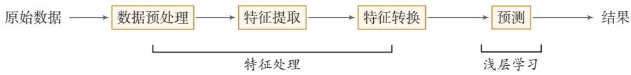

# 传统机器学习流程与特征工程瓶颈

传统机器学习（浅层学习）通过数据预处理、特征提取、特征转换和预测四个标准步骤构建系统，但其性能上限严重受制于依赖人工设计的特征工程瓶颈。

## 传统机器学习的标准流程

<!-- @anchor-begin id="shallow-learning" terms="1" note="定义浅层学习及其核心特点" -->
**浅层学习（Shallow Learning）** 是指不涉及特征自动学习，其特征主要靠人工经验或特征转换方法来抽取的传统机器学习方法。典型的浅层学习方法包括支持向量机、Logistic回归、决策树等。在实际任务中使用这类模型，一般会包含以下四个标准步骤：
<!-- @anchor-end -->

1. **数据预处理**：对数据的原始形式进行初步的数据清理（如去掉缺失特征或冗余数据）和加工（如数值特征的缩放和归一化），构建成可用于训练的数据集。
2. **特征提取**：<!-- @anchor-begin id="feature-extract-transform" terms="3|4" note="定义特征提取与特征转换" -->从数据的原始特征中提取一些对特定任务有用的高质量特征。例如在图像分类中提取边缘或SIFT特征，在文本分类中去除停用词。
3. **特征转换**：对特征进行进一步的加工，包括降维（如特征抽取和特征选择）和升维。常用的方法有主成分分析（PCA）、线性判别分析（LDA）等。
4. **预测**：机器学习的核心部分，学习一个函数并进行预测。<!-- @anchor-end -->

图1.2 传统机器学习的数据处理流程

## 核心瓶颈：特征工程的局限

<!-- @anchor-begin id="feature-engineering" terms="2" note="剖析特征工程的定义及其成为系统瓶颈的原因" -->
上述流程中，每步特征处理以及预测一般都是分开进行的。传统的机器学习模型主要关注最后一步（构建预测函数），但在实际操作中，不同预测模型的性能相差不多，而前三步中的特征处理对最终系统的准确性有着十分关键的作用。特征处理一般都需要人工干预完成，利用人类的经验来选取好的特征。因此，开发一个机器学习系统的主要工作量都消耗在了预处理、特征提取以及特征转换上，这使得很多机器学习问题变成了**特征工程（Feature Engineering）** 问题。
<!-- @anchor-end -->

传统机器学习的主要瓶颈之一，就是表示高度依赖人工设计。对于图像等连续数据，可以自然地表示为向量；但对于文本等由离散符号组成的数据，很难找到合适的底层表示方式。如果不能自动学习适合任务的特征，那么无论后续预测模型多么精巧，系统能力都会受到限制。正是这一瓶颈，直接催生了对自动表示学习的需求，推动了机器学习向深度学习阶段的演进。

## 相关知识点

[[机器学习的基本概念与泛化要求]]{type=topic, label=机器学习的基本概念与泛化要求, render=link} 
前置基础：掌握机器学习基本概念与泛化要求后，才能理解传统流程的具体环节及其特征工程瓶颈。

[[表示学习与语义鸿沟]]{type=topic, label=表示学习与语义鸿沟, render=link} 
直接应用：认识到传统特征工程的瓶颈后，才能理解引入自动表示学习以解决语义鸿沟的必要性。

[[端到端学习机制]]{type=topic, label=端到端学习机制, render=link} 
并列对比：传统分模块管线与端到端学习形成鲜明对照，对比复习有助于理解端到端如何避免错误传播。