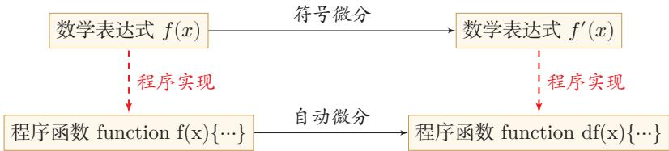

# 数值微分与符号微分

在深度学习梯度计算中，数值微分与符号微分是两种传统的求导方法，但前者受限于数值误差与高计算复杂度，后者受限于表达式膨胀与编译调试困难，两者均无法满足大规模神经网络的高效求导需求。

## 数值微分

<!-- @anchor-begin id="numerical-differentiation-def" terms="1|3|4" note="数值微分的定义、中心差分公式及误差与复杂度分析" -->
**数值微分**（Numerical Differentiation）是用数值方法来计算函数 $f(x)$ 导数的方法。根据导数的极限定义：
$$
f^{\prime}(x) = \lim_{\Delta x \to 0} \frac{f(x+\Delta x) - f(x)}{\Delta x}
$$
在实际计算中，通常对 $x$ 加上一个很小的非零扰动 $\Delta x$ 来直接近似梯度。为了减少**截断误差**（Truncation Error，即数学模型理论解与数值计算精确解之间的误差），实际应用中常采用中心差分公式：
$$
f^{\prime}(x) \approx \frac{f(x+\Delta x) - f(x-\Delta x)}{2\Delta x}
$$
尽管数值微分实现简单，但面临两大核心问题：
1. **误差难以平衡**：找到一个合适的扰动 $\Delta x$ 十分困难。若 $\Delta x$ 过小，会引起**舍入误差**（Round-off Error，即由于浮点数等数字舍入造成的近似值与精确值差异）；若 $\Delta x$ 过大，则会增加截断误差，导致导数计算不准确。
2. **计算复杂度高**：假设网络参数数量为 $N$，每个参数都需要单独施加扰动并计算梯度。若每次正向传播的计算复杂度为 $O(N)$，则计算所有参数数值微分的总体时间复杂度高达 $O(N^2)$。
<!-- @anchor-end -->

## 符号微分

<!-- @anchor-begin id="symbolic-differentiation-def" terms="2" note="符号微分的定义、机制及优缺点" -->
**符号微分**（Symbolic Differentiation）是一种基于符号计算（代数计算）的自动求导方法。它将变量视为符号（Symbols），直接对带有变量的数学表达式进行操作，通过迭代或递归应用事先定义的代数规则（如化简、因式分解、微分等）来求得导数的解析表达式。

符号微分具有以下特点：
- **优点**：可以在编译时计算出梯度的数学表示，并进一步利用符号计算方法进行表达式优化；此外，符号计算与硬件平台无关，生成的代码可在 CPU 或 GPU 上运行。
- **局限性**：
  1. **编译时间长**：特别是对于包含循环的复杂程序，需要耗费大量时间进行编译和表达式展开。
  2. **依赖专用语言**：一般需要设计一种专门的语言来表示数学表达式，并对变量（符号）进行预先声明。
  3. **难以调试**：由于操作的是抽象的数学表达式而非具体的数值程序，导致程序调试非常困难。
<!-- @anchor-end -->

（描述：流程图，展示了符号微分与自动微分在数学表达式和程序实现之间的对比关系）  
图 4.4 符号微分与自动微分对比

## 传统方法的局限总结

在大规模神经网络的参数求导中，数值微分因 $O(N^2)$ 的复杂度和浮点数精度导致的误差问题而缺乏实用性；符号微分则因表达式膨胀、编译缓慢及难以调试等工程缺陷，难以直接应用于现代深度学习框架的复杂控制流与张量计算。正是为了克服数值微分的近似误差与符号微分的表达式膨胀问题，自动微分（Automatic Differentiation）应运而生，它通过分解基本操作并利用链式法则在数值计算过程中累积梯度，兼顾了数值精度与计算效率。

## 相关知识点

- [[自动微分原理与计算图]]{type=topic, label=自动微分原理与计算图, render=link}