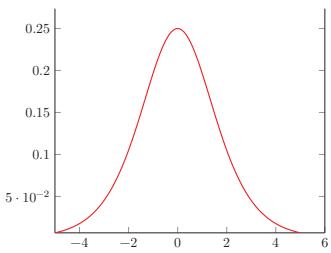

# 梯度消失与梯度爆炸

在深层前馈神经网络的训练中，由于反向传播算法依赖误差项的逐层连乘，当激活函数导数过小或权重矩阵范数过大时，会导致梯度在传递过程中呈指数级衰减或增长，分别引发梯度消失与梯度爆炸问题，从而使得深层网络难以有效训练。

## 梯度异常的数学机制

在反向传播算法中，第 $l$ 层的误差项 $\pmb{\delta}^{(l)}$ 需要通过第 $l+1$ 层的误差项递推计算，其核心公式为：

$$
\pmb{\delta}^{(l)} = f_l'(\pmb{z}^{(l)}) \odot \left( (\pmb{W}^{(l+1)})^\top \pmb{\delta}^{(l+1)} \right)
$$

其中，$f_l'(\pmb{z}^{(l)})$ 为第 $l$ 层激活函数的导数，$\pmb{W}^{(l+1)}$ 为第 $l+1$ 层的权重矩阵，$\odot$ 表示 Hadamard 积（逐元素相乘）。

<!-- @anchor-begin id="gradient-anomaly-mechanism" terms="1|2" note="梯度消失与爆炸的数学推导机制" -->
从上述递推公式可以看出，误差从输出层向输入层反向传播时，在每一层都需要乘以该层激活函数的导数以及上一层的权重矩阵转置。这种**连乘机制**是导致梯度异常的根本原因：
- 当连乘的因子普遍小于 1 时，乘积会随层数增加而指数级衰减，引发**梯度消失**。
- 当连乘的因子普遍大于 1 时，乘积会随层数增加而指数级增长，引发**梯度爆炸**。
<!-- @anchor-end -->

## 梯度消失问题

<!-- @anchor-begin id="vanishing-gradient" terms="1" note="梯度消失的定义、原因与Sigmoid导数特性" -->
当使用 Sigmoid 型函数（如 Logistic 函数 $\sigma(x)$ 或 Tanh 函数）作为激活函数时，其导数分别为：

$$
\sigma'(x) = \sigma(x)(1-\sigma(x)) \in [0, 0.25]
$$

$$
\tanh'(x) = 1 - (\tanh(x))^2 \in [0, 1]
$$

Sigmoid 型函数的导数值域均小于或等于 1，且由于函数的饱和性，在饱和区的导数更是接近于 0。

  
(a) Logistic 函数的导数

  
(b) Tanh 函数的导数  
图 4.6 Sigmoid型函数的导数

由于每一层传递时误差信号都会乘以一个小于 1 的数，当网络层数很深时，连乘效应会导致梯度不断衰减，甚至趋近于 0，使得靠近输入层的网络参数几乎无法更新。这就是**梯度消失问题**（Vanishing Gradient Problem），也称为梯度弥散问题。梯度消失曾长期是深层网络训练的核心困难之一。
<!-- @anchor-end -->

## 梯度爆炸问题

<!-- @anchor-begin id="exploding-gradient" terms="2" note="梯度爆炸的定义与原因" -->
与梯度消失相反，当网络中的权重矩阵 $\pmb{W}$ 的范数大于 1 时，误差信号在反向传播过程中不仅不会衰减，反而会呈指数级增长。这会导致参数更新步长过大，甚至引起数值溢出（如出现 NaN），使得训练过程完全崩溃。这种现象被称为**梯度爆炸问题**（Gradient Explosion）。
<!-- @anchor-end -->

## 缓解策略

<!-- @anchor-begin id="mitigation-strategies" terms="1|2|3" note="缓解梯度异常的工程与算法策略" -->
针对梯度消失与梯度爆炸，深度学习实践中发展出了多种缓解策略：

1. **选择合适的激活函数**：使用导数相对较大且不易饱和的激活函数（如 ReLU 及其变体），可以从根本上缓解梯度消失问题，加速梯度下降的收敛。
2. **合理的参数初始化**：采用 Xavier 初始化或 He 初始化等规范化方法，控制每一层权重矩阵的方差，使得前向传播的激活值方差和反向传播的梯度方差在层间保持一致，从而同时缓解梯度消失与爆炸。
3. **梯度截断（Gradient Clipping）**：针对梯度爆炸，设定一个梯度范数阈值，当梯度范数超过该阈值时，将梯度等比例缩小，从而限制参数更新的最大幅度，防止数值溢出。
4. **网络结构改进**：引入残差连接（Residual Connection）或批规范化（Batch Normalization）等技术，为梯度提供“高速公路”或稳定其分布，显著改善深层网络的梯度传播。
<!-- @anchor-end -->

## 相关知识点

- [[误差项与反向传播推导]]{type=topic, label=误差项与反向传播推导, render=link}
- [[Sigmoid型函数]]{type=topic, label=Sigmoid型函数, render=link}
- [[非凸优化问题]]{type=topic, label=非凸优化问题, render=link}