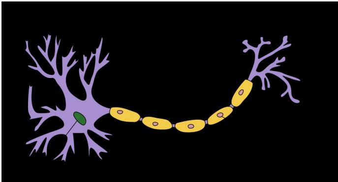

# 生物神经元结构与赫布规则

生物神经元通过细胞体、树突和轴突的物理结构实现信息传递，其学习机制基于突触可塑性与赫布规则，这一生物学发现直接启发了人工神经网络通过调整连接强度进行学习的思想。

## 生物神经元的物理结构

<!-- @anchor-begin id="neuron-structure" terms="1|2" note="描述生物神经元的基本结构及信号传递机制" -->
人类大脑包含近860亿个神经元，**生物神经元**（也叫神经细胞）是携带和传输信息的基本单元。典型的神经元结构大致可分为细胞体和细胞突起：

1. **细胞体**（Soma）：含有神经细胞膜，膜上的受体可与神经递质结合，引起膜内外电位差改变，产生兴奋或抑制的生理活动。
2. **细胞突起**：分为树突和轴突。
   - **树突**（Dendrite）：接收刺激并将兴奋传入细胞体，每个神经元可有一或多个。
   - **轴突**（Axon）：把自身的兴奋状态从胞体传送到另一个神经元，每个神经元只有一个。

神经元之间没有物理连接，留有约20纳米的缝隙，依靠**突触**（Synapse）进行互联来传递信息。突触是神经元之间的连接“接口”。一个神经元可被视为一种只有兴奋和抑制两种状态的细胞，其状态取决于收到的输入信号量总和以及突触的强度。当信号量超过某个阈值时，细胞体就会兴奋，产生电脉冲并沿轴突通过突触传递到其他神经元。
<!-- @anchor-end -->

图 1.5 典型神经元结构

## 赫布规则与突触可塑性

<!-- @anchor-begin id="hebb-rule" terms="3|4" note="阐述赫布规则的核心思想及其代表的突触可塑性" -->
从学习的角度看，人脑神经网络的关键不在于单个神经元本身，而在于神经元之间如何连接以及这些连接如何随经验而改变。不同神经元之间的突触有强有弱，其强度可以随着刺激和经验不断变化，这种性质称为**突触可塑性**（Synaptic Plasticity）。

1949年，加拿大心理学家 Donald Hebb 提出了突触可塑性的基本原理，这一思想后来被概括为**赫布规则**（Hebb's Rule）：如果两个神经元经常共同激活，它们之间的连接会被加强。这样的学习方式被称为赫布型学习（Hebbian learning）。不同的连接模式形成了不同的记忆印痕，这是生物体实现学习与记忆的微观基础。
<!-- @anchor-end -->

## 对人工神经网络的启发

赫布规则对后来人工神经网络的发展产生了深远影响。它启发了人工神经网络中“通过调整连接强度进行学习”的核心观念。在人工神经网络中，生物神经元的树突、细胞体和轴突被抽象为带有权重的输入、激活函数和输出，而生物突触的可塑性则被数学化为网络中连接权重（Weight）的更新过程。

虽然人工神经元是对生物神经细胞的进一步理想化和简化，但“共同激活则连接加强”的赫布型学习思想，为早期无监督学习网络（如赫布网络）以及后续通过误差反向传播调整权重的监督学习提供了最原始的生物学动机。理解这一生物学基础，有助于直观把握人工神经网络为何能够通过修改节点间的连接权重来“记住”数据中的复杂模式。

## 相关知识点

[[人工神经网络的数学模型与学习能力]]{type=topic, label=人工神经网络的数学模型与学习能力, render=link}
直接应用：了解生物神经元的结构与赫布规则后，才能理解人工神经网络是如何将生物突触可塑性抽象为数学上的连接权重，并赋予网络学习能力的。