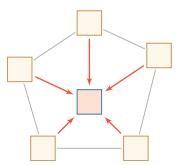

# 注意力网络与图网络

注意力网络通过自注意力机制实现序列全局位置的并行交互，而图网络通过消息传递机制聚合拓扑相邻节点信息，两者分别突破了序列顺序限制与非欧几里得数据结构的建模瓶颈。

## 注意力网络：全局交互与并行计算

<!-- @anchor-begin id="attention-network" terms="1" note="注意力网络的机制与优势" -->
近年来，以注意力机制为核心的 Transformer 已成为深度学习中非常重要的一类架构。与前馈网络和记忆网络不同，注意力网络通过**自注意力机制**让序列中任意两个位置直接交互，从而绕过了循环网络逐步传递信息的限制。Transformer 将多头自注意力、位置编码、前馈网络、残差连接和规范化组合成统一的可堆叠模块，既可以高效并行训练，也可以灵活地建模长距离依赖关系。如今，Transformer 已成为自然语言处理、计算机视觉、多模态学习以及大语言模型的重要基础架构。
<!-- @anchor-end -->

(d) 注意力网络

## 图网络：拓扑聚合与非欧建模

<!-- @anchor-begin id="graph-network" terms="2" note="图网络的定义与消息传递" -->
实际应用中很多数据是图结构的数据，比如知识图谱、社交网络、分子网络等，前馈网络和记忆网络很难直接处理这类非欧几里得结构数据。图网络是定义在图结构数据上的神经网络，图中每个节点都由一个或一组神经元构成。节点之间的连接可以是有向的，也可以是无向的。每个节点可以收到来自相邻节点或自身的信息，通过**消息传递机制**聚合邻居节点的特征，从而在保持图拓扑结构的同时学习节点的表示。
<!-- @anchor-end -->

(c) 图网络

## 结构特性与应用场景对比

注意力网络与图网络代表了神经网络在处理复杂数据结构时的两种不同演进方向。注意力网络主要处理序列或集合数据，通过全局连接矩阵打破位置限制，极大提升了长距离依赖的建模效率与训练并行度；图网络则专门面向图结构数据，通过局部邻居聚合保留数据的拓扑先验，适用于关系推理与结构化知识表示。两者均通过引入特定的归纳偏置，扩展了传统前馈与记忆网络的表达能力边界。

## 相关知识点

[[前馈网络与记忆网络]]{type=topic, label=前馈网络与记忆网络, render=link} 在掌握前馈与记忆网络的基础上，才能进一步理解注意力网络与图网络等复杂结构。